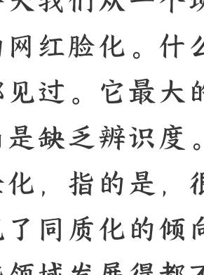
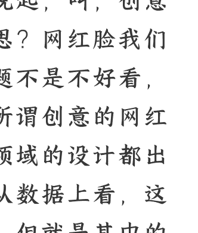
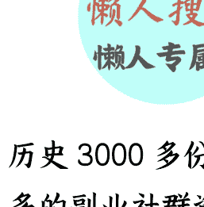

# 怎样打破“平庸化”的诅咒？

**250226**

**整理：**公众号懒人搜索，~~**懒人专属群**~~独享

**懒人微信：**lazyhelper

今天我们从一个现象说起，叫创意的网红脸化。什么意思？网红脸我们都见过。它最大的问题不是不好看，而是缺乏辨识度。而所谓创意的网红脸化，指的是很多领域的设计都出现了同质化的倾向。从数据上看，这些领域发展得都不错，但就是其中的参与者之间太像了。

比如，汽车。很多人都觉得现在的新能源汽车之间越来越像。当某款车成为市场爆款后，友商的产品设计也会开始借鉴，让风格整体趋同。据说未来几年，新能源车或许将只剩一种标准长相，就是封闭式车头、眯眯眼车灯，再加上隐藏式门把手。

其实，同样的故事在燃油车的历史上也上演过一次。在 1980 年代，人们发现，所有汽车开始长得一模一样。一辆 SUV 从面前驶过，你根本辨别不出来它是哪一款。所有品牌的车型，从形状到尺寸，甚至金属装饰都变得越来越像。

## 为什么会这样？

有这么几个原因。

- **一是**，所有的车辆都必须经过相同的风洞测试。那么，为了获得尽可能高的燃油效率，所有厂商会把产品设计成那个效率最高的形状和尺寸。
- **二是**，汽车生产方式的迭代，汽车巨头之间开始共享车辆生产“平台”，那么不同品牌的车型在基础结构上就会趋于一致。
- **三是**，捷豹路虎的首席设计师给出的第三个原因，这就是汽车生产和销售的全球化，面向全球的汽车设计，必须找到全球受众的最大公约数。

除了外观设计，汽车的颜色也在变得越来越单一。根据不完全统计，1996 年的时候，大约有 40% 的汽车是黑、白、银、灰这四种颜色的，而到了 2020 年，这个比例已经变成了 80%。原来的停车场可能五彩斑斓，而现在的停车场基本上就是一片低饱和度的灰色海洋。

这种越来越平均的趋势，不是汽车一个行业的事儿，而是一个普遍性的问题。英国的一名品牌营销专家亚历克斯·默雷尔，去年写了一篇影响力很大的文章，题目叫《平庸的时代》。他说，所有涉及创意的领域，都在向一个平均值收敛，我们正在迎来一个“平庸时代”。没错，时代没有进化出多样性，而是发展出了一种平庸性，平均产品占据了大多数市场。物质越来越丰富，而我们的世界越来越雷同。

这些趋势你可能听说过，但当默雷尔把具体的数字和事实摆到我们眼前的时候，还是会带来更深的震撼。

### 第一个领域：建筑设计

我们的生活空间在变得越来越雷同。比如，住宅楼。几年前，彭博社有一篇文章专门研究了美国的住宅楼。2017 年，美国新建的住宅数量是 18.7 万套，其中一半都是同一个长相的楼栋。就是那种最常见的方盒子建筑，大概 5 到 7 层高，外立面是不规则平面设计，颜色不外乎灰色或者褐色。有些建筑师就认为，这种建筑风格完全是快餐式建筑，还给它起了个外号，叫“麦当楼”。办公楼也是一样，硅谷到处都是相似的，被草坪和停车场包围的低矮建筑。

再比如，装修也出现了全球趋同。之前有一位设计师，想给自己的房屋装修找找灵感。她发现 Airbnb 是一个不错的资源库，可以看到全世界各个地方的室内设计。但是，看着看着她就发现，Airbnb 上所有的房间都在走向同一个模板。这种风格的要素包括白色墙面、原木家具、裸露的砖墙、开放式置物架，除此之外还有一模一样的咖啡机、餐桌椅、复古灯具。

Airbnb 的环境创意总监把这个风格叫“国际 Airbnb"风。《卫报》还发表了一篇文章，说这种风格已经走出 Airbnb，变成了全球咖啡馆设计的主流风格，你在任何一个城市走进一家咖啡馆，都有可能看到同样的木桌、吊灯、白墙、大落地窗。

### 第二个领域：文化内容

人们消费的文化内容，也在变得雷同。比如，电影。十几年前，有一名法国博主做了一个电影海报收集项目，他发现，全世界的电影海报，都会遵循同一种模板风格。浪漫喜剧的海报，大都是男女主角背靠背站立在白色背景前。恐怖片的海报，大都是一张瞳孔放大的眼睛特写图。动作片的海报，往往是一个身穿黑衣、背对镜头的孤独角色。获得过奥斯卡最佳导演的史蒂文·索德伯格就说，所有电影的每一张海海报、每一个预告都看起来一模一样，这是测试的结果，有趣的变量往往会被淘汰，导致千篇一律的所谓最优解被推到大众面前。

除了画面上的雷同，电影的平均化还表现在，完全创新的作品越来越少。2000 年之前，票房最高的电影中，大约有 25% 作品属于续集、前传、衍生、翻拍或者电影宇宙扩展作品。2010 年以来，这个比例每年都超过 50%。最近几年，这个数字接近 100%。

2024 年全球电影票房前十名，全部是续作或者翻拍作品。验证有效的东西，会大范围占据市场，所谓赢者通吃。这个现象不光局限于电影，再比如畅销书。美国的很多畅销小说，会在标题里带上“女孩”这个字眼，比如《龙纹身的女孩》《火车上的女孩》《带来末日的女孩》和《水中的女孩》等等。而流行的励志类书籍，大多要在标题里带一个粗口字眼，比如《毫无疑义的工作》《重塑幸福》等等，原版标题里，都带着一个发泄性的脏字。

再比如，广告行业，时尚产品的广告长得越来越像。化妆品的广告画面有自己的范式，产品要么放在玻璃架上，要么和镜子摆在一起，要么画面中会出现水滴。流行的广告语也遵循一模一样的结构，要么是“Find your XX”，要么是"XX, your way"。

你看，电影、游戏、书籍、广告，这些原本的创意高地，现在都有点变成套路工厂的意思。

当然，前面这些，依然是外界事物，而最后的第三个领域，默雷尔说到了我们自己。名人明星的面孔也在变得雷同。2020 年，《纽约客》有一篇调查文章写道，很多名人和网红的长相，在变得越来越像。这是一副年轻的面孔，肌肤无瑕，颧骨高耸，眼睛像猫一样，睫毛长且夸张，鼻子精致小巧，嘴唇饱满丰盈。

国外，人们把这种长相叫做"Ins 脸”，而 Ins 脸的模板，就是大名鼎鼎的金·卡戴珊。Ins 上的博主乐于模仿卡戴珊，到处都是变成卡戴珊的教程，还有一名比佛利山庄的整形医生说，自己有三分之一的客人，希望照着卡戴珊的样子来整容。

## 结论与思考

总之，结论就是这样。默雷尔说，这个世界的种种领域，都正在涌现出标准化的答案。人们只住一种房屋，只去一种咖啡馆，只看熟悉的书和电影，熟知所有广告和营销的套路。这一切当然有原因，也许是因为科技越来越发达，人们对量化和优化越来越痴迷。也许是因为全球化正在从产品层面过渡到灵感层面，因此思想和审美上的雷同也是一种必然。

也许有人会觉得这事儿很消极。但是今天咱们换个角度看，这也不全是坏消息。因为从过往的经验看，这样的状态，也给创新留下了巨大的空间。同质化的底层是模仿。当一种范式被验证有效的时候，模仿当然是安全的选择。但是，生物演化史告诉我们，当剧变来临时，那些保留了突变潜能的个体，反而更具有开拓性。当你感觉身处的世界正在回归平均，失去生机的时候，没准儿也就是你应该释放创造力，制造颠覆性的时候。

从现代文明的历史上去观察，也是这样，同质化和差异化的博弈，交替带领着各个领域的进步。比如文艺复兴时期的技法突破，实现的前提之一，是佛罗伦萨工匠行会的标准化生产规定。19 世纪印象派大师诞生的前提之一，是巴黎美术学院派严格遵守透视法和素描训练的技术规范。再比如汽车行业，1914 年福特靠 T 型车的流水线生产统治了市场。但随后，通用汽车马上推出了“不同钱包、不同目标、不同车型”的战略，用彩色雪佛兰雪弗兰打破了黑色福特的统治。

再比如电影行业，都说现在好莱坞续集泛滥。但是，还是有一批以 A24 为代表的独立制作团队，开辟新的模式，做出了《瞬息全宇宙》这样的作品。

换句话说，同质化代表着平庸，但另一面，它也代表着技术的成熟，而技术的成熟，恰恰是在为创新积蓄能量。当世界向左的时候，你可以向右。跳出既有的范式，总有一种力量让我们不回归平均。

关于这个话题，咱们先说到这。

历史 3000 多份各类付费文章以及年费三千多的副业社群资源，见懒人专属群内部分享！

付费群，白嫖勿扰！

懒人专属群更新记录：
[https://lazybook.fun/#!/blog/record2](https://lazybook.fun/#!/blog/record2)