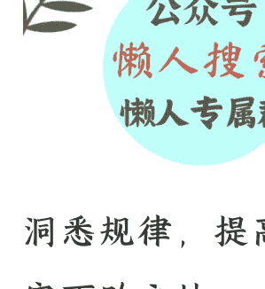

# 顺应规律！打磨出一个好的体系，是百战不殆的基石 | 万字

250226 雪球花甲老头

整理：公众号懒人搜索，懒人专属群独享

懒人微信：lazyhelper




洞悉规律，提高能力。

守不败之地，攻可胜之敌。

乙巳年，马上就迎来二月二龙抬头。

一年之计在于春，万物复苏，生机盎然。人勤春早，希望启程。

顺应天时，自强不息，在万物焕新之际，以积极姿态迎接希望。

正如白居易诗云：“二月二日新雨晴，草芽菜甲一时生”。

春天，承载着人们对生机、福泽与美好未来的永恒祈愿。

这篇长文，是我很早之前就想写的，陆陆续续写了很多天，里面凝结了自己对于很多规律的认识，对于周期的理解，还有如何从自强不息到生生不息的发展。

我一直认为，最高效的成长，就是站在“巨人”的肩膀上，在前人的足迹上继续砥砺前行，这些年我也是如此践行的。

所以我感谢遇到的机缘，学到的知识，甚至经历的挫败和困难。

所谓的“巨人”未必是通晓所有的完美之人，也许就是你的老师，父母，还有其他遇到的人，他们在一个领域里有所建树，或者哪怕一句经验之谈帮助到了你，他趟过这条路，你走得就安心。

人类所有的进步，都是基于前人的基础，历代科学家的研究，也是从前辈的肩膀上再攀高峰。

所以我们应该以包容的心态去看待经验和规律，虚怀若谷才能海纳百川。比如对于很多规律还有周期的认识，我研究的成果记录分享，别人就可以少花时间，大家可以把时间用在理解，消化，践行，融合之上，而不是苦苦求索，甚至在一个错误的方向，亦或者原地打转。

规律，在我看来就是一个指南针，有了它你不会迷路，虽然这路上还会荆棘密布，困难重重，但是你内心笃信方向是正确的，你的精力和时间只用来解决问题即可，这种人的效率比没有指南针的人，会高很多。

这篇文章，可以说凝结了我很多年的思考，对于周期和规律的理解，只是写下这篇长文，就花费了不少时间。我认为对于劳动成果应该有一种尊重，所以设置了门槛，因为对于不珍惜的人，其实读了意义也不大，还是留给需要的人吧。

这么多年以来，我发现其实并不是所有人都能清晰理解规律的，他们的内核是很多人性里的弱点，比如情绪化，比如贪婪和恐惧，比如靠主观臆断。

所以，真正能走向一条康庄大道的人，其实是少数，甚至是极少数。

虽然方法和规律，都很容易理解，但是每个人对于自己的把握则千差万别，说到底，任何事情的前提，都是你先要是一个自强不息的人，这样才能驾驭自己，以客观的心态去面对发生的一切。

所以，本文会有很多话，都值得大家反复思考，然后加入到自己的体系中去，最终你会发现，很多人之所以有结果，那也是必有原因，比如巴菲特，这些年以来，每次市场好的时候，我都听过无数人说巴菲特不过如此，但几十年过去了，巴菲特依旧还是宛如一座大山，但嘲笑他的人是换了一批又一批。

这难道不值得我们思考么？这里面难道没有规律么？

这里面其实必有原因，我们应该学习别人的优点，再结合实际情况去调整，而不是嘲笑和不屑，所以有的人多少年停滞不前，有的人则一直进步，这也是有深层原因的。

春夏秋冬就是规律，一年之计在于春也是经验，而人在春回大地万物复苏的时候，身体状态也会达到巅峰，这也是我把这篇长文，发布在这个时间的原因。

因为规律就是周期性，一切都来得及，行动可以因时而定，但谋划一定要提前。

我会从机会，能力，心态，规律，周期等多方面去讲解自己的体系，而这些是任何决策的基石。

我相信，大家看完我的一些思考总结，应该会对自己的体系，心态，看问题的角度，都有一个本质的更新。

好，现在我们开始正文，这里面的内容，我在之前的文章里曾经提到过只言片语，但是从来没有系统性讲过。

就在这篇长文里把自己的理解，经验，记录总结一下。

我们先来谈：机会。

这也是很多人一直关心的事情，我们经常在市场里听到一些声音，比如踏空，比如错过行情，比然后捶胸顿足，最后头脑一热追高进去，这种结局大多数都是成为接盘者，即使赚到最后一些最后也会赔回去，因为心态就不对，而且对自己的能力和欲望预估不足。

如果一个人，非对方不娶，或非对方不嫁，这往往都是悲剧的开始，因为选择太少了，自己从这一点去看，就已经处于了弱势。

所以，要让自己拥有更多的机会，让自己去挑选机会，而不是只看中一个机会，勉为其难也要强行去参与。

以我的体系去看，任何时候都有机会。

这个思考的角度大家一定要植入脑海中，那就是：任何时候都有机会，而且有大把的机会。

举个例子，每天有那么多个市场，每个市场那么多的品种，每一次涨幅都是机会，这个世界上的机会，简直数都数不过来。

你觉得没有机会，那是你只是从一个角度去看问题，多一个角度，就能获得不一样的结果。

所以体系一定要严谨，在万千的机会中选择最适合的一个，永远是你选择机会，而不是让机会去拿捏你。

任何时候都有进攻的机会，也有布局的机会，但是前提你视野要开阔，思维要全面，能力要强。

举一个例子，比如大海有潮起潮落，这个就是规律，但是如果你只会赶海，那么当退潮的时候，就会很兴奋，因为你可以赶海了。

但是当涨潮的时候，你就会觉得这是个悲观时刻，没有机会，因为海水都来了，没法赶海了。

但是，换一个角度思考，如果你还会钓鱼的话，退潮的时候，海边都是滩涂，没法钓鱼，但是涨潮的时候，海水回来了，岂不是正好适合钓鱼？

如果你还会钓鱼，岂不是无惧涨潮和落潮。

很多人在投资的领域，只了解一个品种，甚至在一个品种里，还只知道一类公司，比如曾经的白马，所以在白马上行时候，对他们来说就是利好，但是当下行时候，他们全还回去了。

就是因为没有了解其他的品种，而在白马上涨的时候，吸走了大量的市场资金，其他公司的性价比早就出来了，不过他们眼里没有这些品种，最终一路阴跌下去，其他底部的公司反而开始了反转的趋势。

第一点我就想告诉大家，世界是平衡的，在任何时候都有机会，你需要做的是开阔自己的视野，丰富自己的知识，提高自己的技能，早做准备，而不是困难到眼前了，再抱怨和自怨自艾。

就拿经济来说，经济好的时候百花争艳，但经济不好的时候，也有口红经济，利好那些性价比高的。

在过去萧条的时候，电影院都是很好的指标，人们需要通过电影的故事、画面和音乐来放松身心，电影行业往往能在这个时候保持较好的票房成绩。

所以，永远不要担心没有机会，你要想的是：一定有机会，只是自己没有发现而已。

在市场里来说，其实有很多历史上发生的事情，我就拿最近的一次来说，15 年的轰轰烈烈，其实白马是不温不火的。

当时都是科技公司拔得头筹，十倍二十倍屡见不鲜，这个时候谁会去高看一眼那些白马公司呢？

几乎没有，人们在情绪和贪婪的驱使下，根本忘记了价值，忘记了性价比，忘记了周期规律，在短期的博弈之中，就是一种冲动，很少的人会保持理智。

我在 15 年之前，持有的就是白马类公司，并没有踏上科技这一波热潮，从它们开始行情，对我来说就是错过和踏空，虽然有机会，但这个机会属于别人，因为我没有能力去驾驭这一波的涨势。

怪就怪自己的能力圈有限，但是我的优点是知道不做能力以外的事情。

我也不捶胸顿足，也不遗憾，因为我觉得宁可错构，不能做错。

后来，15 年 6 月开始，高位的公司快速进行下降的通道，很多人卖都卖不出去，再没有人说赚了多少钱，也没有人去嘲笑他人了，那段时间我买的也在下跌，而在这个过程中，我还加了点仓位，因为我觉得这些公司被严重低估了，它们的利润和价值，性价比远超那些科技公司。

从 15 年那次开始之后的几年里，白马缓慢走出了一波行情，直到 20 年底，熟悉的一幕再次上演，当时所有人都在鼓吹核心资产，很多白马股给了超高的溢价，透支了未来几十年的业绩增长预期，我感慨十几块的时候没人看得上，几百块的时候一个个真金白银追进去。

这么多年，人性从不改变。

20 年就是白马行情最热的时候，当时很多不玩投资的人，都以买基金的形式来参与，因为公司价格高的离谱，新人都不敢买正股，通过基金的形式，让经理人去配置，后来出了很多明星经理人。

这一波可以说是基金牛，现在又五年过去了，我不确定追高白马基金的那批人是否解套了，这就是追高的后果。

我当时判断，如果白马退潮，市场会找出新的行情，结合那时候碳中和等概念的出来和火爆，再次印证我对于未来的判断，因为当时的白马大多数都是汤汤水水，花生油啊，醋啊，白酒啊，酱油啊等等。

而碳中和符合的都是周期股，比如风，光，煤，电等等，而当时这些公司的价格，很多都在三块钱以下，属于无人问津的品种，但是我深知，风一定会吹过来，就像水一定往低处流——，哪里价值洼地，就会被青睐，尤其还结合了当时最火的趋势。

这是我思考的逻辑，也是无数个日夜伏案研究的结果，在此后的日子里，即使遇到波动，我也能拿的住，反过来，即使告诉了别人，只要下跌，对方也是手忙脚乱卖出了，因为他没有学习和研究的过程，知其然，但不知其所以然。

这一次，是我人生最近的一次重仓，分别在几个周期公司上面，我不担心一两天的涨跌起伏，因为我知道风来了，价值永远是要回归的，之前是白马股的价值回归，现在是周期股的回归，仅此而已。

而这次，我也给自己设置了目标，那就是翻倍就走，因为我知道周期股都是来的快去的快，这些都是靠曾经的经验进行的判断。

所以，什么是机会？

当别人轰轰烈烈炒白马的时候，你如果是短期选手，你参与下就是短期机会。

如果你是长期价值选手，这个时候很多公司受冷落，势必出现性价比的机会。

记住第一点，永远都有机会，市场缺少的不是机会，而是发现机会的眼睛。

## 第二点：能力

天行健，君子以自强不息，永远别忘记提升自己的能力。

这是很多人忽视的地方，大家总觉得靠别人是最好的方法，但是靠也有靠的逻辑和本质。

任何人都靠老师的传道授业解惑，但是这最终还是要自己打磨体系，将本事融会贯通。

这些年，我从没有停止的一件事情，那就是学习，甚至我把它当作人生的乐趣，从不觉得学习是一件疲惫的事情，无论是阅读，还是温故知新，还是获取新的信息，都只有一个目的，那就是提升自己的技能和能力。

就像上文所说，涨潮了可以钓鱼，但是你都没有渔具，不会安装鱼钩鱼饵，那这个机会就不属于你，这是很明显的逻辑和规律。

之前我在文章里提到过 QD，我每次提到一次，下面就会有人留言：“请问 QD 是什么？”

大家相信我，即使我给他解释一番，也许他都不看一眼，因为这件事本身难度不大，根本不需要问我然后等待我的回复，直接搜索引擎和 AI，什么信息找不到呢？

如果我来不及回复，是不是这件事就过去了？他也不会去求知了。

我只是举一个例子，告诉大家人要有主动学习的能力，这个过程应该是有获得感和满足感的。

其实，为什么很多时候我在写文章的时候，都告诉大家用闲钱，就是因为我绝大多数人的水平，不足以支撑过高风险的事情，承受不了大的波动，而且欲望还是个无底洞。

比如打铁花，是个很棒的表演节目，但这个适合所有人么？肯定不是所有人都能驾驭的，所以只能因人而异量力而行的去参与，总不能让几岁孩子去玩火星四溅的打铁花。

我一直在强调苏东坡的著力即差，但是大家可否想过，这个“力”可是动态变化发展的，而不是一成不变的。

我认为，这个力，就是能力的一种体现，苏东坡的智慧是不要做让自己特别费力的事情，换句话说，就是别做超过自己能力范围的事情。

可是能力是可以增加的，我们可以通过不断地学习和实践，让自己的能力提高，这样做一些事情就不费力了，也就不在著力即差的范围外了。

比如开车吧，没有去驾校学习过的人，驾驶能力可能是零。

也许他知道很多理论，什么方向盘，离合，刹车，雨刷器等等，但是对于没有实操的人来说，能力基本还是为零。

这个时候，让他去上高速开车，无异于飞蛾扑火，是不自量力的行为。

但是在投资里，有人真正想过自己的能力么？

有多少人在多年的积累下，关注的是自己能力的提高，而不是账户的涨跌。

好，然后这个人去驾校学习过，在教练的指导下进行训练，最终通过了驾照考试，这个时候他的能力可以说是 30 分。

因为他只是初级阶段，没有经历过太多路况的考验，而初出茅庐的选手，一般都不能单独上高速，就是因为要面临的风险和他的能力不匹配。

当一个人开了几年车之后，他的驾驶能力可能达到了 70 分，但这和经验丰富还有很长的一段距离。

没有其他的办法，就是靠不断地练习，不断地去驾驶，才能有能力的提高。

所以，这一点大家一定要注意，你的能力不是一成不变的的，而是随着学习和实践进行提高的，一定不要忽视自己这个技能。

很多人在市场里特别喜欢抄作业，说白了如果一直是这种操作，能力是很难提升的，而且也很拿住公司，一个波动就影响了心情。

其实，关于能力，除了大家要不断提高以外，还有一件事情很重要，就是苏东坡讲的著力即差，这是两件事，前者告诉你不断提高自己的能力，后者告诉你一定不要做自己能力以外的事情。

这些年，我看过太多的人在做着无法驾驭的事情，比如加杠杆投资，比如借钱创业等等，我不能说这种方式不对，方法都是留给适合的人，我只能说自己看到了很多人并不适合加杠杆，所以他们选择了自己能力以外等事情，最终闷闷不乐，导致失败。

巴菲特的成功，离不开大量阅读，其实也是能力提升的一种方式。

他每天花 5—6 小时阅读，内容涵盖书籍、企业报告和报纸。

他认为阅读是获取事实和 Information 的重要方式，80% 的工作时间都用于阅读和思考，不盲目看他人观点，而是专注事实并独立思考。

巴菲特强调阅读是积累知识的有效途径，知识如同复利，日积月累终有收获。

他的长期合作伙伴查理·芒格也推崇阅读，认为聪明人都有每日阅读的习惯。

巴菲特曾经说过很多关于阅读的话，比如：“我阅读我所关注的公司年报，同时我也阅读它的竞争对手的年报，这些是我最主要的阅读材料”。

“每天像这样读 500 页。知识就是这样起作用的，它像复利一样积累起来。你们都能做到，但我保证你们中没有多少人会去做。等等。

其实，阅读就是学习的过程，也是积累自己能力的最好方法。

任何人都是从不懂到懂的过程，提高了自己的能力圈，增加了自己对于世界的认识。

事实上，我对于自己任何决策的前期阶段，都要投入大量的时间去思考，去调研，在这个过程很多时间是没有实质收获的，但是我不认为是完全没有意义，因为人生没有任何一步路是白走的，只要确保自己的方向正确就可以了。

就像去森林里捡蘑菇，也许我往东边走，一无所获，但是至少我能排除了一个区域，加下来专注在其他方向就行了，也就是说增加了自己的一些信息量，这些不断累积的知识和经验，就是自己的能力，在求知的过程中，筛选是难免的，有的人一遇到困难就放弃，也是不可能提高能力的，比如阅读是指南针告诉你的一个正确方向，但是自己读不下去，这种怎么办？我觉得要么就放弃好了，即使方向再对，不适合自己也白搭，不能知行合一也是枉然。还有一个方法，那就是循序渐进，一天一个台阶往上走，最终肯定能有提高和收获的。

认准一个正确的方向，不断提高自己的能力，而且确保能力以外的事情不要去碰，我觉得这是最重要的事情之一。

我举个例子，如果你是一个普通人，路上有银行的运钞车经过，你就是再喜欢钱，你会产生非分之想么？

我觉得大多数人，连这个念头都不会有。

本质上是因为，你知道这是一个错误的方向，而且自己的能力也匹配不上，无法驾驭。

但是，有的时候方向是对的，能力不匹配也是不能去参与的，就比如一个人掉河里了，勇于救人肯定是一个好事儿，但是你不会游泳，你下去不是添乱么？

那么，我们生活之中，其实有太多的人，做超出自己能力范围的事情，尤其是门槛越低，就越会有这种人出现，投资行业尤其是如此。

为什么有些市场和板块有 50 万的门槛？

并不是不欢迎大家去参与，而是很多人能力还是无法驾驭，所以为了照顾这些人，避免更多的损失而已。

至于能力，每个人的情况不同，所以一定要审视好自己，不能盲目，被贪婪冲昏了头脑，市场上，短期去看就是一拨人赚走了另一拨人的钱，你也没什么好羡慕的，总有人亏钱，把自己的能力打磨好才关键，磨刀不误砍柴工。

### 第三点，心态。

人和人最大的区别，其实就是心态。这是我很多年以来总结出来的一个经验，人与人之间，最大的区别就是心态。

同一件事发生，因为心态的不同，所以每个人的反应截然不同，也造就了后面的不同结果。

最近，有一个人说：“先生，我有一个朋友被我嘲笑了好几年，但是现在我酸了，因为他开始赚钱了。事情是这样的，我有一个朋友，这几年一直在买科技的公司，他可是亏了好几年的钱，而我内心很高兴，一来是他亏钱了，二来庆幸自己没有买入。但是从去年九月他就回本了，现在更是盈利了 40%，我很诧异为什么他能这么快，原来在这几年里他不断加仓，越跌越买，补仓了几十次。但是我现在好苦恼，每天吃不下睡不好，有一笔大额存单到期，想准备冲进去。”


我真的是一阵唏嘘，这是什么朋友，见不得人好，就是一种人性的弱点，也是一种病，要自己去把这个心病治疗好，只有这样，你才能和这个世界融洽相处，也能自治。

这种生气，都是无来由的，别人好要祝福，别人不好不能落井下石，这不是你在对别人好，而是在呵护自己的内心，自己的能量，试想，如果他真的为朋友好，当知道朋友赚钱了，这是一件喜悦的事情，他不可能还茶饭不思。

他赚不赚钱不重要，喜悦这件事本身对你很重要。

而且，人和人之间的感觉很微妙的，朋友之间也是如此，你对他的心态，他会有感知的，这种嫉妒还会疏远关系，最终错失友谊和机会。

我觉得他应该想一想，为什么那个朋友敢于补仓，一定是有着一股执着，还有对于投资公司的信心，这是应该了解背后的原因，看看自己能学到什么，而不是一味的嫉妒和仇视。

当然，我也不是鼓励补仓，任何事情，都要基于自己的了解，在自己能力圈里，如果公司发生变化，或者趋势发生了变化，该走就走，该割就割，也没什么，设置止损本就是投资里的一个指标。

一个人内心就像镜子，不仅映衬出万事万物，还能照射出内心。

但在吸引力法则里，你所想的，最终都会成为现实，其实就是积极的心态还有乐观的心态，所以一个良好的心态，无论是在投资，还是在事业中，都是必不可少的。好的心态体现在哪里呢？

一个就是看淡市场的起伏，我看有的人自己也没有参与，看别人的涨的好就开始怨气横生，万物是平衡的，别人挨揍的时候你也没看到啊。

好心态第一点就是能接受市场的一切，就像日出日落一样，把它当作一种规律。

然后，就是不要和任何人去攀比，很多人觉得幸福是比较出来的，但是我觉得失落也是比较出来的，好的心态一定离不开幸福感。在一部电影里，有这么一段台词：

> “我饿了，看别人手里拿个肉包子，那他就比我幸福；我冷了，看别人穿一件厚棉袄，他就比我幸福；我想上茅房，就一个坑，你蹲那儿了，你就比我幸福。”

这段话反映了大多数人的幸福感和幸福观，是一个极其常见的现象，甚至绝对多数人都持有这种观点，所以无所谓对与错。

但是，我想告诉大家的是，通过攀比和比较获得的幸福感，短暂且不切实际，而且非常容易让内心失衡，甚至影响朋友家人之间的关系，最后也会失去很多机会。

在很多农村，经常出现的一幕就是，有一两个孩子出去闯荡了，最后在外面获得一点点成绩，你就能看到村里乡亲们的众生相，有的阿谀奉承捧着的，有的不屑一顾诋毁的，有的想过来讨教经验的，有的则在家里编瞎话准备泼脏水的。

事实上，本质就是大家都在比较幸福，自己在家过着安稳的日子，结果有个小子开着小轿车回来了，有的人就会嫉妒和恨，有的人是真心为对方好。

这个比例，也符合二八原则，甚至更悬殊一点，就是能真心为他人高兴的人，是极少数的，但也只有这类人才会去虚心求教。

复制别人的路，得到别人的帮助，借助别人的经验和眼界，开拓自己的能力圈。

这类人的幸福，不是通过和他人比较，而是和自己比较，今年自己是这## 第四点，规律

个样子，明年再上一个台阶，就是幸福的，至于有人掉队了有人上了三个台阶，那是和自己无关的事情。

有心的人，还会去学习，为什么那个人掉队了？吸收一些失败的经验，为什么那个人走得比较快？获得一些别人有成果的经验。

如果是一个人的幸福是通过超过别人而获得的满足感，但人外有人，他总有不能比较的对象，除非固步自封夜郎自大，就在自己的小范围内通过别人的失意而让自己感到快乐。

那样他同时也丧失了登高望远的机会，更不会提高自己的能力。

## 第四点，规律

大到天体运转，小到风吹麦苗，无一不体现规律的作用，规律就是最本质的东西，也是符合万事万物发展的准则，在天地初始时候就设置好了。

在投资里，也反映了物极必反，甚至我说句简单的，如果你想找对象，春天去找概率都会更大，因为暖和了人的也开始复苏了。

春秋都容易成功，春天是生机，秋天是忧愁，都是机会更大一些。

在任何时候，我们都要做符合规律的事情，无论大事小事，如果说真的有那么一个尺子，去丈量外界的一切发生的事情。

那么规律就是这把尺子，绝不是别人的以讹传讹，更不是情绪化的躁动。

规律可以体现**在任何地方，天体的运转，人的一呼一吸之间都是规律。

违背规律的事情，要么做不下去，要么会感到痛苦。

比如呼吸，呼气出去，下一步就是吸入空气，如果一个人只呼不吸，那就是违背规律。

这种事情不要做，别人让你做也不必理会，更不要模仿，因为轻则缺氧，重则要命。

春生夏长，秋收冬藏，也是规律。

春耕（播种期），夏耘（泡沫期），
秋实（收获期），冬蛰（蛰伏期）。

比如牛顿在南海泡沫中巨亏后哀叹：

```
我赚的钱够我用一辈子，
但我亏的钱只够我上吊，
我上吊后，钱还是我的，
所以，我亏的钱只够我上吊。
```

**Page 21**

人声鼎沸。

出奇的趋同。

出奇地趋同。

牛顿说：

> 我赚的钱够我用一辈子，
> 但我亏的钱只够我上吊，
> 我上吊后，钱还是我的。

只要本金没亏，你就没有输。

## 第四点，规律

规律是**任何地方，天体的运转，人的一呼一吸之间都是规律**。

违背规律的事情，要么做不下去，要么会感到痛苦。

比如呼吸，呼气出去，下一步就是吸入空气，如果一个人只呼不吸，那就是违背规律。

这种事情不要做，别人让你做也不必理会，更不要模仿，因为轻则缺氧，重则要命。

春生夏长，秋收冬藏，也是规律。

春耕（播种期），夏耘（泡沫期），
秋实（收获期），冬蛰（蛰伏期）。

比如牛顿在南海泡沫中巨亏后哀叹：

```
我赚的钱够我用一辈子，
但我亏的钱只够我上吊，
我上吊后，钱还是我的，
所以，我亏的钱只够我上吊。
```

**Page 22**

**Page 22**

**Page 23**

**Page 24**

**Page 25**

此消彼长。

跷跷板。

急不可耐。

四季可以一直如春。

## 第五点，周期

比如牛顿在南海泡沫中巨亏后哀叹：

```
我赚的钱够我用一辈子，
但我亏的钱只够我上吊，
我上吊后，钱还是我的，
所以，我亏的钱只够我上吊。
```

牛顿说：

> 我赚的钱够我用一辈子，
> 但我亏的钱只够我上吊，
> 我上吊后，钱还是我的。

**Page 26**

差多久的时间。

大概多久。

> “竹外桃花三两枝...

竹外桃花三两枝。

**Page 27**

**Page 27**

> “春江水暖鸭子先知道...

> 春江水暖鸭子先知道。

**Page 28**

三位一体。

溶解氧浓度。

**Page 29**

所谓周期，一定要注意细节。

出生孩子的减少。

我在自己几年前的文章里。

所谓的周期。

**Page 30**

考试为什么容易抄作业？

> 懒人微信：lazyhelper

因为投资是一个持续的过程，它要度过无数个日夜，而考试抄作业就是一刹那的事情。

如果一个人的体系不稳定，在投资里，败就是很正常的结果。

所以，我一直强调投资要有自己的体系，之前我写过一篇《孙子兵法》的长文。里面的智慧真的可以运用到方方面面，其中关于胜败之说，特别适合投资，百战不殆，在两军对垒之中关键的并不是胜，而是不败。

所以，要守不败之地，攻可胜之敌。

做生意，谈恋爱，投资，皆是如此，只有这样才能长久，只有长久才能享受复利的伟大。

在投资里，不败是什么？

我告诉大家，就是空仓。

其实根本不是用大盘逆子去对冲，当你有对冲想法的时候，还是想进攻，只不过以退为进，亦或者是利用周期规律跷跷板效应，去赚取收益。

进群加微信。

**Page 31**

这不是不败，最大的不败，就是空仓，因为规则里不可能去你的账户余额去拿钱。

当然你可以参与逆回购什么的，不是绝对的空仓。

为什么很多人新进来的散户会一直亏钱呢？

就是因为他们不会空仓，跌两天就进去抄低了，然后抄在了半山腰。

其实在熊途的时候，要的是防守，要的是不败，不败的精髓是空仓。

虽然也有对冲的品种，但未必是在股市，可能在债市。

因为只要你还在同一个市场，任何品种都属于一个篮子。

守不败之地，就是要守住自己的基本盘，不能轻举妄动。

只要本金没亏，你就没有输，就是不败。

攻可胜之敌，其实每一次的出手，都相当于一次对弈，一人执白，一人执黑。

怎么才能做到可胜呢？

那就是去挑战那些你能赢的对手，不去挑战能力以外的对手。

如果遇到能力以外的敌人，就想办法把对方拆解成自己可以处理的问题。

我之前记录过一个人，叫做宫本武藏。

这是一个奇人啊。

我觉得他肯定读过孙子兵法，深谙什么叫做出其不意，攻其不备，也知道什么叫攻可胜之敌人。

**Page 32**

十三岁时，宫本武藏迎来人生首次决斗。

对手很厉害，是一个老武士，他的师父是当时的剑圣。

虽然输了，但是宫本武藏没有气馁，反而更加刻苦练剑。

最终，宫本武藏成功击中对手，取得胜利。

**Page 33**

另外，宫本武藏还干过下面这些事儿。

**Page 34**

故事去看，但是这里面蕴含的智慧确实是不能忽视的。

**Page 35**

人生可以有很多次胜利，但是不能有一败。

举一个例子，比如要买一个股票。

**Page 36**

如果利息下降，会不会有更好的更安全的方式提高自己的收益呢？

我举一个例子，就像两个人谈恋爱结婚。

如果全仓上的那种标的，宁可错过一万，也不能做错一个。

**Page 36**

找对象，首先是自己的感觉。

从样貌，年纪，学历，事业这些先了解，然后再从他身边的人打听下评价，最后在接触的时候观察其言其行。

这些其实都是必做的功课，即使这样，如如果发现选错了，该止损的时候也要止损，因为你压上的是全部身家，输不起。

找公司，找工作，找房子，任何一个大的决定，基本都要满足知己知彼的过程，如果你投资一家公司，连做什么的都不知道，怎么选出来的？将来怎么能拿得住？这纯粹是碰运气。

而这部分工作，需要每个人自己去付出，去找寻，去扩大自己的能力圈，没有人可以替代，但是我曾经分享过，如果你想简单，那就选择一个 ETF 就好，有看好的行业，就选择行业 ETF，有看好的市场就选择大盘的 ETF，这样其实减少了很多麻烦。

最重要的是很多人在持有 ETF 的时候，真的敢于加仓，因为他知道，这个 ETF 对标的后面全部资产是不可能消失的。

但是，如果只买了一个个股，很多人补仓是需要勇气的，因为毕竟过于单一，万一踩雷了，就功亏一篑。

我之前一直和大家说，用闲钱投资，其实是对于每个人的能力不了解，其实确定的说法是，在自己欲望和能力范围内的钱，超过欲望和能力，就不是你驾驭钱，而是钱驾驭你了。如果把股票作为对手去看，关于强弱还有个小技巧，前提是基本面过硬的公司，最好是震荡时候，突然一个无理由的大跌，这个往往是一个买点，也算是市场先生的崴脚，基本过两天就会修复，也算是分享给大家一个小经验，可以多观察观测，不作为依据。

另外，我想和大家说说我对于今年的一些看法和展望，我认为在未来其实具有很多不确定性，所以要防患于未然，这种未雨绸缪要从自己的能力出发，要做到从容应对一切发生的事情，大家可以想成任何方面，无论是感情，还是投资，亦或者是工作。

所以，其实可以积累自己投资相关的能力，扩大自己的能力圈，就像一个猎人，当水平增加的时候，捕获的猎物就会越来越高级，投资其实是一件好事儿，但一定要在能力范围之内。

现在 AI 越来越发达，一定要做好不时之需，而喜欢投资，其实是一个好事儿，但真的要沉下心来去做，不能好高骛远。

还有，希望大家的一切选择，都是基于价值，而不是炒作，短期的炒作即使赚钱，也是在钢丝绳上面跳舞，没有底层价值的依托，地基不稳的。

举个例子，比如市场上炒大蒜，你大概觉得大蒜值 5 元一斤，这是商品的实际价值，但是大家都在以 80 元一斤卖来买去，今天这个人 80 元一斤卖出了，另外一个人后天 85 元一斤卖出了，看似有赚钱效应，但是没有价值依托。

这种品种不能重仓参与，因为脱离了实际价值。

而当一个大蒜到了 3 元一斤，市场都嗤之以鼻的时候，你要敢于买入，即使将来跌到 1 元一斤，你还是要买入，因为你可知它的价值是 5 元。

这个价值不是拍脑袋定的，也是根据自己多年的经验和调研。

这种机会绝对不会每天都有，甚至一年只有一次，或者三年有一次，但是来一次，就要把握一次，而在这个过程之中，你做的就是不断学习，不断积累，做好准备。

都说机会是留给有准备的人，这种准备就是当遇到时侯，你提前做好了重组的准备，就等着它的到来一样。

而在这个过程中，除了学习，就是耐心，财不入急门，这是亘古不变的道理，别人赚到了可能别人准备好了，但是自己一定不做无准备之仗。

当别人措手不及的时候，你已经做好了完全之策，这种人在市场里的回报从来都是最丰厚的。

但是一定要注意，到时候是需要胆识的，有很多人价格到了自己期待的区间，结果自己却退缩了，多少人在 2700 点割肉，这就是根本不了解市场的规律，当情绪低落的时候，一定是底部区间，当情绪高亢时候，一定是相对的顶部，几十年都如此。

最后再提醒一点，任何没有业绩和垄断的公司，所有爆炒过的中期内都不要考虑了。


历史 3000 多份各类付费文章以及年费三千多的副业社群资源，见懒人专属群内部分享！

付费群，白嫖勿扰！

## 懒人专属群更新记录：[https://lazybook.fun/#/blog/record2](https://lazybook.fun/#/blog/record2)