## 海外产品篇：盈利方式哪些？怎么做？

- 250303

整理：公众号懒人搜索，懒人专属群独享

懒人微信：lazyhelper

大家好，我是书虫，具体的自我介绍不过多赘述了，详情可以看我之前写的这几篇帖子

《大学毕业生如何实现百万存款？完整复盘 0-1 的财富进阶》：

《小红书商单变现——长周期可做》：

从做 AI 镜像到开始做出海产品，是因为做了一个体量还不错网站，并且有部分人群长期续费使用。我不在的时候网站正常运营，也能够正常赚取收益，享受管道收入的快乐，所以觉得二者思路既然是相通的，有一些东西可以迁移过去，所以开始了一些探索和尝试。

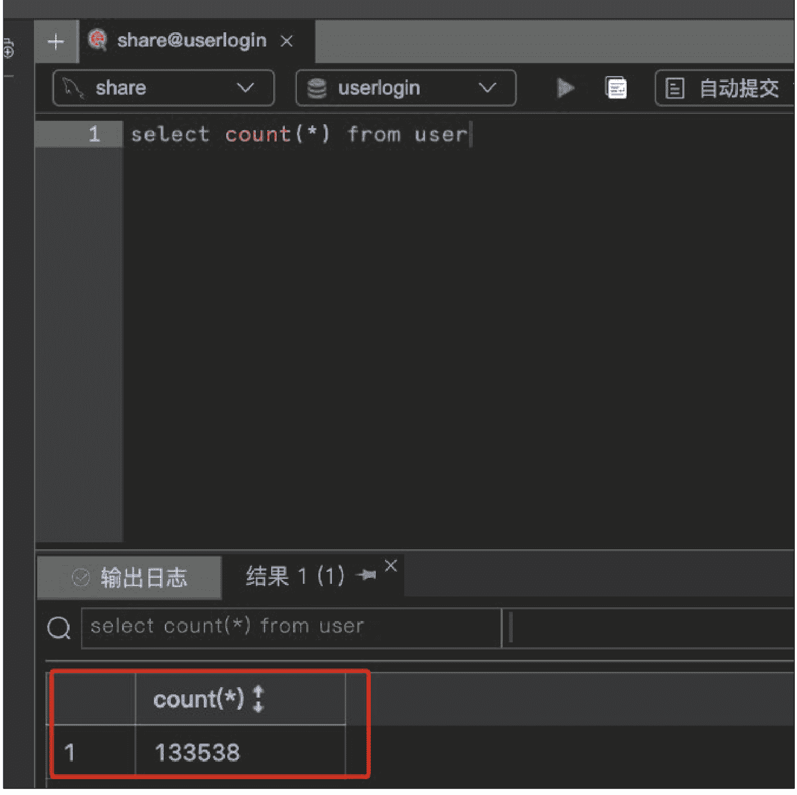

内容最开始都很基础，便于新手们开始学习，大佬们可以随意看看或者直接退出。

主要给小白们科普如果出海做产品具体是如何赚钱的，我们的目的就是赚钱，所以得清楚怎么做才有动力去学。

## 海外产品靠什么盈利？

这可能是大家最感兴趣的话题，所以上来先给大家讲讲，主要由以下两种。

### 1. 谷歌广告

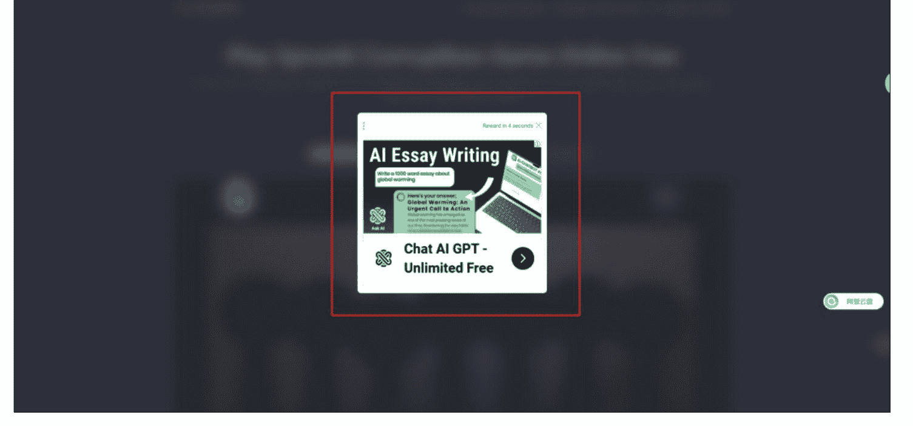

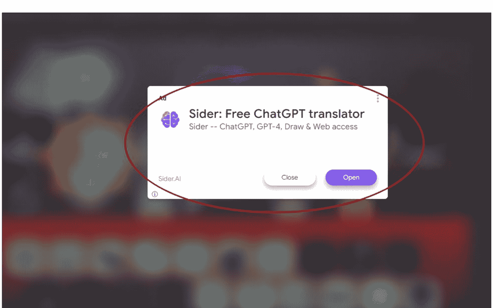

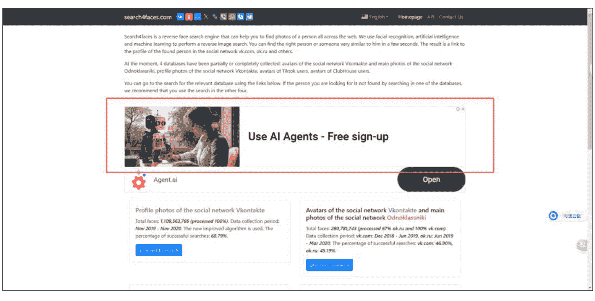

以上三种，都算是谷歌广告的一种方式，可以嵌入到你的网站内部，也可以是弹窗的方式出现，都是谷歌引擎对你搜索习惯的一种精准投放。

投放给我的广告是 GPT，至于为什么能够精准投放，那不是我们需要关注的点。重要的是，开发了这个网站有人使用，并且把广告展示给别人了，我们就有收益了；就像是国内的今日头条、百家号、微信公众号等都一样，有阅读然后中间插入广告，你点击。

### 2. 接入支付

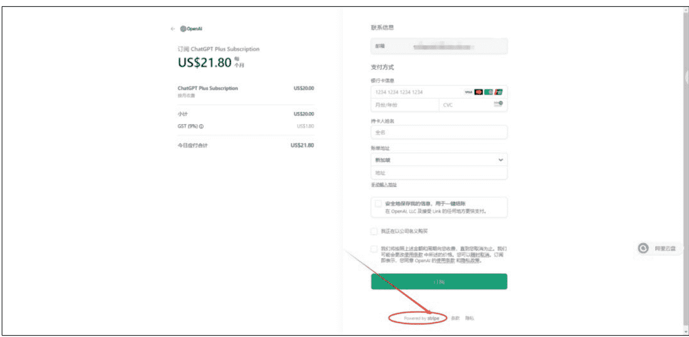

像 ChatGPT、Claude、Midjourney 等热门 AI 软件就是接入了 Stripe 公司支付的，我们也可以去申请这个公司进行收款，淘宝代办之类的很多。只要你能够制作出能够解决用户需求的产品，就会有精准需求的人群会愿意去付费。

产品并不一定像 ChatGPT 那么伟大，其实很多产品都可以去做，解决某一小部分的需求也是可以的。例如国内的 PDF 转 Word 用官方的就是收费的，但是也有需要转换一次收费一元的，你急需但是又不想去开会员，就可以让这一部分人群去付费。

还有一些 AI 套壳软件，应该不少的人群都见过，但是由于官方提供的需求满足不了，有一部分开发者就做了差异化去进行了开发，甚至有些还是基本照搬 AI 软件官网的，但是使用次数上、使用体验上能做的更符合用户需求也是可以的。例如我有朋友就做了 Suno 的，非常相似，但是就会有那么一部分人群的需求能够被解决。

## 做什么类型网站？

这个网站类型可以有很多，例如：内容站就上内容，工具站就上工具，导航站上网站，游戏站上游戏。

不同类型的网站有不同的玩法，但核心还是广告费和订阅费比较常见，也有用于引流到外站的；导航站排名做上去了，你做的新网站想出现在他的导航站上也可以进行付费上榜。

### 1. 内容站

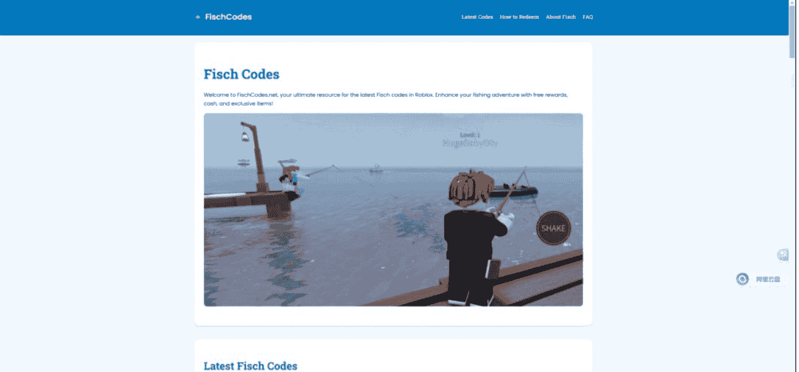

如图所示，例如用户需要什么类型内容，你去开发一个这样的网站，持续输出相关的内容，别人有了相关需求去搜索的时候就会搜索到你。

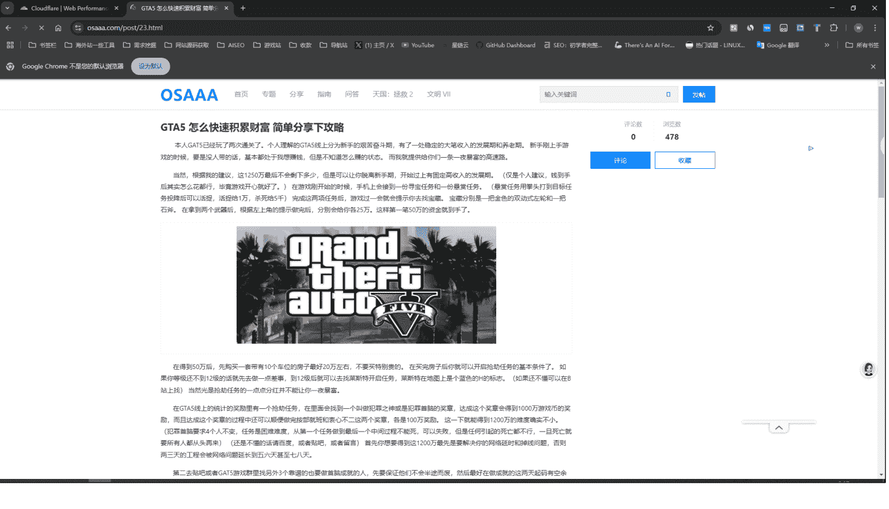

如 GTA5，这种游戏就很适合出攻略，别人都还没做的时候，而你做了这个事情，有些玩家玩不明白，关卡过不去，就会习惯搜索教程。搜索的关键词刚好是你发布过的内容，那别人搜索出来的文章帖子那就很可能是你的。

现在 AI 发展太快，我了解到 23 年那会做内容站的站长们，有不少是通过 AI 大量发布了一些垃圾文章，占领关键词搜索，但是现在也修复了很多；但是我们依然可以通过 AI 写内容，就像是 AI 代写论文一样，我们能做到机器识别不出来就可以的，AI 写完内容后我们也可以人工二次更改内容。

如果是独立开发者，游戏最好看你喜欢不喜欢，如果你本身就喜欢玩，那会做的很快乐，如果你并不是那么喜欢玩这款游戏，那也是有很多其他内容可以做的空间的。例如圈友 @彩笺 给我说过一款游戏《Monster Hunter Wilds》，这款游戏即将发布了，如果我们对单机游戏感兴趣，那先把域名抢注了，然后出来以后第一时间去玩这款游戏，并把心得写到网站，那你很有可能这网站会做的非常不错。

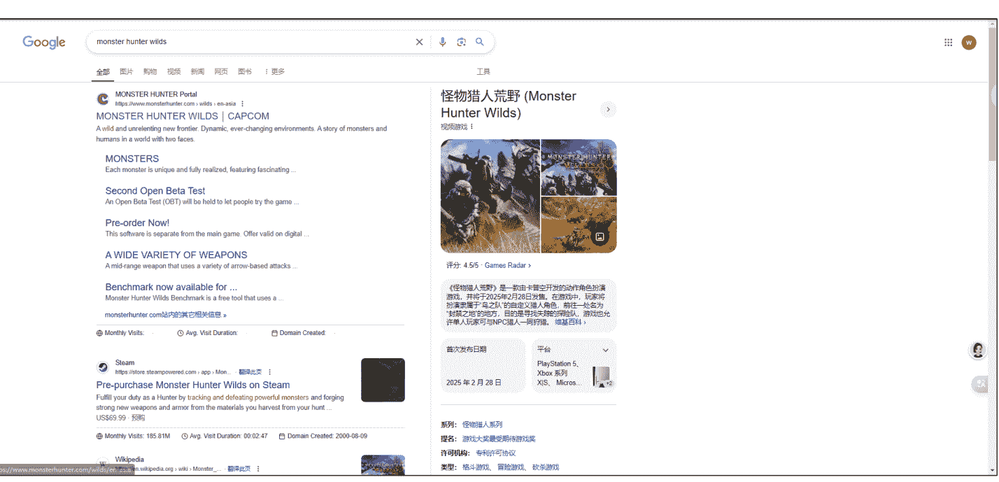

### 2. 工具站

这个做文档转换的，这也是很多人的需求，你实现了，并持续不断更新新的功能，或者说，你功能已经完备了，别人搜索你排名也靠前，也会一直使用你的网站。

这种网站也是独立开发者一直追寻的梦想，这种网站也几乎不用维护，后期只需要增加外链和投流去增加自己的词排名就够了，这种网站能够排名靠前面真的就是躺着赚钱。

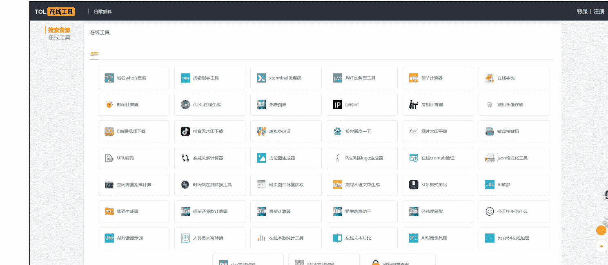

这类型的也是工具站，结合了许许多多少需求工具，他把所有小众的需求整合起来也集合了非常多的流量。

### 3. 导航站

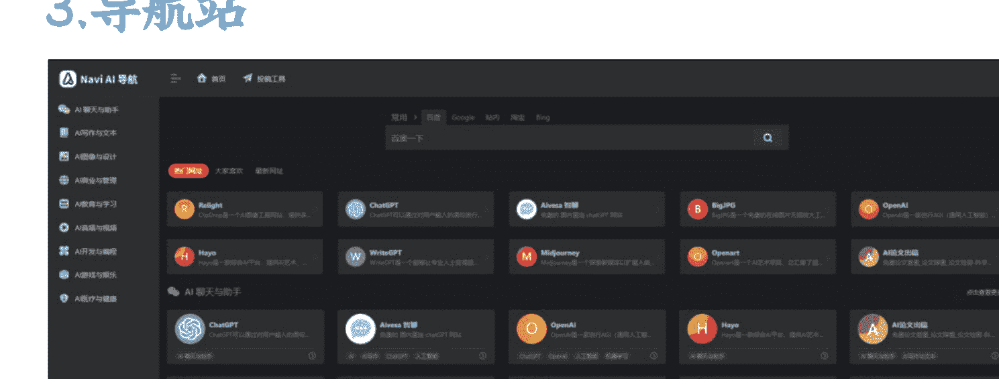

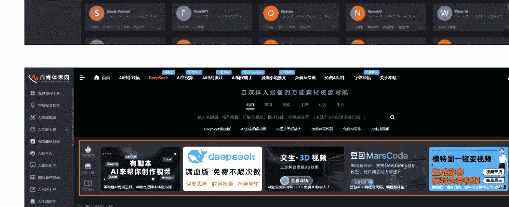

自媒体或者 AI 工具，你把行业内所有相关的网站都收集起来，然后做一个导航站去展示，有人有需求去寻找这些整合站，你把你网站做的精细完整，别人搜索到也会在你网站内容使用。

包括我自己浏览器也收藏了好几个这类型网站，我用某款东西的时候，会看看这有没有相关的竞品然后去比较，也会看还有没有类似的更好用的工具。

上面图片红框里面的就很显然是广告位。并且还有很多小众的跳转导航也可能是付费给站长了才能够上到导航站中，例如我知道全球最大的导航站：https://theresanaiforthat.com/ 就 300 多美元一个坑位。

### 4. 游戏站

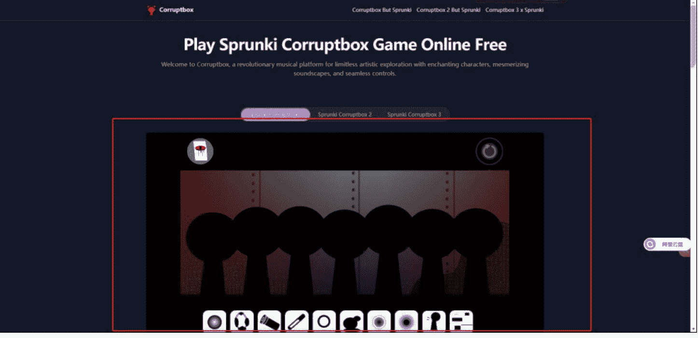

游戏站基本都是一些页游，游戏不一定要什么 3A 大作，其实很多的小游戏也很受欢迎，我们能解决某一部分人群的需求就够了。例如我本人就挺喜欢 2048 这款小游戏的。

微信小程序、抖音小程序，也蛮多类似的小游戏，赚钱方式几乎都是一样的，都是靠着广告收益去变现，但是我们为什么出海还做这种呢？

- 1. 我们赚的是美金，汇率大家都懂 1:7.3
- 2. 面对的是全球的人，不仅仅只是我们国内的用户群体
- 3. 审核问题，国内微信小程序、抖音小程序上线是比较麻烦的，一堆要审核，而海外站，做完就秒上站了

以上几种介绍，看起来都很 low，或许不像我们想象中的那么高大上。但是我们本身就是个体，个人开发者，所以就不可能和大公司去竞争，我们需要做的能够去满足一小部分人群的需求就够了。尽管你的网站只有 2000 个用户，但是你能长期为他们服务，一个月 10$，一个月就能够有 2w$。这已经非常不错了。

## 怎么知道做什么网站？

### 1. 基础网站扫盲

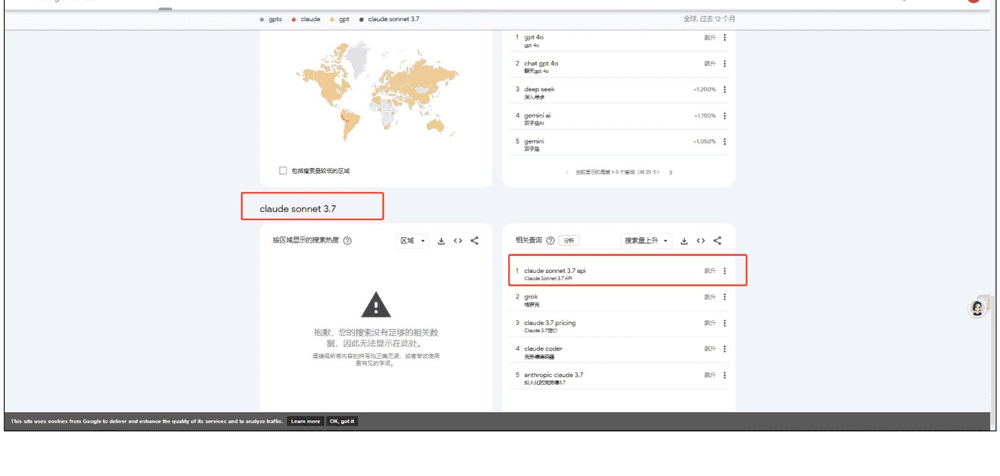

可以通过谷歌趋势：trends.google.com。这个网站去看看你感兴趣的词，然后相关话题什么有热度，看看能不能挖掘到一些需求。今天 2025.2.25，Claude 3.7 发布了，这个词出来显示在飙升。并且我们添加的关键词是 "claude sonnet 3.7"，但是飙升排行第一名的是 "claude sonnet 3.7 api"，就很有意思，我们就可以去搜索该关键词。

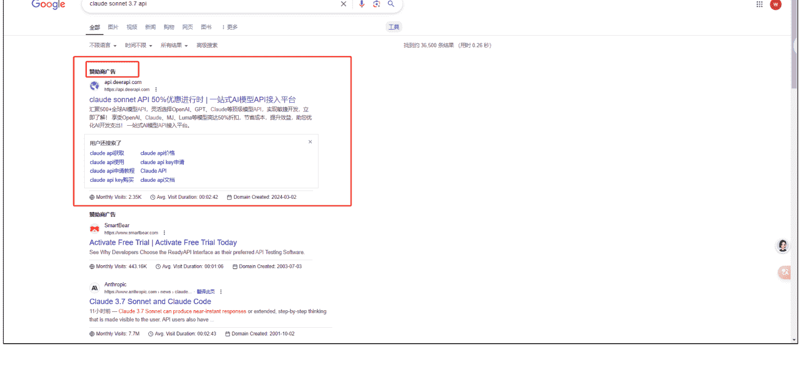

搜索出来以后就更有意思了，刚好跟我是同行，小红色框框显示赞助商广告，说明把 "claude sonnet 3.7 api" 词加入关键词投流了，第一名搜索出来的就是他，这种时候他就能拿到巨大流量。

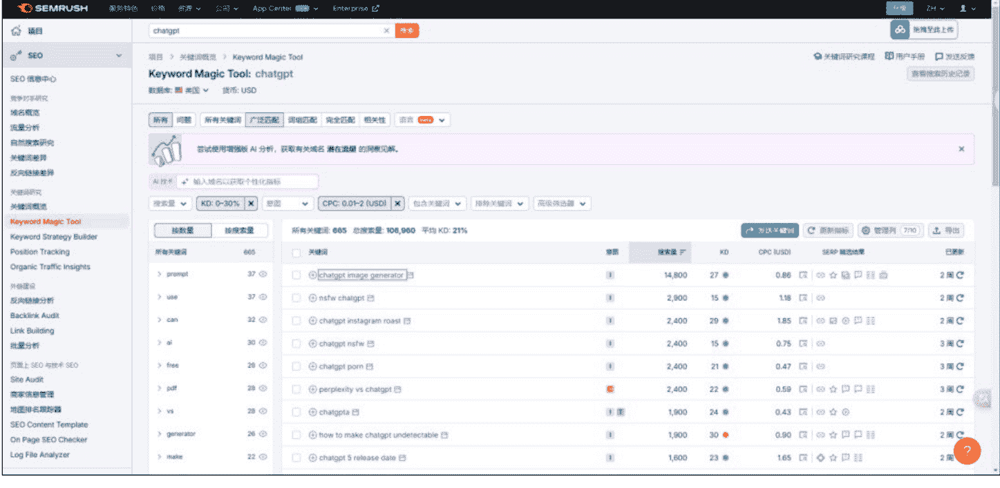

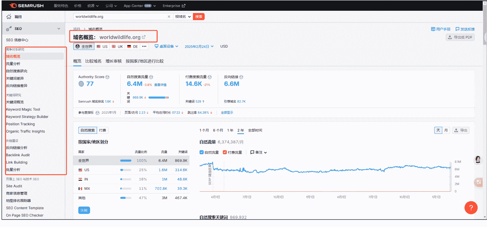

很多时候找关键词就是这样一层一层去挖掘，例如看见这个同行很快，我是没反应过来的，但是学习了经验；那下次类似相关关键词我就能尝试去做了。

还有可以使用：semrush.com 和 https://www.similarweb.com/ 更专业挖掘词的网站去看看，能够更直观的分析某关键词，或者某网站进行分析学习。

以上三种都是目前主流挖掘关键词可用的工具。

### 2. 使用技巧 & 筛选标准

- 平台使用 semrush
- 搜索基座词
- 排除低价值国家

我们设置筛选框中的 KD 值为 0 到 29，再设置 CPC>=0.1 美元，再按照搜索量从高到低排序，就得到了一批有一定搜索量且优化难度低且有一定价值的关键词。

- 对应长尾词搜索量在 1.5w 就可以考虑做
- KD 要求 30 以下，还要考虑 CPC
- 去谷歌搜索，看能不能竞争过，是不是陷阱词
- 找长尾词的长尾词，在 SERP 看搜索结果页，是不是都是内页
- 去 Google Trends 看看是不是季节性词汇

以上是前辈们用 semrush.com 分享的使用经验，仅供参考。

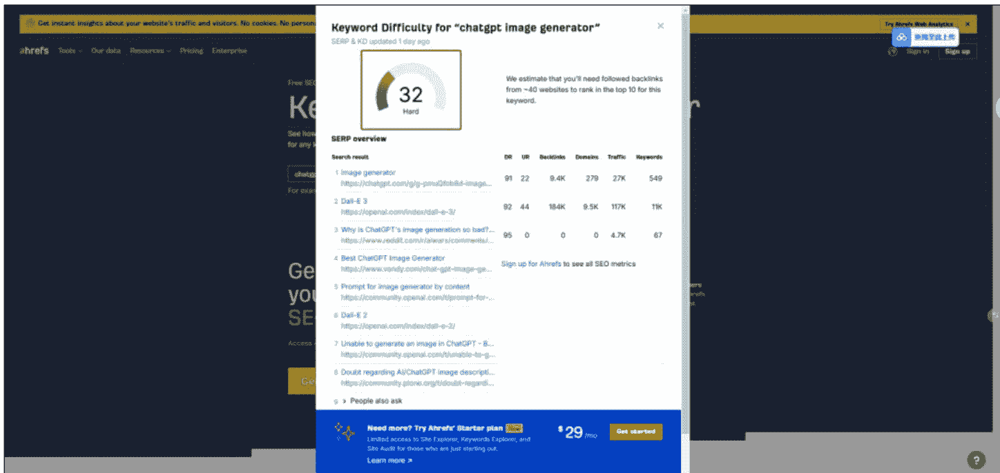

然后我们找出第一名的拓展词，然后再去图中的网址：https://ahrefs.com/keyword-difficulty。查询难度，显示是 32，对新手而言其实已经算是较为困难的了，最好还是选一些新词，没什么人做过的词去练手会更适合，也会增加自己的自信心。

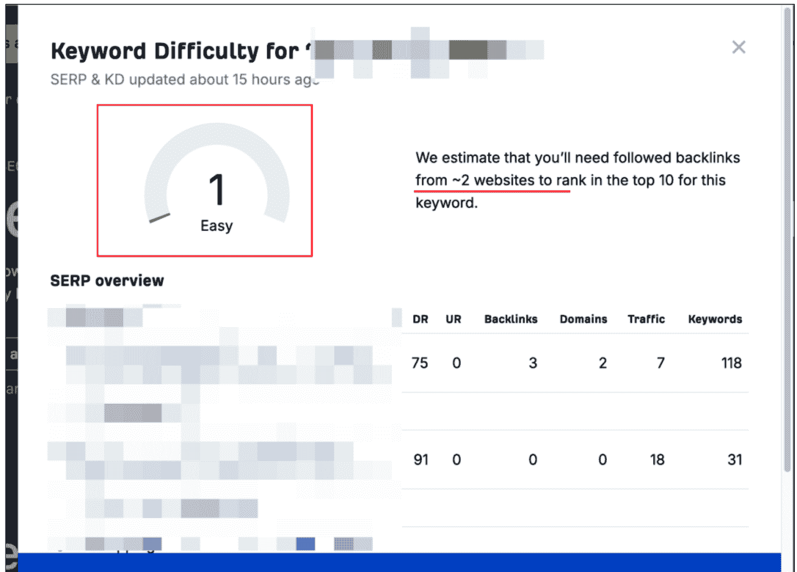

如图，例如这样的 1，就说明几乎是没人做的，只要你做了，别人有需求的情况下搜索，搜索出来的人就是你了。

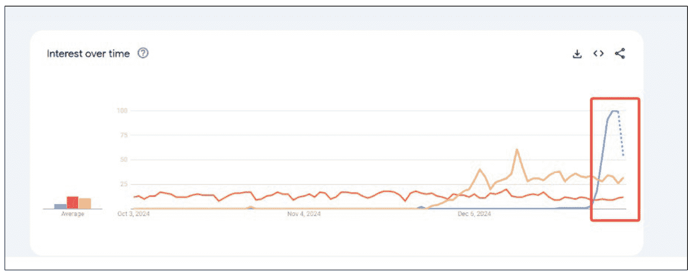

新词标准：

- 7 天内的新词
- 趋势持续向上
- 搜索量达到基准词的 20%

如图蓝色条所示，近期才起来的，跟其他已经很好的词相比，谷歌趋势是能够很直观看见的。

找到新的词了也要看他合适搞哪种类型的站点，例如：内容、游戏、工具、导航等等，你做的过程中后续能否提供相对应的内容？后续需要花费多大精力去维护？这些是都需要考虑的。

出现一个新的词的时候，最关键的就是比快，你能比别人更快提供别人想要的，你就能占据主导地位，然后你可以通过持续不断输出优质内容，以及增加外链去维护你的排名。

### 3. 外链排名维护

#### 外链是什么？

简单来说就是在别人的网站上发了你的网站，或者增加了你的网站跳转，这有利于增加你网站的权重，越大的网站有你的外链，别人搜索关键词，你的网站排名就会越靠前。

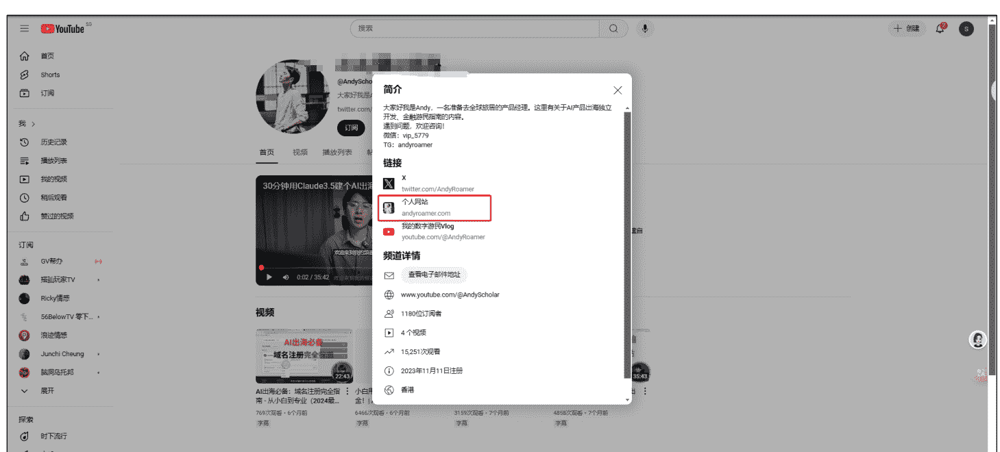

在 YouTube 上添加自己的博客链接，这就是一种很好增加外链的方式，这些都算是小技巧。

##### 外链是一个比较简单的，给网站提供冷启动的方式

使用外链导流有一些常见的小技巧：

- ① 观察，研究竞品，看竞品网站的流量，如果外链流量占比远大于搜索流量，去找寻同样的外链网站去放自己的产品链接。

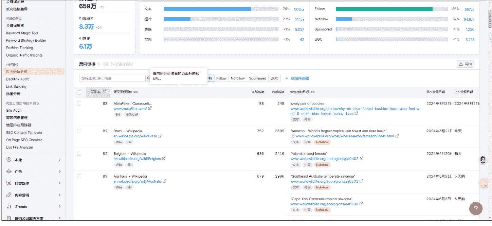

通过专业的关键词查询网站，也是可以查询你的对标网站看他们都有哪些外链，他们的外链如果是可以手动去提交或者他们在别的网站发软文的方式去写外链，那就是值得我们学习的，也是我们可以去增加外链的方式。

- ② 做的网站多了，以及靠着前辈们整合下来的链接，慢慢的自己做成一个网站以后就会有自己固定发外链的方式。

这个外链文档是出海前辈们整合的，以及最后自己也加上了一些自己搜集的，方便出海站长们参考使用。

除了这些方式，当然你也可以进行谷歌投流，但是一般投流都是你网站有营收的情况下才去投，比如投入 1 美金，能给我带来 1.2 美金的收入，这就是很棒的，这也是我未来非常想做的事情，找到一个产品，然后通过加杠杆不断的去放大。

如何建站可以生财内找找其他小伙伴的帖子，或者等刘小排老师开课教学，他们都非常的棒。这边就不重复写这类似的内容了。或者提前先看 Cursor 航海教程上手实操就够了。

## 最后：这是一个长周期的值得做的事情

我可以很肯定的告诉你，这是一个长周期的项目，变现反馈可能没有那么快；我个人想象是三个月能跑通下一个就行，但是跑通了以后，说不准能够吃五年十年。

了解我的人，知道就像我自己 AI 镜像产品一样，已经很稳定了，也有源源不断的客户，这就是很好的例子。

| 号池健康状态 | 号池健康情况 |
|---|---|
| 禁用的账号 | 203个 (40.3859%) |
| 临时禁用的账号 | 52/8758 |
| 过载的账号 | 4975个 |
| 非长期账号 | 47个 |
| 长期账号 | 8508个 |

| 模型调用次数占比 | deepseek-r1 |
|---|---|
| deepseek/deepseek-r1/community | gemini-2.0-pro-exp-02-05 |
| gpt-4o-2024-11-20 | grok-3-reasoner |
| deepseek/deepseek-v3/community | gemini-2.0-flash |
| gpt-4o-mini | gemini-2.0-flash-exp |
| grok-3 | deepseek-reasoner |
| deepseek-ai/deepseek-r1 | deepseek-ai/deepseek-r1 |
| deepseek-reasoner | grok-3 |
| gemini-2.0-flash-exp | gpt-4o-mini |
| gemini-2.0-flash | deepseek/deepseek-v3/community |
| grok-3-reasoner | gpt-4o-2024-11-20 |
| gemini-2.0-pro-exp-02-05 | deepseek/deepseek-r1/community |

这 API 使用量是 2 月份至今的。

我后续想做的也都是这样的，尽管我不在线，但是我的网站正常运行，别人使用，我就能够有收益；我能够给别人解决需求，我就能够有收益。

不太想像大学一样，做一些短平快的项目，我目前已经毕业了，所以得为未来打算。当然我不做了也不是说看不起那些项目，只是我的阶段性过了，需要考虑的东西比较多，如果你目前互联网项目认知还是没那么到位，或者说缺正反馈，那做一做也是无妨。

并且学习也有门槛，入行也有门槛，目前相关教程还是较少的，以及需要一定的编程基础，但是现在有 AI 编程，大大降低了难度，基本可以通过 AI 就能完成了。这也筛选掉了部分人，所以这一行目前还是没那么卷的。

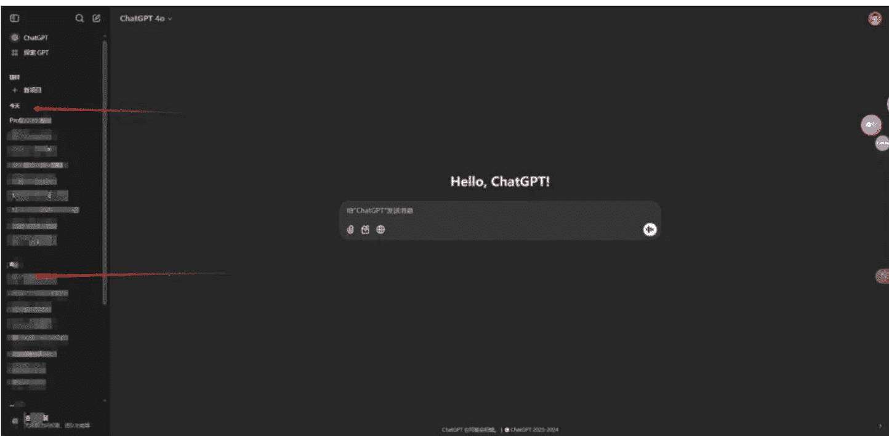

现在 AI 很发达，我遇到的大部分问题也能够用 GPT 解决，知识要与时俱进，现在的时代你善于利用 AI 真的能够大大帮你提升效率。

历史 3000 多份各类付费文章以及年费三千多的副业社群资源，见懒人专属群内部分享！

付费群，白嫖勿扰！

懒人专属群更新记录：

https://lazybook.fun/#/blog/record2