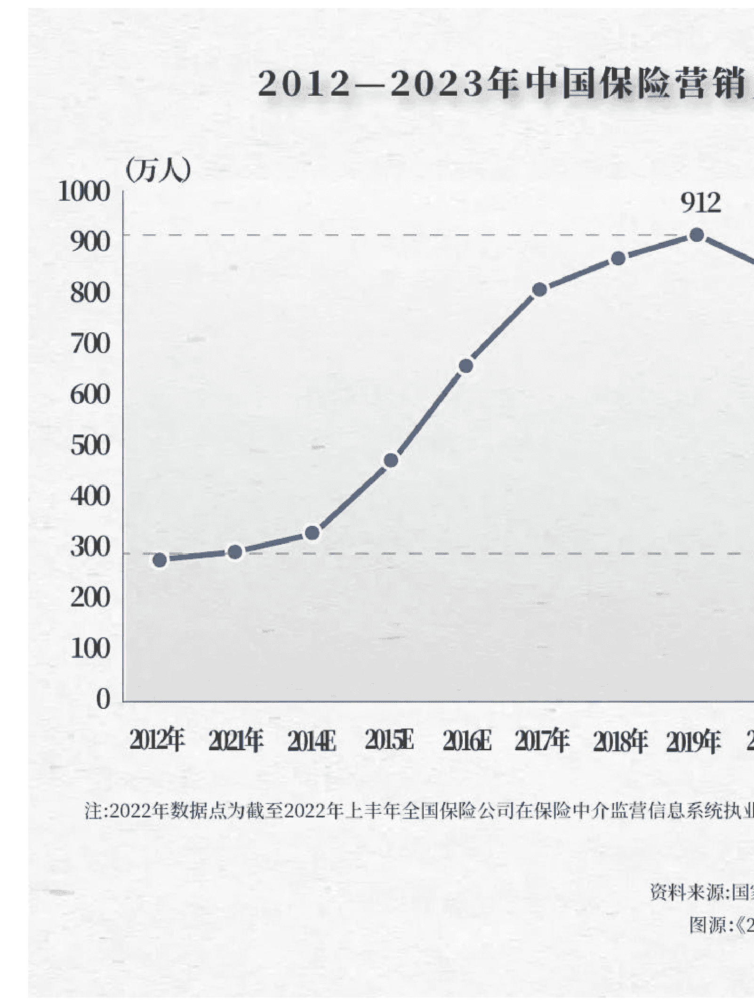

# 号称“中年打工人尽头”的行业，4年来成为离职重灾区

250304 吴晓波频道
整理自公众号：懒人搜索，懒人专属群独享
懒人微信：lazyhelper

曾经号称“打工人尽头”的保险行业，为何成为离职重灾区？

根据《2024 中国保险中介市场生态白皮书》，2019 年的中国保险行业营销员曾高达 912 万人。西装革履的保险精英，遍布街头巷尾。

然而，4 年后的 2023 年末，保险营销员数量锐减至 281.34 万人，降幅高达 69.2%。如果仅算活跃人数，可能连 100 万人都不到，减少 90%。

## 2012-2023年中国保险营销员

> 注：2022年数据点为截至2022年上半年全国保险公司在保险中介监管信息系统执业人数。

5年时间，保险行业到底发生了什么变化？难道真的没有人买保险了吗？

## 「保险营销员的“下岗潮”」

保险营销员，可谓是“成也佣金，败也佣金”。

很长一段时间内，保险公司为了销售业绩，会给营销员设置“高佣金返点”。

比如公司明明上报 5% 的佣金率，但是实际上给保险代理人的佣金却有 20%、30%，甚至更高的数字，这让保险营销员拥有非常可观的收入，也是保险行业不为人知的“潜规则”。

如果放下面子，肯吃苦，年入几十万甚至百万的保险营销员，还真不算少数，甚至大批 35 岁以上的中年人也进入了卖保险大军。他们的起点，通常是利用既有的人脉，比如让亲朋好友购买保单。这就是保险行业的“人海战术”。

然而，一项政策的实施和落地打破了这种潜规则。

2023年8月，国家金融监督管理总局发布了《关于规范银行代理渠道保险产品的通知》，首次提出银保渠道“报行合一”的要求。

什么是“报行合一”？

“报行合一”主要指保险公司在向监管部门报备（“报”）产品信息、费用结构、销售政策等内容时，必须与实际经营行为（“行”）保持一致（“合一”）。简单来说，如果认真贯彻执行，就意味着保险营销员的佣金收入出现暴跌。

这次的监管并未留手。

同年 10 月份和 2024 年，国家金融监督管理总局接连出台了《关于银保产品管理有关事宜的通知》和《关于规范人身保险公司银行代理渠道业务有关事项的通知》，对“报行合一”提出了更明确、更严格的要求。

国家金融监督管理总局 金办便函
关于规范人身保险公司银行代理渠道业务有关事项的通知

各监管局，中国保险业协会，中国银保信公司，各保险公司：
根据《保险法》有关规定，为规范人身保险公司（以下简称保险公司）银行代理渠道业务，督促保险公司……

监管部门的三份文件，彻底击碎了保险行业的“高佣金”。

根据行业统计，保险行业相关渠道佣金较之前整体降低 30%。

小巴咨询了一位曾经年入百万的资深保险营销员，她表示现在很多从业人员的佣金降幅高达 50%，甚至更多，这对保险代理人的收入造成了巨大打击。

收入锐减，直接导致了保险营销员的流失。所以，保险行业的高佣金时代已经远去，取而代之的，是一个更加专业化，且需要深耕的行业。

## 2 「新中产，保险消费主力军」

公众号懒人搜索，懒人专属群分享

2023 年 4 月发布的《中国家庭风险保障体系白皮书》显示，80 后、90 后新中产群体已成为保险消费的主力人群。

更重要的是，新中产家庭保险类资产占比仅为 4%，而日本和美国的占比均为 24%。这意味着新中产家庭的保险资产有非常大的增长空间。

| | 90后 | 85后 | 80后 | 70后 |
|---|---|---|---|---|
| 重要 | 76.80% | 80.75% | 81.02% | 76.25% |
| 可有可无 | 14.98% | 11.96% | 12.58% | 16.30% |
| 不了解 | 3.26% | 4.59% | 3.90% | 3.84% |
| 不会买 | 2.36% | 2.70% | 2.50% | 3.61% |

数据来源：吴晓波频道晓报告
懒人微信：lazyhelper

新中产更青睐什么保险呢？他们购买保险的主要目的有三个：一是规避突发风险；二是为家人提供保障；三是强制储蓄，赚取投资回报。

《2023年中国互联网保险消费者洞察报告》提到，高收入、高学历、高城市的“三高”人群，持有率最高的保险产品为重疾险，这成为新中产群体应对疾病风险的核心工具。此外，其他的商业医疗险和惠民保等健康保险产品的持有率也较高。

伴随老龄化加剧，新中产除了满足自身的需求之外，还承担着为父母和子女购买保险的责任。

这就导致新中产对于分红型养老保险、长期护理险等需求激增。

与此同时，2024年颁布的保险新“国十条”指出：“保险行业更好满足人民群众日益增长的保险保障和财富管理需求。”从养老保险、健康保险到意外险、责任险，保险业不断丰富产品供给，满足不同人群的多样化需求。

第三点就是新中产群体对保险的需求的转变：从过去防范单一风险，转向覆盖综合保障与财富管理。他们尤其关注产品的个性化、透明度和服务效率。

春节假期结束后，不少银行的理财经理开始给客户推荐增额终身寿险和年金保险。在国内银行利率不断下行的背景下，增额终身寿险可以提前锁定收益，即使未来市场利率继续下行，目前已购买的产品预定利率也不会变。

所以，尽管增额终身寿险的预定利率已经由 3% 降至 2.5%，但是在当前环境下依然是一个不错的选择。

此外，2025年“开门红”期间，分红险因兼具保障与收益属性，也逐渐成为市场主导产品。虽然分红险的预定利率上限下调至 2.0%，但是如果险企的投资回报较好，那么其收益率可能高于普通型保险 2.5% 的预定利率。

根据行业公布的数据，目前行业在售的人寿保险产品超 253 款，其中分红型产品 107 款，占比 42.3%，成为各大保险公司的主推险种。

德勤全球最新发布《2025年全球保险行业展望》报告也指出，新兴市场不断扩大的中产群体，预计将持续拉动保障和储蓄型保险产品需求的增长。

## 3 「保险行业“互联网化”」

新中产的崛起，加速了保险行业的“互联网化”。

随着抖音、小红书等社交软件的崛起，越来越多的新中产通过互联网，甚至借助 AI 来自主研究保险产品条款，对比产品的保障范围和性价比。过去 10 年的互联网保险，实现了年均 32.8% 的复合增长率，2023 年的保费规模达到 4948.6 亿元，预计在 2029 年突破万亿大关。发展互联网保险业务已经成为了行业内公认的趋势。

典型的代表之一，是蚂蚁集团旗下的保险公司蚂蚁保，公司线上业务嵌入在支付宝，利用支付宝用户的巨大流量，为蚂蚁保引流。线上业务发展迅速。

根据《中国保险年鉴 2024》的保险中介百强榜数据，蚂蚁保保险代理有限公司保险业务收入 66.59 亿元，净利润 2.41 亿元，位列第一。

从数据来看，80 后、90 后群体在保险消费中的占比已超过 75%，新中产线上购险的接受度越来越高，这就导致线上保险业务的蛋糕越做越大。保险行业也出现了两个重要的现象：

- 第一，互联网保险的发展，不断挤占保险营销的订单和收入；对于保险公司来说，线上获客成本极低，保险公司有动力“精简”代理人，淘汰低素质营销员，而更多招募高学历，互联网保险营销员。
- 第二，保险代理人想要开展业务，除了传统的线下获客手段，还必须转战互联网，建立个人 IP，开设自媒体账号，开展直播业务，甚至采取各种引流手段等。这是趋势，也是对传统保险从业者的挑战。

此外，AI时代的到来，对保险从业者也带来了巨大挑战。

根据《2024中国保险中介市场生态白皮书》数据，66%的保险代理人认为，AI对于保险营销工作的冲击较大或很大。

特别是利用最近爆火的 DeepSeek-R1 大模型+联网功能，只要告诉 AI 自己的需求，那么 AI 就能够较为清晰的推荐保险产品。这种做法效率高，也不用担心营销员为了利益推荐高佣金产品，能够满足很多社恐新中产的需求。

对于保险从业者来说，如何取得新中产的信任，如何与客户建立更深度的情感连接，是更为紧迫的任务；对传统险企来说，如何加速数字化转型，应对互联网保险和 AI 的冲击，也将决定未来的市场份额。

## 「保险行业新时代」

根据国家金融监督管理总局的最新数据，2024年整体保险业务实现了原保险保费收入约 5.7 万亿元，较 2023 年上升了 11.15%，原保险保费收入连续第三年实现增长，显示出行业的强劲复苏势头。

而随着 80、90 后等新中产群体成为保险消费的主力人群，保险消费已经出现从“要不要买保险”到“需要买什么保险”的转变。

国内的保险行业，正处于“监管规范-需求升级-产品创新”的螺旋式变革浪潮，新中产是这场保险变革的推动者，也是最终的受益者。

在未来，保险公司能否持续满足新中产对“专业服务+综合保障”的双重期待，或将会成为行业竞争的重要痛点。

历史 3000 多份各类付费文章以及年费三千多的副业社群资源，见懒人专属群内部分享!

付费群，白嫖勿扰!

懒人专属群更新记录:
https://lazybook.fun/#/blog/record2