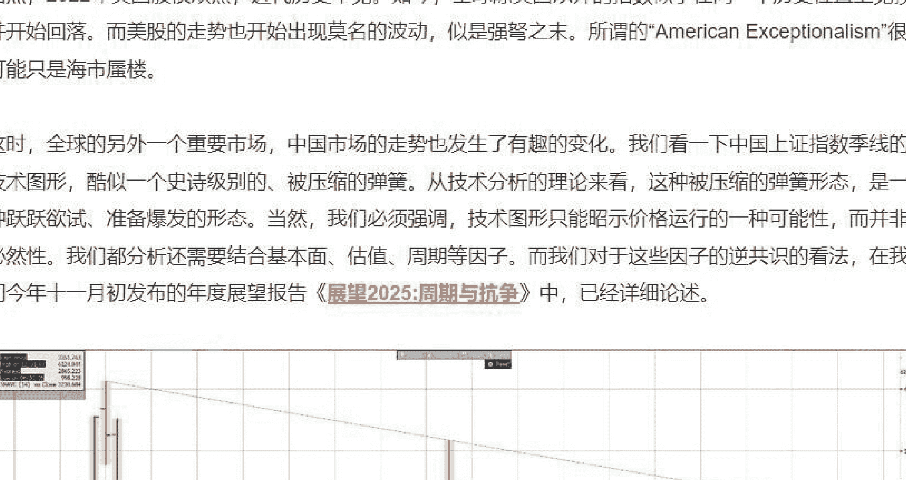
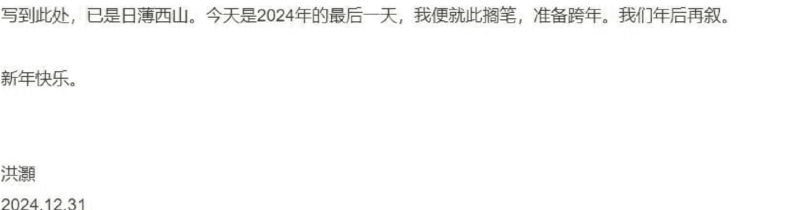
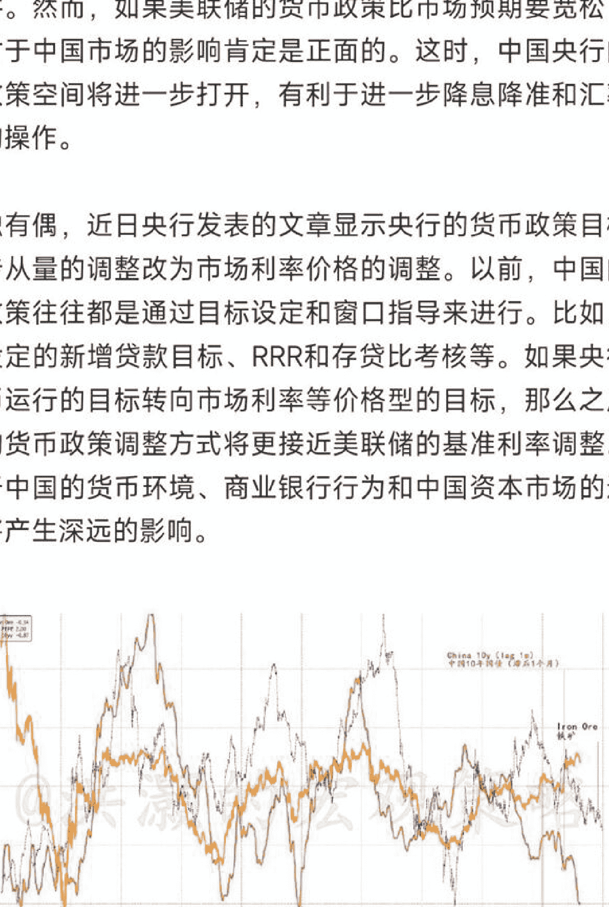
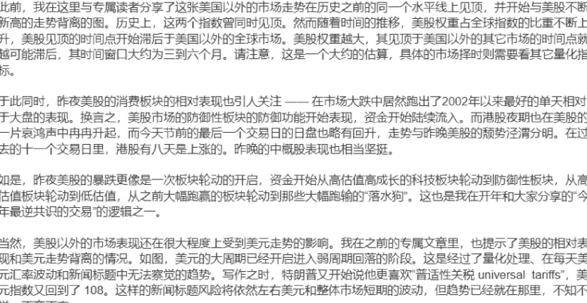
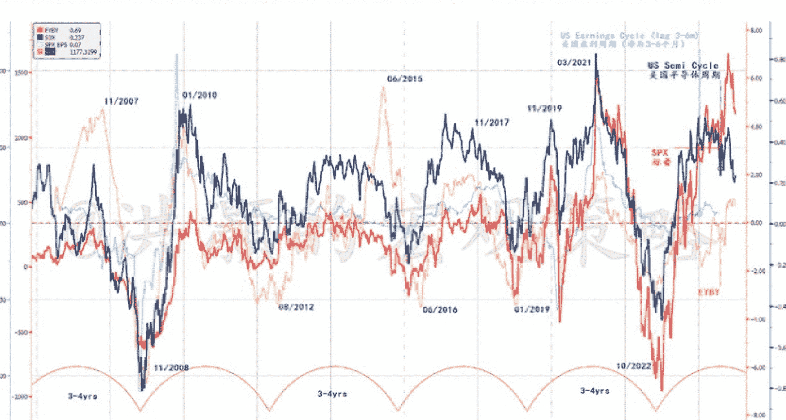
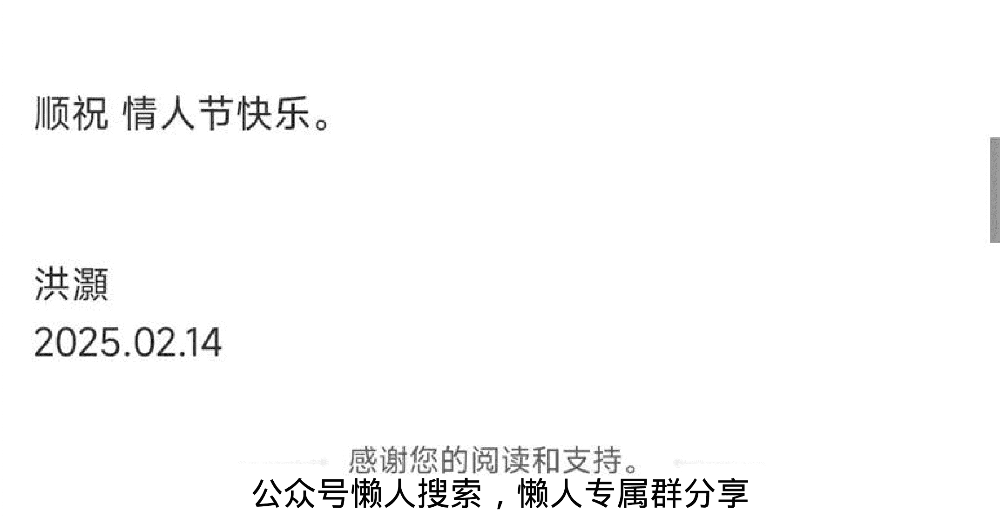
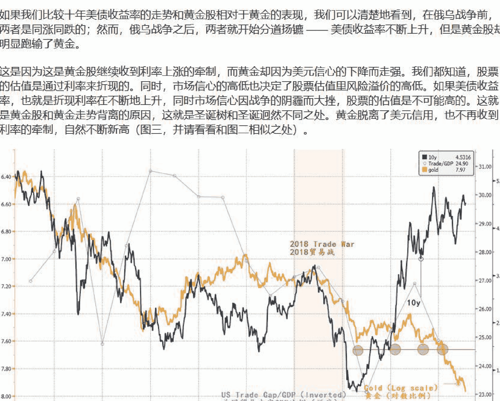
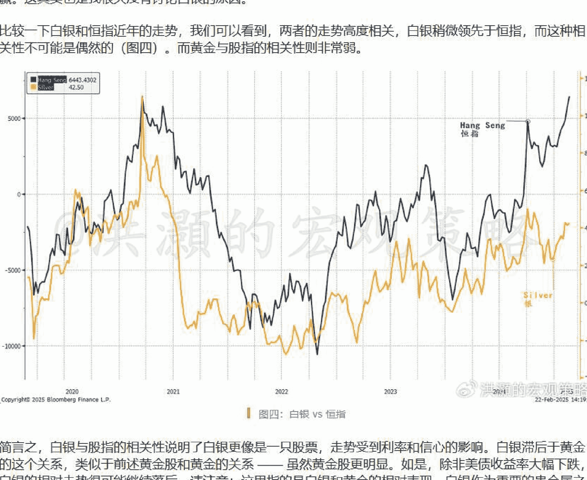
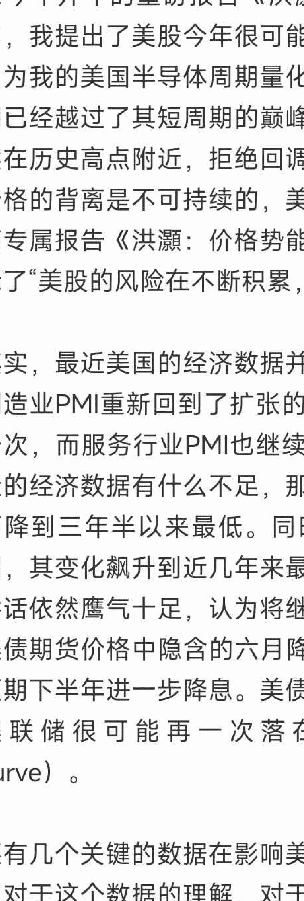

## 洪灏：2025年最逆共识的交易（上）

市场共识可能忽略了什么。

最近，美股在没有重要消息和数据的情况下持续下跌。昨日是有数据以来第五次美股在所谓的“圣诞老人行情”中跳空低收逾一个百分点。上一次出现这样的情况，是2019年的圣诞节，恰恰是在新冠疫情前的一个圣诞节。然而，其它几次类似的情况对于美股后市都没有前瞻性的指引。这次或许也是杞人忧天吧？

与此同时，我们的数据显示美股上涨的势能越来越集中于少数几个股票。这周，只有不到1/5的标普成分股跑赢了标普指数，这是我们有数据以来最低的一次。八月在特朗普脱险遇刺后掀起的一轮上涨扩散的态势重归平静，小盘股回吐了大部分的涨幅。

今年标普上涨了约21%，但罗素小盘股指数上涨了不到10%。七个大型科技股贡献了今年近一半的标普指数的涨幅，而美股市值在全球股市市值里的占比达到了历史最高水平。十年前，几个大型科技股的总市值约1.8万亿美元。到如今，它们的总市值已经飙升到18万亿美元。如果我们把这几个股票单独切割出来作为一个独立的股票市场，那么它将是全球第二大股票市场，比中国股市的约13万亿美元市值还要大。

由于美元资产收益率相较于其它市场的回报高企，全球资金源源不断地流入美国市场。外国人持有美国资产的占比历史新高，美国家庭的美股配置仓位也在历史新高。然而，上周的数据显示美国的基金经理大幅削减了他们的持仓，机构投机者下调了他们的期货多仓，但散户投资者的期货开仓却在不断上升。这是因为机构投资者今年开始获利了结、回家过年吗？还是有什么我们应该知道的？

近日，《彭博商业周刊》举荐我为年度人物之一。在为活动做的采访中，编辑指出，在彭博追踪的19个美国策略师中，每一个策略师都认为明年美股将继续上涨，并问我的意见。作为一个一贯的逆向投资者，我下意识的反应是这很可能是明年最大的逆向交易机会之一。毕竟，今年年初时这些策略师基本上一致看空美国市场，有的甚至认为美国经济今年将进入衰退。

今年初，出于对于美国财政赤字不断扩张的思考，我们认为美国今年将很难衰退，美股将不断创新高。我们同时也在市场的一片哀鸿之声中认为中国市场将是今年最显著的逆向交易机会之一。

这些意见，我都在这里和我的付费专属读者们一一分享了。今年以美元计价的中资港股的表现略胜美股，而我重点看好的其它几个标的，如黄金和加密货币，都是今年表现第一、第二的资产类别。上证和恒指都分别运行到了我的3,500和23,000的目标价格。我自己管理的离岸对冲基金今年取得了约22%的费前回报，对应的参考指标回报大约为6.5%。基金大部分的回报都是通过做多中国及相关资产而实现，同时绝大部分时间仓位很轻或没有仓位，基金也没有回撤。作为一个逆向投资者，我今年做到了知行合一。

那么，明年市场最显著的逆共识的机会将会在哪里？

首先，我们需要科学地定义一下什么是“逆共识”的机会。大部分人会认为，只要市场一边倒地认为某种情况将会发生，那么站在它的对立面就是“逆共识”。的确，在市场一边倒的时候站在市场的对立面，会有一种“一夫当关”的感觉。但这是逆共识，而不一定是逆共识的机会。逆共识的交易机会，是那些事件实际发生的概率远大于市场认为不太可能发生的概率；同时这些事件一旦发生，将为投资者产生可观的回报。

当下，市场认为特朗普上台之后，特朗普关税将导致美国通胀上升，美联储无法如期降息，美债收益率高企，美元因此而走强。同时，特朗普放开监管将导致美国市场进一步高度金融化，中小企业受惠。特朗普对于加密货币的立场也将让各种加密资产继续有所表现。特朗普激进的减税计划还将继续扩大美国赤字财政政策。

期待一个美国总统一上台就能引发如此剧变，单枪匹马就能放干美国政坛的沼泽之地，甚至只手改变全球的政治格局，不免有些想多了。

其实，在2018年的贸易战中，美国的通胀不升反降，美联储的基准利率一整年都在走低。上世纪二十年代的那次全球的关税大战亦然。同时，2018年二月，美股经历了一场“波动性末日危机”（Volmageddon），纳指从九月高点最深跌去了约1/3，但当时美元的确因为避险情绪而走强。如果特朗普的新政有利于中小企业，那么为什么特朗普身边的政客代表的都是全球最大最强的美国企业的利益，纷纷在为这些企业的利益而游说？与此同时，罗素小盘股大幅跑输了标普。

如果特朗普激进地减税，但同时马斯克的DOGE部门要裁掉一半的政府员工，那么财政赤字可持续性的确有所增强，但财政赤字是会继续扩张，还是在近年来7%的高位开始缩减，进而影响社会的总需求？如果新上任的财政部长认为3%的赤字率长期对于美国经济长期更有利，那么美国现在显得无以为继的赤字率将很可能会下降。这里顺便也夸一下耶伦，她从伯南克手中接过了一张巨大的美联储资产负债表但从容地甩锅给了鲍威尔，然后创造了一个巨额的财政赤字但又淡定地甩给了本贝森特Bessent。这种逢凶化吉、避害趋利的技巧，绝对是一种超能力。

至于加密货币资产，的确今年表现不俗，但在近日超越了10万美元大关之后，就开始回吐部分涨幅。而其技术图形也出现了一个比较明显的“头肩顶”形态。市场关注的那个融资加杠杆买加密资产的公司，股价创历史新高之后，最近已经跌了近一半。这些市场走势，都是和以上的市场共识认知相悖的。

在寻找逆共识机会的同时，我们往往可以从市场价格运行的趋势中反推出价格波动中隐含的市场预期。如果预期也就是市场共识运行到极致，那么这种价格的波动往往暗示着逆共识的机会。共识的形成往往通过趋势的自我加强表现出来。而过去两年美股回报最显著的因子是价格势能（momentum）。

图一里，我们比较了美股指数的走势和除美股以外的全球指数走势。可以看到，疫情前这两个指数基本上同时见顶的。比如2007年11月和2018年2月。然而，疫情后由于美联储的无底线量化宽松政策和美国财政部的财政货币化运作，全球资本开始向美国市场流动。

从那时起，美国股市在全球指数市值中的占比越来越大，很可能导致两个指数见顶的时间点开始错位：美股全球指数权重越大，美股以外的市场对于美股运行的影响就越小，美股的强势得以延续——直到全球其它市场的弱势开始反噬美股，导致其最终的下跌。全球市场这么多年的国际化，已经使得全球市场环环相扣、唇齿相依，美国很难再一枝独秀、独木成林了。

这个情况在2021年6月全球除美国以外的指数见顶之后的约六个月，也就是2022年初，美股才最后见顶。当然，2022年美国股债双熊，近代历史罕见。如今，全球除美国以外的指数似乎在同一个历史位置上见顶并开始回落。而美股的走势也开始出现莫名的波动，似是强弩之末。所谓的“American Exceptionalism”很可能只是海市蜃楼。

这时，全球另外一个重要市场，中国市场的走势也发生了有趣的变化。我们看一下中国上证指数季线的技术图形，酷似一个史诗级别的、被压缩的弹簧。从技术分析的理论来看，这种被压缩的弹簧形态，是一种跃跃欲试、准备爆发的形态。当然，我们必须强调，技术图形只能昭示价格运行的一种可能性，而并非必然性。我们都分析还需要结合基本面、估值、周期等因子。而我们对于这些因子的逆共识的看法，在我们今年十一月初发布的年度展望报告《展望2025:周期与抗争》中，已经详细论述。

我们反复强调，在这个大级别的周期的拐点，情景分析比起那些拍脑袋的预测更重要。因为很多系统的不确定性是无法量化，而只能进行路径推演。

写到此，已是日薄西山。今天是2024年的最后一天，我便就此搁笔，准备跨年。我们年后再叙。

新年快乐。

洪灏
2024.12.31

## 洪灏：2025年最逆共识的交易（下）

01-05 13:58

今年艰难的开局意味着什么。关于市场点位的讨论。

今年的开局太难了。

美股去年末以来连跌五天，市场上涨的个股数目占比达到了历史次低，离历史记录仅差了几个股票。标普离200天均线的距离只剩下了5%。历史上，如此的市场宽度叠加指数如此相对于均线的位置，对应了两次历史性的全球市场暴跌：第一次是1987年的“黑色星期一”，第二次是2022年美股大熊市的开始。

当然，这种精确细致的技术分析前提条件，产生的观察自然不一定有普适性。虽然历史上其它类似的情况大多都是假信号，但是这种令人毛骨悚然的历史性巧合，在开年之际还是会令人侧目而视。如果没有昨晚科技股力挽狂澜，那么这次美股开年的表现将违反一贯的“圣诞老人行情”。

转眼，美联储的降息政策运行已经经历了100多天了。然而，十年美债收益率却跳升了90个基点，而在最近大有加速上行之势，并突破了4.6的关口。美债指数基金更是录得了历史上最大的连续两个月累计净流出。情绪指标显示，投资者不仅仅对于美股的情绪濒临极度悲观的状态，对于美债则更甚。然而与此同时，美股的价格依然在历史高位附近不离不弃，而长期美债ETF的价格离有历史数据以来的低点已是咫尺之遥，开始测试支持区域。

我们之前在这里已经与读者讨论过美股市场集中度的问题及其影响。这是一个十几个大型科技股在涨，剩下的股票在跌的市场。如果这种情况出现在东方市场里，一定会有砖家大声疾呼、奔走相告，称有神秘力量在“托盘”，这市场是“绿牛”而不是“红牛”云云。然而，当同样的市场状态出现在美股，砖家们却会认为这是科技进步的标志。其实，市场叙事总是墙头草一般顺势而动——全世界都一样。

当然，大家知道我说今年艰难的开局，说的不仅仅指的是美股。中国市场开年也连续收了三根巨大的阴线，为2016年以来最差的开年。上证的季线勉强地守在了850点附近。但更抢镜的却是十年国债收益率，快速跌破了1.6，创出了历史的最低纪录。而短期国债看似要跌破1，这还是在那监管层苦口婆心地劝阻基金仓位抱团国债的背景之下。人民币汇率也突破了7.3，逾两年新高。但欧元汇率已经跌到了接近一比一的水平，近十年的次低。在如此末日狂奔的市场里寻找逆共识的机会，真是有点勉为其难了。

之前，我们在12月22日深圳读者见面会以及上一篇报告中已经论述了我们对于美股的一些非共识看法...

以下内容仅V+会员可见

我们认为，全球除美股以外的市场已经在与2007年11月和2021年六月同样的历史高位开始掉头而下。由于2007年美股占全球市场的比例远低于现在，而2024年这个比例则创了历史新高——美股市值占全球近2/3，直觉上美股以外的全球市场对于美股的影响远低于2007年的时候。因此，尽管美股以外的市场技术上已经见顶，但是美股的韧性还是可以负隅顽抗一时，但也很可能已经是强弩之末了。

### 美国以外的全球市场悄然见顶

看一下美国以外全球经济的表现：
- 德国的制造业已经陷入衰退多时；
- 尽管日元不断贬值，但是日本的商品贸易居然出现逆差，主要是因为日本汽车出口被中国制造抢占了市场份额；
- 虽然中国的制造业反季节地维持扩张势头，但很可能是因为企业加班加点地在关税来临之前备货出货；
- 而美国本土的制造业，在过去26个月中收缩了25个月，为历史最长。上一次出现如此严重的制造业萎缩，还是1981年保罗沃尔克鹰派驯服通胀的时候。即便如此，上次制造业萎缩持续时间也只有24个月。虽然消费在西方经济体中占主要位置，但是它们也不能只消费不生产——尤其是在希望通过关税抑制中国制造、西方必须寻找新的制造业市场或者制造业回归的时候。

因此，我们认为美股很难一直一家独大、赢者通吃，全球其它市场的弱势在未来数月内一定会反噬美国，而现在序幕似乎已经徐徐拉开。我们的周期模型显示，美国的半导体周期已经出现明显的放缓，但是美股强势依旧，并与我们的美国经济周期指标背道而驰。历史上，当出现如此基本面和股指背离的情况时，美股最终还是不得不回归基本面。如果美国不出现经济衰退，那么这样的回调将是建仓的机会。

### 美国半导体周期开始见顶回落

我们认为，在这个大级别的周期拐点，情景分析和沙盘推演，比路径依赖的拍脑袋式臆测可信度更高。当下市场面临三个不确定性是：
- 美联储货币政策的选择；
- 中国的刺激政策；
- 关税贸易战。

如果美股暴跌，甚至开始影响人们对于美国经济的预期，或者说，当金融条件反噬经济基础的时候，那么美联储作为流动性的最后一根救命稻草，必然不得不出手相救。当下，市场共识认为美联储今年很难继续大幅宽松货币政策，而上述篇章论述的美债收益率的飙升和美债指数基金的资金历史性流出，以及最近美元的历史性强势导致美国金融条件开始收紧，都显示这样的预期至少很大一部分已经反映在市场价格里了。因此，在我们做情景分析时，我们暂时可以把美联储货币政策这个不确定性看作为一个类似于大致给定的条件。

### 美元历史性强势，但应该开始回落。

剩下的两个不确定性，关税和中国的刺激政策，可以根据超预期以及低于或符合预期延伸出四个情景：
- 情景（1）：关税税率高于预期，政策强度高于预期；
- 情景（2）：关税税率高于预期，政策强度低于或符合预期；
- 情景（3）：关税税率低于或符合预期，政策强度高于预期；
- 情景（4）：关税税率低于或符合预期，政策强度低于或符合预期。

显然，情景（2）发生的概率不大，因为如果关税税率高于预期，政策应对必然强于预期。我们基本上可以用排除法排除这个情景。情景（4）发生的概率也偏小，因为最近的重要会议都强调“加强逆周期调整”，政策出台应该“更及时、更有力”。如果情景（4）出现，那么市场将继续在略低于3,000-3,500的交易区间震荡。情景（2）和（4）都是出现概率小的情况。

剩下的情景里：如果情景（1）出现，市场将非常动荡，人民币贬值压力增大。虽然政策将在一定程度上托底，但还是很难完全冲销高关税对于中国出口这个增长引擎的影响，上证的交易区间将不得不下移约300点到略低于2,700点-3,300左右。如果情景（3）出现，那么对于市场的正面影响是显而易见、毋庸赘述的。这个情景虽然出现的概率小于情景（1），然而一旦发生，上证则可以上升到3,900左右。

我们主观地认为情景（1）发生的概率大约为3/4，远大于情景（3）发生的概率大约1/4，对应以上讨论的两种情景，上证点位的整体的预期交易区间大约在2,800-3,500左右。***请注意：每一个情景对应不同的交易区间，以上这个综合的预期交易区间只是统计意义上以情景相对应概率汇总的平均预期区间。***情景（4）对应的略低于3,000-3,500的交易区间已经包含在这个综合预期区间里。

以上情景分析把美联储偏紧的货币政策作为一个大致给定的条件。然而，如果美联储的货币政策比市场预期要宽松，那么对于中国市场的影响肯定是正面的。这时，中国央行的货币政策空间将进一步打开，有利于进一步降息降准和汇率市场的操作。

无独有偶，近日央行发表的文章显示央行的货币政策目标将逐步从量的调整改为市场利率价格的调整。以前，中国的货币政策往往都是通过目标设定和窗口指导来进行。比如，每年设定的新增贷款目标、RRR和存贷比考核等。如果央行把货币运行的目标转向市场利率等价格型的目标，那么之后中国的货币政策调整方式将更接近美联储的基准利率调整。这对于中国的货币环境、商业银行行为和中国资本市场的运行都将产生深远的影响。

### 国债收益率和上证收益率分道扬镳。

我们将在下一篇讨论这个变化。

洪灏
2025.01.05

## 洪灏：科技泡沫之中，黑天鹅横空而起

洪灏的宏观策略 V | 01-28 10:54 投诉

中国创新终结美国科技泡沫。

昨夜，DeepSeek革命横扫西方AI人工智能科技，把美股杀得个人仰马翻，血流漂杵。纳指100大型科技股指数一度暴跌了逾4%，美股遭遇了今年开年以来第二次超过1%的单天暴跌。

当然，最惨的莫过于AI科技的皇冠上的明珠——英伟达，股价暴跌了17%，市值缩水了近6000亿美元，比腾讯和美团加在一起的市值还要大。其它主要的半导体公司也不能幸免，博通股价暴跌了18%，而台积电的ADR也跳水了逾13%。其它科技巨头，除了苹果因为发布了新的含有默认并升级了的AI功能的iOS而躲过一劫之外，其它巨头都暴跌了5%左右。

这次暴跌中英伟达失去的市值，等于标普指数里483家公司的市值。美国大型科技公司共失去了1.5万亿美元的市值，比整个恒生科技指数的总市值还要大。即便如此，美国科技七巨头的总市值依然占纳指100指数权重的40%，占标普指数权重的1/3。简言之，虽然美国科技股昨夜遭到了重创，但它们的估值依然高企，对于左右市场走势的能力依然令其它公司难望其项背。

昨夜英伟达市值的暴跌，是人类历史上最大的单天暴跌。称之为一次“史诗级”的暴跌，我想并不为过。而历史上前十大的单天市值暴跌，英伟达就占了八席，而人类历史上最大的和第二大的市值单天暴跌，皆拜英伟达所赐。剩下的两席则由其他的两个美国科技巨头所占——亚马逊和Meta。换言之，股海风起云涌、倒海翻江之时，鲜有“大而不到”的公司，而更多的是泰坦尼克。

在昨夜美股这次显著的暴跌之前，我在这里和专属读者前瞻性的分享了我对于美股科技泡沫的看法，以及我独有的半导体周期量化模型。两个多月前，我认为“三到六个月内，美股将经历一次显著的调整”。在十二月末的几次与专属读者的闭门见面会中，我详细的分享了我的模型、指标和结论。这里不再一一赘述。

然而，经历了昨晚的美股暴跌之后，一个更重要的问题出现了：美股如此惨烈的杀跌，是否会波及中国和其他市场？

以下内容仅V+会员可见

在昨夜美股的暴跌之中，道指开盘跟跌了400多点，然后转涨。值得注意的是，尽管美股大盘下跌了逾1%，为今年第二次较为显著的单天暴跌，但是等权重标普指数却是微涨的，而罗素小盘股的跌幅则远小于大盘股、尤其是大盘科技股的跌幅。

在这次暴跌之前，美国科技股ETF指数基金曾录得历史上最大的单周资金流入。现在回过头来看，这些ETF资金的流入大多为散户所为，显示了当前美国市场的做多情绪空前高涨，而散户情绪往往是市场走势的逆向指标。昨晚之后，这些最近流入的散户资金必然遭到重挫。如果美股市场下行趋势由此确立，那么散户出逃将加速，引发科技权重股进一步走低，同时拖累整体美股市场。

### 图一：除美股以外的全球股指已经见顶

此前，我在这里与专属读者分享了这张美国以外的市场走势在历史之前的同一个水平线上见顶，并开始与美股不断新高的走势背离的图。历史上，这两个指数曾同时见顶。然而随着时间的推移，美股权重占全球指数的比重不断上升，美股见顶的时间点开始滞后于美国以外的全球市场。美股权重越大，其见顶于美国以外的其它市场的时间点就越可能滞后，其时间窗口大约为三到六个月。请注意，这是一个大约的估算，具体的市场择时则需要看其它量化指标。

于此同时，昨夜美股的消费板块的相对表现也引人关注——在市场大跌中居然跑出了2002年以来最好的单日相对于大盘的表现。换言之，美股市场的防御性板块的防御功能开始表现，资金开始陆续流入。而港股夜盘也在美股的一片哀鸿声中冉冉升起，而今天节前的最后一个交易日的日盘也略有回升，走势与昨晚美股的颓势泾渭分明。在过去的十一个交易日里，港股有八天是上涨的。昨晚的中概股表现也相当坚挺。

如是，昨夜美股的暴跌更像是一次板块轮动的开启，资金开始从高估值高成长的科技板块轮动到防御性板块，从高估值板块轮动到低估值，从之前大幅跑赢的板块轮动到那些大幅跑输的“落水狗”。这也是我在开年和大家分享“今年最逆共识的交易”的逻辑之一。

当然，美股以外的市场表现还在很大程度上受到美元走势的影响。我在之前的专属文章里，也提示了美股的相对表现和美元走势背离的情况。如图，美元的大周期已经开启进入弱周期回落的阶段。这是经过了量化处理、在每天美元汇率波动和新闻标题中无法察觉的趋势。写作之时，特朗普又开始说他更喜欢“普适性关税 universal tariffs”，美元指数又回到了108。这样的新闻标题风险将依然左右美元和整体市场短期的波动，但趋势已经就在那里，不知不觉、不离不弃。

### 图二：美元弱周期开启，并于美股相对表现背离

至于美国的科技周期，我的量化模型则认为已经见顶，开始缓缓回落，并与美股的走势背离。这并不是说美国科技将停止创新，不再出现类似 ChatGPT这样的革命。我们依然将目睹很多刷新我们的认知、改变我们的生活生产方式的科技创新。然而，它们的边际投入将开始远超它们的边际产出——就像昨晚的DeepSeek革命一样。

### 图三：美国半导体科技周期见顶回落，并于美股走势背离

今日除夕。祝您和家人新春大吉，万事如意！

洪灏
2025.01.28

## 牛熊之界。

恭喜发财，蛇年大吉。

春节前后，在中国宏观消息真空的环境中，中国市场在DeepSeek AI破局的引领下走出了一波犀利的技术行情。从底部到昨天，港股科技股已经上涨超过了20%进入了技术上定义的“技术牛市”。当然，中国市场的波动远大于发达国家市场，用一个定义发达市场技术性牛市的市场波幅来定义中国股市未免有些方枘圆凿。

前两天我在微博上发的过去一年中国科技股跑赢美国科技股的比较图引发了一片吐槽。很多读者评论认为一年的表现不足以说明问题，需要更长的时间比较。于是，我又比较了上证成立以来和标普500的比较图。然而，很多人还是认为这样的比较“毫无意义”。

其实，这些吐槽的声音都没有吐在点子上：过去一年，中国科技股的确跑赢了美国科技股。这是一个无法否认的客观事实。可惜，中国科技股的波动非常大。当进行了风险调整后，或者说，在考虑到风险之后，中国科技股的回报则滞后于美国科技股。

因此，在投资者选择投资经理的时候不能只选择绝对回报最好的投资经理，同时还要考虑到基金风险和波动。一只回报大起大落、回撤显著的基金，往往持有的体验会非常差。投资者也往往会因为波动过大而把持不定，亏损出局。很显然，大幅的波动不利于长期投资，而更适合短期的择时交易。这很可能是中国股市鲜有长期投资者的原因之一。中国基金经理的换手率往往是其它市场的数倍。当然，这也成就了中国市场天量的成交。

昨日，恒指盘中一度飙升了3%，然后开始盘中逆转、调头向下，到了收盘已尽数回吐了当天所有的涨幅。恒指国企指的走势则相对更弱。早盘到午盘开盘后出现的南下资金买入的大潮似乎戛然而止，七亿买盘烟消云散。市场又回到了十月初国庆假期的位置附近。这些关键的点位，我在开年的两篇文章《洪灏：今年最逆共识的交易》（上、下）已经与专属读者讨论，并在专属直播中分享。

显然，恒指运行到了一个重要的十字路口（图一）。

图一：恒指运行到了一个重要的十字路口

由于一季度宏观数据基本真空，市场叙事可以随风摇曳。而春节前后出现的DeepSeek革命以及特朗普关税的实行和预期均发生变化，这时主导市场的不再是由经济数据，而是叙事方法。DeepSeek展示了一种低成本AI的新方法，而特朗普关税更像是特朗普企图以关税为谈判筹码与各个贸易伙伴谈判来达到“美国优先”的目的。

比如，特朗普率先宣布对于加拿大和墨西哥征收25%的关税，但随后在加墨两国各有表示的情况下宣布关税起征时间将推迟30天。与此同时，特朗普继续不断地在社交媒体上强调美国不需要加拿大的商品，加拿大如果没有了美国的军事庇护将不能成为一个独立的国家，因此应该变成美国的第51个州...等等。

昨夜宣布的“对等关税”似乎是特朗普之前“普适性关税”的改良版本。特朗普宣布向各国征收它们对于美国出口所征收的同样的关税，包括这些国家对于美国出口设置的贸易保护措施和增值税。如果增值税也包括的话，一些国家地区，如日本和欧洲，它们的关税将近翻倍。即便如此，特朗普还宣布关税将在四月起征。因此，昨晚的关税通知更像是特朗普准备谈判的、把各国召集到谈判桌上的开始。美股松口气反弹。

这样的市场里，交易很可能最好简单粗暴地看技术图形了。必须强调：技术图形假设市场价格反应了所有的消息，并只是在揭示价格未来走势的一种可能性。每一种分析方法皆如是，没有什么分析方法是完美无瑕、百战百胜的。

因此，作为一个交易员，我们的目标是控制风险、提高胜率以达到风险调整后的回报最大化；而并非盲目地不顾风险、追逐回报。判断一个好的分析师的经验法则，就是看看他是否每天都在斩钉截铁地预测行情。越优秀越成熟的分析师，往往在很多时候都显得模棱两可。毕竟，在一个充满了不确定性的市场里盲目地频繁交易是亏损最大的根源之一。

技术上，恒指的100天线穿越了850天线。100天线衡量的是指数在短周期内的趋势，而我的850周期就是一个为时三年半的短周期。这是在2021年恒指进入下行趋势后、继去年十月以来第二次突破850周期线（图一）。换言之，我们可以认为恒指潜在趋势（underlying trend）已经发生了变化。这个技术分析结论，与我们在今年开年以来的几篇报告的逻辑一致。

图二：EYBY（港股、A股）再次进入阻力区间。

图二：EYBY（港股、A股）再次进入阻力区间。

在我更新模型的时候，一个意外的发现是央行资产负债表的变化居然是大幅缩减的（图三），类似于2015年底泡沫破灭后的情况。当年，2016年开年之后市场大幅波动，出现了数次“熔断”。但随后的暴跌也开启了2016年下半年起的大白马行情。

无独有偶，在央行最新的货币政策执行报告中强调了关于汇率稳定的重要性和管理汇率波动的工作思路。“坚持以市场供求为基础、参考一篮子货币进行调节、有管理的浮动汇率制度，发挥市场在汇率形成中的决定性作用，增强外汇市场韧性，稳定市场预期，加强市场管理，坚决对市场顺周期行为进行纠偏，坚决对扰乱市场秩序行为进行处置，坚决防范汇率超调风险，保持人民币汇率在合理均衡水平上基本稳定。”

换言之，央行也列出了货币政策运行的制约条件。央行资产负债表的缩减、指数与资产负债表方向性的背离，以及指数和债券收益率的背离，都指向市场的短期运行进入了一个技术阻力区间。

图三：央行资产负债表意外缩减。

顺祝 情人节快乐。

洪灏

2025.02.14

感谢您的阅读和支持。公众号【懒人搜索】，懒人专属群分享

## 洪灏：信心胜似黄金

02-17 09:39

### 唤醒动物精神。

周五，在外媒关于本周重要会议率先报道利好的引领下，恒指继续强势上攻逾800点，一改周四由于北水获利了结而导致的高开低走的格局。与此同时，在弱美元的影响下，黄金挑战历史新高3000美元盎司的整数关口未遂，贵金属夜盘明显回吐了近日的涨幅。

万斯在欧洲的发言掀起了轩然大波。万斯指责欧洲并没有一个统一的主体，与美国的价值观距离越来越远，在绝对自由主义的道路上误入歧途、越走越偏。其实，如果不是两次世界大战后美国的“努力”，欧洲本来就没有什么统一的主体，它的多民族、多宗教国家之间的战火从未间断。即便是像波兰这样的比上不足、比下有余绰绰有余的欧洲国家，每次大战就会亡国一次。历史上，德国的国界在每次世界大战中都很轻易地向东扩张。

美俄之间关于乌克兰的停战讨论更是令欧洲领导人毛骨悚然。基本上，特朗普和普京通话结束后才知会欧洲领导受害者乌克兰。从关于通话的报道看，美俄关于乌克兰的讨论非常深入，似乎有割土求和之嫌。特朗普还要求乌克兰让美国获得乌克兰的稀土资源以换取美国的庇护。泽连斯基怒而掀桌，在媒体上宣称乌克兰绝对不会签署如此丧权辱国的协议，但同时也不得不表示没有了美国的支持，乌克兰保卫战将难有胜算。毕竟，美国的军备开支是欧洲各国的总和的两倍多。欧洲领导人如坐针毡，决定马上召开峰会应对。说实话，此刻的局面似乎为时已晚了。

这些新的国际政治格局似乎都显示了美国国际修正主义抬头之势。美国似乎又回到了历史上那个霸权扩张的国家。毕竟，今天的得克萨斯、新墨西哥等都是历史上从邻国巧取豪夺而来，但也形成了今日美国宏大的疆土和资源的根基之一。在美国完成了版图扩张之后，美国便开始致力于国际秩序的建立，强国吞并弱国逐渐成为了历史。然而别忘了，二战后的世界和平迄今只有70年。而之前的几百年人类社会的历史，都被战火蹂躏得满目疮痍。

战后新的世界秩序是今天美元格局成立的关键。美国主导的世界秩序维护了全球几十年的和平和繁荣，奠定了美元成为世界储备货币的基石。否则，在战火重燃之际，军力孔武有力的货币提供了安全保障。从那时起，美元成为了全球货币价值的锚定——一直到特朗普的第二次入住白宫。这很可能是为什么，尽管全球关税大战阴霾密布，但是美元今年却走弱了近两个百分点，而人民币作为其主要的交易对手之一，汇率大致稳定。

在今年开年的专属报告《洪灏：2025年最逆共识的交易（上、下）》和随后的播客中，我指出在一片哀鸿之中，中国很可能是今年最逆共识的交易。一月中旬以来，中国离岸市场，尤其是中国科技板块在DeepSeek深度思考引爆的AI革命中开始了一波强势的技术反弹。现在的问题是，在这波强势的反弹行情之后，指数开始显得紧绷绷了。这技术上满弦的强弩还能走多远？

以下内容仅V+会员可见

在去年十一月展望今年市场的展望报告《洪灏：展望2025一周期与抗争（上、下）》里，我对于今年市场走势列出了三个判断的标准：1）房价是否能止跌企稳；2）地方政府债务风险是否能够控制甚至得到有效的化解；3）中央的政策负债表（财政）是否能够大幅扩张。这些都是对于基本面变化判断的标准。我对于3,500和恒指对应的23,000也有详细的讨论。

一月的金融数据显示今年开年信贷的增长是历史上最强的一月。货币供应增长有所回暖，但依然徘徊在历史低位。社融数据的增长很大一部分来自于政府发债融资，而这些专项债和特别债应该得益于去年年末化债计划的及时和有效的执行。公司的信贷也有一定的增长，但是票据融资是公司信贷增长的重要部分。换言之，这些很可能是公司短期流动资金管理的行为。居民家庭房贷也有一定的增长，得益于房地产市场的全面松绑和房地产市场的季节性。简而言之，房价似乎暂时止跌，而地方政府债务问题的解决也得到了重视。

然而，在上周五的数据更新中，我发现央行资产负债表意外的缩减，这个情况与我们希望看到的条件（3）有出入（图一）。同时，我们看到一些技术指标也进入了阻力区间。因此，在这样的基本面和技术层面的条件组合下，我们认为市场阻力将逐步浮出水面——直到下午午盘两点后外媒关于本周重要会议的报道。

图一：央行资产负债表意外缩减

周末，我更新了我的估值模型。我意外地发现恒指的EV/EBITDA倍数，一个衡量公司整体价值和现金流比较的指标，已经飙升至接近2021年一月的高点（图二）。简言之，EV估值的飙升显示公司的扩张主要依赖于杠杆率的增加。历史上，这个估值指标往往与指数的走势相逆——倍数越低，公司杠杆越安全、现金偿付率越好，则股价表现越好——一直到2021年前公司由于信贷条件扩张而加杠杆，这个估值指标开始与指数走势一致。等下，在公司杠杆率上升的情况下，恒指的企业整体估值已经不再便宜，回到了2021年一季度的高点附近。

图二：恒指EV/EBITDA飙升至历史高点附近

如果我们把市场估值看作是一种情绪，那么如此高的估值则显示市场对于当下利好的消息面因素已经有所预期。2021年初也是中国科技股战无不胜的时候，但随后在强监管的背景下开始回落。

从交易层面看，我们看到市场的内部结构（图三）也开始回到了历史高点，做空交易量的变化也渐入高点（图四）。历史上，这些都是上升阻力出现的交易信号。

图三：市场内部结构回到了历史高点

图四：港股做空交易量变化回到了历史高点

当然，在开篇对于全球政治格局和美元汇率的论述里，我们分析了今年以来美元意外走软的原因。这个分析与我之前逆共识地指出美元大周期将开始走软的预测一致。同时，央行指出维持人民币汇率稳定是稳定全球经济的重点之一，并指出今年将有力应对内部通缩的压力。这些都是有利于人民币的因素，而一个稳定的人民币汇率对于中国资产价格，尤其是离岸中国市场，都是一种支持（图五）。但这是一个更长一点的时间窗口，也与我们上一篇100/850均线位置显示潜在趋势变化的论述一致。

2018年11月贸易战中也有过一次类似的最高级别的会议，而市场最终在2019年1月的第一个星期见底。在去年11月发布的市场展望报告中我写道，“最近宣布的一系列政策都在一定程度上满足了这些条件，但是市场在期待明年更加持重有力的政策出台。对于政策有效性的终极判断，就是政策是否能从根本上扭转市场预期，重新唤醒动物精神。”

洪灏
2025.02.17

## 洪灏：黄金历史新高之际，关于黄金的一些重要问题

### 黄金涨到头了吗？

近日，黄金现价不断拉出历史新高，并接近3,000美元盎司的整数关口。过去半年里，黄金上涨了逾50%，而年初至今的短短两个月里，金价就攀升了近12%。黄金不仅仅是去年表现最好的资产类别之一，今年开年以来也还是如此。黄金如此举世瞩目的表现，让我的读者深刻地领会到我自2022年俄乌战争后对于黄金的推荐，然而还没有上车的读者则喋喋不休地询问均价是否已经见顶，尤其是在那些金价不断创新高的日子里。

隔夜，美国参议院主席提呈，要求审计美国诺克斯堡里实际持有的黄金重量。毕竟，在美国财政部的本子上，黄金还是五十年前彻底脱离金本位时候的四十美元盎司的定价。同时，由于几十年前法国瑞士等国曾经从美国黄金仓库中提取黄金并运回本国，历经了这么多年头之后，人们也不再确定美国究竟还持有多少黄金。

当然，新任的美国财政部长贝森特称其实美国持有的黄金每年都有审计，并且拍着胸脯称任何美国官员获得允许后，都可以去实地参观考察金库。然而，这么多年了，好像并没有谁真正亲身去诺克斯堡考察验证过。就连马斯克也认为有必要亲自审计一下美国黄金的持有量。

布雷顿森林体系瓦解后，世界形成了一个以美元为核心储备的货币体系。虽然已经脱离了黄金这个“蛮荒时代的遗孤”的桎梏，人们还是习惯性地称“美元”为“美金”，因为美国持有的黄金储备最大、美元的“含金量”最高。在美国的许多州，黄金依然是法币。而近年来，越来越多的州加入了这个行列，承认了黄金法币的地位。显然含金量越高，货币的国际接受程度也就越广。

如果现在美国持有的实际黄金重量与现实不符，那么势必造成美元大幅贬值。当下，市场对于美国持有的黄金总量将信将疑，美元近日的走势明显走软。如果对于美元的信心部分来自于美国的黄金持有和美国的世界军事布局和国际政治格局，而特朗普最近正在摧毁美国之前的霸权地位，那么任何市场对于这些美元信心根基的质疑，都有可能导致“银行挤提”（bank run）的现象。也难怪新财长贝森特拍胸脯。然而，伟大的政治家俾斯麦曾经说过，“千万不要轻信任何事情，直到官方否定”。

近日，全球的实物黄金都纷纷地坐上飞机直奔纽约仓。这是因为市场担心特朗普关税不知何时突然起征，导致黄金价格飙升。与此同时，不仅仅是黄金价格受到了特朗普关税的困扰，就连白银的价格也在攀升，虽然没有黄金价格走势那么顺畅。白银这种价格只够金价零头的金属，平时只能坐船。然而，由于特朗普关税的时间不确定性，白银价格的飙升和期货价格的升水都让白银现货也能够坐得起飞机。甚至卑微的工业金属铜，也开始陆续地运往美国。极品摩根二月交付了价值40亿美元的实物金，这是30年以来最大的一次现货黄金交割。

随着黄金的上涨，读者的问题也越来越多。这些重要的问题集中在几个方面:

- 黄金见顶了吗？
- 为什么黄金涨，黄金矿股不涨？
- 为什么白银涨势没有黄金好？

以下，请容我一一回答。

### 1) 黄金显然没有见顶。

当然，追踪我的研究观点的读者都知道，我们从2022年初俄乌战争开始推荐配置黄金，并反复地强调“金屯不炒”的观点。我的直觉是，很多人问黄金是否见顶，都是在交易一个非常短的时间窗口。而我讨论的时间窗口的长度，是以年为单位来计算的。

当初，我推荐黄金是因为俄乌战争爆发，美国没收了俄罗斯几千亿美元的外储，并且把俄罗斯踢出了SWIFT美元支付系统。这是美元第一次被具像化为武器的情况。以美元作为惩罚工具的后果，就是所有在美元信用系统里的国家都感觉到了唇亡齿寒的威胁。从外汇储备管理角度来看，如果美元储备不能继续的安全购买美债，那么就只能买几千年来人类社会公认的法币黄金。

简言之，美国以美元作为武器来惩罚俄罗斯，其必须付出的代价就是美元信用体系的降级，以及一个备选货币体系的诞生。不仅仅是黄金价格从那时起开始飙升，连加密货币也搭上了顺风车。顺便提一句，那时候，黄金才1800美元盎司，而现在已经3000。

如果我们看一下黄金和美国政策风险的走势相关性，不难发现，这两个变量是高度相关的（图一）。中国古训常言：盛世古董，乱世黄金。很可能正是此理。由于金价近日飙升，不断创历史新高，有读者问我珍珠是否也能买？我说，珍珠是农产品，而黄金是中子星碰撞的结果，每十万年才出现一次，由此而产生出黄金的概率约为千万分之一。这和海螺姑娘根本就是天壤之别。

### 2) 为什么黄金涨，黄金股不涨？

如是，是不是黄金股现在是一个表达对于黄金的观点更好的标的物？同时，如果黄金股不涨，是不是黄金的涨势就缺乏相关资产的互相印证？

黄金股不是黄金。我在微博上开玩笑地回答这个问题的时候，曾经打趣地说过，“黄金和黄金股的区别，是圣诞和圣诞树的区别”。很多读者至今还记得这句话。而事实的确如此。让我们看一下以下这张图（图二）。

如果我们比较十年美债收益率的走势和黄金股相对于黄金的表现，我们可以清楚地看到，在俄乌战争前，两者是同步同跌的；然而，俄乌战争之后，两者就开始分道扬镳——美债收益率不断上升，但是黄金股却明显跑输了黄金。

这是因为黄金股继续受到利率上涨的牵制，而黄金却因为美元信心的下降而走强。我们都知道，股票的估值是通过利率来折现的。同时，市场信心的高低也决定了股票估值里风险溢价的高低。如果美债收益率，也就是折现利率在不断地上升，同时市场信心因战争的阴霾而大挫，股票的估值是不可能高的。这就是黄金股和黄金走势背离的原因，这就是圣诞树和圣诞迥然不同之处。黄金脱离了美元信用，也不再受到利率的牵制，自然不断新高（图三，并请看看和图二相似之处）。

当下，俄乌战争似乎有结束之势。有人自然会认为，黄金因俄乌而起，也将终于俄乌。如果俄乌战争得以结束，地缘政治的风险就下降了吗？答案显然是否定的。美国正企图通过强迫乌克兰割地求和来结束这场战争，并且还要求乌克兰偿还5000亿美元的战争款项，并要占据使用乌克兰的稀土资源。同时，美国对于北约的军事援助将大幅下降，北约将不得不自我救赎。而美国对于俄罗斯的态度，似有“反向基辛格”之嫌。因此，地缘政治风险其实是在上升而非下降。

### 3) 为什么白银的涨势没有黄金好？

换言之，白银是否会大幅补涨？其实，黄金白银的走势大致都是一致的，在这几年爆发前一直都是历史性的“杯柄”形态。我在我的专属报告也反复向读者提示。从2022年初到2024年11月，两者的涨幅都是一致的，但在特朗普当选导致美债收益率大幅波动之后，黄金开始明显跑赢。这其实也是我很久没有讨论白银的原因。

比较一下白银和恒指近年的走势，我们可以看到，两者的走势高度相关，白银稍微领先于恒指，而这种相关性不可能是偶然的（图四）。而黄金与股指的相关性则非常弱。

简言之，白银与股指的相关性说明了白银更像是一只股票，走势受到利率和信心的影响。白银滞后于黄金的这个关系，类似于前述黄金股和黄金的关系——虽然黄金股更明显。如是，除非美债收益率大幅下跌，白银的相对走势很可能继续落后。请注意：这里指的是白银和黄金的相对表现。白银作为重要的贵金属之一还是会跟涨。此前，白银的相对表现还是优于黄金股的相对表现。

乔叟曾道，“如果连黄金都生锈了，黑铁又会如何？”乱纪元已经开启，善良的人在特朗普的诱导下纷纷离经叛道。对世界和平信心濒临崩塌之时，黄金将会怎样？

洪灏
2025.02.22

## 洪灝：人声鼎沸

02-24 09:04

一月之间，从无人问津到人声鼎沸。

近日，我很荣幸地在内地出席了一系列峰会，并与机构投资者深入的交流。投资者的问题大部分集中在美国股市近期的波动，以及中国市场、尤其是中国科技股的崛起。显然，我今年开年在报告里《洪灝：2025 年最逆共识的交易》提出的观点开始深入人心。年初以来，黄金是表现的最好的资产类别，回报率近 12%，年化回报率近 80%。而纳指的回报仅勉强收红，年初至今只有 0.8%。美国中盘股则下跌了 0.5%，小盘股更甚，年初以来下跌了 1.4%，现在勉强在均线支持位之上。

周五，标普指数创今年以来最大的单天跌幅，纳指跌去逾 2%，美国股市市值蒸发了近一万亿美元。这是今年开年美股表现最差的一天。美国经济数据疲态渐露，对于美国经济至关重要的服务业 PMI 意外萎缩，但密歇根大学的调查显示美国人的 5 到 10 年长期通胀预期却飙升到 30 年来最高，费城联储的数据也显示美国制造业工人的工资开始大幅上涨。这些经济数据的组合勾勒出了一幅美国经济可能开始“滞涨”的局面。一个滞涨的经济很容易导致美国股债双煞。然而，在避险情绪的影响下，美债连涨三天，美国市场隐含波动率也提升到近 20.

中国市场则是另外一番景象。在科技股的带领下，恒指连续第六周飙升，周五单天就涨了约 4%，而恒生科技股暴涨近 7%。一个曾经的电商巨头摇身一变转型成为了中国人工智能的领军人物，在它爆表的业绩会上强调未来三年对于 AI 的投入将超过过去十年的总和，它的创始人也在上周最高规格的会议上重返大众的视野。这些鼓舞人心的新闻都演绎成了一个全球今年以来表现最出色的香港市场和中概股市场。

如今，恒指略高于我今年预测的交易区间 23,000 点左右，上下约 400 点。在我去年底做这个预测的时候，人们纷纷嗤之以鼻。然而看

到如今股指快速上涨之际，人们又认为这个预测是错的，纷纷地要求上调今年的目标价。这就像是在众人认为明天将大雨倾盆的时候，天气预报却逆共识地认为是阳光普照，气温宜人；然而到了第二天太阳出来了，但气温略高于宜人之度，人们又嚷嚷说天气预报是“错的”。

其实，今年只过去了不到两个月。只是中国市场的意外飙升让一众 YOLO 交易员急不可耐，忙不迭地开始 FOMO。上周，北水的买入扩大到上上周的逾两倍。其中，上述的人工智能新贵就占了总买入量的 1/3，占热门股的 60%。外资买入主要是被动型的指数基金 ETF，主动型基金依然保持流出的状态。

周五盘后，特朗普还签署了《美国优先投资行政令》，限制在科技、能源、医疗、基建等领域的投资和合作。这个行政令还将审查是否暂停或终止 1984 年限定的所得税协议，以及最惠国待遇等等。简言之，这是美国宣布其脱钩意图的最显著的檄文之一。

在中国离岸市场快速飙升到我们预测的目标价附近之后，各项技术交易指标都达到了严重超买的水平。我们可以用简单的数据分析看一下，近十年来指数超买达到如今的程度之后，指数在随后 5、10、30、90、100 和 200 天的表现（图一）。

**历史回测数据概览**

| 统计项 | 5d | 10d | 30d | 90d | 100d | 200d |
| :--- | :---: | :---: | :---: | :---: | :---: | :---: |
| Period Win R | 31.4% | - | 27.3% | - | - | - |
| Median Return | (0.9%) | (2.2%) | (4.4%) | (1.3%) | (3.8%) | (16.6%) |
| Win Ratio | 41.7% | 22.9% | 22.9% | 42.9% | 32.1% | 24.0% |

**近十年指数据**

| 日期 | 0 Day Index | 5d | 10d | 30d | 90d | 100d | 200d |
| :--- | :--- | :---: | :---: | :---: | :---: | :---: | :---: |
| 9/9/2016 | 24099.7 | (2.3%) | (3.2%) | (3.2%) | (5.0%) | (2.6%) | 5.7% |
| 16/2/2017 | 24107.7 | 0.0% | (1.6%) | 0.8% | 6.9% | 9.5% | 17.1% |
| 1/8/2017 | 27540.23 | 1.1% | (1.3%) | 1.3% | 4.0% | 7.4% | 11.1% |
| 2/8/2017 | 27607.38 | 0.5% | (0.7%) | 0.6% | 4.9% | 7.2% | 11.5% |
| 7/8/2017 | 27690.36 | (1.6%) | (1.9%) | 1.3% | 5.3% | 10.2% | 10.0% |
| 8/8/2017 | 27854.91 | (2.4%) | (1.6%) | 1.0% | 3.6% | 9.7% | 9.5% |
| 12/1/2018 | 31412.54 | 2.7% | 5.5% | (0.5%) | (3.0%) | (1.0%) | (16.8%) |
| 15/1/2018 | 31338.87 | 3.4% | 5.2% | (1.6%) | (4.1%) | (2.0%) | (16.6%) |
| 16/1/2018 | 31904.75 | 3.2% | 2.2% | (2.7%) | (4.5%) | (4.6%) | (17.8%) |
| 17/1/2018 | 31983.41 | 3.0% | 2.8% | (4.4%) | (4.7%) | (5.2%) | (20.0%) |
| 18/1/2018 | 32121.94 | 1.7% | 1.6% | (7.0%) | (3.5%) | (8.3%) | (20.2%) |
| 19/1/2018 | 32254.89 | 2.8% | 1.1% | (5.4%) | (3.6%) | (7.9%) | (20.0%) |
| 22/1/2018 | 32393.41 | 1.8% | (0.5%) | (6.8%) | (3.5%) | (9.6%) | (20.8%) |
| 23/1/2018 | 32930.7 | (1.0%) | (7.1%) | (6.9%) | (4.3%) | (10.9%) | (20.7%) |
| 24/1/2018 | 32958.69 | (0.2%) | (8.0%) | (6.0%) | (6.1%) | (12.1%) | (20.6%) |
| 25/1/2018 | 32654.45 | (0.0%) | (6.7%) | (3.2%) | (4.9%) | (11.6%) | (19.2%) |
| 26/1/2018 | 33154.12 | (1.7%) | (11.0%) | (4.7%) | (6.2%) | (14.5%) | (22.1%) |
| 15/1/2021 | 28573.86 | 3.1% | (1.0%) | 1.8% | 2.0% | 0.2% | (13.2%) |
| 18/1/2021 | 28862.77 | 4.5% | 0.1% | 3.5% | 2.1% | (1.5%) | (13.4%) |
| 19/1/2021 | 29642.28 | (0.8%) | (1.3%) | (1.4%) | (1.2%) | (3.7%) | (14.8%) |
| 20/1/2021 | 29962.47 | (2.2%) | (2.2%) | (2.9%) | (3.3%) | (3.9%) | (15.5%) |
| 21/1/2021 | 29927.76 | (4.6%) | (2.7%) | (4.6%) | (3.4%) | (4.8%) | (15.2%) |
| 25/1/2021 | 30159.01 | (4.2%) | (2.8%) | (4.1%) | (4.6%) | (4.4%) | (15.0%) |
| 26/9/2024 | 22566.78 | (2.7%) | (4.2%) | (11.7%) | (14.5%) | (16.3%) | (22.7%) |
| 27/9/2024 | 22688.9 | (4.5%) | (6.6%) | (14.8%) | (14.5%) | (17.2%) | (21.6%) |
| 16/5/2024 | 19376.53 | (2.6%) | (5.9%) | (8.6%) | (1.3%) | 9.7% | |
| 17/5/2024 | 19553.61 | (4.8%) | (7.5%) | (9.1%) | 1.9% | 7.9% | |
| 20/5/2024 | 19636.22 | (4.1%) | (6.3%) | (8.4%) | 5.1% | 3.5% | |
| 26/9/2024 | 19924.58 | 14.1% | 5.9% | 2.5% | 6.9% | | |
| 27/9/2024 | 20632.3 | 12.0% | (1.5%) | (3.8%) | 5.9% | | |
| 30/9/2024 | 21133.68 | (1.0%) | (4.0%) | (6.2%) | 3.2% | | |
| 2/10/2024 | 22443.73 | (8.0%) | (10.5%) | (13.4%) | 0.8% | | |
| 3/10/2024 | 22113.51 | (3.9%) | (5.9%) | (12.2%) | 2.3% | | |
| 4/10/2024 | 22736.87 | (7.2%) | (9.9%) | (13.9%) | 1.1% | | |
| 7/10/2024 | 23099.78 | (12.0%) | (11.3%) | (14.9%) | (0.7%) | | |

图一：极端超买之后市场的表现

可以看到，在市场超买达到如此高度后，接下来的 200 个交易日里整体的赢面大约不到 1/3，在随后的任何时间段回报率的中位数都是负数，而且时间越长越负，而赢面从不到 1/3 则下降到 1/4。或者说，在如此极端超买的情况下买入并持有，并不能提高投资的赢面和胜率。这时，时间并不能化解超买的风险。

我进一步把这些极端超买的时期分成几个时间段：1）2017 年特朗普第一任时的蜜月期；2）2018 和 2021 年，特朗普上任后的贸易战时期和新冠时期；3）2023 年之后的后疫情时期。

有观点认为特朗普的第二任期里，对于中国关税的威胁似乎好于预期。迄今，对华关税只有 10%，而不是竞选时号称的 60%。然而，周五盘后除了签署了《美国优先投资行政令》之外，特朗普还要求墨西哥对于中国的出口征税，因为这些中国商品很大一部分都转口到了美国。经过近年来的努力，中国对美国的出口近如今只占中国出口的 15%。因此，如果美国狭义地对于中国对美国出口加征关税，对于中国出口可能影响并不太大。然而，如果美国开始对于中国的转口出口进行征税，或要求其盟友对于中国出口征税，那么其影响就不能同日而语了。

即便是我们现在类比 2017 年，它短期的赢面也是小到不值得下注的，而短期 5 到 10 天的最高预期回报也就是 1% 左右。如果对比 2018 年时期，那么短期的回报和赢面的确不错，但是 2018 年后来在贸易战中的跌盘，大家应该印象深刻。因此，短期持续的极端超买很可能是当年市场飙升导致后来深度暴跌的原因之一。

除了短期极端超买的盘面之外，我们看到各大离岸指数也相继运行到关键阻力位置附近（图二至五）。注意恒指和大型股指数在 50% 回撤 (retracement) 附近。

我今年开年在报告里《洪灝：2025 年最逆共识的交易》提出了一个根据关税高低和我们政策反应强度来划分的情景分析。从量化指标看，美国的关税政策的不确定性已经飙升到历史次高，政策不确定性也在历史高点附近，但是美国市场的隐含波动率依然不愠不火（图六）。这种风险组合显然是不利于美股的运行的。现在离我们在十二月初预测的“美股在三到六个月左右出现显著的回调”时隔近三个月。而坊间传闻的今年的财政支出仅略高于去年。市场依然在我们预测的轨道运行。

投资的时候要谨记，罗马的建成并非一日之功；交易的时候要谨记，广岛和长崎在一日之间灰飞烟灭。

洪灝

2025.02.24

## 洪灝：价格势能的轰然崩塌

02-25 09:24

该来的总是回来的。

隔夜，中概股指数暴跌 6%。最近独领风骚的 AI 新贵暴跌了逾 10%，其它显赫的中概电商股也暴跌 8-10%。我昨天的专属报告《洪灝：人声鼎沸》中已经为读者预警了这场突如其来的暴跌。

在昨天的报告中，我提示了特朗普周末签署的一项《美国优先投资行政令》的深远的影响。这项行政令通篇就是一篇东西方脱钩的檄文，要求美国投资美国人自己的未来，而不是别国的明天。其实，特朗普的立场在他的白宫团队的提名和任命，以及他入驻白宫前的一系列言论早已暴露无疑。

即便特朗普最近随口说对华关税“可以谈判”，也不代表着他的立场的转变。如果各位看一看特朗普在 20 多年前关于美国社会问题的电视采访，就会发现他的那时的世界观早已形成，并与现在惊人地一致。最近，一部参选法国戛纳电影节并屡获殊荣的神作《飞黄腾达 The Apprentice》引人注目。这部电影描述了特朗普从助理到富豪再到总统的成长历程。特朗普的制胜之道很简单：不懈进攻、死不认错、永远最赢。

今天，一些分析师纷纷指向这项行政令作为昨晚暴跌的原因。其实，这就是席勒教授说的叙事经济学。然而，市场的波动往往是意料之外的因素所致，共识认为的波动诱因很可能并不是真正导致波动的因素。但是人们还是会殚精竭虑地归因。在一些毫无干系的因素之间找寻可认知的规律，是人类与生俱有的认知的偏见。然而，分析师更重要的工作是预测，而不是归因。总是回溯历史，也可能沉溺于其中而不见将来。

简单地说，昨夜中概股的暴跌出现的理由很多。但无论原因如何，它（们）都必将通过市场价格的波动表现出来。比如，过去三个交易日里，一个非常重要的市场指标飙升了 35%。

以下内容仅 V+ 会员可见

暴跌前，数据显示人工智能新贵的股价在短短的几周内就飙升了 80%，价格的波动处于四倍方差之外。其它中概股也有类似的表现。虽然我是市场上首先提出今年中国市场作为最逆共识的交易机会的分析师，但我还是被这场轰轰烈烈的价格势能大潮所震撼。而在这次汹涌澎湃的巨浪中，北水和被动资金是主要的买家，而外资和主动型基金仍然处于净流出的势态。同时，市场的集中度也过高。这些都是隐藏在一路狂飙的市场价格之下的市场结构。我在昨天的报告中有详细地讨论。

如果说昨晚中概股的暴跌并非偶然，那么昨晚美股的盘面才更为诡异。美股开盘在中概股的抛售潮下跟跌，然而午盘收复了许多大部分失地。然后，在收盘前的十五分钟再次出现大幅抛压，道指收平、标普跌 0.6%，而纳指收跌了逾 1.2%。同时，我们看到强势股继续回吐之前的涨幅。脸书之前破纪录连续涨了二十天，然而在过去的五个交易日里回吐了之前十四个交易日的涨幅。有道是，罗马非一日之功，而广岛乃一日之寒。

本周将有一系列的重磅数据出台，包括英伟达的季度盈利和美国的个人消费支出价格指数。英伟达的盈利预测将备受瞩目。它将揭示市场未来对于高端半导体芯片需求的预期是否过高。这是因为周末有渠道尽调发现微软将撤销部分云计算的订单，因为“公司错误高估了未来对于云计算的需求”。同时，还有消息称微软将不参与老黄的“星际之门”5000 亿美元的投资。

在特朗普关税的胁迫下，苹果宣布未来几年将在美国投资 5000 亿美元，创造两万个新增就业机会。其实，苹果过去几年的资本支出总共也就几百亿美元，大部分自由现金流都用来做了股票回购，账上也就剩下百来亿美元的现金。不知道这 5000 亿从何而来？苹果已经很久没有出新的产品了，最新推出的产品是一台经济适用型的 iPhone。难怪巴菲特不遗余力地减持苹果和美银，而他账上的现金积累已逾 3300 亿美元，到达了历史最高。

美国长债收益率似乎在 4.8% 左右开始见顶，现在已经下行到了关键位置。如果本周的美国通胀数据好于预期，那么美债收益率下行的趋势将得到确认，有利于黄金。值得注意的是，如果通胀放缓，在美国经济周期运行到这个阶段这样的通胀水平显示的是美国经济增长进一步放缓。与此同时，美长债 ETF 的空单已经达到了历史最高。不需要太多的消息，一场轰轰烈烈的轧空美债行情就可以拉开序幕了。

上文说的那个三天飙升了 35% 的重要市场指标，是美股的市场隐含波动率 VIX。今年以来，美股的确创了历史新高，但是 VIX 的趋势也是不断抬高的。这种逻辑的背离显示美股风险正在不断地积累，蓄势待发。

图一：美国贸易、政策不确定性飙升至历史高点，并与市场隐含波动率背离。

洪灝

2025.02.25

## 洪灏：纳指走成了这样...

02-28 09:20

巴菲特恐惧，我...

昨夜，在英伟达业绩的影响下，标普和纳指大幅下跌。纳指跌近 3%，离其 200 天均线仅约 1% 的距离。这是近五年来纳指表现的最差的几个交易日。标普早盘走的相对稳健，但是在最后两小时交易中遭遇巨幅抛压，跌去了 8000 亿美元的市值。道指的跌幅相对有限，但仅英伟达和 Salesforce 两家跌势贡献的点数就占据了昨夜道指跌幅的约 80%。

公开
洪灏的宏观策略
2-11

英伟达 又到了十字路口。

友善评论，文明发言

32 73 408

**英伟达的十字路口（二月十一日）**

不知不觉，从各自的 52 周高点到昨夜，热门科技股跌势不断，尤其是那些众人追捧的科技七巨头：苹果跌去了 9%，但是市盈率还在 30 多倍，远高于历史平均水平约 50%；亚马逊、微软、谷歌跌去 15% 到 20% 不等；英伟达跌了 22%，总市值经过昨晚的逾 8.5% 的暴跌之后，已经不足 3 万亿美元；加密货币交易所 Coinbase 暴跌了 41%。然而最惨的是在一时风头无两的特朗普政治红人马马斯克的特斯拉，估计暴跌了 42%，完全回吐了特朗普竞选获胜以来的全部涨幅。比特币也暴跌到了八万美元附近。

在今年开年的重磅报告《洪灏：2025 年最逆共识的交易》中，我提出了美股今年很可能将会是跑的最差的市场。这是因为我的美国半导体周期量化模型显示，其实美国得科技周期已经越过了其短周期的巅峰并开始下行。然而那时标普依然在历史高点附近，拒绝回调。我认为，这种基本面和市场价格的背离是不可持续的，美股回调的风险高企。而在上一篇专属报告《洪灏：价格势能的轰然崩塌》中，我进一步提示了“美股的风险在不断积累，蓄势待发”。

其实，最近美国的经济数据并不算太弱，通胀符合预期，而制造业 PMI 重新回到了扩张的区间，应该是过去几年最好的一次，而服务行业 PMI 也继续处于扩张区间。如果说美国最近的经济数据有什么不足，那么一定是较弱的消费者信心，下降到三年半以来最低。同时，消费者对于远期通胀的预期，其变化飙升到近几年来最高。因此，美联储官员最近的讲话依然鹰气十足，认为将继续维持当前利率的水平，尽管美债期货价格中隐含的六月降息的概率已经飙升到 70%，并预期下半年进一步降息。美债收益率的技术形态告诉我们，美联储很可能再一次落在了曲线之后（behind the curve）。

还有几个关键的数据在影响美国市场的走向。它现在的水平和对于这个数据的理解，对于下一步美股的走向至关重要。毕竟，各大指数离 200 天均线仅有咫尺之遥。

以下内容仅 V+ 会员可见

昨夜，英伟达的业绩并不能称之为不及预期。公司的盈利超预期，现在英伟达一个季度的收入等于以前一整年的收入。老黄还拍着胸脯保证，Blackwell 的销售增长飞速，是公司有史以来市场接受速度最快的产品。他还指出现现在越来越被广泛使用的逻辑推理模型需要更多的算力，而过去一年英伟达数据中心的收入已经翻了 9 倍。这是一个“超预期并进一步上调预期 beat & raise"的季报。

然而市场并不买账，业绩电话会前市场还在极力地消化英伟达的报表，股价还一度上涨了 2%。然而，到了午盘，尤其是最后两小时的交易中，大量的抛单涌现。这很可能是因为老黄说，为了鼓励客户更快地部署 Blackwell，英伟达的毛利率略有下滑。换言之，为了快速出货，英伟达很可能降价销售。当然，即便如此，英伟达的毛利率还是达到了 70%。真是一只“科技茅”。

如果我们把这一则降价出货的消息和最近微软宣布其对于未来云计算的需求高估了的消息并在一起思考，我们可以看到，很可能市场高估了对于 AI 芯片的需求。或者说，AI 能够带来的需求的提高，很可能并没有市场想象的那么好。

同时，AI 对于经济增长究竟有多大的提升作用尚不足以盖棺定论。很多人认为 AI 能够提高经济的复合劳动效率。但众所周知，Solow 的增长模型里的复合劳动生产率并非是清楚定义的。它更像是一个除了资本和劳动力效率增长以外的残差。因此，自互联网技术革命以来，美国的经济增长率并没有出现明显的改变，依然按照大数据规律越走越低。而人类历史上出现了几次工业技术革命，复合劳动生产率阶段性提高之后又趋于平淡。大树定律反而更好地描述了经济发展的轨迹。

一个系统的生产效率由这个系统里效率最低的部门来决定。俗称“木桶原理”。当下，对于 AI 的结果生成，人类本身的干预无处不在，我们需要给 AI 恰如其分的提示，才能够获得理想的答案。同一个问题，不同的提示词，很可能会出现不同的答案。现在随着 AI 的普及，服务器宕机的情况屡见不鲜。而在缺乏信息数据的时候，为了回答问题，AI 还会胡编乱造一些虚假的信息，张冠李戴、指鹿为马。这些垃圾信息极大地扰乱了市场信息的有效传播。而墒增定律告诉我们，一个封闭系统里的噪音愈多，系统的无序性将增加。这些对于生产力的提高都有负面的影响。

当然，过去五年英伟达只有一个季度盈利不及预期。这样的历史成绩也让英伟达业绩超预期的难度越来越大。然而，昨夜除了英伟达之外，还有一则重磅消息，就是特朗普宣布对于关税墨西哥和加拿大的 25% 的关税如期增加，并对于我们再加增 10% 的关税。注意，这是在二月四日 10% 的关税的基础上的进一步加征的 10% 的关税。换言之，三月四日我们的额外关税将达到 20%，而上一轮 2018 年的关税已经在 20% 左右。不同的是，上一轮的 20% 关税是基于 301 调查的对于一些重要出口商品的关税。而这一轮额外 20% 的关税似乎是全面覆盖的，并且目的在于抑制药品的泛滥。

当下，美国市场情绪已经接近极度恐慌的水平，AAII 的情绪调查显示市场看跌的人数的占比已经上升到历史第七高。而另一个 Fear Gauge 恐慌指数也接近了 extreme fear 极度恐慌的水平。市场隐含波动率 VIX 昨夜跳升 10% 到了 20 以上，但依然与美国政策的不确定性有明显的背离。这是我们在上一篇报告预警的数据和逻辑根据之一。同时，美债价格趋势很可能已经开始逆转（下图）。

美债价格趋势很可能已经开始逆转

跟踪我的研究报告的朋友可能记得，情绪是一个反向指标，是帮助我们修炼出“别人恐惧我贪婪”的境界的法宝之一。但是，情绪指标本身并不能让我们条件反射地推出现在就是应该贪婪的时刻。结合这个情绪数据和前面几次市场的历史走势来看，我们可以看到，前面几次美股已经开始了深度下跌，而那时下跌的趋势已经接近尾声。然而这次，标普离其历史高点也就只有不到 5% 的距离。难怪巴菲特的现金持仓达到了历史最高。

那句关于何时贪婪的名言，或者应该改成，“巴菲特恐惧我恐惧”...

洪灏
2025.02.28

公众号懒人搜索，懒人专属群分享

阅读数：17795

03-04 19:45

洪灏的宏观策略

投诉

## 洪灏：疯狂中的理性？

> 世人笑我太癫狂，我笑世人看不穿。

莎翁名剧《哈姆雷特》中有一句著名的台词：“Though this be madness, yet there is method in't.” 这句话翻译过来，大概就是“疯狂中透着理性”，又或者是“世人笑我太癫狂，我笑世人看不穿。”

昨夜，特朗普宣布对于墨西哥和加拿大25%的关税如期实施，并宣布对于中国关税再加征10%到20%。这个消息直接导致了美股经历了今年以来最惨烈的暴跌行情。道指开盘微涨，结果从最高到最低跌去了1100点，而标普则跌去近2%。市场的天之骄子英伟达暴跌了近9%。

英伟达可是全球最浓眉大眼的科技公司。过去十二个月里，英伟达的表现开始远逊于黄金。英伟达的股价在今年以来第二次跌在了200天均线以下。这是过去几年以来首次。它的股价的技术结构，开始出现了一个类似“圆顶”的形态。我们在最近的一系列专属报告中明确地向读者提示了美股的风险。

然而，这并非昨夜至今最骇人听闻的消息。美股盘后，特朗普下令停止对于乌克兰的军事援助，“直到乌克兰对于达成和平协议表示出足够的诚意。”随后，特朗普突然在自己的自媒体账户宣称，明晚（美国时间）要“放大招”，要“实话实说、言之必达”。市场从一条美国国防部的推文猜测特朗普是不是要撤出北约。如是，那么特朗普可谓真的是放飞自我了。

那么，这一系列疯狂的举措中是否真的有什么理性？对于美股市场来说，又意味着什么样的风险和机会？

(本人所有作品均申请并获得国家版权法保护。未经授权转发、盗版者，一律追究法律责任。)

以下内容仅V+会员可见

共识似乎认为，美国正在逐步地退出其多年来苦心经营的全球领导地位。因此，特朗普开始对其盟友北约征收保护费，对其贸易伙伴征收关税，同时把其重心转移到国内，开始鼓励制造业回流，并且排斥非法移民，甚至合法移民。作为“世界的灯塔”，美国的这些“美国优先”的政策让它离国际体系越来越远，大有隔江观虎斗的架势。难怪司机在大闹白宫时指出，“你们和欧洲之间隔着美丽的大西洋，自然无法感同身受”。其实，美俄之间最近的边界在白令海峡，如果开战的话，阿拉斯加则将首当其冲。

然而，在特朗普的眼里，三年的俄乌战争其实只证明了一件事情，大鹅连乌克兰这种欧洲二等国家都打不过，那么这个世界就很可能过分高估了大鹅的实力。乌本来就是北约防鹅的前沿阵地。北约阵营不断东进，威胁到了大鹅的边界。但乌这么多年企图加入北约而不得，反而二十多年前，在三国的胁迫下签署了去核协议，销毁了1800个核弹头以换得三国对于乌的安全保证。

如今，乌在北约诸侯的支持下抗鹅，而大鹅作为一个“军事强国”对于乌这样的国力上属二流欧洲国家居然久攻不下，充分显示了大鹅其实就是一只纸老虎。更何况，老普廉颇老矣，不知尚能饭否多久？因此，特朗普很可能认为北约自己就可以对于大鹅，美国不需要再出手援助花这个冤枉钱。确实，很多北约国家其实军费开支都远低于北约合约约定的要求。当然，欧洲这些福利国家要以民生福利为主，认为国防在美国这棵大树下乘凉即可。

2017年特朗普担任第一任总统的时候，特朗普就在一次北约首脑会议上指出，欧洲大力发展新能源，关闭自己的电厂但从大鹅购买天然气，还建立了北溪管道让大鹅向欧洲输送天然气。其实，这就是与大鹅利益绑定，并把国防安全拱手让人。试想，一个国家如何连能源安全都不能保证，又谈何国家安全？老普签完北溪合约后笑着说，“欧洲现在被我掌握在股掌之间”。

在这个新的全球地缘政治格局中，如果北约足以牵制住大鹅，那么美国就没有必要再为北约的安全掏钱，而美国的全球领导地位在经历了俄乌洗礼之后反而更突出，而并非如共识认为的那样“失去”。而现在看来，唯一能够挑战美国霸权的，显然只有中国一家了。

如果看一下特朗普昨晚宣布的这次关税的实施，市场的感觉是，对于墨加，关税似乎是有谈判余地的，然而对于我们的关税，味道似乎是不一样的。在前两周宣布墨加25%的关税的时候，墨加都增加了对于边境非法移民的巡逻，并加派军力严查毒品走私。墨西哥甚至逮捕了29名美国通缉的毒品走私要犯并遣送到美国。

而加拿大也是尽力了，但今年来从加拿大走私进入美国的毒品大约也就70磅左右。土豆其实对于毒品走私因此也是有心无力了，不得不宣布一系列的反制措施。有很多评论把土豆的这次演讲和当年丘吉尔、罗斯福的反法西斯演讲作比较。虽然之前土豆的民意调查结果非常弱，现在土豆居然反超，有望连任加拿大总理。

图一：中美经济表现差异和市场表现差异分道扬镳

最近，中国经济数据超预期，制造业和服务业PMI均继续扩张。而去年年底以来，在政策支持下，一二线城市房地产市场似乎开始略有起色、止跌回稳。与此同时，美国的经济数据则疲态渐露，一副滞涨的模样。中美经济表现的差异和中美市场表现的差异分道扬镳（图一）。

如果美国经济增长继续放缓，那么十年美债收益率很可能继续最近下行趋势，反映市场避险的情绪。我们在之前的专属文章中也为读者预测过这个市场的前景。如是，AI巨头、风险资产如加密货币等，都很可能很难幸免。而美债收益的进一步走低，则有利于黄金白银的表现（图二）。

图二：十年美债收益率下行，预示着美国经济增长放缓，拖累风险资产

本周开会。

洪灏
2025.03.04

(本人所有作品均申请并获得国家版权法保护。未经授权转发、盗版者，一律追究法律责任。)

发布于美国
公众号懒人搜索，懒人专属群分享