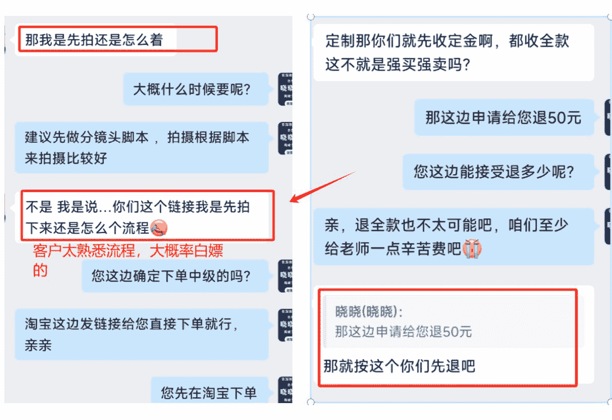
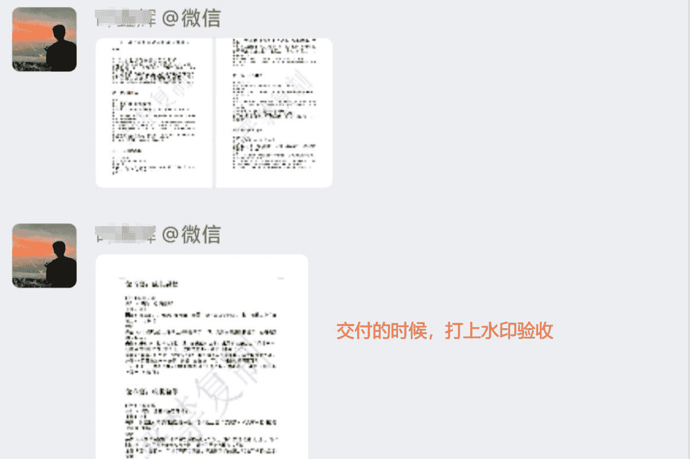
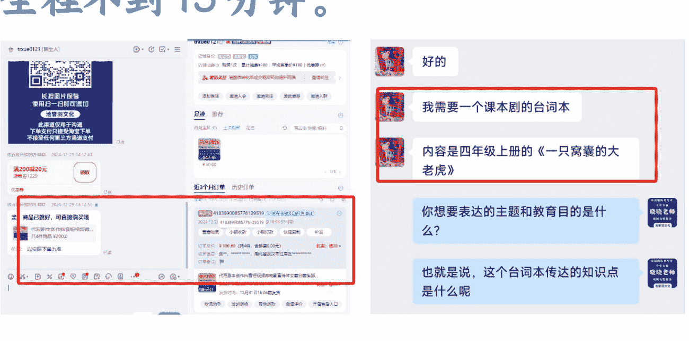
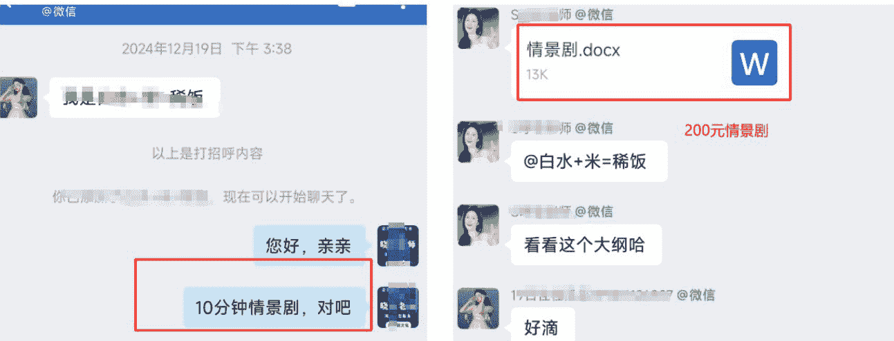
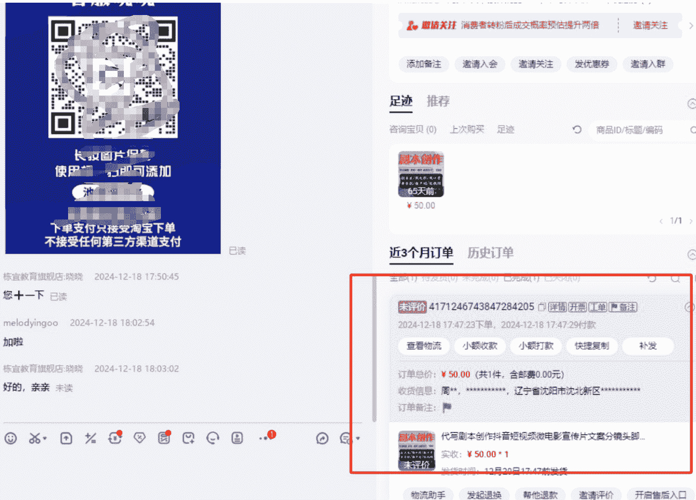
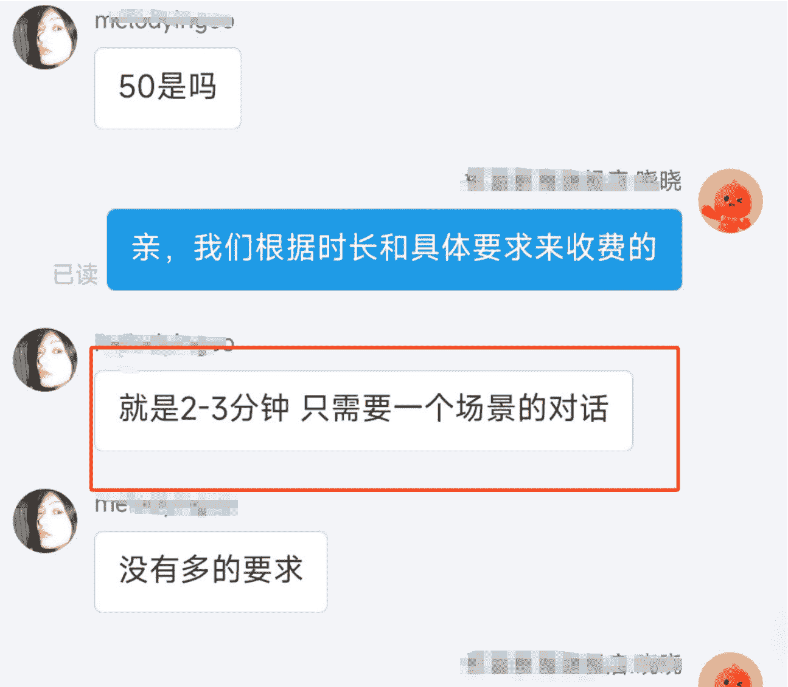
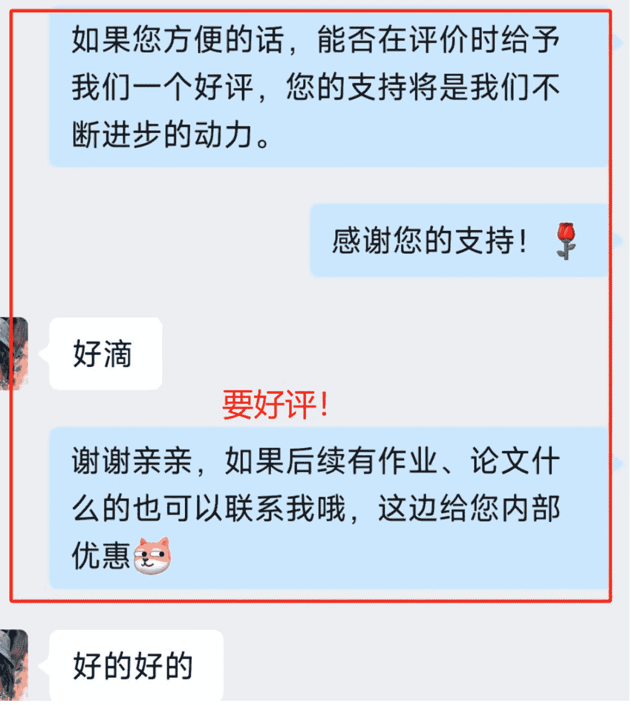
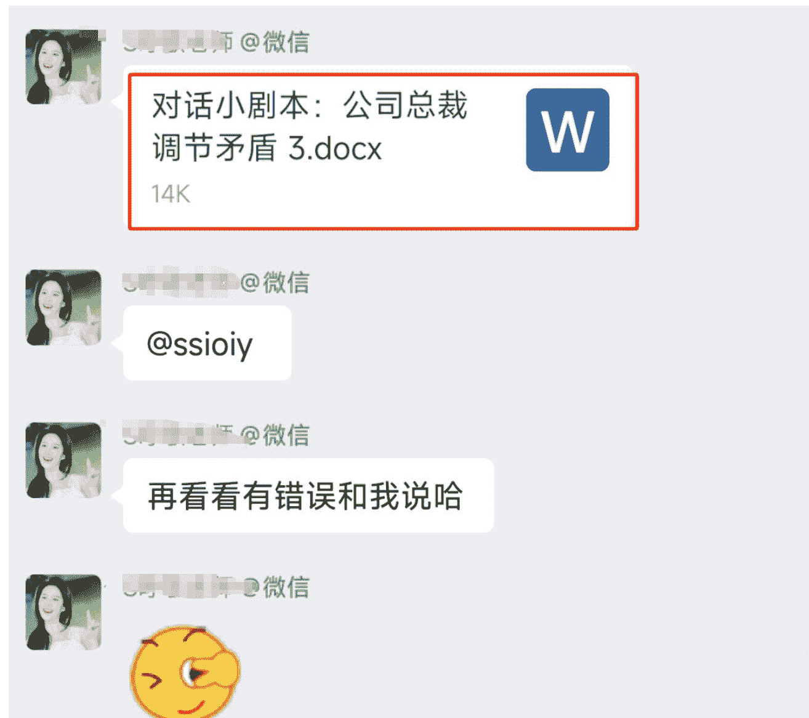

# AI+剧本写作，实测月入1万+，方法论分享

250305 生财精华

公众号懒人搜索，懒人专属群分享

各位生财圈友大家好，我是饭饭，目前精耕于 AI 写作变现，最早入局 AI 写作变现的一批人。

很久没有来星球输出优质文章啦，因为都在偷偷搞钱，目前我们已经累计交付剧本写作 200+，这个品类累计变现近 5w，这次依旧给大家带来一个保姆级的通过代写剧本月入过万的方法论分享，目前剧本处于增长阶段，适合新人搞钱。

内容由浅入深，由易到难，目的就是为了让新手看完少走弯路，老手看完恍然大悟！

万字长文输出，高价值，预计阅读时长超过 15 分钟，看完觉得有用的宝子们记得动动发财的小手给饭饭点赞支持，也希望大家多多留言分享，一起头脑碰撞，~

## 01- 代写剧本缘由

### 1) 负债转型

目前精耕于 AI 写作变现赛道，也是互联网上最先入局 AI 写作变现的一群人。我来自于贵州省一个比较偏僻的农村，我和村子里的其他小伙伴一样，童年是被煤油灯照亮的。小时候父母通过务农种庄稼供兄弟姊妹上学，父母没上过学，也就鼓励我们“多认几个字，将来去镇上当个老师。”那是村里人想象力的天花板。

我的整个经历就是农村出身，普通大学本科毕业，毕业后没找工作，趁着自己的一身牛劲，借钱、网贷投了 50 多 w 自己开实体店，亏的一塌糊涂，负债 24w 多，转型线上、做电商、做传统的代写店铺。后面大力拥抱 AI，从最开始的 2 个人组合到目前公司 20 人的规模，逐渐的在 AI 时代找到自己的方向感。精耕 AI 写作，将在赛道琢磨清楚，和更多的圈友一起深度交流，一起生财有术。

我是 2023 年加入生财的，直到 2024 年，在圈友的见证下，我带着自己的 AI 写作团队拿到了 AI 写作变现年营收突破 500w 的结果，目前 8 个天猫旗舰店，以及闲鱼矩阵、小红书聚光都还做的不错。搭建了万人写手交付团队，孵化了几家工作室，做了 AI 写作各种细分领域，也都拿到了不错的结果，做了各大社群的 AI 代写教练和分享嘉宾。

希望我的经历能给和我一样的普通人一个参考，普通人也可以把事情做到不普通。
AI 时代，大家一起拥抱 AI，一起牛逼！

目前 AI 写作能够变现的领域非常多，里面很多适合新手入门的，但是从 2024 年末开始，我们自己内测剧本的写作，发现这个市场非常的蓝海，需求也很大，能够接到不同客单价的稿件需求。有十几二十元的，有几百元的，还有大几千元的单子，在做的过程中呢，也发现这个领域的知识非常多，而且很有趣！！！

我目前主要获客是闲鱼和淘宝平台，这是我截图接到客单价还不错的单子，借助 AI 来辅助交付，交付质量客户还比较满意的，也产生了一些复购和长期商单合作。

### 2) 深挖AI写作变现

我和很多小伙伴一样，都是找项目的时候加入的星球，因为之前做实体店亏的一塌糊涂，陷入负债的深渊，后面转型做电商、传统的写作，在 AI 出现以后就快速入局 AI，使用 AI 工具来进行写作和简历优化，快速拥抱赚到点小钱。

因为自己是文科生，所以我是从最开始的看不懂 AI 技术，连最基础的解决网络问题、GPT 工具注册、AI 工具使用等等都搞定不了，到现在，可以熟练掌握 AI 工具，用来写各种文体，变现、做流量，带着团队拿结果。

在这期间随着交流的人越多，然后星球上很多圈友的边界能力非常强，在交流的时候就去拓品类、挖平台，我自己前后做了闲鱼、拼多多、淘宝、天猫、小红书和视频号等平台，都尝试过做写作，也跑通拿到了小结果。

后面平台跑通以后呢，2024 年我们在做的时候就会发现剧本的异常值，突然一下就暴增了，然后我们就同时在闲鱼和淘宝两个平台上架剧本的链接，自然也接到了客户咨询。成功的跑通了从接单、售前解答、售后维护到客户指导等环节。

我自己团队也是从最开始在剧本这个赛道零经验、零基础甚至以前都没接触过的情况下，去把细分领域跑通！然后现在做的还比较擅长剧本的创作，也通过剧本去赚到超过六位数，所以我也强烈建议圈友们每天花时间来星球上看一下内容，只要在实干的路上，星球真的能够帮助我们和其他人拉开差距！

干就完了，实战定能实战兴己！

## 02- 接单上手，说干就干

简单的做了市场调研以后呢，我们就开始上架闲鱼的剧本链接，同步进行的情况下也在跑淘宝的剧本链接，目前我们已经累计交付剧本数量超过 200+，基本上都是短片剧本或中等篇幅的剧本，目前签约领域还在探索，希望和各位圈友多多交流。

### 1) 什么是剧本?

剧本（Script）是为舞台剧、电影、电视剧或其他表演艺术设计文本载体，是指导表演、构建叙事、塑造角色的核心创作蓝本。它不仅包含角色的对话和情节发展，还详细描述场景、动作、情绪以及技术指示（如灯光、音效），为导演、演员、制作团队提供明确的创作方向。

亚里士多德在《诗学》中提出，剧本需具备情节、人物、思想、台词、场景、音乐六大要素，至今仍影响剧作理论。

### 2) 为什么剧本的需求会这么大?

我觉得剧本需求的爆发，简单来说是因为“人人都爱看故事”+“内容产业大爆炸”。只要有需求，那就有钱赚，大家可以从五个方面理解：

- 第1：短视频时代，故事消费变成“快餐”
抖音、快手、视频号等平台每天需要海量短剧吸引用户。一部热门短剧（比如逆袭、甜宠类、霸道总裁爱上我等等）可能几十集，每集只要 1 分钟，但必须有强冲突和反转，这就需大量“快节奏剧本”。
例如：抖音上《重生之我是豪门千金》这类短剧，一周拍完 100 集，编剧必须快速产出“打脸”“反转”等套路剧本。

- 第2：影视、游戏、广告都在抢好故事
电影电视剧：每年全球上千部新片上映，每部都需要剧本（比如漫威一部电影剧本要打磨 3-5 年）。
游戏：剧情类游戏（如《原神》《赛博朋克2077》）需要大量角色对话和分支剧情设计。
广告：品牌用“微短剧”打广告（比如支付宝的温情故事广告），剧本要让观众 3 秒入戏、现在看个广告，都像追剧看电影一样哈哈哈，反正我也爱看。

- 第3：普通人也能当“编剧”
短视频降低了创作门槛。一个小博主拍段子，写几句台词也算“微型剧本”。
例子：快手老铁拍农村生活短剧，自己编对话和情节，这类草根创作每天产生几十万条。

- 第4：全球观众口味越来越挑
观众看多了套路，编剧得不断创新。比如《鱿鱼游戏》把生存游戏拍出新花样，这类突破性剧本成为稀缺资源。
平台为了留住用户，必须不断提供新鲜故事，导致剧本需求翻倍增长，需求量激增，那市场自然增加。

- 第5：故事能赚钱，资本疯狂投入
其实一部爆款剧本带来的收益非常巨大。比如《狂飙》的剧本让投资方赚了十几亿，这也刺激更多人砸钱买好剧本，咱们普通人接触的不多，但是借助 AI，只要提示词用得好，万一你写的剧本被选中了呢。
短视频平台按播放量给创作者分钱，写剧本成了“流量生意”（比如快手短剧编剧月产 30 部剧本，月入超 10 万以上，我们普通人开个小店做剧本代写，也是月入 1w 以上）。

其实总结起来，也就是说，人们永远爱看故事，而手机、电脑、电影院......所有屏幕都在抢故事，剧本自然成了“硬通货”。从好莱坞大片到乡村大妈拍的土味短剧，背后都离不开一张写着“谁说什么、做什么”的纸——这就是剧本的力量。

### 3) 常见的剧本有哪些分类

剧本也有很多不同的类型，我觉得剧本就像“故事的不同包装”，不同场景需要不同写法。主要分五大类，大家一看就懂：

- 第一：按场景区分
电影剧本：写的时候要想着大银幕，比如《流浪地球》《哪吒2》《唐探》等等的震撼场面，必须详细描述特效和镜头角度。
电视剧本：一集 40 分钟，每集结尾留个钩子（比如《甄嬛传》皇后突然晕倒），让人急着看下一集。
舞台剧本：重点在台词和现场互动，比如《雷雨》里人物吵架，得标注“摔杯子”“灯光骤暗”。

- 第二：按故事类型
甜宠剧本：专攻少女心，比如“总裁爱上小秘书”，台词要多撒糖（“天凉了，王氏该破产了”）。
悬疑剧本：每 10 分钟埋一个谜题，比如《隐秘的角落》开头小孩推老人下山，瞬间勾起好奇心。
逆袭剧本：底层小人物翻身打脸，常见于快手短剧（保洁阿姨亮出黑卡：“这公司我买了！”）。

- 第三：按长短分
长剧本：电影 2 小时起，适合深挖人物（如《教父》三代黑帮家族恩怨）。
微短剧本：抖音 1 分钟一集，前三秒必须高能（比如直接扇耳光、车祸现场）。
广告剧本：30 秒讲完故事，比如支付宝春节广告“打工人的团圆路”，一句话就要催泪。

- 第四：按技术玩法分
互动剧本：观众能选剧情走向，比如《黑镜》电影让你帮主角决定杀人还是自杀。
竖屏剧本：专门为手机设计，特写怼脸拍（比如美妆博主短剧“素颜→化妆”对比）。
AI 生成剧本：输入关键词自动出大纲，比如“穿越+宫斗+大女主”，适合量产网文改短剧（我也是最简单的）

- 第五：特殊用途剧本
游戏剧本：要给玩家挖坑选路线，比如《恋与制作人》里四个男主的不同对话分支。
动画剧本：动作得夸张到帧，比如《猫和老鼠》汤姆被压成纸片，剧本得写“挤扁→弹回原形”。
企业剧本：连员工培训都要剧本！比如教销售怎么应对客户砍价，直接写对话模板。

那普通人入局的时候自然是找简单的，先找感觉再变现，“抄爆款、套模板、盯甲方”，例如：代写甜宠打脸剧、信息流广告、知乎短故事，这三个赛道门槛低、来钱快，适合新手。记住：先模仿再创新，先量产再提质！

### 4) 新手入局选哪些平台？

我一直觉得选平台非常关键，“前期闲鱼、小红书、淘宝或者抖音快手接代写，中期知乎盐选卖故事，后期投稿签约赚长期”，按这个路径走，新手最快 2 周就能变现，因为代写的需求是非常大的，记得：多拆解爆款、少自我感动，先活下来再谈理想。

切入这个赛道的话，可以从几个思路去考虑出发：

- 第1：短期快速变现
猪八戒网、boss 直聘、淘宝大店等等。
我们要做的就是直接去上面接单，然后搜“剧本代写”任务，找到一些甲方需求，带一些自己的案例，接单时附 3 个过往案例（没作品就仿写，或者我放文档里面这个大家也可以用）。
然后优先接 500 元以下小单（大单竞争激烈，新手做起来比较难，先积累经验值）。

- 第2：平台接单变现
这算是代写里面的细分领域，不管是在自媒体平台还是电商平台，都有一个蓝海需求。
我们去做的时候可以通过闲鱼、小红书、或者淘宝、拼多多等平台去开店引流，找到有剧本写作需求的甲方。具体思路就是和图上我提供的一样，要么在小红书这个平台去直接发布剧本代写相关的笔记，这种账号不需要粉丝，低粉爆的概率挺大的，一篇笔记如果小爆，带来的收益会不错。同样的思路，在闲鱼、在淘宝或者拼多多，都可以执行，具体开店的方法论在星球之前也做了分享，圈友可以作为参考。

- 第3：长期签约变现
头部平台（高门槛但变现稳）
中腰部平台（新人友好但需防坑）
方法都是在实战中去不断累积修正的，大家对剧本的平台分类有了一个基础的认知以后，就可以根据自己的实际情况去展开接单或者签约投稿变现，我的建议是：

第一步：新手村练级（1个月内）先接小单混经验，别想一口吃成胖子。
第二步：升级打怪（2-3个月）找专攻能赚钱的平台，别在没流量地方死磕。
第三步：剧本大佬之路（3个月后）去抱紧平台大腿，试试签长约赚安稳钱。

这儿我给大家分享一下我们快速的去接单然后借助 AI 写稿的方法论。

## 03- 新手必看：最快赚到 500 元的方法论

很多新手刚入门的时候其实应该是有点担心有点顾虑的，根据经验先给大家悄悄说一下：

- 1. 别纠结文笔！甲方只要套路化模板，都是借鉴爆款。
- 2. 别怕丢人！遇事不决问 AI，没有案例库都可以自己写一份案例库。
- 3. 别等完美！先接单再优化，接的单多了，啥都会了。

其实做项目有一个秘诀，执行力比天赋重要！7 天发 50 条接单信息，不可能没单，500 块只是开始！跑通流程后，复制放大就能月入过万。

### 第一步：选对平台，别瞎折腾

我在前面给大家分享了比较容易接单的平台，选择短期快速变现的，猪八戒网、boss 直聘、淘宝大店或者直接在闲鱼、小红书开店。

然后去干啥呢？去发产品、去发笔记、去大量的应聘。

### 第二步：准备案例库！

没作品？直接伪造！用 AI，3 分钟伪造案例库，当然，伪造案例库的核心不是“造假”，而是降低甲方决策成本。用专业话术、统一视觉、细节把控，让甲方觉得你“靠谱”，自然愿意掏钱。其实，这个行业 80%的“资深案例”都是包装出来的，你先装得像，才能活得久。

这儿的话我建议直接国产 AI 工具，生成内容更符合国内短视频平台调性，（deepseek 或者腾讯元宝）都可以！

步骤 1：打开 DeepSeek
电脑端：浏览器访问 deepseek.com
手机端：微信搜索“深度求索”公众号 → 菜单栏点“在线体验”

步骤 2：输入精准指令（直接复制）
你是一个专业编剧，需要写一段 300 字的战神归来短剧剧本，要求：
场景：主角被丈母娘辱骂，隐藏的战神身份曝光
关键点：丈母娘下跪、保镖出场、黑卡打脸
包含专业术语：分镜号（如 SC-01）、景别（中景/特写）、情绪升格
输出格式：
【分镜号】场景描述（画面+台词）

步骤 3：生成内容示例

【SC-01】别墅客厅（中景）
丈母娘（摔茶杯）：“你这个废物，不离婚就滚！”
林峰（低头握拳特写）：“您确定要这样？”

【SC-02】大门外（仰视镜头）
10辆奔驰刹停，黑衣保镖齐喊：“恭迎战神归位！”
丈母娘（后退半步）：“你..你到底是
谁？！”

【SC-03】客厅（慢动作升格）
林峰（甩出黑卡砸桌）：“这张卡能买你
全家的命！”
丈母娘（瘫坐地上）：“我错了！求您放
过我们！”

步骤 4：做成案例
用WPS/Word排版:
标题：《XX文化合作案例、短剧<逆袭战神>分镜节选》
页眉插入LOGO：百度搜“影视公司logo”→下载第一个图片
导出PDF：可以设置密码“1234”（应聘的时候很管用，很专业，甲方问就说“行业保密习惯”）
不亏就是赚的，别被白嫖哈哈哈。

### 第三步：专接“无脑小单”，别碰大坑

什么是“无脑小单”？
就是那种标准化高、需求简单、甲方要求低的小额订单，订单的金额小，但是 AI 做起来很方便的那种。例如：短视频 15 秒口播文案、小红书探店种草文案、短剧剧本单集分镜等等。

当然，也有一些大概率会白嫖的，就例如我们在接单的时候就遇到白嫖的，遇到过几次，然后也长经验了，我整理这个表格上面的内容，大家可以提前避坑。

### 第四步：接单后 AI 快速生成

核心公式：“需求拆解→AI 生成→人工微调”

① 输入详细指令:
如果是短剧本的话建议直接使用 deepseek 或者腾讯元宝

实例 1: 快速生成抖音上那些狗血、炸裂、激情的短剧:
你是一个专业短剧编剧，需要写 3 集逆袭打脸剧，每集 1 分钟。
要求:
- 第 1 集: 女主穿地摊货参加同学会，被校花嘲讽，服务员突然下跪喊“大小姐”
- 第 2 集: 女主继承万亿集团，校花公司破产，哭着求原谅
- 第 3 集: 女主让校花扫厕所，拍视频发朋友圈

每集包含：时间节点、场景描述、对话（带爽点台词）

输出结果：

#### 逆袭打脸短剧剧本
总时长：3分钟（每集1分钟）
核心公式：“极致反差+身份碾压+社死名场面”

##### 第一集：同学会打脸
时间节点：0:00-1:00
0:00-0:10（酒店门口）
场景：破旧电动车急刹，林夕（女主）扯了扯起球的毛衣外套，酒店霓虹灯照亮她泛白的帆布鞋。
台词：
保安（叉腰）：“送外卖走员工通道！”
林夕（低头亮手机）：“我…是来参加同学会的。”

0:10-0:30（包厢内）
场景：镶钻高跟鞋特写划过头，校花苏雪把红酒杯推到林夕面前。
台词：
苏雪（轻笑）：“听说你在摆地摊？这杯82年拉菲够你赚三个月吧？”
众人哄笑中，林夕握紧桌布（特写指节发白）。

0:30-0:50（走廊反转）
场景：经理突然冲进来，扑通跪地（慢镜头茶壶摔碎）。
台词：
经理（颤抖）：“大小姐！董事长让您试戴今晚拍卖的5亿粉钻！”
苏雪（红酒杯落地特写）：“不可能！她明明...

0:50-1:00（悬念）
场景：林夕把钻石随意别在毛衣上（大特写），转身时轻笑。
台词：
林夕（画外音）：“狗眼看人低的东西，该清算了。”

##### 第二集：继承者降临
时间节点：0:00-1:00
0:00-0:15（集团顶楼）
场景：百人高管鞠躬（广角镜头），律师展开金箔遗嘱。
台词：
律师（激昂）：“林夕小姐继承林氏集团51%股份，即刻生效！”

0:15-0:40（破产风暴）
场景：苏家别墅贴满封条，苏雪跪扯林夕裤脚（特写美甲断裂）。
台词：
苏雪（崩溃）：“我给你当狗！求你别收购苏家!”
林夕（踩住她手指）：“现在求我？当年喂我吃粉笔时想什么呢？”

0:40-1:00（权力展示）
场景：林夕甩出收购文件（特写“1元并购”条款）。
台词：
林夕（冷笑）：“钱我多得是，但你们苏家的脸——只配这个价。”

##### 第三集: 社死终局
时间节点: 0:00-1:00
0:00-0:20（厕所羞辱）
场景：苏雪穿保洁服刷马桶（脏水溅到脸上），林夕高跟鞋入镜。
台词：
林夕（抛钢丝球）：“用这个刷，刷不干净扣工资。”

0:20-0:50（朋友圈暴击）
场景：手机拍摄苏雪趴地擦尿渍（俯视镜头），配文输入中...
台词：
林夕（画外音）：“感谢老同学亲自打扫，同学会纪念款套餐打8折哦~”

0:50-1:00（终极打脸）
场景：朋友圈瞬间 99+赞，苏雪父亲来电显示(特写“催债中”)。
台词：
苏雪（尖叫砸手机）：“林夕！你不得好死！”

实例 2：（直接复制）：
你是一个专业编剧，需要根据以下需求生成短视频分镜脚本：
主题：战神归来打脸岳母
关键点：隐藏身份曝光、保镖出场、甩黑卡打脸
包含元素：分镜号（如 SC-01）、景别（中景/特写）、情绪升格
输出格式：【分镜号】画面描述+台词

输出结果

#### 短视频分镜脚本：战神归来打脸岳母
总时长：60 秒 | 核心公式：“身份压制+物理打脸+财富羞辱”

##### 分镜脚本
【SC-01】（中景-别墅客厅）
画面：岳母将离婚协议摔在茶几上，茶水飞溅到主角林战裤脚。
台词：
岳母（冷笑）：“签了它！我女儿的新男友是赵氏集团少东，你这种废物配不上她！”

【SC-02】（特写 - 林战右手）
画面：林战握拳，指关节发白（镜头抖动模拟愤怒）。
音效：骨骼咯咯声。

【SC-03】（中景 - 全景俯拍）
画面：大门被踹开，十二辆悍马大灯刺破雨幕。
台词：
保镖（齐声）：“西北战区全体，恭迎战神归位！”

【SC-04】（特写 - 岳母瞳孔）
画面：瞳孔剧烈收缩，倒映出林战撕碎离婚协议。
台词：
林战（低沉）：“三天前，赵家求我收购他们 51%股权。”

【SC-05】（情绪升格 - 慢动作）
画面：黑卡甩在岳母脸上，卡片旋转特写镀金卡号。
台词：
林战：“这张卡买你全家贱命，还有剩！”

【SC-06】（特写 - 黑卡插进西瓜）
画面：黑卡穿透果盘西瓜，汁液溅到岳母颤抖的手背。
音效：刀锋破风声。

【SC-07】（中景 - 仰视镜头）
画面：保镖队长拎起赵氏少东扔到岳母脚边。
台词：队长：“赵家已破产，按您吩咐留条狗命。”

【SC-08】（特写-岳母嘴唇）
画面：嘴唇哆嗦着碰到黑卡，口红蹭掉一块。
台词：
岳母（哭腔）：“女婿...不，战神大人...”

【SC-09】（情绪升格-360度环绕）
画面：林战踩住岳母想捡卡的手，作战靴碾压特写。
台词：
林战：“捡？你也配？”

【SC-10】（大特写-监控屏幕）
画面：监控显示岳母跪爬捡卡，画面突然雪花（卡被碾碎）。
字幕：“战神一怒，尸骨无存”

执行要点

- **视听语言：**
  - SC-04 用瞳孔倒映强化身份反转
  - SC-05 黑卡甩脸接西瓜穿刺，物理+财富双重羞辱
- **节奏控制：**
  - 前30秒压抑（被辱）→后30秒爆发（打脸）
  - 每5秒切换分镜，适配短视频流量算法
- **道具细节：**
  - 黑卡镀刻“SWORD-01”（暗示军方背景）
  - 岳母假睫毛被泪水冲歪（暗喻虚伪崩塌）

#### ② 人工微调

这个环节很简单了，已经到了最后交稿的状态，人工修改的核心原则就是：用人类瑕疵覆盖 AI 痕迹！

常用的几个方法：

##### 改人名/地名
- **AI 漏洞：** 常用名雷同（如“林战”“苏雪”）
- **人工微调：** 百度搜索“本地企业名录”，替换为真实公司名（例：深圳改“腾飞实业”）

##### 加方言/口语
- **AI 漏洞：** 台词过于书面化
- **人工微调：** 加入语气词：“啊、呢、呗”（例：“这卡能买你全家的命——呢！”）

##### 调段落顺序
- **AI 漏洞：** 线性叙事过于工整
- **人工微调：** 暴力破门（0:00-0:05）→ 闪回岳母羞辱（0:05-0:15）→ 打脸（0:15-1:00）

##### 加冗余动作
- **AI 漏洞：** 缺乏生活化细节
- **人工微调：** 用“下意识动作”暴露角色心理（如说话前扯领口、舔嘴唇）

##### 植入时代梗
- **AI 漏洞：** 缺乏时效性
- **人工微调：** 蹭热点：抖音热搜词“失信被执行人”“限高令”

## 04 血泪经验（被白嫖、骗稿、亏钱）

我们做这个赚的是劳动报酬，如果不能区分好客户，写的剧本客户是可以直接复制粘贴就使用的，所以在前期的时候对客户的区分判定也很重要，后期对客户的处理方法同样很关键。

我们之前也遇到了不少白嫖的客户，也遇到了不少因为剧本老师不够专业产生的纠纷，但是，解决了就很棒！

### 1）实战踩坑

因为剧本也是入局的时间还不是很久，经验也没那么丰富，我们就先说给客户写剧本踩了一次又一次的坑。

**案例1：** 之前写的一部短剧本，客户说“按你的专业来”
- **经过：** 客户要求不明确，写了 3 版后甲方突然要求改玄幻修仙题材
- **损失：** 倒贴 200 元的费用给剧本老师，自己承担

**案例 2：大学生团队骗稿**
- **经过：** 对方称“学校项目没预算”，先付了部分定金，拿剧本参赛获奖后失联，没拿到尾款。
- **损失：** 损失了几百块的尾款，再也不能做这种蠢事。

还有一些案例，我就不吐槽了，伤心往事就随风吧，我总结了避坑指南给大家，保存收藏使用！

### 2）避坑指南

| 客户售前咨询话术 | 大概率会遇见的坑 | 客户目的 | 饭饭建议+话术模板 |
| :--- | :--- | :--- | :--- |
| “你好，我的剧本要高级感” “我想要写能够爆的” “你好，我想要了” | 需求模糊，后续可能反复改稿 反复改稿不行，可能会退款 | 客户自己也不知道想要什么，用抽象词汇掩盖业务目标不清晰 | **三步锁单法：** 1、追问：“具体对标哪个品牌/影视剧风格？” 2、发3个参考样稿：“您倾向于A（王家卫）、B（迪士尼）、C（李子柒）哪种调性？” 3、加价话术：“定制化风格需增加10%预算用于来做爆款数据调研，咱这边能不能接受呢” |
| “预算不高，想用白菜价买钻石服务” “先压价再无限加需求” | 砍价预期管理 | 预算博弈 | **砍价预期管理术：** 1、首次报价=心理底价×2（如想收500元报999元） 2、预留服务项：“当前报价含2次修改，如需增加剧情线需按每条50元付费” 3、用「报价对比图」施压：“这是市场均价，我们已优惠20%”（低价坚决不做） |
| “先试写一集” “帮我写了直接投给你长期大单子，单量多…” | 套取创意/骗稿常用话术 免费获取初稿后消失或自行改编，或者白嫖 | 免费套取核心创意 | **反白嫖技巧：** 1、水印防御：图片打水印 2、先给一部分：“我们提供500字免费试读版，完整交付需预付50%定金” |
| “对标S级项目” “要求复刻《鱿鱼游戏》却只给500元预算” “年轻人喜欢的风格” “你看看抖音XXX” “你看看某部爆款” | 需求降级法 甲方不懂Z世代文化硬蹭热点 要求加入过时网络用语或烂梗 | 想用低成本模仿爆款 数据碾压话术 | **需求降级法：** 1、拆解爆款元素 2、用AI做平替方案（给客户方案是最好报价解决问题的） **数据碾压话术：** 让客户发数据，发参考内容，有记录更好 |
| “改到满意为止” | 无休止修改的开端 利用合同漏洞无限白嫖 气死人了…… | 防止无限改稿 | **合同防御：** 1、明确修改次数：“费用包含3次修改，超次按50元/次收费” 2、限定修改范围：“不接受颠覆剧情走向或人设的调整” 3、用「腾讯电子签」添加补充条款：“修改意见需书面确认，口头需求无效” |

### 3）常见的交付剧本

**类型 1：课本剧**
收费 180 元，写了一个课本剧，AI 直出，全程不到 15 分钟。

**类型 2：情景剧**
10 分钟的情景剧，收费 200 元，客户很满意

**类型 3：场景对话**
AI 直出，全程 15 分钟不到，收费 50 元

**类型 4：公司年会剧本**

**类型 5：视频脚本**
懒人微信:lazyhelper

### 4）剧本代写的注意事项

我之前自己也拍了20多个信息流脚本，很清楚，短剧本质是“情绪过山车”，所有技巧围绕“更快！更狠！更直白！”展开。记住：让观众在蹲厕所的3分钟里爽到握拳尖叫，才是好剧本！清楚这些注意事项，更容易写出好内容。

#### ① 使用者的身份得搞清楚
剧本是从教演员的角度来写的，尽量的简单易懂。演员需要知道“怎么演”，而不是“镜头怎么晃”，不要从导演角度来写。

**错误示范（导演视角）：**
> “夕阳把老旧的欧式窗帘染成琥珀色，女主逆光站立，睫毛在脸颊投下阴影。”
> （演员：所以我要站着不动？）

**正确示范（演员视角）：**
> “女主扯断珍珠项链（特写珠子崩落），一巴掌甩在男主脸上（动作要响），红着眼吼：‘这婚不离我是狗！’”（演员立刻知道怎么动）

#### ② 不要搞抽象词
如果写出来的抽象内容太多了，大概率会被返修多次或者不过，我之前在拍信息流脚本的时候就遇到，搞一些抽象词，真的会被骂，演员最恨的抽象词。

**演员最恨的抽象词：**
× 一夜旖旎、霸气侧漏、心如刀绞、眼神拉丝

**正确打开方式：**
（结合具体动作、神态、环境描写，避免空泛词汇）

#### ③ 不要写生僻字
剧本大多数都是为了写出来，教演员怎么做，生僻字词太多的话不行，给剧本里面的人物起名字的时候要为了演员好记清楚，禁用生僻字，例如：甯、彧、婠等等，可以用职业标签来起名，张医生、李总、王警官（降低记忆成本）。台词也不要文言文，不要长句子、不要假大空。

#### ④ 接单前收定金（除开应聘）
如果自己接单，自己小红书或者淘宝闲鱼等平台开店接的单子，一定是得先付定金以后再开始写作的。不要被白嫖就是对的，自己接单最好的保护啦，先建立信心、提高熟练度、掌握技能，开始写就会很有意思。

### 5）常见的爆火题材
给大家整理了影视剧本的题材分类，大家可以通过这些内容来了解哪些题材更受欢迎，对剧本也算是会有更加深度的理解，在后面写的时候可以多多的参照这些题材，更容易爆火。

### 6）新人入局剧本写作常见问题

**Q：需要代写剧本的是哪些用户？**
答：比如独立制片人或小型影视公司。很多可能没有足够的编剧资源，或者项目太多需要外包。然后是广告公司，他们经常需要制作广告、宣传片，可能需要定制剧本。还有企业用户，比如需要年会活动、品牌故事的剧本。教育机构也可能需要，比如学校的话剧表演或教育视频。网络内容创作者，比如短视频、网剧的制作者，他们可能没有时间或能力自己写剧本。游戏公司可能需要剧本杀或互动游戏的剧本。个人用户，比如想自己拍微电影或者求婚视频，但写作能力有限。戏剧团体、话剧社可能需要专业剧本。活动策划公司，比如婚礼、发布会需要定制剧本。最后是文化传媒机构，可能长期需要大量剧本。

**Q：需要买会员吗？**
答：不用！用微信小程序免费生成（推荐「闪剪」的剧本工具）

**Q：客户要修改怎么办？**
话术模板：“好的，请您具体说明要调整[哪个角色/哪段剧情]，我们提供3次免费修改哦”

**Q：不会写专业术语？**
妙招：让AI自己解释！输入“把这句话改成初中生能听懂的话：[你的原句]”

## 05 剧本报价技巧及其常用话术

把我分享的内容掌握，大家可以收藏作为参考使用，我觉得看完你们自己写的话，不管是报价还是谈单话术，都可以勉强及格啦！

### 1）如何定价
总价 = 剧本类型 × 字数（时长） + 附加需求 - 你的接单意愿

### 2）如何报价（定制类产品）

#### 一、基础定价维度（3个核心标准）
**剧本时长**
- 短剧本（3-10分钟）：300-800元（适合短视频、口播、情景剧、30分钟以内剧本）
- 中剧本（10-30分钟）：800-2000元（适合企业宣传片、短剧分集剧本）
- 长剧本（30分钟以上）：2000元起（需根据具体类型和复杂度单独报价）

**交付时间**
- 常规交付（3-7天）：按基础价格收费
- 加急交付（1-2天）：加收20%-40%费用

**剧本类型**
- 搞笑/反转类：基础价上浮10%左右
- 专业领域（如金融、医疗）：基础价上浮15%左右
- 定制人设剧本：基础价上浮50%（需结合客户IP定位，如果给用户建议和解决方案，就会很好！）

### 3）报价参考表（不同类型剧本）
- ① 短视频/广告剧本
- ② 小品/相声剧本
- ③ 网络剧/微电影剧本

### 4）剧本写作沟通常用话术

#### 一、关于质量
**Q1：怎么保证写出来的剧本是我想要的？**
答：没事！你随便举例子就行。比如“像《你好，李焕英》那种笑着哭的感觉”，或者发几个你喜欢的抖音视频给我，我先深度的分析一下你的剧本需求，然后再照着感觉来，中途写的适合也会给你汇报进度，及时沟通，让你看见质量！

**Q2：我只会说“要感人的故事”，但具体咋描述啊？**
答：没事！你随便举例子就行。比如“像《你好，李焕英》那种笑着哭的感觉”，或者发几个你喜欢的抖音视频给我，我照着感觉来。

#### 二、关于钱
**Q3：代写一个剧本多少钱？会不会坑我？**
答：当然不会的呀，咱这边也是为了初次给你一个交付，写一个好的本子给你，因为咱们行业规定呢也是收30%定金，写完大纲再付50%，写完终稿后结清尾款就可以。

**Q4：能不能先写一半再给钱？**
答：宝子，这个不行，咱们是先付定金然后开始按照你的需求写作，行规是收30%定金，写完大纲再付50%，交稿后结清尾款。

**Q5：多久能写完？我后天就要拍视频了！**
答：不要着急，我看了你这个题材我是擅长的，前期一开始咱们多沟通，需求清楚了我很快就给你加急完成啦，我会把你这个放在首位，抓紧处理好！

**Q6：写一半发现方向错了，能重来吗？**
答：小调整免费，比如改台词，改镜头等等，但是如果需要大改动（比如换主角人设、换题材、等等）得加点对应的修改费用。建议一开始咱们多沟通清楚一点点，这样写出来质量也高！

#### 四、关于版权
**Q7：剧本写完了算谁的？你会偷偷卖给别人吗？**
答：你放心就可以啦，我用的查重软件和大学论文一样，保准原创！万一真有纠纷（比如撞了冷门梗），法律问题我扛，合同里白纸黑字写着呢。

**Q8：如果有人说我抄袭怎么办？**
答：咱们的剧本都是原创定制，卖给你这边的话我们都是保密保护原创，版权就归你啦，放心可以。

## 06 新手必备工具包

### 写在最后
深夜码完这篇万字干货，也是对项目的深度复盘，AI写作是一个值得深挖的领域，光剧本这个细分领域就能够造富很多圈友，深挖里面更是大学问。

历史 3000 多份各类付费文章以及年费三千多的副业社群资源，见懒人专属群内部分享!
付费群，白嫖勿扰!

懒人专属群更新记录：
https://lazybook.fun/#/blog/record2