# Youtube shorts 常规和猎奇赛道的复盘杂谈

250305 生财精华

公众号懒人搜索，懒人专属群分享


## 介绍

插曲：第一个月就拿到了900万播放，但剩下的100万却花了一个月时间。嗯，没错，我就是Gray教练和波妮教练口中那个“900万vs100万”的圈友，嘿嘿！关于这段“坑坑洼洼”的经历，稍后我会详细分享，既是对自己的总结，也希望能给大家一些启发。

各位圈友，大家好！我是酷拉皮卡，一个深耕YouTube赛道的热血青年。去年10月份加入生财，没赶上航海，幸运的是亦仁哥发布了YouTube shorts的超级标，完美契合，于是12月完成生涯第一次航海。

目前，私教陪跑进行到最后一天，针对整个阶段的成长进行复盘，算是杂谈。主要内容以下三点：

- 1. 从0到1跌跌撞撞开通YPP的经验，为各位圈友提供一些踩坑经验
- 2. 一些其他圈友还没分享过的做视频小技巧，提高大家的效率
- 3. 还没有圈友分享过的猎奇赛道玩法，抽象但有流量

### 为什么选择 Youtube shorts

**梦想种子：**
2019 年夏天，头一热注册了一个公司，经营范围就是自媒体。这是一直想做的事情，只是没有一个明确契机来触发，如今得偿所愿，理由充分（超级标就是触发器）。

**AI 与兴趣结合：**
AI 是未来的共识，而我一直在使用相关工具。这不刚好兴趣与趋势结合，让我选择了出海 AI 自媒体这条赛道。

**倍率诱惑：**
这一点我可以强调三遍，因为它真的至关重要（需自行下场证伪）。它的底层逻辑和我做的 Web3 撸毛类似：如果某个号花掉了 gas 和时间，可以给你带来 10 倍乃至 100 倍的收益就会感觉真香。当然这里不是推荐做 web3，只是举例，今年反撸概率极大！退一步说，光是实打实的 7.3 倍汇率摆在那里，都足够有吸引力了！

### 正文

时间飞快，YPP 陆续在达标，可越觉得时间不够用，套用小伙伴的一句话：“学不完，根本学不完！”有同感吗？

好的，我们进入正题，此次分享的内容分为三个部分：珠玉在前，已经有许多优秀圈友分享了全流程制作经验，在此我就杂谈些细节操作技巧和思考，希望能带来新的启发！

#### 第一个号现状：

截至目前，你的频道累计获得了 18,866,959 次
| 观看次数 | 观看时长(小时) | 订阅人数 |
| 1,886.7万 | 22.7万 | +5.5万 |

## 第一部分：第一个账号从0-1经历了什么
(复盘)

### 1. 看帖自学

既然是学，那就全力以赴。看到那种“可做可不做”，我都做，权当是熟悉各类工具，也是妙哉。

亦仁哥发布超级标后的一两周里，我几乎翻遍了生财上所有关于YouTube的帖子（在此感谢各位前辈的无私分享）。秉持生财“下场把手弄脏”的理念，ai内容赛道是真多，不过个人兴趣叠加工作经历让我优先选择了猫咪故事。就这样开始了第一个视频的制作，耗时8小时。

猫咪故事对标尽量找的千万播的爆款，做了是可能百万的。整体框架会遵循爆款，不过有些细节会去做差异化，例如：猫咪品种，皮毛颜色，光线，体型等。


整个制作流程就是按照马老师分享的方法：
https://scys.com/articleDetail/xq_topic/4848521448112458

顺着这个路径陆续对标做一些猫咪，逐渐有了一些流量，不错的正反馈。猫咪故事是目前为止做的最爽的赛道，由于时间有点久远，往后希望能重拾起来，再详细整理分享心得。

忙碌的节奏并未满足，于是接着模仿了一批当然火热的宝宝走秀，猫咪跳舞来同步发布，甚至美式爆款俚语故事都有做（当时几乎把 AI 赛道试了个遍）。

PS: 由于达人秀两条就突然爆了，流量来得快，制作时间也比猫咪故事更短，于是我选择暂停一下猫咪故事，转而专攻达人秀。

OS: 心疼两秒这些还没合成发布的故事，找机会让它们出来。

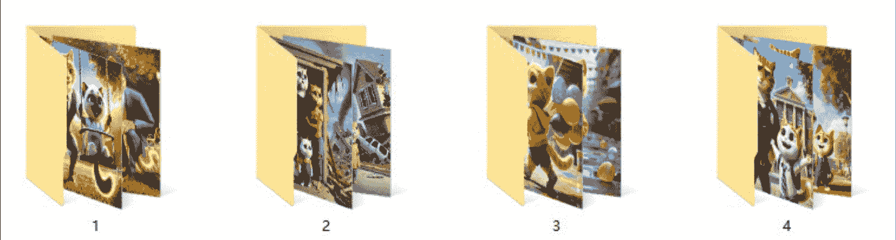

测试发现，猫咪跳舞和宝宝走秀的流量不如猫咪故事持久，且制作难度几乎没有差异。

那就继续吭哧吭哧一顿做，这个时候达人秀这个主赛道进入视线，我跟着圈友的详细教程依葫芦画瓢。早期看到的大多都是常规的写实舞台表演，在此基础上我叠加了些华丽的超写实风格。

没想到超出预期，就这样陆续发布 2 条达人秀之后，账号来到了第 10 天左右，有个视频突然爆了起来，凭借这个300w播放的视频开始，陆续一些50w+和100w+接上，账号流量整体向好。

提示：听教练的话，如果爆了视频，记得立马自己复刻接着发。要早知道，估计这号20天就达标了。可惜，没有如果。


20天左右账号已经来到900w播放，这时航海正式开启，惊觉自己账号印度观众竟然占到了20%+。

| 地理位置 | 观看次数 ↓ |
|---|---|
| 合计 | 9,538,468 |
| 印度 | 2,063,441 21.6% |
| 韩国 | 1,020,508 10.7% |
| 印度尼西亚 | 612,138 6.4% |
| 俄罗斯 | 391,873 4.1% |
| 越南 | 390,548 4.1% |
| 墨西哥 | 385,275 4.0% |
| 巴基斯坦 | 383,199 4.0% |
| 巴西 | 365,373 3.8% |
| 美国 | 344,262 3.6% |

### 2. 掉坑纠偏

航海期间，学习过程中逐渐意识到印度地区单价非常低。立马行动，改变内容方向，偏向美式文化。然而，这正是我踩下的一个大坑。当时我对泛流量的理解不够深入，这调整导致流量急剧下降。（对于早期3W订阅用户没吸引力）

事后复盘发现，大众化内容并不是无法垂直吸引欧美用户，而是没必要。一个娱乐节目本身就具有广泛的观众群体，即使做到垂直化，播放量收益的增幅也非常有限，远不如直接选择发达地区高单价赛道的收益。

要解决这个问题，不如从根本上选择那种稍微垂直的二创赛道。马老师的故事号为什么能吸引大量欧美用户？原因很简单：配音是英语，故事背景也是欧美文化。比如讲一个毕业舞会的狗血故事，亚洲国家的观众会对这种内容感兴趣吗？印度有毕业舞会吗？故事是说给泰国观众听的吗？显然看下去的可能性很低，因此，在开通YPP的道路上，我不再执着与强行垂直。内容改回原风格后，播放量也就顺利达标了。

教训就是：在账号未达标之前，不要轻易瞎折腾。现在账号达标后的1-2个月，我尝试了各种方向，权当是用大号探路，找感觉。

这个账号也随着达人秀的内容趋势在演变，陆续做了感人一生故事，到惊恐猎奇的风格，再到快节奏的高质量美女视频。

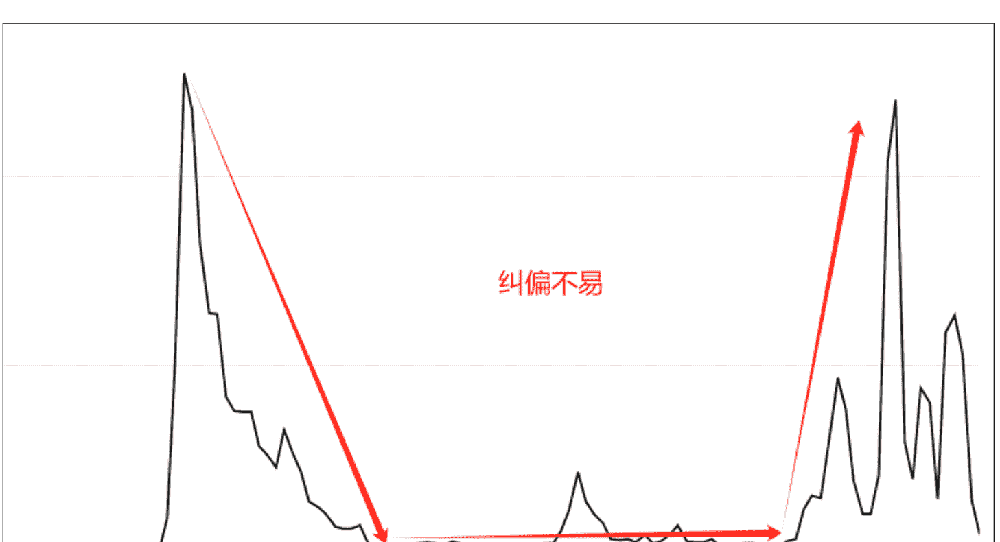

### 3. 小爆款的窍门：

首先找到不错的对标，然后模仿内核，最终加入自己的微创新。（按照这个逻辑，现在这个号隔一段时间就会有一个小爆）

**对标：** 目前的几个百万小爆款，每一个都有明确的对标。正如那句老话：爆过的内容还会再爆。

**内核：** 反复研究爆款的精髓。是画面的细腻变化？还是美女的性感诱惑？或是音乐与画面节奏的层层递进？也可能是评委的表情足够真实或抽象？只要抓住你认为最核心的两点，就能做到 70%-80%的效果。（比如这个视频模仿的核心并不是蟹钳小女孩，但依然有 16万+播放量，实在让人费解。我选择对标它的原因，主要看中了 AI 评委的抽象表现，尽管远远比不上原视频的数据。）

**微创新：** 下面是这个月小爆视频，原视频不少小伙伴估计都看过。都模仿了什么：胖女生变瘦后健康到老的过程。创新了什么：想必都看到了，就是亚洲女生，瑜伽服等。看似杂糅，其都是微创新，可以围绕 gary 教练帖子中人类普世的七原罪原则去找寻创新点。


### 4. 航海手册：

航海手册--“圣经”，最重要的是，你得看，强烈推荐反复看。在我航海的 25 天里，这几乎成了“每日必修课”。为啥？因为它帮我在脑子里搭了一整套认知体系，像拼图一样，一片片填满，最终拼出个完整图景。

手册里塞满了实战案例和避坑指南，这可是真刀真枪从战场上总结的经验。比如，我运营就小白，对数据不敏感。但手册里关于数据分析的部分，愣是让我搞明白了这个视频自然流、什么叫限流、观众地区占比等。还有那个 PIN 码攻略，简直是喂饭。教练亲身体验，手把手教你如何搞定它。按照攻略走，我顺利拿到了 PIN 码，这才算真正跑通了变现的全链路。

别偷懒，多翻几遍。就像那句老话：“书读百遍，其义自见。”航海手册也一样，看得越多，路越顺。

### 5. 开通收 PIN 码的注意事项补充

最近不少小伙伴开通后都有经历此过程，我就此号遇到的情况跟大家同步一下。

您好！我们的记录显示，您仍需要验证您的地址。AdSense 已在 3-4 周前向您的付款地址邮寄了一个个人识别码 (PIN)。请留意 Google AdSense 寄送的邮件。为了能在 YouTube 上接收付款并继续创收，您需要验证您的地址，具体方法是在 AdSense 中输入 PIN 码。

**我收到了 PIN 码。现在要怎么办？**
如果您已收到包含 PIN 码的邮件，请在 AdSense 中输入该代码。

**我还没收到 PIN 码。我该怎么做？**
如果您尚未收到包含 PIN 码的邮件，请按照下列步骤操作，检查您的地址是否正确，然后申请新的 PIN 码：
- 检查您的地址：PIN 码会寄送到您的 AdSense 帐号中的付款地址。如果该地址不正确，您可以更改付款地址。了解详情
- 申请新的 PIN 码：确认地址后，您可以申请替代 PIN 码。

重要提示：您必须在第一个 PIN 码寄出后的 4 个月内验证您的地址，以便继续在 YouTube 上创收。

如果您遇到了问题，请访问帮助中心或与创作者支持团队联系。

谢谢！
YouTube 团队

春节后，我发现邮件已寄出近一个月，手册提醒得抓紧处理。先打给区邮局总店，接线员含糊其辞，让我一头雾水。第二天，家附近的邮局告诉我：“不负责投递”，得找另一家专门处理的。电话咨询后，得知寄出和投递是不同部门负责，尽管办公室相隔不过 20 米。

发觉电话沟通无果，手册派上用场，我决定亲自跑一趟。到那才发现国企3点就下班，大门紧闭，保安说得等明天。不甘心之下，今天直接开车堵在门口，刚巧一位工作人员出来。他领我去查看几封未投递的信（都不是），意识到这东西对我重要，便记录了我的信息。10分钟后，我拿到投递员电话，得知信件全在小区物业（实际上已躺了很久）。

马不停蹄回家找物管，路上通话小波折，总算找到。最后提醒小伙伴们，这事得重视，稍不注意就丢了。

故事大致如此，最后真诚提醒大家：这件事稍不留心就会错过，一定要重视。各地情况虽不同，但以下几点共性值得注意：
- a、心理上重视：别等通知，主动出击；
- b、行动上自主：等不到电话很正常，面对面沟通效率更高；
- c、快递电话最重要：拿到投递员电话，熟络关系，以后可能还用得上；
- d、学习手册：Gary 教练提过送点水果啥的。我是一边递烟一边沟通，效果很好。他们熟悉之后都热情，只是被工作惯性束缚了；
- e、不在邮局，可能在物管。

这是我的 YouTube 收 pin 码国际平邮体验。

## 第二部分：杂谈小技巧加快效率

这部分都是基于达人秀赛道的制作的零散小技巧。关于系统性的学习，已经有很多优秀的伙伴分享了超棒的帖子，比如@李香君、@gary 曹教练等。

### 1. 对标人脸

达人秀的亚洲美女这个分支中，人脸是否漂亮显得尤为重要。曹教练分享过：使用即梦垫图时，如完全依赖智能参考，容易导致整图过于雷同，这是模型底层机制决定。不过可以用一个讨巧的方式：就是垫图选择角色特征，降低主体参考强度不仅可以改变角色动作，其实还可以配合提示词用来改变背景和面容以及着装。来，对比看一下，新图容貌不雷同且同样耐看。

PS: 已有满意脸模，也可以直接点选人物长相。MT 同样适用。

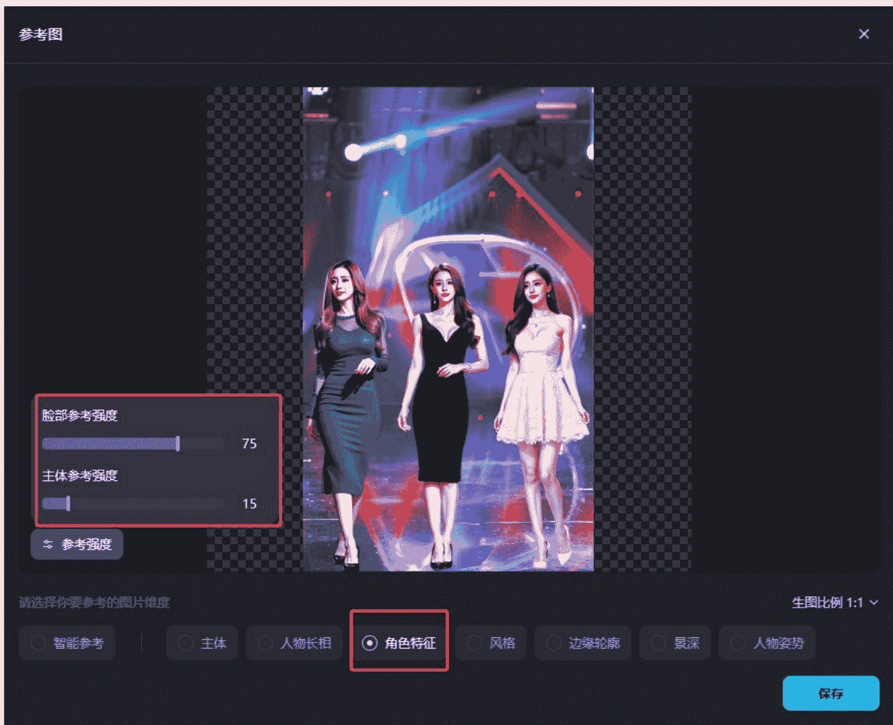

#### 对标截图：
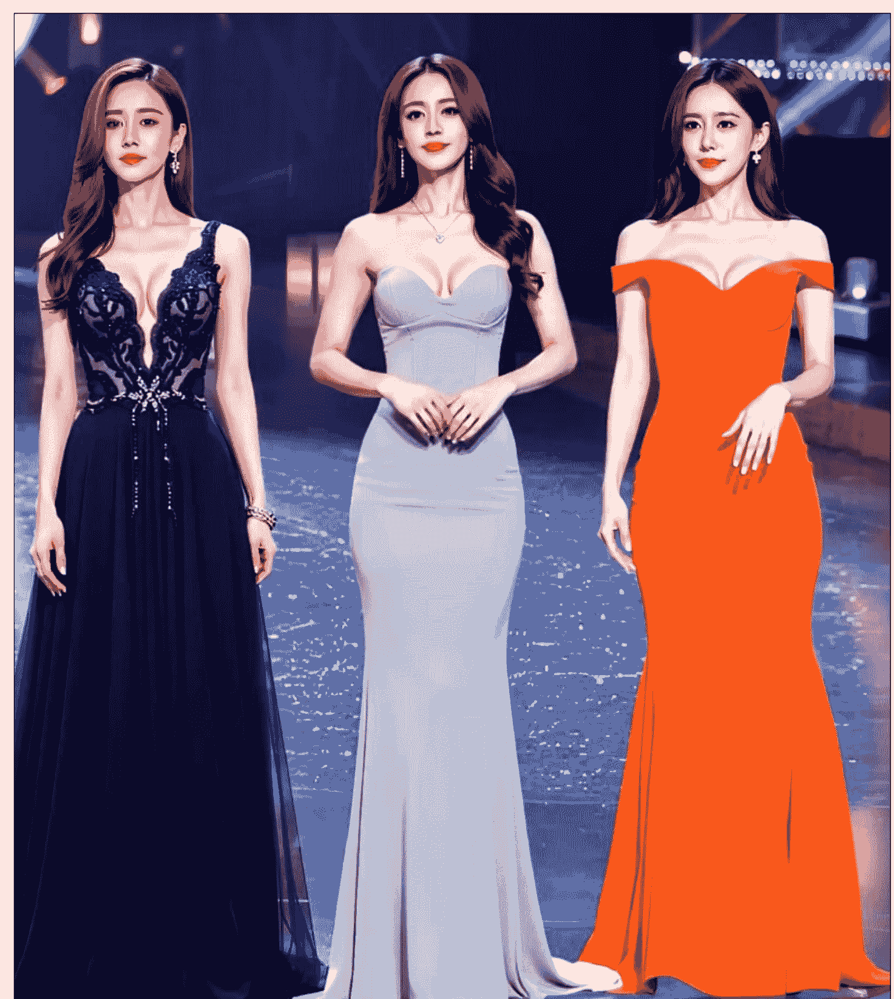

#### 即梦出图：


诚然，如果要做到更有自己稳定的特色，那么可以参考我现在做法，使用 comfyUI 配合不同 lora 微调可以做到非常多的选择。太生猛的就不发了，嘿嘿，感受一下温柔的！


注意：我本不想跟对标一模一样，所以反推图片后，通常会通过模板调整穿着、发型、发色、背景灯光等。同时，由于用了垫图，品质依然会接近参考。如果想更贴近对标，从参数到提示词都可以精确控制。

### 2. PS 去水印/使用数位板等

平时有伙伴偶尔会问图片去水印什么软件方法啥的。这里分享一个不专业但实用的方法：各种版本的 PS 都自带“内容填充”功能。

懒人微信：lazyhelper

#### 具体操作：
- a. 背景锁定：首先确保背景锁定状态，把图片拖进 ps 之后不要解锁图层背景，正常情况拖进来不用管默认就是锁定的。
  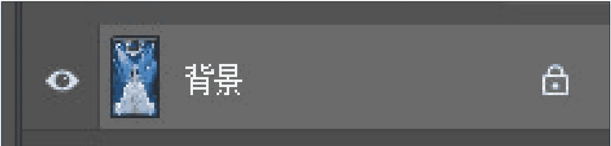
- b. 选区工具：用套索工具（任何能画选区的工具皆可）在图片上把要去除的水印圈出来，
- c. 内容填充：然后点击删除键 DEL，这时候弹出来这个填充二级弹窗，直接点确定，搞定。
  

注意：如果一次去除效果不太干净，别慌，就是 ctrl+D 取消选区，重新选出来，再执行一次删除。（它的原理其实就是仿制图章，用图片上某处区域的像素覆盖水印位置）

当然，直接用即梦画布的去除也是相当便利。

建议：不管是 PS 处理图片还是即梦画布的精修操作，经常需要涂涂画画。用上数位板操作会事半功倍，尤其是角色和物品的阴影处理。对标很多时候省略了这类增加可信度的细节，也恰恰是这些细节让作品更出色。

### 3. 表情库搭建

账号早期，众多订阅者评论除了称赞“美”，就是说“AI/fake”，还有一类就是非常多吐槽：“评委那些夸张的嘴巴是永远闭不上吗？”开始觉得挺有趣，能留言说明这个很有话题性。不过，转念思考，我意识到，丰富评委和观众的表情其实可以成为打造自己特色的重要手段。这些核心元素推动着每个视频的节奏，于是我着手剪出一个含几百个表情的库，以便灵活调用，用自己想要的差异化方式递进情绪表达。

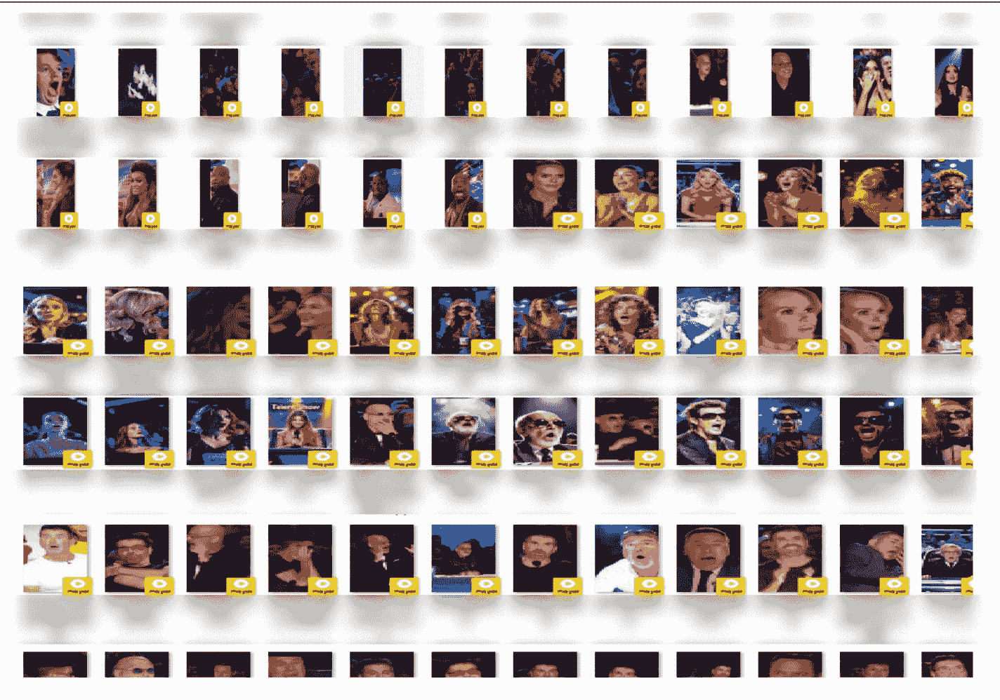

你如果不想直接使用对标视频的评委表情，而是想用自己的方式表达情绪递进，这样的表情库会非常有用。它不仅能帮助摆脱对标的束缚，还让内容更丰富和独特。通过表情变化，你能更好的给观众提供情绪价值。

### 4. 差异化细节

内容的创作过程中，我一直追求细节的差异化。早期，我特别关注一个核心问题：动物与人类融合的过程是否能做到合理、自然且流畅。例如动物毛发在人类皮肤上的生长是否逼真，服装与皮毛的过渡是否和谐。为了实现，我在提示词上下了点功夫，大家感受一下：

在金色大厅中，一位身着华丽礼服的女性与一匹白色独角兽通过一系列精心设计的舞蹈动作实现融合。第一阶段，女性以优雅的旋转吸引观众的目光，她的裙摆与独角兽的鬃毛在旋转中交织，形成视觉上的统一。第二阶段，女性的动作与独角兽的步伐完全同步，她的手臂在舞蹈中逐渐转变为独角兽的前肢，转变过程中的每一个关节和肌肉都遵循自然的运动规律。第三阶段，女性的身体与独角兽的形态在舞蹈的高潮中实现完美的融合，创造出一个全新的生物，其动作流畅而充满力量，确保融合的每一步都符合动态美学和生物学的合理性。

```
"In the golden hall, a woman in a gorgeous gown and a white unicorn achieve fusion through a series of meticulously designed dance movements. Phase one, the woman captivates the audience with an elegant spin, her skirt intertwining with the unicorn's mane, creating visual unity. Phase two, her movements are in perfect sync with the unicorn's steps, her arms gradually transforming into the unicorn's front limbs, with every joint and muscle following natural laws of motion. Phase three, her form fully merges with the unicorn's at the dance's climax, creating a new creature with fluid and powerful movements, ensuring that each step of the fusion adheres to the aesthetics of motion and biological plausibility."
```

### 通用提示词模板：

“在*[宫殿]*中，一位身着华丽礼服的女性与一匹*[目标动物]*开始了一场精心编排的舞蹈。第一阶段，女性以轻盈的旋转开场，她的裙摆与*[目标动物]*的*[动物特征]*在动态中交织，形成和谐的流动感。第二阶段，女性的动作与*[目标动物]*的步伐精确同步，她的手臂平滑地转变为*[目标动物]*的*[动物肢体]*，确保转变过程中的每一个细节都符合生物学原理和动态平衡。第三阶段，女性的身体与*[目标动物]*的形态在舞蹈的高潮中完全融合，形成一个全新的生物，其动作不仅流畅而且充满力量，展现出超凡脱俗的美感。在整个过程中，强调动作的连贯性和生物学上的合理性，确保融合的每一步都自然且可信。”

### 工具与技巧：

当然，对于更复杂的步骤，可以通过多模态大模型（如 GPT 甚至 kimi 都可以胜任）生成提示词。即使 Runway 目前无法精确实现复杂的多步骤融合，但其效果往往比参考更加细致、流畅，偶尔还能带来意想不到的惊艳效果。

建议:
- 记录 Seed: 如遇到效果好的 Seed，务必记录下来。好种子能减少抽卡次数，提升效率。最近感觉这东西会过期？就先不贴出了，有需要的小伙伴找我私聊尝试。

小结:
从早期关注融合细节，到现阶段追求惊悚，猎奇或快节奏、高密度的表达，不停迭代，但达人秀内容的核心始终是满足观众的好奇心与感官需求。形式多样，多多尝试。

### 5. 手搓批量

现阶段我的内容更倾向于“简单粗暴”的多美女快节奏频繁变化（通常包含 3 至 6 个不等的过程）。虽然加速后缺少些细节，但美女+快节奏+高密度的组合极具冲击力，也能吸引眼球。这类达人秀几乎满足各种点：人类与生俱来的好奇和感官刺激。

我的制作流程相对常规，没有什么特别的绝招，核心就是沉下心，堆时间。通常，我会在 3 天内一次性制作 30 条左右的视频。以下是具体步骤:

流程概述:
- 找 30 个对标视频
- 使用 HH 猫下载素材
- 用马老师软件拆图
- MT 或即梦生图/修图
- Runway/可灵/智谱图生视频
- 剪映剪辑

优化技巧：
为了提升效率，可以在过程中进行同步操作：
- 生图与修图：在 B 主题生图时，同时用即梦画布和 PS 修上一个 A 主题的图片。
- 图生视频：用 Runway 处理变化的任务，而可灵/智谱则专注于生成跳舞片段。
- 剪辑：可以同时开启剪映国际版和国内版，进行双线渲染。

熟练后，可以交叉进行生图、生视频和剪辑，让整个流程连轴转起来，几乎没有空闲时间。

如果想要全部原创或对标批量产出，用@李香君 香君兄这套智能体+comfyUI 也非常实用，链接：

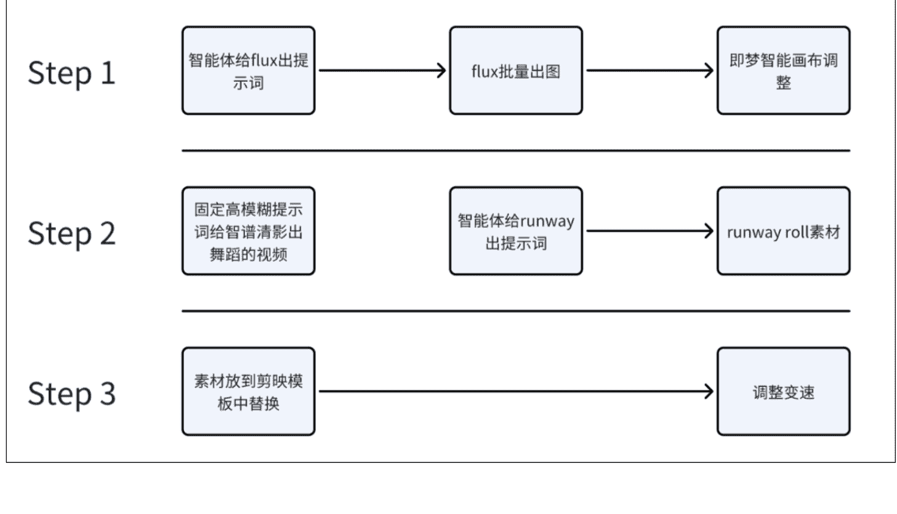

以上不论是手搓工作流还是智能化工作流，只要熟练度上来，都挺有效率。倘若只想对标，那么加一步反推即可。

#### 实操案例：

这里拆解一个我的习惯方式。从需求出发，为了更好地适应内容需求，我对流程进行了一些调整。通常，一个丰富的视频需要多张过程图生成多个视频，而除了第一张图，后续过程图都是在同一背景下进行增加/减少/替换的组合。

##### A. 生成素材:
- 舞台上的三女生
- 平底锅
- 金鱼
- 机械赛博鱼
- 红礼服女生

（注：煎鱼视频的尾帧还会截图作为一个起始帧素材）


##### 提示词技巧:
在 A 步骤中，平底锅、金鱼、机械赛博鱼等提示词中不包含人物描述，言下之意就是只保留场景和灯光描述以及该生物/物品即可。同样的，如果使用智能体模板，亦遵循这一原则。

##### PS:
- 透视适配：站立地面的生物/物品的透视角度需要与三女生的场景保持一致。（保持舞台相关提示词的一致基本不会太大出入，如有则单独调整）
- 背景光源一致性：保持同样的舞台灯光相关提示词，是为了确保光源位置和色彩的一致性。

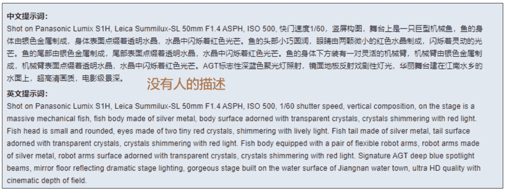

##### B. 处理图片
将图片抠出以下部分：
- 背景
- 三个角色
- 变换的物品/生物


这步或许会有疑问：明明局部重绘就能解决的问题，为什么还要这样？
答：局部重绘确实可以解决部分问题，但我更倾向于将每个人、动物、物件和背景分开处理。这样做的优势在于：
- 模块化：将所有元素组合成变量，制作过程更简单直观。
- 自由度：变化的自由度更广，可以根据画面审美需求控制前后空间关系。
- 空间利用率：更高的空间利用率，让画面更丰富。

##### C. 得到关键帧
使用智能画布和 PS 修图/拼图/并添加阴影（如果需要）。阴影可以增加实感，抠图或手动添加都可以，选择最方便的方式。
要更有趣，多加段女子跳到机械鱼的身上游泳也未尝不可，截取最后一帧衔接上就好。

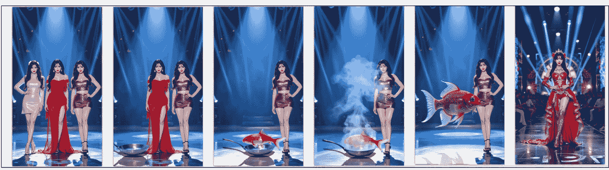

##### D. 图生视频

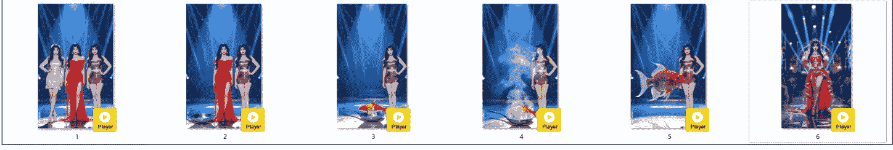

##### E. 剪辑/渲染/导出
这就是批量后的效果

##### 小结：
无论是从对标到原创的迭代，还是流程中的细节优化，核心在于熟练度与效率的平衡。通过灵活运用工具和技巧，持续优化流程，才能高效产出，愿大家天天 100 条。

## 第三部分：较少人尝试的猎奇赛道

（PS：内容可能引人不适，仅供学习，不做推荐）

### 1. 纯属巧合
目前，了解到陪跑圈友里只有我和香君兄尝试过——猩猩与人类孕妇的猎奇内容。相信不少伙伴都刷到过类似的视频。

为什么选择这个赛道？
原因无他：第一个账号快达标的同时感觉产能有溢出，想多磨练体感。加之运气不佳，两个故事号全部零播，而新号刚巧刷到该赛道 5 个以上的对标账号，居然都能开通？赛道独特，想象空间大，随即开始尝试，OS：期待出奇制胜。

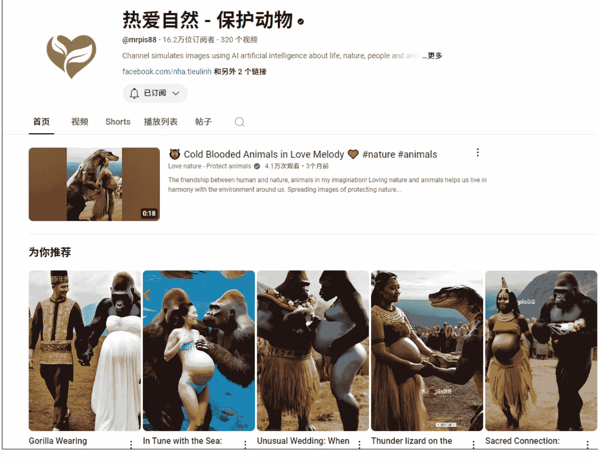
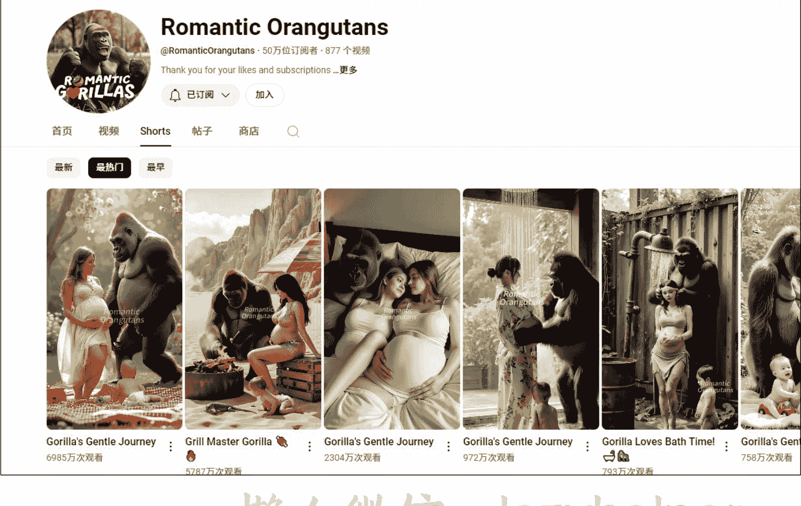

### 2. 批量制作
该赛道的工作流相对简单，就不演示了，稍微提下即可。主要分为两种方案：

#### 方案A. 直接文生视频
- 图像质量一般，意外之喜更多
- 文案模型反推出提示词后，用海螺批量排队生成视频，挑选后剪辑
- 例如，“热爱自然”账号中的非洲部落孕妇与猩猩的视频，可以用此方案文生视频直接生成。

#### 方案B. 图生视频
- 单图质量有保障，视频效果偶有惊喜
- 文案模型反推出提示词后，用 MT 出图，再用 Runway 等工具生成视频，挑选后剪辑
- 例如：“Romantic Orangutans”账号中的高质量美女孕妇与猩猩视频，大概率是这一流程（也是我选择的方向）

### 3. 流量情况

| 视频标题 | 权限 | 备注 | 发布日期 | 播放量 | 互动数 |
|---|---|---|---|---|---|
| Gorilla's Gentle Journey-1 | 公开 | 无 | 2024年12月18日 | 6,864 | 0 |
| Gorilla's Gentle Journey-2 | 公开 | 无 | 2024年12月18日 | 394,975 | 5 |
| Gorilla's Gentle Journey-16 | 公开 | 无 | 2024年12月17日 | 18,764 | 3 |
| Gorilla's Gentle Journey-9 | 公开 | 无 | 2024年12月16日 | 19,674 | 1 |
| Gorilla's Gentle Journey-8 | 公开 | 无 | 2024年12月16日 | 656 | 1 |

刚发布第四条就有小爆迹象。由于制作简单，刚开始就想验证是否可以靠量堆上去，于是一次性做了 150 条，直到尝试其他赛道已陆续发布了 90 多条。

作为非常有限的体验，这个赛道总体感觉：
- A：流量池有限：别看刷到那么多对标，其实整体容量并不大，开通挺难。
- B：流量不稳定：几十到几万再到几十万的播放都有，波动较大

| 日期 | 观看次数 |
|---|---|
| 2024年12月23日 | 310 |
| 2024年12月23日 | 2,347 |
| 2024年12月22日 | 8,923 |
| 2024年12月22日 | 99,724 |
| 2024年12月21日 | 32,245 |
| 2024年12月21日 | 261 |
| 2024年12月20日 | 55,949 |

- C：其实不简单：做这类要把握点和度，很微妙，就像 gary 教练说他自己 get 不到。那能不能做呢？我认为可以，但不要局限于单一赛道，猎奇方向很多，这种有点恶心不建议选。刚起号时，避免堆量机械发布，得一边发布，一边关注和研究。

懒人微信: lazyhelper

### 4. 改换赛道
该赛道不确定性较多，个人兴趣也不足，我决定不浪费账号基础，边达标边改赛道，总体还算顺利。油管的包容度很高，如果伙伴们对其他猎奇赛道感兴趣，完全可以尝试。改换赛道只是我的选择之一，并非定论。

（PS：内容可能引人不适，仅供学习，不做推荐）

## 感谢：

### 感恩“弱关系”--简单，真诚，高效且充满热情！
不论是学习过帖子、得到帮助、链接过，还是一起出海过，甚至有些圈友根本不知道你们的存在，谢意仍需传达，以下是加入生财深耕 YouTube 一路上所要感谢的伙伴，如未提及，请多包涵（实在太多啦！）

### 真心感谢：
@生财有术 @亦仁 @老马内容出海 @竹子 @土豆君 @高一博 @李香君 @彭诗尧 @邵先森(Tiahao) @私藏人间 @富百 @极客信条 @cc @nana @小芬 @六只猫 @折扇 @三亿 @逸帆风顺 @COCO @哩厘锂力 @龙 @叉叉敌 @忧愁小松鼠 @茜茜 @曹超峰 @一页书 @汤姆 CC @李澹归 @暖暖 @敖健龙 @zhwcoding @浮笙 @李默 @李璇玮 @Kennan 恺南 @书情 @kiki @程序员赤小豆 @风吹散 @时光 @Tiahao @乌鸦 @RandOmWalk @来来 @林育佳 @鱼丸 等等

## 总结：

AI的进步：AI的进度太快了！直接可视化交互得到结果，未来不可限量。相信“所有的一切都值得用 AI 重做一遍”，内容创作也不例外。

夯实基础：技术迭代虽快，但底层理论不可忽视。遵循事物的客观发展规律，特别是高价值长视频的制作，如动画要达到《哪吒》的水平，离不开时间和空间幅度、硬强调、接触帧等基础。

综合能力：目前为止，我认为自己仍在打基础。技术理解，创意选题，数据分析，跨文化理解，团队协作等综合能力亟待提升，只有持续下场体验，才能真正感知创作的温度。

今天正在看 gary 教练的“自白”，不知道为何，比看技术贴还带爽感，够真实，能共鸣。

https://scys.com/articleDetail/xq_topic/l525845588555142

本来想好要分享，都收尾了猛然发现还是稍显拘谨，不知道写了啥。

此篇到这儿，是一个开始，不管用什么方式吧，我打算以此为契机，持续与自己对话。

这“传染”很棒------越分享越幸运!
祝各位朋友好运，YouTube 玩出新天地!
告诫自己：革命尚未成功，我辈仍需努力!

公众号
懒人搜索
懒人专属群
微信: lazyhelper

历史 3000 多份各类付费文章以及年费三千多的副业社群资源，见懒人专属群内部分享!
付费群，白嫖勿扰!

懒人专属群更新记录:
https://lazybook.fun/#/blog/record2