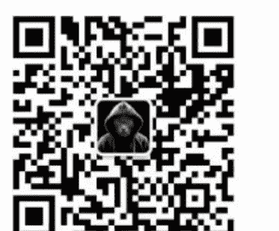

# 从巴菲特未来十年的股东信，发现基业长青的真相

250305

整理：公众号懒人搜索，懒人专属群独享
懒人微信：lazyhelper

上个月，2月22日，伯克希尔哈撒韦公布了2024年的财报，巴菲特也发布了一年一度的致股东信。上市公司都会发股东信，但放眼全球商业界，只有两封股东信特别受关注，一封是巴菲特的，另一封是亚马逊的贝索斯的。但贝索斯的股东信，也是受了巴菲特的影响。

那么，今年巴菲特都说了些什么呢？

经营方面，过去一年，伯克希尔的189家子公司中，有53%利润下降，但伯克希尔2024年全年的营业利润还是增长了27%，达到了474.37亿美元。截至2024年年底，伯克希尔持有的现金达到3342亿美元，创下历史最高纪录。

当然，比起伯克希尔的状况，人们更关心巴菲特对于趋势的思考。今年他提到了这么几个重点。

## 第一，长期，还是长期。这是巴菲特最看重的东西。

比如，伯克希尔的重点永远是持有优质企业的股权，并且是长期持有，可口可乐的股票，已经很多年没有动过。巴菲特说，年度数据有起有落，但站在几十年长期持有的视角上，好的投资，能让你的收银机响得像教堂的钟声。

再比如，伯克希尔从不开展股东分红。巴菲特接手伯克希尔后，只在1967年做过一次股东分红，大概分了一百多万美元，而就这一次分红，巴菲特58年后还在后悔。从此，伯克希尔不再分红，而是用这部分钱再投资。最开始这点钱可能不是很多。但是，60年过去后，这笔钱非常可观，变成了伯克希尔压舱石的一部分。说白了，伯克希尔在不断地把股东们卷入一项长期的事业，只有这样，雪球才能越滚越大。

## 第二，要正视错误。人不可能不犯错，关键是正视错误。

过去，巴菲特的哲学里有一点是，要尽量少犯错，他有一句名言，说的是，“人要少犯错误。少犯错误比抓住机会重要得多。”但是，人总会犯错，关键是，犯错之后怎么办？

最近这些年，巴菲特承认自己失误的时刻越来越多了。从2016年到2023年，巴菲特在股东信中，16次提到自己的失误。有时是投资配置失误了，有时是识人不清。但是，犯错之后最重要的，是正视问题，解决问题。他引用了芒格的一句话：“问题不能通过幻想来解决，而是需要采取行动，不管这可能多么令人不舒服。”

巴菲特说，自己参加过很多大公司的董事会会议，这些会议里禁止使用“错误”或者“失误”这样的词汇，这样的公司，往往会陷入完美叙事陷阱，这恰恰是不可取的。企业的生命力，一部分来自这家企业迭代错误的效率。

## 第三，巴菲特再次强调了自己的选人标准。

伯克希尔的管理风格是，找到那些厉害的人，然后把公司交给他们打理，伯克希尔的体量是37万人，但总部只有26名员工。

那些厉害的人，往往不是简历特别漂亮的人，而是在某方面很独特的人。巴菲特着重介绍了一个人，皮特·利格尔，他帮伯克希尔赚了几十亿美元。但伯克希尔最初收购他的企业时，他说，自己不想赚得比老板多，只要了10万美元的年薪。巴菲特还提到一位，很久之前帮伯克希尔经营过企业的管理者，巴菲特说他是零售天才，但这个人的学历，只有小学六年级。

巴菲特说，伯克希尔选管理者，从来不看他毕业于哪所学校。巴菲特看重三项品质，刚正不阿、富有智慧、充满活力。同时，注意，巴菲特还说，假如不具备第一项品质，那么另外两项品质就会害了你。

好，以上就是巴菲特这次股东信中，三个值得注意的重点。

其实，巴菲特发股东信已经持续了很多年，形成了一种大部分读者都很习惯的特定模式。

但是，话说回来，也有不少人觉得，这两年巴菲特股东信的热度，似乎没有以前高了。为什么？因为在多数外人看来，巴菲特股东信里的新鲜事并不多。很多人期待老爷子每年都能说出一点石破天惊的洞见，但问题是，这个期待本身就有点自相矛盾。你看，巴菲特一直在强调长期主义，这就在很大程度上意味着，比起那些变化的东西，他大概率上更关注那些不变的东西。

而且要想发现那些不变的东西，必须得建立更长远的视角去长期观察。说白了，短期看不清的东西，我们需要看长期。

因此今年，我们做了一个实验。让 AI 来模拟巴菲特未来十年的股东信。给 AI 的提示词是，分析巴菲特往年股东信的内容，模仿巴菲特的思考方式，去撰写未来十年的伯克希尔股东信。并且充分考虑外部变量的影响，这些变量包括但不限于，新技术冲击、地缘格局带来的经济变化，以及人们的心态在此期间发生的转变。

我们用这个问题分别问了 DeepSeek 和 GPT-o3 mini，然后把二者的回答相结合，做了编辑整理。

以下是 AI 模拟巴菲特写出的未来十年的股东信，我们快速看一遍。

## 2026 年：领导层过渡中不变的原则

它预测，2026 年，也就是明年，巴菲特大概率会完成 CEO 的正式交接，过去巴菲特和伯克希尔的绑定过于紧密，一旦换帅，市场对“后巴菲特时代”的担忧会达到顶峰，需要通过股东信重建信心。那么，巴菲特一定会强调“系统 > 个人”，展示旗下子公司体系的抗风险能力。

巴菲特也许会这么说：“查理和我始终相信，伯克希尔的成功不在于某一个人的智慧，而在于一个可延续的系统和原则。今天，我比以往任何时候都更有信心，我们的文化将比我们任何人更长久。”

## 2027 年：对抗结构性通胀的长期策略

AI 预测，2%—3% 的通胀率，会成为美国的常态。那么这个时候，能对抗通胀并且穿越周期的，往往是必需品，比如可口可乐，而这正是伯克希尔的基本盘之一。
懒人微信：lazyhelper

巴菲特会用自己标志性的比喻说，
“当纸币的价值像冰淇淋在烈日下融化时，真正的资产会像树苗一样扎根生长，我们持有的铁路、能源和消费品牌，正是这样的树苗。”以及，
“永远不要和美联储打赌，但永远要为最坏的情况做好准备。”

## 2028 年：回应全世界的供应链重构问题

巴菲特会说，“世界正在分裂成许多个棋盘，但好生意在任何一个棋盘上都能找到位置。伯克希尔会继续押注那些，无论地图怎么重绘，都不可或缺的服务。”

## 2029 年：技术颠覆中的价值投资

按照能力圈原则，伯克希尔大概率不会重仓 AI 公司。但假设 AI 真的要彻底改变世界呢？伯克希尔大概率会投资支撑起新技术的基建，做 AI 技术的卖铲人。

巴菲特会说，“机器可以预测天气，但建造方舟仍然需要人类的判断。我们不投资算法，但我们投资那些让算法运转起来的电力公司。”

## 2030 年：对气候风险重新定价

气候变化也是越来越重要的全球性议题。AI 认为，按照巴菲特的风格，他不会仅仅满足于规避风险，而是会从中寻找机会。

巴菲特会说，“灾难预言家寻找末日，而企业家寻找灭火器、保险单和更坚固的屋顶——这正是我们收购的领域。当海平面上升时，伯克希尔持有的土地恰好在高地上。”

## 2031 年：长寿经济

AI预测，到那一年，美国65岁以上的人口会突破7500万，老年人的护理费用，会超过子女教育支出。那么，伯克希尔的投资，会围绕老龄化社会展开，并且会规避重资产的养老地产，专注家庭透析设备、药品销售系统这类轻资产服务。

## 2032 年：企业社会责任

AI认为，巴菲特会关注ESG。巴菲特会说，“用股东的钱买社会声望是偷窃，用商业智慧解决社会问题才是慈善。”

## 2033 年：现金流管理

AI预测，未来伯克希尔还会继续储备现金流。不过，股东信中会更多地强调持有现金的战略价值，万一遇到泡沫，现金流就是非常有必要的缓冲器。

巴菲特会说，“当烟花熄灭时，手里握着火柴的人才才是真正的赢家。在伯克希尔，我们既建造火箭，也始终留着返回地球的燃料。”

## 2034 年：回归真实体验

AI认为，世界越虚拟，真实越可贵。

巴菲特会这么说，“当99%的交易由算法完成时，剩下的1%人类冲动会创造120%的利润。”以及，“线下体验不可替代——伯克希尔增持航空、酒店股的逻辑未变。”

## 2035 年：终局验证

2035 年，也许是因为这是我们让 AI 做预测的最后一年，也许是因为这一年的巴菲特，已经是 104 岁高龄，因此 AI 预测这一年的股东信主题是，“终局验证”。

巴菲特也许会说这么几句话，比如，“商业的本质从未改变，市场总是重演历史，只是每次的服装和道具不同。”再比如，他可能会说，“假如我的讣告只能写一句话，我希望是：他始终相信自己国家的好运，并足够耐心地等待运气变现。”

好，以上是我们让 AI 模拟写作的，巴菲特未来十年的股东信。这十年的预测，主题各不相同。但咱们能从这些内容中看到一些共性，恰好印证了巴菲特过去 60 年不断重复的主题。

- 文化的延续性。巴菲特的年龄让人担忧，巴菲特自己也知道，但是，他一直在强调，系统比人更重要，伯克希尔是一艘忒修斯之船，换完所有木板，依然能保留灵魂。
- 有耐心的机会主义。巴菲特并不反对机会主义，但他同时也认为，一定要保证自己的能力，不能放任自己投机。闪电劈下的时候，我们不仅要在场，还需要有足够的桶。
- 反脆弱的哲学。巴菲特的理念，是保守中带有一丝开放。面对随时可能到来的未知冲击，他的态度是，不为黑天鹅下注，但确保自己永远是天鹅湖的园丁。

你可以把我们今天的预测，当成一个小小的玩笑。但是换个角度，也许企业长青的真正密码，就藏在这六十年来不断重复，甚至AI预测时也不会避开的段落里。或许最好的投资哲学，就是把长期主义、简单原则、洞察人性这几件简单的事，重复做上几十年。

关于这个话题，咱们先说到这。

微信:lazyhelper

历史3000多份各类付费文章以及年费三千多的副业社群资源，见懒人专属群内部分享！

付费群，白嫖勿扰！

懒人专属群更新记录：

https://lazybook.fun/#/blog/record2

懒人微信: lazyhelper