# Reddit 出海指南：从 Build in Public 到社区驱动增长

250307 生财精华
公众号懒人搜索，懒人专属群分享

很多独立开发者或一人公司创业者都面临一个尴尬的现实：有能力做出产品，却卡在了冷启动和持续增长上。

如果你正关注出海，想要开启全球业务，Reddit 可能是一个不错的起点。

在本文中，我复盘和整理了在 Reddit 上的实操经验，包括：

- 从公开建造到社区共创的转变
- 一些通过 Reddit 平台创业成功的案例
- 新手如何快速上手 Reddit
- 如何利用 Reddit 挖掘需求 & 验证 MVP
- 利用 Reddit 冷启动增长获客的方法

## Build in Public VS Build in Community

在早期，我也有尝试过公开构建。但是 BIP 的问题是，当把想法和进展完全暴露，吸引来的不一定是用户，而是比你更卷的竞争对手，导致想法被复制，失去先机。

Gumroad 创始人萨希尔在《小而美：持续盈利的经营法则》这本书中提到：“是社区将你引向问题，问题将你引向产品，产品为你带来生意。”

选择合适的问题去解决（很可能就是你遇到的问题），确认他人也面临这个问题，然后确认你拥有“生意-你”的最佳契合点”。当产生疑虑的时候，一定要回到社区，他们会帮助你继续前行，直到最后取得成功。

与其公开建造，不如与用户共建。Build in community 的好处是，能够直接与目标用户对话，获取真实反馈，辅助你判断是否发现了一个真实的问题。同时可以让信任用户参与共创，培养早期忠实粉丝。

那么问题来了，去哪里找到好的社区呢？

## 从多个成功案例中感受到 Reddit 社区的魅力

在对独立创客这条路产生兴趣后，我去收集和调研过近百个独立创客的案例，对他们的流量渠道、变现模式、构建过程进行了深度拆解。

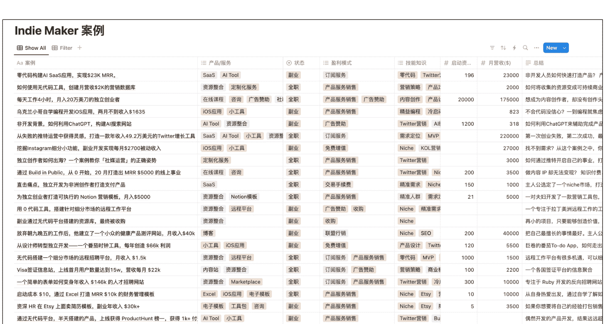

其中发现，有很多个成功的产品，都是靠 Reddit 发家，包括 SaaS 工具、Newsletter 简报、个人服务、数字数据库、社群等，这里分享几个案例 ↓

Loopcv 一个自动化求职平台，通过在 Reddit 发布还没有任何功能的落地页验证需求，在收到了几百个用户注册后，开始构建，通过 Reddit 冷启动，产品月营收在 $15K 左右。

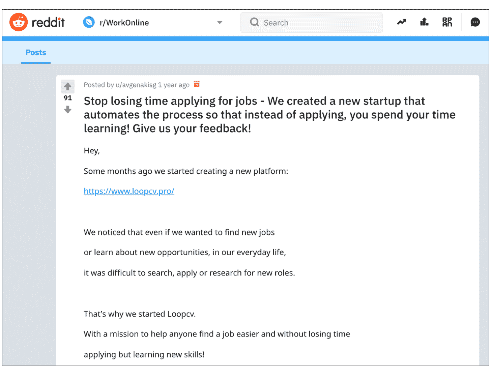

Stagetimer 一个非常细分小众的远程遥控计时器，最初是在细分社群中发布了产品想法，得到了反馈和验证后构建，在 Reddit 发布启动产品，月营收在 $8K 左右。

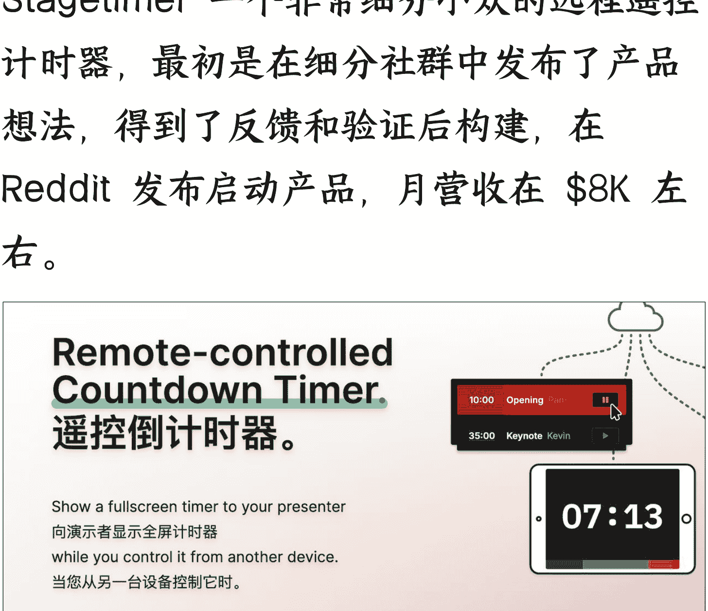

除了做 SaaS 工具的，还有卖 newsletter、卖模版、做社群的各路创客，大家在 Reddit 社区里面挖需求、找用户、寻建议、做转型。

比如，AI Tools 工具导航站的创作者，把自己的网站发到了 Reddit，有用户指出，要想办法引流用户回到你的网站来，而不是依赖添加网站书签，而 Newsletter 就是一种不错的方式。之后这位创作者就做了一个关于 AI 的 Newsletter —— World of AI，相互为产品做引流，达到了 $6K 左右的月收益。

一位连续创业者积累了非常多的资源和工具，他在 Reddit 上面做了分享，发现很多人感兴趣，最终他将他的这些知识库和经营变成了标准化的产品，月收入在 $2.25K 左右。

### r/EntrepreneurRideAlong

#### The Ultimate No BS Guide For Startups With Dozens of Free Resources. From Ideation, Validation, and Launch to Marketing, Growth, and Scaling

Value Post

Copy the original guide in Notion and download it as a CSV here.

Why I made this guide:

I'm sick and tired of guides with empty platitudes. Endless paragraphs, thousands of words, and almost zero action items. They reinvent the wheel by rephrasing everything for "SEO" purpose." It's annoying. So I made the one I've always been looking for and sharing the tools I am using to build my startup Cicero.ly. A guide with specific action items and no fluff.

Help me improve this guide. Email me at farzad@cicero.ly if you think I am missing anything.

#### Ideation: How to come up with ideas.

- [ ] There is a crowdsourced Subreddit where people ask for things to be made called SomebodyMakeThis. Check it out for popular ideas.
- [ ] Listen to what Elon Musk did to come up with ideas for Tesla.
- [ ] Check out Paul Graham's classic post on how to come up with ideas.
- [ ] Check out some practical steps this Redditor gave on coming up with ideas.
- [ ] Also, check out the Startup Ideas on Kernal newsletter. They market themselves as "Startup ideas anyone can build, buy or invest in".

> “I’m an aspiring founder ready to launch.”
> “我是一位有抱负的创始人，随时准备创业。”

### BEST MATCH: NO BS STARTUP FOUNDER
最佳匹配：NO BS 初创公司创始人

6-week coaching program for wannapreneurs with an idea but no clear roadmap to make it happen.
为有想法但没有明确路线图的创业者提供为期 6 周的辅导计划。

#### What you’ll achieve: 您将实现的目标：

- Validate your idea before investing time and money.
在投入时间和金钱之前验证你的想法。
- Launch a real business in 6 weeks or less.
在六周或更短的时间内启动真正的业务。
- Build confidence in your first steps as a founder.
作为创始人，在迈出第一步时要建立信心。

#### Investment: $950 投资：950美元
includes 3 one-on-one coaching sessions
包括3节一对一辅导课程

Learn more about NO BS STARTUP FOUNDER
详细了解 NO BS STARTUP FOUNDER

> “I’m an overwhelmed leader looking for clarity.”
> “我是一位不知所措的领导者，正在寻求明确的答案。”

### BEST MATCH: LEADERSHIP OS
最佳匹配：领导力操作系统

3-month coaching program that helps you prioritize with precision, lead with confidence, and grow your startup sustainably.
为期3个月的辅导计划，帮助您精准地确定优先事项、充满信心地领导并可持续发展您的初创企业。

#### What you'll achieve: 您将实现的目标：

- Everything in Growth Accelerator, plus
增长加速器中的所有内容，以及
- Build a strategy for confident decision-making.
制定自信决策的策略。
- Align your team for productivity and focus.
协调你的团队，提高工作效率和专注度。
- Completely transform your leadership style in 90 days or less.
在90天或更短的时间内彻底改变您的领导风格。

#### Investment: $2,950 投资：2,950美元
includes 12 one-on-one coaching sessions (+ unlimited extra sessions with you and your team as needed)
包括12次一对一辅导课程（+根据需要为您和您的团队提供无限制的额外课程）

Learn more about LEADERSHIP OS
了解有关 LEADERSHIP OS 的更多信息

> “I’m a founder scaling my startup.”
> “我是一名正在扩大自己初创企业规模的创始人。”

### BEST MATCH: GROWTH ACCELERATOR
最佳搭配：成长加速器

30-day coaching program for high-performing founders ready to scale with strategy and no room for error.
为表现出色的创始人提供为期 30 天的辅导计划，帮助他们制定战略并扩大规模，避免出现任何错误。

#### What you'll achieve: 您将实现的目标：

- Identify and employ growth channels that work for your business.
确定并利用适合您业务的增长渠道。
- Bring your team into sync for unstoppable results
让您的团队保持同步，获得不可阻挡的成果
- Unlock consistent revenue growth.
实现持续的收入增长。

#### Investment: $1,450 投资：1,450美元
includes 4 one-on-one coaching sessions (+ unlimited extra sessions with you and your team as needed)
包括4次一对一辅导课程（+根据需要为您和您的团队提供无限制的额外课程）

Learn more about GROWTH ACCELERATOR
详细了解增长加速器

> 一个人的成功之路可能是运气，但很多人都在这条路上走通了，说明它具有普适性、适合大多数人。

懒人微信：lazyhelper

别人的故事经验是否能被复用，当然还是要自己去实践验证。

从去年开始，我重视起了 Reddit。

看别人都很厉害，自己却一做就不吱声。

但好在一直坚持摸索，从一开始发什么都没有流量、没有反馈，到慢慢积累 K 值，发帖都有「真人回应」和互动后，我的感受是，Reddit 是一个很适合新手想要起步开展出海业务的平台。

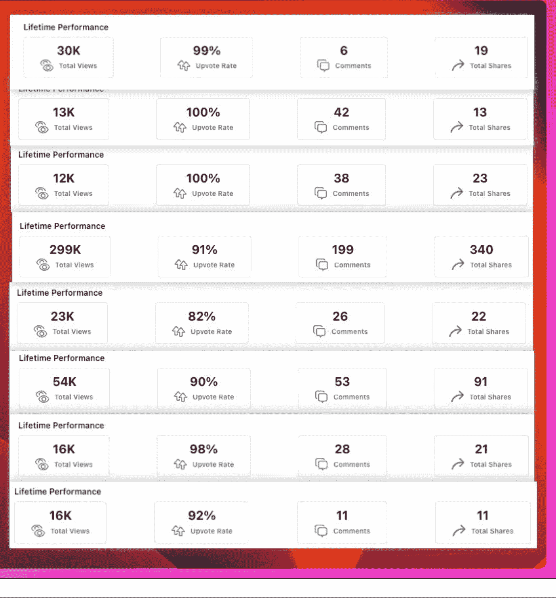

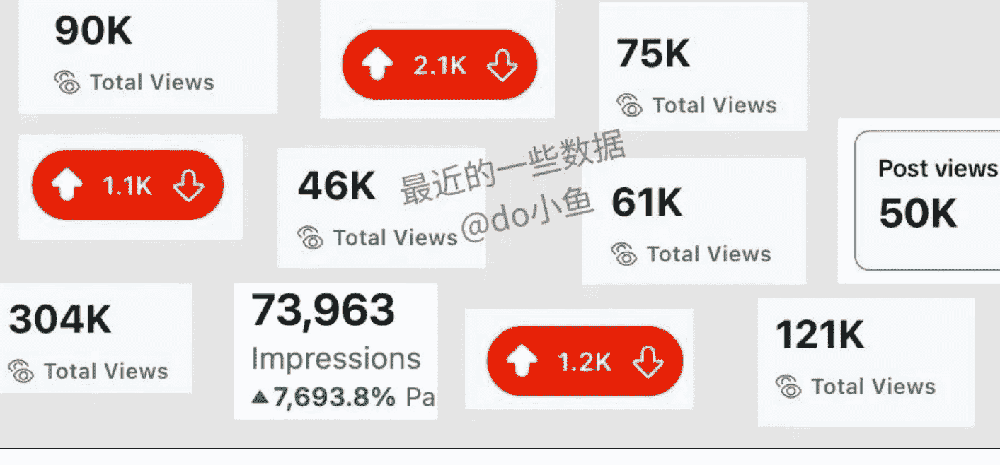

## 我的部分 Reddit 帖子互动数据

最初我只是很功利的把 Reddit 当作一个营销渠道，当我在社区里面呆久了以后，我发现，Reddit 更是能去挖掘需求、与真实海外创业者建立连接、挖掘出海机遇的平台。

Reddit 拥有来自世界各地的用户，社区氛围开放，用户积极热情，愿意去帮助新手解答问题。通过他们，能获得很多「insight」，帮助我们更好的完整和完善自己的产品和服务。

而与一些社交媒体相比较，Reddit 的社区本身就自带流量，只要你能提出好的问题，就可以得到及时反馈，解决了新人出海没有流量的困扰。

## 新手可以做好的 3 件事情

### 1. 泡子社区

Reddit 里面有非常丰富的子社区，不管你目前有没有产品、创业 idea，都可以先把社区泡上。

以下是我整理的与创业、互联网产品、苹果生态、App 开发、社交媒体相关的社区，已整合在 Notion 文档：点击链接可直达

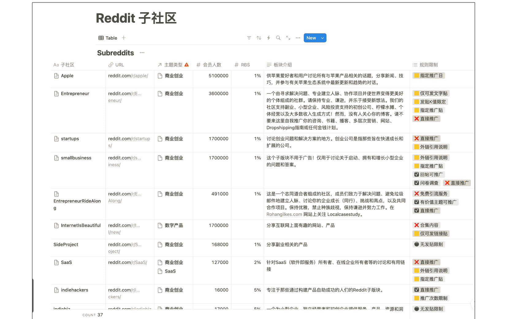

前期我加入了大量的感兴趣的子社区，当你对某个群体、或者某个领域感兴趣时，可通过搜索关键词，找到目标社区【如下图】

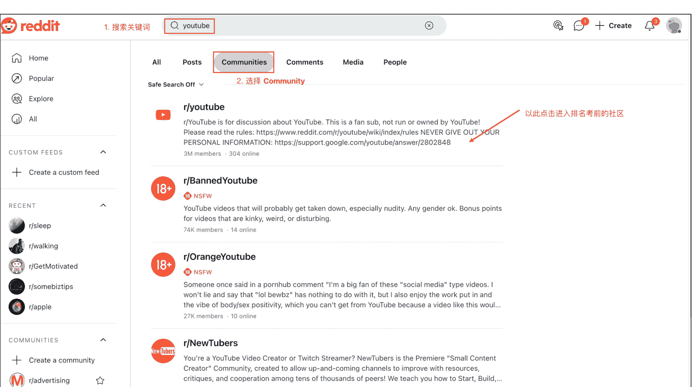

进入子社区后，可以通过右上的社区简介，了解这个社区是否活跃，依次是：

- Subscribers: 加入社区的总用户数量
- Viewers / Online: 该社区实时在线的用户数量
- Rank by size: 社区规模，一般排名在 5% 前的都是流量比较大的社区

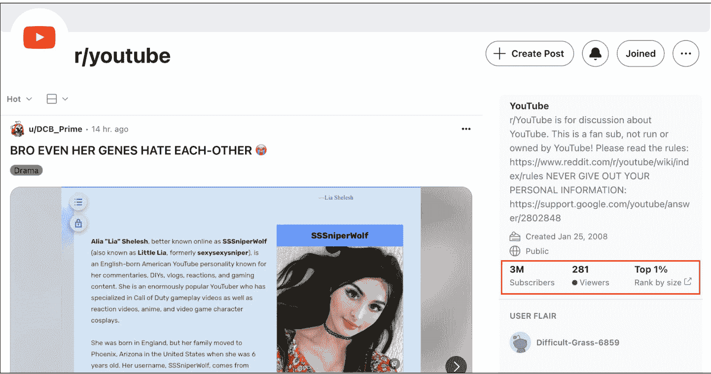

如果一个社区，流量大、在线用户多，并且首页的帖子都是最近的时间，那么是值得加入的。

点击社区右上角的「Join」，你就会在你的首页左栏看到所有你加入的社区，以首字母顺序排列。

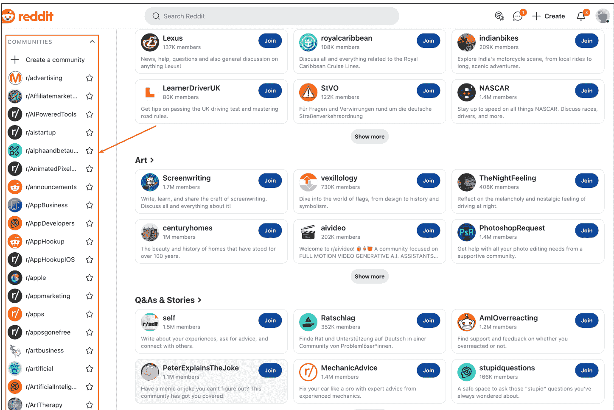

### 2. 看组规

Reddit 混社区最关键的一件事情，遵循组规。

很多朋友注册了 Reddit 账号，就开始疯狂发帖。这大概率是会被删除 or 被 ban 掉的。

> 想要在任何平台“混下去”，底层逻辑都是要遵循社区规则，真诚、利他，为平台和用户带去价值，而不是制造营销垃圾。

如何避免送人头发帖——不被删帖或者被禁？每个 Reddit 子社区都有自己的组规，在发帖之前，请先研读组规！！

我一开始是不知道有社区规则这个东西存在的🫠（送人头的第一步）。后来即使知道了，也发现规则（下图）太长了根本看不进去啊……

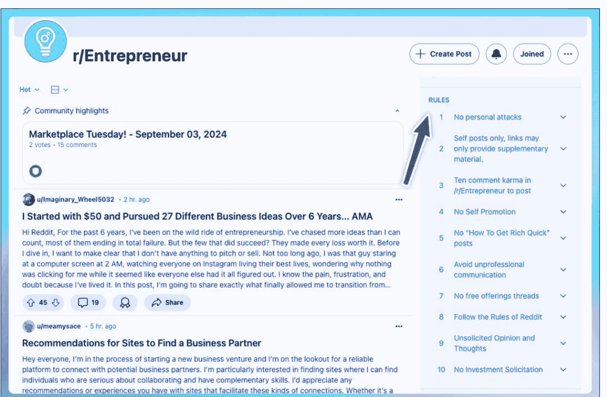

这个时候就靠 AI 来帮忙了 ↓

先收集一些可以长期活跃的 reddit 子社区在 notion 里面

让 AI 阅读规则，翻译成中文（如下），这时候你大致就能清楚哪些能做哪些不能做了。

1. 禁止人身攻击: 欢迎对想法、概念、方法或计划的批评。面对现实是商业中必要的一部分，即使现实很残酷。直接的书面攻击个人或人群或挑起争端是不允许的。
2. 仅限自发帖，链接只能提供补充材料: 只允许文字帖子，以鼓励讨论。如果你想分享链接，它们必须是与主题相关的，在文本中有所描述，并对讨论很重要。你的帖子必须在 Reddit 上有足够的材料来进行实质性讨论。
3. 在/r/Entrepreneur发帖需有10条评论获得的karma: 为了在/r/Entrepreneur上引导讨论，我们要求你至少有10条评论获得的karma。这是通过在他人讨论中发布好的评论获得的。这样做可以减少垃圾邮件，更重要的是确保你了解这个子版块能提供什么帮助，什么会得到良好反应，什么会被忽视或被恶搞。
4. 禁止自我推广: 引用你的来源并提供对声明的参考是可以接受的，即使这是你自己的内容/网站。然而，不应有明确的招揽、广告或明显的推广意图。
5. 禁止“快速致富”帖子: 这个社区不是关于快速赚钱的。创业可能是一条艰难而艰苦的旅程。它需要努力、辛勤工作、勇气和决心。询问社区如何快速赚取特定金额的帖子，而没有具体提及合理的想法，是不被容忍的。
6. 避免不专业的交流: 作为一个专业的子版块，我们期望我们的社区保持合理的礼仪。像对待同事一样对待其他创业者。我们没有人力资源部，但这并不是你咄咄逼人、粗俗或不专业的理由。
7. 无免费提供帖子: 我们的“感谢星期四”帖子是保留给我们社区的任何促销、提供或折扣的，请你不要在这个每周固定的帖子之外发布免费提供。如果你这样做，你的帖子将被删除。
8. 遵守Reddit的规则: Reddit的规则适用于Reddit的任何地方。也请考虑Reddit礼仪，虽然这不是强制性的，但可能会在考虑你的帖子意图时使用。
9. 未经请求的意见和想法: 请不要使用这个社区作为你的个人博客，不要觉得有必要通过帖子分享你的意见，这不是一个个人日记，让你分享你的白日梦、想法，并对主观概念发表意见。
10. 禁止投资招揽: 关于特定投资的帖子，如加密货币，是不允许的。请不要试图招揽、炒作或以其他方式提供投资建议。有其他更适合此类讨论的子版块。

#### 为了方便，有一些社区之间通用的规则可以打上标签：

- ☑ 表示可以做的
- □ 表示可以做，但是有规则限制：比如发营销贴只能在指定日期发、一个月只能发一两次等
- X 表示小组禁止做的，做了就会被删掉或者禁号

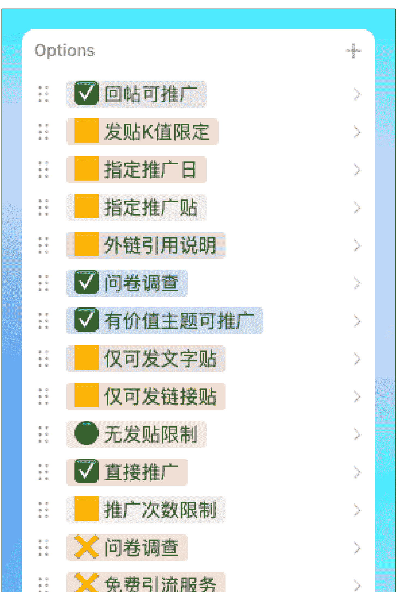

要发帖的时候，就去 notion 表格里看看规则和注意事项，或者让 AI 翻译，一般限制会有是否可以发链接、图片格式、内容话题、k 值要求、限定发帖日等。

多研究研究组规，按照社区要求发帖，基本上不会被删了。我将大家都能用到的子社区的规则已经整理进 notion 文档，大家有需要也可以去查阅：点击链接可直达

懒人微信：lazyhelper

## 涨 K 值

有时间和能力的朋友，也可以把这个流程做成一个插件，这样可以在混社区的时候更加便利。

在 Reddit 社区，你的发帖和评论，如果得到了社区用户的点赞、评论、转发，都会增加你的 Karma 值。

K 值越高，说明你在社区里面的活跃度和信用度越高，当你以后需要一些营销动作的时候——比如，直接在社区里面发链接，或者直接私信用户，被封禁的可能性更小。K 值也是很多子社区发帖的门槛要求。

- 3,835 Post karma
- 332 Comment karma
- 11 Followers
- Feb 27, 2021 Cake day

### 我的个人 K 值状态

一开始我也很愁，自己在感兴趣或者目标小组很认真、用心写的帖子，怎么没有人看？

后来发现思路有问题，如果是以涨 K 值为目标，那么我们需要去到的是一些泛流量大的子社区去发帖。

在 Top community 里面我们可以看到社区的排名 ↓ 排名前 20 的社区，基本上都是娱乐、搞笑、好玩相关的社区，由于流量大，发帖限制少，初期可通过在这些社区活跃快速涨 K 值。

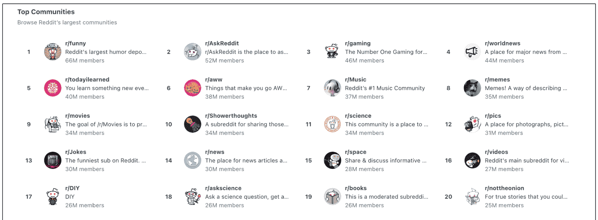

比如 awww 这个社区，是一个纯图片社区，只需要发布自己的萌宠，就很容易获得上千点赞、涨 K 值。

## 利用 Reddit 子社区挖掘需求 & 验证 MVP

当你有了一个想要做的产品方向，如何判断是否是否是「真需求」，值得去花时间和精力开发，变成一套成熟的解决方案或者产品？

那前面做的事情其实是熟悉 Reddit 平台，接下来聊聊，如果我们想要通过 Reddit 挖掘需求和机遇、获得潜在用户，可以做些什么？

### 4.1 看：观察活跃社区热门讨论话题，从评论区里面找需求

懒人微信：lazyhelper

#### 4.1.1 看社群规模

人越多，机会越大。某个社群的成员数量庞大，说明这个领域有足够的关注度和潜在用户。

比如，我最近在小红书刷到几个产品，都以 ADHD 多动症人群为目标，去提供解决方案，并且互动量都很高，那么说明有很多问题困扰着这个人群。

在 Reddit 上面，我们可以直接搜索 ADHD 这个关键词，进入到子社区里面。

然后发现，这个社群人群基数大——200w 用户，并且是排名前 1% 的社区，说明社区活跃，交流多。

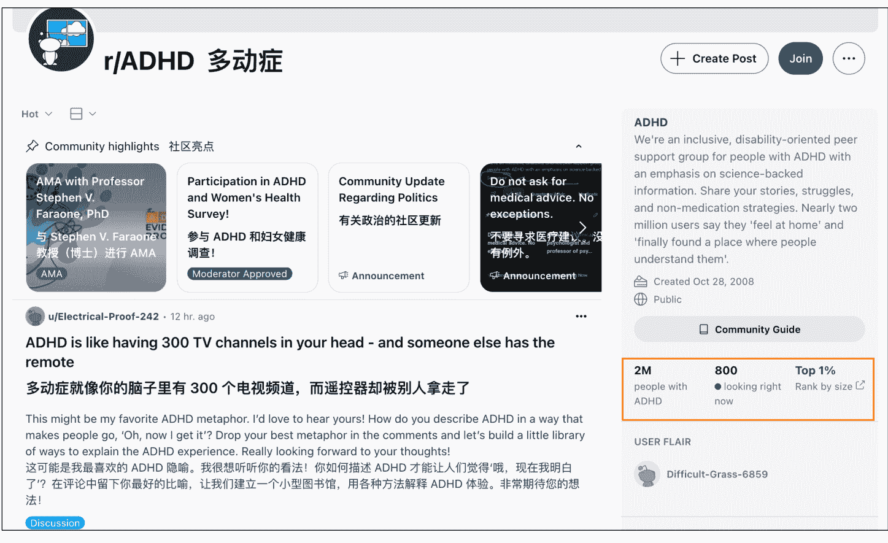

#### 4.1.2 看讨论的主题和问题

接下来筛选「Hot」热门帖子，去看看这个社区里面的人都在讨论什么。

关注那些高赞、高评论的话题，看看这个群体中，大家在关注的是哪些问题？

懒人微信: lazyhelper

从评论区看是否存在很多「负面情绪」，当用户频繁抱怨某个问题时，往往意味着市场存在的真实痛点，也正是产品或者服务可以切入的机会。

自己看肯定很费劲，这个时候，就可以请出AI小助理。

找到一些评论比较多的帖子，让AI来帮我们「看」痛点，分析潜在的产品功能点:

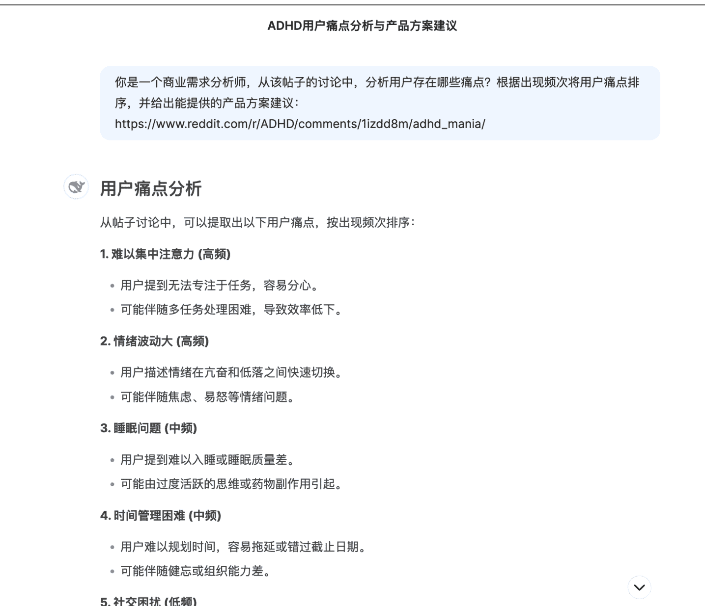

| 痛点 | 出现频次 | 产品方案建议 |
|---|---|---|
| 难以集中注意力 | 高频 | - 白噪音应用 - 番茄钟应用 - 任务管理工具 |
| 情绪波动大 | 高频 | - 冥想应用 - 情绪追踪应用 - 在线心理咨询 |
| 睡眠问题 | 中频 | - 睡眠追踪应用 - 助眠音乐应用 - 褪黑素补充剂（需咨询医生） |
| 时间管理困难 | 中频 | - 日历应用 - 待办事项应用 - 时间追踪应用 |
| 社交困扰 | 低频 | - 社交技能培训课程 - 线上支持小组 - 社交活动推荐平台 |

让 AI 去读热门的前 20 条评论大于 50 条的帖子，分析其中存在的问题，很快你就能聚合出高频出现的一些用户痛点和需求点，将其整理在表格里，根据痛点排序，再结合自身资源和情况，去判断你能针对什么问题提供解决方案。

| 用户需求 | 详细需求说明 | 重要性(1-10) |
|---|---|---|
| 走路探索路线 | 1、根据不同的需求规划和标记路线 2、城市探索，四季不同的风景变化：建立“走路日记”或“自然相册”，帮助用户分享和回忆四季变化。 3、用户可以保存特别喜欢的步行路线，标记沿途重要地点，并在未来重新体验这些记忆。 4、拍摄和记录沿途的美景。 5、出门寻宝等：植物、星星、公园、citywalk | 7 |
| 无法出门的走路需求 | 1. Walking at home —— 教程、资源 2. 跑步机和走路垫 Treadmill or walking pad | 7 |
| 步行的陪伴 | 1、背景音乐与声音环境： 2、播客、音乐、有声读物等； 3、正念走路：增加“步行冥想”或“正念引导”功能，帮助用户在步行中放松、沉思，提高心灵体验。 | 7 |
| 走路随想 | 1、记录在走路过程中产生的想法和心情，相比于跑步，用户在走路的过程中有更多的思考空间。 2、结合时间和地点数据，生成情绪与步行的趋势图，帮助用户了解步行对心理健康的影响。 3、可以生成走路卡片分享？ | 6 |
| 步行与减肥 | 卡路里管理、体重管理，体重与步行数据的视图。 | 6 |

我之前通过 Reddit 针对「走路」这个场景收集到的一些需求

优秀圈友四喜也做了 AI Agent，来帮助挖掘和分析 Reddit 上面的用户需求：

scys.com/articleDetail/xq_topic/4848144281141488

### 4.2 问：直接对话，获取用户反馈

当你看了大量的讨论后，对于用户群体的画像和常见问题已经有了一些初步的感知。这时候，如果已经有了一些初步的想法和感受，就可以直接在社区里面提问。

提问的方式，是把自己代入这个人群，根据你想要提供的解决方案提供一个场景，询问大家的意见。

比如，就刚刚 ADHD 这个人群，你想要进一步挖掘「注意力集中」的问题，看真实用户是怎么面对和解决的，可以直接提问，可套用公式【用户画像】+【场景】+【困扰】+【寻求帮助】

比如，我是一个 ADHD 患者，我发现自己很难在独处的时候集中精力做完成的任务，有人有同样困扰吗？大家是如何解决的？

通过真实用户的反馈，能够了解到现有的一些解决方案。而用户的「真实有效」的解决方案，也能进一步助你完善产品的核心功能。

### 4.3 验：快速测试，验证你的假设

好了，这时候，你已经挖掘出了一些值得深入的真实的痛点，并且有了一些解决方案思路，接下来就是将其产品化。

但在之前，先不要着急开始开发，可以进一步发一篇主题帖，标题可参考：“我创建了一个「XX 产品」，帮助我解决「XX 问题」”

在主题贴里面，以一个真实用户的身份，分享你如何用你自己的产品，解决了一个具体的问题，同时展示一些设计 Demo，并且询问更多的功能意见。

如果有用户直接反馈给你说愿意，能不能分享出来？或者直接请你把它变成一个产品。

这时候你就可以在帖子里埋一个落地邮箱注册页，开始收集潜在用户邮箱。

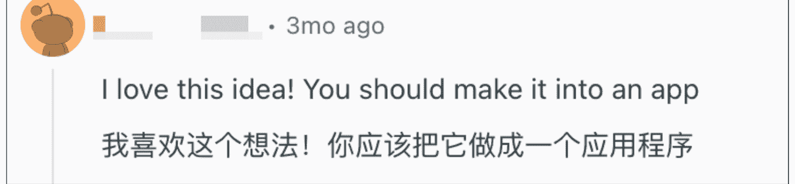

我把想法和原型发布在了 Reddit 相关子社区上面，得到了非常直接的用户正面反馈

这时，我们就完成了一个小的 MVP 验证闭环 —— 从痛点需求挖掘、到解决方案验证、再到种子用户的邮箱收集。

而在目标群体相关性高的社区里面做这件事情的好处是，你收集到的邮箱大概率是有效邮箱，不会是泛流量，或者看热闹、甚至是暗中观察你的竞争对手。

通过在 Reddit 子社区“看-问-验”三步法，可以快速跑通 MVP（最小可行产品）。接下来，你就可以规律地 Build in community 或者通过邮件向用户发布你的产品动态，像他们收集意见和反馈，避免闭门造车。

## 在 Reddit 上冷启动持续获客增长

当你的产品做好了，Reddit 也是一个非常棒的冷启动产品发布平台。

### 5.1 直接在相关目标社区发布产品

- 简单高效，能直接为产品带货，吸引目标用户。
- 但是风险比较大，需要遵循组规，并且注意不要太硬。
- 可在产品正式发布的时候发布，不建议长期频繁发主题贴直接营销产品。
- 如果频繁发布的主题贴，都是硬广，很容易被系统判定为垃圾营销贴。

那么换个思路，从想要营销别人到给用户提供价值会怎样？

### 5.2 为提问的人带去有价值的解决方案

我们的产品、服务本身就是给对的用户提供价值的。

很多用户也在社区里面在寻觅更加合适的解决方案，不是吗？

哪里有问题哪里就有需求！

### 5.3.1 如何捕捉他们的信号？

目前我主要是用 2 种方式去找到与产品受众高相关性的帖子 ↓

#### 5.3.1.1 谷歌搜索产品人群场景

可套用搜索公式【 How to +你的产品 or 服务的应用场景的关键词 + Reddit 】

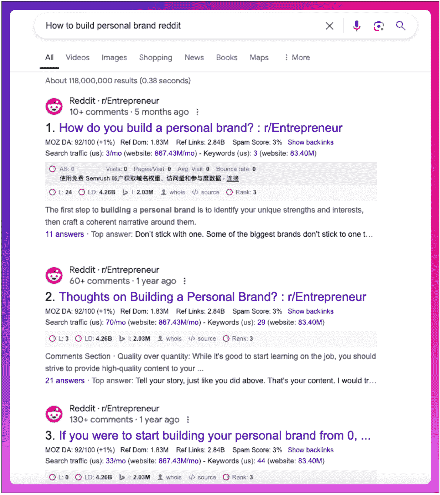

能直接定位到一系列的关于这个场景痛点下用户的提问。这个时候去回复 + 产品链接，不仅自然，针对的人群也很精准，更有利于转化，还不会被 ban 哦

#### 5.3.1.2 主动监测关键词

一个免费的工具： f5bot.com

输入你需要检测的关键词后，一旦检测到出现在 Reddit，会通过邮件提示。

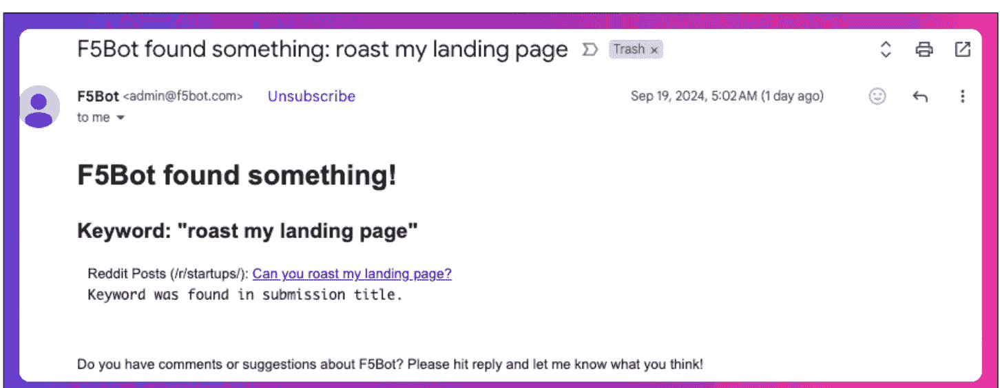

另外还会显示过去一周内的关键词出现次数——等于变相可以调研关键词热度。

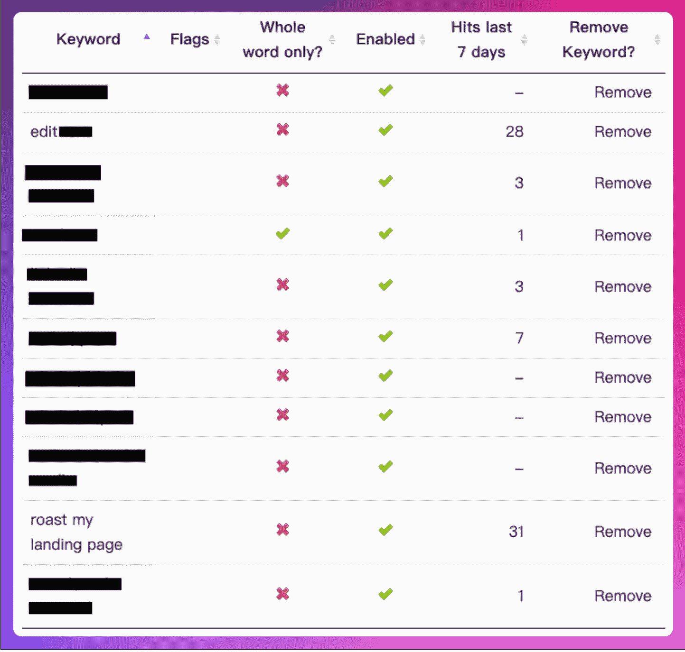

用这个工具可以监测哪些东西呢？

- 竞品关键词：用来监测竞品如何在 Reddit 上面做营销，挖掘对方的营销渠道；
- 潜在关键词：一些想要用来主打 SEO 的关键词，看看有没有热度和流量，用户是不是真的有在讨论；如果出现频繁，说明不错，可以用来做主打的 SEO 优化。
- 定位潜在用户：通过关键词直接定位到潜在用户，在留言区里面评论介绍你的产品，引流到落地页等。
- 监控自己的产品：看看有没有用户在讨论和提及产品，挖掘出你的「铁粉」或者「黑粉」用户。
- 挖掘 SEO 博文内容话题：如果有一些想要做的主题博文，也可以通过这种方式去挖掘有没有用户在讨论，如果有的话，写好了博文，也可以在评论区留言引流到网站。

这个工具有有一定的局限性。主要就是关键词本身和背后的需求并不是一一对应的，有的词会在莫名其妙的场合出现，并非理想的用户场景，需要进行一些过滤和筛选。

### 5.3.2 怎样转化目标用户？

试过了很多方式来做转化，有一些帖子流量大，但转化效果差；最好的还是直接定位到你的目标人群，让他们对你的产品感兴趣。

#### 5.3.2.1 自问自答型

就你的产品能解决的问题在相关社群里面提问，如：作为 ADHD ，我很难专注，有没有什么好的工具推荐？

公式：【人群】+【痛点】+【寻求工具解决方案】

比如，你是做App的，你就问有没有什幺好的app；做网站的，就问有没有什幺好的网页。

那么进来这个帖子的，也自然是对用户感兴趣的。

然后在评论区里，可以用小号回答，或者以真实用户的身份回答：

【最近我找到了一个不错的工具，它解决了我的问题，叫「XX」】

比如这个工具，就是通过评论区引流到网站

在Reddit帖子里留产品相关的信息，还有一个好处是，Reddit网站权重高，用户可能在谷歌搜索，会给到 Reddit 的结果，也等于变相做了 SEO。

#### 5.3.2.2 真诚利他型

另外，如果很难定位到你的场景，你可以把自己的昵称改成【产品/网站名称+ 解决方案】，在你的主页里，留下你的产品介绍，然后去目标用户发的帖子下面回答问题，不一定非与你的产品直接相关，但是能吸引到你的目标用户关注到你，这样进入你的主页后，也有机会通过简介了解到你的产品。

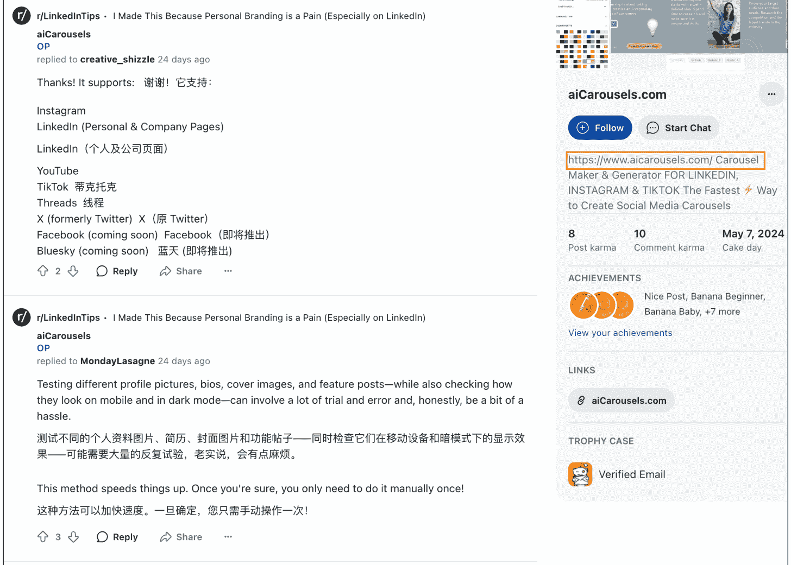

另外，如果你是做网站的，你可以把一些高赞的 Reddit 用户提问，变成你的 SEO 文章，在帖子下面发布，引流到你的主站去。

## 从社区出发，开启出海之旅

如果你想要提高出海事业的成功率，不妨从一个社区开始：社区会带你发现问题，问题会引导你找到解决方案，而产品最终会为你带来生意。

其实除了 Reddit，每个平台都有自己的子社区。而 Reddit 社区集合了流量大、用户活跃、子社区丰富的优势，是相对比较好上手、能快速拿到反馈的平台，值得各位出海人深根尝试。

以上就是过往在 Reddit 实践上的一些心得经验，也欢迎各位在评论区查漏补缺！！

感谢观看 ♥️

历史 3000 多份各类付费文章以及年费三千多的副业社群资源，见懒人专属群内部分享！

## 付费群，白嫖勿扰!

懒人专属群更新记录：

https://lazybook.fun/#/blog/record2