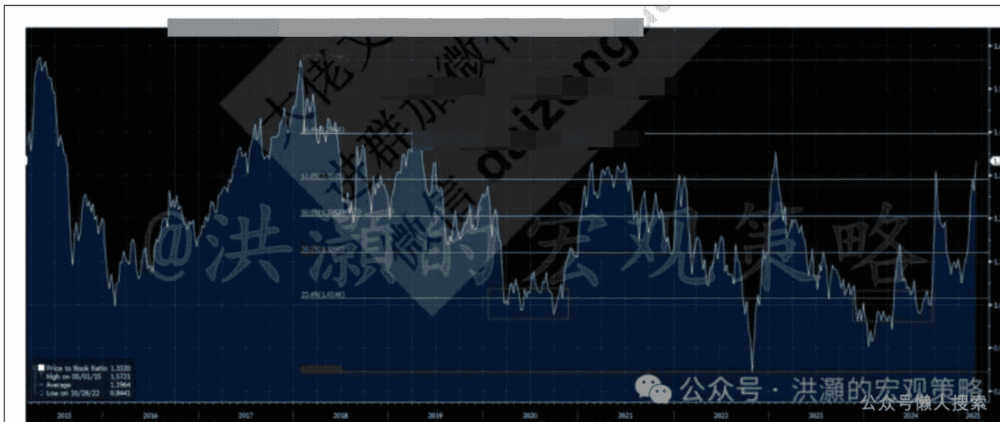

# 全球最大风险

250310 洪灝

整理：公众号懒人搜索，懒人专属群独享

懒人微信：lazyhelper

让美国以外“再次伟大”。

周五，美国非农就业略低于预期，而失业率因为马斯克翻江倒海的 DOGE 团队在美国各大政府部门里大开杀戒而略有上升。市场开始担心美国经济增长出现问题，标普一度下跌了逾 1.5%——直到鲍威尔的讲话再次力挽狂澜。

鲍威尔认为现在美国的经济数据符合预期，因此美联储的货币政策不需要调整。市场在尾盘旋即松口气反弹，美股由跌转涨。尽管如此，标普期货还是收在了 200 天均线以下，纳指亦然。这是逾两年来纳指第一次收在了 200 天均线以下。从技术分析的角度看，这些都是趋势出现重要变化的时间节点。

如果我们要把标普指数的对数价格图标从 1920 年代三个史诗级别的高点，也就是 1929、2000 和 2024 年 12 月特朗普当选美国总统连线，并把几个历史性的低点，也就是 1942 年中途岛海战、1974年石油危机、1982年沃尔克鹰派和2008年全球金融危机连线，我们将得到以下这个令人不寒而栗的图。

这种技术图形总是会令人侧目。媒体行业的行话说的好，“所有的坏消息都是好新闻”。更何况美股指数出现如此惊人的历史性“巧合”。最近一次标普如此逼近其历史大趋势上沿的时候，是2022年初——那是美国股债双杀的一年。

在今年开年的专属文章《洪灝：2025年最逆共识是交易》里，我提出了今年美股的表现不会好，中国的表现不会差的逆共识的观点，并认为美元周期将进入走弱的阶段。这些都是当时与市场共识完全相反的预测，也在后续在各大机构投资策略会中与许多机构投资者分享。现在的问题是，在美股主要指数处于趋势变化的关键位置、在标普超长期趋势处于历史性高位的时候，接下来风险将如何演绎？对于今年领跑全球的中国市场又有什么影响？

在上一篇专属文章《洪灝：疯狂中的理性》里，我分享了对于美国及其盟友关系恶化的主因和特朗普的“俄罗斯情结”。简言之，俄乌战争已经持续三年，俄罗斯却久攻不下乌克兰，一个并不发达的欧洲国家。这次战争的僵局显示了俄罗斯已经不再是一个军事超级大国，而接下来真正能够挑战美国霸权的只有华夏之邦。因此，特朗普威胁要退出北约。

周末，马斯克在其自媒体王国里再次兴风作浪，宣称支持特朗普退出北约。与此同时，波兰总统向北约申请核武器资源。在申请援助的时候，波兰总统不无讽刺地说，“现在的世界格局，就是五亿欧洲人向四亿美国人寻求保护，来击退一亿四千万俄罗斯人对于六千万乌克兰人的侵略”。笑完之后，这句话的确发人深思。

上周，财政上一贯保守的德国，突然开始觉醒。德国 CDU 领袖 Merz 在演讲中呼吁德国提高军费，并把军费预算独立于财政预算之外，每年的军费开支增加 1.5%的 GDP。请注意，这是新增的军费，而一般来说，国家军费的预算一般都在整体的财政预算里。在欧洲所有国家中，德国是最有底气做这样的军费预算的。毕竟，在魏玛共和国造就了人类历史上最高的通胀（之一）之后，德国人一直以勤俭节约著称，而德国的财政赤字是欧洲各国中最小的。当然，近年在中国强大的制造业咄咄逼人之情势之下，德国的传统制造业开始一蹶不振。这种经济状况，也增加了德国人的危机感。

或者说，如果 Merz 成功获得大多数政党支持的话，那么这将是德国第三次武装化，而前两次分别是一战和二战。前两次德国武装化走向世界大战的时候，也是全球地缘政治风险全面爆发的时候。现在，如果 Merz 的 CDU 联合 CSU 组成政府，那么他们还不能占到绝大多数议席——除非他们愿意和 SPD 合作。即便如此，欧洲各国都在洗耳恭听 Merz 的意见，欧债收益率开始爆发。德债收益率经历了欧债危机之后最大幅度的单天飙升。

法国也不甘落后。虽然马克龙一直认为军费开支应该受到财政预算的限制，但现在也坐不住了。马克龙也提出了类似的想法，并呼吁用法国强大的核武器作为欧洲安全的保障。可以理解的是，如果美国不再为欧洲的安全埋单，二战以来的欧洲地缘政治格局将发生根本的变化，欧洲人不得不寻求自我保护。周末，特朗普拒绝了加拿大提出的成立 G7 工作小组的建议。市场一片哗然，美股期指应声而落。

市场在期待一个“特朗普看跌期权”——在市场暴跌之际，特朗普出来讲话，推出有利于市场的政策。然而特朗普第一任期的时候的关税政策导致美股 2018 年四季度的暴跌。那时候，“鲍威尔看跌期权”生效，在 2018 年圣诞节期间怒降基准利率，让全球市场在 2019 年赢得了一波反弹。第二任的特朗普似乎变本加厉——第一任的时候他只是觉得“天下人负美”，现在第二任之时，他反倒要“美负天下人”，开始对于盟友收“保护费”。

殊不知，美国在全球的布局是美元霸权的最重要的一只脚。另外一只脚，是美国开放其国内市场，零关税进口海外廉价商品，并向全世界输出美元流动性，并大规模发行美债支持美国政府的开销。如今至此，美国的医保社保成为了美国政府第一大开销，第二是利息支出，第三才是军费。今年，有逾 9 万亿美元的美债到期需要滚动续期再融资。可能是美国政府开支已经不堪重负，减少北约军费开支可能也是无奈之选。退出北约、关税大战，将让美元霸权的两个支点化为乌有。

最近，中国市场的表现引起了全球的关注。国外对于中国市场的看法开始发生变化，认为中国市场不再是一个“uninvestable”的市场，但是疑虑尚存。但是，大规模的资金流入还未发生，海外机构对于中国的仓位从0%略微开到了4%。而经历了今年这波轰轰烈烈的行情之后，中国香港市场的市净率已经回到了近年来的高点。换言之，如果这波行情是一波市场估值重估的行情，那么市场其实已经被重估了。接下来就要看盈利的了。

历史3000多份各类付费文章以及年费三千多的副业社群资源，见懒人专属群内部分享！

付费群，白嫖勿扰！

懒人专属群更新记录：

https://lazybook.fun/#/blog/record2

懒人微信：lazyhelper