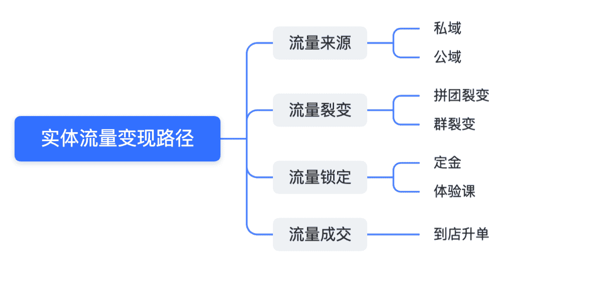

# ai 同城直播，你身边百万级的机会

250310 生财精华
公众号懒人搜索，懒人专属群分享

大家好，我是孙策，

熟悉的老圈友都知道，我 18-21 年左右，一直在做线下拉新，在线下拉新领域做到了全国头部，带领数百个圈友在这个领域内赚到钱，其中不乏有赚到几十万、几百万；

目前专注于同城实体赋能，就是帮助门店做流量变现

新的 slogan：带领一群同城操盘手，用 ai 直播发售，帮一部分同城实体真的有利润

争取在 ai+直播领域，再次能带动数百个圈友，在这个领域赚到大钱

在 22 年开始，我们开始深扎同城赛道，仅用 4 个月，23 年，区域化，在多个城市测试，拿到了结果；24 年，全国化，带动了 200 个圈友参与这个业务，在多个省份做到头部，基本单月收入在 160-200 万；

25 年，升级以 ai+ 直播交付，交付的类目更多，更多的获客方式，争取在这个领域做到头部;

## 同城借助 ai+ 直播，将是普通人落地 ai 拿到大结果最大的洼地

未来已来，大家都知道 ai 是未来，建立 ai 产品能变现将是未来的主流。但是真实落地的话，具体怎么切入 ai，让 ai 产生商业价值，且能变现，且拿到大结果，那这个路径就不太通畅。

哪一类产品能高效变现，离变现最近，其实就是直播。短视频、图文，目前最高效的变现就是直播，离变现最近也是直播。ai+ 直播，将是 ai 变现最快的路径，因为直播是离变现最近的。

再者能建立起一个优秀的 ai 产品，需要在比较长线的赛道，不断试错，不断优化，才可以，所以选择的赛道一定要长。对于同城来讲，就是 ai 比较好切的一个赛道：

- 1、同城跑通一个类目之后，可以在多城市服务，好规模化；
- 2、单一城市竞争小，只需要打败本城市的即可；

同城实体这个群体天然适配 ai+直播

基于同城这个赛道，我们要选择一个可以服务的客户。设计一个产品，你要思考你解决的问题所创造的价值的大小，创造的价值越大，那么变现越高，那就应该选择商业人群，解决商业人群的问题，解决商业问题，天然的创造价值就高。

商业人群量足够广，有两类：互联网创业的老板、实体的老板。同城实体老板的优势：

1、广阔的数量，也就是说我们客户足够多；
2、有一定的信息滞后性，我们就可以有充足的时间去打信息差；
3、实体老板群体永远在，围绕实体老板的需求不断更迭自己的产品就好了；

对于同城实体来讲，直播目前是最高效的变现方式，没有之一。而且大量类目的实体并没有拥抱直播。尤其在同城这个赛道，只要说这个实体老板拥抱了直播，同一类目下的其他老板没做直播，那么这个城市的所有的流量都是他的。

基于 ai+直播发售服务，围绕的这个同城实体这个用户群，具有巨大的空间。

## ai 同城直播发售业务成立的逻辑

ai 同城直播发售业务，就是借用 ai 提效，通过视频号直播、抖音直播，进驻门店，用私域裂变联动直播的发售逻辑，帮助同城实体（少儿艺培、教培机构、婚纱礼服、瑜伽、水育、亲子摄影、健身房等类目），带来流量、带来客资、带来变现，我们获得服务商家的佣金。

### 对于同城实体来讲，痛点足够深

- 1、流量贵，进店流量很低，自己在平台采买又不懂逻辑，成本高；
- 2、转化低，很多商家缺少转化能力，进店体验之后很难升级高客单；
- 3、竞争激烈，同类目竞争大，像艺培，学了书法就不会在另一家机构学习书法了；
- 4、团队能力差，新渠道跟不上；

对于同城实体如果不用新渠道、新质生产力，在当下内卷的环境中，很难杀出来。痛点足够深，这是我们存在的价值，需要有团队用更先进的方式服务他们。

### 对同城实体的视频号直播，有红利

- 1、同城实体本身有私域以及有口碑，视频号直播天然适配实体店，只要调动起私域直播间就能产生有效的流量；
- 2、社交裂变能力，实体店的用户本身就是在一个城市，通过社交裂变，单一品牌很容易引爆同城；
- 3、实体拥抱视频号直播的本身就是少数，只要拥抱了，就能站住用户的心智；

因此，这个项目就是我们用交付过大量的实体老板总结出来、验证成功成熟的直播发售方案，进店帮助实体老板做流量，提升销售额。

## 进店直播发售模式以及财务逻辑

### 1、进店直播发售的模式

我们主推的是直播又分为两大主流渠道：

- 1、视频号直播发售
- 2、抖音直播发售

视频号与抖音直播，各有优劣势，各有自己的特点。视频号比较重私域，私域裂变联动视频号直播是对比其他平台的竞争优势。基于此，我们把他定义为引流场，就是视频号变为引流中的一环。

视频号直播，我们把他放在流量路径中的裂变与锁定上。所以视频号适合低转高的类目，例如：教培、瑜伽、健身房。
（注：这个视频里面有三、四个生财圈友）

对于抖音直播，因为抖音在本地生活赛道已经比较成熟了，标签精准，投流也精准，培育的用户已经接受在抖音上买高客单的品。我们把抖音直播当作成交场，直接成交高客单。抖音适合高客单高毛利低复购，本身就投大量广告的行业，例如：婚纱礼服、婚礼堂、婚纱亲子摄影。

因此，视频号直播，可以把它放在流量路径中的裂变与锁定上，适合低转高的类目；抖音直播，可以把它放在流量路径中的成交上，适合高客单高毛利低复购的类目。
（注：左边的主播，也是从0到1培养起来的一个主播圈友）

### 2、财务逻辑

我们走的深度服务的模型，走的是效果收费的模式，我们的收费方式就是效果付费，我们做多少效果，就赚多少钱。这种收费模式，在同城就很有竞争力。

视频号直播，我们赚的是两方面的钱：

- 1、前端引流包的款：像艺培、瑜伽、水育，会有一个体验课。例如：我们卖了 200 单，299 元的引流卡，我们的收入是 6 万块。这种引流卡我们拿走绝大部份，去掉礼品，就是我们的利润，整体利润在 70%-80%；
- 2、后端转化分成的款：假设 200 单引流卡，进店感觉不错，升级成了 20 单的 3000 元的高客单，那实体老板赚了 60000 块钱，我们再拿 60000 块钱的分成。

抖音直播，我们也是赚两方面的钱：

- 1、赋能的钱，大概有个几千块钱的前置费用。这个款，也相当于把店铺的员工教了一次直播；
- 2、gmv 分成，一场播多少钱，进行一个分成。

基于视频号直播、抖音直播发售，基本会把同城绝大多数的类目给覆盖掉，而且在本地开展相对来说很容易。

## 进店直播发售的交付逻辑

### 为什么要进店（进店指的是进入他们的店，做面对面陪跑）

- 1、外来的和尚好念经，大量的实体店管理还是有一些问题，上下级矛盾、同事之间的矛盾，他们自身落很多事情落不下去，我们过去以结果去倒逼；
- 2、进店我们可以进行颗粒度的跟进，确保发售细节做好，提升直播发售的成功率；
- 3、进店后还可以对同城实体的员工进行培训。

### 直播发售的整个流程

- 1、引爆同城流量：通过建群裂变的方式，把同城流量吸引到视频号直播间；
- 2、引导实体本身私域流量：通过私信等方式，把实体本身的流量也吸引到视频号直播间；
- 3、大场直播发售：建立专业的人货场，进行售卖；
- 4、直播后追售：直播后，再把未购买的客户全部追一遍；
- 5、到店再升单：通过线下到店，进行1对1面聊，进行整个的成交。

一场发售，对同城实体来讲，获得了曝光、获得了客资、获得了定金客户、获得了收入。所以我们打造了一个标准化的模式，一个交付时间只需要3-5天。那么一个交付老师一年可以交付几十场，10个交付老师一年可以交付几百场，只有标准化才可以规模化。

## 销售生意 or 交付生意

其实前两年我一直在思考这是一个交付生意，就是一个客户，开发不同的产品满足它。发现服务生意本身，管理客户预期是一个很难的事情，投入1万块钱，有的老板赚2万觉得满意，有的老板觉得赚10万都不满意。所以就是有一些客户不满意，他们也会切换其他的服务方。

老板本质上是病了，他们在找药。就算一味药有疗效，他们也要疯狂的尝试别的药。

所以后面我们就换了一套逻辑，把交付逻辑变成销售逻辑。所以，不用把自己变成一堆药，把自己变成一味药，就是把一套交付逻辑，打磨好，把这个药打磨好，把这个药卖给足够多的人就好了。

所以我们把它变成了一个销售逻辑，所以我们延伸出了两套打法：

一套是城市化打法；也就是说，我们会在一个城市一下子上 15 人左右。那么我们将是这个城市最大的团队，我们人快速上门 bd 商家，快速跑出来案例，再用案例撬动案例的打法，快速把这个城市覆盖掉，然后去往下一个城市。这是我们 24 年快速拓规模的一个核心。

一套是信息流广告打法；通过信息流广告，疯狂的做投流，然后组建销转团队，做销转，在全国化派单。这是我们 25 年重点拓规模的一个核心。

通过两个逻辑的核心，就是把我们的药卖给更多的“病人”。

## 一个可以真正复制到你本地的生意

这是一个可以真正复制到你本地的生意，因为中国是一个巨大平行世界，逻辑上一个三线城市跑通，其他的三线城市都会跑通。一个二线城市跑通，其他的二线城市也会跑通。只要你拷贝我们的玩法，只要你的执行力足够强，就能在你的本地拿到结果。

另外同城实体一直在，我们围绕的需求，改变我们服务的产品即可。

## 一个比较清晰的成长机制

我们经过了几次航海的沉淀，梳理清楚了一个清晰的成长机制。商务-交付-团队长-地区合伙人，清晰的成长机会。

在本次航海中，商务、交付，都会交付给你。商务（也就是跟商家做方案、如何达成合作），你都会清晰。

交付（也就是跟商家做交付，如何给商家做出流量、带来变现），你也会清晰。

航海结束后，

1、你可以加入我们的团队，在我们的固定办公地，你可以成为一个交付老师，我们会给你源源不断派单，你进行交付；你也可以成为一个营销老师，我们会给你源源不断的意向客户，你来进行成交；你也可以成为团队长，打造自己的阿米巴小组，我们进行合作，你组建一个商务+交付小组；

2、你也可以回到自己的城市，在当地开展业务，我们两方进行合作，我们辅助你开展业务。

另外新一期的同城直播发售起航，一起用ai+直播，打爆同城

微信：lazyhelper
懒人微信：lazyhelper

历史 3000 多份各类付费文章以及年费三千多的副业社群资源，见懒人专属群内部分享！
付费群，白嫖勿扰！
懒人专属群更新记录：
https://lazybook.fun/#/blog/record2