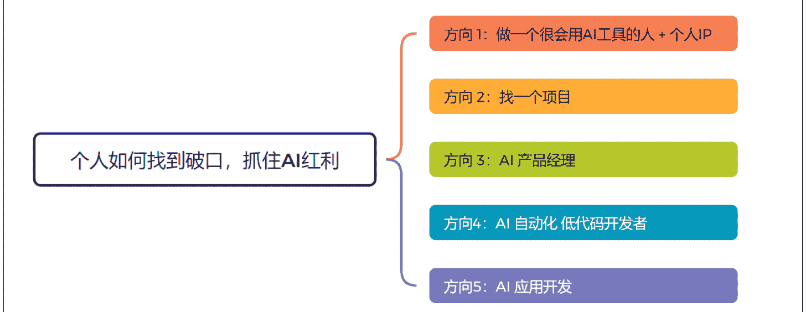
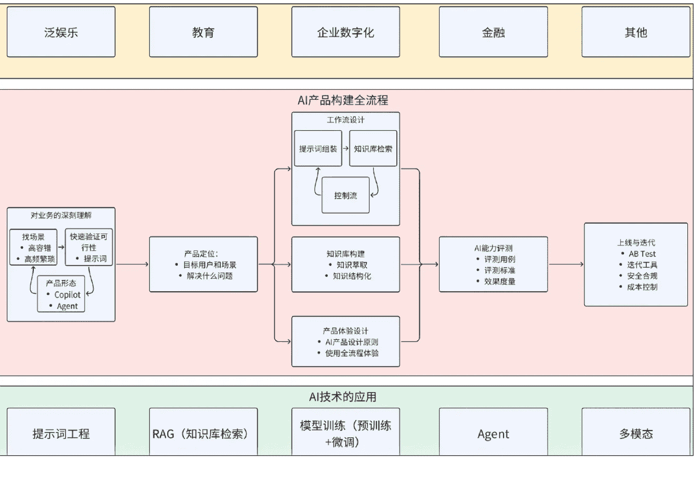
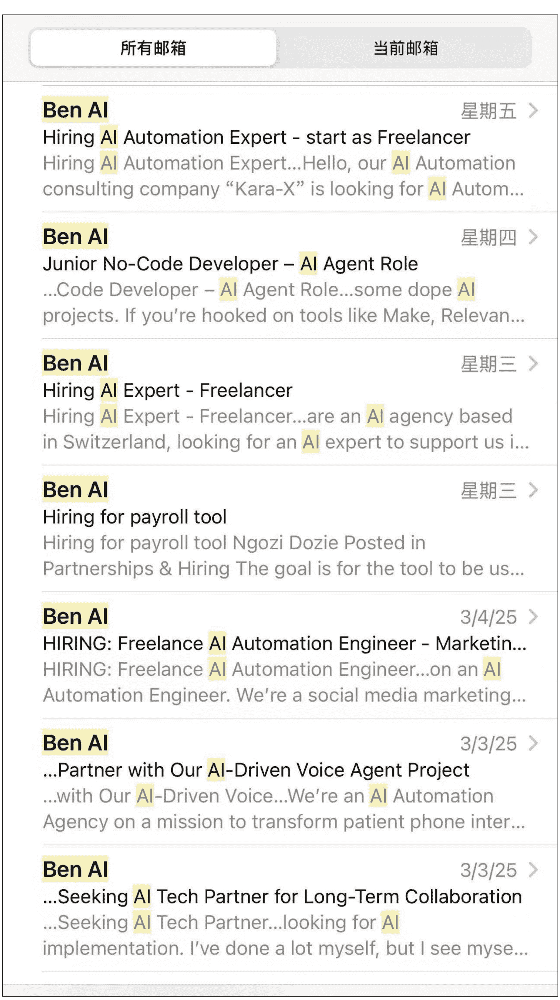

# 个人如何抓住 AI 风口 - 找到破局点
250313 生财精华
公众号懒人搜索，懒人专属群分享

每天喊着要"All in AI"，却不知从何入手？这是一篇帮大家厘清思路，在 AI 风口下，无论你是身处何种境地、何种身份，希望能够在 AI 浪潮中找到一个适合自己的破局点并站稳脚跟。若大家不知从何处开始接触 AI，可以从以下 5 个方向着手开始，从 1-5 按照最容易-最难排列，方向 1 最容易启动，方向 5 有一定的门槛。

## 方向 1：做一个很会用 AI 工具的人 + 个人 IP

这个方向是最容易入手，且可以随时开始去做的方向。这个思路是，在你的生活、工作、学习场景中开始使用 AI 工具，且把这个 AI 工具用得很好，最后通过输出逐渐去建立个人 IP，找到变现机会。

### 为什么这是一个好的方向？

**有一定的壁垒**：这个壁垒在于你本身所处的工作行业，以及你的角色。比如你是一个外贸业务员，那么你对外贸业务员工作流程的了解就是你天然的壁垒，所谓隔行如隔山，你的地盘行外人很难进来。而当你成为外贸业务员中很会用 AI 的人时候，比如：你会用 AI 去分析销售线索，且能够用 AI 快速写出一封个性化的冷邮件，这样你又多了一个壁垒。

**知识赋能变现**：当你把整个业务流程梳理好，把能用 AI 的地方都用上，且取得不错的结果时（比如你用 AI 写的冷邮件比传统邮件约到更多的客人见面），这不仅可以帮助自己的工作，也可以把这套知识体系教（卖）给别人，比如其它业务员，或者外贸公司的老板。更甚者，可以开发一套 AI 系统。比如用于跨境电商的 Linkfox 就是一个很好的例子，这个 AI 应用的创始人之一就是亚马逊的亿级大卖家。正因为他们很懂跨境电商的业务，所以做出来的 AI 应用也更能解决问题！

### 怎么做：

**核心关键点**：找到你生活，工作，学习中容错率高且重复率高的场景开始去用 AI。

为什么强调容错率高且重复率高？容错率高是因为虽然 AI 很强大，但目前还不能保证 100%准确，比如在生成回答的时候仍然会产生幻觉。举个例子：在电商行业，我们可以用一个 AI 客服去给客户推荐产品，但 AI 客服却不适合用于政府部门去给市民回答政务问题。原因在于，给客人推荐产品是一个容错率高的业务场景，即使推荐的不对也不会产生很大影响。而代表政府机关去回答市民的问题，那是必须 100%正确，这个场景就不适合用 AI。那什么是重复率高呢？即在你的业务流程中重复性极高的场景，比如发票录入，写公众号，回答客户问题等。所以先梳理和复盘你的生活，学习，工作中有哪些重复率高的环节，然后在里面找适合用 AI 提效的环节。

**各行各业的切入点**：你可能会问了，我是一个学生，或者我是一个全职妈妈，有什么场景可以开始使用 AI？如果你是学生，那当然是学习场景，比如 AI+费曼学习法，通过和 AI 对话练习口语，用 AI 辅助写论文等等，用提示词改简历，学生的痛点和学生的业务只有学生最了解，用 AI 去解决这些痛点，就是你的壁垒。全职妈妈呢？巧了，最近火出圈的 AI 小智就是一个全职妈妈分享用 AI 小智来学习和哄娃开始引起广泛关注，还上了央视财经，如果你是一个很会用 AI 的家长，那你能变现的点可太多太多了。比如这个小红书账号：Evan 妈咪会 AI。

如果你说，我工作，学习，生活中实在找不到合适的场景去用 AI，那么推荐你走第二个方向 - 做项目。

## 方向 2：找一个项目

### 为什么这是一个好的方向？

**学习要结合实践**：如果你脱离业务和项目去学习 AI，除了为爱发电，基本没有其它意义。比如你买了一个 19.9 的 AI 做图课，学会用一些 AI 作图工具，然后呢？如果你要变现，那么还是要找工作，做项目或者提供服务，也就是说还是要懂业务。

**能力补全**：我觉得 AI 的出现，补全了我们一些原来求而不得的技能。比如，你一直想写小说，奈何有梦想却能力不足，迫于生计，也没有时间去学习，那么 AI 的出现就是快速地帮我们补全了这个能力。同理，AI 编程工具的出现，也补齐了许多产品经理不懂编程的短板。所以为什么一人公司这个词越来越热，原来要靠一个团队去实现的业务，现在在 AI 的加持下，也许靠 1-2 人就能完成。

### 怎么做：

**找 AI 原生的项目**：在 AI 产品设计有 2 类产品，一类是 AI Augmented（AI 赋能），即在原有的产品形态中加入了 AI 的功能，比如飞书接入 Deepseek，微信接入 Deepseek；而第二类是 AI Native（AI 原生）的产品，比如 AI 陪伴类应用 - 星野，Character.ai，即如果没有 AI，就不会出现的产品。项目也是一样的，比如做数字人，且把数字人用在合适的业务场景。提到数字人，大家可能会想到直播，带货，但请看一下这个产品，我的男神吴彦祖教英语，最后上线学英语的不是娃，是妈妈。如果你对数字人玩得很好，你觉得这种产品难不难做？

**参加验证过的 AI 项目**：直接参加生财航海的 AI 相关的项目。我觉得这些项目都特别好，因为这些项目都满足 2 个点：
- 1) 能让你在项目和业务中去用到 AI（比如 AI 赋能电商、AI 自媒体），而且这些项目能够让你一次性集中体验 AI 不同面向的用法，如何用 AI 生文、生图、生视频；
- 2) 这些项目都是经过验证能赚到钱的项目。也就是说，你不仅能用 AI 来武装自己，且极大可能可以赚到钱。

**能力突破**：找一个你一直想做，却碍于原来能力不足，无法坚持去做的项目，比如你一直想写书，但是文笔不行，那么你可以以这个项目开始，用 AI 来辅助你写书，评估看看 AI 是否可以补全你这方面的能力。

## 方向 3：AI 产品经理

这是一个当下求职市场上需求端远远大于供给端的职业，吴恩达老师在他的 deeplearning 社区写过一篇博客讨论这个话题，有条件的朋友可以看这篇原文 AI Product Managers Will Be In-Demand，或者看小红书上的这篇翻译文 吴恩达：AI 产品经理将是最炙手可热的职业。

### AI 产品经理需要哪些技能？

**简单概括**：懂业务懂 AI

**详细概括**：可以看下面这张图。首先你得是一个产品经理，然后需要有 AI 知识，这里的 AI 知识，其中包括：提示词工程，RAG 原理，Agent 的搭建，对不同类型的大模型能力的认知等，常见的 AI 产品形态（Copilot 类产品，Agent 类产品），再加上 AI 编程产品的出现，能够快速做出产品原型也成为必备技能。同时，AI 产品经理要对 AI 生成的内容和答案负责，所以构建产品评测集也是重要能力之一。当然，如果你懂业务，比如你本身是一个金牌销售，然后又懂用 AI 去解决问题，同时还能用 AI 编程去实现产品原型，那可以说是做销售垂类 AI 产品的天选之人。

如果你是一个职场新人，可以怎么往这个方向靠近，我认为可以从以下方面入手：
- 多用且分析某个行业垂类的 AI 产品（金融、教育、法律都是应用场景很广泛的行业垂类）
- 多用且分析某个自己感兴趣类型的 AI 产品（比如：AI Chatbot、AI Agent、AI 工作流、RAG 类应用、AI 陪伴类产品、大模型+硬件），尝试学习了解这些产品里面的关键技术和产品设计思路
- 学好提示词。虽然 DeepSeek R1 出来后，许多人觉得提示词已死，但是我认为目前来看，提示词仍然如会写字一般，是基础。
- 建立自己的作品集。用 AI 编程工具做一些小应用，搭建一些工作流，从而来搭建自己的作品集。

如果你是一个资深职场人，想转型，怎么转？
- 懂业务；
- 懂 AI（底层技术）；
- 会用 AI 编程工具；
- 对本行业国内外相关的垂类的 AI 工具都用过且能分析出好与不好；
- 会做产品评测集；
- 同样地建立自己的作品集，告诉领导你懂业务也懂 AI。

## 方向 4：AI 工作流 & 低代码开发者

这个方向中有 4 个关键词 - AI，工作流，低代码，开发者。
4 者加起来等于一个新兴职业，一个公司，一门生意。

如果你想要对 AI 工作流有个视觉上的快速认知，可以快速查看我之前写的 2 篇帖子：
- 《如何用工作流做一个海外社交平台 - Reddit 需求挖掘 AI Agent》
- 《案例分析：如何用 AI Agent 分析美股财报》

为了吸引你往下看，我决定放 2 张性感的图，告诉你这个市场需求有多么的旺盛！

### 国外某个社区内基本每天都有人在招工找人，求贤若渴！

- **Ben Al (2/28/25)**: Need an AI Specialist partner in the health & wellness... Need an AI Specialist partner...knowledge of AI automations & agents in which I can service our fut...
- **Ben Al (2/28/25)**: ...developer needed with conversational AI experience... with conversational AI experience Nic...developing an AI-powered Pocket Coach designed to help users i...
- **Ben Al (2/27/25)**: This Week in Ben AI... week on Ben AI February 20...options for AI & automation, when to use them, and how to pick the ri...
- **Ben Al (2/26/25)**: Looking for a Marketing Automation Builder (and Part... ...to implement AI solutions while teaching m...
- **Ben Al (2/25/25)**: ...Looking to Partner with AI Agent Builders who can h... ...Partner with AI Agent Builders...Hiring Seeking AI Agent Builders What We Need: We're looking for AI a...
- **Ben Al (2/24/25)**: We are looking for an AI agent developer in latin amer... ...for an AI agent developer...We're Hiring: AI Automation Specialist Scope: Full time with flexibil...
- **Ben Al (2/24/25)**: Potentially simple hire. Potentially simple hire Lee Harper Posted in Partnerships & Hiring Hi I am after someone to set my...

接下来，讲些枯燥的内容

### 什么是 AI 工作流？

工作流简单来说就是通过自动化来解决工作和业务中一些高频率重复的问题，类似的还有 RPA。而 AI 工作流，则是在工作流加入能够使用到 AI 能力的节点，比如向量数据库，大语言模型等。

### 做 AI 工作流的工具有哪些？

扣子 (Coze)，影刀，Dify, Make, n8n, Zapier, Power Automate 等都是主流的做自动化工作流的工具。

### 主流变现方式

- **职业向**：自动化工程师；有些 B 端的项目，比如数据分析、CRM 等也会用到工作流。
- **创业方向**：独立接单，现在国外很热的 AI Automation Agency。
- **客单价**：低客单价 1000 美金 - 2000 美金；高客单价 10,000 美金起（小 B 端客户最多）。
- **工作流的类型**：社交媒体内容产出，语音销售，餐厅用的语音定位，销售线索分析，数字人销售人员等。

这种工作流最大的卖点有以下 3 个：
- 可以根据业务需求去定制，且比起做一个应用，成本要低很多；
- 低代码工具可以快速的做出一个原型，然后根据业务的需求去快速的上线和迭代；
- 按使用量收费，根据不同的工具，有些是按照工作流的运营次数收费，有些是按节点的启动收费。

### 挑战

也许你看到这里，觉得这个赛道很吸引，因为既是低代码，而且工具使用也不难，客单价高，且天花板也很高。此处我想根据个人经验和观察来分析一下这个赛道的挑战，帮助你更理智入局！
- **还是要懂业务！** 因为 AI 工作流的本质是为业务流程提效，所以懂行业，懂业务流程，懂业务流程中一些很细微的痛点，这个很重要。
- **虽说是低代码，不代表不用懂技术。** 技术包括：API 的调用，对数据库的理解和应用，对大模型的应用，知道如何用 AI 辅助生成正确的代码等。
- **这个属于服务型业务，需要和客人沟通。** 了解需求，必要时还要解释相关原理和培训用户，所以虽然说一人能做一些工作，但还是更适合一个小团队去做。如果组团队，就会涉及人员管理，销售，获客等等。

## 方向 5：AI 应用开发

这里我把这个方向放在最难启动的位置，因为我指的 AI 应用必须符合以下条件：
- **解决一个行业或者垂类业务的问题**：比如 1688 的导购助手，Mottif AI 等。
- **这类产品很多时候光靠通用大模型是无法做出来的**：也许需要团队去对模型进行微调，或者去训练一个小模型。
- **赚钱的应用**：这个就涉及很多环节了，比如是否有客户愿意为之付费的需求，还有就是营销。

---
公众号：懒人搜索
懒人专属群
微信: lazyhelper
历史 3000 多份各类付费文章以及年费三千多的副业社群资源，见懒人专属群内部分享！
付费群，白嫖勿扰！
懒人专属群更新记录:
https://lazybook.fun/#/blog/record2