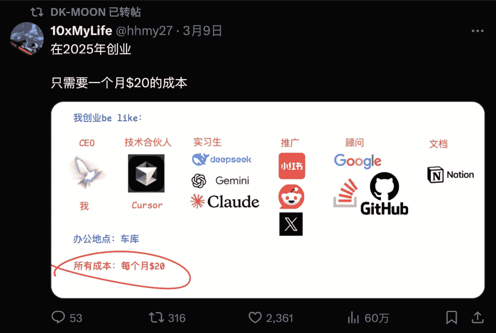
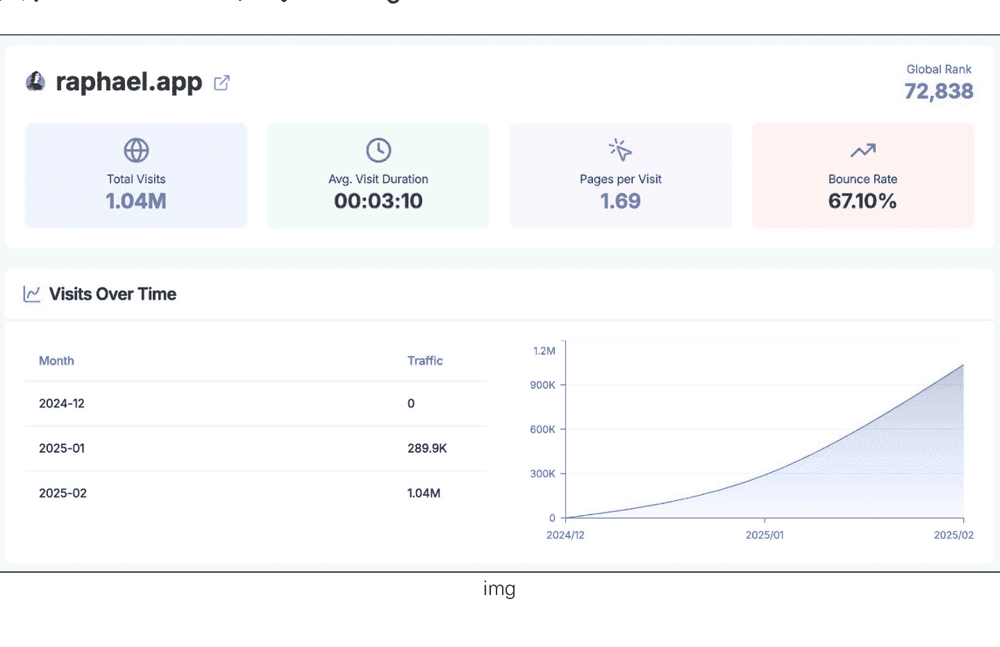
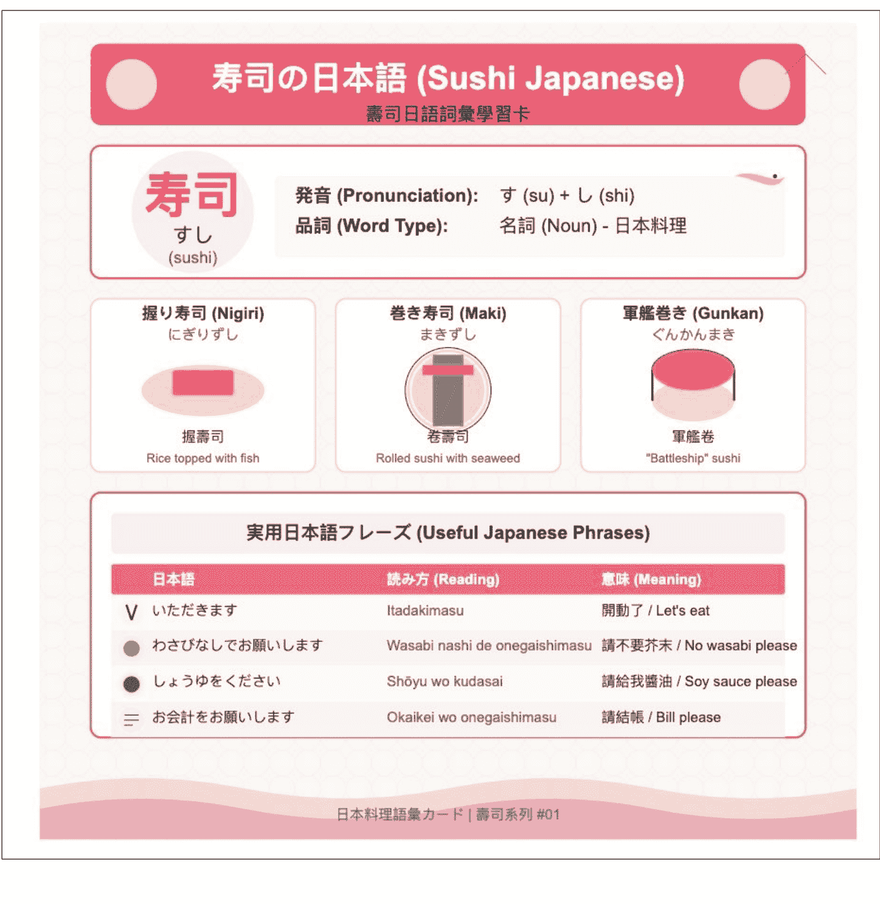
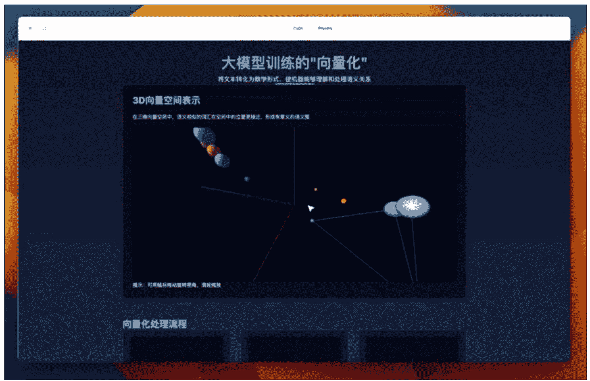

# 现在做套壳产品，有巨大机会

250313 生财精华

整理公众号懒人搜索懒人专属群独享
懒人微信 lazyhelper


大家好，我是来自生财有术的破防圈友刘小排。

先说结论：做套壳产品，有巨大机会。

为什么？

因为：
- 1、套壳产品，大公司看不上，让我们避开了大量竞争。
- 2、大模型是技术平权运动，让大公司和小公司做的产品可以一样好。
- 3、聪明的套壳产品，可以聪明地满足了用户需求。

有确定需求、竞争小，就有巨大机会。

在大部分互联网大厂、大佬眼里，“套壳产品”竟然是贬义词！这可太好了，这是我们千载难逢的机会啊。

且听我细细道来。

## 一、为什么大公司看不上“套壳产品”？

> 「 首先，创新在刚开始时，都是被人瞧不起的。所以我们有一个词叫“边缘创新”。」

2006 年的 360，被人嘲笑“不懂杀毒”“杀毒引擎竟然是靠文件名查杀”“免费怎么挣钱”。很快，360就把几乎所有的杀毒软件干趴下了。拼多多在 2017 年被人嘲笑“拼夕夕”。很快，拼多多的市值超过了阿里、京东。

iPhone 2007 刚问世的时候，也被诺基亚嘲笑说它没有键盘、电池只能用一天、摔一下就坏了。后来，诺基亚没了。

既得利益者，面对新事物时，往往会经历“看不起→看不懂→追不上”三个阶段。目前所谓的“AI 套壳产品”，正在经历第一个阶段到第二个阶段到过渡期，让我们拭目以待，很快，以 Monica 为代表“头部套壳产品”，会让他们“追不上”。

纵观三十年互联网产品的历史，这样的时间点，总是草根创业的绝佳时机。我们称之为“傻 X 窗口” ——主流世界认为你是“傻 X”，暂时只有少数人知道你不是，你的用户也知道你不是，正如 2006 年的 360、2007年的 iPhone、2017 年的拼多多。

《从 0 到 1》里提到，在找创业机会时，你需要多问自己“在什么重要问题上，你与其他人有不同的看法？”
好的回答是：“大多数人相信 X，但事实却是 X 的对立面”。

在 AI 套壳产品的问题上，大多数人相信套壳产品没有价值，但事实却相反。

「其次，大公司会非常尴尬，因为套壳产品的利润，还不足以支撑大公司的基本盘。」

无论是我非常尊重的“套壳产品”Monica.im、还是彪哥的 pollo.ai、hix.ai，它们已经是非常头部的“套壳产品”，但利润无外乎只能养几十个人而已。大型互联网公司动辄上千人、数万人，人员成本还高，“套壳产品”的机会对他们来说非常鸡肋，不值一提。

也正是因此，在中国出海 AIGC 产品榜单的前 100 里，有 80% 都是你没听说过的小公司做的。在你听过的公司当中，字节跳动已经是最猛的那个，有 6 款产品在里面；而咱们的圈友 damo 却有 4 款，他的团队只有 20 人；我本人有 2 款，团队 1 人，并且怀抱很强的信心年底我也会有 4 款。

「再次，大公司掌握的方法论暂时还不支撑他们做套壳产品。」

大公司最爱念的经包括“你的壁垒是什么？”“如果你这款产品腾讯做/字节做了，你怎么办？”“下次 ChatGPT 模型升级了，就把你的产品能力覆盖了，你怎么办？”。做套壳产品草根创业者回答不了这些问题。

当然，他们也懒得去回答。哪里有用户，哪里就有机会。

最后，我做一个提醒：大厂不会一直沉睡！正在此刻，包括万兴、阿里、字节在内的一些互联网大厂，已经开始蠢蠢欲动了。请大家抓紧，当下这个“傻X窗口”的窗口期不会超过半年。

## 二、为什么大公司、小公司做的产品，可以一样好？

请大家记住，大模型是一场技术平权运动。

用大模型写代码，已经可以超过 99%的程序员了。在 Codeforces 竞赛编程平台上，o3 的 ELO 评分接近 2727 分，超过了绝大多数人类程序员，包括 OpenAI 自己的首席科学家 Yakov。

在 2014 年我即将被猎豹移动收购的时候，投资部老大的一句话打动了我，“小排，如果你想做好产品，你必须来北京。因为你在重庆，招不到月薪 5万的程序员”。

他说得没错！彼时， Top 5%、Top 10%的程序员，都在大厂手里，拿着高薪。但是今天， Top 1%的程序员，在每个人的手里。大厂的月薪 5万的程序员，你和手上月薪 20美元的程序员(ChatGPT-o3、Claude 3.7 等)相差无几。



如果你还是觉得不放心，你可以招「1个月薪5万的、会使用AI的程序员，带着9个便宜的、会使用AI的00后程序员」，效果并不亚于你招「10个月薪5万、不会用AI的程序员」。

技术差距拉平后，接下来只需要比拼获客效率、变现效率了。试问，在这两个生财有术圈友、草根创业者熟悉的领域，你们会害怕大厂？

## 三、为什么套壳产品，可以满足用户需求？

你想过吗，最近爆火的Manus，其实是个“套壳产品”？

对于经常泡AI圈子的人来说，他们会轻易发现：
- Manus的底层模型是Claude 3.5/3.7，没有自己的模型能力。
- Manus最核心的代码，来自开源项目的Browser-use

详见这里
https://x.com/jianxliao/status/1898964775809536121

对于经常使用 Cursor 等 Agent 工具的人来说，他们可能会发现：
- Manus 能干的一切，在 Cursor 里也能干啊。
- “Manus 不过是 Browser-use 的套壳，没什么了不起，纯粹是噱头”

但是，对于普通的、广大的、可能还不会科学上网的那 99.9%的用户来说：
- 他们认为 Manus 是神迹！
- 他们认为 Manus 是“国运级创新”！

这是为什么呢？

因为 AI 聊天机器人（比如 ChatGPT 网页版、Claude 网页版）并不是好的产品！它们的产品能力、呈现出来的产品效果，「极大依赖于使用者的素质」。当我使用 Claude 网页版时，我感觉它是万能的；我妈使用 Claude 网页版时，我妈却觉得它不如豆包，“跟小度智能音箱差不多”。

所以，Manus 是一个伟大的产品！它的伟大之处在于：让像我妈这样的普通人，也能够毫无门槛的体验到世界上最厉害的大模型产品、最厉害的 Agent 能力，毫无使用门槛，直接看到结果。

让一大群不会使用 AI 的用户、突然就会使用 AI 了。这就叫“满足用户需求”，这就叫“价值”。

上周我直播的时候，我也讲过我的小产品 Raphael AI (https://raphael.app)的案例。 在我做出来之前，所有有大厂背景的人都觉得我是傻 X，他们会说“AI 画图已经是红海了啊，有什么好做的？”“你的壁垒是什么？” 。

但事实是，Raphael AI 在短短一个月内就超过月活 100 万了，用户全部来自于用户间的「口耳相传」，我没有做任何付费推广。由于一时兴起和生财有术有了课程的合作，我甚至还没时间去做我擅长的 SEO，当你在 Google 搜索 Raphael AI，我的网站甚至排不上名次。

在别人都以为是红海的领域，我的产品却如入无人之境。它的价值就来自于别人看不上的套壳，来自于“让一大群不会用 AI 画图的用户、突然就会用 AI 画图了”。



## 四、怎么寻找“套壳产品”的机会

好了，讲完“道”，来到了你们关心的“术”。

直接说方法：请你钻研 Claude 最厉害的 Prompt 工程、为它设计一个简单的交互方式、将它产品化。

没听明白？

我来举例子。

### 「例一：海报设计」

- 以下的例子来自小互，互哥的 Xiaohu.AI 社群。小互是一名人美心善还不忍心收高价的知名 AI 博主。

用户痛点：毫无审美的普通用户想要轻松设计出一个专业的海报。

以前的方法：到 canva 找模板

现在的方法：在 Claude 里写提示词。但是提示词非常反人类，普通用户写不出来，只有 Prompt 专家才能写。

套壳的方法：做一个界面，让用户（需要假设为像我妈一样、掌握的最复杂的技能是“打字”的用户）轻松能够搞出来专业海报。

海报效果长这样：
img

提示词大约长这样（这显然不是我妈这样的普通用户能写出来的）（实在太长了，足足有254行。为了不影响阅读，我截图放出一部分。）

```
208 3.整体评价："整体感觉是..."
209 4.具体修改请求："请调整Z元素的[颜色/大小/位置]. .."
210
211 ### 迭代参考
212 - 小调整：色彩、大小、位置微调（提供具体参数）
213 - 中等调整：替换某个视觉元素、调整布局（描述期望效果）
214 - 大调整：重新定义设计方向（提供新的设计简要）
215
216 ### 版本控制
217 - 每次迭代会生成新版本编号（v1.0，v1.1，v2.0等）
218 - 大版本（v1.0→v2.0）代表设计方向改变
219 - 小版本（v1.0→v1.1）代表小幅调整和优化
220
221 ## 协作指南
222
223 ### 如何提供有效设计需求
224 为获得最佳设计效果，请尽量提供:
225 - 主题的核心信息和目标（必须）
226 - 目标受众和使用场景（推荐）
227 - 情感基调和风格偏好（有助提升）
228 - 必须包含的元素或文字（如有）
229 - 参考案例或灵感来源（可选）
230
231 ### 设计评审术语表
232 为确保沟通准确，使用以下术语:
233 - 视觉重心：设计中最引人注目的区域
234 - 负空间：设计中的留白区域
235 - 色彩和谐度：色彩搭配的协调程度
236 - 视觉流动：眼睛在设计中移动的自然路径
237 - 视觉密度：设计元素的紧凑程度
238
239 ### 专业协作模式
240 - **概念探索模式**：我提供多种创意方向，您选择最佳方向
241 - **定向开发模式**：您提供明确方向，我专注于执行和优化
242 - **迭代精进模式**：从基础版本开始，通过多轮反馈完善
243
244 ## 输出格式
245
246 1.**概念分析**：对主题的简要分析和设计思路概述
247 2.**设计方案**：详细的设计决策说明，包括风格选择、色彩策略、构图方法
248 3.**SVG代码**：完整、优化的SVG代码，包含适当注释
249 4.**使用指南**：如何使用、调整和扩展此SVG的简要说明
250 5.**自评报告**：基于评估标准的设计自评
251
252 ----
253
254 请提供您的设计主题或内容，我将按照上述流程为您创建独特、专业的SVG海报。
```

产品设计:
- 你能想到一个方法，通过模板或者其他方式，让我妈能够体验到“只靠语音说话30秒，就看到经验的海报效果”的产品交互吗？

### 「例二：言外之意」

- 以下的例子来自哥飞的社群。参与过交流的 Prompt 大神是李继刚老师、宝玉老师。哥飞老师也是咱们生财有术圈友，他的社群是国内做出海产品、SEO 讨论的王牌社群。

用户痛点：我情商低，听不懂别人的言外之意。

以前的方法：没有办法，认傻。

现在的方法：在 Claude 里写提示词。但是提示词非常反人类，普通用户写不出来，只有 Prompt 专家才能写。

套壳的方法： 做一个界面，让用户（需要假设为像我妈一样、掌握的最复杂的技能是“打字”的用户）轻松理解别人的言外之意

效果:

### 言外之意

> 宝玉说：你这提示词有必要这么复杂吗？

宝玉这是在讽刺你的炫技行为啊！他的潜台词是：

你这满屏的elisp代码、函数嵌套和花哨符号，不就是为了实现个简单的"读出弦外之音"功能吗？用这么复杂的方式展示，是想炫耀自己的编程能力吧？

明明可以用简单直白的提示词，非要包装在伪代码里，还用了大量术语和函数式风格。这不是过度设计吗？用这么多复杂结构，跟红楼梦里的宝玉恰恰相反，他向来是崇尚天然，厌恶繁文缛节的。

其实他是在提醒你：真正的高手追求的是简约而不简单，而不是用复杂来彰显自己的能力。

李继刚 2025
img

Prompt:（显然也不是普通人能写的。我甚至怀疑我妈这样的用户，根本看不懂）
img

产品设计:
- 你能否设计出来一个交互，让我妈这样的普通用户，只通过粘贴文字链接、或者截图聊天记录，就能够理解别人的言外之意呢？

### 「例三：课件」

- 以下的例子来自小互，互哥的 Xiaohu.AI 社群。小互是一名人美心善还不忍心收高价的知名 AI 博主。视频来自热心而牛逼的群友 Cydiar、廷。

用户痛点：想要自己学习、或者教别人一个复杂的概念。

以前的方法：自己做个动画，非常耗时。

现在的方法：在 Claude 里写提示词。但是提示词非常反人类，普通用户写不出来，只有 Prompt 专家才能写。

套壳的方法： 做一个界面，让用户（需要假设为像我妈一样、掌握的最复杂的技能是“打字”的用户）轻松做出带动画、深入浅出的课件。

效果 （它们本来是会动的动画，这里贴不出来视频，我截图大家自行脑补一下）





Prompt：略

产品设计：
- 你能否设计出来一个好的交互，针对教育工作者（如中学老师），可以方便制作他的课件呢？
- 你能否设计出来全套的课件，针对普通小白，解释全套的人工智能/深度学习的原理呢？
- 你有没有机会把“背单词”“学日语”的产品用更好的方式重新做一遍？

## 最后

已经说得够多了，快去做吧！

记得设计好你的商业模式、找到目标用户。

不瞒你说，接下来我要做的产品，几乎都是这一类。

当你拥有牛逼 Prompt 工程能力后，用来做自媒体，简直是浪费，因为你只能惠及到能看懂复杂 Prompt 的用户，他们在人群中可能只占 1%。如果你用这样的能力去做产品，你可以惠及到99%的用户。这就是套壳产品的价值。

请发挥你的天赋，做出来好的产品，把你的产品像礼物一样呈现给嗷嗷待哺的用户吧!


历史3000多份各类付费文章以及年费三千多的副业社群资源，见懒人专属群内部分享!
付费群，白嫖勿扰!

懒人专属群更新记录:
https://lazybook.fun/#/blog/record2

懒人微信：lazyhelper