# 30min 用事实验证自己的 idea 到底是不是“需求”

250317 生财精华
公众号懒人搜索，懒人专属群分享

大家好我是林悦己。

亦仁上午发了新的龙珠悬赏，从自己的需求出发，因为自己的需求一定是真需求。所以我快速发帖跟上，我自己的需求就是我想要可视化我的全年运动情况，多少有氧，多少无氧，都消耗多少卡路里.....

这个 idea 存在很久了，之前刚来联合办公我就问过办公室的圈友们，有的很感兴趣，有的反应一般。今天写完需求贴以后，想找一些配图，google 失败，找不到自己想要的；改变策略使用竞品对标的方式开始验证，经历了 3 个阶段

- 关键词找不到产品
- 找到产品，很新，很好看，没收入
- 挖到了上个月挣 70K 美刀的产品

> Cheer 林悦己 2025-03-13 13:40 龙珠悬赏 | 真需求：运动可视化 report 运动人士 + 戴手表记录（针对 Apple Watch）

背景：使用 Apple Watch，长期运动
需求：掌握自己的运动情况和社交分享

1. 掌握自己的运动情况
- 需要通过数据可视化直观了解个人的运动成果，包括：
- 每日步数、能量消耗、运动类型（有氧、无氧）及心率波动等。
- 按月、季度、年度查看数据趋势和总结，评估整体运动表现。

2. 满足社交分享需求
- 需要生成具备**高颜值**、**简洁清晰**的运动报告，适合直接分享至社交媒体。
- 图表内容应具备“装 X"（bushi），突出个人的运动成就，例如：
- 步数突破记录、年度跑步距离排行、运动消耗超越同龄人等数据亮点。

下午共创的圈友正好来找我聊，给大家就快速展示了一遍，反响不错。不管你是不是已经找到了自己的需求，可以尝试用这套方法来快速验证喔！（针对 iOS 的 app 哈）

## 步骤

有一个 idea，尽可能描述详细，用户群体可能是谁、什么场景会需求

根据 idea 无限找到核心关键词--->拓展延伸词

根据 step2 的词组 去榜单搜索 应用

锁定至少 5 个应用，查看关键数据

去社交媒体搜索应用，查看数据

根据实际情况，判断下一步行动

### 一、描述 idea

这一步，我是直接根据亦仁的 task 要求，把自己的信息的想法跟 AI 描述，让他按照 task 的要求进行扩展。

> **Cheer Cheung** GPT-4o

任何人都要描述你的需求，在什么场景下，你在做什么，遇到什么问题，你的感受和情绪是怎么样的，你有没有尝试过找解决方案，有没有一些照片或者截图可以更细致的描述你的感受，描述上多多益善。

这是 task

我的需求是，运动人士，Apple Watch 手表记录，我希望是能可视化我的成果，一个月，一个季度，一年
有氧无氧，各种运动，每天步数，每日能量 所有相关的 出一个 report

请你根据 task 帮我完善我的需求

他的回复肯定是不是直接用的，你甚至可能会觉得他说的东西跟自己的 idea 完全不一样的，但是没关系，关键在于跟 AI 的对话过程中，我们会找到最终符合自己想要的 idea 的“原型”。

> **Cheer Cheung** GPT-4o

报告要求
多张图，每张图都可以分享社交媒体，用于“装逼”

> **Juchats** GPT-4o

为了满足“报告要求：多张图，每张图都可以分享社交媒体，用于‘装逼’"的需求，

我将从以下几个方面进行详细设计和规划：

### 二、key words

我一开始的 key words 是 watch、workout、report，慢慢搜索的过程就有了新的，fitness，recap，wrapped

tips：同义词替换！

### 三、榜单搜索确定竞品

我用的对标工具是七麦（实不相瞒，我是周一才学会这个工具，周二周三都在用它做对标）

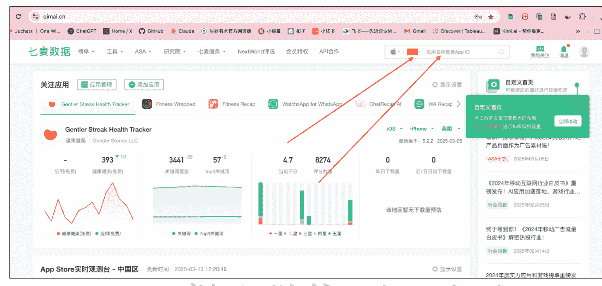

直接打开搜索，关键词组合搜索，因为做海外市场，注意选择国家。常用美国，几个欧洲小国家也是我会尝试的。

搜索单个关键词，组合关键词，搜索不出来失败是正常的！

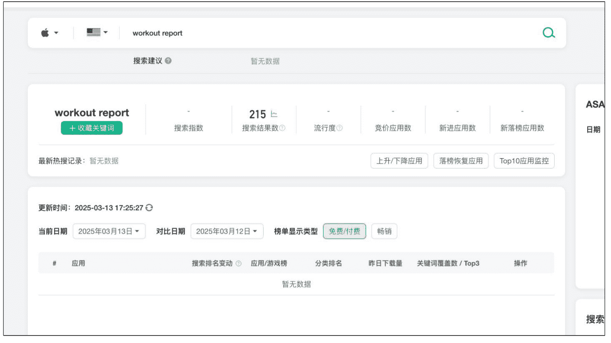

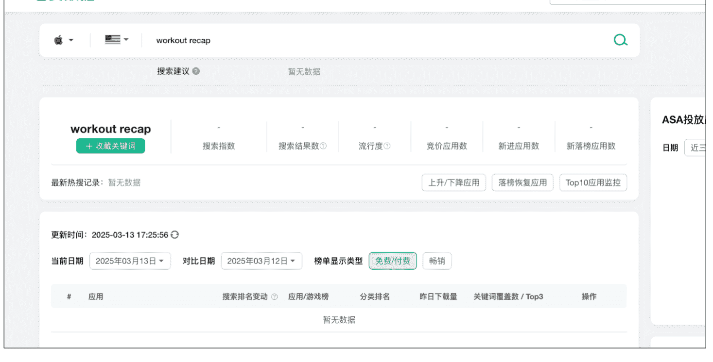

失败很可能就是词不对，搜索不到的时候，核心关键词就要换同义词，原来的 workout 我换成了 fitness
苹果就有一个 fitness 的原生 app
fitness 太多 app 了，那就 fitness 后面加 report/recap 开始出现自己的“竞品”了！

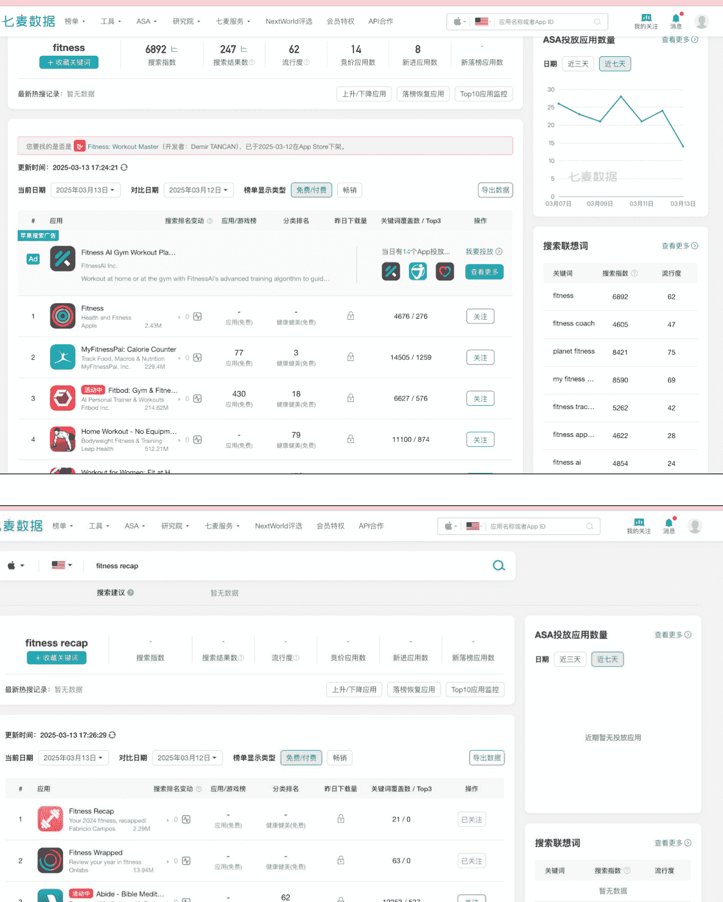

### 四、逐一查看竞品核心数据

#### 哪些是核心数据

- 下载量

- 收入情况

- 其他也可以关注的

- 上线时间

- 发布国家

- 内购价格

#### 怎么搜索

> 还是七麦，直接点击 app，进入 app 的详情页面。

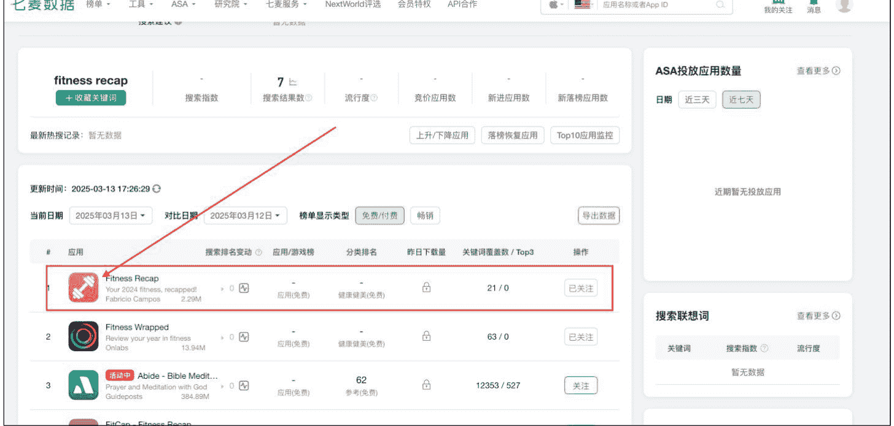

#### 详情页面：app id (这个 unique id)

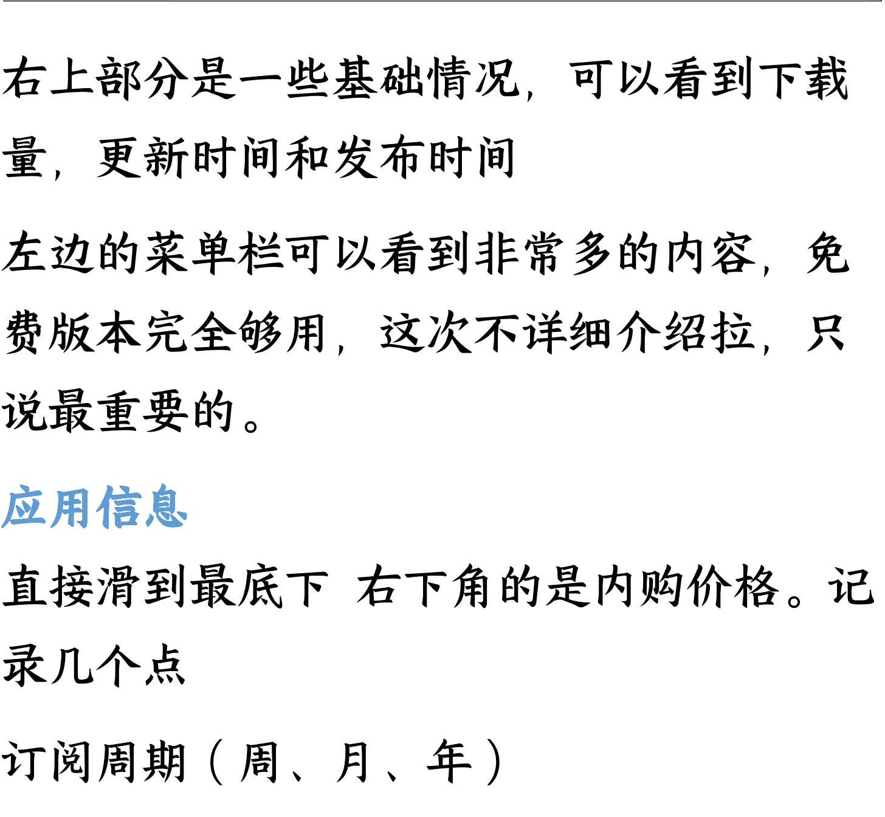

右上部分是一些基础情况，可以看到下载量，更新时间和发布时间

左边的菜单栏可以看到非常多的内容，免费版本完全够用，这次不详细介绍拉，只说最重要的。

#### 应用信息

直接滑到最底下 右下角的是内购价格。记录几个点

订阅周期（周、月、年）

订阅价格

如果是没有价格，可能是 还没来得及设置价格 or 靠广告收入

#### 更换网站：sensor tower

sensor tower

搜索框搜索 app 的全名 或者 id 都能搜索到 app

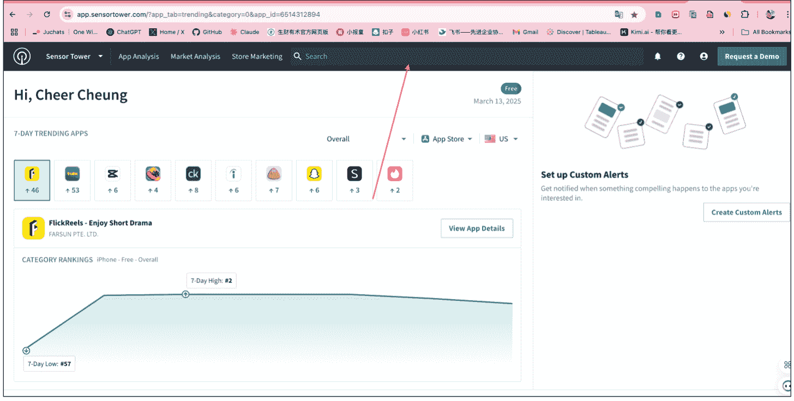

进入页面以后就有我们要看的下载和收入

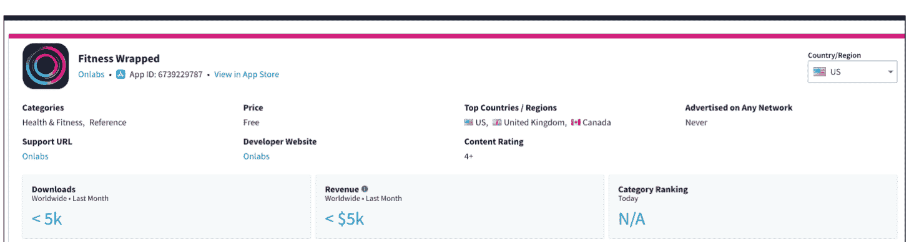

需要注意的是 5K 是一个门槛，5K 以下的都不会显示详情

所以如果是下图显示的<5K，说明 app 是 nobody，不太行！

### 五、社交媒体搜索：看看流量

在榜单内确定了核心数据以后就可以去 TikTok、X（Twitter）、Instagram 搜索应用。

公众号懒人搜索，懒人专属群分享

#### TikTok：搜索应用，找到“官方”

直接应用名字，先看能不能找到官方号。
有官方号以后，直接看他的内容数据，有无爆款，带什么 tag

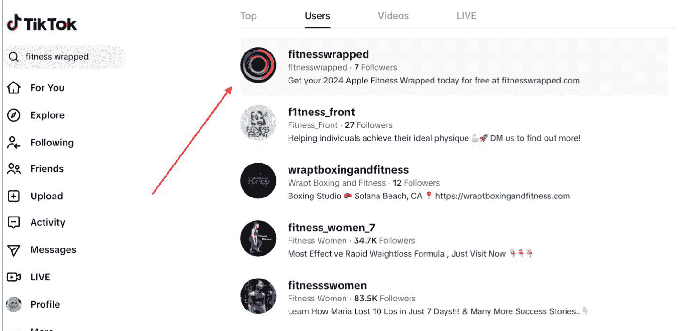

我搜索的这个完全不行！也是这个时候我差不多要认为我的 idea 是伪需求了。

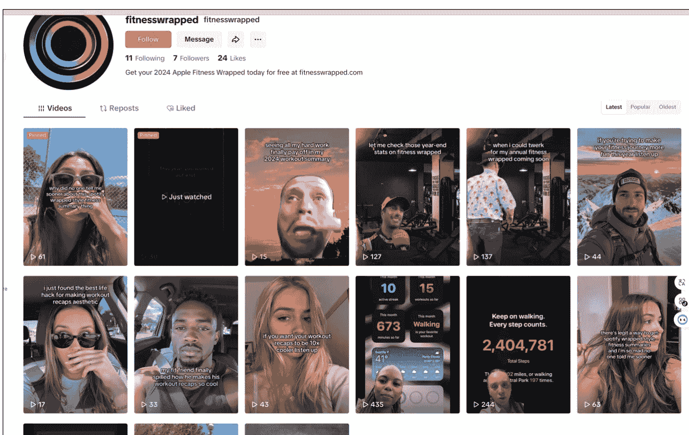

相同的步骤 把每一个竞品都看一遍，很快的。

如果出现“异常值”那就进行更加深度的研究，如果没有，那你懂的！

#### X：搜索应用，搜索关键词（意外收获）

本来 TikTok 看完我已经准备放弃了，但是我的直觉告诉我，我这个需求，真的很不错（自己很想要实现），所以我还是打开了 X，搜索了一次关键词。

懒人微信：lazyhelper

8 / 10

果然给我抓住了，一个用户的分享视频，左下角有带 logo 我就又去七麦搜索了这个 app：

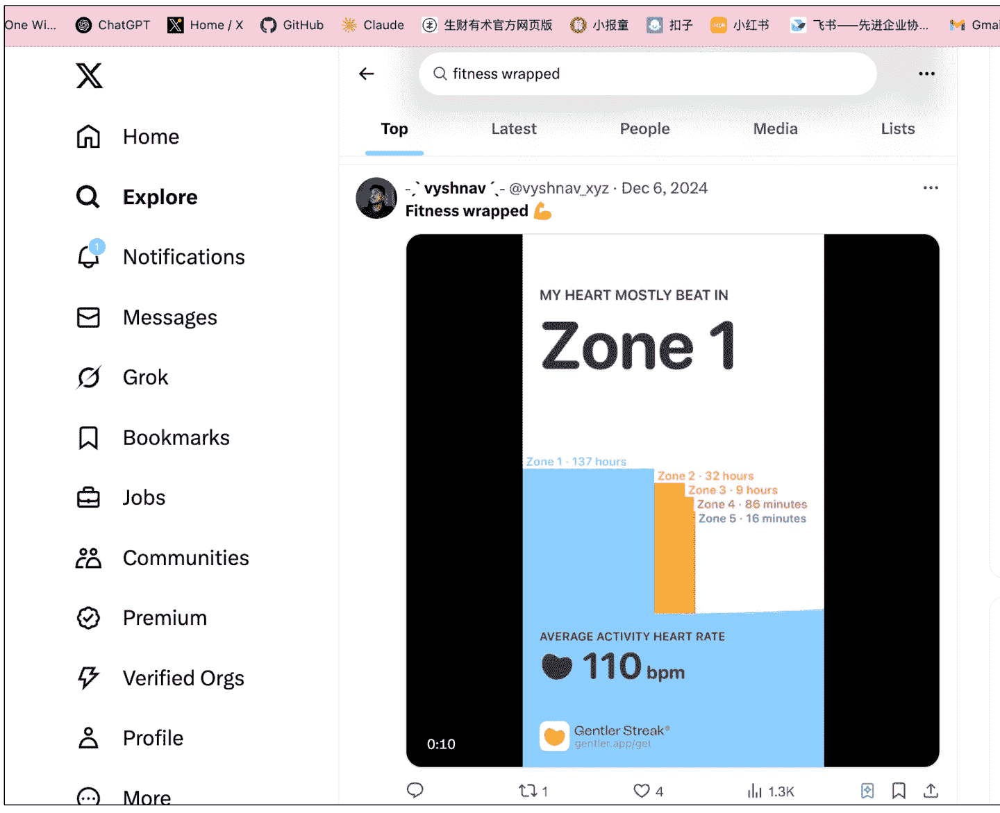

#### 直接看数据吧：

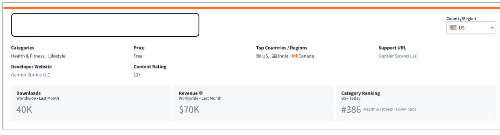

上个月 下载 40K，收入 70K。而且是 4 年前的 app，最新更新是这个月！

## **6.**用事实指导行动

70K 的收入验证已经验证了这个 idea 是个真需求（愿意付费的才是真需求啊！）

2021 年的 app 还在更新，我进入还有空间吗？

几个新的 app 都是没什么流量和收入，为什么呢？

## 碎碎念

用市场上真实存在的事实去快速验证自己的需求，防止想的多，投入的多，结果无疾而终。整个探索的过程，也非常快乐，尤其是自己最后去 Twitter 上最后验证一次，看到想要结果的时候是真的爽！

如果你都看到这里了，那就赶紧去验证你的想法！

历史 3000 多份各类付费文章以及年费三千多的副业社群资源，见懒人专属群内分享！

付费群，白嫖勿扰！

懒人专属群更新记录：
https://lazybook.fun#/blog/record2