# 不懂 iOS 编程的人，怎么才能做出一款小而美的 APP？

# 250317 生财精华

### 公众号懒人搜索，懒人专属群分享


大家好，我是阿紫，从上月开始，我就一直在思考一件事：不懂 iOS 编程的人，真的能做出一款精美的 app 吗？

为了得到答案，我经历了近一个月的尝试，想向大家汇报一下我的成果，并将我的行动总结成了此文，欢迎大家的阅读。

# 背景

上个月，我第一次尝试做 app，花了 2 天时间，怎么做也做不好，各种 bug，也看不懂 AI 写了啥，一头雾水，弃之。

本人虽然是程序员，但从没接触过 iOS 开发，可以理解成一个粤菜厨师，突然来做川菜，就锅和勺一样，其他还是一头雾水。

而这这是我花了 5 天 (含工作日，实际更短) 做出的 app，功能有多样化日期记录、倒计时，事件时间线，准备清单，小组件，iCloud 同步等一系列功能，我认为这应该算一个小而美的 app 了。所以我说，我做到了。

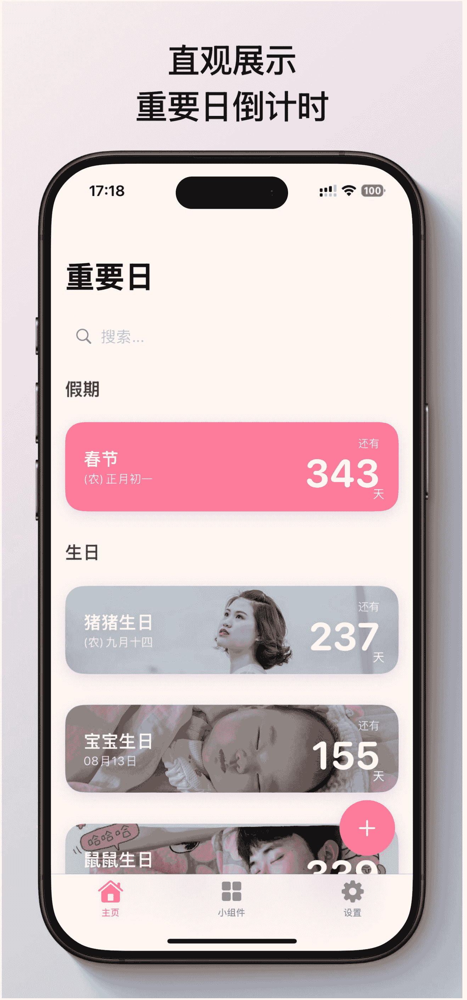

重要日

搜索...

假期

春节 (农) 正月初一还有 343 天

生日

猪猪生日 (农) 九月十四还有 237 天

宝宝生日

08 月 13 日还有 155 天

鼠鼠生日

还会 320 天

# 展示详细时间

年龄和下次日期

鼠鼠生日

还有 339 天

详细时间

11 月 2 天

年龄 29 岁 3 周 5 天

> > 每年重复
> 2026 年 02 月 13 日下次重复

事件簿
记录与这个日期相关的重要事件 >

主页

小组件

设置

# 记录生活每个瞬间

# 事件簿

## 鼠鼠生日

事件记录

03-11 14:03

### 宝宝会自己玩了


09-18 21:32

### 生宝宝啦


主页

小组件

设置

# 屏幕小组件支持

## 小组件

### 预览小组件

猪猪生日还有 **237** 天
1995-11-06

宝宝生日还有 **155** 天
2024-08-13

### 添加到主屏幕方式

- 长按主屏幕空白处或任意小组件
- 点击左上角编辑按钮添加小组件
- 搜索并选择倒数日
- 点击添加小组件

## 提前准备

## 重要日计划

< Back

准备事项

鼠鼠生日

1/4

- 烧烤
- 串串
- 生日蛋糕
- 去逛街

# 无隐私问题
数据离线，可 iCloud 同步

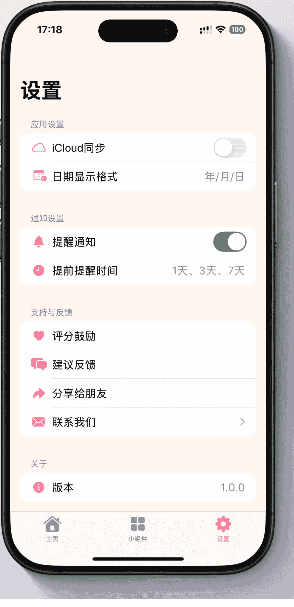

目前 app 已上架 App Store，有兴趣的圈友可以尝试一下，交个朋友，app 叫：记痕

## 那中间那么长的时间，我到底在干什么呢？

# 思考

在第一次尝试失败之后，我进行了以下思考
我不知道 AI 到底有没有理解我在表达什么，AI 虽然说他懂了，但实际结果却没懂

我无法判断 AI 到底是在干活还是在糊弄
我，结果就是在糊弄我，我除了骂他两句
一点办法没有

所以我可以不会 iOS 编程，但我需要看懂
AI 在干嘛，这就像你不会做菜，但需要理
解厨师在厨房里做什么，这样你才能对它
指手画脚
不会真有人敢在厨房对妻子指手画脚吧~

学习 iOS 编程 (不是)

先说我的学习方法

AI 是最好的老师，我们要养成遇到问题就问 AI 的习惯，直到搞清楚为止。

当遇到 AI 陷入问题循环一直解决不了时，尝试与他沟通。
如当我们说这个功能有问题，你帮我解决一下，它一直解决不了时。我们可以说，
一般这样的功能我们会怎么实现它？和他
聊完后：那你看你看我们现在的实现方式是
对的吗？

或者你肯定也会有自己的思考，可以提醒
他：那我们是不是搞错了，你看你说的是
A，但你刚刚又在做 B。

技术来源生活，在学习的过程中，多让 AI
进行类比，借助你已有的知识理解新的知
识。
如：这块知识我没理解，你可以举个生活
中的例子吗？或者：这是不是就像..
在这篇文章，我更倾向于表达我是怎么和
AI 交互的，对于一些非关键性的操作我就
不放了，避免文章臃肿，因为我相信，只要学会 AI 交互的技巧，你也可以在 AI 的帮助下搞定它。

## 开始学习

首先，安装好 Xcode，并新建项目

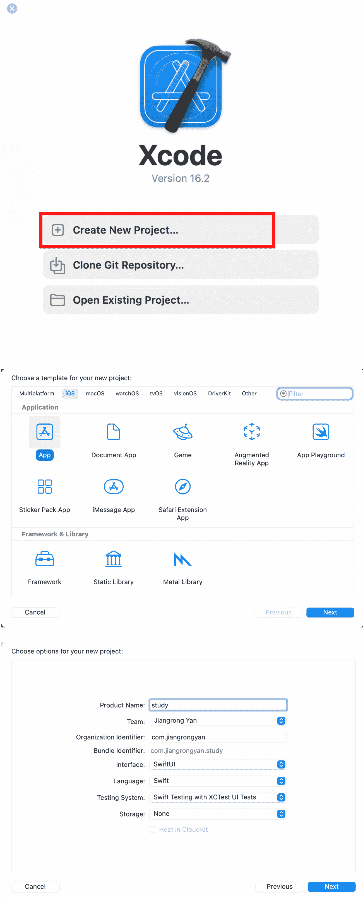

### 公众号懒人搜索，懒人专属群分享

> 这里我随意取名为 study，并且我看到下面的选项里可以选择不同的东西，但我并不清楚有什么用，如

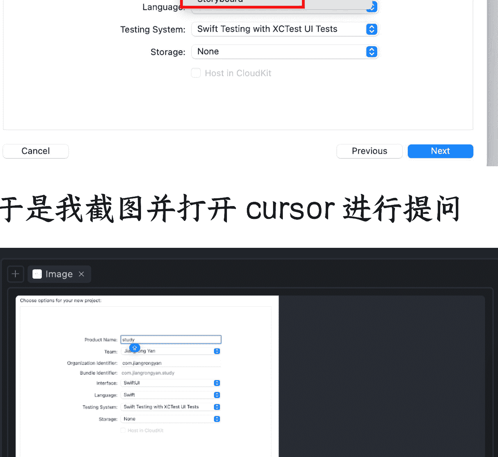

> 于是我截图并打开 Cursor 进行提问


让我来分析一下这个 iOS 项目创建界面的每个选项...

首先这是 Xcode 的新建项目界面，每个字段都有特定的用途和意义。让我逐个分析：
1. Product Name 是最基础的，决定了项目的名称，这里填写的"study"会成为 app 的默认名称
2. Team 字段很关键，这里选择的"Jiangrong Yan"应该是开发者账号。这决定了 app 的签名
3. Organization Identifier 是非常重要的标识符前缀，这里用的是"com.jiangrongyan"
4. Bundle Identifier 就是完整的包名了，这里自动组合成"com.jiangrongyan.study"
5. Interface 选择了 SwiftUI，这是苹果新推出的声明式 UI 框架。另一个选择是传统的 UIKit
6. Language 选 Swift 很自然，这是苹果力推的新语言。另一个选择是 Objective-C。现在新
7. Testing System 选择了 XCTest UI Tests，这是 Xcode 自带的测试框架。可以写单元测试
8. Storage 这里选 None 表示不使用 CoreData 等数据存储。如果需要本地存储可以选择 CoreData
9. Host in CloudKit 是可选的云存储服务，用于数据同步。这里没勾选说明暂时不需要

这些选项会影响项目的基础配置，虽然之后都可以改，但一开始选对可以省很多事。

让我为您详细解释每个选项的含义：

1. Product Name (产品名称):
   - 您的应用程序名称
   - 会显示在设备主屏幕上
   - 会作为项目的默认名称
   - 建议使用简单且有意义的名称

2. Team (开发团队):
   - 用于代码签名的开发者账号或团队
   - 决定了应用的发布身份
   - 影响开发者证书和配置文件
   - 没有开发者账号只能使用模拟器测试

# 如果你感兴趣的话可以尝试进行一些追问，本文大多问题我都进行了追问

# 创建完毕之后，就来到了这个界面

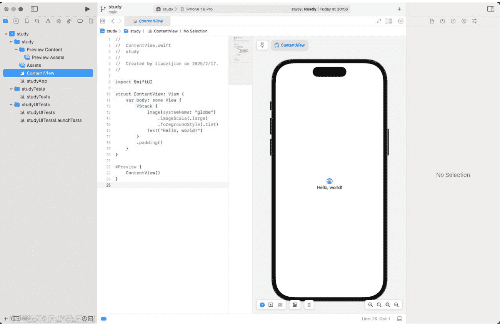

我对这个界面也是一无所知，所以

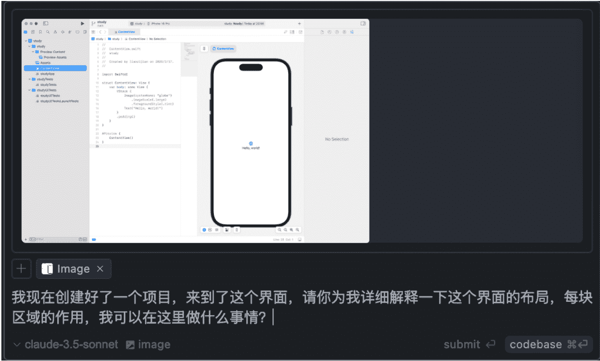

我现在创建好了一个项目，来到了这个界面，请你为我详细解释一下这个界面的布局，每块区域的作用，我可以在这里做什么事情？|

让我详细解释 Xcode 界面的各个区域及其功能：
1. 左侧导航区 (Navigator Area):
   - 文件导航器：显示项目文件结构
   - 可以通过顶部标签切换不同导航器：
     - 项目导航
     - 源代码控制
     - 符号导航
     - 查找导航
     - 问题导航
     - 测试导航
     - 调试导航
     - 断点导航
     - 报告导航
2. 中央编辑区 (Editor Area):
   - 代码编辑器：编写和修改代码
   - 支持语法高亮
   - 代码补全
   - 实时错误检查
   - 可以分屏显示多个文件
3. 右侧预览区 (Canvas):

我注意到 AI 老师告诉我我可以直接拖拽控件预览，我表示很感兴趣！

# UI 设计：
- 拖拽控件到预览
- 修改属性和布局
- 实时查看效果

# 项目管理：
- 添加新文件
- 组织文件结构
- 管理资源文件

拖拽控件到预览 怎么怎么操作？

让我来解释一下 SwiftUI 中添加控件的几种方式...

在 Xcode 中添加 UI 控件主要有三种方法：

1. 通过 Library(库)拖拽：
   - 右上角有个"+"按钮，点击会显示控件库
   - 里面有各种 UI 组件可以拖拽
   - 可以直接拖到代码区或预览区

2. 通过预览区右键菜单：
   - 在预览区右键点击
   - 选择"Add View"
   - 选择想要添加的控件

3. 直接编写代码：
   - 手动输入控件代码
   - 使用代码补全
   - 更灵活但需要记住语法

我觉得对新手来说，使用 Library 拖拽是最直观的方式。让我详细说明这个操作流程...

简单玩了一下，好吧，我没有美感

```swift
// ContentView.swift
// study
// Created by liaozijian on 2025/2/17.

import SwiftUI

struct ContentView: View {
    var body: some View {
        VStack {
            List {
                Text("A List Item")
                Text("A Second List Item")
                Text("A Third List Item")
            }
        }
        
        VStack {
            HStack {
                NavigationStack {
                    Text("Content")
                }
                NavigationStack {
                    Text("Content")
                }
            }
        }
        .padding()
    }
}

#Preview {
    ContentView()
}
```

**把修改回退一下，继续学，刚刚 AI 老师讲了，Xcode 自带源代码控制，所以我们可以直接到对应的界面将代码回滚**

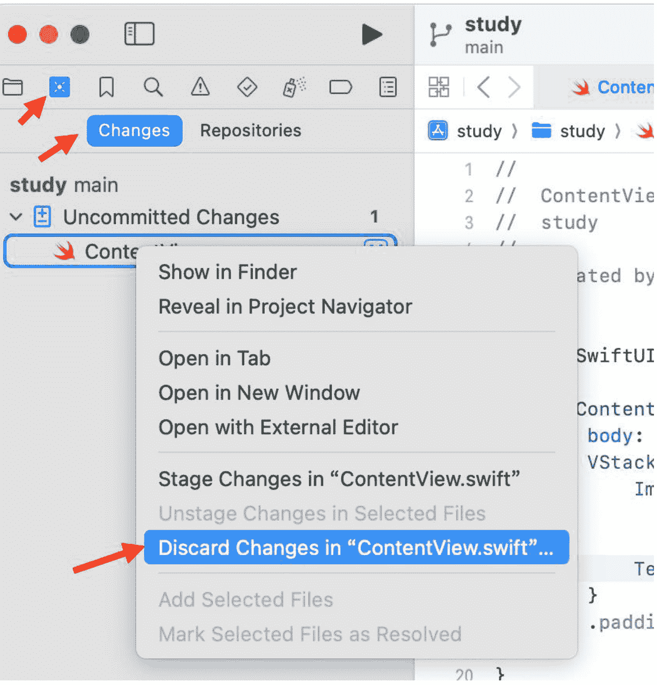

**没有 AI 的帮助太难受了，所以，Cursor，启动！**

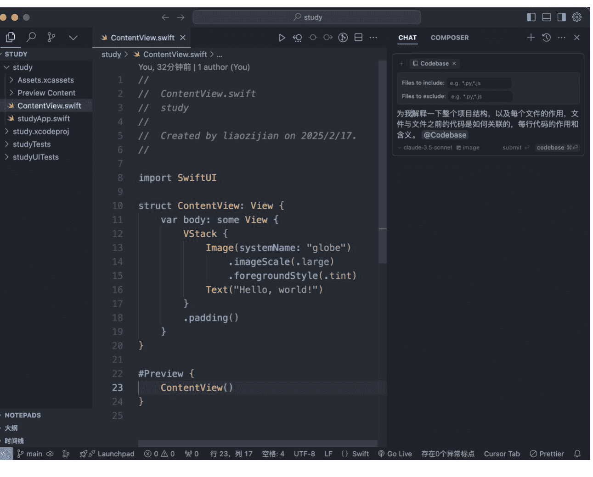

**懒人微信：** **lazyhelper**

(忽略的页眉和页脚信息：公众号懒人搜索，懒人专属群分享

让我仔细分析一下这个 iOS 项目的结构和代码。

首先这是一个使用 SwiftUI 框架开发的 iOS 应用项目，从项目名称来看叫"study"。

项目的主要结构：
1. study - 主应用目录
2. studyTests - 单元测试目录
3. studyUITests - UI 测试目录

核心文件：
studyApp.swift - 这是应用的入口文件，定义了 App 协议。它通过 WindowGroup
ContentView.swift - 这是主要的视图文件，定义了应用的 UI 界面。目前是一个简
   - 一个 VStack 垂直布局
   - 一个系统图标"globe"
   - 一个显示"Hello, world!"的文本
   - 外部添加了 padding

测试相关文件：
studyTests.swift - 单元测试文件，使用了新的 Testing 框架，目前只有一个空的
studyUITests.swift - UI 测试文件，包含了：
   - testExample() - 基础 UI 测试
   - testLaunchPerformance() - 启动性能测试

studyUITestsLaunchTests.swift - 专门用于测试应用启动的测试类。

项目配置文件：
project.pbxproj - Xcode 项目的核心配置文件，定义了：
   - 项目结构
   - 构建设置
   - 依赖关系
   - 部署目标等

代码关联：
1. studyApp.swift 作为入口，加载 ContentView
2. ContentView 定义主 UI
3. 测试文件相互独立但都针对主应用进行测试

特别注意到：
1. 使用了 SwiftUI 框架进行 UI 开发
2. 项目面向 iOS 18.2
3. 包含完整的测试框架
4. 使用了新的 Swift Testing 框架而不是 XCTest
5. 项目团队 ID 是 79444X5CHG

这里我追问了他回答的一些专业术语，代码里面每一行，每个关键词的含义和作用。

# 如何在 Cursor 上开发

因为我们重点还是使用 AI 编程，所以 Cursor 会是我们的主力，在砍柴之前磨好刀是很有必要的。

使用 Cursor 开发 iOS 需要安装一些插件

- 安装 Swift、CodeLLDB 插件

Swift 插件提供了 Swift 语言的基本支持，CodeLLDB 插件提供了调试功能。
- 安装 SweetPad 插件

可用于配置在编辑器中代码格式化、调试等功能。

安装好插件后，我们会看到有编译上的一些报错，如图

```swift
import SwiftUI

You, 56 分钟前 | 1 author (You)
@main
struct studyApp: App {
    var body: some Scene {
        WindowGroup {
            ContentView()
        }
    }
}
```

解决方法：

安装 xcode-build-server

```bash
brew install xcode-build-server
```

再使用命令

```bash
xcode-build-server config -project study.xcodeproj -scheme study
```

study 是我的项目名，请替换成你的。

如何使用 SweetPod？

在 Cursor 左侧，将插件钉选到布局上，方便使用

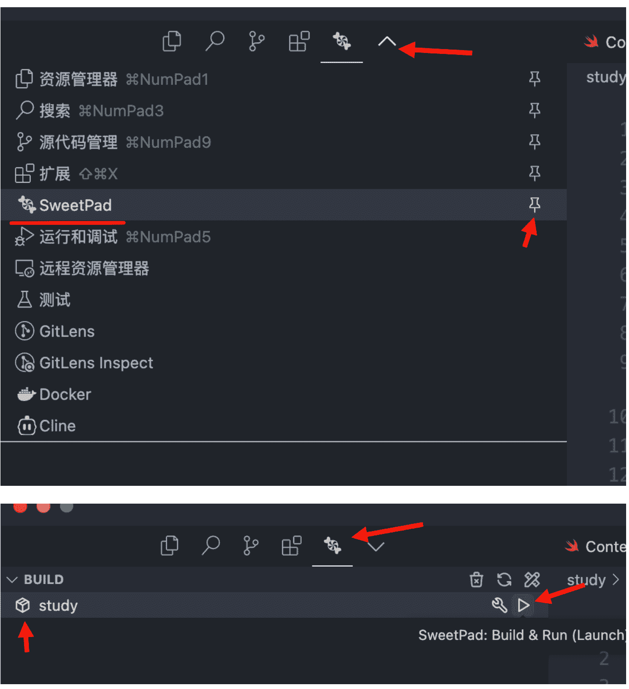

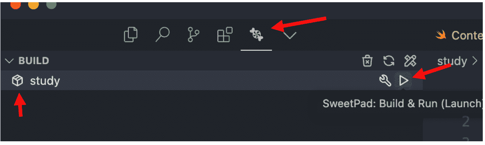

运行之后选择一下设备就可以了，等待一会，就会打开

## **代码格式化**

```bash
brew install swift-format
```

打开 Cursor settings.json 文件。

快捷键 command + shift + p，输入"打开用户设置"

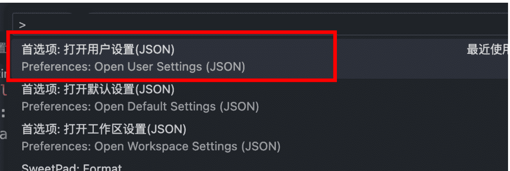

## 添加配置

```json
[swift]: editor.defaultFormatter: "swiftlang.swift-vscode"
```

不出意外，现在编辑代码保存后会自动格式化了。

#### **代码热重载**

代码热重载可以让我们修改代码时立即刷新 UI 查看效果。

举个例子，原来修改了一行代码，必须要重启项目，才能看到效果，个人觉得很费时间，修改代码 5 秒钟，启动项目 1 分钟。

现在修改后立即生效，项目无需再重启。

## 效果如下

## 设置方法如下

1. 打开 App Store，搜索 InjectionIII 安装

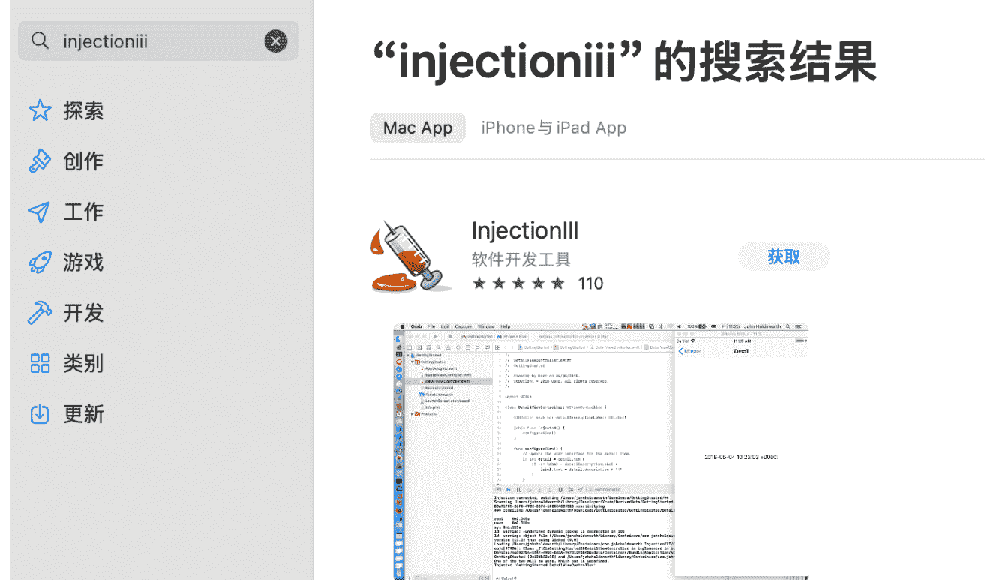

2. 选择自己的项目

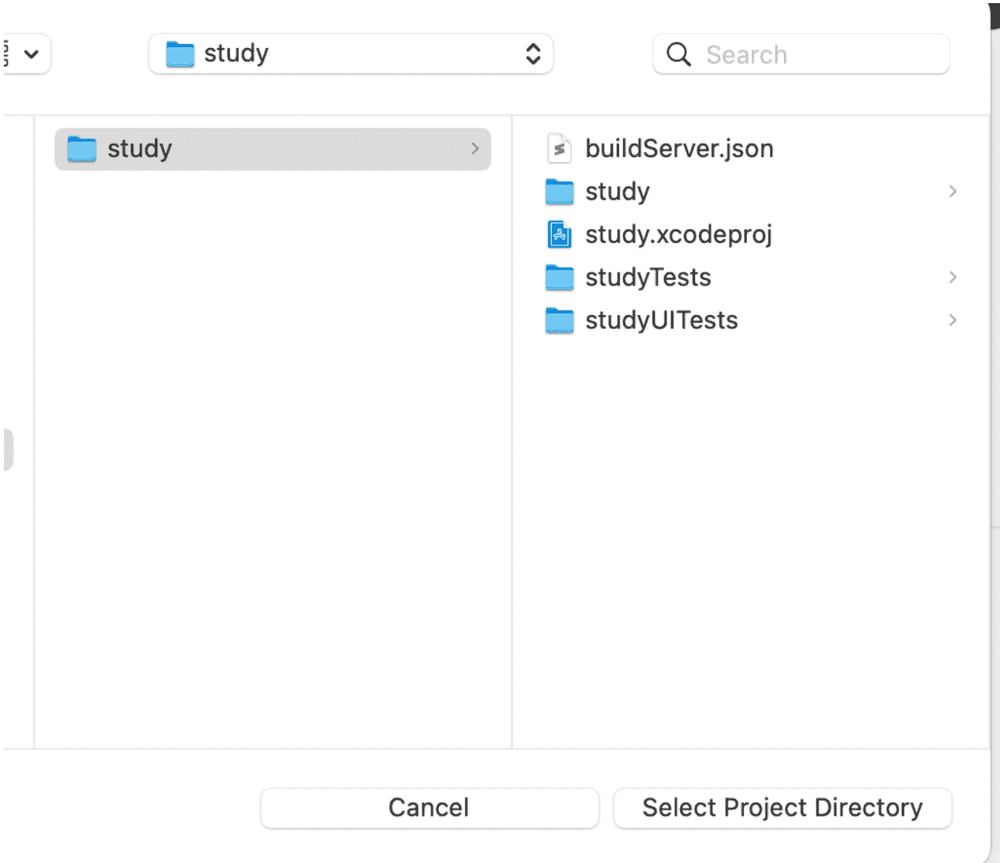

3. 点击 Prepare Project 按钮

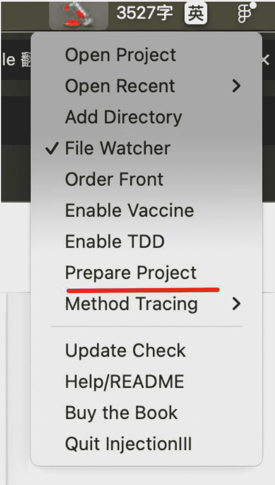

4. 在 Xcode 打开项目对应 Target 的设置->Build Settings->搜索 Other

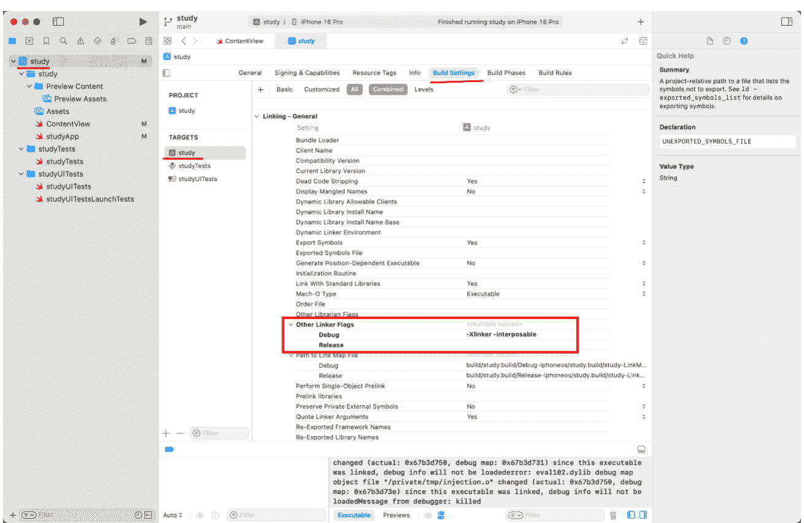

现在，就可以自由的在 Cursor 上开发 iOS 了~

xcode 是什么？不知道，不认识，离我远点，我怕 Cursor 误会~

# 以案例为驱动

学习新东西我一直遵守“守破离”原则，在什么不懂的情况下，老师教什么我就学什么。

所以我这里就让 AI 老师出了个课程，让我可以建立一个基本知识系统，能看懂老婆到底在厨房折腾啥

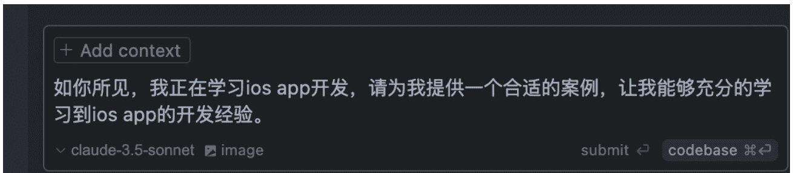

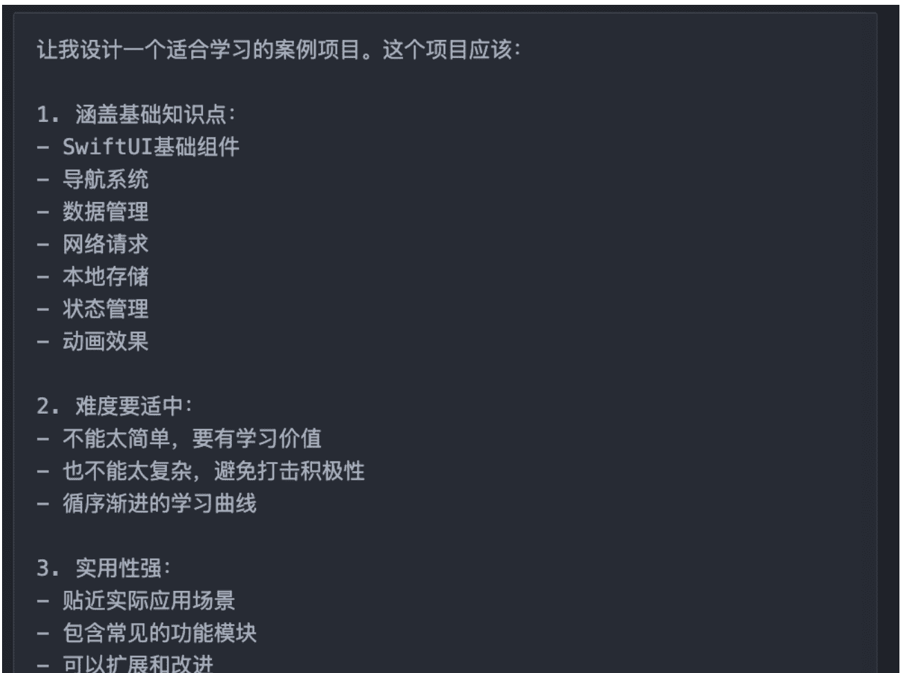

然后我让他将学习方案写到.cursorrules 文件里 (你懂的~)

这是产出的学习方案，给大家参考一下，
我认为还是很不错的

# Task Master 项目学习路线

## 项目概述

Task Master 是一个功能完整的待办事项管理应用。通过逐步实现各项功能，系统地学习 iOS 开发技术栈。

## 功能阶段

### 第一阶段：基础任务管理

**目标功能：**
- [ ] 任务列表显示

- [ ] 添加新任务
- [ ] 删除任务
- [ ] 标记任务完成状态

## 涉及知识点：
- SwiftUI基础(View、Text、Button 等组件)
- 列表视图(List)
- 导航视图(NavigationView)
- 基础数据模型(struct、protocol)
- 状态管理(@State、@Binding)
- 视图间通信

## 学习要点：
1. View 协议和视图结构
2. 数据模型设计
3. 用户交互处理
4. 列表数据管理

## ### 第二阶段：任务详情与编辑

## **目标功能：**
- [ ] 任务详情页面
- [ ] 编辑任务信息
- [ ] 任务优先级设置
- [ ] 截止日期管理

## **涉及知识点：**
- 表单处理(Form)
- 日期选择器(DatePicker)
- 导航管理
- 数据持久化(CoreData)

## # MVVM 架构

## **学习要点：**
1. 页面导航控制
2. 表单数据处理
3. CoreData 基础操作
4. 状态管理进阶

## ### 第三阶段：分类与筛选

## **目标功能：**
- [ ] 任务分类管理
- [ ] 标签系统
- [ ] 筛选功能
- [ ] 搜索功能

## **涉及知识点：**
- 高级列表操作
- 搜索控制器
- 过滤器设计
- CoreData 关系管理
- 复杂数据模型

## **学习要点：**
1. 数据关系处理
2. 搜索算法实现
3. 界面交互优化
4. 数据库查询优化

## ### 第四阶段：提醒与通知

## **目标功能：**
- [ ] 任务提醒设置

- [ ] 本地通知
- [ ] 重复提醒
- [ ] 提醒管理界面

> **涉及知识点：**
- UserNotifications 框架
- 后台任务处理
- 日期时间处理
- 系统权限管理

> **学习要点：**
1. 通知系统集成
2. 后台任务调度
3. 用户授权处理
4. 提醒逻辑实现

## ### 第五阶段：数据统计与分析

> **目标功能：**
- [ ] 完成率统计
- [ ] 任务趋势图表
- [ ] 分类统计
- [ ] 数据导出

> **涉及知识点：**
- 图表框架使用
- 数据处理与计算
- 文件管理
- 异步操作

> **学习要点：**
1. 数据可视化

## 2. 统计算法

## 3. 文件操作

## 4. 性能优化

## ### 第六阶段：设置与个性化

## **目标功能：**
- [ ] 主题切换
- [ ] 应用设置
- [ ] 数据备份还原
- [ ] 用户偏好设置

## **涉及知识点：**
- UserDefaults
- 主题管理
- 文件系统
- 设置页面设计

## **学习要点：**
1. 主题系统设计
2. 设置页面架构
3. 数据迁移
4. 用户偏好管理

## 进阶功能（可选）
- [ ] 数据同步（iCloud）
- [ ] 小组件支持
- [ ] 快捷指令集成
- [ ] 手势操作优化
- [ ] 动画效果
- [ ] 辅助功能支持

意在微信：lazyhelper

# ## 技术架构

- SwiftUI
- CoreData
- Combine
- UserNotifications
- FileManager
- CloudKit (可选)

# ## 开发工具
- Xcode
- Simulator
- Instruments
- Git

# ## 学习资源
- [Apple SwiftUI 教程](https://developer.apple.com/tutorials/swiftui)

  - [Swift 官方文档](https://swift.org/documentation/)
  - [Human Interface Guidelines](https://developer.apple.com/design/human-interface-guidelines/)

# ## 进度追踪
- 开始日期：[填写日期]
- 当前阶段：[填写阶段]
- 完成功能：[填写数量]
- 总体进度：[填写百分比]

# ## 注意事项

1.  每个功能完成后进行测试
2.  注重代码质量和重构
3.  保持良好的 Git 提交习惯
4.  记录学习心得和问题解决方案

# ## 项目里程碑
1.  基础任务管理（第一阶段）
2.  完整的 CRUD 功能（第二阶段）
3.  分类和搜索系统（第三阶段）
4.  提醒通知系统（第四阶段）
5.  数据分析功能（第五阶段）
6.  设置与个性化（第六阶段）

记得定期更新进度，每完成一个功能就打钩标记！

# 设计项目结构

新手接触 AI 编程一大难点就是：让 AI 写好了功能，但完全不知道功能对应的代码在哪个文件里，想做功能迭代或者出了 bug 根本不知道怎么问，只能让 AI 自己找对应的代码，极其痛苦。

所以我们一开始就要理清楚整个项目结构，不能把代码随便乱放，让后续的开发井然有序。

iOS app 的最佳实践是什么呢？我也不知道，还是请出 AI 老师。同样的，这个过程中，有问题就问。

# ## 技术架构讨论

## 如你所见，我正在学习 iOS 开发，请告诉我最佳实践是什么？开发规范是怎样的？项目结构是怎样的？我应该如何存放我的代码，会有哪些文件夹？以及其他我不知道的问题。

让我深入思考一下 iOS 开发的最佳实践和规范...

首先，iOS 项目结构是一个很重要的话题。一个良好的项目结构可以让代码更易于维护和代码组织方面，传统的 MVC 模式在 iOS 中很常见，但现在 MVVM 架构越来越流行，特别是配置文件夹结构是另一个关键点。通常需要按功能模块划分，但也要考虑到 Swift 的访问控制命名规范也很重要。Swift 官方推荐使用驼峰命名法，类名首字母大写，方法名首字母小写。代码复用和依赖管理也需要考虑。是否使用 CocoaPods 或 SPM？如何管理第三方库的版本。

还有一些其他重要的最佳实践，比如错误处理、内存管理、性能优化等。我需要把这些记录下来...

让我组织一下这些想法，给出一个完整的建议...

以下是 iOS 开发的主要最佳实践和规范建议:

### 1. 项目结构

推荐采用以下文件夹结构:

```
YourApp/
├── Resources/
│   ├── Assets.xcassets
│   ├── Fonts/
│   └── Localization/
├── Sources/
│   ├── App/
│   │   └── AppDelegate.swift
│   ├── Features/
│   │   ├── Home/
│   │   ├── Tasks/
│   │   └── Settings/
│   ├── Models/
│   ├── Services/
│   ├── Extensions/
│   └── Utilities/
├── Tests/
└── UITests/
```

这是一个用 Xcode 创建的项目，怎么和你推荐的文件夹结构不一样呀？你这个推荐的文件夹结构是怎么创建出来的？用了什么脚手架吗？

让我看看这个问题...首先查看了项目结构，这是一个新建的 Xcode 项目，使用了默认的 Xcode 项目模板。

从 project.pbxproj 文件可以看出这是一个标准的 iOS 项目结构，包含了主项目、Tests 和 UITests 组。

再看 cursorrules 文件，这是一个 Task Master 项目的学习路线规划，涉及到多个开发任务。

我之前推荐的文件夹结构是一个最佳实践的建议，但确实需要手动创建。Xcode 默认的模板结构比较扁平，不利于大型项目的维护。

让我思考一下如何帮助用户从默认结构转换到推荐的结构...

需要说明：
1. 这不需要脚手架
2. 需要在 Xcode 中手动创建 Group 和文件夹
3. 要注意文件夹结构和 Group 结构
4. 考虑到这是一个学习项目，可以根据 Task Master 的功能模块来组织结构

很明显，这里出现了不一致的问题，AI 推荐的文件夹结构和 Xcode 创建的很不一致

意在微信：lazyhelper

考虑到 AI 的语料库比较旧，于是我在 GitHub 上翻开最新的 iOS app 目录结构，成功找到了案例

HiPixel / HiPixel /

> **okooo5km** ✨ feat(AppIcon): Supported ApplIcon Setting

- Name
.. 
Assets.xcassets
Common
Controllers
Extentions
Models
Preview Content/Preview Assets.xcassets
Resources
Utilities
ViewModels
Views
HiPixel.entitlements
HiPixelApp.swift
Info.plist

该开源项目和最新 Xcode 创建的项目完全一致，我只需参考这样的目录结构进行开发就可以了

我注意到项目都是大写字母开头的，为了更好的学习，我重新创建了一个 TaskMaster 的项目

### 项目结构

项目采用标准的 iOS 应用程序架构，文件夹结构如下：

### 核心文件

- `HiPixelApp.swift`：应用程序入口文件
- `HiPixel.entitlements`：应用程序权限配置文件
- `Info.plist`：应用程序配置信息文件

### 主要目录

- `Assets.xcassets`：资源文件目录，包含图片、颜色等资源
- `Common`：通用组件和工具类

我已经添加了详细的项目结构章节，主要包含以下内容：

1. 核心文件说明
2. 主要目录结构
3. 各目录的具体职责
4. 文件命名规范

这个结构反映了图片中显示的文件夹组织，并提供了每个目录的用途说明。这将帮助我们在后续开发中：

1. 保持代码组织清晰
2. 遵循标准的 iOS 开发最佳实践
3. 便于团队协作和代码维护
4. 符合 MVVM 架构设计模式

建议您在开始编码之前，先按照这个结构创建相应的目录，这样可以确保项目从一开始就保持良好的组织。

是否需要我为您详细解释某个特定目录的职责，或者您对项目结构有任何其他问题？

```
### 项目结构

项目采用标准的 iOS 应用程序架构，文件夹结构如下：

### 核心文件

- `TaskMasterApp.swift`：应用程序入口文件

### 主要目录

- `Assets.xcassets`：资源文件目录，包含图片、颜色等资源
- `Common`：通用组件和工具类
- `Controllers`：控制器层，处理业务逻辑
- `Extensions`：Swift 扩展文件
- `Models`：数据模型层
- `Preview Content/Preview Assets.xcassets`：预览资源文件
- `Resources`：其他资源文件
- `Utilities`：工具类和辅助函数
- `ViewModels`：视图模型层，实现 MVVM 架构
- `Views`：视图层，包含所有 SwiftUI 视图

### 目录职责

1. **Models 目录**
    - 数据模型定义
    - CoreData 实体
    - 数据结构和协议

2. **Views 目录**
    - 任务列表视图
    - 任务详情视图
    - 设置页面
    - 自定义组件
```

# 完成 App 功能

接下来就是按照 AI 给的阶段，一步一步的完成整个 App 的功能点，并进行学习

## # 第一阶段

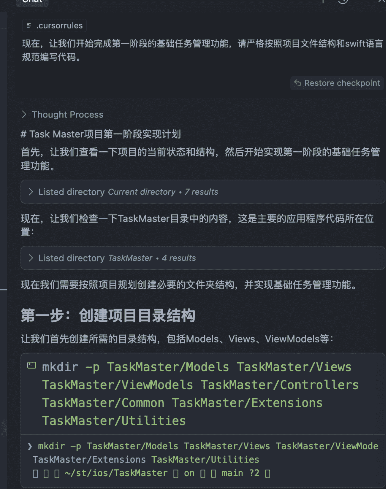

AI 写好之后，尝试运行看看效果

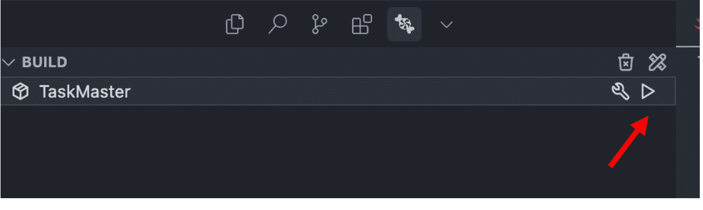

意在微信：lazyhelper


界面并不是很好看，功能是正常使用的，但没有关系，我的目的主要是学习掌握 iOS 编程。这样我才能不被 AI 耍的团团转。

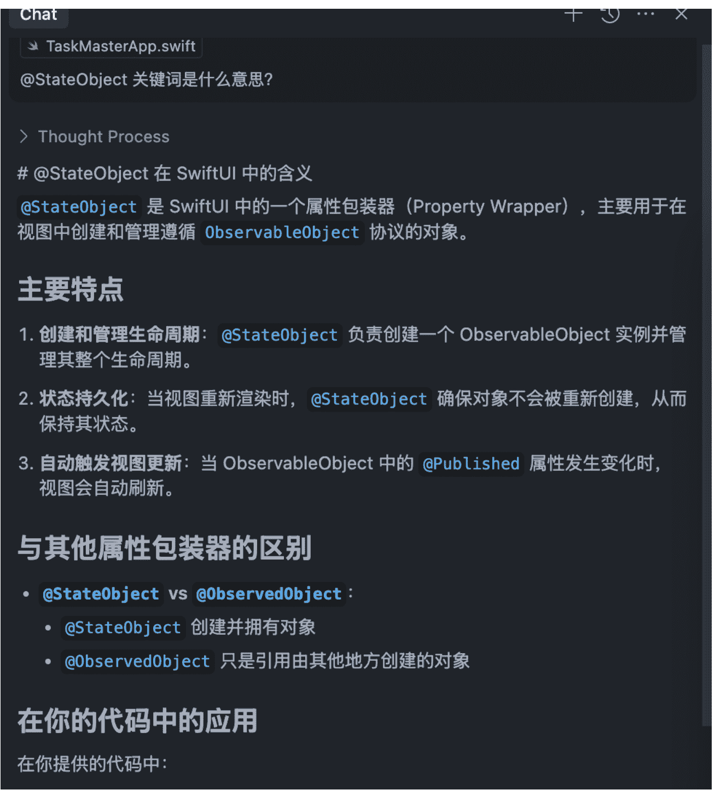

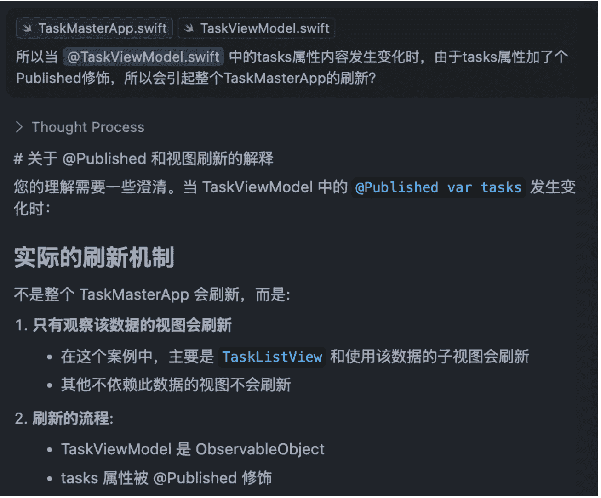

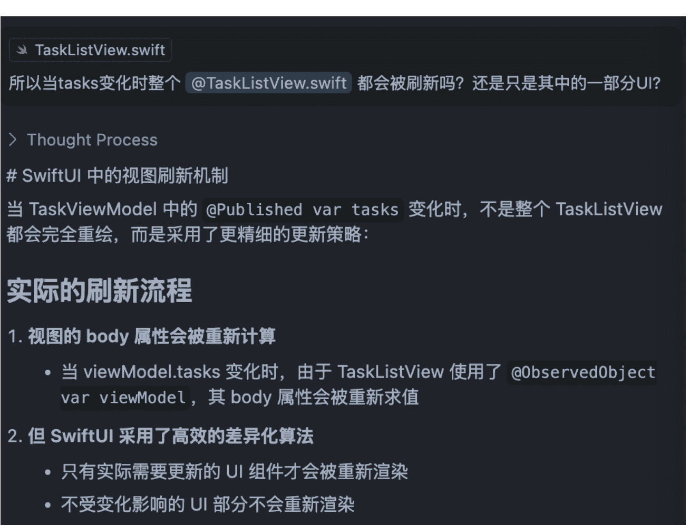

这里我突发奇想，当我理解了这个知识点后，可能我过段时间就忘了，那我其实是可以让 AI 总结成文章转化成知识库的。

# SwiftUI 属性包装器与视图刷新机制

属性包装器概述

- SwiftUI 提供了多种属性包装器（Property Wrappers）来管理状态和数据流。理解它们的工作原理对构建高效的 SwiftUI 应用至关重要。

- #### @StateObject
"`@StateObject`"是一个用于创建和管理遵循《ObservableObject》协议对象的属性包装器。

**特点**：

- 负责创建对象实例并管理其整个生命周期
- 确保对象在视图重新渲染时不会被重新创建
- 通常在视图层次结构的顶层或拥有者视图中使用

**示例**：

swift
@main
struct TaskMasterApp: App {
	
 @StateObject private var taskViewModel: TaskViewModel = TaskViewModel(initialTasks: TodoTask.sampleTasks)
	
var body: some Scene {
	
	WindowGroup {
	
	TaskList(viewModel: taskViewModel)
	
			 }
}
}
  

- #### @ObservedObject
"`@ObservedObject`" 用于引用由其他地方创建的遵循《ObservableObject》协议的对象。

**特点**：

- 不负责创建对象，只负责观察
- 当对象的 `@Published` 属性改变时，会触发视图刷新
- 适用于从父视图传递的视图模型

**示例**：

swift
class TaskViewModel: ObservableObject {
	
 @Published var tasks: [String] = []
}
  

好的，我现在理解了这一部分内容，感谢你的回答，请你帮我将这些知识点总结成一篇 markdown 格式的文章笔记，写到 @iosDoc 目录下

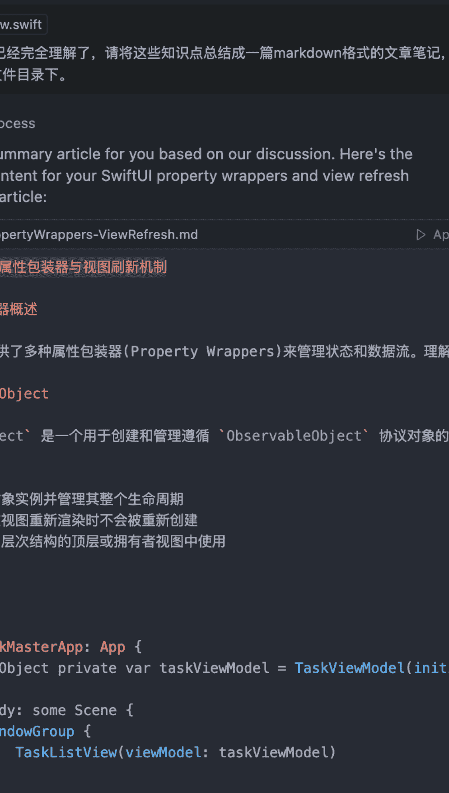

这里我花了断断续续好几天的时间，把第一阶段的所有代码都理清楚了，并让 AI 整理成上述的 markdown 笔记。

理了好几篇文档。这个过程因人而异，我在后面实践中发现，其实也不需要学的这么仔细，还是那句话，你只要保证你能看懂厨师在做什么就行，又不是真要你炒菜。至于你能不能看懂，我相信你有自己的评判标准。

- Swing 类，初始化与协议详解。md
- Swift 基础语法与常见模式.md
- Swift 中的 KeyPath 语法与环境系统.md
- SwiftUI 属性包装器与视图刷新机制.md
- SwiftUI 视图基础与结构化布局.md
- SwiftUI 中的环境变量与模态视图.md
- SwiftUI 中的 Button 初始化方式.md
- SwiftUI 中的 EditButton 和环境系统.md
- SwiftUI 中的 ForegroundColor 修饰符.md
- SwiftUI 中的 Frame 修饰符与导航栏.md
- SwiftUI 中的 Sheet 和尾随闭包.md
- SwiftUI 中的 ToolbarItem 和动画.md

Common
> Controllers
> Extensions
Models
TodoTaskModel.swift
Preview Content
Utilities
ViewModel
TaskViewModel.swift
Views
TaskListView.swift
TaskMasterApp.swift

这里的学习程度因人而异，我个人是喜欢把这些东西搞懂，所以花了很长时间。

如果你只想知道每个功能在哪里，能简单明白 AI 在做什么，那不需要像我这样。

## # 第二阶段

现在，让我们开始完成第二阶段任务详情与编辑的功能，请严格按照项目文件结构和 Swift 语言规范编写代码。

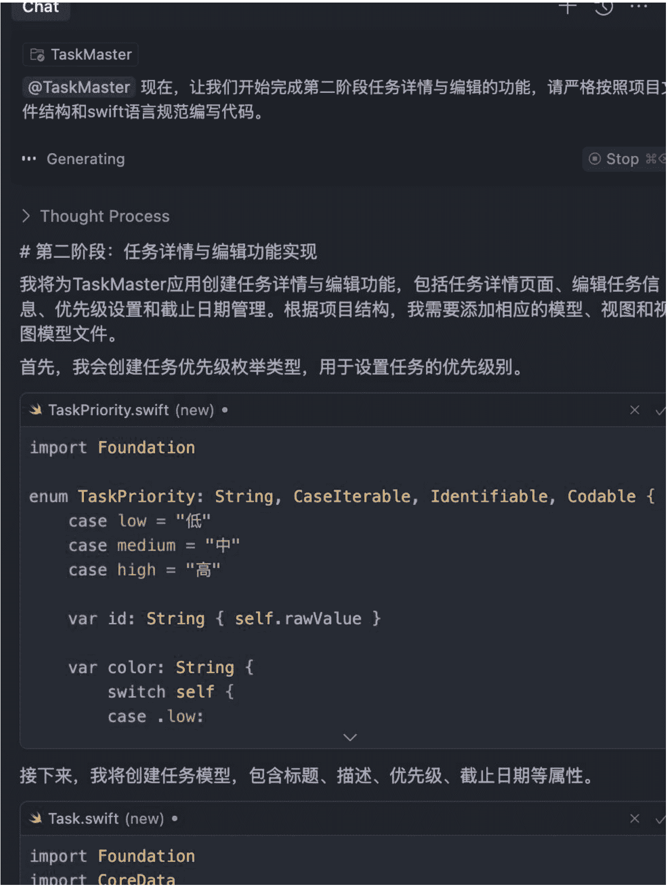

我天真的以为经历过第一阶段的磨炼，第二阶段学起来将如鱼得水，但 AI 老师给我狠狠地上了一课 ᕙ(▾⌓▾)ᕗ

这是我在第二阶段所学习的内容，花费时间 +1 天

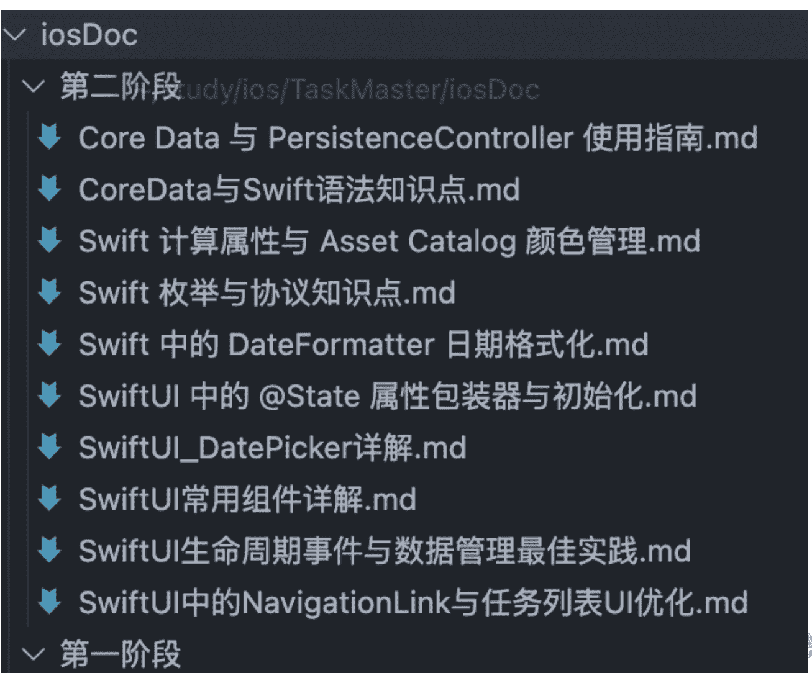

## # 第三阶段

现在，让我们开始完成第三阶段分类与筛选的功能，请严格按照文件文件夹结构和 Swift 语言规范编写代码。

现在开始前你要先查看当前的项目情况，不要做多余重复的事情。

第三阶段需要学习的知识逐渐减少，处于回顾前两个阶段所学和挖取更多细节的情况

现在，让我们开始完成第四阶段提醒与通知的功能，请严格按照文件文件夹结构和 Swift 语言规范编写代码。

现在开始前你要先查看当前的项目情况，不要做多余重复的事情。

# 第五阶段

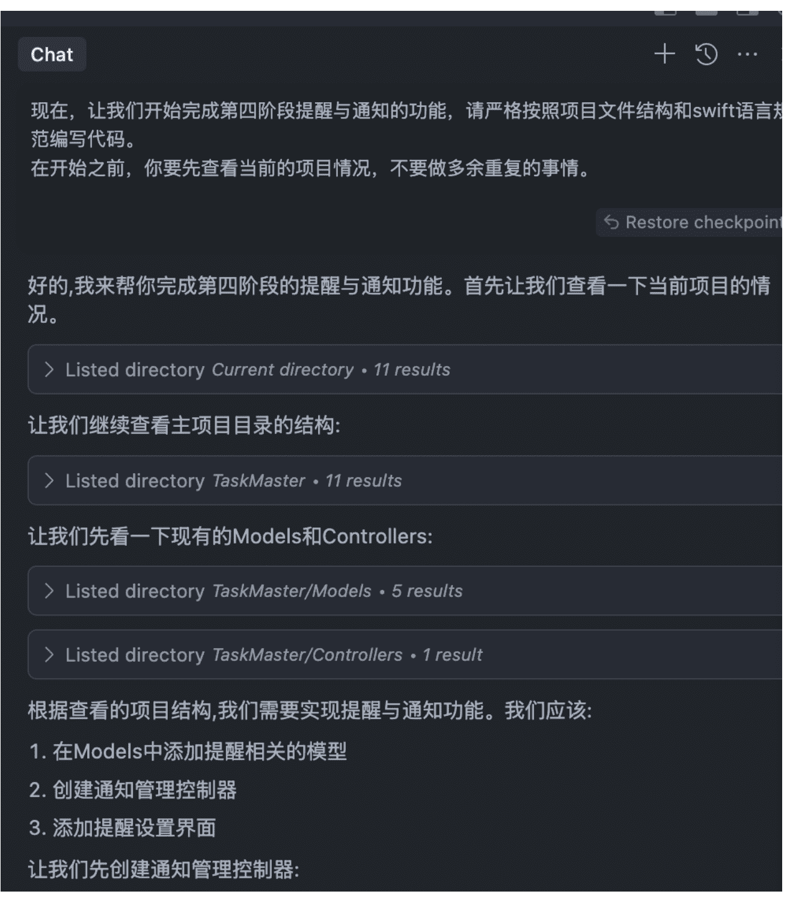
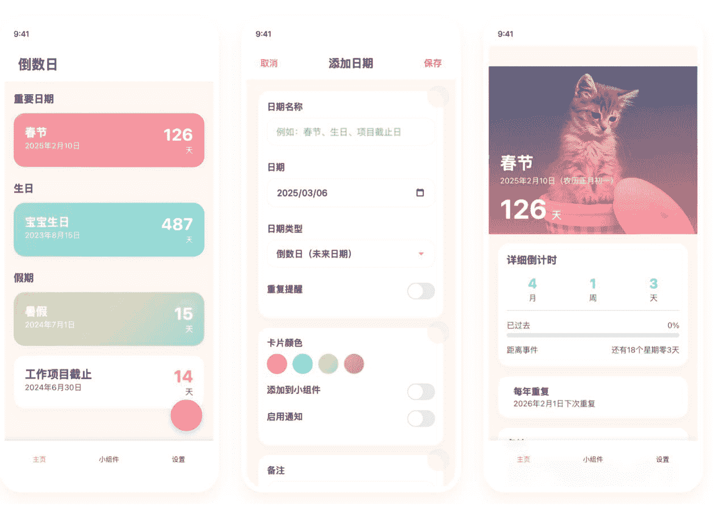
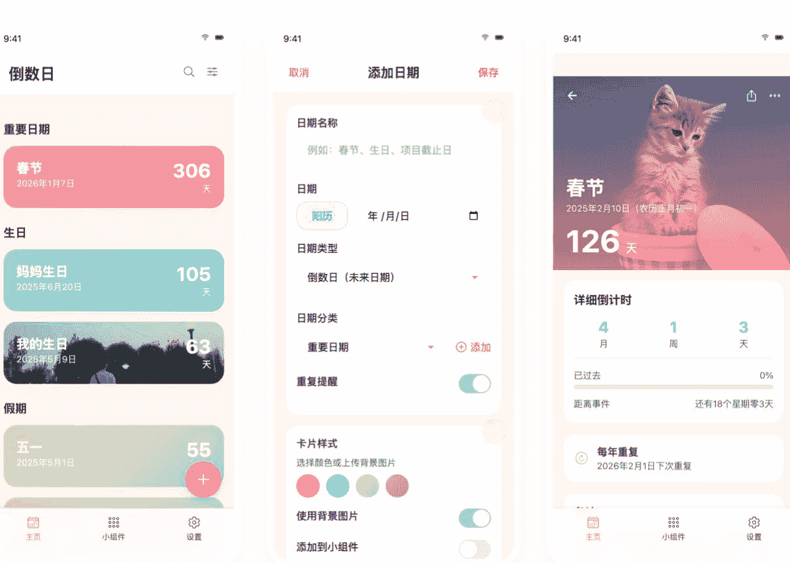

## 简单分享一下效果

第五阶段内容主要是学习图表和文件导出的实现方式，在功能完成调试完毕之后，我认为我的知识储备已经达到了一定的水平，有了一个基础的知识体系，这个项目已经学习完毕了。后续更多的知识点可以在做 app 时遇到了再进行学习。

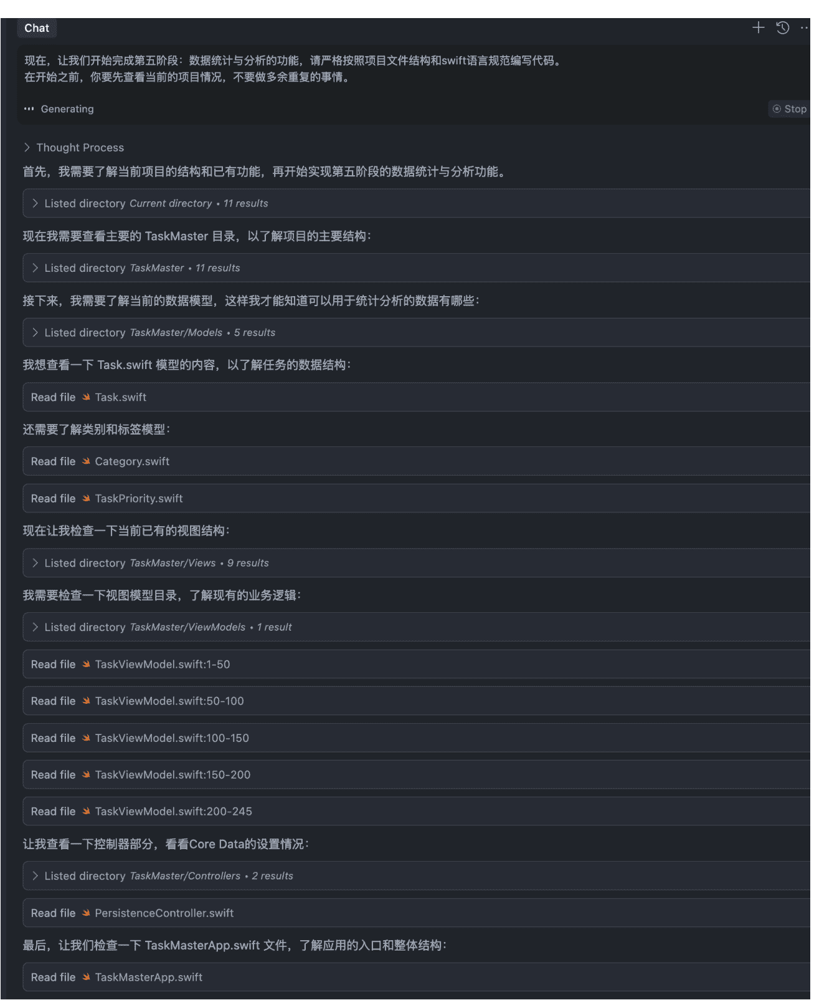


## 我的任务


- 学习 app 开发
  - 学习
- 睡觉
  - 健康
- 吃饭
  - 健康
- 早上开会
  - 工作 2025 年 3 月 7 日 08:33
- 添加新任务

我的任务

任务详情

编辑

## 早上开会

优先级：中

截止日期：2025 年 3 月 7 日 08:33

创建时间：2025 年 3 月 6 日 19:33

描述

也没什么好开的


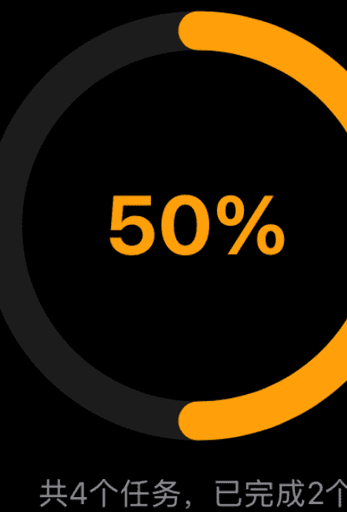

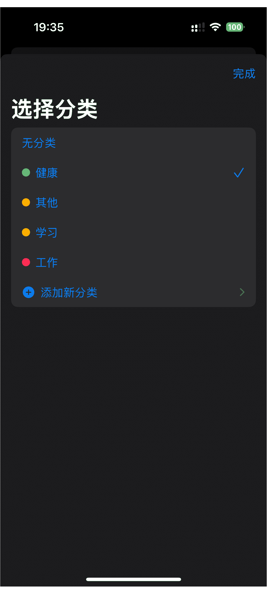

### 数据统计

#### 任务完成率
#### 任务优先级分布
#### 分类任务统计
  - 工作 1
  - 其他 0
  - 学习 1
  - 健康 2
#### 每日任务完成趋势

# 小结

- 😐
- ✅
- 💡
- 📚
- 💼

> 结论：bug 肯定会有，但相比于之前还是少了很多，其中大部分的 bug AI 可以自己解决，过程中有一两个 bug AI 陷入了困境，问题的原因比较极端，在和 AI 沟通之后，因为我也能大致看懂它在干嘛了，所以也发现了问题，就让它解决了。


# 实战做 App 产品

没错，学习完毕，接下来就是实战了。虽然我依旧不会写代码，但我可以看懂他在干嘛了。

# 生成原型

这里我想尝试接近实际开发的流程，先有原型图，再让 AI 开发。这样我可以先理清 UI 交互和页面逻辑，确保这个产品是可以用的，而不是牛头不对马嘴，那做出来也没法用。

当然，原型图也是 AI 生成的，大概需要 5 分钟。

提示词：

我想开发一个【】现在需要输出高保真的原型图，主要功能包括【】

请通过以下方式帮我完成所有界面的原型设计，并确保这些原型界面可以直接用于开发：

- 1、用户体验分析：先分析这个 App 的主要功能和用户需求，确定核心交互逻辑。
- 2、产品界面规划：作为产品经理，定义关键界面，确保信息架构合理，用户流程顺畅。
- 3、高保真 UI 设计：作为 UI 设计师，严格

- 遵循 iOS 设计规范 (Human Interface Guidelines)，设计贴近 iOS 系统风格的界面，使用卡片式布局、圆角元素和适当的投影效果，确保视觉体验现代简洁。
- 4、HTML 原型实现：使用 HTML+Tailwind CSS 生成所有原型界面，使用 JavaScript 实现基本交互功能，包括页面跳转、表单操作和数据模拟。代码文件应清晰分离为 HTML、CSS 和 TS。
- 5、每个界面应作为独立的 HTML 文件存放，例如 home.html、profile.html、settings.html，使用 index.html 作为主入口，使用 iframe 方式嵌入这些 HTML 片段，并将所有页面平铺展示，方便整体预览，每个独立页面之间应支持相互跳转，确保单独打开也能完整体验
- - 真实感增强：
  - 界面尺寸应模拟 iPhone 15 Pro（393×852px），并应用圆角边框（20px）。
  - 选择与应用主题相关的图片，避免使用明显的占位图（如灰色块或标有"image"的框）
  - 图标和 UI 元素可使用 Font Awesome 或 Material Icons 等专业图标库（通过 CDN 引用）
  - 背景和内容图片可从 Unsplash、Pexels 等免费图库选取，确保风格统一
  - 添加 iOS 标准状态栏和底部导航栏，
- 包含主页、小组件和设置三个选项卡。
- 使用符合 iOS 风格的日期选择器、开关组件和列表样式。

请按照以上要求生成完整的代码，并添加必要的注释说明界面逻辑和交互设计考虑。

### 效果

出原型的目的是让我们可以先进行尝试整个 app 的设计，先把原型改成理想状态，再着手开发。学习时做的任务管理很丑很

懒人微信：lazyhelper
49 / 66


大的原因就是因为没有预先设计，想到哪做到哪。
首先我觉得整体风格不好看，让他改。

第二步，我认为逻辑不自洽，改

到这里其实你已经可以拿到小红书上尝试销售了，看看市场的反响

# 生成开发文档

让 AI 将它整理成开发文档，用于下一步的 app 开发

这个项目中包含了使用 HTML、CSS 和 JavaScript 制作的交互式原型图。请分析项目中的所有文件，并整理出一份详细的 Swift/SwiftUI 开发规范文档，以指导实际 iOS 应用开发。

请在文档中包含以下内容：

### 1. **Swift/SwiftUI 设计风格与规范**

- 从 CSS 和样式中提取主色调与调色板，转换为 SwiftUI 的 Color 系统
- 分析字体规范并匹配至 iOS 系统字体，使用 SwiftUI 的 Font 系统
- 归纳 UI 组件样式，并对应到 SwiftUI 原生组件（Button、List、TextField、Card 等）
- 总结动画与交互效果，并转换为 SwiftUI 动画和过渡效果实现方案

### 2. **界面清单与功能说明**

- 通过分析 HTML 文件，列出所有界面及对应的 SwiftUI 视图 (View)
- 分析每个界面的主要功能点，并考虑 SwiftUI 的状态管理方式

- 梳理界面之间的导航关系，规划 SwiftUI 的 NavigationView 和 TabView 的使用结构

### 3. **Swift 数据模型设计**

- 通过分析整个原型（HTML、表单结构和 TS 代码），提取核心数据结构并转换为 Swift 模型（使用 struct 和 Identifiable 协议）
- 设计数据持久化方案（SwiftData 或 AppStorage）
- 规划 SwiftUI 的数据流和状态管理（@State、@Binding、@ObservedObject、@EnvironmentObject 等）

### 4. **分阶段开发计划**

- **重要：请严格按界面来划分 SwiftUI 开发阶段，每个阶段对应一个或多个相关界面的完整开发**
- 例如：第一阶段开发主页界面，第二阶段开发添加内容界面，依此类推
- 对于每个界面的开发阶段，请详细列出：

  - 该界面需要的 SwiftUI 视图组件
  - 该界面的状态管理和数据流设计
  - 界面上需要实现的交互功能和手势
  - 该阶段完成的验收标准

### 5. **iPhone 开发注意事项**

- iPhone 不同机型的适配考虑
- 深色模式和动态类型支持
- SwiftUI 辅助功能 (Accessibility) 实现
- 性能优化建议
- App Store 审核可能关注的问题

请确保文档足够详细，能够指导 SwiftUI 开发团队按照原型图的设计进行实际开发，并保证最终 iOS 应用在视觉和功能上与原型图效果一致，同时充分利用 SwiftUI 和 Swift 的现代特性。生成的分阶段开发计划应该清晰地指导开发者按照界面为单位，逐个完成应用的各个 iPhone 界面。这样就得到了一份详细的开发计划我尝试了将生成的内容划分到多个文档里，一个阶段一个文档，可能会更好的指导 AI 工作，可惜 agent 模型在生成多个文件时会非常缓慢，甚至失败，提示词我也给到这里，你有兴趣可以尝试一下我需要您帮我将这个原型图项目转换为一系列模块化的 iOS APP 开发指导文档。这个项目中包含了使用 HTML、CSS 和 JavaScript 制作的交互式原型图。请分析项目中的所有文件，并整理出多个专注的 Swift/SwiftUI 开发规范文档，重点放在设计指导和结构设计上，而非完整代码实现。请在项目下生成以下独立但相互关联的文档：

# **文档 1：项目概览与设计系统**

- 项目简介和应用核心功能
- 从 CSS 和样式中提取的主色调与调色板，转换为 SwiftUI 的 Color 系统（仅提供关键颜色定义示例，不需完整实现）
- 字体规范并匹配至 iOS 系统字体（提供基本示例即可）
- 归纳 UI 组件样式特点，对应到 SwiftUI 原生组件类型
- 总结动画与交互效果特点
- 避免提供大量代码，仅以简短示例说明核心设计元素

# **文档 2：界面清单与结构设计**

- 通过分析 HTML 文件，列出所有界面及其基本功能
- 梳理界面之间的导航关系和流程图
- 简述各界面的主要组件和布局结构
- 提供 SwiftUI 视图层次结构建议，但无需详细代码实现
- 专注于架构和结构设计，避免提供完整视图代码

# **文档 3：数据模型与状态管理**

- 通过分析原型，提取核心数据实体和关系
- 提供 Swift 数据模型的基本结构（仅简要示例）
- 概述数据持久化方案
- 简述 SwiftUI 状态管理策略
- 仅提供模型定义的基本框架，不需完整

# **文档 I：后续文档：分阶段开发计划**

- 根据原型中的实际界面数量，为每个主要界面创建独立的开发规划文档
- 严格按照界面来划分开发阶段，每个阶段对应一个界面的完整开发
- 界面应按照依赖关系和用户流程合理排序

# 对于每个界面开发文档，请包含:

- 界面的详细功能描述和用户体验目标
- 所需 SwiftUI 组件的清单
- 界面的基本布局和结构建议
- 关键交互功能的实现思路
- 开发要点和注意事项
- 仅提供关键组件的示例代码（如特殊的自定义视图或复杂交互），而非整个界面的完整实现

请确保每个文档都聚焦于提供开发指导而非完整实现。文档应该清晰描述"应该做什么"和"如何做"，而不是直接提供所有代码。这种方式既能指导开发团队理解需求和设计意图，又为实际开发阶段保留了空间。

# 开始开发

这一切都准备之后，使用 xcode 新建项目，再用 cursor 打开，对了，别忘了之前的配置项目的事情，热加载那些

### 配置规则文件

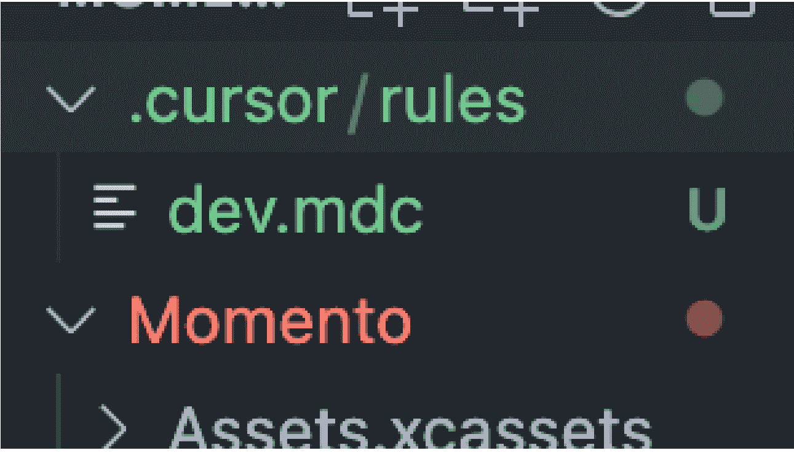

将规则文件放到规则目录下 .cursor/rules

### 第一阶段

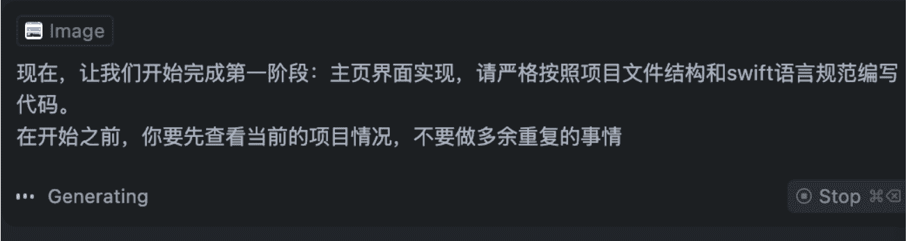
现在，让我们开始完成第一阶段：主页界面（HomeView）开发，请严格按照项目文件结构和 swift 语言规范编写代码。

在开始之前，你要先查看当前的项目情况，不要做多余重复的事情

这是在复现出来的效果，基本是一致的。左边是新出炉的 app，右边是原型
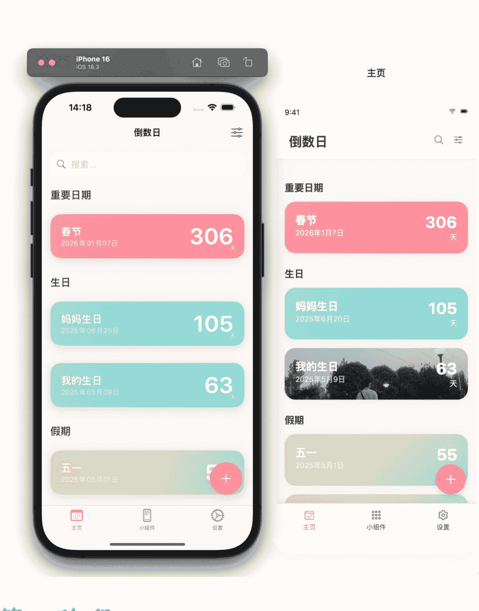

# 第二阶段

现在，让我们开始完成第二阶段：添加日期界面（AddDateView）开发，请严格按照项目文件结构和 Swift 语言规范编写代码。

在开始之前，你要先查看当前的项目情况，不要做多余重复的事情

同时我注意到之前有添加日期界面了，但和原型不符，请修改它和原型保持一致（根据实际情况调整提示词）

这是第二阶段的完成情况对比

第三阶段

现在，让我们开始完成第三阶段：日期详情界面（DateTimeDetailView）开发，请严格按照项目文件结构和 swift 语言规范编写代码。

在开始之前，你要先查看当前的项目情况，不要做多余重复的事情

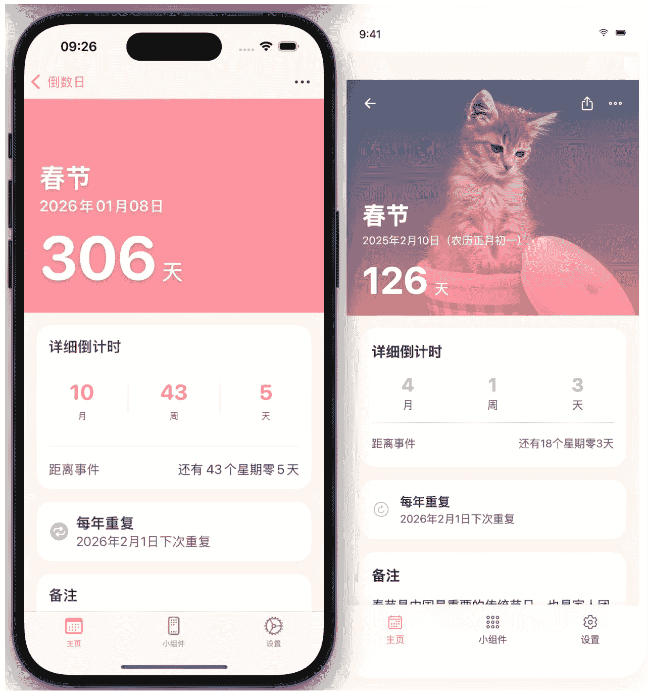

后面的阶段就不放出来了，都一样的做饭

懒人微信：lazyhelper

# 小结

在这个过程中，我主要遇到了一个挑战：小组件的开发

小组件的开发需要新建一个 target，但我不知道，AI 也不知道 (可能是假装的)

在多次沟通无果后，我用上了开始学习的第二个方法：一般这样的功能我们会怎么实现它？和他聊完后：那你看看我们现在的实现方式是对的吗？

他终于幡然醒悟，并告诉我应该怎么做。

# 发布 app

### App Icon

app 的图标可以用 AI 生成，你可以选择自己喜欢的方式，无论是用 claude 画 svg 图，还是用 AI 绘画都可以，做一个 1024x1024 的图片，上传至 app icon 目录即可

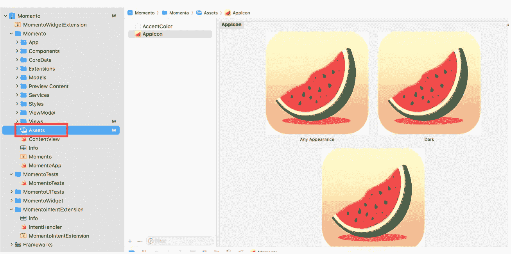

### 修改应用名称

因为我们的项目是英文名，如果你发布时想用中文名，就必须修改一下配置

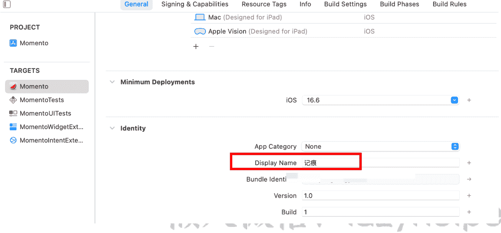

## 这里有 version，发布新版本时记得修改它

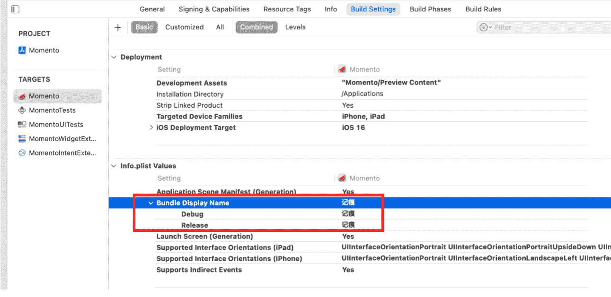

## 上传到 App Store Connect

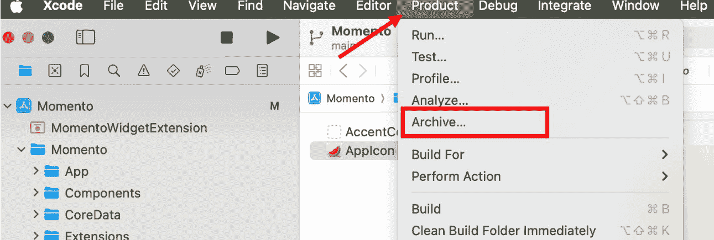
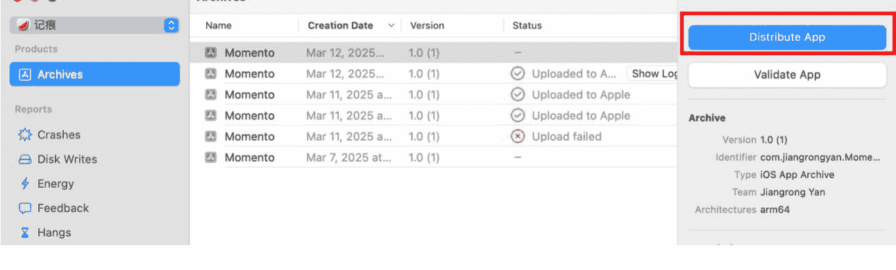

上传到 App Store Connect 之后，接下来就在网页上打开 App Store Connect。

主要填写这几个板块的信息，如果记不到也没关系，提交的时候会提示还有哪些东西没写

### iOS App

1.0 正在等待审核

- 叠加平台
- 综合
- App 信息
- App 审核
- 历史记录
- App Store
- 信任
- App
- 评论
- 增长
- App
- 产品页面
- 促销代码
- Game Center
- 定价
- 价格与销售范围
- App
- 订阅
- 图片

填的信息都很简单，按你的情况填就行

里面的有两个需要填链接的，一个是隐私政策，一个是技术支持。

可以直接在飞书上写，然后选择互联网可见就行了，比如这就是我的隐私政策

技术支持我也用的它

### 预览图

预览图可以使用软件做，也可以直接截屏

使用这个软件就可以做一些简单的了

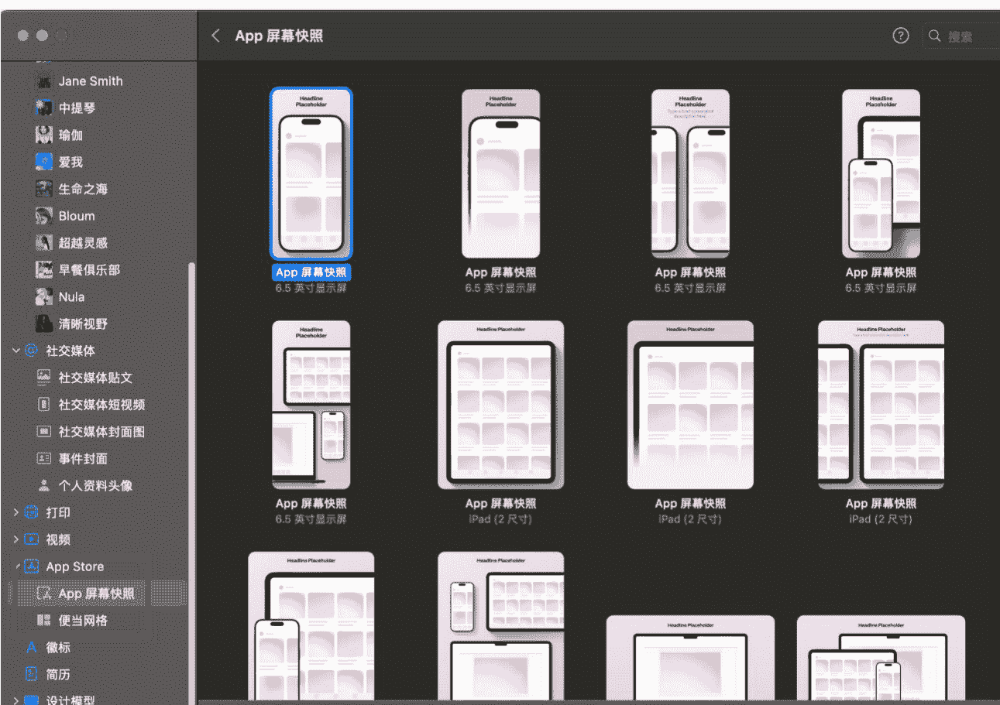

这是我的 app 的效果
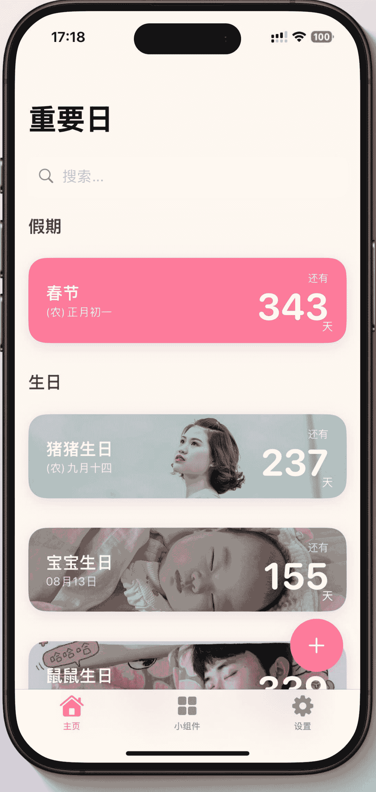

### 直观展示

# 重要日倒计时

### 定价

定价也是在这个页面，填好之后要去商务页面更新一下你的银行卡信息

iOS App
### 1.1 正在等待审核
### 1.0 可分发
- 添加平台
- 综合
- App 信息
- App 审核
- 历史记录
- App Store
- 信任
- 可靠性
- App 隐私
- 评分与评论
- 隐私
- 组织
- 销售摘要
- App 内购买
- 推广
- 促销代码
- Game Center
- 推广

### 价格与销售范围

### 价格时间表

当前是国家以及美元

# 信息展开

中国大陆

### App 销售情况

| 供应的国家或地区 | 未供应的国家或地区 |
|---|---|
| 136 个国家或地区 | 136 个国家或地区 |

### 垄断

### 税务类别

1. App Store 零售
1. 高级 App Store
1. 自定义应用
1. 促销代码
1. Game Center

### App 销售情况

从 macOS Big Sur 开始，兼容的 iPhone App 和 iPad App 可以在搭载 Apple 芯片的 Mac 上提供。App 将以原生方式运行，并使用与 iOS 和 iPadOS 中相同的框架。

### 垄断

如果您希望将 App 在 Mac 上的 Mac Store 中提供，去选中下方向的复选框，Apple 会自动选择兼容所需的最低 macOS 版本，但你可以选择其他版本。

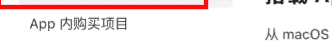


### 商务

- 协议

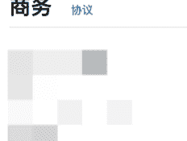


### 银行账户

XXX
"
XXX 开户行
### 中国

### 0.00
### 2025/1/5 06
### 0.00
### 0.00
### 2025/1/5 06
### 0.00


### U.S. Certificate of Foreign Status of Beneficial Owner

### 06
### 2025/1/5 06

### 0.00
### 06
### 2025/1/5 06

### U.S. Form W-8BEN

### 05
### 00

# 合规

### 05
### 2025/1/5 05
### 2025/1/5 05

# 数字

### 2025/1/5 05
### 2025/1/5 06

这里有点小问题，填 CNAPS 代码时银行信息是英文

# 添加新银行账户

来自 Apple 的付款将存入此银行账户。

- 银行所在国家或地区
- 银行账户币种
- 名称
- CNAPS 代码
- 账号
- 百度

比如我是招商银行，就要去网上搜一下

- 全部
- COPilot
- 工作
- 图片
- 视频
- 地图
- 资讯
- 购物
- 更多

China Merchants Bank 招商银行的英文全称是 China Merchants Bank 简称 CMB 它是中国的一家主要金融机构，成立于 1987 年，总部位于深圳蛇口

# 银行名称

| 银行名称 | 地址 | 汇款路线号码 |
| :--- | :--- | :--- |
| 招商银行有限公司 | 156 Fuxingmen Nei St., Xicheng District, Beijing, Beijing Municipality 100000 | 308100005019 |
| 招商银行有限公司 | 156 Fuxingmen Nei St., Xicheng District, Beijing, Beijing Municipality 100000 | 308100005027 |
| 招商银行有限公司 | 2 Zhongguancun S St, Haidian District, Beijing, Beijing Municipality 100086 | 308100005035 |
| 招商银行有限公司 | 11 Jianguomennei Street, Beijing, Beijing Municipality 100736 | 308100005043 |
| 招商银行有限公司 | Jia 39, Baiwanzhuang Dajie, Xicheng, Beijing, Beijing Municipality 100037 | 308100005051 |
| 招商银行有限公司 | 8 Beichen East Road, Chaoyang District, Beijing, Beijing Municipality 100101 | 308100005060 |

大概就这些东西，其他的我相信你会，或者你可以通过 AI 学会

# 结语

整个学习过程我花了将近半个月，当然我还在工作，如果你是每天都在学，或者不像我死磕那么深入，我相信你使用的时间会比我很多。

同时，我也很庆幸我自己半个月的努力学习没有白费，因为我确实完成了一款小而美的产品，并且花了我认为可以接受的时间。主要的时间还是花费在小组件的坑点上。后续的 app 肯定会更快。

我相信，你也可以做出一款小而美的产品，希望看完本文对你有所帮助。

我是阿紫，我们下次见~


> 懒人微信：lazyhelper

# 历史 3000 多份各类付费文章以及年费三千多的副业社群资源，见懒人专属群内部分享！

# 付费群，白嫖勿扰！

懒人专属群更新记录：[https://lazybook.fun/#/blog/record2](https://lazybook.fun/#/blog/record2)