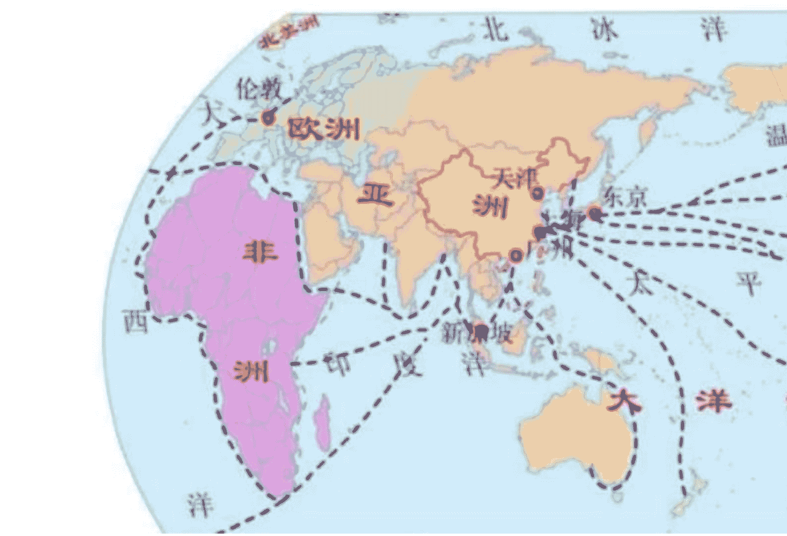

# 海运咽喉上的匕首，川普海洋霸权 2.0 剑指中国生命线

250320 A 视野

整理公众号懒人搜索懒人专属群独享

懒人微信 lazyhelper

## 这次下手比拜登还狠

最近，川普的出手，看似天马行空，被广为诟病。

扬言吞并加拿大和格陵兰，抢夺巴拿马运河股权，誓言要打击南美的钱凯港，在南海地区不断鼓动菲律宾袭扰，近期又突袭轰炸也门，甚至，最近传出要在马六甲海峡附近给我们上眼药。

与此同时，竟然提出要对所有中国制造的商船征收额外的税负成本。

如果说前者都是全球海运贸易网络的关键咽喉，那么，声称要对付中国制造的商船那就是直接下手。

很明显，川普正在跟我们进行一场真正意义上的：海洋霸权 2.0，剑指中国外贸生命线。

那么，他到底还有什么深层次的图谋？

川普的上述系统性布局对我们会有什么样的冲击？懒人微信：lazyhelper

## 一场惊天阴谋，正在笼罩中国经济的上空

考虑到此时此刻川普还要进行关税战，我们的外贸形势异常严峻。中国经济怎么办？该如何应对？

以下内容为付费阅读，各位多多支持！

从 2018 年开始，中美博弈，已经有过好几个大级别的回合了。

- 第一回合：川普 1.0，1v1，美国单挑中国
  美国利用当时各个领域全面碾压的优势，想要收割中国。
  中国的应对是，签署第一阶段的协议，人民币汇率贬值应对，科技自强，和转移出口目的国，不再把外贸的宝都押在美国市场。
  结果是，美国并没有收割到多少中国的好处。

- 第二回合：拜登以阵营方式，妄图群殴我们，还要利用金融、科技、产业链分工、舆论等多个维度，对我们进行收割。
  这已经算是民主党建制派可以拿得出手的最为豪华的“套餐”，是赌上冷战后美国霸权的绝大多数资源了。
  中国则是以拼命出口、金融战相互消耗、科技突围和加速布局面向发展中国家的出口等方式来应对。
  结果是，中国 2024 年出口顺差 1 万亿美元，科技和军工成功突破，金融战没有被完全打垮。

- 第三回合：川普 2.0，关税战+海权争霸+战术袭扰
  由于拜登消耗了巨大的资源也没有干趴下中国，使得川普 2.0 首先进行“疗伤”。
  在确认拜登的组合拳也失效后，川普只能从“地图”下手了，因为暂时确实没有新的资源可以从新的领域下手了。
  利用美国霸权和在全球广泛的军事基地优势，通过点穴法，专门挑全球最重要的航道节点下手，打击中国海运物流路线，从而确保中国在全球贸易中的话语权下降。

  其实，这步棋之前拜登有过小的测试。
  大家回忆一下，当时拜登提出，欧洲的货经过以色列、沙特，最后去往印度。只不过，这个战略被哈马斯突袭以色列给搞破功了，没法落地。

  然而，川普并不是简单用航道节点卡我们就结束了。川普的真实目的是：
  - 首先，先确保全球主要航道的关键节点，全部听美国的。
  - 其次，美国要求这些节点的股权方一起对中国外贸船队、以及使用中国制造的商船进行额外高收费。
  懒人微信：lazyhelper
  - 再次，由于成本的因素，倒逼大量产业从中国手里流出。
  - 最后，再鼓励其它国家也对中国进行额外关税的征收，也对中国商品进行保护主义的反击。

  在上述过程中，美国还有一招同步开展，就是通过人为制造美国经济衰退、关税战重创国际贸易、存心制造各种不可预测性等主要手段，打击中国出口的“收入端”。
  在收入端和成本端都被挤压的状态下，让中国制造、科技和军工陷入前所未有的困顿。关键是，整个争霸的过程中，大量成本还是别的国家去支付的。
  由于中国的内需已经疲软了几年，尤其是内需之母地产还趴在地上，此时从出口下手再次暴击我们，川普会觉得赢面大很多。
  也就是说，反正就是比，两边出牌，谁更加有“耐磨指数”。
  整个布局中，美国所需要使用的资源、军事力量和财政赤字是比较有限的，相当于“性价比很高”。

  我们再来看复盘一下现在中国制造业和出口的综合能力，大家就明白，川普的“紧迫性”何来：
  中国制造业具有体系全、品种多、规模大的突出优势，有望成为“AI+制造业”的全球领头羊。在工业品类方面，中国是唯一拥有联合国产业分类中全部工业门类的国家，在 500 种主要工业产品中，中国有 220 多种产品产量位居全球第一。在规模方面，2024 年，中国工业增加值 40.5 万亿元，制造业总规模连续 15 年保持全球第一。中国工业增加值已超美国、日本、德国之和。根据联合国，中国制造业产值的全球占比有望由 2000 年的 6%提升至 2030 年的 45%（预计），规模优势有望延续。

  如果 2030 年，中国制造业产值真的是全球的 45%，美国霸权就彻底没有了。
  因此，对于川普而言，遏制中国，时不我待啊！！！
  于是，一场全球围剿中国外贸、釜底抽薪式重创中国经济的布局，就此形成。

大家可以看一下这张图，就会很有感触。
懒人微信：lazyhelper

- 1. 针对李首富随意甩卖这么多关键国际港口，村里开始干预。
- 2. 中俄伊在中东演习，直接军事干扰美国的GPS长达4小时，相当于是给这个地方注入军事信用。
- 3. 存心绕道去澳大利亚，既可以缓解南海压力，又可以测试新的航道，以应对可能面临的马六甲海峡卡脖子。
- 4. 尝试跟俄罗斯合作，加速开辟北极航道。
- 5. 现有航道的呵护，加速上游供给品的多元化布局。

很明显，村里最近的很多动作，也不是拍脑袋的，反而是深思熟虑，步步为营。上述第5点，其实非常重要。

所谓物流管道的卡脖子，最终体现为“出口目的地”和“进口来源”。

针对“进口来源”，目前我们的战略是，能够自己生产的最好，不能自己生产就多元化。农产品找了巴西帮忙，这里就跟钱凯港2期项目有关了。

芯片极可能自己来，面板已经可以自己来，能源加速跟俄罗斯和中东合作。剩下来就一个大额进口项目，铁矿石了。

好消息是，随着几内亚西芒杜铁矿开发进入关键阶段，这一全球最大未开发高品位铁矿项目的推进，或将重塑铁矿石供应链格局，为中国钢铁行业争夺资源定价权提供有效助力，全球铁矿石市场将迎来新一轮变局。由于西芒杜铁矿体量大，该项目投产后将会对中国乃至国际铁矿石供给格局产生较大影响。海外布局方面，除西芒杜项目外，中资企业参与的秘鲁邦沟铁矿、喀麦隆洛比铁矿等项目陆续投产，这些项目与四大矿山形成差异化竞争。此外宝武资源的澳大利亚阿什伯顿铁矿、利比里亚的邦矿和博米项目，庆华矿业的塞拉利昂唐克里里等项目，都将提高中国在铁矿石定价权上的话语权。

总结一下，就我们对外支付最夸张的面板、芯片、铁矿石、能源、粮食来说，基本上，我们已经有了对付川普布局的各种手段了。

但是，在“出口目的地”来说，形势确实有点严峻。

因为，最高端的出口市场，终极消费地，依旧是欧美市场，这个是实实在在的。

即便我们很多东西出口给越南、墨西哥、泰国等等，后者这些国家加工后的终极产品，还是前往欧美的。

所以，中国现在除了增加中间品出口给发展中国家外，对于全球航道的捍卫，也必须出手了。

不过，由于我们在全球大多数地方没有军事基地，更没有盟友，短板确实很明显。

这个时候，川普还对普京各种无底线的妥协，摆出一副要拉拢俄罗斯的架势，意图也是清晰的。

试想，如果有了俄罗斯的地缘影响力加持，中国可以继续实施一带一路计划，会更加容易突破川普海权卡脖子的招数。

但是，如果没有了俄罗斯的地缘影响力帮助，中亚、中东、东欧、印度等重要通道，我们就会被压制。

甚至，美国动不动用日韩跟我们搞一搞，就会分散掉我们很多的精力和资源。可是，俄罗斯是真的有能力全面压制日韩的冲动。

川普这盘棋，不可谓不大，其内阁体系的精英们也是真的非常聪明。

如果说拜登是出钱拉拢大家一起对付中国制造，那么，川普 2.0 就是砸盘逼其它国家一起对付我们。

如果以为上述招数就是川普 2.0 海权霸权争夺战的极限，那就把他想简单了。今天，美国的地缘博弈中，实则也是有软肋的。

具体而言，全球到处都是美军，可是美国却已经没有做全球的生意，只做全球的金融。与之对应，中国做全球的生意，可是，却没有将自己的军事资源向全球挥洒和驻扎。

两者各有千秋，却也各有短板，类似于一种田忌赛马的味道。

面对高起的债务压力，川普注意到，生意养不起全球美军，只能一边搞战略收缩，一边要求盟友国家分担自己的压力。

然而，我们的难度是，如何可以合情合理的将自己的影响力慢慢渗透到全球，去保护我们自己的生意呢？

就拿跟菲律宾的争端来看，就非常清楚里面的难度。小马科斯搞了这么久我们迟迟没有出手，就是要温水煮青蛙，极为缓慢却坚定的去实控这个片区。

离我们这么近的地方都这么难，那放眼全球呢？更何况，欧洲也是一根搅屎棍。所以，如果仔细去分析，就会发现，其实，中国的出手，也是组合拳。

首先，强化南海、东南沿海（台湾）、东海等地的实控。

毕竟，全球海运是一个网状结构，缺一不可。美国就算把其它地方卡住了，但是，上述地区在我们手里，美国及其盟友也是被卡脖子的。

这是明显的田忌赛马的策略，也是一种非对称对抗。

其次，鉴于叙利亚的形势，以卡塔尔为军事支点，以沙特为经济支点，强化在这个片区的经济和军事存在，已经刻不容缓。事实上，目前也是这么做的。

再有，在马六甲附近，在南海延伸段连接澳洲北方那一段，强化军事存在。

目前，就直接军事实力而言，这个片区的美军力量并不强大，中国是有机会解除封锁的。

甚至，如果美国要搞马六甲海峡封锁卡脖子，中国就可以在南海地区反向操作，从而获得筹码。

当然，欧亚大陆的铁路网络的构筑，依旧是一个备选方案。然而，即使如此，依旧是未必保险。

我们依旧要从贸易的本质来看问题，否则无法破解川普的阳谋。贸易，不仅是我们需要别人，也是别人需要我们。

因此，当务之急，中国确实要拉自己的内需的行情，既可以给自己的企业订单，还可以强化其它国家向我们出口。

试想，类似巴西这类严重依赖中国市场的国家，他们有着更加紧迫的压力，想要维持跟我们的贸易管道。如果中国内需极为彪悍的拉升一波，那么，就会引发全球更多国家主动要跟我们挂钩，主动排斥美国的海运卡脖子战略。

也就是说，最终极的破解支点，实则是在我们自己身上。

倘若认真分析川普的这一战略，也是左右互搏，内生bug很多。

当川普不惜以打击全球贸易增长为代价的时候，倒霉的可远不止是我们。也就是说，川普是砸了所有人的锅，来幻想用这种方式暴击我们。在他眼里，其它国家都是小卡拉米，根本不用关切这些国家的态度和意见。

然而，即使是加拿大现在都站起来反抗，更遑论其它国家。

过去，在冷战时期，美国遥控其它国家卡住苏联的脖子，这是基于“安全”的逻辑。可是，如今根本没有这个问题，那人家凭什么长期配合你？

再说了，现在是创新周期尾部，大家吃饭都很难，都严重依赖国际贸易管道。这么多国家的话事人，都是能干一年是一年的心态，根本管不了跟美国的长期合作利益。

如果不是这样，怎么会有杜特尔特下台的事？怎么可能尹锡悦要戒严？怎么可能欧洲乱成这个样子？

所以，中国就可以逐一分化，而且，套利空间巨大。还是回到那个问题的起点：当美国的军事遍布全球、可美国的生意却没有如此，那么，这种张力是内生难以克服的。

历史3000多份各类付费文章以及年费三千多的副业社群资源，见懒人专属群内分享!

付费群，白嫖勿扰!

懒人专属群更新记录:
https://lazybook.fun/#/blog/record2