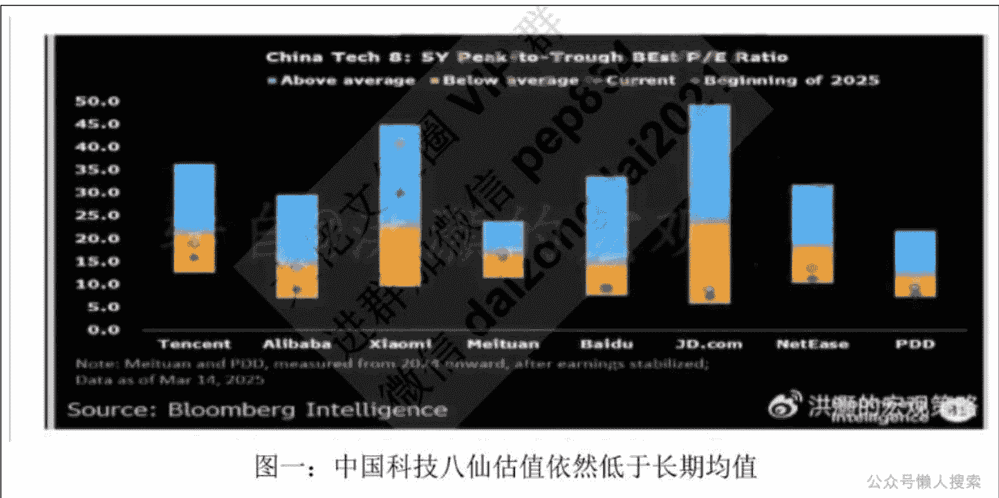
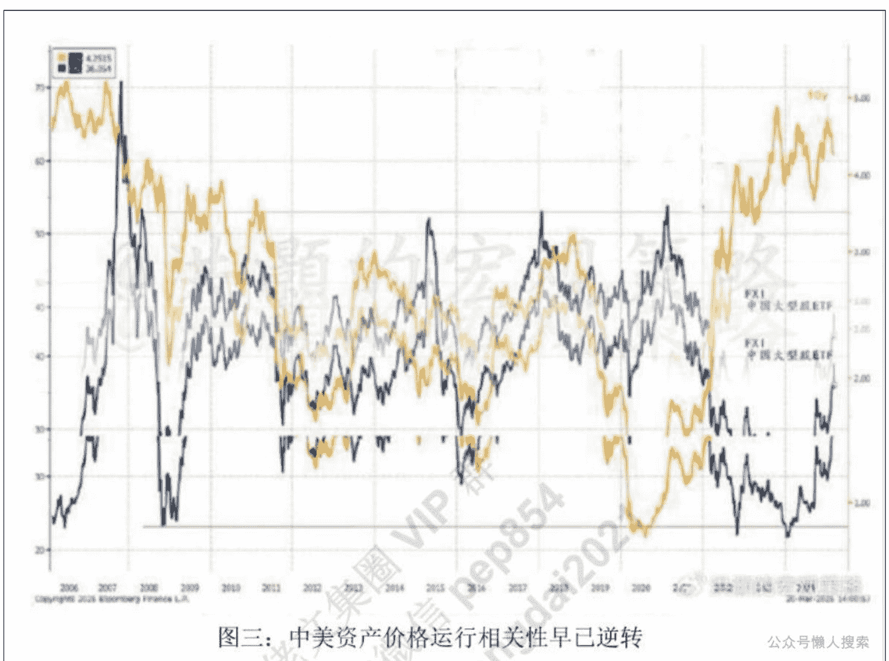

# 美联储又要故技重施了

250321 洪灏
整理：公众号懒人搜索，懒人专属群独享
懒人微信：lazyhelper

## 前言

### 美联储看跌期权 vs 特朗普看跌期权

昨夜，美联储如期放鸽，下调增长预期并上调通胀预期。同时，在美联储议息委员会的点状图里，虽然预期降息一次的人数保持不变，但是预期加息的人数却反而增加了。与此同时，鲍威尔在发言中再次运用了他的 2021 年对于通胀的看法，认为当下的通胀只是“过渡阶段”。

众所周知，2021 年鲍威尔对于通胀前景判断失误，迟迟不加息改变货币政策，导致 2022 年美国通胀全面爆发，达到了 40 年以来之最。鲍威尔不得不开启了史上最快速度的加息政策，意图控制通胀。最终，通胀终于被遏制住了，但是也导致了 2022 年美国股市债市双杀，40 年也不曾遇见。那一年，就连桥水这样的宏观对冲基金的翘楚，也遭遇了滑铁卢。毕竟，风险平价策略依赖于股债之间反向的相关性。希望这次鲍威尔不会再重蹈覆辙。

尽管如此，鲍威尔还是准备减缓缩表速度，从每月 250 亿美元减到每月 90 亿美元。然而，美联储的体量已经从最高点的九万多亿美元，下降到现在低于七万亿美元，约下降了 25%。这是美联储历史最快的一次缩表。上一次美联储快速缩表，还是 2018 年。那年，美联储缩表叠加特朗普的第一次贸易战，直接导致美股在 2018 年二月出现“量化巨震”，许多做空美股波动性的基金一夜归零。然后，美股在 2018 年九月份进入历史性暴跌，纳指不到三个月就暴跌了近 30%。

在 2018 年 9 月 3 日，我发表了那篇脍炙人口的预测文章《洪灏：中美周期的冲突》，以量化美国经济和市场周期模型预测美股即将暴跌（完整报告请网上搜索）。然而，由于当时美股在二月量化巨震之后再创当年新高，市场共识不以为然，很多人甚至在后台留言，污言秽语地谩骂。后来的市场走势已是历史。而这个经验也告诉我们：在共识一边倒的时候，市场往往会翻船。

英雄不提当年勇，廉颇不问能饭否。

尽管以上描述的美联储货币政策的种种不堪，其实昨夜的美股是近一年来表现最好的一次美联储议息会议。不仅如此，昨夜也出现了近来罕有的美股债美齐涨的局面。显然，市场从“特朗普看跌期权”回归到了“鲍威尔看跌期权”。既然特朗普政策不太可能“让美国再次伟大”，那么至少鲍威尔的政策可以让美股不再下跌。黄金在这种不确定性飙升，但是增长放缓同时通胀压力延续的环境里继续大放异彩。银子也蓄势待发，就连铜都飙升到一万美元以上。这些，我都在一个月前的专栏报告《洪灏：黄金历史新高之际，关于黄金的重要问题》中已经详细讨论。

今天的亚洲盘的表现则有些出人意料。基本上大部分的市场都有不同程度的上涨，唯有近来表现最好的香港市场下跌，小马哥的公司业绩超预期，并宣布将加大对 AI 的投资。然而股票不涨反跌。恒科也下跌了约 2%，为亚洲表现的最差的市场之一。

显然，写到这里，市场的格局已经显而易见了。中美在这轮周期冲突中，资产价格互为对冲，东升西降，东涨西跌。年初至今，本来投在美股的钱由于特朗普政策的不确定性和开始转头寻找美国以外的机会。而中国 DeepSeek 的横空出世，以及中国最高层释放的对于振兴经济和呵护民营企业的信号，都把投资者的眼光吸引到了香港这个估值较低且资本自由流动的全球主要市场里。

估值的数据可以看到，尽管今年以来表现出色，但是中国科技八仙的估值水平都在他们五年长期平均值之下，除了雷公的公司。而美国科技七剑的估值，虽然在最近的美股回调中有所收敛，但是依然在其长期均值的三倍方差之外。而市场坊间又流出一张耸人听闻的图：英伟达当下的股价走势和 2000 年纳斯达克 ADR 的股价走势的比较。

对于一个国际投资者来说，他/她现在需要考虑的是，是特朗普政策的不确定性是否将导致资金流向的根本趋势性的逆转，还是美联储的货币政策还是会像以前那样在股市暴跌的时候继续提供安全垫。对于我们，答案是显而易见的：虽然美联储在市场暴跌的时候的确会再次出手、力挽狂澜，但是特朗普政策对于美国几十年来苦心经营的全球经济政治格局的伤害难以估量。

现在，东西方投资者对于“东升西降”这个提法的定义有不同的理解。美国投资者并不认为特朗普的政策对于美国的霸权会造成永久的伤害。虽然大部分美国人认为特朗普的关税政策对于美国经济不利，但是大部分人还是支持关税。

而美国以外的、能够投中国市场的投资者对于东升西降的看法，仍然停留在股市价格波动层面。换言之，这些投资者的对于东升西降的看法，可以大致地归纳为“东涨西跌”，认为美国长期的陨落可以在短期的股市价格波动中体现出来。

长期跟踪我的研究报告的读者都知道，在短期，股市和宏观经济趋势，可以完全相反。股市的涨跌在短期可以归因为随机任意一个因子。一个好的宏观分析师，是可以从这些纷繁芜杂的信息中为读者理清各个时间窗口的主要矛盾，并提出相应的策略。用长周期的观点看短期的市场波动，无异于用高射炮来打蚊子。用短期的市场波动来证明长周期宏观格局的变化，则像是在稻草堆里找绣花针，很容易就会迷失自我。

中国市场价格运行，早已开始与美国长端利率逆向而行。这种与历史观察相悖的、新的运行轨迹，暗示了上述东西方投资逻辑的变化。今年以前，是高企的美国利率吸引全球资金流向美股，导致美元强势和美国经济上行。如今，美联储的鸽声反而将侧面印证美国经济力有不逮，因此资金将在美国以外寻找机会，尤其是在流动性开始边际变化，美国以外的增长确定性大增的情况下。

这可能是 5000 年历史的酝酿和 200 年历史的发酵出来的不同的思维定势。

历史 3000 多份各类付费文章以及年费三千多的副业社群资源，见懒人专属群内分享!

付费群，白嫖勿扰!

懒人专属群更新记录：
https://lazybook.fun/#/blog/record2