# AI智能体-安卓手机也能玩转自动化：打造小红书文案提取+AI二创一条龙工作流教程

250324 生财精华

公众号懒人搜索，懒人专属群分享


## 为什么要做这个

苹果用户们早已开始用快捷指令+飞书多维表格实现一键获取视频文案，作为安卓用户的我们也不能落后！本文将介绍如何利用安卓平台的自动化工具，打造一个Android快捷指令的文案提取工作流，让创作效率翻倍。

## 你将收获

- 掌握安卓手机快捷指令（MacroDroid）的设置方法
- 学会搭建 coze 小红书文案提取智能体
- 了解如何在飞书多维表格调用工作流
- 掌握飞书机器人流程设计技巧
- 学会使用飞书多维表格 AI 插件

## 所需工具

- 飞书 PC端
  下载地址: https://www.feishu.cn/download

- 飞书机器人流程设计
  飞书账号要求: 个人版账号即可（无需企业版）

- 扣子（Coze 平台账号）
  官网地址：https://www.coze.cn
  使用手机验证码登录
  目前扣子智能体发布的飞书多维表格字段捷径插件每天200次，不知道专业版会不会多一些，因为没有超过200次，暂时不知道。可以使用我发布的扣子工作流调用字段捷径插件调用扣子工作流。

- MacroDroid（安卓自动化工具）
  版本要求: Android 系统:7.0及以上；MacroDroid 版本:5.5.24
  下载安装: Play 商店:MacroDroid - Device Automation；APK 直接下载:官网 https://www.macrodroid.com/
  权限配置: 悬浮窗权限(界面操作)、后台运行权限（保持活跃）
  使用建议：给予所有必要权限

- 小红书 App
  账号要求：正常登录状态

## 搭建流程

### coze 小红书文案提取智能体搭建

构建智能化文案处理核心

### 智能体基础配置

1. 登录扣子后，点击左上角的+创建智能体，在弹出窗口点击创建智能体下面的【创建】：
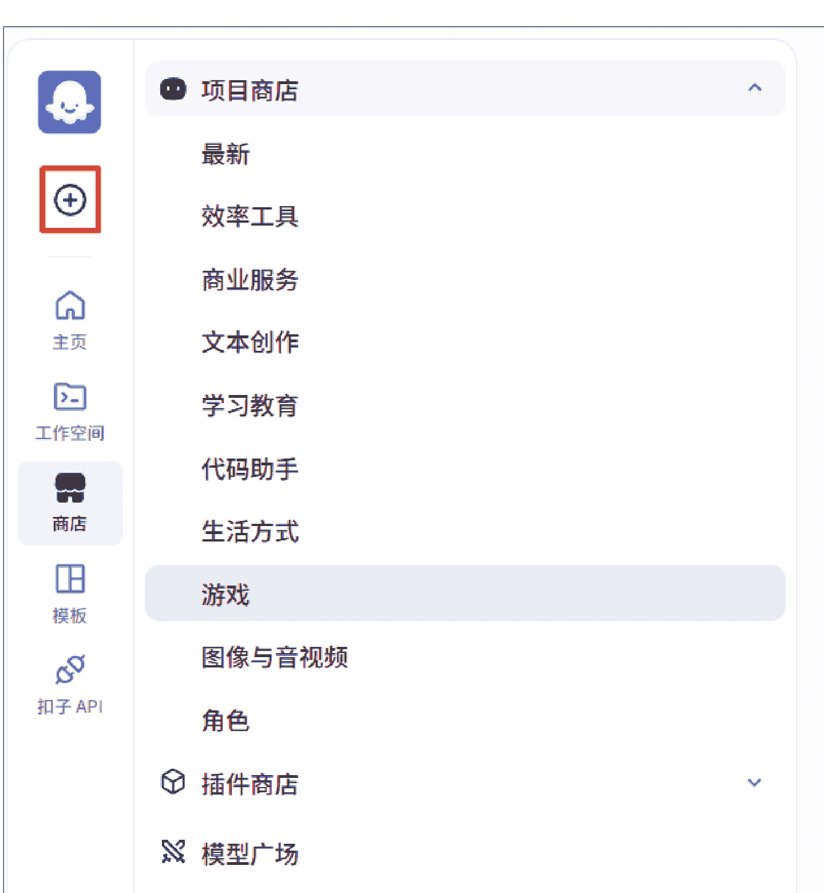

2. 设置智能体内容：
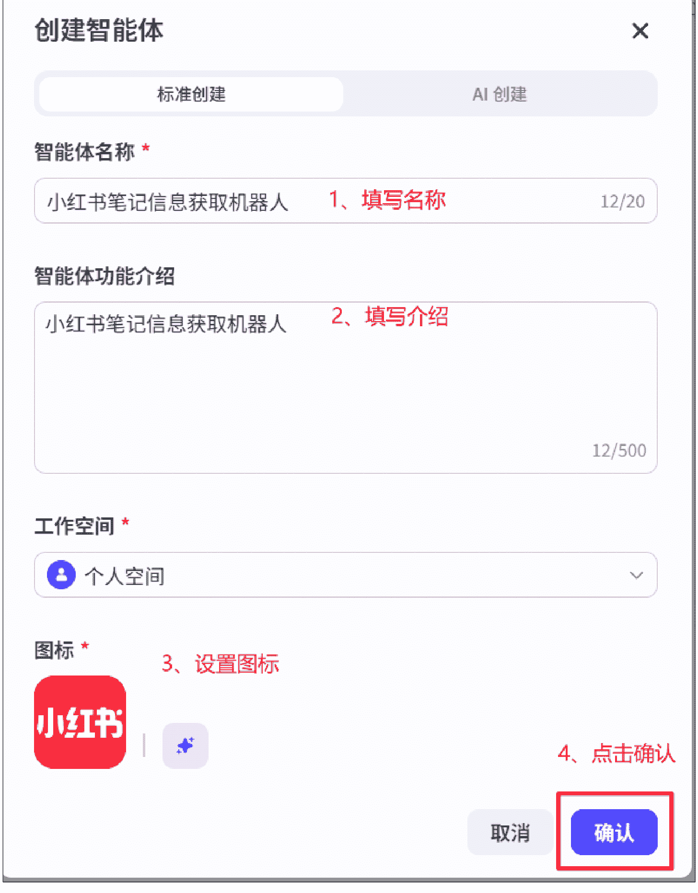

3. 设置智能体为【单 Agent （对话流模式）】：
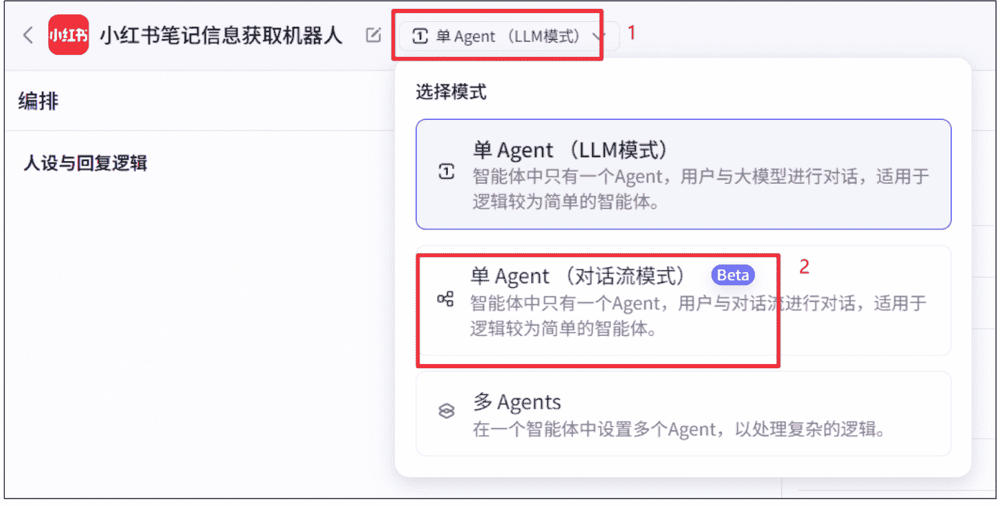

4. 点击【点击添加对话流】开始添加工作流，然后点击【创建对话流】：
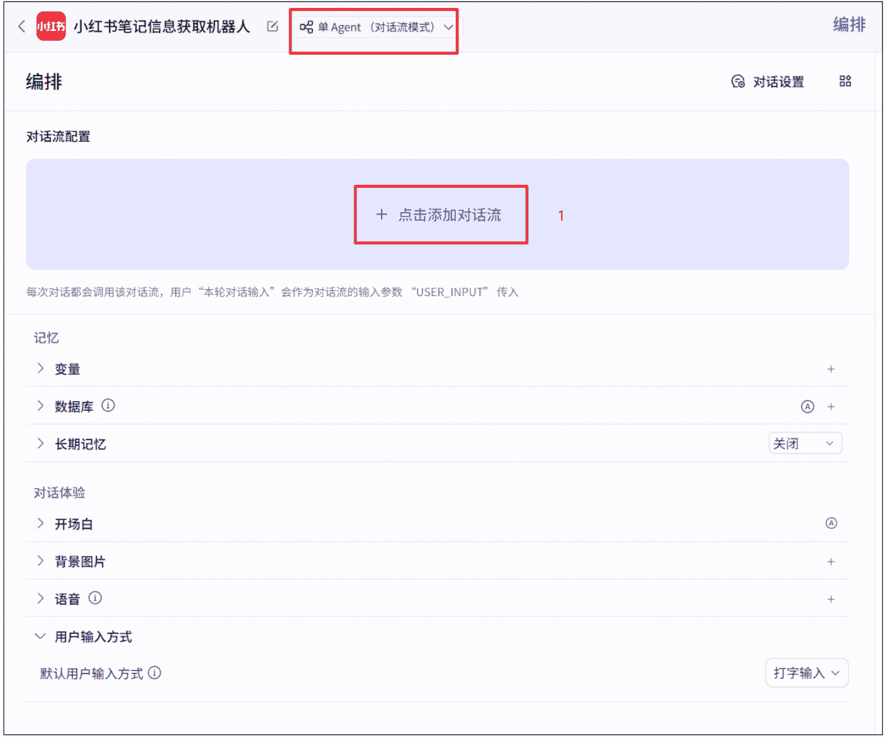
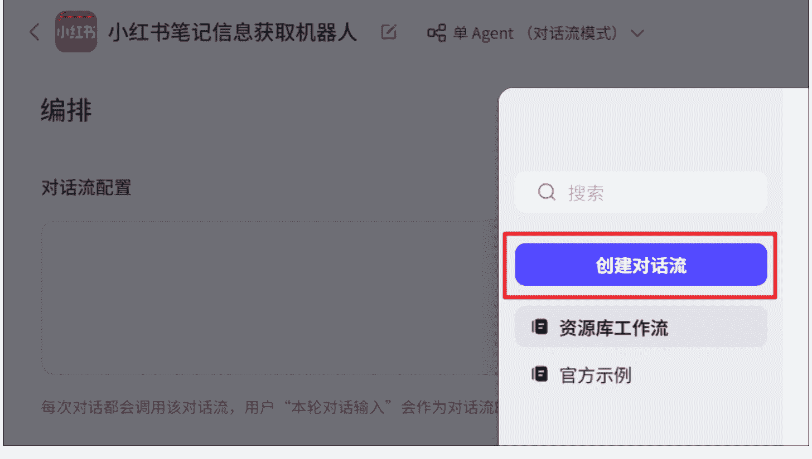

### 智能体工作流设置

1. 填写对话流信息：
对话流名称：rednote_extract
对话流描述：小红书笔记信息提取

2. 设置名称，不要有中文、空格、特殊字符(下划线除外)
3. 设置描述，可以有中文
4. 确认

5. 开始节点不用设置，鼠标移到开始节点右边中部，会出现个➕，点击➕添加一个插件节点：

6. 搜索工具集合，点击>展开，然后选择【get_rednote_info】：

7. 设置【get_rednote_info】节点：
节点名称：get_rednote_info
输入设置：
- content：引用【开始】节点的【USER_INPUT】
- cookiestr：按需，可以不设置

8. 添加选择器节点：
节点名称：选择器
条件分支设置：
如果设置：
- 条件1：设置【get_rednote_info】节点的flag等于1
- 条件2：设置【get_rednote_info】节点的type等于video
两个条件是且
否则如果设置：
- 条件1：设置【get_rednote_info】节点的flag等于1
- 条件2：设置【get_rednote_info】节点的type等于normal
两个条件是且
否则设置：
- 否则无需设置：

9. 如果分支添加一个【字幕获取】插件节点：
节点名称：generate_video_captions_sync
输入设置：
- url：引用【get_rednote_info】节点的 video/url

10. 否则如果分支添加一个代码节点：
节点名称：设置 asr 空内容
输入设置：无需设置
输出设置：
- asr：string 类型

代码(Python):
```python
async def main(args: Args) -> Output:
    params = args.params
    asr = ""
    # 构建输出对象
    ret: Output = {
        "asr": asr
    }
    return ret
```
可复制代码:

11. 否则分支添加一个代码节点:
节点名称： 设置空内容
输入设置: 无需设置
输出设置:
collectedCount、commentCount、likedCount、shareCount、urlDefault、notetype、desc、userId、avatar、nickname、video_url、title、ipLocation、lastUpdateTime、tag_text、asr：均为 string 类型
imageList：Array<Object>类型

代码(Python):
```python
async def main(args: Args) -> Output:
    params = args.params
    collectedCount = "无法获取"
    commentCount = "无法获取"
    likedCount = "无法获取"
    shareCount = "无法获取"
    urlDefault = "无法获取"
    notetype = "无法获取"
    desc = "无法获取"
    userId = "无法获取"
    avatar = "无法获取"
    nickname = "无法获取"
    video_url = "无法获取"
    title = "无法获取"
    ipLocation = "无法获取"
    lastUpdateTime = "无法获取"
    asr = ""
    imageList = []
    tag_text = "无法获取"
    # 构建输出对象
    ret: Output = {
        "collectedCount": collectedCount,
        "commentCount": commentCount,
        "likedCount": likedCount,
        "shareCount": shareCount,
        "urlDefault": urlDefault,
        "notetype": notetype,
        "desc": desc,
        "userId": userId,
        "avatar": avatar,
        "nickname": nickname,
        "video_url": video_url,
        "title": title,
        "ipLocation": ipLocation,
        "lastUpdateTime": lastUpdateTime,
        "asr": asr,
        "imageList": imageList,
        "tag_text": tag_text,
    }
    return ret
```
可复制代码：

12. 添加变量聚合节点，详细配置如下：

变量聚合
对多个分支的输出进行聚合处理
聚合策略：返回每个分组中第一个非空的值

| 分组 | 聚合配置 |
| :--- | :--- |
| **Group1** (String) | `str. get_rednote_info - collectedCount`<br>`str. 设置空内容 - collectedCount`<br>`str. 输入或引用参数值` |
| **Group2** (String) | `str. get_rednote_info - commentCount`<br>`str. 设置空内容 - commentCount`<br>`str. 输入或引用参数值` |
| **Group3** (String) | `str. get_rednote_info - likedCount`<br>`str. 设置空内容 - likedCount`<br>`str. 输入或引用参数值` |
| **Group4** (String) | `str. get_rednote_info - shareCount`<br>`str. 设置空内容 - shareCount`<br>`str. 输入或引用参数值` |
| **Group5** (String) | `str. get_rednote_info - type`<br>`str. 设置空内容 - notetype`<br>`str. 输入或引用参数值` |
| **Group6** (String) | `str. get_rednote_info - desc`<br>`str. 设置空内容 - desc`<br>`str. 输入或引用参数值` |
| **Group7** (String) | `str. get_rednote_info - urlDefault`<br>`str. 设置空内容 - urlDefault` |
| **Group8** (String) | `str. get_rednote_info - ipLocation`<br>`str. 设置空内容 - ipLocation` |
| **Group9** (String) | `str. get_rednote_info - lastUpdateTime`<br>`str. 设置空内容 - lastUpdateTime` |
| **Group10** (String) | `str. get_rednote_info - title`<br>`str. 设置空内容 - title` |
| **Group11** (String) | `str. get_rednote_info - userId`<br>`str. 设置空内容 - userId` |
| **Group12** (String) | `str. get_rednote_info - avatar`<br>`str. 设置空内容 - avatar` |

懒人微信：lazyhelper

13. 配置结束节点，选择返回变量：

14. 输入一篇笔记链接测试下工作流，点击【试运行】：
https://www.xiaohongshu.com/explore/67daa90600000000le007d6d?xsec_token=ABI60KrsrDX4GWgUibp6cRQ7qjDIyWLEHT94-TsJAS_yM=&xsec_source=pc_feed

运行成功工作流没问题。

15. 发布工作流，点击【发布】：

公众号懒人搜索，懒人专属群分享

### 开场白设置

开场白其实是否设置无关紧要，因为我们是要使用插件调用的工作流。

### 创建个人访问令牌

工作流配置好后就可以创建个人访问令牌了。

### 认证令牌获取

需要先在扣子平台获取令牌。

步骤说明：

懒人微信：lazyhelper
17 / 82

1. 登录 Coze 控制台【https://www.coze.cn/】，点击左侧导航栏的【扣子 API】：

2. 进入【授权 ➡️ 个人访问令牌】页面，点击【添加新令牌】按钮：

3. 输入令牌名称（建议命名与用途关联），设置令牌有效期、勾选【工作流】权限、选择要使用的工作流所在的空间，最后点击【确定】：

添加新的个人访问令牌
多维表格插件测试
1、设置名称
过期时间* ② 30天（2025-04-05）
2、设置时间，最长30天
权限* ① 展开所有
工作流 2/2 已选择
3、勾选工作流 运行您的工作流
访问团队空间* ① 转移空间所有权会导致该空间已申请的个人访问令牌失效，请慎重转移所有权。
选择指定团队空间 至少选择一个您是所有者身份的团队空间 个人空间 x
4、选择要使用的工作流所在的空间 5、点【确定】 取消 确定

记录生成的 API key(仅显示一次，需妥善保存)：

新的个人访问令牌
此令牌仅显示一次。请将此密钥保存在安全且可获取的地方。不要与他人共享，也不要在浏览器或其他客户端代码中暴露它。
名称 多维表格插件测试 过期时间 2025-04-05 点击复制 令牌 pat...

保存令牌信息到本地，后面飞书多维表格配置会用到。
注意事项： 令牌权限范围需包含工作流操作权限
懒人微信：lazyhelper

泄露令牌可能导致数据安全风险

## 飞书多维表格设计

### 创建飞书多维表格

1. 在飞书个人空间新建个飞书多维表格，删掉非必要字段，设置第一个字段位【笔记信息】，名称改为自己喜欢的：

2. 添加一个字段，设置字段标题为【小红书信息获取】，搜索字段捷径插件【扣子工作流调用】：

### 字段捷径插件设置

1. 填写前面创建的扣子令牌到多维表格插件的认证令牌，工作流 ID 在我们编辑工作流时的链接里面有，workflow_id 后面的值就是工作流 ID，参数字段设置【笔记信息】列：

2. 其他信息配置:
参数名称: USER_INPUT
请求模板:
```json
{
    "CONVERSATION_NAME": "Default",
    "USER_INPUT": "$$USER_INPUT$$"
}
```
`$$USER_INPUT$$`是替换关键词。
- 输出结果 1: desc
- 输出结果 2: asr
输出结果 x 的内容表示获取工作流的哪个变量的值，只能获取 2 个，其他的需要通过完整响应数据获取。我这里是想获取视频的语音文案，因为视频作品一般没有标题，所以我就没获取。
- 获取更多信息：全选
- 自动更新：启用

3. 点击【确定】保存:

公众号懒人搜索，懒人专属群分享

4. 点击【仅保存配置】：

## 飞书机器人流程设计

设计个飞书机器人流程把内容插入多维表格。

1. 电脑打开飞书，搜索【飞书机器人】：

2. 点击【新建应用】：

3. 设置应用名称、描述、图标，点击【确定】创建：

4. 点击【创建流程】：

5. 选择触发器设置为【Webhook 触发】，记得保存好【Webhook 地址】，后面会用到：
懒人微信：lazyhelper

### 参数设置为：
```
{
    "content":""
}
```

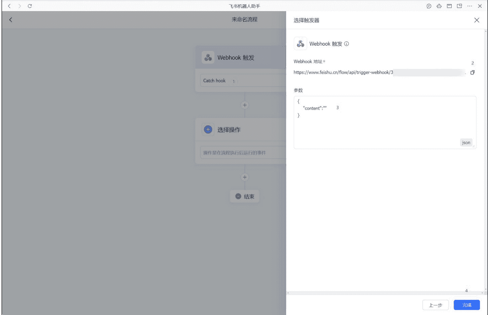

### 6、选择操作设置为【新增多维表格记录】，数据表选择我们创建的多维表格的数据表(不要通过多维表格名称去搜索，不能展开多维表格的数据表)：

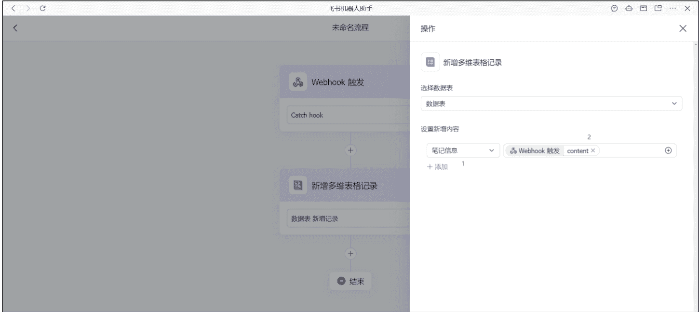

字段就选我们的【笔记信息】，值选择Webhook触发的 content。

### 7、点击【启用】，设置名称为【小红书笔记转存】：

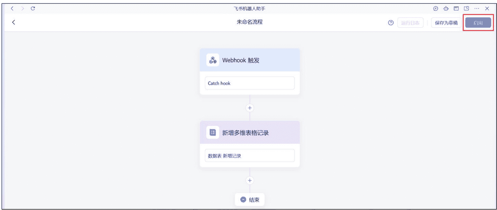

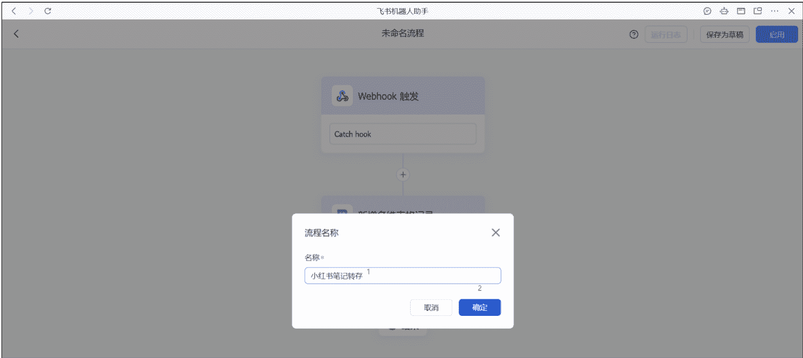

### 8、点击【发布】发布流程：

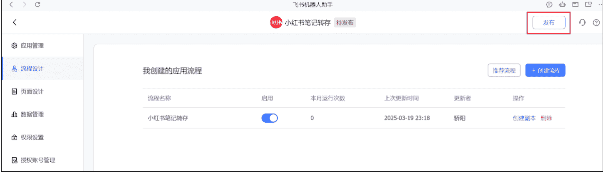

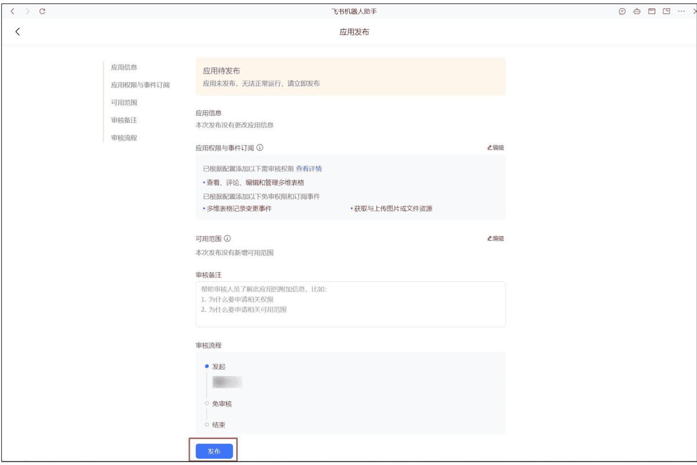

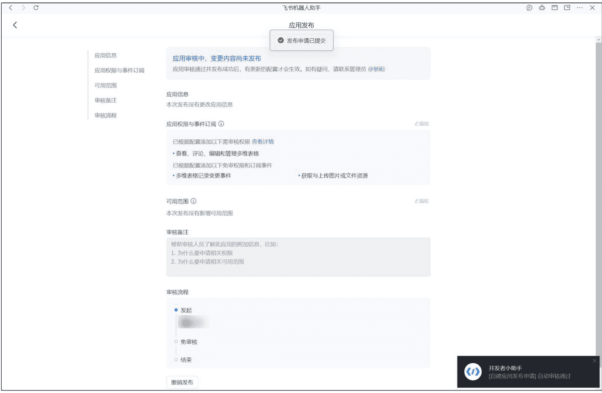

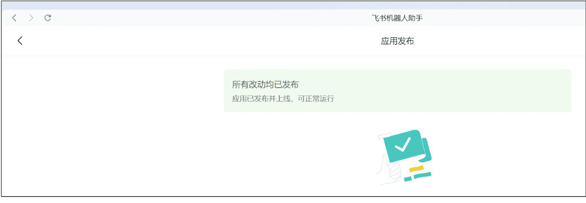

个人版是直接免审的。

## MacroDroid 流程设计

安装好之后这个步骤就不说了，接下来讲配置流程。

### 创建宏
- 1、打开 MacroDroid 手机应用，添加宏：

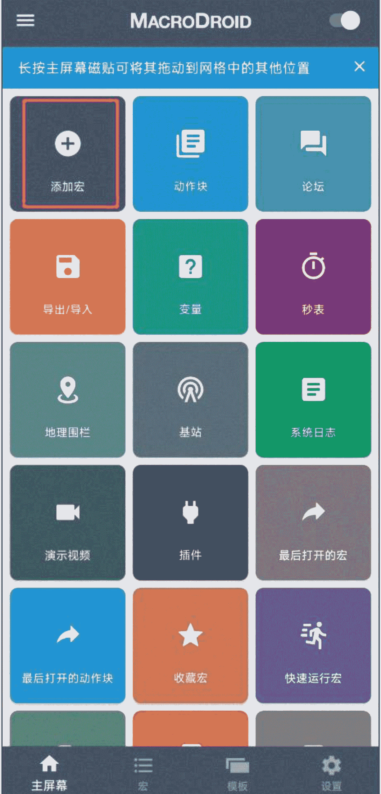

### 设置触发器
- 1、设置宏名称，然后点击触发器右边的+，选择用户输入的【浮动按钮】：

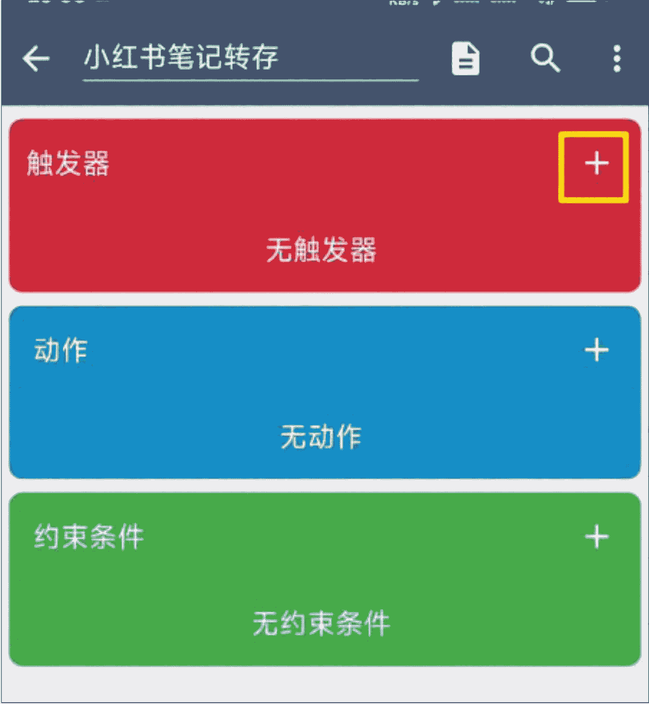

### 添加触发器
- 电池
- 呼叫/短信
- 连接
- 日期与时间
- 设备事件
- 位置
- 应用程序
- 用户输入
  - Google 助手
  - 主屏幕按钮长按
  - 媒体按钮 V2
  - 媒体键按下
  - 小部件按钮
  - 快捷方式打开
  - 指纹手势
  - 浮动按钮
  - 滑动屏幕
  - 电源键长按
  - 音量按钮长按
  - 音量键按下
- MacroDroid 特定
  - 懒人微信: lazyhelper


- 2、启用显示在其他应用的上层的权限，然后点击左上角的箭头返回：

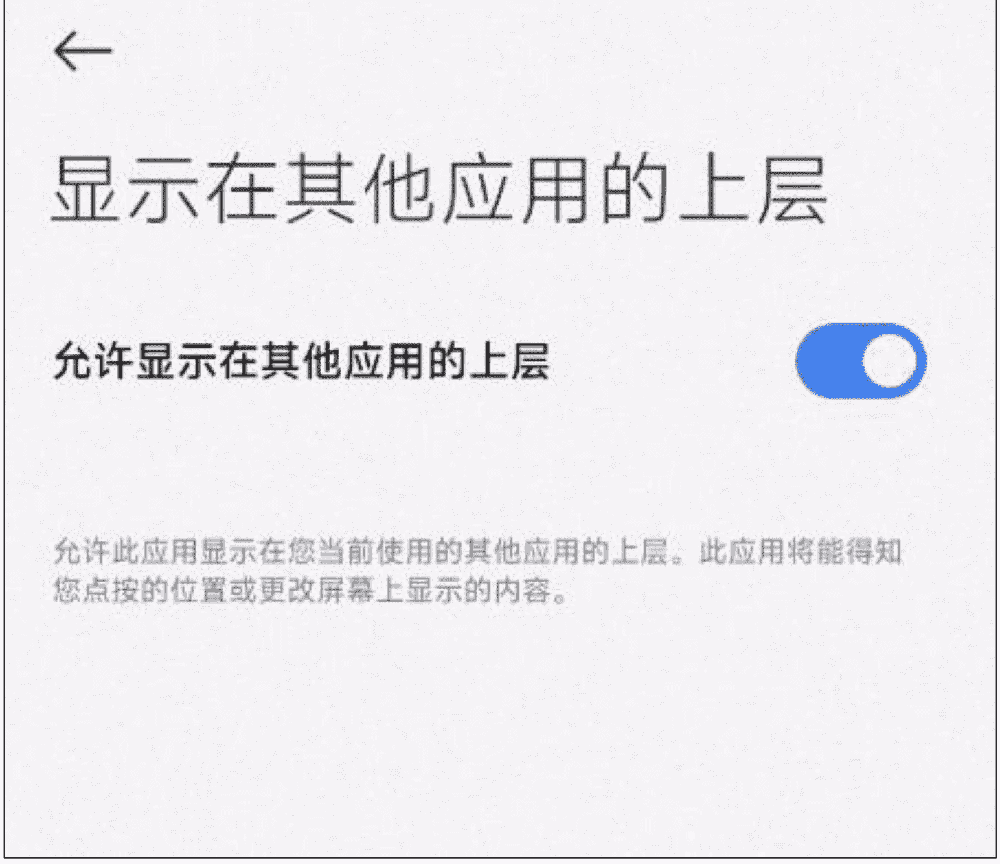

- 3、根据喜好设置浮动按钮：

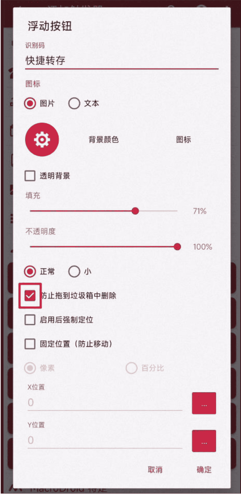

### 设置动作
- 1、点击动作右边的+，添加个【设置变量】动作，在【变量→设置变量】，选择【提取文本】，然后点击【确定】：

懒人微信：lazyhelper

### 添加单个动作
### 变量
### 设置变量
### 选择变量
### [新变量]
- 电话
- 日期与时间
- 日志
- 设备动作
- 设备设置
- 条件/循环
- 通知

懒人微信：lazyhelper

### 添加单个动作
### 变量
- 删除变量
- 数组处理
- 文本处理
- 清除变量
### 创建新变量
- 局部
- 全局
- 分享内容
### 变量类型
- 字符串
- 立即创建变量
- 将变量标记为安全
当宏被共享/导出或上传到模板库时，标记为安全的变量的内容将被清除。
- 取消
- 确定
- 设备动作
- 设备设置
- 条件/循环
- 通知

懒人微信：lazyhelper

### 添加单个动作
### 变量
- 删除变量
- 数组处理
- 文本处理
- 清除变量
- 清除字典/数组条目
- 设置变量
### 设置 分享内容
- 值
- [用户提示]
- 输入值
- 取消
- 确定
- 日期与时间
- 日志
- 设备动作
- 设备设置
- 条件/循环
- 通知
- 网络互动

### 选择选项
- 剪贴板文本
- 剪贴板
- 取消
- 确定

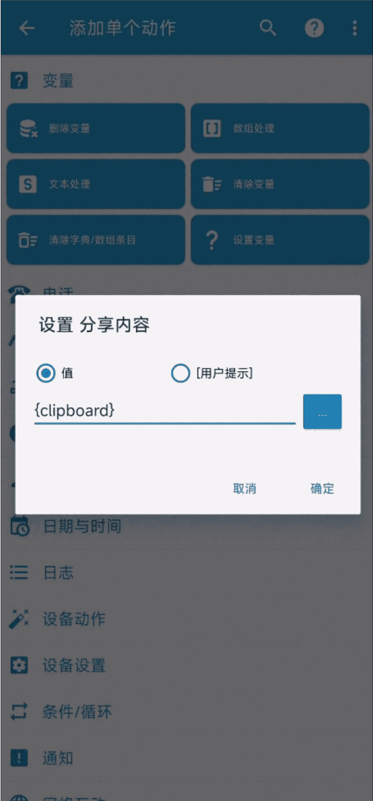

- 2、添加如果动作，在【条件/循环】里面：

条件 1：
https://www.xiaohongshu.com/explore/

条件 2：
http://xhslink.com/a/

### 添加单个动作
- 电话
- 宏
- 连接
- 媒体
- 屏幕
- 日期与时间
- 日志
- 设备动作
- 设备设置
- 条件/循环
- 如果
- 如果确认 则
- 循环中断
- 确认下一个
- 继续循环
- 迭代字典/数组
- 重复动作
- 通知
- 网络互动

公众号懒人搜索，懒人专属群分享

### 添加单个动作
- 电话
- 宏
- 连接
- 媒体
### 如果
添加必须满足的一个或多个条件才能在如果从句中运行动作。
- 条件
- [没有条件]
- 如果不满足条件，则不记录条件失败
- 取消
- 确定
- 循环中断
- 确认下一个
- 继续循环
- 迭代字典/数组
- 重复动作
- 通知
- 网络互动

懒人微信：lazyhelper
38/82

### 添加条件
- 连接
- 媒体
- 屏幕与扬声器
- 日期与时间
- 设备状态
- 通知
- 位置
### MacroDroid 特定
- MacroDroid 侧边栏状态
- MacroDroid 变量
- MacroDroid 模式
- 与/或/异或/非
- 宏启用/禁用
- 宏正在运行
- 宏调用方法
- 快速磁贴状态
- 最近调用/未调用的宏
- 比较值
- 浮动按钮
- 浮动文字
- 类别启用/禁用
- 触发器被触发

### 小红书笔记转存
- 触发器: 浮动按钮 (快捷转存)
- 动作: 如果
  添加必须满足的一个或多个条件才能在如果从句中运行动作。
  - 条件: 或
    - 比较值: {v=分享内容} 包括 https://www.xiaohongshu.com/explore/
    - 比较值: {v=分享内容} 包括 http://xhslink.com/a/
  - 如果不满足条件，则不记录条件失败
- 取消
- 确定
- 无约束条件
- 局部变量: 无变量

- 3、点击如果，然后点击【添加“否则”子句】：

### 如果
- 配置
- 测试条件
- 添加注释
- 添加动作在上面
- 添加子动作
- 添加“否则”子句
- 添加“否则/如果”子句
- 添加“否则/如果确认”子句
- 剪切
- 复制
- 粘贴动作在上面
- 提取到“动作块”
- 删除
- 删除（包括子项）
- 禁用

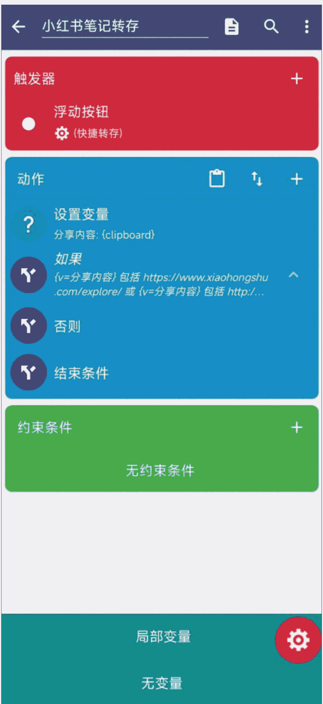

- 4、点击如果，然后点击【添加子动作】，点击【网络互动➡️HTTP 请求】，修改请求方法为 POST，网址设为 webhook 的地址，勾选【完成后才能后续动作】，然后拉到下面，勾选上【将 HTTP 响应保存在字符串变量中】：

懒人微信：lazyhelper

### 如果
- 配置
- 测试条件
- 添加注释
- 添加动作在上面
- 添加子动作
- 添加"否则/如果"子句
- 添加"否则/如果确认"子句
- 剪切
- 复制
- 粘贴动作在上面
- 提取到“动作块”
- 删除
- 删除（包括子项）
- 禁用
- 禁用（包括子项）

### 添加单个动作
- 宏
- 连接
- 媒体
- 屏幕
- 日期与时间
- 日志
- 设备动作
- 设备设置
- 条件/循环
- 通知
- 网络互动
- HTTP 服务器响应
- HTTP 请求
- JSON 解析
- JSON 输出
- UDP命令
- 位置
- 文件

### HTTP 请求
- 设置
- 查询参数
- 内容正文
- 请求头参数
- 请求方法: POST
- 输入网址: 
```
https://www.feishu.cn/flow/api/trigger-...
```
- 完成后才能后续动作
- 允许任何证书
- 跟随重定向
- 超时（秒）: 30
- 基本授权: 使用授权
- 用户名: [空白]
- 密码: [空白]
- 响应
- 将 HTTP 返回状态码保存在整型变量中: 不保存输出
- 将响应标题保存在字典变量中: 不保存输出
- 不保存 HTTP 响应

### HTTP 请求
- 设置
- 查询参数
- 内容正文
- 请求头参数
- 跟随重定向
- 超时（秒）: 30
- 基本授权: 使用授权
- 用户名: [空白]
- 密码: [空白]
- 响应
- 将 HTTP 返回状态码保存在整型变量中: 不保存输出
- 将响应标题保存在字典变量中: 不保存输出
- 不保存 HTTP 响应
- 将 HTTP 响应保存在字符串变量中: 分享内容
- 将 HTTP 响应保存到文件: 美化 JSON 响应

懒人微信：lazyhelper

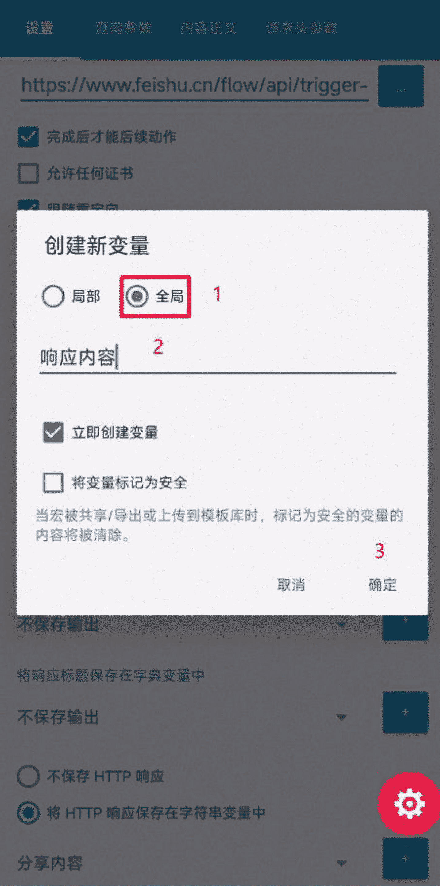

- 5、设置内容正文：
内容类型：application/json
内容正文选择文本，内容填写如下：
```
{
	"content":"{v=分享内容}"
}
```

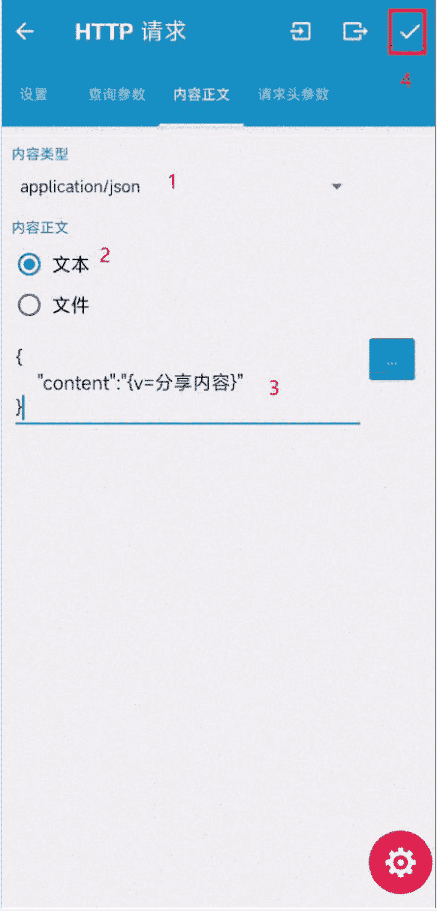

- 6、点击如果，然后点击【添加子动作】，点击【网络互动➡️JSON 解析】：

### 添加单个动作
- 宏
- 连接
- 媒体
- 屏幕
- 日期与时间
- 日志
- 设备动作
- 设备设置
- 条件/循环
- 通知
- 网络互动
- HTTP 服务器响应
- HTTP 请求
- JSON 解析
- JSON 输出
- UDP命令
- 位置

### 添加单个动作
- 宏
- 连接
- 媒体
- 屏幕
- 日期与时间
### JSON 解析
- 输入字符串变量: 响应内容
- 输出字典变量: msginfo
- +
- 取消
- 确定
- 网络互动
- HTTP 服务器响应
- HTTP 请求
- JSON 解析
- JSON 输出
- UDP命令
- 位置

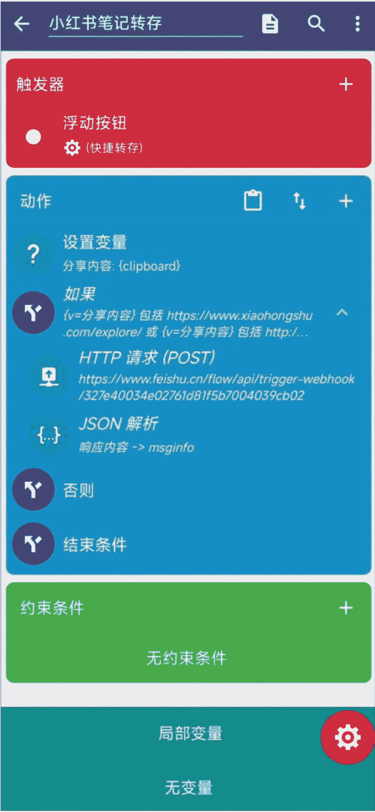

- 7、点击如果，然后点击【添加子动作】，添加如果动作，在【条件/循环】里面，添加条件，选择【MacroDroid➡️ MacroDroid 变量】，手动定义填入【[msg]】：

### 添加条件
- 连接
- 媒体
- 屏幕与扬声器
- 日期与时间
- 设备状态
- 通知
- 位置
### MacroDroid 特定
- MacroDroid 侧边栏状态
- MacroDroid 变量
- MacroDroid 模式
- 与/或/异或/非
- 宏启用/禁用
- 宏正在运行
- 宏调用方法
- 快速磁贴状态
- 最近调用/未调用的宏
- 比较值
- 浮动按钮
- 浮动文字
- 类别启用/禁用
- 触发器被触发

### 添加条件
### 选择 MacroDroid 变量
- 分享内容
- 响应内容
- msginfo
- 连接
- 媒体
- 屏幕与扬声器
- 日期与时间
- 设备状态
- 宏启用/禁用
- 宏正在运行
- 宏调用方法
- 快速磁贴状态
- 最近调用/未调用的宏
- 比较值
- 浮动按钮
- 浮动文字
- 类别启用/禁用
- 触发器被触发

### 添加条件
- 连接
- 媒体
- 屏幕与扬声器
- 日期与时间
- 设备状态
- 通知
### 选择键
1. 手动定义
2. 确定

懒人微信:lazyhelper
54/82

### 手动定义
使用完整语法手动定义一个或多个字典键。例如，处理按年和月存储数据的字典，可写为 [2022][May]
要强制使用数组类型（而非字典），请在索引前加上_A_。例如，要在二维数组中输出一个值，您可以写成[_A_3][_A_10]
```
[msg]
```
- 带键的完整变量名: msginfo [img]
- 变量类型: 字符串
- 取消
- 确定

### 添加条件
- 连接
- 媒体
- 屏幕与扬声器
### msginfo[msg]
- =
- !=
- 包括
- 不包括
- success
- * 和 ? 通配符支持
- 启用正则表达式匹配
- 不区分大小写
- 取消
- 确定
- 宏调用方法
- 快速磁贴状态
- 最近调用/未调用的宏
- 比较值
- 浮动按钮
- 浮动文字
- 类别启用/禁用
- 触发器被触发

### 添加单个动作
- 变量
- 电话
- 宏
- 连接
- 添加动作
### 如果
添加必须满足的一个或多个条件才能在如果从句中运行动作。
- 条件
- MacroDroid 变量
- msginfo[msg] = success
- 如果不满足条件,则不记录条件失败
- 取消
- 确定
- 如果
- 如果确认 则
- 循环中断
- 确认下一个
- 继续循环
- 迭代字典/数组
- 重复动作

懒人微信:lazyhelper

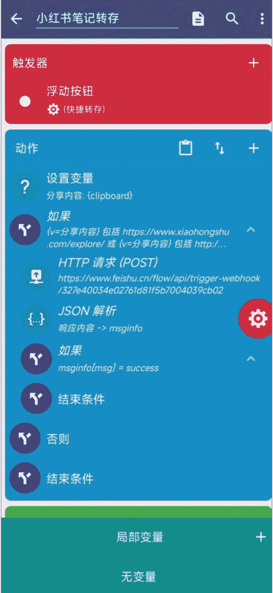

设置 msginfo[msg]=success。

- 8、点击如果，然后点击【添加“否则”子句】，然后在如果和否则下面设置【弹出信息提示】：

### 小红书笔记转存
- 触发器: 浮动按钮 (快捷转存)
- 动作
- 设置变量: 分享内容: {clipboard}
- 如果: {v=分享内容} 包括 https://www.xiaohongshu.com/explore/ 或 {v=分享内容} 包括 http://...
- HTTP 请求 (POST): https://www.feishu.cn/flow/api/trigger-webhook/327e40034e02761d81f5b7004039cb02
- JSON 解析: 响应内容 -> msginfo
- 如果: msginfo[msg] = success
- 否则
- 结束条件
- 否则
- 结束条件
- 局部变量: 无变量

### 添加单个动作
- 连接
- 媒体
- 屏幕
- 日期与时间
- 日志
- 设备动作
- 设备设置
- 条件/循环
- 通知
- 动画叠加
- 弹出消息提示
- 恢复隐藏的通知
- 显示对话框
- 显示气泡通知
- 显示通知
- Root 或 ADB 命令操作
- 浮动通知启用/禁用
- 清除通知
- 设置通知铃声
- 边缘通知光
- 通知 LED 启用/禁用
- 通知交互

### 弹出消息提示
Android 11+ 中的可自定义弹窗可能会干扰当前的后台应用，因此如果这导致不良影响，请使用标准弹窗
- 标准
- 可自定义
- 背景颜色
- 文字颜色
- 图标
  - 显示图标
  - 图标色调
- 弹窗消息: 转存多维表格成功
- 保留空间: 此选项将保留额外的间距（例如用于手动布局），但可能会导致单词中间换行
- 持续时间: 长时
- 屏幕位置: 顶部, 中间
- 取消上一条弹出消息
- 测试
- 取消
- 确定

### 弹出消息提示
Android 11+ 中的可自定义弹窗可能会干扰当前的前台应用，因此如果这导致不良影响，请使用标准弹窗
- 标准
- 可自定义
- 背景颜色
- 文字颜色
- 图标
  - 显示图标
  - 图标色调
- 弹窗消息: 转存多维表格失败
- 保留空间: 此选项将保留额外的间距（例如用于手动布局），但可能会导致出现单词中间换行
- 持续时间: 长时
- 屏幕位置: 顶部, 中间
- 取消上一条弹出消息
- 测试
- 取消
- 确定

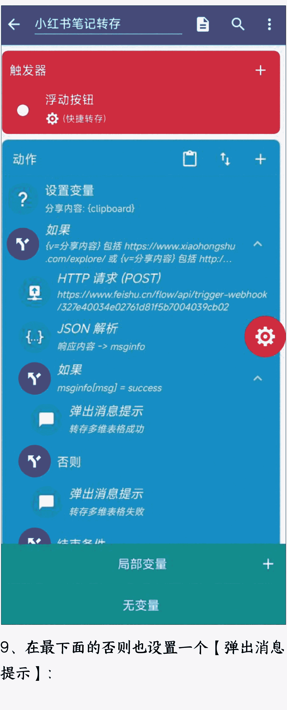

- 9、在最下面的否则也设置一个【弹出消息提示】：

### 小红书笔记转存
- 动作
- HTTP 请求 (POST): https://www.feishu.cn/flow/api/trigger-webhook/327e40034e02761d81f5b7004039cb02
- JSON 解析: 响应内容 -> msginfo
- 如果: msginfo[msg] = success
  - 弹出消息提示: 转存多维表格成功
- 否则
  - 弹出消息提示: 转存多维表格失败
- 结束条件
- 否则
- 结束条件
- 约束条件: 无约束条件
- 局部变量: 无变量

懒人微信: lazyhelper
64/82

### 弹出消息提示
Android 11+ 中的可自定义弹窗可能会干扰当前的前台应用，因此如果这导致不良影响，请使用标准弹窗
- 标准
- 可自定义
- 背景颜色
- 文字颜色
- 图标
  - 显示图标
  - 图标色调
- 弹窗消息: 转存内容不包含小红书链接
- 保留空间: 此选项将保留额外的间距（例如用于手动布局），但可能会导致出现单词中间换行
- 持续时间: 长时
- 屏幕位置: 顶部, 中间
- 取消上一条弹出消息
- 测试
- 取消
- 确定

### 10、配置好后就可以测试了，记得一定要开启通知权限：
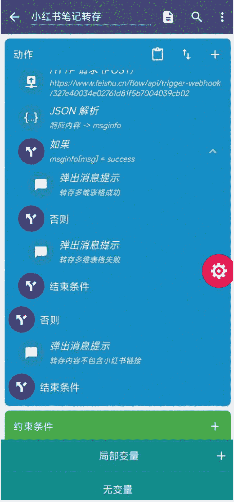

### 通知权限设置
- 允许通知
- 焦点通知：将关键通知以特殊样式展示
- 桌面角标
- 悬浮通知：允许在屏幕上方弹出通知
- 锁屏通知：允许在锁屏时进行通知提醒
- 发声
- 振动
- 呼吸灯闪烁
- 常驻通知

### 小红书笔记转存
转存内容不包含小红书链接
输入宏描述

#### 触发器
- 浮动按钮：(快捷转存)

#### 动作
- 设置变量：分享内容: {clipboard}
- 如果：{v=分享内容} 包括 https://www.xiaohongshu.com/explore/ 或 {v=分享内容} 包括 http://...
- HTTP 请求 (POST)：https://www.feishu.cn/flow/api/trigger-webhook/327e40034e02761d81f5b7004039cb02
- JSON 解析：响应内容 -> msginfo
- 如果：msginfo[msg] = success
- 弹出消息提示：转存多维表格成功
- 否则
- 弹出消息提示：转存多维表格失败
- 结束条件

#### 局部变量

(注：以下为同一配置页面的清晰展示)
### 小红书笔记转存
转存多维表格成功
输入宏描述
#### 触发器
- 浮动按钮：(快捷转存)
#### 动作
- 设置变量：分享内容: {clipboard}
- 如果：{v=分享内容} 包括 https://www.xiaohongshu.com/explore/ 或 {v=分享内容} 包括 http://...
- HTTP 请求 (POST)：https://www.feishu.cn/flow/api/trigger-webhook/327e40034e02761d81f5b7004039cb02
- JSON 解析：响应内容 -> msginfo
- 如果：msginfo[msg] = success
- 弹出消息提示：转存多维表格成功
- 否则
- 弹出消息提示：转存多维表格失败
- 结束条件
#### 局部变量

### 11、查看多维表格：
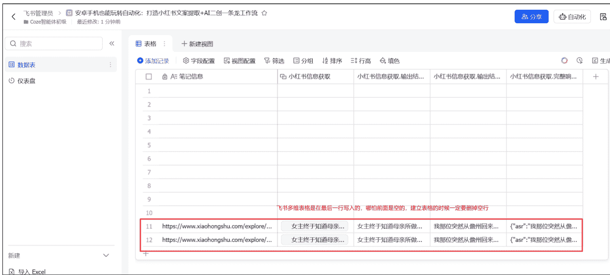

### 在 MacroDroid 点击浮动按钮
飞书多维表格是在最后一行写入的，哪怕前面是空的，建立表格的时候一定要删掉空行。

### 12、剪贴板刷新设置
发现在 MacroDroid 点击浮动按钮才有效，在小红书的时候剪贴板内容是空的，需要增加个【剪贴板刷新】动作才能获取到剪贴板内容：
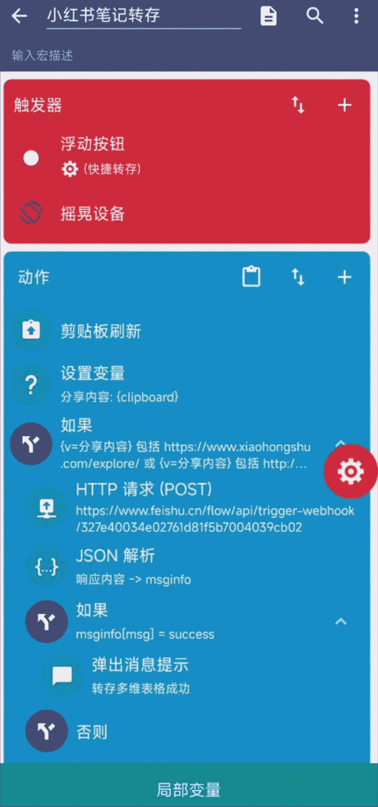

## 信息提取
由于插件只能输出2个变量的值，如果需要获取响应内容中的其他值，可以使用【信息提取】字段捷径插件获取。

### 1、新建字段【作品标题】
新建个字段【作品标题】，然后搜索【信息提取】字段，【选择需要提取的字段】选择扣子工作流调用插件输出的【完整响应数据】，提取信息写入“提取"title"的值”：

| 小红书信息获取.输出结... | 小红书信息获取.输出结... | 小红书信息获取.完整响... | A= 信息提取 AI | + |
|---|---|---|---|---|
| 女主终于知道母亲所做... | 我那位突然从儋州回来... | {"asr":"我那... |  |  |
| 女主终于知道母亲所做... | 我那位突然从儋州回来... | {"asr":"我那... |  |  |
| #转场[话题]# #交换世... | get set ready gothe bea... | {"asr":"get... |  |  |
| #转场[话题]# #交换世... | get set ready gothe bea... | {"asr":"get... |  |  |
| #转场[话题]# #交换世... | get set ready gothe bea... | {"asr":"get... |  |  |
| #转场[话题]# #交换世... | get set ready gothe bea... | {"asr":"get... |  |  |
| #转场[话题]# #交换世... | get set ready gothe bea... | {"asr":"get... |  |  |
| #转场[话题]# #交换世... | get set ready gothe bea... | {"asr":"get... |  |  |
| #转场[话题]# #交换世... | get set ready gothe bea... | {"asr":"get... |  |  |
| #转场[话题]# #交换世... | get set ready gothe bea... | {"asr":"get... |  |  |
| #转场[话题]# #交换世... | get set ready gothe bea... | {"asr":"", "a... |  |  |
| 同学们家长们！这年头... | 家庭年入五六万的妹子... | {"asr":"家... |  |  |
| 无法获取 |  | {"asr":"", "a... |  |  |
| #古诗[话题]# #古诗词[... | 唧唧复唧唧，木兰当户... | {"asr":"唧... |  |  |
| 妈妈手工制作服装，双... | 啦啦啦。 | {"asr":"啦啦... |  |  |
| 二弟：就这样吧，我已... | 高端的食材往往只需要... | {"asr":"高... |  |  |
| [拔草R]豆包+创客贴，1... | 豆包创可贴，两个工具... | {"asr":"豆... |  |  |
| #OPPOFindN5[话题]# | 双折叠不够，三折叠还... | {"asr":"双... |  |  |
| #上海话[话题]# #沪语[... | 三么五晚会应该曝光我... | {"asr":"三... |  |  |
| #潮汕女孩[话题]# #潮... | 哇！好美呀！哇！好靓... | {"asr":"哇！... |  |  |
| 请选择你的饮品女友#你... | 啊 | {"asr":"啊","avatar":"htt... | 无有效信息（因为"title"... |  |

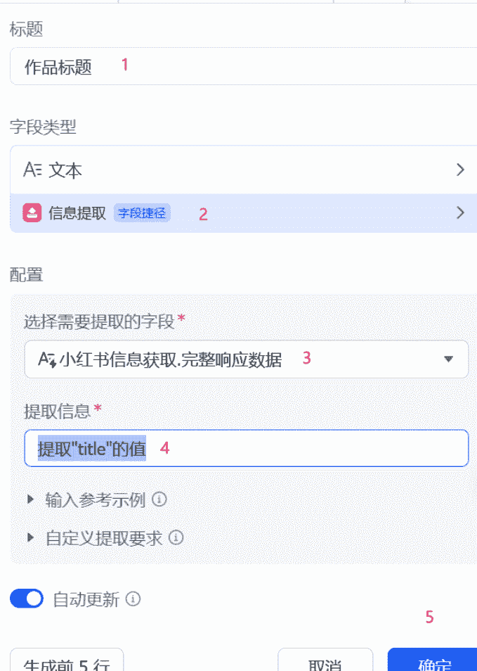

### 2、新建字段【作品封面】
新建个字段【作品封面】，然后搜索【信息提取】字段，【选择需要提取的字段】选择扣子工作流调用插件输出的【完整响应数据】，提取信息写入“提取"urlDefault"的值”：

| 标题 | 字段类型 | 配置 |
| :--- | :--- | :--- |
| 作品封面 | A= 文本 | 选择需要提取的字段 * |
| | 信息提取 字段捷径 | A4 小红书信息获取.完整响应数据 |
| | | 提取信息 * |
| | | 提取"urlDefault"的值 |
| | | 自动更新 |
| | | 生成前 5 行 取消 确定 |

| 小红书信息获取.完整响... | A= 信息提取 AI | A= 作品封面 AI | + |
| :--- | :--- | :--- | :--- |
| {"asr":"我那位突然从儋... | 无有效信息可提取 (因"t... | http://sns-webpic-qc.xh... | |
| {"asr":"我那位突然从儋... | 无有效信息可提取 (因"t... | http://sns-webpic-qc.xh... | |
| {"asr":"get set ready go... | 大头钉环游地球 | http://sns-webpic-qc.xh... | |
| {"asr":"get set ready go... | 大头钉环游地球 | http://sns-webpic-qc.xh... | |
| {"asr":"get set ready go... | 大头钉环游地球 | http://sns-webpic-qc.xh... | |
| {"asr":"get set ready go... | 大头钉环游地球 | http://sns-webpic-qc.xh... | |
| {"asr":"get set ready go... | 大头钉环游地球 | http://sns-webpic-qc.xh... | |
| {"asr":"get set ready go... | 大头钉环游地球 | http://sns-webpic-qc.xh... | |
| {"asr":"get set ready go... | 大头钉环游地球 | http://sns-webpic-qc.xh... | |
| {"asr":"get set ready go... | 大头钉环游地球 | http://sns-webpic-qc.xh... | |
| {"asr":"","avatar":"https... | 大头钉环游地球 | http://sns-webpic-qc.xh... | |
| {"asr":"家庭年入五六万... | 传统医术博大精深 | http://sns-webpic-qc.xh... | |
| {"asr":"","avatar":"无法... | 无法获取 | 无法获取 | |
| {"asr":"卿卿复卿卿，木... | 《木兰诗》又名木兰辞... | http://sns-webpic-qc.xh... | |
| {"asr":"啦啦啦。","avat... | 结界兽出逃啦！ | http://sns-webpic-qc.xh... | |
| {"asr":"高端的食材往往... | 今天吃小猫，生吃不去毛 | http://sns-webpic-qc.xh... | |
| {"asr":"豆包创可贴，两... | 豆包+创客贴10分钟制... | http://sns-webpic-qc.xh... | |
| {"asr":"双折叠不够，三... | 不是手风琴，这是多折... | http://sns-webpic-qc.xh... | |
| {"asr":"三幺五晚会应该... | 315晚会应该曝光我外婆 | http://sns-webpic-qc.xh... | |
| {"asr":"哇！好美呀！哇... | "我兄弟终究还是在糖衣... | http://sns-webpi | |
| {"asr":"啊","avatar":"htt... | 无有效信息 (因为"title"... | http://sns-webpi | |

智能查询记录
如何使用多维表格
总结当前多维表格

### 3、新建字段【作品话题】
新建个字段【作品话题】，然后搜索【信息提取】字段，【选择需要提取的字段】选择扣子工作流调用插件输出的【完整响应数据】，提取信息写入“提取"tag_text"的值”：
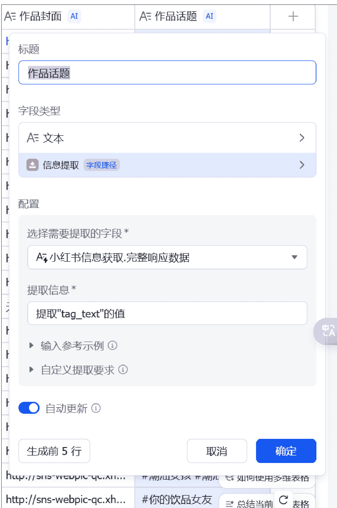

| A=作品封面 AI | A=作品话题 AI | 无有效信息 |
|---|---|---|
| http://sns-webpic-qc.xh... | 无有效信息（因为"tag_... | |
| http://sns-webpic-qc.xh... | 无（因为提供的正文中"t... | |
| http://sns-webpic-qc.xh... | #转场#交换世界计划... | |
| http://sns-webpic-qc.xh... | #转场#交换世界计划... | |
| http://sns-webpic-qc.xh... | #转场#交换世界计划... | |
| http://sns-webpic-qc.xh... | #转场#交换世界计划... | |
| http://sns-webpic-qc.xh... | #转场#交换世界计划... | |
| http://sns-webpic-qc.xh... | #转场#交换世界计划... | |
| http://sns-webpic-qc.xh... | #转场#交换世界计划... | |
| http://sns-webpic-qc.xh... | #转场#交换世界计划... | |
| http://sns-webpic-qc.xh... | #教育#留学#升学规... | |
| 无法获取 | 无法获取 | |
| http://sns-webpic-qc.xh... | #古诗#古诗词#文言... | |
| http://sns-webpic-qc.xh... | "" | |
| http://sns-webpic-qc.xh... | #小红书养宠倡议#金渐 | |
| http://sns-webpic-qc.xh... | 层#我的养宠日常#猫咪 | |
| http://sns-webpic-qc.xh... | 日常#是宠物更是家人# | |
| http://sns-webpic-qc.xh... | 一口一个小猫咪#沉浸式 | |
| http://sns-webpic-qc.xh... | 猫咪吃播 | |
| http://sns-webpic-qc.xh... | #上海话#沪语#其实 | |
| http://sns-webpic-qc.xh... | #潮汕女孩#潮汕双胞胎... | |
| http://sns-webpic-qc.xh... | #你的饮品女友 | |

懒人微信：lazyhelper

### 4、新建字段【作者】
新建个字段【作者】，然后搜索【信息提取】字段，【选择需要提取的字段】选择扣子工作流调用插件输出的【完整响应数据】，提取信息写入“提取"nickname"的值”：

#### 配置界面
| 标题 | 作者 |
|---|---|
| 字段类型 | A= 文本 |
| 字段捷径 | 信息提取 |

#### 配置参数
- 选择需要提取的字段：小红书信息获取.完整响应数据
- 提取信息：提取"nickname"的值
- 输入参考示例：自定义提取要求
- 自动更新：生成前 5 行
- 操作按钮：取消 确定

| A= 作品话题 AI | A= 作者 AI |
| :--- | :--- |
| 无有效信息 (因为 "tag_... | 小北很哇塞 |
| 无 (因为提供的正文中"t... | 小北很哇塞 |
| #转场 #交换世界计划 ... | 陶阿狗君 |
| #转场 #交换世界计划 ... | 陶阿狗君 |
| #转场 #交换世界计划 ... | 陶阿狗君 |
| #转场 #交换世界计划 ... | 陶阿狗君 |
| #转场 #交换世界计划 ... | 陶阿狗君 |
| #转场 #交换世界计划 ... | 陶阿狗君 |
| #转场 #交换世界计划 ... | 陶阿狗君 |
| #转场 #交换世界计划 ... | 陶阿狗君 |
| #教育 #留学 #升学规... | 暴叔讲留学 |
| 无法获取 | 无法获取 |
| #古诗 #古诗词 #文言... | 小言古诗词 |
| """ | 人民网 |
| #小红书养宠倡议 #金渐... | 我的二弟 |
| #豆包 #创客贴 #豆包AI... | AI探索家 |
| #OPPOFindN5 | 徐仕兴 |
| #上海话 #沪语 #真实 | 全能蒋同学 |
| #潮汕女孩 #潮汕双胞胎... | 云峰扶笛 |
| #你的饮品女友 | 人美心善兔兔崽 |

### 5、新建字段【视频地址】
新建个字段【视频地址】，然后搜索【信息提取】字段，【选择需要提取的字段】选择扣子工作流调用插件输出的【完整响应数据】，提取信息写入“提取"video_url"的值”：

#### 配置参数
- 字段类型：A= 文本
- 字段捷径：信息提取
- 配置：选择需要提取的字段* (A= 小红书信息获取.完整响应数据)
- 提取信息*：提取"video_url"的值
- 输入参考示例：自定义提取要求
- 自动更新：生成前 5 行
- 操作按钮：取消 确定

| 作品话题 AI | 作者 AI | + |
|---|---|---|
| 标题 | 视频地址 | |
| 字段类型 | A= 文本 | |
| 信息提取 字段捷径 | | |
| 选择需要提取的字段* | A= 小红书信息获取.完整响应数据 | |
| 提取信息* | 提取"video_url"的值 | |
| 输入参考示例 | 自定义提取要求 | |
| 自动更新 | 生成前 5 行 | 取消 确定 |

| #你的饮品女友 | 人美心善兔兔崽 |
|---|---|

| A= 作者 AI | A= 视频地址 AI 生成中 (30%)X |
|---|---|
| 小北很哇塞 | http://sns-video-bd.xhscdn.com/... |
| 小北很哇塞 | http://sns-video-al.xhscdn.com/s... |
| 陶阿狗君 | http://sns-video-bd.xhscdn.com/... |
| 陶阿狗君 | http://sns-video-bd.xhscdn.com/... |
| 陶阿狗君 | http://sns-video-bd.xhscdn.com/... |
| 陶阿狗君 | http://sns-video-bd.xhscdn.com/... |
| 陶阿狗君 | http://sns-video-hw.xhscdn.com... |
| 陶阿狗君 | http://sns-video-hs.xhscdn.com/... |
| 陶阿狗君 | http://sns-video-bd.xhscdn.com/... |
| 陶阿狗君 | http://sns-video-al.xhscdn.com/s... |
| 暴叔讲留学 | http://sns-video-hw.xhscdn.com... |
| 无法获取 | 无法获取 |
| 小言古诗词 | http://sns-video-bd.xhscdn.com/... |
| 人民网 | http://sns-video-bd.xhscdn.com/... |
| 我的二弟 | http://sns-video-bd.xhscdn.com/... |
| AI探索家 | http://sns-video-al.xhscdn.com/s... |
| 徐仕兴 | http://sns-video-bd.xhscdn.com/... |
| 全能蒋同学 | http://sns-video-hw.xhscdn.com... |
| 云峰扶笛 | http://sns-video-al.xhscdn.com/s... |
| 人美心善兔兔崽 | http://sns-video-bd.xhscdn.com/... |

## 后续说明
信息提取比较简单，根据自己的需求提取需要的字段内容就可以啦。

### Deepseek AI 二创
Deepseek AI 二创不难，主要是看提示词好不好，容我做个标题党，大家自行发挥这一块哈~

### 思路扩展
除了小红书文案提取，我们还可以进行抖音、B站视频提取，或者更多，相信大家能够开发出更多创新的应用场景，到时候不要忘记了分享出来哦~

## 附录

### 小红书笔记转存宏脚本：

https://w63nbfedzw.feishu.cn/file/HA05bX1uboP1UkxPvpxcVcHsnnh?from=from_copylink

把宏脚本分享给大家啦，只要在 app 里导入就可以啦。

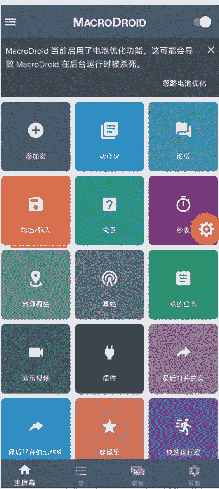


导入时会删除所有的宏，如果已经有宏了，记得备份一份，或者手动创建一个小红书笔记转存宏。


历史 3000 多份各类付费文章以及年费三千多的副业社群资源，见懒人专属群内部分享！

付费群，白嫖勿扰！

懒人专属群更新记录：

https://lazybook.fun/#/blog/record2

懒人微信：lazyhelper