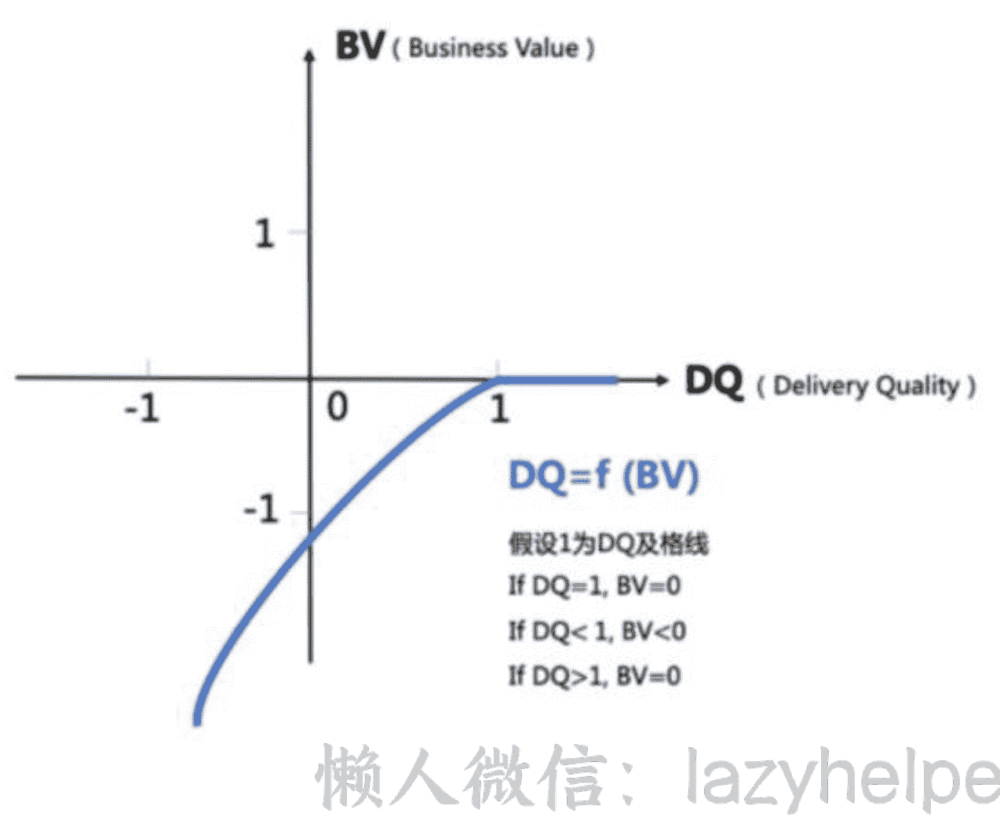
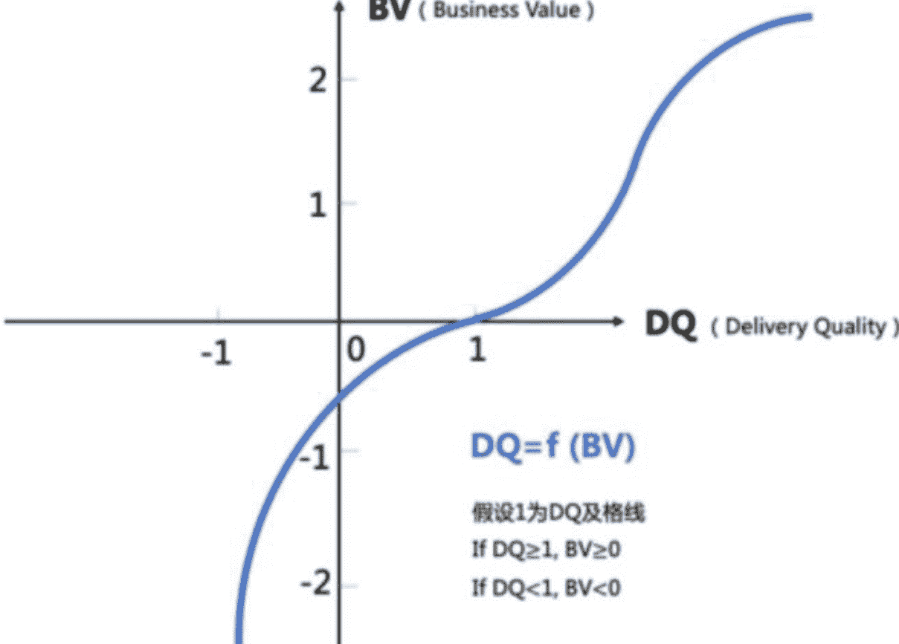
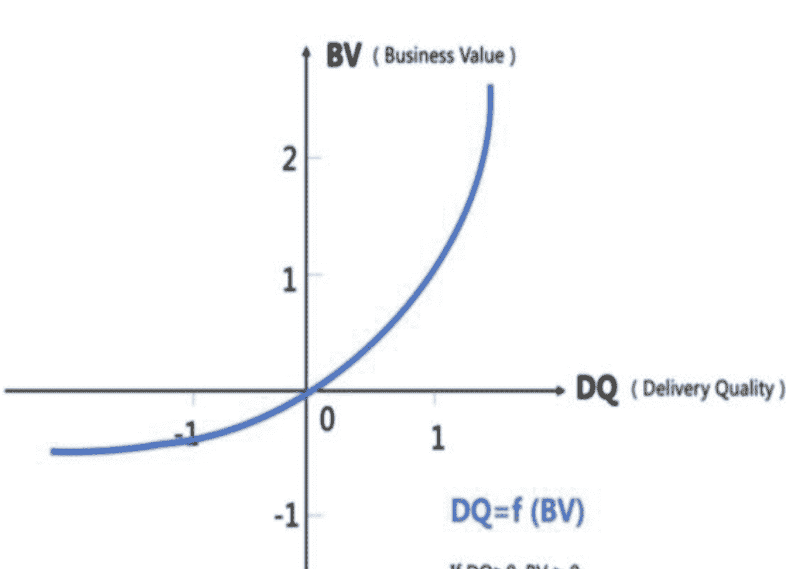

# 创业者可能忽视的团队——支持性团队的管理逻辑

250324 生财精华

公众号懒人搜索，懒人专属群分享

大家好，我是一名光荣的生财“传术师”。

自我介绍：资深打工人，从传统行业到互联网公司再到游戏行业，绝大部分时间都是从事 HR 相关工作，比如内部人才发展、组织发展、招聘等（传说中年入百万+的 HR ）。中间有两年也和朋友一起做过电商创业，没有赚到钱又回到了职场。去年再次离开职场，和以前同事联系了投资资源，一起创业做游戏公司的配套业务。

P.S 本人比较擅长人才发展、培训体系设计、课程开发，社群内大佬如有需要可以联系。如果评估我能帮上忙，可以免费给大家做咨询和分享。

接下来分享的这些内容是结合在一家比较知名的公司三年多的体验和实践，以及和几位创始人因为工作原因经常沟通而得到的信息和感悟整理而成。里面有很多道理其实和我在生财中看到一些大佬甚至巨佬分享的观点不谋而合，这也是为什么我对加入生财非常开心和庆幸的原因之一（生财的门票光看这些大佬们的精华文章我觉得都值！！！）。

懒人微信：lazyhelper

重点内容：关于支持性团队（很多公司叫职能团队）的价值逻辑梳理可以看章节2.1.3。

## 应用场景：

- 第一、团队规模扩大，统一工作理念和文化；
- 第二、以此为例，思考每个/每类岗位的核心价值是什么，如何判断衡量。
- 对创业者的价值：用这个逻辑去思考并且梳理，你公司/团队各个岗位如何去评价工作产出，如何去判断他们真正的工作价值是什么？

## 公司支持性团队的发展规律：

一家公司从开始需要职能线（人事财法等等），可能只有2~3位支持人事行政基础事务性工作的员工，到最后的成规模。一般会经历以下几个阶段：

- 1、只是满足功能性需求；
- 2、像是在一个部落里，有多兵种配合。不再是以单打独斗的方式推进工作，有不同的分工，但为了达到一个共同的目标而去合作和努力；
- 3、工作越来越多元化，像几个部落，需要共同协作，去和其他部落一起进行战斗。更加需要有大局观，需要明白部落和部落之间的关系，兵种和兵种之间的关系，但同时每个人依然保证手够硬，能射好每一支箭。

一个团队要能形成大规模协同作战，整齐划一地一起工作的能力，背后需要统一的认知和行为。这就需要把职能线如何工作背后的意识和理念整理出来，所以有了接下来这些内容的思考和整理。

说明：这是基于该公司的实践和示例，针对不同环境、不同组织，大家可以因地制宜、自己设计。

### 1 工作风格

一群人的气质和他们的工作风格塑造了一个团队的工作风格，而一个团队的工作风格又反过来影响和塑造这其中的每个人。

#### 1.1 务实

从价值和收益出发，拒绝假、大、空、虚，拒绝经验主义和形式主义

职能线对一切只是表面看起来光鲜好看，但并不能解决实际问题的事情，要直觉性地抗拒。

比如每年年底拿很常见的年会组织来举例，很多公司的年会都是节目表演和包场五星酒店会场，这些在其他公司十分常见的形式，但是一定要这样吗？

从事职能工作的人要非常执着于对价值动机的深层次思考。办年会的目的和它带来的价值是什么？最终又想要取得什么样的收益呢？让大家提前一个月开始加班排练节目、克服自己的社恐在众人面前唱歌跳舞肯定不是最终的目的，对吧？举办一次三四小时的晚会，让大家觉得“哟呵，环境顶级、吃的不错”也不是它带来的价值，对吧？

年会真正的目的是为了感谢大家一年的付出而举办的活动，应该希望这个活动在不影响业务创造产出的前提下，提高员工对公司的满意度。那么，我们把一切预算和精力放在大家最喜欢的环节—抽奖上，省下包场等环节的费用，提高年会奖品的预算，这样是不是更能有效实现我们的目的呢？

对于职能线员工来说，时刻自省做的每一件事情的价值动机、避免流于自嗨而不对业务带来价值，应该是写在每一位职能线员工 DNA 里的事情。

每个动作都要和目标相关，两点之间直线最短，不要多余无效的动作

比如培训，对于一些公司将培训看作福利，为员工提供一些有益身心放松，比如瑜伽、茶艺这样的培训，某种意义上并不能创造价值。

培训是为了解决切实存在的问题的，比如你即将成为面试官，但你不知道应该怎么样去面试才能甄选出更匹配我们工作岗位的人选，OK 那安排你参加面试官培训。而身心放松类的“福利培训”，可以通过提供更有用的健康福利等简单粗暴的方式实现。

把脚插进泥里，脸贴在地上

职能线的存在是为了给业务提供支持和协助，保证大后方的正常运转。在招聘的过程中，你们会发现一些很有想法的人，但加入团队之后，发现在实际的工作中他们的手伸不下去，只能停留在理论和方法论层面。这样的人，并不适合，团队需要的是可以把脚插进泥里，把脸贴在地上去开展工作的伙伴。

#### 1.2 不满足

从骨子里，反佛系、反满足、反稳定。

不能听到一个项目只跑通一次后，就自认为这个项目已经“稳定”了的说法。

不满足就是充分认识到自己的平凡和普通，然后在这个基础上不断地追求极致。提高对自己的要求，“求其上者得其中，求其中者得其下，求其下者无所得”，要想取得好的工作成绩，就要以更高的标准要求自己。

举个例子，从每年或者每半年的绩效回顾结果来看，员工的自我评价是不是总是低于他人评价？可能很多事情别人已经觉得职能线做得挺不错了，但对职能线来说，总能发现有不够好的地方，希望未来自己还可以做得更好一些。

我们要让自己在本工作领域的能力圈不断扩展，让自己做得更专业。如果你不觉得现在的自己比一年前的自己更加牛逼，那就是没有成长。同时，要拓宽视野，看得更广，看得更多，看到标杆做到了什么程度，反思我们在这里能不能做得更好。

#### 1.3 能扛事

随着组织越来越大，越来越复杂，不可避免地会产生模糊地带的工作，这个时候其实希望大家不要有太强的边界感，过分地在意自己的职责，在发现问题的时候不要觉得跟自己没关系,而是能够秉承“有人负责我支持，没人负责我负责”的原则。

模糊地带的事情，谁先碰到，谁来解决，特别是有能力解决问题的人，不要“让球掉在地上”。

往往有这样的大局观和意识的人，在伴随公司成长的过程中，能发挥更大的价值，个人也得到了更多的成长和发展。这里拓展说一点，要对机会高度敏感，在好的环境和时机里要抓住机会，不同的时间点做同样事情的性价比将会不同，得到的评价也会完全不同。

但同时，鼓励有责任心并不等于鼓励大家有奉献精神，因为“对工作负责=对自己负责”，有价值的产出总会被看到并且被给予相应的回馈。

#### 1.4 保持靠谱和真诚

你和你的同事，并不是一起过日子培养感情的家人，而是一起并肩工作创造价值的志同道合的伙伴。比起相互亲近相互喜欢来说，更重要的是基于专业和靠谱，相互信任和相互 Respect，共同产出好的工作结果。

需要时刻从商人的视角评估项目的投入产出比，从而做到持续创造价值，所以在合作中为了得到更好的效果和产出，管理者和合作伙伴也需要给员工真诚直接的反馈来帮助他们意识到自己的不足，从而有所进步。

这就需要在合作和对接中 Keep Real。在处理与“人”相关的事情时，特别需要保持开放心态、保持敏锐、保持真诚。

人和人之间的沟通，是不是带着真诚，有没有阴阳怪气，是不是为了解决问题，大家是能感觉出来的。

具体来说，就是在项目中，如果你和小伙伴在价值动机上产生了不同意见，那就请关于价值动机进行讨论甚至争吵，发表你的观点和想法，不需要因为对方更资深或者是某一领域的元老级人物，就看别人脸色，不敢发表自己的看法。

### 2 核心工作理念

#### 2.1 以价值为归依

应该有这样的意识：我们做对的事情，比把事情做对更加重要。

如何做对的事情？要做好以下三步。

##### 2.1.1 坚持问题驱动

大家做任何工作肯定是基于当前存在了问题，这里包括从多个视角看到的问题（公司视角、员工视角、协作方视角等等），当然，能看到多少问题，也取决于负责这件事情的人的思考高度、视野和经验。

比如，一个员工生命周期管理中的转正流程，有的人看到的是没啥问题呀，流程有，系统跑得也挺顺利的；有的人却能思考，系统流程虽然有了，但是转正的标准是否清晰？评估的过程是否科学？评价中心是否合理？

同时，问题驱动，要能找到问题的本质（“第一性原理”的核心），这是很不容易的。

什么是真正的需求？一大堆的信息背后哪些是核心的要点，哪些是噪音？我们解决问题的钥匙应该是什么？……

问题驱动不是发现一个所谓的问题就一头扎下去解决，而是先分析清楚问题的本质，这样才能确保我们在做对的事情。比如，负责培训的团队收到业务团队提出来的“项目管理”的需求，说项目成员缺少项目整体概念，项目推进有问题，希望通过培训让大家有一定的项目管理意识和知识，了解实际项目管理过程中的常见问题。看起来确实像个项目管理培训的需求，可是和业务负责人进一步沟通，发现这个业务团队当时处于探索阶段，主要是对于项目的目标和规划、交付标准不清晰，这是核心问题，而这显然不是项目管理培训能解决的，“项目管理”的培训需求是个伪需求，真正要解决的问题是业务负责人需要确定项目的目标、规划和交付标准。

还有一点要坚决制止的是：没有问题存在，绝对不能创造困难和问题也要上。

有的人为了做事而做事，这样的方式来刷存在感，是对公司资源的极大浪费。比如如果一个HR觉得最近没啥产出，怎么证明自己在干活呢？正好最近市面上特别流行给员工做冥想培训，于是邀请外部老师组织大家学习冥想，甚至邀请刚刚出国度假的同事分享旅行经验，这些就是刷存在感，浪费资源，没有价值！

工作场景是实战，不是武术表演，花拳绣腿那些东西在真的打架的时候不好用。应该抵触任何不解决问题的无效动作。

懒人微信：lazyhelper

##### 2.1.2 把握价值动机

看到了问题，这个问题要不要去解决，如何去解决的最关键因素是价值动机。价值动机，也就是我们做一件事情的原因、理由、驱动力和价值导向。

对于这个动机和导向，我们需要区分得出什么东西对个人有价值，什么东西对业务有价值；同时，在公司的环境下，它是要和公司的价值观和文化吻合的，而正是因为公司不同环境不同，同一件事情的价值动机，可能在其他公司就可以，在你们公司就不可以。

简单来说，这个价值动机就是，做事的出发点是否对解决业务和组织问题有帮助，是否符合组织特有的文化。

但是真正理解这一点，以及对价值动机有深入思考，却是很多人难以做到的，所以，越资深的人，在这一点的要求是越高的。

比如说现在要是开一个课去讲人工智能大模型，讲现在的研发是怎么去做的，所有人都会感兴趣，因为这是领先的技术，但是他们学了这些东西，也无法应用在自己的生产环境里，对业务本身是没有价值的，就不应该做这件事。公司不是家，培训不等于福利，我要识别输入哪些东西是对他们的业务有帮助，去给他们输入业务需要的，而不是他们需要的。

举一个真实发生的例子大家可以体会一下价值动机对工作的影响。

某公司成立20周年，经过几次讨论，确定了“司龄纪念币”。但是前一天晚上司龄礼发放却被喊停。为什么会被紧急叫停？原来部分司龄礼品发放之后，引起了价值观误解：有员工看到拿了周年礼的员工将纪念币摆在桌上或者晒朋友圈，认为发周年礼品这件事情不符合公司“结果导向”的价值观。

从这个公司价值观来说，在公司呆得久要不要被激励，只论“呆得久”这件事本身是不值得被激励的，因为公司“只认功劳”，任何时候都是激励当下做出贡献的人，“呆得久”、“资历”这些事本身都不值得组织宣导和激励。以此引申而来，公司变大过程中，要非常警惕提升各种形式的“全民福利”的做法，因为福利本身就是大锅饭，福利就是对绩效好的员工不公平的做法，因为大家都一样。对大家好要落实到能力和绩效，对应的就是薪资奖金，这是要坚持的原则。

那么陪伴公司成长值不值得感谢？如果值得感谢，一定要用礼品才能感谢？其实答案显然不是，可以通过电子卡片等形式，其实也是可以有小小的仪式感的。

另外，要反常规。司龄礼在其他公司是很常规的做法，但是首先“常规”并不意味着别人有我们就一定也要有，或者适合我们；其次，其他公司的组织环境和我们不同，在大多数公司一般都会有很多奖项，就不会让这个司龄礼那么凸显那么有“Power”，让一些员工这么关注。

懒人微信：lazyhelper

同时，少数不一定要服从多数。在这个Case 里，其实拿到礼品的人是非常开心的，HR 小姐姐去到工位把司龄礼品给Ta，也会带动周围的人表示要为公司继续“卖命”几年争取拿到这个礼品，其实只有极少数的人表达了疑惑或者“酸”。但是大多数人开心，就是对的么？如果这些“少数人”创造了关键业绩产出呢？

所以，大家的工作并不是满足让绝大多人看起来满意，而是做“对”的事情，什么是“对”的事情，有时“对”的事情，可能是少数人在意和坚持的事情。

当然，不同的工作价值动机不同，不要刻意去“反常规”，刻意去追求满足“少数人“的需求，刻意去与众不同，核心还是要基于价值动机去判断做这件事对于公司有没有价值。只要是对公司有价值的事情，哪怕它是常规的、主流的，一样都要做。

##### 2.1.3 理解价值衡量标准（重点）

在确定要做一件事情之后，我们需要了解公司会如何去衡量工作的价值，才能确定我们该如何做，做到什么程度。

公司要不断提升业绩，而职能线的使命就是对助力公司的业绩增长做出贡献！

那些解决不了问题、创造不了价值的工作都是一坨屎，没有人会买单的。

那么如果我们解决的问题，公司觉得是有价值的，给我们结算，这笔账怎么算？有哪些影响因素呢？

根据不同的工作，可以有不同的价值衡量方式，职能线的工作可以分为三大类：

##### A、像空气一样的“底线保障型产品”

职能线的某些工作，对于大家来说是像水和空气一样的存在。做得好其他人并不会有感知，因为大家会默认这些服务本来就是理所应当的，比如干净整洁、敞亮舒适的办公环境，比如打开电脑后网络就是正常连接的等等，这些都是我们习以为常的标配。

但这些模块一旦出了问题，就会对业务带来很大的影响，甚至造成事故和灾难。比如如果网络断开无法连接的话，就会影响业务的开发进度。比如空调突然故障无法正常使用的话，就会使得大家在大热天无法正常、专注地投入工作。做薪酬、财务或者是数据工作的员工，一个马虎多写了个0，或是函数错了，数据串行了，都是事故。所以对这些工作的最低要求，就是不要掉链子，因为大家会默认这些是没有问题的，有了问题大家一定会吐槽和抱怨。维持这些“标配”工作的稳定运转，这背后是有很多人的辛勤努力和付出的。

那么这些工作是不是交付质量越高，对业务带来的正面影响越大呢？也不是。很多人在这里就很难理解了。不是质量越高，对业务带来的正面影响越大吗？

举例来说，如果大家从现在的办公地点搬去上海外滩那边顶级的五星写字楼，把我们现在用的桶装水换为法国气泡水，研发进度会相应加快吗？并不会吧。如果我们的前台小姐姐每天为大家跳舞，我们的产品质量就会相应提升吗？也并不会吧。如果把我们签署的劳动合同做成精美的设计，我们的工作效率就会提高？很显然也不会。

因此，这一类产品，我们叫做底线保障型产品，这个底线指的是不对业务产生负面影响的基础交付质量。

###### “底线保障型产品”的价值如何衡量？

请大家看如下的一张图（下面图一），这里我们引入两个概念，横轴 DQ 代表 Delivery Quality（交付质量），纵轴 BV 代表 Business Value（业务价值），曲线可以表示交付质量和带来的业务价值之间的相关性，我们可以用 BV=f(DQ)函数来表示。

假设这一类产品的交付质量及格线为 1，也就是说只要它的交付质量大于等于 1 时，这个产品才是没有问题的，那么 1 就是它的底线。我们可以看到：

- 当 DQ=1 时，BV=0。也就是当底线保障型产品没有出现质量问题的时候，对业务不会产生任何影响；
- 当 DQ<1 时，BV< 0。也就说当底线保障型产品出现质量问题的时候，会对业务产生了负面影响，导致业务下滑。因此这就是为什么，底线保障型产品正常运行时，大家没有感知，但一旦出现问题，对于业务来说就是事故；
- 当DQ>1时，BV=0。这表示着，底线保障型产品交付质量的不断提升，并没有给业务带来更多价值。

因此，对于底线保障型产品来说，我们的要求是不能出事故和问题，但也并不需要在交付标准上一味对标最高水准，因为这也并不会真正对业务产生多么大的正面作用。

哪些工作模块是底线保障型产品呢？行政、IT、员工关系、账务等模块的部分工作等，都属于这个类型。他们的存在是保障公司正常稳定运行，但是和产品在市场上所带来的业绩是弱联系的，因此支持这类工作的伙伴不要异化自己的价值，要以服务、支撑、帮助业务的心态开展自己的工作，让业务团队安心地发挥自己的专业能力去开展工作。没有产品赚来的钱，谁给大家发工资？

###### “底线保障型产品”的要求？

- 兢兢业业、耐得住寂寞：虽然看起来不易被感知，但是一出问题老板就骂人。但老板和大家是要知道他们的存在，并看得到其背后的努力的，做这些工作的伙伴不要觉得自己受了委屈，要耐得住寂寞，兢兢业业、扎扎实实，严谨地把我们的刚需守护好。
- 追求0事故和高性能：这一类产品既然不能出问题，我们要求的标准自然就是0事故，并要做到持续高性能和高稳定性。
- 高可用的自动化：做到0事故和高性能之后，我们希望大家能思考如何将工作从非标准，进化到标准化，再进一步优化到自动化（尽量减少人去做功，让工具和机器去取代手工）。人是会犯错的，工具和机器不会犯错（除非人给它设置的逻辑有问题），高可用的自动化是迭代的必经之路。

##### B、做得不好还不如不做的“最低标准型产品”

比如：新人培训。新人培训的交付质量一定要在一个基础线/及格线之上，才能对业务有点用，这个及格线就是它的最低交付标准，当质量低于交付标准的时候，这件事情就是压根不应该做的。为什么呢？因为培训组占用了大家半天甚至更久的时间参与新人培训，但却完全没有产生相应的价值，而用于参加培训的时间大家原本可以用来投入到生产和开发中，推动业务的发展，因此如果没有达到最低交付标准，还不如不做。低于最低交付标准的产品，甚至会给业务带来负面影响，比如在新人培训中，提倡了不利于新人融入的观点，非但没有让新员工觉得自己加入了一家很不错、很有前景的公司，而是让新人觉得这是一家对新人不友好、没有前景的公司，做这样的新人培训简直就是多此一举，是很愚蠢的事情。

但是如果新人培训做好了，质量达到了及格线之上，比如新员工通过新人培训了解到了公司是一个什么样的组织、提倡什么样的价值观、拥有什么样的使命和愿景、在这里该如何工作等，从而让新员工觉得“Wocao，我真是加入了一家很棒的公司，怎么没早点来呢？我一定要在这里好好发展，还要把我的朋友、同学都推荐过来，和我一起做事情”。这样的产品，就是对业务产生了正面的价值和影响，而且做得越好，产生的价值和影响越大。

符合这样特点的产品，我们就叫做“最低标准型产品”。

###### “最低标准型产品”的价值如何衡量？

（下面图二）我们还是引用上面的函数BV=f(DQ)来进行说明，但是对于这样的产品，表示交付质量和带来的业务价值之间相关性的曲线和底线保障型产品是大大不同了。

假设这一类产品的交付质量及格线为1，也就是说只要它的交付质量大于等于1时，这个产品才是合格的，那么1就是它的最低交付标准。我们可以看到:

- 当DQ≥1时，BV≥0。最低标准型产品的交付质量只有高于最低标准时，这个工作才是有意义、有价值的，同时，交付质量越高，对业务带来的正面影响越大;
- 当DQ<1时，BV<0。也就是最低标准型产产品质量低于交付标准的时候，这个工作就是压根不应该做的，不但没对业务产生价值，反而还给业务带来负面影响，资源浪费等。

不仅仅是新员工培训，其他类型的培训如领导力培训、专业培训，还有人才发展（TD）、组织发展（OD）等都属于这一类型的工作；以及组织策略优化等工作，如果没做好，不但达不到预期，投入的做功都变成了无用功，而且会损害与业务之间的信任。信任这东西破碎特别容易，而修复却非常难。

###### “最低标准型产品”的要求

意在笔先：在行动之前务必将完整的闭环考虑清楚，要多花时间思考当前的问题和价值点，要做的事和解决问题之间的映射关系，最后要交付什么？如何衡量高质量的交付……

现做现梳理，最后的结果一定是坨翔。

宁缺毋滥：保证信息/内容的输出质量（说了10句话，9句是废话，你的信息有效率只有10%）,要保证出去的就是好内容，达不到临界值标准的就是负分，八十分原则，低于八十分就别上。

前期做好用户测试（CE）：前期做更多典型用户的CE，甚至让“能力强、有产品意识的”的用户参与到部分的设计当中。

提前灰度：能灰度尽量先灰度，提前打脸，别用实际的生产环境打脸；新产品能用excel跑通的，别一来就要上系统。

##### 三、多多益善的“持续增长型产品”

第三种产品和前两种就不太一样了，就是有一定比没有好，多了肯定比少了更好的产品。

比如说校园招聘，当我们在收简历环节，拿到更多学生投递的简历时，我们就有更多的余地去选择更高质量、更符合我们要求的人，能更好保证我们的招聘质量和完成率。社会招聘也是同样，当我们要对一个岗位进行候选人资源盘点的时候，如果我们可以尽可能多地接触到人才池中的潜在候选人，即使部分候选人因为地点、项目等原因暂时拒绝我们，我们也有更大的可能性去 offer 到更加匹配的候选人。当然，如果招聘做得不好，如果给一个岗位的简历全部都是不相关的或者虽然相关但是质量非常差的，业务花了很多时间，却颗粒无收，自然也是有负面影响，但是通常在这种情况下业务也会自己止损，不再看这样的简历了，将负面影响减小，控制在较小的范围。

这一类产品在组织存在的价值是促进组织增益或者减少组织损耗，如果这些工作做得不好、没价值，看起来对业务基本也是无害的，或者负面影响是较小的。

符合这些特点的产品，就属于“持续增长型产品”。

###### “持续增长型产品”的价值如何衡量？

（下面图三）继续引用函数 BV=f(DQ)来进行

当 DQ≥0 时，BV≥0。对于持续增长型产品，随着交付质量和数量的持续升高，对业务带来的正面影响和价值会持续升高；当 DQ<0 时，BV< 0。持续增长型产品如果做得不好、一般情况下，大不了就是不产生增益、或者没减少消耗，有的时候，也会对业务有些负面影响。

招聘、税收筹划等工作都属于此类，是可以持续带来增值的多多益善型工作。

###### “持续增长型产品”的要求

- **监督有效率的达成，把握其在合理水平：**虽然是多多益善，但同时，也要平衡有效率，以达到事半功倍的效果，比如在简历放量的同时，如何把握有质量的简历在一个可接受的合理水平？
- **竭尽全力地争取更多的新增，切忌为了提升有效比率牺牲增长：**最重要的还是尽全力争取更多、更好，给业务带来更多价值，不能一味追求有效性，而本末倒置，牺牲增长的可能。

###### 图一：底线保障型

###### 图二：最低标准型

###### 图三：持续增长型

#### 2.2 万事皆产品

想要把工作做好，还需要具备产品思维，而且，不仅仅是业务伙伴在做产品，职能线的每一项工作也是产品，也就是“万事皆产品”。

什么是产品？简单来说，是“被用户使用和消费，并能满足其某种需求的任何东西，包括有形的物品、无形的服务、组织、观念或它们的组合”。比如新员工入职流程、培训的课程、校园招聘等，都是产品。

##### 2.2.1 好产品的特点

- **有用：**能解决“战场”问题。每个产品存在当然是为了解决用户的某些或者某个问题，这也是产品存在的最基本的理由。比如写个文档，写这文档有什么用？做个信息系统，如果做好了，能解决啥问题？增加 BP 这个角色，对组织有什么好处？
- **易用：**好理解、讲人话。能让用户快速便捷地解决问题，用户能一看就知道怎么使用，比如人&事盘点的工具，能不能看看指引就知道该怎么盘点？一个文档，小白是不是也能看懂？
- **友好：**体验好甚至超过预期。能让用户使用舒服甚至超过预期，用户的各种操作都自然流畅，连交互文案都给用户惊喜等等，比如财务系统提报审批，一步步让用户明白要做啥、后续流程有啥，要多久等等。

##### 2.2.2 做产品的思考路径

每一件事情，都要从问题出发，找准价值动机，并且只有创造了价值，客户才能给我们结算。直白来说，每个员工都是一个“商人”，你为用户提供产品（服务），客户付你钱（工资），如果你的产品或服务做得不好，客户是不会买单的。

当你把自己当成一个商人，你脑海里就应该想着紧紧围绕赚钱这个目标去努力。商人要赚钱就得想明白，现在市场上有什么需求没有被满足？客户有什么问题没有被解决？以我当前的能力和预期的生产力能提供什么样的产品或服务？当你跟别人介绍你所负责的工作的时候，能否讲清楚它的价值？有多大的价值？也就是一个商人在介绍/卖自己产品的时候应该说清楚，客户买了它有啥好处？客户看完你产品的描述，总得有点想买你东西的冲动和认可你的愿望。

所以，在做产品的时候，一定要围绕以下核心，不断提问、不断探寻然后找到答案：

首先，是识别用户和客户，并以实际问题和价值为驱动。

用户是谁？客户是谁？我为啥要做这件事，我在为谁解决问题？

- **1、这里需要澄清的是产品相关的三个角色：用户、客户和评价中心。**
  - **用户：**用户是我们产品的实际操作者和使用者。以新员工入职这个项目为例，它输出的产品是一个SOP，这个SOP有很多重要的用户，比如IT，因为有大量需要IT实操的内容。
  - **客户：**客户是付你钱的人。你的项目和产品解决了谁的问题，谁就是应该付你钱的人。比如新员工入职流程这个产品的客户其实是公司本身。
  - **评价中心：**是确定这件事做得好还是不好的人。还是拿新员工入职流程来举例，很重要的服务对象就是新入职员工，他们的入职体验对组织来说至关重要。HR 不能一顿操作猛如虎，觉得自己整挺好，但新人却觉得尴尬，并不买账，那就属于自嗨了。
- **2、我能解决客户/用户的什么痛点或问题？我不去解决这些问题，会怎样？这些问题我解决好了，会怎样？**
  继续拿新人入职流程来讲，它要解决的问题是新人入职时的体验问题。如果不去解决新人入职中的一些困难和问题，导致入职体验不好，影响新人快速融入和产出，损失的不仅仅是部分产能，可能还会降低组织的品牌影响力，进而影响整个人才引进，影响组织发展。如果解决好了，当然会带来与上面相反的、好的收益！
- **3、用户认同这个价值吗？客户是否也是这么看的？**
  上面提到的新入职员工就是重要的用户，他们就可以评价这个价值。如果一个公司的成员普遍轻微社恐，你去组织一些强互动属性的活动，比如要求大家喊口号等，势必会给大家造成很重的心理压力。这样做你非但没有给大家提供一场精彩有意义的活动，反而让大家对公司活动不认同并产生了反感。用户和客户都不认同你产品的价值，那就是无用功。

当然，评价中心光看用户价值也是不够的，在工作中，并不是所有的事情，客户价值和用户价值都是一致的。比如说，每个人都有学英语的需求，但给每个人都配一个英语私教是不现实的。这时候就要看，你学习英语是否能够对业务的提升有帮助？如果有，我们的价值是一致的，我们就该输入；但如果用户有需要，但对业务没啥帮助，或者对客户来说会起到不希望看到的副作用，这时候，就得以客户价值为优先。

其次，是对我们能提供什么样产品的深度思考：

- **1、确定满足需求：**我目前能做到什么程度？能否满足用户/客户的最低要求？一定要以出现的问题为导向，目前的运行状态是怎样的，输入和输出分别是什么，交付物是什么，我的交付是否能解决当下出现的问题，使现状变得更好？
- **2、明晰价值衡量：**如果没达到最低要求，会不会扣产出得分？是否会出现负分？我的成本有多大，需要投入多少人、多少时间、花多少钱？这些成本和带来的价值比起来，亏不亏？我怎么做，可以让用户给我结算更多的产值？要学会去定阈值和交付标准，这是相对比较高阶的要求了。好比烧开水，当达不到水的沸点100°的时候，烧到1°和99°其实是一样的，因为都是没开的。对于价值结算的思考，大家可以参考前文关于价值衡量标准的内容。
- **3、定义交付物：**解决这个问题的交付物列表里有啥？
- **4、上下游协同：**以我自身的力量能做到什么程度？联动别人一起搞，是不是可以把问题解决得更好、或者解决交付清单里更多的内容，从而赚到更多的价值结算？
- **5、评估潜在风险：**我在解决和交付过程中，是否会产生其它副作用，副作用以我们目前的“体质”能否接受和消化？
- **6、进行项目管理：**我执行的过程中，如何把握以及有多大把握按照预定的计划完成？出现突发状况，我的止损原则是什么？
- **7、判断工作耦合：**不同工作之间是否存在耦合关系？

当我们接到一个新的任务，以上问题自问自答一圈，我们会想的更透彻。如果是在持续不间断做的事情，就需要不断停下来问问自己，不要刻舟求剑。

最后，谈谈工作中的“引擎”。

如何理解引擎？以嘣爆米花为例子， Input是玉米粒，Output 是爆米花，有一个老爷爷一直在转一个火炉一样的机器，不断的加热、燃烧、翻滚。这个手摇的火炉机器就是引擎，老爷爷就是引擎的操作员。为什么说这个概念呢？因为很多职能线工作的很多产品，其实都是要做引擎，或者迭代引擎。关于引擎有两个重要的因素：

- **1、Input 和 Output 的关系：**
  比如新员工流程就是个引擎。Input 是新人，Output 是一个入职满意度好的、愿意推荐其他人加入的、可以迅速和同事打成一片的、可以更快融入战斗场景的新人。任何工作，都可以理解为是一个引擎机制，都存在着 Input 和 Output 的关系。
- **2、CPU：**
  在“嘣爆米花”的例子中，翻滚加热就是信息处理的过程。把 Input 加工成我们想要的 Output，就像 CPU 处理信息的过程，引擎其实是一系列信息处理的集成。信息处理的能力越强，达成协议的效率和质量就越高。

不过单打独斗，燃烧一人一单元的引擎已经逐步过时了。早期团队小，每个人都独当一面，要做很多事情，这没问题，那时候对于引擎设计的要求也低，只要这个人能明白我们的 Input/Output，并定义清楚 CPU 的处理过程，事情就跑完了。如果团队规模扩大，要有能力把一个组变成一个单元引擎去工作，需要向不同的人描述清楚我们的 Input/Output/ CPU 处理过程，对引擎设计能力要求增加了。比如嘣爆米花这件事，以前是手摇火烧，现在有专门的机器，简单易操作，效率极高，这就是引擎的升级，也是一种工业化的做事方式。从长期结果出发，系统化思考，工业化做事，不仅仅是对业务团队的要求，对于职能线同样非常重要。因此，我们需要做到：

- **建立引擎思维：**每个职能团队都要建立引擎的思维模式，打造好自己的引擎。
- **明确引擎不只是一个个人努力的结果：**引擎需要不断优化迭代，不只是团队负责人，组内其他有能力的伙伴要一同去优化迭代（培养更多的引擎设计者不容易，但这才是真正宝贵的人才）。
- **个人可以离职，引擎不会离职：**引擎能够沉淀到组织，成为组织或团队能力的一部分，这才是组织价值所在，个人英雄主义，早晚有一天会丧失核心竞争力。
- **降维操作：**一般引擎的设计者是最熟悉引擎的人，但是牛X的引擎，不但可以让设计者或者第一批操作者用得好，还可以随时替换操作者后且一样可以玩得溜。这对引擎的易用性、友好性有更高的要求，需要可视化做得好。检验的标准也很简单，换一批新人，在简单的指导后，也能保证同样的 Input，输出同样高质量、高效率的 Output，这样的引擎就到位了。

在组织发展早期，大家都有机会参与引擎的设计。到未来引擎成熟了，迭代不下去的时候，就只能做一个引擎的操作员。

#### 2.3 全局视角

职能线的工作，如果要做好，还需要大家有两类视角看工作：全局视角帮助我们俯瞰全局，跳出局部限制；多种视角帮助我们更好地理解用户、客户和评价中心的需求。

- **全局视角：不要只盯着局部，要看整体**
  一些多角色的事件，或者是多类型的组合事件，是一个大机器，是个整体。很多时候在把一个局部弄得非常好的时候，会忽略到其他联动机构的完善。就像木桶原理一样，决定桶里装多少东西，是最短的那根决定的。因此大家需要时刻把镜头拉起来，看看整体。视角拉的越高，能看到的越完整。我们追求的是整个管线、整个项目的大规模协同生产，在整体效率的视角下进行更科学的分工与流程优化，不能因为局部的、短期的麻烦而忽视整体效率相关的工作。

  如果你习惯性地盯着具体的某个机构，忽略整体，你永远就只能对这个机构负责。如果你习惯性地不断拉高去看看整体，再回去打磨局部，你未来就一定有机会负责整体的工作。
- **多种视角：不要局限于自己的视角，要“横看成岭侧成峰”**
  HR工作中是不是只有HR的视角就够了？远远不是。你是不是喜欢用我们自己的产品？有没有更强的动机去参与到这件事情中？具备外部用户视角意味着你了解为我们公司产品真正买单付费的人，开发者视角即明白我们的产品是怎样被生产出来的，如何从0到1的。这是一个典型的需要大家跳出自己的视角才能更好地交付的例子。

## 总结和题外话

以上内容，很多伙伴可能并不会涉足，也不是从事类似工作或岗位，但是万事万物都有相通之处，仅以此抛砖引玉，也许对于创业到了一定阶段，或者团队已经上了规模碰到类似职能线工作设计规划等情况的老板们可以参考。

感谢你阅读至此，希望你一切顺利！提前祝大家新春快乐。

如果对类似内容感兴趣，欢迎点赞留言，后续整理更多方法、工具、模版分享给大家。

历史 3000 多份各类付费文章以及年费三千多的副业社群资源，见懒人专属群内部分享!

付费群，白嫖勿扰!

懒人专属群更新记录:

https://lazybook.fun/#/blog/record2