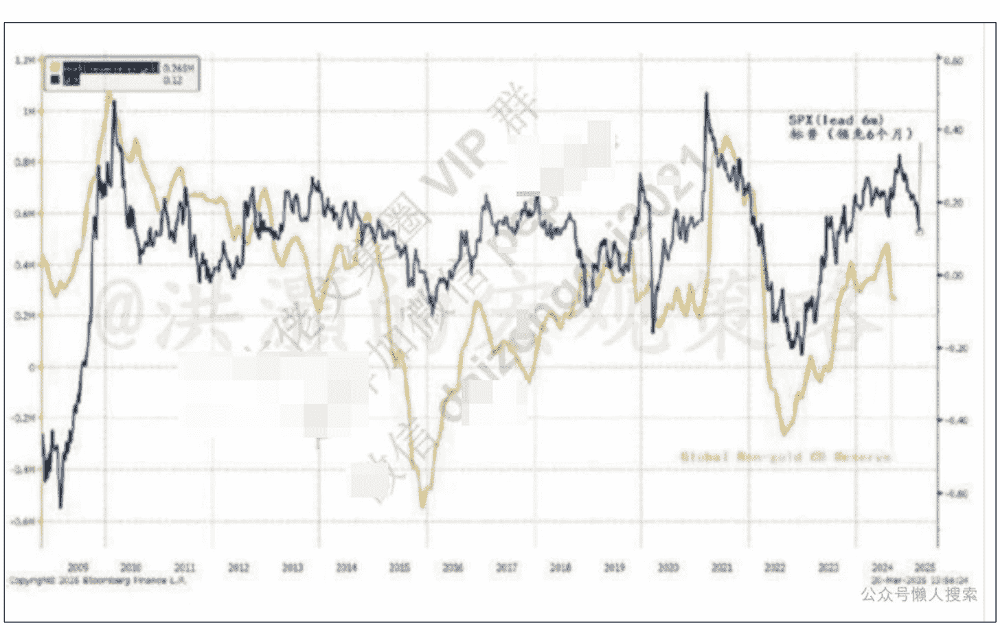
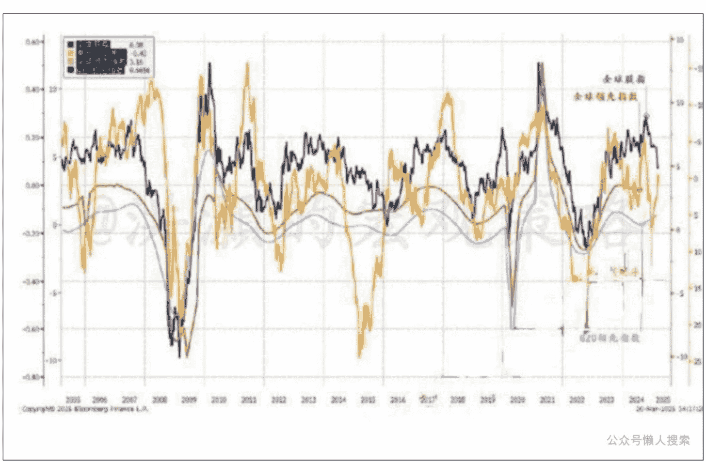

# 当下市场的主要矛盾

250326 洪灝

整理：公众号懒人搜索，懒人专属群独享

懒人微信：lazyhelper

## 当下市场的主要矛盾和重要时间节点

昨夜，美股强势反弹。其实，在经历了连续四周的下跌之后，标普上周其实是小幅收涨的。虽然上周几乎每天的盘中震荡都超过一个百分点，但标普上周只有一天是下跌的。对于每天看着美股绿盘入睡的人们而言，他们可能并没有感受到美股上周的修复。美股的技术修复从我们在三月十四日星期五发表的专属报告《洪灝：让美国再次衰败》就开始了。在那篇专属报告里，我根据当时美股的交易数据预测了美股这次的技术修复。而报告当晚，标普就收了一根大阳线。

尽管如此，美股各大主要指数上周依然出现了技术分析上的“死亡交叉”。这是一个令人担忧的形态，也就是股价的五十天均线下插到了两百天均线的下方。尽管标普昨晚勉强收复了两百天线，但是快慢均线之间的关系并没有改变。昨晚和上周一样，还是依靠大型科技股的拉升带动市场反弹。特斯拉在连跌了十三周之后大幅飙升了12%，为去年十一月以来最大的单天涨幅。还是多亏了特朗普在自己的社交媒体宣称白宫是特斯拉的坚强后盾。白宫秘书长还特意在推上发了一些内部开会的照片，宣称仰仗着DOGE，美国政府现在是“最高效的政府”云云。

盘面上看，其实这几天美股的反弹都伴随着很弱的成交量，更像是一次空头回补的行情。与此同时，券商交易台的大客户的仓位其实是在被大幅缩减的。而引领反弹的这些大型科技股都是今年以来表现最差的板块。因此，对冲基金空头获利了结引发这次反弹的概率非常大。如果美股情绪指标继续显示市场情绪低迷，那么这个情绪数据并没有从散户的买入表达出来。上周美国散户买入美股指数基金的资金量是近年来最大的一周。散户也在过去两周买入了价值80亿美元的特斯拉，是史上最大的持续买入。

机构的“聪明钱”和散户的“愚钝钱”两者的交易背道而驰，是当下市场的主要矛盾之一。难道这两种钱看到的是不一样的基本面？作为投资者，我们应该信谁？

2018年9月3日，我在那篇经典的报告《洪灝：中美的周期冲突》用我的量化周期模型预测了2018年九月中旬美股的暴跌。

在这篇经典报告里，我开篇还做了如下的预测：“当前有可能是自2016年以来的、新的7年中周期里的第一个3.5年短周期。这个中周期将在2020/21左右再次下行，并伴随着严重的危机。”回头看，2020年全球经济进入全面衰退，而中国市场在2021年的2、3月份左右见顶然后趋势性下行。那时的恒指还在31,000点。回头看，一切都如此清晰；那八年前的我，如此绮纨。

回溯历史在周期的研究中尤为重要。这是因为，虽然“历史不会简单重复，但往往押韵”。对于波浪理论，最难反驳的批评，就是一个人永远不会知道自己处于波浪之中的哪一个阶段。因此，周期波动的起点总是出于主观判断，而对于没有经历过太多周期的年轻分析师来说，则更具挑战。这也是为什么，好的宏观分析师的价值，总是在他的白发间、皱纹里。

借助后视镜，我们基本可以确定两个周期的关键点：2021年2月的周期高点，和2022年10月底的周期低点。两个关键的时点相差约一年半左右。请注意，此处对于时间运行的丈量，我特意做了模糊处理，因为周期不是闹钟，其运行有自身的韵律，但没有绝对死板的节奏。如果我们能够确定周期运行的大致关键时间节点，那么我们就可以顺势推导出未来周期运行的轨迹。

在时间节点这个关键问题上顺带说一下，在2022年10月31日这个重要的周期底部，我发表了另外一篇经典的报告《洪灝：买！买！买！》。这是那年彭博终端上阅读量全球前十的报告，也是业内公认的这次中国市场周期性修复的起点。到了去年的9.24行情开启，回头再看，其实恒指的低点是在不断上升的。

上午去北京西边儿开完会后打开手机报价屏，赫然发现香港市场大幅下挫。显然，我们之前反复提示的技术上23,200的阻力位，市场久攻不下，渐显疲态。在岸市场在神秘力量的帮助下大致收平，但离岸市场则没有那么幸运了。昨天尾盘半小时的上攻修复，主要还是铜板块的上涨，但是今天还是承压在各种负面消息之下。阻力位上最怕的就是来回拉扯。

那么，现在市场的主要矛盾是什么？如果我们看国际铜价，纽约铜已经破一万美元，创出了历史新高。宏观上都把铜价叫做“铜博士”。这是因为铜是实体经济里很多工业品的原材料，关系到整个经济的方方面面，因此铜价对于经济周期高度敏感。铜价上涨，往往预示着经济周期的修复回暖，因为实体经济对于铜的需求将会增加。然而，当下的周期，是铜价上涨，但是美国股市下跌，中国市场在关键阻力位受阻。本来铜价股价都是实体经济运行的晴雨表，但现在两个价格却出现背离。作为投资者，我们应该信谁？

四月二日是特朗普关税起征之日。之前，美国市场对于这个日子的到来严阵以待，因为关税的征收将意味着进口价格的上升，通胀压力的增加，美联储货币政策即便在美国增长放缓的环境里也难以有所作为。滞涨是资本市场终极的噩梦。这个四十多年不遇的情景，这个现在市场上年轻分析师都未曾经历过的组合，随着关税的起征回归的概率增大。

如果关税如期而至，那么美国铜价将飙升。由于市场价格在预期驱动下先行，全球的铜库存在关税起征之前开始抢跑运往美国，导致美国铜价和其他地区的铜价出现大幅的溢价。中国情景，我们早已在2025.02.22的报告《洪灝：黄金历史新高之际，一些关于黄金的重要问题》中有所提及。

一般来说，作为铜的最大的消费者，中国市场对于铜的定价有很大的话语权。以前，如果国际铜价过高，中国市场可以选择不参与而导致铜价下行压力。然而这一次由于特朗普关税的不确定性和中国的新能源汽车以及其他高端制造业的需求，中国可能不得不参与囤铜，反而让铜价继续创出新高。当然，如果全球增长不济，则铜价将自然回落。

铜价的市场叙事暗示了当下市场的主要矛盾：增长的不确定性。这个不确定性来自于特朗普关税政策对于实体经济的冲击。难怪昨晚盘前的美股在上周的反弹后，又显得有些有气无力，而特朗普马上发推，称关税是对等关税，都是“可以谈的”，有些国家可能会“比预期的要轻”。这个表态给了市场一个定心丸，让原来全面全球关税大战的情景概率下降，而关税作为一种谈判筹码的概率上升。

如果关税是一场谈判，那么特朗普究竟想要什么？

其实，特朗普对于关税的态度三十多年以后一直没变。进群加微信 pep854。早在九十年代，《Oprah》的节目中，特朗普就说美国零关税是一项“愚蠢的政策”，“美国被全球其他国家薅了羊毛”，“削弱了美国的国家竞争力。”经典经济学里，李嘉图推崇自由贸易，认为通过自由贸易，所有国家都能获利。然而，李嘉图没有考虑到的是不对等关税带来的不对等的竞争优势。当一个国家完全沦为消费者的时候，它也逐渐变成了一个废物。经济发展总是要有人生产制造的。巴菲特说得好，你要赌一个生产强国最终胜出，还是消费大国胜出？美国经济70%多是消费。

今年以来，美国以外的市场对于关税不以为然，但是美国本土市场对于关税则似乎在预期最坏的结果。这个不同的关税预期导致了美国市场关税相关的股票板块的下跌远远高于欧洲市场里同类型的板块。而中国市场就更不用说了。现在，如果关税比预期要好，那么美国市场由于之前过度反应，反弹的幅度反而会更大，甚至暂时跑赢其它市场。但是这种技术性的修复并没有改变美国基本面的故事和估值的泡沫。

现在，美国市场里前十大股票市值占了标普总市值的近40%，而美国最大的股票的市值比标普前25%的大股票还要大700倍有余。这是我们见过的有数据以来的最高点，就连出现在1932、2000和2020年的历史高点都望尘莫及。因此，虽然我们认为美股的技术性反弹还没有结束，但是参与这个反弹的交易技术的要求则非常高。是否值得参与，见仁见智。

长期看，全球央行除黄金以外的储备是在减少的。即便是美联储放缓了缩表的节奏，全球央行缩表似乎在所难免，尤其是如果通胀受到关税影响的情况下。连中国央行似乎按兵不动，最近长债利率不降反升。

全球领先指数还是在低位徘徊，气若游丝。而全球股指的势能，也开始从高位回落。如果我们上述确定的、我在2022.10.31的《洪灝：买！买！买！》报告里确定的的确是这轮周期的低点，那么今年四季度，大约十月前后，将是下一个关键的时间节点。

本周开会。先写到这里吧！

历史3000多份各类付费文章以及年费三千多的副业社群资源，见懒人专属群内部分享！懒人微信：lazyhelper

## 付费群，白嫖勿扰！

## 懒人专属群更新记录：
https://lazybook.fun/#/blog/record2