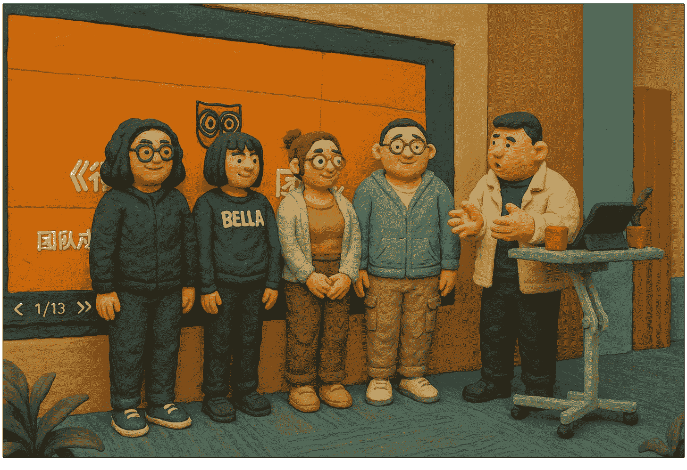
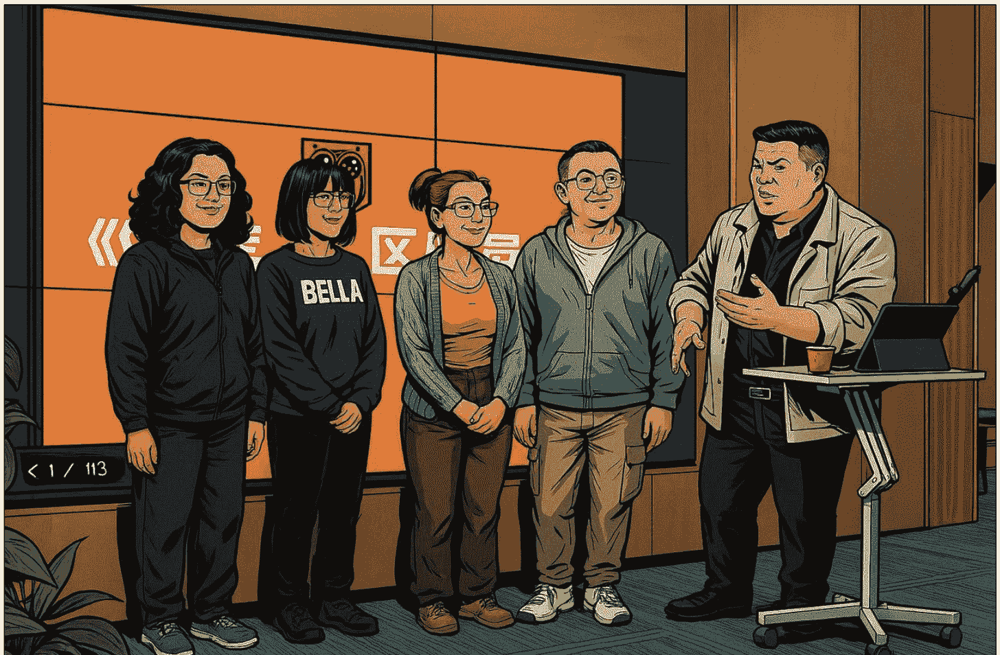

# 10分钟干完“一万块”的活，AI正在替代/造福谁？

250401

整理：公众号懒人搜索，懒人专属群独享
懒人微信：lazyhelper

先问你一个问题，刚刚过去的这个周末，你的朋友圈里面是不是突然多了一大堆，宫崎骏画风的图片？至少我这儿是被刷屏了。

这些图片大都来自 GPT-4o 更新生图功能。生图这个功能本身很常见，但这回 GPT-4o 的更新，似乎已经超过了那个“替代人工”的临界点。假如你不是一个特别挑剔的甲方，而且预算有限，那么 GPT-4o 也许能满足你的绝大多数需求。

作者在文稿里放了几张图片。第一次生成，是让 GPT-4o 把它变成宫崎骏画风。

第二次生成，我们邀请它绘制黏土动画风。

第三次生成，要求是漫威风格。结果它又快速完成，但这回对背景里文字的识别略有不准。

但毕竟，这是一分钱都没花做出来的图。不知道你看到这个画面是什么感受？借用刘润老师的话说，这是，巨头开过，片甲不留。

下图为小懒的测试效果：

首先，很多做 AI 的创业公司，可能会接近原地自爆的状态。GPT-4o 的新功能等于是给一批酝酿中的生成式 AI 产品判了死刑。

其次，我们再回到人类设计师的视角。这回 GPT-4o 的更新厉害在哪？主要是三点。

- 一来，它可以准确地识别中文了。之前用 AI 生成海报之类带字的图片，它经常会把文字生成乱码。但这回，GPT-4o 可以准确识别汉字，这意味着你只要输入文稿，就可以获得一张信息准确的海报。
- 二来，GPT-4o 在生图方面可以实现持续的细节修订。比如，给人物换个发色，换双鞋子，它都可以马上响应。
- 三来，GPT-4o 在生图任务中的沟通界面，堪比一部分人类设计师。比如你让它把全班合影都变成漫威里的穿着。它会告诉你，这个绘制有点难，但有几种方式可以尝试，下面它会列出具体的方式。

而且假如你用过GPT之前的产品，会发现它从去年 GPT-4o 第一版发布开始，就在沟通方面做得不错。我们不清楚训练过程，但从输出结果上看，GPT-4o的回答几乎完全遵循着yes and原则。不管你提出多么离谱的问题，它都会先肯定你的想法，然后再补充它的回答。估计很多脾气暴躁，动不动就怼甲方的设计师，看到这个功能后可能会收敛不少。

换句话说，不管是从作品层面还是沟通层面，AI身上的“AI味儿”都越来越轻了。

那么，照这个趋势下去，人类设计师真的会被大范围替代吗？今天咱们不讲道理，而是来做个简短的实验。图片设计不是我的专业，但我之前的工作要经常和拍摄打交道，因此我们拿纪录片举个例子。

接下来，我们假设，要拍一段《舌尖上的中国》那样的美食纪录片，然后大致模拟纪录片的前期工作流。我们看看其中哪些环节可以被替代，哪些还不能被替代。

好，咱们正式开始。

第一步，确定选题。这一步我们用的是DeepSeek R1。给它的要求是取材的食物要足够大众，但能平凡之中见神奇。同时取材城市要有足够的热度，是这两年的网红城市。

于是，DeepSeek给我推荐了哈尔滨的锅包肉。至于如何平凡之中见神奇，它的建议是可以借助新技术，用纳米级气味分析仪来解析锅包肉的香味矩阵，或者用3D建模来还原锅包肉外脆里嫩的物理结构。

第二步，是写解说词。我的提示词是，用《舌尖上的中国》的风格，描写东北锅包肉。做锅包肉的人叫老陈，老陈有三个孩子，二儿子大学放寒假回来正好吃到老陈做的锅包肉。解说词既要有美食，又要有故事，还要涉及东北的风物人情，最重要的是要和《舌尖上的中国》足够像。

第三步，是配乐。我们用的应用是Suno，这是一款音乐生成工具。目前收费，折合下来一首曲子大概一毛钱多一点，我们生成了四首，大概花了5毛钱。这也是今天的唯一一笔花销。给Suno的提示词是，生成一首美食纪录片的背景音乐，总体感觉是，有田间耕耘的劳作感，带着对生活的憧憬和期盼，让人听完后能感受到忙碌背后的生活喜悦。

最后，把DeepSeek的解说词和Suno的音乐合成在一起，就有了下面这段。

在东北的寒冬里，铁锅升腾的烟火气中，老陈的锅包肉是街坊四邻心照不宣的暗号。凌晨四点的菜市场，他总会挑选那条最诱人的里脊肉，这是三十年前父亲传给他的诀窍，“横切断筋，斜刀见光”。案板与刀刃的声声碰撞里，藏着东北人对食物的虔诚。

老陈总说锅包肉是道急脾气菜，可没人比他更懂得慢工出细活。腌肉要等肌理松弛，调汁要待冰糖完全融化，连装盘都要抢在热气未散时撒上那撮香菜梗。

二儿子小磊推门而入时，正撞见父亲往酱汁里点了一勺自酿的山楂汁。铁勺在锅沿敲出清脆的节奏。十八岁的少年嚼着酥壳，突然发现父亲的手背有一处比锅包肉的焦痕更深，那是三十年油星子烫出的勋章。

大雪封门的日子里，后厨成了整条街的温度计，把零下三十摄氏度的严寒融成窗上的冰花。铁铲与锅的撞击声中，哈尔滨的教堂钟声正掠过松花江。老陈不知道，儿子手机里存着昨晚偷拍的视频，油星飞舞的灶台前，父亲颠勺的背影，竟和电视里那些守护传统的手艺人，重叠成同一种弧光。

以上是 DeepSeek 输出的解说词和 Suno 的音乐配合在一起的效果。

而且除了风格之外，这段解说词的每一句，几乎都对应着清晰的画面。因此你可以很快把它变成一份可执行的分镜头脚本。为了节省时间，这步在这里就不展示了。

前面这些工作，假如按照一集40分钟的纪录片算，选题、策划、解说、分镜、配乐，全都算在一起，也许不会低于一万块。但是用AI，大概10分钟就完成了。注意，这里说的完成，是它几乎已经达到了可交付的程度。

在这个过程中，还有三个环节AI还无法取代人。分别是，负责统筹全盘的导演、负责掌镜拍摄的摄制组，以及负责给摄制组提供支持的制片组。换句话说，那些需要“做”的部分还没有被取代，但需要“想”的那些纯动脑环节，可能就要另说了。当然，至于被拍摄的老陈，可能换成老张，可能换成老王，总之你在现实中大概率很容易找到这么一个人。

好，说到这，你发现没有，之前在提到AI替代时，很多人印象中的护城河似乎并不存在。在真实的技术进展面前，我们之前预估的很多阻碍好像都被轻描淡写地化解了。

比如，有人说大模型不理解真实世界的物理规则。但去年年底，李飞飞公司发布的世界模型，已经可以用一张图生成一个可以自由穿梭的3D场景。假如这个技术成熟，摄影这个环节也未必不能用AI取代。

再比如，有人说 AI 写的东西 AI 味儿太重，但事实上，早在去年年初，日本小说家九段理江凭借小说《东京都同情塔》，获得了日本的芥川文学奖，这也是日本的最高文学奖项。而且九段理江本人已经承认，作品中有 5% 的部分是 AI 直接生成的。这也是目前作者本人承认过的，AI 参与写作的最高成就。

再比如，有人说未来 AI 的算力获取难度会提升，因为掌握语料的巨头公司不会轻易把信息给 AI 公司。但是就在上周五，马斯克用自己旗下的 AI 公司 xAI，收购了自己的社交媒体公司 X，也就是之前的推特。马斯克说，这是因为训练 AI 要用到社交媒体上的数据，这两家公司本身就在共享数据，共享工程师，因此合并且是顺理成章的事。但为什么是 xAI 收购 X，而不是反过来呢？科技投资家王煜全老师说，这其实反映了 AI 时代的数据主权正在发生转移。

原来数据掌握在数据产生者，也就是互联网巨头手里，你可以把它们看成是产出石油的油田，而 AI 公司是负责精加工，相当于让石油变得可用的炼油厂。而未来，数据石油的使用权将从油田向炼油厂转移，使用数据的 AI 公司，可能会在估值上远远超过互联网巨头。到时候，体外 AI 公司反向并购数据母体的事件还会越来越多。这意味着 AI 训练的语料壁垒，也可能会一点点消失。

换句话说，我们以前认为的很多 AI 进展路上的阻碍，比如不能理解物理规则、“AI 味儿”太重、语料获取成本变高，等等。这些阻碍在真实的技术进展面前，正在悄无声息地消失。

那么，AI 进展这么快，它到底是在取代谁？又在造福谁呢？关于这个问题，我们可以参照一个经济学定律。

在经济学上，有个科斯定律。它包括一个重要含义，叫，一个资源，谁用得好就归谁。即使这个东西眼下不归你，但只要你用得最好，它早晚都会流向你。

比如，多数古董最终都去了博物馆，而不是在二道贩子手里。因为谁用得好就归谁。

再比如，钻石大都最终戴在了多金的白富美身上，而不是钻石矿主身上。因为谁用得好就归谁。

再比如，前面说的数据，为什么会转移到 AI 公司手里，而不是继续归互联网公司独占？因为根据科斯定律，谁用得好就归谁。

借用薛兆丰老师的话说，一项有价值的资源，不管从一开始它的产权谁属，最后这项资源都会流动到最善于利用它，能最大化利用其价值的人手里。

懒人微信：lazyhelper

从这个角度看，我们或许也可以把这个现象套用在AI上。AI是为了谁而诞生的？不重要。关键是看，谁能用好它。谁用得好，它就是谁的。说白了，那些关于AI替代的担忧，或许都可以通过使用AI来化解。

历史 3000 多份各类付费文章以及年费三千多的副业社群资源，见懒人专属群内部分享!

付费群，白嫖勿扰!

懒人专属群更新记录：

https://lazybook.fun/#!/blog/record2