# 推特增长之路：我如何从 0-1 在推特平台起号完成变现

250506 生财精华

公众号懒人找资源，[懒人专属群](https://tencent.qq.com/cgi-bin/mmsg/proxy2?qqid=457809076)分享


> 大家好，我叫阿西，多年互联网产品运营 er，之前在生财写了《0 编程经验，我如何借助 Cursor 搭建 AI 出海工具站赚美金》，评上了精华帖，收获了 140+ 个圈友的点赞好评。我同时也在即刻、推特、小红书运营出海内容相关的账号（名称：阿西_出海），分享出海、AI 相关内容，输出多篇超 10w+ 浏览量的爆款内容。

这次我分享的是 0 基础如何在推特快速起号、写出爆文，完成变现闭环。先说下我做推特的起因，我之前一直在做出海网站工具，为了拓展用户流量，所以想做个推特账号触达更多精准用户。

我在之前是从来没有玩过推特的小白，去年 12 月第一次注册推特，从 0 开始摸索这个平台的玩法。没想到无心插柳柳成荫，我不但推特我的网站带来了付费用户，而且还完成了在推特的快速起号，涨粉速度快，2 天涨粉 1000，多篇推文 10w+ 浏览，最高一篇 65w+，浏览 2000+ 点赞，最重要的是还实现了账号商单变现。

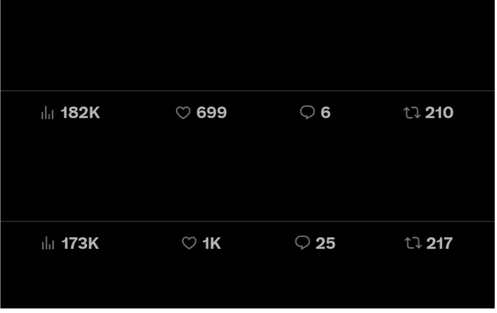

这是我的爆文数据↑

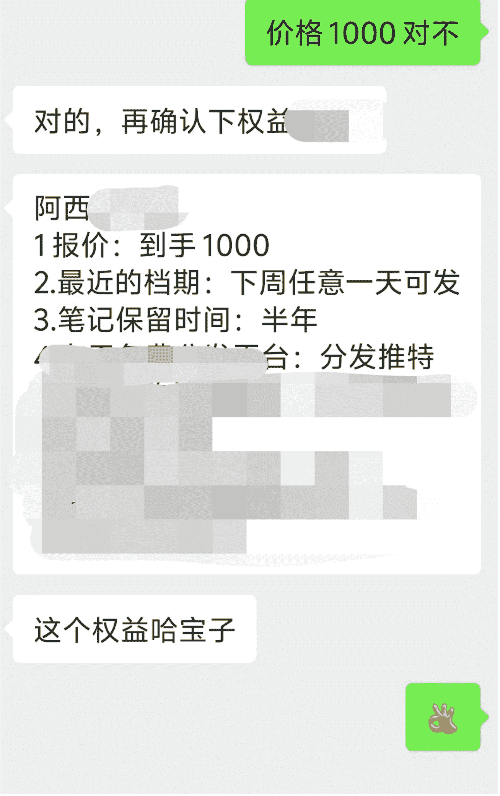

这是我的商单合作↑

我在做推特账号的过程中也沉淀了一些方法论，基本可以做到单日曝光量基本稳定在 10w 左右。

# 即刻动态

阿西_出海

8 年产品&运营经验✈️⛑️零基础 AI 编程建站出海赚…

先稳定，再突破。

现在 X 上单天曝光可以稳定在 10w 左右，基本盘的曝光量级也在提升。昨天单天曝光到了 74w。

开始研究现在的工作流里加上“知识库”能不能提效。

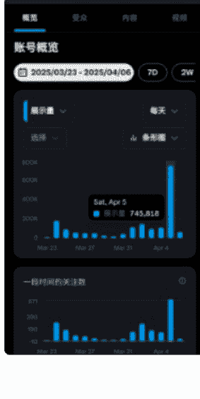

04/06 09:09

接下来我会详细介绍如何从 0-1 在推特平台搭建账号并起号，文章结构如下：

- ### 为什么要做推特？
- ### 借助 AI 梳理账号定位
- ### 如何在推特涨粉、获得曝光

## 1、为什么要做推特？

### 1.1 推特的优势

内容制作门槛低  
像抖音、小红书、youtube、tiktok 这些图文、视频平台，要剪视频、做很精致的图片才能吸引用户，推特对于普通人来说最大的优势就是内容制作门槛低，推特相当于是国外的微博，随手写的几段文字就有机会爆火。

像下面这篇低粉爆文，只有 6 万粉丝，纯文字内容，写了 6 行字就获得了五百多万浏览量：

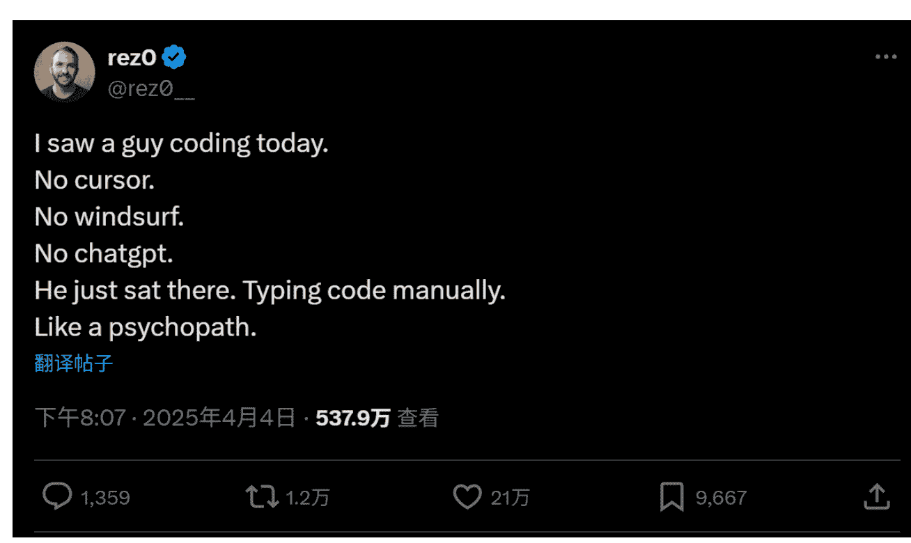

在推特平台上就算只会写文字内容，也一样有机会做出爆款内容。

### 1.2 创作者分成机制 + 美元汇率

推特对于粉丝量、曝光量到达一定程度的蓝标认证用户，会开通创作者分成机制（后文会具体介绍），简单的说就是开通后平时你的推文下互动频率越高，你的分成收入就越高。相比于接商单，流量分成收入更可控、持久。

另外，因为分成收的美元，美元相比人民币有 7 倍的汇率差，所以国外平台的分成收入相比国内平台的天然就会有更优势。

### 1.3 粉丝变现价值相对较高

能玩推特的除了境外用户，就是会使用科学上网的国人，会使用科学上网本身就是一种筛选门槛，愿意付费科学上网的人群本身付费能力也更强。

推特上的信息更新更全，很多爆火的科技、经济消息一般都会先出现在推特，我发现一些有热度的信息在互联网传递流向一般是：

推特→即刻→小红书、微博

可见在推特能获得早期信息，而想要快人一步获得信息的人一般都是创业者、各行业爱好者、专家等优质人士，从这个角度也解释了中推圈的国人用户还是相对价值较高的 (这里手动忽略 NSFC 和键政人群)。我也看到过一些知识付费博主说在推特上的知识付费转化率相对较高，这也验证了我的人群价值观点。

### 1.4 有哪些盈利途径

**创作者分成**

开通创作者分成的条件是：

- 1）认证要求：必须通过订阅 Premium 会员（最低每月 8 美元）。
- 2）展示量要求：过去 3 个月内，累计帖子获得至少 500 万次展示。
- 3）关注粉丝要求：拥有至少 500 名 Premium 会员关注者。

这里面稍微比较难的是展示量的要求，不用担心，后面会介绍到怎么提升自己的曝光。我之前用自己的运营方法实践了 2 周的时间，就达成了 188 万曝光的成绩，继续做下来的话一个多月应该就能完成 500 万曝光的目标。

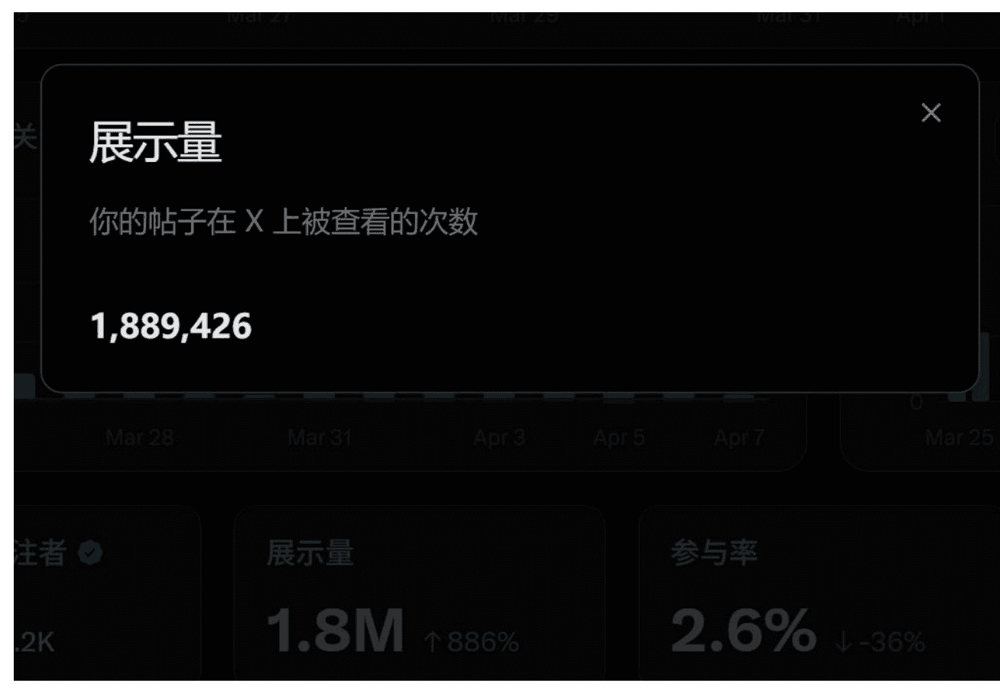

**给自己的产品引流**

如果你有自己的产品，比如知识付费课程或者是付费产品，就可以在简介里、每条推文最后加条线程或是单独写一篇介绍产品的推文置顶在自己的主页来推广。

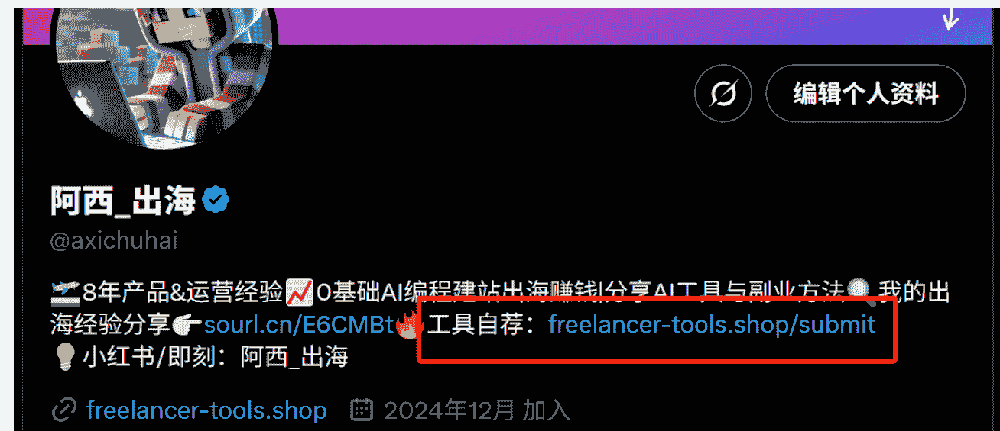

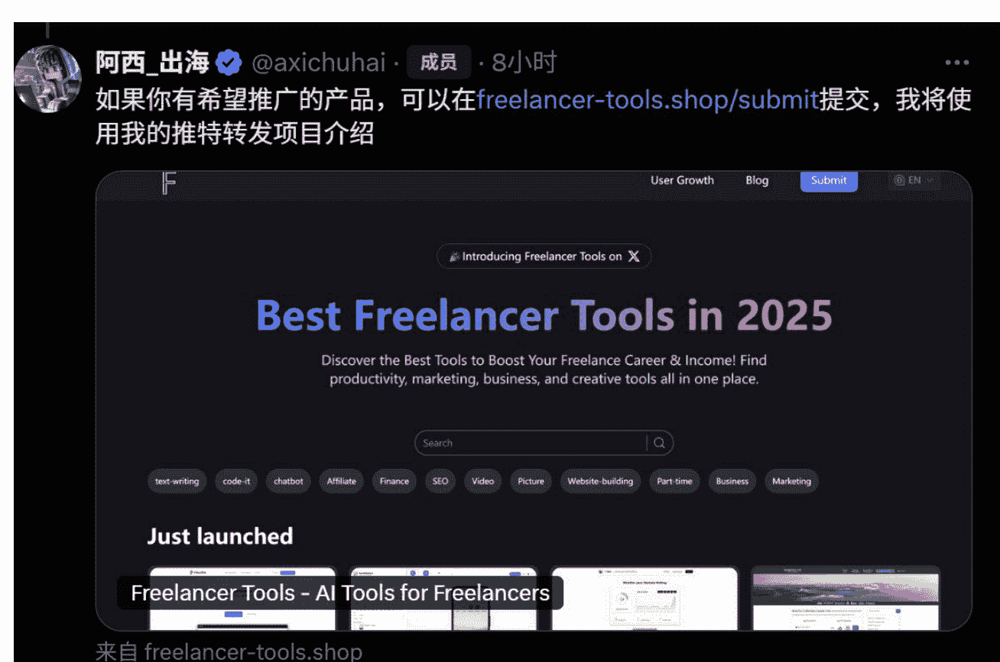

**商单合作**

有几千粉丝量的账号就有机会接到商单，为了更积极的拥抱商单，你可以在账号里多个位置写接单，比如简介、推特里。因为推特不像小红书有官方接单平台，所以这部分相对比较野生，需要自行识别对方是否靠谱，这里给一些建议：尽量不接按效果付费的广告，一口价广告如果金额大的话沟通对方先付定金。

像下图这个账号就是在简介里挂了接商单邮箱：

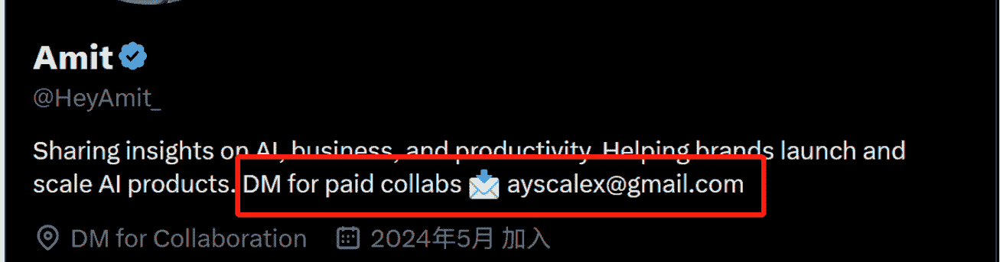

## 2、借助 AI 梳理账号定位

### 2.1 明确账号定位

在做账号定位前要先明确这几个问题：

- 1）你要做中文还是英文？
- 2）做哪个赛道？
- 3）内容类型要选择哪种？通过什么方式盈利？

### 2.2 做中文推还是英文推？

这两个选择背后意味着是两个不一样的目标人群，推特上英语国家的用户群体占据主导，用户量大就意味着英推账号一旦做起来粉丝的天花板上限也就更高，内容的曝光量也更大。

以“独立开发者”这个赛道为例，中推圈里这个赛道的大 V 一般粉丝量级几万已经非常高了，但是在英推圈这个赛道十几万，甚至几十万粉的账号都有不少。

不过对于国人来说做英推毕竟难度太大，第一是语言问题，第二是文化差异，如果只是简单的把你的内容从中文翻译成英文翻译给英语用户的话，必然会让这个内容的效果大打折扣。所以新人做推特建议先做中文推，上手门槛低，熟悉了后再考虑做英推。

### 2.3 做哪个赛道？

这个问题每个人有属于自己的答案，可以从自己现有的业务出发，比如本身是卖养生产品的就可以做养生赛道；如果目前没有业务，就是问问自己更擅长喜欢做哪方面。比如我本身就是做互联网产品方向，i 人，喜欢独立研究 AI 产品，所以我选择做 AI 科普赛道。

大家也可以自己思考或者问问身边的朋友，认为自己平时有哪些特质，自己有哪些特别喜欢的事物。因为账号运营需要持续输出内容，最好是能根据自己的偏好来选方向，这样才能更持久。

### 2.4 内容类型要选择哪种？通过什么方式盈利？

我把这两个问题放在一起说是因为：盈利方式决定了要做什么样的内容。很多人做账号、发内容，想着先把粉丝做上去，内容火起来，变现的事就能水到渠成。看到内容曝光多、涨粉多就开心，但不知道这些曝光、涨粉有什么实际的作用。如果做账号是就为了涨粉，那还不如直接买粉更快。

所以，做账号之前要先想清楚你要靠什么变现。

我观察了下推特上各个赛道的账号类型，基本分成这三类：专业类账号、资讯类账号、娱乐类账号。解释下这三类账号：

1. 专业类账号：发布的内容偏精专，多科普内容，面向的人群也多是业内专业人士，比如 AI 赛道为例，专业类账号就会经常发布某款 AI 产品怎么用、有哪些应用场景等专业内容；这类账号对专业要求度较高。
2. 资讯类账号：专门发布最新的行业资讯，发布资讯越及时越前沿，粉丝量越高。这类账号的内容比较好做，但比较费体力，要紧跟热点，比如@小互就属于这类。
3. 娱乐类账号：这类账号发布的内容适合所有普通人，比如鸡汤、健康养生、情感、财商、键政等。

这三类的人群基数是专业类 < 资讯类 < 娱乐类，但从用户付费能力来说是专业类 > 资讯类 > 娱乐类。也好理解，越精专的内容看的人越少，但人群也越精准，付费意愿越强；越普适接地气娱乐化的内容适配人群越多，但人群鱼龙混杂不好转化。

因为这三类账号对应的人群付费能力和人群基数不同，对应的变现方式肯定也是不同的。

**三类账号适合的变现模式：**

- 专业类：适合卖知识付费（比如课程、星球、小报童等形式）、一对一高客单咨询、自有产品
- 资讯类：适合平台广告、商单合作
- 娱乐类：适合平台广告，能接点商单但价格不会高

### 2.5 借助 AI 梳理定位和运营节奏

可能你看完上面 3 个问题还是无法回答自己到底应该做哪个方向，没关系，我们可以继续使用 AI 来辅助你通过三步明确定位。

**步骤 1：定位分析（使用 DeepSeek）**

提示词如下：

> 作为一名职业顾问，请帮我分析我的专业背景和兴趣，找出最适合在推特上发展的 2-3 个可能方向。
>
> 我的背景：[详细描述你的专业经验、技能、兴趣爱好]
>
> 请考虑以下因素：
> - 我的专业优势在哪里？
> - 哪些领域我有独特见解？
> - 我能长期持续产出什么类型的内容？
> - 哪些领域有变现潜力？

**步骤 2：竞品分析（使用 Grok）**

因为 Grok 是推特官方推出的 AI 工具，能在分析时直接调用推特接口进行查询分析，所以这步使用 Grok。

提示词如下：

> 选择 3-5 个与我的方向相似的成功账号：
> - 分析他们内容主题分布
> - 研究他们最成功的内容形式
> - 研究他们的变现模式
> - 我目前的情况：[描述你的个人限制，比如不擅长做视频、每天内容投入的时间有限等等]
>
> 请你根据我的情况，分析我应该选择哪个竞品账号作为对标账号

**步骤 3：运营节奏梳理（使用 Grok）**

提示词如下：

> 我的目标：[描述你想通过推特实现什么，比如实现知识付费月收入达到 10000 元]
> 比如实现知识付费月收入达到 10000 元
>
> 我的账号赛道方向是 XX，请帮我制定完整的运营规划，最快多久能实现目标，运营节奏是怎么样的，账号如何包装、发文频率多少合适，若还有其他内容需要补充，请一并写入规划

这三步完成后你已经基本明确了账号的大方向了，跟着 Grok 告诉你的方式写好账号简介后，接下来就可以开始制作推文了。

## 3、如何在推特涨粉、获得曝光

### 3.1 推特的流量机制

我在推特发过一篇关于推特开源代码里的推文排名计算公式，可以通过代码里不同的权重来评估推文的可见度和重要性。

```text
Twitter Ranking Score = 
    75 * is_replied_reply_engaged_by_author
+ 27 * is_replied
+ 12 * is_profile_clicked_and_profile_engaged
+ 11 * MAX(
    is_good_clicked_convo_desc_favorited_or_replied,
    is_good_clicked_convo_desc_v2
)
+ 1.0 * is_retweeted
+ 0.5 * is_favorited
+ 0.005 * is_video_playback_50
- 74 * is_negative_feedback_v2
- 369 * is_report_tweet_clicked
```

具体权重如下：

- 1、推文作者参与回复，推文权重+75 分
- 2、推文被回复，推文权重+27 分
- 3、用户点击了推文作者的个人资料并且进行进一步的互动（如查看更多推文），推文的权重+12 分
- 4、用户点击了推文的对话描述并且进行了点赞或回复，推文的权重+12 分
- 5、推文被转发，推文的权重+1 分
- 6、推文被点赞，推文的权重+0.5 分
- 7、推文中的视频播放度达到 50%，推文的权重+0.005 分
- 8、推文收到了负面反馈（如用户标记为不感兴趣），推文的权重-74 分
- 9、用户点击了举报推文，推文的权重-369 分

上面"+"就是正向权重，"-"就是负向权重，可以看到被评论和回复粉丝评论都是很加分的行为，要有意识的在推文里引导评论。比如像老外就很会用评论领资料来刺激评论：

**Jack @jackcoder0**

This YouTube channel didn't exist 24 hours ago...

With only 5 videos, it has 8.3K monetized views (which made me $70)

Comment 'Guide' under this tweet and I'll send you a FREE document

Explaining how you can do it too (Must be following so I can DM)

该 YouTube 频道 24 小时前还不存在...  
虽然只有 5 个视频，但观看次数已达 8.3K (让我赚了 70 美元)  
在这条推文下评论“指南”，我将向您发送免费文档  
解释你也可以这样做 (必须关注，这样我才能直接发信息)

### 3.2 获得大流量曝光的 4 个秘诀

#### 3.2.1 坚持多发推

坚持发推有两个目的：
- 为了养号提升账号权重：新号如果注册后每天只是看，不互动也不发推，就有很大概率被官方认定为垃圾号，导致被封号。
- 为了积累资源，量变产生质变：用一个公式来帮助理解：总浏览量=推文数*平均每条浏览量。大 V 随便发一条推文可能就有几万浏览量，一个几百粉丝的账号发一条一般就几百浏览量。但如果大 V 一天就发一条，你一天能发十几条，那是不是就有机会达到跟大 V 一样的效果。

随着积累的推文曝光越多，增粉速度也会越快，粉丝越多，单条推文一般浏览量也会越多（当然前提是内容对粉丝有价值），这样你的账号资产就像雪球一样越滚越多。

#### 3.2.2 写爆文的标准化模板

我自己在实操的时候发现一个秘密：写长线程比发普通帖子更容易出现爆款。

**1) 什么是长线程？**  
这里解释下什么是线程，线程是推特上特有的一种帖子形式，就是发了一个帖子后可以不停自己追加评论，于是帖子就变成一个个小帖子链接起来的长线程。

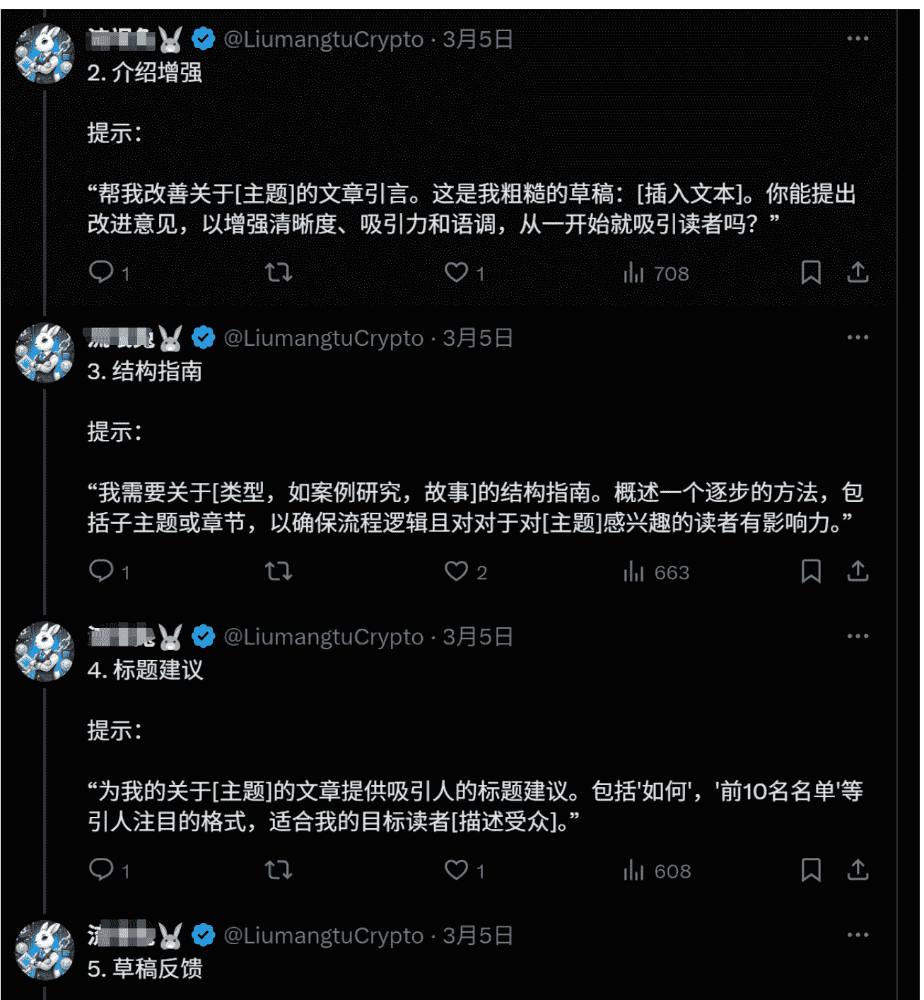

下面这是一条普通帖子：

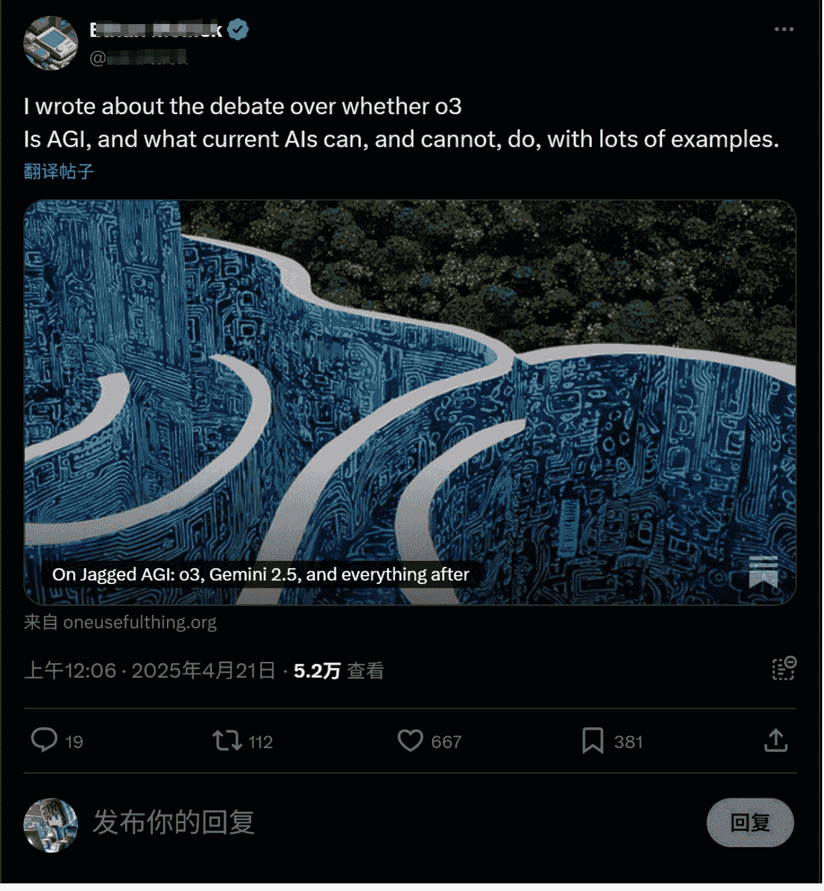

**2) 长线程比普通帖子更容易曝光**  
推特是信息流的形式展示内容，从上面的截图里可以看出普通帖子的内容很短，很容易一眼扫过就看完了，不容易抓住注意力。推特上的注意力争夺非常激烈，而长线程一般至少有 10 条跟帖内容，基本能完整的阐述一个完整的观点/故事/主题。  
正因为长线程更容易产出深度内容，所以更抓人眼球，读的人也能产生越多互动、转发、评论，从而带动推文被平台推流。

**3) 病毒式线程的结构**  
正文内容 (即第一个帖子)  
要抓人眼球，内容不要太多，目的是要让用户点进来去看下一条线程。分享正文结尾的 3 种爆文模板句式：

- 1、引导继续看故事句式：“以下就是这个神奇故事的开始↓”
- 2、引导继续看干货句式：“以下是解决这三个问题的方法↓、他研究了 20 小时后的发现如下↓”
- 3、引导继续看资讯句式：“以下是这次发布的所有内容↓”

**主动引导动作**  
因为长线程推文较长，用户读着读着可能会忘记互动，所以一般需要有意识的加上引导动作的文案，引导用户互动。一般我会在第二条线程上就开始引导，因为越往后，流失的用户越多，所以尽量在早一点的时候就开始呼吁互动：

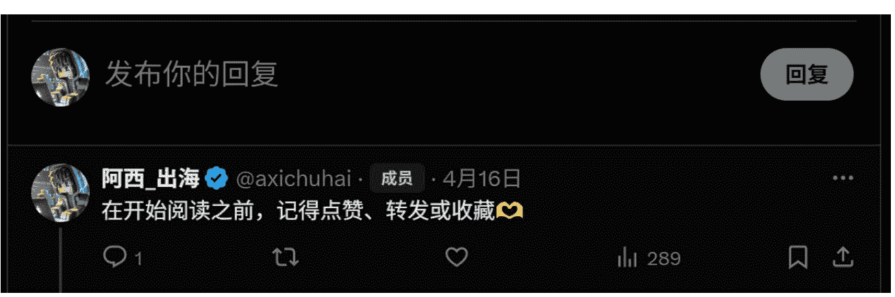

**视频比图片好，图片比纯文字好**  
我通过测试发现，在线程里，特别是正文里加上视频更容易形成爆款。如果实在没有视频素材，也可以加上配图。视频、配图的作用是为了抓住用户的眼球，在你的内容上停留，你的内容吸引用户时间越长，平台越容易推流你的内容。

**结尾提醒关注**  
用户能看到结尾一般说明对内容满意度较高，平台也大概率给了比较多流量了，这时候就要及时承接住这些流量转化成自己的粉丝，并且引导转发正文链接。以下是我的结尾句式模板：

> 如果您喜欢这个主题：
> - 关注我（@XXXX），学习更多 XXXXX 知识
> - 点赞 + 转发下面第一条帖子
> - 这里放正文链接地址

#### 3.2.3 多与行业大 V 互动

**借力曝光**  
在大 V 的评论区互动有两个好处：
- 1) 优质的评论相当于你的免费的广告位，可以帮助你吸粉
例如你在某些科技产品资讯的评论区留言你对这款产品在使用体验，就非常吸粉。
- 2) 有助达成创作者分成计划的条件  
前面提到创作者分成计划里有一个要求是"3 个月内内容曝光达到 500 万”，而你的评论内容曝光也是可以算在这 500 万里的。  
这里还有个小窍门，你可以关注推特上的顶流大号，比如特朗普、马斯克、赵长鹏的账号，他们发文的曝光量一般都非常高。

**建立圈子人脉**  
推特里的行业圈子人群比较集中，阶级比较扁平，你发的内容优质的话就很容易出现在行业大佬的时间线上，链接到平时生活中完全没可能认识的大佬/大 V，所以某种意义上推特的阶级相对扁平。  
努力找到行业大佬，主动在大佬的推文下进行有价值的讨论，输出有见地的评论，增进互动，不但能让其他看评论的人注意到你的账号，还能跟大佬增进互动，积累行业资源。就像我的账号初期就是因为发布的内容被出海圈的大佬转发了一下，完成了账号的冷启动。  
坚持每天和 5-10 个行业大佬互动，这个方法成本低，效果明显，性价比较高，非常建议。

#### 3.2.4 构建“素材库”，激发持续创作的灵感  
推特涨粉最重要的一个方法就是多发，不但要每天发，一天最好也要多发几篇。但注意不要连着发，两条之间建议间隔 1 个小时以上，不然容易被限流。

## 既然要这么高频的发内容，就需要有稳定、大量的灵感来源。建议使用“收藏”来建立自己的素材库。订阅了推特的蓝标会员后能拥有收藏夹分类的功能，该功能比较有用。我的收藏夹分成两个分类标签：

- 1、主题灵感：这里会收藏最近哪些主题方向的内容比较容易火。告诉大家一个秘诀怎么看这个内容火不火：看浏览量和粉丝量的比例，如果浏览量在 6 位数以上且浏览量是发布者粉丝量的 5 倍以上，那么这条推文就属于一条爆文。

- 2、模版灵感：帮助快速搭建高互动、高浏览量的爆文模版。比如上文说的长线程结构就是一种高浏览爆文模版；像下面这种就是一种引导高互动的模版，用于引导用户回复某个关键词：

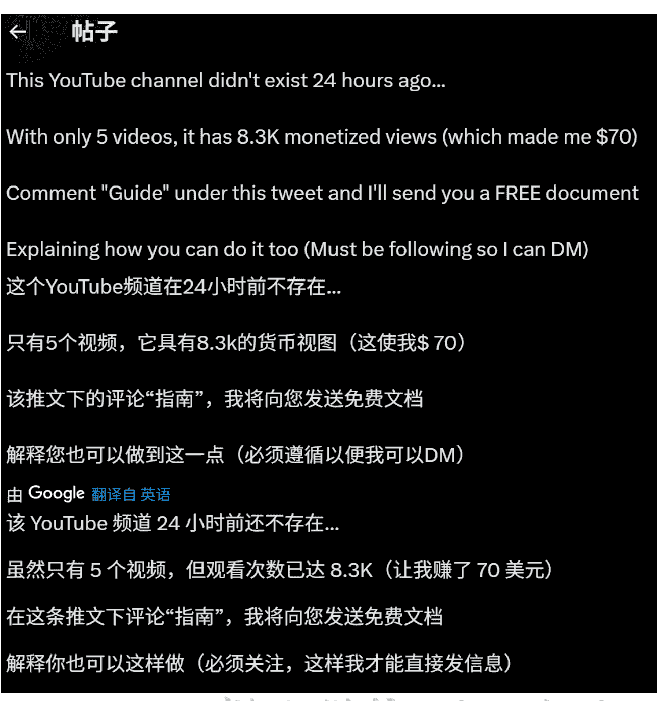

### 3.3 数据跟踪

开通蓝标会员后才能看到账号的数据分析看板：

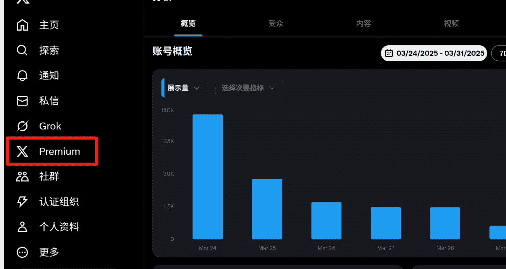

很多人可能会问：为什么要看账号的数据，不是只要看每篇推文浏览量多不多就行了么？

这里解释下能看到账号数据的 3 点好处：

#### 查看哪条推文数据更好

爆过的主题能重复爆。通过内容看板，记录下你哪些主题、哪些推文模版曾经爆过，隔一段时间后内容用 AI 洗一下改写一遍下可以再发一遍，大概率也能爆。

#### 及时发现限流

推特账号在成长成大 V 的过程中，避免不了的一个问题就是被限流。通过看数据看板的数据曲线，如果被限流的话可以很明显的看到账号的每日浏览量下降过程。如果发现被限流就要及时检查账号为什么违规，及时处理违规问题早点解除限流了。

因为限流的问题解释起来会比较复杂，篇幅所限先不展开了。

#### 直观看到账号的创作者分成条件达标情况

数据看板会直接展示账号当前有多少认证粉丝、3 个月内的总浏览量，这个功能对于想要开通创作者分成的账号非常重要。

#### 增加账号信任度

开通了会员的账号会在昵称旁边有个蓝标，相比于普通用户，蓝标账号更具信任度（毕竟是花了钱的账号，看起来会比没花钱的账号靠谱）。


补充一点：我实际操作的时候发现移动端无法开通蓝标会员，需要在 PC 端操作，支付需要用 visa/master 卡。

## 4、写在最后

以上就是我在做一个推特账号过程中总结的经验，但并不是说用了以上的方法就能快速起号、快速写出爆文，只是说用了以上方法可以帮你提高成功起号的概率、帮你排掉一些起号过程中的雷。

抛开以上的经验方法，你如果问我做推特账号最重要的秘诀是什么，那就是坚持。坚持每天发，坚持每天固定多少时间去刷推特，坚持每天互动。

我可以很自信的告诉大家，推特的商业价值巨大，除了上面我所说的在推特本身平台上的价值外，你在持续去做的过程中还会发现不少意外的惊喜。比如我在别的平台上的账号在接商单时，甲方也会提出能不能顺带在推特上也发一下，于是商单价格也翻了 2-3 倍；又或者可以把在推特爆了的内容，在别的社交平台二次发布，像小红书、抖音等，大概率也能爆。

推特的价值远不止于此，期待你继续去挖掘。请先尝试注册你的第一个推特账号、发布第一篇推文，然后坚持，去做，相信你也会遇到惊喜，祝你成功！


历史 3000 多份各类付费文章以及年费三千多的副业社群资源，见懒人专属群内分享！

懒人微信：lazyhelper

## 付费群，白嫖勿扰！

## 懒人专属群更新记录：

https://lazybook.fun/#/blog/record2