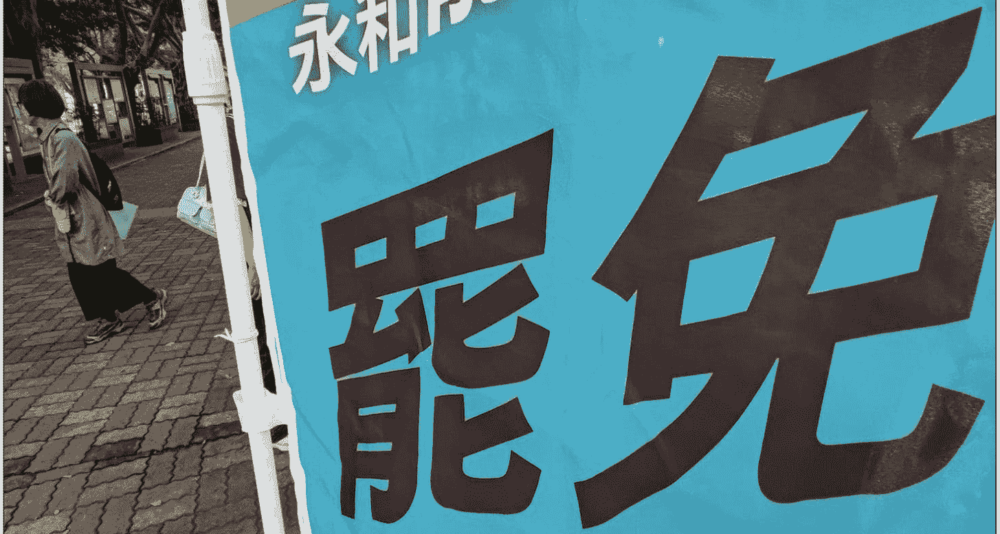
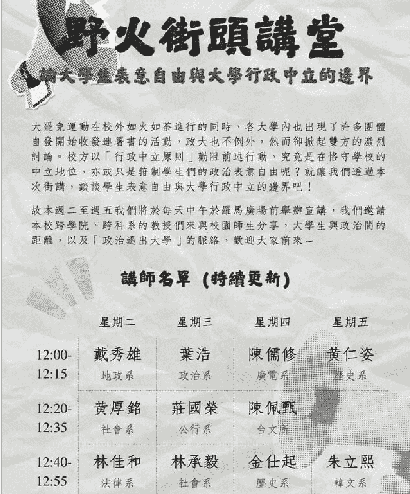

## 350507 新闻

507 新闻实验室

整理公众号，懒人搜索**懒人专属群**连载

懒人微信：**lazy helper**

一所校名里就带有“政治”二字的大学，

却要政治退出校园吗？

> 新闻实验室会员通讯（837）政治能不能进校园：一个台湾案例

最近，我在台湾国立政治大学（简称“政大”），政大的校园里最近刚发生了一桩争议事件，核心是“政治能不能进校园”。

得知这个“争议话题”，我有些惊讶：这个问题，难道不应该早就在三十多年的民主洗礼中被解决了吗？

“拒绝政治进校园”，不是威权政府的常用话术吗？

不对，了解了事情的来龙去脉之后，我也开始理解为什么人们还会围绕这个问题吵起来。今天，我就通过新闻实验室会员通讯与各位分享这个案例，并探讨它所折射的政治与校园关系、言论自由及其限度，乃至台湾民主制度当下面临的挑战。

### 「背景：“大罢免”运动」

2024 年年初的台湾大选之后，民进党保住了总统的位置，也就是行政权，但是在立法院的席位未能过半，而蓝（国民党）白（民众党）则联手掌握多数席位。

在这种行政权和立法权对峙的背景下，蓝白立法委员（简称立委）于去年 5 月通过了为立法院扩权的《立法院职权行使法》修正案。其中包括 五大方向：总统国情报告常态化、立法院调查权及听证权、强化人事同意权、正副院长记名投票制，以及被认为最具争议的“藐视国会罪”。

根据“藐视国会罪”内容，被国会质询者不得拒绝回答、不得拒绝提供资料、不得隐瞒信息、不得作虚假陈述，除非涉及可能危害国防安全、外交关系，或是法律规定应保密的事项，并经主席同意。此外还规定了被质询人不可“反质询”，但对于何谓“反质询”并未给出明确定义。

简单来说，修法是为了增强蓝白手中的立法权，对绿营手中的行政权做出更多的限制。当然，在不同人眼中，这种做法的正当性有迥异的解读。蓝白的支持者认为，这是为了更有效监督政府，让政府真正向立法院负责，可以抑制民进党的滥权。而绿营则认为，这实质上是立法院的滥权，是打破权力的平衡，让立法权凌驾于行政权之上。此外，他们也认为整个修法过程是黑箱作业，缺乏讨论，有失程序正当性。

当时，社会上爆发了很大的抗议浪潮，出现了被称为“青鸟行动”的社会运动。在抗议声中，有人提出设想：能不能罢免蓝白营的立委，以回击他们的修法行动。不过，由于白营（民众党）的 8 名立委都属于“不分区立委”，法律规定无法被罢免，所以矛头实质指向的就是国民党立委。但罢免立委并不是一件容易的事情，需要在短时间内收集选区内相当多选民的连署，并且只能在公职人员任职满一年后提出。因此，虽然去年 5 月就有人提出这一设想，但并未真正开始行动。

直到去年底今年初，蓝白立委再次强推《公职人员选举罢免法》《宪法诉讼法》和《财政收支划分法》修正案，并砍掉政府提出的两千亿预算，罢免行动才轰轰烈烈地燃烧起来。

原本作为罢免行动对象的国民党，在看到行动越来越热之后，也提出“以罢制罢”的反制策略，要针对民进党的多名立委提出罢免案。

至此，“罢免”正式成为对立阵营之间的战斗武器，也成为了过去数月台湾政治的核心关键词。

### 「当罢免行动燃烧到校园」

前文提到，罢免行动成功的关键，是快速收集到选区内足够多的选民连署。因此，两个阵营的核心支持者们都积极行动起来，在线上线下收集连署书。

参与行动的学生们，也在台湾的超过 20 所高校校园（乃至少数高中校园）里设置摊位，号召同学们参与连署。正是这样的行动，引发了“政治能不能进校园”的争议。

反对罢免连署进入校园的人认为，把政治活动带进校园，不仅会干扰正值期中考试的学生，而且会让学生之间增加对立和争执。据报道，有台大学生在网络论坛留言：“摆摊连署的给我注意一点！敢让我看到，我一定把 你们摊位砸烂，哪一党都一样。”甚至有学生形容，罢免团体“像邪教一样”入侵校园。

支持罢免连署进入校园的人则认为，政治参与是包括学生在内的每个人的基本权利。而且学校本身就是讨论公共议题的地方。有学生在论坛留言：“难道政治系的也不能进入校园吗”、“生活即政治”、“平常学校也有政治相关讲座，政治早就走进校园了”。

这样的讨论在政治大学更是具备了独特的喜感——一所校名里就带有“政治”二字的大学，却要政治退出校园吗？有学生调侃，不如改名“国立政治退出大学”。

4 月 9 日，几位学生在政大校内的中正图书馆一楼俗称“狗洞”的地方（防空避难室、楼梯下的户外阅读区）摆摊，收集连署签名。两天下 来，不过收到 36 份连署而已，但这次行动却遭到了校方的劝阻，理由是没有提前申请使用这个空间。作为行动发起人的两名在校生发帖说：“我们纳闷的是：平常大家进行其他活动都可以，为何只有这件事情会被特别关注？”

后来，政大官方发声明说：“学校肯定学生基于自主意志关心公共事务，亦支持学生透过符合法律规范之形式，表达意见与实践民主精神。”但校方强调，依据《教育基本法》与《选罢法》第 52 条规范，学校不得进行政治宣传活动。

这番声明发出后，引发了一些师生的不满。政大社会系教授黄厚铭公开发表反对意见。他认为，“学校不得进行政治宣传活动”说的是校方不得，而不是学生不得。他认为，学生在不使用学校资源的情况下，仍可自发性地为任何政党宣传。

黄厚铭教授在政大非常有名，他的立场鲜明：长期鼓励学生走出校园、走入社会，让课堂知识与现实经验相互激荡，并经常身体力行支持社会运动。此次他还强调：大学的“政治中立”不是指师生应该中立，而是指校方应该中立，这样师生才有完全的思想与行动自由。

参与这场讨论的当然不只有黄厚铭教授。政大社团“政大野火阵线”自 4 月 15 日开始就连续 4 天组织了**校园演讲活动**，参与的除了黄厚铭之外还有其他逾 10 名教授。比如，公共行政学系助理教授庄国荣就说，如果连以人文社会科学为主的学校的学生都对公共事务无感、不关心，那学校可以关门了。

### 「台湾民主制度面临的挑战」

在这场争议中，我们需要注意的一个背景是：在台湾，确实发生过具有积极、进步意义的“政治退出校园”。

台湾曾经长期处于蒋家的威权统治之下。实际上，政大过去就被称为“党校”，因为其前身是 1927 年由国民党创办的“中央党务学校”，目标就是培养符合国民党要求的政治人才。

“党校”的课程聚焦党务、政治宣传与组织动员，校训承袭自黄埔军校，彰显其鲜明的党校色彩。当然，后来经过几次改制、合并、迁台复校等过程，政大已经逐步转型为脱离国民党体系的现代高等学府。

解严后，台湾的民间社会与在野党推动了“党政军退出校园”运动，核心诉求包括解除政党对校园的组织控制、终止意识形态灌输，以及保障师生自主参与公共事务的权利。

话说，三十多年前的台湾的确发生过“政治退出校园”，它指的是威权政治应该收回控制校园学术、思想和言论自由的手。

在“政大野火阵线”组织的演讲中，政大政治学系教授叶浩就表示，政治退出校园并不是为了将政治排除，而是对国民党过去党国体制的思想提出抗争，并且让民主真正走进校园，让学生成为真正的公民，而非排除政治参与。

但是，在“告别威权”的过程中，台湾始终要面对的一个问题是：过去施行威权统治的是国民党，而国民党仍是今日台湾的两个主要政党之一。因此，“告别威权”和“告别国民党”之间的微妙联系就很容易触碰人们的敏感神经。

过去几年，政大其实在持续“政治退出校园”——校园里的蒋介石铜像被移走，校内公车站“蒋公铜像站”更名，礼堂里的蒋介石像也被卸下，校歌里面的“实行三民主义为吾党的使命，建设中华民国是吾党的责任”修改为“实践民主法治是我们的使命，维护自由人权是我们的责任”。

这些都是“转型正义”的政策旗帜之下进行的。一方面，它当然有与威权历史划清界限的意义；但另一方面，也有有人认为这些持续的“去蒋化”实质是刻意抹杀蒋介石和国民党的历史贡献，为民进党的利益服务。

这正折射出台湾民主面临的挑战：虽然已经告别威权，但威权的阴影仍笼罩着全岛。大家一方面害怕威权再来，另一方面又警惕那些反威权的声音是不是成了另一种威权。比如蓝白阵营就认为，民进党希望罢免国民党立委，是想走向没有反对党约束的独裁。而绿营则认为，蓝白两党成了中共的代理人，他们才会毁掉台湾的民主。

至少从双方的政治话语中，我感受到了一种共同的紧迫感：支持对方，民主就完了，威权就来了。这种紧迫感在大多数民主政体之下是不太常见的（当然，台湾本身就是一个很特殊的存在），就算是美国，也是在川普上台之后才比较多出现“民主完了”的警告。这种紧迫感意味着一种不是想要和对方同台竞争，而是从根本否定对方正当性的冲动。

我在台湾旁听的一场活动上，有年轻人非常焦急地向嘉宾提问：如果十年后，国民党还在的话，我们该怎么办啊？这个问题让我很惊讶：难道回到一党独大的时代是更好的结果吗？但台湾的朋友说，这种心态很常见，因为不少人真心认为对方政党会带来无穷的危害。

这种急迫的心情，会激发人们的政治参与——连续两个周末，凯达格兰大道上都挤满了情绪激动的人们，前一个周末是绿营，后一个周末是蓝白营。但是，这种紧迫感也有可能被政党利用，成为发动“群众斗群众”的基础。眼前的这场罢免大战，在一些人看来就带有民主工具被滥用、两派无休止打下去最终瘫痪政治制度的风险。

当然，目前来看，一切都还是在制度之内运行。根据相关法规，罢免案第二阶段连署将持续到 6 月，到时候到底会不会有立委被成功罢免，还要再看第三阶段的投票——需要同意人数多于不同意人数，并且同意人数超过选区人数的四分之一。

在政大摆出连署摊位的两位学生写道：“我觉得我们是为了我们想要活着的地方，想要活着，呼吸，好好在这世界上好好生活，我们是为了这件事情在努力。”无论如何，这种自下而上的自发精神是值得感佩的。即便罢免有被滥用的风险，但这场行动最初的确是自下而上由公民团体发起的，这还是证明了台湾公民社会的活力。我想，最终真正能抵御任何形式的威权的，也只有这种自下而上的公民参与。

历史 3000 多份各类付费文章以及年费三千多的副业社群资源，见懒人专属群内部分享！

付费群，白嫖勿扰！

懒人专属群更新记录：

https://lazybook.fun/#!/blog/record2