# 从生活细节中发现机会，实操两年的培育钻石项目解析

2025 年 05 月 08 日 生财精华

公众号懒人找资源，懒人专属群分享

[图片]

大家好，我是 Luke 林，真名叫林俊杰（不会唱歌），小挣青年主理人，希望帮助千位青年挣到人生的第一桶小金。这段的项目经验不仅在 7 天时间内变现了万元左右，甚至 2 年后现在的依然给我带来了持续性的收益；也让我完成了自媒体的第一次粉丝积累。在 B 站获得了 10 万的播放量涨了 3 万的粉丝，感兴趣的朋友可以搜索【小挣青年们】观看之前的项目记录。看到生财近两年没有太多关于培育钻石相关的帖子，虽然项目是两年前开始做的但是现在仍然是非常优质且适合小白上手实操的项目。

### 这也是我第一次在生财发帖，写得有不够清楚的地方还请大家多谅解。

懒人微信：lazyhelper

# 一、项目缘起：从接触到决策到投入到挣钱

# 【接触】

我是自己在准备结婚的时候，买钻戒接触到的培育钻石，当时在 DR 和周大福的钻戒中犹豫，但基本 1 克拉的都要 8 万起步，还不算我老婆喜欢的那个款式要额外的碎钻以及戒托白金用料。如果按照老婆喜欢的做下来，可能要花大概 12 万左右。

当时本来已经看好了，因为家就在深圳，所以打算先去水贝买黄金然后去周大福直接定款式的。在进去买完黄金的时候突然看到有一家倒闭了在清算的店铺，很显眼的名字【培育钻石】，当时不太懂所谓的【培育钻石】但没多想，因为个人比较 E，所以我就进去找了老板交流了一下，也是顺利加上了微信。

## 聊天记录（2023 年 8 月 3 日 23:05）

（背景备注：有些段落为截图 OCR，以下为完整还原）

> **培育钻石工厂**
>
> 我是：17:29
> **2023 年 8 月 3 日 23:05**
> 1.39 E VS1, 3600
> 这是裸钻
>
> 这样
>
> 好的
> 戒托那款是 2600
> 总共要去到 6200 了对吗
>
> 裸钻和戒托分开介绍
>
> 是的
>
> 好的
> 明天您联系冯总
>
> 好的
> 具体情况他和你说😊
>
> 懒人微信: lazyhelper

回头后晚上我就开始和老板沟通，这个老板和我说他不是负责人，他们只是深圳的一个档口，因为盈利困难，所以撤档，回河南这边专门做渠道。我在当天晚上也询问了下大概的价格，1.39 克拉的钻石如果按照我的要求做下来，价格只要 6200 元；我当时惊呼，差价能达到 20 倍？！

## [聊天记录中段：培育钻石 - 冯参军]

> 海外是吗
> 👍
> 牛的
> 打磨一部分
>
> 冯总还是很有商业意识和格局的，也有实力👍
>
> 2023 年 8 月 3 日 23:39
> 因为深圳太卷了，很多厂家都不对国内销售了
>
> 哈哈哈哈，冯总也知道深圳很卷，是的，深圳非常卷
> 培育钻石 - 冯参军:因为深圳太卷了，很多厂家都不对国内销售了
>
> 破坏了行业规则
>
> 因为他们现在撤档了，在深圳没有现货，都是在产地河南做完以后发货，所以让我和老板沟通，加上之后我首先是吹了一通彩虹屁，了解了一下这个行业目前的一些基本情况。

# ## 掌握到了几个我觉得比较重要的信息：

哪怕是培育钻石，其价格也因为渠道的原因各不相同，存在很大的溢价

培育钻石的价格和黄金一样，存在浮动，主要原因是市场留存大部分是散货为主，培育钻石间也不存在同样的钻，切工/瑕疵/亮度不一样，都会导致同克拉数的价格有所浮动

培育钻石在国内的工厂不多，但分销商非常多，且大牌子的货源工厂，几乎不做个体销售

当时因为从事互联网运营，我有做知识库和笔记的习惯，所以基于这些信息，我开始去学习和接触了钻石的一些基本信息要素（附在下方）：包括切工，净度，颜色，重量，证书等等，逐渐明白了这个行业里面很多的专业话术。

而后，我又开展了一次简单的调研，不论是自己的公司还是朋友圈，大部分朋友都和我年龄相仿，我借由自己结婚的事情，和他们沟通讨论，问问他们自己结婚的时候是否会购买五金和钻戒，让我比较吃惊的是，大部分男性的回答是：哪怕大家手头确实都不太富裕，依然都会想在结婚的时候给对方买钻戒！而女性的回答也是：结婚还是要有的钻戒！

## 聊天记录（2023-8-4）

> ### 三大洲统治者
> ### <返回
> ### 设置
> ### + 关注
>
> ### 2023-8-4 02:44
> **本月留言额度：**90
>
> > ### 抱歉深夜打扰小姐姐，我主要做的是培育钻石～属性和天然钻石一样，但价格是品牌店的十分之一还要少，姐姐如果有需要可以随时联系我，支持定制和检测😂抱歉叨扰，祝姐妹暴富发财，身体健康，天天开心😙
>
> ### 2023-8-4 07:11
> ### 价格表看看。
>
> ### 2023-8-4 07:41
> ### 你撤回了一条消息
> 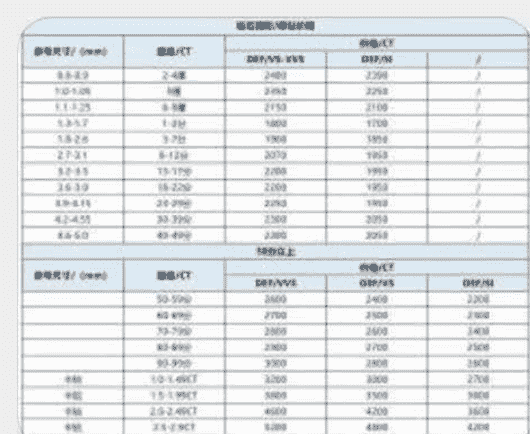
>
> ### 2023-8-4 08:19
> ### Hi

## 闲鱼上架示例 1

| 品牌 | 成色 | 尺寸 | 材质 |
| :--- | :--- | :--- | :--- |
| Cartier/卡地亚 | 全新 | 大小可调 | 钻石 |

#### 商品标题：克隆钻底价出！

#### 商品详情：可改圈口，带证书。支持来图定制，日常搭配超级闪。

## 闲鱼上架示例 2

[图片]
小挣青年 刚刚来过 深圳 南山区

¥6500 ¥138000 包邮

166 浏览

### 状态：全新
### 想要人数：1

**卖前了解退货规则，保障你的交易权益**

#### 商品标题：求婚失败！钻戒低价出
### 商品描述：周家灿若星辰款，培育钻石 50 分，18k 金可改圈口
#### 规格：品牌 成色 尺寸 材质
#### 详情：周大福 全新 大小可调 钻石

## 引流与转化结果

运气很好，我 3 天根据咨询的用户引流到了 5 个客户，在微信中成交了 1 个，闲鱼里也成交了 1 个（也是在微信中）

**我的成交路径是：** 客户→订金→制作→发货→尾款

根据他们的需求，给到产品供应商，让产品供应商先报价，然后根据报价，上浮 30%-70%，根据报价收取定金，也就是说，如果产品是 3200 元，那么我就会开 4800-5200 左右，让用户先给 3300 元的定金，尾款等收货后再给。这么做有一个好处，就是用户哪怕后续尾款不付跑单，我们的损失不会特别大，第二点是可以增加用户的信任度，毕竟在私域中开超过千元的单价，大家都会有点心里打鼓。

所以在这个时候，我的两单给我带来了差不多万元左右的收益，我就尝试想要把这个项目给更进一步。

# ## 【犯错】

不怕人无大志，就怕人做傻事。在这个项目中，我犯了两个非常重要的错误，导致了比较大的损失，这也是标题的由来~

**第一个错误：**

我花了 13980 元，找了一个红薯推广的公司从零开始做账号

这一步我的想法是，我目前还要兼顾主业，结婚等很多因素，非常忙抽不开身，

但我又不想放弃这样的机会，所以我可以找“专业”的人来解决获客的问题。具体他们的服务内容如下

### # 个人账号打造

#### 服务内容

- 原创精编文案：* 根据账号定位及人设，创作符合自身账号调性得笔记文案
- 关键词抓取：* 同账号领域，热搜词植入、增加被搜索关键词展示率，提高搜索端口得流量。
- 热点话题捕捉：* 后台全网大盘热点话题抓取，根据账号定位提供可参考得热门话题，提高笔记基础流量。
- 铺量推广：* 根据产品匹配 10 位 5 千粉丝博主，进行产品宣传，内容创作，最快速拉升产品声量，品牌曝光，变现转化。
- 标题吸睛点打造：* 首图和标题得侧重打造，增加第一视觉效果，增加点击率，提高账号识别度。
- 视觉设计：* 结合平台属性，红薯风进行平台所有图片素材得设计与制作。
- 辅助运营课程：* 合作后发送小红书行业运营干货，实现边做边看，边看边学，合作结束自己运营，增加账号长久性。

#### 小红薯内容策划

- 策划方案：* 一对一策划针对：账号诊断，定位策划，对标分析，账号内容发展，内容对标，内容风格等。
- 粉丝变现：* 优质流量账号进入内部商业合作群，提高变现价值，增加变现率。
- 风险规避：* 机审 + 人工审核规避敏感词，行业高危词，营销推广词，增加笔记收录率。
- 拍摄指导：* 根据当下实时条件，运营指导拍摄，多维度配合，产出优质内容素材。
- 剪辑制作：* 结合平台红薯风，根据领域粉丝受众点，剪辑符合平台调性的素材。
- 定位标签打造：* 利用关键词，定位内容话题，文案相似词，养号等方式，提高平台标签判定，实现垂直精准化推送。
- 数维监测：* 实时监测后台数据波动，监测当前平台规则及大盘数据，规避违背平台规则。
- 板块优化：* 完善账号基础信息，板块搭建 (昵称，简介，背景图，头像，运营规则设置等)。
- 舆论监督及维护：* 针对恶意评论做正面引导或覆盖，维护评论区绿色，树立健康账号主人设

#### 运营价格：
**13980** RMB

#### 笔记数量：
**26 篇**

（根据后台实时热度情况调整输出频率）

#### 运营周期内：
**750000** 真实曝光

#### 人员配置：
* 运营师
* 账号策划师
* 美工老师
* 剪辑老师
* 运维老师
* 运营总监
* 运营助理

可能有一部分人觉得不太可能，毕竟自己是互联网运营，怎么会上这种基础的当，虽然在我现在的复盘里看起来也很不可思，但当时的感觉就是，这个项目太简单了，只要能获取到流量，这些投入两单就能回来，而且对方承诺 75000 的曝光量，按照转化率来算怎么样也有个百八十单吧~

我当时还觉得自己很聪明，我想他们都有销售提成，所以我用客户的视角和他们说，我是推荐人来给他们的，让他们把销售提成给我，省了 3000 块。嘿嘿

![图片]
![图片]

但结果事与愿违，在账号推进的过程当中，对方其实只是提供了一个人不断帮忙写垃圾文案，另外一个人负责在群里吹牛逼做简单的行业调研。

结果可想而知，这 13980 的投入，打了水漂。

在这里借着自己真实的经验告诫一下各位，首先代运营这件事情本身就是极高风险的，它无法帮你从 0-1，它更多的价值在你的 1 往后放大的可能性和踩坑的经验让你少花钱。

肯定存在代运营服务成功的案例，但如果你本身就是一无所有，没有内容能力，没有运营能力，那么就会像湿火柴一样，无法点燃，无法燃烧，自然也无法拿到你所预期的任何结果。

所以不要在自己业务仍然在发展过程当中，去轻易的投入其他你看上去觉得很有希望的东西，容易是陷阱。

### 第二个错误：

我花了 18000 元，去制作了 11 个不同款式的热门钻戒。这一步我的想法是，我目前要从闲鱼和私域上切入的话，最好还是有自己的产品图，包括客户要的时候我可以 [图片] 直接实拍和客户视频，会比较容易引起客户的信任。

![图片]
![图片]

这个思路严格来讲并不能算错误，但错误的地方在于不应该直接买培育钻石，这一步如果替换成莫桑石的话可以直接降低成本到 300 多块钱，用户的体验和视角也不会有太大偏差。而我没有考虑到后续这些钻石的出手问题，所以这一点上还是要回到第一个错误一样的逻辑：不要在业务发展过程当中，错误的判断真正需要投入的点

我们很多时候并不是没有赚钱，而是赚了钱又花在了不应该马上要花的地方。

### 【调整】

后续学乖了，我就在闲鱼挂着，朋友圈偶尔发一发，现在经过 1 年半的时间，这个项目每个季度依然能给我带来 1-2 万的额外收益，主要客源来自于复购和转介绍

### 交易对话示例

> **对话片段：聊价格**
> **给到你先付 3000 咯**

**微信吗**

> 你弄一个 3000，一个 2000 不就可以了
>
> 大哥

> 要扣手续费的
>
> 发给你的

> 3 千 +2 千
>
> ¥3000.00 已被接收

> 慵懒的小狗
>
> **懒人微信：lazyhelper**

本身钻石的属性就带有比较强的展示属性，所以要好的朋友如果购买了是有比较大的概率复购和推荐的。在这一点上，需要你尽可能把每一个客户都当做你的渠道好好维护和沟通，可以送一些小礼品

对应大牌子的戒指盒子，一份你手写的祝福贺卡，都可以。

# ## 二、项目入门的注意事项

#### 难点

这个项目对新人来讲核心的难点以及唯一的难点：

我上面有提到，市场参差不齐，且工厂大部分不做散客生意，所以基本上能找到的，最多的都是二道贩子，只是看二道贩子想赚你多少的区别。

我自己有几家合作比较稳定的供应商，但为了避免引流嫌疑，我还是建议各位自己寻找供应商比较合适，并不难找，但要花心思。

#### ### 判断供应商是否合适的几个标准：

- **回复信息的速率：** 如果你问什么，这个供应商都要隔很久或者聊着一会又消失一会，大概率他自己可能就是过了好几手的二道贩子
- **对钻石的了解程度：** 我自己只花了不到 3 个小时就基本吃透了钻石的基本专业术语，所以如果连 3C，切工，还有克重都不懂的，基本可以断定不是优质的供应商
- **对报价的即时性：** 钻石和黄金很像，它的价格也是会随着市场散货的数量而浮动的，如果你们前面都聊得很好，一到你问具体价格的时候，他就消失，然后过很久才回复你，大概率是去和他的上线要价格去了，所以最好的办法是同时间问至少 3-4 个不同克重不同款式的戒指，看他回复你报价的即时性，如果超过很久，就可能是在拿他上线的价格加钱给你算了。同时回复你之后，你可以问同款式不同克重的价格，如果价格差异比较大，可以直接拍死。
- **支不支持定制：** 优秀的供应商是你手画一个草图他都能给你做出来，只要有具体的参数制作是很容易的，所以如果不支持定制，只有固定款式的，大概率是二道贩子销售商。

这里，我也提供一个我自己制作的粗略版价格估计，是我根据我的供应商报价制作的，但各位仅供参考，如果有比这个价格更低的，肯定是属于比较优质的供应商，需要注意的是，因为钻戒的戒托大部分是铂金制作，收到黄金金价的影响，戒托成本的价格肯定不准，一切以当时的金价为准。

### （价格表：仅供参考）

| 维度 | DEF VS-VVS | DEF/VS | 维度 | DEF VS-VVS | DEF/VS | 18K 金/圈口大小 | 18K 耳环 + 项链价格/成本 |
| :--- | :--- | :--- | :--- | :--- | :--- | :--- | :--- |
| **重量/CT** | 2-4 厘 | 5 厘 | **重量/CT** | 2-4 厘 | 5 厘 | **12** | **项链/链长细长，粗款另算** |
| **价格/CT** | 2480 | 2350 | **价格/CT** | 1860 | 1762.5 | **13** | **45 厘米：**3000 |
| **戒托成本** | | | | | | **14** | **50 厘米：**3500 |
| | | | | | | **15** | **55 厘米：**4000 |
| | | | | | | **16** | **60 厘米：**5000 |
| **重量/CT** | 1-2 分 | 3-7 分 | **重量/CT** | 1-2 分 | 3-7 分 | **耳环** | |
| **价格/CT** | 1800 | 1900 | **价格/CT** | 1350 | 1425 | **1200** | |
| **戒托成本** | | | | | | | |
| **重量/CT** | 8-12 分 | 13-17 分 | **重量/CT** | 8-12 分 | 13-17 分 | | |
| **价格/CT** | 2070 | 2200 | **价格/CT** | 1552.5 | 1650 | | |
| **戒托成本** | 女款：500 | **18**=2200 | | | | | |
| **重量/CT** | 18-22 分 | 23-29 分 | **重量/CT** | 18-22 分 | 23-29 分 | | |
| **价格/CT** | 2200 | 2250 | **价格/CT** | 1650 | 1687.5 | | |
| **戒指戒托成本** | 19=2100 | 20=2200 | | | | | |
| **重量/CT** | 30-39 分 | 40-49 分 | **重量/CT** | 30-39 分 | 40-49 分 | | |
| **价格/CT** | 2300 | 2300 | **价格/CT** | 1725 | 1725 | | |
| **项链成本** | 50=5000 | 50=4500 | | | | | |
| **重量/CT** | 50-59 分 | 60-69 分 | **重量/CT** | 50-59 分 | 60-69 分 | | |
| **价格/CT** | 2600 | 2700 | **价格/CT** | 2080 | 2160 | | |
| **耳环** | | | **耳环** | | | **1200** (1425) | |
| **重量/CT** | 70-79 分 | 80-89 分 | **重量/CT** | 70-79 分 | 80-89 分 | | |
| **价格/CT** | 2800 | 2900 | **价格/CT** | 2240 | 2320 | | |
| **重量/CT** | 90-99 分 | 1.0-1.49CT | **重量/CT** | 90-99 分 | 1.0-1.49CT | | |
| **价格/CT** | 3000 | 3200 | **价格/CT** | 2400 | 2560 | | |
| **重量/CT** | 1.5-1.99CT | 2.0-2.49CT | **重量/CT** | 1.5-1.99CT | 2.0-2.49CT | | |
| **价格/CT** | 3800 | 4600 | **价格/CT** | 3040 | 3680 | | |
| **重量/CT** | 2.5-2.9CT | 3CT | **重量/CT** | 2.5-2.9CT | 3CT | | |
| **价格/CT** | 5200 | 6000 | **价格/CT** | 4160 | 4800 | | |

> **销售方法**
>
> 销售方法在生财当中有非常多优秀的帖子和思路值得学习，我这里只列出一部分，仅供参考
>
> ### 产品卖点：
>
- **【真钻】** 和莫桑石锆石不同，培育钻石和天然钻石一模一样是成分一致的真钻；会带有权威检测机构 IGI 的检测证书，支持全国复检
- **【性价比】** 价格实惠，一万预算仅能够买到 30 分不到的天然钻石，但可以买到 2 克拉的培育钻石，价格性价比极高，常规 1 克拉的培育钻石饰品价格基本在 4000-5000 之间（含戒托）
- **【支持定制】** 只要有款式的图片，圈口大小都可以定制，哪怕是手工画的图纸，也可以制作，只不过制作周期稍微会长一些，常规款式的制作通常在 7 个工作日，手稿的制作会在 15-20 天

![图片]

懒人微信：lazyhelper

24 / 49

### 彩钻

天然钻石的彩钻动辄上数十万，同款式同大小的培育钻石彩钻仅十分之一的价格，同时带有专属的检测报告

### 培育钻石推荐售卖人群

*   女性群体；职场白领，退休女士，富婆群体

### 使用场景

日常佩戴，自我价值感满足，收藏

### 推荐款式

淘宝热门款式，蒂芙尼，周大福等；耳环；项链；戒指

### 推荐平台

小红书、图虫、微博、SOUL、豆瓣

求婚群体；职场男性，一二线城市上班族，有结婚需求人群

### 使用场景

求婚，结婚，婚礼使用

### 推荐款式

经典六爪，扭臂雪花

### 推荐平台

抖音，小红书，视频号，朋友圈、知乎

同时，也可以自己作为一个供应商，寻找有类似资源，渠道的人群，或者商家，进行合作。

我当时结婚拍写真之前去了一家男士理发店，当场把理发师也成交了；男款 50 分培育钻戒价位在 5000-10000 之间，非常适合纹身师，高端理发店理发师等人群

## 懒人微信：lazyhelper

[PAGE 25 -- Merged]

截图不全，后面他老是发 A 货朋友圈我给删了，见谅看看

### 剃头匠 barber shop 男士理发馆

以上打招呼的内容
我通过了你的朋友验证请求，现在我们可以开始聊天了

> もんだいガールの聊天记录
> もんだいガール：[图片]
> もんだいガール：[图片]
> もんだいガール：[图片]
> もんだいガール：[图片]

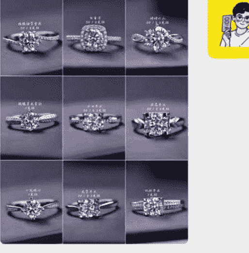

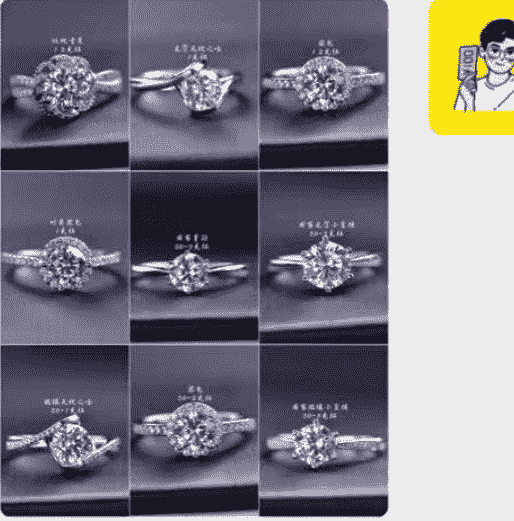

懒人微信：lazyhelper

[PAGE 26 -- Merged]

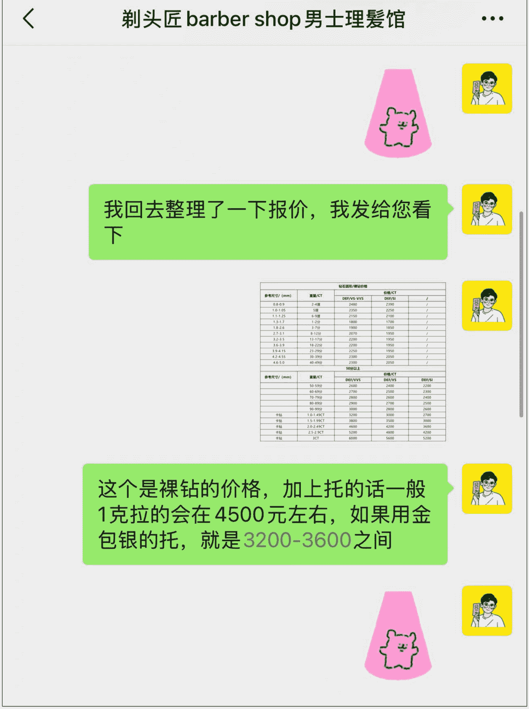

# 三、项目的总结和成果展示

### 项目总结

培育钻石赛道在市场大环境经济不好的情况下，反而是一个上升的趋势，我个人也在这两年不间断的有复购和新购，也是推荐小白可以去尝试入门试试高客单价获客的项目，相对于其他高客单价，钻石行业本身的市场教育是非常充足的，提到钻石自然会联系到【贵】，具体的项目难点还是在跑通获客和转化话术的打磨上，也希望各位圈友能够在日常生活中多多发现自己身边的小机会，并加以利用好去赚取自己的第一桶金。

懒人微信：lazyhelper

[PAGE 27 -- Merged]

同时，培育钻石不单单限制在婚嫁市场，因为培育钻石的主要成分是物质碳化，现在也衍生出来了【生命钻石】的细分领域，用宠物的骨灰和毛发可以制作的生命钻石单颗能过万，其成本大概估算也就在千元左右，但这个领域我没有深入了解过，深圳有比较头部的该类企业，有兴趣的圈友可以自行了解下。

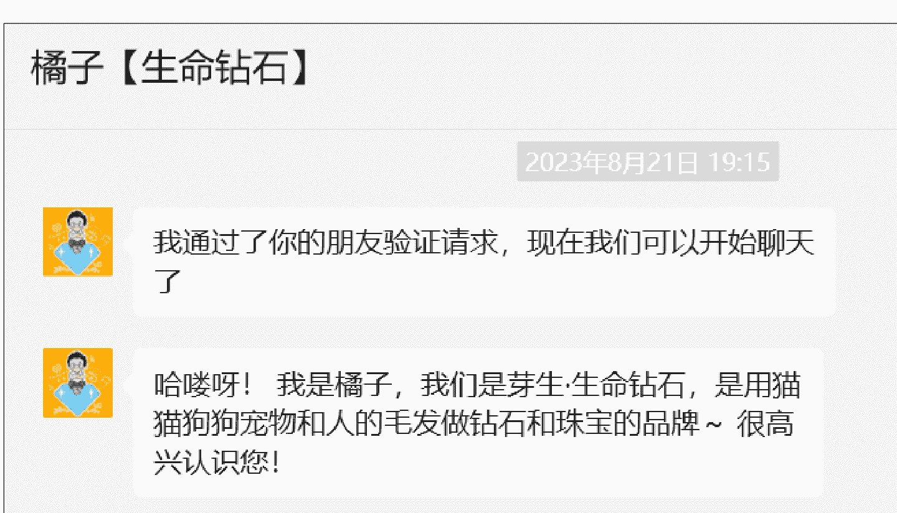

[PAGE 28 -- Merged]

### 成果展示（小装一下）

截止发帖 25 年 5 月，培育钻石一共给我带来了预估有 8 万左右的收益，扣除自己花费的 3 万多盈余约 5 万左右，并且从当前情况来看，身边朋友们有结婚打算的都在逐步询问，长期来看还是非常不错的~

[PAGE 29 -- Merged]

蒂夫尼六爪 ¥2000.00

捡漏价！！1 克拉钻石戒指，真钻！ ¥3160.00

[PAGE 30 -- Merged]

2023 年 10 月 5 日 13:04
可以
微信转账
已被接收
¥2500.00
已收款
微信转账
¥2500.00
"4"

2023 年 10 月 5 日 13:10
可以
啥时候能到
5 天内，顺丰加急
没有 15 分的
给你找了大一点的
按 15 的价给你的

[PAGE 31 -- Merged]

> 还没到账
好喔
> ¥2700.00
已被接收
微信转账
> ¥2700.00
已收款
微信转账
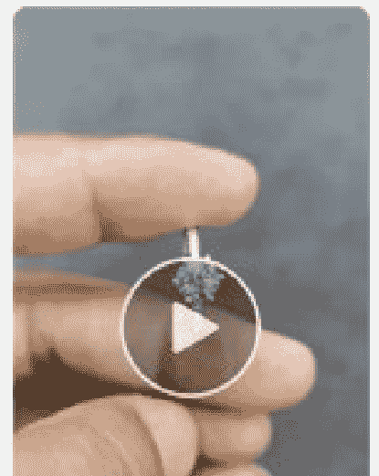

杰哥 看下这个 50 分的 多少钱
圈口 11

[PAGE 32 -- Merged]

要多做一个扣，防止太长
30 分的对吧
便宜很多
对的
你算一下
或者做成这个一粒的 50 分也行

[PAGE 33 -- Merged]

### 公众号懒人搜索，懒人专属群分享

15:40 35
<【咸鱼钻石客户】...
你弄一个 3000，一个 2000 不就可以
了
大哥
要扣手续费的
发给你了
3 千 +2 千
￥3000.00 已被接受 微信支付
好
收货地址
收人：麻 手机号

懒人微信：lazyhelper

[PAGE 34 -- Merged]

### **¥2000.00**

已被接收
微信转账

### **¥2000.00**

已收款
微信转账

### **¥1500.00**

已被接收
微信转账

### **¥1500.00**

已收款
微信转账

等视频发给他看看 再发地址过来
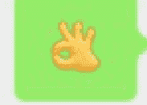

公众号懒人搜索，懒人专属群分享

[PAGE 35 -- Merged]

怎么说
4800 差距肉眼看不出来
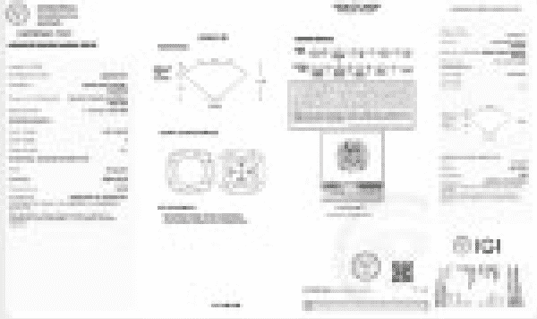
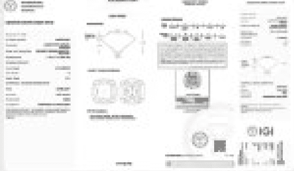

¥ 7200.00
已被接收
微信转账

该省省该花花
2 克拉哦
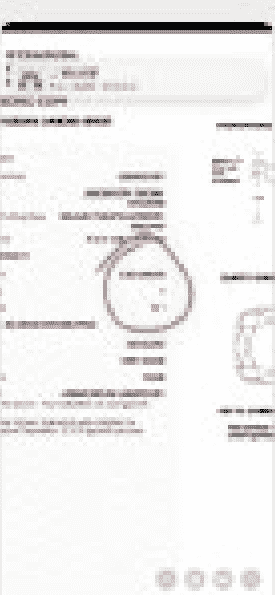

ok
【钻石客户】
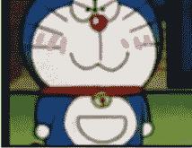

已收款
¥ 5150.00
微信转账

钻石：1 克拉主石
【发货前提供会净度参数】
戒托：18k 金戒托【12 圈口】
款式：扭臂雪花【微镶】
证书：IGI 证书
包装：蒂芙尼

款项【5150】已收到👋感谢信任
有任何问题，随时联系我

欧了

[PAGE 36 -- Merged]

# 四、项目 SOP

小白上手的全流程简要总结：

### 产品渠道：

线下：

深圳水贝/河南/连云港等地均有类似珠宝集市和市场的地方：可以在市场中获取老板们的联系方式，但大部分不是工厂，价格也会虚高，建议以渠道商的视角去谈合作

珠宝展会：同上，很多展会的供应商对散户的态度是比较傲慢的，知道你是个人甚至聊都不跟你聊，可以先问具体的批发价格，表示自己出货的客源，但目前在找多家供应商了解，从乙方角色变成甲方角色为妥

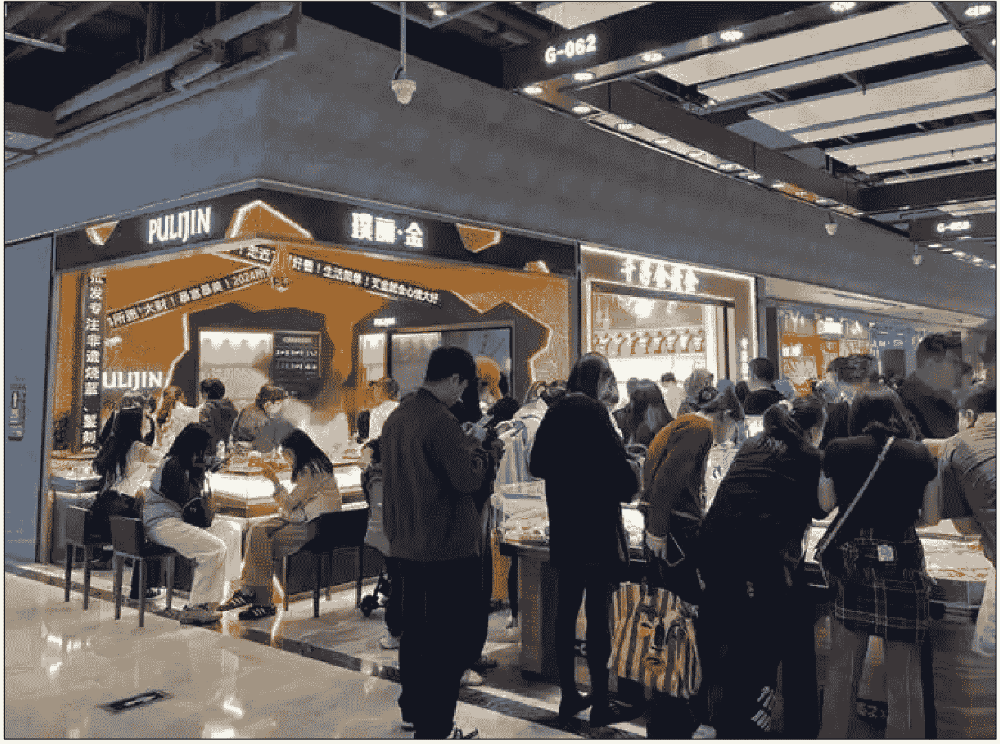

[PAGE 37 -- Merged]

线上：

闲鱼：闲鱼特别多我这种二道贩子，但也有供应商混在其中，可以根据发货地和其 IP 地址是否一致初步评估，同时也可以利用上面我讲的分辨方法分辨。

工厂官网：有很多老牌的工厂目前是没有做 SEO 的，所以要费点功夫才能找到对应的联系方式，可以用企查查搜营业范围或者是企业中带有钻石的名称的判断寻找

淘宝/1688/京东/拼多多：略，不做解释

公众号搜培育钻石相关（不推荐）

### 获客方法

公域：推荐可用资料包获客；求婚策划案大全/婚礼需要准备清单/三金五金钻戒购买指南等......

不推荐策划案大全，有概率吸引来婚庆公司

[PAGE 38 -- Merged]

在平台分享内容建议也是以自己是购买者分享的角度出发，会更有信任感；评论和正式帖子内容均可，比如可以先引导到自己的微信，谈完以后用另外一个微信做客服添加客户

小红书

抖音

视频号

图虫

SOUL

微博

### 建议尝试话术：

结婚还是很有必要买钻戒的，人生重要的意义时间有钻戒见证我个人觉得是很值得的，但是现在大牌子营销圈钱比较厉害，如果姐妹真的要结婚，还是推荐去深圳水贝买培育钻戒，很便宜，我自己结婚本来买周生生的六爪，要 8 万多，去水贝买了同款培育的才 6K+
（然后可以用小号来进行评论：真的吗，哪一家店……互相顶评论，客户一般如果不在深圳都会想加你了解的）

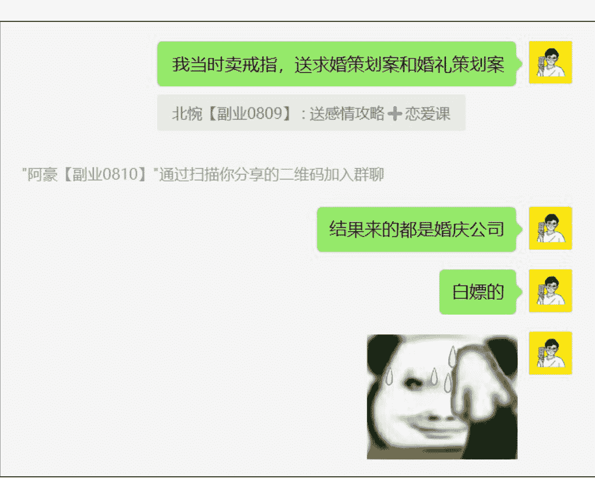

[PAGE 39 -- Merged]

003-中式婚礼 31 款
位置：036-婚礼系...320 款 >
036-婚礼系列大全 320 款
位置：02-点进分组保存 >
2023.10.7 深圳婚礼（婚礼底片）
位置：2023.10...深圳婚礼 >
3572 婚礼 PPT
位置：62 套 ppt 模...婚礼相册 >
参考图（婚礼实景图）
位置：灵感图 >
107 套高级感婚礼 PPT
位置：求婚婚礼合集 >
2023.10.7 深圳婚礼
位置：10.7 合影 >
62 套 ppt 模板新婚礼相册
位置：求婚婚礼合集 >
2023.10.7 深圳婚礼（二次亮图）
位置：2023.10...深圳婚礼 >

#### 私域（荐）

适龄的朋友圈，用自己是购买用户的视角去进行分享

[PAGE 40 -- Merged]

公众号懒人搜索，懒人专属群分享
41 / 49

5"
6"
4"

8000-10000 的钻戒有啊
我懂你意思
不是 我不能太贵的
OK
2023 年 9 月 24 日 20:03
这个就行
有
剩几个了
00:24
林总，换个钻戒
还有不
这个人
钻石这东西，价格是不是随便往上吹的

懒人微信：lazyhelper

[PAGE 41 -- Merged]

好
劝劝你朋友
天然钻很冤种
5"
现在市场上天然钻都是宰人的
31"
我科普一下，因为我自己是研究过才决定做的
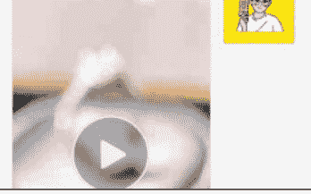

多少钱啊
一克拉大概 5000 左右
周生生同款的那种 6 万的我这里 6 千

這麼便宜我操
是啊，而且很好看的
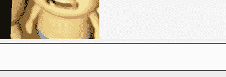

20:08 靓仔寡妇
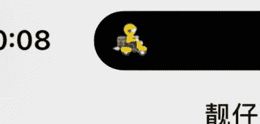

那个戒指
它没一克拉的了
啊？那咋办
30ct 和 50ct 的有点瑕疵，他和我商量说可能要过 2 周
你看还要吗，不要我让他退钱给你先
没事，那我等多几周，反正结婚也在十月份，还来得及
一个月后应该能搞定吧，一克拉的
得
可以
那我和他说，辛苦你等咯

[PAGE 42 -- Merged]

#### 转化路径

建议在询价完毕后和供应商确认完整价格，通常供应商都是全款收取后才制作的，为了保证风险可控，建议按照完整价格上浮后给到客户反馈，让客户支取和全款一致的订金，整个流程为：

+   - 客户咨询
- 供应商沟通
- 价格确认
- 客户支付定金（比如供应商开价 3000，那么你给客户就可以是 5000，3000 是定金）
- 支付全款给供应商
- 制作发货
- 客户收到后支付尾款

#### 售后注意

在和客户沟通的过程当中一定要强调，定制产品在定金支付后不予退还，但如果圈口不合适可以调整，避免后续出现客户反悔的退款问题，尽可能降低自己的风险

圈口非常重要，最好让客户进行实地的圈口测量在购买，如果不能测量，红书上有教如何用身高体重推测圈口的教程，要注意圈口有分不同的类型，不同类型的单位不一样，记得和供应商沟通好自己用的是干什么类型的测量方法，避免售后问题

[PAGE 43 -- Merged]

如果客户提到戒托很贵（黄金贵啊）可以推荐使用金包银，在不接触酸性洗涤剂的情况下不会变色，可以佩戴 2-3 年不变色，变色也可以让供应商进行清理，价格很便宜，实在预算不足的可以推荐

### 其他要点

避免在跑通之前增加任何的投入！任何！任何！任何！任何！

该项目不推荐在电商平台测试，目前电商平台在这两年培育钻石逐步内卷，还是建议往私域引导

小白如果想入门不知道怎么开始，可以先自己去假装客户和电商平台的客服沟通，了解一下客服会怎么介绍，同时将 QA 沉淀成自己的知识库内容

### 附：钻石相关专业信息

掌握更好的钻石信息，可以更专业的去和客户介绍和沟通，是促进信任感的重要因素。

### 一、钻石等级——颜色 (Color)

D 级：完全无色。最高色级，极其罕见。

E 级：无色。仅仅只有专业的仪器能够检测到微量颜色。是非常稀有的钻石。

F 级：无色。珠宝专家可以检测到少量的颜色。属于高品质钻石。

G—H 级：接近无色。当和 DEF 级钻石比较时，有轻微的颜色。仍然拥有很高的价值。
I—T 级：接近无色。用放大镜可检测到轻微的颜色。价值高。
K—M 级：颜色较深，类似这种等级的，在克丽娅钻石不提供，也建议客户不使用。
N—Z 级：火彩差，类似这种等级的，在克丽娅钻石不提供，也建议客户不使用。

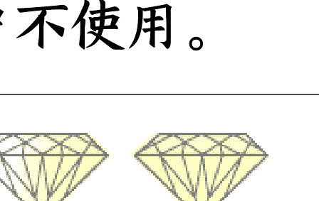

### 二、钻石等级——重量 (Carat)

克拉 (CT) 钻石重量的计量单位。1 克拉=0.2 克=100 分。0.75 克拉又称为 75 分。在其它 3c（色泽、净度、切工）标准近似的情况下，钻石重量越大，其价值呈几何级数增长。克拉钻具有保值和增值性，越大越能绽放光芒，勾魂摄魄。

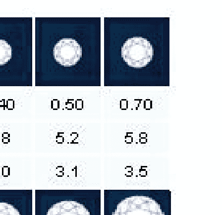

[PAGE 45 -- Merged]

### 三、钻石等级——净度（Clarity）

每颗钻石都含有天然的内含物，它们是钻石在发育结晶过程中周围环境发生变异以及其它晶体入侵的结果。这些内含物的大小、颜色、形状、数量决定一颗钻石的净度。内含物越少和越小，光线在钻石内部的穿透率就越高，钻石闪耀的光芒就会越迷人。

大部份内含物都不能以肉眼辨析，须在 10 倍放大镜下才明显看到。用 10 倍放大镜观察钻石内部及表面瑕疵的数量，分布，大小及对钻石光彩的影响，可分成 LC，VVS，VS，SI，P，共 5 个大级和 10 个小级。

净度是量度内含物及瑕疵的等级标准：由 FL/IF(完美无瑕/内部完美无瑕) 至 I(有瑕疵)。I 级净度代表内含物能以肉眼辨析，甚至还有刻痕和裂纹。克丽娅钻石不提供 I 级净度钻石，每一颗都有 GIA 证书，净度是否达标很容易看到。 

| 等级 (Grade) | 描述 (Description) |
| :--- | :--- |
| FL | 全美 |
| IF | 内无杂质 |
| 表面有极细小瑕疵 | |
| VVS1-VVS2 | 内含极细 微杂质 |
| VS1-VS2 | 内含非常 极细小杂质 |
| SI1 | 内含细小杂质 |
| SI2 | |
| P | 品质欠佳，内含肉眼可见杂质 |

[PAGE 46 -- Merged]

### 四、钻石等级——切工 (Cut)

正常购买情况下，如果客户没有特别指定，基本上切工要求是 3EX 就可以，不需要额外去沟通，切工的评级标准普通人一般不会特别关注，主要闪不闪还是来自于上面 3 个标准

切工是指技师切割钻石切面的角度，及完成切割后钻石各部份的比例。钻石价值衡量的 4C 标准中，唯有切工是直接受人为影响。虽然钻石可以加工成各种各样的不同形状，以满足不同品味，但是切工的优异程度直接影响钻石的火彩。根据科学方程式，完美切工钻石应将进入钻石内的光线，经不同切面作内部反射，最后凝聚在钻石的顶部，绽放彩虹一样的光华色彩。切割比例失调的钻石会令钻石失去光彩，达不到光芒万丈的效果。因此，切工好的钻石价值当然就高。

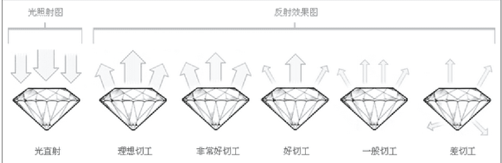

理想切工 (EXCELLENT): 代表只有 3% 的一流高质量钻石才能达到的标准。这种切工使钻石几乎

[PAGE 47 -- Merged]

光学原理折射到钻石表面，流光溢彩，绚丽动人。

非常好切工 (VERY GOOD): 代表大约 15% 的钻石切工。可以使钻石反射出标准等级的光芒。但会比理想切工的价值更低一点。

好切工 (GOOD): 代表大约 25% 的钻石切工。钻石反射了大部分进入钻石内部的光。较为便宜。

一般切工 (FAIR): 代表粗糙度为 35% 的钻石切工，钻石是品质好钻，但是一般切工加工的钻石反射的光线不及 G 级切工，白白浪费一颗优质钻。

差切工 (POOR): 这包含所有没有符合一般切工标准的钻石。这些钻石的切工很缺火候，技术不够，切工过轻过硬过深过浅都会让光线从边部或底部流出，从而使钻石失去应有的光彩。

历史 3000 多份各类付费文章以及年费三千多的副业社群资源，见懒人专属群内部分享！

懒人微信：lazyhelper

[PAGE 48 -- Merged]

## 付费群，白嫖勿扰！

## 懒人专属群更新记录：

https://lazybook.fun/#/blog/record2