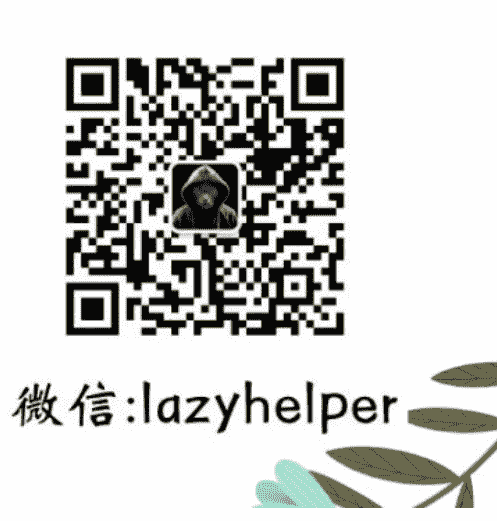

# 超级个体做 IP 需具备的 10 个能力（2.5 万字总结）

## 250514 生财精华

整理：公众号懒人搜索，**懒人专属群**独享
懒人微信：lazyhelper

大家好，我是芷蓝。

6 年来，我从职场做副业，辞职后做自由职业者，升级到超级个体，最后成为 1 人公司。这一路走来，生财一直陪伴着我，我现在的业务也越来越稳定，开始慢慢的一边旅行一边办公，享受人生。

我知道生财很多小伙伴都有 1 个辞职创业的梦，或者想当 1 个自由职业者，但是很多人其实不知道我上面说的那 4 个身份到底有啥不同。

今天给大家分享一些思路，把我这一路走来慢慢积累的 10 个赚钱能力和大家聊聊，当然这也是做 IP 所必备的能力。

- 10 个赚钱能力：知识管理、时间管理、学习能力、沟通能力、决策能力、执行能力、产品能力、复盘能力、迁移能力、屏蔽能力。

## 一、知识管理

作为一个超级个体，你需要应对很多之前不需要你去解决的问题。比如说你之前在职场里是一位销售人员，那你只需要去解决销售线索的获取，产品卖点的总结，和用户沟通推荐产品的话术，这三个问题就可以了。

至于这个产品的营销素材去怎么做？产品怎么去做市场推广？产品体系应该怎么去设置？这些都不需要你来管，你在组织里面只需要专注自己的事情，处理好自己的事情就 OK 了。

但是当你一路走来成为 1 个超级个体之后，你会发现所有和营销相关的问题，你都需要自己去解决。

比如说你要解决制作产品的问题，那怎么才能制作产品呢？你得去寻找用户的痛点，这就得做市场调研。找到了用户的痛点之后，你还得把这些痛点进行归纳总结变成一套课程的提纲，有了课程的提纲之后，你还得去填充每一节课的内容，那每节课内容他就包含了方法论 + 案例数据 + 流程步骤。

那如果想完成和营销相关的所有动作，你就必须具备一种能力：知识管理。

什么是知识管理？这里面有 3 个核心要素，芷蓝给大家列出来：1、什么是 有用的知识？

有人一提到知识管理，最先想到的场景就是，我把收集到的一些资料课程给他放到不同的文件夹里面，摆放整齐放在那里，然后如果什么时候想用就随时调取。

这就不叫知识管理，最多叫做资料收集，他只是知识管理其中的一部分，但绝对不是最重要的那部分。

我们在做知识管理的时候，一定要记住一个核心逻辑，只去管理那些对我们现在有用的知识，没有用的就不要去管，把它放在那里，不要让他耽误你的时间。

举个例子，比如说更新的《100 条自由职业生存指南》专栏，现在卖了 5000 份，引流了 1000 多新用户过来。那在这个专栏更新的过程中，我可能会有几个模块，就像我今天说的，关于一个超级个需要掌握的 10 个技能，10 个技能我是怎么总结出来的呢？就是通过知识管理。

我追溯自己的成就，然后用成就去倒退我需要掌握的能力，比如说我有 5 个 8000-10000 好友的微信号，这些流量是怎么来的？是我通过不断地内容输出，通过不断地引流积累下来的。那内容输出就是一个必要的能力，这个能力他适用所有超级个体的所有场景，就是我们要掌握的。

很多人每天总是去整理自己那些文件和资料，他甚至没有去思考一下这些东西自己未来是否还用得上？你比如说这份资料，或者说这个营销技巧都已经过时了，那你还有必要给他做个分类放下来吗？直接删除或者扔掉就行了，甚至就放在那里不管它也可以。

在我看来，所谓有用的知识，就是可以帮助解决当下或者未来某一个时期的问题，这些知识才值得你去管理，才值得你去为他搭建模型。

2、有效收集信息那当我们知道了自己需要什么样的知识后，就去找到这样的信息，然后把信息通过实践给他变成知识存储的自己的知识体系里。

这就需要你知道怎么去收集优质的信息，收集对你有价值的信息。从我的角度来看，一共有两种方法，第一个是直接付费去购买，你接触不到的信息差，比如说付费购买生财有术星球，比如说付费购买专栏，我自己在得到 app 上就卖了几万块钱的产品。

第二个就是你要善于从一些看似普通的信息里面提炼出有价值的要素，这就像我在我的知识星球里面一直在做一个栏目，叫做#案例拆解，拆解的就是自媒体平台上那些做得好的 IP 账号，其中可以复制到你自已业务上的爆款因子。

只要你能够找到某一类信息中的相同要素，这个就是有价值的，因为你可以快速复制这个要素来实现你想要的目标。

当然，信息收集高手还需要拥有很多能力，比如说如何更科学的使用搜索引擎，比如说如何通过指定词和 AI 工具快速获得你想要的答案，甚至是找到关键人物，直接从关键人物那里得到你想要的信息。

3、新旧知识链接如果你不能把新的知识和自己旧的知识体系连接在一起，那你这新的知识也没办法去使用，或者说没办法快速使用。

我来说说自己平时是怎么操作的吧，非常简单，我把所有知识全部变成了关键词，然后为这些关键词建立关联。

比如说，在我大脑里流量和产品这两个词进行链接就是“变现”。

而产品、价格、渠道和推广又构成了营销，其中渠道我又可以拆分为私域和公域。

每一个关键词和其它关键词之间都有这各种联系，当这种联系越来越密集，你的知识体系就会越来越完整。

你要做的就是把知识变成可以无限组合与拆分的乐高模块，这些模块可以帮助你搭建任何自己想要模型。

随着你获取的新颗粒越来越多，你可以搭建的模型种类就越来越多，能够解决的问题就越来越多。

你有时候会发现身边某个人特别厉害，你无论问他什么，他都能很快给你一个逻辑性极强的答案。

这就是因为他的大脑里连接点很多，而且链接方法非常熟练，你无论丢该他什么问题，他都能马上给你一个合理的模型。

而且我最近还在研究「系统」这个东西，在我看来，任何关键词都是 1 个系统，无论多简单的关键词，你必须先承认它是一个系统，承认之后，你就可以对这个系统进行 4 个动作。

分别是：
- 拆解系统 ➞ 得到系统要素
- 搭建系统 ➞ 看到系统模型
- 运行系统 ➞ 发现系统 BUG
- 优化系统 ➞ 提升系统效率

世界就是一个大系统，大系统里包含了无数个小系统，小系统又可以用这 4 个步骤来进行优化，最终一个系统运行成功之后，它就变成了一个模型，沉淀到了你的大脑里或者说心智里。

未来这个模型就可以和其他的系统模型进行组合，组成新的系统，新的系统又是一个关键词。

至此，你的人生就变成了一个可以无限优化的系统，而赚钱只是系统运营中的一环而已。

这个逻辑我也是在继续研究中，今年我会把研究出来的结果试运行，成功之后再跟大家分享，有了这个系统逻辑，你就可以用一个自己想要的目标来当作这个系统的开关了。

## 二、时间管理

不要觉得当你辞职之后，成为自由职业者之后，成为超级个体之后，你的时间就比之前要充裕了，这是一个错觉，甚至是一个错误的感知。

当一个人被组织和规章制度约束的时候，他的时间才是最充裕的，因为他每天可以按照固定的行为路径去执行动作，那就有了明显的行为边界，上班的时候工作，下班的时候就可以休息。

但是当你变成一个人不受约束的时候，这个边界消失了，那你对于时间的利用率就会降低，一觉睡到早上 10:30，晚上想熬夜到几点去疯，都没有人管你，因为第二天不需要早起上班。

那带来的结果是什么？该做的事情做不完，总以为自己有大量的时间去做，但是却很难开始，因为你总想着等一会儿再去做，总想着我第二天再去做。

陷入到这种恶性循环怎么办？这是就需要对自己的时间进行管理了，或者说也可以叫做对自己的精力进行管理。

还是拿我自己举例，我自己的时间就是按照模块来使用的。

清晨对我来说是一天中质量最高的时间模块，所以我每天早晨 5:30 到 6:00

左右就会起床，也没有特别早，保证好自己的睡眠时间。

起床之后到 7:00 之前，能有 1 小时到一个半小时的时间给到我自由发挥。我通常会利用这段时间来运动，读书，写作，完成今天的日课，或者给家人做一顿早餐。

这里给大家一个小建议，其实不用长时间的坚持某一件事情，因为无论这件事情对你有多大的帮助，人他都会感觉腻的，一件事情做久了肯定会让你不舒服，让你觉得没有新鲜感。

所以我自己都是今天运动，明天写作，后天可能做一做早点，这样循环着去操作，效果非常好。

到了 7:00 之后，因为我有两个小孩，所以就要叫他们起床，然后督促他们吃早点，然后送他们上学之类的一系列事情，这个时候我就不会去想工作，认真把这些事情都做好。

等到了第二个时间模块，就是 9:30 或者 10:00 左右我到达咖啡厅，开始上午两个小时的工作，在这段时间我可能会回复一些玩赚新媒会员以及合伙人的信息，给他们一些建议参考，或者更新我的知识星球小专栏之类的事情。

12:00 之后，我就要按时去吃午饭了，我通常出去的话会选择那种综合性的 shopping mall 这种综合商业体里面会有餐饮，健身，咖啡厅等等一系列的设施。

中午吃完饭，我不会选择继续回到咖啡店里工作，而是在商场里面溜达一下消化食物，大约一个小时之后，要不我就是会去找一个做 spa 的地方，睡个午觉按摩一下，要不就是去找一个像超级星星或者乐刻健身中心这种地方去运动。

每天保持一定量的有氧运动，可以让我的精神更好，脑部有充足的血液循环，这样你在做决策的时候也会更高效。

下午 4:00 左右，我会继续回到咖啡厅来工作，一直到 6:00，这两个小时的时间我也会进行创作，比如说去规划自己的新课程，比如说去整理一些自己之前记录的笔记，把他们通过文章的形式输出到平台上面。

6:00 左右的时候回家吃饭，陪孩子学习或者练钢琴之类，等到了 8:00 的时候，孩子可能会去看动画片或者其他娱乐，我又可以稍微工作一会，但是我在晚上不会给自己强度太大的工作，通常都是发一发朋友圈，然后固定回访自己的微信好友，挖掘他们新的需求。

到了 10:30 左右的时候就开始放下电子产品，洗漱，然后上床看一看书就睡觉了，我自己属于到了 10:30 到 11:00

的时候就已经困的受不了了，倒是不担心失眠和晚睡。

以上是我作为一个自由职业者一天的行为路径，当然不要过于苛求自己去
做某一种规定好的循环，一个星期有
两天的时间晚起，我觉得也没啥问题，过两天再调整回来就行了，适当的让自己去放纵一下，有助于调整自己的心态和身体。

对于时间管理这件事，一个自由职业者要想明白一个逻辑，就是无论你给自己制定了任何原则，这个原则本身不重要，重要的是你要有原则。

原则是干麻用的？其实是帮助与节省自己的决策成本，当你有了一个原则之后，遇到了那些犹豫不决的事情，你就按照自己的原则来，在原则之下再去找弥补的方法。

这里就用衍生出一个概念，叫做周期，我一直都说做自由职业者或者创业者必须识别到自己的周期。

这个周期可能是收入周期，也可能是自己的精力周期，在某一个周期内，你可能会陷入低谷，但是不用担心和焦虑，度过了这个周期之后你就会走出来，如果你担心和焦虑，那就是会导致你一直走不出这个恶性循环周期。

而且也不要对自己过于苛刻，经常有人问我，坚持减肥，但是每次总失败，下次再想去减肥的时候就会觉得

反正每次都失败，不如就不去做这件事了。

我说你可以换一个维度去看待这个事情，虽然每次都失败，但是如果一年中，你能够有 4-5 次这样的坚持，那最后加起来你依然做了一件了不起的事情，至少在坚持的时间段内，你有运动，你有控制自己的饮食，只要你做过的事情其实都算数。

时间管理的意义就在于此，帮助你更好地找到自己的周期，帮助你更好地使用自己的时间模块，并且养成这个习惯，再进一步就是要让你身边的朋友还有你微信上面的好友，你的客户都看到你自己是怎么使用时间的，那他们就会按照你的时间使用说明书来使用你。

我的朋友圈会置顶我的时间使用说明，我不会随时回复用户的信息。因为一旦我随时回复，他们就产生了这种期待，那有一天我因为有事情没有回复，有后就会对你有意见。

## 三、学习能力

生财的小伙伴应该都能感知到，在星球里学习能力强的人，总是能找到别人分享的好项目，然后快速去熟悉这个领域的玩法，并通过实践完成闭环，赚到钱后，就会进入复制和放大的学习阶段，继续赚更多的钱。

如果说一个人是否能识别风口和红利，可以决定他的第一桶金赚取速度，那学习能力就决定他后续赚到第 10 桶金的速度。

在我身边，那些学习能力强的人，他们适应自由职业者生活方式的速度非常快，最重要的是他们赚钱的效率很高。

比如说在一个知识星球或者社群里面发现了一个项目，然后他们可以 quick quickly 找到这个项目里面自己可以操作的那几个关键要素，并且马上把他们付诸于执行动作。

这里有一个重点，成年人的学习方法和你在学校时期的学习方式是完全不同的。

为什么很多自由职业者学习别人做项目或者说学习别人写作赚钱的时候总是没有结果？因为他还在用学生时代的那一套，唯一标准答案，或者系统学习方式来进行学习。

这里出现了两个词，一个叫做唯一标准答案，另外一个是系统学习方式，这就是提高自由职业者学习能力的两个核心要素。

我先说第一个，什么是唯一标准答案？

就是当你在学校的时候，检验你学习效率的唯一方法就是考试，只要考试，就可以用标准答案来衡量你学习态度怎么样或者说你平时有没有认真学习，有没有认真复习等等。

但是成年之后，任何事情其实都没有唯一的标准答案。

你公司离家近，但是赚钱少，你要选择哪一个？离家近就很好吗？赚钱少也无所谓吗？这需要你自己根据当前的情况去衡量，找到一个相对来说在这个阶段对你合适的方案。

在你成为自由职业者之后，你会经常遇到这样的问题。

比如说是先赚钱，还是先找一个自己喜欢做的事情，那如果先赚钱，你就要学习那种能够快速反馈的项目，那如果是找一个自己喜欢做的事情，那你就要去练习一个核心的底层能力。

所以，自由职业者的学习方向并不是用来检验你那个唯一答案，而是你需要找到当前这个阶段自己最优的解决方案，然后在这个解决方案之上去寻找自己的学习方式。

我自己当初就是这样，2017 年刚刚辞职的时候，知识付费行业快速兴起，我观察了一圈发现做起来的那些 kol，都是通过付费社群在变现，而且这些付费社群有 70% 以上分享的都是关于互联网产品经理和运营这两个岗位所需要基本能力的相关知识点和课程。那我就快速拉群，然后通过过去学习和分享内容，运营用户运营和活动运营这三大模块的相关知识，就把我自己

会员群的第一批用户拿到手了，到现在也已经是 10000 人社群了。

你看，这就需要你快速判断自己当前处于哪个阶段？自己当前最需要的是什么？

那再来看第二个，就是你要抛弃学生时代的那种框架、系统式的学习方法。

举个例子，如果现在你想通过教别人手机摄影来赚钱，那请问你应该怎么去学习手机摄影呢？

大多数人可能会说我买一本摄影基础，厚厚的一大本，然后我从头开始详细的学，打好基础未来学习速度就会加快。

如果你这么学的话，我可以负责任地告诉你超不过两个星期，甚至一个星期，你可能就把这事给放弃了。

为啥？因为系统式学习方法，最大的问题在于前期非常的枯燥，你需要记住各种概念，记住各种术语，如果是学生时代有老师监督有每天上课这种场景，你这种学习方法可能没问题。

但是，现在咱们可是自由职业者呀，或者说是打算成为自由职业者的打工人呀，哪有时间让你去这么系统的学习知识呢？你又怎么可能有这种耐心能够坚持学习这么长时间呢？

这里就要引入一个学习概念，叫做自然学习法。

如果你想学习手机摄影，那我建议你

先给自己设置一个场景式的挑战。

比如说你去找用户对关注的那几个手机摄影学习重点，很多人给自己女朋友拍照片都不好看，包括我家王先生给我拍照片也是这个样子，只要人在画面里就行了，才不管你这个人的腿长不长，你这个人后面背景清不清晰。

那既然看到了市场上用户的这个痛点，那你就可以专门去学习，怎么才能把自己的女朋友拍得更好看？

在咖啡厅怎么拍？

在机场怎么拍？

在草坪上怎么拍？

在民宿酒店里怎么拍？

找到几个场景，然后也不用学习那些复杂的操作方式，简简单单的几个构图加上用一些修图软件，这事儿就完了。

这样学习完的好处就是你可以快速应用，快速应用有了结果就可以快速分享，甚至说你在分享过程中就有人为你付费了。

这是当有人为你付费了，或者有人过来找你付费咨询了，你再去从头找那些基础的操作逻辑来学习，就不会那么枯燥了，因为你已经有正反馈了嘛。

所以作为自由职业者、超级个体，甚至是 1 人公司，你必须想清楚自己的学习目的以及当前这个阶段，我到底要学习什么？对于我来说什么是最重要的，最后再从一个挑战开始学起。
只有这样，你才能够把这条超级个体的路走下去，才能真正通过学习赚到钱，然后养活自己，甚至是把它变成自己未来的一个兴趣爱好持续的深耕下去。

就包括现在生财星球有这么多项目实战内容，这么多素材，这么多创业经验，你想要学习 1 个领域，首先就得先给自己建立一个挑战，一个挑战其实就是一个项目，用项目制来作为自己的学习计划，才能学出结果来。

我个人觉得，成年后的学习，必须是有功利的，否则你很难收到有效反馈，没有反馈，你肯定没有动力继续深度学习。

回想起我自己当初走上自由职业者之路，还是因为我家王先生辞职之后，一直在跟我保持「沟通」，给我各种画大饼，说我特别适合做自由职业者，说咱们家以后可以一起旅行，边玩边赚钱，反正就是一顿说，最终我还是动心了，现在来看，当初他跟我沟通的很多方法，都是用北京的话说都是一套一套的。

## 2、把自己的目标和需求传递给对方

那如果你发现对方并不值得自己这么去做，那就直接给到他想要的。

比如说我就会直接跟这种新用户说，你可以尝试闲鱼电商，或者小红书虚拟资料，或者抖音团购达人，这些都是比较好做的项目，我以前也做过都赚到钱了。感兴趣的话，就来我星球里学习。有大量的操作文档，然后有啥问题，一年内都可以随时、无限制在星球里向我提问。

你看这个就是用户想要的一个答案，我投其所好，用对方喜欢的方式、理解的方式去传递我的信息，去和他沟通，那就是效率最高的。

很多人还有一个问题，就是聊着聊着就把话题聊远了，就开始闲聊了，这个也是我的会员，经常会向我提问的一个困惑。

比如说用户来找你咨询写作相关的问题，本来你是想卖给对方一套自己的写作课程，或者说把自己的一个写作训练营卖给对方。

但是聊着聊着，就开始聊当前的市场环境不好呀，职场人的生存压力大呀，就聊到这一块儿。其实你再不往回兜，用户都忘了自己当初为啥要过来添加你好友了。

怎么办呢？那就是时刻去给对方提供你的方案。你不能准备一个方案，你要准备好几个不同的、可以从各种维度去让他接受你产品的方案来跟他沟通。

就好像当我向用户推荐我的知识星球的时候，那对方说“我先看看，过段时间，如果有需求就会找你来购买”。

如果是你聊到这一步，你会怎么说？

你可能会说：“那好的，如果有需求随时来找我沟通，来找我咨询。”

你这样就把天聊没了，在你的思维里面就把沟通变成了一个有限游戏，其实是可以变成无限游戏的。

那你可以说：“好的，我顺便问一下，您现在是从事什么工作呢？我这儿正好有一个针对于某某行业的资料包，我整理了三个月，很多会员小伙伴都说很有价值，你要不要看看？”

这等于什么？等于重新开辟了一个话题，然后等着对方回答，而且这个话题里面所包含的信息量还非常高，就是高到对方不可能不接收的那种地步。

你想想，用三个月整理一份资料包，然后还收到了很多会员的认可，那对方心里会想：“这个东西免费给我的，那我一定得去看看。”

所以这个时候他就会回答你提出的问题。那只要他说出了自己的行业、自己所在的领域，这个时候你怎么办呢？你就可以说：“我会员或者我的学员里面，也有一个跟您从事的是相同的行业、相同的状况，现在他已经有了什么什么样的成就，然后您要不要过来学习？正好他还在我的会员群里面做了复盘。”

你看，又向他推荐了一遍你的会员，只不过是用了一个不同的维度、不同的方法而已。

那如果他又拒绝了，这个时候你就可以把这个资料包发给他，然后跟他说：“这个资料包里面分门别类地设置了各种各样的文件，如果您对于什么什么有需求、感兴趣，最好先学习这个。”

那对方可能就会说“谢谢”，这个时候你就可以又说：“其实像您这种情况，我特别建议应该先去做哪件事情。”

你看这又起了一个新话题。当然我上面说的这些是我自己的一些实际操作，大家在和自己用户的沟通的时候，还是要根据当前的一个场景，还有对方跟你说话的语气、态度啊，去判断怎么去回应。

但是这个逻辑是不变的，一定要准备不同的方案，然后用不同的维度去跟对方聊。

## 3、给到对方最小执行路径

上面我跟大家分享了关于如何通过抹平双方的信息差或者投其所好，把自己的各种方案传递给对方。

那如果说对方已经慢慢地接受了你的这个理念，或者说你传递给他的核心价值，这个时候应该怎么助攻？快速成交或者达成自己想要的结果呢？

那就是给到用户一个特别好执行的路径。比如说如果当用户已经准备买我的知识星球会员了，那这个时候我会给他发一个我星球新用户的学习操作方法。

那里面有 5 个步骤，我还做了一张手绘地图，里面是一片森林，用户进入就是一个探险家。
1. 第一步：发现伙伴
2. 第二步：寻找资源
3. 第三步：开拓眼界
4. 第四步：密林探索
5. 第五步：（原文此处省略）

由于图片比较长而且带了二维码这里就不放了。

其实就是为了能够让用户快速识别到我加入那个星球之后，应该怎么去学习、怎么利用好这个星球来实现我的目的。

有了这张图之后，那用户看了一下发现“哦，原来我加入星球之后，可以这样这样去学习”。那用户觉得自己的学习执行成本更低了，更清晰了，他就会加快付费的速度。

当然，这个方法不仅仅是可以帮助我们自由职业者更好地赚钱，更好地跟别人沟通和合作，还可以在你的职场生涯中帮助你更高效的解决问题。

比如说你是产品经理，那你在跟研发需求的时候是不是得对其颗粒度呢？那怎么对齐呢？提完了你的需求之后，是不是得给对方一个今天的行动步骤呢？

比如说你可以跟对方交流：“咱们今天讨论的是关于这个新产品落地页应该放在什么地方的问题，那已经有了一个共识，看看今天在晚上 6:00 之前能不能把这张产品落地页的第一部分做好，然后我们来测试一下或者给老板看一下？”

你看，这样大家聊完之后我就有了行动的指南了吗？就怕一起聊完，然后交流得很充分、也很热闹，聊完就聊完了，几天之后大家一碰，结果一点进展都没有，那这次沟通就白费了。

好啦，这篇内容写得有点多，但是如果你能够全部看完，并且去尝试地执行，我想一定可以有效提升你的沟通能力。

## 五、决策能力

首先问生财圈友 1 个问题，你觉得决策和决定有什么区别？

很多人都会以为这两个概念是同一回事儿，反正就是做选择。但在我的认知逻辑里面，做决定是那种一眼就能够看出来的答案。就比如说要不要去锻炼身体，这就是一个决定，因为答案很简单，锻炼身体一定会对你的健康有好处。

那什么叫决策呢？那就是今天有一个饭局，好久没见了一个小伙伴，你吃饭，而且吃的东西还挺腐败的——大鱼大肉、火锅烤串。那你已经坚持健身一个月了，而且都是健康饮食。

问题来了，你今天是去还是不去呢？

你看这个就不好选择，没办法做出答案。一边是好久不见的伙伴，如果你不去肯定会伤心，有可能他还是特意从很远的地方来看你；另一边你已经自律了很长时间了，如果今天真的去跟他吃饭了，一顿大鱼大肉，就破坏了你自己的整个计划。说完之后也许会很愧疚很长时间。

怎么办？这个时候就要看你的决策能力了。

做为一个超级个体，决策能力，首先帮助你解决的就是赚钱的问题。

有一个项目自己不喜欢，但是身边好多人都做这个项目赚到钱了，那我到底做还是不做呢？

或者说已经自由职业六个月了，每月的收入依然是 5000 块钱左右，就属于那种刚刚饿不死的状态，那接下来我要继续尝试做自由职业，还是说好好去找一个工作上班，每个月拿 10,000 块钱左右的工资呢？

以上这些全都需要你消耗大量的脑细胞去做决策。他在这个过程中芷蓝给了大家 3 个方法。

### 第一个方法：你要尽可能的去列出，你现在可以选择的要素

就拿上面我说的那个案例，有个大学同学从很远的地方过来找你毕业 10 年了，当初你们的感情特别好，现在想找你吃饭，那你该怎么办？

很多人会觉得无非就是吃或者不吃呗，不吃就去健身，但是有可能这个小伙伴跟你的感情就破裂了。

其实你的选择还有很多。

比如说，你能不能叫上这个小伙伴跟你一起去打一场羽毛球呢？

因为打羽毛球，他不像其他的运动，只需要一副球拍，还有运动服就可以了，而且相对来说也比较轻量化。

你可以跟你的小伙伴说：“这么久没见面，吃饭太无趣了，跟我去打球，较量一下，看看这么多年过去了，还是不是我的对手？”

你看这个选项就同时解决了你的社交，还有健身这两个问题。

选项不止这一个，你还可以跟他说：“我最近发现了一个特别好的素食餐厅，价格很贵，我早就想尝一下去了，正好你来了，我来请你，看看高级菜品是什么样的。”

这样不就又能吃饭又能帮助你保持身体状态了嘛？

赚钱也是这样，如果一个问题大家都在做，而且有钱赚，可是你对这个项目的操作不感兴趣，或者说这不是你喜欢的赚钱方式。

那你可以这样想，我现在做这个项目不等于未来要一直做这个项目，我先通过这个项目转一笔钱，后续我就可以去做自己喜欢的事情。

这样就把“做或者不做”，变成了“现在做或者以后做其他的选项”。

从不同的维度去思考问题，你的决策选项就会变多，那也就会有新的答案。

所以说，为自己的选择添加答案也是一种能力。这要求你有更强的思考方式和更全面地思考维度，这是可以去训练的。

就比如我再给我的合伙人做个人 IP 教练的时候，每当对方提出了 1 个问题，我都会去引导他按照 2 个维度（横竖轴）来进行思考延伸。你对一个问题的想法越多，得到的答案就越多，多个答案进行筛选和组合，总能有最好的解决方案。

### ### 第二个方法：做假设算成本，把你的选项量化

一个不好选择的问题时，要尽可能的多列出你的选项。

那这个选项列出来之后，你还要去进行分析和对比，找到成本最小、所以最高的那个。

就好比说今年公众号和小红书其实都有红利，有很多人在做小红书的各种虚拟资料，在做小红书的各种带货项目，那还有很多人在结合 AI 和公众号做爆文项目。

这两个项目都能赚钱。他作为一个自由职业者，刚刚脱离职场，我要选择哪个项目来养活自己呢？

这个时候就要算成本，你要去看小红书的各种项目，他的核心能力是什么？

我接触过很多小红书做得好的人，他们的核心能力一个是选题，第二个是封面制作。

选题无论做任何一个自媒体平台，其实你都要去琢磨，选题不好，哪个平台也做不好。

但是封面就不一样了，你做公众号是不需要去花心思琢磨封面的，所以你自己对于图片制作这个能力是否有研究？或者说自己之前的工作有没有涉及这块？

如果你不擅长做图，那有可能你的小红书就做不好。我不就是这样吗？我自己就非常擅长文字输出，所以我喜欢写知乎，小红书就做得不是很好。但是知乎的长篇内容输出依然可以给我带来精准和稳定的流量，我一样可以做转化变现。

你看这个就是分析成本，把选项列出来之后，你要看哪些选项是你现在成本最小的，或者说是你最擅长的，然后去选择那个。

你在比较成本的时候，还要把机会成本考虑进去。就比如说如果一件事，你不做，那空余出来的时间去做其他的会不会给你更多的好处？

比如说我选择去吃了一顿大餐，会花费 500 块钱。那这 500 块钱，如果省下来去报名一个 AI 绘画学习班，那未来我获得的收益是不是要比吃完这顿大餐的那个爽感要多得多？

千万不要把机会成本这个维度忘掉。他会让你错失很多机会，因为一个人当你做一件事的时候，必然就没有时间去做另外一件事，那你做这件事儿的成本可能就提高了。

### ### 第三个方法：快速决策

当你已经比较出这些选项的优劣势之后，就要立刻做出决策。在决策这件事上是没有灰色地带的，要不就做，要不就不做，如果你一直在犹豫做还是不做，同样会消耗你的大量精力和时间，而且会让你很焦虑。

我有好多会员，一年之前就问我当前情况，要不要去离职，自己创业？跟我聊完之后的自己分析了一通，后来就没信儿了。

一年之后，他们又来问我了，这回又带来了新的选项、新的问题，可是他们依然没有辞职，或者说依然没有安心的去工作。

那你看，这一年的时间，他们在犹豫要不要辞职，这件事上肯定花费了好多心思。如果用这些心思去专注做一件事情，比如说提高自己的某一个职场技能，或者说去做一个副业项目，也许早就成功了。

反正我接触过的做得比较好的超级个体，他们都有一个共同的特性，就是一旦决定好一件事就立刻去做，绝对不拖泥带水。

就好比今年 Deep Seek 刚出来的时候，我和我的合伙人@半目（也是生财圈友）商量了一下，要做一套课程。我们两个关于这个项目沟通了有 10 分钟之后就立刻决定这件事儿必须得做。

接下来他去准备课件，我来准备这个产品预售的相关营销素材。在很快的一段时间内，这个产品的预售就上线了，然后这套课程在一个月内就给我们 2 个人带来了几十万的收入。

如果当时我们稍微犹豫一下，很快同行就会把我们的这些钱全部赚走，因为那个时候大家看到风口都在快速行动，这个可容不得一点犹豫。

最后再多说几句，无论怎样，不要让自己生活在那种犹豫的过程里。在试错成本足够小的情况下，允许自己的多次失败，因为失败也是经验，都是在为你下一次做决策提供数据分析而已。

## 六、执行能力

相信芷蓝的一句话，赚大钱需要很多元素组合在一起，比如说风口、贵人、认知、幸运等等，缺少哪一个，都不可能赚到大钱，这是要看命的。

就像我自己，如果现在重新做业务，我一定做不起来，因为我 2017 年开始做知识付费，是赶上了这个行业的红利而已。

但是赚小钱就不一样了。赚小钱只需要 1 个要素，就是执行力。只要你不懒，只要你马上开始做，只要你坚持做，只要你重复做，就肯定能赚到钱。生财的小伙伴应该是知道这个逻辑的，毕竟有很多人已经验证成功了。

我说的这个小钱，其实不是特别小的钱。普通人只要执行力到位，1 年内多赚 20 万，在我看来是完全有可能的。比如说，我的会员里面就有很多人通过在小红书和抖音上拆解副业项目 + 推荐分销知识产品，1 年赚到了 20 万以上。

那问题来了，执行力这个东西说起来简单，但是大多数人都懒的离谱，也不能说懒，就是不想做，或者就是做不下去，怎么解决这个问题呢？芷蓝给大家 3 个思路。

### 1、什么叫行动？

想提高自己的执行力，第一步你就必须搞明白到底什么叫行动。

有人会说这个还不简单吗？就是动起来呗，就是开始做，就是开始去做你想做的那件事。

但重点就是很多人根本就没有搞清楚，什么样的动作才是可以被执行，才是可以让你立刻行动的？

我说一个场景，估计大家应该都熟悉，就是你今天想做点事情，比如说写一篇文章，然后来到咖啡厅或者做回到自己的办公桌前，打开电脑，然后打开备忘录，接下来就卡住了。

为什么会卡住呢？因为你的行动指令关键词是不对的。写一篇文章，这确实是一个行动指令，但是这要看你自己的能力。

对我自己来说，写一篇文章就是一个最小的行动指令，因为我的脑袋里面有好多选题，可以随时根据我的需要调取这些选题，加上各种案例，还有我的认知想法，快速组合成一篇文章。

就像这篇文章的文字，我说是 30 分钟内搞定的，你们肯定不信，但真就是这样。你以为我不是写出来的，是组合出来的，都是我之前写的内容，不过是穷尽而独立的，我只需要在脑里有个「要写出 1 篇关于超级个体的文字文章」这个想法后，调用我的内容碎片进行组合就可以了，这个组合，我可是手到擒来的，快速就能搞定的，其实都没到 30 分钟。

如果我想，我还可以再组合出一篇万字文章来，因为我一年输出了 500 万以上的文字，只要我的行动指令清晰有逻辑，我就能通过关键词调用我的个人本地知识库来进行内容组合。

而对于有些小伙伴来说，打开笔记应用之后，接下来的第一个动作，他不知道要做什么。

所以你的这个行动指令就不应该是“写一篇文章”，而是找到一个选题，甚至再拆解一下，是阅读 10 个社会新闻，或者看三篇能够给你启发的公众号文章。

到这里大家就应该明白了，只有最小的行动指令才能叫做行动，也就是说可以让你马上动起来去操作的事情才能叫做执行。

### 2、目标拆解

搞清楚了，什么叫真正的行动之后，那接下来的问题就是你要学会去拆解，把一个你当前没办法立刻行动的指令给他拆解成可以行动的指令。

就拿我刚才举的这个例子来说，写一篇文章，你就要知道他能拆解成多少个具体的动作。

比如说找选题，比如说列题，比如说填充案例，比如说写开头和写结尾，这些都是一个更小的行动指令。具体要拆解到哪一步骤，这就看你自己的能力了，但是无论怎样，你都要学会把它拆解成多个适合你的行动指令。

什么叫做适合你？比如说你不擅长阅读，或者说不喜欢看书，看文章之类的，那你再拆解动作的时候，就不要拆除除了通过阅读去找选题，而是说通过一些视频或者找一个行业类的高手聊一聊，这种动作来完成你想要的目标。

对于我来说，就像我要完成这篇文章，那我会怎么拆解呢？

我会用 AI 去搜索我过往一年内用得最多的关键词是啥，然后通过提炼关键词的方法来找倒过去我针对这些关键词写的文章，再把文章用 Kimi 进行排列组合，确保相同的话题都指向同一个关键词，这样 10 个能力关键词就出来了，接着再去用 WPS 进行排版之类的系列动作。

### 3、行动成本

如果你已经进行了目标拆解，并确定拆解完后最小的动作，是可以立刻去执行的，接下来你还要考虑一件事，就是你这次行动的成本是多少？你的成本是不是能够覆盖你最后的收益。

举一个最简单的例子，有的人为了练习自己的写作能力，然后拆解出一个要搭建自己的写作素材库的动作，然后就去学习如何搭建素材库，这里面就衍生出了学习某些笔记应用的使用方法这个动作。

我真的见到太多人为了搭建写作素材库，去花好长时间学习如何使用印象笔记或者如何使用 Notion 这个应用。结果未来三个月到半年内的时间，他就一直在各种短视频平台看那些博主是如何使用这些笔记应用的，收藏记录了好多技巧，却忘了自己当初的目的，早就把写作这件事丢在脑后了。

你看这就是为什么我自己从来不用这种应用，因为我就害怕自己最后被工具驾驭，而不是驾驭工具为我所用。

我这么多年来一直都在用苹果的原生备忘录软件。第一个就是因为我所有的产品都是苹果的，所以说内容同步非常方便。第二个原因就是我不需要去研究怎么用，有任何想法、灵感或者看到一些文章素材，直接通过 Siri 扔到备忘录里面，然后随时可以调取，也可以随时开写。

这就是成本最低的方法，然后我就能把大量的时间放在写作输出、阅读文章这两件事上。

还是那句话，工具是帮助你提升执行力的，而不是让你浪费时间去研究的。如果你想研究一个工具的各种使用方法，那我劝你不如就开一个专栏，专门去分享某个工具的使用方法。这样能够倒逼你完成一个内容产品，这才是有价值有意义的事情。

因为你更换了一个目标，所以你研究这个工具使用方法的动作就有了新的意义和新的成本算法。

好了，以上就是关于超级如何提升自己执行力的三个方法。我自己一直都是这么思考，这么操作的，希望也能够给到大家一些启发。

## 七、产品能力

超级个体的收入是否稳定，全看他的产品能力如何。甚至在刚开始做自由职业者的时候，产品能力是大于销售能力的。没有产品，你就没办法跟别人交换价值，也就没有钱。

而赚到 1 点小钱的人，你还要不断地迭代自己的产品，为用户持续带来新的体验和新的价值，你才能持续收钱。

那对于刚开始做自由职业者的人来说，如何才能做出自己的第一款产品呢？芷蓝给大家 3 阶段的模型。按照这个模型来做产品，养活自己是个问题。

### 第一阶段：出卖时间价值

从 0-1 的过程，一定是最痛苦的，从没有产品到做出一个产品需要你付出很大的精力和思考力。

那如果你辞职之后，发现自己没有什么专业技能，也没有什么人脉资源，这个时候要怎么做产品呢？

答案就是：出卖自己的时间。

首先你在没有任何专业技能和资源的前提下辞职，这个在我看起来就是一个非常不明智的选择，但既然你已经从组织里出来了，那也没有办法，只能按照我接下来说的这个方法去做。

出卖自己的时间，等同于自由打工者，你依然在销售自己的单位时间价值，只不过是给自己打工。

那出卖自己的时间价值是为了什么呢？就是为了给用户提供时间价值。

第一步，先找到一个愿意付费购买知识产品的用户群体。这一步，特别重要。如果你做的产品，所对标的用户，他们根本就没有付费意识，或者说本身部分能力就不强，那就算你做得再好也没有人买。

一定要去为那些挖金子的人提供铲子和矿泉水。你看到很多人现在都想通过做小红书和视频号来赚钱，那你就一定要为他们提供时间价值。

### 第一阶段：积累虚拟资料与工具化价值

一些引流的素材或者封面模板的东西，甚至是没有时间去找对标账号。

那你怎么做呢？你就可以像我一样，去花时间在小红书上搜集各种账号的引流素材，然后给他们汇集在一起进行销售，或者是罗列 100 个爆款小红书封面，然后你再找人去把他们做成 PPT 模板，定一个比较低的价格。

再比如说我的自由职业者专栏是¥19.9，拿这个去销售，这些在挖金子的人一定会买，因为他们会算成本和收益，¥19.9买一份资料或者对标账号模板，他们自己用的时候，只要成交一个客户就一定能收回这个成本。

所以刚开始做自由职业者，我强烈推荐大家去做一些虚拟资料的内容，这个在之前也跟大家说过了，重点就是消耗自己的单位时间价值，为那些赚取更高价值的人提供原始资料。

而且现在虚拟资料 + 小红书 + AI 还能有新玩法，快速提升变现效率，用 AI 来做封面和虚拟素材更快了，你碰也能碰出爆款来。

那到了第 2 个阶段，你通过为用户提供时间价值以及销售这些小的虚拟资料素材积累了一批用户也积累了一些资金，这个时候你就可以把自己的这个成果进行复盘。

### 1、复盘的意义是什么

我相信，大家从学校毕业之后，参加工作了，或者自己创业了，一定立下个很多 flag，但是这些 flag 80% 应该都没实现，我自己也一样，你们看到我每天的输出，每天坚持做的事情，都是少数坚持下来的事情，大部分还是放弃了。

但是，我并不觉得那些放弃的 flag，就毫无意义，除非你不复盘。因为当你复盘的时候，你至少能找到自己的放弃的原因，就算是多次放弃，你也能从中看到自己某项能力的缺失，或者某种思维的缺失。

找到了这个缺失，就是你的收获，就是你的增量，就好像你做了一次次人生实验，虽然很多都失败了，但至少下次你不会再让这个失败的原因重新误导你。

以上我说的，就是复盘的意义，只要你能想明白这层含义，未来至少能获益。

但是，我并不觉得那些放弃的 flag，就毫无意义，除非你不复盘。因为当你复盘的时候，你至少能找到自己的放弃的原因，就算是多次放弃，你也能从中看到自己某项能力的缺失，或者某种思维的缺失。

找到了这个缺失，就是你的收获，就是你的增量，就好像你做了一次次人生实验，虽然很多都失败了，但至少下次你不会再让这个失败的原因重新误导你。

### 第二阶段：提炼核心技能与 IP 化

比如此你可以写一篇文章叫做“辞职之后，从 0 到 1 赚到 3 万块，我是怎么做到的？”这个文章有什么用处？就是让大家能够看到你，之前大家都把你当成一个工具人来使用，并没有真正感受到你的价值，可是你写完这篇文章之后，把自己在这个过程中的思考和操作方式分享出来，那你一定会吸引一些跟你同频的人，比如说也是刚刚辞职，但是还没有找到一个赚钱方法的人。

这个时候你就从一个工具人过渡到了一个陪伴者的姿态，你可以出一个自己的新的产品，就是一个付费社群，然后陪伴跟你处于同一个阶段的人一起努力，一起进步，一起赚钱。

具体的操作方式就是罗列好这个社群的权益，比如你把自己收集到的这些资料再进行分门别类的整理，然后拿给这个社群里的小伙伴自由使用，你还可以教他们如何把这个资料卖出去，这样的话他们等于成为了你的第一个渠道分销商，他们拿你的资料用你的方法赚到钱了，你还可以用这个成功案例来吸引更多的用户来购买你的付费社群。

在这个阶段，你陪伴用户用自己之前积累的资源，然后和自己的方法赚到钱，这就不是在销售自己的单位时间价值了，因为你之前的资源和方法已经变成了一个固定成本，边际成本变小了，你已经把自己的资源和一些技能封装成了一个标准的产品。

### 第三阶段：提炼核心技能

那到了第三个阶段，等你已经帮助了很多跟你一样的小伙伴赚到钱了，积累了很多的成功案例之后，这时候如果你想再次拔高一个自己的收入等级，你要做一个非常重要的事情，就是给自己体验出一个知识模型，或者说垂直技能模型。

比如说我当初通过在付费社群里面分享我的学习笔记，把社群的人数搞到了 1000 人之后，就开始通过一些朋友圈营销方法来销售自己的社群，在这个过程中就积累了一套朋友圈营销的技巧，然后我还提炼出了一个朋友圈营销"4 有模型”，即有用、有趣、友情和有钱。

然后又做出了一套朋友圈营销课程，那我这个时候的定位就变成一个擅长用朋友圈营销方法来销售知识付费产品的人。

你看，到了这个阶段，你就已经从一个陪伴者变成了一个在某个领域，有一些话语权的导师，你的个人 IP 已经出来了。

接着你的产品就可以变成产品体系了，比如说我在做出了自己的第一套朋友圈营销课程之后，就开始了其他的课程创作，比如写课方法论，比如知乎营销引流课，比如豆瓣营销引流课等等。

这些产品跟我的社群相结合，变成了我自己的一套产品体系，在这套产品体系之下，我又升级出了合伙人等等玩法。

所有的一切都是从第一阶段开始做起的，我第一个阶段做的就是一个叫做“拆课”的事情，我的老会员都了解的，那个时候只是付费产品刚刚兴起，很多人并不知道自己花几百，甚至上千元买来的课程效果如何？质量如何？

那我自己就先买回来，然后开始学习一边学习，一边把里面的精华内容做成笔记，在付费社群里分享给大家，就这样积累了大量的学习笔记内容素材，很多人就是这样被我吸引到社群里来的。

以上就是我自己作为一个自由职业者，从零开始到现在的完整产品升级迭代经历，希望能够给大家一些启发。

当然，如果你一开始就已经具备某种专业技能，比如说你之前在单位里面就是负责新媒体账号营销的一些工作，特别擅长公众号或者朋友圈社群的一些营销运营工作，那我建议你就可以直接过渡到第三个阶段。

把自己的专业技能快速变成一套标准产品，用这个标准产品，配合一个比较低的价格，迅速积累第一批用户，有了第一批用户的成交案例之后，你再回去进行复盘，让这个圈子里的人都知道你擅长什么，以及你通过这个专业技能取得了哪些销售成绩。

之后就可以直接过渡到产品体系升级这个阶段，利用低转高的方法，把购买过你低价产品的用户升级到高价产品，提高自己的收入水平。

关于产品制作能力这块，大家还可以再回顾下我前几天写的一篇精华文章，是关于如何把有效信息产品化的，逻辑一样，都是在不同的阶段利用不同的策略来快速制造自己的产品。

现在有了 AI 这个过程会更丝滑，对了，生财的伙伴一定要注意，千万不要陷入到「每天去研究 AI 工具使用」的这个场景里，炫技是没有的，是不赚钱的，是浪费时间的，AI 必须要有使用场景才值得去研究。

就好像我们最近做的一个网站，用关键词去直接生图，很多人觉得是 AI 制作图片，其实不是，依然是 HTML5，可以直接生成金句卡片，生成自我介绍卡片，生成小红书封面卡片，用不用 AI 其实无所谓，重要的是，这些功能必须是真实场景下的真实需求才行。

## 八、复盘能力

### 1、复盘的意义是什么

在这个专栏之前的推文里和大家分享过，一个优秀的自由职业者至少需要具备 10 个基础能力，其中 1 个就是，你要学会复盘，甚至是把复盘当成自己的一个工作习惯，无论是简单的在每天睡觉前把这 1 天的事情过一遍，还是说认真的拿出自己的复盘工具，一项项的去罗列和分析复盘都可以帮助你找到自己的人生突破口。

我看过很多教程，一个优秀的自由职业者至少需要具备 10 个基础能力，其中一个就是复盘。我在上一个专栏里也曾提到过，强烈建议大家要把复盘当成自己的一个工作习惯，无论是简单的在每天睡觉前把这 1 天的事情过一遍，还是说认真的拿出自己的复盘工具，一项项的去罗列和分析复盘都可以帮助你找到自己的人生突破口。

### 1、复盘的意义是什么

我相信，大家从学校毕业之后，参加工作了，或者自己创业了，一定立下个很多 flag，但是这些 flag 80% 应该都没实现，我自己也一样，你们看到我每天的输出，每天坚持做的事情，都是少数坚持下来的事情，大部分还是放弃了。

但是，我并不觉得那些放弃的 flag，就毫无意义，除非你不复盘。因为当你复盘的时候，你至少能找到自己的放弃的原因，就算是多次放弃，你也能从中看到自己某项能力的缺失，或者某种思维的缺失。

找到了这个缺失，就是你的收获，就是你的增量，就好像你做了一次次人生实验，虽然很多都失败了，但至少下次你不会再让这个失败的原因重新误导你。

以上我说的，就是复盘的意义，只要你能想明白这层含义，未来至少能获益。

### 2、复盘什么呢？

上面我跟大家说了复盘的意义是什么，那在复盘的时候，应该从哪几个维度去操作，去思考呢？

如果你去看各种教程的话，维度可就多了，但我不想给大家这些能够从互联网上找到的东西，我只想跟你聊聊我自己都在复盘什么。

不会超过 3 个维度，分别是营销、健康和关系。

+   - **关于营销**：人想生存就必须得赚钱，赚钱就是卖东西，无论卖的是自己这个人的时间，还是卖自己的产品。

你在复盘的时候，就要围绕着卖产品来拓展思考，比如：

- 最近 1 个月收入情况怎么样？
- 今年我做了哪些产品？
- 这半年来我学习了哪些新的技能？
- 我最近的信息获取渠道是什么？
- 我最近有去参加什么新的技能学习吗？
- 有哪些用户给了你正向的反馈？
- 有哪些用户给了你不好的反馈？
- 最近 1 个月你的阅读量如何？

以上这些都是跟你营销相关的问题，其实主要围绕着自己的卖东西的结果，以及你去卖东西的方法。

+   - **关于健康**：

- 最近你的睡眠情况如何？
- 这 1 个月你平均入睡时间是几点？
- 熬夜后第二天对你的影响是什么？
- 你今年有坚持过多长时间有氧运动？
- 最近 3 个月身体上有没有什么小毛病？
- 针对身体上的小毛病你是如何应对的？
- 你今年都吃了哪些营养补剂？效果如何？
- 你今年去了多少次医院？
- 你今年的炎症的次数有多少？（慢性炎症是需要注意的）
- 你的每日三餐以什么为主？
- 为什么最近的体重变化比较大？

以上就是跟你健康相关的问题，健康 3 大要素，睡眠，饮食和运动，从这 3 个要素去拓展思考，再结合这 1 年中 4 个季节你身体给你的反馈。

这里要跟大家分享一个我自己的心得，就是你在当下这个季节的放纵，你的身体会在下下个季节反馈给你。

比如说，当你夏季疯狂喝冰水 + 吹空调的时候，夏天没啥感觉，还是挺爽的，但是到了冬天，你的胃就开始有一些反馈了。运动也是这样，冬天狂吃肉，春天没啥感觉，夏天你就看吧，各种小毛病。

这个就是系统的延迟反馈，后面我也会单独写一篇推文来和大家分享，所以控制好当下的行为，非常重要。

+   - **关于关系**：

- 你最近和家人关系如何？你和孩子吵架的原因是什么？
- 为什么孩子越来越不听你的话了？
- 为什么你总是跟你的爱人吵架？
- 你的渠道合作伙伴最近跟你的交易量如何？
- 你跟客户的关系年度如何？
- 你的用户续费率怎么样？

关系也是分为营销关系和家庭关系，重点是你在一中关系中的地位如何，以及你这一年中有没有沉淀下来新的关系？这意味着你的社交边界在哪里，或者说你的营销方法是不是过于封闭？导致你没办法产生新的合作关系。

### 3、怎么利用模型复盘？

复盘肯定要用模型，这个模型挺多的，我比较常用的一种就是 PDCA 复盘方法。这个复盘方法对我们普通人来说比较好理解，而且流程也不复杂，一共分为四个步骤。

+   - **1、Plan（计划）**：描述最初的计划，包括目标、策略和步骤。

+   - **2、Do（执行）**：回顾实际的执行过程，包括行动、资源利用和遇到的困难。

3、Check（检查）：检查结果与计划的偏差，评估执行效果。

4、Action（处理）：根据检查结果，采取相应的措施，如调整计划、改进方法或制定新的目标。

举个例子：Plan：1 月份的营销计划，星球有 1000 人的用户新增。制定的执行策略，包含 3 个模块，第一个模块是我自己通过知乎小红书公众号这三个渠道进行引流，然后通过朋友圈来进行转化。第 2 个模块是通过为合伙人提供星球的营销策略，包括营销素材，然后辅助合伙人更好地成交星球用户来赚取 100% 佣金。第 3 个模块是跟知识星球官方的市场人员沟通，写一篇玩赚星球的推广营销文案，然后通过星球官方的 App 首页推送来实现一波流量转化。

Do：具体的执行过程中，我自己的流量转化和合伙人辅助转化这两个模块，已经达标 700 人左右，但是知识星球官方的市场宣传文案，因为个人时间和精力关系没有达成。

Check：最终完成了目标的 70%，我自己评估还可以，因为星球的官方宣传不会给我带来太大的转化。

Action：2-3 月份继续加大合伙人辅助转化这个模块的力度，效果是最明显的，为合伙人提供更多的营销素材+营销流程支持，腾出精力把星球官方宣传内容做完。

以上就是我利用模型来做的 1 月份复盘，因为篇幅的关系，没办法给大家展示更具体的复盘写作细节，但是这个流程是不复杂的。

永远记住，复盘的目的是发现系统中反复出现的问题，以及系统中出现的新动力来源。

还记得前文中提到的系统修复嘛？复盘就是调取你的系统运行记录，找到其中的 bug，修复掉，这样你的系统才能时刻保持健康状态。

## 九、迁移能力

前两天我发了一个朋友圈，有一张知识卡片，分享了一个很简单逻辑，就是成年人的加速成长一定要熟练运用 3 种技巧，第 1 个是搜索，第 2 个是建模，第 3 个就是迁移。

搜索和建模我在之前的推文里面都已经给生财小伙伴分享过，那今天就跟大家来分享一下什么是迁移能力，以及怎么挖掘和锻炼自己的迁移能力。

### 1、什么是迁移能力？

在我看起来，如果 1 个人能够连续做成多件不同的事情，就说明他可以不依赖随机性来掌控系统中的重要能力，这种能力就是迁移力。

记住，是不同的事情，比如说我的合伙人里面就有这种人，他做小红书能出爆款，做公众号依然可以出爆款，这 2 个平台的算法逻辑是不同的，关键他还有本职工作，而且是一个管理者，做的也不错。

这就是迁移能力，他做副业可以跨平台，赚钱可以主副业都不耽误。所以，在我看来，他至少具备 3 种可迁移能的能力。

- 1、精力管理
- 2、写作能力
- 3、需求识别

这 3 种能力就是底层的元能力，比如说写作能力，在工作上可以帮助你更快的搞定行政文书，在副业赚钱上可以帮你快速输出自媒体文章。

而需求识别能力，在主业工作上可以帮助你看清客户和老板的需求，客户满意，老板赏识，你才能不断升迁。

精力管理也很重要，你得平衡主副业之间的关系，还有工作和个人生活，以及家庭的关系等等。

如果你能把这些底层能力迁移到各种事情上，你就能更好的掌控自己的人生和事业。

### 2、怎么迁移

我们知道了迁移能力很重要，但是怎么迁移呢？遇到了新的挑战，是直接去学习某种新的能力嘛？还是说直接复制之前的做法，到新的项目上？我来给大家分享自己的 3 个技巧。

#### 1、自我梳理

你需要先找到自己可以迁移的能力，就比如说你之前做小红书，现在要做公众号了，第一步要做什么？是不是直接去学习「公众号写作 10 节课」呢？不对，你需要做的是，先了解规则，你得知道小红书和公众号这 2 个平台之间的哪些规则是相同的，哪些规则是不同的。

比如说，写标题的规则是相同的，那么你之前写小红书标题的方法，就可以直接迁移到公众号上。

比如说，行业赛道的逻辑不通了，小红书的用户偏女性，偏年轻，而公众号的用户画像比较杂，或者说年龄更偏大一点。

那你之前选择行业话题的那一套逻辑就不能用了，需要重新学习。

你看，只要你先梳理好自己的已知技能，就能帮助你花更少的时间去学习新知识，这样就提升了效率。

#### 2、复制应用

针对可以迁移到新事物上的能力，你要不停的去应用，这样才能不断的适应新场景。

举个例子，就比如说我自己迁移写作能力的时候，会不停的去试探每一个平台对我内容结构的接受程度。

还记得前几天给大家分享了一个写公众号标题的写作方法嘛？那这个标题写法，我会直接去复制到小红书，知乎，朋友圈，视频号等等平台。

去测试这些平台是不是也可以用这个公式来写，效果如何？如何在哪里改？

这个测试的频率越高，你的迁移速度和准确度就越高。

#### 3、抽象处理

迁移也分为同维度迁移，和不同维度的迁移。

有些人为啥做事速度快，还特别招人喜欢？还有的人玩游戏很厉害，但是学习成绩也很好？

这就说明他有意识或者无意识地已经学会对自己所掌握能力进行抽象处理。比如说，有的人他做事速度快，说明他知道先搞清楚做这件事的目标，以及达成这个目标可能需要的几个步骤，然后再找到关键步骤，把这个先搞定，剩下的就简单多了。

这就好比，有些人总以为学习新技能需要先从概念开始学，但我的学习新技能是先从一个具体的场景问题开始学。

比如说学摄影，我就直接先去找怎么在景区拍好个人的方法，或者如何把一杯咖啡拍的更好看，这些都是我能用到的，高频的摄影场景下的问题。

解决了这些之后，我再回过头去学习摄影的基础概念，光圈啊，焦距在之类的。

那如果我抽象一下，如果 1 个陌生人来添加我的微信，我肯定也不会先跟他说一点点介绍我的业务。

我会直接挑选我自己当前在卖的，利润最高，交付最简单的产品，来问用户的问题，这样的成交率就更高一些，最后我就能赚到更多的钱。

你看，以上我在学习新技能和跟陌生人沟通的过程中，其实都用到了「关键要素」这个抽象概念，这就是不通维度的技能迁移。

总之，学习好以上 3 个技巧，就可以帮助你在未来多个场景和多个事物之间找到联系，然后快速搞定他们。

## 十、屏蔽能力

杨绛先生说：世界是自己的，与他人毫无关系。

我在成为自由职业者的这 6 年里，可以分为 2 个阶段，第一个阶段是向外求，不断的去和别人比拼，不断的被他人的情绪所感染，不断被自己的反驳欲所支配。

### 1、反驳欲

第 2 个阶段算是找到了我自己人生的内核，开始向内求，探索我自己的内心世界，去认真思考我自己到底喜欢什么，未来想成为一个什么样的人，以及我未来想要的工作和生活方式是什么。

很多刚开始做自由职业者的小伙伴，每天都很痛苦，痛苦的不是不知道该做什么，而是知道的太多了，给自己讲道理的人太多了，kol 的各种言论太多了，他反而不知道自己该干啥了。就好像最近很多新伙伴加入到生财后，就会有些懵，信息量太大了，我该做什么呢？我要看什么呢？我要如何消化这些信息呢？

每天到了咖啡厅或者在家里坐在电脑桌前，脑子里充斥着大量的信息和声音，干什么事情都没办法进入到那种心流的状态，也别提心流了，甚至连没办法安静的坐下来阅读完一篇帖子，看完一本书，尝试 1 个项目。

所以，对于我们这种人来说，修炼屏蔽力非常重要，主要分为 3 个维度。

### 1、反驳欲

纽约大学教授塔勒布说过一句话：世界上有 2 种人，一种人想赢，另一种人只想赢的争论，他们从来都不是一种人。想赢的人，目光长远，不在意眼前一时的输赢；想赢得争论的人总是在无关紧要的事情上，盲目追求所谓的胜利。

我还记得，刚开始几年发朋友圈的时候，只要一发关于卖产品的内容，总有人评论区阴阳怪气。

一开始我还去怼他们，甚至把自己怼他们的内容再发一条朋友圈，让大家知道我对于这种人是什么态度。

但是现在我就没这个欲望了，因为怼这种人会拉低我自己的个人 IP 影响力，而且会非常消耗我自己的时间。有这个功夫，我其实可以再发一个朋友圈，也许就多成交了一个客户。

刚开始接触自媒体营销的人，难免都会有这种反驳欲，其本质就是害怕自己的做的事情是错误的，所以特别在乎有没有人去评价他，或者说去吐槽他。

但是，自己做的事情，到底是对还是错的，我觉得唯一标准是用自己的商业结果和用户来反馈。如果你卖的产品大受欢迎，那一定是解决了用户的问题，如果用户对你赞许，那一定是你满足了他的需求。

我这几年就秉承一个原则：遇到不懂自己的人，不必去解释；遇到自己不懂的人，试着去理解。

不要去做无谓的辩解，而是用最后的结果来说话。

### 2、不看别人的

我的很多会员问我一个问题：芷蓝姐，在我的圈子里有一些人，他们比我厉害，但是我一看他的朋友圈我就焦虑，他们总是在晒出单，总是在晒收入，确实很厉害，但我就是看了很难受，觉得自己很渺小，然后就不知道该干什么了，可是我又要时刻去看看他们做什么，否则感觉自己就被孤立了。

这种感觉其实很正常，弱者在面对强者的时候，就会有一种焦虑感，不知道自己当前做的事情是不是有价值的，不知道想变强应该从哪里入手。

怎么办？我的方法就是屏蔽他们。你可以去找自己喜欢看的人来模仿，来学习，每个人都有自己的性格，都有自己的处事方式，都有自己的赚钱方式。

不喜欢，就不看，就去找喜欢的，一定会有一个强者，他们是以你喜欢的方式存在。你又何必给自己找不自在呢？

### 3、喜欢做什么

有时候你觉得自己有好多事情可以做，但是不知道如何入手，不知道如何开始，原因在于，你没有找到自己喜欢的事情。

大家可以回忆一下，对于自己喜欢的事情，是不是可以随时开始呢？就好像我喜欢舞蹈，那我听到任何歌曲，都可以跟着旋律动起来，不会说还要去琢磨一下，我到底找一个什么样的歌曲来跳舞呢？

再比如书，我喜欢写作，那在任何环境里我都可以随时写作，甚至是刚刚参加完聚会晚宴，刚刚经历过很 high 的气氛，但是我可以很快切换到一个写作的状态，从观点、案例、流程和总结这 4 个模块进入状态。

如果你不知道该干点什么，只能说明你还没有找到自己真正热爱的事情，不喜欢，就不会专注，不专注，你的## 4. 取舍

人之所以会痛苦，本质是不知取舍。

就好像，很多刚开始做自由职业者的会员问我，芷蓝姐，我觉得我啥都会一点，可是不知道该选择哪一个好的点。

这就是既想要，也要，总舍不得放弃一些东西，那你就不可能获得更多的东西。

一个手机里面 70% 的软件，你下载后根本就不会使用，但你还是要留着它，觉得它一定会用上，不用就浪费了软件上的某些功能。

你的百度网盘里永远存着一大堆资料，哪怕是一直吃灰，你也不舍得删除。

还会不断的把很多东西加入进来。

这就是没办法屏蔽生活和工作中的欲望，不舍得放弃它们，最后自己被这些东西牵扯精力，反而影响真正有价值的事情。

我的做法是什么？当我要索取某样东西的时候，一定确保这个东西我拿来后现在马上就可以使用，才行的上。

这就是屏蔽欲望，让自己有效的精力放在更重要的事情上。

## 4.1 隐性规则与执行

总之，世界不会因为你而改变，每天的信息量就是爆炸式增长，这个是事实，但怎么才能让自己在这个复杂和嘈杂的世界中生存下来，就要看你的屏蔽力强不强了。

然后我也给刚加入生财的小伙伴 3 个小建议，希望可以帮助到你。

- 第一个建议：如果你是从身边某个朋友那里加入的，就可以多问他，一定比你有经验。比如说我在生财 5 年了，如果你问我怎么用生财，尤其是如何利用生财的信息、人脉、项目来赚到钱，那我很有经验，因为我在生财的这 5 年里，赚到了 10 套北京的房子。

> **修正**：`1 套` 比 `10 套` 更符合常理，保持原文 `1` 套。`虽然我在这次 OCR 中倾向于`${1 套}`，但为了准确性，这里保留原文 `1` 套。`
> - 第一个建议：如果你是从身边某个朋友那里加入的，就可以多问他，一定比你有经验，比如说我在生财 5 年了，如果你问我怎么用生财，尤其是如何利用生财的信息、人脉、项目来赚到钱，那我很有经验，因为我在生财的这 5 年里，赚到了 1 套北京的房子。

- 第二个建议：你要把在生财刷帖子和实操项目这 2 个事情，给它在大脑里隔离开，刷帖子不代表你看的帖子里的玩法都要去学习，都要去实操，更多的是增加你的赚钱信息敏感度，看别人大脑里对赚钱这件事的思考，以及看到别人赚到钱的案例，不断刺激自己，人必须得先羡慕，才能有执行力。

- 第三个建议：一定要多搜索，而且你要建立一个多维度搜索的意识，比如说你在生财里看到 1 个帖子里提到的项目，自己的执行成本不高，又很感兴趣，别着急，你要去看这个帖子里的关键词标签，拿出来继续搜索，这样会找到更多的和这个项目相关的帖子。

这就有点像你在豆瓣里找电影一样，一个喜欢看的电影边上一定会有这个电影的标签，然后跟着这个标签就可以找到和它类似的电影来看。

还有还有，记住啊，多维度搜索还包括人，就是你觉得这个人的帖子自己喜欢看，那就顺着这个人去找他的关系网络，你也许还能找到她的朋友，也许她的朋友的文章和项目，你也喜欢，因为这个人没准就是跟着她的朋友实操的。

这个阶段的搜索思维，大多数都可以用 AI 来代替，不能代替的就是人，你搜信息很好搜，但是搜关系网就不好搜了。

当然，在生财里学习赚钱其实还有很多方法，比如说用年份来建立自己的观察视角，你会发现，每年的某个阶段，某些人总是能在某些项目里赚到钱，这是一个很隐秘的观察视角，其实是规律可循的。

好啦，这篇文章就到这，希望对生财小伙伴有些启发。又什么问题，多交流。

因为我是用 iPad 编辑书写内容，所以不方便在这篇文章中加链接，这篇文章中涉及到的一些之前文章的调用，

大家可以利用生财的搜索功能来查看我过往的精华文章。

> **评论区**：
> 东山老师：太牛了
> ※花小芳：先赞后看 [呲牙]
> 咕咕嘟嘟：谢谢芷蓝姐的分享，启发太大了 [爱心]
> 段公子：好棒，对我未来的自由职业之路很有帮助，看完您的帖子深深感悟到优秀是一种能力，而这种能力是可以融会贯通的，也是您说的迁移能力。希望以后我也可以写一篇这样的帖子，分享自己的经验 [偷笑]
> 芷蓝：加油，注意要认识到系统这个东西
> 小熊丨思维导图 IP 陪*：太干了
> 余小欢：逐字看完了芷蓝姐的文章，感觉打通了任督二脉，芷蓝姐太强啦！！
> 芷蓝：哈哈，小欢来啦

历史 3000 多份各类付费文章以及年费三千多的副业社群资源，见懒人专属群内部分享！

付费群，白嫖勿扰！

### 懒人专属群更新记录：

https://lazybook.fun/#!/blog/record2