# 《黄金选手做流量，钻石选手做线索》，每月自然流 5000+线索获客打法分享

250515 生财精华

今天主要是来跟大家分享下，关于线索类业务如何在平台获客的一些方法和心得

## 我是谁

经纬，抖音号同名「经纬」

目前是抖音商业板块的一名垂类博主，主要做高客单 ip 的流量业务

之前在 MCN 做过业务负责人，也做过代运营，现在公司自营 6 个千万营收的项目，加上我的培训盘就是 7 个

虽然这个业务现在人人都骂，但我们确实能力还可以，算是在抖音自己的细分赛道活的还行吧，接了一些比较知名的 case：天使投资人 Mark、实体同城枫哥、地产酵母、美业郭柯妍、黄执中、锄禾...都算挺有名的 ip 了，主要帮他们做短视频或者直播的流量服务。

**如果你做抖音并且了解过我应该听说我的外号「头部收割机」，是业内少有的能让已经流量很高的头部博主为我们付费做流量的团队，这并不是一个轻松能达成的成就，人家自己能做到上百万粉还愿意掏钱找我们做流量，你就知道我们的含金量了。**

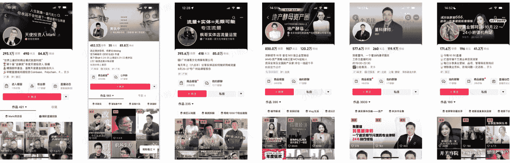

**单说业务能力，业内能让我服的人不多**

**如果你是一个知识付费玩家，特别是千元的高客单产品，请一定要重视线索型短视频**

**如果你是一个电商玩家，特别是大健康、美业、母婴等复购高的行业，一定要重视线索短视频**

**如果你是一个同城获客的的玩家，例如：家装、美业、教培、升学、房产，请一定要重视线索短视频**

**这些赛道，单条视频也许就能帮你拿到 10-50 个甚至更多的精准线索**

**或许你们可以花点儿时间，把这个文档看完**

## 高客单赛道，线索型视频是你必须要掌握的流量打法，没有之一

### 为什么要做线索短视频

答案很简单，因为你只能这么变现，我给你梳理一下，短视频能变现无非两种方法：

### 第一种：直播带货

你看痞幼、猴哥说车、刘畊宏、白冰他们都是这类，他们只需要涨粉涨粉再涨粉就可以

一方面可以在短视频里置入广告，像汽车、国际大牌、美妆护肤，收一笔广告费；另一方面他们可以在直播间卖一些低客单的日用品，这些产品是不挑用户的，基本什么样的人都去买。

所以这些网红变现的逻辑就是：涨粉，然后卖低客单刚需产品

### 另一种：线索短视频获客

像知识付费高客单、招商加盟、留学、移民、地产、家装...这些行业，客单价都是千元起步甚至万元起步，而且行业非常垂，你跟我讲你怎么在直播间把你的产品卖出去，你的产品又贵又非标，只能放在私域里成交

还有一些做高复购的电商行业，比如做大健康的、做母婴的、做海鲜的、做艺术家的，你们复购率这么高，为什么一定要在公域卷流量呢，把流量放在私域里，自己定价，自己设置退款条件，然后吃用户的复购吃十年，不香吗？

所以这些行业，注定了要走的路线不常规，你们不应该关注怎么做流量，怎么把短视频播放量做大

而是要把目的设置成：每条视频能不能给我带来几十条精准客资

我和很多外面你见到的刚入行操盘手不太一样，过去的时间，我们一直在做「头部」的生意，我喊过一句口号，全网几乎所有团队都在做小白的生意，割不割我们不谈；但只有我们团队能接头部 ip 的案子，帮他们做流量。

这个生意有什么特点，就是一定要以客户的结果为导向，什么播放量、爆款、直播间泛流量的提高...这些对那些有成熟产

品，只需要提高最终 GMV 的头部玩家来说根本就不在乎，或者说他们已经过了在乎虚名的阶段了，他们要的就是实实在在金额产出

所以一直以来，我们团队对于「短视频」的唯一标准就是：线索

『注意哦，这都是千元，甚至万元客单价产品的线索，非常值钱』

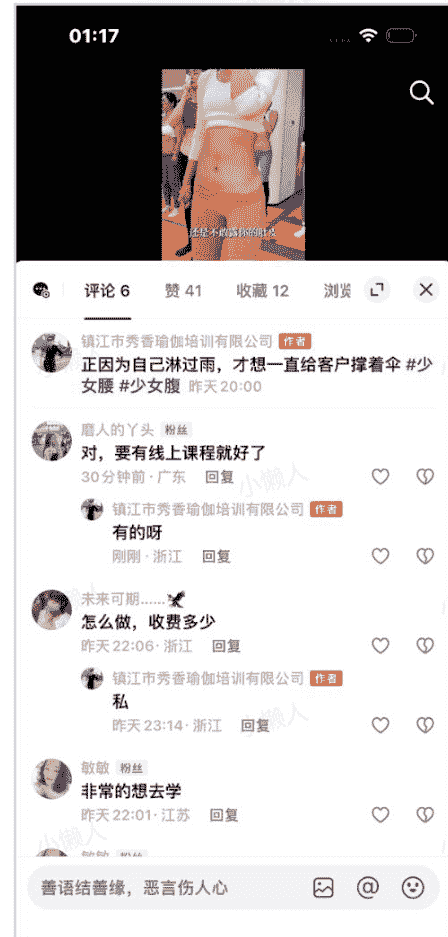
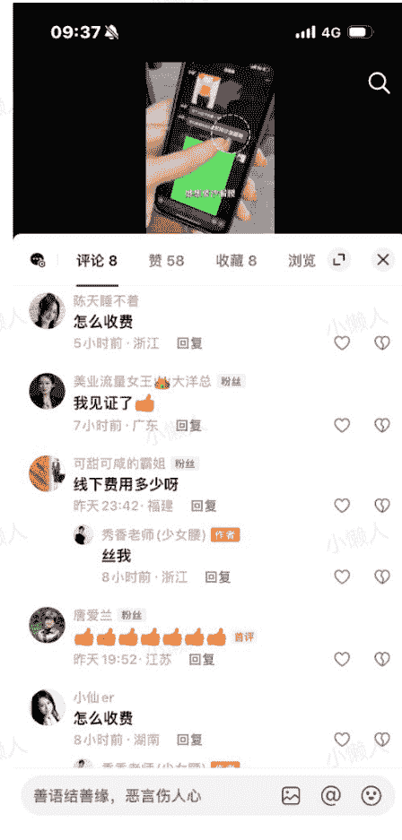
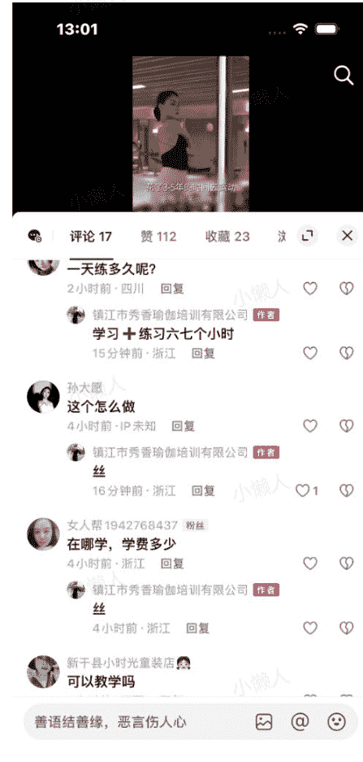
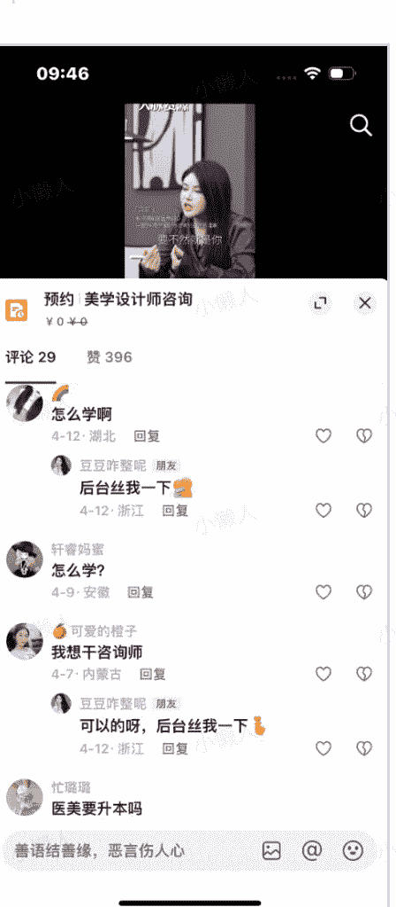
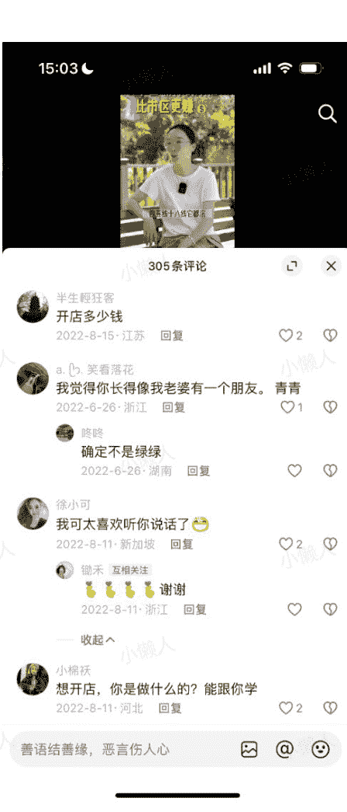
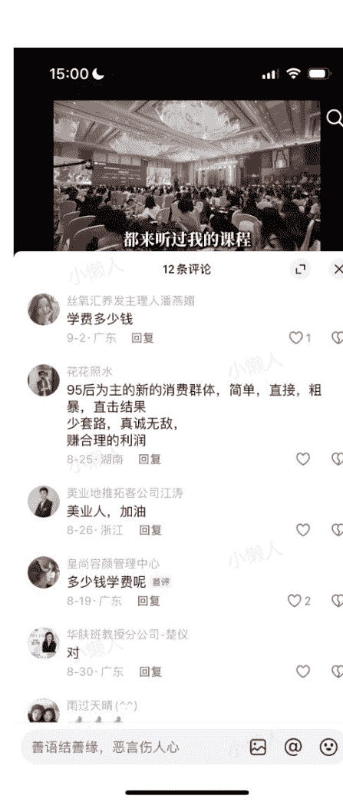

### 线索型视频怎么做

- 1、不是播放量越大越好，而是人群越优质越好；哪怕播放量低点儿

我听过最大的思维误区就是：我都没流量，怎么会有线索

好，关于这点容我好好给你解释解释：

你是做家装的，如果你有条视频 50 万播放量，但是刷到你的人就是个新婚夫妻，会有线索吗？ 不会

因为新婚夫妻可能现在只是在考虑阶段，距离他们真的掏钱找家装公司，时间太久了，久到真装修的时候已经把你忘了，看似你有播放量，其实这 50 万播放量里几乎没有准客户

但是如果你有条视频就 5000 播放量，刷到你的人正好最近在找装修过他们所在小区的家装公司，会有线索吗？ 会

因为装过修的人都知道，每个人都对自己家的户型特别在意，都觉得自己的小区物业特别难搞，所以都希望找一个有同小区经验的人，而且他们因为刷到同小区的装修，他们就会迫不及待地私信问问，能不能去看看那个装修现场

在这 5000 播放量里，看似没有太高播放量，但是每个刷视频的人都是非常有意向愿意付钱的准客户

### 再举个例子

你是做 AI 培训的，如果你有条视频 50 万播放，但是刷到你的人全是对 AI 感兴趣的人，会有线索吗？ 不会

因为绝大部分对 AI 感兴趣的人都是大学生都是年轻人，他们习惯了在网上白嫖各种信息，你就算有 50 万播放量又如何，这些人根本就不可能付费，也不可能私信你

但是如果**你**有条视频就 5000 播放量，刷到你的人正好是一个最近正在痛苦怎么用 AI 给自己公司批量制作短视频的人，会有线索吗？ 会

因为这部分人对 AI 是真有痛点，他们是真有需求，他们有钱有需求为 AI 的工具或者课程买单。

播放量高只能说明刷到你的人多，但是如果他们压根不是准客户，有个毛用！

我举个例子，我们今年 6 月份新操盘的一个项目，做美业项目加盟的：**「雷秀香」**

她的前端产品客单价就足足要一万块，目标客户全部是瑜伽店或者美业的老板娘，这类用户全中国可能也才几百万个，我跑那么大流量干嘛，我要那么泛的流量干嘛，我肯定是要**「愿意花 1 万块买产品的准客户啊」**

所以我们的作品看起来点赞数都不高，也就几十几百点赞，评论也不多，但是你想，本来就不应该高
因为客户太稀缺了，怎么能高的起来；评论也不会高，因为真正的目标客户给我评论干嘛？

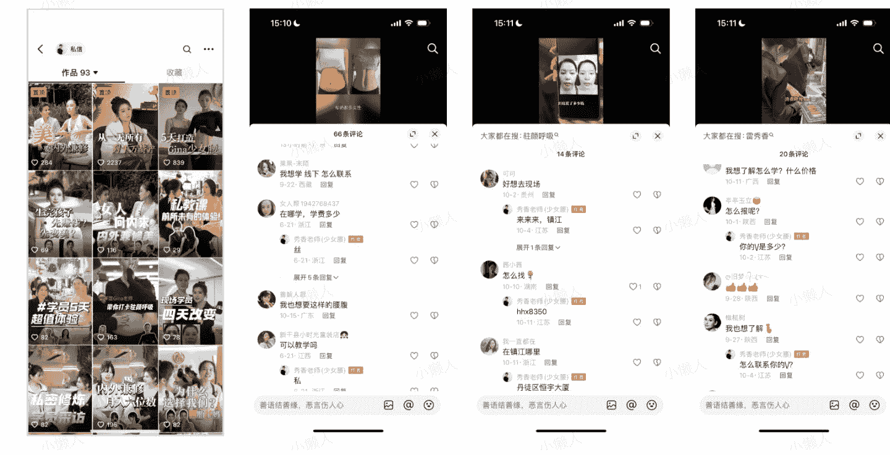

看到了吧，我们的点赞数都非常低，评论其实也不多，但是都是找我咨询产品的，没有那些乱七八糟的评论区留言

这个项目我们每条视频也就 1-3 万的播放量，但是我换个说法你就知道它的意义了：我们每条视频都有 1-3 万个有实力有意向付 3 万买东西的准客户看...

那我的线索量有多少个呢，我们一天大概 200 个；为什么流量这么低但是线索量那么高

因为人群优质啊，他们真的有钱他们真的有需求，他们愿意私信了解的意愿度当然高，我 2 万播放量 200 个私信，相当于 100 个人看完视频就有 1 个人愿意私信了解产品，这个数据很夸张吗？很正常好不好

- 2、不是开头越有流量越好，是开头能让准客户看下去才好

今天市面上绝大多数编导都会跟你强调：
开头很重要、5 秒完播很重要、情绪很重要

那你试着跟我的思路感受一下啊

如果有一个开头说「AI 会是未来改变时代的技术」，请问：真的会有愿意付费学 AI 的人看吗？

如果有一个开头说「胖猫事件，女方这钱该不该退」，请问：真的会有需要找律师的当事人愿意愿意看吗？

如果有一个开头说「皮肤又红又痒，都是面膜惹的祸」，请问：这样会有愿意付钱给美容院花几千治疗的人看吗？

你发现没有，你追求开头炸裂追求 5 秒完播，完全是「自嗨的视角」，是只考虑怎么把观点说的尖锐

真正想获得客户的思路用过是「用户的视角」，应该考虑我什么样的开头，能让我的准客户刷到愿意留下来看看；那我们是怎么通过短视频找到足够优质的准客户的呢

### 我们用的方法就是「开头圈人群」

比如都是晒 Gina 这个案例，我们出过三个版本的视频，你觉得哪个变现最好：

- 第一版：我跟你说，蓝蒂蔻 Gina 的少女腰是我打造的
- 第二版：明明已经很完美了，为什么 Gina 还要找我做少女腰
- 第三版：去年我在深圳遇到了 Gina 加了微信，她知道了我做了好多少女腰，问我怎么做的

**第一版：我跟你说，蓝蒂蔻 Gina 的少女腰是我打造的**

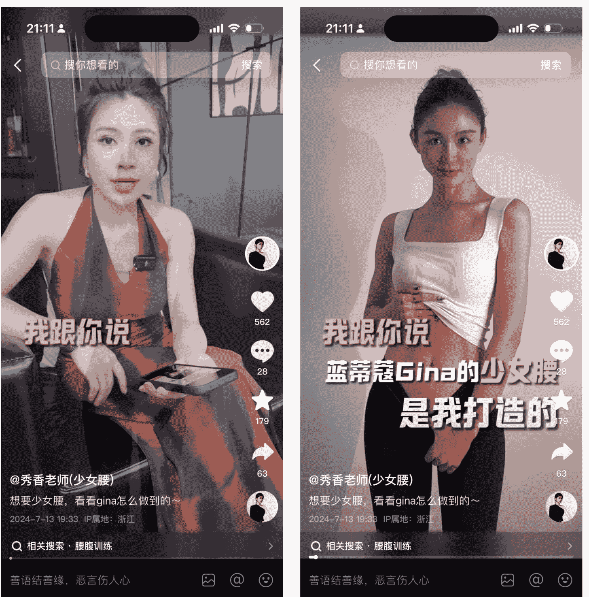

**第二版：明明已经很完美了，为什么 Gina 还要找我做少女腰**

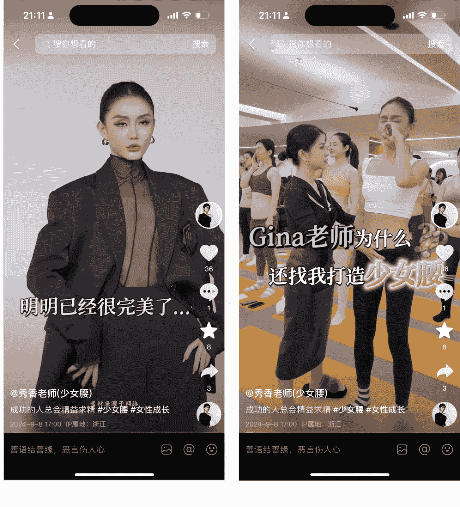

**第三版：去年我在深圳遇到了 Gina 加了微信，她知道了我做了很多少女腰，问我怎么做的**

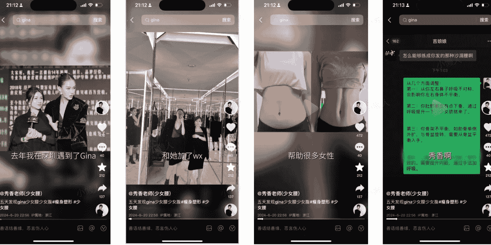

公布答案：第二个版本变现最好，我们单条视频卖了 10 万

为什么

因为第一个版本的开头虽然有流量，但是吸引的 Gina 的八卦粉，他们只是好奇 Gina 在干嘛，第三个开头也是如此，吸引的都是八卦粉

只有第二个版本的视频吸引了 Gina 的身材粉，大部分女人的需求是减肥减几斤，这些粉丝是不会花几万块出去学习改造自己的身材的，只有对自己有很高要求的人才会需要打造少女腹，而我要抓的就是这批人，这就是对成交用户的洞察。

外面很多不入流的操盘手，搞些提问搞些业务话题，以为这就是高手了，其实压根没入行

有价值的线索型视频，是非常非常懂得如何和目标客户对话，每句话都戳用户的心理，给用户强种草；

而不是冲着大播放量去做，因为大播放量无非就是你被人刷到而已

被人刷到又怎样，是准客户刷到吗？？
嗯？

- 3、不是流量越大越好，而是让人全方位了解你才好

今天的互联网用户，现在处于超级没钱，超级焦虑的状态，他们的消费谨慎的要死，你想想你买东西，是不是现在会货比三家，但凡超过 3000 块的东西，你恨不得开个家庭会议讨论下要不要买。

别以为你拍的视频有干货有价值，他们就会买单；他连你是谁，你能解决什么问题都不知道

试想一个真实的用户他是怎么通过互联网的短视频账号了解你进而找你买东西的，是不是偶然刷到你的视频，然后给你点了个关注，然后经常刷你的视频，知道了你是干嘛的、知道了你的身份、知道了你的产品、相信你的产品能解决他的问题、相信你的人品、相信你的实力....

我常常在线下课跟学员们讲：关注你只是变现的第一步，更重要的是关注你之后，能不能让粉丝强化信任找你买单

因此，我们在做线索型视频的时候非常在意的是，怎么让那些已经关注了我的人能够多维度了解我，我们真是每条视频里都要换着花样介绍自己，不断地强化营销的力量

最简单，也是最直接的办法就是「定口号」，也就是把自己的差异化优势在每条视频里都念叨一遍

比如：

去年我自己是在抖音做到还不错的收入的，我当时的定位就是专门做 ip 直播，因为当时短视频培训已经非常卷了，没有任何细分市场有我的机会，那凭什么是我呢，我主打的「一个粒度很细的男人」这个口号

为什么是这个口号，因为当时大家学直播普遍的体感就是到处都在教你怎么做数据，怎么提高表现力，文案的框架是什么，学了之后根本不管用，做的根本不够细，大家想学点儿非常细致的直播方法、

再加上我做出了很多成功的案例，我就自然做到了行业头部。

再比如：

今年我们做了一个项目叫「菲要练臀」，我们的定位就是专门练臀

因为在做这个业务的之前我们发现抖音上清一色全是教大家怎么减脂，怎么瘦身，怎么瑜伽普拉提的，就全是健身通识类的培训，但是我们想，明明在线下产后康复，女性练臀是一个非常大的赛道，怎么抖音没有，然后我们就大胆干，在抖音专门做女性练臀的培训，我们在直播间就经常说：臀部练的好，男友刚毕业

这虽然是一句玩笑话，但是在全是女性的直播间里，这句话是非常能够置入心锚的！

这项目去年才刚做三个月，能做到直播 4000 的在线，一个月前端课 40 万。

- 4、不是流量越大越好，而是加到微信的流量越大越好

前面讲了一些方向型的信息，但是我今年听到最多的问题就是：就是没流量，没流量了

大家不光是没有播放量，而是你其实没有私信量，每天后台根本没人找你咨询产品和服务

我发现你们好“单纯”呐，短视频是真的掏心掏肺，一点儿钩子不加，一点儿羊毛不让薅；想要在公域持续获客你就必须加钩子，用各种福利产品勾引用户加你的微信，然后再进一步成交。

我们团队在做美业郭柯妍的时候，用这招每个月能拿到 5000+精准的客资，你有兴趣可以去看看我们的评论区，全部都是精准客资来领资料或者求链接，这些客资，每个都值 500 块以上的价值。

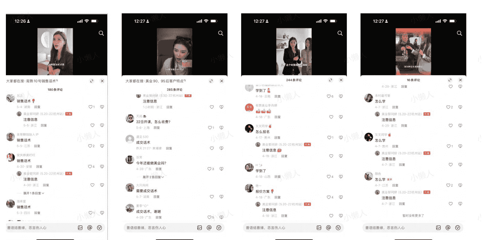

这招不稀奇，送资料这种办法已经很老旧了，而且很多人试了之后发现说送资料的客资太差

你知道为什么很差吗？非因为你资料吸引的是白嫖党，难道准客户不想通过资料先了解了解你？别扯了，之所以你下钩子导流但是都是白嫖党或者压根就没客户。

是因为你真的是像发传单一样，单纯地送资料，这给客户的感觉不就是这玩意儿不值钱嘛，鬼才要。

我们的方法是，我们不会纯送资料，我们是认认真真出视频，然后在视频的结尾放资料，你可以理解成我把送资料这个步骤

当成了标准的卖课的步骤，短视频的结构基本都是痛点型结构：问题 + 人设 + 解决思路 + 钩子资料

注意：为什么我们是问题开头，因为只有正在遭遇某个问题的人才是将来愿意付费的人，这也是一种开头圈人群的方式

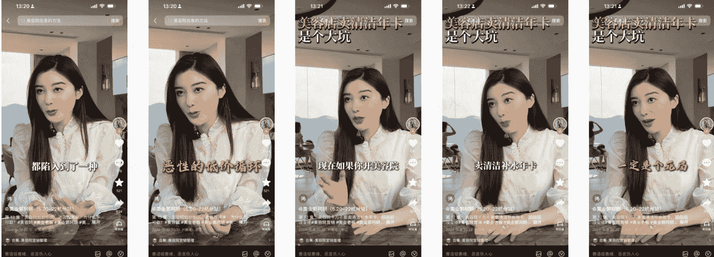

**「如果你当前遇到了什么样的问题？一个问题，我这个是不是抛出痛点了，对吧？

我是先讲用户的痛点，唉，如果你遇到了这样的一个昤题，我告诉你解决思路是什么？哎，解决思路是第一个思路、第二个思路、第三个思路、第四个思路。

如果你看，如果你听完了思路觉得有启发，但是你仍然不知道该如何做，我这里有一份资料你可以找我领取一份」**

用问题开头可以找到有付费潜力的客户，中间的知识点可以强化信任，结尾的资料就是个鱼饵把他捞到私域来

反正你只要刷到我，我不求你爱上我，但你必须进我私域。然后我在私域经营客户

就比如，你看我这个资料包，就很良心，对吧？

那除了这些，当然还有很多很多很多其他动作我觉得大家是关注的篇幅有限就不能一一展开了，比如...

不是应该关注爆款选题，而是要关注选题的营销植入

单条视频获客 300+ 的线索型视频的选题文案应该怎么写

如何把流量 100% 效率地导到自己的私域里来

有线索但不多，如何通过投放工具，10 倍放大自己的获客能力

> 最后给大家做一些诚意的总结

越是高客单，越是没法直播间卖的产品，越要做线索型视频

网红在现阶段已经是失去红利的模式了，未来的主流变现一定是追求粉丝量小但获客量大

线索型视频不靠口才，不靠表现力，靠的是你用短视频把产品卖出去的能力

知识付费、留学移民地产律师、大健康、私域电商..都是最适合线索获客的行业

历史 3000 多份各类付费文章以及年费三千多的副业社群资源，见懒人专属群内部分享！

付费群，白嫖勿扰！

懒人专属群更新记录：
[https://lazybook.fun/#/blog/record2](https://lazybook.fun/#/blog/record2)