# 线下摆摊联动小红书，4 个月实现从 0 到月入 3w！超详细经验分享

公众号懒人找资源，懒人专属群分享

250516 生财精华

大家好，我是乔庭，擅长小红书低粉高变现赛道。之前分享过 3 个粉丝就开始变现，第一个月就月入过万的珠宝赛道。今天，我要给大家分享另一个实战项目——帮助我 55 岁的叔叔阿姨操盘的实体餐饮生意。

在这个项目里，我负责线上引流，他们专注于出品。我运用小红书和社群，成功引流裂变 1000+ 人，实现了从无到有的突破，用了 4 个月的时间，就成功做到从 0 到月入 3w。

在这 4 个月里，我们一步步摸索前行，从项目的筹备、启动，到不断优化运营策略，每一个环节都积累了宝贵的实践经验。接下来，我就详细地给大家拆解这个项目，把其中的技巧和方法毫无保留地分享出来，希望能为正在创业或者想要在小红书上实现变现的朋友们提供一些新思路和帮助。懒人微信：lazyhelper

## 一、为什么选择线下摆摊，开启餐饮创业路？

### 启动契机

以前叔叔阿姨是在家里带孙子的，今年孙子上学了，所以他们有了大部分空余的时间。原本他们计划是说去找工作，比如做个保安保洁之类的，但是考虑到自身年龄大了，打工辛苦不说，收入肯定不高，而且孩子还需要他们帮忙接送的，还要预留好应对特殊情况的时间（小孩请假不舒服等），想找到如此合适的工作，实在是太难了。

不打工，让他们闲适在家，他们又不肯。那就只有做生意这一条路了，而且叔叔阿姨从年轻的时候，就一直有个开店做老板的梦。考虑再三，那就尝试吧！

做生意，这几年的行情都不好，做些什么呢？首先需要排除的就是开店，投资开店成本太高，风险较大。小成本投入，做点小生意，那就做吃的吧。

因为我阿姨日常的乐趣就是做美食，她会做非常多的吃的，包子饺子甜品等等都会；而且做得非常好，以前经常做好吃的给家里的娃娃带去分享给同学，分享给邻居，邻居经常夸她做的好吃，说愿意花钱买。说到可以做吃的，阿姨特别兴奋，觉得可以，她很愿意。

我们就决定做餐饮这个行业。

（从实际情况 + 兴趣爱好 + 擅长，出发）

### 大行业敲定，具体细分饮食品类卖什么好

一说到做餐饮，可能很多人第一个念头是需要去租一个店面，好的位置转让费 + 租金 + 装修，十几万打底，一年回本算是非常非常好的了。但这对于完全没有做过生意的老人来说，挑战太高。

两老人的要求也很简单，每个月挣点伙食费零花钱就可以，所以我们最后选择的是：做私房。自己在家做些简餐，目标用户就是家附近周边 1-2 公里。

在确定具体经营品类时，我们考虑了多个方向。

第一个方向是：快餐。给上班人员做配送午餐，客单价高，只要做午晚餐就行~

第二个方向是：包子。（这个方向是我们具体是啥不透露啦，因为我们所做的地方目前就我们一家，所以就由包子代替哦）

选择做包子是因为我阿姨已经持续做了 2 年多了，每周她都会做一次，我们自己吃，也会分给小区邻居们。她还有个小区阿姨群，每次自己做了就拿出去分享。

第三个方向是：饺子云吞。这也是我阿姨擅长的，我们家的云吞饺子全都是我阿姨做的，从不再外面买。我家娃的同学每次来我们家都要吃饺子云吞，现在大家都爱吃汤汤水水，快手的餐品，所以我们也觉得可行。

我们经过综合考量人力成本，物资成本，出餐的时间成本，熟练程度，受众范围等多方面考虑，还做了小区周边的市场调研，在互联网上看了很多对标，最后我们选择了做包子。

出餐快，不会太累，早中晚都可以做，受众用户广，大人小孩都会吃，投资低。更重要的是，我们小区附近两公里内仅有一家同行，看他的美团数据&门店经营情况，感觉它的经营状况不是十分理想，想着这可能是我们的机会。

### 1000 元启动，小小梦想也能闪闪发亮。

选定好了包子之后，我们就思考如何卖出去，客户在哪里？怎么做（商业模式怎么定）。

吃包子的客户主要集中在早上的学生和上班族，以及午餐、晚餐时段的上班族。一开始我们认为学生是最大的消费群体，刚好我家附近有一所中学，当即我阿姨就觉着她要去摆摊！

在这里留个悬念：但是经过实践以后，发现有偏差。这一个部分会在后面详细展开说

说干就干，我们马上采购摆摊车、摆摊道 具，定价，制作菜单广告，采购新鲜食材等等，把所有准备工作完成，总花费还不到 1000 元，就这样，属于我家人的小小梦想启航了...

## 二、怎么样才能把美食单品打爆

线下摆摊卖包子的生意仅仅 4 个月的时间，我们就实现了从 0 到月入 3w！在整个过程中，我们结合不同时期的情况，做了几次优化迭代。

借力前期积累口碑以及学校商圈，一周就跑通最小 MVP

摆摊工具到齐，我阿姨选了一个黄道吉日开张，满心欢喜地开启了她的包子生意。

摆摊位置选择了在一个中学附近，在朋友圈公布了开张的消息，第一天尝试，流水 117 元

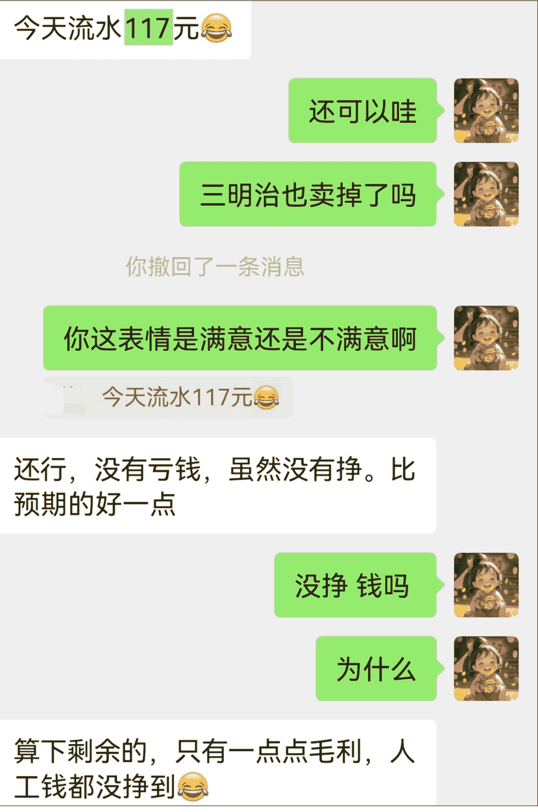

后面每天的流水都有小幅度上升，从 100+，到 200+，再到 300+ 徘徊。我阿姨算了一笔账：每天摆摊 2 小时，如果每天做到 250 一天，一个月按 22 天计算（周末双休哦。后面实战下来发现这个决策也是错的），一个月也有 5500 左右的流水，除去成本，利润大概有 3000 元。既能照顾家庭、接送孩子，还有一笔不错的收入，阿姨说她很满足了。

### 小红书 + 微信社群同步运营，营收再上一个台阶

观察了一个星期，我决定协助我阿姨，用上互联网（小红书 + 微信社群），帮助她做得轻松点，（这是做互联网的初衷，不想他们太辛苦太累了），我跟她说，你每天拍几个图给我，说不定我能帮助你一个月做到一万哦。她特别开心地说，行，我听你的！

做餐饮，复购率非常非常重要。所以我告诉她一定要引导客户添加微信。把顾客加到微信来，方便客户提前预定，还能将他们拉群，做活动去引流裂变。所以我就给新建了一个群，专门是摆摊引流来的用户，我来负责运营。

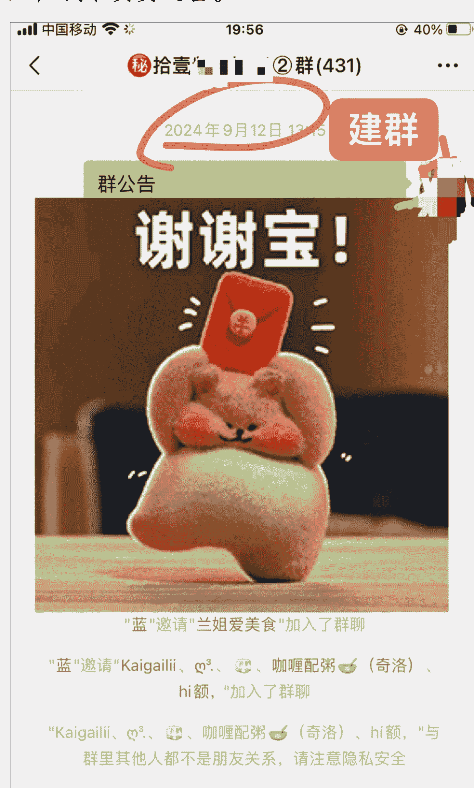

### 算账，是做生意的第一步，也是实现流水跃升的一步。

从摆摊到建群，收入有明显的上升。而且我们还算了一笔账，发现学校周边的用户占比少，而且客单价较低；相反，社区用户占比更多，客单价还比较高。这一对比，我们自己就意识到摆摊选址可能不合适，于是决定更换了摆摊地点试试。

经过一番蹲点考察，我们锁定了在地铁口附近。一是因为我家附近就有个地铁口，很方便老人；二我们认为地铁口人流量大，就像汇聚人群的中心，所有的人都往这边走，人流量多，潜在客户众多，机会自然更大一些~

诶！还真一换，还真让我们换对了！每天的营业额稳步上升，从最初的 200-300 元，逐渐增长到 500 元。每天添加微信的人数也明显增多，从原来的 1-2 个，增加到 45678 个。同时越来越多的客户会提前预定，这让我们能够提前准备好材料，避免了浪费~

### 主动寻找超级节点，实现月入 1w

人呀，总是会贪心些的。之前想着每天只要 250 的流水，而到了 300/500 之后；我们就在想，能不能做到 1000/天呢？1000/天，一个月就有 2w 的营收了。

如果想要达到这样的流水，宣传推广必不可少。第一个我们就想到发传单，马上又尝试一波，效果一般；也想到说去便利店那里谈合作，但是不太合适。

之后，考虑到我们是做社区周边生意的，考虑到成本和效果，自己花钱做广告并非最佳选择，不如找一个“超级节点”人物帮我们宣传一下，用户”自发“宣传效果一定大于我们去做广告。

### 超级节点怎么找？

对于我们来说，超级节点 人要靠谱，愿意帮助别人，口碑不错。

我们想了想自己认识的的人里，还真有一个”百事通“，是我们小区非常热心的邻居，大家有不知道的事情都会问他。可想而知，她认识的人肯定特别多，如果她愿意帮忙宣传一下我们的包子摊，应该能吸引到一些客户吗？

刚好，我阿姨也认识她，我们就让她去聊一下，给她带上礼物。希望她能在合适的时候，在群里帮忙分享一下我们的包子摊。（小技巧：在她分享的时候，我们会马上跟上，在群里发 2 个红包，一个给她专属的，一个是群里大家都可以领的大红包，然后跟上群二维码。）

这个动作大概做了 2~3 次，我们的群快速地几十人，到 100+，裂变了近 100 多人，再加上每日摆摊引流，流水很快地稳定在 500 以上，第二个月就突破了 1w+。

超级节点的力量，让我们对包子摊这个事情更有信心了。在项目初期，超级节点其实不用太多，只要一个就够启动了。

餐饮类目，只要好吃，干净卫生，别人就会愿意帮你宣传，在宣传的时候，有人会附和，就会有人来，这样就很容易获得顾客的认可和自发宣传。

而且来的人当中，还有可能会给你带来意外之喜。就说我们第一次突破 700+/天，就是因为我们接到了第一个团单，40 份。

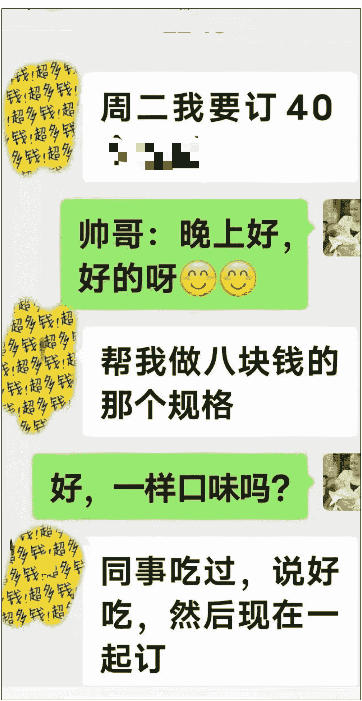

而通过这个异常值，我们就发现，要去寻找”团单“，这样才能赚得轻松，做得也轻松，还相对稳定。而怎么去找这种团单呢，我们并无头绪，但是这个种子，深深地埋在了我的心底里。

（关于超级节点，如果没有认识的人，就去找社区店的老板，看有没有群，去找合作。比如附近的美发店，水果店，宵夜档，这种做生活日常的店铺，跟群主打好招呼，给福利，一般都愿意合作。)

### 深耕私域，挖掘朋友圈金矿

作为 13 年珠宝人和 5 年自媒体摸爬滚打，我自己做的珠宝以及自媒体业务，全都靠朋友圈来持续转化的。

结合我过往的业务经验以及自媒体的经历，朋友圈在客户转化方面有着不可忽视的力量，所以即便是线下摆摊，我也格外重视在朋友圈的运营。

私域，朋友圈就是金矿，你得持续得挖，才能发现金子，所以保持每日在朋友圈出现，多与用户沟通，让我挖掘到了真正的鱼塘在哪里。

我每天下了班回去，就了解情况，拍照片，发朋友圈，朋友圈发的有趣，真诚。

有时候是吐槽做包子的劳累，有时候是因为没货了对客户的抱歉，以及原材料的采买，流程的制作等等。

### 剥玉米 🌽 这个活儿，在我们家都是抢着干的，因为真的很解压！！！

有人说，拼多多不是有剥玉米神器吗？nonono！那个东西剥出来的玉米是半粒的，而且损坏率超高！在口感上，至少差一半~

你看我们剥玉米都是用指腹去剥，出来的玉米是一整粒的，而且那个硬硬的根也是没有的。所以我们的玉米口感是实实在在的一整粒。

做餐饮，产品里永远是第一！都是用心在，相信宝子们，咬下去的第一口就有感觉！

秘制猪扒🖤准备 ing ~

宝子们都很奇怪，为啥猪扒这么好吃？不能天天有呢？来来来来~拾壹跟你们说：因为猪扒要买上好的梅头肉，不好的吃起来肉柴柴的；并且需要提前一天腌制才够味儿。

另外，我们所用的配料都是自己家人吃饭用的日常配料，比如酱油，蚝油，料酒等等，都是买的好的，有机的。

好的材料 + 上好的配料 + 老师傅亲传秘方=好吃好吃好吃超好吃，无限回购😋

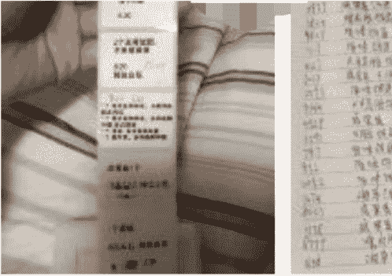

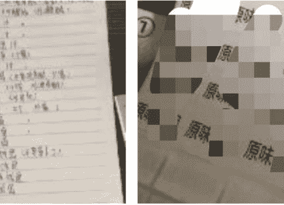

2024 年 12 月 3 日 00:11

还有个更古早的，手写标签条，哈哈哈哈

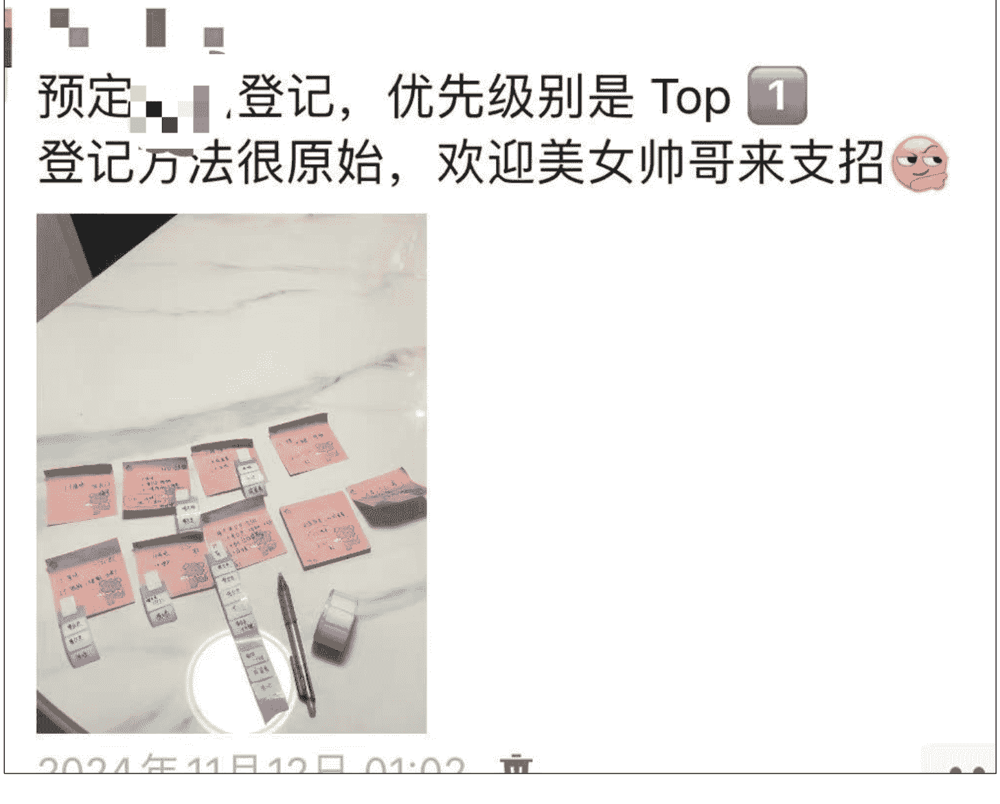

有时候还会邀请用户来帮我们出主意，参与到我们的经营决策中来，比如询问要不要上新口味，推车颜色怎么选，包装哪个好等等，通过这些互动，让用户对我们的包子生意有了一种 “直播感” 和强烈的参与感。

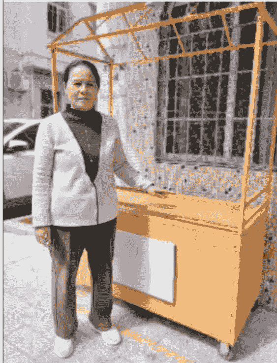

宝子们，给我" **.** **.**"兰姐一点建议，换成啥颜色好呢？？？

2025 年 2 月 22 日 22:17

**Kitty 不吃香菜**
2 月 22 日 22:18
天蓝色阿姨，代表天空晴朗，早上上班看到这个颜色感觉一天的心情都是晴天！而且蓝色比较沉稳啊哈哈哈哈

回复 **Kitty 不吃香菜**: 哎呀，这个寓意好，嘿嘿，加入待选择的标签里。谢谢宝！！！

**█是笨蛋**
█色

除了在朋友圈积极分享，我还经常主动与用户聊天、回访。在交流过程中，用户也十分热情，他们会主动拍照片给我反馈，也会给我提建议，会主动帮我宣传等等。

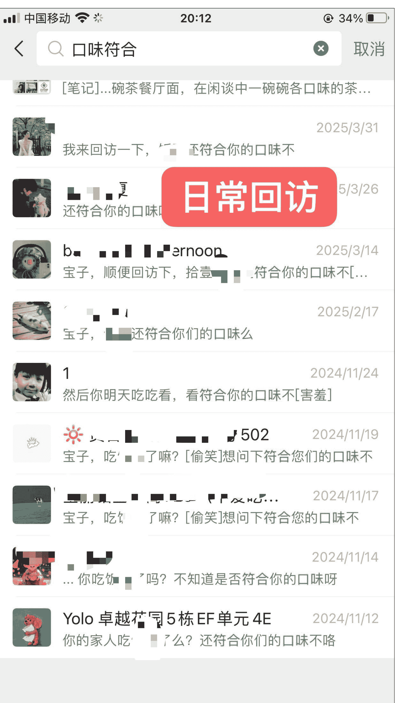

但凡客户提供了建议的，我们都会给对方赠送一个礼物（不是红包，而是需要到实体摊位领取的实物），这样既能表达我们的感谢，又能吸引客户再次光顾，还能让顾客感觉自己占便宜了。

所以我的客户跟我的关系都还挺好的~特别是一些老客户，我真的超级珍惜他们，感觉跟他们处成了线上朋友的感觉。

也正是因為常做回访，我们遇到了第二个“超级节点”人物，C 客户跟我们说，你们这包子太好吃了，应该要去 XX 地卖哇！肯定能卖爆的？

还给我们发来了 XX 地的图片、详细地址以及相关的小红书链接等等。C 客户的出现，就像一枚星星，再一次照亮了我们的包子摊之路，而她成为了我们的第二个“超级节点”。

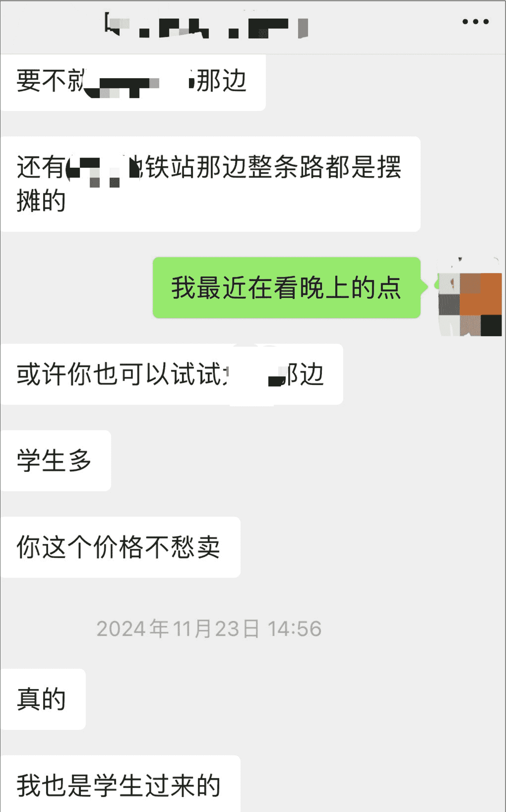

### 抓住机遇，快速出击，借力小红书，营收成功突破 2 万元

当时看到小红书的图片，真的是震惊了，全都是人，都是我们的目标客户。

而第二天刚是周六，我立马决定去踩点（这里还有个小插曲，去的那天还下着雨，我家娃在睡觉，我还犹豫了好久要不要去？最后还是决定去了。做任何事，还是不能拖啊，一拖就没了）

决定去的前一天，我就发了一篇互动型的小红书笔记，关键词卡在 XX 地点，产品名等。

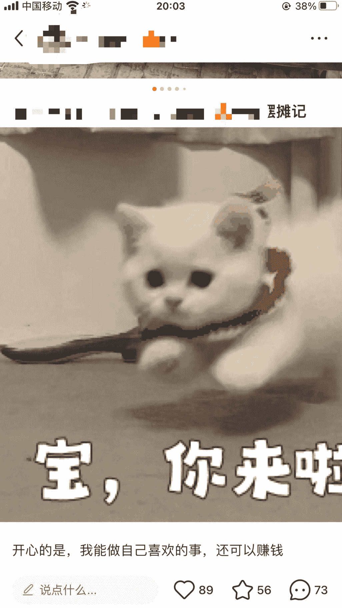

在这里我不得不感叹一下，我们真的是生活在了最好的时代！想做一个事情，想知道有没有人需要？是否符合用户的需求？
以前全靠摸石头过河。而现在，只要网上喊一声，全中国的网友都来给你提建议，你就可以从评论区里找到用户真正的需求，进行迭代优化。

果不其然，那篇笔记爆了，上百个网友说很需要我们的包子，想要吃。而我也非常重视对待每一条评论，除了回复感谢，还在评论区聊起了天。同时我也私信了红薯宝宝，加了微信，了解当地的消费情况，当地的人数，口味等等。

周一，我就让家里人亲自去跑一遍，看一下能不能做到用户的要求，并给小红书宝宝带上了随手礼。这一跑，是真的让我们看到了包子摊的前景了。

家人回来之后，我立马复盘，能不能做？做的话要注意什么？时间安排？材料安排？人员安排？等关键问题。

一番剖析以后，当即决定大胆尝试！马上建微信群，把小红书粉丝引流到微信，令人惊喜的是，半小时内 73 人。然后我就让我老公帮忙处理一下，我去午休了。

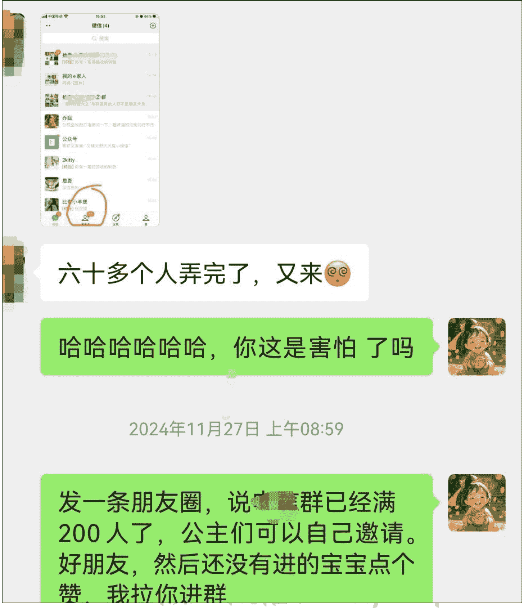

弄不过来了都@小小婷

哈哈哈哈哈哈哈哈

又开心 又累是吧

😂笑发财了 哈哈哈哈

先不通过啊，傻孩子

你先去把中午的搞定先

然后再来通过

要计算一下哪边的投入产出比高

等我醒来，群里人数已经涨到 200 多人，没一会就突破 300 人。我老公说第一次感受到就流量强得可怕。点不过来了，点完 99，又来 99~

那几天，我开始把小红书的更新频率从周更 3-5，改成了每日更新小红书，每天都有几十人加微信，同时，我也没有忽视朋友圈的运营，持续在朋友圈分享包子摊的相关内容。很快，我们的群就 500 人，到了第三个月，我们的营收成功突破 2 万元。

看到生意越来越好，我阿姨开心的不行，做餐饮很累，每次有宝子他们反馈很好吃，她就特别开心。那段时间，我在我叔叔阿姨脸上看到了神采飞扬，哈哈哈~

后面由于我不停地运营朋友圈&社群，小红书持续引流等动作，我们在第 4 个月就突破了营收 3w+（1 月 2 月提早回家过年啦，3 月份就突破了 3w+）

## 三、线下小吃摊联动小红书 + 社群运营，爆单秘诀

### 1. 线下摆摊，选址是成败的关键因素之一

#### (1) 用户群定锁定摆摊选址

想到摆摊，第一个问题都是去哪儿摆。我们的经验就是，去看看你的用户在哪里。你的用户是上班族，就去地铁口，办公室商圈。你的用户是学生，就去学校周边。

这些都需要测试的。就拿我们来说，我们一开始在学校，才一两百。

后来转移阵地到地铁口，才发现这里的人流量大，潜在客户众多，不仅客单价高，复购率也相当可观。

#### (2) 地铁口这么多，如何能选对地铁口作为摆摊点？

如果你选择在地铁口摆，怎么选优质的地铁口？我们用的是实地踩点 + 查看地图热力图的方法

实际情况去踩点，像我们就是早晚都会去看人流，还会去观察哪个地铁口人多（看电动车的摆放量也可以），同时还会研究

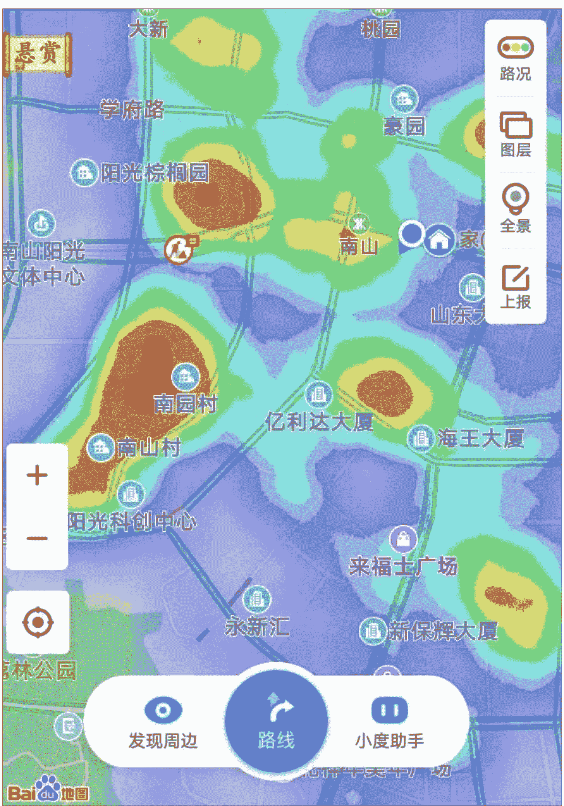

附近的店铺做什么，人流怎么样，生意好不好。

附近还为热力图高效地选址。它能直观地展示出不同区域的人流量分布情况，免去人工踩点的劳累，快速筛选出人流量较大的区域。

这里教一个地铁口选择的技巧，就是去看看有没有地铁区间车。如果有，说明那个地方人特别多。主打的就是相信政府的选择，哈哈哈~

同时还会研究附近的店铺，人流怎么样，生意好不好。

#### （3）选址一定要注意竞品

注意选址，一定不能忽视竞品的存在。如果有三四五六家跟你的产品类似甚至相同，那用户可选的东西就太多了，竞争就会比较大，在这种情况下，想要卖得好就会比较难咯。

我们自个儿选择的地点，是偏社区类，附近有广场&地铁口，2 公里内有 8 个小区，人流量还是可以的。

经营的大多是比较常见的类目，而我们选的类目，周边两公里没有一家能打的，选品还是挺重要的。

选品重要，选址也重要，两者是相辅相成的。

### 2. 小红书低粉高引流秘籍

在运营小红书引流时，为什么发布的一篇笔记能迅速爆火一天引流 300+，我总结了三个原因:

#### （1）稳定更新，提升账号热度

在超级节点和我分享推荐我去 XX 地前，我就一直保持着周更 2-5 篇，持续稳定的输出；而确定了去踩点之后，我更是每日更新。

小红书平台本来就倾向于将流量分配给活跃度高的账号，平台的推流让我的笔记获得

## 1（三）小红书好的案例

这里应该是原文的页码划分，OCR 将 PAGE 26 的开头部分处理成了新的逻辑。为了保证连贯性，我继续合并原文。

PAGE 25 结尾的 "获" 在 PAGE 26 开始是"得"，所以合并。
PAGE 26 结尾是 "故"，PAGE 27 开头是 "事"，合并。

修正 PAGE 25-26 结尾:
...笔记获得
more exposure 机会 (原文：得更多曝光机会)

修正 PAGE 26-27 结尾:
...分享我们的
事 (原文：之事)

修正 PAGE 25-26 结尾 (Page 26 开头):
原文 PAGE 26 首行：得更多曝光机会机会 (OCR: 得更多曝光机会)
修正后：得更多曝光机会

修正 PAGE 26-27 (Page 27 开头):
原文 PAGE 27 首行：事和产品优势...
修正后：...分享我们的故事和产品优势...

PAGE 27-28 结尾：
PAGE 28 开头无断开，直接进入。
PAGE 28 结尾 `+ 1) 确定关键词 = 目标用户搜什么词？`
PAGE 29 开头 `1) 确定关键词 = 目标用户搜什么词？`
Wait, looking at input:
PAGE 27: `+   1) 确定关键词=目标用户搜什么词？`
PAGE 28: `2 ) 标题关键词、正文关键词、标签关键词 布局，这些都需要有层次地布局在内容里。`
Wait, PAGE 27 end `... [PAGE 28]`
Actually, looking at input flow:
PAGE 27: `+ 1) 确定关键词 = 目标用户搜什么词？`
PAGE 28: `2 ) 标题关键词、正文关键词、标签关键词 布局，这些都需要有层次地布局在内容里。`
`然后` -> `然后`.
`# 3. 流量变存量...` is on PAGE 28?
Actually input says `[PAGE 28]` starts with `得更多曝光机会` (Wait, `[PAGE 26]` ends with `笔记获`).
Okay, let me re-verify page boundaries in my output logic.
PAGE 25: `# （3）...`
PAGE 26: `2. 小红书...` ... `得更多曝光机会`
PAGE 27: `... [PAGE 27] ... # (3) ... + 1) ...`
PAGE 28: `2 ) ... # 3. ... [PAGE 30] ...`
Wait, looking at the input provided:
`[PAGE 25]` ...
`[PAGE 26]` ... `获`
`[PAGE 27]` ... (Starts with `得更多曝光机会的机会`? No. Input says: `[PAGE 26] ... 获 [PAGE 27] 得`. No, Input says `[PAGE 26] ... 获 [PAGE 26] 得`. Wait.
Input Text: `[PAGE 26] ... 笔记获 [PAGE 27] ... 得更多`.
Wait, Input says: `[PAGE 26] ... 推流让我的笔记获 [PAGE 27] 得更多曝光机会...` No.
Input says: `[PAGE 26] ... 笔记获 [PAGE 26] 得...` No.
Input provided:
`[PAGE 26]` ... `获`
`[PAGE 27]` ... `得更多曝光机会`
Correct.

Let's finalize the merged text.

[PAGE 25]
... 笔记获
[PAGE 27]
... 得更多曝光机会...

Wait, Input: `[PAGE 26] ... 笔记获 [PAGE 27] 得更多...`
Yes.

[PAGE 26]
... 然后我就会被根据我想要的目标...
... 后续的笔记出中围绕...
... 分享我们的故
[PAGE 27]
... 事和产品优势...

Okay, logic clear. I will output the merged clean text.
</think>

#### （3）选址一定要注意竞品

注意选址，一定不能忽视竞品的存在。如果有三四五六家跟你的产品类似甚至相同，那用户可选的东西就太多了，竞争就会比较大，在这种情况下，想要卖得好就会比较难咯。

我们自个儿选择的地点，是偏社区类，附近有广场&地铁口，2 公里内有 8 个小区，人流量还是可以的。

经营的大多是比较常见的类目，而我们选的类目，周边两公里没有一家能打的，选品还是挺重要的。

选品重要，选址也重要，两者是相辅相成的。

### 2. 小红书低粉高引流秘籍

在运营小红书引流时，为什么发布的一篇笔记能迅速爆火一天引流 300+，我总结了三个原因：

#### （1）稳定更新，提升账号热度

在超级节点和我分享推荐我去 XX 地前，我就一直保持着周更 2-5 篇，持续稳定的输出；而确定了去踩点之后，我更是每日更新。

小红书平台本来就倾向于将流量分配给活跃度高的账号，平台的推流让我的笔记获得更多曝光机会，会不断地把我的账号推送到目标用户那里，而他们会不断地刷到我的账号，就会想要了解，想要加微信，加了微信就有机会。

#### （2）做好内容布局，引流更丝滑

小红书的 CES 评分体系，是每一个小红书运营都必须知道的事情。而我也不例外。

我每次发笔记都会思考一个问题：这篇笔记的目的是什么？立人设，增强信任感？想表达产品的优点，吸引用户添加微信？想本地用户流量？

然后我会根据我想要的目标，去倒推自己的笔记内容，话题标签怎么打，关键词怎么卡，怎么引导评论等等。

而这几项也都是小红书系统，将笔记推送给可能感兴趣的相关人群的重要因素。

所以我在笔记内容布局上，第一篇就是人设笔记，让用户对我们的包子生意和经营的人有初步的了解和印象，拉近距离。后续的笔记内容中围绕包子制作过程，用户反馈等等去发。

在选题和标题上，我会参考对标。但在内容上，我的每一篇都是自己写的，内容一定是保持真诚，实实在在地分享我们的故事和产品优势，同时强调餐饮作为刚需的属性，引发用户共鸣。

#### （3）精准卡位关键词，聚焦本地流量

卡关键词，是我每一篇笔记中最最最注重的一块，同时因为需要的是本地流量，所以每一篇笔记我都会定位地点，产品名称、大品类，以及借势大 V 的势能等。

重视小红书关键词搜索=掌握流量密码，而如何卡关键词就变成了最重要的问题。一个好的关键词，可以在笔记发布后的几个月甚至半年都能带来持续不断地流量。

所以我不仅自己发笔记卡关键词，我让宝子们做活动，也会去卡关键词，现在在小红书搜 XX 吃什么，我的笔记就是排在前面几屏。

那通过这个问题进来的宝子看到我的笔记，就是高度精准的用户。而我们的餐饮又是刚需，来的用户几乎都是会加微信的。

#### 如何精准卡对关键词？

确定关键词，标题关键词、正文关键词、标签关键词

- 1) 确定关键词 = 目标用户搜什么词？
- 2) 标题关键词、正文关键词、标签关键词布局，这些都需要有层次地布局在内容里。

## 3. 流量变存量，如何去做高效转化

引流后，将流量转化为实际订单才是关键。如果说你的流量是精准流量，实际上转化是不需要太费力的；就好比我们的用户，从小红书来的下单率高达 80%，都是一两分钟就下单了，而如何复购，持续复购才是我们要重视的。

在高效转化这一 PART 中，我们是做到了以下 5 点：

### （1）持续经营朋友圈，强化产品优势

有人说现在没人看朋友圈了，而有人从朋友圈每月月入 5 位数/6 位数。不同的观念，造就不同结果，而我的经验告诉我，朋友圈是金矿，是转化的重要渠道。

在朋友圈上，我坚持每天会发布 3-5 条朋友圈，展示包子制作过程、原材料采购渠道以及用户好评反馈，全方位呈现产品优势；坚持每天给 10 个用户点赞评论；坚持每天跟 1-3 个用户聊天。

发圈代表我在做这个事情；给用户点赞，是主动让用户看到我；坚持跟用户聊天，是跟用户建立强联系。

自媒体有一句话是“做不到过目不忘，那就过目过目过目，然后不忘”，让自己更多次数更高频率出现在用户的眼前。

公众号懒人搜索，懒人专属群分享

### （2）巧用群接龙接单，激发羊群效应

我们接单用的是微信聊天自带的群接龙而非小程序。我看很多商家是用的快团团，我尝试了一下点进去还需要缓冲，而且看不到有多少人下单了。

而我们所用的群接龙是可以看到有多少人下单的，那么新入群用户看到每天大量的下单信息，就会也忍不住想要试试，这种“羊群效应”激发了用户的从众心理，促使他们更愿意下单，有效提升订单转化率。（因为群里有活动裂变的用户，他们看到自己认识的朋友下单了，还会拍一拍她，然后也接上龙了，增加了社群的活跃度）

懒_人微信: lazyhelper

### （3）定期回访客户，放大好评效果，形成宣传素材

每日回访客户工作，让我有了非常多的好素材。收到好评时，我们邀请客户分享到群里，这些真实好评就是“活广告”，用记说一句好，等于我们说一百句好。所以我常常让用户帮我们发给群里，吸引更多客户下单。

### （4）把握裂变机遇，推动业务爆发式增长

第一个群快速灌满以后，我们持续地在做好产品，优化流程等动作，并没有着急开 3 群。因为是两个老人在做，要考虑工作强度，而且他们又是第一次做小生意，所以引流活动我就慢了下来，着重搞流程，看如何做得更快更好；是否需要增加新品，周边要是否要统一加上 logo 等，以及需要租一个社区店，真正开门做生意。这个时候，我们的月流水突破 2w 了

在我们还在调整的过程中，用户因为包子太好吃了，主动地帮我们发朋友圈宣传，以致于我们‘不得不’开 3 群，建群当天就来了 100 人。

兰姐快把你微信二维码发我 我要发 给你宣传啊啊啊

# 客户主动帮忙宣传

看到了裂变的效果之后，一不做二不休，我们自己也趁机做起了活动，让老用户发小红书，发朋友圈等，3 群也就快速地突破了 300 人。我们摆摊的群，也从 200 到 -300 人 -400 人，所以光加群的人就有 1200 人。每天都有人私信预订，每晚 12 点前都能提前加到 40 个订单左右~每天下午还有很多临时 订单，都不够卖~哈哈

> @所有人
> 漂亮美丽可爱的...少爷们～
> 看过来呀！🤌
> 免费吃...福利来啦~ 🎉✨
>
> 只要在小 红 书 发一笔记，就能免费吃一个好...~
> 要是点赞能破 50，直接升级送超好吃的 C 套餐... 个！！！[哇]
> [哇]
>
> 如果有宝宝愿意参与活动的，欢迎私聊哦。
> （如果需要帮你写文案也可以哈）
> 动动手指，美...，吃~~~
>
> 兰姐需要大家的大力支持！[害羞]
>
> Kiki
> 给大家...给大家！
>
> 姐姐够了！
> 61 赞
>
> 截止目前我们做了 4 个月多，上个月流水是 3.3w，而这个月有机会突破 4w。

懒_人微信: lazyhelper

### （5）增强用户粘性最好的办法，就是帮助用户

餐饮这东西，选择性太多了，可替代性太强了，就算再喜欢，也不可能天天吃。所以我们要不断地扩大基数，而扩大基数的同时，提高复购率永远是最重要的事。

提高复购率，这一块除了用会员充值锁客以外（这个我们暂时没有做，等社区店租下来之后会做），我一直在探索还可以做哪些事儿来增加粘性呢？

这个事我一直在思考，想过免费喝豆浆的事儿，也想过预存赠送的事儿。直到我刷到一个视频，他说顺手就帮客户解决了 XX，客户就一直选择他。

诶！我就想，我有什么可以帮客户顺手解决的事？我突然想到，之前在回访用户的时候，她们在拍图的时候有草莓，我就顺其聊了会儿，结果她们说 XX 的草莓很贵又不新鲜。

我们家每个星期都要去批发市场买材料，我们自家的水果也是去那里买的。因为是批发市场，水果肯定是新鲜的，价格也会相对便宜些。那我可不可以帮他们买到新鲜便宜的水果呢？

新鲜，好吃，很甜，很值，跟你说的一样，第一次分享好吃的，圆满成功🤔🤔🤔

最感谢的是宝子对拾壹的信任哇🎉🎉爱你们！以后我会多尝试些水果（主要是我家有个 1 岁 4 个月的宝宝也要吃，哈哈哈）遇到好吃的，再分享给大家哈～

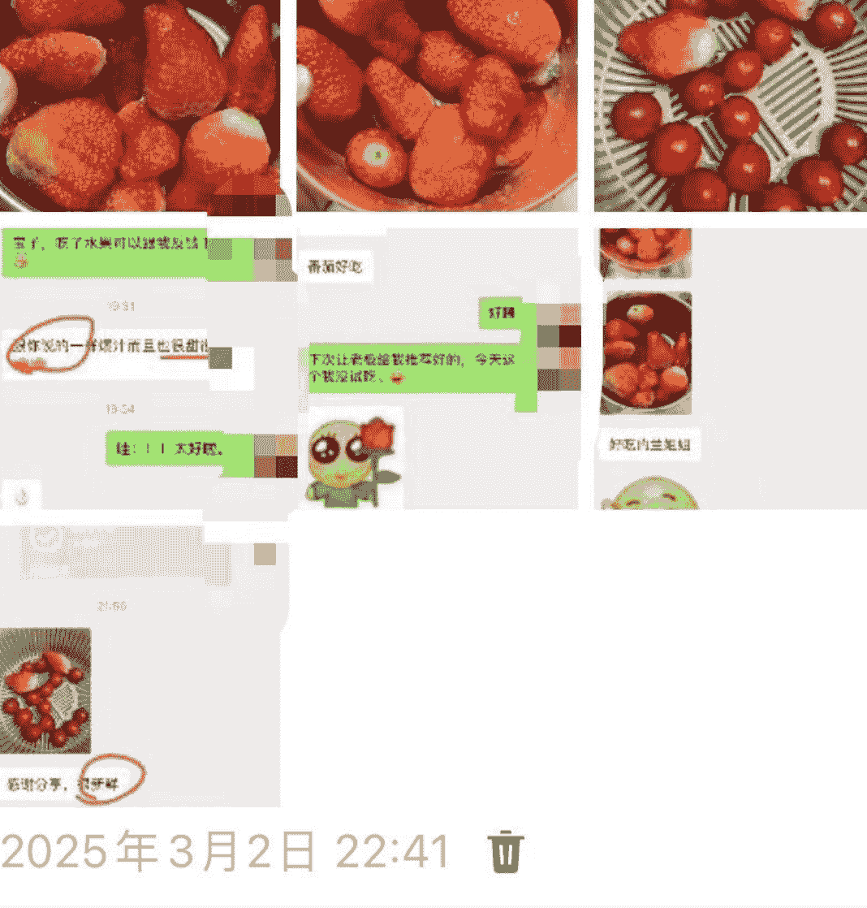

想到这，我马上发朋友圈问需求（这招超级好用，我们在出新品的时候，也会问），果不其然，一堆人想买。

### 详情

夏天想减肥的宝宝，看过来🐴🐴🐴简易版减脂餐——■ ■ . ■ ■ 感兴趣吗？
点赞人数超 10，明天我去买新鲜牛肉回来研发😃😃😃

2025 年 4 月 9 日 20:48

必须支持

第一个星期我们就开始帮大家代购，每周帮大家带新鲜好吃的水果。

因为买的水果特别好，所以用户对我们的口碑更放心也更信任我们了，每周都催着我们去采购。

懒_人微信: lazyhelper

晚点去海吉星采购[呲牙] 有想吃水果的宝贝 可帮忙带回来哦！可私信我想看什么...

以后我会多尝试些水果（主要是我家有个 1 岁 4 个月的宝宝也要吃，哈哈哈）遇到

宝贝们，水果群来啦！大约是每个星期一次，感兴趣的进群～

公主，看过来！每周末兰姐和家人都会去海吉星采购材料，平时都会在自己买一些水果带回来家里有 人吃，偶尔也会帮邻居带一些！今天跟公主同学 聊到关于水果，如果你们有需要，可以帮忙带哦！免费带哈，商家收多少，就给你们多少，都是批发价。

兰姐的感受就是，那里的水果很新鲜！就是百果园的品质，价格比一般的要便宜一些。就是主打的性价比高！

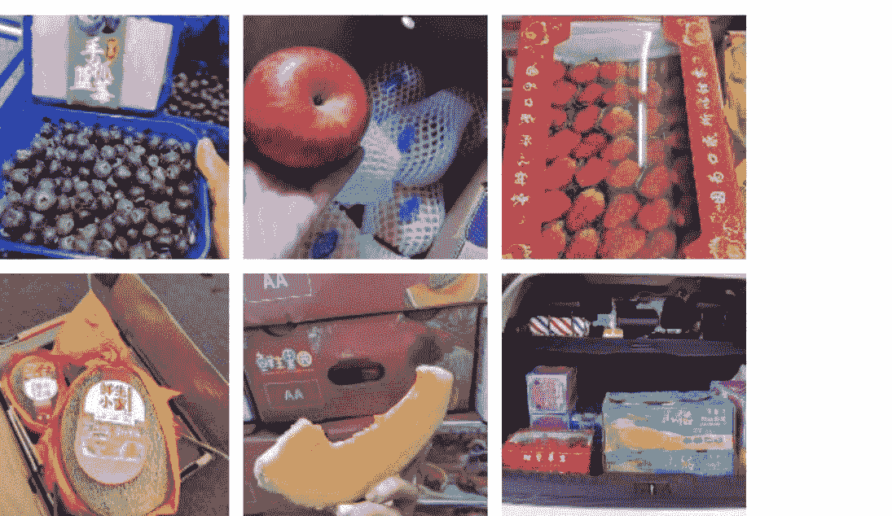

除此之外，社群 的基本 运营（每周 抽奖免费吃、每日抽幸运儿，群人数到哪个位置等）也持续在做。

## 四、赋能实体，小红书经验助力同城创业

在小生意慢慢稳定之后，我凭借多年的自媒体经验和此次操盘实体增长流量的方法，产生了一个想法：为实体商家和创业者赋能。

懒人微信：lazyhelper

帅哥，咱们这次学习做 [马赛克] 的学费是 1280，（包含但不限于现场学习 3 天，线上指导，供应链提供等），费用属于教学服务费，不退不换哈，你这边确认给我回复个“1”哈~

（另外咱们这次学费金额仅限双方知情，拒绝透露第三方）

1
好的

¥1280.00
已收款
微信转账

因为是第一个学员，我阿姨第一次当老师，全程就毫无保留地分享自己的经验和技巧。从包子的制作工艺，到食材的挑选，再到摆摊的经营策略，每一个环节都耐心讲解。

在这个过程中，我也积极协助，帮助学员梳理所有的业务流程，让他对整个经营活动有清晰的认识，同时我也在整个过程中梳理出一份 sop，录了视频备用。

学员也特别给力，
学回去后，第一次小试加新品，就卖完了。

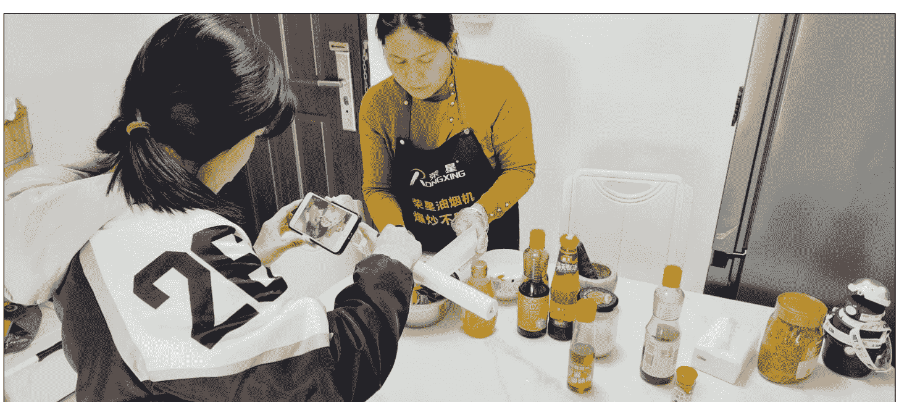

最后总结一下核心要点：产品永远是硬核竞争力。产品过硬，小红书引流才能真正落地生根；而复购 X 裂变，是扩大生意版图的关键；朋友圈维护与社群营销是实现事半功倍的秘诀——前者通过持续输出真实内容建立信任，后者借助互动活动激活用户，二者相辅相成，共同推动业务增长。

互联网时代，小红书 X 实体小生意，也可以有大机遇呀！！！

祝所有的老板们，网运昌隆啊！！！

历史 3000 多份各类付费文章以及年费 3 千多的副业社群资源，见懒人专属群内分享！

付费群，白嫖勿扰！

懒人专属群更新记录：

[https://lazybook.fun/#!/blog/record2](https://lazybook.fun/#!/blog/record2)