# 小红书引流万能公式和操作手册

文章大概 16000 字，看完共需 53 分钟

引流获客，这个东西应该所有行业的人都用得到，不管是个人想要做副业，还是公司想要做生意，都需要从公域导流量

应该没有人会说，自己是不缺客户的

关于《抖音小红书导流技巧和万能引流公式》这个主题的分享，我在去年和前年好多场线下分享过，那个时候是 1.0 版本，已经帮助了非常多的人，甚至连分享的 PPT 都被搬运到海外去卖

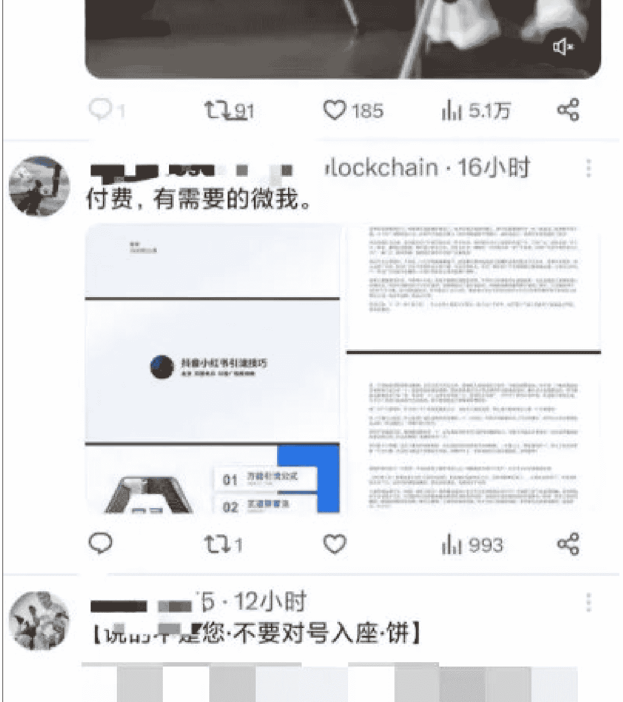

### 一整个离谱

我昨天刚把自己的分享作为钩子挂在文章里，已经有人把我的内容拿到外网上去引流了

早上群友发现我的分享被挂在 X 上，而且两个资料卖 68 一份

这些人，执行力真强啊

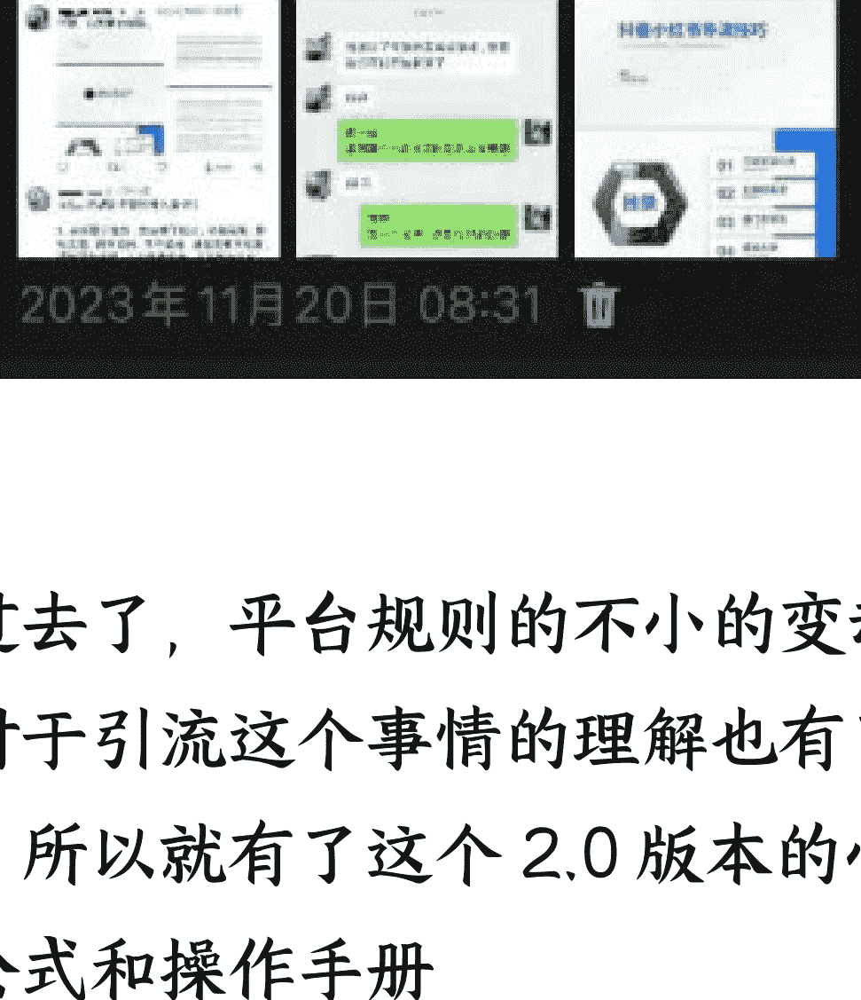

两年过去了，平台规则的不小的变动，加上我对于引流这个事情的理解也有了一些变化，所以就有了这个 2.0 版本的小红书万能公式和操作手册

大的逻辑没有变化，但是整个流程中的很多细节有了变化

前段时间在北京线下做了个分享，效果反响依然非常好

现在就把这个稿子重新整理成文字版本，大家有需要的自行观看，全文大概 16000 多字

懒人微信：lazyhelper

这篇文章不涉及别的东西，只讲一个事儿，就是讲明白怎么安全、高效地把用户从小红书搞到你的微信上面来，就把这个事儿讲明白讲透了

包括但不限于：整个导流的逻辑应该是怎么样的？需要准备哪些东西？整个工作流程是怎么样的？怎么搞是合规的？怎么搞是不合规会被限流封号的？什么动作是平台不允许但是安全性很高的？流量应该怎么搞？内容怎么输出？导流的路径是怎么样的？怎么样增加导流的效率等等

当然，这些问题我并不是逐个去回答，而是当我把整个逻辑给你讲明白之后，上面这些问题你自然就有答案了

在正式开始前，我先卖一下焦虑

你们有没有想过，为什么这两年，越来越多的人都想做小红书这个平台？

我给你们看一组数据：

24 年一年不到的时间，小红书电商买手增加了 27 倍，团购商家数量增加了 10 倍，购买用户数增加了 12 倍，平台整体活跃用户数增加了 1.6 倍

### 也就是对对方有好处

我也不清楚

不过我估计，随着现在这个商家入局的速度，和商业化生态发展的速度，等到明年年中，小红书大盘流量价格就要跟抖音持平了

这就是我们要去做小红书，并且尽快开始做小红书的原因

达成共识之后，下面正式开始

我们到底应该如何在小红书找到客户，并且加到微信

全文一共 4 个半部分：
万能引流公式
钩子怎么找
流量怎么搞
如何合规引流

后排提醒一下，本文主要是给客户线索需求的行业/老板看的，电商老板请随意

## 一、万能引流公式

做引流之前，一定要先明白一个事情，引流的核心逻辑是什么

我们来想象一个场景，假设你在街上，遇到一个人，他跟你说：你好，我能不能加你一下，加完之后我在朋友圈打广告，这样你就能看到了

你会不会觉得他是神经病

但是如果她说，你好，我给你转十块钱，你能不能加我好友，帮我完成一下任务

你是不是会更有意愿

这个例子有点粗糙，不过道理能表达清楚就好

想引流，想让别人加你，核心逻辑就是：利他

> 引流核心逻辑：利他

经济价值，认知价值，情感价值...

### 2.1 常见的钩子类型

第一个是，行业资料，这是最常用的，这是最常用也是最好用的一个方法

比如说运营资料，考研考雅思的历年真题，大学生创赛的 PPT 模板，宝妈坐月子保持身材的教程等等

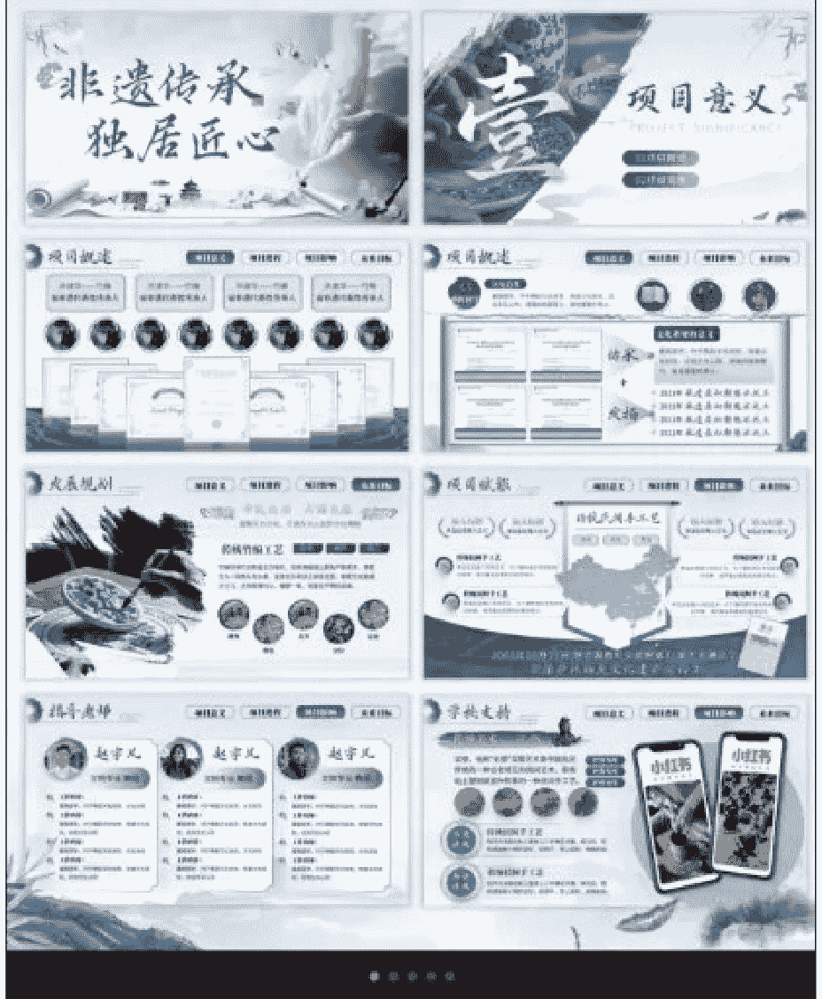

勇闯国赛✨导师夸俺项目的 PPT 清晰又高级
非遗传承创赛项目的同学快来抄 PPT 作业啦! 

Hello 大家好，我是青山。

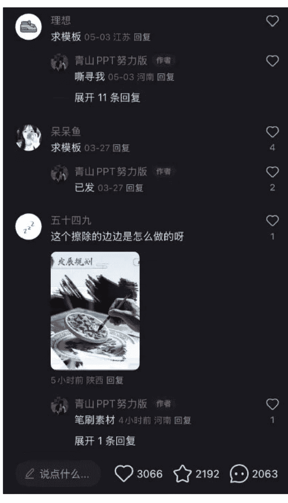

凡事资料，就必定是面向特定人群，引流效率非常高

现在小红书的虚拟资料项目非常火，其实本质上就是在用部分资料去引流，然后引流过来之后卖把更多的资料卖给他

关于虚拟资料这个项目我后面还会提到，
这里先不讲了

第二个，解决方案，比如说家装攻略、旅游攻略、踩坑指南，或者是出国经验等等

甚至像这种:

# 济州岛
# 厕所攻略

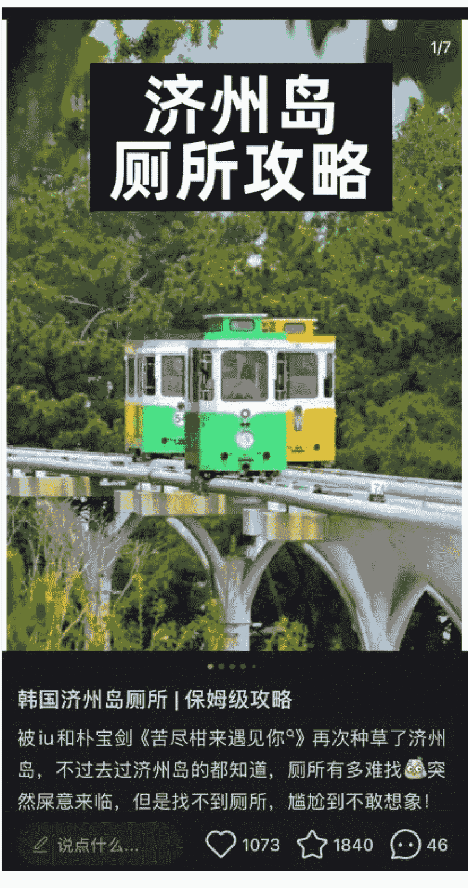

# 韩国济州岛厕所 | 保姆级攻略

被 iu 和朴宝剑《苦尽柑来遇见你°》再次种草了济州岛，不过过去济州岛的都知道，厕所有多难找突然屎意来临，但是找不到厕所，尴尬到不敢想象！

分享自己准备好的攻略就可以吸引到有相关需求的人

第三个，就是优惠信息

比如现在市场价的黄金大概是 1000 左右一克，如果你说你这边的黄金只要 800 多，你的微信绝对会加爆的，当然前提是不骗人

如果玩套路的话，那肯定是会被骂的，而且后端也肯定没有转化

对于有些热门产品或者品牌产品，只要你的产品价格够低，它就是自带流量，那就是能引流引到人

第四个，就是方案报价

对于有一些单价较高的服务、产品来说，是要对比很多家的

说一个你们可能不知道的数据，这是小红书官方跟我们说的，对于高单价产品来说，一个消费者在做决策之前，他平均浏览的笔记数量是 70 篇

也就是说他会浏览非常多的笔记，然后再做消费决策

在浏览的过程中，除了做攻略了解信息以外，还有一个很关键的步骤就是比价

一方面是对比服务，另外还会对比价格，尤其是需求强烈的消费者，会每一家都点开过来问问价格，如果你直接在平台上面跟他报完价了，他大概率就不会再联系你了

但是如果你想办法先你跟他说先加到你，然后你给他定制一个方案和报价，他多半就会愿意加你，反正他加了你也并不一定会给你付钱

但重点是你把他吸引到私域之后，你再次联系到他就不需要成本了

而如果你在公域给他报价，你这波流量的费用就相当于是浪费了

第五个类型，是软件/插件

本质上也是虚拟产品，可以吸引到非常多行业的人。比如说你有某个行业专用的数据分析工具，或者某个特别好用的网络插件，都可以用来引流

然后现在的很多人真的是搜商非常差，也不太会用电脑，给他一个压缩包，他都不知道怎么打开

这里就有了存在了巨大的信息差，有巨大的需求

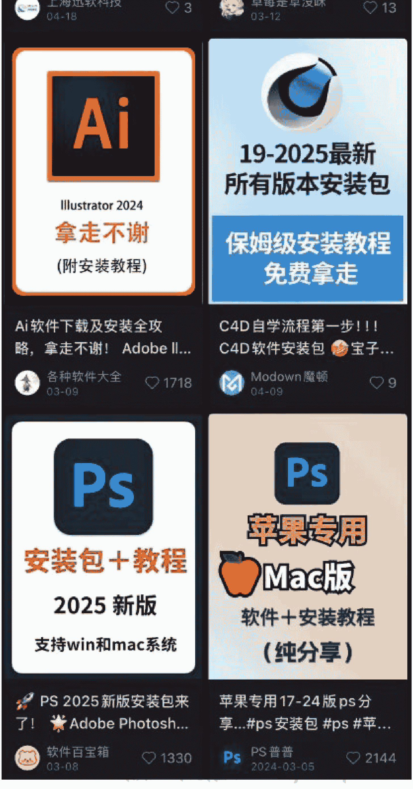

那也可以直接开个店铺，挂链接卖

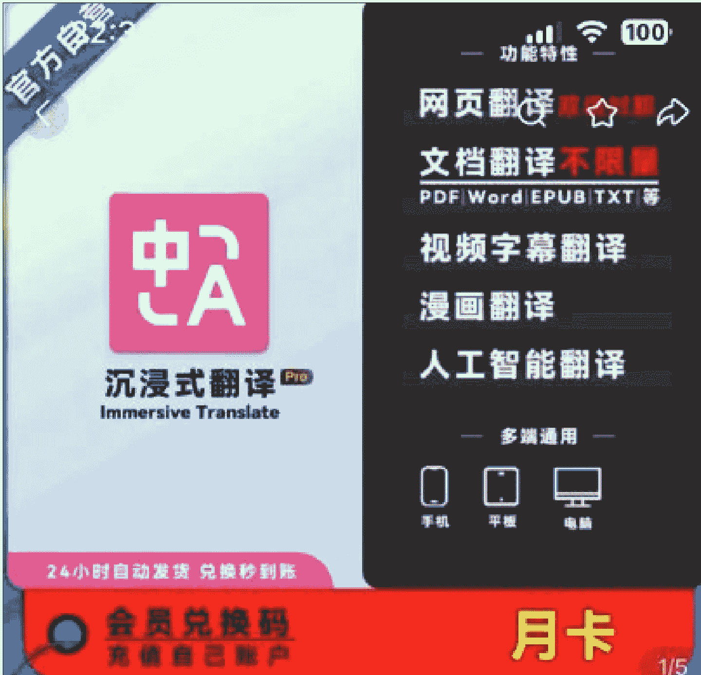

这两年 AI 编程发展迅速，冒出了非常多好用的工具，搜集一下就可以作为一个工具箱，用来吸粉导流或者打包售卖

第六个是一个非常好用的吸引泛粉的方案，就是吃瓜热点

比如说最近有个什么很有意思的瓜爆了，在微博上热搜了

你整理一下资料，比如什么小视频，什么 52 页的 PDF，然后去相关热门笔记底下留言，说我这里有，想看私信我

他是你的时候，你再想办法让他加你，然后把资料发给他，顺带还可以在里面加个二维码，让他转发的时候帮你完成裂变

这种粉他基本上都是泛粉，产值不高，一般是做团购或者做淘宝客的人有需求，不适合精准导流

还有一种类型，就是就是壁纸头像

它本质上也是一种虚拟产品，单拎出来讲是因为这方面的需求真的非常大

并且因为不同的人群的爱好是不一样的，所以不同的不同风格的图，可以吸引到不同的人群

用二次元的壁纸头像就是可以吸引到二次元人群；用照片头像就是可以吸引到小清新人群，文青人群；星座和星盘可以吸引到身心灵爱好者；MBTI 和星座可以吸引到命理爱好者......

当然还有一些别的类型，我就不继续列举了，大家有想到的，也可以在评论区发出来，给其他人一些参考

### 有了钩子之后，应该怎么放呢？

先按下不表，一会再讲，然后下面我们开始讲内容

## 二、钩子怎么找

刚才说了，钩子，就是钓鱼时候的钩 + 饵，就是“加我领资料”里面的“资料”

那么钩子是什么，自然就很重要了

宝妈人群大概率不会对考研资料感兴趣

但是可能会对如何带娃，如何做产后康复感兴趣

所以找钩子之前，要明确两个东西：

- 确认自己的人群
- 人群对应的需求

如果还是拿钓鱼举例子，就很好理解，这两个东西分别对应的是：我要钓哪一种鱼，这种鱼喜欢吃啥

不同的鱼喜欢吃的东西肯定不一样

### 不同的鱼喜欢吃的东西肯定不一样

### 不同的人群，需求点肯定也是不一样的

比如说

- 男人会比较关心工作上的事情，数码产品，哪里可以钓鱼，前列腺健康……
- 女人会比较关心家人的情况，怎么变美怎么护肤，最近的金价，各种名牌优惠券……
- 老人会关心有没有人能陪自己，哪些保险比较划算，谁家保健品比较厉害，哪里可以领鸡蛋……
- 老板会比较关心最近行业的进展，员工的小八卦，怎么找投资，哪里的洗脚小妹比较好看……
- 学生会比较关心近期的一些考试，一些热门的游戏，各种新兴事物还有亚文化……
- 咱们圈子里的人则肯定是对搞钱更感兴趣

确定好自己的⼈群之后，才能确定他的需求是什么

⽬标⼈群怎么确定，那就取决于你对⾃⼰这个产品和服务的理解了

你要卖的⻓西、服务是⾯向于什⼈群的

按照⼈群标签的维度来划分，就是需要知道⾃⼰的客户是：

- 在什么样的城市，住在什么地段，什么年龄段，什么性别，收入⼤概什么⽔平
- 消费理念是什么样的，家庭结构，学历⽔平，对什么事物感兴趣，对什么产品感兴趣，近期被什么东⻄种过草……

做过⼴告投放的朋友，看上⾯这段话应该很眼熟，其实就是⼴告后⾯的⼈群标签

对⾃⼰的⽣意，对⾃⼰的⽬标客户理解越深，越知道越能知道他们⼀帮什么样的⼈，越能知道他们想要什么

然后这里有一个需要注意的点，就是我准备的钩⼦不一定得是我的产品

⽐如说带货⽹播问，很多人都听说过组品策略，一般都需要引流品和利润品

### 第三个，就是方案报价

对于有一些单价较高的服务、产品来说，是要对比很多家的

说一个你们可能不知道的数据，这是小红书官方跟我们说的，对于高单价产品来说，一个消费者在做决策之前，他平均浏览的笔记数量是 70 篇

也就是说他会浏览非常多的笔记，然后再做消费决策

在浏览的过程中，除了做攻略了解信息以外，还有一个很关键的步骤就是比价

一方面是对比服务，另外还会对比价格，尤其是需求强烈的消费者，会每一家都点开过来问问价格，如果你直接在平台上面跟他报完价了，他大概率就不会再联系你了

但是如果你想办法先你跟他说先加到你，然后你给他定制一个方案和报价，他多半就会愿意加你，反正他加了你也并不一定会给你付钱

但重点是你把他吸引到私域之后，你再次联系到他就不需要成本了

而如果你在公域给他报价，你这波流量的费用就相当于是浪费了

### 第 5 个类型，是软件/插件

本质上也是虚拟产品，可以吸引到非常多行业的人。比如说你有某个行业专用的数据分析工具，或者某个特别好用的网络插件，都可以用来引流

这里就有了存在了巨大的信息差，有巨大的需求

那也可以直接开个店铺，挂链接卖

这两年 AI 编程发展迅速，冒出了非常多好用的工具，搜集一下就可以作为一个工具箱，用来吸粉导流或者打包售卖

第六个是一个非常好用的吸引泛粉的方案，就是吃瓜热点

比如说最近有个什么有意思的瓜爆了，在微博上热搜了

你整理一下资料，比如什么小视频，什么 52 页的 PDF，然后去相关热门笔记底下留言，说我这里有，想看私信我

他是你的时候，你再想办法让他加你，然后把资料发给他，顺带还可以在里面加个二维码，让他转发的时候帮你完成裂变

这种粉他基本上都是泛粉，产值不高，一般是做团购或者做淘宝客的人有需求，不适合精准导流

还有一种类型，就是壁纸头像

它本质上也是一种虚拟产品，单拎出来讲是因为这方面的需求真的非常大

并且因为不同的人群的爱好是不一样的，所以不同的不同风格的图，可以吸引到不同的人群

用二次元的壁纸头像就是可以吸引到二次元人群；用照片头像就是可以吸引到小清新人群，文青人群；星座和星盘可以吸引到身心灵爱好者；MBTI 和星座可以吸引到命理爱好者......

当然还有一些别的类型，我就不继续列举了，大家有想到的，也可以在评论区发出来，给其他人一些参考

### 钩子的本质就是人群的需求

如果你有他的需求的解决方案，或者你能唤起他的需求，你就能加到他的微信

钩子背后是人性，只要你能抓住人性，就抓住了用户

## 三、流量怎么搞

讲内容之前，我们先来简单讲一下小红书的流量结构

有人可能会问，不是不是讲内容吗，万能引流公式的三个部分，内容、钩子和渠道，哪来的流量

其实流量和内容本质上是一回事儿

内容的作用就是用来拿流量的

用钓鱼举例子，你打窝打成功了，你这边的鱼就多，流量就大，如果你打窝没打成功，你面前的鱼儿就少，流量就小

那肯定是流量更大的时候，钓鱼成功的概率更高

流量结构我们可以分几个维度去拆一下，这个视角你们在其他地方肯定没有听说过，我给你们重新拆解一下，总数的流量结构是怎样的？

当然了，这个逻辑放在其他平台也同样适用，只不过这篇文章讲的是小红书，所以我就用小红书的视角来讲，看明白之后，拿回去可以照搬套到其他的自媒体平台上面

首先是流量来源，我们可以把流量分为自然流量和付费流量

自然流量，就是通过咱们自己发笔记发视频，发完之后，平台根据算法给我们推的流量

付费流量，顾名思义是花钱买过来的，包括聚光、薯条、乘风、蒲公英等等都可以属于内付费流量

然后按照内容的来源，我们可以分两种

- 第一种是自制内容，就是咱们自己做笔记或者自己团队里的人员做笔记
- 第二种是采买内容，就是请外包团队帮忙做的笔记，或者更多情况下，就是请达人帮忙拍素材做笔记，产生的内容

有些朋友人没有找过达人，可能没有意识到这个事儿

在小红书找博主的本质其实是在花钱买素材，其实是在花钱买素材，顺带买流量

因为达人的账号流量本身也是有不确定性的，即使是腰部或者是头部的达人，甚至

有些情况下，粉丝量多的博主，他的笔记权重不如粉丝量少的博主

但是一般来讲，专业的博主，他的内容生产能力都会远远高于大部分的素人和经验不多的运营

按照上面说的这两个维度区分，我们可以把小红书的流量来源分成这 4 个维度，分成这 4 个象限

### 达人内容

### 素人种草

### 报备种草

### 纯自然流

### 纯付费流

### 自然流量

### 付费流量

### 自制内容

花钱找达人，买素材、买流量，其实就是报备种草，咱们走蒲公英过找达人发笔记，一方面拿到了他们的流量曝光，一方面采买他们的素材

如果是找达人号做内容，但是做自然流量，其实就是做素人种草，就是大量的小号去发笔记

还包括找一些素人做代发，就咱们自己做好的笔记，放到他们的账号上面去发布，拿流量

自己的内容团队生产效率更高，质量更高，所以可以找他们买到更加优质的广告素材。

如果是自己做内容，然后走付费流量，其实就是付费投流的打法，每天更新笔记素材，然后通过付费买流量来找到目标用户

如果是自制内容加免费流量，就是大部分中小玩家的打法，搞几个账号，然后每天哼哧的发笔记，以此来获得自然流量

当然有一些团队他的管理比较牛逼，内容生产成本低，sop 比较强，也可以通过账号数量和经验技巧达到非常大的流量，比如说前两年很有名的郑州帮

像这些概念都好理解，然后我们再引入第 3 个维度

如果按照流量的类型来区分，我们可以把流量分为推荐流量和搜索流量

## 1 爆款笔记

推荐流量很好理解，就是在 APP 主页往下刷，信息流里面的笔记就是算法推荐来的。搜索流，顾名思义就是通过搜索来的流量，当用户有某个方向的需求或者问题，他在平台内发起搜索，然后在搜索出来的结果里面找到了我们的笔记，并且点击进来，这就是搜索流量。

推荐流量的特点就是曝光更直接，短期内流量更大，但是相对的推荐周期会更短，没有爆的笔记推荐周期基本就在一周以内，爆了的笔记周期也在一个月到三个月左右，很少有以年为单位持续获得推荐流量的。

搜索流量虽然量会小一点，但是吸引来的用户目的性会更强，转化更高，流量更持久。

现在把三个维度互相连接清楚，再配合一些官方的功能和运营技巧，就可以诞生出非常多的玩法！

> 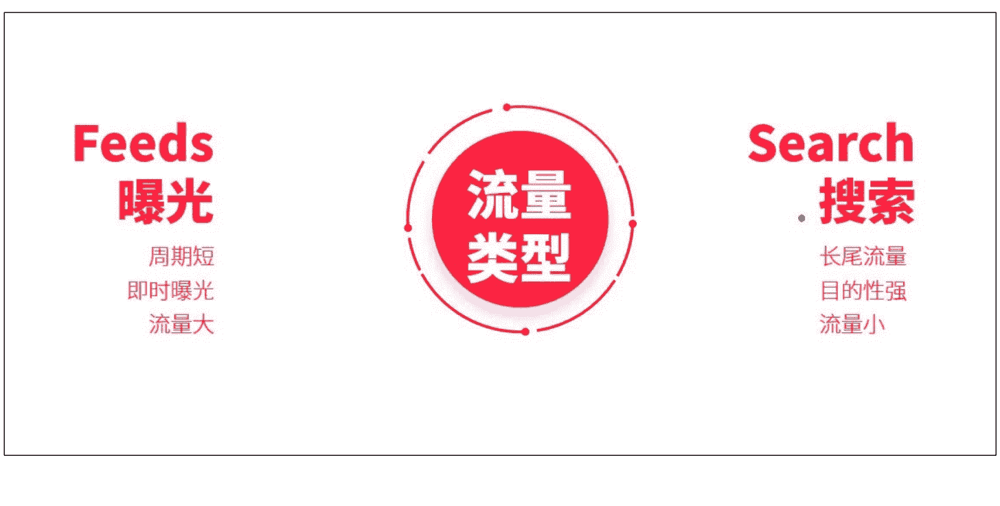
> 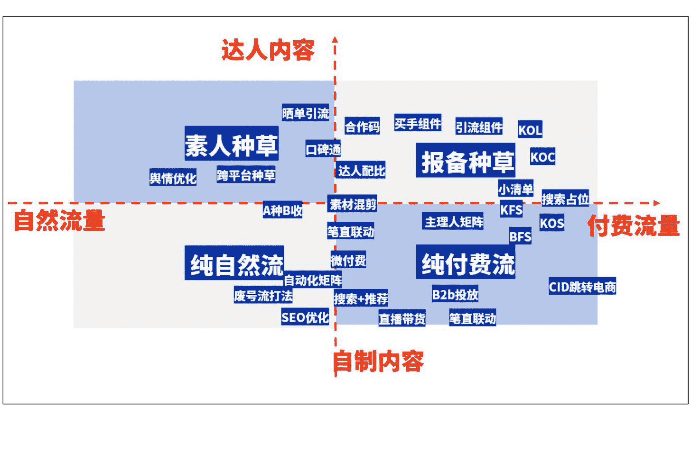

当然了，这张图并不是今天的内容，我的目的主要是跟你们解释清楚流量可以怎么来，然后后文会重点讲这里面的三个内容：

引流：爆款笔记怎么做

关键词占位

付费投流

至于其中里面其他的一些打法和关键词，以后有机会单独开文章再讲。

## 2 引流笔记怎么写

那么先来讲爆款笔记，爆款笔记应该怎么写。

CES = 点赞数（1 分）+ 收藏数（1 分）+ 评论数（4 分）+ 关注数（8 分）

> **CES = 点赞数 (1 分) + 收藏数 (1 分) + 评论数 (4 分) + 关注数 (8 分)**

这个公式很多人可能都见过，据说就是小红书的推荐算法。我先澄清一下，它并不是官方真正的算法，它只是一个根据前人的运营经验倒推出来的算法，市面上还有一些其他版本的，比如说加入了转发数据、成交数据等等，都不是真实的。

实际上的算法会比这个复杂很多，但是里面的权重关系是很值得参考的。所有的用户互动当中，权重相对较高，并且相对容易拿到的，就是评论。

所以如果想要我们的笔记更容易爆，并且引流效率更高，想办法把评论做上去。咱们并不一定要做那种几十万赞的笔记，而是要做那种评论数多于点赞和收藏数的笔记。

因为这类笔记意味着它的权重够高，爆的概率更大，也更容易吸引其他人来评论，反复累加咱们帖子的权重。同时，一个评论区的文字也会被计算进算法，评论阅读越容易被更精准的推送到目标人群面前。

所以在账号的初期，咱们可以用这个方法来动点小技巧，快速的提升账号初期的权重。在账号的后期，也可以用这个思路来写高转化的引流笔记。

### ### 起号笔记怎么写

### 起号笔记怎么写

比如这篇笔记：

> 

他抛了一个话题，就是“那些年男朋友拍过的照片”，同时晒了很多张奇葩的照片。目的是什么？就是为了抛砖引玉，吸引更多人来评论区晒照片。

每个人都有被看见的需求的，尤其是当你遇到了跟自己有同样遭遇的人的时候，表达欲会空前强烈。所以很多人去评论区晒照片，这篇笔记就爆了。

> 

再比如这个：浙江的厂二代们来聊一聊。

> 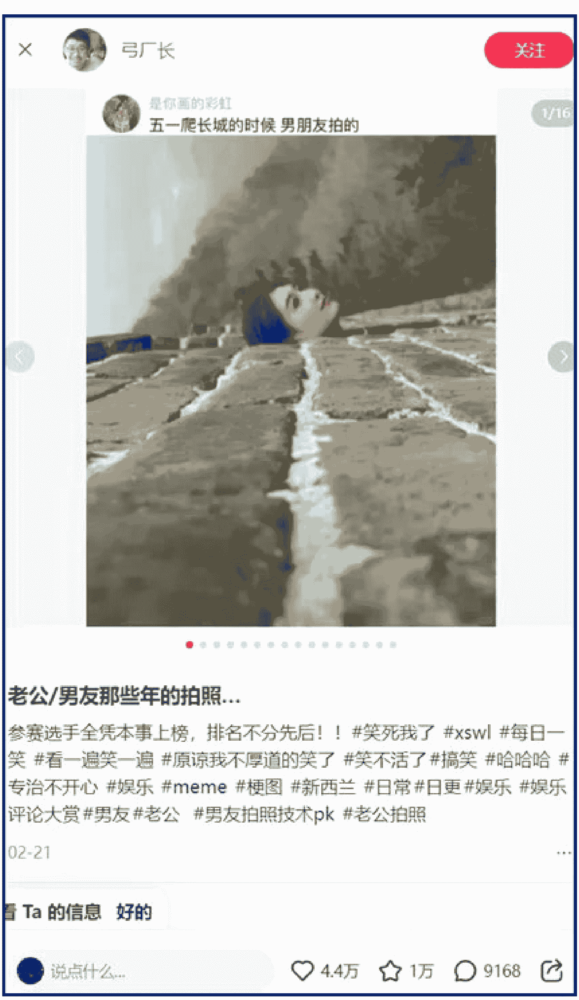

在标题上就把人群筛选出来了，当然还能筛选到很多吃瓜的人。这些笔记它们的共同特征就是可以筛选人群，吸引同一人群来互动。在账号前期快速的做出一两个爆款笔记，快速的帮账号打好标签，让账号的基础权重上去。

当然也就稍微高一点，不会有特别高的差异，毕竟小红书的去中心化算法还是比较严格的，咱们追求一个小爆就行。既可以拉权重，又可以让自己有信心。这里还有个小技巧，就是在新号初期积极的参加官方活动，利用好官方赠送的流量券，可以免费帮自己的笔记助推一波。

比如说，账号注册的时候，把生日设定在 3 天后，等到生日的时候，就可以领一张生日流量券，可以＋1000 的曝光，把它用来给自己的笔记做助推，原本就是拉互动的帖子，有了助推之后更容易爆。

那么几号的时候，怎么去找这类高互动的笔记话题呢？

像灰豚之类的三方工具，可以找，我就不说了，重点说一下小红书自带的两个功能。**一个是小红书 APP 自带搜索筛选功能**，搜索行业关键词，然后筛选近半年或者近一周内的高评论笔记就可以了。

> 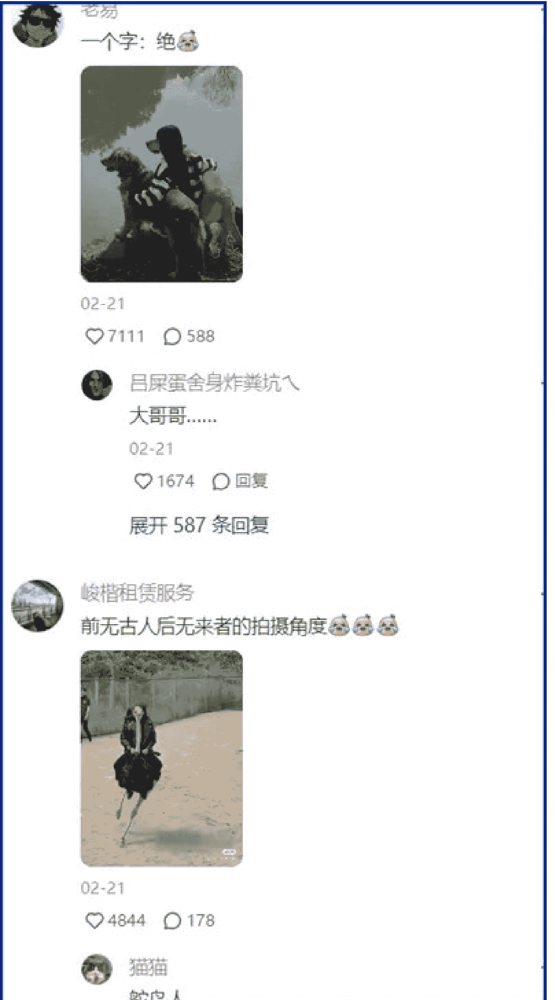

**一个是聚光、千帆、蒲公英后台都有的内容广场功能**，里面可以筛选全渠道的商业内容，也可以找到很多行业相关的高互动话题。

懒人微信：lazyhelper 39 / 86

顺带说一下个人店铺后台是没有的，必须得企业店铺后台才有这个功能。

做这类型笔记的时候要注意两个点：

1. 去寻找那些和自己行业相关的话题，这样吸引到的人和自己的目标人群更接近。
2. 不要沉迷于这些流量。因为通过这种方式报的笔记吸引来的人大概率偏泛的，有部分目标人群，但是还有很多是吃瓜的，同时你这篇笔记也没有给消费者提供真正的价值，单纯是给了个情绪的宣泄口子。所以这类笔记的转化率大部分都很低。因此，一定不要沉迷于这些虚假的数据繁荣，发了两篇数据，小爆之后就可以隐藏了，开始发引流内容。

我们的核心还是账号权重起来之后再去发，目标人群有需求的笔记，把他们加到手。

## 3 引流笔记怎么做

然后我们要开始讲引流内容怎么做，以及 钩子怎么放这两个问题了。

为什么这两个问题要放在一起讲？对于一篇好的引流帖来说，最简单的内容，就是钩子本身。

### 钩子 即 内容

你用来钓鱼的钩子，它本身就是一种内容，你只要想办法把它呈现在用户面前就行了。

就像这个玩法，在两年前我们就靠打印这么份资料，然后晒一下照片，一个号一天就能加 100 多个人。

> 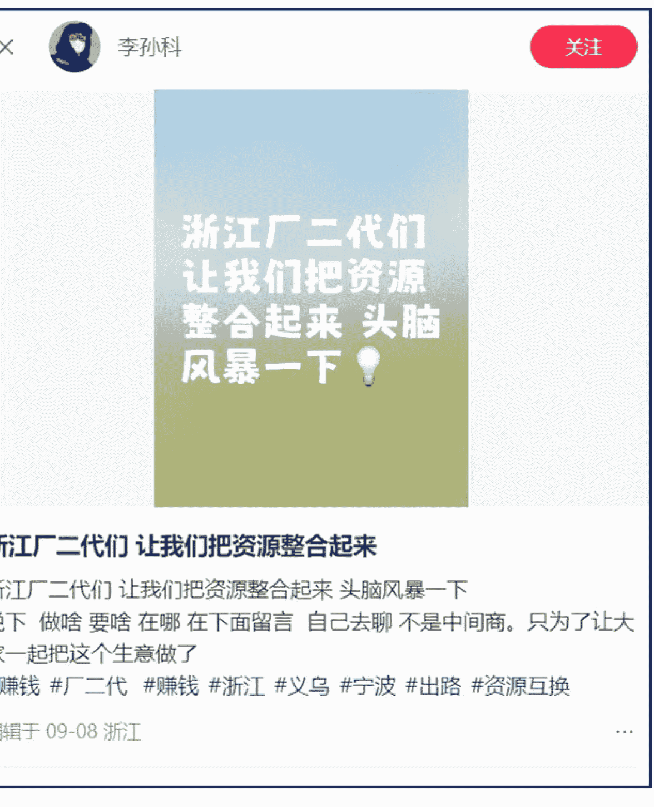

这份资料本身是钩子，他只要加了我们就可以领取。我们把这篇资料当中的几页晒出来，它就 成了内容可以发在小红书上。但是现在你还这么晒，你的流量肯定不更是以前了。

> 懒人微信：lazyhelper

因为时代已经变了，很多人都在这么玩，版本变了，咱们的笔记也需要迭代一下。

### 怎么迭代呢

一方面内容广度可以迭代一下，我们的思路可以换一下，前文讲过，钩子本质是需求，同时钩子可以是内容。根据很粗浅的数学逻辑，a=b，b=c，是不可以推理出 a=c。也就是需求本身也可以是内容。

> 

比如说，女生小腿脂包肌减不下来怎么办？我把这个问题抛出来让大家来回答，是不是就能吸引到同样问题的人群。然后在笔记当中给出解决给出一个自己成功的解决方案。

再比如，去西藏旅游踩坑了怎么办？也能吸引到想要去这个地方玩的人群。他们是来找避坑的，但是点进来笔记发现其实我是在踩坑之后，找到了合理的解决方案。想要这个解决方案，可以，先来加我。加过来之后发现其实我其实是导游。但这个时候已经无所谓了，他根本不在意你是谁，他脑子里只记得他想要的是那份避坑的旅游攻略。

如果销转团队厉害一点，那可以用消费者的身份加人，然后再把自己另一个导游的微信和攻略一起推荐过去，这样成交效果会更好。也可以把这个步骤前置，玩的隐蔽一点，在笔记里面抛出一个问题之后，不做太多的解答，反而是在评论区用另外一个账号来做解答。

> 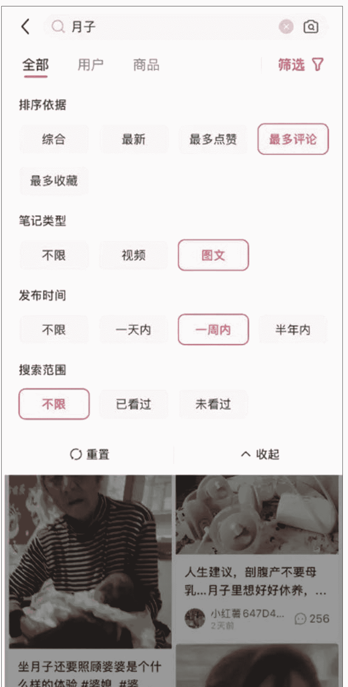

用户可以界面对于对这个产品有需求，于是他去找了 b 账户，然后加微信，殊不知 b 账户是我们的小号。这个玩法大名鼎鼎的 A 种 B 收。根据账号的多少，以及托的逼真程度，还可以变成 A 种 B 答 C 收、A 种 B 问 C 答 D 收等等...

比如这样，A 账号先发一个旅游分享帖：

> 

呼伦贝尔遭完罪了说说网上看不到的大实话！

想象中的呼伦贝尔，应该是一片美得让人流连忘返的绿色草原，但现实却可能让你痛并快乐着。今天就让我来给大家分享一些在呼伦贝尔遭完罪了之后，想说却一直没说的大实话！然后 B 账号在下面求推荐，A 账号就把官号推过去了！

如果咱们自己操作的时候，记得把当托的那个账号，主页包装的真实一点。

除了广度上的迭代，还有深度上的迭代，也就是接下来要讲的：

众所周知，小红书是一个很吃搜索流量的平台，60% 的用户都有在小红书搜索的习惯。

> 

文章开头也讲了，现在小红书的搜索量仍然在 然在迅速增长。并且还有一个很浅显的道理，搜索过来的流量都更精准。所以咱们在发引流帖的时候，除了晒需求，晒钩子，还有个很重要的点，就是要尽量的把精准的关键词植入进内容。

前两年可以不怎么植入，也能做到很好的流量。因为那个时候还没有大批量的专业玩家入局，很多赛道的小红书内容没那么卷。所以那个时候只要把资料打印出来，晒一下，就能有不错的流量。但是现在想这么做的人多了，想要在同质化严重的笔记类型当中脱颖而出，就需要植入相关关键词，可以提高你的笔记在算法当中的权重。从而增加笔记拿流量的概率。

那关键词植入应该怎么做？这里先做一个知识普及，我一般会把一个关键词拆成三个部分：核心关键词，相关关键词，长尾关键词或者叫长尾短语。

> 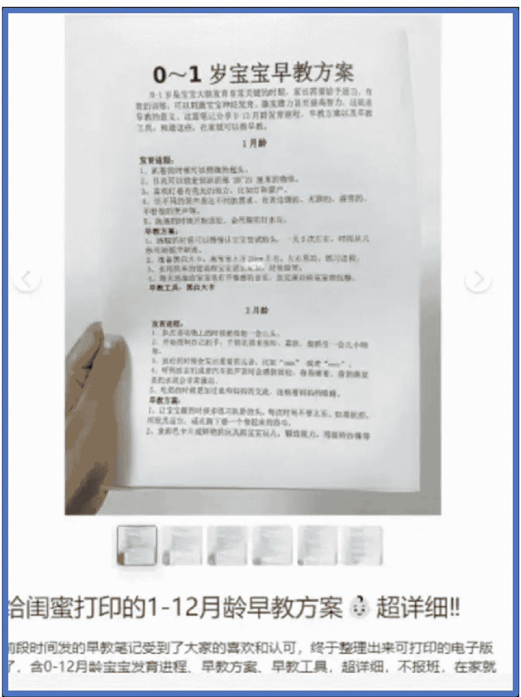

核心关键词就是咱们这个品类词或者产品词。比如说我做那个考研，“考研”就是核心关键词。

相关关键词，就是跟咱们的核心词有关联，有关系能够组队的词汇。还是拿考研举例子，比如说“上交大考研真题”，“清北考研”，这里面的“上交大”和“清北”就是相关关键词。再比如“考研真题”，"2025 考研”，“考研英语”。还有咱们如果有品牌，那么品牌词、竞品词也可以算是相关关键词。

长尾关键词，或者叫长尾短语，就是多个相关关键词组成的一个能代表需求点的短句。比如“25 年考研冲刺”，“上交大考研历年真题”。这三种关键词逻辑关系就是一层一层递进，那越递进越细，需求就越精准。

*   比如说“考研”是一个超级大的词，考研这单一类目下面它可以分出至少几百个小赛道，一个学校就可以是一个赛道，因为每个学校它的真题是不一样的，高考是全国统考的，考研是全国分开的。

做内容之前，提前准备好自己行业的关键词，以及相关关键词，就可以把自己的内容精准定位到定位到非常精准的人群和需求上面去。

### 怎么找关键词

小红书搜索下拉框以及搜索页面的推荐词，这些其实都是咱们产品和品行业的相关关键词。

> 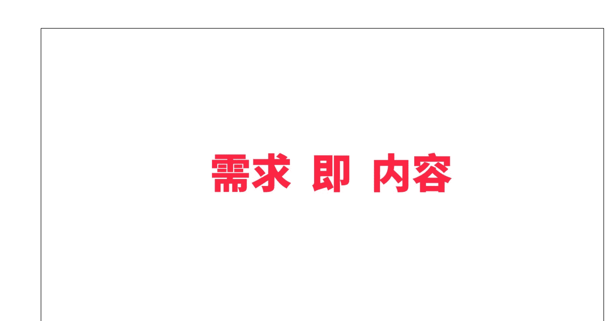

巨量算数 (**https://trendinsight.oceanengine.com**) 不需要开户，手机号码登录一下就能免费使用，里面可以根据咱们的搜索词去推荐与搜索词相关的词汇，虽然和小红书不是一个体系的，但是大的趋势是接近的。

> 

**5118 网站**，(**https://www.5118.com**) 一个专门做各个平台、专业词汇，总的网站使用下载表格，需要查看完整数据和下载表格，需要会员，如果使用频率不高，可以去闲鱼或者淘宝拼个单。

> 

# 聚光后台的关键词规划工具，**（https://ad.xiaohongshu.com）** 除了可以看到关键词的搜索指数以外，还能看到市场出价和竞争指数以及上下游关键词。

> 

开通聚光需要先认证小红书的企业号，交 600 块认证费。

> 

把这些关键词收集好之后，拉个表存好，方便后续使用，然后就是想办法把他们放到咱们内容里面去，因为我们要做的，就是找到对咱们的产品和服务有需求的这部分用户。所以我在笔记里面植入的关键词相关关键词越多，我这边笔记它在这个行业内的权重就会越高。这里的权重包括用户主动搜索算法进行内容匹配里的权重，也包括用户浏览信息流的时候算法进行兴趣推荐的权重。

但是把关键词植入金句，并不是说直接把关键词简单粗暴的铺设进去然后反复重复就好了，那样的内容大概率会被当成低质笔记，然后不给流量。植入的关键词，植入的部分包括：笔记的标题，封面、内页、正文、话题、评论区。

来举几个例子，比如说这个云南旅游大理旅游攻略。

> 

产品是“大理旅游”，对应的消费者需求是“大理旅游攻略”。然后咱们看笔记内容，标题上的“云南五天六天晚”，“省钱玩云南”，都是两个长尾短语。封面上的： “云南”“六天五晚”“豪华酒店”“航拍”“旅拍”，都是相关关键词，放在封面上的关键词，除了能被算法识别到，同时也能够兴趣人群的点击率。

正文里面：“丽江古城”“洱海”“大理古城”“昆明”“日照金山”“玉龙雪山”……等等词汇。这些词汇全部都是和“大理旅游攻略”这个核心需求有相关联的词汇，有一些词甚至是上下源关系。

除此以外，话题部分也可以植入一些词，比如 #云南六天五晚 *，#洱海环游*等等，虽然话题的权重比较低，加上去也能拿到一些流量。评论区还可以拿小号再埋几个关键词。整篇笔记各个内容结构里面，它的跟核心诉求相关的关联词越多，那么用户搜索和用户推荐的时候权重就会越高，笔记就越容易出现在有需求的这部分人面前。那只要他看到这篇笔记，他有需求，而且有可能会上钩。

> 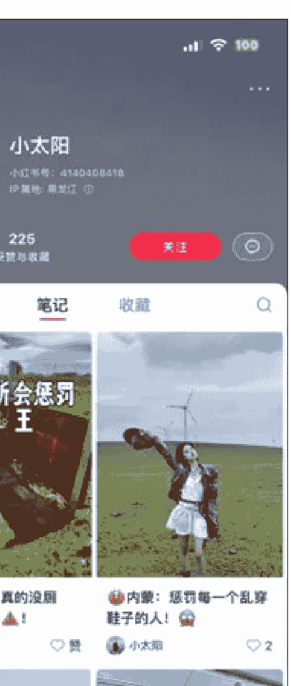

哈nist打印的 1-12 月龄早教方案。

前段时间发的早教笔记受到了大家的喜欢和认可，终于整理出来可打印的电子版了，含 0-12 月龄宝宝发育进程，早教方案，早教工具，超详细，不报班，在家就。

现在回看这类内容，它最大的问题就在于关键词植入的太少，可以把封面做成拼图的形式，在封面上加上关键词标题，然后在正文里面用合理的逻辑把一些跟“宝宝早教”的相关关键词放进去。

## 0-6 岁育儿资料包大全

最近关注我的有很多新手妈妈~在育儿上都有各种困惑~为了帮大家全面解决这些问题，我把自己手上一些好的资源整理了一下❤️：

## 0 到 6 岁育儿资料包大全！

*   1.待产包清单
*   2.新生儿常见问题汇总解答
*   3.崔玉涛育儿资料
*   4.辅食添加表
*   5.牛津全套资源
*   6.电子绘本 5000 本，知名必看绘本均在其中

+   - 💖资料均为电子版，可保存可下载~需要的宝妈自取啦~#育儿分享 #科学育儿我有妙招 #科学育儿 #育儿知识 #育儿资料 #育儿学习资料 #分享育儿资料电子版 #育儿资料分享 #育儿学习资料 #育儿教育分享 #育儿正能量分享 #育儿书籍分享 #电子绘本分享 #绘本电子书

伊伊今天快乐吗？求分享 2024-08-14

再比如其他内容形式，不是直接晒资料，从需求出发做笔记，去讲自己行业内的信息，也可以在笔记里面大量的植入相关关键词。

## 每个词都有可能成为用户找到你的流量入口

澳洲留学没人敢说的大实话。。。

不要挂科！重修费很贵‼️

这里是 Nancy 学姐，分享澳洲留学的大实话，想申请澳洲留学的可以来问我~我根据这几年的经验抒了一份《澳洲留学详细攻略》，需要的可以举手哦~

*   - #留学生
*   - #留学澳洲
*   - #留学
*   - #浪漫生活的记录者
*   - #澳洲留学生
*   - #澳洲生活
*   - #留学申请指南
*   - #留学那些事

## 以上就是做引流笔记的思路

在讲笔记内容制作的过程中，其实我已经列了好几个关于钩子怎么放的方式，这里一起总结一下，就不展开讲了：

*   内容本身是钩子
*   正文尾部放钩子
*   评论区放引导
*   评论区放托

会做引流笔记以及知道怎么埋钩子之后，就可以打磨内容的制作流程，提高笔记产量，然后扩充账号……这些部分就不展开讲了，以后有机会可以单独写。

## 3 付费投流

讲完内容怎么做之后，再来讲一下流量部分的最后一个环节，付费投流。当然这里并不会涉及太多的投流的相关技巧，只是做一个投流相关的科普。投流本身也是一个很深的门道，虽然我经常对客户说投流的操作和技术没那么难，但是真要拎出来讲，光是把功能讲清楚就能讲一两个小时。所以这里先所以这里就只讲科普，帮你们对齐认知。

那为什么一定要加上付费这个环节呢？因为你不管是什么行业的，只要你的项目跑的顺利，最终你都会开始涉足投流。有些人可能以前听说过，流量的终点就是付费。为什么们会有这种说法？逻辑很简单，因为自媒体平台的终点就是卖流量。好多年前的自媒体平台，包括好几年前的小红书，大多数都是在卖广告位。

这个平台上面某一个位置可以放广告，然后把这个位置卖给需要曝光的商家，比如我这篇文章拉到底，在评论区你就能看到一一个广告，这个位置就是一个广告位。这个事情本质上和线下的传统广告牌，比如电梯广告电视广告，没什么区别，都是我打造了一个场域之后，让这个场域有足够多的曝光，然后我把这个场域当中的某一个位置作为广告位卖出去。

直到有一天，抖音横空出世，他把固定的广告位变成了流动的广告位，从此以后，平台突然悟了，原来除了卖广告以外，还可以直接卖流量。原来钱还可以这么挣。原本平台如果卖广告位，既要给商家广告位置，又要给他提供帮他做广告的内容，可能还要涉及到营销方案、放高方案等等。但是直接卖流量的话，让商家自己去解决内容和营销方案的问题，让他们自己去卷。

> 价格、内容，并且还可以把一份流量多次卖

平台要做的，就是给商家一个工具，告诉他们该怎么操作就行了

内容好的，对平台有帮助的，可以买到更便宜的流量；出价高的，让平台赚得多的，可以买到更多的流量；商品好的，可以促进成交的，可以买到更便宜的流量

也就是说，对平台而言，卖流量远远比广告赚钱多了

那么，既然流量是可以卖的，那么为什么还要免费给你

逻辑就这么简单

那有人说，咱们请讲了这么多写爆款笔记的技巧，我做好内容发笔记，不也是拿流量吗

是的，没错

但是我们给平台提供优质内容，帮助平台增加活跃、留住客户、促进成交......这本身也是一种价值交换，也是一种买卖

小红书从前年开始正儿八经商业化之后，
他的所有商业化动作，目的都是为了更好
更高效地卖流量

当然，现在小红书的流量整体还是比较便宜的，除了一些已经被卷到死的行业以外，比如旅游、留学和医美

还有很多行业，在抖音 50 到 100 左右的客资，在小红书可能成本只要 10 到 20 块钱

即使是已经卷到死的行业，也还有很多细分赛道，还有很多出价相对便宜的关键词可以去操作

如果还没开始做投放，可以用这个表了解自己行业的获客成本

|一级行业 |二级行业 |CTR |CPC |CPM |CPE |互动率 |进店访问成本 |商品访客成本 |商品加购成本 |7 日下单成本 |7 日下单 ROI |直播间有效观看成本 |表单成本 |私信咨询成本 |私信开口成本 |私信留咨成本 |
|---|---|---|---|---|---|---|---|---|---|---|---|---|---|---|---|---|
|文化传媒 |影视音像 |25.67%|0.1|29.9|4.7|2.21%|5.4|0.0|15.5|22.2|51.1|0.9|0.4|2.4|14.2|19.3|
|互联网 |网站及软件||
|美妆个护 |其他||
|文化传媒 |娱乐公司||
|教育培训 |图书||
|游戏 |休闲益智||
|汽车 |汽车后市场||
|互联网 |软件工具||
|美妆个护 |美妆工具||
|互联网 |社交通讯||
|出行旅游 |其他||
|游戏 |经营养成||
|文体娱乐 |乐器||
|互联网 |影音娱乐||
|教育培训 |知识平台||
|金融行业 |其他||
|互联网 |其他||
|日用百货 |文化办公用品||
|文体娱乐 |文具玩具礼品||
|食品饮料 |生鲜||
|生活服务 |婚恋服务||
|文体娱乐 |图书馆及书店||
|餐饮 |餐厅||
|食品饮料 |面/南北干货||
|工农业 |其他||
|日用百货 |居家日用||
|互联网 |电子商务||
|出行旅游 |出行服务||
|餐饮 |餐饮服务||
|游戏 |综合游戏||
|工农业 |工业用品||
|日用百货 |物用品及食||
|3C 及电器 |其他||
|美妆个护 |个人护理||
|餐饮 |餐饮酒类 |9.83%|0.2|25.2|3.2|7.12%|0.0|0.0|26.8|89.2|133.9|0.0|0.0|0.0|0.0|

懒人微信：lazyhelper

然后从另外一个角度讲，咱们在平台做引流，本质上是在把小红书平台的粉丝往外导

这个行为其实是平台不愿意看到的

平台的角度，肯定是希望所有的成交都在平台内发生，这样他才能利益最大化

我们引流去私域之后，做成交，做复购，就都跟他就没关系了，他没办法赚到中间的手续费

所以付费投流，还有除了拿流量以外的另外一个好处：我们在平台花的钱其实是在交保护费，让平台允许我们可以在这上面自然引流

说到小红书的投流，就一定要讲一下它的付费体系：

## 小红书的政策是号店户互一体

号就是咱们的企业专业号、店铺，就是千帆店铺，就是聚光账户和蒲公英账户，店铺也好，广告账户也好，都是建立在有一个企业专业号的基础上才能开通

也就是说，如果我们想在小红书花钱买商业流量，就必须先花 600 块钱认证企业专业号

当然，电商板块是特例，个人也能开店，也能开通乘风投流，但是个人的店铺是没办法开通聚光账户的，也没办法开通蒲公英，没办法开代理子账户，会少很多功能

然后另外一个一定要知道的点，就是几个不同的投流工具的区别

聚光，是小红书主要的广告营销系统，是咱们获客会用到的广告工具

### 乘风，是和店铺强绑定，只用于电商带货的付费投流工具

### 薯条，仅用作内容加热的工具，可以给笔记做一些浅层数据，但是不能涉及营销广告，不对转化结果负责

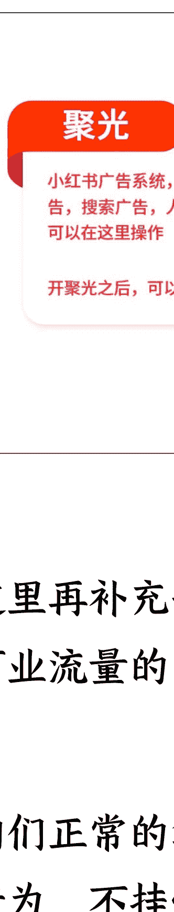

### 这里再补充一个知识点，就是内容流量和商业流量的区别

咱们正常的笔记发出去，如果不涉及营销行为，不挂营销组件，不挂客资组件拿到的就都属于内容流量

这类笔记发出去，基本上过一道机审，不违反平台技术规则，不触犯社会的公序良俗，不涉嫌违规营销，就都能正常的发布，拿到流量

前面讲的引流笔记，大多都属于这种

等到曝光大到一定程度，或者有一些外部因素介入，比如说投流或者被人举报，才会触发人审

这类笔记的算法，比较接近我们前面讲的 CES 推荐算法模型

内容流量的大盘就是所有日活用户，也就是一个多亿

薯条能卖到的就是内容流量

商业流量指的是能通过商业买量工具能买到的或者是挂了营销组件之后能推荐到的较高质量的流量

这部分流量所涵盖的用户，他的成交意向和消费意向都是更强的

商业流量大盘只是平台日活的一部分，并不是所有用户都能成为商业流量

当我们的笔记挂载了营销组件之后，它的审核逻辑和普通笔记是不一样的，需要过一道**广告审核**，需要遵守广告法

我们经常提到的一些敏感词，极限词，其实主要就是来源于广告法和小红书平台的

广告规则，如果我们发在商业笔记里面，那么是需要把这些敏感词和极限词摘掉的

但是如果只是发在普通的笔记里面，那么很多敏感词、极限词是没有关系的，并不会让导致笔记限流

反而如果我们正常发布的笔记没有只用营销工具，比如说小黄车、蒲公英报备、聚光投流，但是在笔记里面涉及了很明确的营销推广，那反而会导致我们的笔记没有自然流量，会被限流

聚光和乘风买到的都属于商业流量

对于咱们来说，如果想要通过投流拿到客户资料，那开通聚光就可以了

开通之后可以投图文笔记、视频笔记，或者是搜索广告、信息流广告、视频流广告、种草广告、客资广告、CID 广告等等……

下面这张图，是笔记投放出去之后，有可能出现的广告位置，包含了搜索场景、信息流场景和视频流场景

# 四、如何合规引流

终于讲到最后一部分了，也就是按引流公式里面的渠道部分

我们怎么才能安全且丝滑地让用户加到我们的微信，并且小红书不会对我们限流或者封号

我先讲官方引导的正确姿势，再讲不太正确但是会有很多人需要的偏门姿势

### 4.1 正规引流

前面讲了，平台商业化之后，它的所有行为都会朝着如何更好的卖流量去的

小红书的引流规则经过了去年一系列的变动，现在已经非常清晰了

就是商家名片功能:

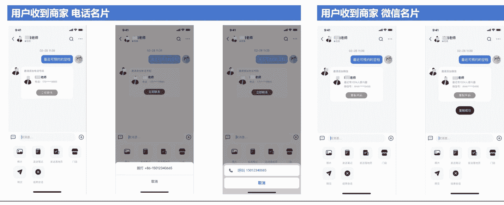

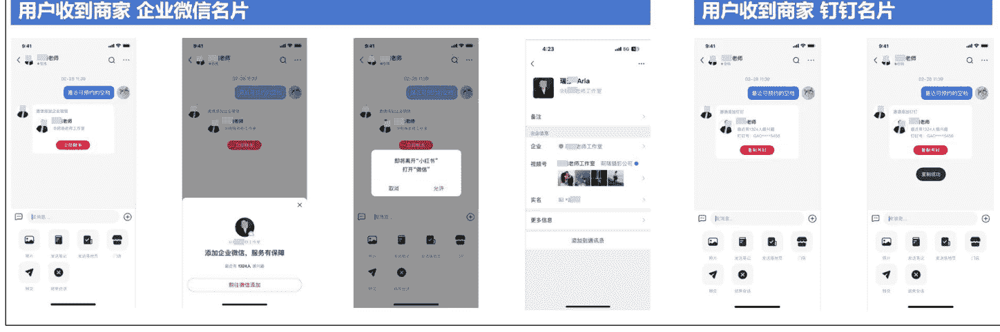

如图所示，当用户点进私信的时候

我们可以把自己的微信、企业微信、电话或者是钉钉，直接推送给对方，他点一下就能复制，然后添加好友了

不需要搞一堆花里胡哨乱码和遮遮遮掩掩图片，比如这种平台算法看不懂，但用户也看不懂的:

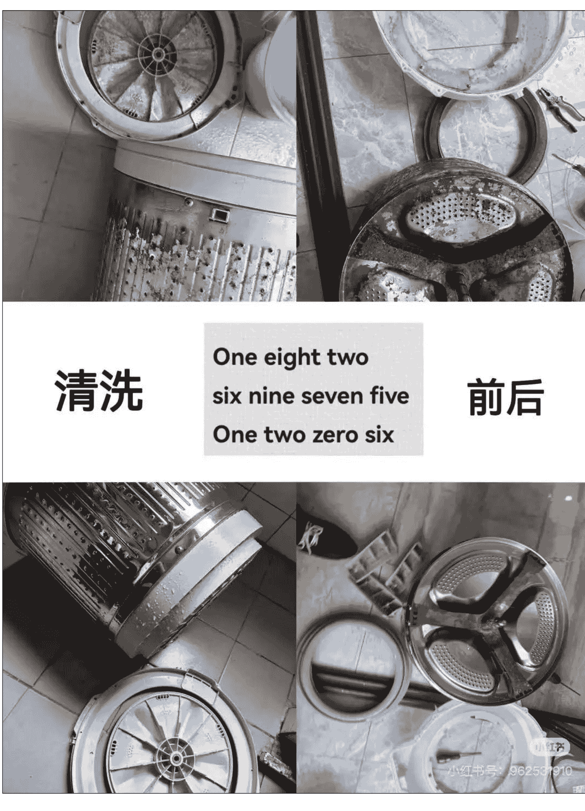

# 清洗

One eight two
six nine seven five
One two zero six

# 前后

就目前来说，商家名片，是小红书官方唯一允许的正规引流渠道

这个名片可以我们主动发给用户，也可以用户点击我们专业号底部的菜单栏被动触发

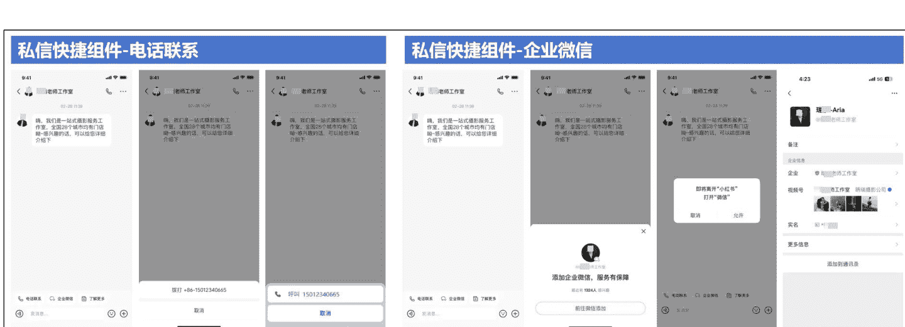

### 私信快捷组件-电话联系
### 私信快捷组件-企业微信

聊天框底部的那个菜单栏，以及用户点进
咱们的私信列表之后弹出来的自动回复，
这个功能都属于小红书专业号特有的私信
服务组件

在专业号后台即可设置。我们可以把商家
名片放在这个位置。当用户有需要的时
候，他点一下就能拿到我们的微信号

商家名片的使用门槛有两个：

*   企业专业号
*   30 天内聚光消耗>0

就是说如果想用这个名片

我们必须得有一张营业执照（个体户或者
企业都行），并且认证一个企业专业号（注：600 块钱认证费用），以及充值一笔 2000 块钱（最低起充金额）的聚光费用

如果是企业用户来说，不用去研究别的方
法，直接认证专业号，然后开通商家名片
就行了

如果是有多个账号，如果是有多个人账
号，配合个别企业专业号在运营的团队，
那么还有一个工具可以用，小红书表单：

懒人微信：lazyhelper

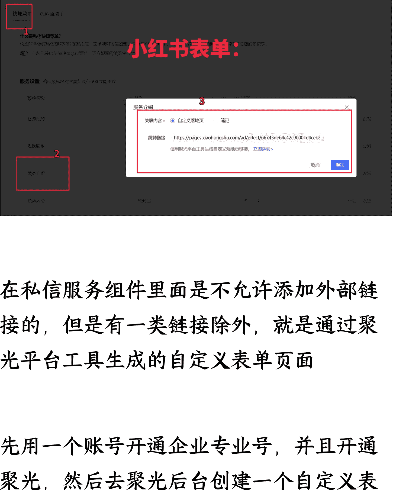

在私信服务组件里面是不允许添加外部链接的，但是有一类链接除外，就是通过聚光平台工具生成的自定义表单页面

先用一个账号开通企业专业号，并且开通聚光，然后去聚光后台创建一个自定义表单页面，可以简单一点，只保留填写联系方式和昵称的两个窗口就行

然后把这个链接复制出来，可以放到专业号自己的私信服务组件，也可以给其他的个人号使用，私信的时候把表单用链接发给用户

因为是小红书自己域名的链接，所以它会保持超链接的形式，并且不会被屏蔽和限流

以上的两个方法都需要至少有一个企业专业号才行

但是对副业从业者来说，可能还是稍微有点门槛，先不说起充金额，很多人可能根本没有营业执照

所以我还要再讲一些不太正确，但是安全性也相对较高的偏门引流姿势

### 4.2 偏门引流

开始讲偏门引流之前，我还是再强调一句

你可以这么做，但你一定要意识到，自己这么做是在小红书平台上是违规的

小红书每隔一两个月都会大规模的分禁一波违规引流的账号

这些是小红书官方晒出来的一些违规引流的场景示例：

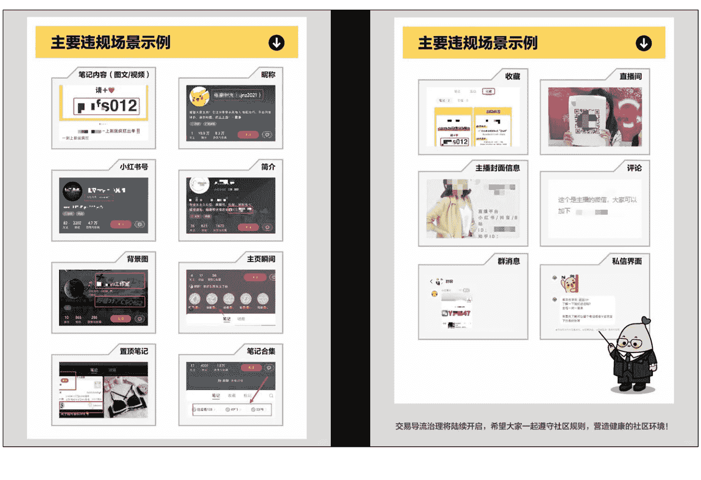

比如正文里面放联系方式、昵称里面放联系方式、简介里面放手机号码、小红书号改成微信号、背景图里面暗戳戳藏微信号、把微信号拆成多段放在瞬间、置顶笔记里面放微信、把笔记合集或者收藏合集的名称改成微信号、在直播间直接引流、把手机号改成同音字符然后放在评论区、在私信页面发微信号、在群聊里面发带有微信号的联系方式……

说起来是违规示例，其实也可以理解成是偏门引流的方法大全……

那这些方法还能用吗

能

但是既然会官方被晒出来，说明他们被查到的概率是非常大的

# 很容易一不小心就把自己账号玩没了

下面我讲一下偏门引流的核心要点，必备两个道具：

*   小号
*   群聊

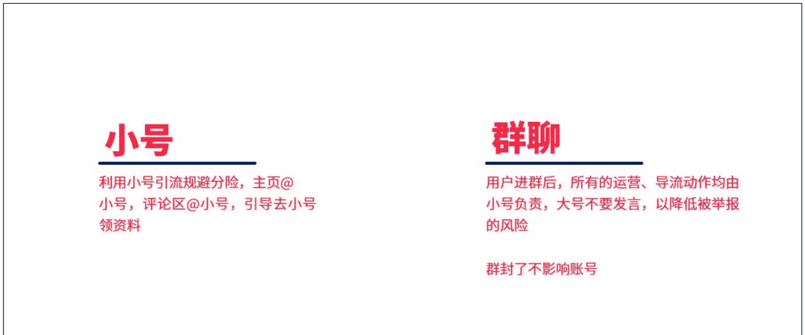

这两个道具的用处是一样的，都是为了规避风险

我们做引流获客，哼哼哼哼发笔记，好不容易流量做起来了，有了点粉丝了，账号好看了

总不能因为违规引流，啪一下把账号封了吧

虽然账号不值钱，但是真的被封了，怎么着也够心疼一阵的

所以用小号加群聊的方式一起来规避风险

只用小号或者只用群聊，能规避掉百分之七八十的风险，这两个叠加起来基本上能保证你做流量的账号没有任何问题

当然我这里说的是基本上，并不是说百分百，如果有用户举报或者平台抽检到了，还是会给你警告、限流，甚至封号的

前面就讲了，现在百分百安全的方式有，且只有一个，就是商家名片

小号加群聊怎么使用呢

核心逻辑就是：用主账号去做流量，然后在主页或者评论区，引导进入小号主页或者是小号创建的群聊，在群聊里面用小号发联系方式

如果在群聊里面，平台检测到你违规引流了，那么它会首先封掉你的群聊，然后会封你的小号，反正不会干涉到你用来做流量的主账号

那么在群聊里面怎么比较安全地发联系方式呢？

### 群置顶
### 进群验证
### 表情包
### 小号的主页笔记

群置顶我就不讲了，跟微信群是差不多的

小号的主页笔记也很好理解，就是把微信主页截个图发出去就行了

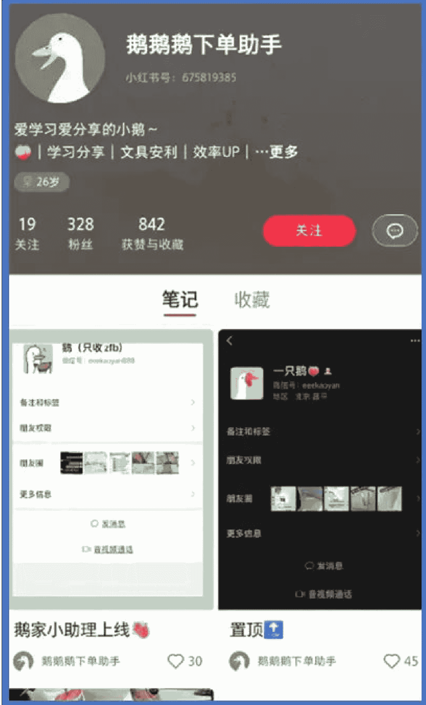

因为小号是用作引流工具使用的，并不需要搞流量，所以发出来的这篇笔记，没有流量也没关系

单纯的起到呈现作用

### 进群验证就是这个东西：

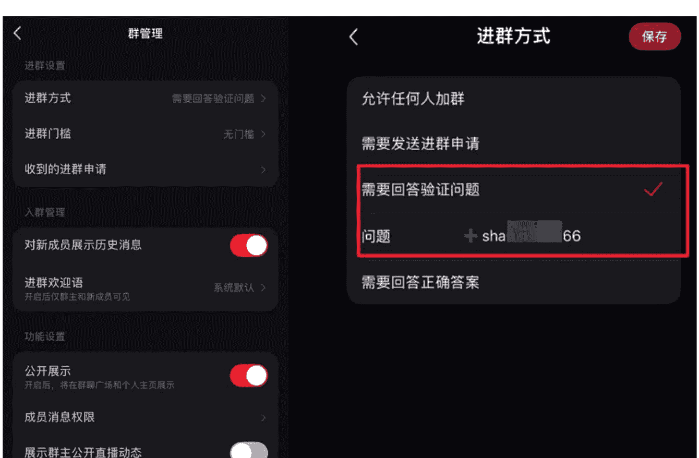

用户点击群聊组件，然后就看到了进群验证，然后在进群验证的问题里面看到你的联系方式

你就说安不安全吧

小红书的表情包功能和微信非常相似，可以自己创建自定义表情包

### 公众号懒人搜索，懒人专属群分享

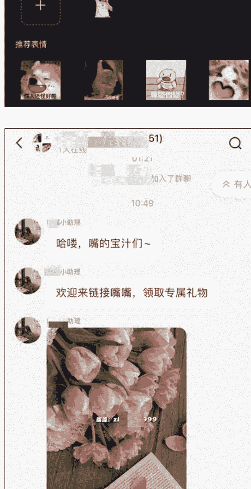

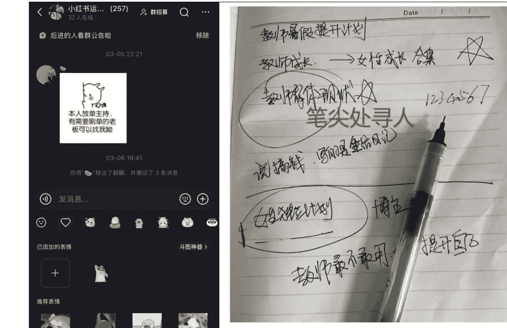

### 笔尖处寻人
### 1234567
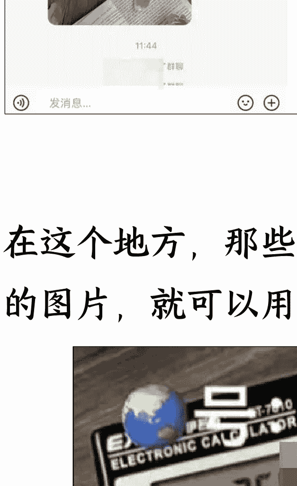

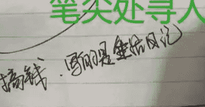

### 在这个地方，那些脑洞大开藏数字藏微信的图片，就可以用派上用场了:

这个方法的原理是，表情包只有在创建的时候会触发审核，一旦审核通过之后就不会轻易再触发审核

总结上面的几个方法，核心思路就是用小号和群聊作为牺牲用的引流工具，帮助主账号去规避风险

万一小号被封了，没关系，注销重开，或者再搞一个小号就行了

只要主账号不受影响，流量就不会断，对项目就没有影响

然后关于群聊，还有一个玩法

小红书的群聊和 QQ 群一样，是有自然流量的，能被别人通过关键词搜索到，或者在群聊广场里面刷到

也就说只要设定好小红书群的名字，以及保证群聊的活跃度

那么小红书的群聊不仅可以作为引流的渠道，同时可以作为引流的流量入口

### 4.3 单个账号引流

然后可能还会有人问，说上面讲的这几个偏门引流法也有门槛，它需要有多个账号，如果我有且只有一个账号，并且我也没有营业执照，我能不能用比较安全的方式引流呢？

有的，兄弟

### 有的

个人账号也是可以使用私信服务组件的，
像这样：

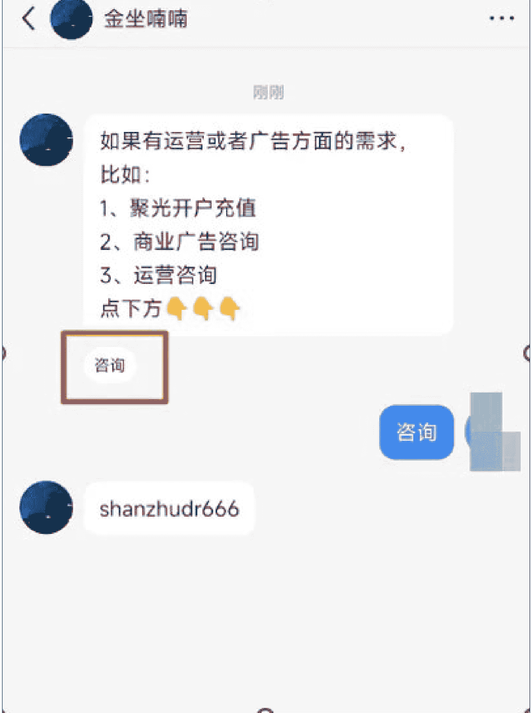

当然是有前提的，需要满足 3 个条件：

+   - 个人账号得实名
+   - 认证了个人专业号（免费）
+   - 开通个人店铺（不用上架）

3 个条件都不难，很容易就能满足到。那么用这个方法，即使是个人号，也能全自动的把你的微信号发给用户

但是现在小红书规则变严格了，在私信服务组件里面，直接把微信号写进去，那是不行的:

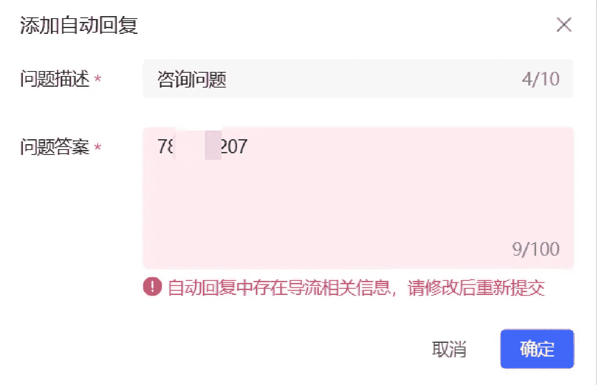

但是写的复杂点，然后稍微绕一下就可以了: 

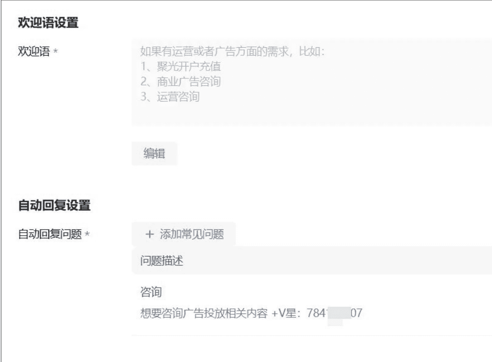

### 有的

有可能还会有人问，各位，如果我的实名账号已经被封了，并且我有且只有一个账号，还没办法实名，也没有企业营业执照，我还能不能比较安全的引流呢？

有的

有的

把小红书 App 升级到最新版本，在点私信页面的右上角，就可以看到便利贴功能，这里面你可以直接写微信，然后发过去

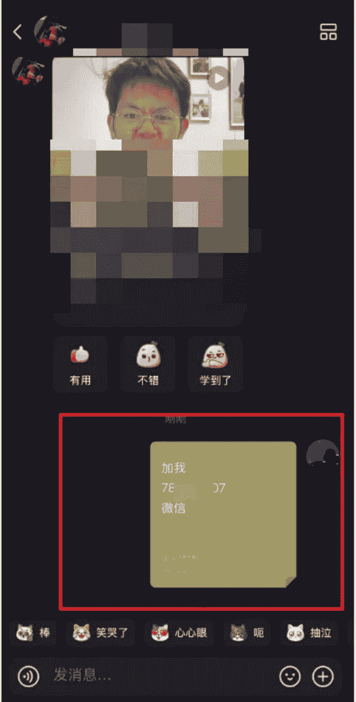

这个功能的门槛非常低，不需要实名，不需要企业账号，只需要你和对方互关

但是还是再强调一下，这个方法属于是日常功能的违规使用，现在是可以引流，但是指不定什么时候，就会成为前面违规示例榜单上的一个新例子

# 最后总结一下:

在所有的引流渠道当中，我最推荐同时也最安全的方法，就是商家名片

其次是用小号加群聊的组合拳

再次是在私信服务组件里面放联系方式

以上就是小红书引流万能公式以及操作流程的全部内容了

内容有点多，大家有需要的可以收藏一下多看几遍

历史 3000 多份各类付费文章以及年费三千多的副业社群资源，见懒人专属群内部分享！

付费群，白嫖勿扰！

**懒人专属群更新记录：**

[https://lazybook.fun/#/blog/record2](https://lazybook.fun/#/blog/record2)