# 2025 小红书本地生活，别算规模，算利润

250520 生财精华

公众号懒人找资源，懒人专属群分享

> 「今天想和大家分享下，关于小红书线索类业务该如何在平台进行获客。」

> 「先介绍一下自己，之前在生财发布 小红书的 AI 提取表格，可能有的圈友 对我比较熟悉了。」

富贵，长安文化 CEO
base 杭州，小红书线索赛道头部，
自持素人矩阵 5000+；

1. 2019 入局小红书护肤赛道，全流程操盘 单品 0 到年销 1 亿+。
2. 2020 入局抖音电商，商务团队持 1W+ 食品赛道达人，杂粮榜单 Top1
3. 2024 开始切入小红书本地生活，本地类日进线索数超 2000+
4. 自营 10 家健身 + 康复工作室，合作客户有浙大冰虫，艺星医美，作业帮等。

## 小红书 2025 还有什么新机会？

最近刷小红书，不知道大家有没有发现一个现象？

以前我们看小红书，可能更多是看美妆穿搭、娱乐八卦、还有一些出镜的旅行攻略。

但现在，无论男女。越来越多的人在小红书上搜本地、搜服务、搜体验。

甚至你出差到了一个新城市，第一件事儿就是打开小红书，看附近的吃喝玩乐。

“成都附近美食”、
“周末去哪儿”、“万象城美甲”、
“广州亲子乐园”...

这背后是什么？是小红书本地生活赛道没被挖掘的大市场。尤其是对于做本地生活服务的老板们下面具体给大家看一些行业

（宠物·留学·移民·车衣贴膜·二手奢·翡翠·美业·纹绣·美甲·家具·装修·全屋定制·教培·瑜伽·私教·旅游·酒店·民宿）

这绝对是一个低成本、高效率获取精准线索的新大陆。

是当下我们的新“美团”、“大众点评”

截止目前，小红书月活用户有 4 亿，其中 70% 月活用户存在搜索行为，所有搜索行为中 98% 为主动搜索 (而非受众平台引导推荐的被动搜索，如评论区的置顶组件), 更有高达 42% 的新用户到小红书第一天就用了搜索功能。

## 数据概览

支付金额 1.77 万

同行同层平均
同行同层优秀

店铺客户数 30-11

生财有术 | 航海家俱乐部
数据罗盘 抖音电商数据，就用罗盘

- 首页
- 诊断
- 价格
- 交易
- 商品

经营概览

- 整体
- 自营
- 合作

成交金额 > ¥679.67 万

< 数据罗盘 抖音电商数据，就用罗盘
- 首页
- 诊断
- 价格
- 交易
- 商品

经营概览

- 整体
- 自营
- 合作

成交金额 > ¥679.67 万

### 核心数据

数据最后更新时间 08-08 00:00

导出数据

观看 21000
观看总时长 033 秒
点赞 1250
收藏 850
评论 120
笔记涨粉 30
笔记分享 50

遇到问题

### 核心数据

数据最后更新时间 07-12 00:00

导出数据

观看 102245
观看总时长 37 秒
点赞 1693
收藏 1423
评论 442
笔记涨粉 137
笔记分享 307
遇到问题

### 核心数据

数据最后更新时间 09-03 00:00

导出数据

观看 160090
观看总时长 50 秒
点赞 5159
收藏 3341
评论 418
笔记涨粉 415
笔记分享 1092
遇到问题

## 因为是流量型公司，穿越了从抖音到小红书的周期，可能有一天小红书规则变了，我们又会转型到下一个平台

做爆款内容对我们来说很容易，也很简单。

但问题是，流量来了，怎么持续变现？

电商实在是太太太太卷了，越来越多的人挤入了抖音和小红书的电商赛道。

打不过，我想从这里撤退了。

线索类：高客单，非标品，强信任，无限复购

小红书有三大板块，生态，电商，线索。

如果放弃电商，放弃品牌方，放弃倒买倒卖流量，我们还能做什么？

这时候有个朋友给了我灵感，2024 年，他们的服装店开在了山东，因为本身就是做女装的，通过用电商铺宣传的方法，28 天回本。

用电商的思维，降维打击本地，再操作一遍。

2024 小红书全面进入买流量的时代，决定做本地生活以后，先拿自家合伙人的健身房练手，做爆款内容很快，但是限流的速度，比我们出爆款还快。

## 这时候我才明白，原来做本地生活，也是要“交保护费”的

于是我一边自己试着投放，一边找业内的专业玩家学习。

一个月以后，我们的开口成本，降低到了大盘的一半。

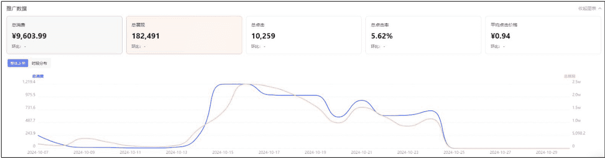

| 收藏 | 关注 | 分享 | 互动量 | 平均互动成本 | 行动按钮点击量 | 行动按钮点击率 | 截图 | 保存图片 |
| --- | --- | --- | --- | --- | --- | --- | --- | --- |
| 29 | 74 | 15 | 228 | 42.12 | 324 | 3.16% | 19 | 16 |

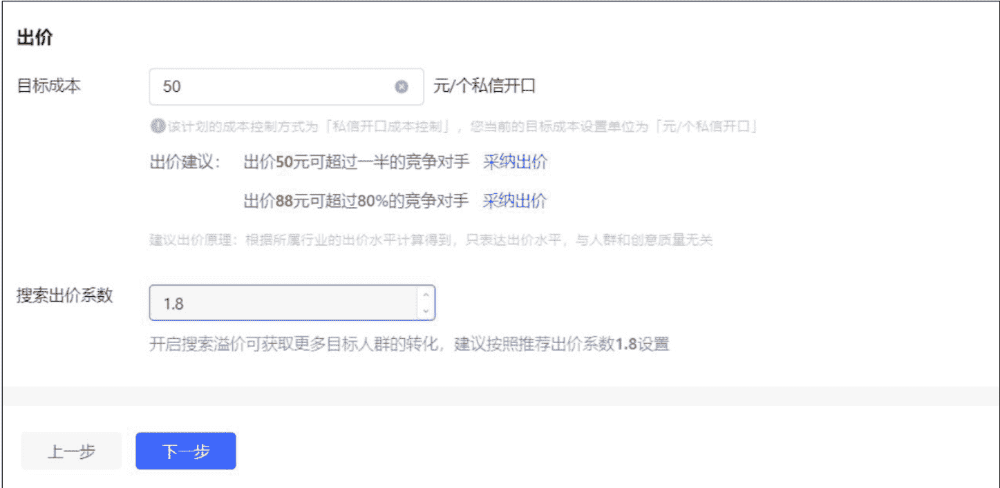

> 「但是降开口，不是我们的核心目的的。」

有个朋友说过“你玩自然流流量，除了因为你会做好内容，好素材，还有一个重要原因就是你没钱。”

「只要把 ROI 算正，」对于聚光来说，其实更重要的是线索的垂直程度。”

下面这张图，是我们投放 K12 的教育粉丝，那种开口可能一块钱两块

钱，它就是纯羊毛党。那这种我们其实就叫它无效的开口，因为它没有价值，它的目的是奔着薅羊毛来的，这个目前我们投放的量也蛮大，一天 10 个蓝 V，能投出 2000+ 进粉。”

### 聚光的笔记的垂直程度，它决定了你后端，前端搞流量这件事情不难，只有后端的承接才是一个比较难的事情

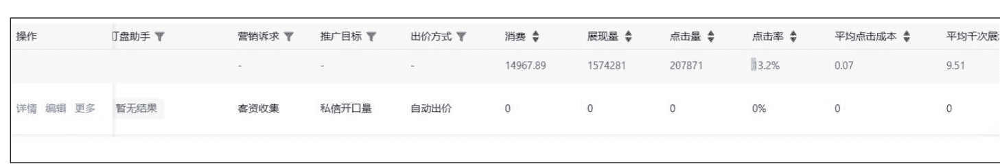

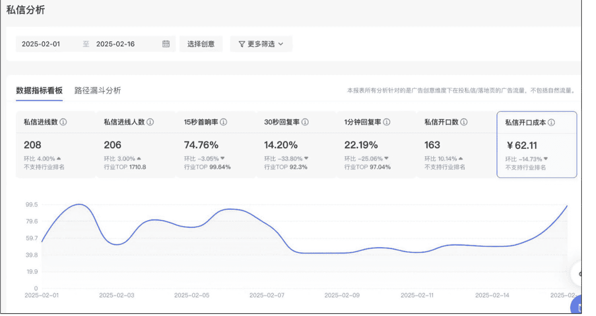

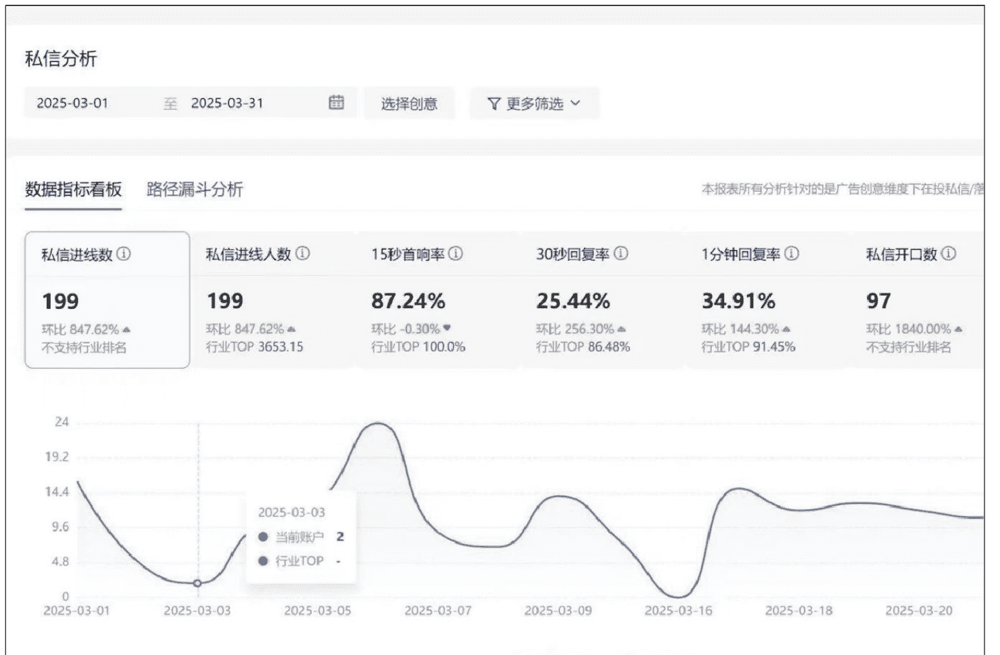

优化开口没什么用。我们目的是为了让他到店成交，优化开口，就算把他优化到一块钱一条，投放出来的这个人群消费能力不一样，根本转化不动。所以哪怕开口价格略高，也要用它。

不要去盯开口的价格，这个用户进线进到你私域里能有转化才是最核心的考核标准。我们说聚光，就等于是花钱在买粉丝，这个粉丝是值 10 块钱还是值 50 块钱，这件事在前端根本不重要。只要你后端有承接能力，你能够有强转化，粉丝在你的私域是有转化周期的，至于他是多少钱来的这件事，根本不重要。

### 「蓝 V 矩阵协同，构建日产千粉的导流强引擎」

### 「·找 100 个行业对标，实时监测，摸清爆款逻辑」

小红书的三方软件，目前市面有的，新红，灰豚，千瓜，各家的使用方法基本大差不差。

以前我非常热衷于在各种软件上付费，后来我们直接开聚光拿词。

同行买的词，高点击的词，以及蓝海词，这几个板块。

延展出行业推词，以词推词，上下游推词。

基本上一个赛道的词，大家常去搜索，也比较关心的，其实一共就这么多。大多数赛道关键词甚至都不会超过二百个。

懒人微信：lazyhelper

**把这些你找到的关键词埋进笔记封面 + 标题 + 内容。**
基本上就有机会可以创造出一个能一直吃到长尾流的笔记。

### 「聚光词包」

聚光词包是小红书为我们提供的一种关键词集合，帮助来更精准地进行广告投放和内容创作，以触达目标受众。

词包中的关键词，我们可以把他分为不同的类别。比如品牌关键词、产品类型关键词、功能关键词、场景关键词和受众关键词等等进行精准定位。

然后定向的这个人群就是内容账号，那这个时候你会发现你的账户流量可能来得不精准，那这个时候就要通过商业干预，这就涉及到你下一步的高级定向。

比如说搜索减肥，出现的上下游拓词，以及行业黑马词，我们会看到了小基数。

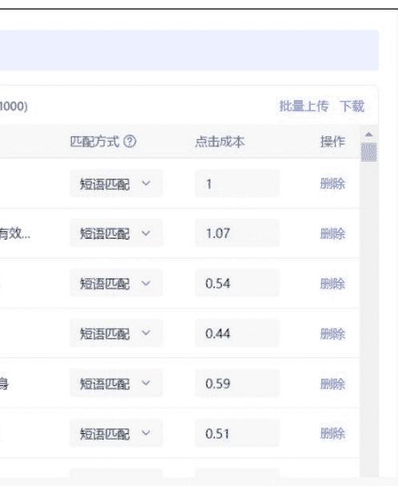

## | 关键词 | 竞争指数 | 月均搜索指数 | 建议出价 (元) | 来源 | 操作 |
|---|---|---|---|---|---|
| 咖啡 | 高 | 1,384,143 | 0.97 | 上游 | 添加 |
| 减肥最快最有效... | 高 | 1,307,652 | 0.95 | 下游 | 已添加 |
| 零食 | 高 | 1,260,171 | 0.73 | 上游 | 添加 |
| 八段锦 | 高 | 1,251,507 | 0.71 | 上游 | 添加 |
| 舞蹈 | 高 | 1,240,915 | 0.74 | 上游 | 添加 |
| 牛肉 | 高 | 1,131,480 | 0.53 | 上游 | 添加 |
| 减肥食谱 | 高 | 1,112,624 | 0.44 | 下游 | 添加 |

寻找小基数的 50 篇自然流爆款笔记，再去追自己的矩阵笔记。

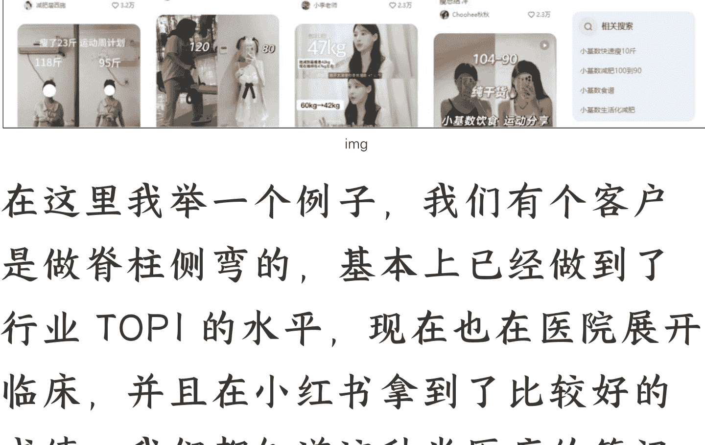

在这里我举一个例子，我们有个客户是做脊柱侧弯的，基本上已经做到了行业 TOPI 的水平，现在也在医院开展临床，并且到小红书拿到了比较好的成绩，我们都知道这种半医疗的笔记都算是小红书高危模版，怎么给她继续按照行业搜索词做笔记呢？我们先来打开电脑版小书，搜当前的行业词，脊柱侧弯，看综合搜索类目下的前 8 篇笔记。这几个笔记一般的展示的例子部分，分别为行业类比较有知名度的大 V，也是 KOL，是第一篇丁香医生。但是这个笔记我们能参考的仅有封面，其他的没什么借鉴意义。

因为丁香医生的粉丝基数在那里，发什么内容都是有人看的。其实这个可以延伸到各个三方软件为什么会搞“低粉爆文”的原理。

因为大 V 的笔记有粉丝基数，不具备太大的爆款元素在内。

实时监测对标账号关键词，一个组长带两个小组员。他们仨其实每一个人都会手里面攥着大概 20 个到 30 个对标，就是这样按你以上操作扒出来的对标账号，他们会拿一个小账号去关注，关注之后基本上每隔两个小时左右他们就会刷一遍同行的笔记，一旦看见一个笔记开始起量了，直接追他的笔记，把你自己的云库里面的笔记跟他类似的找出来，然后直接去蹭一下这个热点。

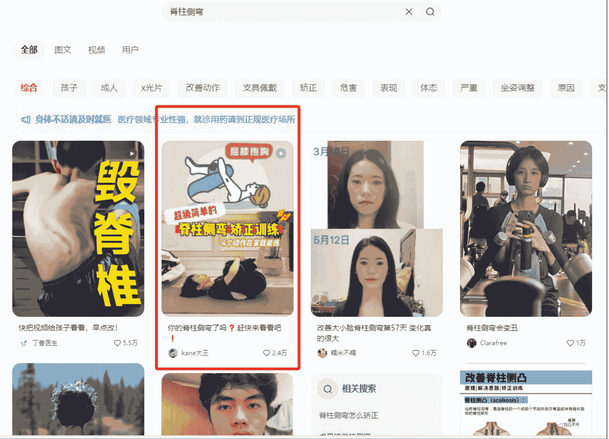

### 「聚光词包」

聚光词包是小红书为我们提供的一种关键词集合，帮助来更精准地进行广告投放和内容创作，以触达目标受众。

词包中的关键词，我们可以把他分为不同的类别。比如品牌关键词、产品类型关键词、功能关键词、场景关键词和受众关键词等等进行精准定位。

然后定向的这个人群就是内容账号，那这个时候你会发现你的账户流量可能来得不精准，那这个时候就要通过商业干预，这就涉及到你下一步的高级定向。

## # 50 素人号+3-5 个蓝 V 矩阵，笔记指引直播间，稳定日导 1000+ 私域

小红书可以长期经营管理的 SPU，就是我们的核心资产。

浅层场进入有几个数据，第一是发现，同城，视频流。

深层场就是，搜索，关注，活动 H5。

深度阅读，10 秒的基础停留和完读。

深度互动，就是收藏，截图，保存图片，评论求推荐或者礼貌问价（我觉得小红书这些女孩子真的都非常可爱又有礼貌，还不爱考虑性价比，称得上是当前软件生态内最好的社区环境了）

### 小书笔记的 A 模型

A1 是认知人群，A2 看过人群，A3 互动人群，A4 电商人群。

抖音漏斗模型更注重内容的初始曝光。如果一个视频在发布后的短时间内能够获得高点赞、评论和分享，就会被算法判定为优质内容，从而获得更多的流量推荐。

小红书漏斗模型内容的种草属性和长期价值更受关注。虽然一篇笔记在发布初期也会有一定的曝光，但更重要的是它在后续搜索中的价值。用户可能在看到笔记后的一段时间后，当有了相关消费需求时，通过搜索再次找到这篇笔记并参考。比如一篇关于旅游目的地的攻略的笔记，可能在发布时吸引了一部分用户，之后在旅游旺季或者有人计划去这个地方旅游时，通过搜索被更多人发现。

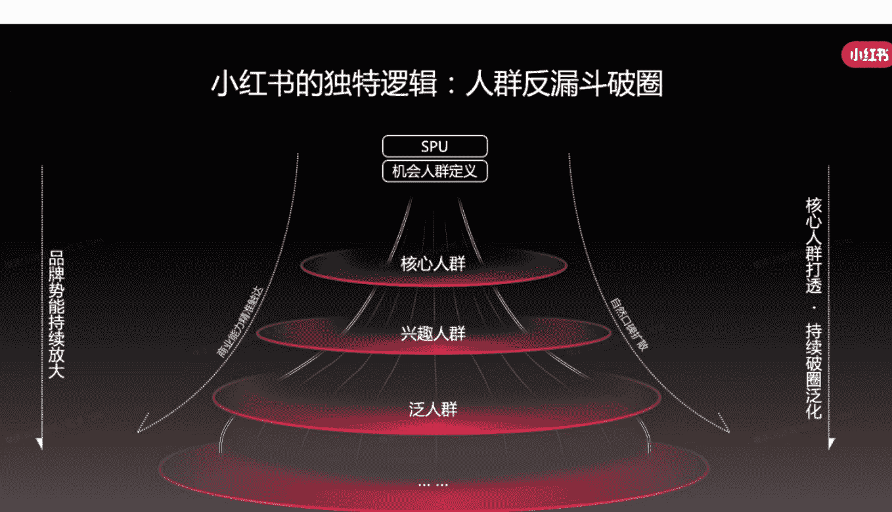

### 如何搭建单人日产百条的团队

* 内容团队最优配比：(1+3)*N

这个地方举个例子，生财有一期线下航海夜校项目。当天我刚好在广州出差，晚上大家的聚餐有幸受邀参加

感觉这个赛道很有趣，想着测试一下玩玩。于是拉了一组小伙伴，按照 1 配 2 的这种模式，给了他们 50 个账号，前期积累了 3 天的文件素材库，第一篇笔记发出后，48 小时内就做到了 500 个客资的进线转化。

小组长需要在 1-3 天的时间内，带着团队搭建起基础的素材库，拉齐优质笔记是什么的认知，测试出优质笔记，用优质文章分享 + 分析，选出爆文种子笔记，提炼出后续笔记内容方向。

| 序号 | 主图 | 标题 | 内容 | 收集人员 | 发布时间 | 洗过 |
| --- | --- | --- | --- | --- | --- | --- |
| 1 | [图片] | 广州人自己的夜校来了!! | 夜幕低垂...每一次 | 何威 | 10 月 11 日 | 1 |
| 2 | [图片] | 你担心的广州夜校都能解决 | 海绵夜校...心学不会... | 何威 | 5 月 13 日 | 1 |
| 3 | [图片] | 下班后我们一起来这里充电！！ | 无论...像蝴蝶破茧而出... | 何威 | 10 月 21 日 | 1 |
| 4 | [图片] | 广州还是太超前了。。 | 最近..- 场... 在兴趣的... 才刚刚开始... | 何威 | 10 月 21 日 | 1 |

| | | | | | | |
| --- | --- | --- | --- | --- | --- | --- |
| img | 笔记需要关注的封面图片、标题、正文、话题 TAG、评论区，都需要协助 | 小组员优化。尤其注意笔记封面，优化站内点击率、cpc 成本、cpe 成本， | 针对笔记给出具体的修改建议。 | | | |

发了 50 篇笔记以后，我们单篇笔记的数量是这样的。

| 观看 2.3 万 ↑427% | 观看总时长 (小时) 83.5 -- | 主页访客 1,915 ↑2,892% | 点赞 695 ↑1,885% | 收藏 225 ↑4,400% |
| --- | --- | --- | --- | --- |
| 评论 351 ↑3% | 弹幕 0 -- | 笔记涨粉 188 ↑飙升 | 笔记分享 268 ↑1,240% |

[图表：时间趋势图，X 轴为日期 10.28 至 11.26，Y 轴为数值 0-1000，曲线波动]

### 我们的 48 小时进线效果

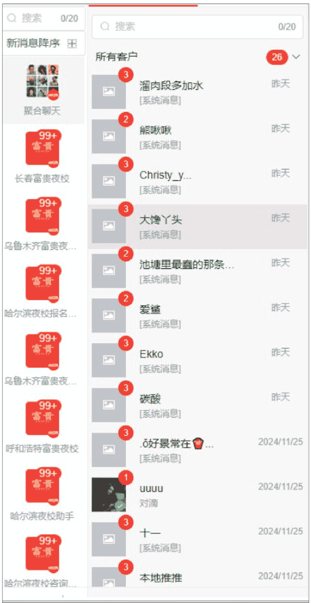

一般这个组合会出现的问题有四个。

1. 不明确行业笔记好与坏标准
2. 自身写笔记质量水平不清晰
3. 后面笔记的输出方向有哪些
4. 如何大规模提升笔记制作数量

### 一个赛道内容团队的组成

一个赛道内容团队的组成是有 1 个组长，带 2-3 个员工进行笔记的分发和投放。

私域的后端数据统计是每天都要做的必不可少的工作

可以核算的数据有，单粉成本，单粉产值，回本周期，单销售客服的人效

同赛道不同的模板后端分流之后，可以进行数据对比，用数据来做选择而不是感觉

### 「AI 工作流，正式进入三天出一个大模型的年代」

### 「· 在 AI 批量跑出无限内容的当下，我们该如何做出爆款」

熟悉我的朋友都知道，今年年初我们公司全面投入 AI。

从抖音穿越到小红书，我们穿越周期和顺利跨平台的原因是判断。判断有的事情是不一定要做。如果是，那当下即使再难，也要进行下去。

学 AI 不是为了降本，是为了增效。怎么能把 20 多人的公司干出 10 倍工作量？

目前从生文，生图，提示词修改。只要市面上有的课程，我都会出去学习付费。

钱交够了，韭菜当多了，逐渐修炼出来了体感。

AI 是屠龙刀，在会用的人手里，只要有刀气就可以上场杀敌，不会用的人拿来就是西瓜刀。

以下是目前团队一些比较小的进度，持续迭代中。

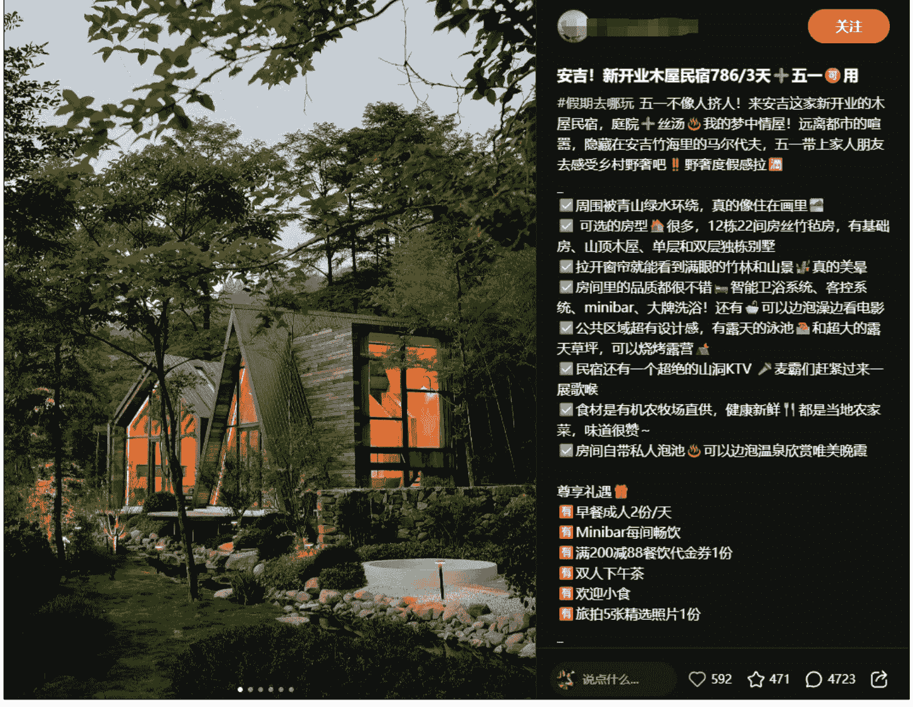

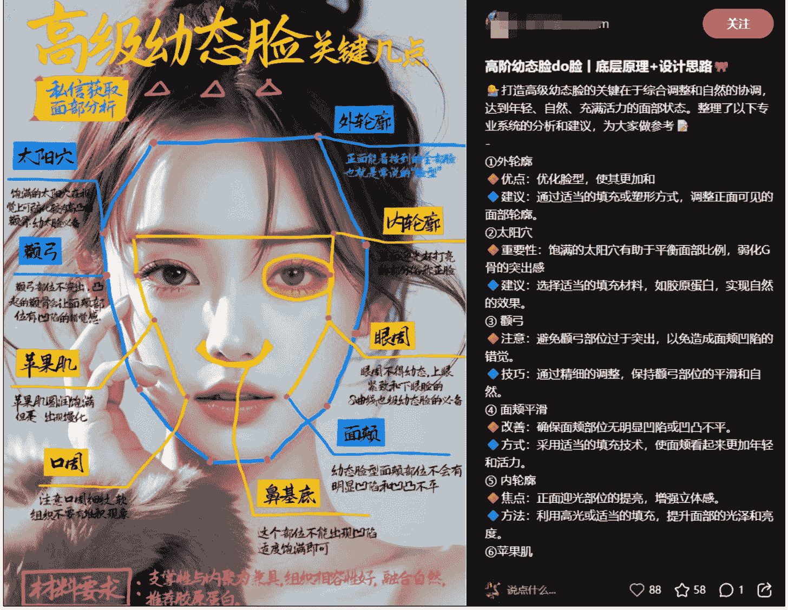

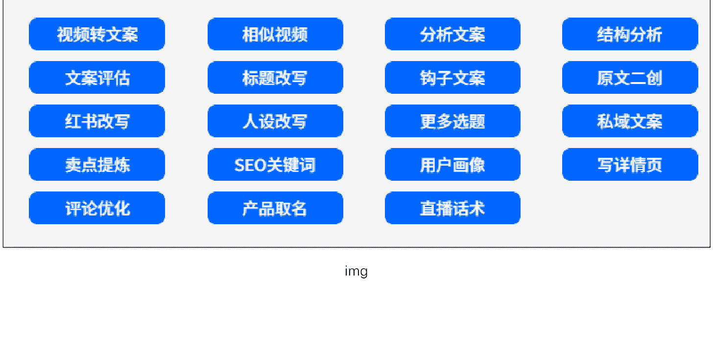

|日期|Aa 标题|Aa 账号|Aa 正文|Aa 评论分析/剧本 AI|Aa 打分 AI|Aa 笔记状态|fx点|
|---|---|---|---|---|---|---|---|
| |38 岁，二胎妈妈坚持健...|Jen|二宝喂奶一年断奶之后...|这个笔记适合评论区截...|7|正常||
| |找了 2 个阿姨给孩子做菜...|二胎宝妈 Nancy|家里有一个 9 岁女孩和 5...|打分：8 分。这个笔记围...|8|正常||
| |我哥：怎么全世界的女...|小眼睛的鹅|事情是这样的，我哥嫂...|打分：3 分。这个笔记内...|3|正常||
| |宝宝丝滑转奶不焦虑！...|暴躁的垚妈|对新手爸妈来说，给宝...|打分：8 分。这个笔记详...|8|正常||
| |广州｜全职妈妈的素人...|UMI 米米小姐🌹|这期是"帮二胎宝妈重塑...|打分：8 分。这个笔记很...|8|正常||
| |养一个爱妈妈的男孩，...|北京二胎全职奶爸|没想到已经有 30w 的宝...|打分：8 分。这个笔记内...|8|正常||
| |终于知道为什么宝妈圈...|brieye|这小玩意配合大户外 对...|打分：8 分。这个笔记详...|8|正常||
| |01 年二胎宝妈 21 周 是不...|宝菲|生一个和自己一样属 Q ...|打分：3 分。这个笔记内...|3|正常||
| |没有一个废物!0 鸡肋实...|嗨！是小安吗？（二胎...|35W+ 的孕妈看过来！一...|这个笔记适合评论区截...|8|正常||
| |终于发现，只要老公参...|喵喵呜呜喵不停|老公参与带娃，不管谁...|这个笔记适合评论区截...|3|正常||
| |中年少女~ 请交出你们的...|素素自律成长二胎宝妈|突然发现没有精神...|打分：7 分。此笔记较为...|7|正常||
| |一胎双胎，二胎双胎，...|安安妈（二胎四娃）|三年时间，我生了两胎...|打分：8 分。这个笔记情...|8|正常||
| |竟然才 100+！为啥二...|双胎宝妈探店记|这个乐婴坊成长椅真的...|打分：9 分。这个笔记内...|9|正常||

| |Aa 标题|Aa 文案|图片|Aa 标题 2|Aa 文案 2|图片 2|Aa 标题 3|Aa 文案 3|
|---|---|---|---|---|---|---|---|---|
| 1 | 请私教=智商税？八年私教经验教你避坑... | 作为健身房创始人，常... | | 10 年健身私教经验，只... | 10 年私教路，见证无数... | | 花钱找私教值不值？ | 我们有 30 位精英 |
| 2 | 健身新手｜第一次健身该不该请私教？ | 【健身房老板分享】为... | | 健身房老板纯说实话：新... | 作为健身房老板，我不... | | 健身房里的秘密！健身... | 私教分享的实用 U |
| 3 | 花 3 千 vs 自学：记录会员私教 30 天的真实... | 【健身工作室主理人退... | | 私教 1 万 vs 自己练：90 天... | 为何私教 30 天能带来显... | | 健身 3 个月没效果？可能... | 我们位于市中心... |
| 4 | 20% 的钱达到 80% 的效果！健身房不会... | 健身房老板说真话： 私... | | 今天教给你用最少的私... | 健身不是越花钱效果... | | 上班族健身困难？快速... | 从事健身行业八 |
| 5 | 0 基础小白健身｜这些场景你一定要请私... | 作为拥有 10 年教学经验... | | 这种情况下不请私教... | 作为拥有 10 年教学经... | | 为什么你的减肥总失败... | 你是否经历过减成 |
| 6 | 只有做过私教女孩子们才知道健身有多爽！ | 作为健身房的创始人，... | | 私教课要不要上？健身... | 为什么女生需要请私教... | | 不节食也能瘦！我们与... | 不节食也能瘦 再 |
| 7 | 为什么我们只做私教专属健身房？ | 作为一名教练，我深知... | | 私教健身：女生成长的... | 为什么女生需要请私教... | | 健身小白入门指南！一... | 作为健身小白，你 |
| 8 | 什么样的秘密福利，让会员疯狂打卡 | 【店长爆料】为什么我... | | 广州健身私教 | 健身科... | | 无评估不训练！特别是... | 90% 会员都缺失... |
| 9 | 对比测评！我们健身房为何比传统健... | 为何会员宁愿多付 30%... | | 从默默无闻到全城爆满... | 从默默无闻到全城爆满... | | 0 基础也能速成？？？健身... | 专为健身小白设计 |
| 10 | 半年时间帮助 100+ 女生重获自信 | 作为一家专注私教的健... | | 为每位会员负责：私教... | 大型健身房往往只关注... | | 每周仅需 3 小时，高效训... | 忙碌职场人福音！ |
| 11 | 这样的私教健身房真的存在吗？一周来... | 哈哈哈哈，除了我还有谁... | | 杭州健身私教 | 给健身... | | 粉色#杭州身入门指南#...* | 揭秘 99% 人都做错的训... |
| 12 | 都 2025 年了，私教训练一周 3 次还看不到... | 作为一家专注干健身的... | | 一对一私教到底有多"神... | 宝子们，你们是不是一... | | 练了 3 个月还是没变化？... | 健身三个月，体...1 |
| 13 | 这家的私教工作室竟然是秘密基地* | 偷偷告诉你，为什么有... | | 当一位会员只花 1 个月，... | 很少发帖，但这个... | | 为什么 95% 的人健身 3 个... | 95% 的健身者效 1 |
| 14 | 健身私教给你一个快速瘦身秘籍！ | 来我们健身房，感受一... | | 一对一的蜕变：我们为... | 团体课热闹却缺乏针对... | | 99%💰做错的 5 个动作，正... | 作为一家专注私 1 |
| 15 | 健身私教｜八年专业私教避坑指南 | 学员真实发声："经历过... | | 为什么你的健身计划总... | 作为一名私教，最心扉... | | 为什么同样是请私教，... | 不是所有私教都质 |
| 16 | 杭州健身私教揭秘 90% 人踩的坑 | 每天狂练却不见效？... | | 听说了吗？这家健身... | 作为工作室的创始人，... | | 挑战在南京 30 天开一家... | 在南京的小伙伴们 |
| 17 | 黄金白银的差距：记录两位会员一个播... | 花钱=浪费，投资=奢侈... | | 私教一个月极速蜕变，... | 500 平米大空间，拥有 20... | | 八年见证 2W+ 学员的蜕... | 致每一位追求卓越 |
| 18 | 花 1/4 的钱获得 90% 的效果！健身教练的... | 作为从业 12 年的健身房... | | 找到私教后我的身材良... | 私教训练总结最常见问题... | | 成都硬核私教体馆 | 5 年老... |
| 19 | 力量训练这样开启超容易，我们家私教... | ? 常见痛点精准击破... | | 所有健身党注意！ 私教... | 很多小白咬牙坚持办了... | | 女生选健身教练必看硬... | ?女生选教喊赢！ |
| 20 | 健身党们请注意！私教优势伞解析！ | 很多小白咬牙坚持办了... | | 私教选择指南 | 济南健... | | 如何选择适合自己的... | | 健身党必看 | 我们家私... |
| 21 | 怕被推销的姐妹看这里！被这顿健身房... | 宝子们了！怕被推销... | | 私教一月收获！三个月... | 我们的私教黑：0； | | 这家健身房养疯了！国... | 超值福利 + |
| 22 | 你说想练到想？身高场赢心须专业 | 相期的健身染资才是喜 | | 健慎镜情化设定！ 私教... | 经常询问：私教育... | | 健身小白必看!!3 个你不... | 健身小白刚需！ |

# 结束语

一个项目就像是种庄稼一样，它有自己的生长周期和内在规律；

小红书，我们这些搞流量的群体，本质上是用一些方法论，加快了庄稼在某个阶段的生长流程。

优点就是起的快，别人中三年庄稼，我们半年就长出来了。

缺点是，我们这群群体，在庄稼长出来以后，没有回归商业的本质。

要么就是扩张，去搞另外的项目。要么就是遇挫，开始乱出牌。
对我个人来说，要始终保持学习，保持敬畏。
用涛哥一句话，这个年代，要么慧根，要么会跟。

历史 3000 多份各类付费文章以及年费三千多的副业社群资源，见懒人专属群内部分享！
付费群，白嫖勿扰！

### 懒人专属群更新记录：
https://lazybook.fun/#/blog/record2