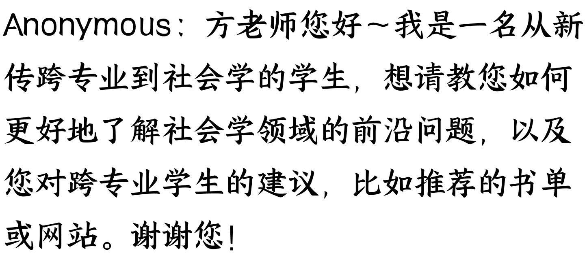

# 你问我答
250521 新闻实验室

* ~~整理：公众号懒人搜索，~~ #### **懒人专属群** 周报连载

* **懒人微信**：lazyhelper

* 播客“不合时宜”实习生事件、民粹主义与川普、研究方法和提问方法、新传专业与跨专业等。

## “不合时宜”实习生事件

**Anonymous**：这个月了解到的两件新闻，让人感觉到美好假面下的汲取逻辑，一件是「头部」播客「不合时宜」播客剥削实习生，另一件是「头部」民营书店「西西弗书店」**压榨店员**，这类现象是国内的商业生态导致的吗？海外播客/书店员工权益情况如何？

Anonymous: 谢谢有朋友提出「不合时宜」播客剥削实习生的事件，作为前听众，似乎觉得对外部世界的信任感又少了一点，我也想了解方老师关于运营 newsletter 上轨道之后如何保持初心（我隐约记得有其他人主笔过会员通讯）

**Anonymous**：方老师好！从「不合时宜」事件想到，文化行业的小团队里好像很容易出现边界不清晰的问题。当大家因为价值观的契合走到一起，手头资源又比较紧张的时候，合作关系，雇佣关系和友情关系之间的界限就会变得模糊。在这样的团队里，应该如何平荡各种关系，避免发生剥削或被人剥削呢？

**Anonymous**：另外，关于财务问题也特别博客，在某一高校研究助理的工作中大量负责计划经费的事情，行政规则运作和「项目」间隙，偶尔都会让自己好割裂，突然发现这就是之前在播客波动中听过的"bullshit"job。这下子总算觉得自己从一个单纯的学生，走进职场一角了。

答：上个月收集提问的那几天，正好是“不合时宜”播客的实习生事件引发热烈讨论的时候，因此有好几位朋友都提到了这一事件。如今事件过去一个月，不合时宜也已经恢复新，或许是一个时机来分享一点我的想法。

首先当然需要做“利益申报”。我信不少人知道，我和不合时宜的两位主创是朋友，上过她们的节目，联合做过会员活动。我在香港中文大学主持的“卓越传媒人驻校计划”曾经邀请王磬参加，驻校两个月。这些肯定都会影响我的判断，不过从另一个方面来说，也正是因为我和她们，尤其是和王磬有比较多的互动，所以我想我可以做一个单纯个人层面的评判，那就是：她们并不是坏人。根据我对她们的认识，她们一定不会是一些是要压榨年轻人的黑心资本家。

当然，好人有时候也会把事办坏。这个事件的爆发，显然是非常令人遗憾的。中间一定有值得好好复盘、分析的地方，其中的教训可能值得所有内容创作者乃至文化产业的创业者学习。我知道她们最近一个月因为这件事情和其他琐事，状态不好，因此没有去打扰她们细探究竟。但是过段时间，我希望有机会把这个事件做成一个案例研究。

所以，简单来说我的立场就是：反对道德层面的批判（乃至批斗），希望能有技术层面的分析，令更多身在内容、文化产业的个人和团队反思和改进。

不合时宜面临的争议肯定不是个例，除了提问的朋友提到的西西弗书店，近来引发类似争议的还有 FIRST 电影节、naive 理想国青旅等等文化品牌。我觉得这背后真的有许多系统性的问题值得研究，我将其简单粗暴地总结为“文艺青年做生意”的过程中遇到的问题和挑战。

## 民粹主义与川普

**Anonymous**：经常有朋友经常有朋友在中国提到：经常有中国学者被翻译成英文在海外媒体上发声。经常在美国是被川普闹得鸡犬不宁啊，但当你同 MAGA 们一聊会发现，他们对发生了什么根本和你不在同一个频道，完全是活在平行世界，连基本的 fact 的认识都不在同一个频道。方老师怎么看这种情况？这种情况会一直持续下去吗？

答：以下先引用几年前的会员通讯 384 期部分内容——

传播学期刊《New Media & Society》推出了一期以民粹主义和社交媒体为主题的特刊。如特刊编辑撰写的前言所说，“民粹主义”这个词虽然被广泛使用，但是并没有一个非常严谨、全面的定义。一般来说，大家所说的“民粹主义”基本等同于反精英、反建制（anti-establishment）。

两位编辑说，民粹主义可以被理解为一向列煽动性（demagogic）的理念和一种政治传播的策略。这种策略的要义包括：
* 有一个魅力型领导；
* 以反建制为主要理念；
* 高调赞扬“人民”的角色；
* 将政治和社会领域都变成“我们这些人民 VS 他们那些精英”的二元对立。

最后这一点非常重要。台湾中央研究院教授钱永祥在一场讲座中也提到了这一点。他说：“民粹主义的政治，是一种我们跟他们对立，我们跟他们斗争的政治。”

并且，“民粹主义所设想的人民是一种一元的、同质的、有集体意志的人民。”

用这样的概念框架来理解，我们就会知道：美国的川普总统是一个典型的民粹型政客，他从竞选时开始就鼓吹“华盛顿的政治精英极其腐败、不能代表人民”，攻击媒体和专业技术人员，说他们也是腐败的建制的一部分，表示自己才是真正和人民在一起的（虽然他其实是一个富二代花花公子）。

引用结束。我想再补充一点的是：我不认为川普真的在倾听或代表民众的声音，但他（以及其他民粹主义领导人）的兴起确实反映了一大批民众的不满。我很喜欢播客“越向书”最近关于全球化的\underline{一集}，对全球化为何造就了大批不满的民众做了很好的解释。

你说得很对，民粹主义运动最终只是制造一批新的精英。它本身不会是问题的解法，更像是表面症状。要解决这种表面症状，归根到底还是要建立起一个更公平合理的系统。

Anonymous：最近美国是被川普闹得鸡犬不宁啊，但当你同 MAGA 们一聊会发现，他们对发生了什么根本和你不在同一个频道，完全是活在平行世界，连基本的 fact 的认识都不在同一个频道。方老师怎么看这种情况？这种情况会一直持续下去吗？

答：的确如此。政治光谱两边的人都有自己完整的媒体信息系统，可以获得大量自洽（但很可能不准确不真实）的信息。要撬开这个系统是非常难的，因为那不仅仅是一条条具体的新闻如何，更是一个完整的认知体系如何被颠覆和重建。

短期内我看不到发生很大变化的可能，因为支持它存在的诸多条件看上去都很稳固——社交媒体对于信息获取方式的垄断、撕裂的社会、教育体系中对批判性思维的（有意）忽略……

## 研究方法、提问方法

Cen：方老师你好呀，在进行学术研究时，如果需要招募大量相对小众的受访者或受试者，有什么更方便、高效、且成本较低的方法吗？

答：在小红书发帖。它的算法可能会让你的消息颇为精准地到达目标人群。另外就是进入这些受访者的社群。

Anonymous：寫碩班畢業論文有點波折，我研究人文社科領域的一個現象，探究這個現象中某個群體的身分認同。以前工作時有接觸他們，寫過一些偏描述人物故事/群像的文章。那時候只要把自己看到的他們刻畫出來就可以了。但是寫學術論文用同樣的方法行不通，因為要有理論框架做支撐，要依據某個框架得出結論。方老師有這兩方面的經驗，想問有沒有遇到類似情況？

答：你描述的这种情况完全就是我在从记者转型到学者的过程中最为挣扎的点——以前，采访和写出一个好故事就行了；现在，学术界的人会问你，so what？理论贡献在哪里？

如何适应这种转变呢？没有什么灵丹妙药，只有更多地阅读文献、熟悉理论，让来自现实生活的故事和来自理论大厦的知识可以相遇。

Anonymous：方老师好，我想请教一个看似简单但对我来说很重要的问题：如何学会提问？在工作中，比如采访时，或者在生活中的自我学习过程中，我常常发现自己不知道该问什么，也不知道怎么问。希望您能分享一些关于“提出好问题”的思路或方法。谢谢您！

答：之前我推荐过一本很有名的书，英文叫《Asking the Right Questions: A Guide to Critical Thinking》，中文翻译叫《学会提问》，可以参考。提问训练的本质其实是批判性思维训练，问不出来好问题，本质上是想不清楚。

## 新传专业与跨专业

Anonymous：方老师您好，我发现学校的新闻写作入门课也是 pr 学生的必修课，教授解释说因为 pr 从业者要给记者 pitch story，需要用 ap style 写稿，以前甚至会直接做好 package 发给记者，然后在电视台播出。想请问国内的新闻和 pr 行业之间怎样的交集？十年前和现在相比有什么变化吗？

答：最重要的交集就是记者转行加入互联网大厂等公司当 PR......至于反向的转行就很少，这背后也是本期通讯一开始提到的问题：媒体找不到好的商业模式，记者难以获得体面的薪酬。

这种趋势大概就是十年前开始蔚然成风的，那时也是互联网行业欣欣向荣的时候。现在，大厂也不太景气了，所以也许反而趋势放缓了。

Anonymous: 方老师您好～我是一名从新传跨专业到社会学的学生，想请教您如何更好地了解社会学领域的前沿问题，以及您对跨专业学生的建议，比如推荐的书单或网站。谢谢您！

答：首先，你可以从集合全球众多大学课程大纲而成的 Open Syllabus 网站上关于社会学的参考书目/文献列表。在中间你能找到被列入课程大纲最多次数的经典作品。

第二，追踪“前沿问题”最合适的方法其实也很简单，那就是看相关学术期刊的最新论文。

此前还有一个方法，就是追踪学者的社交媒体账号。但是现在，无论是在中国的微博，还是国外的 X，学者都不怎么发言了。在国外，一些学者转到 BlueSky 上继续发言，或可 1/2 追踪。

懒人专属群持续更新中，已整理超 3000 份各类精选付费文章&年费社群干货，全部开放下载。

本资料为付费群内部分享，仅供真实有需要的朋友查阅

## 懒人专属群更新记录：

https://lazybook.fun/./blog/record2