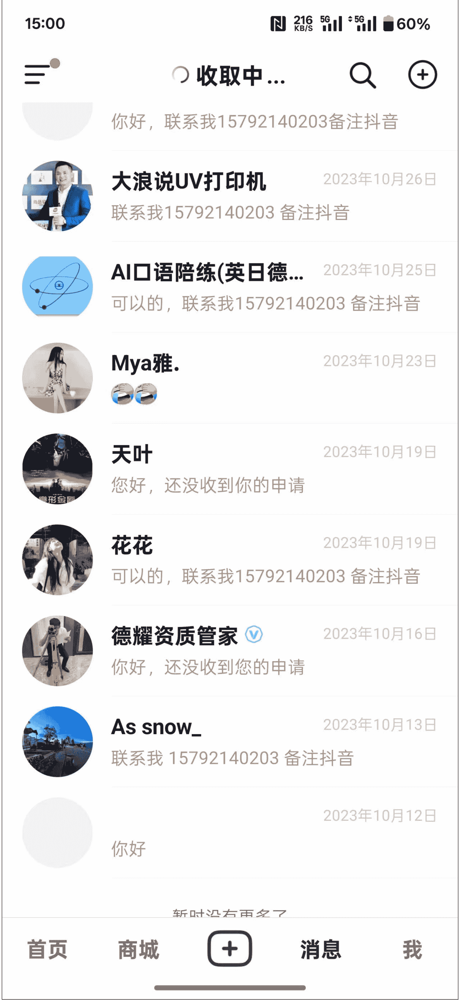

# 《100 万学费买的教训：创业不做这 4 件事，永远困在小作坊》

2025-05-21 生财精华

公众号懒人找资源，懒人专属群分享

大家好，我是江天，当前是一家小规模企业服务公司老板。

回想自己做企业信用项目 + 开公司这接近两年的时间，太多方面没做或者没做到位，导致自己的年收益困在了 100w 以内，现在想想十分遗憾。

“为什么同样的时间和精力，有人能年赚 500 万而我只有 100 万？”

将自己的遗憾写下来，给自己之后的事业以思考，也给各位圈友分享共勉。

## 一、错失的投流“放大杠杆”

项目的初始流量来自于淘宝和抖音。因为自己之前是做淘宝出身，会通过补单搞一些免费的流量，当时每天就能加 10-20 个微信，自己说实在的有点接待不过来客户了，所以就一直补单，并没有开直通车。现在想想是如此悔恨~ o(*￣▽￣*)ブ，为什么悔恨？

1. 现状。

2. 2025 年成交的客户，也有很多都是 2024 年加的，私域太重要了，尤其是企业服务赛道。这些老板或者拥有老板资源的私域，会一直为我推单子，以后有新业务，也会开展的非常顺利。

| 总订单数 | 501 |
| :--- | :--- |
| **表格内容说明** | 客户单位 | 订单日期 | 约定 | 时限 | 付款方式 | 合同总价 | 已付款 | 未付款 | 处理 | 内容 | 进度 |
| *[模糊处理]* | 2023/12/12 | | | 淘宝 | 全款 | 1500 | 1500 | 0 | *信用中国* | 已完成 |
| *[模糊处理]* 集团有限公司 | 2023/12/12 | | | 合同 + 对公 | 定金 | 3200 | 3200 | 0 | 司法 | 已完成 |
| *[模糊处理]* 份有限公司 | 2023/12/12 | 魏 | | 合同 + 对公 | 定金 | 45000 | 45000 | 0 | 司法 | 已完成 |
| *[模糊处理]* 有限公司 | 2023/12/14 | 魏 | | 合同 + 微信 | 定金 | 5000 | 5000 | 0 | 司法 | 已完成 |
| *[模糊处理]* 技有限公司 | 2023/12/14 | | | 微信 | 全款 | 1100 | 1100 | 0 | 历史 | 已完成 |
| 1207121X) | 2023/12/15 | | | 淘宝 | 全款 | 3000 | 3000 | 0 | | 已完成 |
| 师事务所 | | | | | | | | | | |
| 限公司 | 2023/12/19 | 张 | | 合同 + 对公转账 | 定金 | 7000 | 7000 | 0 | | 已完成 |
| 研究院有限公司 | 2023/12/19 | | | 淘宝 | 全款 | 2000 | 2000 | 0 | 信用中国 | 已完成 |
| 投资有限公司 | 2023/12/20 | | | 淘宝 | 全款 | 14000 | 14000 | 0 | 不良行为 | 已完成 |
| 程咨询有限公司 | | | | | | | | | | |
| 有限公司 | 2023/12/21 | 魏 | | 淘宝 | 全款 | 1800 | 1800 | 0 | 历史信息 | 已完成 |

23 年的客户，根本没有过小单子，都是新客户

| 总订单数 | 501 |
| :--- | :--- |
| **表格内容说明** | 客户单位 | 订单日期 | 约定 | 时限 | 付款方式 | 合同总价 | 已付款 | 未付款 | 处理 | | |
| *[模糊处理]* 有限公司 | 2025/4/14 | 魏 | | 老客户 | 全款 | 900 | 900 | 0 | | | |
| *[模糊处理]* 品有限公司 | 2025/4/14 | 魏 | | 淘宝 | 0 | 300 | 300 | 0 | | | |
| *[模糊处理]* 有限公司 | 2025/4/18 | 魏 | | 淘宝 | 1500 | 1500 | 0 | | | | |
| *[模糊处理]* 医院有限公司 | 2025/4/18 | 魏 | | 老客户 | 全款 | 9500 | 9500 | 0 | | | |
| *[模糊处理]* | 2025/4/18 | 吕 | | 老客户 | 0 | 2400 | 2400 | 0 | | | |
| *[模糊处理]* | 2025/4/18 | 吕 | | 靠客户 | 0 | 1400 | 0 | 1400 | | | |
| *[模糊处理]* 务服务有限 | 2025/4/18 | 张 | | 老客户 | 0 | 1000 | 0 | 1000 | | | |
| *[模糊处理]* 技有限公司 | 2025/4/18 | 张 | | 老客户 | 全款 | 200 | 0 | 200 | | | |
| *[模糊处理]* 有限公司 | 2025/4/21 | 魏 | | 同学 | 0 | 0 | 0 | 0 | | | |
| *[模糊处理]* 仓库 | 2025/4/24 | 魏 | | 渠道猫君 | 定金 | 1600 | 1600 | 0 | | | |
| *[模糊处理]* 文化有限公司 | 2025/4/25 | 张 | | 渠道陈律师 | 定金 | 1800 | 600 | 1200 | | | |
| *[模糊处理]* 制造有限 | 2025/4/25 | 魏 | | 淘宝 | 全款 | 800 | 800 | 0 | | | |

最近的客户，大部分都是老客户介绍，客单价也明显下降

再说抖音，作为一名一直玩免费流量的人，肯定是一毛钱也不会往抖音投！当时跟着抖音 SEO 航海，发了很多抖音图文，也拍了一些视频，获得了一些客户，每天也有微信加。所以也是没投流，错过了这个最大的流量池。

最开始企业信用修复赛道，抖音投流，一个客户的费用 70 左右，其实绝对能回本，碰上大客户，那就赚大了。但是自己一毛钱也没投。现在听说一个获客成本得 150 左右了，而且信用修复的价格也降低了很多，更不敢投流去放大了。

付费投流是放大项目最省心的方式，没有之一。以后再遇到蓝海项目，必须先拿出几万资金，随时准备放大！

## 二、人力杠杆：从个人到团队

当时单子做不过来了，顺理成章招聘了两个文员一起做单子。这点并不是做的很好地方，因为任何一个人工作做不过来，肯定都会往这个方向发展。

但是做的不好在于自己没有招聘销售！

自己也去过 3 家企业服务公司学习过，有两家做的比较上规模，公司修复师和我公司数量一样 3-4 个，但是销售数量都是十几个，而且那段时间都是正收益，能给企业产值。

有好的产品一定要及时想各种方式放大，何况这个回本周期还很快。现在想想确实自己太年轻，悔不当初。

## 三、短视频红利的半途而废

做任何事情，任何企业肯定都要有抖音号这没得说。在 23 年的蓝海红利期，注册了抖音号，弄了蓝 V，当时只是在小红书随便找了同行的图片，去水印发到抖音上，就引来了五分之一的营业收入。后来自己也做短视频 IP，但是因为其他方面的客资很多，抖音又经常违规而且见效慢，导致自己并没有沉下心去做一个有个人 IP 属性的短视频。

懒人微信：lazyhelper

最早的抖音，作为一直玩免费流量的人，肯定是一毛钱也不会往抖音投！当时跟着抖音 SEO 航海，发了很多抖音图文，也拍了一些视频，获得了一些客户，每天也有微信加。所以也是没投流，错过了这个最大的流量池。

最开始企业信用修复赛道，抖音投流，一个客户的费用 70 左右，其实绝对能回本，碰上大客户，那就赚大了。但是自己一毛钱也没投。现在听说一个获客成本得 150 左右了，而且信用修复的价格也降低了很多，更不敢投流去放大了。

回头来看，付费投流是放大项目最省心的方式，没有之一。以后再遇到蓝海项目，必须先拿出几万资金，随时准备放大！

[图片]

[图片]

从 23 年底到 25 年 5 月份，团队一直是我们几个人

### 《一、错失的投流“放大杠杆”》信息流截图

[图片]

### 消息

- 湖北潜江小龙虾批发 2023 年 11 月 3 日
  你好，联系我 15792140203，备注抖音

- 一叶障目 2023 年 11 月 2 日
  可以，联系我 15792140203 备注抖音

- 李明利·唐山商业... 2023 年 11 月 2 日
  你好，欢迎参加每周举办的“有道饭局·唐...

- ~ 2023 年 11 月 2 日
  +一下吧，参加会议中

- 金鸡湖彭于晏 2023 年 11 月 1 日
  如无需回复，邀请您对本次服务进行评...

- 宸宸&诗钰 2023 年 10 月 31 日
  可以的

- 哈尔滨华邑母婴批发 2023 年 10 月 30 日
  可以的，联系我 15792140203 备注抖音

- (66 2023 年 10 月 29 日
  也可以夹一下

- 两年半 2023 年 10 月 27 日
  你好，联系我 15792140203 备注抖音

页面收录：商城、消息、我

### 关键思考：越来越多的人才俊开始做 IP

当时只是随便搬运一些图片，就会有 SEO 流量。

时间来到现在，同行做的头部 IP，粉丝 7000 人左右，每天发一些老板工作的视频，不直接发业务，也会每天都有客资。

并且她这种账号，以后做任何企业服务方式的业务，都可以快速无成本的拓客，真香！

当然，我觉得任何时候开始做个人 IP 都不晚，前提是选对了行业。我认为企业服务这个行业，解决的是老板的刚需，而且服务类的，可以说基本是 0 成本，并且后端完全可以外包、嫁接，自己只要做好前端的个人 IP，一个靠谱的企业服务专家就行。一单和企业产生了第一次成交，后续只要价格不是高的过于离谱，客户总会选靠谱的，成交过的值得信任的人去合作。

所以，个人 IP 的事情我会继续做下去，以后一定要形成简单可行有效的 SOP，减少阻力，长期主义。

## 四、被丢掉的稳定现金流

之前自己是做淘宝虚拟资料出身，连续两年每年都赚了 30W+。为什么会被放弃？

1. 23 年企业信用修复非常蓝，当时每个月赚的比淘宝虚拟资料多的多

2. 淘宝虚拟资料会不定期被售假，售假了就要重新起店，还是有点繁琐

3. 由于以上事情，导致自己精力不够，最终淘宝虚拟资料这个稳定的现金收入就被放弃了。

### 关键资金流水

- [唐山银行] [隐去] (北京) 石化技术服务有限公司 11 月 28 日 19:06 向您尾号 1550 账户转入 30000 元，余额 78985.01 元

- [唐山银行] (隐去) 轴承制造有限公司 12 月 01 日 21:27 向您尾号 1550 账户转入 1000 元，余额 79985.01 元

- [唐山银行] 技术有限公司 12 月 04 日 17:50 向您尾号 1550 账户转入 14280 元，余额 94265.01 元

- [唐山银行] 在线科技有限公司 12 月 05 日 18:47 向您尾号 1550 账户转入 3500 元，余额 97765.01 元

2023 年 12 月 5 日 21:30
唐山银行

- [唐山银行]XX 不保科技有限公司 12 月 13 日 09:14 向您尾号 1550 账户转入 2500 元，余额 133765.01 元

- [唐山银行]XX 土木工程科技股份有限公司 12 月 12 日 17:47 向您尾号 1550 账户转入 13500 元，余额 131265.01 元
唐山银行 1063500666666
< 

- [唐山银行] 重庆 XX 食品有限公司 12 月 12 日 11:19 向您尾号 1550 账户转入 1000 元，余额 116765.01 元

- [唐山银行]XX 产业（山东）集团有限公司 12 月 12 日 14:08 向您尾号 1550 账户转入 1000 元，余额 117765.01 元
唐山银行

- 2024 年 3 月 8 日 18:09
- [唐山银行] 上海 [隐去] 限公司
  03 月 08 日 18:09 向您尾号 1550 账户转入 7000 元，余额 96548.85 元

- 2024 年 3 月 11 日 07:54
- [唐山银行] 杜 [隐去]
  3 月 11 日 07:54 向您尾号 1550 账户转入 40000 元，余额 36548.85 元

- 2024 年 3 月 12 日 15:14
- [唐山银行] 张 [隐去]
  03 月 12 日 15:14 向您尾号 1550 账户转入 3500 元，余额 40048.85 元

- 2024 年 3 月 12 日 15:27
- [唐山银行] [隐去]（郑州）信息科技有限公司 03 月 12 日 15:27 向您尾号 1550 账户转入 5000 元，余额 45048.85 元

- [唐山银行] [隐去] [隐去] 餐饮管理有限公司 03 月 12 日 15:37 向您尾号 1550 账户转入 500 元。余额...

23 年到 24 年信用修复简直跟捡钱一样，这只是走了公账的费用

等到今年企业信用客单价下降，人力开销缓缓增大的时候，逐渐觉得有一点压力，还是有稳定的现金流香！再加上今年看到...

10。生财中亦仁回复的一个帖子，讲千万不要轻易放弃已经跑通赚钱的项目，非常有感触，于是重新讲我的“现金流”操持了起来。

> **2. 副业 1：从 23 年开始至今小红书家居博主 1w 粉，收入 10W+，但目前账号收入大幅降低，自我判断账号无增长性**
>
> **【亦仁点评】** 不要站在账号角度思考，要上升到行业、竞争对手领域思考，有些时候没增长，是因为早期进入误打误撞碰到了平台红利，但后续平台规则调整时没跟上，收入开始下滑。看看行业和竞争对手的增长情况，如果全部都是下滑，才能得出无增长性结论。如果别人增长你下滑，要及时调整。不要轻易放弃一个已经跑通赚钱的项目。

**# 亦仁的给圈友的回复**

> 生意参谋 • 零售电商大数据... ×
> 首页 1 交易 | 流量 客户 | 商品 营销 618 服务 内容 | 市场 | 自助分析 NEW 业务专区
>
> **数据概览**
>
> - 同行对比 2025-03-05 ~ 2025-04-04
> - 实时 日 周 月 自定义 < >
> - 支付金额：6,046.25
> - 店铺客户数：6,839
> - 平均停留时长 9.57
> - 支付买家数：1,448
> - 老客复购率 0.11%

重新操持起来的淘宝虚拟资料，都是真实成交，纯利润。

## # 关键思考与未来行动

格局思维：做事业一定要越来越往大了做

回头看这两年，最大的感悟就是：做事业一定要有“做大”的格局。刚开始的时候，总想着稳一点、慢一点，结果就是错过了很多放大的机会。其实，市场和机会永远是留给敢于投入、敢于放大的人的。

以后无论做什么项目，都要时刻提醒自己，不能小打小闹，要敢于投入、敢于放大，才能突破收入的天花板。

- **稳定现金流是底气**
这两让我明白，稳定的现金流业务就是创业路上的“压舱石”。无论是企业信用修复，还是后续拓展的企业服务，只要能持续带来现金流，就能给自己更多试错和创新的空间。以后做项目，哪怕再想追风口、搞创新，也一定要保留一个稳定现金流 的业务线，这样才能有底气去做更大的尝试。

- **做事情要 留痕，形成 SOP**
以前做事太凭感觉，很多流程和经验都没有沉淀下来，导致团队协作效率低、自己也容易陷入重复劳动。现在越来越意识到，做任何事情都要“留痕”，把每一步流程、每个细节都记录下来，形成标准化的 SOP。这样不但能让团队成员快速上手，也能让业务更容易复制和放大。未来无论是短视频运营、客户转化，还是销售 管理，我都会坚持把流程标准化，减少阻力，提升效率。

- **未来的行动计划**
  - **投流放大：**以后遇到蓝海项目，第一时间拿出预算，敢于投流，快速验证和放大。
  - **团队扩张：**不再犹豫，及时招聘销售和运营，充分利用人力杠杆。
  - **深耕个人 IP：**持续输出内容，打造个人品牌，形成可复制的短视频 SOP。
  - **现金流业务保底：**无论做什么新项目，始终保持一个稳定现金流业务线。
  - **流程标准化：**所有业务流程都要沉淀为 SOP，方便团队协作和业务扩张。

创业路上，遗憾和错过在所难免，但只要能及时复盘、总结经验，未来就一定能走得更远。

希望我的这些反思和教训，能给自己和大家一些启发。共勉！

[图片]

[图片]

🔦懒人专属群持续更新中，已持续运营 6 年，整理超 3000 份各类精选付费文章 & 年费社群干货，全部开放下载。

本资料为付费群内部分享，仅供真实有需要的朋友查阅 🙏

**懒人专属群更新记录：**

[https://lazybook.fun/#/blog/record2](https://lazybook.fun/#/blog/record2)