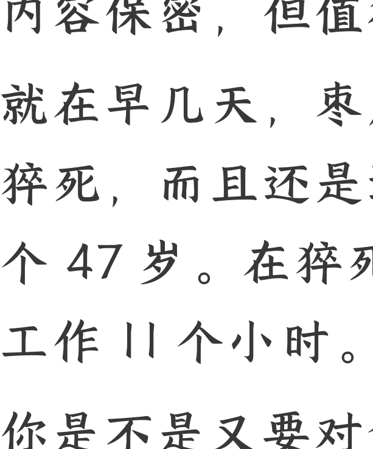

# 猝死的外卖员！

250524 守夜人总司令

整理：公众号懒人搜索，懒人专属群独享
懒人微信：lazyhelper

## 前言

内容保密，但值得一看！

就在早几天，枣庄有两个外卖员先后猝死，而且还是连襟。一个 45 岁，一个 47 岁。在猝死之前，连续几天每天工作 11 个小时。看到这样的消息，你是不是又要对贪婪的黑心资本家破口大骂了？

且慢，这两个人属于饿了么的众包站的成员，其中一个还是负责人，不属于你家哥哥的竞争对手，而且，你也没有资格心疼人家。因为死者的妻子对记者说：自己现在一个人上班，除了大孩子已经工作了之外，还有两个小的，还有一个老母亲，现在都需要自己管了。不仅要供养这两小一老，还要还房贷。

等等，他不仅有房子，还有能力生三个孩子！就凭这，你也没有资格随便心疼人家，并借着人家的悲剧来发泄你的不满。更扎心的还在后面，他老婆说，以前他们在上海某个大型工厂工作，后来被裁了，因为人家上了自动化生产线。

于是，回到老家打算做点生意。他丈夫与别人合伙，被人骗了，亏了 60 万，后来才干众包并负责一个配送点。划重点：他有 60 万现金，有房子，有车，有老婆，有孩子！你觉得他跟你是同类么？

他媳妇说，他总是想多挣点钱，不听劝，这几天连续每天工作 11 个小时，突然倒地上就不行了！

他不仅有房子，有老婆，有三个孩子，还有 60 万的存款！它是一个站点的承包者。而且，他并不是被迫每天干 11 个小时，而是自己想多挣钱东山再起，才主动这么干的。家人也劝过，他不听，才造成悲剧。

这种加班猝死的事情在任何行业都存在，华为也有加班猝死的案例。然而，在华为加班猝死不会引爆社会舆论，但外卖员如果加班猝死就必然会引发舆论狂潮！

更搞笑的是：一群人借着这个事在那里骂王兴，还说自家哥哥要是早点进入外卖这个行业，就不会发生这样的悲剧！对对对！天不生你家哥哥，万古如长夜！你家哥哥不仅是社会良心，还能所到之处，包治百病。你家哥哥的画像应该被千家万户打印出来贴在中堂。早请示、晚汇报、忠字舞跳跃起，你家哥哥的语录也应该打出来，人手一本。

## 舆论场的排序

华为的员工是不是劳动人民的儿子吗？为什么在舆论场上，华为的工程师加班猝死了就没有产生一丝涟漪，而送外卖的加班猝死了就好像天塌了！为什么舆论场会造成一种这样的效果？因为需要有。

在过去的几年中，各行各业速度萎缩甚至是坍塌。2019 年之后，民间投资已无限接近于 0，社融数据一再走低，大家都不愿意借钱。因为外部的一切充满了不确定性。这种不确定性让任何长周期的投资充满了风险。所以大家干脆不投。宁可坐吃山空也比投下去亏了损失要小的多。从统计数据来看，这几年的投入，都是官方在投资。或者官方借用一些机构的外壳在投——用的是官方的钱，并非这些机构的钱。

虽然新的产业在快速增长。比如说，房地产的占比已经下降到 20% 以下，而科技产业的占比上升到 16% 以上。

但是，越是没文化没能力的人群，就越不可能与新兴的科技产业搭上什么关系！

那些低门槛的制造业，房地产相关的建筑行业，或者一些配套的低门槛服务业。当这些行业都加速萎缩之后，他们就会被淘汰。被挤掉的是淘宝这样的电商平台，现在开始恨上外卖平台了！

不管是电商也好，外卖也罢，又或者出行平台也好，都是生活场景数字化，各要素系统化趋势中的一环。这帮人在这个趋势中被挤压出去之后，不去调整自己适应趋势，只会抱残守缺恨这个，恨那个。动不动就是把这个挂路灯，把那个挂路灯。复杂的经济活动需要有人组织。组织者所冒的风险和投入的资源、时间、精力，比其他人都多得多。所以，成功之后得到的回报也必然要高得多。因为风险和收益要成比例。一个人如果有能力组织起某种复杂的经济活动，就有能力为别人提供工作岗位，而不是求别人给一份工作岗位，让自己能够谋生。一群没有能力组织起任何复杂经济活动的人，却要把那些组织者都挂路灯，这帮人活该穷。

这帮人现在把他们的东哥哥当做图腾来膜拜，其实是把他们家哥哥架在火上烤！“大丈夫当如此也”的海报现在被这帮人贴的到处都是。这是犯忌的事！

你可以挣钱，甚至可以把你挣的钱转移，但是你不能把自己整成图腾——天上只能有一个太阳，普罗大众的心中只能有一个图腾。

上一个这么整的人是平西王，他想把自己搞成大家心中的图腾，现在应该在牢里面悔死了！

**📖** 懒人专属群持续更新中，已持续运营 6 年，整理超 3000 份各类精选付费文章 & 年费社群干货，全部开放下载。

本资料为付费群内部分享，仅供真实有需要的朋友查阅 🙏

**懒人专属群更新记录：**
- [https://lazybook.fun/#/blog/record2](https://lazybook.fun/#/blog/record2)

懒人微信：lazyhelper