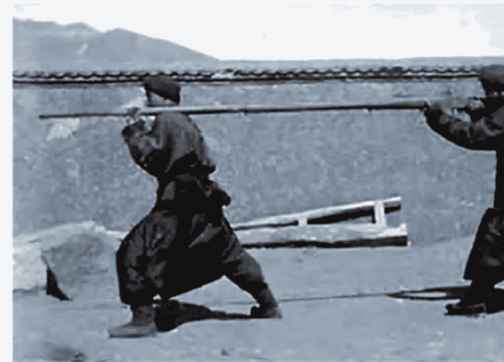
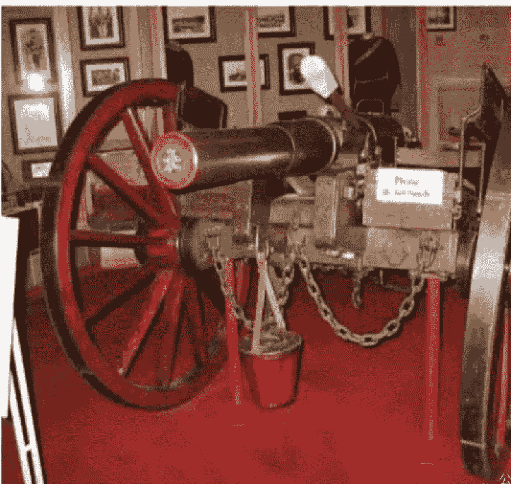
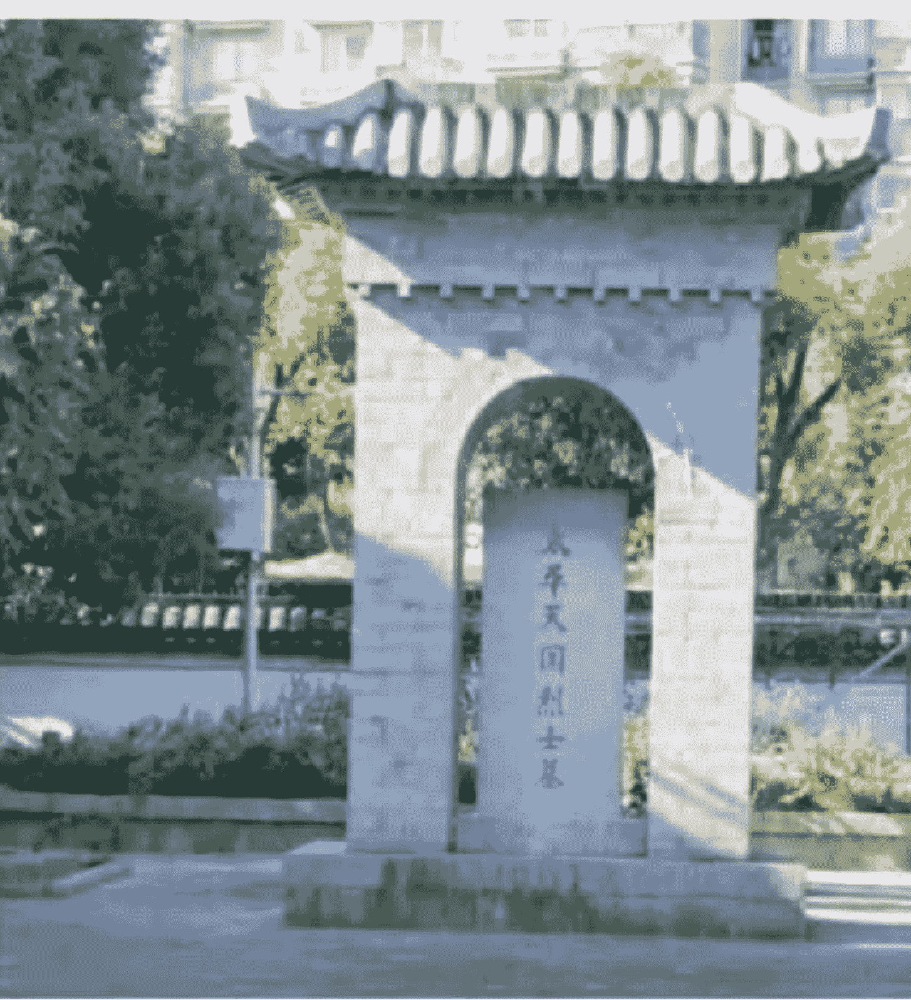
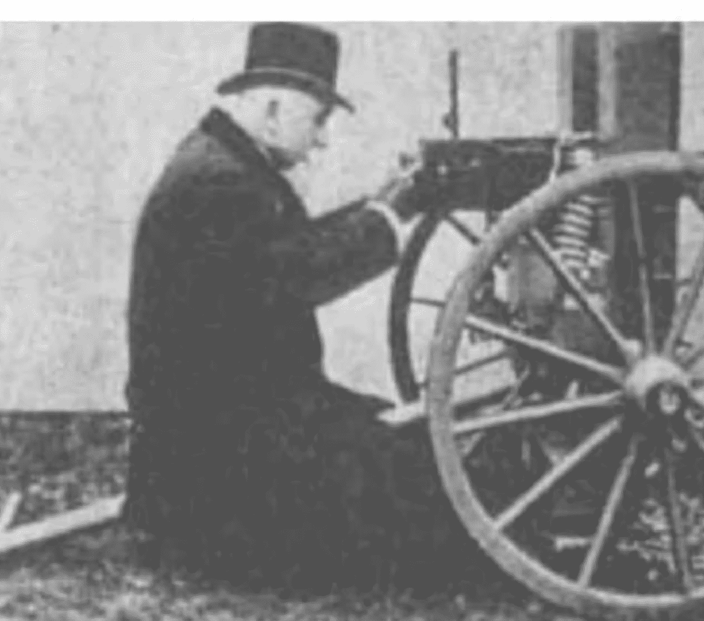
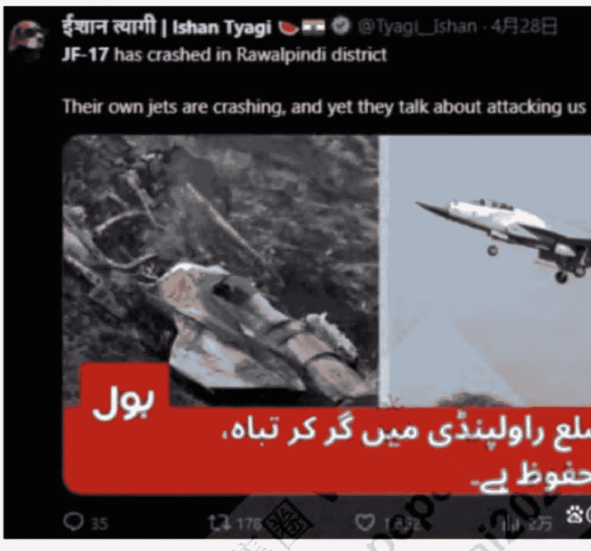

这篇文章的宏观视角，是我们团队所独有的。您可以当做故事来读。从这篇文章的视角来讲经济和股市，在其他地方可能很难读到。我们正是以此特立独行的风格，以超级宏观的视野，静观世界风云的变化，行走江湖。看云卷云舒，对古今沧桑，思考各国运势，探寻投资的本质、机缘，投资我们的国运。

2024 年 1 月 1 日，在大盘即将进入最艰难的时候，我们团队推出了我们的第一个对话《投资大时代，不要放过那种改变您一生命运的大机会》，2 月 1 日推出了《大盘分析（一）：从深成指看两市砸锅卖铁买股票的点位》，同时在免费文章中讲大盘见底的时间在 2 月 2 日那周，前后一周都是时间窗。最后大盘见大底于 2 月 5 日。

去年，我们很清楚未来是一波大牛市，但有各种各样的因素，导致人们充满了怀疑。的确，有质疑宏观经济的，有讲沪深 300 整体业绩不佳的，有讲国家刺激政策不够的，有跟随犹太金融资本和盎撒金融资本企图引爆中国金融危机的，等等，不一而足。

但读过我们去年元月 1 日文章的人，都会看得热血沸腾。深入思考了该文内在逻辑的人，都会相信未来是一轮大牛市。

尽管去年 2 月以来的牛市，走得极其曲折，很多人都一遍又一遍地表示了怀疑，但是，从沪深股指的形态和周期，我们始终坚信未来是大牛市。我们还指出改变未来市场运行逻辑的一个根本性的因素，全球利率向下，从中长期看，中国一年期贷款利率到 3% 以下，一年期存款利率到 1% 以下甚至 0.5% 左右

5 月 20 日，6 大银行宣布下调存款利率，一年期银行存款利率已经降到 0.95% 了，社会进入低利率时代，它会改变整个社会的投资风险偏好

然后中国很多企业、很多个人躺在银行里吃利息的资金，都会出来寻找投资标的，到时优质的中国红利资产就会受到追捧，因为对这些资金而言

他们的目标只要高于 3 个点就可以了，而当时港股中有一批股票分红率达到 10% 左右，A 股中分红率达到 8% 左右且价格远低于每股净资产的股票就有不少。

像我们 2023 年 4 月 10 日在微博中研究的《选只股票养老》，当天收盘 6.05 元，现在 9 块多，然后 2023 年 7 月派息一次，每股 0.389 元；2024 年 7 月派息一次，每股 0.4 元；2025 年 1 月派息一次，每股 0.197 元；今年 5 月份刚派息一次，每股 0.209 元；总共派息 4 次，每股共计派息了 1.195 元。仅仅两年零一个月的时间，光分红就达到了 1.195/6.05=19.75%，股价涨幅还超过 50%。这是非常典型的一个案例。

如果我们用散户的眼光，是发现不了这样的机会的，如果我们用追求稳健回报的大机构投资者和身家几亿几十亿几百亿的富人的眼光，且我们能够判断利率变化趋势的话，就一定能够发现这样的机会。

像这两年保险机构不断往股市里增加投资，好多就是买远低于每股净资产的高股息股，即我们以前讲的“三低一高”，他们的成本两个多点，然后追求 4% 到 5% 的年化收益率，所以就会出手抢高股息股。去年我们团队讲过十五字真言，里面就有一句，要么真价值。这类股票就是真价值。

2024 年我们凭借深成指和上证指数的形态、周期，加上对利率的变化，判断未来是大牛市。这是技术和基本面的结合。其后，在 2024 年 10 月，我们挖掘出国企特别是地方国资的一系列行动，就是他们利用市场调整了三年多的大好机会，频繁出手并购行业不错资产质量不错的民营企业上市公司。

而且有不少的案例；还有财政部每年公布的国有资本运营情况及收益等，从中我们发现了国家资本和地方国有资本在资本市场上的宏观布局，然后我们发表了对话三《家庭资产将现革命式变化，现在是中国社会财富承载方式大变局的临界点》，指出中国未来财富将从以房地产为主的承载方式改变成优质股权的承载方式，讲一个时代财富承载方式的大变革，而这场大变革，将跟本次中国的大牛市相适应、相呼应。那篇文章，我们发现了中国大牛市的部分主力资金的意图，他们正是市场的中坚力量。

但是，那些发现还不够。如果要全面地揭示本轮中国资产大牛市的本质，它为什么会走出中国资产大牛市，它最深处的逻辑是什么，这些还不够。因为这些讲出了中国内地资产的大牛市运行的内在逻辑，对内地来说是够的，但对香港和中概股来讲，这些因素是不够的。

然后今天，我们通过这篇文章，要讲透本轮中国资产牛市大爆发、大牛市的几个内在逻辑。就是牛市走到现在了，我们对这个大牛市的内在原因，看得越来越全面，越来越透彻。在牛市即将爆发前，我们发现了它，也找到了一个两个深层的原因，当时以为够，但现在回过头去看，发现还是不够的。

面对未来那波气势恢弘、波澜壮阔的大牛市，我们需要从历史和现实中，找到更坚实的历史脉络、深层逻辑，且面向我们的读者，给大家描绘出来。大家可以拿它当故事读。我们的宏观视野，可以让我们团队做到这点。我们要给大家描绘一个中华民族复兴的百年盛世，以及在这个百年盛世下中国资产又一轮轰轰烈烈的大牛市。现在，很多人还看不到它，但未来它一定会出现在你我面前。

也就是，前面我们对大牛市的判断，给了两个视角，一是利率，也就是宏观货币政策的视角，二是主力资金的视角。那么本篇文章，我们将给出更为宏观的视角，我们将从历史与现实，从中华民族国运的视角，以及这个国运的几个分支的视角，来透视本轮大牛市它内在蓬勃的动力，并力求全方位地观察到本轮牛市的全貌，它那神龙见首不见尾的轮廓。

> （声明：本文只为开拓视野、引导思路，并非择时，亦非荐股。股市有风险，入市需谨慎。本文不构成投资建议或意见，我们无力为大家的投资负责，请注意投资风险）

## 一、本轮大牛市，它是确立中华民族历史地位的一轮大牛市
这是定性分析。就是我们要对这轮牛市进行准确的定性。

那为什么是确立中华民族历史地位的一轮大牛市呢？除了中华民族伟大复兴这个中国共产党对中国的定性，就是它是从属于中华民族伟大复兴这个内在本质的一个外在表现。除此之外，我们要从其他的角度对这轮牛市进行深刻而准确的定性。

在阐释这个确定性之前，我讲一件事情：

特朗普加关税从 4 月 2 日开始加 10%+34%，然后 4 月 5 日，一友人发来相关工作群内的信息如下：

- 某某：回归债券和现金类资产
- 第二人：不是风险的结束，而是风险的开始
- 第三人：一直很乐观，昨天电话会议已经慌了
- 第四人：规避一切风险
- 第五人：全面转向债和现金没有悬念集体跪了。

这里没给截图，也把名字隐去了。咱们就不讲他们是什么类型的机构了。

然后我回复道：

某某合格吗？不合格。9 月初建议抛空中国资产，凭这一点他就不合格。为什么可以看多中国资产？因为他们只看到贸易战导致中国经济增速下降，没有看到中国资产定位低，中国处于向上的大趋势。这是第一。第二，美国这么激进的政策不可能持续，必然会引发和各国的谈判。如果中国出手我今天文章中讲的去美元化去美元化，美国会被全球抛弃。第三点，中美竞争已经攻守易势了。我们主动，他们被动。美国所有的高端产业会被中国一个个拿下，这点才是实质。某人错就错在，以为美国一直会涨，而想不到 2021 年 3 月我们讲的一个判断，美国会绞杀中国金融资本，当美股来到高位，绞杀的就是他们。这些人没有金融战的眼光，就会被干掉。他们的知识结构有缺陷。

> “这一仗是个硬骨头，但再硬的骨头，咱们只能啃下。”“不胜利，就灭亡。”

以上是我当时的回复。去年 9 月 12 日，我公众号文章是《上马击狂胡，下马诵诗书》，讲当时面临的就是中国金融市场的上甘岭之战，讲上马击狂胡，下马诵诗书。

讲咱们要义无反顾地去抄底。

回头看来年 4 月份关税战后，刚好是抄底的时间。去年 9 月份也是。

那么，为什么他们错了呢？除了思维方式，除了某某作为外国金融资本系工作人员的思维方式和知识结构之外，最根本地，就是他们缺少中国立场、中国思维、中国骨头和中国态度。像索罗斯那样的人，只要有机会，他们一定会全力搞中国的。

有机会搞垮中国，他们一定不会手软，只会一波流，全部压上，梭哈。

国内这些人，只看老美。他们缺的，正是一种中国智慧，那种穿越历史周期的大的战略眼光。而我们这篇文章要呈现给大家的，就是这样一种穿越历史周期的，超级宏观、波澜壮阔的战略眼光。

然后回到我们的思路。就是这个牛市的定性要怎么定呢？我们先看 5 月 11 日我们的文章《一场百年不遇的人民币资产大牛市，就在我们脚下》是怎么讲的。引文如下：

我们在近几年中，多次谈到人类战争形态的改变。它将深刻影响甚至改变中国大牛市的进程。今天把这个话题谈深一些。

人类有史以来，对战争形态的改变，实际上是有限的。比如弓箭、强弩和连弩的发明，包括铁器的使用，它们的确改变过战争，但因为背后的技术高度比较有限，所以很难改变战争的形态。我们小时候就自制过弓箭，所以当战争的一方使用弓箭打了胜仗，战败的一方用不了多久就能自己制造弓箭。强弩和连弩差不多，用不了多久，对方也会拥有。所以尽管蒙古人打过了多瑙河，可蒙古帝国的瓦解仍然好像是一瞬间的事情。在马背上席卷全球的蒙古帝国，在人类历史上仍然只是个过客。真正改变冷兵器时代

- 战争形态的是枪和炮，特别是机枪。当成熟的机枪上了战场冷兵器时代彻底结束。
- 我 1992 年生日那天在西安莲湖路跟我们编辑室主任谈八国联军跟义和团的战斗，谈的正是这个道理。战争形态背后，只能是科学技术。
- 将中国拖进近代史的正是鸦片战争。而英国则是靠游动的机关枪和可以灵活转动的大炮打下来的。军舰只是江海中的战马，而且相对于马匹，它的作用更大。它可以架起机枪，可以架上大炮，能够抵挡枪炮的后坐力，而且炮口还能比较灵活地转向。正因为如此，中国持续了数千年的农业帝国历史在此不得不转了个急弯，农业帝国败于工业帝国。我们近战的优势变成了只能远战的劣势，甚至连敌人看不清就败下阵来。曾格林沁的败，跟索姆河战役如出一辙。这其实比林则徐的话都要晚几十年。林则徐在写给魏源的信中讲，敌人可以打到你，但你打不到他，即使岳飞、关公再世，也一样会失败。
- 将地面和空中战争的机动性、防御能力发挥到极致的是第三帝国，希特勒的闪击战，实际上是用坦克和战车代替了骑兵的马匹，用炮和机枪替代了马刀和三眼铳，然后加装了防护装置。第三帝国以此碾压欧洲。不幸的是，坦克与飞机几乎同时出现在战场

*战争形态的改变是第二次海湾战争中的航母和无人机。美国从海上进攻，航母带来舰载机和坦克，对伊拉克形成碾压之势。它们实际上是 1840 年鸦片战争中复仇女神号、马利拿号和威里士厘号的升级版。当然，海湾战争还带来了信息战和体系化的战争形态。*

在前几年中，我反复地讲，中国导弹改变了战争形态。当然，这是一种简单的表述。

更准确地讲，中国体系化的战争，在战场态势感知、目标的发现和摧毁、导弹技术的成熟等攻击手段和对敌方武器的反击等方面，已经进入到定义战争形态和改变战争形态的地步了。

很简单，美国改变战争形态的是航母和舰载机，但是现在，这两种武器都已经失效（当然，只差一场实战）。

攻击方面，中国解决了看得远打得到打得准的问题，这实际上是对海湾战争的再度升级版。

前面美国升级了英国鸦片战争中的复仇女神号等，升级的结果是航母、强大的舰载机和无人机，以及强大的通信系统。就是航母从几千里上万里之外开过去，电磁战废掉你的通信系统和信息指挥系统，舰载机和无人机飞行五百公里甚至更远，把你关键的设备和位置节点炸掉，然后坦克开过去碾压你粉碎你。中国升级的是什么呢？是雷达、导航、预警机，飞机、导弹、无人机、驱逐舰等整个配合体系。现在稍稍弱的一环是哪里？就是航母，是军力投送环节还差点能力。核动力航母一搞出来，那就齐活了。

中国的玩法和美国有什么不同？美国是航母为核心的战力投送体系，通过航母把战机送到距离本土或海洋中某个驻地甚至域外军事基地几千公里以外的国家，美国航母到战力投送的最远处，就是航母停靠的地方向前推进 500 公里 + 导弹射程，超过这个距离，美军的战力要么鞭长莫及要么能力有限。中国的玩法呢？是卫星导航 + 各种各样的雷达 + 预警机 + 飞机 + 导弹的射程，也就是中国军力所及，在于雷达和导航能看清楚的最远距离和导弹精准投放的最远射程，这是远。中近呢，则是军舰最远的航程 + 舰载机最远的飞行距离 + 机载导弹的射程，或者是

驱逐舰最远的航程 + 舰上导弹最远的飞行距离。

而据来自滋德院士的信息，中国雷达能探测清楚 8000 公里以外的世界，北斗能看清楚全球很多国家和地区发生的事情。而中国导弹既有短程的，还有近程的，还有中程的，还有远程的，还有战略洲际的。还有，中国针对近战有一系列的武器，比如大家常讲的火箭弹，微波武器、激光武器、粒子束等电磁战武器、无人机无人艇机器狼等，所以，中国的打击体系很丰富，从近战的到战略导弹，特别是短程的，还有近程的，还有中程的，这一块中国有特别明显的优势。

于是当中国面对其他国家时，他们的感觉跟林则徐 1840 年前的感觉将是一样的，甚至比林则徐的内心还要恐怖。因为他们的敌人在几千里之外就可以动手干掉他。中国要打掉他国的航母，用飞机最远能打多少公里？答案是 5500 到 6000 公里。用陆基导弹呢，美军太平洋舰队司令认为中国导弹可以打掉 1500 海里以外的航母，也就是 2700 到 2800 公里以外的航母。而据公开媒体信息，东风系有一款导弹，能打 5000 公里以外的航母。这比歼 20 最远航程 + 机载导弹最大距离差不了多少

所以战争形态已经改变。当然，现在国内承认战争形态为中国所改变的人

还不是很多，但已有越来越多的人认识到了这一点。这次印巴之战，巴基斯坦打下印军 9 架战机（第一天的 6 架中有一架为无人机），抓了一名印度飞行员，还打下 77 架无人机，还拦截了印度的导弹，印军飞机基本上起飞即被发现，发现后，在印军飞机飞近且没有发现巴军飞机前就可以被轻松击落。这就导致传统的战斗机近战格斗、缠斗、追击与逃生等等战术技术，统统失效，已经没有市场了，战斗在你没有发现对手前即已经结束。

有人说这次双方没有发生缠斗是因为都没有越界，所以对印军不利。印军如果学习朝鲜战争中志愿军对美军的近战战法，可能结果大不一样。但他们判断错了。志愿军近战的前提条件是有在美军眼前的隐蔽能力，邱少云的那场战斗就是范例。印军有吗？就是到现在，解放军也没有那个隐蔽能力，因为有热成像仪。这跟机枪打肉身一个样。机枪那么能打，武功就只能健身。

在此情况下，陆军如果开战会如何呢？道理一样。但从长期来看，得看经济，看战争的成本。以国产无人机的实力，如果开战，任何陆军，进入无人机打击范围之内，那就是活靶子，且成本也低。咱们别把它跟俄乌战场上士兵手工操控的跟游戏机似的无人机搞混。咱们是那种人工智能的察打一体式无人机。

所以战争形态已经改变。

当战争形态改变了，中国就成为全球最安全的国家，也会成为国际资本未来将持续流入的目的地。美国呢，中国还没有实施去美元化，中国只是推动了数字人民币和 CIPS，中国对美出口还没有用人民币结算。一旦中国全面抛弃美元，不为美元背书了，那么美元在全球的地位必然滑到二流货币的行列。沙特，人民币兑换黄金的历史进程已经开启，那么人民币在全球的扩张也就开始了。所以，一场百年不遇的人民币资产大牛市，就在我们脚下。推动这轮人民币资产大牛市的正是人民币国际化。当然，它需要几年时间。

以上是引文。

也就是，从这里开始，我们将展开我们对历史、现实和未来的全面观照，然后讲清楚眼前中国牛市的几个强大的根基。

这需要我们解读中国近代史以来的几场战争及其背后的逻辑。

### 1. 鸦片战争，英国为什么胜？

林则徐给魏源的信讲到点子上了，他们老远就可以打到你，但你打不到他们。那么我们再问一句，英军为什么可以打到咱们而咱们却打不到英军呢？三样东西：

第一，工业革命的产物军舰，可以航行很远，速度还快，靠人力是追不上的。它的作用相当于马，海上游动的马群，而且比马的作用大。它可以抵挡机枪和大炮的后坐力，而马做不到，马上也不可能架起机枪，更不可能架起大炮。补充一句，英国的军舰在中国海防和江防上实施的是游击战术，你哪里防备森严，他走，换个地方跟你打。哪里防备薄弱又很重要，他就打哪里。这跟蒙古马队的战法是一样的。

第二，机枪。这个不多讲，关键是第一种和第三种。

第三，大炮。英国的大炮质量好，不容易炸膛，射得远，关键还有一点，它的炮口可以灵活地转向。英国人使用大炮，是有数学研究的，那就是弹道学。当年英国皇家海军火炮的类型总共有 5 种，加农炮、榴弹炮、白炮、卡龙炮和康格里夫火箭炮。

下图为复制的船上 32 磅弹加农炮。当时“梅尔维尔”号上配置了 28 门 32 磅弹加农炮，还有 28 门 18 磅炮、6 门 12 磅炮和 12 门 32 磅短重炮。

清军的岸炮是死的，不能转向。打游动的军舰，结果可想而知。

### 2. 八里桥战役。这一战干掉满清主力

林则徐是汉族官员中最早认识到西方近代科技优势的，第二次鸦片战争中的八里桥之战，则是英法联军剿灭清军主力的一战。满清军队主力随之被打到再没挺直过脊梁。自此，满人只有依靠汉族地主武装。

此战英法联军的武器有：

第一，火炮，可实现 3 公里精确打击。法军火炮 12 门，英军大炮 15 门。参战 5000 人 27 门大炮。包括 12 磅线膛野战炮、12 磅阿姆斯特朗炮，每门大炮配弹 250 枚。战后，平均每门炮剩下来的炮弹有 47 发。此役英法联军实际发射炮弹近 5500 发，半天。发射的霰弹炸开后杀伤范围达 30 平方米。对比数据，现在俄乌战争，俄军常规火力压制时，日均炮弹 1 万发，还是多条战线之和。

第二，火箭排。法军有 1 个火箭排，装备了在英军康格里夫火箭基础上研发的多种火箭。火箭能恐吓战马。僧格林沁部骑兵马匹受惊，回头冲进自己的步兵方队，导致兵败。

第三，线膛枪，是一种步枪，射程更远。英法联军都使用发射米涅子弹的前装线膛击发枪，装弹速度快，射程远，威力大。其中法国有 1859 式线膛卡宾枪，有效射程 457 米，最大射程 914 米，每分钟发射 8 到 10 发。此外，还有多种米涅步枪，有效射程 300 米左右。上图为老式的夏普斯步枪。

清军也有射速 5 分钟/发的滑膛炮，有时还会炸膛，非常沉重，炮口转向也不太方便，很笨，命中率低；子弹是实心弹，落下后不炸开，杀伤力小。再就是抬枪、鸟枪，射速为两分钟 3 发。

抬枪有效射程 300 米，但要一个人在前面用肩膀扛着，一个人在后面操作，极不方便，转向和瞄准都困难。鸟枪有效射程 120 米。还有火绳枪，要用火镰点火，更慢。而且这些枪械数量非常有限，主要武器为弓箭。

清军沿用冷兵器时代“密集冲锋”战术，而英法联军以散兵线配合炮兵阵地形成交叉火力网。蒙古骑兵需突破 500 米死亡地带（米涅步枪射程）+300 米霰弹覆盖区（火炮射程）才能近战，实际伤亡率超过 90%。所以，清军骑兵面对联军线膛枪发起冲锋，这一战术在 457 米有效射程压制下完全失效，印证了该枪械在火力密度与射程上的实战优势。清军参战 3 万人中，实际伤亡超 1.2 万人（含溃散逃兵），骑兵战死超过 1000 人，而英法联军仅阵亡 5 人、受伤 46 人。法军军官记载：“每个弹着点都能收割十余人”，联军火炮炸到人堆里时，平均每发炮弹造成 20 人以上伤亡。此战之后，清军传统绿营八旗兵已经完全丧失战斗力。满族和蒙古族清军再也没有挺直过腰板。

这一战是新兴工业国以枪炮在陆地上对少量热兵器 + 主体冷兵器的农业强国的降维打击，一仗消灭了八旗兵主力。英法联军 9 月 21 日打胜这一仗，通向北京之路再无阻挡。10 月 6 日占领圆明园，18 日火烧圆明园，大火烧了 3 天。此役之后，八旗兵在清朝军费分配比例直接从 70% 降到 20% 以下。汉族地主武装崛起，成为满人的依靠。

### 3.第三战，太平军攻击上海失败

太平天国是中国人学习西洋的产物。他们弄了个拜上帝教，天父、天兄、天弟。上帝耶和华，是天父；大儿子是耶稣，是天兄；二儿子就是洪秀全。三儿子为东王杨秀清，即天弟。他们拥有上帝的解释权，与上帝沟通的权力，他们的话代表上帝，大家都得听。

太平天国进攻上海失败，大局上是清朝确立联手外国的策略，用 800 万两白银向英国购买阿思本舰队，英法联军放弃中立立场，彻底倒向清军。1862 年太平天国军队第二次进攻上海，英法联军 4000 人直接参战，他们用的武器是恩菲尔德 1853 式步枪：这是英国军队在第二次鸦片战争中使用...
枪，线膛设计，使用米涅弹和火帽击发，射程 500 米，精度高，射速快，每分钟可发射 4 发子弹。76.2mm 野战炮，炮膛深度为 1.867 米，炮重 432 千克，这是一种榴弹炮，可以直接用于野战和攻城作战，射程 3 公里，射速 2 到 3 发/分钟，炮弹类型包括爆破弹与霰弹。大家如果对这种炮缺乏概念，可以看《亮剑》电视剧中李云龙打平安县城，用的道具是法国 M1897 型 75 毫米野战炮，比上面的野战炮口径稍小点儿。再就是阿姆斯特朗炮，如下图：

这是一种先进的后装炮，口径 12 磅，射程 3100 米，射速为 2 到 3 发/分钟，弹药类型：爆破弹（杀伤半径 15 米）、霰弹（覆盖 30 平方米）、穿甲弹（可击穿 15 厘米铁板）。

这是一种先进的后装炮，口径 12 磅，射程 3100 米，射速为 2 到 3 发/分钟，弹药类型：爆破弹（杀伤半径 15 米）、霰弹（覆盖 30 平方米）、穿甲弹（可击穿 15 厘米铁板）。

然后再帮助中国购买西洋武器。

然后他们还有海军支援，有华尔洋枪队雇佣军。洋枪队就是在上海高桥之战打出了名声的。上海人董恂在其著述《洋兵纪略》中记载：“华尔于辰刻率队登岸，首先冲入高桥，英法二国队伍列阵于镇之西路。”“ 是役也，华尔与英法两提督所带兵勇，不过一千五百余名，而敌（太平军）悍贼二、三万之众；攻破贼垒六座，炮台五十余处，杀贼三千数百名，生擒五百余名。”这一战是整个太平天国失败的转折点。

太平天国失败，就在于他们没有战略眼光，为了获取财政收入和通商利益进攻上海。他们没有认识到上海是英法的根本利益之所在，也是清廷财政利益之所在。上海是英法在中国的重要据点，他们要利用上海租界攫取在中国的利益，攻打上海就是从英法手中抢食，在帝国主义眼中，是侵吞帝国主义的在华利益，驱逐帝国主义的势力，因此他们必然跟清朝联手。此战失败后，中国最富庶的江浙资本都跑进了上海租界，上海崛起，太平天国在江浙一带的经济基础就被极大地削弱了。此战让淮军认识到西洋武器的重要性，此后他们就大规模引进西洋武器装备自己；湘军尽管要早一些意识到西洋武器的重要性，但此战后外购武器力度也大大加强。中国地主武装集团还开启洋务运动如汉阳造之路。汉族地主集团有兵有枪有钱有权，湘军和淮军籍此剿灭太平天国和捻军。

### 4.第四战，天津战役，八国联军对义和团跟清朝联军

时间是 1900 年。下图是机枪配图。

此战清军主力是聂士成部 6000 人的武毅军、淮军马玉崑部不足三营，1500 人弱，董福祥甘军少量按 1000 到 1500 人估计，总计约 8500 到 9000 人，装备克虏伯火炮等近代武器。然后有以张德成部为主的义和团 3 万余人，部分配合清军作战，有少量土枪。八国联军初期 4000 人，天津战役时有 11811 人，配备马克沁机枪（每分钟 600 发，射程 2000 米）、线膛步枪（射程超 400 米）、大口径攻城炮。
马克沁机枪叫做战场屠夫，重机枪又叫做生命收割机。它创造的最好战绩就是索姆河战役，一天杀敌 6 万。

但此战八国联军伤亡超 2000 人，为侵华战争中损失最惨重的一战，因为清军也有仿造的机枪。清军阵亡 4000 余人，义和团伤亡超 1.5 万人。当时在北京周边的清军约 15 万到 16 万人，义和团约 50 到 60 万人，实际参战清军主力 5 万人，且装备相对滞后，指挥混乱。于是 10 天时间，一个农业帝国的首都陷落。自此清政府期望的以义和团和清军共同抗击帝国主义军队的愿望彻底落空。

上述这 4 场战斗，分别是海军、海军和陆军对清朝岸防部队，对八旗主力骑兵和步兵，对英勇善战的农民反抗武装，对人多势众的北方武术势力和清帝国陆军的降维打击，且四战全胜，西方近现代武装付出代价都不大，除了天津战役，基本上是呈碾压之势。

讲远点。对义和团那一战失败后，基本宣告了清帝国的灭亡。因为汉人武装从曾国藩、李鸿章、左宗棠开始就起来了，到袁世凯的新军，汉人武装以天下为己任，天下兴亡，匹夫有责的精神，在几千年的历史沉淀中，早已经深入到士大夫的骨子里去了，因此就有戊戌六君子，有孙中山的同盟会驱除挞虏恢复中华等等主张，有我以我血荐轩辕的救国救民的那股决绝的精气神。武昌起义只是一个很偶然的事件，但放在清朝末期来看，就是必然，中华民国也是必然。这是一个民族的精气神，请务必记住，我们这个国家向下滑落得有多深，起得就会有多猛，有多远。这是民族性导致的。

### 5.第五战，朝鲜战争

朝鲜战争是立国之战，是弱国打败强国且很幸运但还没有形成代差的战争。之所以能够打赢，是因为夜战、近战和地下坑道的战斗。当然，中后期武器跟上来了。

很幸运，当时没有发明红外成像夜视仪，所以邱少云烈士英勇无畏的献身就有着巨大的意义，这就使得近战成为可能，也使得美军的飞机优势在晚上发挥不出来。再就是多山的地貌，以及后期上甘岭的坑道之战，就使得我们最终战胜了 17 国联军。

朝鲜战争的意义是，在武器的绝对弱势下，英勇的中国人民志愿军以大无畏的革命英雄主义，以钢铁般坚强无比的意志，以严明的纪律，以人类历史上轻步兵巅峰的战术素养，打赢了这场除中华民族外，其他任何民族都绝不可能取得胜利的战争，志愿军把能够形成代差的战争，打成为没有代差的战争，并最终赢得了中国 75 年的安宁。从经济发展的角度讲，相当于给新中国创造了 75 年的大牛市。这一战的胜利，是中国军队战术和意志的胜利。有人讲朝鲜战争是人海战术，那错得太离谱了。志愿军单兵作战能力全球一流，技战术也是全球一流（林彪元帅弄的那个三三制就能保证大家既分散又能得到相互支援），组织性和纪律性更是旷古未有。

### 6.第六战，印巴之战

印巴之战跟中国没有直接关系，但中国是巴基斯坦的底层支撑。

本来万斯到印度去，是忽悠印度跟美国一起搞中国，希望在中国周边制造乱，然后以向印度转移制造能力为诱饵（使得印度取代中国，成为西方廉价商品的来源地），诱使印度出兵。

刚好中巴经济走廊是中国一带一路出国通往中东的重要通道和节点，所以

印度就生事了。然后战争打了 4 天，印度就怂了。因为不得不怂。

这一战，截至 5 月 11 日，巴方宣称共击落 8 架印度战机。其中 5 月 7 日至 9 日，击落 3 架阵风战机，为印度空军的核心四代半战机，配备先进电子设备和远程导弹。还有 1 架苏—30MKI 战机，为俄制双发重型多用途战机，1 架米格—29UPG 战斗机，为升级版米格—29，具备超视距空战能力，1 架法国幻影 2000 战斗机，配备斯奈克玛 M53—P2 发动机；5 月 10 日到 12 日，新增两架，其中 1 架 LCA“光辉”战斗机，为印度国产轻型战斗机；1 架“美洲虎”攻击机，为英法联合研制的对地攻击机型。还累计击落 84 架印度无人机，包括入侵巴基斯坦领空的无人机，其中在 5 月 8 日至 9 日的两次无人机攻防战中，共摧毁 77 架，涵盖以色列“哈洛普”自杀式无人机等型号。后期战果统计中无人机等更多，达数百架，不再列举。

此外，巴方还取得了如下关键战果：

- 第一，摧毁 S-400 防空导弹系统，导致印度西北部防空能力出现重大漏洞。这套俄制防空系统，部署在乌德汉普尔地区，巴方用枭龙战机对印度的 S-400 防空系统实施精准打击，彻底摧毁该阵地。而印度只订购了 5 套，到货 3 套，一套部署在印巴争议地区，一套部署在中印边境，一套部署在首都新德里。故而它是印度防空体系的核心支柱。相当于狼时刻盯着野猪干仗，相反却被野猪干掉了。
- 第二，成功拦截巡航导弹。针对印度“布拉莫斯”的反击，巴基斯坦使用“猎鹰-80"中程防空系统（中国红旗-16 出口型）进行拦截，在 5 月 10 日下午成功击落多枚攻击伊斯兰堡机场的“布拉莫斯”导弹。红旗-9BE 防空系统在 5 月 9 日拦截了印度 S-400 发射的 40N6E 远程防空导弹；5 月 10 日，印度从陆基和空基平台发射以色列造“布拉莫斯”超音速巡航导弹（最大速度 2.8 马赫，射程 450 公里），主要攻击伊斯兰堡机场及军事基地，巴基斯坦使用红旗-9BE 防空系统，当日拦截 21 枚，成功率超过 90%。印度在代号“辛杜尔 -2"行动中发射以色列造亚音速的“黛利拉”巡航导弹（射程 250 公里），巴方通过红旗—9BE 系统结合歼—10CE 战机挂载 PL—15E 导弹成功拦截。
- 第三，摧毁布拉莫斯导弹库。巴方使用远程火力精确打击了印度旁遮普邦的布拉莫斯超音速导弹储存设施，削弱印军在该地区的战略威慑能力。
- 第四，炸了帕坦科特空军基地。巴基斯坦对印控克什米尔的帕坦科特空军机场实施精确轰炸，严重破坏跑道、停机坪及配套设施，直接限制印军战机的出动效率。
- 第五，摧毁印度境内 8 个军事基地，包括多个雷达站和弹药库。
- 第六，海上突破封锁。巴基斯坦海军通过机动战术迫使印度航母编队后撤，解除印军对巴海上交通线的封锁。包括从中国进口的 054A 护卫舰多次锁定并逼退印度美制 P—8A 反潜巡逻机；印度曾试图以航母战斗群封锁巴基斯坦港口，054A 通过防空反导 + 从中国引进的 039B 型 AIP 潜艇，用舰潜协同战术，使印度航母编队面临来自水面、空中和水下的多重威胁，最终逼迫印度航母返航。

印巴之战，巴方胜利的信息一堆。简单地讲，攻时能攻上去，有巨大战果，防时能防得住，管你是导弹飞机还是无人机。

进攻方面，比如枭龙对 S400 系统的攻击。S400 是目前全球军贸中号称最好也是卖得最好的防空系统。它的雷达能发现飞机，能发射导弹攻击飞机。

S—400 配备的 91N6E 大型相控阵雷达，理论最大探测距离为 600 公里，可同时跟踪 300 个空中目标，并引导导弹攻击其中 36 个高优先级目标。它能发射多种导弹，理论上最远打 400 公里（印度采购的实际为 380 公里），中远程 250 公里，中程 120 公里，近程 40 公里。巴基斯坦采用 CM—400AKG 超音速空射导弹，射程 290—300 公里（有效覆盖 S—400 雷达探测范围），末端速度 5—5.5 马赫（高空俯冲弹道，压缩防空系统反应时间），制导方式：惯性制导 + 卫星修正，具备“发射后不管”能力。2025 年 5 月 10 日行动中，枭龙战机 TF—17 Block Ⅲ 挂载 CM—400AKG 突防印度防空网，以高空弹道规避 S-400 雷达探测，末端俯冲阶段速度突破 5 马赫，直接命中 S-400 核心雷达阵地。

那么巴基斯坦怎么突破印度 S—400 雷达防区呢？目前有两种说法，一说 S400 对 50 米以下超低空目标战机的突防飞行高度，实际有效探测距离骤降至 40 公里，仅为理论值的 6.7%，枭龙战机前期是以超低空飞行到离 S400 防空系统 300 公里处发射导弹。二是巴基斯坦使用 ZDK—03 预警机与 KG-600 电子吊舱实施干扰，每秒注入 10 万次虚假信号，使 S-400 雷达屏幕显示数百个虚拟目标，严重削弱实际探测能力。

实际上，这两个说法都有问题，它们主要是基于枭龙不被 S400 发现，要它不被发现，以免被对方导弹击落。那怎么做到呢？用预警机和电子吊舱发垃圾信号干扰，这个肯定会用。50 米以下飞行突防不是不可以，但它复杂了。有一个更简单的办法，比如枭龙起飞时关闭雷达和实施无线电静默，在预警机引导下，飞到离 S400 相距 290 公里的地方，确认方位，然后发射导弹，再立即返回。如果此时还做不到这点，就降到 50 米以下，开雷达或无线电，确认位置后发射导弹，再关雷达和无线电，再立即返回。导弹在预警机和卫星导航系统的引导下飞行，到极近处开雷达，朝着目标飞行再从天而下，击中目标。这个过程，枭龙即使很少在低空飞行，也不会被 S400 发现。开始阶段，他们也发现不了巴方的导弹，到导弹开了主动雷达，那个时候已经没用了。

同样的道理，战机能够打出 8:0 的战绩，是基于咱们的整个体系。我们发现敌机，可以用哪些方法？地上的雷达可以发现，天上的卫星导航系统可以发现，它们发现后，预警机飞上天，预警机上的雷达也可以发现，升级版有源相控阵雷达可以同时跟踪 300 个目标，扫描半径 470 公里，可穿透云层和山地干扰锁定低空突防战机。然后飞机上的雷达也可以发现目标，防空系统也可以发现目标，甚至锁定目标，导弹上的主动雷达也能发现。途径很多。而且，这些设备构成了一个战区实时的物联网，然后还有云数据系统（空战云），可以进行数据共享，即大家讲的数据链。所以，当印度飞机出动后，巴方的歼—10CE 两分钟就飞上了天，这在以往是不可想象的。关键不是这个，巴方的雷达可以发现印度的飞机，印度的雷达一样可以发现巴方的飞机，那么，巴方怎么做到印度根本就没有发现他们的飞机呢？静默。巴方飞机飞上天之后，并不需要开雷达，但它有印度机群的全部数据，随时知道敌方飞机的三维坐标，因为静默，印度就不知道它在哪里。

这次空战的核心，简单总结就是“数据链共享，A 锁 B 射 C 导，双脉冲发动机，不可逃逸距离。”

数据共享前面讲了。A 锁，这次是地上的红旗导弹锁定的目标；然后歼—10CE 不开雷达到离印度飞机 160 公里左右向被锁定飞机的那个方向发射导弹，之后转身离开，回到安全距离，这就是 B 射。C 导是预警机做的工这个任务。导弹离开歼—10CE 后，第一个发动机点火，此时对导弹的导航工作由预警机及地面雷达接管，叫做 C 导。导弹是双脉冲发动机，加速到一定值后关闭第一个发动机，靠惯性飞行，到离目标“阵风”战机 30 公里时，导弹第二个脉冲发动机点火加速（所以叫双脉冲发动机），并开启主动雷达锁定，自动修正追踪方向，此时目标逃都逃不掉，叫做不可逃逸距离。主动雷达开启时，导弹速度是 4 马赫，在高空为 1180.8 米/秒，5 马赫为 1476 米/秒，平均 1328.4 米/秒，30 公里只需要 22.58 秒，考虑到敌方飞机的前进速度，大致 30 秒到 32 秒就能追上敌机。20 公里时开启雷达，则印军飞行员反应时间更短。实战中，印军苏—30MKI 试图通过“眼镜蛇机动”摆脱锁定，但仍被 PL—15 以连续蛇形轨迹命中。实际上，印军飞行员基本在被击中前 10 秒才收到告警，他们飞机被打了，都不知道怎么被锁定被击落的。无线电记录显示，多数被击落战机的雷达告警系统仅在导弹末端雷达开机后触发，此时已无规避可能性。有关测算表明，飞机发射导弹的地方，距残骸平均 181 公里。

这整个过程中，印度方面是想确保他们的飞机在安全距离内，因此他们就要防着你的飞机。当巴方地面雷达开启的时候，印度也能探知到巴方的地面雷达，但它们可以无所谓，因为它只要防你的战机就可以了。问题是战机起飞以后，雷达没有打开，无线电静默，所以你印方始终无法感知到它们的存在，那你印方就会一直觉得自己是安全的。到导弹第二个脉冲发动机发动了，开了火控雷达，开始主动制导了，此时印方才能感知到自己被锁定，飞行员得到雷达告警系统的信息时，都不知道对方的飞机在哪里，什么时候对方发射了导弹，飞机现在到底处在什么危险情况下，然后大惊失色，一片慌乱，然后很快就被击落。有几个国家的相关人员到印度访问幸存的飞行员，飞行员在病床上讲自己的体会，根本就没有想到导弹有第二段加速。他们的经验就是早弹射早跳伞。

但还有一种你根本就不敢想的战法，就是地面雷达系统探知敌机飞起，地面防空系统当即就可以向你发射导弹，直接击落，跟打 U2 类似。也可以用其他的地面导弹打下来。还可以用长时间滞空的无人机靠人工智能打下来。这个更简单快捷粗爆爽脆，中国不难做到，巴基斯坦可能还差些功夫。想想当初打 U2，对吧。地空导弹不这样做，主要是要用它防空，怕敌方饱和攻击。但以中国的工业能力，PL15 都是 10 年前的，现在自动化生产，黑灯工厂，24 小时不停歇，1 天生产 100 枚，还怕吗？

所以，这次印巴之战，是中国空战体系对过去先进无比的西方空战体系的碾压，比如过去追击、纠缠、狗斗等等战术动作，早已经过时。2024 年，巴基斯坦和卡塔尔举行联合空中演 习，巴基斯坦把卡塔尔的台风战机打了个 10:8，此次印巴之战是 8：0，然后中国内部搞了个歼—20 对歼—10B 的后机编队演习，对战结果是 10:8。

# 7.结论

上述 6 场战斗、战役和战争，历时 185 年，贯穿中国近代史、现代史到眼前。其中前 4 场战争都是有代差的战争，第六场也是。

- 第二场代差战争，打垮了八旗绿营兵的主力。
- 第三场，是代差战争打垮了中国民间最为强大的反抗势力。
- 第四场，是代差战争打垮了数十万民间反抗势力与官方军队的联合力量。它们证明，代差战争碾压一切。清兵有机枪、步枪和炮也不行。
- 第五场，是志愿军把快要成为有代差的战争，打成一场几无代差或代差不
吨级移动靶船（模拟航母目标），展示了对移动目标的跨区域协同打击能力。导弹速度达 9 至 16 倍音速，最大射程覆盖 4500 公里。美国航母一旦出现在南海，中国军队只要真的动手，他来得再多也无益，因为有来无回，全部葬身鱼腹。所以，2025 年 1 月 24 日，美国外交事务杂志发表文章，称东方的实力被严重低估。作者为兰德公司中国研究中心主任白明和布鲁金斯学会约翰·桑顿中国中心主任何瑞安，二人共同撰写。印巴之战就是证明。

关键是，印巴之战中国出场的是三流的战机，排在歼—10CE 之前的，还有 7 种之多。如六代机歼 36、歼 50，还有白帝，还有歼 20、歼 35、歼 16/D、歼 11BG，歼 10 大致只能排到第 8 位。所以中国的武器和作战体系，对西方已经形成了碾压。台风战机曾在多次联合演习中成功模拟击落 F—22，主要依赖近距离空中格斗（狗斗）环境，阵风实力跟台风差不多，超视距肯定打不过 F22，近战即使不能击败 F22，也是欧洲最好的战机。台风阵风二者差距不大，各有千秋。

故而按照鸦片战争和抗美援朝这两场战争的规律，它们与中国国运走势的纠葛，可以判断，重要时点出现的重要战争，它就是中国国运重要且关键的信号。那么 2025 年这场印巴之战，它是什么性质呢？我们团队做出的定性判断，它是中国进入百年盛世的一场定鼎之战。这场战争，从军事上标志着中国将进入下一个百年盛世。
为啥？

## 二、枪杆子里面出政权，枪杆子里面出盛世，枪杆子里面出牛市

简单讲，定鼎之战有了，军事就进入百年盛世；军事进入百年盛世，经济必进入百年盛世；经济进入百年盛世，股市必进入跟百年盛世相吻合的大牛市。

只要这个逻辑在，后面的文字，除了最后讲短线的，你可以看，也可以不看。就看你相信逻辑还是不相信逻辑。

+ 1.风杆子里面出政权，风杆子里面出经济牛市

关于枪杆子里面出政权，这个不用多讲。它是 1927 年国民党发动四一二政变和七一五政变以后，教员在武汉八七会议上提出来的。它已经为中国革命所证明。

除了枪杆子里面出政权外，我们上面所讲的六场战争，雄辩地证明枪杆子（胜利）里面出经济牛市，枪杆子（失败）里面也出经济熊市。

2.枪杆子里面出盛世

汉唐的盛世，都缘于枪杆子够硬。汉朝干掉匈奴后，迎来盛世。陈汤出使西域，一战封神，留下千古名言，
“明犯强汉者，虽远必诛！”汉代休养生息，再北击匈奴，打通西域，丝绸之路开启，汉代由此进入盛世。而且，若不是盛世，汉代根本就不可能干掉匈奴。大家只要想想，阿提拉在欧洲被称做什么？上帝之鞭。匈奴人被汉代赶跑后，他们一路向西，一直打到目前的匈牙利。匈牙利自称是匈奴人的后裔。匈牙利土著打跑东哥特人，东哥特人压迫西哥特人南迁，西哥特人、汪达尔人、勃艮第人等日耳曼蛮族南侵，干掉了西罗马。这一个链条就可以看出谁强大对吧，相当于军力链条。最终是西哥特人、汪达尔人、勃艮第人等日耳曼蛮族干完强大的西罗马帝国。但东边是汉帝国，汉帝国最强大。

唐代一样，北击突厥，通过休养生息为战争提供物质基础（如贞观初年“积粟至千万斛”），而对突厥的胜利又通过丝绸之路的贸易和战利品反哺经济。战争消除外患、拓展生存空间，并将经济潜力转化为实际国力，最终形成“贞观之治”、“开元盛世”的长期繁荣局面。

### 3. 盛世必出牛市

盛世首先是经济上拓展，经济达到高度发达的程度。其次历史上的盛世都与国土空间高度相关。现在尽管我们不会拓展国土空间，但是，现在的国际形势，空间大不大，国际贸易一样做，所以国土空间不增加，也不影响盛世。数年前，我们讲百年盛世的第一个目标就是中国 GDP 超过美国，这一战之后，全球各国明白中美军事实力强弱易位，未来中美经济实力易位就是必然，中国 GDP 超过美国自是必然。

再次，2019 年，我们团队就得出结论，下面将是又一个百年盛世，后来我们总结，因为工业化、城镇化和十亿级的人口红利，因此这一个百年盛世将是中国历史上最大的百年盛世。而盛世必然伴随着牛市。

去年 1 月 1 日的文章，我们从利率的角度，揭示了下面是个大牛市。2 月 1 日的文章，我们从深成指的形态的角度，判断这轮大牛市会相当大，前面的形态，决定了后面的大牛市。去年 10 月 1 日的文章，我们从这波牛市主力的角度发现它会是一波大牛市，发现中国社会财富储存方式存在方式的内在变化规律。然后这一篇文章，我们发现印巴战争，中国经济 GDP 大牛市必然开启，超越美国，然后股市大牛市随之产生。我们揭示了眼前的这波大牛市，是中华民族又一个百年盛世确立的标志性事件。后面还会有一个标志性事件，就是小岛的回归。换句话说，这轮牛市，最终一定是大牛市，历史上第一次，百年罕有。中华民族将以一场巨型牛市作为进入百年盛世的标志性事件。这是为 1840 年以来的中国历史所决定的，它的牛市密码，就在人民英雄纪念碑的碑文中。

## 三、中国资产重新定价的大牛市

关于这个，前面的引文有讲。核心逻辑就是战争决定国运；经济一方面取决于战争支撑，打出和平空间，另一方面取决于休养生息；当前中国，在两方面都做得不错，像美国一直想在中国周边制造战争和动荡，但中国都很克制，跟印度在边境打仗，都快回到新石器时代去了。大家还可以去搜我前两年关于招行与伯克希尔、建行与汇丰控股、工行与美国银行、比亚迪与特斯拉、拼多多与亚马逊定位比较分析的文章，它们都表明，中国资产定价是全球资产的洼地。

中国资产重新定价的大牛市，重新定价的原因主要有 3 点：

-   第一点，美国的高利率与中国的低利率。风险偏好=利率的倒数。中美的利率差，决定了两国风险投资市场，我们的定位应该高于美国。就是同样的股票，中国市场的市盈率要高于美国，因为我们的利率远低于美国。2025 年 4 月 24 日财政部发行的超长期特别国债中，20 年期 500 亿元，中标利率 1.98%，已经低于 2%。2025 年 5 月 16 日中国二级市场 10 年期国债收益率为 1.6793%，同一天美国 10 年期国债收益率 4.4789%，相差 2.7996%，一倍多了。

-   第二点，全球资本抛弃美元的大势基本形成。中国已经在全球推出了数字人民币、CIPS 人民币跨境支付系统，用于进出口人民币结算（暂时是非强制性的），上海黄金交易所国际部在沙特设立金库用于交割且人民币可兑换黄金，就是国际金融资本在上海用人民币炒原油期货及其他期货，本金及盈利可通过咱们国内的合法渠道转入上海黄金交易所（SGE）账户，利用 SGE 与沙特金库的直连通道，在沙特境内兑换成黄金提走。中国一旦决定出口商品全部用人民币结算，美元必崩。这件事情，就看什么时候实施。1 年？3 年？还是 5 年？时间没定，但大方向已定了。

-   第三点，美元未来趋势已经十分明了，因此，全球资本流入中国将成大趋势，这将重新定义港股；且中概股面临全面回归港股或 A 股，美国资本对中概股的影响，将逐步弱化。国内有国家资本守住，国际上美元走弱，国际资本流入香港，推动港股走强。这就齐活了。

## 四、盛世牛市的坚强支撑，关注产业的几只脚

### 1. 军力支撑

这个前面讲得很清楚了。它是最大的支撑力量，因为人类的底层逻辑还是丛林法则。真理只在大炮射程之内，牛市和人民币，都以国家军力为最后支撑。正所谓枪炮硬，国力盛，牛市对盛世而言，既是必然，也是锦上添花。

### 2. 科技及新兴产业支撑

这即大家常说的 deepseek 时刻。过去几年中，还有未来若干年，中国将在各个科技领域，包括各大新兴产业领域对美国形成 deepseek 时刻，并最终实现大规模的超越。这个可以看看日本产业被中国一个个干掉的历史，中国对美国的超越，未来会复制日本的状况，一个一个美国的优势产业，未来都会被中国人拿下，一个个干掉。

未来大牛市的支撑，一定有核心科技，也一定有新兴产业。就像我们团队以前所讲的，真硬核，就一定走强。简单地说，核心科技是当打之年，新兴产业是如新生儿和朝阳一样，前景光明。它们都会成为未来牛市的强支撑。

未来需要高度关注的几个方向，如行业分析 1、行业分析 2 和行业分析 3；以后我们还会推出一些行业的。

### 3. 货币支撑

这个前面讲了，美元下行趋势，人民币上行趋势。全球抛美元，则港股必然走强。也就是，中国资产大牛市，不仅是 A 股大牛市，还有港股大牛市。

### 4. 出口支撑

2022 年到 2024 年，中国进出口顺差分别是 8776 亿美元、8232 亿美元及 9922 亿美元，这才是特朗普跟咱们打关税战的根本原因。口中高喊主义，底下都是生意，千里打仗只为钱，这句话还就是真理。因为历史上，1840 年以前，英国对华大量贸易逆差，这导致英国用鸦片平衡贸易，并用鸦片战争强行打开中国国门。中国自此进入百年苦难。美国没有办法重复英国的鸦片战争历史，特朗普就选择关税战，当年英国也是这样对付美国的。用历史的大视角来看，随着中国进入盛世，中国产品行销全球就是正常现象，就像二战胜利后美国产品和品牌全球通行一个样。不仅行销全球，各国百姓到时候会以此为流行，以用中国产品为荣，以用中国产品为高端和富贵的象征，就跟现在中国有不少人哈西方一个样，跟历史上中国丝绸、磁器和茶叶行销欧洲皇室和贵族高层、人们以此为荣一个样。当然最终一定是优质产品和服务胜出。

### 5. 消费支撑

这也不用多讲，看看欧洲和美国富裕时期的消费有多强就知道。百年盛世的中国，国内消费一样强。

### 6. 医疗支撑

这个也不用多讲，以前讲得很多。因为人口结构使然。大家如果看看钢琴，如今有多萧条，就知道过些年医疗就会有多火热。人口结构所至，因为连续两年新生儿只有 900 万出头，我们估计从 2046 年开始，如果生育观念不改变，中国新生儿还将快速下台阶。

而退休的人，要不了几年，每年老人增加 2000 多万，最高峰时快 3000 万。

补充，短线 5 月 14 日是高点，然后会有对日线指标的调整，调整幅度先进 3300 点，最终可能会落在 3200 点附近。当然，这个不宜死板，还是要灵活应变，因为之后就会转头向上，后面向上趋势不变；关于后面的周期，可以看我们 4 月 13 日的文章。

这波调整，是很好的低吸的机会。

(声明：本文只为开拓视野、引导思路，并非择时，亦非荐股。股市有风险，入市需谨慎。本文不构成投资建议或意见，我们无力为大家的投资负责，请注意投资风险)

懒人微信：lazyhelper

🧾 懒人专属群持续更新中，已持续运营 6 年，整理超 3000 份各类精选付费文章 & 年费社群干货，全部开放下载。

本资料为付费群内部分享，仅供真实有需要的朋友查阅🙏

### 懒人专属群更新记录：

https://lazybook.fun/.../product