# 从 0 到 1 搭建 AI 赋能的小红书高效运营体系

二看内容生成质量，三看是否支持多平台协作。这样可以确保每个环节都能高效衔接。

比工具更重要的，还是我们自己要先想清楚：我需要 AI 解决什么问题？哪个工具最适合？我希望结果以什么形式呈现？我能否直接用这个结果？

我用不少工具，现在真正融入我日常工作流的，只剩下这几个：

- **DeepSeek**：易上手，API 接入飞书多维表格后，效率真的非常高！我用这个做了一个笔记分析表格，节省了很多账号分析的时间。
- **Claude**：逻辑性强，适合生成公众号/小红书长文案、代码、卡片图片等。可以不投喂信息，只要给清晰的提示词就行了。
- **Gemini**：适合投喂大量个人信息、竞品笔记进行深度分析和风格模仿，非常适合写个人 IP 文案和短视频逐字稿。
- **Dia 浏览器**：能总结网页信息、在网页直接跟 AI 对话。

工具在精不在多，我只保留了能真正融入到工作流的工具，后面会详细讲它们的用法，所以先介绍一下。

## 02. AI 做账号规划和定位

如果你的账号定位已经很清晰，可以直接跳到下一节，了解我的 AI 工作流方法。

AI 拥有庞大知识库，只要限定范围，它做的账号规划可能比个人的更加详细。

之前在

的文章中提过账号定位的方法，这里再补充两个新思路。

### 2.1. Claude 做账号规划

Claude 逻辑性强，适合梳理账号定位和内容方向，所以我会先用 Claude 梳理账号定位。

只要输入个人信息、目标用户画像、内容方向和差异化优势，它就会给出详细的账号规划建议。

提示词复制：

#### 角色设定

你是一位资深的个人 IP 定位专家，拥有丰富的自媒体运营和内容创作经验，特别擅长小红书平台的账号定位与内容策略。你将基于专业知识，帮助创作者找到精准的个人 IP 定位，打造差异化竞争优势，实现从流量到变现的完整路径。

#### 输入要求

请描述你的基本情况、兴趣特长和期望方向，我将为你提供全面的个人 IP 定位分析。

#### 分析框架

我将从以下维度为你分析个人 IP 定位：

- 1. **账号定位基础分析**
    - 基于你的特长、经验和优势选择适合的细分赛道
    - 明确你能解决哪一个人群在哪个具体生活场景中的哪一个问题
    - 找到你的独特领域和差异化优势
- 2. **目标受众精准画像**
    - 构建具体、立体的受众形象 (年龄、职业、生活状态、消费能力)
    - 分析受众的痛点、需求和行为习惯
    - 确定如何通过“点状吸引”找到有购买力的精准人群
- 3. **个人 IP 构建策略**
    - 设计符合你特质的 IP 人设和表达风格
    - 制定视觉一致性策略 (封面风格、配色、字体等)
    - 规划三种自我介绍类型 (起号介绍、内容植入、强化 IP 置顶笔记)
- 4. **内容策略规划**
    - 基于账号定位设计内容选题方向 (生活出发、避雷类、与金钱相关、情感相关)
    - 制定内容结构和呈现形式
    - 规划内容矩阵和频道思维
- 5. **对标账号分析**
    - 选择合适的对标账号 (非蓝 V 且持续更新)
    - 分析对标账号的内容策略、互动质量和运营动作
    - 提取可借鉴的成功要素和差异化机会
- 6. **变现路径设计**
    - 明确从流量到变现的具体路径
    - 规划账号成长的三个阶段 (初期、中期、成熟期) 的变现策略
    - 设计多元化的变现方式
- 7. **避坑指南**
    - 识别常见定位误区 (过于宽泛、盲目跟风、过度迎合、缺乏差异化)
    - 提供针对性的解决方案

#### 输出内容

我将为你提供一份完整的个人 IP 定位方案，包括：

1. **一句话定位**: 简洁明了地概括你的个人 IP 核心
2. **账号定位公式**: 价值×用户×人设× 类型×风格的具体展开
3. **目标受众画像**: 详细描述你的目标用户群体
4. **内容策略**: 3-5 个核心内容方向和具体选题建议
5. **IP 风格指南**: 视觉风格、语言风格和内容结构的一致性建议
6. **成长路径**: 账号发展的三个阶段规划
7. **变现策略**: 短期和长期的变现方式建议
8. **执行建议**: 具体可操作的起号策略和内容计划

请分享你的情况，我将为你量身定制一份专业的个人 IP 账号定位方案。

个人介绍包括：性别、年龄、性格、账号方向、变现模式、背景特长、偏好平台、个人故事等，越详细越好。

生成的账号内容，会包括个人 IP 构建策略，用于打造个人 IP，非常适合刚起步、需要整体规划的账号。

## 五、个人 IP 构建策略

IP 人设设计：

- 核心标签：AI 赋能运营专家、小红书增长黑客、自由职业实践者
- 差异化亮点：从销售底层到自由职业的逆袭经历 +AI 技术实践应用
- 情感连接点：分享真实的职业转型故事，展示从月薪 4000 到自由职业的蜕变

视觉一致性：

- 封面风格：简约科技风，蓝色 + 白色为主色调，突出 AI 元素
- 视频场景：工作室/联合办公空间背景，展现专业感和自由职业氛围
- 个人形象：商务休闲风格，保持亲和力但又有专业感
- 字体与图标：统一使用现代感字体，配合科技感图标

自我介绍类型：

1. **起号介绍**：
"嗨，我是 XX，一个从月薪 4000 到自由职业的小红书运营专家。过去 5 年，我帮助 100+ 品牌和个人在小红书实现爆发式增长。现在，我用 AI 工具将小红书运营效率提升 10 倍，今天就来分享我的方法和工具..."
2. **内容植入式**：
"很多人问我是如何一个人同时运营 5 个 10 万 + 的小红书账号的，秘诀就在于我用 AI 构建了一套自动化工作流。作为一个从销售转型到小红书运营的实践者，我深知内容创作的痛点..."
3. **强化 IP 置顶笔记**：
"【关于我】从月薪 4000 到自由职业的 5 年：我是如何用 AI 技术实现小红书运营自动化，并帮助 100+ 企业和个人实现内容变现的。这里记录我的方法、工具和思考，帮助你少走弯路，快速掌握 AI 赋能自媒体的核心技能..."

### 2.2. Gemini 深度训练

除了账号定位规划，还可以把 AI 训练成“最懂你的小助手”，只要明确告知 AI 的需求（需要它帮你做什么），再输入你的详细信息，AI 就能帮你完成。

这部分是跟 @阿甜 学的，要求输入大量个人信息，比账号定位更详细。内容会非常多，所以用 Gemini 是最合适的。

我准备的个人介绍有 5000 多字，还有 30 多篇观点类的文案，全部投喂过去后，Gemini 生成的文案就非常符合我的风格。

1. **个人信息**

我是谁：我叫“叁斤”，30 岁的男生。

以下是我的个人信息：

【我的能力】：

我在小红书平台有 5 年运营经验，对小红书个人 IP、小红书电商、小红书品牌运营、广告投放、引流获客等方面都有丰富的经验。担任过多次 IP 训练营的导师，累计带过 500 多人做个人 IP。

【个人特质或故事】：

我是一个超级个体，也是个自由职业，我的职业生涯大致有 3 个阶段：

第一阶段：2017 年刚刚大学毕业时，没有方向和目标，干了 3 年的销售，主要是地推业务（办信用卡、推销 SaaS 系统等），我的销售水平很差，只能拿底薪，也导致频繁更换工作。

这个阶段我没有任何专业技能和知识，销售水平也一般，所以过的非常迷茫。

第二阶段：在 2020 年，因为疫情原因，地推业务暂停了很长一段时间，我就重新换了工作，找到了小红书运营相关的公司，做的是商务销售的工作。当时还没有「小红书运营」的职位，公司就招了新人从 0 起步做账号，起号的 1 个月时间，公司的账号就接到了广告，这让我非常惊讶。

我想，大家都没经验，别人可以 1 个月跑通变现，我应该也可以。所以在公司上班时就自学运营，偷偷的做自己的小红书账号。

在这家公司干了 1 年后，2021 年，我自己做的账号也有了一点成绩，运营了 10 多个矩阵号，全部都能接商单变现。

后来拿着做账号的成绩去找了小红书账号运营的工作，1 个月的时间就升职为小红书运营组的主管，但这时还拿着 4000 的底薪。运营的 10 个矩阵号，也因为平台规则原因，卖掉了大部分，只留下了 2 个。

大约在 2022 年，有商家在小红书找我打广告，加 50 块钱让我把广告笔记同步发到得物，于是也同时开启了得物运营。因为在社区属性方面，得物和小书比较类似，所以小红书图的

我会按照你最新的“朋友圈文案"风格（篇幅有一定深度、极简段落、大量留白、语言高度直接、逻辑清晰、观点突出、务实、结合个人观察）来撰写这篇文案：

今天跟一个学校老师交流。

聊到小红书内容，我说了一个观点：

小红书上的内容，本质上都应该是为你的“变现目标”服务的。

我知道这话听起来可能有点“功利”。

尤其在学校老师看来，内容似乎应该更纯粹，为了分享，为了价值。

很多人也习惯说“先做内容，别想变现”。

但我说的“为变现目标服务”，不是让你每条笔记都硬邦邦地卖东西。

那太低级了，在小红书也行不通。

它指的是，你发出去的每一篇笔记，每一个字，每一张图，背后都应该有清晰的商业逻辑和目标指向。

这个目标，最终会落到“变现”上，不管是直接还是间接。

为什么这么说？

因为小红书这个平台，它的“种草”基因太强大了。

用户来这里，就是在寻找解决方案，寻找能改善生活的好东西。

不仅是账号定位，建议大家如果要深度使用 AI 帮你完成某事，尤其是文案创作类，一定要准备一个详细的个人说明。

我在训练了小助手后，还用 Gemini 帮我重新写了一份个人说明书，比原来的版本清晰很多。

懒人微信：lazyhelper

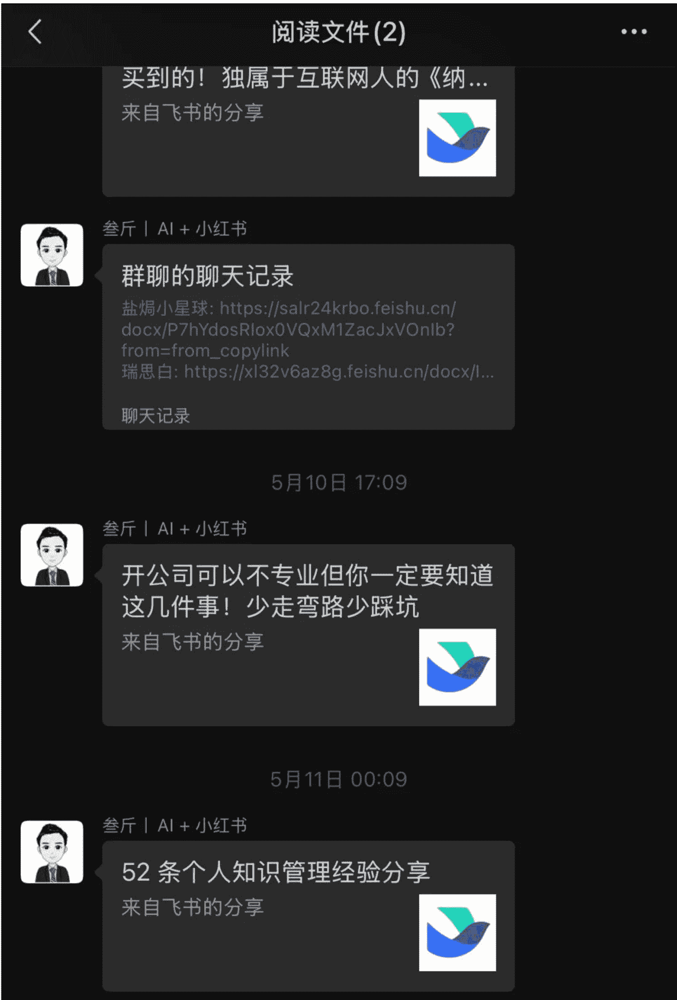

一句话认识我：小红书 IP 变现×AI 提效实战派。
- 我是叁斤，真名温锦涛
- 个人经历：2020 年之前，我做的是地推销售，现在深耕小红书运营 5 年（操盘过月 GMV770W+ 项目，带过 1000+ 学员做 IP），2025 年积极拥抱 AI。
- 我的优势：
  - 实战派：所有方法都源于实操，只讲能落地、能出结果的干货。
  - 懂小白：跨行转型的经历让我更理解新手面临的痛点和需求。
  - AI 赋能视角：我不仅懂小红书，更懂如何用 AI 工具为你的小红书运营降本增效，让你快人一步。
- 盖洛普优势（Top5）：理念、适应、追求、完美、思维（这意味着我善于思考新点子，并能适应市场变化）。
- “叁斤”公众号主理人｜专注于 AI 赋能自媒体 IP 变现
- 联系方式：

## 03. **【重点】** 我的小红书选题系统

AI 生成的账号定位报告本身就包含了很多内容方向，如果还不够，或者需要一个源源不断的选题来源的话，分享下我用 AI 搭建的选题系统，可以实现：

1. 把平时的闪念、笔记变成选题
2. 把对标爆文编成选题
3. 把热点编成选题
...

### 3.1. 闪念选题体系

我用 AI 搭建了一个知识库，包含日常信息记录、输出体系，我觉得这是所有内容创作者都用的这套系统。

它把你的闪念、想法、笔记全部记录下来，形成一个知识库。具体做法如下：

### 1. ALL IN ONE 记录法

All in One 的笔记记录方法强调的是“有想法就立即记下来，不求完美，只求能随时记录”，这是我从 @静静教主 这里学来的

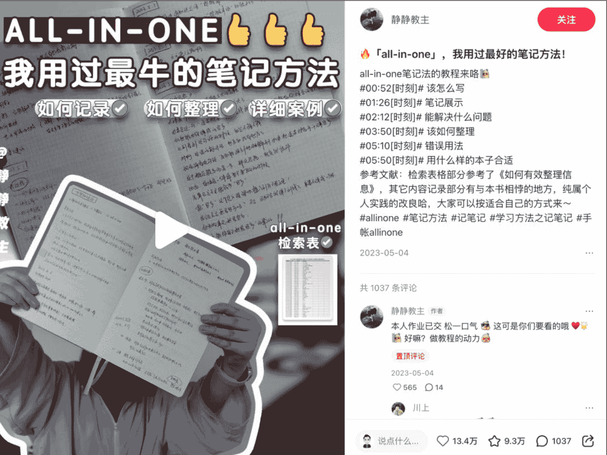

这个方法最核心的，就是 **不要做那么多分类，全部记录下来，不要分什么读书记录、学习记录 什么的。**

有任何的想法，包括你的 todo list、done list 等等，只要有想法，就全部往一个本子上写。

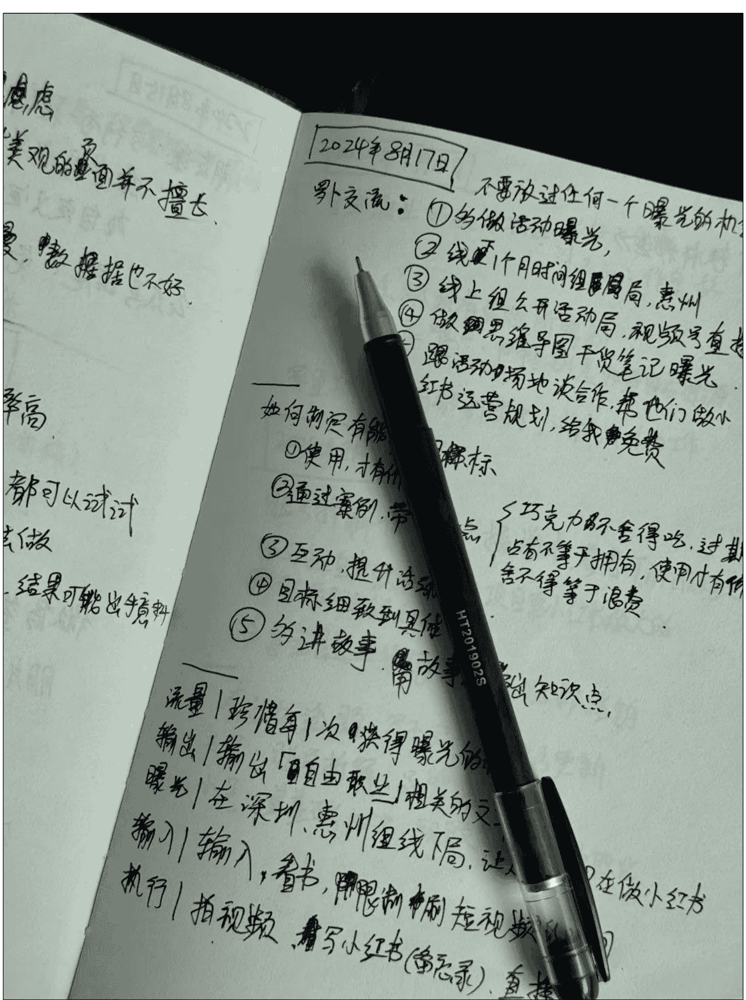

这个笔记方法我坚持了半年，但我觉得还不够方便，因为我有很多其他场景，是没办法及时拿出笔记本记录的。

所以在静静教主的分享基础上，我加工了一下，让 ALL IN ONE 的笔记方法更适合自己。

除了笔记本外，我新增了一些信息记录场景：

- **微信对话框**：
微信可以建立一个只有自己的群聊，在这里我可以快速记录文字、链接等等。比如，在看到一篇文章还不错，但没时间看完的时候，会统一放到「阅读文件」的群里。
- **懒人微信**：lazyhelper
- **flomo 笔记**：也会添加 flomo 笔记，在微信使用的场景中有什么想法，就往 flomo 笔记上丢。

- **手机备忘录**：
在非微信场景，不想被消息打扰的情况下。比如阅读实体书的时候，会用到手机自带的备忘录，并且会把备忘录添加到桌面组件，这样随时有想法，都可以点击组件快速记录。

举个例子，在看书的时候，发现某一个观点跟我的账号有关系，可以作为一个选题的话，我就会快速记录到选题库。

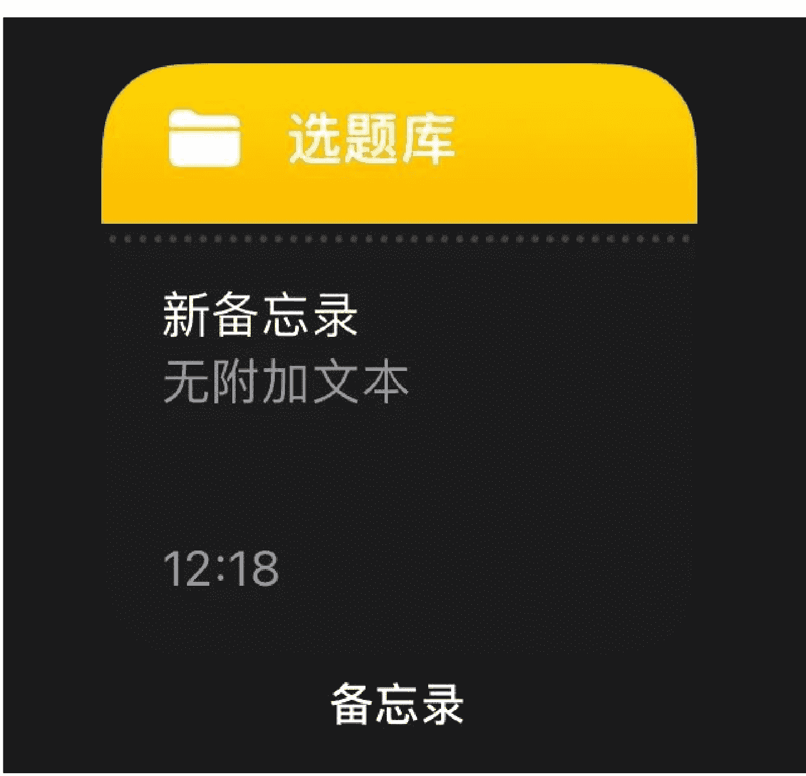

- **Get 笔记 (或其他语音备忘录)**:
当我在路上、不方便打字，或想快速把一个闪念记录下来的时候，我会用 get 笔记，他的好处是，我只要把闪念、想法告诉它，不需要有什么逻辑，语句不通顺的瞎说也可以，它会自动帮我总结出笔记。

## 普通人学习 AI 应注重提示词技术与敏锐度

普通人其实并不需要深入学习 AI 技术，因为 AI 技术每天都在快速迭代。今天看到的新技术，可能明天就变得非常普遍了。更重要的是，我们需要学习的是如何与 AI 有效沟通的技巧，也就是如何将我们的需求准确地传达给 AI，这涉及到提示词的使用。

发现了吗？看似工具很多，但不同的工具，只是用到的场景不同，我会根据当下场景选择最便捷的工具，确保一有想法，随手就能记录。

核心是“不放过任何一个想法”，而不是当想法产生时，还要找到专门的笔记 app，再记录，这对 P 人不够友好。

笔记本、微信对话框、备忘录、语音笔记，这些几乎覆盖了我所有能产生想法的场景，我可以在每天晚上或者每周日进行复盘，把这些「闪念碎片」统一放到知识库进行整理。

### 2. 闪念复盘体系：搭建知识库

只有闪念记录还不够，这些想法都分散在若干个工具里，而且是 ALL IN ONE，没有整理，意味着这些想法都是散碎的不成体系的。

所以定时需要对这些散碎的知识进行整理复盘，复盘是让零散记录产生价值的核心。

**知识库体系简介**：

在复盘的时候，我会把 different 工具的记录进行筛选和提炼重点信息，并收集到知识库中。一些不重要的想法，或者 todo list 就不会记录进去。

**知识库的搭建有很多工具，如 notion、飞书、ima 等等，我用的是飞书。建议使用有 AI 功能的，效率会更高。**

大概流程如下：

1. 筛选信息记录到「闪念记录」库
2. 在「闪念记录」中对知识进行分类，收藏进对应知识库
3. 有「输出」价值的信息会添加「# 选题」标签

**我的 AI 知识库体系**

在知识库的第一栏，我放的是「闪念沉淀」的飞书多维表格，为的是我一打开知识库，立马就能整理闪念。

###### 重建闪念表格

如前面说的，在这里，我会把筛选过的有用信息全部放进来。

给你们看下表格：

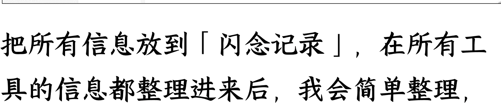

把所有信息放到「闪念记录」，在所有工具的信息都整理进来后，我会简单整理，写一下洞察、价值评分，还有潜在的选题方向，方便后续输出时写内容。

我还搭建了几个「专项素材库」，比如创意点子、金句、个人故事、案例等等，如果我觉得某个想法是个不错的金句，就会在「金句」这里打勾，这条闪念信息就会自动添加到「金句库」，其他素材库同理。

在这里统一整理，就不会花很多时间，而且飞书多维表格有自动化，打个勾就能自动把信息收集在「专项素材库」，非常方便，对 P 人也很友好。

**输出内容**整理

内容「输出」最关键的就是想法和灵感，如果没有灵感，输出也不知道写什么。

我的灵感、选题流程也很简单，就是把闪念想法收集到知识库后，把有「选题」潜力的，收集到「选题库」，并对选题进行整理分类。

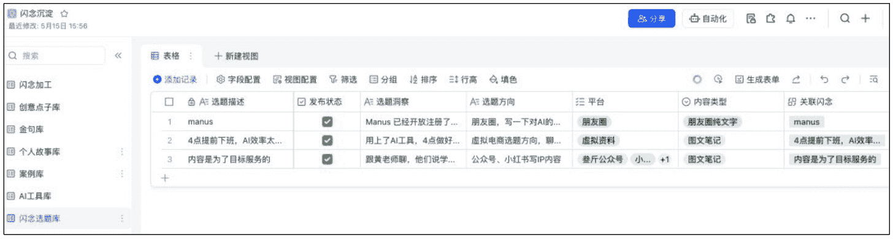

我也可以在「个人故事库」筛选过往的故事融入到文章中，或者在「金句库」挑选金句放到文章中。

### 3.2. 对标选题

前面只是知识库、选题的其中一部分日常闪念和笔记记录，到真正输出的时候，只有这些信息还不够，还要最近的热点、对标账号的爆文等等。

之前分享过采集工具，我完善了采集、分析、选题生成的流程，这一步，我也收录进了知识库中。

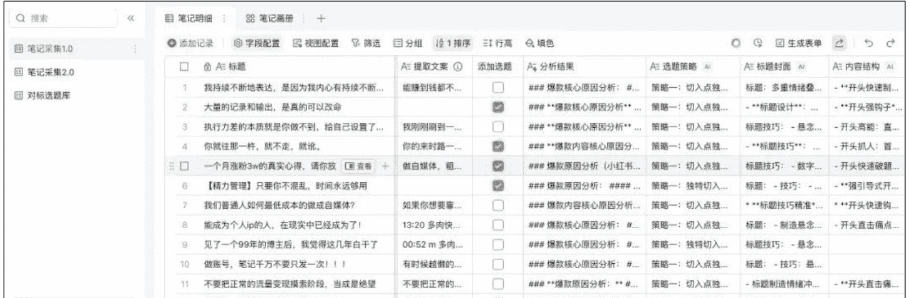

在看到爆文后，收藏到飞书多维表格，并接入 DeepSeek 进行爆文分析，分析选题策略、封面特点、内容结构等等，如果这个爆文的选题跟账号定位契合，我也会添加到「选题库」。

**闪念选题 vs 爆文选题**

| 序号 | 原文标题 | 转化思路 | 新标题 |
| :--- | :--- | :--- | :--- |
| 1 | 大量的记录和输出... | 一、... | **选题标题**：#叁斤... |
| 2 | 别不信！！这 4 类... | 关... | **标题**：《劝退！这... |
| 3 | 小红□是普通人... | 一、... | 朋友圈：碎片干货... |
| 4 | 你就往那一杵，就... | 关... | **标题**：《普通人如... | 《被问爆了！我的学员... |
| 5 | 2025 玩 Vk | | |
| 6 | 一个月涨粉 3w 的... | 关键成功... | 做自媒体，敢粗糙才能... |
| 7 | 小红书的内容是为... | 关键成功... | 叁斤成长笔记 |

- **选题标题**：正在测...

收集到选题库后，AI 会帮我分析，我的账号定位可以怎么利用这个爆款，并给出对应的选题建议和切入点。这样能大大提升我的输出效率。

这一步，就会用到我们第一步生成的账号定位了，如果帮你账号比较多，可以每个账号都生成一遍。

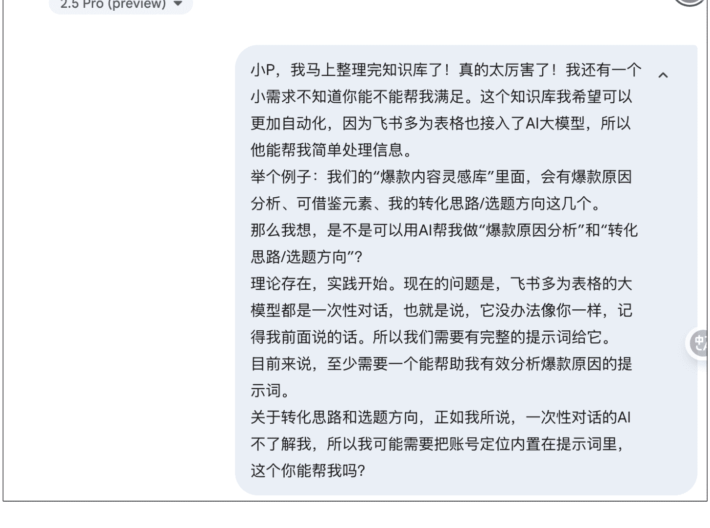

提示词我是用 AI 帮我生成的，你们可以参考，敏感信息已手动打码：

提示词复制：

作为一名资深的个人品牌战略与内容孵化顾问，尤其擅长 AI 赋能自媒体运营，你的任务是基于以下提供的“爆款内容原文（标题与文案）”以及“叁斤的个人品牌定位”，为叁斤策划针对性的内容转化思路和具体选题方向。

## 一、叁斤的个人品牌定位与账号信息：

### 核心定位：
AI 赋能型小红书变现实战导师

### 对外标签/Slogan:
**叁斤 | 小红书 IP 变现 x AI 提效**

### 核心业务方向：
AI 赋能小红书 IP 变现

### 目标用户：
渴望通过小红书打造个人 IP 并高效变现的个体创业者、自由职业者;
想通过自媒体获得一份副业收入的职场人、大学生、宝妈。

### 目标用户核心痛点：
不懂小红书运营方法、缺乏时间、没有合适的副业项目、不熟悉或不会有效利用 AI 工具、内容创作效率低、难以通过小红书变现。

### 叁斤提供的核心价值：
- 精准的 IP 定位与规划指导
- AI 驱动力内容创作与运营提效方案和实操方法
- 多元化的小红书变现模式拆解与实战指导
- 可复制的从 0 到 1 小红书起号与持续增长策略

### 叁斤的内容风格：
专业、靠谱、实战派、不浮夸、平静、乐于分享、与观众建立朋友般的信任关系。

### 叁斤的主要内容支柱(参考)：
AI 提效工具在小红书的具体应用、个人 IP 从 0 到 1 的真实案例拆解、自媒体相关的副业变现项目分析与指导、小红书平台规则与玩法解读。

与玩法解读。

## 叁斤的目标发布平台：
- 公众号（名称: 叁斤）
- 小红书（名称: XXXX - 定位：偏个人 IP 成长与 AI 提效方法论）
- 小红书（名称: XXXX - 定位：偏具体产品种草、虚拟资料的亮点介绍、小红书运营实操干货）
- 朋友圈

## 二、待转化的爆款内容信息：
- ***原爆款内容标题：**
- ***原爆款内容文案：**
- ***原爆款视频文案：**

## 三、你的任务与输出要求：

### 任务 1：分析爆款内容的关键成功要素

- 请首先仔细阅读并分析提供的“原爆款内容标题”和“原爆款内容文案”。
- 从中提炼出 **2-4 个最核心、最值得借鉴的成功要素或策略**。例如：选题切入点、标题吸引力、痛点共鸣技巧、价值呈现方式、内容结构、文案节奏、互动引导方法、独特的 AI 应用视角（如果内容与 AI 相关）等。

- 对每个提炼出的要素进行简要说明。

### 任务 2：基于分析结果和叁斤的定位，策划转化思路与选题方向

- 1. **内容转化思路（总体策略）：** 
- * 针对你在任务 1 中分析得出的“关键成功要素”，提出 2-3 条核心的转化策略。
- * 详细说明叁斤应如何学习和应用这些要素，并巧妙融入他“AI 赋能小红书 IP 变现”的特色。
- * 思考如何将这写要素与叁斤的目标用户痛点相结合，提供独特的价值。

- 2. **具体选题方向（按平台）：**

- * 基于上述转化思路，为叁斤的以下每个平台分别提供 2-3 个具体的、可操作的选题建议：
- * **公众号 (叁斤)**: ** (选题方向应偏深度分析、体系化方法论、AI 赋能工作流的完整介绍)
- * **小红书 (xxxx)**: ** (选题方向应偏个人 IP 成长技巧、AI 提效小妙招、学习心得的快速分享，风格实用、易懂)
- * **小红书 (xxxx)**: ** (选题方向应偏具体 AI 工具在小红书运营中的应用教程、叁斤的虚拟资料的某个亮点的详细介绍、可落地的小红书运营实操干货)
- * **朋友圈：**** (选题方向应偏简短精炼的干货小 tip、即时思考、互动问答、课程或产品动态的巧妙预热)
- * 每个选题建议请尽可能包含：
- * **选题标题（或核心点）**: **
- * **简要内容方向/切入点:** **
- * **（重点）**如何巧妙融入 AI 元素或叁斤的“AI 赋能小红书 IP 变现”的独特视角: **

**请确保你的建议：**
- 高度契合叁斤的个人品牌定位、目标用户及各平台特性。

输出时，请先简要列出你从原文中分析出的“关键成功要素”，然后给出“内容转化思路”，再按以下格式给出“具体选题方向”。

公众号 (叁斤): 输出公众号 (叁斤) 的选题方向。
小红书 (XXXX): 输出小红书 (XXXX) 的选题方向。
小红书 (XXXX): 输出小红书 (XXXX) 的选题方向
朋友圈：输出朋友圈的选题方向。

虽然有 2 个选题库，但我平时不会每个都打开，而是把两个选题库都放到「选题站」里，每天我只要打开「选题站」，就能看到闪念记录的选题和爆文选题。

懒人微信：lazyhelper

23 / 33

### 3.3. 其他选题

虽然前有这几个选题方式，几乎就有了源源不断，怎么都写不完的选题灵感。

## 1. Dia 浏览器：灰豚爆款笔记

这是我用过最牛逼的浏览器！结合灰豚数据，真的无敌！我的流程如下：

- 1. 打开灰豚数据，筛选热门笔记榜、低粉爆文榜、涨粉博主榜
- 2. 用 Dia 浏览器快速分析对标笔记的选题、标题、封面风格

> 3. 输入定位，并让他结合定位生成选题建议。

####### 我曾被 TikTok 大佬的选品思路震撼到
> 案例是我随机找的，Dia 浏览器会分析爆款原因，总结爆款结构，并给出对应选题建议、文案结构等等。
> 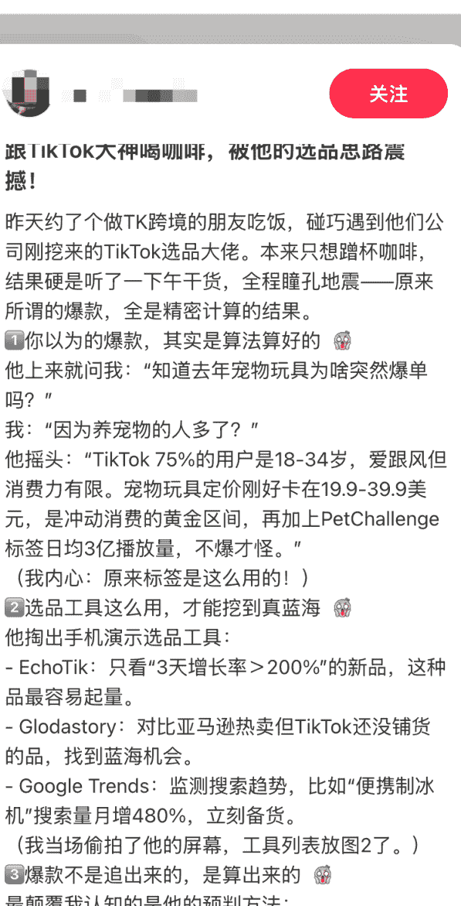

######## 如何利用爆款笔记的结构和方法：

> 1. 故事化开头 + 悬念引入：比如“和一位 AI 内容操盘手深聊后，我才发现爆款原来可以这样算出来......”
> 2. 分点输出干货：像爆款笔记一样，拆解 AI 选题、内容生成、数据分析、变现路径等关键环节，每一环节都配上具体工具和实操案例。
> 3. 工具清单 + 实操演示：列出你常用的 AI 工具（如 ChatGPT、Notion AI、Midjourney 等），并用真实账号数据或案例演示效果。
> 4. “铁律”总结：提炼出适合小红书 IP 变现的 AI 应用铁律，比如“内容选题靠数据，爆款测试靠 A/B，转化靠信任”。
> 5. 互动引导：鼓励用户在评论区提问、分享自己的 AI 应用困惑或需求，营造高质量讨论氛围。

######## 评论区引导与用户需求洞察：
你可以在文末设置互动话题，比如“你最想用 AI 解决小红书运营中的哪个难题？”、“想要 AI 工具清单/实操教程的扣 1"，这样既能收集用户真实需求，也能提升评论互动率，形成社群氛围。

###### 2. DeepSeek：全网热点选题

这个会更简单，打开 DeepSeek 联网模式，把你的账号定位输入给他，让他搜集全网最热门的话题，把其中一个最合适的热点变成账号选题。

####### # 全网热点话题及事件汇总

> 我是做小红书个人 IP 的，需要你挑选 1 个最合适的热点变成适合我账号的选题，我的账号定位是：
> 1. **一句话定位**:
>    * \`你的 AI 实战派学姐，带你用 AI 工具轻松搞定学姐、求职和搞钱副业，主打一个高效实用！\`
> 2. **账号定位公式解析 (价值×用户×人设×类型×风格**):
>    * ***核心价值***: \`为大学生和职场新人提供易于理解和上手的 AI 工具应用方法，帮助他们解决在学业、求职、副业探索中遇到的实际问题，提升效率和竞争力。\`
>    * ***目标用户***: \`核心是面临学业压力、求职竞争和渴望探索副业机会的大学生及毕业 1-3 年的职场新人。\`
>    * ***关键人设***: \`靠谱学姐、实战派 AI 玩家、懂搞钱的机灵鬼、有留学背景的暖心搭子。（标签：#ESFJ #AI 实战派 #搞钱能手 #留学学姐 #高分学霸 #面霸）\`
>    * ***主要内容类型***: \`口播短视频为主，结合少量图文笔记（例如工具清单、步骤拆解）。\`
>    * ***核心风格***: \`真诚、实用、元气、接地气。语言亲和，逻辑清晰，节奏明快。\`
> 3. 根据你的账号定位和当前热点趋势，我推荐聚焦“小红书慢人节（S+级活动）”进行选题策划，并围绕"AI 工具如何助力年轻人打造高效慢生活”展开内容创作。以下是具体分析及执行方案：
> 
> # 选题方向：用 AI 工具实现高质量慢生活，学姐教你轻松平衡效率与松弛感！
> 
> # 选题适配性分析
> 
>    1. 热点匹配
>    小红书慢人节是平台年度 S+ 级活动（2025 年主题为“失落火山”或“奇观峡谷”），倡导“放慢节奏、专注当下”的生活方式，覆盖居家、健康、旅行、创作等领域，用户互动量和品牌合作热度极高，是流量爆发窗口期 3 9。
> 
>    2. 用户需求契合
>    你的目标用户（大学生/职场新人）常面临学业、求职、副业的时间压力，既渴望高效工具提升效率，又希望找到缓解焦虑的“慢生活”方法。将 AI 工具（与“慢生活”）合，既能解决实际问题，又贴合平台活动调性，形成差异化内容。
> 
> # 3. 飞书多维表格创作器：
> 
> 每次选题都要打开 DeepSeek，太麻烦了，所以我把账号定位信息和选题提示词，都放到了飞书多维表格。
> 
> 每次只要输入选题想法、或者再开一个字段加上全网热点，就能自动为我生成符合账号定位的选题方向。
> 
> 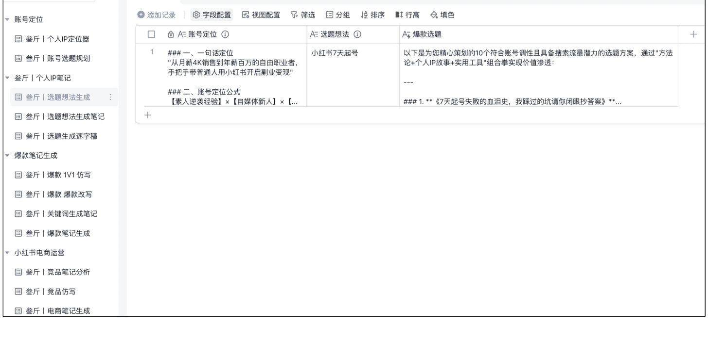
> 
> 有以上这几个选题方式，几乎就有了源源不断，怎么都写不完的选题灵感。

之后，就要开始写文案了。

## ### 04. AI 高效产出文案

生成文案有 2 个模式，一个非常高效，一个非常精准。

### 4.1. Gemini 个人 IP 文案创作

个人 IP 文案尽量选择 Gemini，它能记得你曾经说过的个人故事，也能持续学习你的文案风格。

#### 1. 投喂：
先把你的个人详细介绍投喂给他，这个前面说过。再把你过往写过的优质文案、逐字稿投喂过去，10 篇以上，我通常会投喂 30 篇左右。

如果自己没有写过文案的话，可以找对标的，你觉得他风格不错，就把文案扒下来喂进去。

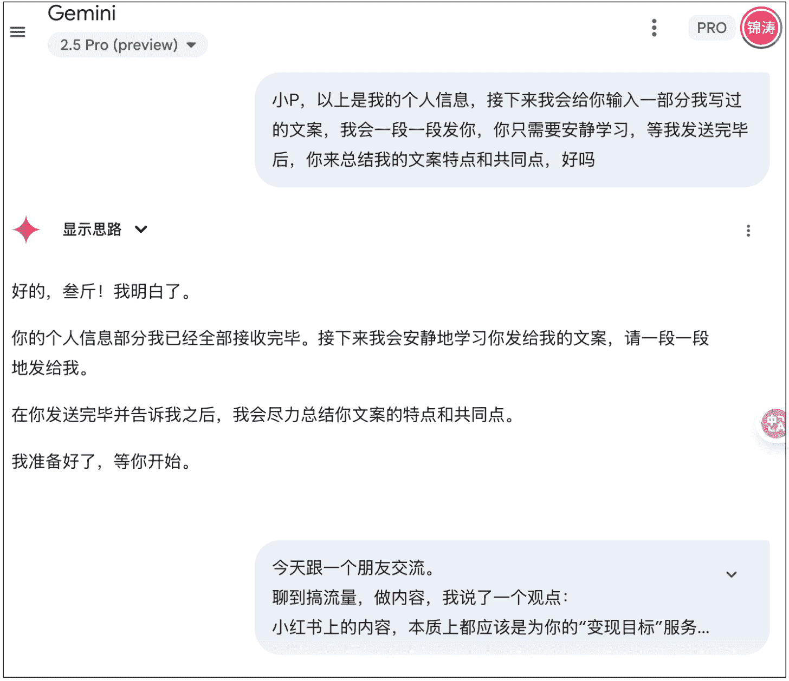

重点是，一定要专一，大量投喂同一种风格，不要东一个西一个的。

#### 2. 输出：

先让 AI 学习你的风格，并给它对应的选题，让它根据你的风格输出文案

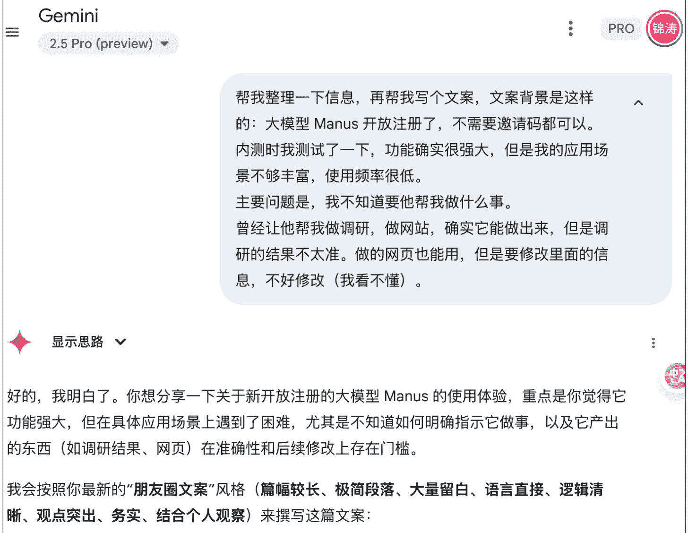

#### 3. 学习：
刚开始，AI 写的文案还不够适合你，需要自行修改。这时，务必亲自读出来！不要只用眼睛看，读出来跟眼睛看是完全不一样的感觉。
你要找到自己的风格，就一定要读出来！发现语句有问题就修改，再把修改后的版本投喂回去，AI 会通过这种方式持续学习和优化。

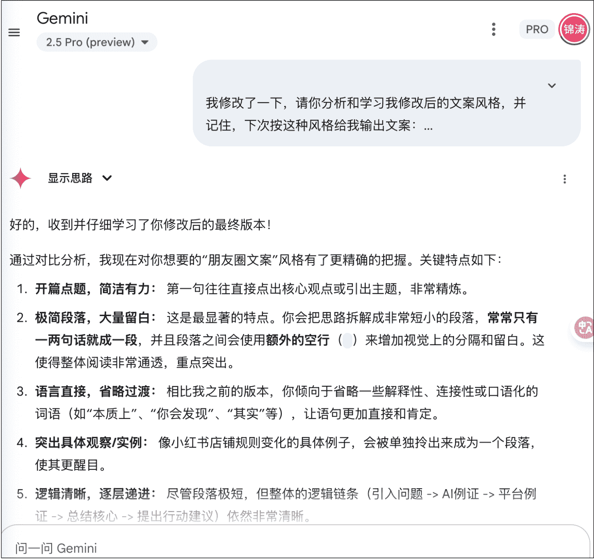

### 4.2. 飞书多维表格高效生成文案

前面给大家看过了我做的 飞书多维表格的 AI 创作器，除了账号定位、选题外，还有文案生成。

可以分析竞品笔记，并根据自己的账号定位，期望突出的主题和要点进行定向改写。

比如我测试的这个，强行把「香薰」的爆款笔记结构、户外办公的关键词和我的账号定位进行结合，生成一个全新的选题。

当然，最高效的，是只要输入关键词，就能自动生成笔记，这个可以批量导入关键词，批量生成文案。

关于 DeepSeek 接入多维表格的教程已经很多了，我就不多啰嗦，大家可以自行搜一下。

##### 最后

我的工作流中，AI 提效就是这些，没有用上 AI 生图，原因是我觉得调试过程太麻烦，而且调试好之后也不能一劳永逸，之后生成还需要重新调试，费时间。

而文案生成部分，只要 AI 学习完，可以一劳永逸，后面生成的文案，都是自己的风格。

##### 最后
我觉得「闪念复盘知识库」真的非常牛！这篇分享也有几千字，从选题构思到排版完成，花了不到 2 小时。大量用上了知识库的内容！

AI 工具只是辅助，核心还是我们对内容和用户的理解。

并结合自身需求选对工具，才能最大化发挥 AI 的价值。希望今天的内容对你有用，如果你有更好的工具或方法，欢迎一起交流。

📄 懒人专属群持续更新中，已持续运营 6 年，整理超 3000 份各类精选付费文章&年费社群干货，全部开放下载。

### 本资料为付费群内部分享，仅供真实需要的朋友查阅🤓

## 懒人专属群更新记录：

https://lazybook.fun/#/blog/record2
[/content]