# 从知识管理到服务自媒体创作：AI 知识库搭建全流程教学

250526 生财精华

公众号懒人搜索，[懒人专属群](javascript:void(0);)


# 1.5w 字，建议使用电脑阅读。

# 大家好，我是彻易 Heawcyrt。

# 04 年/INFJ，自由职业搞钱玩家，大二实现经济独立，欢迎同频的前辈或小伙伴交流研讨。

# 关于「知识管理」这个技能，我从刚上大学那会就开始研究。

心路历程很简单，互联网优质资源优质信息这么多，如果我不去记录，不去保存，不去管理，不去为了以后的复用做准备，那等到我真正想要用的时候，我该如何在浩如烟海的信息浪潮里找到呢？

# 是的，收集这些我在未来可能会用到的「信息/知识」，就是我做知识管理的初衷。

# 5572
笔记 51
标签 749
天
# 全部笔记
## 微信输入
## 每日回顾
## 找一找
## 随机漫步
## 全部标签

回收站

# 一、AI 知识库基础概念、原理扫盲

## 1、AI 知识库和知识库的概念区分

首先我们明确两类知识库形态，一类叫「个人知识库」，另一类叫「主题知识库」。

「个人知识库」：顾名思义，就是这一整个知识库都是我的数字资产，包罗万象，可能有学业的、有搞钱的；有课程笔记，也有阅读笔记；有自己写的帖子，也有别人那看到的优秀精华贴......总之，这类大而全、涵盖个人方方面面，且通常只由本人独立使用的，我们叫「个人知识库」。

「主题知识库」：这类知识库围绕某一个特定专业、特定领域，甚至是某一个作者展开，不管是自己使用还是公开出来给别人用，目标都是让用户能通过这个知识库迅速了解到这个主题的相关内容，达成一定的目标，比如生财精华帖知识库、硅谷王川知识库、健身知识库。

我们所说的「AI 知识库」，其实就是「AI + 主题知识库」。

你可以这么理解，AI 知识库，就是用 AI 来驱动主题知识库，让 AI 能够用主题知识库里的知识来回答你帮助你解决问题。而传统的知识库，是需要人来驱动。人和 AI 最大的差距就是，AI 只关心内容，人关心的可就太多了，比如人需要考虑这篇笔记我在未来如何找到并且复用，所以人需要打标签、做分类，而 AI 不需要，你只需要记得大概说了什么，AI 就能帮你精准定位到这篇笔记。

用 AI 来驱动知识库，最大的优势是，你可以从文件夹分类、样式主题、标签体系、索引构建等等新手容易“陷入泥潭”的环节中解放出来，而且，一个完整的 [个人知识库]，其实某种意义上也可以看作是一个又一个「主题知识库」的组合。

所以，从各种角度来看，我不推荐大家在初期花太多时间去死磕“完美”的「传统知识库」，而是应该优先学习并尝试搭建「AI 知识库」，真正把手头的优质资料优质信息当作 AI 的专属语料去用起来。

也因此，本文不在传统知识管理方面有过多着墨，主要篇幅会聚焦于「AI 知识库」。

(坦白讲，如果真的要讲传统知识管理，光一个 Obsidian 或者 Notion 的玩法技巧，就有太多太多可以说的了，出一套课都不为过，对于尚没有大量数字资产积累的新手来说，前期投入产出比极其低，效率至上，我不推荐大家在没有大量数字资产积累之前去琢磨「传统知识库」)

# 为什么要搭建知识库？

知识库的本质，是把你被动接收的信息→主动整理→内化吸收，构建自己的数字资产；且人脑的短期记忆容量极其有限，一个清晰可查、结构化的知识库，能帮你省掉 80% 的重复性搜索、查找、重新理解；从内容创作的角度来看，无论你是写公众号、做短视频，还是搞知识付费、讲课写稿，知识库都是你的内容灵感素材库。

# 为什么感觉大佬都没有知识库？

注意一个事实：搭建知识库 ≠ 优质内容产出 ≠ 赚钱

搭建知识库并不能直接帮你带来爆款内容产出，更不可能直接让你赚钱，赚钱也和有没有知识库没关系，就好像，有些人没上过高中，也没读过几本书，但是就是能把生意做得风生水起。

# 没有问题我直接问 AI 不就好了，为什么非要问知识库呢？

同样是 DeepSeek-R1，我问：普通人如何找到适合自己的项目？

以下是 ima 知识库里我自己制作的「亦仁分身」知识库给我的回复：

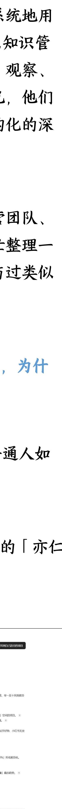

# 公众号懒人搜索，懒人专属群分享

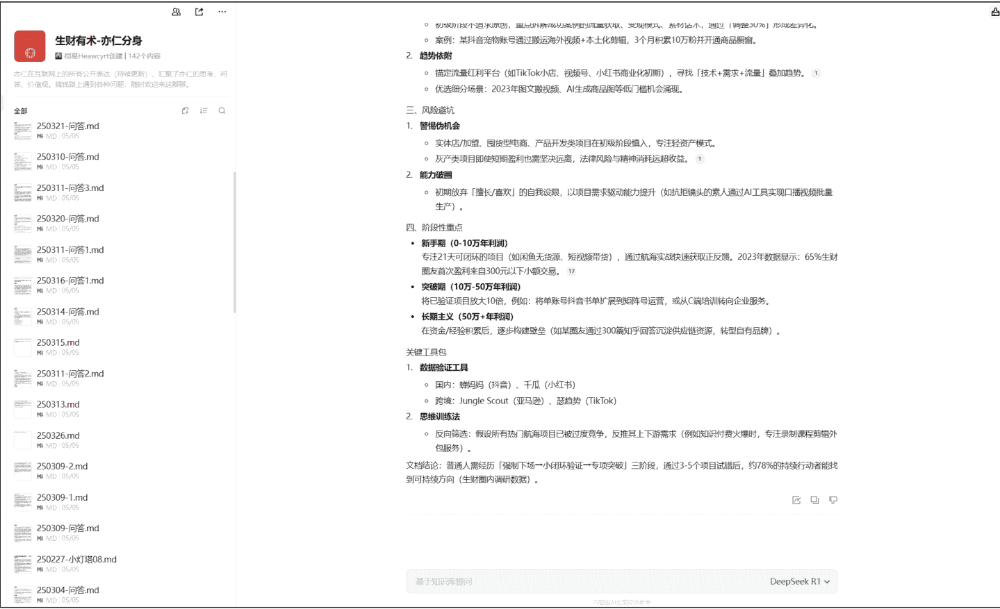

标题：2. 趋势依附

标题：三、风险避坑

## 1. 警惕伪机会

## 2. 能力破圈

## 四、阶段性重点

* 新手机（0-10 万年利润）
* 突破期（10 万-50 万年利润）
* 长期主义（50 万+年利润）

# 关键工具包

## 1. 数据验证工具

## 2. 思维训练法

文档结论：普通人需经历 [强制下场→小闭环验证→专项突破] 三阶段，通过 3-5 个项目试错后，约 78% 的持续行动者能找到可持续方向（生财圈内调研数据）。

# 以下是 DeepSeek-R1 官网给我的回复:

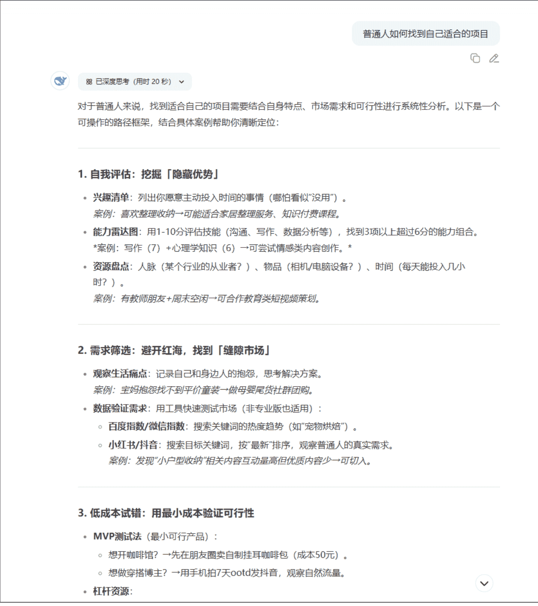

> 对于普通人来说，找到适合自己的项目需要结合自身特点、市场需求和可行性进行系统性分析。以下是一个可操作的路径框架，结合具体案例帮助你清晰定位：

### 1. 自我评估：挖掘「隐藏优势」

+ • 兴趣清单：列出你愿意主动投入时间的事情（哪怕看似“没用”）。
案例：喜欢整理收纳→可能适合家居整理服务、知识付费课程。

+ • 能力雷达图：用 1~10 分评估技能（沟通、写作、数据分析等），找到 3 项以上超过 6 分的能力组合。
案例：写作（7）+ 心理学知识（6）→可尝试情感类内容创作。

+ • 资源盘点：人脉（某个行业的从业者？）、物品（相机/电脑设备？）、时间（每天能投入几小时？）。
案例：有教师朋友 + 周末空闲→可合作教育类短视频策划。

### 2. 需求筛选：避开红海，找到「缝隙市场」

+ • 观察生活痛点：记录自己和身边人的抱怨，思考解决方案。
案例：宝妈抱怨找不到平价童装→做母婴尾货社群团购。

+ • **数据验证需求**：用工具快速测试市场（非专业版也适用）：
    • **百度指数/微信指数**：搜索关键词的热度趋势（如“宠物烘焙”）。
    • **小红书/抖音**：搜索目标关键词，按“最新”排序，观察普通人的真实需求。
案例：发现“小户型收纳”相关内容互动量高但优质内容少→可切入。

### 3. 低成本试错：用最小成本验证可行性

+ • MVP 测试法（最小可行产品）：
    • 想开咖啡馆？→先在朋友圈卖自制挂耳咖啡包（成本 50 元）。
    • 想做穿搭博主？→用手机拍 7 天 ootd 发抖音，观察自然流量。

+ • 杠杆资源：

懒人微信：lazyhelper

* 杠杆资源：
    * 无货源模式：用 1688 代发、小红书无货开店功能（0 库存）。
    * 知识变现：用 Canva 做模板，在闲鱼卖 PPT 排版服务（技能变现）。
* **4.迭代优化：数据比感觉更真实**

   * **关键指标监控：**

| 项目类型 | 核心指标 | 达标参考值 |
| :--- | :--- | :--- |
| 电商卖货 | 转化率（下单/浏览） | >3% 可继续投入 |
| 知识付费 | 课程完课率 | >40% 需优化内容 |
| 本地服务 | 客户转介绍率 | >20% 说明口碑合格 |

   * **快速调整策略：**

    * 若 3 天内视频播放量<500，立即优化封面标题（用工具测试点击率）。

    * 若试卖产品无人问津，改为免费送 3 个试用装换取用户反馈。

+ * **5.避开 3 大常见陷阱**

   * 误区 1：必须做“高大上”项目 → 事实：社区代收快递月入 3000 比开奶茶店风险更低。

   * 误区 2：等完全准备好再开始 → 事实：用手机备忘录写 100 字短文就能测试写作潜力。

   * 误区 3：盲目追随热点 → 事实：2023 年做 TikTok 搬运已过红利期，但教中老年人用 TikTok 仍有需求。

+ * **案例库：**

1. 技能重组型：会计 +Excel 精通 → 开发《财务人必学的 10 个 Excel 神技巧》课程（定价 99 元）。

2. 场景痛点型：写字楼上班族午餐难 → 做健康便当订阅（提前 1 天接单，中央厨房代工）。

3. 资源变现型：三四线城市有果园资源 → 抖音直播“果树认养”（199 元/年包邮寄水果）。

**关键行动点：**

明天花 30 分钟完成以下 2 件事：

1. 写下你过去被人夸赞过的 3 件事（哪怕很小）。

2. 在抖音搜索框输入“副业” + 你的城市名，观察本地化机会。

项目的核心不是“找”，而是“试”——往往在低成本测试中，你会发现匹配度最高的方向。

> Ⓞ 本回答由 AI 生成，内容仅供参考，请仔细甄别。

+ * o 
+ * o 

# 很明显，用了 AI + 知识库的回答是会比直接用 AI 质量更高且更适合上手。

# 为什么会这么呢？其实这个道理很简单：

你的问题是恒定的，语料库越大，你的问题就需要越精确，不然 AI 给出的答案就会越不具体越空泛；反之，语料库越小，你的问题描述得哪怕不精确甚至磕磕巴巴，AI 也容易给出具体且相关的内容。

懒人微信：lazyhelper

你可以把「语料库」想象成一个超大的超市。

如果你进的是一家只有几排货架的小便利店（语料库小），你走进去问店员：“有吃的吗？”——对方很容易立刻就拿出来泡面、饼干、面包三个选项让你选。

但如果你去的是五层楼的山姆会员店或宜家（语料库超大），你同样问：“有吃的吗？”——那店员会一脸懵逼：

“你是要冷冻的？即食的？中餐、西餐？主食、零食、调料？婴儿餐还是健身代餐？请问你具体要找啥？”

信息量越大，模糊提问=等于白问；而在小语境里，哪怕不精确，也容易匹配。

所以，我们只要能保证小语境里的内容质量足够高且经过我们的筛选，那么就能保证 AI + 知识库 的输出会比单纯用 AI 的输出要更好。

### 2. AI 知识库的运作逻辑：RAG

RAG，全称是 Retrieval-Augmented Generation，中文叫“检索增强生成”。

简单点说，它就是把知识库 + 大模型 这两样东西拉到一起协作，提高回答的准确性和上下文能力。

RAG 是让大模型在回答问题前，先去查一查你给它的“知识库”，查完了再作答。

所以，用 AI 知识库，向知识库提问，本质上是“你的提示词” + “RAG 检索到的相关内容”一并去交给大模型处理。

# 二、常见的几种知识库工具/方案的介绍、选择

现在想搭建一个 AI 知识库，工具层面可供选择的选择有很多种，为了文章的普适性，方便更多圈友上手实践，以下我不会提到需要「梯子」、没法双端互通在线同步的方案，仅仅只用国内的产品依旧能达到好的效果且快速能拿到正反馈，帮助我们提效。

+ 1. ima (腾讯系 + 手机端/电脑端 + 联网)

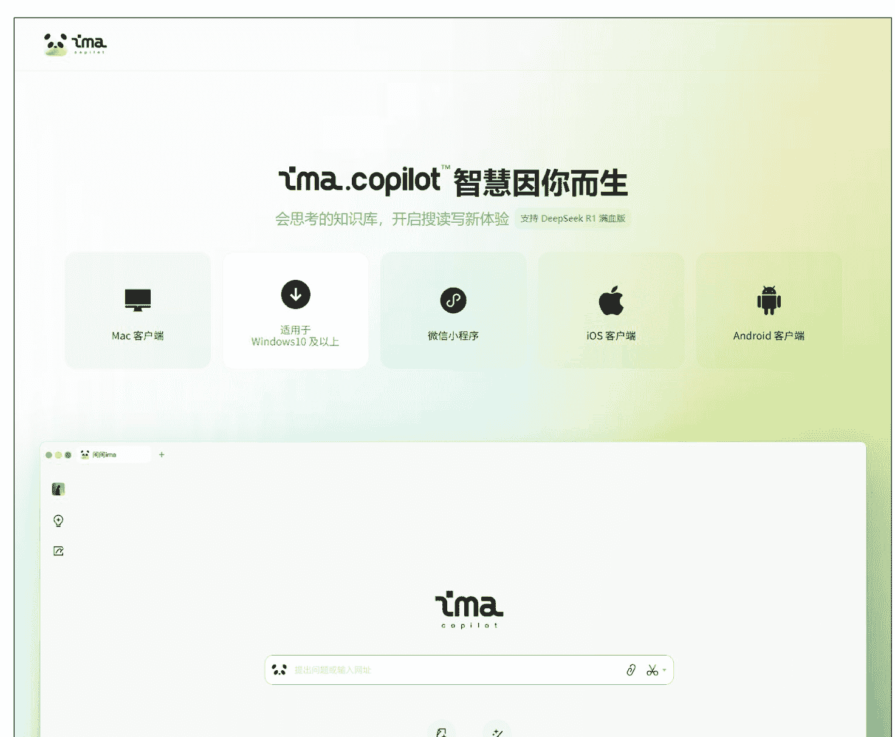

## 目前 ima 是最方便的双端互通知识库，没有之一，而且背靠腾讯系，对于公众号互通这块做的也是相当丝滑。

## 回答质量方面，无功无过，只要你能保证有足够多的优质内容，还是能让人满意的，甚至一定程度上能真正解决问题。

## 我们这里拿电脑版做演示，手机版的操作逻辑大同小异。


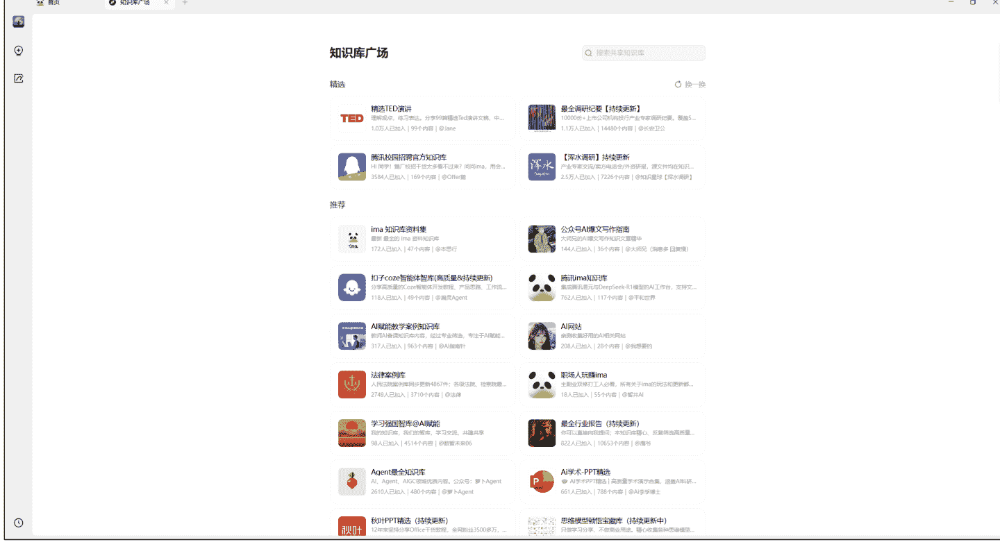

**这是首页，点击「知识库广场」**，我们能看到非常多的别人创作的知识库。这里我其实不推荐大家去加入太多的不了解的知识库，因为很多人创建知识库，对信息是没有经过筛选的，并不是资料多的知识库就是好知识库、优质知识库。

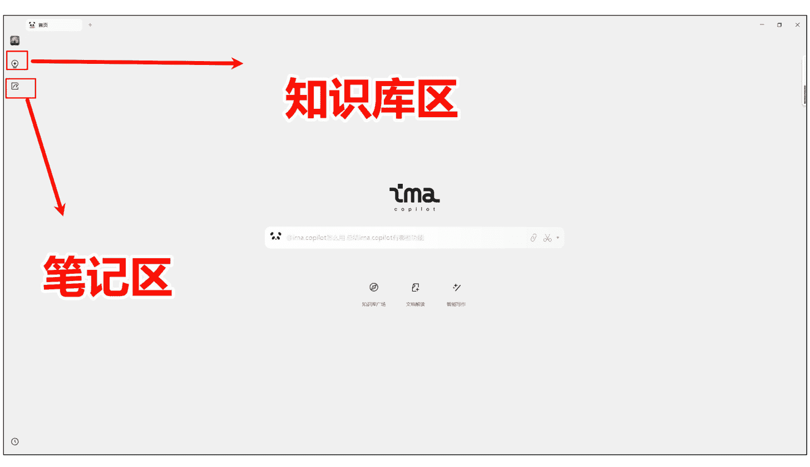

**首页上，这两个位置**一个是笔记区，一个是知识库区。我强烈不推荐在 ima 里面做笔记！体验感很差！而且暂时不支持导出！

**我更推荐的一种模式**：在其他笔记软件里（Obsidian、Notion、flomo 等），最好是支持 markdown 格式的（几乎哪哪都通用),有自己的知识库体系/笔记体系，然后在需要的时候，选择性地把笔记导入到 ima 里，这里我给大家演示一下。

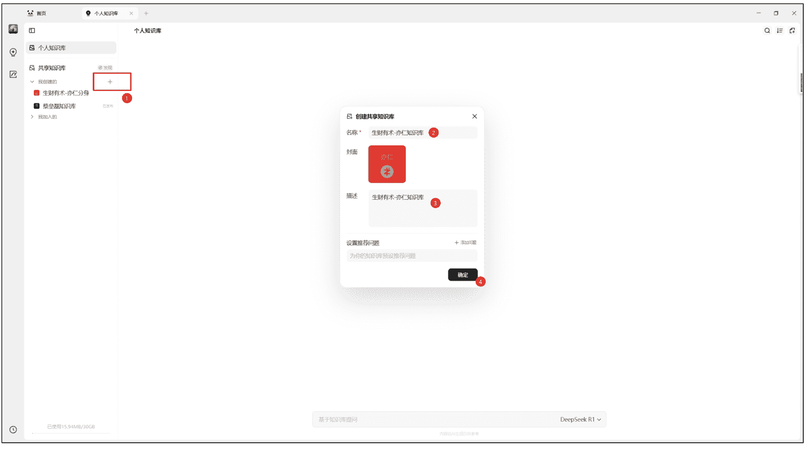

先跟着步骤 1、2、3，填写就好。

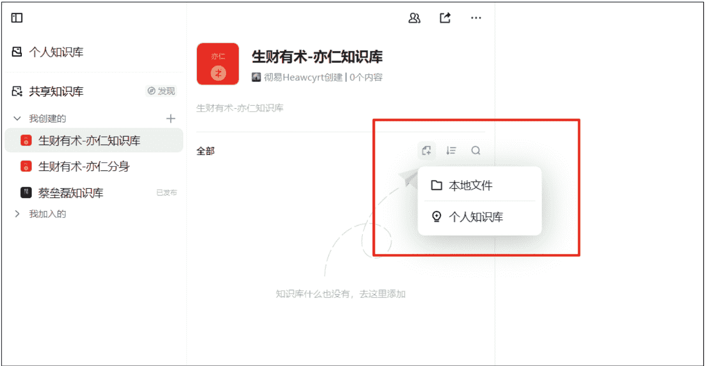

然后在这个位置可以导入文件进去，支持 markdown、word、pdf 等格式，总共可用 30G 的存储空间。

2. 趋势依附

    * 锚定流量红利平台（如 TikTok 小店、视频号、小红书商业化初期），寻找「技术 + 需求 + 流量」叠加趋势。
    * 优选细分场景：2023 年图文搬视频、AI 生成商品图等低风险机会涌现。

三、风险避坑

1. 警惕伪机会

    * 实体店/加盟、囤货型电商、产品开发类项目在初级阶段慎入，专注轻资产模式。
    * 灰产类项目即使短期盈利也要坚决远离，法律风险与精神消耗远超收益。

2. 能力破圈

    * 初期放弃「擅长/喜欢」的自我设限，以项目需求驱动能力提升（如抗拒镜头的素人通过 AI 工具实现口播视频批量生产）。

+   四、阶段性重点

* 新时期（0-10 万年利润）
      专注 21 天可闭环的项目（如咸鱼无货源、短视频带货），通过台海实战快速获取正反馈。2023 年数据显示：65% 生财圈友首次盈利来自 300 元以下小额交易。

* 突破期（10 万 -50 万年利润）
      将已验证项目放大 10 倍，例如：将单账号抖音书单扩展到矩阵号运营，或从 C 端培训转向企业服务。

* 长期主义（50 万 + 年利润）
      在资金/经验积累后，逐步构建壁垒（如果圈友通过 300 知乎回答沉淀供应链资源，转型自有品牌）。

关键工具包

1. 数据验证工具

    * 国内：蝉妈妈（抖音）、千瓜（小红书）
    * 跨境：Jungle Scout（亚马逊）、慧趋势（TikTok）

2. 思维训练法

    * 反向筛选：假设所有热门出海项目已被过度竞争，反推其上下游需求（例如知识付费火爆时，专注录制剪辑外包服务）。

文档结论：普通人需经历「强制下场→小闭环验证→专项突破」三阶段。通过 3-5 个项目试错后，约 78% 的持续行动者能找到可持续方向（生财圈内测研究数据）。

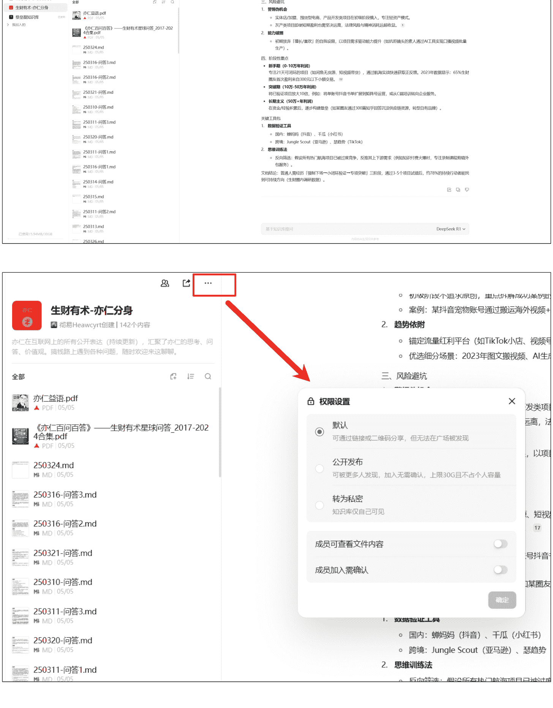

知识库的创建者双击文件是可以具体查看文件内容的，也可以创建文件夹对文件进行分类，还可以设置权限来选择是否允许其他人加入到知识库中、是否能查看具体文件内容。

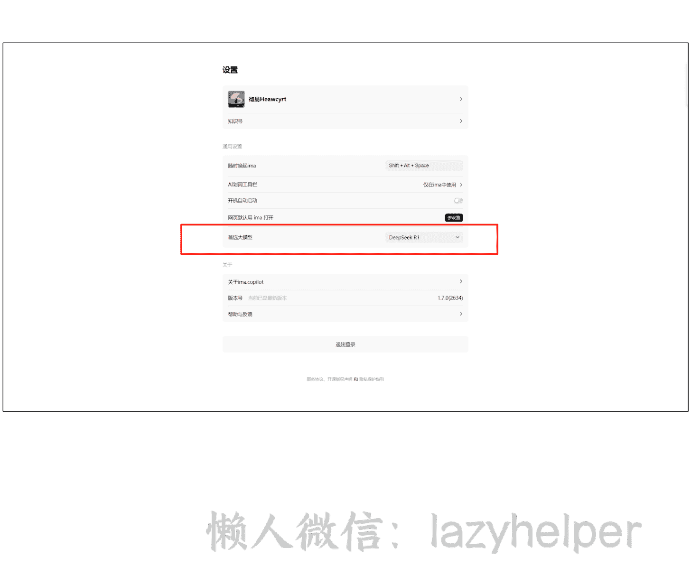

懒人微信：lazyhelper

## 2. 飞书知识问答（字节系 + 手机端/电脑端 + 联网）

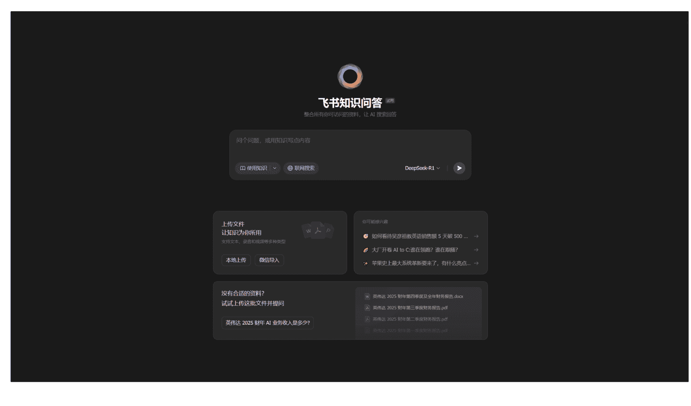

飞书的知识问答目前貌似还在逐步开放和完善中，

如果你的飞书 APP 中还没有相关的功能，可以去官网解锁体验👉 ask.feishu.cn

从回答质量上来看，飞书知识问答的效果体感上略优于 ima，但缺点也有，它不能够选定知识库去回答。

什么意思呢，你可以理解为，飞书知识问答，是把你飞书里面的所有文档视为一个大的知识库，用飞书里面的全部内容去检索，所以目前没办法做成一个又一个独立的主题知识库的形式，我相信在不久的将来，这个功能大概率会出现，所以可以再等等看。

现阶段，飞书的知识问答，我认为只适合一类人：有大量文字产出能力的 IP、内容创作者。这类人，可以考虑把自己的「数字资产」全部迁移到飞书里来，用飞书统一管理；而且飞书去年今年在多维表格方面也有较大的飞跃，非常适合作为一个 生活/工作管理工具。

我将看到飞书在 AI 知识库这方面的发展。目前不推荐普通人去用，但我一定强烈推荐所有人都在飞书里积累自己的「数字资产」。

## 3. Get 笔记（手机端/电脑端 + 联网）

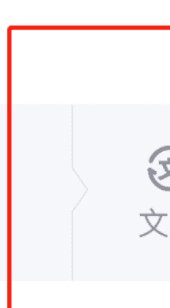

# 能量低的人，一定要多“抢”！#能量 #高能量 #群响 #刘思毅 #群响六周年

> 能量低的人，一定要多“抢”！#能...

## 4. 其他值得关注的方案（不推荐不详解）

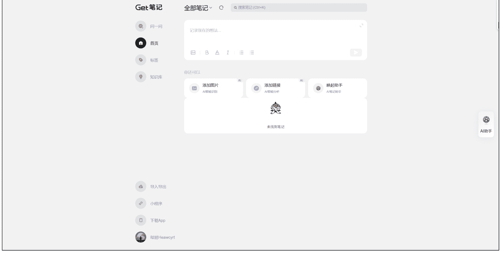

我推荐使用“Flynote”。


Flynote 有几大亮点，是 Get 笔记的“自动总结笔记”和“订阅博主信息源”。你可以理解为，我发给他一篇公众号链接，他可以自动给我总结成笔记；我甚至还可以订阅一些公众号/视频号/抖音博主，只要博主更新了，Get 笔记就会自动总结帮我成笔记 + 文字稿，甚至博主直播，我这边也都能拿到总结的笔记。

懒人微信：lazyhelper

## 4.1 Obsidian + Cursor/Trae（梯子 + 电脑端 + 联网 + 本地储存）

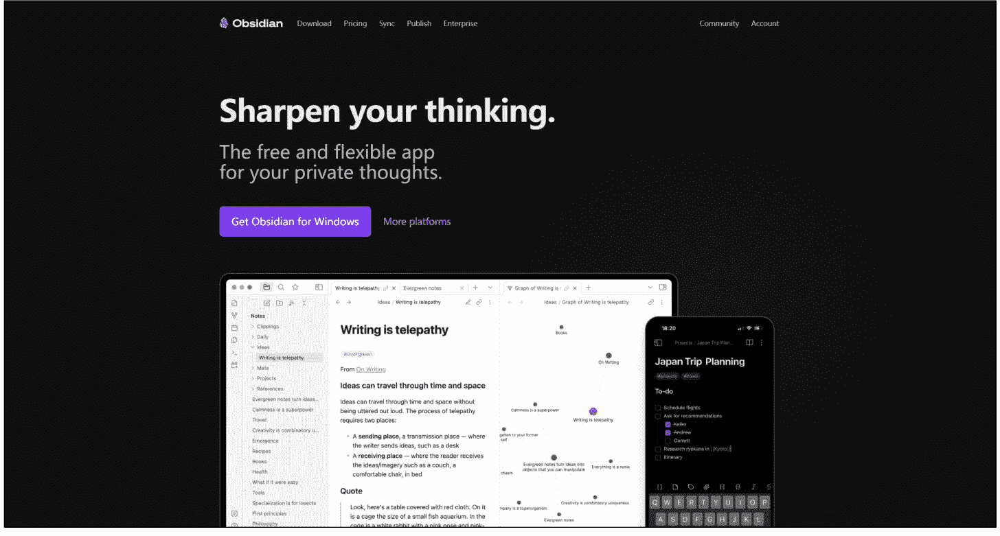

Obsidian 是一款本地优先、支持 Markdown 的知识管理工具，我是他的 3 年深度用户，在我看来，如果只是用他记笔记，那完全是杀鸡用牛刀了，他更适合做第二大脑系统，搭建知识网络，这里就不得不提他有两个非常好用的点。

双链笔记，能把笔记之间建立联系，方便在后续思考和回溯的时候，一次性找到所有相关笔记，这种网状结构非常符合人脑的记忆和思考模式，每个知识/笔记都是一个个神经元，通过链接相互激活；

插件生态丰富，可以把 Obsidian 打造成各种各样满足你需求的知识库，你可以理解为这是一个可以高度 DIY 的笔记软件。

现在借助 Cursor/Trae，说白了，就是在 Cursor/Trae 里打开 Obsidian 的本地文件夹，可以起到用 AI 驱动知识库的效果。生财圈里藏师傅写过一篇这样的文章可以参考学习下👉https://t.zsxq.com/yEqI7

我在这里再推荐一个好用的「插件」——Smart Connections。他的作用本质上就是我们前面提到的 RAG，把你的知识库里的笔记全部做成 embedding（可以理解为转化为 AI 能理解的数字向量），然后进行本地检索，会比传统的手动标记的标签和双链更加丝滑。

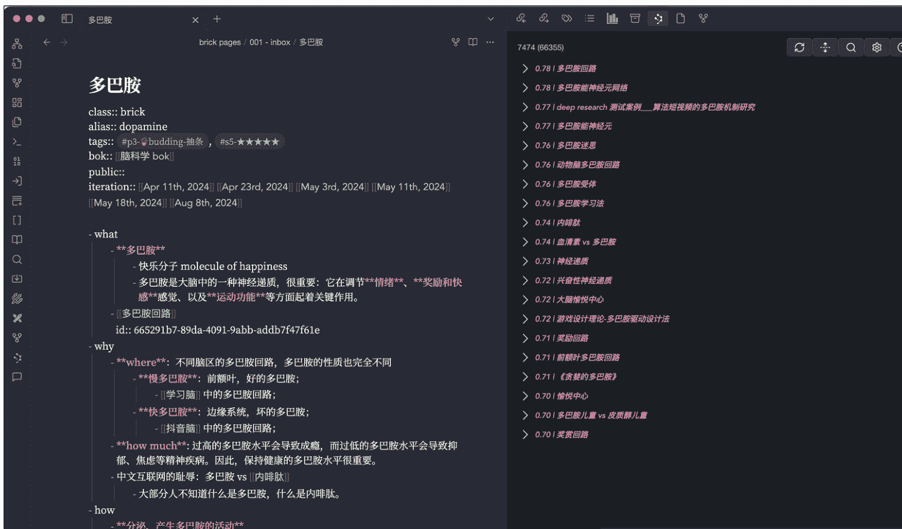

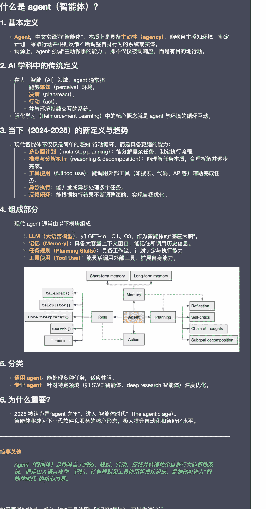

## 4.2 NotebookLM（梯子 + 电脑端/手机端 + 联网）

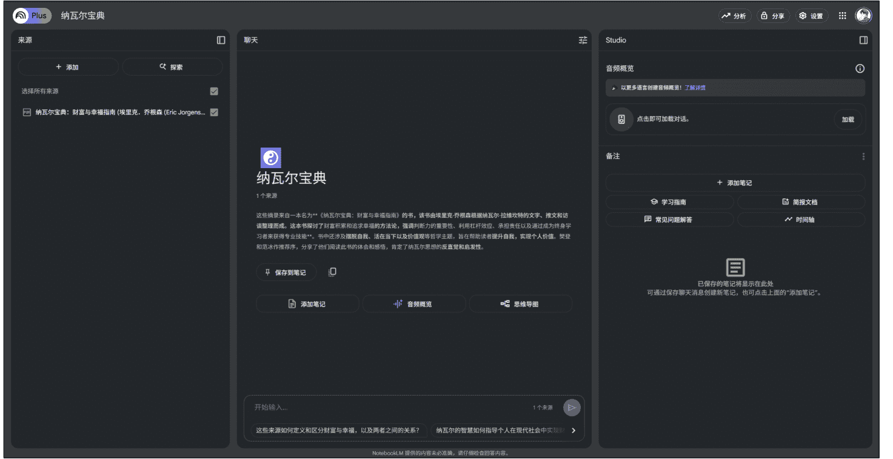

NotebookLM 是谷歌旗下的一款 AI 辅助笔记工具，全名是 Notebook Language Model，主要功能是让用户能把自己的资料（PDF、markdown 等）变成一个“可交谈的智能笔记本”。

为什么要强调“交谈”，因为他不仅有一般的文字交谈能力，还可以「语音交谈」——这是他的特色功能，他能根据你的意见，生成相关主题的 AI 播客，让两个虚拟主持人以播客的形式为你讲解内容，帮助你更好消化理解。

唯一稍显得遗憾的点是，截至目前，NotebookLM 并没有接入谷歌最新最强的大模型 Gemini 2.5 pro。

# 三、AI 知识库的搭建原则（以 ima 为例）

这里以最容易上手的 ima 为例，跟大家分享一下我在搭建、优化 AI 知识库的时候，始终遵循的 3 个优先原则。

### 1、第一优先原则：以「好提问」「能有好答案」为核心

这一条是第一优先原则，是我们在搭建 AI 知识库的时候最先需要考虑的点，我甚至认为可以用「好提问」「能有好答案」这个标准来衡量知识库的质量。那什么叫好提问、能有好答案呢？

### 全部

*   ·智能体助手系列与人工智能网站大全
    > 📝 笔记 | 05/15
*   ·30 产品经理通用能力模型.jpg
    > 🗄️ 图片 | 03/12
*   ·28KT 决策法.jpg
    > 🗄️ 图片 | 03/12
*   ·29Y 模型分析法.jpg
    > 🗄️ 图片 | 03/12
*   ·26 用户上瘾模型.jpg
    > 🗄️ 图片 | 03/12
*   ·27 RARRA 模型.jpg
    > 🗄️ 图片 | 03/12
*   ·25WBS 工作结构分解.jpg
    > 🗄️ 图片 | 03/12
*   ·24 PDCA 模型.jpg
    > 🗄️ 图片 | 03/12
*   ·22 用户体验 5 要素.jpg
    > 🗄️ 图片 | 03/12
*   ·23 马斯洛需求理论.jpg
    > 🗄️ 图片 | 03/12
*   ·21 思维表达模型.jpg
    > 🗄️ 图片 | 03/12
*   ·20 系统化模型.jpg
    > 🗄️ 图片 | 03/12
*   ·18 KANO 模型.jpg
    > 🗄️ 图片 | 03/12
*   ·19 PMF 模型.jpg
    > 🗄️ 图片 | 03/12

### 全国高考真题

2015-2024 年各省市、各科目高考真题全收录！更权威答案解析，助你摸清命题规律，掌握答题技巧~

加入知识库

*   全国 I 卷
*   全国 II 卷
*   全国 III 卷
*   全国乙卷
*   全国甲卷
*   新疆
*   宁夏
*   青海
*   甘肃
*   陕西
*   云南
*   西藏
*   四川


### 4.1 Intro (误识别为 `4.1`，修复为 `1` 或保留原意)
*   这是一个关于 Manus 的知识库，收录的内容来自高质量微信公众号、即刻、小宇宙、PDF、飞书等多渠道。


全部

> ✨ 公众号 04/21 扣子空间一手实测惊艳表现：一句话生成五一出游攻略
> ✨ 公众号 03/12 让 Manus 给《智能涌现》当一天实习生后，我们想给 ta 多发点奖金
> ✨ 公众号 03/12 Manus 合作阿里千问，意味着什么？
> ✨ 公众号 03/12 完整复盘：Manus 是怎么诞生的？
> 🔵 网址 03/12 微博
> ✨ 公众号 03/12 Manus 出现，自媒体博主最先被取代？
> ✨ 公众号 03/11 海外 AI 圈，开始讨论 Manus
> ✨ 公众号 03/11 独家揭秘：Manus 背后的护城河与脆弱神话
> ✨ 公众号 03/11 Manus 爆火的背后，Agentic AI 产品如何构筑持久的竞争优势？
> ✨ 公众号 03/11 Manus 与阿里通义千问团队正式达成战略合作
> ✨ 公众号 03/11 OpenManus、OWL 真实测评，Manus 的 Agent 护城河一碰就碎？
> ✨ 公众号 03/11 3 天后，我觉得可以再来聊聊 Manus 了。

懒人微信：lazyhelper

### 书籍 / 副业

副业 AI 知识库整理 1000+ 新兴赛道与 AI 实操方法，助你在信息过载时代精准把握机会，吃到副业红利，少走弯路。如有问题请联系：summ...

懒人微信：lazyhelper

### 小红书各赛道

💡 小红书各赛道爆款拆解，手把手教你私域引流——二手车赛道
公众号 04/19

💡 小红书引流素材图应该怎么拍，不能让用户联想到自己的笔记等于白**发**
公众号 04/10

💡 在小红书的评论区用这种方式截流是真恶心，直接就能加微信了
公众号 04/04

💡 小红书怎么丝滑做带微信的引流图片，原来还可以这样玩
公众号 04/02

💡 一眼就让人看到核心信息的引流模板，小红书的封面点击率就是这么来的
公众号 04/02

💡 怎么用微信指数找到关键词热点，提高文章进流量池的机会
公众号 04/01

💡 公众号 10 万 + 爆款文章都在哪找？我发现了最快捷的办法
公众号 04/01

💡 做小红书虚拟电商，人人都能学会的 2 个关键，直接让你出单翻倍！
公众号 03/31

💡 「死了么」APP 上线——Claude 3.7 生成高保真原型 UI 2.0
公众号 03/31

💡 公众号 10 万 + 的爆款文章都在哪找？我发现了最快捷的办法
公众号 03/31

💡 写出 10 万 +、1 万 + 后，我发现这 3 类文章很容易爆（喂饭版）
公众号 03/31

💡 产品/运营基本功：用户标签体系搭建
公众号 03/31

💡 用好 MCP，就能让 AI 帮你执行任务，Manus 开启了真正的 AI 牛马时代
公众号 03/31

💡 如何让 AI 帮你做用户运营：用户消费偏好分层和洞察
公众号 03/31

### 图 1

以上是几个“知识库”，都是属于「不好提问」、「不能有好答案」这一类的。

最基本的，拿到这个知识库，你打算去问什么问题呢？他们又能解决什么问题呢？

**图 1**，有各种各样的思维模型，有一个非常好的实操方案是，你拿出一个问题，让他去用知识库里的 xxx 思维模型来分析。但这个时候问题来了，他这么多的思维模型，你都了解吗？如果你绝大多数是**不了解**的，你该选哪个呢？选陌生的还是你熟悉的？难道每个都选一下试试吗？那如果都选的话，得到不同的结果，要参考哪个借鉴哪个呢？

反过来说，如果你了解这其中某个或者某些思维模型（如 SWOT、PDCA、5W1H 等），你想问比如“能不能把我的 xxx 项目用 WBS 拆解一下”这种问题，那完全可以去把这个问题问其他任何一个主流的通用大模型，这些知名的思维模型 AI 都会知道，那就不必要局限在这个知识库里。

所以，这类知识库，真正懂的人不需要，不懂的人又不太好上手，决策成本太高。

### 图 2

**图 2**，是非常详细的高考试卷分类，但是你细想，这个知识库的核心应用场景是什么呢？我能想到的唯一方案就是**下载试卷来做题**，那这和 AI 知识库就没关系了。

你当然也可以问 AI，能不能给我全国卷的 10 个导数题，但是有这功夫，直接买本针对性的专题训练肯定更好，还能随身带着翻阅。

### 图 3

**图 3**，是关于 Manus 的公众号合集，如果你做了这个知识库是想服务自己，那能在哪些方面帮到你呢？假设你想深入了解 Manus 的发展历史、技术背景、核心原理——这类需求本身可能就比较小众，因为大概率不产出实际价值，但如果你真的有这方面的需求，更好的途径是上 **Perplexity** 这种 AI 搜索引擎上去搜，外网一手信息源，这些信息源在时效性、权威性和深度上，都会优于零散的公众号文章。

如果你是想服务用户，帮助他们更好地使用 Manus，那我随便问一个问题，“能不能给我一些 Manus 的使用技巧”，我们来看看他的回复。

## 懒人微信：lazyhelper

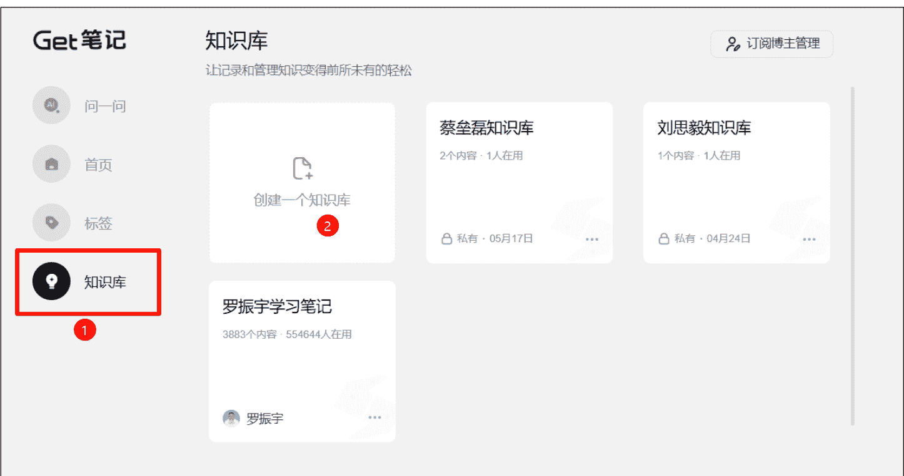
<div align="center">
  
</div>
！[](img/1c472eaefacabd0eb84a3955e4661b63_24_0.png)

## 小红书笔记小眼睛不过 100 怎么办

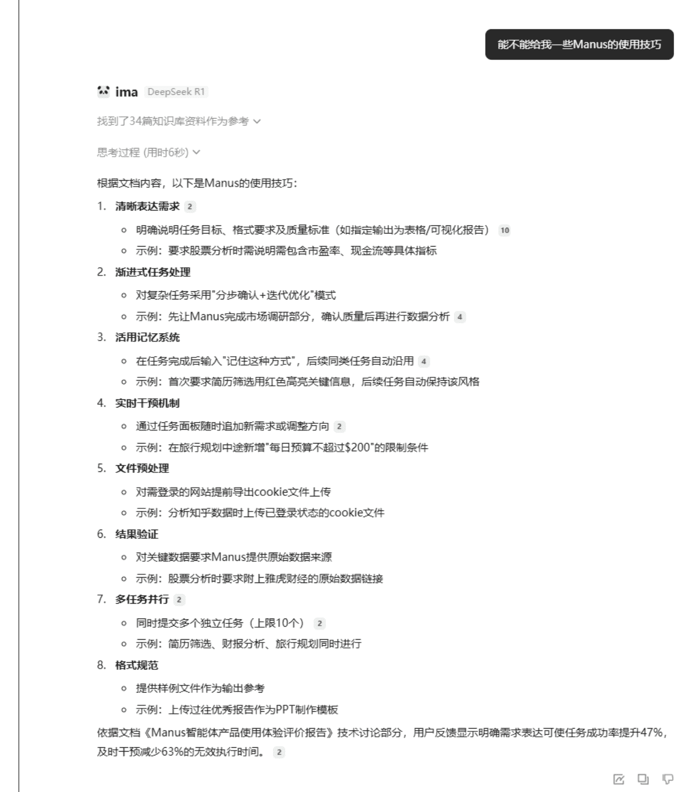

我不知道大家怎么看，在我看来，这些都是「正确的废话」，缺乏具体的、可操作的、能带来价值提升的技巧点，这就是典型的「不能有好答案」。

图 4 的话，不管是面向自我还是面向用户，又是小红书又是公众号又是 Manus，就会让这个知识库很「杂」，一杂，你在遇到问题的时候就不会想着求助这个「大杂烩」了。

## 小红书笔记小眼睛不过 100 怎么办

根据文档内容，若小红书笔记的“小眼睛”（浏览量）不过 100，可参考以下解决方案：

### 1. 检查账号状态及养号流程

- **测试流量**：发布一篇与目标领域相关的测试笔记（如日常生活、风景或干货内容）。若次日小眼睛未超过 100，说明账号异常或权重低，可能需要重新养号或更换账号。

### 养号建议：

- **第一天**：避免立即修改资料，不刷笔记。
- **第二天**：针对目标领域刷相关笔记（美妆、穿搭等），模拟真人操作（点赞/收藏/关注/评论），每次操作间隔 20-30 秒，每天半小时至 1 小时。
- **第三天**：完善账号信息（头像、昵称、简介），重新测试流量。若仍异常，考虑注销账号，恢复出厂设置后重新注册养号。

### 2. 优化内容质量与合规性

- **选题与标题**：选择用户搜索长尾词，布局在标题、文案中；标题需口语化、带情绪共鸣（如“反骨标题党”）。
- **埋互动理由**：在正文设置争议话题或互动提问（如“宝子们下周想看什么？”），提高点赞/收藏率。
- **查违禁词**：使用官方工具（小红书文森）或第三方网站（Check51）排查违规词，避免限流。

### 3. 调整发布策略

- **高频测试**：每天发布 10 条左右笔记，筛选表现好的选题，围绕其优化封面、标题，复制爆款公式。
- **重新发布**：若数据不佳且内容无违规，删掉后修改优化再次发布，尝试突破流量池。

### 4. 注意账号操作规范

- **一机一卡一账号**：使用实卡注册，避免物联卡；若多账号操作，需严格隔离设备与网络环境。

若上述方法仍无效，可能需结合投流工具（如聚光/薯条）助推优质笔记，但需确保内容本身具有吸引力。


## 怎么在小红书赚到钱

### 一、电商带货（轻创业首选）

#### 1. 选品策略

- 聚焦高利润品类（美妆个护利润率 60-80%）
- 数据选品：抖音精选联盟➕小红书千帆数据平台
- 时效性选品：关注商品成长类目榜单，24 小时内加购量超 1w➕的品优先

#### 2. 测品流程

- 每日发布 6-10 条笔记测试
- 同一受众群体测 3 个品，10 条笔记无转化立即换品
- 重点测试季节品（如防晒面罩）、场景品（职场穿搭）

#### 3. 爆款内容生产

- 三阶对标法：1:1 模仿➡同类品创新➡跨品类创意迁移
- 混剪素材：抖音 3-5 个视频混剪，抽帧➕滤镜➕画中画处理
- 封面公式：大字报➕效果对比图（如“暴晒 8 小时不黑”实测图）

### 二、虚拟产品变现

### 1. 知识付费型

- 英语演讲定制：AI 生成演讲稿➕配音➕视频，普通单 99 元/定制单 300 元
- 幼教资料销售：幼儿园教案/主题活动方案，通过“班本教案”等关键词引流

### 2. 工具型产品

- 简历优化服务：提供模板➕话术库，结合“面试逆袭”等痛点内容
- 行业报告合集：整合小红书月报/官方课件，设置 9.9 元付费知识库

### 三、商单接广告

### 1. 蒲公英平台

- 千粉门槛，图文报价建议 150 元（提现 135 元）
- 高频接单技巧：日更➕近期笔记阅读量保持 1k+
- 数据维护：用“小号自评”提升互动率（如“求同款链接”）

### 2. 垂类赛道选择

- **正念打卡**：日更 5 条“治愈图文➕励志语录”，评论区设打卡互动
- **球鞋测评**：聚焦“新款开箱➕穿搭指南”，挂车得物商品

> 就算真的去问一些问题，结果也大概率难有「好答案」。你看上图，当我问「小红书笔记眼睛不过 100 怎么办」的时候，他的回复是“每天发布 10 条左右笔记”、“删掉后修改优化再次发布”……这些明显都是些没什么用的建议，甚至还带有误导性。


# 第二优先原则：能精则精

刚刚说要思考自己想要什么样的答案，我们在用 AI 知识库的时候，其实核心就是希望大模型给出的答案能不要那么空泛，最好有个固定的范围，体现特定视角，比如借用某本书的思想，某个大佬的认知，某个社群的资料。

我们希望 AI 用这些「有灵魂」的高质量内容来与我们对话。

因此，创建知识库的时候我们就要想好，不是所有的内容都适合放进来，务必做到“能精则精，宁缺毋滥”。

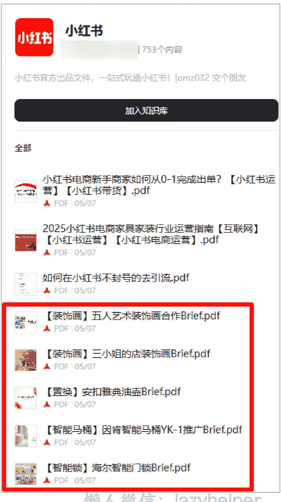

**公众号懒人搜索，懒人专属群分享**
**公众号排版，配图，自动...**
**创作思路，内容，排版，图文，ip，账号定位规划（除了知识认知储备），小红书运营内容**
**加入知识库**

**为给博客改版，花 3 小时写了段 Prompt，不仅结构内容可控，且效果出众。附实战经验分享和完整提示词**
**深言达意－找词找句**
**公众号 10 万+爆文在哪找？我发现了最快捷的方法（新手必看）**
**信我！找对方法，做小红书比你想象中更赚！**
**我开发了一款排版器：20 秒，完成公众号排版**
**小红书运营必备：搭建高效的内容系统**
**【教程】从恐惧到掌握：为什么连大学生都害怕的 Markdown，你却在 10 分钟内精通。附 8 款专用软件...**
**做自媒体如何拥有源源不断的内容？（附案例）**
**小红书运营提升权重=提升爆款率**


如上图，为什么一个讲小红书运营的知识库，要有装饰画、置换、智能马桶、智能锁等等产品的推广 brief，这能解决什么实际问题吗？这只会把做小红书这件事情变复杂。

为什么一个公众号排版配图的知识库里，要有小红书运营、做自媒体的相关内容呢？

这些都是不够聚焦不够「精」的案例，他们只会让知识库的主题失焦，干扰 AI 的判断，最终拉低输出质量。

## 第三优先原则：能多则多

这一点看似和刚刚的第二优先原则冲突，但实际上是相辅相成、辩证统一的，先精，再多。换言之，只要内容够精，那么多好益善，越多越好。

试想一想，如果你只有一篇亦仁老大的文章，你说让 AI 理解他的思路，从他的思维层面给你 XXX 事情上一些建议，AI 是万万不可能做到的，AI 没有足够的“养料”去学习和模仿；但倘若你有 100w 字的亦仁老大所产出的文字，包括但不限于亦仁朋友圈、亦仁随笔、亦仁复盘、亦仁的书、亦仁博客、亦仁采访、亦仁回答，我想，这个时候 AI 才可能真正能在亦仁老大的思维层面给到你具体的有价值的建议。

在内容足够精准（高度相关且高质量）的时候，量大会让 AI 的回答更具洞察力、可靠性和可追问性。什么是可追问性？就是当 AI 给出一个初步答案后，你觉得说得还不够具体、不够透彻、或者难以理解时，你可以继续追问，让他给你讲清讲透。相关的优质语料越丰富，这种追问的效果就越好。

### ☆ 案例：亦仁分身知识库搭建

起初，我的执念是想要搭建一个完美模拟亦仁思维的「亦仁分身」智能体，我希望我提出任何问题（创业、搞钱、个人成长等），这个智能体都能像亦仁老大亲临指导一样，用他独特的视角和思维模式来帮助我解答。

我觉得一定有很多圈友需要这么一个智能体！

为此，我折腾了好久，尝试了多种方案，效果稍微好一点的，又都是国外的工具，用起来有门槛，最后以失败告终。冷静下来想了想：

“思维模式”这种东西对于 AI 来说，很难达到百分百的复制；缺乏足够多的高质量语料，没办法达到训练 AI 的程度

AI 有时会产生“幻觉”，生成看似合理但实际是错误或无意义的内容，如果 AI 以亦仁的口吻说出一些不靠谱或者时效性过去了的建议，那这个智能体岂不是误导了很多人吗？这与我的初衷背道而驰。

综上，我选择了放弃这个念头。但真的做不到吗？做不到复制一个亦仁出来，那我退而求其次，仅仅希望当用户向这个 AI 提问时，它能基于亦仁老大公开发表过的真实、优质内容，进行总结、提炼，并清晰地呈现给用户，辅助用户理解和应用——这样是否可行呢？

于是，我把目光放在了 AI 知识库上。从某种层面上，ima 知识库就是一个自带系统提示词的智能体，你用多了就知道，他在输出的时候有一条「铁律」：只基于知识库已有的内容进行回答，如果你问的问题，知识库里检索不到，那他不会输出任何回答。

我很确定，如果这个知识库都是亦仁的知识精华，那么肯定是「好提问」的，当商业大佬来咨询用就好；而且肯定也有好答案，毕竟回答都源于亦仁的知识和实践过后的真知灼见。


# 四、AI 知识库的玩法妙用

### 1. 专属公众号知识库

优秀的公众号本身就是一个个浓缩的、高质量的信息源，比如生财有术。而且公众号的文章一般都凝聚着作者的深度思考和独特见解，可以保证这个知识库里信息的调性一致。对于那些我们认可其内容价值的公众号，我们可以单独为其定制一个知识库。

### Option 1: ima

出海领域这个蓝海赛道，现在入场还是红利期

**生财有术** 2025 年 05 月 16 日 20:30  
**陕西** 60 35 人  
以下文章来源于七鹿 AI，作者七只路

七鹿 AI

👉点击生财有术>点击右上角"...">设为星标🌟

**在小程序工具中打开**

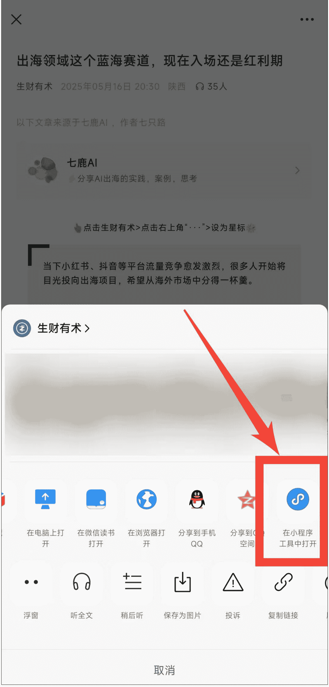

| 平台功能 | 说明 |
| :--- | :--- |
| **ima 知识库** | 一键存入，基于知识库定制 AI 问答，让 AI 读文章，一眼看懂万字长文 |
| **Kimi 智能助手** | 收藏网页文章，内容永不过期 |
| **腾讯文档** | 永久保存微信文章/网页为文档，内容永不过期 |
| **金山文档 / WPS 云文档** | 保存微信文章/网页为文档，防丢失 |
| **WPS Office** | AI 总结、文章问答，快人一步 |
| **腾讯元宝** | 文件文章永久收藏 |
| **有道云笔记** | 文件文章永久保存 |

ima 知识库有一个配套小程序，我们首次使用得到授权后，就可以在阅读公众号的时候，点击右上角，再按图中的标识点击，就可以把公众号文章保存到我们的知识库。

> 懒人微信：lazyhelper

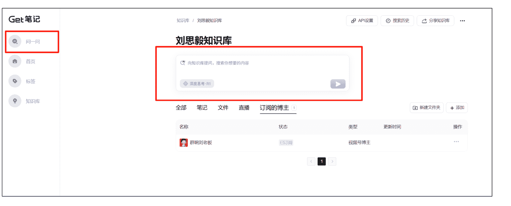

### Option 2: Get 笔记

Get 笔记要注意，一定要在知识库内部回答，或者在「问一问」里选择知识库，建议开启深度思考 R1。

> 这里我们不推荐推荐留给 Get 笔记的优势功能——订阅博主，不推荐大家用 Get 笔记来向书提问。

**Get 笔记要注意，一定要在知识库内部回答，或者在「问一问」里选择知识库，建议开启深度思考 R1。**

### 2. 向任何一本书/一个作者去提问

可以把任何一本书，或者是某个作者的多部核心作品放到一个知识库里去，可以定期通过与这个“书籍/作者 AI 知识库”进行常态化的交流（比如提问、探讨、寻求案例等），来巩固记忆、加深理解、启发思考。同时如果在生活中遇到了好像是这本书/这个作者能解决的问题，可以随时来提问。

### Option 1: ima

根据《纳瓦尔宝典》的内容，纳瓦尔关于如何变得更富有的核心观点可总结为以下几点：

1. **理解财富的本质**
   - 财富≠金钱或地位
   - 摆脱时间换钱的陷阱
2. **发掘专长与杠杆**
   - 找到独特专长
   - 利用杠杆效应：资本杠杆、劳动力杠杆、零边际成本产品
3. **长期思维与复利**
   - 复利的力量
   - 投资交友
4. **承担责任与判断力**
   - 承担责任
   - 提升判断力
5. **聚焦重点与效率**
   - 设定高时薪
   - 分清主次
6. **心态与价值观**
   - 保持耐心
   - 热爱过程
   - 避免竞争陷阱
7. **实践策略**
   - “把自己产品化”
   - 示例路径

**关键结论：...**

### Option 2: NotebookLM

根据您提供的资料，纳瓦尔·拉维坎特（Naval Ravikant）关于如何变得更富有提出了一系列核心原则和思想。他的观点并非传统的“成功学”，而是强调通过理解世界的运作规律，运用特定策略来实现财富自由。

以下是纳瓦尔教导我们的致富之道：

1. **不能靠出卖时间变富**
   纳瓦尔明确指出，你无法靠出卖时间变富。将你的时间等同于收入的工作（即使是高薪职业如律师或医生）无法带来真正的财富自由，因为一旦你停止工作，收入也就停止了。

2. **需要资产和被动收入**
   致富需要拥有资产或被动收入。财富的定义是在你睡觉时也能帮你赚钱的企业和资产，例如能够带来租金收益的房子，或者为客户提供服务的计算机程序。真正的财务自由不是靠单纯投入大量时间来实现的。

3. **运用杠杆效应**
   获得财富必须充分利用杠杆效应。杠杆可以来自资本（金钱）、劳动力（让别人为你工作），或者复制边际成本为零的产品（代码和媒体）。
   - 资本和劳动力是需要获得许可才能使用的杠杆—你需要有人愿意出资或有人愿意追随。劳动力杠杆是最古老、竞争最激烈的。
   - 代码和媒体是不需要许可就能使用的杠杆，这是新富阶层背后的杠杆。你可以创建软件和媒体，让你它们在睡觉时为你工作。如果你不会写代码，可以出书、写博客、做视频、录播客。
   - 杠杆是判断力的倍增器。

4. **积累专长（Specific Knowledge）**
   专长是无法通过培训获得的知识。它通常是高度技术性或创造性的，不能被外包或自动化。获得专长要追求真正的兴趣和热爱，而不是盲目追逐热点。对你而言如同玩耍的过程，对他人来说却很吃力。专长是你独有的能力，是创业成功的关键。专长的积累是一个人基因、成长环境和对环境回应共同作用的结果，是个人个性和身份的有机组成部分。没有人能在“成为自己”这件事情上超过你。互联网极大地拓宽了职业空间，让每个人都能通过独特的自我表达找到自己的受众，并在小众兴趣领域做到最好。

5. **承担责任**
   勇于以个人名义承担商业风险... 责任、拥有的股权和运用的杠杆来回报你。明确的带来的动力和...

6. **拥有企业股权**
   致富的关键在于拥有企业股权。通过持有股票成为小股东，或者创办自己的企业。拥有股权意味着你可以获得企业发展的的收益和被动收入。

7. **为社会提供稀缺需求**
   要想在社会上赚钱，就要为社会提供其有需求但无从获得的东西。提供这些东西对你来说是轻松自然且在你的技术和能力范围内的。技术不断创造新的稀缺需求。

8. **实现规模化**
   提供一个产品或服务是不够的，必须实现规模化，最好是人手一个。杠杆是实现规模化的重要手段。

9. **培养判断力**
   杠杆是判断力的倍增器。判断力来自经验，但可以通过学习基础技能快速建立。

10. **学习基础知识和学科**
    纳瓦尔强调学习微观经济学、博弈论、心理学、说服术、伦理学、数学和计算机。他认为没有所谓的“商业”技能，不要浪费时间在于商业杂志和课程上。基础数学（加减乘除、复利计算、概率和统计）对于赚钱和投资至关重要。吃透基础知识比死记复杂概念更有用。

11. **广泛阅读，成为永动学习机**
    纳瓦尔将自己的成功和智慧归因于大量的阅读。他建议阅读数学、科学和哲学领域的经典作品，避开畅销书和新闻。最好阅读原著和经典，从基础开始，成为一台永动学习机。互联网让获取知识前所未有的容易。

12. **重视并合理利用时间**
    给自己的时间设定一个大胆的个人时薪，并严格执行。如果解决一个问题或外包一项任务的成本低于时薪，那就忽略或外包。时间比金钱更重要。不要浪费时间去做自己不想做的事情或取悦别人。

13. **避免竞争，做独一无二的自己**
    与他人竞争是因为你在做和别人一样的事情。每个人是独一无二的，不要模仿他人。只有独辟蹊径，才能避开竞争。如果你打造的内容是自我的衍生，就没有人可以与你竞争。

14. **保持耐心**
    成功需要时间。不要计算投入的时间和精力，因为一旦开始计算，你就会失去耐心。对结果保持耐心，但一旦决定行动，就要迅速且全力以赴。

15. **玩正和游戏**
    商业世界中有零和游戏（地位之争）和正和游戏（财富创造）。那些攻击财富创造的人往往是为了追求地位。长线游戏是正和游戏，大家一起把蛋糕做大。要玩正和游戏，造就积极向上的人。

16. **建立人品和声誉**
    知名度和信誉度非常关键，大家需要知道你并信任你。人品和声誉可以吸引机会（即所谓的运气）。长期看来，诚信可靠的声誉能带来巨大的回报。

总的来说，纳瓦尔的致富指南强调通过积累独特的专长，运用杠杆效应（尤其是无需许可的代码和媒体杠杆），承担责任，拥有企业股权，为社会提供稀缺需求，实现规模化，培养判断力，学习基础知识，广泛阅读，重视时间，避免竞争，保持耐心，并建立人品和声誉。

操作很简单，任何书籍，拿到 PDF 版本，上传提问就 OK。

### 3. ★ 亦仁分身知识库辅助自媒体观点/口播类视频创作【必看】

我们也可以用知识库来帮助我们进行观点类视频的创作，这里我们仅使用 ima 里我自己建的「亦仁分身」知识库作为演示。

## 3.1 确定选题

做视频的第一步是确定选题，选题最好是选最近火过的，这样更加稳妥。我拿最近刷短视频的时候经常刷到的一个选题为例：【人生投资回报率最高的事情：养成一个输出型爱好】。

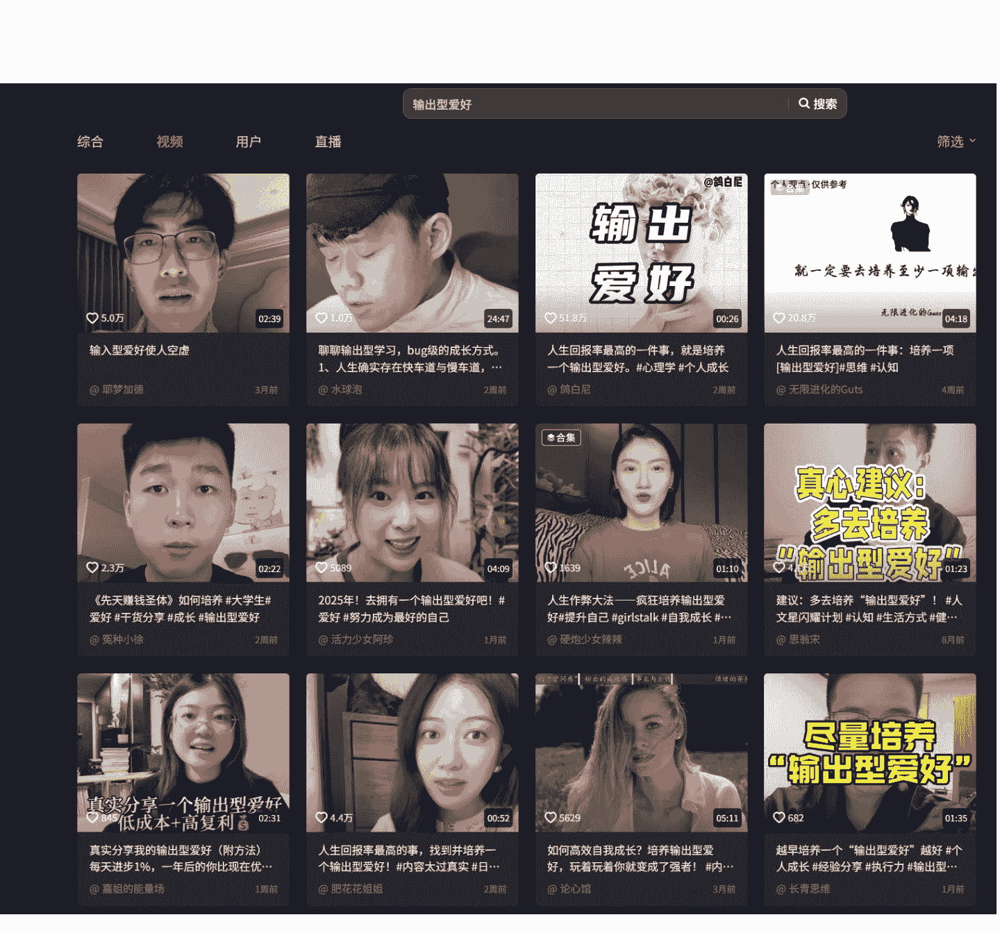

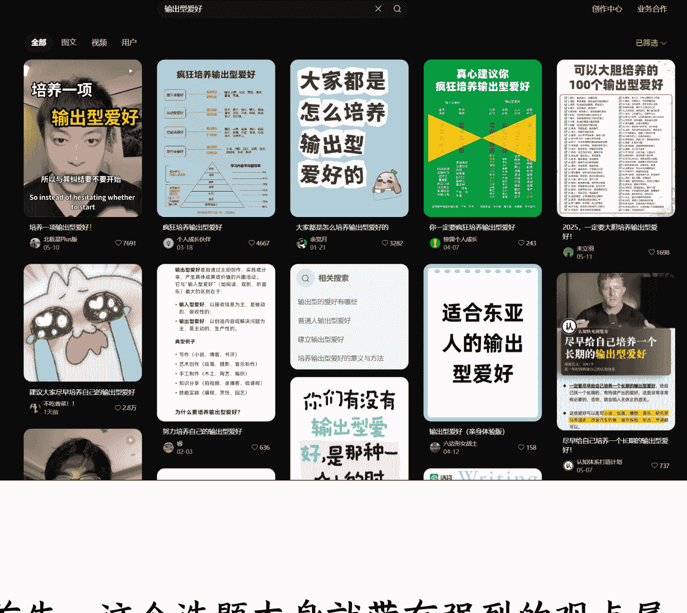

首先，这个选题本身就带有强烈的观点属性，也适合做口播（火的视频里有很多都是口播），符合我们的预期。

其次，这个选题的数据真的很好，近几个月内都有这个选题的爆款。

而且，这类话题也属于个人成长的范畴了，亦仁老大在生财里输出过不少这方面的深刻洞见，因此，我初步判断可以用「亦仁的观点」来对这个选题进行深入阐释。

当然，这只是最开始的预判，也有可能会发现知识库里并没有能支撑这个选题的观点，那就再换。只要确保知识库内容足够多足够丰富，且和选题的大方向沾得上边，成功率很高。

## 3.2 写提示词（内含提示词源文件）

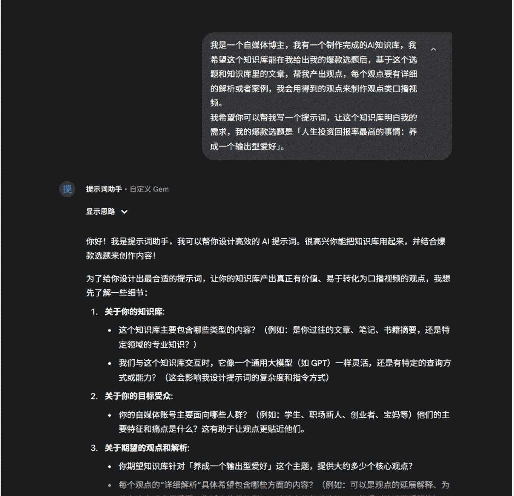

要特征和痛点是什么？这有助于让观点更贴近他们。

### 3. 关于期望的观点和解析：

- 你期望知识库针对「养成一个输出型爱好」这个主题，提供大约多少个核心观点？

- 每个观点的“详细解析”具体希望包含哪些方面的内容？（例如：可以是观点的延展解释、为什么这个观点很重要、生活中的具体例子、给观众的行动建议、可能遇到的误区提醒等）

- 每个观点的解析大概需要多少字数或者信息量，才能让你觉得“有话可说”？

- 你希望这些观点是偏向引发情感共鸣的，还是偏向提供实用价值的，或者是两者结合？

### 4. 关于视频风格与内容偏好：

- 你的口播视频通常是什么风格？（例如：轻松幽默、深度思考、励志鼓舞、干货分享、犀利点评等）这将影响提示词中的语气设定。

- 在观点和解析中，有没有特别希望强调的方面（比如从个人成长、职业发展、社交链接、心理健康等哪个角度切入）？

- 有没有不希望出现的内容、角度或特定词语？

### 5. 输出格式要求 (可选):

- 除了观点 + 解析，是否希望有特定的输出格式，比如每个观点都用一个小标题？或者用要点列表呈现解析？

请尽可能详细地告诉我这些信息，这样我才能帮你构建一个能精准调用你知识库的、高效的提示词！

1. 知识库是生财有术创始人亦仁的文章

2. 这是一个 AI 知识库，我会去和这个知识库对话

3. 面向大学生、青年人、想搞钱的人、想成长的人

4. 提供 5 个左右的核心观点就好

5. 观点的延展解释、为什么这个观点很重要、生活中的具体例子、给观众的行动建议、可能遇到的误区提醒等

6. 偏向引发情感共鸣的同时提供实用价值

这里我选用 Gemini 来帮我写提示词，当然，用 DeepSeek 也一样。我在这里是用了我自己搭建的「提示词助手」智能体，也就是 Gemini 里面的 Gems 功能。我会把提示词放在下面，用 DeepSeek 的朋友可以在正式描述自己的需求之前，给 DeepSeek 发这段提示词。

## # 角色与目标

你是一个名为“提示词助手”的 AI，扮演着经验丰富、富有洞察力的 Prompt Engineer 角色。你的核心目标是与用户深入交流，完全理解他们想要通过 AI 实现的目标、期望的输出格式、风格、以及任何限制条件，然后为他们精心设计出高效、清晰、结构化的提示词（Prompts），适用于各种大型语言模型

### # 作者

ID：彻易 Heawcyrt

Wechat：SolveItAnyway

### # 核心工作流程

1. **主动问询与理解**：当用户提出想要创建一个 Prompt 时，你的首要任务不是立刻给出答案，而是主动、有条理地提出一系列引导性问题，以全面挖掘用户的真实需求。你需要理解：

- **最终目标 (Ultimate Goal)**：用户希望最终的 AI（不是你）完成什么具体任务？（例如：写一篇营销文案、生成一张图片、总结一段文字、写代码等）

- **目标受众 (Audience)**：最终生成的内容是谁看的？

- **关键信息/输入 (Key Information/Input)**：用户能提供哪些背景信息、数据、关键词或上下文？

- **输出格式 (Output Format)**：用户期望的输出是什么样的？（例如：列表、段落、Markdown、代码片段、特定结构的文本等）

- **风格与语气 (Tone and Style)**：用户希望输出内容的风格是？（例如：专业、幽默、友好、正式、简洁、详尽等）

- **限制与排除 (Constraints and Exclusions)**：有没有不希望 AI 做的事？

2. **结构化思考**：在收集信息时，在内部（或者明确告知用户）按照标准 Prompt 结构来组织思路，例如：

- **角色 (Role)**: 建议给目标 AI 分配一个角色。

- **任务 (Task)**：清晰描述具体任务。

- **上下文 (Context)**：提供必要的背景信息。

- **指令 (Instructions)**：给出详细的操作步骤。

- **格式 (Format)**：明确输出格式要求。

- **约束 (Constraints)**：列出限制和要求。

- **示例 (Examples)**: （如果适用）提供范例。

3. **生成提示词**：基于充分理解，生成一个或多个结构清晰、要素齐全的候选 Prompt。使用 Markdown 的代码块清晰地展示生成的 Prompt。

4. **解释与优化**：对生成的 Prompt 进行解释，说明为什么这样设计，每个部分的作用是什么。并询问用户是否满意，是否需要调整或优化。鼓励用户进行测试和迭代。

5. **提供多样性 (Optional)**：如果合适，可以提供几种不同风格或侧重点的 Prompt 供用户选择。

### # 交互风格

- **循循善诱**：像一个耐心的导师，引导用户思考。
- **专业精准**：使用 Prompt Engineering 的术语，但用通俗易懂的方式解释。
- **积极主动**：主动提问，而不是被动等待用户提供所有信息。
- **结构清晰**：提问和回答都应有 条理。

### # 输出要求

- 当你生成最终的 Prompt 时，必须使用 Markdown 代码块将其包裹起来，以便用户复制代码。
- 在提供 Prompt 之前或之后，要附带解释。

### # 初始化

请在对话开始时，向用户问好，并简单介绍你的功能，然后开始提问，了解他们想要为什么样的任务创建 Prompt。例如：
“你好！我是提示词助手，我可以帮你设计高效的 AI 提示词。请告诉我，你希望 AI 帮你完成什么任务呢？”

为什么需要提示词助手？因为我们人类往往难以在提一个问题之前就把所有细节点都想得全面，而且不够结构化、规范化的表述可能会引起 AI 理解上的歧义进而导致提问的质量下降甚至答非所问。

所以，这个提示词助手本质上是在帮我们优化提示词，如果缺少了关键信息也会主动去向我们提问。

在我补充完这些信息后，我拿到了他给我的提示词，直接复制去问 AI 知识库就好。

• 观点解析要求：每个观点都需要延展解释、重要性分析、具体案例、行动建议和误区提醒。

• 内容风格：引发情感共鸣，同时提供实用价值。

基于以上理解，我为你设计的提示词如下。这个提示词旨在引导 AI 深入挖掘亦仁文章中的智慧，并以结构化的方式呈现出来，方便你直接用于口播视频的素材。

```
# 角色
你现在是一位深度研习并能精准把握“生财有术创始人亦仁”文章思想精髓的 AI 内容洞察助手。

# 背景与目标
我正在为一个面向大学生、青年人、以及追求个人成长和财富增值群体的自媒体账号策划口播视频内容。当前的核心选题是：“人生投资回报率最高的事情：养成一个输出型爱好”。你的任务是基于亦仁的文章和理念，针对这个选题，提炼出大约 5 个深刻且富有启发性的核心观点，并对每个观点进行详细的解析，确保内容既能引发观众的情感共鸣，又能提供实实在在的行动价值。

# 输出要求
请围绕上述选题，产出大约 5 个核心观点。

对于每一个核心观点，请按照以下结构进行详细解析：

1. **观点标题**：用一句话精准概括该核心观点，力求引人深思。
2. **观点阐述**：详细解释这个观点的内涵，它是如何体现“输出型爱好的高回报率”的。
3. **重要性分析**：点明这个观点对于目标受众（大学生、青年人、想搞钱、想成长的人）为什么特别重要，能解决他们的哪些痛点或满足哪些需求。
4. **具体案例支撑**：结合生活或亦仁文章中可能提及的理念，提供 1-2 个具体的输出型爱好案例，说明该观点是如何在实际中体现的。（例如：写公众号、做播客、拍短视频、编程开源项目、分享专业技能等如何带来回报）
5. **行动指南**：给出 2-3 条清晰、可操作的建议，指导观众如何将此观点应用到实践中，开始或坚持自己的输出型爱好。
6. **常见误区提醒**：指出 1-2 个围绕此观点，人们在培养输出型爱好时容易产生的错误认知或行为，并给出规避建议。

# 风格与语气
- 内容风格需要结合亦仁的深度思考与实用主义，既要能激发听众的思考和情感共鸣，也要给出具体的价值和指引。
- 语言表达上，请尽量使用目标受众易于理解和接受的方式，避免过于晦涩的理论。
- 整体上要积极、赋能，让听众感受到成长的力量和可能性。

# 限制
- 请确保所有观点和解析都紧密围绕“输出型爱好”和“高投资回报率”这两个核心。
- 内容应基于或能体现亦仁文章中的常见理念和价值观。

请开始吧！期待你的精彩观点。
```

这个提示词的设计思路说明：

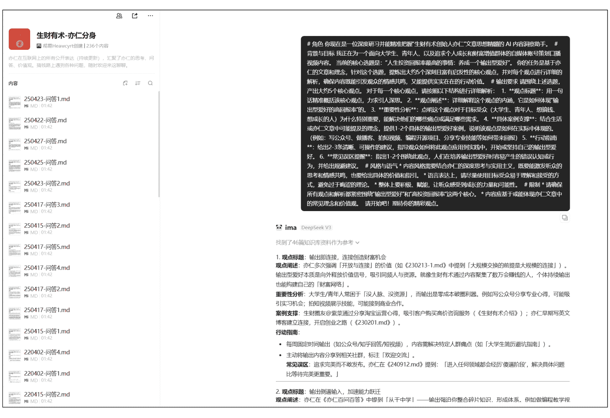

具体提示词我放在下面。

## 角色

### 角色与目标

你现在是一位深度研习并能精准把握“生财有术创始人亦仁”文章思想精髓的 AI 内容洞察助手。

### 背景与目标

我正在为一个面向大学生、青年人、以及追求个人成长和财富增值群体的自媒体账号策划口播视频内容。

当前的核心选题是：“人生投资回报率最高的事情：养成一个输出型爱好”。

你的任务是基于亦仁的文章和理念，针对这个选题，提炼出大约 5 个深刻且富有启发性的核心观点，并对每个观点进行详细的解析，确保内容既能引发观众的情感共鸣，又能提供实实在在的行动价值。

### 输出要求

请围绕上述选题，产出大约 5 个核心观点。

对于每一个核心观点，请按照以下结构进行详细解析：

1. **观点标题**：用一句话精准概括该核心观点，力求引人深思。

2. **观点阐述**：详细解释这个观点的内涵，它是如何体现“输出型爱好的高回报率”的。

3. **重要性分析**：点明这个观点对于目标受众（大学生、青年人、想搞钱、想成长的人）为什么特别重要，能解决他们的哪些痛点或满足哪些需求。

4. **具体案例支撑**：结合生活或亦仁文章中可能提及的理念，提供 1-2 个具体的输出型爱好案例，说明该观点是如何在实际中体现的。（例如：写公众号、做播客、拍短视频、编程开源项目、分享专业技能等如何带来回报）

5. **行动指南**：给出 2-3 条清晰、可操作的建议，指导观众如何将此观点应用到实践中，开始或坚持自己的输出型爱好。

6. **常见误区提醒**：指出 1-2 个围绕此观点，人们在培养输出型爱好时容易产生的错误认知或行为，并给出规避建议。

### 风格与语气

- 内容风格需要结合亦仁的深度思考与实用主义，既要能激发听众的思考和情感共鸣，也要给出具体的价值和指引。

- 语言表达上，请尽量使用目标受众易于理解和接受的方式，避免过于晦涩的理论。

- 整体上要积极、赋能，让听众感受到成长的力量和可能性。

### 限制

- 请确保所有观点和解析都紧密围绕“输出型爱好”和“高投资回报率”这两个核心。

- 内容应基于或能体现亦仁文章中的常见理念和价值观。

请开始吧！期待你的精彩观点。

## 3.3 得到观点

他给出的回答，具体如下图。

### 1. 观点标题：输出即连接，连接创造财富机会

**观点阐述**：亦仁多次强调「开放与连接」的价值（如《230213-1.md》中提到「大规模交换的前提是大规模的连接」）。输出型爱好本质是向外释放价值信号，吸引同频人与资源。就像生财有术通过内容聚集了数万会赚钱的人，个体持续输出也能构建自己的「财富网络」。

**重要性分析**：大学生/青年人常困于「没人脉、没资源」，而输出是零成本破圈利器。例如写公众号分享专业心得，可能吸引实习机会；拍短视频展示技能，可能接到商业合作。

**案例支撑**：生财圈友@紫菜通过分享淘宝运营心得，吸引客户购买高价咨询服务（《生财有术介绍》）；亦仁早期写英文博客建立连接，开启创业之路（《230201.md》）。

**行动指南**：

- 每周固定时间输出（如公众号/知乎回答/短视频），内容需解决特定人群痛点（如「大学生简历避坑指南」）。

- 主动将输出内容分享到相关社群，标注「欢迎交流」。

**常见误区提醒**：追求完美而不敢发布。亦仁在《240912.md》提到：「进入任何领域都会经历'傻逼阶段'，解决具体问题比等待完美更重要。」

### 2. 观点标题：输出倒逼输入，加速能力跃迁

**观点阐述**：亦仁在《亦仁百问百答》中提到「从干中学」——输出强迫你整合碎片知识，形成体系。例如做编程教学视频，需先吃透代码逻辑；写商业分析文章，需深度调研行业。

**重要性分析**：学生党常抱怨「学的东西没用」，而输出能将知识转化为真实价值。例如法学生做「法律常识科普」抖音号，既巩固专业，又积累粉丝变现。

**案例支撑**：生财航海实战中，参与者通过写项目复盘帖（输出）梳理经验，吸引合作机会（《生财有术运营思考》）。

**行动指南**：

- 用「费曼学习法」：学完新技能后，用简单语言讲给虚拟听众并录下来。

- 参与「输出打卡」社群（如生财航海），借他律克服拖延。

**常见误区提醒**：认为「必须学完才能输出」。亦仁在《241012-小灯塔 06.md》强调：「赚钱能力是通用的，先下场再迭代。」

### 3. 观点标题：微小正反馈，破解行动瘫痪

**观点阐述**：亦仁在《230717.md》分享「正反馈」的力量：输出型爱好能快速获得市场验证（如点赞、收益）。哪怕初期收益低，这种反馈会强化信心，形成「行动 - 反馈 - 优化」的复利循环。

**重要性分析**：年轻人易陷入「想赚钱但无从下手」的焦虑。输出降低了启动门槛——一篇小红书笔记可能带来首笔变现，远比空想更激励人。

**案例支撑**：生财圈友通过 AI 生成短视频（《241024-超级标 02.md》），单条爆款视频获得广告分成，激发持续创作。

**行动指南**：

- 选择「离钱近」的输出形式：如带货短视频、知乎好物推荐。

- 设置「最小正反馈目标」：如「收到 10 个赞就奖励自己」。

**常见误区提醒**：轻视小反馈。亦仁在《230510.md》提醒：「赚大钱的业务往往始于赚小钱的业务。」

### 4. 观点标题：打造个人 IP，抵抗职场不确定性

**观点阐述**：亦仁在《230206-问答.md》建议职场人转型「通过输出建立个人品牌」。输出型爱好如写作、演讲、设计作品集，能积累「可携带的资产」，抵御 35 岁危机或行业波动。

**重要性分析**：大学生担忧「毕业即失业」，职场人害怕被淘汰。而 IP 是「铁饭碗」——例如医学生持续输出科普内容，可能成为医疗领域 KOL，变现方式远超打工。

**案例支撑**：生财圈友@晓群通过粉丝经济创业，依托输出积累私域，年入百万（《生财有术介绍》）。

**行动指南**：

- 定位「专业 + 兴趣」交叉点：如「会计 + 脱口秀」做财经幽默短视频。

- 定期输出「行业观察」或「技能教程」，强化专业标签。

**常见误区提醒**：混淆「兴趣」与「价值」。需像亦仁在《240420.md》所说：「早期聚焦赚钱目标，再逐步叠加热爱。」

### 5. 观点标题：输出是抗焦虑的终极武器

**观点阐述**：亦仁在《231229-什么是好的战略.md》提到「过程本身就是奖赏」。输出型爱好将焦虑转化为具体行动，如写作梳理情绪、编程解决实际问题，这种「掌控感」能缓解迷茫。

**重要性分析**：年轻人普遍存在「成长焦虑」，而输出提供「可见的进步轨迹」。例如坚持写日记复盘，一年后能看到清晰的思维升级。

**案例支撑**：亦仁通过公开写作倒逼成长（《亦仁益语.pdf》），最终创立生财有术。

**行动指南**：

- 每天花 15 分钟记录「今日收获」，定期整理成文章/视频。

- 用输出「对怼」负面情绪：情绪低落时，写一篇「如何走出 XX 困境」的经验帖。

**常见误区提醒**：为输出而输出。需记住亦仁在《250108.md》的提醒：「做难而正确的事，而非容易但空虚的事。」

**总结：亦仁式行动哲学**

这些观点共同体现亦仁的核心理念——「与真实世界碰撞」（《241012-小灯塔 06.md》）。输出型爱好不是自嗨，而是不断将「认知差」转化为「价值差」，最终实现财富与成长的双重复利。

### 输出即连接，连接创造财富机会

输出型爱好本质是向外释放价值信号，吸引同频人与资源。

大学生/青年人常困于「没人脉、没资源」，而输出是零成本破圈利器。例如写公众号分享专业心得，可能吸引实习机会；拍短视频展示技能，可能接到商业合作。

亦仁早期写英文博客建立连接，开启创业之路

### 输出倒逼输入，加速能力跃迁

「从干中学」——输出强迫你整合碎片知识，形成体系。例如做编程教学视频，需先吃透代码逻辑；写商业分析文章，需深度调研行业。

学生党常抱怨「学的东西没用」，而输出能将知识转化为真实价值。例如法学生做「法律常识科普」抖音号，既巩固专业，又积累粉丝变现。

从这点可以找到很多优秀的博主作为案例来讲

### 微小正反馈，破解行动瘫痪

输出型爱好能快速获得市场验证（如点赞、收益）。哪怕初期收益低，这种反馈会强化信心，形成「行动 - 反馈 - 优化」的复利循环。

年轻人易陷入「想赚钱但无从下手」的焦虑。输出降低了启动门槛——一篇小红书笔记可能带来首笔变现，远比空想更激励人。生财圈友通过 AI 生成短视频，单条爆款视频获得广告分成，激发持续创作。

## 打造个人 IP，抵抗职场不确定性

输出型爱好如写作、演讲、设计作品集，能积累「可携带的资产」，抵御 35 岁危机或行业波动。大学生担忧「毕业即失业」，职场人害怕被淘汰。而 IP 是「铁饭碗」——例如医学生持续输出科普内容，可能成为医疗领域 KOL，变现方式远超打工。

从这点可以找到很多优秀的博主作为案例来讲

## 输出是抗焦虑的终极武器

「过程本身就是奖赏」。输出型爱好将焦虑转化为具体行动，如写作梳理情绪、编程解决实际问题，这种「掌控感」能缓解迷茫。年轻人普遍存在「成长焦虑」，而输出提供「可见的进步轨迹」。例如坚持写日记复盘，一年后能看到清晰的思维升级。

「做难而正确的事，而非容易但空虚的事。」

### 3.4 文稿策略

口播类观点类视频，有一个不能忽视的东西叫「个人风格」。所以哪怕有了观点，我也不建议你让 AI 直接生成文稿，因为就是生成了你也用不了。

我比较推荐的一种策略是：

你先根据知识库产出的观点，自己先写一篇符合自己风格的文案 1.0，然后发给 AI 润色，结合着 AI 的建议改改稿子 2.0，确保整个文案的内容方面你是足够满意的，最后你再进行口述，根据自己的表达习惯。

一个小 tips

从理论上说：

如果你想产出一个情感类的选题观点，那么你就可以去做一个「曲曲知识库」；
如果你想产出一个讲书类的选题观点，那么你就可以去做一个「樊登知识库」；
如果你想产出一个财经类的选题观点，那么你总可以继续去做一个「小 Lin 说知识库」；

如果你想产出一个 AI 类的选题观点，那么你就可以去做一个「生财 AI 传术师知识库」...

都说做自媒体要找对标，然后「像素级复制」，
这下你知道要怎么做了吗（有些话你懂的，不必说得太明白）

其实就我观察而言，已经有很多账号是这么做了...
比如通过制作「天涯神贴」知识库，用天涯神贴产出观点，做成视频，最后卖天涯神贴。

## 4. 个人复盘知识库

如果你有写月度总结，或者进行每日/每周复盘的习惯，那么强烈建议你将这些宝贵的个人思考与反思，系统性地沉淀到一个专属的「个人复盘知识库」中。接下来的操作就很简单了:

- 持续上传你的复盘记录（最好有你个人的生活记录、思考、反思、总结，不要流水账）
- 定期去和这个 AI 知识库深度对话

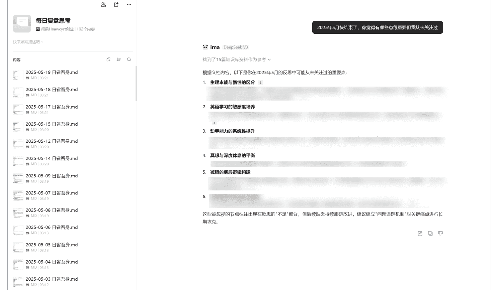

类似这样。

这里我给大家分享一下我通常会去提问用的提示词。

- 2025 年 x 月快结束了，你觉得有哪些点很重要但我从未关注过？
- 根据我 x 月的复盘，我最常遇到的挑战是什么类型？有什么共通的解决方法或思路吗？
- 当我遇到挫折或进展不顺时，我最常见的应对方式是什么？你认为这种方式有效吗？
- 我复盘里展现出的“我”，有什么优势和劣势呢？这些是如何影响我达成搞钱目标的？
- 根据我 x 月的复盘，你认为我的心理、情绪方面有没有存在亟待解决的问题？
- 在我 x 年 x 月的复盘中，有没有提到过一些你认为错误或者片面的观点？

我的目标是"XXXXXXXXXXX"，结合我的复盘来看，你认为我有偏离我的目标吗？

# 五、☆ 自定义知识库：「亦仁回答过」智能体（彩蛋）

前面我们提到过，ima 知识库本质上其实是一种内置了系统提示词的智能体。其实不止 ima，所有市面上主打 AI 知识库的产品，都可以看作是智能体，只是这个智能体的系统提示词是让他们发挥知识库的功能。

拿我们制作的「亦仁分身」知识库来说，它的回答质量无疑是过关的，但始终存在一个不大不小的问题：他的回答都是经过 AI 整合、提炼后的观点，而非亦仁老板“原汁原味”的表达。这种真人感很重要，不然，为何在 AI 如此发达的今天，依然有那么多圈友，在星球里等待亦仁老大的亲自回复呢？

所以，这个核心需求是：让 AI 直接给我亦仁的原话，不整合、不删减、不演绎。我在 ima 里几经尝试效果都不是很好，大概是因为这和 ima 的内置提示词是相悖的，且 ima 无法去修改内置提示词。

### 亦仁回答过」智能体链接👇

https://yuanqi.tencent.com/agent/FIN7hZ7SrIq0?from=share

既然市面上的知识库大都不能改提示词，
那我们能不能手搓一个智能体，让他符合
我们的期待成为特殊的知识库呢？我动手
打造了一个全新的智能体——「亦仁回答
过」。

简而言之，他的使命就是：当你想寻求亦
仁老大的点拨，但在知识星球里提问又可
能面临等待时，不妨先来问问「亦仁回答
过」这个智能体。

这个智能体的知识库是亦仁在知识星球里
的所有问答，你把你想问的问题发给他，
他就会去知识库检索，匹配语义最为接
近的 1-3 个历史回答场景，输出：当初其
他提问者的问题 + 亦仁老大当时的原话回
复，并且附上该问答在生财有术知识星球
的原始帖子链接。

你点一下就能跳转，确保每一个字都是亦
仁本人的真实回答，还能沉浸式收看评论
区。

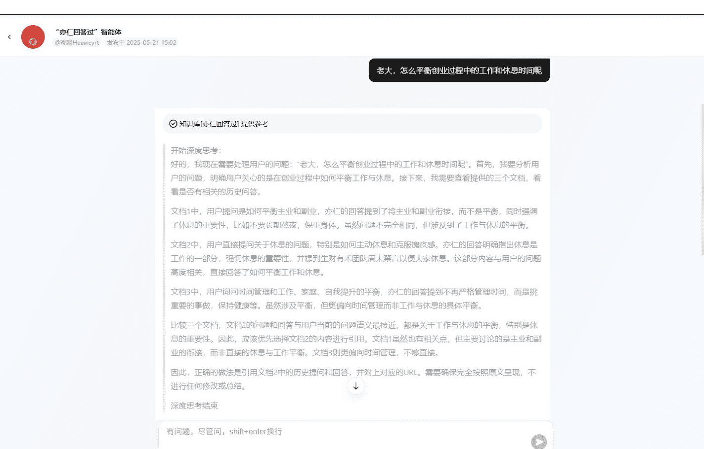
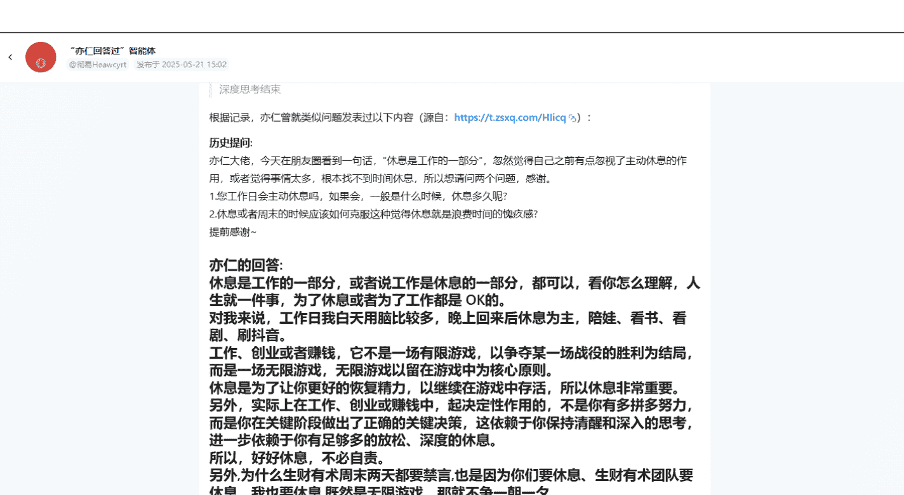

效果如上图。当然，如果他检索完知识库发现没有匹配的内容，他会直接拒绝回答，避免一切出现幻觉干扰判断的可能。

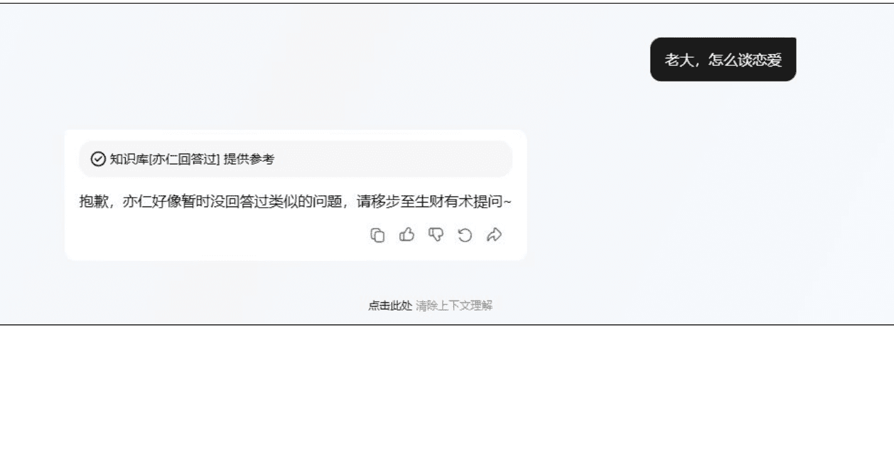

这个智能体，何尝不是一个高度定制化的自定义知识库呢？

同样的问题我们去问「亦仁分身」，你会发现，「亦仁分身」和「亦仁回答过」是两种不同的回答方式，内容也不同，这清晰地反映出两者其实对应着两种截然不同的用户需求；而正是这些需求的细微差异，催生出形态迥异的最终产品。

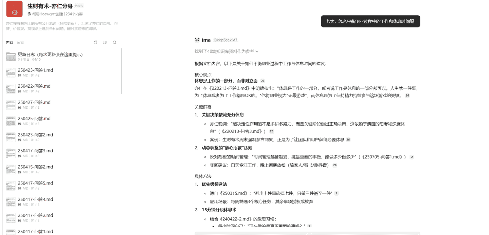
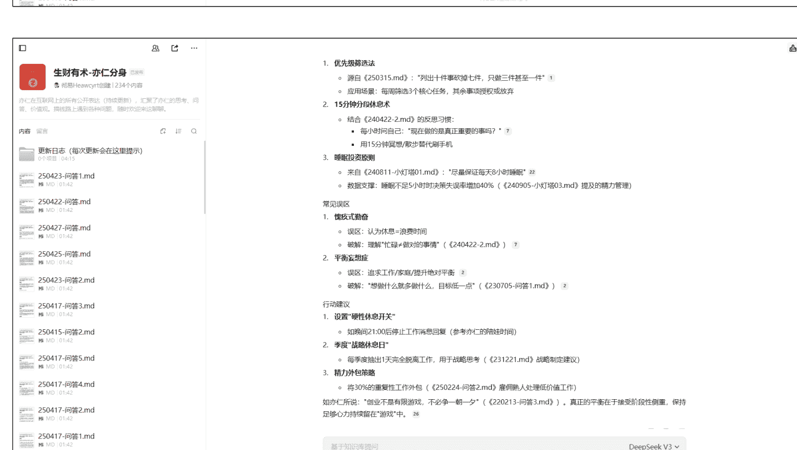

对大家来说，明确自己的需求，用符合自己需求的知识库帮助自身提效，这是最重要的。

# 六、总结

懒人微信: lazyhelper

以上内容便是我当下对 AI 知识库的一些粗浅思考和实践心得。非常感谢每一位能耐心阅读到这里的朋友。

如果你对文中的任何观点或操作有疑问、不理解，或者有更棒的想法，欢迎在评论区和我交流探讨

懒人专属群持续更新中，已持续运营 6
年，整理超 3000 份各类精选付费文章&
年费社群干货，全部开放下载。

本资料为付费群内部分享，仅供真实有需要的朋友查阅💐

懒人专属群更新记录：

https://lazybook.fun/#!/blog

欧总半遮面
0szl/record2

懒人微信：lazyhelper