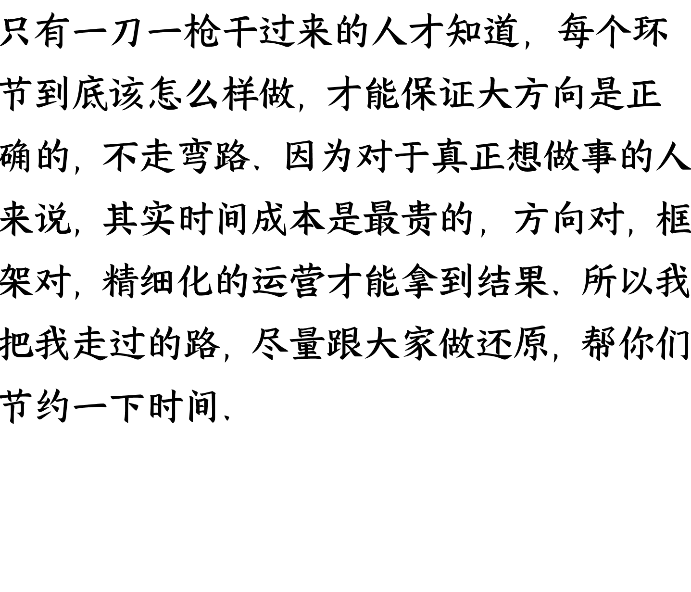
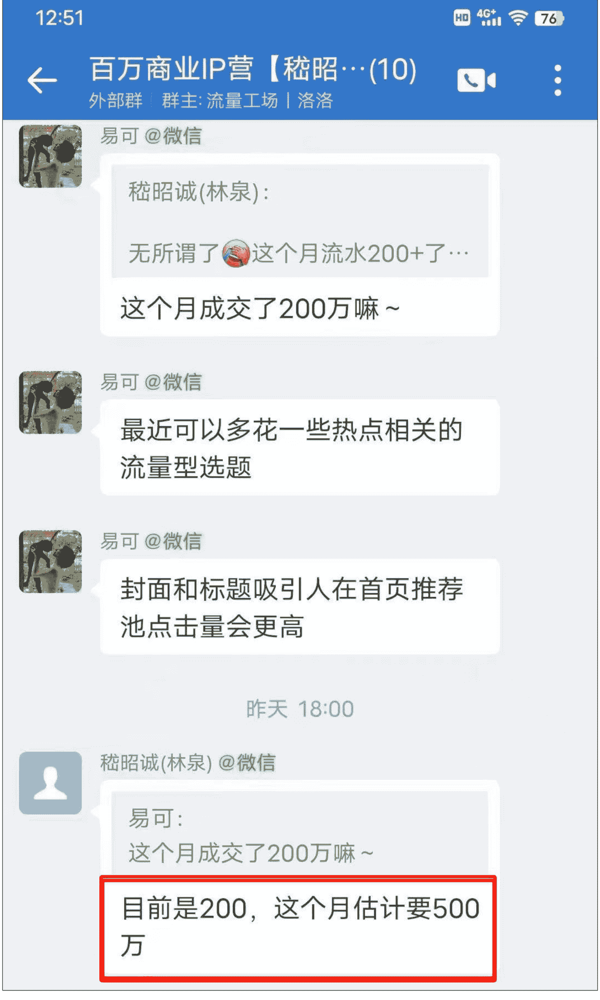
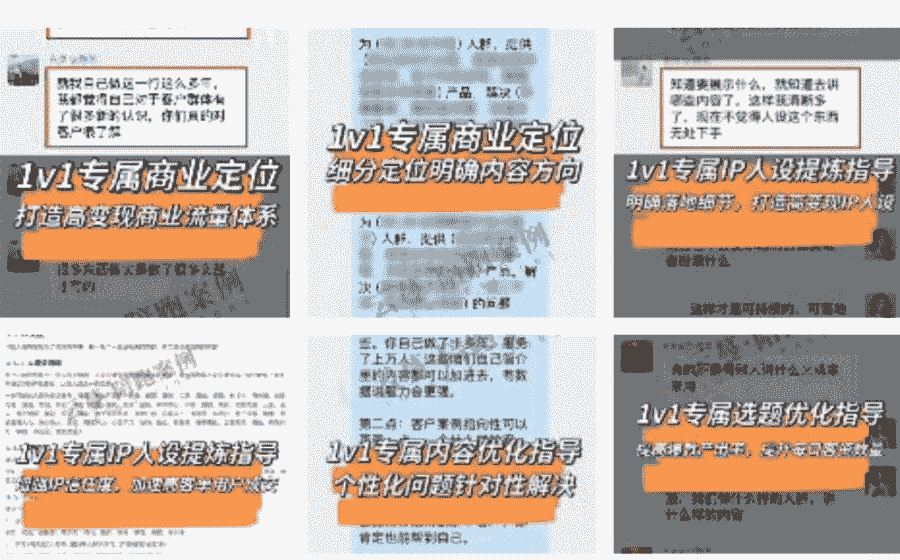
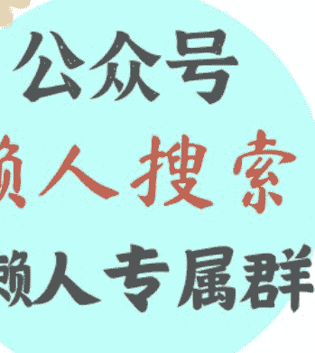
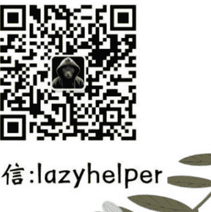

# 如何做低粉高变现的小红书商业 IP 模型？

250526 生财精华

公众号懒人搜索，懒人专属群

今天这篇文章主要就是分享一些干货和方法论，以及自己的一些心态和认知上的转变，因为我自己一直认同一个点：最好的老师一定不是在讲台上，而是在战场上。

只有一刀一枪干过来的人才知道，每个环节到底该怎么样做，才能保证大方向是正确的，不走弯路。因为对于真正想做事的人来说，其实时间成本是最贵的，方向对，框架对，精细化的运营才能拿到结果，所以我把走过的路，尽量跟大家做还原，帮你们节约一下时间。

那究竟什么是商业 IP？

## 一、【商业 IP 的定义】

那究竟什么是商业 IP？

其实在 2025 年的今天，大家对于商业 IP 底层逻辑的理解还是有问题的，就比如说刚才我给大家看了很多我的矩阵账号，你们可以盲猜一下我 60 多万粉丝的账号和一万粉丝的账号变现有什么本质上的区别？

我可以很负责任的告诉大家，没有任何的区别，甚至很多时候我的大号变现跑不过一个小号，而我的大号更新一篇又很麻烦，但是小号基本都能实现一天 100 条的量产，所以这也是为什么我不喜欢更新大号的原因。

所以在今天，我认为细分商业 IP 的时代，在慢慢崛起。大家在竞争上的差异慢慢变成变现上的差异，利润上的差异，而不是谁有庞大的粉丝量。

所以商业 IP 的核心不是内容，而是商业模式，通过商业模式我们再去倒推内容、产品、客户。

我们每一个内容的设计，每一个互动，其实都是在引导成交，所以商业 IP 的底层逻辑是：以内容建立信任感，以结构推动转化，以产品完成价值交付。

用人话说，一个成功的商业 IP 不光能讲故事、输出价值观，而是要让客户清晰地知道，他究竟能提供什么？解决什么问题？怎么和他链接？为什么信任他？给客户一个强有力的购买理由。

不信大家可以对于市面上做得好的商业 IP 进行拆解，不管是什么赛道的，只要变现好的 IP，你会发现它背后都有一个非常清晰的公式：产品模型 + 内容结构 + 成交路径。

换句话说：普通 IP 是自我表达型：我是谁？我经历了什么？而商业 IP 是价值传递型：你是谁？你需要我解决什么问题？你凭什么信任我？

我在后台经常收到一些小伙伴的私信，大家总问我：

> “为什么你们很低的粉丝量能做到很高的变现？”

我可以很负责任的告诉大家：粉丝量和你的变现好坏没有必然关系。

比如说我的客户里边有很多，已经到了三、五百万粉丝的体量，但是他真的不赚钱。在 2025 年的今天，其实大家的自然流量都在往下掉。

所有大网红的收益都是在锐减的。但是我们孵化和陪跑的客户里边，真的有很多是 4 万粉丝开始变现、7 万粉丝开始变现，甚至说有 1000 多粉丝变现几十万，这种案例真的比比皆是。

所以低粉高变现的 IP 和网红 IP 的打法，它是有本质上的区别。

商业 IP 的第一点就是以终为始，先设计我们的商业闭环。

为什么我的打法永远是“以终为始”？因为我认为：产品大于流量，商业路径大于流量。用人话来说，就是你在开始做这个 IP 之前，就一定要想清楚你到底卖什么。

其实在互联网上，无非就是这么几种变现模式：卖产品、卖资源、卖咨询、卖课程、卖机会、卖社交，所有的变现其实都是围绕我们用户的需求来的。所以一定要从变现路径先入手。我的打法不太建议先去做涨粉。

比如我们有一些客户，即使是他的变现路径非常清晰，我们都会去重新给他做定位梳理，梳理他的变现体系，包括梳理清楚他第一个阶段的打法是什么？卖什么产品？引流款是什么？盈利款是什么？

所有产品设计都清晰、成熟之后，我们才会去让客户做流量，那这样才能保证我们在很少的粉丝体量的情况下，去做到高效率变现。

因为现在做自媒体的人很多。在我看起来自媒体的那一套东西其实不是核心决定变现的，因为真正影响商业变现的，其实就是商业模式。我们怎么样用最低的客户量，快速地把高客单产品卖出去？

我做商业 IP 陪跑已经有五年多的时间了，有一种客户我们一定拒绝，就是他的商业闭环在线下实际的生活中没有这个场景，客户也不买单，那他是没有办法拿到互联网上去做的。

### 那具体低粉丝高变现怎么做呢？

我直接从客户案例入手，带大家做一轮拆解。(由于大家不太想让人知道自己赚钱。所以这里我把部分账号省去了哈)

### 案例 1：海外求职

懒人微信：lazyhelper

这是我的一个客户，他在小红书上只有 3 万粉丝，但是他一年的变现在 3000 多万。他就是一个典型的低粉高变现非常好的案例。你说他变现这么好，是因为他文案写得好吗？是因为他标题写得好吗？是因为他坚持吗？

不是，本质上就是在于他的赛道选择足够的好，产品足够的好，他一开始的定位就比较清晰。他做的是海外求职培训，而且做的国家是英国。

### 案例 2: 信托保险业务

她的粉丝量也不高，只有几千粉丝，但是她一年的变现也是在几千万元。

她是做信托的，大家也都知道这种高净值用户的生意其实不在线上不可能直接成交。

但是她的路径很明确：我线上就是要精准的客户，我就是要他的家庭资产过亿的客户，我只要客户线索，我的成交路径是：通过短视频做精度筛选 → 引流到微信 → 再由微信约线下见面 → 最后去做成交。

### # 小红书高客单商业 IP 怎么做？

我会从产品设计，人设设计，营销设计三个板块系统跟大家分享一下具体的思路和打法。

### 【关于高价产品的逻辑】

其实大家想要做小红书高客单商业 IP，本质上一定要卖高客单，而且低粉丝高变现一定要靠高价产品承接。

比如说今天客户来到我们私域，你们猜猜应该先卖你的高价品还是便宜的产品？

有趣的是，这个问题我问了很多人，大多数人的答案其实都是：我先卖给他一个便宜的产品，再通过引导让他升级高客单的产品。

但是低粉丝高变现的商业 IP 恰恰是反过来的一：一定是先卖贵的，让对方觉得有点贵，再卖便宜的。

这个和小众品牌逻辑其实是一样的。我之前去别的公司做分享或者拍短视频，我都会说：如果今天你是做小品牌，就一定要卖高价，不要打价格战。

每次发这一条视频都会爆，下面就有一堆做品牌的骂我。但实际上，小品牌就是应该卖高价。因为你去铺规模，打价格战你是打不过大品牌的。但是小品牌最重要的，最需要解决的问题是你要活下来。

所以对于小的商业 IP 而言，咱们最好的差异化定位就是去做非标品，而不是做标品。这就是低粉高变现最核心的打法，一定要定位在高价产品。

比如我们有很多客户，做大健康的、做疗愈的，公司都不大，十个人以内，我都会让他们去开非标品，去卖高价。因为对于创业公司、对于小品牌来讲，最重要的其实是利润。

在一开始没有利润，其实你是很难持续下去的，更不可能给客户提供好的服务。所以小品牌和大品牌最核心的差异化其实就是服务差异，因为大品牌做不了这件事情，大品牌做的是标品，要的是效率，而这恰恰是小品牌盈利的机会。

我一直认为，个人品牌和品牌，本质就是一件事情，只是一个以人为载体，一个以产品为载体，但是想要盈利，它的操作逻辑是一模一样的。所以在今天我们要做个人品牌的时候，一定要避开市场上已经非常成熟的 IP 产品，在粉丝量不高

的情况下，反而要去卖高价，反而要把服务拉满。因为这是因为大 IP 的团队不愿意做的事情。

为什么我们有的客户 4 万粉丝开始变现，7 万粉丝开始变现，其实核心都是让他们开了长期陪伴的服务类产品。你们也可以理解为：撬动用户情绪价值的产品。

这种产品交付累不累呢？累。

但是一定是有利润的，而且不需要你的粉丝体量太大，且这个产品是一定有市场需求的，因为有钱人都喜欢定制化，喜欢陪伴，喜欢确定性，喜欢节省时间. 所以你在任何一个细分领域，都会分为两波客户，一波是计较价格，一波是计较价值和体验的，去赚后者的钱相对很容易很多。

我第一次创业是因为家里欠了几百万的外债，当时我在思考产品的时候，我想找到市面上价值一万的产品，我算了一下，就算一万的价格，我也也要找到 600 个人。这个难度，对于自媒体还不发达的条件下，其实是非常非常艰难的.

最后这个钱我赚到没有呢？赚到了，不是找了 600 个人，而是找到了 30 万的产品，卖给 20 个人。

我每次讲这个观点的时候，也经常会被客户喷：“那我之后怎么标准化？我之后怎么做大？”

在我看起来，0 到 1 活下来最重要，有利润最重要！不是标准化就可以赚钱的。比如说今年的知识付费市场就非常的不好，大家都在下滑。
之前卖几百的录播课，这种产品其实在市场上很难去存活下来的。

因为能付得起这个价格的用户，觉得这个产品不是刚需，不愿意买；
而付不起这个价格的用户，就屁颠屁颠地去买盗版了，因为他们无法分清楚一个课程真正的价值是什么。

所以我建议大家都去做陪伴型产品、顾问型产品、高客单的产品，做好服务、做好利润，最好是有复购。

虽然我是做商业 IP 陪跑业务的，我还是建议大家不要“把重点放在自媒体上。自媒体这件事情本身它并不值钱”，特别是现在 AI 出来，我们一天如果拉满了量产的话，能出 200 多篇稿子。

我可以请十个 IP 来拍，但是我可以很负责任的告诉大家，没有用。

最重要的不是流量，对你没听错，商业 IP 最重要的不是流量，而是商业、是打法、是你的高客单模型。

如果你的流量匹配不上你的业务，那你的流量是一文不值的；

就和我们学习是一样的：当你的认知匹配不上财富，那你的认知也是一文不值的。

商业 IP 其实说白了就是做离钱最近的事情，就是做高利润的事情。通过很低的粉丝量，把重心放在客户信任、用户运营上。而且我认为，做高客单其实比做低客单更好交付。

因为价格筛选，客户都比较有素质，认知层面也比较高。低客单看似卖起来容易，但很多客户的诉求，只有骗子能够满足，需要过度的承诺。高客单客户只需要不断地去打磨你的产品、打磨你的服务就可以了。

其实看起来难的事情，做起来是更简单的。

### 【关于小红书商业 IP 的人设设计】

因为刚刚跟大家分享了，我们一定要做高客单，高利润的产品。那高客单高利润相应着我们的产品的用户，他是高净值的，就是当我们在做一个高净值用户喜欢的人设的时候，那这个人设会无限贴近几个用户最喜欢拉的关键字。

当你的人设和你的产品是脱离的情况下，其实你的人设是没用的，那你的人设故事需要说清楚几个点：

- 你是谁？你的角色层是什么？
- 你为什么走上这条路？
- 那我作为客户，我为什么要链接你？
- 你做产品的价值观是什么？

就比如说你做疗愈类服务，那你的人设就必须是有陪伴感的，是柔软的。甚至要带一点共情，我是怎么从疗愈的伤痛里边走出来的。

那比如说我在讲自己人设故事的时候，我会讲我是怎么失败的。我是怎么靠线上流量再次崛起的。

如果今天你是一个创业者，你知道我的故事是：我创业把钱亏光了，我通过一部手机起盘的，我就是因为一个 IP 而产生公司有 100 人的团队，我们有这么大的业务体量去支撑住的。

我在讲自己经历的时候，其实会让客户产生共鸣，产生痒点，就是我买了你的服务，我也想像你一样，我觉得这是一个很重要的点，就是客户会看你到底在卖什么，因为你的人设就是你的产品在客户心里的影子。

我举个例子，我是如何通过一条人设故事，让一个 IP 突破了业绩高峰。

比如说我在做朱苒这个疗愈 IP 的时候，高峰的时候单月变现已经到 220 万。当时其实就是把他的人设故事给他重新做了梳理，因为他一开始就是不断的分享一些干货：咨询师怎么做，疗愈师怎么接单，讲的全部都是干货维度。

但是你会发现用户就是不买单，真正让她出圈的是她讲自己的人设故事，我对她的人设故事做了个提炼，我问了她几个问题：

- 你是怎么走上这一行的？
- 你为什么做这一行？
- 你在做这一行的过程中，你开始是怎么样的，现在的情况是怎么样的？
- 你未来的愿景是什么？

其实就这几个问题，她的回答做成了一条短视频，这一条短视频差不多能帮他变现了 100 多万。

这条短视频主要的内容核心结构是这样的：

我是朱苒，我为什么走上了这条路？是因为我觉得我本身自己心里是有坑洞的，我发现我的很多内在小孩是没有被疗愈到的，我本来是一个消费者，我进入到这个行业，我去扎根去学习。

我入行的时候。我接一个小时的咨询是 52.1，到我现在年变现超过千万，就是其实没有花太长的时间，其实只花了三年的时间。

我为什么要做这个业务？

是因为我有两重身份，一重身份是消费者，第二重身份我是一个咨询师。我会发现，消费者其实他需要的是体系化的课程，比如一个消费者，她看似是婚姻的问题，但其实是她的内在需求没有得到满足。比如她看起来是拖延的问题，但其实她是内在恐惧的问题，我希望我能帮助到千千万万心理上有坑洞的消费者。

那同样我是一个咨询师，我发现这个行业的痛点就是咨询师根本不敢要任何的高价，咨询师都是很穷的群体，像我当初一样。

那我分享出来为什么一定要卖高价？为什么一定要大胆的收钱？

因为今天你是一个咨询师，你的心智必须是健康的，你如果连自己的生存问题，温饱问题都没有办法解决，你自己都没有任何的幸福感，你是不可能带给来访者他们想要的幸福感，你是没有办法托举他的情绪，所以在今天你是堂堂正正赚钱的，那你就配得起这个价格.

只要你的专业 OK 你就是应该收这么多的价格，让你的消费者觉得我付了这个价格物超所值，而并不是不停的 PUA 自己。不停的收低价，然后拿量产来换你的收入，消费者体验不好。

所以我立志于改变十万个咨询师的生活，让你们为这些消费者走出这种原生家庭的伤痛，让大家变得更幸福，这是我在未来十年一定要去做的一件事情。

最后结尾说我是朱苒一个从 52.1 块做到年入千万的疗愈师。

这条视频是我们给他做出来的，变现效果非常好。其实就是讲了以上的几个点，所以我觉得今天你无论是一个多么细分领域的 IP 你想要把你自己的人设和你的产品做结合，其实你就按模板化的去梳理你自己的问题，每一个领域其实每一个人他都有自己的故事，只是没有进行拆解，没有进行梳理，没有找到你和你产品之间的关联。

真正能打动人的一定是有温度化的东西，所有人都以为我们买单的时候都是理性的，其实不是，我们在做重大决策的时候，我们去买个很贵的产品，其实我们全都是感性的。

就比如我今天做一个户外的吹风机。我要的不是说我在功率上我赢过其他的吹风机，而是是什么？当风吹起来的时候，我希望你能感觉到自由。这个就是品牌的温度，也是个人品牌的温度，在今天这个时代，特别是全民焦虑的时代，其实你更不能拿功能属性去定义你这个人，定义你的产品，反而是我们要在情绪上去竞争。

就比如说我今天想给我妈买一套房，我不会去看这个房子要升值了，在地铁旁边，我这样的客户甚至都不会考虑这些维度，因为对于老人来说不重要。

我是被一句宣传语打动的，这句宣传语是在同一个小区，你和妈妈有一碗粥的距离？我真的买房下这个决策就是因为这一句广告语。

所以在今天我们要做人设就是这种真正能够踩进用户内心，你能给他带来感受层面的东西，这个才是高级的人设。

我们有很多的家庭教育的客户。我去跟他讲，我说你不要贩卖焦虑，贩卖焦虑是最低级的人设，为什么？因为被你贩卖焦虑的人，他本身就是焦虑的。那他一定就是掏不起高价，我说你可以贩卖美好。

我们有个家庭教育的客户，我们梳理人设的时候，就给她做的很好。
她分享的是：我的儿子以前是一个学渣，虽然他现在没有变成学霸。他现在只是一个智力普通的一个小学生。但是我研究出来了一套教育方法，这套方法让他从原动力上有了改变。

我的儿子跟我讲，妈妈，我普通平凡，但是我不中庸。我还会努力，我知道我天赋比不过别人，但是我觉得只要我持续努力，我就一定能做成，然后当时那条视频下边很多的人就说，你真的有很高的智慧。

很多人就私信他说，唉，我也想把孩子教成这样，我孩子其实天资也很普通，你是通过什么方法论做成的呢？其实她没有强营销，她没有说我的这个家庭教育的产品，让你孩子提分到多少？

她其实讲的就是自己的人设故事，自己心态的转变，孩子的改变，并且她会说我的孩子可能天赋并不好，但是我都能把他带成一个独立，坚强，乐观，持续向上的孩子，那我相信我能帮助十万个你们觉得平庸的孩子，他们能成为他们自己世界里的天才。

### 【关于高客单 IP 的销售逻辑】

高客单产品的销售设计跟低客单产品的销售设计是完全不一样的。

我举个最简单的例子，前面我跟大家分享一个客户到私域，你们是选择卖低客单还是高客单，绝大多数 90% 的人会回答我先卖低客单，通过体验和服务再升高客单，我的逻辑不是我一定会先卖高客单，再卖低客单。

“一支哈根达斯的成本可能和路边雪糕差不了太多，但客户愿意为它多付 10 倍的价格，原因只有一个：它让你觉得你配得上更贵的选择。”

做商业 IP 也是一样，客户不是只为“知识”买单，而是为“你是谁、你说这句话的身份、你能提供的承载感”买单。

不会锚点的人，只能卖原料；会锚点的人，才卖得出情绪价值、价格力和品牌感。

我们今天在做高客单产品的销售，你就记住一句话，这句话就能解决你 90% 以上的问题：削弱你的营销感。比如说我举个最简单的例子：

我就是大家可以看一下这一组图，我贴了我朋友圈的截图，我的朋友圈其实是有模板的。

![图片]

云蔓个人号（不讲废话）

分享一个百试百灵的商业打法，
不管你做哪个赛道、哪个阶段、哪个客群，都
躲不开这个底层逻辑：

我的结论就一句话，悟透了，马上能解决卡
点：

非标准化市场，谁先把“标准”做出来，谁就
赢；

标准化市场，谁能做出“非标感”，谁就
突围。

这不是我的观点，而是我前前后后亲自上手
干，以及帮客户做转型几十个项目后，真看出
来的一个规律 ~
我分享俩例子，以便于大家理解打法：

第一个案例是：我们去年合作了一个客户做大
健康的，属于超级个体模式 ~
以前全靠她亲自服务，客户满意但效率低，一
天能接两单就不错。

但是实话实说，她的产品属于中客单，必须得
上量才能大规模盈利。
但是她基本没标准，没流程。

我当时看着她那个流程图都快冒烟了，心里忍
不住嘀咕：

“这也太全靠人扛了吧...哪怕累死都没法扩
张。”

后来我们做的第一件事就是：

发表评论：

### 云蔓有价值，有点感悟的周六记录

今天我在外面做分享，我讲到一句话：

空杯心态，其实是光脚心态。
为什么大家谁见了我都说我能量足，那是一种什感么受呢🟥

是因为我对空杯有了另一层理解：

不是说你谦虚，你愿意学. 而是你敢不敢清零自己，光着脚从头来一遍。

我是被摔得头破血流才真懂了这句话。

2018 年我带爆一个 IP 项目，全网涨粉几十万，成交也很猛，
当时我特别自信，觉得自己“摸到了规律”。
后来同类型 IP 一个接一个地来，我也一直用那套方法去带。

但半年之后，突然就不灵了。
流量起不来，转化也差，IP 们开始焦虑。
我开始拼命微调内容、优化结构，可效果还是没有。

直到有一天，大家在会上忍不住说：“你是不是相太信你自己的那套经验了？🟥"

我当时其实挺气的。
我脑子里冒出来的第一个反应是：“我做了这么

今天早上 5 点起床，跑步回来去喝了一杯好茶。
茶馆开得很早，只有几个老客人，到处都是烟火气。
我突然想起一句话：人生是旷野，四面八方都是方向。

瞬间食欲大增，一个人吃了 1 斤老麻抄手~
回公司干活，今天 7 个面试➕一篇业务文章。
真的很喜欢这种充充实实的感觉。

2025 年 5 月 19 日 13:29

## 详情

云蔓个人号（不讲废话）

我确定、一定、以及肯定：这绝对是 5w 以内，能你买到最好的小红书陪跑产品，没有之一。
有客户也经常问，你们 ip 成功率高，是因为有什么什技巧吗？”

我的答案很简单：把我们自己会的，毫无保留地 1:1 教给客户。

一定得是 1:1。因为做流量、做获客，本身就是创业，0 到 1 要很细节很细节，才有可能成。
能把每件事的颗粒度都做到极致，动作落地的时候才不会有偏差、变形。
每一个关键点都对了，还得无限坚持，才能拿到最好的结果。

我也是创业者，我懂创业者的痛苦。
产品再好，没有营销、没有客户，也拿不到成绩。
所以，我真的希望能和大家一起把线上渠道给趟出来 ~~~~

我是产品人，所以做产品的时候会提醒自己忘掉流量，忘掉销量。
眼下只有客户，团队也是如此。

发表评论:

我的模板就下列几类:

第一类，我会每天分享我自己的活，我在工作，我今天在开会，我在吐槽，我跟客户探讨，我跟团队的人探讨，这个部分是为了增加我的活人感。就是让大家知道今天你加微信，你加的是一个活生生的人，他不是你加了一个牛皮癣广告

第二种？我本意是分享我每天的思考和认知，为什么这部分很重要？

因为在你卖高客单的时候，其实大家已经无法在产品的功能层面上卷了。那我需要的是我的客户能看到我的文字跟我同频，那我怎么样能让他觉得跟我同频呢？

我不断的输出自己的思想，当他的嘴替，他会觉得云蔓也是这么想的，我跟她真的好契合，那我就愿意长时间的去看他的朋友圈，因为他分享朋友圈是有价值的。她表达了我没有表达的东西，那我愿意跟他交个朋友

那在这一步其实我们做到的是一个用户的留存，做高客单产品的销售，你是绝对不能着急的。客户今天到了私域，让他知道他链接的这个人是一个有思想有价值的人，所以在今天，无论我们做什么 IP

我都会告诉他们一个点：每天把你自己的思考记录下来，发出去，这个动作不会让你有任何的转化，你就记住这个动作是在持续出摊

这个动作是你的思想能跟你用户持续同频，你做了三个月，四个月，五个月，六个月以后，随着你做的时长越多，用户越觉得跟你是贴近状态，他买单的几率就会更大，他就不会到别人那去，你想一个人 365 天受你思想的影响，他会买你的产品，还是会买别人的产品？

所以这个记录思考认知类的内容是占我朋友圈比重的 40%。

第三类朋友圈我会分享一些行业干货，行业的打法。那这一部分朋友圈其实是为了让客户在短时间内不把你删除，我们带入一下客户的想法：客户加了你，他肯定先看你的朋友圈，如果你长得不是那种绝美，绝帅，那其实大概率会把你删掉，

那怎么样让他觉得你有价值呢？你分享的东西恰好是他需要的。

我拿我自己举例子，比如说我的客户都是创业者。那我会把我能分享的干货价值划分成几类:

比如说我的客户，他需不需要一些爆品理论，怎么做产品？

他是不是需要一些管理知识？

他是不是需要一些流量知识？

他是不是需要一些私域的知识？

他是不是想知道这个行业的变迁？

然后甚至有一些客户，他需要的是我想要知道一些赛道信息？

现在市面上到底有哪些赛道，它是在赚钱的？

你长时间输出这种高密度、高价值的信息，客户就舍不得把你删掉，你对他来说，这一类朋友圈是有功能属性的。

因为刚才讲的是人设属性，活人感，认知属性是跟你产生链接，这一部分就是功能属性，我像订阅了你的朋友圈，我每天在你这都能知道商业案例。

最后一部分就一定要做软营销的部分，不要觉得高客单的客户跟低客单的客户在决策上有巨大的区别，其实还是有人性的共同点。

比如说我会经常晒有多少客户加入了我的陪跑，并且我会把这些客户的身份信息就是一些外露。比如说你今天看到一个年入 3000 万的人加入了。那作为用户，你的心理想： “他赚钱也挺多的，他都选择了云蔓，那云蔓他一定是有有点东西的，所以他也会来买单。” 他本来可能在犹豫，但是他一看比我更优秀的人他都买单了，那我也可以买单。

这是软营销里边很重要的一个点，比如说我还会去分享一些这个客户变现的案例，但是为什么一定要剔除营销感，因为我在分享案例的时候，我讲的不是这个客户赚了多少钱，我讲的是我拆解一下这个客户赚钱，他的打法是什么？

他有哪些方法论，这个打法的背后就想告诉用户:

第一，这是我们做出来的案例
第二，我的分享是有价值的，你不会因为我发广告，把我删掉，因为我在拆解成功案例的打法。
第三，激起客户的痒点，那我加入以后我也想像她一样流量爆表，我也想像她一样变现爆表，这是三重目的。

所以在今天我们做高客单产品的销售，就一句话只吸引不骚扰。

不要骚扰他，不要给他群发消息，你就不停的晒你的朋友圈，每天准时的出摊，我每天就四条准时出摊。

准时的晒我的结果，晒我的思想，晒我的案例，晒我的活人感，让大家能看到他在私域是一个活生生立体的人，他是有思想深度的，他的朋友圈是有价值的，我能学到东西。

并且这个人搞了五年多了，五年多，一直在发朋友圈，所以他不会随时跑路，我给他交钱是没有问题的，所以这就导致为什么我们在被封号，在流量断崖式下跌的时候，我们的业绩没有下跌，因为有很多客户是加了我们一年两年三年，他之前没有这样的需求，但是他看了你一年，两年，三年，他知道这个人没跑，这个人一个产品能做五年多，就代表说他还是想要踏实经营的，还是一线落地的，那他就会来买我们的产品，甚至能帮我们转介绍，所以这是我想跟大家分享的，做高客单的生意一定不要着急。

### 【关于高客单 IP 的销售链路】

做高客单的销售，也一定是价值层面分享，比如很多人问我说高客单销售到底怎么卖，怎么跟客户聊天。

我都会说一句话，聊什么不重要，重要的是你在聊的过程中，你能不能解决他的问题，能不能给他价值？

我惯用的打法在这可以毫无保留跟大家分享，比如一个客户跟我说了很多他的困扰，比如流量做不起来，产品设计有问题，销售转化链路有问题。

他在说的时候我毫无保留的可以把方案给到他，很多人说那你还卖啥，其实我给了个方案，他就能做出来吗？做不出来，但是你给的这个方案一定是有价值的。

其实就是我拿出最大的真诚，我想筛选跟我同样真诚的人，所以我们上一定是毫无保留的。

当然，方案给到你，那客户还会继续问，我就直接说: “你问的部分是付费的部分。”其实很坦荡。为什么很多人他不敢大大方方的去聊付费这件事，因为他在第一个环节没有打通客户的信任。

客户因为什么信任你？

一定是专业，一定是深度，一定是你这个人在没有收他钱的情况下，愿不愿意帮他解决问题，他要的是你的态度。

对吧，很多人一上来摆那种姿态、说这个我们产品是要收费的、那高客单客户会想: “咋了，你是觉得我掏不起这个钱吗？我都不知道你的价值。”

高客单用户他的逻辑是什么？一定是你先满足他的需求，满足他的部分需求，让他知道：你有病我有药，并且我有解决方案，你的解决方案只能在我这买，因为别人满足不了你，你有且只有我一个选择，在这个时候客户就会直接下单，为什么？

- 因为第一他有需求。
- 第二，他认可你的专业。
- 第三，他认可你这个人想交个朋友。
- 第四，他又经常看你的朋友圈，他知道你是一个稳重，踏实，专业，有温度的人。

我们叫做饱和式攻击，那客户就会买单，所以在今天大家总觉得高客单产品难卖，我觉得不难卖。难卖只是因为在精细化运营的时候没有做的太好，今天我其实跟大家分享的是小红书商业 IP 高客单怎么做，我从产品设计的角度，人设设计的角度以及销售的角度讲了这件事情怎么做，那可能我讲的是一个框架和方法论，但是只要你去执行了。

你会发现我讲的一定是对的，因为在这五年多的时间里，我们做了大大小小无数个低粉丝高变现的商业 IP 横跨 30 多个行业。

所以我最后想跟大家分享的是，在存量经济的时代里边，我特别想推崇一个人，这个人叫做凯文凯利。

他讲了一句话说，如果在今天你有 1000 个铁杆粉丝，你下半辈子是衣食无忧的，大家总觉得他说这句话很夸张，但我可以很负责任，告诉你这句话一定是真的。

所以需要我们做到的反而不是技法，我跟大家讲了很多的技术，但是技术在我看起来不是最重要的，最重要的还是心法，就是你愿不愿意踏踏实实的把你自己的价值做高。

你到底能为这个客户创造什么价值？你这个人发心到底是不是正的？你愿不愿意解决这个市场上真实遇到的问题？

我们在做陪跑的时候，我之前总对我的交付团队发火，因为有的小伙伴会说，唉，这个客户问题怎么这么多？当然，他们的抱怨是正常的，因为某些客户问题确实有一点多，

但是我会讲一句话，在存量经济的时代里，任何一个还能说出来问题的客户，你把他的问题解决了，这就是你的出路，而不是我们去掩盖很多东西，我觉得在这个时代，真正能存活下来的人，就是他是踏踏实实，真的在解决我们工作中遇到的任何一个细小的问题，而且能拿正向的方式去思考去看待这个问题。

这个世界上不缺聪明人，甚至我在分享这个打法的时候，可能很多人看到的都是案例，2000 粉丝赚了这个 3000 万，他 20 粉丝赚了 500 万，其实这些信息对你来说有用吗？

我认为没有大家想象中的有用，因为最重要的是你能不能做到在当下把一个用户当作用户，把他当做朋友，把他当做人，尊重他的想法，先贡献价值，而并不是先索要。

此篇文章致敬踏踏实实做产品的生财有术，
更多具体的打法和心里话，想放在 6 月 7 日流量大会上和大家分享，想一起找我通宵聊天的小伙伴，来找我咯～虽然我是 i 人，但是我能量很高的，希望大家一起快乐！passion!

> 📕 懒人专属群持续更新中，已持续运营 6 年，整理超 3000 份各类精选付费文章&年费社群干货，全部开放下载。

本资料为付费群内部分享，仅供真实有需要的朋友查阅🙏

## 懒人专属群更新记录:

<https://lazybook.fun/#/blog/record2>

懒人微信:lazyhelper