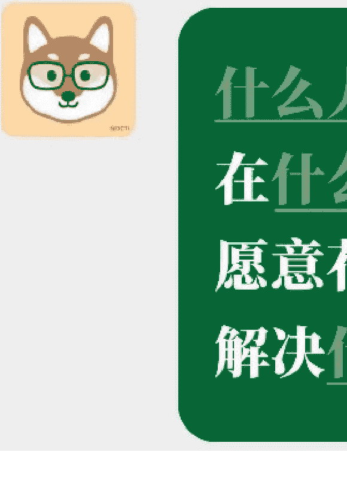
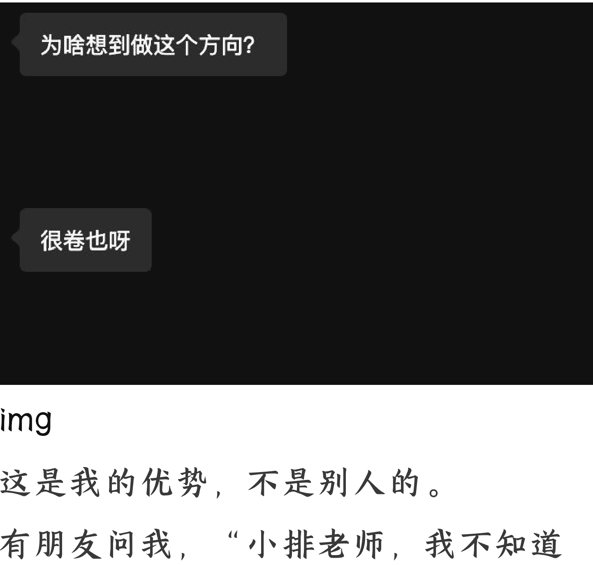

# 如何提高做产品的成功率？

250526 生财精华

整理：公众号懒人搜索，懒人专属群独享
懒人微信：[lazyhelper](lazyhelper)

大家，你好呀，我是刘小排。

下面的内容，我在过去几个月，通过生财有术的直播、SCAI 实验室的开业典礼、还有哥飞的北京见面会等等场所，都零零星星分享过。今天感觉差不多比较完整了，整理成文字，全部分享给大家。

首先，做海外产品本质上是一场数量游戏。做很多其他事情也一样。我以前在生财跟朋友们分享过，独立开发者的大神 Pieter Levels，做产品的成功率也只有 5%。我们需要用数量来对冲概率，这是基本操作，无需赘言。

> @levelsio @levelsio · 2021 年 11 月 7 日🎂 Only 4 out of 70+ projects I ever did made
> 
> 95% of everything I ever did failed
> 
> My hit rate is only about ~5%
> 
> So...ship more
> 
> ```
> PROJECTS THAT MADE GOOD MONEY AND GREW (4)
> nomadlist
> remoteok
> rebase (?)
> youtube network for electronic music (panda mix show)
> ALL PROJECTS (70)
> nomadlist
> nomadjobs
> remoteok
> remoteok workers
> hoodmaps
> makebook
> airlinelist
> ideasai
> qrmenucreator
> inflationchart
> rebase
> colive
> gofuckingdoit
> icecream chat
> tubelytics
> gifbook
> #nomads chat
> taylor telegram chatbot
> startuppretreats
> keepyourfuckingresolutions
> placetowork
> mute life
> fire calculator
> no more google
> maker rank
> how much is my side project worth
> climate finder
> ideasai
> airlinelist
> bali sea cable
> make village
> nomad gear
> 3d and virtual reality dev
> play my inbox
> how to network on youtube 2011
> recording hiphop music
> producing dubstep
> producing music videos
> missed connections dating site for uni campuses 2011
> uber clone for netherlands 2010
> drum and bass music and dj career (pandadnb)
> organizing night club music events in netherlands
> photoshop / visual arts / design / graffiti career 1995-2
> ```

在 AI 的帮助下，产品开发的成本越来越低。记得两三年前我分享过（见我的生财帖子），做一个 MVP 产品只需要一个周末，甚至一天。这篇帖子帮助过很多很多的朋友。在当时，听起来难以置信。现在有了 ChatGPT 和 Cursor，回头再看看那篇帖子，我们会发现，今天每个人做 MVP 可能都只需要半天或一天。如果你参加了我的课程，你会发现学习完前三课，不需要编程基础，无论啥花里胡哨的产品 MVP 都能做了。

产品的基本数量问题，到这里算是彻底解决了。

那接下来，值得我们研究的是——如何 在保证基础数量的前提下，提升单款产品的成功率。

作为产品经理，我从很久以前就开始研究这个问题。世界上有很多知名企业家的成功是有运气因素的。能够一辈子连续做多个产品、每个产品完全不同、每个产品都获得巨大成功的人，非常少，其中，对我影响最大的，是一位叫杜国楹的老前辈企业家。

也许你没听过杜国楹这个名字，但你一定听过他的产品。20 多年前，年仅 20 多岁的杜国楹就凭借第一款产品“背背佳”一炮而红，这款产品至今仍在热销。此后二十几年，他接连打造了“好记星”、“E 人 E 本”、“8848 手机”、“小罐茶”等多个爆款产品，每个都红极一时，成功率高达 100%。

学习杜国楹先生所有的访谈、报道、书籍、课程，深刻影响我的产品方法论。我做产品的成功率也得到了极大的提升。

在这里，我想跟你分享我学习到的两个关键：

第一，需求倒做。

第二，顺势而为。

## 一、需求倒做

我们很多朋友在做产品时，并不这样想。尤其是一些有技术背景的人，或者 AI 自媒体博主。他们往往会发现一些新技术、发现一些新的 Prompt，然后拍脑门觉得“这个技术/这条 Prompt 套个壳包装产品，肯定行”。大部分人的思维方式都是如此，因为这样更符合直觉。我们习惯于从供给侧出发，而供给侧往往是技术。

别说普通人了，就算是两年前红极一时的“大模型六小虎”，汇聚了全中国最厉害的高端技术人才。他们从供给侧技术出发，而不是从需求出发，今天也几乎全都遇到了瓶颈。

杜国楹先生的方法论完全反过来。所谓的“需求倒做”，是把整个产品开发的逻辑完全倒过来。

先找到核心需求点，再设计产品，再开发产品，然后找到与之匹配的独特渠道。

核心需求点➜产品设计➜产品开发➜独特渠道

我喜欢讲故事，你也喜欢听故事。那我们按照老规矩，就从故事开始。

以当年的“背背佳”为例，杜国楹发现了什么需求呢？他观察到，当时家长们希望孩子在上课和做作业时能保持挺拔的坐姿。这个需求在当时全球范围内都没有解决方案。

面对这个核心需求点，杜国楹四处寻找，最终找到了一个可行的方案。在 1997 年，他以 5000 元的资金从天津大学物理学教授袁兵教授买下技术方案，取名为“背背佳”，8 月推出产品。1998 年销售额冲到 4.5 亿元，一举成名。

背背佳在 1997 年的主要渠道是电视购物，因为当时主要面对中小学生和学生家长。这是为目标人群设计的独特渠道。

背背佳直到今天还很火，中间经过至少三轮核心技术升级，目标人群也随着时代的发展进行调整。2023 年以后的背背佳，目标人群已经切换为了健身人群、久坐职场人，做“体态管理”需求点，渠道切换为了抖音和京东自营。

一款产品卖了二十八年。

背背佳成功的关键，在于找到并解决了真需求，并不是在于舍得砸钱。砸电视广告的产品很多，每年央视都有新的标王，但是只有背背佳（和很少的其他产品如“脑白金”），能够长盛不衰。

最近有一些朋友拿着自己的网站产品，一点特色都没有的那种产品，问我怎么搞流量。不好意思，我真的不知道。我甚至怀疑全世界都没人知道。妄想会有什么神奇的渠道能够让任何一个平平无奇、不创造任何增量价值、不解决任何核心需求点的产品搞到流量，这叫什么？这叫幼稚。

对我触动更深的是杜国楹先生做小罐茶的故事。如果说背背佳靠“一根弹力带”证明了需求倒做在功能性消费品领域的威力，那么小罐茶则把同一套方法论复制到了“高感性、强文化属性”的品类---中国茶。它向所有技术驱动者型创业者展示：即使在极度分散、门槛看似很高的传统行业，只要抓住未被满足的关键场景，同样可以用标准化和营销科学打穿市场。

2012 年，杜国楹越来越觉得茶是一门大生意。茶是一个 3000 多亿年销售额的行业，里面竟然连一个 10 个亿的品牌都没有，这太需要创新了，一定有建立品牌的机会。

2012 年的茶有哪些痛点呢？至少有这三个痛点：首先，茶叶是没有价格的。有人送了我一盒龙井茶，“明前龙井”，看起来非常高端。但是我并不知道它值 500 元还是 5000 元还是 50000 元。对于我一个外行来说，500 元的茶和 5000 元的茶，无论是看起来还是喝起来，都没有特别大的差别。其次，喝茶的方式也很奇怪。每次招待客人的时候，摆上了上好的茶具、上好的茶叶，主人用拇指和食指从熟料带里夹出来一小撮茶叶放到杯子里。这一小撮茶叶到底是 3.5g 还是 4.3g，每次都不一样，全凭手感。并且不知道你注意到了吗，根本没有人洗手的……还有，茶的标准化也做得不好。我去年找同一个卖家买的明前龙井，觉得味道不错，今年再找他买，味道就变了……

这些早就被普通中国人长达千年习以为常的奇怪之处，都是核心需求点。找准了核心需求点，那就反向设计产品、开发产品。你看看今天小罐茶的形态。价格全国统一，解决了痛点一；把每款茶压缩成 4 克一小罐，像咖啡胶囊一样“一次一泡”，既锁鲜又量化价格，以此降低传统茶的“学习成本”，解决了痛点二；用工业化的方式来保证品质稳定性，解决了痛点三。

到了这都搞明白以后，再去思考与之匹配的独特营销渠道，看准了茶叶是“礼品经济”，那就打透有关礼品的渠道。

这就是好产品。

我常说，产品=一个具体问题的解决方案

好产品 = 一个具体问题的优雅的解决方案

这套方法论，结合我所在的 AI 产品领域，我总结为了一道填空题。什么人，在什么场景下，愿意花多少钱，解决什么问题？

生财的老朋友枸杞，还帮我制作成了一个微信表情：



当你发现了新的技术、新的 API、新的套壳可能性，先别急着自嗨，先试试能不能填这个填空题。

当你翻石头刷榜单，不要急着去抄个一模一样的，而是要去思考，榜单上的别人的产品是怎么填好这个填空题的、他找到了什么真需求？围绕这个需求，你能设计出什么**差异化**的产品方案？

先填好填空题再去做产品的人，比拍脑门做产品的人，成功率会高很多。

> 口诀：先有用户，再做产品

## 二、顺势而为

这里有两个势，一个是你的**优势**，一个是**趋势**。

哪个更重要？与很多人想的不同，杜国楹先生认为**优势**更重要。我完全同意他的看法。

### 1. 优势

我能做海外 AI 产品还出点成绩，因为这是我的优势。我在前公司猎豹移动，做过多款日活超过千万的海外 App 产品。所谓日活超过千万，是指每天有超过一千万人使用。我做了十年的海外 App。同时，也是在前公司，差不多是在 2016 年 AlphaGo 击败李世石事件的时候，我们转型拥抱 AI，所以我也做了九年的 AI。

直播的时候我提到我做了 9 年的 AI，有人评论说“吹牛，ChatGPT 才只有不到 3 年的历史”。还挺好笑的，看来，做 AI 产品并不是他的优势。

作为产品经理，做了 10 年的海外 App、9 年的 AI、再加上我从小学四年级就开始写程序了，再加上我热爱做产品，再加上我喜欢研究前沿的技术和论文.......是在一系列的 buff 叠加下，做海外 AI 产品，成为了我的优势。

再加上我从 2022 年 Q2 就开始做文生图产品了，那时连 ChatGPT 都还没有诞生。积累了三年，爬了无数坑，现在文生图，也是我的优势。

当我做 RaphaelAI ([https://raphael.app](https://raphael.app)) 之前，已经是 2025 年 1 月。对所有人来说，文生图套壳产品都是红海，对于你来说，想必也是。也就是说，在我做这个产品之前，我不太可能拿到投资，因为我做的产品，别人会互相觉得对方是傻 X。

然而我很清楚，我才是对的。我做了，获得了不错的成功。

在那之前，一些我敬佩的行业大佬和我对话，是这个风格的。他在别的领域是大佬，在我的领域可不是。



img

这是我的优势，不是别人的。

有朋友问我，"小排老师，我不知道做啥产品，你能不能给我几个产品 idea？"他人不错，我就从我的 list 里找了一个我还挺想做的产品 idea 给他。毫无保留，真心分享。

然后他沉默了，问：还有吗？我又给了一个。他又沉默了，过了很久，继续问：还有吗？

...·直到我给了很多很多个，他发现一个都做不了，尴尬地走了。

因为我的产品 idea 列表，里面全是结合我自身优势而挖掘到的机会点。它们往往是我能做的，但是别人不一定能做。

刚才我们提到的一条枸杞同学，他今天很兴奋。因为在他熟悉的 AWS 电商领域，有很多尚未被解决的问题，正在苦苦等待一个好产品。枸杞认为，传统行业比 AI 变化慢，通过实体产品找出来的需求，反而没啥竞争。一面是竞争小、一面是自己有优势，对枸杞而言，这就属于他的蓝海。

再来一个例子，生财 AI 实验室的第二轮笔试题是一个有关 Web3 的工具。所有进入杭州生财 AI 实验室的人，一共 17 人，全都完成了这道题，技术上难度并不大。但其中只有一个人，可以把它变成真正的、可以盈利的产品。因为这个人曾经靠 Web3 拿到过 8 位数人民币的结果，Web3 工具是他的优势。最近他开始邀请周围的朋友内测他的产品，已经有人求着他早点上线、要求第一时间购买。

还有另外一位杭州生财 AI 实验室的朋友，他也是每天很晚会单独发日报我的朋友之一。他洞察到的需求点目标用户是设计师群体，询问我的意见。虽然他的这个产品 idea 是经过我启发，但是我并不敢轻易发表意见。因为这位朋友自己有设计师背景，做以设计师为目标用户的产品，是他的优势领域，不是我的。只要他能够认真填好填空题、做好用户调研，他猜对的可能性，比我猜对的可能更大。

每个人都是带着自己独特的优势来的。你也一定有自己的独特优势。

在生财 AI 实验室，有人曾经是 ACM 比赛的 Final 27 名，有人是某国内顶尖大学的现任教授（曾经还在 UCBerkeley 呆过）、有人曾经是建筑设计师、有人有专业的心理学背景、有人在抖音本地生活做过几十个小目标的 GMV、有人是国内首屈一指的 prompt 专家、有人拥有专利知识产权服务领域头部公司、有人曾经在工业 AI 视觉算法创业取得成功、有人出版过区块链书籍……我总是鼓励他们，不要跟风抄榜单，而是要从自己的专业优势领域出发。心理学背景的人就应该做心理学相关的 AI 产品，知识产权背景的人就应该做知识产权相关的 AI 产品，用自己优势去打别人的劣势，这样的赢面才大，产品才有壁垒。

试想，坐拥来自名门正派的心理学学术背景，为啥你要去随随便便做过同质化的套壳产品、去跟人比拼发外链的速度和数量呢？这不是暴殄天物吗？

前些天，有圈友告诉我，“小排老师，我悟了，原来「排学」的核心就是「做自己」！”。哈哈哈，其实连我都不知道“排学”到底是个啥玩意儿，不过那一刻，我感觉他总结得挺对的。

在自己的优势领域里击球，是最重要的顺势而为。

### 2. 趋势

最后，我们讲几个趋势，以及它们的应对方案。

**趋势一：海外 AI 产品，投放广告利润会不断变薄。**

原理：已经有很多曾经做跨境电商的人进入海外 AI 产品领域，比如咱们生财圈友 Albert、佳境。他们曾经在电商领域拿到过大结果。

对他们来说，海外 AI 产品领域是蓝海，因为电商比这卷多了。

同样是投放、同样是网站（以前他们叫“独立站”），无外乎就是以前卖实体产品，现在卖虚拟产品，一模一样啊！而且卖虚拟产品（软件产品）还需要压货、物流、发货。

他们会用自己已经很强大的投放团队，来和我们比拼投放，终局一定是利润越来越薄，大家都从暴利变成微利，就和电商一样。应对：除非你有投放优势，或者你致力于建立一个强大的投放团队，否则不要轻易做投放，你打不过他们。我就不做投放，一方面投放完全不是我的优势领域，另一方面是我相信好的产品能够自传播。没错，做能够自传播的产品，这是我的优势啊。

#### 趋势二：大模型能力会不断变强，会吃掉很多套壳产品的价值

我们假设小明和小张，两年前他们同时听说 AIGC 文生图。其中，小明卷了两年的 ComfyUI，小张躺平了两年。回到 2025 年 5 月，他们谁用 AIGC 文生图，做出来的图更好呢？

答案是：一样好！小明卷了两年的 ComfyUI。因为今天小张可以直接使用 lovart.ai，做出来吊打任何 ComfyUI 流程的图，还不累，不需要任何学习过程，连所谓的 prompt 工程都不需要掌握。

基于 ComfyUI 的套壳产品的价值，正在被新一代的大模型技术侵蚀，以后还会越来越严重。

有趣的是，lovart.ai 的开发团队，正是在过去两年吃到 ComfyUI 套壳产品红利的同一个团队。这个团队里面有高人，他们在尝试自我颠覆。

应对：去做那些随着大模型能力变强、产品价值也会增加的产品。例如，Cursor 就是这样一个产品。

Cursor 早就存在了，我 2023 年 2 月就向二两推荐过，二两觉得很难用。Cursor 被普罗大众广泛知道，是在一年半以后的 2024 年 8 月。

是因为 2024 年 8 月它有什么重要的产品更新吗？不！是因为 2024 年 8 月，Anthropic 发布了 claude-3.5-sonnet 模型，让 Cursor 突然变得很好用。随着大模型变强，Cursor 变强了。
Cursor 是大模型的朋友！

#### 趋势三：交付过程的产品会很快消失殆尽，以后主流是 [交付结果] 的产品。

简单的说，以后 AI 产品不再卖工具，而是卖收益；AI 进入了“赚工资”的助理时代，直接交付结果。

怎么评价一个 AI 助理类产品是个好产品？红杉给出了三条标准。

- 1. 能不能完全不需要人类介入、不需要抽卡，直接对某项工作交付确定性结果？
- 2. 能不能量化它的产出能力？到底是节省了 3 小时还是 10 小时？到底是赚了 3 美元还是 10 美元？
- 3. 能不能自我迭代，越来越聪明？

关于这一条，大家一定要去看 5 月红杉资本 AI 峰会的会议纪要。

信息量比较大，请大家到微信搜索“红杉 AI 闭门会”，不少博主有详细解读。

请注意，按照上面几条标准，就连 Manus 也是不完美的。就我个人的体验来说，目前的 Manus 更像是一个玩具，大部分任务的成功率只有百分之六七十（对我而言）。

我会认为垂直领域，有更大的机会。

相比 Manus，我更看好 Lovart.ai。昨天 Lucas 小杨问我下一个产品是什么，这就是我的回答。我会做一个很细分的垂直领域，针对一个特别具体的工作类别，能够直接交付结果的产品。

我会按照红杉给出的三条标准来要求来设计产品。

#### 趋势四：产品供给会急剧膨胀

很好理解，以前做产品门槛挺高的，甚至还需要程序员；现在变容易了，每个人都是程序员了。

大家知道，我最近也开了课程，专门教没有程序员背景的人使用 AI 工具产品来做 AI 工具产品，第一期就有 960 人报名。我只是沧海一粟，还有更多的课程、更多孵化器、更多的社群，在鼓励和号召大家做同样的事。

显而易见，未来几个月，产品供给会急剧膨胀。没有差异化、没有独特价值的产品，完全没有前途。

应对方法：
1. 在自己的优势区击球！做自己！
2. 可以考虑“卖铲子”。
3. 专注于跟人比拼获取用户的效率，而不是比拼技术能力。

## 总结

- 1. 需求倒做。先有用户，再做产品。
- 2. 洞察需求的基本公式：什么人，在什么场景下，愿意花多少钱，解决什么问题？
- 3. 有很多尚未被解决的问题，正在苦苦等待一个好产品。只有在你的优势领域击球，你才能发现它们。

4. 大胆做自己，从自己的优势出发，洞察到待解决的问题，设计一个优雅的解决方案去解决它。

5. 如果能够顺应时代趋势，可以事半功倍。

很久没写这么长的文章了，谢谢你看到这里。

期待看到你的好产品。


懒人专属群持续更新中，已持续运营 6 年，整理超 3000 份各类精选付费文章 & 年费社群干货，全部开放下载。

本资料为付费群内部分享，仅供真实有需要的朋友查阅

## 懒人专属群更新记录:

[https://lazybook.fun/#/blog/record2](https://lazybook.fun/#/blog/record2)