# 无需代码！零基础玩转 GitHub：找工具、搭网站、白嫖资源的指南附：详细截图

## 中文界面操作 250526 生财精华

公众号懒人搜索，[懒人专属群](https://mp.weixin.qq.com/s/fat0UZ1rXpiPrV140_Bpvw)


你是否觉得 GitHub 是程序员专属？不，其实它能帮你：

- ☑ 一键下载全网免费 AI 工具（省下 99% 会员费）
- ☑ 10 分钟搭建个人网站（无需写代码）
- ☑ 白嫖资料/工具（工具、资料、课程、电子书）
- ☑ 了解国内外最新趋势（跟着趋势走）

这篇指南专为 非程序员 设计，用最简步骤教你玩转 GitHub！

# 第一章：GitHub 能为你做什么？

找不到好的提示词？找不到学习资料？不会搭建网站？不知道近期热点？全部都可以上 GitHub。表格链接及资料总结于生财（部分），还有很多，感兴趣的宝子可以自行搜索，而且很多都是优质的哦。

## 图示

## 功能描述

## 提示词网站

https://github.com/jamez-bondos/awesome-gpt4o
https://github.com/jamez-bondos/awesome-gpt4o

bondos/awesome-gpt4o-images


包括但不限于四格漫画，卡通形象，海报等等。

## 大厂开源模型

https://github.com/bytedance/UI-TARS-desktop

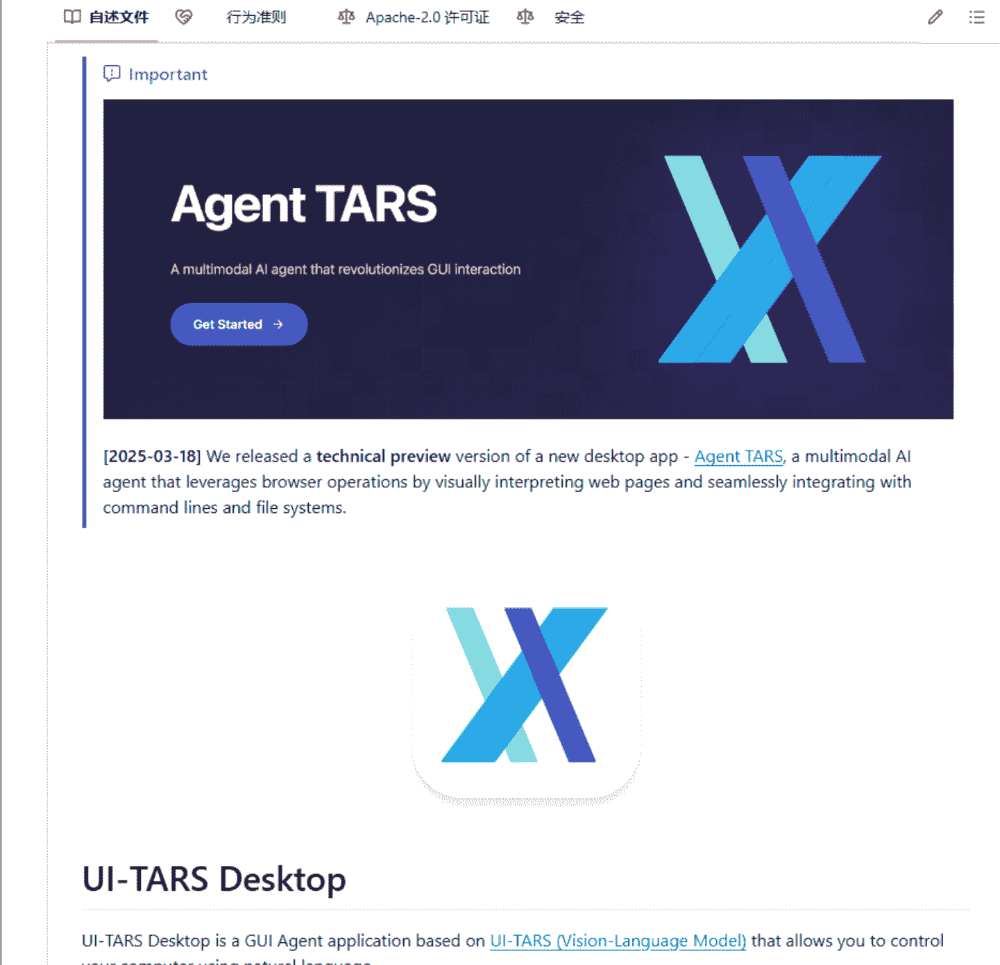

字节跳动开源的通用型 AI agent, TARS, 全网首个三维一体通用型 AI Agent, 浏览器、文件系统、命令行全部打通，可以通过日常对话的方式下达任务，比如打开某个网站，查找某个文件，还能通过截图识别屏幕内容并操作，关键是完全免费，支持 Windows、Mac、手机等都能使用。

## 中国独立开发者

https://github.com/ic7/chinese-independent-developer

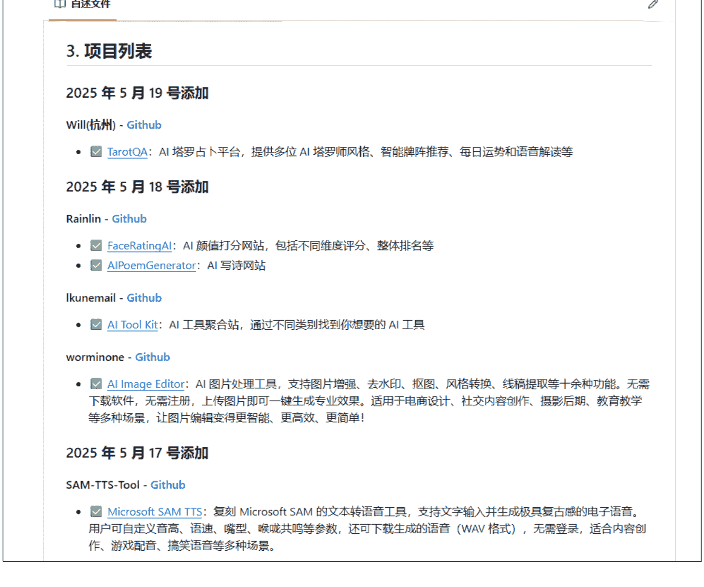

汇集国内众多独立开发者的创业项目，是找创业灵感思路的好地方。

## 学习资料

```
https://github.com/mswnlz/eduknowledge
```

**edu-knowledge**

教育各种资料，从幼儿园到小学、中学，大学、含毕业论文等涵盖学而思，万维，猿辅导等多个机构，持续增加中。

### 少儿

- 「最全少儿学习资料」
- 链接：[https://pan.quark.cn/s/1b37e446b009](https://pan.quark.cn/s/1b37e446b009)
- "《美国纽约公共图书馆 Top100 英文绘本》"
- 共 100 本，PDF+ 源码，纯英文绘本，初学者的野路子。链接：[https://pan.quark.cn/s/4794af7713ac](https://pan.quark.cn/s/4794af7713ac)
- 「阿嘟白泽科学启蒙动画《这是什么》」
- 链接：[https://pan.quark.cn/s/bb75d0958a42](https://pan.quark.cn/s/bb75d0958a42)
- 少年得到《0 基础少年象棋课》
- 这套专为青少年设计的象棋课程杀系由“九冠王”唐丹领衔打造，从棋盘认知到高阶战术形成完整教学闭环。课程以棋子基础教学为起点，详解兵、炮、车、马等七大棋子的移动规则与吃子技巧，通过将军应对、棋局判定等实战场景建立基础棋理认知。经典开局模块解析当头炮、飞相局、仙人指路三大主流战术的布阵逻辑，配合残局破解技法攻克单兵擒王、马擒单士等典型残局困局。杀法训练单元系统拆解重炮、卧煤马、铁门栓等 32 种制胜组合，配合三步连将杀等算力提升训练强化战术思维。防御体系构建涵盖棋子保护、活动空间把控、兑子解圆三大核心策略，中局战术教学融入捉双、引离、闪击等实战技巧，通过 40 个经典案例演示攻防转换的精妙棋理。
- 央视力荐儿童科普纪录片《如果我是一只动物》2018 52 集 1080P 普通话 中文字幕 儿童启蒙科普佳片 4G
链接：[https://pan.quark.cn/s/57d63abe8711](https://pan.quark.cn/s/57d63abe8711)
从幼儿园到小学、中学，含盖学而思，万维、猿辅导多个机构。

### 图片处理器

**[https://github.com/Sanster/IOPaint](https://github.com/Sanster/IOPaint)**


- **自述文件** Apache-2.0 许可证
- **Apache-2.0 许可证**
- **Apache-2.7 许可证**
- **Apache-2.8 许可证**
- **Apache-2.9 许可证**

图片处理神器还可以本地部署。功能包括：去除水印，擦除杂物、修复老照片、改变图中选中区域的内容等。

### 自动投递简历

懒人微信：lazyhelper


https://github.com/noBaldAaa/find-job?tab=readme-ov-file


**操作步骤**

1. 点击链接获取自己免费的 apikey：[GPT-API-free 项目](https://api53.duowan.com/duostats/api/fre/redis?api_key=ed16495a6991be41e5d215d622db69da&table_name=commondb&instance_id=1322946)

2. 全局搜索【你的 apiKey】字段，替换为你自己的 apiKey

3. 修改你自己的简历基本信息.txt

4. yarn install && yarn start 启动运行

**一、前言**

最近在 GitHub 上发现了一个非常有意思的项目：[GitHub 链接](https://github.com/noBaldAaa/find-job_graph)

该作者巧妙地结合 GPT 和 RPA 技术，打造了一个自动投简历助手。这是原作者分享的效果展示视频：[B 站视频链接](https://github.com/Links/images/2023-07-11/17-3.png)

可以根据你的简历内容自动生成求职信发给人力。

## 部署网站

https://scys.com/view/docx/YIvBdL38ConF89xdBvAckZBPn5e#EWa3dfeVRoiflZxbquccMlDxnlc

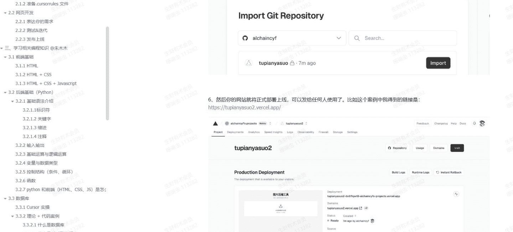

找到喜欢的代码复刻一份之后用 vercel 进行部署即可生成自己的网站。

# 第二章：快速上手：注册与汉化

## 步骤 1：注册账号

访问 github.com，点击右上角 Sign Up → 填写邮箱/密码/用户名。

避坑提示：用户名只能包含字母、数字或连字符。

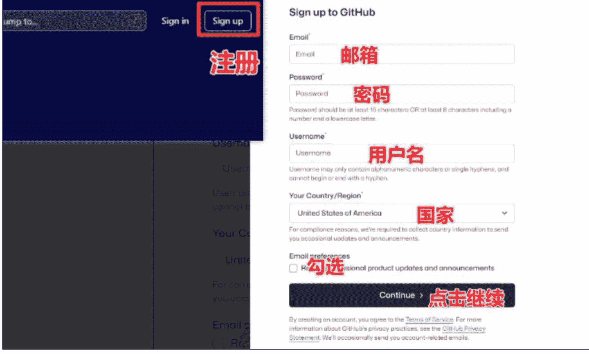

## 步骤 2：安装汉化插件

搜索“汉化插件”→选择星标最高插件。

点击“安装”→刷新页面自动生效（可以根据自己的浏览器来进行选择）。

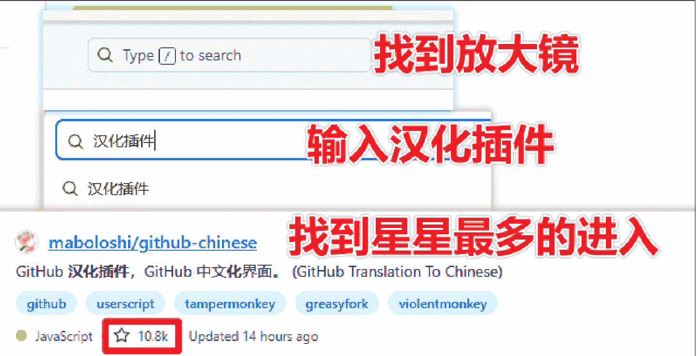

进入之后往下滑可以找到【浏览器与脚本管理器】，根据自己的需求选择合适的脚本进行安装即可。

## GitHub 中文化插件

本项目源自: 52cik/github-hans

简体中文・繁體中文

🔴Issue 13 open  🔴Star 11k  🔴Fork 632  🔴License GPL-3.0  🔴GreasyFork 111736 installs

👍RECOMMEND BY HelloGitHub △ 161

> ⚠️ Warning

本项目从未发布至 GitCode，如您发现请截图并保留证据。

### 💖 星标历史

[Star History Chart](https://ghp.j.io/star-history/jss69/GitHub-I18N)

### 🚩 功能

- * 中文化 GitHub 菜单栏，标题，按钮等公共组件
- 保留、完善正则功能
- 支持对"项目描述"进行人机翻译 (参考: [k1995/github-i18n-plugin](https://greasyfork.org/zh-CN/scripts/396698-github-i18n-plugin))

### 🌐 根据自己的浏览器选择合适的插件

| 浏览器 | 脚本管理器 |
| --- | --- |
| Chrome 或基于 Chromium 内核的浏览器 | [Tampermonkey](https://www.tampermonkey.net/) 或 [Violentmonkey](https://violentmonkey.github.io/) |
| Safari 浏览器 (macOS, iOS, iPadOS) | [Macaque](https://greasyfork.org/en/scripts/8855-macaque) 或 [Stay](https://github.com/shoot666/stay) |
| Firefox 或基于 Gecko 内核的浏览器 | [Tampermonkey](https://www.tampermonkey.net/) 或 [Violentmonkey](https://violentmonkey.github.io/) |
| Via 浏览器 (Android) | 浏览器内自带 |

我用的是 edg 和 chrome 比较多，所以选择第一个（其他圈友根据自己的浏览器来选择安装），点击之后进入的是这个界面，之后点击去商店。

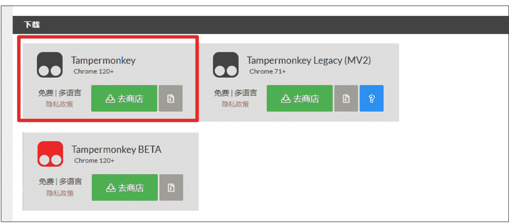

点击添加至 chrome，把这个浏览器插件安装一下，安装成功之后回到 github 页面。

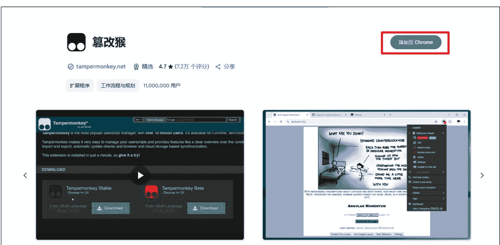

刚刚的界面往下滑，找到【安装】，点击第一个，然后点击安装，然后就算是安装成功。

### 成功了，再回到 github 界面，刷新一下，就会变成中文的了

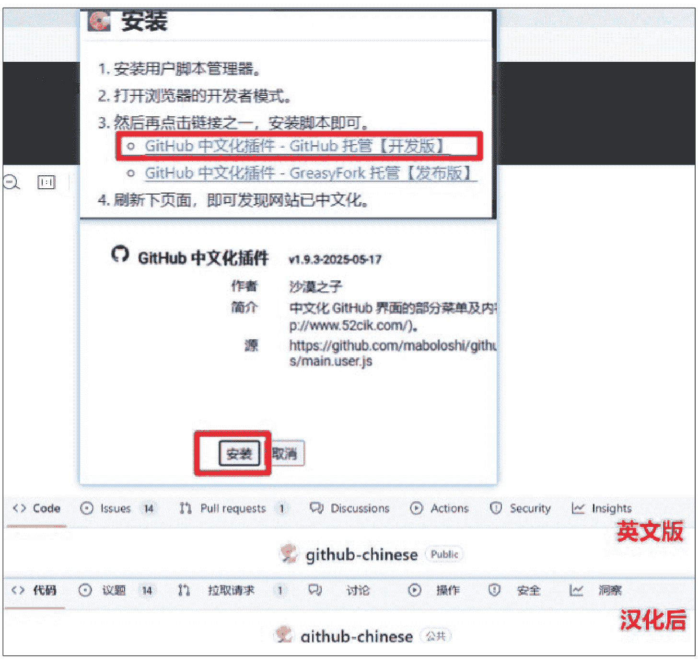

刚刚那个插件主要是针对菜单还有按钮功能完成的汉化。如果还遇到文件里面的大段英文看不懂的话，可以借助于中文翻译插件，像是【沉浸式翻译】或者【火山翻译】，有一些还有网站自带的翻译软件，可以在网页上点击右键，选择【翻译为中文简体】，这样你就可以愉快的逛 github 了。

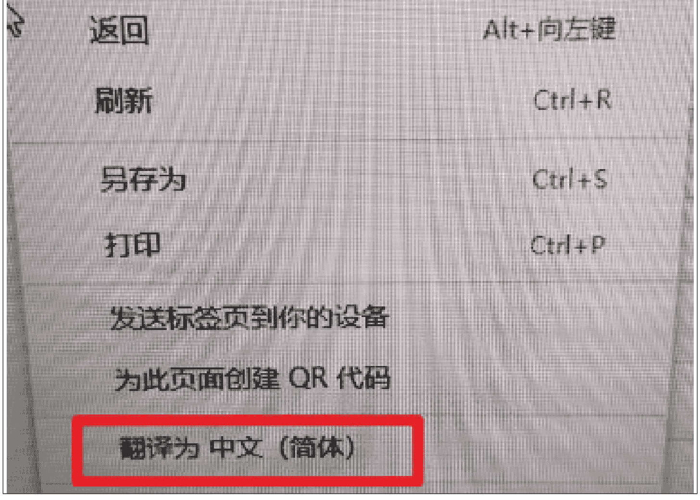

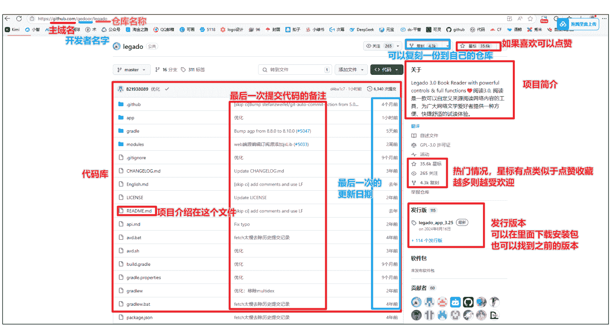

# 第三章：资源探索与快速上站技巧

## 1. 搜索功能

找工具：用途 + 免费（如 ai-tool free）

找资源：awesome + 领域（如 awesome-design）

找模板：用途 + template（如 blog-template）

**实操如下：**

很多人不知道怎么愉快的逛，毕竟这个界面是真的空空如也，好像什么都没有，其实可以像刚刚一样找到放大镜，然后输入你想要的资源，比如我输入了【生财有术】，好家伙，又找到盗版生财有术资料的了。

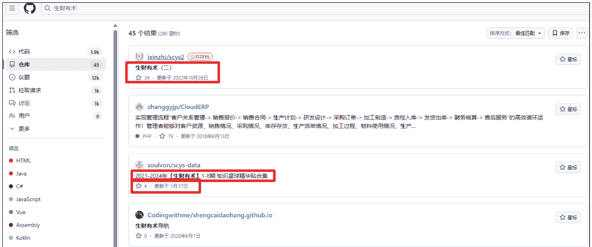

换个词，比如搜索【阅读】，结果出来 10.7k 个结果，但并不是所有都是有用的。

这个时候就需要根据自己的需求进行筛选了。

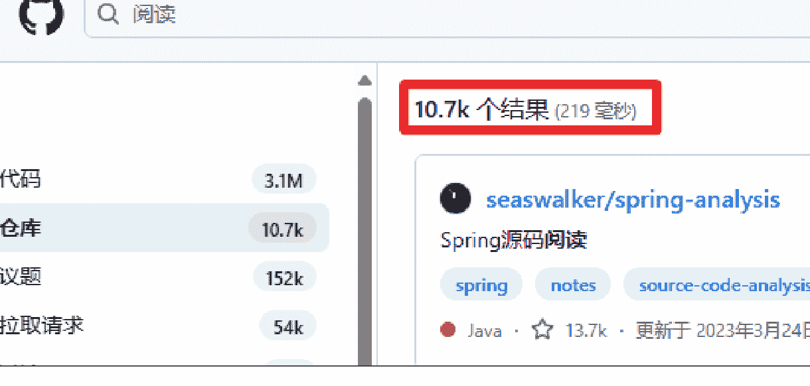

## 2. 筛选指标

这个筛选指标是通用的，大家可以根据自己的需求来，可以选择复刻多的，也可以选择星标多的。

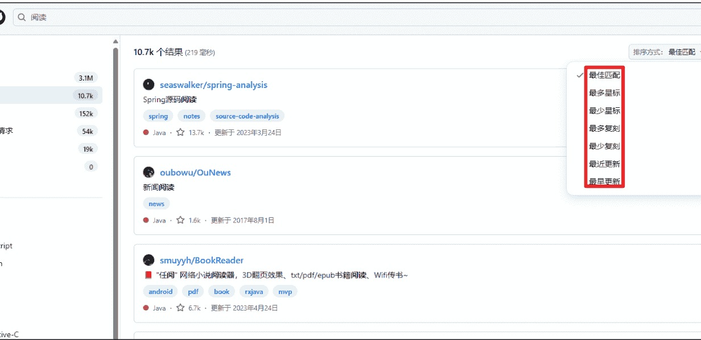

一般情况下星标和复刻越多就是这个项目越受欢迎，咱们可以随便点击一个进去它的介绍，基本上每个打开都是这样的一个界面，大家可以看一下我的标注。

网址基本上都是主域名 + 开发者名字 + 仓库名称组合而成的，如果找不到相关的展示链接可以按照这样的顺序进入展示的页面。

最左边就是代码部分，可以点击进去查看代码的情况，不过我看不懂哈哈哈哈。

⚠️ **注意：若项目最后更新时间为 2 年前，可能已失效！**

## 3. 下载与版本选择

大家觉得某个项目感兴趣的可以点击右上角的绿色的星标进行下载，他是直接将一整个代码压缩包下载下来（不登录也可以下载，不过这个功能是下载到本地哦）。

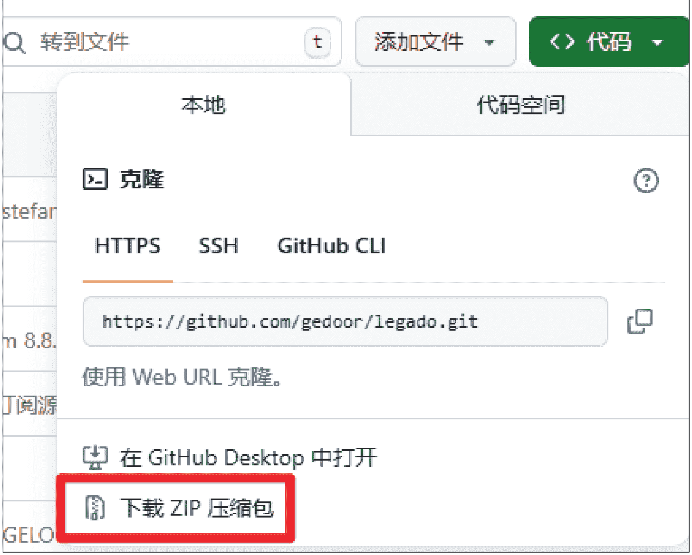

点开某个项目之后一直往下滑就是一整个项目的介绍，github 会自动读取 readme 文件，然后把内容展示出来，一般展示了项目的基础信息，介绍了项目是做什么用的，解决了什么问题以及如何运行使用。

元素: 自述文件 GPL-3.0 许可证

公众号懒人搜索，懒人专属群分享

English 中文

●10 讨论→操作

0 10


Telegram 群组 Telegram 频道

## 功能

Telegram 群组 Telegram 频道

老狠者阅读

↑ ↑ ↑

功能

English 中文

Legado/开源阅读 [gedoor.github.io/legado.top](https://legado.top)

“新用户？”

→ 2024 年 8 月 16 日

LEGADO

Legado is a free and open source novel reader for Android.

↑ ↑ 1.6 亿次下载

↑

», », », «

Bug

Legado/开源阅读

软件不提供内容，需要您自己手动添加，例如导入书源等。看看官方帮助文档，也许里面就有你要的答案。

Developers

1.4. gmhft
gmhftc

Index

在 github 逛的时候如果遇到喜欢的项目可以进行复刻，这样即便后面那个项目没了你也还留存着一份哦。

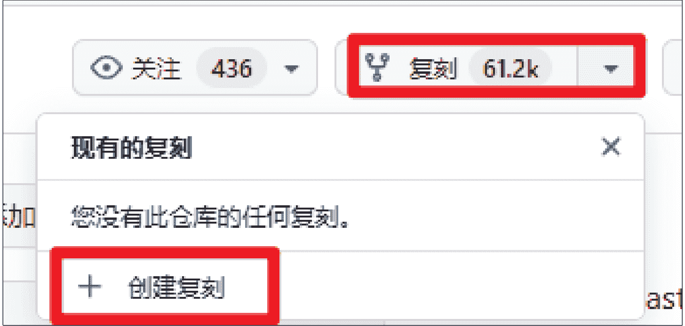

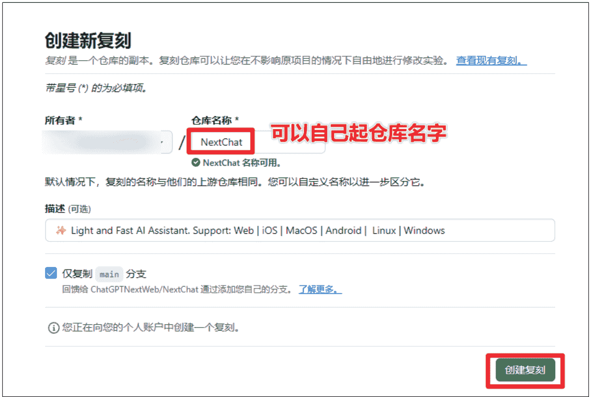

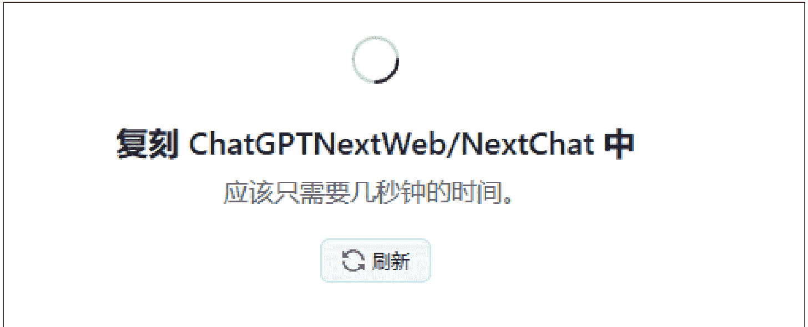

复刻完之后注册完并打开 vercel.com，记得授权自己的 github 在 vercel 上面进行登录，然后点击右上角的 add new project。

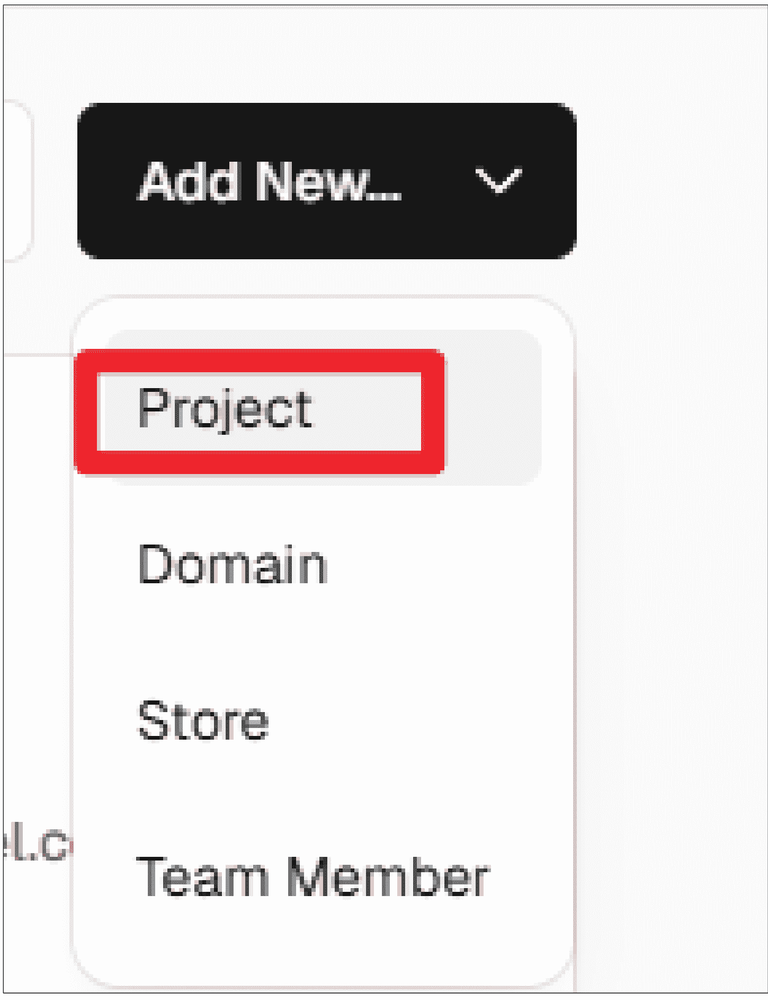

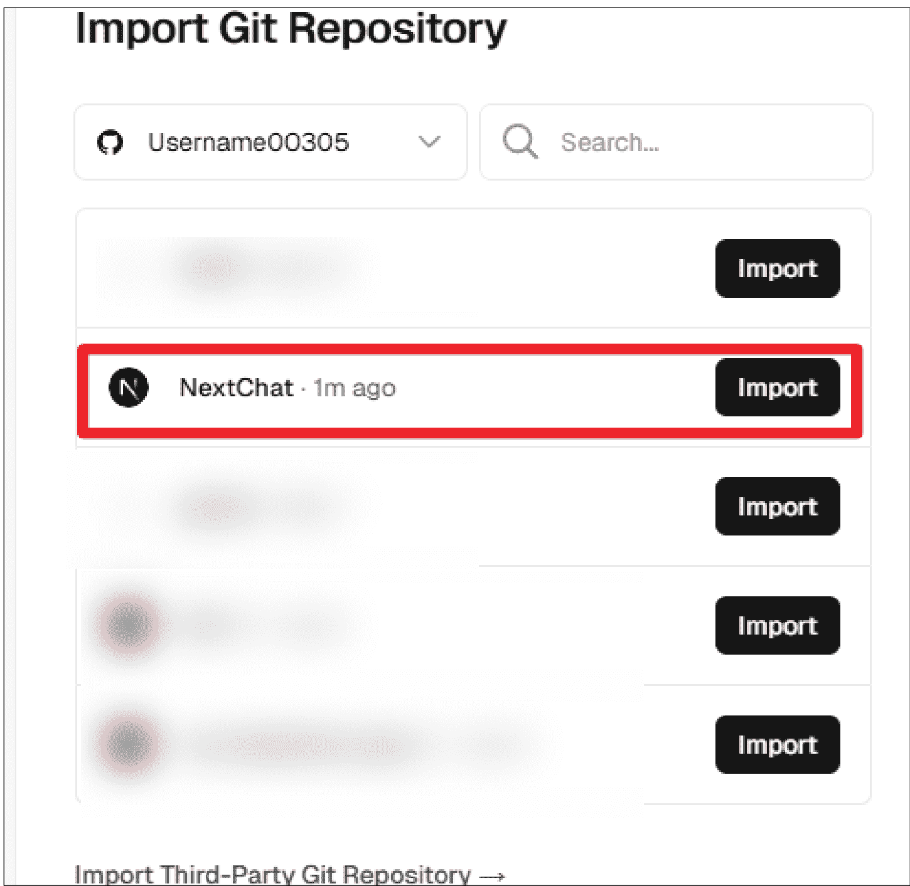

然后就可以选择你刚刚复刻在 github 上的项目，点击 import，然后继续点击 deploy 然后等个几分钟。

### Import Git Repository

Import Third-Party Git Repository →


部署成功之后你就能得到一个一模一样的网站了，这个就是刚刚从 Github 上复刻下来的网站，不过用的是 vercel 的域名，后期可以根据自己的需求修改 Github 上的代码来修改这个网站上的功能，也可以直接用自己购买域名哦，感兴趣的可以看--一下 Cursor 的航海，特别详细。


# 第四章：Github 隐藏功能

1. 社区互动（Issues 提问于讨论）

如果你觉得项目存在哪一些可以继续更新完善修改的，也可以将你的修改通过主页的【拉取请求】合并进作者的主代码库，为 Github 贡献出你的一份力。

首次为 maboloshi/github-chinese 做贡献？
如下图，当前是默认的公开系统，就是默认的公开系统的议题回答，收费是免费。

如果你不知道如何修复一个议题，可考虑为它打开一个拉取请求。当然，你在做项目的过程中如果遇到问题不知道怎么解决的话也是有迹可循的，主页中间有一个议题，这里就是往期其他适用过本项目的小伙伴遇到问题归纳和总结了。在【议题】中你可以与项目作者和其他爱好者互动讨论。

[/content]

用户进行讨论。还可以点击右边绿色的按钮【创建议题】发起一个讨论。

【议题】分成两种，【打开】跟【关闭】的，其中【打开】一般指的是这个项目在使用过程中还没有解决的 bug 或者还在讨论的问题，【关闭】则是指的已经解决的 bug 或者已经结束的讨论。

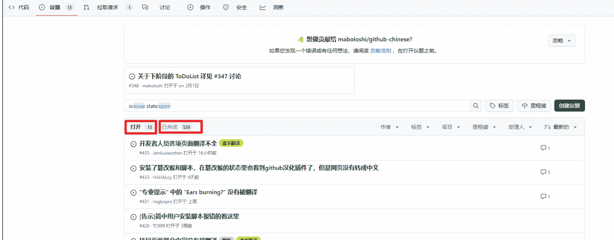

## 2. 个性化推荐（探索页和星际联动）

平时你遇到觉得不错的仓库或者项目可以给个星标，GitHub 会自动根据你的星标的项目给你进行推荐类似的（有点像是小红书你点赞了哪篇笔记，系统会自动再给你推荐类似的）

可以在自己仓库的主页右上角找到【探索仓库】，下面的【探索更多】，点开之后你就可以像逛小红书一样逛 GitHub 了，基本上都是基于你星标项目给你推荐的

## 公众号懒人搜索，懒人专属群分享

在探索仓库的下面还有一个更多热门仓库，你点进去之后会看到最近比较热门的仓库/项目排行榜

那么怎么找到这个功能呢？右上角有个筛选功能，可以找到今天、这周甚至这个月最受欢迎的项目，如果找不到的话可以直接点击 https://github.com/trending 这个网址进入，你还可以筛选中文类的项目，对于程序员可以筛选基于某种程序语言的项目，

遇到喜欢的还可以点个星标，或者觉得有异常值的还能拿来当作风向标


## 3. 趋势追踪（Trending 页使用指南）

在探索仓库的下面还有一个更多热门仓库，你点进去之后会看到最近比较热门的仓库/项目排行榜

右上角有个筛选功能，可以找到今天、这周甚至这个月最受欢迎的项目，如果找不到的话可以直接点击 https://github.com/trending 这个网址进入，你还可以筛选中文类的项目，对于程序员可以筛选基于某种程序语言的项目，

遇到喜欢的还可以点个星标，或者觉得有异常值的还能拿来当作风向标

## 公众号懒人搜索，懒人专属群分享

找到自己前期星标过的项目也很简单，只需要在右上角点击头像找到我的星标就能查看点过星标的项目了

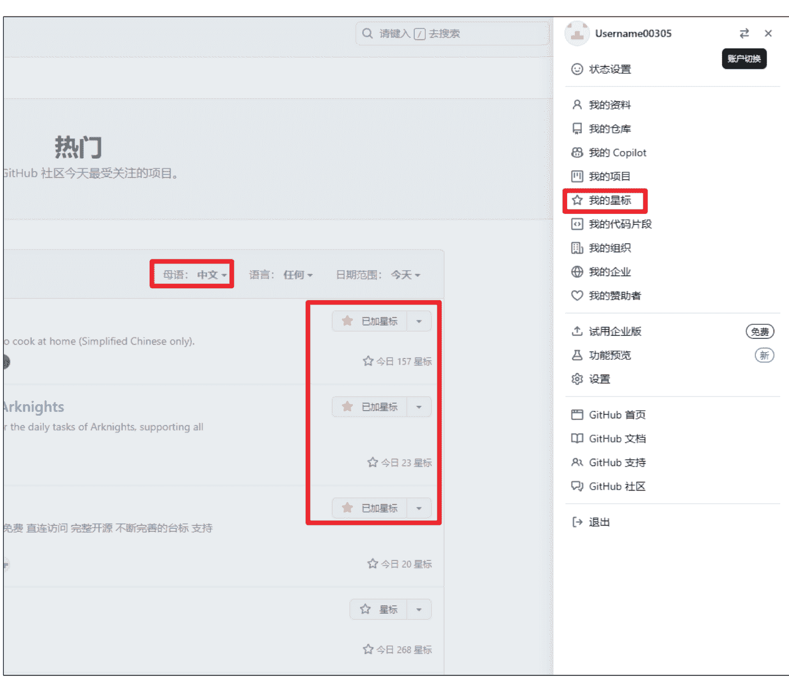

你还可以切换到开发者的界面，进入开发者的主页进行查看他们的仓库情况以及贡献的次数、动态等等，遇到喜欢的开发者还能点关注

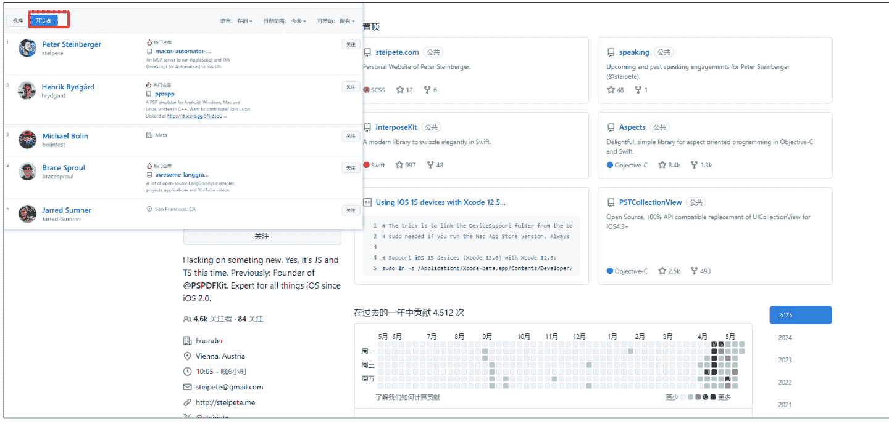

如果遇到了喜欢的项目，也想找找看这个博主的其他项目，可以点击项目左上角，就可以进入到作者的主页了，喜欢的话还可以点个关注哦~

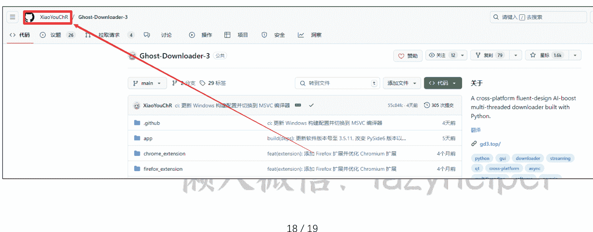

如果实在找不到的话可以在搜索栏最后面加入作者的名字，就可以自动跳转到作者的主页了

## 结尾

我这里也只是介绍了 GitHub 的部分功能，其实 GitHub 的功能远不止于此，也有官方的文档供大家学习 GitHub Docs

感兴趣的宝子可以直接学习官方教程~

## 懒人专属群持续更新中，已持续运营 6 年，整理超 3000 份各类精选付费文章&年费社群干货，全部开放下载。

本资料为付费群内部分享，仅供真实有需要的朋友查阅

懒人专属群更新记录： https://lazybook.fun/#/blog/record2