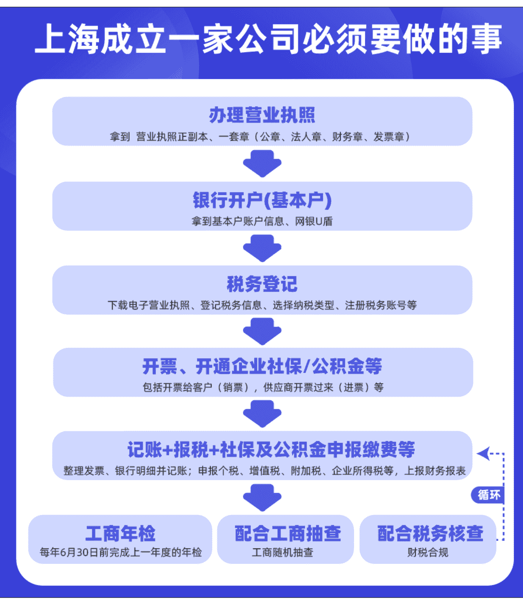

## 注册公司常见问题【工商/财税/社保】

250526 生财精华

公众号懒人搜索，懒人专属群

## 一、背景介绍

大家好，前段时间看到精华帖里有一篇关于开办企业的帖子，里面有很多人评论说能不能分享一些税务相关的问题，本着爱分享、利他的生财价值观，作为财税行业服务十几年的创业者，怎么也得分享下。

自我介绍下：我是 smonkey，4 月加入生财的新人，星球号是 152006；上海财税行业的创业者，从事行业十几年，每天都是在解答/解决客户问题，跟税务局、工商局、社保局、园区等打交道。

本贴主要整理一些客户的高频问题，涉及范围包括工商、税务、社保等，均为小微企业老板的常见问题；本人主要服务的是上海地区的客户，但是公司法、税法都是全国性的，大部分问题差异不大，但是有些细节具有区域性，我会具体说明。

## 二、工商部分

### 1. 注册公司怎么选，个人独资企业、个体工商户、有限责任公司怎么选？

个人独资企业、个体工商户是非法人的性质，个人承担无限责任；
有限责任公司是法人企业，承担的是有限责任，正常也就是注册资本对应的金额；
关于概念的问题我就不过多赘述，想了解的可以自行搜索，我主要说明大家普遍关心的内容。

个人独资企业 - 不推荐：在疫情期间个人独资企业是有对应的税收优惠，这个时候就可以考虑注册来降低企业税收成本；而目前政策 (上海) 个人独资企业跟有限责任公司对比，基本没有什么优势，都是查账征收，个体经营所得税税率从 5%-35%

个体工商户 - 适合有门店，ToC 的用户：很多小伙伴有自己的门店，平时主要的客户是 ToC 用户 (基本不开票)，那可以注册一个个体工商户，也不用找代办，自己去附近的市场监督管理所办理下就行 (要什么材料去问下就行，不同行业要求不一样)。

⚠️ 但是要注意：上海区域已经全面取消核定征收 (根据行业核定一个税率，按照税率纳税)，都是查账征收 (根据收入与支出纳税), 要记得每个季度、每年要进行增值税和个体经营所得税纳税申报，还有工商年检，都是要按时去做的，比较简单（目前成本都是自己填☺）。目前全国对于核定征收的政策基本也在收拢，但是部分城市还是有的，例如河南、湖北等。

有限责任公司 - 推荐：我们主要聊的也是有限责任公司，除了部分用户可以选择个体工商户，其他的基本都是选择有限责任公司，有限责任公司小规模 0 申报，大可发展成上市公司，我们后面介绍的基本都是介绍有限责任公司。

### 2. 注册公司需要哪些材料？（后面所有注册公司指的都是有限责任公司）

这里指的是上海，其他地区可能有细微差异。

如果对注册地址没有要求，就找代办提供园区地址，那你就只需要提供身份证正反面照片就可以办理了！其他信息你跟代办沟通好，可以自己想，也可以让代办给你整理，你来确认，具体信息请看下图。

如果你要实地注册，也就是使用你的办公地址作为营业执照上的地址，那材料就要增加对应的产权证明，要看你产权的性质，产权人关系等，例如租房合同、房产证、产调、分割图等。

#### 办理营业执照所需材料

| 项目 | 说明 |
| :--- | :--- |
| 公司名称 | 准备 2-5 个 |
| 行业表述 | 参考同行，例如网络科技 |
| 注册资本 | 承担有限责任的资金，5 年内需实缴 |
| 经营范围 | 参考同行 |
| 高管信息 | 法人，股东，监事 (可不设) 准备好身份证正反面照片和手机号 |
| 股份分配 | 投资人/企业出资额，占股比例 |
| 地址资料 | 实地地址注册需提供租房合同、产调证、房产证复印件或备案号/也可直接挂靠园区虚拟地址 |
| **印章** | 获得 执照正副本 公章、法人章、财务章、发票章 |

### 3. 注册公司要花多少钱？

这里特指上海，其他地区不是很了解。

如果你自己不会做账，也不准备招个单独的财务，那找财税公司就行，注册公司都是免费的，收取的都是代账费用 (怎么选择财税公司，以及代账费用，后面单独写)。

如果你的行业有特殊要求，需要挂实地地址，那很多园区就需要挂靠费，1000 到 5000/年不等，看对应的区，市区一般比较贵，所以小微企业一般都是注册在奉贤、临港、崇明、金山等，这些园区挂靠地址都是免费的。

如果你不准备找代账公司，那代办一般是 500-2000，看你用什么地址，实地注册麻烦一些，所以相对贵一些。

懒人微信：lazyhelper

### 4. 注册公司的流程，以及注册好后要做哪些事？

请看下图，如果急着开票，也可以先税务登记再开户，社保公积金可以不开;

### 5. 关于实缴政策，什么时候缴，怎么缴？

2024 年 7 月 1 日推行新公司法，要求新注册的公司 5 年内实缴，老公司给了 3 年过渡期 (3+5);

实缴没有次数限制，操作也很简单，股东通过自己的银行卡打款进公司账户，备注投资款，然后跟财务说下，其他的财务操作就行。

#### 2024 年 7 月 1 日起新公司法正式执行

- 2024 年 7 月 1 日起，新注册的公司 5 年内必须根据注册资本，股东投资的金额实缴
- 2024 年 7 月 1 日前注册的公司，可以有 3 年的过渡期，最长 8 年内实缴
- 2024 年 7 月 1 日前注册的公司，如果做工商变更，例如减资、变更经营范围、变更法人等，从变更决定/决议时间起 5 年内实缴

#### 实缴流程

- 从股东个人账户转账到公司账户
- 转账的备注填上三个字叫【投资款】
- 公司收到投资款后，财务入账应借【银行存款】，贷【实收资本】
- 公司收到投资款次月，财务要申报印花税 (小微企业税率为 0.25‰)
- 在企业信用信息公示系统做年报公示时，公示实缴金额

#### 注意事项/常见问题

- 实缴资金必须由股东名下的账户转到公司账户，不能他人账户代转
- 实缴可以一次性全额打款，也可以分多次打款
- 公司注册资金实缴后，只能用于公司经营使用，股东不能随意取出
- 实缴后，资金不必一分不少地停留在公司账户里，实缴资金可用于公司日常经营
- 全额实缴完成后，公司经营使用完所有的投资款，公司账户没钱了，股东无需再次实缴，一般来说，股东承担的有限责任就是实缴的全部资金;

#### 实缴方式 (建议资金实缴)

- 资金实缴
- 实物实缴/有形资产实缴
- 知识产权实缴/无形资产实缴
- 债权实缴 (相当于资金实缴)
- 高新技术成果实缴 (相当于无形资产)
- 土地使用权实缴 (相当于有形资产)
- 股权实缴 (相当于无形资产)
- 劳务实缴

### 6. 电子营业执照，电子印章

每个公司法人都可以下载电子营业执照，下载电子印章，通过扫码就可以给 pdf 文件盖章了，很简单方便而且免费，执照批下来就可以下载了。

## 三、财税代理

### 1. 财税代理公司怎么选？

代账公司我大概分为四种

#### 1. 规模比较大的公司

这种公司一般都是层层架构，例如 [老板 - 总监 - 组长 - 财务], 而你合作之后一般是拉一个工作群，主要服务你的就是对应招的财务，财务正常都是到点下班，上班的主要工作也是记账报税，所以这种公司的缺点也很明显，费用不低 (组织架构比较重，成本高), 服务跟不上 (实际服务你的是招聘的财务), 优点是流程正规，跑路风险相对较低。

#### 2. 会计事务所

会计事务所一般由几个注册会计师合伙经营，公司规模一般不大，主要服务高客单价的用户，特点就是专业性强，适合公司业务很复杂，有审计需求，需要跟税务局谈判等用户，缺点就是价格高。

#### 3. 规模不大，有完整的团队，正规的办公场所

市场上这种公司比较多，我也属于这种类型，记账报税的财务是招聘的，销售/客户服务是老板。这种公司也分两种，一种老板不是很懂财税，所以一般也是拉群让财务沟通; 另一种老板自己懂财务，所以很多时候都是自己人 (包括合伙人或者家人) 对接客户，这种相对服务体验要高很多 (有问题能随时沟通，老板对客户也更有耐心), 性价比也高很多; 这种公司缺点是需要注意甄别，遇到不靠谱的，会乱收费，动不动说这个事要花了多少钱找了多少关系，其实可能就跑一趟税务局的事。

#### 4. 家里几个人就是一个财税公司，小区里办公

这种公司超级多，听说前几年一个村的人都来干这个了，这种公司谨慎选择，虽然也有靠谱的，但是不容易甄别，跑路风险也高，乱收费概率高，这部分人往往就是通过低价来吸引客户，然后通过其他途径收费。

### 2. 财务代理，工商服务费用参考？

这里信息仅限上海 - 仅供参考；像会计事务所的价格肯定远远高于这个，低价内卷的可能低的不可想象!

| 纳税人类型 | 企业规模 | 价格/月 | 价格/年 |
| :--- | :--- | :--- | :--- |
| 小规模纳税人 | 0 申报 | 100/月 | 1200/年 |
| | 0 申报 + 社保代理 | 125/月 | 1500/年 |
| | 年开票不超过 200 万 | 200/月 | 2400/年 |
| | 年开票不超过 500 万 | 300/月 | 3600/年 |
| 一般纳税人 | 0 申报 | 200/月 | 2400/年 |
| | 年开票不超过 500 万 | 400/月 | 4800/年 |
| | 年开票不超过 1000 万 | 500/月 | 6000/年 |
| 代开发票 | 20 张以内 | 100/月 | -- |
| | 50 张以内 | 200/月 | -- |

| 服务项目 | 价格 | 客户准备材料 |
| :--- | :--- | :--- |
| **减/增资（注册资本变更）** | **500/次** | 执照正副本、公章 |
| **工商变更** | **500/次** | 执照正副本、公章 |
| **实地地址迁移** | **1000/次** | 执照正副本、公章、租赁合同、产权证明 |
| **股权转让** | **2000/次** | 执照正副本、公章、财务报表、亲属证明、工商档案等 |
| **公司注销** | **2000 起/次** | 执照正副本、财务报表等 |
| **解除非正常** | **1200 起/次** | 执照副本、公章、法人身份证照片 |
| **核定个体户办理** | **5000 起/次** | 法人身份证照片 |
| **公司实地注册** | **1000/次** | 租赁合同、产权证明、身份证 |
| **居住证积分咨询 + 办理** | **2000/次** | 学历、个税、居住证、身份证等 |
| **落户咨询 + 办理** | **5000 起/次** | 学历、个税、居住证、身份证等 |
| **商标注册** | **500/次** | 名称、logo、对应材料扫描件 |

## 四、税务部分

### 1. 小规模纳税人、一般纳税人是什么，怎么选？

正常开普票，且开票金额不大（例如季度 30 万内），都是选小规模公司；
有些公司客户要求开 13%、9%、6% 税率的专票，那就必须要一般纳税人的公司了，具体怎么选，以及对应差别，请看下图；

#### 小规模 vs 一般纳税人

| 维度 | 小规模 | 一般纳税人 |
| :--- | :--- | :--- |
| 看公司规模 | 月销售额 10 万以内 | 累计 12 个月销售额大于 500 万 |
| 看销售对象 | 买方对发票没有要求 | 买方要求开 6/9/13 个点的增票 |
| 抵扣 | 进项增票不能抵扣 | 增值税 = 销票税额 - 进票税额 |
| 税率 | 可开 1%、3% | 6%、9%、13% |
| 增值税申报 | 季度报 | 月报 |
| 增值税政策 | 每个季度 30 万内免增值税 | 增值税 = 销票税额 - 进票税额 |
| 代账费用 | 更低 | 更高 |

#### 小规模纳税人

##### 增值税
- 季度普票 30 万以内，免增值税
- 季度普票超过 30 万，全额按照 1% 征税
- 季度普票 + 专票超过 30 万，普票按照 1% 征税，专票按照开票税率征收
- 季度普票 + 专票不超过 30 万，普票免税，专票按照开票税率征收

##### 企业所得税
- 年应税所得额不超过 300 万，实际税率：5%；
- 年应税所得额超过 300 万，税率：25%；

##### 开票
- 专票税率：1%、3%
- 普票税率：1%
- 可开具发票：增值税专票、增值税普票、电子普票、电子专票
- 进项票不可抵扣

#### 一般纳税人

##### 增值税
- 增值税进项发票可抵扣增值税销项税额
- 当月应交增值税 = 当月销项税额 - 未抵扣进项税额 - 历史留底税额
- 税率：6%(技术服务类等)、9%(建筑工程类等)、13%

##### 企业所得税
- 年应税所得额不超过 300 万，实际税率：5%;
- 年应税所得额超过 300 万，税率：25%;

##### 其他税费
- 附加税：根据当月的增值税计算，有城市维护建设税、教育费附加、地方教育费附加
- 个人所得税：根据发放的工资计算，税率根据年收入梯度计算

### 2. 企业主要需要考虑的税费 (增值税、企业所得税、个人所得税)

#### 2.1 增值税——小规模公司

小规模公司目前有优惠政策，1 个季度 30 万以内的普票是免征增值税的，所以只要你开的是普票，季度金额 30 万内，就不用考虑增值税。

但是有些客户要求你开专票，那这个专票对应的税费你是必须交的，可以开 1 个点，也可以开 3 个点，税费是多少你就交多少。

1 个季度开票超过了 30 万 (包括普票和专票的总额) 呢，那就没有这个免征的优惠政策了，全额都要交增值税的，所以请注意，超过 30 万不是超过的部分交税，是全额按照对应的税费缴纳增值税

风险提示：请尽量规避连续 3 个季度开票金额都在 25-30 万之间，现在税务大数据识别，到时候要你提供凭证就麻烦了。

备注：小规模的增值税是不能通过进项发票抵扣的，所以只要开了专票或者超了 30 万，就必须要交了！

#### 2.2 增值税——一般纳税人

一般纳税人增值税没有减免政策，但是进项专票可以抵扣。

一般纳税人的增值税 = 销项税额 - 进项税额
{例如你买进来发票总金额 113 元 (不含税金额 100，税额 13)，卖出去 226(不含税金额 200，税额 26)，那你就要交增值税 26-13=13 元}。

注意：只有增值税专用发票才能抵扣增值税，普票不行。

#### 2.3 企业所得税

企业所得税其实就是利润税，企业所得税 = (销售收入 - 销售成本 - 其他企业成本等) x 税率;

销售收入和成本很好理解，贸易公司就是你的进货和卖货的钱，其他企业成本就包括员工工资、房租、水电费、交通费、办公用品等一切与公司正常经营有关的费用;

只要利润不超过 300 万，企业所得税税率是 5%（小微企业的优惠政策），超过了就是 25% 了

很多人问怎么少交企业所得税，答案就是有进票或者报工资，合规的成本入账基本只有两种方式，要么开票（企业经营相关），要么报员工工资；

#### 2.4 个人所得税

公司税务登记之后，每个月都要进行个税申报，不管公司有没有业务，必须报，不报的话每个月是有罚款的，慎重！

个人所得税怎么算呢？

按月来就是 5000 以内免征，按年来是 6 万，具体算法还涉及社保、专项扣除等，年终奖一年有一次的单独计税的机会（单独计税就是不跟全年的累计工资一起算，使用自己单独的税率扣税），具体请看下图。

##### 2024 个人所得税怎么算

个人所得税是按月申报，按年汇总

应缴个税 = ( 累计收入 - 累计免征 - 累计社保 - 专项扣除 ) * 适用税率 - 速算扣除

- 累计收入：当年累计在对应单位申报的工资总金额
- 累计免征：每个人每个月有 5000 的免征额，累计为：当年在对应单位就职的月份*5000
- 累计社保：在上海缴纳社保个人承担的部分，社保金额 (个人承担) 为：工资*10.5%
- 专项附加扣除：上海租金：1500/月，3 岁以下婴儿：2000/月，赡养老人：3000/月，房贷：1000/月，子女教育：2000/月，大病医疗：超过 15000 的部分，继续教育：400/月 或 3600/年
- 适用税率 & 速算扣除数：见下页

###### 适用税率 & 速算扣除数 (按月计算)

| 级数 | 全月应缴纳所得额 | 适用税率 | 速算扣除数 |
| :--- | :--- | :--- | :--- |
| 1 | <= 5000 | 0 | 0 |
| 2 | 5001-8000 | 3% | 0 |
| 3 | 8001-17000 | 10% | 210 |
| 4 | 17001-30000 | 20% | 1410 |
| 5 | 30001-40000 | 25% | 2660 |
| 6 | 40001-60000 | 30% | 4410 |
| 7 | 60001-85000 | 35% | 7160 |
| 8 | > 85000 | 45% | 15160 |

###### 适用税率 & 速算扣除数 (按年计算)

| 级数 | 全年应缴纳所得额 | 适用税率 | 速算扣除数 |
| :--- | :--- | :--- | :--- |
| 1 | <= 36000 | 3% | 0 |
| 2 | 36000-144000 | 10% | 2520 |
| 3 | 144000-300000 | 20% | 16920 |
| 4 | 300000-420000 | 25% | 31920 |
| 5 | 420000-660000 | 30% | 52920 |
| 6 | 660000-960000 | 35% | 85920 |
| 7 | >960000 | 45% | 181920 |

2023 年汇算清缴政策：全年累计收入额 12 万内或应补税额小于 400 元可以不用补缴税费

###### 一次性年终奖单独计税

###### 全年一次性奖金税率表

| 级数 | 全年应缴纳所得额 | 适用税率 | 速算扣除数 |
| :--- | :--- | :--- | :--- |
| 1 | <= 36000 | 3% | 0 |
| 2 | 36000-144000 | 10% | 210 |
| 3 | 144000-300000 | 20% | 1410 |
| 4 | 300000-420000 | 25% | 2660 |
| 5 | 420000-660000 | 30% | 4410 |
| 6 | 660000-960000 | 35% | 7160 |
| 7 | >960000 | 45% | 15160 |

2023 年汇算清缴政策：全年累计收入额 12 万内或应补税额小于 400 元可以不用补缴税费

备注：个人所得税都是通过公司代扣代缴，然后个人如果有退税或者全年收入高于 12 万，第二年就必须进行汇算清缴，进行对应的退税或者补税，截止时间是 6 月 30 日前，不操作税务局会各种催!

#### 2.5 其他税费

其他税费包括附加税：有增值税就有附加税，这个税率不高；

印花税：实收资本、合同等都需要申报印花税，税率也很低，万分之五，还减半征收；

特殊行业还会有一些单独的税，就不一一展示了

## 3. 企业账户的钱怎么转到个人账户？

- 3.1 发工资（需合理考虑个税）
- 3.2 报销：拿与公司正常经营的票报销，例如油费、餐费、办公用品、差旅费、业务招待费、福利费等
- 3.3 股东借款：备注下往来款，但是这个钱是要还回去的，合规的要在当年还回来
- 3.4 劳务费：劳务费也是要个人开票的，这个不建议，劳务费也是要公司代扣代缴个税，超过 800 是 20% 的税率 [表情]
- 3.5 提取备用金：也是需要写去干啥用的
- 3.6 将个人的车租给公司：也是需要个人开票给公司，这个个税也挺高
- 3.7 股东分红：交了企业所得税后，公司就有未分配利润，可以分给股东，个税也是 20% [表情]
- 3.8 其他不常见的方式就不举例了，基本也用不上

## 4. 税费都是什么时候交，怎么交？

个税都是按月申报; 增值税小规模是按季申报，一般纳税人是按月申报; 企业所得税是按季申报，然后还有年报;

不管是季报还是月报都是周期结束之后的那个月申报缴费，正常是 15 号前，有放假就顺延;

税费缴纳超过申报期，就会产生滞纳金，滞纳金按日算，税率万分之五/日，时间拖得久会影响企业纳税信用，建议及时缴纳;

税费正常都是通过公司账户签订三方协议扣款，也方便财务按时扣款。

## 5. 发票内容怎么开？

现在税务都是大数据匹配，贸易类开票要注意进销一致，就是买进来怎么开的，就怎么开出去，否则很容易被判定为虚开发票; 服务类的就开对应服务的类目，例如设计服务、咨询服务等，这种就不需要进票，主要是人工成本。

## 6. 没有进票怎么办？

有些客户总说，我没有进票，直接交税还不行吗？例如开钢材出去，没有进项，增值税全额交!

答案是不行，贸易类的有销无进，风险特别大，就算现在不查，注销或者其他需要税务审批的时候，就很麻烦了！

有销无进，基本就被判定为虚开，目前大数据时代，税务专管员是不敢解除你的风险的！

服务类的、咨询类等公司就不一定需要进票了，其实原理就是符合真实的业务场景，禁止虚开

## 四、社保部分 (仅上海)

上海社保基数，以及对用公司的成本，个人的成本，请看下图，对应基数主要是为了办理积分、落户或者其他用途;

| 基数档次 | 工资基数 | 企业实际扣除/月 | 员工承担金额 |
| :--- | :--- | :--- | :--- |
| 最低 | 7384 | 2677 | 775 |
| 0.8 倍 | 9846 | 3570 | 1034 |
| 1 倍 | 12307 | 4463 | 1292 |
| 1.3 倍 | 16000 | 5802 | 1680 |
| 1.5 倍 | 18461 | 6694 | 1938 |
| 2 倍 | 24614 | 8925 | 2584 |
| 3 倍 | 36921 | 13388 | 3877 |

🧩 懒人专属群持续更新中，已持续运营 6 年，整理超 3000 份各类精选付费文章&年费社群干货，全部开放下载。

本资料为付费群内部分享，仅供真实有需要的朋友查阅🙇

### 懒人专属群更新记录:

https://lazybook.fun/#/blog/record2