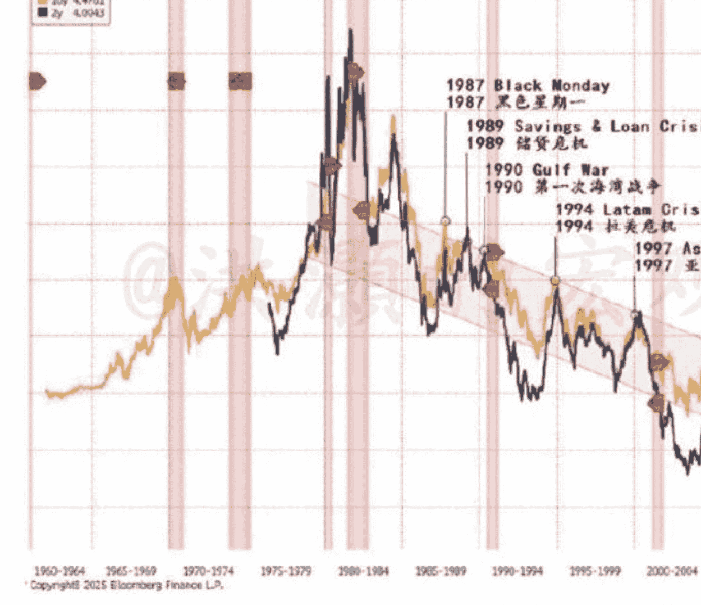
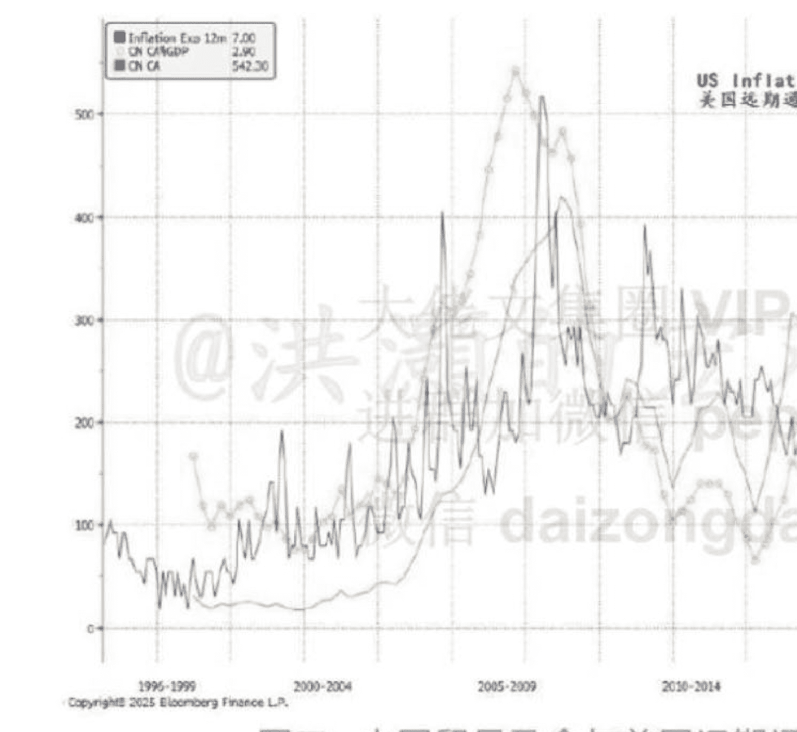

# 如何看待全球债券收益率飙升

2025.05.27 洪灏

整理：公众号懒人搜索 懒人专属群 享 懒人微信:lazyhelper

最近，全球债券收益率飙升，日本长债收益率一个月左右上涨了 100 个基点，达到了 2007 年以来的最高水平。美国十年期国债的收益率水平也居高不下，继续留在 4.5% 以上。这很可能是因为这两个债务大国各自面对着的财政赤字问题。

今年以来，美国的财政赤字已经到了 7% 左右，2020 年以来的平均赤字在 9% 左右，只有美国南北战时期、两战时期、08 年次贷危机和 2020 年新冠时期的赤字率现在的水平略高。简言之，美国现在的赤字水平维持在战时危机的情况，一直没有从新冠时期缓过来，而与此同时美国认为美国经济具有“美国优越性例外主义”。如果真如此“优越”，那么为什么需要如此大的财政赤字。

犹如一个病人拿着针去喝酒，还觉得自己良好。与此同时，日本的经济似乎陷入了滞胀：一季度 GDP 负增长，但是通胀已经到了 3.6%，过去一年大米的价格就翻了一番，搞得日本政府不得不开仓放粮，打压米价。然而，尽管奋斗不懈，人工工资实际上呈增长，因为工资的上涨赶不上通胀的走高。面对着如此高的通胀，一路狂飙的长债收益率，日本央行还是把基准利率控制在 0.5%。

然而，日本政府负债率已经达到了 250%，日本央行已经购买了超过一半的日本国债。日本保险公司因为没有对美元敞口而已经亏了 600 亿美元，而日本央行最近不得不暂缓了对于国债的扭曲操作。如是，日债的“最后一个买家”对于自己的国债都不出手，感觉灵敏的市场交易员就马上嗅到了船之将沉的气息。沉船之前，船上的鼠类总是先弃船而逃的。

上周有那么几天，日债端没有一个买家出价。从这个意义看，那几日债已崩，而日本长期以来一直是“本币债务不是债务”的典范。

欧洲的债券表现相对稳定，虽然也有不同程度的上涨。这可能是因为欧洲出台了一系列的财政扩张方案，包括欧盟重新武器化。德国刚刚通过了相当于 5% GDP 的军费开支，并同乌克兰深入俄罗斯领土作战，不再设距离的限制。曾经，特朗普认为自己可以在几天时间就解决俄乌战争，结果现在看起来似乎遥遥无期了。

特朗普自己也开始不耐烦了，“他们说了很多平民百姓，”我对此非常愤怒。”特朗普曾经要求北约把军费开支扩张到 5% 的 GDP，大家都认为那是天方夜谭，然而现在却最终成真。不知道今年还会有多少以前觉得绝无可能之事却最后成真？

当下，十年美债收益率早已远远突破了它四十多年的下行趋势，并大幅走高（图一）。历史经验告诉我们，过去四十多年里，每一次美债收益率的飙升，都意味着全球无风险收益率的高企和美元流动性的收紧，全球某个市场、某种资产类别，就会出现危机。毕竟，美元是现代货币体系中的最重要的中央储备货币。

图一：美债收益率十年期

图中的这个模型，我在 2013 年 6 月 10 日发表的报告《洪灏：动态的预示》中曾被我用以作为预测的根据（网上懒人助手 lazyhelper），还有报告，请自行搜索。那时，史无前例的“钱荒”以及随之而来的历史性市场巨震，在一个星期内即将轰轰烈烈地上演。一转眼，就过去了十几年。

现在的问题是，这一轮美国长债收益率的飙升，与过去四十多年的经验，有什么不同？对于市场的运行又意味着什么？

以下内容仅 V+ 会员可见

显然，现在全球的债务进入了模式转换。四十年前，美债收益率的飙升意味着美元流动性枯竭，美元融资利率上升。那时候，许多新兴市场都是以美元为融资货币的。没办法，人穷志短，这些新兴市场如果用本币发债，基本上发不出去，还要支付很高的融资利息溢价。然而，现在的世界与那时已大相径庭了。比如，中国的城投债在香港就很吃香。

因此，现在美债收益率的飙升，很可能是因为美国通胀压力导致美国通胀预期的大幅飙升。同时，美国政府今年六月需要做的国债滚动额度为数万亿美元。因此，在美国国债供给差发行量即即将爆发之际，债券收益率自然上升、债券价格自然下降，或者说，美债现在需要到处找买家了。而美联储的货币政策只能控制短端利率，而美债长端收益率则是市场力量共同博弈出来的结果。新冠期间拜登政府毫无节制地发钱，美联储闭着眼睛扩表配合，总有一个要坏的时候。换言之，现在美债收益率升同时美元走弱的情景，暗示了全球市场的资金流向：投资者不再把更多流动性投向美债，而是抛售美元去购买海外的资产。因此，现在市场偏弱的时候，也就是特朗普威胁加关税、地缘政治风险恶化的时候，美债拍卖时的覆盖率非常不理想，同时美元贬值。毕竟，谁会愿意在市场偏弱的时候，继续对自己的投资组合增加风险？即，美债、美元不再是以前那种避险资产，而变成了风险资产。一般来说，风险资产是顺周期资产，而避险资产是逆周期资产。在现在的周期下行的过程中，风险资产从属的属性而言，就不太可能有很好的表现。如果周期下行时风险的体现为通胀压力超预期，那么美债的需求必然将受到影响，但是美国股票作为一种名义收益的资产，反而受到的影响会相对较少。这个逻辑，非常有效地解释了最近在关税风险上升导致通胀预期上升的时候，美股表现出明显的韧性——因为股票抗通胀。顺便提一句，津巴布韦这个深陷恶性通胀的国家，今年股票表现反而领跑全球。多么痛的领悟。

那么，美国的通胀前景又如何？我们可以从中美的贸易关系中推导出来美国通胀的前景（图二）。

图二：中国贸易盈余与美国远期通胀预期

在这个图里，我展示了中国贸易顺差和美国远期通胀预期的关系。显然，两者相关性很强。而美国的远期通胀预期已经开始向新区间向美联储的无量宽期间的水平突飞猛进。这个预期是决定美债长端收益率水平的关键变量之一。这个还解释了，中国在本轮的贸易谈判里并非处于弱方，有许多讨价还价的筹码。否则，如果美国通胀预期失控导致美债再融资失败的话...美元信用体系将遭遇前所未有的重创。难怪，美元指数继续在近几年的这个略低于 99 的位置停滞不前。

速度将远大于预期。这很可能是对冲基金做空美元的投机头寸维持在今年来的最高的水平之一。

那么，美国的通胀最后是否会像预期那样再次大幅飙升？我们看到，目前关税上升的确导致美国进口商品的价格飙升。但是这些进口的通胀已经被上游的生产商吃掉了，表现为美国的生产者价格指数的走势与进口商品通胀的走势相背离（图三）。

## 图三：美国生产商“吃掉了”进口通胀

同时，美国是一个服务业为主的国家，通胀计算里服务业的因子占了大部分，而服务业通胀往往滞后 PPI 约两到三个季度。换言之，通胀从上游传到下游大约需要两三个季度的时间。因此，接下来 90 天的关税谈判尤为重要，我们也不能掉以轻心，需要“理性地看待日内瓦经贸会谈的成果”（环球网）。同时，美国的就业市场如果进一步放缓，也有助于缓解美国下半年的通胀压力。本周的美国 PCE 通胀，这个美联储关注的通胀数据，也显得举足轻重。

至于黄金，最近再次运行到了 3400 美元/盎司附近。黄金显然是当下首选的避险资产，即对抗通胀的风险，也对冲地缘政治的不确定性。然而，黄金显然在走一个“上升旗帜”（rising flag）的技术图形。在技术分析中，这种种图形是趋势延续的形态 (continuation pattern)。换言之，黄金在我们的投资组合里类于一个保险单。没有人买保险希望能索赔，因为没有人希望风险真的突如其来。在风险爆发的时候，投资组合里的其它资产将不可避免地受到冲击。而那时刻，也是黄金的避险功能大放异彩的时候。

今天先写到这里。洪灏

2025.05.27 发布于中国香港

📊 懒人专属群持续更新中，已持续运营 6 年，整理超 3000 份各类精选付费文章 & 年费社群干货，全部开放下载。

本资料为付费群内部分享，仅供真实需要的朋友查阅 🔒

懒人专属更新记录：
https://lazybook.fun/#blog/record2