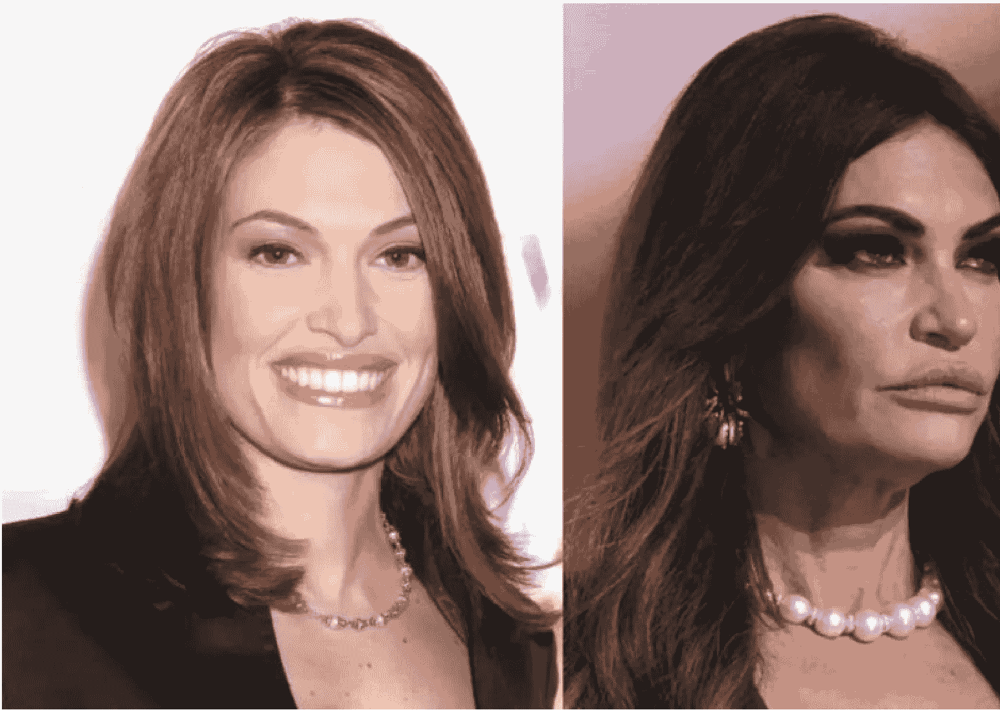

# 好感始于颜值：怎么拥有一张“受欢迎”的面孔？

250527

整理：公众号懒人搜索，懒人专属群独享

懒人微信：lazyhelper


今天我们说一些关于颜值的洞察。假如你对自己的颜值有想法，不管是正面的还是负面的，都建议你听听看。今天的内容可能会改变你对于长相的一贯看法。

咱们先从一个好玩的话题说起，海湖庄园脸（Mar-a-Lago face）。这个词指的是一种长相，一种在海湖庄园里常见的长相。海湖庄园，你可能听说过，是特朗普的私人庄园，是他在 1985 年买的。

一个政客要想走进这个庄园，那起码得是特朗普看得上的人。怎么才能让特朗普看得上？除了理念契合，阵营一致之外，据说还有个关键因素，就是你得满足一定的长相。这个能够混进特朗普海湖庄园圈子的长相，就叫，海湖庄园脸。

这张脸的基本特点是，针对女性，脸部要年轻化，给人感觉好像永远挑着眉毛，永远上扬嘴角，还有尖下巴、高颧骨、饱满的嘴唇，还有一头地道的大波浪。你看过芭比娃娃吧？大概就这样。而针对男性，大概也是芭比的画风，必须棱角分明，有饱满的下巴，最好还要能隔着西装看出肱二头肌。基本就是真人芭比电影的选角标准。

事实上，海湖庄园脸还有个别称，就叫"MAGA 芭比”，MAGA（Make America Great Again，让美国再次伟大）是特朗普的竞选口号。MAGA 芭比，大概就相当于特朗普芭比。与其说这张脸是一种审美选择，不如说更像是同类之间辨别身份的工具，有这张脸，他们彼此就是认同特朗普施政方针的自己人。

但问题是，人总不可能天生都长这样。怎么办？很简单，整。有不少人为了迎合特朗普，就开始整容。据说目前已经整容的人包括，共和党全国委员会主席劳拉·特朗普、小特朗普的未婚妻金伯利·吉尔福伊尔、国土安全部长克里斯蒂·诺姆、白宫新闻秘书卡罗琳·莱维特、前共和党众议员马特·盖茨等等。男女老少，一应俱全。



有人说，海湖庄园脸给人的第一印象是，这个人应该很有钱，而且他很希望你知道他有钱，同时他还觉得其他不如他有钱的人都不值得他看得起。当然，这种长相有人厌恶也有人喜欢。

其实，不光是海湖庄园脸，任何一套整容模板都或多或少面临争议。比如卡戴珊脸、珍妮弗·洛佩兹脸、梅根·福克斯脸，等等。

那么，说到这就引出一个问题，到底什么样的长相，在人们看来是好看的呢？

关于这个问题，有位认知神经科学家，叫安詹·查特吉专门做过研究。尽管我们过去总说，萝卜青菜各有所爱，但根据查特吉的研究，我们在审美这件事上，是有一套最大公约数的。

查特吉认为，人类大脑对于美的判断，主要涉及这么三个要素。

## 第一，好看=个性美 + 普通美。

个性美，这不难理解。查特吉说，长得好看的人往往有一些个人特点，这也是为什么很多人不喜欢现在的网红脸，因为这些面孔千篇一律，没特点。但是，注意，特点是锦上添花的部分，它还需要一个基础，叫普通美。

什么叫普通美？它指的那些关于好看的普遍理解，比如皮肤好、五官精致等等。听到这，有人可能会说，说来说去这不又回到先天条件了吗？

在这里，有一个好消息和一个坏消息。坏消息是，人出生的时候，先天颜值确实有高低之分。而好消息是，一旦进入成年就不是这样了。有句话叫，成年的外表是自己决定的。

人在 34 岁时，体内的一种叫细胞外基质的蛋白质会迅速流失。细胞外基质，你听着可能陌生。但它其中包含的一个东西你肯定听过，叫，胶原蛋白。也就是那个让人看起来皮肤饱满、紧致，有点婴儿肥的东西。这也是为什么很多人说，人到 34 岁会断崖式衰老。

而这背后，其实反映了另外一个真相。

> 随着年龄的增长，颜值的先天部分会慢慢流失，而颜值的后天部分会变得越来越重要。

比如，对成年人来说，衣着干净得体，身材管理良好，日常作息规律，有良好的气色，那么这个人大概率上不会难看。网上经常说的，帅是一种感觉，大概就是这个意思。

## 第二，好看的关键前提是，对称性。

查特吉说，人类普遍喜欢对称的东西。你看，我们觉得好看的东西，孔雀、蝴蝶、热带鱼，典型的特点都是对称。其实，看脸也一样，我们普遍觉得好看的脸必须大致对称。

查特吉认为，我们之所以喜欢对称的脸，这可能是基因的偏好。因为对多数生物来说，对称是健康的指标之一。比如蝴蝶，健康的蝴蝶图案往往是对称的，而被寄生虫感染后，蝴蝶翅膀就会出现异常的斑点。

同样，人的很多审美偏好，其实都隐藏着基因选择的偏好。比如，人为什么会觉得戴美瞳很好看？据说这是因为，瞳孔放大，是一个繁衍信号，说明这个个体的繁衍欲望达到了高峰，而戴美瞳就能起到差不多的效果。再比如，人们普遍觉得，宽肩膀的男性更好看，而腰臀比在一定比例的女性更动人，放在生物学上看，这些特征其实都是性成熟的信号。

换句话说，我们对美的感知，有一个关键前提，这就是健康的体魄。你看，这在一定程度上也是可控的。

## 第三，关于好看，还有一套隐藏标准，叫基因层面的优势互补。

为什么同样一张脸，有人觉得好看，有人觉得不好看？之前有人做过研究，这也许正是基因层面的偏好。我们的基因在筛选那些更能形成优势互补的异性。从这个角度看，情人眼里出西施，其实是有一定道理的。假如对方在基因层面上和你的互补性更高，那么你可能就会看这个人更顺眼。你看，说白了，对于一个成年人来说，别人觉得你好不好看，不外乎三个因素，健康、自律，以及你和对方的匹配度。当然，不能否认，假如在这个基础上，一个人还有一些额外的美，那么他确实能获得更多的优势。

上世纪 90 年代，经济学家丹尼尔·哈默梅什发现，特别好看的人，不仅会比普通人多挣 10%—12% 的钱，而且会更少受到父母的惩罚和同龄人的霸凌。甚至在司法诉讼上，获赔的钱都比普通人多。

当我们看到一个特别好看的人时，大脑里有两个区域，一个梭状回，另一个叫侧枕叶，会马上变得活跃。紧接着，大脑里负责奖励的区域会被激活，我们就会感觉到愉悦。所谓的养眼，大概就是这个意思。而且这个过程发生得非常快。我们判断一个人美不美，只需要 40 毫秒。什么概念？一秒钟的时间蜜蜂可以扇动 200 次翅膀。而且另一项研究也证明了，即使人在战斗状态下，即使对面是你的敌人，大脑里面的审美系统也照样会不受控制地启动。就像小说里写的，仇人就站在对面，但我居然觉得仇人还挺好看的。你看，既然外貌的作用这么明显，也就不难理解，为什么有些人要去整容了。

既然说到整容，国内著名的整形医生，被称为“国内整形第一刀”的陈焕然医生，曾经开过一门课，叫《美容整形医学 10 讲》（专属群通才计划里会更新）。其中，陈焕然医生提到了两件事，假如你身边有朋友对整形有想法，那么这两件事我觉得你应该告诉他。

**首先，安全第一。** 在整形医学里，病人不叫病人，而叫求美者，但整形仍然有医学属性，即使是号称最安全的微整形也是有一定风险的。比如为了调整脸型，要把玻尿酸注射进太阳穴，而太阳穴血管和神经密布，假如注射有偏差，打进了血管里，可能会导致脑栓塞、肺栓塞等。

**其次，或许也可以不整。** 陈焕然医生说，80% 来找他的人，只要找到合适自己的发型和妆容，不动刀也能变好看。怎么变好看？陈焕然医生给出了一个原则，叫“保持整体结构的和谐，比改善局部的缺陷更重要”。说白了，不要纠结于某个具体的局部，只要整体看来顺眼就是最好的。

比如针对发型，假如皮肤比较白，那么许多发色都能驾驭。但假如不是的话，尽量不要选择金发、红发、白发等颜色，而是更适合棕色和亚麻色。同时，最适合黄种人的发色其实就是黑色，不染也能很好看。

同时，陈焕然医生还有一个提醒，是针对孩子的。作为家长，其实都有一次机会，把孩子养得更漂亮。没错，孩子的长相，是可以后天改变的，注意，可不是通过整形。

- **婴儿的脸型跟睡姿有很大关系**，趴着睡，头自然歪向一边，长此以往，会让头型向着前后的方向发育，脸就会变窄。
- **吃的东西的软硬，也会影响脸型的发育**。假如孩子喜欢嚼硬的东西，比如口香糖，就会刺激下颌骨的发育，让脸型朝国字脸的方向发展。假如想让脸偏尖，就不要经常让孩子吃偏硬的东西。
- **不同的体育运动，对身材的影响也不一样**。游泳有很好的整体塑形效果，假如想让孩子的下肢健壮，就可以选择短跑、速滑、跳远之类的项目。
- **假如喜欢双眼皮，大可不必动刀**。可以利用人体组织的可塑性，还在孩子十六七岁的时候，连续使用双眼皮贴三个月到半年就能形成双眼皮。

最后，借用陈焕然医生的一句话，作为今天的结尾吧。他说，在做了 30 多年的整形医生之后，今天他对美的理解已经和过去不同，美不是手术刀，不是玻尿酸，不是肉毒素，美是个性，是特色。

假如你想了解更多，那么陈焕然医生的这门小课《美容整形医学 10 讲》，正好可以来学学。虽然名叫整形医学课，但内容其实是关于两方面，整形的方法，以及不整形也能变好看的方法。这门课只需一个多小时就能学完，内容非常实用。


📚懒人专属群持续更新中，已持续运营 6 年，整理超 3000 份各类精选付费文章&年费社群干货，全部开放下载。

本资料为付费群内部分享，仅供真实有需要的朋友查阅🙇

## 懒人专属群更新记录：

```
https://lazybook.fun/#/blog/record2
```