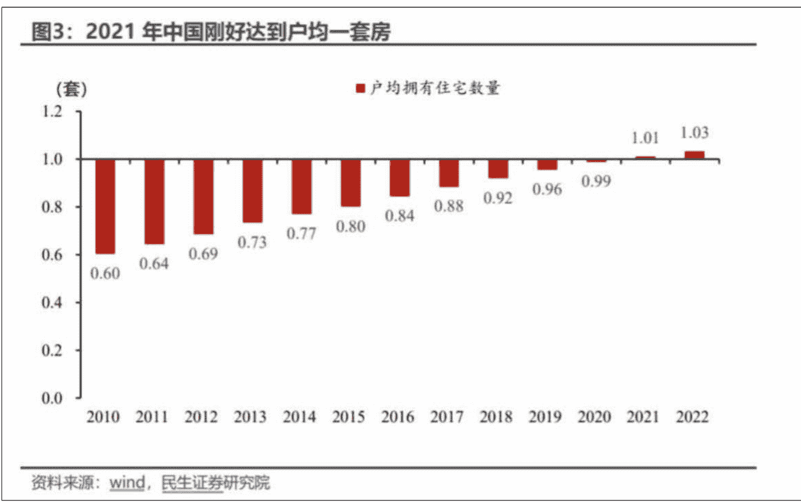

# 如果你对楼市举棋不定，告诉你如下核心趋势

250529 政经参考节选

整理：公众号懒人搜索，懒人专属群独享
懒人微信：lazyhelper


此前我们讲了城市更新的相关内容，但这只是未来房地产发展的抓手之一，此外还有保障房、好房子、收储等等，包括这段时间有媒体说，中国计划在全国范围内推广现房销售制度，言外之意，就是楼市预售制，可能要取消了，用来重塑购房者对楼市的信心。

总之，关于房地产的未来趋势正在越来越清晰，简单说，一个大趋势是中国正在建立一套房地产新模式，包括销售制度、融资制度、管理制度等等。由于涉及面比较广，所以我用两期课程来谈下。

今天，我们就先来分析在一系列新的变化下，房地产未来的核心趋势是什么？让你在购房、换房、房产投资时，有个更本质的坐标。

当然，接下来都是我的个人观点，仅供你参考，不构成任何投资建议。有共鸣当然更好，没有共鸣也不妨听一听。

好，正题开始。

## 从短缺到过剩

我们先来分析下房地产市场的总体情况。

我在文稿中放了一张民生证券研究院的统计图片。



图片显示，2010 年的时候，中国的户均套数只有 0.6 套，这意味着每 10 户家庭，只有 6 户拥有合格商品房，住宅是供不应求的，住房还比较短缺。而 2022 年则是达到了户均 1.03 套，最新的数据则是户均 1.06 套，已经超过 1.0 这个最重要的关口了，这说明，房地产总体上已经基本是供需平衡了。

我们做个横向对比，发达国家中，美国的户均套数是 1.14 套，日本是 1.16 套，韩国是 1.05 套，德国则只有 1.02 套，你看，中国房地产的供需平衡度已经达到了发达国家的水平。

同时，房地产发展的底层逻辑也在发生改变，过去支撑房地产高歌猛进的三大因素：人口上行，城镇化和工业化，分别带来了年轻人购房、农村人口购房和经济发展后能够大规模贷款购房的三方面强劲需求，而现在人口进入下行周期，城镇化进入尾声，传统工业进入产能过剩阶段，土地供应也转向人地挂钩，就是根据人口流动情况，动态调整用地指标的制度，一个城市不能人口少还大量供地。总之，一边是需求收紧，另一边是供应管控。

所以我们分析得出第一个结论：未来的房地产市场主要将会是一个需求主导型的市场。

我们进一步来分析，就会发现，房地产市场的总量开始过剩，但人均上仍然“短缺”：

一方面，从人均面积上来看，中国当前的人均居住面积是 40.8 平，但根据民生证券的测算，大概有 54% 的人口，人均居住面积不足 40 平，近五成的家庭住宅是一居室和二居室，户型偏小。这些家庭有很大的改善需求，所以人均住宅面积扩张，是未来房地产的需求驱动力。

另一方面，从房子年限上看，30% 的房子是 2000 年之前建成的，62% 的房子是 2010 年之前建成，这些房子已经开始出现老化、损坏等问题，涉及到将近 2 亿户的家庭，这部分群体也有改善需求。

所以我们能得出第二个结论：改善型需求会是未来房地产最核心的需求。根据学者任泽平的研究，未来五年，改善更新需求将占到房地产总需求的 71%，成为最大的需求来源。上面这些数据的口径，不同专家的研究各有不同，但总体趋势是没问题的。

## 房地产发展新模式

好，我们刚刚讲了，中国的房地产总体上已经基本是供需平衡，总量上开始过剩，人均上依然短缺，改善型需求会是未来的核心需求。

既然房地产发展的底层逻辑发生了改变，建立在逻辑之上的制度自然也必须要发生改变。

过去为了解决住房短缺问题，房地产建立了一套“供给型制度”。这些制度通过高杠杆、高周转的开发模式，快速形成了巨量的房地产产能，但也带来了不小的问题。

而未来的房地产市场，将由需求来主导楼市，那么这套“供给型制度”显然就不适配了。

于是，2024 年 7 月的二十届三中全会上，中央正式提出了“房地产发展新模式”。

这标志着楼市的“救市阶段”结束，而“改革阶段”来临，要用制度改革的方法，来解决房地产的问题。

那到底什么是“房地产发展新模式”呢？结合当前的各种情况，以及我自己的分析，我给你概括成这六大方面：

- 第一，市场制度改革。建立“保障房 + 商品房”的房地产双轨制，高收入群体消化商品房，低收入群体则由保障房来兜底，实现住房分层。这样可以抑制楼市投机，因为大量需求被保障房给分流了。
- 第二，产品制度改革。大力推行“好房子”，比如推进第四代住宅、取消公摊、城市更新运动、降低容积率、配置电梯、建筑层高不低于 3 米、取消"70/90"限制，就是一座城市的新建住房中，90 平方米以下的住房，必须达到开发建设总面积的 70% 以上，等等，本质都是用品质更好、更具性价比的房地产产品，激发更大的改善需求。
- 第三，土地制度改革。过去的土地供应量，只和城市建设规模有关，并且和地方财政深度绑定，而今后各个城市的土地供应，则是要锚定人口，也就是“人、房、地、钱”联动机制，人口流入大的地区，才有卖地的资格，去化周期，就是房地产库存销售周期超过 18 个月的城市要停止卖地。
- 第四，销售制度改革，逐步废弃预售制，转向现房销售制度。这既是为了从根本上杜绝烂尾楼现象，维护购房者权益，同时，也是在倒逼房企退出高周转、高杠杆、高负债的“三高”模式，转向“持有 + 服务”的轻资产模式。同时因为现房销售，意味着必须建好了房子才能卖，大量实力不强的中小房企会因为扛不住资金压力，而逐步出清。
- 第五，金融制度改革。过去的房地产开发高度依赖外部融资，比如银行贷款、信托资金、非标融资、上下游占款、居民购房预售款等，导致风险大量集中在银行体系和民间金融体系这两块领域中，未来则是要形成一套新的房地产融资制度，比如银行按开发进度给贷款、预售款严格监管等，还比如推行预售型不动产投资信托基金（REITs）或者按揭抵押债券（MBS），简单说，就是要让专业投资者来承担房地产的波动风险，而不是银行和老百姓。
- 第六，税收制度改革。目前已经在优化交易环节税费，比如降低改善型住房的置换税费，鼓励存量房流通，激活二手房市场。未来时机成熟，还是会逐步试点和推广房产税，去年的三中全会决定文件明确说了，要“完善房地产税收制度”，而三中全会的文件明确，整体是要“到 2029 年完成本决定提出的改革任务”，这或许是一个时间节点。总之，通过持有环节的税收来调节市场供需，同时为地方政府提供稳定的财政收入来源。

这其实就是在推动地方从“土地财政”向“人口财政”转型。

总结起来，这套房地产发展新模式的核心就是：资源的重新配置。

之前房地产过于金融化，导致部分刚需群体被挤出，现在要通过双轨制来把资源给到低收入群体。换句话说，房地产要更强调功能性和普惠性，而不是金融性和盈利性。

而之前土地财政导致城市房地产库存过剩，现在要通过“人地挂钩”，来把资源给到人口增量旺盛的城市。这既在加速第二次城市化的进程，也是在推动各个城市从土地财政转向人口财政，地方政府的核心要从“卖地开发”到“抢人留人”。

而房企的高杠杆、预售房烂尾等现象，造成了社会的不稳定，现在则是要用现房销售、融资监管等，来把资源给到更有实力的房企，加快出清尾部企业，同时化解烂尾楼导致的民生难题、消费不振、市场信心等问题。

## 房地产进入“慢时代”

概括下，就是房地产进入“慢时代”。如果说过去的房地产是“高增长、高杠杆、高周转”的“年轻小伙子”，那么未来的房地产市场将更像一个“中年人”——步伐放缓、注重质量、追求稳健。这种“慢时代”的特征，不仅体现在开发节奏上，更贯穿在市场逻辑、政策导向和消费者行为的全方位转变中，在这个过程中，房企、市场、监管、以及购房者的节奏都会“慢下来”，变得更加理性。

对于房企来说，将从“快周转”到“慢工出细活”，过去房企的核心竞争力是“速度”，拿地后快速开工、预售回款、再投资新项目，用杠杆撬动规模。

但在现房销售、融资监管等新制度下，房企必须沉淀更多资金，等待项目建成后才能销售，现金流周期大幅拉长。资金实力弱的企业难以承受现房销售的资金压力，行业集中度将进一步提升，头部房企通过兼并收购或轻资产运营，比如代建、物业找增量。

因此，房产的产品力会成为胜负关键，在总量过剩的背景下，房企必须靠品质取胜，提升户型设计、建材标准、物业服务等，“好房子”将成为关键。

对于市场来说，房子将从过去的“金融属性”更多地转为“居住属性”，房子会变成一个正常的“普通消费品”。过去购房者“抢房”是因为担心房价上涨，投资需求占主导；未来房子回归居住本质、回归消费品本质，市场分化会继续加剧。

未来核心城市优质资产仍稀缺，人口流入的一、二线城市，因为土地供应“人地挂钩”和改善需求支撑，优质地段房产仍然具有保值性。而非核心区域将面临长期调整，尤其三、四线城市，房产库存高、人口流出明显，房价很难企稳，更不用说上涨。

对于监管来说，以前是“刺激需求”，未来则更多地希望“精准调控”。

一方面，是各种政策工具箱会从短期救市转向长效机制，更注重结构性平衡，从需求侧来引导资金入市；另一方面也会通过保障房、城中村改造、收储等来分流刚需，未来 30% 以上的住房供应可能来自保障房，低收入群体通过配租、配售，解决居住问题，商品房市场则聚焦改善需求。

除此之外，对于购房者来说，心态上会有两个非常明显的变化：

- 第一是决策周期拉长，现房销售让购房者可以实地验房，对比品质，开发商“期房画饼”的营销手段失效了。
- 第二是改善需求主导，换房群体更关注学区、物业、社区配套等长期价值，而不是短期升值空间。

所以综合看下来，这轮政策的核心，不是“重启旧游戏”，而是“启动新秩序”。楼市未来的机会，不在整体性机会，而在部分结构性机会，至于在这个新时代，应该如何更好地决策，我会在下节课，继续详细讲。

最后，欢迎你《政经参考》转发推荐给更多人，让我们一起聚焦政经，举重若轻。我是马江博，下期再见。


🖂 懒人专属群持续更新中，已持续运营 6 年，整理超 3000 份各类精选付费文章 & 年费社群干货，全部开放下载。

本资料为付费群内部分享，仅供真实有需要的朋友查阅

## 懒人专属群更新记录：

```
https://lazybook.fun/#/blog/record2
```