# 老喻·决策算法100讲

懒人专属群的群友们，大家好，这是小懒人给大家的《通才计划》更新的课程。

> 懒人专属群-通才计划介绍 是小懒给群友们准备的各领域付费课程，以及高分电子书分享。
> 为防止和谐，课程仅供专属群群友。下载地址见小懒私信给大家的群文档。

整理通才计划的初衷是给群友带来一些成体系的课程。而不是碎片化阅读。

只有成体系的学习，才能相对全面地了解一个领域。

学习的目的不是为了输出，而是为了优化我们的思维决策力。

得到 229RMB 的课程《老喻·决策算法100讲》

已整理添加到专属群《通才计划》，几十份付费课程到咱们懒人专属群内总链接自取。

通才计划目录：https://lazybook.fun/#/data/13_course


懒人手册：https://lazybook.fun/#/

懒人专属群：https://lazybook.fun/#/blog/group

专属群更新记录：https://lazybook.fun/#/blog/record2

## 发刊词：做好决策，成为命运的主人


懒人专属群的群友，你好

我是老喻，欢迎你来到我的《决策算法》课。

这些年有个词越来越火——内耗。

很多人状态是这样的：要不要辞职，在内心反复横跳；要不要分手，左右煎熬；要不要换赛道，来回推敲。

为什么会这样？很多人归结为性格问题。但其实，绝大多数人的内耗，都是源于缺乏有效的决策能力。

决策能力，可能也是人生最重要的能力。

我有个亲戚，夫妻俩从普通打工者，到经营一家服装公司，做得有声有色。我问：你们成功最大的原因是什么？他们回答：应该是20多年前做出了来到深圳的决定。

对比他们的同学，当初这个貌似不经意的决策，给他们带来了改变命运的机遇。

有一次，有读者问我，作为父亲，教育孩子最重要的事情是什么？我说，是你为孩子选了一个什么样的母亲。——这几乎是决定性的，其他都是细枝末节。据我观察，妈妈的性格、理念和投入，影响了孩子教育的大部分效果。

正所谓：Happy wife，Happy life。

好的决策，也可以让人躺赢。

美国内华达州有个数百亿美金的公共雇员基金，投资经理只有一个人。该基金只买被动基金（也就是指数基金）。人们开玩笑说，他每天的主要决策工作是：今天中午吃什么？

事实上，美国很少有主动基金能战胜指数基金。这个基金的决策，看起来很懒很无聊，却跑赢了大多数同行，实现了躺赚。

一个好的决策，看起来可能非常简单，但做对了，却能给我们带来下一个好机会。而好的机会，又给你带来更多好的选择。

所谓开挂人生，就是能持续做对决策，然后像滚雪球一样，财富越滚越大，日子越过越好。

### 决策为什么难？

然而，尽管决策如此重要，大多数人却做得并不好，就像一个段子里说的：

“我的人生，一辈子都在犹豫，真大难临头了，就胡乱选择一下。”

人们对于重大决策，包括那些关键的人生选择，往往是凭直觉的。越是重大决策，反而花时间越少。

这看起来很奇怪：做不太重要的决定时，我们会很认真，甚至犹豫不决；但对于很重要的决定，却总是一时冲动。

怎样斩断犹豫，又怎样约束冲动？你需要一套自己的决策算法。

说起决策能力，很多人有个误解，觉得决策是不可以学的。生活中往往是，绞尽脑汁谋划一通，回头来看最大的决定因素，还是运气。

但事实并不是这样。决策的确受运气影响，做好决策也的确不容易，但并不是没有方法，事实上，持续不断地做好决策，还能带来好运。这就是决策算法的力量。

到底什么是决策算法？决策算法不只是那些按部就班的决策步骤，例如——怎么界定问题，怎么评估选项，怎么作出决定，怎么复盘等等。

决策的真正使命是，面向不确定性的未来，在此刻分配人生的资源，以实现人生持续向好的概率最大化。

这里有三个要点：

- 1、因为决策的目标是未来持续向好，所以决策算法需要衡量收益和风险。
- 2、因为决策总要投入本钱和资源，所以决策算法需要科学计算资源投入的比例。
- 3、因为决策总是条件不足的，需要边瞄准边射击，所以决策算法需要能够持续迭代。

要满足决策算法的这三点要求，有一门学问可以很直接地派上用场，那就是概率论。

概率论的核心就是量化地分析各种不确定性，最适合作为决策算法的基础。

但是，光有概率论还不够，决策还涉及到人与人的博弈，涉及到人的理性和非理性，因此博弈论、行为经济学等学科的知识，也需要拿过来。

说了这么多，你一定想问，那怎么形成自己的决策算法？在这门课里，我想带着你用100讲的篇幅，4个多月的时间，系统地尝试一次。

### 我会怎么讲？

我会怎么讲这门课？具体来说，分成三步：

首先，我想给你分享一个我自己的决策算法框架。

我的这个决策算法核心考虑三个层次，正好对应的就是前面提到的决策要解决的三个问题：

第一个层次，计算期望收益。

我们做决策，首先要综合评估每个选择的潜在收益和风险，而不是单凭自己的感觉。

第二个层次，是决定下注的比例。

这一点很多人容易忽略。决策明不明智，取决于投入产出比。我们要学会如何聪明分配资源，一步一步地投入，追求长期利益最大化，而不是要么一把赌上了身家性命，要么过于保守，错失机会。

第三个层次，是反馈迭代。

这是我们面对不确定性时的最好方法。在决策时，我们必须始终保持开放和好奇心，根据新信息调整判断，持续优化自己的决策，而不是总守着过去的偏见。

这三个层次背后，也高高矗立着决策领域重要的三个“硬核”理论：期望值（Expected Value）、凯利公式（Kelly Criterion）、贝叶斯定律（Bayes' Theorem）。

所以，这套决策框架，我也把它叫做EKB决策算法，EKB就是取自这三个理论的英文单词首字母。

这三个决策层次，可以借用尼采关于人的精神发展的三个阶段：骆驼、狮子和婴儿。

第一层次的期望值，对应着骆驼，象征着决策的理性和责任；

第二层次的凯利公式，对应着狮子，象征着决策的勇敢和智慧；

第三层次的贝叶斯定律，对应着婴儿，象征着决策的初心和成长。

这三个层次，在决策过程中相互配合，形成一个相互补充、循环递进的整体。

有了决策算法，我们就有了一个理性思考的框架。但这还不够。我们前面反复强调了，做决策最难的，是在信息不足、条件不够的情况下，投入筹码。

这个世界的不确定性，我们无法改变。但还是可以尽可能地为自己提前储备一些思考模型和通用常识，来辅助我们做决策。

所以，第二步，我想带给你一场跨学科的知识融通的尝试，让概率论、行为经济学以及博弈论等多个学科最重要的思维模型，成为你的决策资源。

前面提到了，决策天然是一门跨学科的学问。因为决策面对的是整个不确定的世界和不确定的人性，这是决策最大的难点。

幸运的是，包括金融学、行为经济学以及物理学、信息论等各个学科，对于世界与人性的不确定性，早已经有了很多深入的研究，总结了很多思维模型，你完全可以拿来就用，大大提升你的决策效率。

不过老实说，在这方面，我还有一点小小野心，我希望在决策这条线索牵引下，能跟你一起找到这些跨学科知识在底层上的某些相通之处，让我们能够更加理解这个世界的本质。

这份探索与思考乐趣，希望能跟你一起获得。

第三步，决策是一种实践的艺术，我也会带你直接去面对人生中最重要的那些决策难题，希望能够给你一些新思路。

比如，怎样配置资产更有机会实现财务自由？ 比如，怎样决策创业更有可能成功？ 比如，怎样决策更有机会找到一个适合的人生伴侣？

......

这些难题，也许你在别的地方已经听到过很多答案，但在这门课里，当你把它们代入一个综合的思考框架，带入到一个决策算法里，或许会有完全不一样的视野。同时，我也希望通过这些真实难题的演练，帮你更好地掌握这套算法，有能力去应对未来更复杂的决策。

### 为什么我来讲？

为什么由我来做《决策算法》这门课？

再次向你介绍一下我自己，我是老喻。

老同学可能知道我在得到的上一门课《人生算法》，那门课有超过10万同学加入，非常感谢大家的信任。

其实一直以来，我自认为最重要的一个身份是决策的研究者和实践者。

20多年前我创业的第一个公司，名字就叫决策资源集团，是行业领先的决策服务平台。后来我自己作为股东进行房地产开发，直接参与了十多个单笔投资金额过亿的项目决策。

当然，我还是一个普通人，也犯过不少决策的错误，付出过痛彻心扉的代价。

所以，过去20多年，我一直在研究和探索：如何在不确定性环境下，做出明智的决策。

在这门课中，我会把过去20多年研究决策话题的所有心得，都分享给你。

巴菲特说过：

“要想在一生中获得投资成功，并不需要顶级的智商、超凡的商业头脑或内幕消息，而是需要一个稳妥的知识体系作为决策基础，并且有能力控制自己的情绪，使其不会对这种体系造成侵蚀。”

决策算法这门课，希望能够帮你建立一个这样的体系。

也许你正处在人生的十字路口，过去无论成败，都不能定义你。真正能够定义你的，是你此刻的决策。

你想要去哪儿？你期望过一种什么样的生活？你要成为一个什么样的人？勇敢地做出你此刻最该做的一个正确决策，别在意短期的成败。做完一个决策，再做下一个。

慢慢地，你就会发现自己不仅成为“想要成为的人”，而且也过上了心底一直想要的那种生活。你真的在逐渐掌控自己的命运。

一个掌握决策能力的人，能够如骆驼般承担责任、如狮子般果敢前行，如婴儿般保持初心。

愿你能拥有这种主导人生的“超能力”。

我是老喻，期待与你在课程中相遇。

## 《老喻·决策算法100讲》

### 课程表

发刊词|做好决策，成为命运的主人

### 决策预备
- 理解决策：好决策和好运气是什么关系？
- 二阶理性：什么样的人能做出好决策？
- 有限道德：为什么你要先小人后君子？

### EKB决策算法
- 一维：怎样选择有利的胜率和赔率？
- 二维：怎样用期望值衡量决策收益？
- 三维：怎样用凯利公式找到最佳下注比例？
- 四维：为什么决策高手都是贝叶斯主义者？

### 财富决策（约20讲）
- 重新理解复利：为什么复利是一个“谎言”？
- 真正实现复利：怎么用对“复利公式”？
- 提前退休：“25倍法则”能让你财务自由吗？
- 财务自由：怎样持久富足？
- 对冲思维：为什么选择错了也可能稳赢？
- 买房的逻辑：房子还是投资的好选择吗？
- 价值投资：为什么人们不愿意慢慢变富？
- 资产配置：为什么资产组合决定90%以上的收益？
- 指数基金：怎样用最简单的方法享受股市回报？
- 处置效应：为什么投资时你会拔掉玫瑰，灌溉杂草？
- 彩票的诱惑：你为什么不能像伏尔泰那样中头奖？
- 赌场的陷阱：为什么你无法战胜赌场？
- 赌技的幻觉：为什么没有技术能让你稳赚？
- 睡后资产：怎样获得被动收入？
- 预算管理：怎么实现自动化的花钱自律？
- 理财决策：理财顾问真正能帮到你什么？
- 保险决策：要不要给iPhone买保险？
- 风险决策：怎样提前造好人生的“方舟”？
- 情绪控制：投资最重要的天赋是什么？

### 成事决策（约20讲）
- 万事开头难：为什么你永远都有最好的下一步？
- 利益攸关：为什么“屁股”赚钱比“脑袋”多？
- 掌控随机性：为什么世界上那么多“事与愿违”？
- 工程思维：怎样完成看似不可能的任务？
- 商业的本质：为什么说诚实是最好的策略？
- 应对逆境：怎样像帆船一样逆风前行？
- 生存下去：怎样利用“冗余设计”“求生舱”？
- 宽框架思维：怎样不因小利而失大钱？
- 心理账户：为什么你很难赚到“心理账户”以外的钱？
- 围棋思维：为什么高手擅长弃子？
- 小概率思维：怎样利用小概率事件赚大钱？
- 伙伴选择：为什么一定要和赢家一起工作？
- 生存智慧：为什么新手容易败给尝试？
- 看清本质：怎样用奥卡姆剃刀砍掉复杂？
- 有效决策：信息不完备时怎样做出好决策？
- 关键时刻：怎样把握最佳出手时机？
- 应对变化：怎么根据变化迭代认知？

### 脱颖而出：怎样运用“反事实思维”？

### 成长决策（约20讲）
- 面对不确定性：为什么人生不是轨道，而是旷野？
- 选择VS努力：怎样寻找人生的α和β？
- 理解成功：为什么重复努力未必成功？
- 个人价值：为什么要成为一个高含金量的人？
- 把握机会：怎样抓住三十万分之一的机会？
- 善用天赋：为什么天才也需要一个机遇？
- 学会借势：怎样向旅行者一号学“借势”？
- 为人处世：为什么比较是万恶之源？
- 超越智商：为什么聪明人也会被愚弄？
- 适应处境：怎么用“平行宇宙法”做更负责的决策？
- 自我约束：怎样让正确的决策自动发生？
- 人生聚焦：永远去做余生最重要的事
- 取舍有道：为什么人生决策就是一连串机会成本？
- 反向思考：如何搞砸自己的人生？
- 理解成功：为什么成功是一个谎言？
- 遇人识人：为什么一切在乎对的人？
- 提前退休：为什么梭罗的瓦尔登湖是一个幻觉？
- 幸福者退让：为什么你要遵循“幸福者退让原则”？
- 植物哲学：植物教给我哪些人生哲学？
- 决策时刻：人一辈子就活那几个瞬间
- 放下执念：世上无难事，只要肯放弃

### 生活决策（约15讲）
- 道德：做好人最大的代价是什么？
- 满足：为什么不必追求事事圆满？
- 幸福：幸福生活是由什么决定的？
- 社交：怎样设计你的朋友圈？
- 服务：让生活稳妥，你需要选好哪些专业服务？
- 安全：为什么有钱人会“狡兔三窟”？
- 消费：“买最好的房子，坐最差的车”对吗？
- 移居：如何选择适合自己的居住地？
- 健康：怎样保持身体和心理健康？
- 长寿：如何活到150岁？
- 梦中情人：为什么你要找一个本质好的人？
- 相亲：如何用德雷克方程找到配偶？
- 恋爱：遇到渣男后你是否还相信男人？
- 结婚：如何不早不晚选定那个对的人？
- 过日子：为什么要“婚前睁大眼、婚后闭只眼”？

### 教育决策（约10讲）
- 家庭教育：为什么“AI教父”拿到了诺贝尔物理学奖？
- 成长算法：高手家长的7把金钥匙
- 学会选择：如何从小培养孩子的决策能力？
- 快乐or应试：找到“二选一”背后的第三选择
- 文科or理科：为什么未来属于文理兼修的人？
- 国内or出国：我的孩子要不要出国留学？
- 城市or学校：选好城市，还是好学校？
- 专业选择：为什么选容易就业的专业可能是错的？
- 就业选择：为你最钦佩的人工作，哪怕是免费的
- 终身学习：为什么学这么多也过不好这一生？

### 决策高手的7项修炼
- 大局观：怎样做出全局最优的决策？
- 决断力：怎样治愈选择恐惧症？
- 概率思维：怎样在信息不充分的情况下科学决策？
- 内核稳定：如何让决策不受情绪影响？
- 运用理性：为什么理性比智商更重要？
- 风险意识：永远不要走进一个你不知道如何走出的房间
- 开放性：给自己的人生更多选项

### 结语

训练你自己的决策大模型

* 以上为不完全目录
部分课节内容及更新顺序可能会有调整

## 《老喻·决策算法100讲》

- 成为命运的主人 -


## 《老喻·决策算法100讲》

成为命运的主人

版权归得到App所有，未经许可不得转载


微信: lazyhelper

## 01 理解决策：好决策和好运气是什么关系？


懒人专属群的群友，你好

我是老喻，欢迎来到《决策算法》课。

这是这门课的第一讲，我想先跟你讨论一个前提性的问题：什么是好决策？

让我们先来玩儿一个简单的游戏。下面有两种玩儿法：

游戏A：扔硬币，猜中正反面就能中奖； 游戏B：扔骰子，猜中6就能中奖。

这两个游戏，猜中都能赢十万奖金，你选择玩儿哪个游戏？

当然要选1/2中奖概率的硬币，而不是1/6中奖概率的骰子。

问题来了，如果甲选择了扔硬币，结果猜错了；而乙选择了扔骰子，然后他猜中了6那一面。也就是说，选择小概率获胜机会的人赢得了十万奖金。

那么请问：乙选择玩骰子，是一个好决策吗？

似乎不是。乙做了一个错误的决策，却因为好运气，所以有了一个看上去正确的结果。

这就要说到一个根本问题：决策和运气，到底是什么关系？

### 一

讲到决策和运气的关系，正好我自己有一个故事可以分享。

我最早创业是在房地产领域。起步时一穷二白，做了一个服务开发商的小公司。

但是后来，发生了一个堪称命运转折点的事儿。

我们为一家上市公司提供决策咨询服务，对方非常满意，但结账时甲方大老板对我说：“这个项目你们做得很好，但是因为我们的公司背景，不太适合给出过高的顾问费。”于是他报给我一个数字。

相对我们的服务创造的价值，他给出金额的确不算高，不过那时候也够在广州买两三套房子的首付了。

然而，我当时想也没想，就说：“要不这样，我们这次就不收费了。希望还有机会和你们长期合作。”

这个决策，看起来非常草率。

我到现在还记得，在首都机场的摆渡车上，生意搭档在电话里批评我：辛苦工作的报酬，为啥说不要就不要了？

但不管怎样，这家大公司对我们高看了一眼。又过了一年多，对方果然在一个投资项目上给了一个合作机会。结果，我们由此获得的回报，是此前顾问费的十倍都不止。我这个看起来不像开发商的人，也进入了房地产投资开发领域。

公众号懒人搜索，懒人专属群分享

那么，请问你：多年前，年轻的我，主动放弃一笔不算少的收入，以换取和对方的长期合作，算不算一个好决策？

从结果看，当然算。在这个转折点之后，又工作了五六年，我就退休了。

可是，假如这是一个好决策，我当时到底做对了什么？

### 二

之前我自己是这么分析的：

首先，我当时认为自己的公司有很好的发展潜力，愿意为未来更大的机会舍弃眼前的小钱。

其次，我在与对方大老板的交往中，觉得他很厚道，是值得长期合作的人。

但很多年以后，聊起这件事情，我的一个朋友却说：“老喻，你分析得貌似有道理，但这些都不是主要原因。”

我好奇问：“那你觉得是什么？”

他说：“最主要的原因，是你们赶上了那一波长达十多年的房地产大牛市。”

他接着说：“你看，你当年相信自己的公司大有前途，是因为你那时候年轻气盛；你因为觉得对方厚道而选择长期合作，那就更不靠谱了。我们都知道你是讨好型人格，看人根本不准！你那次只是运气好，只是碰对了人。”

虽然被人说中要害有点儿不舒服，但这位朋友似乎道出了真相：

好的决策，通常和运气有关。 好的决策，又和好的运气互为因果。

假如当时我不是在房地产领域，我那个草率的决策，顶多维系了一段不错的商业关系，可能带来一些好处，但绝对不会带给我那样的机遇。

归根结底， 多年前改变了我命运的那个决策，关键在于把我带到了—个大概率会获胜的战场上，而我的讨好型人格和勤奋工作，又强化了这个表现为“好运气”的机遇。

### 三

反复琢磨这段经历，我渐渐地有了—个自己对“好决策”的定义：

好的决策一定是：

围绕—个目标，面向不确定性的未来，在此刻分配你人生当中的资源，以实现“人生持续向好”的概率最大化。

这段话有些复杂，要想准确理解，我们首先要跳出两个极端：

一个极端，是认为决策就是严谨的逻辑推理，因果分明。这就是我们通常所说的“我命由我不由天”；

另外—个极端，是认为—命二运三风水，运气决定—切。这就是我们通常所说的“我命由天不由我”。

就像我们这一讲开头玩的游戏，我们做出决策，到底是选择硬币，或是抛骰子。这是我们能决定的，有点像是，“我命由我不由天”。

但是，选择的后面，对应的不是结果，而只是结果的可能性。你即使选对了，也可能输。这是我们不能决定的，有点像“我命由天不由我”。

沃顿商学院有两位教授，绘制了—个决策矩阵：

No. 11 / 494

### 结果

| | 好 | 坏 |
|---|---|---|
| 好 | 应得的成功 | 运气不佳 |
| 坏 | 运气极佳 | 诗意的公正 |

如图，好的决策，可能会有坏的结果；而坏的决策，有时也会有好的结果。

不论你如何决策，最终的结果是受到随机性影响的。这是宇宙之间最大的公正之一。

即便你做了正确的决策，也可能遇到不利的“被选择”。但是这并非随机性对你的惩罚。因为随机性也是用同样的方式对你表达偏爱。

德州扑克领域的传奇大师埃里克·塞德尔说过一位德州扑克高手的故事。

这位老兄开口就问别人：“扑克的目标是什么？”

对方回答：“有的人说是‘赢牌’。”他回答说不对。

对方又答：“有的人说是‘赢得很多底池’。”他还说不是。

接着，这位高手说了一段精彩的话：“扑克的目标是做正确的决定。”

埃里克评价道：“我觉得这是一个非常好的看待德州扑克的方式。”

德州扑克跟赌博不同，接近真实世界的决策。以上对话，揭示了一个决策的真相：

好的选择，未必直接带来好的结果，而是带来：更大的被机会选择的概率。

某个短期的直接结果，并不能真正证明某个决策是不是对。从长期来看，如果一个决策，能够让人生持续向好的概率最大化，这才是一个好决策。

一旦理解了这样一种机制，我们就会跳出对“因果”的沉迷。因果叙事，热衷于前因后果，逻辑鲜明，故事动人。但真实的世界并非如此。

同时，我们也能跳出“运气决定一切”虚无感。因为我们知道，即便难逃随机性的支配，总还有一些我们能够决定的东西。

好的决策，后面对应的是好的可能性，也就是好的概率。而好运，就是穿着世俗外衣的概率。

好的决策，和好运一样，本质上是大局观好的结果。

这种大局观体现为：要么是因为一个人一直很聪明地停留在自己有优势的领域，要么是因为他尊重常识、情绪稳定。现实环境变量极多，外加人类社会的游戏规则，一个大事不糊涂、小事不精明的人，也能通过做模糊而正确的决策，实现持续的好运。

这是我所理解的好决策最底层的逻辑。

### 四

刚才的讨论，比较抽象，接下来，我再给你一套更实用的方法，来帮助你识别一个好决策。

我将之称为“

### 连环7问法

”，判断一个决策是不是好决策，就问自己这7个问题：

- 第一问：我知道自己到底想要什么吗？
人会不知道自己想要什么？很多时候还真是。我们做某个决策，很可能是为了达到别人预期，或者去扮演某种人设，而不是真正追求自己想要的东西。这样的决策，出发点就是扭曲的，更别提成为一个好决策。

你必须对自己诚实，才能回答出第一个问题。

- 第二问：我是在打自己最有希望打赢的仗吗？
去大概率蓬勃发展的地方，做成功概率相对大的事情。

好的决策要做的不是在悬崖上攀岩，而是找到一个快速向上的电梯，然后坐上去。

- 第三问：我愿意为这个决策投入稀缺的筹码吗？
决策要投入你的人生资源，不止是金钱，还有时间、精力、专注。投入也还意味着机会成本，这次的投入是不是好的决策，你需要追问自己，你愿意失去别的选项吗？

- 第四问：我知道自己不能失去什么吗？
决策意味着不确定性，哪怕糟糕的可能性出现的概率并不高，你也要能够承受万一发生了的后果。

做决策时永远记住，不要为了那些你未必非要不可的东西，失去你人生当中不能失去的东西。

- 第五问：我有“撤退路线图”吗？
对于那些重大的决策，你要思考退出机制，总是要有Plan B，任何时候都不要让自己失去选择权。

- 第六问：我如何在一个动态的过程中不断优化决策？
好的决策不是一蹴而就的，而是一步步优化、逐渐逼近的。如果一个决策不能持续优化，那大概它就没你想象中那么好。

- 第七问：我的这个决策会让我变成一个更好的人吗？
好的人做出好决策，而好决策塑造好的人。

意识到这一点，能够让你拥有一个更加稳定的内核，而这是好决策变成现实的关键所在。

如果你的决策符合以上“连环7问”，那么恭喜你，你大概率在做一个好决策。

不过，实事求是地说，要做到这7条对于任何人来说，都不是一件容易的事儿，所以，我将用整整100讲的内容，和你一起去探索，一起去实践。

我一直相信，好的决策，并不只是做一个简单的选择题，而是思考、行动、做人，三件事儿的统一体，好的决策起点是你理性的思考，中间是你的行动，而终点是你希望自己变成一个怎样的人。在这个过程中，好运的降临，是自然而然的事儿。

我很喜欢康德的一句话：

> “道德不是指导我们如何使自己幸福的学说，而是指导我们如何使自己配得上幸福的学说。”

这个逻辑，对于决策而言同样成立。

我们做决策，是为了在运气面前获得更多主动权，
而获得更多好运的方法，除了不断做出好的决策，还要让自己成为配得上这好运的人。

期待决策能力的提升，能带给你更多好运。

我是老喻，我们下一讲见。


### 公众号
懒人搜索
懒人专属群


## 02二阶理性：什么样的人能做出好决策？


懒人专属群的群友，你好

我是老喻，欢迎回到《决策算法》课。

上一讲，我们讲了什么样的决策，算是一个好决策？以及：好决策和运气之间有什么关系？

紧接着，就会遇到一个挑战：到底什么样的人，才能做出好决策？

是智商高的人？情商高的人？还是很能干的人？

这些都不是，真正的答案是：

理性的人，更能做出好的决策。

这个答案，似乎也不让人意外。但是，做好决策需要的“理性”，跟通常意义上的“理性”，其实有不小的差别。

### 一

我们先来看一个冷知识。

猜猜看，在北美，最致命的野生动物是什么？

很多人可能会猜是“熊”。

但其实给人类带来更多伤害的，不是熊，而是鹿。

为什么？鹿看起来很温和，不会像熊那样会袭击人。但是北美鹿太多，经常会横穿公路，导致车祸。

的确，鹿的体型不小，撞上汽车后果不轻。可如果司机冷静处理，甚至是直接撞上去，也不总是会有致命危险。

但事实上，相当多的伤害，是因为司机面对突然出现的鹿，手忙脚乱，猛打方向盘，结果导致翻车。

简而言之，并非鹿是凶手，而是鹿导致的汽车失控杀死了很多人。

鹿的危险性，其实并非个例。真正导致伤害的，往往都不是事件本身，而是我们对事件的反应。

有一个流行的说法：“生活中的10％是由发生在你身上的事情组成，而另外的90％则是由你对所发生的事情如何反应所决定。”说的也是类似的道理。

好，既然如此，那决策的时候，冷静处理、理性地应对突发状况，而不是被情绪左右，被本能控制，是不是就可以了呢？

现实情况要复杂很多。

为了说明这一点，我们可以拿一种特别流行的哲学来做个对比：斯多葛哲学。

### 二

在华尔街、硅谷等地的大佬和新贵当中，斯多葛哲学颇为流行。

斯多葛学派主张：我们只应关注和投入那些我们能够控制的事情，而对那些无法控制的事物，选择接纳，平和对待。

斯多葛学派代表人物爱比克泰德说：“请运用这一原则——这件事是在我的选择之内还是之外？之外，则弃之不理”。

《纳瓦尔宝典》的作者也写道：“理性很强的人可以通过训练自己的无感反应获得平和，即学会漠视自己无法控制的事物。”

事实果真如此吗？

根据我的观察，这种完美而冷酷的理性，很难实现。

为什么？因为斯多葛主义对理性的追求，建立在彻底驱逐非理性的基础之上。这太难了。

难怪哲学家休谟认为斯多葛主义的观点“过于美好，不适合人性”。

的确，有一些决策高手，以理性著称，决策时绝不受非理性情感的干扰，最典型的是马斯克。

然而，马斯克因为原生家庭的缘故，从小就有某些情感上的缺失，以至于性情里天然带有某种冷酷，这种冷酷对于决策而言，的确是一种优势。

可是，你我，以及绝大多数人，都是普通的正常人，我们是理性和非理性的混合体，不管我们如何努力去强化自身的理性，都无法消除非理性。

就像那句流传很广的关于如何克服演讲恐惧的格言说的：“问题不是如何在演讲的时候不发抖，而是如何在发抖的时候也能演讲”，对于决策，我们要追求的，不是在决策时消除非理性，而是在理性与非理性的混合状态下，依然能够做出理性的决策。

为此，我们需要一个新的理性模型，我称之为：

二阶理性。

### 三

什么是二阶理性？

比方说，你要和一个人竞争，所谓一阶理性，就是你要去思考：我怎么样能够获得优势打赢他？而二阶理性则是：我一定要和他打吗？

简而言之：一阶理性是“努力”，二阶理性是“选择”。

一阶理性，主张我们把自己训练成更强的人，像那些成功的大人物一样杀伐决断。可这太难了。

想想看，你我从小到大，立过多少志——多看书，学英语，少熬夜，去健身，可又有多少真正做到了？

但是承认自己是一个普通人，承认自己的非理性，并不是放弃决策权。

关于“二阶理性”，我们可以这样想象：理性的我，和非理性的我，共同构成了“我自己”。

重点并不在于，我们要用一阶的“理性的我”，去战胜一阶的“非理性的我”，而在于运用二阶理性，让自己做决策的时候，尽量停留在“理性的我”的那一侧。

比方说，你决定睡觉前不玩儿手机，晚上12点之前一定关机睡觉。作为“一阶理性”，你不得不与人性对抗。尤其是当你陷入刷短视频的人性陷阱时，你的理性总是败下阵来。

“二阶理性”则是：睡觉前根本不把手机带进卧室，让人性不要去经受诱惑的考验。

换言之，二阶理性就是首先承认，理性是有限的，接纳人性的不完美。

尤其是对于决策而言，去追求一阶理性的100分，非常困难。

而二阶理性，则是包容人性的不完美，哪怕一阶理性只能拿60分，但依然可以在二阶理性拿到人生的高分。

这就是为什么，你在生活中可以看见一些人，似乎各方面都很普通，却过得非常好。

### 四

二阶理性这么好，我们该如何去实现呢？

休谟哲学的两个观点，可以作为关键建议。

第一个，

你要想让某人做一件事，最好是鼓舞他的激情而不是激发他的领悟力；他的激情愈浓烈，效果愈佳。

你看，这是不是很奇怪？明明是为了实现理性，而且还是更高级的二阶理性，怎么又说起“激情”了？

这正是休谟那句著名的话背后的深意了。他说过：理性是激情的奴隶。

他的哲学是：“单是理性不会产生任何行动，或导致任何选择。”

因此，理性之上，需要一些更高的非理性的东西驱动。这并非简单的感性，而是某种更深刻、更强大的力量。在过去，这种力量主要表现为信仰；在现代社会，我们更熟悉的表达是“使命、愿景”。

就拿2024年诺贝尔物理学奖得主辛顿的传奇为例，他引领了人工智能穿越了数十年的黑暗森林，他的理性背后的力量，来自十几岁就有的对“神经网络”的激情。

找到那个你无论如何想要实现的人生大目标，所有的决策向它对齐。当你在具体而琐碎的种种日常决策中迷失时，抬头看一看它，如何进退取舍，你会心里有数。

第二个，

习惯是改造心灵、获得理性的有力手段。

休谟认为，习惯是道德行为的关键。无论大事小事，在每一种情况下做正确的事，你就能养成在所有情况下做正确事情的品格。

很坦率说，休谟是最被我低估的哲学家之一。

年轻的时候，我认为“人性”“习惯”是无聊的话题，里面掺杂着厚黑学和心灵巫术，总觉得做好决策，只要够聪明就行了。

今天看来，这是多么无知。

记得上个世纪90年代我刚到广州时，便利店的老板不少都是潮汕人，店里杂乱，老板穿着拖鞋，叼着牙签。可是当他给你找零钱的时候，会双手递给你，显得很庄重。

有个潮汕朋友对我解释说：这是他们表达对钱的敬畏。

潮汕人以擅长经商著称，李嘉诚和马化腾都是潮汕人。据传说，李嘉诚有一次掉了一枚两元的硬币，旁边有人帮他捡起，他装回硬币，然后从钱包里掏出100元给那个人。

对此，李嘉诚解释道：“虽然这只是一枚普通的硬币，金额很小但也是财富，不能忽视它。如果不重视它，让它随意溜走，财富也会慢慢地离你而去。”

这正是对休谟哲学的生动阐释：不管大钱小钱，你必须保持一样的敬畏，这样你才能够保持所有情况下对财富的尊重。这样一来，你在关键决策的时候，就不会掉链子了。

这是一种职业杀手的态度，其与业余玩家之间有天之壤之别，不仅在于职业水平，更在于职业精神。——一种自动化的二阶理性。

不光是财富决策，人生中的其他一切的决策也是如此。尽管我们每个人都吃过“决策”的苦，然而我们面对决策很多的草率，回头看都会让自己惊讶。

尊重每一个决策，让谨慎决策成为一种习惯，一种人生的仪式感，是成为决策高手的必备修炼。这样你就会认真按下人生当中的每一个决策按钮。

### 五

回到我们开头，关于鹿的话题。

开车有一个原则：在高速公路上遇到紧急情况时，不要轻易转弯避开。

道理大家都懂，但是遇到前面冒出一只鹿，又或者只是一只小兔子，我们也会本能地躲开。

——这时候，理性毫无作用。

应对风险的办法，除了在那些可能有鹿出没的地方开慢一点儿，还有赖于你平时养成良好的驾驶习惯，将开车的原则训练成自己的本能反应。

在《决策算法》的100讲中，我们会分享许多决策的原则、模型和方法。

而这一讲为你分享的“二阶理性”，就像是《道德经》里说的“道、法、术、器”里的“道”。

什么样的人能做出好的决策？

我的答案是：每个普通人都可以。

我们不必成为完美的人，我们可以接纳自己人性之中的不完美。

关键在于，我们能够在此之上，构建自己的二阶理性。

做到这一点，只需要我们对人生有所期盼，并且在日常工作和生活之中，对每一个或大或小的决策都认真对待。

最后，一段来自休谟的话，我稍加改造想送给你：

当你做出决策的时候，不要自问是勇敢还是懦弱，慷慨还是自私，性情平和稳定还是反复无常；只需问自己能在多大程度上，以何种方式展现所有的理性和美德。

我是老喻，我们下一讲见。


## 03有限道德：为什么你要先小人后君子？


懒人专属群的群友，你好

我是老喻，欢迎回到《决策算法》课。

上一讲我们讲了决策和理性的关系，因为人的理性有限，所以成为一个好的决策者，非常重要的一点是，要培养好的决策习惯，让我们在决策时，让理性能够自动发生。

但这只是从个人的角度看，真实世界中我们的很多决策，都并不只是我们自己的事儿，而是要跟社会交互、跟他人互动。好的决策者怎么应对与他人的博弈？这就是我们这一讲要讨论的核心话题。

下面的场景你一定不会陌生。

你和特别好的朋友，有时候还是同学或者亲戚，大家决定合作做一些事情。起初大家都热情高涨，尤其是你，全力以赴，毫无保留，然而，最终却在利益的面前出现裂痕，甚至遭遇对方的背叛。

怎么破解这一类决策难题呢？

### 一

我们来看一个故事。

英国有一个电视娱乐节目，内容非常刺激，参与者通过挑战赢取大奖。当节目进行到最后只剩下两名参与者时，他们进入一个名为“平分或者偷取”（“Split or Steal”）的环节，面对十几万英镑的高额奖金，参与者可以各自选择“split”（平分）或“steal”（偷取）。

可能的结果有三种：

- 两人都选择平分，则奖金平分；
- 一人选择平分，一人选择偷取，则偷取者获得全部奖金，另一人一无所获；
- 两人都选择偷取，则两人都空手而归。

显然，若两人都选择平分，是最理想的结果。

但现实中，有些人会为了确保自己最大化利益，选择“偷取”，独吞全部奖金。

而且，为了确保自己能够偷到手，这些人会在开始的时候承诺自己一定会选择“平分”，并且编造一些感人故事，什么打小父母双亡啊，自己要给孩子做榜样啊。

等你感动了，他就背叛你的信任，选择去偷，拿走全部奖金。

面对这种眼熟的背叛，你该怎么办呢？

相信你一定看出来了，这就是著名的“囚徒困境”了。

就像我们开始所说的，与朋友合作，大家出发点都是互惠互利，但是真到了利益面前，可能就会翻脸。

而且，背叛的人还会自我辩护：如果你是我，你肯定也会这么做。

回到那个电视节目，接下来，这个故事的高潮出现了。

有一个叫Nick的家伙通过前面的挑战，来到了最后的环节，获得了和另一个人分奖金的机会。

这时候，Nick毫不犹豫地说：“我会选择偷取，不论你怎么选。”

对手顿时愣住。

Nick紧接着又说：“如果你选择平分，我拿到全部钱后会分一半给你；如果你选择偷取，我们都空手而归。”

观众哄笑，认为Nick厚颜无耻。

不管对手如何尝试说服Nick改选“平分”，并且强调自己一定会选择“平分”，Nick始终坚持说自己会选“偷取”。

最后，两人同时亮出答案——竟然都选择了“平分”。

事后，对手承认，他原本打算欺骗Nick，选择“偷取”。但Nick的直言让他意识到，如果他选择“偷取”，Nick也选择“偷取”，必定一无所获；选择“平分”，至少还有机会从Nick那得到一半奖金。

你也许会说，要是对手就硬刚到底呢？当然，这种可能性也有，但概率会更小一些。

你看，Nick的策略不仅确保了自己的利益，还让双方都没有成为小人。如果真是那样的话，大家都会一无所获。

### 二

这是一个可以用博弈论解释的精彩故事，我们简单分析一下：

看似双方皆大欢喜的选择，就是都选择“平分”。于是大家都向对方承诺自己会“平分”。

但这时，其中任何一方都会有一个无法抵御的诱惑：如果对方确认选择“平分”，那我选择“偷取”，就能拿走所有的奖金！

这个行为也许丢人，但是，这辈子可能就上一次电视节目，而且奖金高达十几万、几十万英镑，可能这辈子就这一次机会，管他呢，拼了！

于是，守信的那一方遭到背叛，违约的这一方反而拿到全部奖金。

想想看，现实中是不是也经常发生类似的事情？

上面这个故事的主角Nick，采用了一种看似冒进的方式，破解了上面的囚徒困境：

Nick说自己100%选择“偷取”，并且口头承诺会分一半奖金给对手，相当于改变了游戏规则。

这时对手除非一心想要鱼死网破，否则基本上都会“屈服”。

如果顺着博弈论的角度分析，这个故事还会涉及到几个有趣的概念。今天，我想和你分享的，不是博弈论，而是一个重要的决策原则：

理性要先于道德。

或者，也可以引用一句俗语：“先小人后君子”。

“先小人”是指提前设置好决策的规则和防火墙，不要让道德经受利益的考验。

也许你觉得，这也并不什么新鲜道理嘛。

的确。但是，我猜，大多数时候，你并不敢旗帜鲜明地把“先小人后君子”当作自己的决策原则，并且广而告之，尤其是面对亲近的朋友、同学、同事。

这造成的结果就是，你明知利益面前，“关系”可能不一定靠得住，但仍然心存侥幸，结果，损失了利益，也损失了关系。

### 三

那么，一个现代社会的成年人，在决策中如何“先小人后君子”呢？

我想给你分享三个策略。

### 策略一：要诉诸利益，而非诉诸道理。

咱们从小，就是活在道理里的。讲利益？那是相当丢人的。

于是，即使是不得不讲利益时，我们往往也是用推心置腹，语重心长方式，将利益深深地隐藏在道理里，经常表现为：“你看，我对你这么好，所以你也应该对我好嘛。”

结果，明明是利益问题，又变成了讲道理、讲道德。

问题在于，讲道理往往如同捣糊糊，越捣越糊涂；讲利益反倒清晰分明，干净利落。

美国联邦快递的一个案例很好地诠释了这一策略。联邦快递的运营关键在于确保货物按时送达，这要求夜班工人们在深夜将货物快速转发到各架飞机上。然而，一段时间内，夜班工人总是无法按时完成任务。公司尝试了各种动之以情、晓之以理的方法，效果却微乎其微。

最终，有人意识到，公司真正需要的是工人快速、准确地完成任务，而不是工作时间的长短。因此，按小时支付夜班薪水的方式不合适。于是，他们改为按班次支付薪水，并允许夜班工人在任务完成后提前回家。结果，工人们的效率大幅提升，问题迎刃而解。

这一案例告诉我们，直接诉诸利益，而不是纠缠于道理，更能解决问题。通过明确利益，员工的动机和行为得到有效引导。

这样的方法不仅简单直接，而且能够迅速达成目标，避免了不必要的复杂化和误解。

### 策略二：保留惩罚对方的权利。

现在，假如你是一个商家，为了避免恶性价格战，你跟几个同行搞了个价格联盟，大家统一售价。但是，你又担心，万一哪个同行受不了诱惑，偷偷降价，你可以怎么办？

博弈论里有一个办法，你可以在店门口竖一块牌子，给客户一个承诺，他在哪里看到更低的价格，只要有证据，你都可以直接以这个价格卖给他。或者任何客户从你这里买了东西之后，看到别家有更低价，也都可以回来退差价。这么一来，就没人能用低价抢走你的顾客了。

说到这里，也许会有人说了：老喻啊，现实中你死我活的事情还少吗？损人不利己的人，你拿他有啥办法呢？

的确，博弈论的方法有时候还真拿“损人不利已”的人没办法。因为博弈论最重要的假设之一，就是游戏的参与者，在追求自己的利益方面是理性的。对方要是不理性，那就不好办了。

正因如此，更显得我们的第三个策略的重要性。

### 策略三：重点在于控制。

发明了飞机的莱特兄弟，他们有个理念给我特别大的启发。莱特兄弟在研究飞行的时候，他们很早就悟到了一点：

稳定性并非最关键因素，控制才是。

他们经营一家自行车商店，算是自行车方面的专家。

他们说：“就好比自行车车轮，就算它本身不稳固，但骑手可以在骑行时控制它使之保持平衡。同样地，飞行员也可以在驾驶飞机时控制飞机保持平衡。”

的确，现实世界充满了变化，即使有规则，也可能在新环境中遭遇考验。

这时候，最重要的是：你是否能够控制局面？

那在现实中，怎么实现有效地“控制”？

其实，前面说的电视节目Nick的做法，特别适合来诠释控制策略。在节目中，Nick一口咬定，自己一定会选择偷走，这才逼得对方只能选择平分。

Nick其实同时做了两件事儿：

首先，明确告诉对方，你选择偷走也没有更大的收益，这是消除了诱惑。

其次，他也把对方行为的不确定性，转化成了自己需要的确定性。对方本来可能选择偷走，也可能选平分，Nick是被动的；现在，对方的选择确定了，Nick就掌握了主动权，这时候他怎么选，都是赢。

这是高手的境界。

有效的“控制”，一是要消除更大利益的诱惑，二是要把不确定性变成确定性，让对方不再心存侥幸。

### 四

说完上面三点策略，许多现实中的决策问题就豁然开朗了。

先小人，后君子，其实是现代世界的一种“成年人行为”。

咱们这些从小被教育当好孩子的家伙们，通常要摔几个跟头才能明白下面这些生存智慧。

凡是决策，别去考验人性。

一旦你落到要考验人性的角度，就输了。

一个美好的世界，不是人性经得起考验，而是人性不需要被考验。

你可以坚持当一个好人，但是也要让别人知道，你保留着“当坏人”的权利。当然，这里的当坏人，是指合法合理地惩罚违约者的行为。

罗素说得好，若理性不存在，则善良无意义。好的决策更是如此。

但愿你能成为仁慈的狮子，在一个现实世界里生存着。你会仰望星空，坚守道德；但是你也知道丛林的规则，会用理性和智慧惩罚恶狼。

我是老喻，我们下一讲见。


## 04 一维：胜率和赔率为什么重要？


懒人专属群的群友，你好。

我是老喻，欢迎回到《决策算法》课。

从这一讲开始，我们进入课程的第一模块，我要给你分享一套我自己的决策算法。

让我们想象一下，假如你是一家彩票公司的老板，下面有两个中奖方案，你会选择以下哪一种?

方案a：设计一个头奖，金额是一个亿；

方案b：设计十个头奖，金额是一千万。

总金额都一样，看起来方案b很不错吧，因为一千万也够多了，而且十个中奖机会，显得更有吸引力。

但事实上，更好的设计是方案a，只设一个亿的头奖。

为什么?

想要了解这背后的秘密，就是涉及到我们这一讲的两个重要概念：

胜率和赔率

### 一

胜率和赔率的关系是什么?

先回顾一下《决策算法》第一讲给决策下的定义:

决策是围绕一个目标，面向不确定性的未来，在此刻分配你人生当中的资源，以实现“人生持续向好”的概率最大化。

这个定义中，实际上已经包含了决策的一个本质特征:

投入资源，要求回报。

然而决策的投入和回报，并非简单的因果关系。投入能不能带来回报，能带来多大回报，都受到不确定性的支配。为此，我们需要衡量不确定性的标准。

这就是胜率和赔率。

其中：

胜率用来评估有回报的可能性，也就是有几成把握；

赔率用来评估回报的大小，也就是结果有多好。

投资圈以外的人，这两个概念不是特别常用。但其实，一切的决策，底层都是胜率和赔率。

拿一个我们都很熟悉的事来举例：留学。

如今留学依然很火，但跟以前的“留学热”相比，那可差远了。在那个年代，出国留学的机会非常稀缺，也就是胜率非常低；但是回报不错，也就是赔率非常高。

那时候，留学的奖学金高，国外的工资高，镀金回来的个人光芒也更耀眼。所以，当时许多优秀的大学生，会首选出国留学。

如今，出国留学的机会更多了，也就是说胜率提高了，但是留学带来的收益，已经远不如前。

因此，很多人都开始权衡，留学还值不值得？

其实，很多重要的人生决策，例如要不要考研？要不要考公？要不要进大厂？这背后都是在计算胜率和赔率，也就是：

- 把握有几成？
- 回报有多大？

### 二

胜率和赔率的概念并不难理解，然而有趣的是，人们对胜率和赔率的感觉，非常不准，甚至极其容易被胜率和赔率操纵。

现在，让我们再回到开头的彩票头奖设计：

为什么设置一个头奖一亿元，而不是十个头奖各一千万？

彩票专家们发现了一个秘密：

对于彩票买家而言，赔率比胜率更重要。

强力球彩票是美国最受欢迎的彩票之一，有一次，这种彩票头奖高达15亿美金，看起来很有吸引力吧。

但是，中奖率有多高呢？约为三亿分之一。

这是什么概念？对比而言，人一生中遭受雷击的概率约为13500分之1。

也就是说，被雷劈的概率，大约是中强力球彩票头奖的两万倍。

这么低的可能性，为什么还有那么多人参与呢？

因为人们的发财梦，需要的是一个故事，而非概率。“高到匪夷所思的奖金额能拉动彩票销量，而提高中奖率却不能。”

并且，这个故事必须足够惊奇，足够夸张。

一位美国博彩公司的总裁，说出了行业的秘密：“彩票广告如果只宣传赢家能度过一个美好的假期，这还远远不够。它们得展现赢家买下了私人飞机，甚至一座岛或一座城堡。”

我们从中能获得什么启发？

那就是：

应该相信数字，相信概率，而不是相信故事。

例如，你听说有朋友搞直播发了大财，换了豪车，买了别墅，于是自己蠢蠢欲动。

这时候，你应该忘却故事的鲜活，而是去了解：直播行业到底有多少人赚到钱了，赚了多少钱？

当你做人生决策的时候，不要光是被故事吸引，而是要算一下真实的胜率和赔率。

### 三

概括而言，这个世界上的事情，大致分为四类：

- 高胜率，高赔率；
- 低胜率，低赔率；
- 高胜率，低赔率；
- 低胜率，高赔率。

因为竞争，高胜率、高赔率，可遇不可求；而“低胜率低赔率”不值得参与。

所以，我们的主要人生机会，要到“高胜率低赔率”和“低胜率高赔率”里去找寻。

先看高胜率低赔率，这指的是追求稳定性，守护你人生当中不能失去的东西。

什么是人生不能失去的东西？每个人都不同，但有几样是共通的，生命，父母，伴侣，孩子，亲情，健康，投资的本金。

所以，做投资决策前，你应该问自己：你能承受多大风险？结婚了吗？伴侣收入多少？有孩子吗？有遗产吗？有老人要赡养吗？工作安全吗？需要这笔投资带来稳定现金流吗？最后能承受多大亏损？

别光想假如这把赢了我的财产将达到多少。

这些领域的事情，你是否应该去做，取决于可能的坏结果。

概率不会亏待你，也不会偏爱你。当运气没有站在你这边的时候，你能不能扛得住，决定了你有没有机会等来好运气的垂青。

再看低胜率高赔率，这指的是追求意外之喜，往往是你人生当中的梦想和追求。

低胜率高赔率，最著名的说法，就是帕斯卡赌注。

帕斯卡问了自己一个问题：要不要信上帝？

他想，这就是一个关于胜率和赔率的问题。上帝存在的概率也许很小，但如果我选择相信，赢了就是永恒的天堂，回报无限大，而损失有限；如果选择不信，赢了只是今生多一些自由，收益有限，但输了就是去不了天堂，损失无限大。

所以帕斯卡的结论是，应该信上帝。

有些事情，哪怕胜率极低，也可以用“帕斯卡赌注”来看待。

例如创新、创意、科研，以及各种与希望有关的事情，不必介意坏结果，哪怕好结果的成功概率很低，很微弱，也如同种子般值得被呵护。

这类事情，是否值得你去做，取决于可能的好结果，而不必在意坏结果的发生。

然而现实中，我们经常将“高胜率”和“高赔率”的事情弄反了，例如：

有些人在教育上不考虑孩子的梦想，追求让孩子不犯错，不给孩子任何自由度和空间。

但很多人在投资上却大胆激进，过于相信自己美好愿望的那一面“一定会发生”。

一种稳妥的人生路线是：我们可以兼顾“高胜率”和“高赔率”的两头，形成一种纺锤式的结构。

例如，刘慈欣一边做着收入稳定的水电站工程师的工作，一边写出了震惊世界的《三体》，稳定的工作是“高胜率”，正因此他才有机会实现高赔率的写作梦想。

这是一种攻守兼备的人生。

我们一方面，要守卫自己人生当中不能失去的东西，例如健康、家庭、基本的财务保障；

另外一方面，我们可以用一小部分可以承受损失的投入，用于追求大胆的梦想，做一个属于自己的帕斯卡赌注。

### 四

当然，这个充满不确定性的世界，并不是总有清晰的概率和赔率摆在我们面前，让我们去计算，去选择。

那么，我们该如何找到有力的胜率和赔率呢？

标准答案是：你要有专业优势，你要有行业的洞见，你还应该有足够的实践，获得比别人更多的信息。

但我想和你分享一个更有冲击力的故事，来看看高手的做法。

物理学家费曼曾经去拉斯维加斯挑战赌场，但是没找到门道。他听说有个家伙总能赢钱，感觉很奇怪，就去问他。

结果，那个人说：“我只在赔率对我有利时下注。”

费曼觉得奇怪，个人怎么可能在赌场里有赔率优势呢？

那个人说：“我不是在牌桌上赌，而是在跟牌桌旁的其他人赌，那些迷信幸运数字的、心存偏见的人。”

比如，一些新手赌徒，连续赢了几把之后，就会觉得自己今天手气好，能够一直赢，那他就和他去赌。

费曼恍然大悟，原来，他是站在赌场这一边，利用赌场的优势，和那些头脑发热的赌徒对赌，相当于在赌场里开了自己的私人赌局。

这个故事启发了我们，站在游戏规则制定者的一方，你就可能分享平台的优势。

举个例子吧，当直播开始火爆的时候，最好的机会未必是杀进去干直播，而是教别人如何做直播。

这个思路，还能延展到“行业大趋势、卖水人、基础概率、顺势而为”等概念上。

的确，胜率和赔率，是我们做决策时的某些底层约束，有时候，我们的确无法改变。但是并非意味着，我们束手无策。

转换视角，我们也有机会，从游戏的参与者变成游戏的设定者。这并非投机取巧，也不是异想天开，而正是决策这件事的有趣之处。

掌握决策算法，我们的确可以在命运面前，拥有更多主动权。这也正是我们探索决策算法的意义。

人生有很多时刻，需要在未来充满不确定性的情况下做出决策。我们不得不在条件不充分的情况下行动，去做大概率正确的事情，或者根据胜率和赔率去做正期望值的投资，并期待大数定律的庇护。

每一件发生在未来的事情，都具有某些不确定性，可能有好结果，也可能会有坏结果。我在《人生算法课》中跟你讲过灰度认知，黑白决策，这是我们必须做的。

然而，当我们做一个大概率正确的事情时，前提是小概率的错误发生时我们也能承受。

理解了胜率和赔率，我们就能够更好地和未来“对赌”，兼顾岁月静好，和梦想追求。

以上就是我们这一讲的主要内容，胜率和赔率不是数字游戏，而是一种看待决策的底层视角。下一讲我们将在胜率和赔率的基础上，进一步讨论期望值，看看如何在复杂的决策中最大化你的长期收益。

我是老喻，我们下一讲见。


## 05 二维：怎样用期望值衡量决策收益？


懒人专属群的群友，你好。

你好，我是老喻，欢迎回到《决策算法》课。

上一讲我们讲了胜率和赔率，这一讲我们来讲期望值。

期望值，是所有决策理论的基石，假如你想成为决策高手，这是你必须掌握的第一公式。

先讲个真实的故事：

每隔两年，巴菲特都要和一些好友到加州的水晶海滩打高尔夫球。有一年美国政府的雇员保险公司的董事长拜恩提议小赌一把，如果有一个人能一杆进洞，他就输给每个人1万美元，如果没有，每人输给他10美元。所有人都同意参加，只有巴菲特拒绝了。

请问：为什么巴菲特不玩儿这个游戏？

在揭开谜底之前，先和你分享我自己的一个小故事。

我住在加拿大的温哥华，有天朋友一家来我们家吃饭，他突然想起来，自己没带驾照。他一会儿还要带女儿去上个补习班，于是就开始犹豫要不要回家取驾照。

他家离我家大约10公里，上补习班的地方离我家大约1.5公里。这个时候，我问了一下在场的几个朋友：你们谁在过去几年被警察查过驾照？大家都说没有。

我说：保守估计一下，被警察查驾照的概率，应该低于千分之一吧。我再保守点儿，就当被查的概率是百分之一，被抓住会被罚款214加币，所以你回家这一趟的价值，是214 × 1% = 2.14加币。还不如油钱呢。

这里稍微补充一下，在加拿大不带驾照，只会被罚款，警察能上网查到你的资料，所以没别的处罚。

朋友一想，对啊，不如我留下来接着打牌吧。

我说服朋友的逻辑，就是期望值计算。

在概率论和统计学中，期望值是指在一个多次重复的试验中，每个可能结果的值乘以其发生的概率，再将这些乘积相加得到的总和。

概念有些绕，简单点儿说吧，拿抛硬币的游戏为例，假如游戏规则是每扔一次，正面的话你给我两块钱，反面的我给你一块钱，那么这个游戏对你而言，期望值是多少呢？

我们计算一下：硬币正面朝上的概率是50%，对应的价值是你亏两块钱，所以是50% × (-2)，等于-1；反面朝上的概率也是50%，对应的价值是你赚一块钱，所以是50% × 1，等于0.5，用-1加上0.5，得出的数值，就是期望值，算出来是-0.5元。

换个角度说，

期望值就是，“你获胜的可能性乘以每次可能赚取的金额”，减去“你失败的可能性乘以每次可能损失的金额”。

期望值有啥用呢？上面的简单公式，可以告诉你，假如你一直重复玩儿很多次这个游戏，你平均每把能赚多少钱或是亏多少钱。

当我们做决策的时候，期望值可以作为量化的依据，来评估一件事情未来的收益。

回头看开头的故事。为什么巴菲特不愿意下注？因为那是一个负期望值的游戏，不值得参与。

根据统计数据，业余球员一杆进洞的概率是1/12750。拜恩开出的赌局，对巴菲特而言期望值的计算是：（10000/12750 - 10）= -9.22。

不出这十块钱，可以理解为巴菲特在概率上的洁癖。任何下注，都需要严格的纪律。要做到这一点，很多时候是反人性的，极其不容易，像所谓童子功一样破不得。

有意思的是，期望值这个概念第一眼看上去特别简单，用小学三年级的数学就能解释。

但是，只要稍微复杂一点儿，人就容易晕掉。别说你，就连那些名校毕业的华尔街精英都会犯迷糊。

有次，《黑天鹅》作者塔勒布去参加纽约市的专业交易员的内部研讨会，有人问他怎么看股市，他说：我相信下个星期，市场有很高的概率会略微上涨。

对方又问，概率有多高呢？

塔勒布说：大概70%。

这时，有个人坐不住了，插嘴说：嘿，塔勒布，你之前还在吹牛说你正在大量卖空股市，也就是说赌股市会下跌。你怎么又说上涨的概率高达70%，你这不是自相矛盾吗？

那么，塔勒布到底是怎么想的呢？原来啊，他的确认为下个星期市场有70%的概率上涨，30%的概率下跌。但是如果上涨，可能只会涨1%，要是下跌的话，则可能跌10%。

这意味着什么？

我们来算一下期望值，70% × 1% - 30% × 10% = -2.3%，期望值其实是负的。尽管看起来下周上涨的概率更大，但是，根据期望值，押股市下跌更可能赚钱。

说到这儿，我想引出一个特别重要的观点：

期望值的大小，比胜率的大小更重要。

我们平时经常会听到一句话：

我们要坚持做大概率成功的事情。——这句话其实错了！

我们坚持要做的，是正期望值的事情。

太多人混淆了胜率和期望值。人们偏好于看起来最可能发生的事情，也就是概率更大的事情，但是却忘记了，我们要考虑的，是概率乘以对应的报酬，也就是期望值，这才是我们真正在意的回报。

比输赢更重要的，是输多少和赢多少。

正因此，索罗斯说过：“对错都不重要，关键是弄错的时候你损失了多少，判断正确的时候又赚了多少。”

有些高胜率的事情，极可能期望值是负的，也不能参与。就像上面说的塔勒布的故事。

我们在日常生活中做决策的时候，尤其是涉及到钱，一定要坚持去做正期望值的事情。类似于彩票、赌博、抽奖，其实都是负期望值的事儿，不值得参与，这一点我们后面课程会讲得很详细，这里只举一个小例子。

很多地方有一种抽奖游戏，花一块钱就能抽，奖品很大，比如价值1万的高配iPhone。有人可能会说了，一块钱而已，不抽白不抽，以小博大嘛。

我们来算算期望值，假如100万人，去抽20部iPhone，你抽中的概率是五万分之一，假如iPhone值一万块，你抽一次对应的“报酬”，是一万块的五万分之一，也就是两毛钱。

所以，看起来你付出一块钱很少，但你其实是拿一块钱去买两毛钱的“报酬”，期望值是负的八毛钱，这明摆着吃亏，哪里有什么以小博大呢？

如果你不去追求正期望值的事情，总指望中大奖，基本上最可能的结果是：你会穷得很稳定。

当然，假如你是商家的话，你可以设计一些类似于彩票的游戏来赚钱。哈佛早年就靠卖彩票盖了两栋大楼，至今仍在使用。

听到这里，学过一点概率论的同学可能要说，老喻，这我早知道，你能不能讲点儿更烧脑的啊？

让我们来做一道题：

你有一套房子，价值100万。有个大富豪对你说，来，你用房子下注，和我玩儿一个抽奖游戏，一共有五张牌，其中有个黑桃K，假如你抽中黑桃K，你能拿到1000万。

你要不要玩儿？

这是一个对赌游戏，如果你赢了，不仅能拿回房子，还能赚到1000万。

算一下期望值是1000万 × 20% - 100万 × 80% = 120万，看起来相当可以，当然应该参与吧？

慢。

你到底要不要去赌，还取决于你是否输得起这套房子，以及这个游戏能够重复多少次。因为虽然期望值是正的，但是极有可能，你还没实现期望值，已经把房子输掉了。假如你只有一套房子，你怎么承受得起呢？

从脑筋急转弯的角度，你应该拉上四个朋友，你们五个人同时抽，一人抽一张，用500万赌注换回大富豪的1000万，外加抽中的那个人的房子（价值100万），然后大家一起平分净赚的600万，每人能分120万。

我举这个例子，是想引出一个跟期望值一定要同时使用的特别重要的概念：

遍历性。

遍历性（Ergodicity）是一个统计物理学和概率论中的核心概念，简单来讲，就是一个系统中所有可能的状态是不是都被实现了一遍。

我们再回顾一下“期望值”的定义，期望值是在重复很多次的游戏中，理论上“预计”每次操作平均带来的净收益。重复越多，平均结果越接近于期望值。

记住，是重复很多次的之后的平均结果。就像上面大富豪和你玩儿的抽扑克牌游戏，虽然算下来期望值是正的120万，但是并不代表你每次都能赚到120万，大部分情况下，你会输掉自己的房子。

你要么一个人重复抽很多次，要么找几个人和你一起，同时把五张牌抽完，才能实现遍历性，从而得到正的期望值。

这意味着一个严峻的现实：

即使你找到了一件期望值为正的事情，你也可能在实现“期望值”之前破产，就像上面，还没赢到一千万，你已经输掉了自己输不起的那套房子。

所以，你必须在游戏里坚持足够长的时间，实现遍历性，这样，从长期的角度你是稳赢的。

期望值告诉我们，永远只参与整体期望值为正的游戏。

而遍历性揭示了一个重要的现实：即使期望值是正的，也需要足够多的重复和耐心才能实现。

如果你无法支撑到那一刻——比如在抽中黑桃K之前失去了房子——期望值再高也无济于事。

你看，平时我们喜欢说长期主义，说无限游戏，但是不是要弄懂了背后的数学原理，才算真正懂了？

的确，我们应该把期望值的计算，当作决策的基本原则之一。

而在人生当中，我们不仅要努力找寻那些期望值为正的机会，还要想办法重复那些机会，才能让期望值从一个数字变成我们实实在在的回报。

在这一讲的最后，我想根据今天的内容，送给你一个“期望值决策工具箱”。

当你用期望值计算做一个决策的时候，问自己以下三个问题：

问题1：我是否被高胜率诱惑而忽略了低收益？

问题2：我是否被高收益诱惑而忽略了低胜率？

问题3：我是否有足够筹码多次重复下注，支撑到正期望值实现？

以上就是这一讲的全部内容。找到正期望值的游戏，只是决策第一步，接下来还有一步对于最终的收益也非常关键，那就是下注比例。怎么下注，才能实现长期收益最大化？我们下一讲再说。

我是老喻，我们下一讲再见。


### 公众号懒人搜索，懒人专属群分享
### 公众号
### 懒人搜索
### 懒人专属群

微信：lazyhelper


## 06 三维：怎样用凯利公式找到最佳下注比例？


懒人专属群的群友，你好

我是老喻，欢迎回到《决策算法》课。

上一讲我们讲了“期望值”，我们的结论是，决策的第一原则，永远要追求期望收益为正的游戏。

这一讲，我们来更进一步：当你已经找到了一个期望收益为正的游戏，你每次应该怎么下注，才能保证长期收益最大化？

### 一

先讲一个传奇故事：在一次世界扑克大赛（WSOP）中，德州扑克高手杰克·斯特劳斯输光了所有筹码。当他起身准备离场时，突然发现一枚25美元的筹码被压在餐巾纸下面。他喜出望外。

就凭这一枚筹码，他再次回到牌桌上，绝处逢生，最后还拿到了冠军，赢下了巨额奖金。

讲这个故事只是想说一点，

任何时候，确保自己还有下注的能力，是一种极其重要的智慧。

想要确保自己始终有下注的能力，每次下注的比例就至关重要。

因为即便你找到了期望收益为正的游戏，如果每次下注很少，你赢钱的速度也会太慢，你会不甘心。但即便期望收益为正，你也不可能每次都赢，假如下注比例过高，万一输了，你可能就失去了留在牌桌上的资格。

那有没有办法计算出最佳的下注比例，既不过于保守，又不会冒险？

有。这就是凯利公式。

### 二

讲起凯利公式，我们必须要提起两个天才：索普和香农。

索普是一个极其聪明的数学家，他发现了一种在21点游戏中，可以战胜赌场的策略。21点是一种赌场中特别流行的游戏。

然而，索普在确定每一局应下注多少时遇到了麻烦。他明白，即使自己有概率上的优势，但要是每次下注过多，那么他仍然有可能在短期内输掉所有的钱。

如果为了稳妥，每次少下一些注呢？这样赚钱速度又太慢了。你看，这跟我们开头提到问题一模一样。

所以，他需要找到一种方法，来平衡胜率和下注金额。于是，索普向香农求助。

香农是大名鼎鼎的信息论创始人，他认识到索普面对的，实际上是一个关于信息和噪声的问题，于是推荐了贝尔实验室第二聪明的人凯利给他——第一聪明的人当然就是香农他自己。

凯利正好有个公式，可以帮助索普找到下注的最佳办法。

使用凯利公式，索普可以确定每次下注的最佳比例，使他的长期收益最大化。同时，还能确保他不会因为暂时手气不好，而输光本金。

也就是说，一方面让索普在21点游戏中长期而言能赚最多的钱，又能保证他不会在短期内爆仓，手上永远有筹码。

### 三

凯利公式的推导有点儿复杂，但我们用起来却很简单，就是最基本的加减乘除。

如果你知道赔率，也知道胜率，代入公式一算，就能得出你当下应该用资金的多大比例来下注。

凯利公式的数学表达式我放在文稿中，你可以点开文稿查看：

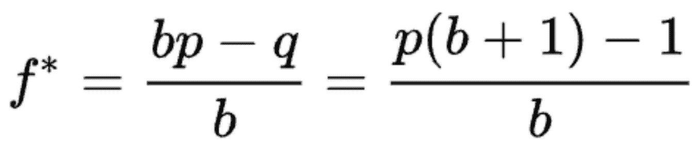

其中：f为现有资金应下注的比例；b为下注可得的赔率（不含本金）；p为胜率；q为落败率，即1-p；

举例而言：

如果一个游戏有60%的胜率（p = 0.6，q = 0.4），

而玩家在赢得游戏时，可获得一赔一的赔率（b = 1）。

这种情况下，你会怎么下注？60%的胜率，有点吸引力，但也有40%的可能性会输。如果只是拍脑袋决策，你可能会特别纠结。

但只要代入凯利公式一算，结论就很清晰：玩家每次应该下注现有资金的20%（f= 0.2）。

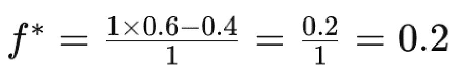

在我们的决策算法框架里，胜率和赔率是一维，期望值是二维，而下注比例则是三维。

我们在做决策的时候，不仅要考虑一维，评估二维，还要计算三维，才能在一个不确定的时空里，一步步前行，安全获得最大的回报。

### 四

凯利公式并不只是一个数学计算，这里面暗藏的决策智慧，可谓价值千金，我帮你分析一下：

首先，我们可以下注的，必须是一个正期望值的游戏。

这是我们上一讲的重点，也是一开头就提到的。如果期望值不是正的，没有任何公式可以拯救。

比如，赌场啊，彩票啊，甚至大部分创业，整体而言，都是负期望值的游戏，输多赢小。

索普为什么有机会在21点中战胜赌场呢？这在整个历史上都是非常偶然的，索普靠天才的数学能力，找到了21点的漏洞。而后来，赌场也想办法堵住了这个漏洞。

所以，无论如何，先确定期望值是否为正，再考虑如何下注。

我们再说凯利公式背后的第二个大智慧，

能帮你实现长期收益最大化的下注比例，跟你的直觉往往天差地别。

我们来看如下两种情况：

- a.“小博大”（胜率小，赔率大），胜率20%，赔率是5，算一下，期望收益20%。
- b.“大博大”（胜率大，赔率小）：胜率80%，1赔0.5，算一下，期望值也是 20%。

看起来，这两个游戏的期望值一样，你应该分别怎么下注？

凯利公式可以给你精确的答案，比例分别应该是：“小博大”游戏只能押总资金的4%，“大博大”可以押40%。

### 凯利公式：

```
$f^*=\frac{bp-q}{b}$
```

| 步骤 | 案例a：小博大 | 案例b：大博大 |
|---|---|---|
| 赢的概率 p | 0.2 | 0.8 |
| 输的概率 q = 1-p | 0.8 | 0.2 |
| 赔率 b | 5 | 0.5 |
| 计算过程 | $f^*=\frac{5 \times 0.2-0.8}{5}=\frac{1.0-0.8}{5}=\frac{0.2}{5}=0.04$ | $f^*=\frac{0.5 \times 0.8-0.2}{0.5}=\frac{0.4-0.2}{0.5}=\frac{0.2}{0.5}=0.4$ |
| 最佳下注比例 $f^*$ | 4% | 40% |

但人们通常的直觉是什么？

能有机会以“小博大”时，很多人，尤其是自诩聪明的人，特别爱赌，大额押注，比例远超4%，甚至还加杠杆。

这其实是把命运交给了运气，你可以凭运气赢一次，但不可能总是赢。

妄图以小博大，最后往往满盘皆输。

再看以“大博大”，即便胜率高达80%，已经相当可观，但凯利公式给出的建议仍然也只是下注40%。这在有些人看来太保守了，但这是在用理性约束贪婪。

人类的本能往往会被短期收益和赌徒心理驱使，但真正的高手，懂得抑制冲动，按照理性和概率规则下注，这才能真正实现财富的持续累积和复利增长。

上面的对比计算，也给出了价值投资的一个秘密，同样的期望值，高胜率可以有更高比例的下注金额，也就是说有更高的仓位，从而实现更大的回报。

### 再说凯利公式背后的第三个智慧：

我们每次面向未来投入资源的时候，应该是基于资源相对的比例，而不是基于绝对值。

也许，你平时总能听到一些说法：本金多的话，可以追求稳健的投资；本金少的话，就可以大胆一些。尤其是年轻人，应该敢去冒险。

这种说法，非常有误导性。

只要是涉及到和钱有关的决策，都应该理性计算。不管钱多钱少，追求的都是长期收益最大化。既然如此，就要参考凯利公式给出的计算框架，结合胜率和赔率，来计算最佳下注比例。要相信数学的力量。不能把本金少，当作赌的借口。

有些人就掉入到这种陷阱里，心里想，反正我手上这点儿钱也干不了啥，干脆玩儿把大的，万一赌赢了呢。

——这种心态导致的结局，就是一辈子都被锁死在赌徒输光的困境之中，无法翻身。

### 凯利公式背后的第四个智慧，就是

我们在决策的时候，要安排好手上的子弹，根据实际局面分批次打出。

很多重要决策都有一个特点：在决策时机上，有一定的回旋余地，可以通过推迟行动，以获得有关未来的更多信息。

类似投资创业、产品研发、市场扩张，甚至很多人生大事都是这样。手里的子弹得分批打出去，这样才能在迷雾中见招拆招，步步为营。

凯利公式的精髓也在这儿：真正聪明的玩家，从不把赌注全压在一个时间点上，他们懂得适当拖延和整体布局，把资源分开来下注，确保在时间的洪流中，每一步都有调整的余地。

### 凯利公式背后的第五个智慧，

只玩自己懂的游戏，只打有准备仗。

听这一讲我知道有同学会有疑问，要用凯利公式，需要知道胜率和赔率，可是现实中大多数决策，这些数字都是不确定的，公式还有什么用？

真正的投资高手，很少在投入资金的时候，还会拿凯利公式去计算一下。但是，他会将这个公式的原理，内化为一种行动的原则。

现实中的决策，赔率和胜率的确都是模糊不清的，需要你去估算，所以，你更应该只做自己真正懂的决策。

因为你对一件事情越了解，你给出的胜率和赔率的估算越接近真相，你也就越有概率上的优势。

这就反过来要求你一定要专注于某个领域，并在某个范围之类能够形成优势，只有这样，你才知道如何根据胜率和赔率，来有效分配资源。

换而言之，在你不熟悉的领域，你就不应该下注。

在你有优势的领域，你的每一次下注，又都会给你带来更新的信息，你就可以通过贝叶斯定理，来优化你的概率判断——这也是我们下一讲要分享的内容。

### 投资时永远给自己留一手牌

现在很多人很迷信All in。

我们这个时代的英雄们，几乎都贴有“背水一战、孤注一掷”等标签，尤其是那些生意场上的幸运者。

对于失败的人，我们一笑了之；对于成功的人，我们奉为神明。

在全民创业的时代，“All in人格”备受推崇。我们迷恋以小博大、逆袭、改变命运、一步登天。

总是想，如果不All in，怎么可能实现呢？

但是，要不要All in，你至少要分清投资和创业。

二者的筹码是不同的。

在我们的一生中，面对不确定性，我们大多时候扔色子的次数都是有限的，并且是消耗资源的。

永不放弃，指的是你的斗志，而非押完你钱包里的最后一块钱。

创业者应该全身心投入到创业项目中，毫无保留，并激发出自己的潜能。但并不是那种借钱、抵押房子、甚至连命都不要的All in。

因为这种All in的结果，很可能是让你彻底出局，这种行为，不是英雄而是莽夫。

说了这么多All in的风险，但实际上，凯利公式的反义词，不是All in，而是加杠杆。

凯利公式建议我们，不管多好的项目，基本上你只能投入本金的一部分；而加杠杆正好是反过来，你相当于投入了本金的数倍。

这样一来，即使是对你有利的项目，也加大了爆仓的可能性，以至于令你不得不退下原本可以赚到钱的牌桌。

所以，你可以在认知上加杠杆，在时间上加杠杆，但不要在资金上加杠杆。

### 总结

好，以上就是这一讲的主要内容，最后我们总结一下。

看起来，凯利公式是关于下注比例的，但其实，它本质上，是去求解，如何在一个充满不确定性的世界里获得复利。

数学上的复利，现实中很难遇到。我们的人生，总是有好有坏。

所以，

遇到好时机的时候，就多分配一些资源；

时机不好的时候，就少分配一些资源，甚至不分配。

但更重要的是，不管好坏，任何时候都要持续积累资源，不要嫌弃小利，更不要低估持续积累的力量。

不管风雨有多大，关键是让自己留在牌桌上，等好运再次降临。

我是老喻，我们下一讲见。


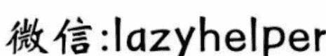

## 07 四维：为什么决策高手都是贝叶斯主义者?


Lazybro，你好

我是老喻，欢迎回到《决策算法》课。

前面两讲，我们讲了怎样计算期望收益，以及怎样用凯利公式计算最优的下注比例。

这一讲，我们来讲如何运用贝叶斯定理，成为决策高手。

### 一

贝叶斯定理，你未必熟悉，但其实你无时无刻不在运用。

有一天晚上，我走到家里前院的葡萄架下，听见上方有动物的声响，心想：是不是老鼠或者松鼠在偷吃成熟的葡萄?

于是，我拿了根棍子，敲打了几下，想要赶走。但没有听见它们离开。

这时，我家的金毛冲了过来，对着葡萄架的上方猛叫，还想要爬上去。

我意识到，要是老鼠和松鼠，早被吓走了。肯定是别的什么动物。

“会不会是浣熊？”我推测道。前阵子在附近也见到过浣熊，这种动物，既会攀爬，胆子又大。

这时候，一条大大的花尾巴从葡萄架上垂下来，果然是一只嚣张的浣熊!

你看，这样一个过程，由果及因，用证据来调整判断，就是典型的贝叶斯推理。

《园丁与木匠》的作者高普尼克认为，婴儿天生就会贝叶斯推理：

先对一个事情的发生有某种预先的猜测，然后基于新的信息来修正这个猜测的概率，以获得对于这件事情的原因更加正确的认识。

贝叶斯定理与人类大脑的推理过程非常相似，所以被称为接近人类感觉的统计学。

我们在《决策算法》开篇时提到，决策并非是非黑即白的，选择背后，对应的是结果的可能性，也就是概率，而不是确定性的结果。

于是，我们接着谈到了决策算法的框架，涉及到胜率、赔率、期望值、凯利公式。

但这里面最大的挑战是：现实世界又不是简单的抛硬币游戏，对于那些未知事物，你怎么知道概率到底是多少?

贝叶斯的哲学是，概率是你对某件事的信念。

想象一下，你在街头看见有一个人在摆摊儿玩儿抛硬币的游戏，有不少人围观。你观察了一下，那个人连续抛出了5次硬币正面朝上，请问下一次硬币朝上的概率是多大?

按照传统的频率派概率思维，你一定会说：当然还是50%，因为每一次硬币的抛出都是独立的，和前面的5次无关。

但是，如果是一个贝叶斯主义者，则会思考：这个摆摊儿的人是否作弊了？

没错，一个标准的硬币，抛出正面的概率是50%。但是，在街头这个不确定性的环境下，考虑到庄家作弊的动机，极有可能这个硬币被动了手脚。

我们做决策时，面对的信息总是不完备的，未来总是不确定的，我们不可能通过事先的精密计算，预判结果，做出不会出错的决策。

我们只能先形成某种信念，然后不断通过实践和反馈，来更新我们的信念。

贝叶斯定理的工作原理，可以归纳为，

“过去的经验”加上“新的证据”得到“修正后的判断”。

诺奖得主雷纳·韦斯说：

“如今的失败是为了将来的成功，每失败一次，就离成功更进一步。”

但是，为什么对于大多数人而言，失败并不是成功之母呢？

那是因为，你需要一个决策框架，将每一次探索，不管是成功还是失败，都转换为你的系统优势。

贝叶斯定理，就可以为我们提供一套这样的决策系统。

### 二

贝叶斯公式我放在文稿区，你有兴趣可以看一看。

P(A|B)：事件 B 发生时，事件 A 发生的概率（后验概率）
P(B|A)：事件 A 发生时，事件 B 发生的概率
P(A)：事件 A 的先验概率
P(B)：事件 B 的总概率

我们的重点，不是计算，而是思考方式。所以，我们直奔主题，来看看，贝叶斯定理，带给我们的决策方法论。

概括而言，就是十六个字：

- 1、尊重先验；
- 2、保持开放；
- 3、先干为敬；
- 4、持续更新。

### 三

先看第一条：尊重先验。

先验概率是我们在未得到新信息前对事件可能性的估计，这个概率通常基于我们已有的知识、经验和对世界的基本认知。

比方说，你的表姐怀了老二，不管老大是男孩还是女孩，老二是女孩的概率，都是50%。

尊重先验概率意味着我们要尽可能地通过历史数据、统计信息或经验来构建一个初始的模型，而不是凭空做出判断。

有一位著名的创始人，曾经用贝叶斯定理的先验概率，来解释自己为什么要做饮料：

- 1、饮料领域看起来很老土，但基数极大。中国饮料市场规模当时超过一万亿。
- 2、对比而言，类似于SaaS市场，看起来很性感，可市场规模仅为百亿级别。
- 3、所以，做饮料啃一小口也很大，做SaaS做到老大也很小。

你看，他就是把行业的基础概率，作为先验概率的初始值，来做出判断。

医学界有句格言：“当你听到马蹄声时，想想马，而不是斑马。”啥意思呢？就是说，我们判断未知事物时，应该想更大的可能性，而不是被更特别的可能性所吸引。

你可能会说，我要做的那个决策，根本没有基础概率，那该怎么办呢？

贝叶斯统计有一个“不充分推理原则”：

若没有其他可作为依据的数据，可以把主观预测当作数据使用。

然后，再根据新的信息，不断更新概率，结果就会越来越准确。啥意思呢？就是先蒙一个再说。

这背后还有一种这样的精神，你遇到一个自己不懂的东西，你可以说：“我不懂，但我可以边做边学。”

### 四

说完第一条“尊重先验”，我们再看第二条：保持开放。

现实是复杂且不确定的，贝叶斯主义告诉我们，所有的模型和理论都只是我们对世界的信念和假设，而不是真理。

所以，我们必须保持开放，不断收集新的证据，来调整我们的假设。

说一个有趣的小故事：有一个人到了一个陌生的小镇上，他特别想和这个镇上的人套套近乎，然后他就走到广场上，发现有个老人家在那儿晒太阳，然后他旁边趴着一只狗，那狗特乖。他走上去问那个老人，你的狗咬人吗？

老人说不咬人。然后他就上去摸了一下那个狗，结果被狗咬了一口，他就很生气，质问老人：“你刚才不是说这个狗不咬人吗”？

那个老人说：“这不是我的狗”。

这个小故事，往要深了讲，涉及到休谟给人类思想带来的一个根本性的革命。这个世界上，人类是很难知道确切的因果关系的，我们看到的一切，都只是某种相关性。

然而，人类的本能是痴迷因果，我们喜欢清晰的前因后果，好像只要弄清楚了因果链，就能够做出好的决策。但可惜的是，世界并不是这样运行的。

所以，决策上所谓保持开放性，就是无论什么情况下，都不能过于先入为主，非此即彼，而是用概率，作为决策的依据。

没有什么是100%，任何的可能性，哪怕微弱，也都有可能发生。

所以，对于一名贝叶斯主义的决策高手，假如有人怀疑他，反对他，提出不一样的证据，他不会恼怒，反而会大有收获。他会使用这一证据，更新自己的先验概率。

### 五

接下来，是贝叶斯决策系统的第三条方法论：先干为敬。

贝叶斯思想强调快速迭代、快速行动。只有通过实践，我们才能得到反馈，从而更新自己的判断。

我们总是说“知行合一”，强调要知，更要行，知中有行，行中有知。

贝叶斯定理，则给出了“知行合一”的动力学模型。

对高手而言，贝叶斯公式描述的是一个观念更新的过程：

初始信念（先验概率）-大胆行动（获得新信息）-更新信念（后验概率）。然后，再重复如上过程。

将“知”变为“行”
系统
初始信念
更新信念
将“行”变为“知”

我画了一个示意图附在文稿中，你可以点开查看。

这个图也可以这样理解：

人（包括AI智能体）通过贝叶斯公式，把知识和行动，经验和决策整合在一起了。

所以，

当我们面对一件未知事物，与其在那里猜来想去，不如先干再说。

然后，通过行动中获得的信息，来更新我们最初的信念，这比啥都管用。

### 六

贝叶斯决策系统的第四条方法论是：持续更新。

如果仅从道理的角度看，贝叶斯定理，讲的似乎也是那些老生常谈的东西。

真正的关键在哪儿呢？在于系统。

假如没有自己的模型，不是基于一个系统，贝叶斯公式并不能帮助一个人成为真正的决策高手。

在某个论坛上，有人问了埃隆·马斯克一个问题：

> “你生命中最大的挑战是什么？”

马斯克足足想了30秒，给出了一个非常精彩的回答：“确保你有一个可纠错的反馈闭环”。

可纠错的反馈闭环，几乎是创业决策、投资决策、成长决策的核心答案。

而贝叶斯定理对于我们做决策最大的意义也在于此，它就是“可纠错的反馈闭环”的模型化表达。

基于贝叶斯定理，建立起你自己的可纠错的反馈闭环，就像拥有了一艘人生的船，尽管一路惊涛骇浪，有顺风也有逆风，但你终究有机会乘风破浪，抵达你的目的地。

对于贝叶斯主义者来说，没有成功和失败的概念。

成功和失败就像这个方向盘向左一点、向右一点而已，关键在于你根据反馈如何去优化自己的下一步的行动。

### 总结

现在，让我们再回望一下EKB决策算法，这三个字母，正是期望值、凯利公式和贝叶斯定理的英文单词首字母。

我们说过，胜率和赔率，是一维的；而期望值就像是面积的计算，是二维的；凯利公式，则通过分阶段投入筹码，也就是随着时间的进度来分配你的人生资源，这是三维的。而这里面的关键，是我们决策当中的概率判断。

贝叶斯定理则告诉我们，这个概率可以在知行合一的推进过程中，不断得到更新，一步步逼近真相，所以我们称之为四维。

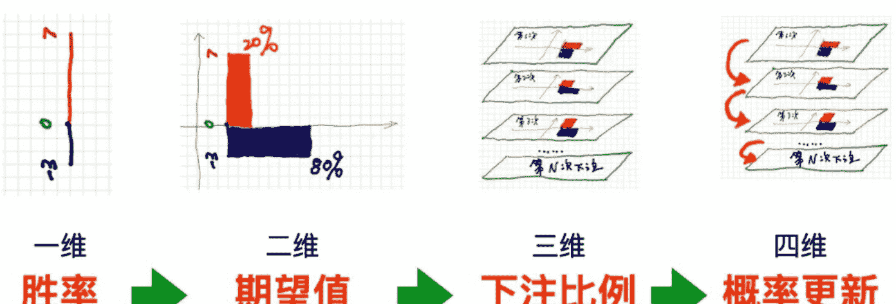

有一种说法，在所有的数学发现中，贝叶斯定理是应用最多的之一。它广泛应用于各个领域，包括海洋搜救，以及当下大火的人工智能。

贝叶斯定理有一种奇怪的乐观主义精神，教我们在未知中前行。

未知令人恐惧，但贝叶斯定理告诉我们，只要有一缕微弱的光线，概率也可以作为生活的向导，带我们穿越人生的迷雾。

贝叶斯主义假设“现实”的所有模型、理论和概念都不过是某种信念。这并不会令人成为虚无主义者，反而更能够让我们在相信中怀疑，在怀疑中相信。

在生活中，很多时候，那些看上去疑虑重重的人也许有更坚定的信念，有些信誓旦旦的家伙每每见利思迁。

也许有时你会觉得，这个世界很混蛋，但竟然如此刚刚好够我们生存；这个星球很残忍，却总能给我们留下一扇门。

贝叶斯定理就是世界留给我们的那扇门，让我们有可能用有限的理性，在这个不确定性的世界，成为决策高手。

以上就是这一讲的全部内容，我是老喻，我们下一讲再见。


## 08 重新理解复利：为什么复利很多时候是一个“谎言”？


Lazybro，你好！

我是老喻，欢迎回到《决策算法》课。

从这一讲开始，我们来讲大家最关心的一类决策——财富决策。

假如你去问100个赚钱高手，财富决策最大的秘密是什么？大部分答案，都可能提到一个词儿，这就是“复利”。

复利也是我研究最多的核心主题之一。所以在“财富决策模块”的开头两讲，我们来深入探讨一下：复利的谎言和真相。

查理·芒格说：“理解复利的魔力和获得它的困难，是理解许多事情的核心和灵魂。”

人们总是会关注这句话的前半截，也就是复利的魔力。但是却会忽略后半截，也就是获得复利的困难。

事实上，现实中的复利极其罕见。

著名投资人彼得·林奇提出过一个词“10倍股”，这是他心目中的好股票。多长时间赚10倍呢？假设是10年。10年赚10倍靠谱吗？假如2011年前后你买了茅台股票，拿上10年，就有10倍；或者2010年买了特斯拉的股票，更短时间你就能赚10倍。

计算一下，假如你想在股市10年变10倍，每年“只”要26%回报即可。于是，关于复利的传说，又多了一个美妙的数字：26%。

然而，假如你相信这种简单化的“复利法则”，也许就掉入了一个谎言的陷阱。

不止在投资领域，关于个人的“成长”，也流传着类似的梦想。有人问过我：“一个人可以做到持续地每天进步0.1%或者说0.05%吗？如果可以或者说有可能达成的话，关键点在哪里呢？难点在哪里呢？”

我回答：不可能。

曾经看到有博主发：“成功的秘诀是：如果没有天赋，那就一直重复！”那位博主说，他自己坚持做着一件事：读书、抄书、写作……

这类鸡汤，有时候非常误导人。

因为复利的重点，不止是努力、坚持和重复，而是找到值得重复的事儿，然后才是通过重复实现指数增长。

比方说，人们讨论起ChatGPT，喜欢提“规模效应”，说“大力出奇迹”。但事实上，并非大力就可以出奇迹，而是OpenAI找到了让“大力出奇迹”变得有效的方法。这才是复利最艰难的地方。

财富也好，人生也好，极少有人能够靠复利获利。

当然，复利的谎言，并非是说“复利本身是谎言”。的确，复利可能是人生最重要的公式。即使是普通人的努力，在复利作用下，也可能累积成奇迹。然而，能做到这一点的，可能就不是“普通人”了。聪明人呢？年轻时不甘心于做“大量重复的事情”，年长后又很难实现自己巅峰时刻的连续性。

讲到这里，你可能要说了，老喻，你说平常关于复利的传说是谎言，又说复利很重要。那复利的真相到底是什么呢？

复利的真相，和世界的几个底层约束有关。这五个真相分别是：
- 宇宙被随机性主宰；
- 连续性很难实现；
- 世界是不均匀的；
- 现实是非线性的；
- 回报是不对称的。

我们一个一个来讲。

### 真相1：宇宙被随机性主宰
未来是极度不确定的。并不存在一个清晰的轨迹，让你像爬坡一样每天进步一点点。

“复利思维”为什么看起来如此有吸引力呢？因为“复利”制造了一种虚幻的确定性。我们在工作、生活、投资中，都有一种潜在的冲动，寻求确定性。在漫长的进化过程中，人类的大脑逐渐变成了一部预测机器，它通过对过去的总结和对未来的想象，来分配资源，采取行动。

但可惜的是，人类大脑中的确定性，跟现实是两码事儿，现实并不会按照人类预测的那样展开。早在上个世纪，物理学家埃丁顿就说：
> “近年来，物理学领域中某些最伟大的成就被公认是源于统计学法则，而并不是依赖于因果律。而且，迄今作为因果关系所接受的某些重要的法则经过仔细研究后，可认为均是具有统计学特征。”

随机性，是宇宙的底层主宰，是这个世界的出场设置，哪怕掌握了规律，也难以完全逃脱随机性的影响。所以，即便是你觉得很确定的事儿，假如你不能在这个“确定性”之前，加上一个概率数值，那么这个确定性就可能成为一个大坑。

这一点，我们在贝叶斯定理那一讲也强调过。本质上，人类只能知道相关性，而不能确定100%的因果。当你过分依赖所谓确定性，那一点点被你忽视的“不确定性”，可能会让你的预期，全盘落空。而这，正是平常人们说起复利这一概念时的幻觉和陷阱。

### 真相2：连续性很难实现
复利有一个重要的假设，那就是连续性。前面提到，复利的幻想之一是：只要你每年赚26%，连续十年，你就可以赚10倍……然而，连续性太难了。

对于随机游走的股市投资而言，“连续性”更难实现。别说连续十年每年回报达26%，就连年化10%，也没多少人做到。2020年有人根据万得（Wind）的数据分析，整个中国市场只有33位基金经理，连续十年做到年化收益率超过10%。（《每日经济新闻》2020年统计）

过于简化的复利，极大地高估了“连续性”。投资圈有句话：一年翻一倍，容易；三年翻一倍，难。时间并不总是复利的朋友，更多时候是敌人。

宇宙是熵增的，趋向无序，我们这个世界的资源也是有限的，所以复利的增长，总会遭遇一道看不见的屏障。

### 真相3：世界是不均匀的
复利的神话里，还包含着一个假设：这个世界是均匀的。所谓均匀，这里的意思是，赚钱的机会也好，亏钱的风险也好，不会集中出现，而是在时间上平均分布。

然而，现实不仅是不均匀的，而且连“不均匀”的那部分，也很不均匀。

据晨星（Morningstar）等多个权威机构统计：从2008年11月27日到2018年11月27日，标普500指数涨幅达202.16%。但是，如果错过了其间涨幅最大的20个交易日，收益就只剩下31.15%。如果错过这20天，就错过了10年超级大牛市。问题是，你无法知道到底是哪20天。

反之，最糟糕的日子，也是密度极大，破坏性极强。均匀性的幻觉，对追求稳健的聪明人，也会造成伤害。许多聪明人都是一直在赚钱，而且赚得貌似非常稳定，但却会在某一次因为极小概率事件的发生而亏掉所有的利润。

我有一个投资人朋友，有一次在朋友圈发出感慨：
> “在市场中想赚高确定性的小钱往往是很危险的，因为一旦确定性没有自己想得那么高，可能就会亏大钱。”

### 真相4：现实是非线性的
我们从小接受的教育，最主要的一条，就是“付出就有回报”。这是一种深入骨髓的“线性思维”。但真实的世界是非线性的。付出未必有回报，种瓜可能得豆，更可能是一无所获。

一家餐馆比另外一家餐馆的味道好10%，但客户可能多一倍，利润则可能多十倍。二八法则、马太效应，无情地支配着我们的世界。

我们自小形成的“线性思维”，还会影响我们对复利的理解。实际上，复利是一种非线性的回报曲线，但是因为我们的“线性思维”，有时候会机械地、一厢情愿地试图画出完美的复利曲线。

### 真相5：回报是不对称的
说到这里，很多人也许会赞同，现实的确是起起伏伏的。但很多人可能没意识到的是，更大的难题还在于，起伏之间并不对称。

我们知道，复利的计算是一个乘法。但是，连续相乘的，可不止是收益，还有亏损。假如我们今年的资产下跌了50%，那么明年要上涨100%才能够回来。你看，涨和跌之间并不对称。并不是说，我今年跌50%，明年再涨50%就可以扯平。更要命的是：即使你今年涨100%，甚至涨1000%，明年跌一个100%，就全部归零了。

所以，在“不对称”的现实中，复利的实现，首先必须做到：不管多大的利益，都不值得冒“彻底爆掉”的风险。不然，复利的乘法链条，就会彻底断掉了。

稍微总结一下，对“随机性”的漠视，对“连续性”的幻觉，对“均匀性”的幻想，以及忽视“非线性”和“非对称”的风险，造成了复利的谎言，并且经常成为财富的致命杀手。

在上面这五个“不确定性”杀手的围剿之下，复利的谎言走不了多远，就粉身碎骨了。的确，仔细想想看，我们总在说复利，身边有多少人实现了复利？

我曾经有套房子，在20年内涨到十倍，听起来还可以吧？但是，仔细一算，年化回报率也“不过”是12%左右。这还是在一线城市，赶上地产大牛市。而且之所以能够持有那么久，享受到了复利，还因为房子的流动性不像股票，不然可能早就卖掉了。

既然复利这么罕见，为什么大家还是总在说呢？在我看来，最主要的原因是：人们试图用勤奋来替代思考。

希望每天进步0.1%，进而叠加出惊人的复利，与其说是一种幻想，不如说是一种懒惰，不是行动上的懒惰，而是智力上的懒惰。复利传说，其实是一种反智的智力贩卖。

为什么呢？因为要获取世俗上的成功，除了运气之外，你需要两个步骤：做正确的事情；把事情做正确。复利神话过于强调第二点，让人忽略了第一点。

例如谈起定投，其基本理念是对的。但是，假如你在一件错误的东西上定投，做得再正确也没用。在捕鼠夹上雕花，你做得再极致也夹不到大象。如果你没有方向，任何方向的风都是逆风。

总结一下这一讲的内容，人生也许像是滚雪球，可惜不是顺着坡往下滚，而是像西西弗斯那样往山上推雪球。而且，这雪球随时可能砸下来。指数型的崩溃，往往比指数型的增长容易得多。

所以，即使我们能够让足够耐心慢慢变富，慢慢成长，也不能令“变富”和“成长”因为“慢慢”而变得容易。忘掉复利神话吧。人生就像逆水行舟。可以期待复利，但也请理解复利实现之难。

然而，既然复利从数学意义上是存在的，假如我们能够意识到复利的本质和挑战，是否可以设计出自己的人生复利呢？我们下一讲再讲。

我是老喻，我们下一讲再见。

## 《老喻·决策算法100讲》
### 成为命运的主人
老喻 思考者
公众号：懒人搜索
懒人专属群
微信：lazyhelper
公众号懒人搜索，懒人专属群分享
版权归得到App所有，未经许可不得转载

## 09 真正获得复利：怎么用对复利公式？
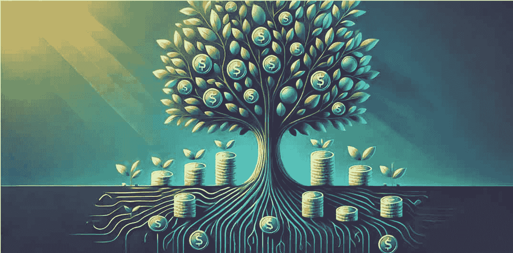

Lazybro，你好！我是老喻，欢迎回到《决策算法》课程。

上一讲，我们一起分析了“复利的谎言”。我们赞叹复利的奇迹，但也要承认复利的艰难。但这并不意味着复利不可能实现。几乎所有厉害的人，都将复利作为成功的关键秘密之一，人世间的许多成功，大多是复利造就的传奇。

怎样真正获得复利？这一讲，我们从复利公式出发，来分析获得复利的方法。

### 一、复利公式的五大要素
复利公式，可能是人生当中最重要的公式之一。表述如下：
```
FV = PV × (1 + i)^n
```
- FV（Future Value）：是指财富在未来的价值；
- PV（Present Value）：是指现值，亦即指本金；
- i（Interest）：是指单次（单个周期内）的固定利率或固定回报率，即增长比例；
- n：则是累计的周期，或者说是重复的次数；
- ×：乘号。

看起来似乎很简单？不。这个公式背后的意义，要复杂得多，丰富得多。接下来，让我们拆解复利公式，分析其中的5大要素：

- FV（未来价值）：表面看上去，“未来价值”是一个结果，但也可以是一个目标。人生的难处在于模糊性和不确定性，所以当下的决策总是条件不足，看不清楚。未来价值提供了一个估值函数，以实现模糊的精确，为人生做指引，给决策做依据。FV（未来价值）像是一个人的理想，一个公司的愿景。例如，最早谷歌创立时，市面上有不少搜索引擎，面对投资人的怀疑，创始人说，我们要做的是AI。模糊的大方向，决定了未来的天花板的高度，也能带领我们穿越迷雾，翻山越岭。

- PV（现值）：PV也可以理解为本金，或者你现在的资源总量。有人说自己去年的股票赚了80%，完胜绝大多数基金经理。但是，这个80%的股票，也许只占他资产的不到10%。所以，现值需要基于整体资产。但是大多数人或者企业，很难做到这一点。

什么是好生意？是指过去的要素（不止是钱）可以积聚成更强的、可持续的组织系统能力——这才是真正的雪球，能越滚越大。苹果厉害的地方是，卖出去的大部分设备，都还在继续为它赚钱。别人卖一个手机赚一个的钱，苹果种下了一片名为iOS的森林，里面的树木，也就是存量的iPhone和iPad等设备，数以十亿计，而且还在快速蔓延，越长越高。

从这个角度，倒是可以重新理解一下断舍离：如果一样东西，或者公司的某些业务和资源，将来不能创造大于成本的价值，就该扔掉。

- 增长比例 i：增长比例 i 是一个动态的数值。正如前面所说，每天增长1%，看似很少，其实很难。现实中 i 可能是正数，也可能是负数。最终计算出来的 FV（未来价值），是一个统计学的结果。同样，增长比例也与资源的配置有关。例如，某个投资年回报达到了100%，但是只占用了10%的资金，在整个复利公式里增长比例就变成了10%，而非100%。

- n（重复的次数）：1964到2021年间，伯克希尔实现了3.64万倍的市值增长。这期间，伯克希尔的年化回报率约为20%。你看，要想实现财富的复利奇迹，需要活得够久，重复得够多。

- 乘号 ×：全世界所有人的头发的数量相乘，结果是多少？是零。只要有一个人没头发。这是复利公式的残忍之处。人生是一连串的乘法。乘法将我们的时间和资源连接起来，这里面有并联，还有串联。但最后都可以用复利公式来计算。每一个乘号，就是一次决策。单次决策发生之时，需要是无记忆的，也就是相对其他决策独立，甚至是对上一个乘号的抛弃。但是每次决策必须基于当下的整体资产。

### 二、如何让复利公式真正为你服务
公式很重要，但是公式是中性的，就像我们无法单纯用牛顿的公式建一座大桥。怎么让复利公式真正为你服务呢？我总结为以下5点：

- 第一，你要拥有自己的“雪球”。你一定听过巴菲特的名言：“人生就像滚雪球，重要的是找到很湿的雪和很长的坡。”要想实现复利，你首先需要有自己的、值得滚的“雪球”。换言之，你必须有个有价值的东西。就创造财富而言，你的“雪球”可以是本金，优秀企业的股权，能带来租金的物业，还可以是你的某个知识产权，还包括个人IP等等。不管是公司，还是个人，有没有一个资产平台，来沉淀自己的资源，并且基于这个平台来滚雪球，是实现复利效应的关键所在。

  “日拱一卒无有尽，功不唐捐终入海。”这个“海”，就是资源平台。否则“日拱一卒”后面，跟着是猴子掰苞米。你需要有一个资源平台——可能是你的名声，你的一个视频号，你的公司，你创立的品牌——依靠这个平台，把你的所有努力和付出都叠加起来。当然，前提是你的专业和独特价值。

- 第二，在惊涛骇浪中穿行。种下复利的种子，也许犹如园丁。但是实现复利的过程，则像是航海家。复利是起起伏伏的，犹如在大海中航行。巴菲特买比亚迪的股票，起初暴涨，随后回跌，接着十多年无法突破。一般人早卖掉了。又有多少人能够像股神一样，经历大风大浪的起伏，最终收获三四十倍的回报？

  传统的“复利思维”，鼓吹持续每天进步0.05%，只是追求一种所谓确定性的幻觉，稍微遇到一点儿风雨就被打散了。更大的挑战是，别让你的船被一个浪头打翻了。厉害的人还要能够在没有任何激励、没有任何“进步迹象”的情况下，依然每天打满鸡血。为什么能做到这一点呢？秘密在于：他们既有心中的北极星，又敢于走入漫无边际的汪洋大海。

- 第三，专注而聪明地重复。世界是熵增的，滑滑梯的乐趣，只有小孩子才有。上一讲我们说过，复利的滚雪球，其实是像西西弗斯一样，是往山坡上推。所以，你要找向上的电梯，你需要勤奋，天下没有免费的午餐，复利追求的是超额的回报，你也需要有对应的超额付出。找到值得大规模重复的事情之后，我们更需要长期专注，对那些不是决定性的机会和任务说不。

  OpenAI的CEO说：
  > “如果你在聪明和勤奋中占了一项，就能超过90%的人。但想超过99%的人，必须聪明+勤奋。因为你的竞争对手往往是这样的人。”

  他有一个精彩的洞见：“勤奋有复利效果，往往能带来一个又一个惊人回报，这能产生巨大的生活乐趣。”这个前提，当然是你在一个对的地方，和对人，做一件对的事情。

  有一位著名作家对我说，每天不管有没有灵感，她都在桌前写四个小时。我自己很缺乏自律。于是就选择和得到合作，这样就不得不赶稿子，而且是在得到的品控之下不断打磨。

- 第四，一边“滚雪球”，一边“补血”。滚雪球，要找到很湿的雪和很长的坡。但很多人忽略的是，雪球越滚越大，只是一个理想化的比喻，在现实中，雪球有时不会越滚越大，还经常会“掉血”。高手会怎么做呢？他们会一边“滚雪球”，一边“补血”。

  职业投资人和业余投资者最大的区别之一，在于职业选手有源源不断的弹药。巴菲特投资，不光靠自己手里的资金，他还可以调用旗下保险公司的浮存金；巴菲特也可以低成本发债，不差钱的他曾经在日本借了18亿美金，套利的同时，又补充了弹药。除此之外，巴菲特还强调所投公司有很好的自由现金流，他有一个极小的总部，只在乎旗下公司的经理人们把赚到的钱源源不断地交上来。

  只有如此，无限游戏才可以持续下去，英雄一直留在场上，等到大数定律发挥作用，复利最终实现。

这才是“长期主义”背后的道理。

换句话说，

他们一边滚雪球，一边不断往前面的雪道上撒雪。

对于我们普通人来说，“补血”还意味着终身学习，和永无止境的自我完善。

实现复利的第五点是：活得久，动得早。

复利公式是由很多个乘号串起来的，本身非常脆弱，一不留神就掉链子，或者归零。

所以，首先要活下来，然后是活好。

并且，越早开始滚雪球越好。如果不够早，那就从今天开始。

如何既不出局，又不旁观？一个人如果想要构建自己的复利系统，需要具有健壮性，以实现稳态。

我们在前面学习的EKB算法，通过胜率、赔率、期望值、凯利公式、贝叶斯定理，构建了一个四维的决策系统，就是为了实现一种防范风险、持续增长的人生复利。

### 总结

复利公式是一个关于财富的公式，但它也给出了一个关于人生的简洁而美妙的隐喻框架。

我们未必在现实中总是进行计算，但是这个公式能帮助我们理解人生中最本质的某些问题。其简洁和深刻，胜过许多冗长的人生道理。

从本质上来说，复利公式，是基于时间轴，对一个人或企业的“资产、认知、劳作”的持续复制。

这个复制是动态的，环境充满了不确定性，热力学第二定律处心积虑地想要阻止你滚雪球。

因此，你需要稳固的内核、坚定的信念，才能穿越不确定性。

自我的认识，可能是复利公式里最重要的隐藏要素。复利公式里的一个个乘号，其实就是一个人的自我进化过程。

传奇投资人，大卫·史文森，在一张手写稿，强调了一个重要的“教训”：

“真正的秘诀是什么？人，人，人”。 

他说：“真正的秘诀在于，与绝对高质量的人建立关系。”

当然，更要让自己不断成为一个更加高质量的人。

这是获得复利的前提，也是让复利可以持续积累的关键。

祝愿你早日开始人生复利的积累。

我是老喻，我们下一讲再见。


## 10 提前退休：“25倍法则”能让你财务自由吗？


lazybro，你好

我是老喻，欢迎回到《决策算法》课。

关于财富决策，有个话题持续很热，“财务自由”，这是许多人的梦想。

最近几年，人们甚至还创造一个概念，叫“25倍法则”，说的也是这件事儿。

那么，“25倍法则”到底能不能让你财务自由呢？

这一讲，我们就来说一说。

### 一

先来看第一个问题，赚多少钱，才够退休？

“25倍法则”来自一个叫作“FIRE”（Financial Independence, Retire Early）的运动，“FIRE”是一个英文缩写，意思就是“财务自由，提早退休”。

其核心法则是：积累一年生活费25倍的储蓄，然后每年用这笔钱赚上4%，小学数学一算，25×4%=1，正好够一年开销。

举个例子，你一年开销大约是10万，那么只要你攒够了10万的25倍，也就是250万，然后用这250万每年赚4%，正好获得10万的收益，够一年用，而250万的本金也不用动。

概括而言，就是：

养一窝会下蛋的鸡，每年下足够的蛋给你吃，鸡不用动，没准儿还越变越肥呢。

“25倍法则”主张通过降低物欲，过极简生活来积攒足够的资金，然后依靠每年大约4%的投资收益维持日常生活，同时还能跑赢通货膨胀。

先不说别的，跑赢通胀哪有那么简单啊。通货膨胀和万有引力一样，无法抗拒。

文稿中，我放了一张图，你可以点开查看。这张图标题是“一公斤黄金买一辆车？”，描述了过去100年，黄金购买力和美元购买力的变迁。


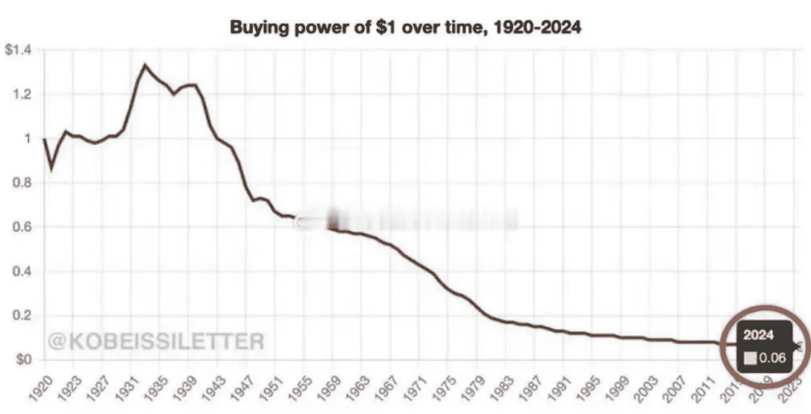

1920年，美国人平均年收入约为1400（1407）美元，约合两公斤（2110克）黄金，那时候一辆车，大约600多美元，相当于半年收入，一公斤黄金。

2019年呢？一辆车涨到了4万美元，差不多也是一公斤黄金。

这背后是啥呢？过去100年，一美元的购买力，已经变成了6分钱。

所以，你看，要想简单用25倍法则，来实现“财务自由、提前退休”，不容易。

这世界上哪里有什么轻松的财务自由法则。

难怪有一个所谓的投资“第二十二条军规”：

能够清晰阐明并快速应用的投资规律都是无效的。

但是，“25倍法则”，依然能够给我们一个关于个人财富的非常本质的启发。

其精髓可以概括为一个公式：

你的资产*年化收益率-每年支出>0

这个公式强调了资产、年收益率和年支出三者之间的关系。

它给我最大的启发是：

要从一辈子的角度，为自己建立一个最基本的财务防守系统

### 二

再来看第二个问题，在财务上，进攻还是防守？

我在35岁就退休了，因为正好赶上了地产比较火的某个阶段，加上自己要求不高，早早移居了海外。

记得我刚登陆温哥华，就问会计师：有没有那种有稳定租金回报的公寓出售？

会计师说：有啊，在温西（当地最好的区域之一）有整栋的三四层公寓，租金回报大约6%多。

听起来还可以，但是，那时是2008年，别说6%，就算是10%的年化回报率，都没多少中国人瞧得上。

于是，这个现在看来极为正确的一个决定，就这样跟我擦肩而过了。

为什么现在看那是一个好决定？

首先，稳定的租金收入，能够带来非常好的现金流。

有一种观点认为：

有钱人不是资产体量越来越大，而是现金流越来越多。

换句话说，

我们一生应该追求的，不是做大做强资产体量，而是做大做强稳定、持续的现金流。

尤其是在经济周期下行的时候，这一点更加重要。

那时买公寓之所以是一个好决策还因为，

长期而言，最牢靠的财富来自复利。

短期看，那栋公寓的租金似乎一般，但是随着时间，核心城市的核心区域的租金会上涨，年复一年的租金收益与租金递增叠加在一起，会产生惊人的复利收益。

第三，在温哥华的整栋老公寓，还有一个巨大的想象空间：重新规划。

因为当地的城区已经没有存量土地，于是政府就将一些老房子所在的区域增加容积率，原来两三层的老公寓，现在可以拆掉建成六层，甚至更高。这样，土地的价值一下子就上去了。

这是一个攻守兼备的决定。

这么好的决定，当初我为什么没有执行？

本质上，还是因为不懂。

面上的道理懂了，而且我自以为算是不算贪心的人，一直觉得钱够花就行了。但当时考虑这件事情时，还是有点儿心不在焉，觉得可有可无。

这类智慧，需要经历过完整的经济周期，才能够悟到。

我们国家过去三四十年经历了惊人的经济增长，几乎没有大的起伏。所以，我们很难理解财富上应该做好“防守”。

而我们的父辈并没有真正享受过市场经济的红利，确切说没有真正富过，所以也没有财富的智慧传承给我们。

从这个角度看，25倍法则，充满了我们需要学习和践行的智慧：

在财富上做好长期规划，做好现金流管理。

尤其是，

要以一种自下而上的思维，来管理现金流：算出生活的基本开销，然后努力让现金流大于这一开销。

但有些时候，我们容易只关注自上而下，也就是总想着用钱去赚更多的钱，来实现某个更高级别的财富梦想。

其实，我们应该先追求安心，安全，再去追求成长，跨越。

### 三

接下来，我们再来看第三个问题，如何践行“25倍法则”？

什么叫财务自由？

有种说法是：你不必为养活自己而出卖时间。

“25倍法则”的追随者们并非只为退休，而是为了通过财务自由摆脱“以时间换金钱”的工作方式，从而投身于真正热爱的事业，追求更加健康和满意的生活。

其实我们无需提早退休，也可以学习这种有益处的生活方式。

践行“25倍法则”的方法，基本上是一些常识，例如：

- 算好现金流。算出你每年的收入，努力让自己的开销小于这个数值。
- 在不必要的开销上做减法。这年头，大家喜欢收到快递的感觉，每次花钱也不多，却买来一堆没啥用的东西。做减法，不仅减少开支，还能够让我们专注于生活的本质。
- 尽早开始存钱。要想有一群下蛋的母鸡，要先从攒鸡蛋开始，别不拿小钱当钱，每一分钱都可能是财富的种子。
- 创造终生现金流。让自己的财富积累，变成能够源源不断下鸡蛋的母鸡。我们应该以防守的态度，去追求那些够用就可以的长期收益。

为了实现人生的自由，我们要展现出更坚定的决心和更强的行动力，用一种积极向上、认真严谨的态度，来做长期规划。

而在具体策略上，则应该是保守的，以不损失本金为前提。

### 四

再来看财务自由的第四个问题。

概念再高级，方法再正确，态度再积极，也解决不了核心：4%收益从哪儿来？

这是一个非常宽泛的问题，每个人的情况不同，对生活的定义也不同，没人能够给出标准答案。

不过，

绝大多数的普通人都应该加入“消极管理俱乐部”。例如多元化定投指数基金。个人投资者应避开股票选择的主动管理游戏，专注于资产组合的配置。

投资必须遵循一条简单的规则——避免错误。

25倍法则，追求的也是一种防守策略。

关于财富方面的防守策略，查尔斯·D.埃利斯在《赢得输家的游戏》一书中总结了“投资十诫”，其中有几条可以供你参考：

- 勿忘储蓄。
- 不要投机。
- 不要把住宅当成投资。
- 不要从事商品期货交易。
- 别被经纪人或共同基金销售忽悠了。
- 不要投资新的或者“有意思”的投资工具。
- 把你的长期目标、长期投资计划及财产规划写下来，
- 对于有定投计划的人，应专注于指数基金。
- 不要投资你自己的公司——尽管这个公司可能真的很好，因为自己在这家公司的工作收入，已经是“总体经济组合”的主要配置了——这讲的就是分散风险的原则。

你看，关于投资，没有“应该做什么”的法则，倒是有一堆“不要做什么”的法则。

我自己的做法是：

在错过了买下收租公寓之后，亡羊补牢，在一个稀缺的核心区域，投资了一些能够带来稳定现金流的物业；

为自己和家人们买了一些安全的投资型保险，这相当于强制每年做一些储蓄，并为将来带来终生收入；

以分散的方式，做一些被动型的投资；

此外，有一个小小的账户，用来做一些追求高回报的探索。

### 五

25倍法则给了我很大的启发。那么，我们该怎么行动？

——这是财务自由的第五个问题。

如果回到35岁，自己刚退休的时候，我会对自己说什么？

- 1、按照25倍法则，建立一个财务上的防守系统。算好每年的开销，然后努力实现超过4%的被动现金流收入。永远不要小瞧4%。因为坚守了4%，才会有向上的更大可能；而如果总是贪图过高的回报率，到最后连这4%都守不住。
- 2、早做打算，制定长期路线图，勿以钱少而不为。你需要长期而伟大的路线图。在投资方面，时间就是阿基米德的杠杆。投资的时间长度，对于任何一项投资都至关重要，因为它是制定正确资产组合的关键。年轻时，我也经常轻视一些“小钱”，觉得不算钱，没啥大用。现在，年过半百，我才懂得当初是多心急，多愚蠢。假如财富本质上犹如生命，是一个生长的过程，那么其作为复杂系统，更像是耕耘田地，种下森林，而不是去无人区探险。这个道理，我懂得太晚，希望你不要和我一样。
- 3、先避大险，再求大功。想要攒够25倍年开销的本金，不是一件容易的事情。一方面要稳扎稳打，开源节流，控制开销，另一方面还要有“成大功”的追求。但我依然不想就此给出太明细的定义。成大功可以是创业成功，可这只是极少数人的运气；成大功可以是长期定投获得复利回报，比如过去十年定投标普500和纳指；成大功也可以是认真工作之余，开了个社交账号，结果成了网红。......总之，你需要在做好本职工作的基础上，有超额的追求，超额的付出，并且能够接纳不确定性。以及，千万不要因为这个追求超额回报的部分，影响了你稳扎稳打的那部分收入累计。如果非要给个比例，应该是90%放在稳扎稳打，10%放在超额回报。并且，这90%和10%之间最好是区隔开来的。

然而，

比起“求大功”，也许“避大险”更重要。

即使我们按照25倍法则构建了自己的财务系统，也要随时检视：这个系统牢靠吗？

例如，你看到某个基金过去十年都有百分之十几的年化回报率，就All in，但是，未来十年其回报率有多高？该基金有爆仓的可能性吗？

除此之外，人生无常，我们还会面临生老病死，以及意料之外的天灾人祸，我们需要通过备用金、保险等多种方法，守卫自己和家人的生活。

最后，回到25倍法则，我们应该学习其中

> “养好鸡、用蛋生活、而鸡长在”

的理念，这才是可能实现财务自由的长久之道。

祝你好运。

我是老喻，我们下一讲再见。


### 公众号懒人搜索，懒人专属群分享

### 公众号
懒人搜索
懒人专属群


微信:lazyhelper

## 11 处置效应：为什么你会拔掉玫瑰，灌溉杂草？


lazybro，你好

我是老喻，欢迎回到《决策算法》课。

### 一

如果你有一个自己梦想中的花园，种满了漂亮的玫瑰，结果长出了许多杂草。

请问，你是该拔掉玫瑰，还是拔掉杂草？

我想，没人会选择拔掉玫瑰，留下杂草吧。

再请问：

如果你持有两个基金，第一个基金你投入了一万块，亏了五千，现在值五千。第二个基金你也投入了一万块，赚了五千，现在值一万五。

现在，你马上要付这个月的两千五房租，你会卖哪个基金呢？

大多数人会选择卖掉赚钱的基金。

这看起来有点儿奇怪，假如赚钱的基金是玫瑰，亏钱的基金是杂草，你应该留下赚钱的玫瑰基金继续赚钱，处理掉不赚钱的杂草基金呀？

行为金融学家把这种效应命名为“处置效应”。说的就是，人们习惯于“售盈持亏”，卖掉赚钱的资产，持有亏钱的资产。

你可能会说，基金和玫瑰怎么能比呢？玫瑰和杂草，是不会变的。但基金的涨跌，可能只是暂时的，亏的可能会涨回去，赚的可能会跌回来。卖掉赚钱的基金，相当于实现了利润，落袋为安，很正常呀。

可是，经济学家的研究发现，被卖出的盈利股票年收益比继续持有的亏损股票平均高出3.4%。

（经济学家特伦斯·奥丁对某家折扣经纪商1987年到1993年间约1万个账户的数据进行的研究。）

即使是专业投资人，也很难克服这种心理。

早在1999年，IDG资本就投资了腾讯，投入210万美元，占比20%。在腾讯上市前，IDG资本将持有股份分别卖给了南非的MIH集团和腾讯管理层，获得了近11倍的回报。

MIH不仅买了老股，还追加了投资。后来，这笔投资赚了三千多倍。

回忆起这件事，当时IDG资本中国区的负责人熊晓鸽说，他那时的思考逻辑是：

MIH愿意在寒冬里给腾讯估值6000万美元，这是11倍的退出溢价，这在当时看起来，是非常高的回报，非常成功。而且，谁知道腾讯未来还会继续涨那么高呢？

更关键的是，IDG的钱也不是白来的，他们背后也有投资人，也需要给这些投资人回报。当时，IDG同期投资的其他几家公司估值都不理想，要想回收现金，给投资人回报，他们当然是卖涨幅最高的腾讯了。

你看，这里面固然有财务回报的现实约束，但是，从另外一个角度，证明了“处置效应”无处不在，连专业人士也不能避开。

更让人感慨的案例是，孙正义提早卖掉了英伟达的股票，少赚了一千多亿美金；而他把变现的资金投给另外一家公司，几乎血本无归。

难怪，传奇基金经理彼得·林奇会感慨：一些投资者总是习惯性地抛掉赚钱的好股票，抱着亏钱的差股票，这无异于拔掉鲜花浇灌杂草。

这也正是我们这一讲标题的由来。

而且，处置效应不仅出现在投资领域，我们在工作，创业，甚至是人生伴侣选择上，也经常陷入处置效应的泥潭：

我们经常陷入与“烂人”的纠缠，却漠视了那些对我们好、有能力帮助我们的人。

### 二

为什么会出现处置效应？

人们卖掉赚钱的基金，是为了享受成功的喜悦。换个角度来讲，其实也是怕煮熟的鸭子飞了，说白了，就是怕损失。

同样的，人们有时候留下亏损的基金，就是不想面对这个结果，好像不卖掉，亏损就没发生，自己也有机会回本儿，也就是怕损失。

这种心理，其实跟行为经济学里的“损失厌恶”有关。

损失厌恶是指人们面对同样数量的收益和损失时，损失更加令他们难以忍受。

比如说，亏五千块钱给你带来的难受程度，是赚五千块钱给你带来的开心程度的两三倍。

而损失厌恶，似乎又跟进化留给我们的生存本能有一些关联。

想想看，我们的祖先在原始森林里，看见一个黑乎乎的东西，可能是石头，也可能是熊，他们的最佳选择，是仔细观察，还是掉头就跑？肯定是跑。因为哪怕是熊的可能性很小，但万一真的是，命就搭进去。

换句话说，对人类祖先来讲，损失的敏感度更高，就有更高的生存机会。

然而，到了今天，早已没有了丛林的生死威胁，但是我们的大脑进化却没跟上。曾经的生存优势，反而妨碍了我们获得更大的利益。

损失厌恶也能够解释很多我们生活中常见的现象：

例如，“好女深陷渣男的陷阱”。女生已经看清了渣男的真面目，但是却舍不得分手，总想着渣男能够回心转意，即便这时候有个更好的男生在追求她。

再例如，芝加哥大学的奚恺元教授介绍过一个例子：美国一些年轻人为退休金进行储蓄的时候，偏向于把钱存入银行，而不是投资在股票上。但是长期看美国的股市回报率要远高于银行利率。

为什么呢？就是因为，他们讨厌亏损。因为，尽管美国股市长期回报更高，但短期却会有起伏。比如，今年赚两万，明年亏一万五，后年再亏两万，大后年再赚三万。虽然总体算下来赚钱还是比亏钱多，但是亏钱那两年，人的不开心程度，远大于赚钱那两年的开心程度。最后的结果就是，人们更偏爱不会亏钱，但收益也更低的储蓄。

当然，任何理论都有其局限性，有不少学者对“损失厌恶”概念提出挑战。对此，卡尼曼回应说，“损失厌恶”不是一条在一切背景下都成立的人性法则，然而“如果一个原则能帮助人们理解大量现象，它就是有用的。这不意味着‘损失厌恶’是真实的，而是意味着它是有用的。”

“损失厌恶”的适用范围，以后有机会可以单独说。在这里，我们可以先学习卡尼曼这种实用主义的态度，这对我们做好决策很有帮助。

### 三

讲清楚了原理，让我们回到开头的那个问题，我们该如何改变“拔掉鲜花浇灌杂草”的困境呢？

下面，我将给你四个可能有效的策略。

### 策略一：事先承诺，设置止损线。

止损线，是指提前为损失设置一个底线，一旦损失触及这个底线，就立即割肉，斩仓出局，别死扛到底。

有人用鳄鱼法则来解释：

如果有一只鳄鱼咬住了你的脚，你试图用手去解救，鳄鱼就会同时咬住你的脚与手，结果，你越坚持，被咬住得越多。所以，万一被鳄鱼咬住你的脚，最好的做法可能就是斩断那只脚。

听起来很有道理，但是问题来了：

谁能亲自斩断自己的脚呢？

所以，在彼得·林奇的基金公司里，买股票的，和卖股票的，不能是同一个人。

当一只股票下跌，触及了止损点，当初买股票的人往往下不了手。这时候，由别人来处置，就不会那么肉痛。

你看，这样是不是就避开“处置效应”了？

稍微总结一下的话，要用好“事先承诺，设置止损”这个策略，就要做到两点：

- A、任何事，都提前设置底线。
不光是投资，工作、社交，也应该设置底线。
例如，和人交往，有些底线一旦触及，就要立即对这段人际关系止损。大白话说，就是非常不对的人，要立即绝交。

- B、借助外力来帮自己止损。
人是很难对自己下手的，所以最好提前设置好规则，让合适的人帮你来兑现事先作出的承诺，而不是自己当自己的裁判。
一个具体的建议是，你应该有两三个判断力强、又对你好的人，在一些关键的决策问题上，让他们做你的决策教练。

### 第二个策略：随时跳出来问，如果是某某决策高手，他会怎么做？

我们必须意识到，类似于“拔掉鲜花浇灌杂草”的认知偏差，是大脑的某种先天设置。就好像是一辆车，自打出厂，方向就有点儿偏左。仅仅靠了解这些偏差，还不足以让我们避免。

为了及时帮自己纠偏，我们可以借助他人的视角，不断质疑自己。

例如，本杰明·富兰克林很喜欢西塞罗的思想。他曾经出版一本书，收录了西塞罗写的《论老年》，并遵循西塞罗的忠告生活。富兰克林不仅长寿，而且过了一个幸福并且万众敬仰的晚年。

同样的道理，你当然你也可以找你的西塞罗或者富兰克林。选一个你敬仰的决策高手，然后按照他的原则行事。

下次，你看不清鲜花杂草的时候，你就可以问自己，例如像巴菲特这样杀伐决断的人，他会如何做？

### 第三个策略：逆向思考

这个策略比较高级，既然损失厌恶以及处置效应是一种人类先天的“认知缺陷”，那么，我们能不能利用它干点儿啥呢？

这是一种很聪明的逆向思考。

已经有聪明人反向利用人类的这些认知缺陷。

例如，诺贝尔经济学奖得主理查德·塞勒，他是一家资产管理公司（Fuller & Thaler）的创始人之一。

这家公司率先将行为金融应用于投资管理，专注于美国小盘股和中盘股。成果还行。

这家公司正是利用其他投资者的非理性与心理偏见，来设计投资策略。

如其网站所言：

> “投资者会犯错。我们寻找他们。”

你看，大部分普通人辛辛苦苦和自己的人性弱点斗争，而极少数聪明人却利用咱们的这种弱点来赚大钱。

### 第四个策略：像职业交易员一样思考。

要避免处置效应，职业交易员不会在意单笔交易的得失。假如你要做数百次交易，就不会死抱一笔交易，职业交易员关注整体收益，而非单笔成败。

任何交易都有盈亏的概率，胜算只有通过大量交易才能显现。过于关注单一交易容易放大心理影响，忽视长期目标。接受单次决策可能失败的事实，关注长期表现，才能更理性地应对市场波动，优化决策。

就像我们决策算法的EKB模型里提到的，人生是一连串的决策，每次决策的期望值可能是正的，也可能是负的，我们要追求的不是没有负的，而是整体相乘的回报最大化。

我有个朋友，生意做得很大，因为遭遇背叛，几乎一夜回到解放前。但是他毫不纠结，又迈向了新的征程。他云淡风轻地说了一句：“那事儿翻篇了。”

### 总结

最后，让我们总结一下。

为什么我们会拔掉玫瑰，浇灌杂草？说白了，就是患得患失。

但是，我们的人生很短暂。

与其如此，不如大方承认那些人生早晚会遇见的损失，与过往痛快干杯。假如做了错误决策，不如痛快承认，及时止损，然后专注于下一个决策。

远离烂人烂事，去发现那些对你而言更重要、更有价值、更不能失去的东西。

珍惜你生命中的鲜花。人生有限，何必浪费在杂草之上？

我是老喻，我们下一讲再见。


## 12人际资产：为什么你会讨好“不对的人”，疏远好人？

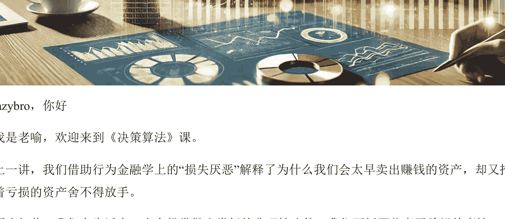

lazybro，你好：

我是老喻，欢迎来到《决策算法》课。

上一讲，我们借助行为金融学上的“损失厌恶”解释了为什么我们会太早卖出赚钱的资产，却又抱着亏损的资产舍不得放手。

不止如此，我们在生活中，也会经常做出类似的非理性决策：我们死抓那些毫无希望的事情，却放弃自己有把握做好的事情。

更糟糕的是，有些时候，我们会把最宝贵的资源和时间，花在一些“不对的人”身上；而对于那些帮助过我们的人、“有价值的人”，甚至是最亲近的人，我们往往会疏远。

在“财富决策”这个模块，谈及“人际资产”这一概念，不止是说人际关系是一种重要的资产，更重要的是，你获取财富，或者是遭遇损失，最大的影响要素就是“关系”。

社会阅历丰富的人可能对这一点都深有体会：最让人寒心的事情莫过于被自己信任的人在背后捅了一刀，而一个人财富的获得，也在于遇到了对的人。

所以，这一讲，我们来回答三个问题：

- 1、为什么你会讨好“不对的人”，却疏远好人？
- 2、怎么避免“不对的关系”，给你的资产造成损失？
- 3、如何经营好你的“关系资产”，为你的财富决策打好基础？

### 一

先来看第一个问题，为什么你会讨好不对的人，却疏远好人？

上一讲我们讲过，资产上的处置效应根源是“损失厌恶”，人际关系处置效应其实也是一样。只不过，我们怕损失的不是利益，而是“道德”。

我有个朋友，聪明能干，也早早赚到了钱，前几年又二次创业，和同学合伙，虽然启动资金全由他出，活也主要由他干，但他还是给了同学不少股份。生意起步也算不错。

这几年市场调整，他们的公司业务急转直下。他那个同学却要退出，我这个朋友继续扛着，一个人贴了很多钱。

这时，因为法规要求，公司需要找那个同学签个字，也不用承担责任，但如果不签就可能关乎公司生死。然而，他那个同学却彻底失联了。

我这个朋友感慨道：“亏钱是小事儿，但这事儿让我对人性不再有信心。人性真的经不起考验！”

我说：“人性在恶劣环境下，就会遭遇考验，并且极少经得起考验。所以，问题不是人性是否经得起考验，而是你作为公司的决策者，不该让彼此进入被迫要考验人性的极端境况。”

因为是无话不说的好朋友，我继续说：“你肯定会觉得，一直是你一个人在付出，为什么做好人这么难？

但是，你知道吗？

做好人最大的代价，不是人善被人欺，而是你在‘我是好人’的道德优势中，失去了决策的理性。”

朋友听了，默不作声。

从这个故事里，你也许听出，做出好决策，最重要的东西是什么了，那就是：理性。

如果你的决策理性，被当个好人的道德欲望压倒，那做出来错误的决策，面对人性之恶的挑战，就是必然的事情。

就像富兰克林讽刺的：

> 当一个人假装自己拥有某种品质时，行为最滑稽可笑

而由此带来的非理性决策的结果，可能远非可笑，而是悲催了。

### 二

我们会讨好不对的人，疏远好人，第二个原因是认知失调。

我们深受“以礼为先”的文化的影响，从小被教育要当一个好人，很多决策都受到面子的支配。

正由此，当我们遭遇“不对的人”，总会碍于面子，心存侥幸，导致决策行为上的认知失调。

认知失调（Cognitive Dissonance）是心理学中的一个概念，指个体在持有相互矛盾的认知（如想法、信念或态度）时，产生的一种心理不适或紧张感。

比如，一个吸烟者可能知道吸烟对健康有害，但又继续吸烟。为了减少不适，他可能说服自己：“我还年轻，吸烟对我的影响不大”。

人际关系上也是一样的。有时候，不对的人、不对的关系造成的损失，已经是事实了，但是因为面子，我们会自我合理化，甚至采取非理性的方式来维护内心的和谐，例如说服自己：“反正是朋友，何必计较利益？”结果损失越来越大，甚至大到你无法承受。

听到这里，我知道你可能会说，不要讨好“不对的人”，疏远好人，这些道理，我不是不懂，而是做不到，到底怎么做怎么避免“不对的关系”给你的资产造成损失？

### 三

在这方面，我有很多非成功经验。

我从小就是讨好型性格，长大后一直试图逃离直面人际关系。因为毕业后就创业，生意搭档帮我挡住了所有应酬。直到退休，我在人际关系上还处于夹生的小白状态。

然而，现实表明，我们根本无法通过逃避，来躲开那些必须面对的人生决策，否则，命运会加倍收取“培训费”。

所以，以下经验，是在我自己付出了极其昂贵的“学费”基础上的总结。

希望这些经验能帮助你避免因为“不对的关系”而造成损失，然后经营好你的“关系资产”。

概括而言，有三个策略：

第一个策略，训练一种“说不”的能力。

那些“天生会说不”的人，可能很难理解我们这些“不会说不的人”的难处。

幸好我的女儿不像我，她会毫无压力地对自己不喜欢的人或事物说不。

例如我几乎不扔东西，但我的女儿隔一阵子就把自已房间里不喜欢的东西清理出来。不管是学习还是爱好，她绝不会去假装喜欢自己不喜欢的。

她最近在申请大学，说起申请的专业，她说：“我不知道自己将来要做什么，但我知道自己将来不要做什么。”

所以她坚定地不去申请那些不喜欢的专业，哪怕那些专业可能会让她上一所好的大学。

这就是一种很多人要半辈子才能领会的哲学——而她有天赋。

我们做真正重要的决策，往往是基于舍弃。就像有人评价，苹果公司的伟大，在于它选择不做什么。

因为随机性，我们这辈子拿到的牌，总是有好有坏。这时候的重点，不在于把坏牌打好，而是舍弃掉一些糟糕的坏牌。

我们读书时候最大的后遗症之一，就是试图把每一科的分数搞上去，所以经常花最多的时间和自己最不擅长的学科死磕。

但是，走入社会之后，我们其实是有选择的权利。

安妮·杜克说：

> “顶级扑克玩家和业余选手最明显的差别就是，他们知道什么时候该弃牌。决定哪几手牌适合下注、哪几手牌必须放弃，是玩家做出的第一个选择，也是最重要的选择。”

有一个数据，职业德州扑克选手在拿到两张底牌后，他们继续玩牌的概率只有15%～25%。相比之下，业余玩家拿到底牌后坚持玩牌的概率超过50%。

所以，构建你的人际资产，要从勇敢说“不”开始。

假如你试图讨好所有的人，可能就像坚持打烂牌的业余扑克玩家。

接下来，我们说：

- 第二个策略：马太分配。

传统的二八理论或帕累托法则认为80%的价值来源于20%的关系。

然而，在现代社交环境下，这种分配可能更加集中，1%的人际关系贡献90%的价值。

因此，识别并聚焦这1%的“核心关系”至关重要。这些人是我们生活和事业中的“关键联系人”，其影响力远超其他普通关系。

通过将90%的精力集中在这1%的关键联系人上，我们不仅可以提升人际交往的效率，还能够借助这些关系产生更大的价值和成长空间——这就是马太分配，基于马太效应的资源分配。

这并不是说我们要躲在自己的小圈子里，更广泛的社交圈和弱关系，从概率的角度来说，会给我们带来更多的机遇。

这里想要强调的是，对于核心关系圈，要追求彼此忠诚，用巴菲特的话说，最紧密的朋友，是那种在关键时刻能把你“藏起来”的人。

我们还要有一种道德上的洁癖。假如核心关系圈的成员，出现了一点儿瑕疵，暴露了一点儿信号，你可能都要高度警惕。以我有限的经验看，那些小小的瑕疵背后，对核心关系而言，都隐藏着一个巨大的“雷”。

从社会上的统计数据看，一个人在财富上遭遇的最大损失，大多来自紧密的伙伴，而不是外部的对手。

上面讲了“勇于说不”和“马太分配”，接下来，我们讲：

- 第三个策略：动态调整。

上一讲，我们探讨了如何避免“拔掉玫瑰，灌溉杂草”。对此，有一种投资方法，其逻辑是：

你首先建立这样一个7板块组合，每一板块投入相同数量的资金。

2个月后，你需要检查前6个月中每一板块的表现，然后重新分配资金，表现最好的两个，分别分配2/7的资金。接下来的三个，分别分配1/7的资金。最后两个表现差的，不分配资金。

再过6个月，继续重复上面的逻辑。

你看这个策略有趣的地方，就是动态评估谁是玫瑰，谁是野草。然后，动态调整玫瑰和野草之间的资金比例。这样，你就不会轻易看走眼了玫瑰和野草。

像投资股票的仓位调整一样，我们需要定期审视自己的人际关系，并据此调整时间与资源的分配。

对高价值关系增加“持仓”，让这些关系持续产生正向回报；而对于低价值关系则适当“减仓”或“清仓”。

通过这种动态管理，我们可以有效避免时间和精力的浪费，使每一次互动都更具战略性，始终服务于个人的长远目标，也能够让你照顾好那些对你重要的人。

### 四

我们在《决策算法》的开头，提及了“有限道德”的概念。

因为他人的“道德有限”，所以你要降低期望，并且对那些道德天花板低的人说不，只对极少部分彼此忠诚的朋友开放核心关系圈。

还因为我们自己的“道德有限”，所以不要假装自己是好人，不要去扛那些我们早晚扛不住的面子。

总而言之，我们应该以“有限道德”为前提，从理性出发做决策。永远避免让自己陷入“考验人性”的困境，否则就是你自己的责任，而不是他人给你带来的伤害。

决策的本质，是处理三种关系：

1. 我们与世界的关系；
2. 我们与他/她的关系；
3. 我们与自己的关系。

关于1，因为世界是未知的，是充满随机性的，所以关于决策，我们与世界的关系的关键词是：真实。

关于2，因为人和人之间，交织着利益与情感，所以关于决策，我们与世界的关系的关键词是：真诚。

关于3，因为我们每个人的理性是有限的，所以关于决策，我们与自己的关系的关键词是：诚实。

这三种关系，看起来最受我们自己掌握的，也就是自己与自己的关系，反而是最艰难的。

单单从词语表面，“诚实”，连接着“真实”和“真诚”。

好的决策，带来好运气，让你成为好的人，为你创造财富。而这一切，都从对自己诚实开始。

当你处理好这三种关系，你不仅会拥有宝贵的人际资产，而且自然会获得财富的回报。

以上就是这一讲的全部内容。

我是老喻，我们下一讲再见。


公众号懒人搜索，懒人专属群分享
公众号
懒人搜索
懒人专属群


## 13对冲思维：做错决策时如何还能赢？


lazybro，你好：

我是老喻，欢迎回到《决策算法》课。

经过前面的课程铺垫，有一点相信我们已经达成共识：面对不确定性，再厉害的决策高手，也做不到不犯错。

那问题也来了，万一真的错了，怎么办？这时候，一种重要的决策思维就要出场：对冲思维。

尤其是在财富决策领域，对冲思维是高手的必备能力。

### 01 从“单吊”到“买保险”

决策高手是怎么运用对冲思维的？先来讲一个故事。

职业扑克选手菲尔·赫尔穆特以输牌后情绪崩溃而著称，他不仅羞辱对手，更会责骂自己是个蠢货。

最有名的一次，是在一次世界冠军邀请赛中，另外八位高手被淘汰后，赫尔穆特最终对战传奇女牌手安妮·杜克。

决赛规则很残酷，冠军可以赢得200万美元，而第二名一无所有。

结果，赫尔穆特输给了安妮·杜克，他再次失控，大喊大叫，不停咒骂，视频在社交媒体上广泛传播。

然而，这只是表象，真相要有趣很多。

事实上，在进入生死对决之前，赫尔穆特和杜克暗地里达成协议：

- 1、两人无论输赢每人都带走75万美元，确保都有不菲奖金；
- 2、在最后的比赛里，赢家拿走剩下的50万美元。

两位职业牌手，都为自己“买了保险”，从而对冲了不能夺冠的风险。这是一个有趣的金额设定，分成比例大约接近于黄金分割点的位置。

二人不用说都是概率高手，他们比任何人都更理解现实世界的概率本质，因为他们是用真金白银下注。他们知道：即使你拥有概率优势，你也极有可能输钱。

所以，好的策略是，当对你不利的小概率事件发生时，也可以赚钱。

当然，这种好事儿的前提，是对方觉得你是一个势均力敌值得尊重的好敌手。

作为世界最强玩家之一，赫尔穆特说：“成为扑克高手的关键是耐心和控制”。

他说：“扑克玩得好意味着只打手牌轮次的12%。如果超过30%，你就没法赢钱；如果你每把都玩，你100%每天都会破产。”

过去四十年，创业圈里最大的赢家是哪些人？经常是，单吊并且All in的人。下注于一张貌似不可能的牌，结果每每柳暗花明，赌性更坚强。

而2020年之后，游戏规则彻底反转。各种超越我们个体生命周期的未知事件，令人应接不暇。

于是，人们开始补课：其实，输也可以是人生的选项。

重点就变成了，如何让自己在“输”的时候也能赚钱。

这时，你就必须用到对冲思维。

### 02 不靠预测发财

为什么要有对冲思维？

因为，我们处在一个充满了不确定性的世界里。

预测是件很难的事。宇宙间总有股神秘的力量，处心积虑地要和你的愿望作对。

似乎每个聪明人都要摔几个跟头之后，才会知道：用自己智力优势来预测未来，至少在赚钱方面是不靠谱的。

关于未来无法预测，橡树资本创始人霍华德·马克斯举了一个很生动的例子。

回想一下 2016 年秋天，大多数专家对两件事非常有信心：希拉里·克林顿将赢得美国总统大选，但如果唐纳德·特朗普因某种命运巧合获胜，美国股市将会崩溃。

事实却是相反，那届美国大选特朗普获胜，标准普尔 500 指数在接下来的 14 个月里飙升，涨幅接近 30%。

永远不要对于自己的判断过于自信，任何微小可能性都可能发生。

所以，比起单边预测，建立一个对冲系统，方能防范风险，真正获利。

前阵子，流传有一个人靠下注，从特朗普的当选中赚了大钱。但是这种单边下注并不值得赞美。反倒是那个下注的平台，不管谁当选，都能稳稳赚钱。

对冲交易，就是同时进行两笔行情相关、方向相反、数量相当、盈亏相抵的交易。

这样无论价格向什么方向变化，总是一盈一亏。

你可能会有疑惑了，一亏一赚，不就抵消了，怎么赚钱呢？

下面，我们用一个具体的例子，来示范一下，如何用对冲思维来锁定收益。

### 03 对冲的数学原理

让我们从《普林斯顿概率论读本》的一道题开始：

有人在拉斯维加斯下了一个赌注，押A球队能在常规赛保持不败，最后赢得冠军，赔率是1000比1，他下注了500美元，若获胜将拿走50万美元。

他运气太好了，A球队进入了总决赛，并在比赛中以微弱优势领先于对手B球队。这意味着，如果势头不变，他的500美元将变成50万美元。

这时赌场打来电话，说愿意用15万美元买走他的下注。

如果他答应，15万美元马上到手，但可能失去赚50万的机会；如果他不答应，可能一分钱都赚不到。

是你会选择哪一个？上面那位球迷对A球队很有信心，拒绝了立即拿走15万美元，他要等50万美元。

这是一个真实的故事。第四十二届超级碗，巨人队（B球队）在终场前35秒大逆转，赢了爱国者队（A球队）。那位朋友的50万美元就这样飞走了。

多小概率的事儿，真的都可能发生。

所谓的胜券在握，真的只是一个概率问题。

复盘一下，这位下注者做错了什么？

如果我们假设A球队的获胜概率大于50%，那么下注A球队的期望值大于25万，这个期望值显然大于赌场开出的15万，所以下注者拒绝赌场，似乎是对的。

而且对于普通球迷来说，用500美元换来这么大的赢钱机会，一辈子都难得有一次。

但坏就坏了“难得一次”。我们在期望值那一讲说过，期望值要经过遍历性，才可能真正实现。说白了，就是需要重复多次。无法大量重复，有了正期望值也可能白搭。

那他有没有办法保住赚钱的机会？《普林斯顿概率论读本》的作者给出了具体的方法——对冲。

下注者当时可以再下注押B球队赢。这样，不管哪一方获胜，他都可以有可观的收入。

当然了，要收益最大化，押B球队赢的下注金额，也不是随便多少都可以。具体计算过程很有趣，我放在文稿中了。经过对冲，那个球迷可以稳赚大约33.28万美元。

这里，我们需要解一个简单的方程：拉斯维加斯要利用赔率差来赚钱，会对押注B队赢的赔率作出限制，我们假设是3。我们设应该下注于B队的金额为b，所以：
- A队胜的回报是（50万-500-b），放在方程左边。
- B队胜的回报是（b×3-500-b），放在方程右边。

令两个回报相等，计算得到b约等于16.67万美元。下注者最终的收益，50万-16.67万-500，等于33.28万。

33.28万自然不如50万来得爽，但这是他可以稳赚的金额，少赚的那部分是对冲的成本，相当于他买保险花的钱，最后算下来依然是很划算的。

从本质上来说，对冲的目的，是把煮熟的鸭子吃到嘴。

但这里有个前提，你真的要有一个快煮熟的鸭子。

在上面的例子里，主角为什么会有一个稳赚的机会？是因为主角手中拥有一个“概率权”，也就是“他花500美元以1000比1的赔率押A队赢”的这个权利，并且当时A进入了总决赛。

赌场开价15万买主角手中的“概率权”，应该只是一个套利行为。肯定是有另外的买家愿意出价更高，所以赌场当了二道贩子。

由于球类游戏充满了不确定性，并且总决赛的次数有限，下注者无法像玩儿德州扑克那样通过大量重复，以令大数定律“显形”。

所以，即使是在自己的胜率很高的情况下，通过“保险策略”对冲万一输掉的风险，是值得的。

### 04 用对冲思维守护你的人生

桥水基金的创始人达利欧，年轻时候的也曾经相信，自己可以靠预测来发财，结果几乎破产。

他由此获得了深深的感悟：

> “靠水晶球谋生的人，注定要吃碎成一地的玻璃。”

传奇投资人索普的策略是：不依靠水晶球的预测，不计算各种企业的价值，而是寻找同一家公司的各种不同的证券产品中被误估的证券，从而构建一个对冲仓位，做多低估、做空高估，无论市场如何变化，他最终都能获利。

那么，我们普通人应该如何设计自己的对冲战略呢？

以下有三个要点：

- 要点一：从正反两面思考可能性。

经济学家萨缪尔森曾经就“市场有效理论”与巴菲特开战，他认为长期而言投资者战胜指数基金是不可能的；而巴菲特则认为该理论不够充分。

有趣的是，萨缪尔森一方面与巴菲特辩论，一方面则购买了巴菲特公司的股票。

所以，不管我们的某个信念多么坚定，都要反过来想一下。

最强大的敌人往往是最懂你的，你可以从他们那里学到很多，适当时候甚至可以在竞争对手身上下一点儿注。

我以前做地产时有个同行，他痴迷足球，有时候也会下一些注。但是他从来不押自己喜欢的队伍赢。这样一来，假如他喜欢的队伍赢了，就开心；假如他喜欢的队伍输了，就赚钱。

### 要点二：捕捉细微的可能性。

深度学习之父辛顿早年在大学求职，那时他主张的神经网络方向的AI路线不被看好，而且他自己看起来也并不突出，学校的负责人犹豫了一下，还是给了他一份工作。

那位负责人是这么想的：要是这个“疯子”对了呢？

的确，在人工智能的寒冬，辛顿主张的神经网络，几乎毫无希望。但是，依然代表了某个大的方向，即使该方向的可能性很低。

如此一来，那个大学负责人既规避了错过的风险（这像是防守），又拥抱了一个极小概率的大机会。

后来，众所周知，辛顿坚持的神经网络方向，掀起了这一波人工智能的新高潮。

所以，假如你发现了一个可能会爆发的机会，但是又觉得把握不大，不妨像对待种子一样，做一些小小的投入。

我有个朋友，就是用这种态度对待比特币。他和大多数人一样，一直对数字货币持怀疑态度，认为不劳而获发大财不合理。但是他依然买了一点儿。他说：假如我的怀疑正确，说明我有判断力；假如我怀疑错误，我就赚钱。

你看，这就是一种向可能性致敬的对冲行为。

### 要点三：投资者应该对冲尾部风险。

尾部风险是一个统计学上的概念，它指的是一个不到1%概率的事件突然出现在人们面前，转而触发灾难性的风险事件。

我的另一个朋友，通过炒房，在某个城市拥有了大量房产。因为受益颇丰，他加足了杠杆。我们劝他，资金绷这么紧，万一市场调整怎么办？

他说：我研究过，大城市的房价即使有短期调整，长期而言也是向上的。

后来，房产市场变化，他的现金流一下子断了，陷入了困境。

俗话说：晴带雨伞，饱带干粮。在地产大牛市的时候，尤其要思考，万一不好了该怎么办？

这时，应该做一些对冲，例如将炒房的利润，放一些在有稳定回报的账户里。

这样，就不会让自己遭受永久性损失，哪怕那个风险概率很小。

### 总结

总结一下，

对冲思维，能够帮助我们，不管运气落在哪一边，都有收获。

对冲当然也是有成本的，会拉低你的期望收益，但这是值得的。别老想着把钱赚透。

对于我们的人生中那些相对确定的东西，例如理想，工作，家庭，应该一路向前。但是对于一些不确定的事物，尤其是投资，我们不能对“单边下注”过于乐观，适当的时候要做一些对冲，以应对不确定性。

最幸福的人生，也许不是一路高歌猛进，而是不管岁月如何起伏，也能安稳度过。

正如苏轼的诗句：一蓑烟雨任平生，也无风雨也无晴。

我是老喻，我们下一讲再见。

微信：lazyhelper

## 问答：买彩票是不是帕斯卡赌注？

你好，我是老喻，欢迎回到《决策算法》课。

今天我们来一讲加餐，回答同学们近期的一些提问。

### 1. 彩票是不是帕斯卡赌注？

首先来回答两个关于彩票的问题：

Jensen Huang 同学听完期望值那一讲问，为什么各国还是有彩票销售呢？

此外还有小兴哥同学的提问（这位同学是《人生算法课》的老同学）：买彩票2元的成本几乎可以忽略不计，但万一中大奖，收益极大，是不是一种帕斯卡赌注？

两个问题我放在一起回答。

买彩票不是帕斯卡赌注，因为期望值计算是负的。彩票和赌场都是让人输得很稳定的地方。

彩票的吸引力是用低成本给人以幻想，尽管中头奖的概率比雷劈还小很多倍。

历史上的确有利用漏洞，通过彩票致富，但这种机会极为罕见，后来那种漏洞也很快被堵上了。下周，我们会有一讲正课，专门讲那些人是怎么操作的，这里先不展开。

假如将彩票视为一种情绪价值产品，似乎也可以理解，因为它提供了一种最小化的对未来抱有幻想的解决方案。虽然幻想并不等同于希望。

但事实是，很多时候彩票带来的伤害更大，甚至有些入会上瘾，这样就不值得了。

美国买彩票的人中，大多数是穷人。数据显示，在美国，收入最低的家庭平均每年花在彩票上的钱是412美元，这是那些高收入家庭购买彩票金额的4倍。

400多美元，看起来似乎也不算多，然而，很多时候财富就是一种习惯的结果，尊重小钱，才能赚到大钱。

世界各国大多都有彩票销售，因为这的确是一种很好的商业模式。

事实上，一些互联网平台，例如直播平台，多少也学习了彩票模式。

总体而言参与者的期望值也许为负，也就是说大部分参与者不能从中赚到钱，但是头部的玩家，回报非常高。这就像是彩票头奖的巨大金额带来的吸引力。

于是，这就会激励众多参与者，不计真正的回报，积极投身其中，为平台贡献了“认知盈余”和“为梦发电”。

当然，你也可以说，这难道不是人类社会的本质特征之一吗？

哪个父母，在自己孩子还小的时候，不希望Ta是个天才，谁没想过自己的孩子将来可能上清北、上哈佛？哪怕这种可能性低到如同中彩票。

更广义而言，我们每个人来到世界上，都相当于中了一个宇宙彩票。宇宙这么大，迄今为止只发现地球上有生命。

好好珍惜你我收获的堪称奇迹的彩票大奖吧！

### 2. 要不要辞职成为职业牌手？

再来回答第二个同学的问题（这也是一位《人生算法课》过来的老同学）。

这位同学的问题：喻老师，您写过一篇和德州扑克有关的文章，提到相比围棋等项目德州扑克更接近现实，深有感触。几年前接触线上德州扑克，大感兴趣，不断学习提高，核心还是依靠微弱概率优势，大数定律，现在其收入已是工作的数倍。对工作的机械重复低效已感到厌倦，现准备辞职全职打扑克，家人也支持，想听听您的建议，谢谢。

简单说，我肯定不建议你辞职去做职业牌手。

讲一位职业牌手的故事。

2018年，来自加利福尼亚州的斯科特·桑德斯在扑克界引起了轰动。他在短短一周内赢得了两场世界扑克系列赛巡回赛（WSOP Circuit）冠军，总奖金约为175000美元。然而，他的真实身份，是一名汉堡店的厨房经理。尽管一下子成了明星，桑德斯在接受采访时却表示，他并没有计划成为一名职业扑克玩家。他会继续在汉堡店工作，享受现有的生活方式，他珍视工作带来的稳定性和与同事的关系。

桑德斯并非孤例。在德州扑克界，即使赢得了大奖，许多高手级玩家仍然选择继续他们的本职工作，而不是成为职业牌手。

我猜测一下，这位同学的心思是这样的，德州扑克并不是通常的赌博，赌博的确不可能赚钱，但是德州扑克不一样，学会了算概率，又可以大量重复，为什么不能赚钱呢？再者，我也已经拿到了结果。

但如果你真的是概率高手，就会明白，即使是顶级玩家，也会经历长期的亏损期，如果是拿打扑克来谋生，这会给你带来巨大的心理压力。职业玩家其实很苦的。

工作建议你继续干着，德扑也可以继续玩。这是挺好的“杠铃战略”。长期来讲，总的收益，可能比你去做职业牌手要更大。

这样做，不仅让你有稳定的现金流，平静的生活状态，没准儿还让你有更好的心态，在德州扑克上有更大的进步。

### 3. 不要用勤奋和困难逃避“正确”

再来看第三个问题。

五点半同学问：本人男生，已经参加工作5年了，刚满30岁，做跨境电子商务。职业发展遇到了瓶颈，知道自己需要通过外语、IT技能(python编程)可以提高个人技能，拓宽职业发展路径，于是买了对应的书籍和视频。

可是学起来很吃力，尤其是编程(我专业是学经济学的，编程0基础)，我想自己是“畏难情绪”太严重，莫名觉得很难，怎么破？大神是如何学习新知识、克服心理障碍的？

我明白自己是心理问题，可是就像学数学一样，觉得好难，怎么调整？

对于这个问题，我的回答是，我们应该做对的事儿，而不是难的事儿。

有时候人们做一些难的事儿，其实是在给自己制造在“做对的事情”的幻觉。

跨境电商行业现在也并不缺一个零基础起步的菜鸟程序员。也许你的工作需要引入一些新技术，但也不一定需要你亲自上阵写代码。

你已经有五年的从业经验，对市场、产品和客户都有一定的了解。这些才是你的核心竞争力。与其花大量时间和精力去攻克编程这种高投入、回报周期长的技能，不如思考如何在现有的专业领域深耕，提升自己的专业度和影响力。

现在流行一种说法：做难而正确的事情。但其实重点先是“正确”，然后才是不管“难易”坚持下去。

我们说过，决策是你面向未来投入自己的人生资源。

你的人生资源，应该先考虑自己的优势，依照就近原则，满足当下工作中最紧迫的需求。

### 4. 假如回到35岁，你会如何决策？

再来看第四个问题。

X同学提问：老喻，有你真好。35岁人至中年，但真心觉得自己正年轻且对生活热情不减，虽看到了人世的复杂却仍希望可以做個快乐、真实的人。可时间越跑越快，家庭、事业、理想、俗事……太多事需要平衡，精力越来越难集中，分享些针对这个年龄的人生经验吧！

35岁还年轻着呢，我的建议，概括成下面10条吧：

- 别停下来。专注于接下来的那个人生决策，对未来满怀期待。
- 不因看透世故而世故。对自己诚实，对朋友真诚，对世界真实。
- 通过“说不”减少复杂。持续做减法，聚焦于生命中最重要的那三五件事。
- 理性变得更重要。智慧上也是做减法，这个阶段判断力是最重要的智慧。
- 行动上死磕，心底放过自己。并不是每个人都有成功的义务，活出自己的独一无二就好。
- 降低对他人的期望值。对他人好，是你的能力，不是交易。但是你可以根据反馈来调整自己是否应该继续对他好。
- 多和老友聚。根据贝叶斯定理，经受时间考验的老朋友，未来值得继续成为好朋友。
- 享受生活，照顾好自己。对自己好一点儿，生活上满意就好，别去比较。
- 坚持学习，发现新增量。就成长而言，一个人可以是永远是年轻的。好奇到底吧！
- 未来很长，及早规划。未来还有很多未知的美好，值得你去继续探索。像一只鹰一样，在一个安全的地方，搭好自己牢固的巢穴，并且时不时地翱翔天空，鸟瞰整个世界。

### 5. 概率方面的阅读计划

再来看第五个问题。

老喻，你好，《决策算法》这门课程里面用概率论来看待人生问题的方法让我获益匪浅，所以想问下老喻是否可以推荐一些关于用概率论看待人生问题的书呢，万分感谢，概率论的视角让我看到人生更多的可能性。

尽管概率成为这个不确定世界最重要的底层思维方法，但是这方面的图书并不多，尤其是能够把严谨的概率计算与世俗智慧关联在一起的图书，更是凤毛麟角。

简单说，这方面的书大概有：

- 涉及到基本的概率通识。《醉汉的脚步》（新版有我写的序），《哈佛概率公开课》，《几率》，《机会的数学原理》，《统计学的世界》等。这些书教给我们概率的数学基础。这是决策的原点，也是我们理解这个不确定世界的最牢靠的语言。
- 如何用概率理解和应对现实世界的不确定性。《随机漫步的傻瓜》（如作者所言，他的后几本都是对这本书的重复），安妮·杜克的《对赌》，索普写的《战胜一切市场的人》。
- 行为经济学和行为金融学方向的书，主要是卡尼曼和塞勒的书，比如《思考，快与慢》《助推》。不过，类似于《思考，快与慢》，看下来真正有收获，你需要好好下一番功夫，搞懂其中那些关于概率计算以及效用函数的曲线。

公众号懒人搜索，懒人专属群分享。

当然，还有我的《人生算法》，以及《好运》。

想简单了解，可能公众号“孤独大脑”是个好去处。

最后，《决策算法》课一开始，我们说过决策是实践的艺术，在正课中，我们研究各种有用的决策算法、思维模型，但是在问答中，我希望能有更多机会，跟你探讨你人生中遇到的具体的决策难题：你在哪个城市？现在做什么工作？什么年龄？遇到什么挑战？什么事儿，让你左右为难？

你的问题越具体，我的回答，可能越有针对性，期待你的更多好问题。

我是老喻，我们下一讲再见。

## 14. 买房的逻辑：房子还是投资的好选择吗？

你好，我是老喻，欢迎来到《决策算法》课。

要说中国人最关心的财富决策，买房肯定可以排进前三。

的确，过去20年，许多人赚到的最大一笔钱，就是来自房子的增值。

然而，过去并不能决定未来。尤其最近几年，各地房价都或多或少出现了高位回调。在这种背景下，所有人更加关注：未来房价还会涨吗？买房还能不能撬动我们的财富状况发生质变？

更具体一点儿就是：房子还值得买吗？哪里的房子值得买？

我们是一门更关注通用决策方法的课，预测未来几年的房价是涨是跌，不是我们的任务。

不过，我可以给你一套思考买房问题的决策框架，让你用一个新视角来理解买房的逻辑。

### 一

我们从一个最基本的问题开始：房子的功能到底是什么？

比较常见的观点，是一种二分法：消费功能和投资功能。

这种分法有它的道理。但在我看来，面对房价涨跌的复杂性，这种划分往往显得片面，无法揭示背后的深层逻辑。

先说两个楼盘案例。

从消费的角度，深圳东部有个楼盘，景观无敌，设计一流，刚推出的时候可谓万众瞩目，被认为是豪宅的代表作。

然而，十多年过去了，深圳整体房价涨幅惊人，不少房子涨了十倍，而那个豪宅却几乎没涨。为什么？

从投资的角度，2008年，因为受到金融危机的影响，大家购房都不再有信心，更别说以投资为目的了。

但是，上海有一个项目，就在那一年推出，而且房价创了新高，结果一抢而空。购房者相当多一部分，是基金经理等金融从业人员。按理说，他们最讲究投资回报，为什么愿意在那个时间点，投入大量资金到房子上？

所以，决定房价涨跌背后的关键要素，到底是什么？

我有一个观点：房子本质上是一种用于存放“生产力工具”的仓库。

“生产力工具”是一种隐喻，说的自然是我们自己。人们通过劳动、技能、知识与资源整合，创造经济价值。房子的作用，就是为这一“工具”提供适宜的居住环境，使其能够持续、高效地产出价值。

回到我们上面的例子：

深圳东部那个多年不涨的豪宅，距离市区相对较远，还要经过一个容易塞车的隧道。深圳是个讲究效率的城市，有实力购买那个豪宅的人，即使有时间上的自由，但依然追求生产力的效率。所以，再好的环境，再高级的设计，也不能满足“存放生产力工具”这一基本需求。缺乏生产力价值支撑的房产难以获得市场认可。

再说刚才提及的上海的例子。那个项目位于核心区域，环境不错，商业成熟，房子设计和装修也很用心。虽然推出时大环境不好，定价较高，但是该项目的购房者，一眼就看中了房子对自己工作的便利，以及能够通过生活质量的奖励，提高“战斗力”。

房子的价格由“生产力工具”的价值来支撑。换句话说，一个人的赚钱能力越强，愿意支付的存放成本越高。

这就是为什么，核心城市、核心地段的房价会持续上涨。

重要的不止是位置，而是住在这个位置，赚钱的效率更高。

所以，一栋房子，是用来住也好，用来投资也好，未来会不会涨，你要看，会来住这个房子的人，赚钱能力能不能持续，或者会不会增长。

换言之，房价的涨跌并非由“消费”或“投资”的表面功能决定，而是取决于其对生产力工具效率的支撑程度。包括三点：

- 通勤效率的优化：减少通勤时间和交通成本，直接提升生产效率。
- 生活质量的改善：提升居住者的身体与心理状态，从而间接提高工作效率。
- 资源的可及性：如高质量的教育、医疗、商业等资源，能增强生产力工具的长期价值。

### 二

一旦以此作为考量房价的基本逻辑，许多矛盾的问题就迎刃而解了。

例如，有些人认为房价永远上涨，有些人则认为“房价永远上涨只是个神话”。

我刚到温哥华时，对这座城市房价历史做了个简单研究。当地传统豪宅区桑拿斯区过去100年大约涨了一千倍。看上去，长期而言，房价似乎总是会上涨。

但是另外一个例子是，在荷兰阿姆斯特丹王子运河边上，那些历史悠久的漂亮房子。从1628年到1973年之间，这些房子平均每年上涨了2.3%左右。扣除通胀后房价每年只增长0.2%。如此算来，这里的房价在整整350年内仅增长了一倍。

假如用我的观点来解释，也就是房子本质上是一种用于存放“生产力工具”的仓库，就不难理解了：

荷兰当年是世界经济中心，作为“生产力工具”的人，能够支付更高的存放成本。然而，随着经济的发展，世界经济中心已经发生了转移，阿姆斯特丹不再是“宇宙中心”，房价自然会慢慢回归。

而温哥华是一个新移民城市，尤其是吸引了许多来自东亚的富豪家庭。尽管那里房子的租金回报率低，也没啥工作机会，但是富豪们为了构建一个稳定的后方，以便于让自己安心在前线继续赚钱，所以仍然愿意支付很高的存放成本。

### 三

“房子作为生产力工具仓库”的逻辑，还有两个有趣的延伸。

第一个延伸，文旅盘的价值逻辑。一些文旅盘之所以火，是因为房子还有另一种功能，那就是生产力工具对自己的奖励。

很多人不理解，为什么阿那亚那么火，但别的文旅盘就是做不起来？

能够成为“生产力工具对自己的奖励”，不光要舒服的空间，漂亮的风景，更重要的是还需要好的人文氛围和服务。

大城市的“生产力工具”们对于人文氛围和服务，要求更高。他们要短短的车程，就能够来到乌托邦般的环境，在精心设计的文化氛围中，用一个周末或者假期，完成赚钱机器的重启，然后回去继续创造价值。

经济学家席勒多次警告美国房地产市场可能存在泡沫。他认为，房价的快速上涨往往受到投资者过度乐观和市场情绪的驱动，而非基本面因素。他主张“是泡沫，就一定会破灭”。

然而，有趣的是，他自己却在离纽约不远的长岛海湾里买了一个小岛。他对此给出的解释是：

- 为了消费；
- 为了多元化资产组合。

你看，总在说房地产泡沫的经济学家，也会拿房产奖励自己。

“房子作为生产力工具仓库”的逻辑，还有第二个延伸，就是“学区房”。

学区房是生产力工具为了延续自己的基因付出的溢价。当然，这么解释或许有些太功利，也可以换个角度来说，所谓的学区房，是存放未来的高质量生产工具的仓库。

### 四

明晰了“房子作为生产力工具仓库”这一基本逻辑，我们在做决策的时候会更加清晰，而不是停留在表面。

不管从时间还是从空间看，房价的上涨都是不均匀的。这个不均匀的背后，是生产力发展水平和速度的不均匀。

例如，在美国过去一百年，房价走势似乎与通货膨胀速度相当，但并不代表购买者就能够以此抵御通货膨胀。因为这一百年间，美国房价的上涨并不均匀。真正称得上房地产黄金时期的并不多，例如：一次是第二次世界大战之后；一次是在20世纪90年代后期，这是美国经济发展较快的两个时期。

以中国为例，过去二十年房价整体涨幅惊人，但不同城市之间的涨幅，仍然有较大的差别。即使是在同一个城市，房价的涨跌分布也不均匀。无论是城市之间，还是城市的不同区域，房价的差异，同样是生产力发展水平的不均匀导致。

在此基础上，我们也可以顺便来看两个特别典型的买房决策：

第一个案例，小王同学，研究生毕业，北京某大厂工作5年，今年30岁，加上家人的支持，攒了100万首付，是在北京买一套小房子，还是回老家买一套大房子？

根据小王的特点，他在北京更能发挥自己作为生产力工具的价值，自然应该是在北京买个能承受的小房子，而不是在老家买一个舒适的大房子。

第二个案例，小李也是研究生毕业，回到家乡的一所中学当老师，工作5年，刚成家。当地房价已经不算低了，要不要买房？或者，要不要在所在的四线城市租房住，在省城买一套更有投资潜力的房子？

这种情况下，也许小李应该在他家乡，买一套和家人一起舒适生活的房子。

类似小李这样的情况，亲戚也通常都在当地，干啥都方便，他的作为生产力工具的价值，在家资源的帮助下，可以最大化。并且，让自己这个生产力工具住得舒服，这也是重要的“投资”。

### 五

至此，对于买房决策，我来做一个系统性总结：

- 对绝大多数普通人而言，买房子的主要目的是为了居住，捎带有一定投资价值。
- 从投资属性看，房子有一定抵御通货膨胀的功能，但是否真能跑赢通胀，受制于时间和空间的不均匀性。
- 未来因为区域发展的不均匀性，房价的走势会更加两极分化。二八定律将再次“显灵”，少部分城市大涨，大部分城市小涨或原地踏步。
- 那些“赚钱机器”们愿意去的城市，以及他们更愿意支付“存放自我”成本的区域，是房产投资的风向标。

- 五、买房子最重要的“标准”是让自己舒服。付款压力不要太大，让自己舒服点儿。力所能及的情况下，买一个或换一个更舒服点儿的房子。

- 六、房子是多元化资产组合中的一部分。一方面要关注“多元化”，例如多套房产投资可能要考虑分散风险，并考虑与其他资产的比例；另一方面则要适当关注“现金流”。

以上就是这一讲的全部内容，我是老喻，我们下一讲再见。


## 15 彩票的诱惑：怎样寻找彩票之外的概率套利机会？


Lazybro，你好。

我是老喻，欢迎回到《决策算法》课。

这一讲，我们来讲彩票的诱惑。相信对于加入《决策算法》课的同学来说，“买彩票不可能赚钱”是基本的常识。

我们前面的课程也反复说过，从数学上来讲，彩票是期望值为负的游戏，根本不值得参与。

然而有趣的是，历史上的确有过一些人，通过买彩票赚到了钱，甚至实现财务自由。他们是怎么做到的？

注意，我们这里要说的，可不是那些运气好、突然中了大奖的人。那种天上掉馅饼的好运没什么研究价值；我们要说的，是一些基于数学原理，用系统的方法，从彩票中赚到了确定性收益的人。

讲这些人的故事，当然并不是为了证明买彩票可以赚钱——甚至可能正相反，听了他们的故事，你会更懂得彩票为什么是财富的陷阱。

这些人的故事更大的价值在于，让我们看清，掌握决策算法的高手是如何理性思考、坚决行动，把概率上的可能性变成收益上的确定性。

### 一

我们要讲的第一个通过彩票赚到钱的决策高手，是伏尔泰。

没错，就是你知道的那个伏尔泰，法国著名的启蒙思想家和文学家。

1729年，35岁的伏尔泰结识了一位年轻的数学家拉孔达明（Charles Marie de La Condamine）。

当时，法国财政部为了刺激国债销售，推出了一种与国债挂钩的彩票。拉孔达明发现，这种彩票的设计存在一个漏洞：无论国债的面值大小，每张国债都可以兑换一张彩票。由于大奖的金额是固定的，购买大量小面值的国债可以提高中奖概率，而成本却相对较低。

于是，伏尔泰与拉孔达明又找了一些有钱人，组建了一个小团伙，大量购买小面值的国债，从而获得了大量的彩票。他们通过这个策略多次中奖，赢得了巨额奖金。

据历史学家分析，伏尔泰从中分到的钱，差不多有50万里弗尔，至少相当于今天的数百万美元。这笔钱让伏尔泰实现了财务自由，能够专注于哲学和文学创作。

### 二

通常来讲，彩票的原理是利用头奖的吸引力，设计出耀眼的发财梦，吸引人们去买期望值为负的彩票。

例如，某彩票游戏共售出10000张彩票，其中只有1张大奖，奖金5000元，其他都是空的。每张彩票的成本是一块钱，理论上，每买一张彩票就亏了0.5元。

更直观一点儿，你和另外9999个人一起把所有彩票全部买光，100%锁定大奖，然后大家平均分钱，结果是每个人亏掉0.5元。

在伏尔泰的故事里，那个年代大家对概率的理解还不够深，所以财政部长在设计彩票游戏时犯了数学错误，导致奖金池比彩票成本还要高，以至于让大文豪和他的同伙们找到了漏洞。

但是，现在大家都变聪明了，彩票设计者不可能再犯这种错误了。

那么，还有什么彩票套利的机会吗？

有。

我们继续上面10000张彩票、头奖5000元的模拟游戏。

如果该彩票游戏是即开即中，你在旁边蹲着，发现开了5000张，头奖都还没出来，这时候期望值就变成了0（4999/5000×0 + 1/5000×5000 - 1 = 0）。

在这个临界点，奖金总额等于剩余彩票购买总额。

也就是说，过了这个临界点，你买下剩余所有彩票，就会稳赚。

现代社会，靠彩票赚钱大多是源于类似原理。

### 三

2022年，曾执导《穿Prada的恶魔》的导演大卫·法兰科，拍摄了一部电影，讲述了一对美国退休老夫妇靠彩票赚大钱的真实故事，电影名为《杰瑞和玛姬生活阔绰》。

杰瑞和玛姬这对老夫妻玩的，是一种叫“Winfall”的彩票，其规则如下：

- 玩家从1到49的数字中选择6个，如果6个数字全猜中，即可赢得头奖，独得当期奖金。
- 500万美金是一个分界线。如果奖金累积到500万美金却依然没有人全中，则会把奖金重新分配到次级奖项，也就是猜中3~5个数字的奖项中，从而提高这些奖项的奖金金额。

如此一来，Winfall彩票的独特规则会导致在某个时间段里，奖金池总额大于彩票购买成本。用数学语言来说，就是期望值为正。

这是一个数学上很明显的漏洞，但只有极少人发现并靠此发财。

其中有一组人就是密歇根州的杰瑞和玛姬。

在玩Winfall的9年中，杰瑞和玛姬夫妻俩和他们的团队赢得了总计近2700万美元（约合人民币1.7亿左右）。他们用这笔钱翻新他们的房子，并用来支付孙子孙女及曾孙女的生活费和学费。

杰瑞和玛姬赚钱的秘密在于，尽管数学原理很简单，但是他们从决策到行动的整个框架几乎是教科书式的，值得仔细研究。

杰瑞和玛姬的赚钱之路是这样的：

第一步：发现“期望值”为正的概率套利机会。

Winfall彩票跟所有彩票一样，整体的期望值当然是负的，只有当期没有出现头奖的时候，期望值才会转正。所以出手的时机非常重要。

杰瑞并不是天才，但他一辈子痴迷数学，退休之后仍然时常琢磨数学题。他是通过缜密的计算，发现了Winfall彩票的这个漏洞，而不是运气好。

但光发现机会还不够。

第二步：验证概率假设。

杰瑞发现机会之后，第一次就下注了2200元，彩票是一美元一张，他买了2200张彩票。有点可惜，第一次他获得的奖金加起来是2150美元，略低于他的成本。

如果只是碰运气的人可能会止步于此。但杰瑞知道，期望值只是期望值，而不是保证，大数定律要足够多的重复才会显现。他又等下一次下注的机会。

当发现Winfall彩票又一次没开出头奖的时候，他花更多的钱，买了3400美元的Winfall彩票。这一次他总共获得了6300美元。再之后，他更加大胆，下一次又下注了8000美元，赚了15700美元。

这就是“经证实的认知”。在验证了自己的计算逻辑是正确的之后，他们开始正式行动了。

第三步：大规模重复。

其实，刚开始杰瑞只是偷偷自己买，瞒着老伴儿。反复验证过方法有效之后，他才告诉玛姬，拉上她一起干。

后来，他们不光是自己买，还成立了公司，拉着亲朋好友投资入股，一起发财。

买一张彩票很简单，但是大规模买彩票还真不是一个轻松的活。

最初的几年，他们是在家附近买，比较方便，但后来密歇根州停掉了Winfall彩票，他们只能去马萨诸塞州买类似的彩票，连续6年，每次开车14小时、往返900英里。

买完彩票，还要找中奖号码。他们一次买彩票就是数十万，然后租一间汽车旅馆，连续10天，每天花10小时整理。别说是对两个退休老人，对于年轻人来说，这也是不小的工作量。

但是，对他们来说，辛苦是值得的。

这就是：先形成认知，再证实认知，最后大力出奇迹。

真实世界中，有些事情看起来非常不确定，但是从概率的角度看，却非常有确定性。

杰瑞和玛姬，就是看到了这样的确定性。

当然，这种机会极其罕见，所以，别在彩票和任何期望值为负的赌博上浪费机会。包括那些被包装为投资的赌博，以及所有你不懂的“机会”。

但是，偶尔，这种隐藏的机会的确也会出现，怎么抓住这样的机会？就看你是否有系统的思考、坚决的行动，和持续的努力。

### 四

彩票对发行者而言，的确是非常“聪明”的设计。

有次，有人问我，假如你需要在路边摆摊儿赚钱，你会做啥生意？

我回答说：我可能会摆一个现场抽奖即可兑奖的彩票摊。

当然，不管是个人还是机构，都不可能随便做彩票的生意。

但是很多平台，其实是利用了“彩票”的原理：

对于参与者和创造者，平台往往会通过树立成功典型，让更多的人来开店、做直播、创作内容。

对于消费者，有些平台也喜欢采用抽奖等机制，来刺激消费。

技术和商业是社会发展的主要力量，所以，我们不能简单评价说平台在引诱我们玩负期望值的游戏。但是，假如我们打算参与其中，一定要计算胜率、赔率和期望值，以及谨慎选择时机。

更重要的是，现实世界的各种平台，往往有各种商业设定和技术规则，参与者可以通过实践、获取数据、运营，来实现正的期望值。

就像我认识的一家公司，他们主要做化妆品，几个合伙人都是技术出身，他们主要在一个电商平台上运营，工作的关键，就是发现规则的机会，并通过投放、运营来变现。

这在某种意义上，和我们上面分享过的彩票中奖原理也有些像。

现实世界不是买彩票，但是也充满了不确定性和隐藏的机遇。上面的精彩案例，给我们带来以下“概率套利”的启发。

- 通过概率计算，发现正期望值的套利机会。
- 利用人们对不确定性的厌恶所带来的错误定价和隐藏机会。
- 通过套利者的有组织活动，大规模复制上面的套利机会。

### 最后

几百年前，亚当·斯密就曾经这样评价彩票购买行为：

“轻视风险和一厢情愿地盼望成功”是人类的普遍倾向。

专家们对于彩票，大致持有略带调侃的观点：彩票是一种对数学不好的人所收的智商税。

不过这一讲的最后，我倒是想退回来一点。倒也没必要仅从期望值为负这一点，来嘲讽彩票参与者。

博尔赫斯曾经说，彩票是世界秩序中插进的一种偶然性。我很喜欢这个略带诗意的犀利说法。

如果你有机会像杰瑞和玛姬一样，发现期望值为正的机会固然很好，这是理性决策的胜利。

然而，有节制地用很少的钱买点儿彩票玩玩，也未尝不可。我们在上周的问答中讲过，我们每个人来到世界上，都相当于中了一个宇宙彩票，这本身就是一件很浪漫的事儿。

未来某些特殊的日子，也不妨用一张小小的彩票，给自己一个小小的浪漫，哪怕这个浪漫从概率的角度而言非常渺茫，但是效用已经达到了。

想想看，还有什么比一两块钱的彩票更便宜的白日梦产品？

只是，千万不要沉溺其中。永远别去和数学定律作对。

更重要的是，我们要时刻观察所在的世界，去找寻机遇，通过计算和努力，发现稳定的概率套利机会。

人的一生，就像是唯一的一张彩票，好好珍惜吧。

我是老喻，我们下一讲再见。


## 16 价值投资：为什么巴菲特你学不会？


Lazybro，你好。

我是老喻，欢迎回到《决策算法》课。

说起财富决策，不得不提价值投资；说起价值投资，人们就会想到巴菲特。

这些年，去奥马哈参加伯克希尔的年会，已经成为很多投资者的朝圣之旅。

到底什么是价值投资？巴菲特的定义是：

寻找生意（公司）的价值和其价格之间的差异，并从中获利。

定义很简单，价值投资者似乎只用关注“价值”和“价格”这两个数字，便能取得成就，拥有财富。

然而，在我看来，因为巴菲特而亏钱的人，远比因为巴菲特而赚钱的人要多。

这就要说到价值投资被人忽视的困难。

### 一

首先，很多不具备投资基本常识的人，因为被巴菲特的传奇打动，被价值投资表面上的简单和温和所吸引，于是参与到股市当中，结果导致亏损。

价值投资的确是到目前为止最靠谱的投资模式之一，但是价值投资非常难，甚至比你自己的做生意赚钱还难。

事实上，把股票当作一项生意，而不是投机工具，就是价值投资的基本原则之一。

在价值投资中，你买的股票，不只是一家公司的一部分股份，更是生意的一部分。

所以，你买入公司的意义，不是为了在下个星期、下个月卖掉它们，而是成为这个生意的拥有者，利用这个商业模式，长期为你赚钱。

就像你买了一个物业，然后租出去，每年持续收到稳定的租金，物业本身可能还在增值。

这个原则看起来简单，要真正理解可太难了，而有能力做到的人就更少了。

确切而言，作为价值投资代表人物的巴菲特，从小就是一个精明而顽强的生意人。他小时候做过各种各样的生意，后来投资股票，也多次冲锋陷阵，直接管理公司，手腕相当强硬，市场感觉也非常敏锐。

另一个著名的价值投资人段永平，也是几家知名企业的创始人和发起者，对生意的本质，和公司的经营，都有着丰富的实战经验。

而这些能力，是大多数普通投资者不具备的。

### 二

当然，并不是每个价值投资者都亲自做过生意。

我们再来梳理一下财富决策的定义：

财富决策是指面向不确定性的未来，在当下分配你的资源，以求获得更高的回报。

就价值投资而言，你投入的主要是基于判断的资金。

重要的不只是资金，还有判断。

但假如你只是投入资金，而没有判断，那么理论上，你只能赚到国债、固定存款和长期储蓄型保险的回报率。

决策，就像是一种现在输入、未来输出的过程。正所谓“力不到不为财”，假如你只是出钱，而没有出力，你的回报就应该是国债和固定存款的水平，这很合理。

我们也可以用能量守恒原理来类比一下：

- 做企业，需要大量付出，大量工作；
- 做投资，取决于关键决策，物理意义上就是点了一下鼠标而已。

既然如此，假如做投资还比做企业容易，那天理难容啊。

有人可能会说：股票不就是为了普通人能够低门槛地投资好公司吗？

问题来了，什么是好公司？

价值投资者认为，好公司就是好的商业模式加上好的企业文化。

就算你找到了好公司，还有一个难题：多少钱买入好公司的股票合适？

价值投资者的标准是：公司的内在价值，大于股票价格。

什么是内在价值？也很朴素。既然我们前面说了，买股票就是买生意，那生意的内在价值，就是算未来能赚多少钱。

所以，价值投资者对股票内在价值的定义是：公司未来赚取利润的折现。

能够算出内在价值，才知道什么时候用好的价格买入好的公司。

说到这里，我们就要谈及价值投资的另外一个概念：市场先生。

“市场先生”是本杰明·格雷厄姆提出的一个比喻，形象地描述了股市波动的本质。“市场先生”每天都会报出一个价格，告诉你愿意以什么价买或卖股票，但他的情绪极不稳定，时而极度乐观，时而过于悲观。这些价格经常偏离股票的真实价值。

作为投资者，你无需每天交易，只需在市场先生情绪极端时行动，利用他低估或高估价格的机会。关键是耐心等待，理性判断企业内在价值，避免被市场情绪影响。市场的波动不是你的敌人，而是为你服务的工具。

要做到利用市场先生，而不是被市场先生利用，你就需要能够识别出一家好公司的内在价值。

要做到这一点，也很难。

### 三

上面说了价值投资的前两个原则：买股票就是买公司，利用“市场先生”。

价值投资的第三个原则，是安全边际。

假设你驾驶一辆4980公斤的卡车，面对一座标明承载量为5000公斤的小桥，你是否会冒险通过？

明智的做法是，选择更安全的桥梁，例如载重量是7000公斤的桥。

在投资中也是如此。即便你经过详尽的分析，确定了一家公司的内在价值，市场环境、行业变化或公司本身的不可控因素仍可能带来不确定性。

安全边际就是为这些不确定性预留空间。投资者应在股价显著低于内在价值时买入股票，确保即使未来有意外情况发生，仍有足够的缓冲以避免损失。

安全边际并非保守，而是理性。它提醒投资者不要将希望寄托于精确预测，而是通过留有余地来提高决策的成功率，避免因市场的不可预测性而付出代价。

还是那句老话：小心驶得万年船。

价值投资的这三个基本原则，就像是牛顿的三大定律，即使你会这几个公式，但是依然建不出大楼，造不出火箭。

然而，因为价值投资看起来非常简洁，逻辑上也很强大，许多人被其吸引，稍加了解后，就投身股市，结果反而造成了损失。

这就是为什么我说：

因为巴菲特亏钱的人，比因为巴菲特赚钱的人要多。

### 四

那么，作为被最多人认同的投资模式，价值投资的本质到底是什么？

在我看来，价值投资的本质，是一种在不确定性世界生存的哲学。

价值投资者，以合理的价格，将资金分配给有极高确定性的一流赚钱机器，并且加上层层防护。

巴菲特本人，是一个对世界的不确定性充满警惕的人。他曾经说过，假如你开车，你应该将马路上所有别的司机，都视为可能撞向你的凶手。

除了遵循老师格雷厄姆的基本原则，巴菲特还扩展了用适当价格买入一流公司的能力。

巴菲特还会通过优先股等形式，买入公司，进可攻退可守。这种特权也是别的投资者不具备的。

此外，研究者认为，巴菲特的保险公司为其投资提供了大约1.6倍的杠杆，而且极其安全。

简而言之，他不仅买入确定性极高的公司，还会再加上层层保险。

这种对确定性的极致追求，给我们做决策带来了非常大的启发。

### 五

太多时候，我们都低估了不确定性。

伯克希尔的投资经理库姆斯曾说，他周六常去巴菲特家交流，关于企业评估，他们经常会用这样一种测试：巴菲特会问，未来12个月会有多少家公司到15倍PE？有多少家5年后赚得更多？并且置信度达到90%？

置信度（Confidence Level）是统计学中的一个概念，用来描述一个推断或预测的可靠程度。

置信度90% 表示非常高的信心，几乎确定某件事会发生。

我的朋友李国飞是一位价值投资者，他说，只有当置信度高达95%，他才会出手。

为了实现极高的确定性，重要的一点是留在自己的能力圈内，坚定地对不懂的东西说不。

对确定性的追求，还有一种关于时间的思想实验：假如买了之后十年之内不能卖，你还会买这家公司的股票吗？

说到这儿，年轻的朋友会觉得，10年太慢了；

而稍微年长的朋友又会觉得，可惜自己没有早点儿启动这个10年。

但是，请你记住：巴菲特的财富99%是50岁以后赚的，你急什么！

除此之外，还有一点至关重要。价值投资者几乎不会做多余的假设。例如说，假如这家公司研发的新产品成功了，利润会增加多少。

这是对奥卡姆剃刀原理的一个应用。很多人没意识到的是，自己对于一家公司的信心，往往建立在很多并不一定会实现的假设之上。于是，稍有风吹草动，就没了耐心，早早放弃。

在一个被不确定性支配的世界里，假设越少，决策相对而言确定性越高。

所以，价值投资会钟情于那些能够滑翔很久的品牌，哪怕没有增长（就像喜诗糖果没有如巴菲特想象般走出加州走向全球），但是回报也不错，也有足够的未来现金流折现。

而之所以对于投资标的，既要求有好的商业模式，还要有好的企业文化，是因为：

- 好的商业模式，能够作为护城河，守卫公司的价值；
- 而好的企业文化，在不确定的市场环境中，能够对不可避免的差错进行自我修复。

这是决策，尤其是那些重大决策的关键：

一定要看稳了再出手，如果没看稳，宁可按兵不动。

### 总结

所以，价值投资带给我们的最大启发，未必一定是要去投资股票，而是形成一种非常专业的决策方法，和一种极其隆重的决策态度。

巴菲特认为，我们一生应当专注于三件事情：

- 找到赚钱的方法（又或者是你创造价值的方法）。
- 专注于自己的特长。
- 与优秀的人为伍。

我们人生中最重要的那些决策，一共没有多少次。尤其是对那些财务投资，以及选伴侣、选合作伙伴的决策，一定要慎之又慎，少做一厢情愿的假设，追求更高的置信度。

当你在做一些关键决策的时候，记得问自己：我的置信度有多高？

你应该只与值得信任的人交往，只参与值得信任的生意，只去值得信任的市场。

除此之外的东西，不管多么有吸引力，也坚定说不。哪怕错过，也绝不含糊其辞，不懂装懂。

坚持做正确的事情，一旦错了，立即掉头，绝不恋战。

前面说过，价值投资的本质，是一种在不确定性世界生存的哲学。

这一哲学，有如下要点：

- 尊重常识；
- 追求真实的价值，做正确的事情；
- 保持平常心；
- 不占便宜；
- 不走捷径；
- 做高置信度的决策；
- 对他人对自己极度诚实；
- 活得久，享受到时间的复利。

以上8点，看似平平无奇，却包含着穿越周期、获得长期回报的全部秘诀。

祝愿你早日启动自己的价值投资。

我是老喻，我们下一讲再见。


## 17 耐心和格局：为什么赚大钱需要宽框架思维？

公众号

懒人搜索


懒人专属群
微信:lazyhelper

我是老喻，欢迎回到《决策算法》课。

上一讲，我们讲了价值投资。在价值投资中，有个关键词至关重要：长期。

然而，“长期”是对投资者极大的考验。很多人，偶尔买对了一支好股票，但是一遇到波动，就卖了，没机会等到果实成熟的那一天。

这并非一两个人的问题，而是人类认知的系统性缺陷。这一讲，我想跟你再从行为金融学的角度分析背后的原因，并寻找解决方案。

### 一

先来问你一个看似跟财富决策不相关的问题：为什么天气糟糕的晚上很难打到出租车？

答案似乎很明显：天气糟糕，所以打车的人多嘛。

但塞勒不这么看。塞勒的大名，相信你一定不陌生。他是行为金融学的创始人之一，得过诺奖，还有自己的基金公司，甚至还客串过电影《大空头》。

塞勒研究上面问题，提供了一个有趣角度，“窄框架”。与之相对，自然还有另一个概念，“宽框架”。

这对概念你可能不太熟悉，但它们却对于财富决策至关重要：赚大钱很需要“宽框架思维”。

我们先来看塞勒如何解释打车难题。

塞勒的研究对象主要是纽约的出租车司机。在纽约，大多数司机都给出租车公司打工，每天可租车12个小时，付租金并自理油钱，多出来的自己赚。

这是一份很辛苦的工作，所以许多司机是赚够了就收工，例如定个两百块钱的目标，早达到早收工，晚达到就多跑一会儿。

天气糟糕的时候，打车的人多，司机相对会更容易达到目标（若不考虑天气造成的拥堵），所以就会早回家，车一少打车就更难了。

各个国家情况不同，但国内多少也存在类似情况。有一次回国，我和一个网约车司机聊天，他把每个月的租车费用和充电的成本，拆到每一天，作为每天跑车收入的基准。要是早完成任务，就会早点儿回家。

我们回到纽约出租车司机的场景。假如司机调整原来的目标策略，收入会怎样？例如：

- 策略A：别管每天收入多少，固定单日工作时间；
- 策略B：总工作时间不变，好的日子多干一会儿，差的日子少干一会儿。

结果显示，采用策略A，收入将增加5%；采用策略B，收入将增加10%。

既然有更好的选择，为什么出租车司机不选择收入更高（而且可能更省力）的策略呢？

对此，塞勒给出的解释是：窄框架和损失厌恶。

何谓窄框架？简单来说，就是“目光短浅”，“格局不大”。当然，这只是一个相对概念，“短视”甚至是所有人类的基本特征。

大多数出租车司机采用的“目标策略”，是一个典型的“窄框架”例子：只考虑当天的收入，不能从更长时间内的整体收益来调配工作时间的长短。

这么做主要有如下原因：

“稀缺”的状态。司机们存款有限，不得不算好每天的钱，养活家人，按时缴纳每月房租。温饱问题导致的“稀缺”，总是会限制所谓格局。

简化决策过程。每天算好当天的账，少操心。

这样一来，司机就把一个连续不断的大决策，拆成了许多个离散的、均匀的小决策，并且目标清晰，容易执行。

你可能还记得我们在前面的课程里，讲凯利公式，要分散下注，但是凯利公式的关键是，根据每一次下注的胜率和赔率，来决定这一次的下注比例。

而司机的做法，则是将每个小决策的目标都拆分成一样的，这就导致不能像凯利公式那样，在形势有利的时候，做出更大投入比例的决策。

损失厌恶，我们前面讲处置效应的时候专门介绍过。在这里，对出租车司机而言，每天以一定数量的收入为目标来安排工作，就会“厌恶”不能完成当日目标。

“窄框架”和“损失厌恶”这两个概念，在这里是相关的。

比方说，结合上面的讨论，我们将纽约出租车司机的工作策略分为“窄框架”和“宽框架”。

“窄框架”工作五天，每天赚到200元收入就收工回家，总收入是1000元；

“宽框架”工作五天，每天收入分别是200，100，500，200，150。算下来，五天总收入是1150元。

但是，采用“宽框架”策略的司机，可能有两天收入少于200元的基准线，这两天会不开心。多赚的那一天当然很开心，但是因为“损失厌恶”，少赚钱带来的苦恼，对人的影响可能大于多赚钱的开心。

对比起辛苦的工作，司机对波动和不确定性，可能是更难以承受的。

这就是我们经常说的，为了逃避不确定性，我们愿意做任何辛苦的事儿。

所以，要实现多赚钱还能多休息，不仅需要专业和经验，更需要判断力，以及在收成不好的日子里，能够承受带着较少收入早回家的“内心不安”。

### 二

出租车司机的“窄框架”问题，也许并非个例。

巴菲特说：90%的人买股票的想法不对，他们希望买入后下周就涨。涨了很开心，下跌感觉很糟。

你看，这和出租车司机的“窄框架”是不是很像？

在某种意义上可能更糟糕：毕竟出租车生意的波动性远小于投资股票，司机设定单日的营收目标，可能导致少赚的钱不过是5%到10%；而股票市场本来就充满了起伏，不存在所谓均匀性。但大多数人却仍然用眼前涨跌这样的“窄框架”来做决策。

为什么赚大钱那么难？还是以股票投资为例，即使你选对了公司，也是在合适的价格里买入的，你依然要经受“窄框架”和“宽框架”的考验。

塔勒布在他的书中写道：

如果你每天检查你的账户，你将有40%的可能看到损失。而我们知道损失带来的痛苦感是收益带来的快感的一倍，这将让你感到非常难受！

而如果每隔5年看一次，看到损失的可能性只有12%。

而如果你每12年看一次，你永远不会看到损失。

当然，这些数据在不同的市场是不一样的。

既然“宽框架”这么好，人们为什么还会依赖于“窄框架”？

“窄框架”的好处有两个：

将较长的、充满不确定性的决策周期，切割成一个个短小的、似乎有确定性的小决策周期；

将较长时间才能算总账的决策评价，变成“立即开奖”的即时评价。

“窄框架”设定了你评价事物时的参照点，也影响了你对风险的态度，进而将人置于即时满足的本能快感中。

巴菲特的秘密是：考虑这家公司未来二十年后生意会如何。一旦拉长时间做决策，买下股票后股价下跌反而成了好事，你就有机会买入更多股票。

如果出租车司机愿意将自己的决策周期拉长，他就可以做一些跨期替代：生意好时多干，生意差的时候早回家。

资本具有跨期的特征，更加充满了不均匀性，所以更加有赖于跨期决策。

说回赚钱吧，也许可以用“时间、空间、概率、心理”来解释“赚钱为何这么难”:

时间。我们受制于即时满足，希望股票买了就涨，卖了就跌，太急于求成。我们热衷于短线交易，低估长远回报。

空间。我们缺乏大局观，不善于从整个棋盘中发现秘密，只看局部，只盯脚下而忽视远方，只看想要的，忽视更多的选项。

概率。我们太追求确定性，太试图从随机性中总结规律，我们总是陷入赌徒谬误，我们以为有限数据里的“法则”会天长地久。我们以过去的经验去套用未来。

心理。为了逃避波动，我们愿意做任何事情。于是，我们宁可稳定地少赚钱，也不愿波动地多赚钱。

### 三

我喜欢园艺。

园艺是一个无限游戏，你每天劳作很久也干不完，而植物的生长似乎也是无限的。

花园的特点就是枯荣相伴，此起彼伏。有些生，有些死。本该结果的核桃树遥遥无期，而某株你早已遗忘的小樱桃树却意外长大。

如果你只盯着局部看，永远会看见衰败，看见杂乱，看见失败，看见不可挽回的损失。

但是，如果放大到整个花园的大框架，甚至再考虑一年四季以及未来十年二十年的时间大框架，就会发现，春夏秋冬的花开花落，构成了生命力之美的整体。

花园的美，也来自这种不均匀。如罗素所说：“参差不济乃是幸福本源。”

拥有“宽框架思维”的人，是心中有花园的人。他心中花园里绽放的，就是未来数十年的时间。

未来也许充满起伏，好事和坏事也并不均匀。但是心中有花园的人，能够以更大的时间框架，来理解世界，应对世界，甚至改变世界。

那么，以时间为例，多长可以称为“宽框架”?
先说种树吧。

俗话说：桃三杏四梨五年,枣树当年就还钱。意思是说：桃树一般要三年才能结果，杏树要四年，梨树要五年，而枣树就快了，当年就能结果。

所以“宽框架思维”，既要考虑目标对象自身的特性，也要根据你自己的状况来整体考虑。

再说个人。

我有个朋友，大约30年前到深圳，年轻气盛，大胆创业，很快就亏光了二十万，这钱还是家里借来的。当时，这大约是一般人一二十年的工资。

这位朋友起初也深受打击，但很快就走出来了。他的想法特别简单：我就不信我这一辈子就赚不到这二十万。

于是，在“宽框架思维”的帮助下，当时看起来过不去的坎儿，一下子就不算什么了。就好像小时候觉得那么高的坡，长大后才发现就是个小土堆。

后来，那位朋友东山再起，至少赚到了那笔损失的一万倍。

最后再说回投资。

杰里米·J. 西格尔在《股市长线法宝》中说，在自19世纪80年代后期至1992年的时间里，如果以每30年为一个周期，股票的表现总是优于债券和现金;

公众号懒人搜索，懒人专属群分享

如果以10年为一个周期，股票在80%的情况下表现得比现金好；

如果以20年为一个周期，股票也从来没有亏过钱。

债券和现金，就波动性而言，通常被认为是安全的。但实际上它们从来没能战胜通货膨胀。

当然，他研究的是美国市场。各国经济发展和金融市场都各有不同。

对于年轻人来说，10年可能会觉得很长。但是上了一些年纪，会更有体会：人生很长，10年不过是其中的一小段。

这个10年的行情不好，我们就早点收工回家，休息，忍耐，学习，等待；

下个10年好的时候，我们就多工作一会儿，拿出更大的盆来接天上掉下的馅饼。

我记得自己在13岁的时候，在学校遭遇了一次当时感觉过不去的坎儿。

23岁的时候，再回望13岁那年的事情，觉得幼稚可笑，但当时又为毕业后步入社会的“坎儿”困扰，可等到33岁的时候，再回头看，又都不是事儿。同样的情节，在人生中反复上演。

宽框架思维，能帮助我们用更广阔的视野看人生，不要被眼前的“小坎儿”遮蔽双眼，捆住双手。

人或许的确是“时代浪潮下一条微不足道、随波逐流的小鱼”，但我们可以打破“窄框架”，从更长的周期进行跨期决策，做一条学会冲浪的长寿小鱼。


## 18 赌场的陷阱：为什么你无法战胜庄家？

lazybro，你好

我是老喻，欢迎来到《决策算法》课。

这一讲，我们来讲赌场的陷阱。

早年我还在从事房地产行业的时候，行业里有一位大佬，产品力堪称一绝，房子盖得特别好，总能比竞争对手卖得更贵，还卖得更快。

就是这样一位被同行尊敬的高手，居然沉迷于赌博。据传，他的财务总监，时不时要带着巨额支票，去海外的赌场“救”自己的老板。

当时我就好奇，这么聪明的一个老板，难道他就不知道，去赌场，赌的既不是水平，也不是运气，而是和数学家的公式赌，怎么可能会赢呢?

的确，赌场是一个很神奇的地方，几乎人人都知道“十赌九输”，相信谁都听过不少因为赌博倾家荡产的故事，甚至哪怕法律明令禁止赌博，但是赌场就是有一种魔力，吸引人总是想去试一把，尤其是那些自认为聪明的人。

很多人看电影，对赌场可能会有个印象，赌场似乎总和暴力、作弊绑在一起，要么作弊不让你赢钱，要么赢了钱不让你走。但其实，赌场完全打明牌，也可以让玩家输个精光。

这一讲，我们就来仔细看一看赌场的陷阱到底是如何把人困住的，这里面有数学的原理，也有人性的弱点。

### 一

让我们从一个简单的赌博游戏开始：猜硬币。

规则就是掷硬币，正面赢、反面输。赢了拿走一倍赌注，输了赔掉本金。听起来很公平，对吧?

假设你第一局赢了100元，庄家却说：“你赢了不少，支持一下，赢了给我2%。”

你很可能会答应，2%而已，而且是赚的时候才给，没什么大不了。

但这小小的2%，最终会让你输得精光。因为，这个看似微不足道的改动，实际上降低了赔率，让游戏变得不再公平。虽然你每次赢的钱只是少了一点，但长期玩下去，这种2%的抽成会让你处于一个“负期望值”的状态。

只要玩得足够久，输光会变得不可避免。因为，负期望值的累积效应，会逐步蚕食你的本金。

我们再更进一步。

你可能会觉得，2%的抽成，这明显是赌场占便宜，已经让游戏不公平了。好，如果没有2%的抽成，玩家就能战胜赌场吗？事实上，也不能。

这里必须提一下“赌徒破产理论”。

这个理论讲的是：

公众号懒人搜索，懒人专属群分享

一个拥有有限筹码的赌徒，玩一场公平的游戏，在一个拥有无限筹码的对手面前，也将最终破产。

我用一个很直观的例子，来描述“赌徒破产理论”：

甲乙两个人玩儿一个公平的抛硬币游戏，赢了往前走一步，输了往后退一步。

开始的时候，有一个起点。两个人背后的某个位置，分别有个悬崖。掉下悬崖，就算输了。

起点距离甲背后的悬崖，有一万步；距离乙背后的悬崖，有一百步。

扔一个标准硬币的结果，是一个随机游走的过程，可能往甲那边移动，也可能往乙那边移动。看起来似乎很公平，很对称。

但是，乙后退一百步，就会掉下悬崖，游戏就结束了。

而甲则只有很小的概率，会掉入背后一万步距离的悬崖。

这里的后退步数，就是筹码。赌场的筹码是无限的，赌徒的筹码是有限的。并且还有各种各样下注方面的限制。

所以，即使是玩儿一个公平的游戏，赌徒也注定会破产。哪怕这个过程中，会有幸运儿赚到很多钱，如果他不落袋为安，早晚也会把钱还给赌场。

### 二

除了利用赔率优势和筹码优势，赌场的陷阱，还利用了人对于概率天然的认知偏差。

有次我在澳门，专门去赌场旁观了一下。最让我觉得有趣的，是押大小游戏桌旁边的屏幕。

那块屏幕有过去12把的结果，分别用“大”和“小”显示，看起来就是12个随机分布的“大”和“小”。

我发现，90%的人会根据牌子上显示的数字来下注。但是，下注的行为，却分成截然不同的两派：

例如，大屏幕上显示，已经连续6次出现了小。你猜猜，赌客们如何下注下一把？

有趣的是：新手们热衷于继续押小，因为他们觉得“小”的“火气”正旺。这显然没啥道理。

老手则会选择押大。他们自以为懂概率，知道这个游戏“大”和“小”概率各为50%，于是在连续掷出6个“小”之后，就倾向于判断下一次出现“大”的概率较大。

但事实上下一次出现反面的概率依然是50%，原因是在小样本中，正反分布并不会被无形之手拉平。

也就是说，赌场的老手和新手都错了。

根据随机原理，我们知道，过去骰子出现的结果，并没有“记忆”（除非赌场想让它有），也就是每次都是独立的，所以对未来毫无影响。

但是赌徒都热衷于“小数定律”，把从大样本中得到的结论错误地移植到小样本中。——这就是所谓赌徒谬误。

赌徒谬误有时也被称为“蒙特卡罗谬误”（Monte Carlo fallacy），在1913年的8月18日，蒙特卡罗的一家赌场竟然连续转出了26把黑！出现这种情况的可能性只有1.37亿分之一，但现实中的确出现了。

在黑色连续出现多次后，许多赌客认为红色“应该”马上出现，于是纷纷大量下注红色。然而，黑色却继续出现，导致许多人损失惨重。

的确，赌场可能是大数定律最大的受益者，庄家利用数学的力量来攻击人性的弱点，一旦走到赌场的陷阱中，任何人都毫无胜算。

### 三

既然没人能真正战胜赌场，为什么还有那么多人沉溺其中呢？

《运气的诱饵》一书里，提及了一个叫莫莉的赌徒的心理：

我赌博不是为了赢钱……（而是）为了继续玩下去，为了待在机器的迷境里，把其他一切都忘掉。

《心流》的作者（著名心理学家米哈里·契克森米哈赖），这么解释赌徒心理：

“几率游戏通过物理手段和规则，成功地从现实里限定出一个切片，玩家可以用可预测的方式加以应对……因为能够预见到游戏的种种可能，玩家实现了对环境一定程度的掌控”。

这个解释触及了赌场的陷阱的根本。

的确，真实世界容易让人感到无力。在真实世界中，但凡要做一点的事，我们总要在两难处境中做出选择，总要在错综复杂的关系里寻找生存空间，还要在当下和未来之间平衡资源的分配，并且还要面对同伴可能的背叛，以及他人无处不在的竞争。

但是，赌场可以把一切变数，凝结成清晰的二选一，这种简化，有一种难以抵挡的诱惑力，哪怕是对 于那些明知赌场是陷阱的人 。

除此之外，关于赌场的陷阱，还有一个要素，并非无关紧要： 即时反馈。

某种程度上来说，人类的一切行动，要么带来正反馈，要么带来负反馈。正反馈刺激多巴胺产生，自然让人愉悦，但负反馈有时也没有那么让人苦恼，只是证明此路不通，大不了换一条 路。

然而，让人讨厌的是，现实世界中，正反馈也好负反馈也好，通常都不是立即发生，而是存在 延迟。延迟反馈，有时候甚至比负反馈还要讨厌。

但是，赌场、彩票和一切的游戏，都能给人提供虚幻的即时反馈。

即时反馈让人沉迷，尤其是其中还间歇地夹杂着一些正反馈，这就更加难以抵挡。

于是，多么聪明的人，都可能深陷赌博之中。

赌博行为，不仅发生在赌场。凡是那些期望值始终为负的博弈，那些被大数定律锁死的困境， 那些你不知道对手是谁的对赌，不管包装成什么样子，都可能是赌博。

那些被伪装成运气的诱饵，会制造出种种“差一点儿就成功”的幻觉，让人觉得仅有一步之遥。

一旦你试图去控制那个诱饵，就会被隐形的概率控制，从而毁掉整个人生。

### 四

我们再来看一个问题。

如果一个人，在人生的某个阶段，被逼无奈，非赌一把不可，该怎么办呢？

创业圈里有个传奇故事。联邦快递公司的创始人，曾经在公司最困难的时候，拿着5000美元，去拉斯维加斯，一个周末赢了27000美元。靠着这3万多美元，公司又熬了一周，直至成功融到 1100万美元。

怎么评价这个故事呢？

一个人被逼到绝境的时候，即使毫无概率优势，也不得不赌。

比如说，有个人第二天需要一万救命钱，但是手上只有一千，可能就只有去赌场撞一下运气。

这种情况下，最佳策略是什么呢？

答案有点儿反直觉：

你应该找一个赔率最好的游戏，然后一把All in，赢了立即走人，输了就认了。

道理很简单，就像你和乔丹比赛投篮，你会选择一把定胜负，还是三局两胜？

一把可能还可以撞一下运气，三把的话，就是实力定胜负了。

当然，困境下最好的策略，也好不到哪里去。你依然被大数定律锁死。对于赌场而言，即使有很多人这样一把All in，数学公式依然让概率优势站在老板那一侧。

对于每个人而言，最好的策略，就是永远不要去赌博。

以及，不要把自己逼到非要靠赌一把才能救命的境地。

比赌场更加危险的，是那些隐蔽的赌博行为。

例如，当你参与一些回报不确定的事情，不管是创业，还是投资，如果期望值为负，就是赌博。

因为长期而言，一定是亏钱的。

有时候，你看见别人赚钱，也想参与其中。但是如果你是个外行，一知半解，很多时候和赌博无异。

尤其是那些博弈型的游戏，你一定要问自己：谁是这张桌子上的傻瓜？如果你不知道，那极有可能就是你自己。

我有个朋友在海外去一个新环境参加德州扑克的私局，没多久他就撤退了，因为他发现除了自己，别的玩家全是一伙的。

决定进入哪个“赌场”，以及决定何时离场，比赌技更重要。

的确，人生充满了不确定性，有时候运气总会挑出一些幸运儿。他们靠投机，甚至靠赌性，获得了某些成功。但这不值得羡慕。

这些投机成功的人，花钱更草率，财富也不长久。经济学家（理查德·塔勒尔）将此称为

“赌场盈利效应”，就是说人们在投机赢利之后愿意接受的风险等级升高。

在过去这些年，我们看到一些成功企业家们，在快速赚到巨额财富后，也四处乱投自己不熟悉的领域，不少都血本无归。

远离赌场，不做白日梦，别指望在自己不擅长的领域发财，更别试图在有庄家控制的游戏里获胜。

我是老喻，我们下一讲再见。


## 19 赌技的幻觉：马丁格尔策略为什么不能让你翻盘？


这一讲，我们继续赌场的话题。

“赌场的陷阱”那一讲，我们从数学和人性角度讲了人为什么无法战胜赌场。但这并不能打消很多人去赌场玩玩的冲动。

的确，在人类历史上，自从有了赌博这种行为，哪怕法律明令禁止，都抑制不了赌博的诱惑。

于是，也总有聪明人研究各种自认为高明的策略，也可以称之为“赌技”，借此来挑战赌场。这些策略的目标是，战胜赌场。

也有些人，将股市等金融市场也视为“赌场”，并试图找寻神奇公式，以追求稳赚。

是否真的存在这样的“算法”？

这一讲，我们重点看一个非常知名的策略：马丁格尔策略。这种策略，不光被应用在赌场中，也经常被应用在金融投资中。

### 一

马丁格尔策略最早在18世纪的法国赌场中被广泛应用，它的原理非常好理解。

赌徒们发现，似乎只要他们每次亏损后将赌注加倍，最终赢的一次便足以弥补之前所有的亏损，并且还能获得额外的利润。这一策略让人仿佛找到了通往“永不亏损”的捷径。

举个简单的例子来说明这个过程。

假设你参加一个抛硬币的游戏，正反面各有50%的概率。你每次下注1元，假如第一次猜错了，输了1元，那么下一次你加倍下注2元。如果还是错了，你再加倍下注4元，以此类推。每次亏损后，你都翻倍下注，直到某次你猜对了，最终赢回来所有之前的损失，还获得最初下注1元的净利润。

这个策略的吸引力在于，理论上，只要你有足够的资金，并且下注次数足够多，最终必然会有一次获胜，所有亏损将被一笔抹平，并且你还能赚一点。

对于一些激进大胆且自认为聪明的投资者来说，这种策略几乎无懈可击。尤其是在一些短期波动较大、但最终价格会回归的市场中，马丁格尔策略常常被视为一种稳赚不赔的方法。

但事情远没有看上去那么简单。虽然在理论上，马丁格尔策略似乎是“永不亏损”的，但现实中的投资环境远比赌场复杂。

### 二

马丁格尔策略最致命的问题在于，它的前提条件过于理想化，而这些前提在现实世界中几乎不可能成立。

首先，资金的有限性是马丁格尔策略的最大问题。马丁格尔策略假设，投资者可以拥有无限的资金来不断加注，以应对可能出现的连续亏损。

显然，现实中的资金总是有限的，每次翻倍下注需要大量的资金储备，特别是在多次亏损后，下注金额会以指数级增长，远远超出大多数投资者的承受范围。

举个例子，如果你从1万元开始下注，连续11次亏损后，你将需要2048万元来进行第12次下注，前面累计的亏损已经达到了2047万元。这种指数级的资金需求增长非常迅猛，会让绝大多数投资者在市场回调之前便耗尽了资金，被迫退出。并且，这一把即使赢了也只赚到1万元，盈亏之间极度不对称。

有人可能会反驳：连续11次亏损的概率非常低，在抛硬币游戏中，连续猜错11次的概率只有1/2048，看似很小。然而，在抛硬币游戏中，这种概率也并非不存在，一旦发生，就是致命的。

而金融市场比抛硬币复杂得多。抛硬币的每次结果都是独立的，胜率是固定的50%。但在真实的投资市场中，情况远没有这么简单。连续的亏损，可能触发群体恐慌，带来更多抛售，让更大的亏损如洪水般涌来。

其次，市场波动的不确定性也是马丁格尔策略的另一大隐患。

这个策略依赖于市场价格最终会回归均值的假设，意味着市场中的价格波动只是暂时性的，最终会反转。

然而，现实市场中的价格走势并不总是按预期运行，尤其是在极端市场环境下，价格可能会持续单边运行，而不会如预期般回归。

例如，在2007-2008年的全球金融危机期间，许多国家的货币迅速贬值，市场出现了持续的单边波动，这远超出许多投资者的预期。此类极端情况下，马丁格尔策略不仅无法发挥作用，反而会加剧投资者的损失。因为每一次的加倍下注，都会进一步放大风险。

当市场不反转时，投资者不仅没有机会弥补亏损，反而很容易因资金不足，而面临更严重的财务困境。

摩根士丹利的豪伊·许布勒就是一个典型案例。在2007年次贷危机期间，他采用了类似于马丁格尔的策略，持续加大对抵押债务的押注，试图通过增加仓位来挽回亏损，他坚信市场最终会反弹，但危机的加剧却让他深陷亏损漩涡，最终导致了90亿美元的巨额损失，直接引发了他的职业生涯终结。

这一案例清晰地揭示了马丁格尔策略的致命弱点：即使市场可能在某个时刻反弹，但投资者是否能在反弹之前存活下来，仍是一个极大的未知数。

这就引发了一个更深刻的问题：即使我们相信市场最终会反弹，投资者是否有足够的耐心和资金等到那个时刻？

市场不是一个简单的、线性波动的系统，而是受全球经济、政策、金融、情绪等复杂因素影响的非线性系统。尤其在极端市场条件下，这一策略不仅不会带来预期的反转机会，反而会加速投资者的破产。

在金融市场中，尽管投资者常常希望通过某种“必胜”策略实现持续盈利，但现实中并不存在这种“永不亏损”的策略。

马丁格尔策略的最大教训在于，它提醒我们：在面对市场时，永远不要过于自信于某种数学模型或策略的“安全性”。

无论多么看似稳妥的策略，一旦面对极端市场环境，都可能迅速失效。而投资者真正需要的，是灵活的应变能力、对风险的深刻理解，以及对市场本质的清醒认识。

### 三

你可能会说：“我既不赌博，也不投资，马丁格尔策略跟我没有关系。”

然而，事实是，我们在生活和工作中，也常常采用类似于马丁格尔策略的行为模式。

我们在日常决策中，可能在不知不觉地重复着这种加倍投入的逻辑。

想象一下，当你的工作遇到困境时，你是不是会倾向于投入更多的时间和精力，试图扭转局面？项目出现了问题，我们本能地会想：“再多投入一点，再加把劲，事情就会好转。”

这种逻辑的问题在于，它忽视了对现状的理性评估。投入更多时间、精力并不意味着问题就会自动解决，特别是当最初的方法就存在缺陷时。如果一开始的策略是错误的，单纯的加倍投入只会让我们在错误的道路上越走越远。

与其持续加码，或许更需要的是停下来审视和反思，重新评估当前的情况，寻找新的解决路径。

同样的情况也发生在我们的个人生活中。我们常常会陷入类似的循环：当身处逆境时，我们往往受到各种励志故事的鼓舞，认为只要不断坚持、不断加倍努力，总有一天会获得成功。许多成功人士的故事都充满了“屡败屡战”的精神，这让我们相信，拼搏到最后的那个人才是胜利者。

但问题在于，生活并不像赌场那样有固定的概率规律。我们的付出与回报并非线性相关，成功也不一定在更多投入之后就必然到来。很多时候，继续投入不仅无法解决问题，反而会让我们陷得更深。

换个角度说，问题都出在“回本儿”的念头上。即便不进行投资或赌博，我们在做出某些决策后，如果发现前期的投入并没有得到理想的回报，我们很容易想要通过继续投入来挽回损失。

比如，学习新技能时，当我们发现自己掌握不佳时，可能会投入更多时间和精力，试图扭转不利局面；又或者，在追求一段不合适的关系时，已经付出了很多的情感与精力，我们会更加不愿意放手，继续“加注”来试图挽回失败的感情。

这其实也是一种隐形的马丁格尔策略。放下回本儿的念头，冷静分析当前的情况，你或许能更早脱困。

有时候，选择退出，选择放弃，也是一种理性的决策。

### 四

从投资的角度来看，理性投资者会设立明确的止损点，避免在损失扩大前继续投入。

生活和工作中也需要类似的“止损机制”。我们需要为每个重要决策设定合理的边界，提醒自己在情况不如预期时及时调整方向，而不是盲目加倍投入。

反思，调整，甚至放弃，都胜过盲目的坚持，聪明的撤退也是成功的一部分。

在工作或感情中，继续投入更多情感或资源并不能总是带来好结果，反而可能让自己陷得更深。设立“止损机制”，及时放手或调整方向，往往是更为明智的选择。

当然了，这里的确也存在一个难题。所谓，行百里者半九十，我们总会担心现在放弃，是不是倒在了黎明前的黑暗中？是不是再撑一口气，就山重水复，柳暗花明？

这是一个很个人的决策，每个人每件事儿上判断都不一样。可以有适当的继续试探，但至少，像马丁格尔策略那样加倍投入就是赌徒心态了。

### 五

马丁格尔策略是一种很有迷惑性的“赌技”。乍一听，太疯狂了，谁敢；一计算，好像有道理，跃跃欲试。

然而，这个世界上并没有什么可以让人稳稳地实现发财梦的“赌技”。

战胜赌场显然不可能，而试图找到“股市”上的神奇赌技，一样不靠谱。

说起来，资本市场上“赌技最强大”的文艺复兴基金，也不是靠什么神奇公式，而是通过数据和算力优势、量化模型、顶尖跨学科团队、高频短期交易、严格风险管理、市场中性策略和封闭运营，持续优化算法、技术和策略，长期积累构建了难以复制的竞争壁垒。——即使如此，文艺复兴基金最初几年也走了很多弯路。

对于个人，更难获得什么财富上的炼金术。

从工作和生活的角度来看，对马丁格尔策略的反思，同样适用于我们面临困境时的行为模式。

我们常常陷入“再努力一点就会成功”的误区，投入更多时间和精力试图解决问题。实际上，盲目坚持并不能确保成功，反而可能导致更大的失败。

当我们在生活或工作中采用类似马丁格尔的加码策略时，实际上也在忽视一种机会成本。我们在陷入困境时投入了越来越多的时间和资源，可能导致错失其他更具潜力的机会。

总结来说，无论是在投资中还是生活中，理性评估与控制风险，避免孤注一掷的冒险行为，才是长期稳健成功的基础。

当我们遇到麻烦，掉进坑里，首先要做的，是停止把坑挖得更深。


## 20 机会成本：你愿意花多钱买一台印钞机？


lazybro，你好

我是老喻，欢迎回到《决策算法》课。

这一讲，我们来讲“机会成本”。

机会成本你可能已经很熟悉，但我的体会是，这个概念要理解透彻并不容易。现实中的很多机会成本，藏得很深，并不容易发现。

尤其是财富决策方面，能不能理解隐藏的机会成本，决定了你的财富天花板有多高。

这一讲我想结合一些真实的财富决策，再来跟你讲讲这个概念，看能否给你一些新的启发。

### 一

先请你来做一个好玩儿的智力题：

如果有一部能印100美元的机器，它可以终生使用。请问：今天你愿意出多少钱买下它？

这道题是不是有点儿奇怪呀？

如果能够随便印钞票，那我哪怕是去借钱，也要竭尽全力买下这部机器。

也有冷静的朋友可能会反问：这世界上，哪里有卖印钞机这种好事儿呀？

直接卖的当然没有，但类似的事儿，其实发生过不少。

在凯利公式那一讲，我跟你讲过索普的故事。他原来是麻省理工的教授，后来居然破解了赌场的“21点”游戏。人家去赌场都输钱，索普去了就稳稳地赚钱，活生生把赌场变成了他的印钞机。

话说又过了几年，索普变成了一名对冲基金经理。有一次好莱坞著名影星纽曼遇到他，就问：“既然你破解了21点，假如你全职干这个，一年能挣多少”？

索普说：“30万美金”。

这个数字，当年可不低。

于是，纽曼就问他：“那你为什么不继续做呢？”

索普回答说：“我的对冲基金能赚得更多呀”！

你一定听出来了，这就是机会成本。对于索普来说，靠21点每年赚30万美元确实很不错，但他明白，放弃专注于21点游戏的潜在收益（每年30万美元），而选择成为对冲基金经理，他能获得更高的收益。

好了，让我们再回到开始的那个问题：

你愿意花多少钱买一台能够用一辈子的印钞机？

一旦有了机会成本意识，思路一下子就清晰多了。我们就不会慌里慌张掏钱买下这个印钞机，而是反问：

慢着！什么是“能用一辈子的印钞机”？

是一年印一张100美元？还是每个月印一张？或者每天都能印？
每次的印刷成本是多少？耗材在哪儿买？是无限量供应吗？将来会涨价吗？
这台机器生产了多少台？所有人都可以买吗？
这台机器有申请专利吗？这种机器的竞争对手公司有多少家？

问清楚这些问题，知道了成本，再对比其他机会，我们才能知道，买下印钞机，这笔买卖到底合不合算。

你发现没有，当我们面临那些看起来特别好的投资机会时，常常会头脑发热，乱做决策，从而忘记了一句经济学家的座右铭：天下没有免费的午餐。

一切都有成本，馅饼掉下来时更要保持冷静。

在所有的成本里，最容易被我们忽视的一个，就是机会成本。

比方说，你算了一下账，这个印钞机一年能够给你赚30万，就愿意掏钱来买。即使如此，你还是应该像攻克了21点的索普学习，算一下自己的机会成本，没准儿你用这笔钱投资干别的，能赚更多呢！

### 二

讲到这里，让我们系统复习一下机会成本的定义。

所谓机会成本，是指我们在现实决策中，有时候只能选择某一种东西，或是只能进行一项行动，所以就要放弃其它的东西和行动，那么你放弃的这些选择里，价值最大的，就是你的机会成本。

比方说你有三个工作机会，分别是月薪三万、两万五、两万，你选择了三万那个，那么次优的两万五，就是你的机会成本。

这里要注意的是，你不能把你没选的两万五和两万加在一起，当作你的机会成本。所以，有句俗话说：别为了一棵树而失去了整个森林。这不对。假如你每次只能选一棵树，那么你选择了一棵树的机会成本，是另外一棵能够选择的最好的树，而不是整个森林。

机会成本这个概念，看起来似乎很简单，但在现实的财富决策中，我们其实经常在这方面犯迷糊。

有一次，我有个朋友想买个商铺，然后开个超市。我问他：“开超市就是开超市，为什么要买个商铺呢”？

他说：“这样就没有铺租的压力了啊”。

我对他说：“你这么想不对。买商铺，属于房产投资，目的是收租金和享受增值；开超市是做生意，赚取的是经营的利润。你把这两件事混在一起，很可能既干扰了对于房产投资的价值评估，也造成了对开超市这件事儿想得过于简单”。

接着，我就对他讲了机会成本的概念：

“你看，你用自己买的商铺开超市，看起来是免费的，其实并非如此。你隐藏了一个机会成本：就是你假如不开超市，把商铺租出去的租金。

你其实是用自己的租金补贴超市生意。你应该拆开来想想看，商铺是商铺，假如放租的话，月租是多少？开超市是开超市，按照市场价的月租，你是不是开得起”？

我这个朋友一听，就算了一下账。结果吓了一大跳，原来这个地方的商铺租金回报率只有2%，实在太低了。

就这样，他没有买下商铺，而是单独计算超市的经营收益。

原来，一开始他忽略了机会成本，将两个原本独立的决策混淆在一起。

他起初的愿望是美好的：既开了超市，又用现金流养了铺。

可是，用机会成本的概念拆开一算，这个想法站不住脚。

由此可见，理解机会成本，对于我们做决策是多么重要。

### 三

在我们的现实决策中，机会成本还经常和另外一个重要概念纠缠在一起，那就是：沉没成本。

沉没成本，是指由过去的决策造成的已经产生了的、而不能由现在或将来的任何决策改变的成本。即已经发生不可收回的支出，包括时间、金钱、精力等等。

比方说你和女朋友花了一百块钱去看场电影，看到三分之一，你们都觉得太难看了。但是又觉得如果现在离开，既对不起那一百块钱，又对不起已经看了的三分之一时间。

这其实就是被沉没成本束缚了。决策是面向未来的，花掉的100块钱和三分之一时间，是已经打翻的牛奶，你根本没义务要对得起它们。

假如你们坚持看下去，付出的最大代价不是要忍受剩下三分之二时间的难看电影，而是机会成本：你们原本可以马上离开电影院，去吃个烧烤什么的，没准儿更开心。

所以说，

对于机会成本的理解，区分了开心的人和不开心的人。开心的人总是能够及时止损，忘掉沉没成本，挽回机会成本，切换到更开心的事情上。

### 四

不仅如此，

对于机会成本的理解，还区分了有钱人和普通人。

我有个朋友，是个生意高手。有次他给自己的女儿上商业启蒙课。他问女儿：

假如机场餐厅里一碗牛肉面卖十万块钱，你吃不吃？

他女儿说：傻子才吃呢。

我这个朋友说：不对。假如你在机场遇到一个很重要的生意伙伴，有机会谈成一桩大买卖，于是你请他吃饭，结果机场只有那一家餐厅，而且只卖十万块钱一碗的牛肉面，你点不点？当然要点啦！

他说的道理，其实也是机会成本的一种变形。因为对于一桩大买卖而言，十万块钱的成本根本不算什么。你不能因为这十万块钱表面上是买一碗牛肉面就不能接受，你买的是一桩大买卖的可能性。

这就是有钱人和普通人的差别：

有钱人是用“机会成本-收益原则”来做决策，而普通人则只看一个东西表面值多少钱。

所以说：聪明的有钱人，会根据机会成本做出决定，而不是简单看成本的绝对值。

### 五

很久以前，我在一本书里，看到年轻时候的雷军的一段话，他那时候远不如今日有名，但已经显露了一个成功者的品质。他说，（在某个时间阶段）他算过自己的价值是每小时5000元。假如他做的事情达不到这个价值，就不去做。

的确，每当我们做出一个选择，一定会舍弃一些什么。青年雷军的聪明之处是，为自己设置了一个机会成本的“最低工资标准”：不管他做了什么，每小时的机会成本最少是5000元。

有一次，我参加一个商业活动，其中有个环节是签名售书。事后，一位朋友认真对我说：老喻，假如你是对读者签名售书的情感交流，可以理解。但你这是一个商业活动，签名售书的机会成本太高了。

理解了机会成本，就更容易理解芒格的智慧：

赢家必须有选择地下注，不追逐平庸机会，最卓越的投资人应该是只打好球。

普通人只看到机会，而决策高手看到机会成本。

所以，决策高手更擅长于对“平庸的机会”说不。因为如果不加选择地追逐所有的机会，那么意味着某个潜在的更好选择被放弃了，变成了昂贵的机会成本。

而好的机会，总是少的，所以这意味着你大多数时候都要说“不”。

更进一步，一个优秀的人，一位决策高手，往往都是在做“更聚焦并且更好的事情”。更聚焦，意味着更少，也就意味着更多的舍弃。

很多时候，决定不做什么，比决定做什么更需要勇气。

而机会成本的智慧，能够赋予我们这种勇气。

的确，生活就是一连串的“机会成本”。

无论是投资、时间分配还是人生选择，每一个选择的背后都有放弃的代价。真正聪明的人不会仅仅考虑眼前的收益，而是会权衡放弃其他选择的潜在成本。机会成本思维还能帮助人聚焦于“最重要的事情”，避免浪费资源在低效甚至无意义的事情上。

### 六

既然机会成本能够让人又开心又富有，那我们是不是天天要把机会成本挂在眼前呢？

前面我们说过，对于机会成本的评估，是基于价值的。有时候，我们可能会在价值评估的环节出错。

例如，一个企业如果过度将业务外包，可能会导致丧失某些竞争力。

又比如父母觉得自己的机会成本高，将教育孩子外包给培训机构，而忘记了亲子关系的价值是无法替代的。

再比如，有些人在乎每一分钱的机会成本，平时什么钱都舍不得花，哪怕买杯咖啡都在算机会成本，心想要是把这钱拿去投资没准能赚十倍呢。结果因此失去了生活应有的乐趣。

所以，

对于一个决策高手来说，不仅要能深刻理解机会成本，还要能够深入本质去评估机会成本的多元化价值。

在这里，我给你一个关于机会成本的决策框架：

对于投资和工作这些大事儿的决策，要遵循“成本-收益原则”，算好账，评估机会成本，做理性决策。

对于生活和亲情方面的一些小事儿的决策，要难得糊涂。

比如你妈妈为了两块钱的优惠券，非要坐一小时公交车去买东西，你就别抓着她分析什么机会成本了。老人家有期盼，多走动，对于子女来说，这才是无价之宝。

正如爱因斯坦所说：“并不是每一件计算出来的事，都有意义；也不是每一件有意义的事，都能够被算出来。”

我是老喻，我们下一讲再见。


### 公众号懒人搜索，懒人专属群分享


微信:lazyhelper

## 21 驾驭熵增：为什么世界的意义在于事与愿违？


我是老喻，欢迎来到《决策算法》课。

从这一讲开始，我们来看一组新的决策难题：成事决策。

在我们工作、创业过程中，有一些决策难题总会反复出现。原因就在于，这其中交织着现实世界的底层约束，和人类认知系统的固有缺陷。

在这个模块中，我尝试用一些跨学科的思维模型，来跟你一起破解这些决策难题。这个模块也是我自己的一个知识大融通的探索，希望借此丰富和拓展决策算法。

这一讲，我们先来面对一个这个世界最底层的约束：“熵增”。

### 一

要讲“熵增”，我们先不说物理学原理，而是从每个人都有过的感受说起：有时候，你会不会觉得，这个世界老是故意为难你？

- 排个队吧，你选哪个队伍，旁边的队伍就会更快；
- 买股票吧，一买就跌，一卖就涨，好像庄家专门盯着你的账户似的；
- 还有就是，担心啥事儿，啥事儿就找上门儿——孩子上学，父母健康，工作烦心事儿……
- 有时候你会感觉：真是邪了门儿了。

就像张爱玲在《小团圆》里说的：

> 以为“总不至于”的事，一步步成了真的了。

于是，我们不由得要感慨：为什么我们越害怕的事情，越可能发生？为什么这个世界总是事与愿违？

你也许会想起，这就是墨菲定律吧。

这条定律的一种表达是：

> 任何可能出错的事情，最终都会出错

其含义是，无论是因为存在一个错误的方法，或是存在发生某种错误的潜在可能性，只要重复进行某项行动，错误在某个时刻就会发生。

墨菲定律，最初其实是一个跟工程思维有关的建议，说的是：理论上最坏的情况，实践总是有可能出现，应该对这种“有可能”加以提防。

但是，现在人们对墨菲定律的解读，已经变得有点儿宿命论了，我们老觉得：“事情如果有出错的可能，不论这个可能性多小，总会出错”。

我们这个时代，似乎正在变得越来越不确定。有个叫巴尼（BANI）的词儿，在疫情后流行起来。

BANI代表以下四个英文单词的首字母：

Brittle（脆弱）、Anxious（焦虑）、Nonlinear（非线性）和Incomprehensible（难以理解）。

BANI时代强调了现代社会的复杂性、不可预测性和不断变化的本质。可能也是因为这个原因，“墨菲定律”变得几乎无处不在。

那么，墨菲定律，到底是如何发生的？其本质是什么？

### 二

先从概率的角度来理解。让我们来模拟一个游戏：

有1024个人，站成一排，每人手上拿一个标准的硬币，每轮和身边的人玩儿一次猜正反游戏，赢了朝前走一步，输了朝后退一步。

猜猜看，扔上10次硬币后，走在最前面一排的，有几个人？

答案是1。

因为1024是2的十次方，正好够除上10次。经过十轮淘汰，只剩一个赢家。

你看，扔硬币，胜负概率各为50%，算得上是公平的游戏吧，然而结果看起来，似乎并不公平，1024个人，玩了10轮，最后事事如意的，居然仅有一人。

这还只是个人的不如意，到社会上来，我们要与别人交往，摩擦，不如意只会更多。诺贝尔经济学奖得主肯尼斯·约瑟夫·阿罗，提出了一个“阿罗不可能定律”，他说：

> “如果众多的社会成员具有不同的偏好，而社会又有多种备选方案，那么……不可能得到令所有人都满意的结果。”

所以说，

不管是在宇宙之间，还是在社会中生存，“事事如意”本身就是小概率的事儿，不如意是大概率的事。

那些不如意的事儿发生了，我们也没必要大惊小怪。

但是，概率的解释，还不够彻底，让我们再往深处走一步，去探寻墨菲定律是如何工作，导致我们事与愿违的。

毛姆老早就在《人性的枷锁》里说：“打翻了牛奶，哭也没用，因为宇宙间的一切力量都在处心积虑要把牛奶打翻。”

这到底是一种什么力量？

物理学家的答案：是热力学第二定律在起作用。

这个定律表述了热力学过程的不可逆性：孤立系统自发地朝着热力学平衡的方向——最大熵状态——演化。

这就是熵增原理。

有人说，根据熵增原理，一个玻璃杯子早晚会被打碎，而我们却看不到碎玻璃复原为一个完整的杯子。——其实，这个说法并不精确。

正确的表述是：

一个杯子被打碎的概率非常大，时间越长，越接近于100%（这就是文物价值的概率原理）；碎玻璃复原为完整杯子并非不可能，而是概率极小。再考虑到原子大小与杯子尺度之间的关系，几乎没人见过碎玻璃复原。即使这个概率极小，但仍然大于零。

熵增原理，以“墨菲定律”的面貌潜入人间，它千方百计地和我们作对。

但并非总是如此，熵增原理和墨菲定律也给我们带来希望。

表面看起来，物质和能量的自发扩散过程，都只朝着更加混乱的方向发展。但是，如果我们给“无序扩散”以束缚，会发生什么？

《存在与科学》一书里写道：

> 然而令人惊讶的是，这种自然的无序扩散可以创造出精致的结构。这种扩散如果发生在引擎中，就可以让发动机吊起砖块建造教堂；这种扩散如果发生在种子里，就可以让分子形成花朵；这种扩散如果发生在你的身体里，在你的大脑中随机的电流和分子就可能会被加工成想法。

没错，墨菲定律背后的熵增原理，看起来束缚了整个宇宙。但是，如果我们用一个系统，例如发动机，例如你和我这个人，就可以构建一个“束缚的熵增”，来对抗“熵增的束缚”。

很难说这是某种对抗关系。二者更像是弓箭的弓和弦，在彼此“对抗”的张力中，时光之箭被射出，自由意志得以实现，一个人的命运在偶然的世界里划出必然的轨迹。

的确，我们这个世界的最底层，就是随机性。

不要因为事与愿违而感到惊讶，因为这个宇宙比你大得多。

也正是因为宇宙足够大，时间足够长，所以才会在地球上孕育出生命——尽管这个概率小得不可思议。

在电影《星际穿越》里，父亲对名为墨菲的女儿说：

墨菲定律并非指的是那些变坏的事情必会发生…而是指那些可能发生的事情，就会发生。

这是对墨菲定律的积极解释。可能发生的，有坏事，也有好事——例如太阳照在地球上，万物生长，人类诞生。

每个人都是幸运墨菲定律的受益者。

对比而言，那些让我们寝食不安的不幸墨菲定律，例如股票被套啊，创业受挫啊，啥都算不上。我们之所以抱怨“事与愿违”，是因为太贪心了。

### 三

理性的决策，是驾驭熵增的途径。

哥德尔曾在手稿里写道：

拥抱随机性：接受事与愿违的现实，将不确定性视为生命的意义来源。

以我自己的经历来示范这5个步骤吧。

- 1. 发现小概率机会：
我对概率、决策、随机性等主题充满了兴趣，即使明知这方面的话题很小众，我依然深入其中，找寻属于自己的独特机会。

- 2. 提高试验频率：
起初，我都没办法对别人解释自己在思考什么，想达到什么目的。所以只能将其写出来，而且写得漫无目的。经过各种探索和实验，我花了很长时间才找到感觉。

- 3. 构建熵减系统：
对比起自由散漫的思考，我写了公众号，并启动了“孤独大脑”这个IP，这相当于为思考建造了一台发动机。于是那些思考和灵感，就成了发动机的燃料，可以对外做功，创造价值，积聚读者。

- 4. 大规模复制成功：
当孤独大脑的IP稍有影响力，我在得到开了专栏，在中信出版社出了书，放大了影响力和收入。

- 5. 拥抱随机性：
现在，“孤独大脑”就像我生命中的一叶孤舟，不知道将驶向何方，但我相信它的未来充满了各种可能性。

说完积极策略，再说“防守策略”：

前面提到，墨菲定律，诞生于工程环境里。

工程师的思维方式是：如果这一部分出了问题，整个系统还能正常运行吗？

于是，墨菲定律催生了一个重要概念：

设置冗余度，这正是可靠性工程的核心。

物理学家爱丁顿也有一种保持“冗余度”的习惯，在他周围的每件东西都是双份的，两张桌子、两把椅子、两支笔。

具体而言，我们永远不要坐上一辆没有安全带的汽车，不要上一艘没有足够救生艇的邮轮，不要买入一只可能会让你整体爆仓的股票，不管回报多么诱人。

除了冗余度，解决“事与愿违”的另外一个防守策略是我们前面讲过的对冲。

就像老太太的两个儿子，一个卖雨伞，一个卖草鞋，不管天晴下雨，一家人总有生意可以做。

最后再来分享一个我自己的小方法。

我们知道，墨菲定律背后的熵增原理，总是和时间有关的。不管我们多么小心谨慎，多么乐观探索，谁又能抵御时间的流逝呢？

我自己的工作的是：种树。

平时，我们都觉得光阴似箭；但是一旦你种了树，尤其是果树，又觉得时间有些慢。这仿佛是时光的对冲。时间流逝的焦虑，变成了期待。

> 卢梭说：人生而自由，却无往不在枷锁之中。熵增，也是那些枷锁中的一种。

既然如此，我们何妨带着枷锁起舞，在事实和愿望之间，去发现这个随机世界里难以捉摸的意义。

以上就是这一讲的全部内容。

如果你身边也有朋友对“熵增”、以及如何在不确定性环境下做决策感兴趣，欢迎你先把这一讲分享给他们，让更多朋友加入我们的学习和讨论。

我是老喻，我们下一讲再见。

## 《老喻·决策算法100讲》
成为命运的主人
版权归得到App所有,未经许可不得转载
老喻 思考者
公众号 懒人搜索 懒人专属群


微信:lazyhelper

## 问答：如何重回职场，快速找到工作？


lazybro，你好

我是老喻，欢迎来到《决策算法》课。

今天是周五，我们来回答近期同学们的几个问题，作为加餐。

### 问题1

第一个问题来自常元芳同学，他的问题是，要不要花时间和精力考公务员？

这位同学很详细地介绍了自己的情况，我简单概括一下：

他现在28岁，硕士毕业，在深圳工作，时间不长，一年半左右，收入尚可，但就是比较忙，工作环境一般。他想要考公务员的原因主要是：

1. 考虑到可能有更多的时间休息，发展自己写作方面的兴趣爱好。
2. 深圳公务员起薪比较有吸引力，并且感觉体制内工作更稳定。

他的顾虑主要是时间成本。因为他目前工作忙，如果一边工作一边备考公务员，怕无法集中精力学习，并且也影响个人的婚恋规划（目前单身），以及没有时间和精力继续自己喜欢的心理学相关的写作，这是他很喜欢的事情，让他有成就感。

这位同学的问题，我在知识城邦中简单回答了一些，但感觉特别有代表性，这里再继续补充：

任何决策的关键，在于计算投入产出。

你想考公务员，是认为将来有更好的“产出”；但这背后真正的挑战在于当下需要付出的“成本”。

先说产出：你追求的收益能持续多久？

你提到公务员的收入高、工作强度低，更符合你理想中的生活。但需要提醒的是，这些优点可能并非恒久不变。

上世纪90年代，很多人面临过类似的抉择：“是下海经商，还是留在体制内？”当时，公务员并不如今天这样吃香，有些选择下海的人后来大放异彩。

我有个同学，当年分配到体制内的一个部门，半年就辞职了。因为觉得未来30年的生活似乎一下子看到了头了。后来他创立了一家医药方面的公司，发展得不错。

当然，我也有不少同学，一直在家乡做公务员，可谓生活安逸，岁月静好。每个人都有自己的人生选择。

最近这些年，因为深圳发展起来了，地方财政资金比较充足，所以深圳公务员的收入也比较可观了。

但我们无法预知未来，深圳公务员收入的稳定性和吸引力是否能持续，10年、20年后，会不会出现反转局面？我们也不知道。

换而言之，你今天看中的公务员的短期吸引力，不等于职业生涯的长期收益。

你要算的是未来职业生涯的“总收益”，而不是当前一两年的收益。

深圳的公务员当前确实有较高的起点收入，但你也要考虑长期晋升和发展空间。如果你在企业能晋升到核心岗位或者管理层，收入增长弹性可能比公务员更高。

再说成本：你是否愿意承担机会与精力的代价?

每一个选择都有机会成本，考公务员意味着最近几年，你需要投入大量时间、精力，甚至牺牲一部分个人生活。

工作和备考双线压力下，你是否有精力保持学习效率?疲惫的身体、有限的时间，可能会让备考计划被迫拖延。

你提到，你担心如果选择备考，势必要减少自媒体写作和社交时间。这是你当前的机会成本，但或许更重要的是，你需要在更长的时间尺度上看一看，这些是否对你的人生意义重大?你的写作是否可能成为未来发展的重要支撑?

最后还有心理成本，如果考试失败，是否能接受备考投入的“沉没成本”，并继续现有职业道路?你需要对此有清晰的心理预期。

所以，我给你的决策建议：权衡利弊，谨慎试探。

首先，你可以试试富兰克林决策法，量化分析一下收益与成本。

所谓富兰克林决策法，你可以先拿一张白纸，分成两栏：

左边写考公务员的收益：收入、稳定性、生活质量改善、时间自由等。

右边写考公务员的成本：精力投入、爱好停滞、社交时间减少、失败风险等。

然后逐项对比，把两侧相近的收益和成本项划去，最后剩下的就是你真正需要权衡的核心问题。

这里要注意的是，每项收益和成本的衡量，不是要基于什么社会公认的标准，而是要基于你自己内心最真实的偏好，然后赋予相应的权重，例如，如果你觉得生活质量比收入增长重要，就给予更高权重。

其次，你可以先不辞职，在现有工作状态下，用1-2个月试探性地备考，观察自己是否能适应这种学习和生活节奏。如果在这段时间内，你能找到高效的学习方式，且不感到身心过于疲惫，再考虑深入投入。

最后，无论选择考公务员还是留在企业里，都不要把所有筹码压在一个职业身份上。通过持续学习、副业发展和财务规划，实现个人能力的多元化，才是真正意义上的稳定。

我们很难通过外部的某种确定性来实现人生的稳定性。

稳定并非来自职业标签，而是来自你内心的平衡和选择的自由。

选择的关键在于：你能否接受这条路的成本，并最大化它的收益。

### 问题2

再来看第二个问题。

最近在脱不花的朋友圈看到一个有趣的问题，跟决策算法有关，也想来跟你分享：

有个人，在家躺了一年多，把钱花光了，想找工作，脱不花给了他一些建议。后来他发来了感谢信：

我找到工作了!您上次给我提的一个最最可行的建议:“以你家为中心，画出方圆五公里来，先在这个范围内找份能立即上班的工作。工资啊，工作性质啊啥的，咱先不挑，行吗?只要合法、能上班就行”.

真的是太太可行，给了我一个抓手，一个着力点，让我摆脱了眼前的困境，真是太感谢您了!

这是一个精彩的问答，背后的“决策算法”非常有启发，这就是：

就近原则

No. 110/494

就近原则，的确是很多问题的最优解，其核心在于优先利用最容易获得的资源、最直接的路径或最简单可行的方案，以实现快速行动和高效解决问题。它强调在面对复杂情况或困境时，先从手边最近、最易用的选项入手，而不是追求完美或遥不可及的目标。

我身边就有个例子。我有个朋友Y，是一个上班族，梦想成为自媒体人。起初，她计划购买4K相机、稳定器等专业设备，还想报名剪辑课程，甚至准备专门布置个看着很高级的拍摄场景。

然而，这些计划因为预算不足、时间冲突一拖再拖，半年过去，她连第一条视频都没发布。

我建议她：“干脆直接用手机先拍一条再说”。她听劝了，放下完美主义，先试着行动。她用手机拍摄了一段家常菜做法，用免费的剪辑软件加了字幕和转场，在家中的厨房就完成拍摄。第一条视频简单却温馨，获得了2000多次播放，收获了观众好评和鼓励。

通过就近原则，我的这位朋友用现有工具迈出了第一步，快速验证了自己的想法，也找到了创作的乐趣。并且，她也终于知道自己想要的是什么了。

题外话。其实，我相信，这个道理她并非不懂。只是，我们每个人，不管做什么，当我们要署上自己的名字，向外界展示一个什么东西，都容易陷入“处女作焦虑”，我们都怕被人评价。她也许只是需要有个人推她一把，或者给她一个坡下，我恰好就是那个坡。

说回来。在其他事情上，就近原则给我们带来三个决策启示：

对于个人而言，期货交易不是一件对的事情。期货市场听起来是个暴富的好地方，可以用足杠杆，撬动财富增长。但本质上，它是一个零和博弈的竞技场。你赚的每一分钱，都是对手输掉的钱。

但难题在于，你的这个对手不是新手，而更可能是专业机构，和各种职业化的大鳄。这就像是，你去和一个职业乒乓球运动员打球，不管你多么有天赋，多么勤奋，获胜的可能性几乎都为零。

用我在前面课程里说过的一句话：

假如你在牌桌上，不知道谁是傻瓜，那么可能你就是那个傻瓜。

高频交易也是类似的情况。与其投入时间和资金进入这些高门槛“赌场”，不如找一个能发挥个人优势的工作，或者，一定要投资，试试长期定投指数基金。当然，选择什么指数基金，也需要下功夫研究。

以上就是本期问答，欢迎你提出更多好问题。

我是老喻，我们下一讲再见。


## 22 应对逆境：为什么帆船可以逆风前行？

lazybro，你好

我是老喻，欢迎回到《决策算法》课。

这一讲，我们来看一个人人都会遇到的决策难题：逆境。

更确切来说是，逆境之下如何突围。

世界上最动人的故事，往往和“逆境反转”有关。

然而，我们都知道，在逆境中活下来就很不容易，更别说“逆袭”了。

但我还真听说了一个“逆袭”的故事，而且居然发生在处于“逆风阶段”的房地产行业：

故事的主角是一个不起眼的地产团队，2023年据说赚了几个亿，而且所在区域的房子都很难卖。

他们是怎么做到的？

其中的秘密，就藏在我们这一讲的标题里：为什么帆船可以逆风前行？

### 一

人的逆袭，很多只是传说；而帆船的逆风前行，却是有物理学原理支持的。

自古以来，人们经常用“一帆风顺”来表达祝福。的确，帆船顺着风行驶，这容易理解。逆着风，哪儿来的动力呢？

答案是：靠船帆两侧的压力差。这就是著名的伯努利原理。

伯努利原理，是指流体速度加快时，物体与流体接触的界面上的压力会减小，反之压力会增加。这一效应，是由瑞士数学家和物理学家丹尼尔·伯努利发现的。

你现在就可以马上亲自实验一下这个效应：

两手各拿一张打印纸，面对面竖直放着，中间间隔大约十厘米，然后对着两张纸中间吹气，你猜猜结果会怎么样？

直觉会认为，应该纸会被往外吹吧？

事实恰恰相反，你会发现纸不是向外飘，而是往里压。

这就是因为，根据伯努利原理，你往两张纸中间吹，导致中间空气流速加快，所以压强变小。相对而言纸外面的空气没被吹动，压强较大，于是纸张外面的压力大于中间的压力，所以两张纸就被压往中间了。

伯努利原理最经典的应用，就是飞机。飞机的机翼，上表面是凸面的弧形，空气流速快，压强小；下表面平一些，空气流速慢，压强大。上下的压力差，为飞机提供了升力。

帆船能够逆风前行，也是一样的道理。

船帆被风吹动时，会变成飞机机翼一样的弧形，只不过是竖过来的。船帆的凹面我们称为迎风面，凸面被称为背风面。根据伯努利原理，背风面的气流速度快，压强小；而迎风面的气流速度慢，压强大。于是二者之间形成了压力差，帆船就能够逆风前行了。有趣的是，逆风前行的帆船，船速甚至可以比风速还快。

不过严谨地说，这里还有一些别的细节。例如，帆船逆风的时候，并不能迎着风向走直线，而是要采用之字形路线，这个要讲清楚涉及到繁琐的受力分析，我们这里就不展开。在文稿区，放了一个帆船力学分析的视频的链接，感兴趣你可以单独去看。

https://www.bilibili.com/video/BV1et411d7vp/?spm_id_from=333.337.search-card.all.click

### 二

我们这里不是要讲物理学，让我们跳出来。

在刚才的分析中，你一定注意到关键点了：

即使是在逆风的情况下，只要你的帆船能够制造出局部的压力差，也能够前行。

我们回到开头那个赚大钱的故事吧：

一个不起眼的地产团队，是如何做到在大势一般的时候，也能够成功逆袭呢？

他们的秘密，是找到那些市场调整比较大的区域的地产项目，整体购买开发商已经建好的物业，并且要求非常低的折扣价。开发商为了现金流，不得不忍痛割爱。

然后，他们利用自己地推的优势，走街串巷，找到一些以前被忽视的买家，用优惠的价格零售卖出。仅仅一年，据说赚了几个“小目标”。

你看，他们的秘密，就是在一个逆风的市场，制造出了局部的压力差，进而产生了惊人的利润。

物理学的压力差，和商业上的低买高卖，也许只是一种类比。但背后的相同之处，则是：

绝对值只表征环境，而相对值中存在机会。

让我们再来看一个利用“压力差”来赚钱的例子。

上世纪八十年代，天体物理学家努兹奥·塔塔里亚在摩根士丹利组建了以物理学家、数学家、计算机教授等为核心的秘密团队，他们发现了一个隐秘的金融漏洞：

无论是上升、下降还是横盘的行情中，总能找到两只长期走势相似的股票，它们之间的价格差，基本保持不变，偶尔出现偏离，要不了多久也会纠正回来。

所以，他们就设计了一种策略，只要当两只股票出现较大价格差，就押注两者之间的“价差”很快会变小。他们买入价格较低的，做空价格较高的，等两只股票价格差变小，再获利退出。

举个例子，大陆航空和美国航空两只股票的历史价格轨迹非常接近，但价差有时大，有时小，所以策略就是在价差较大的时候买入价格低的股票，做空价格高的另外一个。

这种方法，被称为统计套利，当年可谓大赚其钱，备受“聪明钱”的追捧。因为其原理是利用价格差，所以不管大盘涨跌，总有机会赚钱。

仅此一项，当时摩根士丹利一年就能赚5000万美金。

### 三

其实，“压力差”的原理，在我们生活中，可谓无处不在。

比方说，我们平时最开心的时候，是压力最小的时候吗？并非如此，想想看，最开心的时候，往往是高考结束，或是完成一个艰难的任务之后。

让我们开心的，并非是压力很小，而是从压力很大变到压力不大之间的“压力差”。

事实上，

我们的大脑，很多时候计算的也不是绝对值，而是比较值。

例如，有一盆仅有10摄氏度的水，手放进去会感觉冷。但如果你一直抓着一个冰块，然后再把手放进同样那个水盆里，却会感觉很暖和。

所以，有个叫门肯的人调侃道：“只要比你的连襟（也就是你老婆妹妹的老公）一年多赚1000美元，你就算有钱人了。”

说到这儿，你会不会觉得，“朝三暮四”的故事其实挺有道理的。

人们讲起这个成语，就会嘲笑猴子的笨，居然分不清“朝三暮四”和“朝四暮三”的区别。人其实也是一种比较的动物，一个人工资从五千涨到一万，会比连续几年工资都是一万二要更开心。

我们获得幸福感，很多时候都不是靠绝对值，而是就靠越变越好的那种“压力差”。

可是，或许有人会问，生活大多数时候平淡如水，周而复始，哪里去找到有利的压力差？

其实，生活中的“压力差”无处不在，只是你可能没发现。

说到这儿，我想和你分享另一种神秘的帆船：太阳帆飞船。

太阳帆飞船，是利用太阳光的光压进行宇宙航行的一种航天器。其原理是：

移动的光子打在任何反射面上，其动量会给物体施加一个很小的力。因为太空没有空气阻力，所以可以推动太阳帆飞船向前。

这个力小到什么程度呢？在地球到太阳的距离上，光在一平方米帆面上产生的推力还不如一只蚂蚁重。

太阳帆的神奇之处在于，尽管该推力很小，却源源不断，积少成多，从而令飞船的加速有一个惊人的复利效应。

回到我们每个人，我们身上持续不断的这种小压力差在哪里？就在每天一点点的持续改善中。

就像海明威所言：

> 优于别人，并不高贵，真正的高贵应该是优于过去的自己

一个人，如果能够做到每天早上起来都比昨天好一点儿，就会变得非常优秀。

心理学上有个概念叫“动机强化效应”，指的是人们在经历微小的成功时，会感受到一种积极的情绪和成就感，这种体验能够显著增强内在动机，使其更容易坚持行动。具体来说，每次完成小目标，例如达成学习计划、完成一次锻炼或解决一个问题，大脑会释放多巴胺，这种神经递质能够强化行为，并在心理层面让人相信“我可以做到”。这种正向反馈不仅让人对未来目标更有信心，还能建立起持续行动的动力循环。

微小的压力差推动帆船逆风航行，微小的成功则推动我们迈向更好的自己。只要坚持每天一点点的积累，像太阳帆一样，我们终将迎来质的飞跃。

在更大的人生尺度上，我们也可以利用压力差，来为自己创造好运。

什么是好运？很多人对这个最平常的词是有误解的。

斯坦福教授蒂娜·齐莉格说：

> “运气很少是孤立而戏剧性的雷击，而是不断吹的风。”

所以，如果我们想要实现持续的好运，必须搭起帆，建起自己的帆船。

怎么来建造这样的帆船？

帆船逆风也能前行，这是因为它们利用了风的力量和特定的物理原理，制造出了压力差。这一过程主要涉及几个关键因素：帆的形状和角度，以及防止侧翻的龙骨。

要建造人生的帆船，同样有三个关键要素：

- 在大环境中，隔离出一个小局部，持续捕捉微小的机会。不要和大环境去斗争，更不要和所有人开战。在你选择的那个局部，压上你的全部努力，你才能获得相对竞争力，才有机会赢。
- 找到自己的核心竞争力——这就是你的龙骨，然后以此为基本盘，稳稳向前走。守住自己的基本盘，才能真正向逆风借力，而不是被吹翻。
- 调整帆的角度，善用运气的随机性。风向的变化不可控，但无论顺风还是逆风，都可以被利用，关键在于如何调整帆的角度，让风成为推动你前行的力量。顺境时，利用好运快速推进；逆境时，借助智慧和灵活性，找到新的突破路径。调整帆的过程，实际是将运气与能力结合的动态策略。正如智慧决定了我们能否从运气中获益，行动力则是将随机性转化为助推力的关键。

最后小结一下。

这一讲，我们从帆船的物理学原理中学到的是，即使身处逆风中，用对了方法，也可以前进。

在每个人的一生中，完完全全顺风都是极偶然的情况；大多时候，我们大概处在多多少少的逆风中。所以，逆风航行是一种必备的人生能力。掌握了这种能力，你就更多地掌握了人生的主动权。

我们的这一生，说长也长，说短也短，与其抱怨为什么我总是运气不好，为什么我总是遭遇逆境，不如想办法在逆境中，寻找局部的机会。这样的机会总是存在，就看你是不是相信，是不是花了功夫去找。

以及，你是否拥有一艘自己的“帆船”，来捕获此生的好运。

我是老喻，我们下一讲再见。

## 23万事开头难：为什么你永远都有最好的下一步？


lazybro，你好

我是老喻，欢迎回到《决策算法》课。

这一讲，我们要解决的决策难题是“万事开头难”。

的确，万事开头难，写作、演讲尤其如此。

我喜欢的诗人辛波斯卡，在诺贝尔奖的致辞演讲中，却很聪明地解决了这个问题。她是这样开头的：

> “据说，演讲的第一句话总是最困难的。不过，这个问题我已解决。”

你可能会觉得，这不是耍“小聪明”嘛。其实，辛波斯卡揭示了一个大秘密，只要迈出去第一步，不管什么姿势，不管步伐大小，你就解决了“万事开头难”。

再来看另一个类似的故事，这个故事来自美国著名作家安·拉莫特：

她哥哥十岁的时候遇到一个小麻烦，学校第二天要交一篇鸟类报告，但他还一个字都没写。他面对艰巨的任务，不知如何下手，都快急哭了。

这时，他们的父亲在一旁坐下，把手放在他哥哥的肩上说：“一只鸟接着一只鸟，伙计，你只需要一只鸟接着一只鸟，按部就班地写”。

后来，安·拉莫特出版了一本书，就叫《一只鸟接着一只鸟》，她给出了三个关于写作的秘密：

- 开始动笔就对了；
- 先写一段一英寸见方的短文；
- 所有的杰作都始于拙劣的初稿。

看，是不是也很简单？

其实，类似的方法，不光是对演讲、写作有效，只要遇到你觉得很难，无处着手，甚至觉得无法完成的任务时，这类方法都有效果：

既然我们可以这样走出第一步，那么，顺着这个思路，我们也能走出下一步，然后，一步一步走下去，我们永远都有最好的下一步。

真的有用吗？你可能还半信半疑。我们再来看一看AI的工作原理。

### 一

你认为AI和人最大的不同之处是什么？

我的答案是，AI永远不会说不。

这不止是说，当你给AI（比如ChatGPT）派任务时，它永远会给你一个答案，哪怕是一本正经地胡说八道。

还因为AI的工作方法。

你大概已经知道，现在我们聊的AI，基本工作逻辑都是基于概率去预测下一步。它们会估计所有选项的概率，即使所有选项的正确概率都极低，它们仍然会选择概率最高（或较高）的那一个，然后输出结果。

有人会说，这不是人之常情吗？

面对两个苹果，谁都会选大的呀。然而，两个苹果是确定性的，是眼见为实的。一旦变成概率，大多数人就不会了——

有人认为：“什么是概率？一件事情发生了就是百分之百，没发生就是零，哪里有什么30%啊，60%啊，根本不存在。”

更别说，还是两个正确率都很低的概率。这时，即使是概率论的信徒，也会失去了选择的力气。

比方说，一个相信概率论的人，可能会在70%和80%之间选后者。

但如果一个数值是3%，一个数值是5%，这个人大概也会觉得，有啥可选的？

如果希望仅为3%或5%，那就相当于毫无希望，根本没有选的心情了。

我想将其称为“小概率厌恶症”：绝大多数人处在仅有“小概率可能”的环境里，就会放弃思考，失去向前选择的动力，只想躺平。

想想看，当你遇见事情一团糟，或者做事条件不充分，未来毫无头绪，哪里还有心情在一堆坏事里面，去找那件相对不那么坏的事情？

与人不一样，AI永远会行动，即使所有选项的正确概率都极低。

AI永远会给你答案，哪怕一切模糊不清，仍然会选择概率最高（或较高）的路径。

而一旦以上动作可以迭代循环，就会产生惊人的智能。

你会发现，特别厉害的人，都懂得AI这样的行动逻辑：哪怕选项再糟糕，也会冷静地选择概率相对较大的那一项，然后全力以赴做好。

没错，即使是在糟糕的环境下，你依然可以走出当下最好的一步。

小说版的《火星救援》里，有非常精彩的一段：

被困在火星上的主角打算种土豆养活自己，他算了一下，至少需要几百升水，可是火星上没水啊？怎么办呢？

男主角心想，要想种土豆，需要水，也需要土壤。即使现在不知道到哪儿弄水，还可以干点儿实际的，先把土搬回来。

你看，我们平时工作和生活，条件总是不完备的，但是从可能性的角度看，你依然可以找到最该做的事情。

公众号懒人搜索，懒人专属群分享

### 二

其实，对于所有人来讲，这个道理也并不难理解，这就是一种干实事儿的精神。

但是，是什么阻碍着我们把这个道理变成真正的行动？是两种情绪：

一种是贪婪，总想要计划周密完备，万无一失，结果完美。

另一种是后悔，总惦记着过去，“要是那样就好了”“要是没这样就好了”

的确，这两种情绪很难克服，但我们依然可以看看决策高手的做法，找找启发。

在国际象棋界，有一句很有名的话，据说是传奇棋手卡帕布兰卡说的：“我只向前看一步，但总是正确的一步。”

这看起来有点儿奇怪，作为一名棋手，难道不应该向前计算很多步，高瞻远瞩，运筹帷幄，为什么只向前看一步呢？

的确，所有伟大的棋手，以及决策高手，都会比对手计算得更深远，并且以终局胜利作为评价当下一手的价值标准。然而，即使如此，在当下，你也只用为接下来要走的那一步操心。

这里要给你介绍一个概念，马尔可夫性质。

马尔可夫性质，是指一个随机过程的未来状态只依赖于当前状态，而与过去的历史状态无关。简单来说，这就是“无记忆性”。

在马尔可夫链的每一步，系统根据概率分布，可以从一个状态变到另一个状态，也可以保持当前状态。状态的改变叫做转移，与不同的状态改变相关的概率叫做转移概率。

下棋具有马尔可夫性质。在这些游戏中，下一步的决策只需要考虑当前的棋局状态，而无需考虑达到这个状态之前的所有步骤。

换句话说，棋盘的当前状态（即每个棋子的位置）包含了决定游戏未来走向的所有必要信息。

只要知道当前棋盘上各个棋子的位置，就足以决定你的下一步棋应该怎么走。

知道下棋的马尔可夫性质，对我们修炼决策能力有什么启发呢？

不管我们面对的是多么复杂的任务，不管当前的局面多么不理想，在当下这一刻，我们只需要做两件事：

面对未来，以终局为目标，但只操心下一步；

停止回望过去，而是压缩可用价值，忘掉得失和情绪。

俗话说，车到山前必有路。与其总后悔那些已经改变不了的事，操那些太远的心，不如先把手头的事情做好。

E.L.多克托罗曾说：

“写小说就像开夜车。你的视线只局限于车头灯照得到的范围，但你还是能开完整段路。”

你看，回想我们的成长历程，是不是这样的？谁也不知道自己去会哪儿，也不知道会遇到什么人，发生什么事儿，但我们一样走到今天。

你只要能看清前方的一两百米，然后在有限的选择里，挑选那个相对好的路线。

### 三

但是，克服了后悔和贪婪两种情绪，我们敢迈出第一步了，就能把事儿做好吗？

的确还不能，我们还需要把走出的每一步，纳入一个强化学习的系统。

还是来向AI学习。

我们都已经知道，ChatGPT生成对话时，基本上只是在猜：下一个单词更大概率是什么？

如何计算这些概率呢？

No. 118 / 494

### 四

ChatGPT这样的AI大模型，都是基于至少有数千亿个（或更多）权重参数的神经网络。这个神经网络，可以将人类语言中各种微妙的联系，转化成可以计算的数学语言。

然而，又如何让AI计算的结果符合人类的期待呢？关键在于，引入强化学习，尤其是带人类反馈的强化学习。

强化学习，通俗地来讲，就是要对AI给出的每一个行动，进行奖励或惩罚。而AI训练的目标，就是尝试最大化累积奖励。

在持续的行动-奖励循环中，智能体持续自我改进，不断进化，进而实现了整体的更大回报。

回到人类行动的逻辑中，虽然我们每次只走一步，但是每走一步都还需要从全局进行复盘，以令下一步能够有更好的表现，这对于把事儿做好也是至关重要的。

从这个角度，更能理解胡适说的——科学家明知真理无穷、知识无穷，但他们仍然有他们的满足：

进一寸有一寸的愉快，进一尺有一尺的满足。

最后来总结一下，我们这一讲的内容，也可以概括成一句话：

当你面对一个复杂任务时，你可以选择一种行动策略，选择最接近的，而非追逐完美。

如笛卡尔所说：

“当追随真理超出了我们的能力时，我们应该追随最可能是真理的东西”。

笛卡尔的这句话，和AI的逻辑有些像。

我们总是生存在混乱、不完备的状况之中，如果我们总是纠结于要想明白，要条件充分，要明明白白，要大概率，还要概率值分明，那就寸步难行。

在已知条件下，找到对你的全局利益相对而言比较优的一手。

马斯克提过类似的工作方法，他说，你应该设好大目标，别太担心现在和目标之间的山高水长和种种残缺，每次想好朝着目标的最优下一步即可。

哪怕那一手的获胜概率极低，也理性选择，认真走好。

我们不仅要有“永远都有最好的下一步”的乐观，还需要评估当下可选项的理性，并选择相对优的下一步。

AI不仅教会我们机器似的理性决策，还通过模仿人类大脑的方式，反过来提示我们，智能体如何通过强化学习越变越聪明。

想想看，那正是我们小时候的样子：大胆试错，跌跌撞撞。

童年，是我们学习速度最惊人的岁月。那当然也是我们最快乐的岁月。

不管现实多么艰难，我们永远都有最好的下一步。

活在当下，用好手边能用的资源，先看清楚眼前，把能干好的干好再说。

整体计算，有算不出的地方，先放着，把那些能解决的问题解决掉。

并且，哪怕大问题还没有解决，也要庆祝自己解决了眼前最重要的事情。

哪怕不知道那些没搞清楚的东西咋办，也别影响你当晚睡个好觉。

我特别喜欢电影版《火星救援》的结尾，送给你：

“有时候，所有的情况都会对你不利。所有的坏事一起发生，你就可能会想，就是这样了，这就是我的终点了。

面对这种情况，你要么接受，要么想办法解决，这就是一切的真谛。

解决问题，你想各种办法，解决一个问题，然后接着解决下一个问题，循环往复，等你解决了足够多的问题，你就可以回家了。”

以上就是这一讲的全部内容，如果你身边有朋友正在为“万事开头难”而困扰，欢迎你把这一讲分享给他，希望对他有帮助。

我是老喻，我们下一讲再见。

## 《老喻·决策算法100讲》

成为命运的主人

版权归得到App所有，未经许可不得转载

老喻思考者


## 24贝叶斯最优决策：大海如何捞针？


lazybro，你好

我是老喻，欢迎来到《决策算法》课。

我们在做决策的时候，经常面对一个难题：信息不完备。

比如，要做某件事儿，需要知道信息ABCDEFG……但我们只知道信息A，并且，甚至连A都很不确定。

这种局面，有时候会有点像大海捞针。成功的可能性不是没有，但十分渺茫。似乎要么只能放弃，要么只能硬着头皮瞎蒙，随便走一步，剩下就听天由命。

但其实，有一种决策方法，就是专门来应对这类决策难题：这就是最优决策理论。

什么是最优决策理论？先不着急介绍概念，还是先分享我自己的一个真实故事。

### 一

有一次，我家的金毛在院子里独自玩儿时找不到了。

家人急得不行，亲朋好友们纷纷去社区周围找，去附近的森林找，还发动了“金毛群”的“狗友”们出谋划策。

因为我家的金毛热爱社交，经常趴在门口和路过的人打招呼，所以还担心是不是被坏人抱走了，于是又赶紧查看监控录像。总之，大家一片忙乱。

当时，我带着孩子去外地参加国际象棋比赛，不在现场，心急之余，给家人电话，听他们的进展。

大约过了一个小时，到处都搜遍了，还是没找到。

我想了一下，说：我觉得狗可能还在院子里。

他们回应：院子的各个角落都找遍了，没有。而且平时一喊，金毛就会从角落里跑出来。

我坚持说：再在院子里找一遍。

后来，他们又回到院子里仔细搜索，突然听见角落里有微弱的声音，原来狗自己挖了个洞钻进木甲板下，被卡在里面了。

于是马上打电话让消防队员来，用斧头劈开木板，救出了奄奄一息的金毛。

朋友问：你怎么知道狗还在院子里呢？

我说，丢失的金毛大概有三种可能性，按照概率大小排序如下：

- 可能性1，还在院子里但没看到。它以前从未跳出栅栏，所以一开始在院子里的概率大于90%；
- 可能性2，跳出院子跑到附近或平时爱去的森林里，可能性大约7%；
- 可能性3，被人抱走了。这种可能性最“戏剧化”，但本地人爱狗，可能性最低，姑且算3%。

虽然一开始在院子里找过并且没找到，但还是有一定可能性是没有搜遍每个角落。（后来没想到还有被卡住的意外。）

假设在院子里找过但没找到的概率是10%，那么根据贝叶斯定理，还在院子里的概率是：（90%✕10%=9%），这个数值仍然大于7%和3%。

也就是说：（找过一遍没找到后）狗仍然在院子里的可能性，还是大于“狗跑出去”或者“被偷走”的概率。

所以，仍然应该在院子里寻找。

运用决策算法，我们救回了可爱的金毛。

### 二

在上面的真实故事里，我运用了最优决策理论。

最优决策理论的核心是，在现有的信息基础上，在备选方案中做出一个最好的决定，然后不断动态更新。

“最优决策”并不意味着完美，而是指决策者始终向着追求“最优结果”努力。哪怕在已知的信息里，最优结果看起来也不那么靠谱。就像我前面的案例里，第二次去院子里搜寻，在当时的情况下是最优决策，但似乎也希望渺茫。

听过我们前面的课程之后，你一定听出来了，最优决策理论的内核，跟贝叶斯定理密不可分。

贝叶斯定理+最优决策理论，能够帮助我们解决很多现实中的问题。并且，由于这是一个可以持续优化的决策框架，也被广泛应用于机器学习系统。

贝叶斯定理+最优决策理论，完成了很多看起来不可能的任务。

1966年，美军的一枚氢弹落入海中，无法定位。于是专家使用“贝叶斯定理+最优决策理论”，展开了搜寻：

- 将遗失氢弹附近的海域划分为几个小方格；
- 请来一个专家小组，根据诸如氢弹的一个或两个降落伞是否打开等事件的概率，估计氢弹落在每个方格中的可能性。
- 从最高概率的区域开始搜寻，如果没有找到，更新起初的概率分布估算。
- 不断重复以上动作。

最终，人们成功找到了氢弹。

### 三

除了找“氢弹”，贝叶斯定理+最优决策原理，还帮助过人类找到失联的飞机。

2009年5月31日晚10点，法航447航班不幸坠毁，搜救人员动用当时的最新技术，找了一周后，仅发现少量残骸碎片和29具遇难者遗体，并没有发现飞机的主要残骸和黑匣子。

这时，贝叶斯主义者登场了，他们的方法和美军找氢弹的方法如出一辙：

- 为飞机失事建立一个数学模型；
- 整合评估各种导致失事的原因的概率；
- 根据更新信息，改进模型。

### 贝叶斯方法在法航事件搜救过程中的应用

在2009年6月1日早晨，法航447航班失事。2010年7月，法国航空事故调查处委任Metron负责重新检查分析已有的搜救信息，以便绘制一副飞机残骸可能地点的概率分布图。如图所示，概率由大到小的顺序为：红、橙、黄、绿、蓝。


说得更具体一点，搜索队首先根据已经有的信息，绘制了一个概率分布图，把可能的区域，分成了一个个小方格。

文稿中，我附上了一张图，你可以打开查看。按照概率由大到小，搜索队也给每个方格涂上了红、橙、黄、绿、蓝不同的颜色。

接下来，搜索队先从概率最大的区域搜索，如果没有发现，就在过往数据基础之上更新概率分布，然后再继续搜索最大概率区域。

这就是一个典型贝叶斯更新的过程。

不过，贝叶斯定理用起来比较抽象，这一次，我试着不用贝叶斯定理，而是用更容易理解的方式，带你演算一下。

这个过程，或许也能让你理解贝叶斯定理的底层原理。

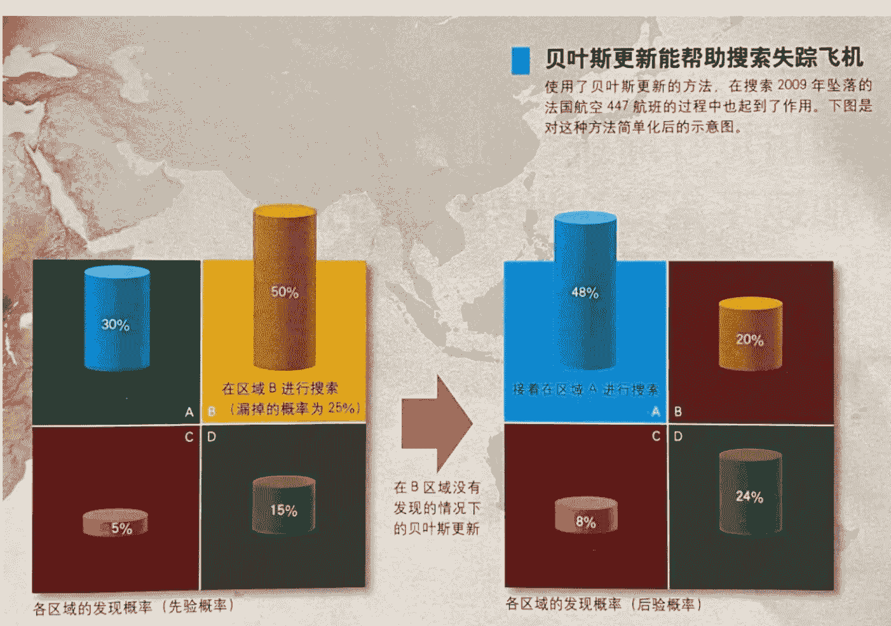

首先，假设基于已经有的条件，残骸在ABCD四个区域的概率分别是30%、50%、5%和15%。显然，在B区域的可能性（50%）是最高的。

但如果搜索B区域之后没找到，这时候就存在两种可能性：

- 的确不在B区域；
- 在B区域但是被漏掉了。（请注意，这是一个很重要的逻辑，我在搜救金毛时，就是评估了在院子里没找到但是被漏掉的概率）

我们假设漏掉的概率是25%。

再请注意，这里有趣的地方是，对于一个贝叶斯主义者，不仅是“我相信，但我也怀疑我的相信”，甚至于，连我对自己的怀疑也是怀疑的。

假如你知道自己愚蠢，并且能够定义出愚蠢的边界，例如这里“找漏了”的概率值25%，那么该愚蠢就会成为智慧的一部分。

继续上面的不用公式的计算。搜索了B区域，由此更新的信息是：

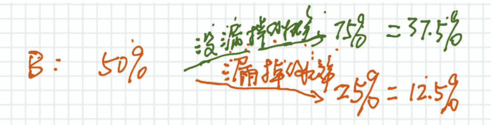

的确不在B区域的概率是50% × (1-25%) = 37.5%。
还是在B区域但是被漏掉的概率是50% × 25% = 12.5%。

这里要注意，既然不在B区域的概率变化了，在其他区域的可能性，也会跟着变化。也就是，不在B区域的37.5%可能性，就要在ABCD四个区域重新分配。

计算过程就是简单的加权分配，不过数字略微有点多，这里直接说结果。

重新分配之后，在A区域的概率，就变成了最高的48%，接下来，搜索人员继续搜索A区域。

重新分配的基数是（30%+12.5%+5%+15%），以A区域为例，其因为重新分配那37.5%而增加的概率是：
30% ÷ (30%+12.5%+5%+15%) × 37.5% = 18%。于是，更新后A区域的概率是30%+18%=48%。

我们可以想象，假如我们对飞机在某个区域的初始信念比较高，并且遗漏概率也比较高的话，即使搜索了该区域而不得，有可能该区域更新后的概率仍然是最高的，所以仍然应该再次去寻找。

举个例子，你找不到耳机了。你平时习惯把耳机放在书架上。但你去书架找了，没找到。你又去别处找，还是没发现。这时你可以考虑在书架上重新找一遍。

历史上的搜救案例里，的确出现过类似的状况，人们根据更新后的数据，重复去搜索此前找过但没找到的区域，结果最后找到了。

这里，也再重复一下贝叶斯主义者对概率的理解。贝叶斯主义者将概率理解为对某件事情的信念。他们承认自己的“信念”是灰度的，而非绝对的判断，他们会根据观察到的信息更新自己的信念。

贝叶斯推断保留不确定性，每一轮的估算也许是模糊的，然而贝叶斯定理在模糊和犯错的情况下，依然可以发挥作用。并且，贝叶斯推断可以不断重复，帮助我们快速逼近真相。

### 四

贝叶斯定理在现实世界中的很多应用，看起来都像是神迹。

例如图灵二战期间破解德军的密码，就运用了贝叶斯的理念。

所有这些故事里，我最喜欢下面这个搜救落水船员的传奇。

2013年7月的一个晚上，一个捕虾船的船员失踪了。海岸警卫队发现自己要面对的是一项不可能的任务：

- 没有确切的失踪时间和失踪地点；
- 要在4000平方公里的海域里找到一个人。

这真就是大海捞针了。

警卫队采用了一个叫做“搜救优化计划系统”的工具，原理类似于我们上面提及的算法，根据模糊的线索，结合当地条件等因素，一点一点缩小搜救范围。

希望有时在毫无希望的地方孕育而生，是因为“毫无希望”剔除掉了对那些“看起来似乎可以依附的希望”的幻想。

在这个故事里，7个小时过去了，搜救人员一无所获，决定返回基地加油。

这时副驾驶突然大喊起来。他们调转方向，发现失踪船员正被裹挟在汹涌的大海中，拼命向飞机挥手。

简单的贝叶斯定理，用很少的信息，就可以在汪洋大海中，救起一个人——这是一个关于命运、信念和决策算法的隐喻：

我们的人生绝大多数时候，都犹如置身无边无际的大海，只拥有极少的已知条件。但我们有限的努力，笨拙的推理，也能令自己脱离险境。

当然，这里也要讲究方法，核心就是“试错”。

生活通过（对你以为的“真相”）说不的方式，帮助你一步步逼近真相。

那个相信上帝的贝叶斯牧师创造出来的定理，仿佛在告诉我们：

你的自由意志，恰恰存在于你在这个世界的每一次探索和挣扎中。

可能性哪怕一开始细微而孱弱，你依然可以通过永不放弃的微小努力，一步步逼近真相。

从感性的角度，贝叶斯帮助我们避免陷入“一切命中注定”的虚无。我们每个人在宇宙间都很渺小，却可以完整地参与其中；我们现实中的奔波往往充满坎坷，有时候到处都是限制条件，却也并非看不见一点儿希望。

只要你有一个希望的小火种，然后有一个理性的算法，进而通过不断重复的优化，就有可能一点点逼近目标，完成起初看起来不可能的任务。

有天早晨，我对此颇有感慨，不由得写下：

> “这个世界只给我很小的一个角落， 很短的一段时间， 遇见很少一些人， 经历很简单的事， 却令我产生如此真实地感知了整个世界的幻觉。”

即便这的确是一种幻觉，我们在这世界走一遭，也算不虚此行。

以上就是这一讲的全部内容，如果你觉得有启发，欢迎转发给身边的朋友。

我是老喻，我们下一讲再见。


## 25 对数思维：怎么抓住二十万分之一的机会？

我是老喻，欢迎来到《决策算法》课。

这一讲，我们继续解决和“信息不完备”有关的决策难题。

不过，我们要借用的工具，不再是贝叶斯定理，而是对数思维。对数思维有一个神奇功能：帮助我们捕获极其小概率的机会。

为什么对数思维会有如此神奇的功效？

log10(10)

让我们从一部热门网剧开始这一讲的内容。

《鱿鱼游戏》曾是网飞最热门的剧集之一，很多同学可能看过。该剧围绕一系列奖金丰厚的残酷游戏展开。

其中的第五关，是“跳玻璃桥”。

有16位选手按照顺序过一条高悬的玻璃桥，玻璃桥由18节构成。

每节有左右两块玻璃，一边是普通玻璃，一边是强化玻璃。

游戏规则是：参赛者必须正确分辨出普通玻璃和强化玻璃，若踩到普通玻璃就会破裂并当场摔死，只有踩到强化玻璃才能过关。

你也许会想，二选一，即使靠蒙，胜率也高达50%。

然而，虽然每一节的变化只有2，两节的变化也就是2×2，连续18节的变化是2的18次方，却高达262144种。这是一个指数级的增长。

要想连续18次都蒙对，成功的概率约为二十六万分之一。这几乎是一个不可能完成的任务。

然而，在《鱿鱼游戏》里，最终有三个人过关，除了靠玻璃厂师傅肉眼辨别出来的较少环节，主要都是以人命为代价蒙出来的。

为什么一个成功率只有二十六万分之一的游戏，仅仅靠十几个人就能打通关呢？

因为这是18个串联在一起的二选一。简单而言，就是一个一个去试：

18个人抽签，不幸抽中的人先走，他要么猜中钢化玻璃而暂时幸存，要么踩中普通玻璃而落入深渊。

然而，即使最差的结果，他也为后来者排除了一个错误选项，虽然这很残忍。

接着，再是下一个人去试。因为每个人都蒙错的可能性极小，所以这样硬蒙的结果，也比电视剧里又靠专业又靠争夺的生存概率要大。

玻璃桥游戏的巨大不确定性是来自指数增长，而消除不确定性则是靠指数函数的反函数：对数函数。

当第一个人去试的时候，不管他的成败，当结果呈现出来，玻璃桥游戏其实已经变成了17关，所以其可能性已经变成了（2的17次方=131072种），相当于262144种可能性减少了一半。

就像是计算机里的二分查找算法，每一次都使搜索范围缩小一半。

接下来，每试一次，可能性就减少一半。试上18次，就找出了262144种可能性中唯一正确的可能性。

你看，一个看似渺茫的只有二十六万分之一的机会，就这样抓住了。

当然，现实不会如电视里的致命游戏般规则简明，可结果也不会如剧情般残忍。

这种用试错去消除不确定性的方法，正是许多高手真正的秘密。

log10(100)

在我年轻的时候，刚开始陆续接触到一些特别厉害的高手，有一种很意外的感觉：他们没我想象中厉害。

记得有一次和一位行业大佬聊天，我发现他对某些问题的理解非常粗浅，有些甚至是错的。

当时我年轻气盛,也坦率地说出了自己的观点。他也毫不客气地批评起来。

可是,没聊多久,神奇的事情发生了。他开始在谈话中采用我的观点,听起来好像是他自己的一样,毫不违和,绝无面子负担。

多年以后,我才意识到,比起你拥有什么观点更重要的是,你如何通过试错的方法,更新自己的观点。

不止是和我,那位大佬和每个人的对话,都是一个踩玻璃桥的过程。谁对谁错,根本不重要。重要的是,在辩论的过程中,通往桥那一侧的不确定性被消除了一部分。

而他能够迅速地吸收他人的观点,并且毫不脸红,是因为他没有多余的精神负担,专注于自己的认知之桥,真正地把别人的东西变成了自己的东西。

扎克伯格在一次演讲中说：

> “我要给你们分享一个秘密,没有人从一开始就知道怎么做,想法并不会在最初就完全成型。只有当你工作时才变得逐渐清晰,你只需要做的,就是开始。”

就像《鱿鱼游戏》里那个任务,你只需要试上18次,就能够求解。

你每往前走一步,每试一次,每犯一次错误(或是运气好成功一次),就会清晰上一倍。

聪明而主动地犯错,需要有边界、有算法、有反馈、能遍历,也需要一些疯狂、随机和冗余。

某女子学校创建了一个名为“失败”的项目。我很喜欢负责人雷切尔·西蒙斯说的一句话：

> “我们想要告诉大家的是,失败并不是学习过程中犯的错误,而是学习过程中的特征。”

而试错背后的数学原理之一就是:对数函数。

log10(1000)

在过玻璃桥游戏里,每一节的变化是2,连续18节的变化,就是2的18次方,这是一个指数运算。计算结果,是262144种变化。

那么,如果我们只知道一共有262144种变化,但不知道玻璃桥有多少节,该如何计算呢?这就是指数运算的逆运算:对数运算。

对数的意思是: 用几个数与自己乘在一起会得到另一个数?例如2的三次方是8。那么反过来,多少个2相乘可以得到8?

通过对数运算可知,log2(8)=3。

指数运算,能够迅速将一个数字变得非常大;

对数运算,能够迅速将一个数字变得非常小。

在没有计算器的时代,对数运算帮助科学家极大提升了计算的效率。拉普拉斯说:“对数的发现通过节省劳动,使天文学家的寿命翻倍。”

在香农的信息论里,对信息量的描述,也表示成事件发生概率的对数。

再说一个冷知识:音乐里的音高(英文pitch),是基于频率的对数函数。

为什么音高是对数函数呢?原因之一是:人耳听辨音高是基于频率的倍数而不是频率的差。

想象一下,你在弹钢琴,按下一个音符,比如标准的A4,它的频率是440赫兹(Hz)。这时,如果你再按高一个八度的A5,它的频率是880赫兹,刚好是440的两倍。再高一个八度的A6,频率是1760赫兹,又是880的两倍。从听觉上,这些音高之间的感觉是均匀的,每个八度的间隔听起来一样,但实际上,频率的绝对差值越来越大。

所以,你的耳朵对频率的感知是“倍数关系”,而不是“差值关系”.

不止于此,衡量声音的分贝,衡量地震强度的里氏震级,化学中衡量酸碱度的pH值,这些指标都是对数。

以里氏震级为例,震级相差1,代表振幅相差10倍,而所释出的能量则相差约31.7倍。

这背后,是韦伯定律:在同类刺激之下,人们对变化的感受不是看增加了多少,而是看增加了多少倍。

换个角度来说,就是人类感受到的是比例变化,而不是绝对值变化。例如:一斤猪肉从5块涨价到8块,会让大家不爽;一桶油从50块涨到53块,大家感觉并不会那么明显。

log10(10000)

我们快速扫描了一下对数的有趣之处,现在回到主题。

对数思维，之所以让厉害的人可以完成看起来几乎不可能的任务，本质上，是压缩了信息，消除了不确定性。

我们总说，失败是成功之母。但这句话到底是啥意思呢？

按照爱因斯坦的解释，失败是成功的进程的一部分。

在《鱿鱼游戏》中的“跳玻璃桥”游戏里，一个人向前跳，不管他踩中了钢化玻璃，还是不幸踩碎普通玻璃，都为团队提供了信息。

这种信息，是通过消除不确定性来实现的。就信息本身而言，“正确”或者“错误”，是等价的。不同的是，“正确”的人有机会再去踩下一关的玻璃。

那么，该如何度量信息呢？

香农引入了“比特”的概念。

比特来自二进制，香农认为可能拥有的最简单的信源，就是抛硬币，正或反，是或否，1或0，这是可能存在的最基本的信息。对于一个二进制系统，信息量的计算可以用对数函数来表示：

### 信息量 = log₂(可能的状态数)

“跳玻璃桥”游戏，需要多少信息？计算如下：

```
log₂(262144) = log₂(2¹⁸) = 18
```

这意味着总共需要18比特的信息来完全消除所有不确定性，确定一条安全路径。

因此，每个玩家跳过一块玻璃时，无论成功与否，都提供了1比特的信息，因为他们揭示了那块玻璃的状态。

即使跳错了，也提供了有价值的信息，这帮助了其他玩家消除不确定性。这个过程展示了信息在决策和风险管理中的重要性，即使“失败”也能带来有价值的学习和调整。

可是，绝大多数人都被2的18次方吓住了。只有那些敢于失败的人，才知道，你只需要试错18次，就可以捕捉那个仅有二十六万分之一概率的机会。

```
log10(100000)
```

今天我们探讨了对数的神奇力量，以及背后的试错哲学。

哈耶克说：

> “虽然进化经常被总结成“适者生存”，但推动进化进程的却往往是不适者。尽管我们总是本能地以为复杂问题需要精心设计的解决方法，但进化却毫无规划可言。
复杂得惊人的事物是在简单的过程中涌现出来的：尝试已有事物的不同版本，剔除失败，复制成功经验。”

这段话揭示了一个核心：复杂问题的解决往往不是从精确规划开始，而是从大胆的试错中涌现。

而对数的思维正是这一试错哲学的数学化呈现，它提供了一种压缩与解压的路径，让我们能以最小的资源代价，快速逼近答案。

我们来看几个现实中的例子：

### 1. 医学诊断

医学诊断本质是逐步消除不确定性。医生通过问诊和检查，从患者的基本特征（如性别、年龄）开始筛选，将可能的疾病范围缩小一半。随后，通过病史、症状分析和进一步检测（如影像学检查），逐步精确锁定诊断。

例如，胸痛患者若有心血管病史，心梗的可能性大增。整个过程类似对数运算：每次试探都压缩一半选项，从数百种可能性最终精准到1种，极大提高了效率。

### 2. 搜索算法

搜索引擎的核心逻辑也是，利用分层筛选机制，从海量信息中找到相关结果。

第一层匹配关键词，如“北京天气”，先筛选出所有相关网页；第二层结合用户偏好（如地域或历史记录），进一步优化；最后通过算法（如PageRank）排序，将结果压缩到几十条。这种筛选过程遵循对数规律，从上亿条数据中，几步就缩小到用户需求的范围，快速呈现答案。

对数思维在这些领域的核心是“逐步压缩信息的维度，快速消除不确定性”，以最小成本实现最大效率。这种方法为复杂问题提供了通用解决方案。

所以，我们在面对复杂决策时，应该先从维度出发，大刀阔斧地消除不确定性，快速逼近真相。

关于大胆试错，在个人成长方面，我有两个角度的建议给到你。

第一个角度：在步入社会后，一个人的成长，往往不是靠获得新知，而是要靠“消除无知”。获得新知，可以靠聪明靠勤奋，从知识中获得；但是，“消除无知”，你必须伸手去碰，亲自去尝，不怕摔跟头。

第二个角度：全体人类就像是在过一座玻璃桥，每个人都肩负着某个使命。对于无数同伴中的一员，你最重要的使命是——与众不同。

成败不是关键，人生的差异才是。

我是老喻，我们下一讲再见。

## 26 工程思维：怎样完成看似不可能的任务？


懒人专属群的群友，你好

我是老喻，欢迎回到《决策算法》课。

这一讲，我们来尝试一个很有挑战性的话题：怎样完成看似不可能的任务？

什么叫“看似不可能的任务”？

比如：怎样造火箭？怎么样去火星？怎样在火星上活下来？

对于个体而言，就是：如何实现自己在工作上的突破？如何达成那些想都不敢想的人生目标？

讨论这些问题，并不是为了开脑洞，而是因为其中包含着一种非常重要的决策思维：工程思维。

事实上，这是地球上那些最聪明的家伙正在运用的做事方法。

### 一

什么叫“工程思维”呢？

我的定义是：

以资源有限为前提，有创意地应用科学方法，来系统化地解决现实问题。

在商业领域，拥有“工程思维”的决策高手，应该是埃隆·马斯克和任正非。


埃隆·马斯克说过：“我是具有创新精神、具有创意的工程师。”他在太阳能、电动车、太空运输三大领域的成就众所周知。

任正非呢？工程兵出身，曾经在恶劣的环境下，依靠数学推导，研制成功我国第一台高精度计量标准仪器——空气压力天平。

问题来了：

难道NASA的厉害工程师不比埃隆·马斯克的SpaceX更多吗？

难道别的科技公司没有厉害的工程师吗，为什么崛起的是华为，而不是那些出身更强大的企业？

有人问埃隆·马斯克：“降低发射成本这个事情，为什么NASA那么多专家和资源都没做到，而你的 SpaceX 却做到了？”

埃隆·马斯克回答：“嗯，我想 NASA 做不到的真正原因，恰恰是因为他们资源太多了。”

马斯克的回答说出了工程思维的精髓：

以资源有限为前提。

### 二

2001年，埃隆·马斯克提出了一个叫“火星绿洲”的概念：其实就是打算向火星发射一个装着植物的冲天炮，借此吸引公众对于太空探索的兴趣。

同年10月，马斯克尝试从俄罗斯购买火箭以实现他的目标。然而，由于价格过高，他未能成功。

返程的航班上，他一算账，发现生产火箭的原材料价格，仅是当时火箭售价的3%。由此他冒出了一个传统工程师看不懂的商业灵感：做一家太空运输领域的西南航空公司。

熟悉商业的同学肯定知道，西南航空是世界上最赚钱的航空公司之一，在服务上又能做到极高美誉度。

埃隆·马斯克给公司找到这样一个定位，体现了一流的商业感觉。

后来，SpaceX通过垂直整合，自行生产85%的发射设备及软件模块，将火箭发射价格降至十分之一，而且还有70%毛利率。

确切说，埃隆·马斯克是一个“有梦想的技术包工头”。他的所有创业项目，可以说都是工程思维的产物：

比如，他为特斯拉做的也是同样两件事：

- 从物理学的基本原理去思考电动车的技术可能性；
- 从商业的角度去考虑电动车的市场化可能性。

关于第一点，从物理学的基本原理出发，在各类关于“第一性原理”的案例里讲过多次了。

例如埃隆·马斯克思考电池的思维是：

大多数人会说，电池组太贵，电池的效率是每千瓦时600美元； 但他会研究，电池是什么材料组成的？就是铜，镍，铝，碳，以及一些用于分离和密封的聚合物。

好吧，如果在伦敦钢铁交易市场上购买它们，这些材料值多少钱？ 你看看，只需要每千瓦时80美元。

结果，一个看起来不可能的问题，变成了可操作的路径：你只要想出聪明的办法找到这些材料，组合他们，那么你就能拥有便宜的电池了。

关于第二点，从商业的角度出发，特斯拉的一系列打法非常老到：

先出跑车占住山头； 再出S型豪华轿车抢占7万美金以上豪华车市场，因为富人们想要新玩具；

再出X型SUV，用鹰翼门构建了形式差异化；

再出3型小轿车血洗宝马3系这个级别的市场； 再到最近推出皮卡，因为北美前三大销量车型全是皮卡。

事实上，埃隆·马斯克绝非技术天才，特斯拉电动车不是他发明的，他的火箭公司也是靠最顶尖的专家撑起来的，他在公司最主要的任务，就是用“工程思维”做决策。

### 三

既然对于决策而言，工程思维这么重要，那么，我们如何训练自己的这种决策能力呢？

我们先来看一下，工程思维里面有什么东西。

有本书叫《转向》，里面介绍了工程思维的三个特征：

- 预见、约束、取舍

首先，是在没有结构的情况下“预见”结构的能力。

我们的世界依赖于结构。无论是无中生有，还是在已有的结构上类比、优化、模仿，预见结构都不是一件容易的事情。

对于决策者来说，“预见”结构至关重要，你要在脑海里，将自己的决策实施后的目标结果想象出来，这样，既有助于你制定决策框架，也有助于你寻找所需要的决策要素。

这个世界上具有开创性的事儿，新的产品形式、新的商业模式，首先都是因为预见了某种新结构。

比如，张忠谋在上世纪80年代预见到，随着芯片的生产变得越来越昂贵且复杂，建立一座先进晶圆厂的成本动辄数十亿美元，大多数芯片设计公司无力承担。芯片设计和生产势必分离，专门做芯片代工将是一门好生意。

40年后，台积电成了全世界的芯片工厂，苹果、英伟达的芯片设计再厉害，都要找台积电代工。

而英伟达的成功，更是基于该公司在决策上的预见性。

但预见结构并非工程思维中最重要的环节，即便你没有预见什么新结构，你也可以抄作业。科学家的探索、企业的试错，早就为这个世界创造了足够多新结构，让你拿来就用。

工程思维的第二个（也是更重要的）特征是：熟练地在约束条件下进行设计。

现实生活中的实际问题，必然受到“约束”。

这里的约束，首先是科学规律的约束。还有时间约束，财力约束，拥有资源的约束，竞争的约束，人类行为的约束，等等。

没有约束，就没有决策。

例如，我们被重力约束在地球上，但是假如没有这个约束，人类就漂浮到宇宙里去了。

商业需要约束，否则谈何创造价值？凭什么获取利益？

电动车如果没有约束，那就是奔驰宝马等传统厂商的事儿了，怎么轮得到特斯拉？同样，假如海外市场没那么艰难，不怕吃苦的华为也不会那么快超越国际巨头。

所以，对于决策者而言，要经常拷问自己：凭什么由你来做这件事？

约束条件，对于决策高手而言，就像攀岩高手喜欢挑战最难的山岩。

对别人来说，这是无法逾越的天堑，对于他们而言这是闯出一片天地的机会。

不仅如此，决策高手还会主动为自己设置“约束”。

> 任正非说：“领导者要学会在开放状态下决策，在约束状态下决策。面子是次要的，不要怕丢面子。”

所以，在华为内部，包括任正非的任何人，在用人问题上都不能个人说了算，都必须向决策集体的全体成员“妥协”。

工程思维的第三个关键词是“取舍”，也就是：经过深思熟虑后，对解决方案和备选方案做出决断的能力。

资源和时间都是有限的，必须根据重点进行分配，要将弱目标从强目标中分离出去。在约束条件下，我们要学会取舍，以及进行“灰度认知、黑白决策”。

他能够横跨多个领域，关键在于拥有“工程思维”。再加上他的商业天赋，埃隆·马斯克就成了一个具有“工程思维”的决策高手。

公众号懒人搜索，懒人专属群分享

例如特斯拉的X型SUV，为了“取”鹰翼门，“舍”了很多看起来根本无法舍弃的功能。

在加拿大，夏天露营冬天滑雪，是很多家庭的传统。但是特斯拉的SUV因为有鹰翼门，车顶什么都放不了。这个决定可能非要埃隆·马斯克这样的怪家伙才下得了手。

然而在我看来，这个取舍是英明的。

有人问我为什么要买特斯拉，我答：讨小孩子开心。

小孩子最喜欢什么？就是SUV那双打开的翅膀。

当然，更深层的原因是，购买特斯拉X型SUV的车主，首先是因为其与众不同的品牌，其次才是电动车以及使用体验等要素。

所以，为了“与众不同”这个最大的变量，做一个并不那么实用的鹰翼门，就显得比保留那些实用的车顶行李架更重要了。

取舍是一场可行性、可能性、期望与限制之间的拔河比赛。

如上所述：预见、约束和取舍是工程思维的三大法宝。

《转向》这本书里提及，一位由哈佛大学化学家改行的工程师乔治·怀特赛兹，提供了科学思维与工程思维之间另一种有用的比较：

如果科学钟情于“追踪从离子和神经介质到勃拉姆斯《安魂曲》的机械路径”，那么工程的重点便是提供“分离无限量二氧化碳的实际方法，使用在纳米比亚未曾用过的设备，提供无限供应的电力和清洁水并保证30%的税后投资回报率”。

简单说，就是：

科学的核心是发现，工程的本质是实现，就是要在现实世界把实实在在的东西做出来，把看得见的问题解决掉。

关于“工程思维”，我特别喜欢《火星救援》里的一段情节：

《火星救援》的男主角，在第63个火星日还没有找到活路，甚至还没有和地球取得联络，他依然用倒推的方式来想：

在最好的情况下，我应该做什么？当然是赶往（四年之后）下一班星际公交车站：阿瑞斯4的站点。

有多远？3200公里。（北京到深圳的飞行距离是1800公里）

有车吗？一辆充满电只能跑35公里的太空漫游车。

男主角一通神勇操作略过不表，关键是这个过程中体现出来的“工程思维”：

- 改造：增加了蓄电池，装上了太阳能电池板，解决了续航和取暖问题；
- 测试：在自己的栖息地附近测试一块电池跑的距离，过程中验证了自己的预测，同时也发现了取暖的遗留问题；
- 调整：不断增加测试强度，增加漫游里程，测试生命维持系统，确定充电时间，不断自我迭代；
- 1.0版：先去800公里外去找探路者号……
- 2.0版：穿越火星地表3200公里，逃出生天……

如果总结一下，所谓工程思维，就是“想干+会干+肯干”，既仰望星空，又脚踏实地。

会做梦的人过于天马行空，忘了步步为营；会干活的人过于脚踏实地，忘了仰望星空。

具有“工程思维”的梦想家，在这个星球上是稀缺的。

但要成为这样的人，并不需要超凡的智力，特殊的天赋，只是需要你不被“约束”吓到。

不要因为一个无解的问题而耽搁另外一个有解的问题；先做能做的，别为缺失的板块烦恼。别被看起来很严重的东西吓到，随时操起你手上有的家伙。

当你能够把约束当做创新的条件，并不断用行动，创造新的条件，那些看似不可能完成的任务，终将在你手中实现。

以上就是这一讲的全部内容。工程思维可能是做项目、创业最重要的决策方法，如果你身边有朋友正在创业，欢迎你把这一讲分享给他。希望对他有启发。

我是老喻，我们下一讲再见。


微信:lazyhelper

## 27 胶带纸思维：为什么高手都在用这个笨办法？


懒人专属群的群友，你好

我是老喻，欢迎来到《决策算法》课。

在上周末的问答中，我跟你介绍过一个重要的决策方法：就近原则。这一讲，我再跟你分享一个类似的决策方法：“胶带纸思维”。

要想成为厉害的人，你并非要像世界上最聪明的那些家伙一样，事事都做到完美。恰恰相反，你应该学习的，是他们面临困境时的秘密武器：“胶带纸思维”。

这是个听起来有点儿奇怪的思维方式，笨拙、临时、凑合。但是就像是美国军队中流行的一个非正式信条：“如果一个蠢方法有效，那它就不是一个蠢方法。”

遇到一些事儿，当你觉得目标很高，条件却极其有限时，胶带纸思维就可以派上用场。

你可能会怀疑，所谓的胶带纸思维，真有用吗？我们先来看乔布斯的一个故事。

### 一

没错，即使是乔布斯这样以完美著称的人，也用胶带纸思维。

在第一代iPhone的产品发布会上，他就是用胶带纸思维逃离险境。

当时，直到发布会前夜，用于演示的手机还总出问题，要么断网，要么打不通电话，甚至无故关机。

后来工程师想了个办法，就是要求让乔布斯按照一个特定的操作顺序演示，比方说先发个邮件，再上网，要是顺序反了，就会死机。

还有一个要解决的麻烦是网络信号。

于是，他们在现场放了一个移动信号站，以保证乔布斯有足够信号来打电话。

不光如此，工程师团队还干了件事儿：

“为了安全起见，工程师将所有演示机的屏幕上的信号强度条全部写死，都是5格信号满格，管他真假。”

### 二

“胶带纸思维”的灵感，依然来自我们前面多次提到的电影《火星救援》。

《火星救援》讲的是高科技的科幻故事，然而，里面数次救下主角性命的东西，却是一点也不高科技的“胶带纸”。

- 太空面罩裂了，拿胶带纸糊上；
- 栖息舱炸了，也拿胶带纸来补；
- 后来用帆布罩着敞篷的返回舱升空，也是胶带纸思维的运用。

且不论电影和小说的差异，也不谈硬核的技术细节，《火星救援》给我们的启发是：

关键时刻，随手能用的东西，比虽然很厉害但不顺手的东西好100倍。

有人可能会说了，“胶带纸思维”看起来也有些明显的缺点，例如：

- 太不像样了
- 看起来不高级；
- 有点儿“一次性”。

难道胶带纸思维讲的就是乐观态度和务实精神吗？绝非如此。

接下来，我想通过三个故事，来与你分享胶带纸思维厉害的原理。

### 三

“胶带纸思维”的原理之一，以快制胜。

苹果发布第一代iPhone，正处于智能手机的关键窗口期，机会稍纵即逝。

即使是不断追求完美的乔布斯，也不得不抓住这个窗口期，哪怕样机还不完善，哪怕不得不使用“胶带纸思维”。

尤其是在互联网时代，做事、做生意的关键，是快速获得反馈，形成网络效应。

这个时候，追求速度的胶带纸思维，要比追求效率和完美更重要。

微信的诞生，正是这样一个故事。

据说张小龙是半夜给马化腾发了条消息，提及打造一款为智能手机准备的社交软件。马化腾迅速作出决策。张小龙组建了一个10人团队，在两个月内开发出微信。

16个月后，微信迎来了1亿位用户。又过了6个月，它的用户数量已增长到2亿。2024年，微信月活用户超过了13亿。

最早版本的微信很简单粗糙，然而不争最快，就没有活路。

### 四

“胶带纸思维”的原理之二，从目标倒推路径，找到关键节点。

2013年，今日头条正在找出路，决定尝试一下“个性化推荐信息流广告”。

但要做个性化推荐引擎，今日头条当时可谓是什么都没有。

一没“基因”，二没能力。

创始人说，推荐引擎我们不会，但可以学啊。问题是：连广告客户也没有。

接下来，就是“胶带纸思维”大展身手的时候：

- 没有客户，他们就找到国美的一家店来验证广告效果；
- 没有广告系统，那就在信息流直接编码——把广告的素材数据、和地理位置范围投放硬编码写到了业务代码里面。
- 设计闭环，用户刷到广告，点收藏，到店里买满200元东西就送食用油。

开始设定推荐半径为3公里，结果没人去。怎么办？把半径扩大到10公里，有十几个用户。然后再扩大。

总算实现了移动互联网定向闭环LBS广告。

你看，是不是很笨、很低效、很临时？

对于这家初创公司而言，重点不是用“胶带纸思维”实现了他们的第一个信息流个性化推荐广告，而是他们认定：只有做个性化推荐引擎，才能实现商业模式的根本突破。

有了目标，再倒推路径，找到关键节点，定义关键任务。

也就是说：知道“要做什么”，比知道“如何做”更重要。

这大概也能解释新能源汽车的竞争局面：为什么外行出身的造车新势力，开始的时候比资深的汽车巨头更厉害。因为，造车新势力更明白“要做什么”。

根据目标倒推路径，就能够知道，哪些节点可以绕开，哪些非拿下不可。如果这个时候，发现非拿下不可的节点“可能性”不完备，该怎么办？

拿出胶带纸，先粘上再说。

从目标倒推路径，并非是要一步步把什么都规划好，而是指要对行业有深刻的洞见。

### 五

“胶带纸思维”的原理之三，先用一次性手段，回头再看是否需要重复化。

“民宿平台”爱彼迎，在创业之初在干一件看起来毫无希望的事情。

那时，他们没多少客户。创始人突然发现了一个秘密：照片好看的房间好租。于是他们马上亲自动手，去找朋友借来相机，一个一个敲开所有房东的门，拍下照片。

看起来这是很不靠谱的事情，难道创始人要去干这种低级的、一次性的事情吗？

爱彼迎创始人对房屋拍照亲测有效之后，再开始外包。

随着业务发展，“一次性手段”开始“大规模重复”，爱彼迎建立了自动化系统，管理来自全球的摄影师队伍。

面对关键问题，胶带纸思维主张：

不要害怕使用一次性手段。

回头再看是否需要大规模重复。

爱彼迎创始人布莱恩·切斯基的秘密是：“对每件事都亲力亲为直到做不下去，然后实现自动化。”

### 六

什么是解决问题的最佳方法？

大科学家费曼给出的答案是：

任何管用的方法。

胶带纸思维告诉我们：

- 遇到关键问题，立即解决；
- 如果不会，马上去学；
- 根据目标倒推，要么绕过去，要么攻进去；
- 如果条件不成熟，就有什么用什么。

我们来看看航天巨头SpaceX的胶带纸思维。

火箭领域竞争的关键，是每千克载荷的发射价格。为此，SpaceX打出自己的王牌：便宜好用。

为了实现“简单、可靠、低成本”，SpaceX的创始人马斯克打破了各种条条框框，在管理和技术上都运用了胶带纸思维。

这里的胶带纸思维，不止是指临时应急的解决办法，也不是一代演示iPhone上假的满格手机信号。

在保证高可靠性的前提下，SpaceX公司会放弃成本高昂的航天级硬件，转而采用价廉物美的普通用品。比方说：

用更便宜更舒适的赛车安全带，替代专门定制的航天员专用安全带等。

SpaceX龙飞船主控系统的芯片组，仅用了2.6万人民币，传统方式需要1.4亿，成本相差5000多倍。

除了用便宜好用的东西替代，更需要科学思维与工程手段。

例如，“猎鹰”系列火箭梅林发动机应用“简单即可靠”的新理念，将结构设计得非常简单，以消除复杂结构带来的不稳定隐患。

光简单还不行，梅林发动机具备推力补偿技术，能在范围内调整推力。

2012年10月，“猎鹰”火箭发射“龙”飞船向国际空间站运送货物时，第一级的一台发动机出现故障停机，其他8台发动机立即自动补偿了推力损失，最终成功将“龙”飞船送入预定轨道。

### 七

胶带纸思维，对于孩子而言，尤其重要。

在传统教育的范畴里，胶带纸思维的反义词，是100分思维。

胶带纸思维，鼓励孩子大胆犯错，不要惧怕混乱。因为现实世界并没有标准答案，也没有明确的ABCD选项。

我女儿喜欢做糕点，经常把厨房弄得一塌糊涂，而且特别浪费原材料，家人看着有点儿心疼有点儿烦。

我却积极鼓励。你看，要做糕点，就需要上网研究配方，要去超市采购各种原料，要做各种尝试，要经受失败，这是多么好的体验啊。

看起来浪费了不少材料，可是对比起各种昂贵的培训班儿，便宜多了。

而且，只有在这种亲自动手的混乱局面下，孩子才能真正学到胶带纸思维。

有时候，女儿从烤箱里拿出来的作品不那么成功，我也会尝一下，说：“还不错呢。”

倒不是给她灌鸡汤，而是想让她知道：何必在乎别人怎么看？

不怕弄脏双手，不必在乎脸面，才能在混乱中解决问题，快速进步。

这就是胶带纸思维的真谛。

以上就是这一讲的全部内容。

我是老喻，我们下一讲再见。


## 28 看清本质：怎样用奥卡姆剃刀砍掉复杂？


懒人专属群的群友，你好

我是老喻，欢迎来到《决策算法》课。

相信你肯定知道“奥卡姆剃刀原则”。通俗来说，这个原则建议我们在解释现象时，应接受最简单的解释，避免不必要的复杂性。

但其实，奥卡姆剃刀，不只是一个解释模型，也是一个决策模型。

怎样用奥卡姆剃刀提高做成事儿的概率？这一讲，我们就来看一看。

### 一

让我们从2024年发生的一个震惊全世界的事件说起：“特朗普被刺杀”。

事件发生后，有人猜测说：有没有可能，特朗普面前的提词器里面预埋了一些小炸药，配合枪声引爆，就能实现很危险但又不伤及生命的效果。

你看，这就是一个典型的“阴谋论”：假设事情没表面看起来那么简单，后面有更加丰富的故事情节。

这种想法很常见，也很有吸引力。你想想看，假如拍一个电影，你会选择哪个情节：

- 一个刚成年不久的20岁美国普通青年，动机不明地射杀总统候选人；
- 特朗普竞选团队为了获胜，巧妙设计了一盘惊天大棋。

显然，第二个可能票房更高。

然而，现实不是电影，现实的关键，在于发生的概率。

像阴谋论或者电影假设的情节，往往更加复杂，实现的概率更低，出现差错的可能性更大。

所以，

电影和阴谋论的解释，往往复杂而且有戏剧性，而现实的解释则通常是简单且无聊的，这也是奥卡姆剃刀有道理的原因。

### 二

再来看一个例子：外星人来过的痕迹。

情境：假设你有一天早上发现自家的花园里有一块草地被压得扁扁的，图案很特别，像一个特殊符号，就像有什么智能体压过。你想找出导致这种情况的原因。

假设1：

昨晚，一只大猫进入了你的花园，在那块草地上玩耍和躺了一会儿。碰巧压出了某个特殊的形状。

假设2：

昨晚，外星人驾驶着飞碟来到地球，选择了你的花园作为着陆点。在这过程中，飞碟稍微触及了那块草地，但由于某种原因他们决定放弃在此停留，然后又飞走了。所以，那个特殊符号是飞碟的某个部位压出来的，或是外星人留下的信号。

虽然两个假设都可以解释草地被压扁的现象，但显然，假设2需要许多额外的假设（如外星人存在、他们会来地球、他们正好选择了你的花园、他们只是轻轻触碰了草地而没有留下其他痕迹等）。

而假设1则更为简单，只需要一个常见动物——大猫作为解释。

根据奥卡姆剃刀原则，我们应该选择假设1作为更可能的解释。

但这并不意味着简单的解释总是正确的。事实上，有时候真实的解释可能是复杂的。

在这里，很多人对“奥卡姆剃刀”的错误理解也冒头儿了。

奥卡姆剃刀原理经常被简化为“最简单的解释往往是正确的”，但事实上，这个原则的真正意义更为微妙。

奥卡姆的威廉的原话，直译成中文，大意是：“不必要时，勿增实体”。

勿增实体，“实体”指的是形而上学意义上的存在、本质或属性等理论假设。

例如，在威廉生活的时代，经院哲学家经常假设出类似“红色的本质”“人性的本质”这样的抽象概念，把哲学搞得叠床架屋，犹如迷雾缭绕的森林。

威廉抛弃这些假设，直接研究现象，大大简化了当时的哲学讨论。

所以，“奥卡姆剃刀”的关键是少做假设，而不是尽量简单。

### 三

我们在现实中遇到的很多麻烦，来自太多的假设。

克里斯坦森在《你要如何衡量你的人生》一书中讲了一个案例：巴黎迪士尼乐园的致命假设。

迪士尼的前三个乐园都很成功，第四个选址是在巴黎郊区，头两年里，他们损失了将近10亿美元。

复盘时发现，失败源自项目的规划有如下假设：每年有1100万游客，平均逗留3天。于是便用1100万乘以3，设想出每年有3300万人次“游客逗留”，并据此建酒店和基础设施。

现实呢？第一年的确有接近1100万游客参观迪士尼，但是，平均每个游客逗留的时间只有一天。

为什么？其他迪士尼乐园有45个游乐设施，人们可以玩儿3天；而巴黎迪士尼乐园只有15个游乐设施，一天就够了。

可是，在决策时，人们默认了每个迪士尼乐园的游客数据都是一样的。

正确的做法是，盘点决策时所作的所有默认假设，并且追问：“

如果这个假设成立，最重要的条件是什么？怎样跟踪落实呢？

”

由此，克里斯坦森为我们分享了一个简单然而宝贵的方法：

当你要做一项新的决策时，先做一下“测试前提假设”。

认真问自己，“在哪些前提假设得到验证的条件下，才能证明你的策略是正确的？”

很多时候，我们都是默认一些选项，然后慢慢就忘记了这些默认选项的假设前提和适用环境。

拷问自己的观念和决策的默认假设，是奥卡姆剃刀在现实生活中最有效的应用场景。

事实上，有很多我们犯下的错误，起初看起来很正确，一路也都很正确，然而却是建立在错误的假设基础之上的。

我们一开始就默认了这些假设，越往后就越不记得来质疑这些假设成立的前提。

所以，奥卡姆剃刀砍向的，是过多的、不靠谱的假设。

假设的量越多，需要被确认的东西也越多。所以，反过来，也就容易被证伪。

这才是奥卡姆剃刀的关键。

### 四

现实中充满了奥卡姆剃刀的“谎言”，例如：

- 各种“复杂生活简单化”的人生鸡汤；
- “像乔布斯那样追求极致简单”的创业箴言；
- 聪明人追求简单，傻瓜把问题搞复杂；
- 甚至连“头脑简单”也借奥卡姆剃刀大行其道；

有些人可能会误认为，由于奥卡姆剃刀鼓励我们选择最简单的解释，那么我们在生活或工作中也应该尽量避免复杂性。

但是，简单是一种结果，是一种目标，而不是一种方法。

在某些情况下，我们可能需要面对并处理复杂性，因为某些问题本身就是复杂的，我们不能过于简化它们。

iPhone的确很简单，然而里面的芯片很复杂。简单指的是用户体验，而非工作不复杂。

所以任正非说，简单留给客户，复杂留给自己。

乔布斯的确能够挥舞“奥卡姆剃刀”砍来砍去，那是因为他有一群顶级人才，解决复杂性问题。iPhone最初一样有很多复杂功能和设计，这样乔布斯的大刀才有挥舞之处。

奥卡姆剃刀的本质是“选择”，但是如果没有“多样性”，哪里来的选择？

在上一个模块中，我们讲价值投资时提到过，人们总是爱说，你看，巴菲特的投资道理多简单？那么简单为什么很少有人能做到呢？只是因为不想慢慢变富吗？

显然没那么简单。

就像围棋，规则最简单，但却是最复杂的棋类游戏。

价值投资的确有极少的假设，这一点符合奥卡姆剃刀的原则。

然而要做好价值投资并不容易，某些投资人喜欢让自己显得云淡风轻，是因为按捺不住“成神成仙”的优越感。这么做其实误导了许多“普通人”。

越是“简单”的道理，越需要极深的洞见。

这仿佛是某种能量守恒。正所谓“功不到不为财”，又省力，又省“距离”，从物理上说不通。

事实上，巴菲特不仅在专业领域有极深的功底，并且过的是一种苦行僧似的生活。

价值投资者段永平的网名叫“大道无形我有型”，他的投资生活看上去很简单轻松，买的股票也仅有几个，而且长期持有。然而，做到这一点太难了。而且，他看似轻松的投资背后，也付出过数亿美金的代价。

更关键的是，他在做投资之前的企业经营管理经历，打下了坚实的基础。

只有从小道中走出来，才有可能达至大道。

就像苹果公司早期的一句slogan：

简单是复杂的终极形式。

### 五

说到这里，我们来对奥卡姆剃刀的两个关键词再做一次梳理：

第一个关键词是：假设。

我很喜欢一句话：“假设是伪装成已知的未知”。

人类是依靠假设来生存的，我们假设太阳明天照样升起，概率接近100%；我们假设股票未来会涨，概率可能低于50%；我们假设遇见的是一个值得信任的人，概率起伏不定。

正确的假设带给我们回报，错误的假设带来损失，而那些看起来非常正确的错误假设则带来灾难。

奥卡姆剃刀，要砍掉的，就是多余的假设，脆弱的假设。

那么，假设为什么要少呢？

这里就要涉及到第二个关键词：证伪。

假设越多，需要证明的东西也就越多。

比方说，有个男生对女朋友说，昨晚一直在和几个哥们儿喝酒。那么，他说的哥们儿的数量越多，的确证据也就越充分。但是，女朋友可能会提出要求：你现在就一个个给他们打电话证实这件事儿。

这个时候，假如有一个哥们儿说漏了嘴，就被证伪了。

我们总是用各种信念和模型来理解这个世界，模型要的不是完备性，而是在现实环境中的可证伪性。这才是奥卡姆剃刀的真正逻辑。

### 六

奥卡姆剃刀并非是一个科学原则，也不是一个关于“理论越简单越好”的铁律。

比方说，现在计算机这么厉害，而计算机是基于二进制的，也就是仅仅用二进制的0和1，就可以建立起所有的人类知识。那么，是不是可以用奥卡姆剃刀砍掉所有的“实体”，只留下0和1？

又比方说，大模型得益于规模效应。巨大的数据量，有赖于足够复杂的数学模型。大模型出现之前，基于浅层神经网络的人工智能水平之所以不高，就是因为那个网络过于简单。更庞大而复杂的深度学习，借助于更强大的算力，实现了惊人的智能。

所以，奥卡姆剃刀，是指在正确的基础之上简化。而所谓正确，是指用真实的情境去测试，去检验，去证伪。

最后，如何在现实决策中使用奥卡姆剃刀原则，我为你提炼了6条建议：

- 尽量做那些假设较少的事情。白日梦很好，但先从现实出发。
- 去检查自己做出的假设，尤其是那些默认的假设。否则，就会成为先入为主，并变成一厢情愿；
- KISS原则（Keep it simple, stupid）：保持简单，傻瓜！记得经常对自己说这句话。一次只做一件事，但确保是最重要的事情。
- 关键的决策要简单，而生活和工作中也需要多样性。某些事物需要保持灰度，留有冗余。
- 最后一点建议，让自己的心态简单，总是没错的。别太担心别人的眼光，也别在意世俗的评价。

作家马克·鲍尔莱恩说：

> “一个人成熟的标志之一，就是明白每天发生在自己身上的99%的事情，对于别人而言，根本毫无意义。”

既然如此，就用奥卡姆剃刀砍掉自己的那99%的烦恼吧。

以上就是这一讲的全部内容。

我是老喻，我们下一讲再见。


### 公众号
懒人搜索
懒人专属群


微信:lazyhelper

## 29 反事实思维：条件不够如何突围？


懒人专属群的群友，你好

我是老喻，欢迎来到《决策算法》课。

上一讲我们讲了奥卡姆剃刀原理，核心是，减少不必要的假设，才能提高做成事的可能性。

但事情并不是总是这么绝对。有些时候，适当的假设能够帮助我们突破当下的局限，这就涉及到我们这一讲要研究的“反事实思维”。

什么是反事实思维？我先用一场经典的围棋对局，带你有一个感性的认识。

### 一

国手马晓春九段，是中国首个围棋世界冠军。他的棋风以轻灵著称，人称“妖刀”，意思是说诡异多变，带有妖气，杀敌于无形。

他有一本很特别的围棋著作，名为《围棋与三十六计》。其中第一计，是瞒天过海。

“瞒天过海”是指用各种巧妙的伪装，混淆视听，达成秘密的目的。

但围棋是一切都明摆在棋盘上的，怎么能实施“瞒天过海”计呢？

在这一计里，马晓春讲解了自己的一盘实战对局。对手占地领先，他发现棋盘的右下角，对手有一个隐蔽的漏洞，一旦抓住，自己就可以反败为胜。

但是，要抓住这个漏洞，自己还欠缺一个条件，也就是说要在另一处有一手棋。可要是直接走这一手棋的话，对方就会意识到这个漏洞。

所以，能够抓住这个漏洞的构思，基于这样一种思考：

假如我在这里连续走上两手，对方就会崩溃。

但是，我们知道，围棋是一种两人轮流走棋的对弈游戏，连续两手棋，是“反事实”的。

既然“反事实”，那么，这类思考有什么意义呢？

实战中，马晓春通过迂回作战，在左侧开辟了另外一个战场，转移对手的注意力，然后，瞒天过海，走出了“反事实”中的第一手。

对手果然中计，没能有效应对，于是，他如愿以偿，走出了“反事实”中的第二手，妖刀闪现，一举获胜。

在这一讲的后面，我附上这局对战的棋谱，如果你会下围棋，方便的时候可以对照查看。

### 二

让我们从马晓春的“瞒天过海”跳出来，看看“反事实思维”的定义到底是什么？

反事实思维通常是指：

人们面对已发生的事情时，通过假设“如果当初某件事没有发生”或“如果情况不同”来推测可能结果的思维方式。

举个简单例子吧：

你中午和朋友去吃饭，左边的店吃火锅，右边的店吃饺子，你们选了火锅。吃完后，你觉得夏天吃火锅太热了，于是便想：

如果选择吃饺子，就不用这么满头大汗了。

这个例子，展示了“反事实条件句”的一般形式，其具有“如果……，那么……”的结构。

从中我们可以看出，一个反事实思维包括两个部分：

假设（虚假的、未发生的）的前提，例如“如果选择吃饺子”；

假设（虚假的、未发生的）的结论，例如“就不用这么满头大汗了”。

现在请你闭上眼睛，想一下过去30分钟里，你有多少时间是在想过去的事情，有多少时间是在想将要发生的事情。你会发现，大部分时间，自己都在进行反事实思考。

没错，人并非完全生活在“正在发生的现实世界”里，我们的大脑在不停地计算着事实之外的其它很多种可能性，并以此做出决策。

所以，反事实思维，其实是人类固有的一种思维模式。

### 三

让我们稍微去挖一下这个概念的源头。

反事实思维，最早是由卡尼曼和他的搭档特沃斯基提出来的。特沃斯基其实还进一步把反事实思维分成了两种：上行反事实思维和下行反事实思维。

比方说，奥运会游泳比赛，银牌获得者想，如果我下水的时候再快一点儿，就有可能拿冠军了。这种“向上靠一靠”的假设，被称为“上行反事实思维”；

又比如说，游泳比赛的铜牌获得者，他可能会想，刚才我要是冲刺的时候稍微慢一点儿，就拿不到奖牌了。这种“向下靠一靠”的假设，被称为“下行反事实思维”。

2006年，心理学家大卫·松本和鲍勃·威林厄姆研究了柔道比赛，结果发现：铜牌得主比银牌得主笑得更开心。其实就是因为两个人的反事实思维一个是下行，一个是上行。不过，如果拿铜牌的人以前拿过金牌，那他可能还是没那么开心。所以，反事实思维，可以起到预期管理的作用。

那么你可能要问了，反事实思维到底是上行好？还是下行好呢？我们仔细想想看，上行反事实思维，是说“要是……就好了”，这么做的好处是：去想有什么地方可以改进；坏处是容易后悔。

下行反事实思维，是说“要是……就更糟了”，这么做的好处是：容易接受现实，稳定心态；坏处是容易得过且过。

那我们该怎么办呢？我的建议是：

过去发生的坏事情，你可以采用“下行反事实思维”，比方说你的股票亏了，你可以假设：幸好投的钱不多，不然就更惨了。这样，能够让你管理好情绪。

对过去发生的好事情，我们则应该采用“上行反事实思维”，比方说，我如果不是买股票，而是定投指数基金，会不会更容易赚钱？因为业余投资者不适合自己选股票。这样的好处是，可以不断提升自我。

### 四

说完了通常意义的反事实思维，也就是对已经发生的事情进行反事实思考。

接下来，我们说一下面向未来的反事实思维。

事实上，这是决策高手最厉害的地方之一。

一般的人，在工作和生活中被“现实”拴得死死的，看不见任何“事实“以外的事情。

但是厉害的人，则能看见绝大多数人都看不见的趋势，然后用“反事实”来创造条件，让趋势变成现实。

就像我们开始讲的马晓春的反事实思维：如果我站在这里，连续走上两步就会有妙手。

这种思维方式，在现实世界里非常强大。

IBM在1981年推出了个人电脑，需要操作系统，于是找到了微软。当时微软手上也没有现成的东西，比尔·盖茨就找到了西雅图电脑公司，以传说中的5万美元的价格，向该公司购买他们所开发的操作系统。然后，微软将该软件更名，再把使用权卖给IBM。这可是微软成就万亿美元霸业的关键一战。

其实，盖茨进行的，也是类似于马晓春的反事实思考：西雅图电脑公司是他的第一手棋，IBM是他的第二手棋。他做的绝非是简单的低买高卖，而是将这两手棋连接在一起，形成了妙手。

这背后的逻辑是：

事实上，我没有A，也没有B，但我经过反事实思考，知道假如我同时拥有A和B，就创造极大价值，那么，我就可以全力以赴，将A和B整合起来。

所以，有种说法是：一家初创公司知道如何配置资源，比拥有资源更重要。

那是不是“面向未来的反事实思维”，就是要大胆乐观地想象未来呢？

绝非如此简单。

“面向未来的反事实思维”有时候也需要悲观和审慎。

例如，有人告诉你一个特别好的投资机会，让你参股开个奶茶店，你想着自己每次买奶茶都要排长队，心想这次可发财了。

这是一种非常常见的“先入为主”的思维，我们很容易把自己特别想要的东西，假设为一定会发生的事情。这个时候，反事实思维就至关重要。

你要问自己：要是没那么好，该怎么办呢？

当年美国海豹突击队猎杀本·拉登。对各种可能性都做了预演，把拉登藏身的建筑里里外外摸得透透的。即使如此，人算不如天算，突击队就没算到院子里面的气流，结果一架黑鹰直升机在降落时坠毁了。

好在他们早就进行了反事实思考，突击队还有另外一架直升机，在完成任务后，全体人员还是能够安全撤退。

有时候人们容易对未来过于自信，比如我们喜欢说：这件事儿板上钉钉。煮熟的鸭子难道还会飞吗？

我自己的经验和观察是：

煮熟的鸭子，经常会飞掉。问题不在于飞不飞，而在于，假如煮熟的鸭子飞了，你该怎么办？

对于未来的反事实思维，绝非分为“乐观”或“悲观”那么简单，二者是交织在一起的。例如美团创业早期，CEO王兴扮演着乐观者的角色，他早早看到了移动互联网的趋势；而前COO干嘉伟则扮演着审慎执行者的角色。

王兴是因为相信所以看见，干嘉伟是因为敢干所以实现。

### 五

在做事儿、创业之外，反事实思维，还能帮助我们去思考生命的本质。

例如，我们有时候会心情不好，怀疑人生的意义。

这时候，你可以做一个反事实的假设：

假设明天是世界末日，今天是你最后一次触摸那些你最珍爱的物品，比如耳机、相机、钓具杆、盆栽等等。

这样的反事实假设，会明确人生的价值排序。假如这是我们最后一次能拥抱家人，最后一次抚摸自己的宠物，最后一次和长辈聊天……

这种对生存的反事实思考，让我突然领悟小说家保罗·鲍尔斯在《遮蔽的天空》里写过的一段话：

> “因为我们不知道死亡何时降临，我们才会以为生命是一口永不干涸的井。然而每件事情都只会发生一个特定的次数，一个很少的次数，真的。”

于是，也许我们能发现：生命的意义完全由我们自己来赋予。生命的价值不在于成败得失，而在于此时此刻你的所感所知。

“哈佛幸福课”主要设计者肖恩·埃科尔在《发现你的积极优势》里写到：

> “当一件事情发生后，大脑会创造出反事实来帮助我们评估和理解事件的另一种场景。选择更好的反事实，除了可以使我们感觉更好外，还会让我们从伴随积极心态而来的动力和表现中收获良多”。

没错，反事实的数量，反而比事实的数量大得多。而且，我们还有主动选择“反事实”的权利。既然如此，为什么我们不去进行“对自己更加有利”的反事实思考呢？

肖恩·埃科尔认为，一个人在危机或逆境后，有三种选择：1、原地打转；2、变得消极。第3个选择是，在经历失败或挫折后更强大，更能干。他说：

> “改变是可能的，而且当我们做出这样的选择时，不仅会给自己带来最大的竞争优势，也会让别人的生活更美好。”

最后，稍微总结一下，对于反事实思维，我想交给你一个有用的思考框架：

### 对于过去——

- 第一步：采用下行的反事实思维，感激命运，坦然接受现实；
- 第二步：采用上行的反事实思维，去思考“假如……就好了”，通过这种假设，不断刷新自我。

### 关于未来——

- 第一步：避免先入为主，尤其是别太放大你自己想要的东西，美好的东西总是有代价，做梦的时候要想一下，你要付出什么，失去什么。
- 第二步：对未来，也要相信一些看不见的美好事情，就像爱丽丝漫游仙境里说的，在早餐前相信六件不可能的事儿。

以上就是这一讲的全部内容。

我是老喻，我们下一讲再见。

附马晓春九段瞒天过海对局

公众号懒人搜索，懒人专属群分享

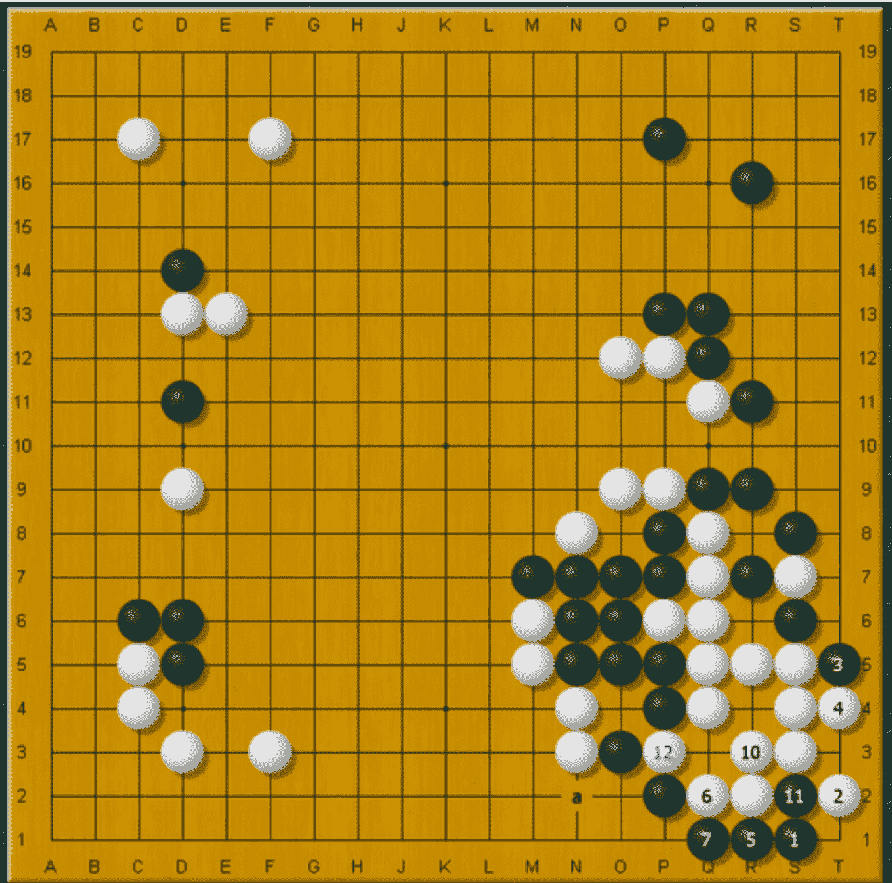

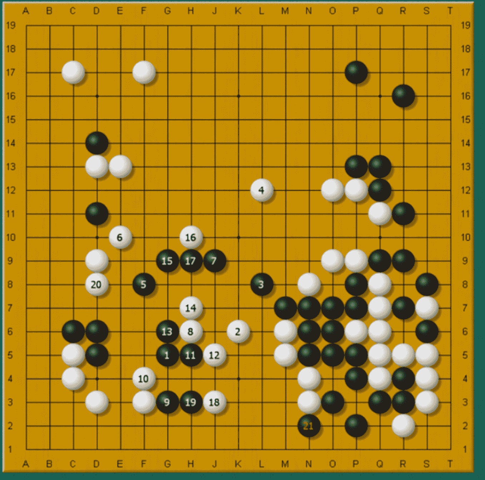

### 公众号懒人搜索，懒人专属群分享


## 《老喻·决策算法100讲》

## 成为命运的主人

版权归得到App所有，未经许可不得转载


### 公众号

### 懒人搜索

### 懒人专属群

微信:lazyhelper

公众号懒人搜索，懒人专属群分享

## 30 关键时刻：怎样把握最佳出手时机？


懒人专属群的群友，你好

我是老喻，欢迎来到《决策算法》课。

我们在课程一开头就讲过，决策基础是胜率和赔率。但是很多决策场景下，胜率并非固定不变，而是会随着局势变化，有时高一些，有时低一些。于是，时机就成为成败的关键。

这一讲，我们就来讨论这个重要的决策难题：怎样把握最佳的出手时机？

### 一

先来一道思考题：

A、B、C三牛仔连环决斗，规则如下：

抽签决定开枪顺序；
有开枪权者可以自行选择射杀对象；
每次只能开一枪；
直至剩下一个人。

已知A和B百发百中，都是神枪手，而C的命中率是50%。

请问谁活下来的概率最大？是多少？

解答如下：

抽签顺序可能有六种可能性——ABC、ACB、BAC、BCA、CAB、CBA。

前四种可能性，A和B都会选择先开枪干掉对方——毕竟要先消灭厉害的对手，然后轮到C开枪，50%概率，干掉一个人。

问题的重点是，后两种可能性，C先开枪时，他该怎么办？

他最明智的办法是对天开一枪。

也就是说，即使他获得了优先开枪的权力，也应该放弃掉。

为啥呢？

我们先设想一下，由枪法最差的C开枪，他选择打A或者B，命中率是50%：

假如他打中了，接下来活着的那个神枪手会100%干掉他；
假如他没打中，那还好，那是一个神枪手干掉另外一个神枪手。

与其如此，C的最佳策略是，对天开一枪，100%没打中；然后留着AB彼此开枪，无论如何死一个人，最后再由C开枪，50%概率得手。

结果，生存概率最大的，居然是枪法最差的C。

所以，在特定条件下，弱者也能生存。关键在于，你能够忍耐，等候最佳的开枪时机。

No. 150 / 494

### 二

再看和出手时机有关的第二个场景。

18至19世纪的欧洲，有一种战术在今天看起来很奇怪。

如果你看过《战争与和平》等描述当时战争场面的电影，可能看到过这样的场面：士兵排排站，列成方阵，然后面对面整齐地射击。

这一看似荒诞的画面让人不禁质疑：为何士兵们要排成整齐的队列，像是等待着无情的子弹洗礼？这些勇士难道不懂得躲避，或者寻找掩体？

但这种被后世戏称为“排队枪毙”的战术，竟然主宰了欧洲战场近两百年，甚至帮助欧洲列强征服了世界。

是什么让这种看似自杀性的阵型，成为了那个时代的“最优解”？

线列步兵战术的一部分灵感来自古罗马军团的编队和组织。罗马军团以其严格的队列和战斗阵型著称，而这些元素在后来的线列步兵战术中得到了延续和发展。

线列步兵战术起源于欧洲火枪和刺刀的普及时期。当时，士兵们使用的是滑膛枪，这种武器装填缓慢且精度低。普通士兵一分钟只能发射2-3次，经验丰富的士兵最多可达4-6次，但在实际战斗中，因种种因素，这个速率通常更低。此外，当时的火药产生大量烟雾，严重影响了战场视野和射击精度。

线列步兵战术的核心是将士兵排列成横队，通过集体射击来最大化火力覆盖。这种方法不仅提高了命中率，还使得每个士兵的火力得以集中使用，避免了单兵射击的低效。这种集体射击的方式，在当时的技术条件下，是利用火器的最佳选择。

此外，线列步兵战术还有“简化指挥与控制、有效使用刺刀、对敌人产生心理威慑”等优势。

在1815年的滑铁卢战役中，威灵顿公爵展现了线列步兵战术的精妙之处。他命令手下步兵组成空心方阵，将炮兵安置在火枪兵之间。这一战术布局不仅增强了火力密度，还有效保护了炮兵免受敌军骑兵的袭击。英军被指示只有在敌人接近到二十米内时才开火，这一策略旨在确保每一发子弹都能发挥最大效用。

与此同时，法国的内伊元帅率领骑兵冲锋而来。在距离百米处，法国骑兵首次遭遇英军火炮攻击。随着距离缩短至二十米，英军的火枪齐射开始了。这一近距离的齐射给法军骑兵带来巨大伤亡，因为即便是精度较差的火药枪，在如此近的距离上也能造成致命打击。第一轮齐射几乎瞬间瓦解了法军的冲锋，而第二轮火力则彻底击溃了残余的骑兵。

这种近距离的火力集中展示了线列步兵战术的优势：尽管这种战术看似简单甚至愚蠢，但在那个没有现代机枪的时代，它却能在近距离作战中造成巨大的杀伤。滑铁卢战役不仅是威灵顿公爵的胜利，更是线列步兵战术的经典案例，展示了其在战场上的强大威慑力。

### 三

体现线列步兵战术精髓的另一场战役，发生于1759年，史称“魁北克战役”。

整场战役只打了30分钟，却改变了历史。

法军守将蒙卡尔姆率兵对阵英军。他平常小心而有条理，而这次却没有耐心等待最佳时机反击，当敌人还在百米开外的时候就射击，对英军没有构成太大的损伤。

与之相反，英军采用了一种非常谨慎而有效的策略。当法军率先发起攻击时，英军并未立刻回应，而是保持队形，静待敌军进一步逼近。

法军在前进过程中再次开火，试图削弱英军的阵线。这种持续的压迫，给英军造成了不小的伤亡。然而，英军依旧没有立刻反击。

一直到两军足够近（有资料说是30多米距离），英军第一轮齐射一下子就打乱了法军阵脚，紧接着，英军继续向前推进，距离更近时打了第二轮齐射，法军彻底崩溃。

法军惨败，再次说明一个朴素的道理：

没有胜算时贸然出击，只是在浪费子弹。

### 四

接下来，让我们撤出历史上的战场，回到现实的决策场景。

线列步兵战术，某种程度也反映出我们在做决策时常面临的真实困境：

有时候，手头的武器就是很烂，准头也不够，射程也不够，没有什么高精尖的武器，此时要如何取胜？

制胜策略包括四个关键词：集中发力，遵守纪律，等待时机，果断出手。

我们用一场抗洪抢险来说明这四个关键词如何发挥作用。

1993年，美国密西西比河及密苏里河流域遭遇特大洪水，洪水持续数月，对中西部多个州造成严重破坏。大量城镇、农田、基础设施面临洪水威胁。为抵御洪水，地方政府、军队、志愿者和社区居民纷纷投入紧急抢险。

在洪水暴发之初，许多社区居民和志愿者虽然热心，但缺乏经验，往往采用自发、零散的方式往河岸边丢沙袋。结果是，大多数沙袋没有形成连续的堤坝结构，轻易被水冲走，志愿者辛苦填装和搬运的沙袋被浪费，宝贵时间也被耽误。

后来，美国陆军工兵部队抵达现场，防洪行动得到了专业指导和组织管理。

首先，志愿者排成长队，有人专门填沙袋，有人专门传递，最后有人专门在指定位置按特定方式堆叠沙袋。

其次，堆叠沙袋讲究也有很多，比如要交错叠放、多层叠加、压实，不能只是简单地往水里丢。这样才能形成一道能持续、稳固的临时堤坝。

此外，还必须抢在时间窗口内出手，必须要在下一次洪峰尚未全面冲击、或在关键决口点出现前，快速完成一定长度和高度的沙袋堤坝，这样才不会被洪水冲毁。

这个案例也让我们再次确定一个基本常识：

这世界上不存在以弱胜强的传奇，劣等资源也不可能战胜优等资源。

劣等资源要创造奇迹，唯一的办法是，聚焦单点，制造局部优势。统一号令，严格遵守纪律，耐心等待，以及精准的时机把握，和果断出手。

然而，必须要承认的是，在一些更加凶险的决策场景下，要能做到非常困难，于是，就需要一个关键要素加持，那就是“勇气”。

### 五

我第一次看电影《勇敢的心》时，最受触动的一个场景是，英国骑兵以压倒性优势，冲向威廉·华莱士（梅尔·吉布森）率领的苏格兰人。看起来手持破铜烂铁的民兵，该如何应对全副武装的骑兵？

当敌军战马以越来越快的速度冲到阵前，当骑士们举起了长矛，威廉·华莱士一直在大喊“Hold......Hold......Hold......Hold”，他一共喊了四声，直至敌军来到跟前，才命令战友们举起了早已准备好的削尖的长木棍，将来不及停下来的敌人骑兵挑落马下。

这一场景，从战术的角度看，非常像“线列步兵战术”，一直到敌人来到最后的底线，才齐齐举起武器，一起发射，给出对方致命一击。

在那一刻，有多少人能够承受压力呢？连最信任威廉·华莱士的伙伴，在最后关头也犹豫不决地望着他。

即使你用对了“线列步兵战术”，也要冒着生命的危险。就像“魁北克战役”中阵亡的英军将领沃尔夫少将。事实上，在“魁北克战役”中，英军的伤亡也不小，英军将领沃尔夫少将也挨了三枪被打死。

更何况，“线列步兵战术”早已成为历史名词，现代军事行动更强调火力、机动性、隐蔽性和灵活的指挥控制。

然而，不管怎样，在现实世界里，如果大敌当前，你需要的不仅是武器，还有勇气和智慧。

而最大的智慧，往往与机遇有关。如同前面的智力题，为了等待最佳时机，牛仔会放弃优先射击的机会。

决策有趣的地方是，假如你理解了其中的一些基本原理，你不必去读一堆书，也不用去进商学院，只要运用非常简单的决策框架，就有可能让自己有脱胎换骨的飞跃。

这一讲的基本智慧就是：

当你遇到重大决策问题时，别马上做出决定，而是耐心等上一阵子。

我的一位好朋友，分享了他特别敬佩的一位前辈高手的故事。有一次，那位前辈的企业遭遇了大规模的舆论攻击，竞争对手造谣说他们出现了致命危机，接近破产，人也出问题了。一时间，乌云密布，所有人都在传这件事，朋友们也替他着急。公司同事们也异常愤怒，建议立即辟谣，对大众解释。

这时，这位前辈高手做了一个决定：24小时之内，不采取任何行动。

这是一个身边人难以理解的艰难决定，因为不解释，不反击，意味着谣言继续满天飞，甚至会发酵。但是，这位高手的观点是：你不知道对手到底是谁，你也不知道他的目的是什么，这时候贸然反击，只会乱了阵脚，也不会真正遏制对方的行为。等上一天，让子弹再飞一会儿，找到幕后黑手，摸清对方的意图，再集中火力，针对性地反击。要么不还手，要打就一举拿下。

果然，他们最终度过难关，赢得了胜利。

也许，我们的生活中并没有那么多你死我活的时刻。可你我总会面临一些压力，不得不处理一些麻烦。有些事情可能会让你火冒三丈。

这时，记得如电影《勇敢的心》一般，面对千军万马，对自己说：

“Hold......Hold......Hold......Hold......”（挺住......挺住......挺住......）

在关键时刻才出手，但也要守住最后的底线。

Hold，挺住，不仅是一种勇气，更是一种智慧。

以上就是这一讲的全部内容。

我是老喻，我们下一讲再见。


## 31 两眼论：怎样找到你的人生杠杆？


懒人专属群的群友，你好。

我是老喻，欢迎来到《决策算法》课。

我是一个围棋爱好者，这一讲我想跟你分享一个我从围棋中领悟到的决策模型：“两眼论”。

大概是2017年的时候，我跟罗胖聊到了“两眼论”，他觉得有点意思，就在他的罗辑思维节目中介绍了。过去7年里，我对“两眼论”有了一些新的思考，所以再次来和你分享。

准确来讲，两眼论并不是一个方法论，而是一个思考的脚手架，供你踩踏和拆除。“两眼论”也未必科学完备，但我相信，可以带给你一些关于如何做事，以及如何过好这一生的启发。

### 一

先来简单介绍一下围棋的“两眼”。

围棋有一个基本规则，就是一块棋有两只真眼，就是活棋。

要说明什么是“眼”，需要引入另一个关联的概念“气”。

“气”是指棋子周围直接相邻的空点。在围棋中，每个棋子或者由相连同色棋子形成的一片棋，都需要至少有一个“气”来维持其在棋盘上的生存。没有气，这个棋子（或这片棋）就死了。这就是所谓“气尽棋亡”。

“眼”是指由棋子围成的空点，这些空点完全被同一方的棋子所包围。

眼是围棋中非常重要的生存手段，拥有两个或两个以上“眼”的一片棋是活的，因为对方无法同时封闭所有的眼，从而无法杀死这片棋。

打一个形象的比方，你有两个鼻孔，对方一次只能堵住你一个鼻孔，并不会影响你呼吸。

“眼”也分真假。“真眼”是指对方无法通过落子来减少其“气”的眼，而“假眼”则是指对方可以通过落子来减少其“气”的眼。

于是，围棋就是这样一个游戏：

开局时，棋盘开阔，棋子们活得都很敞亮，有的是气。可随着中盘厮杀，短兵相接，气会越来越少，直至外围完全没气。

而当你在围棋对局时，你一方面需要抢地盘，一方面需要赶在被彻底包围前，在内部做出至少两只眼来。

作为一个心不在焉的围棋爱好者，我在对局时会默念：要有眼，要有地。以此提醒自己别只顾过手瘾，而忘掉大龙还没眼。

就像我们的人生，起初一片开阔，到处充满可能性，四处抢地盘，然后气越来越紧，生存空间渐渐逼仄，呼吸愈发困难，此刻突然发现：眼位不够，还没活！

所以，任何时候，提醒自己，先活下来。

### 二

围棋中的“眼”移植到现实中，自然是一种隐喻。

“眼”是维度，但两眼不只是增加一个维度，而是1+1>2，甚至是某种杠杆效应。

比如，为什么绝大多数动物都是两只眼，而不是一只眼？

一只眼睛，东西可以看得清，但看到的是平面，两只眼才能够看到立体图像。只有立体图像，才能够帮助人和动物形成视觉上的景深，进而判断天敌或者猎物的距离。

再比如，如何让机枪在战场上发挥更强的战斗力？两挺以上的机枪，从不同角度射击，能形成强大的交叉火力。

又比如，一个人的成长需要“两只眼”：一只眼是知识的积累，一只眼是实践的磨砺。单纯的书本理论，只能构建平面的认知；若没有在现实生活中不断试错、积累经验，我们就无法获得深度的感知与真正的能力变现。

只有在理论与实践的交叉视角下，我们才能看出前进道路上的障碍，从而在复杂的环境中捕捉真实机会、巧妙应对挑战。

我有个朋友，打算通过微信视频号打造个人IP。我用“两眼论”给出建议：仅靠“懂平台运营”这一只眼是不够的。你还需要另一只眼：专业能力、独特表达或个人特色，形成1+1>2的立体视角。

例如，你是投资专家，可以用简单的故事讲解复杂的投资逻辑，赢得信赖；或者你是设计师，通过诗意的风格，分享生活美学，让人产生情感共鸣。

平台规则帮你打开流量入口，专业内容或者独特表达让你留下个人标签。

两眼并用，方能破除同质化，找到属于自己的人生杠杆，成为真正的超级个体。

所以，要想成事儿，在做决策的时候，你可以问自己：我的两个眼，到底是什么？

在更广的意义上，两眼论或许还揭示了这样几个真相：

- 天外飞仙似的一只“眼”，成功的概率都很小。以“资源优势、或者特许权利”为第一只眼，以“创新、延伸、嫁接”为第二只眼，活下来的可能性会大很多。

苹果的第一只眼是 iPhone 的技术和设计优势，迅速打开市场。但仅靠这一点难以维持长期领先。第二只眼是生态系统的创新与延伸：通过 App Store 构建应用生态，推出 Apple Watch、AirPods等硬件嫁接 iPhone，拓展 iCloud、Apple Music 等服务增加用户黏性与盈利。两眼结合，苹果从单一产品优势跃升为全球领先的生态系统，建立了强大的竞争壁垒。

- 两只眼之间，有时候是“支点”与“杠杆”的关系。例如，一个人想成为成功的自由职业者，第一只眼是自身的专业技能，比如设计、写作、编程等，这是立身之本，也是个人的支点。第二只眼是打造个人品牌，比如通过社交媒体展示作品、撰写专业文章、参与行业讨论等，这是杠杆，能够放大影响力，吸引客户与合作机会。两眼结合，技能作为支点，品牌作为杠杆，自由职业者不仅能持续获得高价值订单，还能积累长期的职业竞争力与资源。

- 美团、京东等公司，都是通过做好一件特别不容易的事情，从而实现能够，通过一件看起来容易的事情来赚钱，构建起不可复制的平台壁垒。第一只眼：解决复杂的底层难题，比如美团的即时配送网络，京东的自建物流体系。这些“特别不容易的事”，需要巨大的投入与持续优化，形成核心竞争力和护城河。第二只眼：通过简单易懂的业务模式——比如美团的外卖，京东的自营，迅速实现规模化盈利。这些“看起来容易的事”，因为底层系统的高效支持，变得可复制且具备网络效益。

如果两件事都很难，平台难以大规模扩张；如果两件事都很简单，竞争者很容易复制。只有“两眼并用”，做好底层支点的“难”，放大用户端的“易”，才能实现快速复制与规模化增长，成为真正的大平台。

所以，两眼齐备，一项事业，一家公司才能存活。不是苟活一天，而是活得长长久久。

而对于个人来说，有“两只眼”，不仅更有竞争力，也更有机会成为不被AI替代的人。

### 三

但是，真正要运用两眼论并不容易：因为“眼”有真假。

前面我们提到了，围棋的“真眼”是指对方无法通过落子来减少其“气”的眼，而“假眼”则是指对方可以通过落子来减少其“气”的眼。

简而言之，主动权掌握在自己手里的，才叫作真眼；看似掌握主动权，但实际上主动权在别人手里的，不是真眼，而是假眼。

“假眼”在现实中比比皆是：

当年共享单车风靡一时，企业争相投放大量车辆，试图以“第一只眼”——市场规模迅速占领用户，同时布局“第二只眼”——盈利模式（广告、押金、会员费）。然而，这些布局依赖于外部资本的不断输血，缺乏自我造血能力。随着资本退潮，单车过度投放、维护成本高昂等问题暴露，最终不少企业轰然倒下，这些眼被证明是假眼。

而腾讯则自我革新，不断探寻下一个眼，以自伤其指的勇气，用微信来自我颠覆。某种意义上，新眼的再生，是其基因的一部分。

相比之下，如果一个企业将全部决胜点建立在外部授权、暂时的资本输血或几个大客户上，那么对手只要在产业链上卡住关键节点，就能使其经营计划一败涂地。

这种所谓的“主动权”完全依附于他人，就和围棋盘上可被对手一子破掉的眼位别无二致——这便是“假眼”。

再说个人的“假眼”。

有人在人际交往中，依赖“广撒网”的关系圈作为第一只眼，试图用广泛人脉解决问题。但他们的“第二只眼”——个人价值与真诚合作缺失，只靠人际表面热络维系。时间一长，这些关系如同“假眼”，无法带来真正的资源和支持。

### 四

讲完了真眼和假眼当然还没结束，我们再追问一层：假如有了两只真眼，就安稳了吗？

事情显然没有这么简单。必须要承认的是，真眼和假眼很难判断，唯一的办法是动态调整，随时迭代。

真眼生生不息，增长和繁荣才不会停止。

第二只眼和第二曲线，也有那么点儿像。管理大师查尔斯·汉迪，把从拐点开始的增长线称为“第二曲线”。

任何一条增长曲线都会滑过抛物线的顶点（增长的极限），持续增长的秘密，是在第一条曲线消失之前开始一条新的 S 曲线。

想当年，英特尔在PC时代确实构建了非常强大的“真眼”（x86架构芯片的统治地位），但当移动时代来临，这只真眼受到ARM架构的挑战，优势不再稳固。倘若英特尔能更早探索第二曲线（比如，低功耗芯片、数据中心、AI加速器），就有可能为自己再度构筑新眼。

反观英伟达，则是抢在转折点前启动新曲线的典范。从早期专注于GPU显卡这一“真眼”，到凭借GPU的并行计算优势，成为深度学习训练的核心支柱，引领了新一轮AI革命。

个人成长方面也是同理。一个人可能通过勤奋读书、提升专业技能，为自己构建了第一只真眼（专业能力），又通过积累人脉和经验形成第二只真眼（资源与判断力）。

然而，时代、产业和工作模式的变化，可能让你的既有专业走向边缘化，让你的关系网不再有效。要想避免走下坡路，你需要提前布局。你需要提前寻找新的学习领域、掌握新技术、更新思维模式——让第三只、第四只真眼在你的人生棋盘上有机会生长出来。

并且，你要努力让你最重要的“两只眼”，形成一种协作关系，彼此成为支点和杠杆，放大你的人生价值。

只有持续进化，才能在快速变化的时代保持立体视角，用更新、更广、更深的维度去观察与应对世界。

### 最后

不过，这一讲的最后，我并不想只落在事业成功，创业成功上。

要做成一件事，要创立一家公司，我们的确需要“两只眼”，但更需要第二只眼的，可能是我们自己的“幸福”。

假如饭桌上，永远只有“一个眼”的话题：赚钱、孩子上学、房子，而没有对人生意义的探讨，没有对美好事物的赞美，没有对他人的关怀，那这样的人生是狭隘的。

比尔·盖茨本来是一个不用100年就会被遗忘的家伙。但他攀至财富的顶峰时，很漂亮地华丽转身到慈善领域。

他找到了人生的第二个眼。

在人生层面，两眼论或许是在提示我们，人生应该有更多的可以展开的维度。当你的幸福只建立在单一维度上，你获得的只是平面的满足感，缺乏深度与多重保障。一旦这唯一的“眼”被动摇，你的幸福就会崩溃。

所以，在追求赚钱、追求成功的路途中，记得找到属于你自己的超越金钱和成功的另外一只眼。

幸福的本质在于通过不断迭代和更新幸福的“眼”，让我们的人生既有深度又有弹性，即使面对变幻不定的外部世界，也能在心中始终留存一片宁静与满足的空间。

所以，回到当下，你现在的两只眼是什么？

你人生的下一只眼，又在何方？

欢迎你在留言区和我分享。

我是老喻，我们下一讲再见。


## 问答：错过两周翻倍股，我在决策上犯了什么错？

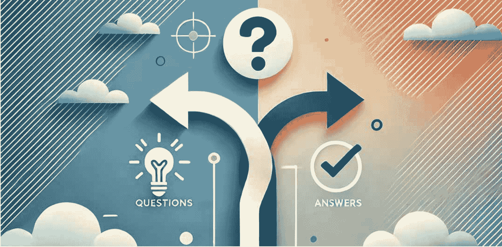

Lazybro，你好。

我是老喻，欢迎来到《决策算法》课。

今天是周五，我们来一讲问答作为加餐，回答同学们的几个问题。

### 问题1

错过两周翻倍股，我在决策上犯了什么错误？

这是小Y的提问，他说：

老喻你好，两周前，我参加了一场中学同学的聚会，在酒桌上，有个同学推荐了一支A股的芯片公司的股票，说很有潜力。正好另外一个同学在半导体公司当管理层，他说那家A股公司在行业内口碑很好，不少同行都会用自己的工资去定投该公司的股票。我当时听了也很心动，打算动用自己的一笔存款来投资这家公司的股票。结果，还没等我动手，这两周股价就涨上去了，涨幅高达100%。我要是及时动手的话，回报相当于我十年的工资了。说实话，我真是懊恼不已，居然错过这么好的发财机会。请问老喻，我在决策上犯了什么错误？

小Y同学你好！

感谢你的来信，你提到的懊恼心情我非常理解，错过一次“看似唾手可得”的机会，确实会让人感到遗憾。但这样的懊恼其实隐藏着很多值得深思的问题，它不仅关乎投资决策，更关乎我们如何看待机会、自由和行动力。

下面我将分三个角度来回答你的问题，希望能帮助你从懊恼中解脱，并更理性地看待未来的选择。

先说第一个角度：你错过的大机会，是否真正存在？

从你描述的场景来看，你之所以懊恼，是因为觉得自己“本来有机会”买到那只A股公司股票，赚到本金翻倍的回报，但在实际中，这种机会可能只是“表象”，并不是真正属于你的机会。

哲学家丹尼尔·丹尼特在《直觉泵》一书中，讲过一个有趣的故事：“古怪的狱卒”：

“有个狱卒，每天夜里，他等到所有囚犯都熟睡以后，就会挨个打开所有牢房的门，一开就是几个小时。请问：这些犯人是自由的吗？他们有逃跑的机会吗？”

丹尼尔·丹尼特说，不见得。他又提及另外一个小故事“垃圾箱里的珠宝”：

“假设有一件价值连城的珠宝被人丢弃在了路边的垃圾箱里，而你在夜里散步时正好经过了那个垃圾箱。你离珠宝那么近，也没有人阻止你拿走珠宝。那么你算是得到了一个发大财的机会吗？”

显然不是。因为你绝无可能发现这个机会进而采取行动，或者说你压根儿就不会往这方面想。

即使你的同学提及了那只A股股票，另外一个同学还从专业角度确认了，但是因为你并不真正懂那只股票，所以你依然像熟睡的囚犯。你没有行动，这不是因为自己疏忽，而是因为你并不知道大门已经打开。

决策的自由不是门的状态，而是决策者是否有信息和能力做出行动，二者缺一不可。

而那个两周翻倍的大牛股则如同“垃圾箱里的珠宝”。机会的存在需要满足一个关键条件——我们能及时发现它，并具备行动力去抓住它。

饭局上的信息本身或许是一个“珠宝”，但它隐藏在复杂的信息“垃圾箱”中，而大部分人没有时间、专业知识和资源去快速识别这些“珠宝”，这使得它根本无法转化为一个可执行的机会。

你感到懊悔，是因为你把一个仅在理论上成立的机会，当成了你实际错过的“自由选择”。实际上，当时你可能并没有准备好去把握这个机会，因此这次股价上涨并不是你真正意义上错过的东西。

我们再来看第二个角度：沉迷于“差一点儿”的幻觉，会让你错过真正的机会。

人类的大脑天生喜欢对“差一点儿”的事情过度关注，这种现象被称为“近失效应”（Near-Miss Effect）。这是一种心理学机制，它让我们对“差一点儿成功”感到强烈的不甘，但实际上，这种“差一点儿”往往是幻觉。

你的懊悔，某种程度上来自于“如果我早点行动，现在就赚到钱了”的幻想，但我们必须意识到：首先，你并不知道当时买入是否一定会赚钱。即使在当时买入，这只股票的走势也可能出现完全不同的情况。市场充满了随机性，你只看到了“成功的结果”，但忽略了背后的不确定性。

其次，每一次投资的成功背后都伴随着风险。同学的建议和行业管理层的评价可能是一个信号，但这并不等于确凿的投资依据。投资的核心不是后悔“差一点儿赚到钱”，而是如何建立系统性的方法，确保你能长期稳定地抓住机会。

更重要的是，沉迷于这些错过的机会，会让你对未来的真正机会视而不见。投资需要冷静的头脑和长远的眼光，而不是情绪化的决策。

所以，建议你放下对“差一点儿”的执念，把精力从懊恼中解脱出来，转而关注那些可预见、可分析、可行动的真正的机会。

紧接着，就要说到我们的第三个角度：与其懊恼过去，不如关注当下和未来的机会。

你应该问自己的问题不是“为什么当时没有买入”，而是“现在我能做什么？”。

投资的本质是通过学习、观察和实践，把握一系列的机会，而不是把所有的希望寄托在一次短期收益上。

每个时间阶段，都有独一无二的机会，现在有哪些会让数年之后的自己懊恼的机会？你能发现吗？又该如何捕获？

小Y同学，我也特别理解，你错过这样一笔相当于十年工资的发财机会，你的懊恼心情，可能不会因为我上面的三个思考角度而彻底恢复平静。那么，我想再和你分享一个真实的故事：

有位朋友，认识一个信仰数字货币的年轻人，小伙子大学论文写的就是区块链，很早就开始买数字货币，赚了近千万美元。他成了大赢家，给家人买房买车，给自己买超跑……然而，他后来还是破产了。因为赚钱之后上了杠杆，赌期权。结果遭遇两次回调，就爆仓了。他一路坚持，最后却败于人性的贪婪。

小Y同学，你觉得这个年轻人，是熟睡的囚徒吗？假如你当时买了那只翻倍的大牛股，你可以拿多久呢？

请你认真思考我的这个问题。

祝你捕捉到真正属于自己的大机会。

### 问题2

为什么做好人最大的代价不是吃亏？

“美第奇”同学提问：老喻，我很喜欢你的《决策算法》，我获得的不仅是智慧，还有一种人生低谷时所需要的力量。你在其中一节课说：做好人最大的代价不是吃亏，而是失去了理性。请问该如何理解这句话？

美第奇同学你好！

一般认为，人善被人欺，所以好人未必有好报。

但事实上，可能大部分人都觉得自己是好人，就像90%的人认为自己属于前10%开车好的人。

即使抛开这些，我们只谈真正的好人：给别人带来额外利益，而自己付出可以不用付出的代价的人。

表面上看，做好人的代价是吃亏。

其实并非如此。

做好人最大的代价，是一个人为了表演“我是一个好人”，所以做了一些不重要的、非理性的事情。

即使这个人真的是好人，也真的做了好事，然而，一旦有表演的冲动，就会为了表演而做好事。

表演出来的好事，哪怕是发自内心的，哪怕是付出了代价，但往往不是对的事情。

事实上，即使你是好人，你也有“做正确的事情”的义务。

例如，你是个急诊科医生，正在赶去加班的路上，看到一个老人摔倒，他头破血流，但没有生命危险，旁边也还有别人，我认为你应该继续赶路，而不是停下来为他治疗，也许你的义举可能被拍下来传到网上，可急诊室的病人可能因此丧命。

这并不是说“善行”没有意义，而是提醒我们：

一个好人更要有做“正确的事”的义务。善意必须建立在理性和独立思考之上，否则，善意可能带来更多无意中的伤害。

当然，好和对，哪个该在前面，这是个巨大的话题。

尽可能做个好人，但是别放弃独立思考。

更不要因为表演当一个好人，而失去了理性。

为什么表演“好人”会失去理性？

首先是因为我们对认可的渴望。

人类天生有寻求社会认可的倾向，我们希望被他人视为善良、慷慨、值得信赖。为了获得这样的认可，很多人可能选择“看起来善良”的行为，而不是“真正正确”的行为。

其次是因为道德优越感是个陷阱。

当我们被“好人”这个标签绑架时，可能会陷入道德优越感，认为所有牺牲都值得，而忽略了结果是否真正有益。

最后还因为善行可能是短视的。

善行并非总是长远的正确。例如，有人可能为了表演慷慨而慷慨，但忽略了更深层次的责任。

特别巧的是，我的一位非常优秀的朋友，也是看到我在《决策算法》里写的“做好人最大的代价不是吃亏，而是失去了理性”，然后给我留言说：

“我今年遇到了一件事，两三年之前的话，我会妥协，今年我直接发了律师函。我知道我有变化，但是没想清楚是什么变化，听你的课，一下子理解了，‘我不想只做好人了’。从老好人走到这一步，也是完成了很多自己才知道的突破。所以听到你这么讲的时候，感觉隔空被理解了。”

我很感激这位朋友的坦诚和分享。的确，做好人并不意味着一味妥协，而是清楚地知道在什么情况下该坚持理性，做出正确的选择。只有这样，才能成为既有善意又有力量的人。

所以，美第奇同学，做好人从来不是一件简单的事，它需要的不只是善意，还有清晰的判断和独立的思考。

善良应该是一种力量，而不是一种负担；它应该引导我们做出对的选择，而不是为了迎合他人的目光去妥协甚至迷失自我。

真正的好人，不仅能为他人带来益处，也能为自己守住理性与底线。

愿你在追求善意的路上，也能保持清醒的头脑和坚定的内心。毕竟，一个既有温度又有智慧的人，一个能够做出理性决策的人，才是真正的“好人”。

以上就是这一期的问答。

欢迎你继续提出更多好问题。

我是老喻，我们下一讲再见。


## 32渡劫：如何在不确定性中逆风翻盘？

lazybro，你好

我是老喻，欢迎来到《决策算法》课。

继续跟你分享围棋给我们的决策启发。这一讲，我想跟你分享围棋中很有趣的一个策略：“打劫”。

### 一

### 三

在我们的工作和生活中，常常会遇到类似于围棋“打劫”的局面：事情僵在那里，一直悬而未决，令人内心充满不安与焦虑。然而，这些局面并非绝境，往往也隐藏着新的机遇。

围棋中的“劫”借用了佛教“劫波”的概念。在佛教中，“劫”代表宇宙生成、毁灭与再生的漫长周期，蕴含着无常与变数；而围棋中的“劫”，则体现为局部争夺中的循环对抗，双方需要通过寻找“劫材”来打破僵局，这种动态的“你来我往”与佛教“劫”的循环本质极为相似。

更重要的是，围棋中的劫争不仅影响局部胜负，还可能改变全局。

高手之所以喜欢打劫，是因为在复杂与混乱的局面中，往往蕴藏着更多的可能性与机会，而新手却因害怕变数而选择回避。

一个经典的案例是Slack的创始人斯图尔特·巴特菲尔德的故事。他的创业经历宛如围棋中的“打劫”：

2002年，他满怀热情开发了一款游戏，但项目失败了。然而，这次失败的游戏却衍生出一个副产品——Flickr。Flickr后来以3500万美元被雅虎收购，为他赢得了第一次成功的“劫争”。

2009年，他再度尝试做游戏，3年后再次失败。但这次失败中，他的团队开发了一款用于内部协作的工具，这就是后来大获成功的Slack。2020年，Slack以277亿美元被收购。

这些失败看似是“劫难”，但巴特菲尔德通过灵活的心态和对机遇的把握，将失败中的副产品变成了新的突破点。他没有在局部失败中停滞，而是转移视角，利用失败派生的“劫材”开辟了全新的价值空间。

这一切正如围棋中的打劫：

面对僵局，不执着于眼前的得失，而是通过引入新的变量，为全局创造更多可能性。

这启示我们，

面对“劫”时，不要惧怕不确定性和复杂性。失败的项目可能正是新思路的起点，暂时的被动局势中或许隐藏着惊喜。

关键在于调整心态，承认变化的必然性，并在变化中寻找突破口。

劫难不可避免，但它同样可以成为改变命运的契机。

### 四

学会“打劫”的第一步是直面危机，不被眼前的困境吓倒。

十多年前，两个付不起房租的设计师，决定出租客厅里的3个床垫，并为这个模式创建了一个网站。

然而，起初生意冷清，几乎无人问津。为了生存下去，他们打了个“劫”，利用自己的设计技能推出了“总统口味麦片”，每盒售价40美元，最终卖出了1000盒，赚得3万美元。这笔收入不仅帮助他们渡过了最艰难的时刻，剩下的麦片甚至成了他们的口粮。——这正是爱彼迎（Airbnb）创业早期的故事。

这个不起眼的“麦片劫”让他们撑到了关键的机会——被YC创始人保罗·格雷厄姆（Paul Graham）注意到。Paul一开始并不看好爱彼迎的理念，甚至认为开放私密空间共享的点子“烂透了”。但让他心动的，是创始人送给他的自制麦片，他觉得这个团队真是打不死的小强。——这个故事展现了团队在绝境中通过创意和执行力寻找生机的能力。

从围棋的角度看，爱彼迎打的劫属于典型的“赖皮劫”：局部看似毫无希望，但他们通过创意与顽强的执行力创造了新可能，并用这种精神打动了投资者，最终实现了全局的翻盘。

你看，这像不像著名的“无限游戏”理论？游戏的目标不是分出胜负，而是持续地进行下去。

打劫往往出现在局部胜负未决、双方僵持的状态下。通过“劫材”的引入，局面被强制从循环僵持中转向全局变化。这种变化不仅避免了单调的消耗，还为棋局引入更多可能性。

无论是围棋还是现实生活，真正的高手都懂得：让游戏继续，比一次性的胜利更重要。

这一联系启示我们，在决策、工作、人生中，拥抱不确定性、以全局思维应对局部挑战，才能在持续的迭代中找到更深远的意义和更持久的成功。

### 五

然而，像Airbnb这样将“劫”变成机遇的过程，并非易事。

围棋中，打劫的关键在于寻找“劫材”。

劫材的本质是外部的谈判筹码，而这些筹码往往不是事先规划好的，而是在具体执行中逐步积累和发现。

前面说到的Slack创始人巴特菲尔德，他在创业过程中两次失败，却两次在失败中找到了“劫材”：

第一次，他开发游戏失败，却意外创造了图片分享工具Flickr，最终被雅虎收购；

第二次，他的游戏项目再次失败，但开发出的内部协作工具Slack成为一个独立的成功产品。

这些“劫材”不是刻意设计的，而是源于他在创业过程中，扎扎实实解决真实问题的态度。巴特菲尔德坦言：“我不知道为什么会成功。”但正是这种无心插柳的成果，在关键时刻成为他翻盘的武器。

在商业世界中，这种无心插柳的案例比比皆是：

字节跳动的飞书：原本只是为了解决内部协作问题，却发展成了一个很受市场欢迎的独立的生产力工具；

阿里云的诞生：本来只是为了应对双十一的高并发流量，最终成长为阿里云；

这些“劫材”都是在被动中主动创造的结果。它们的成功源于真实问题的认真解决，以及对副产价值敏锐发现。

在实际工作中，适当的“三心二意”并非不务正业，而是一种高明的策略。

虽然我们常被教导要专注，但在执行过程中进行探索、积累副产品与旁路能力，可能会在未来成为突破困境的关键资源。

正如围棋高手在布局时，会有意识地预留劫材点，在复杂局面中重新调整布局。在实际决策中，留有余地和灵活性，可能在关键时刻为你提供多样化的选择。

### 最后

简单总结一下：人的一生总会遇到几次“打劫”，我们也是在“渡劫”中变得越来越强大。

佛教中的“渡劫”，意指通过重大考验后，完成突破性成长或觉悟的过程。

对于个人而言，我们如何“渡劫”？

- 不惧危机：危机是改变的开端，不要因暂时的困难而停滞不前。勇于直面挑战，方能找到解决的可能性。
- 寻找劫材：危机中的突破点，往往来源于你过去的积累。通过敏锐的观察力和创造性思维，将“副产品”或“旁路能力”转化为关键资源。
- 全局思考：在局部失利时，不要执着于眼前得失。退一步从全局观察，或许能找到更大的胜算。
- 动态调整：像围棋中高手在劫争中的灵活应对一样，人生中的决策也需随时调整，根据形势变化优化选择，保持策略的动态性。

在《西游记》中，唐僧师徒经历的九九八十一难，不仅是与外部妖魔鬼怪的斗争，也是对内心恐惧、贪欲、懒惰的超越。这些“劫难”成就了他们的最终成佛。

人生亦是如此，有些劫早晚要遇到，但通过直面劫难、主动调整，我们能从中获得成长与突破。

成功的关键，不在于避免“劫难”，而在于如何在“劫”中找到新生的契机，完成自己的“渡劫”。

真正的决策高手，是能在“劫”中发掘生机的人。他们在不确定的环境中，不断迭代思路、调整策略，用时间与资源的循环力量，完成一次又一次的重生。

最后，我想问：你最近遇到什么劫难吗？你是如何渡劫的？

欢迎你留言，并分享给自己需要的朋友。

我是老喻，我们下一讲再见！


微信:lazyhelper

## 33 弃子争先：怎样抢回人生的主动权？

我是老喻，欢迎来到《决策算法》课。

继续给你分享我从围棋中领悟的决策方法，这一讲我想跟你分享的是“弃子”的艺术。

弃子，不仅是围棋高手的必修课，更是一种帮助我们在复杂人生中抢回主动权的智慧。

平常的工作和生活决策中，我们似乎也都知道了，该放弃的时候，就要放弃，不要因小失大。然而，真正懂得“弃子”的人极为稀少。

段永平讲过一个小故事：

他去机场接人，在停车场投了1个小时停车收费的币，结果客人提前半小时到了。这就有个问题，多投了半小时的币，是继续在车里等这半小时，还是浪费多投的这半小时的钱？结论不言而喻，遇到这种情况，我们肯定应该开车走人。

道理貌似很简单，但在现实决策中，人们经常干“继续等下去”的蠢事。例如：

这事儿我已经坚持几年了，投入那么多钱，怎么可能舍弃？

这个人我已经付出那么多，怎么能说分就分？

大多数人会陷入两种困境：

有时当弃不弃，在盐碱地里空耗，浪费资源，延误时机；

有时不该舍弃的重要棋子，却被稀里糊涂弃掉，过后后悔不迭。

深层次的原因，则是对错不分，知错不改，缺乏大局观。

为什么弃子会那么难？怎样真正学会弃子？这一讲，我尝试给你一些决策建议。

### 一

首先还是看一下什么是围棋中的弃子。

弃子是一项高级战术。围棋老师会对学生说：想成为高手，必须学会弃子。

《围棋十诀》里，有三条和弃子有关：

- 弃子争先：是说在行棋时，舍弃过去的一些残子，而去争夺未来的先机；
- 舍小就大：是说在下棋时，先下价值大的地方，不要将棋下在小处；
- 逢危须弃：有无法挽救的棋时，就应当机立断，不要再浪费棋子去救。更不要因此而搭进全部。

概括而言，弃子争先是主动放弃一些意义不大，或很难处理的棋子，以换取先手之利，从而获得全局的胜利。

基础概念非常简单。但这里的放弃，不是逃命，不是认输，而是换回主动权。

就像聂卫平说的，水平高的才是弃子，水平低的就是被吃。

真正的对局，从来不在局部赢得胜利，而在全局控制中找回主动权。对于棋手来说，放弃那些棋子，就像创业者决定砍掉业务线、企业家撤出亏损的市场，或者个人选择放弃一段关系一样，都是为了更高的价值。

弃子战略的核心在于“舍得”。而决策的关键在于“舍弃”。

大多数人的问题，不是该不该放弃，而是：“放弃什么？为什么放弃？”

究其根本，是因为缺乏对错分明的判断力和大局观，对局部失利不愿割舍，终究错过了更重要的机会。

那么，如何在现实中学会弃子，抢回主动权呢？

### 二

我要给你介绍的第一个方法是“手割”。

“手割”是一个围棋中重要的概念。手就是手掌的手，割是切割的割。

字面意思可以这么理解：棋手通过暂时割开某些手数的次序，重新审视局部与全局的关系。

我们先来看一个案例。

《决策的智慧》一书里，讲了一个荒唐但又是常见的真事儿：

“1999年夏天，斯坦福大学教师俱乐部举办了一场热闹非凡的婚礼，225名宾客在这所著名的高等学府的高档餐厅中开心地聊天，尽情享用美食、开怀畅饮，接下来正是切蛋糕、新娘抛花束的高潮环节。就在此时，这对新人宣布下午5点前必须离开此地，而时间马上就要到了。他们突然离去的原因竟然是：按照规定，等待他们的豪华轿车司机，对迟到乘客会收取罚款，罚款标准为迟到1分钟1美元。经过了一年的准备，宴请了数百名宾客，花费了数万美元的费用，这对幸福的新人却人为地把他们将铭记一生的美妙时光缩短了，而原因仅仅是为了避免支付1分钟1美元的罚款。”

听到这样一个故事，估计大家的感觉是一方面觉得好笑，一方面又会自嘲，咱们自己也经常干这种傻事儿吧。

那么，如何用 “手割”思维来破局呢？

手割是一种基于逻辑反思的思维实验：

- 打破惯性，拒绝被路径依赖束缚；
- 忘掉沉没成本，专注于未来收益；
- 重构选择空间，跳出局部的狭隘局限。

你看，在婚礼的故事里，豪华轿车来了，按照惯例，新人要准备上车。而按照传统经验，一分钟一美元的延误费，是很昂贵的。——这些都是惯性思维的作用。

“手割”，首先是要打破这种思维惯性，以形成独立思考。

就拿婚礼这个案例来说，主角应该忘记正在催促等待的豪华轿车，也别为一分钟一美元肉痛，而是从全局出发，算个大账：

婚礼庆典的总成本约合7.5万美元，仪式持续了5个多小时，每小时的成本为1.5万美元。倘若新郎新娘再多待上1小时，成本只需要增加60美元，即每小时婚礼成本的1/250而已。

经过“手割”分析，这个时候再来做决策，就容易多了。舍弃掉豪华车等待一小时的60美元的费用，可以让正在高潮之中的婚礼延续一小时，多划算！

“手割”很容易让人联想到经济学上的两个概念，一个是沉没成本，一个是路径依赖。沉没成本，我们前面的课程里讲过了，这里不多重复。

从概念的核心来讲，“手割”跟 “路径依赖”的关联可能更为紧密。

从路径依赖的角度来看“手割”，重点就变成了在某个局部，战斗或策略逻辑已经固化、局面即将沿着不利轨迹演化，于是，需要做的是主动中断当前“路径”。

通过“手割”，棋手试图跳出由于前期步骤积累而形成的特定惯性或策略框架，重新打开选择空间，重构决策路径。

我自己的经验是，越是紧急的时候，越是要谨慎做决策，切忌陷入以往的思维惯性和路径依赖，谨防忙中出错。

尤其要小心那些要求你立即做决定的人和事儿，“当断则断”的确很重要，但更多时候，背后可能隐藏着陷阱。这些陷阱，往往又隐藏在你的思维惯性中。

### 三

我要给你介绍的第二个“弃子”的方法是，基于“身份清零”的重新思考。

关于“身份清零”的重新思考，最经典的案例自然是安迪·格鲁夫带领英特尔转型做CPU的故事。

安迪·格鲁夫问公司合伙创始人摩尔：如果我们两个人引退、新CEO上任，他会怎么办？摩尔不假思索地回答：他将退出我们原来的业务。

安迪·格鲁夫说：“既然如此，为什么我们不自己舍弃掉原来的业务呢？”

这个简单的思想实验，带领英特尔跑出了一条漂亮的增长曲线。然而时过境迁，当英特尔再次面临高性能计算的变革趋势时，却无法下定决心，被AMD和英伟达远远甩在了身后，可见“弃子”之难。

在如今这个快速变化的时代里，很多人都面临“身份清零”的考验。以前是大媒体主编，现在是自媒体小编；以前是大老板，现在在直播间吆喝带货……

无论是企业还是个人，身份清零的本质在于摆脱过去的束缚，重新聚焦未来的可能性。现实中，很多人因为身份包袱而难以放下过往：

- “我是部门负责人，怎么能去基层重新开始？”
- “我有这么多年的经验，怎么能放弃熟悉的领域？”

但真正的高手，往往能以“放空”的姿态，迎接全新的可能性。

### 四

围棋的弃子，决策的舍弃，本质上是有大局观。

我们永远要问自己：我做的是正确的事情吗？——如果不是，知错就改。

还要问自己：我做的是最重要的事情吗？如果不是，放下，换为最重要的事情。

不管是企业，还是个人，资源都是有限的。所谓决策，就是以全局视野，来找寻能够形成竞争优势的主战场，并分配资源。

做到这一点，需要非常艰难的思考，即所谓“做艰难而正确的事情”。大部分人会为了逃避这种艰难，而假装很辛苦地埋头去做眼前的事情。

难在哪里？难在大局观。我将其概括为三种大局观：

- a、空间的大局观；
- b、时间的大局观；
- c、资源的大局观。

先看空间的大局观。

这就像下围棋，哪里重要下在哪里。

我从AI那里学到的最重要的一点，就是：AI永远去下全局中最重要的那一点，哪怕战场再激烈，一旦不是主战场了，立即转移，绝不纠结。

围棋毕竟还是一个完美的二维游戏，现实世界要复杂得多。现实世界不会像围棋那样在某个维度上有极深的计算，而是由很多个维度的不那么深的计算交织在一起。

所以，我们只有用概率去评估，去计算各种变量的可能性，并通过加权计算期望值。

事物的概率，是一大堆交织在一起的模糊因果。

所谓“正确的事情”，本质上是去找寻大概率正确的事情。

再看时间的大局观。

这一点更容易在投资和创业那里找到案例：

例如“长期持股”。价值投资者的长期主义，建立在他们的计算深度、以及预留的足够的安全边际基础之上。时间的大局观消除了短期的不确定性，令长期的确定性价值显露出来。

时间的大局观，还应该包括对时代和周期的理解。

最后再来看资源的大局观。

这指的是如何根据空间的大局观和时间的大局观分配有限的资源。

所谓战略，就是对有限资源的权衡取舍，以确保在优势地带形成局部的差异化优势，以追求达到某个浓度之后的“炸裂”。

基于大局观，真正的决策往往是基于舍弃的决策。

- 放弃一段关系，是为了更好的成长。
- 放弃某些业务，是为了集中资源在主战场。
- 放弃短期收益，是为了追求长期价值。

### 五

不止围棋如此，更类似现实决策的德州扑克也是这样。德扑高手在方方面面也都比业余选手更善于舍弃。最明显的就是他们知道什么时候该弃牌。

基于舍弃的决策，才是真正的决策。

例如，当你愿意和一个人过一生的时候，最关键的要素，不是你觉得Ta是你最好的选择，而是你愿意舍弃其他所有人，和Ta在一起。

在所有的舍弃中，对于你我世俗之人而言，最难的，可能是对人的舍弃。

我曾经在网络上看见一段话，深为触动：

问：是什么极大地改善了你的心理健康？

答：知道抛下一些人是可以的。很多人从我生命中离开，我也可以从很多人的生命中离开。他们做出了选择，我也做出了我的选择。

的确，对于不对的人，应该选择“舍弃”，而不是纠结。

对于那些曾经辜负过你、伤害过你的人，舍弃的方式是忘掉他们，从心底宽恕他们。

> 威廉·詹姆斯说：“变得有智慧的方法是了解什么应该忽视。”

学会弃子，会让我们成为决策高手，抢回人生的主动权。

以上就是这一讲的全部内容，如果你觉得有启发，也欢迎转发给身边的朋友。

## 34 识别立场：为什么“屁股”赚钱比“脑袋”多？

我是老喻，欢迎来到《决策算法》课。

我曾经跟朋友半开玩笑地说，宇宙有三大定律：

- 熵增定律；
- 屁股决定脑袋；
- 天下没有免费的午餐。

“熵增定律”和“天下没有免费的午餐”，这些年各类书中已经谈得很多了，大家耳熟能详。但“屁股决定脑袋”是怎么回事儿，凭什么并列“宇宙三大定律”？

虽然这三条看似风马牛不相及，但它们背后共同指向了一个现实：系统的稳定性和人的决策方向，往往取决于资源的分配和激励的结构。

而“屁股决定脑袋”更是贯穿我们日常生活的一个隐秘法则。

### 一

屁股不仅决定脑袋，很多时候，屁股赚的钱比脑袋赚的钱多。

例如，过去三十年，很多人最大的一笔财富来自房子。

“脑袋”决定了买房（虽然更多是因为运气），而“屁股”决定了这套房子能持有多久。

因为房子的居住属性，满足了“屁股”的需求，所以人们敢于把成百上千万资产放在房子上，相当于重仓。

又因为房子买卖成本较高，影响了“屁股”的移动成本。所以大多数持有房产的人，被动成为长期投资者，才赚了超出自己预期的钱。

啥意思呢？

要是只靠脑袋，早把涨了一点儿的房子给卖掉了。

就是因为有不爱挪窝的“屁股”，运气好的购房者才享受到了财富的时间红利。

所以说：有些时候，屁股赚的钱比脑袋赚的钱多。

脑袋加上运气，决定了购房这件事儿；而屁股加上运气，则决定了你能赚多少钱。

概括而言：脑袋决定屁股的空间位置，屁股决定脑袋在该位置停留多久。

### 二

“屁股决定脑袋”，可能是世俗中最重要的智慧之一了。

有一次，我在家旁边的理发馆剪头发。进来一个时尚的女生，她向发型师问了一个问题：

她此前在别处染了一头粉色的头发，花了很多钱，但又想换成蓝色的头发。可是粉色看起来也还可以，并且才染不久。所以她很纠结——是把这粉色的头发整理一下，补补颜色，还是洗掉，重新染成蓝色。

西方有个谚语，“永远不要问理发师你是否需要理发”。

果然，那位发型师对女生说：

“其实你这个粉色的头发也不错，挺好看的。不过现在蓝色比较流行……缺点就是重新染有点儿贵。”

你猜猜看，那个女生会做什么选择？当然是听从了发型师的“专业建议”——重新染成蓝色！

同样的道理，当你去问理财顾问是否需要买基金，问地产中介是否需要买卖房子，问律师是否需要打官司，都需要想一下：每个人都会从自己的立场来思考问题。而这个立场，是由“屁股”的位置决定的。

### 三

比起“不要问理发师你是否需要理发”，富兰克林还说过一句更深刻的话：“笨蛋才会让医生继承自己的遗产”。

请医生是为了健康长寿，而让医生继承自己的遗产，则是让医生的屁股坐在了自己的对立面。这不是对医生的不信任，只是在说：不要考验人性。

“问理发师你是否需要理发”，“让医生继承自己的遗产”，类似的事儿看上去似乎很愚蠢，可我们现实中这种事情并不少见。

我此前从事地产。在地产行业突飞猛进的年代，项目团队的积极性和效率，对一个楼盘的利润而言，起到决定性的作用。于是，就出现了一种特别的机制：跟投。

跟投机制，鼓励一个地产项目的管理团队成为项目的股东。公司还会借钱给管理团队入股。这样一来，项目团队就会快速拿地，快速开发，快速回笼资金，从而拿到项目的分红。

这听起来，似乎没啥问题，干得多，赚得多，分得多。不是很好吗？

没错，在地产形势一片大好的年代，排名靠前的开发商几乎都采用了跟投机制，效果极佳。然而，当地产行业开始调整，跟投机制反而带来了麻烦。

因为跟投机制鼓励的是多拿项目，加大杠杆，快速开发；而在行业调整之后，现金流和去杠杆变得更加重要了。

“跟投机制”也许解决了短期的利益共享，但没有解决长期的风险共担。这种机制看似实现了公司与管理团队之间“屁股”位置的一致，但从长期看，反而加大了冲突与对立。

关于风险共担，我想起一个段子：怎样提高降落伞的合格率？随机抽出几个降落伞，让老板亲自跳伞。降落伞合格率一定能大幅提升。

地产行业的跟投机制带来的问题，并非孤例。屁股的位置代表的是立场这当然没错，但有些表面上看起来一致的立场，可能长期看利益上却存在着本质的冲突。

所以，要想用好“屁股决定脑袋”这条定律，最重要的是，要找到长期风险共担的机制，而非只是做到短期利益共享。

### 四

我曾经看到一个网友的一段话：

“儿子参加学校的基金模拟比赛得了名次和奖金。和他交流心得，我说这种模拟实盘需要的就是孤注一掷去博收益率，满仓独股猛干。输了无所谓，赢了得奖金。反正就要前二十名，第二十一名和第五百名无区别。但实盘真金白银去买股票，买基金就不同了，仓位是你的护身符，多只股票分仓是你的保护伞。”

很巧，我和儿子也有过一次类似对话。他在夏校参加了类似的竞赛。但他们比了三个星期，起初一位“如赌徒般乱来”的小朋友遥遥领先，最后变成了最差的一个。

上面那位网友的儿子回了他一句：“基金经理本质上就是模拟盘，输了自己不赔钱，赢了赚大钱，玩儿得真爽。”

这句话真是一语中的。上面的故事其实讲了两个残酷的人间现实：

- 激励方式决定大脑如何思考；
- 屁股的位置决定了大脑的方向。

在塔勒布看来，基金经理的奖惩机制是不对称的：大赢大赚，亏了没事儿。既然如此，小赢小亏无聊，而超级明星会获得超额收益，再加上评估的时间很短，以及大众记性不好，所以许多基金经理会去赌。更何况，还是用别人的钱玩儿“模拟盘”。

由此可见：屁股决定脑袋，而奖惩机制决定屁股的位置。

### 五

“屁股决定脑袋”还可以应用到价值投资上。

例如，价值投资最重要的一点观念是：把投资股票看作经营企业的一部分。

假如你买了一家公司的股票，你应该把自己的屁股放在企业经营者的位置。（态度比方法重要）

如果你的屁股还放在投机者的位置，就不符合价值投资者的原则。

在价值投资者看来：

- 如果你将股票理解为代码，那股价就是股票的本质属性；
- 如果你将股票理解为公司，那股价不过是人们对某公司的一种群体评价。

屁股的位置会带来一种惊人的力量。如人们所知，投资需要独立思考，需要长期主义，然而，如果你不能把屁股放在企业所有者的位置，你就无法不在意股票价格的起伏。

在价值投资者的世界里，一旦把屁股放在企业所有者的位置，价值投资者就有权超然于外部的基于股价的评价体系。

在这一点上，段永平投资网易是个绝佳的案例。

众所周知，段永平曾经靠投资网易，赚到过超百倍的回报。在他抄底网易的时候，有个有意思的细节。当时网易的股价持续几个月低于1美元，于是大多数投资者，都在卖出网易的股票，有两个多月时间，每天的买单可能有一半都是段永平的，他甚至感觉孤独。

为什么其他人都在卖，段永平却在持续买入？因为，其他人担心的是，网易会被摘牌，失去上市资格。而段永平的想法非常简单，他买的是公司，上不上市无所谓。

孤独有时候确实价值连城。

独立思考，这几乎也是所有成功者的共同之处。如培根所言：“深窥自己的内心，而后发觉一切的奇迹在你自己。”

### 六

再看另一个更著名的价值投资者巴菲特，巴菲特不仅以企业主的心态来投资公司，还用“屁股决定脑袋”的定律来管理企业。

他尤其钟爱那类天生视企业如自己家的经理人，换而言之，这类人的屁股永远和股东一致。

巴菲特在2001年致全体股东的信中提到：

我们公司的最终优势，就是渗透至伯克希尔组织当中难以复制的企业文化。从企业经营的角度看，文化是决定成败的关键。

首先，代表你行使权利的公司管理层，不论思考或行动，都要像个企业主;

……

如果他们把你的投资搞砸了，他们自己也会亏钱。撇开我的持股不计，管理层及其家人所持有的伯克希尔股份，价值已超过30亿美元。

正因为这样，我们的管理层会用热情的态度和企业主的心态，来监控伯克希尔的种种行为及结果。

巴菲特还提及，因为有这种文化，有许多人为了经营已久的家族事业，希望伯克希尔成为收购方:“他们抱着企业主的心态找到我们，我们则提供好的环境并鼓励他们坚持下去。”

也许，“屁股决定脑袋定律”，算是直指人心本质的第一性原理吧。

当然，这并不是说你要无条件爱上自己投资的公司。当一家公司的价值逻辑不复存在时，价值投资者也会果断抛弃。

所谓诚其意者，毋自欺也。

### 最后

我曾经自觉对某些事尽心尽力，然而总感觉差点儿啥，后来发现，假如你的屁股没有真正挪过去，就算不上真正的躬身入局。

所谓躬身不如挪臀，因为改变头脑太难了，而且，改变头脑经常只是一种假象。

而挪动屁股，似乎还要容易一些，并且每每弄假成真。

我们可以结合塔勒布的“利益相关”理论，对“屁股决定脑袋”做一个总结:

一个人行为和思维的方向，很大程度上受制于其在系统中的位置、利益和风险暴露程度。

多数时候，你不能看一个人的嘴巴在说什么，甚至不能信他的脑袋在想什么，而要看他的屁股在什么位置。

基于这一点，在工作和生活中，我们应该提前设计好框架，遵循如下原则:

- 利益决定立场：一个人的屁股（立场），会直接影响其脑袋（思维）的方向，所以与人合作，先判断对方的利益所在。
- 风险与奖惩对称：确保激励机制设计合理，利益与风险需要对等；
- 长期主义与位置选择：屁股的位置决定了是否能坚持长期主义，切忌把屁股的位置跟短期利益关联。
- 合作中的利益一致性：确保合作各方在同一条船上，利益和风险统一。

以上就是这一讲的全部内容。

## 35 赢得客户：为什么说诚实是最好的策略？


lazybro，你好

我是老喻，欢迎来到《决策算法》课。

这一讲，我想跟你讨论的是一个很多人在创业过程中会遇到的问题：怎么获得客户的信任，又让客户有忠诚度？

获得客户的信任是个很大的话题。但在今天，我们不讨论细节，而聚焦于这个问题的最核心本质：

诚实是否可以成为一种商业策略？

### 一

我想先从我自己的生活经历说起。

在加拿大生活，我们去的最多的商店，就是Costco（好市多），算下来，每年在那里的花费还真不少。

一晃十多年过去了，不管电商如何发展，Costco（好市多）还是那么门庭若市，每次去，找个车位像打仗一样。

为什么一家看起来很传统的超市，在竞争如此激烈的时代，依然可以被忠诚的用户追捧？

绝大多数分析Costco（好市多）的文章，都注重于技术上的探讨。那些被雷军等企业家赞颂已久的因素，与其说是Costco（好市多）伟大的原因，不如说是其伟大的呈现。

我想给出的一个答案，正是今天这一讲的标题：诚实是最好的策略。

听起来是不是有点儿奇怪，诚实难道不是一个美德吗，怎么又说是策略？

最早这么说的人是本杰明·富兰克林。我认为，他的这个论断，能解释很多重要的企业成功的原因。

并且，中国未来20年最大的商业红利之一，可能也将是“诚实”。

事实上，最近几年火爆的胖东来，正是一个鲜活的例子。

### 二

我先以切身体会，说几个Costco（好市多）特别厉害的秘密。

秘密一：“你并不需要那些东西”。

在加拿大，本地人有个段子：假如你想要买一个东西，但是Costco（好市多）没有卖的，那说明你并不是真的需要这样东西。

这是什么意思呢？Costco（好市多）不光是精选，还砍掉多余的“伪需求”与“伪产品”，为生活瘦身，帮助用户聚焦于美好生活的本质。

Costco（好市多）和客户的关系，既像是慈母，还像是严父。这是一种超级信任，不仅是对产品的品质与价格的信任，对精选品质的信任，还有对Costco（好市多）以极少SKU就提供了生活完备性的信任。

只卖那些你在生活中真正有用的东西。这是一种很纯粹的诚实。

秘密二：“包办你的主要预算”。

Costco（好市多）总是提前一个季节卖东西。例如冬天刚过，就卖夏季露营用品；等到了夏天，万圣节孩子们的衣服已经挂出来了。

为什么呢？我仔细想过这个问题，认为秘密在于：抢预算。

如前所述，Costco（好市多）具有某种全包式服务的属性，商品种类虽少，但一应俱全。

Costco（好市多）就像一个管家，把你的品质不错的生活，安排得妥妥的。也因此，Costco（好市多）全包了你的预算。

啥意思呢？生活所需的基本配置，你在我这儿全部搞定，不用去别处瞎折腾了。

再因为很多人在Costco（好市多）购物，有“闭着眼睛买，早晚用得着”的心理，所以会提前囤积跨季用品。既然如此，当然可以早早地在夏天开始卖滑雪用品，免得你不小心从别处买了。从竞争的角度，这对别的商家是致命的。

所以你看，要想让这个秘密有效，最关键还是信任，前提也就是诚实。

秘密三：“让你稳妥的日子有点儿意外惊喜”。

Costco（好市多）不仅卖那些你必须的基础消费品，还卖那些让你感受到生活乐趣的商品。我喜欢逛数码产品区，品类不多，但经常会有些惊喜。还有户外用品区，摆着很多让人有场景想象力的园艺神器。

再有，就是闪卖一些大牌产品，例如用一半的价格卖英国王妃爱穿的雨靴，基本上是一抢而空。Costco（好市多）还卖一种能放几十年、可供一家人吃一年的“终极避难”罐头。我就琢磨过要不要在家里地下室存一套。

所以，Costco（好市多）就像一个在大户人家工作了很久的管家，迎来刚有点儿小钱的主人。这位管家既量入为出把握预算，又能不经意地把新主人的生活方式往上流社会拉一下。

顺着上面几点再总结一下：

Costco（好市多）的秘密：第一是给你真正想要的品类，第二是“好的”商品，第三才是价值感（正确地占便宜）。

Costco（好市多）是一个严苛的大管家，帮你采购一切，以最少商品类别，几乎实现了对你追求的品质生活的全覆盖。他承诺并兑现了你所信仰的生活方式。

Costco（好市多）是将超级爆款，以极具价值感的价格，推到你面前，实现用“对的货”找“匹配的人”。

这三者结合，使得Costco（好市多）不仅是一家零售商，更像是一个生活方式的守护者。

### 三

2001年春天一个周六的早晨，亚马逊的创始人贝佐斯在一家星巴克，遇见了Costco（好市多）的创始人西格尔。

那是一次伟大的会面。

西格尔向贝佐斯透露了Costco（好市多）最大的秘密：全是关于顾客忠诚度的问题。

西格尔说：

> “我的策略经常体现在，每做一件事情都应该传递公司的核心价值，人们之所以选择我们这个古怪的地方消费，是因为我们能够给他们带来价值。我们一直在向顾客传递这种价值观。”

仿佛名师高徒之间的传承，贝佐斯心领神会，接下来的周一，他召开了高管会议，启动了公司变革。

表面上看，是亚马逊开始了一场大降价，本质上呢，是一次价值观的重启。

贝佐斯说零售商分为两种：

- 一种是想方设法多赚钱；
- 一种是想方设法让顾客省钱。

他认为亚马逊要做第二种。

这不是商家们一贯的老腔调吗？有什么了不起的？还真不一样。

招待所里也会挂着“宾至如归”的牌子，但你回到妈妈家才真的有“如归”的感觉。如何做到这一点呢？Costco（好市多）的诀窍是：

立场切换

也就是说：彻底站在顾客这一边。

Costco（好市多）本质上是成为会员的代理人，帮助用户精选货品，向供应商争取最优惠的价格，并谋求各种专属的福利。

西格尔丝毫不在意贝佐斯从他这里“偷取”了好主意，他以自己一贯的坦率说，自己也是从别处（飞马集团）偷来的。尽管Costco（好市多）其实是花了一二十年，才真正培养出顾客的忠诚度。

做一个诚实的人，最大的好处是什么？是你不必再为说谎费劲了。

在某种意义上，如果一个商家不必再和顾客斗智斗勇，反而简单很多，甚至从企业文化和管理方面，也变得清澈见底了。

### 四

去Costco（好市多）最大的感受是什么？没有废话。

- 他们不通过任何花言巧语去讨好你，好东西好价格说了算；
- 你在现场很难找到工作人员帮忙，基本也用不上；
- 随便退货。我见过老外拿一块牛肉去退，理由是“和上次吃的感觉不一样”，照样退。

我们看不到的秘密还有：

- Costco（好市多）在供应链管理上的强大优势；
- 成本控制与人员效率的优势；
- 类似于海底捞的员工培养和晋升机制。

可以这么说，Costco（好市多）面上的那些策略，别人都可以学。但是与客户之间那种彼此托付的忠诚关系，别人很难学。

要做到这一点，最需要的要素是：诚实。

Costco（好市多）对客户诚实，对员工诚实。对供应商也诚实，当然，后面这个诚实经常有些严酷。

### 五

然而，诚实要能成为最好的策略，也需要一些条件。

其中最重要的一个前提是：

你的诚实本身是诚实的，而非厚黑式的设计和扮演。

当然，如果肯装一辈子，也算是诚实的诚实。

事实上，站在更长远的视角看，诚实之所以是最好的策略，还有两个重要的原因：

- 1、从长期看，人类社会会奖励诚实的人。

首先，诚实能建立信任，这是人与人之间关系的基石。当一个人始终诚实，其他人就会更愿意相信他，从而形成牢固的关系网络。

Costco（好市多）的故事告诉我们，诚实能带来长线的商业收益。既然如此，那些希望长线赚钱的商人，就能主动地变“诚实”。他们对钱是如此贪婪，以至于他们的诚实最终弄假成真。

自然界的进化，大脑的运转，都是基于类似奖励机制的强化作用。

此外，诚实还带来内心的平静和心理健康。说谎不仅增加心理负担，还会引发焦虑和压力，而诚实则能减轻这些负担，促进良好的心理状态。

- 2、数字社会从技术上会惩罚不诚实的人。

数字化，会令世界更即时，更透明。不诚实的人被惩罚的周期越来越短，作案成本越来越高。

也许这个世界快要只奖励诚实的人了。

所以，我赞成康德的观点：

诚实比一切智谋更好，而且它是智谋的基本条件。

### 六

要想取得成功，光有诚实还是不够的。

- 1、诚实还需要智慧和坚定不移。

聪明就不用说了，其潜台词是，我聪明到可以不用太诚实的程度了，但我决定还是很诚实，所以我得到了奖励。

真正的诚实来自于内在的信念，而非计算之后的表演。一个企业若把诚实当成短期的营销策略，很可能会因为缺乏信任根基而失败。

- 2、狮子的仁慈才有价值。

我并不是说弱者的诚实没有意义。但是在商业领域，有实力活下来是前提，否则多诚实都没有用。

一个企业若缺乏竞争力，一个人如果不能提供价值，光靠诚实并不足以生存。

- 3、诚实，还必须是一种长期主义的战略。

Costco（好市多）的创始人西格尔看似随和，心底却有着极为坚定的信念。他一直想让企业有更长远的发展。他说：我的计划里没有“撤退”这个词。

很多企业都想要学习Costco（好市多），学习胖东来，并且愿意付出任何代价。但这面最大的代价，莫过于时间，这些诚实的卓越企业，都经历了漫长而寂寞的时间考验。

意志薄弱的人，一定不会诚实。

### 最后

最后让我们总结一下：

在诚实这件事情上，我们还有套利空间。

对个人而言，诚实就是本分。本分，首先是不骗自己，做正确的事。骗别人最大的坏处是，最后把自己也骗了。

本分和人品没啥关系，本分其实就是“理性”，是一切思考、计算、决策中的第一因素。

对企业而言，诚实是最基本的美德，但也将成为竞争力的源泉。Costco（好市多）的新任总裁杰林·奈克喜欢在谈话结束时说:“好事将会降临在你身上”。

例如，他会说:“我们以最低的价格销售高质量的东西。如果你尊重顾客及员工，好事就会降临于你”。

总有一些年份，生意人日子不好过。但我们仔细想想看，那些爆掉的企业，大多是大忽悠。潮水退去，先挂掉的都是没穿内裤的。

诚实，也就是极度坦诚，极度透明。

对自己诚实，对他人诚实，对这个世界诚实。假如你做到了，好事就会降临于你。

对于个人而言，这也许是决策的第一性原理。

我是老喻，我们下一讲再见。

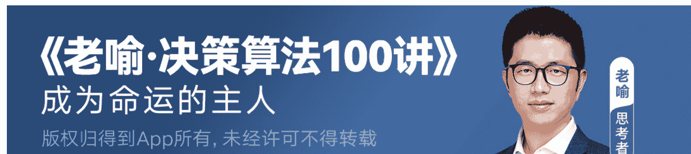

### 公众号
### 懒人搜索
懒人专属群

微信:lazyhelper


## 36 生存下去：怎样利用冗余设计“求生舱”？


lazybro，你好

我是老喻，欢迎来到《决策算法》课。

这一讲，我想跟你讨论的决策难题是：面对不确定的风险，怎样提高最终存活的概率？

具体点儿讲，不确定的风险就像是黑天鹅，尽管出现的概率并不高，但却总有可能出现，并且一旦出现就是致命的，我们根本承担不起。

要防范这种风险，我们就要用到一种非常重要的策略：“冗余”。

“冗余”为什么能防范黑天鹅类型的风险？让我们从全世界最著名的一起沉船事故讲起：泰坦尼克号的沉没。

### 一

对于今天的我们来讲，泰坦尼克号是最著名的“沉船”，而在这艘船刚诞生的时候，却号称是“永不沉没”。

为什么造这艘船的人，敢如此夸口？在电影《泰坦尼克号》中，总设计师解释了该船重要的安全保障之一：水密隔舱。

泰坦尼克号有16个单独的水密隔舱，舱与舱之间的水密门用电动开关控制，即使有4个隔舱同时进水，也会安然无恙。16个水密隔舱保持独立，这就是“冗余”机制的设计。

当然，要说明的是，“水密隔舱”大致的原理，古代人其实早就掌握了，泰坦尼克号只是用上了当时最好的技术来实现。

《马可·波罗游记》就曾经描述，元代时，中国南方的海船，就是多舱结构：
“若干最大船舶有内舱到十三所，互以厚板隔之，其用在防海险，如船体触礁或触鲸而海水渗入之事”。

水密隔舱的物理原理，一说你就立刻明白。因为多个隔舱是独立的，其中一个或者几个漏水，别的隔舱还是好的，可以确保船不下沉，或是慢一点儿沉。

除了利用物理原理，水密隔舱还利用了一个数学原理：随机事件的独立性原理。

这个原理说的是：如果两个随机事件A、B是否发生互相不影响，就认为它们是独立的，这时它们同时发生的概率，等于它们各自发生的概率的乘积。

我们可以简单估计一下泰坦尼克号沉没的可能性：
这是一艘很大的船，假设一次意外事件只破坏一个独立的隔舱；
假设发生意外事件的概率是5%。

那么连续发生四次“独立的、破坏隔舱的意外事件”的概率是多少呢？
计算方法，是4个5%相乘，约为百万分之六的概率。
```
5%×5%×5%×5%=0.000625%
```
简单来说，这个概率要小于“一个人在一年中被雷劈”的概率。

所以，当时宣传“泰坦尼克号永不沉没”，并非吹牛。

但既然如此，为什么泰坦尼克号会一撞即沉呢？

### 二

与上述“水密隔舱”技术相关的主要原因是：泰坦尼克号的水密隔舱并不是封顶的。

当海水漫进前一个隔舱之后，导致船体出现较大倾斜，水会蔓延到下一个隔舱，如多米诺骨牌般引起连锁反应，直至更大的倾斜、解体、沉没。文稿中我放了一张图示，你也可以点开查看。

这个设计缺陷，恰是对“水密隔舱”的数学原理的破坏：
每个隔舱漏水不再是“独立事件”。

雪上加霜的是，不仅是设计本身存在问题，撞上冰山之后，船员现场的操作，也出现了一系列决策失误。

在撞上冰山之前，其实有船员提前用肉眼看见了“两个东西”，但因为船上的超远距离望远镜居然被锁住了，所以等亲眼看清时，已经离冰山很近。

值班的大副作为决策者，给出了两个指示：左满舵，全速倒车。

通常来讲，这是一个专业并且本能的反应。

然而，泰坦尼克号是超大型客轮，惯性太巨大，全速倒车虽然可以减速，但也降低船只的转向能力，未能实现预期的避免碰撞的效果。

但后来也有一种观点认为，大副试图避开冰山的判断，可能根本就是错的。

假如只是减速，让最坚固的船头撞上冰山，水密隔舱的设计可能会发挥作用，泰坦尼克号也许不会沉没。

选择转向，将脆弱的船腰暴露给了冰山，船身被划开一个93米长的大口子，一连损坏了5个水密隔舱。

本来是概率极低的5个独立事件，突然变得不独立了。

概率不再保护这艘原本只有极小可能性沉没的巨轮，2小时40分钟后，泰坦尼克号百分之百地没入冰海。

几年前，房地产市场还没开始调整，我有一个朋友，意识到房价涨了这么久，就打算分散一下风险，于是将自己的房产投资分散到所在城市的不同区域。

我当时对他说：“你这不叫分散啊，还是在同一个城市，而且还是在抗风险能力较差的二线城市”。

当时，还有一家成立较早的房地产公司，创始人也意识到住宅开发的风险，于是决定主动转型，分散风险。然而，他的转型方向，居然是旅游地产。

这两个例子，都犯了类似上面泰坦尼克号的错误。看似分散了风险，但是风险敞口却是相通的，一旦市场调整，所谓分散投资犹如捆在一起的蚂蚱，被连锅端了。

### 三

假如今天你出门，钱包、手机、身份证都放在一个包里，突然遭遇小偷，这是否意味着你的整个生活都将暂停？

假如你的工作和投资出现了一些计划之外的紧急状况，你在财务上是否有足够的安全垫？

我们每个人的生命中，都埋藏着一个个“泰坦尼克”瞬间，如何避免在关键时刻全盘皆输？

利用“随机事件的独立性”，主动进行“冗余设计”，来实现概率上的“保护系统”，是非常高明的做法。

这其实也是一种古老的智慧。比如，狡兔三窟。

假如一个兔子洞的安全程度是80%，兔子想要更安全，有两种做法：
- 努力将兔子洞的安全程度提高至95%；
- 有三个安全程度都是80%的兔子洞。

第一种做法，后面为了提升几个百分点的安全度，成本会非常高，而且容易有瓶颈；

第二种做法，三个兔子洞都被捣毁的概率是（0.2×0.2×0.2=0.008=0.8%），所以兔子的安全程度达到了（100%-0.8%=99.2%）。

我们在前面的课程中，讲到过SpaceX怎样用工程思维和胶带纸思维造火箭。实际上，SpaceX在提升火箭安全性上，也用到了“冗余设计”。

传统载人飞船依赖昂贵的宇航级器件，单套计算机系统的成本高达1.4亿人民币。这种方法追求单一系统的鲁棒性，通俗来讲，就是经得住折腾，虽然可靠，但成本高、扩展性差。

SpaceX 选择了一种“工程思维”与“冗余设计”相结合的方式：
- 使用低成本的Intel X86双核处理器，并将其拆分为两个单核独立运行。
- 每个系统配备3块芯片，共计6个核同时处理相同的数据。
- 如果某个核的数据与其他核不一致，系统会让这个核重新启动，并从其他核获取正确数据，完成同步。

这种设计不仅大幅降低了硬件成本，还通过多核冗余和主动纠错实现了更强的韧性。即使部分系统失效，飞船仍能保持核心功能运转，从而大幅提高整体安全性。

对比起单独追求单一系统或者硬件的可靠性，通过多系统和多硬件来构成冗余，不仅成本低，出错概率小，还能够主动纠错，有更强的抗风险力和适应力。

### 四

“不确定性”犹如流水，很难用硬堵的方式去消除。

《谁在掷骰子》一书写道：
“泰坦尼克号”沉没后，船只被要求配备更多的救生艇。然而，救生艇的自重导致了“伊斯特兰号”邮轮在密歇根湖倾覆，一共有八百多人遇难。

作者这么总结：
意外后果定律可以挫败最良好的意愿。我们无法用古代加高加厚城墙的方式来堆砌出“确定性”。

毕竟，无处不在的墨菲定律“决定”了：“会出错的，终将出错”。

这个世界如此充满“不确定性”，我们每个人必须全力以赴，避免遭受永久性的损失，永远不要像泰坦尼克那样沉没掉。

要做到这一点，
我们要构建一个强健的系统，设计自己的“水密隔舱”，承受可能遭遇的各种风险，并能通过主动适应而升高生存的概率。

未来无法预测，我们既不可能躺平，也不可能无限制地安装更多救生艇，只能千方百计在逆境中活下来。

活下来，活得久，就有机会实现“均值回归”，有机会让“大数定律”显形。

我们今天讲的题，可能是最重要的生存智慧之一了。我们的身体、人类的演化、生物的多样性，都有赖于冗余机制。

《学会生存》这本书里，作者强调，要尽可能避免“一招不慎，满盘皆输”。

围绕一个核心任务，如果很多环节都重叠在一起，那就得保证不能因为一个环节出了岔子而使整个系统都完蛋。

《学会生存》的作者还给出了一个实用的PACE法则：
- P、首要选择（Primary）
- A、替代方案（Alternate）
- C、意外状况备选（Contingency）
- E、紧急状况方案（Emergency）。

举个例子，如果接到任务要去既不熟悉又很远的地方，专家会备好几个不同的导航助手。
- 首要选择——地形测量地图和席尔瓦指南针；
- 替代方案——GPS（全球定位系统）；
- 意外状况备选——智能手机；
- 紧急状况方案——指南针。

PACE法则在现实生活中，也非常有用。最常见的一个场景可能就是，我们做任何事情，至少都要有Plan B，对于一些复杂的事情，甚至还需要Plan C，和Plan D。

生活中总有计划外的事情发生。面对不确定性，设计冗余和反脆弱是生存与发展的关键。

冗余通过分散风险和备用方案，确保在系统受损时维持基本功能。例如，工作中备份文件、多技能储备；生活中有财务安全垫、做好健康管理等等。

而反脆弱则更进一步。我们不仅要防守，还可以积极思考是否能把握机遇，变得更强。

最近，当大家讨论一些稍显悲观的主题时，我会多问一句：谁将从中受益？这就像是获得某种反脆弱性。风会吹灭蜡烛，但也会让木材烧得更旺。例如在消费降级中突飞猛进的拼多多。

人生像是一场航行，而不确定性就像是随时可能冒出来的“冰山”。 只要我们构建独立的“求生舱”，便有机会活得更久，看到更多希望的曙光。

勇气和机遇，将成为我们的双重守护者。

以上就是这一讲的全部内容，如果你觉得有收获，欢迎分享给身边的朋友。

我是老喻，我们下一讲再见。


微信:lazyhelper

## 37 快速决策：怎样治好你的选择困难症？

我是老喻，欢迎来到《决策算法》课。

这一讲，我们来解决的决策难题是“选择困难症”。

每个人都患有不同程度的“选择困难症”，你是，我是，那些决策高手们，也不能例外。

我们都知道，大多数决策场景，都是做选择。没选择吧，焦虑；选择多了，更焦虑。

比方说你去买手机，选了iPhone，又觉得华为也不错，再看看小米，感觉性价比真动心，结果比来比去，下不了手，搞得心烦意乱。

有人开玩笑说，哪有什么“选择困难症”，还不是因为穷？就像买衣服买包，没钱才纠结于到底选什么颜色，有钱干脆一样颜色买一个。

那也没用。第二天出门儿还是焦虑：到底选哪个颜色的包出门呢？

### 一

为什么你我都有选择困难症？原因大约有两个：
- 害怕错过；
- 想要最好。

这两个原因，分别有两个名字，一个叫FOMO，一个叫FOBO。

FOMO，也就是“错失恐惧症”（fear of missing out）。比方说，你在网上要选个充电宝，好不容易选好了，装进购物车，买单之前还是很心烦，总是会想，会不会有哪个更合算的被我错过了呢？

FOBO，就是“更佳选择恐惧症”，即 fear of a better option。例如你装修时好不容易挑了一种地板，铺好之后，怎么看都觉得似乎有点儿遗憾，然后心神不宁。

按理说，做决策的时候尽量追求更好的选择，这也没错啊。问题是，选择困难症患者为此付出的代价太大了，买一个几十块钱的东西，逛几个小时淘宝，犹豫来纠结去，浪费时间，消耗精力，不值得。

选择恐惧症甚至会影响到我们的正常生活。还是说装修选地板吧，你去了别人家一看，哇，这比我自己选的好多了。回家之后怎么看怎么不舒服，寝食不安，人生都变得灰暗了。

这还只是生活。在工作上，选择困难症患者的麻烦可就更大了。你想想看，工作上的很多重要事情，就是做选择，尤其是管理者，你必须做决策，决定要哪个方案、不要哪个方案。假如你有选择障碍，就很难升迁。

幸好“选择困难症”是可以被治愈的。接下来，我就给你一整套既好玩儿又有效的决策实战框架，我称之为“快速决策5步法”，不是“不”，而是步骤的“步”，专门用来对“选择困难症”说“不”。

### 二

第一“不”：这个决策是我一定要做的吗？

人是一种条件反射的动物。几个按钮摆在面前，我们总是情不自禁地要选一个按按。

但事实上，对选择说“不”，也是选择的一种。

说个我自己的故事吧。十几年前，网购还没现在这么发达，我经常去香港逛电脑城，买一些奇奇怪怪的数码产品。有次一个朋友跟我一起去，我看中一样东西，正打算买，他问我：这玩意儿有啥用？

这下子可把我问住了，眼前这个数码产品充满黑科技，但买回去还真没太多实际用途。

于是我放回钱包，继续往前走，又看中一个好玩儿的东西，还没等掏钱呢，我这朋友又问：这玩意儿有啥用？

那次逛街太打击人生了，到头来，我啥都没买。我痛苦地发现了一个真相：自己热爱的数码产品，极少能够经得起“这东西有啥用”的拷问。

这个现象，心理学上的解释是“动机层面的无目的”。

看似你在做选择、做决策时很焦虑，其实是你在动机层面，根本没想明白自己的目的到底是什么。

尤其是在算法时代，我们在网上闲逛，被“货找人”的模式驱使着，只想着买，而忘记了问自己：你要的到底是什么？是用来解决什么问题的？你是否真的需要？

所以，第一“不”，是对选择说不。也就是说，这个决策我根本用不着做。对自己压根儿没用的选择，你可以整个抛弃掉，有啥好害怕的？说个“不”字，一身轻松。

但是，假如你仔细思考后，发现不能说“不”，也不要急，那我们就进入第二“不”。

第二“不”：这个决策我能外包吗？

有些决策和选择，交给别人做更好。尤其是一些专业上的决策。

我在加拿大生活，听过一种说法：假如你想生活得简单轻松，你只需要有一个靠谱的会计师、一个专业的律师、一个好的家庭医生、一个高效的银行经理。

什么意思呢？其实就是说生活中的大部分决策，交给这四个角色，就OK了。

比方说我吧，自己买衣服这件事儿，完全包给我太太，既省心又不用被她念叨品味差，何乐而不为？

当你遇到一个难做的选择时，可以想想自己身边这方面最专业的是谁，然后外包给他。

但是，这里我想强调一点，有些事情的确可以放手给别人干，但你自己也必须参与监督。

这就是第二“不”，问自己：这个决策能外包吗？可以的话就放心交给别人做，不可以的话，我们继续向前，进入第三“不”。

第三“不”：这个决策风险大吗？

我们知道，决策是面向未来的，有不确定性，所以就会有风险。

但是，风险有大有小。就像俗话说的：“抛开剂量谈毒性就是耍流氓。”

在做决定前，我们可以先确定风险等级：到底是高风险，低风险，还是无风险。

先看无风险。你去电影院看电影，看到有两部片子都是自己喜欢的，那该怎么办呢？这类决策，无所谓对错，而且不管选择哪个，也谈不上什么风险。

你可能会说：但我还是有选择困难症啊？

很简单，以后你随身带个硬币或者骰子，当你遇到那些无风险的选择，就抛硬币或者扔骰子来决定。正面的话选第一部电影，反面就看第二部。

对于低风险的决策，例如决定去哪里旅行，住什么酒店，这些选择，选错了可能会心烦，但也不是什么大不了的事情，过阵子就忘记了。

面对低风险决策，选择困难症患者可以服用“随遇而安药”。

我自己的心得是，把人生看作一场旅途，有点儿“有惊无险”的小插曲，好过一马平川。

你看，这样是不是就只剩下高风险决策了？

现在我们进入第四“不”。

第四“不”：这个决策能拖延吗？

这一“不”，听起来有点儿怪，难道“拖延症”能治“选择困难症”？

我想先给你介绍一个围棋高手的高级战术：脱先。

围棋爱好者刚入门的时候，下棋喜欢纠缠在一起，从一个角落互相杀，一直蔓延到整个棋盘。

围棋高手呢？他们下棋似乎很跳跃，一会儿东一会儿西。他们有时候会在一个局部战场突然不搭理对方，放下不管，把棋下到别的地方去了。

这就是“脱先”。

“脱先”有什么好处呢？这种战术，能够让棋手不被对手牵着鼻子走，而是着眼全局。

当年微博大战，新浪微博拔得头筹，别的几家公司也纷纷跟进，包括腾讯，但都跟得很辛苦。

没多久，微信崛起，腾讯就在微博这个局部战场“脱先”了。因为在马化腾看来，新浪微博对腾讯的社交领先者地位的威胁，已经被微信化解了，用不着在微博上死磕。

“脱先”，就是先把问题稍微搁置一下。

有些问题，会随着更大问题的解决，而自然得到解决，就像上面说的腾讯的例子。

有些问题，条件还不够成熟，处于变化当中，暂时搁置一下，没准儿还会发现新的妙手。

这里要注意：有些问题，你拖了也不会有什么好转或者意外惊喜，那就趁早干掉。例如还信用卡账单，或者是向女朋友道歉。

总之，有些决策，即使是高风险的，其实你也可以采用“脱先”战术，争取更多时间，掌握主动，统筹全局，而不是纠结于局部。

假如实在无法“脱先”呢？

那就进入第五“不”。

第五“不”：为决策设定边界。

这一“不”，是指为决策设定“时间、空间、预算、能力”方面的限制条件。

就拿围棋比赛说吧，一定要有时间限制，不然就下个没完了。

那空间限制呢？比方说你打算在父母家附近买个房子好照顾他们，希望步行5分钟能到，那你就在这个步行范围内选。要是太远，再好也不考虑。

“预算边界”在做消费决策时尤其重要。例如：你本来打算花20万买辆车，销售人员说只用加两万就能送个豪华包，你觉得没差多少钱就加了；销售人员又说，其实再多三万就能换顶配，还带全景天窗，你又动心了；这时销售人员接着说：都25万了，为什么不干脆买个特斯拉了？也才29万8起，这才差多少啊。

就这样，你一步步滑向了无边界的决策深渊。

最重要的边界，是能力边界，这是决策的红线：千万别做超出自己能力边界之外的事情，不管诱惑多么大。比方说别人鼓动你投资期货，你连期货到底是怎么回事都说不清楚，当然不能碰了。

边界不是决策的敌人，而是决策的朋友。没有边界，决策就会失控。

### 三

说到这里，“快速决策5步法”就介绍完了。

让我们回头看看上面的这个实战工具，像是一把决策剪刀，每次你只用回答“是or否”，就能把决策难题剪掉一部分。

我们假设每一个说“不”，会砍掉一半的决策问题，那么连续说5次“不”，就剩下1/2的5次方。

这样，真正需要你去严肃解决的决策问题，只剩下1/32了。也就是说，100个让你心烦的决策难题，经过这个快速决策法，就只剩下3个了。

如此一来，你就能够一心一意专注于真正重要而且紧迫的问题，作出明智的决策。

政治哲学家以赛亚·伯林提过一个重要观点：他把自由划分为消极自由和积极自由。

消极自由是一种“不做”的自由。

积极自由是一种“去做”的自由。

说“不”的自由，在当今这个鼓励积极进取的时代，被我们严重低估了。人生是一个大棋盘，我们应该跳出问题看问题，如果在一个局部把自己逼得太死，就会陷入选择困难的死局。

我所说的“快速决策5个不”，正是结合了消极自由和积极自由，来帮你治愈选择困难症。

当你遇到选择难题时，拿出来问自己5个“不”，大多数决策问题都会迎刃而解。长此以往，多加练习，你的“选择困难症”就会不治而愈了。

最后，罗素的一句话送给你：

通过认识到那些引起焦虑的事物并不重要，可以缓解大部分忧虑。

欢迎你把这一讲转发给身边有选择困难症的朋友。


## 38 极大极小原理：怎样应对零和博弈？


lazybro，你好！

我是老喻，欢迎来到《决策算法》课。

这一讲，我们要解决的决策难题是零和博弈。

游戏通常都是零和博弈，我们习以为常，乐在其中，但那是娱乐。现实中的零和博弈总是让人不那么愉快。

两家公司竞标同一个项目，只能有一个中标，输的那个，非但没有收益，大量的准备工作都白干了；公司内部竞争，推广资源就那么多，多给你的项目一点，我的项目就要吃亏，年底业绩目标完不成，年终奖也飞了。

“零和博弈”总是意味着争斗。我要赢，你就要输；反过来，你要赢，我就要输，总有一方不如意。而更讨厌的是，谁都不知道自己什么时候会赢，什么时候会输。

当我们不得不面对零和博弈，最佳策略是什么？其实博弈论专家们早就认真研究过这类问题，这一讲我们就来看看他们的成果，并从中得到决策上的启发。

### 一

最早系统研究零和博弈的是大神冯·诺依曼。通过研究零和博弈，他提出了一个极大极小原理，这个原理奠定了博弈论的基础。

什么是极大极小原理？

我们来玩一个古老的分蛋糕游戏。

有两个孩子，分一块蛋糕，但必须要第一个孩子切，第二个孩子选。

请问，两个孩子应该怎么做？

假如两个孩子都不是孔融，并且都想吃更多蛋糕，这其实就是一个典型的零和博弈。

切蛋糕的孩子的两个可选策略是：不均分和尽可能均分。

挑蛋糕的孩子也有两个可选策略：选较大的那一块或选较小的那一块。

两个孩子的选择一组合，会出现四种情形，我画了一个博弈矩阵，放在文稿中，你可以点开查看。请注意，表格里的4个结果，都是指切蛋糕的孩子的所得收益。

| 切蛋糕者的策略 | 挑蛋糕者挑较大的那一块 | 挑蛋糕者挑较小的那一块 |
| :--- | :--- | :--- |
| 尽可能切得均匀 | 稍小点儿的半块蛋糕 | 稍大点儿的半块蛋糕 |
| 切得一大一小 | 小的那块 | 大的那块 |

这个游戏的有趣之处在于，切蛋糕的孩子貌似掌握了主动权，但他决策的关键点，取决于“然后呢？”——即对手的下一步会怎么做。

显然，挑蛋糕的孩子，会追求让自己的蛋糕最大化，反过来也就是让对手的蛋糕最小化。

于是切蛋糕的孩子要做的事情就是：让挑蛋糕的孩子将要留给他的小的那半块蛋糕极大化。

因此，切蛋糕的孩子只能选择尽量均分蛋糕。

切蛋糕的孩子最后会拿到那块蛋糕的大小，就被称为“极大极小值”，也就是说，令极小值极大化。

也许有人会说，这么简单的道理，为什么要说这么啰嗦？

德谟克利特早在公元前300多年前，就创立了“原子论”，认为每一种事物都是由原子所组成的。然而，这只是一种想法。对比而言，爱因斯坦对原子的理解，才算是科学。

二者之间的区别在于：

后者可重复实验，可叠加计算，可现实运用。

零和博弈的局面，从有人类社会那天起，人类就在面对，并且也模模糊糊形成了一些分配规则。然而，直到冯·诺依曼，数学上的证明才完成。

作为博弈论的创始人之一，冯·诺依曼说过：没有极大极小定理，就没有博弈论。不过，要说明这一点并不容易，这要涉及博弈论最底层的数学推理，我们暂不深究。

在日常的决策场景下，“极大极小原理”给我们的建议是：

最优决策，应该基于理性的换位思考。

其中的关键是，充分考虑了对方为了追求他的利益最大化，会采取怎样的行动。

糟糕的决策总有一个特征，只顾及自己想要什么，而不管别人想要什么。

### 二

接下来，带着极大极小原理，我们再来看一个更极端的零和博弈：绑架。

假如你被绑架了，你应该怎么办？

国外的一位自我防卫专家给出了三个应对建议：

- 1. 不要跟绑匪去第二个地点。
如果你心怀侥幸，他可能将你带到偏僻的地方，为所欲为，甚至下毒手，然后掩盖他的罪恶痕迹。

- 2. 记住，绑匪在撒谎。
不管绑匪说多好听，别相信。从一开始，每个谋杀犯，绑架犯，他们都会用同一句话：照我说的做，我就不会伤害你。

然而，一旦你照他们说的做，最后大概率会受到更大的伤害。

- 3. 要在原地，用尽一切手段与绑匪搏斗。
这一点特别让人疑惑，万一激怒了绑匪，他下死手呢？

这位专家的洞见是：如果他们想在原地杀你，你早就已经死了。所以，他们不想在原地杀你，他们希望带你去其他地方，达成别的目的。

你在原地反抗，就打乱了他们的计划。如果他们不想被抓，不想把事搞得太麻烦，可能就会直接逃跑了。

要说明的是，在绑架这种极端的情形下，绑匪并非在一种理性的状态下，一时冲动，的确可能出意外。但是，从博弈论的角度分析，这位自卫专家的建议，有合理之处。

绑匪的目标是最小化自己被捕的风险，同时最大化对你施加伤害的机会。

而你的目标，应该是最小化在绑匪最恶劣行动下的损失。

极大极小原理在这里的应用核心是：

搏斗和反抗可能带来短期风险，但跟随绑匪的长期风险更大。为了降低这个长期风险，你最佳的策略是反抗。

某种程度上来讲，

极大极小原理强调的是一种底线思维，既然负面结果无法避免，那就想办法争取对自己最好的最坏情况。

这是一种重要的生存智慧。

### 三

讲到这里，我还想进一步延伸一下，用极大极小原理来分析零和博弈的过程，还给我以下几点决策启发：

启发一，站在对方的角度想问题，然后倒推自己的策略。

我们可以广义地来想这个问题，即使不是在零和博弈的环境下，例如说起某某产品经理很厉害，可以瞬间将自己变成小白，其实就是能彻底地站在对方的角度。

几乎所有厉害的商业公司，核心原则就是“客户利益优先”。先想着让客户价值最大化，然后再从中找寻让自己最大化的策略。

所以芒格说：想要说服别人，要诉诸利益，而不是讲道理。

在创业的时候，我经常和同事在一线谈业务。

我不是很好的销售，口才也很一般，但每次谈合作效果还不错。

我的方法是问对方：

请问你现在最想要的是什么？

我们可以如何帮助你实现你最想要的？

我们立即可以做的最小化合作是什么？

启发二，将对手想成一个势均力敌的对手。

以下围棋为例，切忌低估对手。

所谓低估对手，就是对他人抱有幻想。

例如，你发现一手棋，能够让自己的利益最大化。但是如果被对手识破，那么结果就会很糟糕。有时候，棋手会心存侥幸：要是他看不到，那我就赚了。

然而，这是不对的。

你就该假设对方是一个势均力敌的对手，你能看到，对手也能看到。

也不要赌运气，不寄希望于对手犯错。好的决策应该是，即使对手发挥完美，自己也能保住最基本的生存空间。

启发三，不占别人便宜，自己的也要据理力争，不当烂好人。

段永平早年经营企业，既不占供应商的便宜，也不给批发商赊货。不管多好的买家，必须现款现货。

何谓烂好人？就是彻底放弃自己的选择权，试图讨好对方，感动对方。

然而，很多时候，烂好人不仅招恶人，甚至催生恶人。

启发四，彻底远离损人不利己的人。

博弈论的假设是：双方都是理性的。

博弈论只研究“对赢感兴趣的、有完善的逻辑思维能力的游戏者”参与的博弈。只有你相信你的对手（一个或几个）既是理性的，又是希望赢的，而你自己在玩的时候也始终憋着一股劲儿，要力争为自己取得最好的结果，这样的博弈才是博弈论分析的对象。

对博弈论而言，自私的人并不可怕，可怕的是不理性的人。

为什么呢？

一个自私的人可能做损人利己的事，一个合作的人可能做利人利己的事情。但是，一个不理性的人可能做损人不利己的事情。

博弈论很强大，但是如果你是在和一个非理性的人“交手”，结果就变得无法预测。

你的最佳选择是：远离这类人。

举例说吧，经济较发达区域的特点之一是：民众只算自己的账，而不去算别人赚多赚少。

倘若不如此，就会出现如下局面：我才赚十块，你居然赚一千块，我宁可牺牲自己的十块，也要毁掉你的一千块。

这就是损人不利己。

如此一来，博弈论的均衡就无法出现。因为理性的失去，会摧毁整个游戏。

记得中学有个同学的哥哥当年混社会，他说他们那群20岁上下的青年谁都不怕，最怕十四、五岁的孩子，因为这类混小子可能毫无目的不顾后果地冲上来给他们一刀。

博弈论因为这类人而失效。

类似的，前面对于绑架者的分析，也是假设他们是理性的。但是，如果绑架者不是理性的人呢？

那么，不理性的凶手可能会不顾受害人呼救招来人，在没有利益的情况下也下毒手。

### 最后

这一讲，我们从零和博弈出发，讲到了极大极小原理。

在这一讲的最后，我想说的是，零和博弈在现实中的确无处不在，很遗憾的是，即便知道极大极小原理，我们顶多也只能争取到最不坏的结果。

但是，零和博弈其实并不是最糟的，最糟的是零和博弈思维。

在这个资源有限的世界上，我们难免陷入零和博弈。然而做大事儿的人，总会想办法把零和博弈，变成非零和博弈，把有限游戏玩儿成无限游戏。

真正的高手，不仅懂得如何赢得一场博弈，更懂得如何跳出博弈的框架。

芒格提醒过我们：“一个持续的社会，依赖的是多方获利，而不是一方独赢。”

如果说极大极小原理是防守哲学，那么跳出零和博弈，创造非零和空间，则是真正的进攻之道。

这不仅仅是决策策略，更是一种世界观。

在这个有限的世界里，有限游戏随处可见，但你总可以选择成为那个“将有限游戏，玩成无限游戏的人”。

我是老喻，我们下一讲再见。


公众号懒人搜索，懒人专属群分享

公众号
懒人搜索
懒人专属群


微信:lazyhelper
No. 191 / 494

## 39 混合策略：怎样用随机性成为更强大的自己？

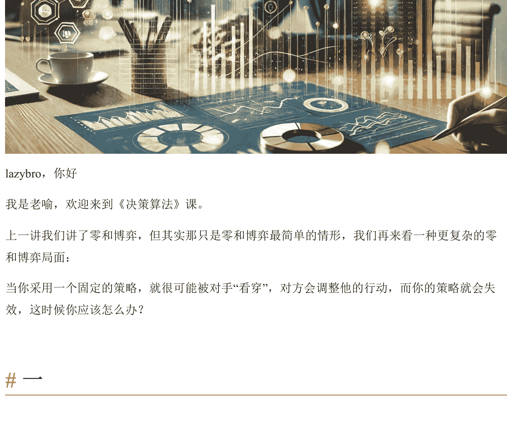

lazybro，你好！

我是老喻，欢迎来到《决策算法》课。

上一讲我们讲了零和博弈，但其实那只是零和博弈最简单的情形，我们再来看一种更复杂的零和博弈局面：

当你采用一个固定的策略，就很可能被对手“看穿”，对方会调整他的行动，而你的策略就会失效，这时候你应该怎么办？

### 一

我们总在追求看清这个世界的底牌，这其实很难。反而是你的底牌很容易被别人看清。一旦发生，并且是被“不对的人”看穿，就会发生糟糕的事情，这就是所谓的人善被人欺。

下面的情形你一定不会陌生：

总在给别人帮忙的职场老好人：你总是接受额外的工作，最开始你的领导可能会夸你可靠，但渐渐地，别人都不太愿意干的活，你总是成为挑担的“首选”。

过于体贴的朋友：你总是调整自己的时间来迎合别人，久而久之，你的需求被忽视，关系变得单向。

过度付出的伴侣：你为了另一半牺牲自己的需求，最终发现关系失去了平衡，而你成了单方面的付出者。

为什么你辛辛苦苦做一个好人，还会被人“欺负”呢？

并不是因为其他人故意要欺负你，而是当你的行为模式表明，你容易妥协、容易满足其他人的利益时，他们“欺负”你的成本就会显著降低，从而无意识地更倾向于采取这种行为。

如此说起来，你可能会想：“难道做个好人有错吗？”

我们再往深处想：好人被欺负的根源是什么？

是因为好人总在说“好”。

欺负的根源在于可预测性。如果你的行为完全可预测——总是说“好”、总是妥协——那么他人就能轻而易举地利用你。

在德州扑克中，有一个核心概念叫剥削性策略（exploitative strategy）。这里的剥削，其实就是欺负的意思。

这个策略的前提是：如果你能准确预测对手的行动模式，就可以设计出一套针对性策略，从而不断从对手那里“榨取价值”。同时，它也揭示了一个重要的风险——被预测的一方将成为剥削的目标。

比如说，在德州扑克中，你观察到某位玩家总是在强牌时加注，而在弱牌时仅跟注。基于这一模式，你可以选择在他加注时直接弃牌，避免损失；而当他仅跟注时，你则可以大胆加注，迫使他退出或从他手中获取更多筹码。这里，对方行为的确定性成为了他最大的弱点。

“确定性剥削”并非德州扑克的专属术语，它揭示了一个更广泛的现实原则：

一旦你的行为变得可预测，他人就能轻松设计出针对性的反制措施。

这就是好人被欺负的深层次原因：确定性会带来剥削。

被欺负者常常表现出高度的确定性，例如：总是顺从，不懂拒绝；遇到冲突选择回避而非面对；过度实在，让人一眼看透自己的底线。

这些行为让欺负者容易预测其反应，从而降低了欺负的成本。

你一定会想：既然确定性是被欺负的关键因素，那么好人是不是可以利用不确定性来保护自己呢？

没错，这就是我今天要和你分享的混合策略。

### 二

什么是混合策略？

混合策略是博弈论中的一个核心概念。要说明混合策略，需要拿出另一个概念“纯策略”来对比。

纯策略指的是固定的行为模式。例如每次都采取相同的行动。比如在德州扑克中，每次拿到好牌就加注，拿到弱牌就跟注或弃牌。

混合策略则引入了随机性。在混合策略中，你不再总是选择某种固定的行为，而是根据概率分布，随机选择不同的行动。

例如，在拿到好牌时，70%的概率加注，30%的概率跟注；而在弱牌时，50%的概率弃牌，50%的概率尝试虚张声势。

混合策略的关键在于，通过随机性隐藏自己的真实意图，从而增加对手预测你的行动的难度。

混合策略能帮你打破确定性带来的脆弱性，为你争取更多的主动权。

通过一个生活化的例子，我们可以更直观地理解纯策略和混合策略的区别。

纯策略的弱点：

假设你在朋友群体中是那个“永远的老好人”。每次聚会，总是你主动负责协调地点、时间、甚至餐费结算，久而久之，大家都默认这些任务是你的责任。这种可预测性让你陷入被利用的循环，而自己却倍感疲惫。

混合策略的力量：

如果你在这些场合中随机调整自己的参与程度，比如有时提议地点，有时保持沉默，让别人主动，甚至偶尔不参加，群体的动态将会发生改变。其他人会开始分担这些任务，而你也能得到更多的轻松与尊重。

有人可能会问：“难道我们要靠随机行为来生活吗？”当然不是。

混合策略并不意味着完全无章法的行动，而是一种理性设计的随机性。

我们来看一个有趣的游戏，规则如下：

有两枚硬币，一枚在你手里，一枚在对手手里。

你先出硬币，选择硬币的正面或反面，藏在手心，不告诉对手。

对手后出硬币，如果他出的跟你同一面就赚钱，不同面就赔钱。显然，他要赢，核心就是猜你手心的硬币是正面还是反面。

具体得分规则如下：

如果你选择正面，对手猜对了，对手赢15元；

如果你选择反面，对手猜对了，对手赢5元；

如果对手猜错了（无论是正面还是反面），对手需赔10元。

如果用确定性的思路来想，你可能会说，出正面被对手猜中会输15元，出反面被对手猜中会输5元，那我干脆总出反面呗。

显然不行，这样你就会被对手欺负，他看透你总是出反面，于是也出反面，赚走你5元。虽然金额小，但你架不住总在输。

我们来看看游戏的关键：

你的目标是调整选正面或反面的概率，最小化对手的收益。

对手的目标是也要调整选正面或反面的概率，在多次游戏中最大化自己的收益。

所以，你应该采用混合策略，用一定的概率出正面，一定的概率出反面。

要计算出最佳概率，需要用到一些期望值的计算和求导，我们略过计算过程。计算可得双方的最佳策略是：

你选择正面的概率应该是3/8，选择出反面的概率是5/8。

对手选择正面的概率应该是3/8，选择出反面的概率是5/8。

这样的混合策略，对双方而言都是最优的，实现了纳什均衡。但是因为奖惩并不对称，实际上的结果，仍然对你是有利的。

通过这个游戏分析，我们理解了博弈论中的混合策略。那么，该如何将这种智慧运用到生活和工作中，让自己在博弈中立于不败之地，成为一个不被欺负的人呢？

### 三

混合策略的本质是：通过随机化行为，保护自己免受剥削。

这种随机化行为的核心目的，是打破可预测性，增加对方“剥削”或欺负你的成本。

《升维》一书中写道：“确定性让人作恶，概率让人存活，不确定性让人心生敬畏”。

的确如此，生活有时候看起来如此不公平：总是给别人帮忙的人，一次不帮，别人就不高兴；而那些总是拒绝的人，一次帮助，别人就心存感恩。

我们不必因此而放弃心底的善，学会运用混合策略，只是更好地保护自己。因为你只有善待自己，才能真正善待这个现实的世界。

举个例子吧：

小张是公司里的“热心肠”。同事们习惯性地把他琐碎工作交给他，比如打印资料、整理会议记录。小张几乎每次都接受，直到有一天他因自己的工作繁忙拒绝了一个请求。结果，对方立刻表现出不满，甚至抱怨小张“不像以前那么好说话”。

面对这种情况，小张没有感慨世道不公，而是积极采用解决办法：用混合策略调节行为。

小张开始有选择性地接受任务，例如对不影响工作的请求偶尔帮助，但对于额外负担则直接拒绝。

他对别人要求明确提出条件，比如“我可以帮忙整理资料，但时间需要调整到下周”。

偶尔主动帮忙，但选择那些对团队更重要、能体现自己能力的任务。

这里面的要点是：

随机接受或拒绝额外任务，避免被视为“万能员工”；在关键时刻超额完成任务，提升自己的不可替代性。

结果，同事们逐渐减少对小张琐碎任务的依赖，同时对他的主动帮助表现出更多感激。

于是，小张从一个被欺负的新人，变成了一个公司的骨干。

这就是混合策略的力量。

### 四

混合策略的应用场景，可谓无处不在。

前面的课程我们提过Costco（好市多）经常有一些意外惊喜的闪卖，卖完就没有了，这其实也是混合策略：

消费者无法预知哪些商品会参与闪卖，就不会总等着占便宜；

这种不确定性刺激了消费者的“机会成本”思维，即“如果我不马上买，这个商品可能就再也买不到了”。

再说恋爱。为什么有时候“好男人”竞争不过“坏男人”？

在恋爱中，“好男人”总是以固定的方式展现自己的好，比如无条件付出、随叫随到、毫无保留。

这种确定性虽然表面上显得可靠，但从博弈论的角度看，可能降低了吸引力。

而“坏男人”在感情中无意间使用了混合策略——他们通过随机化的行为制造不确定性，使得对方无法预测下一步行动，从而增加了对方的投入和关注。

所以，“好男人”要学习混合策略，以维护关系的健康和可持续性，同时保持吸引力和边界感。

这并不意味着要通过不可预测性来操控对方，而是通过适度的不确定性和灵活性，让双方关系更平衡、更有吸引力。

没错，“适度”才是真正的智慧，我个人反对所谓操控术和心机套路。真诚永远是与人交往的第一原则。

### 五

富兰克林说过一句很有智慧的话：“让所有人都知道你，但别让人了解你。”

我是很晚才理解这句话的意思。此前，我一直信奉一种原则：对人坦诚相待，直接亮出底牌。

这样做的好处是，有时候会交到非常好的朋友。

然而，世界是复杂的，坦诚并不总是得到同等的回报。在很多情况下，你的坦诚可能会被误解，甚至被利用。一些人可能把你的坦诚视为一种脆弱，进而采取剥削的行为。

所以，在社交关系中，适度保留你的真实想法与计划，保持神秘感，能让人对你更加敬畏与尊重。

最后，总结一下前面的内容，送给你一份混合策略在日常生活中的行动指南：

适当随机化行为。例如，偶尔接受社交邀请，偶尔拒绝，避免总是处于被动迎合的状态。在工作和社交中引入适度的不确定性，这样你可以生活得更自如。

设定清晰的边界。对于超出合理范围的要求，礼貌但坚定地说“不”，避免其他人对你形成“理所当然”的期望。

偶尔制造惊喜。减少过度顺从，通过偶尔的拒绝，让对方重新审视你的价值。偶尔主动提供帮助，比如策划一场意外惊喜的活动，让你的付出更显特别。记住，你是有价值的。

混合策略是一种生活智慧，它并不提倡让人完全改变善良和真诚，而是帮助我们用更智慧的方式保护自己，同时维持与他人间的平衡。

生活中的不确定性不仅是一种自我保护，更是一种赢得尊重的方式。

愿你能在善良中保持智慧，在复杂中掌握主动，成为一个内心更强大的自己。

我是老喻，我们下一讲再见。


微信:lazyhelper


## 40决策根基：怎样打破因果的迷信？


lazybro，你好。我是老喻，欢迎来到《决策算法》课。

课程进行到现在，已经快一半了。让我们适当地回头，来补上一个关于决策的根基性问题：因果关系。

### 一

前面我说过，决策的本质就是处理三种关系：

- 我与世界的关系：如何理解自然法则和客观现实？
- 我与他人的关系：如何在社会中互动、合作和竞争？
- 我与自己的关系：如何平衡内心的欲望与理性判断？

为了处理好这三种关系，我们需要理解世界的原理，社会的原理，以及人性的原理。

然而，我们对世界、社会和人性的理解，始终受限于人类感官的局限性，和理性工具的不足。这种局限性在一个核心问题上尤为明显，那就是“因果关系”。

在我们的认知中，因果关系是如此根深蒂固，以至于几乎所有决策都依赖于对因果的假设，例如：

- 如果努力工作，就会获得回报；
- 如果遵守规则，就能避免风险；
- 如果投资某个领域，就能获得长期回报。

我们从小到大接受的教育，都是基于严格而牢靠的因果知识的；当下各种短视频上，也满是各种“只要你做到这一点就能成功”的因果承诺。

然而，因果真的存在吗？或者说，因果关系真的是我们想象中的那种“必然联系”吗？

先说两个真实的故事。

### 二

第一个故事，主人公是我的一个朋友。他聪明能干，生意做得也不错。几年前进入了一个高端圈子，结交了不少牛人。

有一次，圈子里的一位专业投资人士，和他分享了一个难得的投资机会。有家热门赛道的公司要并购重组，业内人士都很看好，董事长自己据说也重仓押上去了。

我这个朋友做了深入研究，觉得的确是好机会。提供信息的那位专业投资人士自己也All in了。于是，他将自己的流动资金全都用于买入该公司的股票。

然而，这笔投资最后以失败告终，他也亏了不少钱。

事后，我的朋友很坦诚地复盘了这次投资，他说：

“我的这次投资失误，最主要的原因，可能就是因为太相信因果分析。”

- 因为赛道好，所以这家公司就值得投资；
- 因为董事长买，所以信息靠谱；
- 因为专业人士推荐，所以值得信任。

但是，事后再看，这些“因为……所以……”太脆弱了。

- 赛道好，能代表这家公司就值得投资吗？
- 董事长买了，但他到底买了多少？他的动机和投资人一致吗？
- 专业人士推荐，要是他推荐错了呢？

的确，我们从小到大，太习惯追求因果逻辑的“确定性”，从课堂到职场，因果链条似乎是解决问题和获得成功的关键。

然而，真实世界远比书本复杂，很多时候看似清晰的“因果链条”实际上经不起推敲。

这种因果迷信不仅在投资领域广泛存在，还深刻影响了我们的工作、生活和人生选择。

你想想看，那些让你难忘的错误决策，是不是大多是因为有太多想当然的“因为……所以……”？

### 三

比起我的朋友，第二个主人公的损失，要更惨重。

1982年8月，墨西哥债务违约。因为美国不少银行正在向像墨西哥一样高风险的其他国家提供贷款，总额甚至超过了其资本金总和的很大比例。美国的商业贷款活动逐渐陷于停顿。

达利欧是少数预见到这一情况的人，他预测美国正在走向一场萧条，尽管美联储增加了货币供给，令股市出现了创纪录的涨幅，但他认为这是暂时的。

他计算如下：

- 美联储的努力失效，经济走向崩溃的概率是 75%；
- 美联储的行动一开始成功刺激经济，但最终仍然失败的概率是 20%；
- 美联储提供了足够的刺激来挽救经济，但最终触发恶性通胀的概率是 5%。

达利欧还引用了历史：在 1929年，股市上涨 15%之后，就出现了史上最大规模的崩盘。

基于这番分析，为了对冲最不利的情况，达利欧开始买入黄金和国债期货，从而对美元风险进行对冲。

看起来，这个推理毫无漏洞。

然而，达利欧错了。错得几乎亏光了整个公司。

为什么呢？即使达利欧预测的那部分全都对了，但连锁反应中任何一个环节的波动，都可能令因果推理失效。

现实世界发生的是：美元回流导致的升值压力，令美联储降息，驱动了一场意外的经济繁荣。达利欧的预测水晶球被砸得粉碎。

现实世界中的因果关系通常不是线性递进的，而是多个变量之间相互交织的复杂网络。达利欧的案例中，美元回流、市场反应、美联储政策和全球经济动态共同作用，形成了复杂的多链条因果网络，使预测变得异常困难。

在我看来，年轻的达利欧犯了三个错误：

- 错误1：正确太多。在哈佛商学院的精英教学体系里，他一直在学习“如何做对一件事”，他们聪明而自信，志在必得。然而，在一个复杂系统里，总是要证明自己正确，经常是危险的。
- 错误2：怀疑太少。现实世界里，他没能保持足够的自我怀疑。
- 错误3：自我高估。个人世界里，他高估了自己的专业和判断。

### 四

让我们从现实的惨痛教训跳出来，从哲学层面，再来分析一遍以上决策错误的根源。

大卫·休谟，是第一个认真挑战人类“因果信念”的思想家。他在《人类理解研究》中提出了一个大胆的观点：因果关系并不是我们想象中的那种“必然联系”。

休谟指出，当我们观察到一个事件（如火花）总是跟随另一个事件（如火焰），我们便形成了“火花引发火焰”的因果信念。然而，这种信念并非源于理性推理，而是基于以下三个层次的心理过程：

- 观察到恒常的关联：我们注意到火花和火焰总是一起出现，因此将它们联系起来。
- 产生心理习惯：经过多次观察后，我们的心灵习惯性地将火花视为火焰的“原因”。
- 形成因果联想：这种联想让我们相信火花和火焰之间存在某种“必然性”，尽管我们从未真正“看见”这种必然性。

休谟强调，我们无法通过直接观察或逻辑推导真正证明“因果关系”的存在。所谓的因果，不过是我们基于经验所形成的一种心理假设。

我在年轻的时候，看到休谟的哲学，觉得他太杠精了。的确，这个世界上没啥100%确定的东西，但是怀疑一切，有啥意义呢？

在经历了更多的摔打之后，我逐渐意识到，休谟的哲学可能包含着最重要的决策智慧。就像前面提及的两个决策上的教训，问题就出在休谟所怀疑的“因果迷信”。

### 五

然而，光是看清世界的不确定性显然不够，我们该如何跳出“因果迷信”的陷阱呢？

办法，其实我们前面的课程中已经反复提过，那就是，用概率替代因果，用主观的信念，替代客观的确定。

有趣的是，休谟之后，对于他关于因果的怀疑，贡献最大的，居然是他的一个“敌人”。

休谟怀疑因果，最受伤的莫过于教会，因为他们认为上帝是最大的因。

一个叫贝叶斯的教士，为了证明上帝的存在，提出了我们熟悉的贝叶斯公式。

没有证据表明，贝叶斯是为了反驳休谟，但他极可能受到了休谟的启发。贝叶斯找到了一种判断概率的方法：假设对于某个事件，我们只知道它在某些情况下发生的次数和失败的次数。借助他设计的方法，我们就可以判断出在相同情况下该事件发生的概率。

休谟斩断了因果之间的确定性关系，贝叶斯则用公式架起了一座吊桥；休谟说人们其实是用信念来连接因果，而贝叶斯则为信念赋予了概率。

如此一来，理性和怀疑巧妙地结合在了一起。通过概率计算，休谟的哲学和贝叶斯的公式携手同行，为决策者在不确定性中提供了更为可靠的参考。

休谟的因果怀疑让我们认识到，世界并不如我们想象中那般确定；因果关系往往是我们的经验和信念的产物，而非必然的真理。

面对这种不确定性，我们并非无计可施，而是可以借助理性和实践，设计出更加稳健的人生策略。

### 五

理解休谟的哲学，是一个人能否成为决策高手的跨越之旅。

但这并不容易。我们前面的课程，讲到了很多关于贝叶斯定理、不确定性的话题，也引用了大量的案例，都是希望能帮助你更顺利完成这个跨越。

课程即将过半之际，我们再来复习一遍由此引申的决策原则，希望能让你看到一条更清晰的脉络：

1. 承认不确定性，摒弃绝对因果迷信。请记住在复杂的世界中，不存在万无一失的因果关系。所以，要记得反思你的因果假设：每当你说“因为……所以……”时，问问自己：这个因果链条真的可靠到足以支撑我的决策吗？更要避免过度简化：不要轻信“努力就一定成功”或“好人就有好报”的简单逻辑，承认随机性和复杂性是世界的一部分。小心鸡汤文章和成功学灌输给你的确定性“因果传说”。
2. 用概率思维替代绝对判断。休谟提醒我们，因果是信念的联想，而贝叶斯教会我们如何通过概率量化信念。当你面对新的信息时，不要立即下结论，而是动态调整自己的信念。例如，投资前评估可能的风险，生活中接受不确定的结果。当你设定目标时，设定概率而非结果。将目标分解为“达成某件事的概率”而非“必然发生的结果”，为你的期待留出弹性。
3. 在行动中不断接近真相。尽管因果不确定，但重复行动可以放大优势，让随机性朝有利的方向倾斜。你应该追求迭代优化，把注意力放在改进系统和过程上，而不是执着于单次结果的对错。通过持续的学习、反思和调整，不断提升你的胜算。
4. 设计“反脆弱”的决策框架。不确定性中的风险既是威胁，也是机会。通过对潜在结果进行风险管理，可以化危为机。首先，减少单点风险，分散投资、拓宽技能路径，不要把所有筹码押在一条因果链上。然后，拥抱“黑天鹅”，将部分资源用于探索高风险但潜在收益极大的选择，比如创业、创新或尝试新领域。这种策略能让你在不确定性中找到意外的突破点。
5. 放下对完美的执念。休谟的哲学让我明白，没有完美的因果，没有万无一失的逻辑推理，没有任何决策可以完全消除不确定性。所以，接受错误的必然性，学会将错误看作学习的成本，而不是失败的证明。然后，注重过程而非结果，与其纠结某次行动的成败，不如关注你是否做出了最佳决策——即在当时的知识条件下，是否合理评估了风险与收益。

### 最后

有时候会觉得，这个世界真会开玩笑，让我们执迷因果，却又不给我们因果的确定性。但是，后来我想明白了，因果的不确定性并不意味着我们无从下手，而是提醒我们在世界的复杂网络中，保持谦逊、理性和灵活。

为了得到一点点确定性的幻觉，人们愿意付出任何代价，并将自己置于更大的、更危险的不确定性中。这不值得。

因果不是坦途，而是拐杖。我们还可以用概率化的信念和反脆弱的框架，走得更稳当。

这个世界不存在一个确定的方式，让我们可以简单地得到渴望的目标。

但我们仍然可以通过审慎的理性和行动的智慧，尝试抵达、甚至创造自己的应许之地。

我是老喻，我们下一讲再见。

# 老喻·决策算法100讲

## 成为命运的主人

老喻思考者

版权归得到App所有，未经许可不得转载

公众号
懒人搜索
懒人专属群


微信:lazyhelper

## 问答：真有“小白都能稳稳赚钱”的方法吗？


我是老喻，欢迎来到《决策算法》课。

今天周五，是我们两周一次的问答加餐。

### 一

第一个问题，来自小林同学，他问：

我是一个年近30的程序员，一年前开始学AI，最近在找这方面工作。我经常看到一些名人分享经验，如果赚钱是你的刚需，你就一定能找到方法。我觉得有些焦虑，辛辛苦苦花了大量时间精力学习，虽然工资会涨些，最终还是要为别人工作，老喻，如果我想为即将到来的中年危机做点事，除了好好工作外，还有什么需要关注的么，或者多尝试下其他的？

小林同学你好，感谢你的留言。从你的问题中，我感受到了一种对未来的焦虑，同时也看到了你希望主动应对这一焦虑的意愿，这本身就很可贵。接下来，我尝试从几个角度提供一些建议，希望能帮到你。

1. 技术单点突破固然重要，但“两眼活棋”才是关键。

在技术领域，想要通过单点技能实现大突破的确需要天赋和运气。对绝大多数人而言，这条路不仅竞争激烈，而且成功率较低。

这也是为什么我常提到“两眼论”：一个人或者一家企业，就像围棋棋局中的活眼，必须具备至少两只眼，才能活得长久。

对技术人才来说，第一只眼是你擅长的专业技能，这一点毋庸置疑。而第二只眼则可能是对产品、市场或管理的洞察力。这两者的结合，能让你的职业路径拥有更多的可能性。

微软现任CEO纳德拉便是一个很好的例子。他不仅具备深厚的技术背景，还有非常广的商业视角，最终成为一家全球顶尖企业的掌舵人。

现在硅谷许多大公司的CEO都是印度裔，相对而言华人并不多。这可能是原因之一：印度裔的人很重视理工科教育和商科教育的结合。

我倒不是建议你一定要去读个MBA，任何时候各家公司总是缺既懂技术又懂产品和市场的人，这是个较大概率的机会。

2. 投资自己，塑造“可迁移”的竞争力。

技术的更新迭代速度极快，单纯依靠某一领域的专长，可能让人陷入职业发展的天花板。因此，培养一些“可迁移”的核心能力至关重要，例如：

- 沟通与表达能力：技术与业务的桥梁往往需要能清晰表达复杂思想的人。
- 商业洞察与逻辑：懂技术且懂市场的人才是企业中极为稀缺的“复合型选手”。
- 学习能力：学会在快速变化的环境中持续进化，掌握跨领域的学习方法和框架。

这些能力不仅能帮助你在现有岗位中脱颖而出，还能为你未来的职业转型奠定坚实基础。

3. 寻找适合自己的长期增长策略。

随着年龄的增长，焦虑感是不可避免的，但不必将这种焦虑仅仅解读为压力，它也可以成为动力。与其一味担心中年危机，不如从以下几个维度构建自己的抗风险能力：

- 财务安全网：适当规划投资或储蓄，建立应对不确定性的底线。
- 多样化的收入来源：比如尝试一些副业或项目制工作，逐步探索不同的收入模式。
- 人际网络的拓展：无论是技术圈还是商业圈，建立深度的连接是未来职业发展的重要资产。

4. 拥抱“广度中求深度”的职业哲学。

未来的竞争并非单纯依赖专业技术，而是来自于跨界能力的融合。技术是你的第一张王牌，但如果能同时将目光投向产品设计、运营管理甚至用户体验，你的职业成长将更加全面。

这不仅关乎职业发展，也关乎个人成就感。举例来说，我最近与一位投资人朋友聊天时，他提到，他们投资的一家公司正是因为创始人兼具技术与市场洞察力而脱颖而出。

概括而言，在事业上有“两只眼”，能让你有更强的底气，更多的机遇。

最后，我想分享一句话：“焦虑的根源往往来自对未来的不确定，但行动的开始却能为创造更多选择的可能性。”

希望你在持续深耕技术的同时，找到属于自己的“第二只眼”，为即将到来的中年积累更多底气和自信。祝你一切顺利！

### 二

特别巧，还有另外一位同学，也问了一个类似的问题。

小裴同学问：

老喻，今年23，在北京还算可以的学校读研，专业是交叉的设计学科，所以也涉及心理学。目前的状况是想去互联网做产品经理。非要比一下的话我是更喜欢心理学的，也比较适合我喜欢和人沟通交流，但是如果从事这个行业，一是不知道发展渠道，二是所学的东西会被扔下，而且互联网产品经理的待遇和发展也很诱人，有点纠结。

其实，你也可以考虑，一只眼是“产品经理”，另外一只眼是“心理学”。

你可以不用急于抛弃心理学，而是将其作为一只眼，同时通过产品经理的职业路径，将两者结合起来。心理学背景是你的独特基因，而互联网行业会给你提供更广阔的舞台。

如果你能让这两只眼协同工作，你的未来会比单纯选择其一更加有深度和广度。

期待你带着热爱和智慧，找到属于自己的职业轨迹！

### 三

小白同学问：

你好，真有“小白都能稳稳赚钱”的方法吗？

小白同学你好，谢谢你的提问。你的问题——“有没有小白都能稳稳赚钱的方法？”——其实揭示了一个更深层次的焦虑：在一个充满不确定性的世界中，我们都希望找到一种安全且简单的方式，实现自己的目标。但遗憾的是，世上确实没有所谓“无脑赚钱”的万能公式。接下来，我想也从个角度为你拆解这个问题。

1. “小白赚钱法”的逻辑陷阱。

看到朋友圈里那些宣传“小白都能赚钱”的方法，我脑海中浮现了一个对话：

- 甲：小白都能赚钱？那赚的是谁的钱呢？
- 乙：当然是更小的小白啦！
- 甲：那我去哪里找更小的小白呢？
- 乙：你就是更小的小白呀！

这个看似幽默的对话，其实道出了一个残酷的现实：天下没有免费午餐。如果一个方法号称人人都能轻松赚钱，那么你很可能已经被设计成了其中的“被收割者”。

即便有一个看似“万能”的发财公式，它也不能脱离“你自己”这个变量。“你自己”既是公式中的已知条件，也是公式成立与否的决定性因素。

换句话说，你的知识、经验、思考能力和行动力才是关键。一个人能否成功，不在于掌握了多少“秘诀”，而在于是否将这些秘诀与自身条件匹配得当。

2. 免费午餐的代价。

布隆伯格曾警告：

“那些请你吃免费午餐的人，最终会在早餐时把你生吞活剥。”

这句话非常形象。假如你正在享受一顿免费的午餐，但完全不知道自己为此付出了什么代价，那么，很可能你才是那顿“免费午餐”。

一些人可能会说：“那我选择稳健的投资方式，比如定期存款、买指数基金或者定投，这些总算是稳妥的方法吧？”的确，这些方法看似比所谓的“暴富公式”更加靠谱，但依然不是绝对安全的：

- 定期存款：跑不过通胀，实际购买力可能会下降。
- 指数基金：看似简单，但不同的指数表现差异极大，选择错误可能导致亏损。
- 定投：投资对象选错，长期坚持可能并没有回报。

即便这些方法相对稳妥，你仍需要代入“你自己”去思考：

- Why（为什么要做这项投资？）
- What（具体要投资什么？）
- Where（资金投向何处？）
- When（什么时机进入和退出？）
- Who（由谁来执行？是自己还是委托他人？）
- How（具体操作步骤是什么？）
- How Much（需要投入多少资金？）

没有经过这些深思熟虑，所谓“稳稳赚钱”依然是一句空话。

3. 世界没有绝对免费午餐。

从更深层的视角来看，不仅在投资中不存在“免费午餐”，在生活的许多方面也同样如此。成功的秘诀、认知的升级、成长的捷径，这些都需要你投入时间、精力和思考。

可能有人会抱怨：“这个世界为什么不能简单一点？为什么就不能给我一个真正轻松的免费午餐？”这其实是对“自由意志”的误解。

如果我们什么都不用思考，自动就能得到一切，那么“自由意志”的价值将不复存在——我们将变成一群被完全控制的傀儡。

当然，从科学的角度看，“自由意志”可能只是一个幻觉。但正是这种幻觉，构成了我们“自我”的一部分，而我们为这种幻觉付出的代价，就是必须不断思考和行动。

4. 生活中真正的免费馈赠。

尽管如此，生活中确实有一些“免费午餐”值得感恩：太阳每天升起，空气供我们呼吸，地球承载着生命，而时间公平地流逝在每个人身上。这些看似平凡的存在，是支撑我们一切努力的基础。

所以，与其执着于寻找轻松的赚钱方法，不如将时间花在提升自己：学习新技能、积累认知经验、与优秀的人建立联系。

只有当你变得更加敏锐和强大，才能在任何投资方法中找到属于自己的机会。

小白同学，稳稳赚钱的方法或许没有捷径，但只要你愿意以“自我”为变量，带着思考和行动去参与其中，就能逐步构建属于自己的“稳稳人生”。

人生中最值得投资的，永远是自己。

祝你成功！

也期待其他同学能提出更多你真实遇到的决策难题。

我是老喻，我们下一讲再见。

## 《老喻·决策算法100讲》

成为命运的主人

版权归得到App所有，未经许可不得转载

老喻 思考者

公众号
懒人搜索
懒人专属群

微信:lazyhelper

## 41 可证伪性：为什么你要成为自己的杠杆？

lazybro，你好

我是老喻，欢迎来到《决策算法》课。

上一讲，我们分享了休谟的哲学，并拆解了我们在决策上最大的陷阱之一：因果幻觉。

这一讲，我们继续在这条线索上延伸，来看另一个决策陷阱：证实偏差。我们也会讲到另一个你很熟悉的思想：“可证伪性”。

### 确定性的陷阱

我们先从一个有趣的智力题开始。

假设你被给出以下数字序列：

- 2、4、6。

请问，下一个数字应该是什么？

你可能想都不想就答：那不就是8吗？这题小学一年级的学生都会。

当然，熟悉了这门课的风格，你可能也会停顿一下：别急，老喻出的题应该不会那么简单。

2、4、6的确是我们最熟悉的偶数数列，后面是8，它们从小到大排列，并且是连续的。

但问题是，题目中并没有给出任何具体的限定说明这是一个偶数数列。我们只是先入为主。

如果后面跟7、9、11能说得通吗？也可以。虽然就不是偶数数列了，但依然是升序的。

如果后面跟11、17、20 能说得通吗？照样可以。因为题目也没说，一定要连续。

再看一组，-2，0，55可以吗？这组就不太好，似乎就没有什么规律了。

其实，这道题背后设定的，是一个最简单的答案：升序。也就是后面的数字越来越大。

“升序”这个更广泛的规则，比我们最初的假设限制更少，涵盖了更多我们没有考虑到的序列。

这个问题取自《做最好的决策》（英文原书名《Brilliant Mistakes》，作者保罗·J·休梅），它展示了人类推理中一个根本的陷阱：

证实偏差——我们倾向于寻找支持自己信念的证据，而不是试图反驳它们。

根据作者的说法，刚才的题目，只有不到10%的大学生，会尝试连续偶数序列之外的可能性。大多数人被证实偏差所困，局限于寻找能够确认其假设的证据。

证实偏差是高风险决策中的一大障碍。而我们这一讲要说的可证伪性，正是证实偏差的解药。

### 休谟到波普尔

说到“可证伪性”，稍微回顾一下休谟。上节课我们的重点是大卫·休谟对因果论的怀疑，这其实质疑了我们理所当然接受的认知方法：归纳法。

归纳法是通过特定观察推导出一般规律的过程。例如：

太阳每天都升起。
因此，太阳明天也会升起。

这似乎是理所当然的。然而，休谟指出，没有任何逻辑依据，支持未来一定会像过去一样。观察到1000次日出并不能保证第1001次日出。归根结底，我们依赖的是习惯，这是一种心理上的，而非逻辑上的依据。

休谟的怀疑论引发了一个认知危机：如果归纳法不可靠，我们如何为科学知识以及科学决策提供依据？

两个世纪后，哲学家卡尔·波普尔提出了一个革命性的答案。他认为，

科学的进步不是通过反复观察来确认假设，而是通过积极寻找反驳它们的证据，这也就是我们熟悉的
“可证伪性”。

例如，我们无法真正证实“所有的天鹅都是白的”。因为无论观察到多少只白天鹅，这些观察仅仅是有限的确证。然而，一只黑天鹅的出现，就足以推翻这个陈述。

正因如此，波普尔提出科学陈述的标准不应是“可证实的”，而应是“可证伪的”。

一个陈述只有在原则上可能被反驳，才能被称为科学。

例如：“世界上有鬼存在”就不是科学的陈述，因为它无法被反驳，不能被证伪。

这一观点对科学的认识标准产生了深远影响。波普尔的核心思想是：

一个理论的科学性在于它的可证伪性，而不是它被确证的程度。

### 从可证伪性到决策智慧

波普尔的思想不仅适用于科学领域，也对我们的日常决策有重要启发。许多人在决策时倾向于寻找支持自己的假设的证据，而忽视潜在的反驳信息。

正如前面的智力题所展示的，证实偏差让我们停留在表面上看似正确的假设中，却无法触及隐藏的真相。

让我分享一个亲身经历。大约十多年前，我退休后在温哥华生活了两三年。有一次，我打算和一位朋友合作投资一家新公司。这位朋友在其领域非常有名，资源丰富，我们也“情投意合”，很快确认了一个看起来非常有前景的投资方向。那个时候，我每天都能看到或听到一些信息，似乎都在证明我们的项目是可行的。这种感觉特别美好。

但回头看，我犯了证实偏差。我只倾向于寻找支持自己观点的证据，而忽视或排斥那些可能反驳自己的假设的信息。

相信你也有过类似的体验。比如，当你买了一辆新车或者一个新包，忽然发现满大街都是同款车或者包。这并不是这些车和包突然变多了，而是因为你的注意力被集中到了它们身上，从而让它们变得更加显眼。这种选择性的关注，很容易让人误以为自己的观察是客观的。

在投资刚才说到的那家公司时，我深陷证实偏差，每当听到一个正面信息，就更加确信项目的可行性，而对潜在的风险却视而不见。最终，这个项目并没有达到预期目标，虽然损失不大，但让我反思：如果当时我能主动寻找可能反驳自己假设的信息，结果或许会不同。

### 投资中的证伪思维

在投资领域，证伪思维尤其重要。

公众号懒人搜索，懒人专属群分享

假如你无法做自己的“杠精”，无法比别人更能挑自己的刺儿，那说明你对这件事情并没有真正想清楚。

即使你拿到了一只潜力巨大的股票，你可能也没法拿得住，拿得久。

例如，假设你听说某家公司推出了一个与AI相关的产品，市场前景被广泛看好。于是你投入大量资金购买它的股票。你每天都在搜集更多的证据，证明这家公司的发展潜力，例如：

- 产品销量增长的报道。
- 专家对行业的乐观预测。
- 消费者对产品的正面评价。

这些“正向信息”让你信心倍增，甚至坚定认为这支股票会成为你的“财富自由之路”。

但如果只关注正面证据，你可能忽视了一些关键的“反向风险”，例如：

- 这家公司是否有足够的资源支持长期增长？
- 它是否有潜在的竞争对手正在开发更先进的技术？
- 它的管理层是否有能力应对突如其来的行业波动？

如此一来，可能会有两种结果：

如果你的核心假设本身是错误的，而你没有及时发现反驳它的证据，那么即使市场早已发出预警信号，你仍可能继续坚持错误的判断。

即便你的判断是正确的，如果没有对潜在风险和波动的深刻认识，你可能会因短期市场波动而陷入恐慌，结果早早卖出可能赚很多的大牛股。

查理·芒格曾说过这样一句话：

> “如果我不能比这个世界上最聪明的人还更好地反驳我自己拥有的观点，那我就不配拥有这个观点。”

这句话深刻地揭示了决策与投资中的一个核心原则：要想真正理解一个观点，你必须能够识别它可能不起作用的条件和前提假设。

任何一个观点或者论证过程，都会有它的约束条件和前置假设。如果我们不能深刻理解这些限制，就无法真正掌握一个观点的实质。这种理解不仅关乎正确性，更关乎决策的稳固性。

这就是为什么我们经常要倒过来想，要去证伪，而不是证实。

说个具体应用吧。

巴菲特有句很知名的话：“如果有人给我1000亿美元，告诉我如何打败可口可乐，取而代之成为全球软饮料行业的龙头。我无论如何都想不出来，怎样才能做到这一点。”

这也可以算是一种证伪思维：巴菲特并不是简单地相信可口可乐的竞争壁垒，而是试图推翻过这一假设，结果发现无论从品牌认知、渠道控制还是消费者情感上，都很难撼动可口可乐的市场地位。这才是他相信可口可乐价值的基础。

同样，假如你听到别人的成功故事，想投资去开个奶茶店，你不该四处去证实自己，而是要证伪自己。经得起证伪，你的事情才值得做。

这个例子说明了一个关键点：

证伪并不是为了简单否定，而是将自己的观念像船一样，扔进现实的大海里，让其经受风浪的考验和筛选。

### 进化认识论

波普尔称自己的理论为进化认识论，即知识只有通过猜想和反驳才能成长。

每一个正确的决策，都是从无数错误中筛选出来的。就像自然界中生物的进化，决策的成功依赖于“试错”的效率和适应性。

我们不是通过确认自己的选择来做出好决策，而是通过不断地质疑和试错，让那些无用甚至危险的选项逐渐消亡。

我们再回头看课程开头的那个问题：

有一串数字2、4、6，下一个数字是什么？

学校里的教育，聪明人的推理，成功学的逻辑，都会让人条件反射地说“2、4、6后面是8嘛”。

然而，现实不是小学数学题。我们这个世界不是严格依照所谓表面的“规律”运行的。对此，我自己的教训是：

人有强烈的先入为主的冲动；
人有追求精确答案的过度自信（尽管越粗略，你越可能不犯错）；
一旦你发现了某个貌似有趣的（先入为主的）假设，很容易陶醉其间，就像探寻数列模式时，作出“偶数、连续、升序”的假设，而不愿相信只是简单的升序；
一旦你陶醉于某个先入为主的假设，你就像有了一把锤子，然后反复用其去敲打，进而被先入为主彻底套牢。

回想我自己犯过的错误，几乎都是没能主动证伪自己的那些貌似漂亮的假设，而只是去证实自己的想法有多好。

通过从休谟的怀疑论到波普尔的可证伪性，我们学到的不仅仅是科学的方法论，更是一种认识世界和做出决策的智慧——敢于反对自己的观念，尤其是那些很漂亮，让我们自信爆棚的观念，才能真正接近真相。

因为

### 最后

这一节的内容太重要了，我不得不总结几个行动指南：

- 1. 观念（或思维模型）的可证伪性，比观念的完备性更重要。

许多人追求理论的完备性，希望构建一个无懈可击的模型。然而，真正重要的不是完备性，而是模型在现实中的可证伪性——即在实践中经受住考验的能力。

- 2. 以证伪为导向，培养不先入为主的决策习惯。

要在复杂世界中保持清醒，必须接受反驳，让思想在现实的压力测试中存活下来。证伪不是为了自我否定，而是为了让你的模型、理论和信念更加真实可靠。

- 3. 成为自己的杠精：干掉你的宠儿。

作家亚瑟·奎勒·库奇曾给过一个写作建议：“干掉你的宠儿”——删除那些冗长但无用的句子。

对生活和工作的理论而言，也需要用这种心态对待我们最偏爱的信条。刻意寻找反驳证据，不仅是对确认偏误的防御，更是深化认识的最佳途径。

我们现在总喜欢说：如何成为AI时代不被替代的人？

其实，运用证伪思维思考，很容易给出答案：

对的做法是，想想谁将替代你？然后让你自己成为替代你的那个人。

成为自己的杠精，不是为了挑剔自己，而是为了避免被错误的安全感拖入深渊。真正的智慧，不在于我们能证明自己多正确，而在于我们有多勇敢去推翻自己的假设。

与其害怕被替代，不如率先替代自己；与其追逐虚假的确定，不如学会拥抱不确定的真相。每一次质疑，每一个被推翻的假设，都是一次心智的进化。

当我们学会主动走出思维的舒适区，世界的复杂性就不再是我们的敌人，而会成为我们前行的动力。

用证伪，去成为那个不断进化的自己。因为

最深的自由，永远来自面对真相的勇气。

以上就是这一讲的全部内容，如果你觉得有收获，也欢迎分享给你身边的朋友。

我是老喻，我们下一讲再见。

公众号
懒人搜索
懒人专属群

微信:lazyhelper

## 42 思维格栅：为什么你误读了芒格最重要的智慧？

lazybro，你好

我是老喻，欢迎来到《决策算法》课。

前两讲，我们连续探讨了休谟对因果论的怀疑，以及波普尔的“可证伪性”，这两个概念似乎都有点儿抽象，离我们现实生活中的决策似乎也很遥远，为什么要花时间在这些看上去不怎么实用的思想上呢？

我想给出一个简单粗暴的答案：因为这类思想是那些真正赚到大钱的高手们最底层的思维基石。

今天，我要和大家分享的，就是这样一位高手，他看上去是个书呆子，最大的乐趣就是看各种奇奇怪怪、貌似和钱无关的书，在思想的海洋里与休谟、波普尔这类智者对话。

同时，他运用自己主动训练过的大脑，用那些抽象的概念透视世界的真相，赚取了百亿美金的财富，并且度过了幸福而美好的一生。

这位决策高手就是查理·芒格。

也许你已经听过太多芒格的传奇和格言，但是我在这里要分享的，可能和你通常听的有点不一样：

绝大多数人都误读了芒格最重要的智慧——

思维格栅

。

芒格的这个智慧，你可能听过另一个名称“多元思维模型”，但“思维格栅”其实才是芒格自己更常用的说法，并且更接近本质。

之所以绝大多数人误读了芒格是因为，多数人以为只要搜集足够多的思维模型，就能实现自我突破。但事实上，大多数人只是成为“无所不知、却又无能为力”的解释型人才。

思维格栅的本质是什么？其强大的秘密又是什么？

我将重新为你解读这个重要概念的本质，让你可以真正挥舞起“思维格栅”这把决策利剑。

### 一

查理·芒格提出的“思维格栅”是其决策和问题解决方法的核心。

1994年，芒格在南加州大学发表了一场演讲，他提出一个观点：物理学、生物学、社会学、心理学、哲学、文学、数学等知识体系是相互交叉的。在学习不同的学科知识时，我们的头脑中会形成很多模型，我们把它们分类安置，就形成了思维的格栅模型。

芒格表示，掌握80到90个关键模型，足以解决90%的现实问题，从而让一个人成为真正智慧的决策者。

思维格栅的运作不是像尘封的档案柜，而是像一个网格，每个模型都是一个节点，彼此相互联系，互为依托。通过结合多个领域的洞察力，这一框架帮助个人理解复杂情境，识别模式，并做出明智的决策。

比方说，为了说明从错误中学习的重要性，芒格提到了飞行员的飞行前检查清单。他说:“就像飞行员通过检查清单来避免灾难一样，投资者也必须通过系统地识别和规避风险来避免失败。”

芒格解释道:“你应该把你的经验，不管是直接还是间接获得的，分类安置在你的格栅模型中。”

这种跨学科的视角使人能够将想法联系起来，适应新的情境，并以整体性的方式解决问题，从而成为在职业和个人生活中都极为强大的工具。

### 二

然而，思维格栅的概念，经常被误读。以下是常见的错误类型:

- 1. 知识搜集癖。

许多人把思维格栅误解为单纯的知识积累或模型收集。他们狂热地追求新概念、新框架，却从未真正停下来思考如何将它们融会贯通。如果不能将这些知识转化为实际应用，这种“知识堆积”不仅无用，反而让头脑负担过重，陷入“信息过载”。

- 2. 误将“知道”当作“理解”。

很多人误将“知道”当作“理解”，自认为掌握了模型，却无法将其用于解决实际问题。他们可以滔滔不绝地解释现象，却在行动中一筹莫展。这正是“知道”与“理解”的区别:前者停留在表面，而后者能够推动改变。

- 3. 成为解释型人才。

许多人将思维格栅仅仅当作一个解释工具，而非决策和行动的武器。他们擅长分析问题，但缺乏创造改变的能力，只能扮演生活的旁观者。他们的命运是成为“解释型人才”，貌似能看到问题的本质，却永远无法迈出解决的第一步。

- 4. 迷恋大而空的“全才”。

有些人误以为芒格设定了一个不可能的标准——成为掌握多学科知识的全才。但事实上，芒格本人并不试图知道所有事情，也不可能精通一切，他只是识别出知识跨领域适用的核心原则，并掌握这些原则。

事实上，你应该首先是某方面的专才，然后通过思维格栅获得跨领域知识的真正迁移。

- 5. 无所不知，却无能为力。

我们生活中总有这类朋友，很渊博，无所不知，但是却只能解释世界，而不能参与世界、改变世界。

这些人通常缺乏将知识转化为实际成果的直觉和判断力。他们对理论津津乐道，却在现实中无从下手。

那么，思维格栅的本质到底是什么?我们又该如何运用这种超能力来创造价值，获得财富，改变人生?

### 三

《查理·芒格的智慧:投资的格栅理论》里提供了如下几个视角的解读。

首先是跨学科。

芒格的跨学科思考，深受本杰明·富兰克林的启发。富兰克林是“文理科通识教育的发起人”，他提出结合经典与实用技能的课程模式，强调要在不同知识之间探索的“思考习惯”。

但跨学科只是基础，更重要的是联结。

爱德华·桑代克是美国知名学家，他提出的联结主义理论指出，学习发生于刺激与反应的联系中，并能通过寻找相似模式，实现跨领域迁移。思维格栅正是通过知识间的联结，将分散的概念整合为强大的认知框架。

值得一提的是，联结主义的核心思想如今被应用于人工智能领域，特别是大模型的设计。人工神经网络通过模拟人类大脑的神经元连接，实现了数据的高效学习与迁移。大模型如ChatGPT，都是通过在海量数据中提取和整合模式，实现了语言、图像等多领域的知识迁移与应用。

与联结相关的另一个学习方式是类比。

类比是创新思维的重要工具。它通过将熟悉的概念与新问题联系，帮助我们理解复杂的思想。

例如，香水喷雾器的原理被用于汽车化油器的设计，这种跨领域的借鉴体现了类比的力量。

如上所述，思维格栅是一个整合跨学科知识、促进智慧决策的动态认知框架。

它的核心在于通过联结来自不同领域的关键模型，形成一个能够适应复杂问题、推动实际行动的强大工具。

然而，即使是这样一本优秀的研究著作，在我看来，也有一点儿瑕疵，背后则是人们对格栅理论的最大误读。《查理·芒格的智慧：投资的格栅理论》一书的简介里说：

> “将不同学科的思维模型联结起来建立融会贯通的格栅，是决策的最佳模式，用不同学科的思维模型思考同一个问题，如果能得出相同的结论，决策的正确性会更高。”

然而在我看来，这正好说反了。因为，

用不同学科的思维模型思考同一个问题，目的不是为了得出相同的结论，而是为了得出不同的结论。

听到这儿，你一定会想起，这就是我们上一讲的主题：证伪。

### 四

思维格栅的多元思维模型，不是用来搭建一个“厉害杀人武器库”的，而是用来切割钻石。

这个钻石，就是你的观点，进而是你的大脑。

因为投资的本质就是决策，是取舍，是做减法，甚至是做除法。这个过程，绝大多数时候是通过说不来实现的。正如芒格所言：

> “手里捏着大把现金而保持观望，这是需要品性的。我之所以能有今天，靠的就是不去追逐平庸的机会。”

对于你的一个观点，你的一次投资机遇，“证伪”往往比“证实”更有效。思维格栅的本质，是通过多元思维去“证伪”。

当你想验证某个观点的正确性，就像把它放在桌面中间，用思维格栅从不同角度射出激光探照。每一束光都来自不同学科的模型——物理学、心理学、经济学等——没有盲区、没有死角。只要露出一点儿马脚，立即原形毕现。

例如，你正在评估特斯拉是否值得长期投资，可以从多个模型的视角进行分析：

- 经济学模型：分析供需法则，判断电动车市场的长期增长是否真实可持续。
- 心理学模型：识别市场对埃隆·马斯克的崇拜是否导致了价格的非理性泡沫。
- 工程学模型：评估特斯拉在自动驾驶技术上的实际领先程度。
- 颠覆式创新模型：探讨特斯拉能否在机器人领域取得领先地位。马斯克提出的人形机器人项目是否具备颠覆性潜力？

这些模型的应用并非为了让所有模型得出一致结论，而是为了挖掘出哪些假设可能经不起推敲。如果特斯拉的股价依赖于一个脆弱的前提，比如对人形机器人发展的过度乐观，那么投资的逻辑就需要重新考量。

没错，

思维格栅可以帮助我们建立连接，形象理解，产生灵感。但是，对于决策而言，更重要的是用于证伪，以消除不确定性。

这种倒过来想的思考模式，正是芒格思想的精妙所在，正如他所说的：

> “坚持不做傻事而不是努力变得非常聪明的人，长期下来，将拥有非凡的优势。”

之所以说思维格栅，不仅切割观点的钻石，还切割大脑的钻石，是因为我们的大脑就像一个大模型，训练的目的是为了形成洞察力和决断力，而非为了收集思想。

最终，思维格栅的巨大能量，是通过聚焦在某个点上实现的。

我们会发现，那些成功的人，成功的商品，都是有这样一个明晰的“点”。

生物学家朱利安·赫胥黎说：“生活无非就是一个接一个的联系。”

芒格认为我们必须拥有各种模型，必须弄清楚各种模型的相互关系以及它们的效应。但很多人认为多元思维模型就像收集龙珠，只要达到一定数量就可以很厉害了。——这是巨大的误读。

跨学科的目的是为了形成底层的连接。就像神经元之间的连接一样。

但是做到这一点非常难。学科之间的智慧很难转移。表面上的跨界，只是让你到哪儿都能发表一下评论而已。

只有当你在某个领域钻研到一定深度，这时候通过跨学科阅读，会有意外的突破，甚至形成“通感”。

只有你在某个专业点上达到一定深度时，跨界学习、多元思维模型才有意义，方有收获。

事实上，芒格在投资上的举重若轻，和他前半生在生意上踩过很多坑有关。

所以，可感知的知识，穿过身体的知识，切肤之痛的知识，才是真正的知识。要做到这一点，你需要在行动中去触摸你的学习。

思维格栅看起来是做思想的加法，但是运作原理却是做减法、做除法，这也是决策最艰难的地方，尤其是对聪明人而言，减法比加法更痛苦。

决策追求的是“大道至简”，而这里追求的“简”，则需要思维格栅的支撑和守护。

这个过程并不容易，因为意味着要随时切割自己的观点，切割自己的认知，甚至切割自己的灵魂。

真正意义上的思维格栅，可以让我们实现独立思考。如芒格说：“如果你的思维完全依赖于他人，只要一超出你的领域，就求助专家建议，那么你将遭受很多灾难。”有了自己的思维格栅我们在决策上就不容易被忽悠。”

好的决策往往带来更好的人生状态。如芒格说：“我们偏爱把大量的金钱投放到那些不需要我们再做什么其他决策的地方。”

思维格栅不是用许多模型和概念把我们的生活复杂化，而是尽可能地简化我们的生活。

对于芒格来说，他这一生，最大的简化是，将关键决策托付给自己的搭档巴菲特，并且甘于作为快乐的配角。

不同的是，巴菲特一辈子都是一个投资上的苦行僧，而芒格几乎度过了幸福而完美的一生。

也许他是我们更想要成为的那个人。

以上就是这一讲的全部内容。

我是老喻，我们下一讲再见。


## 43 黑天鹅：如何从意外事件中“逆势狂赚”？

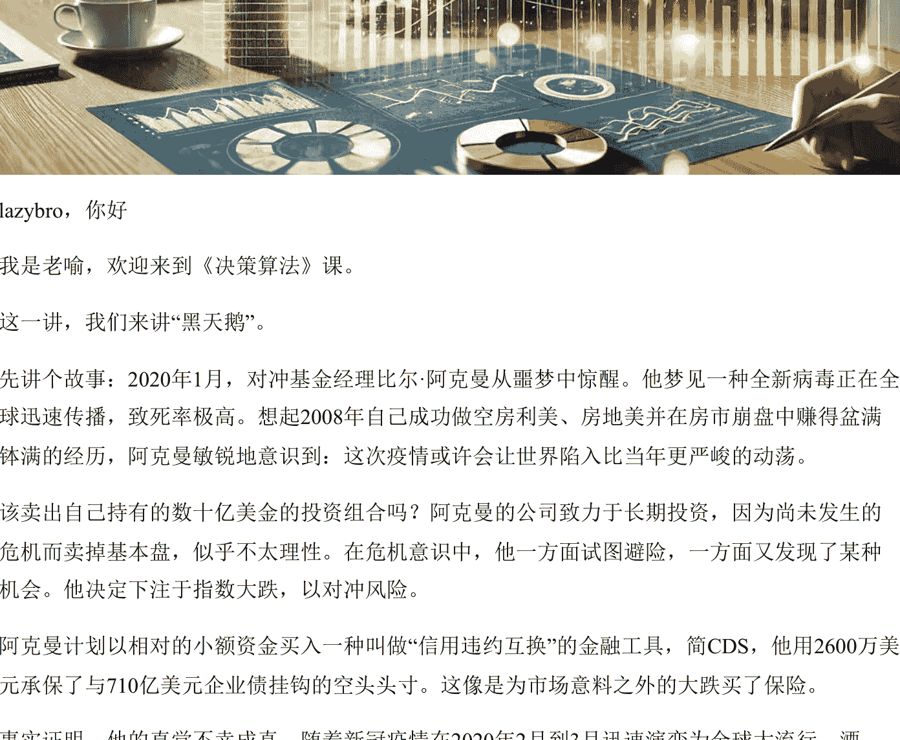

lazybro，你好

我是老喻，欢迎来到《决策算法》课。

这一讲，我们来讲“黑天鹅”。

先讲个故事：2020年1月，对冲基金经理比尔·阿克曼从噩梦中惊醒。他梦见一种全新病毒正在全球迅速传播，致死率极高。想起2008年自己成功做空房利美、房地美并在房市崩盘中赚得盆满钵满的经历，阿克曼敏锐地意识到：这次疫情或许会让世界陷入比当年更严峻的动荡。

该卖出自己持有的数十亿美金的投资组合吗？阿克曼的公司致力于长期投资，因为尚未发生的危机而卖掉基本盘，似乎不太理性。在危机意识中，他一方面试图避险，一方面又发现了某种机会。他决定下注于指数大跌，以对冲风险。

阿克曼计划以相对的小额资金买入一种叫做“信用违约互换”的金融工具，简称CDS。他用2600万美元承保了与710亿美元企业债挂钩的空头头寸。这像是为市场意料之外的大跌买了保险。

事实证明，他的直觉不幸成真。随着新冠疫情在2020年2月到3月迅速演变为全球大流行，酒店、航空、主题公园等行业业务锐减，企业信用风险急速攀升。CDS合约价格飞涨，阿克曼在短短几周内就赚到约26亿美元，足以抵消其基金在股市下跌中的损失。

更令人意外的是，在市场血流成河之际，他将此前的利润反手投入股市，买入希尔顿、伯克希尔-哈撒韦、星巴克等优质股票，以此捕捉美联储和国会双管齐下救市所带来的强劲反弹。

等到股市触底回升，他又从中额外收获了约10亿美元，最终将这笔“2600万美元的保险费”变成超过36亿美元的惊人利润。

显然，全球疫情是一次典型的黑天鹅事件，而阿克曼利用了这次危机，大赚特赚。他到底做对了什么？他是高瞻远瞩的投资天才，还是恰好踩对节奏的幸运“赌徒”？

> （本案例素材来自《逆风翻盘》。）

### 黑天鹅

这些年，“黑天鹅”已经成为一个超级词汇。但是，到底黑天鹅是什么，没多少人真正明白。

有趣的是，《决策算法》最近这几讲，正是黑天鹅的发现之旅：

- 休谟对因果的怀疑。他认为，人类的所有认知都源自经验，但经验是不可靠的，因为经验不具有普遍性和必然性。例如，即便我们见过所有的天鹅都是白色的，也不能得出“天鹅就是白色的”这样的结论。
- 波普尔的可证伪性。他提出科学命题必须能被证伪，“所有天鹅都是白的”这一断言，只需发现一只黑天鹅就能推翻。
- 索罗斯的反身性。作为波普尔的学生，索罗斯运用老师的理论在华尔街大赚其钱。他还提出“反身性”理论：市场参与者的主观认知会影响基本面，而基本面再反过来强化或弱化这种认知。
- 塔勒布的黑天鹅。当时作为交易员的塔勒布深受索罗斯和波普尔影响，结合自己的经验，写出了超级畅销书《黑天鹅》。自此，“黑天鹅”一词成为理解极端风险与不确定性的核心隐喻，也让无数人开始重新审视：那些看似不可能的意外，为何反而最有可能主宰我们的世界。

塔勒布的“黑天鹅”理论之所以影响深远，部分原因在于它击中了人们在处理不确定性时普遍存在的盲区：过度依赖经验与传统模型，低估尾部风险。

他提出：“黑天鹅”是指那些极其罕见、影响巨大、事后显得似乎“可解释”的极端事件。大到金融崩盘、疫情灾难，小到某项黑科技一夜爆红，都能瞬间改变世界局势，让历史分水岭在顷刻间出现。

黑天鹅事件有四个特征：发生非常罕见；影响非常巨大；事后可解释而事前难预测；却也可以事先做好预防。

- 罕见性：是指在常规认知中几乎不可想象。黑天鹅事件之所以震撼，就在于它远远超出人们的日常经验和惯性思维。我们大多数时间都处在“正常”范畴内，一旦遇到概率极低的极端突发，就容易陷入“这怎么可能发生”的恐慌。例如疫情，金融危机等等。
- 巨大影响：是说一旦发生，会深刻重塑行业、经济乃至政治生态；它往往会让多年积累的经验模型瞬间失效，让无数原本“固若金汤”的企业或组织措手不及。例如2008年次贷危机，颠覆了无数人对“房价只涨不跌”的信仰。
- 事后可解释：大多数人事前茫然，事后才回过头找蛛丝马迹，将其包装成“早有预兆”。然而，这并不代表人们事前真的洞悉了其发生概率；只是我们的脑海里喜欢把偶然性改写成“必然”，以减轻对未知的恐慌。
- 事可预防：黑天鹅的“不可预测”并不意味着只能被动挨打，只要意识到它存在“非零概率”，并给自己留足余地，就能在意外到来时，既避免致命冲击，甚至还可能像比尔·阿克曼那样捕捉到赚大钱的机会。

### 误读

在公众视野中，“黑天鹅”已被用得异常频繁，但许多解读却偏离了塔勒布本意。例如：把任何重大意外都叫“黑天鹅”。

实际上，塔勒布强调的是“高度不可预测”与“巨大冲击”并存，而且在事前极少能被主流模型或集体认知纳入视野。这意味着并非所有重大或罕见的意外都够资格称为黑天鹅；只有那些完全超越了常规风险考量、且在发生后改写了系统格局的事件才符合标准。

视黑天鹅为“事后诸葛亮”的标签。有人认为，黑天鹅只是让人们在事后、带着上帝视角评论罕见事件的一种借口，难具实际意义。但其实，黑天鹅不是要人们事后感慨，而是警示我们：现行模型下被低估的极端风险，才是最需要引起重视与防范的。

将黑天鹅与“坏消息”画上等号。多数人提到黑天鹅时，脑海里闪现的都是金融危机、灾难事故或市场崩盘之类的负面事件。但塔勒布也强调过“正面黑天鹅”。ChatGPT应该称得上这类事物。

将黑天鹅等同于宿命论。既然黑天鹅如此不可预测，那我们也只能听天由命。塔勒布在强调极端不确定性的同时，也提倡“反脆弱”思维：尽管我们无法完美预测黑天鹅何时、以何种方式出现，但我们可以提升系统韧性，分散风险、保持弹性、留有安全垫，以便在意外来袭时不会被击溃。黑天鹅不等于“无法防范”，而是提醒我们不要过度依赖线性假设和单一模型，而要在不确定中提前布局。

低估了对冲与提前思考的可能性。不少人看完《黑天鹅》后，会产生一种“什么都无法预测，不如放手一搏”的极端想法。实际上，塔勒布所谈的并非放弃理性决策，而是用不同于常规的方式来应对尾部风险。

还有就是，把黑天鹅作为终极借口，啥事儿都拿它来抵挡。事后复盘时，只关注单一触发点，却忽视系统性脆弱。

### 解析案例

塔勒布在《随机漫步的傻瓜》中也反复提醒：人类往往高估自身的能力，而忽视无处不在的随机性。一个人成功押中一次极端事件，不一定证明他比其他人更聪明，也可能只是恰好撞上了。

那么，让我们再回到开头的案例，利用全球疫情这一黑天鹅事件，狂赚36亿美金的阿克曼，靠的是运气，还是实力呢？

接下来，我将为你解析这一经典案例，进而更深刻地理解黑天鹅策略。

首先，阿克曼不是预言家。他并非是提前预测了一切。但是他比绝大多数人更明白，类似于黑天鹅这类貌似极小概率的事件，发生的频率其实要更高一些，并且后果极其严重。所以，他在别人还没充分意识到疫情破坏力时，率先将其定义为一次可能发生的黑天鹅事件。

其次，阿克曼用小额资金进行高杠杆式对冲。假如疫情得以控制，他不过亏掉一点“保险费”；但若疫情真失控，他将收获百倍以上回报。这样的小成本、高杠杆、对冲性押注，正契合塔勒布在《黑天鹅》中强调的“杠铃策略”或“尾部对冲”思路。也就是说，预测错了，损失也不大。这一点，极其关键，却容易被人忽视。

你看，黑天鹅理论说，黑天鹅无法预测，但是假如你能很便宜织一张很大的捕获黑天鹅的网，也不妨试一下。这是一个“保险角度”的小额投入：阿克曼只拿出了2600万美元去买CDS。这笔钱即使全亏，也不会动摇整个基金的根基，却能守护他的基本盘。要知道，他的基金盘子可要数十亿美元。

这是为了对冲持有的重仓股票。阿克曼基金里原本有大量多头持股，若出现股市崩盘，这些股票的损失可能极为惨重；因此，用CDS等“空头”工具来对冲，是一种保守又进取的手段：既能规避系统性风险，又可能在市场剧烈下行时反而获利。

你可能会问，谁会那么傻卖“保险”给他呢？就是那些忽视了黑天鹅的人。因为忽视，所以给筹码错误定价，才令阿克曼有机会以小搏大。

这个案例里更精彩的是：

- 疫情爆发后，阿克曼看准CDS价格已经高企，毫不犹豫地快速平仓，将盈利落袋为安；
- 当市场陷入恐慌、优质公司股价大幅跳水时，他又果断转为“抄底”，将前期空头暴利滚入股市；
- 这一连串操作踩准了美联储和国会联手救市的节奏，让他在股市反弹中继续“乘胜追击”。

这种判断与执行能力并非普通人能有，而更难的是在一个随机性的环境里，能否打破路径依赖，及时转向。

塔勒布极为推崇索罗斯在这方面的天赋。他写道：

有个周末，索罗斯在谈话中表示非常看坏后市，并讲出一连串复杂的道理，身边的人听不懂。

索罗斯显然在市场中卖空了。但几天后，市场暴涨，频创新高。

身边的人担心索罗斯建立的头寸可能赔钱，下次打球碰面时问他是否有所损失。

“我们大赚了一票，”索罗斯说：“我改变了主意，不但回补空头头寸，还建立起很大的多头头寸。”

还是说回阿克曼。故事讲到这里，你还会继续追问：阿克曼靠的是运气，还是料事如神，还是神勇操作？

如果疫情在早期就被遏制，他买的2600万美元CDS会不会变成废纸？
如果美联储和财政刺激来得更晚或力道不足，阿克曼的二次抄底，回报会不会没那么夸张？
我想把这些问题留给你去思考。

显然，这个故事里，运气扮演着不可忽视的角色。从结果看，运气不错的阿克曼，既体现了“对黑天鹅尾部风险的敏感和布局”，也享受了政策与时机带来的幸运红利，才得以实现令人瞠目结舌的收益。

这个世界的底层，是被随机性支配的，而运气，不过是随机性的世俗外衣。但是，决策高手，比普通人有更高概率捕获“运气”。

### 最后

最后，送你五个黑天鹅应对关键步骤：

- 承认不确定性，摒弃过度自信：理解预测模型常常不完备，别对自己的判断过度迷信。
- 建立稳固安全网：积累财务和心理缓冲，让任何一次失败都不至于将你打入深渊。
- 寻求非对称回报：进行小而多样的押注，一旦命中爆发式机会，就能大获其利。
- 对冲尾部风险：用保险或备选方案来防范极端下跌或灾难性损失。
- 持续学习与适应：世界瞬息万变，多储备一些技能和资源，你才能灵活应对新的极端状况。

顺着休谟的怀疑、波普尔的可证伪性、索罗斯的反身性以及塔勒布的黑天鹅，我们会发现这个世界是非线性的，充满了不确定性。因此，最优策略是：第一，确保极端打击不会让你破产；第二，时刻留心那些小概率但回报极大的正面机会。如何将这两项原则融入你的财务、事业和日常决策？——即以谨慎与大胆的结合方式对待世界。

愿你既对这个世界充满热爱和好奇，又始终保持警觉。用好这种对环境波动的“预期”，别否认或漠视它，更别执着于仅凭线性预测。

下一只黑天鹅可能已经潜伏在不为人知的角落——做好准备，你的目标不仅是平安度过，更可能是顺势受益。

我是老喻，我们下一讲再见。

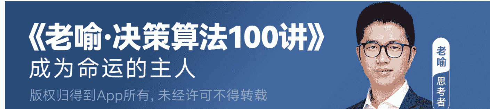


## 44 聪明的傻瓜：为什么绝大多数赢家靠的都是运气？


lazybro，你好

我是老喻，欢迎来到《决策算法》课。

如果有人说，这个世界上绝大多数成功人士主要是靠运气，你是否会觉得这个人狂妄自大？

黑天鹅之父塔勒布正是如此看待那些赢家们。他甚至称他们为“幸运的傻瓜”：

- 分明靠运气，却被误认为是凭实力；
- 分明是随机现象，却被误认为是找到了规律。

塔勒布说：

幸运的傻瓜运气好得出奇，却煞有介事地把自己的成功归于其他特定原因。

你也许会觉得，这家伙太愤世嫉俗了。

今天，我要和你分享一个“幸运的傻瓜”。通过他的故事，我们将走入决策算法的深水区：世界不是一个简单的线性因果关系网络，而是一个由不确定性和复杂性驱动的动态系统。

### 一

说起来，故事的主角不仅不傻，甚至算是顶尖聪明人。

他叫尼德霍夫。无论从哪个角度看，都是一个典型的天才。

首先，他通过了第一流的智力测试：毕业于哈佛统计系，又获得了芝加哥大学经济学博士学位，之后在加州大学伯克利分校担任金融学教授。

其次，他还是一个职业运动的高手：五度荣获美国全国壁球大赛冠军，并于1976年获得世界冠军。

第三，他是聪明人里的顶尖聪明人：他在哈佛大学的宿舍里，不分日夜地用他非常精通的扑克牌进行豪赌，还热衷于和大师级的对手玩儿西洋跳棋。

1980年，尼德霍夫开了一家投资公司，业绩突出，吸引了大鳄索罗斯，并成为他的合伙人。

尼德霍夫的赚钱声望在1996年达到鼎盛。就在那一年的某一天，尚未成名的塔勒布去拜访了这位传奇人物，确切说，塔勒布是去面试。

尼德霍夫的大宅占地13英亩（约80亩地），仿阿尔卑斯山房舍而建，拥有网球场、壁球场和游泳池，还有塔勒布从小所梦想的藏书丰富的图书馆，室内的每一面墙都挂满了艺术品。——当时37岁的塔勒布深受触动。

在塔勒布看来，尼德霍夫既是骑士，又是学者，令人崇敬。当他环视主人惊人的财富象征时，突然冒出了一个古怪的念头：他也许只是因为运气好。

几年后，塔勒布在自己的成名作《随机漫步的傻瓜》一书中，写了如下故事——

公众号懒人搜索，懒人专属群分享

吕底亚国王克罗伊斯被公认是当时最富有的人。据说希腊的立法者梭伦去拜访他时，并没有对主人身边的财富和金碧辉煌的事物表示一丝惊讶，也毫不赞美这些珍宝的主人。

主人对梭伦的无动于衷相当不悦，直截了当地问，难道他不能算是最快乐的人？

梭伦答道：

> “看尽人世间形形色色、无数的不幸之后，我们不能因为眼前的享乐而狂妄自大，或者赞美稍纵即逝的幸福快乐。世事难料，未来变幻莫测。只有承蒙上苍垂怜从此能幸福以终的人，我们才能称之为幸福快乐。”

我猜测塔勒布在写这一段时，也许想起了自己在尼德霍夫的超级豪宅里的感触。

和很多成功人士一样，尼德霍夫在1996年出版了《投机教父尼德霍夫回忆录》，献给自己的父亲。书的开篇是这样的：

> “上来！浪太大了，和市场一样，你们会被淹死的！”一个匈牙利腔的声音对着我和我的女儿凯蒂喊着。我们正在长岛南安普敦海边，尽情享受着大西洋的海水浴。的确，1992年8月的那一整个周末，由安德鲁飓风所引起的汹涌波涛是毫不留情的。

那个大喊的人，是当时60多岁的投机之王索罗斯。塔勒布尊敬尼德霍夫，但是索罗斯才是他心目中真正的英雄。

索罗斯在海边的呼喊，仿佛一语成谶。

1997年，亚洲金融危机，尼德霍夫在泰国重仓的银行股遭受重大损失，他极力想挽回局面，抵押房子借来年利率15%的贷款，卖掉大量古董收藏，继续进行更高风险的下注。1997年10月，尼德霍夫又出售标普500的卖出期权，在遭遇一次美股单日下跌7%后，他被清盘了。

尼德霍夫失去了一切，他被炸得灰飞烟灭。

### 二

不过，归零后的尼德霍夫展现了惊人的韧性，他没有被击垮，开始撰写投资专栏，经常收到读者落井下石的羞辱邮件。

《纽约时报》刻薄地写道：

尼德霍夫为了偿债，为了抚养四个还未成年的孩子，为了维持家人的生活，为了再次回到他唯一了解的证券行业，不得不苦苦挣扎。从之前基金的废墟中重返市场，不论是在经济上还是心理上，都比尼德霍夫想象的更为艰难。

“当你已经55岁时，还要做到不屈不挠是很难的”，他在家中书房里接受采访时如是说，“在你遭遇坏运气之后，你的支持者和客户就会产生恐惧。我现在处处都捉襟见肘。”

尼德霍夫一边变卖仅有的家产，一边隐忍地积蓄着力量。他在2002年2月东山再起，成立了斗牛士基金，他运用一个叫作“多元时间序列统计”的复杂模型，来判断短期市场的趋势，自2002年到2006年这5年期间，取得了每年复合增长率50%的惊人业绩。

然而，人算不如天算，斗牛士基金在美国次贷危机中受到重创，损失高达75%（尽管上半年收益率30%），不得不于2007年9月清盘。

尼德霍夫的故事令人感慨万千。让我们回到问题：究竟是什么决定了一个人的成功？

尼德霍夫算是人生赢家，他连续两次冲到投机领域的世界之巅。假如塔勒布所嘲讽的华尔街赢家是“随机的傻瓜”，那么尼德霍夫连中两次头奖的概率也太低了。

但是，这样一个堪称完美的人，为什么会连续炸掉两次？

### 三

据说，索罗斯曾提到，有读者在读了尼德霍夫的首部自传后，就预计他会失败。

那本书的中文介绍中是这样说的：

生活就是投机，而我们都是投机客，我们投机于我们的职业生涯、人际关系、游戏和投资。改变生活的决策能力取决于我们读取和预期事件结果的能力。

你能从中读出什么？

尽管索罗斯和尼德霍夫曾经有过合作，但两人并非一类人：

尼德霍夫相信投机市场有“屠龙术”，人们可以找到“公式”，然后在市场上去证实这个公式；索罗斯不相信市场上真的有“屠龙术”，他也有自己的下注方法，但随时会推翻自己的方法。

尼德霍夫的第一次“炸掉”，是因为在泰国股市进行无对冲杠杆投机（当时的动机是为了保持自己第一名的位置），随后又赌美国市场不会大幅下跌，结果被彻底抹平。

尼德霍夫的第二次“炸掉”，是因为自己的高杠杆和复杂的统计模型交易系统遭遇了黑天鹅。

尼德霍夫一直试图证明自己是对的，而索罗斯习惯说“我错了”。

如果用塔勒布的语境，尼德霍夫和索罗斯的最大区别是：

尼德霍夫不懂“黑天鹅理论”，而索罗斯懂。

对此，塔勒布解释道：

> “……尼德霍夫和我之间的差异仍然很大：我是用数据去否定某项命题，而不是去证明它。我是用历史去驳斥，而不是去确认某项推测”。

你看，休谟的怀疑，波普尔的证伪，再次出现在我们的视野中。

波普尔的观点似乎很奇怪，他认为世界上只有两种理论：被证伪的，和暂时没被证伪的。

他强调，科学理论永远是暂时的，它们只能被接受为“尚未被证伪”，而非“已被证明为真”。

尼德霍夫并非对因果关系和随机性一无所知。他的统计学功底扎实，对概率有深刻理解。他的问题是：

过于相信统计模型对市场趋势的预测能力，忽视了“未知的未知”可能带来的毁灭性后果。

尼德霍夫的模型能很好地处理“已知的未知”，但对于“黑天鹅”这样的稀有事件却无能为力。他的模型假设未来与历史有相似性，忽视了真正的毁灭性风险往往来源于未曾记录的异常。

再复杂的模型，也无法完全预测市场的未来，不确定性和“黑天鹅”始终存在。

尼德霍夫用他的人生告诉我们，金融投机不仅仅是一场智力的比拼，更是一场哲学与信念的较量。在这场游戏中，运气或许扮演着比我们愿意承认的更大的角色。

### 四

说到这里，你会不会觉得，塔勒布说的“所谓成功者，成功的主要原因是运气”并非吐槽？

事实上，他说得要更加毒舌一些：

他们（成功者）过去的表现有99.9%可归因于运气，而且只和运气有关。请一位赚了不少钱的投资人谈他成功的原因，他会列举各种深入且令人信服的理由，但这些解说常常都是刻意编造的，称之为“吹牛皮、充内行”亦无妨。

强调这一点，不是要成为一个愤世嫉俗的虚无主义者，而是能够让我们对这个世界的未知保持敬畏，并提醒我们在怀疑中求真，不要迷信万能公式，别被随机性愚弄，能够在不确定性中生存。

在这个成功者被过度吹捧的时代，我们低估了随机成分的作用，许多时候，随机成分甚至是主要作用。

我们倾向于用过去的成功来预测未来的可能性，实际上，这种预测往往建立在脆弱的基础上，尤其是在一个充满随机性和不确定性的世界里。

让我们回到《决策算法》的主题，来重新审视我们生活中的决策。

先说投资。别迷信明星基金经理，也许他只是运气好；也别嫉妒赚了大钱的朋友，也许在另外一个平行宇宙里他已经炸掉。

你能做的是避开大雷，别炸掉。没什么比安安稳稳的一生更幸福的事情了。别相信那种“人人都能成功”的神话。大多数发了大财的人，靠的是运气。——这是某种“意外”，不必嫉妒，也没法模仿。

你应该以安全为第一目标，不要试图一夜暴富，更别去赌，而是确保自己能够长期生存。

除了投资之外，再说说别的人生决策。生活中，我们常被各类“成功学”鸡汤灌输：成功是努力和才华的结果，只要你够拼，就能获得好结果。然而，成功的路径从来不是线性的，许多人生赢家，不过是幸运的“傻瓜”。

在决策中，与其模仿那些看似成功的人的路径，不如专注于如何让自己在失败中存活下来。记住：能长期生存，比一时辉煌更重要。

在人生中，学会在不确定性中行动，接受运气的不可控性，同时通过谦逊与谨慎的决策，让自己在面对未知时更有韧性。

如同梭伦所说：能幸福以终的人，我们才能称之为幸福快乐。

同样，对成功的定义可以是：

能不败以终的人，我们才能称之为成功人士。

以上就是这一讲的全部内容。

我是老喻，我们下一讲再见。

## 45 避风港：怎样在暴风雨中变得更加强大？

lazybro，你好

我是老喻，欢迎来到《决策算法》课。

在前面的一节课里，我们分享了一个精彩案例，2020年年初，基金经理阿克曼，利用黑天鹅事件，以2600万美元的赌注，赢得了36亿美元的收益。这笔交易被《巴伦周刊》称为有史以来最伟大的交易之一。

也是在那一年，另外一个神秘的投资人，登上了媒体的头条。《福布斯》是这么说的：“一个山羊农场主是如何通过建造一台末日机器来赚取4144%回报的？”

这个人叫马克·斯皮茨纳格尔，他的基金在2020年前四个月大约赚了40倍。

他是塔勒布的搭档，推崇老子的哲学，喜欢弹钢琴和吹号。他将道家的“无为而治”原则与尖端量化模型结合，创造了传奇般的财富奇迹。

他还在一个湖边的农场放山羊、做奶酪。而他做的奶酪，还被评为世界上最好吃的手工山羊奶酪。

他是如何做到的？

这一节课，我们将继续在不确定的大海里冲浪，去探究如何构建“避风港”——不仅是金融上的，更是人生全方位的。

如何既守护财富，又享受丰富多彩的人生？

### 一

塔勒布是一个独特的思想家，集数学家、交易员、作家多重身份于一身。1987年“黑色星期一”，他就曾利用市场极端风险而大赚一笔。这种经历让他开始思考：那些被认为“不可能发生”的事件，恰恰可能带来最大的冲击。

塔勒布提出的“黑天鹅”理论揭示了一个残酷的现实：在复杂系统中，最具破坏性的往往不是那些可以预见的常规风险，而是那些被我们的经验和模型完全忽视的意外。更重要的是，这些意外不仅会带来灾难，有时还蕴含着巨大的机遇。

1999年，塔勒布与马克·斯皮茨纳格尔共同创立了一家投资公司，将这种思维转化为实战策略。这是一个专门“猎捕”市场崩盘的基金，开创了一种全新的投资模式。

如果说塔勒布是黑天鹅理论的布道者，那斯皮茨纳格尔就是将其转化为赚钱机器的工程师。在他的设计下，环宇资本（Universa Capital）发展出了一套独特的“避风港”策略。

这套策略的核心是什么？简单来说，就是用极小的成本，构建对抗市场剧烈波动的防护网。

也就是说，黑天鹅来临，绝大多数人是受害者，而环宇资本（Universa Capital）利用这种“尾部风险对冲”策略，大赚其钱。其运作方式有点儿像“保险公司”：

- 收取“保费”：为客户提供市场崩盘保护，在平稳时期可能显得是额外花销。
- 崩盘时获利：当市场真的出现大崩溃，这类对冲工具价值飞涨，补偿了客户在其他资产上的损失，也为基金本身带来巨大收益。
- 小亏大赚：在平稳期内，这些仓位会不断产生小亏损，但只要长周期来看，那些偶然的巨额补偿就能弥补亏损，并产生可观净利。

环宇资本（Universa Capital）通过购买期权来实现这一目标，平常几乎总是在亏钱，但是遭遇黑天鹅时则能带来巨大回报。就像你为自己的手机买了个保险，有天你的手机摔坏了，保险公司给你赔了3个手机。

斯皮茨纳格尔经常提及“迂回投资”的概念，即以退为进，如孙子兵法的策略——输掉战役，赢得战争。

依靠这种策略，该公司实现了相当不错的回报。

然而，斯皮茨纳格尔在2020年致投资者的信中说：“我们手中并无水晶球！”因为，他们的方法并不依赖市场时机或方向性押注。

### 二

而人们总是试图靠预测未来赚大钱。

布莱恩·亨特，曾是华尔街最耀眼的明星交易员之一。

他的传奇始于2005年，那年夏天，由于天气不够炎热，天然气需求下降，价格随之下滑至每百万英热（英、美等国采用的一种计算热量的单位）6至8美元之间。

亨特判断，冬季取暖需求将推动天然气价格回升，于是大胆布局。他大量买入天然气期货和期权，等待市场反弹。而飓风卡特里娜的到来让他押对了宝：天然气价格一路飙升至15.38美元。亨特为公司赚得了巨额利润，也赢得了华尔街的尊敬。

然而，成功往往带来过度自信。2006年，他再次押注天然气市场，预测即将到来的寒冬将引发价格大涨。他在短期合约上空、远期合约上做多。

然而，市场走势完全出乎意料，由于新资金不断涌入，短期价格攀升、长期价格下跌，彻底击穿了亨特的交易逻辑。

面对日益巨大的亏损，他不仅没有止损，反而加大赌注试图挽回局面。结果，这次豪赌导致基金在两周内亏损高达65亿美元，占公司总资产的70%以上。

最终，他的基金破产，亨特的“传奇神话”也随之终结，一个“交易高手”在短短两年间从巅峰跌入谷底。

他的故事揭示了一个残酷的事实：过度依赖预测和忽视风险管理，无异于自毁前程。在复杂的市场中，没有所谓的“神预测”，只有未雨绸缪的准备和对风险的谦卑。

### 三

那么，为什么环宇资本能够无需依赖于预测，也能实现稳定而高额的回报？

环宇资本的成功并不仅仅归功于其对黑天鹅事件的敏锐嗅觉，更在于其策略背后的深刻数学原理和严格的风险管理。

首先，环宇资本采取了一种“反脆弱”的策略：与其试图预测未来，不如利用未来的不确定性来获利。他们并不依赖精准预测市场走势，而是通过系统性地购买看跌期权，为资产建立了“保护伞”。

其次，环宇资本的策略核心在于非对称性。通过大量低成本的期权投入，他们在正常时期承受小幅亏损，但当极端事件发生时，这些期权的价值会指数级增长，弥补所有之前的损失，并带来巨额盈利。

再者，环宇资本的策略避免了人性中的“过度自信”陷阱。许多交易员往往因短期成功而陷入盲目乐观，试图“加码”以挽回损失。然而，环宇资本始终坚持其策略的系统性和纪律性，不因市场波动而偏离初衷。

最后，环宇资本数学模型为其策略提供了坚实的理论基础。他们基于尾部风险的分布特性，精确计算了每一笔期权的成本与潜在收益。这种科学化的决策方式，既避免了过度依赖预测的风险，也为其投资策略的可持续性提供了保障。

因此，环宇资本的“不靠预测赚大钱”，并不是对市场视而不见，也不是盲目投机，而是通过系统化、非对称化、纪律化和长期化的方式，把黑天鹅从“灾难”变成“机会”。

这种以不确定性为友的策略，不仅在金融市场中大放异彩，也为我们的人生决策提供了重要启示：不要害怕变化，而是学会利用变化中的机遇。

而要想做到这一点，你需要打造自己的避风港。

### 四

航海中的避风港湾，可以在暴风雨来临时，保护船只免受巨浪袭击，让航行者在风暴中不至于沉没。而斯皮茨纳格尔的方法也类似：通过低成本的“保险”策略，提前为市场的黑天鹅事件做好准备，在危机风暴中，反而能获得意外的收益。

> 他说：“避风港是抵御金融风暴的庇护所。因此，避险投资即风险缓释。”

要想理解避风港到底是什么，需要知道斯皮茨纳格尔的三个“第一性原理”。

- 1. 投资是随时间发生的连续过程。
斯皮茨纳格尔指出，投资并非静止或一次性完成的行为，而是一个与时间同步推进的“复合”过程。投资是一连串的乘法，任何一次重大亏损都会拖累全局的复利成长。只有意识到并管理好这种“时间维度”上的连续性，才能在长远视角下立于不败之地。

- 2. 投资的唯一目标，是最大化长期财富（复合年均增长率）。
斯皮茨纳格尔认为，随着时间的推移最大化我们的财富是投资活动的终极目标。换句话说，投资者都在追求长期的复合年均增长率（CAGR），而非短期“赢一次就封神”的暴富幻象。

- 3. 具有成本效益的风险缓释，是提高复合回报的关键。
这里说的是，避险不只是“保命”，更是“增值”：每当风险来临，它能让你幸免于重大亏损，保持资金继续滚动复利；一旦危机过后，你还能借机积攒更多资源，乘势扩大优势。

让我用一个大家都能理解的小学数学概念来概述上面的要点吧：

假设你有 1000 块钱，第一次涨 50% 变成 1500，但下一次跌 50% 就会回到 750，需要涨 100% 才能回本儿。这就是为什么斯皮茨纳格尔反复强调“避免重大亏损”的重要性：只要一次大跌就会让你前面累积的许多“乘法成果”变成空。

所以，“回撤率比胜率更重要”：控制单次大幅亏损远比取得一系列小额盈利重要。

与其绞尽脑汁预测何时会发生黑天鹅，不如确保自己在黑天鹅出现时拥有“爆炸式下跌保护”，避开最危险的那一次“大亏”，保住长期的财富“乘法”过程。

更关键的是，在那个时刻，其他资产价格通常已经大幅下挫，手里持有的“对冲收益”正好可以用来在低位补仓或抄底。这就让投资者不仅能稳住阵脚，更能借助恐慌性下跌反向布局，享受后续反弹带来的超额回报。这就是避风港策略最精彩的一点。

因此，“保险+补仓”在避风港策略中往往是组合在一起的：对冲收益既能弥补潜在亏损，又能为抄底提供弹药，从而在市场周期中获得双重优势。

当街头血流成河时，还有弹药的人，往往能捡到极大的便宜。

但更重要的是，“避风港”可以被理解为一种能在系统性危机来临时尽量避免重大损失、并且在长期视角下有效提升复合增长率的投资手段。

### 五

斯皮茨纳格尔式的“避风港”不仅是防守，更是长远攻守兼备的生存哲学。对普通人而言，核心要义在于：

- 1. 敬畏不可预测，但不因此裹足不前。
- 2. 先保住自己，再谈发展壮大。
- 3. 让复利持续滚动，避免一次性的大损耗。
- 4. 运用风险缓释，保留大跌后“补仓”与“抄底”的选择权。
- 5. 拥抱长期视角，用纪律、方法和韧性穿越不确定性。

通过对冲策略（如期权），在危机来临时既能减少损失，又能获取额外现金弹药，反向布局价值洼地。

只要我们在工作、生活与投资等维度都能践行“避风港”的原则，就能在面对各种风浪时从容以对，最大化地提升人生回报与价值。

毕竟，最怕的是在风雨无情时手足无措；而有了“保险+补仓”的弹药和对风险的敬畏，我们才会有更有底气地在混沌之中抓住真正的机会。

《避风港》这本书的开篇，作者引用了我女儿最喜欢的歌手鲍勃·迪伦的一段歌词：

> 我筋疲力尽，淹没于无情的冰雹，一路艰辛，荆棘刺痛，伤痕累累如被猎杀的鳄鱼，如被收割的玉米。“进来吧，”她说，“我会为你遮风挡雨。”

不管你从事什么，祝愿你能建造出自己的避风港。

不是躲避风雨，而是在暴风雨中变得更加强大。

我是老喻，我们下一讲再见。

## 46 费德勒的秘密：为什么54%得分率能够成为世界第一？

lazybro，你好

我是老喻，欢迎来到《决策算法》课。

在达特茅斯学院2024年毕业典礼演讲中，费德勒提到了一个让人意外的事实：

> “在网球运动中，完美是不可能的……在我的职业生涯中，我打过1,526场单打比赛，几乎赢了80％的比赛……现在，我想问你们所有人一个问题……你认为我在这些比赛中赢得了多少百分比的分数？只有54%。换句话说，即使是顶级网球选手，赢得的分数也仅仅只有他们比赛总分数的一半多一点。”

这听起来很反直觉。

要知道他可是费德勒，他是网球史上最佳的男子选手之一，总共赢得20座大满贯冠军，在单打世界排名第一累计310周，还创造了连续237周世界第一的男子网坛纪录。

54%的得分率，怎么可能支撑他的传奇？

但其实，不光是费德勒，网球圈早有多位数据分析专家、统计学家做过相关研究，包括费德勒、纳达尔、德约科维奇这些顶尖球员在自己巅峰时期，得分率通常在53%-55% 之间，但他们的胜场率往往在 80%-90% 之间。

借助于这个反直觉的事实，我们要分享一个重要的真相：

职业决策高手的成功，靠的不是一城一池的得失，而是靠持续累计的微弱优势。

### 一

让我们暂时从情绪中走出来，回到概率本身：为什么只赢了54%的分数，却能赢得80%的比赛，并且成就了史上最强的运动员之一？

这个事实虽然反直觉，但其实也可以通过数学证明。这里涉及到伯努利实验和二项分布，过程略微复杂。我自己推导了一遍，过程放在文稿区，如果你对数学感兴趣，可以自己对照推导一遍。当然，现在大模型数学能力也不错，你也可以让大模型帮你完成。

实际计算的结果，当得分率是54%的时候，最终的胜率通常在 78%～80% 左右，跟费德勒演讲中说的非常接近。

这就说明，只要你在每一次独立回合里有54 %的胜算，在足够多回合的累加下，就能让你有约80% 的把握赢下整场比赛。

从数学计算的角度看，小小的54%得分率，通过二项分布的重复累加，转化为远远高于对手的整场乃至长期胜率。

### 二

在现实网球比赛中，关键分、抢七局等规则还会进一步放大这点胜率优势。也正因如此，费德勒才能拿下20座大满贯，成为史上最伟大的网球运动员之一。

费德勒说：所谓的“毫不费力”（的成功）仅仅是一个虚幻的神话。54%这个令人震撼的数字也告诉我们，连最厉害的人都挣扎在输和赢的生死线上。

而费德勒的传奇成就又激励我们：只要你能够在某些情境下保持略高于50%的胜算，然后持续、反复地利用这点优势，你就会把“少量差距”放大成“决定性优势”。

而在这个过程中，最让人难以承受的，是不可避免的失败和结果难料的煎熬。

生长在一个“分分必争”的教育系统里，我们从小接受的教育中，丢分是可耻的。慢慢的，人们开始失去了犯错的基本能力，更别谈主动犯错的勇气。这或许能让你短期内成绩拔尖，但当走进充满不确定性的职场和社会时，这种思维模式往往束缚你的手脚。

想象一下，一个从未体会过“得六七十分也不错”的人，怎么能接受在商业或投资世界里“连赢7次又输3次，依然是好业绩”的概念呢？

现实世界没有现成答案，也不会给你一条“只要做对所有步骤就能100%成功”的清单。相反，它杂乱、不可控，你必须学会在大量失误中，提炼出一点儿稳定的微小得分优势。

再看看费德勒：他打得既凶狠又理智，他当然会全力以赴拼每一个球，但他从来不指望自己能拿下每一分，只是让自己的综合实力在大多数情况下略胜对手；然后，在分数足够多时，自然就垒出了总胜利。

可如果你以“必须把每分都拿到”的思维去打，那你大概率会精神崩溃，或在重大失误后难以自我调节。

我有个中学同学，读书时候成绩只是比学渣略好，但现在他不仅是所在领域的学术带头人，还是一家上市公司的主要股东之一。他中学时候喜欢足球，是年级球队成员之一。他说，自己从运动中学到的东西，远比学科知识对他有更大的帮助。他很早就知道了赢球输球是常态，在泥坑里弄脏双脚是常态，拼搏到底但却被对手锤翻也是常态。

可惜，大多数人小时候根本没有接受过这些关于成败的启蒙教育。

### 三

如果说，伯努利实验和“54%的得分率”在数学上提醒我们——“多回合的累计可以放大微小优势”，那么它也在生活中启示我们：哪怕你常常会输，总体上依然可能赢得整局。

输和赢本来就是交织在一起的，我们没有必要苛求“局局完美”。在社会里，一次失败，就可能让周围的人觉得你一无是处。然而，真实的成功之道往往依靠的不是“零失误”，而是“抓住多数回合的优势”。

换句话说，“失败可以是一个选项”。你应该专注的，是找到那个比对手稍微大1%或2%的胜算，然后把它反复地执行下去。其他时间里，容许自己犯错，容许自己在一些项目或时刻黯然失利。

其实，很多时候我们害怕的并非一次具体失败，而是那种胜负难料之下的未知煎熬。我们总说，不要怕进入泥泞，不要怕弄脏双手，其实说的就是——别怕走进“概率的泥泞”。

因为概率永远含混不清，我们必须忍受在大获全胜和一败涂地之间的灰度状态，这才是人生的真相。

费德勒的看似随性的“54%得分率思维”，其实需要职业竞技高手级别的“功夫”去支撑。

我的经验是，这几乎是一种童子功：

从小在安全感充足的环境下，孩子也许更容易学会“犯错并重新来过”，从而练就“输了还敢打下一分”的心态；

但若生长在资源稀缺或“分分必争”的环境，人往往难以认同这一点，总想一把抓稳全部机会，或者渴望一击制胜。若做不到，也会干脆放弃，在相对确定、安全、平均的轨道上止步不前。这样就失去了真正的决策权、独立思考和判断力。

要在“混乱中前行”，并且还“不去赌”，在我观察中，这种人实在太少了。

更多人或是恐惧失败而畏缩不前，或是放手一搏却忽略理性风控。

若你能像费德勒那样既保持淡定又不失战斗意志，在一点点微弱优势之上不断重复、不断累积，就能化不可能为可能。

真正的强者不怕“概率的泥泞”，反倒能在模糊与不确定中一次次搜索、试探、迭代成长，最终用“54%”的得分率造就“80%”的通盘胜局。

### 四

说到这里，你可能会问，如果没有上面说的童子功，我们该如何练就呢？

还是在同一个演讲中，费德勒给出了自己的答案：

> “当你丢掉一分时，你要学会不要对每一次击球都过于纠结。你要教会自己这样想：好吧，我发出了一记双误，但这仅仅是一分而已。接下来，我要重新开始，开始下一个发球或接发球，开始全新的一分。
>
> 即使是一个精彩的击球，一个过顶反手扣杀，最终进入了ESPN（美国的一家体育媒体公司）的十大精彩击球，但它仅仅是一分而已。
>
> 这就是我告诉你这件事的原因。你要努力去赢得下一分，这才是世界上最重要的事情。”

听完他的精彩解答，我们需要再提及伯努利实验的一个关键：每次实验都是独立随机试验。

作为一名网球高手，一种至关重要的能力是：把每个球都当作独立比赛来打。

即使丢了分，甚至是连续丢分，都要立即忘掉，然后专注于下一个球。

只有这样，才能在大数定律的作用下，让54%的得分率得以稳定实现，进而赢得80%的比赛。

无论是负面还是正面的回合，都不应对下一个回合造成持续干扰。如果你把上一回合的情绪一直带到下一回合，就违背了这种“独立性”，也就极大降低了54%胜率能发挥的实际价值。

放在更广泛的人生里，这一点也是如此。当我们在工作中犯了错，当我们在学习中考砸了或在投资中踩了坑，都要意识到那只是“众多回合”中的一次失败。

去反思可以，但不要过度沉迷，更不能让负面情绪反噬后续的行为。

因为只有让“前一回合”尽量独立，我们才有机会让大数定律的力量持续运作，在人生的伯努利实验中，让微小的“略优概率”不断累加。

对我们普通人来说，“把每个决策或行动都视为独立事件”的要点在于，承认你会失败，承认结果可能如过山车般起伏——但依然保持信心，保持对下一次机会的精准投入。

这才是长久获胜的思维模式，也正是普普通通的“54%”转换为冠军荣耀的内在逻辑。

### 五

我有个做金融的朋友说，他们圈子里有种说法，每个人赚到一笔大钱，或多或少都会“还回去”一部分，有的人还的多，有的人还的少，他自己还了一半回去，花了两三年时间才走出来。

别的行业，可能不会像金融和竞技那样，面临着大量的决策，经受着一个又一个成败。但是我们的工作和生活，以及别的人生决策，也在是非成败中起伏跌宕着。

记住这句话：

输掉一分并不可怕，下一分才是最重要的。

且让我们用费德勒的演讲来结尾吧：

> “你要成为战胜困难的大师。对我来说,这就是冠军的标志。世界上最优秀的人之所以优秀,并不是因为他们赢得了每一分……而是因为他们知道他们会输……一次又一次地输……但他们已经学会了如何应对。
>
> 你要接受它。如果需要的话,就哭出来……然后强颜一笑。你继续前进,坚持不懈,适应并成长,然后更加努力地工作,更加聪明地工作。”

愿你在现实的起起伏伏中,赢得自己的人生。

我是老喻,我们下一讲再见。

## 附录

想象你在投掷硬币:正面朝上算“得分”,反面朝上算“失分”。每一次掷硬币都是一个“伯努利实验”。

伯努利实验研究的是如下情景:

你要重复做n次“赢或输”的独立尝试。每一次赢的概率是p,输的概率是(1-p)。最终如果你赢了k次,这个事件发生的“路径”或“组合”有多少?

我们试着用一个极小的例子,来从头推到计算的方法。

假设如上的实验只重复3次,想要“赢2次,输1次”

那么,所有可能的序列如下:

- 赢 赢 输
- 赢 输 赢
- 输 赢 赢

你会看到一共3种不同的顺序,这3种都属于“赢了2次、输1次”。

根据概率的乘法原理,每一种顺序发生的概率是:

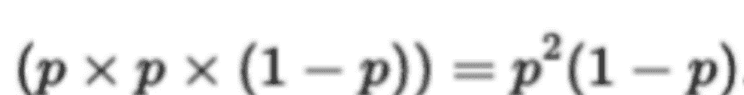

又因为赢2输1的顺序有三种,所以“赢2输1”的结果就是:

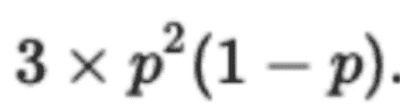

接下来是二项分布的基本公式:

当你做n次时,如果要“赢k次,输n-k次”,那么赢与输的顺序可以有许多种排列,具体有多少?就靠组合数“\binom{n}{k}”计算得出——它表示“从n次试验里选出k次作为赢的回合数”。每个排列的概率是:

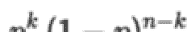

因此,把组合数与这部分概率相乘,就得到整个事件“赢k次”的概率:

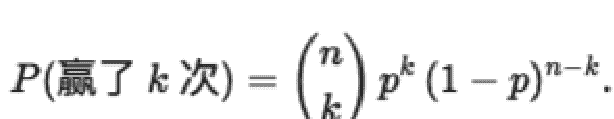

再接着,从数学的角度,重新描述一下这个问题:为什么54%的分数能赢得80%的比赛?

每一回合:赢的概率是0.54,输的概率是0.46。

假设有100回合(相当于把一场网球比赛简化为100个球)。

我们要算:赢了超过50个球(也就是大于对手)是什么概率?

使用我们上面的二项分布公式,计算如下:

令 X 表示“赢的总回合数”，则

P(X=k) = \binom{100}{k}(0.54)^k(0.46)^{100-k}.

要整体取胜，需要 X > 50。因此

P(取胜) = \sum_{k=51}^{100} \binom{100}{k}(0.54)^k(0.46)^{100-k}.


《老喻·决策算法100讲》
成为命运的主人
版权归得到App所有，未经许可不得转载
老喻 思考者
公众号
懒人搜索
懒人专属群


微信:lazyhelper

公众号懒人搜索，懒人专属群分享

## 47 六十分哲学：不是每一场人生的战斗都要你全力以赴

在上一讲中，我们讨论了费德勒的54%法则：在必须参与的网球比赛中，他只得了54%的分数，却赢下了80%的比赛。

然而，人生并不是打比赛。作为普通人，我们在现实生活中其实有一个特权，那就是：你不必参与每一场比赛。

也就是说，遇到对你不利的比赛，你可以放弃，并且没有任何损失。

即使是那些你非参加不可的比赛，假如不是那么重要，你也不必全力以赴，能将就过去就行了。

这可能是读书时代和现实世界最大的差别之一了。

因为当学生时，你总不能说：老师，今天的数学考试有点儿难，我没准备好，这次我就不参加了。

可是成年之后，假如你在办公室遇到一个讨厌家伙，天天为难你，总想着和你pk一下。这时你可以使用自己的特权：不理他，绕开走，日子照样过。

看上去，想要过好这一生，我们要打两种球：

一种是必须参与的、非打不可、还要全力打好的球；

一种是可以选择的、未必非要打的球。

对于第一类“球“，我们需要全力以赴，寻求最优解，努力实现最佳表现；

对于第二类“球“，我们可以选择放弃，为啥非要打呢？

但事实上，现实生活中还有第三类“球”，似乎更让我们为难：有些球非打不可，但是并不重要，即使你拼命打好，也不会有更多回报。

常识告诉我们，对于这类无法避开的“球”，投入太多精力和资源，不值得。换而言之，不是每一场人生的战斗都要你全力以赴。

但很多人却会在这类战斗中长时间内耗。

那么，在绕不过的情形下，面对那些我们不必全力以赴的战斗，该如何应对呢？

### 一

拼多多创始人黄峥曾经说：自己求学时目标导向太明确，在追求第一、努力做个好学生上浪费了过多时间，损失了逆反、捣乱的青春时光，很多年后才慢慢领悟到“60分万岁是个好哲学”。

“60分哲学”，源于对有限资源（如时间、精力、资金）理性配置的深刻理解。对于这一点，大家不会陌生。我们在《决策算法》的一开始，就给出过定义：

决策的真正使命是，面向不确定性的未来，在此刻分配人生的资源，以实现人生持续向好的概率最大化。

人生短暂，资源有限，每个人的优势劣势各不相同，所以，很多事情并非要求我们做到完美或极致。

“60分哲学”的核心在于“及格即可，避免过度消耗”。

当某件事非做不可，却难言重大意义时，达到60%完成度，就能留出更多时间和精力给真正关键或高价值的事。

这样既满足最低要求，也避免为微小收益而投入过多资源。

“60分哲学”背后的逻辑，源于有限理性与机会成本：过分追求满分，会失去更多创造与探索空间。

对于非做不可却非核心的事情，只要能保证基本目标，就可将剩余能量分配至更优处，从而实现整体上更大的回报。

正如黄峥所说，过度地追求完美实际上是一种苛责，凡事不用追求太过圆满才能持久，精力也可以分散安排到其他值得投资的地方。

以拼多多的发展历程为例。在创业初期，黄峥并没有追求打造一个完美的电商平台。他选择在物流、客服等传统电商的优势领域保持“60分及格”的水平，而是将主要资源集中在社交裂变、下沉市场这些突破口上。

结果证明，这种“有所为有所不为”的策略，帮助拼多多在短短几年内突出重围，在电商巨头林立的市场中占据一席之地。

这正是"60分哲学"的精髓：并非每个领域都要追求完美，而是要懂得区分主次，把宝贵的资源用在最关键的地方。

在非核心领域，及格就好；在决定性领域，才需要全力以赴。

这种取舍智慧，最终会带来远超预期的整体成功。

### 二

接下来，我们来探讨如何在工作和生活中运用“60分哲学”。

就决策而言，这其实是两个层面的挑战：

分析接到的球是哪种球？是非打不可并且要全力以赴打好的？还是不用打的？还是需要打但不用全力以赴的？只有最后一种球适用于“60分哲学”。

到底分配多少资源，投入多少精力，算是60分？

你看，这就是决策的奥妙之处，真正的高手，会花很多时间在“打好球”之前。

要想应对上面说的这两个挑战，我们需要先引入一个概念：决策阈值。

“决策阈值，是决策者在不确定环境中预先设定的基准线，用于衡量可选方案是否有足够高的期望收益、或可接受的风险水平。一旦外部信息使得实际指标越过这一基准，决策者便可选择进入、更大规模投入，或执行特定策略。”（参见[Raiffa & Schlaifer, Applied Statistical Decision Theory], 1961）

决策阈值能够帮助人们在复杂环境里快速判断“值得”或“不值得”，从而在资源有限、信息不完全的情况下做出更具效益的选择。

在经典决策理论中，决策阈值通常基于三个核心要素：

- 预期收益
- 机会成本
- 资源约束

例如：投资决策中的“必要回报率”就是一个典型的决策阈值——只有当预期回报率超过这个阈值时，投资者才会考虑投入资源。

再看刚才提及的两个层面的挑战：首先是“要不要打这场仗”，其次是“要投入多少精力”。

我们可以运用“两重决策阈值”，来指导人生的选择。

第一重阈值：参与还是放弃？

这是一个“进或不进”的决策门槛。就像一位精明的投资人，在决定是否参与一个项目时，会设定最低回报率要求。只有当预期收益超过这个阈值，才值得进一步考虑投入。

我们在前面的课程里，也曾提及年轻时候的雷军曾经给自己设定了每小时5000元的机会成本，低于这个价值的事情他就会反思值不值得去做。

比如说：

- 一场饭局能否带来足够的人脉价值？
- 一个项目的潜在回报是否达到期望？
- 一次社交活动是否值得花费时间？

如果连最基本的预期都达不到，果断放弃就是最好的选择。

但事实上，有太多人有仗就打，有活动就赶场，有圈子就加入。这种没有经过“决策阈值”筛选的投入，其实只是假勤奋、假社交、假圈子，并且耽搁了你去做真正有价值的事情。

所以，第一重阈值用来回答“要不要打这场仗”。若达不到标准，就果断“绕开”；只有够格，才进入下一步。

第二重阈值：投入多少精力？

更棘手的是那些不得不参与的战斗，或在第一重阈值判断后确认“要做”的事情，但其重要度并不算太高。

此时，就需要设定“精力投入阈值”——只要达到基本及格线即可，无需冲到满分。

换句话说，当重要性低于某个门槛，就维持“60分”策略；只有当事关全局或高回报时，才值得你倾注80分、90分甚至100分的努力。

这就是“60分哲学”真正发挥作用的地方：

- 对于例行公事的会议，做好基本准备即可；
- 对于非核心的副项目，达到及格标准就好；
- 对于必要但不重要的社交，保持基本礼貌就够；

关键是要认识到：不是所有必须参与的事情都值得你倾注全部精力。

我们可以将上面的这种决策方法，称为：双阈值决策系统。

这套双阈值系统能帮我们做出更明智的选择：

先用第一重阈值筛选：

- 达不到参与门槛的，直接放弃；
- 达到门槛或必须参与的，进入第二步。

再用第二重阈值评估投入：

- 对核心重要的事，全力以赴
- 对普通必要的事，60分够用
- 对一些次要事务，则根据实际情况投入精力和资源

这样的决策机制既不会错过重要机会，也能避免资源的过度消耗。你的精力自然会集中在最有价值的地方。

通过“要不要做”与“做到几分”这套“双阈值”机制，我们就能在有限的资源和精力中做出最优分配，既不会在琐事上浪费弹药，也能在要害处一击制胜。

“不是每一场人生的战斗都要你全力以赴”——正是借由这套清晰的决策逻辑，方能让我们在重要的地方放手一搏，而在可妥协之处以最少的代价收场。

记住：人生的智慧不仅在于知道要打哪些仗，更在于懂得每场仗该投入多少。

正如黄峥在拼多多的实践：在核心竞争力上全力冲刺，在其他方面保持及格，这才是真正的决策智慧。

### 三

让我们再回到教育的角度，来说一下，不必处处完美，门门满分。

前阵子，一些成绩接近满分的华裔学生，被哈佛等名校拒录，一时间闹得沸沸扬扬，这些学生，不光是成绩好，体育好，还参加各种竞赛，担任各种职务，钢琴还弹得好，年年去非洲做义工，堪称完美，为啥名校这么有眼无珠呢？

一位名校的录取官说出了秘密：这些高度雷同、几乎在同一模子里刻出来的“全满分”申请人，恰恰让他们审美疲劳。

如果每个人都是“数理化好+钢琴弹得好+球也打得好”，就难以体现个体真正的兴趣和潜能，只剩下一份像流水线产品般的“标配履历”，让学校难以区分、难有惊喜。

更关键的是，从中完全看不出孩子的个性，更看不出独一无二的激情，感受不到一个活生生的人。

说到这里，我想分享一个自己的故事。

前一阵子，我女儿申请大学，她直到最后半年，才确定下来要报考电影专业，并且在早申请阶段，选择了纽约大学的电影电视专业——这个专业在全美排前三，录取率比藤校还低。

艺术专业录取重点要看作品集，并且学生基本都会找专业机构包装。我女儿虽然热爱电影，但此前从来没有拍过什么作品，只在最后时刻拍了一个短片，而且非常固执地不要他人插手：自己写剧本，自己拍，自己剪辑。

作品出来，我们一看，快傻眼了，因为太稚嫩了。而且她只有这一个作品。我们认识一个申请者，个人网站上有上百个作品，还参加了很多电影节。一对比，觉得女儿的作品太业余了，根本不可能有机会。更麻烦的是，她还不愿意让专业人士帮她润色。

这时候，一位电视台的朋友安慰我说：老喻，你知道吗？对我们这些专业人士来说，好不重要，好东西太多了。独特才重要，也许你女儿作品的稚嫩，更容易在激烈的竞争中脱颖而出。

后来，我女儿非常幸运地被纽约大学的电影电视专业提前录取了。

海外的教育例子，不具有代表性。但是能够带来一些启发：并非所有科目和才艺都要高分或拔尖。让孩子把更多时间投入到最具热情或天赋之处，才可能产出更深远的成就与个性化成长。

教育最终的意义不在于“面面俱到、门门满分”，而是帮助孩子寻找并发挥独特潜能。因材施教，是为了把更多精力留给真正值得深挖的方向，让孩子在关键处绽放出更持久的热爱与创造力。

我想，对于成年人而言，更是如此。

最后，总结一下这一讲的内容，给你三个建议：

- 设置“放弃阈值”：对于那些回报不高或毫无必要的“战斗”，果断绕开，让你在琐碎中解脱，腾出空间给更有价值的事。

- 运用“60分哲学”：对于必须参与但非核心的重要事项，用最小投入达到及格线，不必把全部精力耗在微小收益上。

- 聚焦“核心突破”：认清你最想发力的领域，将更多资源投向能产生长远、高价值的关键点，不在次要之处做无谓的完美主义冲刺。

以上就是这一讲的全部内容，如果你觉得有收获，欢迎转发给身边的朋友。

我是老喻，我们下一讲再见。

## 48 满意就好：如何成为一个不纠结的人？

我是老喻，欢迎来到《决策算法》课。

最近我在整理房间，发现书架抽屉里有不少孩子小时候的涂鸦和手工，舍不得扔，打算装在盒子里收藏起来。

先上好市多（Costco）的网站上看那种牛皮纸做的收纳盒，居然每个要5-6加币，一组10个，太贵了，简直接近塑料收纳盒的价格。又去亚马逊上看了一眼，同样的牌子一组12个，有大有小，横向对比一下，尺寸还不一样......比来比去，一不留神，半小时过去了。

我突然意识到，自己掉进“网购纠结”陷阱里了。我不过是要买一组纸盒，当作孩子成长的记忆胶囊。购物的目的是为了完成这个任务，而不是要精益求精找到最高性价比的盒子。虽然这些纸盒相对价格不低，但绝对价值也不高，而且又不是常买，根本不值得花这么多时间。

类似这种生活决策中的小纠结，是不是觉得很熟悉？

没错，我们每天都面临海量决策：早饭吃啥、午餐外卖点谁家、网购件衣服要不要比价。

研究表明，一个成年人每天要做数百个有意识的决策，其中约三分之一与饮食相关。如果再加上那些微小的、半自动化的决策，数量会更加惊人。这么多的决策负担，难怪我们会感到疲惫。

信息渠道越多，选择越多，也让人越纠结：一方面担心错过更好选项，另一方面搜索太久又疲惫不堪，迟迟无法下手。

更糟糕的是，越纠结，越难决策。一家著名的决策实验室研究发现，当我们网购时，浏览页数越多，购买决策难度越大，后悔概率越高。

这有点儿像围棋里说的：长考出恶手。意思是下棋时想得太久了，反而走出了大臭棋。

生活中，一个小小的选择往往耗费我们数小时甚至数天，在信息过载、比较焦虑与决策疲劳的三重夹击下，你我都成了决策困境中“纠结的人”。

怎样摆脱这种纠结？

### 一

在现代社会里，我们常常将“理性决策”视为理所当然，甚至认为只要搜集完备信息、综合比较优劣，就能找到所谓的“最优解”。

然而，这种基于“完全理性”的假设，其实是一种美好却不切实际的幻想。想想看：有几个人真能像超级计算机一样，瞬间算出所有可能性、无漏地评估每个方案的优劣？更不用说，在现实中信息经常并不完备，有些资料可能模糊不清，或干脆不存在。

诺贝尔经济学奖得主赫伯特·西蒙(Herbert A.Simon)指出，真正的决策往往受限于时间、认知与资源的约束，“有限理性”才是我们的常态。

也就是说，人并不是完全理性的，由于人脑计算能力的局限性，人们会在有限的经验里挑选最能满足当前条件的决策，即人类决策的最终目标不是理性最优解(optimization)，而是有限理性下的最令人满意的解(satisficing)。

所谓“满意原则”(Satisficing)，就是当选项达到了我们事先设定的及格线后，就可以停下来，而不必再死磕有没有更高性价比、更多功能、更加完美的存在。

为什么“满意就好”反而可能更理性？因为，当信息无限时，若要穷举所有选项、算出绝对最优，搜寻成本往往会远超决策本身的价值。

就像我前面说买收纳盒那事儿:花半小时找个“最好的”纸盒子，真的比5分钟找个“差不多的”更划算吗?不会。

因为在更多时候，我们应该找的并不是“全网最低价”或“十全十美”，而是“差不多够用、让自己舒心”。这便是满意原则所带来的现实关照，也是现代人从“纠结”走向“轻松”的关键一步。

### 二

西蒙的“满意原则”听起来很简单，但为什么我们做不到呢?因为缺少一个清晰的决策系统。

今天，我就来教大家一个三步法，帮你成为”不纠结的人”。

- 第一步：定标准；
- 第二步：控参考；
- 第三步：敢决定。

我们一步一步来看。

### 第一步：定标准——你的"满意"到底是啥?

我们常常因为“随大流”或追求“别人觉得好”而犯难，却忽视了:决定是否值得选，第一关是弄清自我标准。

这就像巴菲特所说的“内部记分卡”:你的满意你做主。不随市场起舞，建立个人标准，采用更长期、更内在的思考模式。

所谓决策系统，就是用一个清晰的结构，帮助我们明智高效达到目标，实现决策要完成的任务。下面是“定标准”这一步的abc决策结构

- a、设定“满意”标准：先想好哪些是“非做不可”或“非买不可”的底线要求，以及哪些是“可以有，最好有”的加分项目。
- b、界定时间/精力预算：决定要花多少时间搜索、对比多少个选项，不要超过这个范围。
- c、三大维度评估：结果、过程、心理。

- 结果维度（必要条件）：如买房，最低面积、预算及地段优先；
- 过程维度（决策成本）：如时间、精力及金钱花费；
- 心理维度（内在感受）：你对这件事是否焦虑、是否符合内心价值观。

根据上面的满意标准和评估方法，你可以大概给自己的选择打分，至少要及格，但也不必追求太完美的高分。

这种做法能帮你避免纠结于更好，也能更客观地认定“我已经找到一个不错的方案”。

还是拿我买纸盒子为例吧，我的基本要求是够大、不难看。因为装满后肯定是堆在某个角落，购买时应该选个评分靠前的就行了，速战速决。

> 《道德经》里说：“知足不辱，知止不殆，可以长久。”意思是：懂得满足就不会受到屈辱，懂得适可而止就不会遇到危险，这样才可以长久平安。

以我自己的人生经验看，自下而上地去思考生活基本的满意标准，往往比自上而下定更高标准靠谱，甚至结果也更好。

以投资理财为例，定个“保本基础上争取能跑赢定存”的基本满意度，到最后没准儿还战胜了“十年赚10倍”这种宏伟目标。

### 第二步：控参考——别让比较毁了好心情。

我们常犯的第二个错误是“与他人攀比”或让外部标准无休止拉高期望。

当你看到朋友或博主买了什么更好、更优惠的东西，就开始怀疑自己选的不够完美，陷入“参考点依赖”陷阱。

经济学家卡尼曼发现了一个有趣现象：我们对事物的判断，往往不取决于它的绝对价值，而是取决于参考点。

比方说：一个商品标价100块，很少人买；同样的商品标注“原价200，现价100”，立刻就有很多人觉得划算。

更离谱的是，你的工资涨了一千块，本来很开心，后来听说同事小王涨了一千五，你马上不好过了。

这就是“参考点依赖”：我们总是依赖某个"锚点"来判断得失。这个锚点可能是：

- 原价 vs 现价；
- 别人的选择 vs 自己的选择；
- 理想状态 vs 现实状况。

一旦陷入参考点依赖，我们就会：

- 过分在意他人的选择；
- 被营销手段轻易影响；
- 用不恰当的标准评判自己。

说到第二步，想分享一个我的好朋友的买车经验。他会根据自己的需求和预算，选择大品牌的合适车型，然后买其中安全配置与顶配一样的基本款，也就是所谓“丐版”。

他说，买车最大的坑就是，本来看好三十万一辆的，一看只要加一万多就能升豪华版，升！再一看，限量版配置更诱人，只用加两万，升！比来比去，后来开回去一辆四十万的车。

我这位朋友的原则就是：进4S店之前选好适合的车型，只要基本款，不管销售如何说“这款更超值”，也不掉入“比较陷阱”。

接下来，是“控参考”这一步的abc决策结构：

- a、减少外部干扰：尽量屏蔽朋友圈、博主或广告的诱惑，专注于你真正的需求。
- b、过滤不当比较：警惕那些不相干的“更好”案例，避免用他人的选择当作你的标准。
- c、回归自我期望：把决定拉回自己设定的“满意线”，别被噪音拉高或拉低参考点。

### 第三步：敢决定——用37%法则告别纠结。

即使你前面定了标准，又管控了外部比较，但有些人依旧卡在最后一步：就是不敢“下手”。

这时，37%法则就可以派上用场。

这个法则，有严格的数学证明支撑。主要用来解决“何时停止寻找并做出决定”的问题，可以解决比如求职、购房、选择伴侣等问题。

37%法则的精髓是：让你选到“最优解”的概率最大化，也避免“无限观望”。

结合37%法则，第三步“敢决定“的abc决策结构是：

- a、先设“观察期”：在前37%的选项或时段，仅用来了解行情，不要急着拍板。
- b、见到超越标准就立刻出手：一旦后续63%选项中有超过前面最好水准的，就当机立断，不再犹豫观望。
- c、决策完成后停止搜索：做完决定后，要刻意屏蔽后续干扰，否则又会陷入“是不是还有更好的”悔恨中。

当然，并不是所有的决定都适合用37%法则，但是，基于算法来快速拍板，的确会更加明确有效。

比方说，我认识一位父亲，他给自己的孩子选辅导老师，方法特别简单——只要有另外三个家长说某位老师好，他就拍板定下来。道理是，从概率角度看，三个好评够有说服力了。再说，不合适再找呗。

通过上面这三步——定标准、控参考、敢决定，你能大幅减少内耗，留出更多精力专注自己真正渴望或擅长的事儿。

- 定标准：别指望面面俱到，想清你最重视什么；
- 控参考：摆脱无谓的比较与外界干扰，减少攀比；
- 敢决定：时机到了就出手，“够好”胜过停留在完美幻想的纠结里。

记住:“满意就好”并不是“毫无进取心”,而是让你在有限理性和现实资源中,找到最适合自身的方案。当你学会在适当时候对自己说“这样就够了”,你会发现生活可以轻松许多,心境也随之变得豁达。

### 最后

狄更斯写的《大卫·科波菲尔》,是一部带有自传性质的小说。里面有个角色叫米考伯,是主角小时候的朋友,曾经遭遇过债务问题。事实上,这个角色的原型,是狄更斯自己的父亲。

在小说里,米考伯说过一段话：

> “如果年收入二十英镑,每年花销十九英镑十九先令六便士,那就是幸福。如果年收入二十英镑,每年花销二十英镑六便士,那就是贫困。”

多么简单而精辟的描述啊!

难怪有人说,满意原则,是幸福生活的第一原则。

在这个时代,我们面临着一个无奈的悖论:选择越多,反而越难选择。

与其穷尽一生去追求可能存在的“最好”,不如学会接受眼前的“够好”。**更不值得为了追求“最好”,而牺牲“够好”**。

因为真正的智慧,不在于如何做出完美的选择,而在于如何在有限条件下做出满意的决策。

有时候,人生中最重要的决定往往不是你做了什么,而是你及时决定不再做什么。

记住:不是所有机会都需要你抓住,不是所有选择都值得你穷尽。有时候,说“够好了”,恰恰是最理性的选择。

人生在世,满意就好。

我是老喻,我们下一讲再见。

## 49 漂亮撤退：全身而退即胜利


懒人专属群的群友，你好

我是老喻，欢迎来到《决策算法》课。

不知道你是哪个年代出生的人，是否看过电影《大话西游》里的这个场景：

在一片混乱的打斗中，周星驰饰演的至尊宝落荒而逃，恋爱脑的紫霞（朱茵饰）望着他的背影说：

“

跑都跑得那么帅，我真幸福

。

”

艺术的张力往往来自陌生感。世俗意义上，逃跑是失败而耻辱的，丢盔卸甲，毫无颜面，哪里谈得上帅呢？紫霞夸张的爱慕，与至尊宝无厘头的逃窜，制造了让观众大笑的荒诞不经。

今天，我们就来说说“逃跑”，有时候，主动的逃跑，也可以称为“撤退”，是个非常重要的决策命题。

### 一

我们很容易把人类历史上的两次著名“撤退”拿来比较。

一次发生在第二次世界大战的初期，1940年5月，33.8万英法联军被德军困在法国敦刻尔克海滩。英国政府发起“发动机行动”，在9天时间里完成了历史上最大规模的军事撤退。

这次撤退被称为“敦刻尔克奇迹”，其战略意义在于保存了英国的主力部队，为之后的反攻打下基础。这次大撤退成为二战中“失败中的胜利”，展现了在绝境中“以退为进”的智慧。

还有一次著名的撤退，发生在两千多年前。

战败的项羽突破了刘邦与韩信的重重包围，逃到了乌江边上。乌江亭长已经在岸边等他，并说：“江东虽小，地方千里，众数十万，亦足王也”。意思是过了长江，依然有机会东山再起。然而，项羽没有登船撤退，而是选择了自刎。 多年后，李清照写道：“至今思项羽，不肯过江东”。

所以，发生在乌江边的，其实是“拒绝撤退”。

站在局外人的视角，我们当然称赞敦刻尔克大撤退的智慧；但当我们身在局中时，却更容易成为项羽。

人们往往是对“撤退”抱有偏见的。在我们的潜意识里默认“坚持”是美德，而“放弃”近乎等同于失败。在日常生活中，这种思维比比皆是：面对不合适的工作，我们经常咬牙挺过；面对难以为继的生意，我们也总觉得再拼一把就能成功；甚至明知一段关系已走向绝路，我们仍抱有“也许会好”的幻想。

这种偏见不仅存在于个人层面，更是根植于我们的文化传统中。从小，我们就被灌输“坚持就是胜利”的理念。童话故事里的主角，总是通过咬牙坚持获得最后的胜利，励志故事中的英雄永远不言放弃。“不抛弃、不放弃”成为了一种道德追求。

但事实上，撤退并不是前进的反面。即使人生如登山，当你成功登顶之后，也总有下山的时候。登珠穆朗玛峰的数据令人震惊：下山时的死亡人数是上山时的2-3倍。为什么？因为人们过分专注于“征服顶峰”这个目标，却忽视了更重要的“安全返回”。

在拳击比赛中，一个优秀的教练最重要的职责不是激励选手继续打，而是在恰当的时机及时叫停。这个道理，放在人生的其他领域同样适用。

然而，道理都懂，可你我都知道，上山容易下山难，很多时候，撤退比进攻还要艰难。

### 二

为什么“撤退”这么难？

世界扑克系列赛（WSOP）冠军安妮·杜克专门研究过这个问题。她也是一位认知心理学博士。

在《适时退出》这本书里，她探讨了退出的五大认知陷阱：损失厌恶、沉没成本、承诺升级、禀赋效应与现状偏见、身份认同。这五大认知陷阱，我们前面课程中，其实基本上都提到过，稍微复习一下：

- 1、损失厌恶。

人们对亏损的痛苦感，总是远大于获得同等收益的快乐感。就像一个股民宁愿继续持有一只已跌去50%的股票，也不愿意割肉离场，因为“只要不卖出，就还没有真正亏损”。

- 2、沉没成本。

已经投入的东西，会让我们难以割舍，即使明知继续投入也无济于事。就像一个创业者明知项目已经走偏，却因为“已经投入了三年时间和500万”而不愿意及时止损。

- 3、承诺升级。

为了证明之前的决定是对的，反而会加大投入。就像一个人明知对方不适合，却因为“我们已经交往五年了“而执意步入婚姻。

- 4、禀赋效应。

一旦拥有某样东西，就会高估它的价值。就像一个收藏家即使急需用钱，也舍不得低价卖出自己的藏品，因为“这些东西对他来说有特殊的意义”。

- 5、身份认同。

我们常常把某个身份当作自己的全部，因此难以放手。就像一个运动员即使已经年过巅峰，也不愿退役，因为“我这辈子就是个运动员”。

这五大认知陷阱共同强化了我们对“坚持到底”的不理性偏好，也让“撤退”等同于失败，导致人们无视客观事实，一再陷入固执或侥幸的死循环。

当然，我们并不是要简单地非此即彼，人类的认知陷阱，总是双刃剑。

这种“不撤退”的倾向，或许也深深植根于成功者的天性里。就像项羽，正是因为他从不轻言放弃，才成长为争天下的霸王。在他的生命历程中，那种不屈不挠，那种死战到底的性格，既是他成就霸业的根本，也是他最终难以全身而退的宿命。

这也许就是为什么“撤退”如此违背人性：它不仅需要克服种种认知偏差，更需要与自己骨子里的“斗争本能”作对。

### 三

说了撤退的重要性，也分析了撤退不容易的原因，接下来要探讨撤退的场景了。

我们的人生当中，概括而言大约有如下类型的各种撤退：

- 1、高点撤退。

这就是所谓的激流勇退。扑克高手知道，不是每一手好牌都要打到底。有时候，甘蔗不一定要吃到底，吃干净，有时候吃个差不多就挺好了。

- 2、止损撤退。

不管是股票，还是创业，止损都是极其重要的。

- 3、战略撤退。

敦刻尔克大撤退看似失败，却保存了33.8万人的部队，为最终战胜法西斯保留了力量。有时候，要像下棋一样，主动让出一些子，才能赢得全局。

- 4、机会撤退。

假如你发现自己有个确定性的机会，收益比现在的还好，在经过验证之后，果断关掉现在看起来还不错的生意，也是一种主动的撤退。

- 5、身份撤退。

有人在事业巅峰时转行，看似不可思议，却像蝴蝶破茧。尤其是在转型期，一些此前是大主编、大老板的人，做起了自媒体，当上了主播。这些都是了不起的撤退。

上面并不是对撤退类型的严格定义，而是作为场景描述，提醒我们撤退无处不在：

打胜仗时要考虑撤退，打败仗时更要考虑；赚钱时要想着撤退，亏钱时更要想着止损；顺风顺水时要未雨绸缪，逆境困顿时更要及时止步。

有时候，人生真的如战场，不要等到退无可退时才想起要撤退，因为那时可能早已失去了最后的退路。

就像项羽在乌江边上困境：当他最终决定要撤退的时候，内心的执念已经不允许他这么做了。——撤退从来都不是他人生当中的选项。

所以，让撤退成为一种习惯，是决策者的一个必要修炼。

无论事业顺遂还是陷入低谷，都要把“适时撤退”这张牌握在手里。这样，我们才能在人生的棋局中，既懂得奋勇向前，也懂得见好就收。

### 四

接下来，我参考安妮·杜克的著作，结合《决策算法》此前的一些知识点，来为你提供一套实用的“漂亮撤退”方法论。这套方法既包含理性决策的工具，也考虑到了感性的因素，希望能帮你在关键时刻做出明智的抽身选择。

- 1、设定撤退点。

“不到山顶不罢休”是最危险的承诺。聪明的登山者会说：“如果两点还没登顶，就必须下山”。同理，我们在开始一个项目时，也要预先设定清晰的退出条件：比如“如果半年内现金流不为正，就及时止损”。

- 2、概率思维。

扑克高手从不迷信“手气”，而是严格按照胜率赔率计算期望值来决策。记住，人生也是一场长局，关键是整体的期望值，而不是某一把牌的输赢。所以，该弃就弃，见好就收。

- 3、拆解难点。

记住“猴子与基座”模型：如果你要让猴子在基座上表演杂技，最难的显然是训练猴子，而不是造基座。比方说，开公司，关键是有收入，而不是装修办公室。所以，在决定是否撤退时，永远关注最难突破的环节是不是真的没希望了，而不是表面的进展。

- 4、请个教练。

拳击手需要教练在关键时刻及时叫停，我们的人生也需要这样的“退出教练”。找到2-3个值得信赖的朋友，让他们在你陷入“过度坚持”时，拉你一把。

- 5、体面告别。

撤退不是溃逃。设计一个正式的“告别仪式”，可以是一次总结会，可以是一封告别信，让撤退变得更有尊严。这不仅是对过去的交代，更是对未来的承诺。

- 6、留条后路。

在进入时就想好退出的方案，这不是示弱，而是智慧。就像创业者要提前想好：如果这个项目失败，下一步可以做什么？预设好退路，反而能让我们在前进时更有底气。

记住：撤退的最终目的是为了更好的前进。正如项羽若能过江东，未必就没有东山再起的机会。所以，让撤退成为你的一种能力，而不是一种失败。

在人生的大棋局中，有进有退，才是真正的高手。

### 最后

说起来，我自己真还有一些关于撤退的经验和教训。

我挺早就在房地产行业最红火的时候撤退了，原因很简单：我们就是个小开发商，赚点儿小钱就知足了；陪伴孩子一起长大，和家人们在一起，在我看来是最重要的事情；再有就是，我想做点儿自己感兴趣的不一样的事情。

所以，我撤退得很利索。之后地产又热火了七八年，我也毫不牵挂。

但是，对于撤退这件事儿，我更多的还是教训。退休后的这些年，我尝试了一些新项目，也经历了很多当舍不舍，当断没有断的后悔。

反思总结，这可能对我来说是最重要的人生教训：

见好就收，知错就改

“见好就收”不容易，形势一片大好的时候谁会想撤退呢？一个办法是“收”一部分。比方说，你参股了一家公司，价值涨了十倍，生意也很赚钱，这时候其实可以考虑卖掉持有的一半股份变现，留另外一半儿接着享受生意的成长。

——这就是说：幸运来临时，要一边趁胜追击，一边设计撤退的路线。

更难的是知错就改。简单说：遇到不对的人，不对的事，不对的地方，一定要掉头就走，绝不迟疑。——如段永平所言：

> 当发现错了就尽快改，不管多大的代价都是最小的代价。

以人为例，一个合作者在关键的品德上一旦出现了一点儿瑕疵，就像厨房里发现了一只蟑螂，绝对不能心存侥幸，认为这只是偶然的。后面你会发现越来越多的蟑螂，甚至爆出大雷。

我并不是说每个人都要变成道德洁癖，而是我们需要为自己的“核心事物”（包括家庭、密友、投资）设置一个基本安全线，只要破了红线，立即撤退，坚决止损，绝对不能含糊。

最后，

任何时候，人生都不是一场必须决胜的战役，而是一连串可以选择的游戏。

撤退并不是放弃，而是为了把有限游戏变无限游戏，这也许是更多普通人值得过的人生。

希望撤退的智慧，给你争取到更多人生的主动权。

我是老喻，我们下一讲再见。


## 问答：怎样看待百万分之一的致命风险？


你好，我是老喻，欢迎来到《决策算法》课。

又到了我们两周一次的问答加餐。

第一个问题来自Nicole同学，她问：
老喻，我有一个疑惑。巴菲特说：如果有一把左轮手枪，里面总共可以装一百万发子弹，但实际上却只装了一发，然后让他对着自己的头开一枪，也就是说有百万分之一的可能性会死（至于一把左轮手枪为什么能有100万个弹膛，不重要，这只是个比喻而已），如果他没死，就给他100万美元。你愿意玩儿这个游戏吗？

巴菲特说：他不会玩这个游戏。但是，说起致命风险，那坐飞机不也是同理么，有一次事故就是致命的。但我们还是会去坐飞机。请问怎么看待这两件事？

这是一个特别好的问题。因为它触及了风险管理的核心。

先给个小结论，巴菲特左轮手枪的比喻，道理是对的，但是数学上是错的。

先说道理。

我们在《决策算法》课程里提及了“黑天鹅”，人们总说黑天鹅事件危害极大，概率极低，但我们还是要预防。但是这里少了一个量化标准，关键是，概率小到什么程度就可以忽略？如果没有数值的话，我们就没法出门了。

数学家波莱尔早就给过我们一个实用标准：对个人来说，如果一件事发生的概率小于百万分之一，基本上就可以忽略不计了。

举几个例子你就明白了：

出门不带伞被淋成落汤鸡，大概是百分之一的概率，所以经常遇到。

遭遇交通事故是万分之一概率，运气不好也会碰上。

但是遇到空难？概率只有百万分之一，死于空难更是只有1100万分之一，这就属于可以忽略的范围了。

说到这儿，可能有人会问：这么小的概率就能忽略吗？其实啊，科学家们早就研究过这个问题了。他们还发明了一个专门的计量单位，叫“微亡率”（micromort），用来衡量各种致命风险。

比如说，骑摩托车9公里，开车370公里，或者步行27公里，这些活动带来的死亡风险都是百万分之一，也就是一个“微亡率”。

这玩意儿有啥用呢？政府、保险公司、医疗机构经常用它来评估“降低某个致命风险需要投入多少成本”，这就是“Value for Preventing a Fatality (VPF)”。

所以回到巴菲特的例子，他为什么不玩那个"游戏"呢？因为他是打个比方，不算精确。理论上，怎么说呢，其实是可以玩儿的。因为风险和步行27公里差不多呀。

从警示的角度看，关键在于，不是所有的百万分之一都一样。有些风险背后有完整的安全体系，而且能给我们带来实实在在的便利。但有些投资风险，一旦发生就是灾难性的，而且没有任何防范机制。

这就像我们开车，虽然风险不低，但我们会系安全带、买保险、遵守交规，这样就能把风险控制在可接受范围内。所以关键不仅在于风险多大，更在于：

- 这个风险是否必要？
- 有没有好的防范措施？
- 值不值得冒这个险？

记住，管理风险不是教我们当胆小鬼，而是让我们既不轻视风险，也不被风险吓倒。就像我常说的，要在“可忽略”和“必防”之间，找到聪明的平衡点。

接下来，我想给你一些日常生活中管理micromort（微亡率）的基本原则。

- 1. “对比感知”很重要：遇到不确定的风险时，就问自己：这比步行27公里危险吗？比开车370公里危险吗？有了这个基准，心里就有谱了。
- 2. “必须做”和“可不做”分清楚：上班必须要坐地铁，那就想办法降低风险；跳伞、蹦极不是必须的，想去玩的时候，掂量掂量冒那样的风险，对你值不值得。
- 3. “双保险”原则要记牢：就像开车，安全带系上、保险买好、规则遵守、车况保持良好……多重保护叠加起来，风险就降下来了。
- 4. “值不值”要算明白：省几小时坐飞机，值！为了赚快钱押上全部家当，不值！衡量风险和收益，选择要理性。
- 5. “量力而行”最重要：年轻时可以打打篮球、玩玩滑板；年纪大了，得换换项目、调整调整强度。身体状况变了，活动强度也要跟着变。
- 6. 分散风险做对冲：生活里，给关键场景准备Plan B，例如配置医疗保险、留应急资金，都能抵抗意外冲击。

然后，也许可以养成一个习惯，平时可以计算一下自己做某件事儿，大概是多少个微风险。

这里要再补充一下，虽然百万分之一的风险可以忽略，但如果你每天干上一万次，那风险可就大了。

记住：不是躲着风险走，而是聪明地与风险共处。就像老司机开车，既不莽撞，也不胆怯，该快则快，该慢则慢，这才是高手。

## 二 第二个问题来自小金鑫同学

我和老婆在广州一起经营一家淘宝网店，儿子眼看幼升小，因没广州户口上不了公立，学校只能上私立，私立有一年六万多的贵族学校，和一年一万多的普通学校，总想给儿子最好的，选贵族学校压力大，怕钱跟不上，或者回老家上，最近每天都为这个事情烦恼，不知道怎么做选。

嗨，小金鑫，看到你的困扰我特别有感触。作为父母，都想给孩子最好的，但一年六万的学费确实不是小数目，换谁都得好好掂量掂量。

我先跟你分享一个挺有意思的研究。研究发现，那些带着孩子在城市打拼的家庭，虽然生活条件可能不是很好，甚至上学的条件都很临时，但孩子的成长状况，普遍比留在老家的留守儿童要好很多。

这告诉我们什么呢？孩子在成长过程中，爸妈的陪伴可能比上什么学校更重要。

所以啊，我建议你这么思考这个问题：

一定要让孩子跟着父母在一起。别为了上学把家拆散了，那就得不偿失了。

选学校要实地去看看。别光听宣传，最好能跟校长、老师聊聊，看看他们是怎么想的，怎么教的。顺便打听打听其他家长的评价，这比什么宣传册都靠谱。

无论选贵族或普通私立，都需考虑之后的升学衔接。若想在广州继续读私立中学或国际学校，要想好今后的经济与时间投入；如打算回老家，则考虑对接家乡教育资源，是否有合适的选择。

记住，私立学校都比较年轻，不像公立学校那么稳定。所以多问问那些已经在读的家长，了解真实情况。

再就是得想想长远点的事。比如：
这个学费能不能持续负担六年？
将来上初中怎么办？
万一有点啥意外情况，还有没有回旋的余地？

说实话，在力所能及的情况下，当然是选更好的学校。但是，千万别为了面子或者所谓的“投资未来”把自己逼到角落里。如果每个月都为学费发愁，整天愁眉苦脸的，这对孩子来说也不是好事。

你可以这么想：与其花六万上贵族学校，不如选个一万多的普通私立，把省下来的钱用在：

- 给孩子报些真正感兴趣的兴趣班。
- 周末带孩子出去玩玩。
- 改善一下全家的生活质量。

这样可能反而更好。因为说到底，
好的教育不一定是最贵的教育，而是最适合的教育。

给你个小建议：别太纠结“贵族”这个词。真正的好学校是能让孩子快乐成长、全面发展的学校。
找个适合你们家实际情况的，让全家人都过得轻松一点，这才是最重要的。

孩子的教育并非“一步到位”，父母应以理性规划和稳定陪伴为基石，而不应为追求“面子”或“一步登天”而过度牺牲。

愿你们一家能找到适合的路，让孩子既能保持与父母的紧密联系，也能获得健康成长所需的环境。

祝你一切顺利！

## 三 第三个问题来自天行者同学

对于理想因生活泯灭的即将步入中年的人，面对生活的循规蹈矩还要决策吗？

富兰克林说：二十岁时起支配作用的是意志，三十岁时是机智，四十岁时是判断。判断就是选择和决策的一部分。

他的意思大概是：二十多岁的人最大的资本是意志，三十多岁的人最大的资本是机智，四十多岁的人最大的资本是决策。时代不同了，年龄段的划分会有所不同，而且这三类资本可能会混合出现。

人步入中年之后，存量资源更多一些，牵挂也更多一些。所以一方面手上有牌，一方面也更加输不起。

中年人要好过这一生，最关键的就是决策，而且不可放松警惕，否则后果更加严重，更加难以挽回。

也许你觉得生活已经很安定，什么都一成不变。但是这时候稍不留神就会被“循规蹈矩”裹挟而失去灵活性。你恰恰更需要“决策”，来帮助你在复杂的现实里做出更优的选择，而非被动接受命运推着走。

我给你整理了个实用指南，很多都是从生活经验中总结出来的，一共有6条：

- 1. 分主次，聚焦最重要的事：你看啊，对于中年人，时间精力都有限，不能啥都想抓。得先问问自己：现在最重要的是什么？是家庭？健康？还是事业？有个小建议：拿张纸，画两列：一列写“必须做的”，一列写“想做的”。必须做的就规划好时间，想做的就看看资源够不够，别太勉强。人的精力和时间有限，中年之后更不能“广撒网”，必须有取舍地集中火力。
- 2. 别太冒险了，管理好人生的风险：对于中年人，手里可能有点积蓄，但是负担也重。所以做决定的时候，先想想：万一失败了，自己扛得住吗？记住：不管是创业还是投资，都得留个保底的后路。就像游泳一样，得会换气，别一个猛子扎下去就上不来了。
- 3. 身体真的很重要，健康是决策的本钱：定期体检不能省，作息要规律，得动动。压力大可以理解，但得学会释放。运动啊、聊天啊，找到自己的解压方式。不过度饮酒、不熬夜，并重视心理健康。很多决策冲动其实源自身体或情绪的亚健康。
- 4. 交朋友要精准，选择性地“断舍离”：以前可能觉得朋友越多越好，现在可不是这样了。时间宝贵，得花在对的人身上。找那些能一起进步、互相帮助的朋友处着。特别是家人，有啥重要决定，先跟家里人商量商量。毕竟他们是最懂你、最在乎你的人。
- 5. 以长期视角，给未来留空间：钱的事得想长远点：孩子教育、父母养老、自己退休，都得算计着。
- 6. 技能得更新：现在变化太快，要学点新东西。你可以持续学习，保持韧性。提升专业技能或跨界能力，让自己在行业或岗位上更具价值，也更能抵御外部变化。别等到后悔了才想着改变，中年的好处是，你已经有经验、阅历和资源，如果结合清晰的自我认知，完全能找到新的增长点。

中年不是对决策说“不”，恰恰是更要依靠“判断力”来让人生持续升级。意志、机智与判断，可以混合出一个既稳健又不失灵活度的你。

别被“生活一成不变”的幻象所困，你依然可以在“循规蹈矩”中，主动选择要走的路线。尝试在关键时刻抓住机会、在无关紧要的事情上减少纠结，让每一个选择都更接近你真正重视的目标。愿你在中年阶段既能承担责任，也能保持对生活的热情和主动权。

最后送你一句话，
平凡的人，在平凡的环境里，通过优质的决策，也能过上不平凡的一生。

以上就是这次的问答，欢迎你提出更多好问题。

我是老喻，我们下一讲再见。


## 五 格雷厄姆：如何成为聪明的投资者？


懒人专属群的群友，你好

我是老喻，欢迎来到《决策算法》课。

几乎所有的读书人都会有这样一个念头：既然我学习能力这么强，为什么我不能去股票市场上运用一下自己的智商？

从现在流行的说法看，人们认为“投资就是认知的变现”，那是不是只要拼命提升自己的认识水平，就能大规模变现、赚大钱了？

事实并非如此。

没有证据显示，认知水平高的人赚钱能力强，也没有数据证明，学数学的，学金融的，读MBA的，或是参加过各种投资训练营的人，能够赚到更多钱。

要是学了就能真赚到钱，那学费得收多高啊！

我的如上说法，一定会招来不同意见。因为我们周围总是有人靠投资发了大财。

我有一个非常好的朋友，他就认识一个人从5万赚到了一两个亿。但是这类案例并没代表性，因为你找不到更多用类似策略成功的例子。说好听点儿，叫不可复制，说实际点儿，可能主要是因为运气。

但是，事情也并非这么绝对。世界上的确有一批投资者，他们年复一年，取得了超越指数的投资成果，在一生中积累了惊人的财富，并且他们都有一个共同的“祖师爷”。由于类似投资者数量不少，已经不能用巧合和运气解释。

这位“祖师爷”的学生们，有个共同点，他们的投资成功，都是靠运用一个知识点：

寻找生意（公司）的价值和其价格之间的差异，并从中获利。

你一定听出来了，这就是价值投资，而这位“祖师爷”就是大名鼎鼎的本杰明·格雷厄姆。

### 一

格雷厄姆三岁时随家人移民美国，十岁时父亲去世，原本富裕的家庭陷入困境。凭借优异成绩从哥伦比亚大学毕业后，想要赚钱的格雷厄姆选择了华尔街。

他小时候经历了家族由富变穷，对不确定性有骨子里的厌恶。格雷厄姆足够聪明，足够专业，足够用功，也在足够年轻时积累了丰富的经验。

然而，在大萧条面前，这位华尔街教父依然没能逃脱，几近破产。因为这个小概率的浪头是如此巨大，如此漫长，足以卷走所有由智慧与谨慎构建的堤坝。从1929年9月到1932年大萧条的谷底，道琼斯工业指数大约缩水了90%！

据一篇文章记载：1930年初，亏损还不多的格雷厄姆到佛罗里达州去会见一位商人。老人已经93岁了，做了一辈子生意，老人告诉格雷厄姆说，别在这里空耗时光了，你应该赶紧坐火车回纽约去把股票都卖了，清偿掉债务，然后做你该做的事情。可惜格雷厄姆非常自信，错过了最后的逃命机会。不仅如此，过程中格雷厄姆还曾经以为市场没事了，试图翻本儿的他加杠杆进场抄底......

然而，所谓的底部一再跌破，那次大危机的唯一特点是，一个噩耗接着一个噩耗，糟的越来越糟。

对于时代而言，上个世纪的大萧条，也许只是一个黑天鹅似的小概率事件；对于个体而言，却可能是在劫难逃的一生厄运。

格雷厄姆亲历了从财富巅峰到差点儿破产的大起大落：1929年的大萧条让他损失了约70%的资产。正是这段刻骨铭心的经历，促使他系统总结出价值投资理论。

他不仅是理论家，更是实践家。从1936年到1956年退休，他管理的资金，年收益率达到14.7%，超过同期市场水平。——他走出了人生的低谷，重新创造了辉煌。

更令人惊叹的是，他培养出了一大批杰出的投资者，其中最著名的就是沃伦·巴菲特。

在一次评选美国最成功投资者的活动中，入选的二百多位投资者中，有四十多位是格雷厄姆的门徒。

格雷厄姆的投资哲学的确很厉害，也的确会让对赚钱有想法的人蠢蠢欲动，尤其是那些自以为足够聪明的人。

### 二

然而，假如你走入格雷厄姆的课堂，这位祖师爷可能会先给你泼上几盆冷水：

股市不是一个让你展示智商的地方。

学历高的、IQ高的人并不一定能在投资上成功。连诺贝尔奖得主都在对冲基金中赔过大钱，连牛顿都在南海泡沫中亏掉了相当于今天300万美元的财富。

迷信“速成公式”，只能被割韭菜。

格雷厄姆认为，试图通过股价走势图、K线形态或者其他机械化的方法来预测股市，都是徒劳的。这种做法的核心逻辑是“因为股市上涨而买入，因为股市下跌而卖出”，这完全违背商业世界的基本常识。

永远不要以为自己能预测未来。

即便你看准了某个行业会成长（比如航空业，又比如AI），也不代表你就能从中获利。因为行业增长与股东收益往往是两回事，和你能赚到钱则是“三回事”。

资本市场最爱讲故事，“显而易见的成长前景”是最诱人的陷阱。

当一个成长故事人人都知道时，它的股价早就被捧上了天。

不要把投机当成投资。

就像赌场里精明的赌徒只带100美元入场，记得把棺材本锁在保险箱里。如果你要投机，资金上限定在总资产的10%，而且永远不要把投机账户和投资账户混在一起。

你最大的敌人不是市场，而是你自己。

大多数投资者在最需要冷静的时候却最容易失控。当别人贪婪时你更要恐惧，当别人恐惧时你才要贪婪。但在实践中，99%的人都做不到。

### 三

听完这些，你可能会觉得，格雷厄姆老先生这简直是在劝退嘛。

的确，早年极为惨痛的股市动荡经历，让格雷厄姆心有余悸，使他养成了假设最坏可能的习惯：他看待企业时，更多考虑的是倒闭价值而不是存活价值，即根据关门并被清算时的价值，来思考一只股票的价值。

有些智慧，要经历过经济周期后才能理解；有些经验，要经受岁月的捶打之后才能获得。

格雷厄姆这看似极其悲观、极其保守的投资理念，恰恰道出了投资最本质的原理：

成功的秘诀有三条：

- 第一，尽量避免风险，保住本金；
- 第二，尽量避免风险，保住本金；
- 第三，坚决牢记前两条。

你也可能会问：要是按照格雷厄姆的理念，投资者可能会错失像特斯拉和英伟达这样的高成长机会。因为这些公司从估值角度看，长期以来似乎都“过高”了，但却在不断带来巨大回报。

这其实也不矛盾。

格雷厄姆的价值投资法很单纯：

如果某家公司值一美元，若我能够以40美分买进，我迟早会获利。

所以，问题不在于能不能买特斯拉和英伟达，而在于你真的懂这些公司，能够计算出这些公司的实际价值。这些价值还要因为未来的不确定性而打折扣。

### 四

泼完冷水，我们该上格雷厄姆的几盘“大菜”了。

第一道大菜：区分投机与投资。

格雷厄姆强调，投资必须基于彻底分析、本金安全与合理回报这“三要素”。

若只因股价涨跌追逐进出，忽视公司价值，则沦为投机。而投机难以持续盈利，最可能成为韭菜。

第二道大菜：区分“防御型”和“进攻型”投资。

显然，大多数业余投资者，更适合做防御型投资者。一是避免重大错误和重大亏损，二是不操心，轻松自由。

接下来的几道大菜，就是价值投资的四项基本原则：

- 1. 将股票看成相应比例的企业所有权。一个直观的思考是，假如你买入一只股票，就去一个孤岛上度十年假，不能买卖股票，你会哪家公司的？那可能必须是特别靠谱的吧。
- 2. 在价格大幅低于价值时买进，以创建安全边际。格雷厄姆认为，只应该在股票价格显著低于内在价值时买入，通常要求30%-50%的折扣空间。这样的话，即使判断出现偏差，也有足够的缓冲保护本金。安全边际越大，投资的风险就越小，收益机会越大。
- 3. 让两极化的“市场先生”成为你的仆人，而非你的主人。市场就像一位喜怒无常的合伙人，每天给出不同的报价。有时过分乐观，有时又极度悲观。聪明的投资者不会被“市场先生”的情绪左右，而是把股票当作公司的所有权，而不是可以投机的筹码。
- 4. 投资成功的秘诀在于你的内心。和所有的决策一样，理财决策一样需要建立在独立思考的基础上，你需要保持理性、客观和冷静。这点看似平常，其实最难。我有个在华尔街工作的朋友说，据观察有些特定大脑部位受损的交易员，会创造更多投资回报。为啥呢？因为更加理性了。说再直白一点儿，投资高手很多时候要理性到反人性的地步。

概括而言，在格雷厄姆看来，投资者应该像商人经营生意一样思考问题，根据企业价值来判断股票价格是否合理；而投机者则是在赌别人会出更高的价格来接盘。

并且，一个好的投资，必须建立在对“投资标的”深入分析的基础上，目标是在保证本金安全的前提下获得合理回报。

格雷厄姆尤其劝告投资者：不要期待惊人的收益，“适度”才是可持续的。

### 五

也许有人会想，祖师爷的辈分虽然高，但毕竟是上世纪的经验了，会不会已经过时了？

并不会。因为

格雷厄姆的智慧，绝非时效性的投资技巧，而是对人性本质和决策本质的探寻。

1950年，19岁的大四学生巴菲特读到格雷厄姆写的《聪明的投资者》，“认为它是有史以来投资论著中最杰出的一本。”

过了几十年，他仍然认为如此。他在该书序言里写到：

> “要想在一生中获得投资成功，并不需要顶级的智商、超凡的商业头脑或内幕消息，而是需要一个稳妥的知识体系作为决策基础，并且有能力控制自己的情绪，使其不会对这种体系造成侵蚀。本书能够准确和清晰地提供这种知识体系，但对情绪的约束是你自己必须做到的。”

不光理财决策如此，人生决策也是，理性比智商更重要。

但是，如休谟所说，理性是激情的奴隶。所以，我们必须持续不断地构建自己的决策体系，驯化自己的激情，更好地运用自己的理性。这正是《决策算法》的使命。

如何成为聪明的投资者？

格雷厄姆非常坦诚地告诉大家：

> “我不会告诉你如何去战胜市场。任何讲真话的人，都不会这样去做”

换而言之，要成为聪明的投资者，首先是承认自己能力的有限。

所以，他写《聪明的投资者》这本书的真正目的，是教你掌握以下3个重要的投资方法：

- 如何使你的投资亏损的概率最小化。
- 如何使你获得持续收益的机会最大化。
- 如何约束你的自我挫败行为，这种行为使大多数投资者无法完全发挥自己的潜能。

那么，根据格雷厄姆的理念，该买啥股票，又或是买啥基金？还是说应该定投指数基金？又或是追一下现在热门的红利指数基金？

和所有的决策一样，你可以去学习，去研究，但你必须自己去独立思考，并基于此，自己作出负责任的决策。因为假如你不是真的懂，也没有经过自己的理性决策，即使你买对了一只大牛股，也拿不住，拿不久。

在构建你自己的理财决策体系时，格雷厄姆的理论，依然是最好的基石。

不过除此之外，我还想分享格雷厄姆的一个投资之外的提醒。这是我最喜欢的格雷厄姆的一句话，是在即将80岁之际，格雷厄姆向一位朋友表达的想法，他说：

希望每天都做一些“傻事、有创造性的事和慷慨的事”。

祝你成为一位聪明的投资者，并且在富足而平和的岁月里，也做一些“傻事、有创造性的事和慷慨的事”。

我是老喻，我们下一讲再见。


### 公众号懒人搜索，懒人专属群分享
### 公众号
### 懒人搜索
### 懒人专属群


微信: lazyhelper

## 51 巴菲特：如何在不确定性中构建确定性？


懒人专属群的群友，你好。我是老喻，欢迎来到《决策算法》课。

我想问你一个问题：投资理财，啥最重要？

新手往往会说：当然是赚钱快最重要了。

而有经验的人则会说：稳更重要。

这种“稳”的背后，其实是对“确定性”的追求。

在上一节课里，我们探讨了格雷厄姆提出的“本金安全”“安全边际”等理念——说到底，也正是在为在充满不确定性的市场环境中，找到一种“较为确定”的生存与获利方式。

但很多时候，人们对“确定性”本身容易产生误解：好像只要押注“长期必然会发生的大趋势”，就能获得确定的回报。

其实，在这个世界里，“大趋势”常常就是最不确定的部分；而巴菲特之所以被称为“股神”，恰恰在于他并不执着于做宏观预言，而是在无数不可预测的浪潮中，为自己建造了一艘能穿越风暴、抵御大部分冲击的“投资方舟”。

那么，究竟什么是投资中的“确定性”？

为什么说“确定性”并不意味着我们要精准预测未来？

巴菲特如何在这个被不确定性支配的世界中，建立起能够积累财富的相对确定性？

又是什么让他在几十年的投资生涯中既能稳扎稳打，又能享受长期复利的威力？

带着这些疑问，我们来细细拆解。

### 一

人们常常对确定性有着根深蒂固的误解。

有些投资者认为，只要找到某个确定的趋势，就能稳赚不赔。

例如，有人看到全球铜供需关系紧张，就认定铜矿股必然上涨；有人研究康波周期，就笃信能预测大宗商品的走势。

这些想法看似有理有据，实则都犯了一个致命错误：把“确定的趋势”等同于“确定的结果”。

并且，如《决策算法》课程一直强调的，这个世界是概率的，而非因果的。

> 巴菲特曾多次嘲讽“预测未来”这件事，他说：“从预言中，你可以看出很多关于预言者的信息，却很难从中了解到未来本身。”

> 他还在不同场合反复声明：“我对宏观经济一窍不通，也从不预测汇率、利率，因为无论怎么看，这些都不可知，也不重要。”

但为什么市场里还是不断有人乐此不疲地做预测呢？因为人们本能地渴望得到一个可以抓住的答案，一种“控制未来”的幻觉。

所以，一种常见的误解就是：“确定性=精准预测未来+看懂大趋势。”

在巴菲特眼里，真正的确定性并非由预测大势获得，而是基于对企业本身及其经营模式的理解，对风险边界的把握，以及对投入与回报概率的判断。

### 二

那么，怎么去构建投资的确定性呢？

第一点，要理解，投资追求的确定性，是不确定性基础之上的确定性。

我们不是要在坚固的岩石上建立一个牢不可破的堡垒，我们也不是要精确预测未来，知道海浪什么时候来临；我们要做的是建造一艘方舟，能够抵御可能遇到的最大风浪，走完全程，最终到达目的地。

这艘“方舟”就是投资决策中的安全边际与风险控制体系。

换句话说，真正的“追求确定性”，并非否认不确定性，而是在承认世界充满随机性的前提下，为自己建立最大化生存率、最大化收益概率的组合方案。

第二点，建造确定性的船。

> 巴菲特有句名言：“我们无法预知未来，但可以确定一家公司是否能保持长期快速增长。”

什么是巴菲特说的确定性？他说：“我们的目标是使我们持股合伙人的利润来自于企业，而不是其他共有者的愚蠢行为”。

在他看来，一家公司的股票是否值得投资，很大程度上决定于该公司的未来是否具有确定性，而一家未来没有确定性公司的股票是不值得购买的。

如何定义确定性的公司呢？

上节课我们讲到，巴菲特的老师格雷厄姆用的是非常保守的“清算公司价值”的方法，而巴菲特则受到芒格的影响，一方面估算企业的未来现金流折现，一方面愿意为伟大的公司付出好的价格。

他为伟大企业给出如下定义：在25年或30年后仍然能够保持其伟大企业地位的企业。按照这种标准，恐怕很少公司值得长期拥有。

第三点，即使对于确定性，我们也要懂概率。

巴菲特在投资决策中非常重视企业未来增长的确定性。但他所谓的确定性，并不代表100%的把握，而是一个概率问题。——假如有人说，确定性就是100%，其实是件很危险的事情。

伯克希尔的投资经理库姆斯曾提到，他们在评估企业时，会考虑以下标准：
- 市盈率（PE）不超过15倍；
- 五年后盈利增长的确定性（置信度为90%），年复合增长率达到7%（置信度为50%）。

你看，再厉害的高手，也要在自己的评估数字前加上概率。

第四点，利用不确定性。

> 巴菲特说：着眼于长远的投资者，一直要学着如何与不确定性周旋。

未来充满了不确定性，而不确定性是价值投资者的朋友。不确定性带来好的投资机会。巴菲特欢迎市场下跌，因为能使他能以新的、令人感到恐慌的便宜价格拣到更多的好股票。

总结来说，巴菲特追求的，是从长期回报看确定性，也就是寻找长期胜率更大的股票。根据凯利公式，这样的投资标的，投资者可以有更大的仓位，并且因为长期持有，也能真正享有复利。而复利，是实现财富的最强大的力量。

### 三

在格雷厄姆的课堂上，巴菲特学到了三大主要原则：
- 买股票就是买公司。
- 使用安全边际。
- “市场先生”是你的仆人。

这几条里，安全边际的观点至关重要。

而为了造出确定性的投资方舟，巴菲特进一步补充与发展了两个关键概念：

能力圈：只投资自己真正懂的行业和公司。如果不懂，就坚决不碰，不管涨多少，也不眼红，不后悔。

“好生意”与护城河：巴菲特一再强调，他喜欢找那些未来十年或二十年都能保持独占地位的生意，哪怕收益率不是最高，但是足够稳定、足够持久。

基于这两点，他才有底气在“能力圈”内、碰到真正看得懂的优质公司时，集中火力，大举买入，长期持有。

相反，他对科技股曾长期观望，就是因为他自觉难以预测那些公司在十年后会如何，更难摸清竞争格局，因此宁可“错过也不犯错”。

简而言之就是：知道自己真正理解哪些行业，并清楚自己在哪些方面无知。

在他看来，“哪怕你的能力圈很小，但只要你在其中能精准判断，就比那种能力圈虽然更大却无法分辨边界的人强得多。”

能力圈，其实本质上是一个概率问题。

想象一下，你去玩儿一个飞镖游戏，要想获胜，一个办法是提高你的命中率；还有一个办法就是，去扔那种特别大的靶子，你还在靶子外面再加大一圈（就像安全边际），而且你还是只扎向中间离你最近、把握最大的位置。即使你稍微歪了一点儿，或是遇到刮大风，你依然能够命中。

用概率来量化确定性，并且运用概率构建冗余，才能实现在不确定现实中的确定性回报。

对确定性的一大误解是：我们可以有严丝合缝的推理，和精确无误的计算。

然而，巴菲特说：“没有一个能计算出企业内在价值的公式。你得真的懂这个企业。”他曾经在股东信中提到，“宁要模糊的正确，不要精确的错误”。

除了能力圈和护城河，巴菲特还构建了多重保护机制来增强确定性：
- 优先股策略提供稳定股息和清算保护，同时保留享受上涨收益的机会；
- 旗下保险公司提供源源不断的浮存金；
- 充足的现金储备则能更好地让市场先生当仆人。

这些保护措施都基于概率思维，通过层层叠加，构建起一个能适应不确定性的投资体系，最终实现财富的稳健增长。

### 最后

巴菲特的投资智慧和人生哲学，归根结底都指向一个核心：在不确定的世界中建立确定性。

无论是投资还是人生，最重要的不是追求完美或利益最大化，而是避免重大错误；不是预测未来，而是构建防护体系；不是期待暴利，而是持续积累。

这个道理，用在投资上，就是通过能力圈、安全边际等多重保护机制来降低风险；用在人生中，就是保持理性、专注擅长领域、不断投资自己。

正如巴菲特所说：“成功不在于你有多聪明，而在于你能在多大程度上避免愚蠢的错误”。这句话道出了投资和人生的共同真谛：

智慧往往来自于克制，成功常常源于避险。

在追求财富的道路上，最重要的不是预测能力，而是生存能力；不是投资技巧，而是认知进化；不是投机思维，而是价值思维；不是短期收益，而是长期复利。

我认为，巴菲特给我们普通人最重要的启示，远不止价值投资的理念，而是一种非常本质的人生智慧：
- 1. 要深耕自己熟悉和擅长的领域，建立独特的竞争优势：
- 2. 别去干你不熟悉的东西：

就像巴菲特说的“知道自己知道什么，更要知道自己不知道什么”。

不要因为贪婪或从众心理，去碰触自己不了解的投资，或是转行去你毫无优势的领域。这需要极强的克制力，但这是克制恰恰是最好的保护。

- 3. 用理性和自制力守住原则：

这方面，巴菲特可能是最好的老师。他说：“我是个现实主义者，我喜欢目前自己所从事的一切，并对此始终深信不疑。作为一个彻底的实用现实主义者，我只对现实感兴趣，从不抱任何幻想，尤其是对自己。”

- 4. 在投资上永远不要加杠杆：

巴菲特说即使自己只有1万美元时也不借钱投资。因为一旦加杠杆，再小的波动都可能带来致命打击。多赚的那点钱，还不如内心的宁静重要。

- 5. 投资自己是最好的投资：

一个人最好的资产就是自己，所以最好的投资就是自己。同时保持向前看的心态，不为过去懊恼，专注当下，期待未来。

我有一位初中同学，因为听《决策算法》，又和我联系上了。我们都处在一个人生当中相当有压力的年龄段。她说，我记得你写过，巴菲特的财富99%以上都是五十岁以后实现的。

的确如此。在不确定性中构建财富的确定性，是一件漫长、需要极大耐心的事。但正因为过程漫长，我们随时可以出发。哪怕过去曾经犯过很多错误，未来仍有足够的可能性。

最后送你我很喜欢巴菲特的一段话：

> 我从来不想已经过去的事，未来有那么多值得期待的，何必对过去耿耿于怀。不纠结过去的事，纠结也没用，人生只能向前看。

以上就是这一讲的全部内容。

我是老喻，我们下一讲再见。


微信: lazyhelper

## 52 约翰·博格：一生赚多少钱才算“足够”？


懒人专属群的群友，你好。我是老喻，欢迎来到《决策算法》课。

### 一

美国著名作家库尔特·冯内古特和同为作家的约瑟夫·海勒一起，参加了一位亿万富翁举办的豪华派对。

冯内古特对海勒调侃说:

> “你知道吗？据说我们的东道主在一天之内赚到的钱，比你那本《第22条军规》从出版到现在的所有版税总和还要多。”

> 海勒回应道：“没错，但我已经拥有了他永远无法拥有的东西——知道什么是足够(enough)。”

我是在约翰·博格的一本书的最开头，看到这个真实故事的。他是第一只指数型基金的建立者。作为一个名字可以作为“财富”符号的人，他为何如此强调“知足”？

这也是我们每个人都关心的话题：一个人一生赚多少钱才算“足够”？

有人说：“100年以后的历史学家可能只会记住两位投资大师——沃伦·巴菲特和约翰·博格。他们将会记住的两本书呢？本杰明·格雷厄姆的《聪明的投资者》和约翰·博格写的所有内容。”

你看，一下子把《决策算法》的前两节“理财决策”的课程全串起来了。

这三位大师，基本理念一脉相承，都是坚信常识，认为股票的赚钱效应来自企业的盈利，而不是股价的涨跌。选择好的企业，长期拥有，就能享受复利。

不过，比起格雷厄姆和巴菲特，博格更神奇的地方在于：他的理念更简单，每个人都可以运用他的方法，实现了不起的财富增长。

具体而言就是：购买一只涵盖全市场组合的基金，然后长期持有。这样的基金被人们称为指数基金(index fund)。

说起指数基金，你一定不会陌生，也听说过指数基金定投的理念。

这种方法同样被大师们所推崇。诺贝尔经济学奖获得者保罗·萨缪尔森就说过：“博格所主张的理性概念，可以让无数人受益，20年后，我们就会成为周边邻居羡慕的对象。与此同时，我们仍然能够在多事之秋安然入睡。”

听起来真好，既简单又安全还惠民。

但是，我想问你两个问题：
- 你自己投资指数基金了吗？
- 你身边哪些朋友靠定投指数基金赚到了钱？

### 二

说到这里，我们需要先探寻一下指数基金的前世今生。

1900 年，法国学者路易斯·巴舍利耶在博士论文中抛开了对金融市场的基础分析和技术分析，用概率论建立了金融市场价格的随机游走模型。

整整过了60年，这个模型才被萨缪尔森教授再次发现。他提出，股票历史的表现对未来没有影响，股价的变化是随机游走的。

这意味着：历史走势对未来并不提供可被利用的“确定性模式”，股价的短期涨跌在很大程度上是不可预测的，带有噪音与随机性。

接着，著名经济学家尤金·法玛提出了“有效市场”假说，该假说认为，股价充分反映所有已知信息，市场不可被战胜。——道理很简单，市场由所有投资者组成，总不能自己打败自己。

1975年，查尔斯·埃利斯发现了“成本理论”，基金的管理费等各种成本，长期看几乎抵消了股票基金平均20%的收益。

看起来，以上理论都是来给资本市场泼冷水的：

巴舍利耶和萨缪尔森的“随机游走”理论，说明短期预测市场几乎不可能；法玛的“市场有效”理论，说明无法持续战胜市场；埃利斯的研究显示高成本会侵蚀收益。

都这样了，华尔街还咋玩儿呀？

所有的“坏事情”，倒过来想，没准儿就成了好事情。

约翰·博格反而从上面的理论中受到启发，以“被动复制”的思路另辟蹊径。

既然“打不赢”市场，那么 “干脆跟着走”?

博格意识到，如果绝大多数人无法真正跑赢市场，那么与其把宝贵的时间与资源投入到很难成功的主动管理里，不如直接跟踪市场，以尽可能低的成本让投资者享有“市场的平均回报率”——而在有效市场下，这个“平均回报率”本身就不低，长期来看甚至打败了绝大多数主动基金。

倒过来想的指数基金，一下子将“限制”变成“优势”：
- 既然不能预测，何不跟随整个市场？
- 既然不能战胜市场，何不直接买入整个市场？
- 既然成本会侵蚀收益，何不将成本降到最低？

1976年，约翰·博格率领先锋基金，推出了全球第一只指数基金——先锋500指数基金。

指数基金起初并不顺利，还被华尔街嘲笑为“Bogle's Folly”（博格的愚蠢）。但随着时间推移愈发被市场认可，成为投资领域里“最简单、成本最低、最能让普通人睡得安稳”的投资方式之一。

对博格来说，这不只是是一种商业模式的成功，也是一种更符合投资者利益的“知足之道”。

毕竟，如果连“市场本身的平均回报”都拿不到，还谈什么持续打败别人呢？所谓“知足”，就是先抓牢那块确定可得的蛋糕，并且创造一生够用的财富。

### 三

指数基金这么好，但是真正从中受益的人为什么不多？

排在第一的原因就是：
- 不甘心。

大多数人都会认为自己的水平至少在中上，怎么可以接受指数基金这种平庸的回报水平呢？

聪明人可能就更无法接受：我怎么可能只拿到平均数？

在约翰·博格的论述中，“均值回归”（Mean Reversion）是一个无比重要又常被投资者忽略的概念。他反复强调：无论基金的投资风格如何多样，投资的板块如何变化，从长期来看，它们的业绩终将回归到市场的平均水平。

换而言之，我们常见的“昨日之星”可能会成为“明日落后者”，而被市场忽视的投资对象，也可能在时机成熟时重新回到均值附近。

一些投资者总想借不同的策略、市场风格、行业主题来获得超额回报，但放到长周期里看，这往往是徒劳的。

回到“知足”的主题，如果明白投资最终难以摆脱“均值回归”的引力，那么投资者就没必要一直追逐“短期第一名”或“热点板块”，因为大概率会受到“均值回归”的反噬。

所以，拥抱市场整体，用更低的成本、更少的交易去稳稳抓住“市场平均回报”，在长期里反而能跑赢大部分拼命追逐热点、追涨杀跌的对手。

这正是博格主张的指数基金之道：与其指望自己变成下一个“股神”，不如好好降低成本、稳抓市场回报，把耐心交给时间，照样能从市场获得不逊色于大部分专业机构的回报。

你可能会说，我是个知足的人，也甘心获得市场平均回报，那么我是不是只要安静地定投指数基金就能慢慢变富呢？

很遗憾，也未必。

博格的理论来自美国股票市场。各个市场并不完全相同。

比方说，尽管在某个时间区间里，标普500和沪深300的涨幅接近，但是标普500涨得比较平缓而均匀，而沪深300波动较大，“快牛慢熊”，可能在很短时间内一把拉光涨幅，然后很多年指数都原地不动。

这时候，你可能较难简单通过指数基金实现财富，连定投策略也无用武之地。

你看，这就是决策最重要的一个特征：没有哪种妙方，能让你完全不用通过自己的独立判断去做决策。

指数基金在一个相对成熟、长期向上的市场里，确实能给普通人提供“简单、低成本、稳健”的投资路径。

但在新兴市场或者波动性较高、结构分化显著的环境下，“躺赢式”定投并不一定奏效，也需要针对市场特点进行适度调整和组合优化。

### 四

接下来，我为你提供一些思路作为参考：
- 第一，选好指数：宽基优先，兼顾行业或主题。
  宽基指数：这些指数涵盖大部分市值或不同规模的优质公司，分散度高，也是定投的常用标的。
  行业主题指数：若你对某一板块的长期前景有信心，并且看得懂，可将其作为补充配置，提高整体组合的成长性。
- 第二，做好全球化或多资产配置。
  如果条件允许，可以适当投资国外市场，分散单一市场风险。
  即便不出海，也可以通过QDII基金、港股通或部分跨境ETF来实现多地域配置。
  在A股高波动的现实下，加一些债券基金、货币基金能在熊市时维持心态稳定，提高组合的抗波动能力。
- 第三，认识“快牛慢熊”的市场特点，拉长周期。
  A股常常在短期内出现急速拉升，然后漫长横盘或回调，指数在较长时间里都可能不创新高。
  如果只定投了半年、一年，正好遇到高点，收益很可能不理想。要有至少3～5年以上的投资周期，最好经历一个完整牛熊，才能体会到定投成本平滑的好处。
  对于多资产或多市场配置的投资者，可以每半年或一年做一次再平衡。
- 第四，设定“安全垫”：避免流动性冲击。
  千万别重仓或加杠杆投入指数基金，如果资金周转出现问题、急需用钱，却碰上股市低迷，你就只能“割肉”。
  建议保留相当比例的现金流或流动性工具，让你在市场大跌时，不至于被迫卖出，反而能逆势买入摊低成本。
  现金流非常重要，不管是一份工作，还是租金收入，都能为你提供源源不断的弹药。
- 第五，选安心的、管理费低的指数基金。
  优先选国内最大的几家基金公司的指数产品，名字我就不提了，你很容易就能查到，并且选资金规模相对较大的、成立时间长的指数基金，减少清盘的风险。
  指数基金的管理费用通常都差不多，当然越便宜越好。

### 五

博格在书中分享了他人演讲中的一个故事，叫《不计其数的钻石》：

在古代波斯，一个富有的农场主离开故乡寻找更多财富，他穷其一生徒劳地寻找神秘的钻石矿。随着年华逝去，他得到的只有沮丧，他成为一个背井离乡、一贫如洗的乞丐，最终绝望地投海自尽。与此同时，在这位农场主的庄园里，新主人打量着他拥有的广袤土地，看到溪流中有什么东西在阳光下闪闪发光，那是一颗大大的钻石，正静静地置身于一个大钻石矿的矿顶。

那么，什么是我们后院的钻石呢？
- 一个，是指你自己；
- 另一个，是指常识。

这两样东西，看似都唾手可得，但又都不容易。自己最难懂，常识不常见。

对于你自己这颗钻石：你要了解自己的风险承受能力、投资期限和资金需求，才能设计出最适合的投资策略。正如博格所说的“知足”，不是不思进取，而是认清自己，找到最适合自己的投资之道。

对于常识这颗钻石：投资的成功往往不在于多么复杂的策略，而在于最基本的常识。低成本、分散风险、长期持有，这些都是人人皆知的道理，却很少有人能真正坚持。

正如博格的结论：

> 常识和简单化是财务成功的关键

回到这节课的开头：一生赚多少钱才算“足够”？

约翰·博格给出的答案是：

与其终生追求所谓“超额收益”，不如踏实地拿到那份属于你的市场回报。

这正是他所说的“知足”：

并非懈怠追求，而是选择最务实、最符合常识的路径；并非贪恋奇迹般的高收益，而是珍惜稳稳可得的长期复利。

钱也从来不是用“多”与“少”来区分的，很多时候，够用就好。

对于普通人，依照常识，构建好人生的牢靠的财务体系，享受“足够”带来的从容与自在，远胜无休止的攀比与追逐。

知道什么是“足够”，并且能够构建和守护这种“足够”，可能是一个人在财富上最完美的状况。

以上就是这一讲的全部内容。

我是老喻，我们下一讲再见。


公众号懒人搜索，懒人专属群分享


微信:lazyhelper

## 53 大卫·斯文森：为什么资产组合会主导投资结果？


lazybro，你好

我是老喻，欢迎来到《决策算法》课。

什么样的高手最了不起？

也许就是那种能力出众，品德超群的。

而大卫·斯文森，恰恰就是这样一位令人敬仰的投资大师。在他担任耶鲁校产基金首席投资官的数十年里，他将基金规模从10亿美元发展到312亿美元，连续三十多年创造了年化12.4%的卓越投资业绩。

更罕见的是，他是减薪80%加入耶鲁校产基金的，而且长期以来都拿着不高的收入，主动放弃了基金经理的巨额财富。

这么一个专业而品德高尚的人，给个人投资者送出的建议，我们需要竖起耳朵聆听。

### 一

他告诉了我们一个投资的关键概念，这也是他取得惊人成就的秘密，那就是：资产组合。

在他的经典著作《非凡的成功：个人投资的制胜之道》中，斯文森指出：“资本市场为投资者提供了赚取投资收益的三类工具，即资产组合、择时交易和证券选择。”

然而，这三种工具对投资成功的贡献却大不相同。

让我简单介绍一下这三个投资概念：

- 资产组合：决定将多少资金分别投资在股票、债券、房地产等不同类型资产上。这是在规划一个投资版图，确定每类资产应该占多大比例。
- 择时交易：是指判断市场涨跌时机，选择合适的时点买入或卖出。比如试图在股市低点买入，高点卖出。
- 证券选择：是指在哪类资产中挑选具体的投资标的。比如在股票市场中选择具体买哪些公司的股票，在债券市场中选择购买哪些债券。

通过深入研究，斯文森发现了一个惊人的事实：

资产组合对投资业绩的好坏，起着主导作用。

对机构投资者投资组合的大量可信研究表明，在投资收益率的变动中，大约90%是源于资产组合，只有约10%是由择时交易和证券选择决定的。

而对于择时交易，斯文森提醒，大部分个人投资者难以持续准确择时，反而会因追涨杀跌造成损失。

至于大家热衷的主动选股，对于普通人来说更是难度极高，且长期胜率有限。

在无法高效择时、精准选股的情况下，资产配置几乎成了“最后的赚钱方法”

然而，事实上，大多数个体投资者，花在择时交易和主动选股的时间和精力，要远远大于资产配置。

### 二

接下来，我再介绍一下资产组合的原理。

这要从现代投资组合理论的奠基人马科维茨说起。1952年，马科维茨在《金融杂志》发表了著名的《投资组合选择》一文，首次用严谨的数学模型证明：通过将不同风险收益特征的资产进行组合，可以显著降低投资组合的整体波动性。

> 马科维茨曾说，“资产配置多元化是投资的唯一免费午餐”。

这一奠基性的发现，为他赢得了1990年诺贝尔经济学奖。

后来出现的一系列流行的投资策略，比如60/40股债混合策略，便是对其思想的经典实践：将60%资金投资于股票，40%配置于债券，每年再平衡一次，兼具相对高收益和适度风险。

大卫·斯文森则在管理耶鲁大学基金时，进一步拓展了资产组合的可能性，大胆融入私募股权、对冲基金等多元资产，获取了长期稳健且卓越的回报。

对普通投资者而言，资产组合的核心意义在于：通过合理分散，兼顾收益与风险，并在市场变化中保持理性再平衡，从而真正让“钱为我们工作”。

有人会说，这不过是“不把所有的鸡蛋放在一个篮子里”的老生常谈嘛。

确实，巴菲特就曾说过：“广泛的多元化只是对无知的保护”。在他看来，真正的投资高手应该是，把鸡蛋放在少数几个精心挑选的篮子里，然后密切关注。

但大卫·斯文森提醒我们一个残酷的现实：像巴菲特那样精准集中投资的顶尖能手，毕竟屈指可数，而对于绝大多数普通人来说，资产组合不仅是一顿“免费的午餐”，更是通往投资成功的最可靠道路。

资产组合通过在多个资产类别间进行科学配置、分散风险，可以避免“一招失手、满盘皆输”的极端冲击。

为什么你需要资产配置？让我用三个简单的比喻说明：

第一，它就像是一座四季花园。

在这里，春有杏花、夏有荷花、秋有菊花、冬有腊梅，无论经济环境如何变化，总有一处会为你带来收获。

第二，它就像是一座抗震房屋。

多根支柱共同支撑，减震系统相互配合，即使市场地震来袭，你的财富大厦依然能够屹立不倒。

第三，它就像是一位智慧的园丁。

定期修剪过于茂盛的枝叶，培育生长不足的幼苗，在反复的实践中培养冷静从容的心态，让你的投资花园常年生机盎然。

没错，我自己的感受是，一个人的财富体系，其实更像耕耘一个有生命的花园，而不是一个个生硬的下注。

资产组合就像打造一座“多维度、抗风险、可持续成长”的生态系统，让你在资本市场的狂风暴雨或盛夏骄阳下，都能有较强的韧性与回报潜力。

公众号懒人搜索，懒人专属群分享

### 三

关于资产组合，斯文森对普通投资者的建议有三条：多元化配置、偏重股票指数基金（也是多元化的）、定期再平衡：

- 多元化投资：这不仅仅是简单的分散，而是要建立一个科学的资产配置体系。
- 偏重股票的指数化投资：斯文森认为，对大多数投资者而言，长期持有以股票为主的投资组合是明智之选，但要选择多元化的指数基金。
- 定期再平衡：就是定期调整投资组合中各类资产的权重，以保持与初始配置一致。

说完原理，我们具体该咋办呢？

实话说，资产组合是一个非常灵活的主题。每个人的情况都不一样，包括职业、收入、家庭状况，年龄段也有很大差异。

在某种意义上，于不同的年龄段，更新自己的资产配置，可能是最重要的理财决策。——这就像是一名将军，最主要的任务就是排兵布阵。

关键在于，你要搞懂原理，并且遵循原则。马尔基尔在《漫步华尔街》里，给出了资产配置的五项原则：

- 第一条：想赚更多，就得冒更多风险。说白了就是“天下没有免费的午餐”。
- 第二条：时间是你最好的朋友，越是长期投资，风险其实越小。
- 第三条：别想着一次性押宝，押宝不如定投来得稳。
- 第四条：该调整的时候要敢于调整。

比如说，你一开始定的是股票占60%、债券占40%。等股票涨得特别好，变成了70%，这时候就得把多出来的10%调出来买债券。

这种情况下，切忌贪婪，别总想着股票涨得这么好，为什么不多赚点？不懂得及时再平衡，资产组合就失去了意义。

- 第五条：工作和投资别押在同一条船上。

这个道理特别实在：比如你在通用汽车上班，就别再把所有钱都买通用汽车的股票。

### 四

有人可能会问，我家不买股票，也不搞投资，是不是就不用在乎资产组合了？

这个想法其实是个误区。即便不主动投资，你其实也在做着资产配置的决策，只是可能并不自知。比如把钱都放在银行存款，这也是一种资产配置方式，只不过是过度保守的配置。

实际上，家庭资产配置可以分为两个层面：

广义的资产配置，是一个家庭的整体财务布局。它包括了所有的资产形式：房产、存款、投资、保险、甚至未来的收入等。这就像是在规划一个家庭的财务蓝图，需要考虑家庭目标、风险承受能力、现金流需求等诸多因素，确保资产和负债的整体平衡。

狭义的资产配置，则专注于家庭可支配的金融资产。

如果你想做个简单参考，可使用常见的“标准普尔 4321 法则”进行初步规划：

- 10%：用于3~6个月的短期应急支出（流动资金）；
- 20%：投向医疗或商业保险等保障性支出；
- 30%：投资于股票、基金等“追求增值”的领域；
- 40%：配置于债券等相对稳健的“固定收益类”产品。

这种划分能帮助你既保证短期生活所需，又兼顾长期增值与必要的风险保障。

从这个角度看，“家庭资产配置”并不仅仅指炒股或买基金，而是涵盖了你如何分配每一块财务资源；无论是否“主动投资”，家庭资产配置始终在影响着你的资金安全和生活质量。

### 五

人对钱的态度很奇怪。

大多数时候人们都很在意钱，但对于一些钱的最关键问题，我们却往往漠视。

对于你我而言，应该养成对钱负责的态度。这些常识和习惯，是我们从小都欠缺的，所以需要主动进行一些程序化的自我训练。

给大家一个实在的行动指南：

- 第一步：认知自我与目标
  - 明确投资期限、财务状况、流动性需求；
  - 识别个人心理弱点（如恐慌、贪婪、短视等）。
- 第二步：建立长期配置方案
  - 广义上结合斯文森建议的多元化框架；
  - 狭义上安排好生活的各种开支。
- 第三步：定期评估与再平衡
  - 定期复盘检查；
  - 主动调整，根据情况再平衡。
- 第四步：控制情绪和外界干扰
  - 算自己的帐，别和别人比，别眼红别人发大财的机会；
  - 对大部分人来说，“怎样避免大亏损”比“怎样大赚一笔”更关键。只要把损失控制好、稳步获得复利，你就能慢慢拉开与别人的差距。
- 第五步：持续学习与优化
  - 学习投资常识：从基础原理到经济常识，打牢认知；
  - 结合自身情况做调整：生活变动、市场环境有重大变化时，及时检视是否要微调配置。

很多时候，我们总是忙着赚钱。有时，辛辛苦苦很多年打拼的财富，一个不留神就从指缝里溜走了。那种感受太痛苦了。

> 有人说：“进攻赢得比赛，防守赢得冠军。”

资产组合，其实就是攻守兼备：我们用它来守卫财富，用它来创造财富，还用它来重新平衡资产配置，让我们的人生之船更加稳健，乘风破浪。

为了你自己，更为了你的家人，行动起来吧！

以上就是这一讲的全部内容。

我是老喻，我们下一讲再见。


## 54 查尔斯·埃利斯:如何成为真正的财富赢家?


lazybro，你好

我是老喻，欢迎来到《决策算法》课。

我想问你一个问题:假如年轻的你拿到了一本投资方面的“武林秘籍”，会怎么做?

你可能会回答:要是真有的话，肯定是练起来，去赚大钱呀!

20多年前，年轻的我就拿到了这样一本“秘籍”。可惜，我当时并没有真正读懂。现在回头看，真的是句句箴言，要是当年自己能践行，可能会多赚不少钱。

也许你会问:为什么呢?是因为这个赚钱秘籍太复杂看不懂?

恰恰相反，我错过那本“秘籍”，是因为里面的方法看上去太简单了。

### 一

那本书叫《赢得输家的游戏》，作者查尔斯·埃利斯是投资界的传奇人物，被誉为被动投资的先驱。埃利斯曾担任耶鲁大学投资委员会主席、先锋集团董事、哈佛商学院董事会成员，积累了丰富的实战经验。

埃利斯提出了一个著名的“输家的游戏”理论:在“赢家的游戏”中，获胜一方往往是发挥更出色的一方;而在“输家的游戏”中，获胜一方则是“失误更少的一方”。

他引用了科学家西蒙·拉莫博士的网球研究来阐释这一理论。拉莫博士通过数据分析发现，网球运动存在两种完全不同的游戏模式:

- A、专业选手的比赛是“赢家的游戏”
  ——他们像激光一样精准有力地击球，通过精彩的制胜球赢得比赛，80%的得分来自出色发挥;
- B、业余选手的比赛则是“输家的游戏”
  ——很少有精彩的制胜球，反而充满失误，80%的得分来自对手的失误，比如球网截击或出界。

我打网球不多，我是个围棋爱好者，对此也深有体会。业余棋手下棋，往往是比谁的臭棋下的少，而不是妙棋下得多。

那这和投资决策有啥关系呢?

这个理论解释了现代投资市场的本质:

早期投资市场是“赢家的游戏”，因为专业投资者稀少，有信息优势的机构，可以靠优秀的选股和判断获取超额收益。

但随着机构投资者激增，市场竞争日趋白热化，想再依靠“赢家的行动”击败市场几乎不可能;投资已经变成“输家的游戏”。

在新的游戏规则下，更关键的问题是，主动型基金经理每年的操作成本高达3.25%，要想确保收益率达到9%的市场历史平均水平，业绩必须超越大盘近1/3，这太艰难了！

所以查尔斯·埃利斯说，大多数主动型投资经理没能赢得“金钱游戏”的原因，是他们一直在输。

如果大多数参与输家游戏、试图击败市场的投资者注定要失败，那我们该如何成为长期的赢家呢？

埃利斯的答案是：放弃追求“击败市场”的幻想，转而采用被动投资策略。

他提出三个关键原则：

- 选择低成本指数基金。
- 坚持分散投资和长期持有。
- 减少交易和决策失误。

你看，是不是太简单了？

### 二

真理往往是简单的。

埃利斯分享了自己的一个亲身经历。

进入华尔街的第一年，他和一群刚毕业的MBA一起参加了一个培训项目。大家都期待着最后一课：和一位通过多年精明投资积累了大量财富的资深合伙人见面。在被问到成功的秘诀以及对年轻人有何忠告时，他思考良久，把积累的经验概括为一句直白的格言：

> “不要亏损！”

埃利斯说自己刚毕业时第一次听到这句话，觉得这似乎是太过于简单了。——说实话，我20年前看埃利斯的书，也是这种感觉。

但多年后，埃利斯开始相信这是一个很好的忠告。“不要让自己遭受严重的、不可挽回的损失。当然，如果不能承受一些暂时的小规模损失就无法投资，因为市场就是不停波动的，但是不要让自己承担太大的风险。不要过分贪婪，也不要借钱来投资。”

我们对武林秘籍的理解，总觉得应该是大招、华丽、炸裂、与众不同。但事实上，大招如大道般至简。

比方说，戒烟和开车时系上安全带是长寿的最好方法。埃利斯的医生朋友告诉他，医药史上最重要的两个发明是青霉素和洗手。

然而，真理虽然看上去简单，践行却不容易。

### 三

为什么不容易，我想主要有两个原因，一个是外部的，一个是内部的。

外部原因是，这个世界上有太多大忽悠，而且很多是以专业的面孔示人。

埃利斯的整本书中，大约有一半是在警告个人投资者：谨防华尔街的哄骗。

斯文森也在《赢得输家的游戏》的推荐序里毫不客气地说：

> 极少有理财经理会把客户的利益放在第一位，督促投资者对自己的投资组合负责。在利益至上的华尔街，客户的利益被置于理财经理的自身利益之后。让经纪商（佣金）、基金经理（基金规模）和金融顾问（高额费用）获益的投资组合，恰恰会让投资者受害。如果利益和责任相冲突，理财经理只会损人利己。

永远不要问理发师你要不要理发，这就是《决策算法》前面所讲过的“屁股决定脑袋”。

投资比理发的后果严重多了。——朋友说见过一位理财博主，粉丝很多，前一个月他还说把某某资产全清光了，又过了不久，他又说自己其实又悄悄买回来了，而且赚了数百万。都说互联网有记忆，其实未必。所以说，独立思考太重要了。别到处跟随所谓“意见领袖”。

那么，怎么看明星基金经理呢？他们可是有辉煌的业绩啊。

埃利斯举了个真实的例子：一位明星基金经理从1990年至2005年，年化收益达16.5%，显著超越标普500的11.5%。但其后三年收益跌至-23.7%。尽管时间加权收益看似略胜市场，实际投资者因在牛市高点大量买入，饱受缩水之苦，总计损失客户36亿美元。基金经理和基金公司均获利，投资者却被深度套牢。

然而，不管外部的原因如何，最后出问题，还是内部，也就是我们自己。

也许有人会说，专业的事情不是要交给专业人士吗？难道我们自己给自己理发？自己给自己看病？

这是个好事，也道出了关于决策的至关重要的秘密：

把专业的事情交给专业人士，往往是最需要你打起精神的人生决策。

没错，看病是医生的事情。但找哪个医生看，对医生提什么样的要求，如何评估医生的诊断，是你自己的事情。

如果认为专业“外包”是当甩手掌柜，那么后果可能会非常严重。

委托的风险，往往是最大的风险。

我很喜欢斯文森的一段肺腑之言：

> 自主管理投资组合的观念让很多投资者畏缩。事实上，正确的解决方法是找到一种基本的、简单的方法来应对个人投资周期内的市场下跌。正如查尔斯所发现的，我们需要“注意我们不能委托给他人的部分——为自己考虑，为自己行动”，毕竟，“我们就是这样做出其他决定的：如和谁结婚，在哪里生活，是否要学会一种乐器，去哪里运动，打什么领带，点什么菜......”要把管理投资组合列入自己的职责清单。

我们当然要倾听专业人士的意见，接受专业人士的优秀服务，但前提是：

只有自己重视，建立一个明智的投资模式，并且认真承担起责任，坚定执行该投资模式，你我才可能成为真正的财富赢家。

### 四

埃利斯重新定义了投资者的真正目标，并告诉每位投资者如何才能享受一场真正的赢家游戏。他说：

为了成为长期的赢家，我们要教育自己专注于制订现实的长期目标，始终保持正确的投资策略，做到自律、耐心、坚持到底，实现投资目标。

埃利斯认为精明的投资者，都根据如下四个真理来进行投资。

- 1、最重要的是做出你的长期资产配置决定：
  多少投到股市，多少用于购置房地产、债券，保留多少现金。
- 2、资产配置部分由你的真正目的决定
  ——是财富增长、收益、安全还是其他，还由投资者坚持到底的能力决定，但最主要是由你什么时候需要花钱来决定。
- 3、资产等级内部及不同等级之间并非固定不变：
  厄运有时真的会出乎意料地降临。
- 4、要有耐心和恒心：
  好事会突然发生，往往在你最绝望的时候，可浮躁的投资者会一无所获。老话说得好，“计划你的行动，履行你的计划。”坚持路线往往是明智的。所以，制定正确的路线会让你成为NO.1。

在具体的操作中，有如下“最”关键点：

投资决策中最重要的是资产配置；

风险和回报的权衡最受时间的影响；

管理市场风险是投资管理的最主要目标。

要想成为真正的财富赢家，埃利斯给出了两个成功的秘诀：

第一个秘诀是，投资者必须摒弃“击败市场”的观念。

第二个秘诀是，投资者要自己决定，从长期来看什么样的投资方案，最有可能实现自己希望的结果。

也就是说，我们最大的对手，可能就是我们要理性、不负责的自己。

### 五

说起来，有点儿不可理喻：

我们花十年赚到一笔钱，可能只用一分钟的决策，就丢掉了这笔钱。

这就是埃利斯所说的悖论：投资者很少或压根不把精力放在真正重要的工作上，不去坚守明智、适当的投资方案，并加以实践，以获取比其他投资者更高的收益。

怎么解决这个悖论呢？

他说：只有深刻理解投资和资本市场的本质，你才能跳出这种悖论。

这才是理财决策的大“道”。

当我二十年后再次看埃利斯的理论，可谓感慨万千。

我相信，会有一些年轻的朋友和当年的我一样，觉得这些理论“挺不错”，但却需要靠岁月和摔跟头才真正理解这些智慧；也会有一些朋友，可能立即能够领悟其中的道理。

不管你属于哪一种，请你按照埃利斯的建议作出如下行动：

按照“多元化资产配置+多元化的偏股票指数基金+复盘再平衡”的原则，制定你的长期投资计划，并像一名马拉松选手般坚定实施。

隔一段时间，建议是每一年，你就应该对自己的需求、目标、市场经验和投资方案进行系统的检验。

以下是检验投资方案的几个简单标准：

投资方案的设计是否基于现实？是否符合长期投资的真正需要和目标？

投资方案是否被清晰、明确地写下来，只要能力足够，连陌生人都能遵循你的真正意愿，管理这个投资组合吗？

如果像过去50年一样，遇到了很困难的市场低谷，你能坚持这些方案吗？

如果执行这些方案，是否能实现你的长期目标？

正如埃利斯反复强调的：

真正的财富赢家绝非纯靠运气或短期搏杀，而是能够理性配置资产、长期持有、持续复盘并校准方向。

请相信我，只要马上动起来，坚持做下去，十年后，二十年后，未来的你和你的家人，都会感谢今天做出这个决定的自己。

祝你赢得这场游戏，成为真正的财富赢家。

另外，下周就是春节了，这里提前祝你新年快乐，恭喜发财。

已经有不少同学踏上了回家的旅途，我们的课程也放个“春节假”，正月初八（2月5号），我们再回来继续研究“决策算法”。

我是老喻，我们春节后再见。


### 公众号懒人搜索，懒人专属群分享
公众号
懒人搜索
懒人专属群


微信:lazyhelper

## 55 道路选择：为什么人生不是轨道，而是旷野？


lazybro，你好

我是老喻，欢迎来到《决策算法》课。

从这一讲开始，我们来讨论一组和个人成长、人生选择有关的决策难题。

这个模块的第一讲，我们先来务虚一下，整体聊一聊，我们应该怎么看待决策和人生的关系。

的确，决策决定了人生的轨迹，但是到底是怎样决定的呢？

### 一

关于人生的轨迹，有一些流行的比喻，比如“人生如同在一条轨道上行驶”。

然而事实并非如此。在我看来，

人生更像是在旷野上随机游走，在种种可能性中切换。

貌似明晰的路径，不过是事后描红而已。

文稿中我附上了一张图，你可以点开查看，这是我很喜欢的一个模型，概括了“时间、空间和可能性”的关系。

如果你这会儿不方便看文稿，我简单描述一下这张图：整张图像是两个横放的树冠，树冠枝蔓丛生，象征人生不断分叉的可能轨迹。两个树冠以“今天”为分界，左边的代表过去，右边的代表未来。

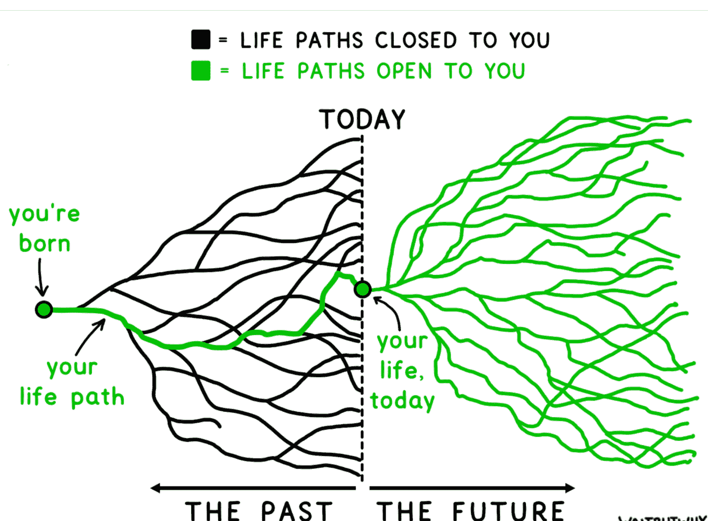

这张图很有趣，充满了丰富的隐喻，我们先来个整体的分析：

横坐标代表时间，左边是过去，右边是未来，中间点是今天。

我们生命的今天，就是一个点，我们永远只能生活在此刻。

这个点，是过去的人生道路（左侧）的终点，又是未来许多可能性（右侧）的起点。

这个世界是一个分布式的、随机的网络，但是在时间的机制下，过去是收敛的，未来是展开的。

此刻是二者之间唯一“真实”的联系。

纵坐标代表可能性的空间，随着时间的前进，人生的可能性从一个点，展开成无数枝丫。

图中的线条，还分为黑色和绿色。黑色线条，是“对你来说已经关闭的人生道路”。绿色的线条，是“对你来说开放的人生道路”。

“对你打开的人生道路”是个很有趣的表述：

过去被我们经历的人生道路，就是我们每个人走过的那唯一一条，所以左侧的线条大多数是黑色，只有一条是绿色。

而未来对我们开放的人生道路，则是所有可能性的路线，所以都是绿色的。

也许过去的人生道路，的确像是一条轨道。

但是，对于一个相信未来可能性的人而言，未来是一片旷野。

过去的所有可能性，已经收敛成你“生命的当下”这一个点。“以往的一切都只是个开场的引子”，而未来正在徐徐展开。

### 二

“轨道”与“旷野”，像是两种不同的人生模式：

轨道象征线性、确定与安全，如火车依轨前行，惯性强、风险小，却可能受束缚。

如果人生被定义为“轨道”，决策就偏向于延续现状，保守稳健。但一旦外部环境变化，轨道式的思维可能应对不足。

旷野代表开放、不确定与机遇，不被过去定义，虽迷茫却也充满着机会。

在“旷野思维”下，我们的决策不会只盯着单一路径，而是更乐于容忍变化和失败，随时调整策略。强调在不确定性中创造机会。

人生决策的关键，就是要学会在轨道与旷野间切换：知道何时该坚守已有路径积累优势，又懂得在关键时刻转向旷野寻找突破。

正如我们前面说的，过去收敛于当下这一点，而未来正在不断分岔，等待我们去探索。

我们回望过去的时候，常以为人生是一个轨道，是一条因果链，但事实可能是扔了好几把骰子而已。

过去的链条貌似清晰，却只是回顾时的事后总结，交织着所谓必然性和偶然性。“已成定局的历史”在回望时似乎很合逻辑，但当时的决策却往往带有极大不确定性。

人类有一种动物不具备的天赋：对过往归因，并作出抽象。

我们或是得到“第一性”，或是错误归因。但过去的表现，不代表未来的结果。不管是金融投资，还是成功学，对过往过度归因，都容易出现幸存者偏差、模型过拟合等问题。

所以，与其过拟合因果，不如大方承认，某些成功不过是运气，某些失败却有必然。

你一定要问，为什么不是反过来，把成功看作必然，而把失败看作运气？这里没有什么深刻的原理，而只是一种实用的策略。

而这个策略，还可以让我们更加谦卑，以防自大，乐极生悲；以及，吃一堑长一智，避免重蹈覆辙。

然而，尽管过去的链条并不会因果分明地向前展开，但可能会有一定惯性。

过去像是一列火车，不管快慢，上坡或是下坡，依然在一个轨道上前行。

一旦如此，过去的“轨道”就会成为枷锁。

当一个人的未来只是一条轨道，他就老了；当一个人虽然迷惘，但依然认为未来如大树般向上生长，他就还年轻。

意识到那条轨道的存在，意识到它对你的束缚，也许是打开人生空间的一个关键。

由此，我们也会知道应该如何看待过往：打无记忆的牌，将过去压缩为一点。

在亚马逊的年度股东信中，贝佐斯曾反复强调一种“Day 1”思维的重要性，他将每年每天每刻都作为亚马逊的新起点，厉害的人在人生决策上也是如此。

去除对过去的情感牵绊，像外来人一样处置这些资产，没用的扔掉，有用的留下，然后像新人一样，从头规划。

下一状态的概率分布，只能由当前状态决定，在时间序列中，它前面的事件均与之无关。

然而，要压缩过往，我们面对一个大障碍：自我。

太大的自我，会让我们不自觉维护过去的决策，甚至为过去的错误拼命辩护，这是很多悲剧的根源。

但其实，过去的我，和现在的我，以及未来的我，未必是同一个人。

有心理学家认为，自我的连续性，是一个神秘的幻觉。因为自我连续性的幻觉，我们往往会把“过去的我”“现在的我”以及“未来的我”视为一体，不愿意在关键时刻，推翻过往的错误决策、放弃旧有立场，进而在决策中滋生下列常见的偏差：

沉没成本谬误、承诺升级、确认偏见、现状偏差、禀赋效应……

这些偏差的共同根源在于：我们执著于“我是一个连续且一贯正确的人”，从而不断地在决策中固化自我、捍卫过去，而没有灵活地根据新的信息与目标做出必要的调整与改变。——在我看来，这可能是我们在决策上最大的“障碍”。

但其实，

“未来的我”杀死“今天的我”也许并不要紧，要紧的是“今天的我”别被“过去的我”拖入深渊。

### 三

然而，必须要承认的是，即便明确轨道思维的弊端，要拥抱旷野并不容易。

大多数人畏惧旷野，所以宁可沿着心底的幻觉，或者沿着别人的轨道，漫无目的地随波逐流。

旷野的辽阔的确让人迷茫，但我们依然要前行，而不能总是在迷雾和泥泞中梦游。

以下两种路径，也许都是可追求的：

- A路径：选择一条大道。这是一种类似于价值投资的思维。走那种确定性高的，被常识保护的，持续时间较久的路。然而走大道看似简单，其实很难，因为平淡，坚持走下来的人并不多。
- B路径：向着北极星前行。在迷雾的森林中，无限展开的未来无法预测。但当我们仰望星空，依然有方向。向着人类文明的北极星，遵循物理定律和道德定律。即使失败了，你也踩出了一条小径。

没人能够真正预测未来，尤其是很近的未来。

假如有人告诉你，他有预测未来的水晶球，别相信他。即使真有水晶球，人人都去买，水晶球也会失效了。

人们总愿意相信某种魔法，如果这种魔法既不用他们干活，也不用他们自己思考的话，他们就会乖乖地掏出钱包来。——算命，和类算命，的确是个好生意。

与其拘泥于预测未来，不如主动去创造。轨道并非全然不好，但要防止它成为桎梏；旷野虽迷人，也离不开目标和方法。

可是，怎样在人生的旷野中创造更多可能性？

《财富的起源》一书中讲到了一个经典案例。

1987年，那时的微软市值只有现在（2025年）的万分之一多一点儿，在IBM的阴影下求生，像一株小树苗。

多年以后，在商学院课程和成功学教材里，人们都在讲述：盖茨如何以Windows操作系统一举跃至浪尖，哪怕其间起起伏伏，现在仍是地球上市值最高的公司之一。

而事实并非如此。

即使是聪明如比尔·盖茨，也不是能预测未来的先知。

人类是生活在时间流中的三维动物，未来的可能只是一种假设，是一片苍茫的旷野。

盖茨选择了向树学习。还记得我们前面所说的那棵横放的树吗？

既然未来不是轨道，我们也无法预测未来，那么，干脆就拥抱多种可能性吧。

年少的微软公司，在六个主要的可能性路线上同时推进，就像是向上伸出6根枝干：

- 第一、继续投资MS-DOS；
- 第二、把IBM当作真正的威胁；
- 第三、参与Unix的联盟游戏；
- 第四、收购了个人电脑Unix系统最大卖家的大多数股票；
- 第五、继续投资应用软件；
- 第六、将主要的投资放在Windows上。

树向上生长的多样性，并非杂乱无章，而是遵循阳光、重力和生长素的基本作用。

微软当年的6根枝干，其阳光、重力、生长素，是盖茨设立的一个高层次愿景：成为领先的个人电脑操作软件公司。

即使是对的事情，想要做对也充满了不确定性。这种不确定性，不是因为看不清未来，而是连未来自己都不知道自己在哪儿。

所以，盖茨和树一样，“创造了一系列有可能朝着这愿景进化的战略试验组合”。

盖茨向大自然学习了“自然选择”。让市场和竞争，为自己的6根枝干剪枝。

多年以后，当人们回望，只能看到当事人“成功剪枝”之后的景观与传说，只看到那一条最终呈现出来的轨道，却忘记了，看似无所不能的英雄主角，在充满迷雾的旷野中，和每个创业者一样，小心假设，大胆探索着。

这印证了我们的观点：人生不是轨道，而是旷野。

我们更需要在无数岔路中探索和尝试，而不是拘泥于单条预设的“轨道”。拥抱不确定性，才能让我们在看似无序的世界中开拓出真正的成长空间。

### 四

让我们回到自己身上，你喜欢人生是轨道，还是旷野？

有一种很机智的回答：最好工作如轨道般清晰明了，生活则如旷野般自由奔放。

可惜，我们并不能轻松做这种分离。

我为你分享一个适用于旷野的“多世界理论决策法”：

在量子力学的多世界诠释里，每个选择都可能分裂出平行的世界——所有可能性在不同时空中各自延伸。虽然我们只能体验一条时间线，但其他潜在路径并非虚无。这带来两个启示：

- 既然所有分支都“真实”存在，我们便不必对某条特定分支过度焦虑；
- 真正重要的，不是预测哪条道路更优，而是让自己在任何可能的“世界”里都能生存与发展。

运用在决策上，就是要同时创造多个方向的试验机会，而非一味固守单一路径。如果其中某条分支在现实中“失败”，也不必太过沮丧，因为至少你在其他选项里仍保持了可能性与活力。

在思维层面承认多世界的存在，能减少我们对单一得失的执着，更灵活地审视人生中的不确定性。

假如你遇到迷茫和艰难时，试着对自己说：再想想，一定还有办法。如此大的旷野，总会有你的一条路。

不管你在人生的哪个阶段，今天，此刻，我们来到了“现在”的原点。

不是轨道中的某一站，而是旷野之中的某处，风景壮丽，悬念重重。

人生是自由的，不确定性有时令人不安，但几乎所有的美好时刻都是略带不安的。例如，小时候的春游前夜，年轻时的表白前夕。

让我们在人生的旷野之中点上烟花，让未来的所有可能性如烟火般直冲天空，恣意绽放，盛开成布满夜空的繁花。

我是老喻，我们下一讲再见。


## 56 态度第一：怎样拿回你的决策权？


lazybro，你好

我是老喻，欢迎来到《决策算法》课。

有一样东西，一旦拥有，人就可以实现梦寐以求的自由，甚至能够发现人生的意义。有趣的是，这样东西，其实每个人生下来就拥有，但是大多数人却放弃了。这是什么呢？

这样东西就是：

决策权。

如果你是《人生算法》的老同学，应该还记得我讲过一个自己原创的概念“概率权”。所谓概率权，看的是你能不能计算出一件事的概率，根据概率做出对你更有利的选择，并且忍受风险的存在。如果你承担不了一点风险，希望百分百都是确定性的答案，那你就放弃了自己的概率权。

而决策权，就是你能否真正为自己的人生做主、自主选择的能力。它不仅仅是表面上的“做决定”，更是一种深层的心理状态和能力。

很多人表面上在“做决定”，但其实只是重复别人的选择，或者被外界的压力和期待所主导。比如：

- 选大学专业时，因父母说“学医好”就去学医；
- 买房时，因为“大家都在买”就跟风购房；
- 找工作时，因为身边人都说“某某行业吃香”，就去做同样的事。

这些看似自主的决定，其实决策权早已旁落。你很可能连“我究竟为什么要这么选”都没认真想过。

就像概率权教会我们接受不确定性一样，决策权则教会我们在不确定中保持自主。它们共同构成了掌控人生的核心能力。

但是，如何才能真正拿回自己的决策权呢？

### 一

为了更直观地理解决策权，我喜欢用“按钮”来做比喻。

其实，我们的人生中无时无刻不在“按按钮”。一旦按下按钮，就意味着在某条轨道上投入了时间、精力或金钱，也让我们的未来更偏向某个方向。

概括而言，决策按钮大体上可以分为五类：

- **第一类：有确定选项的“按钮”** 例如在麦当劳或奶茶店点单，所有可选项都在菜单里，你只需要根据当下喜好和预算直接选择。即使是这么简单的“点单”，若你带着“我有权选择”的心态去做，也能培养自己的决策意识。
- **第二类：模糊且充满不确定性的“按钮”** 例如买股票，不同股票涨跌难测。这时你需要根据对市场走势、企业价值的判断，以及风险偏好来决策。
- **第三类：你要“自己创造按钮”** 当你想解决一个难题或抓住一个空白机会时，选项常常并不存在。比如创业；或者在日常生活中，为了改善健康状况，决策高手会看书、咨询营养师，甚至研发属于自己的健身饮食方案。这就是“创造选项”，而不是在现有方案里将就。
- **第四类：博弈型按钮** 这在下棋或商业竞争中最常见。你的一次行动，会影响对手或市场的反应，对手的应对又会倒逼你做出下一步决策。学会换位思考，理清多方意图，是做出高水平博弈决策的关键。
- **第五类：号召众人的“按钮”** 最厉害的决策，往往能带动一大群人一起行动。比如初创时的淘宝鼓励大家开网店；一个家长群发起公益活动，也是一种“集体决策”。你发动越多人，决策的影响力越大。

从简单的“点单”，到复杂的创业或领导决策，这五种“按钮”几乎囊括了人生中最重要的场景。理解它们，你就能更有意识地把每一次决定都当成“主动出击”的过程。

把决策比喻成“按下按钮”，看似简单，却蕴含深意。每一次按下按钮，都是一次郑重的人生选择：

按下的瞬间虽只需一秒，却能改变未来。这个简单的动作提醒我们：决策权是一种需要珍惜的特权。就像那些精密仪器上的按钮一样，我们要心怀敬畏地使用它，既不能因为顾虑太多而错过机会，也不能轻率鲁莽地乱按一气。

按钮的设计告诉我们：

决策贵在及时、果断，但按下按钮的后果，却需要我们长期承担。

理解了这一点，你就会对每一次决策负起责任，在决策前多一分思考，在决策后多一分担当。这就是拥有决策权的真谛。

### 二

然而，很遗憾，在决策这件事儿上，大多人都放弃了自己的决策权，让命运随波逐流：

有的人整天处在无意识的状态，别人说什么他做什么，像是在梦游；有的人生活就像踩着西瓜皮，滑到哪里算哪里。

以上这两种，基本属于彻底放弃决策权，自暴自弃。

还有的人呢，也知道决策很重要，但是被“无知、害怕、盲目”这三个词儿拴住了手脚，没法做决策。

因为无知，所以根本就不知道决策是怎么回事；因为害怕，所以不敢面对决策后的不确定性，于是干脆不做决策；因为盲目，所以做的是自欺欺人的假决策。

瑞典隆德大学的两位心理学家做过一个好玩儿的实验：他们让参与者从两位女士照片中，选出自己觉得好看的那一张。然后心理学家偷偷耍了小魔术，故意把不好看的那个照片递给参与者，还问他为什么觉得这个好看。

结果，超过70%的参与者，压根儿没发现自己拿到的是起初认为不好看的那位女士的照片。更好玩儿的是，他们还认真地找出理由，来说明自己为什么这么选。

这个实验揭示了一个深刻的心理现象：我们不仅可能会做出盲目的选择，还会为这些选择编造“合理化”的解释。这种“后见之明偏差”让我们产生一种错觉，仿佛所有决定都是经过深思熟虑的。

而更危险的是，这种自欺欺人的假决策会形成一种恶性循环：

- 做出盲目决策
- 为决策找借口
- 产生“我很理性”的错觉
- 继续做出更多盲目决策

所以，真正的决策权，首先是一种清醒的自我认知。当你意识到自己在决策时可能陷入无知、害怕或盲目的状态，你就已经迈出了重获决策权的重要一步。

### 三

承认了我们在决策中的盲区和局限，下一个问题就来了：怎样才能真正拿回我们的决策权？

这个问题的关键，在于理解决策权的本质。

侯世达在研究人类意识时提出了一个重要观点：人类之所以拥有意识，是因为我们具有“自我指涉”的能力。也就是说，我们不仅能思考，还能思考自己在思考，甚至能思考自己在思考自己的思考......正是这种层层递进的自我觉知，让我们成为有意识的个体。

决策权也是如此。它首先是一种自我觉察的能力，而不是外在条件的叠加。很多人以为，有更多的钱、更大的权、更好的机会，就等于拥有更强的决策权。但事实恰恰相反：当选项太多，反而容易让人迷失。那些看似“人生赢家”的大人物，常常会因为选择成本太高、决策压力太大而倍感煎熬。

这告诉我们一个重要的真相：决策权不是你拥有多少选项，而是你对自己的选择有多少觉察和掌控。它存在于每个人的生命中，不分贫富贵贱。即使是在最艰难的处境下，我们依然拥有决策权——至少可以决定以什么样的态度来面对现实。

这就是为什么说，态度第一。

但在现实生活中，我们却常常在不知不觉间丢失了这份权利。

所幸的是，找回决策权的第一步其实很简单：重新开启自我觉察。具体来说，就是诚实地回答三个基本问题：

- 我本来想要什么？
- 我现在在哪里？
- 我还能做什么？

这些问题看似简单，却直指决策权的核心：它不需要你有超人的智慧或特殊的才能，只需要一样品质：对自己诚实。

当你开始认真面对这些问题，哪怕处境再艰难，你也会感受到一种特殊的自由。因为你已经从被动的“被决策”状态，转向了主动的“做决策”状态。而这种转变本身，就是决策权的最好证明。

更重要的是，这种自我觉察会像滚雪球一样，带来更多的机会，让你获得更大的决策空间。

当你在这条自我觉察与行动的道路不断前进，就会发现，真正的决策权一直都在那儿，等着你去“按下按钮”。

### 四

前面我们理解了决策权的本质，现在让我们从实践层面，学习三个具体步骤，重新掌握决策权：

- **第一步：创造“白色空间”**
这个概念来自洛杉矶一家保镖公司老板贝克的经验。他发现，保镖工作的关键在于确保“白色空间”——即威胁与目标之间的安全距离。空间越大，保镖的反应时间就越充足。

就像里根遇刺时，从保镖意识到危险到袭击发生，只有1.8秒。这种紧迫状态下，任何决策都无法做出。

决策权也是如此。当我们没给自己留出思考的“白色空间”，就容易陷入被动和盲目。我有个做生意的朋友，每当遇到重要决策，必定站起来踱步思考。这不仅给了他决策的空间，更向外界传递信息：我在认真决策，请勿打扰。

创造“白色空间”，就是在为自己的决策权划出一片净土，把自己从“无意识”“踩西瓜皮”的状态里拽出来，远离外界的喧嚣和压力。

- **第二步：构建“反思循环”**

## 第三步：积累决策资本

拥有决策权不仅是一种意识，更需要实力的支撑。就像打牌需要好牌一样，决策也需要资本。这里的“资本”，不止是物质层面的，包括三类：

- 硬资本：财富、人脉、专业技能
- 软资本：智慧、信誉、勇气、同理心
- 心理资本：自信、定力、抗压能力

重要的是，这些资本是相互促进的：好的决策带来更多资源，更多资源又能支持更好的决策。这就形成了决策权的良性循环。

以上三个步骤环环相扣：

- “白色空间”让你有独立思考的余地；
- “反思循环”帮你提升决策的质量；
- “决策资本”则为你提供更大的选择空间。

记住，拿回决策权不是一蹴而就的事，而是一个渐进的过程。每完成一个步骤，你就离真正的决策自主更近一步。

### 最后

在结束这一讲之前，我想和你分享《高效能人士的七个习惯》作者柯维讲过的一个故事：

有人问柯维：“如果我不爱我的老婆了，我该怎么办？”柯维说：“那你就爱她吧。”这人说：“老师，你没听明白，我问的是我不爱我的老婆了，该怎么办。”

柯维说：“不是我没听明白，而是你没听明白。我是说，如果你不爱她了，那你就去爱她吧。”

这个故事启发我们：爱，首先是一个决定，是一个态度，而不仅是一种被动的感受。同样的道理也适用于决策权：它首先是一个态度选择。

很多人问我：“老喻，我不会做决策，你能不能教教我方法？”

其实，最重要的决策方法就是当回事儿地去决策。

当你从此刻起，每次面对选择都认真对待、敢于下手、主动承担，那你已经在“决策课”上合格了。

所以，从今天开始，不要再把自己当作一个被动的接受者。哪怕是选择今天午餐吃什么这样的小事，也请认真对待，当作一次决策实践的机会。

工具、模型、经验，这些都可以慢慢补充，最核心的，永远是那份态度。

愿你在这条觉醒之路上，重新找回属于自己的决策权。也愿你通过一次次主动的决策，发现生命更多的可能。

我是老喻，我们下一讲再见。


公众号懒人搜索，懒人专属群分享

### 公众号
懒人搜索
懒人专属群


微信：lazyhelper

## 57 选择VS努力：怎样找到你人生的α和β？


lazybro，你好！我是老喻，欢迎来到《决策算法》课。

大约十几年前，还是中国地产最火热的时候，我作为股东，去我们投资的一个地产项目上盯了一段时间。此前，我只管项目的投资和拿地环节，不太参与具体的项目管理。

那段亲临一线的时间，让我突然意识到了一点：有可能我们赚的完全是运气的钱。为什么呢？因为至少就那个项目而言，公司管理的专业性和精细度，都远远没有办法与别的行业相比较。

当时，这种念头是很奇怪的。因为房地产行业正在高速发展中，从业人员各种创新，到处学习，成功者出没于各大论坛峰会分享经验，大家都充满了自信，觉得自己是弄潮儿，是引领时代的人。

我把这个困惑告诉其他股东：“你们说，会不会我们赚的钱，就是时代带来的行业红利？从专业水准和付出看，配不上这么高的回报。”

多年以后的今天，不少将“行业红利”误认为是“自身优势”的地产公司，因为时代的变迁，遇到了极为惨痛的市场调整。

直到后来我学到两个金融概念，才恍然大悟。今天我就要和大家分享这两个改变了我思维方式的概念：阿尔法（α）和贝塔（β）。

### 一

现代金融理论认为，投资收益可以由两部分组合：

第一部分和市场波动无关的，叫阿尔法收益（α）。

第二部分和市场波动相关的，叫贝塔收益（β）。

听起来有点专业是不是？别担心，我们用一个特别生动的比喻说明：

想象你现在站在一个向上的电梯上：

电梯自己往上走的速度，就是贝塔；

你在电梯上迈步往上走的速度，就是阿尔法；

就像前面说的，地产的行业红利，主要靠的是时代的贝塔（β）。

如果我们误将时代的贝塔（β），看成与市场无关的阿尔法（α），例如认为是自己的专业能力、品牌优势等带来的，就会忽视一个极大的风险：

假如电梯停下来，你还能够一直向上吗？

事实证明，多年前我那个“奇怪”的直觉，可能是对的：地产行业赚的是贝塔（β）的钱，所谓的阿尔法（α），只是从业者在繁荣时期的幻觉。

### 二

既然阿尔法（α）与贝塔（β）都是金融领域的重要概念，我们不妨先回到金融投资的场景中，看看它们是如何帮我们赚钱的。

请你先来做个简单的数学题：如何赚到2000万？

假如你在上市之初，买一股可口可乐的股票，股价是40美金；

然后拿100年，就能赚到惊人的2000万。

100年约赚50万倍，年复合收益率大概是14%多一点，是不是比直觉少很多？

换在牛市的时候，说14%回报率，没人会理你。等到经历过熊市，大家会变理性，知道超过10%的年化回报率很不容易，何况持续100年。

事实上，巴菲特持有可口可乐的36年，年化回报其实还不到14%，但财富增长已经很惊人了。

再请问你一个问题：

如果可口可乐的股票，每年复合收益率变为一半，例如约为7%，那么一百年后收益将变成多少倍？

大约变成了原来的868倍。

似乎也不错，但40美金不过变成了不到35000美金，离财富自由还很有距离。

你看，年化回报率从14%变成7%，2000万就降到了35000。复利太狡猾了。

这7%左右的年化回报率，大约就是美国资产回报的贝塔（β）。

而可口可乐的超额回报，对应的则是阿尔法（α）。α和β，最终都是以复利的形式带来长期总体回报。

回到个人投资者，或者任何想要让资产或事业实现复利的人来说，掌握并守住贝塔（β）其实已经不易。在一个整体向上的市场里，稳稳拿到平均水平，就能获得相当可观的回报。

但若想真正实现财富或能力的飞跃，就需要继续叠加那几步“超额”的努力，也就是“阿尔法（α）”的部分——这才是决定你是否能够超越“大盘”的关键。

正如芒格提到的两种貌似矛盾的观点：

一方面，他建议人们降低期望值；

另一方面，他又强调追求卓越，因为巴菲特去除了最伟大的那几笔交易，就会变得无比平庸。

这是不是有点儿矛盾呢？

其实，降低期望值，意思就是说，在一个还不错的市场里，能拿到贝塔（β），已经很不错了。

而追求卓越，则是说，在守住贝塔（β）的基础上，去追求阿尔法（α），才能带来不平凡的结果。

所以，人生也是如此：

好的选择（β）能让你站在上升的电梯上；

持续的努力（α）则让你在电梯上不断前进；

两者结合，才能达到最理想的高度。

### 三

表面上看：贝塔易得，阿尔法难求。

但事实上，如果从复利的角度看，阿尔法和贝塔都很难。

从美国上市公司的情况来看，每过10.5年就有一半企业消亡或者被收购。

前面说了，可口可乐公司的股票100年约赚50万倍，但这是否算“幸存者偏差”？显然是。

在更普遍的意义上，韦斯特和团队测算后表示，一家公司能活100年的概率，是百万分之四十五。

以上是阿尔法的难，再看贝塔的难。

### 四

有人统计过美国过去200年不同资产的投资回报率，时间跨度是从1802年到2013年，表现最为优秀的是持有股票或股权，200年来翻了90多万倍。90多万倍听起来夸张，但其实，年化收益仅仅是7%左右。

7%左右的年化回报率意味着什么呢？十年左右翻一番，三十年左右变成原来的8倍。1万变8万，10万变80万，100万变800万……不过“如此而已”。奇迹似乎并没有诞生。

所以，人生复利的贝塔（β），至少从财务的角度看，我们不得不听从芒格的建议：降低期望。

这背后给普通人的启发在于：

- 1、选对大方向：先确保你站在一条长期向上的赛道上，这就是对贝塔（β）的把握。我们在职业或投资中要优先寻找一个“大趋势”所在。毕竟，一旦你不小心踏上一个衰退或高度动荡的行业，再多努力也可能是“南辕北辙”。
- 2、找到自身的“少数关键交易”：芒格举巴菲特的例子——如果去掉他最成功的几笔投资，整体回报会平平无奇。对于普通人来说，真正改变命运的，往往也是少数几次关键决策：也许是一份果断的跳槽、一次对的创业伙伴选择，或是一笔在正确时机的投资。关键在于：你是否已经做好准备，是否有能力把握住机会？

这就是“阿尔法（α）”的来源。

要做到这两点，需要我们沉淀专业与实力，才有等待与出击的底气。

长期看，大部分普通人的财富增长，靠的仍是稳健的β复利——勤奋工作、适度储蓄、合理投资，逐渐积累，以及警惕过度追求短期“奇迹”。

而“少数关键交易”也并非凭空而来，它要求你在平时就不断学习、积累资源、提升认知。

阿尔法和贝塔不仅在投资中具有重要意义，在人生规划和职业发展中同样扮演着关键角色。

现在流行说：选择比努力更重要。其实，选择和努力一样重要。

选择，对应的就是我们前面说的自动扶梯。

而努力，则是你自己在扶梯上往上走动的速度。

选择是个大概念：

例如，选择哪个城市。有人认为在大城市再差都会有个不错的结果，而这些年也有不少年轻人回归三四城市和县城。这背后，对应的是对不同贝塔（β）的价值判定——看你是喜欢大城市这个电梯，还是小城市这个电梯。

比方说，北上广深在过去多年里拥有显著的集群效应，有巨大的发展红利（β）。现在房价高企、生活成本上升，让不少年轻人权衡再三。但这里依然有最大的机遇，只是可能更适合有足够的阿尔法（α）实力的人。

这几年，成都、杭州、武汉、西安、南京、长沙等“新一线”城市正在崛起，互联网和科创企业在这些城市纷纷落地，生活成本与压力相对一线城市更低。对于很多年轻人来说，新一线更具性价比，也在持续吸纳从一线城市外溢的人才与资源。

因此，如果你在专业领域和个人偏好上，能与某个新一线城市的产业诉求相匹配（比如电商产业在杭州、游戏和文创在成都、先进制造在武汉等），那就相当于站上了一个更“舒适”的电梯；生活开支少、政策支持多，再加上个人努力（α），就有机会取得意想不到的高速成长。

而回归三四线城市或县城，也可能是合适的选择。小城市整体“电梯速度（β）”往往不及大城市，但如果你拥有当地的资源禀赋，比如家庭关系、土地、地方政策扶持等，这就相当于额外“加速”了一部分阿尔法（α），也能跑出独特的成绩。

还有工作选择。选择一个长期向上、有较大发展空间的行业，成长的机会要大得多。

过去几年，人工智能（AI）快速发展，尤其深度学习、大模型(GPT等)上取得突破，使得AI技术渗透到工业、医疗、金融、教育等方方面面。很多行业都在积极寻求AI+X的升级，加速催生大量新岗位和新需求。

这意味着AI正在成为一条急速上升的“电梯”。即使你不直接从事AI核心研发，也能从中受益——当你善用AI赋能，往往能在工作或创业中实现个人效率和成果的大幅提升，相当于在电梯上获得了加速奔跑的能力。你越早入局并深耕，就越容易在行业群体中拉开差距。

### 五

最近我看到一个人讲了一个真实的故事。他们去一个经济不发达国家投资矿业。那里资源丰富，劳动力成本也低，看起来很不错，结果，因为市场不成熟，以及别的一些原因，没多久就铩羽而归了。

他由此发出一段感慨：

> “投资也好，合伙也好，交友也好，一定要去比自己生活更发达的城市和国家去投资，一定要与比自己更优秀更强大的伙伴合作，一定要和比自己更努力更有实力的人去交友！”

付出代价的智慧，总是无价的。

也许我们的人生，也需要先想好贝塔（β）的问题。然后再在阿尔法（α）上追求与众不同。

所有的理论与道理，终究要回到行动。最后，我想送给你几条“阿尔法+贝塔”的行动指南：

- 1、辨识你的电梯（β）：先仔细看看，你所在的行业、城市、平台，是否真的在“往上升”——如果没站对电梯，就算你跑断腿，也难逃回报平平的命运。问自己，你在对的地方吗？你在做对的事情吗？你在和对的人一起吗？
- 2、拓展你的竞速力（α）：别指望风口会永远吹着你，要想跑赢别人，就得用心修炼内功。对你所在领域的专业能力、资源、人脉，都要投入“持续+深度”的复利式耕耘。风口并非万能，你的“奔跑速度”才是真正打败对手的关键。
- 3、抓住那几次关键机会：每个人的一生，都不会有无数次大转折，大多只是几次关键节点——跳槽、创业、投资、决定与谁合作……在机会来临前，你能否眼光独到？在机会出现时，你能否果断出击？如果你已经练就了阿尔法（α）的实力，那么这几次行动就足以改变命运。
- 4、别把暂时的成功当永恒的实力：你所享受的“红利”，究竟是来自大环境的好处，还是你真有硬核能力？你需要分辨。时刻提醒自己，电梯随时可能停摆，甚至下行。要想脱颖而出，一定要有超越环境变化的真本事。
- 5、给自己设一个更持久、更宽阔的赛道：人生不止靠金钱衡量。你可以在健康、认知、情感、家庭等不同维度寻找你的“阿尔法”及其“复利”。种一棵树、写一本书、坚持运动、学习新技能……这些同样会像滚雪球一样，让你在未来得到无法估量的收获。

所以，选择和努力，到底哪个更重要？

阿尔法（α）和贝塔（β）的思维模式，其实已经给出了精辟的答案：

一个人的成就，既不是单纯选择的结果，也不是纯粹努力的产物，而是两者的乘积。

选择，是让你站上那部“往上升的电梯”；

努力，则是你在电梯上行进的速度与坚持。

并且，这二者又是互相成就的。

愿你在人生决策时，先锁定对的大方向（β），再不断淬炼自身（α），最终实现两者的完美叠加，跑出让人惊艳的轨迹。

我是老喻，我们下一讲再见。

## 《老喻·决策算法100讲》

成为命运的主人

版权归得到App所有，未经许可不得转载

老喻 思考者


微信:lazyhelper

## 58 告别童年：怎样像成年人一样决策？


lazybro，你好！

我是老喻，欢迎来到《决策算法》课。

X先生是我认识的最聪明的人之一。周围的朋友也说他绝顶聪明，干啥精啥，年轻时就靠一系列投资实现了财务自由。

然而，X却始终面临一种诡异现象：每隔一阵子，他都会在重大决策上摔个大跟头。最近，他又踩了个大坑，亏了不少钱。照理说，以他的眼光和智商，这种低级错误不该发生——究竟是什么让他一再跌入相似的陷阱呢？

困惑之下，我深入了解了X的成长经历。原来，年幼的X生活在一个充满强制性安排的环境中。从日常生活的细节到人生的重大抉择，家长的意志始终凌驾于他的选择之上。父母还经常因为这些安排爆发争吵，而小小的X学会了最省力的应对方式：顺从、讨好、压抑自己的真实意愿。

这种童年生存策略，在他的成年生活中投下了长长的阴影。尽管他的理性分析能力出众，但在面对重要抉择时，那个习惯寻求外部指引、缺乏主见的“童年自我”常常不期而至。他的决策失误，往往不是源于认知的盲点，而是来自内心深处那个依赖、软弱的自己。

成年后，X依然延续着这种“想讨好、怕冲突、缺少安全感”的心理惯性。在朋友看来，他思维缜密、见解独到，但只要事情牵涉重大决策、涉及人际或自我定位时，他往往“退回”到孩子般的怯懦与依赖：要么一次次纵容他人占便宜，要么在受害时默默认栽，哪怕脑子里明明知道有风险，也依然“明知故犯”地作出糟糕的决定。

X也知道自己的弱点。他最近用西奥多·罗斯福的一句话来自我反省：“我觉得有一种品行比硬心肠更糟，那就是软弱的脑袋。”这并非智商或情商问题，而是指向某种根深蒂固的“受害者倾向”，让他在重大抉择时偏离常识，甚至招惹并纵容了“恶人恶事”，最终陷入困境、造成损失。

X的真实经历让我猛然意识到：哪怕一个人熟知投资、概率、行为经济学等决策知识，也有丰厚的决策经历，依然可能在紧要关头表现得像没长大的孩子。在那些貌似理性的选择背后，我们的“童年自我”可能仍在暗中主导。

这就是我们今天要探讨的主题：想要像成年人一样做出真正想要的决策，你必须先告别童年。这个“告别”，不是与童年记忆诀别，而是与那些已经不再适合成年生活的行为模式告别。

### 一

X的故事让我想起了一本发人深省的心理学寓言《蛤蟆先生去看心理医生》。书中的主角蛤蟆先生，表面上是一位体面的绅士，但在生活中却总是陷入各种糟心事儿。直到有一天，他意识到这些麻烦似乎都有一个共同点：他在不知不觉中一直在玩一个叫“可怜弱小的我”(PLOM: Poor Little Old Me)的游戏。

就像X一样，蛤蟆先生并非不懂做决定，但他的决策模式却暴露出一个深层问题：他习惯性地将自己置于受害者的位置。在心理医生苍鹭的帮助下，蛤蟆先生逐渐认识到：这些看似“倒霉”的遭遇，其实都暗含着某种无意识的“共谋”——他在不知不觉中配合对方，给自己制造不快。

### 二

这种情况在我们身边并不罕见。很多人在职场上干练果断，在专业领域独当一面，但在某些重大决策面前，却会不自觉地表现出“儿童思维”：或是期待他人的指导，或是逃避责任，或是轻易被不怀好意的人利用。这种决策上的“童年依赖”，往往与我们的成长经历和心理模式密切相关。

为什么会这样？原因就藏在我们的“自我状态”中。心理学告诉我们，一个人可能处在“儿童自我”、“父母自我”或“成人自我”状态。真正成熟的决策，来自于“成人自我”状态——这时我们能理性分析当下情况，而不被童年的情绪所困扰，也不受制于他人的影响。

然而，很多人虽然年龄已长，决策时却仍停留在“儿童自我”状态。他们可能像X一样聪明有见地，却在某些情境下不由自主地重复着幼时形成的反应模式。这种状态下，我们要么过分依赖他人的认可，要么沉溺于受害者心态，要么盲目相信他人而忽视明显的风险信号。

而决策上告别童年，意味着摘下依赖、冲动和逃避的“童话滤镜”，真正站上成年世界的舞台，用理性和担当去主导人生的剧本。

说到底，X的故事也在提醒我们：光有高智商、高知识储备，未必就能防止“软弱脑袋”在关键决策中占上风。要想像成年人一样做出自己想要的选择，我们需要的不只是专业的决策知识，还需要足够的心理成熟——这是一个隐蔽但不可或缺的“决策算法”模块。

如何突破这种困境？如何真正“告别童年”，培养成熟的决策能力？

接下来，让我们来看一下，自己为什么会被困在“儿童自我”里，为什么会无法做出自己真正想要的选择。

于是，童年阶段的包办教育和羞耻感、社会对“听话”的强化，以及内心对自我决策能力的质疑，共同塑造了一个“决策小孩”。看似事业风光，却在关键时刻倒退到儿时的安全区：盲目听从、懦弱退让，或干脆做出“明知必错”的决定来伤害自己。

要“告别童年”，我们必须先看清这三重捆绑——承认自己的恐惧、破除对权威的迷信，并正视内在那股“自毁”能量。

### 三

接下来，我想借用《蛤蟆先生看心理医生》一书里的方法，为我的朋友X开出“告别童年”的几个药方：

- 药方1：觉醒药

亲爱的X，能帮你的人是你自己，也只有你自己。停下来问问自己：你能停止自我批判吗？你能对自己好一些吗？

最重要的是，你能开始爱自己吗？这些问题看似简单，却直指痛处。因为爱自己，往往是我们最难的功课。

- 药方2：诚实药

问问自己，是否总在玩一个叫“可怜弱小的我啊”的游戏？——为什么你总是遇到类似的事情？这些遭遇总让你显得愚蠢，让对方占了上风，让你重回童年的无助。

你可以对自己更诚实：为什么你总是遇到类似的事情？到底是纯属倒霉，还是因为你用某种方式和对方共谋了这件倒霉事？

- 药方3：成长药

成人的思维方式，是用理性而非情绪来应对现实。不再被父母的声音驱使，不再被童年的情绪困住，而是能够看清当下，基于事实做决定。——你没有义务讨好别人。

是的，我们的痛苦往往是自找的。被困在“儿童自我”中的我们“选择”了愤怒，“选择”了悲伤，尽管这些选择常常是无意识的条件反射。承认这一点很难，但这正是成长的开始。

- 药方4：责任药

责怪永远是儿童的选择，成年人选择为自己的行为和情绪负责。当你开始承担责任，你就会发现：你对自己是有自主权的。你有力量改变处境，更有力量改变自己。

- 药方5：自尊药

那些认为自己很差劲的人，往往觉得生活对他们不公，却对他人格外宽容。他们执着地记住不快乐的事，忽视所有美好时光。这种生活方式必然导向郁闷——因为他们坚信自己无法掌控人生，深陷于“我不够好”的泥潭。

而那些真正有智慧的人，都拥有强大的自我意识。他们了解自己的情感，能够管理情绪，懂得从挫折中振作。最重要的是，他们能控制冲动，懂得延迟满足，避免轻率的决定。

记住：真正的医生是你自己，这些药方只是辅助工具。关键在于你是否愿意开始爱自己，是否准备好为改变负起责任。治愈之路或许漫长，但只要你迈出第一步，改变就已经开始。

### 四

这一讲的最后，我想说的是，决策上告别童年，并不是舍弃童心。

我们的一生，都处于“童年自我”和“成年自我”的共存之中。那些“童年自我”比较强大的人，往往更能感受到这个世界的美好，更能体验到人生的快乐。

告别童年，像一个成年人那样去做你真正想要的决策，就是为了守护你灵魂当中那个宝贵的“童年自我”。

让那个充满想象力、富有同理心、敢于做梦的内在小孩，能在一个成熟、理性、负责任的成年人的守护下，继续自由地生长，勇敢地探索，快乐地生活。

要做到这一点，你需要在决策时刻来到“成年自我”，用理性而不是情绪化的方式来行事，能在复杂的现实面前冷静思考，理智规划下一步。

请你记住：每个优秀的成年人心中，都住着一个被好好保护的小孩。那个小孩依然会害怕、会软弱、会渴望被爱，但他知道有一个成熟的自己会始终守护着他，给他力量，给他勇气，让他无论在多么复杂的世界中，都能保持纯净的心灵，做出真诚的选择。

我是老喻，我们下一讲再见。


公众号 懒人搜索 懒人专属群


微信:lazyhelper

## 59 驾驭青春：怎样少做让自己后悔的决策？

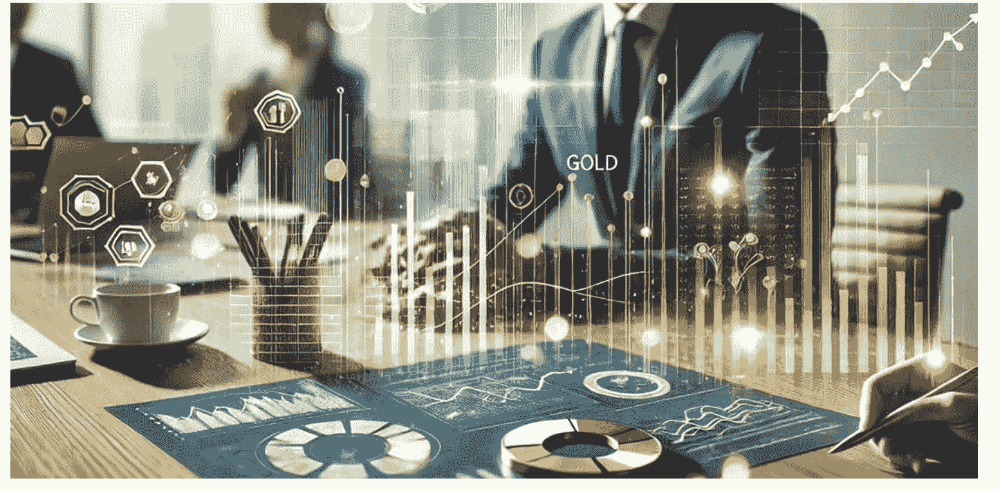

lazybro，你好

我是老喻，欢迎来到《决策算法》课。

1832年，一个叫伽罗瓦的天才决定赴死。那时他还未满21岁。

看上去他完全是头脑发昏，居然因为爱情而与人决斗，据传情敌是一位职业枪手，对伽罗瓦而言，这无异于自杀。

在决斗前的夜晚，这位20岁的天才青年写下几封信，其中一封是对自己的嘲讽和对敌手的谅解，他写道：

“……我的生命是在一场悲惨的斗殴中消失的。哦！为什么为那么微不足道的事而死，为那么卑鄙的事而死！原谅那些杀了我的人，至少他们是真诚的。”

为什么伽罗瓦这么轻易地用自己的性命去下一个毫无希望的赌注？是因为他太愚蠢，还是觉得生命轻如鸿毛？

恰恰相反，伽罗瓦是一位数学天才，他在十几岁的时候，就解决了长期困扰数学界的问题。他深知自己的研究对人类的价值。

决斗前夕，这位让人难以琢磨的热血青年，以某种异乎寻常的冷静，将他的数学成果飞速记录下来。在草稿的空白处，他写下无奈的感慨：“我没有时间了，我没有时间了……”

多年以后，我在一本数学专著里，看见了伽罗瓦留下的完整文字，年轻的数学家对自己划时代的研究满怀希望，在遗嘱的最后，他依然年少张狂地写道：

“请雅可比或高斯公开提出他们的意见，不是对这些定理的正确性，而是对它们的重要性。”

雅可比和高斯是那个时代最伟大的数学家，20岁的伽罗瓦不需要他们来确认自己的正确，尽管这个世界要在他死后数十年，才意识到他有多正确。

而他留下的“群论”，后来成为现代数学的基石之一，也被广泛应用于晶体结构、基本粒子、量子力学、材料科学，乃至公钥密码术。

全世界都会感谢伽罗瓦在那个夜晚留下的文字。次日正午，他如约赴战，被打穿肠子，最终死在弟弟的怀中，并对他说：“不要哭，我需要足够的勇气在20岁死去。”

伽罗瓦的故事令人叹息。在他身上，我们看到了青春最璀璨的光芒：天才般的创造力、对真理的执着追求、敢于挑战权威的勇气。

但同时，我们也目睹了青春最致命的弱点：感性压倒理性、冲动战胜深思、当下模糊远方。这位年轻的天才在二十岁选择为一场无谓的决斗赌上性命，将可能改变人类文明进程的智慧提前终止。

### 一

青春是一段令人困惑的旅程。为什么我们会在这个时期做出许多后悔的决定？为什么明知某些选择可能带来灾难性后果，却依然无法抗拒诱惑？

近年来的脑科学研究为我们揭开了这个谜题的面纱。

想象一下，青春期的大脑就像一辆高性能跑车：引擎强劲，动力十足，却没有与之匹配的刹车系统。这个比喻准确描述了青少年时期特殊的大脑发育状态。

科学家发现，人类大脑中负责决策和控制冲动的前额叶皮质要到25岁左右才能完全成熟。这个区域就像是决策的“刹车”和“导航”系统，帮助我们在行动前权衡利弊、进行理性思考。

而在这个关键区域发育完善之前，大脑中的另一个系统——情绪中枢（负责处理情绪和奖励）却已经高度发达。

研究表明，在风险决策任务中，青少年的前额叶活动比成年人低40%，而情绪中枢的活跃度却高出50%。这解释了为什么青少年在面对诱惑时，常常明知风险却依然无法抵抗。

正如著名神经科学家布莱克莫尔所说：“青少年的大脑奖励系统已经在全速运转，而负责自我控制的前额叶还在忙着发育。”这种发育的不同步，导致年轻人往往会优先选择即时的小奖励，而非未来更大的收益。

这些发现让我们明白，青春期的决策更容易受到情绪驱动，而非依靠理性权衡。

就像伽罗瓦一样，即使拥有超凡的数学天赋，在情感和社交决策上也可能表现出典型的青春期特征。

### 二

这些神经科学的发现让人不安，但更令人不安的是走出校园后的“残酷现实”。

我曾看到一段很扎心的对话——

> 问：“为什么社会上的人都把大学生当小孩？”
> 
> 答：“我只能说，别说大学生了，我觉得这个世界上，没干过销售或者业务的人，思想都很小孩。他们迷信多劳多得，迷信努力让人进步，迷信坏人会得到惩罚，迷信好人有好报。这是典型的小孩思维。”

这个回答可能有些偏激，但也说明了部分真相。

的确，走出校园后，青年人面临的挑战远比大脑发育的局限更为严峻。这是一个双重打击：一重来自世界的非线性，另一重源于人性的复杂。

先来看第一重打击，现实世界运作的非线性。

在校园里，我们习惯了“付出就有回报”的确定性思维：认真复习就能考高分，按时完成作业就能得到老师的认可。

但真实世界却是高度不确定的，它更像是一个混沌系统：你精心准备的方案可能在瞬息万变的市场中失效，你苦心经营的项目可能因为一个意外事件而归零。

对这种非线性，销售人员最有发言权：今天拜访了十个客户可能一单都没有，明天随意的一个电话却带来了大订单。

创业者的经历更是如此：有人埋头苦干数年依然原地踏步，有人灵光一现就找到了市场突破口。这不是努力与否的问题，而是世界本身的不确定性。

再来看第二重打击，人性的复杂。

在学校中，我们习惯了简单的是非判断：善有善报，恶有恶报。但现实世界中的人际关系远比这复杂得多：你真诚以待的同事可能在背后说你坏话，你倾力帮助的伙伴可能在关键时刻背叛你。最令人困惑的是，那些不按“道德规则”行事的人，有时反而能获得更多资源和机会。

面对这双重打击，许多年轻人陷入迷茫。他们仍在用校园里的线性思维和道德准则来理解这个世界：相信付出就会有回报，相信正直就能得到尊重，相信坏人终将受到惩罚。这种认知偏差不仅会带来巨大的挫折感，更可能导致错误的决策判断。

那么，对于年轻人而言，该如何在这个真实的世界生存呢？

### 四

面对现实世界，一个年轻人似乎只有两种选择：

第一种，是变得世故犬儒，心如死灰，仿佛一只“仅为生存的昆虫”。

他们见识了社会的冷酷与无常后，便向现实缴械投降：不再相信理想，也不再奢望改变，只想随波逐流混日子。

在职场里，这类人或许表现出谨小慎微、明哲保身的态度，看似减少了挫败，却也丧失了激情与创造力，内心深处空洞乏味。

对他们而言，成长意味着“变得圆滑”，用最小的冲突活下去。可惜的是，这种“犬儒保护层”也隔断了他们去成就更丰盛人生的可能性。

第二种，是停留在“延迟的成年期”或“彼得潘”状态里，不愿真正迈入成人角色。

美国发展心理学家阿内特（Jeffrey Jensen Arnett）指出，18～25岁之间的“新兴成年期”常见于现代社会：因为教育延长或婚育推迟，很多年轻人留在“半大不小”的过渡地带，既享受着青春的探索与自由，却又不敢或不想面对实际责任。

这样的日子表面有无限可能，实际上容易陷入浮躁与不稳定：一面厌倦父母的安排，一面又依赖家庭的保障；心想“我还有机会”，却迟迟不落实任何长远规划。

这种情况发展到极端，被称为“彼得潘综合症”，患者拒绝长大、拒绝承担任何社会义务，终日沉迷娱乐或逃避现实。

但事实上，我们还有第三种选择，也是最值得追求的一条路：

在看清世界的真相后，仍然选择继续前行。

这是主动告别青春式任性，却也保持内心的热血与愿景。在不确定中努力试错、在繁杂人性中依然相信善意并建立边界，学着承担责任、锻炼自我决策力，把“成长”从一句口号变成实际行动。

我们不会一夜之间变得老练，但我们可以在竞争激烈的职场里，逐步拓展能力边界；在阴晴不定的人际关系中保持理性、学会分辨与自守，让自己既能保护纯粹理想，也能灵活应对风浪。

驾驭青春，就是在这三条岔路前做出明智的选择：

既不让世故扼杀热情，也不被彼得潘心态所困，而是在现实与理想之间找到平衡，让自己在这个世界上活得既真实又丰盈。

### 五

什么是真正的成熟？

让我们看看全球顶尖企业奈飞的标准。他们有一个著名的用人原则：只招成年人。

这里的"成年人"，当然不是指年龄，而是指一种成熟的态度和能力。在奈飞看来，真正的成年人应该具备三个特质：

首先是对结果负责，而不是对规则。

奈飞没有考勤制度，也不限制带薪休假，因为他们相信成年人知道如何平衡工作与生活，会为自己的选择承担后果。

这不正是我们前面讨论的从“线性思维”到“非线性思维”的跃迁吗？成年人明白，重要的不是过程中的条条框框，而是最终能否创造价值。

其次是敢于直面冲突。

奈飞提倡“坦诚的激进透明”，鼓励员工之间开诚布公地讨论分歧。

这与我们之前谈到的“人性的复杂性”相呼应：成年人既不会因为害怕得罪人而回避问题，也不会因为个人情绪而失去理性。他们学会在复杂的人际关系中保持专业和建设性。

第三是具备自主决策能力。

奈飞期待每个员工都能像创业者一样思考问题，在不确定中做出判断。

这些特质勾勒出了驾驭青春的航向：

真正的成年人，不是放弃理想变得世故，而是学会在复杂世界中坚持原则；

不是逃避责任当彼得潘，而是勇于承担更大的挑战；

不是简单地服从或反抗，而是发展出独立思考和决策的能力。

这才是我们该追求的成熟之道。

### 最后

什么是驾驭青春？就是在认清自身局限和世界真相的基础上，依然能够做出自己想要的选择。

从伽罗瓦的传奇，到当代青年的迷茫，再到奈飞的成人法则，我们看到了一个永恒的课题：如何在这个复杂的世界里，真正地掌控自己的人生。

像成年人那样选择，就是对结果负责而不是对规则，敢于直面冲突而不是一味躲避，具备独立思考的能力而不是人云亦云。

这才是真正驾驭青春的姿态：既保留纯粹与激情，又用理性框架与担当力让自己选择无悔。

这并不容易，有时候不仅艰难，甚至让人恐惧。我喜欢的诗人里尔克，在《给青年诗人的信》里面，揭示过这种困境：

> "人在遇见了艰难，遇见了恐怖，遇见了严重的事物而无法应付时，便会躲在习俗的下边去求它的庇护。它成了人们的避难所，却不是安身立命的地方。"

该怎么办呢？里尔克建议是：

谁若是要真实地生活，就必须脱离开现成的习俗，自己独立成为一个生存者。

愿你在寻找属于自己的“第三条路”时，既能守护内心最真实的愿望，又能掌握现实的方向盘，在自由与责任交织的天空下，成为那个能做出真正想要的选择的成年人。

我是老喻，我们下一讲再见。


公众号懒人搜索 懒人专属群 微信：lazyhelper

## 60 突破中年：怎样在重围中选择更精彩的人生？


lazybro，你好

我是老喻，欢迎来到《决策算法》课。

42岁那年，苏轼遭遇了北宋版“中年危机”的暴击。曾经的政坛新星、顶流文豪，一夜之间跌入人生至暗时刻。

130天的囚禁让他从“汴京名士”沦为罪臣，出狱时须发尽白，被贬到湖北黄州任团练副使，一个偏远的五线小城，一个没有实权、形同软禁的虚职。

从人生巅峰跌到谷底的苏轼，带着家人在黄州为糊口垦荒种地，被晒得漆黑。朋友圈里点赞的达官显贵早已消失，他再也不是那个可以高谈阔论天下大事的京城名士，而是一个被时代抛下的孤独中年人。

这正是典型的“中年危机”——曾经建立起来的一切，转眼化为乌有；曾经信奉的价值体系，突然被现实击得粉碎。

每个人来到中年，都会陷入类似的疑惑：我怎么了？我为什么会遇到这些糟糕的事情？我还能做什么？我如何走出这场人生的困境？

也许，我们真正要突破的，并不是中年，而是对人生稳定性的执念。

### 一

经济学家大卫·布兰奇福劳（David Blanchflower）通过对132个国家的研究发现，人类的主观幸福感呈现“U型曲线”——年轻时较高，中年时期跌入谷底，直到50岁之后才缓慢回升。在全球范围内，中年低谷大约出现在47岁。

为什么中年会成为人生最灰暗的阶段？答案或许藏在压力的多重夹击中。40岁到50岁，是人生责任最重、压力最强的阶段：

事业高不成低不就：升迁空间受限，职场竞争加剧，曾经的锐气被日复一日的工作消磨。

家庭责任加码：上有老、下有小，既要操心孩子的教育，又要照顾逐渐衰老的父母，夹在两代人之间，焦虑无处宣泄。

人生回顾的失落感：年少时的梦想被现实冲淡，曾经的激情变成疲惫，内心不禁反思：“我这辈子到底成就了什么？”

更隐秘的杀伤力来自认知系统的崩解：在20多岁时，我们相信拼搏就能得到回报；在30多岁时，我们还觉得未来充满可能。但到了40多岁，我们开始发现，这个世界并不像当年以为的那样公平、可预测、充满希望。

尽管付出了所有努力，现实却未必给出相应的回报，这种“期望与现实的错位”正是中年危机的核心。

中年危机并非个体的失败，而是一个几乎所有人都会经历的心理关口。

### 二

年轻时，我们依赖“加法决策”——尝试一切可能；中年时，我们需要“减法决策”——学会拒绝和放弃。

那么，问题来了：当我们被现实重重包围，如何选择更精彩的人生？如何像苏轼那样，在低谷中找到突围的方向？

黄州的五年，是苏轼对中年危机发起的一场绝地反击。

这个被朝廷遗忘的江畔小城，成了他重构人生的实验场——短短几年后，他不仅在精神上完成了自我救赎，还创造了千古流传的文学巨作。

苏轼用3把钥匙，打开了中年困局的枷锁。

- 1. 从愤懑到超脱：认知的转变

初到黄州时，苏轼的心境仍是低落的。他写道：“拣尽寒枝不肯栖，寂寞沙洲冷。”这一句清晰地传达了他的孤独与失落。然而，他很快意识到，长久沉溺于怨愤无济于事，唯有调整内心，才能从废墟中爬起。

他开始学着放下对理想的执念，接受自己被放逐的现实，并试图寻找新的生活意义。

在现代心理学中，这种“认知重构”被视为帮助人们走出困境的重要策略。

苏轼并没有一味逃避，而是通过改变对世界的认知方式，使自己能够接受新的身份，找到继续前行的动力。这是他在黄州的第一个突围——心理上的解放。

- 2. 从落魄到自足：生活的重建

当时苏轼面对的最现实的问题，是如何养家糊口。他的解决方案是：躬耕自食其力。

在好友的帮助下，他在黄州东郊获得了一片荒地，开始亲手种田、养猪，甚至还自创了“东坡肉”的烹饪方法。他在《猪肉颂》中写道：“慢著火，少著水，柴头罨烟焰不起，待他自熟莫催他，火候足时它自美。”

这不仅是对烹饪的总结，更像是对人生的隐喻——

慢慢熬，别急躁，时间会给出答案。

- 3. 从失意到巅峰：创作的爆发

很多人以为，逆境会摧毁一个人的创造力，但苏轼在黄州的经历恰恰相反。此时的他，开始真正走向文学的巅峰。《前赤壁赋》《后赤壁赋》《念奴娇·赤壁怀古》等千古名篇，均诞生于这段时期。他还写下了“天下第三大行书”《寒食帖》。

有时，失去会让我们意识到自己真正能拥有什么。中年困局也能让人去除虚浮，去探寻生命的本质。

苏轼在黄州最难熬的，不只是现实的困境，还有心理上的崩塌与重塑。

如何在“人生的至暗时刻”里，找到精神上的光？

这才是“突破中年”的核心问题。

> 借用苏轼的诗句：“回首向来萧瑟处，归去，也无风雨也无晴。”

当你能以平常心看待得失，以创造力应对挑战，人生的下半场自然会呈现出不一样的高度。

富兰克林有一句广为流传的名言：

> “二十岁时，意志当道；三十岁时，智慧主导；四十岁时，判断力至上。”

这句话深刻揭示了人生不同阶段的优势：二十岁凭借热情和勇气闯荡；三十岁开始积累智慧，明白取舍；到了四十岁，则具备了准确的判断力，能够在复杂的情境中做出更明智的选择。

到了中年，拼体力，你拼不过20岁的年轻人；拼精力，你比不上30岁的人。但神经科学研究发现，这个阶段恰恰是人类大脑的另一个黄金期。

虽然处理速度和工作记忆可能开始减缓，但在综合决策和判断方面，中年人的表现往往优于年轻人。

这源于两个关键因素：

一是经验累积带来的“晶体智力”持续增长，让我们能更准确地识别模式、预判趋势；二是情绪管理能力的提升，中年人的大脑对负面刺激的反应减弱，更容易保持理性和平和。

正如哈佛大学的研究发现，在复杂的经济决策中，中年人往往表现出更强的理性判断力。

你的阅历、认知深度、资源整合能力，以及对趋势的洞察力，才是这个阶段最宝贵的资产。

概括而言，40岁后，真正拉开人与人差距的，不是努力，而是决策的质量。

但是，不同于年轻时的试错成本较低，中年的每一个决定，都意味着更大的机会成本、更深远的影响、更难以回头的路径。

这时，成熟的决策方式不再是简单的“跟随直觉”或“一鼓作气”，而是更理性、更审慎，更要注重攻守兼备。

我们通过两个典型案例，来解析中年决策的核心特征。

### 五
让我们再回到中年苏轼所在的黄州。

我出生在湖北新洲，那里距离黄州古城不过数十公里。

假如你来到赤壁遗址，会感慨“太小了”！这真的是苏东坡笔下的那个赤壁吗？

但是，在苏东坡的精神世界里，历史时空中的赤壁壮阔如斯——

> “大江东去，浪淘尽，千古风流人物。故垒西边，人道是，三国周郎赤壁。乱石穿空，惊涛拍岸，卷起千堆雪……”

事实上，苏东坡的大半生都是在不如意和流亡中度过的。但他几乎从来不用“自我批判”来实现某种内心的躲避，哪怕他的确做了很多傻事，有些是因为追求正义，有些是因为书生意气。

可苏东坡在精神世界上绝无妥协。他甚至无暇向上天哀怨，向朋友乞怜，向敌手怒吼。

他最多只是自我调侃，然后把自己还原为一个点，一种存在，进而从更大的空间和时间尺度有所伤，有所感，有所悟，每每悲痛至极，都能跃升至另一层次，看见更广阔的时空。

在我看来，苏东坡最强大的特异功能是，不管到了哪里，都能迅速将那里变成自己的人生主场。

中年时的苏东坡，经历的是生死劫。我们作为现代人很幸运，不必经受那种肉体上的苦痛。但是极具现代性的苏东坡，在实现“中年突围”的人生策略上，却依然值得我们学习：

- 调整认知，接纳现实：不要沉溺于“本不该如此”的情绪，而是学会接受现实，在现有条件下寻找新的可能。——“莫听穿林打叶声，何妨吟啸且徐行。竹杖芒鞋轻胜马，谁怕？一蓑烟雨任平生。”
- 从生活入手，重建秩序：哪怕只是改变一个小习惯，培养一项新爱好，都能帮助我们重获生活的掌控感。再大的事儿也先放下，让自己过好点儿，别亏待肉身和心灵，哪怕是吃点儿美食，听一首好歌。精神世界只需要丁点儿滋养就能重构秩序。——“长江绕郭知鱼美，好竹连山觉笋香。”
- 创造价值，找回成就感：在逆境中主动寻找产生价值的机会，让自己始终保持向上的状态。——人生到处知何似，应似飞鸿踏雪泥。
- 拓展视野，重建连接：不要把自己封闭起来，要善于向外寻求帮助，与理解你的人保持联系。——一年好景君须记，正是橙黄橘绿时。
- 拥抱变化，保持成长：放下对“完美人生剧本”的执念，学会在变化中调整方向，找到属于自己的节奏，并在失败和重建的循环中，不断拓展人生的边界。——“休对故人思故国，且将新火试新茶，诗酒趁年华。”

中年危机并不可怕，可怕的是把它当成终点。

到了中年，一个人才开始真正修炼属于自己的决策算法。

未来依然广阔，想想看，巴菲特99%的财富来自50岁之后。

苏轼的故事告诉我们，中年是一次重塑的机会，不如放声高歌，笑对风雨，或许迎来的将是人生真正的高峰。

我是老喻，我们下一讲再见。


## 61 避免无效努力：为什么重复再多也未必成功？


lazybro，你好

我是老喻，欢迎来到《决策算法》课。

关于成功，有一种看似合理却又存在误区的说法：单次成功率只有1%的事儿，重复100次后成功率就可达63%。

乍一看很励志，也有数学依据。然而，为什么在现实生活中，有很多事儿，我们尝试很多次，最后还是失败？

如何看待这种概率计算与实际行动的差异？

我们先从概率的角度来算一下。

用数学语言来描述，上面想要说的是：做一件事情的成功率是1%，重复做100次，至少成功1次的概率是多少？

计算这个概率，我们要倒过来想，至少成功一次，反之则是一次都不成功，也就是每次都失败。

所以，只要算出100次都不成功的概率，然后用100%减去这个数值就可以了。

具体计算步骤如下：

如果成功率是1%，意味着单次失败率是99%；
按照反复尝试100次来计算，那100次每次都失败的概率是99%的100次方，约等于37%；
所以，我们的成功率应该是100%减去37%，即63%。

63%，还是很不错了。一件成功率本来只有1%的事儿，你反复尝试，成功率竟然上升到63%，已经可以说是奇迹了。

到目前为止，一切看起来都还好。

但是你要是仔细琢磨，可能会生出点儿疑惑，在现实中，许多事情成功概率远高于1%，而且有人重复的次数还不止100次，为什么成功还是那么难呢？

是“重复努力”这个道理不对，还是上面的数学计算有问题呢？上面的计算并没有错，但要通过“重复努力”成功，确实也没那么容易。这一讲，我就带你看看重复努力的正确方法到底是什么。

### 一
我们先来温习一下，上面的计算涉及到的概率的“乘法定理”：

如果两个随机事件A，B是否发生互不影响，就认为它们是独立的。这时，它们同时发生的概率等于它们各自发生的概率的乘积，即：`P(A∩B) = P(A) · P(B)`。

举个例子：你将一个标准的硬币随机扔两次，两次都朝上的概率是 `1/2 × 1/2 = 1/4`。

这里特别需要强调一个词：独立性。

只有当两个事件是独立的时候，才能够通过乘法，计算二者同时发生的概率。

独立性意味着什么？

我们通过下面的例子说明，这个例子来自一本书《牛津通识课：概率》：

假设在一所大学的研究生院中，一半的学生是女生，并且1/5的学生学习工程学科。随机选择一个学生，请问，这个学生是女工程师的概率是多大？

一听到这个题，学过一点概率论的同学可能会想：既然这个学生是女生的概率是1/2，这个学生学习工程学科的概率是1/5，那么是女工程师的概率不该是（1/2 × 1/5 = 1/10）吗？

然而，这是错的。因为传统上来说，“是女生”和“学习工程学科”并不是两个独立的事件，相比男生，女生一般更少选择学工程学科。

再具体一点儿，整体上，该研究生院有1/5的学生学习工程学科这没错，可是单独考虑女生的话，女生学工程学科的比例，大概率远低于男生，也低于整体值1/5。

这个时候，我们再回到乘法定理的定义，就知道正确的计算应该是：

“这个学生是女生的概率”与“女生学习工程学的概率”的乘积。比如，女生学习工程学的概率是1/6，那么计算结果是，1/2 × 1/6 = 1/12。

由于“女生学习工程学的概率”题目中没给出，所以我们这里算不出具体的值。但可以肯定的是，在整个学院中，随机选择一个学生，这个学生是女工程师的概率要远小于1/10。

现实中，各种因素彼此关联，比如“性别”与“专业选择”，或“行业背景”与“市场需求”，都可能相互影响。这些相互影响令很多事件并非独立，也就让乘法定理难以直接套用到现实中。

### 二
绕了一圈儿，回到我们的主题，“重复努力”能让人成功的概率更大吗？

考虑到“乘法定理”还需要“独立性”这个条件，答案是并不会。

一个人重复做一件事情100次，这100次是独立的吗？现实中很可能并不是。所以，我们不能简单地套用概率的乘法定理。

对此，我们可以用一个有100面的骰子来打比方，这个骰子每一面的数字是从1到100，假如扔中数字88，就算成功，成功率是1%。

假如是这样一个游戏，重复不断扔，就能采用概率的乘法原理，当你重复扔100次，至少成功一次的概率约为63%（100% - 37%）。这就是“重复努力”所描述的理想状态。

但是，玩儿这样一个扔骰子游戏，有两个基本的前提：

- 你确实有一个标准的100面骰子，包含了你想要的成功数字88；
- 你每次都做到随机地扔骰子，每一次的结果都是独立的。

可是，如果你的骰子没有100面，例如只有50面，并且，你这50面中，根本没有数字88呢？再如果，你的这个骰子，重心分布有问题，导致你抛出的结果不随机，比如1-50出现的概率，远比50以上的大数高呢？

那么，不管重复多少次，你都得不到88，你成功的概率都是0。

为了更好地理解为什么现实中会失效，我把抽象的“概率—独立性”问题，翻译成一个真实的创业场景：

假如你想开火锅店，你想通过重复努力，来找到成功之路。但是很有可能你不具备上面说的两个基本前提：

- 你对餐厅一无所知，对于火锅市场也不熟悉。甚至你对服务业天生排斥。假如你是一个骰子，根本就没有任何一面与“成功开火锅店”有关。所以，不管你怎么扔骰子，怎么努力经营，都无法成功；
- 你可能会说，海底捞的老板也不会做火锅，后来人家也成了。我善于学习，不断试错就能找到答案。——于是你尝试了各种火锅，重庆火锅，毛肚火锅，日式火锅……问题又来了，这不是“随机地扔骰子”，每一次努力的结果并不独立，例如，这个城市的人根本不爱吃火锅，你重复在火锅这一件事情上努力，等于原地打转，不管多努力，不管重复多少次，都无法实现概率乘法原理的逼近效应。

骰子是一种非常简化的随机游戏，可以直接套用概率的乘法原理。然而现实世界要复杂得多。简单套用，极有可能制造幻觉，甚至带来误导。

### 三
聪明人马上会说：老喻，我知道现实太复杂，所以我就去玩儿标准的随机游戏。例如，我用这种方法去买彩票，会不会中大奖呢?

例如，我每天都买一张彩票，连续买十年，至少中一次奖的概率会不会大于50%?

这是个非常好的问题，也从另外一个角度揭示了“重复努力”的漏洞，那就是：

成本。

比如花费十元买一张彩票，每天坚持买，总投入可能远高于也许会获得的收益。数学上讲，如果单次彩票的期望值为负（通常奖池分配中我们都是负期望），重复次数再多，长期投入的总成本也会不断上升，哪怕能中上几次，总体仍然是亏的。

“重复努力”的励志传说，除了上一节说的，很难符合概率乘法原理的两个基本需求，还有一个大漏洞，就是忽略了每一次尝试投入的成本。

就好像有一个人，自以为找到了一种炒股票的方法，重复了5次之后，终于在一只股票上赚钱了。那么，概率乘法原理是否起效了？

问题在于，你在另外四只股票上亏的钱，可能远远多于这一次赚的钱。而且你在第五只股票上赚钱的方法，未必在将来还可以大规模重复。

我在一本专业人士写的投资书籍里，看到作者用概率乘法原理，来解释买股票的不确定性，说哪怕有赔有赚，你买上几只之后大概率会赚钱。

这是非常糟糕的错误。也说明，即使是在金融行业这样高度依赖概率计算的行业，很多人也会犯常识性的错误。

### 四
我们先破后立，接下来，我来讲一下，什么样的“重复努力”算有效呢？

让我们跳出抽象的概率计算，用一个更形象的比喻：

想象一下，一个院子里埋了一罐黄金，位置未知，你会如何去挖？

这里面有几个要点：

- 你知道院子里有一罐黄金。这相当于你有了某个洞见，或是说，创业领域里经常提及的概念——你发现了某个未被满足的用户需求。如此一来，你的重复努力是有目标和成功可能性的。
- 这罐黄金掩埋的地方，有一个清晰的边界。如果没有边界，你的重复努力就像用脸盆舀长江水。
- 你不能总在一个地方挖，而是要把院子里的各个角落都挖到。对应到现实中，相当于你在尝试所有的可能性。然而，现实中，很多人重复做同样的事情，却期望得到不同的结果。
- 你还要聪明地试错。你要找寻一个算法，例如用贝叶斯定律来搜索，每次都从可能性最大的地方开始，而不是每次都另起炉灶，从零开始。也就是说，我们要利用已有的信息，更新对下一次尝试的判断和决策，不断“收敛”到最可能成功的区域。
- 你要让结果是收敛的。简单来说，就是不断排除不可能的地方，逐渐缩小搜索面积，并在这一过程中不断获得更多的数据。

物理学家波尔有一句话，可以精辟概括我上面的5点：

> 专家就是在一个很窄的领域犯过所有可能犯的错误的人。

只有当你的重复努力足够聚焦，并且是在一个一个地排除其他失败的可能性，重复努力才能让你逼近成功。

说到这里，我的脑海中联想到一个模型，这就是大家都熟悉“精益创业”。

这个模型，其实也是一套通过正确地重复努力，以可控的成本，把小概率事件变成大概率事件的方法。

“精益创业”分三个阶段：

- 价值假设。拥有一个洞见，发现一个秘密，但还是一个小概率成功的种子。
- 价值验证。快速推出一个最小化产品，通过重复的试错、反馈、迭代，让价值假设从小概率变为大概率。在这个阶段，强调最小投入，快速犯错，聪明犯错。
- 价值复制。这时，迭代后的价值假设已经被验证是大概率成功的，确切说，是一件期望值为正的事情，于是开始投入成本，大规模复制。

这套思路也适用于我们的学习、个人成长等任何需要“反复试验+反馈矫正”的领域，比如学习新技能、改变生活习惯，都是一个先做小实验—获取反馈—调整策略—再扩大投入的过程。

### 最后
最后，我们来总结一下这一讲的内容。

> 冯·诺依曼说过：如果有人认为数学并不简单，这只是因为他还没有理解生活有多么复杂。

用数学来类比现实工作和生活，会非常有启发。但是，因为自然科学和社会科学之间的某些“二元性”，这种类比会有一些风险。

我们今天对一个广泛流传的“重复努力”的概率类比，进行了拆解。我们的结论是，并不是所有的笨功夫都有效。

如果你的笨功夫，是原地打转，那重复再多次也没用。但如果你的笨功夫，是穷尽所有失败的可能性，那成功可能就在终点等着你，当然，要考虑成本和产出。

我们要的并非简单重复，而是能让成功概率逐渐逼近大概率的那种努力。

事实上，假如一个笨功夫有效，就不是一个笨功夫。

平凡人的确可以做出不平凡的事情，但这背后，一定在某个要素上，发现了某个算法，实现了不平凡。只有这样，“重复努力”才可以让成功的神话变成现实。

换而言之，盲目重复不过是自我感动。只有在对客观条件充分理解、做好尝试方法的设计，并在过程中有效排除错误、不断收敛到正确解法时，重复努力才真正能把小概率事件变成大概率事件。

以上就是这一讲的全部内容，我是老喻，我们下一讲再见。


### 公众号
懒人搜索
懒人专属群


微信:lazyhelper

## 62 个人含金量：为什么相对优势比绝对优势更重要？
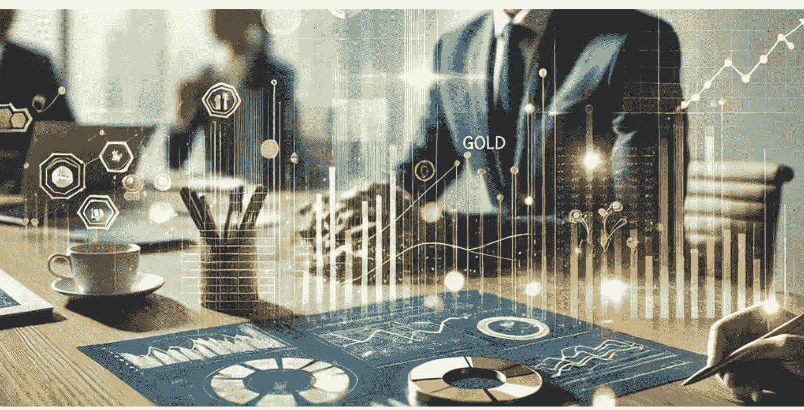

lazybro，你好

我是老喻，欢迎来到《决策算法》课。

在人生中，我们无时无刻不在做选择，选择和谁相处，和怎样的人合作。但同时，我们也无时无刻不在“被选择”。成功的人生，不仅取决于作出了哪些对的选择，也取决于更多对的“被选择”。

有人或许会觉得，“被选择”主动权在别人，我们自己又能做什么呢？倒也未必。这一讲，我想通过一道简单的概率题，带你看清“被选择”背后的原理。

### 一
这道概率题是这样的：

有3个壶（A1、A2、A3），里面分别装着不同数量的红球和蓝球。

已知A1里有3个红球，1个蓝球；A2里有10个红球，10个蓝球；A3里有15个红球，30个蓝球。

现在，随机选择一个壶，然后从壶中随机摸出一个球，发现为红色。

请问：这个球最有可能是从哪个壶里摸出来的？

我们先不计算，凭感觉猜一下答案。

有人可能会说，A3壶里有15个红球，数量最多，那应该是从这里摸出来的可能性最大。

正确答案是，更有可能从A1壶里摸出来一个红球，尽管其中的红球只有3个。

实际上，这是一个典型的贝叶斯问题。直觉判断不算难，但详细的计算过程则稍微复杂，音频环境下不容易讲清楚，我放在文稿中，你手边有纸笔的时候可以自己演算一遍。你也可以让Deep Seek R1这样的推理模型帮你计算，旁观AI的思考过程也是一件有趣的事。

这里直接说计算结果：红球来自A1壶的概率是9/19。对比来说，来自A2壶的概率是6/19；来自A3壶的概率，只有4/19。

显然，来自A1壶的概率是最大的。

### 二
在上面的这个典型贝叶斯计算中，我们得到了一个非常有趣的启示：

在特定场景下，相对优势可能比绝对优势更重要。

尽管A3中红球的数量最多，但由于A1中红球的比例更高，所以在随机选择的情况下，取出一个红球更有可能来自A1。

将这个原理引申到个人发展上，我们可以将“比例”看作一个人的相对优势。

大卫·李嘉图在1817年提出的“比较优势理论”同样印证了这一点。即使一个人在所有领域都不如他人（绝对劣势），只要专注于发展自己相对劣势最小的领域（比较优势），依然能在市场中找到自己的位置。

成为一个含金量高的人，意味着在某个特定领域内，我们的能力、知识或特性具有相对优势。这种相对优势使得我们在面临被选择和竞争时，更有机会被别人看到和选中。

换句话说，成为一个含金量高的人，让我们更有机会把握机遇。

为什么相对优势如此重要呢？

因为在社会生活中，人与人之间的关系往往是“提取”关系。每个人在与他人互动的过程中，都会根据自己的需求，来选择性地使用他人的某一部分特性。

就像在上述的例子中，壶中球的颜色比例决定了摸出红球的概率一样，我们的某一项技能或特性在被他人选择时的“含金量”，决定了我们能否在众多人群中脱颖而出。

高含金量意味着在某个特定的场景中，我们的优势更为突出，也更有竞争力。

就像在求职市场上，拥有广泛技能的“万金油”型人才，尽管在绝对能力上不低，但往往在竞争中，不如某个领域中具有相对优势的专家更容易被选中。

因此，我们应当注重培养自身的相对优势，提升在某些特定领域的含金量。这不仅仅是增加我们的知识和技能，更是对自己特长的精雕细琢。

通过不断提升自己在某一领域的专注度和深度，我们可以让自己在激烈的竞争中，成为不可替代的人才。

总之，含金量不仅仅是数量的比拼，更是比例的较量。 在充满变数的世界里，成为一个含金量高的人，能让我们在机会来临时抓住它。

### 三
在前面的讨论中，我们强调了相对优势的重要性，以及成为“高含金量”人的必要性。进一步延伸，这种高含金量的体现，实际上就是专业性。

为什么要聚焦于专业？因为在一个复杂的社会中，专业代表了聚焦和深入。一个在某个领域内具有专业知识的人，就像前文提到的A1壶中的红球比例最大，尽管总数不多，但其在特定情境下的优势最为明显。

这样的专业性使得个人在面对选择和机遇时，更容易被识别和选中。当社会需要某一特定技能或特性时，这样的专业性就是一种明确的标签，使人们在众多选择中更容易决策。

在现实世界中，“万金油”式的人才虽然在某些场景下有用，但在深度和专精要求越来越高的现代社会中，其竞争力逐渐下降。

“瑞士军刀”极其罕见，大多数功能多样的东西，每一种功能的表现都无法媲美真正的专业工具。各类专业工具构成的市场，远比瑞士军刀要大。

聚焦于专业，深耕于特定领域，才能提升自己的含金量。

专业带来的不仅是深度的知识积累，还有解决问题的能力和创新的思维。这些特质使得一个专业人才在遇到复杂问题时，能够迅速找出解决方案，并且因为他们的专业性而赢得他人的信任和依赖。

因此，

成为一个在某个方面特别突出的“高含金量”人，就是在社会关系中，成为不可替代的关键资源。

越是这样，人们越愿意“抽取你”来完成某个任务。

从社会学角度来看，专业化不仅能提升个人能力，还能帮助建立更有价值的社会资本。社会网络分析中的“优先连接原理”表明，在人际网络中，专业能力越突出的节点，越容易吸引新的连接。

在如今这个社交媒体时代，不管多么小的专业优势，都可能通过网络平台放大并且连接，从而实现价值。我们刷短视频的时候，往往会看到这类人才，并被他们吸引，为他们买单。

我以前有位同事，这些年做了一些餐饮方面的投资，他说行业最大的趋势之一，就是“单品爆款”策略。很多网红餐厅直接用“小炒肉”“毛肚火锅”这样的单品命名，既降低顾客的选择成本，又容易走红。

### 四

在前面的讨论中，我们探讨了高含金量的重要性和如何通过专业性来提升自身价值。

接下来，我们要进一步探讨，除了提升专业能力，是否还有其他方法能够有效提高一个人的含金量。

我们回顾一下开头的问题，已知A1里有3个红球，绝对数量最小，但却成为赢家，因为里面仅有1个蓝球。

对比而言，A3里有15个红球，虽然数量更多，但是因为里面30个蓝球，所以从中摸出有利红球的概率更低。

所以，要想成为赢家，未必是通过增加有利的红球，更可以通过减少不利的蓝球。

在生活和职场中，提升含金量不仅仅依赖于增加“金”的数量，有时通过减少“非金”的部分，同样可以达到更好的效果。

沉默是金，这个说法在某种程度上也揭示了提高含金量的另一种策略。

我有一个朋友，平时话不多，但大家普遍认为他非常厉害。经过一段时间的观察，我发现，他的每一句话并不总是特别精妙或者深刻，但关键在于他很少说无关紧要的废话。

他的这种少言寡语，反而让他的每一次发言显得格外重要。这种现象告诉我们，“金”未必是绝对的多，而是相对的精。

换句话说，提升含金量有两个策略：

一是增加自己的优势领域，增强自己在某个领域的专长和能力；

二是减少那些无效的、无用的部分，使得自己的精力和注意力更加集中在真正有价值的事情上。

这一点在我们前面讨论的概率计算中也有所体现。

同样的道理，如果我们能够减少那些对我们职业发展或个人成长无关紧要的事情或能力，那么我们剩下的部分就更有可能被识别为“高含金量”的特质。

如何在实际生活中应用这个策略呢？

首先，我们需要学会做“减法”，识别并舍弃那些不必要的杂务和不重要的能力。

其次，我们要有意识地控制自己的言行，减少那些可能会降低自己含金量的表现。

就像前述的那位朋友，他的沉默是一种策略，通过减少无意义的表达，他的每一句话都显得更加重要和有分量。

教育心理学家约翰·斯威勒（John Sweller）提出的“认知负荷理论”，也支持这种减法思维。他的研究表明，人的工作记忆容量是有限的，过多的信息反而会降低效率。这就像A1壶中只有1个蓝球，正是这种“简单”让它的优势更加明显。

总而言之，提升含金量不仅仅是增加更多的“金”，而且也是减少“非金”的部分。通过这两种策略的结合，我们可以让自己在复杂社会中更具竞争力，更容易在关键时刻被机会选中。

比如，现在的各个短视频平台，无论是从粉丝的偏好，还是平台的算法，都更有利于那些有特色的IP冒出来。最容易出圈的往往是那些特色鲜明的账号：有的博主专注于教人包饺子，每天研究各种新奇的馅料和包法；有的只教5分钟英语，但每期都能戳中语言学习痛点。

### 五

在追求成为一个“高含金量”的人时，有些人可能会感到迷茫，认为自己缺乏突出的技能或专业性。

但其实大可不必。每个普通人都拥有一些最基本的提升自身含金量的途径：

公众号懒人搜索，懒人专属群分享

真诚和靠谱。

这些品质是每个人都可以实现的，而且在社会生活中同样具有极高的价值。

真诚意味着在与人交往中坦率、无伪，能赢得他人的信任。无论在工作还是生活中，一个真诚的人更容易与他人建立深厚的关系，成为值得信赖的伙伴。

靠谱则代表了责任感和执行力。无论是履行承诺还是完成任务，一个靠谱的人总能给予他人安全感，让人感到放心和可靠。

这些看似简单的品质，其实在任何场景中都是一种高含金量的表现。因为真诚和靠谱不仅能够帮助我们在日常人际交往中脱颖而出，还能在关键时刻成为别人首选的合作对象。

### 小结

人生的决策就像在跑道上比赛，绝对速度固然重要，但最终决定名次的是相对速度。

理解人类在心理上、进化上对于相对优势的偏好，可以让我们更透彻地看待很多现象：

从职场晋升的明争暗斗，到市场竞争的你追我赶。相对优势思维告诉我们，在纷繁复杂的竞争环境中，与其执着于孤立的绝对值，不如关注差距的动态变化。

总结一下，如何利用相对优势，成为一个高含金量的人？我的建议是：

- 专注于专业性，宁可少而精。就像我们开头那个A1壶，从而形成自己的“比较优势”；
- 建立差异化。建立属于自己的独特专业组合，并且围绕特色打造自己的IP，以利用好“优先连接原理”；
- 最后也要学会做减法。减少那些不必要的干扰，并且降低与你产生连接的人的认知负荷，让机遇更容易选择你。

在这个充满不确定的世界里，我们每天所做的努力，有时候就像是摸球。你并不知道，摸到的是想要的红球，还是不想要的蓝球。

重点在于，我们要努力放大摸到红球的概率。也许成功的关键不是拼命在罐子里装入更多的红球，而是提升红球的比例，减少蓝球的比例。

这个简单的原理，有数学的支撑，揭示了很多普通人能成功的关键原因，也为个人成长指出了一个方向。

以上就是这一讲的全部内容。

我是老喻，我们下一讲再见。

附录

根据已知数量，A1、A2、A3三个壶中红色球和蓝色球的概率分别为3比1、1比1、1比2。

因为是随机选一个壶。所以选中每个壶的概率都是1/3。如果除似乎相等之外没有其他理由，那就认为选中的概率是相等的。

我们将其称为先验概率，指的是，在我们看到摸出来的球是什么颜色之前，该概率能表达不确定性的概率分布。

但是，当我们观察到了摸出来的球是红色的，就应该根据信息来得出更准确的概率，并用这个新的概率来替换1/3这个先验概率。

那么，该如何计算新的概率呢？

因为取出的球是红色的，所以我们计算每个壶中取出红球的概率：

- 对于A1：红球3个，总球数4个，所以取出红球的概率是：
$$P(Red|A1) = \frac{3}{4}$$

- 对于A2：红球10个，总球数20个，所以取出红球的概率是：
$$P(Red|A2) = \frac{10}{20} = \frac{1}{2}$$

- 对于A3：红球15个，总球数45个，所以取出红球的概率是：
$$P(Red|A3) = \frac{15}{45} = \frac{1}{3}$$

接下来，我们来计算取出红球的总概率。

如前所述，每个壶被选中的先验概率是1/3，使用全概率公式计算取出红球的总概率：

$$P(Red) = P(Red|A1) \cdot P(A1) + P(Red|A2) \cdot P(A2) + P(Red|A3) \cdot P(A3)$$

代入数值：

$$P(Red) = \frac{3}{4} \cdot \frac{1}{3} + \frac{1}{2} \cdot \frac{1}{3} + \frac{1}{3} \cdot \frac{1}{3}$$

$$P(Red) = \frac{1}{4} + \frac{1}{6} + \frac{1}{9}$$

统一分母计算：

$$P(Red) = \frac{9}{36} + \frac{6}{36} + \frac{4}{36} = \frac{19}{36}$$

在此总概率的基础之上，在分别计算“红球来自哪个壶”的概率就简单多了。

这里计算出来的，就是在信息更新（摸出来的是红球）之后得到的后验概率。

## 使用贝叶斯公式计算每个壶中取出红球的后验概率：

- 对于A1：

$$P(A1|Red) = \frac{P(Red|A1) \cdot P(A1)}{P(Red)} = \frac{\frac{3}{4} \cdot \frac{1}{3}}{\frac{19}{36}}$$

简化计算：

$$P(A1|Red) = \frac{\frac{3}{12}}{\frac{19}{36}} = \frac{\frac{1}{4}}{\frac{19}{36}} = \frac{1}{4} \cdot \frac{36}{19} = \frac{9}{19}$$

- 对于A2：

$$P(A2|Red) = \frac{P(Red|A2) \cdot P(A2)}{P(Red)} = \frac{\frac{1}{2} \cdot \frac{1}{3}}{\frac{19}{36}}$$

简化计算：

$$P(A2|Red) = \frac{\frac{1}{6}}{\frac{19}{36}} = \frac{1}{6} \cdot \frac{36}{19} = \frac{6}{19}$$

- 对于A3：

$$P(A3|Red) = \frac{P(Red|A3) \cdot P(A3)}{P(Red)} = \frac{\frac{1}{3} \cdot \frac{1}{3}}{\frac{19}{36}}$$

简化计算：

$$P(A3|Red) = \frac{\frac{1}{9}}{\frac{19}{36}} = \frac{1}{9} \cdot \frac{36}{19} = \frac{4}{19}$$


## 63 被动决策：怎样让好决策自动发生？


我是老喻，欢迎来到《决策算法》课。

我们这一讲的主题是，被动决策。

先和你讲一个好玩儿的故事。

大科学家费曼有个特别的癖好：研究怎么打开保险柜。

他到处去别人办公室开保险柜，因此名声大噪。有一次，他听说有个厉害的锁匠，几分钟就能打开陌生的保险柜，就上门讨教。费曼本来以为遇到了一位职业高手，结果这个锁匠告诉他：他唯一的秘密就是，直接使用保险柜出厂设置的密码，结果经常可以打开。原来，很多人从来不改出厂密码。

保险柜的出厂设置，就像我们手机的默认选项。其实啊，人很多时候是有惰性的，连保险柜这么重要的东西，大家都懒得去改密码。手机的一些默认选项就更别说了。研究表明，无论默认设置什么样，许多人宁可保持不变，哪怕手机默认的来电铃声特别难听，也懒得改。

很多时候，我们的决策也是这样，任由默认选项操纵，自动滑行，这很容易让我们吃亏。

但是，如果我们能够逆向思考，使用“默认选项”这类被动的决策方式，也会大大提升自己的决策水平。

### 一

说起“被动决策”，最著名的例子，莫过于古希腊英雄奥德修斯了。

在取得特洛伊战争的胜利后，他花了十年时间回家，途中经过海妖的地盘，海妖们用自己天籁般的歌喉，让过往的水手入迷，导致航船触礁沉没，没有人能够逃脱。

奥德修斯让手下的海员以白腊封住双耳，同时把他自己绑在桅杆上。这里有个有趣的地方，他倒是不封自己的耳朵，这样就算听了女妖的歌声也不会犯错误。这是题外话。

在现实生活中，我们经常采用被动决策，但效果怎么样呢？比方说早上起来设闹钟，经常是闹钟响了干脆关掉。办健身卡也是，本来以为花了钱就不得不去，结果，健身卡过期了也没去几次。

为什么自制力这么难呢？为什么我们可以有美好的计划，却不能够坚定地执行呢？这个其实和人的本性有关。你还记得《人生算法课》里的“认知飞轮”吗？里面讲过，一个人的决策和行动，就像两个人跑接力赛，中间很容易掉链子。

所以，我们不妨把一个人想象成两个角色的组合：一个是决策者，一个是行动者。做决定的时候，决策者既聪明，又坚定；但是到了行动的时候，行动者可能就不愿意了。

那怎么办呢？这个时候决策者最好一开始就埋下伏笔，比如说手机的默认选项，定好了之后行动者懒得去改；又或者像奥德修斯那样，决策者做好决定后，干脆提前把自己捆起来，这样行动者想不执行也没办法了。

这类被动决策，有的时候显得特别暴力。比方说闹钟吧，一般的闹钟响起来会被关掉，但是有一种闹钟，一旦响起来就满地乱跑，你要关掉它，非得爬起来。还有一种捐款闹钟就更狠了，每次你关掉响铃，闹钟就会自动联网，把你的钱捐给一个提前设定好的账号。要想效果好，最好对方还是你讨厌的人，比方说情敌。

现在大家学习某项技能的时候，流行在手机上打卡，你要是坚持下来，就能拿到奖品，反之则罚钱。这也是类似的原理。

### 二

有些时候，如果某个决策对自己来说实在很难执行，还有一个办法就是：干脆交给别人。

金融大鳄索罗斯曾经有过一个特别厉害的基金经理叫斯坦利·德鲁肯·米勒，在30年里创造了年均复合30%的投资回报。

德鲁肯·米勒大学毕业后第一份工作是在匹兹堡国家银行工作。两年之后，老板把他叫到办公室，说：“从今天起，你将会成为我们银行的研究部主管，你那个52岁的主管今天开始向你汇报！”

德鲁肯·米勒感到太意外了，因为他们部门除了他，全是30多岁以上的人，而且就他一个人没有MBA学位，为什么会选他呢？

他的老板说：“你知道为什么我让你来负责这个部门吗？这和他们让18岁的年轻人去打仗是一样的。因为你的无知！公司除了你以外，都经历了10年熊市。但现在我认为一场大周期的牛市即将来临！你的无知可以让你在牛市更好地发挥，而其他人都是熊市思维的老家伙！”

结果，25岁的德鲁肯·米勒成了这家公司最年轻的研究主管。

你看，他的老板自己是个决策者，所以他要找的，就是一个毫无牵挂的坚定执行者。

后来，德鲁肯·米勒跳槽到了索罗斯手下，工作了好多年，替索罗斯挣了很多钱。有一次他发现索罗斯卖掉了他账户里的债券，特别生气，于是打电话给索罗斯要求辞职。

索罗斯是高人，他也挺后悔的，觉得自己这么干不对，于是很平静地说：“你别走，我走。”随后，索罗斯真的就飞往伦敦，待了几个月，彻底避免自己手痒痒乱操作。

我们经常听到有些人说，那个股票我看得可准了，可就是操作的时候太犹豫。然而，一个好的决策，必须包含对行动的提前设计，否则就谈不上好的决策。

### 三

德鲁肯·米勒的故事，对我们普通人有什么启发呢？

就说理财决策吧，我们可以提前把自己的账户分成几份儿，提前设置好分配比例，工资发下来，按照比例分。比方说，一个专门用于租房或者供房，一个用于存款，一个用于定投指数基金，一个用于学习，一个用于健身，一个用于旅游，等等。这样，你就不会手痒痒，拿存款去买高风险的消息股。

这种方法，诺奖得主塞勒把它叫作“思维会计”。这会使我们的生活更有保障，也更有趣。塞勒有个朋友，一辈子省吃俭用，65岁了还在工作，就打算奖励一下自己，于是，他开了一个“享受专用账户”，规定这个账户里的钱可以用来买红酒，去旅游，但不能用于维修自家的马桶。

你看，提前把账户分配好，是不是很像手机的默认设置？只要你坚持下去，就能够形成良好的理财习惯，而不会出现那种把房租拿去炒期货的极端事件。

被动决策，捆住自己，不仅有利于我们做出正确的决策，还能够帮助我们避免致命的错误决策。

电影《大空头》里，讲了几个人利用美国次贷危机赚大钱的真实事件。喜马拉雅资本的创始人李录，当时其实也发现了这个投资机会，打算通过信用违约掉期（CDS）这个产品做空美国楼市。

后来李录和查理·芒格聊了几次，芒格反对他，原因很简单，芒格认为，如果李录的分析是正确的，那么他对赌的金融公司要么破产，要么用被政府救助的钱来支付，所以这笔投资最后可能赚的是纳税人的钱，心里不踏实。

这个理由很高尚，但其实还有另外一个理由，那就是做空的风险也很大。李录后来总结说：做空这件事儿，即使是百分百正确，也可能把自己弄得破产。

但是，如果和电影《大空头》里讲的一样，这次做空其实是一件把握特别大的事情，还要不要做呢？

这个问题，就相当于你觉得去赌场是件特别傻的事情，因为根据大数定律，你必输无疑。但有一天，有人对你说有个内幕，包你赢，你要不要去？

这可就考验人性了。

次贷危机结束后，芒格和李录又聊起这件事儿，他说：当时如果你真的参与了，而且赚了很多钱，可能你直到今天还在寻找下一个大空头的机会。人的本性就是这样。

的确如此，次贷危机中，大空头最大的赢家是约翰·保尔森。自打2008年以后，他有点儿路径依赖，赌性很大，结果呢，业绩一直不太好，真的应验了芒格的预测。

有个很有趣的说法：有些事儿，你做到100%，比做到90%还容易。就像上面说的，你百分之百不进赌场，比90%的时间拒绝进赌场要容易；假如你每天抽十根烟，要是戒烟的话，彻底不抽比一天只抽一根要容易。

我有个朋友，打算戒酒，结果每次别人都说，那就喝一小杯吧，结果后来还是喝很多。于是他干脆弄了个病历，上了酒桌就一摆，再也没人劝酒了，从此滴酒不沾。

你看，是不是彻底不做反而更容易？

### 最后

我们再来看一下这节课的主题：“被动地”做正确决策。

确切来说，是主动地设计“被动执行”的正确决策。

听起来似乎有点儿绕，其实就是承认人性的弱点，用理性的自己去捆住感性的自己，或者是用外部力量捆住自己，而不是去考验自己的人性。我们知道，人性是经不起反复考验的。

我们上面说了好几种方法：包括“默认选项、捆住自己、交给别人、思维会计、彻底不碰”等等。这些方法，能够帮助我们克服人性的弱点，真正做出正确的决策，别陷入“想得好、却做不到”的恶性循环。

我们要让自己大脑里的“决策者”战胜“行动者”，做出正确的决策，还应该根据道德和常识，形成自己的原则，并依此塑造自己的行为方式。培根说过，由智慧养成的习惯，能成为第二天性。

我们通过这种方法，可以把自己第二天性里的默认选项，设置为最优决策。

最后，我改编了一句名言，送给你：

思想决定行为，行为决定习惯，习惯塑造“决策”，“决策”影响命运。

我是老喻，我们下一讲再见。


## 64 牛人陷阱：你才是自己人生的决策者


你好，我是老喻，欢迎来到《决策算法》课。

### 一

谁是这个时代最受欢迎的人？

答案是：牛人。

我们的传统中一直推崇牛人，甚至迷信牛人。不管是诺奖得主，文化名人，还是赚钱高手，或是奥运冠军，只要你是牛人，就备受欢迎，蓬荜生辉，甚至光宗耀祖。

但是，牛人往往也是我们在决策中遇到的最大的陷阱之一。

我有个做投资的朋友，几年前遇到了一位牛人。牛人生意做得好，此前赚了不少钱；三观看上去也很正，算是有人格魅力；马拉松跑得还好，人生显得积极向上。我的朋友和他一见如故，于是和牛人合作了一个项目。

最近见到这位朋友，问他和牛人合作的项目如何？朋友叹气说：一塌糊涂。

咋回事儿呢？

朋友说：原以为牛人专业水平高，看项目准，结果这一个他偏偏看走眼了；原以为牛人资产雄厚，底线高，结果他居然在商业道德上也出了问题，把项目上的资金挪到了别处；原以为与牛人合作，人家还会占你小股东的便宜？没想到牛人不仅违规，还违法，做了不少伤害项目的事情。

复盘我的这位朋友的决策，他就是遭遇了“牛人陷阱”。

因为对方是牛人，所以，他做了三个危险的假设：

- 1. 能力假设：牛人过去赚了钱，就认为牛人干啥都牛；
- 2. 道德假设：因为崇拜和迷信牛人，就忘记了牛人也会有人性的弱点；
- 3. 契约假设：认为对方是牛人，相当于做出了某种承诺，就忽视了法律约束和制度监督。

我的这位朋友，本来遇到牛人很开心，与牛人合作很兴奋，没想到最终掉入牛人陷阱，还亏了他大钱。

公众号懒人搜索，懒人专属群分享

我还有个邻居，前些年开始炒股。据说在网上拜了个牛人当师傅，天天学习投资秘籍，研究K线图，没过两三年，亏光了大半本金，每天唉声叹气。

### 二

为什么人们会掉入“牛人陷阱”？其根源在于我们对“权威”的天生崇拜与依赖。

心理学家称之为“权威偏见”（Authority Bias）：当某人被视为“专家”或“成功人士”时，人们往往不加质疑地相信他（她）的判断和行为；一旦头上顶了“牛人”光环，我们就倾向于默认对方的见识、道德、能力都“一路领先”。

这种偏见在生活中随处可见：
- 某网红医生随口说的养生建议，立刻被奉为圭臬；
- 成功投资大师推荐的股票，引来大量跟风；
- 明星代言的产品，不问性价比就争相购买；
- 畅销书作者的生活方式，被当作放之四海而皆准的真理；

著名的米尔格拉姆服从实验曾揭示，普通人在穿白大褂的“研究员”面前会压抑良知，盲目听从施加电击的荒谬指令。这些受试者并非愚笨，而是在“权威”面前自发放弃了独立思考。

同理，现实中的“牛人”头衔会让我们降低警惕——既不审查他们的真实专业范畴，也不评估其品行是否可靠，更不会做风险对冲或合同保障。

久而久之，就给了某些虚假“牛人”可乘之机：他们只要拿出一两个辉煌战绩，或展示一点听上去很高端的理念，就能吸引投资者、合作者蜂拥而至。

多年前我从事地产行业时，去一个省会城市谈合作，某当地老板接待，开来三辆大奔顶级轿车，重点是车牌号分别是“某A66666”、“某A88888”、“某A99999”。同行者都说：这老板，牛！

听上去是不是有点儿好笑？几辆车和几个车牌，能有多牛呢？你可能会问，这种套路管用吗？在某些时候，还真管用。

再者，社会普遍对“成功”的过度崇拜会放大牛人的光环：每个人都渴望通过与牛人合作或建立联系，迅速提升自己的地位或收益。

这种对外部权威的依附心理，让我们在签约之前往往不去细究对方的底层动机、经济实力乃至人品。

或许牛人只是在特定机遇下抓住了一次风口，或许他只是在某个项目上碰巧拿到了好结果，一旦我们盲目将其“局部成功”视作“通用牛人”，就极易忽视商业合作必须具备的尽职调查与法律合约保障。

换言之，“牛人陷阱”本质是对权威的迷信：
一方面是过度高估对方的“全能”，
另一方面是低估了对方的人性风险。

当我们误把牛人的特定成功投射到所有领域，甚至赋予他们“道德无懈可击”的假设，就会在合作中放松警惕，忽略最起码的监督与契约，最终酿成决策悲剧。

正如权威偏见所示，任何“牛人”都可能在不同场景下犯错，有时，有一些牛人甚至会利用自身地位谋取不当利益。

掌握这一原理后，我们才能在遇到牛人时，仍保持应有的理性，不让盲目的崇拜冲昏头脑。

### 三

那我们该怎么办呢？面对“牛人陷阱”，关键是要建立起三重防线，既要保留对牛人的敬意，又要保持独立的判断。

第一重防线是认知上的清醒。每个人的专长都是有边界的。比如：
- 一位成功的企业家可能很懂管理，但未必懂教育；
- 一个投资高手擅长股市，但对房地产可能并不内行；
- 一个网红医生专治某类疾病，但对养生的建议，可能过于笼统；

必须学会区分“局部专长”和“通用智慧”。就像体育明星的运动技能再高超，也不意味着他推荐的产品就值得购买。

第二重防线是评估的理性。牛人对我们的魅力，在于降低了信任的成本。很多时候，我们几乎会无条件信任牛人。

然而，在《信任的速度》中，史蒂芬·柯维将信任分为品德和能力两个维度。

这提醒我们要打破“道德假设”：即使对方过去言行正派，也不代表其不会因环境、利益或人性弱点而改变。

我们当然可以相信善意，但绝不该因为对方是牛人就放弃基本的风险控制。

第三重防线是独立思考。当牛人发表观点时，试着问问：
- 这个观点背后有什么利益关系？
- 他在这个领域是否真的专业？
- 这个建议是否适合我的具体情况？
- 是否有其他选择或相反的证据？

记住：向牛人学习很好，但更重要的是学习他们思考问题的方法，而不是简单复制他们的结论。每个人的生活环境、资源条件都不尽相同，对他人有效的方案，未必适合你。

在你的人生决策中，永远要保持清醒的头脑和独立的判断。

### 四

“牛人陷阱”的根源，也许在于我们每个人都想当牛人。我们对牛人给出了太多溢价，以至于有时连牛人自己都不好意思要这么高的价格。

更让人担忧的是，一些人把“成为牛人”当作人生理想。“今天你瞧我不起，明天你就高攀不起。”这种心态实在可悲：今天你不喜欢被牛人瞧不起，等你成为牛人后，为什么又要去瞧不起别人？这种“牛牛相报”的循环，何时是个头？

庄子的故事给了我们一个绝妙的启示。当楚威王派人持千金来聘请他做官时，庄子正在濮水边钓鱼。他头也不回地问使者：“听说楚有神龟，死后骨骸被供奉在庙堂上。你说这神龟是愿意死后被当作宝贝，还是宁愿活着在泥滩上自在爬行？”

使者说：“当然是活着自在爬行。”

庄子笑道：“那就请回吧。我宁愿在污泥中快活，也不愿被人供奉。”

伍迪·艾伦也曾调侃说：“与其活在公众心中和记忆里，我宁愿活在我的公寓里。”

庄子的哲学告诉我们：与其追求牛人的虚名，不如活出真实的自我。真正的智者，不在乎外界的评价，而是追求内心的自由。

所谓“牛”，不在于地位有多高、影响力有多大，而在于能否保持本心，做出独立的判断和选择。

避开牛人陷阱的最好方法，也许就是放下对“牛人”的执念，回归生命的本真。

### 五

英国作家阿兰·德波顿曾经写过一段话，让人会心一笑。他说：

> “我努力博取大人物的赏识，每当同他们见过面后，总要久久心怀忐忑，担心他们是否看得上我。经过海关，或是开车在路上遇到与警车并行时，我总有一种莫名其妙的希望，想让穿制服的人对我有好印象。”

这几乎是对我们每个人的嘲讽，关于我们对牛人的逢迎，对权威的讨好。而互联网和社交媒体放大了这种崇拜和追随。

后来，德波顿在一幅画里为自己找到了解药。在那幅名画中，
> “苏格拉底刚宣讲完一个哲学论点，同时泰然伸手拿起那将要结束他生命的毒酒。”

那幅画令作家深感震撼。他意识到自己“与人谈话时总是重视取悦于人甚于讲真话”，而苏格拉底“宁愿失欢于众，获罪于邦，而决不折腰”。

德波顿写道：“这种思想的独立性给我以启迪和激励。它向我展示了一种力量，可以抗衡在行动和思想上曲意迎俗的习性。在苏格拉底的生死之间包含着一种召唤，唤起人聪慧的怀疑精神。”

其实，你有没有想过，这个世界上最好的事物，都是你可以直接亲自感知的：

我们购物时不必去看专家对耳机的测评，何妨去店里直接戴着试听一下。

我们旅游也不必去小红书看大V为你选好的打卡点，不如亲自在陌生的街巷自由闲逛。

我们也不必咀嚼他人的二手观点，大可慢慢地去阅读经典之作。

与其看网红在世界各地名声拍摄的美照，我们不如在自家窗口，晒一缕完全属于自己的阳光。

如庄子所言：“日出而作，日入而息，逍遥于天地之间，而心意自得。”《庄子·让王》。

你不必通过牛人的眼睛去看世界：森林的气息、阳光的温度、音乐的美好，都是你可以直接体验而无需权威解释的。

就感知这个世界而言，你其实才是最牛的人。没有人比你更了解自己的处境和需求，更清楚什么是适合自己的选择。

我是老喻，我们下一讲再见。


## 65 老好人陷阱：为什么善良却没有好报？


你好，我是老喻，欢迎来到《决策算法》课。

“冬同学”是我认识的在决策上颇有天赋的人之一。有次我听见她打电话，对方是一家服务于VIP客户的机构负责人，说有个非常好的为孩子设计的公益活动，不少家庭都要抢着参加，那位负责人说为冬同学预留了个位置，让她赶紧安排，否则就要给别人了。

我在旁边听得很意外，就请教道：“这么好的机会，为啥不要呢？”

“冬同学”答道：“我只是不太习惯被安排的感觉。”

虽然是件小事儿，却很让我触动。也许，因为我是“讨好型人格”。在我看来，人家送给你的福利，怎么能拒绝呢？

但事实上，在上面的小故事里，的确存在小小的、善意的“牵着鼻子走”的意思。冬同学是个相信“我的人生我做主”的人，她大方地说不，而不担心对方因此不快。她没有被表面的“稀缺性”和“特权感”所影响，而是从自主权这个更本质的层面做出判断。事实上，因为她的直率，在生活中反而有不少真诚的朋友。

这引出了一个思考：当我们忙着做一个老好人，顺从并迎合别人时，是否正在把自己的生活主导权拱手相让？

### 一

也许你的生活中也有这样的困扰：总是试图做一个大家心目中的老好人，经常一心想着要讨他人的欢心。面对别人的要求，第一反应是“答应了再说”；遇到不合理的期待，也会委曲求全。久而久之，你会发现自己像是被别人牵着鼻子走，陷入一个看不见的陷阱：“讨好型人格”。

“讨好型人格”是个当下很流行的概念，你肯定已经不陌生了。具有这种特质的人，会在潜意识里优先满足他人的期待，而且往往害怕让别人不开心，因而一味去“配合”、“帮助”、“成全”。

从外表看，他们总是和蔼可亲、乐于助人，似乎总把别人的需求摆在前面。可一旦深入观察，就会发现，当“老好人”角色演久了，他们很容易在各种关系里失去自我。

因为没有明确的边界，“老好人”常常不敢拒绝任何请求，也不会计较应得的回报，结果自己却在暗自承受委屈、压抑甚至被利用的命运。

在职场中，老好人常常因害怕冲突而接受额外工作，其中还有不少人，还会因为过于好说话而不会争取利益，导致失去了晋升机会。

更令人唏嘘的是，“老好人”即使已经全力付出，也不一定能获得感恩或回报。

我认识一位小有名气的作家。他有个中学同学，一直过得不太如意，工作和生活上都没有着落。起初同学们都出手相助，但时间久了，就只剩下这位作家还愿意帮忙。结果，没想到，这位不如意的同学最终还伤害了唯一愿意帮他的作家。

这位作家很难过，就问他同学：“我对你这么好，你为什么还要这样对待我？”

### 二

对方回答的一句话令人心寒：“你可能是我唯一还可以伤害的人了。”

这番话虽有点残酷，却道出了老好人的尴尬处境：当你毫无保留地善良时，别人或许并不会感激，甚至可能把你看成“软柿子”，任意拿捏。此刻，你不但没有得到应有的尊重，还会倍感受伤。

这就是“老好人陷阱”让人痛心的部分——让善意的人渐渐怀疑自己的选择，反复自问：“为什么好心反被利用？我这样做究竟值得吗？”

### 二

然而，好人没好报，付出反而遭遇伤害，这些还不是当老好人最大的代价。

做好人最大的代价，是一个人为了表演“我是一个好人”，所以做了一些不重要的、非理性的事情。

即使一个人真的是好人，也真的做了好事，然而，一旦有表演的冲动，就会为了表演而做好事。这一点，我们在前面的一讲答疑中提到过，这一讲再进一步展开。（问答：错过了两周翻倍股，我在决策上犯了什么错）

社会学家欧文·戈夫曼在他的代表作《日常生活中的自我呈现》中，提出了一个有趣的观点：“拟剧论”。在他看来，我们的社会生活就像一个大舞台，每个人都在扮演着不同的角色。在“前台”，我们精心打造着想要呈现给他人的形象；在“后台”，我们才能卸下伪装，展现真实的自我。

戈夫曼进一步认为，我们是通过表演这种方式，来展示自己在某个角色上的能力和特点，进而赢得他人的认可和尊重——也就是完成“印象管理”。

你看，这不就是我们平常说的“人设”嘛。

这种角色扮演本身不是问题，问题在于：当我们过分沉迷于“好人”这个角色的表演时，就容易迷失在他人的期待中，做出违背内心，甚至有害的选择。

我有个朋友，财务自由后，一时心热，做了摊公益的事情，干得热火朝天，他自己也投入了大量人力物力财力。可是他的性格，根本不适合干那些具体而琐碎的事情，而且也根本不擅长与人打交道，几年下来，他心力交瘁。

他自己反省说，开始的时候大家都叫好，而他实实在在的付出也得到了认可，他很开心。但到后来，他觉得自己其实是在表演“当一个好人”，表演“无私付出”。

表演出来的好事，哪怕是发自内心的，哪怕是付出了代价，也往往不是对的事情。

的确，那么多年下来，他的那摊子事情，付出那么多，他自己也从口袋里掏出了不少钱，结果却并不如人意。

为什么呢？因为他为维护“好人”人设而自我绑架，做了不对的决策。

他完全可以直接把钱捐给一家公益机构，然后利用自己的特长再协助做一些事情，而不是深陷其中，耗尽心力。

这个案例揭示了决策中的一个重要陷阱：

当我们过分关注“角色”而不是“目标”时，往往会做出非理性的选择。

说实话，当个好人，吃些亏，损失总是有限度的。

就像你开了一辆运货车，有人搭了你的顺风车，还顺手牵羊偷走你一些东西，虽然很恼火，但也亏不到哪里去。

但是，如果你为了表演当一个好人，走错了人生道路，甚至导致翻车，那问题可就严重了。

事实上，善良不应该成为放弃判断的借口，更不该变成一场消耗生命的表演。真正的善良，应该建立在理性和效率之上，让我们的善意产生最大的价值。

### 三

你是不是“老好人”？你生活中，有没有遇到一些好心没好报的糟心事儿？

这种现象似乎格外普遍，这很大程度上与社会中的文化氛围有关：和为贵被奉为圭臬，我们推崇“和气生财”，讲究“给人留面子”，甚至把过度迎合美化成了“高情商”。

这种文化氛围下，很多人从小就缺乏建立个人边界的意识，也没有接受过如何在善良与自保之间寻找平衡的教育。

更令人担忧的是，当一个人总是展现“好人”形象时，往往会在不经意间暴露出自己的软肋和脆弱之处。这就像在丛林中暴露了自己的气息，很容易成为“猎食者”的目标。那些擅长操纵的人会敏锐地察觉到这些信号，因为他们知道，一个习惯性示弱的人通常不会有效地反抗。

那么，如何避免成为别人眼中的“软柿子”？关键在于调整心态，重建认知。

首先，要明白“独立”先于“讨好”。很多人总是期待通过付出来换取他人的喜爱，这是一个危险的思维陷阱。

我们要把“希望通过付出获得认可”的软弱心态，转变为“希望因为真实的自我而被接纳”的健康心态。不是所有人都会喜欢你，这很正常，重要的是保持自我认同感。

其次，我们要掌握一些现实的生存智慧。很遗憾，这部分课堂不传授，我们大多数人小时候也没有这方面的学习环境。

假如你试图通过表达“自己承受了不该承受的东西”，而赢得对方的同情，极可能你并不能赢得同情，而是令对方有了“这个软柿子我是不是也可以捏一下”的念头。

过分展示自己的委屈和脆弱，不仅不会赢得同情，反而可能让他人看出可乘之机。即便是在朋友面前，也要保持适度的界线感。

从决策科学的角度看，“老好人”常常犯一个经典的决策错误：他们过分看重决策的短期收益（别人的好感），而忽视了长期成本（自主权的丧失）。这种决策偏误会让人陷入“讨好-被利用-更加讨好”的恶性循环。

在这一点上，马基雅维利的观察很有启发。他指出在权力场域中，“被畏惧好过被喜爱”。虽然这种说法听起来有些极端，但它提醒我们：在某些场合，可以不被喜欢。

要知道，善良不等于软弱，正直不等于愚蠢。一个真正有智慧的人，既能保持善意，又懂得自我保护。他们知道什么时候该说“是”，什么时候该说“不”；知道如何让善意产生价值，而不是沦为他人的工具。

最重要的是，要记住：
真正的善良应该是有边界的、有智慧的、有力量的。它不是一味地付出和退让，而是在维护自我价值的基础上，去帮助和影响他人。只有这样的善良，才能持久，才能真正改变这个世界。

### 四

当我们谈论“老好人”的困境时，很多人会说：“至少做个老好人是安全的。”但是，心理学家乔丹·彼得森的这段话会让你如坐针毡。他说：

> “因为我人畜无害，所以我是个好人？不，不是这样的，完全不是这么回事。
> 
> 如果你是无害的，这只能说明你很弱。如果你软弱，你就无法成为好人……
> 
> 因为成为好人是需要实力的，
> 成为好人是非常困难的。”

我也曾经写过一句话：所谓讨好型人格，其实是想用小恩小惠，去逃避自己真正的责任。——看来我自己也是深有体会。

乔丹·彼得森给老好人开出了一剂猛药，他认为：好人必须有危险性。

他说，对于一个好人而言，“变得危险”让你受敬畏。如果你不具备威慑力量的话，你的善良的一面就不能说是一种道德。

乔丹·彼得森戳中了老好人的要害：我们经常把软弱和美德混为一谈。

他说：生活是一个非常艰难的过程，除非你变得具备危险的能力，否则你无法从容面对生活。

如何才能成为一名真正的好人？

乔丹·彼得森给出的三个品质是：
你必须强大，并且有威慑性，并且是平和的。

只有这样，我们才能直面现实的生活，承担起真正的责任，让自己和这个世界变得更好。

要走出“好人陷阱”，关键是重构我们的决策框架：
- 从“他人期待”转向“自我原则”；
- 从“短期讨好”转向“长期满足”；
- 从“被动应对”转向“主动选择”。

记住：
每个“是”和“否”都是一个决策点，每个决策点都是维护自我边界的机会。

一个好的决策者，应该既有善良的心，也有清晰的边界意识，敢于说“不”。

更重要的是，你的善良需要强大和威慑来守护，需要理性的决策来实现。

以上就是这一讲的全部内容，我是老喻，我们下一讲再见。

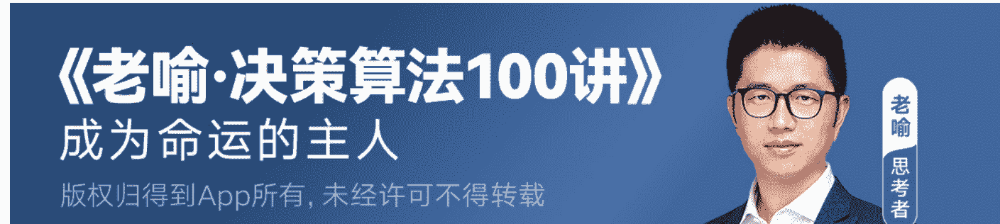


微信:lazyhelper

## 66 占便宜陷阱：怎样用大局观克服贪婪？


你好，我是老喻，欢迎来到《决策算法》课。

### 一

有这样一个有趣的故事，展示了人们在面对“小便宜”时的盲目和冲动：

两兄弟经营着一家服装店，哥哥负责销售，弟弟负责裁剪。哥哥发明了一个独特的销售手法——每当有顾客对某套西服表现出浓厚兴趣时，他就会假装自己有点耳聋。

当顾客询问价格时，哥哥就会对他的兄弟大声喊道：“哈利，这套西服多少钱？”

弟弟从裁剪台抬起头，回答说：“这套漂亮的棉质西服42美元。”

哥哥则转向顾客说：“他说22美元。”

有趣的是，几乎所有顾客都会立即掏出22美元，迫不及待地带着西服匆匆离去，生怕哥哥发现“错误”。

在《影响力》一书中，罗伯特·西奥迪尼将这种现象称为“对比效应”。当42美元成为参照物时，22美元看起来就像是天大的便宜。在这种心理作用下，顾客的理性思考能力会显著下降，让大脑产生“捡到大便宜”的幻觉，而完全忽略了对商品本身价值的判断。

这种“占便宜”心理在我们的日常生活中随处可见：为了“满300减50”而购买不需要的商品，为了赠品而选择更贵的套餐，为了会员积分而做出非理性消费。表面上看，我们似乎占到了便宜，实际上却在不知不觉中落入了精心设计的营销陷阱。

这背后藏着一个更深的真相：人类对“占便宜”的贪婪，本质是决策系统的致命漏洞。

### 二

当然，买些自己并不需要的东西，算是“占便宜陷阱”里伤害最小的一种——顶多是浪费点小钱，家里堆满闲置物品。

在现实中，更多时候，“小便宜”会用一种“看起来又大又好的机会”的面貌出现，让我们心甘情愿掏大笔金钱或耗费巨大心力，最终才发现，那只不过是天上掉下来的“陷阱饼”，一旦下口就再也拔不出来。

我以前在广州有位朋友，绝对称得上生意高手，早年在市场上赚了不少钱。某次他兴冲冲地分享，说江浙一带有家新能源公司找他投资，前景很火热，对方老板连厂房都拿来做担保，可谓“诚意满满”，他打算投下一大笔钱。

我虽不懂具体业务，但对“太完美、太吸引人”的项目向来怀抱一丝谨慎，于是抛出两个疑问：- 1. 天上为什么掉馅饼？
- 2. 馅饼为什么偏偏砸到你头上？

在这儿，好像问题一容易回答：新能源大势所趋嘛，热门行业不错；可问题二却耐人寻味：江浙本地并不缺资本，为啥这家公司非得跨省跑到广东找资金？

打着“给你独家机会”的旗号，是不是过于巧合了？毕竟有些项目看似利益丰厚，其实是“一般人都抢不到”的幌子，一旦你放下戒心，认定自己幸运得到“占便宜”的机会，往往便掉入对方设计的局。

可朋友热血上头，还是没听人劝，结果那笔投入基本血本无归。所谓的厂房抵押也并非真正过户给他，对方背后还有借壳和资产腾挪，等他追责时，项目早已人去楼空。看似风口的新能源商机，最后只是一场哄人的戏，让他难以抽身。

这便是“占便宜陷阱”更隐蔽和凶险的一面：它往往包装成一个“非你莫属”的好机会，标榜“高回报、低风险”“行业风口”“资源独家”。很多人在幻想“别人都不行，我偏能抓住这只金凤凰”，殊不知当人人都嫌它不靠谱，唯独你自信能得便宜时，也许正好说明这是个处处漏风的赌局。

对于那些看似送上门的“大便宜”，尤其要谨慎提防。先问自己：

- 1. 这块馅饼究竟为何而降？
- 2. 它为何落到我头上？

若答案经不起推敲，就该收起一厢情愿的“占便宜”心态，而把注意力放在“是否合乎常识、风险与收益是否对应”上。否则，所谓的大馅饼终会变成让人难以下咽的陷阱，酿成更严重的后果。

所以，不管是你遇到有便宜可以占，还是天上突然掉下馅饼，都要想一下茨威格所说的那句话：

> 命运给予的馈赠，早已在暗中标好了价格。

### 三

本杰明·富兰克林曾说：“便宜没好货，贪小失大。”这句朴素的古训，点出“占便宜陷阱”的核心：我们为了一点眼前的好处，常常丢掉更重要、更长远的价值。

为什么会出现这样的短视？从行为经济学的角度看，人类在面对“便宜”时，大脑会出现三大典型偏差：即时满足偏误、损失厌恶偏误和确定性偏好。

它们让我们在看到优惠时多巴胺飙升，害怕错过“限时”折扣，宁愿买些无用之物，也不肯放弃那点微不足道的“省钱机会”。

可真正的问题是：我们在“占便宜”背后，往往忽视了真正重要的“机会成本”。就像排队抢购打折商品，也许并不赔钱，但你为此投入的大量时间和精力，原本可以用来提升技能、陪伴家人，或挖掘更有价值的机会。

管理学大师彼得·德鲁克强调：“最重要的不是把事情做对，而是做对的事情。”如果我们把注意力耗费在微小折扣或貌似超值的短期机会上，却耽误了对长期目标的投入，就等于以微利换掉了极有价值的资源。

就此而言，“占便宜陷阱”最危险的地方，不是多花了几十块钱买没用的东西，而是让你彻底偏离了本该优先做的要事。

在德鲁克看来，组织和个人都要追求“效能”而非单纯“效率”。效率只是“把事情做对”，而效能则是“做对的事情”。

我来举一个生动的例子，来解释一下“效能”和“效率”。请问：你认为阅读最重要的能力是什么？

我们都知道阅读非常重要，厉害的人几乎都会大量阅读。那么，阅读最重要的能力，是速度？还是理解？还是运用？

在我看来，阅读最重要的能力，是决定不要读哪些书，而把时间和精力花在真正值得读的书上。——这才是阅读的效能，而阅读速度等等，属于效率。——当然，二者兼顾更好。

回到决策的主题，若目标本身就错了，或根本不值得做，再高的效率也毫无意义。

对个人决策而言，则意味着要时刻分辨：我是把注意力用在最核心的目标上吗？

如果不是，只因那点小利便心甘情愿耗费资源，就等同于“因小失大”。

### 四

说到这里，你也许会意识到，占便宜陷阱，背后正是决策的核心问题：分优先级，分大小、轻重、缓急，在这一点上，围棋给了我们很好的启发。

围棋是一个强调大局观的游戏，每一手都要从全盘选价值最大的点下，不要只盯着局部。

比方说，你在某个战场已经投入了不少，但突然发现，另外一个地方价值更大，你就应该立即转移，不能有任何留恋。

这方面，围棋AI阿尔法狗做得最好，因为AI毫无感情牵挂。所以，AI下围棋，以前人们以为是局部算力强，其实人家是大局观好。

在决策中，优先级不仅是对事情轻重缓急的判断，更是资源配置的艺术。一个好的决策者，总是能在众多选择中找到最具价值的方向，既不会被眼前的小利所迷惑，也不会错过真正改变格局的机会。

但是，在现实决策中，大局观为什么那么难呢？

我想和你分享两个围棋的概念，大场和急所。

所谓“大场”，是围棋的布局阶段，全盘之中效力最大的一手棋；所谓“急所”，是关乎生死、不得不走的一手棋。下围棋的人都知道，急所比大场更重要。你可能会感觉有些奇怪，不是应该优先下在价值更大的大场吗？

这是因为，急所，指的是关乎生死、不得不走的一手棋。

你看，这就引出了一个现实难题：很多人之所以总是陷入“占便宜陷阱”，其实就是被困在了“急所”里。当一个人资源稀缺、选择有限时，往往就不得不在意那些小便宜，为了基本生存需求而疲于奔命，根本无暇去考虑更大的发展机会。

### 五

其实，很多人并不是出于贪小利的天性，而是因为窘迫、稀缺，迫不得已“抓住眼前能抓住的一切”。

就像围棋中，被对手死死牵制在局部的“急所”，他们根本顾不上大场。

举个例子：月光族为了撑到发薪日，不惜在超市排队抢打折食品；家境不宽裕的学生，为省几块钱车费，牺牲宝贵的学习时间——这确实是“稀缺心理”在作祟。

生活的压力让他们不得不频繁地将资源投入到眼前琐碎的小利上，结果陷入“穷忙循环”，难以抽身去做更高层次的规划。

问题是，如果我们永远被“急所”拖住，就不能去选择更有价值的“大场”。能否借助某些突破，让自己真正升维，跳出“穷忙循环”，才是关键。

具体如何做？德鲁克的一些思路可供参考：

- 1. 优先做最重要的事：先列出你当前的“急所”，它们或许不得不处理，但请尽可能压缩时间、用更高效的方式解决。然后把省下的注意力集中在能改善未来的“要事”上。
- 2. 以强项为中心：别把大量资源投入到低价值、低成长空间的领域里；要看到你真正擅长或长期有潜力的方向，将有限资源往那里砸。
- 3. 不断检视目标：德鲁克指出，目标实现时并非庆祝，而要马上设更高目标；同样，当你勉强“活下去”时，也要思考下一步怎样改善根本条件，别让自己一直停留在靠小便宜过日子的循环。

在这一点上，围棋给了我们一个重要启示。《棋经》有句话说：“宁失数子不失一先”，就是说，不要因小处纠缠而丧失“先手”的主动。

这提醒我们，即便身处困境，也要想办法为自己保留一些战略空间。哪怕只能省出很少的时间或资源，也要把它们用在最具突破性的地方。

比方说，不管工作和生活多么紧张，也要给自己留一个窗口，主动去学习一些新知，发展一些爱好，种下一些希望。

保持这种“先手意识”很重要，它能让我们在应对“急所”的同时，也不忘记给自己留下转圜的余地，为未来的发展创造机会。只有这样，我们才能真正走出“占便宜陷阱”，实现生活的根本改善。

### 小结

我很喜欢史蒂芬·R.柯维的一句话：

的确，每个人的家庭出身、成长环境和当下的处境，都各不相同。但是，我们都可以通过改善自己的决策，来改变命运的走向。

在我13岁那年，一位老师向他的每个学生问道：“你希望被人记住的是什么？”结果谁也没答上来。老师笑着说道：“现在不用急着回答。但是，如果到了50岁还回答不上来的话那就不好了，因为你虚度了人生。”

这正是决策有趣的地方。决策不止是帮你解决生活中的一些难题，决策其实就是你如何塑造你自己。


## 67 内耗陷阱:如何跳出人生的死循环?


你好，我是老喻，欢迎来到《决策算法》课。

在这纷繁复杂的时代，我们每个人都可能被爱情、工作、家庭、甚至自我身份的一系列问题困扰，一边慌乱应付外部挑战，一边又在内心反复纠结：到底要不要跳槽？这段感情还能挽回吗？我的未来怎么办？

于是，我们的大脑就像一台无休止的“念头放映机”，播放的全是焦虑与自责的内心戏。没错，这时候，我们就陷入了精神内耗。

什么是精神内耗？简单说，就是一场你与自己的消耗战。当我们把大量心理能量耗费在“对付自己”上时，就会陷入这个看不见的黑洞：能量不断流失，却找不到出口。

这不是身体的疲惫，而是一种纯粹的心理损耗，最终可能让我们失去做正确决定的力量。有没有办法避免内耗影响我们的决策？这就是我们这一讲要讨论的话题。

### 一

内耗在我们的生活里面无孔不入。

站在公司电梯里反复琢磨上午会议中的失误，面对卖飞的股票心里懊恼不已，深夜刷着朋友圈不断想自己要不要给人点赞......现代人的大脑似乎总在进行着某种无形的能量消耗。

从科学角度看，内耗并非一个简单的现象，而是多种心理机制共同作用的结果。心理学研究发现，它主要表现为三种形式：

首先是决策疲劳。每当我们需要做出选择，大脑就会消耗能量。在《满意就好》那一讲，我们提到过，一个人每天要做出数百个大大小小的决定。当这种决策过于频繁或复杂时，我们的心理资源就会逐渐耗竭，导致后续决策质量下降。

这就解释了为什么我们在经历一天的工作后，晚上往往连“吃什么”这样简单的决定都变得异常困难。

其次是认知过载。在这个信息爆炸的时代，我们的大脑每天都要处理海量信息，刷短剧，听播客，看直播……

就像你正在开会，手机不断弹出消息提醒，同事在群里讨论新项目，老板又发来一份紧急文件，大脑瞬间就会变得一片空白。

然后是反刍思维。这是一种对负面事件或情绪的反复思考。比如，晚上和朋友聚会后，你躺在床上反复回想：“刚才那句玩笑是不是太过了？”“他们笑得好像不太自然……”这种无休止的自我检讨，就是典型的反刍思维。

以上三个概念，共同勾勒了“内耗陷阱”的多重面貌：当一个人长时间纠缠于相同的念头，或在选项繁多的境地里头脑杂乱、无法决断，就会陷入一种“空转”的状态。

更糟的是，越思考越焦虑，然后更难保持理性判断，这恰恰阻碍我们做出正确选择。

### 二

在刚才提到的“反刍思维”里，人往往对同一个负面念头反复琢磨，却无法获得新的解决方案。用计算机语言来说，就像不断调用自己的函数却没设出口，陷入“死循环”。

想象你是一台电脑，运行着一个没有终止条件的程序：

“刚才的会议表现太差了”↓
“同事一定觉得我能力不行”↓
“我是不是真的不适合这份工作”↓
“要不要辞职算了”↓
“但辞职后又能做什么...”↓
回到“我真的太差劲了”

这就是典型的“递归式内耗”。同一个念头不断被翻炒，每转一圈就消耗一分能量，却始终找不到出路。更要命的是，这种内耗还会像滚雪球一样越滚越大：

刚开始可能只是纠结一个小细节，到最后会演变成对整个人生的怀疑。就像一个人站在镜子前反复检查自己的着装，原本只是担心领带歪了，看着看着连自己的整体形象都开始怀疑了。

那么，如何打破这个死循环？

首先，要学会设置“思维的终止条件”。当你发现自己第三次在想同一个问题时，可以对自己说：“暂停！这个问题我已经思考了15分钟，现在先去喝杯咖啡。”

其次，把抽象的担忧转化为具体行动。比如与其纠结“昨天晚上喝酒的时候好像对老板说错了话”，不如直接去敲他办公室的门，说昨晚喝多了，要是有啥冒犯请别介意。——没准儿这么一说，还更沟通了感情。

说起电脑，对付死机的大招，就是“重启系统”了。当发现自己陷入死循环时，也不妨试一下：

- 约上朋友去打场篮球
- 整理一下久未收拾的书桌
- 学习一个新的烘焙配方
- 或者简单地来个深呼吸

记住，过度思考就像反复打开同一个文档：与其在空白文档前焦虑，不如写下第一个标题，敲下第一行代码。走出内耗的关键，不在于完全停止思考，而在于让每一次思考都能带来一点进展，哪怕是很小的一步。

### 三

其实，在我看来，想要彻底避免精神内耗，根本不可能。

为啥？因为人就是思考的动物，只要思考，就会有内耗。

如叔本华所说：“人生就像摆钟一样，在痛苦与无聊之间摇摆，当欲望得不到满足时就痛苦，当欲望得到满足时就无聊。”

所以，我们一辈子不管是顺利还是不顺利，开心还是不开心，都会像钟摆一样，要么因为痛苦而内耗，要么因为无聊而内耗。

说实话，谁没有过那种想法反复打转、越想越乱的时候呢？

在接纳这种内耗本能的基础上，我找到了心理学家给出的两个挺管用的招数，希望能帮到你：

### 第一招：溪流冥想法

这个方法我特别喜欢，因为它既温和又有效。想象你坐在小溪边（对，就跟度假似的），看着树叶一片片落在水面上，随着溪水漂走。

每当有烦心事冒出来：

- 把它想象成一片叶子上的文字
- 看着它顺着水流慢慢飘走
- 不用赶它，也不用追它
- 就这样静静地看着就好

这么做的好处是，你既不是在跟想法对抗，也不是在逃避，而是以一种更平和的方式让它自然流走。

### 第二招：约会法

这个方法听起来可能有点怪，但效果真的不错。就是给自己的精神内耗“预约个时间”。比如：

- 每周日上午11点，给自己半小时
- 找个安静的地方坐下来
- 把所有烦心事都写下来
- 到点就开始，到点就结束

既然不可能彻底摆脱内耗，索性不如接纳它，只不过，把它限制一个小圈子里。

比如，平时要是有烦心事，就记下来说：“等到周日再说”。这样反而能让你平时的生活更轻松。

### 四

也许，时不时的精神内耗并没有那么可怕，可怕的是内耗让我们的决策陷入死循环，让我们的人生停止前行，这才是最糟糕的事情。

所以，除了前面应对精神内耗的心理学方法，更重要的是，我们要有一套在内耗环境中依然可以运行的“决策算法”。

我想重温一下在《人生算法》里提出的“认知闭环”的概念。

认知闭环包括四个节点：感知，认知，决策，行动。

我们每做一个决策，其实就是完成一个认知闭环，就像是四个人在进行接力赛，四个人的风格也是迥异的：

- 1. 感知：负责收集信息，初步体验世界；
- 2. 认知：对信息进行处理、理解；
- 3. 决策：在有限时间与资源下做出判断；
- 4. 行动：不再犹豫，付诸实施，得出结果并带回新的感知。

问题是，精神内耗在这四个环节都会导致“跑偏”，干扰我们决策。如何对应调整？我们可以跑这样一场接力赛：

### 第一棒：从“过敏”到“好奇”

在感知环节，内耗往往让我们变得过于敏感。一个眼神、一句话，都可能被我们过度解读，甚至演变成持续的心理负担。

破解之道是培养“钝感力”：用好奇心代替过度敏感。比如，与其纠结“老板为什么皱眉”，不如好奇地想“这个项目虽然没做好，但发现了另一个新方向，挺有意思”。

### 第二棒：从“贪婪”到“适度”

认知阶段的内耗表现为信息饥渴：总想了解更多，掌握一切。就像计算机搜索，如果不设限制，就会耗尽系统资源。

解决之道类似计算机的“停止搜索”：设一个阈值或时间限制，到点就停止无边界的信息查找。就像我们给程序写了中止条件，告诉自己“再找20分钟资料，够了就进入下个环节”，以免在数据洪流里永远迷失。

### 第三棒：从“完美”到“完成”

- 决策环节最大的内耗陷阱是追求完美。我们总想找到“最好的”选择，结果常常是：好的选择错过了，完美的选择没等到。

记住，“相对好”的决策胜过“完美”的犹豫。就像创业，先把产品做出来投入市场，再在实践中不断完善，总比闭门造车追求完美要好。

### 第四棒：从“迟疑”到“行动”

- 行动阶段的内耗表现为：纠结、迟疑、畏惧。破解之道是“小步快跑”：把大目标分解成小行动，每次只关注眼前这一小步。比如，如果担心换工作，不妨先更新简历，和猎头聊聊，而不是一开始就纠结“要不要辞职”这么大的问题。

记住，在上面的决策闭环中，每一步都不必追求完美。重要的是保持“循环”能正常运转：

感知要有好奇心，认知要有边界，决策要有取舍，行动要有勇气。

这样，即使在内耗的状态下，我们依然能够向前推进，而不是陷在原地空转。

在这个过程中，不妨给自己设定一个原则：宁可犯错，也不要原地踏步。

因为只有在行动中，我们才能获得真实的反馈，从而作出更好的决策。这，才是走出内耗陷阱的关键。

### 五

说起来，我自己在生命中也曾经历过严重精神内耗的时刻。

那种感觉，既不是遇到困难时候的痛苦，也不是奋勇拼搏时的孤独，而是感觉突然失去了方向感，不知道自己到底是在为什么而努力，为谁而战斗。

那时候，我想到了心理学家维克多·弗兰克。弗兰克强调，意义感是心理承受力的源泉。

他说过一句著名的话：

> “生命从来不会因环境而变得无法忍受，只会因缺乏意义和目标而无法忍受。”

换言之，让人崩溃的不是打击本身，而是缺乏面对打击的意义。

弗兰克本人经历纳粹集中营的极端磨难，他的理念对付内耗有很强的指导性：“人类可以忍受任何生活处境，只要他能找到意义”。

我相信这是应对内耗陷阱的终极方案。

当然，找到意义并不是一件容易的事，需要漫长的旅程，但这是我们最值得去经历的旅程。

在这个过程中，也许在很长时间内，我们仍然必须与内耗共处，但没有关系，只要坚持往下走，不断地去排除错误选项，终有一天，我们寻找的那颗人生的北极星，会在远方的天空中出现。

那一刻，我们将与内耗和解。

祝愿你早日找到意义的北极星。

我是老喻，我们下一讲再见。


微信:lazyhelper

## 68 惯性陷阱:为什么你无法做出自己想要的选择?


你好，我是老喻，欢迎来到《决策算法》课。

### 一

电影《海上钢琴师》讲述了一个令人难忘的故事，主人公叫“1900”，从出生就生活在一艘客轮上，一辈子都没离开。他在船上长大，自学成为一位天才钢琴家。

生命中唯一一次，他真正想要离开这艘船，是因为爱情。然而，最终恐惧战胜了爱情，他退回了自已熟悉的世界。多年后，即便在船即将被拆解的时刻，他依然选择留在船上。1900坦言无法面对在陆上生活的无限抉择，陆地对他来说，是艘太大的船。

这个故事很感人，但也很荒诞，谁会一辈子在同一艘船上，宁可死也不离开呢？听上去太不可思议了，可事实是，我们每个人，或多或少都像1900一样，困在自己的“船”上——一份工作、一段感情、一种习惯、一种思维模式……我们明知道那艘船在沉没，可是，我们却迟迟不愿意跳下去，甚至还在安慰自己：“也许还能再坚持一下。”

为什么会这样？因为，我们都是自己的“船”的囚徒。

这艘船承载着我们的过往投入、情感寄托和身份认同。离开它，意味着否定过去的选择，承认决策的失误，面对未知的恐惧。正如1900无法想象陆地上的生活，我们也难以想象改变后的人生图景。

巴菲特曾说过一句话：“如果你发现自己身处一艘不断漏水的船里，换一艘船可能比填补漏洞更加高效。”然而，现实中，很多人的做法却是，拼命补漏洞，直到船彻底沉没。

这正是惯性陷阱的本质——我们倾向于坚持已经做出的决策，即使事实已经证明它是错误的。因为改变意味着承认错误，意味着放弃已经付出的时间和成本，甚至意味着可能要面对别人的质疑。所以，哪怕明知前方是悬崖，我们仍然会义无反顾地往前走，嘴里还念叨着：“自己选的路，跪着也要走完。”

但，真的是这样吗？真的只有“坚持走完”这一条路可选吗？

我们需要的，不是为了面子继续错下去，而是及时跳下错误的船，去寻找新的可能性。

这不仅仅适用于人生，也适用于商业、投资、决策等各个领域。

很多人以为，坚持才是最难的事情，可在现实中，真正的难题往往是“不要一条路走到黑”。

而这，才是我们今天要探讨的核心问题——如何识别惯性陷阱，并勇敢地知错就改？

### 二

事实是，做到这一点太难了。

我的一个朋友家的亲戚，在珠三角经营着一家电子厂，20多年历史，高峰期时有数千员工。最近行业变迁，工厂盈利能力越来越弱，几次转型都没成功，还一直苦苦撑着。大家都劝他缩小规模，或者干脆关掉工厂，把厂房和土地一起卖掉，还能拿回不少现金，也足够他下半辈子用了。

但这名老板还是死撑，继续负债经营，希望挽回局面，结果下船的机会越来越小，到后来，连土地厂房都抵押出去了。

为什么会这样？为什么那么多人明知道该放手，却总是迈不出那一步？

- 第一，成功的路径依赖。他曾经成功过，他的经验曾经有效，他的直觉曾经准确——这些都让他难以接受“过去的经验已经不再适用了”这个事实。他相信，自己只要再坚持一下，就能挺过难关，就像以前一样。

- 第二，面子比钱重要。在我们的文化里，很多人宁可赔光老本，也不愿意“认输”。他们害怕的不是生意失败，而是身份的转变：从“成功企业家”变成“破产老板”，这个转变有时比倾家荡产更让人难以接受。

- 第三，责任感与道德负担。工厂不只是一个赚钱的地方，更像是一个大家庭。每个老员工都是“自家人”，每个角落都有回忆，每段交情都割舍不下。但问题是，感情用事往往会把所有人拖入更深的泥潭。

- 第四，沉没成本的魔咒。投入的钱、时间、感情越多，就越难放手。明明知道继续投入是在无底洞里填土，却总觉得“已经投了这么多，不能前功尽弃”。

- 第五，“再坚持一下”的幻觉。人总是习惯性乐观，总觉得“再坚持一下”，转机就会出现。这种“希望”很容易变成自欺欺人的借口，让我们错过最佳的止损时机。

这不仅仅是一个企业家的故事，而是许多人都曾有过类似的挣扎：

- 发现一段感情已经没有未来，却因为付出了太多，不愿意放手？
- 明知道职业方向不适合自己，却因为“已经做了这么多年”而不敢改变？
- 投资亏损严重，心里明白该止损，但却总想着“再等等”？

如果你也有类似的困境，请记住：

真正让你受伤的，不是你放弃的东西，而是你拖延的时间。

任何时候调整方向，都比继续坚持错误更值得。

用段永平的话说：

> 发现错误要尽快改，不管多大的代价都可能是最小的代价。

### 三

说到惯性，最直观的理解来自物理学。牛顿第一定律告诉我们，一个物体在没有外力作用时，会保持原来的运动状态——静止的仍然静止，运动的继续运动。物理学上的惯性是中性的：它让物体保持原有的运动状态，这种特性既可能帮助我们，也可能限制我们。一辆高速行驶的汽车，惯性让它能够持续前进；但当需要急转弯时，惯性却成了阻碍。

惯性并不只是物理现象，它渗透到我们的思维、行为，乃至整个社会结构中，形成社会上的惯性。社会惯性让人们趋向于维持现状，即便现状已不再适用。经济模式、教育体系、企业战略、甚至个人决策，往往都在被惯性操控，阻碍我们做出及时的调整和转向。

惯性本身不是坏事，它帮助我们简化决策，让日常生活不必事事从零开始。但如果被惯性完全支配，就会陷入惯性陷阱——无论现实如何变化，我们依然固守旧有的模式，不愿调整方向，直到错误变得不可挽回。

然而，那些真正的高手却懂得如何与惯性相处，甚至如何打破惯性。

看看足球场上的梅西，他的运球过人堪称惯性控制的完美典范。

普通球员受制于惯性，往往直来直去；而梅西能在高速带球中瞬间改变方向，仿佛惯性对他不起作用。

这种对身体惯性的超越，让他成为了足球场上的魔术师。

在商业决策中，乔布斯展现了类似的特质。他以“残暴”著称，经常批评别人的想法是“狗屎”。但有趣的是，一旦他认识到别人的观点有价值，立刻就能抛开成见，全盘接受。

比如，乔布斯曾强烈反对 App Store上的第三方应用，认为这会破坏iPhone的完整性。但当他意识到这个想法的价值后，迅速改变立场，将 App Store变成了 iPhone生态系统的核心。

在人际关系中，打破惯性同样重要。我有个朋友就深谙此道：我们曾经口头约定合作一个项目，但后来他发现这不符合自己的利益。很多人会因为“说话算话”的惯性而勉强继续，但他选择坦诚地“变卦”，并真诚地说明原因。这种对惯性的突破不仅没有伤害我们的友谊，反而因为他的诚实而加深了互信，我也对他“对自己诚实、对他人坦率”的作风深感钦佩。

这些案例告诉我们：

真正的高手不是惯性的奴隶，而是惯性的主人。

他们知道何时该保持惯性，何时该突破惯性。

最重要的是，他们对自己的判断和选择保持忠诚，对追寻真相保持忠诚，而不是对过去的决定盲目忠诚。

掌控惯性的关键，在于始终保持清醒和灵活。就像一个优秀的舵手，知道什么时候该顺流而下，什么时候该调整航向。这种能力，或许就是突破惯性陷阱的终极智慧。

无论是梅西，还是乔布斯，他们都展现了一种核心能力——认知灵活性，即快速调整策略的能力。这种能力让他们在面对现实变化时，能迅速放弃原有决策，转向更优方案，而不是死守过去的错误。

### 四

丘吉尔曾说过一句令人深思的话：“人们可能会被真相绊倒，但他们很快就会爬起来，继续忙碌地生活。”

这句话深刻揭示了人类天性中的惯性思维——即便真相已经摆在眼前，我们依然倾向于忽视它，选择回到熟悉的轨道，继续日复一日的生活，而不是做出改变。

哪怕真相已是铁一般的事实，我们依旧能找到借口说服自己维持现状。

为什么普通人如此难以摆脱惯性陷阱？归根结底是因为四个致命弱点：

- 1. 畏首畏尾：面对关键抉择时，我们像惊弓之鸟，既怕承担改变的风险，又怕背负原地不动的后果。就像那个明知工作不合适，却总说“再看看情况”，一看就是三年的职场人。科学家称之为“认知失调”——当现实与既有信念发生冲突时，我们总是退缩、逃避，而不是勇敢面对。

- 2. 优柔寡断：在重大选择面前，我们像无头苍蝇，既想抓住新机会，又舍不得放弃旧投入。就像那个相亲对象既有优点，也有缺点，纠结了半年都不敢做决定，最后把人都耽误了的相亲者。这种摇摆不定的态度，让我们既错过了改变的良机，又延长了错误的煎熬。

- 3. 死要面子：多少人在明知错误的道路上继续前行，只因为害怕他人的闲言碎语。像那个炒股亏了，明知该止损，却因为“股神”的群昵称舍不得离场的投资者。这种对面子的执着，最终成为压垮我们的最后一根稻草。

- 4. 自欺欺人：最要命的是，我们善于欺骗自己。像那个新开的店铺日均亏损过千，还安慰自己“刚开始都这样”，直到倾家荡产的创业者。这种自我麻痹，让我们在错误的道路上越陷越深。

这些弱点，其实也都是人类天性的一部分。

那么，像乔布斯这样的决策大师，是如何克服这些弱点的？我们不妨看一下他的四个秘密武器：

- 1. 用“现实扭曲力场”战胜犹豫。这个著名的特质，使他能够完全沉浸在自己的信念中，但一旦发现更好的方向，又能毫不犹豫地改变。他不是没有恐惧，而是用强大的信念压倒了恐惧。

- 2. 用“二元思维”对抗摇摆。在乔布斯眼中，事物只有两种状态：要么“绝妙”，要么“狗屎”。这种极端的思维方式帮助他避免了优柔寡断。他从不在对与错之间寻求妥协，而是坚决地选择更好的方向。

- 3. 用“毫无愧疚地转向”突破面子。他从不因改变决定而感到愧疚。哪怕前一天还在强烈反对某个想法，第二天就能完全接受它。在真理面前，他把面子看得一文不值。

- 4. 用“智识诚实”根除自欺。这是他最宝贵的品质——对真相始终保持诚实。他可能表达方式很粗暴，但绝不会对自己撒谎。这种诚实，让他能够在错误的道路上及时刹车。

乔布斯教会我们，要走出惯性陷阱，我们必须做到如下四点：

- 克服畏惧，直面改变带来的不适
- 快速决断，不要在对与错之间摇摆不定
- 放下面子，勇敢承认并改正错误
- 对自己诚实，永远不要麻痹自己

记住：在真相面前，没有什么比坚持错误更加愚蠢。唯有直面真相的勇气，才能带领我们走出惯性的陷阱。

### 最后

有一句话说得好：“人生中有两个重要的选择，那就是选择接受现有的状况，还是选择接受改变现状的责任。”

每个人都是自己的舵手。当船遇到漏洞，我们总会面临这两个选择：

- 要么说服自己继续在这艘漏水的船上航行；
- 要么鼓起勇气，承担跳船寻找新方向的责任。

前者看似稳妥，却可能最终沉没；后者虽然充满未知，却蕴含着新的可能。

惯性不是我们的敌人，它只是一种力量。真正的智慧不在于对抗惯性，而在于学会驾驭它。

- 当惯性推动我们驶向正确的方向时，我们应当善用它；
- 当惯性将我们困在错误的航道时，我们就必须果断跳出这种束缚。

所以，下一次当你发现自己在倾斜的甲板上纠结时，请问问自己：

你要做那个像1900一样，被过去困住、终生不敢下船的旅人？还是要成为那个敢于改航向、驶向新大陆的探索者？

记住，比起沉没的沮丧，改变的痛苦总是更容易承受。因为在改变中，至少我们掌握着自己的命运。

最重要的是：任何时候开始改变都不算晚，但任何时候继续错误都嫌太早。

如果你已经意识到了“惯性陷阱”的束缚，那么改变的最好时刻，就是现在。

我是老喻，我们下一讲再见。


## 69委托陷阱：为什么最信任的人却带来更大伤害？


lazybro，你好

你好，我是老喻，欢迎来到《决策算法》课。

### 一

人生并非一帆风顺，而是在充满泥泞和陷阱的旷野中前行。

说到底，人生的决策无非是两类：一类是让好事发生的决策，一类是让坏事不发生的决策。

许多人以为，做好正确的决策，人生就能稳操胜券。但现实往往是，即便你做了无数正确的选择，一个陷阱就可能让你功亏一篑。

而所有决策陷阱中，最危险的，往往是“委托陷阱”——因为伤害你最深的，恰恰是你最信任的人。

想想看，你是否曾遇到过这样的情况：

听说有个辅导老师，带的学生都能进985、211，于是妈妈花大价钱把孩子送去他的私塾，结果孩子跟了两年，钱花了不少，却因为压力太大而休学了。

同学的表哥新开了家牙医诊所，因为有内部折扣，外加照顾熟人生意，小张去种了两颗牙，结果价钱比医院还贵，更糟的是还没种好，牙疼不已。

熟悉的银行经理推荐了一个私募基金，说是过去5年有两三倍回报，小马非常心动，于是将十年的家庭积蓄全都投进去了。然而，过去一年，基金亏了百分之十几。

在所有这些案例中，受害者都有一个共同点：

他们都把自己的重要决策，放心地交给了信任的人。他们坚信，这些人会站在自己这边，替自己做出最优选择。

但事实呢？信任并不能降低风险，反而会让人放松警惕，丧失基本的理性判断。

委托的本质是什么？

委托，意味着我们将部分控制权交给他人。然而，大多数人对委托的理解存在一个天生的误区——我们往往把委托当成希望，甚至是幻想，甚至是幻觉。

我们以为，只要把决策权交出去，问题就能迎刃而解。但真相是：

委托也是一种决策——和所有决策一样，它充满了不确定性，也意味着风险。

在某种意义上，委托是一种投资，甚至可能是一场赌博。

如果你不理性，不做好防范，委托将成为你人生最大的坑。

### 二

委托陷阱，就是当我们把重要决策交给信任的人时，反而因为这份信任而遭受重大损失。

让我们看看前面三个案例背后的致命误区：

教育案例中，家长犯了一个致命错误：把教育完全外包。他们忘记了，再好的老师也只是教育的辅助者，家长才是孩子成长的第一责任人。结果，不仅赔上了金钱，更赔上了孩子的身心健康。

牙医案例中，最大的误区是混淆了“熟悉”和“专业”。表哥的熟人身份掩盖了其专业资质的缺失，结果小张用健康承担了这个判断失误的代价。

基金投资案例中，小马忽视了最基本的风险共担机制。当她把全部积蓄交给银行经理时，她没有想到：对方即使亏光她的钱，自己也不会损失分毫。

这就是委托陷阱的核心：你以为自己是在分工协作，但实际上是在毫无保护地把命运交给他人。

想一个简单的道理：如果你自己投资能获得5%的回报，你却期待委托理财能达到20%。请问，凭什么？除非你确信对方具备远超于你的能力、信息、资源和职业操守。否则，这样的委托就是一场赌博。

但现实是，大多数人在委托时，忽视了这层基本逻辑，把信任误认为可靠，把情感当作保障。

我们总是不自觉地把受托人想得过于完美——比现实更聪明、更可靠、更负责。就像那位妈妈，以为找到了“名师”，就等于找到了教育的终极解决方案。

委托不是信仰，而是一场理性的博弈，一场关于利益、能力、责任和监督的较量。当你只凭信任，不设防范，你就已经站在了陷阱的边缘。

那么，为什么委托陷阱如此常见？为什么我们明明知道"信任不能替代监督"，却依然一次次掉进这个坑？

### 三

让我问大家一个问题：你有没有被最信任的人伤害过？

在我接触的众多委托陷阱案例中，几乎每个受害者都会说同一句话：“我真没想到，他/她会这样对我.......”

为什么？因为在中国，我们太习惯“找熟人办事”了。我们相信：熟人不会坑我，自己人肯定靠谱。但现实往往恰恰相反。

让我们看看三个最常见的“委托陷阱”：

- 1. 能力陷阱：在熟人社会，“找熟人办事”几乎成了本能反应。但这恰恰混淆了熟悉度与专业度这两个完全不同的概念。就像前文提到的牙医案例，表哥开了诊所不代表他的技术过硬，熟人的身份反而掩盖了我们对专业能力的判断。

- 2. 道德陷阱：我们常认为，关系越亲近，就越不会被坑。然而现实恰恰相反：正是这种过度信任，反而给了别有用心者可乘之机。投资理财的案例中，小马正是因为“熟人推荐”才放松警惕，忽视了最基本的风险控制。关键在于责任共担：你可能承担全部风险，而对方却可能毫无损失。当一个银行经理推荐理财产品时，即使亏损，他依然能拿到佣金；当熟人介绍投资项目时，失败了，他最多不好意思，而你却可能血本无归。

- 3. 沟通陷阱：在委托关系中，我们常因顾及情面而不愿把话说透。“都是自己人，何必那么见外？”结果就是：没有明确的约定，没有清晰的责任界定，没有风险控制机制。一旦出现问题，连最基本的追责依据都没有。

如何避免这些陷阱？给你三个办法：

- 1. 专业能力比人情关系更重要
- 2. 建立风险共担和监督机制
- 3. 用契约精神取代人情默契

记住：丑话说在前面，亲兄弟明算账。

真正的信任，不是放弃规则，而是用规则让信任更有保障。在专业、监督、契约三重保护下，委托关系才能既保持信任的温度，又避免掉入陷阱。

想想看，如果重来一次，前面那些案例本可以有不同的结局：

- 妈妈在选择补习班时，先让孩子试听几次课，观察老师的教学方法是否适合，而不是盲目迷信所谓的"名师"；
- 小马在委托理财前，要求对方详细解释产品结构，并设置止损线，最重要的是把资金分散投资；
- 至于找表哥看牙，与其因为“熟人价”而掉入陷阱，不如一开始就选择资质可靠的正规医院。

如果你信任一个人，你就该问自己——他有能力吗？他有动力站在我这边吗？我和他之间有清晰的契约吗？缺少任何一条，你都可能掉入委托陷阱。

### 四

其实，委托并非洪水猛兽。恰恰相反，在现代社会，懂得委托才能成就大事。

网飞(Netflix)公司用一种令人惊讶的方式证明：当委托机制设计正确时，高度信任不仅不会带来风险，反而能释放巨大能量。

网飞有个颠覆性的理念：“我们不是一个大家庭，我们是一支职业球队”。基于这个理念，他们做了一些在传统公司看来近乎疯狂的决定：

- 取消报销制度；
- 不设考勤，员工可以随时休假；
- 薪资信息完全透明，人人都能看到别人的薪水；
- 重大决策权下放，初级员工也可以决定百万预算。

你看，这些做法完全与我们的常识不符啊，谁要是敢这么干，那一定“活不久”。

然而，这种极度信任的机制带来了神奇的效果：

- 报销支出反而比传统管控更节省；
- 员工效率大幅提升，创造力空前释放；
- 人才留存率远超行业平均；
- 决策速度快得惊人，常常打败更大的竞争对手。

网飞通过三个关键机制实现这种高度信任：

- 1. “人才密度”(Talent Density)战略：简单来说，就是只要顶级员工，给出顶级报酬。这几乎是伟大公司的共同秘密，所谓顶级员工，就是那种对自己有要求的人。一件事儿如果做不好，他比公司还着急。

- 2. “极度坦诚”(Radical Candor)机制：网飞明确要求“诚实永远”——你对同事的看法应该能当面对他说。这一条和上一条也有关，顶级人才往往不会在乎面子，而是在乎专业。

- 3. “自由与责任”(Freedom & Responsibility)文化：有了顶尖人才和坦诚氛围，网飞选择大幅减少控制，授予员工前所未有的自由。最具代表性的是他们的“背景分享，不干预决策”(Context Not Control)理念。一个真实案例：一位初级内容采购员，在获得充分的市场信息和预算背景后，独立做出了一个2000万美元的采购决策，这在传统公司几乎不可想象。

网飞CEO海斯廷斯总结说：“我们不是通过控制来避免混乱，而是通过高人才密度（talent density）和高度对齐（high alignment）来确保卓越。”

这就是委托的最高境界：用“人才密度”确保能力，用“极度透明”保证信息对称，用“自由与责任”形成文化。当这三者形成良性循环，委托就从风险变成了组织的强大推动力。

### 五

在我看来，善用“委托”这方面，巴菲特是顶尖高手。

巴菲特的成功不仅源于精准的投资眼光，更来自他独特的委托哲学。他不是通过严格管控来降低风险，而是筛选值得托付的人，然后给予他们高度自由和长期激励，从而实现复利增长。

2005年夏天的一个故事，最能体现这种投资理念。那年6月，巴菲特收到一封推介信，介绍了印第安纳州的一家休闲车制造商——森林河公司。与通常冗长的商业计划书不同，信中开门见山地说明了创始人皮特·利格尔的意愿和期望价格。

巴菲特只是询问了几个RV经销商，就约了见面。在薪酬谈判环节，巴菲特说：“你说个数，我都接受。”皮特的回答让在场所有人震惊：“我看了伯克希尔的年报，我不能比老板赚得多，每年10万美元就好。不过如果利润超过现有水平，我要10%的分成。”

就这样，一个午餐时间，一个口头承诺，一个价值数十亿的生意就这样定了下来。在接下来的19年里，皮特把森林河经营得令竞争对手望尘莫及，为伯克希尔创造了巨额财富。

在2025年给股东的信里，在谈到皮特的传奇故事时，巴菲特写道：“忠诚度问题带来的伤害往往超越财务损失，其痛苦程度堪比婚姻破裂。”

还有什么决策智慧，比得上用真金白银锤炼出来的经验更真实呢？巴菲特用二十多人的总部，管理着数千亿美元的商业帝国。下面就是他的“最优委托”策略，值得我们每个人倾听：

- 1. 找到真正值得信任的人。巴菲特不相信自己可以把一个普通的管理者培养成卓越的领导者。因此，他的策略是直接寻找“已经合格的”管理者，然后给予他们完全的信任和自由。形象说，就是：“选择命运眷顾的人，而不是去改变命运”。

- 2. 用业绩和责任捆绑激励，风险共担

## 70借力决策：怎样向旅行者一号学习？


你好，我是老喻，欢迎来到《决策算法》课。

“旅行者1号，1977年发射，经历了36年，终于冲出了太阳系，进入了外太空的星际空间。他这样孤独地漂流，只为了去未知的世界看一眼。”

这是韩寒的电影《后会无期》中的一段台词。时间真快，又过去了十多年，作为一艘无人空间探测器，旅行者1号已经在宇宙间飞行快50年了。

它是有史以来距离地球最远（超过240亿公里）的人造飞行器，也是第一个离开太阳系的人造飞行器。并且，旅行者1号的飞行速度比现有任何一个飞行器都要快些。

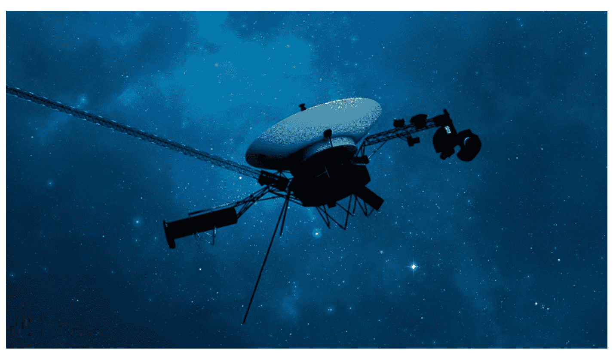

它是如何做到如此神速飞行的？

答案是：

引力弹弓。

正是借助于木星和土星的“引力弹弓效应”的加速，旅行者1号才得以成为第一个穿越太阳系并进入星际空间的宇宙飞行器。

它不是孤独漂流，而是精准地借助宇宙之力，选择了一条看似迂回却最高效的路径。

在决策的世界里，最佳路线往往不是两点间的直线。旅行者1号的传奇之旅，为我们揭示了一种突破性的思维模式：

借力决策。

### 引力弹弓

我们先来从物理学角度仔细分析一遍旅行者1号的精彩“借力”。

引力弹弓效应，又叫重力助推，是利用行星或其他天体的相对运动和引力改变飞行器的轨道和速度，以此来节省燃料、时间和计划成本。引力弹弓既可用于加速航天器，也可以用于减速航天器。

在电影《流浪地球》里，为了让地球飞往比邻星，需要脱离太阳引力，仅靠人造的发动机还不够，于是让地球借助木星的引力弹弓，达到了逃离太阳系所需的速度。

在《火星救援》中，为了赶去火星救援男主角，赫尔墨斯号需要以精确的角度进入地球引力范围。飞船利用地球引力加速，在绕地球半圈后被“甩”向火星方向，实现快速转向和加速。

而在《星际穿越》中，飞船利用黑洞的巨大引力实现引力弹弓效应。飞船接近黑洞引力的临界点时点火，通过引力助推获得极高速度，成功转向新的星球，展示了相对论效应下的复杂轨道力学。

频繁出现在科幻作品里的引力弹弓效应，有着扎实的科学依据。

我们可以从三个物理学的视角来理解：

- 1、引力

引力弹弓效应利用了行星的引力场来改变飞行器的速度和方向。飞行器进入行星的引力场时，它的速度会因行星引力的作用而增加。

行星的引力使得飞行器的轨迹发生弯曲，从而改变了速度的方向和大小。

这个过程类似于一个物体在引力井中滑动：飞行器被行星的引力吸引加速，当飞行器离开行星时，它将带着加速后的速度继续前行。

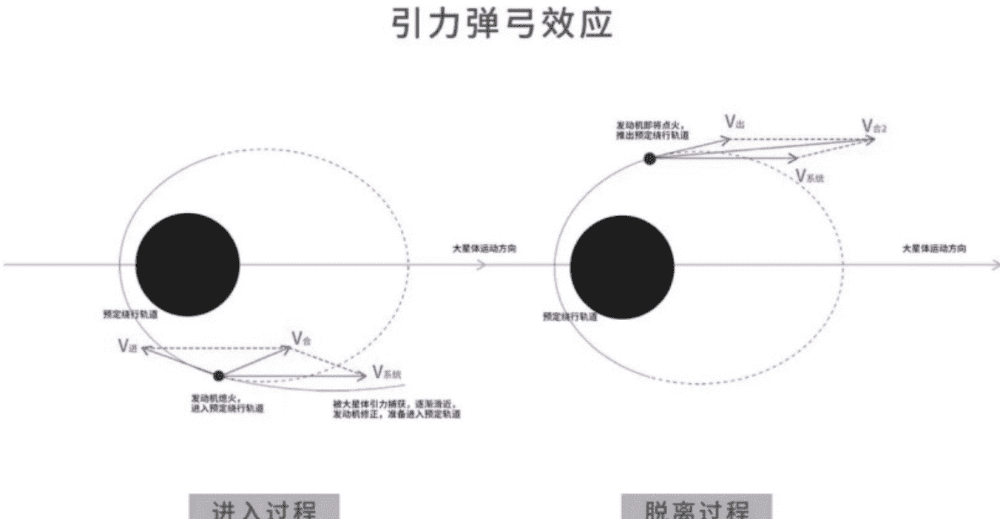

- 2、动量守恒

从动量守恒的角度来看，飞行器和行星组成一个封闭系统。在这个系统中，总动量是守恒的。飞行器接近行星时，其速度方向和大小发生变化，这样的变化意味着飞行器从行星处获得了部分动能，而行星也因此稍微减速。

不过，由于行星的质量远远大于飞行器，行星速度的变化通常非常微小，以至于可以忽略不计。因此，飞行器的速度增量主要体现在它从行星动能中获得的部分。

- 3、相对论

当飞船接近一个大质量的行星时，它实际上进入了行星的引力场。这种引力场可以被视为行星周围时空的弯曲。根据广义相对论，行星的质量使得周围的时空弯曲。

这种弯曲的时空可以被类比为一个倾斜的坡道。飞船在接近行星时，就像一个小球在斜坡上滚动一样，被加速。

在这种情况下，飞船的轨迹在弯曲的时空中并不再是一条直线，而是沿着时空的曲率移动。这个过程使得飞船在离开行星引力场时获得额外的速度。

具体而言，在一种理想状况下，飞行器在离开行星时，其最终速度V（最终）可以近似表达为：

V（最终）=V（初始）+2U

其中V是飞行器的初始速度，U是行星的速度。这意味着飞行器的速度增加了约2U。


你看，上面的原理图，像不像一个弹弓？

在现实世界里，弹弓效应让旅行者1号得以借力木星和土星，加速飞向了宇宙的深处。

### 176年一遇

旅行者1号的成功远行，靠的不止是物理定律。

旅行者1号离开地球时，火箭将其加速到第二宇宙速度，从而摆脱了地球引力束缚，飞向地球轨道外侧的太阳系。

然而，这还不够。要想飞出太阳系，旅行者1号需要加速到16.7公里/秒，也就是第三宇宙速度。

旅行者1号的运气太好了，它遇上了176年一遇的天象：木星、土星、天王星、海王星，这四大行星运动到了太阳的同一侧！

如此一来，航天器只需要少量燃料以作航道修正，其余时间可以借助各个行星的引力加速，以一艘航天器就能造访木星、土星、天王星及海王星。旅行者1号（还有作为备份的2号）就是为了这次机会而设计，它们的发射时间是被计算过以便尽量充分利用这次机会。


紫色：旅行者1号 深蓝色：地球 浅蓝色：木星 绿色：土星 黄色：太阳

旅行者1号在飞经木星和土星时，不仅顺便拍照考察，还通过两次精彩的重力助推，成功“借力”，获得了足以完全摆脱太阳引力的动能，其速度达到了17.46公里/秒!

1990年，“旅行者1号”经过12年的飞行，在距离地球64亿公里远的太阳系边缘，回望地球，拍下那张广为人知的暗淡蓝点（Pale Blue Dot）照片。


稀缺机遇的识别与把握，是卓越决策者的关键能力。NASA团队精确计算行星轨道，提前数年布局，这种“机遇预判”思维，正是决策高手的标志。

### 借力人生

有人说，物理学是人生最好的指南。

旅行者1号单靠自身，很难飞得那么快，那么远。引力弹弓效应，成就了它的传说。

单靠自身力量，旅行者1号永远无法飞出太阳系。它的成功在于精准识别并利用宇宙中的力场，将看似障碍的巨大行星转化为加速器。这种借力思维，为我们构建了一个全新的决策框架。

我们来看一下旅行者1号教给我们的借力决策五步法：

- 1、力场识别

优秀决策者能够敏锐感知环境中存在的各种“引力场”。——这可能是行业趋势、技术变革、甚至是一场全球性的机遇。NASA团队精确计算了各大行星位置，找到了176年一遇的借力时机。同样，在人生决策中，识别那些稀缺且强大的“力场”，是借力的首要前提。

比如，我有一位朋友，他敏锐地识别了AI的机遇，这毫无疑问是当下最具潜力的“超级引力场”。他迅速投身其中，并且获得了相当好的回报。那么，他是如何实现的？这就要看第2步。

- 2、轨道设计

识别力场后，关键在于精心设计与之互动的路径。旅行者1号接近木星的角度和时机经过精确计算，使借力效果最大化。

我那位拥抱AI的朋友，选择了“微信视频号”作为自己的轨道，以口播视频的形式，分享AI最前沿的趋势和应用。

为什么是微信视频号，而不是别的平台？他对我说，因为视频号的受众更精确，风格也更适合他。

- 3、初始动能构建

没有足够的自身动能，即使遇到绝佳机会也无法把握。旅行者1号需要火箭提供初始第二宇宙速度，才能开始星际之旅。这提醒我们：借力不是等待救世主，而是在关键时刻具备足够的基础能力，才能与外部力量形成共振。

在微信视频号上讲AI的人很多，我那位朋友却能迅速做到百万级粉丝。为什么呢?原来，他原本就是一位畅销书作家，对文字的感觉非常敏锐，有着强大的初始动能。

即使如此，他的成功也不是一蹴而就的，事实上，他在视频风格上也做了各种尝试，这就是“借力决策”的第4步。

- 4、路径执行与调整

即使最精确的计划也需要实时调整。旅行者1号在飞行过程中不断进行轨道微调，确保理想的借力效果。同样，决策执行过程中，我们需要建立反馈机制，根据实际情况及时优化路径。

- 5、多级借力思维

最高明的借力是实现多级助推。旅行者不满足于单次借力，而是精心设计了木星、土星的连续借力路径。人生决策也应如此，一次成功的借力应该为下一次借力创造条件，形成连锁反应。

我那位朋友正是这样做的。从AI内容创作者起步后，他没有止步于此，而是构建了一系列的借力链：首先，通过视频号积累的粉丝基础，他推出了图书等商品销售；随后，他还将自己专业能力结合技术打包输出，帮助别人；现在，他还在硅谷成立了自己的投资公司，更深入地参与到AI的浪潮中。

这种多级借力与旅行者的星际之旅何其相似——旅行者1号先借木星引力加速，再借土星引力进一步加速，每一次借力都为下一次创造条件。

人生决策也应如此规划：不要将目光局限于单次机会，而是设计一系列连贯的“借力链”，让每一步都为下一步创造理想条件。

### 最后

我特别喜欢“引力弹弓效应”里包含的一种浪漫而大胆的假设：

整个宇宙都是我的已知条件。

的确，我们每个人都是赤条条来到这个世界上的。也许中了不同的卵巢彩票，在不同的家庭成长，生而不同，起点各异。

然而，这无尽的天地之间的万物，皆可为我们所借力。正如苏东坡所赋：

> “惟江上之清风，与山间之明月，耳得之而为声，目遇之而成色，取之无禁，用之不竭。是造物者之无尽藏也，而吾与子之所共适。”

旅行者1号，并不是宇宙之间的孤独行者，所有的星辰都可能是它的借力之处。如果你能够像旅行者1号那样借力，整个宇宙都将陪伴你，踏向此生星光璀璨的旅途。

在这个技术变革加速、产业边界模糊的时代，借力决策的能力比以往任何时候都更加重要。

未来的决策高手，将不再是那些拥有最多资源或最强能力的人，而是那些能够在复杂系统中识别关键力场，设计最优借力路径的人。

当下一个“176年一遇”的机会出现在你面前时，你是会像大多数人一样直线思考，还是能像旅行者一号那样，设计一条看似迂回却能飞越星河的绝妙路径?

不妨想想：我的下一个“引力弹弓”在哪里?

也许在一本书、一个创新领域、一位新伙伴身上，也或许就在你触手可及的技术浪潮中。只要你能察觉并把握，设计出自己的借力轨道。

决策的艺术，不在于独自飞翔的勇气，而在于与时代共舞的智慧。

我是老喻，我们下一讲再见。

公众号懒人搜索，懒人专属群分享

## 《老喻·决策算法100讲》

成为命运的主人

版权归得到App所有,未经许可不得转载

老喻
思考者


公众号

懒人搜索

懒人专属群


微信:lazyhelper

## 71确定性陷阱：怎样在不确定性中生存？


lazybro，你好

你好，我是老喻，欢迎来到《决策算法》课。

### 一

想象一下，你手握一颗未知的巧克力。它会是香甜的牛奶，微苦的咖啡，还是浓郁的焦糖味儿？经典电影《阿甘正传》道出了人生真谛：“生活就像一盒巧克力，你永远不知道下一颗是什么味道。”

但让我告诉你一个秘密——我们大多数人其实讨厌这种不确定感。

去年夏天的一个早晨，我家陷入了一场关于未来的争论。我的女儿正面临人生第一个重大抉择：申请哪所大学？

她倾向于B大学——录取率30%，专业排名第二十；而孩子妈妈则力推A大学——全美前三，但录取率低于10%。

这看似简单的选择背后，是一个深刻的决策困境：是追求“更确定”的成功，还是冒险追逐“更高”的回报？

同一天，我查看股票账户，一支重仓股表现平平。那种不安感蔓延开来，促使我拨通了一位做投资的朋友的电话。他笑着调侃：“你不是巴菲特的信徒吗？连你都受不了股价短期不涨？”他的问题击中了要害——即使是信奉长期投资的人，也会在不确定性面前动摇。

这就是人类最奇特的矛盾：

我们生活在一个本质不确定的世界，却拼命寻找确定性的安慰。

我们渴望能够预测明天，渴望能够控制结果，渴望能够确信自己的选择是正确的。

然而，恰恰是这份对“胜券在握”的渴求，最可能把我们推向错误决策的深渊。

我们往往急于寻找“一招制胜”或“稳赚不赔”的方案，忽略了真实世界的复杂性和不可预测性。

这就是我所说的“确定性陷阱”——我们拒绝接受世界的不确定本质，反而追求虚假的确定性，最终导致决策失误。

我见过许多让人难忘的例子：

有个朋友追求“稳定回报”，将全部积蓄投入一家“保证年化8%”的理财产品，却在项目崩盘后连本金都拿不回来；

我的一位读者，毕业时选择了“最稳定”的国企工作，拒绝了大厂的offer，十年后却发现自己的技能已经过时，在科技浪潮中难以适应；

还有一位亲戚，不断寻找“完美无缺”的另一半，设下种种条件确保婚姻稳定，结果四十多岁仍然单身，错过了许多虽不完美却真实的缘分。

这些故事中，人们追求的都是确定性，得到的却恰恰是最不确定的结果。

最讽刺的是，我们追求确定性的心理倾向，恰恰会导致最不确定的结果。当我们戴上确定性的有色眼镜，就会忽视风险信号，拒绝听取不同意见，错失关键转折点。

接下来，我想邀请你一起探索“确定性陷阱”，并学习如何在不确定的世界中做决策。因为掌握这种智慧，不仅能让你避免代价高昂的错误，更能让你将不确定性转化为人生的优势。

正是因为确定性的诱惑如此强大，我们需要先了解为什么我们的大脑如此渴望确定答案。

### 二

我有位朋友开了家新媒体公司，他分享了一个制作爆款短视频的秘诀：

输出确定性。

那些爆火的内容总是斩钉截铁的腔调，举几个例子：

只要做到这三点，孩子就能上清华北大

按照芒格的这个方法，投资就能十年十倍

哈佛专家秘方，一招实现成功减肥20斤

为什么这类内容如此吸引人？因为它们满足了人类对确定性的深层渴望。在这个变化迅速的世界里，确定性成了稀缺的心理慰藉。

从进化角度看，人类大脑天生热衷寻找确定的模式和秩序。远古时代，能预测环境变化的祖先更容易生存——知道哪里有猎物，哪条路有危险，这些“确定性”关乎生死。

研究表明，不确定性会触发大脑压力反应。面对未知时，我们的前额叶皮质活动减弱，而处理恐惧的杏仁核活动增强。简言之，不确定会引发焦虑和不安，甚至产生类似物理疼痛的感受。

为避免这种不适，我们急切需要“认知闭合”——获得明确答案，哪怕这答案不准确，也好过悬而未决。

伦敦大学学院的研究发现，不确定性本身会触发强烈的应激反应。在实验中，当参与者有50%概率被电击时，他们的压力水平反而比100%确定会被电击时更高。这揭示了一个惊人事实：人类宁愿面对确定的坏结果，也不愿忍受悬而未决的不确定。

几种认知偏差进一步强化了确定性偏好：

- 模糊厌恶：我们本能地回避模糊不清的选择，宁愿选择概率明确的选项，即使期望值较低。例如，很多人宁愿确定得到900元，也不愿赌91%的几率赢1000元，尽管后者期望值更高。
- 确认偏误：我们只寻找支持已有观点的信息，忽视相反证据，创造虚假的确定感。
- 控制幻觉：我们高估对结果的掌控能力，就像赌徒相信能“掌控”骰子一样。
- 过度自信：人们普遍高估自己的判断能力。当我们“90%确信”某事会发生时，实际概率往往低得多。
- 叙事谬误：我们难以接受随机性，总要在事件间找因果联系，编织出“合理”故事。

社会环境进一步强化了这种偏好。教育系统奖励标准答案而非开放思考；媒体为吸引眼球提供简化解释；商业广告常打出“保证有效”的承诺。

特别值得警惕的是，市场营销巧妙利用了这种心理弱点。“无效退款”“百分百保证”等承诺正是为了消除消费者的不确定感。骗局也常以“稳赚不赔”为诱饵，利用我们对确定性的渴望麻痹警惕性。

数字时代本应让我们更习惯不确定性，但信息过载和定向推送反而加剧了确定性焦虑。当我们陷入信息茧房难以辨别真伪时，那些提供简单而确定答案的“秘诀”，就显得格外诱人。

理解了确定性陷阱的根源，我们就能更好地理解人类思维正在经历的一场重大转向。

### 三

我相信，你已经注意到了，《决策算法100讲》的核心是：在不确定的环境下如何做出满意决策。开篇我便提出：

决策的使命是，面向未知的未来，合理分配当下资源，以最大化人生持续向好的概率。

回望人类认知的史诗长河，人类曾陶醉于“钟表宇宙”的幻梦——牛顿力学让人类相信：掌握足够的条件和规律，就能预测一切。这种对确定性的渴望不仅塑造了科学，也渗透到日常思考中。事实上，我们从小接受的几乎都是关于确定性的教育。

然而，20世纪的科学革命彻底改变了这一认知。量子力学展示了微观世界的随机性；热力学证明能量流动只是分子随机碰撞的统计结果；混沌理论告诉我们初始条件的微小差异可导致完全不同的结果。

玻尔兹曼将“概率”引入物理学，揭示热量从热物体流向冷物体仅仅是因为这样发生的概率更高。费曼也坦承，“物理学只能计算事件发生的概率”。这不是科学的退步，而是对宇宙本质的深刻洞见。

人工智能的发展印证了这一转变。从“深蓝”依靠严格规则征服棋盘，到DeepSeek、ChatGPT等大模型在概率海洋中航行，AI已从机械齿轮时代迈向统计智能时代。

这是人类思维的一次壮丽进化：

当我们终于放下对确定性的狂热追逐，开始以概率的眼光看待世界，决策的本质也随之脱胎换骨。

在这本质不确定的世界里，学会用概率思维思考，就是掌握了决策的终极密码。这一点，我们在前面的多讲课程中，已经提到过，这里我们可以再来做一次系统的复习：

怎么用概率思维在不确定的世界里更好地做决策？《决策算法》课给你5个核心建议：

- 1、用概率思维取代“必然因果”

我们常说“只要A就能B”，仿佛有铁打的因果链，但现实往往是多因素交互的概率事件。前面说的哈佛教授的“一招制胜”看似诱人，却可能只在特定场景成功。真正该问的是：“只要A，有多大概率达成B？并且，还需要哪些前提条件？”

如果我那位投资失误的朋友用概率眼光看待“保证年化8%”的理财产品，他会问：在什么条件下这个回报率是可持续的？有多大概率会失败？从而避免了全部积蓄的损失。

- 2、用期望值衡量决策的“长期平均收益”

停止只凭感觉去下注，多用期望值和期望效用来评估。十次尝试中，哪几次会成功？成功时收益是多少？失败时损失多大？这些可能性的加权结果能帮你做出更理性的选择。

- 3、成为“贝叶斯主义者”

真正的智者不会一次判断定终身，而是随新信息不断更新信念。贝叶斯思维意味着每个“结论”都是暂时的，一旦有了强力证据，就果断修正。这样的认知柔韧性，在不确定的世界里反而保证了稳定。

我那位选择国企的读者若采用贝叶斯思维，会随着科技行业发展和自身技能积累不断更新职业判断，在关键时刻敢于跳出舒适区，而非固守“铁饭碗”直到发现自己已被时代抛下。

- 4、用“满意解”替代“绝对完美”

### 最后

我们常常执念于找到最优解，反而错过了“足够好的解”。在充满随机与复杂的现实中，寻求“满意解”更符合概率原则，也更能避免决策瘫痪。这不是降低标准，而是更务实地接受世界的多变。

我那位寻找完美伴侣的亲戚，若能接受“满意解”而非坚持“完美无缺”，懂得任何关系都有不确定性和成长空间，或许早已在真实但不完美的爱情中找到幸福。

- 5、接受自我也是不确定性的一部分

我们的认知、情感、偏见都带着随机性与不完美。正是通过承认这些局限，我们才能更好地尊重现实、看到不同角度，从而在不确定中保持谦卑与勇气。

概率思维不仅是一种理论，更是一种实践。

最后，请允许我说回去年夏天的那个上午。

最终，在权衡了各种可能性后，我的女儿最终决定申请A大学，为追逐梦想冒险。很幸运，她成功了，提前收到了录取通知书。

从概率上说，在另外一些平行宇宙里，她可能失败了。但那也没关系，因为她还有第二轮的申请机会，还有更多的备选方案。人生就是这样。

至于那个让我被调侃的股票，我选择强制自己不要频繁看账户。因为从概率角度看，短期波动往往只是噪音，而非信号。过度关注价格波动只会导致情绪决策，而情绪决策几乎总是概率不利的。

人生也许的确像是一盒巧克力，只是味道更加酸甜苦辣。

不确定性让我们的每次决策都充满了未知，但正是这种“不知道下一个是什么”，才令你我能通过主动选择，来实现此生的自由意志。

我很喜欢冯内古特给《五号屠场》二十五周年纪念版所作的简介中写的一段话，且以此作为今天的收尾：

> “斯蒂芬·霍金认为我们无法预知未来很有挑逗意味。但现在，预知未来对我来说小菜一碟。我知道我那些无助的、信赖他人的孩子后来怎样了，因为他们已经成人。我知道我那些老友的结局是什么，因为他们大多已经退休或去世了。”

我想对霍金以及所有比我年轻的人们说：

> 耐心点。你的未来将会来到你面前，像只小狗一样躺在你脚边，无论你是什么样，它都会理解你，爱你。

我是老喻，我们下一讲再见。


## 72 操控陷阱：怎样识破别人设计好的轨道？


lazybro，你好

你好，我是老喻，欢迎来到《决策算法》课。

### 一

没什么比被骗更让人恼火了。

如果有，那就是操控。

当谎言被揭穿，我们感到愤怒；但当操控被识破，我们却发现自己早已无路可退。

欺骗是明显违背事实，而操控则是悄悄重塑你的决策环境，让你“自愿”走入精心设计的陷阱。

大约二十年前，我在广州买了一套双拼别墅。开发商是大名鼎鼎的地产龙头企业，是我喜欢的品牌，其创始人当时也称得是行业领袖。

收房之前，我接到一个通知，居然要求补缴十多万房款。我心想，这是咋回事儿？

销售人员解释说，收房后相关部门会来验屋，测量实际面积。合同里有一条，假如面积超过合同约定，并且超出面积在某个区间内（例如大于1%，小于5%），买家要按照销售价格补足多出的面积。

很“巧”，我买的房子，多出的面积，不多不少正好落在这个要交钱的范围里。

我有点儿不开心，问：你们这是别墅啊，难道不是以套论价吗？要是你们故意多做出这几平方米呢？

销售人员说：签合同的时候，你要是提出要求的话，我们也是可以按照套来定价，这样就不涉及补钱了。

那一刻，我明白了什么叫精心设计的操控。这不是简单的欺骗；这种温柔而周密的“操控”，在看似公平的规则下，悄无声息地引导你走向对方预设的结局。

后来得知，另外一些业主也补了款。想想看，谁会在签约时预料到这家备受尊敬的企业会在标准合同中埋下这样的条款？

这正是操控的可怕之处——它不会直接告诉你错误信息，而是巧妙地设置环境，让你在不知不觉中按照设计者的意图行动，甚至会认为那是自己的选择。当你意识到被操控时，合同已签，规则已定，你除了接受，别无选择。

比起直接的谎言，这种隐形的操控手段更加普遍，也更难防范。它们潜伏在我们日常生活的每一个角落，从购物决策到投资理财，从人际关系到职业发展。


### 二

而这，仅仅是操控陷阱的冰山一角。

操控陷阱是指行为人通过策略性手段影响他人的认知、情感和决策过程，使其在不完全觉察的情况下按照操控者意图行事。与欺骗直接违背事实不同，操控往往保持表面真实，却在暗处改变你的选择环境。

下面这七个维度，几乎能涵盖我们日常生活中所有形态的操控。看看你是否曾经经历过这些场景——

- **1. 认知操控**：通过歪曲或利用认知偏差影响判断。
  如餐厅菜单上刻意放置一道昂贵菜品，让其他价格显得“相对合理”，利用锚定效应引导消费。
- **2. 情感操控**：利用恐惧、内疚或兴奋等情绪反应。
  如保险销售强调“如果你真的爱家人”就应该购买高额保单，用内疚感驱动决策。
- **3. 社会操控**：运用群体压力和权威影响。
  如电商平台显示“已有10000+人购买”，利用从众心理促使犹豫的消费者下单。
- **4. 经济金融操控**：通过不对称的利益安排诱导行为。
  如银行推出“高息存款产品”，但附带必须同时购买低收益保险或基金作为条件，让客户在追求高息的过程中不知不觉接受了不划算的搭售。
- **5. 法律契约操控**：在协议和合同中设置不平等条款。
  如App订阅服务默认开启自动续费功能，且关闭选项，让用户在不知不觉中反复付费。
- **6. 信息操控**：控制信息流动和披露方式。
  如商家标榜产品“不含某有害成分”，暗示竞品含有该成分，而实际上整个行业都不使用这种成分。
- **7. 技术操控**：借助数字界面和算法影响用户行为。
  如应用的退订按钮故意做成浅灰色小字体藏在页面角落，而续费按钮则醒目居中，典型的暗模式设计。

回看我购房的案例，开发商精心运用了其中的三种操控手法，让我和其他购房者掉入补差款的圈套：

- 法律契约操控是最明显的策略。开发商在冗长合同中设置了面积补差条款，创造了一个“契约陷阱”。
- 社会操控通过品牌权威实现。“大名鼎鼎的地产龙头企业”形象带来的信任感，降低了购房者的警惕性。谁会质疑“行业领袖”的诚信呢？
- 信息操控则表现为信息不对称利用。开发商掌握了购房者不知道的行业“潜规则”——如果客户主动提出，才可以按套定价。

然而，归根到底，原因在我自己。

我对那么重要的决策，缺乏基本的敏感；将签合同这么严肃的事情，视为随随便便的事情。我默认了这个世界是善意的，在操控者面前放弃了自己的选择权。

### 三

我们每天都可能面临各种各样的操控。当你点开购物App、签署合同、浏览朋友圈广告、甚至与亲密伴侣交谈时，操控陷阱可能就在眼前。

我们真的能实现完全的“自由意志”吗？严格来说，也许不能。但我们可以构建一套个人“操控免疫系统”，在关键时刻激活防护机制，阻断外部操控，保持决策自主权。

这套免疫系统由三道防线组成，每道防线都有针对性地抵御不同阶段的操控。掌握这套系统，你将从“被牵着走”转变为"主动掌舵"。

### 第一道防线：反操控雷达

当你的直觉告诉你“有些不对劲”时，这就是防御系统的第一道警报。

- **情绪探测仪**
  当你突然感到强烈恐惧、内疚或兴奋时，很可能有人在按动你的情绪按钮。投资顾问说“明天涨停，今天不买就晚了”，正是在激活你的错失恐惧。这种情绪飙升就是警报：有人正在操控你。
- **逼迫识别器**
  真正有利的选择很少需要在极短时间内完成。“今晚12点优惠截止”、“仅剩最后100套”几乎都是操控的催化剂，它们存在就是为了让你来不及思考。
- **关系监测仪**
  当对方借用你珍视的关系施压时，这可能是在利用你的情感弱点。“如果你真的爱我”、“为了我们的未来”往往是情感操控的信号弹。

### 第二道防线：反操控解码

察觉到可疑信号后，我们需要一套工具拆解操控者精心设计的“思维陷阱”。

- **操控语言翻译机**
  “明星都在用”翻译为“明星又不是专家，他们在利用从众心理”。
- **成本计算器**
  操控者善于突出表面好处，隐藏真实成本。“每天只需9.9元”，计算一下是“一年3613.5元”。啥事儿多问几句，还有啥成本没？如何退出？
- **选项扫描仪**
  最高明的操控是让你看不到所有可能选择。你要突破框架，问：“还有什么选项被故意隐藏了？”真正的自由是能看到所有可能性。

### 第三道防线：反操控防御

发现操控后，你需要具体、实用的战术来保护自己的决策自主权。

- **时间缓冲带**
  对重要决定设置强制等待期——例如，消费决策24小时，关系决策72小时，投资决策一周。“操控”最怕的就是你的“让我想想”。
- **环境转换开关**
  操控者精心设计的环境会干扰判断。感到压力时，离开当前场景——“我去趟洗手间”、“我需要打个电话”。
- **决策智囊团**
  建立由不同背景朋友组成的顾问团。决策前不求认同而求挑战：“这个提议有什么问题？”、“这里可能有什么陷阱？”

再回到开头我买房子被操控的经历，如果启动这套系统：

- **雷达阶段：** 签约时就会对“面积补差条款”产生警觉——别墅为何按面积而非按套定价？开发商的品牌光环也会让我警惕这是权威操控。
- **解码阶段：** 重新框架思考：“开发商有什么动机让面积恰好落入补款区间？”同时探究被隐藏选项：“别墅销售中是否存在按套定价的标准做法？”
- **防御阶段：** 真到了被要求补缴钱阶段，也应该给自己考虑时间；咨询律师了解行业标准；联系其他业主了解情况，必要时组织集体谈判。

操控无处不在，但我们并非无力抵抗。通过这三层防御系统，你可以保护自己的决策自主权。

记住，你有权利说：“我需要时间”、“请告诉我所有选项”或简单地说“不”。

这套三层防御系统不是能一次性学会的技能，而是需要在实践中不断强化的习惯。每识破一次操控，你的免疫系统就会更强一分。

### 四

你也许会说，老喻，在现实中，大家决策大多凭直觉，谁会这么啰嗦啊？

这让我想起两个故事，一个是身边的真事儿，一个是小说里的角色。

先说真事儿。我有个朋友，金融领域的资深人士，毕业之后干了几年期货，后来做股票，做一级市场，都很成功。

有次他交易二手房，找了当地一个大牌经纪。交易中，他感觉对方不是那么友善，有操控他的嫌疑，于是在某次重要的洽谈环节，他悄悄带了录音笔（这在当地是合法的）。

我当时就感慨，不愧是真金白银刀光剑影的金融圈杀出来的人，太有风险意识了。

再说小说里的角色。

诺奖得主石黑一雄的小说《长日将尽》里，有一位正直而善良的绅士达林顿勋爵，恰恰是因为过于善良，他被纳粹分子利用和哄骗，成为了两次世界大战之间，纳粹用以在英国推进对德绥靖政策的一枚棋子。战后，小说主角（一名英国管家）所敬仰和爱戴的勋爵最终在身败名裂中死去。

故事中，最让我印象深刻的一点是：这位被纳粹操控的勋爵，被评论为太“业余”了。他相信所有外交都应基于“绅士精神”，却不知国际政治中的残酷现实。

大多数人在决策上，都像达林顿勋爵一样是业余人士。所以，在操控者面前，基本上都是一眼被看透的小白鼠。而我那位朋友，是在大亏大赚中磨砺出来的，见识过各种套路，他是专业人士，就像鲨鱼能闻到血的味道一样敏锐地察觉到操控的气息。

可我们这些业余人士怎么办呢？还是要老老实实穿上前面说的三层防弹衣，在可能的“操控陷阱”面前，按照流程去觉察，去分析，去应对。虽然笨拙一点儿，但是好过单纯凭直觉，因为在精心设计的操控面前，直觉往往是最不靠谱的。

在看似平静的商业、社交甚至情感海面下，暗流汹涌。

天真不是美德，而是风险；警惕不是多疑，而是自卫。就像我们不会指责带雨伞的人“太悲观”，我们也不应嘲笑做决策时多一重防护的人“太计较”。

毕竟，在这个操控无处不在的世界，保持清醒的头脑和独立的判断，是每个人应有的基本能力。或许我们无法像金融专家那样训练出敏锐的职业嗅觉，但至少可以通过系统性思考和有意识的防范，避免成为下一个被操控的达林顿勋爵。

### 五

巴菲特曾经说过，当你开车的时候，你要把马路上的每一辆车都当作潜在的“凶手”。

最早看到这个说法，我觉得这位世界首富过得真辛苦。但后来，亲自经历过形形色色的“操控陷阱”，我突然意识到，这个说法太高明了，比“防人之心不可无”更有实际启发。

你看，按照他的说法，你前面的那辆SUV可能突然急刹车，所以你要留好足够的车距；你右边的小轿车可能故意拐弯儿来撞你，所以你尽量不要与其平行开......

这正是我们前面提到的“反操控雷达”的生动隐喻。

这种思维方式，并不是把所有的人都当坏人，当作可能操控你的凶手，而是从自己的角度，做好准备，防患于未然，让可能操控你的坏家伙们根本没机会靠近你，他们自然就会知难而退了。

当然，反操控意识往往只有在经历了操控之后才会真正觉醒。希望你能多从别人的经验中学习，而不必亲自“交学费”。

但是，即使遭遇了“操控陷阱”，请你记住操控的反面不是愤怒，而是清醒的自主。

就像《教父》里说的，不要去恨你的敌人，那会影响你的判断力。

即使是操控你的敌人，也不必去恨他们，而是找寻自己可以改善的地方。让法律去惩罚违法者，让自己远离心怀不轨的人。

在这个过程中，我们要成长，要让自己的决策免疫系统会越来越健全。

最后，送给你叶芝一句话：

“幸福与良好的品行不是一回事，幸福也不等同于快乐或者别的什么东西，幸福只和成长有关。我们因成长而感到幸福。”

在这个操控无处不在的世界，愿你我都能不断成长，保持清醒的自主，走出自己的路，而不是被别人设计好的轨道。这才是真正的幸福之道。

我是老喻，我们下一讲再见。


## 73 成功陷阱：怎样找到真正属于自己的选择？


lazybro，你好

我是老喻，欢迎来到《决策算法》课。

### 一

1970年3月，普林斯顿的一位医生在病历上写下了如下文字：

患者坚信自己未能实现人生目标，是个“失败者”，认为研究院同事视他无用，害怕被开除。他焦虑于过去一年未能产出像样成果，甚至觉得过去35年毫无建树……

如果我们停在这里，或许会觉得这说的是一个走投无路的科研人员，被失败感吞噬，甚至即将崩溃。

但这名“失败者”是哥德尔，20世纪最伟大的数学家之一，晚年的爱因斯坦说过：“我自己的工作没啥意思，我来上班就是为了能同哥德尔一起散步回家。”

就是这个认为自己一无所成的人，他的哥德尔不完备性定理彻底改变了数学和逻辑学，甚至预示了人工智能的终极困境。他被视为继亚里士多德以来最伟大的逻辑学家，却在内心深处认为自己是个彻头彻尾的失败者。

那么，请问：这样一个天才，为什么会认为自己是成功的反面？

因为，“成功”从来不是一个绝对的概念，而是一个被社会叙事绑架的幻觉。

成功的标准到底是什么？

是名声？是金钱？是社会地位？

如果连伟大的哥德尔都会怀疑自己毫无成就，那么那些我们崇拜的“人生赢家”，是否也曾有过无数次的自我怀疑？

成功，究竟是衡量价值的终极标尺，还是一场被精心设计的集体催眠？

这，就是“成功陷阱”——我们不知不觉中，按照世俗的标准去定义自己的一生，甚至让它主导了我们的决策。然而，像哥德尔证明的那样，如果连数学都无法做到绝对完美，人生又怎可能有放之四海皆准的成功公式？

当我们陷入世俗定义的成功叙事时，我们真正损失的不是自尊，而是决策的理性和准确性。

成功陷阱的最大危害，不是让你觉得自己不够优秀，而是让你的决策体系彻底崩坏。它像一个隐形的操纵者，悄悄扭曲你每一个重要选择的基础，最终导致你在人生的十字路口反复做出偏离真实自我的决定。

为什么这么说？

在我看来，原因有两个：

- 1、追求世俗的成功，会让你总是试图向外界证明自己，你可能因此而失去决策的理性。

决策本应选择最符合自我价值的路，却变成“别人会怎么看我”的表演。这种表演心态摧毁了决策的根基：你牺牲长期价值追求短期亮点，模仿而非创新，被成功学个例误导。最终，你越努力向外证明，反而越远离真正的成功。

- 2、即使获得了世俗成功，也可能不是你真正想要的。

多少人爬上职业顶峰才发现自己厌恶这个领域？多少人赚到了钱却失去了健康和珍视的关系？多少人站在“成功”巅峰才惊觉：这根本不是我想要的人生？

因此，真正的决策智慧，不是去问“怎样才能成功”，而是要先问问自己：“我究竟要的是什么？怎样的选择，才真正属于我自己？”

### 二

成功学并非凭空而来，它源于19世纪末至20世纪初美国流行的“自助运动”。

当时，随着工业革命的深入，社会流动性增强，“穷小子白手起家”的故事激发了无数人的想象。1937年，拿破仑·希尔的《思考致富》成为成功学的开山之作，之后戴尔·卡耐基的《人性的弱点》进一步奠定了这一流派的基础。

表面上，成功学提供了一套简单易懂的行动指南：积极思考、目标明确、自律行动、人脉建设。它激励了无数人追求更好的生活，强调了个人责任和持续成长的价值。在一个充满不确定性的世界，这些“成功公式”给人以确定感和控制感。

然而，成功学最诱人之处，恰恰是它最危险之处——它承诺将复杂的人生简化为几个关键步骤。这种简化虽然诱人，却成了决策的致命陷阱。

首先，成功学充斥着幸存者偏差。

我们只看到那些“按照公式成功”的人，却看不到成千上万用同样方法却失败的人。这就像在靶子上先开枪，再画靶心——将偶然当成必然，把运气解读为方法。

比方说某创业导师声称“早起是成功企业家的共同特质”，并列举了十位成功老板作为证据。然而他完全忽略了数千名同样早起却失败的创业者，以及那些爱睡懒觉但仍然极为成功的企业家。

其次，成功学混淆了因果关系。

例如，有研究发现，成功人士通常具有自信、热忱等特质，并将这些特质视为成功的原因。但这些特质可能是成功后的结果，而非导致成功的原因。

第三，成功学过度简化了环境因素。

我们都知道著名的“一万小时定律”，即要成为某个领域的专家，需要投入一万小时的练习。

然而，研究表明这一理论严重忽视了天赋和机遇因素。例如比尔·盖茨的成功，离不开他恰好成长于个人电脑兴起的关键时期，并有机会在高中时代就接触到当时极为罕见的计算机资源——这些环境优势是纯粹努力无法替代的。

成功学的致命弱点就在于，它抹杀了这些背景条件，制造出了一种“成功人人可复制”的幻觉，鼓励人们忽视环境因素而盲目追随成功模板。

这些缺陷如何扭曲我们的决策？

在目标设定阶段，成功学让你追求标准化的“成功”，而非个人独特的内在满足。你不再问“我想要什么”，而是问“成功人士想要什么”。

在信息收集阶段，你开始选择性寻找支持“成功理论”的证据，对不一致的信息视而不见。

在方案评估阶段，你不再基于自己的价值观和实际情况做出选择，而是机械地复制“成功人士”的行为模式。

最终，成功学创造了一个奇怪的悖论：

那些最渴望成功的人，往往被成功学所误导，做出了一系列损害长期发展的决策；

而那些真正取得非凡成就的人，却常常遵循着与成功学截然不同的内在指南。

决策本质上是一种个体行为，需要独立思考和主体性。然而，成功学最大的陷阱，恰恰在于它系统性地破坏了这种独立思考的能力，使决策沦为外界期望的产物。

### 三

2008年的时候，我和搭档面临一个决策难题：

要不要把自己的一家公司卖给某上市公司。

卖了能变现，不卖还有继续做大的梦想。该怎么选择呢？

这时，我问搭档：假如对方老板的所有财富，全都给你，包括他的工作和生活方式，你要不要？

那位老板算是富有，有自己的私人飞机。不过我的搭档一口回绝说：不要。

为啥呢？因为这位老板工作特别拼，每年就大年初一休息一天，每天都工作到半夜。

虽然他很成功，但这种成功，送给我们，也承受不起啊。

我这么一问，我和搭档两个人一下子就想明白了，立即答应了对方的出价，卖掉了公司。

我想用这段亲身经历揭示决策的本质：

决策不是追求抽象的“成功”，而是选择适合自己的生活方式。

当我们跳出成功陷阱，不再被外界定义的目标所束缚，我们才能做出真正符合自我的选择。

从决策的本质看，摆脱成功陷阱需要几个关键转变：

首先，从外部标准回归内在价值。

真正高质量的决策必须源于个人的核心价值体系，而非外界的评判标准。

这需要我们勇敢地问他己（问自己）：“如果没有任何外界压力和期望，我真正想要的是什么？”

要学会从“别人怎么看”回归到“我真正想要什么”，摆脱外界评价的干扰。这意味着，你做出的每一个决策，都必须基于你真实的内在动机，而非社会期望或群体焦虑。

可是，不少所谓成功学导师，往往是以抹杀学员的自我来建立自己的权威，这对个人决策而言，是致命的摧毁。

摆脱成功陷阱的第二点是，从结果导向转向过程思维。

成功学最大的误区在于它的结果崇拜——只看到旅程的短期目标，而忽视了路径本身的价值。

然而，决策的本质恰恰是对未知旅程的持续调整。高质量的决策意味着我们学会在不确定中寻找平衡，在变化中保持灵活，而非固执地追求某个预设的“成功终点”。

好的决策不是追求表面的成功，而是坚持做符合自身价值观的正确事情，哪怕短期内看不到回报。

当然，过程思维也需要北极星的指引。就像马拉松，我们每次只需要跑好一小步，但也要有长期方向。真正的智慧在于既享受当下每一步，又不失对远方的憧憬，让过程与结果形成良性循环。

第三点是，从确定性幻觉回归概率思维。

成功学最大的谎言是它承诺了确定性，而真实世界充满了概率、不确定性和随机性。

就像投资领域没有“稳赚不赔”的策略，人生也不存在百分百保证成功的公式。高明的投资者不追求每次都赢，而是构建能长期获利的投资组合；同样，高明的决策者不追求每个决定都完美，而是构建能持续创造价值的决策系统。

决策科学告诉我们，最优决策不是追求确定的成功，而是提高好结果的概率，这也正是《决策算法》课的主张。

摆脱成功陷阱的第四点是，从单一路径转向多元选择。

### 四

成功陷阱让我们误以为通向成功只有一条路，而现实中，每个人都有自己独特的资源、机会和约束条件。

真正的决策高手懂得因地制宜，创造适合自己的道路，正如罗伯特·弗罗斯特在诗中所言：“我选择了人迹罕至的路，而这使得一切都不同。”

回到我卖公司的故事，真正帮助我们做出决策的，不是“市场估值、将来上市”这些传统成功学指标，而是一个简单却本质的问题：你到底想要过什么样的生活？

对我而言，我赞成康德的成功标准：自由不是想干什么就干什么，而是想不干什么就不干什么。

## 74 AI陷阱：怎样不丢失决策的主导权？


lazybro，你好

你好，我是老喻，欢迎来到《决策算法》课。

### 一

最近，我身边发生了两件看似不大、但又让人深深触动的事情。

一件事是，我亲戚家的孩子，刚毕业三年，年薪就达到了约150万。她在加拿大读的大学，专业是数学加商科，后来自学人工智能的相关知识，前不久从银行数据部门跳槽到一家AI咨询公司，年薪翻了一番。

另一件事是，我朋友家的孩子，在美国读的是常春藤名校，结果毕业后一直找不到工作，原来他读的是媒体专业，就业市场受到AI的较大冲击。所以不得不考虑继续读研究生，并且更换专业。

的确，这两年AI算是最热门的话题之一了，其中，有喜有忧，有期待，也有恐惧。有人看到机遇，有人看到威胁；有人欣喜若狂，有人忧心忡忡。就连原本毫不关心技术的人，现在也不得不思考：AI会如何改变我的工作、我的生活，甚至我的思考方式？

不过，有人说，别大惊小怪，当年汽车代替马车，不也是这样吗？后来马车夫去开汽车，有什么了不起的？

事实上，这是对AI莫大的误读。

过去的工业革命，无论是蒸汽机、电力还是汽车，本质上都是身体的延伸——延伸了我们的腿、延伸了我们的手，但人类仍然握有决策的主导权。而这一次，AI却成为了我们大脑的延伸。它不仅在改变我们决策的环境，更在重新定义我们决策的目的与意义，甚至可能最终替代我们做决策。

想一想，每当你打开手机，算法已经在决定你会看到什么内容；当你在职场中，AI正在筛选着哪些简历值得HR注意；当你寻求医疗建议时，AI诊断系统可能比医生更早给出判断。这不是简单的工具更替，而是决策主体的根本转移。

无数岗位正悄然消失，人类被机器取代；传统教育模式迅速崩塌，我们必须学会与AI竞争或者协作；更严重的是，随着决策逐渐被算法接管，我们对于自己人生的掌控感开始丧失——当AI替我们做出了选择，我们活着的意义又在哪里？

也许你在使用DeepSeek帮你做选择的时候，还充满了对魔法般技术的兴奋，但你是否想过，如果人生的意义在于作出选择并承担后果，而我们越来越多地将选择权交给AI，那么我们是否正在放弃成为完整人类的机会？

这一次AI浪潮，与历史上的技术变革有着本质的不同，它不是一次简单的工具革新，而是一场关乎人类思维、判断与决策权的革命。这场革命的核心，不是汽车代替马车那么简单，而是人类大脑的重新定义。

这正是我们今天所要探讨的“AI陷阱”。

在这个背景下，我们需要认真思考：AI如何影响我们的决策过程？它带来了哪些我们从未预料到的决策陷阱？

在算法越来越强大的世界里，我们又该如何保持决策的自主性，如何重新夺回人类决策的清醒与自由？

### 二

作为一名写作者，我是AI的重度用户。我基本上在第一时间成为几个主要AI的付费用户，其中包括ChatGPT Pro套餐，每个月订阅收费200美元，加上税约为1600元人民币。

一般的AI服务，订阅价格是每个月20美元。从20多美元，到200多美元，这已经不再是订阅制的提价，而是另外一个完全不同的产品。

这在某种意义上，已经相当于一个兼职员工了。

也就是说，我每个月付出1600元人民币，OpenAI这家公司为我派遣出一位“Pro”助手。

你可能会问，值得吗？

说说我的感觉：这钱花得值。

现在，我工作的时候会同时使用多个AI助理，感觉完全抵得上有三五个聪明熟手的小团队。而且，沟通和管理成本还低。

衡量为AI花的钱是否值，只有一个标准，那就是生产力价值。假如AI将来能干3000美元月薪的人的工作，那么老板就会愿意付1000美元/月。

然而，作为一个在得到App开付费专栏的“思考者”，我自己却经常会深感不安。

AI带来的不止是智能助理，有时候更是一种反客为主的威胁，甚至让我怀疑自己写东西还有意义吗？

说好了来当伴娘，结果比新娘还艳惊四座。

AI看起来是替代你的助手、你的秘书的，但有没有想过，它是来替代你的？甚至是灭掉你所在的整个行业的？

最近，童话大王郑渊洁的一则坦白令人震惊：他让AI用他的创作手法写一篇以他笔下最著名人物皮皮鲁为主角的童话。结果AI仅用4秒就完成了作品。看完之后，这位写了30多年童话的大师不得不承认：

> “我写不过AI版的郑渊洁。”（来源：澎湃新闻）

想想看，这是多么残酷的现实！一个创作了上千万字童话、陪伴几代中国孩子成长的作家，竟然在4秒钟内被自己的“数字分身”超越。如果连郑渊洁都能被复制，我们普通创作者又该如何自处？

这就是AI陷阱的本质：决策的本能被悄然颠覆。

任何有意义的决策，都基于对价值的判断、对目标的权衡、对风险的评估，这些原本是我们作为人类最核心的能力。而当AI能在4秒内复制一位童话大师30年的创作风格，我们的目标会迷失，我们会怀疑价值，又怎么能坚信决策权仍掌握在自己手中呢？

现在，回过头来看第一节提到的那个常见误解：“AI不过是像汽车替代马车那样的工具更迭”——这种想法多么天真！

汽车替代马车，只是改变了我们移动的方式；
而AI替代决策，却是重构了我们存在的意义。

它不仅延伸了我们的大脑，更在重塑我们思考的本质。在这场关乎人类思维、判断与决策权的革命中，我们必须保持清醒：不是简单地学会使用新工具，用AI聊聊天，算算命，而是重新定义人类与决策、与创造力、与意义本身的关系。这才是我们面对AI陷阱时，最应该思考的命题。

### 三

AI陷阱对人生决策主要体现在以下几层：

- 1. **决策主体的转移陷阱**：我们不知不觉将决策权交给算法，从小到推荐购物，大到职业规划。
我有个朋友最近迷恋啥事儿都问AI，他每天醒来第一句话不是对家人，而是问智能助手：“今天我该做什么？”这类发生在科幻电影里的场景，已经变成了现实。

- 2. **身份认同的危机陷阱**：当AI能够模仿甚至超越人类专长时，我们的自我价值感崩塌。
想想看，连强大的郑渊洁都会自我怀疑。更别说众多滥竽充数的东郭先生们，这个世界哪怕是个草台班子，也越来越不好混了。

- 3. **决策框架崩塌的陷阱**：传统的人生规划逻辑在AI面前不再可靠。
一位父亲精心为女儿选择的所谓“稳定”的金融专业，毕业时却发现入门岗位已被AI取代，曾经确定的未来突然变得模糊不清。现在网上流行说“学好AI弯道超车”，问题是前方的“道”都看不清楚，怎么弯道超车？

- 4. **决策标准颠覆的陷阱**：AI改变了我们判断什么有价值的标准。
据说有位学霸放弃了计算机选择哲学，他解释说：“未来最有价值的不是编程技能，而是提出正确问题的能力”，这完全颠覆了传统观念。他的选择对吗？谁能说学好哲学就能好提出好问题呢？

- 5. **思考能力萎缩的陷阱**：长期依赖AI，我们的思考能力逐渐弱化。
《三体》作者刘慈欣曾经说过，人工智能会让人类陷入前所未有的巨大陷阱。如果人类过于依赖人工智能，可能会丧失开拓精神和文明活力，最终可能被人工智能消灭。——你赞成吗？

这些陷阱的核心在于：AI的出现绝非简单的工具升级，而是对人类决策权和思考本质的根本挑战。

如果我们无法清醒认识和应对这些陷阱，最终，我们或许将失去作为人的最宝贵特质——自由选择、自主判断和创造意义的能力。

### 四

再回到开头的两件事，一个大学毕业生因为AI而年薪百万，另一位名校毕业生却因为AI而找不到工作。这展示了AI决策陷阱的第三层：

我们赖以规划人生的传统决策框架正在崩塌。

从现实的角度看，这关系到教育决策。我女儿今年入读的“电影电视专业”，面临着AI的直接冲击。有朋友说，你们当爹妈的心真宽啊，这将来咋找工作呢？

可是，谁又能确信四年后哪些专业仍能幸存？连计算机专业如今也难逃AI冲击。

与其瞎操心，乱预测，不如让孩子选择自己热爱的专业，去她喜欢的城市，遇到一些志同道合的同学，用自己的好奇心和想象力，去探索未知的世界。这种看似冒险的教育决策，在AI时代没准儿恰恰是最稳妥的选择。

对于未来，郑渊洁的想法是，“要去做AI干不出来的事，那就会是时代的赢家”。他认为AI唯一的缺陷就是没有想像力，所以“未来的孩子们最需要保护的就是想像力”，这是最重要的事。

AI真的没有想象力吗？对此我持保留态度。作为一名围棋爱好者，2016年的AI“阿尔法狗”已经让我感受到了最强悍的围棋想象力。

但我赞成郑渊洁老师，我们必须回到思想的源头，追寻那些最根本的能力和价值，而不是盲目追逐技术热点。

在AI可以模仿一切的时代，原创性思维、批判性思考和人文关怀可能比任何技术技能都更有价值。

就像机器学习专家塞巴斯蒂安·拉斯奇卡（Sebastian Raschka）说的，不要花时间学习特定AI技术，而应专注数学、统计学等基础学科，同时通过代码、博客和论文保持对AI发展的了解。

这一建议揭示了避开AI陷阱的关键：回归本源，掌握不会过时的基础能力。

文科生的世界真的崩塌了吗？恰恰相反，当算法可以完成所有逻辑运算，我们更需要能思考“为什么”而非仅仅“是什么”的能力。也许，人类比任何时候都需要哲学家来思考存在的意义和价值的方向。

我家老二后年申请大学，他擅长数学。我们给他的建议是，追求文理相通的跨界思维，关注事物的第一性原理，保持旺盛的好奇心，培养丰富的想象力，不断回到思想的源头。这些能力不仅能帮助他适应AI时代的变化，更能让他在这个变化中保持自我决策的主权。

在这场大变革中，最危险的不是AI取代了某些工作，而是我们失去了思考的勇气和决策的自信。如果我们能保持对未知的好奇，对变化的适应力，以及对自我价值的坚定认同，那么AI就不再是威胁，而是可以为我所用的工具。

最终，走出AI决策陷阱的关键，或许不在于掌握最新技术，而在于重新发现人类特有的那些品质：创造力、同理心、价值判断、意义追寻。这些恰恰是算法难以复制的，也是我们在这场技术浪潮中能够坚守的精神家园。

### 五

AI将如何改变世界？没人能够真正预测，但是我对未来充满期待，尤其希望在AI技术的辅助下，医学能够让我的长辈和家人们更加健康平安。

那么，在这样一个千年一遇的时代，我们到底该如何做出更好的决策，让自己的人生持续向好？

- 第一，**要坚定地掌握决策主导权，而不是轻易放弃给算法**：你当然可以使用AI协助决策，但不要忘记：最终做决定的只能是你自己。无论是选择专业、工作还是生活方式，都必须问自己一句：“这真的是我想要的吗？”

- 第二，**回归第一性原理，关注那些真正不会过时的能力**：与其追风口，不如踏踏实实地培养跨学科的底层能力：逻辑思考、数学分析、批判性思维、人文关怀、沟通与协作，这些能力不会被技术迭代轻易淘汰，反而能成为你与AI协作的基础。

- 第三，**拥抱持续学习的心态，适应不断变化的环境**：AI时代带来的唯一确定性，就是不确定性。只有不断学习，才能让你始终与时代保持同步。说实际点儿，我们的对手可能不是AI，而是擅用AI的同行。

- 第四，**保持对世界的好奇心与想象力**：AI的强大并不可怕，可怕的是我们自愿放弃了探索的乐趣和想象力的力量。无论你的年龄多大、职业为何，都要始终保持好奇心，敢于提出新的问题、探索未知的领域。这种人类独特的品质，将帮助你避免陷入AI时代的同质化陷阱。

- 最后，也是最重要的一点：**回归价值判断与意义追寻**：当AI能给出所有“是什么”的答案，我们更需要问“为什么”。每当你做出人生决策，问自己：“我的意义是什么？我的价值在哪里？”

保留我们作为人类善良并且脆弱的那一面，这也许是碳基生物最值得珍惜的优势，也是我们最终超越算法的关键所在。

以上就是这一讲的全部内容。

我是老喻，我们下一讲再见。


## 75 永恒轮回：假如人生重来，你会过得更好吗？


lazybro，你好

你好，我是老喻，欢迎来到《决策算法》课。

### 一

假如人生可以重来，你会过得比这辈子更好吗？

这个看似假设性的问题直指我们最深刻的人生焦虑。

恋人们常说：“若有来世，我仍愿与你相伴。”

父母们常想：“如果重来一次，我会用另一种更好的方式教育我的孩子。”

职场人则叹息：“如果当初抓住了那次跳槽的机会，人生或许完全不同。”

我们每个人，都曾这样在心底反复掂量：“要是当初选了另一个专业，去了另一座城市，接受了那个机会，现在的我，会不会更幸福？”

1881年的某天，尼采正沿着湖边行走，见一块小鹅卵石从岩层上飞下，他突然冒出一个思想实验：

如果一个魔鬼告诉你，你的生活将会无数次地重复，你会怎么回应？

在《快乐的科学》一书中，尼采更详细地描述了这个思想实验。他问道：

“如果你被告知你的生活将会一次又一次地重复，没有任何新的变化，你会如何反应？你会感到恐惧和绝望，还是会欢迎并接受这个可能性？”

这就是所谓的“永恒轮回”。

尼采认为，这个问题并不仅仅是一个抽象的思想实验，而是关乎我们对生活的态度和价值观的核心问题。

“如果我们能够欢迎并接受生活的重复，那么我们就真正地接受了生活，我们就真正地成为了我们自己。”

但我要问的是更深层次的问题：面对这永恒轮回的可能性，你感到的是恐惧还是释然？你对自己的人生决策，是否充满了悔意与遗憾？每一个十字路口的选择，是否让你在深夜辗转反侧？

人生就像一本无法修改的书籍，每一页一旦翻过，就再也无法重写。然而，正是这些无法更改的决定塑造了今天的我们。

每个人生命中都有那些深夜反思时令人痛彻心扉的决定，我们幻想着重来的可能，却不知是否真能做得更好。

接下来，让我们一起探索这个看似简单却又深刻的人生之谜。在永恒轮回的思想实验中，我们或许能够找到关于人生决策的最本质的智慧之光。

### 二

也许有人会说：假如可以重来，为什么生命的重复必须一模一样呢？为什么不能是不断重复，但每次有不同的悬念和精彩呢？

让我们将尼采的“永恒轮回”的概念，再往前推进一步，从简单的、确定性的、一模一样的重复，深入到概率的重复，也就是说，你可以重复扔一个一模一样的骰子，但是结果却可能不同。

比方说，我们来玩一个简单的概率游戏：抛一枚特制的硬币，这枚硬币正面朝上的概率为60%，反面朝上的概率为40%。游戏规则是：每次押一块钱，如果猜中，你赚一块钱；如果没猜中，你亏一块钱。

相信你一定会选择猜出现概率更大的正面吧。

这个游戏的期望值是多少呢？让我们计算一下：

抛出正面的概率是60%，赚1块钱；抛出反面的概率是40%，亏1块钱：

这个游戏的期望值 = 1×(0.6) + (-1)×(0.4) = 0.6 - 0.4 = 0.2

每玩一次，平均能赚0.2块钱。这是一个有正期望值的游戏！从长远来看，如果你玩足够多次，根据大数定律，你的平均收益会逐渐接近这个理论值0.2块钱。

现在，让我们再次重复尼采的“永恒轮回”思想实验：

假如你选择猜正面，但是玩儿了一把，结果落在反面，你输了。于是“尼采的魔鬼”说，你可以重复一次，你还会做出一样的选择吗？

答案当然应该选“是”。

又假如，有一位不信邪的同学，选择猜出现概率只有40%的反面，但是他运气很好，猜中了。这时“尼采的魔鬼”也对他说，你可以重复一次，你还会做出一样的选择吗？

那么他会说“是”，还是“否”呢？

决策的价值不在于单次结果，而在于长期期望值。正确的决策配以错误的结果仍是好决策；错误的决策偶获成功仍是坏决策。这是概率思维的精髓，也是永恒轮回下的决策法则。

我在投资领域有个朋友圈，其中有一位投机高手，他很敏锐，行动力极强，但是有个致命弱点：太爱赌了。他经常在一只股票上押上自己所有的本钱，还融资加满杠杆，在短短几年时间里，赚了二三十倍。然而，前不久，他在一只消息股上栽了跟头，赔光了所有的利润和本金。

一位认识他的老兄说：按照他的风格，这是早晚的事情。

如果给他重来一次的机会，他会怎样选择？他或许依旧无法抗拒短期收益的诱惑，因为他的决策模式并未改变。——

一个人终将成为他该成为的人，这不是宿命论，而是大数定律作用于自由意志的残酷真相。

对于人生决策而言，真正的智慧不在于避免所有失败，而在于选择长期概率有利的游戏，并始终如一地坚持做正确的决策。这种概率性的永恒轮回提醒我们：我们无法改变单次掷骰子的结果，但可以选择长期而言拥有正期望值的骰子。

如此看来，我们每个人都是命运的赌徒，都在不确定性中寻找确定性，在偶然中把握必然。而真正决定我们命运的，是我们挑选了哪个骰子，选择了什么样的决策模式。

回到尼采的永恒轮回，它给我们提供了一个评价决策的标准：如果你的人生注定要无数次重复，你会希望自己的决策模式是什么样的？是那种短期可能侥幸成功但长期必然失败的模式，还是那种遵循概率规律、具有正期望值的模式？

### 三

说来有趣，尼采运用了骰子来作为隐喻，阐释他的“永恒轮回”理论：

- 1. 掷骰子的游戏包含两个时刻：骰子掷出的时刻和骰子回落的时刻。
- 2. 骰子组合的数目有限，这决定了掷出的骰子必然会重复某一组合。大数定律发挥作用。

3、单次结果偶然，从统计学的角度看结果是必然的。

4、永恒轮回是游戏的第二个时刻，是“骰子掷出的结果，是对必然的肯定”，同时它又是“第一个时刻的回归，是投掷的重复，是偶然本身的再生与再肯定”。

尼采所说的骰子的两个时刻，一个是指我们主动做出的选择；一个是受随机性影响的被选择。前者是“我命由我不由天”，后者是“我命由天不由我”。这个深刻的二元性揭示了人生决策的本质矛盾：我们既是作出选择的主体，又是承受结果的客体。

在“骰子掷出的时刻”，我们是自由的、主动的行动者。我们根据自己的价值观、知识和判断力，作出看似最优的选择。这一刻，我们仿佛掌控着自己的命运，是决策的主宰。无论是选择一所大学、一份职业，还是一段关系，我们都相信自己在主动塑造生活。

然而在“骰子回落的时刻”，我们却成了被动的接受者。骰子如何落地，受到无数我们无法控制的因素影响——市场波动、他人决策、自然灾害，甚至是量子层面的随机性。结果可能与我们的预期相符，也可能完全相反。这一刻，我们似乎只能听凭命运安排。

这两个时刻的交替与循环，正是尼采永恒轮回的精妙之处。我们不断地在“主动选择”与“被动接受”之间往复，每一次选择都是新的开始，每一个结果又都是新的起点。

更深层次的思考是：

即使在“骰子掷出的时刻”，我们的选择真的完全自由吗？我们的决策不是也受到基因、教育、环境和过往经历的深刻影响吗？

同样，在“骰子回落的时刻”，我们真的完全无能为力吗？我们不能通过学习、适应和调整，去影响下一次“骰子掷出的时刻”吗？

“永恒轮回”的智慧在于，它教会我们既要勇敢地掷出骰子，又要坦然地接受结果；既要相信“我命由我不由天”的主动性，又要接受“我命由天不由我”的被动性。更重要的是，它告诉我们，生命的真谛不在于单次成败，而在于永恒的过程本身。

如果人生可以重来，重要的不是改变某个特定的选择，而是改变我们看待选择与结果的方式——既不被短期结果迷惑，也不被命运的偶然性吓倒，而是专注于那些长期来看具有正期望值的决策模式。

### 四

有时候，人生的确像是一次赌局。我将人生赌局分为四层：

- 第一层：重复做一件很蠢的事情，就像在同一个地方反复摔跤。例如不务正业，天天做发大财的白日梦，又或是因为害怕不确定性的未来，不敢做任何主动的选择。

- 第二层：重复扔一个没有概率优势的骰子，看似结果有变化，但从统计学的角度被锁死命运。这也很蠢，虽然蠢得稍微隐蔽一些。例如，一次没有胜算但又死磕到底的创业，痴迷短线秘诀的投机炒股。

- 第三层：每个人在某种意义上都是一个骰子，我们的命运就是大数定律的结果。我们不断重复的，就是自己一次又一次的决策，我们自身的结构影响了我们的每一次决策，而所有的决策最终塑造了我们自身。

- 第四层：我们的命运从另外一个视角看早就是宇宙间写好的剧本，只是顺着时间轴过一遍故事线而已。

爱因斯坦说过，所谓的过去，现在和未来，只不过是某些顽固的幻觉罢了。也许如科幻小说所写，过去、现在、未来是同时发生的。——这种想法会为我们带来某种特别的、超越现实悲喜的宁静。

我们应该避免第一层，那是对人生的放弃；

公众号懒人搜索，懒人专属群分享


## 76 自由意志：你真的是由自己做出选择吗？


lazybro，你好

你好，我是老喻，欢迎来到《决策算法》课。

### 一

网上流传一句疑似村上春树说的话：“这个世界上根本没有正确的选择，我们只不过是要努力奋斗，使当初的选择变得正确。”

村上春树是不是讲过这句话，我没有查到准确出处。但一句话的流行，总能说明一些社会认知问题。

如果从决策的角度看，这句话太“文艺”了。因为我们知道，决策的关键在于：先是选择做正确的事情，然后努力把事情做正确。

这句话完全是搞反了！假如你做了不对的选择，还死磕到底，往往会越陷越深，越努力越失败。

但是，细一想，这句话的洞察似乎又很深刻，我们的一生当中，很多时候的确是很随性或者很冲动地做出一些不知道是正确还是错误的选择，然后拼尽力气，去证明自己。

回忆一下，你有没有经历过这样的时刻：决定创业、辞职、结婚，或者离开某个城市，这些关键选择并非都经过精密的计算、理性的权衡，有时只是直觉、冲动，甚至是一时的情绪驱动着你往前走。

为什么会有这种奇怪的行为？难道我们不该努力做出对自己的一生长期有利的正确选择吗？我们真的是按照自己的意愿去做出选择吗？

这背后，其实是一个非常冒险但又有趣的话题：“自由意志”究竟是真实存在，还是仅仅是人类认知的一种幻觉？

著名的本杰明·李贝特（Benjamin Libet）实验显示，当受试者随意移动手指时，大脑中表示动作准备的“准备电位”，会在受试者主观感到做出决定前约0.5秒出现。换言之，大脑似乎先“替我们决定”，随后我们才产生“我决定这么做”的感觉。

类似的研究结果令人生疑：我们感觉自主的选择，是否只是大脑无意识过程的“事后通知”，自由意志会不会只是种幻觉？

想象一下，每一次你感觉“我决定了”的那一刻，其实你的大脑早已暗自行动，而你的意识只是姗姗来迟的旁观者，为这个决定贴上“我的选择”的标签而已。

这个发现动摇了我们最根深蒂固的自我认知——我们是否真的掌控自己的命运？如果连最基本的“选择”都可能是一种事后构建的幻觉，那么我们引以为傲的自主性、责任感和成就感又建立在什么基础上？

难道开头那句话文艺的表述，竟然揭示了我们在决策上最无解的秘密？

### 二

让我们回到现实的场景中，来看看“自由意志”如何影响人生的决策。

比如我自己，一直想提升自己的英语水平，目标是阅读更多的英文著作。但是，尽管生活在讲英语的地区，还有过一对一的老外口语老师，还是没啥大进步，连付费的英语学习App也已经有一个月没打开过了。

这是自由意志的问题，还是意志力的问题？意志力通常都是靠不住的。

还是我，前阵子我为了亲子关系，开始学国际象棋，这样就有机会和孩子一起去参加比赛。我从零开始，仅用吃饭的空闲时间自学，不到一个月就在一个著名的国际象棋平台下到了1200分（Chess.com），算是中级玩家水平了。

你看，同样是学东西，学英语我怎么痛下决心也没用，可学下棋似乎根本不需要坚持，也不需要说服自己坚持，因为乐在其中。

都是我发自内心想要学的东西，为什么二者的结果完全不一样呢？

这实际上揭示了自由意志的深层真相——我们并不拥有单一统一的“意志”，所谓“自由意志”其实是多个神经系统复杂博弈的结果。这种认识彻底改变了我们理解决策的方式。

当我说“我要学英语”时，这个决定主要来自大脑的理性系统，也就是前额叶皮层，这个系统负责长期规划和价值判断，告诉我学习英语有长远好处。然而，当实际行动时刻到来，大脑的情感和即时奖励系统却拥有更强大的否决权。神经科学研究表明，缺乏即时反馈和情感连接的活动很难持续，因为它们无法有效激活大脑的奖励回路。

相比之下，象棋学习成功是因为它成功调和了大脑的多个决策系统：既有：
- 理性目标（提升能力）
- 情感驱动（与孩子共享）
- 即时反馈（每一步棋的胜负）

这种活动能够同时满足大脑的理性计划、社交需求和奖励渴望，使“选择”变得毫不费力。

当然，还有一个重要原因——我喜欢下围棋，所以对国际象棋也感兴趣。

就像我有个同学，他就是爱好语言学习，自学了三门外语，乐在其中！所以，我下棋的时候有自由的感觉，他学外语有自由的感觉。

你看，哪里是自律让人自由，明明是自由让人自律！

所以，提高决策质量的关键并不在于反复强调所谓的意志力或自律，而是找到并塑造适合我们内心结构的决策模式，让每一次选择都顺应自身的天性与价值倾向。

当我们真正找到这种模式，自律便不再是苦行，而成为内在自我的自然表达。

因此，所谓的自由意志，就是在了解自身天赋与结构的基础上，有意识地去选择能够激发我们真正的热爱的事物，从而主动塑造自己。这种智慧的决策，能够改变我们的外部境遇，更决定了我们这一生能否真正地活出自我。

### 三

你或许会说，学英语、学象棋这些事还算不上人生中的关键决策。当我们面对那些真正重要的事情，尤其涉及生死存亡或前途命运的时候，我们的“自由意志”应该会变得谨慎而清醒了吧？

真是如此吗？我再说一个真实的故事。

我有个特别好的朋友，他的公司最近两年遇到困难，明显无法挽回局面了，周围的朋友都劝他，及时止损。他是个聪明能干的人，我们都相信，他即使这一次失败了，也一定可以东山再起。

可是，他偏偏要坚持。有次朋友聚会，他也坦诚地说，大脑告诉自己选择收手是理性的，可身体就是做不到。

这时，旁边有位大哥一语道破：
“那是因为你还不够肉痛！为什么许多人明知问题存在，却还是不愿意改变，因为改变的恐惧大于维持现状的痛苦。等你的痛苦继续变大，大过改变的恐惧，你自然就会做出正确选择的。”

我朋友的情况显然就是“沉没成本谬误”的典型案例——明知继续投入不理性，却因已经付出的代价而无法放手。

后来，这位朋友直至公司亏损到要动用孩子的教育储备金时，才痛下杀手，断臂求生。

这一刻的选择，真的是他自由意志的胜利吗？还是更强烈的情绪信号终于超过了维持现状的惯性？

从神经科学角度看，这种现象与安东尼奥·达马西奥提出的“躯体标记假说”直接相关。这个理论指出，决策不仅是理性计算的结果，更依赖于身体和情绪系统提供的信号。

正如那位大哥所说的“肉痛”，实际上描述的是一种重要的神经机制——只有当情绪信号足够强烈时，才能触发行为改变的决策。

你看，即使在最重要的人生抉择中，所谓的自由意志也不是由单一、统一的“我”做出的理性决定，而是多个神经系统、认知偏差、情绪状态和生理机制共同作用的结果。

所以，真正的决策智慧，不在于想象自己拥有完全的自由选择，而在于理解这些深层机制，并学会与之协作而非对抗。

这也许就是所谓戴着镣铐起舞的人生吧。

### 四

意识到我们的“自由意志”并没有那么自由，绝非在决策这件事情上甩锅。我们更要为自己做出的人生决策负责任。

只是，别再用“道理我都懂，就是做不到”这类借口了。

因为自由意志的最大陷阱，就是自己给自己寻找解释、编造借口了。

事实上，承认自由意志的有限性，并不意味着宿命论地放弃努力。

相反，了解大脑决策机制的局限，恰恰能帮助我们设计更好的策略来增强自主性。让我们来看几个具体方法：

- 1、设计支持性环境，而非单纯依赖意志力
  回到英语学习的例子，与其责怪自己意志力不足，不如重新设计学习环境和方式。
  神经科学家彼得·乌尔里克·谢（Peter Ulric Tse）认为，自由意志可能存在于大脑的神经可塑性中。虽然我们无法改变此刻既定的神经活动，但通过有意识的实践和专注，我们能够重塑神经回路，改变未来的决策模式。这就像园丁无法强迫花朵立刻绽放，但可以精心培育土壤，引导其生长方向。
  我打算将英语学习与奖励系统联结，比如多看一些英语字幕的电影。这样做不是与大脑对抗，而是巧妙利用它的奖励机制。

- 2、建立“预先承诺”机制，约束自己未来的非理性
  对于我那位无法理性放弃失败项目的朋友，事先设立的“止损线”本可能帮助他避免过度投入。
  在情绪冷静、理性占上风时，预先设定明确的客观标准（比如“如果连续三个季度亏损超过X%就终止项目”），并找值得信任的朋友监督执行，是让自己免于情绪化决策的好办法。
  这一点，其实就是我们在“被动决策”那一讲中讲到的办法。就像奥德修斯提前绑住自己来抵制海妖的诱惑，我们也可以提前设置约束，利用环境与流程的设计，来抵御情绪干扰决策。

- 3、善用“决策间隔”，让反思系统有机会介入
  心理学研究表明，决策疲劳和意志力消耗会严重影响我们的选择质量。当我们感到疲惫或情绪化时，大脑的自动系统往往会接管决策过程。
  这其实是说，我们的“自由意志”，也许是“身心的总和”。所以，重要的决策前，要睡好，吃好，多运动，少喝酒或不喝酒。对重要决策实施“冷却期”——比如制定“24小时规则”。
  此外，培养元认知能力，运用冥想增强自我觉察，和朋友们组成互助决策小组，培养决策复盘习惯，写决策日记，都有助于我们运用自己有限的自由意志，做出更理性的决策。

正如叔本华所言：“人可以做他想做的，但不能想他所想的”——通过上述策略，我们也许无法完全决定最初的欲望和偏好，但可以创造条件让自己更有可能按照长远利益和核心价值行动。

这才是真正的自由——不是摆脱一切约束，而是在理解自身限制的基础上，依然能够引导自己走向有意义的方向。

### 五

侦探小说家雷蒙德·钱德勒说过：“哪怕没有什么东西可写，我每天也肯定在书桌前坐上好几个小时，独自一人集中精力。”

是否有灵感，我们无法控制；可是每天都固定写上几个小时，是我们可以努力做到的。

村上春树是位跑步发烧友，他曾经提及一位马拉松选手的箴言：“痛楚难以避免，而磨难可以选择。”(Pain is inevitable, Suffering is optional.)(《当我谈跑步时，我谈些什么》)

他写道：关键词是这个选择（optional）。即是说，跑着跑着突然觉得：“啊呀呀，好累人啊，我不行啦。”这个“好累人”是无法避免的事实，然而是不是果真“不行”，还得听凭本人裁量。——我以为，这两句话简洁地归纳了马拉松比赛最为重要的部分。

人生就像一场马拉松。在这漫长的赛道上，我们无法选择起点的位置、赛道的坡度或身体的疲惫——正如我们无法完全掌控大脑的无意识决策、情绪的波动或认知的偏差。

但马拉松跑者真正的自由，不在于能否避免疲劳，而在于如何回应疲劳。同样，我们的自由意志，不在于能否摆脱大脑的生物限制，而在于我们如何在认识这些限制后，依然找到前行的方式。

回到村上春树开篇的那句话，现在我们能更深刻地理解它了。

也许初始选择并非完全出于自由，但我们可以通过后续的努力，让这些选择走向更好的结果。这不是自欺欺人，而是在有限的自由中发现无限的可能。

萨特说：“人被判处自由”(《存在主义是一种人文主义》)。是的，自由不是轻松的特权，而是不可推卸的责任。无论我们的选择在多大程度上受到无意识驱动，我们依然需要为这些选择负责。

在人生的马拉松中，真正的自由意志，是在承认所有限制的同时，依然选择前行、选择此生的最大可能性。

在这个充满约束与可能的世界里，也许我们最大的自由，就是勇敢地选择自己真正想要的生活，并为之负责到底。

我是老喻，我们下一讲再见。

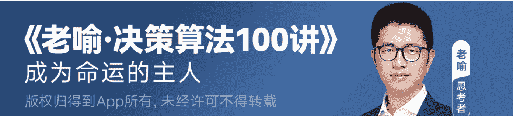


## 77 决策之“贪”：为什么这是你做决策的最大障碍？


lazybro，你好

你好，我是老喻，欢迎来到《决策算法》课。

### 一

经典电影《盗火线》有个令人深思的结局。奥斯卡影帝罗伯特·德尼罗饰演的职业大盗尼尔·麦考利，本已安排好与爱人艾琳远走高飞。飞机就位，车已上路，自由美好的新生活似乎触手可及。

尼尔一生精明冷静，信奉“不要对无法30秒内放弃的东西产生感情”的行事准则。他深谙生存法则，每次行动都计算精准，从不拖泥带水。在这个角色中，德尼罗展现的不是冲动的罪犯，而是近乎商业精英般的理性思考者。

然而，就在飞往新生活的最后时刻，他做了职业生涯中最不理性的决定——改变路线，前去杀死伤害他团队的仇敌。这个“顺路复仇”的冲动决策，最终让他倒在了另一位影帝阿尔·帕西诺饰演的警探文森特·汉纳的枪下。

尼尔的悲剧揭示了人类决策的核心陷阱：贪婪。

贪婪让他想要两全其美——既要与爱人远走高飞开启新生活，又要亲手复仇。明明知道选择会带来风险，却无法抵挡“都要”的诱惑。

尼尔绝非贪婪之人，相反，他称得上是一个极有人格魅力的“侠盗”。然而，唯一的一次“贪婪”，让他赔上了生命。

电影中的这个情节，很好地隐喻了贪婪作为决策障碍的普遍性与隐蔽性。它不仅影响那些公认的贪得无厌之徒，也能在关键时刻俘获最理性、最自律的头脑。

即使电影中尼尔这样严守职业准则的人，在生命的转折点，依然被那个“再加一件事”的微小贪念所击败。这才是贪婪最可怕之处——它往往不以贪婪的面目出现，而是伪装成“合理的期望”或“应得的机会”。

贪婪不仅仅是对金钱的渴望，而是一种根深蒂固的心理模式——我们总想拥有更多，无论是物质财富、情感满足还是生活选项。在决策中，贪婪常表现为“鱼与熊掌兼得”的幻想，让我们拒绝做出必要的取舍。

谁都不愿承认自己贪婪，但事实上，贪的形态十分多样：有时它披着“进取心”的外衣，有时它打着“完美主义”的旗号，还有时它甚至伪装成对他人的责任与承诺。我们对自己的欲望往往能找到合理化的解释，于是就放松了警惕，纵容它一步步膨胀。

佛教的“三毒”——“贪嗔痴”，将贪放在首位。因为贪婪最为基础，也最为隐蔽。它是人类内心最原始的冲动，深植于我们的生存本能中。

从进化角度看，对更多资源的渴望曾经是生存优势；在资源匮乏的环境中，那些“多拿一点”的祖先更可能存活下来并传递基因。

但从现代决策科学的角度看，贪婪本质上是一种偏好倒置现象——短期偏好压倒长期目标，部分价值凌驾整体价值。这种倾向已成为决策的绊脚石。

### 二

我知道，作为一个生活在现代的人，你对“贪婪”这个古老的词，多少会有一点矛盾心态。

在另一部经典电影《华尔街》里，主角迈克·道格拉斯说：“贪婪是个好东西。”

这个说法听起来有点儿刺耳，但似乎也说出了我们心里的部分想法：难道我们每个人不都是希望让自己的生活更好吗？假如我们的股票能够十年赚10倍，孩子能够上清华上哈佛，有什么不可以呢？

谁会嫌自己的财富太多吗？合法的金钱是无罪的。

让我们从现实主义的角度来理解这一点：追求更好、更多、更高并非本身就是贪婪。

贪婪的关键不在于“想要”，而在于代价与平衡的丧失。

很多时候，对金钱太贪婪，反而得不到金钱。这才是问题的关键。投资者因为贪图更高收益，不断切换投资标的，反而错过长期复利；创业者因为贪图快速扩张，透支企业资源，最终失去可持续发展的能力；职场人因贪图升职加薪，不惜牺牲健康和家庭，到头来却发现自己空有财富却无福享用。

贪婪的决策特点是“短视”——它让我们陷入近期收益的陷阱，牺牲长远利益。就像电影中的尼尔，为了一时复仇的痛快，失去了整个未来。这正是贪婪指向的核心：因小失大，因眼前失长远，因局部失整体，因为想要赢每一场战役，最后输掉了整个战争。

贪婪还会扭曲我们的目标设定。“拿第一”看似雄心壮志，实则是危险的陷阱，因为你早晚会被干翻。第一只有一个，这种基于比较的野心会带来永恒的不满足。

有个朋友的朋友，拥有私人飞机，却因为不能直飞太平洋、中途需要加油而感到不好意思。这不正是比较心理导致的永恒不满足吗？

财富像海水，越喝越渴。贪婪的本质不是想要更多，而是永远无法满足。当我们将自己的幸福建立在不断攀比和超越的基础上，我们就踏上了一台永无止境的跑步机，不管跑得多快，都永远无法到达终点。

健康的野心与贪婪的区别在于边界感。前者有明确的目标和合理的代价，后者则永无止境，最终反噬自己。

说起来，贪婪最容易表现为三种形态：

- 1、忽视代价：只看到可能的收益，完全低估潜在的成本，比如不计后果地加杠杆、过度扩张企业规模。
- 2、短视决策：被近期利益驱动，牺牲长期回报，就像尼尔为了复仇放弃未来的自由。
- 3、陷入无止境的比较：贪婪往往是相对的——不是因为“拥有不够”，而是因为“别人拥有更多”，这让我们不断推高自己的目标，最终陷入无尽焦虑。

真正可怕的不是想要更多，而是不知道“多少才是足够”。

### 三

《围棋十决》的第一条，就是“不得贪胜”。

这似乎有点儿奇怪了，下棋不就是为了胜利吗？为什么又说不要贪胜呢？

其实，这里说的是，不要因为贪图局部的“小胜”，而失去了终局的“大胜”。换句话说，不要因为一时的得失，忘了真正的目标。

围棋界的传奇人物李昌镐，就是这方面的典范。他最可怕的地方在于，一旦领先，基本就能稳稳拿下胜利，让对手很难翻盘。

他的秘密是什么？并不是靠激进搏杀，而是宁可局部吃点亏，也要把存在不确定性的变数尽早化解，锁定胜局。这在围棋里被称为“缩小战线”，确保最终胜利，而不是纠结于赢多赢少。

为什么这么做？因为围棋里对终局胜利的定义：比对手多半目即可。

对李昌镐来说，赢对手二十目，和赢对手半目，都是赢。有时候为了锁定胜局，宁可少赢点儿。

这方面的反例，可能是房地产业了。作为曾经的从业者，见到那么多行业巨头齐刷刷地栽跟头，的确觉得挺不可思议的。但是，仔细想想看，当这个行业红火的时候，哪家公司想过，到底大胜的定义是什么？难道增长真的可以没有尽头吗？

这不仅仅是企业的困境，也是我们每个人都会面对的决策陷阱。

就像在投资市场中，很多人把“赢得更多”当成唯一目标，却没有设定一个明确的“收手点”。本可以稳稳获得年化10%的长期收益，但看到市场火爆，总觉得还能再赚更多，于是不断加码、加杠杆，最终在市场震荡时遭遇毁灭性打击。

归根结底，贪婪的问题不在于“想赢”，而在于没有清晰的胜利定义。我们很少停下来问自己：我究竟想赢什么？赢到什么程度就够了？我要如何确保最终能赢，而不是在途中被反噬？

战胜贪婪不是要我们放弃追求，而是要我们明确什么是真正值得追求的，以及如何以最稳健的方式达成目标。

### 四

我们通过以下两个场景来说明“合理的追求”与“代价”之间的关系。

假如你要去一个地方，有两种选择，一个是坐高铁，一个是坐绿皮火车，你选哪一个？

我想现在大家基本上都会选高铁吧，这算不算贪婪呢？当然不是。

但是，这里要注意一些隐藏的细节：

坐高铁更快，符合现代人的高效习惯。可高铁车票也要贵不少，当我们选高铁的时候，是因为认可用多出的票价换来了时间。

假如一个人认为自己根本不用赶时间，而且很想坐在绿皮火车上慢悠悠地看一下风景，其实也是理性的选择。

这里谈不上谁对谁错。关键在于：你是否真正理解自己在做怎样的决策，是否清楚自己在追求什么？你能够承担多大代价？

换个场景：假如你有两个理财机会，A方案预期回报是年化15%，B方案预期回报是年化5%。你会选哪一个？

许多人会本能地选择回报更高的A方案，但这里存在一个致命的盲点——风险。

A方案为何给出更高的收益？它的风险是否远超B方案？如果你没有深入分析就做决定，你很可能已经掉入了贪婪的陷阱。

在投资、商业甚至人生的很多决策中，我们常常低估了风险，或者干脆选择忽略它。

高回报往往伴随着高风险，而人的大脑天生倾向于高估潜在的收益、低估可能的损失。

这就是为什么赌场总能让赌徒前赴后继、股市泡沫总能吸引散户争相涌入——因为贪婪会遮蔽我们的风险意识，让我们只看到眼前的诱惑，而忽略背后的不确定性。

面对这种风险盲点，“零风险思维”框架提供了有效解决方案：

- 明确你的最终目标：如果目标实现，你的理想状态是什么？比如，有人就是想过一种很简单的田园生活，回老家盖个院子，养花种菜读书写作。
- 寻找“零风险”路径：有没有一种方式，可以在几乎没有风险的情况下实现目标？比如，如果你的目标是为孩子攒够上大学的钱，那么最安全的做法可能是存定期，而不是投入一个高风险的投资项目。
- 衡量可接受的风险：如果“零风险”选项不可行，或者不能满足你的需求，那你愿意承担多少风险来换取更高的回报？例如，如果你有100万元投资资金，你愿意用多少比例去博取更高收益，而不至于影响自己的基本生活？

这种思维的精髓是：先确保底线，再谋求突破。你看，是不是有点儿想前面说的“只赢半目”？

我自己很早就选择了退休，是因为想明白了，我没啥大的生活上的追求，也没奢侈消费的欲望，所以够用就行。但是过去这些年，我也犯了一些错误，例如用不小比例的资金参与了一些高风险项目。其实，做点儿稳定理财已经够我过上“只赢半目”的简单生活了，为了根本不必要的更高回报而去冒风险，本身就是一种贪婪驱动的非理性。后来，我及时纠错，也算是亡羊补牢了。

### 五

贪婪并不总是坏事。事实上，生命本身就是一种贪婪。在森林里，我们贪婪地呼吸着清新的空气；面对美食，我们贪婪地品味每一口的滋味；在亲情里，我们贪婪地渴望孩子永远可爱，父母长命百岁，身边重要的人永远陪伴。

可生命是有限的。为了守护我们对那些最重要的事情的美好“贪婪”，必须要舍弃一些东西。

真正的决策，不是选择，而是取舍。

取的同时，也必定有舍弃。

不顾风险地啥都想要，就是贪婪。

理性的贪婪不是坏事，谁会嫌弃自己越变越好呢？

糟糕的是那些因小失大的贪婪。有些人因为贪婪，想得更多的东西，却把现在所有的也失掉了。

经过多年观察，我发现了一个简单却有力的原则：不占小便宜，是一种投入产出比极高的行为。

那些特别诱人的小便宜，特别诱人的高回报，往往都会引发贪念，最终让我们失去更重要的东西。

贪婪并不总是坏事，但要控制它，而不是被它控制。你可以用这个简单的三步法：

- 追求“赢半目”——问问自己：“如果我现在停手，是否已经足够？”80%的人栽在“再多一点”上，而真正的高手，知道何时该知足。
- 确定“核心不可失”——什么才是你真正不能失去的？健康、家庭、基本的财务安全？别为了额外的回报，去冒你无法承受的风险。
- 设定“足够好”标准——用绝对值而非相对值衡量成功，别让比较和嫉妒毁了你的幸福感。

我们都是时间的过客，根本无法真正占有什么，更不能带走什么。既然如此，人生最美好的贪婪，也许就是和最重要的人在一起，平安快乐地度过这三万多天。

以上就是这一讲的全部内容，我是老喻，我们下一讲再见。


## 78 决策之“嗔”：如何成为一个内核稳定的人？


lazybro，你好

我是老喻，欢迎来到《决策算法》课。

早年我创业的时候，办公室在广州的体育东横街，那里有家茶餐厅，我尤其喜欢他们的台式卤肉饭。有天中午，我目睹了难忘的一幕。

老板娘对貌似大厨的人说了两句话，大概是提意见吧，“大厨”很恼火，扔下手上的活儿，甩掉毛巾，掉头就走。走之前还叫走了所有的厨师。

餐厅的客人们都惊呆了，我当时也感觉，这下可麻烦了，点了餐的订单，厨房里做了一半的菜，咋办？老板娘不仅被当众羞辱，还被猛将了一军，现在如何收场？将来这生意还做得下去吗？——重点是，我怕吃不上卤肉饭了。

多年以后，那位老板娘当时的反应依然历历在目。她没有和大厨吵半句，从头到尾也没生气。等厨师们走后，她平静地招呼了几个帮厨和服务员，自己系上围裙，走进厨房，收拾残局，继续运转起来。

那一刻，我忽然意识到，人与人之间的真正差距，不在于掌握了多少资源，而在于能否掌控自己的情绪，特别是在愤怒这种极端情绪面前。

什么是天才？我见到过一个值得深思的定义。天才就是当身边所有人都进入非理性状态时还能正常行事的人。从这个角度看，那位老板娘，堪称一位天才。

佛教中所说的“嗔”，即是愤怒之心。佛教经典普遍将“嗔”列为人生烦恼的三大根源之一。有佛经甚至直言：“一念嗔心起，百万障门开。”（《华严经》）

意思是，当人被愤怒所左右时，往往会丧失理性，陷入自我破坏的深渊之中。

现代研究提供了大量惊人数据，证明嗔怒对决策的破坏性：

美国弗吉尼亚理工大学的研究显示，生气时开车发生车祸的几率是正常开车的9.8倍！

关系学专家约翰·戈特曼（John Gottman）通过长期夫妻沟通实验发现，当沟通过程中出现轻蔑或愤怒情绪时，这对夫妻的离婚概率高达94%以上。

这些数字告诉我们，嗔怒不仅仅是一个情绪问题，更是一个危及生命、家庭和事业的决策隐患。

你是否曾经因为一时冲动发送了后悔的微信？是否在买股票亏损时愤而补仓，结果损失更大？是否在重要谈判中因对方一句话而情绪失控，导致合作告吹？

“嗔”不仅仅是一种情绪，更是一个决策黑洞，能吞噬理性与智慧。成功的领导者往往不是最聪明的人，而是能在情绪风暴中保持决策稳定性的人。

那一天，我如期吃上了卤肉饭，这让我懂得了一个道理：

在这个复杂多变的世界里，真正的超级能力不是永不愤怒，而是在愤怒中依然能做出卓越决策的能力。

### 二

这，才是你真正的稳定内核。

想象这个场景：你正在参加一个重要的聚会，商谈合作，开始一切都很顺利。突然，有人随口提到了你最近的一次失败，瞬间点燃了你内心的怒火。你能感觉到血液冲向头部，心跳加速，思维变得模糊。几分钟后，你说出了一些无法收回的狠话，结果一切都毁了。

这不是你的失败，这是你大脑被劫持了。

丹尼尔·戈尔曼在《情商》中将这种情况称为“杏仁核劫持”——当我们感知到威胁时，杏仁核（大脑的警报中心）会立即触发战斗或逃跑反应，甚至在我们的前额叶皮质（负责理性思考的区域）来得及介入之前。这种反应曾在原始环境中救过我们的祖先的命，但在现代决策环境中却常常是灾难性的。

我曾遇到一位创业者，在投资人质疑其商业模式后，一怒之下拒绝了整轮融资。六个月后，他的公司因资金链断裂而倒闭。他后来坦言：“那一刻，我内心有个声音在说'这是错误的'，但另一个声音完全盖过了它。”

因为愤怒而被反转乾坤，这方面最著名的例子，可能就是《三国演义》里虚构的诸葛亮“三气周瑜”，一个绝顶聪明的人因情绪失控全盘皆输。

这正是嗔与决策的可怕之处——你明知自己被情绪劫持，却仍然无力挣脱。

但“嗔”从不单打独斗，它总是带着一个危险的“朋友圈”同时行动：

首先是自怜，这是嗔的内向表现。

它在你耳边低语：“看他们怎么对你的，你是受害者。”自怜麻痹了我们解决问题的能力，让我们沉溺于受害者身份而放弃了主动权。

其次是过度敏感，这是现代社会的流行病。

对这一点，尼采早有警告：“人类最痛苦的事就是对他人想法的敏感和依赖。”

过度自尊更是嗔的隐秘变种，它看似强大实则脆弱。

斯坦福心理学家卡罗尔·德韦克提出，过度自尊者生活在“固定型思维模式”中，他们害怕失败，宁愿坚持错误的决策，也不愿意承认自己需要改变。

这些负面情绪相互交织，形成恶性循环：

嗔引发自怜，自怜导致敏感，敏感强化自尊，自尊又激发嗔怒。

无数人被困其中，不断重演失败的决策，却不自知。

俗话说：“生气是拿别人的错误来惩罚自己。”你有没有想过，这种惩罚究竟是如何发生的？是让你气得跳脚、摔杯子，还是辗转反侧、一夜无眠？

不，要比这些更残忍一些。每一场“嗔怒”的背后，都跟随着一个糟糕的决策，而这个决策带来的后果，往往远比情绪伤害更大。大厨一怒之下离开餐厅，惩罚的不只是老板娘，更是自己的前途与声誉。想想看，你我是不是都干过类似的傻事？

我刚才提到的那位女老板，她心底会没有怒火吗？当然不会，但她没有任由情绪驱使着自己做出愚蠢的决定。她明白一个朴素却深刻的真理：

控制情绪，从来不是为了迁就他人，而是为了保护自己不被短暂的愤怒摧毁长期的幸福。

### 三

佛教认为，嗔怒本质上源于强烈的自我中心观念（我执）。

我们愤怒的深层原因是觉得“我受到了伤害”、“我没有得到尊重”、“我受到了不公对待”，这一切都来自于对“自我”的强烈执着。

很有趣，这个观念从另外一个角度触及了决策的内核。

我们之所以愤怒，本质上是拿现实的不完美与自己的预期死磕。

但事实是，在一个充满不确定性的世界中，事物偏离我们的预期才是常态。

行为经济学家丹尼尔·卡尼曼指出，人类天生倾向于高估自身认知的确定性，低估环境的不确定性，这种错觉才是情绪波动的真正根源。

诺贝尔奖得主理查德·塞勒也强调：“我们必须接受自身认知局限这一现实，决策才可能理性。”

佛教的“无我”观念恰与现代决策科学在此交汇：放下对自我与确定性的执着，不再执迷于“本该如此”，才是保持理性、灵活应对变化的关键所在。

佛教给出的解决方法之一是修习无我观，即认识到“我”不过是暂时的身心组合，并无固定不变的本质。

当你真正理解到“无我”的时候，愤怒便没有可以寄托的根基，你自然就不再那么容易被激怒。

《金刚经》强调：“一切有为法，如梦幻泡影，如露亦如电，应作如是观。”

也就是说，修习忍辱的核心是看到事情的短暂性和空性。当你真正领悟到“一切都会过去”，你便不会轻易被愤怒绑架。所以，禅修的核心是止观，即“止息妄念”与“观察内心”。

这些古老智慧与现代情绪管理理论有着惊人的契合。斯坦福大学情绪调节专家詹姆斯·格罗斯的“过程模型理论”，提供了一个科学框架：我们可以在情绪产生的五个阶段进行干预——情境选择、情境修正、注意力部署、认知改变和反应调节。

从这个模型出发，我们可以构建一个实用的情绪决策防火墙：

第一层是情境选择。佛教禅修教导我们觉察自己的触发点；而格罗斯教授则建议我们在可能的情况下，避开那些已知会引发强烈情绪的场景。比如，如果你知道自己在疲惫时容易发脾气，那么避免在精力低谷时做重要决策。

第二层是情境修正。当我们无法完全避免某些情境时，可以尝试改变情境的某些方面。例如，当特朗普与泽连斯基对话时，如果中间有个翻译会不会就吵不起来了？

第三层是注意力部署。当情绪已经被触发，可以运用佛教的“止”——专注于呼吸，安住当下；格罗斯教授通过实验证明，转移注意力（例如深呼吸、数到十、观察周围环境的五个细节）可以显著降低情绪强度。

第四层是认知改变。这对应于佛教的“观”——观察情绪的生起、变化与消失；格罗斯教授指出，重新解读事件的意义可以从根本上改变情绪体验。例如，将同事的批评从“他在故意贬低我”重新解读为“他是在帮我看到项目的盲点”。

第五层是反应调节。这是最后的防线，当情绪已经产生，我们仍能控制外在表现。正如那位茶餐厅老板娘，她可能内心不平静，但选择了不表达愤怒，而是采取建设性行动。

这五层防护，结合了东方的内在觉察与西方的行为科学，形成了一个全方位的情绪决策保护系统。

关键在于，这不是要消除情绪——情绪本身包含重要信号，而是要避免被情绪劫持决策。正如禅宗所教导的，真正的智慧不是没有情绪，而是能将情绪能量转化为清明决断的燃料。

### 四

说起来，我们都知道，应对嗔怒难点在于，道理都懂，控制起来很难。

以我自己为例，很少有人见我生气。可一旦发起脾气，拉都拉不住。我自己的总结是：那是一种生理型的情绪爆炸，再多理性也没有用。

所以，下面我想与你分享几个生理型的、强制性地克服“嗔怒”的方法，亲测有效：

- 神经重置呼吸法
公众号懒人搜索，懒人专属群分享
愤怒时，试试特种部队都在用的4-7-8呼吸法：吸气4秒，屏息7秒，呼气8秒，连续三次。它能迅速激活副交感神经，在90秒内让你从“战斗状态”回归平静。关键是呼气要比吸气长，这会向大脑发送“危险已过”的信号。

- 林肯的“热信”宣泄法
像林肯一样，当怒不可遏时，把所有怒火倾泻在纸上或录音里。写完后不要发送，而是搁置。这种“情绪转移”让愤怒有出口，又不会伤人伤己。我上次对生意伙伴生气时用了这招，第二天重读那封“怒信”，庆幸自己没发出去。

这其实也是决策拖延法。总之，不要在“嗔怒”的时候做任何重要决策，这是自我惩罚。

- 物理降温按钮
愤怒时体温升高、面部发热，直接物理降温就能“冷却”情绪。有次我正要发飙，立刻冲进洗手间用冷水洗脸，怒气瞬间减半。

另外一个小经验是，多运动，尤其是做一些激烈的运动，例如拳击。既释放压力，又能让你的身心更强大。

这几招直接作用于生理层面，不靠意志力，适合“明知不该生气却控制不住”的时刻。它们就像情绪急刹车，在大脑被劫持时能立刻生效。

先用这些方法降温，再用前面讲的认知方法重建理性，你就能在情绪风暴中保持决策清醒。

### 五

关于情绪，弗洛伊德表达过类似的观点：未经表达的情绪永远不会消失，它们只是以更丑陋的方式重新显现。

人总会愤怒，这说明你有正义感，说明你还年轻，说明对这个世界并没有失望。

愤怒是一种燃料。这种燃料装进炮弹壳里，就是破坏性极强的炮弹；但是如果装进发动机里，则能够产生巨大的正向能量。

对于决策而言，情绪的确是个复杂的东西。我们对期望值的设定，往往来自与感性有关的愿望；而在决策过程中，理性往往又意味着要消除情绪。

这看上去似乎有些矛盾。

我在阅读《禅者的初心》时，在开始的简介中看到：

禅者的心应该始终是一颗初心，不受各种习性的羁绊，随时准备好去接受、去怀疑，并对所有的可能性敞开。只有保持这样的心，我们才能如实看待万物的本然面貌，在一闪念中证悟万物的原初本性。

这段话里，我最喜欢的，是“对所有的可能性敞开”。

在基于概率的决策理论中，“对所有的可能性敞开”意味着承认任何事件都有可能发生。概率论的核心在于不确定性，每个事件都有一个发生的概率。

禅者的“初心”要求对一切可能的结果保持开放，不论这些结果看似多么不可能。在现实生活中，这种心态可以帮助我们避免预判和偏见，客观地面对每种可能的情况。

“对所有的可能性敞开”也反映了贝叶斯思想的核心，即在面对新的证据时调整信念。

当你理解了这些，不再执迷于“本该如此”，而对所有可能性保持敞开的态度时，你就掌握了一个稳定决策者的核心智慧：

在未知与愤怒面前，坦然接纳，将怒火变为你的真火。

以上就是这一讲的全部内容，我是老喻，我们下一讲再见。


No.379/494


微信:lazyhelper

## 79 决策之“痴”：怎样掌握知与不知的边界？


lazybro，你好

你好，我是老喻，欢迎来到决策算法课。

### 一

几年前，有个朋友亲戚家的孩子来看我，大学毕业两三年，在北京工作。这位聪明好学的小伙子认真地说：“喻老师，最近有个机会，能确保我在一年之内赚到人生的第一个100万。”

“确保”二字让我警觉。作为概率论的信徒，我认为再好的机会也难言百分百。我询问项目细节并提出疑问，他虽说不出所以然，却仍坚信：“这事儿我反复推演过，风险都考虑了，真的没问题！”

我当时毫不客气地说：“要不咱赌一把？一年后你真赚到100万，我输你一万块钱。可依我看，你这是痴心妄想。”

那之后，小伙子再也没联系过我。

其实，这位年轻人的故事正是决策世界中最常见的陷阱之一：“痴”——对现实的根本误解与对自我能力的错判。

佛教讲“贪嗔痴”三毒，“痴”便是源头：当一个人陷入盲目自信、看不清真相时，所有决策都会受到扭曲。

想象柏拉图的洞穴隐喻：我们都像被困在洞穴中的囚徒，只能看到墙上的影子，却误以为那就是现实的全部。年轻人看到的“确保成功”的计划，很可能只是他认知洞穴墙上的投影，而非“发大财”的真实面貌。

现代认知科学把这称为“元认知错觉”——我们不仅不知道，更糟糕的是，我们不知道自己不知道。邓宁-克鲁格效应研究表明，能力最低的人往往最高估自己，因为他们连评估自己无知的能力都欠缺。

在信息爆炸的今天，“痴”的危险性前所未有地增强。算法推荐机制创造认知同温层，社交媒体加速错误信息传播，我们陷入某种“认知信仰”——疯狂追逐知识，学投资，学AI，学经营IP……却忽略了最大的悖论：

真正的智慧不在于积累更多碎片信息，而在于清晰认识自己认知的边界。

与其贪婪地扩张知识领地，不如精确地绘制无知的地图。

在决策的十字路口，知道“我不知道什么”远比“我知道什么”更为关键

正如苏格拉底所言，智慧始于承认无知。在一个鼓励人们不断扩充知识的时代，或许最稀缺的能力恰恰是认识无知的勇气与明辨边界的清醒。这不仅是对抗“痴”的第一道防线，更是一切明智决策的基石。

### 二
佛教将“痴”称为“无明”，认为它有两个层次：一是单纯的不知道，二是错误地知道。这种区分揭示了认知障碍的复杂性——有时候，比起完全的无知，错误的确定反而更具破坏力。

在现代决策环境中，这种“错误地知道”尤为突出。认知心理学领域的研究表明，人们在面对能够推翻其信念的实证挑战时，往往表现出信念固着的现象，即坚持原有信念而不轻易改变。

这种效应，使我们陷入第二种更危险的无明——不是不知道，而是“以为知道”却完全错误。
面对“痴”的困扰，东方哲学提供了两种不同的应对策略：

佛家主张通过修行“转无明为明智”，强调积极获取真知，直至洞悉事物本质。

而道家则采取不同进路，《道德经》中提出：“知不知，上；不知知，病。”这种“知其无知”的态度倡导认知谦虚——明确认识自己知识的边界，在此边界内行动，而不贸然越界。

在我看来，道家的方法或许更具实用价值——不是追求事事明白，而是不做不明白的事情。

为什么呢？第一，彻底搞懂一切的成本太高；第二，知道自己不懂什么，并避免涉足，是可执行的策略。

道家的这种思维模式在投资界尤为突出。

巴菲特和芒格坚守“不熟不投”的原则，正是这种思想的现代实践。“我只做我完全明白的事”——巴菲特的这句投资箴言，与老子“知人者智，自知者明”高度一致。

对决策而言，不做的事情往往比做的事更重要，正如乔布斯回归苹果后首先砍掉70%的项目，聚焦少数关键领域带来了历史性转折。

《道德经》中还有句话：“为学日益，为道日损。损之又损，以至于无为。”这种“减法思维”正是现代决策困境的解药。不断剔除不该做的事，余下的选择自然清晰。

最终，决策的艺术不在于无限扩展我们的知识和选择，而在于有勇气承认认知边界，并据此拒绝那些超出边界的诱惑。真正的智者不是无所不知，而是知道何时止步。

### 三
将“不做不明白的事情”的智慧转化为实际行动方法，“停止清单”（Stop Doing List）是一个有力工具。

“痴”在实际决策中的最大危害，是引导我们做那些实际上不懂、不明白的事，而“停止清单”（Stop Doing List）正是对抗这种倾向的有力武器。它给出了具体的行动指南：不做什么比做什么更重要。

塔勒布曾精辟地指出：“知识是递减的，不是递增的；知识是我们减掉的内容（什么行不通，什么不该做），而非增加的内容。”这种“减法思维”要求我们不断剔除由“痴”驱动的冲动和错误判断，如同佛教修行者去除妄念以达清净心。

如何构建“停止清单”？我们可以结合段永平和斯坦福教授吉姆·柯林斯的观点，提炼几条原则。

本质上，这个过程是对自身认知边界的清晰界定。吉姆·柯林斯在《基业长青》和《从优秀到卓越》中，通过对长寿企业的研究发现：

伟大的企业都有明确的“停止清单”。它们并不是什么都做，而是聚焦在长期正确的事情上，并避免短期干扰。

实践层面，一份有效的“停止清单”应包含以下几个方面：

- 1. 对认知边界的明确限制：段永平强调“不要盲目扩充自己的能力圈”，这正是对道家“知不知，上”的实践。人能做的事有限，关键是在自己真正理解的领域深耕。
- 2. 对决策频率的控制：“不要一年做20个决策”。过多决策必然稀释认知资源，增加“痴断”的风险。这呼应了佛家对“无明”的警惕——我们往往高估自己的判断能力，而做出超出能力的决定。
- 3. 对未知领域的自律：“不懂不做、不熟不投”。这直接对应孔子“不知为不知”的教诲，是对“痴”的最直接防御。段永平说，很多人不是判断不了对错，而是明知超出能力范围还要尝试，因为短期诱惑蒙蔽了理性——这正是“贪”与“痴”的结合。
- 4. 对捷径的警惕：“不走捷径，不相信弯道超车”。抵制不了捷径诱惑，是“痴”的常见表现，人们往往错误估计复杂事物的难度，以为可以通过某种技巧规避必要的时间投入和学习成本。

在投资领域，段永平的“不做清单”进一步体现了这种智慧：不做长期有息贷款，不做空，不做短期投机。这些准则背后都是对“痴”的防范——不在认知不足的情况下与时间为敌。

也许，我们每个人都该为自己建立这样一个“不做清单”。比方说：
- 1. 不对的事情不做；
- 2. 不懂的事情不做；
- 3. 违背常识的事情不做；
- 4. 后果无法承受的事情不做；
- 5. 己所不欲的事情不做；
- 6. 伤害长期利益的事情不做；
- 7. 与不道德的人合作的事情不做。

若将这些原则应用于开头的年轻人一年赚一百万的案例：
- 他无法解释项目细节（违反“不懂的事情不做”）；
- 声称“确保”成功（违反“违背常识的事情不做”）；
- 一年内非凡回报的承诺本身就值得警惕（违反“不对的事情不做”）。

一个清单，三条原则，足以避免一场潜在的决策灾难。

下一次，做人生的重大决策前，你试着用上面的“不做清单”检验一下。

构建并坚守你的“不做清单”，是我们在日常决策中克服“痴”的最务实手段。在一个充满噪音和诱惑的世界，知道何时止步，或许比知道何时前进更为重要。

### 四
“知之为知之，不知为不知，是知也。”这是《论语》中我们最熟悉的几句话之一。

这句话常被简单理解为“知道就说知道，不知道就说不知道”——一种诚实的表现。但这种解读过于浅显。

真正的智慧在于：光有前半句还不算智者，还要有后半句；而最关键的是最后那个“是知也”——指向的是对自身认知状态的清晰把握。

这句话其实揭示了认知的双重边界：一边是我们已知的领域，一边是我们未知的领域。真正的智慧不在于单纯扩大已知领域，而在于同时清晰认识这两种状态及其边界。

这正是一种典型的二阶智慧——对认知本身的认知，对知识状态的元理解。

一阶认知关注对象本身：“这个投资机会怎么样”？

二阶认知关注我们对对象的认知状态：“我对这个投资机会的理解程度如何”？

比如说，你发现了一个特别好的赚钱机会，你判断赚钱的概率是80%。这是你的一个专业认知，一个主观判断；

这时候，你应该再上升一层，问自己：我对这方面的专业判断的准确率是多少？

例如，你路过一家生意下滑的奶茶店，认为若由你经营，有八成把握能扭亏为盈（这是一阶认知）。但二阶认知会追问：你有餐饮经验吗？这在你的能力圈内吗？若否，你的判断准确率恐怕要再打个五折。

普通人往往被困在一阶认知的层面，而无法上升到二阶认知。他们问“这个机会好不好”，却很少问“我对这个机会的理解深度够不够”。这就是为什么前面那位年轻人会陷入“确保赚到100万”的判断失误——他缺乏对自己认知状态的准确评估，无法在“知”与“不知”之间划定清晰边界。

从概率的视角看，我们可以将孔子的话翻译为一个比率：

知 = 知之 / (知之 + 不知)

等号右边的“知之”，是一阶的；

等号左边的“知”，是二阶的。

这个比率告诉我们的是，在任何决策问题上，我们都应该测量两个变量：我们已知部分和我们未知的部分。真正的智慧不是无穷地扩张分子（已知），而是准确识别分子与分母的比例关系。

为什么在《决策算法》中我一直强调概率思维？不仅是因为现实世界充满不确定性，更是因为决策本质上是一种二阶智慧，概率思维也是。它们都不是直接关于外部世界的判断，而是关于我们对外部世界认知状态的判断。

正是这种二阶智慧，让我们从“做什么”的决策层面，提升到“该做什么不该做什么”的元决策层面。知道自己适合在哪些领域做判断，避开哪些领域的诱惑，这正是能力圈原则的核心。

### 五
克服“痴”的道路并不在于追求全知全能，而在于培养二阶认知能力——知道自己的认知边界，在已知领域自信行动，在未知领域保持谦逊。

帕斯卡在《思想录》里写道：“人类所有的不幸都源自于无法在一个房间内静坐独处。”想想看，我们在人生决策上犯下的大错，往往是因为不能停留在自己的能力圈内，做了些自以为懂但其实不懂的事情。

老子在《道德经》中所言：“知人者智，自知者明；胜人者有力，自胜者强。”认识他人是智慧，认识自己是明察；战胜他人靠力量，战胜自己才是强大。在人生决策的征途上，战胜“痴”的心魔，掌握知与不知的边界，才是通向卓越人生的必由之路。

以上就是这一讲的全部内容，我是老喻，我们下一讲再见。


公众号懒人搜索懒人专属群微信:lazyhelper

## 80 社交决策：怎样构建你的四级社交圈？


lazybro，你好

你好，我是老喻，欢迎来到《决策算法》课。

从这一讲开始，我想跟你讨论一些跟个人的日常生活关系更密切的决策话题，今天我们来讨论第一个话题“社交决策”。

因为公众号的缘故，我有个别名，叫“孤独大脑”。我很享受独处的时间和空间，也和不少现代人一样，自认为有“社恐”的嫌疑。但是和你一样，我享受与朋友相处的时光，也从社交中获得了不少乐趣，以及商业上的机会。

石油大王洛克菲勒曾说过：“与天底下其他任何本领相比，我愿意付出更大的代价，来获取与人相处的本领。”

戴尔·卡耐基也曾说过：专业知识在一个人成功中的作用只占15%，而其余的85%则取决于人际关系。

这不是偶然。从石器时代的部落生存，到现代社会的商业成功，人类的命运一直被一个核心能力所主导——与他人建立有效连接的能力。

作为一个既渴望深度连接又珍视独处空间的矛盾体，我深知社交平衡之道的重要性。多年来，我不断观察、实践与反思，发现社交决策遵循几个核心算法，它们帮助我在保持真实自我的同时，建立了有价值的人际网络，也获得了友谊、商机与人生智慧。

今天，我将这五大社交决策算法分享给你，希望无论你是社交达人还是“社恐患者”，都能从中获得启发，找到属于自己的社交之道：

- 1. 经营你的社会资本：呼应布尔迪厄的洞见——认识谁不如谁真正认可你；
- 2. 构建四层社交圈层：采纳本杰明·富兰克林的忠告：“对所有人有礼，对多数人友好，与少数人亲近”；
- 3. 守护关系类别边界：能和你一起开心喝酒的知己，不一定能够成为你的生意伙伴。
- 4. 成为强势的社交者：用勇气和独立抵御人际关系中的“最小作用力原理”；
- 5. 把时间给重要的人：像做资产配置一样，不断把更多社交资源分给你最重要的人。

### 一、经营你的社会资本
法国社会学家皮埃尔·布尔迪厄(Pierre Bourdieu)提出的“社会资本”(Social Capital)概念，将社交网络视为一种资源。社会资本是“实际或潜在资源的总和，这些资源与拥有相互认可的制度化关系网络有关”。

换言之，你认识多少人固然重要，但更关键的是多少人愿意为你提供帮助与背书。

社会资本的交互，就像是交换思想。两个人交换苹果，每个人还是只有一个苹果。但是交换思想，交换社会资本，每个人就会有两个。

社交不是交换利益，而是共享美好，让美好的东西变得更多。所以，要问自己，你能为朋友圈做出什么贡献？——就像那种周末聚餐，每家都带上一两个擅长的菜，大家可以吃得既丰富又开心。

所以你要有一致性，自己有专业，有资源，有连续在经营的事情。我们有个朋友，每次都换在不同的事情，此前的事儿很快就没了下文，后来他一出现大家就很紧张。

当然，并不是说只有厉害的人才能社交。社交有价值线，也有情感线。人世间有什么比好玩儿有趣更“有用”的东西呢？

罗伯特·普特南(Robert Putnam)进一步将社会资本分为两类：

- 黏合型社会资本(Bonding Social Capital)：来自于强关系，如家人、亲密伙伴。
- 桥接型社会资本(Bridging Social Capital)：来自于弱关系，如同事、泛泛之交。

想象一个场景：你深夜突发急病，能打电话求助的人往往是黏合型关系；而在公司新项目启动时，出手相助的人也许是两年前只见过一面的行业伙伴——这正是桥接型关系带来的意外惊喜。

人与人的交往通常包含“有用”和“有趣”两条线索，优秀的社交离不开将这两条线有机结合。关键在于先情感后利益，先建立真诚的联系，再谈资源的交换。

组织心理学家亚当·格兰特在其著作《给予与获取》中，将人际交往分为“给予者”（givers）、“匹配者”（matchers）和“索取者”（takers）三种类型。他的研究发现，“给予者”往往能建立起更广、更有支持力度的人际网络，而“只知道索取或精于算计等价交换的人”人脉圈相对有限。

从价值出发，真正把社交当作“共享美好”的过程，而不是不停地“索取”，你的社会资本就会源源不断地增值。

### 二、构建四级社交圈层
本杰明·富兰克林说：“对所有人有礼，对多数人友好，与少数人亲近，结交一个知己，不与人为敌。”

这句话为社交资源分配提供了绝佳框架。

人类学家罗宾·邓巴研究发现，人类大脑存在认知限制，平均只能维持约150个稳定社会关系，这就是著名的“邓巴数字”。这些关系呈同心圆层次展开：

- 核心圈（5-7人）：你的情感堡垒，包括最亲密的伴侣、挚友和至亲。这层关系需要最多的真诚与时间，因为他们是你的“人格后盾”。
- 信任圈（15-20人）：你的好朋友，经常联系且感情深厚。这些人你可以坦诚交流，在需要时寻求帮助。
- 外围圈（50-150人）：熟人朋友，提供多样信息和机会。比如你的一份新工作，很可能会来自一位只见过两次的前同事的推荐。
- 认知圈（数百人）：点头之交，构成社会影响力基础。保持友善但无需深度投入。

我喜欢用概率来解释上面的圈层框架：

核心圈追求的是确定性，是最优解，是你们之间彼此忠诚的最可信赖的亲友。

而外围社交圈追求的是随机性。

核心圈往往比较同质——他们可能和你有相似的背景、圈子和视野。而外围圈的人由于来自不同领域和社会网络，能够带来新的想法和资源。一个过于封闭狭窄的人际圈子可能导致视野局限、机会匮乏。很多重大机遇（如工作推荐、商业合作）往往是通过“朋友的朋友”甚至更远的关系偶然获得的。

从数学的角度看，基数越大，资源越多元化，偶然的机会和好运气也会更多。

要做好圈层平衡，一方面要在核心圈投入心力，定期与至亲好友联络情感，另一方面也要“广种薄收”，并区分哪些关系值得深入经营，哪些只需保持礼貌往来。

无论身处何种圈层，都请保持基本的尊重与真诚。这样既能让你的社会网络呈现稳固的多层架构，也能确保你的人格底色不被庞杂关系所淹没。

随着时间推移，你会逐渐学会重新分配资源，让有限的社交精力与能力真正得其所用，从而在深与广之间找到平衡。

### 三、守护关系类别边界
我有个朋友，习惯给所有社交关系加标签，例如，他在微信上注明：哪些是可以深夜喝酒的朋友，哪些是可以聊天倾诉的朋友，哪些是可以商业合作的朋友。初次听说时，我还调侃他过于现实和功利。几年后的今天，我才明白他的智慧。

心理学家亨利·克劳德和约翰·汤森德在《界限》一书中强调，健康的关系需要清晰的界限。这些边界分为四个关键领域：

- 1. 物理边界：个人空间、财产、隐私
- 2. 心理边界：思想、观点、价值观
- 3. 情感边界：情绪管理和表达
- 4. 时间边界：时间分配和优先级

特别要小心的是金钱关系。能够成功合作做生意的朋友凤毛麟角，本质上比选择伴侣还难。数据显示，65%的高潜力创业公司最终失败，是因为联合创始人之间的冲突，这个比例甚至超过了离婚率。

有太多人曾因为金钱问题失去过友谊。莎士比亚在《哈姆雷特》中就告诫人们：不要向人借钱，也不要借钱给人，因为债款放了出去，往往不但丢了本钱，而且失去了朋友。

守护关系边界的关键在于，学会礼貌而坚定地说“不”，避免过度承诺。当有朋友提议和你一起做事情时，记得先问自己三个问题：

- 我们在工作压力下相处过吗？
- 我们对金钱和成功的定义一致吗？
- 我们是否有明确的冲突解决机制？

只有都能肯定回答，才考虑合作。

建立健康边界并非冷漠或自私，而是尊重关系的本质。就像电路需要绝缘体一样，适当的边界不是隔离墙，而是保护不同关系健康发展的安全阀。那些看似无所不谈、无所不包的关系，往往是最脆弱的。

学会给关系分类并非功利，而是智慧。能一起喝酒的朋友，不一定适合一起创业；能给你情感支持的人，不一定是理财的好顾问。认清这一点，才能让每种关系在合适的轨道上健康发展，既不失温度，也不越界。

### 四、成为强势的社交者
友善的人经常会遇到一种困境：人善被人欺。

例如职场上，会哭的孩子有奶吃。

例如朋友相处，当你不得不不得罪人时，人们不是去根据“好”的角度出发，而是从“恶”的角度去评估。

具体而言就是：

- 如果非要伤害一个人，不是说先把好的挑出来保护起来；
- 而是先绕开那些不好得罪的；
- 面对一个友善的好人，和一个难惹的恶人，人们大多时候会选择去伤害一个好欺负的好人。

我将其称为社交的“最小作用力原理”。

在人际关系上，很多时候人们会挑软柿子捏，而不是从善恶和道义的角度出发。

当然，并非人人如此。尤其是在持续交往（多次博弈）的场景里，人们会更多评估全局利益。

所以，对于自己的核心朋友圈，用心对待，全情付出。

对于普通社交圈，在商言商，不主动辜负别人，被辜负了也应坦然接受。

强势不是要你去欺负别人，强势的本质是自立，独立，也只有这样你才能成为一个社交圈里受欢迎的人。

尼采说过：“真诚，对我们自己，要不就是对我们的朋友；勇敢，对敌人；宽恕，对失败者；优雅，在任何情况下。”这是四美德寄望于我们的。

社交离不开敌人。很多时候，你的敌人更能定义自己的社交质量。——这也是我自己的反思。

好的敌人，经常是你最好的朋友和老师。与李世石十番棋大战前，古力游览灵隐寺，老法师对他说：“你的对手都是你的朋友，你的敌人是你自己。”

如何成为一个强势的社交者？我在这一本书上看到十大法则，可以作为参考：

- 一、你有权坚持你的行为、想法和情感，并对产生的一切后果负责。
- 二、坚持你要做的，不必解释。
- 三、帮不到别人，也不用内疚。
- 四、你有权改变想法。
- 五、犯错不可怕，但要承担后果。
- 六、你有权说“我不知道”。
- 七、要与人交往，但不要刻意讨好。
- 八、你有权做出“不合逻辑”的决定。
- 九、你有权说“我不明白”。
- 十、你有权说“我不在乎”。

你不用担心，你的强势伤害不到你真正的朋友，反而可能帮助你们守好共同的朋友圈。

### 五、把时间给重要的人
有一次，我受邀参加一个商务邮轮活动，看见另一位嘉宾老师带了妈妈同行，立即心生懊恼：我怎么没想到……

下船后，我直接飞去看妈妈，一起喝了早茶，吃了她种的西红柿和苋菜，在小区散步，听她讲每一户的八卦，如数家珍，她的记忆力好得惊人，能记住50年前哪一天买了多少布花了多少钱，精确到寸和分。

我们还去小区附近入海口的河边公园散步，湿地公园红树林茂盛，修整之后的水岸不少人在钓鱼，地上水里都开满了花。

我发誓，从今以后，把时间花在重要的人身上。因为我每在一些无关紧要的人和事上花费一天，就会少陪妈妈一天。

最近有个感受：过去能帮到你的人，会继续帮到你；过去没做出过啥事儿的，哪怕再熟，再密切，也做不出啥事儿。

这么说，显得有点儿太功利，但事实的确如此。将时间和精力投入到那些在关键时刻能够“雪中送炭”的人身上，别怠慢他们，别亏待他们。

像投资股票的仓位调整一样，我们需要定期审视自己的人际关系，并据此调整时间与资源的分配。

对高价值关系增加“持仓”，让这些关系持续产生正向回报；而对于低价值关系则适当“减仓”或“清仓”。

这个过程类似于一种“人际资产”的再平衡，确保资源分配始终服务于个人长远目标。

其实，真正的友谊永远不需要计算。但是在世俗世界里，我们必须掌握一些理性的决策算法，作为生存之道。

博尔赫斯在《朋友之树》里写道：

> “我们生命中的每位过客都是独一无二的。他们会留下自己的一些印记，也会带走我们的部分气息。有人带走很多，有人什么也不留下。这恰好证明，两个灵魂不会偶然相遇。”

诚然，我们对所有人都应抱以真诚和友善，但一生宝贵的时间却必须投入给真正重要的人。

愿你既能保持坦荡与开放，也能用有限的时光去悉心经营最珍贵的联结，让每一次灵魂的相遇都成为幸福与成长的见证。

以上就是这一讲的全部内容，我是老喻，我们下一讲再见。


## 81 安全决策：守护岁月静好的四大支柱系统


lazybro，你好

你好，我是老喻，欢迎来到《决策算法》课。

我们总说平安是福，希望过着岁月静好的日子。但是，意外总是从天而降。

2025年的春节，大S（徐熙媛）突然离世，震撼世人。

人们除了感伤时代的记忆，更是哀叹命运无常——为什么一场普通的流感，会夺去一个48岁的生命？

先从一个常被忽略的问题开始：48岁时死亡风险是多少？

根据保险行业的统计数据，在中国，48岁男性一年内死亡的概率大约是0.4%~0.5%，女性则是0.3%~0.4%。

看到“0.5%”这个数字，很多人会不以为然：这不就是千分之五吗？但你换个角度想想，每年在自己所在单位、朋友圈中，约每200位48岁男性中，就有1人在一年内去世，女性则约为300人里有1人。这个比例是不是有点儿可怕？

再看全球流感死亡率，每年因流感直接或间接死亡的人数大约在40万-70万。算下来，年死亡概率约在万分之0.5。

事实上，接种流感疫苗，可以降低60-70%的流感相关死亡风险。但仍然有大量人每年忽略这项简单的防护，直至意外发生。

这说明了什么？

人类的风险感知能力是存在缺陷的。

我们经常害怕的事，比如空难、地震，实际上概率极低；而我们每天司空见惯的事，比如不规律作息、不健康饮食、开车超速、不系安全带、不定期体检，才是真正的高风险行为。

也许，你觉得自己不会被流感击倒；也许，你觉得车祸离你很远；也许，你觉得投资市场不会崩盘。但风险不是凭直觉去感知的，而是必须科学评估、主动防范、系统应对。

如果我们想在复杂、多变、充满风险的世界中活得更久、更稳、更安心，就必须建立科学的安全决策体系。

今天，我要与大家分享一个基于四大支柱的生命安全系统，它不仅能帮你避开大部分可控风险，更能确保即使世界充满不确定性，你依然有稳固的生存之道：

- 1. 风险评估：明确你真正需要担心的风险是什么，把资源和精力用在“值得防范的地方”。就像我们刚才看到的，流感的致死风险远高于大多数人的认知，而定期接种疫苗这一简单举措可大幅降低这一风险。
- 2. 预警机制：建立警觉性，提前发现风险信号，防止灾难发生在你身上。股市崩盘前总会有市场波动的信号，心脏病发作前往往有气短胸闷的预兆。危险来临之前，总会有征兆，关键是你是否看得见。
- 3. 决策优化：在安全和效率之间找到平衡，让你既能降低风险，又能追求更高效、更有质量的人生。你不会因为担心车祸而放弃开车，但会选择系好安全带；你不可能完全避免疾病，但可以每年做一次体检。安全不是回避，而是找到科学的折中方案。
- 4. 对冲策略：确保即使最坏的情况发生，你依然有后手可退，不至于被一次失败彻底击垮。如果你暂时没找到工作，有应急存款吗？如果家人生病，你有保险保障吗？如果你在旅途中丢了钱包，你还有备用支付方式吗？真正的安全，不是避免风险，而是永远有退路。

掌握这一系统，我们就能在不确定的世界中，为自己和家人构建起一道坚实的安全防线。

### 第一支柱：风险评估

先看第一支柱：风险评估，这是安全决策的起点。

前几年，我家去大峡谷旅游（美国亚利桑那州著名的“大峡谷国家公园”），家人想坐直升飞机。我一直不太喜欢乘坐直升飞机，不光是因为有科比等人的不幸经历，还因为概率。文稿中我附上了一张表，这是大模型（Claude）帮我统计的“每十亿乘客公里（或里程）的死亡率”：

| 交通工具类型 | 每十亿乘客公里致死率 | 相对安全系数 |
|---|---|---|
| 商业航空 | 0.05 | 最安全 |
| 铁路/高铁 | 0.1 | 极安全 |
| 公共汽车 | 0.4 | 非常安全 |
| 汽车 | 3.1 | 安全 |
| 摩托车 | 108.9 | 高风险 |
| 私人直升机 | 约9.84 | 较高风险 |

从中我们可以看到，直升机属于较高风险的交通工具（因为受低空环境、天气情况影响较大）。加上那天天气没那么好，我就说服家人放弃了这个旅游项目。

这个决定背后，正是风险评估的思维在起作用。

想象一下，你每天早上出门时会带伞吗？答案可能是“看天气预报”。这其实就是风险评估的日常应用——你在评估下雨概率和淋湿的后果严重性，然后决定是否采取防范措施。

但在更复杂的生活场景中，我们的直觉常常会误导我们。

比如，小赵每天通勤骑电动车，从不戴头盔，觉得“骑了这么多年也没事”；但他对食物添加剂极度敏感，看到“防腐剂”三个字就会拒绝食用。如果他做一次科学的风险评估，就会发现电动车事故的风险值远远高于合法食品添加剂的健康风险。

风险评估不是复杂的数学计算，而是一种思维方式，它包含三个关键步骤：

第一步，全面识别风险。

当你考虑买房时，除了地段和价格，你是否也考虑过地质灾害风险、社区安全、空气质量、未来区域规划等潜在风险因素？全面的危险清单是理性决策的起点。

第二步，量化风险大小。

风险大小 = 发生概率 × 后果严重性。高概率小后果和低概率大后果的风险，可能最终风险值相似。比如，日常感冒（高概率低严重性）和罕见但致命的疾病（低概率高严重性），都需要适当关注。

第三步，优先排序，制定防范策略。

比如，如果你家里有老人，做家庭风险评估时，要格外关注家中老人跌倒的风险，这种情况发生的概率不低，伤害也很大。而只要在浴室安装防滑垫和扶手，在楼梯处增加照明，就能大大降低这一风险。

这一点，对家里有老人的朋友我强烈推荐。

当我们能用数据而非恐惧来指导决策时，我们就能将有限的注意力和资源用在最需要保护的地方，而不是盲目地担心各种可能的风险。

正如那次大峡谷之旅，我们没有坐直升机，而是选择了徒步，既体验了壮美景色，又规避了不必要的风险。风险评估不是让我们胆小如鼠，而是帮助我们明智地选择值得冒的风险，放弃不值得的风险。

这才是真正的安全智慧。

### 第二支柱：预警机制

再看第二支柱：预警机制，这说的是找到能感知危险来临的雷达。

2005年，印度洋海啸夺走了近23万人的生命，而在同一片海域的“莫肯人”几乎无人伤亡。这个民族拥有一个世代相传的知识：当海水异常退去，鱼在沙滩上跳跃，就必须立即逃向高处。他们掌握的，正是最古老的预警机制。

预警机制就像生活中的“危险感知雷达”，它不是用来阻止风险发生，而是帮我们在风险酝酿阶段就能识别信号、采取行动。在现实生活中，这些预警信号常常存在，却被我们忽视。

我有个朋友，45岁，是一家公司的营销总监，体检发现血压略高。随后又出现了头晕、耳鸣等症状，其实这些都是高血压加剧的警示信号，他却选择忽视，直到突发脑溢血，留下偏瘫后遗症。如果他能建立简单的健康预警机制——定期测量血压、记录症状变化、设置就医阈值——这场悲剧本可避免。

预警机制的精髓在于“提前干预”，实践中包含三个核心步骤：

首先，确定关键预警指标。

选择那些能真实反映风险状态的“先导指标”：

- 健康可能是血压、体重变化；
- 财务安全可能是负债比例、月储蓄率；
- 家庭关系可能是沟通频率、冲突次数。

所以，我们要做体检，还要给自己的财物和家庭关系定期做“体检”。关键是要找到问题的“前兆”，而非等到问题完全显现。

其次，设定预警阈值和响应机制。

有个朋友做过出纳，她为自己设定了这样的财务预警线：

- 信用卡负债超过月收入30%时启动紧急消费削减计划；
- 应急基金低于3个月生活费时暂停所有非必要开支。

你看，这个办法很具体，很专业，用数字说话，不含糊。这些明确界限，让她能在危机爆发前及时调整。

第三，保持持续监测和定期评估。

我认识一位电商创业者，他建立了“库存预警系统”，定期检查热销产品库存和供应链状态。当库存低于安全水平或供应商延迟发货，系统立即提醒他。这么多年，他的生意一直还行。

我自己的教训是，一定要小心那些蛛丝马迹，千万不要有侥幸心理。假如厨房里发现了一只蟑螂，后面一定还会发现很多。

真正的智慧不在于应对已经发生的危机，而在于捕捉微弱信号，防患于未然。发现了问题，要敢于承认，勇敢面对，立即改正，在风险失控前及时纠偏，将损失降到最低。

### 第三支柱：决策优化

继续看第三支柱：决策优化，这是要在安全与效率之间找到最佳平衡。

我以前在广州有个邻居，他把自己银行的钱都转进了一个信托基金，承诺年化回报12%。我问他是否做了调查和分散投资，他却说：“都是大地产公司，内部人推荐，绝对靠谱！再说，分散投资只会降低收益。”后来，这笔钱在收了两三年利息后，再也没拿回来。事后他悔恨地说：“如果当初哪怕只投一半儿……”

这种为贪高收益而忽视分散风险的决策，往往要付出惨痛代价。

生活中，我们不断面临两难：我们想要安全，但又不想牺牲效率和便利。我们想要健康，但又不想戒掉奶茶；希望投资稳健，却又渴望快速回报；知道熬夜伤身，却舍不得少刷一集剧。

如果所有决策都只追求安全，我们可能寸步难行；如果只追求效率，我们随时可能跌入险境。决策优化就是在这两者间找到最佳平衡点。

决策优化包含三个关键步骤：

第一步，设定“安全底线”，确保基本风险防范。

每个人都应该有自己的安全底线：健康底线（每年体检一次），财务底线（存够6个月生活费），职业底线（保持替代当前工作的技能）。

第二步，计算风险收益比，找到最优解。

在做决策时，问自己两个问题：“最坏的情况是什么？”和“为了规避风险，我需要付出什么代价？”

如果规避风险的代价远远大于潜在损失，那就不值得做。

第三步，利用“80/20法则”，用最少的努力换取最大的安全感。

我的那位邻居，如果运用这一法则，应该把80%的资金配置在稳健产品上（如债券），20%的资金可以用于较高风险投资（如个股）。

决策优化的精髓在于理解“足够安全”的概念。我们不需要——也不可能——消除生活中的所有风险，但可以通过智慧的决策，用有限的资源换取最大的安全保障。

### 第四支柱：对冲策略

最后再来看第四支柱：对冲策略，这是要在灾难降临时有一个安全网。

前年，我在温哥华接待了一个朋友，他的公司在上海，投资业务在新加坡，孩子在读美高，他自己则计划再找个环境优美、社会安全的地方，每年度假几个月，顺便优化国际税务布局。

他的做法看似复杂，其实背后隐藏着一种稳健的生存策略——对冲风险。

这就是对冲策略的精髓：不把所有鸡蛋放在一个篮子里。它是我们面对不确定性时的最后一道防线，确保当最坏情况发生时，我们仍然有退路，不至于被一次失败彻底击垮。

对冲策略包含三个核心要素：

首先，建立多层次防护系统。

一位朋友的父亲突发心脏病，第一家医院设备故障，第二家医院无床位，幸好他平时有多个医疗资源，最终在第三家医院成功手术。这说明，仅靠“一个医院”是不够的，真正的安全来自多渠道准备。

再例如，在财务安全上，除了稳定工作，还需要被动收入、应急储蓄和合理的保险保障。

其次，避免单点依赖。

不要只依赖一家公司，即使是稳定的工作，也应该培养备用技能或副业。

除了工资，还可以有股息、租金、自由职业、咨询、版权收入等，确保即使一个收入来源受损，仍然有其他现金流。

第三，准备Plan B，甚至Plan C。

我有次出国旅行时，信用卡被盗刷冻结，幸好随身携带了另一家银行的信用卡，还备了些现金，避免了陷入困境。如果没有 Plan B，整个行程可能会被毁掉。

真正的安全，是给自己留好退路。

### 最后

这几十年的经济发展太顺利，我们这几代人太年轻，所以我们对风险理解不足，在各方面都缺乏安全意识。

记得有次参加一个金融圈的饭局，有位投资经理，说他觉得还是要备一些珠宝。为什么呢？他说二战的时候，那些逃难的人，关键时刻还是要靠珠宝救命。

当时我觉得他想太多了。

但最近这些年，我愈发觉得，安全地活更久，其实是生活中最重要的事情。

盖伊·特立斯在《被仰望与被遗忘的》里写道：当一个人知道他安全的时候，他的感觉就迟钝了，他就开始走向死亡。

所以，一个理性的人必须时刻保持对风险的防范，定期排雷。远离那些可能炸掉的人和事情，一旦发现，立即走开。

君子不立危墙之下。别去冒不值得的险。

生命是场伟大的奇迹，活着已经极其罕见。

让自己和家人远离那些看似微小、却可能造成终生遗憾的风险，是对未来最好的投资。

祝你和家人平安。

我是老喻，我们下一讲再见。


### 公众号懒人搜索，懒人专属群分享

公众号懒人搜索懒人专属群


微信：lazyhelper

## 82 消费决策：怎样聪明花钱，让幸福最大化？


lazybro，你好

你好，我是老喻，欢迎来到《决策算法》课。

### 一

那些超级有钱的人，到底是如何变得那么有钱的？

在一个访谈节目中，我从某著名对冲基金经理那里找到了重要线索。

> 主持人直截了当地问：“你能否给普通人几条发财致富的秘诀？”

这位以交易犀利著称的亿万富豪，其回答让人大跌眼镜：

> “首先，立即还清信用卡……然后，超市打五折的时候，多搬一些牙膏和纸巾回家……”

> 主持人当场愣住了：“就这？”

> 富豪笑着解释道：“你看，假如你一年要买100块钱的纸巾，现在打五折，相当于你赚了50块钱，年化回报50%，到哪里去找这么好的事情？”

这一刻，我突然意识到，这位身家亿万的富豪，并没有把这当成一个无关紧要的生活琐事，而是把它视为一笔交易——一笔他愿意用职业剑客般的精准眼光去评估的交易。他之所以成为亿万富翁，正是因为这种对价值最大化的执念，已经渗透进他生活的每一个角落。在他眼里，消费和投资没有本质区别。

这也解释了一个许多人误解的现象：

真正的富豪不是不在乎钱，而是比普通人更认真地计算每一分钱的价值的。

不管是在资本市场购买股票，还是在超市买纸巾，他们的决策模式是一样的——这是一场关于价值的交易。

普通人的消费习惯往往遵循一个反逻辑的模式：收入不高时精打细算，收入提高后反而变得“豪爽”，放松了对每一笔消费的评估，甚至开始为面子和虚荣买单。

而真正的富豪恰恰相反——他们不会因为可以支付更高价格，就轻易放弃更划算的交易机会。对于他们而言，聪明花钱的本质不是节省，而是确保每一笔钱都能实现最大的价值产出。

这种对金钱的敏感度，是决定财富积累和保持的关键。那些能够在财富游戏中一路领先的人，往往正是因为他们拥有这种交易思维，懂得将“消费”转化为“投资”，用计算回报的方式来做消费决策，而不是仅仅凭直觉、情绪或短期的冲动。

换句话说明，亿万富翁的财富并非来自一笔大交易，而是来自无数个精确小决策的积累。

当我们普通人开始在花钱时建立类似的决策习惯——像剑客一样精准评估每一笔交易，像投资者一样计算每一分钱的回报，就能让金钱真正为自己服务，而不是被金钱牵着鼻子走。

### 二

几年前，我在车行买了一辆SUV，付完款后，有个环节是保险咨询，销售人员把我带到一间办公室，里面有位漂亮女士，先是恭喜提车，然后说有个给新车主的福利，假如我现在付两千加币，将来换车时可以免费做全车外表“焕新”服务，并且这两千可以用作再换新车时的购车款。

我想也没想就答应了。当时那辆车售价不到十万加币，两千加币就像是给手机买了个壳，觉得无足轻重。

然而，七八年过去了，我也没有用上这项“焕新”服务——甚至，我差点儿忘记了这回事。我意识到，这笔钱并没有带来真正的价值，而只是当时交易惯性下的顺手买单。

这正是消费中的“相对性陷阱”——当我们刚刚花了一大笔钱后，额外的支出就会显得微不足道。

大额交易中的小额决策，才是最容易“失控”的地方。

在心理学上，这种现象叫做“萨拉米策略”——即通过拆分决策，让人在不知不觉中支付更多。当你已经支付了大笔款项，后续追加的费用会显得“微不足道”，甚至像是对大额支出的补充和优化。例如：

购买笔记本电脑后，销售人员推荐你加购延长保修，仅需多花7%，“为了保护你价值8000元的设备，500块算什么？”

在奢侈品店买了一件大衣，店员顺便推荐一条围巾，“这条围巾是完美搭配，只需再加200块！”

购房时，房产中介建议你多付几万块升级厨房设备，“反正房子都买了，多点投入让它更完美。”

这些附加支出，往往并非“必要消费”，而是商家利用人的心理账户和相对性效应，在你的大额交易基础上追加的利润点。你刚刚做了一笔巨大的消费决策，心理上已经接受了高额支出，再额外加点钱，感觉似乎也没差——但这些“没差”的小钱累计起来就是一笔大钱。

去年有一个月，我收到信用卡账单，金额高得惊人，那个月我什么大件都没买，也没出去旅游，于是打了客服电话。客服耐心解释说：有时候看着一笔一笔钱不多，加起来就不少。结果我们简单一对，真是没错，一笔笔小开销，积累成了一个大数字！

聪明花钱，并不是说一定要省钱，而是确保每一笔钱都能买到真正需要的东西，买到最大的价值。价值≠价格，这是很多人在消费时容易忽视的关键。

一些附加支出，比如购买更好的工作设备、更高质量的学习课程、健康管理支出，尽管价格高，但能够带来长期回报，因此是值得的。

另一些消费，比如无意识购买的延长保修、附加保险、豪华套餐升级，看似价格不高，但本质上只是满足短期安全感或商家的利润点，对长期价值无实质提升。

真正聪明的消费者，不会仅仅因为“这点钱不算什么”而消费，而是会问自己：这笔钱的回报率如何？

回想那次购买SUV的经历，我很好奇，如果是我太太去提车，车行会不会安排一位很帅的男士销售保险？显然，消费陷阱往往不仅利用我们的认知偏差，还会刻意利用我们的情绪和社交因素。

所以，别再让你的钱不经意间被偷走了！

### 三

拼多多的海外版Temu 的广告语是：

“Shop like a Billionaire”（像亿万富翁一样购物）。

这句话乍听很有趣，对吧？我们会想：难道亿万富翁的购物方式是“拼单+砍价”？

事实上，这背后的逻辑令人深思——

富人并不是花钱最多的人，而是花钱最聪明的人

那么，普通人如何像亿万富翁一样购物?

我为你总结了一个“聪明消费四步法”:

### 第一步：消费前——转换思维，“这是支出还是投资?”

每次准备掏钱时，不要问“我能不能负担得起”，而是问：“这笔钱会带来什么回报?”

举个例子，花5000块买一台iPad。如果只用来刷剧、玩游戏，这是消费；但如果用它做笔记、创作、开展副业，这就是投资，可能带来十倍、百倍的回报。

这就是富人的思维方式——他们不是不花钱，而是将花钱视为资产配置，确保资金流向最有价值的地方。

### 第二步：消费时——识破心理陷阱，突破感性决策

商家精通心理学，设计了无数陷阱让我们冲动消费。最常见的有:

- 折扣陷阱：看到“全场五折”就觉得不买亏了？问自己：“如果不打折，我会买吗？”
- 默认选项陷阱：软件自动续费、机票默认勾选“优选座位”——商家在不知不觉中让你选择更贵方案。记得养成“拒绝默认”习惯，先取消所有附加项，只选你真正需要的。
- 相对性陷阱：主产品贵，附加消费就“显得便宜”。对付这一点，使用“单独评估法”，问自己：“如果不买主产品，我还会买这个附加服务吗？”别贪图便宜，买回去没用是最大的浪费。

那些真正擅长消费的人会对这些陷阱保持高度警惕。在他们眼中，每一分钱的去向，都应该经过独立、客观的评估，而不是被巧妙设计的营销策略左右。

### 第三步：建立系统，避免冲动消费

- 冷静期法则：看到心动商品，先等待72小时再决定。研究表明，70%的购买欲望会在三天内自然消退。
- 总额意识：不要低估小额消费的累积效应，每天20块的咖啡，一个月600块，一年就是7200——相当于一次高端旅游的费用。
- 预算封顶：将消费分类（必需品、娱乐、学习等），为每类设定月度预算上限。一旦某类超额，必须从其他类别中削减。

在海外居住这些年，我发现老外消费最大的特点是按照预算来。比如要买个房子，预算是50万，超过1万都不行，哪怕超出的价值有10万。

咱们中国人是，假如打算买50万的房子，看见一套原来卖100万，现在打折卖80万，超出预算很多，但也会冲上去捡个漏。

### 第四步：消费后——复盘优化，累积消费智慧

每月月底，回顾过去30天的消费，评估每笔支出的价值:

- 哪些消费带来了持久的满足感和成长?
- 哪些只是短暂愉悦后就被遗忘?
- 有什么模式可以识别并改进?

现在有些记账App，可以试用一下。

俗话说：“吃不穷，穿不穷，不会算计一世穷。”

聪明消费，不是“省钱”，而是“花得值”。像亿万富翁一样购物，不是买最便宜的东西，而是买最有价值的东西。

### 四

《最优解人生》(Bill Perkins,比尔·帕金斯)这本书的作者讲过一个有趣的故事:

他在纽约商品交易所当助理，起初的年薪是18000美元，在20世纪90年代初，勉强够用。有次他对老板说自己节俭存下了1000美元，结果老板骂他:

> “你脑子进水了吗？这个钱也要存？”

他继续说：“你来这里是要赚大钱的，你未来会大赚特赚的！你认为自己这辈子年薪将一直是一万八吗？”

作者认为，那是改变他人生的一刻。

老板的话体现了“消费平滑”的财务概念——我们的收入有起伏，但消费应该相对均衡，将“丰年”的钱匀给“荒年”。然而，作者却在做相反的事：从当时贫穷的自己手中把钱夺走，交给未来更富有的自己！

消费平滑的核心是：合理分配一生的收入和消费，避免某阶段过度紧缩，另一阶段过度挥霍。

很多年轻人陷入错误模式：20多岁省吃俭用不敢享受生活，总想“以后有钱再说”。然而，等30多岁事业稳定，家庭责任又来了，依然没时间。再往后，等到有钱有闲，身体状况或环境已变，错过了最佳体验时机。

聪明的消费模式，是根据收入增长预期规划消费。如果预期未来收入增长，年轻时可适度投资体验和成长，而非一味节约。比如，趁着年轻去旅行、学习新技能、尝试副业，这些体验在特定年龄阶段更有价值。

上面那位作者回忆了他二十多岁的室友，趁着年轻出国当了回背包客。而他自己三十多岁再想去体验那种难忘生活时，虽然有钱了，但是早已没了心境。

消费平滑教会我们，钱的价值不在于数字本身，而在于它能带来什么样的生活体验。我们需要用钱换回时间和体验，而不是等时间流逝后再弥补那些已错过的机会。

前面我们说了，要聪明消费。其实我们更要充满人生智慧地消费。

你可以做一个小实验，问问身边的人，在他们的生命中最懊悔的是什么？大概率首先便是他们没有做的事。

所以，尽快和爸爸妈妈去旅游吧，尽快和爱人去吃那家一直想去的餐厅吧。

想想你将来不愿意为之后悔的事情，早点儿做掉。哪怕花了些将来的钱。姑且视之为“消费平滑”。

而且，一旦你愿意去投入做这类事情，你的赚钱动力可能会更加足，也会少花一些乱七八糟的不必要的钱。

### 五

《伊索寓言》中，蚂蚁整个夏天储备粮食，蚱蜢则只顾玩乐。冬天来临，蚂蚁有食物，蚱蜢却挨饿。这个寓言常被解读为对勤劳和延迟满足的颂扬，但值得思考的是：蚂蚁何时能玩儿？如果它把短暂一生都用来辛勤劳作，什么时候才能享受生活？

理想的状态应该是两者平衡——蚱蜢也应储备一些食物，蚂蚁也应适当享受生活。“该工作时好好工作，该玩时好好玩。”

我们这两三代人，会在养老问题上面临巨大挑战，所以，勤俭节约，量入为主，做好现金流管理，为未来做一些稳定而长期的投资，是一件严肃而认真的事情。

我们都年轻过，或者正在年轻，但我们几乎没有老过。

消费决策不是简单的省钱或花钱，而是一门优化人生的艺术。在一边是无度挥霍、一边是极端节俭的光谱中，我们需要找到属于自己的平衡点。这个平衡点取决于你的价值观、人生阶段和预期收入轨迹。

聪明花钱的核心是价值最大化，不只看价格，更看回报。对一些体验、关系和成长的投资，即使看似“花钱”，实际上可能是人生中回报率最高的“投资”。

当我们老了，回想自己的一生，最令人后悔的往往不是花了多少钱，而是没有把钱花在真正重要的事情上——与亲人共度的时光、丰富灵魂的经历、拓展视野的旅程。

正如《唐顿庄园》里的管家卡森所言：“人生就是不断收集回忆的过程，最终能陪伴我们的也只有回忆了。”

聪明花钱，让幸福最大化，就从你的下一次购物开始吧。

我是老喻，我们下一讲再见。

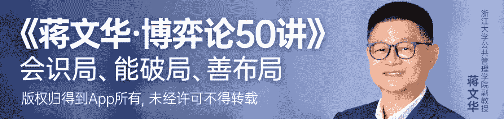

### 公众号
懒人搜索
懒人专属群


微信:lazyhelper

## 83 面对冲突：为什么你要遵循“幸福者退让原则”?

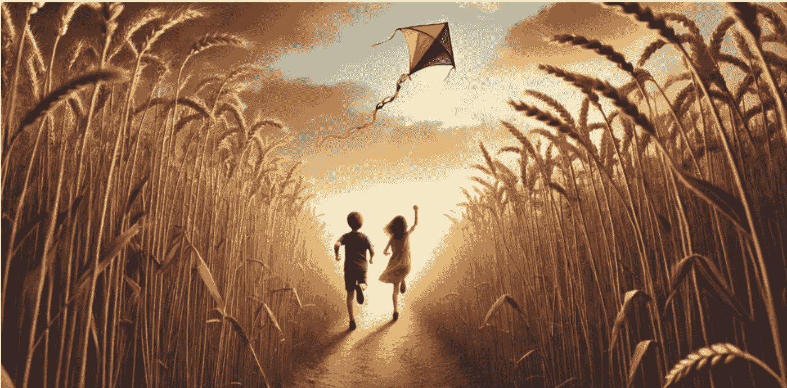

你好，我是老喻，欢迎来到《决策算法》课。

### 一

大约是十多年前，我侄女来海外读高中，我陪她参加一个针对新留学生的安全培训，其中有个问题印象深刻：假如你在街头行走，突然发现前面有人在打架，你应该怎么办？

标准答案是这样的：你应该马上找一个安全的地方躲起来，然后在确保不被发现的情况下，才打电话报警。

当时我们的第一反应都是：太怂了，太不见义勇为了。

又没多久，在海外生活的我遭遇了一次入室盗窃，于是马上打电话报警。电话那头的警察问：盗贼还在室内吗？如果在的话，你们赶紧找个地方藏起来，不要让对方发现。

那一次被偷，盗贼早就溜之大吉了。但是如果真遇到盗贼还在室内，官方建议的做法是：躲起来，人没事儿就好，别被伤害，也别因为抓贼而伤害到对方。

别人进了自己的家偷东西，还要躲起来，听起来够窝囊的。——至少当时，我们的第一反应是这样的。

这些年，也许是因为变得成熟了一些，慢慢能够理解一些上述的建议了。

这让我想起一个最近悄悄流行的概念：
幸福者退让原则

啥意思呢？
就是说：“如果你家庭幸福美满，在外面遇到有人挑衅时，千万别跟对方纠缠，一定要懂得退让。因为你家里有人在等你平安回来，而对方却可能累积了很久、很深的怨气，在失去理智的边缘。
这非常非常重要，不要为一时口舌之快后悔终生。”

### 二

“幸福者退让原则”，看起来是个为人处事的道理，但是背后，其实蕴含着复杂的人类行为模式，它不仅反映了人类在面对冲突时的决策过程，还涉及多种博弈论、心理学和社会学中的有趣概念。

先来看博弈论中的一个概念。
胆小鬼博弈，又叫懦夫博弈、小鸡游戏、鹰鸽博弈，是博弈论中两个玩家对抗的模型。

这一名称的由来是一种危险的游戏，游戏中两名车手相对驱车而行。如果有一方转弯，而另一方没有，那么转弯的一方会被耻笑为“胆小鬼”，另一方胜出；但如果两人都拒绝转弯，任由两车相撞，最终两人都可能会死于车祸。

这种局面下，一个玩家让步对于双方都有好处，而玩家的最佳选择取决于其对手会做什么：如果对手让步，那本方就不应该让步，但如果对手不让步，本方就应该让步。简而言之就是“不要命的更可能赢”。

但是，根据“幸福者退让原则”，在这种情况下，做个“胆小鬼”，并不丢人，反而是个理性的选择。

我们前面讲过的“极大极小原理”，也与“幸福者退让原则”有关。作为一种决策算法，“极大极小原理”帮助我们寻找失败的最大可能性中的最小值（最小化最坏情况）。

你看，这并不是简单的怕事儿。而是旨在最小化最坏情况下的损失，即在各种可能的结果中，找到最坏情况下的最佳选择。

换句话说，幸福者选择退让，实际上是在做一个类似于“极大极小原理”的决策过程。

它帮助我们在面对冲突的时候，首先考虑可能发生的最不利的情况，让自己避免置身于最坏情况，哪怕这种可能性很小。

比方说，假如你遇到楼上邻居装修，休息时间也不停工，吵得你没法睡觉。上门沟通时，你发现对方是一个不太讲道理的人，物业公司的工作人员也暗示你那个人可能有点儿偏激。

这时，你估算了一下，对方可能还有两周就装修好了，于是，根据“幸福者退让原则”，你决定忍让十来天，睡觉的时候带上耳塞。

在博弈论中，如果对手的策略是不可预测的，那么保守的“避险”策略往往能带来更优结果。对于“幸福者”而言，退让是确保自己处于稳态的一种方式。

说了两个高大上的概念，其实民间智慧对“幸福者退让原则”有简单直白的概括，那就是：

- 1. 好汉不吃眼前亏；
- 2. 留得青山在，不怕没柴烧。

### 三

在面对冲突或挑衅时，已经拥有幸福的人会倾向于退让，而不是陷入争斗或纠缠之中。表面上看，这种行为似乎是对冲突的妥协，但实际上，它是一种非常理性且富有智慧的选择。

拥有幸福的人，他们的生活中有太多值得珍惜和保护的东西，比如家庭、健康、事业、个人的平和心态等等。因此，他们更愿意通过退让来避免不必要的风险和损失。

然而，即使你主动避让，依然可能会遭遇一些不可避免的冲突。

我有个朋友，曾经在外地有个投资项目，潜在回报很高。他在当地找了个合作伙伴，也大方地给出了不错的合作条件。结果，对方在收到几百万启动资金后，立即翻脸了。

我这个朋友很不理解，因为如果项目顺利推进的话，那个当地合作伙伴可能会有千万级的回报，他为什么会为这点儿眼前的“小利益”毁掉项目呢？

过了好一阵子，我这位朋友才搞明白：原来，当地经济发展状况一般，几百万不是个小数字，对于大多数人来说，已经是一生难逢的大利益了。——未来有几千万回报当然更好，但是眼前的利益已经足够那个合作伙伴“翻脸”了。

后来，我的朋友反思：那个合作伙伴人还是不错的，但是他们没有从商业的角度设置好约束机制，以至于要让人性经受考验，而人性很多时候经不起考验。

分享这样一个让我难忘的真实故事，我是想说：

“幸福者退让原则”的高明运用，应该是避免自己陷入“不得不退让”的困境。

用我朋友的例子来说，就是生意归生意，一开始就想好可能会出现的问题，丑话说到前面，提前设置好游戏规则。

这背后，也揭示了“先为不败”的智慧，这正是“幸福者退让原则”的内核之一。

很多时候，我们的首要目标是“求不败”，尤其是那种可能带来无法挽回的损失失败。

在人生当中，追求幸福的第一要事，是远离不幸。

就像下围棋，最终获胜的，往往是失误少的一方。

所以，运用“幸福者退让原则”的高手，会让自己不必面对不得不退让的困境。

### 四

“幸福者退让原则”，能够为我们的人生制造一个缓冲地带。

查理·芒格说过这样一句话：“不要和一头猪摔跤，因为这样你会把全身弄脏，而对方却乐此不疲。”

这位活到99岁的智者，用一种更为鸟瞰的视野来洞察人世间，他说：

“我的长寿秘诀就在于，不把人性想得太好。人性本就有很多缺陷，你要是一肚子怨气和厌恶，就相当于是在惩罚自己。”

所以，“幸福者退让原则”，并不是一种高高在上的态度，也不是要把自己摆在道德优势的一边，而是不和人性较真儿，别为所谓的烂人烂事烦恼，更要主动让这类事情远离自己。

某些人在感到绝望或无所顾忌时，可能采取极端的、破坏性的行为。幸福者退让的原因之一正是因为挑衅者可能处于这种状态，他们失去了很多，或没有更多可失去的东西，因此会采取激进的手段，类似于“破罐子破摔”。而“幸福者”则应该选择退让，避免挑起这种对抗。

有些时候，也许我们应该用更加有同情心的方式来理解“幸福者退让原则”：

例如，你在坐地铁的时候，有人毫无理由地对你大喊大叫。你该猜想，是不是他生活中正遇到什么不顺利的事情，需要在某个场合释放自己的压力。这样一来，你就可以平静地走开。

又例如，你点了一个外卖，比平时晚了半个小时，外卖员的脾气也很火爆。别太在意，也别生气，会不会是他在骑电动车时不小心摔了一跤？也许你不必非给一个差评不可。

我从一个朋友那里学到了一个方法。他说，即使是性格温和的人，也可能成为一个路怒族，例如对着插队的车大按喇叭。怎么办呢？你可以想象一下前面那个慢吞吞开车的人，是一位慈祥而无助的老奶奶。——你怎么忍心狂按喇叭呢？

### 五

“幸福者退让原则”，绝非一个简单的生活鸡汤。

对于一些聪明人，或是有所成就者，也许会说：我的人生字典里，最重要的一个字，就是“赢”。就是因为遇到困难和挑战不退让，才有今天的成就的。

的确，在体育比赛中，假如一味退让，很难取得胜利。

而相当多成功人士，习惯于寸土必争，坚信“爱拼才会赢”，并且的确因此获得了超额的回报。

然而，许多成功人士遇到的麻烦，也是因为这种特性。

《算法之美》一书里，讲述了一个国外富豪的悲惨经历。这个人曾经是科学院的数学家，在商业上也颇有成就，后来却在政商纠缠中遇到大麻烦，甚至失去了生命。

书中还提及了这个富豪的一件往事：他年轻的时候和朋友们一起在湖边玩儿，船出现了故障，于是大家跑上沙滩，点起篝火，开心地玩儿起来了。只有这个富豪很执着地要修理发动机，折腾了三个小时，也不放弃。

为什么一本关于算法的书，会讲这类关于“及时收手”的世俗故事呢？原来，作者是想讨论“最优停止”的问题。

“幸福者退让原则”，对于聪明人和成功人士的最大启发是：在追求最优和见好就收之间，要找到一个合适的区间。

这里我必须再次提及有限理性。

在面临复杂的决策时，人类往往无法进行完全理性的分析，而是会基于有限的信息和认知能力做出决定。幸福者的退让可以视为一种有限理性的表现，即他们认识到在冲突中无法保证理性控制局面，因此选择避免冲突，以此降低风险。

我们没办法算透所有的事情，“幸福者退让原则”，其实是聪明人承认自己认知的有限理性，对未知保持敬畏。

这样，就能为自己已有的幸福构筑一道护城河。

当然，真正的强者并非毫无底线的退让，而是知道何时退让，何时坚持。

在决策过程中，退让的背后并不是怯懦，而是控制权的体现。——让出局部，控制全局。让出眼前，控制未来。

“退让”是一种战略，而不是习惯性顺从。关键是要在可控的边界内退让，而不是盲目迎合。

例如，一个企业在市场竞争中，可以选择短期降价让步，但不会无底线亏损。

一个人在职场中可能会接受一时的委屈或额外工作，但绝不会牺牲核心价值观或健康底线。

幸福者懂得设定清晰的边界，在这条边界之外，他们可以灵活让步；在边界之内，他们则坚定捍卫。

### 小结

“幸福者退让原则”，不仅仅是一时的妥协，更是一种长远的眼光与全局的思维。

从生物学的角度看，退让行为并不是个体软弱的表现，而是基因为了保护其载体（即个体）免受损害，从而更好地延续自身的策略。

“幸福者退让原则”并不是消极的逃避，而是一种积极的生活态度。

这一原则揭示了在人际交往中，理智与情感的平衡、短期与长期的利益权衡，以及自我保护与社会责任之间的微妙关系。幸福者通过退让，避免与消极关系的纠缠，远离可能“炸掉”的人和事，从而保护了自己的幸福，并为自己创造了一个更加美好、充满希望的未来。

所以，别在社交媒体上和半熟不熟的人争论，在现实中不要和冲动的人硬来，没必要为了“出口气”而搭上自己的安全。

在这个复杂多变的世界中，与其浪费时间在无谓的争斗中，不如选择远离那些消耗自己的人和事，将精力投入到更加积极、有意义的事情中，把时间和资源留给最重要的人。

人来到这世上，就应该跟最好的人、最美的事物、最芬芳的灵魂倾心相见，唯此才不负此生一场。

以上就是这一讲的全部内容，我是老喻，我们下一讲再见。


### 公众号
懒人搜索
懒人专属群


微信:lazyhelper

## 84 锚点选择：为什么比较是万恶之源？

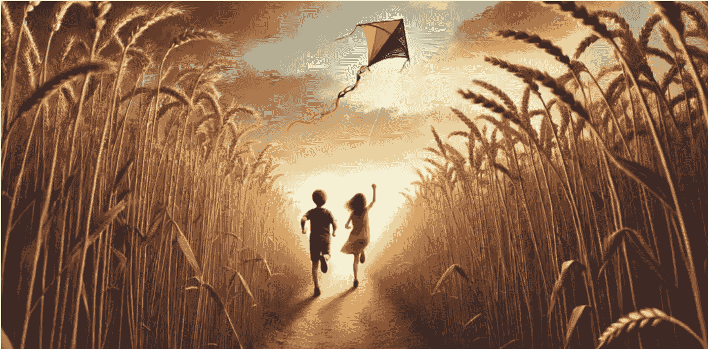

lazybro，你好

你好，我是老喻，欢迎来到《决策算法》课。

### 一

我们先来做一个选择题，以下三位男性，你觉得哪一位可能更爱他的女朋友：

- 1. “成功男”，身家一个亿，拿出资产的1%，为女朋友买了一辆价值100万的保时捷；
- 2. “奋斗男”，存款100万，拿出资产的10%，为女朋友买了一个价值10万的爱马仕包包；
- 3. “白手男”，钱包里一共有1万块钱，100%拿出来为女朋友买了一个价值1万的苹果笔记本电脑。

姑且让我们不正确地用礼物来评估三位男性的爱情，你一定看出来了，比例和绝对值是两回事：

论绝对数值，“成功男”最为大方；

论相对比例，“白手男”最有诚意。

这个问题本质上是一个决策问题，却被比较的框架所干扰。我们被迫在不同维度间权衡取舍：是看绝对价值还是相对比例？这正是比较在决策过程中制造的第一个陷阱。

当然，看人不能只看他给你买什么东西。这是一个简化了的问题。人类喜欢比较。关于“比较”的话题，不仅是情感八卦，还与生物学、行为科学、幸福理论有关，更与我们日常决策过程紧密关联。

今天，我想说的是：

比较，是决策的基础。

比较，也是决策的万恶之源。

### 二

人天生就是一种“爱比较、但是又经常把自己比晕”的动物，这直接影响我们的决策质量。

你是否注意到，当你看房子时，房产经纪总会先带你看几套超出预算的豪宅，然后是几套同价位但状况糟糕的房子，最后才展示他真正想卖的那套。

这不是巧合。这是精心设计的“比较”，利用了我们大脑中的“锚定效应”和“框架效应”。豪宅建立了价格锚点，差房子则衬托出了什么是“好房子”，最终让普通房子在比较中显得格外诱人。

生活中的“比较效应”比比皆是，它们都在悄悄影响我们的决策：## 三

股市投资者看到某曾经大牛的股票大跌，就去抄底，结果接到了飞刀，这是典型的相对参照决策失误；

旅游行程中最后一顿往往是最好的，这利用了“比较效应”和“峰终效应”，让你对整体体验评价更高；

相亲时带上高颜值朋友，反而会让自己相形见绌，这是决策环境设置的失误。

为什么人类的决策如此容易被“比较”支配呢？

人爱比较，有生理基础上的原因，这直接影响我们如何感知和决策。人类进化的目的是为了“生存”去适应，而非真实和精确判断。

比如，一包一公斤重的棉花，和一块一公斤重的铁，不考虑浮力，你会觉得铁更重。为什么会这样？

19世纪的时候，德国生物物理学家赫尔曼·冯·赫姆霍兹曾说：大脑不过是一台预测机器，我们的所见、所听、所感不过是它对输入信号的最佳猜测罢了。从决策科学角度，这意味着我们的大脑是个天生的贝叶斯统计学家，通过先验概率和当前数据作出推断。

一大包东西，大脑预测“较重”，但因为棉花比“预期”轻，大脑感知到“轻”，而一小块同重量的铁却显得很重。轻和重，是基于相对比较的感知，而非精确的度量，这种相对性深刻影响我们的价值判断和决策过程。

我们的感官和大脑，很多时候，都是借助于“比较”，来观察和适应这个世界，进而做出决策。

博·洛托在《错觉心理学》里点明：进化的“目标”是获得适应性、稳健性和可发展性，而非精确判断。他得出一个关键结论，你的进化不是为了看到现实……而是为了生存。

决策科学告诉我们，人类不是为了最优决策而设计的，而是为了“足够好”的决策而设计的。

比较是我们进化出的一种启发式决策机制，帮助祖先在丛林中快速决策以生存，但在现代复杂环境中，这种机制常常导致决策偏差。

想想看，你的消费决策有多少次因为“对比效应”而被扭曲？比如“五折特惠”时买回一堆用不着的东西，这正是比较机制对决策的干扰。

### 四

比较是决策中的万恶之源。比较完了，接下来就是嫉妒和不理性决策。所以，决策失误的源头，也许是不当的比较。

库尔特·格雷提出的“相对剥夺”概念在决策心理学中极为重要：“相对剥夺指人们在缺乏他人或社会群体的资源或机会时，感到处于不利地位的现象。”

事实上，现代社会的你我比以前的国王生活得更好。假如真让你穿越回清宫，光是去蹲个茅坑就能让你绝望。要是再来场小小的感冒，没准儿会要了小命。更别说现在还有空调手机高铁飞机等等。

那为什么大家会觉得越来越不幸福呢？因为人们的“幸福感觉”并非来自所有人都变得更富有，而是比别人更富有。

罗素说：除了担心，嫉妒也许是不幸福的最大原因之一。

比方说，你年底奖金比去年多了好几万，正高兴呢，一看同事小明居然比你多500，你顿时心情沮丧。你看，挺开心的事儿，因为没来由的比较而产生的嫉妒毁掉了。

所以，罗素还说：

乞丐并不会妒忌百万富翁，但是他肯定会妒忌收入更高的乞丐

而嫉妒不仅摧毁幸福感，更会导致错误的决策。

### 五

然而，人类作为决策者，我们无法不去比较。既然如此，我们就应该努力对糟糕的“比较”免疫，并正确运用“比较”来优化决策。

李嘉图的“比较优势”概念，来源于亚当·斯密，解释了“为何在一方拥有较另一方低的机会成本的优势下生产，贸易对双方都有利”。这一原理在个人决策中同样适用：找到自己的比较优势，是做出正确职业和资源配置决策的关键。

所以，以后谈起优势时，最好说“比较优势”，这是一句非常有用的决策指导。这提醒我们，即使你觉得自己普通，也总能在某些领域找到比较优势，例如和邓亚萍比投篮，和姚明比打乒乓球。

黑石创始人谈及职业决策时，强调的第一课是：发挥你的比较优势。他说：千万不要被一份工作牵着鼻子走，如果仅仅是因为它薪水高、福利好、地理位置好或给你大办公室等诸如此类的理由；你需要集中关注的是：能否在工作中发挥你的优势，尤其是你的比较优势。

关于比较在决策中的应用，我有一个简单法则：对于大数字，看比例；对于小数字，看绝对值。

例如买套500万的房子，假如你真喜欢，房价差个10万(2%)，决策上不必纠结；而买瓶饮料，近处6块远处3块，差100%但绝对值只有3块，通常不值得为此专门跑远，除非你天天买。

这一决策算法，可大幅降低我们在日常决策中的认知负担，避免陷入比较的泥潭。

在教育决策中更应警惕比较陷阱。单一维度的比较，往往导致错误的教育决策。人生有太多维度，孩子有太多可能，用简单粗暴的比较做教育决策，仅用考试成绩来评价，是对未来的伤害。

### 六

一个优秀的决策者，往往是因为有一个成功的比较系统。

概括而言，厉害的比较系统由下面的三个模块构成：
- 大处着眼(Think big)
- 小处着手(Start small)
- 快速进化(Learn fast)

假如我们将“比较”的概念引入到这个决策框架中，会产生深刻洞见：
- 大处着眼：是指长期来看，你应该选择一个大一点儿的“比较对象”；
- 小处着手：是指短期来看，你应该不要太频繁地去做微观比较；
- 快速进化：自我比较的目的是为了进化，而不是为了学习。

### 1. 大处着眼

就长远而言，你应该高看自己一点儿。

例如互联网的“百团大战”，大家起初都是以团购鼻祖高朋网(Groupon)为“比较对象”。最后跑出来的美团，早早切换了比较对象，如今市值也高达高朋网(Groupon)的一百多倍都不止。

又如特斯拉，如果以传统汽车厂商为“比较对象”，就算把全行业的利润都拿来，也撑不住这么高的估值。但如果瞄准的是人工智能和新能源领域，特斯拉则充满了想象空间。

在决策科学中，这被称为“参照框架重置”，可以彻底改变你的决策边界和机会空间。

所谓的格局，以及想象力，都是建立在你的“比较对象”的选择基础之上的。

### 2. 小处着手

运动高手知道，在比赛中频繁地去看比分牌，不是高手所为。

多么平坦的地面，拿放大镜去看都是沟沟坎坎的。多么坎坷的路途，时间拉长了看也不过是来去匆匆的一条直线。

过于频繁的比较，会导致决策中的“噪音放大效应”，使我们对短期波动反应过度。如果天天都去比较，过于悲观的人会成为惊弓之鸟，做出过度保守的决策；过于乐观的人会成为掰苞米的猴子，做出过度冒险的决策。

在投资决策中尤为明显：许多投资者因频繁比较短期收益，而错过了长期复利的力量。过度关注他人的成功案例，往往导致投资决策的从众效应和追涨杀跌。

决策科学的一个关键原则是：波动是常态，优秀的决策应当筛选信号而非放大噪音。

### 3. 快速进化

决策系统需要不断进化，而非仅仅学习。快速学习，快速失败，都是围绕“自我比较”展开的决策优化机制。

这样一来，就会发生一件有趣的事情：小尺度上的自我比较，会视波动为反馈，所以，不管是上涨还是下跌，是成功还是失败，就反馈的意义和价值而言是等价的，都是决策系统进化的养料。

生物的进化并非追求最优，而是在比较中选出那个稍微好的。所以别总拿身边最好的人和事儿去折磨自己，专注于自我比较，小步快跑地进化。

建立一个长短结合的决策比较系统：短期与自己比较，长期与标杆对标。这样，一个完整的“决策优化循环”就形成了飞轮效应。

### 七

回到开篇的问题：如果你是一位女士，在三位男士的爱情中，你会选择哪一位？

通过决策算法的视角，我们可以看到，这个问题本身就是对比较的误用。它让我们陷入了虚假二分法：非此即彼的思维陷阱。

爱情决策不应仅基于物质比较，而应综合考量内心感受、价值观契合、成长潜力等多维因素。

无论是100万的保时捷，还是1万的笔记本电脑，都只是表达爱的方式，而非决策的唯一依据。

同样，生活中的许多重要决策——职业选择、生活方式、人际关系——都难以通过简单比较来定夺。当我们过度沉迷于比较时，往往失去对决策本质的把握。

比较是决策的工具，而非目的。明智地使用它，能帮助我们做出更好决策；盲目追随它，则会成为决策的万恶之源。

所以，下次当你发现自己陷入无谓比较导致的决策困境时，不妨问问自己：这种比较对我的决策有何价值？它是否帮助我做出更明智的选择？

好的比较，产生动力；差的比较，产生嫉妒。而嫉妒，总是会让一个人做出非理性的决策。

当看到他人成功时，与其羡慕结果，不如关注他们的决策路径和方法。通过比较决策过程而非结果，我们能从他人身上学到真正有价值的东西。


## 85 恋爱决策：遇到渣男后你是否还相信男人？


## 85 恋爱决策：遇到渣男后你是否还相信男人？

你好，我是老喻，欢迎来到决策算法课。

### 一

假如你发现自己被一个渣男（或渣女）欺骗，那么你是否还相信他（她）当年与你的海誓山盟？你是否会选择将其从记忆中彻底删除？

进而，你是否会因此得出“天下男人没有一个是好东西”的结论？

想起这个问题，是在朋友的朋友的首饰工作室，当时我为妈妈定制生日礼物。工作室老板说她最近收到一个被女客户退回的求婚戒指，背后正是某个关于“始乱终弃”的故事。

伤心的女主角选择不再相信那枚戒指。那么，她如何看待当初自己对戒指的相信？假如将来她又收到求婚，是否不再有心境相信任何一个男人？

这个话题，是“假如生活欺骗了你”这一更大命题的小小变形：假如生活在某个时刻，像渣男一样欺骗了你，你是否还会信任生活？

显然普希金的答案至少不令伤痕累累的人们信服。“不要悲伤，不要心急”不像是一个实用主义年代的有效解决方案。并且，诗人认为，“一切都是瞬间，一切都将过去；而那过去了的，就会成为亲切的怀念”这看起来过于浪漫主义了。

理工宅男如我突然对“情感主题”产生兴趣，是因为我发现背后有一个好玩儿的模型。

先说我的答案：

用一个骰子来打比方吧：

从认知的角度，兼容100%和1/6，不是容易的事情。

### 二

《最接近生活的事物》一书里，詹姆斯·伍德说自己的小说家妻子在给朋友的信里写道：

“人生的故事非常奇特，它没有形状——或者更精确地讲，它只有当下——直到终结出现；到那时，整个轨迹突然清晰可见。”

这段话很有趣，颇有量子力学的“叠加态”的意味。

物理学家狄拉克曾经在讲台上拿起一支粉笔，折成两半，一段放在讲台的这一边，一段放在讲台的那一边。然后他说：

从经典的角度看，一个状态是这支粉笔在“这儿”，一个状态是这支粉笔在“那儿”，而且这是仅有的两种可能性。

然而，将粉笔换成电子，在量子世界中电子不仅有“这儿”和“那儿”的态，还有一大堆其他的态。这些态是两种可能性的混合体——一点“这儿”态和一点“那儿”态的叠加。

我们该如何定义一个人？又该如何定义一个人的人生？决定一个人的事件经常发生在一念之间，与其简单定义一个人是好还是坏，不如假设每个人都处于好和坏的叠加态。

我在这个看似很简单的问题里，引入了经典物理世界的不确定性——扔骰子，以及量子力学世界的不确定性——叠加态，是想借此表达一个隐喻：

一个人是一个什么样的人，不仅像骰子一样具有多面性，还像薛定谔的猫一样好坏难辨，就像电影里最有魅力的往往是那些亦正亦邪的角色。

既然骰子启发了人类思考概率，既然概率可以用于描述不确定的事物，那么我们用骰子来建模，描述我们没有形状的人生故事中最模糊难辨的情感话题，也许是个聪明好玩儿的想法。

建模之后，我们就能大致描述一下人们对100%和1/6的态度和类型：

A类型：相信100%，不相信1/6。

这类人黑白分明，认为一个人要么是好人，要么是坏人。

B类型：相信1/6，不相信100%。

这类人要么是简单幼稚，总是被表面迷惑；要么早早洞察了世事，看穿看透，有一点儿早熟的世故，逢场作戏。

再假如，那个未来有一万面可能抛出“一”的家伙，他刚刚抛出一次让你心神不定的“六”，世界就毁灭了，渣男的一万种可能性被消除，那个“六”不就变成100%了吗？

这不是荒唐的假设。很多好人其实并非那么好，他们只是装够了一辈子。

让我把这个被过于放大的“一期一会”的概念，拖回到现实尺度。

一期一会是一个源于日本茶道的成语，意思是在茶会时领悟到这次相会无法重来，是一辈子只有一次的相会，故宾主须各尽其诚意。

一期一会与禅的“瞬间”概念有关。每个瞬间都是一生一次的机会，当下的时光不会再来，须珍重之。

我在下围棋中对“一期一会”深有感触。每一手棋都应该被认真对待，每一个对手都不能掉以轻心。

就像选择是否相信献上求婚钻戒的男友，下围棋时最好相信对方是和你旗鼓相当的棋手。

觉得对方弱而掉以轻心，假设对方强而孤注一掷，二者都会令自己加速失败。

有人评论全盛时期的克林顿，说他有一种天赋：每一个和他对话的人，不管身份高低，都会感觉被他置于宇宙的中心，被100%地关注着。

类似的说法，还有乔布斯与人交流时，对方感觉似乎被激光照射，而一旦移开则像掉入黑暗里。

这似乎是一些厉害的人的共同特点：

- 他们能无差别对待所有的人，不管是看门人还是老板，不管是美国总统，还是贫民窟的人。被任何人问到问题，他们就竭尽所能直接回答问题，像对待最重要的问题一样解答，他们眼中的神色完全相同。

“一期一会”也常在武道中出现，警醒竞技者在面临生死关头没机会“再试一次”。

所以，不管遭遇了多少渣男渣女，也别轻易总结“天下男人（女人）都是一个样子”，在那个瞬间，假如你看见了滚动的骰子落在“六”那一面，选择100%地相信他（她）是真心的。

这是最优解。但，只是在那个瞬间。

### 四

说到这里，你也许会觉得，老喻，不是要讲恋爱的决策吗？上面这些内容是不是太抽象啦？

恰恰相反，我认为当今现实世界，在恋爱问题上出现的困境，恰恰是因为在底层哲学上出现了问题。

人们在恋爱问题上，要么过于诗意，要么过于实用。

过于诗意，就是沉浸在非黑即白的极端标签中：

- 一个男人是“花心”的，全世界男人都是这样，要从生物层面去质疑男性的生殖冲动；
- 一个女人是“绿茶”的，全世界女人都在算计。这些刻板印象被互联网放大，成了决策的捷径。

事实上，简单用标签，本身就是决策上的以偏概全。这种思维方式导致人们在骰子抛出“一”的时候，就认定对方的所有面都是“一”，反之亦然。我们拒绝承认每个人都是复杂的骰子，而非单一数字。

我们忽略了生命是一个复杂系统，爱情是需要经营和守护的生命火焰。

过于实用说的是，完全把恋爱当作一场交易，算计收入、房产、颜值、社会地位。婚恋市场变成了一场精确到小数点的拍卖会，每个人都带着自己的量化指标和期望回报率入场。

结果，在概率层面和决策层面，出现了大问题。——这正是恋爱困境的本质原因。

先说概率层。

恋爱和婚姻，都是基于“偶遇”的，所以要保持某种开放性，要有足够的基数，是基于可能性的。

而上面不管是过于诗意还是过于实用的恋爱观，其实都会极大降低概率：

- 过于诗意的人排除了太多“类型”；
- 过于实用的人错过了无法量化的惊喜。

再说决策层。

恋爱不是一把锁配一把钥匙的完美解决方案，而是遵循“满意原则”，或者像量子力学里的叠加态，允许双方在各自有缺点的情况下过一种舒适的生活。所以，绝对不能黑白分明，不能有什么量化标准，更不能有KPI什么的。

对面那个人，既是100%的此刻，也是1/6的整体。当他在你眼前展现出来的骰子面是“六”，你可以100%地相信这一面，同时理性地接受他还有其他面的可能性。

这不是矛盾，而是人类与时间和意义共舞的智慧。

### 五


微信:lazyhelper

## 86 婚姻决策：怎样和Ta更好地共度一生？


lazybro，你好

你好，我是老喻，欢迎来到决策算法课。

### 一

人们赞美爱情，歌颂婚姻，但也为情所困、为婚姻迷茫。

罗曼·罗兰曾说：“爱是生命的火花，没有爱，一切便成了黑暗。”多么诗意啊！但如果罗曼·罗兰活在今天，他或许会补充一句：“爱情也是一个高难度决策问题。”

根据皮尤研究中心的一项调查，超过四成的年轻人认为婚姻已经“过时”，而只有不到三成觉得成功的婚姻是一生中最重要的事。这些数据并不代表年轻人不再渴望爱情，相反，他们比任何时代都更加追求灵魂的共鸣。

然而吊诡的是，不少人开始用精准到小数点后的标准来筛选伴侣：身材、学历、家庭背景、个人资产……都被代入一个实际的计算公式，传统婚姻的庄严似乎已经不合时宜。

单身的人总梦想着找个人携手走过风风雨雨，殊不知大部分风雨的源头恰恰就是那个伴侣。婚姻的现实通常是：男人结婚后才明白女人的贤淑，而女人结婚后才发现男人的幼稚。怪不得大家的婚礼现场，总有人忍不住落泪——或许他们是提前在为即将逝去的爱情默哀吧。

但婚姻这种困境并非现代独有，它有着深远的历史根源。远古时代，人类根本不需要婚姻制度，情感随食物的丰缺而自由流动。直到农业社会兴起，人类才发现，为了子女的存活，一个稳定的伴侣是必要的——婚姻由此诞生。

可如今，我们早已不再需要婚姻来保障生存与繁衍，我们的需求变得微妙而复杂。

复旦大学的沈奕斐老师有一个有趣的洞察，她认为当代人的“爱情脚本”里存在着巨大的矛盾：一面渴望传统“缘分婚姻”的安全感，另一面又追求现代“爱情婚姻”的自由与激情。前者强调责任、牺牲与稳定，后者却追求快乐、自我与冒险。

我们想要的“完美婚姻”，可能根本不存在。

更麻烦的是，生物进化还在给我们添乱：我们本能地爱上与自己截然不同的人，以保证基因的多样性。但现实婚姻中的冲突，却往往来自对彼此差异的不理解。

于是，夫妻本应携手共进退，如今却在牙膏该怎么挤、空调开到多少度这样的小事上争执不休。

婚姻的真实困境，或许并不在于婚姻本身有问题，而在于我们误解了它存在的真正意义。

假如我们无法定义一个问题，就不能估算其“价值”，就很难做决策。但婚姻决策的确是人生当中最重要的决策之一，这也体现出婚姻作为决策问题的非常规性和复杂性。

美国喜剧演员亨尼·杨曼有句经典名言：“幸福婚姻的秘诀，至今还是个秘密。”

既然是秘密，我们有没有可能拨开迷雾，找到一些能帮助我们作出更好决策的第一性原理？

今天，让我们一起直面婚姻这道复杂而迷人的难题。

### 二

婚姻决策的第一个“第一性原理”，来自本杰明·富兰克林的一句经典名言：“婚前睁大眼，婚后半闭眼”。这句话乍听像是某种双标，但细想之下，却蕴含着人类几千年婚姻智慧的精华。

先看“婚前睁大眼”。

在投资界，有一个基础工作叫“尽职调查”。投资人在决定投入巨额资金前，会对目标公司进行全方位的考察和评估。婚姻作为人生最大的情感投资，难道不该进行更严格的“尽职调查”吗？

婚前睁大眼，不是教你挑剔，而是提醒你：这不是一时冲动的决定，而是一生相伴的约定。当激情的多巴胺消退，剩下的，将是长达几十年的共同生活。因此，我们需要清醒地观察对方的价值观、生活习惯、情绪管理方式、处理冲突的能力，甚至财务状况。

有趣的是，现代社会的恋爱反而常常走向另一个极端：人们被浪漫电影洗脑，相信“爱情战胜一切”，仿佛只要恋爱时足够甜蜜，婚后的种种问题都会自动消失。然而，数据告诉我们，这种幻想常常以离婚收场。

再说“婚后半闭眼”。

这里的“半闭眼”并非提倡忍气吞声，而是理解婚姻的本质——没有十全十美的伴侣，只有相互包容的智慧。

心理学家约翰·戈特曼（John Gottman）曾指出：“即便是在幸福美满的婚姻中，夫妻同样需要应付大量的问题……不幸的是，婚姻生活中的绝大部分冲突都是永久性的，准确地说，这个比例是69%。”——假如没有包容，没人过得下去。

婚姻中的“半闭眼”是一种选择性关注。你可以选择聚焦于伴侣身上的优点和闪光点，而不是放大那些无关紧要的缺点。这不是自欺欺人，而是一种婚姻智慧——将精力投注在值得感恩和欣赏的方面。

这种原则的独特性在于：它与我们对待其他关系的方式截然不同。

想象一下，你会对你的牙医说：“虽然你技术一般，但我还是愿意每年定期来检查”？你会对合作伙伴说：“虽然你经常食言，但我们还是继续合作吧”？显然不会。在大多数社会关系中，我们的标准只会越来越高，容忍度只会越来越低。

唯独在婚姻中，我们需要这种“前严后宽”的特殊思维模式。

这并非双重标准，而是对婚姻本质的深刻理解——婚姻不是一份合同，而是一段旅程；不是交易，而是共同成长。

在传统社会，女性常被告知要“忍辱负重”，但现代婚姻更强调的是双向的调适与包容。一个成熟的伴侣知道，有些小错可以被原谅，有些习惯可以被接受，有些差异可以被理解。

我曾问一对结婚五十年的老夫妻：“你们的婚姻秘诀是什么？”

丈夫笑着说：“我不记得妻子的缺点。”妻子则说：“我不提醒丈夫的缺点。”

这就是“婚后半闭眼”的艺术——不是看不见问题，而是选择不放大它们；不是逃避矛盾，而是有智慧地处理它们。

除此之外，婚后的生活也需要给彼此空间。

我喜欢亨尼·扬曼曾说的一个段子：“有人问我长久婚姻的秘诀是什么？其实很简单，我们每周都会花时间去餐厅，两次烛光晚餐、轻柔的音乐，还有跳舞——她周二去，我周五去。”

两个人如刺猬般互相抱一辈子，的确需要给彼此以空间。

婚姻决策的第一性原理，告诉我们：找伴侣要慎重，做伴侣要大度。这种看似矛盾的智慧，恰恰是幸福婚姻的基石。

### 三

婚姻决策的第二个“第一性原理”是：婚姻不幸福，不是因为缺乏爱，而是因为缺乏友谊。这句话是后人对尼采的观点的演绎。

这话道破天机。激情的爱情如烟花般绚丽而短暂，当多巴胺的狂欢结束后，婚姻的长跑才刚开始。此时，友谊的力量才真正显现。

塞缪尔·理查森曾说：“婚姻是友谊的最高境界。如果幸福，它通过分享减轻了我们的烦恼，同时通过相互参与使我们的快乐加倍。”

如果从这个角度出发，一段好的婚姻，就像选一个好朋友，有些品质就显得格外重要了。

例如沟通。你可能会说，热恋中的情侣，话根本说不完，沟通怎么会是问题？我这里说的，是朋友之间的沟通，一种基于友谊和共鸣的深度沟通。

尼采在《人性的、太人性的》中提醒我们，婚姻中最重要的是能否彼此深度交谈，携手到老。生活中的多数时间，我们都在沟通中度过。可现实中，大多数夫妻却很难真正交流彼此的需求和感受，常常误解对方的沉默或情绪。

再如情绪稳定。你会和一个很不稳定、很刁钻、爱指责人的家伙做朋友吗？当然不会。

然而，在热恋期，不稳定、刁钻、彼此小小的伤害，反倒是可能成为爱情的催化剂。

可一段好的婚姻必须从“好好说话”开始，需要夫妻双方拥有管理情绪的能力。只有稳定的情绪，才能保证理性地解决矛盾，而非让冲突升级。

还有诚实、不伤害对方的自尊、不随意批评，也是衡量“好朋友”的标准。假如在婚姻中引入这些标准，会令其更加理性、更加牢靠。

有人可能会问：将婚姻视为友谊，是否太过理性而缺乏浪漫？恰恰相反，真正的友谊包含着一种特殊的浪漫——长久的陪伴。当激情的烈火逐渐平息，友谊的温暖才是持久的火种。

我认为，婚姻决策时，可以问自己一个简单但深刻的问题：假如那个让你动心的“同桌的你”，变成了“睡在你上铺的兄弟（或姐妹），我是否仍然愿意与这个人共度余生？”

这也许是检验婚姻基础的试金石。

有趣的是，当我们审视那些持久的婚姻，往往发现它们有着强大的友谊基础。这些夫妻不仅是爱人，更是彼此的挚友、心灵的港湾、生活的伙伴。他们懂得在对方需要支持时给予力量，在对方需要空间时保持距离，在对方犯错时给予理解。

在1946年初版的短篇小说集《人·兽·鬼》出版后，钱钟书在自留的样书上为妻子杨绛写下赠言：“绝无仅有地结合了各不相容的三者：妻子、情人、朋友。”

这一句话，不仅概括了他与杨绛的爱情，更是一种极致理性和浪漫的情话。

当婚姻建立在友谊的基础上，夫妻双方更容易在压力面前团结一致。

因此，婚姻决策的第二个第一性原理给我们的忠告是：激情是一时的吸引，而友谊才是终生的依靠。

### 四

婚姻决策的第三个“第一性原理”，与《决策算法》紧密关联：伟大的婚姻是两位优秀决策者的浪漫组合。这个原理听起来似乎有些功利，却直指婚姻的本质——婚姻不仅是感情的结合，更是两个人的“决策共同体”。每天，我们都要面对无数大大小小的决策：从晚餐吃什么，到是否换工作；从如何教育孩子，到父母养老问题。这些决策累积起来，构成了婚姻的日常。

首先，作为决策者，双方都是独立的、平等的、自由的。我们常说“一个好的婚姻应当是1+1>2”，但前提是两个都是“1”的个体。当两人都具备独立思考和果断决策的能力时，婚姻才能避免沦为互相拖累的泥潭。

就像某位总统当选后，问自己的妻子：“在你最狂野的梦里，有没有梦想过成为第一夫人？”他的妻子说：“亲爱的，我最狂野的梦里没有你。”

这段子是谁说的没有定论，却广为流传。或许这个幽默背后，是对彼此独立人格的深刻尊重，这是我们在婚姻中最期待的东西。

夫妻双方，千万不能因为职业、角色、赚钱能力、付出大小来分孰轻孰重。

优秀的决策者懂得区分角色与责任。他们不是生活的“搭子”，而是生命的“合伙人”。搭子只是临时结伴而行，合伙人却要共同承担风险与收益。在这种婚姻中，双方不会斤斤计较“谁该做家务”、“谁该接孩子”，而是共同承担责任，不互相算账。

更重要的是，优秀的决策者永远向前看。他们明白，婚姻不是关于过去的懊悔，而是关于未来的选择。为旧日的争吵耿耿于怀，只会让婚姻陷入死循环；而把精力放在如何共创更好的明天，才能让关系不断焕发新生。

培根曾说：“爱情和智慧，二者不可兼得。”但我认为，婚姻和智慧完全可以二者兼得。事实上，正是智慧的决策，让婚姻免于成为情绪的奴隶，变成理性与感性的完美结合。

如果说第一个原理教我们如何选择伴侣，第二个原理教我们如何与伴侣相处，那么第三个原理则教我们如何共同面对生活的挑战。

婚姻更像是两个好友组成的精英团队。在这个团队中，每个人都是CEO，也都是员工；每个人都有发言权，也都有执行力。当两个优秀的决策者携手同行，婚姻便不再是负担，而成为人生最美的冒险。

### 最后

婚姻决策的三个第一性原理，从不同角度揭示了一个共同的真理：伟大的婚姻既需要慎重的选择，也需要明智的经营。

无论是“婚前睁大眼，婚后半闭眼”的辩证智慧，还是将友谊作为婚姻基石的深刻洞察，亦或是将婚姻视为两位决策者的联盟，都指向同一个方向——婚姻不应该是盲目的赌博，而应该是理性与感性的浪漫联合。

然而，在所有这些理性的“决策算法”之外，我们不能忘记婚姻最初的驱动力——爱。爱并非只是荷尔蒙的涌动，而是一种深沉的承诺和不断更新的选择。

每一天醒来，我们都在重新选择爱我们的伴侣，尽管他们有缺点，尽管生活有挑战。

这也许就是婚姻最美妙的悖论：它需要精明的决策，却也需要无条件的给予；它要求睁大眼睛看清现实，却也需要因爱而生的宽容与理解；它基于理性的评估，却又超越了纯粹的理性计算。

好的婚姻，以及因此而成长的家庭，在人世间造成了这样一个完美的情景：因为你有了愿意付出的对象，你的付出本身就成为一种回报。

于是，在一篇看似现实的婚姻决策算法的最后，我们又要回到爱本身。让我们用来自《罗密欧与朱丽叶》的一句话结尾：“我的慷慨如海洋般无边。我的爱深沉。我给予你的越多，我拥有的也越多。因为两者都是无穷的。”

以上就是这一讲的全部内容。

我是老喻，我们下一讲再见。

## 《老喻·决策算法100讲》
## 成为命运的主人
版权归得到App所有，未经许可不得转载
公众号：[图片]
懒人搜索 | 懒人专属群
微信：lazyhelper

## 87 面对意外：什么是“突击考试悖论”?

lazybro，你好
你好，我是老喻，欢迎来到决策算法课。

回忆起学生时代，最让我们心生恐惧的莫过于“突击考试”了。

记得高二那年，一个雷雨交加的夜晚，数学老师突然宣布要进行一次突击测试。教室里立刻哗然一片——有人慌忙翻开课本复习，有人偷偷传纸条讨论对策……我清楚记得当时自己手心冒汗的感觉，甚至有一刻荒谬地希望：老师会不会把试卷掉进水里？

这种“意外”带来的恐慌感，其实伴随着我们的一生。股市突然暴跌、公司意外裁员、合作伙伴临时变卦……生活中的每一个突如其来的转折，都像那场突击考试，让我们措手不及。

今天，我想带你深入探讨一个和这类场景密切相关的思想悖论——“突击考试悖论”。它不仅有趣，更蕴含着应对人生诸多不确定性的智慧密码。

### 一

想象这样一个场景：你回到了中学时代，老师在课堂上严肃宣布：“下周某一天会有一次突击考试，考试日会在周一到周五之间，但具体哪一天不会提前告诉你们。考试将是一个‘意外’。”

班上同学顿时紧张起来。但很快，一位头脑敏锐的同学站起来，自信地提出了一个令人吃惊的推理：“老师，按照您的条件，这次考试实际上是不可能发生的！”

他开始解释：“考虑周五那天，如果到了周四晚上考试还没进行，那么我们就能百分百确定周五会考试，这就不再是意外了。所以，周五不可能是考试日。

既然周五被排除，再看周四。如果到了周三晚上还没考试，那么根据同样的逻辑，周四就成了唯一选择，也不再是‘意外’。

以此类推，周三、周二、甚至周一，都不可能是考试日。结论是：在‘意外’的条件下，这个考试根本无法安排！”

这个推理看似严密无懈，却得出一个与现实经验完全矛盾的结论——因为我们都知道，突击考试在现实中确实频繁发生。那么，问题究竟出在哪里？

这个被哲学家和逻辑学家广泛讨论的“突击考试悖论”，本质上是一个“反身性逻辑”的陷阱。

所谓“反身性”，是指人的预判本身会改变被预判的结果。金融大师索罗斯曾用这一概念解释市场波动：投资者的预期会影响市场，而市场变化又会反过来影响预期，形成一个自我强化的循环。

在突击考试案例中，学生推断“考试不会发生”时，恰恰是这种确信创造了意外发生的条件。因为当学生认为“周五不可能考试”而放松警惕时，周五举行的考试正因此变得真正“出人意料”。

这揭示了一个深刻道理：当你过于确信某事不会发生，往往正是它发生的最佳时机。

在现实中，这种反身性陷阱比比皆是。2008年金融危机前，许多专家坚信房地产永远不会大跌，这种集体盲目乐观恰恰埋下了危机的种子。柯达曾确信数码技术不会对其核心业务构成威胁，结果错失转型良机，最终黯然退场。诺基亚认为触屏手机只是昙花一现，低估了触屏技术，这一判断导致它在智能手机革命中落后。

真正的风险，不是意外本身，而是你认定“意外不可能发生”的那份自信。

### 二

要真正理解并应对这个悖论，我们需要借助“条件概率”这个强大工具——它是应对意外的决策基石。

条件概率回答的是一个关键问题：当环境突变时，我们应该如何调整判断？它告诉我们“在已知某事发生的情况下，另一事件发生的可能性”。

比如，一副扑克牌中随机抽出一张牌是红桃A的概率是1/52，但如果已知抽出的是红桃，那么抽到红桃A的条件概率立刻变为1/13。

这种“根据新条件更新概率”的能力，正是我们应对意外的关键。想象你计划出门，最初天气晴朗，准时赴约的概率是95%。突然，暴雨如注——这是一个意外条件。条件概率思维会立刻调整：在“暴雨”这一新条件下，准时概率可能降至40%。于是你改变路线，提前出发，增加准时的可能。

回到突击考试问题，条件概率如何发挥作用？

周一早晨，考试可能性均匀分布：每天20%。周一晚上没有考试，条件改变了：周二至周五的考试概率各上升至25%。周三中午得知老师周四有会，又一个意外条件！周二已过，周三、周五的概率重新调整。

在现实中，意外不断，条件不停变化。而我们已经很熟悉的贝叶斯思维——条件概率的系统化应用——正是处理这种动态变化的最佳框架。它通过一个优雅公式教我们如何精确更新判断：

后验概率 = (先验概率 × 新证据的似然度) / 证据的总体概率

这看似复杂，但本质上是告诉我们：当意外出现时，不要完全抛弃原判断，也不要无视新情况，而是根据新旧信息的可靠度找到最优平衡点。

贝叶斯思维对付意外的价值在于：它不试图预测每一个意外（这是不可能的），而是提供一个持续适应的动态系统。就像免疫系统不可能预知所有病毒，但能识别并应对新出现的威胁。

在充满意外的世界中，条件概率和贝叶斯思维给了我们一个核心启示：最强大的不是预测未来的能力，而是在条件变化时快速更新判断的能力。就像一艘航行中的船，面对突然的风暴，不是执着于原航线，而是根据新风向动态调整——在意外中保持航向，最终抵达彼岸。

### 三

意外为何会发生？这个看似简单的问题背后，隐藏着认知科学与概率论的深刻洞见。当我们深入探究，会发现所谓“意外”，其实是条件概率世界中的必然现象。

从概率论视角看，每一个“意外”都是一种概率分布的心理表征。

我们习惯将高概率事件视为“必然”，低概率事件视为“不可能”，这种二元思维是意外产生的第一重根源。

如塔勒布所言，人类本质上对“灰度概率”的感知力极差——我们倾向于将90%的概率四舍五入为100%，将10%的概率四舍五入为0%。

但在条件概率的视角下，真实世界中不存在无条件的100%。即使是“明天太阳会升起”这样看似确定的事件，也隐含了大量前提条件——从天文学规律到个人生存状态。当我们说“明天太阳会升起”时，实际上是在说“在当前物理规律持续有效、地球自转正常、我个人存活且视力正常的条件下，太阳会升起的概率接近100%”。

你也许会说，谁会这么神经，天天这样思考问题啊？

我自己的感悟是，假如你要成为一个决策高手，你就要对那些理所当然的事物进行重新思考。

这个世界是基于意外的，而不是基于理所当然的。

“条件概率链断裂”是意外发生的重要机制——我们在做判断时依赖的多个条件中，只要一个发生变化，整个预期就可能崩塌。

就像一位自信满满的新人导演，他相信自己的电影必定成功，因为他有精彩剧本(95%把握)、一流演员(90%把握)、优秀摄影(85%把握)、充足资金(80%把握)、良好宣发(75%把握)。他没意识到，即使每个环节都有很高成功率，五个条件都满足的概率实际只有48.7%。当发行公司突然破产，宣发计划彻底落空时，他遭遇了“意外”——而这其实是条件概率的操控。

说到这里，我想和你聊聊，到底什么是意外。字面的意思很简单，就是意料之外的事情。什么叫意料？就是我们认为理所当然的事情。但是，这世界上有理所当然的事情吗？即使是太阳，从概率的角度看，也未必一定是“每天升起”。确切而言，我们所有的意料，都是基于概率的，是有条件的，是某种假设，是某种主观的判断。所以，意料之外的事情，总在发生。

我们对某件事情付出了很多，认为付出总有回报，认为种瓜得瓜，但是突然出现了某个政策变化，某个市场大调整，于是意外发生；

我们对某个人付出很多，总以为将心比心，不会有人做出辜负自己良心的事情，然而，你视为知己的朋友居然背叛了你，于是意外发生；

……

生活中，总会持续不断地发生如上意外。为什么呢？并非“意外”太不可琢磨，而是我们的意料过于“理所当然”。我们对人对事的期待过于简单化，忽略了假设的脆弱性，更忽视了假设条件发生变化之后，我们最开始的“意料”早已经不成立了。

更关键的是，真实世界中的条件概率是动态变化的。回到突击考试悖论，学生推理的错误在于将“意外性”视为静态条件，而非随信念变化的动态变量。

想一想：当全班同学都确信“周五不可能考试”而放松警惕时，周五的考试不正好符合了“出其不意”的条件吗？这种认知与现实的互动舞蹈，创造了我们称之为“意外”的现象。

### 四

生活中的意外频发，很大程度上源于我们的三重认知局限：

首先是“条件假设的透明度错觉”——我们常忘记自己的预期建立在大量隐含条件之上。

小A坚信自己的升职是板上钉钉的事，因为他工作表现出色，直属上司也多次暗示。然而当公司突然被收购，管理层大换血，他的升职计划落空。

小A的预期建立在“公司架构稳定”这一他从未明确意识到的条件之上，当这一条件变化时，原本“确定”的未来顷刻崩塌。

其次是“不确定性的结构性低估”——我们倾向于用简单因果解释复杂世界。

李先生精心规划了一次家庭旅行，考虑了天气、交通、住宿等各方面因素，自信一切尽在掌控。然而，一场远在万里之外的小型罢工引发了航空调度连锁反应，导致他们的航班取消。

在高度关联的现代系统中，看似不相关的小变量，可能通过难以预见的路径，对我们的生活产生重大影响。

第三是“条件更新的惰性”——我们的信念更新速度远慢于现实变化。

王女士经营一家传统零售店二十年，始终相信“只要产品好，顾客自然会来”。即使看到越来越多顾客转向线上购物，她仍坚持原有经营模式，认为这只是暂时现象。

当直播带货崛起，消费者行为急剧变化，她的商店陷入困境。尽管条件已经彻底改变，她的经营理念却未能及时更新，最终付出了沉重代价。

这不是假想，而是正在我们身边发生的事情。前阵子，我在深圳街头，网约车司机指着一片凋零的商铺说，原来这里生意特别火爆，现在不行了。我问为啥？他说，人家都是直播带流量，然后租一个便宜地方线下接待客户就行了。

你看，条件的变化，带来了商业的逻辑的变化，竟产生如此大的冲击。

真正的智慧不在于试图预测每一个意外——这在本质上不可能实现，而在于构建能够随条件变化而灵活调整的决策系统。

条件概率思维告诉我们：当条件变化时，概率分布也必然改变。掌握这一思维方式，我们就能在意外面前保持韧性和适应力。

就像一艘航行在大海中的船，无法预知每一阵风浪，但可以通过不断观测风向和洋流，及时调整航向。面对突如其来的风暴，不是抱怨命运无常，而是问自己：“基于这个新条件，我需要如何更新我的航线？”

在不确定的海洋中，最好的指南针不是确定性的幻觉，而是对条件变化的敏感性和适应能力。

正如量子物理学向我们展示的：观测本身会改变被观测的实相。当我们过于确信某事不会发生，这种确信本身可能正是改变条件概率的关键变量。接受条件概率的流动本质，我们会发现所谓的“意外”，其实就如同量子世界中粒子的波函数坍缩。

### 五

生活中充满了意外，有惊也有喜。

事实上，我们来到这个世界，本身就是一场充满偶然的奇妙旅程。接受并拥抱这些意外，不仅是一种智慧，更是人生的必修课。

里尔克说：
> 我们必须全力以赴，同时又不抱持任何希望。……不管做什么事，都要当它是全世界最重要的一件事，但同时又知道这件事根本无关紧要。

或许我们可以在此基础上，再加上条件概率的智慧：全力以赴是我们的主观努力，而结果则取决于无数条件变量的叠加。认识到这一点，我们既不会因成功而狂妄，也不会因失败而沮丧。

当我们学会以条件概率的眼光看待世界，就能从容地应对变化，不再被意外击溃，而是从意外中看到机会和成长的契机。

祝福你，去拥抱人生的意外之喜。

我是老喻，我们下一讲再见。

## 88 移居决策：怎样择一邻处，放大你的优势？

lazybro，你好
你好，我是老喻，欢迎来到决策算法课。

### 一

在硅谷，有一所不那么“知名”的大学，被称为“神校”。为什么呢？

原来，这所大学，相当比例的毕业生，都能去进苹果、谷歌等大公司，享受高薪和成长，是全美科技巨头公司最爱招聘的院校之一，所以被称为“就业神校”。

这就是圣何塞州立大学，作为一所地区性院校，这所大学起初的排名很不起眼，可能早年的级别连咱们的“211”都算不上。

但为什么这所大学的学生如此受“大厂”欢迎呢？

最主要的原因，就是：位置好。

圣何塞州立大学位于美国加州，毗邻硅谷，距离不足20分钟车程。

当然，这所学校的计算机专业表现优异，校友资源多，面试机会好。但在我看来，这些都是“位置好”带来的。

事实上，在《华尔街日报》2025年全美最佳大学排行榜上，圣荷塞州立大学从去年排名第173位，飙升至今年的第16位。

在大学的排名系统中，有一个指标叫——“社会流动性”（social mobility）。这项指标用于衡量各高校学生，通过高等教育改变命运的情况。如果这个得分高，这说明这所大学学生构成中，来自低收入、弱势社区的占比较大，毕业率和薪酬情况较佳。

你看，这就是“位置改变命运”。

想一想，仅仅是地理位置的选择，竟能如此巨大地影响一所学校的命运，更别说其中每一位学生的未来轨迹。这正是今天我要与大家探讨的重要话题——移居决策。

我们常说人生是一场旅程，但很少有人认真思考过，这场旅程的“地理坐标”将如何塑造我们的人生算法。你所处的城市，不仅仅是一个居住地点，它是一个复杂的生态系统，深刻影响着你的教育机会、职业发展、社交网络、生活品质，甚至是你的思维方式和价值观。

在当今这个已经全球化却又日益分化的世界，选择在哪里生活已经成为人生中最关键的决策之一。一位在深圳的程序员和一位在三线城市的程序员，即使拥有相同的技能，其职业天花板和机会结构却可能天差地别。一个家庭选择在教育资源丰富的城市定居，可能为子女打开完全不同的人生通道。

更耐人寻味的是，数字化的兴起并没有削弱地理位置的重要性。反之，那些创新密集、资本聚拢的都市圈，往往通过网络效应进一步加强了自身的“磁场”，加速吸纳人才、技术与资金，使得“强者更强”。圣何塞州立大学之所以能成为学生的“命运助推器”，正是得益于身处硅谷这片肥沃的“科技热土”。

我们每个人都被卷入了一场人才流动与城市竞争中。

选择住在哪里，已不再是一个简单的生活偏好问题，而是一个关乎命运的战略决策。那些懂得利用地理优势的人，往往能以较小的努力获得更大的回报。

接下来，我们将深入探讨如何科学地进行移居决策，如何评估一座城市对你个人发展的价值，以及如何在科技浪潮与本地化的张力中找到最适合自己的位置。

让我们一起打开地图，重新思考那个看似简单却又重要的问题：我应该住在哪里？

### 二
我有一位前辈邻居，早已事业有成。前阵子，他打算移居硅谷，去拥抱AI浪潮。

他的生意原本与科技无关，而且早就赚够了钱。我好奇问他，似乎这一波AI，最受益的是几家大公司，你买买他们的股票就好了，为什么非要去硅谷呢？

这位前辈满怀青春活力地回答：这么说吧，有些地方你去要饭，都比别的地方要得多。

这倒是让我想起了自己的移居轨迹。我出生在湖北武汉的乡村，三岁时全家随父亲搬去襄阳的工厂，大学读书去了北京，毕业后去广州，当时真的就是为了谋生。比较而言，当时混乱而又充满活力的广州，的确给了自己更多的机会。

如何为自己做出科学的移居决策？让我们构建一个清晰的方法论框架，这个框架我称之为“PLACE模型”（Position-Leverage-Adapt-Cost-Evolve）。

- **P - Position（定位）：**首先明确自己的人生阶段和核心目标。你是正在寻求事业突破的年轻人，还是希望安稳养老的中年人？你追求的是财富积累、知识获取、生活品质还是社会影响力？不同的人生定位会导向完全不同的地理选择。就像我那位前辈，虽然已经财务自由，但他的核心目标转向了知识获取和参与新浪潮的兴奋感。
- **L - Leverage（杠杆）：**找出能最大化放大你优势的城市。评估不同城市能为你的核心资源提供的杠杆效应。你的核心资源可能是技能（编程、金融分析）、关系网络、独特视角或创意。圣何塞州立大学的例子告诉我们，相同的编程技能，在硅谷可能获得10倍于其他地区的回报。所以，去找到能最大化放大你优势的地方吧。
- **A - Adapt（适应）：**评估自身对新环境的适应能力与潜在成本。不同城市有不同的语言、文化、节奏和竞争强度。你要诚实评估自己是否能在新环境中茁壮成长，而不仅仅是生存。身处一个与你气质契合的城市，会大大降低你的心理消耗，提高创造力和幸福感。我的不少中学同学，一直留在湖北襄阳工作生活，未曾移居他地，也过着舒适而惬意的生活。
- **C - Cost（成本）：**算清移居的显性与隐性成本，做收益与成本的平衡。显性成本包括房价、生活费、税收等；隐性成本则包括离开原有社交圈的孤独感、文化冲击、职业转型期的不确定性等。任何决策都是收益与成本的权衡，移居决策尤其如此。以我为例，移居温哥华，既享受了这个城市的美好，也付出了不少预料之外的代价。既有异国他乡的陌生，也有融入当地的挑战。这里面最重要的是，一定要有取舍，不可能啥“好处”都要占到。

### 三
- **E - Evolve（进化）：**预判城市的未来演变轨迹，不要只看当下状态。最优的移居决策不仅考虑城市的现状，更要考虑它的发展动能。一座城市是否有吸引和留住人才的产业政策？基础设施是否完善？人口结构是否健康？这些因素会决定一座城市的长期竞争力。

前阵子，我有位年轻朋友，在权衡温哥华和旧金山两地的居住选择，我建议他毫不犹豫地搬去旧金山，不喜欢就回来。趁着年轻，多去探索。

记住，移居不是一次性决策，而是一系列连续的选择。PLACE模型提供了一个思考框架，帮助你在每个人生阶段做出最优的地理选择。

最重要的是，你要把移居视为一种战略性投资，而非简单的生活方式变更。

如果说人生是一场赛跑，那么城市就是你的赛道选择。正确的赛道会让你节省许多力气，却跑得更远、更快；而不合适的赛道，纵使你拼尽全力，也难以到达理想的终点。

前阵子，DeepSeek大火，很多城市都在自问：为什么是杭州，会孕育出这样的人才和公司？

这个问题引发了我对城市生命力本质的深思。在《规模》一书中，杰弗里·韦斯特（Geoffrey West）揭示了一个奇妙规律：城市规模越大，活力越强，生命力越持久。

城市的本质是什么？作者认为：“所谓城市，就是住在这里的任何两个人都能轻易发生连接。”城市不仅是建筑和道路的集合，更是所有市民生活互动的融合体，是一个充满生气的多维度活体。

研究显示，当城市人口扩大100倍，基础设施只需扩大约50倍，而城市产出却能扩大约130倍。

这就是“规模溢价”——一线城市房价贵、工资高并非偶然，而是有深刻数学逻辑。

为什么会这样？答案在于连接。

城市中，人与人之间的连接数量的增长速度远超人口增长。五个人之间有10个连接，六个人之间有15个连接。人数每增加一个，连接增幅就越大。每一个连接都可能产生新创意、新合作、新商机，这是城市创新力和经济产出超线性增长的根本原因。

杭州之所以能孕育DeepSeek这样的AI公司，就在于它构建了充满活力的连接网络。阿里巴巴带来科技人才和生态系统，多所大学汇聚学者与优秀大学生，良好环境吸引人才定居，政策鼓励创新创业……这些要素相互连接、相互强化，形成正反馈循环。

你可能会问，论城市规模，比杭州大的城市还有好几个呢，为什么不是他们？说到这里，我想，对于“为什么是杭州”这个问题的答案，也许与杭州的人文历史，西湖的自然环境，甚至与苏东坡都有关。

从常住人口或GDP看，杭州确实不是最大的。然而，答案或许不只在“规模”，还在于它千年的文化积淀和人文氛围。杭州得天独厚的山水格局、“上有天堂，下有苏杭”的美誉，西湖的诗情画意，形成了某种看不见的气质和氛围，使杭州在竞争激烈的城市中更显独特。

对比而言，DeepSeek的创始人梁文锋是广东湛江人，网易公司早年也在广州，但是为什么广州没有成为科技之都？有一种说法是，可能与这个城市“过于务实、不够浪漫”有关。

城市的连接不仅来自产业和资本，更来自特有的文化韵味与社会氛围。

理解了城市生命力的本质，我们就能做出更明智的移居决策：选择那些能提供丰富连接的城市，你的机会和发展空间才会随之扩大。

从“连接”——这个城市最大的秘密之一分析，也许我们未必一定要移居，但可以重新探索你与所在城市之间的关系，请记住下面这句话：

“如果能海纳百川、不设成见，随时拥抱各种创新和连接，甚至帮着别人连接，那（一个人）就会拥有城市的命运——发展将是无限的。”

### 四
俗话说，条条大路通罗马。但有些人出生就在罗马。

如欧里庇得斯所言：出生在一座著名的城市里，这是一个幸福的首要的条件。

移居决策，决定去哪个城市，在很多人生选择中，都是关键问题。

例如，孩子选择大学，很多时候城市比专业更重要。

但是，有些时候，人们也会试图通过移居来解决一些人生难题。例如从北上广深搬去丽江和大理。然而，不管多么从容的城市，也很难收留内心并不平静的逃避者。

城市与人，彼此之间也是相互选择的。

“移居决策”，是一个需要认真、理性面对的问题，是一个持续动态的选择过程。不同人生阶段，你的核心目标、资源禀赋、家庭状况都会变化，因此需要定期回顾“PLACE”五要素：

- **Position：**我的定位是否变化？
- **Leverage：**我的核心资源在哪个城市最能放大？
- **Adapt：**我还能适应更高挑战，或是需要更低压力的环境？
- **Cost：**此时的收益是否仍远大于成本？
- **Evolve：**城市的发展趋势，是否依然能为我的个人进化提供动能？

城市是有生命的，和我们每个人一样，是个复杂系统。简·雅各布斯曾在《美国大城市的死与生》中提出了“街道眼”的概念：

她认为高密度，功能混杂、人与人之间相互熟知等因素才是城市保持活力的重要因素。

我尤其喜欢她将在城市中无序的布朗运动形容为“复杂的芭蕾”。多么精妙的比喻啊！

这让我想起了当初去广州，表面上看起来有点乱，有些无序，但却包容，充满生机，并且有着看不见市场秩序和生态。

简·雅各布斯曾经引用了一句话：“生活就是目的本身。唯一的问题在于，是否值得生活，要看是不是有足够的活力。”

同样，城市也不是我们的目的，通过移居决策，决定去哪个地方生活，是我们人生决策的一部分，最终决定了我们将成为一个什么样的人。

最后，送给你一首诗，是我在离开广州十二年之后，为这个城市写的：

《万物皆有可能》
假如你在某个地方待了很久，你早晚会爱上那个地方，哪怕它一无是处，也未曾祝福过你；
假如你仍然没有爱上那个地方，你会爱上那里的某个人。那份爱当时有100%，现在仅存1%，可在上一秒里，它占据了记忆骰子的六分之一。
假如你没有爱上某个人，你会爱上那里的某些东西，骑楼，士多店，三角梅，凌晨五点，江风，将至的大雨……它们收留你，喂养你，纵容你，但从不甜言蜜语。
假如压根儿没有哪样东西值得你爱上，你也许会爱上那里的某个季节，太冷的地方你爱上它的盛夏，太热的地方你爱上它的初冬，不冷不热的地方，你爱上四季的平坦。
假如每个和那里沾上边的季节都令人生厌，你没准儿还能爱上自己那不管在哪个地方都一样会发生的青春；但你憎恨自己与那个地方一样平庸混乱的青春，你疑惑自己为何从未假设过：如果在另外的地方度过那段岁月会如何？另外的人，另外的街巷，另外的四季。
于是你轻轻叹了口气，然后不自觉地深呼吸……这时，你闻到了某种熟悉的味道。那是一股无法言喻的气味，被深藏于隐秘的黑匣子里，化学家和诗人都不能辨别其中的成分。嗯，至少这味道仍然让你有一点儿莫名的喜欢。你无法描述那种味道，但你知道，它是那个地方、那个人、那些东西、那些季节、那些岁月总和的编码。
那个地方，一无是处。它冷漠的臂膀将你搂入怀中并令你不羞愧，它为你守护关于过往的种种未发生。它如漫长溪流中停驻的岩石，假如你曾经从上面经过——你以为自己在那里待了很久，也许能听懂它重复着一个永不流淌的秘密：“去时间的另一处吧，万物皆有可能。”

我是老喻，我们明天见。

公众号懒人搜索，懒人专属群分享
## 《老喻·决策算法100讲》
成为命运的主人
版权归得到App所有，未经许可不得转载
公众号：懒人搜索 | 懒人专属群 | 微信：lazyhelper

## 89 赚钱机器：你拥有“生产性资产”吗？


lazybro，你好

你好，我是老喻，欢迎来到决策算法课。

### 一
你有没有想过，能不能拥有这样一台“赚钱机器”：就算你在睡觉、在度假，它也能自动为你创造财富？

在上世纪八十年代，文艺复兴基金的创始人西蒙斯正是怀揣这样的梦想。当时，他的交易之路正是在一段低谷期，他愈发坚定了要建立一套高科技量化交易系统的决心——用算法驱动的自动化模型，替代人类随时都可能出错的感性决策。

在他的传记里，有如下一段：

“我不想每时每刻都被市场折磨，我想要在我睡觉的时候都能帮我赚钱的模型，”西蒙斯说，“一个完全屏蔽了人类干预的系统。”

后来，西蒙斯的确打造出了这台超级赚钱机器，他旗下的大奖章基金，在30年里赚了1000亿美金的巨额财富。

与此类似，另一位投资大师巴菲特则青睐“生产性资产”，例如农场、公寓或优质生意。他坚信，随着时间推移，这些“会不断增值、不断产出”的资产能带来丰厚回报。因此，他曾在公开演讲中说：“只要在未来二十年里拥有其中任何一种，就有机会获得不错的收益。”

从这两位投资大师的成功经验来看，最核心的启示在于：决策的本质，就是对资产的配置。

西蒙斯用量化系统交易资产，巴菲特通过价值投资持有资产，而我们每个人，也同样面临着对人生资产的配置难题。想要构建属于自己的“赚钱机器”，不妨先从三种“生产性资产”的角度来思考。

从工作的角度出发，你自己就是一项“生产性资产”。通过专业技能与不断学习，你创造价值并获得回报，拥有职场上的竞争力和晋升路径。

从创业的角度，你可以团结优秀人才，雇佣能创造价值的员工，形成更高倍数的财富杠杆。

从投资的角度，你用资金换取股权或买入优质资产，寻求源源不断的现金流或资本增值。

无论哪种方式，都需要你拥有对“生产性资产”敏锐的识别和坚决的布局能力，而这背后离不开正确的决策算法。

人生需要努力，更需要选择。那些最擅长配置资产的人，往往能获得最丰厚的回报。他们明白，财富创造不仅仅是关于赚取金钱，更是关于建立能持续产生价值的系统。

想想看，你拥有哪些“生产性资产”，在你睡觉的时候也在帮你赚钱？

### 二
什么样的赚钱机器才能让人安心睡觉？这不能简单用“被动收入”来概括，而是要从“现金流的机器”来看：

- 这个机器应该能够工作很久；
- 这个机器应该很牢靠，维护和维修的成本很低，几乎不用更换；
- 这个机器非常确定性地属于你，其创造的现金流到你手中，几乎是毫无悬念的，不会被坏蛋或无耻之徒偷走或抢走；
- 这个机器的现金流的增长有机会战胜通胀，或者至少和通胀速度差不多；
- 这个机器未来二三十年不会过时，不会被替代（或者被替代的概率较低），这个机器所创造的价值不会因为某些巨大变革而突然消失；
- 对于普通人来说，并不是真有一个这样的机器，而是某些资产的组合；
- 还有一点，很重要，如西蒙斯说，“一个完全屏蔽了人类干预的系统”。情绪化决策往往导致买高卖低，一个好的系统应该能够在很大程度上避免人性弱点对投资结果的干扰。

一个理想的“现金流机器”应该能够经受住经济周期的考验。在繁荣时期能够充分分享增长红利，在萧条时期又有足够的抗风险能力。

这就要求我们在选择投资标的时，既要关注行业的长期发展趋势，也要审视企业的竞争优势和经营韧性。

既要让你睡得安稳，还要让你长久安稳。

我想强调的是，我讨论的不是投资决策，而是对我们整个人生的资产配置决策的决策。

我曾经有过一个糟糕的个人投资，用一笔不少的钱参与一个项目。但是，因为违背了上面的第三点，后来完全被“偷走了”。

这段经历让人痛心，也让我明白，对于“现金流机器”而言，拥有明确且受保护的收益权是底线。如果我们无法确保资产的稳定性，便难以获得持续的被动回报，更谈不上在睡梦中也能赚钱。

这看起来似乎是很简单的常识，然而，在决策之初，对项目的美好想象，合作开始的友好氛围，都让人忽略了决策的重要性。

做出一个决定，就像按下一个按钮那么简单。然而，假如不是一个理性的决定，没有像一个专业的决策者那样，有严谨、系统的决策过程，并对决策未来的各种乐观和悲观的可能性做全面的评估，就可能犯下错误，并用很长的时间来承受错误的惩罚。

所以，当你做出决策，拥有自己的“生产性资产”时，记得用上面的7点，来做一个自我检查。

“赚钱机器”从来不仅仅关乎财富本身，也关乎你对未来的掌控能力。

掌握好以上七点，你才有机会真正拥有一台在你休息时也能源源不断创造价值的“现金流机器”。

当这些原则成为你做出每一次配置决策的底层逻辑，你的人生不仅会迎来财务上的宽裕，还能白天过得开心，晚上睡得安稳。

### 三
当我们用“资产思维”审视生活，意味着要学会挑选并积累真正为自己带来正向增值的人和事。

就像在投资市场中，我们需要甄别优质标的并果断卖出亏损资产——在现实生活里，任何无法带来成长、快乐或持续回报的人际关系、工作项目乃至生活方式，都可能成为“负的生产性资产”，消耗着我们的时间与精力，却无法带给我们持久的收益。

我有个朋友，过去赚了不少钱。然而时代变化，他原来的生意已经没落，甚至在某种意义上已经衰亡了。但他依然充满斗志地希望挽回局面。事实上，他的生意已经几年没给他创造现金流了，还要消耗他的大量精力，经常应酬到半夜，连觉都睡不好。

我问他：你有没有想过卖掉生意呢？

他回答：不可能，卖掉的话，我只能收回六成投资。

我说：哪怕六成收回来，你换成一些别的优质资产，例如现在有些租金回报能超过5%的住宅；甚至再想想看，在合适价格上买入一些优质公司的股票，分红和长期回报也不错。

事实上，我的这个朋友，他的生意，早已经是一个负的“生产性资产”了，理当做出果断决策，处理掉不良资产，换成更优质的“生产性资产”。

这个朋友能力很强，也很在乎别人的眼光。他的生意是多年打拼一点点积累下来的，就像亲儿子一样，怎么可能说卖就卖呢？——他在决策上陷入了一个困境。

其实我们很多人都是这样，一个事实上已经产生的损失，如果不承认，似乎就还没发生。

有些时候，我们貌似在承担责任，其实是在逃避“真正承担责任所遭受的惩罚”。尤其是在我们坚持做那些错误的事情时。所以，一个逃避者，一个不敢面对现实的人，很难做出好的决策。

而真正的勇敢，也许不是死磕到底，而是勇于做出直面现实的决策。

我想，假如我那位朋友将自己的生意视为一只股票，也许他更容易做出卖掉的决策。

但是，我们现实生活中的决策，总是涉及到千丝万缕的联系，干扰了我们对关键问题做出清晰判断，更无法像投资股票那样做出果断交易。

更重要的是，这种“资产思维”并不限于金钱范畴。你的工作、社交圈、乃至个人习惯与思维模式，都可能被纳入“资产”或“负资产”的范畴：

- 一段令你筋疲力尽、却毫无成长空间的关系；
- 一个再怎么努力也看不到前景的工作；
- 一种占用你时间却无益于健康或进步的生活方式……

当你把它们视为一笔笔“资产”来审视，不仅能客观地评估“投入-产出”比，也能激发你大胆地“卖出”那些无法为你的人生带来真实回报的沉重负担。

从更广义的角度看，好的人生决策，就是持续配置优质的资产。

你应该和对的人在一起，坚持做对的事情。这能给你带来优质的“生产性资产”。

因为，对的人，对的事情，会让一切变得越来越好，越来越轻松，而且晚上睡得更安心。

反之，那些让你睡不好的人和事情，请果断做出选择，像处理不良资产一样，哪怕是打折也要甩卖，换成能源源不断创造价值的“生产性资产”。

这时，正是“决策”在你的人生舞台上发挥作用的关键时刻。

下次当你面临艰难抉择时，不妨问自己三个问题：

- 如果我今天重新开始，我还会选择这个人/事/物吗？
- 这个决定是基于过去的投入，还是基于未来的可能性？
- 这个资产是否让我在夜深人静时依然能安然入睡？

记住，那些真正的“生产性资产”，不仅能在你睡觉时为你赚钱，更能让你睡得安稳。那些看似坚持不懈的决策，有时候恰恰是对自我成长最大的阻碍。

当你开始用资产的眼光看待生活中的一切，并勇敢地处理那些“负产出资产”时，你会发现，人生的棋盘突然变得宽阔起来。

### 四
让我们再说回作为优质资产的赚钱机器。

真正能在你睡觉时持续赚钱的机器，必须具备：

- 自动化运转的能力
- 持续创造现金流的能力
- 抵御外部冲击的能力

在金融市场中，很少人能真正建立一个这样的长期赚钱的量化交易模型。事实上，连西蒙斯自己也很难复制。

由于我们想要睡觉时也赚钱，所以相当于雇佣了你睡觉时还在为你赚钱的人或者“机器”。

所以，信任非要不可。信任都不够，最好是忠诚。——所以，好的投资者都是“暴君”。

但是，符合这一需求的人是极其少的。小公司小商业的股权投资，可能非常不靠谱。其核心价值是老板亲力亲为并且不拿工资，这和股权价值先天有冲突。

不少上市公司，骨子里还是小商业小老板。不一定能让你睡得安稳。

能让你真正“睡得好”的，通常是那些护城河深、业绩透明稳定的企业，或者能够产生稳定租金回报的物业——它们为你提供长期而可靠的现金流。

以能安稳睡觉，作为选公司的标准，你可能自然就成为一个价值投资者了。

概括而言，这就像自动驾驶：

- 汽车的智能和安全性要足以让你安心睡觉；
- 并且你可以随时更换掉不能满足你安心睡觉条件的汽车。

### 五
然而，无论你是打工者、创业者还是投资者，最值得你深耕的“生产性资产”，始终是你自己。

每一个选择、每一份资源配置，都需要你的大脑和心智去驱动。你的思维模式、习惯养成以及专业技能，才是真正决定你能否从“日复一日地忙碌”，迈向“系统化、可复制”的财富增长的核心因素。

想要雇佣一台“机器”为你赚钱，你必须先打造好自己这台“主机”：持续学习、更新认知、做好风险评估、维系健康的身心状态，这些都是你这台“主机”源源不断输出决策能力和行动力的保障。

所以，我们不妨把目光从外部世界收回一点：当你在寻找能帮你“安睡”的投资机会时，别忘了反问自己——我的内心够稳定吗？我对风险的认知够客观吗？我是否具备在危机中快速调整策略的能力？

真正的“睡觉赚钱”，绝不仅仅是找到一个商业奇迹、一个绝佳项目，而是用理性和审慎，在外部配置稳健资产的同时，也不断强化自己内在的“生产性资产”。当你成为那个能对局势保持清醒、对未来保持开放的人，你便拥有了最核心的“赚钱机器”。而这台机器，恰恰就是你自己。

这台机器最核心的功能，正是决策能力。

回顾我们的主题，从西蒙斯的量化模型到巴菲特的价值投资，从困境中的企业家到日常生活中的资产配置，我们始终围绕着一个核心问题：如何构建一台能在我们睡觉时依然为我们创造价值的“赚钱机器”。

我们要有足够的智慧来识别真正的“好机器”，也要有足够的勇气来持有这些“好机器”，处理掉“坏机器”，更要有足够的定力来让这些机器自主运转，让机器长久地为你工作，在漫长而又如白马过隙的岁月里，运用复利法则，为你创造了不起的财富。

以上就是这一讲的全部内容。

我是老喻，我们下一讲再见。


公众号：懒人搜索，懒人专属群
微信：lazyhelper


## 90 知行合一：你无法假装成一个你不是的人


lazybro，你好。

你好，我是老喻，欢迎来到《决策算法》课。

决策算法已经接近尾声，对我而言，这是一段奇妙的旅程。概率，决策，物理世界和人类社会的隐秘规则，一直是我最感兴趣的话题。加上自己过去50多年的人生经历，《决策算法》是我真诚献给你的礼物，你可以对我的观点和表述提出任何意见，但是对于决策的关键性和迫切性，我们应该是有共识的。还有什么智慧，比你决定如何参与这个世界更重要呢？

### 一

在课程中间，我陆续接到一些反馈，有老同学老朋友，也有新的朋友；有事业有成、经验老到的决策高手，也有刚刚步入社会的年轻人。

最近，有位熟悉的朋友发来私信，让我印象深刻：他在三十多岁就实现了财务自由。大约是在十年前，他开始经营一家有点儿公益性的公司，个人投入了数千万资金，并付出了大量时间和精力。作为一个很早就有六位数出场费的“IP”，他在全国各地参加过百场公益活动，不仅分文不取，连差旅费都是自己垫的。然而，在坚持了近十年后，最近他却身心疲惫，用他的话说，就是“被现实锤得很惨”。

我们朋友圈里有位著名的金融高手这样评价他：他是聪明而理性的人，甚至他在金融投资上也算有天赋，但为什么他在这件事情上陷入了决策困境呢？

我与这位朋友进行了一次彻夜长谈，和他一起发现了问题的根源：“知行分裂”困境。也就是说，对我这位朋友而言，在理智与行动之间，似乎横着一道难以逾越的鸿沟。

其实，知行分裂的现象在生活中随处可见：

健康决策：我们明知熬夜有害健康，却仍然刷手机到深夜；我们清楚运动的好处，却总找各种理由拖延；我们知道应该减少糖分摄入，却在压力大时不断寻求甜食的慰藉。理性的“知”与行为上的“做”之间，存在着巨大鸿沟。

投资行为：许多投资者在理论上完全理解“价值投资”和“分散投资”的原则，但在市场波动时，情绪常常压倒理性。他们在市场恐慌时卖出，在市场疯狂时买入，完全违背自己认同的投资理念。

职业困境：有些人清醒地意识到自己在某个行业或公司不开心、不适合，甚至已经影响到健康和家庭关系，理智告诉他们应该离开，但他们仍然日复一日地坚守在令自己痛苦的岗位上，找各种理由说服自己继续坚持。

每次明知故犯，我们都会给自己的灵魂打上一个小小的结。日积月累，这些结越来越紧，最终扭曲了我们对自我的认知。

苏格拉底曾说，真正认识自己并追求内在的德性，才会在关键时刻选择与灵魂相契合的道路。他认为，如果一个人真正“知道”什么是善，他就一定会行善；若出现知行不一，只能说明他的“知”并非真知。这一观点与中国传统“修身”思想不谋而合。

正如王阳明所言：“知而不行，只是未知。”在他看来，一个人若真正理解了某事对自己生命的重要性，就不会只停留在口头层面而缺乏行动。真正的知，必然会引发行；若不能行，只说明知得不够透彻，尚未深入灵魂。

所以，若我们只是假装自己依然热忱，却在内心深处质疑这条路值不值得走，最终只能在“知行不一”中耗尽能量。这正是我朋友的窘境：他原本的出发点或许真诚，但当理想一次次撞上现实的坚硬围墙，内心已经开始呐喊“我撑不下去了”，理智却还在拉扯：“我已经走了这么远，怎能放弃？大家都看着我呢。”

当灵魂未得到真正的“自我审视”与“自我关照”，再高明的决策技巧、再宽厚的资源投入，都无法避免心力交瘁。他需要勇敢地审视自己的初心，问问自己：这条路是否仍与我的灵魂相契合？

这是知行合一的真正关键：一个人无法假装成自己并不是的那个人。只有当心灵和行动重新步调一致，人生的决策算法才会真正给出答案。

### 二

再分享另外一位朋友的故事。他是做实业的，很有生意感觉。最近几年他开始做股票投资，但是屡屡错过机会。他说自己的感觉很好，总是能发现好的股票，但却没能及时下手，或是买得太少。

我对他说：“那是因为你没有真正懂。”

他愣了一下，有些不服气：“我研究得很透彻，基本面、技术面都分析了，只是没有果断行动而已。”

这正是典型的知行分裂表现。表面上看，他似乎“知道”什么股票值得买入，但行动上却犹豫不决。这种情况下，我们需要问：他真的“知道”吗？

苏格拉底的思想以“认识你自己”（古英语：Know thyself）和对灵魂的关照著称。在他看来，一个人之所以偏离理性的选择，往往是因为缺乏对自我的真正认识和关照。苏格拉底甚至断言没有人会在明知正确的情况下仍然做错事：“当一个人做了错误的事，他之所以未能做对，是因为知识上的错误或无知。如果他真正知道何为正确，他就会去那样做。”

换言之，知行的脱节在苏格拉底看来其实是认知的缺陷。一个人不可能真的明白善却还选择恶，如果出现这种情况，只能说明他自以为“知道”，其实并未真正知道。

想想看，假如你有一个非常有把握的机会，让你的钱在未来十年变成十倍，你会坐视不管吗？你会说我发现了但不上心吗？

### 三

“我想要”——这是主动选择的语言，承认生活中的每一步都是我们自己的决定。

当我每天早上对自己说“我不得不去上班”时，我把工作时间看成是被公司征收的人生税款；而当我改口说“我选择去工作，因为它支持了我想要的生活方式”时，我立刻从受害者变成了掌舵人。

兰德看穿了我们的自我欺骗：所有的“我不得不”背后，其实都藏着一个被我们省略的“如果”——“如果我想保住房子，我就必须还房贷”，“如果我想维持现在的生活水平，我就必须做这份工作”。我们把过去的选择变成了今天的枷锁，却忘了钥匙一直握在自己手中。

正确的做法是彻底抛弃这种受害者心态。停止用“不得不”的语言剥夺自己的主动权，而是承认每个决定都是自主选择的结果。真相是：你不是“不得不”工作，而是“选择”工作以换取你想要的生活。——你完全可以选择另外的工作，甚至不工作，以匹配另外的生活。

看看我那位“被现实锤得很惨”的朋友，他的“不得不”是什么？“我不得不继续这个‘无私付出’的项目，因为我已经投入了十年和数千万资金，甚至习惯了自己被伤害。”换言之，“如果我不想让过去的努力白费，我就必须继续。”但问题是：继续投入会让他获得想要的结果吗？更重要的是，那个结果对他而言还重要吗？

解决之道并非简单地放弃承诺或责任，而是将被动的“不得不”转变为主动的“我选择”。这一转变有三个关键步骤：

- 首先，识破“不得不”的幻觉。如安·兰德所言：“现实给人们提出了很多‘必须’，但这些都是有条件的。现实的必然性公式是：‘你必须，如果…’”，而这个“如果”取决于我们的选择。除了死亡，没有什么是我们真正“不得不”面对的。
- 其次，重新审视我们的目标。我们曾经设定的目标是否仍然值得追求？在实现目标的过程中，我们是否仍能保有自我认同感？如果答案是否定的，那么放弃并不是失败，而是成长的标志。
- 第三，用价值语言改写我们的故事。与其说“我不得不做这件事”，不如说“我选择做这件事，因为它对我有价值”，或者勇敢地说“我选择不再做这件事，因为我的价值观已经改变”。

在那次彻夜长谈之后，我的那位创业者朋友最终尝试了这种转变。他对自己说：“我不是‘不得不’继续这个项目，而是可以‘选择’以不同方式参与其中。”他决定以更纯粹的公益的方式，延续自己最初的目标，这样既保持了对初衷的坚持，又尊重了自己的天性和能力。

正如安·兰德所言：“用价值的语言（‘我想做’而非‘我不得不做’），能每天提醒我们生命是自主选择的结果，同时伴随着自由与责任。”

一个人无法假装成自己不是的那个人，但我们可以选择成为真实的自己。这才是人生决策的真正使命。

### 最后

不管我们掌握多少决策算法，不管我们如何懂得计算期望值，但到头来，决定你我能否成为决策高手的，是“决策心法”。我们或许知道了很多人生选择的道理，但若缺乏让“知”真正化为“行”的内心力量，仍会落入知行分裂。

中国传统文化的“修身”与苏格拉底思想一脉相通：孔子的“吾日三省吾身”，王阳明的“知行合一”，都强调真知必然催生实践；若只是口头明白，却不落实行动，即说明认知尚未融入灵魂。法国哲学家福柯的“说真话的勇气”则提示我们，很多人并非不懂道理，而是害怕对自己或外在世界说真话，最终屈从于惯性、面子或规范，从“I want to”（我想要）退回“I have to”（我不得不）。

要摆脱这种被动，就需要有勇气直面真相，对自我和环境保持批判与诚实。虽然可能遭遇阻力，却也因此成就真正的主体性，让灵魂与行动合一。说到底，人的一生不该是被外界摆布、被责任捆绑的单向之旅，而应是不断选择、不断承担、不断成长的自我创造过程。你没有义务去假装一个你不是的人。

用兰德的话说：“没有任何东西能对我提出要求，除非那是出于我的选择，而我的选择基于它对我有价值。”

这样，你终将成为一个你该成为的那个人。

我是老喻，我们下一讲再见。


## 91 一剑斩断：如何摆脱无能为力的自我？

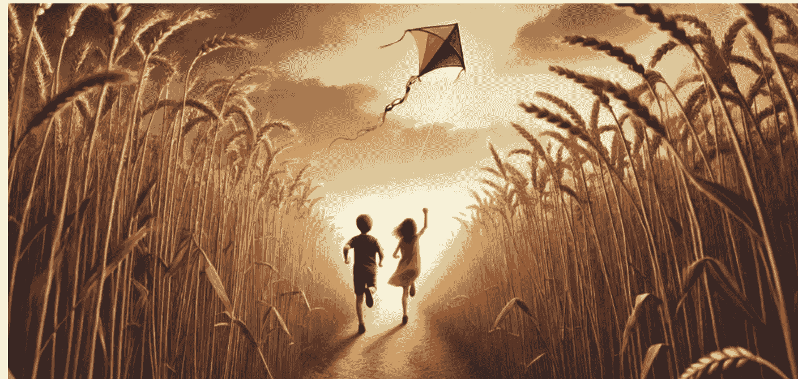

lazybro，你好。我是老喻，欢迎来到《决策算法》课。

### 一

公元前334年，马其顿的亚历山大大帝率军征战小亚细亚。在弗里吉亚的戈尔迪亚姆城，他遇到了一个古老的预言：“谁能解开戈尔迪阿斯绳结，谁就能统治整个亚洲。”

相传，这个绳结由弗里吉亚的创始国王戈尔迪亚斯亲手系在一辆古老战车上。几个世纪以来，无数智者、战士和国王都曾试图解开它，但无不败兴而归。这个绳结盘根错节，找不到头，看起来简直无解。然而，亚历山大并没有像前人那样耐心地在蛛丝马迹中苦寻线头，而是拔出剑，毫不犹豫地一斩而断。“解决之道就在此处！”亚历山大大声宣布。历史记载，他后来确实征服了极其广阔的区域，建立了横跨欧亚的庞大帝国。或许很多人会质疑：这并非真正的“解开”啊！可是谁也无法否认，最终是他的果敢之举带来了胜利的结果。

这个“戈尔迪阿斯绳结”的寓言，恰如我们做抉择时深陷的纠缠——它不仅象征着外部环境中的难题，更是我们内心多个自我纠结在一起的隐喻。我们常常害怕错失任何一个可能性，担心“顾此失彼”，于是自己给自己系上了一个又一个死结。

休谟说，人是由一堆不同自我构成的：一个渴望冒险，一个追求安全；一个想要成功，一个宁愿安逸；一个渴望改变，一个却恐惧不安。我们像过去的众多国王、战士、智者那样，小心翼翼地分析、尝试、试图找到完美解法，结果绳结越拉越紧，反而寸步难行。

语言学告诉我们，“决定”一词的拉丁语词根意为“切断”。这一词源学的洞察令人深思：它不仅表示我们要与其他选项作出切割，更意味着要把内心那个犹豫不决、过度分析、不敢行动的自我果断舍弃。

回到亚历山大，他给我们的启示不在“巧妙解开绳结的技巧”，而在于敢于一剑斩断的勇气与魄力。当我们被无穷无尽的可能性所缠绕，或许需要的不是更多思考，而是拔剑的那份决心——舍弃所有“也许和如果”，在关键时刻力挽狂澜。其实，我们只是忘了，有时候最佳方案就是果断切割。一剑定乾坤，从来不是绝望时的孤注一掷，而是认清形势后对己身最坚决的宣示：此时，我选择行动！

### 二

那么，是什么阻碍我们像亚历山大一样一剑斩断？为何在决策面前，我们会感到如此无能为力？

在冈察洛夫的小说中，有位角色叫奥勃洛摩夫，这位年轻的贵族终其一生没有能力去决定任何事情，也无法从事任何有意义的活动，大部分时间都待在自己的房间或床上。这种“奥勃洛摩夫症候群”在现代社会中比比皆是。我敢说，我们或多或少也能看到自己的影子。

为什么我们面对决策困境却无能为力？为什么面对机遇我们不能勇敢拥抱？我认为有几个关键原因：

首先，我们害怕失去和舍弃“潜在可能性”。每一个决定，都意味着将其他可能性排除在外。如果选择 A，就不能再享有 B、C、D……心理学研究告诉我们，关闭选择的大门会被人们认为是一种损失，而人往往愿意为避免这种情绪上的损失付出代价。换句话说，人对“失去”和“切断”的敏感程度远高于对“获得”的渴望。与其说我们想要得到什么，不如说我们更害怕失去什么。弗洛姆描述过一位有天赋的作家，总是梦想写出伟大著作，却一个字都不曾动笔，就是因为他对“失去可能性”的恐惧大于对“实现”的渴望。拥有十个选项时，我们总幻想能保有十种未来，却不知那只是虚妄的安全感。

其次，我们因为“完美解决方案”而逃避现实。在一个崇尚“人生赢家”和“成功学”的时代，我们容易误以为一定存在一个既能满足所有需求、又不必牺牲任何东西的最优选择。可现实往往是，想要面面俱到其实很难，甚至注定要顾此失彼。我们太贪婪，什么都想要，又什么都不想失去。于是，我们通过逃避现实，躲藏在自己的幻觉之中。可正如卡夫卡所说：“我们唯一能够逃避的就是逃避本身。”而逃避本身，会将我们送到自己最不想去的地方。

第三，我们的内心自我，本就相互冲突。一部分自我渴望挑战，另一部分自我却只想守着熟悉的舒适区。我们不是统一的个体，而是一堆需求、恐惧与欲望的混合体。正如休谟所说，人是由一堆不同自我构成的。没有哪一部分能轻易说服其他部分，于是纠结就这样在心里蔓延。我们感到力不从心，本质上是因为内心的拉锯战，像无数细绳互相扯动。很多时候，我们犹豫不决，是因为内心深处并不确定“我是怎样的人，我真正想要什么”。决策意味着“定义自己”：我放弃哪种身份，拥抱哪条路径。这无异于剥离遮蔽在表面的泡沫，直面真我。戈尔达·迈耶给出了很好的建议：“创造一个你一生乐于与之相伴的原我”。可是，塑造和认同“原我”，往往是比做决定更可怕也更艰难的过程。逃避决策，也是在逃避“我究竟是谁”这一灵魂追问。

再有，社会期待和他人的目光让我们裹足不前。许多时候，我们明明知道自己想要什么，可是父母、朋友乃至周围社会的声音持续不断地灌输着“别冒险”“这样做很不稳定”或“你会让人失望”。出于害怕评判或渴望被认可，我们变得瞻前顾后，不敢迈出那决定性的一步。这种外部压力与内部不确定性交织在一起，让我们更难以做出决断。

因此，“无能为力”并不只是懒惰或拖延那么简单，更像是一种心理防御：通过什么都不选来保留所有可能性——好似进入一个虚拟现实的神奇世界，在这里，互斥的选项还能同时存在。“也许明天”“或许将来”……这种看似美好的可能性，被我们当作一剂止痛药，却也让真实的今天就此凝滞。

而亚历山大为何能果断拔剑？那是因为他看穿了最根本的事实：如果一直寻找那根不存在的“线头”，我们终将被纠缠的绳结套牢。一剑斩断不是莽撞，而是对不完美的接受、对责任的承担，以及对自我意志的确认。关键时刻的“切割”，需要面对失去，也需要抛下虚幻的完美念头，更需要问清自己是谁、何为所求。

### 三

我们都知道“该果断时就要果断”，但知道不等于做到。要不然，戈尔迪亚斯绳结摆放在那里这么多年，为什么要等到亚历山大拔剑才得以“解开”。我们早已明白决策的迫切性，可现实里，多少人心中反复挣扎，却依然拿不起那把剑。

或许你也会纳闷：果断并不容易，为什么有的人生来就“似乎”更会决策？其实，许多被称为“决策高手”的人，往往经历过非常态的成长环境，或伴随一些不为人知的“缺陷”。像巴菲特，他的母亲家族有精神疾病，这让他在极度焦虑与不安的童年环境中，必须学会用理性和冷静来保持内心秩序；马斯克在年少时饱受“混蛋父亲”的精神折磨，被逼着不停反思、证明自我，磨砺出异于常人的坚韧；再看乔布斯，他被亲生父母送人收养，这种被遗弃的阴影，让他更执着于“做出颠覆性创造”以证明自己。这些特殊经历与心理刺激，可能反而在某种程度上，塑造了他们面对选择时的果敢与独立，让他们更不容易被世俗的恐惧或干扰束缚。

所以，你我平凡之人，千万别为我们面对决策绳结时的纠结感到羞耻。因为犹豫、焦虑、顾此失彼，原本就是身为人的正常部分。把这根“绳结”斩开，就像亲手给自己拔牙，或是你为自己做一场手术，何其困难。这一刀下去，疼痛往往在所难免，而且需要对自我高度诚实，需要打破外界的种种期待，需要集中勇气去面对损失与牺牲。所以，看似简单的“一剑斩断”，实际上凝聚着无数痛苦的抉择。

在《决策算法》里，我为你分享了很多决策的模型和方法论。然而，我尤其想提醒年轻朋友，绝大多数人几乎只能在痛苦中学会决策。不过，真正的成长往往就在这片痛楚里。我们无法掌控先天环境，也不必苛求自己一定要“生来就是决策天才”，但可以像亚历山大一样，在认清绳结全貌后选择挥剑。想摆脱“无能为力的自我”，我们只需一次次把那些困住自己的丝线斩断，哪怕痛也不退缩。真正拦住我们的，往往不是天赋的不足或经历的缺陷，而是内心对痛苦和不确定的恐惧。看清这一点，也就多了一分勇气——因为与其被命运扯着走，不如挥出那一剑，哪怕刀锋生痛。也许，当我们最终敢于直面这个过程，就能体会到一种前所未有的轻盈。选择对了也好，错了也罢，只要不再拖泥带水地“等待”或“观望”，生命就会因这个“果敢”而获得重新出发的力量。

那一刻，我们或许会由衷感到：这一剑虽来之不易，却正是我们真正站到命运棋盘中央的宣言。或许这才是“亚历山大的剑”，给予我们的最伟大启示。

### 四

我记得自己最初学滑雪的时候，面对陡峭的山坡总是心里发怵，生怕一个不慎就狠狠摔倒。那时我就像决策难题面前的我们，知道技巧，却始终不敢真正“冲”出去。再多的练习，也只能在原地打转。

后来，一位名叫 Kristi 的世界冠军教练改变了我的思路。她个头不大，态度温柔，却带着一种让人放心的坚定。她看我纠结于如何分配重心、如何掌握速度，只轻轻说：“转弯时把外侧肩膀探出去。”我照做了，结果意外神奇：我竟能轻松完成在斜坡上拐弯的动作。原来，当我不再害怕前倾会摔下去时，整个人就更容易顺势与山坡达成平衡。从那之后，曾经望而生畏的蓝道再非问题，甚至黑道我也开始尝试。

在《权力的游戏》里，面对一场危机，有如下一段对话：

> 席恩：你害怕吗？
> 罗伯：（伸出颤抖的手）是的。
> 席恩：（微笑）很好。
> 罗伯：很好吗？为什么？
> 席恩：意思是你不笨。

恐惧，其实是种保护机制。承认恐惧是智慧的开始，面对恐惧是勇气的起点。

> 约翰·米尔顿写道：“一个人如果能够控制自己的激情、烦恼和恐惧，那他就胜过国王。”

勇气并非没有恐惧，而是心怀恐惧却依然出剑。摔倒不可怕，失误也不可怕，可怕的是我们一直不敢真正出发。学会和恐惧相处，是斩断绳结的第一步。

### 五

面对人生的决策绳结，如何才能让自己有一剑砍断的智慧和勇气？

以我自己的观察，真正能做到这点的“决策高手”往往具备三个关键特质：

- 其一，内在安全感（过去）；
- 其二，自我认同感（现在）；
- 其三，对未来的信念（未来）。

如果你是父母，请永远记住，让孩子学会自己做决定、承担后果，远比替他们规划无懈可击的未来重要得多。为孩子营造安全和自由，让他们体验自主与失败的价值，这会成为他们一生的财富。

如果你是一个童年不那么完美的成年人，也许在面对不公平的命运绳结时，会对自己说：“这是我应得的。”这就是所谓不幸童年的魔咒，你必须打破它。面对绳结，你要大声喊出：我命由我不由天！一个独立的人格理应自带尊严与平等感，既不妄想占他人便宜，也不会对别人唯唯诺诺。直面自我，意味着停止过度在意别人的目光，当你不再惧怕别人怎么看你，才能真正思考“我是谁，我要什么”。

不管那个决策绳结多么千头万绪，你早晚要面对它。如果你还没举剑，那是因为你还不够痛。然而，大多数人后来已经习惯了死结，彻底失去了举起剑的力量。

不管那个死结纠缠了你多久，请记住：只要做对的事情，就永远都是好时机。

无论过去或当下如何，只要你依旧活着，就有斩断旧我、走向新生的力量。没有谁天生就是亚历山大，但你也一样可以选择像他那样，拔剑而起，对所有的纠缠说“不”。

你要做的，无非是如下三步：

- 第一步，识别纠结；
- 第二步，设定期限；
- 第三步，果断出剑。

勇敢地迎向那一瞬间的痛楚吧，因为它意味着你不再由他人或命运摆布，而是开始用果敢与担当，去主导自己的人生。

最后送你卡夫卡的一段话：

> “要冷静耐心。你尽量让坏事发生好了。你不要躲避。相反，你要认真观看。你要用主动的理解代替被动的接受刺激。这样你就会应付这些事情。人只有经历自己的渺小，才能到达高尚。”

我是老喻，我们下一讲再见。


## 92教育决策：AI时代教育需要怎样的改变?

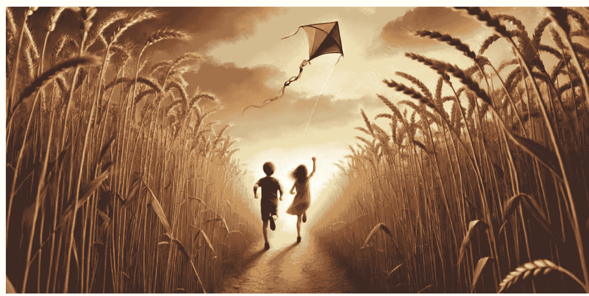

lazybro，你好

你好，我是老喻，欢迎来到决策算法课。

### 一

关于教育，历来有两条路线之争，一条看起来很理想主义，一条看起来很实用主义。

图灵奖得主约翰·霍普克罗夫特曾讲述过一个令人惊讶的故事：他的一位学生主动放弃即将到手的博士学位，选择成为一名滑雪教练。这位世界级科学家不但不觉得惋惜，反而认为这是正确决定。

> “找出你真正喜欢什么，然后专注于此。”这是约翰总结的教育秘密。

当他询问多位诺贝尔奖获得者成功的规划时，得到的回答常常是：“我没有规划，因为‘没有规划’就是规划。”

2024年诺贝尔物理学奖得主杰弗里·辛顿正是如此，他少年时代对神经网络的痴迷，最终引领了当代AI浪潮。

约翰·霍普克罗夫特的观点，代表了教育的理想主义路线，强调个人的兴趣、热爱、自发的探索，没有规划，也没有提前设置好的路径。

然而有人会说：“这些都是精英的奢侈品！普通人还是得踏实念书、上好大学、找份稳定工作才最实际。”

这说的也是事实，并且更符合我们大多数人的经验。这条更实用的路线，能给孩子带来不一定精彩绚烂，但至少相对有确定性的未来。

过去，这两条路线之争可以说是难分高下。然而AI的出现，正在让看似坚固的实用教育路线产生根本动摇。

ChatGPT等AI工具横空出世，已能完成许多高学历工作。当一个14岁孩子能用AI在几分钟内完成我们花四年时间才学会的任务，我们传统的教育系统，不得不重新思考应该给孩子教什么，以及怎么教。

这不是危言耸听。我们正处在教育史上最激烈的认知转变期：从知识稀缺到知识过剩，从强调记忆到强调创造，从线性职业到多元发展。

更令人不安的是，我们的教育系统正在为一个已经不存在的 世界培养人才：

- 我们教授确定性，AI时代需要的是应对不确定性的能力；
- 我们强调记忆和执行，未来需要的是创造和质疑；
- 我们追求专业壁垒，明天需要的是跨界融合思维。

麦肯锡全球研究院预测，2030年前，全球约15%-30%的工作岗位将受到AI显著影响。麦肯锡还有一个预判：高薪脑力劳动者或将成为最大输家。

之前我介绍过，我有位朋友家的孩子，从藤校毕业，居然要为找工作苦恼。为啥呢？原来，他入校时选择的热门专业，在这两年，居然被AI团灭了。

每次技术革命都会重构社会阶层。蒸汽机淘汰了手工业者，电气化改变了农业劳动力市场，AI时代正在重新定义知识工作者的价值。

面对这样的变革，我们需要全新的教育决策算法。

但这个“全新”的教育决策算法，并不是让孩子都去学人工智能专业，去学习怎么用AI，反倒是更加回归教育的本质，帮助他们发现真正的兴趣与才能——那些AI最难取代的能力。

也许我们该听听作为计算机专家的约翰·霍普克罗夫特的观点：

> “人只有一次生命，不是所有人都要去获得诺贝尔奖，很多人做自己喜欢的事情虽没有成功，（从另外角度）他们也成功了，因为他们有愉快的生活。”

是的，在AI时代，教育决策最重要的东西，反倒与AI无关。

### 二

面对AI带来的巨大颠覆，一位沃顿商学院的教授提出了发人深省的感悟：现在不需要考虑人类与机器之间的竞争，而应该找到一种让两者共同合作的方式。

对于教育，更是如此。

- 从学生的角度看，要面对未来挑战，应该积极拥抱AI，发挥“碳基生物”的优势；
- 从老师的角度看，AI会成为超级助手，人类老师可以更好地发挥教练的角色；
- 从家长的角度看，AI会成为家庭教育智能助理，父母不必再为优质教育资源焦虑惶恐。

但现实呢？市面上最火爆的，居然是AI学习机。孩子用AI学习机做什么呢？居然主要是刷题。

这是当前最诡异的事情之一。

为什么会出现这种现象？归根结底，这是因为我们没有理解AI对教育带来的根本性革命在哪里。

教育的本质是激励，所以，AI对教育的最大贡献之一，其实是将人类老师解放出来，成为孩子的激励师。

一方面，AI在知识上的表现胜过99.9%的老师，这可以让老师扮演更有价值的心灵和成长教练的角色。

另一方面，AI令许多过往的教育内容与形式都已经失去了意义，为什么还要让AI给孩子灌输那些死记硬背的东西？

事实上，AI其实在倒逼我们回归教育的本质，那条基于“学历—文凭—固定职业”的实用主义路线，正在瓦解，教育决策需要“算法级”的重构。

### 第一，从“知识投资”转向“能力投资”。

想一想，过去我们的教育投资逻辑是什么？攒足够多的学历、证书和知识，就能在职场中立于不败之地。这种线性思维导致学生和家长拼命追逐分数和文凭，却忽视了兴趣和创造力的培养。

在AI接管常规任务的世界里，“能做什么”远比“知道什么”重要。当AI可以解决标准问题，人类的 价值就在于能否提出新问题、发现新机会。未来成功的关键在于持续学习的能力、保持好奇心的习惯、面对挫折的心理韧性，以及与AI协同工作的智慧。

### 第二，从“线性学习路径”转向“网状学习生态”

过去的教育像一条单行道：小学、中学、大学、工作，专业一旦选定就难以更改。学校是唯一的 知识供给方，学习被课程大纲和考试体系严格限定。

而未来的学习是无边界的网络。我们的学习不再局限于教室，而是线上线下融合，课程、项目、社群形成丰富互动的网络。创新来自于跨界思维，“编程+艺术”、“医疗+AI”等跨学科融合，或许会为创造力提供无限可能。

### 第三，从“确定性决策”转向“选择权决策”

我们习惯于相信人生有几个关键节点决定一切：高考、大学专业选择、第一份工作。但在变化 速度前所未有的今天，这种思维已经过时。

更明智的策略是构建多元可能性——通过不同途径保持方向调整的灵活性；将教育资源分散投 资，不要把所有筹码押在单一技能或领域上；允许自己和孩子有试错的空间，及时调整方向，让教育决策变得更加灵活机动。

AI时代的教育决策不再是一次性的赌注。我们需要思考的不是“该选哪一条路”，而是“如何保持在多条路上前进的能力”。只有这样，我们才能帮助下一代在这个不确定的世界中找到真正的立足之地。

### 三

不过，说到这里，我想要补充一点，我并非简单地非此即彼。必须要承认的是，你我仍然处在过渡时代。

我们生活在一个残酷现实与美好梦想交织在一起的世界里，我们要生存，要与世俗名利过招，还要追寻个体的意义。

即使是在崇尚自由、赞美盖茨和扎克伯克辍学创业的硅谷，大公司也会优先招聘名校毕业的学生，而且还特别看重学生在大学里的成绩。

我身边的一些资源丰富的朋友，会通过各种经营和付出，让自己未必那么优秀的孩子，能考上最好的大学，从而拥有更多的机会。

我也希望自己的孩子能上名校，我从不对他们隐瞒这个世界冷酷而现实的那一面。但我也希望能够帮助他们成为更独一无二的自己。

我既守护他们的童心，点燃他们的好奇心，又和他们一起在这个并不简单也不单纯、充满着各种妖魔鬼怪、也有天使英雄的社会里过关打怪。

### 第一，帮助Ta成为一个完整的人

一个身心健康、有安全感、知道如何做选择、有同理心和责任感的人，不会被未来的复杂吓倒。这是教育最底层也是最难的任务，却是父母最不可外包的责任。

### 第二，和Ta一起发现真正喜欢的东西

别着急找“天赋”，别把兴趣当作任务表。去玩，去试，搞砸了也没关系。守护孩子的好奇心，就像守护火种。哪怕那火光微弱，只要你不去把他浇灭，它终会燃烧。

### 第三，带Ta在世俗的体系里过关打怪

考试、升学、竞争，这些游戏规则不能回避。但我们可以让孩子知道：这只是一个副本，不是全部人生。得高分是能力的一种，不是价值的全部。和孩子一起拆解规则、寻找bug。

在这三条主线基础上，AI时代的教育决策新算法开始浮现。

我们前面讲到的三大教育转变：能力投资、网状学习生态、选择权决策，并不是割裂存在，而是互为支点，共同构建起一个面向未来的教育系统。

具体而言，我们可以从以下四个方面转变教育思维：

- 1. 破除惯性：不再迷信分数和文凭，不再把名校等同于成功。意识到AI已重构知识型岗位，学历不再是唯一敲门砖。
- 2. 以“能力+生态+选择权”为核心：教育投资应围绕长远竞争力、开放性网络和个体探索空间，而非阶段性排名。
- 3. 从“输不起”到“能转向”：用组合思维分散教育风险。不要怕孩子“走错”，要让他们有能力“转弯”，有勇气“重来”。
- 4. 终身学习、主动创造未来：教育不是一段流程，而是一种生长方式。真正能赢的孩子，是那些在每个阶段都能不断升级自己的人。

教育从来不是为了把孩子推入某一个确定的职业，而是为了让他们在面对复杂未来时，拥有持续演化的能力。

这才是教育决策的本质目标。

### 四

面对AI重塑的未来教育格局，我想送给你一个教育决策方法论：弹性黄金圈教育法。

这一方法将传统应试与AI挑战融为一体，形成一个动态适应的教育框架：

### 第一步，Who-身份构建：教育的起点不是孩子应该学什么，而是孩子会成为谁。

帮助孩子探索并构建稳定的身份认同——她渴望成为什么样的人？在此阶段，父母的任务是提供多元探索机会，观察孩子眼中持续闪烁的光芒，而非投射自己的期待。

### 第二步，Why-元能力培养：一旦确立初步身份定位，就要探寻更深层次的问题：我为什么而活？我有什么独特价值？

这看似抽象的哲学思考，实则是培养孩子元能力的最佳时机。

元能力是能够习得其他能力的能力，包括批判性思维、自我认知、知识迁移和情绪调节。这些构成孩子适应未来的“操作系统”。

当孩子带着明确的“为什么”，就能在任何环境中激发自驱力，主动获取新知识。

### 第三步，How-双轨融合：在传统升学与AI能力之间寻找平衡点。

识别教育体系中的关键节点（小升初、中考、高考），合理分配资源，避免全程高压。

在应试过程中强化底层能力，同时培养与AI协同工作的能力，包括问题定义和数据素养。

简而言之，就是既要面对应试的过关打怪，也不失去独立思考的能力。

### 第四步，What-弹性路径执行：最后才是具体行动的规划——选择学校、课程、项目和爱好。

但与传统教育不同，弹性黄金圈方法将教育决策视为投资组合而非单一押注。

设计主路径的同时保留备选方案，定期评估与调整，保持战略迭代。

我有位读者，非常重视孩子的教育，她计划让孩子去波士顿读美高。我赞赏她着眼未来，但认为她可能应该按照上面的黄金圈法则：先who，然后why，再是how，最后才是what。

很多时候，家长都忽视了一个关键问题：教育的本质是帮助孩子去发现自己喜欢什么，热爱什么，将来要成为一个什么样的人。

其他的都只是辅助手段。

例如，用国内高考还是海外留学，作为教育的关键决策，是不对的。

就好像我们根本不知道一棵树是什么树，却去讨论该把它种在海南，还是哈尔滨。

愿我们用这个“We Who—Why—How—What”的方法论，为孩子打造一个柔软而坚定的底层架构：有意义的人生感、有弹性的路径规划、有多样的选择权、以及始终在线的父母支持系统。

我是老喻，我们下一讲再见。


## 93生活决策：植物教会我的7个决策算法

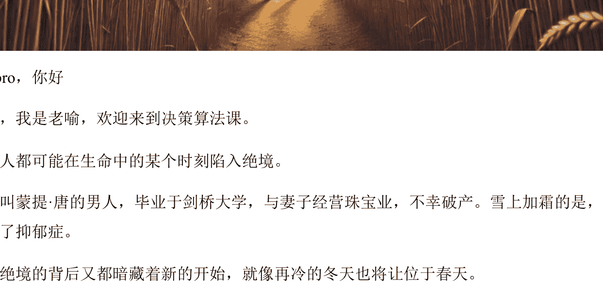

lazybro，你好

你好，我是老喻，欢迎来到决策算法课。

每个人都可能在生命中的某个时刻陷入绝境。

有个叫蒙提·唐的男人，毕业于剑桥大学，与妻子经营珠宝业，不幸破产。雪上加霜的是，他还患上了抑郁症。

每个绝境的背后又都暗藏着新的开始，就像再冷的冬天也将让位于春天。

绝境中的蒙提·唐用园艺疗愈了自己。他不仅重新振作起来，还收获了新的事业和人生，成为一位知名的园艺专家，并担任了英国土壤协会主席，还因杰出成就被授予大英帝国勋章。

我自己也是一个园艺爱好者，我种了几十种果树，数百株植物，总是能在花园的劳作中找回宁静，并重新思考那些困扰着自己的人生决策。

为什么园艺有如此神奇的“疗效”？

有人说：园艺为我们提供了一个内心世界和外在世界之间的过渡空间。

植物们的隐喻极其直白，生和死，开花结果，繁盛和衰败。花园讲述的道理残酷而包容，所以人类很容易对其打开心灵之门。

今天，我想和你分享植物教会我的7个决策算法：

- 轮回
- 希望
- 机遇
- 勇气
- 慷慨
- 坦然
- 欢欣

### 1、轮回

植物像是某种时光机器。

植物与时间的关系，和我们与时间的关系不一样。

也许以放弃移动为代价，植物与岁月形成了和解。

理论上，四季循环一生的植物，实现了尼采所说的那种“永恒轮回”。

植物可以这样想：嗯，上个青春（春季）我过得有些迷糊，我打算下一个青春更加奔放一些！

还可以这样做：上个冬天太糟糕了，不过，幸好一切可以循环。

德国诗人荷尔德林曾借许佩里翁之口抱怨说：万物枯荣交替。为何我们就从自然的美妙周行中被踢开了呢？或许这种循环也适合我们？

对此，哲学家韩炳哲也感慨道：“如果大自然的美妙循环也适合我们，那么我们也可以拥有新的开始，拥有神秘的修复与复苏。”

也许我们可以模仿植物的“自我更新、自我复苏、自我修复”。

在你我的有生之年，每一天都可以有新的开始。老夫聊发少年狂，在各个年龄段依然有四季轮回。

植物虽然一样会长大，会衰老，但四季一个循环，让每次的果实生长都如同第一次般，每次都全力以赴。

我希望成为一个像树一样可以轮回的人。每个春季，都像第一次来到这个世界般充满新奇、期待和信任。

而我的智慧又如年轮般，一年又一年层层叠叠，扩展开来。

这就是植物教给我的第一个决策算法：轮回。

轮回意味着，敢于放弃，勇于重启。

决策的核心是敢于舍弃，勇于分离。

就像罗素所说：“放弃自己想要的某些东西，是幸福生活不可或缺的一部分。”

高明的决策者懂得，每次失败都是新循环的起点。

当项目失败时，不要沉浸在懊悔中，而是像植物一样完成“轮回”：果断终止，总结经验，重新栽种希望。

商业模式失效了？放弃它，开始下一个。

职业方向错了？主动转型。

轮回式决策让我们对过去负责但不被过去束缚，在每个“季节”做出符合当下环境的选择。

### 2、希望

梭罗在《种子的传播》写道：“我对种子信心十足。只要告诉我你有一粒种子，我就准备期待它创造奇迹。”

一个种子，就是一种可能性。而可能性是不分大小的。

不止是种子，植物的枝干，也是某种并发机制。人类往往只能选择一条人生道路，而植物则同时长出好几支向上的可能性。

在某种意义上，树木有自己的“平行宇宙”。

所谓希望，就是人对自己拥有的可能性的主观判断。

我们也可以如植物般，同时保有自己对未来的多种希望。这些希望，可能是你的某个副业，某个爱好，某个对未来的下注。

关于植物和人，我最喜欢植物学家路德·伯班克的一句话：

> “我把人性视为一株庞大的植物，若想实现它的最高成就，只需要有爱，大自然的祝福以及精妙地杂交和选择。”

这就是植物教给我的第二个决策算法：希望。

所谓希望就是，在白纸上描绘未来。

决策的本质是面向未来。

你是画师，未来是白纸，需要将将有价值、美好的事物带到这张纸上。

每个决策都应充满希望，想大一些，想远一些。

不要纠结于过去，不要过度自省。

分析过去的错误只会消耗精力，而这些精力本可用来培育未来的可能性。

高效决策者像植物一样同时培育多条生长路径，而非执着单一选择。在企业中保持多元化战略，在个人生涯中发展多种技能。

关键是问：这个选择会为我打开哪些新可能性？

向前看，别回头。

### 3、机遇

每年我都会种下两株佛手瓜，它们生长迅速，产量喜人。

每当我给新藤搭网时，就会感慨生命的活力和智慧：

为什么佛手瓜爬得那么好，像是长了眼睛一样？

确切说，植物的藤也是胡乱长的，也是随机的。除了阳光的指引，重力的作用，生长素的刺激，它每次都是在随机测试，也就是主动“犯错误”：

有时候它能爬到网上，有时候悬在空中，然后垂下去。

爬到网上的藤，在下一次随机延展中，有更大概率顺着网生长。但事实上这个藤，并没有意识到自己的优势，也没有规划一直爬下去这件事。

某种意义上，这种爬藤植物运用了“蒙特卡洛算法”，它们在一定区域内，随机选取了很多点，少数点有效，多数无效，但这就够了。

所以，藤的胡乱生长（就像孩子混乱的童年），是许多次随机事件的组合，而这个组合背后，则是DNA在复制和延续自己的秩序。

早在1844年，爱默生就揭示了植物生命力的秘密：

> “植物并不满足于从花朵或树上撒下一粒种子，而是将不计其数的种子撒向天地之间，这样，假如几千粒死去了，仍有几千粒可以种植，几百粒会发芽，几十粒会成熟，如此一来，至少有一粒会代替母株。”

成功人士又何尝不是如此？根据研究，天才未必比普通人有更高的成功率，但是他们往往有大量的、刻意的努力。

关于机遇的秘密，藏在一株小小的植物的成千上万的种子里。

这就是植物教给我的第三个决策算法：机遇。

要获得你期待的机遇，你需要撒下足够多的种子。

决策就是为了捕捉机遇。

不确定性是机遇的土壤。优秀的决策者像爬藤植物一样，通过大量尝试找到最佳路径。

我们要相信机遇，拥抱不确定性，持续播下种子，张开风帆，捕获看不见的机会。

真正可怕的不是失败，而是尝试次数太少。

当我们像植物撒播种子一样大量创造可能性时，成功的概率就会大幅提升。那些看似"无用"的尝试，往往引领我们找到最适合生长的方向。

### 4、勇气

生存往往卑微而具体，而不是宏大且绚丽的。

《不可能性》一书的序言里，提及了人类的某类双重视角：

一种是强烈快感、恐怖和死亡的视角——恰好就是诗的视角；

一种是科学或有关实用性的真实世界的视角。

奇怪的是，花园似乎是这两种视角的混合：

修剪枝叶，触碰花果，在泥泞中弄脏双手，多么真实而具体；

然而，花园又是如此远离实用主义，以及如此接近生与死的内在。

这种面对未知和混乱“伸手去做”的勇气，有时候也是快乐的。据说早年欧洲的农夫在春季开种前，会光着屁股坐在土上来感知温度是否适合。

勇敢不是与天斗。恰恰相反，勇敢是顺应四时节气而行，既能为种子发芽开心，又能在残暴的冬季忍耐。

勇敢还意味着等待。达尔文花了8年时间，致力于藤壶的解剖；孟德尔培植了1万株豌豆，才发现了遗传的秘密。

勇敢更是对光明的向往。正如一句波斯谚语说的：“建造花园的人会与光明为友，没有任何一座花园在黑暗中诞生。”

这就是植物教给我的第四个决策算法：勇气。

这里所谓的勇气，指的是在灰度空间中敢于果断按下按钮。

即使是正确的事情，即使付出了努力，也可能有不好的结果。

真正的决策勇气，是在灰度空间按下按钮，穿越迷雾，在悬而未决时前行。

勇气型决策不是鲁莽冒进，而是在不完全确定时，依然能做出选择并承担后果。

像园丁一样，需要行动的勇气和等待的耐心并存。

生活中很少有完全正确或错误的选择，大多数存在于灰色地带。

勇气不是等到万无一失才行动，而是在知道风险的情况下依然选择前行。

### 5、慷慨

植物或者花园给人的启发是：你无法真正拥有你不对其付出的事物，并且是指拥有之后的付出。

富足的一种形态是：慷慨而诚实地付出。

> “我的花园是一个诚实的地方。每一棵树、每一条藤都不会隐瞒，只需两三个月就会准确地吐露它们究竟受到了何等待遇。”爱默生在日记里写道：“播种的人可能会搞错，把豌豆播得歪歪扭扭；豌豆却不会犯错，只会照样长出来，如实展示园丁播种的路线。”

我有一株黄金李子树。结出的李子，是那种浅黄色的，如青春的肌肤般半透明，味道甜得毫不设防，如同少年男女之间诚实的初恋。

果实的美味，有生物学上的解释，动物会被美味吸引，成为种子（果核）的传播者。

也许在生命的深处，付出和回报是等价的。

这是植物教给我的第五个决策算法：慷慨。

也就是，先创造价值，后考虑回报

力不到不为财，高明的决策者基于原则、价值和使命做决策，回报只是奖励和结果。

慷慨型决策告诉我们，长期看，那些只追求立即回报的决策往往短视。

就像植物不吝啬地为传播者提供甜美果实，我们的决策应考虑如何为他人创造价值，而不仅是索取。

在商业中，不只关注如何获取更多利润，而是思考如何为客户提供更多价值；在个人发展中，专注于提升自己的能力和贡献。

真正的富足来自价值循环流动，而非单向索取。

### 6、坦然

植物教会我们，坦然面对各种人生境况。

利伯蒂·海德·贝利说：“为草坪上的蒲公英日夜烦忧的人，要是爱上了蒲公英，就能大大地松一口气。”

看到这句话，我笑了。有一阵子，我一直在和落在草地上的松针斗争，又是耙子耙，又是吹风机吹，始终不能让后院巨大松树下的草地长得如意。

有些事情，何必较真儿？就由它去吧。

不可能有完美的花园。正是在某些缺陷之间，我们与植物彼此塑造，从而感知了存在的坦然。

一个美好的花园应该是此起彼伏的，正如人生的参差不齐。

看似不动的植物，以另外一种方式帮助我们理解人生的河流。这个世界上没有任何东西可以对抗时间的流淌。

而在我们的心底，时间可以被重新组织，假如我们拥有属于自己的时间的花园，过去、现在和未来都将被肥沃的土壤妥帖安放，滋养，用一种指数化的方式生长，绽放，战胜所有的虚妄和邪恶。

人生不是一件消耗品，而是一种通往更丰盛、更真切、更广阔的世界的途径。

让我们坦然地享受这尘世间的浮光掠影吧。

这是植物教给我的第六个决策算法：

坦然。

### 控制可控，接受不可控

坦然型决策的核心是接受不确定性，继续前行，明白什么事情都可能发生。

正如塔勒布所言：“依赖外部认可有益健康，当你不跟人攀比时，才拥有真正的自我和自由。”

这种决策方式让我们摆脱对完美结果的执念，关注能控制的部分。

就像园丁无法控制天气，但可以选择适合当地气候的植物，我们应将资源分配在能让自己变得更好的地方，而非与无法改变的现实抗争。

### 区分“可控”与“不可控”，精力集中在前者，优雅地接受后者

在温哥华找到一株祖国的石榴树并不容易，有次我种下小小的一株石榴，没想到被狗刨出来啃了，还暴晒了半天。我勉强再种回去，过了一两周，居然又发新芽了，太快乐了！

前年，我种的山楂大丰收，做了整整一百多串糖葫芦！

刚摘下的山楂果，裹上耐心熬好的糖浆，模样正宗，咬上一口......完全和故乡一样的味道！

一样的酸甜，一样的沙软，连果核的大小都是一样的。

只是，现摘现做的糖葫芦，以前从没吃过。——在异国他乡，没什么比味蕾更加直击心灵。

呼朋唤友来取做好的糖葫芦……朋友们问：为什么你家会有糖葫芦？什么？你家自己种的山楂？

于是，来了一波朋友，又来一波，小小的糖葫芦，掀起了节日般的小喜庆。

> 蒙提·唐说：“人生短暂而荒谬，痛苦与哀伤如河流穿行其间。但即便是在面对最深的苦难时，园艺仍能令我们的日子如沐欢愉。”

植物何以带来欢沁？

除了果实，花朵，我想，还有那种面对人生不确定性的宁静。

迈克尔·波伦在《杂草、玫瑰与土拨鼠》这样写道：

> “或许有园艺天赋的人在打理花园时具备消极感受力。在自然的不确定面前，他沉着冷静，游走于自然的神秘之中，并不觉得自己需要操纵什么，或是寻求解释，或是拥有一劳永逸的解决方案，在客观世界的纷纷扰扰中感到快乐。”

这是植物教给我的第七个决策算法，

欢沁。

### 打一场只与自己比较的战争

欢沁型决策的精髓在于享受过程，打一场必赢的战争：让自己变得越来越好。

很多人决策时过于关注结果，忽略了过程本身的价值和快乐。

就像园艺爱好者享受与植物相处的每一刻，高明的决策者能从决策过程本身获得满足和成长。

即使无法控制所有变量，我们依然可以控制自己的态度和行动。通过聚焦自身成长，确保无论外部结果如何，决策过程本身都有价值。

决策的真正目的不是获取外部回报，而是通过决策本身，实现内在成长。

以上就是植物教给我的全部7个决策算法，希望也对你有一些启发。

我是老喻，我们下一讲再见。


## 94、禅思决策：永远去做余生最重要的事情

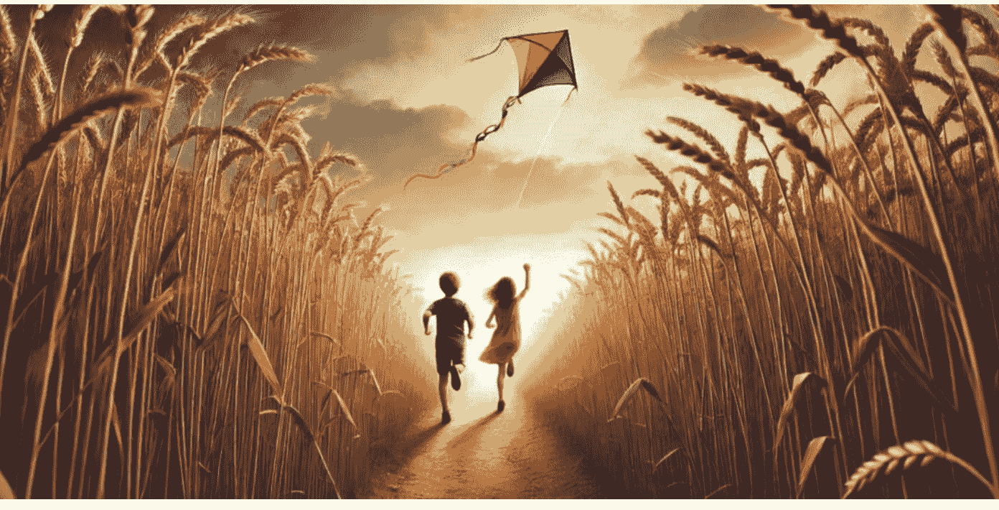

lazybro，你好

你好，我是老喻，欢迎来到决策算法课。

不知道你是单身，还是已经有主了，不过，说起一见钟情这个话题，相信你应该都有兴趣。

今天我要说的主角是苹果公司的创始人乔布斯，故事发生在1989年，乔布斯在斯坦福大学做了一次演讲，结果，他遇到了女主角劳伦·鲍威尔。劳伦是商学院的研究生，当时她和朋友很冒失地坐在嘉宾位上。乔布斯到场就座后，被右侧的劳伦吸引了，和她聊了几句。

演讲结束，乔布斯来到停车场，已经插上车钥匙，这时，他远远看见了劳伦。乔布斯问自己：“如果这是我人生在世最后一天，我是愿意开一场商业会议，还是同这个女人一起度过？”

于是，乔布斯跑过停车场，问劳伦是否愿意和他共进晚餐。劳伦答应了。从此，两个人一生携手。

后来人们说，劳伦给了世界一个更好的乔布斯。

在这个浪漫的故事里，我们会发现一个伟大而实用的决策方法，那就是：

永远去做余生最重要的事情。

### 一

你可能会觉得，这句话很像个鸡汤嘛，为什么说它是一种很厉害的决策方法呢？

我们来分析一下，在上面这个爱情传奇里，乔布斯实际上是做了一个思想实验：

他把自己的余生压缩为一天，这样就能更加聚焦地思考，什么是当下最重要的事情。然后毫不犹豫地去做这件事儿。

这种决策方法究竟厉害在哪儿呢？

> 国际象棋天才卡斯帕洛夫说：“战略家总是先设立一个远期目标，制定相关的战略，然后返回头制定具体措施。”

不管一盘棋多么漫长，高手评判下一步怎么走，只有一个标准——下到最后的获胜概率。

问题来了：谁都知道长期主义好，说到容易做到难啊。

长期主义遥不可及，近期利益就在眼前，中间地带模糊不清，所以干脆先实现眼前的利益，一鸟在手好过百鸟在林嘛。

还有，假如饭都吃不饱，谈什么长期主义呢？

我们再来看看“永远去做余生最重要的事情”，这个决策方法，其实解决了普通人的一个关键人生难题：

优先级选择。

在生活中，我们的困扰往往不是好坏选择，而是多个“选择”之间如何取舍。

当我们面对“工作加班”还是“陪伴家人”，“追求稳定工作”还是“创业冒险”这类选择时，很难判断哪个更优。

“余生最重要”法则提供了一个简单但强大的决策过滤器：“这件事对我余生的幸福和成就真的重要吗？”这一问题立刻将焦点从短期收益转向长期价值，帮你迅速辨别出真正值得投入的选项。

它不要求你完全牺牲当下，而是帮你找到那些既满足当前需求，又为长远目标奠基的选择。这解决了我们在日常决策中最大的陷阱：被紧急但不重要的事情占据时间，而忽略了重要但不紧急的事情。

这就是“永远去做余生最重要的事情”的神奇之处，它能够把你当下正在做的事情，和你整个人生的全局最优解联系起来。

和乔布斯一样，脸书的创始人扎克伯格也擅长这种决策方法。

扎克伯格每天都问自己这样一个问题：“我现在做的，是我所能做的最重要的事情吗？

只有在获得了肯定的答案后，扎克伯格才会感到舒服，感觉自己的精力和时间没有白费。

拷问自己：我现在做的，是我所能做的最重要的事情吗？是我余生最重要的事情吗？

这是一个不断自我刷新的过程。

### 二

你可能会觉得，刚才的例子都是些高不可攀的人物，他们都掌握着充足的决策权，普通人怎么学得了？

普通人的生活，处处是不得已，被这个事儿推着，被那个事儿拽着，哪那么容易由着你，只做你认为最重要的事？

最近我听到的最励志的故事，是一个朋友家的亲戚，没怎么读过书，几年前只身一人去澳洲餐厅打工。现在早过了出国热的阶段，在国外打工能有啥机会呢？

但是，这个小伙子有自己“人生最重要的事情”，那就是在海外开一家属于自己的中国餐厅。所以，和别的打工者不一样，别人可能是为了养活自己，而他则会把餐厅的辛苦活当作通向目标的一步。

结果，没几年，他就从普通打工者，变成了一家餐厅的老板，生意兴隆，还把兄弟姐妹和父母都接了过去，买房买车，过上了不错的生活。

这个真实的故事告诉我们，“永远做余生最重要的事”并不是高不可攀的决策方法，恰恰相反，它对普通人更为重要。因为资源有限，普通人更需要聚焦，避免在无关紧要的事情上浪费宝贵的时间和精力。

这位小伙子成功的秘诀很简单：他不是被生活推着走，而是主动选择了自己的方向。即使起点再低，只要每一步都朝着正确的方向前进，终点终将可达。

我自己也有一个亲身的经历。十多年前，我还在从事房地产业。有次我在广州白云机场送合作伙伴，他是一家以色列上市公司的中国区董事长。临别前，他突然问我：“你愿不愿意接管我们合资的几个地产项目”？

当时这些项目有近300万平方米，有着诱人的利润，但我几乎不到一分钟就拒绝了他的好意。

为什么呢？假如我接管这些项目，至少还要盯上十年。而当时我的家庭已经移民到了海外。市场上不缺我这样一个三流的开发商，但是我的孩子们很需要我这个父亲。

也就是说，去陪伴家庭，伴随着孩子一起成长，才是我余生中最重要的那件事。

### 三

我们再说回决策，很多时候，决策本质上就是做选择，既然是做选择，就必须有得有失。所谓修剪决策树，就是说，我们要敢去砍掉相对而言不重要的选项。

这类选择，往往很艰难，因为并非黑白分明，而且有些选项似乎很接近，选择哪个，放弃哪个，都很不容易。

“永远去做余生最重要的事情”，这个决策方法告诉我们，你要从整个一生去评估一件事情的重要性。

有人可能会说了，未来充满不确定性，我怎么知道哪件事儿最重要呢？

再厉害的棋手，计算深度也是有限的，更何况坐在对面的，也是旗鼓相当的高手。

所以，适当的时候必须停止计算。

但即使如此，你做决策的评价系统，必须始终如一：走出当下能赢得全局胜利概率最高的那手棋。

拿乔布斯为例吧，他年轻的时候也犯了很多错误，他对未来的预测也不总是对的。有人总结他成功的秘密是：不服输，永不满足，不断学习。

体现在决策这件事儿上，乔布斯的算法很简单：我只要最好的。

其实，要实现长期主义，并非你随时都比别人算得更深，看得更远，而在于你的学习能力，自我刷新的速度，以及坚持做正确的事情。

大局和局部，坚持和变化，长期和眼前，因为世界的不确定性，因为我们大脑算力的局限性，永远是个难解之题，永远是个从模糊到精确的变化过程。

其实厉害的人都是善变的，或者说，他们快速学习，敢于变化。

永远去做你余生中最重要的那件事，能帮助你持续“自我刷新”。就像大江大河，遇到阻挡，也会绕路，但却始终奔向大海的方向。

### 四

德国前总理默克尔在哈佛演讲上，给数千位应届毕业生们以肺腑良言：

“常常问自己：我之所以去做，是因为这事本身是对的，还是仅仅因为有把握做成它？”

很多时候，我们买某件东西，并非自己真的很需要它，而仅仅是因为打折促销；

我们选择做某件事，仅仅是因为短期有满足感，并且甘心因此放弃长期利益；

我们做出某个重要决定，并非是因为这个决定正确，而是因为想讨某些人的欢心。

在以上这些决策时刻，假如你能够拷问：这件事儿是正确的吗？这对我余生最重要的事有很大帮助吗？就能够做出更加清晰、更加坚定的选择。

我们这节课所讲的决策方法，还有一个特别强大的地方，那就是，学会像激光一样思考。

长期思维虽然很好，但却容易让人产生“完美主义”，大事还很远，小事不肯做，四处游离。

要想解决这个问题，办法是：

专注做好眼下最重要的那件事

前面我们说了，“永远去做余生最重要的事情”是一种

野蛮修剪决策树

的方法，为什么要这么野蛮？“野蛮”不光是为了找到当下的最优选项，还为了决策的执行。

乔布斯有个特点：他会在一段时间对某件事特别专注，然后突然之间，又去关注其他事情。在工作上，他会在想做的时候专注于想做的事情，对其他事他就没有反应了，全然不管其他人多么努力地想让他参与进来。

这其实是乔布斯个人算法的另一面：我只要最好的，我只管把眼前的一件事做到最好。

几乎所有的牛人都有这种瞬间入定的天赋。比方说厉害的产品经理，可以让自己马上变成用户小白，来换位思考产品的改进。

没有谁是天才。厉害的人的秘密是，可以做到像激光那么专注。

### 五

那么，如何能够成为一个如激光般专注的决策高手？

在讨论“永远做余生最重要的事”这一决策方法时，我们需要关注一个被很多人忽视的关键因素：乔布斯的禅修经历。这段经历不仅塑造了他的思维方式，更为他提供了一套独特的决策工具论。

众所周知，乔布斯在20岁左右赴印度朝圣，后来又师从禅宗大师。这段经历从根本上改变了他 的思考方式，也成就了他标志性的决策风格。基于禅思，我们可以提炼出三种实用的决策方法论：

- 1. 初学者心态：清空先见

日本禅师铃木俊隆在《禅者的初心》中提出：“在初学者的心中，有无限可能；在专家的心中， 则几乎没有。”

乔布斯将这种思维带入每一个决策过程，创造出他著名的“现实扭曲力场”。

对于这一点，具体的方法应用是：

面对重大决策时，先进行“认知清空”——有意识地放下所有的假设和成见。

问自己：“如果我对这个问题一无所知，我会如何看待它？”

这种方法能帮助你突破思维定式，发现常人看不到。

- 2. 当下专注法：一时一事

禅宗教导“吃饭时吃饭，睡觉时睡觉”的极度专注。乔布斯将这转化为决策中的“激光聚焦”能力 ——一次只做一件事，但做到极致。

我也一直试图学会这一点：当确定了“余生最重要的事”后，给自己设定不受打扰的专注时段，完 全沉浸在当下任务中。关闭所有通知，每次专注25分钟，然后短暂休息。这种方法不仅提高效 率，还能增强决策的执行力。

- 3. 价值澄清法：回归本质

禅思帮助乔布斯在浮华喧嚣中找到那些真正重要的价值和方向。他能在纷繁复杂的选项中迅速 识别出最根本的路径，并且有下狠手做人生减法的勇气。

所以，我们在人生当中，一定要有一些稍微大些的目标，有一些超越俗世的价值观。否则很容易在现实的决策困境中迷失，并耗尽心力。

我们可以定期进行“价值澄清”练习。找一个安静的时刻，写下对你而言最重要的5个价值领域 （如家庭、健康、创造力等）。

然后对每个领域问自己：“为什么这对我重要？”

连续问三个“为什么”，直到触及最根本的原因。

这个简单却深刻的练习能帮你在日常决策中快速识别那些与核心价值相符的选项。

乔布斯的禅修思维告诉我们，“永远做余生最重要的事”不仅是一种决策方法，更是一种生活态度 ——它要求我们在喧嚣的日常中保持内心的清明，在无尽的选择中找到真正重要的那一个，并 在执行中保持专注的力量。

### 六

讲到这里，相信你会明白，为什么“永远去做余生最重要的事情”是一个重要而实用的决策方法。

让我们总结一下：

第一，一个人的一生，无非也是一盘棋。你对自己应该只有一个评价标准：就是让这盘棋的最 终获胜概率最大化，这才是真正的长期主义。

第二，你要敢于野蛮修剪决策树，剪掉不那么重要的，保持高频地自我刷新。到底什么是余生最重要的事，并不容易一下子就想明白，但是只要你每次决策时，都追问这个问题，就更有可能找到那个你最期待成为的“自我”。

第三，做出选择后，要像激光一样聚焦在那件事情上，一次做好一件事。

对于我们每个人来说，你无需多聪明，也不必多富有，你其实都拥有这项平等的权利：去做你余生中最重要的那件事。

这样，你就会明白，生命中该如何做决策：

是去刷短视频，还是去看一本书？

是去和半生不熟的人聊天，还是给妈妈打个电话？

是因为工作不开心混日子，还是尽早断舍离走上自己真正想走的路？

正如一句流传很广的格言说的：“一个人如果懂得如何去做，那么他将永远不会失业。一个人如果懂得为什么去做，那么他将永远是自己的主宰。”

祝愿你早日想清楚，什么是对你来说，余生最重要的事。

我是老喻，我们下一讲再见。


## 94、禅思决策：永远去做余生最重要的事情

lazybro, 你好

你好, 我是老喻, 欢迎来到决策算法课。

不知道你是单身, 还是已经有主了, 不过, 说起一见钟情这个话题, 相信你应该都有兴趣。

今天我要说的主角是苹果公司的创始人乔布斯, 故事发生在1989年, 乔布斯在斯坦福大学做了一次演讲, 结果, 他遇到了女主角劳伦·鲍威尔。劳伦是商学院的研究生, 当时她和朋友很冒失地坐在嘉宾位上。乔布斯到场就座后, 被右侧的劳伦吸引了, 和她聊了几句。

演讲结束, 乔布斯来到停车场, 已经插上车钥匙, 这时, 他远远看见了劳伦。乔布斯问自己: “如果这是我人生在世最后一天, 我是愿意开一场商业会议, 还是同这个女人一起度过?”

于是, 乔布斯跑过停车场, 问劳伦是否愿意和他共进晚餐。劳伦答应了。从此, 两个人一生携手。

后来人们说, 劳伦给了世界一个更好的乔布斯。

在这个浪漫的故事里, 我们会发现一个伟大而实用的决策方法, 那就是:

永远去做余生最重要的事情

你可能会觉得, 这句话很像个鸡汤嘛, 为什么说它是一种很厉害的决策方法呢?

我们来分析一下, 在上面这个爱情传奇里, 乔布斯实际上是做了一个思想实验:

他把自己的余生压缩为一天, 这样就能更加聚焦地思考, 什么是当下最重要的事情。然后毫不犹豫地去做这件事儿。

这种决策方法究竟厉害在哪儿呢?

国际象棋天才卡斯帕洛夫说: “战略家总是先设立一个远期目标, 制定相关的战略, 然后返回头制定具体措施。”

不管一盘棋多么漫长, 高手评判下一步怎么走, 只有一个标准——下到最后的获胜概率。

问题来了: 谁都知道长期主义好, 说到容易做到难啊。

长期主义遥不可及, 近期利益就在眼前, 中间地带模糊不清, 所以干脆先实现眼前的利益, 一鸟在手好过百鸟在林嘛。

还有, 假如饭都吃不饱, 谈什么长期主义呢?

我们再来看看“永远去做余生最重要的事情”, 这个决策方法, 其实解决了普通人的一个关键人生难题:

优先级选择

### 二

你可能会觉得，刚才的例子都是些高不可攀的人物，他们都掌握着充足的决策权，普通人怎么学得了？

普通人的生活，处处是不得已，被这个事儿推着，被那个事儿拽着，哪那么容易由着你，只做你认为最重要的事？

最近我听到的最励志的故事，是一个朋友家的亲戚，没怎么读过书，几年前只身一人去澳洲餐厅打工。现在早过了出国热的阶段，在国外打工能有啥机会呢？

但是，这个小伙子有自己“人生最重要的事情”，那就是在海外开一家属于自己的中国餐厅。所以，和别的打工者不一样，别人可能是为了养活自己，而他则会把餐厅的辛苦活当作通向目标的一步。

结果，没几年，他就从普通打工者，变成了一家餐厅的老板，生意兴隆，还把兄弟姐妹和父母都接了过去，买房买车，过上了不错的生活。

这个真实的故事告诉我们，“永远做余生最重要的事”并不是高不可攀的决策方法，恰恰相反，它对普通人更为重要。因为资源有限，普通人更需要聚焦，避免在无关紧要的事情上浪费宝贵的时间和精力。

这位小伙子成功的秘诀很简单：他不是被生活推着走，而是主动选择了自己的方向。即使起点再低，只要每一步都朝着正确的方向前进，终点终将可达。

我自己也有一个亲身的经历。十多年前，我还在从事房地产业。有次我在广州白云机场送合作伙伴，他是一家以色列上市公司的中国区董事长。临别前，他突然问我：“你愿不愿意接管我们合资的几个地产项目”？

当时这些项目有近300万平方米，有着诱人的利润，但我几乎不到一分钟就拒绝了他的好意。

为什么呢？假如我接管这些项目，至少还要盯上十年。而当时我的家庭已经移民到了海外。市场上不缺我这样一个三流的开发商，但是我的孩子们很需要我这个父亲。

也就是说，去陪伴家庭，伴随着孩子一起成长，才是我余生中最重要的那件事。

### 三

我们再说回决策，很多时候，决策本质上就是做选择，既然是做选择，就必须有得有失。所谓修剪决策树，就是说，我们要敢去砍掉相对而言不重要的选项。

这类选择，往往很艰难，因为并非黑白分明，而且有些选项似乎很接近，选择哪个，放弃哪个，很不容易。

“永远去做余生最重要的事情”，这个决策方法告诉我们，你要从整个一生去评估一件事情的重要性。

有人可能会说了，未来充满不确定性，我怎么知道哪件事儿最重要呢？

再厉害的棋手，计算深度也是有限的，更何况坐在对面的，也是旗鼓相当的高手。

所以，适当的时候必须停止计算。

但即使如此，你做决策的评价系统，必须始终如一：走出当下能赢得全局胜利概率最高的那手棋。

拿乔布斯为例吧，他年轻的时候也犯了很多错误，他对未来的预测也不总是对的。有人总结他成功的秘密是：不服输，永不满足，不断学习。

体现在决策这件事儿上，乔布斯的算法很简单：我只要最好的。

其实，要实现长期主义，并非你随时都比别人算得更深，看得更远，而在于你的学习能力，自我刷新的速度，以及坚持做正确的事情。

大局和局部，坚持和变化，长期和眼前，因为世界的不确定性，因为我们大脑算力的局限性，永远是个难解之题，永远是个从模糊到精确的变化过程。

其实厉害的人都是善变的，或者说，他们快速学习，敢于变化。

永远去做你余生中最重要的那件事，能帮助你持续“自我刷新”。就像大江大河，遇到阻挡，也会绕路，但却始终奔向大海的方向。

### 四

德国前总理默克尔在哈佛演讲上，给数千位应届毕业生们以肺腑良言：

> “常常问自己：我之所以去做，是因为这事本身是对的，还是仅仅因为有把握做成它？”

很多时候，我们买某件东西，并非自己真的很需要它，而仅仅是因为打折促销；

我们选择做某件事，仅仅是因为短期有满足感，并且甘心因此放弃长期利益；

我们做出某个重要决定，并非是因为这个决定正确，而是因为想讨某些人的欢心。

在以上这些决策时刻，假如你能够拷问：这件事儿是正确的吗？这对我余生最重要的事有很大帮助吗？就能够做出更加清晰、更加坚定的选择。

我们这节课所讲的决策方法，还有一个特别强大的地方，那就是，学会像激光一样思考。

长期思维虽然很好，但却容易让人产生“完美主义”，大事还很远，小事不肯做，四处游离。

要想解决这个问题，办法是：

专注做好眼下最重要的那件事

前面我们说了，“永远去做余生最重要的事情”是一种野蛮修剪决策树的方法，为什么要这么野蛮？“野蛮”不光是为了找到当下的最优选项，还为了决策的执行。

乔布斯有个特点：他会在一段时间对某件事特别专注，然后突然之间，又去关注其他事情。在工作上，他会在想做的时候专注于想做的事情，对其他事他就没反应了，全然不管其他人多么努力地想让他参与进来。

这其实是乔布斯个人算法的另一面：我只要最好的，我只管把眼前的一件事做到最好。

几乎所有的牛人都有这种瞬间入定的天赋。比方说厉害的产品经理，可以让自已马上变成用户小白，来换位思考产品的改进。

没有谁是天才。厉害的人的秘密是，可以做到像激光那么专注。

### 五

那么，如何能够成为一个如激光般专注的决策高手？

在讨论“永远做余生最重要的事”这一决策方法时，我们需要关注一个被很多人忽视的关键因素:乔布斯的禅修经历。这段经历不仅塑造了他的思维方式，更为他提供了一套独特的决策工具。

众所周知，乔布斯在20岁左右赴印度朝圣，后来又师从禅宗大师。这段经历从根本上改变了他的思考方式，也成就了他标志性的决策风格。基于禅思，我们可以提炼出三种实用的决策方法论：

1. 初学者心态：清空先见

日本禅师铃木俊隆在《禅者的初心》中提出:“在初学者的心中,有无限可能;在专家的心中,则几乎没有。”

乔布斯将这种思维带入每一个决策过程,创造出他著名的“现实扭曲力场”。

对于这一点,具体的方法应用是:

面对重大决策时,先进行“认知清空”——有意识地放下所有的假设和成见。

问自己:“如果我对这个问题一无所知,我会如何看待它?”

这种方法能帮助你突破思维定式,发现常人看不到的可能性。

2. 当下专注法:一时一事

禅宗教导“吃饭时吃饭,睡觉时睡觉”的极度专注。乔布斯将这转化为决策中的“激光聚焦”能力——一次只做一件事,但做到极致。

我也一直试图学会这一点:当确定了“余生最重要的事”后,给自己设定不受打扰的专注时段,完全沉浸在当下任务中。关闭所有通知,每次专注25分钟,然后短暂休息。这种方法不仅提高效率,还能增强决策的执行力。

3. 价值澄清法:回归本质

禅思帮助乔布斯在浮华喧嚣中找到那些真正重要的价值和方向。他能在纷繁复杂的选项中迅速识别出最根本的路径,并且有下狠手做人生减法的勇气。

所以,我们在人生当中,一定要有一些稍微大些的目标,有一些超越俗世的价值观。否则很容易在现实的决策困境中迷失,并耗尽心力。

我们可以定期进行“价值澄清”练习。找一个安静的时刻,写下对你而言最重要的5个价值领域(如家庭、健康、创造力等)。

然后对每个领域问自己:“为什么这对我重要?”

连续问三个“为什么”,直到触及最根本的原因。

这个简单却深刻的练习能帮你在日常决策中快速识别那些与核心价值相符的选项。

乔布斯的禅修思维告诉我们,“永远做余生最重要的事”不仅是一种决策方法,更是一种生活态度——它要求我们在喧嚣的日常中保持内心的清明,在无尽的选择中找到真正重要的那一个,并在执行中保持专注的力量。

### 六

讲到这里,相信你会明白,为什么“永远去做余生最重要的事情”是一个重要而实用的决策方法。

让我们总结一下:

第一,一个人的一生,无非也是一盘棋。你对自己应该只有一个评价标准:就是让这盘棋的最终获胜概率最大化,这才是真正的长期主义。

第二，你要敢于野蛮修剪决策树，剪掉不那么重要的，保持高频地自我刷新。到底什么是余生最重要的事，并不容易一下子就想明白，但是只要你每次决策时，都追问这个问题，就更有可能找到那个你最期待成为的“自我”。

第三，做出选择后，要像激光一样聚焦在那件事情上，一次做好一件事。

对于我们每个人来说，你无需多聪明，也不必多富有，你其实都拥有这项平等的权利：去做你余生中最重要的那件事。

这样，你就会明白，生命中该如何做决策：

是去刷短视频，还是去看一本书？

是去和半生不熟的人聊天，还是给妈妈打个电话？

是因为工作不开心混日子，还是尽早断舍离走上自己真正想走的路？

> 正如一句流传很广的格言说的：“一个人如果懂得如何去做，那么他将永远不会失业。一个人如果懂得为什么去做，那么他将永远是自己主宰。”

祝愿你早日想清楚，什么是对你来说，余生最重要的事。

我是老喻，我们下一讲再见。


## 95 五种资源：怎样真正掌控自己的人生？

我是老喻，欢迎来到决策算法课。

每一天，我们都在做无数决策。从微小的“今天吃什么”到重大的“是否换工作”，这些层层叠叠的选择，如同一块块多米诺骨牌，相互影响，最终决定了我们人生的走向。

你是否曾想过，为什么有些人能够做出一系列精准的抉择，最终达成自己渴望的未来，而有些人则像浮萍一般随波逐流，被时代的浪潮推着走？

究竟是什么决定了你我人生的命运？

奥地利经济学大师路德维希·冯·米塞斯提出了一个深刻的洞见：人的行动是有目的的行为。

这种行动区别于纯粹的反射性反应：

- 当我们听到巨响而本能蜷缩，这只是一种动物性的反射；
- 当我们半夜刷到朋友圈的美食照，就马上下单点外卖，这也接近于动物性的反射；

但当我们基于清晰的目标，经过深思熟虑选择读一本书而不是刷短视频，这才是真正意义上的“决策”。

这一洞见启发我们：真正的决策不是被动反应，而是主动地、有意识地资源分配。

人们常说：“选择比努力更重要。”我想告诉你的是，选择的本质其实就是对我们拥有的资源进行分配和管理。

正如我们在课程开始给出的定义：决策的真正使命是，面向不确定性的未来，在此刻分配人生的资源，以实现人生持续向好的概率最大化。

在过去数十年的研究中，我发现了成功者的一个关键模式：真正能够掌控自己命运的人，往往都精通于分配五种核心资源——时间、金钱、认知、人际关系和健康。

这五种资源如同我们手中的牌，如何打出这些牌，决定了我们是否能成为命运的主人。

更重要的是，这五种资源之间形成了一种强大的正反馈循环，我称之为“命运飞轮效应”：好的决策会带来更多优质资源，而丰富的资源又能帮助你做出更加智慧的决策。这种飞轮一旦启动，就会不断加速，推动你的人生走向你理想的未来。

想象一下：

- 当你决定每天清晨用一小时阅读和锻炼（时间资源决策），你的知识和思维能力便会增长（认知资源增加）；
- 随之你在工作中的表现提升（金钱资源增加），也能吸引更多志同道合的朋友（人际资源扩展）；
- 更多的收入和人脉，又进一步支持你在健康和学习上投入更多，从而形成持续的良性循环。

今天，我想和你详细分享这套“五种决策资源模型”，以及配套的三个实用工具，帮助你有意识地管理五种资源，启动你的命运飞轮，最终真正掌控自己的人生。

### A部分：五种决策资源模型

### 一

先看第一种资源，时间。

时间是最公平也最无情的资源，你可能会羡慕巴菲特千亿美金的财富，而95岁的巴菲特更羡慕你的年轻。

时间决策的本质在于：你允许什么事情占据你的生命？

成功者不是管理时间，而是管理注意力。他们用“时间的护城河”保卫自己的核心关注点。

OpenAI的创始人奥特曼的工作效率极高，他的系统有三个关键支柱：

- 1. “确保完成重要的事情”；
- 2. “不要把时间浪费在愚蠢的事情上”；
- 3. “列很多清单”。

奥特曼强烈推荐使用清单。他会列出每年、每月和每天想要完成的事情，清单非常有针对性，它们帮助你处理多项任务。

真正的时间决策高手都懂得一个法则：永远不把第一优先级的事情，放在时间表的第二位置。

在重要但不紧急的事情上持续分配时间资源，就是点燃命运飞轮的第一把火。

再看第二种资源，金钱。

财务自由不是无限消费，而是有能力自由选择生命中真正重要的事。

实用的方法论很简单：“收入的至少20%投资未来，削减一切无意义的消费。”

有人说：“如果你不想办法让钱为你工作，你就要一辈子为钱工作。”这句话点明了财务决策的本质：将金钱视为种子而非果实。

- 1. 尽早开始投资（时间的复利）
- 2. 持续定投（行为的复利）
- 3. 保持低成本（效率的复利）
- 4. 坚持长期（耐心的复利）

金钱资源，是命运飞轮的第二个加速点：不为短期欲望透支未来，而是用当下节制为未来积累资本。

继续看第三种资源，认知。

基于认知的成长决策的核心问题是：你每天都在成为什么样的人？

大多数人的认知只有加法增长，而真正的认知高手实现的是乘法飞跃。他们构建了一个强大的“第二大脑”，不断吸收、连接和重组知识，让思维产生化学反应。

### 我对你的建议是：成为一个“微精通”的“通才”。

所谓微精通，是指你在一个哪怕很微小的领域，能够形成自己的特色和优势；所谓“通才”，是指你应该有跨领域的认知视野。

命运飞轮的第三个加速点在于：建立终身学习系统，让认知能力成为你最强大的杠杆。

### 四

继续看第四种资源，人际资源。

人际资源是你看不见却能决定命运天花板的隐形资本。一项哈佛大学长达75年的研究证明：高质量的人际关系是幸福与成功的最强预测指标，远超财富和名声。

关系决策的核心问题是：你与谁同行，决定你能走多远。

社会学研究表明，人的成就基本等于与他最常接触的五个人的平均水平。这就是为什么每一个关系选择，本质上都是一次未来投资。

选择和对的人在一起，那些让你变得越来越好的人。别羞于向人请教，为你钦佩的人工作，加入积极向上的团队。

用配置资源来理解关系决策，会让问题简化很多：

- 我为什么要和这个不痛不痒的家伙闲聊，而不是去见一位行业内的专业高手？
- 为什么我要参加一个仅仅是吐槽吹牛的酒局，而不是回家陪陪父母？

资源是有限的，你不必也不可能照顾好所有的关系。

命运飞轮的第四个加速点在于：既要成为别人的贵人，也要吸引贵人走进你的生活。记住，没有人是孤岛，我们的成就终究是关系网络的产物。

### 五

最后看第五种资源，健康。

健康是你拥有的最不可替代的资源，也是最容易被透支的财富。

健康是人生等式中的“1”，财富、声誉、成就都是后面的“0”——没有这个“1”，后面再多“0”也毫无意义。

健康决策可以简化为三大要点，但记住：最适合你的方案必须通过自我实验找到。

- 1. 睡眠优先——投资一张好床垫、创造理想睡眠环境（冷、黑、静），优质睡眠是对大脑的最高回报投资。
- 2. 高效运动——每周3-4次、每次45-60分钟的有计划锻炼，回报率远高于偶尔为之。我比较懒散，于是强制自己每周一次爬山，全程一个半小时，没法儿半途而废。以及每周六全家去学拳击，既健身又“团建”。
- 3. 智慧营养——你是你吃的食物。降低糖分摄入、控制炎症食物，并尝试间歇性断食，能显著提升能量水平和思维清晰度。

命运飞轮的第五个加速点是：将健康从“应急修理”转向“战略投资”。

你的身体不是消耗品，而是最重要的生产资料——掌控它，就是掌控命运的起点。

### B部分：三个决策实用工具

认识了五种核心资源的重要性，接下来我想跟你分享三个强大的工具，它们能帮你把这些资源转化为实际行动和结果。

想象一下，这就像是把分散的乐器组合成一支和谐的交响乐队。

### 第一个工具，决策地图。

决策地图就像是你的个人GPS系统，确保你不会在人生的关键路口走错方向。

它的核心是一张视觉化的图表，上面有四个关键层次：你的核心价值观、长期愿景、中期策略和近期行动。每当面临重要抉择，你只需将选项放在这张地图上定位。任何与你价值观冲突的选择，无论表面上多么诱人，都值得三思。

哈佛商学院教授克莱顿·克里斯坦森曾经说过：“不是所有成功的人生都相同，但所有失败的人生却惊人地相似——它们都因为在关键时刻做出了偏离真实价值的决策。”决策地图正是防止这种偏离的保障。

看清大方向，才会大事不糊涂。

以我自己为例，我为自己设计的路线，是照顾好身边的人，过轻松有趣的一生。所以，在财务决策上，就应该遵循“长期、稳健、够用”的原则，让被动收入的现金流足够覆盖日常开销，而不是去冒险追求超额收益。

### 第二个工具，资源审计。

想象一下，如果你是一家公司的CEO，你肯定会定期检查公司的财务状况。同样地，作为自己人生的CEO，你也需要定期盘点你的五大资源。

这个过程并不复杂：每月花1小时，每季度花半天，每年花1-2天，系统性地审视你的资源状况。

你会问自己：我的高价值时间占比是否足够高？我有多少积累性资产与消耗性支出？过去一个季度，我获得了哪些关键知识和思维升级？我的核心人际圈是否积极向上？我的精力和健康趋势如何？

对于正在发生的决策，关键在于选择性放弃，把资源配置在最重要的地方；对于已经发生的决策，进行“资源审计”至关重要。

因为我们过往做出的决策，仍然在“滑行”之中，但是环境已经发生了变化。例如，你和朋友合伙做些什么，当初大家彼此信誓旦旦，可没准儿如今早已物是人非，他已经不再是你值得托付的那个人了。这时，可能你就需要立即调整资源的配置。

别被那些让你觉察不到的习惯、惯例和“一直如此”给压垮了。

通过这种定期审计，你能清晰看到资源的流向和增长点，就像驾驶舱中的仪表盘，帮你及时调整航向。

### 第三个工具，复利循环。

这是我见过的最聪明的人生玩家们都在使用的秘密武器。他们懂得，五大资源不是彼此孤立的，而是可以相互转化、彼此放大。

单个看，最好的决策都是自带复利效益的。不管是好的财务决策，还是关系决策，都如同滚雪球，越变越好。

整体看，这五大资源之间，也能够通过乘法，聚合在一起，带来你人生的复利效应。

我有个朋友，本来就爱好阅读，他想，干嘛不搞一个行业读书会呢？于是，每周末他都会做一个线上的共读会，参加的人越来越多，聚合了不少他所在行业的高手。这些资源又极大促进了他的工作，后来他和其中几个志同道合的新伙伴成立了一家投资公司，做得有声有色。

就这样，一个看似简单的阅读习惯，通过精心设计的复利循环，带动了各个资源的螺旋式上升。这正是查理·芒格所说的：“找到一个良性循环，然后跳进去。”

设计你自己的复利循环并不复杂：找出你最丰富的一种资源，思考如何用它去放大另一种相对薄弱的资源，继续这个转化链条直到形成闭环，然后坚持执行并定期优化。

这三大工具：决策地图确保方向正确，资源审计明确现状和缺口，复利循环实现资源的增长和转化——共同构成了一套完整的“命运操作系统”。它们就像是三个齿轮，一旦咬合运转，就能启动你人生的飞轮效应。

### 最后

这一讲的最后，我想说的是，决策从来不是孤立的选择，而是一个系统性的过程。每一个决定都在分配你的五大核心资源，而这些资源分配的累积，犹如撒下种子的花园，最终塑造了你的命运轨迹。

我们谈到了五种核心资源：时间、金钱、认知、人际关系和健康，以及如何通过决策地图、资源审计、复利循环三个实用工具，将它们整合为一套完整的“命运操作系统”。

现在，轮到你了。停下来，审视你的现状，问自己：我所做的决策，是在点燃命运的飞轮，还是在消耗自己的未来？

珍惜你的人生，小心分配你的人生资源，你有权利说“不”，更有义务为明天的自己负责。

从今天开始，清晰你的核心价值，绘制你的决策地图；定期审计你的资源，掌握现状；精心设计你的复利循环，让每个资源相互强化。

记住：命运并不只是运气的产物，更是每一次决策的结果。

用你的一个个决策，来谱写属于你自己的人生故事，哪怕并不完美，你也已经成为了命运的主人。

我是老喻，我们下一讲再见。

## 96 敢于说不：为什么成功的关键是选择性放弃？


lazybro，你好

我是老喻，欢迎来到决策算法课。

### 一

你最想拥有的决策能力是什么？

我想要的是：不予解释地说“不”的能力。

这里面有两个关键点：

一个是“说不”，这是决策的核心；

一个是“不予解释”，这是敢于说不的态度。

回首我过去的人生，我犯的比较大的决策错误，几乎都来自没有敢于说不。

为什么又要强调“不予解释”呢？因为你一旦解释，说明自己不坚定：

对别人解释太多，说明你不够自信，缺乏独立人格；

对自己解释太多，你就会运用自欺欺人，让自己逃避事实的真相。

坦率地说不，是一个决策高手的基本素养。你不能含糊不清，拖泥带水。当你说“不”的时候，要像一堵墙，而不能像一扇门。

“说不”的背后，隐藏着决策最大的秘密：

舍弃。

乔布斯说：我们不做的东西和我们做的东西同样让我感到骄傲。

他重返苹果，做的第一件事情就是砍掉了70%的产品，主线只留下四款，不仅让苹果起死回生，更造就了延续至今的繁盛传奇。

做企业如此，做投资更是。巴菲特说：成功人士与超级成功人士的差别在于，超级成功人士懂得对绝大多数的事说不。

他每天花大量时间安静地阅读与思考，他几乎对所有的会议、采访和投资邀请都果断说“不”，只为等待极少数真正值得他出手的机会。

道理很简单，我们的人生很短暂，资源也有限，你过早接纳了不好的或是不足够好的，就会错过真正好的。

所以，决策的本质，首先是学会说不。就像有人说，一个管理者如果没有经历过解雇员工就不算合格。

然而，对于大多数普通人来说，“说不”太难了。

我们很难对过去说不，不管是多么糟糕的事情，也无法放下，直至被沉没成本耗尽心力；

我们也很难对未来说不，有机会就去抓，几乎对每件发生在自己身上的事情都有反应，以至于迷失在混乱之中；

我们不懂得对别人说不，结果成为被摆布被操纵的人；

我们更不懂得对自己说不，结果过成了连自己都讨厌的样子。

这背后是一种深层次的恐惧——害怕错过，害怕得罪人，害怕被孤立。但我们忽略了一个事实：每一个“是”都意味着无数个隐性的“否”。

当你对一个项目说“是”时，你实际上是对其他所有可能性说了“不”。

只是这些“不”被掩盖在决策的阴影里，我们看不见它，也就不必为它负责。

在中国文化中，我们常说“和为贵”，这使得直接说“不”变得尤为困难。但我们忽视了另一种传统智慧——“取舍之道”。老子说：“为学日益，为道日损”。真正的智慧不是做加法，而是做减法。

斯坦福大学的研究和多位专家的观点一致表明，高效能人士善于通过设立清晰的边界以及策略性地说“不”，来更有效地保护自己的时间和精力。

的确，人生和事业的长期成功，很大程度上取决于我们懂得停止和拒绝去做哪些事。

请问：你是一个善于说“不”的人吗？

### 二

如果你打过德州扑克，就会明白，职业选手和业余玩家之间真正的差距，不在于“怎么玩”，而在于“怎么不玩”。

高手更擅长弃掉不值得打的牌。“弃牌”看似是一种被动选择，实则是更高层次的主动决策——它是一种二阶决策，决定了“不做什么”。

这种思路与哲学家卡尔·波普尔的“证伪理论”不谋而合。波普尔指出，一个理论很难被完全证明正确，但很容易被证明是错误的。

同理，我们很难确定怎样做才一定成功，但却能轻易辨识哪些行为必定导致失败。因此，成功的关键并非去追求抽象的“最大幸福”，而是首先避免掉入明显的“失败陷阱”。

查理·芒格用一句看似平凡却富有智慧的话，概括了这一切：“长期来看，坚持不做傻事的人，比那些试图变得极其聪明的人拥有更大的优势。”

这句话妙在哪里呢？因为“不做傻事”非常容易被证伪——只要你犯了愚蠢的错误，就会立刻显现出来；而“变聪明”却是个模糊的目标，难以具体衡量。

巴菲特也讲过类似的道理。他曾反复提起棒球传奇泰德·威廉姆斯的故事：“泰德的成功秘诀在于，他只挥打自己最擅长击中的那部分球，对其他的球果断放弃。”

事实上，成功的击球手并不是因为击中了更多的球，而是因为坚决放弃了那些“不属于自己击球区”的机会。这种选择性放弃，体现的是一种极致的智慧和勇气。

从扑克到棒球，从哲学到投资，每个领域背后的成功原理，都是一致的：敢于说“不”，并不是消极逃避，而是积极掌控自己的命运。

它是一种对概率的精准判断，一种对决策的战略性把控，更是一种对生命有限资源的深刻理解和敬畏。

因此，真正的智慧从来不是做得更多，而是放弃得更精准、更果断。

### 三

当我提到“勇于说不”，也许很多人心中会浮现出一种轻描淡写的感觉，觉得不过是老生常谈的“鸡汤”式自我管理。但事实上，这背后隐藏着一种罕见的智慧，一种超越平凡的生存哲学。

> 关于“说不”，最触动我的一句话是阿梅莉亚·埃尔哈特讲的：“别去做那些别人能做且会去做的事，如果还有一些别人不能做或不愿做的事（等着你去做）。”

说实话，我听完之后感觉非常打脸，因为我过去曾经在很长一段时间里，把精力消耗在自己不那么擅长的事情上，却忽视了自己最独一无二的东西。

作为第一个单人飞越大西洋的女性飞行员，埃尔哈特告诉了我们成功的一个秘诀：懂得舍弃平庸的选择，才能专注于独特的价值。

别人都做得到的事，轮到你即使做成也不足为奇；而那些别人做不到或不敢尝试的事，才是你创造卓越的机会。

这实际上与“有所不为有所为”同理：不去随大流、不耗费精力在普通事务上，腾出时间和资源，成就独一无二的事业。

她的箴言提醒我们：成功不仅在于避免错误，也在于避免平庸。只有拒绝走寻常路，才能开辟新天地。

为什么大多数人难以取得真正卓越的成就？因为我们不懂得对平庸的机会说不。

不管上天发了什么烂牌，我们总是拿过来就打。对别人安排好的默认选项，我们不懂得去质疑去挑战。

因此，“说不”远非简单的自律技巧，它是一种战略性思维，是一种高阶的智慧，它引领我们避开平庸，直抵卓越。

想想看，你是把时间和精力花在那些你能做而别人不能或不愿做的事情上吗？

### 四

很多人听到这里，可能会感叹：“这些道理我都懂，可为什么就是做不到呢？”

我明白，说“不”确实很难。我们害怕冲突，害怕拒绝会影响别人对我们的评价，更害怕自己做不到的事会被别人嘲笑。这背后的原因，是我们缺乏“放下力”，缺少勇气去与生活正面相“刚”。

> 法国文学巨匠福楼拜说：“勇气，我一点也没有，但是我表现得自己好像有勇气，或许勇气就真正来了。”

行动的力量远比想象更强大。

如何勇敢说不呢？关键在于践行SMART原则：

- 首先，明确你要拒绝的具体事务（Specific）。例如，“从今天起，不再回复任何无意义的社交信息。”
- 其次，确保目标可衡量（Measurable）。比如，“本周要拒绝三次无价值的聚餐邀约，每次都要清楚表达不去的决定。”
- 第三，确保目标是可实现的（Achievable）。如果一开始拒绝困难，就先从小事开始，逐步强化决策肌肉。比如，假如你要戒烟戒酒，可以先从“本周不喝酒”开始。
- 第四，确保目标与你的内心价值观紧密关联（Relevant）。问问自己：“这个拒绝是否能帮助我更专注于真正重要的事情？”
- 最后，设定明确的时间界限（Time-bound）。比如，从今天起，每天至少一次不带任何解释地直接说“不”。

在执行过程中，我们还要学会“放下”。心理学家指出，真正能掌控自我的人，都具备一种“放下力”：不再对每件事情都做出反应，不再纠结于无法改变的过去，也不再为尚未到来的未来焦虑。只专注于此刻真正重要的、能掌控的事物。

当你开始明确地对不重要的事情说“不”，你会发现，生活慢慢变得轻松且专注。你照顾好了自己，人生才会真正自在。

就像坐飞机时，空姐的提醒，你要先照顾好自己，才能够去帮助别人。

### 五

### 决策的核心不在于“做什么”，而在于“不做什么”

前者看似积极，后者却更为关键。因为只有当你明确了边界，知道什么是不值得介入的，你的“是”才有意义。

舍弃分两种：一是放弃已有的东西，二是提前决定不去做某事。第二种需要更高的智慧。对于已经投入的项目，我们常被沉没成本所束缚；而在决策之初就敢于拒绝，则需要更强的前瞻性和自制力。——好处是，假如你一开始就拒绝不好的机会，你就不会被沉没成本惩罚。

马斯克的“五步工作法”中有一条触及灵魂：“假如你做减法没有减到过分，减到肉疼，说明你的减法没到位。”他认为，做减法不是刮痧，而是用大砍刀往下砍。大多数人不会减到位，因此也无法实现真正的突破。

查理·芒格则采用“双向检查清单”来辅助决策。他不仅评估客观因素，还刻意审视可能影响判断的心理偏见：贪婪、恐惧、从众等。这种“双轨”思维帮助他避开了无数错误的决策陷阱。

在资源有限的情况下，每一个“是”都意味着对其他选择的“否定”。只是很多时候，我们的“否定”是被动的、隐性的，没有经过深思熟虑。而高明的决策者则将这个过程显性化，主动筛选，果断拒绝。

记住，对世界保持好奇和开放是必要的，但如果不懂得说不，你就无法捕获真正有价值的机会。每一个明确的拒绝，都是为了腾出空间，迎接那些更重要、更符合你核心价值的事物。

当你开始果断地对不重要的事说不时，你会惊讶地发现，世界并没有因此崩塌。相反，你的生活变得更加聚焦、更有意义。因为真正的决策智慧不是找到更多可做的事，而是明确自己永远不会做的事。

对于那些无法改变的过去、无法预测的未来，以及他人的评价，我们都需要学会说“不”——不纠结，不恐惧，不迎合。只有这样，我们才能活出真正属于自己的人生。

### 六

说到这儿，我想问你一个问题：你最近有没有坚定地说过“不”？

如果没有，那么你可能并没有真正做出一个像样的决策。

真正的高手，永远不是无所不能的人，而是懂得有选择地放弃，并且坚定而果断地拒绝不适合自己的选项。

决策的最高境界，恰恰是明确“不做什么”。彼得·德鲁克曾说：“做对的事，比把事情做对更重要。”这句话背后的精髓，正是强调舍弃那些看似重要却与核心目标无关的琐碎事务，将全部精力聚焦在真正的价值之上。

“有所不为”之所以经得起检验，在于它遵循了理性思维的底层规律：一个反例即可推翻一个命题，一次避免错误即收获一次进步。

无论是科学实验还是日常认知，确立“不可为”的边界都比定义“必须为”的目标更加明确可行。

但我们也不能走向另一个极端：稍有波折就立刻放弃。人生本就充满不确定性，坚持本身也是获取反馈、调整方向的必要过程。这里的平衡在于：对的事情要坚持，不对的事情要迅速停止。

在人生道路上，我们每个人都可以制定属于自己的“不为清单”。这清单或许包括：不触碰违背良知的事，不纠缠无意义的关系，不沉迷耗费生命的嗜好，不追逐超出能力的幻梦，不浪费宝贵的时间在肤浅琐事上，等等。

当我们主动筛除了这些负面的清单项，我们的人生将自动聚焦于更有价值的方向。

勇敢说不，会让我们规避掉那些没有价值、错误的事情，剩下的自然就是对我们有益、有价值、至少无害的事情了。由“减法”带来的“加法”效应将逐渐呈现：更少的错误，意味着更高的成功概率；更少的杂乱，意味着更专注的投入产出。

最后，我们必须正视一个真相：你所拒绝的，最终定义了你的人生边界。那些没有界限的人，最终会被无数琐碎事务耗尽生命的意义；而懂得说“不”的人，才能真正拥有清晰的人生边界，最终创造出真正属于自己的价值和意义。

孟子两千多年前就洞察到这一点：“人有不为也，而后可以有为。”这句古老的智慧，在今天依然闪耀着光芒。“不该为而不为”，本身就是一种最大的作为。它告诉我们，拒绝并非放弃，而是为了更好的接纳；放手不是失去，而是为了更好的拥有。

在追求梦想的道路上，愿你有勇气说出那个简单而有力的词——“不”。不必解释，无须愧疚，如同划定一道明确的边界。因为只有当你明确了不想要什么，才能真正拥抱你想要的一切。

我是老喻，我们下一讲再见。


## 97 平常心：决策高手的最高境界

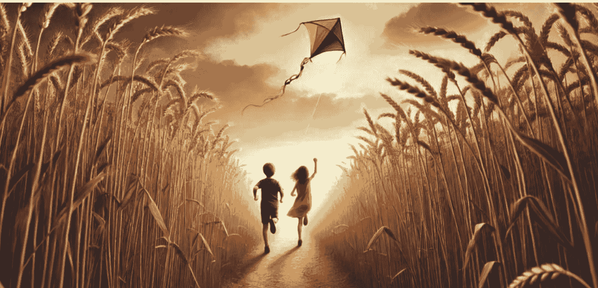

lazybro，你好：

你好，我是老喻，欢迎来到《决策算法》课。

### 一

1965年，日本围棋界发生了一场足以载入史册的大战：年仅23岁的林海峰挑战传奇名人坂田荣男。

彼时，几乎所有人都认为，年轻的林海峰绝无胜算。压力之下，他第一局果然落败，陷入了深深的自我怀疑。他问自己，明明实力差距并不大，为什么关键时刻却发挥不出来？

失去自信的林海峰，决定去请教恩师吴清源。

吴清源只说了一句话：“你现在最需要的是要有一颗平常心。”接着，他郑重地写下“平常心”三个字，送给了弟子。

之后的故事已是历史：林海峰重新踏上赛场，内心平静得如同一片湖面。他连赢三局，最终以4比2的比分击败坂田荣男，成为日本围棋史上最年轻的名人。从此之后，林海峰坦言：“再也没有为输棋而难过过。”

那么，到底什么是“平常心”，竟然能让一名年轻棋手迅速觉醒，并走向职业巅峰？

吴清源曾经坦率地说：“从棋艺角度而言，我和对手几乎没有区别，我之所以能屡屡获胜，全靠精神因素。”他更是在重大比赛前夜，反复研读老子的《道德经》，最终将道家哲学融入围棋中，总结为那简简单单又无比深刻的三个字——“平常心”。

如今，不只是围棋界，甚至投资圈、体育界的顶尖高手们，都在不断强调“平常心”的重要性。

投资人李录就曾生动地把投资比作高尔夫球赛：“你上一杆打出再好的成绩，下一杆也要完全忘记它，因为每一杆都是独立的决策。心绪一波动，成绩一定糟糕。”

这就是平常心的魔力所在：它看似平凡，却无比稀缺；看似简单，却极难领悟。

但问题来了：

平常心究竟是一种心态稳定、一种情绪控制，还是更深层次的哲学境界？

明明如此罕见，为什么还要称之为“平常”呢？

更关键的是：如果平常心真的如此强大，我们该如何才能真正获得它？

让我们一起来探索，顶尖决策高手们的最高境界——平常心

### 二

那么，平常心究竟是什么？今天我要告诉大家一个不一样的答案：它并不是一种单一状态，而是一个贯穿决策全过程的系统方法论。

实际上，每一个决策都是一次跨越三个阶段的漫长旅程：决策思考阶段、决策执行阶段和决策结果阶段。而在每个阶段，平常心的含义都截然不同，这正是为什么没人能把平常心讲清楚，也是为什么平常人很难拥有真正的平常心。

第一个阶段是决策思考阶段。在这个阶段，平常心的本质是彻底的理性。道家哲学强调：“知人者智，自知者明。”真正的高手，如围棋AI“绝艺”，下棋时极为沉稳。这种稳不是情绪稳定，更非心理素质，而是足够计算后的笃定与自知之明。——说白了，假如专业实力不够，你的情绪再稳定，也赢不了职业高手。

段永平反复提醒：“本分”是做决策时最重要的原则。本分不是道德修养，而是承认自己的无知、不做过多假设、回归第一性原理的理性态度。

简单来说，就是“了解你自己”——你有什么资源，就用好什么资源，绝不欺骗自己。

第二个阶段是决策执行阶段。在这个阶段，平常心体现为专注于当下、情绪稳定。

禅宗里有一句经典的话：“吃饭时吃饭，睡觉时睡觉。”说的是执行过程中全然投入的状态。

设想一下，每个人的大脑计算能力本质差别并不大，但在压力状态下，有些人只能发挥出20%的能力，而高手却能维持90%以上的表现。因此，决策执行阶段的平常心就是进入“心流”状态，把注意力完全聚焦在你正在做的事情上，不受干扰。

第三个阶段是决策结果阶段。在这个阶段，平常心意味着对结果的坦然接受。

这是打“无记忆的球”，接受命运的不确定性。哪怕你付出了没有回报，哪怕你做出了概率上正确的选择，但结果落在对你不利的区域，你也能平静接受。

这就像股市中的价值投资者，他们知道短期内市场可能对他们不利，但长期来看，做对的事情终将获得回报。他们不会因短期亏损而怀疑自己的决策，也不会因偶然的赢利而沾沾自喜。——因为他们明白，人生和决策一样，本质上充满着随机性。

平常心的真谛，就是在这三个阶段都能保持独特的清晰、专注与坦然。这三重境界缺一不可，任何环节的失衡都可能导致决策的失败。

接下来，让我们深入探讨每个阶段的平常心，以及如何在现实中培养这种决策高手的最高境界。

### 三

决策思考阶段的平常心，不只是情绪的稳定，更是对智力的诚实。其本质上就是“理性思考的极致”。当我们说一个人是决策高手时，是指他能始终对自己保持彻底的诚实，对现实保持绝对的尊重，以及对未知的敬畏。

《道德经》的核心概念是：“道”。老子形容“道”时说：“道可道，非常道”，意思是说，真正的道并非固定的规则或教条，而是一种尊重现实、顺应自然规律的心态。很多决策者在做决定时，总是不自觉地给现实增加许多假设和期望，试图“强行”创造确定性，但这种确定性往往只是自欺欺人的幻觉。

真正的高手却懂得回归“道”，也就是回归事物最本质的状态。那么，怎样才能达到这种境界？我总结了三个关键方法：

第一，拥抱无知，摒弃傲慢。

古希腊哲学家苏格拉底曾说：“我唯一知道的就是我一无所知。”这不是谦虚，而是真知灼见。道家哲学同样强调：“大智若愚。”

决策者需要的平常心——不是表面的平静，而是面对自己和现实时，彻底而清醒的智识上的诚实。人类需要智力，需要激情。然而，越是聪明的人，越是充满激情的人，越容易欺骗自己，也越容易失去平常心。

实操方法是：在每个重大决策前，先列出三个问题：我对此事真正了解多少？我可能存在哪些认知盲点？如果最聪明的反对者在场，他会提出什么质疑？

第二，第一性原理思考，而非类比推理。

决策的“第一性原理”，就是抛开所有的表面假设，回到最根本的事实，从最基础的元素开始重新推理。

我们的大脑天生倾向于用过去的经验快速推断未来，但正是这种捷径，使我们陷入“确认偏误”，难以发现问题背后的真相。

当你面临决策时，不要问“别人是怎么做的”，而要问“从基本原理出发，最合理的做法是什么”。

第三，概率思维，而非二元判断。

阿尔法狗之所以能击败人类围棋高手，一个关键优势在于它始终用概率来评估每一步棋的价值，而不是简单判断“这步好”或“这步不好”。

现实中的大多数决策都存在不确定性，非黑即白的思维方式注定失败。平常心要求我们接受这种不确定性，用概率框架来思考问题。

实际操作是：面对重要决策，不要问“这个决定对不对”，而要问“这个决定在多大概率上是对的”，以及“如果错了，后果有多严重”。

决策思考阶段的平常心，归根结底是一种“超然的理性”与“诚实的态度”的结合。

当然，这里隐藏的一个前提是，你选择的是一个自己有优势的“战场”，你有一定的专业基石，有不一样的洞见，然后实实在在地打好手上有的牌。

这就是决策思考阶段平常心的最高境界——回归“道”，尊重事实，诚实地看待世界与自我，创造实实在在的价值。

### 四

决策执行阶段的平常心，更是一种“行动的艺术”，一种对于自我心性的终极掌控。

顶尖高手们都知道一个秘密：比赛从来不是输给了对手，而是输给了自己。

现实中，很多决策的失败并非因为判断失误，而是在执行时心乱了。

我很喜欢吴清源给出的一个决策技巧，他说孔子讲过：“做一件事之前要考虑两次，只考虑一次容易轻率行事，但考虑三次又会心生疑虑，什么也做不成。”可见，真正的决策高手，都懂得在执行中放下对结果的执念，专注于行动本身。

那么，我们如何才能在执行阶段培养出这样的平常心呢？

畅销书作家梅尔·罗宾斯提出的“五秒法则”，为我们提供了一个简洁、有力的行动工具：

当你感到压力、焦虑，或者犹豫不决时，试着在内心默默地从5开始倒数：“5、4、3、2、1”，然后立即采取行动。

为什么这看似简单的倒数如此有效？背后的科学原理非常清晰：

大脑从产生焦虑、恐惧到真正引发情绪失控，大约需要5秒的酝酿。你若允许负面情绪超过5秒，你就极可能被它击败，决策能力迅速下降。但你一旦在倒数结束前果断行动，就能切断恐惧的酝酿过程，快速恢复理性与冷静。

篮球传奇乔丹就有类似的习惯：每次罚球之前，他都会用一些小动作，给自己留出几秒钟时间，让内心回到最初的平静状态。这个动作如同一道神奇的开关，让他回归到强大的本能，忘记压力，回归当下。

### 五

决策结果阶段的平常心，是决策高手最重要，也是最难修炼的境界。

这一阶段，我们面临的是“尘埃落定后的坦然”——无论结果好坏，都能保持内心的平静与清明。所谓“不以物喜，不以己悲”，正是这种状态的生动写照。

但事实上，我们每个人都被外部评价和自我评价折磨着。

我们大多数人都会犯下两个致命错误：

第一个错误：让成功或失败定义自我。

第二个错误：我们总在拼命维护自己的人设，不接受失败，总想着回本儿，想着逆转。

那么，如何培养结果阶段的平常心呢？

- 1. 结果无论成败，都当作人生礼物。面对结果，我们不妨换一种问法。不要问：“为什么我努力了却没有成功？”而是问：“我有没有做出当时最正确的决策？”长期来看，人生的胜负并非由一次结果决定，而是由一系列决策构成的复合效应所决定。世界冠军级别的扑克选手丹尼尔·奈格拉努有一个强大的心理习惯：他从不根据结果评价自己的决策。如果他做出了概率上最优的决策，即使输了钱，他也会告诉自己“这是一个好决策”。反之，如果他做出了糟糕的决策，却因运气好而赢钱，他会在笔记本上写下：“今天我做了错误的决策，需要改进。”这种放下执念、拥抱不确定性的态度，才是“尽人事听天命”的真正体现。

- 2. 构建自己的“结果档案”。投资人瑞·达利欧也有类似习惯：记录每一个重要决策的原因、预期和实际结果。这种长期记录让他能够系统地提高决策质量，同时也训练自己不对单次结果过度反应。长期来看，当你回顾这些档案时，你会发现，那些曾经困扰你的短期波动，其实都只是漫长旅程中的微小涟漪。这种持续审视的态度，可以帮助你更快地从短期得失中抽离，回归平常心。

- 3. 告诉自己一切终将过去。“花开花落，云卷云舒”，万事万物皆有其自然规律。当你深刻理解这一点，就能像吴清源那样，在“擂争十番棋”那样的终极对决中，依然保持超然的态度：“让自己委身于围棋的流势，任其漂流”。

### 六

平常心的三重境界，从思考到执行再到结果，构成了一个完整的决策系统。这三重境界相辅相成，缺一不可：

- 思考阶段的理性清明，给你指明了正确的方向；
- 执行阶段的专注坚定，让你在前进道路上不畏艰难；
- 结果阶段的坦然接受，使你在任何风浪中都能保持内心的平静。

人生决策如同围棋的布局与落子，我们无法掌控棋盘之外的命运，只能尽力下好棋盘之内的每一步棋。

这就是平常心的终极奥义：既积极主动、尽力而为，又顺其自然、坦然接受。

> 正如美国哲学家纳斯鲍姆所言：尽管人类生活的种种可变性、偶然性使得赞美人性变得大为可疑，但在另一方面，从一种尚不明朗的角度上说，又正是这种偶然性才值得赞美。

她说过：

> 成为一个好人，就是要有一种对世界的开放性，一种信任自己难以控制的无常事物的能力。

这是一个对拥有平常心的决策高手的完美描述。

我是老喻，我们下一讲再见。


## 98 二阶智慧：怎样作出对未来负责的决策？

你好，我是老喻，欢迎来到《决策算法》课。

### 一

大约七八年前，我开始在温哥华的一所大学里，着手修建自己的木屋。一切崭新，充满期待。在设计花园阶段，我们家左侧的邻居提出了一个建议：我们两家沿着共有的土地边界线，一起栽种一排树墙，用红豆杉。当时我觉得这个想法挺好的，邻里之间也能增进感情。

然而，这时我们的园艺设计师，却提出了不同意见。“最好不要答应”，他平静地说，“我记得你们计划养狗。树墙很难做到完全密不透风，小狗可能钻出去。将来你不得不在树墙内侧再修一圈真正的围栏，那留给花园的空间就被压缩得太厉害了。”

他的话点醒了我。我环顾四周，我们房子的右边，树墙已经完全建在自己的土地上，以至于原本宽阔的车道都变窄了。要是左边再这样，会严重影响花园。

可是，要是这会儿再去对邻居说不行，好像是变卦了，不太合适吧。

设计师是一位年长而温和的华人，他坚定地说：以我的几十年经验，用硬质的木栅栏或金属围栏界定边界，最简单明了。这种共建的树墙，将来会有很多麻烦。

经过他的几次劝导，我终于硬着头皮去对邻居“说不”。当时还引发了一场小小的社交焦虑。

如今我家的金毛已经五岁了，它每天都在金属围栏紧紧守护的院子里钻来跑去，我们也不用担心它跑丢。邻居家后来将树墙建在自己的土地上，红豆杉越长越高，每年需要修剪。如果没有听从设计师的建议，光是剪树，两家之间可能都会有些纠结。

现在，每当我在花园里享受阳光，打理花草，看着快乐的金毛，内心总会涌起一股对七八年前那个“我”的深深感激。感激那个“我”，虽然经历了短暂的社交恐惧和人情纠结，但最终做出了一个明智的、惠及此刻及未来无数个“我”的决定。

按理说，这并非惊天动地的大事，决策本身的技术难度也并不高。可为什么当初那个“我”，会如此纠结，差点做出一个让自己日后可能后悔的选择呢？

### 二

一件关于树墙的往事，恰恰反映了我们日常决策中隐藏的深刻困境。

让我们用一个更系统的视角来剖析当时那个“我”的内心挣扎：

- 1. 时间维度：当时那个“想当老好人、避免当下社交不适的我”，其决策焦点完全停留在现在。他几乎没有能力，也没有意愿去真正关照和考量未来那个需要管理花园、需要确保宠物安全、需要处理潜在邻里维护纠纷的“我”的利益和感受。

- 2. 空间维度：当时那个差点被“老好人”心态俘获的“我”，其实在他的可能性空间里，存在着另一个平行走向。在那个未曾发生的“平行宇宙”中，他接受了共建设树墙的提议，结果就是现在的他，可能正为金毛从树墙缝隙溜走而日夜操心，为每年与邻居协商修剪树墙的责任而烦恼。

- 3. 认知维度：整个决策过程，是内心不同的“自我”激烈交战的过程。那个被社交规范和情感驱动的“想当老好人的我”，与那个在设计师引导下开始进行理性分析、权衡长远利弊的“理性考虑自身利益的我”，在进行拔河。幸运的是，在外部智慧的介入下，后者最终整合了更全面的信息，战胜了前者一时的冲动。

这背后，就体现了两种不同层级的智慧在决策中的作用。我们通常默认的、凭直觉反应的，是一阶智慧。它关注直接后果，倾向于解决眼前问题，追求即时满足或避免当下痛苦。就像我最初那样，只想着“答应邻居，避免尴尬”，这是典型的一阶思维。

而设计师引导我采用的，则是更深思熟虑的二阶思维。它要求我们超越直接反应，去探究决策的后续影响、长远结果以及这些结果可能引发的连锁反应。它不断追问“然后呢？”，着眼于系统性和可持续性。它不只看眼前一步，更看未来三步、五步，甚至更远。

这一概念与橡树资本创始人霍华德·马克斯所提出的“第二层次思维”非常相似。

马克斯阐述道：“第一层次思维说，‘这是一家好公司，让我们买入它的股票’。而第二层次思维则说，‘这是一家好公司，但大家都认为它是好公司，所以股价已经被抬高，现在不是买入的好时机’。”

第二层次思维的本质是超越表面共识，思考“别人在想什么”，以及“别人的想法如何影响结果”。它要求我们不仅看到直接的原因和结果，还要看到其背后的系统动力学。

这里需要强调的是，马克斯所说的“思考别人在想什么”以及“思考想法如何影响结果”，其有效实践离不开一种更基础的能力——元认知（Metacognition），也就是我们常说的“对思考本身进行思考”。

元认知让我们能够审视自己的思维过程：觉察到自己可能正陷入简单的一阶思维模式，识别出情绪或固有偏见（比如从众心理）对判断的影响，并主动调控自己的思考方向，选择更深入、更全面的视角。

可以说，元认知是“向内看”，是打磨、校准我们思维这件工具；而二阶智慧/第二层次思维则是“向外和向前看”，是运用这件（经过元认知审视和调校的）工具去洞察世界的复杂性、预见未来的多种可能。

没有元认知的自我觉察和调控能力，我们很难真正启动并有效执行二阶思考，容易被自身的思维惯性或市场中的噪音所困。

理解了这一点，我们再来看这种（由元认知赋能的）二阶智慧在各个领域中的深刻应用：

- 在投资领域：2008年金融危机期间，大多数人恐慌抛售银行股（一阶思维），而巴菲特却大举买入高盛，因为他看到系统性银行不可能被允许倒闭，政府必然救助（二阶思维）。当然，老练的股神买的是优先股，又加了一道决策保险。
- 在职业选择中：一位经理放弃大公司高薪稳定职位，选择有风险的初创企业，不是为当下收入（一阶），而是看重陡峭学习曲线和决策空间带来的长期能力培养（二阶）。
- 在消费决策中：买房时，一阶思维被漂亮装修吸引，二阶思维则考量房屋结构、社区发展潜力和20年后的保值能力。

这些例子都表明，二阶智慧不仅是一种思考方式，更是一种融合了深刻自我觉察（元认知）与长远系统洞察的生活方式。

它要求我们超越当下情绪和冲动，运用元认知来审视和引导思考过程本身，进而去周全地考虑决策的长期后果和系统性影响，评估多重可能性和概率，并整合内心不同“自我”（如理性的、感性的、短期的、长期的）的需求和视角。

当然，践行二阶智慧并非易事。它需要我们对抗思维的惰性，克服认知偏差，甚至要承受短期的不适。那么，我们该如何系统性地培养和运用这种更高层次的智慧呢？如何在决策的关键时刻，确保自己能够启动“二阶思考”的引擎？

### 三

“二阶智慧”是一套可以学习和修炼的思维框架与决策操作系统。它要求我们主动校准内在的决策罗盘，使其同时指向三个关键维度：

1、时间轴：未来价值设计者——核心是建立机制，让“现在的我”为“未来的我”做对的事。

你要意识到，当下决策的“我”和未来执行的“我”是不同的存在。所以，你要克服人类固有的“当下偏好”，增强与未来自我的情感联系，把你的每一个决定，视为写给未来的情书。

但这不能依靠时常摆动的意志力，而是通过预先承诺、环境设计、习惯养成、自动化流程等系统性方法，将长期有利的行为变得更容易执行，甚至成为默认选项。

2、空间轴：概率路径领航员 —— 核心是理解概率，看见多种可能性，做出期望值最优的选择。

从空间维度看，结合概率，我们要考虑某个决策的多种可能性，既要照顾另外一个概率空间的自我，也要敢于舍弃某些空间的可能性，并且要意识到，“此时此地的我”，就概率而言，不过是许多个平行宇宙之中的某一个里的幸存者。

二阶智慧在空间维度上的本质是：理解每个决策都是选择一个特定的概率分支，而非单一结果。

我们要看见多种可能性，并基于期望值做出更理性的选择。这意味着我们需要评估不同选项背后可能出现的多种结果及其发生概率，计算其加权平均的“期望值”。

同时，要勇敢地承认并接纳“机会成本”——选择一条路，必然意味着放弃其他平行宇宙中的可能性。

这需要我们从“幸存者”的单一视角中抽离，客观看待决策的风险与回报。

3、认知轴：内在系统整合者 —— 核心是整合协调“不同的我”，让理智与情感协同，驱动一致行动。

理性而单一的“自我”，从来都是一个幻觉。请你承认并管理我们内在的多重“自我”，实现心智的和谐与统一。

决策并非纯粹理性的计算，我们的情绪、直觉、价值观、不同面向的“我”（如追求安逸的我和渴望成长的我）都在其中扮演角色。

我曾经提出过，即使是一个小小的决策，通常也由“好奇感知、灰度认知、黑白决策、疯子行动”四个节点构成，像是四个不同的自我角色的接力赛。

想要整合协调“不同的我”，让理智与情感协同，驱动一致行动，这需要强大的元认知能力作为支撑——觉察内在的冲突与偏好，理解情绪发出的信号，平衡不同“自我”的需求，确保从“好奇感知”到“疯子行动”的认知飞轮能够顺畅运转，最终达致“知行合一”。它追求的是内在的协同一致，而非相互内耗。

### 四

那么，这个“二阶智慧”决策罗盘具体如何运作呢？

想象一下，当你面临一个重要决策时（小到是否接受邻居的提议，大到是否更换职业赛道）：

### 第一步：暂停与切换。

首先，有意识地暂停你的一阶冲动（比如，“马上答应”、“立刻拒绝”、“感觉这个好”）。明确告诉自己：“启动二阶智慧模式”--就像我对邻居的建议，不该像老好人般马上说“好好好”。

### 第二步：多维扫描。

依次用三个轴的“探照灯”去审视这个决策：

时间轴追问： 这个选择在1个月、1年、5年后，可能会带来哪些长期后果？它对“未来的我”是加分还是减分？我能设计什么机制来保障长期目标的实现？

空间轴追问： 除了最理想的结果，还可能出现哪些其他的可能性（包括好的和坏的）？它们的概率大概是多少？综合来看，这个选择的期望值如何？选择它，我放弃了哪些重要的其他选项？

认知轴追问： 关于这个选择，我的直觉、情感和理性分析分别是什么？它们之间是否存在冲突？我内心的哪个“我”在主导这个决策？我是否存在某些认知偏差（如过度自信、厌恶损失）？如何将这些内在信息整合起来，形成一个更全面、更平衡的看法？

### 第三步：综合决策。

基于刚才的三个维度的审视结果，形成一个更立体、更周全的判断，并做出相应的选择和行动计划。

通过这样的刻意练习，二阶智慧就不再是一个抽象的概念，而变成了一套可以嵌入日常决策流程的、具体的“算法”或“检查清单”。

在我看来，这是一套底层的决策算法，能帮助我们系统性地提升决策质量，无论面对的是花园围栏这样的小事件，还是人生道路上的重大抉择。

### 五

为什么做好人生决策如此艰难？
为什么聪明人在决策上也经常干傻事？

一个核心的原因或许在于：我们几乎从未在成长和教育过程中，系统性地学习和训练过“二阶智慧”。

我们可能精通某一领域的知识（一阶智慧），擅长解决眼前的、定义清晰的问题，但现实世界充满了模糊性、延迟反馈和复杂的系统互动。在这样的世界里，你无法用不断强化一阶智慧的深度，来弥补二阶智慧维度的缺失。

无论多聪明的人，在面对人生的复杂性时，都需要补上二阶智慧这一课。

我有一位朋友，在复盘自己的人生时曾感慨，真正的转折点发生在他突然领悟并能做到将自己“抽离出来”的那一天。从那以后，他在创业和投资决策上仿佛打通了任督二脉，突飞猛进，成为了我深为佩服的决策高手。

他所说的“抽离出来”，正是二阶智慧在认知轴上的体现——那份元认知的觉醒，让他能跳出当下的情绪、偏见和惯性思维，像一个旁观者一样审视自己和局势，从而为时间和空间维度的深度思考打开了大门。

只有基于深度思考的决策，才能将你经历的每一天，串联成一个越来越精彩的未来。

你的每一天，都是在书写给未来的自己的情书。

正如我在《人生算法》中探讨过的，人的一生由无数个瞬间串联而成，那个我们感觉稳定、连续的“自我”甚至可能是一种认知上的幻觉。

我们需要用属于自己的决策算法，将那一页页情书，整合为自己的一本完整而精彩的人生之书。

我是老喻，我们下一讲再见。

## 99概率思维：支撑决策的三个神奇公式


lazybro，你好

你好，我是老喻，欢迎来到决策算法课。

### 一

二战期间，物理学家斯坦尼斯拉夫·乌拉姆正被困在一个棘手的问题中：如何准确地模拟中子在原子核内碰撞的路径？传统的数学工具复杂而无效，似乎毫无出路。

一天，他在玩纸牌时突然灵光一现：与其费力计算每一个确定的可能，不如随机模拟大量路径，通过统计的方式找到答案。

他与冯·诺依曼迅速合作，将这种方法命名为“蒙特卡洛方法”——以赌城蒙特卡洛为名。就这样，一个解决复杂难题的概率工具诞生了。

短短几十年后，蒙特卡洛方法早已超越物理学的范畴，成为投资、金融，甚至人工智能领域中的关键利器。

对投资者来说，蒙特卡洛方法能模拟上万次市场走势，描绘出风险和收益的概率分布，帮助我们决定何时出击，何时收手。如今华尔街的量化投资者几乎离不开它。

而当AlphaGo击败人类围棋冠军时，人们惊奇地发现，这个历史性的AI，也正是靠着每秒数百万次的蒙特卡洛树搜索，才一步步攻占人类的智慧堡垒。可以说，概率是AI思考的基石。

为什么概率如此强大？因为在高度复杂的不确定环境中，试图预测唯一确定的未来往往是徒劳的。但概率思维告诉我们，世界不必确定，未来也无需明晰。我们只需接纳不确定性，通过概率工具发现趋势，洞察风险，从而做出更好的决策。

所以，概率思维正是今天我们所面临的不确定世界中，最重要的一种底层思维模式。

世界是随机的，但我们并非无能为力。通过理解和运用概率，我们可以拨开迷雾，在复杂的世界中做出更明智、更有效的决策。

概率思维一直贯穿《决策算法100讲》课程之中，前面我也为你介绍了EKB决策算法。我们的课程临近结束，今天我想用一个完整的框架，再和你复习这套概率决策方法论，它整合了期望值计算、凯利资源分配和贝叶斯更新，能够让你做决策时真正心中有“数”。

这套系统不仅能帮你避开常见的认知陷阱，还能在一个越来越复杂的世界中，为你的每一个重要决策提供可靠的支撑。

### 二

其实，人类对概率的探索，最初源于对未知的恐惧与好奇，以及在赌场赚钱的冲动。

17世纪时，帕斯卡和费马在讨论赌局的输赢时发现：决定一场赌博胜负的，并非命运或神灵，而是能够计算的。

随之而来的是对“期望值”的思考。想象一下，你参加一个抽奖，中奖的概率是多少，奖金又是多少？“期望值”这个概念，就是帮助我们量化这种潜在收益的工具，它告诉我们从长远来看，参与这个游戏是否划算。

后来，在概率的道路上，还出现了“频率派”和“贝叶斯派”这两大阵营。频率派认为，概率是事件在大量重复试验中出现的频率；而贝叶斯派则更侧重于我们已有的信念，并通过新的证据不断更新。然而，大量重复试验在现实中并不是总是有机会实现，对于那些一生只有一次（或少数几次）的事情，例如“我和这个人过一生幸福的可能性是多大”，我们只能用贝叶斯派的信念，给出一个主观的概率判断。

再往后，凯利公式的出现，则为我们在风险和回报之间找到了一个精妙的平衡点，尤其在投资中，它指导我们如何根据胜率和赔率来合理分配资源，实现收益的最大化。因为人生苦短，筹码有限，我们的认识也是有限的，所以要分批次打出你手上的牌。

那么，综合以上现代人对于概率的认知，究竟怎么才能做好决策？

一种观点认为，好的决策必须遵循概率与数学的理性法则，最大化期望收益；

另一种观点则认为，好的决策更应重视过程合理性，重视决策步骤的严谨性和方法的科学性，尤其是在高度不确定的复杂环境中。

也许，一个更好的答案是：我们需要一种方法，能够同时整合概率的理性标准和过程的稳健合理性，将计算与智慧融为一体。

这正是贯穿我们课程的EKB决策算法，它让决策不再依靠运气，而真正靠概率说话。

### 三

世界是不确定的，每次决策都是一次下注。如何才能持续赢下去？你需要的不是运气，而是一个精准且强大的决策算法——EKB。

EKB决策算法由三个核心要素组成：期望值（E）、凯利公式（K）和贝叶斯更新（B）。

用一句话概括：

- E（期望值）告诉你该下注哪些选项，做正确的事；
- K（凯利公式）帮你决定下注比例，在正确的事上，投入适量的资源；
- B（贝叶斯更新）则不断优化你的决策准确度，让你成为一个持续进化的人。

首先，让我们聚焦“E”，也就是“优先考虑正期望值”。

想象你面前有多个选择，如何知道哪个值得追求？期望值通过计算每个选择的可能结果及其概率，告诉我们从长期来看，哪些选择是正回报的。

简单来说，期望值 = “各结果的概率 × 各结果的价值”的总和。

它帮助我们筛选掉那些看似诱人但实际期望为负的选项，专注于真正有价值的机会。

在EKB中，E是战略高度，是你决策的第一道门槛。

接下来，我们来看“K”，即“利用凯利公式优化资源分配”。

找到有价值的机会后，我们应该投入多少资源？凯利公式给出了数学上的最优解：

最佳下注比例 = （赔率×胜率 - 失败率）÷ 赔率

这个公式精妙地平衡了风险和回报，既避免了过度投入导致的灾难性损失，也防止了投入不足造成的机会浪费。

它告诉我们，即使是面对极好的机会，也永远不要孤注一掷。

最后，我们来到“B”，也就是“通过贝叶斯更新实现迭代学习和适应”。

在不断变化的环境中，我们的认知需要持续进化。贝叶斯更新提供了一个系统化的方法，让我们根据新证据调整自己的信念。

它的核心公式是：后验概率 ∝ 先验概率 × 新证据的似然度（∝ 为“正比于”的符号）。

通过这种方式，我们可以从每次经验中学习，不断修正我们对世界的理解，让决策变得越来越准确。

- 当E、K、B三者协同，便形成一个强大的决策闭环：
- 基于概率计算期望值，锁定有利选项
- 用凯利公式精准下注
- 获得结果反馈，进行贝叶斯更新校准概率认知
- 基于校准概率认知再次计算期望值，锁定更有利选项

EKB决策算法之所以独特，是因为它同时满足了决策理论中两个重要流派的需求：

结果理性（最大化期望收益）：确保你的决策在长期具有概率优势；

过程理性（程序合理性）：帮助你在动态的环境中不断学习与进化。

它不仅是一套实用工具，更是一种强大的底层思维方式：

- E，让你做对的事情；
- K，让你把事情做对；
- B，让你成为一个持续进化的决策者。

掌握了EKB决策算法，你就掌握了一套在不确定世界中持续胜出的方法论。

### 四

了解了EKB决策算法中的三个神奇公式之后，你可能会想：“我不是专业投资人，也不是科学家，这套方法论对我的生活决策真的有效吗？”

答案是：不仅有效，而且非常简单易用。

让我们用四个步骤，将EKB决策算法真正带入你的日常生活，让你面对每个选择时，都心中有数。

### 第一步：建立你的决策清单

- 任何决策开始之前，先用一张纸把所有选项写下来。比如：
- 我该不该辞职去创业？
- 买房还是租房？
- 是否与这个人结婚？

先别急着做决定，先把选项清晰地列出来，这是你决策的起点。

### 第二步：估算每个方案的期望值（E）

你不需要高深的数学知识，只需用“概率×价值”的方式粗略计算每个选项的期望值：

假如你在考虑创业，先估计成功概率和失败概率，再乘以各自的收益或损失。

举例：创业成功的概率可能只有30%，但成功后的收益（比如经济收益、个人成长、自由感）很高；而不创业的收益则是固定工资，稳定但有限。把两边算出来，你会直观看到，哪个方案更值得你选择。

期望值高的方案，才是长期来看真正值得你投入时间和精力的选项。

### 第三步：用凯利公式（K）确定投入资源比例

确定了哪个方案值得做后，下一步要决定的就是“做多少”。此时你不必每次都精确使用公式，只需牢记凯利公式背后的关键原则：

- 胜算越大、回报越确定时，投入比例越高。
- 胜算一般，或者回报高度不确定时，投入比例要减少。

例如，你对创业的信心只有30%，你就不该拿出全部的积蓄或透支自己未来十年的生活去创业，而应该小规模、试探性投入，逐渐验证。

又比如买房时，市场正处于上涨周期且风险较小时，你可以提高首付比例；但市场高度不确定时，就该谨慎投入，保持弹性。

凯利公式教你的本质就是“聪明下注”，避免一场意外的失败彻底毁灭你的未来。

### 第四步：用贝叶斯更新（B）不断学习与调整

决策从来不是一锤定音的事。你需要做的，是每做一次决策，都记录下来，然后观察结果，更新你的认知：

比如你创业的小项目失败了，不要灰心，而是去了解失败的原因，调整你对创业成功概率的认知。

比如你租房而不是买房，发现几年过去房价持续上涨，那你需要重新评估你的判断，调整下一次决策时的概率估算。

通过贝叶斯更新，每一次决策都能让你更了解世界，做出更接近现实的判断。

我给你举几个生活化的决策场景示范：

我要不要换工作？
E：计算新工作收入增长、职业发展和幸福感的概率预期，看是否正期望值。
K：如果确定新工作价值很高，就大胆转换，但如果有着不确定性，就可以兼职尝试、小规模试探。
B：换了之后，不断根据新的工作体验更新你的认知，下次选择更精准。

我是否该继续这段感情？
E：评估双方长期幸福概率，客观估算正负期望。
K：情感投入要适度，不要盲目投入一切，也别轻易放弃，先用低成本尝试修复沟通。
B：随着相处的深入，不断调整对彼此合适度的判断，及时止损或增加投入。

### 五

EKB算法要解决的，就是我们人生决策中三个最关键的挑战。

第一，假如你从一开始就没做对的事（E），那么无论你多努力、多勤奋，都注定白费。

想象一下你进入一个夕阳行业，行业整体在萎缩，你再拼命加班、提升技能，也只是推迟你的失败。人生就是这样，有些事情长期看起来期望值为负，越是努力反而亏损越多，就像越陷越深的泥潭。所以E很重要，先判断事情本身是否值得做，再谈怎么做。

第二，很多人做决策喜欢赌，喜欢All in（K），总相信“人定胜天”，最后却常常被天定胜人。

我们经常听到创业者抵押全部资产孤注一掷，或炒股者用杠杆满仓、只想赚一笔大的，结果一把输光，回不了头。凯利公式告诉我们的恰恰相反：任何时候都不要孤注一掷，即便你再有信心，都要保留下一次下注的筹码。决策的本质，是持续地下注胜算更大的选项，而不是偶尔赢一把大的。

第三，决策到最后，还是取决于人本身（B）。决策与人之间，是相互塑造的过程。一个错误的决策不仅损失金钱，更重要的是它会扭曲你的认知，影响你下次的判断。

比如，一个人在投资中屡次失败，却从不反思，总将失败归咎于运气差、市场不好，结果他的认知就越来越偏离现实。反之，一个好的人会不断修正自己，用每一次决策的反馈，让自己变得更加精准与理性。

人生最重要的三件事，恰恰就是：

- 先选对的路（E），否则越努力越迷失；
- 控制好下注的分寸（K），否则迟早输光所有；
- 不断更新认知，让自己持续进化（B），否则只会在错误的循环里越陷越深。

这就是EKB的重要性：做对的事、把事做对，并最终成为对的人。

### 最后

我们终其一生都在追寻两样东西，一个是“过得好”，一个是“有价值”。

正因为不确定性，我们的追寻才有意义。

随机性是这个世界最公平的事情之一。就像拉普拉斯说的：“生命中最重要的问题，在很大程度上，其实都只是概率问题。”

这个世界上并不存在确定性的成功，但我们总是可以去选择做更高成功概率的事。

要想过得好，过得有价值，我们需要与概率共舞，用决策塑造出独一无二的自己，这是一生的旅程，也是最值得的旅程。

以上就是这一讲的全部内容。

我是老喻，我们下一讲再见。

公众号懒人搜索，懒人专属群分享

## 100决策终极之战：打一场你必定胜利的战争

lazybro，你好。

你好，我是老喻，欢迎来到决策算法课。

### 一

莎朗快80岁了，依然精神矍铄，每周都去健身。她住在我家右边，是一位退休教授。

有次在她家漂亮的后花园喝茶，得知莎朗于1980年前后从美国搬来这所加拿大的大学，任职于心理学实验室，我就问她：“丹尼尔·卡尼曼曾经是你的同事，是吗？”

莎朗有些意外地望着我，点了点头。

卡尼曼和他的搭档特沃斯基，一直是我喜欢的学者。在前半生，卡尼曼活在特沃斯基的阴影下。他的人生最低潮，正是在我居住的这所加拿大的大学工作，而当时特沃斯基则受聘于美国最好的大学。很巧的是，莎朗就是卡尼曼当年的同事。

特沃斯基不幸早逝，卡尼曼拿到了诺贝尔奖。活得久的人似乎成了赢家，卡尼曼凭借两个人共同的成果，享受了人世间可以给予一个读书人的最高成就。

最近知道的最触动人心的一件事，是去年离世的丹尼尔·卡尼曼，竟然是主动选择的安乐死，并且当时他是完全健康、各方面状况都不错的。

一个人可以如此从容地面对生死，一个研究极其“高级”、抽象的理论的知识分子可以如此彻底地知行合一，一个以理性著称的思考者可以如此平静地离经叛道，我从中感受到一种前所未有的自由和力量，一种类似于苏格拉底之死的光芒。

卡尼曼本可以活更久，但他选择了去死。这符合他的“峰终理论”——人们对一段经历的记忆主要由两个因素决定：高峰时刻（无论是正向还是负向）和结束时刻的体验。所以，他决定在一切都很美好时离开。他的决定是非常私人的，为了避免在“安乐死”这一敏感话题上造成误导，他叮嘱后人在一年之后的今天，才公开这件事情。

不管怎样，当一个读书人可以用生命去践行自己的理论，他是伟大而自由的。

在过去近半年的时间里，感谢你陪伴我完成了《决策算法》这100讲的内容。卡尼曼的人生最后一个决策提醒了我：我所讲的东西，是自己完全相信的吗？

认真想过之后，我可以很真诚地回答：决策算法的内容，是我认为特别有价值、特别有意义、对人生特别有帮助的智慧，是我希望年轻时的自己以及我的孩子们能够早点儿领悟的知识。

进而，我再问：我在决策算法中讲的东西，自己在现实中都践行了吗？

很惭愧，我还有很多欠缺。事实上，课程中很多关于决策的反面案例，都来自我的切肤之痛。

这意味着，我不仅在与你分享关于人生的最好礼物，还因为这分享，让我自己有机会不断地反思和进步，朝着“知行合一”的目标不断靠近。

卡尼曼的故事提醒我，这世间的真智慧，从来不是纸上谈兵，而是知行合一的生命践行，用每一次选择，去塑造一个更好的自己。这，也许就是我们学习决策的终极意义所在。

### 二

卡尼曼曾经说过一段意味深长的话：“你只需要去经历就好，不用去评判，不用去衡量，不用去计较得失。如果大家都能想象一种不再自我打分的生活，那也许会是一种更好的人生。”

这句话揭示了我们决策中的一个核心问题：我们太在意外部评价，甚至不断对自己进行评判。每一个决定背后，总有一个自我评分系统在运作，“这个决定值几分？”“别人会怎么看？”这种不断自我评判的习惯，实际上成了我们最大的枷锁。

我们总是说考虑他人的感受很重要，这当然没错。但有时，“考虑别人”只是我们逃避做出真实选择的借口。正如特沃斯基所言：“改造世界有时比证明你曾改造了世界更容易。”我们常常陷入一种错觉，以为自己的选择应该得到外界的认可和赞赏，却忘了决策的本质是为自己负责。

然而，即使我们只为自己做决策，依然面临一个巨大的挑战——我们不是单一的自我，而是分裂的存在。每个人本质上都有两个自我，而这两个自我常常互相冲突。一个是当下的自我，想喝那杯奶茶；另一个是未来的自我，将会后悔今天的放纵。

美国记者A.J.雅各布在《追寻健康》中指出：“要做出健康的决定，关键在于尊重未来的自我，就像对待朋友或爱人那样。”这是一个美丽的比喻，但实践起来却异常困难。为什么？因为我们的“第一系统”——那个自动化、直觉性的思维系统——实在太过强大。

所以，放弃自我评判的第一步，是承认这种内在冲突的存在。不是否认它，不是与它斗争，而是学会与它共处，理解它，尊重它。只有接受了内心的复杂性，我们才能真正开始为自己做决策，而不是为了讨好他人或某个虚幻的标准。

这是一条通向真正自由的道路，虽然充满挑战，却值得我们终身探索。

面对卡尼曼的忠告，我们或许可以尝试在某些时刻，有意识地放下对结果的执念，专注于决策的过程本身。如同孩子玩耍般投入，不预设对错，只是体验不同的选择带来的可能性。

也许跳出决策得失之外，更能令我们做出更好的决策。

### 三

我们刚刚承认了面对自身是多么不易，也理解了强大的第一系统对我们决策的深远影响。那么，面对内心的冲突与外界的压力，我们该如何才能拨开迷雾，找到正确的方向？

答案并不是去挑战那些看似强大无比的对手，而是转变思路，去打一场你从一开始就注定会赢的战争。

“先胜而后求战”是《孙子兵法》的重要理念，意指在开战前，智者已经计算好了胜负。这一古老智慧同样适用于我们的人生决策。

所谓智慧的决策者，不是去挑战自己难以赢得的战场，而是谨慎选择那些胜算更大的战场——去鱼多的地方捕鱼，做正期望值的事情，做成功概率更大的事情。

也许你会问：怎么会有人生中必定能赢的战争？

有。那就是：与昨天的自己比较，让今天的自己变得更好一点儿。

这个看似简单的目标，实际上是决策中最值得追求的方向。因为在这场战争中，你不需要打败任何人，只需要今天的自己比昨天进步一点点。

但令人惊讶的是，实现这一点并非通过知识的累积，也不是通过盲目的努力，而是通过每天做出的那些微小而正确的选择。

想一想，今天你做了什么艰难但正确的选择？是拒绝了那块诱人的蛋糕，还是在疲惫时依然完成了承诺的工作？是选择了诚实面对困境，而非逃避现实？这些看似微不足道的选择，正是塑造更好的自己的基石。

我常常问自己：今天晚上的我，比早上醒来的自己，有没有稍微变好一点？

在这场与自己的较量中，我们不需要逆袭，不需要秘诀，只需要把那些细微但坚定的选择，一点一滴地积累起来。正如复利效应在财富增长中的魔力，这些日常选择也会在人格塑造中产生惊人的复利效果。

所以，不要去打那些你无法掌控的战争，而是专注于那个确定能赢的战场——让今天的自己，成为昨天的自己无法超越的存在。这才是决策的终极智慧。

而一旦你做到了这一点，生活中美好的事物就会接踵而来。这正是决策的魔力所在。

### 四

那么，在日复一日的自我进步中，我们是否有一个可循的路径，来打赢那场“必定胜利的战争”呢？

《财富的起源》中，作者提出了一个财富创造进化公式：变异（differentiate）、选择（select）、放大（amplify）。

这一公式揭示了财富创造背后的底层逻辑，而令人惊叹的是，它同样适用于个人成长的旅程。

首先是“变异”。自然界的物种通过基因变异实现多样性，而人类社会中的每个个体，一出生就是独一无二的存在。你的基因组合、成长环境、教育背景、人生经历，都让你与众不同。

正如指纹无法复制，你的特质组合也是这个世界上独一无二的。这种独特性不是你需要刻意追求的，而是你与生俱来就拥有的礼物。

许多人穷尽一生追求与他人相同，殊不知最珍贵的恰恰是那些让你与众不同的特质。真正的智慧不是模仿别人的成功，而是发现自己独特的价值。

其次是“选择”。变异创造了可能性，而选择则决定了方向。在自然界，环境选择适应的个体；在人生中，我们通过不断尝试和反思，逐渐发现自己的核心优势。这些选择不仅来自于你的主动决定，也来自环境对你的反馈。

当你做某事时感到时间流逝变慢，当你投入某个领域时感到无比专注，当你面对某种挑战时总能找到创新解决方案——这些都是环境在告诉你：“这里是你的天赋所在。”

而当我们遭遇痛苦、经受损失时，应该将其视为“被环境选择”。这种“被选择”其实是帮助我们意识到，什么才是自己最重要的东西，最不能失去的东西。

尼采说，杀不死你的让你更强大。这句话也许不对，杀不死你的原因，要么纯粹因为运气，要么是因为：剩下的原本是你最强大的东西。

所以，并非杀不死你的让你更强大，而是“杀”像一把奥卡姆剃刀，帮助你舍弃掉那些并非你的真正优势的东西。

最后是“放大”。发现了自己的优势后，下一步是有意识地强化和放大它。自然界通过繁殖放大优势基因，而个人则通过刻意练习和持续投入放大自己的核心能力。这种放大不是简单的重复，而是在每次迭代中加入思考和调整，让自己的优势变得更加独特和不可替代。

大自然的底层算法是：变异—选择—复制。而人生的底层算法则是：独特—发现—放大。每个人都是独一无二的，对应“变异”；每个人都需要一个自我发现的过程，对应“选择”；每个人的一生都为某个使命（或被命运驱使）而放大自我，对应“复制”。

这就是个人进化的三步公式。当你理解并应用这一公式，你将不再迷茫于人生的方向，不再困惑于无数的选择。你会清晰地知道：我的独特之处在哪里？我应该选择什么？我需要放大什么？

那么，如何将这个个人进化的公式付诸实践呢？

- 首先，拥抱并探索你的独特性，记录下你的兴趣、擅长的技能以及让你感到充满热情的事情。
- 其次，积极进行尝试，并留意环境的反馈，无论是成功带来的成就感，还是失败带来的反思，都是指引你发现核心优势的信号。然后选择那些与你的优势和热情相符的领域。
- 第三，进行大规模的自我复制。时间、精力、资金、互联网、AI，都可以成为复制你自己的杠杆。

### 五

你我皆凡人，我们想要的，无非是生活富足，心灵丰盛，过一种自由自在、可以对不喜欢的人和事情说不的日子。

但这并不容易。

在一次访谈中，主持人问我：普通人如何实现暴富？

我回答：这需要一场“意外”。

没错，不管是爆发式的成长，还是发大财，都需要意外。

意外意味着机遇，意味着指数式的增长，更意味着你做出了一个了不起的决策，抓住了这个“意外”。

其实，我们每个人来到这个世界，已经是宇宙之间最大的意外之一。

你能够送给这个世界最棒的礼物，就是你自己。

好好善待这份礼物，每天睡前花一分钟，问自己三个问题：

- 今天我做了哪些选择，让我更靠近真实的自己？
- 明天我将面临什么选择？其中哪个选择最能放大我的独特优势？
- 一周后的我，会感谢今天的哪个决定？

在这一百讲的旅程中，我们探索了很多决策技巧和思维模型。但请记住，最好的决策不是来自完美的分析，而是来自不断练习的直觉。

正如大师弹钢琴不需要想每个音符，优秀的决策者也不需要在每个选择前算来算去。

卡尼曼说：系统二（理性）不过是个配角，却总误将自己当成主角。事实上，人类大脑的系统一（感性）影响力更大，它就像是一个秘密作家，很多选择和判断都是它的作品。

所以，真正的高手是持续不断地将自己的系统二，转化为系统一，让自己成为内在理性与感性和谐共存的整体。

当反复思考的决策变成自然而然的直觉，当深度分析变成瞬间判断，你就真正掌握了决策的艺术。

感谢你陪我走完这一百讲的旅程。

人生就是一场我们用自己永远不会重现的时光来下注的决策。

在未来的日子里，当你面对人生的十字路口，请记住吉卜林那首著名的《如果》中的智慧：

如果你能在周围人都失去理智的时候保持冷静……
如果你能等待，并且不因等待而感到疲倦……
如果你能思考并且不把思考当成目标……
如果你能在所有人都怀疑你的时候相信自己……
你的一切，就是这个大地，万物都在你之中。

我是老喻，再见。

No. 494 / 494