# 蒋文华·博弈论50讲

懒人专属群的群友们，大家好，这是小懒人给大家的《通才计划》更新的课程。

> 懒人专属群-通才计划介绍 是小懒给群友们准备的各领域付费课程，以及高分电子书分享。
> 为防止和谐，课程仅供专属群群友。下载地址见小懒私信信给大家的群文档。

整理通才计划的初衷是给群友带来一些成体系的课程。而不是碎片化阅读。

只有成体系的学习，才能相对全面地了解一个领域。

学习的目的不是为了输出，而是为了优化我们的思维决策力。

得到 169 RMB 的课程《蒋文华·博弈论50讲》

已整理添加到专属群《通才计划》，几十份付费课程到咱们懒人专属群内总链接自取。

通才计划目录：https://lazybook.fun//#/data/13_course


懒人手册：https://lazybook.fun//#/

懒人专属群：https://lazybook.fun//#/blog/group

专属群更新记录：https://lazybook.fun//#/blog/record2

## 发刊词：成为识局、破局、布局的高手

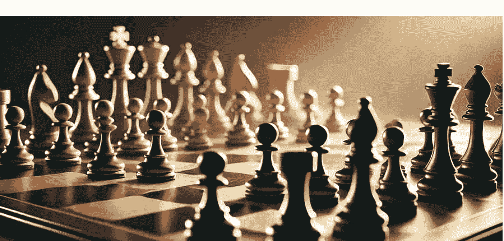

懒人专属群的群友，你好

欢迎来到博弈论课，我是蒋文华。

这是一门为每个愿意亲身入局的人准备的博弈论课，希望能够帮助你成为会识局、能破局、善布局的，博弈高手。

谁是愿意躬身入局的人？在我的心里，就是每一个以建设性的态度，推动自己的生活，自己所在团队的工作，甚至这个世界持续向好的方向变化的人。

我相信，博弈论你早就熟悉了。囚徒困境、纳什均衡、懦夫博弈、智猪博弈，这些博弈论概念，你肯定已经很熟悉。

但请相信我，博弈论仍然值得你系统学一遍。

这门学问，不仅仅是一株株参天的大树，更是一片生机盎然的热带雨林，其中包含着关于人类行为的最新智慧。这些智慧，是现代最聪明的一群人琢磨出来的智力成果。

诺贝尔经济学奖自1969年首次颁发以来，到2024年颁发了56年，总共有96位学者获奖，其中有20位获奖者的研究成果就和博弈论相关。

诺奖得主罗伯特·奥曼甚至直接说，博弈论能够为整个社会科学提供一个“统一场”理论。

什么是“统一场”理论？了解物理学的同学可能知道，包括爱因斯坦在内的不少顶尖物理学家，一直在寻找一种理论来统一物理学的基础分支，用这“一个”理论，解释万物运行的全部规律。博弈论在社会科学中，就具备这样的潜力。

因为，所有的社会科学，最底层都是人与人的博弈。人类社会从来不是单机游戏，而是多方互动的博弈场。

而博弈论，就是要在最底层，为人与人之间的博弈，建立模型，找到规律。

也正因此，不光是经济学家、数学家，管理学家、政治学家、军事学家们，都来研究博弈论、应用博弈论。

当然我也知道，你并不是因为这门学问的高大而来朝圣。你需要的是，学以致用。

对于愿意躬身入局的你来说，面对生活、工作及其它方面的困局，博弈论能为你提供什么支援呢？我想说三个词：识局、破局和布局。

先说识局。

什么是“局”？清华的宁向东老师有个很精辟的定义，“局”就是资源关系，这也是博弈论关注的重点。

> 卢梭有句名言：“人生而自由，却无往不在枷锁之中”。我改造一下：人生而自由，却无往不在局中。

这些局，是竞争对手之间的较量；是合作伙伴之间的利益分配；是亲朋好友之间，虽然目的一致，但仍然存在的分歧。

不理解这些局，你总会觉得，生活和工作总被某些无形之手所操控，明明你都很努力了，明明你的意图是好的，但结果却偏偏滑向你最不希望看到的局面。

而理解了这些局，你至少可以明白，所谓“偏偏”的背后，究竟是一种怎样的力量在起作用，这至少可以让你获得认知上的掌控感。

当然，识局只是开始，作为躬身入局者，你一定希望更进一步，那就是破局。

面对博弈局面，很多人容易陷入行动困境，总认为自身在局中，只是一枚棋子，被规则约束，被他人摆布，怎么可能破局呢？

我们来看一个博弈高手破局的经典案例。

美苏冷战很多人都熟悉。冷战期间，美苏两国剑拔弩张，大搞军备竞赛，一定要争个高低，然而局势那么紧张，万一擦枪走火因为误会而开战怎么办？

博弈论大师托马斯·谢林提了个建议，建立一个“热线”，遇到意外状况，双方先打个电话确认一下，避免误会。这条“热线”成为了一道安全防火墙，避免古巴导弹危机这样的事件，滑向核战争。

在这个案例中我们看到，在一般人眼里，竞争对手之间就是针尖对麦芒，双方都困在“竞争”这个局里。然而，博弈高手懂得，即便是竞争对手之间，也有办法建立有效的沟通机制，避免双方都不希望的结果发生。

类似这样的破局智慧，在博弈论中可以说比比皆是，比如：

当博弈双方因为争夺某种利益，激烈争斗，恶性内卷时，“万元陷阱博弈”会告诉你，采取哪些策略，能够让双方避免内卷，减少损失。当合作可以带来更大收益，但各方都认为自己的贡献最大，想要分得更多份额时，“合作博弈”会告诉你，怎么合理衡量每一方的贡献，做到真正的论功行赏。当春节期间，夫妻双方因为去谁父母家过年，争执不下时，“夫妻博弈”会告诉你，用哪些方法，能够解决分歧，增进感情。

......

在这门博弈论课中，我会告诉你，那些最常见的局，比如商务谈判、合作成果分配、协商议价，破局的关键在哪里。

如果你不甘心被各种局困住，就来加入这门课，我们一起探索博弈论的智慧，破局而出。

最后再来看布局。

博弈论不是阴谋诡计，而是光明正大的“阳谋”。

阴谋都见不得光，一见光就成了“无谋”，甚至人人喊打。而阳谋，是什么都明明白白。我的心思你知道，你的小心思我也知道，但我就是心甘情愿，愿意按照你的意思来。这才是高级的智慧。

博弈论能教给你的，就是这样的智慧。博弈论研究布局，不是为了坑别人，而是为了设计出好的规则，让对所有人都好的结果，能够自动实现。

听到这儿，有同学可能会问，设计规则、改变规则，这是各级管理者们的事儿，普通人哪有机会？其实并非如此。

学习博弈论，修炼布局力，并不是去研究宏大的运筹帷幄；博弈论所关注的规则，也并不特指那些白纸黑字上象征着权力的规章制度，简单的博弈顺序改变、博弈次数调整、信息的有效传递，都可以起到改变规则的作用。

比如，大额交易，哪怕是熟人之间，你也可以选择分期付款，这就把单次博弈，变成了重复博弈，能够有效避免对方被巨大利益所诱惑，卷钱跑路。类似的小改变，在我们日常的博弈中，随时都可以发生。

所以，学习博弈论，学会布局，就是学会利用规则的杠杆，撬动人性幽微处的力量，达成对各方都更好的结果。

与之相反，则是一厢情愿，忽略规则，任由人性被考验。

讲完了博弈论怎么帮助你识局、破局、布局，接下来再说为什么是我，以及我会怎么给你讲这门课。

从1998年在浙江大学第一次开设博弈论课程以来，我已经讲了整整27年的博弈论。我的博弈论课，也被教育部认定为国家级精品课。讲博弈论是我唯一的主业，一辈子能做好这一件事儿，我很喜欢。

我熟悉博弈论的系统，更熟悉怎么把这套系统教给对这门课感兴趣的同学。所以，这门课最大的特点，就在于知识的系统性。掌握了这套系统，你过去所了解的各种博弈论知识碎片就能各就各位，彼此关联。

此外，我还曾经给工行、农行、中国移动、国家电网、广汽等100多家大型国企高管，以及大量的政府管理者，讲授博弈论在企业管理和政府管理中的具体应用。通过与各类管理者的交流，我很清楚博弈论在现实中应用的要领是什么，难点是什么。帮你把博弈论学到能够熟练应用的水平，对此，我很有信心。

必须要说的是，博弈论是有点难的。博弈论的底层是数学，看懂了博弈论的数学基础，你才能看明白，博弈论底层的那股超越个体性的结构性控制力，到底从哪里来。

但是，你不用担心，课程中涉及的数学并不复杂，大多是基础的加减乘除，只需要中学的数学底子就能听得懂。课程中我还设计了很多红包游戏、拍卖游戏、猜钱游戏等，通过这些有趣的游戏，帮助你更轻松地拿下这门每个聪明人都想征服的学问。

博弈论是一门研究理性的学问，但最后，我想对你说几句感性的话。

关于命运，有句很让人触动的话：“人总是在逃避命运的途中，与自己的命运不期而遇”。有时，个人无论如何挣扎，似乎总逃脱不脱某种无形力量的支配。

在古代，人类只能诉诸“神”或者“上帝”来解释这种困局。但在今天，有了博弈论这样的知识工具，我们可以自己去偷看上帝的安排。

也许，有的时候，即便偷看了上帝的安排，有些困局一时依然很难破解。但是，我相信，只要理解了这些困局的结构和运行密码，破局的勇气和智慧，就会在不远处诞生。

邀请你加入这门课，跟我来修炼识局、破局、布局的智慧，让我们在面对这个世界时，拥有更多的主动权。

我是蒋文华，我在课程里等你。

## 《蒋文华·博弈论50讲》

## 发刊词 | 成为识局、破局、布局的高手

# 导论
- 01 纳什均衡：博弈论到底在研究什么？
- 02 博弈前提：理性和共同知识为什么重要？
- 03 博弈分类：顺序和信息为什么会决定终局？

# 基础：理解规则的控制力 完全信息静态博弈
- 04 囚徒困境1：个体逐利为什么不一定带来集体最优？
- 05 囚徒困境2：怎样鼓励合作，减少背叛？
- 06 万元陷阱1：内卷是怎样愈演愈烈的？
- 07 万元陷阱2：怎样避免恶性内卷？
- 08 习题课1：怎样让对手知难而退？
- 09 智猪博弈1：为什么会出现搭便车现象？
- 10 智猪博弈2：怎样降低防盗成本？
- 11 懦夫博弈：怎样避免两败俱伤？
- 12 夫妻博弈：过年回谁家争执不下，怎么办？
- 13 猎鹿博弈：怎样让合作伙伴放心合作？
- 14 习题课2：怎样看待“幸福让”？
- 15 协调博弈：怎样消除多重均衡？
- 16 混合策略：怎样保护好自己的底牌？
- 17 懦夫博弈进阶：怎样定好激励限度？
- 18 合作博弈进阶：陌生人之间如何有效合作？
- 19 征税博弈：查税应多查大企业还是小企业？
- 20 监督博弈：什么样的员工该定高工资？
- 21 习题课3：如何消除合作中的不确定性？

# 进阶：识别出手的致胜点完全信息动态博弈
- 22 最后通牒1：没有讨价还价空间时如何决策？
- 23 最后通牒2：怎样看待权力对决策的影响？
- 24 讨价还价：怎样在谈判中获得最大利益？
- 25 贴现因子：怎样平衡短期利益和长期利益？
- 26 习题课4：怎样避免寅吃卯粮？
- 27 蜈蚣博弈：怎样才能做到全身而退？
- 28 海盗分金：怎样用终局思维做决策？
- 29 承诺博弈：怎样用提前承诺锁定胜局？
- 30 重复博弈1：博弈次数怎样影响博弈局面？
- 31 重复博弈2：怎样的策略能赢到最后？
- 32 习题课5：怎样找到最佳退出时机？

# 高手：穿透信息有限的迷雾不完全信息博弈
- 33 市场进入博弈：怎样面对不同类型的竞争对手？
- 34 绑架博弈：怎样跟绑匪斗智斗勇？
- 35 逆向选择：劣币驱逐良币是怎样发生的？
- 36 信号传递：怎样更好地取信于人？
- 37 信息甄别：骗子为什么会用拙劣的技术骗人？
- 38 习题课6：怎样在博弈中获得信息优势？
- 39 声誉模型：大智若愚为什么是一个好策略？
- 40 国家信用：用法治国为什么会成为主流？
- 41 拍卖博弈：怎样才能把你的藏品卖出高价？
- 42 全支付拍卖：怎样避免在陷阱中越陷越深？
- 43 机制设计：怎样评判不同制度的优劣？
- 44 习题课7：怎样预防诈骗？

# 博弈论前沿
- 45 演化博弈1：怎样让你的策略经得起时间的考验？
- 46 演化博弈2：损人害己是理性的还是非理性的？
- 47 合作博弈1：怎样更合理地分配奖励？
- 48 合作博弈2：怎样才能做到真正的论功行赏？
- 49 习题课8：最佳的分配原则是什么？

# 结语
- 50 结语：怎样用好博弈思维？

> *正式课程内容，请以线上版本为准

## 《蒋文华·博弈论50讲》
— 会识局、能破局、善布局 —


## 《蒋文华·博弈论50讲》
会识局、能破局、善布局

版权归得到App所有，未经许可不得转载


浙江大学公共管理学院 副教授 蒋文华


微信：lazyhelper

## 01 纳什均衡：博弈论到底在研究什么？


懒人专属群的群友，你好

欢迎来到博弈论课，我是蒋文华。

这一讲，我们来关注一个最基本的问题：博弈论到底研究什么？那些研究结论对你有什么用？

理论不着急讲，先来看这样一种情境：

假设，你住在一个城市的郊区，每天早晨要开车去市中心上班，现在有两条路线供你选择：

路线A：一条高速公路，路况良好，但在高峰期容易堵车。路线B：一条普通公路，路程较长，红绿灯较多，但相对不容易堵车。

为了早点到公司，你应该选择哪条路线？

选择A路线吗？可是其他司机肯定也想走高速，所以才会堵车。

选择B路线吗？也未必稳妥，其他司机也可能因为担心高速堵车，而选择这条路。

你会发现，并不存在一个简单的“走哪条路更快”的确切结论。你的选择被别人的选择所牵制，别人的选择也被你的选择所牵制。

但是，光这么看，还是太表面了。要真正透彻理解这个问题，就要引出博弈论中最重要的一个概念：均衡。

一说博弈论研究什么，我猜，很多人的第一反应是，研究怎么才能赢，我如何选择最优策略，赢过别人。但我想告诉你是，这恐怕是对博弈论最大的误解。

在一个竞争局面里，博弈论研究的不是赢的策略，而是均衡的结果。

这种均衡，在博弈论里有个专门的名词，叫纳什均衡，是用博弈论大师约翰·纳什的名字来命名的。

掌握了纳什均衡，你就算掌握了博弈论的精髓。

### 纳什均衡

你可能会问，什么是纳什均衡？专业讲博弈论的书，对这个词的解释都太学术了，不容易理解，我试着用“人话”给你说一说——

假设在一个游戏里，参与游戏的各方都是“老司机”——也就是说每个人都非常聪明，谁也糊弄不了谁，那么游戏到最后往往会出现这么一个局面，那就是各方都满意，或者说各方都很无奈的局面。

任何一方想要采取一个什么行动，让自己获得一个更好的结果，这已经是不可能了。那么这个局面，就叫“均衡”。

所以你看，博弈均衡，不是一个让某个老司机稳赢狂赚的最佳策略，而是考虑到所有老司机都想稳赚狂赚后，所最终出现的策略组合和输赢结果。

这正是博弈论的本质。

对于博弈论来说，一种博弈情境，找出了其中的纳什均衡，这道难题就算是解出来了。

### 均衡三要素

这么说还是有点抽象，想要理解什么是纳什均衡，你最好先感受一下，什么不是纳什均衡。

举一个咱们中国人都熟悉的故事，田忌赛马。我得告诉你，孙膑的策略就不是纳什均衡。

我来给你具体拆解一下——

田忌跟齐国的贵族一起赛马，田忌上、中、下三个等级的马都不如齐威王的马厉害，谋士孙膑就给他出了一个主意，让田忌先用下等马对战齐王的上等马，再用上等马对战齐王的中等马，最后用中等马对战齐王的下等马，三局两胜，田忌获胜。

单从田忌这一个老司机的输赢结果，来看孙膑的策略，这确实是个非常好的策略，但这并不是一个能带来纳什均衡的策略。这里面存在两个问题。

首先，一种策略，如果能够带来纳什均衡，它需要可重复。

想想看，如果你是齐威王，还会跟田忌玩儿第二次吗？恐怕不会了吧。

不但齐威王不会跟田忌玩儿，别的贵族也不会跟田忌玩儿了。就算齐威王大度，不计较田忌不守规矩，赛马会还能办，那下一次，他肯定就不会老老实实上当了。孙膑的策略就是一次性消费，再也不管用了。

其次，一种策略，如果能带来纳什均衡，还需要有普遍性。

田忌这个策略，换成站在齐威王这一方就不灵了，而博弈论要研究的均衡结果，需要满足一个基本条件：换一个人玩还是这个结果。

只要博弈给出的条件不变，无论参与者具体是谁，得到的均衡结果不变。

你看，这恰恰是我们为什么要学习博弈论、找到纳什均衡的原因。因为现实情况是如此复杂，你怎么知道你会当田忌还是齐王呢？

把所有博弈参与者的策略都考虑进去，你才能找到那个均衡结果。

具体到赛马博弈里，如果我们已知齐王每个等级的马都优于田忌，并且田忌高一等级的马，要比齐王低一等级的马更好。在这种情况下，站在博弈论的角度，什么是纳什均衡呢？

如果固定上中下马的出场顺序，田忌肯定总是输，恐怕就没动力陪着齐威王玩儿了。所以，咱们可以增加点难度，把规则明确为允许大家自由选择马的出场顺序，这就增加了比赛的随机性，田忌可能就有动力玩儿了。

在这种情况下，齐王最好是随机选择出马顺序。而在齐王随机选择的条件下，田忌也会随机选择自己的出马顺序。这就是他们各自的最优策略。

为什么会是这种策略？道理其实不难理解，只要齐王出马的顺序，不是随机而是有规律可循，田忌就可以有针对性地调整他的出马顺序，以获得相对优势。

比如，齐王的出马顺序是，中下上；田忌就可以安排，上中下。田忌三局两胜，还是可以赢齐王。

这里你要记住的是，在博弈中，每个人在选择策略的时候，不能只顾自己，还得想着对手的反应。

如果是随机出马，田忌有没有希望赢呢？这就变成了一个概率问题。

我把所有的对战情况全部算了一遍，一共会出现36种结果。我把这36种结果列了一张表格，放在了文稿里，你有兴趣的话，可以看一看。不看也没关系，并不会影响你对纳什均衡的理解。

| 田忌 \ 齐王 | 上中下 | 上下中 | 中上下 | 中下上 | 下上中 | 下中上 |
|:---|:---:|:---:|:---:|:---:|:---:|:---:|
| **上中下** | 王赢 | 王赢 | 王赢 | 田赢 | 王赢 | 王赢 |
| **上下中** | 王赢 | 王赢 | 田赢 | 王赢 | 王赢 | 王赢 |
| **中上下** | 王赢 | 王赢 | 王赢 | 王赢 | 王赢 | 田赢 |
| **中下上** | 王赢 | 王赢 | 王赢 | 王赢 | 田赢 | 王赢 |
| **下上中** | 田赢 | 王赢 | 王赢 | 王赢 | 王赢 | 王赢 |
| **下中上** | 王赢 | 田赢 | 王赢 | 王赢 | 王赢 | 王赢 |

在这36种情况中，有30种是齐王获胜，还有6种是田忌获胜。

所以，博弈论给“田忌赛马”这个局面找到的纳什均衡就是：齐王和田忌都随机选择出马顺序，在这种均衡之下，齐王有六分之五的概率获胜，田忌有六分之一的概率获胜。

你会发现，这套分析方法，其实是上帝视角的分析方法。我们并不是站在齐王或者田忌一边，而是把两个人的利益都考虑了进去。

这套策略可以重复实现，今年比是这样的策略，这样的输赢概率，明年再比，还是如此。

这个策略也有普遍性，只要马的情况不变，规则不变，这个均衡结果就不会变，齐王和田忌玩出来是这个结果，换成小张和小李玩，也同样是这个结果。

讲完田忌赛马，我们回过头来解答一下一开始的那个问题：老司机们应该选择哪条路上班？

老司机们选哪条路上班这类的交通博弈，其实也存在一个纳什均衡，那就是走两条路的时间会趋于相等。这时候，任何司机都没有动力选择另一条路。试想，只要不相等，一定会有司机换另一条路去上班，更何况大家可都是老司机啊！

当然，这是一个理论上的应然状态。现实中的交通博弈，受到天气、突发状况等多种因素的影响，并不总是处在均衡状态中。

这时候，你的最优选择其实是随机即可。当然，你也可以固定地选某一条路，这样的好处是省心。不过，隔一段时间后，我也建议你换一条路试试，看看是否能节省时间。

无论你选哪一条路，都没必要美化你没选的那条路。

### 纳什均衡运用

听到这里，你可能觉得，这也太费劲了，达到纳什均衡，又得是上帝视角，找到的那套策略又要可重复，又要有普遍性。找到这个解，对我到底有什么用呢？

纳什均衡的用处很多，我给你找出三个不同等级的玩家，看看他们会怎么用。

青铜级玩家，找到纳什均衡，就等于了解了棋局里各个角色的利益所在，那么就可以代入局中其中一方的角色，更方便地找到自己的最优策略。

白银级玩家，通过对均衡结果的了解，能判断出这是否是一个值得参与的博弈。现实中很多人犯错，并不是选错了策略，而是入错了局。

就拿田忌赛马来说，如果赛马对田忌属于社交活动或娱乐活动，输赢并没有那么重要，那就尽管参与便是。但如果田忌的目的就是为了赢得奖金，如果大家随机出马，知道齐王有六分之五的概率获胜，自己只有六分之一的概率获胜，放弃参赛恰恰是他的最优决策。

最后来看最厉害的王者玩家，能通过对均衡结果的研判，看清楚从博弈规则到博弈结果的内在联系，从而通过修改规则，让自己获取更大利益。

比如，田忌一看，自己赢的机会这么小，可能就不肯玩儿了。那齐王就可以改规则，把比赛奖金出得高高的，让田忌赢的时候的奖金，是输的损失的5倍以上，这种情况下，虽然只有六分之一赢的概率，但田忌还是有动力参赛的。

博彩公司就特别熟悉这种套路。足球世界杯比赛，两支球队的实力有时差距较大，为了提高球迷的赌球积极性，博彩公司往往把输赢的赔率设成1：N倍。这样一来，极大地调动了人们以小博大的积极性。足球比赛中的“爆冷”总是能让大家津津乐道。

说到底，博弈论其实就是在解题，面对不同的博弈情境，找到它的纳什均衡。

你可能会说，博弈的情况这么复杂，真的都找得到纳什均衡吗？

我告诉你，纳什均衡之所叫这个名字，就是因为约翰·纳什22岁的时候，在他的博士论文里，用非常简洁的数学推理，证明了均衡的广泛存在。不是说一定存在，而是说在绝大部分情况下，都会有均衡。

当然，不同的博弈情境纳什均衡是不同的，也分很多不同的类型。后面的课程，我会带你走进不同的博弈模型，了解它们各自的纳什均衡。

请你一定记住这句话，一切不以均衡求解为目的的博弈论，都是外行。

掌握了均衡，你无论是作为博弈的参与者，还是作为博弈规则的制定者，都能更加积极主动，游刃有余，充分掌握博弈的主动权。

#### 下节预告

心急的同学肯定会想，既然博弈论是教我们怎么求解均衡的，那在下一讲，我们就赶紧开始。

不用这么急，在学会求解均衡之前，我们还需要先了解博弈论的两个基本假设，分别是理性假设和共同知识假设。因为，如果没有这两个假设，一切对均衡的求解都是不可能的。因此，下一讲，我们需要先讲解这两个假设。

### 思考题

最后，给你布置一道思考题：在齐王每种等级的马都优于田忌同等级的马，且田忌高一等级的马优于齐王低一等级的马的条件下。齐王问田忌，你希望赛马规则是三局两胜还是五局三胜？此时，如果你是田忌，你会怎么选？

这里需要说明一点：如果比赛规则是五局三胜，需要双方各出五匹不同等级的马。

我是蒋文华，我们下节课再见！

## 02博弈前提：理性和共同知识为什么必不可少？

懒人专属群的群友，你好

欢迎来到博弈论课，我是蒋文华。

上一讲，我们讲了博弈论研究的不是输赢，而是怎么找均衡，这一讲，我们来讲求解均衡必备的两个前提假设，理性和共同知识。

### 猜数游戏

我先带你来玩一个猜数字游戏，这是博弈论中很经典的一个游戏。

假设你在教室里跟50个同学玩儿这么一个游戏，游戏规则是，每人写一个介于1到100的自然数，包括1与100在内，然后求出所有数字的平均数，如果你所写的这个数最接近该平均数的1/2，就可以获胜。你会写一个什么样的数？

你不妨先停下来思考几秒钟，心里想一个数字，等会儿我会公布答案，看看你胜出的可能性大不大。

要解开这道题，就需要用到这节课要讲的理性和共同知识假设。

在经济学类的课程中，理性假设对于很多同学来说，可能并不陌生。博弈论的理性假设，跟经济学上的是一回事。都是说，基于确定的偏好，人在决策中会追求自己的利益最大化。

共同知识（common knowledge），你可能会觉得有点陌生，稍微展开讲讲。

博弈论中，共同知识（common knowledge）和共有知识（Mutual Knowledge），是必须放在一起理解的一对概念。

你兜里有10块钱，如果你自己知道，我也知道，大家都知道这件事，这叫共有知识。但这未必是共同知识。共同知识不但要求大家都知道，而且要求大家都知道大家都知道，而且还要求大家都知道大家都知道大家都知道......一直到无穷为止。共有知识只是共同知识的第一个层次，无穷次叠加之后才形成共同知识。

在博弈论看来，大家在博弈之前，有两点需要成为共同知识：
- 一是理性共识。大家都知道大家是理性的，大家都知道大家都知道大家是理性的......直到无穷。
- 二是规则共识。大家都知道参加的游戏规则是什么，大家都知道大家都知道游戏规则是什么......直到无穷。

听起来是不是有点儿绕？我们以刚才的猜数字游戏为例来详细说明。

这个游戏的解题过程是这样的：

我们不妨先假设，如果大家在1至100之间随机写一个数，肯定有人写得数大，有人写得数小，那么平均数应该在50左右。既然大家知道随机写的平均数接近50，那么50的二分之一是25，你要想赢，就应该写25。

你是理性的，别人也是理性的，你会写25，别人也会写25。当所有人都写25时，你写12或13才能最接近25的二分之一。

在理性和共同知识的作用下，整个思考过程还会继续下去。从12或13推理到6或7，从6或7推理到3或4，最终推理到答案1。

每个人都写1，是这个写数博弈的均衡解。到此为止，每个人不会再有动力写其他数字了。

在这个推理过程中，理性和共同知识，体现在哪里呢？

先看理性。

每个人都争取猜接近平均值二分之一的数，以赢得游戏，这个“争取”的意愿和过程，就是博弈论的理性假设。

在哲学、经济学、心理学等很多与人相关的学科中，理性都是最基础的概念，因而内涵也非常复杂。但是，学习博弈论，我们不必在概念上太纠缠，我们只需要知道，理性人假设只是假定，在一个特定博弈局面中，参与者的偏好是确定的，并会最大限度追求这个偏好的最大满足。

这个假定只需要强调偏好的确定性。至于每个人的偏好是什么，并没有进行更多的限定。

青菜萝卜、各有所爱。理性的人既可以追求财富或金钱的最大化，也可以追求财富以外的东西，如名声、荣誉、地位、公平、正义、快乐等等。所有你想要的东西都可以进入你的偏好系统，哪怕你会为此付出金钱的代价。一个人从纯利他中得到的快乐和从纯利己中得到的快乐，在理性人假设看来并没有本质的区别。

在一个博弈中，如果参与者的偏好总是变来变去、飘忽不定的，那么，博弈的结果就无法被分析和预测。这超出了博弈论的研究范围。简单地说，博弈论不研究一群疯子的博弈结果。

再看共同知识。

开头我们说到，共同知识，意味着每个人都知道对方是理性的，与此同时，每个人都知道大家知道这个游戏的规则是什么。于是，每个人就都知道，要想赢得这个游戏，一定要比别人写得小才有机会。当大家都知道大家知道自己要比别人写得小，那么，层层推理的必然结果就是写1。正是基于理性假设和共同知识假设，写数游戏中才会出现层层削减的推理过程。

共同知识并不是一种语言游戏，而是人类社会中人与人交往、协作的一个重要前提。

想想看，为什么你会敢开车上高速？因为你知道，其他人也知道交通规则，大家都知道，高速公路不是开碰碰车的地方。

反过来也一样。其他人为什么敢开车上高速？也是因为他们知道，包括你在内的其他人，也都知道高速不是开碰碰车的地方。

这么看，共同知识的存在，似乎是人类社会中最平常、最自然的现象。但事实并非如此，人与人之间的共同知识是否能建立，需要一个确认的过程。

举个例子。我们都读过安徒生的《皇帝的新装》。在这个故事里，皇帝没穿衣服，这其实是每个人都都知道的信息，是共有知识。但是，每个人未必知道其他人是不是知道皇帝没穿衣服。每个人都怕，是不是别人看到的皇帝是穿衣服的，只有我看不到，我可不让别人以为我是傻瓜。

但是，当小孩子喊了一声：“这个皇帝怎么没有穿衣服？”，此时，基于对孩子的单纯的信任，以及确信别人也都听到了小孩子的喊声，大家才突然明白过来，不但自己看到了皇帝没穿衣服，而且其他人也看到了皇帝没穿衣服，并且大家也知道大家都看见皇帝没穿衣服。这时候，共有知识就变成了共同知识。

所以，共同知识的形成是一个“由己及人，由人及己”的无限推理过程。一件事一旦在某个群体中成为共同知识，博弈论就能够派上用场。

这时候，我们就可以从个体的理性出发，结合游戏规则，推理出任何一场博弈的纳什均衡。

### 对理性假设的质疑

以上，我们介绍完了博弈论的两大前提，理性和共同知识。

但是，对于这两个前提，其实是有争议的，我们这里有必要来面对一下。

还是用猜数字博弈来说明。

刚才我们说到，理论上讲，猜数字博弈的均衡解是“1”。但是，很多学者的实验都发现，在真实的博弈场景中，最终获胜的数字都到不了“1”。

我在课堂上至少进行过100多次这个写数字博弈实验。没有一次的博弈结果是1。我在文稿中给你附上了我10年前给浙江大学本科生和研究生们做的7次实验结果，你会看到平均数基本上集中在10-20之间，胜出的数字集中在5-10之间。所有100多次实验的最小平均数是10.62。有一次，给一些研究生上课，第一次博弈的平均数是20左右，然后又继续博弈了一次，第二次的平均数也才6左右，写3的同学胜出。

为什么理论预测和实验结果不一致呢？

我认为，以下三个原因，导致了两者的不一致。

第一个原因是激励不够。人在做决策的时候很少是深思熟虑的，因为在大多数情况下，深思熟虑是得不偿失的。在写数字游戏中，参与的人数越多，赢的可能性越小。就算赢了，收益也不大。那么，理性的选择很可能是在1至100之间随便写个数。或者简单思考一下，既然平均数不太会超过50，那么就写一个25以下的数吧。从课堂中真实的博弈结果看，如果奖励的力度越大，例如从期末总成绩加2分增加到加10分，平均数会越小。

第二个原因是偏好差异。我们很容易简单地理解为理性就是追求利益最大化，而忽视了不同人对利益理解上的差异。有一次，我遇到有一个同学写的是100，我问他为啥写100，这位同学的回答是“我是来捣乱的”。在这个同学看来，捣乱带来的满足感超过了游戏中获胜的满足感。这同样是理性选择。

第三个原因是有限共识。共同知识是一种理想化的状态。我们其实也知道这和实际情况是有差距的。你开车经过十字路口，即便是绿灯，你也会仔细观察，生怕有人闯红灯。在写数字游戏中，就算大家都想到了均衡结果是1，但如果没达成共识，你还是不会写1，因为你担心别人不会写1，别人也担心你不会写1，别人还会担心你认为他不会写1。

不妨设想一下，如果这个游戏的奖惩是赢家有饭吃，输家没饭吃。那么，只需要重复两三次，每个人都会写1。就算你想捣乱，两次以后也不敢了，甚至有可能就饿死了。这样一来，大家很快就会对写1达成共识。

这反映出人类理性的演化特征。不理性的个体，会更容易被淘汰，活到最后的是理性的个体。

### 总结

总结一下。

学习博弈论，要能在博弈中找到均衡解，有两个必备的条件是理性和共同知识。

理性，意味着参与博弈的人明确知道他喜欢什么，并在各种条件许可的情况下，这个人一定会顺着自己的偏好，作出对他利益最大化的选择。

共同知识，意味着参与者们在博弈之前已经达成了两项共识：理性共识和规则共识。

#### 下节预告

有了理性共识和规则共识，参与者之间就可以进行博弈了。参与者一旦进入博弈状态，首先关注的是：这是一个什么类型的博弈。下一讲，我将依据博弈顺序和信息状况的不同对博弈进行分类，并以此建构本课程的知识体系。

### 思考题

最后给你留一个有点难度和挑战性的思考题。

我在两张纸上各写一个数，分别给了张三和李四，告诉他们两个数的差为2，这是共同知识。张三和李四只能看到对方的数，当张三看到李四的数是3，李四看到张三的数是5时，请问，在双方不许交流的情况下，李四手里的数字小于10这件事是双方的共同知识吗？

我是蒋文华，我们下节课见。

## 《蒋文华·博弈论50讲》

会识局、能破局、善布局

版权归得到App所有，未经许可不得转载

浙江大学公共管理学院 蒋文华 副教授

公众号 懒人搜索

懒人专属群 微信：lazyhelper

## 03博弈分类：为什么顺序和信息会决定终局？

懒人专属群的群友，你好

欢迎来到博弈论课，我是蒋文华。

这一讲，我们来讲博弈的分类。

博弈论现在算是一门显学，相信你肯定已经听过很多跟博弈分类相关的名词，比如零和博弈、非零和博弈、单次博弈、重复博弈等等。

这些分类在博弈论中很重要，但必须要说的是，它们都没体现出博弈论这门学问的核心框架。任何一门学问，只有抓住了核心框架，学起来才会事半功倍。

博弈论的核心框架是什么？这一讲我会告诉你，博弈论的核心框架，由两个核心要素搭建起来：博弈顺序和信息。基于这两个要素，所有博弈可以分为四大类。

为什么顺序和信息那么重要？博弈又分成哪四大类？我们分别来看一看。

### 顺序和信息的重要性

我们先来玩儿一个游戏。

现在，有人想和你玩一个石头剪刀布的游戏，如果他赢了，你给他2元，如果他输了，他给你500万。你愿不愿意和他来一局？我想你肯定说：“愿意！”

然后，对方说：“你先出！”

这个段子通常是讽刺买彩票为啥不可能赚钱，其实，正好也说明了顺序和信息在博弈中的重要性。

先说顺序。

博弈顺序，指的是参与者是同时出招，还是先后出招。显然，出招顺序不一样，结果是完全不一样的。

比如，石头剪刀布，如果一个人先出，一个人后出，那后出的人一定赢。正常情况下，石头剪刀布要求参与者同时出，有随机性，所以才有得玩儿。

在博弈论中，如果参与者是同时出招，我们就说这个博弈是静态的。但要注意的是，这里的“同时”，不是时间上的同时，是逻辑上的同时。什么是逻辑上的同时？石头剪刀布游戏中，如果对方提前出了，但你事先不知道，你们的博弈仍然是静态，这就是逻辑上的同时。

相对应的，参与者的出招，如果有先后顺序，且后出招的人能够观察到先出招的人所采取的行动，就被称为动态博弈。

静态博弈和动态博弈的最大区别在于：静态博弈的参与者只能通过猜对手会怎么出招来做决策，动态博弈的参与者可以依据对手的实际出招来做决策。

再用一个例子说明顺序对博弈局面的影响。

父母到底谁去接孩子放学？如果是静态博弈，双方只能猜对方会不会去，很可能会出现父母都去或都没去的结果。如果是动态博弈，后行动的一方就不用猜了，爸爸知道妈妈今天加班去不了，就必须乖乖接孩子去了。

在静态博弈中，所有参与者都只是博弈的接受者。参与者的重点是怎么解局。考验的是每个参与者的预判和计算能力。在动态博弈中，参与者既是当下博弈的接受者，又是后续博弈的设定者，参与者的重点是怎么设局。考验的是每个参与者的逆向推理能力。因此，在静态博弈中，起点决定终点；在动态博弈中，终点决定起点。

具体都是怎么决定的？时间关系，在后面的课程中，我再详细展开。

再说信息。

信息论创始人香农对信息的定义是：“信息是用来消除随机不确定性的东西”。这是一个比较宽泛的定义。

在博弈中，“信息”有特定的含义。参与者的类型、策略集合，及相应的收益等等，这都算是博弈中的信息。比如，在前面的石头剪刀布游戏中，只能出石头/剪刀/布，而不能出别的，就是参与者的策略集合；赢了能赢多少钱，就是相应的收益。

对于这些信息，有可能双方都完全掌握，有可能双方都不掌握，也有可能一方掌握另一方不掌握。所有这些信息，大家都完全掌握的，就被称为完全信息博弈；否则就是不完全信息博弈。前面的游戏中，你不知道要你先出，就是不完全信息博弈，你掌握的信息比对方少，于是就会吃亏。

现实中的绝大部分博弈都是不完全信息博弈。比如，你在买一本书的时候，并不清楚书的质量究竟是高还是低。网上购物，在收到货品之前，你无法准确判断产品的品质，有些产品甚至只有在你使用很久以后，才能判断出品质好坏。

在不完全信息中，我们还可以进一步分类，分为对称信息和不对称信息。什么意思呢？

在不完全信息博弈中，每个参与者拥有完全相同的信息，称之为对称信息。反之，则称之为不对称信息。

我们拿古玩市场举例。你肯定听说过不少古玩市场的“捡漏”传奇：

假设，你去逛北京潘家园儿古玩地摊儿，看到一个很精美的青花瓷碗，十分喜欢。老板信誓旦旦地说，这是宫里流传出来的！你问多少钱，老板说：500！你跟老板心照不宣，这东西肯定不是宫里流出来的，但做工精美，500块钱买不了吃亏，买不了上当，你也没想着捡漏，老板也没有狮子大开口、打算坑你。这种情况下，买卖双方都知道是假的，这是对称的完全信息。

你继续逛，看见一个青铜小香炉，摆摊儿的是个小年轻，他说这小香炉是祖传的，听家里人说有点儿年头儿；你也不是很了解青铜器，只是感觉似乎还不错。这种情况下，和刚才的例子相反，双方都不知道小香炉究竟是真是假，这就是对称的不完全信息。

你又接着逛，发现一只铜胎掐丝珐琅花瓶。你正好是这方面的行家，一看就知道这是清代的真东西，虽然算不上珍品，但转手卖给就喜欢这类古董的收藏家，卖个万把块不成问题。然后你问摊主多少钱，这摊主是个刚继承家族企业的小年轻，给你报了个3000。你假装嫌贵，还了一口价，2000卖不卖？小年轻看这东西放了几个月没人问，就卖给你了。你美滋滋地捡了个漏。这种情况下，买家或卖家一方不知道真假，这就是不对称信息。

这里要特别提醒的是，完全信息一定是对称信息，毕竟大家知道的信息都是完全的，肯定都一样嘛；而不完全信息可以是对称信息，也可以是不对称信息。

一般而言，在不对称信息中，拥有信息优势的一方，往往会在博弈中处于相对有利的地位。反过来说，每个参与者都需要为自己的无知买单。

### 四类博弈和课程框架

以上，我们讲完了顺序和信息对博弈意味着什么。

接下来，我们把顺序和信息两个维度结合起来，就可以把所有的博弈分成四类：完全信息静态博弈、完全信息动态博弈、不完全信息静态博弈、不完全信息动态博弈。这就是博弈论的核心框架。

文稿中给出了四种不同的分类组合，你可以点击查看。

#### 表3.1 经典的博弈分类

| 博弈类型 \ 信息状况 | 完全信息 | 不完全信息 |
| :--- | :--- | :--- |
| **静态博弈** | **完全信息静态博弈**<br>囚徒困境, 智猪博弈<br>夫妻博弈, 征税博弈<br>纳什均衡 | **不完全信息静态博弈**<br>求爱博弈, 绑架博弈<br>市场进入博弈, 逆向选择<br>贝叶斯纳什均衡 |
| **动态博弈** | **完全信息动态博弈**<br>最后通牒, 重复博弈<br>海盗分金, 承诺博弈<br>子博弈完美纳什均衡 | **不完全信息动态博弈**<br>拍卖博弈, 机制设计<br>信号博弈, 声誉博弈<br>完美贝叶斯纳什均衡 |

这四类博弈，分析难度逐渐递增。我们这门课，正是按照这样的结构和顺序，由简单到复杂，层层递进。

讲到这里，正好给你介绍一下课程的结构：

导论三讲，博弈论的核心方法论--均衡分析、博弈论的两个前提--“理性”和“共同知识”，以及博弈的分类我们已经讲完。

导论之后，我要跟你讲的是完全信息静态博弈。

比如，博弈论中最著名的囚徒困境，就属于完全信息静态博弈。一方面，囚徒双方对博弈的各种情况都拥有完全信息；另一方面，虽然双方分开做决策，在物理时间上可能会有先后，但在逻辑时间上是同时的。

在这个模块中，我还会跟你讲到著名的智猪博弈、懦夫博弈，有趣的万元陷阱、夫妻博弈、征税博弈、监督博弈等。

学习这些博弈有什么用呢？最大的价值在于，让你懂得规则设计的艺术。真正的高手都知道，规则决定终局。学完这个模块你会懂得，怎么设计规则，让你期待的结果自动实现。

如果你问：我总是在别人的局里，哪有机会设计规则？我的答案是，了解博弈规则的作用后，至少能让你知道，哪些事你可以改变，哪些不能改变，并获得更多的掌控感。

接着是第二类博弈，完全信息动态博弈。

我们生活中常见的讨价还价就可以视为完全信息动态博弈，讨价还价通常涉及多个阶段或多个轮次的博弈，参与者可以根据之前的互动，来调整他们接下来的策略。

学习完全信息动态博弈有什么意义呢？意义在于，知道怎样通过改变博弈的顺序、轮次，更好地达成自己的目的。

还有，现在大家经常挂在嘴边的长期主义，其实只有在动态博弈中才有意义。人既追求当下的满足，也追求未来的幸福，研究动态博弈，能让我们更懂得怎么去追求长远的利益。

再然后，我会跟你讲不完全信息静态博弈和不完全信息动态博弈。

前面我们提到，现实中的绝大部分博弈都是“不完全信息的博弈”，有时是静态的，有时是动态的。这两类博弈，分析起来比较难，但却是现实意义最大的。

比如，产品新进入一个市场，面对已经在场的竞争者，应该如何定价？

比如，到一个陌生的地方打拼，要找合作对象，你不知道谁可信，对方也不知道你是不是可信，这时候该怎么办？

再比如，找工作的过程中，你不了解公司的真实工作环境和晋升机会，而雇主也不知道你的实际能力和工作态度，这时候该怎么办？

解决这类问题的关键，都在于对于信息的掌握和分析，博弈论能够给你提供一些新的思路和启发。

课程最后一个模块，我会再给你延伸介绍两种博弈：演化博弈和合作博弈。这两类博弈，属于经典博弈论之外比较前沿的内容，能够帮助你换个视角，对博弈论的底层结构，有更深刻的理解。

### 总结

好了，我们来总结一下这一讲的内容。

博弈中最重要的两个要素是顺序和信息。基于顺序和信息，博弈分成四类。这是博弈论的核心框架。

清楚博弈分类，也能让我们在今后的实践中更容易针对不同的博弈类型采取不同的应对策略。

下一讲，我们正式开始讲完全信息静态博弈，首先登场的正是最著名的囚徒困境。为什么会出现囚徒困境这种特殊的博弈局面，以及怎么破解囚徒困境？我会用两讲的内容为你详细展开。

## 04囚徒困境1：为什么个体逐利不一定带来集体最优？

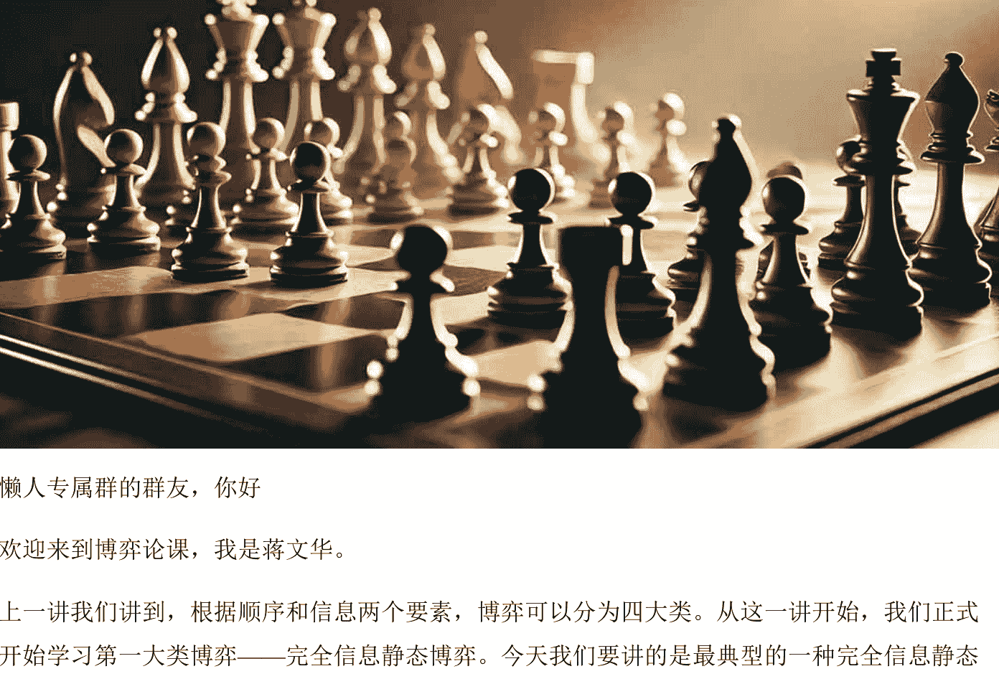

懒人专属群的群友，你好，欢迎来到博弈论课，我是蒋文华。

上一讲我们讲到，根据顺序和信息两个要素，博弈可以分为四大类。从这一讲开始，我们正式开始学习第一大类博弈——完全信息静态博弈。今天我们要讲的是最典型的一种完全信息静态博弈，也就是大名鼎鼎的“囚徒困境”。

现实生活中，我们经常遇到一种局面：明明合作对于集体来讲是最优的选择；然而，个体被诱惑选择背叛，最终背叛者没捞到好处，还连累集体一起遭受损失。这就是囚徒困境。

为什么会出现这种局面？你可能会觉得，不就是因为人人都追求自己利益最大化吗？但问题并没有这么简单。在很多时候，个人追求自己的利益最大化，并不必然导致集体的利益受损。为什么囚徒困境会导致集体利益的受损？囚徒困境中有什么特殊之处？

这一讲，我就带你分析囚徒困境形成的原因。

### 囚徒困境

几乎所有介绍博弈论的书和教材都会提到“囚徒困境”。相信你之前已经多少有所了解。但是，为了讲述方便，我们这里还是先简单复习下：

两个经常一起偷东西的小偷A和B，又一起去作案，结果被警察逮了个正着，警察对他们分开审讯。

这时候，每个小偷都有两个选择：选择坦白，供述以往的犯罪事实；或者选择抗拒，保持沉默。

两个小偷都知道，如果他俩都选择抗拒的话，警察只能以这次的犯罪事实定罪，判少量的刑，坐牢半年。

但警察为了激励他们招供，就对他们说：如果他们中一个人坦白，告发他的同伙，就可以获得奖励，当场释放。而他的同伙则会被加重处罚，坐5年牢。我们可以把这里理解为“坦白从宽、抗拒从严”。而如果两个人都选择坦白，就会按照以往的犯罪事实一起来定罪，既不会被奖励，也不会被加重处罚，两人各坐3年牢。

在B选择坦白的情况下，对A来说，选择坦白的结果是坐3年牢；选择抗拒的结果却是要坐5年牢，选择坦白比选择抗拒更好。在B选择抗拒的情况下，对A来说，选择坦白的结果是不用坐牢；选择抗拒的结果还是要坐半年牢，选择坦白仍然比选择抗拒更好。

无论B的选择是什么，对A来讲，坦白都是比抗拒更好的选项。博弈论把这种选项称为“占优策略”。

占优策略，简单地说，就是一种以不变应万变的策略，无论对手如何反应，自己的最佳选择都是固定的一种。依据之前的理性假设，一个人只要有占优策略，一定会选择该策略。

你马上会想到，对B来讲，坦白也是他的占优策略。于是，困境就来了，他们都选坦白的这个占优策略，却会获得集体最糟的结果，两个人各坐3年牢。

其实，近半个世纪以来，很多领域的学者之所以如此关注这个困局，并不是因为这个困局有趣，而是因为市场经济带来的经济繁荣，让我们习惯性地接受了经济学的一个基本结论：个人追逐自身利益的最大化，能够带来社会整体福利的最大化。这就是亚当·斯密的“看不见的手”的魔力。

但是，囚徒困境的出现，给我们浇了一盆凉水。个人追求自身利益的行为，可能并不带来集体利益的最大化，并且反过来还会损害自己的利益。这就多少让我们这些受惠于市场经济的现代人有些无所适从。

难道经济学错了吗？难道我们需要否定人对自身利益最大化的追求吗？

### 一般化条件

为了更清晰地分析这个问题，我们需要看一下囚徒困境的一般化条件。

什么是一般化条件？你可能也注意到了，同样是讲囚徒困境，在不同的地方，两个囚徒坐牢的时间是五花八门的，我们前面用的是（0，-0.5，-3，-5），还有的地方是（0，-1，-5，-10）。其实，具体数字是几不重要，所谓囚徒困境的一般化条件，就是找到这几个数字之间的大小关系，也就是要求背叛的诱惑>合作的奖励>共同背叛的惩罚>受害者的损失。

为了后面表达方便，这四个参数我们用四个字母代替：

T（Temptation），表示一方坦白、一方抗拒，也就是一方选择合作、一方选择背叛时，坦白方的收益，也就是背叛的诱惑。刚才的例子里，背叛诱惑就是无罪释放，T=0。R（Reward），表示双方都不坦白，都选择抗拒时，双方的收益，也就是合作时的奖励。刚才的例子里，合作奖励就是各判0.5年，R=-0.5。P（Punishment），表示双方都坦白，也就是都背叛对方时，双方都会受到的惩罚。刚才的例子里，共同背叛的惩罚就是各判3年，P=-3。S（Sucker），代表一方坦白、一方抗拒，也就是一方选择合作、一方选择背叛时，选择合作这一方所遭受到的损失。刚才的例子里，选择合作但被背叛的损失就是判5年，S=-5。

很明显，背叛的诱惑T（0），大于合作奖励R（-0.5），大于共同背叛惩罚P（-3），大于受害者损失S（-5）。

这就是囚徒困境成立的第一个条件：T>R>P>S。注意，T>R>P>S，一定是这样的大小关系。稍微改变一下，囚徒困境可能就不成立了。

举个例子，如果S和P相等，也就是即便被背叛，也不会多坐牢，那两个人就不会有那么强的动机选择背叛，而是更可能合作，也就是都选择抗拒了。

刚才的这些内容比较数学，光听可能还是有点抽象。我在文稿中给出了一般化的囚徒困境模型，方便的时候，你也可以打开文稿查看，加深理解。

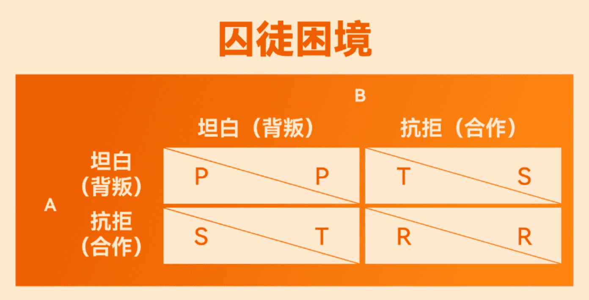

讲到这里其实有一个问题，条件一虽然有四个参数的大小关系，但是跳出来看，无非还是在说，人经不住利益的诱惑。但人性总是贪婪的，都会追逐更大的利益，在哪里都是一样的，怎么在这里就造成囚徒困境了呢？

这就要说到囚徒困境成立的第二个条件：R-S>T-R（等同于2R>T+S）。

### 强负外部性

这第二个条件的现实意义是什么？

这个不等式，我们先看后面的T-R，这代表一个人由合作转到背叛所增加的收益，在开头的例子里就是0减-0.5，等于0.5年；再看前面的这个R-S，这代表一个人选择背叛之后，对别人造成的损失，在开头的例子里就是-0.5减-5，等于4.5年。4.5显然大于0.5，于是R-S>T-R。

R-S>T-R合起来意思是什么呢？就是背叛给当事人所增加的那部分收益，抵不上背叛给他人带来的损失。没有这第二个条件，光有前面的第一个条件，囚徒困境也不能成立。

理解这一点，我们来看一个更简化的例子。

现实中，人们最喜欢的局面是双赢。不合作，双方收益都是0；跟人合作，我得800，你得800。这是最理想的局面。

然而，如果你现在面临一个选择，你仍然可以得到800的好处，但是代价却是别人会承受1000的损失。你会选吗？这一刻，想必你肯定是会犹豫的。

为了更清楚地看到囚徒困境的微妙之处，我们把这个选择题做个变形：还是我得到800的收益，但如果别人的损失不是1000，而是600呢？

分析博弈论的问题，我们可以暂时放下背叛对不对的道德判断，而是只考虑赤裸裸的利益。

和（800，-1000）相比，（800，-600）这个局面相对就没那么难接受了。因为，尽管第二个人承受了损失，但两个人加起来，还是有净收益的。有净收益，就有腾挪的空间。大不了，别人损失的600，我补给他，这样我还是净赚了200。同样的，他也可以对我这么操作。

但是你会发现，如果是（800，-1000），这个腾挪的空间就消失了，不管是谁参与这个博弈，他的理性选择，都使社会总收益变少。这就不仅仅是个体的困境，也是社会的困境。

在这里，我们可以引入经济学上的一个重要概念：负外部性。意思是，在我们获得利益的时候，别人的利益会受到损害。比如公共场所吸烟，吸烟的人腾云驾雾爽得不行，边上的人则跟着受罪，就是典型的负外部性。在囚徒困境中，R-S就相当于是T-R所带来的负外部性。

作为现代人，我们并不否认人对利益的追求，我们承认，人就是会被诱惑，这是人性；我们不幻想，也不可能把人改造成能够抵制诱惑，处处为别人设想的新物种。

然而，当我们追求更大的利益的时候，要是由别人承担相应的损失，并且别人的损失比我们的收益还大时，我们会反思。

讲到这里，我们还可以进一步区分两种负外部性，一种是强负外部性，一种是弱负外部性。这是我自己创造的一组概念。

背叛给别人造成损失，但社会净收益有增加，我们可以称之为弱负外部性；背叛给别人造成损失，社会净收益会因此减少，我们可以称之为强负外部性。囚徒困境成立的第二个条件R-S>T-R就是强负外部性。

北大的张维迎教授曾问过一个问题：马路上两家店卖相同的东西彼此竞争，其中一家店通过降价干掉对方和通过堵门让对方无法营业干掉对方，这两者有何不同？

人们一般的想法是一个合法、一个非法。但问题是为什么前者合法后者非法？如果咱们不从法理的角度分析，而是从博弈论的角度分析，原因就在于，前者虽然损害了竞争对手的利益，但是提高了社会整体的福利水平，是弱负外部性，是一件总收益大于总损失的事情；后者则会带来社会总体福利的损失，是强负外部性。

囚徒困境中，背叛者追求更大利益的方式，就有点类似于堵门不让人家营业。这也正是“看不见的手”跟“囚徒困境”的根本区别。

### 总结

好了，囚徒困境产生的原因，我们就讲完了，一共是两个条件：

第一个条件，T>R>P>S。这个条件我们可以概括成下面4句话：

首先，人性禁不住考验，一个大大的诱惑T会吸引到每个人，让大家放弃合作的奖励R，去选择背叛的行为。其次，背叛的好处T，归自己享受，而代价S，由别人承担。再次，我们这么想的时候，对方也是这么想。最后，当双方都这么想，都选择背叛，偷鸡不成蚀把米，双方都受到惩罚P。

第二个条件，R-S>T-R，也就是背叛带来的收益增量，小于给别人带来的损失增量。

实际上，囚徒困境深刻地揭示了这么一个社会问题：

> 如果每个参与人都在做一系列损人大于利己的事情，整个社会就会陷入一个彼此伤害的困境中去。

这正是无数学者都来研究囚徒困境的原因。

### 思考题

最后，给你留一道思考题。

2013年9月15日，有一个叫陈静的长沙人正在杭州出差，突然接到家里打来电话，称她女儿和婆婆出了车祸，女儿当场就走了。心急如焚的她要从杭州赶回长沙，但等到她赶到机场时，时间上已经错过了最后一班飞机。绝望无助之际，机场叫回了已经准备起飞的班机，重新搭上了陈静，让她当晚赶回长沙。由此付出的代价是机上133名乘客每个人被拖延了50分钟的时间。请问，你是否支持机场的做法？为什么？提示一下，你可以从强弱负外部性的角度考虑。

我是蒋文华，我们下一讲见。


## 05囚徒困境2：怎样鼓励合作，减少背叛？


懒人专属群的群友，你好，欢迎来到博弈论课，我是蒋文华。

上一讲，我们讲了囚徒困境成立的条件，这一讲，我们来看怎么破解囚徒困境。

囚徒困境在人类社会中普遍存在，凡是个体利益和集体利益不一致的地方，都有可能出现不同程度的囚徒困境。

在一些情境下，囚徒困境是规则设计者或旁观者乐见其成的局面。比如从警察的角度，就希望犯罪分子之间相互背叛，这样他们才能受到应有的惩罚。还有，企业之间的价格战，也是囚徒困境，我们作为消费者，看着商家们相互降价、比拼补贴，是能得到好处的。

但在另一些情境下，当我们把囚徒困境看作人类合作困境的隐喻时，就没法再有坐山观虎斗的心情。我们会更多地带入参与者的视角：明明合作可以实现双赢的结果，为什么就是要相互背叛，落得个两败俱伤的结局呢？

学完上一讲，想必你已经意识到，囚徒困境由其规则产生，那么要走出囚徒困境，自然要改变规则。那规则怎么变，能够让合作自动成为新的纳什均衡呢？接下来我们就来完整分析一遍。

### 奖励合作

回顾上一讲，我们已经知道，囚徒困境之所以产生，需要同时具备两个条件：

- 条件1，T>R>P>S，也就是选择背叛的收益，总是大于选择合作的收益，背叛是每个博弈参与者的占优策略。
- 条件2，R-S>T-R，也就是背叛给自己带来的收益增量，小于给别人带来的损失的增量，我们可以说成是，小利于己，大损于人。

这两个条件，数学上很精巧，要想破解囚徒困境，就需要让这两个条件中的至少一个不成立，或者两个都不成立。因此，从分析思路上并不困难，总得来说就是：

奖励合作，惩罚背叛，让背叛变得无利可图，背叛不再成为每个人的占优策略。就算背叛仍然是每个人的占优策略，通过让背叛所带来的负外部性尽可能内部化，减少背叛给他人带来的损失。

先看怎样奖励合作。

在一些有关美国黑手党和香港黑帮的电影中，一个常见的电影桥段是，黑帮为了防止成员被抓后招供，会给他们承诺：只要你不把他人供出来，等你出来后，会奖励给你一大笔钱，让你远走高飞。这招有时候还是很有效的。

不过，政府的经济实力总是远高于黑帮。在奖励招供方面，政府往往能出得起一个更高的价码。此时，惩罚背叛就成了黑帮组织更可行的办法。

怎样惩罚背叛呢？

黑帮的做法是：如果你敢招供，出来后你的小命就没了。不光是你的小命儿没了，很可能你全家的性命都没了。黑帮说到做到，之前那些已经发生过的活生生的案例，让这种威胁变得极为可信。

黑帮对于背叛者的严厉惩罚，让警察很头疼，因此不得不推出证人保护计划，帮助重要证人改名换姓，搬离原居地，甚至对外伪装身份。

但是，有些时候，证人保护计划没有黑帮的威胁管用，因为黑帮为了帮派的长远发展，可以为惩罚支付极大的成本。就算你逃到天涯海角都没用。

惩罚背叛，核心是要威慑力足够大。早些年环保法规还不完备的时候，一些企业在生产过程中，会明目张胆超量排放污染物。他们的算盘是这么打的，即便被抓，环保罚款反正比安装污染控制设备的成本低，你要罚就罚吧。这就是惩罚还不够大。合理的惩罚，要让违规或违法没有净收益。

但是到这里，我们还可以进一步追问：如果没有一个裁判者，是不是就无法避免囚徒困境呢？倒也不绝对。

普林斯顿大学教授迪克西特的《策略思维》就讲过一个很漂亮的例子。

纽约曾有俩家音响商店，一家叫疯狂的埃迪(Crazy Eddie)，他们打出口号：“我们的价格是最低的——保证如此！我们的价格是疯狂的。”

它的主要竞争对手纽瓦克与刘易斯(Newark & Lewis)，口号没那么高调，但却更有杀伤力，他们承诺：假如你在别的地方看到更低的价格，他们按差价，双倍赔偿。

有意思的是，这两家音响店最初并没有试图合作，建立所谓的价格联盟，但实际上却维持了一个微妙的价格平衡。为什么会这样？

因为疯狂的埃迪尽管可以从300美元降价30美元，卖270美元。但是，消费者一旦拿着这个价格信息去纽瓦克与刘易斯那边，还能再节省30美元，所以并不会在疯狂埃迪这里下单。如此一来，疯狂埃迪也就是没了通过降价来增加销量的动力，再也疯狂不起来了。

从这个例子中我们可以看到，奖励合作也好，惩罚背叛也好，形式不重要，重要的是结果：只要让背叛无利可图，不再成为占优策略，破解囚徒困境的目的就能达到。

讲到这里，我相信之前对博弈论有了解的同学可能会迫不及待想说，要破解囚徒困境，还可以通过增加博弈次数啊。

没错，增加博弈次数还真是一个破解囚徒困境的好办法。不过，我们这里是在“完全信息静态博弈”的分类下来讨论囚徒困境，这个时候，双方之间就是一锤子买卖，背叛者的心态是占个便宜赶紧跑路，于是更容易背叛。

增加博弈次数，实际上是把囚徒困境，变成了一种特殊的动态博弈。博弈次数增加之所以能打破囚徒困境，其实原理跟我们前面的思路是一样的，也就是增加合作的收益，加重对背叛的惩罚。

道理显而易见。动态博弈给了每个人报答或报复的机会。因此，被利益诱惑的人，会因为害怕被报复，而不敢背叛；也会因为想要后续的报答，而选择合作。

从社会演化的角度来讲，这是非常重要的促进合作的机制。这种机制，还有非常多值得深入研究的细节，我们后面会有两节课专门讲重复博弈，到时候再详细展开。

### 内化决策成本

我们上一讲介绍过，囚徒困境之所以形成，不光是因为背叛的诱惑比合作的奖励更大，还有一个重要的条件是，损人大于利己，一方的获利行为，给另一方造成了强负外部性。

从这一点出发，我们同样可以设计出一个破解思路：把负外部性内化为决策成本。

这么说有点抽象。通俗地来讲，就是谁造成恶果要谁自己承担，而不是由别人来承担，让想背叛的人打算损人利己的时候，先掂量掂量。

试想，如果在囚徒困境模型中，增加一条新的游戏规则：选择背叛的人，也就是选择的坦白人；需要负担选择合作的人，也就是选择不坦白的人坐牢期间的所有家庭支出，博弈的结果会发生什么变化？每个人选择不坦白，就会成为占优策略。

也许你会觉得，这跟惩罚背叛者不是一回事儿吗？效果上的确类似，但两种策略对应着不同的制度逻辑。惩罚背叛者，是外部约束的大棒逻辑，而让背叛者自己承担背叛的代价，则是一种内化的自我约束。

“自我约束”有效吗？

你肯定知道，囚徒困境的一个常见情景是“公地悲剧”。15、16世纪的英国，草地、森林、沼泽等都属于公共用地，耕地虽然有主人，但是庄稼收割完以后，也要把栅栏拆除，敞开作为公共牧场。

刚开始这么做倒也没问题，但后来随着英国对外贸易的发展，羊的经济价值持续增加，极大地提高了农民养羊的积极性。由于养羊的收益是自己的，养羊所吃的草是公共的，过量放牧就是每个人的占优策略。由此导致的必然结果是土地质量下降，出现“公地悲剧”。

问题后来是怎么解决的呢？人们开始用围栏将公共用地圈起来，据为己有。土地私有后，过度放牧的代价，就要土地所有者自己承担。这就是把原来由公共承担的负外部性，变成了背叛者自己来承担。为了自己的长远利益，土地所有者一定会尽力保持草场的质量，而不是过度放牧。

这就是，人人自负其责，我们得到的是一个越来越好的社会；当一个人行动的代价，由别人承担，我们得到的是互相伤害，一切人对一切人的战争。

### 道德内化

我们进一步看，刚才所说的负外部性内部化仍然是通过改变规则来实现的，本质上仍然是他律。但其实，“自律”也是人类社会摆脱囚徒困境的一条路线。

我很喜欢电影《长江7号》，电影里，周星驰饰演的父亲对儿子说：“我们虽然穷，但是不能说谎，也不能打人；不是我们的东西，我们不能拿；要好好读书，长大要做个对社会有用的人。”我清楚地记得，这段话在电影里重复了三遍。

这话说得非常朴素，只是做人的基本道理。但对于社会来讲，却至关重要。在人类长期的自我驯化过程中，人们已经建立了许多普世价值观和道德观。如：不要偷盗、不要抢掠、不要杀人、自己活也让别人活。这都是为了让社会能持续存在和发展，避免陷入囚徒困境。

试想，如果我俩各有100元，你花费10元的代价抢了我手里的20元，我再花10元的代价抢回我的那20元。双方博弈后就变成了各有90元。博弈10次后我们都变成了穷光蛋。

在大多数时候，研究博弈论的学者，不愿意讨论观念，因为他们认为，在博弈中，人的观念，更具体来说，人性逐利这个观念，是给定的系统默认值，很难改变，因此不应该是博弈论关注的对象。

的确，相比于改变规则，改变观念是更难的。然而，囚徒困境的主要根源，恰恰在于，在人们的观念系统里，损人大于利己，是能够接受的。只要这条观念在，今天我们逃出了囚徒困境，明天可能还会陷入到别的什么困境中去。

因此，要想从根本上走出囚徒困境，需要让社会成员接受并践行这样的道德观念：损人大于利己是不道德的。

接受这种观念，在有的博弈中会让我们吃亏，但长远来看，却可以让我们所有人都活得更好。不论是作为个体，还是作为集体，我们值得这样的“更好”。

道德不是从天上掉下来的，恰恰是我们理性选择的结果。

### 总结

好了，我们来总结一下这一讲的内容。

这一讲，我们主要讲了怎么通过改变规则来破解囚徒困境。

产生囚徒困境是因为存在背叛的诱惑以及强负外部性，所以通过增加合作的收益，加大对背叛的惩罚，以及通过改变规则和观念，把负外部性内在化，我们可以避免囚徒困境的产生。

### 思考题

给你留一道思考题：现实中，你见过哪些避免囚徒困境的巧妙安排？欢迎在留言区分享。

我是蒋文华，我们下一讲见。

## 《蒋文华·博弈论50讲》

会识局、能破局、善布局

版权归得到App所有，未经许可不得转载

浙江大学公共管理学院副教授 蒋文华

公众号
懒人搜索
懒人专属群


微信：lazyhelper

## 06万元陷阱1：内卷是怎么愈演愈烈的？

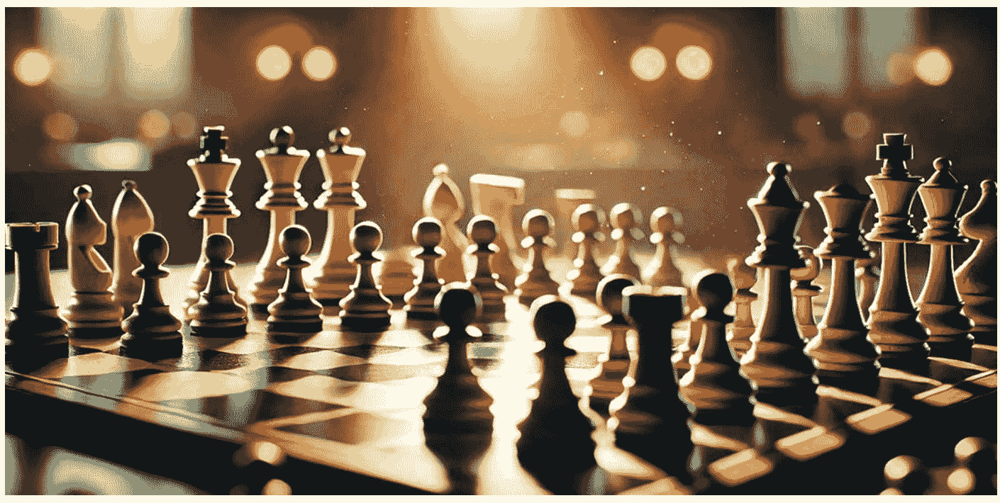

懒人专属群的群友，你好！

欢迎来到博弈论课，我是蒋文华。

前面两讲，我们讲了标准囚徒困境成立的条件和破解方法，接下来，我们来讲一种特殊的囚徒困境：“万元陷阱”。

前两讲中你应该已经感受到，标准囚徒困境分析起来还是比较复杂的，两个条件要精确嵌套，才能成立。“万元陷阱”在结构上更简单，但是“困”人的能力可一点都不差。

为什么要学习“万元陷阱”？因为这个模型，不仅能让你更深刻理解囚徒困境为什么是“困境”，还能帮你理解一个特别普遍的社会现象：为什么竞争中很容易出现愈演愈烈的内卷？

### 由来

先说“万元陷阱”是怎么来的。

这个博弈模型，源于一位经济学家的“恶作剧”。1950年，耶鲁大学的经济学家苏必克（M.Shubik）和另外几个人，包括著名的纳什，也就是提出纳什均衡的那个人，以及后面课程里要介绍的夏普利，共同发明了一种称为“再见！傻瓜”（so long sucker）的扑克牌游戏。游戏中，参与者为了取胜通常会选择背叛他的同盟者。结果人们在玩的时候，还挺当真的。有一对夫妻在玩这个游戏后竟然相互生气，各自打车回家。

苏必克觉得挺有意思，就在想，是否存在一个博弈，让参与者共同沉溺其中不能自拔，最后两败俱伤？

后来，1971年苏必克以《美元拍卖游戏》为题，发表了一篇论文。论文中，他说他设计了一个游戏，把1美元纸币作为拍品，当众拍卖，拍卖的规则很简单：出价最高的人获得1美元，但出价第二高的人也要支付他出的价格。

你要注意，这个拍卖规则和我们通常熟悉的拍卖规则不一样的地方在于：通常的拍卖中，出价第二高的人是不需要付钱的。

苏必克在文章中说：“实验结果显示，可以以远远多于1美元的价格卖出一张1美元的纸币，总的拍卖收益在3-5美元是极普通的事情。”据说，有一次1美元的拍卖总收益甚至高达66美元。

### 实验

苏必克是怎么做到的？

考虑到1美元太少了，不够刺激，我们把1美元更改为1万元。

让我们来做个思想实验。现在我们在一个大教室里来举行这场拍卖，规则是这样的，我拿出1万元，你跟同学们可以互相竞价，以100元为加价单位，直到没有人再加价为止。获胜规则是：出价最高者以其所出价格获得1万元，但同时，出价第二高者也得将他出的价格付给我。

第一个问题来了，你会参与这场竞拍吗？

一开始，肯定有不少同学明确表示不愿意参与这个博弈。

那么，我接着问，如果其他同学都不愿意参与，你愿意参与吗？相信几乎每个同学都会说愿意吧。因为这个时候你只要出100元，就可以获得我手里的1万元，净赚9900元。这么简单的账，谁都能算得明白。

可问题是，当你出了100元以后，一定会有其他人会说他愿意出200元，因为他可以赚9800元的净收益。当然，紧接着也会有人出300元，指望获得9700元的收益。

不难想象，你和对方会不断加价。假设，经过若干轮加价后，你已经加到9900元，而最高价已经加到了10000元。这时候你会不会就此放弃？你肯定不会，因为你选择放弃会损失9900元，如果选择加价到10100元，则只损失100元。这个时候的你，已经身不由己。

很自然地，你会加价到10100元，而对方往往也会加价到10200元，双方继续不断加价，直到有一方再也玩不下去，甚至宣告破产为止。

怎么样，听起来简单的万元陷阱，真的是够深的吧！

需要说明的是，要是真的课堂，我还真没法让大家拍卖1万块钱，毕竟1万块还是太多了。并且，如果两位出价最高的同学在1万以上仍然不停地加价，那可就让我太为难了。

所以，现实中，1万现金我会放到讲台上当道具营造气氛就好了。我实际的做法是，拿出50元现金进行拍卖。

这个实验我做了10年以上，总共玩了上百次，每次的拍卖总收入基本上都能达到100元以上。当然，拍卖结束后，我会把多出来的金额以微信红包的方式发到班级群里，返还给所有听课的同学们，并让大家掌声感谢出价第二高的学生。

实际上，这个实验，也不光是我做过。哈佛大学教授巴泽曼（Max Bazerman）在他的谈判课上也做过，下面的学生都是企业高管，但结论也是类似的。

更有意思的是，普林斯顿大学教授迪克西特（Avinash Dixit）也做过这个实验，不过，他做了一点改变。不是让同学们用钱来竞标，而是用掌声。哪位同学鼓掌时间最长，就把20美元奖励给他。结果，你猜怎么着？最后胜出的同学竟然持续鼓掌了4个半小时，快把手都鼓肿了。

### 现实

听到这里，你千万不要以为“万元陷阱”只是博弈论专家们在课堂上和学生玩的一种游戏而已。

人类社会的很多活动，你只要仔细思考就会发现，都有点万元陷阱的感觉。给你举两个实例。

第一个实例：网络游戏。

很多玩家可能都知道一款老游戏《征途》。2006年，商界奇才史玉柱花一亿巨资打造《征途》，并宣布“永久免费”——当然，是打引号的“免费”，由此彻底改变了国内网络游戏的商业模式。

《征途》你的确可以免费玩，但是玩着玩着你渐渐会发现，如果不花钱买装备，就不是你在玩游戏，而只是在游戏中被别人玩。那些拥有各种豪华装备的“人民币玩家”会拿着各种大杀器把你蹂躏得生不如死，让你感到自尊被践踏。

于是乎，愤怒的你大喝一声“不就是钞票吗？老子也有！”然后立刻花钱购买全套豪华装备，你的实力瞬间升级，把以前的对手彻底打败，报仇雪恨。那叫一个“爽！”。

然而，你觉得爽了之后，就轮到对手不爽了。对方也一定会想方设法地去买更好的装备，以便下次游戏中能够打败你！

这样一来，你和对手就共同陷入万元陷阱。为在游戏中获胜，双方不断花钱去买更好的装备。玩家们的争强好胜，自然是让游戏公司赚到了大钱。开发《征途》的巨人网络，曾经一度是中国最赚钱的游戏公司之一。

在网络游戏中为了获胜人们损失的只是钱和时间，而在有些比赛中，用不当手段竞争，损失的可能就是健康乃至生命。

我们来看第二个实例：体育比赛。

通常情况下，体育比赛中的“万元陷阱”是起积极作用的。体育比赛通常都只有前几名能够拿到奖励，因而所有的参赛者都会拼命加强训练、提高水平，结果是各类比赛的水平越来越高，人的运动能力越来越强。

然而，在一些极端情况下，因为竞争太激烈或获胜的奖励太诱人，有人就动了歪心思，比如使用兴奋剂，哪怕兴奋剂会伤害健康也在所不惜。

1984年洛杉矶奥运会前，加拿大反对滥用药物组织主席鲍勃·戈德曼曾向198名世界优秀运动员提出这样的问题：“如果我有一种神奇的药物，它能使你们五年之内在包括奥运会在内的所有比赛中战无不胜，但你们吃了这种药，五年之后就会死去，你们愿意吃吗？”

结果出人意料，竟有103名，占比52%的运动员回答说愿意吃。从这个角度，想必你更理解，为什么比赛要严格禁止兴奋剂？不仅是为了比赛公平，也是为了运动员的健康。

### 原理

看完这两个例子，你可能已经想到了，人类社会中，凡是有竞争的地方，就很可能出现不同程度的“万元陷阱”。

注意，我说的是“很可能”。并不是所有的竞争中都有万元陷阱，只有当竞争中存在比较大的沉没成本时，“万元陷阱”才比较显著。

因为在这样的竞争中，只有赢家才能获得回报，输家的投入都变成了沉没成本，血本无归。这就会导致参与者在回报的诱惑和损失的恐惧双重驱动下，让竞争不断升级。

对于人类社会来说，你说这是好事还是坏事？就像我们前面讲体育运动时讲到的，如果程度轻，未尝不可；然而，如果超过了一定的限度，那就会两败俱伤，谁也捞不着好处。

这个限度是多少？以前面的万元竞拍为例，有两个临界点需要注意：

一个临界点是，5000元。最高价出5000元，次高价出4900元，集体的净收益，至少还有100元。超过了5000元，尽管出价高的人还有收益，但集体已经是负收益。

第二个临界点是，1万元。最高价超过了1万元，那真是妥妥的两败俱伤，非但集体没有收益，任何个体也没有任何收益。

讲到这里，或许你已经意识到，万元陷阱和囚徒困境，具有结构上的相似性。我们前面讲到，囚徒困境要出现，存在两个条件，一个是存在背叛的诱惑，另一个是损人大于利己。

这两个条件，万元陷阱一开始就具备。背叛的诱惑，这个好理解，只要我出价比别人高，我就能拍下作为奖品的那一万元。损人大于利己在万元陷阱中体现在哪里呢？

你想想，如果你出价100元，本来已经要拍下1万元的时候，我突然出价200元，你的损失是多少，我的收益是多少？你的损失可不是只有100元哦，而是1万元。我出价200元，一方面让你损失了100现金，另一方面损失了原本能赚到的9900元。两者相加，妥妥的是1万元。而我的收获，却只有9800元。显然，我的收益抵不上你的损失。

要说明的是，我们这个模块学习的是完全信息静态博弈，准确来说，万元陷阱其实是完全信息动态博弈。因为博弈是先后进行的，后出价的人，是在看到前面的人的出价，然后才出价。但是万元陷阱跟囚徒困境具备相似的结构，所以我把它们放到一起讲。

万元陷阱和囚徒困境一样难以逃脱，越是理性计算，反而会越陷越深，无法自拔。而跟囚徒困境不一样的是，万元陷阱还会不断地升级、自我强化，让参与者之间的内卷愈演愈烈，比囚徒困境更难逃脱。

可是，面对这样的困境，难道我们就一点办法也没有吗？那倒也不是，下一讲我会告诉你如何破解这个难题。

### 总结

好了，我们来总结一下这一讲的内容：

- “万元陷阱”在生活中无处不在。**只要人们会持续做出损人大于利己的选择，那么一个又一个的囚徒困境就会累积成万元陷阱，让参与者欲罢不能，并最终导致所有参与者付出惨痛代价。**

### 思考题

如果你与另一个人各自带10万元竞拍我手里的1万元，博弈规则跟前面略微不同，不用每次100元慢慢加，可以跳叫，只要是100的整数倍就可以，比如500元、1100元。获胜规则一样，出价最高者将以其所出价格获得1万元，同时，出价第二高者将其所出价格的数量支付给我。

请问：如果让你先出价，你一开始应出价多少。答案要求：如果你提出该金额后，对方的理性选择一定是直接放弃出价。

我是蒋文华，我们下节课见。

## 《蒋文华·博弈论50讲》

会识局、能破局、善布局

版权归得到App所有，未经许可不得转载

蒋文华
浙江大学公共管理学院

蒋文华 浙江大学公共管理学院副教授


微信：lazyhelper
公众号
懒人搜索
懒人专属群

## 08习题课1：怎样才能凝聚共识？


懒人专属群的群友，你好！

欢迎来到博弈论课，我是蒋文华。

这一讲，是我们课程的第一次习题课，我来为你讲解课程中布置的思考题。

因为这周我们一共更新了七讲，所以今天的习题课内容会稍微多一些。七讲的思考题中，第二讲的思考题是大家分歧最大，也最不容易理解的，是今天习题课的重点。

### 思考题1

先来看第一讲思考题，对田忌来说，双方随机出马，三局两胜和五局三胜，哪种规则的胜率更高？

我看同学们的回答，正确率还是比较高的。那就是五局三胜对田忌更有利。

需要补充一点，无论比几局，比赛规则中还有一个隐含的约束条件是每匹马在比赛中只能有一次出场机会。否则齐王每次都出最高等级的马，双方就没法玩了。

我在浙大的一个学生曾经帮我写了一个计算机程序，不光计算了三局两胜、五局三胜，还计算了七局四胜、九局五胜、十一局六胜情况下，田忌胜出的概率。

我放在了文稿里，你可以点击查看。三局两胜，田忌赢的概率是1/6。五局三胜的规则下，田忌有更多机会利用马匹等级的优势，胜率更高，是22.5%。

表8.1不同赛制下田忌胜出的概率

| 赛制 | 齐王胜出的次数 | 田忌胜出的次数 | 田忌胜率 |
|---|---|---|---|
| 三局两胜 | 5 | 1 | 16.67% |
| 五局三胜 | 93 | 27 | 22.5% |
| 七局四胜 | 3728 | 1312 | 26.03% |
| 九局五胜 | 29535 | 103345 | 28.48% |
| 十一局六胜 | 27820524 | 12096276 | 30.3% |

此外，我也给你一个更简洁的方法思考这个问题，这个方法叫极限假设，很多时候我们可以把问题推向极致，反而容易找到答案。

田忌赛马博弈的前提是齐王每个等级的马，都优于田忌同等级的马，但是田忌高一等级的马优于齐王低一等级的马，比如，田忌的上等马比齐王的中等马要好。

实际上，齐王相对田忌只有1匹马的优势，一旦把齐王最高等级的那匹马去掉，如果是按顺序出马，双方的优劣势就会发生逆转。

田忌除了最低等级的马赢不了齐王任何等级的马以外，其余各等级的马，刚好都可以赢齐王低一等级的马。这时候，会存在一个趋势，马的数量越多，齐王的相对优势会不断减少，田忌的胜率就会不断增加。

当双方随机出马的时候，也存在这样的趋势，双方的马越多，田忌的胜率就越高。当然，这个胜率也不会一直增加，而是会收敛到50%。

这个具体计算过程比较复杂，涉及到比较深的数学知识，你可以让AI来帮你算。我让AI算的结果，附在文稿中了，感兴趣你可以点开查看。

推理关于田忌赛马，持续 1m 38s >

我们可以用随机排列的数学模型来分析这个问题。假设田忌的马按实力从弱到强编号为1,2,...,n，而齐王的马也按相应顺序编号，不过每匹马都比田忌对应编号的那匹略强，也就是说齐王的马“整体上”领先1个等级。

在这种设定下，如果两边“同序”出马——也就是田忌的第i匹马对阵齐王的第i匹马——齐王必胜；但如果田忌的马正好比齐王对手高1个等级（比如田忌的第i+1匹马对上齐王的第i匹马），那么田忌就能取胜。而其他情况则依然由实力较高的一方获胜。

当双方随机出马时，相当于将齐王马匹的出战顺序看作一个随机排列。对于田忌来说，第i匹马能赢的唯一条件就是对阵齐王编号恰好比i小1的马（即齐王的第i-1匹马）；而在一个随机排列中，对于每个i（从2到n），这种“恰好错位”出现的概率正好是1/n。因此，田忌获胜场次的期望值为：

E(胜场数) = (n-1)/n。

也就是说不管马的总数有多大，平均下来田忌每场比赛大约能靠这种错位赢下一场。

另一方面，我们关心的是整场比赛（多场对决）的胜负情况。假设比赛规则是“胜多者胜”，那么当n较大时，要想整体取胜，田忌必须赢过大约一半的n场。而由于每一场（严格来说各场并非完全独立，但整体可以用大数定律近似）田忌赢的概率大约是(n-1)/(2n)（考虑到如果两匹马正好同编号，齐王又会获胜），这个概率随着n增大趋近于1/2。

因此，从大数定律的角度来看，当马匹数目足够多时，双方随机出马的情况下，田忌每场获胜的概率将接近50%，整体比赛的胜率也就接近50%，而不会因为马多而让田忌的胜率提高到接近100%。

总的来说：

- 尽管田忌如果精心调配出马顺序可以利用“错位优势”大幅翻盘（经典故事中他能以少胜多），
- 但如果双方都是随机出马，田忌唯一能取胜的场合就是“正好错位出马”，这种情况的概率固定，且当马匹数增多时每场的胜率趋近于 1/2，
- 所以整体来看，田忌的胜率会接近 50%。

第二讲的思考题，比较复杂，我们放到最后讲。

### 思考题3

我们先看第三讲的思考题，这个题是先动优势和后动优势的探讨。很多同学分享了自己的博弈经历，也给了我很多启发。在博弈中，有时候需要我们抢占先机，有时候需要我们后发制人。

例如，企业之间的竞争，如果是广告战，往往是有先动优势，先做产品广告的企业更容易被消费者所记住；如果是价格战，往往是有后动优势，后制定价格的企业更容易在竞争中获胜。你有没有注意到，房企也好，车企也好，产品还没出来，广告先行，至于产品的定价往往是晚一点公布。

之所以让你来思考先动优势和后动优势的问题，有一个重要原因，是下周及后续的很多博弈模型中都存在这个问题。

不妨先剧透一下，在下周要介绍的懦夫博弈中就存在明显的先动优势。而下周要介绍的猎鹿博弈中则存在确定的后动优势。理解了不同模型中到底是先动有优势，还是后动有优势，会让我们在今后的博弈中，更容易找到有利的出招时机。

### 思考题4

第四个思考题，是关于你是否支持杭州萧山机场的做法，为了陈静一个人，133位乘客被耽误55分钟？尽管陈静情况特殊，家人刚刚遭遇车祸，着急回家。

从同学们的回答看，这件事的分歧还是挺大的。我大致统计了一下，支持的和不支持的比例各占一半左右。如果你把自己代入陈静的角色，当然支持，不管是谁，总会碰到难处，这时候肯定是希望别人能帮你一把。但如果你把自己代入乘客的角色，就会有的愿意，有的不愿意。133位其他乘客绝大部分肯定想早点起飞，说不定有些也是急着想早点回家的。

诺贝尔经济学奖得主科斯写过一篇非常著名的文章《社会成本问题》，这篇文章提出了一个非常重要的思想，那就是从社会总成本的角度来思考问题。正如“囚徒困境”模型中所分析的，在一个人与人之间难免相互影响的社会里，自己得到好处，别人的利益受到一点儿损失大家相对可以接受；但自己得到好处，别人的利益受到很大损失大家往往很难接受。思考的难点恰恰在于，我们很多时候无法进行精准的价值评估。

我喜欢举这么一个例子。如果有同学深更半夜突发疾病，面临生命危险，却怎么都打不到车，这时候，你逼着路过校门口的私家车司机送同学去医院抢救，会有人支持你的做法，毕竟救人更重要。但是，如果是你自己暑假回家去火车站打不到车，非要逼别人送你去火车站的话，就算你给了钱，那也谁都没法接受。

回到陈静的这件事，不少同学也提到了对133位乘客的补偿问题。这其实是一个非常重要的问题。一件事，即便总体来说利大于弊，值得做，也需要定好的规则，让受损方得到补偿。机场（包括航空公司）做了好事，得到好的名声，也可以考虑对乘客的补偿。

如果我是陈静，会选择打车赶回去。如果让这么多乘客为我耽误了这么长时间，我上飞机后，除了感谢和深表歉意之外，至少会对他们给与相应的经济补偿。当然，有乘客可能会表示拒绝，但无论是收钱还是拒绝收钱的乘客，都能更深切地感受到来自我的歉意和谢意。

### 思考题5

第五讲的思考题是讨论怎么避免囚徒困境。同学们分享了很多好的经验和办法。确实，我们都不愿意接受双输的均衡结果。所以，法律会惩罚偷盗行为，道德会谴责“吃相难看”的人。

这里特别要说一说“我心飞翔”同学的回答，他的回答是所有同学中最全面的，我分享给大家，他一共提出了8个方面的解决方案：

- 第一，通过签订长期契约，将单次交易转化为重复博弈。
- 第二，通过引入声誉机制，将匿名交易转化为可信合作。
- 第三，引入第三方监督和惩罚机制，降低欺骗的可能性。
- 第四，将公有资源转化为“有限私有”，避免公地悲剧。
- 第五，将个人利益与集体利益直接绑定，让个人利益和集体利益能够一致。
- 第六，发挥文化的影响力，将合作价值观内化为社会默认选项。
- 第七，用技术手段强制履约，比如用区块链技术，消除背叛的可能性。
- 第八，打造行业联盟，使联盟内的合作利益远超竞争带来的收益。

这8个方面的解决方案，在真实人类社会中都普遍存在，但它们的目标都一样，就是通过设计合理的规则，不断将“背叛困境”转化为“合作均衡”。

### 思考题6

第六个思考题，这是万元竞拍的一个变体，规则是100元为加价单位，价高者得到1万，但第二高的出价者也要付钱，双方的资金总额都是10万。问题是，如果你先叫价，叫多少可以直接逼迫对方放弃？

首先说明一下，为什么给一个10万元的上限？这是为了模拟现实中资源有限的情况。两个企业打价格战，价格越降越低，亏损越来越严重，总有亏光的时候。因此，10万相当于给内卷设置了一个上限。

留言中，董全冠同学和陈振中同学，都找到了这个题的解题要领，那就是逆向归纳，建立起一条“威慑链”。董全冠同学甚至还顺着“威慑链”找到了标准答案1000元，非常难得。

你一定很意外，为什么是1000元？我来给你讲讲大致的推理的逻辑。

首先，我们提到过，万元陷阱实际上是个动态博弈。我们也说过，动态博弈，终点决定起点。

你手里有10万，要保证对方不加价，可以直接出10万，对方没有更多钱，游戏结束，10万就是第一个威慑点。但是，这时你也要损失9万，这是最糟糕的情况，当然要尽量避免。

注意，接下来是关键。10万并非唯一一个威慑点，10万以下，还存在其他威慑点。

设想一下，什么情况下你没办法，只能直接出价10万？答案是，为了避免比9万更多的损失。

也就是说，当你叫价大于9万以上，即大于等于90100的时候（因为加价单位是100），如果对方还敢继续加价，那你会必然直接跳叫到10万，这样能避免你损失90100甚至更多。所以90100是“威慑链”中的第二个点。你抢到这个威慑点，对手就只能放弃了。

### 思考题7

我们再来看第七个思考题，这道题是关于怎么防止人们陷入万元陷阱的。同学们提供了非常丰富的案例，也给了我很多启发。

你有没有注意到，人类发明的破产制度就是避免大家越陷越深的好制度。

破产制度一方面起到了激励投资和创业的作用，最多把钱亏完，至少命还在，还有东山再起的机会；另一方面起到了及时止损的作用，一旦资不抵债就逼你先下牌桌。

设置止损线，也是非常实用的生活智慧。10多年前，一个出租车司机告诉我，他每次和朋友打麻将，只带800元，一旦输完立马走人。我听后对他竖起了大拇指。

### 思考题2

最后，我们来讲最烧脑的第二讲的思考题。先说答案：张三看到李四的数是3，李四看到张三的数是5，双方都知道两个数的差额是2。双方不允许交流的情况下，李四手里的数小于10这件事，不是共同知识。

具体的推理过程是这样的：

第一层推理，当李四看到张三手里的数字是5时，李四认为自己手里可能是3或7。显然，比较大的7也是小于10的。所以，李四知道自己手里的数字肯定是小于10的。

接下来是比较难的地方。李四知道自己手里的数小于10没用，他要猜张三知不知道这一点。

站在上帝视角，我们知道张三是知道的，因为张三已经明确看到了李四手里的数是3。但是李四并不知道这一点。他只能根据自己掌握的信息推测张三看到了什么。注意，接下来的推理，全都发生在李四的想象当中，而不是现实。

刚才我们说了，李四认为自己手里可能是3或7，这意味着李四要假设，张三从他手里看到了3或7，这里我们只需要关注比较大的可能性7，因为只要有一种可能性是大于10，共同知识就不成立了，7的基础上推理更可能大于10。

现在看第二层推理，李四假设，张三看到李四手里是7，那么张三就猜张三他自己手里可能是5或者9，跟上面一样，这里还是只关注比较大的9就好了。

紧接着再看第三层推理，还是在李四的假设中，张三以为张三自己可能是9，张三紧接着就会猜，李四看到张三是9，李四就可能认为李四他自己是11。

你看，到这里问题已经出来了，在李四看来，张三可能认为李四手里的数是11，11已经比10大。

整个推理过程特别烧脑，像是一层一层的套娃，通常需要尝试好多次才能推理到第三层。推理的关键在于，你要知道所有这一切，都是发生在李四的想象中，他不但需要猜自己的数，还需要猜张三看到自己的这个数后，会怎么猜李四的想法。在第一层推理中，李四猜自己可能是7这个错误，会在一层又一层的推理中被放大，最终严重偏离了事实。

但我们要追问的是，为什么会出现这么荒诞的局面呢？就是因为题目中的前提：双方不允许交流。开口一句话能解决的事儿，却在脑子里瞎想，越想越复杂，越想越离谱。

在我看来，这个题目可以给我们以下三点启发：

- 第一，一旦不许交流，一个人的认知就可能无法被证实或证伪，一旦犯错，就可能会在错误的道路上越走越远！
- 第二，一旦不许交流，张三和李四之间就无法就数字的大小范围达成任何新的共识！
- 第三，反过来，允许自由交流，鼓励彼此交流，才能更好地凝聚社会共识。

我一直认为，大家之所以喜欢在“得到”上学习，其中的一个重要原因是因为在“得到”这个学习平台上，同学之间、同学和老师之间能够充分交流。只有这样，我们已有的认知才能被证实或证伪。我们才不会像张三和李四那样，在错误的道路上越走越远。

因此，特别欢迎你对课程内容提出建议，让博弈论这门课变得越来越好！让大家的学习越来越有收获。

我是蒋文华，我们下周再见。


## 09 智猪博弈1：为什么会出现“搭便车”现象？


懒人专属群的群友，你好

你好，欢迎来到博弈论课，我是蒋文华。

今天开始，我们来讲一个新的博弈模型“智猪博弈”，这个模型，跟我们日常工作生活中非常常见的一个现象有关，那就是“搭便车”。

比如，团队里有人明明没干活儿，却能享受集体的成果；比如，有人在创新辛辛苦苦创造的新产品，却被别人低成本模仿。

遇到这种情况，你肯定会觉得，对被搭便车的人不公平，但又拿搭便车的人没办法。怎样看待这种现象呢？

学完“智猪博弈”你会知道，这种现象并不需要用简单的道德不道德评判，这其实是社会中无处不在的一种利益结构。

在这种结构中，我们既不是固定在“被搭便车”的一方，也不是被固定在“搭便车”的一方，我们的位置是经常转换的。而这种特殊的结构，在一些情况下，还能降低社会总成本。

听起来是不是有点儿反常识？让我们从智猪博弈的结构讲起。

### 智猪博弈

话说猪圈里有两只猪，一只大，一只小。这个猪圈一边有一个食槽，另一边安装有控制食物供应的按钮，按一下按钮就会有10份食物掉出来。

当然，按钮不是白按，也要消耗体力，相当于消耗2份食物的能量。换句话说，这就是按按钮的成本。

现在，大猪和小猪都有两个选项，自己去按按钮，或者等对方去，我们分别考虑四种情况下大猪和小猪的各自收益。

第一种情况，双方都不去按按钮，结果是谁都吃不到东西，各自的净收益都为0，它们都不会乐意，不会发生。

第二种情况，两只猪一起去按按钮，然后回到食槽这边一起吃，那么在10份食物中，大猪吃得快，能吃到7份，小猪吃得慢，吃到3份。此时，每只猪还都要减去2份按按钮的成本，结果是大猪的净收益是5份，小猪的净收益是1份。这种情况，大猪是乐意的。但别急，因为还有下面的第三种情况可选，小猪不会乐意，所以它不会跟大猪一起去按按钮。

第三种情况，大猪按按钮，小猪先吃，然后大猪再过去吃，大猪吃到6份，小猪吃到4份。但大猪还要减掉按按钮所消耗的2份，净收益也是4份。对比刚才的第二种情况，大猪虽然有点不乐意，但它没办法，因为第二种情况小猪不乐意，不会发生，大猪只能接受这第三种情况。

最后再看第四种情况，小猪去按按钮，大猪等着先吃，大猪吃到9份，小猪吃到1份。小猪还要减去按按钮的成本，小猪的净收益是损失1份，也就是说小猪吃完后比之前更饿了，这种情况下，小猪肯定是不干的。所以也不会发生。

文稿中，我也给你画出了四种结果的支付矩阵，方便的时候，你可以打开文稿对照看一遍，加深理解。现在你直接听我讲也不妨碍。

#### 标准智猪博弈

按按钮成本 A = 2

| 大猪 \ 小猪 | 按 | 等 |
| :--- | :---: | :---: |
| **按** | 5, 1 | 4, 4 |
| **等** | 9, -1 | 0, 0 |

比较上面的四种情况，你会发现，对于小猪来讲，不管大猪怎么选，它的最佳策略都是不去按按钮，也就是等待。而对于大猪来说，既然小猪一定是等待，他就只能去按按钮，否则他自已也要挨饿。

换言之，小猪等待，大猪去按按钮，就是智猪博弈的纳什均衡。

这就有意思了，这只小猪真不简单，它竟然可以堂而皇之地不劳而获。此时，大猪肯定会感到愤愤不平，活儿都是我干的，你却吃的跟我一样多。小猪估计都懒得搭理它：“你不按拉倒，我又没有求你去按！”

显然，这个局面，站在大猪的立场，肯定很不爽。

然而，要真正理解这个局面，你不能光站在大猪的立场，也要考虑考虑小猪；而如果你要理解得更深一点，还要超越大猪和小猪，理解这种结构背后的社会成本问题。

我们举例来说明。

现实中的很多现象，都是智猪博弈。

比如，很多小厂商不愿创新，而是总跟在大厂商后面模仿，这点常常被人们所诟病。但我们从博弈论的角度看，小厂商的选择也是有道理的。

我们都知道，创新高风险高回报，大企业愿意干，也能承担得起成本，虽然知道可能会被抄袭；而小企业跟随模仿，也能获得一部分收益，而且省去试错费用。合起来算，社会的整体福利是增加的。

这里，有必要再次引入一个前面提到过的经济学概念：外部性。

只是我们前面讲囚徒困境的时候，讲的是负外部性。这里我们要说的是正外部性。

所谓正外部性，指的是你在做某件事儿的时候，不管你愿不愿意，旁边的人都能白得好处。比如，你在家门口费很大劲弄出一个漂亮的花园，周围的邻居没付出过劳动，但他们仍然可以赏心悦目。

实际上，正是正外部性造就了搭便车。换句话说，智猪博弈的核心，你也可以理解成正外部性。

然而，尽管对整个社会来说，这是一件好事，毕竟社会的总收益是增加的嘛。但要维持这种局面，也不是那么容易。

什么条件下智猪博弈的局面能维持？什么条件下，局面会崩溃？

智猪博弈的局面能否维持取决于两点，一是按按钮的成本；二是收益分配的比例。接下来，我们逐个来分析。

### 智猪博弈的扩展

先来看按按钮的成本。

在总收益不变的情况下，我们让按按钮的成本变化起来，你会看到一些很有意思的结论。

时间的关系，分析过程我说简略一些，重点看结论。

文稿中，我给你附上了智猪博弈的一般化博弈矩阵，以及按钮成本在不同范围内变化时，每种变化下的博弈矩阵，时间充裕的时候，你可以逐个分析一遍，帮助你彻底理解智猪博弈。

#### 一般化智猪博弈

按按钮成本 A

| 大猪 \ 小猪 | 按 | 等 |
| :--- | :---: | :---: |
| **按** | 7-A, 3-A | 6-A, 4 |
| **等** | 9, 1-A | 0, 0 |

我们用A来代表按按钮的成本。

第一种情况，当 A ≥ 10 时，也就是按按钮的成本大于可以分配的总收益，这时候任何一方去按，获得的收益都是覆盖不了成本的，结果肯定是大猪与小猪都选择等待。

这意味着什么呢？不管创新也好，合作也好，如果做一件事儿成本比收益大，肯定是没人去干的，这是显而易见的。

#### 标准智猪博弈

按按钮成本 A = 10

| 大猪 \ 小猪 | 按 | 等 |
| :--- | :---: | :---: |
| **按** | -3, -7 | -4, 4 |
| **等** | 9, -9 | 0, 0 |

接下来是第二种情况，我们让按钮成本变小一点，按钮成本小于10但大于等于6（6 ≤ A < 10，6是大猪按按钮，小猪先吃，然后大猪再过去吃的收益），此时从整体看，去按的总收益 10-A 是大于0的，总收益大于总成本。

比如当 A = 8 时，整体的净收益是2，大于0。但大猪去按按钮的两种情况，净收益分别是-1，或者-2，都是负的；小猪按按钮的两种情况，净收益分别是-5，或者-7，也都是负的。这时候，双方必然都选择等（0，0）。

这意味着什么呢？一件对整体有利的事情，因为对每个具体的个体不利，这件事照样做不成。

#### 智猪博弈变体

按按钮成本 A = 8

| 大猪 \ 小猪 | 按 | 等 |
| :--- | :---: | :---: |
| **按** | -1, -5 | -2, 4 |
| **等** | 9, -7 | 0, 0 |

再继续让按按钮的成本变小，让 A 大于等于1小于6（1 ≤ A < 6），在这个区间里面，就是标准的智猪博弈了。小猪会继续选择等，但大猪去按的净收益为 6-A > 0，比如我们开头的例子中就相当于 A = 2，大猪的净收益是4，因此大猪会选择去按按钮。

这意味着什么呢？在创新问题上，要维持智猪博弈的局面，至少要让创新者的净收益，大于创新成本。

#### 标准智猪博弈

按按钮成本 A = 2

| 大猪 \ 小猪 | 按 | 等 |
| :--- | :---: | :---: |
| **按** | 5, 1 | 4, 4 |
| **等** | 9, -1 | 0, 0 |

其实，就算在这个区间里面，还有不同情况，也值得来看一看。

当按钮成本 A 大于等于2，这会是一个多劳不多得，甚至多劳少得的局面，大猪干了活儿，但净收益居然比小猪还少。比如，当按按钮的成本 A = 3，大猪的净收益就是3，小猪的净收益是4。

这时候大猪一定会觉得很无奈，内心估计也不平静。所以这是一种非常脆弱的均衡，指不定哪天，大猪就会跟小猪爆发冲突，撂挑子不干了。

而当按钮成本 A 小于2时，就是多劳多得的局面。比如，当 A 等于1.5时，大猪的收益是4.5，小猪的收益是4，4.5显然大于4。这时候，大猪心里就会相对平衡一些，就让小猪占点便宜吧，反正大头儿收益是我的。

最后我们再来看，按按钮的成本如果小于1，会发生什么情况？这时候，局面会变得有点复杂。此时小猪去按按钮，有了净收益，但是小猪会不会去按，还要看大猪的行动。

比如，当 A = 0.5，如果小猪确认大猪会选择等待，那小猪最优的选择是去按按钮，虽然去按了也只有0.5份净收益，但也比不去按按钮挨饿强。但如果它确定大猪会去按按钮，小猪的最优选择又变成了等待而不是去按按钮，因为如果它跟大猪一起去按按钮，净收益只有2.5，而等待的净收益是4。

用博弈论的术语来说，这时候这个博弈存在两个纳什均衡，哪一种会实现是个比较复杂的问题，我们后面讲到混合策略的时候再说，这里先不展开。

我们还是追问一句，刚才这个局面意味着什么呢？意味着当社会的创新成本足够低，低到社会中的弱者也能从创新中获得收益的时候，全社会创新的积极性就都会被调动起来。

#### 智猪博弈变体

按按钮成本 A = 0.5

| 大猪 \ 小猪 | 按 | 等 |
| :--- | :---: | :---: |
| **按** | 6.5, 2.5 | 5.5, 4 |
| **等** | 9, 0.5 | 0, 0 |

### 收益分配调整

说完了怎么通过调整按按钮的成本来控制智猪博弈的局面，我们再来讨论收益分配的调整。

在分析按按钮成本的时候，你有没有想过，如果按按钮的成本实在没法降低，该怎么办？

这是非常现实的问题，我们还是拿创新来说，创新这事儿之所以成本高，就是因为它本来就很难，需要大量的资源、时间、人才，没法儿变容易，成本也没法降低。这时候，还怎么让“大猪们”有创新的积极性呢？

办法就是给他们更多收益。

回到刚才的博弈局面分析。比如，当按按钮的成本是7时，这时如果按照原先6:4的分配比例，大猪肯定不会去按。

有同学可能问，6:4是怎么来的？这就是开头我们介绍标准智猪博弈模型时，在大猪按按钮小猪等待时，它们分别获得的食物比例。

但如果我们把食物的分配比例，从6:4改成8:2。这样一来大猪按按钮之后，至少还有1份净收益，就会有积极性了。

由此可见，在很多时候，并不是大家的收入越平均越好。大家收入一样，一件对大家有利的事情反而会没人愿意做。收入分配有差异，才会激发人的积极性。

继续回到收益分配比例的调整上来。其实我们也可以从小猪的角度考虑收益分配的调整。在按的成本为7时，如果小猪利用离食槽近的优势吃4份食物，大猪肯定没有按的积极性。

但如果小猪能够克制一点，少吃一点，比如只吃2份食物，这样大猪至少还能有1份食物的净收益，大猪也就有了去按按钮的积极性。相反，如果小猪不克制，那就要跟大猪一起挨饿了。

这说明什么道理呢？总想占便宜的结果，很可能反而没有便宜可占。

换个角度考虑。小猪少吃2份食物，你可以理解成，这是小猪主动激励大猪。

讲到这里，其实我们也可以把大猪视角和小猪视角连起来。

人生是一个漫长的过程，社会是一个复杂的网络，有时候我们会是大猪，有时候我们是小猪。

不管是作为大猪，还是作为小猪，我们都有自己的修养：

小猪的自我修养是，能占便宜可以占，不丢人，但是要懂得克制。

大猪的自我修养是，别老怕别人占便宜，记住《蜘蛛侠》的台词：能力越大，责任越大。

### 总结

好了，我们来总结一下这一讲的内容：

智猪博弈对应的是人类社会中无处不在的搭便车现象，对于整个社会来说，搭便车并不是一件坏事。

要想维持智猪博弈的局面，我们可以在两件事上使劲，一是降低按按钮的成本，二是增加对大猪的奖励。

### 思考题

最后，给你留一道思考题，人们常说“好货不便宜，便宜没好货”。你相信这句话吗？如果大家都相信这句话，商家会不会故意通过给差货标一个高价来欺骗我们呢？在什么条件下，我们才能相信这句话？

我是蒋文华，我们下节课见。


## 10 智猪博弈2：怎样降低防盗成本？


懒人专属群的群友，你好

你好，欢迎来到博弈论课，我是蒋文华。

上一讲，我重点讲了智猪博弈成立的条件，这一讲，我们来看智猪博弈更广泛的应用。

先要说明的是，这里说的应用，并不一定给你一个新的解决方案，而是提供一个观察社会现象、观察制度的新视角。

不多铺垫，我们直接开始。

### 便宜有没有好货

先来看一个智猪博弈非常贴近每个人日常生活的应用。

问你一个问题：你买东西的时候最怕什么？我相信所有人会有一个共同答案，别花冤枉钱。

有些东西，价格看着挺贵，但如果一分钱一分货，那多花点钱，我们也心甘情愿。但反过来，如果不值那个价，花再少的钱也会觉得冤。

可现实又是，要判断一个东西值不值那个价，要花额外的时间和精力，也并不容易。那么，怎么能既省事，又少花冤枉钱呢？智猪博弈就可以帮你。

所有的商品，根据判断质量好坏的难易程度，我们可以依次排列。一头是很容易判断质量好坏的，比如大多数的日用消费品、水果蔬菜、小家电等；另一头是很难判断质量好坏的，比如名烟名酒名茶，珠宝玉器，古玩字画等。

在质量判断的难易度这个维度的基础上，智猪博弈给你的消费建议是：

买质量好判断的东西，你可以不用费心思，就跟着别人走。如果你想省钱，就买最多人买的，大概率不会错；如果你想提升品质，就买贵的，也不用怕上当。

而买质量不好判断的东西，你要么自己成为专家，要么就干脆别买，因为你不懂行，就特别容易成为被割的韭菜。

这两条建议跟智猪博弈有什么关系呢？

质量好判断的东西，会判断好坏的消费者就多，商家就只能规规矩矩定价，一分钱一分货。他要是敢以次充好，或者胡乱定价，很容易被消费者揪出来。消费者直接用脚投票，不买他的东西。这个时候，就相当于大多数消费者已经帮你做好价格评估和质量鉴定，大多数消费者就相当于是大猪，你可以放心当小猪，搭他们的便车。

记得好多年前，有一个浙大总裁班学员就和我说，他会跟自己孩子说，买吃的东西就买贵的，贵的就是好的和放心的。这话太土豪了。

但确实，食品的品质高低相对容易判断，懂行的消费者也远多于不懂行的消费者，再加上食品我们往往都会重复购买，这样商家就不敢太乱定价。就算你不懂行也没关系，要想吃得好、吃得放心就买贵的，这基本上错不了。

然后再来看质量不好判断的东西。这类东西，懂行的消费者本来就少，商家定个虚高的价格，一般消费者也看不出来。这时候，你看销量也好，看定价也好，都很难判断东西的质量。

看到过一个新闻，有个知名演员在云南拍戏，看到一件玉器产品，商家开价20万，最后和她一起去的人帮忙砍价到1000元成交。你说，如果你遇到这样的事儿，身边没个懂行的人怎么办？

如果你还是要买，那你就需要成为大猪，让自己变成懂行的人。你自己不去变成懂行的人，又没人能帮你鉴别，那很可能要吃大亏。

说到这里，你可能也意识到一个问题，不管是质量好判断的商品，还是质量不好判断的，如果没有人费劲去成为“行家”，如果人人都想着搭别人的便车，那就谁都没便车可搭了。这也是一切智猪博弈的共同难题。

从这个角度说，以后不管是买啥，买完之后，偶尔写个评价，这还真是个利人利己的好习惯。

### 谁在买高仿

接下来我们再来看智猪博弈的第二个应用，还是讲消费，但是我们消费的对象换一下，变成奢侈品。

我们都知道，奢侈品这个圈子有个特点，正品特别贵，假货特别多。因为假货太多，还多出了层次，有那种一眼看过去就是假货的山寨，但也有足以乱真的高仿。

按照一般解释，人们肯定会说，山寨假货和高仿，那都是搭了人家正品厂家的便车。今天我带你换个角度看问题。

我们先回到问题的原点，有人卖高仿，那肯定是因为有需求，到底是谁在买高仿？你第一反应肯定是没钱的人。但这可不一定的。

《纽约时报》和《华尔街日报》等多家媒体都报道过，在纽约存在一个有钱女性组成的社群，叫作 RepLadies，这个社群里不乏特别有钱的CEO、投资人，她们完全有能力消费正品的奢侈品，但是她们却旗帜鲜明地买高仿，互相之间还特别热衷于交流各种怎么买到完美无瑕高仿品的经验。

明明买得起，她们为什么却不买正品呢？从智猪博弈的角度看，我们也可以理解为，她们是在搭便车。谁的便车？那些买正品人的便车。

因为奢侈品有一个特点，消费者购买高价奢侈品不仅是为了满足实际需求，更重要的是为了展示自己的财富和社会地位。或者换句话说，花高价就是为了证明自己出得起高价。现在，这些 RepLadies没花那个高价，却还是获得了那个地位象征的效果，你说，她们是不是在搭便车？

这里最有意思的是，如果是穷人背上一个名贵的包包，很容易被认为是高仿的，所以，穷人需要通过买一个明显的正品来证明没有买高仿。而RepLadies这样的富人就算买一个高仿，也会被认为是正品。

这么一说，买高仿的富人，不单是搭了那些买正品的富人的便车，还搭了买正品的穷人的便车。

这给我们的启发是什么呢？对我来说是，消费奢侈品当然没啥问题，只要钱包宽裕。但如果省吃俭用，从牙缝里抠钱，甚至借钱去买一个高价包，就有点冤。

### 防盗和集体信用

刚才都在用智猪博弈来分析怎么做个精明的消费者，精明归精明，但格局不够大，智猪博弈的应用自然不止于此。接下来我们再运用智猪博弈解决几个大问题。

第一个问题，怎么防盗？

盗窃，是人类自古以来就有的老问题，解决这个问题，办法当然有很多。以前你采取的措施是加锁、安装防盗门和防盗窗。现在采取的防盗措施还可以安装摄像头。你是否注意到，同样是防盗，大家安装防盗门和安装摄像头，是两种截然不同的博弈。

现在每家都习惯了安装防盗门，防盗门也不太贵了，大家没感觉。但其实，逻辑上来说，你家安装防盗门降低了你家被盗的概率，但会增加邻居家被盗的概率，这是某种负外部性，反之也是如此。你当然并不是有意的，但这是防盗门自然会有的效果，小偷自然会被“挤”去没安装防盗门的邻居家下手。

因此，无论邻居是否安装防盗门，你家选择安装是占优策略。大家都安装，每家被偷的概率不变，但防盗的总成本却明显增加了。

安装摄像头就不一样了，会带来正外部性的效果。一个摄像头不是谁家安装管谁家，而是可以辐射一片。小偷知道一家门口安装了摄像头，对于周围的几户人家，就都不敢下手。

比如，英国的一所大学的一处停车场曾安装了少量监控摄像机，并广而告之周围的居民，结果全年偷盗破坏事件从138起降至65起，而没被摄像头直接覆盖的停车区，盗窃也同样减半。【1】

而更有趣的地方在于，有些人会安装一些假的摄像头来欺骗小偷，当小偷没法识别真假摄像头时，那些安装假摄像头的人搭了安装真摄像头的人的便车。

当然，我这里并不是建议你以后就别安装摄像头了，只是提醒你有这样一个观察社会的视角。你想想，如果家家户户都花很大精力和成本去防盗，那对于社会资源，是一种很大的浪费。如果防盗措施有正外部性存在，少数人可以搭便车，社会整体的防盗成本是会下降的。

### 第二个问题，怎么判断一个人的信用？

任何高校中，老师水平有好有差，水平差的老师，搭了水平高的老师的便车。任何医院中，医生的医术有高有低，医术低的医生，搭了医术高的医生的便车。考大学也是一样，学生努力考名校，也是为了搭名校中那些更优秀同学的便车。

你可千万别误会，我这里可不是要说滥竽充数，那是另一个问题。我要说的是，集体声誉这种社会自发演化出的机制起到了降低社会交易成本的积极作用。你想想，如果一个社会中，谁都不信谁，每个人的信誉，在交往合作之前，都要单独评估，那是多大的一笔成本啊。

在此，智猪博弈可以给我们提供两条处世哲学。作为个人，我们一定是嵌入在各种大大小小的集体中，在有些集体中，我们是大猪，但在有些集体中，我们会是小猪。

当我们是大猪的时候，好好干，维护集体的好声誉，让别人愿意跟这个集体合作，也允许小猪们搭便车，这是于人于己都有利的事儿。

当我们是小猪的时候，该搭的便车还是可以搭的，只是也别总是白占便宜，便宜占多了，集体的声誉毁了，那是于人于己都没好处的事儿。

### 总结

好了，我们来总结一下这一讲的内容：

这一讲，我主要讲了智猪博弈的三类应用。

智猪博弈对人类社会中的很多现象，都有很强的解释力。允许小猪搭便车，可以在一定程度上为整个社会降低交易成本。

#### 下节预告

预告一下后面几讲的内容，无论是囚徒困境还是智猪博弈，我们前面讲的几种博弈都只有一个均衡。

从下一讲开始，我会给你介绍有不止一个均衡的博弈模型，这样的模型有很多，下一讲我们介绍第一个，懦夫博弈。

### 思考题

最后，还是给你留一个思考题，请回忆一下你过往的人生经历，找出两件事，一件是你搭别人便车的，还有一件是被别人搭便车的。你当时是怎么样的想法和心态？

这里，顺便也公布一个咱们这门课的学习奖励，我们每节课末尾都有一个思考题，每周一，我会公布上一周的最佳作业同学名单，每位同学的奖励是《博弈思维线下研修班》的参加名额一个。

这个研修班的主题是：“博弈在现实竞争与合作中的应用”，会在四月底课程完结时办，时长是半天，地点就在北京得到总部。

公众号懒人搜索,懒人专属群分享

今天补充公布一下上周获奖的7位同学名单，分别是：左星星、董全冠、Charles Wang、咚咚锵、我心飞翔、陈振中、上善若水。

文稿中有课程主编的微信(18500161040)，请获奖同学添加他的微信，方便到时候联系到大家。

期待看到更多同学的精彩作业和留言，也期待在线下见到你。

我是蒋文华，我们下节课见。

## 参考资料

- 【1】 https://popcenter.asu.edu/content/step-13-expect-diffusion-benefits#:~:text=the%20year%20following%20the%20introduction,parking%20lots%20to%20commit%20crime


## 11 懦夫博弈：怎么避免两败俱伤？

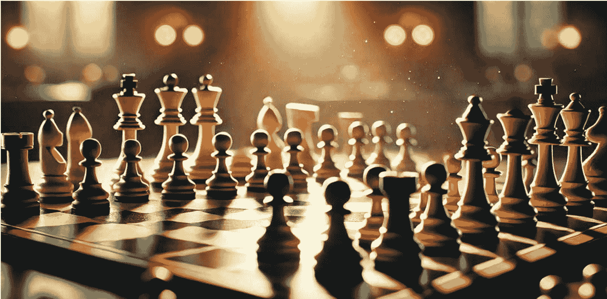

懒人专属群的群友，你好！

你好，欢迎来到博弈论课，我是蒋文华。

这一讲，我们要来讲一个新的博弈模型：懦夫博弈，有些地方也叫斗鸡博弈、胆小鬼博弈、鹰鸽博弈，都是一回事。

先讲一个我的亲身经历。我以前住的一个小区，内部道路很窄，所以全部设置成了单行道。有一次，我看到有人开车逆行，正好和另一辆正向行驶的车相遇，但逆行的车却死活不肯让，两辆车僵持在那里10多分钟。

最后结局怎么样呢？逆行的那个家伙，居然弃车走了，正向行驶的车没办法，只好从另一个门倒出去。然后那个逆行的家伙又马上回来，大摇大摆地开车走了。

我们自然都会觉得，逆行的这个家伙素质极差，但却也不得不承认这家伙真是个狠人。

其实，这就是一个典型的“懦夫博弈”。在这个故事里面，因为有约定俗成的交通规则，我们很容易判断逆行的人是不道德的，应该是他选择退让。

但是，在很多其他情况下，我们没有约定俗成的规则可以参照，谁退谁进就是个难题。

一方退让，另一方就会拿到全部好处。但是双方都会想，凭什么是 我退？于是就会有僵持。更糟糕的是，要是双方都不退让而选择前进，那就是两败俱伤。

如果你以后遇到这样的局面，怎么做才能争取到最大的利益，同时又避免两败俱伤？这一讲，我就带你来分析这个问题。

### 成立条件

老规矩，我们还是先来看懦夫博弈成立的条件。

在懦夫博弈中，有两个参与者A和B，每个参与者有两种行动选择：进和退。双方博弈会出现四种结果：都进、都退、A进B退、A退B进。

我们给四种结果分别赋上一个损益值，这样更好理解：都前进（-20，-20）；都退（0，0）；A进B退（10，0）或者A退B进（0，10）。

懦夫博弈的四种结果，也可以简单归纳为：都进则两败俱伤，都退则息事宁人，一进一退则进的一方占尽便宜，另一方颗粒无收，甚至还可能颜面尽失。

我在文稿中给出了懦夫博弈的矩阵，你可以打开文稿查看。

表11.1 懦夫博弈

| | 进 | 退 |
|---|---|---|
| 进 | -20, -20 | 10, 0 |
| 退 | 0, 10 | 0, 0 |

从集体的角度看你会发现，懦夫博弈，存在两个均衡解（A退，B进）和（A进，B退）。这两个结果比双方都进或者双方都退，收益都要大；但这两个结果之间，却分不出高下。

再从个体的角度看，对A来讲，B进的时候，他应该是退；B退的时候，他应该是进。对B也是一样的。这就是一个两难的局面。

遇到懦夫博弈时，参与者的目标是，想办法自己选择“进”，获得最大的利益；但同时，还不能让对方选择“进”，避免两败俱伤。这也就是我们开头提到的问题。

好，那参与者怎么能达到这个目的呢？

### 怎么取胜

讲到懦夫博弈中的取胜策略，其实挺让人沮丧的。放下道德评价，开头故事中逆行司机的做法，的确就是最佳策略。我们再来详细分析一下。

在博弈论的语境下，我们一般会说懦夫博弈中存在明确的先动优势，赢的办法，就是去抢这个先动优势。

什么叫先动优势？一旦你先选择了进，对方的选择只能是退，否则会面临更大的损失。这也就是人们常说的“先下手为强，后下手遭殃”。

实际上，这也就是把静态博弈，变成了动态博弈。你看，这又说到了出招顺序对于博弈的重要性。

说回先动优势。更具体一点讲，要抢到这个先动优势，有三个步骤：

- 第一步，抢先选择进，而不是犹豫，或者等着对方先动。
- 第二步，让对方知道你已经选择了进。否则，如果你选择了进，但对方并不知道，甚至误以为你选择了退，那么对方也会跟着选进，双方必然会两败俱伤，这肯定也是你不希望看到的结果。
- 第三步，让对方知道你已经选择的这个“进”，是无法更改的。

这第三步跟第二步有什么区别？因为有的时候，对方可能觉得，你这是在吓唬谁呢？我才不怕。还有一种可能，对方在明知你进的情况下，仍然会选择进，是想以此来逼你改成退。所以，在懦夫博弈中要赢，你不但要让对方知道你选了什么，而且要让对方确信，你的选择是不会更改的或不可更改的。

那你怎么做，才能让对方知道你的选择不会改？举两个例子：

第一个例子，就是我们开头讲的那个逆行的司机，他选择弃车，就是明确传递信号，我就是不退了，你看着办吧。

诺贝尔经济学奖得主，博弈论大师托马斯·谢林还给过一个办法，你可以直接拿掉方向盘，并且当着对方的面把方向盘扔出窗外。在这种情况下，除非对方是疯子，否则一定会选择退。

当然了，谢林这里是打比方。谢林只是强调，你要想办法，确保对方绝对相信你已经选择了无法更改的“进”，然后以此逼着对方选择退。

你可能感受到了，懦夫博弈中的制胜策略，跟我们前面讲万元陷阱的破解策略时提到的“传递势在必得的信号”有点像，没错，两者可以说异曲同工。

### 竞争对手也要传递信息

以上，就是在懦夫博弈中取胜的策略，说起来其实并不难理解。

但是这个简单的策略，对于我们理解现实中的竞争与合作有很大的意义：竞争对手之间，也需要有效的信息传递，否则经常的情况就是两败俱伤。

我在浙大的博弈论课堂上，经常和学生们玩一个游戏：我让AB两个学生发5元红包给我，发的时候备注“进”或“退”。

收益规则也是这三条：
- 如果AB都“进”，各损失5元，钱归我。
- 如果AB都“退”，我返还红包给他们，双方收益为零。
- 如果AB一个“进”一个“退”，则“进”的同学赚10元，“退”的同学不亏不赚。也就是，我不仅会全额返还两位同学5元的红包，还额外送给选“进”的同学10元。

从我课堂上的实际博弈结果看，在双方不能沟通的情况下，AB都选择进，然后两败俱伤，是经常看到的博弈结果。

实际上，这并不只是一个简单的课堂游戏。在人类历史上，竞争的国家、公司和组织之间也经常遭遇懦夫博弈的局面，为了避免两败俱伤，也需要建立有效的沟通机制。

美苏冷战大家都熟悉。冷战期间，美苏两国关系剑拔弩张，大搞军备竞赛，势要争个高低。然而任何一方都不想把冷战变成热战，因为代价太大了。

可是，局势那么紧张，万一擦枪走火，因为误会开战怎么办？1962年初，托马斯·谢林提出美苏两国之间设置联络热线的必要性。刚开始，两国都还没太在意这个建议，但是就在这1962年下半年，古巴导弹危机，核战争险些爆发，双方想想都觉得后怕。

于是1963年6月20日，美苏双方签署了《关于设立直接通信线路的谅解备忘录》，也被称为《美苏热线协议》。这个协议约定：紧急时刻，美苏两国领导人可以快速、直接且私密地通过这个热线沟通，从而排除因通信延迟或误解对方行动而导致核战争爆发的风险。

另一个商业领域的经典案例，是滴滴和优步的网约车大战。2015年，滴滴出行刚通过合并快的打车赢下一战，这时候优步中国加大了攻势，他们也将中国市场视为必须攻下的战略高地。竞争初期，滴滴和优步都投入了巨额资金展开补贴大战。据彭博社的测算，这场补贴大战如果进行下去，每年会让双方合计损失数十亿美元。

然而，尽管公开竞争如火如荼，双方私下却保持着理性，并没有真要到同归于尽。事实上，在资本层面和高管层面，滴滴与优步早有接触。最终的结局是，经过多轮秘密谈判，2016年滴滴收购优步中国的业务，优步全球获得滴滴5.89%的股权，滴滴创始人程维和优步时任CEO卡兰尼克还分别进入了对方公司的董事会。

所以你看，人类社会的确有一些竞争要么赢家通吃，要么认输退场；但更多的竞争，哪怕面儿上剑拔弩张，但骨子里还是有协调空间，没必要真到两败俱伤那一步。

### 收益结构分析

讲到这里，懦夫博弈的取胜策略，已经说清楚了。
但以上的分析，都是身在局中，说的是在给定收益和损失大小的时候，应该怎么办。跟分析其他的博弈一样，我们同样可以让收益和损失的大小变动起来，由此来观察博弈局面的变化。

我们先来看损失大小的变化对懦夫博弈的影响。
这里，我先问你一个问题：为什么确定对方会进的时候，另一方的理性选择一定是退？你可能觉得，这不是显而易见吗，前面不是说到了，是为了避免损失嘛。

没错，但是还不够具体。事实上，只有当两败俱伤的损失对任何一方都足够大的时候，另一方才会选择退。
放到具体的场景中你一下子就能理解。正因为两车都前进的代价是两边都车毁人亡，所以先下手为强才能吓退对方。同样，核威慑也是一样的，正因为核战争的代价足够大，所以双方才不会冒险。当然了，这里也有一个前置问题，核威慑要有效，必须本国确实有足够多的核武器，否则也威慑不到对方，这也正是冷战时期美苏军备竞赛的成因。

反过来，如果损失不够大，双方都能承受的话，消耗就会长期持续。比较典型的例子是两家竞品公司之间长期的拉锯战，比如，可口可乐与百事可乐之间就是这样。为了争夺市场，双方持续地进行广告战，但相对两家企业数百亿的营收来说，这些投入还不足以“伤筋动骨”，这让双方的竞争始终持续，而不是出现一家独大的局面。

接下来，我们再让赢家的收益也变化起来。

我在浙大讲博弈论课的时候，经常问同学一个问题：很多大学的一等奖学金，大约是6000元左右，如果这个金额从6000元增加到6000万，对同学们是有利还是不利？你可以先思考一下。

我给出的答案是，肯定不利。我经常和同学们开玩笑说，如果从6000元增加到6万对同学肯定是有利的，同学们努力学习就可以了。可一旦增加到6000万，结果很可能是每个学期考完试后，就会有同学不见了。学习成绩越好的同学，不见了的可能性越大。

这就叫，重赏之下，必有莽夫，甚至是屠夫。当某种诱惑足够大以后，很多人就会不断突破底线，甚至不惜违法犯罪。这时候，良性的竞争变成互相伤害，而伤人者又被法律惩罚，结局就跟懦夫博弈很像——两败俱伤，任何人都没得到好处。

怎么避免这种局面呢？一切的激励，都应该适度，过犹不及；与此同时，有激励也要有惩罚，惩罚力度和激励强度需要相匹配才行。至于怎么匹配，我们后面有一讲内容会详细讲解，这里先点到为止。

### 总结

好了，我们来总结一下这一讲的内容：

- 1、懦夫博弈体现的是，在争夺资源时，如果存在先动优势会出现的局面。懦夫博弈存在两个均衡解，哪个均衡解被实现，就看谁先下手为强。
- 2、但先下手，是不是有用，又要基于有效且可信的信息传递，如果对方不知道或者不信你已经先下手，很可能会两败俱伤。
- 3、研究懦夫博弈对于我们理解“激励”的限度，有重要的指导意义。

#### 下节预告

预告一下下一讲的内容，懦夫博弈是竞争关系的博弈，但人与人之间可不仅仅是只有竞争关系，亲朋好友之间很多时候恰恰需要相互合作。下一讲我们将介绍一种合作关系的博弈模型：夫妻博弈。

### 思考题

最后，还是给你留一道思考题，很多人都听说过“幸福让”。意思是发生争斗的时候，谁更幸福谁更愿意谦让。你觉得“幸福让”是事实吗？你有过“幸福让”或被“幸福让”的经历吗？

我是蒋文华，我们下节课见。


公众号懒人搜索，懒人专属群分享
公众号
懒人搜索
懒人专属群
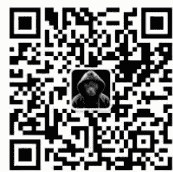
微信:lazyhelper

## 12 夫妻博弈：春节过年回谁家争执不下怎么办？


懒人专属群的群友，你好！

欢迎来到博弈论课，我是蒋文华。

上一讲，我们讲了竞争关系的懦夫博弈，这一讲我们来讲一个跟懦夫博弈结构类似，但是竞争关系变成了合作关系的博弈模型：“夫妻博弈”。

至少最近十几年吧，相信你一定关注到一个现象，每逢春节，“过年回谁家”这个话题，总能上热搜。

情侣或夫妻是想一起过年的，但去男方家，女方心里总有点不乐意；去女方家，男方心里也会不乐意。要是各回各家，也不是不可以，但总感觉是退而求其次。于是各种冲突和矛盾就来了。

这种情况，在博弈论上对应的就是夫妻博弈。这类博弈的共同特点是，博弈双方存在一定的共同利益，因此会倾向于合作；但是双方对共同利益的不同结果，又有着不同的偏好，因此又会相持不下。

如果你以后遇到类似的局面，怎么既不伤害合作关系，又能避免相持不下？这一讲我们就来分析这个问题。

### 夫妻博弈的条件

老规矩，先来看夫妻博弈的结构。

不过这里先要说明一点，我知道一看到过年回家这个问题，很多同学会有个疑问，现实中的夫妻过年的时候未必一定是在一起的，过年的时候各回各家也不是不行啊。

的确，我身边也有不少朋友就是这么选的。但是，如果双方都很认可各回各家的过年方式，那这就不是博弈论意义上的“夫妻博弈”。因为，这时候各回各家的收益肯定要比一起过年的收益更大，那就是另一种类型的博弈了。

我们这里讲的夫妻博弈，更多是一种隐喻，重点不是真实的“夫妻关系”，而是“博弈结构”，我们要借此研究的，是一种社会中普遍存在的“合作结构”。

铺垫完毕，我们正式来看夫妻博弈的结构。

我们假设，男女双方都有回自己家和回对方家两个选择，两两组合一下，夫妻博弈就有四种结果。我们假设四种结果的收益如下：

结果1，都去男方父母家过年，男方收益是2，女方收益是1。

结果2，都去女方父母家过年，女方收益是2，男方收益是1。

结果3，各回各家分开过年，双方的收益都是0。

结果4，丈夫体贴妻子选择去女方父母家过年，妻子体贴丈夫选择去男方父母家过年，结果双方既没有在一起过年，还都没去自己父母家，这种情况下双方的收益都是-1。

这种情况听着有点奇怪，但也反映出信息传递在博弈中的重要价值，这一讲我们先不展开，后面讲到协调博弈，我们再详细说。

在文稿中，我给出了四种结果的博弈矩阵，你可以点开查看。

表12.1 夫妻博弈

| | | 妻子 |
|---|---|---|
| | 男方家 | 女方家 |
| 丈夫 男方家 | 2, 1 | 0, 0 |
| 丈夫 女方家 | -1, -1 | 1, 2 |

我们来分析一下这四种结果。

我们很容易看到，结果1和结果2，也就是一起去一方父母家过年；显然比结果3和结果4，也就是各自回家过年，或者各自去对方父母家过年，收益都要大一些。

因此，夫妻博弈的最优结果，肯定是在结果1和结果2两个里面选。但是，结果1和结果2，又不能分出高下，也说明夫妻博弈也是存在两个均衡解的。

此外，跟懦夫博弈类似，夫妻博弈当中，也存在着先动优势。一方如果先采取行动了，另一方就只能跟随。

这里说起来稍微有一点点绕，我说慢点儿：

比如，当女方的选择先确定下来后，不管女方是去自己家，还是去男方家，男方都应该跟过去。因为，女方去男方家，男方跟过去，男方的收益是2，赚了；女方去女方家，男方跟过去，男方的收益也还有1，也是赚的。如果不跟呢？男方的收益，就分别是-1和0，不如跟过去的收益多。

当然了，反过来也是一样的，当男方的选择先确定的时候，女方利益最大化的选择，也是跟随。

考虑到去自己父母家的收益最大，当一方先选择，肯定是先选去自己父母家，对方也就跟着去了。

可问题是，到底是谁跟谁呢？跟就要稍微吃一点亏，没人愿意。

所以，夫妻博弈的本质其实就是，当合作的利益，没法平均分配时，谁拿大头的问题。

双方都能证明，自己有充分的资格拿大份儿，所以局面就容易相持不下。

回到我们这里的夫妻博弈，怎么破解局面相持不下的难题呢？必须要承认的是，要解决夫妻博弈的难题，博弈论没有太高明的办法，我们只能借用一些社会中约定俗成的“习惯”。具体是哪些习惯呢？

### 夫妻博弈的破解

我们能借来破解夫妻博弈的第一个习惯是“随机”。

既然双方都有资格拿大份的收益，那就让运气决定吧，这是我们日常生活中很多事情上都会采用的做法。

可以是抽签，可以是抛硬币，也可以是别的任何理论上输赢概率都是50%的游戏，比如石头剪子布之类的。

这种方法的关键之处在于：博弈双方都事先认同一种公平的规则，用这种规则决定均衡结果的产生。这样一来，无论谁最后得到更大的好处，对方都不会心存不满，最多只是抱怨自己运气太差。成年人的世界就是一个愿赌服输的世界，我们都该具备这种心态。

当然了，即便真的是“随机”分配，夫妻之间也可以玩儿出很多花样，既解决问题，又增进感情。

我就在网上看到有个妻子发帖说：“我和老公每年都通过玩儿游戏来定去谁家过年。去年我俩玩的是双人俄罗斯方块，我输了，结果在婆家过的年。今年我们玩王者荣耀对抗，老公五局三胜又赢了我。但没想到老公竟说要去我家过年，听到他这个决定，我真是爱死老公了！”

你看看，这个丈夫是不是很聪明？

我们能借来破解夫妻博弈的第二个习惯是“轮流”。

过年回家，又不是光今年。一年一家轮流去，也是个办法。现实中，解决回谁家的难题，其实很多人都是这么做的。

在其他合作收益分配有分歧的情况下，也是一样的。如果发现这个合作会重复，那么提前约好轮流拿大份收益，就是解决争议的好办法。

当然了，“轮流”要能有人接受，这里的前提也在于，重复是可以预期的，不需要太久等待的。如果下一次合作是很久很久以后，那很可能也就没人愿意选择眼下吃亏了。

除此之外，还有什么办法能解决夫妻博弈难题？也许你想到了，前面不是提到了，夫妻博弈也存在先动优势，那我们能不能采用前面破解懦夫博弈的策略：先下手为强。

理论上倒也是可以。比如现实中夫妻之间的博弈，还存在一类典型的情况，是想要一起去看电影，但双方想看的电影又不一样。

这时候，先下手为强的办法就是，你先把电影票买了，或者表现得特别强势，今天一定要听我的，否则晚上就分床睡！

但现实中，我肯定不建议你这么做。毕竟是夫妻嘛，日子还长着呢，何必搞这么多心机，赢了这一次又怎么样？最后你输掉的可能更多。

但是如果不是夫妻之间的“夫妻博弈”，“先下手为强”的策略，就非常重要了。

## 夫妻博弈的应用

当我们放下夫妻这两个字，回归这个模型的本质，会发现这个博弈模型可以帮助我们分析现实中的很多现象。

我们来看两个例子。

第一个例子是语言学习。

语言学习其实也是一种夫妻博弈。不同语言的人之间有交流需求，交流可以沟通思想，可以做生意，这份好处双方都想要。

但如果语言不同的A和B想沟通，就必须有一方学习对方的语言。学习对方语言的一方会支付学习的代价，但双方共享交流的收益。这和夫妻博弈是类似的，标准的夫妻博弈中，我们侧重看谁占便宜，语言学习的博弈中，我们侧重看谁支付成本，两者结构上是等价的。

自然，语言学习博弈也是两个均衡结果，当A学习B的语言时，B就不用学习A的语言，反过来也一样，当B学习A的语言时，A就不用学习B的语言了。

这个结果意味着什么？由此，我们可以理解为什么推广“世界语”会那么难。熟悉民国历史的同学可能知道这种语言。这是1887年，一位波兰籍医生创造的语言，单词好记，语法简单，学起来容易，曾经在欧洲流行过一段时间。在国内，蔡元培、钱玄同、鲁迅等民国知识界名流也推广过。但是为什么世界语最后没能大规模流行呢？

具体的历史原因当然很多，但我们也可以从博弈论的角度得到一个合理解释。前面我们提到，语言学习博弈的两个均衡解，都是一方去学对方的语言。注意了，这里没有第三种语言什么事儿。

不同语言的人交流的过程中，一方去学对方的语言，总有一个人有一半的机会，不用付出学习成本，能占到便宜；但如果两个人都去学习第三种语言，那就都要付出学习成本，不管是个体还是集体，都不是最优解。放大到全世界，各国人要相互交流，最后也一定是一种已经存在的语言，成为公共语言，而不是一种没有人当作母语的新语言。

所以，世界语输在哪里呢？就是输在别的语言——任何一种——都比它更有先动优势。再考虑到，全世界已经有那么多国家讲英语，世界语就更没机会了。

再来看第二个例子，是网络效应。

所谓网络效应就是说，用户越多，一种产品或服务对每个用户所带来的益处就越大。

之前，你可能并不会把网络效应和夫妻博弈联系起来，但是从先动优势的角度，你会发现它们是有关联的。

网络效应，有三个特点：

第一，大家选择合作，加入同一个网络，使用同一款产品，所有人的收益都更大；
第二，一开始选择哪种网络，选谁家的产品，差别没那么大，你可以随自己的偏好；
第三，但如果前面已经有人选择了，那后来的人选择随前面的“大流”是更好的选择。

网络效应跟夫妻博弈相似，关键正在于这第三点。前面夫妻博弈中，一旦夫妻一方的行动确定，另一方的最优选择是跟过去，而不是选自己最喜欢的。

网络效应也是类似，本来，对你来说，两个网络或者产品差别不是特别大，你可以顺着自己的偏好，但是如果前面已经有人选择了一种，那你作为后来者，选择随前面的“大流”是更好的选择。

差别只是网络效应中，先后加入的人收益差距没那么大，因此分歧不是特别明显，起主要作用的是先动效应引发的后来者跟随。

其实，刚才语言学习的这个例子中，已经有网络效应的影子。比较多人说的语言，就会有更多人去学习，这就是网络效应。

同样的例子还有大家熟悉的微信，最初，选择微信、米聊、网易的易信，阿里的来往，理论上都是一样的。但是，当越来越多的朋友选择了微信后，哪怕你是米聊的用户，你也得转去用微信。

还有曾经流行过的电信运营商的亲情网，家里人之间只需要极低的费用就可以相互通话，基本上算是可以免费通话。

我一开始把这个服务理解为是运营商让利给用户，直到后来我开通亲情网后才意识到，一位家人为了加入一个亲情网，就不得不换运营商，这实际上是运营商在玩儿博弈论的花招，用我们的“先动优势”把我们的家人拽过来。

换个角度，我们也可以借网络效应重新理解夫妻博弈和先动优势：先动优势一旦能够重复叠加，一开始的小优势会演化为后续的压倒性优势。

这意味着什么呢？还是那句老话，很多事情上，先下手为强，掌握主动权真的很重要。

### 总结

好了，我们来总结一下这一讲的内容：

夫妻博弈是一种存在合作关系的博弈，因为合作存在共同收益，所以双方会选择合作，但共同收益又没法平均分配，所以会相持不下。

破解真实的夫妻博弈，比如回谁父母家过年的问题，没有特别好的办法，要么是抽签，要么是轮流。

要破解一般意义上的夫妻博弈，办法跟懦夫博弈一样，也是要抢占先动优势，自己提前出招，让对方来跟随。

#### 下节预告

夫妻博弈是合作博弈，但合作中还有点小矛盾，下一讲我会讲一种纯合作关系的博弈“猎鹿博弈”，通过这个模型，我们来分析如果合作能双赢，怎么尽可能让对方选择合作？

### 思考题

最后，还是给你留一道思考题，在夫妻博弈中，如果缺乏沟通，会出现各自去对方家过年的结局。你有过类似的经历吗？

我是蒋文华，我们下节课见。

## 《蒋文华·博弈论50讲》

会识局、能破局、善布局

版权归得到App所有, 未经许可不得转载

浙江大学公共管理学院副教授 蒋文华

公众号 懒人搜索 懒人专属群


微信:lazyhelper

## 13猎鹿博弈：怎样让合作伙伴放心合作?

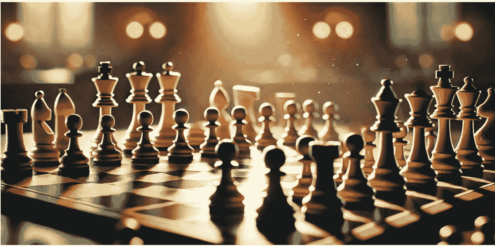

懒人专属群的群友，你好

欢迎来到博弈论课，我是蒋文华。

上一讲，我讲了夫妻博弈，夫妻博弈是合作关系的博弈，但合作中还有点小矛盾，这一讲我们讲一种纯合作关系的博弈，猎鹿博弈。

既然已经是纯合作关系了，彼此之间还会有什么矛盾呢?

如果你关注科技领域可能知道一件事，SpaceX能够活下来，NASA的订单帮了大忙;而对NASA来讲，SpaceX帮他们大幅降低了发射成本。双方的合作，现在看绝对是双赢。

然而，在合作早期，事情发展远没有这么顺利。NASA对依赖商业企业保持怀疑态度，担心商业公司无法满足他们严格的安全和可靠性要求。而SpaceX则担心NASA的官僚作风会限制其创新能力和行动速度。双方摩擦非常大。

类似这样，合作明明可以双赢，但却因为怀疑和猜忌，导致合作过程并不顺利的情况，在现实当中是非常普遍的。怎么才能在想要合作的时候，尽可能确保对方也选择合作，从而实现共同的利益呢?

这就是猎鹿博弈中存在的矛盾。这一讲，我们就来分析这个问题。

### 猎鹿博弈的条件

猎鹿博弈（Stag Hunt Game）最早的源头，可以追溯到法国启蒙思想家卢梭的名著《论人类不平等的起源和基础》一书，书中有一段叙述:

> “如果大家在捕一只鹿，每人都知道应该忠实地守着自己的岗位。但是如果有一只兔子，从其中一人的眼前跑过，这个人一定会毫不迟疑地去追捕这只兔子;当他捕到了兔子以后，他的同伴们因此而没有捕到他们的猎获物这件事，他会不大在意，这是无须怀疑的。”

后来，研究博弈论的学者，根据卢梭的描述，构建出了猎鹿博弈的模型。

猎人甲乙，两个人出去打猎，他们可以各自去打兔子，也可以合伙去猎鹿，鹿必须要两个人合作才能猎到，兔子则一个人就可以猎到。这个博弈有四种结果:

第一种，如果两个人独自去打兔子，一天下来，每人可以打到2只兔子。

第二种，如果两个人一起去猎鹿，一只鹿的价值，相当于8只兔子的价值，两个人平分以后，相当于每个人打到了4只兔子。

第三种和第四种结果是对称和等价的。如果一个人选择打兔子，另一个人选择去猎鹿，因为一个人无法单独完成猎鹿，那么猎鹿的人会一无所获，而选择打兔子的人仍然能得到两只兔子。

文稿中，我给出了猎鹿博弈的矩阵，你可以打开文稿查看。

表13.1 猎鹿博弈

| 猎人甲 \ 猎人乙 | 猎鹿 | 打兔子 |
| :--- | :---: | :---: |
| **猎鹿** | 4, 4 | 0, 2 |
| **打兔子** | 2, 0 | 2, 2 |

我们来分析这个博弈的均衡解。

显而易见，不管怎么样，对甲乙双方来讲，第三种和第四种结果，也就是一个人去猎鹿，一个人去打兔子，不是好结果。因为，独自去猎鹿的那个人会颗粒无收。

所以，如果一方去打兔子了，那另一方肯定不会去猎鹿，而是会调整自己的行为，也选择去打兔子，这样至少有两只兔子的收益。这么一调整，其实就变成了第一种结果，两个人都去打兔子。

所以，猎鹿博弈的一个均衡解就出来了，在不知道对方会怎么选的时候，各自去打兔子，就能获得保底收益，2只兔子。

然而，这个保底收益并不能让我们都满意。我们明明知道，如果两个人合作去猎鹿，双方的收益都会变得更大。那么，在什么情况下，两个人才会一起去猎鹿呢？

答案其实很简单，那就是知道对方会去猎鹿的时候，或者说双方沟通好一起去猎鹿的时候。

这里，我们可以把猎鹿博弈和囚徒困境做一个比较。在囚徒困境中，如果两个囚犯选择合作，也就是说对警察不坦白，他们的收益是最大的。但是，最终他们却都会选择背叛，也就是对警察坦白，然后两个人面临最糟的结果。

在囚徒困境中，两个人都坦白的最糟糕的结果是无法避免的。即便事先约定好都不坦白，双方也一定会选择坦白，因为选择坦白能带来自身收益的增加，这就是因为有单方背叛的诱惑在，一方坦白另一方不坦白，坦白的一方可以被无罪释放，对他个人来说这种情况收益是要比坚持约定不坦白更高的，因为即便都不坦白，他还是要坐半年牢。

文稿中，我重新附上囚徒困境的博弈矩阵，你可以点开文稿复习一下。

| 囚徒 A \ 囚徒 B | 坦白（背叛） | 抗拒（合作） |
| :--- | :---: | :---: |
| **坦白（背叛）** | -3, -3 | 0, -5 |
| **抗拒（合作）** | -5, 0 | -0.5, -0.5 |

但是，猎鹿博弈的情况就不一样。猎鹿博弈可以通过沟通引向合伙猎鹿，这也是一个均衡解。

为什么合伙猎鹿也是一个均衡解？因为，只要两个人约好了猎鹿，任何一方就没有违背约定的动机。在囚徒困境中，两人背约的动机是，自己坦白而对方不坦白的时候，他可以无罪释放。但是，在猎鹿博弈中，如果违背约定偷偷去打兔子，只会导致自身收益的减少。既然无利可图，反而有损失，为什么不合作呢？

通过以上分析，你应该也发现了，猎鹿博弈中实现个体利益最大化，同时也是群体利益最大化的关键，就在于“沟通”。沟通顺利，合作就成立。沟通无效，那就各干各的。

那接下来的问题就是，如何促进沟通？

### 沟通问题

我们说，猎鹿博弈中，只要你告诉对方你要去猎鹿了，为了更大利益，对方一定会跟着去。然而，在现实中却存在一个问题，沟通是有成本的。

试想，如果两个猎人住在同一个村子里，就在隔壁，他们想要一起去猎鹿，只要一方走过去敲个门或喊一声即可。这个时候，沟通成本很低，当然没问题。

但如果两个猎人住得非常远，要走大半天的山路才能碰到一起，在缺乏现代通讯技术的条件下，他们很可能就选择独自去打兔子算了。试想，你赶过去约定一起猎鹿，结果对方根本没在家，你岂不是白跑一趟了。

进一步量化的话，如果每人所承担的沟通成本小于2只兔子，总成本小于4只兔子，提前沟通能够提高双方总的收益水平，反之，还不如分头去打兔子。

猎人之间的沟通成本当然只是打个比方。现实中的沟通成本，形式多种多样，比如语言障碍、文化障碍、通信障碍、交通障碍、法律障碍、制度障碍，都会让本来可以双赢的合作关系，因为沟通成本的阻碍没有办法实现。

正因为这一点，所以，人类社会制度和技术的演进，一定是朝着不断降低人与人之间的沟通成本的方向进行。

例如，人类之所以选择密集地居住在城市中，很重要的一个原因就是为了降低沟通成本。集中居住集中办公大大降低了人与人之间交往和沟通的成本。交往和沟通成本越低，人与人之间就越容易建立合作关系。

2024年，我在上海参观一个做软件的上市公司，我对这家公司最深的印象是他们的内部装修。这家公司在一栋写字楼里买下了三个楼层，为了让不同楼层之间的员工方便沟通，他们不惜代价跟物业沟通、请专业建筑师评估设计，打通了隔层，在不同楼层之间建造了内部楼梯，这极大地便利了员工之间、部门之间的沟通。

同样的道理，在人们的日常活动中，如果你更加开放，更愿意与他人共享信息，及时沟通，别人自然就会更愿意跟你合作。

除此之外，这里额外补充一点，除了降低沟通成本，促进合作其实还有一个很简单的方法，那就是提高你的行为可预期性。

在竞争关系的博弈中，你出其不意、攻其不备，让对方难预期，往往是对你有利的。正如孙子兵法所言，“兵者，诡道也”。然而在合作关系的博弈中，你越是言而有信、行而可期，对方就越愿意跟你合作。

因此，在合作关系中，让自己成为一个靠谱的人，实在太重要了。

### 合作收益分配

讲完了沟通成本以及行为的可预期性对于合作的影响，标准的猎鹿博弈就讲得差不多了。

但是，还有一点我想要提醒你的是，合作收益的确定性，以及分配方式，对猎鹿博弈也是有影响的。

在猎鹿博弈中，双方之所以愿意去猎鹿，是因为合作带来了比单干更大的收益，并且收益还是平均分配，双方都觉得有确定感，也很公平。

但如果我们去掉这个前提呢？情况就复杂很多。

比如，当猎鹿收益可能是一只鹿，也可能是两只鹿，运气不好的时候，也可能猎不到鹿，那要促成合作，就要在分配方式上下更多的功夫。

为什么这时候就不能继续平均分呢？因为，对方的风险承受能力，对不确定性的接受度，大概率是和你不一样的。

通常来讲，不确定性收益的分配，一般可以采取三种基本分配模式：

- 第一种，甲拿剩余、乙拿固定，我们可以称之为“雇佣模式”。甲提前和乙约定，无论猎鹿的数量是多少，都给乙方4只兔子，剩下的收益全部归甲。乙肯定是愿意的，因为自己单独打兔子，只能获得2只兔子。这就像在很多企业中，老板拿剩余的部分，员工拿相对固定的收入。
- 第二种，甲拿固定、乙拿剩余，我们可以称之为“租赁模式”。这听起来跟第一种情况似乎一样，但其实逻辑不一样。这相当于是，甲去找乙说，无论猎鹿的数量是多少，他自己都只拿走4份兔子，其余剩多少都归乙，乙如果对合作的前景比较乐观，或者对自己的能力很自信，会愿意承担风险选这种方案。这特别像是银行和公司之间，银行为了推销贷款找需要钱的公司说，你们不是缺钱嘛，我贷款给你们，我只要8%的利息，你赚多少我都不管，都是你的。
- 第三种，甲乙约定一个分配比例，五五开、四六开或三七开等，我们可以称之为“分成模式”。如销售收入的分成制、股份制，以及婚姻关系中在没有婚前约定的情况下，双方平分婚后收入，都属于这种类型。

以上三种是人类社会中不确定性合作成果的基础分配模式，现实中的合作成果分配，第三种比例分配模式，还可以和前两种固定分配模式进行组合。

比如，第一种“雇佣模式”和第三种“分成模式”组合，我们得到第四种分配模式，我们可以称之为“合伙人模式”。

这类情况对应的就是很多公司流行的员工持股，员工不光是拿固定工资，还可以拿到一部分的股票，员工的基本收入先有个保障，大家的长期收入又和公司整体的业绩绑定，激励员工跟公司一起成长。

再比如，第二种“租赁模式”和第三种“分成模式”组合，我们得到第五种分配模式，我们可以称之为“创投模式”。

这类情况对应的是一些投资公司会跟创业公司签的对赌协议，投资公司会要求一定的固定收益作为保底，同时也要求长期的股权比例。当创业公司的项目风险较高，但又急需资金，议价能力比较弱的时候，会比较容易接受这种模式。

总体来说，以上五种模式，基本上覆盖了人类分配的所有模式。至于你要问哪种分配模式是最好的、最有利于整体利益的最大化，并没有一个确定的答案。这和衡量贡献大小的难易程度，每个人对不确定性的承受能力及风险偏好等诸多因素相关。这里就先不展开分析了，我在后续不完全信息博弈的课程内容里会有更多讲解。

但是，不管双方约定采用怎么样的收益分配方式，要提醒的是，都要提前约定好，不能等获得收益后再商量怎么分配。

先小人后君子，合作更持久，先君子再小人，合作会后患无穷。

### 总结

好了，我们来总结一下这一讲的内容。

猎鹿博弈是一种合作共赢的博弈，要想实现总收益的最大化，需要提前沟通并努力降低沟通成本。

提前约定分配模式有利于减少利益分配上的矛盾冲突。

在合作关系中，遵守约定，做一个靠谱的人，有利于实现你的利益最大化。

#### 下节预告

预告下一讲的内容，无论是懦夫博弈、夫妻博弈还是猎鹿博弈，都存在相互协调的问题。下一讲我们就来集中讨论这类问题的一般策略。

### 思考题

最后，还是给你留一道思考题，在你看来，政府和民众之间的利益分配属于刚才提到的哪种分配模式？

我是蒋文华，我们下节课见。

## 《蒋文华·博弈论50讲》

# 见识局、能破局、善布局

版权归得到App所有，未经许可不得转载

# 蒋文华

浙江大学公共管理学院教授


### 公众号

# 懒人搜索

# 懒人专属群


微信：lazyhelper


## 14习题课2：《哪吒2》的百亿票房怎么分？


懒人专属群的群友，你好

欢迎来到博弈论课，我是蒋文华。

今天是课程的第二次习题课，我们来讲这周每节课后的思考题，也和大家分享一些同学的精彩回答。

### 思考题1

先看第一个思考题，“好货不便宜，便宜没好货”。你相信这句话吗？如果大家都相信这句话，商家会不会故意通过给差货标一个高价来欺骗我们？在什么条件下，我们才能相信这句话？

这个问题其实已经在本周二的课程，也就是在智猪博弈的第二讲中回答了。一般而言，买质量好判断的东西，搭懂行的人的便车即可。如果想省钱，就买最多人买的，大概率不会错；如果你想提升品质，就买贵的，上不了什么当。买质量不好判断的东西，还是要当心一点，要么自己成为专家，要么咨询懂行的专家，要么就干脆别买，否则容易成为被割的韭菜。

陈振中同学在留言中提到，以下四种情况下，他相信品质和价格具有明显的正相关。

大品牌老字号。比较卷的行业，比如手机。各大平台评价高的，或者是有专业机构评测背书的。我的专业能力能够判断的产品。

总结得很好。确实，在竞争充分的市场中，要想以次充好明显困难得多。

这里，还有一点我想提醒你，市场竞争并不是在生产者和消费者之间进行的，而是在生产者之间，或者消费者之间进行的。

生产者之间的竞争很容易理解。不同的手机厂商、汽车厂商都想把东西卖给我们。厂商一旦想以次充好，别的厂商会想方设法戳穿这种把戏。

有一次，我去杭州文三街电子城买电脑，各个卖家一个劲给我普及电脑硬件知识，生怕我被隔壁的卖家骗了去。

消费者之间的竞争相对比较隐蔽。在一个产能过剩的时代，消费者很少需要抢购商品，但竞争依然是存在的。

比如，前几年房地产行情好的时候，几个买家抢购一套二手房。

商品的高价，其中有一部分也是消费者竞争出来的。

### 思考题2

再来看第二个思考题，这个思考题是关于搭别人的便车和别人搭便车的经历分享。

这是一件几乎每天都会发生的事情。在得到学习的过程中，你的精彩留言给了其他同学搭便车的机会，他们可以分享你的洞见；其他同学的精彩留言同样给了你搭便车的机会，你可以分享他们的独特经历。我也在每天搭同学们的便车。也欢迎你随时把我们的课程分享给身边的朋友，让他们来搭便车。

其实，从更广泛的意义上说，我们每个人都在搭社会发展、技术进步的便车。

不过，这里要纠正一点，留言中有几位同学提到了上下班跟同事或者邻居相互轮流搭便车，这反倒不是“智猪博弈”说的搭便车，而是“懦夫博弈”。

当然，这种懦夫博弈和课程里介绍的懦夫博弈略有不同。课程里的懦夫博弈中，两个均衡结果是“一进一退”，重点在于谁获得好处。轮流坐对方的车去上班的这种懦夫博弈中，两个均衡是“一个开车、一个坐车”，重点在于谁承担开车的成本。

上周我们介绍了囚徒困境，这周又介绍了智猪博弈和懦夫博弈，我想把这三个模型结合起来，为你介绍一下公共物品的提供问题。

公共物品是一个与私人物品相对应的概念。公共物品具有非竞争性和非排他性两个特征。

非竞争性是指生产出来后，你可以用，别人也能跟着用。例如你在家门口装一盏路灯，你楼上或对门的邻居也能享受这盏灯的服务。

非排他性是指排他的成本很高，以至于得不偿失。你装的那盏路灯很难排除邻居的使用。

非竞争性意味着就算别人用了也不影响你的使用，非排他性意味着你很难不让别人搭你的便车。

因为公共物品的非竞争性和非排他性，在人们的普遍观念中，私人没有提供公共物品的积极性，所以只能由政府来提供。其实并非如此。公共物品的提供存在三种主要模式。

第一种是囚徒困境模式。出于自身利益考虑，有一些公共物品，每个人都没有提供的积极性，最后只能由政府提供，如国防、公共安全等，这是我们最熟悉的模式。

第二种是智猪博弈模式。由大猪提供。比如慈善机构、企业家等。例如，著名的盖茨基金会出钱资助开发新的疫苗和治疗方法，减少传染病对人类健康的危害。

第三种是懦夫博弈模式。博弈的参与者都有提供公共物品的积极性，但具体由其中的哪一方来提供，也就是谁来承担成本，并不确定。

还是重复一下，这里和我们前面正课讲的懦夫博弈关注重点不一样，正课讲懦夫博弈时，我们重点关注谁独占利益，这里我们关注的是谁承担成本，两者在结构上是等价的。

用一个很简单的例子来比较一下这三种模式。

我读大学时，宿舍里不能烧水，我们只能去食堂打开水。因为很难不让其他同学蹭水喝，所以宿舍里的开水就成了公共物品。有的宿舍里的开水往往由最勤快的人去打，比如俞敏洪就分享过，他上大学的时候，宿舍的水就是他负责打，这属于智猪博弈。

我们宿舍是谁第一个发现没水喝，谁去打，这属于懦夫博弈。我们隔壁宿舍是大家都不去打水，这属于囚徒困境。有一段时间，隔壁宿舍经常来我们宿舍借水喝，但每次都有借无还，我们宿舍被迫成了大猪。

在缺乏沟通的情况下，懦夫博弈也会出现双方都不提供公共物品的结果，也就是双方都等着对方来提供，这种情形也被称为“责任分散效应”。

一个非常经典的案例是美国的吉诺维斯案。1964年3月13日凌晨3点多，美国纽约29岁的酒吧经理凯蒂·吉诺维斯被歹徒袭击遇难。整个袭击事件持续了接近半个小时。在整个过程中，尽管凯蒂大声呼救，她的邻居中至少有38位到窗前观看，但没一个人来救她，甚至没一个人打电话报警。

《纽约时报》的阿贝·罗森塔尔（他后来做到了这家报纸的总编辑）在1964年出版了一本书，《38位见证人》，试图解释这一事件的成因。

在博弈论中，这种“责任分散效应”是能够得到严格证明的。非常反直觉的是，旁观者数量越多，受害者获救的概率反而越小。

“责任分散效应”意味着，你以后在寻求他人帮助的时候、在给他人布置任务的时候，要有明确的指向，否则很容易出现相互推诿的结果。

### 思考题3

第三个思考题，是关于“幸福让”的讨论。“幸福让”是指在争斗中，谁更幸福谁让。因为更幸福意味着争斗会带来更大的利益损失，所以越愿意在争斗中选择退让。

同学们在留言中给出了很多思考和分析。其中“雪莲”同学的留言让我印象深刻。兰州大学一个大二的男生在吃牛肉面时与另一个人发生冲突，抬起手把热气腾腾的牛肉面倒在了对方的头上，结果男生被学校退学，进了管教所，从此一蹶不振。想想都觉得可惜，可惜这个世界上没有后悔药。难怪老祖宗会告诉我们：退一步海阔天空。

回到“幸福让”的问题。在课程中，我们其实假设了双方的幸福度是一样的。这在模型中体现为一旦双方都选择进，彼此都会面临20的相同损失。如果双方的幸福度不一样，在争斗中的损失就不一样了，这时候哪一方更愿意选择退呢？这个问题其实是需要通过计算双方的混合策略来解决，这是我们下周马上要学习的内容。

可以提前剧透的是，博弈论的分析表明，更幸福的一方，即一旦发生争斗损失更大的一方确实更愿意选择退，并会得到一个相对较小的期望收益；反过来幸福度更低的一方，进的可能性更高，并会获得相对较大的期望收益。

所谓光脚的不怕穿鞋的，在懦夫博弈中，从期望收益来看，光脚的一方获利的确可能是更大的。

### 思考题4

第四个思考题，夫妻博弈中，如果缺乏沟通，会出现各自去对方家过年的结局。你有过类似的经历吗？

我先说一个自己的亲身经历。10多年前，一位同事要给我送一份纸质文件，我们约好在浙大校门口见，学校东门离他家近，北门离我家近。我去东门等他，他来北门找我。

多亏我们打了个电话，及时发现了这个错误，否则都不知道要等多久。双方都为对方着想，每个人却都花了更多时间。不过，这件事倒也让我们有其他收获，那就是感受到了对方的人品和善意。

留言中，很多同学都提供了很好的案例。“平安”同学说，他有一次要和爱人在城里碰面，结果各自去了对方的姑姑家，都没找到对方，还都以为对方没进城。

还有一位昵称是“得到学生”的同学，提到了欧·亨利的经典短篇小说《麦琪的礼物》。的确这个小说的情节充分诠释了夫妻博弈中因缺乏沟通而导致的悖论，夫妻二人都为对方着想，但却买回来了对方不再需要的礼物。

刚才提到这些“乌龙”事件，再次提醒我们充分沟通，特别是提前沟通的重要性。

### 思考题5

第五个思考题，是关于政府和民众之间的利益分配属于哪种分配模式。

在课程中，我提到了甲乙双方利益分配的三种基本模式：

甲拿剩余、乙拿固定（雇佣模式）。甲拿固定、乙拿剩余（租赁模式）。甲乙约定一个分配比例（分成模式）。

你是否注意到，在农业社会中，作为土地所有者的地主和作为劳动力所有者的农民之间的利益分配，也可以用上述的三种模式来看待。

- 1. 农民拿固定、地主拿剩余，这就是雇佣模式，农民到地主家干活儿拿工钱。我爷爷奶奶年轻的时候就是给地主家当长工和打短工的。
- 2. 农民拿剩余、地主拿固定。这就是租赁模式。
- 3. 地主农民提前约定好一个分成比例，比如四六开或三七开。这就是第三种模式。

从各国的实践看，在农业生产中，租赁模式在三种合作模式中，占比往往是最高的。

我们扩大视野，从更普遍的社会发展的规律看，大体上来说，农业社会的主要分配模式是租赁，工业社会的主要模式是雇工，知识社会则大量采用分成。

至于推动合作模式变化的内在逻辑，限于时间关系，我们后面讲到机制设计的时候再展开分析。

接下来，我们还是回到讨论题本身，看看政府和民众之间的利益怎么分配。政府的收入取之于民，用之于民。政府并不是一个独立的利益主体，政府里面的工作人员，即公务员主体，从本质上看也是民众的一部分。

我国政府主要有三大收入来源，分别是税收收入、国有资产经营收入和非税收入。

税收收入，如所得税、增值税等，这部分是政府公共预算收入的最大头儿，在中国占比80%左右。税收一般都是按比例征收。属于课程中介绍的第三种分配模式。

国有企业的利润、国有资产的经营收益等，这个属于雇佣模式。对普通民众来说，去私营企业上班和国有企业上班，都是拿相对固定的工资和奖金。国有企业的利润上交财政，归国家所有，国家拿剩余。

非税收入的构成相对比较复杂，包括利息、罚款、罚金、国有土地使用权出让收入、政府性基金、国有资产的处置收入等。从分配模式看，基本上属于第一种或第二种。

例如，机场建设费属于固定收取，国有土地出让收入则属于剩余收取，国家在征地的时候给民众的征地补偿相对固定，政府拿到的是剩下的那部分，这部分收入成为地方发展的重要资金来源。

当然，非税收入里面，也有按比例分配的。以今年最火的电影《哪吒2》为例，票房超过了140亿，其中的5%要进入“国家电影事业发展专项资金”，这属于政府性基金收入，是非税收入里面的一个部分。这笔钱是从1991年开始收的，最初是每张电影票收5分钱，属于固定收取。5年后的1996年起，改成了5%的比例收取。国家收取这笔资金的目的是为了资助地方影院建设和设备更新，扶持国产电影等。

既然说到电影《哪吒2》，那我们顺便一起来拆一下这140多亿的票房到底是怎么分配的？为了估算方便，我们取整数按照150亿计算。

首先是卖票的平台拿走一部分，这部分一般是卖出去一张票，收3元。如果按照卖了3亿张计算，平台一共收走了9亿。在剩下的141亿里面，国家先拿走其中的一部分，这是按比例分配的，包括刚才介绍的专项基金占比5%，这个属于非税收收入；还有3.3%的营业税，这个属于税收收入。

141亿中剩下的91.7%，即129.3亿里面，由片方和影院方共同分配，采用的是第三种合作模式，其中片方（包括出品方、制作方、发行方等）占比44%左右，影院方占比56%左右。

再说大家都很关心的导演饺子能分到多少钱，饺子导演自然算是片方，他的公司是从44%中拿走一部分，不过目前并没有公开的准确数据，有人估计会在15亿以上。

最后给你补充一点。各方按比例分票房这件事，并不是一开始就这样的。1994年以前，中国电影收入的分配是这样的：电影制片厂拍完电影后，以一定的价格卖“拷贝”给电影公司，电影公司承担后续的市场风险。从国外引进电影也是采用“买断”的方式，通常是2万美元一部。

1994年，美国电影《亡命天涯》来中国上映，首先开启了分账模式。1995年后国产电影也开始采用分账模式。现在的情况是三种分配模式共存：买断、保底+分账、全部分账。

按影片的票房收入分成，最大好处在于让制片方、发行机构和放映单位利益共享，风险共担。这种分配模式对中国电影市场的发展起到了极为重要的作用。

以上就是本周习题课的全部内容，我是蒋文华，我们下周再见。


### 公众号
- 懒人搜索
- 懒人专属群


微信: lazyhelper

## 15 协调博弈：怎么消除多重均衡？

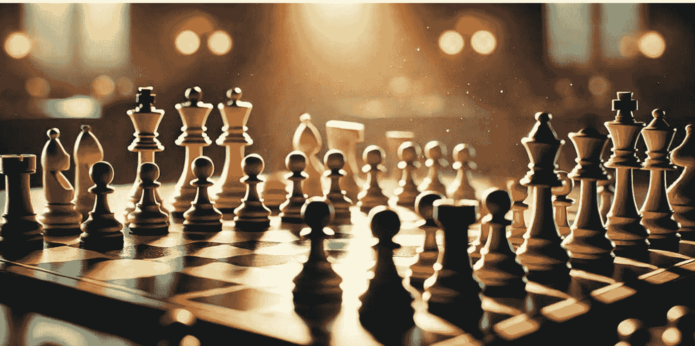

懒人专属群的群友，你好

欢迎来到博弈论课，我是蒋文华。

这一讲，我们要讲的不是一种博弈，而是一类博弈，协调博弈，这相当于是对我们前面三讲内容的一个小结和延伸。

前面三讲，我们讲了懦夫博弈、夫妻博弈、猎鹿博弈，这三种博弈，你可能也注意到了，它们有一个共同特点：有不止一个均衡解。

例如懦夫博弈中到底谁进谁退，夫妻博弈中到底是去谁家过年，猎鹿博弈中到底是合作猎鹿，还是分头打兔子。这类博弈，实际上还可以统称为“协调博弈”。

在协调博弈中，都会出现多个均衡解，这会带来两个问题。第一个问题是，你无法预判哪个均衡会出现。第二个问题更麻烦，那就是实际博弈出来的结果，甚至还可能不是均衡解，而是对个体和集体都最糟的结果。

最典型的例子就是，懦夫博弈中狭路相逢，两车都选择“进”，然后两败俱伤、甚至都车毁人亡。

协调博弈中这种结果不理想的情况，跟囚徒困境还有一点不一样。囚徒困境双方都选择背叛是纳什均衡，除非改变规则，否则是无法避免的。但协调博弈不同，在不改变基本规则的情况下，其实还是有破解办法的。

好，那具体的破解思路是什么呢？这就是我们这一讲的重点。

总体来讲，要破解协调博弈，我们有三种办法，分别是聚点均衡（Focal Point Equilibrium）、廉价磋商（cheap talk）和相关均衡（Correlated equilibrium）。接下来我分别给你介绍。

### 聚点均衡

先说聚点均衡，这是博弈论大师谢林1960年在《冲突的策略》一书中提出的概念。

谢林认为，当博弈存在多重均衡的时候，参与人会使用某些被博弈模型抽象掉的信息来找到其中的某个均衡点，这个均衡点就被称为聚点均衡。

那些被模型抽象掉的信息可能与人们的价值观、意识形态、文化特性、以往的博弈历史等各种因素有关。

概念有点抽象，我结合着前面讲到的几种博弈和你熟悉的一些生活习俗来解释一下。

归纳一下前面讲过的三种协调博弈，我们会发现，如果两个均衡解所得到的结果没区别，就容易存在选择困难。

比如，懦夫博弈中，两个均衡结果，都是一进一退，获得的收益也都是一样的；夫妻博弈也是一样，两边都可以要求去自己家，这时候选择困难在所难免。

其实，之所以出现这种局面，是因为我们在博弈中对参与人做了抽象，剔除了身份、社会习俗等各种因素对人的价值偏好的影响。我们抽象地假定，双方在博弈中获得的收益是“相等”的。这种抽象，有利于我们在理论层面看清博弈的结构，但是回到现实中，我们得承认，身份、价值观、社会习俗的影响，是无法被剔除的。而这些因素又决定了每个人的价值偏好。

举个例子，我是60后，在我小时候，父母每年都在爷爷奶奶家过年三十和初一，年初二去外婆家拜年。我的父母亲根本不需要商量去谁家过年的问题。

为什么这样？因为那时候，整个社会男女平等的意识并没有那么强，大家默认去男方家过年价值要更高一点，所以就不存在多重均衡，最优解就只有一个。当然，以现在的眼光看，这是有问题的。

同样的道理，在排队、等车、让座等等最日常的场景中，儿童优先，老人优先，女士优先，这样约定俗成的社会规范，其实都是在帮我们化解多重均衡，既避免不必要的争抢，又体现社会的文明与进步。

再举一个例子，我课堂上经常用这么一个游戏让同学们理解聚点均衡。我会让两个同学各给我发一个微信红包，1-10元范围内，金额随便，如果两个人金额相加刚好等于10元，这两个同学各获得10元奖励。

如果是你，你会发多少钱？我相信你会发5元。事实上，实验下来，10次里面至少有9次，都是两个同学默契地各发5元。

其实，这个游戏的均衡结果完全可以是7：3，也可以是6：4，或其它任何相加为10的数字。为什么同学们在没有商量的情况下，都是默契地选择了5：5呢？

因为在我们的各种生活习惯中，“5：5”是一个跟公平、平等、中间点等概念强绑定的数字组合，这是嵌入到我们意识中的默认值。所以，两个人如果要找默契点，5：5就会成为不约而同的选择。可以这么理解，所有的均衡解都是可以接受的，但有一些均衡就是比其他均衡更能被大家所接受。5：5就是这样的均衡。

关于这个红包游戏，再补充一件趣事。有一次有个同学居然发了2.87元的红包金额，我忍不住问他为啥发这么奇怪的数字，他说，因为他微信钱包里一共只有这么多了。

这是一个有趣的故事，其实暗含着一个深刻的道理。如果博弈结果偏离了均衡解，很可能是因为有我们事先没有预料到的其他外在约束在起作用。

### 廉价磋商

解决多重均衡的第二种方法是廉价磋商（cheap talk），这里的“廉价”更准确来说，说的不是便宜，而是比较容易做到，或者说是做起来的成本比较低。

比如妈妈早上出门前和爸爸说，今天公司有一个重要的客户要接待，让爸爸去接一下孩子，磋商就达成了。

比如前面的红包游戏中，你跟同学约好，你发1元，他发9元，磋商也就达成了。

再比如，在猎鹿博弈中，你只要给对方发个微信：“明天早上8点一起去猎鹿，好不好？”，对方只要回复一个“好的”，就提前锁定了博弈的均衡解。这也是廉价磋商。

所有这样可以三言两语约定清楚的事情，都可以理解为是“廉价磋商”。

廉价磋商看起来似乎很容易，但也存在两个问题。

一个问题是双方磋商后，遵守约定必须是每一方的最优策略，否则即使达成协议也不一定会被遵守。我们之前学习过的囚徒困境，廉价磋商就没有任何作用，因为双方的占优策略是背叛。

第二个问题是即便遵守约定是每一方的最优策略，还需要考虑对方犯错的可能性。

你和朋友约好一年后的今天在老地方见，一年后如果没有再次确认过，你会去吗？万一朋友忘记了怎么办？不怕一万，就怕万一。如果对方犯错会给你带来巨大损失，你还是不要赌对方一定不会犯错。

小时候听父母讲起这么一件事，我父亲单位的一个驾驶员开车假装要撞他的朋友，那个朋友当然知道对方是吓唬他而已，所以没有选择避让，结果司机紧张之下把油门当刹车了，居然活生生把对方撞死了。这个故事有一些极端，但君子不立危墙之下的道理，是没有错的。

### 相关均衡

解决多重均衡的第三种方法是相关均衡。

所谓相关均衡，指的是博弈的双方根据某个共同能观测到的信号来选择相应的行动。至于选择什么信号可以是事前磋商的结果。

概念还是有点抽象，举两个例子你一下子就明白。

比如，猎鹿博弈中的两个猎人可以提前约定，如果天晴就一起去猎鹿，如果下雨就各自去打兔子。天晴和下雨就是两个人都很容易观测的信号。当然，如果你一定要说还要考虑阴天的问题，那就以天气预报为准，如果天气预报说要下雨就各自打兔子，如果没有预报要下雨，就一起去猎鹿。

在比较宽泛的意义上理解，人类发明的越来越精确的计时制度，就是相关均衡最大的应用。

如果没有计时制度，那么人类可能就只能以非常粗的颗粒度来协作。双方约好了，早晨一起去打猎，可是早晨不是一个瞬间，而是一段时间，具体是哪个时间点呢？有的人理解早一点，有的人理解晚一点。早来的要等晚到的，就会耽误时间。当我们有了准确的计时工具后，说好几点就是几点，不会有分歧，大大提高了协作的效率。

再比如，在夫妻博弈中，可以通过石头剪子布，来决定去谁的父母家过年。石头剪子布的输赢，也可以作为一种相关均衡的信号。有了这个信号作为裁判，争议也可以解决。

同样的道理，你自然也一下子就联想到了，一线城市的车牌摇号、重点中小学孩子入学机会的抽签，都是类似的原理。同一个城市的居民理论上应该是平等的，应该都有同样的资格享受公共资源，但是资源又是有限的，不可能保证每个人都分享到，于是采用摇号、抽签的方式来决定。

总之，用相关均衡的方法破解多重均衡的核心在于，既然各个均衡结果都可以，或者各方都有资格，那就找一个中立的客观信号作为依据，这样就谁也不觉得吃亏。

但是，这里也有一点要注意，不管是选什么信号，都要事先约定好。某种程度上来讲，提前约定好相关均衡的信号，也相当于是提前进行“廉价磋商”。

从现实的角度讲，这就是用制度替代沟通，这也是人类社会制度演化的一个大方向。

### 利益一致和信息传递

讲到这里，三种破解协调博弈的方法我就讲完了，这一讲的最后，我想给你额外补充的是，共同利益在协调博弈中的重要性。

你有没有意识到，刚才我们讨论的三种破解多重均衡的方法，虽然强调的都是信息和沟通，但其实，在信息和沟通背后，还有一个更重要的东西，那就是共同利益。

先看一个正面例子。课堂上发红包的那个游戏，我在同学们发红包之前通常会特别规定，双方不能沟通，所以各发5元是聚点均衡。但如果可以沟通呢？就算一个同学发2.87元也没有任何问题，只要把这个信息传递给对方，另一个同学100%会发7.13元。为什么后面发的同学，会相信前面的同学？因为他知道双方的利益是一致的。

再看反面例子。标准的猎鹿博弈，一方告知对方自己会去猎鹿，另一方会毫不犹豫地选择相信，然后去猎鹿。为什么呢？因为去猎鹿，双方分到的收益比单独打兔子多，这符合他们的共同利益。

但条件变一下呢？如果乙知道甲是个特别擅长打兔子，又爱打兔子的人，那甲告诉乙说自己会去猎鹿，乙就不一定会信，因为去猎鹿不符合甲的利益。乙可能会觉得，甲是不是在骗人，让别人都去猎鹿，他好打到更多兔子。

通过以上分析，我们可以得到一个非常重要的结论：目标或利益一致，是彼此信任的基础。

如果对方和你是利益一致的，那么对方的话就可信，至少可信度较高。如果对方和你是利益对立的，那么对方的话就是不可信的。这里的不可信，不是说对方一定是在说假话，而是说你没法明确判断对方说的是真是假。

比如，我和你玩儿石头剪子布的游戏，我提前告诉你等会儿会出石头。我的话就是不可信的。但你不能说我接下去一定不会出石头。

### 总结

好了，我们来总结一下这一讲的内容。

为避免多重均衡可能导致的利益损失，参与者之间需要协调，协调可以通过聚点均衡、廉价磋商和相关均衡实现。

协调过程中的信息传递只有建立在利益一致基础上才是可信的和有效的。

#### 下节预告

下一讲，我们要在协调博弈基础上再加一点难度。前面我们讨论协调博弈，没有考虑一个关键要素，那就是概率。

比如在懦夫博弈中，双方要么进要么退，但在现实中很可能是双方有70%的概率进，30%的概率退。引入概率之后，博弈局面会发生怎样的变化？下一讲我们就来讨论这个问题。

### 思考题

最后留给你一道思考题，2007年我去韩国参加一个国际会议，在首尔机场的大厅看到一块非常醒目的牌子，上面写着“Meeting Point”。这些年，我在国内的许多机场也都发现了这样的汇合点，你去机场的时候，有没有遇到过这样的汇合点？请你用这一讲的知识分析，为什么机场要设置这样的点？此外，你是否还在其它地方见到过这样的汇合点？

这里，顺便也公布一下上周的学习奖励，上周我们说过，我们每节课末尾都有一个思考题，每周一，我会公布上一周的最佳作业同学名单，每位同学的奖励是《博弈思维线下研修班》的参加名额一个。

这个研修班的主题是：“博弈在现实竞争与合作中的应用”，会在四月底课程完更时办，时长是半天，地点就在北京得到总部。

今天公布上周获奖的5位同学名单，分别是：道远、鄭大囧、雪莲、闻思修、张善崔。

文稿中有课程主编的微信（18500161040），请获奖同学添加他的微信，方便到时候联系到大家。

期待看到更多同学的精彩作业和留言，也期待在线下见到你。

我是蒋文华，我们下一讲再见。


## 16 混合策略：怎么保护好自己的底牌？

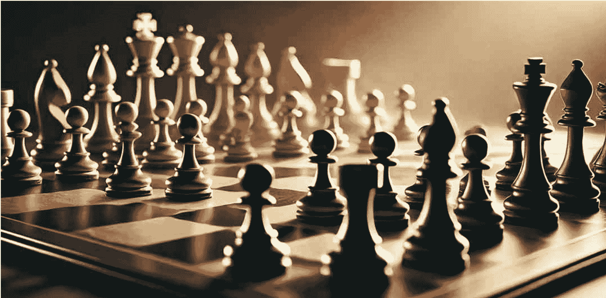

懒人专属群的群友，你好

欢迎来到博弈论课，我是蒋文华。

最近几讲，我们都在讨论存在多重均衡的博弈模型，比如懦夫博弈、夫妻博弈等，要想消除多重均衡，参与者之间需要磋商与协调。然而，现实中也存在一些没法协调的情况，这时候我们又该怎么办？我们只能先“猜”其他人的策略会是什么。

但如果只是随便乱猜，那就不需要博弈论了，科学的猜测，需要基于概率。引入概率之后，参与者基于概率的策略组合，在博弈论中被称作混合策略。

混合策略的博弈，同样存在纳什均衡。怎么求解这种纳什均衡？这一讲，我先给你介绍通用的方法，后面几讲中，我会再拿出几个典型的博弈模型，带你单独分析混合策略在其中的具体运用。

### 纯策略和混合策略

介绍混合策略的求解方法之前，我们要先来作一个比较。

混合策略其实是相对于纯策略来说的。在博弈论中，如果参与者的策略100%确定，就叫“纯策略”。而如果参与者的策略是基于概率的，那就是“混合策略”。

比如“人不犯我，我不犯人；人若犯我，我必犯人”是一个纯策略。“人不犯我，我80%的可能性不犯人；人若犯我，我90%的可能性会犯人”，就是一个混合策略。

有一些博弈，存在唯一的纯策略纳什均衡。比如囚徒困境的纳什均衡，两个囚犯都选择背叛（坦白），这是100%确定的，这就是纯策略纳什均衡。再比如智猪博弈的纳什均衡，大猪去按按钮，小猪等待，虽然他们的选择不一样，但也都是确定的，这也是纯策略纳什均衡。

有一些博弈，存在多个纯策略纳什均衡，同时还存在混合策略纳什均衡。比如，懦夫博弈、夫妻博弈，都存在两个纯策略纳什均衡，但还存在一个混合策略的纳什均衡。这种比较复杂的情况，我们放到后面两讲来讲。

这一讲，我们先来看一种比较复杂的情况：不存在纯策略，只存在混合策略纳什均衡的博弈。

### 猜钱游戏

让我们来玩儿一个猜钱游戏。

我兜里有两张纸币，一张是1元，另一张是100元，我把其中一张放手里，让你猜是哪一张。如果你猜对了，手里的钱归你，如果你猜错了，你给我20元。

现在问你两个问题：

第一个问题，你愿意和我玩儿这个游戏吗？第二个问题，如果愿意，你会怎么猜？

第一个问题似乎好回答，虽然猜错会亏20元，但是猜对能赚100元或1元，而猜对或猜错的概率差不多都是50%。由此看来，赚钱的可能性会更大一点。这样的话，这个游戏应该可以玩儿一下。

比较难回答的是第二个问题。你的第一感觉可能是猜100元，因为虽然不一定猜中，但只要猜中一次，就能赚100元，还是很有吸引力的。问题是，我会预判你的预判，我宁可被你猜中1元，也不想被你猜中100元，所以我一般不会轻易在手里放100元。你看，情况好像变得复杂起来了。

怎么求出这个博弈的均衡解呢？我们需要三个步骤：

第一步，确定策略类型。

你很容易想到，我肯定不会每次都放100，也不会都放1元。如果我每次都放100元，你肯定会每次都猜100元，那我就亏大了；但如果我每次都放1元，你肯定每次都猜1元，虽然每次只输1元，也架不住老是输。因此，我一定会采取混合策略，有时放100元，有时放1元。相应的，你的策略也应该混合策略，有时猜100元，有时猜1元。

进一步看，我会不会以50%的概率放100元，50%的概率放1元呢？这是最容易想到的概率。我肯定不会这么干。

很多人容易以为，我放100元和1元的概率会是相等的。如果概率相等，那么你只需要每次都猜100元就可以了，猜对了赚100，猜错了亏20，你的期望收益是正40元（100×50% - 20×50% = 40）。对你来说，你就不需要采取混合策略了。

我们可以再来作一个比较，如果这个游戏的规则是我两只手分别拿着100元和1元，让你来猜。这种情况下，两者的概率相等。

现在的情况是，我从100元和1元中挑选出一张放手里，我不会随机选择，因为我不傻。我心里明白，一旦我随机选择，你必定每次猜100，我平均一次输40元。

由此，我放100元和1元的概率肯定不相等。既然如此，你就不存在一个每次都猜100的纯策略。

第二步，假设策略概率。

既然不是确定的50%，为了后面计算方便，我们可以先假设，我放100元的概率为α，放1元的概率就是1-α。

与此同时，你猜100元的概率为β，猜1元的概率就是1-β。这是双方各自的混合策略。

第三步，求解纳什均衡。

这里要先复习一下均衡意味着什么。学完前面的课程我们已经知道，均衡意味着任何一方都没有改变策略的积极性，因为改变了也无法增加任何一方的收益。

我们上一步假设你猜100元的概率是β，你猜1元的概率是1-β。那么，在纳什均衡的情况下，对我来说，就意味着放100元和放1元的期望收益应该是一样的。所以，分别列出我放100元的期望收益和放1元的期望收益。让两个期望收益相等，就可以计算出β值。用同样的方法，也可以计算出α的值。

具体的计算过程，我放在了文稿的附录1中。

与此同时，我在文稿的附录2中，还给了你一个一般化的计算方法，你可以打开查看。一般化的计算方法涉及到求导数，会略微复杂一些。

#### 附录 1：混合策略纳什均衡的便捷求解

在纳什均衡的情况下，给定你猜 100 元的概率是β，你猜 1 元的概率是 1-β。对我来说，放 100 元和放 1 元的期望收益是一样的。先分别计算出我放 100 元的期望收益，和放 1 元的期望收益。让两个期望收益相等，就可以计算出 β=21/141。公式如下：

```
Π_{我放 100}=(-100)*β+20*(1-β)
Π_{我放 1}=20*β+(-1)*(1-β)
```

这个答案的意思是，如果你猜 100 元的概率是 21/141 的话，对我来说放 100 元和放 1 元的期望收益是相等的。

用同样的方法，我们也可以计算出 α=21/141，公式如下：

```
Π_{你猜 100}=100*α+(-20)*(1-α)
Π_{你猜 1}=(-20)*α+1*(1-α)
让Π_{你猜 100}=Π_{你猜 1}
```

#### 附录 2：混合策略纳什均衡的一般求解

1. 设我放100元的概率是$\alpha$，放1元的概率是$1-\alpha$，你猜100元的概率是$\beta$，你猜1元的概率是$1-\beta$。我的期望收益(用$\Pi_{我}$表示)是：
$\Pi_{我}=(-100)* \alpha* \beta+50* \alpha *(1-\beta)+50*(1-\alpha) * \beta+(-10)*(1-\alpha)*(1-\beta)$
你的期望收益(用$\Pi_{你}$表示)是：
$\Pi_{你}=100*\alpha* \beta+(-50)* \alpha *(1-\beta)+(-50)*(1-\alpha)* \beta+10*(1-\alpha)*(1-\beta)$

2. 双方期望收益最大化所要满足的必要条件是：一阶导数为零。
$d \Pi_{我} / d \alpha=0$
$d \Pi_{你} / d \beta=0$
求导后，就可以分别计算出$\alpha$和$\beta$的具体数值。

这里我们直接说计算结果：我放100元的概率应该是21/141，略高于1/7；你猜100元的概率也应该是21/141。

换句话说，当我以21/141的概率放100元，你以21/141的概率猜100元，就是这个猜钱博弈的混合策略纳什均衡。

简单地说，我们如果一共玩儿7次，我大致应该6次放1元，1次放100元。你也差不多6次猜1元，1次猜100元。

听到这里，你可能会想，均衡结果是求出来了，但你更想知道在这个结果中，你是赚了还是亏了。

这就简单了，只需要把刚才的计算结果，即$\alpha$和$\beta$的数值代入期望收益的计算公式里去，就可以分别求出我和你在均衡结果下的期望收益。

计算公式我放在文稿的附录3中。具体的计算结果是我们每博弈一次，我的期望收益是2.13元，而你的期望收益是-2.13元。

也就是说，你每次平均损失2.13元。由此看来，这其实是一个对你极不公平的游戏。

#### 附录 3：混合策略纳什均衡条件下的期望收益求解

把$\alpha=21/141$，$\beta=21/141$。分别带入各自的期望收益公式中去：

$\Pi_{你猜100}=100* \alpha+(-20) *(1-\alpha) \approx-2.13$
$\Pi_{你猜 1}=(-20) * \alpha+1 *(1-\alpha) \approx-2.13$
$\Pi_{我放100}=(-100) * \beta+20 *(1-\beta) \approx 2.13$
$\Pi_{我放1}=20 * \beta+(-1) *(1-\beta) \approx 2.13$

所以，你其实不应该跟我玩儿这个游戏。

你看，这跟最初凭直觉的判断，是不是很不一样？

### 日常生活中的混合策略

混合策略的使用，在我们现实世界中其实非常普遍，我给你举一些实例。

比如，最常见的“石头剪刀布”就要采用混合策略，因为如果你用纯策略，每次都出一样的，对方就可以针对你，那你肯定会输得很惨。

比如，足球比赛中的点球大战，也需要用到混合策略。罚点球的运动员，不能固定往左边踢，也不能固定往右边踢。守门员也是一样的，不能固定往一个方向扑。双方的策略，都需要带有一定的随机性，才有可能赢，否则就很容易输。

再比如，交警查酒驾，也需要用混合策略。交警如果天天在每条马路上查，那肯定就没人敢酒驾。但问题是，天天查、在每条马路上都查，那成本可就太高了。所以，交警只能以一定的概率查酒驾。从理论上来讲，交警查酒驾应该存在一个均衡概率，交警以某个概率查，可以让酒驾概率刚好最低。

有意思的是，可能是出于检查成本等多种因素的考虑，交警查酒驾的概率其实是比较低的。但是，如果民众也知道这一点，很多人就会有侥幸心理。

因此，电视里经常播放交警查酒驾的新闻，路上也会有很多酒驾公示。我就多次在开车的时候看到路边的电子屏上显示，昨晚杭州在多少个地点查了酒驾，并有多少人被查到，这就放大了本来概率不太高的查酒驾的效果，让民众主观上感觉交警查酒驾的概率特别高，因而不敢酒驾。

你发现没有，所有这类博弈，有个特点，一方希望自己能猜对，另一方希望对方会猜错，这类博弈，我们可以统称为猜拳博弈。

这类博弈的这个特点在战争中体现得最为明显。所谓“兵者，诡道也”，“虚则实之、实则虚之”，就是不想让对方知道自己接下来会怎么做，因为一旦被对手预判，必然损失惨重。

为了避免自己的底牌被对方拿捏，你必须采取混合策略。同样，当对手采用了混合策略，你也需要用混合策略来应对。

换言之，在存在混合策略的这类博弈中，不存在以不变应万变，只存在以万变应万变。

这里倒是也可以给我们一个启发，变化虽然让人不安，却给了弱者赢的机会，反而让这个世界变得更公平。

### 如何利用他人的非随机策略

最后我们再来看一个关于混合策略的有趣研究。

从混合策略的角度看，石头剪刀布的游戏中，参与者的策略应该是，出石头、剪刀、布的概率随机分布，都是三分之一。这样，双方的期望收益都是零，这就是完全公平的游戏，谁也赢不了，谁也输不了。

然而，现实中，人很难做到真随机。一旦有参与者不是真随机，那就是给对手留出了取胜空间。

浙江大学、浙江工商大学和中科院的三位研究人员做过一项研究。他们招募了360名学生，将他们分成六组，随机配对玩儿300轮石头剪刀布，每一轮中获胜的学生将会获得少量奖励。通过观察学生的行为，他们发现了获胜者或失利者习惯使用的策略。

比如，如果你的剪刀输给了对手的石头，下一轮你更有可能出能战胜石头的布。但如果你的剪刀战胜了对手的布，下一轮你更可能继续出剪刀。

这就是：输家习惯做出改变，赢家习惯保持现状，简称为“胜留败走”。

知道了玩家普遍存在这种习惯，应用这一讲学的混合策略，我们可以设计出一个石头剪刀布的制胜策略：

- 如果你是输家，下一轮换用能打败对手的出手；
- 如果你是赢家，下一轮千万不要再使用原来的出手。

比如：如果你的剪刀输给了对手的石头，下一轮你应该出布，因为对手更可能继续出石头；如果你的剪刀赢了对手的布，下一轮千万不要继续出剪刀，因为对手更可能出石头，你可以出石头迷惑对方，或者出布。

当然，这个策略有效的前提是，对方没有听过我们这节课。如果对方也学过这节课，那博弈的局面，就只能回归之前的均衡。

这说明什么呢？任何凭借特殊方式获得的优势，都是不稳定的，长远来看，均衡才是博弈的最终归宿。

### 总结

好了，我们来总结一下。

在与他人的博弈中，如果你不想让对手知道你的具体选择，你就需要采用混合策略。也就是，基于概率分布来构建你的策略组合。

博弈双方都采用混合策略，博弈也会达成纳什均衡。要找到混合策略的纳什均衡，需计算双方的期望收益。

在现实决策中如果你想获得超额的收益需要发现对手的决策规律；反过来如果你想不被对手抓住底牌，就要提高决策随机的水平，增强策略的隐蔽性。

#### 下节预告

预告一下下一讲的内容，你学会了混合策略纳什均衡的求解后，就可以把它应用到对现实问题的更深入分析中。下一讲，我们再来看一看我们已经熟悉的懦夫博弈，看看这个模型中的混合策略。

### 思考题

最后，给你留一道思考题，现在有一个高级版本的石头剪刀布游戏，如果你出石头赢我的剪刀可以获利10元，出剪刀赢我的布获利20元，出布赢我的石头获利50元。反之也一样。那么，你会采取什么样的混合策略和我博弈？

我是蒋文华，我们下节课见。


## 17 懦夫博弈进阶：怎么确定激励的限度？

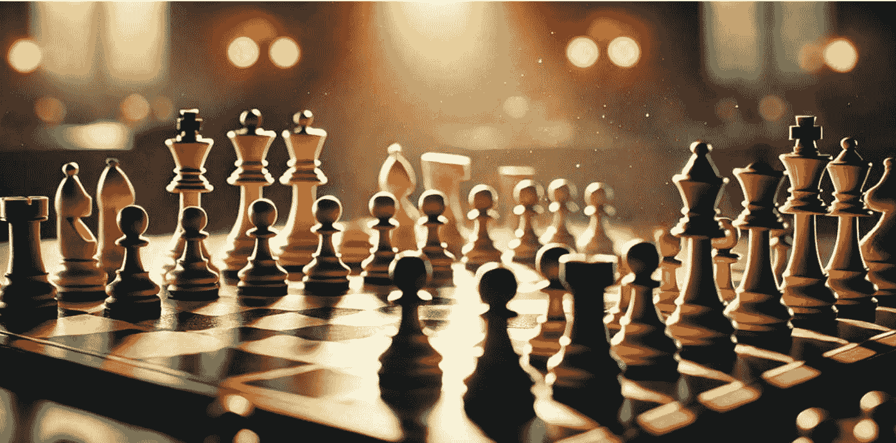


## 18 合作博弈进阶：陌生人之间如何有效合作？


懒人专属群的群友，你好

欢迎来到博弈论课，我是蒋文华。

上一讲，我们讲了懦夫博弈中的混合策略，这一讲我们来看夫妻博弈和猎鹿博弈中的混合策略。

我们在前面的课程中讲过，夫妻博弈和猎鹿博弈都属于合作关系的博弈，这类博弈的特点是，合作能够给博弈双方都带来更大的利益，可以说是最优解，然而，因为利益分配和信任等问题，双方并不一定会选择合作，而是可能选择非合作的次优解。

在前面的课程中，解决这类问题，我们用到的办法是协调，博弈双方之间有效的沟通协调，的确能够避免僵局或者次优局面出现。

然而，可以协调毕竟是一种理想状况，需要双方有基础的信任，沟通还要方便顺畅。如果，协调不具备条件，这时候就会出现混合策略的问题。

夫妻博弈和猎鹿博弈中的混合策略是什么？这两个博弈的混合策略又意味着什么？我们这一讲就来讨论这两个问题。

### 夫妻博弈

我们先来看夫妻博弈的混合策略。

先复习一下夫妻博弈，我们前面讲过，这个博弈共有四种结果：

如果都去男方家过年，男女双方的收益分别为2和1。调过来，都去女方家过年的话，男女双方的收益就成了1和2。如果谁家都不去，各自回家过年，男女双方的收益都是0。如果各自去对方家过年，男女双方的收益就都是-1。

其中，都去男方家和都去女方家，是这个博弈的两个纯策略纳什均衡。

文稿中，我也给你附上了之前课程中出现过的博弈矩阵，方便你复习。

| 丈夫 \ 妻子 | 男方家 | 女方家 |
|---|---|---|
| 男方家 | 2, 1 | 0, 0 |
| 女方家 | -1, -1 | 1, 2 |

学习了混合策略后，我要告诉你的是这个博弈，其实还存在一个混合策略纳什均衡：

男方3/4的概率去男方家过年，1/4去女方家过年；相对应，女方1/4的概率去男方家过年，3/4的概率去女方家过年。

在这个均衡之下，双方的期望收益都是0.5。

详细的计算过程，我放在文稿附录中，方便的时候你可以自己算一遍。

计算方法跟前面两讲讲过的混合策略的一般求解过程是一样的，这里只简单介绍一下逻辑。

首先，我们假设丈夫去男方家的概率为α，去女方家的概率就是1-α，妻子去男方家的概率为β，去女方家的概率就是1-β。然后，带入期望收益计算公式，得到双方的期望收益。最后再对两个期望收益求导数（求导数的过程就是计算期望收益的最大值），就能得到α和β的值。

#### 附录一：夫妻博弈混合策略纳什均衡求解

设丈夫去男方家的概率为α，去女方家的概率为1-α，妻子去男方家的概率为β，去女方家的概率为1-β。那么，在这种情况下，丈夫的期望收益（用Π丈夫来表示）是：
Π丈夫=2*α*β+0*α*(1-β)+(-1)*(1-α)*β+1*(1-α)*(1-β)
妻子的期望收益（用Π妻子来表示）是：
Π妻子=1*α*β+0*α*(1-β)+(-1)*(1-α)*β+2*(1-α)*(1-β)
双方期望收益最大化的必要条件是一阶导数为零。
dΠ丈夫/dα = 0
dΠ妻子/dβ = 0
计算得：
α=3/4
β=1/4
此为该博弈的混合策略纳什均衡解。
把α=3/4，β=1/4代入期望收益公式，得Π丈夫=Π妻子=0.5

说完计算逻辑，我们重点要看的是，这个均衡到底意味着什么。

第一，由于缺乏明确的预期，夫妻博弈在混合策略下，反而是各回各家的概率最大，是9/16（男女双方各回各家的3/4*3/4=9/16）。这个概率，超过了另外三种情况的总和。换句话说，混合策略并不利于合作的达成。

第二，夫妻博弈的混合策略，唯一的好处是看起来公平，双方的期望收益是一样的，都是0.5，但这个均衡是不稳定的。

想想看，在丈夫采取混合策略的条件下，妻子如果也采取混合策略，她去自己父母家的期望收益和去对方父母家的相等，这时候，你是妻子一方，会怎么选？大概选择去自己父母家的可能性会更多一点。

当丈夫发现妻子放弃了混合策略，最好也放弃自己的混合策略，跟着去妻子父母家。因为，虽然这不是最优选择（收益是2），但至少也是次优选择（收益是1），总比各回各家要好（收益是0）。这样，混合策略就退化成了纯策略。因此，我们说这个混合策略是不稳定的。

第三，更最重要的，无论是对个人还是对集体，不确定性都带来了明显的损失。

在缺少有效协调的情况下，双方各以3/4的概率回自己家，1/4的概率去对方家，这已经是让双方利益最大化的均衡结果了。然而从全局来看，这种结果是差强人意的。

因为，每次都一起去男方或女方家过年，双方的总收益为3，男方女方的收益至少都还有1，也比混合策略的结果要好。混合策略下双方的期望收益，都只有0.5。换句话说，不管一起去谁家，都比相互猜来猜去好。

这对现实合作的启发在于，降低合作的不确定性，能够明显增加彼此合作的总收益，而团队内部的勾心斗角，是对所有人利益的一种伤害。

### 猎鹿博弈

我们再来看猎鹿博弈中的混合策略。

还是先复习一下猎鹿博弈。猎鹿博弈共有四种结果，各自打兔子，双方收益都是2，合伙猎鹿双方收益都是4；一个打兔子一个猎鹿，打兔子的收益是2，而猎鹿的收益是0。

| | 猎人乙: 猎鹿 | 猎人乙: 打兔子 |
|---|---|---|
| 猎人甲: 猎鹿 | 4, 4 | 0, 2 |
| 猎人甲: 打兔子 | 2, 0 | 2, 2 |

前面我们也讲过，这个博弈有两个纯策略纳什均衡：各自打兔子或合伙猎鹿。

但除此之外，猎鹿博弈其实还存在一个混合策略纳什均衡：双方都以50%的概率去猎鹿。在这个均衡下，双方的期望收益都是2。

文稿中的附录二，我附上详细的计算过程，计算逻辑跟前面是一样的，也是先计算期望收益，再求导数，就不再重复了。我们重点依然来看这个均衡结果意味着什么。

#### 附录二：猎鹿博弈混合策略纳什均衡求解

设甲猎鹿的概率为α，猎兔的概率为1-α，乙猎鹿的概率为β，猎兔的概率为1-β。在这种情况下，甲的期望收益（用Π甲来表示）是：
Π甲=4*α*β+0*α*(1-β)+2*(1-α)*β+2*(1-α)*(1-β)
乙的期望收益（用Π乙来表示）是：
Π乙=4*α*β+2*α*(1-β)+0*(1-α)*β+2*(1-α)*(1-β)
双方期望收益最大化的必要条件是一阶导数为零。
dΠ甲/dα=0
dΠ乙/dβ=0
计算得：
α=50%
β=50%
是该博弈的混合策略纳什均衡解。
把α=β=50%代入期望收益公式，得Π甲=Π乙=2。

- 第一，在猎鹿博弈中，混合策略并没有很大的吸引力。

因为，混合策略的期望收益和各自打兔子的期望收益是相等的，那博弈双方就会想，与其变来变去不如简单一点，就直接去打兔子了。

- 第二，在猎鹿博弈中，混合策略的均衡同样是不稳定的。

因为，一旦双方预期对方猎鹿的概率超过50%，双方都会合伙去猎鹿；反过来，一旦双方预期对方猎鹿的概率小于50%，双方都会各自打兔子。

无论是夫妻博弈还是猎鹿博弈，一旦达成任何一种纯策略均衡，都会构成一种锁定效应，这种锁定效应在现实中非常普遍。

比如，QWERTY键盘（QWERTY键盘布局）是我们现在通用的键盘布局，虽然这并不是打字效率最高的布局，但要改已经很难了，因为工厂的模具、所有人的使用习惯，都是这种布局，改起来的适应成本太高了。

再比如，现行的互联网通信协议TCP，全世界几乎都已经加入了这个统一的通信协议，都获得极大的便利。 这种情况下，也很少有人愿意另开辟一种协议。

- 第三，混合策略的不确定性也带来了潜在的福利损失。

在模型中，合伙猎鹿的各自收益和总收益都是各自打兔子的两倍。但是，采用了混合策略之后，由于合作预期的不确定性，这种潜在的收益增加并没有实现。

这一点对于现实中的合作关系的启发在于，沟通和协调对于促进合作，增加各方共同利益起到了非常重要的作用。

不过，我们对猎鹿博弈的混合策略的讨论到这里还没有完。

之前我们讨论的都是特殊的情况，猎鹿的收益两倍于打兔子，如果猎鹿的收益不是两倍于打兔子，而是更高的话，结果如何呢？这对应的是猎鹿博弈一般化的问题。

具体的计算过程我放在了文稿的附录三中。

#### 附录三：猎鹿博弈混合策略纳什均衡的一般求解

设甲猎鹿的概率为α，猎兔的概率为1-α，乙猎鹿的概率为β，猎兔的概率为1-β。在这种情况下，甲的期望收益（用Π甲来表示）是：

Π甲=N*α*β+0*α*(1-β)+1*(1-α)*β+1*(1-α)*(1-β)

乙的期望收益（用Π乙来表示）是：

Π乙=N*α*β+1*α*(1-β)+0*(1-α)*β+1*(1-α)*(1-β)

双方期望收益最大化的必要条件是一阶导数为零。

dΠ甲/dα=0

dΠ乙/dβ=0

计算得：

α=1/N

β=1/N

是该博弈的混合策略纳什均衡解。

计算结果是，当猎鹿的收益是N倍打兔子的收益时，在混合策略纳什均衡中，每一方选择猎鹿的概率应该是1/N。

比如，当猎鹿的收益是打兔子的100倍时，双方都会以1/100的概率猎鹿，99/100的概率打兔子，这时猎鹿和打兔子的期望收益是相等的。

怎么理解这个计算结果呢？对于这个计算结果，很容易产生一种错误的理解，好像合作的收益越大，双方合作的可能性反而越低。这就正好理解反了。

正确的理解应该是，只要一方猎鹿的概率大于1%，另一方跟着去猎鹿的收益，就会比他自己打兔子要大。

这个逻辑稍微有点绕，我们用一个游戏场景来说明：

有这么两个游戏：

第一个游戏，尝试100次，只要成功1次，就算你赢。第二个游戏，尝试100次，要成功50次，才算你赢。

你会更愿意玩哪个游戏？显然是第一个游戏。

我们也可以从期望收益的角度实际算一下。

比如，当一方猎鹿的概率稍微提高一点点，到2%的时候，另一方跟着去猎鹿的期望收益是2（2%*100+98%*0=2），而他自己打兔子的收益只有1。显然他应该选择去猎鹿。

这说明，合作的收益越大，合作越容易自动发生，即便存在一定的风险。同时，合作的潜在收益越大，越不需要来自外部的协调，合作越容易自然发生。

一个非常典型的例子，是人类社会很早就出现的跨国贸易。尽管语言不通、交通不便，也没有高效的交通工具，甚至还有被强盗打劫的风险，但因为贸易的利益足够大，所以总有商人不辞劳苦、跨越千山万水去做生意。茶马古道、丝绸之路，留下了无数商人的传奇故事。

而从更广泛的意义上看，我们今天介绍的合作关系中的混合策略，也反映出人类社会的一大类现实困境的解决过程，那就是陌生人之间的合作是如何发生的。

陌生人之间缺少信任、偏好各异，还存在文化、语言等等各方面的阻碍，彼此协调存在巨大困难，然而人类竟然也演化出了种种约定俗成的安排，让合作得以实现，这是为什么？

博弈论的解释是，并不单纯是因为利益，还因为有一些特殊的博弈结构存在，这些结构中，既包括双方理性的计算、利益分配的调整，也考虑到了双方掌握的信息以及现实的不确定性。

综合了这些要素之后，结构的力量，就像一只无形的上帝之手，不管个体一开始怎么想，都会把博弈带向一个特定的局面。

理解这只“上帝之手”的运作原理，正是我们学习博弈论的意义所在。

### 总结

好了，我们来总结一下这一讲的内容。

在夫妻博弈和猎鹿博弈中，除了纯策略纳什均衡，还都存在混合策略纳什均衡。这种情况，也并非这两个博弈所独有。一个博弈一旦有两个纯策略纳什均衡，一般情况下都还有一个混合策略纳什均衡。

当然，这些混合策略，很多是不稳定的，在实际博弈中，很容易趋向于其中某个纯策略纳什均衡。

混合策略增加了博弈的不确定性，并带来潜在的利益损失。减少这种不确定性，既能增加个体利益，也能增加群体利益。这指明了人类社会制度演进和观念更新的方向。

#### 下节预告

预告一下下一讲的内容，最近两讲我们介绍的是既有纯策略又有混合策略的博弈，下一讲我们来看一种只有混合策略的博弈模型，征税博弈，这个模型会让你理解国家征税行为背后的博弈原理。

### 思考题

最后留给你一道思考题：在现实中，你能不能想到一个混合策略变成纯策略的具体案例？欢迎在留言区给出你的答案。

以上就是这一讲的全部内容，我是蒋文华，我们下一讲再见。


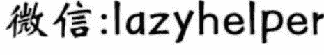

## 19征税博弈：查税先查大企业还是小企业？

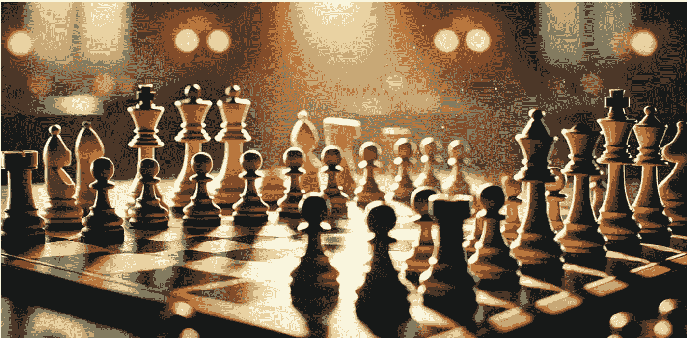

懒人专属群的群友，你好

欢迎来到博弈论课，我是蒋文华。

今天这一讲，让我们一起来当一回征税官。

假设，在你的辖区内有两家企业，一家规模大，需要交1000万的税；一家规模小，只需要交100万的税。请你判断一下，哪家企业偷税漏税的可能性更大，你应该重点关注谁？

注意，这个问题可没有看起来那么简单。你首先想到的可能是，大企业逃税的收益大、逃税的动机强，所以要多查大企业。但问题是，大企业也知道自己容易被查，因此会更守规矩。按照这个逻辑似乎应该多关注小企业。

实际上，除了纳税额，检查成本和惩罚力度，也会影响企业偷税漏税的可能性。反过来，这自然也会影响税务机关查税的决策。

以上因素综合起来，如何确定查税的概率呢？这就是征税博弈要研究的问题。

当然，现实中你大概并没有在税务机关工作，但日常工作生活中你一定会跟“税”发生关系，你肯定也经常看到各种跟征税有关的新闻，理解征税博弈背后纳税主体和税务机关的互动原理，再看相关新闻，你会比其他人多知道几层的“所以然”。

### 模型构建

老规矩，我们先来构建征税博弈的模型。

在现代社会，税收可以看作是个体与政府之间的一种交易关系。纳税人通过纳税“购买”政府所提供的公共服务，如国防、外交、公共安全等。但是在一个国家之内，这些公共服务，政府没法限制谁能享受谁不能。换句话说，没交税的人也可以搭便车，所以私人往往没有花钱购买公共服务的积极性。

考虑到有人不愿意主动交税，但国家又必须要收，博弈关系就出现了。

在征税博弈中，税务机关有两个选项——检查与不检查，纳税人也有两个选项——纳税和逃税。

博弈双方的选项两两组合，一共就会出现四种博弈结果，分别是：

纳税人逃税、税务机关不检查；纳税人逃税、税务机关检查；纳税人纳税、税务机关不检查；纳税人纳税、税务机关检查。

进一步，纳税人依照税法需要缴纳的税额，我们用A表示；税务机关查税的成本，我们用C表示；税务机关一旦发现纳税人逃税，除了要求补交税款以外，还会给予相应的罚款，我们用F表示。

文稿中，我给出了四种结果的博弈矩阵，你可以点开查看。

表19.1 征税博弈

| | 纳税人: 逃税 | 纳税人: 纳税 |
|---|---|---|
| 税务机关: 检查 | A-C+F, -A-F | A-C, -A |
| 税务机关: 不检查 | 0, 0 | A, -A |

分析征税博弈，要先区分两大类情况。

- 第一大类情况是，对于税务机关来说检查成本C实在太高了，纳税人补交税款A加上罚款所得F，两者的总和也比不上检查成本（A+F≤C）。

在这种情况下，即便纳税人逃税，税务机关基于成本考虑也会选择不检查。

这方面一个非常典型的例子，是2006年我国取消延续2000多年的农业税，这是当年非常受关注的一大惠民政策。但其实除了惠民，这里面也有征税成本的考量。

农业税当时在我国税收总额中占比已经不高了，不到1%。并且，农业税征税成本极高。有些山区，税务所工作人员收税需要上门儿，翻山越岭一下子就是几个小时。那时候有些地区农业税还是收实物，收了半天收到一大袋粮食，运回去换算成钱，还抵不上税务所工作人员的工资。

其实，在此之前一些富裕省份已经事实上放弃了农业税，国家2006年取消农业税，算是顺水推舟。

总的来说，第一类情况比较简单，也容易理解，不是我们的重点，我们重点要看的是第二种情况：税务机关所收的税额加上罚款所得，足以弥补检查成本（A+F>C），这时，如果纳税人逃税，税务机关就会选择检查。

在第二类情况下，征税博弈会出现一种我们已经熟悉的现象：那就是之前所说的四种博弈结果，没有一种是纳什均衡。更准确地说这种博弈不存在“纯策略纳什均衡”。

为什么这几种结果都不是纯策略纳什均衡呢？我们前面的课程中介绍过，纯策略纳什均衡要求的是一种稳定的局面。但征税博弈不存在这样的局面。纳税人如果自觉纳税，税务机关就会选择不检查，这样可以节约检查成本；但纳税人如果不自觉纳税，税务机关就会选择检查，而一旦税务机关选择检查，为了避免被罚款，纳税人又会选择老老实实纳税。

说白了，这就有点像是猫抓老鼠，你抓他就跑；你不抓，他就停。学习过前面几讲的内容，你应该已经想到，这时候，这个博弈存在的是混合策略的纳什均衡。税务机关不是绝对不查，也不是绝对查，而是要以一定的概率查。

那查税的概率，分别应该是多少呢？还是老办法，带入期望收益计算公式，再求导数，我们就能得到查税的概率。计算过程我还是放在文稿的附录中。你感兴趣可以自己算一遍。

#### 附录一：征税博弈混合策略纳什均衡的一般求解

设税务机关检查概率为α，不检查概率为1-α，纳税人逃税概率为β，纳税概率为1-β。
税务机关和纳税人期望收益的计算公式如下：

Π_税务机关= (A-C+F) α β + (A-C) α (1-β )+0*(1-α ) β +A*(1-α )(1-β )
Π_纳税人= (-A-F) * α β +0*(1-α )β + (-A) * α (1-β)+ (-A) *(1-α )(1-β )

税务机关期望收益最大化的一阶条件为：
dΠ_税务机关/dα =0

纳税人期望收益最大化的一阶条件为：
dΠ_纳税人/dβ =0

计算结果为：
α=A/(A+F)
β=C/(A+F)

当税务机关以C/(A+F)的概率进行抽查，纳税人以A/(A+F)的概率逃税款，构成混合策略纳什均衡。

在均衡条件下，税务机关和纳税人的期望收益分别为：
Π_税务机关=A(1-β)=A-AC/(A+F)
Π_纳税人=-A

#### 附录二：征税博弈混合策略纳什均衡的便捷求解

设税务机关检查的概率为α，纳税人逃税的概率为β。那么税务机关检查的期望收益（用Π_税务机关检查来表示）是：
Π_税务机关检查= (A-C+F) β + (A-C) (1-β )
税务机关不检查的期望收益（用Π_税务机关不检查来表示）是
Π_税务机关不检查=0*β +A*(1-β )

设税务机关检查和不检查的期望收益相等，计算出纳税人逃税的概率β，β=C/(A+F)。
用同样的方法，先计算纳税人逃税的期望收益（用Π_纳税人逃税来表示）是：
Π_纳税人逃税= (-A-F) * α +0*(1-α )
再计算纳税人纳税的期望收益（用Π_纳税人纳税来表示）是
Π_纳税人纳税= (-A) * α + (-A) *(1-α )=-A
让纳税人逃税和纳税的期望收益相等，计算出税务机关检查的概率α=A/(A+F)。

音频中，我们还是直接看计算结果。

征税博弈的混合策略纳什均衡是：当纳税人逃税概率为C/（A+F）时，税务机关的检查概率应该为A/（A+F）。

### 均衡解读

这个均衡对于税务机关的征税决策意味着什么呢？

通过前面的计算，我们知道纳税人逃税的概率和税务机关查税的概率，由应纳税额（A）、检查成本（C）和罚款（F）共同决定，但三个变量要是都变就不容易分析，我们用控制变量的办法来逐个研究。

先看第一种情况，检查成本（C）和罚款（F）不变，这时候应纳税额A越大，税务机关查税的概率就应该越大。相应的，纳税人逃税的概率，就越小。

从数学上来说，这是因为：

税务机关的检查概率为A/（A+F），分子和分母中都有A，当A变大了后，这个分数值是增加的。比如，我们给1/2的分子和分母，都加1，得到2/3，2/3大于1/2。而纳税人逃税的概率为C/（A+F），A在分母中，分母变大，分数值自然就会变小。比如，我们给1/2的分母加1，得到1/3，1/3显然比1/2小。

这里，我们也可以直接回答开头的问题了。从理论上来讲，纳税额越大的公司，逃税的概率反而越小，当然这其实是税务机关经常去检查他们后，博弈出来的结果。

现实也是如此，每次税收大检查，几乎都是针对纳税大户的。纳税大户发现自己经常被检查后，最好的选择也是尽量少逃税。

这恰恰充分体现了博弈的特点，你在考虑自己的策略选择的时候，必须先考虑对方的反应是什么。只有把对方的反应也作为你的决策依据的时候，你才能做出对自己最有利的选择。

反过来说，很多博弈结果之所以和你预测的不一样，很可能是因为在做预测的时候，你并没有把另一方的反应考虑进去。

再看第二种情况，税额A和罚款F不变，这时候检查成本C越大，纳税人逃税的概率就越大。但检查成本并不影响税务机关查税的概率。

数学上这也很好理解，纳税人逃税概率为C/（A+F），C在分子中，分子越大，分数越大。而税务机关的检查概率是为A/（A+F），只受到应纳税额（A）和罚款（F）影响，与检查成本无关，所以不变。

这一点乍一看有点让人意外，纳税人逃税概率高，税务机关难道不应该是加大检查的力度吗？但其实不是的。在现实中，虽然检查成本高的时候，纳税人更容易选择逃税，但税务机关也不会提高检查的概率。

对税务机关来说，虽然检查概率增加后能抑制纳税人的逃税积极性，但多收上来的部分并不足以弥补成本的增加。

实际上，检查成本更多是技术问题，随着互联网、大数据等技术的发展，政府的征税成本持续下降，纳税人逃税的概率也在持续降低。我国政府启动的金税四期工程在预防纳税人偷税漏税方面起到了极为有效的作用。

最后再看第三种情况，税额A和检查成本C不变，这时候罚款F越大，纳税人逃税的概率就越小，税务机关的检查概率，也可以变小。

数学上也很容易理解，不论是逃税概率，还是检查概率，罚款F都在分母当中，分母越大，分数越小。

这一点也非常有力地解释了，为什么对于逃税行为各国普遍的做法都是给予严厉处罚。

我国法律明确规定，对逃税者除了要求补缴税款和滞纳金以外，可以处应缴税款部分50%以上，5倍以下罚款。数额巨大并且占应纳税额百分之三十以上的，可处三年以上七年以下有期徒刑，并处罚金。

除了以上三点，我还想额外给你补充的是，怎么看待纳税意识对征税效率的影响。

当我们在比较A、B两个国家老百姓逃税程度的差异时，经常会说，A国人的纳税意识比B国人强，所以A国人的逃税比例比B国人要低。

我们当然承认，在现代国家中纳税意识是民众非常重要的基本素养。但是如果只从观念的角度看待征税现象，其实并没有看到本质。

试想，如果我们认为B国人逃税比较多是因为纳税意识不足，那么解决问题的办法，就是提高老百姓的纳税意识，比如到处张贴“纳税光荣逃税可耻”的宣传标语。但是，这种标语的实际效果是有限的，只能是一种补充。要从根本上解决问题，你需要看清背后更复杂的博弈结构。

正如刚才的分析表明，要想降低纳税人的逃税概率，最有效的方法是降低检查成本和加大对偷税漏税的处罚力度。

说远一点，观念差异对博弈的影响，其实也适用于更一般的情况。虽然用观念的差异去解释社会现象的差异很方便，很多时候貌似也能解释得通，因为人的行为总是会受观念的影响。但是，基于观念的解释经常是比较无力的，并不能让我们找到解决问题的办法。只有找到现象背后的博弈结构，我们才知道更容易起效的努力方向在哪里。

### 总结

好了，我们来总结一下。

征税博弈是一种典型的只有混合策略纳什均衡的博弈。税务机关要不要查税，不是个简单的是和否的问题，而是个概率问题。

税务机关查税的概率和纳税人可能逃税的概率，会构成一个混合策略纳什均衡。而具体概率值，由纳税额、检查成本和罚款力度三个因素共同决定。

提高征税效率最好的办法，不是观念宣传，而是提高处罚力度和降低检查成本。

#### 下节预告

预告一下下一讲的内容，下一讲我们要看一种跟征税博弈结构相似，但是细节很不一样的博弈模型“监督博弈”。

在企业中，老板担心员工上班摸鱼，员工总希望能够轻松一点。然而，老板也不可能总是盯着，因为监督同样是有成本的，老板监督的概率由什么因素决定？

搞清楚这个问题，你会知道不同类型的员工，工资应该怎么定。

### 思考题
最后，还是留给你一道思考题，博弈论其实也可以分析纳税意识差异对征税博弈的影响，我们可以在博弈模型中把这种差异体现到纳税成本上。纳税意识强可以理解成纳税的心理成本低，纳税意识弱可以理解成纳税的心理成本高。

请你分析一下，纳税意识的增强对税务机关的检查概率和纳税人逃税的概率会产生什么影响？

我是蒋文华，我们下一讲再见。


## 20习题课3：如何判断观念对博弈结果的影响？


懒人专属群的群友，你好：

欢迎来到博弈论课，我是蒋文华。

今天是我们课程的第三次习题课，我来为你讲解课程中布置的思考题，也和你分享一些同学的精彩回答。

### 思考题1
第一个思考题是关于机场里面的汇合点，请你用协调博弈的知识分析，为什么机场要设置这样的点？

我查了一下资料，差不多是从二十世纪五六十年代开始，欧美主要机场，如伦敦的希思罗机场、纽约的肯尼迪机场，开始设置汇合点。

汇合点通常位于显眼位置，如航站楼入口或大厅，随着国际旅行的增加，汇合点成为全球机场的标准设施，帮助旅客在复杂的机场环境中快速定位。

现在，国内的很多地铁站内也有这样的汇合点，很多同学在留言中也提到自己在国内的航站楼或地铁站看到过这样的汇合点。

我在浙大上课时，经常举的一个实际例子是，浙大的玉泉校区有一个同学们很容易找到的汇合点，那就是毛主席像。相对而言，浙大紫金港校区就不容易找到这样的汇合点，同学们容易想到的是约校门口见，可浙大紫金港校区居然有10个校门口，即便约好了哪个门还是特别容易走错。

需要补充一点，汇合点要起作用必须是共同知识（你知道，对方也知道，你也知道对方知道，对方也知道你知道），否则你未必去那里等人，对方也未必去那里找你。

### 思考题2
第二个思考题，高级版本的石头剪刀布游戏，如果你出石头赢我的剪刀可以获利10元，出剪刀赢我的布获利20元，出布赢我的石头获利50元。反之也一样。那么，你会采取什么样的混合策略和我博弈？

这个问题你只要学会了混合策略纳什均衡的求解就可以计算出答案。我看很多同学都给出了正确答案，为大家点赞！

我在附录中给出三种计算方法，一种是一般化的计算方法，一种是便捷计算方法，一种是“诚意直言”同学给出的计算方法，只要理解其中一种即可。你可以点击文稿查看（见文稿末尾附录）。

直接说答案：在高级版的石头剪刀布中，你应该采取这样的混合策略和我博弈：
- 2/8的概率出石头
- 5/8的概率出剪刀
- 1/8的概率出布

如果你这么做，我无论采取什么策略都没法赢你。但如果你不这么做，我就有机会赢你。当然，为了不让你有机会赢我，我也会采取和你相同的混合策略。

在这里我要说一说“咚咚锵”同学的思考，他不仅仅算对了结果，而且进行了进一步的思考和总结，他的思考对我也很有启发，我把其中部分内容和大家分享一下。

“咚咚锵”同学留言说：

为什么采取不同概率？是因为我们应该遵循高收益低频原则：

出布有高收益（50元），但使用最少（12.5%），是为了避免被针对；出剪刀有中收益（20元），高频使用（62.5%），平衡风险与收益；出石头有低收益（10元），作为干扰项维持均衡。

此外，他提出了一个核心理念：避免被预测。

两个方法：
保持随机性，拒绝“胜留败走”习惯。尽可能利用对手的非随机行为。

“咚咚锵”同学还贴心地给同学们提供了一句实战口诀：

“高收益藏后手，中频剪刀稳如狗，石头干扰别上头！”

接下来，我还想进一步告诉你的是，刚才所给出的答案仍然只是理论分析。在实践中，你其实还有更好的策略选择。

这个游戏我在课堂上和同学玩过50次以上。

具体操作是这样的：我给每个人发一张便签纸，让大家写上石头或剪刀或布，然后把便签纸收上来，分别统计出多少人出石头、多少人出剪刀，多少人出布。

假设统计结果是全班X个人出石头，Y个人出剪刀，Z个人出布。有了这个统计结果后，我就能马上计算出每个同学的输赢结果。

如果你出的是石头，赢每个出剪刀的同学10元，输给每个出布的同学50元，你的总输赢为：10Y-50Z。如果你出的是剪刀，赢每个出布的同学20元，输给每个出石头的同学10元，你的总输赢为：20Z-10X。如果你出的是布，赢每个出石头的同学50元，输给每个出剪刀的同学20元，你的总输赢为：50X-20Y。

在课程上如果学生是企业家，那就真金白银地玩，输钱的同学会把输掉的钱贡献出来作为班级活动的费用。如果是浙大本科生或研究生玩，那就玩虚的，那些胜出的同学可以获得期末总成绩加分的奖励。

文稿中，我给出了5次针对不同参与者的博弈结果。你可以点击查看。

### 表20.1 高级版石头剪刀布的博弈结果
| 时间 | 地点 | 参与者 | 石头 | 剪子 | 布 | 出石头的输赢 | 剪子的输赢 | 出布的输赢 |
|---|---|---|---|---|---|---|---|---|
| 2013年6月22日 | 福州 | 福建企业家 | 11 | 17 | 13 | -480 | 150 | 210 |
| 2013年8月19日 | 浙大华家池校区 | 四川企业家 | 14 | 16 | 11 | -390 | 80 | 380 |
| 2013年11月25日 | 浙大紫金港校区 | 本科生 | 3 | 57 | 23 | -580 | 430 | -990 |
| 2014年2月24日 | 浙大紫金港校区 | 研究生 | 11 | 37 | 21 | -680 | 310 | -190 |
| 2014年2月25日 | 浙大紫金港校区 | 本科生 | 8 | 53 | 32 | -1070 | 560 | -660 |

表格中所呈现出的博弈结果表明，总体来看，出剪刀的同学每次都是赢的，出石头的同学每次都是输的，出布的同学有2次是赢的，3次是输的，输的概率略微高一点。

这个结论并不局限于表格中所呈现的这5次博弈。我可以非常明确地告诉你，在我所有50多次的实验中，这个结论都成立。 只要是第一次玩这个游戏，总会出现出剪刀赢，出石头输的结局，出布则有可能赢也有可能输。

有同学可能会问，如果再玩一次会怎么样呢？基本结论是你第二次出剪刀还是能赢，但玩第三次就很难说了。我曾经在一个班里，让同学们连续玩了四次，玩第四次时选择出剪刀的同学是输的。

还有一点可以肯定的是，随着博弈重复次数的增加，每个人的输赢会逐步趋向于零。这就是均衡状态下的结果。

你可能会好奇，为什么人们在第一次博弈时出剪刀总能赢？

我的分析是大家刚接触这个游戏，很容易被出布的收益所诱惑，如果出布赢了能赢50，是所有出手里面最高的。不少人基于这个一阶思考，就选择了出布。

当然，肯定会有很多人能预判到这一点，既然大家容易想到出布，那么出剪刀赢布是20，输石头只要10，所以出剪刀的赢面就会非常大。这属于二阶思考。

那需不需要继续往下进入三阶思考呢？也就是既然大家都觉得出剪刀能赢，那你应该出石头。实践结果表明，在第一回合的博弈中，三阶思考反而是想多了，大多人想不到这么远，在好多人停留在一阶思考，选择出布的情况下，出石头反而会输。

其实，第一次出剪刀能赢，还有一个原因是大家一般不愿意出石头。而不愿意出石头的原因，除了刚才说的很多人达不到三阶思考的深度以外，还因为出石头就算赢了剪刀也只有10元，但是一旦输给对方的布，会输50元。这种强烈的对比，让大家觉得出石头最危险。

什么时候出石头能赢？随着重复次数增加，越来越多的人出剪刀以后，出石头才有机会赢。

这个高级版的石头剪刀布给了我们以下启发：

人的思考深度是有明显局限的。一开始的时候很容易只想到出石头很危险，出布的赢面更大，所以愿意选择出剪刀或布。就算你的思考深度比别人强，但如果你预期到别人的思考深度有限，你也不得不减少你的思考深度。这一点特别像我们之前的那个猜平均数1/2的数字游戏，虽然理论上的均衡是1，但别人想不到写1，你写1也赢不了。任何一个游戏，时间玩久了，赚钱就难了。因为，大家都成了老司机。

补充回答一个很多同学关心的问题，如何在一次性博弈中，让自己出石头剪刀布的概率分别达到2/8，5/8和1/8？

你可以准备一枚硬币，扔三次，都扔出正面就出布，连续两次扔出正面就出石头，其它情况下全部选择出剪刀。因为硬币三次全正面的概率正好是1/8，连续两次正面的概率是2/8，剩下其他情况的概率就是5/8了。

### 思考题3
第三个思考题，实际上是关于“幸福让”的讨论，我们在讲纯策略的懦夫博弈的时候提到过“幸福让”（第11讲）。这个思考题实际上就是对“幸福让”的模型化思考。

在一般化的懦夫博弈模型中，如果双方争斗的损失不同，A的损失比B的损失大，你认为谁采取进的可能性更大？在混合策略纳什均衡下，谁的期望收益更大？

我们建一个模型来分析。

我们借用一下第11讲中的懦夫博弈的损益值，其它结果不变，只改变双方都进的结果，不再是（-20，-20），而是（-40，-10）。A的损失从-20增加到-40，B的损失从-20减少到-10。这样我们就模拟了两人的不同幸福度。幸福度高，发生争斗的损失更大。在这个模型中，A是那个更幸福的人。

我把新懦夫博弈模型的矩阵附在文稿中，方便的时候，你也可以点开看看。

| | B进 | B退 |
|---|---|---|
| A进 | -40, -10 | 10, 0 |
| A退 | 0, 10 | 0, 0 |

用我们已经掌握的计算方法，可以算出这个博弈的混合策略纳什均衡为：A选进的概率50%，A选退的概率50%；B选进的概率20%，B选退的概率80%。

怎么理解这个均衡呢？注意，不能只看数值的大小，而要看两个人的互动。光是看概率，很容易误以为A选进的概率（50%），比B选进的概率（20%）大。不是这样的。

正确的理解方式是这样的：

对A来说，只要B选进的概率大于20%时，他就应该选退；而对B来说，只有A选进的概率大于50%，选退才是对他更有利的。

显然，概率大于20%是更容易出现的情况，因此更幸福的A更容易选择退让。

此外，思考题中还问了期望收益，知道了混合策略的概率，带入期望收益公式，我们可以得到，A和B的期望收益都是0，两者相同。当然，这个结论（期望收益相同）仅限于本模型，如果对参数进行调整的话，也会算出不同的结果。

考虑到这个混合策略纳什均衡的不稳定性，最后很容易演变成幸福者退让的纯策略均衡，因此，幸福者的期望收益会更小。

### 思考题4
第四个思考题，在现实中，你能不能想到一个混合策略演变成纯策略的具体案例？

同学们分享了很多精彩的案例，我这里也给你分享一个有趣的案例。

你走路迎面碰到对方，是靠左避让还是靠右避让？这其实是一个混合策略的纳什均衡，如果大家都随机选择靠右或靠左就经常会撞到一起。所以，经过长时间的演化，世界各地已经都找到了纯策略纳什均衡，有的国家大家都靠右，有的国家大家都靠左。

特别有意思的是，中国最早的全国性交通法规是1934年12月国民政府颁布的《陆上交通管理规则》，当时实行的是左行制。抗战前后国民政府接受了大批美国援助，美国汽车大量进入中国，美国车是为右行设计的，必须对车辆进行改装才能上路，这需要大量改装费用。考虑到这笔费用太过庞大，还有其他的一些因素，国民政府下令从1946年1月1日零时起，汽车一律靠右行。1949年新中国成立以后，延续了这一交通规则。

从这个案例中我们不难发现，一个博弈如果存在多个均衡，有的是通过习俗、文化等演化到某个均衡，有的是直接通过政府的法律规定。无论通过何种途径，都能减少我们在博弈中的损耗，提高我们的行动效率。

### 思考题5
最后看第五个思考题，博弈论其实也可以分析纳税意识对征税结果的影响。只需要在博弈模型中把这种差异体现到纳税成本上来。请你预判一下，纳税成本增加对税务机关的检查概率和纳税人逃税概率会产生什么影响？

博弈论研究人的理性选择及其均衡结果。经常有同学问，人做决策哪有那么理性。确实如此。人做决策一方面是基于利益，另一方面也基于利益以外的考量。

利益，更准确地说，物质利益是容易度量的，可以直接用钱来衡量和比较。利益以外的东西，观念、情感、道德、文化等很难度量。而这些东西也影响着每个人的行为选择。那么，博弈论是不是就没法分析观念对博弈结果的影响呢？并非如此！

接下来，我们就在征税博弈中看看观念对于博弈的影响。这里，我们要做的一个关键的转化是，把纳税意识转成纳税成本，纳税意识强意味着纳税成本低，纳税意识弱意味着纳税成本高。

这一点其实也好理解，成本其实也带有很大的主观成分。比如同样是做饭，喜欢做饭的人就不觉得是成本，而是享受；而不喜欢做饭的人，就觉得是很大的成本。

文稿中，我给出了考虑纳税成本后的博弈矩阵，你可以点开查看。我们用字母B来代表纳税额以外的纳税成本。

### 表20.2 考虑纳税成本的征税博弈
| | | 纳税人 | |
|---|---|---|---|
| | | 逃税 | 纳税 |
| 税务机关 | 检查 | A-C+F, -A-F | A-C, -A-B |
| | 不检查 | 0, 0 | A, -A-B |

考虑了纳税成本以后，依然可以应用我们课程所学会的计算方法，计算出新的纳什均衡。附录2我给出了完整的计算过程。

计算结果表明，纳税成本的增加会提高税务机关的检查概率，纳税人的逃税概率保持不变。也就是说，纳税成本增加后，税务机关预期到纳税人的纳税积极性会下降，因此会增加检查概率，当纳税人意识到税务机关的检查概率增加后，依然保持之前的逃税概率，不会因为纳税成本提高而增加逃税的可能性。

这有点像孩子上了初中或高中后，学习难度明显提高了，但不会减少学习的努力程度。除了升学压力外，还因为父母或老师会提高他们的监督力度，以防孩子在学习上偷懒。

以上就是本周习题课的全部内容。这周我们主要在讲混合策略的各种应用，涉及到的数学计算比较多，同学们辛苦了。我也在留言中看到，不少同学感受到了这种计算中的逻辑之美。相信我，这周的辛苦是值得的，打好了数学基础，从此以后面对现实博弈，你会知道怎么建立模型，怎么量化分析，这会帮助你成为真正的博弈高手。

欢迎你随时把课程学习的收获，分享给你身边的家人和朋友。

我是蒋文华，我们下周再见。

#### 附录1：高级版石头剪刀布混合策略纳什均衡的一般求解和便捷求解

| | | 李四 | | |
|---|---|---|---|---|
| | | 石头 (x) | 剪子 (y) | 布 (1-x-y) |
| 张三 | 石头 (α) | 0 0 | 10 -10 | -50 50 |
| | 剪子 (β) | -10 10 | 0 0 | 20 -20 |
| | 布 (1-α-β) | 50 -50 | -20 20 | 0 0 |

##### 一、一般求解

设张三出石头的概率为 α，出剪子的概率为 β，出布的概率为 1-α-β。设李四出石头的概率为 x，出剪子的概率为 y，出布的概率为 1-x-y。

计算出张三和李四的期望收益为：

Π张三 = 0*α*x + 10*α*y + (-50)*α*(1-x-y) + (-10)*β*x + 0*β*y + 20*β*(1-x-y) + 50*(1-α-β)*x + (-20)*(1-α-β)*y + 0*(1-α-β)*(1-x-y)
Π李四 = 0*α*x + (-10)*α*y + 50*α*(1-x-y) + 10*β*x + 0*β*y + (-20)*β*(1-x-y) + (-50)*(1-α-β)*x + 20*(1-α-β)*y + 0*(1-α-β)*(1-x-y)

张三收益最大化的必要条件（一阶条件）为期望收益对 α 和 β 的一阶偏导数为零。

李四收益最大化的必要条件（一阶条件）为期望收益对 x 和 y 的一阶偏导数为零。

∂Π张三/∂α = 0
∂Π张三/∂β = 0
∂Π李四/∂x = 0
∂Π李四/∂y = 0

四个方程，四个未知数，分别求出：
α = 1/4
β = 5/8
x = 1/4
y = 5/8
张三出布的概率 = 1-α-β = 1/8
李四出布的概率 = 1-α-β = 1/8

##### 二、便捷求解

设张三出石头的概率为 α，出剪子的概率为 β，出布的概率为 1-α-β。均衡意味着李四无论出什么，他的期望收益相等。

等式一：李四出石头的期望收益等于出剪子的期望收益

Π李四出石头 = 0*α + 10*β + (-50)*(1-α-β)
Π李四出剪子 = (-10)*α + 0*β + 20*(1-α-β)
Π李四出布 = 50*α + (-20)*β + 0*(1-α-β)

令 Π李四出石头 = Π李四出剪子 = Π李四出布

求出 α = 1/4，β = 5/8，1-α-β = 1/8

基于对称关系，李四的策略和张三相同。

诚意直言 观点洞察 AI推荐精选
18分钟前 UID: 19097459 共计409字 公开

设玩家选择石头(R)、剪刀(S)、布(P)的概率分别为 p、q、r，且满足 p+q+r=1。根据规则：
- 出R的期望收益：当对方选择S时收益+10，选择P时收益-50，故期望为 10q - 50r。
- 出S的期望收益：当对方选择R时收益-10，选择P时收益+20，故期望为 -10p + 20r。
- 出P的期望收益：当对方选择R时收益+50，选择S时收益-20，故期望为 50p - 20q。

在纳什均衡下，三个策略的期望收益应相等。通过联立方程：
1. 10q - 50r = -10p + 20r
2. -10p + 20r = 50p - 20q
3. p + q + r = 1

解得：
p = 1/4（石头的概率）
q = 5/8（剪刀的概率）
r = 1/8（布的概率）

因此，最优混合策略为：以1/4概率出石头，5/8概率出剪刀，1/8概率出布。

#### 附录2：考虑纳税成本的征税博弈

| | 纳税人 | |
|---|---|---|
| | | 逃税 | 纳税 |
| 税务机关 | 检查 | A-C+F, -A-F | A-C, -A-B |
| | 不检查 | 0, 0 | A, -A-B |

设税务机关检查的概率为α，纳税人逃税的概率为β。那么税务机关检查的期望收益（用Π税务机关检查来表示）是：
Π税务机关检查 = (A-C+F)β + (A-C)(1-β)

税务机关不检查的期望收益（用Π税务机关不检查来表示）是：
Π税务机关不检查 = 0*β + A*(1-β)

设税务机关检查和不检查的期望收益相等，计算出纳税人逃税的概率β，β = C/(A+F)。

用同样的方法，先计算纳税人逃税的期望收益（用Π纳税人逃税来表示）是：
Π纳税人逃税 = (-A-F)*α + 0*(1-α)

再计算纳税人纳税的期望收益（用Π纳税人纳税来表示）是：
Π纳税人纳税 = (-A-B)*α + (-A-B)*(1-α) = -A-B

让纳税人逃税和纳税的期望收益相等，计算出税务机关检查的概率α = (A+B)/(A+F)。

因此，当税务机关的检查概率为 (A+B)/(A+F)，纳税人的逃税概率为 C/(A+F) 时，构成该博弈的混合策略纳什均衡。

把结果代入各自的期望收益得：
Π税务机关 = A - AC/(A+F)，Π纳税人 = -A-B

《蒋文华·博弈论50讲》

会识局、能破局、善布局

版权归得到App所有，未经许可不得转载

公众号
懒人搜索
懒人专属群

微信:lazyhelper


## 21 监督博弈：什么样的员工该定高工资？


懒人专属群的群友，你好

欢迎来到博弈论课，我是蒋文华。

上一讲，我们讲了税务机关和纳税人之间的征税博弈，我们知道了税务机关查税的概率由纳税额、罚款力度和检查成本决定。这一讲，让我们站到老板的位置上，来看老板和员工之间的监督博弈。

现在假设你是老板，你公司里有两类员工，第一类工作过程简单，监督容易；第二类工作过程复杂，监督困难。

请问，你应该怎么样给这两类员工定工资？尤其是当员工的努力程度很难测量时，怎么激励员工好好工作？

这两个问题，是每个管理者都会面对的基本问题，也是企业薪酬制度的核心问题。这一讲，我们就用博弈论的方法来理清思路。

### 模型构建

我们先来构建监督博弈的模型，这个模型需要四个基础参数：

设员工创造的价值为V（value），这是员工努力工作时，老板能得到的收益；设老板支付的工资为W（wage）；设员工工作所付出的努力为H（hard work），有点类似员工付出的成本；设老板担心员工摸鱼进行监督的成本为C（cost）；

员工创造的价值（V），老板支付的工资（W）和监督的成本（C）都好理解。这里要额外说说的是员工付出的努力H。

怎么衡量员工付出的努力呢？我们知道，很多脑力工作是无法通过员工打卡，或者一直敲键盘，就能直接量化他的努力程度的。

博弈论的基本方法论和经济学是相通的，经济学上“努力”是个很主观的东西，难以量化，但可以转化成客观的成本，什么客观成本呢？就是“员工的机会成本”，即员工为当前这份工作所放弃的最佳替代工作的收益。

比如某程序员当前月薪2万，跳槽最高能拿2.3万，这个2.3万就是程序员的机会成本。

好，准备好基础参数，我们接下来看这个博弈的四种结果：

第一种结果：员工努力，老板不监督。员工的净收益为工资减去机会成本（W-H）。老板的净收益为员工创造的价值减去工资（V-W）。第二种结果：员工努力，老板监督。员工的净收益为工资减去机会成本（W-H）。老板的净收益为员工创造的价值减去工资和监督成本（V-W-C）。

第三种结果：员工摸鱼，老板不监督。员工的净收益为工资（W），老板的净收益为负的工资（-W）。第四种结果：员工摸鱼，老板监督。老板发现了员工的摸鱼行为，通常会采取相应的处罚措施，比如扣除奖金或工资。我们这里采取一种比较严厉的处罚，直接辞退。那么，员工的净收益为0，老板的净收益为负的监督成本（-C）。

文稿中我给出了四种结果的博弈矩阵，你可以点开查看。

### 表21.1 老板与员工的监督博弈

| 老板 \ 员工 | 努力 | 摸鱼 |
|---|---|---|
| 不监督 | V-W, W-H | -W, W |
| 监督 | V-W-C, W-H | -C, 0 |

跟上一讲征税博弈类似，监督博弈要成立有个前提，那就是监督成本（C）不能比工资（W）大。

试想，老板去监督一个员工是否摸鱼的成本是10万，而工资的支出只要5万，这时候老板只能不监督，员工却可以完全摸鱼，老板还没办法，这样的情况现实中是极其少见的。

如果监督成本大于所支付给员工的工资，说明老板根本监督不了这个员工，一个理性的老板肯定会选择放弃雇佣这样的员工。

我们要重点讨论的监督博弈，是在监督成本（C）小于工资（W）的情况下。

在这种情况下，如果一个员工总是摸鱼，老板一定会监督，然后辞退这个员工，此时员工的收益为0，这么下来的博弈局面是：

当员工偷懒时，老板选择检查；当老板检查时，员工选择不偷懒，因为被检查到偷懒会有更大损失。当员工选择不偷懒时，老板选择不检查，这样可以节省检查成本。而一旦老板不检查，员工又会选择偷懒。

你发现没有，这就又回到了我们熟悉的混合策略的情况，员工不会总是摸鱼，老板也不会总是监督，都是以一定的概率进行策略组合。

还是跟以前一样，这个概率有一个计算的过程，我放在文稿中了。计算逻辑是，把老板检查的概率和员工偷懒的概率设为未知数，然后结合刚才的四种结果，带入期望收益计算公式，就可以列出老板和员工的期望收益。

紧接着，对双方的期望收益求导数，并令导数等于0，就可以找到雇主和雇员各自期望收益最大化的均衡点。

#### 附录一：监督博弈混合策略纳什均衡求解

设雇主检查的概率为α，不检查的概率为 1-α，雇员偷懒的概率为β，不偷懒的概率为 1-β。

##### 1、带入期望收益公式，求各方期望收益

（期望收益告诉我们，当雇主检查概率为 α，雇员偷懒概率 β 时，他们长期赚还是亏。）

###### (1) 雇主的收益

雇主的可能情况：
- 1) 检查且员工偷懒（概率 αβ）：损失检查成本 C，抓住偷懒员工，收益是 -C。
- 2) 检查且员工不偷懒（概率 α(1-β)）：收益是 V-W-C。
- 3) 不检查且员工偷懒（概率 (1-α)β）：雇主损失 W。
- 4) 不检查且员工不偷懒（概率 (1-α)(1-β)）：雇主的收益是 V-W。

所以，雇主的期望收益（用Π雇主来表示）是：

Π雇主 = (-C) * α * β + (V-W-C) * α *(1- β )+ (-W) * (1- α) * β + (V-W) * (1- α) * (1- β )

###### (2) 雇员的收益

雇员的可能情况：
- 1) 偷懒但被抓（概率 αβ）：被惩罚，收益是 0。
- 2) 偷懒且没被抓（概率 (1- α)β）：拿到工资 W。
- 3) 不偷懒且被检查（概率 α (1- β)）：正常工作拿工资 W-H。
- 4) 不偷懒且没被检查（概率 (1- α)(1- β)）：工资 W-H。

所以，雇员的期望收益（用Π雇员来表示）是：

Π雇员 = 0* α * β + (W-H) * α *(1- β )+ W * (1- α) * β + (W-H) * (1- α) * (1- β )

##### 2、纳什均衡计算

求最优解的方法是，对期望收益函数求导，让导数等于 0。

（导数 d，即变化率。它告诉我们当调整 α 或 β，收益会如何变化；导数等于 0，即在这个点上，任何一方都没有动力单方面改变策略，也就是纳什均衡。）

dΠ雇主/dα = 0
dΠ雇员/dβ = 0

计算得：

α = H/W
β = C/W

雇主应以 H/W 的概率进行检查，雇员应以 C/W 的概率进行偷懒，这是一个混合策略的纳什均衡。

音频中我们重点看结论，这个混合策略的纳什均衡解是：

老板的监督概率是，员工的机会成本除以工资（H/W）；员工的摸鱼概率是，监督成本除以工资（C/W）。

这两个概率值，涉及三个变量，我们还是用控制变量的方法来逐个分析：

先看第一种情况，监督成本（C）和员工的机会成本（H）不变，工资（W）越高，老板的监督概率越小，员工的摸鱼概率也同样越小。

在数学上，这一点很好理解，老板监督的概率（H/W），和员工摸鱼的概率（C/W），工资（W）都是在分母中，分母越大，分数越小。

你可以把这一点理解为是“高薪养勤”或“效率工资”。当员工获得一个较高的收入时，如果摸鱼被发现后遭到辞退，会面临更大损失，那么必然会减少摸鱼行为，老板肯定也可以想到这种结果，然后自然减少相应的监督概率。

比如，奈飞公司就通常会给员工支付远高于市场的工资，同时取消传统KPI考核。奈飞的员工不仅没有偷懒，反而比传统企业更拼。

而更早用这个办法的是福特汽车，福特汽车当年为了降低每辆汽车的劳动力成本，没有裁员也没有降薪，反而是给工人涨了一倍工资，工人更努力工作，最终公司的效率远高于同时期的其他公司。

这种机制的本质，是通过价格的严重偏离重塑博弈，将对抗性监督转化为更大程度的自我约束，最终实现“无为而治”的管理境界。

再看第二种情况，监督成本（C）和员工薪酬（W）不变，员工的机会成本（H）越大，老板的监督概率应该越大。

这个结论在数学上很明显，员工的机会成本（H），只出现在老板的监督概率（H/W）的分子上，分子越大，分数就越大。

在现实中，机会成本越大意味着现实中员工有更好的外部选择，比如其他公司愿意支付更高的工资，或者员工自己创业的潜在收益也不小。这时候，员工留在当前岗位的机会成本变高，如果老板不给人家涨工资，员工可能更容易考虑偷懒或者离职。

因此，老板需要提高监督频率来防止员工偷懒，因为员工就算偷懒被发现然后被解雇他也不怕。他也可能觉得，他很快可以找到其他机会，所以偷懒的动机更强。

比如，在科技行业，高技能员工的机会成本通常很高，因为他们有很多工作机会。如果公司不提高工资，可能需要更频繁的绩效评估或监督措施。

最后还有第三种情况，监督成本（C）越大，员工的摸鱼概率越大，但老板的监督概率不变。因为老板的监督概率是H/W，与监督成本（C）无关。

这说明越是难以被监督的工作，员工就越可能偷懒。虽然老板也能预期到这一点，但考虑到监督成本太高，却并不会因此增加监督概率。

比如，导师监督科研进度的成本是很高的，学生也可能虚报进展，导师怎么办呢？那就容忍短期偷懒，通过年度答辩进行淘汰即可。

再比如，类似广告文案这样的创意过程也难以监督，如果强制考勤打卡或进度汇报，反而会抑制灵感。这种情况下，管理创意工作的管理者，通常都会主动放弃部分控制权，用自由的氛围来换取员工“自愿选择”合作。

### 最优工资支付

讨论完监督概率问题，我们再来回答一个更重要的问题，应该怎么样给员工定工资？这里既要调动员工的积极性，也要考虑最大化老板的收益。

完整的计算过程，我放在文稿里了。基本思路是把刚才的两个均衡概率代入老板的期望收益函数里，再对工资求导数，解方程得出的计算结果是：最优工资等于员工的贡献乘以监督成本后开根号。

#### 附录二：最优工资支付

##### 1、计算出雇主的期望收益

雇主的收益来源：
- 1) 如果员工努力工作（概率 $1-\beta$），雇主获得贡献 V，但要支付工资 W: (V-W)(1-$\beta$)
- 2) 如果员工偷懒（概率 $\beta$），雇主支付工资 W，但没有得到贡献： (-W)$\beta$

所以，雇主的期望收益是：

```
Π_雇主=(-W)β +(V-W)(1-β)
```

展开公式：

```
Π_雇主=V-W-Vβ
```

代入均衡状态下的偷懒概率 $\beta=C/W$：

```
Π_雇主=V-W-VC/W
```

这就得到了雇主的收益函数，它告诉我们工资 W 如何影响雇主的收益。

##### 2、求解最优工资

雇主希望他的收益Π_雇主最高，因此我们对 W 求导数并令其等于 0：

```
dΠ_雇主/dW = 0
```

由此求出 W=$\sqrt{VC}$

对于雇主来说，雇员工资取决于两个因素：一是雇员对雇主的贡献；二是雇主对雇员的检查成本。

这意味着，对于老板来说，对员工的工资支付取决于两个因素：一是员工对老板的贡献；二是老板对员工的监督成本。

由此得到两个推论：
- 第一，员工的贡献V越大，老板应该给更高的工资，这叫论功行赏。这个好理解。
- 第二，监督成本C越大，老板给的工资也应该越高。

这似乎跟我们的直觉有些不同，因为有一种观点认为，监督成本高时，老板可能更倾向于降低工资来补偿监督成本，但计算结果显示，这时候反而需要提高工资，来减少偷懒的可能性。

其实这点我们前面已经解释过了，当监督成本高时，老板无法频繁监督，因此必须通过提高工资来增加员工偷懒的机会成本，让员工意识到如果偷懒一旦被监督出来，就会被解雇，面临一个较大的损失（W-H），从而降低偷懒概率。

我们不妨把老板多付出的这部分工资（W-H），理解为是老板给员工的一种变相“贿赂”，以激励员工不偷懒或少偷懒。

### 从雇佣制到合伙制

我们把思考再深入一步。在马克思的《资本论》中，剩余价值是工人劳动创造的价值和工人劳动成本之间的差值（V-H）。工资介于劳动创造的价值和劳动成本之间，反映着剩余价值在双方之间的分配比例。

在马克思生活的那个年代，简单劳动很多，老板的监督成本很低。在这种情况下，老板监督的概率很高，员工偷懒的概率很高。员工得到的工资基本等于劳动力的机会成本。

换句话说，资本家付给工人工资的基本原则是：给工人一个他恰好不会拒绝的工资，只要比劳动成本（H）大即可，一旦发现工人偷懒，就立刻解雇。由此导致的结果是几乎所有的剩余价值都归老板所有。

当今社会已经进入知识经济时代，大部分的员工已经从体力劳动者演变成了脑力劳动者，努力程度很难测量，老板对员工的监督成本变得越来越高。随着监督成本的不断增加，老板必须要给员工更高的工资，才能激励员工努力工作，员工和老板共同分享了员工所创造的剩余价值。

很多公司，特别是高科技公司对员工实施股权激励，这不仅是为了降低监督成本，而且是提供原动力来激励员工，不是给员工规定业务，而是激励他创造新业务。这对老板和员工来说，是一个双赢的博弈结果。

### 总结

好了，我们来总结一下。

这一讲，我们介绍了监督博弈的均衡求解及其在企业薪酬设计上的应用。

员工要想增加收入，一方面是提高能力，另一方面是从事更难被监督的工作。而老板要想增加收入，一方面是降低监督成本，另一方面是增加对员工摸鱼的处罚力度。

当监督成本过大时，老板的最优选择不是增加监督概率，而是找到员工自驱力与老板控制力的平衡点。

#### 下节预告

今天是完全信息静态博弈的最后一讲内容，下一讲我们将进入一个新的学习模块：完全信息动态博弈。

### 思考题

最后还是留给你一道思考题。你能不能分享一个你自己生活或者工作中监督别人或被别人监督的经历，并讲讲里面的博弈逻辑？（比如，可以是你作为老板或员工的经历，也可以是你跟孩子之间的监督博弈）

这里，顺便也公布一下上周的学习奖励，上周我们说过，我们每节课末尾都有一个思考题，每周一，我会公布上一周的最佳作业同学名单，每位同学的奖励是《博弈思维线下研修班》的参加名额一个。

这个研修班的主题是：“博弈在现实竞争与合作中的应用”，时间暂定4月20日上午9点-12点，地点在北京得到总部。

今天公布上周获奖的5位同学名单：绿色计量、JPChou、向波荣、波澜不惊、活在未来。

第二周获奖同学名单：左星星，董全冠，Charles Wang，咚咚锵，我心飞翔，陈振中，上善若水。

第三周获奖同学名单：道远、郑大囧、雪莲、闻思修、张善崔。

文稿中有课程主编的微信（18500161040），请获奖同学添加他的微信，方便到时候联系到大家。

期待看到更多同学的精彩作业和留言。

我是蒋文华，我们下节课见。


## 公众号懒人搜索，懒人专属群分享

### 公众号
懒人搜索
懒人专属群


微信:lazyhelper

## 07 万元陷阱2：怎样避免恶性内卷？


懒人专属群的群友，你好

欢迎来到博弈论课，我是蒋文华。

上一讲我们介绍了，当竞争中存在巨大的沉没成本的时候，就很容易出现“万元陷阱”，这一讲，我们来讲怎么跳出万元陷阱，避免恶性内卷。

社会心理学家泰格（A.Teger）曾对落入万元陷阱的参与者进行过深入分析，他发现，人们之所以掉入这个“陷阱”，通常有两个动机在起作用，一个是经济上的；另一个是人际关系上的。

经济上的动机很容易理解，比如渴望赢钱，想挽回已有的损失，尽量避免遭受更多的损失。

人际关系上的动机相对复杂一些，比如渴望挽回面子，想证明自己比别人更厉害，还有就是给对手一点儿颜色看看。你想，当一个人意识到越往上叫只会亏更多钱的时候，他为什么还愿意继续加价？很可能就是用钱来获得钱以外的某种满足。

基于泰格的分析，我给你提供四个跳出“万元陷阱”的策略。分别是：避免捡漏心态、尽早传递势在必得的信号、克服损失厌恶、善待输家。

接下来，我给你一个一个展开介绍。

### 摆脱捡漏心态

先来看第一个策略，摆脱捡漏心态。

人们总是盼望着天上掉馅饼，希望能捡个大漏，占个大便宜，这是人性使然。恰恰是这种心态，让我们很容易落入万元陷阱。

决定参与万元竞拍的人，心态都是这样的：万一我拿很少的钱就拍下1万呢？那就赚大发了。不说100元买1万，那太贪婪了；哪怕是5000元买1万元，也能白赚5000元，干嘛不试试。

然而天底下哪有那么好的事情？只要我们出价，就会有人来跟我们竞争，因为大家的想法是一样的。谁不想捡漏呢？

可问题在于，一旦对方在我们的开价基础上加价，我们就陷入被动，为了避免损失，我们就只能继续加价，停不下来。

怎么避免这种情况呢？关键在于避免其他参与者加价。

怎么避免其他参与者加价？我给你的建议是直接出9900元。为什么是这个数？

前面提到了，对方加价，无非是两个动机，要么是经济上的，他也想赚钱，哪怕比你少赚一点；另一点，是情绪上或心理上的，就是不服气，凭什么你白赚那个钱！

但是，当你一下子出价9900元的时候，对方加价到1万元就没意义了。因为，算收益，他1万元买1万元，净收益是0。从情绪的角度，你才赚到100元而已，没多少，不值得羡慕或嫉妒，他也没必要非得跟你争。

### 尽早传递“势在必得”的信号

我们再来第二个策略，尽早传递“势在必得”的信号。

我们继续分析前面的博弈局面：在竞价过程中，你已经开出了9900元。但是对方竟然不放弃，加价到10000元，你该怎么办？

你可不能想着通过加价到10100元来让对方选择放弃。千万不要！如果你加价到10100元，对方一般会加价到10200元，因为，如果他不加价，就要损失1万元；他加价的话，损失只是200元。这个很好理解，他出10200就会比你高，能够拿到1万元奖励，10200-10000，他只损失200元。

所以，这时候，你必须想办法阻止对方在1万元基础上继续加价。怎么做才能达到这个目的？直接从刚才的9900加价到19900元。

> 《孙子兵法》有云：“是故百战百胜，非善之善者也；不战而屈人之兵，善之善者也。”要想不战而胜，你必须尽早展示出压倒性的实力和“势在必得”的决心。

在万元陷阱的竞争中，你先开价直接叫9900元其实已经在第一时间传递了“势在必得”的信号，如果对方没有充分理解你的信号，那么你就直接跳叫到19900，这是再次传递了“势在必得”的信号。

为什么是19900元？因为对方稍微算一下就会意识到，如果他再次加价，比如加价到2万，这和直接放弃相比，损失是一样的，都是1万。而从你大幅跳叫的行为看，如果他加价到2万，你很可能还会继续加价，从而让他损失更大。在这种情况下，对方一般会放弃。

但是，万一的万一，如果对方还就真的蛮横地要加价到2万甚至更高，怎么办？那我还是建议你立即放弃算了。这是对方在向你传递势在必得的信号，你绝对是遇到了一个狠人，你越早放弃损失越少。

通过上面的分析，我也想告诉你一个道理：如果有人不计后果地和你争一样东西，你不妨选择把东西让给他。

试想，如果有人在马路上开车总喜欢横冲直撞，你该怎么办？一定是尽可能避让。就这次而言，你比对方花费了更多的时间，但你可以预料的是，如果对方一直这么开车，总有一天会付出惨痛的代价。

### 克服损失厌恶

我们再来第三个策略，克服损失厌恶。

听完前面的分析，不知道你有没有意识到，我们掉进万元陷阱，是因为贪婪，而陷在里面出不来，其实是因为损失厌恶。

万元陷阱的博弈规则意味着你叫价后，只要有人加价就会让你面临损失。人恰恰是极度厌恶损失的，这是刻在每个人基因里的东西，是人类在漫长进化过程中所建立起来的本能反应。所以，哪怕明知越亏越多，我们也很难逃出万元陷阱。

那要怎么克服损失厌恶？你肯定知道，光是心里想：及时止损，这肯定是不管用的。要真正克服损失厌恶，我给你两个更具体的建议。

第一个建议，在博弈之前，提前想好你投入的极限，极限一到，不管是赚钱还是亏钱，立即退出，说到做到。

进一步看，如果他真加价到1万元，还有可能会被你报复，因为你会加价到10100元，那就糟了，他就会面临亏1万元的风险。所以，你摆脱捡漏心态，直接出9900元，就不会掉进万元陷阱里。这个价码可能能直接终结游戏，这是你的最优策略。

跳出游戏，这个策略有什么现实意义呢？

有一次我在杭州西湖边和一位企业家聊天，他说了一句让我印象深刻的话：“如果一个地方有很多血，会把狼招来的”。

他当时说这句话，是因为我们聊到义乌人怎么做生意。他有一次在义乌小商品市场采购产品，看到有一个产品才卖1块钱，而成本要9毛多。他忍不住问卖家，这个东西就算卖2块钱一个，照样会有人买。为啥卖这么便宜？卖家的回答是：“我不想有人和我争！我不想捡漏，但也不给其他人跟我争的机会。”

比如，我的极限就是5000元，5000元如果拍不到，那就算了，就当这5000元是扔掉了。这跟很多投资高手在买股票的时候，定好止损点，是一个道理。

这里尤其要提醒你的是，你的极限就是你的极限，一定不要考虑其他参与者到底是赚了还是亏了。万元陷阱的狡诈之处就在于，一开始是利用人与人之间攀比谁赚得多，最后变成了比谁亏得少的恶性竞争。事实上，对方亏损多少，跟你有什么关系呢？千万不要为了比对方亏得少，最后让自己亏得更多。

克服损失厌恶，我的第二个建议是，不断提醒自己继续投入的代价，把注意力从对以往损失的厌恶转化到对未来更大损失的恐惧上。

还是拿买股票做类比，很多人在股票亏损之后，会不停地补仓，摊低买入成本。其实，这时候，你更应该不停地提醒自己，如果补仓后又套牢怎么办？

在这一点上，我们应该向猎豹学习。

我有一年去肯尼亚旅游，当地的导游给我讲了这么一件事，说猎豹在捕捉羚羊时，一旦追赶了200米左右还没有成功，往往会放弃追赶。这里的道理其实也挺简单的，猎豹知道，再追下去，它自己会心跳过快，体温过热，它会死。当然了，猎豹主观上知不知道，我们不知道，但这是千万年进化留给这个物种的生存本能。

对于很多人来讲，之所以不愿放弃，之所以还在持续增加投入，是期望着出现反转的可能性，万一对方先放弃了呢？说不定就差最后一笔投入了，就这么放弃了，那多可惜啊，会后悔一辈子的。

然而残酷的事实是，人们总会高估小概率事件的发生概率，并为此下错了注。万元陷阱越往后，你只会亏损更多，很少有翻盘的可能性。所以，在很多情况下，断臂求生、及时止损才是脱困的最佳选择。

### 善待输家

最后，我们再来看第四个策略，善待输家。严格来讲，这与其说是一个策略，不如说是一个倡导。

先问你一个问题，昨天和今天这两讲学下来，在你看来，为什么如此简单的万元陷阱，会让那么多人深陷其中，最后两败俱伤？这里面固然有人性逐利的贪婪，有避免损失的恐惧，但除此之外，我觉得还有一点，那就是我们每个人都熟悉的四个字“成王败寇”。

万元陷阱的成王败寇，不仅体现在赢家可以拿到1万元，而输家除了什么都拿不到，还要额外亏一大笔钱。更体现在，赢家获得快乐、荣誉，而输家却会被奚落嘲笑。

我每次在课堂上让同学们玩儿这个游戏，大家都知道这只是个游戏，但是每次游戏结束时，多多少少都能感受到，大家对于那个认怂的输家的嘲笑。当然了，课堂上同学们都是开玩笑，没什么恶意。

但我们跳出课堂，从社会的角度来看，正是这种“成王败寇”的文化，让参与者很难提早放弃争斗，避免两败俱伤，而且越是往后，双方都输得越惨。

怎么摆脱这个困境？只有建立善待失败者的文化观念，方能减少无意义的恶性内卷。

其实，从文明演化的角度看，人类社会也是在一步一步这样做的。拿战争来举例，你想想如果没有“优待俘虏”的日内瓦公约，战争的伤亡是不是会更加惨烈——投降也是死，拼命也是死，还不如拼命。这只会带来更多无意义的伤亡。

输的有多惨，赢的就会有多惨烈。

当然了，不光是在战争中，在商业、体育、教育，所有领域都是一样的。当失败者都能受到善待，他就不必非要去拼个你死我活。这样，竞争才能保持在适当的限度内，对于所有人来讲，这才是我们更愿意看到的双赢局面。

这既是我们整个社会需要努力的方向，也是每个人可以做的修行。

说到双赢，正好回到万元陷阱。其实，用双赢的思路，破解万元陷阱易如反掌。

记得有一次，我在课堂上拿出50元现金进行拍卖，结果有学生立马在班级微信群里说：“我出1元，希望大家不要和我争，我保证会把所有盈利都发红包给大家。”

你看，就是这么简单。问题是，怎么让同学们相信你的确会那么做呢？那你平时就要多积善缘，或者更准确地来说让身边人都知道你是一个善于合作，乐于跟所有人共享利益的人，大家就不会来跟你玩命竞争。最后获益的，是所有人。

### 总结

好了，我们来总结一下这一讲的内容。

要想让自己避免落入“万元陷阱”，你需要避免捡漏心态，尽早传递“势在必得”的信号，并在确定无法获利时克服损失厌恶，及时止损。

此外，社会建立起善待输家的文化，我们自己建立起愿意与他人共享利益的声誉，也都能让我们避免落入万元陷阱。

### 思考题

最后给你留一道思考题：你能想到人类社会中有哪些习惯、观念、制度，起到了防止人们陷入万元陷阱的作用？

我是蒋文华，我们下节课见。

《蒋文华·博弈论50讲》
会识局、能破局、善布局
版权归得到App所有，未经许可不得转载
浙江大学公共管理学院副教授 蒋文华


## 22 最后通牒1：什么影响我们对公平的追求?

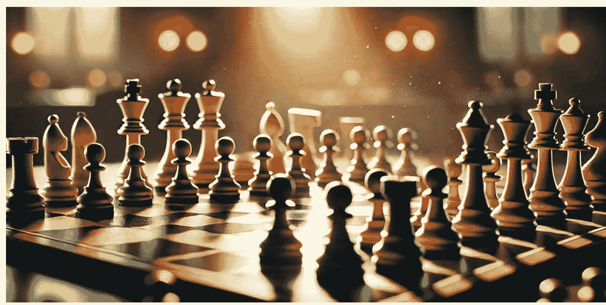

懒人专属群的群友，你好

欢迎来到博弈论课，我是蒋文华。

从今天开始，我们进入一个新的学习模块：完全信息动态博弈。

先来复习一下动态博弈和静态博弈的区分。在导论中我们介绍过，在博弈论中，如果参与者同时出招，我们就说这个博弈是静态博弈，我们之前学习的博弈模型除了万元陷阱，都是静态博弈；反过来，如果参与者的出招有先后顺序，且后出招的人能够观察到先出招的人所采取的行动，那就是动态博弈了。

静态博弈的参与者只能通过猜对手会怎么出招来做决策，而动态博弈的参与者可以依据对手的实际出招来做决策。

在静态博弈中，所有参与者都只是博弈的接受者，参与者的重点是怎么解局，考验的是每个参与者的预判和计算能力。

在动态博弈中，参与者既是当下博弈的接受者，又是后续博弈的设定者，参与者的重点是怎么设局，考验的是每个参与者的逆向推理能力。

因此，在静态博弈中，起点决定终点；在动态博弈中，终点决定起点。

动态博弈也分完全信息和不完全信息，这个模块我们先看完全信息的情况，下一个模块我们再看不完全信息的情况。

这一讲我们首先要学习的是最后通牒博弈（Ultimatum game），这个博弈相信很多同学之前都听说过，不光是在介绍博弈论的书和文章中，在一些行为经济学、社会心理学研究中这个模型以及相关的实验也是常客。

这一讲，我们从动态博弈的视角，来分析一下这个博弈的结构。

### 最后通牒博弈

最后通牒博弈描述的是这么一种局面:

张三和李四一起来分一笔钱，假设是10万，游戏规则要求张三提出一个分配方案，然后让李四选择是否接受张三的方案。如果接受，就按照张三的方案分配这10万元，如果不接受的话，双方的收益都为零。

你不妨想象这么一个场景，张三李四合伙盗墓，张三进入墓穴获得价值10万的古董，出来后给了上面负责放风的李四1万元，李四嫌少拒绝了，并反手把张三告发了，最后古董归了国家所有，张三李四白忙活一场。

张三作为提出分配方案的人，我们称之为提议者，李四可以选择是否愿意接受方案，我们称之为回应者。因为双方的出招有先后顺序，李四是在张三提出方案后再做决策，所以这是动态博弈。

### 利益VS公平

#### 影响公平感的因素

- 专业差异。最后通牒实验基本上都是由经济学家们主导完成的，因此很自然会对经济学专业的学生和其它专业的学生进行对比实验，看看经济学的学习是否让人们变得更“自私”。

这里的更自私是指更追求物质利益，在实验中则表现为更低的出价和更高的要价。有一项实验显示经济学专业的学生比其它专业的学生平均少给了7%。不过，也有另外的实验表明没有专业方面的显著差异。

有意思的是，那个认定经济学专业学生更“自私”的实验也发现，也可能是更“自私”的人选择了经济学专业，而不是经济学专业的学习让人更自私。其实这也是容易理解的，一般而言赚钱欲望强的学生更倾向于选择更能赚到钱的专业。

- 年龄差异。这方面的实验结果是我事先没想到的。最后通牒的实验结果表明，孩子很小的时候（5岁以前）其实是比较自私的，更接近博弈论中的纯“理性人假设”，如果他们作为提议者，更愿意给出一个较低的分配比例，作为回应者也更愿意接受一个比较低的分配比例。再长大一些后，孩子变得对公平有了更强烈的追求，公平均衡点明显提高，但等真正长大成人后，公平均衡点又有所回落。

- 相貌差异。实验结果表明，漂亮的和长相一般的相比平均能增加10%的收益。更让人惊讶的是漂亮的男性和漂亮的女性相比，还能再增加5%的收益。

在一次最后通牒的实验中，作为提议者的女性给漂亮男性们的分配比例平均超过了50%（是50.7%）。在这次博弈中，还有占比5%的女性居然给到了80%-100%。这似乎表明，面对漂亮的异性，男性更吝啬，女性更慷慨。

刚才，我给你介绍了参与者的特征对最后通牒博弈的影响，接下来我更想跟你分享的是，不同的社会环境对博弈结果产生的影响。

通过对比大量的实验结果还有一个非常重要的发现，那就是：市场化程度越高的社会，提议者给对方的分配比例相对越高。

很多人认为一个社会的商业化程度越高，人们会越自私，越唯利是图。这其实是一种非常大的误解。事实上，商业化或市场化程度越高，人们恰恰越慷慨，越愿意选择利他。

为什么市场化程度越高的社会，提议者给对方的分配比例越高？我认为有两方面的原因：

第一，市场化程度越高的社会一般是相对更富裕的社会。

任何东西都是边际效用递减的，钱也是一样。钱越多，单位金钱的效用越少，对钱自然越不在乎，越愿意追求钱以外的满足感。

第二，市场化程度越高的社会是市场竞争相对较为激烈的社会，竞争越激烈人们的公平意识会越强。

社会是一个复杂的网络，我们与人博弈，有时候在优势的一方有时候在劣势的一方。占便宜可以爽一回，但下次可能反过来要吃亏，唯有公平才符合长远利益。

### 总结

好了，我们来总结一下这一讲的内容：

最后通牒博弈是一种动态博弈，进一步凸显了“换位思考”在博弈决策中的重要性。换位思考不光要考虑对方的利益诉求，也要考虑对方的公平诉求。人类存在着对公平的普遍性追求，不患寡，而患不均，这是博弈参与者必须要考虑的要素。不同特征的人，内心的公平均衡点会有很大差别，遇到最后通牒博弈，首先要分析对方的公平偏好。市场经济的发展总体上会让我们变得更慷慨，更愿意和他人分享利益。

#### 下节预告

预告一下下一讲的内容，最后通牒博弈看似简单，但其实在社会制度安排中有非常广泛的应用，下一讲我们就来展开分析。

### 思考题

这一讲留给你的思考题是，你能否从以往的生活经历中，找出两个最后通牒博弈的实例，一个例子中你是提议者，另一个例子中你是回应者，两个例子中你的选择分别是什么，为什么？

我是蒋文华，我们下节课见。

注：本节课所介绍的部分内容取自《行为博弈—对策略互动的实验研究》（科林·凯莫勒著）一书的第2章：“独裁者、最后通牒与信任博弈”。


公众号 懒人搜索 懒人专属群

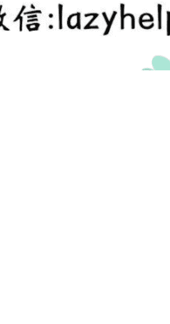

微信:lazyhelper

## 23 最后通牒2：怎样看待分配意图对博弈的影响?

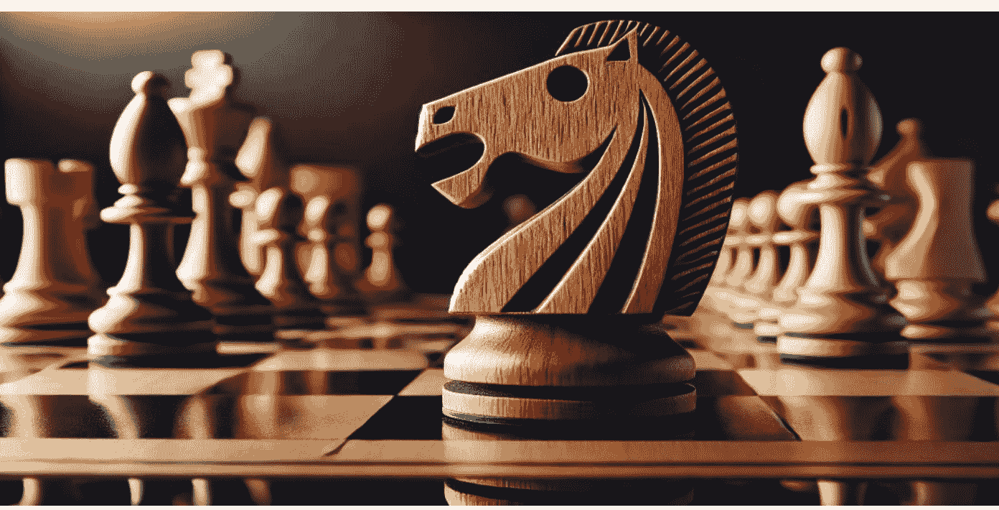

懒人专属群的群友，你好

你好，欢迎来到博弈论课，我是蒋文华。

上一讲我们讲到，不光是对物质利益的追求，人们心中公平感的分量，也会影响最后通牒博弈的结果。博弈时如果没有充分考虑到这一点，会导致局面破裂，谁都得不到好处。这一讲，我们进一步讨论，最后通牒博弈背后所反映出的人类的分配难题。

分配制度的设计，核心是怎样更合理、更有效地分蛋糕。蛋糕分得好，皆大欢喜；蛋糕分得不好，很可能就一拍两散，甚至桌子都被掀掉了。所以，分蛋糕不光要考虑各自利益的最大化，也要公平；但也不光要考虑公平，还需要考虑效率。

怎样在现实中更好地平衡所有这些要素？这一讲，我们继续借助最后通牒的有关实验讨论这些问题。当然，分配这么大的问题不可能在一节课中解决，我们只是引入几个观察和思考问题的新视角。

### 分配意图也很重要

上一讲中我们在讨论最后通牒博弈时，关注重点是提议者给了回应者多大的份额，如果提议者给的太少，回应者就会选择拒绝，宁可一点也不要，也不让你占那么大的便宜。

但是，进一步的最后通牒博弈实验还发现了一个重要的现象，回应者会不会拒绝，不仅仅看提议者给了多少，还会看提议者为什么给这么多。

也就是说，分配方案背后的动机或意图也至关重要。

做这个实验的是德国经济学家阿明·法尔克（Armin Falk）等人，他们的最后通牒实验跟常规版的共同之处是，都是由提议者提出分配方案，回应者只能选择接受或者拒绝。但不同之处是，提议者最后选的分配方案并不是他自己随意想出来的，而是只能从实验人员提供的选项中选择。

并且这里还有一个更巧妙的设计，回应者也知道提议者的选择了什么、放弃了什么。用我们前面学过的知识点，就是双方对此有共同知识。

法尔克他们一共设计了四组不同的分配方案，每组分配方案代表一种分配意图。分配方案怎么反映分配意图呢？通过对比。

在实验中，每组中的提议者都被要求在两个分配方案中做选择，这两个方案中，一个是8:2分，即提议者拿8份，给回应者2份，这个方案始终是固定的，四个组都一样。另一个方案，四个组都不一样。

文稿中我附上了一张表格，里面是完整的实验数据，方便的时候你可以点开查看，现在可以先听我说。

| 对比方案 | 提议者选择8:2的意图 | 提议8:2的占比 | 回应者拒绝8:2的占比 |
|---|---|---|---|
| 5:5 | 相对不公平 | 31% | 44% |
| 2:8 | 不愿意牺牲自我 | 73% | 27% |
| 8:2 | 中性的（被迫的） | 100% | 18% |
| 10:0 | 相对公平的 | 100% | 9% |

先介绍第一组实验，提议者需要在平分（5:5）和8:2这两个分配方案中选择一个。实验结果显示：31%的提议者选择了8:2分配。如果提议者选择了8:2，回应者中有44%的人选择了拒绝。

为什么会是这种结果呢？我们来分析一下提议者和回应者的心态。对比方案是平分，这是大家普遍认为最公平的方案，跟最公平的方案一对比，8:2显得特别不公平。回应者可能觉得，既然你提议者选择这个不公平的方案给我，那我自然是不愿意接受的。所以44%的回应者是明确选择拒绝的，这个比例是四组实验中最高的。

有意思的是，提议者可能也是提前预期到了这一点的，所以只有31%的提议者选择了8:2，这个比例在四组实验中也是最低的。

再看第二组实验，提议者需要在2:8和8:2这两个选项中选择一个。也就是说，要么自己拿80%，要么给对方80%。实验结果显示：73%的提议者选择了8:2。如果提议者选择了8:2，回应者中有27%的人选择了拒绝。

这组实验中，提议者和回应者的心态更有意思。提议者需要在2:8分和8:2分之间选择，这意味着，跟平分相比，提议者要么牺牲自己的利益成全他人，要么牺牲他人的利益成全自己。

在这种情况下，回应者似乎更能接受8:2的分配比例，所以拒绝比例从第一组的44%明显下降到了27%。可谓人同此心，心同此理。回应者觉得不能要求别人牺牲自己成全他人，他自己也很难做到。

继续看第三组实验。提议者除了8:2分这个方案，并没有其它任何选项，这样一来所有的提议者都只能被迫选择8:2分。在这种情况下，回应者中有18%的人选择了拒绝。

这种情况下，提议者其实是别无选择的。但没想到居然也有18%的回应者选择拒绝。只能说，这证明了我们上一讲所说的，在博弈中人们对分配的公平性有着非常强烈的追求，即使你别无选择，别人也不一定能接受你比他拿太多。

最后看第四组实验，这是最后一组实验。提议者需要在10:0和8:2这两个选项中选择一个。也就是说，要么自己独占全部的收益，要么给对方20%的收益。实验结果显示：所有的提议者都选择了8:2。在这种情况下，回应者中只有9%的人选择了拒绝，比第三组的18%减少了一半。

这种情况下，提议者和回应者的心态，都特别值得深思。提议者有可能是觉得，不给人家分一点说不过去，所以选择了分2份出去。也可能提议者未必不想多拿，但可能是怕多拿一定会被拒绝，最后什么也捞不到。但总之，客观的效果是提议者释放出了“相对的善意”。

而回应者可能觉得，对方本来可以独吞全部好处，但却没有，而是主动分享一点出来，这就让本来不算多的2份收益变得可以接受了。

以上实验对我们的启发是，一个人是否愿意接受某个分配方案，跟他们认为的提议者的意图直接相关。

同样一个方案，要想被对方更容易接受，除了利益上的平衡，也需要让对方感受到你释放的善意，或者至少不要让对方误解，以为你是恶意的。

### 权力来源对博弈结果的影响

介绍完分配意图对博弈结果的影响，我们再换个视角来分析提议者决策权的不同来源对博弈结果的影响。

在最后通牒博弈中，提议者有决策权，回应者有否决权。如果在这两种权力中选择其中的一项，请务必选择决策权。

我在课堂上经常问同学们愿意选哪项权力？没想到居然好多同学选了否决权，觉得能否决对方的决策，很爽。其实这是不对的。

因为决策权是比否决权更有价值的权力。在最后通牒的博弈实验中，提议者平均所得通常都会明显超过回应者的平均所得。

一项有趣的实验结果表明，提议者的不同产生方式居然也会影响到博弈的结果。

有研究人员做过这样的两组对比实验：

第一组，提议者通过随机的方式产生，结果提议者给对方的均值比例是43.7%，然后回应者选择拒绝的比例是8.3%。

第二组，提议者通过智力测试的方式产生，谁的得分高谁就是提议者，结果提议者给对方的均值比例是36.2%，明显低于之前的比例。

按照我们正常的判断，提议者给的越少，回应者拒绝的比例越高。然而，出人意料的是，回应者选择拒绝的比率是0%，居然没有一个选择拒绝。你不觉得这很奇怪吗？

但如果你思考的更深入一点，还是能明白背后的决策逻辑，那就是提议者决策权的权力来源不同，会直接影响回应者是否愿意服从提议者的决策。

在第一组实验中，提议者的分配权源于他的运气比较好，回应者的想法是你运气好，多拿走一点我能接受，但是你想分的太多，我可不愿意，宁可大家都不要好了。

在第二组实验中，提议者的分配权源于他的智商或学习能力，回应者的想法是既然你的智商比我高或能力比我强，你多分一点还是合情合理的，我愿意接受，都怪我自己比你笨或能力比你弱。

回归常识，其实这也是一种普遍人性，你要来管我，如果是凭运气，我心里肯定不服；但如果你是凭智力或能力，我甘拜下风。

这个实验结果给了我们一个重要启发，那就是在组织内部，管理者任职制度直接影响组织的管理效率。

在一个组织内部，必须建立基于绩效和能力的职务提升制度，并采取公开竞争的原则，只有这样才能有效地提高一个组织的管理效率，否则管理者被管理者之间容易陷入无谓的“较劲”。

### 最后通牒的社会价值

最后，我们再来看最后通牒博弈反映出的分配效率问题。

我相信，第一次听说最后通牒博弈，你可能会觉得，这不就是一个小游戏嘛。然而你很可能想不到的是，这个简单模型蕴含着巨大的现实意义。

最后通牒博弈最本质的特点，是不给博弈的双方任何讨价还价的余地和机会。现实世界中最能代表这种博弈场景的是无处不在的自动售货机，售货机里面的每一件商品都明码标价，你要问它能否便宜1毛钱，它可根本不理你。

其实，现实世界里所有不给你讨价还价余地的局面，都可以理解为最后通牒博弈。你购买火车票、飞机票、各类网购、超市购物，你去医院看病买药，你上学缴纳学费，还有很多政府的行政性收费，以上这些几乎都是最后通牒，我们每天都生活在最后通牒的世界里。

你可能会问，最后通牒到底给我们带来了什么好处？我认为有两个好处：一个好处是节省了大量的谈判成本，提高了陌生人之间大规模交易的效率。

你想想看，如果所有的交易，都要费劲半天讨价还价，那我们就不要做别的事儿了，整天都耗在这上面，这也是一种资源的浪费。

经济学家黄有光打过一个生动的比方来描述这种情况：一个大热天我在卖一块冰，你来买冰，你问我这块冰多少钱，我说10块，你说1块卖不卖？我说8块，你说给你加点儿，2块怎么样。我说6块，你说再给你加点儿，就3块得了……最后成交价是多少不要紧，但在这个过程中，冰肯定化掉了不少。

这是采用最后通牒模式交易的第一个好处。采用最后通牒模式交易的另一个好处，是给我们每个人一种对公平的满足感。

无论你是谁，在自动售货机面前都是平等的，它只认钱不认人。

公平本身也可以减少内耗，提高效率。

在给企业家们上博弈论课的时候，我总会强调企业管理中尽量多用最后通牒，少用讨价还价，尤其是在企业内部的利益分配上。如果在利益分配上总是可以讨价还价的话，一定会导致“会哭的孩子有奶喝”，长久下来，这是对组织效率的一种伤害。

要分蛋糕，首先是要有蛋糕可分，而且还是一块大蛋糕。如果蛋糕不大，分到再多也是小的；蛋糕大了，分到小的那块也还是大的。

最后通牒博弈的价值就在于尽量减少分配过程中的损耗，让大家都尽可能分到一块更大的蛋糕。

### 总结

好了，总结一下这讲的内容。

- 1、提议者提出一个分配方案的意图，直接影响回应者的接受意愿，如果你是提议者，在提出方案的同时，请传递你的善意。
- 2、提议者凭什么有分配利益的权力，直接影响回应者的接受意愿，建立一个让大家心服口服的管理者选拔机制，有利于提高组织的管理效率。
- 3、最后通牒博弈一方面极大地提高了现代社会的运行效率，另一方面又充分满足了我们价格面前人人平等的心理需求。

#### 下节预告

最后通牒是一种不给回应者任何还价余地的博弈，与此相对应的是回应者有还价余地的博弈，这种博弈称为“讨价还价”博弈。下一节我们就来分析回应者可以还价的话，双方又会博弈出什么结果出来。

### 思考题

这一讲留给你一个思考题是，在家庭事务（购房、购车、孩子上学、旅游目的地选择等）上，你父母或你和爱人之间是如何分配决策权和否决权的？

我是蒋文华，我们下节课见。

> 注：本节课所介绍的部分内容取自《行为博弈—对策略互动的实验研究》（科林·凯莫勒著）一书的第2章：“独裁者、最后通牒与信任博弈”。


## 24 讨价还价：怎样在谈判中获得最大利益？


懒人专属群的群友，你好

欢迎来到博弈论课，我是蒋文华。

今天这一讲，我们来讲一个新的博弈模型：讨价还价博弈。这个博弈的原型，就是现实世界中随处可见的讨价还价现象，只不过在博弈论中我们把它模型化。

现在假设，你有一辆二手车想卖给我，最低售价20万。我看了后感觉车子挺不错，我的预算上限是30万。你不会轻易以20万卖给我，我也不想直接出30万，我们都会试图争取对自己更有利的价格，两方会轮流出价，直到有人同意对方的出价为为止。这是日常生活中最典型的讨价还价的情形。

在讨价还价博弈中，我们把以上过程简化成一个分蛋糕的游戏。一块蛋糕就那么大，你多分一点我就少分一点，我们都想要分到更大块的蛋糕，于是我们交替还价，你拉过来我扯过去，直到双方都满意。

当然在现实中你的底价我未必知道，我的最高出价也不会告诉你，也就是说讨价还价有时候会是不完全信息的博弈。但在这里我们控制变量，先讨论完全信息的情况。对应到刚才的情景也就是，我们之间有10万谈判空间这件事儿，双方都清楚（这是共同知识）。讨论清楚完全信息的情况，再去看不完全信息的情况，我们会有一个参照基准。

好，那在这种条件下，哪些因素会影响讨价还价的结果？这是我们这一讲要来讨论的问题。

### 从最后通牒到讨价还价

不过，在讲讨价还价博弈之前，我想先结合上一讲的最后通牒博弈，带你区分一下人类交易行为中，最常见的3种博弈方式：

第一种是独裁者模式，由其中的一方说了算，另一方只能选择接受。比较典型的主要是国家提供公共服务的情形，比如国家提供的国防服务、治安服务，都是国家说了算，普通民众只能接受。

第二种就是我们前两讲重点讲的最后通牒模式，其中一方提出方案，另外一方选择是否愿意接受方案，如果接受就成交，如果不接受，买卖不成仁义在双方都接着找下家。

我们说过，人类社会中最多的交易，都是通过这种模式实现的，比如超市的固定价格销售、绝大多数的网购。最后通牒模式最大的好处是提高了交易的效率。

第三种是双方商量着来，直到商量出结果为止，这就是今天要介绍的讨价还价模式。讨价还价模式相对于最后通牒模式的不同之处，是还价的一方除了拥有拒绝的权力，还拥有还价的权力。讨价还价博弈常见于农贸市场交易、二手车交易、劳资谈判中。

### 有限次讨价还价博弈

区分了三种交易模式之后，让我们具体来看讨价还价博弈的决定性要素。

讨价还价博弈首先需要关注的要素是“还价次数”。

理论上来说，还价次数可以是无限，无限次讨价还价分析比较复杂，我们先分析有限次数的情况。

我们先从最简单的仅有一次还价机会的情况说起。

仅有一次还价机会也就是说，你出一个价，我可以还一次价，我还价后，你就没有再继续还价的机会。

理论上来讲我还价之后，你可以选择接受也可以不接受，如果不接受，就类似最后通牒了，交易失败，我们各自另找下一个交易对象。为方便分析，我们进行简化处理，假设我还价之后你必须接受我的报价，我们开启的是独裁者博弈。这样处理的好处是这个博弈最后总会有一个确定的结果。

此外，我们再加一条规则，出价和还价不是瞬间发生，而是有时间间隔，为什么要有这个规则呢？后面马上我们会讲到原因。

好，规则已经搞清楚了，我们再来明确一下分析这个博弈的目标是什么。在这个博弈中，你是先出价的一方，我们分析这个博弈是要为你找到一个均衡策略，你只要用这个策略出价，我基于理性的计算就一定会接受，而不会跟你继续讨价还价。

课程进行到现在你肯定已经知道，你的出价要能一下子就被我接受，你肯定不能只考虑你自己的利益最大化，也要充分换位思考，考虑我的利益。

在只有一轮还价的情况下，站在我的角度你肯定想到了，既然我有还价的机会，为了我的利益最大化，最后我一定会说：10万块全部归我。

如果是这样的话，这好像意味着，你先出价出多少似乎都没有意义了。但是别着急，这里其实还有一个变量，那就是我们刚才设定的还价之间的时间间隔。

要注意，讨价还价的基本规则是，你出价之后我才能还价。

比如有两个选项，一个是现在你立马给我9万；另一个是我经过漫长的谈判后拿到10万。请问，这个未来拿到的10万一定比我现在立马拿到的9万更多吗？未必。有些时候，有些人更愿意拿今天的9万，而不是未来的10万。

为了量化分析时间的价值，我们引入一个概念，贴现因子。

所谓贴现因子，就是把以后的收益折算成现在的收益所需要打折的那个比率。这一折算过程，本质上反映了一个人的耐心程度。

举个例子，如果一个人的贴现因子是0.9，这样的话，对他来说未来的100换算成现在的钱，就相当于打9折，算下来就是90元。换一种情况，如果你的贴现因子是0.95，那么未来的100元，对你来说就相当于现在的95元。

因此，贴现因子越大说明一个人越看重长远利益。一个人越愿意为了长远利益放弃眼前利益，在讨价还价的时候就会越有耐心。

理解了贴现因子后，我们就可以继续回到刚才讨价还价的分析中。在讨价还价博弈中，我们实际上是要找到对方未来的最后收益在今天的折现值。

假设我的贴现因子是0.9，那就意味着后续的10万对我来说相当于眼前的9万。这时候，我可以明确地告诉你，你可以现在给我9万，我可以立即接受。如果你现在给的金额低于9万，我立马拒绝，选择后续的10万。

所以现在我们可以得出结论，如果只有一次还价机会，你给出的分配方案应该是，给我9万，你自己留1万。这是只有一轮出价时，这个博弈的纳什均衡。

接下来我们再进一步看，如果我们之间的讨价还价次数不是1轮而是2轮呢？也就是说我还价后如果你不满意，你还可以继续出价，你出价之后我就必须接受。这时候博弈的均衡解是什么呢？

先给答案，如果你的贴现因子也是0.9，我们之间博弈的均衡结果是你得9.1万，我得0.9万。这个数字是怎么算出来的呢？

我们用逆向归纳法从最后一步开始分析。

注意，当讨价还价次数变成2轮之后，结束权就转移到了你的手中。如果最终以你的出价结束，那么最后你肯定给自己留10万，一点儿也不给我。

既然最后，也就是第二次出价后，你能拿10万，那么这意味着如果我提前一轮给你9万，你也是愿意接受的，因为贴现因子是0.9。所以，我最多能有1万的收益。

继续往前推理，既然我最多能拿到1万，那么你第一次出价，就可以直接给我0.9万，我也是愿意接受的。因为对我来说，立马接受你给我的0.9万和后续能拿到的1万等价。这样一来，可以两轮还价的话，讨价还价博弈的均衡就成了你得9.1万，我得0.9万。

更多还价次数我们这里就不再一一讨论。还价继续进行，结束权会不停地在你我之间转换。但可以明确的是，在有限次讨价还价中，拥有最后结束权的一方能够获得更大利益。

所以，如果你面对讨价还价，你应该想办法争取获得结束权。

在讨价还价中，一方之所以会让步，是因为他知道对方不会让步了，为了避免谈判破裂，两败俱伤，所以他会选择让步。讨价还价的关键就在于，让对方相信你不会再让步了。或者说，让对方知道他已经没有讨价还价的机会了。这就是我刚才说的拥有结束权的价值所在。

其实，现实中的谈判高手，都特别擅长使用结束权。比如，厉害的商场的售货员会告诉你，她的优惠权限是8.5折，已经全部给到你了。就看你信不信了。

### 无限次讨价还价的均衡求解

如果讨价还价的次数不是有限的而是无限的，或者说虽然实际的次数是有限的，但参与者以为是无限的，那么双方博弈的均衡解又是什么？

1982年，阿里尔·鲁宾斯坦对无限期的完全信息讨价还价过程进行了分析，然后构建了一个模型，也称为鲁宾斯坦模型。这个无限次讨价还价模型均衡解的具体推导过程，我附在文稿中，感兴趣的同学可以看看。

#### 1. 模型设定
- 参与者：参与者1（先出价）和参与者2（后出价）。
- 贴现因子：参与者1的贴现因子为 δ₁，参与者2的为 δ₂，其中 0 < δ₁, δ₂ < 1。

#### 2. 递归分析
设均衡时：
- 当参与者1出价，他提出分给自己 x，分给参与者2 1 - x。
- 当参与者2出价，他提出分给自己 y，分给参与者1 1 - y。

#### 关键条件：接受对方出价的条件
- 参与者2是否接受参与者1的出价？
若拒绝，轮到参与者2出价，其未来收益的现值为 δ₂y。因此，参与者1必须满足：
`1 - x ≥ δ₂y ⇒ 1 - x = δ₂y`

- 参与者1是否接受参与者2的出价？
若拒绝，轮到参与者1出价，其未来收益的现值为 δ₁x。因此，参与者2必须满足：
`1 - y ≥ δ₁x ⇒ 1 - y = δ₁x`

#### 3. 联立方程求解
从方程 (2) 解出 y：
`y = 1 - δ₁x`

将 (3) 代入 (1)：
`1 - x = δ₂(1 - δ₁x)`

展开并整理：
`1 - x = δ₂ - δ₁δ₂x`
`1 - δ₂ = x - δ₁δ₂x`
`1 - δ₂ = x(1 - δ₁δ₂)`
`x = (1 - δ₂) / (1 - δ₁δ₂)`

#### 参与者1的均衡份额：
`x = (1 - δ₂) / (1 - δ₁δ₂)`

#### 参与者2的均衡份额：
`1 - x = δ₂(1 - δ₁) / (1 - δ₁δ₂)`

模型和推导过程在数学上看起来有点复杂，但本质上就是我们前面讲的倒推逻辑的符号化，并且核心结论其实很简单，最关键的有三条：

第一，讨价还价比拼的就是谁的贴现因子更大，贴现因子更大的人，在谈判中更有耐心，分到的钱更多。

比如，在二手房的网站上经常会标有“房东出国急于卖房”、“房东资金周转出现困难急于卖房”等信息，这是要告诉买家，对于这样的房子，卖家的价格会相对更低一些。

相对于其它房子，学区房的交易中，卖方会更有利，因为买家必须赶在开学之前完成房子的过户手续，孩子上学等不了。

第二，当两个人贴现因子一样大时，先出价的人获得的份额，总是大于后出价的人。

换句话说，在双方有相同耐心的情况下，先出价的总是处于有利位置。在讨价还价中存在先动优势，我们以后要尽可能成为先开价的那一方。

第三，谁的贴现因子等于1，也就是谁有无限耐心时，谁就可以获得全部的利益。当双方都有无限耐心时，那就只能看谁的寿命长了。

这一点倒是让人特别容易联想到司马懿和诸葛亮的故事。司马懿其实还比诸葛亮年长两岁，诸葛亮却比司马懿早死了17年。有人说，司马懿成功熬死了老对手诸葛亮，成为最后的赢家。

当然，现实的情况是贴现因子一定小于1，毕竟每个人的生命都是有限的。

### 总结

好了，我们来总结一下这一讲的内容。

有限次讨价还价中，谁拥有结束权谁获利更大。而在无限次讨价还价中，谁先开价，谁更容易获利。

在无限次讨价还价中，谁更耐心，谁分到的钱越多，影响双方收益占比的重要因素是贴现因子的大小。

#### 下节预告

既然贴现因子的大小直接影响讨价还价中的利益分配，那么怎么提高自己的贴现因子呢？下一讲我们来深入分析。

### 思考题

通过对讨价还价的分析，谢林（Thomas Crombie Schelling）得出一个让人意想不到的结论：“在讨价还价的过程中，弱势的一方通常会成为强者。”你认为呢？这里所谓的弱势方是指谈判的时间成本更低的一方。我们能否通过建立一个博弈模型来证明这一点呢？

我是蒋文华，我们下节课见。


## 25 贴现因子：怎样平衡眼前利益和未来利益？

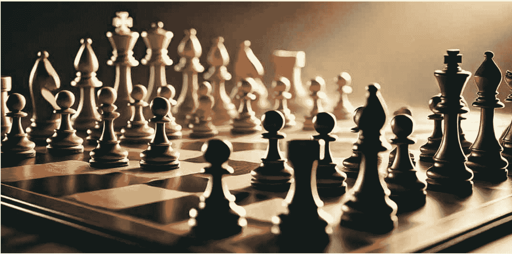

懒人专属群的群友，你好

欢迎来到博弈论课，我是蒋文华。

上一讲我们讲了讨价还价博弈，提到了在讨价还价博弈中有一个决定性因素，贴现因子。贴现因子是对博弈参与者耐心的衡量。贴现因子更大，代表参与者更有耐心，而一个更有耐心的参与者，往往能在讨价还价博弈中获得更大的收益。

贴现因子相当于架起了一座眼前利益和未来利益的桥。问题是为什么有的人贴现因子小，选择停留在了桥的这一边，只顾眼前的小利益；而有的人贴现因子大，能跨过这座桥，走到桥的另一边，选择未来更大利益？

理解和掌控自己跟对手的贴现因子，不仅有助于我们理解动态博弈的逻辑，更能让我们的人生变被动为主动，在博弈中抢占主动权。

影响贴现因子的因素很多，一讲内容我们不可能穷尽。这一讲，我想结合博弈论和行为经济学的一些研究，带你看看其中比较重要的四个因素：预期寿命、未来收益的确定性、财富存量和对未来的想象力。

### 1、预期寿命

先看影响贴现因子的第一个因素，参与者的预期寿命。这点其实很好理解，一个人或者一个组织，对自身存续时间预期越长，越倾向于看重长远利益。

有一个段子是这么说的。有人问老王，现在给你1万和明年给你10万，你选哪一个？老王说，我选1万，哪怕现在给我5千也行。为什么？医生告诉我，癌症晚期，最多还能活3个月。

既然贴现因子是那座横跨眼前利益和未来利益的桥，当一个人明确知道自己已经没有足够的时间跨过这座桥的时候，唯一的选择就是留在桥的这一边。

我经常在课堂上问学生，如果你的预期寿命像古人那样只有30多岁，本科毕业后还会继续读研甚至读博吗？同学们异口同声地说，肯定不读了啊！读完博士后就没几年好活了，那还读什么博士呀。

正是因为人的预期寿命，从以前的30多岁增加到了现在的80岁左右，甚至以后的长命百岁，才会有越来越多的人，选择接受越来越长时间的学历教育和继续教育。

斯坦福大学的研究人员还做过一个有趣的实验，通过虚拟现实技术，让年轻人体验自己70岁身体状态。研究发现，与没有体验的人相比，他们更愿意为退休账户多分配超过1倍的资金。

预期寿命影响贴现因子这一点，也可以让我们重新思考一些历史现象。

比如，在古代无论东方还是西方，上至文武百官、下至普通平民，都会喊“国王万岁”。很多人都觉得这是被逼的。我认为，倒不必下此断言。

从贴现因子角度看，国王如果预期寿命长，那么他贴现因子就更大，会更加考虑未来收益，自然更愿意实行放水养鱼的政策，轻徭薄赋，这对民众倒的确是好事。

预期寿命和贴现因子的正相关，还能给我们什么现实启发呢？

对于组织来说，如果你是管理者，可以通过强化组织预期寿命，来提高员工的贴现因子，激励员工更关注长远利益。

很多人会觉得，这不就是画饼吗？其实饼画得好，没准往往梦想成真；而没有饼可以期待，则组织更容易被短期的机会主义诱惑，随意透支未来。厉害的管理者其实都懂这一点，所以你会听到不少企业家，无论是对内还是对外，口径一致，说他们就是要把企业做成百年老店。

再谈一点虚的，对社会来讲，我们重视历史和传统，也是为了提高社会成员的贴现因子。当个人陷入生命有限的焦虑时，家族观念、修族谱、国家认同、建造历史博物馆，这些东西都能构建一种符号化永生，从而提高个体的贴现因子。

电影《寻梦环游记》中有个划分，人的死亡可以分为三种：生物性死亡、社会性死亡和精神性死亡。死亡不是肉体的消失，而是被彻底遗忘。当这个世界上最后一个记得你的人也去世了，那才是真正的死亡。

但反过来，如果一个人相信自己的影响能穿越时间被后代铭记，就更有可能做出高贴现因子的决策。“人生自古谁无死，留取丹心照汗青”的本质，就是通过历史叙事将个人贴现因子扩展到文明发展的尺度。

### 2、未来收益的确定性

再来看影响贴现因子的第二个因素，未来收益的确定性。

这其实也不难理解，未来收益的确定性越高，贴现因子就越大，人们就越愿意选择未来的收益。

比如，兵荒马乱的时代，确定性近乎瓦解，“一鸟在手，胜过二鸟在林”，大家就会看重眼前利益。记得第二次海湾战争美军占领伊拉克首都巴格达之际，发生了大规模的骚乱，伊拉克的民众不光是去抢商店，甚至去抢国家博物馆，因为那时候的伊拉克民众谁也不知道未来会怎么样，贴现因子暴跌，他们的心里只有眼前利益，能抢一点算一点。

当然，战争的不确定性是不可控的。从社会的角度来说，未来收益的确定性，归根结底由什么保证呢？是社会制度。

发展经济学界有过一项重要的研究——研究人员系统梳理了1960到1980年20年间，115个国家的经济数据，这些国家被分成两组，第一组保护财产权的法律体系比较完备，民众对未来的预期比较确定；第二组保护财产权的法律体系没那么完备。对比之下，第一组国家的平均经济增长率是第二组的三倍，一个是2.73%，一个是0.91%。（杰拉德·W·斯卡利，1988年）

这项研究的结论，其实也和2024年诺贝尔经济学奖得主阿西莫格鲁与罗宾逊的理论呼应。这两位学者把制度分成两种，一种是“包容型制度”，更容易激发个体长期投资。另一种是“攫取型制度”，损害了民众对未来的稳定预期，理性的个体容易形成掠夺型生存的策略。显然，我们更希望看到“包容型制度”。

了解到未来收益的不确定性对贴现因子的压缩效应，反过来，也能帮我们重新理解商业的本质，和个人发展的逻辑。

对企业来说，企业真正的护城河，就是能承受比竞争对手更多的不确定性，比如亚马逊用长期亏损换增长。

而对于个人来说，当其他人透支未来的时候，你可以像经营公司一样——前期多一些自我投资，后期享受复利，积累未来随时能兑现的潜力。

### 3、财富存量

再来看影响贴现因子的第三个因素是，财富存量。

一般来说，一个人拥有的财富越多，贴现因子越高，越看重长远利益。相反，存量财富越少，越看重眼前。这也是不难理解的。

这方面有一个让我印象深刻的真实案例。上个世纪90年代，上海滩有个有名的杨百万（真名是杨怀定），他人生中的第一桶金，是通过买卖国库券赚到的。

国库券是一种短期国债。1981年开始，中国政府恢复发行国库券，收益率在10%以上。10%的稳定收益率，放在今天算得上很优质的投资标的了，但当时民众手里钱不多，都不愿意买，很多时候是强制摊派的。

我就记得小时候，我父亲领工资的时候，除了现金，单位还强制发给他一些国库券，作为工资的一部分。刚开始，家里条件困难的，都希望把国库券早点兑换成现金，而条件好的家庭会愿意买一点。

杨百万就在这里面发现了商机。他发现，经济相对落后的地区和经济发达的地区，同一张国库券，竟然存在不小的差价。

比如，1985年发行的年利率15%的国库券，在上海的开盘价是104元，在合肥开盘价却只要94元。杨百万就在上海和合肥及其它地方来回跑，低买高卖，就这样倒腾了一年，居然赚到了100万，那可是80年代的100万！

为什么面值相同、年利率相同的国库券，在富裕地区卖得比贫穷地区贵？就是因为两个地方的人在贴现因子上存在明显差异。富裕地区的人，贴现因子更高，更有耐心等待未来的高收益，而相对贫穷地区的人，会着急先拿现钱。

当然说到这儿，你也不要以为贴现因子高一定是好事。富裕也会带来过度乐观，会造成非理性，为还不确定的收益，支付过高的溢价。

不少行为金融学的研究表明，公司的存量资金越多，管理者的贴现因子值也会虚高，容易过度自信，在企业并购时更愿意支付高溢价。

这就是说，贴现因子不是越高越好，控制在“谨慎乐观”的区间才是最好的。

### 4、对未来的想象力

最后再来简单说一下，影响贴现因子的第四个因素，个体对未来收益的想象力。

眼前利益和未来利益的一个重要区别，就在于眼前利益是看得见甚至是摸得着的，而未来利益一定只存在于人们的想象中。

没有想象力的人，是看不见的，自然也耐不住，等不了。

开头我们提到，贴现因子是一座桥，桥的这一边是清晰可见的，桥的那一边是模糊不清的，被桥上的雾气遮挡着。我给企业家上课的时候经常会和他们说，你们要做一个吹散雾气的人，让员工看清桥那边的美好风景。

这就是为什么企业要做发展规划的一个重要原因。经常有人调侃“规划规划、纸上画画、墙上挂挂”，其实就算只是墙上挂挂也比不挂好，至少让员工“看见”了。

因为看见，所以相信。

我刚才提到的斯坦福大学的那个实验，就是通过虚拟现实技术，让大家看到了自己70岁后的样子。

一个人的伟大成就，往往源于坚持不懈、永不放弃，有人说这靠的是一种信念。在我看来，这所谓的信念，其实就是对未来的想象力。有信念的人，就是比其他人更能想象到未来收益的人。

这一点不仅可以应用在组织管理和博弈中，还可以用在育儿上。在线下上课的时候，课间闲聊我会给父母们提供这样的育儿建议：在条件允许的情况下，不妨偶尔带孩子奢侈一把。

比如10多年前儿子还很小的时候，我带他去上海玩，特意定了一个黄浦江边的豪华五星级酒店，当时孩子很惊讶，一边洗澡还能一边看电视。孩子小时候有段时间在美国，我特意带去斯坦福大学校园里拍照留念，在他心里种个小种子。

当孩子对未来的想象更具象化后，他就会有大的愿力、更多的耐心、更持续的努力。这是一个老父亲的心机所在。

公众号懒人搜索，懒人专属群分享

### 总结

好了，我们来总结一下这一讲的内容。

- 1、四个因素会影响一个人的贴现因子：预期寿命、未来收益的确定性、财富存量和对未来收益的想象力。
- 2、当一个组织的管理者能够在以上方面采取措施，必然会提高员工的贴现因子，让员工更有“长期主义”理念。
- 3、贴现因子不是越高越好，控制在“谨慎乐观”区间才是最好的。

#### 下节预告

在我们生活中，经常会碰到这么一种类似于“击鼓传花”的博弈。在这种博弈中，双方一直玩下去的话，每个人的收益都会持续增加，但一旦有人提前结束了，另一方往往会遭受较大损失，怎样在这样的博弈中找到最佳停止点？下一讲我们来展开分析。

### 思考题

这一讲留给你的思考题是，除了课程中介绍的四个影响贴现因子的因素以外，你认为还有其它什么因素会影响贴现因子的大小？或者你能否提供一些现实世界的真实案例，来阐述以上四个因素是如何影响人们的贴现因子的？

我是蒋文华，我们下节课见。

> [1] https://healthpolicy.fsi.stanford.edu/research/the_vividness_of_your_future_self_using_immersive_virtual reality to increase retirement saving


## 26习题课4：怎样降低管理中的监督成本？


懒人专属群的群友，你好：

你好，欢迎来到博弈论课，我是蒋文华。

今天是我们课程的第四次习题课，我来为你讲解本周课程中留的思考题，也和你分享一些同学的精彩回答。

这周不像之前几周，有些思考题是有标准答案的，这周主要是开放性问题，邀请同学们分享自己的体验。因此，我会多挑选一些同学们的精彩留言，方便大家借鉴学习。

### 思考题1

第一个思考题，你能不能分享一个你自己生活或者工作中监督别人或被别人监督的经历，并讲讲里面的博弈逻辑？

对这个问题，“有木有有木人”“牛虻”“张善崔”“陈振中”“美君”“塔凯西”“正一”“卡拉李叔”等许多同学都分享了自己的经历和经验，都非常精彩。

这里我先对监督博弈做一些延展。

先补充一个监督博弈的基础知识点。为了确保雇佣关系能够成立，需要假设雇员给雇主创造的价值，必须大于雇主给雇员的工资，雇员获得的工资必须大于他付出同样劳动能够在其他地方获得的最大工资（V>W>H）。

如果工资不能大于劳动力的机会成本，员工就去其他地方找活干了。如果员工创造的价值不能大于工资，老板就找其他员工来干活了。这是双方雇佣关系得以建立的基础，博弈论里把这个叫做参与约束，意思是说，一个游戏大家愿意参与，首先要让大家都觉得有利可图才行。

“参与约束”是博弈论中一个非常重要的概念，我们在后续课程中还会讲到，这是理性假设的基本要求。

要补充的另一个知识点是关于最优工资支付的延伸。

你可能还记得，在监督博弈那一讲中，我们算出均衡条件下，老板的最优工资支付金额应该是员工创造的价值（V）乘以监督成本（C）然后开根号。

我们把这个最优工资支付的值，再代入雇主的期望收益公式当中，然后对公式进行变形，其实还可以进一步得到员工创造的价值与员工工资的量化关系，以及员工创造的价值与监督成本的量化关系。

总结起来就是一句话：

雇佣员工的前提，应该是员工所能做出的最大贡献必须2倍于工资，但与此同时，员工所能做出的最大贡献还必须4倍于监督成本。

否则的话，雇主的最大收益为负数。

推导过程我还是放在文稿附录一中，感兴趣的同学可以自己对照推导一遍。

#### 附录一：监督博弈进阶分析

##### 第一步：列出老板的期望收益简化计算公式

在均衡条件下，雇主是否检查的期望收益相等，我们只需要计算雇主不检查，即员工偷懒时的期望收益即可。具体公式是：

Π_雇主 = (-W)β + (V-W)(1-β) = V - W - Vβ

W 为雇主支付的工资，V 为员工创造的价值。
β 为员工偷懒的概率，1-β 为员工不偷懒的概率。

公式变形后，得到 V - W - Vβ。如此，雇主的期望收益可分为两部分：
- 一部分是雇员努力工作给雇主带来的净收益为 V-W。
- 另一部分是雇员偷懒给雇主带来的净损失 Vβ。

##### 第二步：把 W=√VC 和 β=C/W 代入公式，消掉 W 项

Π_雇主 = V - W - Vβ = V - W - VC/W（代入β=C/W）
Π_雇主 = V - W - Vβ = V - W - VC/W = V - √VC - VC/√VC = V - 2√VC（代入 W=√VC）

由于 W=√VC，所以 Π_雇主 = V - 2√VC = V - 2W。

如果要 Π_雇主 > 0，则需要 Π_雇主 = V - 2W > 0。

##### 第三步：令期望收益大于 0，得到 V 和 C 的关系

考虑到雇主的最大期望收益大于零，才有雇佣雇员的积极性（参与约束），那么，我们可以从公式中进一步得到这么一个结论：

由于 Π_雇主 = V - 2√VC > 0
所以 V > 2√VC
变形，V² > 4VC（两边平方，去掉左边根号）
化简，V > 4C

这个结论其实是进一步提醒管理者，在招聘员工的时候，除了员工的能力和潜在贡献外，特别需要考虑监督成本问题。

监督成本（C）其实是一种纯粹的资源浪费，所以在企业的实际管理过程中，我们会采取各种措施来降低监督成本。

“正一”同学有一个非常好的分享。他提到在技术团队管理中，程序员因为工作过程复杂，努力程度很难直接观察，属于“监督困难”类型。他提出了几项具体措施：
- 从结果导向转为过程赋能；
- 设置明确的项目里程碑而非日常监工；
- 引入同行评审机制；
- 将部分决策权下放给团队。

从他的管理结果看，取得了比较好的效果。

不过，很多时候，监督成本毕竟受各种技术条件的限制，是很难降低的。那还有什么办法来降低监督的概率，从而降低监督的总成本呢？另一个很重要的方向是，加大对偷懒的处罚力度。

在课程中，员工一旦偷懒被检查到，老板给予的最大处罚是辞退。现在我们再增加一个变量，除了直接辞退外，老板还可以给员工增加额外的处罚，这种额外处罚可以是扣罚原本要发的奖金，也可以是没收员工交纳的抵押金等。

文稿中我给出了四种结果的支付矩阵，你可以点开查看。其中的字母F代表雇员偷懒被发现后面，面临的额外处罚。

| | 雇员：偷懒 | 雇员：不偷懒 |
| :--- | :--- | :--- |
| **雇主：检查** | -C+F, -F | V-W-C, W-H |
| **雇主：不检查** | -W, W | V-W, W-H |

基于这个新的矩阵，我们可以重新计算监督博弈的纳什均衡，计算过程我放在文稿附录中。对比之前的分析，一旦加大偷懒的处罚力度，会带来6个结果：
- 员工的偷懒概率会下降。
- 老板的检查概率也会下降。
- 老板会给员工一个更低的工资。
- 老板的期望收益会增加。
- 员工的期望收益会下降。
- 双方的总福利水平有改善的机会和上升空间。

#### 附录二：监督博弈混合策略纳什均衡求解（有抵押金 F）

先假定 H<W<V，W> (C-F)。

H<W<V 确保雇主和雇员的参与，W>C-F 确保双方的博弈是一个混合策略的均衡。

设雇主检查的概率为α，不检查的概率为 1-α，雇员偷懒的概率为β，不偷懒的概率为 1-β。那么，在这种情况下，雇主的期望收益（用Π_雇主来表示）是：

Π_雇主 = (-C+F) * α * β + (V-W-C) * α *(1- β )+ (-W) *(1-α )* β + (V-W)*(1-α )*(1- β )

雇员的期望收益（用Π_雇员来表示）是：

Π_雇员 = (-F) * α * β + (W-H) * α *(1- β )+W*(1-α )* β + (W-H) *(1-α )*(1-β )

双方期望收益最大化的必要条件是一阶导数为零。

dΠ_雇主/dα = 0
dΠ_雇员/dβ = 0

计算得：
α = H/ (W+F)
β = C/ (W+F)

当雇主以 H/(W+F) 的概率进行检查，雇员以 C/(W+F) 的概率进行偷懒，这是一个混合策略的纳什均衡。

接下来我们计算出雇主的期望收益是：
Π_雇主 = (-W) β +(V-W)(1-β ) = V-W-Vβ = V-W-VC/ (W+F)

令雇主的期望收益对工资一阶导数为 0，这是雇主实现收益最大化的必要条件。
dΠ_雇主/dW = 0

由此求出 W=√VC-F

代入各自的期望收益公式得：
Π_雇主 = V+F-√VC，该期望收益与没有抵押金相比，增加了一个 F 的收益。
Π_雇员 = W-H，该期望收益与没有抵押金相比，减少了一个 F 的收益。

然而，加大偷懒的处罚力度会损害员工的利益，员工肯定是不愿意的。但是，考虑到员工利益的损失可以小于老板收益的增加，那么，我们完全可以通过利益转移机制实现双赢的结果。

例如有一些企业，员工刚进入公司工作会很辛苦，但工资却会涨得比较慢，也就是工资的增加略低于贡献的增加，这就相当于变相收取一部分抵押金。

抵押金不断累积后，公司可以持续减少检查概率，减少监督总成本。然而到一定阶段后，虽然员工的贡献不再增加，但其工资还可以继续增加，这就相当于兑现之前的抵押金。

日本企业实行的年功序列制的一个重要功能，就是建立起这样的一种补偿机制。在日本企业中，员工的薪酬和晋升与年龄、企业工龄等因素密切相关。这种制度除了通过稳定的薪酬和晋升机制来留住熟练工人和技术骨干，还起到了降低总体监督成本的作用。

当然，年功序列制也存在它的问题，例如对新员工激励不够，以及高层往往由资历老、风险偏好低的人占据，创新意愿与变革动力弱。这些年，日本企业也在引入一些更加成果导向的管理制度，以更加敏捷地应对变化。

除此之外要说的是，抵押金制度确实能够通过降低监督成本来提高企业管理效率，但是，还需要相应的配套制度，以避免雇主的机会主义行为。雇主有可能在收取了足够多的抵押金后，采取各种办法来解雇员工，贪图抵押金。这需要在法律层面，给员工更多的保护。

### 思考题2

再来看第二个思考题，你能否从以往的生活经历中，找出两个最后通牒博弈的实例，一个例子中你是提议者，另一个例子中你是回应者，两个例子中，你的选择分别是什么?

同学们的留言分享了非常多的个人经历，也给了我很多启发，我给很多同学的留言都进行了精选，大家可以相互借鉴和学习。

关于最后通牒博弈，我们的一个核心观点是我们在博弈时，必须充分考虑人对公平感的追求，而这种公平感又会因人而异，因环境的不同而异。

“Dacy”同学还特别提到了蛋糕大小对分配比例的影响，这是一个非常重要的洞察。你想过没有，同样是8:2的分配比例，总金额的大小不同也会影响回应者是否愿意接受该方案。

这个问题，我20多年前就发动浙大本科生去做过实地调查，一个班的同学一起去市中心、西湖边做调查，每个人完成10份以上的调查问卷。

后来，同学们把调查结果绘制成图表，拟合出一条从左到右，倾斜向下的曲线。的确是分的蛋糕越大，回应者能够接受的占比越低，并且这个趋势是连续的。

考虑了总金额的大小，最后通牒博弈我再给你这样几条建议:

- 第一，如果分配的总利益比较小，对双方都无足轻重，比如两个人分100元，你作为提议者最好是平分。如果51：49，对方都很有可能会拒绝，回应者很可能愿意花费49元为公平感买单。你没必要为了多赚1元冒险。
- 第二，如果分配的总利益大一些，比如分10万，你作为提议者不妨提议6：4，一般来说回应者会同意的，因为这时候拒绝的损失就是4万，追求公平感的代价明显增加了许多。同时，6：4感觉上双方差距也不大，对方不会觉得很不公平。
- 第三，以此类推总利益不断增大，比如到50万，100万，500万，你可以按照，7：3，8：2，9：1来分。这时候，分配的利益已经很大了，虽然分给对方的比例不多，但金额并不少，除非回应者真的不缺钱，一般是能接受的。
- 第四，然而如果分配的利益特别大，比如是1000万呢，这时候你是不是可以给对方低于9：1的比例，比如就给他50万。绝大多数情况下应该没问题，但是不怕一万就怕万一，万一对方拒绝你怎么办?
- 你的损失那可是950万啊，真没必要冒这个险。所以，我给你的建议仍然是9：1。对你来说，900万和950万差别不大，对回应者来说，50万和100万差一倍呢。在这种情况下，确保对方接受反而变得更重要了。

对于提议者来说，他的贪婪在于想自己多分一些，他的恐惧在于担心对方会拒绝。平衡好这两者的关系才是最重要的。

基于人类对公平感的普遍而强烈的追求，“kenshin李”同学有一个非常好的分享：那就是在薪酬上可以采取“一个保密”和“一个公开”的机制。

一个保密，指的是保证每个员工收入信息的绝对保密（领导也不应该知道下属的收入信息），并设置企业红线，禁止员工之间打听彼此收入情况。

一个公开，指的是公开每个员工创造出的实际价值，即展现他们各自的业务成果。并向员工们传达一个信号：创造出最大价值的人可以获得最大收益。当他们把注意力转移到产出上时，“患不均”的感觉就会减弱。

我在给企业家上课的时候，也一直提倡在企业薪酬上采取“结果保密”和“制度公开”的管理办法，既可以避免员工的精神内耗，也可以指明员工努力的方向。

西方国家所谓的收入隐私文化，也是减少社会成员之间精神内耗的好办法。

### 思考题3

第三个思考题，在家庭事务（比如购房、购车、孩子上学、旅游目的地选择上），你父母或你和爱人之间是如何分配决策权和否决权的？

这个问题，我看到同学们的意见比较一致，基本是以商量来为主，没有太多的博弈。我也很同意，所谓家和万事兴嘛。

我自己一直很喜欢这个段子：

有个人自夸说：“我们家大事全部我说了算，只有小事才对方作主”。

别人刚要质疑他，他紧接着说：“可是我们家从没发生过大事儿”。

我相信，在家里面只要有一个人有这样的心态，家庭就一定会越来越和睦。

这个问题比较简单，我们不多展开了。

### 思考题4

第四个思考题，通过对讨价还价的分析，谢林得出一个让人意想不到的结论：“在讨价还价的过程中，弱势的一方通常会成为强者。”你是否同意他的观点。

弱势方的谈判成本低，是因为时间不值钱，谈判的固定成本低，所以在讨价还价中，他耗得起。

也就是说，同样是一个小时的讨价还价，对一个人来说价值100元，对另一个人来说价值1万元，自然时间价值高的人更希望早点结束，也就更愿意接受一个更低的报价。对此，很多同学都有非常具体的分享，同学们可以看看那一讲的留言区。

在我们家，我母亲去菜市场买菜，总是又便宜又新鲜，我父亲去买菜往往是又贵又不好。以至于后来我母亲彻底取消了我父亲的买菜资格，但我后来觉得这可能是我父亲的一种策略。

“活在未来”同学分享了一个非常有趣的洞察：“时间成本高的人说话往往简单明了，时间成本低的人说话往往逻辑不清、又臭又长。”对此我深表认同。

我的回复是，换一种逻辑也成立：说话简单明了的人往往思考和工作效率高，容易多赚钱，更容易成为时间成本高的人。说话逻辑不清、又臭又长的人往往思考和工作效率低，不容易多赚钱，更容易成为时间成本低的人。

### 思考题5

第五个思考题，除了课程中介绍的四个影响贴现因子的因素以外，你认为还有其它什么因素会影响贴现因子的大小？或者你能否提供一些现实世界的真实案例，来阐述以上四个因素是如何影响人们的贴现因子的？

对这个问题，不少同学给出了非常精彩的留言。

“闻思修”同学认为，社会因素、组织因素、个体因素等都会影响到一个人的贴现因子大小。

“我心飞翔”同学则提到，除了课程里的四个因素，社会制度的稳定性与法律保障，信息透明度与可预测性，文化价值观与时间偏好，技术变革与行业生命周期等因素也起到了影响作用。

我认为，提高贴现因子的底层逻辑就是清晰化未来收益。因此，所有能够提高未来收益的确定性和清晰化的举措，都能提高人们的贴现因子。

我们课程中讲过，贴现因子太高和太低都不好。人有两大悲哀：

钱没花完，人没了。钱花完了，人还在。

我们所要追求的，是一生总幸福的最大化，既避免寅吃卯粮，又要避免结余过多。

以上就是本次习题课的全部内容。

我是蒋文华，我们下周再见。

## 《蒋文华·博弈论50讲》

## 会识局、能破局、善布局

版权归得到App所有，未经许可不得转载

浙江大学公共管理学院 副教授 蒋文华

公众号
懒人搜索
懒人专属群

微信：lazyhelper

## 27 蜈蚣博弈：击鼓传花，何时撤退？

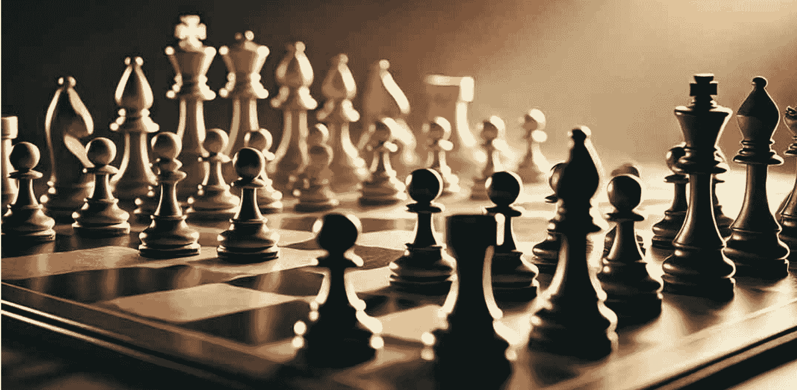

懒人专属群的群友，你好

你好，欢迎来到博弈论课，我是蒋文华。

对金融稍有了解的同学，都熟悉股市常见的这种“击鼓传花”的现象：一支股票，很多人可能都觉得价格已经太高了，但看着股价蹭蹭往上涨，总有人忍不住想买一点。

买的人心里想着，我就等两个涨停板，涨了我立即就卖，可结果是刚刚买进没多久股价就暴跌，然后进入漫漫熊途，炒股成功地把自己从股民炒成股东。

这类现象在博弈论中正好对应一种博弈模型：蜈蚣博弈。

在更一般的意义上，这个模型对应着这样一种局面：

博弈双方轮流选择合作或不合作，如果双方坚持选择合作，从长远来看能把蛋糕做大，双方得到的利益都会不断增加。

然而，双方都时刻面临着背叛的诱惑，任何一方选择背叛都可以先拿走当前的一大块蛋糕，这可比那个未来不确定的收益要更实在。

蜈蚣博弈的决策难点在于，到底是等待未来更高的收益，还是尽早落袋为安？如果你面对这种博弈，最佳策略应该是什么？这一讲我就带你来分析。

### 短蜈蚣博弈

“蜈蚣博弈”（Centipede Game），最早是由美国经济学家罗伯特·W·罗森塔尔（Robert W. Rosenthal）在1981年提出。你可能听过心理学家罗森塔尔（Robert Rosenthal），就是提出著名的“自我实现的预言”的那位心理学家，这两个人名字很像，但不是一个人。

罗森塔尔还发明一种独特的图式，来形象地表示蜈蚣博弈。这种图式的结构是从左到右一根长横线，上面每个点代表一个回合，每个回合点下方，再用一条短竖线标出参与者的收益。整张图画出来，就特别像是一条长了很多腿的蜈蚣，因此这个博弈被称为蜈蚣博弈。你可以点击文稿，查看这张图。

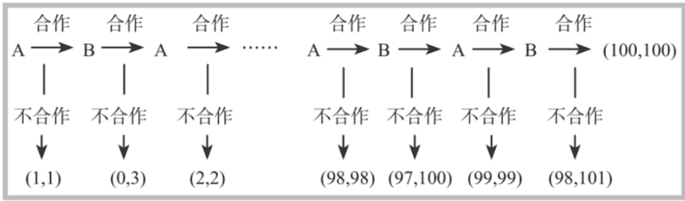

罗森塔尔的这张蜈蚣博弈图，描述的是这样的一个具体局面：

AB两个人轮流做决策，可以选择合作或不合作，如果合作游戏继续，不合作游戏结束。一开始，由A做决策，如果A选择不合作，游戏结束，双方的收益是（1，1），如果A选择合作，游戏继续，由B做决策，如果B选择不合作，游戏结束，双方的收益是（0，3），A拿0，B拿3。如果B选择合作，游戏继续，游戏每继续一次，双方的总收益就会加1，直到最后，双方各获得100为止。

不过需要注意的是，在这个过程中，提出游戏结束的这一方，其收益相比之前会增加2个单位，而另一方相比之前会减少1个单位。

不过，罗森塔尔的蜈蚣博弈实在太长了，有100条腿。要理解蜈蚣博弈的逻辑，其实一个5条腿的短蜈蚣博弈就足够了。

我在课堂上讲蜈蚣博弈，通常会带同学们玩这样一个游戏，游戏规则是这样的：

找两位同学，同学1和同学2，在他们面前放一个纸箱，我负责往箱子里面扔钱。第一回合扔进去50元，让同学1做选择，只要他选择不合作，游戏立马结束，同学1获得40元，同学2获得10元。

如果同学1选择合作的话，游戏就继续，我往纸箱里继续扔钱，让总金额增加1倍，变成100元，但这一次由同学2选择合作还是不合作。如果同学2也选择合作，那我继续扔钱，纸箱里的钱再增加1倍，变成200元；如果同学2选择不合作，游戏结束，这个时候同学2获得80元，同学1获得20元。

总之，只要双方持续选择合作，游戏就继续，双方可以分享的总金额会持续加倍，但任何一回合，只要做选择的人决定结束，可以立马分走已有总金额的80%。

当然，这游戏要一直玩下去，我也得倾家荡产，所以总共最多只加4次钱，4次后，游戏会被强制结束。这时候每个人得到的金额都是一开始就结束了的16倍，同学1从40元增加到640元，同学2从10元增加到160元。

我在文稿中附上了整个博弈过程的图示，你也可以打开文稿查看。

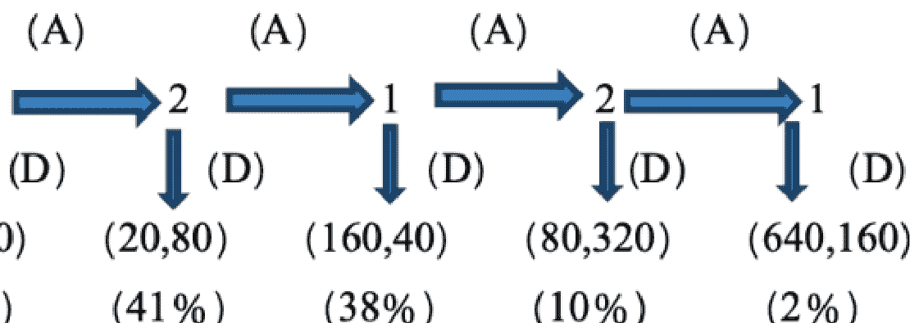

蜈蚣博弈是一个完全信息的动态博弈。这个游戏中所谓的完全信息重点在于，他们都知道每一轮能分到多少钱，以及游戏什么时候会结束。

找这个博弈的均衡解的方法，还是我们之前说过逆向推理法。

我们先倒着看蜈蚣的第五条腿，这个时候，同学1必须选择不合作而结束游戏。知道这一点之后，同学2会怎么办呢？同学2在前一次会选择不合作，自己可以获得320元的收益，而不是玩到最后只得到160元的收益。

问题在于，当同学1预测到同学2一定会选择不合作，那么同学1就会提前选择不合作，以此增加自己的收益。

可想而知，就这么不断倒推，蜈蚣博弈得到的均衡结果是，同学1在第一回合就选择不合作，尽早结束游戏，双方的收益分别是40元和10元。

蜈蚣博弈最大的特点是，持续合作能双赢，不合作的话也能单赢。你要不要选择合作，关键看你认为对方下一步会不会选择合作。你认为对方下一步会合作，那你就应该继续合作；但如果你认为对方不会合作，那你这一轮就应该先不合作。

比如，在股市中散户的最佳策略，是在庄家出货之前先出货。但问题是庄家也是这么想的，他们也想在散户出货之前就出货。所以，当庄家发现散户提前出货了，要么继续往上拉抬股价，把散户们重新吸引过来，要么就迅速出货，争取抢在大部分散户之前出货。这就极其容易导致股价大幅度波动。

又比如，夫妻之间，双方在一起的时间越长，合作的总收益会不断增加，如果一方另有新欢提出离婚，导致合作关系结束，那么另一方就会承受巨大损失。

这似乎会延伸出一个让人很悲观的结论，为了避免被背叛导致的损失，你应该先背叛吗？并不是。

你应该建立并维护信任，而不是仅仅基于对背叛的恐惧而行动。的确，蜈蚣博弈的逻辑暗示了提前终止合作的“理性”，但在婚姻这样长期的合作关系中，信任才是维系和深化合作的基石。过早地选择“不合作”，只会弄巧成拙，加速了关系的破裂。

讲到这里，两位罗森塔尔，一个经济学家，一位心理学家，还真的意外相遇了。心理学中的罗森塔尔效应（也就是“自我实现的预言”）讲的是，人会回应别人的期待。比如老师相信孩子很有潜力，孩子会回应这种期待，的确表现得更好。

经济学家罗森塔尔的蜈蚣博弈说明，你怎么预判你博弈对象的行动选择，决定了你会采取什么样的相同行动选择。

我们在课程中一直强调，每个博弈参与者的选择，本质上是对他人预期的响应——每个决策者基于对对手行为的预判作出选择，而这些选择又反过来强化对方的初始预期，形成动态的预期—行为反馈环。

这种跨学科的呼应揭示了一个重要的真相：“预期”不仅仅是现实在我们的大脑中的被动反映，更是人主动建构社会现实的关键变量。

### 现实矛盾

刚才我们讲了蜈蚣博弈的理论分析，接下来我们再看看实验的情况。

蜈蚣博弈的经典结论是，理性人应该在第一回合就直接结束博弈，但从现实实验的结果看，能够做到这种理性程度的人，还是少数。

美国的两位学者对5条腿的短蜈蚣博弈的实验结果表明（他们在实验中用的不是美元，而是美分），只有8%的人会选择一开始就不合作，第二回合就结束的比例是最高的，占比41%；第三回合选择结束的，占比38%，而能玩到第四回合才结束的比例并不高，只有10%。让人意外的是，竟然还有玩到最后一步的，占比2%，此时博弈双方获得了最大金额的总收益。[1]

这意味着什么呢？

从消极意义上，我们只能承认，人类的理性的确有限，很难避开那种“击鼓传花”的陷阱。

当人们为了获取未来更大的收益而不断向后延迟决策时，实际上可能已经陷入了博弈设计者设定的风险之中。一旦对方突然停止合作，之前所有的努力和期望都会付之东流。所以，与其沉溺于“再赌一轮”的侥幸，不如及时退出。

其实蜈蚣博弈的实验本身也能证明这一点。第一次玩这个游戏时，绝大多数人第一轮不会放弃，但如果这个游戏再玩第二次，实验参与者更多会选择在更早阶段就结束游戏，也就是选择不合作。为什么呢？因为在第一次博弈中，一半的参与者都被背叛了，都会后悔自己没有早点结束。

这方面最典型的例子仍然是股市。一轮牛市结束后，散户们都会后悔自己没有早点卖出股票，从而导致在后续的反弹行情中，选择尽早卖出。因此，熊市中的反弹高点往往总是一波比一波低。

比如，上证指数在2015年6月12日创下5178的高点后，之后四年几次反弹的高点分别是：4184点、3684点、3587点和3288点，呈现出反弹高点逐步下移的特点。

同样的，上证指数在2021年2月18日创出阶段性反弹高点后开始的新一轮熊市中，近四年的反弹高点分别是3723点，3708点，3424点，3418点，3174点，我们依然能够看到反弹高点越来越低的情形。

文稿中，我给出了一个从中国股市开市以来的上证指数变动表。你如果对此感兴趣，可以打开文稿查看。

| 时间跨度 | 最低或最高点 | 最高或最低点 | 幅度 (%) |
|---|---|---|---|
| 1990年12月19日-1992年5月26日 | 95.79 | 1429.01 | 1391.80 |
| 1992年5月26日-1992年11月17日 | 1429.01 | 386.85 | -73.00 |
| 1992年11月17日-1993年2月16日 | 386.85 | 1558.95 | 301.00 |
| 1993年2月16日-1994年7月29日 | 1558.95 | 325.89 | -79.00 |
| 1994年7月29日-1994年9月13日 | 325.89 | 1052.94 | 224.40 |
| 1994年9月13日-1995年5月17日 | 1052.94 | 577.14 | -48.00 |
| 1995年5月18日-1995年5月22日 | 582.89 | 926.41 | 60.50 |
| 1995年5月22日-1996年1月19日 | 926.41 | 512.83 | -45.00 |
| 1996年1月19日-1997年5月12日 | 512.83 | 1510.18 | 194.50 |
| 1997年5月12日-1999年5月18日 | 1510.18 | 1047.83 | -31.00 |
| 1999年5月18日-2001年6月14日 | 1047.83 | 2245.44 | 114.30 |
| 2001年6月14日-2005年6月6日 | 2245.44 | 998.23 | -56.00 |
| 2005年6月6日-2007年10月16日 | 998.23 | 6124.04 | 513.50 |
| 2007年10月16日-2008年10月28日 | 6124.04 | 1664.93 | -73.00 |
| 2008年10月28日-2009年8月4日 | 1664.93 | 3478.01 | 208.90 |
| 2009年8月4日-2013年6月25日 | 3478.01 | 1849.65 | -46.80 |
| 2013年6月25日-2015年6月12日 | 1849.65 | 5178.19 | 180.00 |
| 2015年6月12日-2019年1月4日 | 5178.19 | 2440.91 | -52.90 |
| 2019年1月4日-2021年2月18日 | 2440.91 | 3731.69 | 52.88 |
| 2021年2月18日-2022年4月27日 | 3731.69 | 2863.65 | -23.26 |
| 2022年4月27日-2023年5月9日 | 2863.65 | 3418.95 | 19.39 |
| 2023年5月9日-2024年2月5日 | 3418.95 | 2635.09 | -22.93 |
| 2024年2月5日-2024年5月20日 | 2635.09 | 3174.27 | 20.46 |
| 2024年5月20日- | 3174.27 | | |

你肯定听过不少金融投资有关的课程中说过，想要通过预测股市的高点来赚钱，是极其不可靠的。利用股市波动，高抛低吸，听起来很美好，但你这么想，别人也这么想，所有人都这么想，最终博弈的结果，是谁都预想不到的。刚才我们在蜈蚣博弈的分析上也论证了这一点。

然而，蜈蚣博弈的实验结果，并不是只能从消极角度理解，也可以从积极层面理解。我们课程一开始就讲过，学习博弈论，我们需要训练一种上帝视角，不是固定在博弈的任何一方，而是要看到更高的结构。

蜈蚣博弈所描述的，并非只是“击鼓传花”的陷阱，也是在隐喻现实社会的一个重要问题：人们之间的信任、风险承担意愿和长期主义倾向，是现实合作能否延续的关键。

实验中坚持到最后的那2%的人，事实上展示了一种稀缺而珍贵的合作精神和长期视野。他们的行为暗示着，现实社会中逐步建立起来的信任关系，能够带来远高于短期利益的长期收益。

这些人看似是少数，但却对于社会整体的发展至关重要。

就比如最近的一个例子。人工智能的快速发展，离不开全世界开发者在开源社区的协作。然而，为了商业化和应对竞争，OpenAI选择了闭源。好在，还有DeepSeek这样的团队横空出世，他们愿意放弃短期的利益，押注未来。

当前赚不到钱怎么办？那就索性免费开源，先争取用户，积累信任。开源了，技术都被人学去怎么办？不要紧，让更多的同行协作起来，可以利用集体智慧加速技术的演进，去未来分更大的蛋糕。

有时，在一些真正有价值的事情上，“非理性”地多走一步，或许就能看见理性之外的新大陆，这个新大陆恰恰代表着更高阶的理性，也是整个社会更大的利益所在。

### 总结

好，这节课我们讲到这里，来总结一下这一讲的内容。

- 1、蜈蚣博弈是这么一种博弈，在博弈中大家最好能一直玩到最后，实现群体利益最大化。但是，在博弈过程中，又会不断诱惑参与者提前结束，在他人结束前提前结束的参与者能获得更大利益。
- 2、蜈蚣博弈的均衡解是第一回合就直接结束博弈，但实验结果表明，参与者的推理能力是有限的，因此在博弈中过早退出或过晚退出都不是最佳策略。

#### 下节预告

这个模块我们学习的都是动态博弈，核心分析方法都是逆向归纳法，这个方法基本逻辑不难理解，但要用熟练需要比较多的练习。下一讲我们再来学习一个经典动态博弈“海盗分金”，通过这个博弈来更熟练地掌握逆向归纳法的应用。

### 思考题

最后给你留一道思考题，如果你是短蜈蚣博弈中的同学1，你会怎么做？如果你是同学2，你又会怎么做？

这里，顺便也公布一下上周的学习奖励，课程开始我们说过，我们每节课末尾都有一个思考题，每周一，我会公布上一周的最佳作业同学名单，每位同学的奖励是《博弈思维线下研修班》的参加名额一个。

这个研修班的主题是：“博弈在现实竞争与合作中的应用”，时间定在4月20日上午9点-12点，地点在北京得到总部。

今天公布上周获奖的5位同学名单：黎明、有木有有木人、美君、林常松、正一。

- 第一周获奖同学名单：左星星，董全冠，Charles Wang，咚咚锵，我心飞翔，陈振中，上善若水。
- 第二周获奖同学名单：道远、鄭大囧、雪莲、闻思修、张善崔。
- 第三周获奖同学名单：绿色计量、JPChou、向波荣、波澜不惊、活在未来。

文稿中有课程主编的微信（18500161040），请获奖同学添加他的微信，方便到时候联系到大家。

期待看到更多同学的精彩作业和留言，也欢迎你随时把课程分享给身边的朋友。

我是蒋文华，我们下节课见。

> [1]数据来源：Richard D. McKelvey and Thomas R. Palfrey: An Experimental Study of the Centipede Game [J].Econometrica.1992,60(4).803-836。


## 28 海盗分金：怎么用终局思维做决策？


懒人专属群的群友，你好

欢迎来到博弈论课，我是蒋文华。

这个模块我们学习的都是动态博弈，核心分析方法都是逆向归纳法，这个方法基本逻辑不难理解，但要用熟练需要比较多的练习。

这一讲，我们再来学习一个经典动态博弈“海盗分金”，通过这个博弈来更熟练地掌握逆向归纳法的应用。

话不多说，我们直接开始。

### 海盗分金

海盗分金的设定是这样的：在一座孤岛上，5名海盗，意外发现了100个金币，准备瓜分了它们。海盗们计划用投票的方式来分配这些金币。

首先由第一个海盗提出分配方案，如果5个海盗中半数或半数以上同意，这个分配方案就宣告成立。

请注意，提出方案的海盗也是可以参与投票的，这点很重要。如果分配方案不能通过，则第一个海盗会被扔到海里喂鲨鱼，继续由第二个海盗提出分配方案。一直到有人提出的分配方案被半数或半数以上通过为止。

这5个海盗都希望自己的个人利益最大化，他们既理性，又聪明，并且决策的顺序已经通过抽签排好了。

现在的问题是，假设你是第一个海盗，你会提出什么方案，既能确保自己不会被扔海里，还能得到最多的金币？

在我给出答案之前，你不妨先自己认真思考一下。

这个问题其实挺复杂的，现有的回答也五花八门，我先给你几个常见的错误答案，看看你有没有踩坑。

第一个，5个海盗平分100个金币，每人20个。能看出来拥护这种答案的人很喜欢平等，但并没有充分利用好游戏规则。按照游戏规则，金币分配不需要争取所有人的同意，只需要争取半数海盗同意即可。所以，平分意味着你希望争取所有人的同意，肯定不是最优解。当然，还有更重要的是，你想要平分，别人可不一定想要呢。

第二个常见错误，既然只需要争取两个海盗的同意，那么问题就在于争取哪两个海盗？以及用多大的代价去争取他们？考虑到排名靠前的海盗容易被扔海里，排名靠后的比较安全。那么，第二个常见的方案是，第一个海盗自己不要，给第二、第三各50个金币。

这个方案一般情况下是可以被通过的，但对第一个海盗来说，这不是一个利益最大化的方案。

公众号懒人搜索，懒人专属群分享

因此，第三个方案也经常被大家提出，30、35、35、0、0。这个方案既充分考虑了第二、第三两个海盗的利益，又让自己的利益有了明显的增加。从我在课堂的实际调查看，这个方案被通过的可能性至少达到90%以上。

但是，这其实也不是正确答案。你一定要问了，那正确答案到底是什么？

我们正式开始用逆向归纳法来解题。

### 标准答案

先看最后的情况，当5个海盗剩下最后一个的时候，怎么分。当然是第五个海盗获得全部100个金币，但这不可能实现。因为当剩下两个海盗时，第四个海盗会拿走所有金币，第五个海盗不同意也没用。因为按照游戏规则，只要半数同意分配方案即可。也就是说，剩下两个人时就完全由第四个人说了算，第四人给出的分配方案一定是100和0。

继续逆向推理，如果最后剩下三个人，那么第三个人就需要争取第四和第五中的某一个。争取谁呢？当然是争取最容易争取的，收买最容易收买的。争取第四个肯定不行，除非给他101个金币，因为如果他把第三个海盗扔海里的话是可以获得100个金币的。所以，第三个海盗会去争取第五个海盗。因为争取第五个海盗成本很低，只需要给他一个金币就好了。因为刚才的推理表明，如果第五个海盗不同意的话，第四个海盗给他的金币是0，第三个海盗只给他一个金币，虽然也不多，但聊胜于无。因此，如果剩下三个人，第三个海盗给出的分配方案是：99、0、1。

在此，你可能会提出这样的一个疑惑。如果你是第四个海盗，你可以提前与第五个海盗结盟，联合起来把第三个海盗扔海里，承诺和第五个海盗平分100个金币。

这个主意确实很棒。但问题是，当第五个海盗相信了你的话，合伙把第三个海盗扔海里后，此时的你还会提出平分吗？按照规则，此时完全由你说了算。你从自己利益最大化的角度肯定会选择全要。当然，第五个海盗会抱怨说，你之前不是答应给我一半的吗？你可以回答：“我就是逗你玩儿的，你还当真？”反正他拿你没办法。因此，第五个海盗肯定不会相信你的承诺，他还是会同意第三个海盗的方案。

一旦解决了第三个海盗的分配方案，继续逆推就变得非常简单了。对第二个海盗来说，也是只需要争取一个海盗同意即可，最容易争取的肯定是第四个海盗，因为他反对的结果是0个金币。所以如果剩下四个人，第二个海盗的分配方案是99、0、1、0。

既然第二个海盗的方案是99、0、1、0，那么第一个海盗需要争取的是第三和第五个海盗，各给1个金币，他的分配方案是：98、0、1、0、1。这就是海盗分金的标准答案。

相信这个答案会大大出乎很多同学的最初预料。是的，第一个海盗只要学会了逆向归纳法，不只可以活下来，而且可以分到最多的金币，98个。

更关键的是，他仅需用2个金币就能收买关键支持者，稳定局面。当然，这里的前提是，他能识别出关键支持者是谁。

### 现实的复杂性

很多人最多推理到这儿，可能就停下来了。但我还要说，刚才给出的标准答案是理论分析的结果。有句话叫，理想很丰满，现实很骨感。如果在现实世界中，你真的提出这么一个分配方案，相信你会必死无疑。

为什么？因为我们计算了各种金币分配的可能性，但没有算上现实的人性。

所以，真正要解决这个现实难题，你还要加入两个人性因素考量，一个是每个人推理能力是否都那么强大，另一个是公平感对决策的影响。你看，最后通牒博弈的影子又在这里出现了。

我们分别展开讲一讲。

第一个因素是海盗们的实际推理能力有没有刚才分析的这么强大。试想，你提出了98、0、1、0、1的分配方案，第三和第五个海盗一听这方案，居然只分到了1个金币!他们很可能先把你扔到海里，觉得这样后面可以分到更多金币。当然，等他们否决你的方案后，发现第二个海盗居然一个金币都不给他们两个人时，估计会后悔万分，但此时的你已经葬身海里了。

因此，如果你是第一个海盗，在实际操作中，在提出分配方案时，更好的做法是，把分配方案对第三和第五个海盗进行充分的解释，以便让他们意识到反对的后果更严重，1个金币都拿不到，这样才能得到他们两个人的充分认同！一般情况下，人总是讲道理的，关键在于你能否把道理背后的利益给对方讲清楚。

第二个干扰因素是利益分配的公平感。就算你把刚才的道理给第三和第五个海盗讲清楚了，他们也知道否决你的方案的后果是0个金币，是否就一定会同意你的方案呢？其实也还未必！

他们很可能会觉得一共100个金币，你居然给自己分98个，实在太黑心了。宁为玉碎，不要瓦全，宁愿自己1个子儿不要，也不想让你这个黑心的家伙卷走绝大多数金币。

所以，最后，结合沟通预期和公平感这两个现实因素，你会给出什么最终分配方案呢？

我的建议是：如果你是第一个海盗，你和第三、第五个海盗平分100个金币，每个人33个，多出来的那一个不妨就给第五个海盗。同时，为了避免节外生枝，你把方案进行充分解释，争取他们的实际支持。

真正的博弈高手，既要会算“数学账”，更要会算“心理账”。

### 金币不够分怎么办？

接下来我们增加思考难度，先要说明的是，这部分内容有点难，可以算是逆向推理的超极挑战了，要一下子理解并不容易。我先讲一遍，后面有空强烈建议你多看文稿再琢磨琢磨，自己真正把它想通。

我们要增加的这个难度是：如果海盗的数量不是5个，而是1000人，100个金币不够分了，怎么办？

先来再次明确海盗们的决策依据：首先，让自己能活下来；其次，让自己得到最多数量的金币。

人数变多之后，海盗分金的基本逻辑是：只要海盗的数量不超过200人，之前的推理方法依然有效。为啥是200人呢？别着急，后面一步一步推理。

文稿中我附上了一张表格，给出了人数到达200人时的分配结果，你可以打开查看。你看的时候请注意，P1代表的不是第一个海盗，而是最后一个海盗，因为我们是逆向推理。这一点大家在后面听的时候，务必记住。

| 海盗数 | P1 | P2 | P3 | P4 | P5 | … | P197 | P198 | P199 | P200 | P201 | P202 | P203 | P204 |
|---|---|---|---|---|---|---|---|---|---|---|---|---|---|---|
| 1 | 100 | | | | | | | | | | | | | |
| 2 | 0 | 100 | | | | | | | | | | | | |
| 3 | 1 | 0 | 99 | | | | | | | | | | | |
| 4 | 0 | 1 | 0 | 99 | | | | | | | | | | |
| 5 | 1 | 0 | 1 | 0 | 98 | | | | | | | | | |
| … | … | … | … | … | … | … | | | | | | | | |
| 198 | 0 | 1 | 0 | 1 | 0 | … | 0 | 2 | | | | | | |
| 199 | 1 | 0 | 1 | 0 | 1 | … | 1 | 0 | 1 | | | | | |
| 200 | 0 | 1 | 0 | 1 | 0 | … | 0 | 1 | 0 | 1 | | | | |
| 201 | 1 | 0 | 1 | 0 | 1 | … | 1 | 0 | 1 | 0 | 0 | | | |
| 202 | 0 | 1 | 0 | 1 | 0 | … | 0 | 1 | 0 | 1 | 0 | 0 | | |
| 203 | | | | | | | | | | | | | | |
| 204 | 1 | 0 | 1 | 0 | 1 | … | 1 | 0 | 1 | 0 | 0 | 0 | 0 | 0 |

如果海盗的数量是200人，那么通过逆推，分配结果是，从后往前排序，偶数位置的海盗（2、4、6、8、10……）每个人1个金币，奇数位置的海盗（1、3、5、7、9……），每个人0个金币。

如果海盗数是201人，那么从前往后排名第一的海盗P201该怎么做呢？他可以把金币分配给原来200人时没有得到金币的那100人。这样一来，第一个海盗P201能获得拿到1个金币的那100海盗的支持，再加上自己1票，他自己虽然拿不到金币，但能活命。

如果海盗数是202人，第一个人P202用100个金币贿赂给201人时方案中没有拿到金币的那100个海盗，不包括P201，再加上自己的1票，依然可以获得101票，半数的票。

如果海盗数是203人，那么P203就惨了。他需要102票支持，但仅有100个金币，因此，不论他提出什么分配方案，都难逃被扔海里的厄运。

但是，注意了，如果你由此得出结论，认为只要海盗数量超过202人，超过该数量的那些海盗都会被扔海里，那就大错特错了。虽然总数为203人的时候，P203会死，但是总数一旦达到204人，P204和P203反而又能活下来了。

为什么呢？因为P203会保护他，投赞成票。这样P204就能获得102票的支持票。也就是说，正是P203对死亡的恐惧，保护了P204的性命。

当然，如果海盗数是205人，P205还是会被扔海里的，P203和P204没有支持他的理由，因为如果P205被杀，不影响他们存活与否。同样的道理，P206和P207都无法得到一半数量的支持票，同样会扔海里。

但是P208又能活下来了。因为P205、P206、P207会支持他，加上自己的一票，再加上贿赂给100个海盗的那100票，刚好凑够了104票。

通过以上分析，我们发现了一个新规律。海盗数量一旦超过200人后，如果数量刚好为200+2n，这些海盗还是都能活下来的。如果海盗数量超过200+2n，那么超过部分的那些海盗会被扔海里。

由此，当海盗的数量从5个变成了1000人时，这里的n会是9，因为当n=10的时候，2的10次方等于1024超过1000。所以，最后的分配结果是：从后往前数，第100+2⁹，也就是第712个海盗可以存活下来，之前的那288个海盗会被扔海里。

这个最终的分配方案给了我们以下启发：

- 1、对问题的思考，有时可以多深入一步。我在课堂上讲海盗分金的时候，很多同学的思考都会止步于P203这个海盗，既然P203必死无疑，那么只要超过这个数量同样会必死无疑。然而，刚才的分析表明，继续思考下去还会出现新的答案。山重水复疑无路、柳暗花明又一村。

- 2、当我们面临资源不足时，依然可以利用手中的分配权，通过调整利益分配格局来获得他人足够的支持。当然，此时你需要找准关键支持人。特朗普就很好地利用了这个策略再次成功当选美国总统。

- 3、人在决策时追求利益最大化，但是避免损失也是人的决策目标所在。当我们资源不足，没法诱之以利时，通过让对方避免损失，同样能获得他人的支持。

### 总结

好了，我们来总结一下这一讲的内容。

- 1、海盗分金问题通过逆向归纳法给出了标准答案，这充分说明在动态博弈中终局思维的重要作用。

- 2、但是，我们也讲到，理论推理的标准答案，未必是现实的最优解。在实际应用中，我们需要把真实的人性考虑进去，一个是考虑参与者的实际推理能力，另一个是人们对公平感的追求，只有这样，才能做出更有效的决策。

- 3、当我们资源不足时，一方面可以通过调整利益分配格局获得他人支持，另一方面还可以通过帮助他人减少损失来获得支持。

#### 下节预告

预告一下下一讲的内容，在海盗分金中，当只剩下三个海盗时，如果第四和第五两个海盗能建立信任机制，就可以联手把第三个海盗扔海里，平分50个金币，而不至于落入分别获得0个和1个金币的结果。但是怎样建立这样的信任？这对应的是承诺问题，也是博弈论的一个重要话题，下一讲我们就来讲讲这个话题。

### 思考题

最后给你留一道思考题，我们一开始给出的投票规则是5个海盗中半数或半数以上同意即可。如果规则修改为半数不行，必须半数以上才行，如果你是第一个海盗，又会怎么分？

我是蒋文华，我们下节课见。


## 29 承诺行动：怎样提前锁定期望的博弈结果？


懒人专属群的群友，你好，欢迎来到博弈论课，我是蒋文华。

这个模块我们都在讲动态博弈，在动态博弈中存在一个问题，有时候参与人如果能够相互信任，一致行动，集体是能够获得更大利益的。但如果互不信任，相互猜疑，博弈局面就会不可逆地导向最糟的结果。

比如，在上一讲的海盗分金中，当只剩下三个海盗时，如果第四和第五两个海盗能建立信任机制，就可以联手把第三个海盗扔海里，平分到50个金币，而不至于落入分别获得0个和1个金币的结果。

那有没有办法，让双方建立信任，提前锁定更好的博弈结果呢？这就要用到“承诺”。

在我们的日常工作和生活中，经常会面对各种各样的承诺：

向我们借钱的人会承诺按时还钱。开发商会给购房者承诺按时交房。企业老板会对员工承诺，只要员工努力工作，一定会多发奖金。新郎新娘会在婚礼上承诺相爱一生、白头到老。就算绑匪，也会在电话里承诺收到钱就一定放人。

然而这些承诺有的可信，有的不可信。只有可信的承诺才可能真正改变博弈结果。

那怎么样判断一个承诺是不是可信，以及怎样用承诺来锁定更好的博弈结果？这就是我们一讲要解决的核心问题。

### 承诺可信的前提

先来讲一个基本的前提：

承诺要可信，博弈双方的利益一般需要有一致的地方，也就是遵守承诺，能给双方都带来更多的好处，或者至少不会带来坏处。

例如，你承诺今晚6点之前到某饭店与朋友一起吃饭，丈夫承诺今天下午去幼儿园接孩子，你跟朋友在一起吃饭这件事儿上，丈夫和妻子在接孩子这件事儿上，利益是一致的，这就是可信的承诺。就算是绑架，双方在人质生命安全方面也要有利益一致的地方。

如果博弈双方的利益是完全对立的，承诺基本上就是不可信。比如，我和你玩石头剪子布的游戏，我事先承诺会出石头，你肯定不会相信我。

然而，利益一致只是最基本的前提，即便利益一致，承诺是不是可信，仍然是个问题。

比如，一个关系不太近的朋友问你借10万，承诺一年后还本付息11万。如果你相信他一年后一定会还钱，你可能是愿意借的，赚到一份人情不说，毕竟还有一笔利息收入。这年头，10%的投资回报率可不算低。

但你怎么知道对方会不会还钱呢？

如果对方只是口头承诺，哪怕是对天发誓，相信你也未必会相信他的承诺，空口无凭。

但如果对方白纸黑字写下借条，一年后如果对方毁约，你可以拿着这张借条找法院，要求法院强制执行，你可能会相信他的承诺。在这里，你的信任之所以增加，其实是因为法院的确有强制执行的能力。

但是，如果这个所谓的朋友，你实在了解不多，或者就是陌生人，那白纸黑字可能还不足以让你相信他，他得来点儿更实在的行动，取得你的信任。比如把他家一个价值20万以上的古董瓷碗抵押给你。

这种附带了具体行动的承诺，博弈论有个专有名词，叫作“承诺行动”，也正是我们这一讲要讲的重点。

### 承诺行动

任何一个承诺行动需要符合两个特征：

行动是可观察的（observable）。行动的过程不可逆（irreversible）。

“可观察”这一点好理解，就是对方承诺行动你要看得见。“过程不可逆”这一点，值得展开讲讲，这里面有不少陷阱。

简单来讲，用刚才的场景举例子，承诺行动的过程要是不可逆的，就类似朋友如果把古董抵押给你，他就不能随便拿回去，如果可以，那就不是承诺行动了。

这一点听起来似乎是理所当然，但其实并不是。有些骗子就会利用这一点上的漏洞钻空子。

给你介绍一种骗术。

假如你在经营一家贸易公司，骗子会假装成客户，跟你谈生意，货物和价格都敲定之后，他会立即给你付款。但是，比如你们谈的价格是10万，骗子会故意给你转账20万，并且你会收到银行短信，显示这笔资金的确已经汇入。

这时候，对方会立即联系你说，由于误操作多转了10万，让你把这笔钱转回给对方。你很可能不会怀疑什么，毕竟人家付款那么及时。然而当你把10万转给对方后，对方会立马把那20万转账给撤销，然后骗子立即人间消失，你再也联系不到，你的10万就彻底打了水漂。

为什么骗子能这么操作？

在有些银行，“到账”和“入账”是不一样的。一笔转账从到账到入账之间会存在24小时的核账时间。在这24小时期间，收款方会分别收到两条银行短信提醒，第一条是资金已汇入，这并非实际到账的可使用金额，对方可以24小时内撤销。第二条短信通知是资金已存入。这才是真正意义上可以动用的钱，对方已经不能撤销。

这类的骗术还有很多变体。

比如说骗子谎称你中奖1万块，并“转账”到你账户，让你补交20%的税。你看到到账提醒后，信以为真，支付了2000元税款，但骗子随后撤销1万转账，然后失联。人家打的就是你这2000元“税款”的主意。

所以，一个承诺行动是不是真承诺，关键要看是不是不可逆，这一点至关重要。

### 可信的承诺行动

讲到这里，我们再深入一步思考，除了可观察和不可逆之外，承诺行动还有什么特点？

我们需要把博弈双方的利益都思考进去：

首先，从被承诺对象，也就是后行动者的角度，对方遵守承诺肯定要能够带给你更大的好处，这是显而易见的，不然你图个啥。

但同时，从承诺者，就是先行动者的角度，遵守承诺也得符合他的利益。通常来讲，承诺者之所以不遵守承诺，往往是因为有更大的诱惑在。所以，承诺行动的本质，就是承诺者为自己设定约束，消灭那个更大的诱惑，或者反过来主动制造不遵守承诺的惩罚。

按照这个逻辑，要让承诺行动更可信，可以有两个具体的方法：

- 1、减少未来行动的自由或可能性。例如一个画家可以砍掉自己的手来承诺这幅画是他最后一幅画。成语“破釜沉舟”也是同一个道理。

- 2、改变未来的损益。通过房产进行抵押贷款，意味着一旦逾期不还，你的房子就会被银行收走，这肯定是你不想看到的。

光讲方法比较抽象，接下来，我用一个具体的案例，让你深入地理解承诺的可置信问题。

### 自我承诺：如何减肥

博弈论专家迪克西特（Dixit）和奈尔伯夫（Nalebuff）在《妙趣横生博弈论》（The art of strategy）一书里就介绍了一个运用承诺行动，帮助人们成功减肥的有趣案例。

美国广播公司（ABC）有一个《黄金时段》节目，招募想减肥的普通人参与节目，帮助参与者减肥。节目组提供的方法不是让参与者吃减肥药，也不是天天督促你运动起来，或者把你每天的饮食控制起来，而是给你拍“裸照”。当然，所谓的“裸照”也不是全裸，其实是穿了比基尼的。

参加节目的人需要和节目组签订一份协议，如果能在接下来的两个月内减掉一定数量的体重，节目组就会销毁这些照片，如果目标没有实现，节目组就会把这些照片和录像在《黄金时段》电视节目中播放。

四位女士和一对夫妻参与了这个节目，公开照片的威胁进一步强化了他们减肥的动力，在两个月结束后，每个参与者都成功实现了减肥的目标，节目组随后也全部销毁了她们的照片。

参与者中减肥最成功的是一位叫罗莉的女士，她在第一个月就减掉了所要求的15磅，在第二个月又成功减掉了13磅，共减掉了28磅，相当于她体重的14%。

在这个故事中，承诺行动体现在哪里呢？

承诺既可以是针对他人的，也可以是针对自己的。

在减肥博弈中，一共有两个参与者，一个是现在的你，另一个是未来的你。现在的你先行动，决定是否减肥，未来的你后行动，决定是否把减肥的计划落实到具体的行动中。

文稿中我给出了一个失败型的减肥博弈矩阵，你可以打开查看。

| | | 未来的你 | |
|---|---|---|---|
| | | 行动 | 不行动 |
| 现在的你 | 决定减肥 | 1, -1 | -1, 0 |
| | 不决定减肥 | 0, -1 | 0, 0 |

减肥失败的原因在于未来的你在落实行动的时候，比较两种选择的损益时，觉得不落实行动比落实要好。这就像今天的你设好明天早上7点起床的闹钟，明天早上7点被闹醒的你选择关闭闹钟继续睡。

在这个失败型的减肥博弈中，很多人因为预期到自己会在未来选择不行动，所以干脆决定不减肥。双方博弈的结果是现在的你不决定减肥，未来的你自然也不采取行动。

一旦找到了减肥失败的原因就不难想到减肥成功的方法，那就是改变未来的你在面对选择时的损益。

文稿中我又给出了一个成功型的减肥博弈模型，你可以打开查看。

| | | 未来的你 |
|---|---|---|
| | | 行动 | 不行动 |
| 现在的你 | 决定减肥 | 1, -1 | -1, -2 |
| 不决定减肥 | 0, -1 | 0, 0 |

在新的博弈模型中，双方博弈的均衡结果是现在的你决定减肥，未来的你为避免更大的损失而落实具体的行动。

你和节目组签订一个你不行动对方就有权发布裸照的协议，从而改变了你不行动的损益。这就是通过改变对未来的自己的激励，从而改变未来的自己的行为。

此外，如果现在的你担心未来的你会幻想着节目组心慈手软，即便你没有减肥成功也不发布裸照。你还可以把协议签得更狠一点，在协议中同时约定，如果对方毁约，你有权向对方索赔100万美元。这下子你算是彻底把对方的退路也堵死了。

这个案例倒也告诉我们一个新道理：很多人都以为有更多的选择项总是一件好事情，但在博弈论的思维里，有时候去掉一些选择项反而能让你变得更好。罗胖的跨年演讲是这么做的，他的《文明之旅》节目也是这么做的。

### 总结

好了，我们来总结一下这一讲的内容。

- 1、承诺要可信，博弈双方的利益得有一致的地方，也就是遵守承诺，能给双方都带来更多的好处，或者至少不会带来坏处。

- 2、通过两种办法可以让承诺可信，一个是限制未来的选择，一个是改变未来的收益。

- 3、承诺行动既可以应用于和他人的博弈，也可以用于自我博弈，让你知行合一、心想事成。

#### 下节预告

下一讲，我们要讲一个新的博弈模型要挟诉讼，在这个博弈中，你能看到承诺行动的一种现实应用。

### 思考题

我曾在课堂上和学生们玩过这么一个100元现金拍卖的游戏，让同学们扫码支付一个任意金额，全班支付金额最高者得到100元的现金奖励，并列最高则各得100元。有同学在班级微信群里发言说：“我们每个同学都只给老师付1元，这样一来大家都可以从老师那里赚99元”。紧接着把自己付款的截图发在了群里。其他同学也跟着表示赞同，并在群里许下诺言。请问这种承诺是可信的吗？

我是蒋文华，我们下节课见。


### 公众号

## 懒人搜索

懒人专属群


微信:lazyhelper

## 30 要挟诉讼：怎样防止被敲诈勒索？


懒人专属群的群友，你好

欢迎来到博弈论课，我是蒋文华。

上一讲，我们介绍了怎样通过承诺行动来提前改变博弈终局，这一讲我们来看一个新的博弈模型：要挟诉讼。

要挟诉讼是一种原告明知几乎不可能胜诉，但仍会发起的诉讼。为什么成功概率很低，原告仍然还要起诉呢？因为他真正的目的，是通过庭外和解，从被告那里获得一笔赔偿金。

当然，原告之所以能这么干，还有一个重要原因是他知道，被告会因为担心诉讼成本太高而愿意选择和解。这就让原告有了获利的机会。说白了，这种诉讼就是通过打官司来给对方制造麻烦，以此来获利。

比如有人专门寻找有些公司的产品在包装、宣传等方面的小瑕疵，然后以向监管部门投诉、提起诉讼作为要挟，要求高额赔偿。企业如果选择应诉，需投入人力、物力和时间，还可能面临负面舆论。这样一来，企业出于怕麻烦、怕影响声誉的心理，经常选择私了。

如果遭遇到了要挟诉讼，该怎么应对？这一讲我们就来分析。

### 建立模型

我们先来建立一个模型，把要挟诉讼拆分成几个关键环节：

原告首先决定是否对被告提起指控，指控成本假设是10。原告提起指控后，会紧接着提出一个没有协商余地的和解金额，假设是300，以求私了（这里是为了分析方便，我们假定和解金额是最后通牒博弈，而不是讨价还价博弈，如果和解金额可以讨价还价也不影响模型分析的基本逻辑）。接下来轮到被告决策，他可以选择接受和解，支付和解金额，也就是300，或拒绝和解。然后又轮到原告决策，如果被告拒绝和解，原告需要决定是起诉还是撤诉。如果决定起诉，原告还需支付诉讼成本，假设是200；被告也需支付应诉成本，假设是500。一般而言，虽然原告起诉有成本，但会明显低于被告的应诉成本。最后，如果原告决定起诉，会有一个胜诉概率，假设为1%；如果胜诉，原告将因此获得赔偿金额，我们假设为1万；如果败诉，则无法获得任何赔偿。

这里还有一点提醒你，这里我们讲的要挟诉讼，是在完全信息动态博弈的框架下讨论。完全信息意味着对方的收益或者损失大小，以及策略选择空间，双方都是清楚的。也就是说，双方都能预判到对方的最大利益所在。这是理解这个博弈的前提。

以上过程，我画了一个博弈决策树，你可以点击文稿查看。

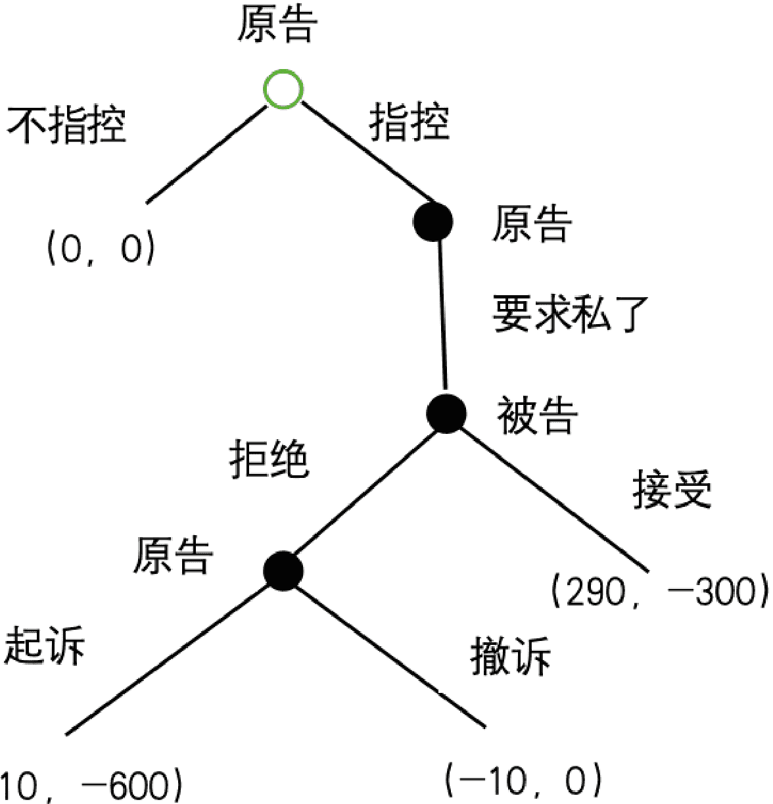

清楚了双方交替出招的过程之后，我们一起来计算一下，看看这个博弈一共会出现几种结果，以及每种结果下双方的收益或损失分别是多少。

第一种结果，原告不指控，双方的收益是（0，0），这很简单就不用多说了。

第二种结果，原告指控并要求私了，被告接受私了，支付和解金300，双方的收益是（290，-300）。原告收益为290，是因为300的和解金还需要减去10的指控成本。

第三种结果，原告指控后，被告拒绝私了，选择应诉，当被告选择应诉后，原告选择撤诉，双方的收益是（-10，0）。原告的-10就是之前的指控成本。

第四种结果，原告指控后，被告拒绝私了，选择应诉；当被告应诉后，原告也不撤诉，最后由法院判决，双方的收益是（-110，-600）。

为什么双方是这个数量的收益呢？我们来算算账：

先看原告，起诉后胜诉的概率是1%，胜诉可以获得的赔偿金额是1万，那么期望收益就是1万乘以1%为100，同时减去指控成本10和起诉成本200，那么100-10-200=-110。

再看被告，起诉后败诉的概率是1%，败诉后需要支付的赔偿金额是1万，那么从期望收益看就是负1万乘以1%为-100，加上应诉成本500，所以总的支出为600，即收益为-600。

比较四种结果，对于原告来说，最理想的结果当然是被告选择私了，获得290的收益。最差的结果是被告拒绝私了，自己起诉，收益为-110。

对于被告来说，最理想的结果是原告不指控，或原告指控后，自己拒绝私了，而在自己拒绝后，原告能选择撤诉。这两种情况下，被告的收益都为零，也就是没有损失。被告最差的结果是自己拒绝私了后，原告起诉，最后法院判决被告败诉，自己的期望收益为-600。这是被告最不愿意看到的结果，比私了的损失300还要多出300。

那我们怎么求解这个博弈的均衡解呢？要挟诉讼是动态博弈，我们依然用之前多次用过的逆向归纳法。

我们先看这个博弈如果一直博弈到最后，结果会是什么？到了最后，原告要么起诉要么撤诉。对于原告来说，起诉的收益是-110，撤诉的收益是-10。因此，原告的最优选择是撤诉。

继续倒推，既然在被告拒绝私了的情况下，原告会撤诉，那么被告的最优策略是什么？肯定就是拒绝私了，因为拒绝私了的结果，是收益为0（因为原告会撤诉），私了的结果是-300。

再继续倒推，既然被告会选择拒绝私了，那么原告的最优策略是什么？如果指控，被告拒绝私了，自己撤诉的结果是收益为-10，如果不指控，收益为0。由此可见，不指控是最优策略。

由此，我们得到了这个博弈的均衡解：

原告的选择是要么不指控，如果指控的话就要求私了，一旦私了被拒绝，就选择撤诉。被告的选择是拒绝私了。

在这个均衡下，双方的收益都为0。

你应该是听出来了，这个均衡解跟我们之前学过的均衡解不太一样，之前我们学的博弈的均衡解，听起来是很简洁的，但这个均衡解还有“要么”......“一旦”......，似乎有点复杂。

其实这是动态博弈的特殊性所导致的，我们把动态博弈中这种特殊的纳什均衡，叫作子博弈完美纳什均衡。所谓子博弈的意思是，要把一个动态博弈，分成几个阶段性的子博弈来求解，每个子博弈的均衡解合起来，才是这个博弈的完整均衡解。

比如在刚才的要挟博弈中，原告有三次选择，所以他的均衡策略，由三部分组成（不指控，要求私了，撤诉）。而被告只有一次选择，那就是在原告开始要挟的时候就拒绝私了，他一拒绝这个博弈就结束了。

你可能有个疑问，那为什么原告的策略不是直接是“不指控”呢，为什么要搞这么复杂？

因为，如果被告会选择接受私了的话，原告是可以选择指控的，这样他可以获得更大的收益。只有当原告预期到被告会拒绝的时候，才选择了不指控。

### 原告的承诺行动

听到这儿，你可能还有疑问，照刚才这么分析，只要被告明确地向外释放信号，他不怕要挟，也绝对不接受和解，那要挟诉讼不就不会发生了吗？

刚才我们看的只是原告失败型的要挟诉讼，我们只是先借这个模型，明确这个博弈中的利益结构。原告既然敢来干要挟诉讼这门“生意”，肯定是有办法真正要挟到被告的。那么，原告会怎么做呢？

根据上一讲的“承诺行动”，只要原告让被告相信，被告拒绝私了后，原告一定会去起诉，因为他起诉的收益会大于撤诉的收益。这样一来，被告就会真正被威胁到。

听起来稍微有点绕，我们带入刚才的模型算算具体的数字你就明白了。

刚才的计算表明，原告起诉的损失是110，撤诉的损失是10。要想让被告相信自己一定会起诉，原告需要增加自己撤诉的损失。当然，这一点他必须要让被告知道，这其实是相当于告诉被告，他已经没退路了。

例如，原告可以提前支付起诉所需的律师费150。这样一来，起诉的损失仍然为110，撤诉的损失则从10增加到了160（指控成本10+律师费150）。显然，对于原告来说起诉比不起诉好，起诉才是此时的最优策略。

一旦被告预期到自己拒绝后，原告一定会起诉，那么私了就是被告的最优策略。当原告预期到被告会选择私了，指控并要求私了就是他的最优策略，这时候双方的收益为（140，-300）。

我画了一个成功的要挟诉讼的决策树，用来展示这个博弈的全过程，你可以点击文稿查看。


### 一般化的要挟诉讼

接下来，我们再更进一步，以上分析都是基于具体的数值展开的，要挟诉讼我们也可以选择进行一般化的处理。

我们假设：

原告指控成本为c。原告提出的和解金额为s。原告的诉讼成本为p，被告的应诉成本为d。原告胜诉的概率为α，胜诉可以获得赔偿金额为x。原告胜诉的期望收益为y=αx。

要挟诉讼的均衡结果取决于这些参数之间的关系变化。

基本结论是：

- 1. 如果原告胜诉的期望收益大于诉讼成本，原告必然会起诉，那么，被告会选择私了。
当然，前提是原告提出的私了和解金小于原告的应诉成本d和期望损失之和才行。
举个例子，如果原告胜诉的期望收益为，y=αx=3%*10000=300，而原告的诉讼成本是200，原告肯定会选择起诉，被告就只能选择接受私了。
- 2. 如果原告胜诉的期望收益小于诉讼成本，原告必然会撤诉。
此时，原告的起诉威胁是不可信的。那么，被告拒绝私了，双方博弈的均衡结果是，原告不起诉。
举个例子，如果原告胜诉的期望收益为，y=αx=1%*10000=100，而原告的诉讼成本是200，原告肯定会选择撤诉，被告必然会拒绝私了。这就是我们这一讲最开始分析的情况。
- 3. 如果原告胜诉的期望收益小于诉讼成本，原告通过提前支付诉讼成本的承诺行动，降低自己撤诉的期望收益，从而把之前不可信的威胁变成了可信威胁。被告为避免更大损失，选择接受私了。
双方博弈的均衡结果是原告指控并要求私了，被告接受。这就是刚才原告提前支付150元律师费的情况。


这里我们还要补充一点，在原告采取承诺行动，提前支付起诉费用后，被告就只能选择私了吗？其实也未必，被告也可以用魔法打败魔法。

既然原告可以提前支付起诉费用，那我为什么不能呢？为防止出现恶意诉讼，我干脆成立法务部，提前招聘好专职律师，这样一来，被告应诉的直接成本就接近于零，这能够对恶意诉讼形成一种威慑。

这时候，决策的关键点变成了私了和解金和败诉的期望损失之间的比较。只要私了和解金大于败诉的期望损失，被告一定会选择应诉，而在被告应诉的预期下，原告的最优选择是不指控。

不过，这里其实还会延伸出另一个问题，刚才我们介绍的要挟诉讼，以普通人要挟企业为背景。但在现实世界的博弈中，其实也存在以大欺小的要挟诉讼。

比如国外常有大型矿业巨头、能源巨头起诉环保记者的案例，指控他们“损害商业声誉”。具体案例的是非曲直需要具体分析，但是单从博弈结构上讲，环保记者更负担不起诉讼成本，的确更容易撤诉删稿。

### 总结

好了，我们来总结一下这一讲的内容。

- 1. 要挟诉讼的核心是一方通过给对方制造麻烦来获利。
- 2. 原告方可以通过提前进行成本沉没的方式让诉讼威胁从不可信变得可信。
- 3. 被告方同样也可以采取类似方式避免被恶意诉讼。在双方博弈之前，博弈其实就已经开始了。

#### 下节预告

中国人经常说远亲不如近邻，主要原因是博弈次数的不同。下一节我们来讨论“重复博弈”的问题，看看博弈次数的改变如何影响人们的策略选择和博弈结果。

### 思考题

最后给你留一道思考题。要挟诉讼类似我们平时说的“敲竹杠”现象，你是否有被他人敲竹杠的经历，你又是怎么应对的？

我是蒋文华，我们下节课见。

## 《蒋文华·博弈论50讲》

会识局、能破局、善布局

版权归得到App所有，未经许可不得转载


浙江大学公共管理学院副教授
蒋文华


微信：lazyhelper


## 31 重复博弈1：重复次数会怎样改变博弈结果？

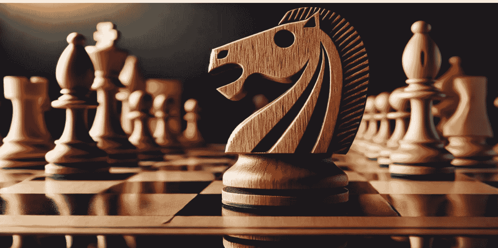

懒人专属群的群友，你好

欢迎来到博弈论课，我是蒋文华。

今天这一讲，我们要来学一类特殊的动态博弈——重复博弈。

顾名思义，重复博弈就是相同结构的博弈重复多次。最简单的例子，同样是买一斤香蕉，火车站门口的流动商贩跟你之间，就接近单次博弈。而同样的交易挪到小区门口，就变成了重复博弈，因为他会跟你反复打交道。

现实中的博弈，既有大量的一锤子买卖，也有大量重复博弈，学习重复博弈能让我们在现实世界中，结合时间的维度，做出更明智、更具战略眼光的选择。

那具体来说，“重复”会怎样改变参与者的决策考量，以及一旦博弈重复起来后，怎么寻找新的纳什均衡？我们这一讲就来解决这个问题。

### 重复博弈的三个基本特征

在寻找均衡解之前，我们先来搞懂究竟什么是重复博弈。

重复博弈，听起来很简单，就是重复相同的博弈。但其实，现实中很多人对这种博弈理解得都有偏差。比如，象棋中轮流走子，是不是重复博弈呢？答案是，不属于。因为每一步面对的决策问题在变化，无法简单看作同一局游戏的重复。

真正的重复博弈有3个基本特点。

先看第一个特点，重复博弈中各阶段博弈结构完全相同，前一个阶段博弈并不改变后一个阶段的博弈结构。

开头我们提到，重复博弈是一种特殊的动态博弈。重复博弈的这个特点是相对于其它动态博弈来说的。动态博弈由不同阶段的博弈串联而成，但每个阶段参与者所面对的博弈局面，一般会因为对手的选择而不断变化。重复博弈则不同，每阶段博弈的局面和之前的完全相同。

比如，我们上一讲讲的要挟诉讼就是动态博弈。被告是不是接受私了，接下来原告面临的局面是不一样的。被告接受私了，博弈就结束了，但如果被告拒绝私了，原告要决定是继续起诉，还是撤诉。

而在典型的重复博弈，比如重复囚徒困境中，前后两次博弈，双方的选项、预期收益是完全一样的。

再看第二个特点，参与者的历史行动完全可观测。

这有点类似电商平台可以记录商家所有的好评和差评，老用户也好，新用户也好，看过评价之后都能更好地决定要不要在他们家下单。

用博弈论的话来讲，这就意味着参与者过去的行为，会成为对方未来与他博弈的决策依据。反过来，如果博弈的历史不可以观测，那么哪怕一个博弈重复发生，也还是相当于多个独立的单次博弈。

最后再来看第三个特点，参与者追求的是所有阶段收益的总和最大，而非单次博弈的眼前利益最大。当然，因为有时间因素，这里有个贴现值的问题。

这也就意味着，即使短期要支付成本，但只要长期收益贴现后总收益更高，那也是更优策略。

总之，重复博弈中，每个参与者后续阶段的决策，取决于之前阶段对方的行为。这样一来，每个参与者都有机会让背叛者得到惩罚，让合作者获得回报，从而影响每个参与者当下的选择。

### 重复博弈纳什均衡的求解

讲完了重复博弈的特点，接下来我们来看，重复博弈中怎么寻找新的纳什均衡。

首先我们要说的是，并不是所有的博弈，重复之后结果都会发生变化。

有很多博弈，重复和不重复是没有差别的，所以纳什均衡也没有变，比如石头剪子布和智猪博弈。

在石头剪子布博弈中，不管是1次也好，重复100次也好，你我出石头、剪子和布的概率每次都应该为三分之一，这是这个博弈的混合策略纳什均衡，双方的期望收益完全相等，博弈次数不影响均衡结果。

在智猪博弈中，我们可以设想大猪想要通过惩罚机制，改变小猪的行为，例如威胁“这次我就是不按，看谁撑不住”。然而，由于小猪去按按钮，就要承担按按钮的成本，他反倒会更饿，相当于是净损失，所以小猪无论如何也不会去按。大猪的威胁根本没有用。

但是，有一些博弈，一旦重复，博弈结果就会发生变化。这类博弈的共同特点是，参与者在重复互动中，能利用“将来”的收益来激励或者惩罚对方。

比如在囚徒困境中，你这次可以选择背叛，占到便宜，让我多坐了几年牢；但是下次，我会背叛你，让你多坐牢。反过来，如果你这次选择合作，我下次也可以继续和你合作，这样双方的收益显然是更大的。

再比如蜈蚣博弈中，如果只博弈一次，你担心我后续的背叛，你很可能会一上来就直接背叛。但是，你也完全可以选择合作，来激励我的合作。我看到你选择合作后，我也会继续合作。因为我也知道我们下次还要继续博弈。除非你接下去选择背叛，我才会在下次提前背叛。这样一来，因为有了以后的长远利益，双方就有可能每次都一直玩到总收益最大为止。

关于重复博弈的纳什均衡，第二点要说的是，重复次数是有限还是无限，也会影响博弈的结果。

一般来讲，重复会改变均衡结果的博弈，我们仍然需要分两种情况来讨论，一种情况是博弈次数有限，一种情况是博弈次数无限。

先说博弈次数有限的情况。

如果重复次数是有限的，并且具体的次数是双方的共同知识，我们基本可以把重复博弈当做一般的动态博弈来分析。使用的方法，依然是逆向归纳法。

我们拿重复囚徒困境举例子。不管重复多少次，博弈的最后一次，其实都相当于单次的囚徒困境。既然双方都清楚，这次之后，没有下次了，那么，最后一次双方都会选择背叛。

再往前推，既然双方都知道最后一次大家都会选择背叛，那么在倒数第二次双方也肯定会选择背叛，因为反正下一次大家也没有机会报复了。这么着，逆向传导到第一次，结果就是双方一开始就会选择背叛。

这说明，在有限次数的重复博弈中，均衡结果并没有发生变化。

再说博弈次数无限的情况，或者虽然实际是有限的，但每个参与者并不知道何时会结束的情况。

这意味着，参与者的背叛会带来无限次的报复，反过来参与者的合作，也有可能会带来无限次的奖励。

由此，合作带来的持续收益可能超过背叛的短期收益，每次都背叛未必是一个对自己最有利的选择。

理论上来讲，要找到无限重复博弈的纳什均衡，核心方法包括三个步骤：

### 第一步，构想目标结果。

这一步是根据子博弈的性质，设定希望在重复博弈中实现的目标行动路径。例如，在重复囚徒困境中，目标可以是双方永远合作；在夫妻博弈中，目标可以是轮流选择双方各自偏好的活动。

### 第二步，设计奖惩策略。

也就是说，如果所有人一直遵守合作策略，则大家持续获得目标收益；但一旦有人偏离，在未来对其进行惩罚，使其未来的累积损失超过当期偏离所获收益。

### 第三步，策略验证。

要验证在所设定的策略下，任何单次偏离都不会让玩家获利。这一步，可以用数学推导的方法来验证，这就比较复杂了，涉及到对贴现因子的预估，以及相关的一大堆复杂计算。现实中，也可以通过实验的方法来验证。

显然，可以看得出来，这三个步骤当中，设计奖惩策略是核心。出于不同的风险承受能力、对手的不确定性、对未来的预期，以及参与者贴现因子不同等因素，每一个参与者都可以有不同的策略可供选择。

接下来，我们结合阿克塞尔罗德著名的重复囚徒困境实验，来重点看一看奖惩策略的设计，在重复博弈中可以有怎样的变化。

### 奖惩策略的设计

我相信，很多同学可能多少了解过著名的重复囚徒困境实验。这个实验是美国学者阿克塞尔罗德做的，他邀请各领域的聪明人，设计不同的奖惩策略，看看哪种策略最容易演化出稳定的合作。结果出人意料，竟然是看起来最简单的一报还一报策略。

所谓一报还一报策略，就是首次选择合作，只要对方合作，下一次就选择合作，只要对方背叛，下一次就选择背叛，后续的选择始终与对方上一次的行动一样。

这个策略极其简单，并且听起来似乎是一切文化中都出现过的最朴素的处世方法，但为什么是这个最朴素的策略最后能胜出？这里我们先不展开，放到下一讲再来讲。

除了一报还一报策略，还有其他可选策略，这些策略体现出不同参与者的行为模式：

#### 第一种，好人策略。

其核心特征是，无论对方如何选择，每次都无条件合作。

不难想象，如果我们是这种策略选择，相信对方每次都会选择背叛。这就是人们常说的“人善被人欺”。

我们应该选择善良，但一定要让我们的善良有锋芒。如果我们无原则地善良，就是纵容他人对你作恶。这样的好人其实是烂好人。

#### 第二种，我们可以叫作曹操策略。

跟好人策略相反，无论对方如何选择，每次都无条件背叛。这就是《三国演义》中曹操的那句名言：“宁可我负天下人，不可天下人负我！”。一般而言，曹操策略会导致对方持续背叛，除非对方刚好采用好人策略。

#### 第三种，冷酷策略。

冷酷策略的特征是，第一次选择合作，以好人策略开始，只要对方合作，就一直选择合作，但只要对方背叛一次，则触发永久报复，从好人策略直接调整到曹操策略。

冷酷策略是一种介于好人策略与曹操策略之间的策略。最大特点是不给对方任何重归于好的机会，拥有强大的威慑力。换句话说，冷酷策略是最记仇的，一次受伤害，终生牢记。

冷酷策略是我们日常生活和工作中经常会遇到的一种策略。比如一旦你借钱不还，对方就再也不会借给你了。领导给你安排一个重要任务，一旦你搞砸了，以后也就再也没机会了。

第一次听到冷酷策略，我们的本能感觉可能是不喜欢这样的策略。谁不会犯错呢？为什么就不给个改过的机会呢？但其实，从群体的角度看，冷酷策略的存在增加了每个人的背叛成本，从而让大家享受到了更多的合作利益。这一点我还会在后续演化博弈的课程中进一步展开。

#### 第四种，心软策略。

### 总结

好了，我们来总结一下这一讲的内容。

重复博弈是一种比较特殊的动态博弈。每次博弈不会改变下次博弈的结构，但每次博弈之间，存在着“利益”和“信息”上的联系。这迫使参与者需要在眼前利益和未来利益之间做抉择。

以“囚徒困境”为例的重复博弈，如果重复次数有限，每个参与者每次都背叛仍然是均衡结果。如果重复次数无限，每次都背叛未必是参与者能够获得最大利益的策略选择。

#### 下节预告

预告一下讲的内容，前面我们提到，在阿克塞尔罗德的重复囚徒困境实验中，是一报还一报策略最终取胜，这个策略的优势到底从哪里来？下一讲我们就来展开分析。

### 思考题

最后给你留一道思考题，在以往的生活和工作经历中，你是否碰到过有人采用“冷酷策略”和你博弈，你是怎么应对的？

我是蒋文华，我们下节课见。

公众号
懒人搜索
懒人专属群
微信:lazyhelper

## 32 习题课：为什么预判他人的预判那么难？

懒人专属群的群友，你好。欢迎来到博弈论课，我是蒋文华。

今天是我们课程的第五次习题课，我来为你讲解课程中留的思考题，也和你分享一些同学的精彩回答。

### 思考题1

第一个思考题，如果你是短蜈蚣博弈中的同学1，你会怎么做；如果你是同学2你又会怎么做？

我先带你看一下我在课堂上实验的真实数据：

同学1首轮就结束的比例几乎为零——毕竟有着总收益每次都能翻番的巨大诱惑。

同学2选择直接结束的比例不足20%，这背后有两个关键原因：
一个原因也是未来收益的诱惑，同学2自然也想要更多的收益。另一个原因可能是其他同学的压力。与国外“双向匿名”的实验不同，课堂上双方面对面的情况下，直接结束，很容易被其他同学视为过于自私。

但是，当同学2选择继续后，接下来又轮到同学1选择，同学1大多会果断结束。这里也是两个原因：
一个原因是理性计算。同学1很容易想到，继续下去让同学2选择，同学2大概率会选结束，所以他提前结束才是利益最大化的选择。另一个原因是心理优势。此时结束既保全了合作的形象，又让同伴获得了比首轮高3倍的收益，所以心里也不会愧疚。

当然，也有特例。曾有同学2竟然在第二轮做选择的时候还选择继续，我问他，为啥还继续？就算你继续，对方（同学1）想合作都不可能了，你后续的收益只会减少一半。

为什么说同学1想合作都不可能了呢？这里我们先回顾一下蜈蚣博弈的规则，这是个5条腿的短蜈蚣博弈，接下来就是最后一次选择，轮到的是同学1，而且同学1只能选择强制结束。

刚才提到的那位同学怎么回答的呢？他说：“让蒋老师拿出这么多钱，比什么都开心！”居然还有这么要坑老师的学生。开个玩笑。

言归正传，蜈蚣博弈还可以带给我们两点启发：

第一，完全理性的选择未必是最好的选择。

在没有互动的条件下，完全理性的选择肯定是最优的。而在蜈蚣博弈的这种互动关系中，当所有人都用逆向归纳法精打细算时，反而会得到集体最差的结果。

这让我想起一个案例：曾经有一个企业的管理者告诉我，他向董事长推荐在培训班增加博弈论课程，结果被拒绝了，原因是领导认为会把员工教坏了。这是因为，很多人误将博弈论等同于“厚黑学”。

第二，蜈蚣博弈要想玩到最后，需要三个条件满足其一：要么彼此都看重对方的利益，要么大家都愿意吃眼前亏，要么大家都愿意给对方足够的回报。

其实，我们只需要把博弈推理放在心里，而在他人的互动中，尽可能释放合作信号，让对方知道自己是一个知恩图报的人，而不是一个精于计算、唯利是图的人。这样我们才更容易把合作关系不断推进下去。如果因为对方眼中的你的“傻”，而让对方更愿意和你合作，何乐而不为呢？

这提醒我们，在很多时候，不妨做一个愿意吃亏的人，然后寻找更愿意吃亏的人做朋友。不是为了占便宜，而是让双方的合作能够不断持续下去，不至于友谊的小船说翻就翻了。

我觉得她说得很好。这让我想起斯蒂芬·平克的《人性中的善良天使》，书中有一个重要研究结论：善念和善行是有进化优势的。

“刘伟红”同学在留言里说：“不论我是哪方，我都会坚持到最后一局，只有坚持长期合作，才能实现群体利益的最大化，即使到最后我是收益较少的一方，也比第一局就结束的收益要大。”

所以，我们不要因为怕被伤害而不愿意开始，还是要对他人的善念有信心。这会让我们抓住那些真正珍贵的机会。

### 思考题2

第二个思考题，海盗分金中我们一开始给出的投票规则是5个海盗中半数或半数以上同意即可。如果规则修改为半数不行，必须半数以上才行，如果你是第一个海盗，又会怎么分？

这个题目相对比较简单，只要学会了逆向归纳法，是很容易倒推出来的。我看了大家的留言，基本上都正确地回答了这个问题。

一共有两个答案。

第一个答案的分配方案是：97、0、1、0、2。第二个答案的分配方案是：97、0、1、2、0。

老规矩，我们来逆向推理一下。

只剩最后一个，也就是第五个海盗的时候，他拿100个金币，这没什么好说的。

剩下第四和第五两个海盗的时候，两个人必须都同意，分配方案才能通过。因为海盗四无法给海盗五比100更多的金币，因此海盗五一定会反对海盗四的任何方案。所以，海盗四必死。

两个答案的分歧点在于如果剩下三个人怎么分。

一种方案是，假设海盗三拿99个金币，给第四个海盗1个，给第五个海盗0个。海盗四肯定会同意的，否则的话，剩下他跟海盗五的时候，他一个金币也分不到。顺着这个逻辑往下推，最终的分配结果是97、0、1、0、2。

第二种方案是，假设第三个海盗拿100个金币，一个也不给第四个海盗。为什么这样也行呢？因为如果海盗四不同意的话，只剩最后两个人时，海盗五会把海盗四扔海里。为了保命，第四个海盗就算没有金币，也愿意支持海盗三的任何方案。

顺着这个方案最终的分配方案可以有两个，一个是97、0、1、0、2跟方案一的最终分配方案一样；另一个是97、0、1、2、0，这两种都是对的，都能争取到足够的票数。

我在文稿中给你附上了一个表格，里面是两种方案下最终的分配结果，你可以点击查看。

| 海盗5 | 海盗4 | 海盗3 | 海盗2 | 海盗1 |
|---|---|---|---|---|
| 100 | | | | |
| 100 | 0 | | | |
| 0 | 1 | 99 | | |
| 1 | 2 | 0 | 97 | |
| 2 | 0 | 1 | 0 | 97 |

| 海盗5 | 海盗4 | 海盗3 | 海盗2 | 海盗1 |
|---|---|---|---|---|
| 100 | | | | |
| 100 | 0 | | | |
| 0 | 0 | 100 | | |
| 1 | 1 | 0 | 98 | |
| 2 | 0 | 1 | 0 | 97 |
| 0 | 2 | 1 | 0 | 97 |

这里特别需要表扬一下“JPChou”同学。他在留言中给出了很好的分析，他说，海盗分金问题存在多种版本，最终结果很大程度上取决于我们对海盗行为模式的假设——尤其是当海盗在两种选择中获得相同的经济利益时，他会如何投票。

这引发了一个更深层的思考：人们在博弈中会如何权衡他人的利益？是事不关己、高高挂起？还是幸灾乐祸？或者是幸福着他人的幸福，快乐着他人的快乐呢？

这正是博弈论中的一个经典难题，如果你面对两个相同收益的选项，会如何决策？虽然对你没差别，但这个选择会显著影响他人的利益。

回到刚才的海盗分金，正如“JPChou”同学分析的那样：

如果是温和型海盗，在利益相同时，不会刻意反对别人的提案（或默认支持），那么最优分配方案就是：97、0、1、0、2。

如果是嗜血型海盗，在相同收益下，他们更倾向于否决提案，把提案者扔到海里去，那么就可能出现后面的那种有两种方案的情况（97、0、1、0、2或者97、0、1、2、0）。

有趣的是，第一种最终方案在两种假设下都成立，而第二种最终方案只适用于嗜血型假设。

另外这里还要表扬一下“青云龙上”同学，他针对“嗜血型”海盗，在高阶维度上进一步推理出了另一个分配方案：98、0、1、1、0。有兴趣的同学可以去看他的留言。我自己看过他的留言后，心里暗想，如果海盗们的推理能力真有这么强，去做海盗有点浪费人才了。

其实，这个关于参与者类型的问题不仅存在于海盗分金中，也贯穿于很多经典模型中，比如囚徒困境、懦夫博弈、绑架博弈。这恰恰是我们接下来要探讨的“不完全信息博弈”的核心内容——当你不完全了解对手的类型时，如何制定最优策略。

比如在绑架案中，面对唯利是图的绑匪该如何应对？面对残忍成性的绑匪又该如何周旋？当绑匪类型不确定时，又该采取什么策略？

很多同学也提到了很多其它方案，考虑到人对公平的普遍追求，稍微多给一些金币出去，的确也是更现实的选择。

### 思考题3

第三个思考题，我曾经在课堂上和学生们玩过这么一个100元现金拍卖的游戏，让同学们扫码支付一个任意金额，全班支付金额最高者得到100元的现金奖励，并列最高则各得100元。有同学在班级微信群里发言说：“我们每个人都只给老师付1元，大家都可以从老师那里赚99元”，紧接着他把付款的截图发在了群里。其他同学也跟着表示赞同，并在群里许下诺言。请问这种承诺是可信的吗？

从同学们的回答看，认为不可信的比例稍微高一点。确实如此，这个游戏我在浙大已经玩过几十次了，同学们没有一次是成功的。

有个班的有位同学，支付的金额居然超过100，他付了102.33元。我当时问这个同学为什么，这个同学的解释是：“我把其他同学都坑了，好开心啊！”

印象最深的是，2022年的某个学期，一个班级里有40个同学遵守约定都支付了1元，结果有一个同学居然偷偷支付了1.01元，净赚98.99元。

当我要把100现金给这位同学时，班里的其他同学纷纷喊着：“是谁？是谁背叛了我们！”

我很快就收到了那位同学的微信：“老师，能否把现金奖励改成微信红包？”。看来吃独食也是有心理压力的啊。

我们再回到这道题，为什么同学只付1元的承诺不一定可信？我认为，一个重要原因，仍然是对参与博弈的同学的类型的判断。

如果每个同学都希望自己赚钱的同时，别人也能赚到钱，那么，承诺可信。如果有人就希望自己赚钱，那么，承诺必然不可信。人性是如此复杂，以至于很多时候，理性分析得出的均衡并不符合实际的博弈结果。

所以，下次如果有人提议“大家一起付1元”，你还会相信吗？

### 思考题4

第四个思考题，要挟类似我们平时说的“敲竹杠”现象，你是否有被他人敲竹杠的经历，你又是怎么应对的？

从同学们的留言看，“敲竹杠”还真是我们生活中非常普遍的现象。但应对方式不同，结果也大不相同。

“向波荣”同学说，小时候抄同学作业，被同桌发现了，同桌威胁说：把零食分我一半，否则告老师。最后，他乖乖分了一半零食给同桌。他的同桌虽然没有学过博弈论，却很会博弈。

“花生”同学说，遇到“敲竹杠”需要先判断一下对方是什么类型的。如果属于有枣没枣打一杆，敲到几个算几个的这类，态度强硬就不容易被当软柿子捏；如果是精心策划，就要比算力了，看谁在下一轮出手会对对方造成更大损失。

这说明，在实际的要挟中，大量的是不完全信息博弈，双方都在猜测对方的底牌。如果猜错了，就很可能被对方反制。

比如某网红投诉胖东来，显然误判了对手：他以为企业会妥协，结果对方直接硬刚，导致自己翻车。不完全信息博弈正是我们下一周要开启的新模块，我们下周再详细展开。

另外，还有昵称为“影”的同学还特别提到了一点。

被敲竹杠，有时候恰恰是我们自己的原因造成的。因为做了一些不好放在台面上的事，所以选择息事宁人。但这有可能会让敲竹杠的人变本加厉。他的建议是，面对敲竹杠，一方面我们自己要做光明正大的事，另一方面也不应该怕麻烦，要相信法律可以保护我们，轻易“私了”恰恰会助长这种歪风邪气。这就说得很全面了。

### 思考题5

第五个思考题，在以往的生活和工作经历中，你是否碰到过有人采用“冷酷策略”和你博弈，你是怎么应对的？

复习一下，所谓“冷酷策略”就是，只要对方背叛一次，就再也不跟他合作。

吴军老师曾说过自己的一个做人原则：给每一个人一次机会，但都仅有一次，就看对方能否抓住。我估计这也是很多人做人的原则。我自己也经常这么做的。

在浙大的博弈论课里，我把作业规定好截止日期后，如果学生实在来不及做，会给他们一天的延期时间。毕竟总会有意外发生，给别人一个机会，有时候也就是给自己一个机会。因为作业没交导致成绩不及格，我还要给学生出补考卷，这又何必呢。

“冷酷策略”构成了对他人背叛的巨大威慑，同时也降低了自己筛选合作伙伴的成本，其主要不足则是缺乏抗干扰的能力。

如果我们处在一个噪音比较严重的博弈环境中，我的个人建议是慎重使用。换句话说，我们不妨把惩罚的门槛设的稍微高一点，千万别动不动就以“冷酷”待人，这样的话你很容易会没朋友的。

我们的博弈论课今天已经到第32讲，我们已经学习完了60%以上的课程内容。欢迎你把课程继续分享给亲朋好友们。

我是蒋文华，我们下周再见。

公众号
懒人搜索
懒人专属群
微信:lazyhelper

## 33 重复博弈2：“一报还一报”何以胜出?

懒人专属群的群友，你好。欢迎来到博弈论课，我是蒋文华。

上一讲，我们介绍了重复博弈的基本特点和分析方法，这一讲我们单独讲被研究得最深入的一种重复博弈:重复囚徒困境。

上一讲我们介绍过，重复囚徒困境博弈比赛是美国学者阿克塞尔罗德牵头完成的。他做这个实验，并不是为了单纯研究囚徒困境，而是为了探索人类社会的一个大问题:在自私个体主导的世界中，合作行为怎样产生并稳定存在?

这个问题，可以说是人类社会科学皇冠上的明珠，过去无数学者对这个问题给出了答案。

有人认为必须要具备强制力的第三方，监督和惩罚不合作行为;有人认为需要依靠道德和社会规范。但阿克塞尔罗德给出的答案却出人意料地简单，别的什么都不要，只需要简单的“一报还一报”。

重复囚徒困境博弈比赛，阿克塞尔罗德一共组织了两次，他可以说是广撒英雄帖，在全世界范围发动专家学者们来参加博弈比赛。

在两次比赛中，所有其他专家学者们设计的策略，都没能赢过“一报还一报”，这背后的玄机到底是什么?这一讲我们就来跟着阿克塞尔罗德分析一遍。

### 四个特性

在分析“一报还一报”之前，我们需要先复习一下跟“一报还一报”竞争的策略都有哪些:

第一种，好人策略，无论对方如何选择，每次都无条件合作。
第二种，曹操策略，跟好人策略相反，无论对方如何选择，每次都无条件背叛。
第三种，冷酷策略，第一次选择合作，以好人策略开始，只要对方合作，就一直选择合作，但只要对方背叛一次，则触发永久报复。
第四种，欺软怕硬策略，第一步选择背叛，然后每走一步，估计自己合作或背叛后对方合作的概率，如果对方似乎仍然倾向于合作，则选择背叛;反之，选择合作。

在阿克塞尔罗德的实验中，实验参与者提交的策略其实还有更多，但这些策略大多是以上四种策略的组合和变体，篇幅的关系我们就不多介绍，如果你感兴趣，可以阅读《合作的进化》和《合作的复杂性》这两本书。

我们还是回到“一报还一报”策略，通过跟其他策略的对比，我们会发现“一报还一报”有4个重要特性:

#### 1. 善良性。

所谓善良性是指一个策略无论和谁博弈，无论处于什么博弈阶段，从不主动选择背叛。

在重复博弈中，主动背叛很容易导致对方的报复，甚至是永久的报复，从而拉低总分。第二次比赛的结果表明，63名参赛者中，总分最高的前15个策略，只有一个是非善良的，排第8。

统计结果还表明，善良性与竞赛中的得分大小，两者之间的相关系数达到0.58。这意味着，一个策略能否取得好成绩，最大的影响因素是“是否选择善良”。

#### 2. 可激怒性。

可激怒性是指是否对对手的背叛行为给予相应的报复。

刚才我们说到了善良性，“好人策略”其实是最善良的，但这种策略在实验中并不能取得好成绩。“好人策略”缺少的就是可激怒性。

可激怒性太弱的策略很容易受到非善良策略的剥削，比如“欺软怕硬策略”就可以占这些策略的便宜。

这一点倒也很符合我们的常识，太善良容易被恶人欺负，要保证自己的长期利益最大化，就不能老被人欺负。

事实上，特别是在阿克塞尔罗德组织的第二次更大范围的比赛中，影响名次的一个主要特征，就是能否防止被他人占太多的便宜。

#### 3. 宽容性。

宽容性是指不因对方的一次背叛，就没完没了地报复，只要对方放弃背叛，就愿意原谅对方，继续与其合作。

相比较而言，冷酷策略是一个严重缺乏宽容性的策略，一旦被背叛，就选择无休止地惩罚，导致合作无法恢复。

而一报还一报只会记住对方上一次的选择，至于上一次之前的所有选择，早已忘得一干二净。这就给了对方改正错误的机会。哪怕彼此已经互相伤害了100次，只要对方在第101次博弈中选择合作，就立马在后续的第102次中选择合作。

因为宽容性，中断的合作有机会恢复。

#### 4. 清晰性。

清晰性是指一个策略是不是容易被识别。

“一报还一报”的清晰性，从形式上就能看出来。所有比赛参与者需要把他们的策略写成编程语句，“一报还一报”是所有策略中语句最短的，只用了3条语句。甚至完全随机策略都需要4条语句才能写完。

再从实质上看，清晰性之所以重要是因为，清晰的策略更容易被对手识别，这样会方便对手预判你的行为模式。如果你的行为模式没法预判，对方也就没办法确定到底要不要跟你合作。

凡事就怕猜疑。哪怕是对双方都好的事儿，也禁不住猜疑，猜疑多了，合作无法实现，好事变成坏事。

而更重要的是，“一报还一报”的这四个特性并非相互独立，而是环环相扣，相互支撑：“善良性”让你不会树敌，能享受合作的回报；“可激怒性”能对方形成威慑，确保对方不会轻易背叛；“宽容性”有助于合作的恢复，而不至于陷入无休止的报复；“清晰性”则保证了你的行为模式容易被对方预判，从而导出长期的合作关系。

### 启发

可以说，“一报还一报”不仅是一种博弈策略，还是一种生存智慧。这套策略的威力，恰恰在于它用简单的规则，解决了合作中最根本的难题：如何既保护自己，又维持长期的合作关系。

因此，它的启示早已超越博弈论，直指人际互动的核心。在更一般的意义上，我们还可以进行更深入的三点思考。

- 1、真正的好策略，不追求赢任何人，但可以赢到最后。
“一报还一报”从来不主动背叛，因此在和其它任何策略博弈时，这个策略的得分永远不可能超过对方，要么比对方低，要么和对方一样。但在群体中“一报还一报”的总分却是最高的。

人类在长期的进化过程中，面对极度匮乏的资源，发展出极强烈的胜负心。我们习惯性地认为，我如果能赢过所有对手，就一定能够成为人生赢家，于是容易陷入短期胜负的执念。

然而，一报还一报的赢，刚好和我们之前认为的相反，它所追求的不是击败一个又一个对手，而在于能否与各种各样的人建立可持续的合作关系。

由此，在形形色色的人群中，它获得了最高的收益和最强的适应性。

- 2、真正的好策略，以不变应万变。
表面上看，“一报还一报”似乎不够灵活——面对不同策略时，它没有采取所谓的“最佳应对”。比如，面对“好人策略”时，其实“曹操策略”（永远背叛）反而能占尽便宜。但问题在于：识别和试探本身，也有成本。

假设你采用“一报还一报”，已经与对手稳定合作了100次。此时你想试探对方，那么现在可能有三种情况：

如果对方是“好人策略”，你的背叛确实能占便宜，且可持续获利；如果对方是“一报还一报”，你及时回归合作，关系尚可修复；但如果对方是“冷酷策略”（触发后永不原谅），一次背叛就会彻底葬送未来的所有合作可能。

更棘手的，还在后续的选择上：

继续合作？如果对方是“冷酷策略”，你将持续被剥削；转为背叛？你又可能错失与“一报还一报”者长期合作的收益。

一次试探换来永久互害的恶果——你以为的聪明，反而成了最大的陷阱。

而“一报还一报”的智慧正在于此：它不执着于针对不同对手优化策略，而是用最稳定的行为模式，快速向对手传递明确的合作意愿，同时又及时地惩罚背叛。

- 3、最好的策略，是让对方了解你，而不是害怕被了解。
纵观其他策略，我们会发现一个有趣的现象，无论是太善的还是太恶的策略，都怕被对手看穿。太善怕被欺负，太恶怕被报复。爱占小便宜的，怕占不到便宜。

“一报还一报”的独特之处在于——它不怕被了解，反而生怕对手不知道自己的处事规则。因为当对方清楚“合作必有回报，背叛必遭反击”时，持续合作就成了最理性的选择。这种透明，恰恰是建立长期信任的基础。

判断一件事对错有一个非常简单的标准：如果你做了一件事后，特别怕别人知道，那多半是错的；如果你做了一件事后，特别希望被别人知道，那很可能是对的。

### 噪音问题

说到这里，还要提醒一下，一报还一报策略虽然经典，却并非完美。

如果两个“一报还一报”相遇，或者跟其他宽容性更差的策略相遇，也可能陷入无休止的循环。

假设我们已经连续合作了100次，第101次博弈时，突然有人出错选择了背叛。一种出错是行动错误；另一种出错是认知错误，误以为对方选择了背叛。如果双方机械地执行“一报还一报”，偶然的失误，会触发循环报复模式，使关系坠入互害的深渊。

这就是“噪音”，也就是博弈中经常出现的随机错误。我们生活在一个充满“噪音”的世界里。一个不经意之间的错误就会开启永久性的彼此互害。

解决“噪音”问题，需要在一报还一报基础上添加两种抗干扰机制，分别是宽容机制和悔悟机制。

宽容机制是指在对方背叛时，以一定概率选择合作而非立即报复。

比如，如果彼此连续合作100次，当对方在第101次选择背叛，不妨把这次背叛认定为是随机干扰的结果，在第102次仍然选择继续合作。

实验证明，当随机错误较少，噪音频率为0.1%-1%时，宽容能最有效维持互惠。

悔悟机制是指承认自身错误引发的报复的合理性，主动终止循环。

如果自己因为随机干扰选择了背叛，那么，对手如果也是一报还一报策略，肯定会报复我。当我被报复后，要不要继续报复回来？悔悟者会停止二次报复，而不是坚持“一报还一报”。

懂得悔悟意味着我要尊重你报复我的权利。在错误较频繁时，悔悟机制非常重要。比如高频谈判中，悔悟机制能通过主动担责加速恢复合作，避免因自身错误引发长期对抗。

就像我们在日常生活中，如果你不小心踩了他人一脚，你会赶紧说：“对不起！”此时，如果对方认为你不是故意的，回你一句“没关系！”，这就没事儿了。

但如果此时对方回踩你一脚，你会怎么做？如果你再选择踩他一脚，那就不算是悔悟了，两人势必会陷入不必要的争吵，甚至大打出手。这完全没有必要，不如忍一忍。

这两种策略的本质是平衡报复与恢复合作：宽容通过“被动容忍”维持稳定，悔悟通过“主动纠错”加速恢复合作。

当然，太多的原谅很容易被他人所利用。有句话是这么说的，退一步海阔天空，退两步万丈深渊。宽严相济，才是人际交往的艺术。

### 总结

- 1、一报还一报的善良性、可激怒性、宽容性和清晰性，让这个策略在与他人的无限次重复博弈中既能迅速建立合作关系，又能及时制止他人的背叛行为，从而获得最大利益。
- 2、一报还一报的巨大成功表明，博弈的目的不是为了战胜对手，而是与他人建立持久的合作关系。
- 3、通过引入宽容机制和悔悟机制，能有效解决合作关系中的“噪音”问题。

#### 下节预告

到这里，完全信息动态博弈这一模块，就告一段落了。可以说，“终点决定起点”，是完全信息动态博弈的底层逻辑，逆向倒推是求解均衡的基本方法。

从下一讲开始，我们就将进入不完全信息博弈的世界，共同穿透有限信息的迷雾。

也欢迎你继续把博弈论的智慧分享给亲朋好友们。

### 思考题

最后给你留一道思考题，“一报还一报”是你生活中常用的博弈策略吗？在你以往的生活中，有过这方面的博弈经历吗？

我是蒋文华，我们下节课见。


公众号懒人搜索，懒人专属群分享

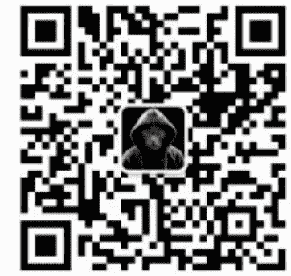

微信:lazyhelper

公众号懒人搜索懒人专属群

## 34市场进入博弈：怎样面对不同类型的竞争对手？


懒人专属群的群友，你好

欢迎来到博弈论课，我是蒋文华。

前面两个模块，我们讲的是完全信息博弈，所谓完全信息最关键的是，你的博弈对手有哪些可能的选择，每种选择收益或者损失是多少，你是完全清楚的，当然你的这些信息，对手也完全清楚。

从这个模块开始，我们就要进入不完全信息博弈。也就是说，至少一个博弈参与者对其他参与者的损益信息不完全了解，参与者之间存在着信息不对称。

打个比方，完全信息博弈就像下象棋，双方的棋子全可见，虽然你不知道对手下一步会怎么下，但是任何一步的潜在收益和损失，双方都清楚；而不完全信息博弈，就像打扑克，不清楚对手的牌。

在之前海盗分金的博弈中，海盗们是温和型还是嗜血型，如果大家相互知根知底就是完全信息，否则就是不完全信息。

那么，不完全信息博弈应该怎么分析？这一讲我们就以“市场进入博弈”为例，系统学习对应的方法。

### 市场进入博弈

不过，市场进入博弈在不完全信息的情况下稍微有点复杂。我们先来看一个完全信息的情况。

完全信息博弈是所有博弈分析的基础，掌握了完全信息的情况，再引入不完全信息，就能更清晰地理解博弈的变化。

好，我们开始。

市场进入博弈描述的是这样一种局面。

A企业已经提前占领了某个市场，赚得盆满钵满。B企业想从中分一杯羹，但不确定A会如何反应。所以我们要找的答案是，如果你是B企业的老板，是否选择进入这个市场？

这类博弈的决策关键点在于，要判断在位者企业的类型是高成本还是低成本。为什么这个因素重要呢？因为如果在位者是高成本，那就没有多少利润空间，要是斗争（比如打价格战）就会亏钱。如果在位者是低成本，那他就有底气打价格战。

我们用一组模拟的数值，来分别讨论两种不同情况下的博弈结果。

第一种情况，在位者是高成本企业。

如果B不进入，B没有收益，在位者A赚300。

如果B进入，在位者A就有两种选择，一种是选择默许，B赚100，A赚150；另一种是选择斗争，打价格战，那么B亏100，A赚0。

| | | 高成本在位者A | |
|---|---|---|---|
| | | 默许 | 斗争 |
| 进入者B | 进入 | 100, 150 | -100, 0 |
| | 不进入 | 0, 300 | 0, 300 |

在这种情况下，进入者B应该进入，A会默许。因为对在位者A来说，默许的收益是150，斗争的收益是0，斗争不划算。即使在位者口口声声说要斗争，其斗争的威胁也是不可信的。学习过承诺博弈的同学对此已经了然于心了。

文稿中我给出了在位者是高成本的情况下，市场进入博弈的损益矩阵，方便的时候你可以打开查看。

接下来我们再讨论第二种类型，在位者是低成本。

如果B不进入，A赚400。这里在位者的收益为400，而不是之前的300，是因为成本更低带来的。

如果B进入，而在位者选择默许的话，B赚100，A赚200；如果在位者选择斗争，B亏100，A赚250。

| | | 低成本在位者A | |
|---|---|---|---|
| | | 默许 | 斗争 |
| 进入者B | 进入 | 100, 200 | -100, 250 |
| | 不进入 | 0, 400 | 0, 400 |

在这种情况下，B不应该进入。因为一旦进入，在位者基于自身利益的考虑，也就是赚250比200强，一定会选择斗争。在位者斗争的威胁是可信的。

文稿中我也给出了在位者是低成本的情况下，市场进入博弈的损益矩阵，方便的时候你可以打开查看。

总结一下，如果在位者是高成本，进入者进入，在位者默许。如果在位者是低成本，进入者不进入，在位者斗争。

以上我们讨论的是完全信息条件下的博弈结果，但我们说，现实是复杂的，如果进入者事先不清楚在位者到底是高成本还是低成本，他该怎么办？这就是不完全信息博弈要解决的问题。

### 海萨尼转换

在不完全信息博弈中，一个参与者究竟属于什么类型，是由他所拥有的私人信息所定义的，所谓私人信息，也就是别人不知道。

不完全信息的问题，在1967年之前，博弈论专家们也束手无策。一个参与者如果不知道在和谁博弈的话，连双方的博弈规则都没法明确。

直到诺贝尔奖得主约翰·海萨尼（John C. Harsanyi）提出海萨尼转换，才让这类博弈变得可分析，可求解。

他的核心思路是：

- 1、引入“自然（Nature）”作为虚拟参与者，让“自然”先随机决定每个玩家的类型（如高成本/低成本）。
- 2、每个参与者当然知道自己的类型，但不知道对手的类型，这时只能基于概率预判（比如“对方有60%可能是高成本”）。
- 3、这样，不完全信息博弈就被转换成了两阶段动态博弈。

第一阶段：自然随机分配类型，这样就会产生参与者类型的概率。第二阶段：玩家基于自身类型和概率信念进行博弈。

海萨尼转换现在已经成为处理不完全信息博弈的标准方法。

举个例子，两个人谈恋爱，假设“自然”，也就是虚拟参与者决定了双方的性格是外向E人还是内向I人，这就是我们常说的性格是天生的。双方知道自己的性格，却不确定对方的。不过，他们可以根据经验预判（比如对方“70%偏外向”），再决定如何互动——这就是一个典型的不完全信息博弈。

海萨尼转换的关键突破在于，它将“不知道对方是个怎样的人”的不确定性问题，转化为“知道对方可能的类型及其概率”的风险性问题。

对应到开始的市场进入博弈中：

原来的不确定性，就是完全不知道对手是高成本还是低成本。现在变成了风险性，也就是虽然不确定对手具体类型，但可以预估对手高成本的概率是80%，低成本的概率是20%。

这样，博弈就从“完全不可计算”变成了“基于概率的可计算问题”。

### 贝叶斯纳什均衡

接下来我们一起求解不完全信息条件下，市场进入博弈的纳什均衡。

虽然进入者不知道在位者究竟是什么类型的，但是双方在博弈之前是有一个共识的，那就是在位者类型的概率分布。

我们先分析进入者B的策略选择。

依据之前在完全信息条件下的分析，在位者类型不一样，进入者进入的收益也不一样。

进入者不进入，不管在位者什么类型，收益都是0，这是显而易见的；进入者选择进入的话，如果在位者是高成本时，进入者的收益是100，如果在位者是低成本时，进入者的收益为-100。

那么，只要在位者是高成本的先验概率大于50%，进入者选择进入的期望收益就会大于0，进入者选择进入。

为什么是50%呢？这里需要做一个简单的期望收益计算题，假设在位者是高成本的先验概率为p；在位者是低成本的先验概率就是 1-p。进入者选择进入时的期望收益为：期望收益=p×100+(1-p)×(-100)。

**假设：**
- 在位者是高成本的先验概率为 p；
- 在位者是低成本的先验概率则为 1 - p。

进入者选择进入时的期望收益为：
```
期望收益 = p × 100 + (1 - p) × (-100)
```
我们将其中展开：
```
= 100p - 100(1 - p) = 100p - 100 + 100p = 200p - 100
```
如果进入者选择进入的期望收益要大于0，需满足：
```
200p - 100 > 0
```
**解出：**
```
200p > 100 ⇒ p > 0.5
```
再来看在位者A的策略选择。

如果在位者预期进入者会选择进入，在位者确实是高成本时选择默许，是低成本时选择斗争。如果预期进入者不进入，在位者无论是高成本还是低成本都选择斗争。

这样一来，结合刚才计算得到的概率，我们就找到了市场进入博弈的贝叶斯纳什均衡：

如果进入者认为，在位者是高成本的概率大于50%，进入者选择进入，高成本的在位者选择默许，低成本的在位者选择斗争；如果进入者认为，在位者是高成本的概率小于50%，进入者选择不进入，在位者无论是高成本还是低成本，一律都选择斗争。

再强调一下，我们这里讨论的市场进入博弈，是一个不完全信息静态博弈。也就是参与者同时行动，没有机会观察到别人的选择，双方只能依赖概率分布的共同知识进行决策。这种情况的均衡，我们叫作贝叶斯纳什均衡。

其实，市场进入博弈也可以变成动态博弈，那时候博弈双方都可以通过上一阶段博弈的结果，更新之前对概率分布的信念。了解一点概率论的同学都听出来了，这就需要用贝叶斯法则来实现。这种新的均衡，被称为完美贝叶斯纳什均衡。这里你先对这个名词有个印象就好，后面我们讲到了不完全信息动态博弈再展开。

再说回来，贝叶斯纳什均衡是一种类型依赖的策略组合。比如，在市场进入博弈中，进入者的最优选择取决于他所认为的在位者类型的概率分布；而在位者的最优选择，也受到进入者对他的类型的预判影响。

放在一个现实案例里，学生选不选某门课，取决于他们认为老师讲课好不好、给分高不高，而非老师实际如何。

老师开不开课，取决于他们预判学生是否会选。即使课讲得好，如果学生认为不好，不会选，老师就直接取消该课程了。

不完全信息博弈揭示了一个深刻规律：你的成功不仅取决于你的真实能力，还取决于他人如何看待你。

进一步看，一个人被认为是优秀也还是不够的，还在于他自己是否知道被认为是优秀的。

试想，一个高中生，他知道自己是优秀的，哈佛大学也认为他是优秀的，如果他自己不知道这一点，误认为在哈佛大学眼里自己是不优秀的，就算申请也会被拒，那么他的选择很可能是不申请。

放在商业世界的启发是，市场进入博弈中，即使你是高成本企业，如果对手误以为你是低成本，他们可能也就不敢进入，让你不战而胜。反之，虽然你是低成本，但对手误以为你是高成本，对方选择进入，也会让你疲于应对。

### 总结

- 1、在不完全信息静态博弈中，海萨尼转换把不确定性条件下的决策问题转换为风险条件下的决策问题。每个参与者的最优策略依赖于自己的类型和对他人类型的认知。
- 2、不完全信息静态博弈中的贝叶斯纳什均衡是一种类型依赖的策略组合。一方面，你的类型决定了你的策略选择。另一方面，你被以为的类型决定了对手的策略选择和你的策略选择。

#### 下节预告

在影视剧里经常有这样的桥段，孩子被绑匪绑架索要赎金，家长不知所措，如果不给赎金，孩子随时面临生命危险，如果给了赎金，又担心会人财两空。家长应该怎么做？绑匪又会怎么做？这就是我们下一讲要讨论的博弈问题：绑架博弈。

### 思考题

这一讲留给你的思考题是，如果你是一个男生，喜欢上一个女生，现在决定要不要向她求爱，一旦求爱，对方有可能拒绝，也有可能同意。现在的情况是作为男生存在两种类型，勤快的和懒惰的。男生当然知道自己是什么类型的，但女生不知道男生的确切类型。双方只有一个关于男生类型概率分布的共同知识。那么，双方博弈的贝叶斯纳什均衡是什么？

文稿中，我给你提供了这个求爱博弈的收益矩阵表，你可以打开查看，然后看看能否计算出这个博弈的贝叶斯纳什均衡？

表34.3 求爱博弈
| | | 被追求者 | |
|---|---|---|---|
| | | 接受 | 拒绝 |
| 求爱者-勤快 | 求爱 | 100, 20 | -50, 0 |
| | 不求爱 | 0, 0 | 0, 0 |

| | | 被追求者 | |
|---|---|---|---|
| | | 接受 | 拒绝 |
| 求爱者-懒惰 | 求爱 | 100, -1000 | -50, 0 |
| | 不求爱 | 0, 0 | 0, 0 |

这里，顺便也公布一下上周的学习奖励，课程开始我们说过，我们每节课末尾都有一个思考题，每周一，我会公布上一周的最佳作业同学名单，每位同学的奖励是《博弈思维线下研修班》的参加名额一个。

这个研修班的主题是：“博弈在现实竞争与合作中的应用”，时间定在4月20日上午9点-12点，地点在北京得到总部。

公众号懒人搜索，懒人专属群分享

今天公布上周获奖的5位同学名单：闫鼎新、瑾儿、刘伟红、牛虻、何俊。

第一周获奖同学名单：左星星，董全冠，Charles Wang，咚咚锵，我心飞翔，陈振中，上善若水。

第二周获奖同学名单：道远、郑大囧、雪莲、闻思修、张善崔。

第三周获奖同学名单：绿色计量、JPChou、向波荣、波澜不惊、活在未来。

第四周获奖同学名单：黎明、有木有有木人、美君、林常松、正一

文稿中有课程主编的微信（18500161040），请获奖同学添加他的微信，方便到时候联系到大家。

期待看到更多同学的精彩作业和留言，也欢迎你随时把课程分享给身边的朋友。

我是蒋文华，我们下节课见。


## 35 绑架博弈：怎么跟绑匪斗智斗勇？


懒人专属群的群友，你好

欢迎来到博弈论课，我是蒋文华。

上一讲我们开始了不完全信息博弈的学习，这一讲我们再来看一个新的不完全信息博弈，绑架博弈。

绑架是警匪片中最常见的桥段之一。孩子被绑匪绑架索要赎金，孩子家长不知所措，如果不给赎金，孩子随时面临生命危险，如果给了赎金，又担心会人财两空。

现实中绑架案也曾频繁发生。香港1997年回归前，富豪经常被绑架。比较著名的有女富豪龚如心的丈夫王德辉，他先后被绑架了两次。第一次在支付了1000万美元的赎金之后，被放了回来；第二次就没那么幸运了，在支付了6000万美元的赎金之后，仍然惨遭撕票，再也没有回来。

除了王德辉，另一个著名绑架案发生在李嘉诚的儿子李泽钜身上，绑架他的人是世纪悍匪张子强。绑架成功后，张子强居然直接上门向李嘉诚要赎金。要价20亿！经过讨价还价，双方最后商定的赎金是10.38亿。双方博弈的结果是张子强拿到了赎金并释放了李泽钜。

为什么同样是支付了赎金，结局却是生死殊途？现在就让我们一起来构建一个绑架博弈模型讨论这个问题。

### 完全信息的绑架博弈

现在让我们假设，绑匪绑架了一户人家的孩子，联系孩子的父母拿钱赎人，父母需要选择是否支付赎金。绑匪拿到赎金后可能放人，也可能撕票；但是，绑匪没拿到赎金，也是既可能放人，也可能撕票。

绑架博弈，可以是静态博弈，也可以是动态博弈。如果是静态博弈，意味着父母和绑匪同时做决策，双方都基于对对方行为的预期做决策。如果是动态博弈，让父母先行动，决定是否支付赎金，然后绑匪根据父母的实际选择决定是否撕票。这样的话，父母依据对绑匪行动的预期做决策，绑匪则是根据父母的实际行动做决策。

我们这一讲的核心任务，是理解不完全信息博弈的求解过程，所以只看静态绑架博弈，把握核心机制即可。

我们先来分析参与者的类型。我们知道，参与者类型不同，收益结构肯定不一样。在绑架博弈中，绑匪可以分为两种不同的类型：残暴型和金钱至上型。

残暴型绑匪意味着，就算父母支付赎金也会选择撕票；金钱至上型绑匪意味着，只要收到赎金就愿意释放孩子。

与此同时，也可以把父母分成两种类型：爱惜钱财型和爱惜孩子型。爱惜钱财型父母不是说把钱看得比孩子的命还重，而是指只有当支付赎金能确保孩子存活时他们才支付。爱惜孩子型的父母是指在绑匪可能主动放人的情况下，也愿意支付赎金。至于为什么绑匪放人还愿意支付赎金，你可以理解为赎金对父母来说不是一笔太大的支出，也可以理解为父母担心万一因为自己没付赎金而导致孩子被撕票，会因此内疚一辈子。

根据绑匪类型和父母类型的不同，我们可以得到四种博弈组合。我在文稿中做了一个表，你可以点击查看。

| 父母 \ 绑匪 | 残暴型 | 金钱至上型 |
|---|---|---|
| 爱惜钱财型 | 爱惜钱财，残暴 | 爱惜钱财，金钱至上 |
| 爱惜孩子型 | 爱惜孩子，残暴 | 爱惜孩子，金钱至上 |

这里，我们以父母是爱惜孩子型为例，分析绑架博弈的核心结构。

当父母类型确定时，最大的难点在于绑匪的类型未知，可能是金钱至上型，也可能是残暴型。两类绑匪的收益赋值完全相反，需分类讨论。

在此之前，我们先建立一个基础框架，明确这类父母和绑匪的损益组合。双方互动会产生四种结果：

父母付赎金，绑匪放人，这是最好的结果，破财消灾，父母收益为4。父母不付赎金，绑匪放人，这个结果看起来好，但风险极大，父母收益为3。父母不付赎金，绑匪撕票，父母肯定很伤心，但至少没损失钱，父母收益为2。父母付赎金，绑匪撕票，这是最惨的结局，人财两空，还被羞辱，父母收益为1。

有同学可能会问，为啥这些收益都是正的？这个不重要，重要的是四种结果之间的收益比较，是收益的比较决定了参与者的行为选择。把四种结果的收益分别设定为-10、-20、-30、-40，也是一样的，不影响分析结论。

接下来，由于绑匪类型不可观测，我们分类讨论他们的收益逻辑。

第一种情况，绑匪是残暴型的。

这种绑匪，无论父母是否支付赎金，他们都会选择撕票，具体的赋值是：

绑匪收钱后撕票，绑匪收益为4；绑匪收钱后放人，绑匪收益为3；绑匪没收到钱撕票，绑匪收益为2；绑匪没收到钱放人，绑匪收益为1。

文稿中我给出了“残暴型绑架博弈模型”的损益矩阵，你可以点击查看。

| 父母 \ 绑匪 | 撕票 | 放人 |
|---|---|---|
| 付赎金 | 1, 4 | 4, 3 |
| 不付赎金 | 2, 2 | 3, 1 |

第二种情况，绑匪是金钱至上型的。

绑匪的目标是讹诈赎金，如果父母给钱，他就放人，以免杀人后一旦被抓，罪加一等。如果父母不给钱，他会选择撕票，以确保以后还能讹诈到赎金。试想，如果父母不付钱，绑匪也放人，以后他撕票的威胁就变得不可信了。所以具体的赋值是：

绑匪收钱后放人，安全赚钱，绑匪收益为4；绑匪收钱后撕票，钱到手了，但风险变大，绑匪收益为3；绑匪没收到钱撕票，没赚到钱，只能立威，绑匪收益为2；绑匪没收到钱却又放了人，彻底失败，绑匪收益为1。

我也在文稿中给出了“金钱至上型绑架博弈”的损益矩阵，你可以点击查看。

| 父母 \ 绑匪 | 撕票 | 放人 |
|---|---|---|
| 付赎金 | 1, 3 | 4, 4 |
| 不付赎金 | 2, 2 | 3, 1 |

通过计算双方最佳对策，我们可以分析这个完全信息静态博弈的纳什均衡。

分为两种情况：

情况一，如果父母事先知道绑匪是残暴型的，双方博弈的纳什均衡是：绑匪必选撕票，父母不付赎金。双方陷入双输的局面。

情况二，如果父母事先知道绑匪是金钱至上型的，双方博弈就存在多重纳什均衡，包括两个纯策略纳什均衡和一个混合策略纳什均衡。

两个纯策略纳什均衡分别是：

理想结果：父母付赎金、绑匪放人，双方都得偿所愿。悲剧结果：父母不付赎金、绑匪撕票，这实际上是博弈双方互不信任导致的。

混合策略纳什均衡是：父母50%的概率付赎金、绑匪50%的概率放人。

至于为什么是50%，可以通过期望收益公式求解，我们之前讲过求解混合策略纳什均衡的方法，文稿中我附上了计算过程，你方便的时候也可以自己计算一下。

### 混合策略纳什均衡求解过程（金钱至上型绑匪）

#### 步骤1：定义策略与收益矩阵

- 父母策略：付赎金（概率 $p$） / 不付赎金（概率 $1 - p$）
- 绑匪策略：放人（概率 $q$） / 撕票（概率 $1 - q$）

根据赋值，金钱至上型绑匪的收益矩阵如下：

| 父母策略 | 绑匪放人（$q$） | 绑匪撕票（$1 - q$） |
|---|---|---|
| 付赎金 | 父母：4，绑匪：4 | 父母：1，绑匪：3 |
| 不付赎金 | 父母：3，绑匪：1 | 父母：2，绑匪：2 |

#### 步骤2：计算父母的期望收益均衡

父母需让付赎金与不付赎金的期望收益相等，否则会偏向某一策略：

```
$$
\begin{aligned}
E_{\text{付赎金}} &= q \cdot 4 + (1 - q) \cdot 1 = 4q + 1 - q = 3q + 1, \\
E_{\text{不付赎金}} &= q \cdot 3 + (1 - q) \cdot 2 = 3q + 2 - 2q = q + 2.
\end{aligned}
$$
```

令两者相等：

```
$$3q + 1 = q + 2 \implies 2q = 1 \implies q = \frac{1}{2}$$
```

#### 步骤3：计算绑匪的期望收益均衡

绑匪需让放人与撕票的期望收益相等：

```
$$
\begin{aligned}
E_{\text{放人}} &= p \cdot 4 + (1 - p) \cdot 1 = 4p + 1 - p = 3p + 1, \\
E_{\text{撕票}} &= p \cdot 3 + (1 - p) \cdot 2 = 3p + 2 - 2p = p + 2.
\end{aligned}
$$
```

令两者相等：

```
$$3p + 1 = p + 2 \implies 2p = 1 \implies p = \frac{1}{2}$$
```

#### 步骤4：结论

混合策略纳什均衡为：

- 父母以50%概率付赎金 ($p = \frac{1}{2}$)
- 绑匪以50%概率放人 ($q = \frac{1}{2}$)。

我们前面课程也讲过，当存在多个均衡时，廉价磋商，可以引导双方选择更优的结果。也就是父母和绑匪可以通过电话或短信进行简单沟通，避免陷入互不信任的悲剧，而是实现父母付赎金、绑匪放人的结果。

### 不完全信息下的绑架博弈

现在的问题是，如果绑匪类型是未知的，也就是博弈升级为不完全信息的情况，父母怎么决策呢？

那么，父母的决策就不再依赖绑匪的真实类型，而是对绑匪类型的预判。

在不完全信息静态博弈中，这种对其他参与者类型的猜测和判断，有时候也被称为信念（belief）。你对他人的信念，决定了你当下的选择。

在绑架博弈中，这就会出现以下4种结果：

父母以为绑匪是金钱至上的，支付了赎金，结果碰到一个残暴型绑匪，人财两空。父母以为绑匪是金钱至上的，支付了赎金，结果判断正确，孩子成功获救。父母以为绑匪是残暴的，不付赎金，结果绑匪确实是残暴型，绑匪撕票。父母以为绑匪是残暴的，不付赎金，结果绑匪是金钱至上型，绑匪撕票，父母错失救人机会。

总之，对父母来说，是否支付赎金不取决于绑匪类型的真相，而取决于他们对绑匪的类型的预判。

这与现实中许多决策的逻辑是一致的，比如：

马路边有人问你讨5元钱，你要不要给钱取决于你认为对方是否是骗子。男孩子是否要向一个女孩子表白，取决于他推测女孩子是否喜欢自己。老人摔倒在地，你要不要扶对方起来，取决于你判断对方会不会讹你。

回到绑架博弈，如果父母不付赎金，无论绑匪是残暴的还是金钱至上的，绑匪的最优解，都是撕票，根据我们前面的定义，父母的收益都是2。如果父母付了赎金，一旦遇到残暴绑匪，收益为1，一旦碰到金钱至上的，收益为4。

现在，我们假定绑匪残暴的概率为α，那我们来计算下不同类型的期望收益。

父母不付赎金：无论绑匪类型，父母收益固定为2；父母付赎金：期望收益=残暴型概率α×1+金钱型概率（1-α）×4=4-3α。

那么，当付赎金的期望收益低于不付赎金时，理性父母会选择不付。

用公式表示就是：当4-3α<2时，父母选择不付赎金。

求解得，α>2/3。

所以，不完全信息静态博弈下的绑架博弈，贝叶斯纳什均衡解为：

- 1、当父母认为绑匪是残暴型的概率大于三分之二时，选择不付赎金。在这种情况下，绑匪无论是残暴的还是金钱至上的，都选择撕票。
- 2、当父母认为绑匪是残暴型的概率小于等于三分之二时，选择支付赎金。这种情况下，残暴型绑匪选择撕票，金钱至上型绑匪选择放人。结果是有可能救到人，也有可能人财两空，取决于绑匪的真实类型。

从中我们也可以再次明确看到，在不完全信息静态博弈中，父母的行为取决于对绑匪类型的预判。同时，绑匪的行为选择实际上也完全有可能被父母的预判“间接操控”。

这就有点类似，如果父母认为孩子大概率不会好好学习，那么不管孩子是哪种类型的都不好好学习；但如果父母认为孩子大概率会好好学习，那么爱学习的孩子就表现出好好学习的样子，只有那些确实不爱学习的孩子才表现出不好好学习的样子。

当父母因为高估绑匪是残暴型的概率（α>2/3）而拒绝付赎金时，金钱至上型绑匪也被迫撕票（尽管其本性倾向于放人）。这是预判扭曲现实的典型例证。

这种“误判引发悲剧”的困局，恰似现实中因过度防备陌生人而错失互助机会的社会信任危机。

### 总结

好了，我们来总结一下这一讲的内容。

- 1、绑架博弈属于不完全信息静态博弈，绑匪类型不同，父母类型不同，不同类型组合会带来不同均衡结果。
- 2、在不完全信息的绑架博弈中，父母对绑匪类型的预判决定了父母的行为选择，并可能会影响到绑匪的行为选择。在一些情况下，恰恰是绑匪被认为的类型决定了绑匪的行为选择。

#### 下节预告

刚才的绑架博弈中，如果绑匪是金钱至上的，却被认为是残暴的，那么，双方博弈的结果是父母不付赎金，绑匪撕票。但这肯定不是一个最优解，如何实现最优解，就是我们下节课要讨论的问题。

### 思考题

最后留给你一道思考题，刚才的讨论是针对不同绑匪类型展开的。我们也可以来分析，父母类型不同的情况。如果绑匪是金钱至上型的，而父母有两种不同类型，分别是爱惜钱财型和爱惜孩子型，那么又会有什么样的博弈结果呢？

我在文稿中给出了不同父母类型的绑架博弈损益矩阵，分析过程中，你需要打开查看。欢迎你在留言中给出答案。

我是蒋文华，我们下节课见。

| 父母\绑匪 | 撕票 | 放人 |
|---|---|---|
| 父母-爱惜孩子 付赎金 | 1, 3 | 4, 4 |
| 不付赎金 | 2, 2 | 3, 1 |

| 父母\绑匪 | 撕票 | 放人 |
|---|---|---|
| 父母-爱惜钱财 付赎金 | 1, 3 | 3, 4 |
| 不付赎金 | 2, 2 | 4, 1 |


公众号
懒人搜索
懒人专属群


微信:lazyhelper

## 36 逆向选择：劣币驱逐良币是怎么发生的？

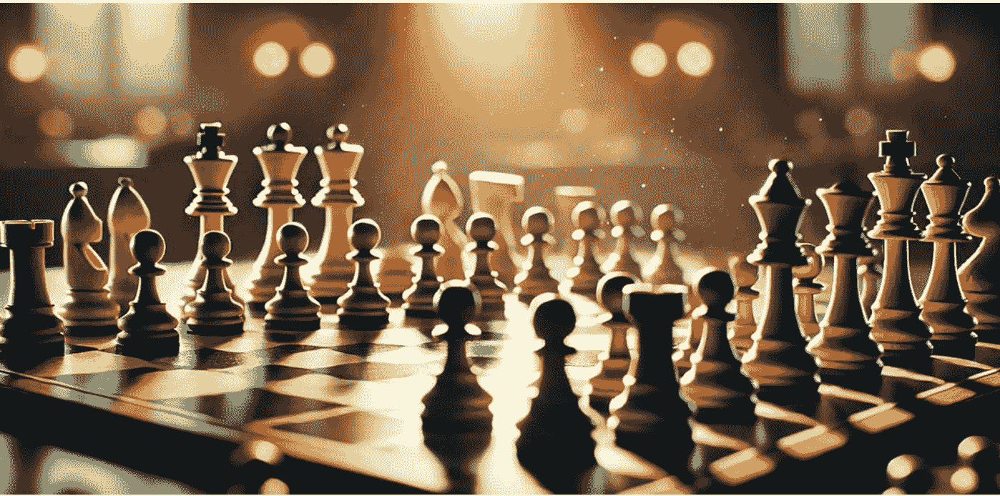

懒人专属群的群友，你好

欢迎来到博弈论课，我是蒋文华。

上一讲我们讲了绑架博弈，这一讲我们来讲一个从绑架博弈中延伸出的问题，逆向选择。

绑架博弈哪里跟逆向选择有关呢？回顾一下绑架博弈，我们的一个核心结论是，父母对于绑匪类型的预判会直接影响父母的选择，但也会间接影响绑匪的行为。

这会带来两个后果。

第一个后果，绑匪更会绑架那些更愿意相信绑匪是金钱至上型的父母的孩子。对父母来说，越相信对方是相对善良的，对方越容易绑架你的孩子，因此父母越不敢相信对方是相对善良的。这就很像在我们的生活中，你越相信对方不是骗子，对方越容易欺骗你，而你担心对方骗你，你越不敢相信对方不是骗子。

第二个后果，当父母认为绑匪更大概率是金钱至上型，只要付了赎金绑匪就不会撕票，那么父母就会付赎金。但反过来，当父母认为绑匪更大概率是残暴型，即使付了赎金绑匪也会撕票，那么父母就不会付赎金。

这样一来，残暴型绑匪会继续绑架，但金钱至上型就会退出，因为他们本来是为了赚钱，现在既然父母们不愿意相信自己是相对善良的，不肯付赎金，赚不到钱，又何必去绑架孩子呢？这就相当于，残暴型绑匪逆向淘汰掉了金钱至上型绑匪。

最后，绑架变成了更具危害性的事，社会中慢慢地只剩下了残暴型绑匪，父母即便支付赎金，也换不回孩子。

当然，在现实中，我们不希望看到任何类型的绑匪。我们讲绑架博弈也是一种隐喻，我们更关注的不是“绑架”，而是这背后的博弈结构。

这就像当大家越来越多地认为马路边乞讨的人不是有真困难而是骗子的时候，那些真有困难的人在马路边也讨不到钱了。另一种场景的情形是，当好心人去扶摔倒的老人，结果被讹钱，结果就是不会讹钱的老人摔倒后，也没人敢去扶了。

为什么社会中会大量存在这类现象？这一讲，我们就来进一步分析背后的博弈原理。

### 阿克洛夫的贡献

先来回顾一下历史，逆向选择最早被称为“格雷欣法则”。因为这是英国经济学家托马斯·格雷欣爵士（Gresham，1519-1579）在1560年发现的现象，当市场上劣币（含铜银币）与良币（足值银币）同时存在时，人们会把良币囤积起来、把劣币拿出去流通，久而久之，“劣币驱逐良币”，市场上就只剩下劣币了。

其实，在我国，早在西汉时期，贾谊在《新书·铸钱》中就提出过这种观察：“奸钱日繁，正钱日亡”。说的就是西汉民间偷偷铸造的劣币（奸钱），驱逐了分量足、品质好的官家铸造的良币（正钱）。

### 普遍性

现在国内交易我们已经很少用纸币，但其实早一二十年，在纸币还流行的时候，人们也会优先花掉破损的旧钱，新的干净的钱则尽量留在钱包里，这本质也是“劣币优先流通”的变体。

尽管这类现象早就存在，但真正揭示出现象背后的本质的，是美国著名经济学家阿克洛夫(George A. Akerlof)，他也因此拿下了2001年诺贝尔经济学奖。

阿克洛夫1970年发表了一篇论文，叫《柠檬市场：质量的不确定性与市场机制》(The Market for Lemons: Quality Uncertainty and the Market Mechanism)，这篇论文以美国二手车市场为例，来揭示逆向选择的核心机制。

什么是“柠檬市场”？柠檬(lemon)在美国俚语中表示次品。相对地，桃子(peach)则表示良品。所以，二手车可以分为两类，“柠檬车”和“桃子车”，一类是质量差的车，一类是质量好的车。

为什么差质量的“柠檬车”会把质量好的“桃子车”淘汰掉呢？在阿克洛夫之前，有这么一些常见的解释：

一种解释是，这是由于竞争还不够充分造成的。但是这种说法，难以解释为什么即使市场竞争充分，劣质商品依然可以泛滥的问题。例如，即使二手车市场上卖家很多，竞争非常激烈，质量差的柠檬车却依然不断涌现，竞争本身并没有遏制住劣质产品的流通。另一种解释是，这是由于卖家在交易过程中存在欺诈行为。但为什么在有些交易中，容易出现欺诈；在另一些交易中不容易出现呢？这种差异背后的根本原因，无法仅靠卖家的道德水平来解释清楚。

而阿克洛夫的突破在于，将“信息不对称”置于分析的核心。今天的我们已经很熟悉“信息不对称”这个概念，可能并不会觉得很新鲜，但在阿克洛夫提出之前，很少有人这么系统地思考这个问题。

阿克洛夫对“柠檬市场”的解释，我们可以简化成这么一个模型：

二手车交易时，车主100%知道车况，但买家无法确定某辆二手车的真实质量，所以买家只能依据二手车的平均质量来付费。

假设高品质的桃子车价值8万，低品质的柠檬车价值4万，如果市场上这两种车的占比各50%的话，买家愿意出6万购买。

问题是卖家知道自己的车是高品质还是低品质，如果交易价格是6万的话，那些高品质的桃子车车主会拒绝交易，高品质的桃子车退出市场。

在理想的市场中，价格机制有效调节供需：高质高价、低质低价，满足不同消费者的需求。随着收入水平提高，高品质产品需求上升，低品质产品需求下降，市场结构优化，这是市场发展的普遍规律。

然而，当信息不对称存在时，市场机制可能失灵，“劣币驱逐良币”，优质商品逐渐消失，劣质商品反而占据主流。这类现象其实非常普遍，我们再来看几个例子。

比如，在保险市场，保险公司本来是按平均风险定价，但投保人比保险公司更了解自身风险。高风险者（如易患病的人）更愿意投保，低风险者（健康人群）因保费过高而退出。因此，保险公司不得不提高保费，中等风险群体也进一步退出，最终市场仅剩最高风险群体，可能导致保险机制失效，甚至迫使部分保险公司退出市场。

这方面，有著名学者肯尼斯·阿罗的经典论文支撑（《不确定性与医疗保健的福利经济学》），后来在世界各地的学者的实证研究，也进一步证明了这一点。

再比如，在信贷市场也存在同样的问题。银行肯定是希望贷款给低风险借款人，但由于信息不对称，银行无法完全评估借款人的还款能力。提高利率的话，低风险借款人，比如稳健企业会因融资成本过高而退出；而高风险借款人，比如投机者却仍然愿意借贷，这反而让银行面临更高的坏账风险。

逆向选择不仅存在于市场中，也渗透到社会各个领域。

比如，在职场，如果管理者无法区分员工的能力，就会倾向于定一个相对低一些的工资。这时候高能力者就会因为回报不足而离职，低能力者因为“混日子”，更容易留下，企业整体效率下降。

再比如，在恋爱关系中，条件较差的追求者可能更主动，而条件优越的人因为选择权多而表现冷淡。结果，一些涉世未深的人，更容易对殷勤的追求者上头，最后却发现并非良配；而一些条件不错的人，也可能被撂下，变成了大龄剩男剩女。

还有古玩市场。古玩市场严重的赝品问题，其实也是逆淘汰导致的。假设有这么一个古玩市场，一开始出售的真品比例比较高，但古玩存在巨大的信息不对称，大多数买家分辨不了真假，卖家发现以假乱真更能赚钱后肯定会更多地卖仿品。然后，买家也只愿意出更低的价格，以防买到赝品。再然后是，卖家有真品也卖不出好价格只能自己留着。因此，除非你真的懂行，否则去古玩市场最好别存着“捡漏”的心思，走运的概率是不会高的。

### 克服逆向选择

既然逆向选择的现象存在如此之久，又如此普遍，社会肯定已经演化出了一些对策。的确如此。

这一讲，我们可以先看两个特定场景下的经典应对方案，后面还有两讲内容，我们还会从信号传递和信息甄别的角度，展开更详细的论述。

我们先看刚才提到的信贷市场的例子。

你有没有注意过，信贷市场和一般的产品市场很不一样。第一，信贷市场不遵守“价高者得”的交易原则，不是谁出的利息高就借钱给谁。第二，信贷市场不遵守“多多益善”的销售原则，并不是你向银行借钱借得越多，银行就越乐意。

实际上，银行信贷实行的是配给制度。说白了就是看人下菜碟，选择性地放贷，优先把钱借给还款能力强的人。并且，对于这些人，银行还更愿意收更低的利息。说白了银行这就是宁可少赚点利息，也不愿冒打水漂的风险。这是长期博弈下来，银行摸索出的生存之道。

再来看二手车市场的例子。在这个天生就是“柠檬市场”的重灾区——买家永远担心买到事故车或泡水车，卖家却总想隐瞒缺陷高价出手。但现实中，二手车交易不仅没有崩溃，反而形成了复杂的应对机制。

比如，专业二手车商不会像街边摊贩那样做“一锤子买卖”。他们会主动提供第三方检测报告，甚至给车贴上“无事故、全程4S店保养”的标签。为什么？因为只有通过可信的质量证明，才能让买家放下戒心，愿意支付更高的价格。

更关键的是，许多车商会推出“七天无理由退换”或“一年质保”——这种承诺本质上是在说：“如果我的车有问题，你随时可以回来找我算账。”但真正藏着猫腻的车商根本不敢这么干，因为退换和维修的成本会直接压垮他们。这就形成了一种“信号筛选”：敢做长期承诺的，往往是车况好的卖家；而烂车贩子只能打一枪换一个地方。

除此之外，品牌认证二手车也是破局的关键。比如宝马、丰田、比亚迪等成熟车企的4S店都回收旧车。旧车到店里，会经过系统地检测，换上原厂零件，再挂上“官方认证”的牌子。这种二手车，受到不少买家的欢迎。本质上，买家多花的钱，其实是为信息透明付费——厂商用品牌信誉做担保，远比个人卖家的口头承诺值钱。

说到底，这些策略和银行信贷的“配给制”异曲同工：用制度设计把看不见的风险变成看得见的信息，提高交易的效率。

这倒是让我联想到上世纪八十年代深圳流行的那句著名的口号：“时间就是金钱，效率就是生命”。在逆向选择这个问题上，我们可以说：“信息就是金钱，制度提升效率”。

### 总结

- 1. 逆向选择的根本原因，是信息不对称，只要有信息不对称，就会有逆向选择。
- 2. 信息不对称带来的问题是，好坏不能被有效区分，一个参与者如果在交易中没有鉴别好坏的能力，只能得到差的产品。每个人都不得不为自己的“无知”买单。

#### 下节预告

要从根本上消除逆向选择，掌握信息优势的一方，在于怎么把自己真实类型的信息传递出去；没有信息优势的一方，在于如何通过其它方法有效甄别对方的类型。下一讲我们先来讲信号传递博弈。

### 思考题

这一讲留给你的思考题是，你能否讲一讲你所观察到的逆向选择的真实案例？

我是蒋文华，我们下节课见。


微信:lazyhelper

## 37 信号传递：如何更好地取信于人？


懒人专属群的群友，你好

欢迎来到博弈论课，我是蒋文华。

在我们的工作和生活中，经常面临类似这样的困惑，员工明明觉得自己很优秀，领导却觉得他很普通，偏偏不愿意委以重任。企业明明觉得自己的产品质量非常好，却偏偏被消费者当成了低端货。

还有在我们刚学完的绑架博弈中，绑匪明明知道自己是金钱至上型的，孩子的父母却偏偏把他当成了残暴型，就是不肯付赎金，最后落得一个两败俱伤的结局。

在所有这些情况下，为什么你是“明明”，却被认为是“偏偏”？你怎么让对方相信你？这就是我们今天信号传递博弈要解决的问题。

### 市场进入博弈中的信号传递

用我们已经熟悉的市场进入博弈为例。

想象你是一家新公司的负责人，正准备进入某个市场。这个市场中已经有一家老牌企业在经营（在位者），但你不清楚他们的真实实力——他们可能是高成本的“纸老虎”，也可能是低成本的“真大佬”。

根据我们之前课程中的分析：

如果你觉得对方是“纸老虎”的可能性大（>50%），你就会进入市场。这时“纸老虎”会退让，但“真大佬”会跟你死磕。如果你觉得对方是“真大佬”的可能性大（>50%），你就会放弃进入这个市场。

但问题来了，如果对方其实是“真大佬”，却被你误认为是“纸老虎”怎么办？如果你贸然进入，对方被迫应战，最后会两败俱伤——你亏钱，他的利润也受损。

这时候，“真大佬”肯定想告诉你：“别进来！我真的是大佬！”但光靠嘴说没用，因为“纸老虎”也会这么说。

那“真大佬”怎么证明自己呢？关键是要找一个“纸老虎”学不来的方式。

比如：“真大佬”可以把价格压得极低，这个价格要低到“纸老虎”根本承受不起。你一看到这个低价就明白：“这绝对是真大佬，咱可惹不起！”

通过这个信号，你之前的判断（先验概率）会被更新（后验概率），你会重新评估：“看来对方是真大佬的可能性更大”。最终你做出更明智的决定：放弃进入。

这其实也解释了为什么在商业竞争中，有时企业明明可以定高价，但却定一个很低的价格——他们其实是在用价格这个信号告诉潜在竞争者：“别来惹我，我的成本优势你比不了！”

### 贝叶斯法则

刚才这个根据新信号更新概率预判的过程，其实就是贝叶斯法则在起作用。这里有很多课都讲过贝叶斯法则，你可能已经熟悉，但这个思维过程非常重要，博弈论中我们仍然要再强调。

我把上面的市场进入博弈代入几个具体的概率值，帮你进一步理解贝叶斯法则在不完全信息博弈中发挥作用的过程。

假设根据行业经验，这家行业内的老牌企业，60%的概率是“高成本”（纸老虎）；40%是“低成本”（真大佬）。补充个概念，这就是你的先验概率，也就是在获得新信息之前，你已知的概率。

然后你观察到对手最近突然降价，这是一个重要信号！因为如果对手是“真大佬”（低成本），降价对它来说很容易，因为它本来成本就低。如果对手是“纸老虎”（高成本），降价会严重亏损，所以它一般不会这么做。

根据历史数据，你发现：

真大佬有80%的概率会降价（因为它不怕价格战）。纸老虎只有20%的概率会降价（因为降价对它伤害太大）。

这叫条件概率，也就是在某条件下，一件事儿发生的概率。

现在，你看到对手降价了，那么它到底是真大佬还是纸老虎的概率如何变化？这也就是计算后验概率的过程。也就是在获得新信息后，更新后的事件概率。

知道了先验概率，条件概率，我们就可以求后验概率，方法就是带入贝叶斯公式求解。

贝叶斯公式是，在B发生的条件下，A发生的概率=（A本身的概率×B在A发生时的概率）÷B发生的总概率。

听起来有点绕，公式我放在文稿里了，有空你可以查看。

$$P(A|B) = \frac{P(A) \cdot P(B|A)}{P(B)}$$

带入后，我们可以计算得出：

在位者是真大佬的概率 = (真大佬初始概率 × 真大佬降价概率) / 所有可能降价的概率=72.7%

= (40% × 80%) / (40% × 80% + 60% × 20%)

= 32% / (32% + 12%)

= 72.7%

在位者是纸老虎的概率 = 1 - 72.7% = 27.3%

所以，观察到降价后，你可以更新判断，结论是：

看到降价前，你认为对手是真大佬的概率是40%；看到降价后，这个概率上升到72.7%！

贝叶斯法则给我们的启示是：

- 1. 初始信念很重要（先验概率）：如果你一开始认为对手大概率是纸老虎（60%），你会倾向于进入市场，但这很可能会误导你。
- 2. 要根据新信息更新你的判断（后验概率）：一旦对手降价，你就要调整策略，因为对方是真大佬的可能性大幅上升。
- 3. 决策要动态调整：如果对手后续又放出其他信号（比如扩产、打广告），你可以继续用贝叶斯法则更新判断。

稍微总结一下，不完全信息动态博弈和贝叶斯法则的关系是这样的：在不完全信息动态博弈中，你的行为选择随着博弈的推进，需要根据对手的行动所释放的信号，不断更新对对方类型的概率判断，并以此不断调整自己的决策选择。这个不断调整判断的过程是通过贝叶斯法则来实现的。

正因如此：不完全信息静态博弈的均衡称为贝叶斯纳什均衡，不完全信息动态博弈的均衡称为完美贝叶斯纳什均衡。

### 市场进入博弈的完美贝叶斯均衡

接下来，我们再来看动态市场进入博弈的完美贝叶斯纳什均衡。

这里情况还是会有点复杂，一共会存在三种不同性质的完美贝叶斯均衡：分离均衡、混同均衡和准分离均衡。

- 1. 分离均衡（Separating equilibrium）：不同类型的参与者发送不同的信号，信号能100%揭示出参与者的不同类型。

放在市场进入博弈中，高成本在位者定高价，低成本在位者定低价。进入者看到高价进入，看到低价则不进入。

- 2. 混同均衡（Pooling equilibrium）：不同类型的参与者发送相同的信号，信号无法区分类型。

比如，如果高成本和低成本企业都定中等价格，产品定价起不到传递成本类型的作用。

此时，进入者看到中等价格后，无法判断企业类型，只能不改变原先的看法，按市场初始认知决定是否进入。如果进入，高成本在位者选择斗争，低成本在位者选择默许。

- 3. 准分离均衡（Semi-Separating Equilibrium）：某些类型的参与者随机地发送信号，另一些参与者选择特定的信号。信号只能部分区分参与者类型。

例如在市场进入博弈中，低成本企业随机定高价或低价，高成本企业一定定高价。那么，当进入者看到低价时可以确定在位者的类型一定是低成本，而看到高价格时在位者可能是高成本也可能是低成本，但至少其是低成本的可能性下降了。

为了让你更好地理解三种均衡，我用好人和坏人，再举一个例子。

分离均衡指，好人一定做好事，坏人一定做坏事，你看到对方做好事肯定是好人，做坏事肯定是坏人。混同均衡指，好人和坏人都会做同一件事，比如捐款。你看到捐款后，仍然无法判断对方是好人还是坏人，只能按原先的认知（比如“世界上好人多”）来猜测。准分离均衡指，好人肯定做好事，坏人可能做好事也可能做坏事，如果对方做坏事一定是坏人，如果对方做好事，未必一定是好人，当然其是好人的可能性会有所增加。

从这个例子中，我们也可以进一步思考为什么信号能传递信息？

根本原因是，不同类型的人采取行动的成本不同。比如，好人做好事容易，坏人做好事难；低成本企业定低价容易，高成本企业定低价难。如果信号对某些类型参与者来说太贵，他们就不会伪装，信号就有效。

从另一个方面看，信息不对称也逼迫信息优势方不得不花费一定的代价，来证明自己的类型。

不过，这里要提醒你们的是，按照贝叶斯法则，后验概率虽然可以不断更新，但先验概率也会影响信号传递的实际效果。

如果你认为这个世界上还是好人多，那么对方只要没做坏事，你就愿意相信对方更可能是好人。如果你认为这个世界上坏人多，除非对方做了足够多的好事，你才愿意相信对方是好人。

### 现实中的信号传递博弈

这一讲最后，我们再来看看信号传递博弈，在现实中的一些体现。

很多情况我们虽然可能没有意识到，但其实这就是信号传递博弈。

第一个例子，天价车牌号。

普通车牌成本也就几十元，但一个“靓号”能拍出天价，2016年11月19日下午，广东省揭阳市举办汽车靓号牌竞价会，粤V99999牌号起拍价为50万，最终以320万元的成交价拍出，成功刷新了中国内地车牌的成交价纪录。

以车牌的重量计算每克的价格相当于黄金价格的16倍。不难理解，人们之所以愿意花重金购买靓号是为了传递身份类型的信号。

第二个例子，明星广告。

有研究显示，动物广告效果比明星更好，但很多企业仍愿花天价请明星。既然这样，企业干嘛要花那么多冤枉钱呢？因为只有对产品有信心、想做长远生意的企业才愿意去请明星，借此传递“产品靠谱”的信号。用黄金做成金字招牌也是一样的道理。

第三个例子，垄断限价。

米尔格罗姆和罗伯茨（Milgrom and Roberts）在1982年提出了一个垄断限价模型（limit pricing model），这是信号传递博弈在产业组织理论中的最早应用。其核心思想是即便一个企业在市场中处于垄断地位，只要市场是可竞争的（Contestable market），那么为了防止其它企业进入，该垄断企业也会制定一个相对较低的产品价格。低价格是为了给潜在进入者传递一个低成本的信号。

比如，哪怕网约车市场只有一家公司独家经营，这家公司也不会把价格定得很高，否则会吸引其它企业进入该市场。这就像夫妻结婚后，双方还是要对对方好一点，否则就会吸引外人来献殷勤，鸠占鹊巢。

第四个例子，文凭的作用。

诺贝尔经济学奖得主迈克尔·斯彭斯（Michael Spence）在1974年发表的论文是信号传递理论的开篇之作。斯彭斯分析了文凭传递能力方面的作用。任何老板都知道，文凭并不代表能力，但为什么公司还是那么看重文凭？

还是因为信息不对称，员工能力的信息，员工自己知道，但老板不知道。员工不得已，只能用文凭来传递能力的信号。这并不是因为有文凭就有能力，而是有能力的人能承受获得文凭的成本。

当然，只有在分离均衡中，文凭才会成为传递雇员能力的信号。当越来越多人获得高学历时，信号价值就下降了，就变成了混同均衡——就像“鲤鱼跳龙门”，原来跳1米算龙，现在得跳2米才行。

这也是文凭竞争不断内卷的原因。就我所知，一些二本学校的学生从高考结束的那天就开始准备考研了，这必然会逼迫一本学校的学生不得不更早地准备考研。这是一个双输的局面。

而要破解这种局面，社会需要演化出新的信号机制。比如，一些技术公司的招聘，已经更看重候选人参与的开源项目质量，以及候选人的作品。这是个大话题，时间的关系，我们就不展开了。

### 总结

- 1. 在我们的工作和生活中，因为信息不对称，拥有信息优势的一方，需要通过传递信号来证明自己的价值。
- 2. 不完全信息动态博弈中，参与者需要根据每阶段的博弈所带来的新信息，更新对对手类型的概率判断。
- 3. 不同的先验概率和条件概率导致信号传递博弈存在三种不同的完美贝叶斯均衡：分离均衡、混同均衡和准分离均衡。

#### 下节预告

在信息优势的一方需要传递信号证明自己，相应地，信息劣势方也需要通过信息甄别来挑选出他们更期望合作的人，下一讲我们就来讲信息甄别的门道。

### 思考题

这一讲留给你的思考题是，张子强绑架案中，他亲自上门去李嘉诚家的行为，是否传递了他是金钱至上型绑匪的信号？或者你可以分享以往你观察到的信号传递的真实案例。

我是蒋文华，我们下节课见。


公众号
懒人搜索
懒人专属群

微信:lazyhelper

## 38 习题课6：怎样在博弈中提升认知水平？

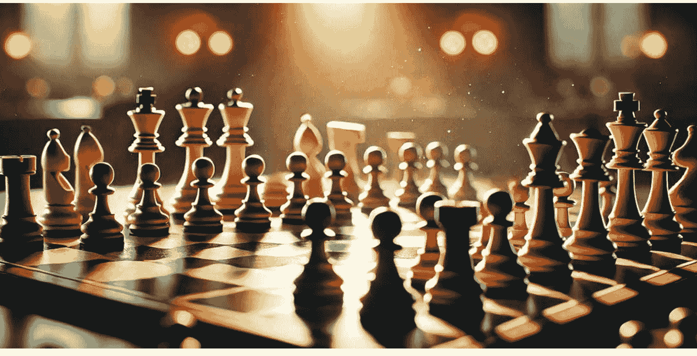

懒人专属群的群友，你好

欢迎来到博弈论课，我是蒋文华。

今天是我们课程的第六次习题课，我来为你讲解课程中留的思考题，也和你分享一些同学的精彩回答。

### 思考题 1

关于第一个思考题，“一报还一报”是你生活中常用的博弈策略吗？在你以往的生活中，有过这方面的博弈经历吗？

根据同学们的留言，关于“一报还一报”策略，我先你补充几个要点：

首先是“一报还一报”的核心特征。一报还一报中的“报”，不仅仅是指“报复”的报，也指“报答”的报。也就是说，除了第一次合作外，此后的每一次行动都和对方的上一次的行为相同。以其人之道，还其人之身。

一报还一报的善良，仅仅体现在第一次博弈中，此后既不善良，也不邪恶。有仇必报，有恩也必报，报的比谁都快。我在给同学们的留言中说：有原则、有底线、有报复能力的善良才是真善良。否则很多时候就是“伪善”，甚至是“懦弱”。

那么，这种策略有什么优势呢？

一个非常重要的优势就是“不内耗”。不记仇也不记恩，决策逻辑极简单。你可以把一报还一报理解为一个记忆力特别差的人，永远只记住对方上次是怎么对待自己的，至于上次以前的事情，早已忘得一干二净了。这也体现在这个策略的计算机程序语句是最短的。这个策略特别节省算力，每次决策时只调动一点点算力。

第二个优势是，不看人下菜碟。也就是不花时间精力去研究对手的策略，一律按原则办事。这是真正意义上的众生平等。在现代社会，人与人之间交往频繁，无差别性恰恰极大地提高了社会合作的效率。

但“一报还一报”策略在现代社会也有一些局限。

一个明显不足是噪音干扰问题，单次误判可能导致连锁报复。在前现代的熟人社会，为避免“人善被人欺”，必须对对方的背叛给予及时且对等的报复，这是人类在长期演化中优选出来的策略。但是，在现代社会中，大量的是陌生人之间的一次性博弈，我们不清楚对方的行为模式，存在较大误判的可能性，一次性互动中可能会过度报复。有时候，一报还一报所带来的睚眦必报，反而会带来灾难性后果。

因此，增加“宽容系数”，对偶然背叛给予一次谅解机会，通过明确沟通减少误判以及适当谦让，反而是更好的选择。

另外，我还要补充一点的是，课程中还提到了其他策略，不同策略之间最本质的区别其实是对以往不同博弈阶段的行为赋予不同的影响力权重。

例如，“一报还一报”只看重对方上一次的行为，这相当于上一次行为的影响力权重为1，至于对方之前的所作所为都不会影响他的当下选择，因此之前行为的影响力权重全部为0。

对比而言，冷酷策略则只看重对方背叛的那次选择，此前所有的合作行为，以及此后的再多的合作行为，都不算数，这些行为的影响力权重全部为0。你可以去分析一下其它策略，本质上都是给过去的行为赋予不同的影响力权重。

接下来，我们一起思考这么一个问题：如果你和“冷酷策略”博弈，你会怎么做？如果你突然背叛对方，可以获得当下为5的收益，以后双方持续背叛，每次的收益为0；如果一直和对方合作，此后的每次收益是3，无限次合作就是无数个3。

在一般人看来，无数个3相加一定是大于5的。但是你知道了贴现因子的概念后，就不会这么认为，因为现在的3和未来的3，价值不一样，需要进行贴现，未来的钱要“打折”算。

引入贴现因子后，就变成了一个无穷级等比数列求和，计算可得：

一直合作的总收益 = 3/ (1-δ)。背叛的收益 = 5

具体计算过程，我放在文稿里了，你可以打开文稿查看：

#### 1. 无穷等比数列求和公式：

若公比 $|r| < 1$，则

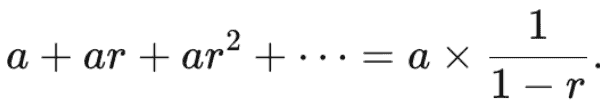

#### 2. 应用到本题：

- 每期合作收益 = 3 ⇒ 首项 $a = 3$。
- 贴现因子 = δ ⇒ 公比 $r = δ$。
- 无限期 ⇒ 用无穷项求和。

#### 3. 结果：

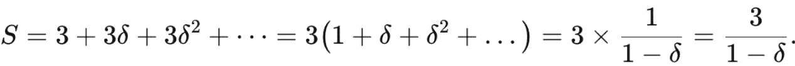

此时，你需要在5和3/ (1-δ) 之间进行比较。不难看出，你是选择背叛得到眼前利益5，还是一直合作获得以后无数个3，取决于你的贴现因子δ的大小。

如果δ大于2/5，你会选择一直合作，如果小于2/5，你会选择背叛。这恰恰验证了之前课程的内容，贴现因子越大，越看重未来利益；越看重未来利益，越容易选择和他人合作。而合作的基础，不是信任，而是“下次还会见面”的可能性。这也是远亲不如近邻背后的道理，经常打交道的人更不容易背叛你。

但是，如果此时眼前的诱惑不是5，而是50呢？即便贴现因子是0.9，也会经不起眼前的诱惑【3/(1-0.9)=30，30<50】。这也是为什么大单容易出问题的原因。此时，就需要把一笔大生意拆分成几笔相对小的生意来做。

多年前，有一个浙江消费者春节前在家附近一个商店买了20多条大红鹰香烟送亲朋好友，后来发现全都是假烟。我们在谴责这个商家利欲熏心的同时，不妨反思一下，如果分成4次去买，每次买5、6条的话，很可能买回来的都是真烟。因为，这位消费者以前也是经常去那个店买烟的，从来都是真的。不是店家的心突然变黑了，而是我们给了对方太大的诱惑。

关于一报还一报，还想给大家分享一下“活在未来”同学的留言，他说：

我生活中的常用策略不是“一报还一报”，而是“看情况”。比如：面对陌生人，那就是“一报还一报”，不惹事也不怕事；面对一般朋友用“冷酷策略”，一次伤害，终生报复；面对好朋友，有底线的好人策略，不触及底线，都好说，一旦触及底线，那就降级到一般朋友。在博弈中，我基本上不考验和试探，人性往往不能用来考验。

### 思考题 2

关于第二个思考题：如果你是一个男生，喜欢上一个女孩子，现在决定要不要向她求爱，一旦求爱，对方有可能拒绝，也有可能同意。现在的情况是，如果接受勤快男的求爱，女生赚20（相当于是幸福生活）。如果接受懒惰男的求爱，女生亏1000（相当于遇人不淑）。女生不知道男生的类型，只能根据概率判断是否接受求爱。那么，双方博弈的贝叶斯纳什均衡是什么？

文稿中我给出了一个求爱博弈的损益矩阵，你需要打开查看。

| | 被追求者 | |
|---|---|---|
| | | 接受 | 拒绝 |
| 求爱者-懒惰 | 进入 | 100, -1000 | -50, 0 |
| | 不进入 | 0, 0 | 0, 0 |

| | 被追求者 | |
|---|---|---|
| | | 接受 | 拒绝 |
| 求爱者-勤快 | 求爱 | 100, 20 | -50, 0 |
| | 不求爱 | 0, 0 | 0, 0 |

我发现同学们讨论得特别热烈。“五分之一”同学还给大家提供了三种择偶模式，分别是广谱吸引型策略（海王模式）、精准筛选型策略（老实人模式）和资源整合策略。每种模式都有展开分析，这是妥妥地把“博弈论”变成了“恋爱指南”。类似地“有木有有木人”同学也提供了非常好的实战经验，供大家参考。

回到问题本身，很多同学都计算出了正确答案，具体方法是：

女生会算一笔账，设求爱者是勤快的先验概率为p，是懒惰的先验概率则为1-p。

求爱者选择求爱后，女生的期望收益为：

期望收益 = p×20 + (1-p)×(-1000)
化简后，期望收益 = 1020p - 1000
如果期望收益大于0，则：1020p - 1000 > 0
解出：p > 50/51 ≈ 98%

因此该博弈的贝叶斯纳什均衡为：

如果女生认为，男生是勤快的概率大于98%，男生选择求爱，女生选择接受；如果女生认为，男生是勤快的概率小于98%，无论男生实际上是勤快还是懒惰，男生选择不求爱，女生一律都选择拒绝。

“左星星”同学还特别注意到女生接受懒惰型男生后会遭受1000的高额损失问题。虽然这个数字是我人为给定的，背后其实隐含着这么一个现实问题：婚姻对男女的价值有差异。人们常说：男怕入错行，女怕嫁错郎。相对而言，女生一旦遇人不淑会面临更大损失，因此对男生的选择就会变得更谨慎和更严苛一些。这也是社会演化的结果。

### 思考题3

针对第三个思考题，课程中讨论的绑架博弈是针对不同绑匪类型展开的，那么，如果绑匪是金钱至上型的，而父母有两种不同类型，分别是爱惜钱财型和爱惜孩子型，又会有什么样的博弈结果呢？

文稿中，我给出了不同父母类型的绑架博弈损益矩阵，你可以打开查看。

| | 绑匪 | |
| --- | --- | --- |
| | | 撕票 | 放人 |
| 父母-爱惜孩子 | 付赎金 | 1,3 | 4,4 |
| | 不付赎金 | 2,2 | 3,1 |

| | 绑匪 | |
| --- | --- | --- |
| | | 撕票 | 放人 |
| 父母-爱惜钱财 | 付赎金 | 1,3 | 3,4 |
| | 不付赎金 | 2,2 | 4,1 |

我们来求解这个博弈的贝叶斯纳什均衡。

设父母是爱惜孩子型的先验概率为p，是爱惜金钱型的先验概率则为1-p。

如果父母是爱惜金钱型，必然选择不付赎金，绑匪撕票，双方收益都是2。

如果父母是爱惜孩子型，双方博弈存在三个纳什均衡。

先看两个纯策略纳什均衡：

父母付赎金，绑匪放人，双方收益是4，这是双方合作的最佳结果；或者，父母不付赎金，绑匪撕票，双方收益是2，这是双方互不信任的最差结果。

再看一个混合策略纳什均衡：

通过让双方的期望收益公式相等，可以求解得到，父母以50%的概率付赎金，绑匪以50%的概率撕票。此时，双方的期望收益都是2.5（25%×1 + 25%×4 + 25%×2 + 25%×3）。这是折中的结果。

为寻找混合策略均衡，设父母以概率p_f选择“付赎金(Pay)”，以概率1-p_f选择“不付赎金(NoPay)”；绑匪以概率q_k选择“撕票(K)”，以概率1-q_k选择“释放(R)”。下面通过“让对方在混合时保持收益无差别”求得混合均衡点。

#### 1. 绑匪的无差别条件
- 当父母以p_f的概率付赎金时，绑匪如果“撕票(K)”，其期望收益：
  ```
  U_kidnapper(K) = p_f × 3 + (1 - p_f) × 2
  ```
- 如果绑匪“释放(R)”，其期望收益：
  ```
  U_kidnapper(R) = p_f × 4 + (1 - p_f) × 1
  ```
在均衡中，这两者需相等：
  ```
  p_f · 3 + (1 - p_f) · 2 = p_f · 4 + (1 - p_f) · 1 ⟹ 3p_f + 2 - 2p_f = 4p_f + 1 - p_f.
  ```

#### 2. 父母的无差别条件
- 若绑匪以q_k的概率撕票，父母如果“付赎金(Pay)”，其期望收益：
  ```
  U_father(Pay) = q_k × 1 + (1 - q_k) × 4
  ```
- 如果父母“不付赎金(NoPay)”，其期望收益：
  ```
  U_father(NoPay) = q_k × 2 + (1 - q_k) × 3
  ```
在均衡中需相等：
  ```
  q_k · 1 + (1 - q_k) · 4 = q_k · 2 + (1 - q_k) · 3 ⟹ q_k + 4 - 4q_k = 2q_k + 3 - 3q_k.
  ```
化简：
  ```
  4 - 3q_k = 3 - q_k ⟹ 4 - 3 = -q_k + 3q_k ⟹ 1 = 2q_k ⟹ q_k = 1/2.
  ```
即绑匪只有在“撕票与释放”各50%时，才能让父母在“付赎金与不付赎金”之间无差别。

故该混合策略纳什均衡是：
  ```
  p_f = 1/2, q_k = 1/2.
  ```

#### 3. 验证混合均衡的期望收益
- 父母期望收益：可直接用“每种(行动对行动)组合的收益×其发生概率”相加，或用无差别条件带入：
  ```
  父母的期望收益 = 1/2 × (1 × 1/2 + 4 × 1/2) + 1/2 × (2 × 1/2 + 3 × 1/2)
  ```
  每个括号里都是父母在对应纯策略下、绑匪50%撕票+50%释放时的期望值。具体算：
  - 付赎金时的期望收益 = 1/2×1 + 1/2×4 = 2.5
  - 不付赎金时的期望收益 = 1/2×2 + 1/2×3 = 2.5
  - 所以父母整体期望 = 1/2×2.5 + 1/2×2.5 = 2.5
- 绑匪期望收益：同理也可算得2.5。

关键问题是绑匪不知道父母类型，这时候怎么根据先验概率决策。在这种情况下，绑匪根据爱惜孩子型父母的先验概率p计算期望值：

绑匪撕票的期望收益固定 = 2（爱惜孩子型和爱惜金钱型父母都不付赎金的情况）；绑匪放人的期望收益 = p×4 + (1-p)×1 = 1 + 3p。

如果 1 + 3p > 2，即 p > 1/3 时，绑匪放人的期望收益大于撕票的期望收益。

因此，该博弈的贝叶斯纳什均衡为：

如果父母是爱惜孩子型的先验概率 p > 1/3，绑匪放人，爱惜孩子型父母付赎金，爱惜金钱型父母不付赎金。如果父母是爱惜孩子型的先验概率 p < 1/3，绑匪选择撕票，两类父母都不付赎金。

还有一种特殊情况，就是父母和绑匪之间没法事先沟通，那么，混合策略下，我们把父母是爱惜孩子的概率p代入绑匪的期望收益公式，则：
绑匪撕票的期望收益 = 2.5p + 2×(1-p)
绑匪释放的期望收益 = 2.5p + 1×(1-p)
因为 p ≤ 1，所以绑匪撕票的收益永远大于放人的收益。

因此，这时候博弈的纳什均衡为：绑匪必然撕票，两类父母都不付赎金。

也就是说，无法沟通时，必然走向最坏结果。

### 思考题4

第四个思考题，你能否讲一讲你所观察到的逆向选择的真实案例？

同学们在留言中举了非常多的案例，充分说明“逆向选择”的广泛存在。从医疗保健、装修、论文发表，到医美、婚恋市场等，逆向选择随处可见。

这种现象的广泛存在，恰恰说明了“信息”和“知识”的价值，否则干嘛要花时间精力去搜集信息，去读书学习呢？

我个人认为，“逆向选择”不是因为“市场失灵”，恰恰是市场竞争不充分，市场发育不完善带来的。如果把信息也看作是一种商品，那么发展信息市场就是解决“逆向选择”的有效途径。

以企业发行债券为例，高风险企业往往更愿意支付高利息，导致低风险企业反而借不到钱，这就是典型的逆向选择。而发展信用评估市场，就能有效缓解这个问题。

### 思考题5

第五个思考题，张子强绑架案中，他亲自上门的行为是否传递了他是金钱至上型绑匪的信号？或者你能否分享一个以往观察到的信号传递的真实案例。

很多同学都认同绑匪亲自上门是一种非常可信的承诺，承诺只要拿钱就一定会放人，充分传递了自己是金钱至上型的信号。

“若即若离joo”同学特别分析道：“张子强敢以身犯险，他认为李泽钜的命比他贵，李嘉诚会在乎儿子的命”，很有道理。其实张子强的行为，也充分传递了一个信号，张子强连自己的命都不在乎，更证明他是金钱至上型。

当然，这里也包含了绑匪对李嘉诚类型的判断，认为李嘉诚是爱惜孩子型父亲。据说事后李嘉诚还反思自己的疏忽，没有做好孩子的保护工作，对他人的行为缺乏足够的预期。这同样也是一种为自己的认知买单。

我们生活的方方面面，信号传递广泛存在，比如银行自己花钱建高楼，这是传递实力的信号；雄孔雀开屏，也是传递自己生存能力的信号，我们每天都生活在信号传递的博弈中。

这两天恰逢清明节，中国人都有清明节扫墓的习俗。那些修得特别豪华的坟墓同样传递着某种信号。表面上是传递子女有“孝心”的信号，实质上是传递子女家庭实力的信号。一个普遍现象是，民间借贷越发达的地区，人们用于建坟墓的支出就越高，花巨资修建的豪华墓地，每个清明节都在给其他人传递着家庭经济实力和还款能力的信号，让他人更放心地把钱借给自己。

以上就是这一讲习题课的全部内容，如果你觉得有收获，欢迎随时把我们的课程转发给身边的朋友。

我是蒋文华，我们下周再见。


## 39. 信息甄别：骗子为什么会有拙劣技术来骗人？

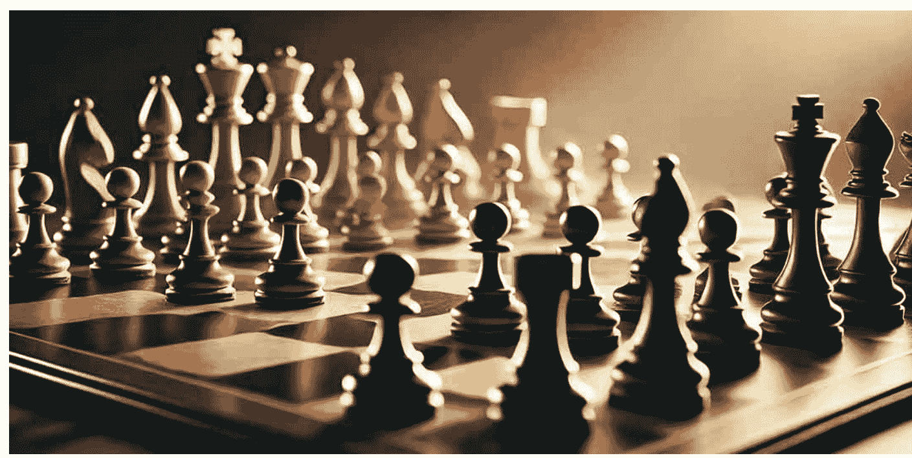

懒人专属群的群友，你好。

欢迎来到博弈论课，我是蒋文华。

在博弈论中，“信号传递”和“信息甄别”都是处理不完全信息问题的经典方法。上一讲我们已经讲了信号传递，这一讲我们来看信息甄别。

先来讲一个经典故事：话说有一天，以色列的所罗门王正坐在大神殿的审判席上，两个妇女抱着一个婴儿相互拉扯着来到大神殿。

其中，妇女甲指着妇女乙对所罗门王说：“我们两个人住在一起待产，我三天前生下了我的孩子，是个男孩儿；后来，她也生下了她的孩子，也是个男孩儿。今天早上醒来时，我发现怀中的孩子突然死了，把我吓坏了。我再仔细一看，这个死婴并不是我的儿子，是她的，而我的儿子居然在她的怀里。”

妇女甲还没说完，妇女乙就激动地向所罗门王争辩道：“不，她说的是假话！死去的才是她的儿子，她自己不小心，晚上睡觉时把自己的孩子压死了，现在却想把我的儿子抢走。”

双方在所罗门王面前针锋相对，吵得面红耳赤，不可开交。

只听所罗门王大喝一声：“拿刀来。”

甲乙两位妇女大吃一惊，急忙问道：“您拿刀来干什么？”

所罗门王说：“既然你们俩都认为这个婴儿是你们的儿子，又没有其他证据能证明这究竟是谁的儿子。我想干脆用刀就把婴儿劈成两半，一人一半平分了事”。

一听这话，妇女乙说：“我同意您的主张。”

但妇女甲当即晕倒，醒来后失声痛哭道：“您还是把孩子给她吧，我宁可不要这个孩子了，请您千万不要杀这个孩子！”

真相已经显而易见了。所罗门王赶紧说：“快把孩子交给不愿意杀死孩子的这位母亲，她才是孩子真正的母亲”。

这个经典故事生动体现了信息甄别的精髓：在信息不对称的条件下，博弈双方的利益不同，信息优势一方可能隐瞒或伪装真实信息，信息劣势一方则需要设计特定的甄别机制，诱导对方暴露真实信息。

然而，信息优势就是博弈优势，对方肯定不会愿意轻易暴露，这时候博弈参与者，或者设计博弈规则的人该怎么办？这就是我们这一讲要讨论的核心问题。

### 普遍性

说起信息甄别，我们每个人其实都很熟悉，这是我们几乎每天都要做的事情：

购物中商家说得天花乱坠，你需要信息甄别，选出高性价比的商品。婚恋中对象海誓山盟，你需要信息甄别，社会常见的做法是通过彩礼或者房子，筛选出经济条件好的结婚伴侣。职场上求职者可能简历注水，你需要信息甄别，挑选出诚信又有能力的候选人。

总之，只要存在信息不对称，信息劣势的一方为避免信息劣势造成利益损失，不得不采取各种手段进行信息甄别。谁更擅长甄别信息，谁就能减少被骗的可能，抓住合作机会，做出更好的决策。

我们也可以跟上一讲的信号传递做一个对比。在信息不对称的条件下：
- 信号传递是信息优势一方先行动，通过传递信号来证明自己；
- 信息甄别是信息劣势一方先行动，通过提出某种要求或条件，让对方暴露真实信息。

以劳动力市场为例，老板不清楚员工的工作能力，为了把能力强的员工筛选出来，在招聘中提出了对文凭的要求，比如必须是研究生学历或必须是985、211大学毕业等。员工根据自己的能力，选择要不要去拿这个文凭。

所以，同样是文凭这个东西，既可以是信号传递博弈的能力信号，也可以是信息甄别博弈的筛选标准。简单地说，信号传递的目的是通过提供文凭告诉对方我很优秀，信息甄别的目的是通过要求提供文凭判别出谁更优秀。

### 难点

信息甄别听起来并不复杂，但是要成功甄别你想要的信息，并没有想象得那么容易。这里的关键点有三点：
- 第一点，抓住本质，找对依据。
- 第二点，识别伪装，剔除假信号。
- 第三点，设计机制，让参与者自动说真话。

先说第一点，怎样才能抓住本质，找对依据呢？

找合适的依据是一个听起来简单，但做起来复杂的事儿。信息甄别的难点在于，对方的真实情况以及他到底是怎么想的，只有他自己清楚，我们只能通过一些外在的信号去推断他的真实情况。

然而任何信号都不能代表真实，所以我们只能尽可能去找更接近本质的信号，这是一个需要不断迭代和优化的过程。

比如，最常见的问题，怎么区分能力强的人和能力差的人？最常用的标准是学历。然而我们知道，学历并不一定能代表能力，因此人们一直在想办法给这条标准打补丁。

再比如，所罗门王面对的难题，怎么区分谁是孩子的真母亲？常规的思路是，让两个人说说孩子身上有什么独一无二的特征，但外在的特征信息是很容易造假的，假母亲提前做功课，检查孩子身上的特征，就很容易糊弄过去。所罗门王的高明之处，是抓住了母亲最有决定性的特征，对孩子的爱。

所以，找甄别依据这件事儿，本质上是对人性，对人情世故的洞察。

不过，找甄别依据这件事儿，并不是只能正向思考，也可以逆向思考。

相信很多人都收到过各种各样的诈骗短信或邮件，聪明过人的你一看到这些短信或邮件，忍不住会嘲笑那些骗子们，笑他们太没技术含量了，简直是在侮辱你的智商。但是学习了博弈论课程的你，以后不要这么想，其实这恰恰是骗子们下的一个套，不是要套住你，而是要套住那些比你知识水平更低的人。这些没有技术含量的诈骗短信和邮件，就是要把聪明人筛选出去。

骗子们心里明白，骗聪明人太累，风险和成本太高，很可能好不容易骗到一半后被识破，弄得个前功尽弃。而那些愿意相信诈骗短信和邮件的人，被骗成功的概率会高很多，骗子们恰恰通过故意露出各种破绽的方法来筛选要骗的人，从而提高骗人的成功率。

再来看第二点，怎么才能识别伪装，剔除掉假信号？

以所罗门王断案为例，如果假母亲也表现出宁可让孩子给对方，也不希望孩子被劈死，那么，这个博弈就出现了混同均衡，也就是双方发送了同一个信号，导致信号无法区分参与者的类型。

这时候，所罗门王还需要想出其它办法来甄别真假母亲。

我们可以来给所罗门王想想办法：

先看第一个方法，所罗门王强调“欺君之罪是死罪”，但是也向她们承诺，坦白从宽、抗拒从严。如果马上坦白，可以免于处罚，否则一旦确认是说谎，则罪加一等。

从博弈论的角度来讲，这个是用惩罚来抵消获得孩子的收益，让撒谎变得无利可图。这实际上也是人类社会中，信息甄别最常用的方法。

比如，公司一般都会让求职者签字确定，他提供的所有简历信息，都是真实的，一旦被发现有任何伪造，将立即失去工作机会。这种承诺的作用尽管有限，但还是能形成一定的威慑。

再看第二个方法，所罗门王可以说，若想要得到孩子，必须为此付出非常沉重的代价，比如花费多少金钱或付出多少劳动。

成本是测试谎言的有效方法。语言是轻飘飘的，但成本是沉甸甸的，谁更愿意承担成本，谁说的更可能是真话。

因博弈论而获诺奖的哈佛教授谢林，有一个劝退术：

谢林在第一堂课上，不先上课，先滔滔不绝地讲这门课多严格。部分学生没听多久，就开始开溜。进一步他会谈到他对刻苦努力的具体要求，这时候开溜的学生会越来越多。最后，教室里可能只剩下少数的学生，坐在那里汗流浃背、惊恐万状。

此时，谢林教授就会告诉那些仍然留在教室的学生，他刚才说的那些话是一种诡计，以此希望把班级的人数降到可控的范围，而且确保留下来的一定是那些真正喜欢博弈论又肯努力的学生。

事实上，对于留下的学生而言，努力的成本其实是一种投资，是值得的；而对于被吓走的学生而言，他们本来只是想轻松拿几个学分，不会愿意承担那么大的成本。

最后再看第三个办法，所罗门王可以说，如果双方都愿意付出沉重的代价，则孩子暂时由国家抚养，但是抚养费由两个人平分，等孩子长大成人后，随机选择或让孩子自己选择。

这种方法的巧妙之处在于，通过时间成本与未来不确定性破解伪装。真母亲视孩子为长期情感投资，愿意忍受等待；假母亲因短期收益落空和结果的不确定性会主动退场。

以上三种办法，都是很好的解决方案，核心其实都在“成本”两个字。通过对成本的承担意愿来甄别参与者的真实状况，是极为有效的方法。

最后，我们再来看信息甄别的第三个要点，更高明的人懂设计机制，让参与者主动暴露信息。

给你介绍一个非常有趣的信息甄别案例。美捷步（Zappos）是一家专门在网上卖鞋的企业，后来被亚马逊以超过10亿美金的价格收购。这家公司最让人印象深刻的，是一项管理措施：离职奖金。

公司所有的新入职员工，无论什么岗位都需要参加一项为期一个月左右的强化培训。培训结束后，新员工开始正式上班。上班一周后，会得到一个通知，询问你愿不愿意离职，如果愿意，公司除了给你足额发放入职后每一天的工资，还会奖励你一笔钱。这笔奖金最早是100美金，后来不断增加，居然上升到4000美金。

看到这里，你或许会觉得这家公司的做法有些荒唐，竟然鼓励员工离职。然而，从博弈论的角度思考，你会意识到这恰恰是老板给新员工下的一个“套”，希望筛选出那些真正热爱这份工作的人。

如果你直接去问员工，愿不愿意跟公司一起长期发展，几乎所有员工肯定都会说愿意。因为，即便要走，也不是现在。万一说不愿意，公司现在就把我辞退怎么办？损失至少是几个月的工资。

离职奖金的巧妙之处在于，让员工自动暴露了真实的意愿，愿意立即拿钱走人的，暴露出追求短期利益倾向；拒绝奖金留下的，证明是真的愿意留下。

并且，这个安排还有一个巧妙之处，那些拒绝奖金诱惑的人一定会对自己说，那么多钱我都不要了，这说明我是多么热爱这份工作和这个公司啊。不难想象，那些选择留下来的员工以后的离职率反而因此会下降。

所以，从这个角度看，好的机制设计都有一个特点，那就是能够自动筛选出那些真实信息，而让欺诈、谎言无利可图，自动远离。

### 总结

好了，我们来总结一下这一讲的内容。

#### 下节预告

信号传递和信息甄别都是为了有效区分参与者的类型，但在有的博弈中，也经常出现的明明是个坏人却偏偏想假装自己是好人的情况，更关键的是遇到这种情况，有时看破却不说破，反而是一件对双方都有利的事情，下一讲的“声誉模型”我们来一起破解这种“大智若愚”背后的博弈智慧。

### 思考题

这一讲留给你的思考题是，在所罗门王断案的例子中，你认为还有其它什么方法能有效甄别真假母亲？

这里，顺便也公布一下上周的学习奖励，课程开始我们说过，我们每节课末尾都有一个思考题，每周一，我会公布上一周的最佳作业同学名单，每位同学的奖励是《博弈思维线下研修班》的参加名额一个。

这个研修班的主题是：“博弈在现实竞争与合作中的应用”，时间定在4月20日上午9点-12点，地点在北京得到总部。

今天公布上周获奖的5位同学名单：国强、自由自在、付志斌、王勇先、“不抱怨，归来仍是少年”。

- 第一周获奖同学名单：左星星，董全冠，Charles Wang，咚咚锵，我心飞翔，陈振中，上善若水。
- 第二周获奖同学名单：道远、鄭大囧、雪莲、闻思修、张善崔。
- 第三周获奖同学名单：绿色计量、JPChou、向波荣、波澜不惊、活在未来。
- 第四周获奖同学名单：黎明、有木有有木人、美君、林常松、正一。
- 第五周获奖同学名单：闫鼎新、瑾儿、刘伟红、牛虻、何俊。

文稿中有课程主编的微信（18500161040），请获奖同学添加他的微信，方便到时候联系到大家。

期待看到更多同学的精彩作业和留言，也欢迎你随时把课程分享给身边的朋友。

我是蒋文华，我们下节课见。


公众号懒人搜索，懒人专属群分享

## 40声誉模型：大智若愚为什么是一个好策略？


懒人专属群的群友，你好
欢迎来到博弈论课，我是蒋文华。

在前面的课程中我们分析过，单次囚徒困境，双方都背叛是占优策略，即使把单次博弈改为重复博弈，只要重复次数是有限的，理论上双方还是会始终背叛。

然而，这里存在两个关键假设：第一，所有人必须绝对理性；第二，必须满足完全信息条件，也就是大家信息完全透明。

但现实世界却往往是不完全信息的——当你无法判断对手是理性的还是非理性的，实际上，局面就会发生根本性的改变。今天我们要讲的正是这个重要改变：面对信息不对称，有限次重复博弈中，合作反而可能成为稳定选择。

这种改变是怎么发生的，又意味着什么？这一讲我们要学习的声誉模型，能帮助我们找到答案。

### 声誉模型

"声誉模型"是1982年克雷普斯、米尔格罗姆、罗伯茨和威尔逊（Kreps, Milgrom, Roberts and Wilson）四位学者共同提出的。人们有时候也把声誉模型称为KMRW定理，KMRW是刚才四个人姓名的首字母。

他们的核心结论是：有限次的重复博弈中，双方的最优策略不是一开始就互相背叛，而是可以前期合作，最后阶段才背叛。

这个策略的重点，不在于你是不是真心想要合作，而是让对方相信你会合作。通过前期的合作行为，诱导对方也合作，从而共同获得更大利益。只有到最后阶段，才选背叛。这就是声誉的力量，也是这个模型名字的由来。

从常理来讲，这个"声誉模型"似乎也不难理解。你大概还记得习题课中我们讲到有人一下子买了20条烟，结果全是假烟的故事。我们现在假设，这个商家就是个唯利是图的"奸商"，现在你不是一次找他买20条烟，而是分20次买，那么对他来说，利益最大化的选择，也不是20次全卖你假烟，而是先卖你几次真烟，建立卖真烟的名声，到了最后几次才卖给你假烟，额外小赚你一笔。

刚才这个卖烟的例子不严谨的地方在于，我们没有给出卖假烟和卖真烟，商家的每次收益分别是多大，所以没法知道背叛的临界点在哪里。下面，我们用我们最熟悉的囚徒困境，来推导下声誉模型。

### 两次重复博弈

假设A、B因共同盗窃被抓，面临以下选择：

双方合作（都抗拒），各判1年；双方背叛（都坦白），各判3年；一方合作一方背叛，背叛者释放，合作者判5年。

为了听起来不乱，后面我们都只说合作和背叛，你知道合作就是囚徒就是抗拒，背叛就是选择坦白。

在完全信息、有限次重复博弈下，我们知道，理性的双方必然每次都背叛，这是纳什均衡带来的必然结果，也是我们课程之前的结论。

文稿中我给出了囚徒困境的博弈矩阵，你也可以打开查看。

| | | B |
|---|---|---|
| | | 坦白（背叛） | 抗拒（合作） |
| A | 坦白（背叛） | -3, -3 | 0, -5 |
| | 抗拒（合作） | -5, 0 | -1, -1 |

那现在让我们把情景升级一下，双方的博弈从完全信息变为不完全信息，进行两次博弈。

关键的变化是，B不知道A的类型是什么。

我们假设，A有两种类型。

A可能是绝对理性的，始终追求自己利益最大化，会永远背叛；A也可能是非理性的，会采取非理性的策略。我们假设他采取的是“一报还一报”策略吧。你要注意，在无限次重复博弈中，“一报还一报”是最理性的最佳策略，但是在有限次重复博弈中就不是了。

让我们来分析一下，面对这个博弈，B的最优策略会是什么。

文稿中我给出了博弈两次的矩阵，你可以打开查看。

| | 第一次 | 第二次 |
|---|---|---|
| 理性A | 坦白 | 坦白 |
| 非理性A | 抗拒 | X |
| 理性B | X | 坦白 |

我们需要分类讨论。为方便计算，我们假设双方的贴现因子为1，也就是两次博弈的收益是相等的。

先考虑A是理性的情况。因为双方都理性，两次博弈一定都背叛，各判3年，也就是收益都是-3，两次加起来，就是-6。

再考虑A是非理性的情况，比如采取一报还一报策略，也就是A第一次选择合作，第二次模仿B上一次的选择。一共两次博弈，B第二次肯定背叛，但第一次怎么选，那就不一定了，需要计算一下。

如果B第一次背叛，因为A第一次是选择合作，所以B会无罪释放，收益是0。但第二次博弈，A会报复，也就是选择背叛，B这时候也选择背叛，双方都被判3年，这时候B的收益是-3。两次加起来，B的总收益是-3。

如果B第一次合作，因为A第一次总是合作，双方各判1年，B的收益是-1。因为B第一次合作了，第二次的时候A就不会报复，而是会选择合作，这时候B选择背叛，会被无罪释放，收益是0。两次加起来，B的总收益是-1。

比较两种情况的收益，显然-1大于-3，所以当A是非理性的时候，B第一次选择合作更有利。

现在我们把A是理性的情况和A是非理性的情况综合起来，B并不知道A到底是理性的还是非理性的，只是猜测A有可能是非理性的，我们假设B认为A是非理性的概率是α。那么，带入期望收益计算公式，可以得到：

B两次都背叛的期望收益=-6+3α。B第一次合作、第二次背叛的期望收益=-8+7α。

相关的详细计算过程我放在文稿中，你有兴趣可以打开查看：

现在把A是哪种类型的概率纳入期望值中。假设B有两个主要策略：

- 策略1：第1回合合作，第2回合背叛
  - 若A是一报还一报型(α)，B总刑期= -1
  - 若A是绝对理性型(1 - α)，B总刑期= -8
  - B的期望刑期= α × (-1) + (1 - α) × (-8) = -8 + 7α
- 策略2：两回合都背叛
  - 若A是一报还一报型(α)，B总刑期= -3
  - 若A是绝对理性型(1 - α)，B总刑期= -6
  - B的期望刑期= α × (-3) + (1 - α) × (-6) = -6 + 3α

B会选择期望值更大的（相当于刑期更少的）策略。比较：

(-8 + 7α) vs. (-6 + 3α).

令前者 > 后者，可得

-8 + 7α > -6 + 3α ⟺ 7α - 8 > 3α - 6 ⟺ 4α > 2 ⟺ α > 1/2.

- 若 α > 0.5：期望值(-8+7α)大于(-6+3α)，B更倾向“第一回合合作，第二回合背叛”。
- 若 α < 0.5：B更倾向“两回合都背叛”。
- 若 α = 0.5：两种策略期望刑期相同，B无差异。

比较两个期望收益，当-8+7α>-6+3α时，α>50%。

因此，不完全信息状态下，两次囚徒博弈的贝叶斯纳什均衡，是这样的：

如果B认为A是非理性的先验概率>50%，B应该第一次合作，第二次背叛。如果B认为A是非理性的先验概率<50%，B应该两次都背叛。

这个结论意味着，如果你认为对方有可能是好人的时候，你愿意用一开始的好来赢得对方后续的好。反过来也是一样的，如果你能够让别人以为你是好人，你的收益也会增加。

这个变化很有趣，从完全信息到不完全信息，合作的可能性，反而增加了。

### 三次重复博弈

接下来，我们分析博弈重复三次的均衡结果。

文稿中我给出了博弈三次的矩阵，你可以打开查看。

| | 第一次 | 第二次 | 第三次 |
|---|---|---|---|
| 理性 A | 抗拒 | 坦白 | 坦白 |
| 非理性 A | 抗拒 | Y | X |
| 理性 B | Y | X | 坦白 |

三次博弈的情况如果完全展开讲，会比较复杂，但逻辑跟两次的情况是类似的，我们只挑选一个角度，这一个角度就足以让我们理解声誉在重复博弈中的作用了。

我们只来看三次博弈的时候，如果A也是理性的，他会怎么选？答案是，理性的A最后两次博弈会选择背叛，但第一次会选择合作。

你可能会奇怪，是理性的A，又不是非理性的A，为什么第一次愿意和B合作呢？

用一个词来解释：假装。为什么A要装？

如果A一开始就背叛，B会立刻识破A是理性的，后续博弈中B就不会合作，A的收益反而更少。

所以，A第一次假装合作，是为了让B误以为A可能是“非理性”的（比如重感情、讲义气）。

### 决策过程

声誉模型的数学推导过程其实比较复杂，我们就不展开了，我为你总结了3个要点和2个提醒：

- 要点一：博弈前期，先当好人，哪怕吃点亏。因为太早暴露，会遭到对方的报复，从而失去后期合作的收益。当然，这里的前提是，博弈次数要足够多，长远利益超过短期损失。
- 要点二：博弈中期，即使互相装傻，也看破不说破。因为揭穿对方，等于损失自己未来的潜在收益。
- 要点三：博弈末期，原形毕露，用尽前期积累的“好人”声誉，一次性换取最大短期利益。在英文中用了一个非常有趣的单词组合，milk reputation，可以翻译成挤奶式收割。

除此之外，还有两点提醒你。

一个是，大家愿意建立非理性的声誉，依赖于我们对究竟什么才是非理性的认知。如果我们把非理性理解为是永远善良的好人策略，而不是冷酷策略或一报还一报策略，那么理性的人就没了伪装的动力，会一直剥削对方。记住，一切无条件的善良都是对“恶行”的无限鼓励。

第二个提醒在于声誉机制的复杂性。一般人会以为，有好声誉（比如讲信用、重合作）会带来合作红利，所以声誉机制鼓励合作。但有时，个体为了树立“强硬派”、“不好惹”的声誉，反而会采取看似非理性的不合作策略。

比如，我们讲过，在完全信息的市场进入博弈中，高成本的在位者，面对低成本的进入者，默认是最优策略。但在不完全信息博弈中，声誉机制也会带来新的博弈结果。即使是高成本的在位者，也可能会选择主动斗争。斗争是战略性“作秀”，目的是传递错误类型，阻止潜在竞争者再次进入市场或进入在位者的其它市场。

再比如，身体弱小的张三被魁梧的李四打了。即使反抗会带来当下的更大损失，他也会选择反抗。这种看似非理性的行为，实际上是通过建立“不惜代价反击”的声誉，预防未来可能持续的欺凌，这也属于典型的长期声誉投资。

也正是基于这一点，面对关税战，各国的普遍策略，都是果断地采取了对等报复的加关税措施，建立起自己是不好惹的声誉。

### 总结

- 1. 声誉模型说明，在不完全信息的环境下，合作的可能性反而会提高。
- 2. 在有限次重复博弈中，参与者可以通过短期让步（如主动合作、承担一定损失）来积累“好人”声誉。当然，这里的前提是，博弈次数要足够多，使得长远利益超过短期利益。
- 3. 大智若愚是一种智慧，看破不说破也是一种智慧。

#### 下节预告

在博弈中，有时候需要传递真实信息，有时候需要传递虚假信息，决定人们之所以选择说真话还是说假话，最根本的原因是游戏规则。下一讲，我们将讨论不同的拍卖规则，怎么影响人们说真话还是说假话的选择。

### 思考题

这一讲留给你的思考题是，在互联网时代，每个人都有两种声誉，一种是线下声誉，即你在亲朋好友及同事那里的声誉，另一种是线上声誉。你是怎么建立起这两种声誉的？

我是蒋文华，我们下节课再见。


## 41拍卖博弈：怎样才能把你的藏品卖出高价？

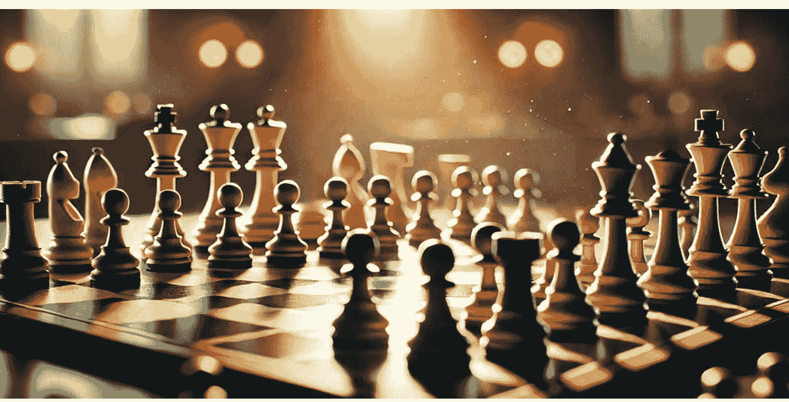

懒人专属群的群友，你好
欢迎来到博弈论课，我是蒋文华。
今天，我们来讲拍卖中的博弈较量。
在开始之前，请你先跟我想象这么两个场景：

第一个场景，你最近做生意正缺资金周转，突然想起来家里有一幅祖传字画，你一下子看到了希望，然后赶紧拿到拍卖行准备拍卖。但这个时候有一个问题，怎么拍卖，能帮你卖出个好价钱？

第二个场景，转换下视角，你现在正是参与这场竞拍的人，一眼相中这幅字画，喜欢得不得了，但是你手里的钱也有限，怎么能用合适的价格拿下这幅画，既不出价太高，又不错过机会？

拍卖看起来似乎很简单，“价高者得”就完事儿了，但实则暗藏着一连串隐秘的博弈：当所有人的真实意图都藏在心里时，如何设计一套规则，既让卖家赚到最高价，又让买家心甘情愿亮出底牌？这一讲我们就来分析背后的博弈原理。

### 3种经典拍卖形式

首先，我们从卖家的角度看什么样的拍卖方式，适合什么类型的交易。

第一种，英国式拍卖，也称“升价拍卖”。这是我们最熟悉的拍卖方式，买家们依次出价，价格一步步升高，直到没有人继续加价，成交。

这种拍卖方式很适合那些价值较高、难以评估市场价格的东西，比如艺术品、古董。因为这些东西往往没有公认的起始价，通过逐步出价可以比较公平地找到它们的市场价值。

第二种，荷兰式拍卖，也称“降价拍卖”。跟英国式拍卖相反，拍卖师先喊一个很高的价格，见人举牌，就一点点往下降，就像倒计时一样。谁第一个忍不住喊“我要”，那东西就归谁了。

荷兰式拍卖一般用于价值随时间下降的物品，如鲜花、生鲜之类。鲜花会枯萎，生鲜会变质，所以卖家需要尽快出手，越快出手越值钱，拖下去就亏了。

荷兰的鲜花市场以这种拍卖方式闻名于世，所以称之为荷兰式拍卖。我国昆明斗南花卉市场，采用的也是荷兰式拍卖，据说平均每4秒成交一笔，每天拍卖200多万支以上的鲜花。

第三种，最高价封标拍卖，也叫暗标拍卖或投标。规则是，买家将密封的报价单，也称标书，递交给拍卖人，出价最高者中标。虽然规则是“最高价中标”，在实际应用中，比如工程建设和药品采购，往往会反过来，谁的报价最低谁获胜。

暗标拍卖适用于两种情况：

一种是出价信息保密性要求较高的情况，有一些拍卖往往牵涉到敏感的商业数据（比如资金实力、潜在竞标方的技术方案等），采用一次性密封报价，能在拍卖过程中最大程度地保护投标方的商业机密。另一种是拍卖方希望简化竞拍流程的情况，一次性封标让竞拍，参与者无法观察其他人的出价，自然减少了博弈过程中的试探，这让拍卖的时间和组织成本更低一些——只需在截止前收集各方报价即可。

### 维克瑞拍卖

然而尽管这三种拍卖方式应用都非常广泛，但一定程度上都存在一个共同问题，那就是诱导参与者过度地勾心斗角，某种程度上降低交易的效率，并且，有时候还并不能帮助卖家把买家心里的最高报价找出来。

什么叫作过度地勾心斗角呢?不管是参加哪种拍卖，参与者都有一个自己真实的心理价位，但他们并不会直接报出来，而是会试探性地报出一个低一点的价格，——我只要比别人高一点点就够了。真实的心理价位和这个报价之间的差价，就是他们想多赚的那部分。

最高价封标拍卖在这方面会好一些，但是投标者在拿出自己的方案之前，还是少不了暗地里下一番功夫，去调查、猜测其他竞争者可能的报价。

那怎么避免这种过度的勾心斗角呢?这就要说到第4种拍卖形式，次高价封标拍卖，也叫维克瑞拍卖。这种拍卖规则是，最高价者中标，但只需支付第二高的报价，而不是自己的报价。

这个小小规则的改变，让拍卖发生了根本性的变化:买家最好的策略，是报出自己心里真实的价格。

为什么会出现这样的变化呢?

我们回到开头的场景，假设你在拍卖现场，想买下那幅祖传字画，你真实的心理价位是10万元。

假如是最高价密封拍卖，你肯定不会报价10万元，报10万你的净收益为0。你会故意报少点，比如9万，想占点便宜。但如果别人报9.1万，你就买不到了，错失机会。

但假如是次高价成交呢?

首先，你不会出高于10万元的价，一旦第二高价高于10万，对你来说就是损失。但如果你的报价低于10万，比如报9万，而碰巧有人出价9.1万，你也会失去机会。既然高于你的心理价位和低于心理价位都不好，那么直接按照你的心理价位10万出价，在维克瑞拍卖机制下，就是你最好的选择。

因为如果你赢了，成交价是次高价，比如9.1万，你反而赚了9000的净收益。如果别人出高于10万的价格，你也没损失。

简单总结，从买家的角度来说，次高价成交的好处是，省去了勾心斗角的麻烦，直接按照你心里真实的价出价。能拍到就赚到了，没拍到，你也不会觉得遗憾。

从卖家的角度，这种拍卖形式也一个巧妙之处，让买家可以用次高价成交，听起来好像是一种“让利”，但反而诱导买家直接暴露了自己的底牌，提高了价格发现的效率。

这里顺带一提，经济学家维克瑞，有一部分原因就是因为发现了这种拍卖规则的巧妙之处，在1996年拿下了诺贝尔经济学奖。因此这种拍卖形式有时候也用他的名字命名。

维克瑞1961年发表的《反投机、拍卖和竞争性密封投标》，堪称拍卖理论的开山之作，文中首次运用博弈论处理拍卖问题，后来诺奖委员会授予维克瑞奖项的理由是“在不对称信息下对激励理论做出了奠基性贡献”。

### 赢家的诅咒

接下来，让我们再切换到买家的视角。

在拍卖中，买家存在的最大陷阱，叫作“赢家的诅咒”。

在竞拍中，中标者往往会因为过度乐观估值而支付过高价格。换言之，明明赢了竞标，但代价大到你觉得吃亏。

在1996年中央电视台广告时段的招标中，山东秦池酒厂以3.2亿元的报价夺得“标王”，而第二高的价格只有1.6亿元，只是秦池的一半。正常来讲，赢家的报价和次高的报价应该相差不多才对。

这不是一个特例，研究者发现，“赢家的诅咒”在现实生活中比比皆是。

比如，2023年2月2日央视财经频道披露了一个针对2022年股民投资情况的调查结果。共有76.46万股民参与调查，其中92.51%的散户亏损，仅4.34%的股民实现盈利，其余不赚不亏。可以想象，在2022年底一定有90%以上的股民后悔自己的买入行为。当然，2022年是个相对特殊的年份，前后两年中国股市都是熊市，市场大盘并没有涨。

再比如，还有经济学家计算了1954-1969年间墨西哥湾1223份原油开采租约拍卖的税前回报率，发现这些公司的平均现值损失约为每份租约192128美元，其中仅有22%的租约是盈利的，16%的租约不盈利，62%的租约是亏损的。倒着看回去，那当初的拍卖价格显然是高了。

为什么总是会有“赢家的诅咒”？

要解释这种现象，我们需要先引入一对概念：私人价值和共同价值。

所谓私人价值，就是你觉得一个东西值多少钱。

所谓共同价值，是指拍品有独立于私人价值的市场价值，比如一克黄金多少钱，这是有市场价的。

如果一件拍品只有私人价值，没有共同价值，不存在赢家的诅咒。比如和股神巴菲特一起吃一顿午餐，无论成交价是多少，2001年是1.8万美元，2022年是1900万美元，所有的买家都没有吃亏。

“赢家的诅咒”仅存在于拍卖物品既有私人价值，又有共同价值的情况下。

我在一个布袋里放了很多硬币进去，谁也不知道具体数量，不光你不知道，我也不知道具体数量。不过大家从布袋的大小和装满的状况，多少能猜出总金额的大致范围。然后让大家来竞拍，价高者得，那么就很容易出现赢家的诅咒，即中标的人是所有人中对总金额估计最大的人。

赢家的诅咒是一把双刃剑，不仅伤害买家，也可能伤害到卖家。因为买家也不傻，也会担心可能出现赢家的诅咒，从而都出一个比实际价值低的报价。

为了解决这个问题，卖家应该尽量给出足够多的拍品信息，以消除买家对赢家的诅咒的担心，敢于出价。

而从买家角度来说，避免陷入“赢家的诅咒”可以采取以下方法：
- 谨慎地进行估值，避免过于乐观；
- 理性地提前设定最高出价，做好情绪隔离；
- 尽可能多地了解拍品信息，降低不确定性；
- 在有共同价值属性的拍卖中适当降低报价，给自己留出安全空间。

### 股市与拍卖

理解了赢家的诅咒，我们可以重新审视很多人热衷的股市短线交易。很多股民希望通过频繁买卖快速获利，但是拍卖博弈告诉你，这种策略往往适得其反。

股市本质上，就是一场不断进行的双向拍卖。

买方遵循英国式拍卖的逻辑，为了买入股票，通常需要报出高于市场当前的价格，否则无法成交；而卖方遵循荷兰式拍卖的逻辑，为了卖出股票，往往需要报出低于市场当前的价格，否则难以脱手。

如果我们将当天收盘价看作股票的共同价值，那么每笔交易必然有一方处于不利地位：如果收盘价高于成交价，卖家吃亏，卖得太便宜；如果收盘价低于成交价，买家吃亏，买得太贵。总之，总有一方陷入“赢家的诅咒”，在不知不觉中支付了过高的成本，或接受了过低的回报。股价每天的短期波动会不断挑战投资者的情绪稳定性。

牛市中，最乐观者才能拿得住股票；熊市中，越悲观的人越缺乏抄底的欲望。这些人都是阶段性的赢家，这些“阶段性赢家”看似成功，实则可能因短视而陷入“赢家的诅咒”——他们赢得了短期博弈，却输掉了长期收益。

长期来看，在拍卖博弈中，要想降低赢家的诅咒，必须：
- 减少短期博弈，比如减少看盘频率，降低情绪干扰；
- 利用市场非理性，进行逆向博弈，在牛市狂热时保持冷静，适时卖出；
- 在熊市恐慌时敢于买入，把握低估机会；
- 尽可能建立信息优势，比如深入研究企业价值，而非依赖短期价格信号。

只有这样，才能避免成为“阶段性赢家”，跳出赢家的诅咒，成为长期博弈的真正胜者。

### 总结

- 1、拍卖博弈的核心在于，当所有人的真实意图都藏在心里时，如何设计一套规则，既让卖家赚到合理价格，又让买家心甘情愿亮出底牌。
- 2、拍卖主要存在4种形式，英国式拍卖、荷兰式拍卖、最高价封标拍卖和维克瑞拍卖。相比于前三种拍卖，维克瑞拍卖鼓励人们说真话。当好制度存在的时候，诚实不再是一种美德，而是最明智的策略。
- 3、如果一件拍品既存在私人价值，也存在共同价值，会出现赢家的诅咒。要想避免赢家的诅咒，最关键的是，建立信息优势，减少短期博弈。

#### 下节预告

这一讲介绍的四种拍卖方式都是单一胜者支付的拍卖，与此相对应的还有一种是全支付拍卖，即每一个参与竞拍的人都需要支付代价。为什么会有这种拍卖，遇到这种拍卖应该怎么应对？下一讲我们来深入讨论。

### 思考题

这一讲留给你的思考题是，在现实生活中，你参加过什么样的拍卖活动？最后的结局如何？

我是蒋文华，我们下节课见。


## 42 全支付拍卖：什么样的拍卖值得你全力以赴？

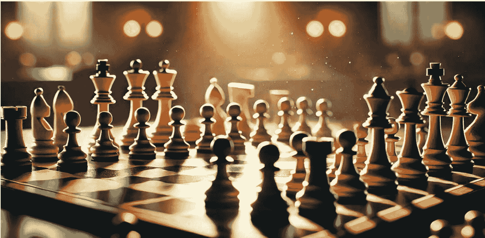

懒人专属群的群友，你好。

欢迎来到博弈论课，我是蒋文华。

上一讲，我们介绍了只有赢家付款的四种拍卖方式，这一讲，我们讲一种更残酷的拍卖方式，不光赢家要付款，所有的输家也要付款，这就是“全支付拍卖”。

乍一听这种拍卖形式，你可能觉得有点莫名其妙，输家也得全付钱，傻子才参加这种拍卖呢！并非如此。其实只要把起拍价设的低，标的物的价值又很大，就会有人愿意参加。

比如，我手里有100元，现在让你和同学们竞拍，出价高了你肯定不愿意，但是出价1毛钱呢，1毛钱哪怕亏掉也不心疼，你是不是愿意玩一下，万一中奖呢？另一位同学也会这么想，出价太高他肯定也不愿意，但加1分钱呢，这和1毛钱也差不多，但是却可以赢你，他是不是会愿意玩一下呢？以此类推，这个乍一听荒诞的拍卖，就玩起来了。

刚才这个拍卖，可能让你联想起咱们在课程刚开始的时候讲过的万元陷阱。万元陷阱只是出价第二高的人也需要付钱，全支付拍卖是所有出价的人都需要付钱，其实有点像是万元陷阱的加强版。当然，两者还有一个区别，万元陷阱是动态博弈，全支付拍卖可以是静态博弈，也可以是动态博弈。

已经学过了万元陷阱为什么还要再学全支付拍卖呢？这是因为，全支付拍卖其实在真实世界中无处不在，比万元陷阱更具有普遍性，只是很多时候，我们并没有看出来。

这一讲，我就带你来看透众多社会现象的“全支付拍卖”本质，并带你看看遇到这种特殊的“拍卖”，你的最优选择是什么。

### 基本特征

我们先来进一步明确全支付拍卖最基本的特征：

第一，所有参与者无论胜负，都需要支付不可撤回的代价，比如金钱、时间、机会成本乃至人生选择；第二，赢家通吃，唯一赢家独占全部收益，其他参与者收益为零，净收益为负数。

这种零和特性，在标的物稀缺性的加持下，会系统性诱发“过度竞争”。参与竞争的人明知输了什么也得不到，但还是经常会不惜代价参与竞争。

比如美国的总统竞选。在2024年美国总统选举中，哈里斯在竞选期间花费了超过10亿美元，但最终未能成功当选。这10亿美元，完全是打水漂了。不光是哈里斯，统计最近几次美国大选，每个失败者的花费至少也都在5-10亿美元这个量级。

再比如药企的疫苗研发竞赛。新冠疫情期间，全世界多家知名药企都投入数十亿美元研发疫苗，最终辉瑞率先获批，其他公司终止研发，前期的那些巨额投入也相当于是打了水漂。

还比如各类的悬赏。我还记得2022年江西上饶发生过一起离奇的中学生失踪案，事情发生后，孩子母亲发布了一张寻人启事，承诺谁帮她找到孩子，酬谢5万；两个月后其母亲发布一张新的寻人启事，把找到孩子的酬金从5万元增加到50万元。相信肯定会有人冲着这笔酬金去帮助找人。

更多的例子就不再举了。总之，只要大家一起竞争某样东西，最后只有一个赢家，都属于全支付拍卖，从商业竞争、职场晋升，到求偶竞争莫不是如此。

### 均衡求解

全支付拍卖的残酷性在于，即使失败，成本也无法收回。因此，参与者必须找到一种策略，既能最大化自身收益，又能避免陷入“无限加价”的恶性竞争。这时候，博弈论就可以派上用场。

要运用标准博弈论工具找到全支付拍卖的应对方式，我们需先明确一些前提条件：

第一，理性决策，参与者只关心最大化自己的净收益，不会故意害人。第二，清晰的共同估值（例如100现金）。第三，参与者之间没有串通或合谋。

此外，为了方便分析，我们假设这是一个静态博弈，并且每个参与者只有一次出价机会。

界定完这些条件，我们就可以求均衡解了。

还是以竞拍100元现金为例，规则非常简单，随意出价，什么价格都可以，价高者得。

我们先讨论只有两个人的全支付拍卖。

如果是你，你会支付多少钱？

你可能会想：“很简单，我只要比对方多出1分钱就能赢！”

但对方也会这么想。于是，价格会一直抬到100元，最后赢家花了100元买100元，等于白忙活。另一个人还不如干脆放弃。但问题是，如果另一个人干脆放弃，那支付100元的是不是有点傻？

分析到这里你肯定反应过来了，由于任何固定出价都有可能被对方通过微调（比如多出1分钱）而击败，因此全支付拍卖不存在一个固定的最优的纯策略。

这特别像我们之前分析的石头剪子布游戏，既然每个参与者都没有最优纯策略，那么就需要采用混合策略，并最终达成混合策略纳什均衡。

具体到两个参与人，其均衡结果是每个人都在0到100元范围内随机出价。

比如，你有时候出10块，有时候出50，有时候出90，时而大胆时而保守，让对手无法预测。对手也同样如此。

这样长期下来，你的期望收益为0，也就是说不亏不赢。换句话说，在激烈竞争中，理性人无法稳定获利，只能避免亏损。

理解了两个人后，我们进一步分析，如果是N个参与者，又会如何？

这里我们做一点小变化，为了后面推导公式的方便，我们先设拍卖品的共同价值为1，共N个人参与竞拍。你的投标价为x，这里的x满足条件，0≤x≤1。

那么，在纳什均衡的条件下，也就是没有人愿意改变策略的条件下，其他人出价低于你的出价x的概率为：x的1/(N-1)次方。换言之，这就是你获胜的概率。

这个公式是怎么推出来的呢？核心用到的是独立事件同时发生概率的计算。

设其他任意一个人的投标价比你低的概率为P(x)；任何两个投标者的投标价都比你低的概率就为P(x)^2；所有其他（N-1）个投标者的投标价，都比你低的概率就是P(x)^(N-1)。

再考虑到均衡条件下，所有出价的期望收益应该相等，并且都是0（否则你就会有冲动换一个出价）可以得到一个等式，这个等式稍作变形，就可以得到刚才的结果。

详细的推导过程，我也附在文稿中了，你可以点开文稿查看。

### 附录：全支付拍卖均衡求解

- 1、设你是N个竞标者之一，标的物的价值为1，你的投标价为x。当（N-1）个其他竞标者的投标价都低于x时，你就赢了。
- 2、设其他任意一个人的投标价低于x的概率为P(x)，任意两个投标者的投标价都低于x的概率为P(x)^2，所有其他（N-1）个投标者的投标价都低于x的概率为P(x)^(N-1)。
（独立事件的概率计算：如果两个事件是独立的，那么这两个事件同时发生的概率，就是各自概率的乘积。）
由此，你赢得标的物的概率为P(x)^(N-1)。
- 3、在均衡条件下，你无论投标价为多少，期望净收益都应该都相等，且都为0。
因此，1*P(x)^(N-1)-x=0。
公式中：
- 1是标的物的价值；
- P(x)^(N-1)是你获得标的物的概率；
- 1*P(x)^(N-1)是你的期望收益；
- 1*P(x)^(N-1)-x是你的期望净收益。
- 4、由1*P(x)^(N-1)-x=0，得出P(x)=x^(1/(N-1))。
这就是均衡条件下每个参与者的投标策略。

### 均衡意义

接下来我们来看刚才我们得到的均衡意味着什么。

注意，我们前面假设了0≤x≤1，后面的推论都是在这个假设基础上。在标的物价值为1的情况下，你出比1更大的价格是非理性的。

从结果看，如果N是2，那么P(x)=x。这意味着，如果是两个人参加拍卖，那么每个人在0到1的范围内，随机选择一个投标金额，期望收益是一样的。

如果N是3，那么P(x)=x^(1/2)。这意味着，只要3个人参加拍卖，你50%的情况下，你应该是出小于0.25的数，这样你才能不亏钱。

如果N是10，那么P(x)=x^(1/9)。如果让P(x)=0.5，x的值约等于0.00195。

注意这里，标的物价值是1，换算一下，其结果是如果共有10个同学参与我课堂上那个100元现金的全支付拍卖游戏，你的最佳竞拍策略是让自己的出价至少有50%的概率控制在两毛钱以内（0.00195*100=0.195）。

总之，N越大你的平均出价越低，超过10人以上，你的出价就应该差不多接近于0元了。

通过进一步的计算，我们也可以发现，在均衡状态下，每位参与者的平均支付（或者说期望出价）是标的物价值的1/N。每个参与者的期望净收益为0，也就是说，竞争完全吞噬了利润。

换言之，全支付拍卖的均衡揭示了一个残酷的事实——在充分竞争的市场中，超额利润终将被竞争消除，在没有任何人犯错或让步的情况下，自己最多只能做到不亏不赢。参与这种博弈，理性策略是“低成本试探”，人越多，出价越低，避免过度投入。

然而，现实往往偏离理论假设：非理性行为会加剧内卷，如恶意亏损竞争、高估胜率盲目加码，均可能导致集体大出血。

### 社会效应

当然，跟我们学过的所有博弈一样，全支付拍卖对社会和个体产生的影响并非单向的，而是呈现出复杂的正反两面性。

从反面看，在全支付拍卖中，由于所有参与者都需要支付不可回收的成本，理性个体可能被迫卷入非理性加码的恶性循环，最终导致“过度内卷”和资源浪费。

但从正面看，这种看似“过度竞争”的特性，并不是故意要坑谁的陷阱，而是一种“筛选机制”。

人类社会始终面临的一个挑战，是怎么挑选出最有意愿、最有能力、最适合的人，让他们去做最适合的事。但是，现实中信息是不对称的，要实现这种理想的匹配并不容易。

你也不可能光听每个人怎么说，空口说白话谁不会？要筛选出真实信息，要看谁更会付出成本。在全支付拍卖中，因为每个人都要为自己的出价买单，谁更想赢、谁更重视目标，就会在出价上真实地体现出来，这能帮我们看清每个人的真实想法和判断。

这种机制还特别能激发创新，提高资源匹配的效率，在创业、科研、新药研发等场景下，能够有效地加速项目进度。

而又因为有外部性的存在，获胜者的一部分成果，可以被社会分享，这能加快社会的发展，抵消个体层面的效率损失。

当然，这也需要平衡创新和资源浪费。如果放任全支付机制，如无限制的政治献金、专利竞争，社会资源可能被过度消耗。这就需要制度的设计，比如通过竞标上限、失败补偿、专利保护等，优化竞争效率。

除了社会效应，全支付拍卖对于个人也有启发。

首先，如果你参与这种规则的竞争游戏，如果博弈的目的仅限于标的物本身的话，纳什均衡显示，期望收益为0，退出竞争反而是更好的策略。

如果我们面对的是那种你不得不参与的全支付拍卖，如中考和高考、争夺工作岗位、婚恋等，那就需要将我们的满足感从“结果”扩展至“过程”，扩展到过程所能带来的满足和快乐。比如，将竞争过程本身转化为能力的积累、技能提升，而非仅仅关注胜负。

薛兆丰老师在他的经济学课程中，曾经引用过经济学家斯蒂文·兰斯博格（Steven Landsburg）写给他女儿的一句忠告，这也是我自己给学生上课时经常引用的。

千万不要在你没有兴趣的领域追求成功，因为你得跟那些真有兴趣的人竞争。你没有兴趣，你怎么斗得过人家？

这句话也映射了全支付拍卖的一个重要本质：全支付拍卖能够充分筛选出对某件事儿最感兴趣的人，而不是让其他人来谋利。真正的兴趣驱动者更可能承受沉没成本的压力，而功利驱动者则容易因为收益不足而中途崩溃，或陷入“投入越多，亏损越深”的悖论，索性不如早早地退出。

所以，真正的智慧在于选择战场，而非盲目战斗。

只打属于自己的比赛，只参与属于自己的“全支付拍卖”，这是一条人生的基本原则。

### 总结

- 1、那些大家一起竞争某样东西，支出没法返还，最后只有一个赢家的博弈，从本质上都是全支付拍卖。全支付拍卖博弈没有纯策略纳什均衡解，只有混合策略纳什均衡。
- 2、现实中的政治竞选、利益游说、研发竞赛、军事冲突、产品价格战等许多场景都存在全支付拍卖的竞争机制，比其它拍卖机制更为常见。
- 3、全支付拍卖一方面在现实中容易导致“过度竞争”和资源浪费。另一方面也能激励创新，加快社会发展。

#### 下节预告

下一节我们将从“机制设计”的角度思考一个更深层次的问题，给定某个我们想要的结果，怎样才能设计出合适的游戏规则，让我们希望的结果刚好是所有人博弈的纳什均衡解。

### 思考题

这一讲留给你的思考题是，你是否参加过某个全支付拍卖博弈，最后的结果如何？

我是蒋文华，我们下节课见。

公众号懒人搜索，懒人专属群分享

## 《蒋文华·博弈论50讲》

# 会识局、能破局、善布局

版权归得到App所有，未经许可不得转载

浙江大学公共管理学院副教授
蒋文华

公众号
懒人搜索

懒人专属群

微信:lazyhelper

## 43 机制设计：怎样的规则是好规则？


懒人专属群的群友，你好。

欢迎来到博弈论课，我是蒋文华。

课程进行到现在，相信你已经很熟悉了，博弈论分析问题的基本方法，是给定游戏规则，分析每个人如何做出自己的最优选择，当所有人都经过理性计算后，会形成一个相对稳定的局面——这就是博弈的均衡结果。

那么如果反过来，假设我们希望得到某个特定的结果，该如何设计规则，才能让这个结果在博弈中自动实现呢？这正是机制设计要讨论的问题。

机制设计，不是一个新的模型，而是你对前面所有模型的综合思考和逆向操作，当然展开讲，也可以是一门专门的课。这里我们只看一个最核心的问题，什么样的规则能够被称为是“好规则”？理解好坏的标准，可以让你知道设计规则的方向。

### 分粥

我们先来看这样的一个分粥的场景。

假设现在有七个人要分一锅粥，僧多粥少，我们希望达到的目标，是七个人平均分配这锅粥。

如果你是分配规则的制定者，你会设计怎样的规则？

我们逐个来看一看以下四种方案：

第一种规则，每个人发一个相同大小的小碗，让每个人自己拿小碗从锅里舀，能舀多少就是多少，按顺序进行。第一轮结束后，如果锅里的粥还有剩，再分一遍，直到舀完为止。

这个规则的操作要点有两点：

第一，碗要小，先保证每个人至少能有一碗。第二，分粥的顺序每天要轮换。

第一个要点好理解，为什么还要强调第二个要点呢？因为，锅里面粥有多少，谁也不知道准确的量，第一轮分完之后，谁也没法保证剩下的粥，刚好还能平均分。

比如，第二轮分的时候，可能到第6个人的时候，刚好分完了，那对第7个人就不公平，别人都喝到了两碗粥，他只喝到了一碗。但如果，排队的顺序每天是轮换的，每个人都可能是第七个倒霉蛋，那么一周下来，每个人喝到的粥的总量就是一样的。

也就是说，这第一个规则虽然没法儿做到每天是完全公平的，但可以做到总量差不多公平，总得来说还是不错的。

再来看第二种规则，考虑到规则一的操作成本比较高，不但需要每个人亲自去舀，甚至要舀好几次，而且还要确保每天的排队顺序不一样等等，那要不干脆选一个人专职负责分粥吧。专业化分工从来都是提高效率的好途径。

但是，这条规则也有个问题，分粥的人也要喝粥，大家肯定会担心，负责分粥的人每次都给自己多分怎么办？看来还要再打补丁，于是我们有了第三种规则。

为避免分粥人的多吃多占，可以把七个碗都放在桌上，分粥的人每次给自己的碗里舀多少粥，大家看得一清二楚，分粥人哪里好意思天天给自己多舀？阳光是最好的防腐剂。

如果还担心分粥人做事没底线，就再加一条规定：分粥人由大家选举产生，每年选一次，并且还不能连续两次是同一个人。这一套操作下来，基本上就可以避免分粥人的腐败行为了。

我们继续看，规则三既发挥了专业化分工的优势，又避免了分粥人的权力滥用，确实是一个好规则，但深入思考的话，还是有隐患。

比如，分粥人明面上给大家一样多，暗地里在桌子底下偷偷放一个碗，趁大家没来喝粥之前，每次先给那个碗舀一些进去，或者每次分之前先偷喝几口怎么办？

于是有了规则四。我们可以再加一条规则，每次分粥，分粥的人要最后一个取。这样的好处是，既保证了分粥人每次都会竭尽全力地平分一锅粥，也避免了分粥人尾大不掉的隐患。

当然，我们还能想出更多的分粥规则，但又会发现每种规则都各有利弊，并没有十全十美的分配规则。那怎么评价不同规则的优劣呢？

### 标准

我们放在经济领域里来说，评价规则的优劣，基本标准有三个：

资源是否有效配置；信息是否有效利用以及个人理性与集体利益是否对齐，即激励是否相容。

咱们挨个来看。

首先，所有生命都面临一个问题：资源是有限的。为了解决这个问题，好的规则要发挥资源的最大价值。

可问题是，稀缺资源往往有多种用途，用在这儿就不能用在那儿，它往往也没有什么终极的解决方案，只有不断地权衡取舍。

那怎么判断资源配置是否合理呢？经济学里有个重要标准，叫“帕累托最优”。简单来说，帕累托最优，就是在不损害其他人的利益的前提下，没法让任何一个人变得更好。

比如你直接跟老板提加薪50%，听起来就不是帕累托最优，你要多拿点，老板可能就少赚点。但你跟老板说，未来我多干点活，业绩增长的部分，拿出50%给我和团队，老板同意，这就实现了帕累托改进。

再往下想，如果你说：“我不止要新增利润里的50%，最好60%归我们。”这时候老板可能就开始皱眉头了——因为他的利益开始受损了。那说明上一步的状态，可能已经是最优了——再想改善，只能牺牲别人的利益。

很多时候，我们不能光看有没有“最优”的结果，还得看这个局面能否维持——会不会有人突然翻脸、撕票。这时候还需要结合我们熟悉的纳什均衡，也就是要在当前规则下，每个人都觉得“我就这样挺好”，谁也不愿意改变，那这个状态就能维持。

第二，人与人之间的合作、资源的分配，都需要信息的传递，但信息传递是有成本的——收集、处理、验证都需要时间、精力和资源。因此，好的规则应该尽可能减少信息负担。

诺贝尔经济学奖得主赫尔维茨（Leonid Hurwicz）在20世纪70年代就证明：市场机制能以最低的信息成本，实现最有效的资源配置。

换句话说，价格就像信使，是可以传递信息的，而且是用最少的语言传递最关键的信号。

一斤苹果涨价了？这背后可能是供应减少、运输受阻或需求暴涨，但你不需要知道具体原因，只要看到价格变化，自然会少买一点或换其他水果。这就是所谓的“用最少的语言传递最关键信息”。

比如，传统出租车行业的信息效率就很低：你在马路边等车，司机在马路上瞎转，两边都不知道对方在哪儿，匹配效率低、空驶率高、服务体验也参差不齐。

而网约车平台通过算法，把乘客和司机的位置、距离、评分等信息“喂”给系统，几秒钟就自动完成匹配。高峰期价格自动上浮，评分机制筛选掉服务差的司机。就靠这两个简单的信号——“价格+评分”，整个资源调度效率大幅提升，信息成本比传统方式低太多了。

所以，为什么有些企业、行业，甚至国家发展更快？关键之一就是：谁的规则设计得更聪明，能用更少的信息成本，做出更高效的决策。

在复杂世界里，有效利用信息、降低信息负担，本身就是一种竞争力。

第三，光信息效率高还不够，如果个人利益和集体利益冲突，再聪明的机制也会失效。接下来，我们来说一下激励相容问题。

在社会经济活动中，机制设计者的目标和参与者的利益往往不一致。比如：老板希望员工努力工作，但员工可能希望钱多事少离家近；政府希望企业诚信纳税，但企业可能想多留点钱给自己。

如果规则设计不好，参与者就会选择“说谎”或“偷懒”。说谎是隐藏信息，偷懒是隐藏行动。

激励相容，就是让参与者发现：按规则做事，对自己最有利。

或者说，我希望你做的事儿，正是你最愿意做的事儿。

其实，我们可以把前面的课程的很多内容，理解为是激励相容的某种具体应用。

比如，在拍卖博弈里，我们讲过，维克瑞拍卖的规则是，最高价者中标，但只需支付第二高的报价，买家会发现，此时说真话就最有利；在监督博弈中，我们也讲过，股权激励让员工自愿努力干活儿。

当然，让人说真话、不偷懒，通常需要付出成本。比如，在关于信号的两讲，我们说发信号要付出成本，识别信号也要付出成本。

激励相容是需要成本的，但最好的规则能用最小成本实现最大效果。

总之，好的经济机制必须同时满足：资源有效配置、信息成本最低、激励相容。三者缺一不可。

当然，任何一项制度设计都很难是中性的，总会对一些成员更有利，对一些成员更不利。

就像前面分析的分粥难题，无论用什么规则来分，即便每个人分的一样多，也只是在量上一视同仁而已，并没有考虑成员之间的个体差异。

试想，七个人里面如果有老人、青年人、中年人、怀孕妇女和小孩，难道每个人分相同数量的粥是合理的吗？这个分配结果实现了群体利益的最大化吗？

因此，在好规则和坏规则之间并没有一个明确的客观标准，没有一个完美的制度，每个人都会从是否对自己有利的角度做出不一样的评判。

但我们至少可确定的是，好的规则一定应该像是“看不见的手”，让人们在追求自身利益的同时，无意识地推动社会发展和整体福利的增加。

最后还想补充一点的是，法国哲学家阿兰有一个广为流传的观点：“船是大海造的”。

这句话所表达的思想是，表面上看是人类设计并建造了船只，但真正好的船，必须是那些经过大海的考验，被大海筛选幸存下来的船。

当我们从这个视角去理解机制设计时，就会意识到，好制度就像好产品，一方面是需要设计与创造，另一方面又需要通过实践或市场的检验。

中国人非常熟悉的一句名言：“实践是检验真理的唯一标准”，用在机制设计上就是，实践是检验规则好坏的唯一标准。

给每个人以思想自由和尽可能多的选择自由，让不同规则之间相互竞争和彼此借鉴，才是好规则得以不断产生的根本源泉。正如市场制度让好技术和好产品层出不穷，自由思想市场才会让好制度层出不穷。

### 总结

好了，我们来总结一下这一讲的内容。

- 1、机制设计是一种顶层设计的逻辑，是博弈论的反向操作。给定某个我们想要的结果，找到一个能实现这个结果的游戏规则。

- 2、从理论上看，评价机制好坏有三条标准：资源的有效配置、信息的有效利用以及激励相容。

- 3、从实践上看，不同机制之间的自由竞争，才是优胜劣汰的最佳途径。

#### 下节预告

无论是制度还是博弈策略，都需要时间的检验，有的策略能够经得起时间的考验，有的策略却只有短暂的辉煌。接下来的两讲，我们用演化的视角来看一看，什么样的博弈策略能够穿越历史的长河，生生不息。

### 思考题

这一讲留给你的思考题是，课程里介绍了4种分粥的规则，你是否还能想到更好的分配机制？

我是蒋文华，我们下节课见。


微信:lazyhelper

## 44 习题课7：如何在管理中完善激励机制？

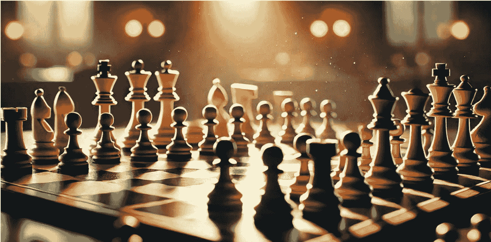

懒人专属群的群友，你好

欢迎来到博弈论课，我是蒋文华。

今天是我们课程的第7次习题课，我来为你讲解课程中留的思考题，也和你分享一些同学的精彩回答。

### 思考题1

第一个思考题，在所罗门王断案的例子中，你认为还有其它什么方法能有效甄别真假母亲吗？

同学们对这个问题的回答可谓五花八门，让人脑洞大开。这不由让我感慨，办法总比困难多。

“我心飞翔”同学的回答应该是最全面和完整的。其实，大多数的甄别方法，都遵循分离均衡的基本思想，也就是通过设置较高的验证成本门槛，使得真实信号发送者（真母亲）的验证成本，比信号伪造者低。

看完“我心飞翔”同学提出的那么多办法，我给他的留言是：这么一整套下来，估计真母亲也要选择放弃了。真母亲想着，还是再生一个孩子的成本更低。

我的意思是，鲤鱼跳龙门，这门不能太低，鱼也能跳过去；也不能太高，连龙都跳不过去。最后谁都跳不过去，我们依然会得到鱼龙混杂的结果。因此，怎么设置龙门的高度，或者说怎么设置甄别成本，其实是个技术活儿。

需要提醒的是，任何筛选，除了都有成本，也都存在遗漏和误差。

此外还有同学感慨说，还是DNA检测的方法最有效。确实如此，科技进步是降低甄别成本的关键所在。

其实归根结底，任何一个参与者在决策的时候都需要同时考虑收益和成本两个要素。同样的道理，要不要骗人，一方面要看骗人的收益有多大；收益有多大，可以支付的造假成本就可以有多高！另一方面要考虑的是造假成本（在收益不变的情况下）。从留言看，同学们基本上都是从增加造假成本的视角来提供解决方案的。

有同学提到，古人官府断案的时候，需要报案的人先承受一些痛苦来传递他是真有冤情的信号，官员才值得付出时间和精力来断案，这同样是一种甄别机制。否则，很多控告其实是无理取闹，浪费了太多的司法资源。

据说在中世纪的欧洲，法官在判案的时候如果通过其他方式不能分辨真伪，就要求被告人把手伸进滚烫的油锅，来证明他的清白。如果手没有受伤，就可以马上释放他。你看，这个套儿下得真够狠的。

当时的人们坚信上帝会保佑那些清白的人，那些知道自己被冤枉的人就敢于接受油锅的审判。而那些做了亏心事的人就不敢这么做，一则会烫坏自己的手，二则还暴露出了事实真相。

### 思考题2

第二个思考题，在互联网时代，每个人都有两种声誉，一种是线下的声誉，即你在亲朋好友及同事那里的声誉，一种是线上的声誉，你是怎么建立起这两种声誉的？

“咚咚锵”同学是这样回答的：

线下声誉更侧重于诚实和信任的建立，线上声誉则更多表现为对专业领域的洞察和贡献的展示。两者是相辅相成的，线上声誉能够增强我的个人品牌，而线下声誉则为我的线上形象提供坚实的基础。

在我的职业生涯中，线上声誉为我带来了更多的职业机会和人脉拓展，而线下声誉则增强了我线上形象的可信度。通过参加得到高研院线下学习，我建立了自己的人际网络……通过线上平台的影响力，我的专业形象得到了更多人的认可，也进一步加强了我在线下的职业合作与人际关系。

我觉得他的回答非常好！

从同学们的留言中，我发现线下声誉是我们人人都看重的，线上声誉则和每个人的职业有很大的关系。当然，随着互联网的发展，很多以前不需要线上声誉的职业也需要线上声誉了，网约车司机自然不用说，哪怕是偶尔开顺风车的私家车司机也注重客人的评价。至于外卖员，家政公司的钟点工，餐饮店的经营者，所有需要借助于网上交易的工作，都需要关注自己的线上声誉。因为在交易之前现在大家一般都会看一下以往的交易评价。

说一个我自己的切身体会，很多单位请我去上课，往往是通过线上的渠道了解到我的，上课前对我的个人介绍，经常也是从百度百科中复制粘贴过来的，而不是找我要的，个人的百科词条其实就是你的专业声誉在网络上的集中展示。正如刚才“咚咚锵”同学所言，线上找人，关注的主要是对方的专业能力。线下交往，关注的往往是对方的品：善良、诚信和靠谱等。

自从有微信后，我的微信头像一直用的是本人照片。之所以这么做，除了方便别人记住我，也是在不断提醒自己，不要以为对方不知道你的模样。以前我们说，在互联网上你并不知道是狗还是人在和你聊天。但我相信，大家都更愿意和一个头像是人的人聊天，而不是头像是狗的人聊天。

互联网是有记忆的，每个人在线上的所作所为都会成为他人认知你的依据。

此外，“声誉模型”还给了我们一个重要启发，“信息不对称”并非一无是处，经常会鼓励大家装好人。装得时间久了以后，我们都会习惯性地做一个好人。

### 思考题3

第三个思考题，在现实社会中，你参加过什么样的拍卖活动？

先给大家分享一下“Dancing”同学提供的经历，他在留言中说：

- 1、英国式拍卖：打车时，我发出价格较低的订单。如果1分钟内附近无司机应答，我就会提高订单价格；如果还是没有人应答，我会再次提高。

- 2、荷兰式拍卖：超市或钱大妈生鲜，9点之后蔬菜基本上都是2-3折。

- 3、最高价封标拍卖或投标：公司采购大宗商品、原材料，经过技术评审后，基本上都有3家供应商入围。他们需在规定时间之前发送加密文件给采购，然后在某一约定时间，在采购、成本、审计在场的情况下，提供文件密码查看报价，该报价乘以一定系数进行排名，价低者中标。

相信这位同学提到的场景，很多同学也都多少经历过。

他没有提到维克瑞拍卖法，相对来说，这种拍卖法在国内用得比较少。据说，美国政府在拍卖一些公共资源，比如无线电频谱、矿产开采权的时候，会经常用到这种拍卖方法。

我在给政府官员上课时，也会经常给他们介绍维克瑞拍卖法。这种拍卖方法有四个非常明显的优点：

信息披露真实，竞拍者都会以真实的个人价值报价。信息披露迅速，竞拍者不需要考虑其他竞拍者的策略，节省时间和精力。交易成本下降，不仅仅是时间成本，还包括心理成本。买者满意度最高，买到的开心，买不到的也安心。

在其他方式的拍卖中，大家又想中标又担心中标价太高，经常寝食难安，甚至夜不能寐，但在维克瑞拍卖中，每个竞拍者提供自己最真实的个人价值后，不需要有任何担心之处。中标当然是获利和开心的，不中标也没关系，因为不中标只能说明成交价已经超过了你的个人估价，即便现在给你，你也会觉得买贵了。

再给你提供一种维克瑞拍卖法在企业管理中的具体应用：找谁在除夕夜值班。

很多单位都需要有人值班，平时还好，除夕夜谁都不愿意，即便给报酬，哪怕5倍的平时工资，大家也不愿意。此时，用维克瑞拍卖法就可以让大家皆大欢喜。

假设一个部门有6个人，必须留一个在除夕夜值班，每个人报一个值班津贴的具体金额，然后让那个要价最低的留下值班，但给他第二低的津贴金额。这样一来留下来的人幸福感满满，回家过年的人也不眼红不嫉妒，这是一个所有人都满意的结局。

如果管理者担心大家串谋，也可以规定一个总费用标准，不足部分大家分摊，超过部分大家利益共享。这样大家也就死了串谋的想法了。

> “咚咚锵”同学问道：在拍卖中如何避免在自己身上出现赢家诅咒现象？

我觉得一个有效的方法是减少胜负心，不要纯粹为了“赢”而出价。英国式拍卖之所以容易拍出高价，就是在拍卖师的鼓动下，激起了竞拍者强烈的胜负心，为赢而赢，自然容易上头。很多游戏设计者也深谙此道。

### 思考题4

第四个思考题，你是否参加过某个全支付拍卖博弈，最后的结果如何？

“若即若离joo”同学留言说，他高中时开始暗恋一个女孩，从1998到2007近十年，给她写诗写信，全心全意爱一个人，后来才知道，同时期有不少人也在或追或暗恋她，最后成功的只有一个，就是她现在的老公。虽然他以彻底失败告终，但依然觉得那个过程真美好。

我估计除了那份美好，应该也提高了他写诗写情书的水平，为他此后追到现在的老婆打下了牢固的基础。

确实，正如课程中所言，只要竞争，都有损耗，都会有输赢，你不可能永远是那个赢家，甚至经常是那个输家。但是，没关系，在此过程中，我们还有其他的收获。

“April”同学还特别提到了我们博弈论课程中的一种奖励机制，每周留言积极和精彩的同学获得《博弈思维线下研修班》的参加名额一个，这也是一种全支付拍卖。大家认真听课，积极完成课程作业并参与互动，虽然每天获得研修班名额的只有一个人。然而，即使没有“中标”，也依然没有感受到挫败或损失，因为大家在过程中学习到了博弈论知识。

他的留言感动到我了，我们值得拥有两种幸福：得到某种东西的幸福和追求某种东西的幸福。

通过课程学习，相信你也明显感受到了全支付拍卖真的是无处不在。地方政府争取高铁项目是全支付拍卖，大学老师争取国家基金项目是全支付拍卖。小升初、中考、高考、考研、国考、各种体育比赛，仔细想想都是全支付拍卖博弈。

2019年“双十一”的前一天，有一个学生发微信问我：

蒋老师：您好！我想请教您一个问题，在今年的双十一中，淘宝的森马旗舰店有一项优惠活动为送150台价值7800左右的华为手机。优惠规则大致是，实付金额排名前150的，每人能得到一个手机。已知森马店铺内服装价格的范围在60至800左右，您觉得付出多少的金额有比较大的几率可以得到这部手机呢？

问完上面的问题，这位学生还又增加了一个问题：“在服装可退的情况下，忽略时间和人力成本，能否认为这件事的风险为零呢？”

我当时给他的回答是，这就是我们上课讲的全支付拍卖，如果你想获得手机奖励，请不要参与。如果你觉得刚好需要买里面的衣服，参与一下也无妨。

更重要的一点是，这个游戏越是服装可以退款，越不值得参与，一般而言，门槛越低的竞争越不值得参与，因为跟你竞争的人会越多，你赢的概率也更低。

### 思考题5

第五个思考题，课程里介绍了4种分粥的规则，你是否还能想到更好的分配机制？

留言中同学们提到了很多精彩的分配方案。

“亲爱的静”同学提到可以引入争议解决机制，他的方案是：

若某份粥被至少3人共同质疑“明显不均”，则启动临时重分：由当值分粥者以外的6人中随机选出2人重新分粥，原分粥者仍最后选，确保中立性。每月统计每人分粥时的“争议次数”，争议率最高者需接受一次“观察分粥”（由其他两人协助分粥），提升责任意识。

陈振中同学和灯塔同学，也提到了类似的方案。这几位同学的方案，确实是解决分粥问题的一种重要思路，本质上是通过事后的反馈和监督，来倒逼公平的实现。这种思路在现实中最大的应用就是政治上的分权体制。

但要说的是这种解决方案，执行的成本是比较高的，一般只有是在最重大的事情上，我们才会用这个方案。

“April”同学留言中，还分析了我们课程中提到的四种分配方案的适用场景，分析得很精彩，他提到：

规则一，轮流自取，更适合小型社会，有相同价值观的群体；规则二，专人分粥，更适合存在第三方监督机制的场景；规则三，阳光透明，更适合需要一些仪式化的场景；规则四，分粥人末位领取，更适合稳定的中型团体，同时“粥量”比较明确的场景。

基本上来说的确是这样的。不同的规则，需要跟不同的现实条件来配合。

我这里还想补充的是，分配方案与现实的匹配，最终还是需要用实践来检验。

就像100年前，思想史上发生的一场大争论，那就是经济能否被计划，当时观点对立的双方谁都说服不了谁。

同样，什么样的分配机制是最好的？基于纯理论的分析，一定给不出标准答案。

好产品表面上是企业生产出来的，实质上是市场挑选出来的。用在机制设计上就是，让不同规则之间相互竞争和彼此借鉴，才是好规则得以不断产生的根本源泉。

技术和机制都是人类的精神产品，自由竞争才能带来精神世界的繁荣。

以上就是这一讲习题课的全部内容，如果你觉得有收获，欢迎随时把我们的课程转发给身边的朋友。

我是蒋文华，我们下周再见。


## 45 演化博弈1：怎样的策略更经得起时间考验？

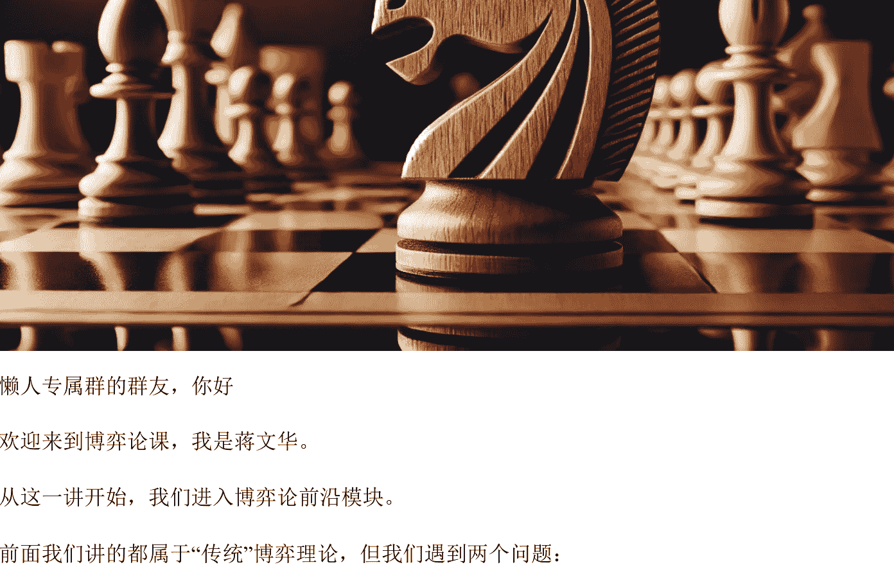

懒人专属群的群友，你好

欢迎来到博弈论课，我是蒋文华。

从这一讲开始，我们进入博弈论前沿模块。

前面我们讲的都属于“传统”博弈理论，但我们遇到两个问题：

一个是我们需要假设参与人都是理性的，基于理性假设我们才能找到博弈的纳什均衡。然而我们也知道，很多情境下，人的理性并没有那么强大，现实博弈的结果经常与理论的结果偏离，怎么解释这种偏离呢？

另一个是在很多博弈模型中，我们看到了多个纳什均衡的同时存在，那与之对应，也就有了多种不同的博弈策略，这时候怎么在不同策略之间做选择呢？

以上这两个问题，都可以用“演化博弈”的视角获得进一步的解释。演化博弈不需要那么严格的理性假设，也能够帮助我们更清晰地比较不同博弈策略的优劣。

今天这一讲，我们通过演化博弈的视角，来研究一个问题：哪些博弈策略更能破除各种干扰，经受时间考验，穿越历史长河？

### 从生物进化论到社会演化

这里我们先来交代一下演化博弈的起源。

演化博弈最初来自一个具体的生物学问题：有些动物在争夺资源的冲突中会出现友善行为，怎么解释这种现象？

传统的达尔文进化论认为，“自私”的个体才能生存，那些谦让的动物应该早就被淘汰了才对。但现实中却存在“利他”行为，这似乎很矛盾。

经济学家，也是演化博弈论的开山鼻祖，梅纳德·史密斯（Maynard Smith）给出了新的方法：在他看来，我们不需要预判一种策略是好的还是坏的，是理性的还是非理性的，是恶的还是善的，只需要让不同策略（比如“凶残”和“温和”）在竞争中自然演化，看谁能长期存活。

就像狼群中那些比较温顺的个体，因为更容易被人类驯化，演化成了狗，最终让他们群体规模和生存空间，远大于那些凶暴的原始狼。

演化博弈的角度告诉我们，很多看似“非理性”的行为，其实是在长期进化中形成的生存策略。

生物进化不需要理性的指针，只要能够存活和繁衍，任何路径都是好路径。

### 演化稳定策略和模仿者动态

相信你肯定多少都了解一点进化论的知识，你可能会疑惑，演化博弈和进化论有什么区别呢？

达尔文的进化论，包含首尾相连的几个环节：可遗传的变异、生存竞争、自然选择。

这就像大自然在玩一个永不停歇的生存实验，在物种进化的过程中，总会有各种各样的偶然造成基因突变（mutations），让它们在环境中接受考验，留下最有效的生存方案。演化博弈理论，基本上继承了达尔文的进化论的理论结构，但更关注策略的稳定性，和优势策略的扩散。

如果一个种群不能再被任何基因突变成功侵入，那么这种稳定生存的方式，我们把它叫做演化稳定策略（Evolutionary Stable Strategy，简写为ESS）。这个策略必须足够强大，能够抵御任何新出现的变异挑战。

“演化稳定策略”这个概念在演化博弈当中是非常重要的，理查德·道金斯评价：“我总是有一种预感，我们可能最终会承认，这个概念的发明，是自达尔文以来进化理论上最重要的发展之一。”

当一种策略表现优异，它的收益高于群体的平均收益，群体中模仿的成员就会增加，这被叫做“模仿者动态”（replicator dynamic）。比如，有成功人士传递他成功做事的方法，就有人去模仿以求同样达到成功。

这里要注意的是，演化最终的稳定状态，不一定是单一策略垄断，也可能是多元策略共同生存。在演化博弈中，我们把只有一个策略的演化稳定均衡称为单元均衡，有多个策略的演化稳定均衡称为多元均衡。

还要注意的是，演化稳定策略一定是纳什均衡，但纳什均衡未必是演化稳定策略。这么说有点绕，不用担心，听我们讲完下面的例子，你就能理解了。

### 鹰鸽博弈中的ESS

先看第一个例子，鹰鸽博弈。

鹰鸽博弈其实就是我们前面学过的懦夫博弈，这里只是换了一个名字。

我们先来复习一下鹰鸽博弈的基本局面和经典结论。

在一个群体中，成员可以采用两种截然不同的策略：一种是“鹰派”，进攻型；另一种是“鸽派”，温和型。比如，很多人在描述美国的对外政策时，经常会说是鹰派在主导还是鸽派在主导。

假设群体中争夺的资源总量为2A，不同碰撞的情况下，收益情况如下：

鸽派与鸽派相遇，双方平分总利益，各得A；鹰派与鸽派相遇，鹰派凭借强硬策略独占资源，获得2A，鸽派则拿不到任何资源；鹰派与鹰派相遇，双方会发生争斗，均获得A-C，其中C为双方争斗的代价或损耗。

文稿中我给出了鹰鸽博弈的损益矩阵，你可以点击查看。

| | 老鹰 | 鸽子 |
|---|---|---|
| 老鹰 | A-C, A-C | 2A, 0 |
| 鸽子 | 0, 2A | A, A |

我们之前讲过，这个模型的纳什均衡需要分两种情况来讨论。

第一种情况：A>C。这意味着每一方争斗的收益大于争斗的损耗。此时，每个参与者选择鹰派都能获得最大的收益，（鹰派，鹰派）的组合构成了占优策略纳什均衡。

第二种情况：A

两个纯策略纳什均衡分别是，在两人对局中，一方是鹰派，一方是鸽派（即（鹰派，鸽派）和（鸽派，鹰派））。

还有一个混合策略纳什均衡，在群体中，参与者以A/C的概率选择鹰派，以（1-A/C）的概率选择鸽派。

文稿中我也给出了具体的计算过程，你可以复习一下。

#### 附录 1：鹰鸽博弈混合策略均衡求解

设任何一方选择老鹰的概率为 α，选择鸽子的概率为 1-α。在纳什均衡的条件下，选择任何一种策略的期望收益相等。即：

```
α (A-C) + 2A = α (1- α )
α = A/C
```

当每一方选择老鹰的概率为 A/C 时，任何一方选择老鹰或鸽子的期望收益相等，由此构成混合策略纳什均衡解。

接下来，我们从演化博弈的视角来重新分析这个博弈。

如果一个群体全部由鹰派组成，那么每次博弈大家都会选择争斗，每次博弈的结果就是A-C。如果A-C大于0，老鹰每次争斗多少还有点收益，还是可以活着的。

但是如果A-C小于0，那每争斗一次，就给群体带来一次伤害，这个群体对环境的适应性将不断下降。

然而，如果全部鹰派的群体中一旦出现基因变异，那个变异成鸽派的个体适应性就会增加。因为，他每次和老鹰博弈的收益虽然是0，但也比老鹰和老鹰争斗的负收益要大。进而，群体中就会出现了一个鹰派比例不断下降，鸽派比例不断增加的演化过程。

反过来，如果一个群体全部由鸽派组成，那么鸽子们每次博弈的结果就是A，鸽子们日子会过得还不错。但是，一旦在群体中出现基因变异，有的变成了老鹰，那个变异成鹰派的个体每次博弈就能占到便宜，他的收益是2A，这会让他在鸽子群体中获得了更大的适应性，并在后续的遗传中获得优势。由此又会出现一个鸽派比例不断下降，鹰派比例不断增加的演化过程。

换句话说，群体不会一直是全鹰或全鸽的状态，因为在这些极端状态下，总会有变异策略可以获得更高收益。

说的更通俗一点，如果一个社会由莽夫主导，大家彼此争斗、两败俱伤，女孩子只能去找少数健康的懦夫；如果一个社会由懦夫占主导，莽夫们占尽便宜，妻妾成群。

因此，在鹰鸽博弈中，少数派有更大的适应性。一个到处是骗子的社会，做一个老实人反而收益更大；在一个全是老实人的社会，骗子反而能占便宜。当然，这都不是稳定的状态。

那么，什么是鹰鸽博弈的演化稳定策略（ESS）呢？

那就是当群体中鹰派的占比正好保持在A/C的水平。当群体中鹰派占比稳定在 A/C 时，任何小规模的基因变异都不会打破这种长期稳定状态。

如果鹰派的比例大于A/C，鹰派的适应性下降，鸽派的适应性上升；如果鹰派的比例小于A/C，鹰派的适应性上升，鸽派的适应性下降。

这与现实中许多组织的情况类似。一个组织里既有强势的人，也有温和的人，两类人可以和平共处。但如果强势的人比例过多，他们之间容易发生正面冲突，反倒有利于温和的人的生存。反之，如果温和的人太多，强势的人就可以占便宜，会吸引更多的强势的人加入。最终，组织中强势的人和温和的人会达到某种比例的平衡状态。

### 语言博弈中的ESS

再给你举个例子：语言博弈。这实际上是我们之前学过的夫妻博弈的变体。

语言博弈跟鹰鸽博弈不一样，鹰鸽博弈是冲突型博弈，而语言博弈是协调型博弈，大家协调的时候才会获得更多利益，因此演化的过程也不太一样。

我们先建立模型。两个人交流，可以一起说英语，也可以一起说汉语。考虑到汉语相对比较难学，假设双方都说英语的收益为2，都说汉语的收益为1。

文稿中我给出了语言博弈的损益矩阵，你可以点击查看。

| | 英语 | 汉语 |
|---|---|---|
| 英语 | 2, 2 | 0, 0 |
| 汉语 | 0, 0 | 1, 1 |

这个模型共有两个纯策略纳什均衡，分别是都说英语（英语，英语）和都说汉语（汉语，汉语）。

还有一个混合策略纳什均衡，每一方1/3的概率说英语，2/3的概率说汉语。混合均衡的含义是，如果你预期对方有1/3的可能性会说英语，2/3的可能性会说汉语，对你来说学说英语或者汉语的期望收益相等。

文稿中的附录2给出了具体的计算过程。

#### 附录 2：语言博弈混合策略均衡求解

设任何一方说英语的概率为 \(\alpha\)，说汉语的概率为 1-\(\alpha\)。在纳什均衡的条件下，选择任何一种策略的期望收益相等。即：

```
2\(\alpha\)=1-\(\alpha\)
\(\alpha\)=1/3
```

当每一方选择说英语的概率为 1/3 时，任何一方选择说英语还是汉语的期望收益相等，由此构成混合策略纳什均衡解。

刚才我们说，鹰鸽博弈的混合均衡才是唯一的演化稳定策略，那么我们来看下语言博弈的混合策略，是否是最终的演化稳定策略（ESS）。

正确答案是：这不是演化稳定策略。

其实很好理解。因为，一个群体中如果1/3的个体说英语，2/3的个体说汉语，这个均衡结果很容易被破坏，只要有一个人在突变，比如多出了一个会说汉语的人，那么每个人说汉语的收益就会大于说英语的，汉语就会有更大的适应性，并最终导致大家都说汉语。

换句话说，语言博弈的演化稳定均衡是多元的，要么英语，要么汉语，都可以。而且，你会发现，当存在多个演化稳定均衡，只有“从众”策略（全英语或全汉语）才是真正的演化稳定策略。

这也意味着，这个博弈刚开始的初始条件，比如说汉语的人多，长期下来，也会影响最终结果（全部说汉语），这也正是路径依赖的典型。

满族人一开始都是说满语的，随着1644年清军入关，满族人建立清朝取得全国政权，满人被派往全国各地，与当地老百姓交流的需要增多，再继续使用满语的成本就不断上升，由此，满语的消亡也就成为必然。全国各地，许多方言的消失也是同样的道理。

鹰鸽博弈中，采取与众不同的策略有更大的适应性。而在语言博弈中，从众策略有更大的适应性。当大家都用QQ，你也不得跟着用QQ，当大家都用微信，你自然也跟着用微信。当大家都在学习博弈论，你不学博弈论，又怎么和他人交流博弈心得呢？

### 总结

好了，我们来总结一下这一讲的内容。

- 1、演化博弈把传统博弈论和动态演化过程结合，考察个体不断模仿和适应环境的行为，揭示长期策略是如何演变并稳定下来的。
- 2、在演化博弈中，有些静态博弈中存在的均衡因为不满足模仿者动态，而经不住变异的侵入，这些均衡在演化中会被淘汰。
- 3、演化博弈理论有着非常广泛的应用，我们可以用来分析社会习惯、规范、制度的建立和变迁。

#### 下节预告

下一讲，我们将用演化博弈的方法重新思考我们熟悉的囚徒困境，看看这个经典博弈的演化稳定均衡是什么。

### 思考题

这一讲留给你的思考题是：在现实生活中，你在哪些事情上喜欢从众？在哪些事情上喜欢与众不同（或特立独行）？

这里，顺便也公布一下上周的学习奖励。课程开始我们说过，我们每节课末尾都有一个思考题，每周一，我会公布上一周的最佳作业同学名单，每位同学的奖励是《博弈思维线下研修班》的参加名额一个。

这个研修班的主题是：“博弈在现实竞争与合作中的应用”，时间定在4月20日上午9点-12点，地点在北京得到总部（北京市朝阳区温特莱中心A座3层）。获得名额的同学，现在可以安排行程了。

今天公布上周获奖的同学名单：亲爱的静、幸福小松树、韩赓、行者无疆、若即若离joo、无疆。

第一周获奖同学名单：左星星、董全冠、Charles Wang、咚咚锵、我心飞翔、陈振中、上善若水。

第二周获奖同学名单：道远、郑大囧、雪莲、闻思修、张善崔。

第三周获奖同学名单：绿色计量、JPChou、向波荣、波澜不惊、活在未来。

第四周获奖同学名单：黎明、有木有有木人、美君、林常松、正一。

第五周获奖同学名单：闫鼎新、瑾儿、刘伟红、牛虻、何俊。

第六周获奖同学名单：国强、自由自在、付志斌、王勇先、“不抱怨，归来仍是少年”。

文稿中有课程主编的微信（18500161040），请获奖同学添加他的微信，方便到时候联系到大家。

此外，文稿中也附上了之前6周获奖的同学名单，你可以看看自己之前有没有获奖，不要错过。

我们的课程只剩最后一周，希望参加线下课的可以抓紧最后的机会留言争取名额，之前课程中的精彩留言也是有机会获奖的。

期待看到更多同学的精彩作业和留言，也欢迎你随时把课程分享给身边的朋友。

我是蒋文华，我们下节课见。


## 46 演化博弈2：怎么样避免陷入所有人的战争？

懒人专属群的群友，你好

欢迎来到博弈论课，我是蒋文华。

上一讲，我们讲到了演化博弈最重要的一个概念“演化稳定策略”，真正的演化稳定策略，需要强大到能够抵御任何新出现的变异的挑战。

今天，我们再用演化博弈的视角，重新看看我们最熟悉的“囚徒困境”。我们知道，囚徒困境反映的，是人类合作过程中存在的根本性难题：合作如何产生，如何维持。加入演化的视角，能帮我们更清晰地研究这个问题。

在之前的课程中，我们已经学习过囚徒困境，我们知道，在单次博弈的情况下，双方无论如何都选择背叛，这是各自的占优策略；在重复博弈中，我们进一步学习过多种不同的策略，比如经典的一报还一报策略、总是背叛的曹操策略，以及别人背叛一次就永久背叛的冷酷策略。

这一讲我们的主要任务是，看看这些经典策略在演化的场景下，哪些会成为“演化稳定策略”。

### 单次囚徒困境博弈的ESS

这里，我们先把重复博弈和演化博弈做一个简单的比较，这两个概念很容易让人混淆。

通俗说，重复博弈，是固定参与者之间的持久战，看的是对手之前的行为，对我本轮选择的影响。而演化博弈，是一大群人的大混战，关注的是，群体中不同策略的分布如何随时间变化，策略的成功取决于其在群体中的适应度。

在演化博弈中，你不知道接下来和谁博弈，可以是和上次博弈的对象，也可以是其他人，但这不是最关键的，最关键的是你不知道对方的策略是什么。你唯一知道的是，手里拿着“演化稳定策略”的群体会有生存优势，会成为时间的朋友，并且这个优势会一点一点积累，最终把别的策略的生存空间都给吃掉，或彼此共存。

从这个角度看，阿克塞尔罗德的重复囚徒困境实验，是很接近演化博弈的，因为这个实验本身就是让不同的策略来进行大乱斗。

明确了这一点之后，我们就可以具体来看囚徒困境中，不同策略之间的演化博弈了。演化博弈可以研究各方单次博弈，也可以研究多次博弈，博弈的参与者，可以是两种，也可以是更多种，我们需要分情况讨论。

我们先考虑最经典的情况，单次博弈的囚徒困境。

在演化博弈的场景下，这意味着，世界上的任意两个人，最多只进行一次博弈。

这时候什么是这个博弈的演化均衡呢？

很简单，还是始终都彼此背叛。

因为对合作的人来说，任何情况下，他都不如不合作的人获得的收益大。那么，当单次博弈的情况在一个动态群体中持续进行，背叛策略就具有较高的适应性，必然扩散开来，最终使得合作策略完全丧失竞争力。就算发生少量的基因突变，合作的变异基因，也完全无法入侵这个群体。

### 重复博弈的ESS

接下来我们再讨论多次博弈的演化。

如果把单次重复博弈，改为多次重复博弈——那么，依然每次无条件背叛的，我们可以叫曹操策略。现在问题来了，在人群中持曹操策略的人，在多次反复博弈的演化中，能生存下来吗？

社会中的某种行为方式是不是演化稳定，依赖于变异策略的种类。要研究曹操策略的生存能力，我们需要给它找一个竞争对手。

我们现在假设，人群中除了曹操策略，多了一种策略，冷酷策略。冷酷策略是首次选择合作，只要对方合作，就一直选择合作，一旦对方选择背叛，则永远选择背叛。

那么当曹操策略遇上冷酷策略，什么策略会成为稳定演化均衡呢？

文稿附录1中，我给出了重复两次的囚徒困境的损益矩阵，以及均衡求解过程，你可以点击查看。

| 曹操策略 | 冷酷策略 |
| :--- | :--- |
| 曹操策略 | 2,2 6,1 |
| 冷酷策略 | 1,6 6,6 |

#### 附录1：重复两次的囚徒困境演化分析

- 1、在这里，我们不需要考虑贴现，计算收益时把两期的支付简单相加（贴现因子为1）。
- 2、模型中，双方都背叛的收益是1（P），都合作的收益是3（R），一方背叛、一方合作的收益分别是5（T）和0（S）。
- 3、假设群体中曹操策略的类型占比为α，冷酷策略的占比则为1-α。
- 4、那么，在重复两次的博弈中，曹操策略的期望收益为：$2α+6(1-α)$。（因为当遇到曹操策略，两次都背叛，总收益是2；当遇到冷酷策略，总收益是6）
- 5、冷酷策略的期望收益为：$α+6(1-α)$。（因为当遇到曹操策略，总收益是1；当遇到冷酷策略，总收益是6）
- 6、考虑到α的取值范围在0和1之间。
- 7、可以证明：$2α+6(1-α)>α+6(1-α)$。（因为公式化简，$2α>α$恒成立）
- 8、这说明，在重复两次的博弈中，总是背叛是ESS，冷酷策略不是ESS。

比较发现，曹操策略的期望收益始终高于冷酷策略。

这也就意味着，在重复两次的博弈中，曹操策略（总是背叛）是演化稳定策略，冷酷策略报复威慑失效。其中的道理在于，冷酷策略的报复机制在只有两次的博弈中，起不到威慑作用，反而让曹操策略因为短期的剥削能力占尽便宜。

这一结果深刻体现了博弈重复次数对策略演化稳定性的关键影响。

接下来，让博弈次数增加，看看三次，以及更多次博弈时，不同策略的适应能力。

文稿附录2中，我也给出了重复N次的囚徒困境的损益矩阵，以及均衡求解过程，你可以点击查看。

N次博弈囚徒困境（化简前）

| 曹操策略 | 冷酷策略 |
| :--- | :--- |
| 曹操策略 | N,N 5+(N-1)*1,0+(N-1)*1 |
| 冷酷策略 | 0+(N-1)*1,5+(N-1)*1 3N,3N |

N次博弈囚徒困境（化简后）

| 曹操策略 | 冷酷策略 |
| :--- | :--- |
| 曹操策略 | N,N N+4,N-1 |
| 冷酷策略 | N-1,N+4 3N,3N |

#### 附录2：重复多次的囚犯困境演化分析

- 1. 假设重复博弈次数为N，群体中曹操策略的类型占比为α，冷酷策略的占比则为1-α。
- 2. 那么，曹操策略的期望收益为：αN+(1-α)(N+4)，冷酷策略的期望收益为：α(N-1)+3N(1-α)。
- 3. 该计算结果的含义是：当群体中曹操策略的占比为1-1/(2N-3)时，每个参与者选择两种不同策略的期望收益相等。
- 4. 当重复博弈3次时，令N=3，α=2/3，其含义为，如果重复博弈3次，那么当群体中曹操策略的占比超过2/3时，曹操策略的期望收益(7-4α)大于冷酷策略(9-7α)。曹操策略是ESS。

那么当群体中曹操策略的占比小于2/3时，曹操策略的期望收益(7-4α)小于冷酷策略(9-7α)。此时，冷酷策略是ESS。

无论在哪种条件下，“2/3曹操策略，1/3冷酷策略”不是ESS。

- 5. 当重复次数越多，N越大，α=1-1/(2N-3)越趋近于1。这表明背叛策略需占比接近百分百，在群体该策略才能成为ESS。

经过计算我们可以得到，在重复三次的博弈中，如果群体中曹操策略的占比超过2/3，曹操策略是演化稳定策略。如果群体中曹操策略的占比低于2/3，冷酷策略是演化稳定策略。重复三次的博弈结果之所以不同于重复两次，是因为冷酷策略的报复机制开始起作用了。

至于群体中2/3选择曹操策略，1/3选择冷酷策略，不是演化稳定策略。如果群体中曹操策略略高，更多人就会转向曹操策略；如果群体中冷酷策略略高，更多人就会转向冷酷策略。

因此，群体演化的最终结果要么全部是曹操策略，要么全部是冷酷策略。究竟会出现哪个结果，取决于初始条件。这很像上一讲介绍的语言博弈，同样也是一个单元均衡。

需要说明的是，这里的2/3这个比例，是基于囚徒困境的所给数值计算出来的，如果给的数值不一样，计算结果也不一样。

我们进一步来看，随着重复次数不断增加，曹操策略成为演化稳定策略所要求的初始占比也需要不断增加。当重复次数趋向于无穷大时，初始占比需要达到接近100%时，曹操策略才能成为演化稳定策略。

这意味着，群体中人们交往的频率越高，坏人（这里指的是曹操策略），其生存空间就会越小，好人（这里指的是冷酷策略），其胜出的可能性就会越大。

换句话说，一个人与人之间频繁交互的社会，哪怕一开始全部由坏人构成，一旦发生了一定比例的基因突变，有些人转变成为好人，即选择冷酷策略，那么，好人们就能够成功入侵，并最终演化成一个是好人的社会。而一个好人构成的社会则很难被坏人所入侵。当然，这里所谓的好不是那种无原则的好，而是冷酷性质的好。

为什么大家交往越频繁，坏人越难生存？因为冷酷策略一旦碰到坏人，会一直报复下去，这意味着，坏人第一次博弈所占到的便宜不足以弥补此后的巨大损失，还不如选择成为好人，会有更大的总收益。

如果把刚才的冷酷策略更换成我们更熟悉的一报还一报策略，刚才的分析结论也是一样的。之所以没有区别，是因为冷酷策略和一报还一报策略面对曹操策略所给出的反应结果是一样的（都是报复-背叛）。

此外，我们还可以把重复次数理解为群体规模。例如你需要和N个参与者陆续博弈，虽然和每个参与者只博弈一次，但是后续的参与者可以观测到你之前的每次行动，那么你的策略选择等同于你和一个参与者重复N次博弈。

这意味着，群体的规模越大，坏人的生存空间反而越小。当然，这个结论的前提，是坏人所干的坏事能被广而告之。

我们在网购中看到，每个买家或许只从某个卖家那里购买一次东西，但是如果后续买家能够看到之前买家对卖家产品和服务的评价，就可以把一次性博弈转变成重复博弈。购物网站中的评价体系对于激励卖家诚信交易起到非常重要的作用。

### 三种策略混战

接下来，我们再进一步讨论三种策略混战的情况。

这一次，我们增加一种总是合作的老好人类型，不妨称之为雷锋策略，这样一来群体里共有三种人：曹操、雷锋和冷酷者，三方博弈的结果会有很大不同。

第一，如果群体中只有曹操策略和雷锋策略，没有冷酷策略，曹操策略是演化稳定策略，雷锋策略无法生存。

这个道理很简单，因为雷锋策略遇到曹操策略，每次都是吃大亏。而曹操策略则每次都能占大便宜。

第二，有了冷酷者后，如果三种策略的原始比例是相当的，那么没有一种策略是占优策略，这个博弈不存在演化稳定策略。

曹操通过背叛获得短期收益，但会被冷酷者长期惩罚；雷锋因总是合作而容易被曹操剥削，但可以在和冷酷者合作的时候，获得一些生存资源；而冷酷者通过惩罚背叛者获得长期收益，但需要付出短期成本。

第三，当冷酷者的初始比例足够大时，冷酷者的比例会上升，曹操的比例一开始也会上升，雷锋的比例会下降，因为雷锋会被越来越多的曹操欺负。

但当雷锋的比例减少到一定程度后，曹操的适应度也会下降，因为越来越难欺负到雷锋了。最后的演化结果是群体中大部分是冷酷者，再加上少量的雷锋。雷锋之所以能够得以生存是因为有大量的冷酷者帮助惩罚曹操，降低了曹操的适应度。如果你是雷锋，一定要感谢嫉恶如仇的冷酷者。

第四，冷酷者和雷锋在合作时表现一致，但在面对坏人时的行为不同。如果群体中全是冷酷者，他们可以长期合作。

然而，存在以下风险：冷酷者可能因基因变异变成雷锋，而两者在合作时难以区分，导致雷锋比例会逐渐上升，而当雷锋比例足够高时，曹操的背叛策略可能重新占据优势，因为雷锋的高合作率让曹操的收益最大化。这将导致合作规范的瓦解，群体进入“所有人背叛”的均衡状态。

这意味着，一个社会一旦丧失了对坏人的惩罚机制或惩罚能力，就很容易进入黑暗森林，即“所有人对所有人的战争”的状况。

### 总结

好了，我们来总结一下这一讲的内容。

- 1. 囚徒困境加入演化的条件后，如果各方只博弈一次，始终背叛的曹操策略是占优策略，即便有少量基因变异，也改变不了局面。在只有两次博弈的情况下，曹操策略仍然是演化稳定策略。
- 2. 博弈次数增加之后，如果人群中加入了冷酷策略或者一报还一报策略，曹操策略就会被惩罚，变得越来越难以生存。与此同时，总是选择合作的雷锋策略反而会有生存空间。
- 3. 一旦社会失去对坏人的惩罚能力，合作秩序将被颠覆，所有人都难逃黑暗森林式的混乱厮杀。

#### 下节预告

下一节我们将开启另一种博弈类型的分析：合作博弈。这种博弈不是我们之前介绍的那种合作关系的博弈，而是真正意义上以合作为目的博弈。

### 思考题

这一讲给你留的思考题是，“损人害己”在演化博弈中，有没有可能成为一种演化稳定策略？如果可能的话，怎么证明？

这里也公布一下上一讲的学习奖励，上一讲获得最佳作业奖励的是昵称为“韩”（学号182123405914）的同学，和“山峰”同学（学号171102048103）。

文稿中，我也附上了之前所有获得奖励的同学名单，以及本周日线下研修班的具体时间地点，你可以看看有没有你的名字。

获得线下课奖励的同学，如果时间安排不过来，也可以把名额赠送给朋友，具体可以添加课程主编的微信（18500161040）。

第一周获奖同学名单：左星星，董全冠，Charles Wang，咚咚锵，我心飞翔，陈振中，上善若水。

第二周获奖同学名单：道远、郑大囧、雪莲、闻思修、张善崔。

第三周获奖同学名单：绿色计量、JPChou、向波荣、波澜不惊、活在未来。

第四周获奖同学名单：黎明、有木有有木人、美君、林常松、正一。

第五周获奖同学名单：闫鼎新、瑾儿、刘伟红、牛虻、何俊。

第六周获奖同学名单：国强、自由自在、付志斌、王勇先、“不抱怨，归来仍是少年”。

第七周获奖的同学名单：亲爱的静，幸福小松树、韩赓、行者无疆、若即若离joo，无疆。

博弈思维线下研修班

主题：博弈在现实竞争与合作中的应用
时间：4月20日上午9点-12点
地点：北京市朝阳区温特莱中心A座3层（得到总部）

我们的课程只剩最后一周，希望参加线下研修班的同学可以抓紧最后的机会留言争取名额，之前课程中的精彩留言也是有机会获奖的。

期待看到更多同学的精彩作业和留言。

我是蒋文华，我们下节课见。


## 47 合作博弈1：什么样的分配方案更合理？

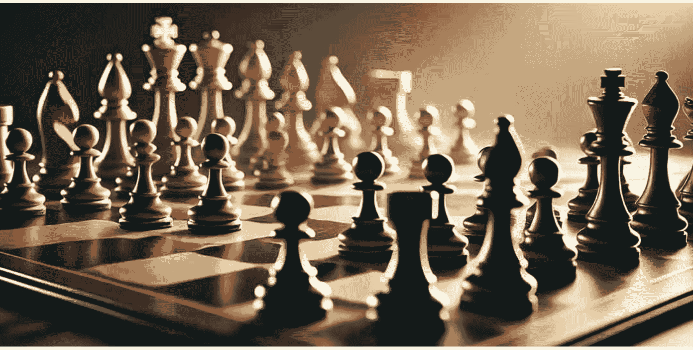

懒人专属群的群友，你好

欢迎来到博弈论课，我是蒋文华。

接下来的两讲，我们来讲博弈论前沿的另一个重要课题“合作博弈”。

合作博弈自然是相对于非合作博弈而言。传统的博弈论研究，侧重非合作博弈，重点在于“当其他参与者对我的策略选择做出最优反应时，什么才是我的最优策略”。

而在合作博弈中，参与者需要解决的问题是：“如果参与者的策略可以相互协调，什么样的策略选择才会带来整体收益的最大化”。

合作必然产生共同收益，而收益必然涉及分配问题。合作博弈的难点在于：怎么在资源少时，保护弱者的利益；在资源充足时，又能给予高贡献者充分的激励。

在这方面，很多博弈论学者，都在分头探索。今天我们重点解析一个经典成果——塔木德分配原则。

在资源有限的情况下，塔木德方案更能保证公平与效率的平衡，减少各方的不满。

#### 塔木德方案

塔木德分配原则，其实来源于一个流传千年的谜案。

犹太教经典《塔木德》（Talmud）记载了这样一桩遗产纠纷。

一位富翁在婚书中许诺留给三位妻子的遗产，分别是：A妻子100金币，B妻子200金币，C妻子300金币。可是富翁身后留下的遗产不足600个金币，那么三位妻子应该怎么分配这位富翁的遗产呢？

你可能会说：“三人平分！因为妻子们的地位平等”。可这样的话，相当于吃大锅饭，有更高诉求的B和C肯定不乐意。

你也可能会说：“尊重富翁的遗愿，按1:2:3的比例分配！”可当遗产总额较少时，分配比例最低的A很可能分到的会太少，严重影响她今后的生活质量。

由于三位妻子意见不一，就去找“拉比”帮忙解决。在古代以色列，精通律法的文士被称为拉比，也会担任民事法官。拉比并没有简单采用“平均分”或者“按比例分配”两种常见方式，而是提出了一个“视遗产数量动态调整”的分配方案。

拉比的具体裁决方案是这样的：

如果遗产只有100金币，三人平均分配。如果遗产只有200金币，三人分别是50，75，75。如果遗产只有300金币，三人按照富翁的许诺比例分配，50，100，150。

100金币三个人平分，这个容易理解；300金币按照1:2:3的比例分配，也容易理解。大家不能理解的是200金币的分配方案居然是50，75，75。这又是根据什么原则呢？

这个看似奇怪的分配方案，直到1985年，才被现代学者揭开谜底。

博弈论大师罗伯特·奥曼和另一位经济学家马希勒发表了一篇论文，首次从博弈论角度，证明了古代拉比其实是找出了一种非常独特的解决方式。这里顺带一提，罗伯特·奥曼曾因博弈论研究，获得2005年的诺贝尔经济学奖。

两位学者提出的论点既漂亮又简单。先考量这种情形：现在有一份资产，有一个人声称拥有全部的所有权，另一个人声称拥有一半所有权。要如何解决？答案是按75:25的比例分配。

为什么是这么分呢？首先，因为第二个人只声称拥有一半的所有权，所以第一个人至少完全拥有另一半的所有权，这点毋庸置疑，所以第一个人可以先直接拿走一半，也就是50%。接着，就是所有权有争议的另一半，而公平的分法是1:1，也就是每人25%。这样，第一个人合起来就分到了75%，第二个人分到25%。

奥曼和马希勒将这个分法称为“有争议部分的平分法”。通俗来讲就是，在所有权争议中，先分配无争议的部分，再将剩余有争议的部分平分。

放在前面的遗产分割案中，三位妻子任取其中两位拿到的金额，都符合有争议部分平分原则。咱们挨个来看一下：

当遗产只有100个金币时：由于三位妻子都有权利获得100个金币，所以三人直接平分，各得33.3个金币。

当遗产为200个金币时：由于A妻子声称有权获得100个，因此剩余100个金币可以明确分给B和C。争议金额就是100个金币。

然后下一步很关键，我们进行分组。A自成一组，B和C合为一组，平分之后，A最终得50个金币，B和C再得50个金币。

这样，A财产分割结束，获得50金币。而此时，B和C共有150个金币，因为两人都宣称拥有这150个金币的继承权，那么这150个金币二人平分，各得75个金币。

当遗产为300个金币时：第一次分组平分跟遗产有200金币时类似，由于A妻子宣称自己有权获得100个，因此剩余200个可以明确分给B和C。

然后，A自成一组，BC合为一组，他们两组分割A宣称有权继承的那100个金币，A妻子最终获得50金币，B和C妻子先得50个金币。注意，这50个金币是她们两个人的，而不是每人50个。

当A拿走50个金币之后，她的财产继承结束。此时，B和C共剩下250个金币，由于B宣称拥有200个金币的继承权，因此其中50个金币可以明确分配给C。

然后，BC继续分割B宣称有权继承的那200个金币，依然是平分，双方各得100个金币，B的财产继承结束。还剩下50个金币，AB都没有了继承权，就直接归了C。

最终的分配结果是，A获得50个金币，B获得100个金币，C获得150个金币。这实际上是个巧合，恰好和按比例分配一样了。

“有争议的部分平分”，听起来很简单，但理解起来并不容易。你可以对着文稿仔细琢磨一下。

在此，罗伯特·奥曼进一步总结出在资源比较有限的时候可以应用的三个分配原则：

原则1：仅分割有争议财产，无争议财产不需要分割。原则2：宣称拥有更多财产权利的一方，最终所得不少于宣称拥有较少财产权利的一方。原则3：当争议者超过两人时，将所有争议者分为两组，按照其诉求金额排序，申索金额最小的人自成一组，剩下所有争议者另成一组。然后，争议财产在两组间平分。

塔木德方案的伟大之处在于：

优先保障弱势方的基本权益，避免机械按比例分配导致的“弱者愈弱”；而在资源充裕时则充分尊重贡献差异，体现所有者的意愿。

实际上这套方案，从日常生活到制度设计，都可以应用。

比如，《博弈论与生活》的作者兰·费雪在书里分享过这么一则小故事，他说：“日常生活中要分物品，都可以应用这项了不起的塔木德分配原则。有一次我和朋友一起去看一个车库拍卖，发现有一屋子的旧书。我们两个没有争着要找出自己最想要的书，而是先合资，只要是我们其中有一人想要的，就全部买下来。然后，我们把书分成三堆：我想要而他不要的，他想要而我不 要的，以及我们都想要的。接下来我们轮流从第三堆（也就是有争议的部分）一人挑一本，直到平均分完为止。真是太简单、太令人满意了！”

#### 破产分配的最优策略

不过，要说塔木德方案在现代社会最具革命性的应用，应该是找到了现代企业破产清算的最优分配策略。

企业之所以破产，是因为企业资不抵债。宣布破产后，企业的全部资产肯定不够偿还各个债主，各个债主就只能按照一定的比例，或者原则来分配。

举个例子，一家房产公司破产清算，分别欠了ABC三家银行100亿、200亿和300亿。

你可以想象，三家银行的实力肯定是不一样的，一般来说能借出300亿的银行会比借100亿的银行实力更强。

如果按比例分的话，对大银行来说就是少收回一点债务；但对小银行来说，很可能会陷入破产清算的结局，一旦整个区域的小银行出现连锁倒闭，那么很可能导致更大的金融危机和社会危机。

所以，如果应用塔木德方案的话：

当倒闭企业剩余的钱较少时，三家平分，先保住小户；当剩余的钱稍微多时，小银行A先拿50亿，剩下的由B和C平分；当钱更多时，小银行A固定拿50亿，B拿固定的100亿，也保证B能拿到债务的一半，剩下的全给C；当剩余的钱还能增加时，在每家银行都确保能够收回一半债务后，新增部分应该优先偿还亏损多的一方。确保三方的损失尽可能平均。如果剩余的钱足够偿还债务，还需要继续在三家银行分配的话，多出的部分三家平均分配。

文稿中我给出了更一般化的分配公式和相应的图表，你可以打开文稿查看：

A,B,C分别应得100，200，300
1. 如果0
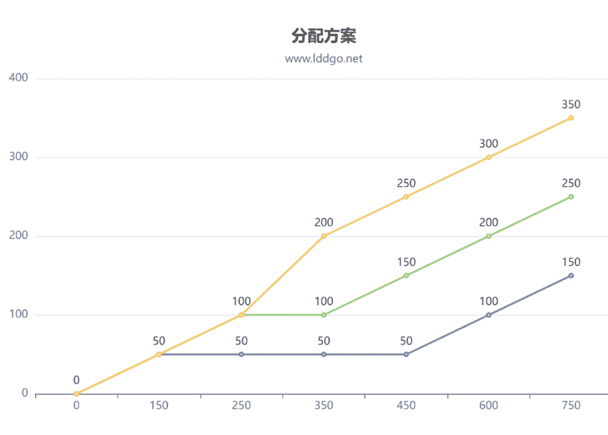

理解塔木德原则，你也可以想象这么一个倒水的场景：水很少时，不管每个人拿的杯子大小，只能每个人先来一点点，平均分配；水多起来，可以适当按杯子大小分配，大杯子可以稍微多分一点；而水量再增加的时候，可以先把每个杯子都装满，如果还能再增加的话，多出来的部分就平分吧。

塔木德方案的优势，在跟我们最熟悉的按比例分配对比时最为明显：

当资源不足时，“按比例分”是数学上的公平，但现实会搞死小公司；“塔木德分法”是先救急、再分剩的，让所有人都能活下来。

同时，塔木德原则也很有效率，分配结果随可分配利益总额的变化平滑过渡，根据实际情况动态调整，对任何两个人来说，都符合“有争议的部分平分”原则，这也让所有参与者对规则的公正性无异议，减少后续纠纷。

### 总结

好了，我们来总结一下这一讲的内容。

1. 人们之所以愿意彼此合作，是因为通过合作可以增进彼此的利益。

2. 塔木德方案最核心的原则是，“有争议部分的平分法”。

3. 塔木德方案的聪明之处在于：当资源匮乏时，能保护弱者；当资源充足时，尊重强者的贡献，兼顾了公平与效率。

#### 下节预告

合作博弈还面临一个难题，那就是每个参与者的贡献，可能很难找到一个计算标准，这时候就会出现很大的分歧，导致合作破裂。怎么解决这个问题呢？下一讲，我们会用合作博弈的奠基人夏普利的思想，来解决这个问题。

### 思考题

这一讲留给你的思考题是，临近端午节，ABC三个同学各带了2个、4个和6个粽子的校园内聚餐，我路过时，同学们邀请我一起吃粽子，最后我们4个人每人吃了3个粽子。为表示感谢，我给了3个同学一共100元现金，请问三个同学应该怎么分这100元？

这里也公布一下上一讲的学习奖励，上一讲获得最佳作业奖励的是：Victory同学和April同学。

文稿中，我也附上了之前所有获得奖励的同学名单，以及本周日线下研修班的具体时间地点，你可以看看有没有你的名字。

获得线下课奖励的同学，如果时间安排不过来，也可以把名额赠送给朋友，具体可以添加课程主编的微信（18500161040）。

- 第一周获奖同学名单：左星星，董全冠，Charles Wang，咚咚锵，我心飞翔，陈振中，上善若水。
- 第二周获奖同学名单：道远、郑大囧、雪莲、闻思修、张善崔。
- 第三周获奖同学名单：绿色计量、JPChou、向波荣、波澜不惊、活在未来。
- 第四周获奖同学名单：黎明、有木有有木人、美君、林常松、正一。
- 第五周获奖同学名单：闫鼎新、瑾儿、刘伟红、牛虻、何俊。
- 第六周获奖同学名单：国强、自由自在、付志斌、王勇先、“不抱怨，归来仍是少年”。
- 第七周获奖的同学名单：亲爱的静，幸福小松树、韩赓、行者无疆、若即若离joo，无疆。
- 第八周获奖同学名单：“韩”（学号182123405914）、“山峰”（学号171102048103）、Victory、April。

博弈思维线下研修班
主题：博弈在现实竞争与合作中的应用
时间：4月20日上午9点-12点
地点：北京市朝阳区温特莱中心A座5层（得到总部）

我们的课程只剩最后一周，希望参加线下研修班的同学可以抓紧最后的机会留言争取名额，之前课程中的精彩留言也是有机会获奖的。

期待看到更多同学的精彩作业和留言，也期待在线下见到你。

我是蒋文华，我们下节课见。


### 公众号
懒人搜索
懒人专属群


微信:lazyhelper

## 48合作博弈2：如何计算每个人对团队的真实贡献？


懒人专属群的群友，你好

欢迎来到博弈论课，我是蒋文华。

上一讲介绍了塔木德分配原则，这个原则告诉我们在资源有限的情况下，如何巧妙平衡公平与效率，尽可能减少各方的不满。

这一讲，我们来看一个更贴近现实商业合作的分配方案：夏普利分配。

团队合作存在一个难题，最终的成果是大家一起创造的，但每个人的具体贡献，有时候很难量化。比如，一个互联网应用，工程师、设计师、产品经理都有贡献，就难以直接量化。这时，简单的“按劳分配”或“平均分配”都会引发矛盾。

夏普利分配方案的精妙之处就在于：它不看你“有多强”，而是计算你在团队协作中“真正创造了多少额外价值”。这正是现代合作中最需要的分配智慧。

### 医生合伙创业难题

我们通过一个案例，先来进一步明确分配难题的核心在哪里。

假设你是一位牙科医生，之前在医院上班，现在打算和两位同事合伙开诊所。在医院时，你的年收入是50万，张医生是60万，李医生是30万。预计你们的牙科诊所年净收入是420万。请问，你们会如何分配这笔钱？

你的第一反应可能是“按原工资比例放大”。三个人在单位上班的总收入是140万（50+60+30=140），合伙开诊所后总收入是原来的3倍，那么，最合理的分配方案是每个人的收入也相应地变成原来的3倍。

问题是，医院薪资反映的是体制内价值，比如，职位、工作年限等；而创业价值的衡量，包含了不同的贡献维度。

比如，你提出这样的方案，李医生明确表示不同意。他给出的理由，他特别擅长营销，如果他和张医生合伙，两个人能赚到的总收益为300万，就算按照2：1进行分配，他也能分到100万，比刚才的那个90万更划算。

你注意到没有，不仅分配方式出现了矛盾，一个关键的约束问题也出现了。

如果两个人合伙，每个人能赚得比三个人合伙时候还要多，那何必三个人合作呢？就算三人创业搭子促成了，也总会有人想拆伙。

所以，在解决三个人合伙怎么分钱之前，需要先解决两个人怎么分的问题。

我们前面已经分析过，“按原工资比例放大”不合适。而且，合作带来的溢价，源于双方共同的创造，离开了谁都不行。

因此，我们引入第二种分配思路：“保留原有收入，增量部分平分”。

这一方案的核心逻辑在于：

先保证原有工资，体现每位医生在医院体系下的个体价值基准（技术、资历等）；然后再用增量平分原则，承认合作溢价是集体创造的成果，应当由参与者平等共享。

这种分配方式既尊重历史贡献，又符合合伙创业的协作精神。

基于增量平分的原则，我们先推演一下两两合作的场景。

假设：

- 你和张医生合伙赚180万；
- 你和李医生合伙能赚260万；
- 张医生和李医生合伙能赚300万。

如果你和张医生合伙，总收入是180万。首先，我们保证你们各自拿到原来的基础工资，你拿50万，张医生拿60万。这样已经分配了110万，还剩下70万的增量收益。这部分新增收益是你们合作创造的，按照“增量平分”的原则，每人分得35万。所以最终分配结果是，你分85万，张医生分95万。

另外两个两两组合的具体计算过程，我也给你放在文稿里了。

| 组合 | 总收益 | 分配方案 |
|---|---|---|
| 你+张 | 180万 | 你85，张95 |
| 你+李 | 260万 | 你140，李120 |
| 张+李 | 300万 | 张165，李135 |

你会发现，这样算下来，张医生和李医生合伙比他们分别跟你合伙，最后分到手的钱更多。人家两个人才是最优赚钱二人组。

此时，你提议三个人合伙，张医生和李医生一定会问你：“你能给我们创造什么价值呢？”

通过我们前面的分析，你可能注意到了两个原则：

- 1、最关键的是，要想三个人合伙成功，在利益上必须保证满足一个基本条件：对每个医生来说，三个人合伙能够分到的钱，不但不能低于在医院上班的收入，还不能低于两个人合伙所能分到的收入。这就是前面课程中反复提到的参与约束，或个体理性约束。

换句话说，一个大联盟能够成功，需要确保每个成员或小联盟不能通过离开联盟获利。

- 2、当然，这里所有人需要先对新增利益的分配原则达成一个共识：新增价值由大家合伙创造，合伙人之间地位平等，有权平均分配。

### 夏普利值

理解了前面的基础，我们现在可以深入探讨夏普利分配方案了。

美国数学家，2012年诺贝尔经济学奖得主夏普利提出的“夏普利值”，就是用来计算每个人对团队总收益的具体贡献，并以此来作为计算每个人合理收入的依据。

在理解这个概念之前，不妨先回顾一下以往的经济学理论，是怎么分析收入分配问题的。

英国古典政治经济学之父，威廉·配第有一句名言：“土地是财富之母，劳动是财富之父”。但他一直没有解决土地所有者，和农业劳动者之间的合理分配问题。直到后来经济学历史上发生了边际革命，经济学家们才找到了一个解决方案：按照每个要素的边际贡献来分配，这是最有效率的。

你可以形象地理解为“最后上车者价值”（last-on-bus-value）。意思是当某个参与者作为最后一个加入联盟的人，他对联盟的新增价值做出了多大的贡献。

例如，如果我们4个人一起用力才能拖动一辆汽车，并获得100元的收益，那么我们4个人中每个人的最后上车者价值，就都是100元。

当然，这就会出现一个问题，刚才所说的4个人，每个人都可以把自己当作最后上车的那一位，都要求自己拿走这100元。

夏普利就此提出，既然谁最后上车都有可能，那我们就应该考虑所有可能的加入顺序，计算每个成员在不同顺序下的边际贡献，然后取平均值。

这就是夏普利的创新解法。

回到三个医生的故事里，三人合作共有6种可能的加入顺序。我们需要计算每个医生在6种顺序下的边际贡献，然后取平均值。这就是每个人的夏普利值，以此作为计算他们合理收入的依据。

以李医生为例：

当加入顺序依次是“你-张医生-李医生”的情况下，你和张医生合伙能赚180万，李医生加入增加到420万，李医生的贡献就是420万-180万=240万。当加入顺序依次是“你-李医生-张医生”的情况下，你和李医生合伙能赚260万，此时他是第二个加入的，李医生的贡献是260万-60万（你单独的收入）=210万。

每个人都有6种加入顺序，咱们就不一一展开组合的计算过程了。文稿中我附了每个医生的边际贡献值的计算过程，加总后除以6，就可以计算出每个医生的夏普利值。你可以打开文稿查看具体的计算结果。

| 联盟顺序 | A的贡献 | B的贡献 | C的贡献 |
|---|---|---|---|
| ABC | 50 | 130 | 240 |
| ACB | 50 | 160 | 210 |
| BAC | 120 | 60 | 240 |
| BCA | 120 | 60 | 240 |
| CAB | 230 | 160 | 30 |
| CBA | 120 | 270 | 30 |
| 合计 | 690 | 840 | 990 |
| 夏普利值 | 115 | 140 | 165 |

依据计算结果，你的夏普利值是115万，张医生是140万，李医生是165万。换句话说，在420万的总收入中，你的合理收入是115万，张医生拿140万，李医生拿165万。

这个结果很有启示性。虽然你和张医生在医院上班时比李医生的赚钱能力强，但李医生对整体的贡献大于你和张医生。因此，在总利益的分配上，李医生拿的反而要比技术最强的张医生还要多。

这也说明，个人能力不等于对团队的贡献，合作才能创造“1+1>2”的协同效应。而只有公平合理分配，才能增强团队稳定性，保证协同效应的实现。

看着李医生拿得比你和张医生都多，你和张医生有没有可能不想合伙？肯定不会，因为如果不合伙，你和张医生继续在医院上班，或者单独合伙，只会少赚钱。

一个组织的凝聚力一定是来自于，组织成员认为，如果离开该组织，自己的收入会下降，如果拉帮结派一起离开该组织，新团体的收入也会下降。

为什么要用“最后上车价值”来计算一个人对团队的贡献，是因为当一个人威胁离开团队时，其可以从团队获取的最大利益就是“最后上车价值”。

大公司通过扩大经营规模，创造出很高的总价值，而每个人的“最后上车价值”却不高。这样大公司就不会为了挽留某个员工而付出太大的代价。每个员工的离开几乎都不会影响组织的正常运行，反而让员工觉得离开了组织会降低其预期收入。由此，我们就更容易理解“店大欺客，客大欺店”这句话的真正含义。

### 权力指数计算

夏普利值的应用远不止于经济分配问题，在日常生活中、权力分配、科学决策上都有广泛应用。

例如在权力分配上，我们就可以用来计算夏普利-苏必克权力指数（Shapley-Shubik Power Index）。

这个指数之所以这样命名，是因为它就是由夏普利和苏必克基于合作博弈的原理提出的，用来衡量决策机构中各投票者实际的影响力，或者说权力分配情况。

假设某公司有A，B，C，D四个股东，分别拥有4100万股、3900万股、1000万股、1000万股，公司的总股本为1亿股。公司最近计划投资某个项目，按照股份比例进行表决，占比超过50%则项目通过。问题是，这四位股东，分别有多大概率成为那个“说了算”的人？

如果简单按持股比例判断，我们可能认为A、B股东话语权接近，而C、D股东影响力微弱。

但通过计算所有可能的投票顺序，我们得出了非常颠覆直觉的判断：计算结果表明，ABCD四位股东的权力指数分别为1/2，1/6，1/6，1/6。

具体的计算过程，我放在了文稿中，你可以点击查看。

附录2：权力指数计算
在四个股东中，如果A第一或最后一个加入，那么当剩下三个组成联盟，他都无法成为决定胜负的股东。如果第二或第三则都可以决定项目是否投资，所以其权力指数是1/2。
同理，如果B第一或最后一个加入，其对决策不起作用。如果B在第二位加入，只有当第一个是A才能起到作用。如果B在第三位加入，只有当A最后加入才能取胜。B起作用的两种情况，其所发生的概率总和是1/6（权力指数）。C和D的分析和B相同，其权力指数也是1/6。
表格中，列出了所有24种情况下每个股东的边际贡献值。

| | A | B | C | D |
|---|---|---|---|---|
| ABCD | 0 | 1 | 0 | 0 |
| ABDC | 0 | 1 | 0 | 0 |
| ACBD | 0 | 0 | 1 | 0 |
| ACDB | 0 | 0 | 1 | 0 |
| ADBC | 0 | 0 | 0 | 1 |
| ADCB | 0 | 0 | 0 | 1 |
| BACD | 1 | 0 | 0 | 0 |
| BADC | 1 | 0 | 0 | 0 |
| BCAD | 1 | 0 | 0 | 0 |
| BCDA | 0 | 0 | 0 | 1 |
| BDAC | 1 | 0 | 0 | 0 |
| BDCA | 0 | 0 | 1 | 0 |
| CABD | 1 | 0 | 0 | 0 |
| CADB | 1 | 0 | 0 | 0 |
| CBAD | 1 | 0 | 0 | 0 |
| CBDA | 0 | 0 | 0 | 1 |
| CDAB | 1 | 0 | 0 | 0 |
| CDBA | 0 | 1 | 0 | 0 |
| DABC | 1 | 0 | 0 | 0 |
| DACB | 1 | 0 | 0 | 0 |
| DBAC | 1 | 0 | 0 | 0 |
| DBCA | 0 | 0 | 1 | 0 |
| DCAB | 1 | 0 | 0 | 0 |
| DCBA | 0 | 1 | 0 | 0 |
| 合计 | 12 | 4 | 4 | 4 |
| 权力指数 | 1/2 | 1/6 | 1/6 | 1/6 |

这个结果说明：权力与股份的关系是非线性的，虽然B的股份明显比C和D都多，但投票权力却和C或D一样大。

表面上看，AB的股份差距并不大，一个是4100万，一个是3900万，但是他们的权力却是3倍之差，产生了明显的权力溢价。具体来说，A股东只需联合任意一个小股东即可通过决议，决定项目是否投资，而B必须联合A或者C+D，才能取得决策优势。

夏普利-苏必克权力指数告诉我们，真正重要的不是持股数量，而是成为“关键票”的概率。

这是联盟博弈的核心机制，也解释了为何在特定条件下，小股东能获得超额议价能力。

### 总结

好了，我们来总结一下这一讲的内容。

- 1、在保证各方参与意愿和有平等共识的前提下，夏普利值能够用来衡量每个人对合作成果的贡献，并据此给出合理的利益分配方案。
- 2、夏普利值的应用场景非常广泛，不仅适用于商业合作中的收益分配，还能用于分析投票体系中的权力权重等问题。

### 思考题

这一讲留给你的思考题是，在三个医生的合作案例中，420万的总收入，A拿115万，B拿140万，C拿165万。如果第二年牙科诊所多赚了30万，在其它条件不变的情况下，依据夏普利值，每个人增加的收入会相等还是不同？

这里也公布一下上一讲的学习奖励，上一讲获得最佳作业奖励的是：刘~清空~NW，昵称为“对对对”的同学，和昵称为“人帅何必名字跩”的同学。

文稿中，我也附上了之前所有获得奖励的同学名单，以及本周日线下研修班的具体时间地点，你可以看看有没有你的名字。

获得线下课奖励的同学，如果时间安排不过来，也可以把名额赠送给朋友，具体可以添加课程主编的微信（18500161040）。

- 第一周获奖同学名单：左星星，董全冠，Charles Wang，咚咚锵，我心飞翔，陈振中，上善若水。
- 第二周获奖同学名单：道远、郑大囧、雪莲、闻思修、张善才。
- 第三周获奖同学名单：绿色计量、JPChou、向波荣、波澜不惊、活在未来。
- 第四周获奖同学名单：黎明、有木有有木人、美君、林常松、正一。
- 第五周获奖同学名单：闫鼎新、瑾儿、刘伟红、牛虻、何俊。
- 第六周获奖同学名单：国强、自由自在、付志斌、王勇先、“不抱怨，归来仍是少年”。
- 第七周获奖的同学名单：亲爱的静，幸福小松树、韩赓、行者无疆、若即若离joo，无疆。
- 第八周获奖同学名单：韩、山峰、Victory、April，刘~清空~NW，“对对对”，“人帅何必名字跩”。

博弈思维线下研修班
主题：博弈在现实竞争与合作中的应用
时间：4月20日上午9点-12点
地点：北京市朝阳区温特莱中心A座5层（得到总部）

我们的课程只剩最后2讲，希望参加线下研修班的同学可以抓紧最后的机会留言争取名额，之前课程中的精彩留言也是有机会获奖的。

期待看到更多同学的精彩作业和留言，也期待在线下见到你。

我是蒋文华，我们下节课见。


## 49习题课8：怎样从勾心斗角到合作共赢？


懒人专属群的群友，你好

欢迎来到博弈论课，我是蒋文华。

今天是我们课程的第8次习题课，也是最后一次习题课，我来为你讲解这周课程中留的思考题，也和你分享一些同学的精彩回答。

### 思考题1

第一个思考题，在现实生活中，你在哪些事情上喜欢从众？在哪些事情上喜欢与众不同（或特立独行）？

同学们对这个问题的回答，给了我很多启发。综合大家的留言，我总结以下几点：

- 1、在吃上面，比较多同学喜欢从众，包括选餐厅选菜品，一是相信群众的眼睛；二是相信中国人基本上有一个相同的胃和味觉系统。

有一种说法，一个人在自助餐厅吃早餐所选择的品种，最能反映出他来自哪个国家，这也可以算是和同学们的留言互为佐证了。

- 2、同样是在吃喝上，吃什么比较容易从众，喝什么，特别是喝什么酒，相对不容易从众。我自己好像也是如此。

- 3、在饭桌上，抽烟不会从众，大家都抽，也能选择不抽；喝酒相对从众，大家都喝自己不喝，显得格格不入，容易破坏气氛。

- 4、和吃的从众明显不同的是，在穿衣打扮上，大家更愿意特立独行，生怕和别人撞衫，除非单位有着装要求。

- 5、在生活上尽量从众，在工作中和能力培养上，尽量与众不同，打造自己的独特竞争力。

- 6、股市中，择时（什么时候进入股市）我建议与众不同，有道是“买在无人问津处，卖在人声鼎沸时”。选股（买入什么股票）我建议你从众，大家觉得好才是真的好，就你一个人觉得好的股票，没人愿意去买，自然很难上涨。

最后，借用“左星星”同学的回答，最优策略不是“永远从众”或“刻意与众不同”，而是敢于在喧嚣中独处，在独处中精进。

### 思考题2

第二个思考题，“损人害己”在演化博弈中，有没有可能成为一种演化稳定策略？如果可能的话，怎么证明？

一般而言，我们会认为损人害己是一种非理性行为，不符合博弈论对参与人的理性假设。但这其实又是现实中司空见惯的事情。

一种解释是损人害己貌似非理性，但其实是为了满足参与者的其它需求。例如在最后通牒的博弈中，一旦提议者给少了，回应者选择拒绝会损失钱，但获得了“公平”的满足感。

另一种解释是演化博弈的解释，损人害己恰恰是一种演化稳定策略。

假设群体里每个人有两种策略可以选择，一种是损人害己策略，一种是合作共赢策略。如果双方都选择损人害己的策略，每一方的收益为1；如果都选合作共赢策略，每一方的收益为8；如果一方选损人害己策略，另一方选合作共赢策略，损人害己的收益为7，合作共赢的收益为2。

文稿中，我给出了这个博弈的损益矩阵，你可以点击查看。

| | 损人害己 | 合作共赢 |
|---|---|---|
| 损人害己 | 1, 1 | 7, 2 |
| 合作共赢 | 2, 7 | 8, 8 |

在这个博弈中，合作共赢是占优策略。但是，从演化博弈的视角看，合作共赢，并不是演化稳定策略。

假设群体中共有6个参与者，两两相互博弈一次，如果每个参与者都选择合作共赢策略，确实能实现所有人的最大利益。然而，如果有一个参与者选择了损人害己策略，那么，其收益为7X5=35；另外5个参与者的收益为8X4+2=34，他们的收益小于选择损人害己策略的那个参与者。在演化进程中，参与者的适应度由其收益的相对值决定，损人害己的参与者反而获得了更大的适应度。

这就非常合理地解释了哪怕自伤800，也要杀敌1000的军事斗争策略。战争就是一种剧烈的消耗博弈，比的是谁损失更少，损失更少的一方，能在未来获得更大的主动权。

如果我们从这个视角去思考的话，就更容易理解美国发起的贸易战。一种可能是，特朗普觉得自己能赢；还有一种可能是，特朗普觉得即便美国有损失，但也远远小于其他国家。

我在之前的课程里曾经介绍过一个100元现金的拍卖游戏，居然有同学花超过100元来获得这100元现金。那个以亏钱为代价的同学说，当她发现在该博弈中，班里其他同学比她亏得更多时，感觉特爽。我认为，这种爽的感觉，其实是人类长期进化的结果。

不过要注意的是，在刚才的模型中，损人害己是演化稳定策略，这个结论的成立是有严格的条件限制的。如果群体的规模是8个参与者，此时损人害己策略的收益是49（7X7=49），而合作共赢策略的收益是50（8X6+2=50），合作共赢就成了演化稳定策略。

此外，如果损人害己策略与合作共赢策略博弈时，双方的收益分别是7和4的话，损人害己策略的收益为35，合作共赢的收益为36，合作共赢成为演化稳定策略。

一般而言，只有在损人远大于害己的情况下，损人害己才有可能成为演化稳定策略。

进一步看，损人害己策略会严重降低群体的适应度。这其实是一个演化博弈中的囚徒困境。每个人通过降低他人的适应度来提高自己的适应度，最终降低了所有人的适应度。

### 思考题3

第三个思考题，临近端午节，ABC三个同学各带了2个、4个和6个粽子在校园内聚餐，我路过时，同学们邀请我一起吃粽子，最后我们4个人每人吃了3个粽子。为表示感谢，我给了3个同学一共100元现金，请问三个同学应该怎么分这100元？

总的来说，这个问题，可以有四种答案：

- 第一，按人平均分配，每人33.33元。同学们留言中较少提到三个同学平分100，可能是因为，多数同学直接去套用塔木德原则了。

其实，如果你理解为，我是因为大家愿意邀请一起吃粽子，表达感谢付的钱，那就和吃几个粽子没关系。我感谢的不是粽子，而是人，既然如此，三个同学平分100，理所当然。就像“许晓萌”同学的回答：“就当老师请客啦，用100元一起去买咖啡喝。最好买4杯，给蒋老师也买上1杯”。

第二，按每个人所带粽子数量的比例进行分配。A分1/6，B分1/3，C分1/2。可以理解为，我花100元买下12个粽子，请大家一起吃，那么每个人的卖粽子收入就是1/6，1/3，1/2。这个容易理解，也有同学提到了。

第三，按每个人对这100元的贡献大小，按比例分配。不过在计算贡献大小时，又有两种不一样的计算方法。一种是A分0元，B分1/4，C分3/4，还有一种是A分0元，B分1/6，C分5/6。

A对100元没有贡献，因为A带了2个粽子却吃了3个粽子，所以不给他分钱这一点大家基本认可。问题是怎么计算B和C的贡献。

如果我们认定，计算每个人的贡献，要扣掉自己吃的粽子，那么就意味着B贡献了1个粽子，C贡献了3个粽子，如果以此为依据计算贡献，那么B分1/4，C分3/4。

如果我们认定，只带了2个粽子的A多吃的那1个粽子，是BC各贡献了一半，我吃的3个粽子里面，半个是B给我的，2个半是C给我的，按照这个贡献来分的话，B分1/6（0.5/3），C分5/6(2.5/3)。这个计算方法有点绕，你可以稍微琢磨一下。

接下来，我说说关于这道题几点更深入的思考：

- 第一，如果我是A，我认为按人头平分最合理。我给出的理由也是很充分的。如果蒋老师不来分粽子，三个人每个人可以吃4个粽子，蒋老师一来，每个人都少吃了一个粽子，自然应该平分。当然，A之所以要求平分，其实是因为刚才的那些方案里，对他来说平分的收益最大。
- 第二，如果我是B，我认为应该按照第一或第二种方案，可以分到1/3的钱，而第三种和第四种方案则只能分到1/4或1/6的钱。
- 第三，如果我是C，肯定支持第四种方案，因为可以分到5/6，是所有四种方案中能分到最多的。
- 第四，如果我是局外人，一种想法是随便你们怎么分，和我无关。还有一种想法是这个要根据蒋老师如果没有吃粽子，三个人会怎么分配那12个粽子来看。

如果三个人之前计划每个人吃4个粽子，那么三个人平分100元是最合理的。如果三个人原计划各自吃自己带的粽子，那么BC按照1：3分配100元相对比较合理。

我们常说一句话，屁股决定脑袋。ABC都有自己最希望的分配方案，并且都能找到各自的道理，所以其实不存在绝对公平的分配方案。

因此，我们需要换一个视角分析问题：如果你不知道自己是A、B还是C的时候，你认为应该怎么分？

为什么塔木德分配原则中，有争议的部分要平分呢？想想看，如果你属于争议的哪一方是随机决定的，你希望平分吗？显然你会希望平分的。这就是罗尔斯在《正义论》中提出的“无知之幕”。在大家都不知道自己以后会是谁的情况下，我们来提前制定分配规则，这时候，为了避免自己运气不好成为那个弱者后活得太差，大家会选择对弱者更有利的分配方案。

此外，顺带一提，粽子问题，其实也可以根据夏普利值来分配，分配结果是A获得0元，BC各得50元。

具体计算结果，有兴趣你可以打开文稿查看。

| 联盟 | 价值 |
|---|---|
| A | 0 |
| B | 100 |
| C | 100 |
| AB | 100 |
| AC | 100 |
| BC | 100 |
| ABC | 100 |

| 联盟顺序 | A 的贡献 | B 的贡献 | C 的贡献 |
|---|---|---|---|
| ABC | 0 | 100 | 0 |
| ACB | 0 | 0 | 100 |
| BAC | 0 | 100 | 0 |
| BCA | 0 | 100 | 0 |
| CAB | 0 | 0 | 100 |
| CBA | 0 | 0 | 100 |
| 合计 | 0 | 300 | 300 |
| 夏普利值 | 0 | 50 | 50 |

### 思考题4

第四个思考题，在三个医生的合作案例中，420万的总收入，A拿115万，B拿140万，C拿165万。如果第二年牙科诊所多赚了30万，依据夏普利值，每个人增加的收入会相等还是不同？

这个题目的答案是：相等。我看很多同学都给出了这个正确答案。

我在文稿中也给出了具体的夏普利值计算过程，你可以打开查看。

| 联盟顺序 | A 的贡献 | B 的贡献 | C 的贡献 |
|---|---|---|---|
| ABC | 50 | 130 | 270 |
| ACB | 50 | 190 | 210 |
| BAC | 120 | 60 | 270 |
| BCA | 150 | 60 | 240 |
| CAB | 230 | 190 | 30 |
| CBA | 150 | 270 | 30 |
| 合计 | 750 | 900 | 1050 |
| 夏普利值 | 125 | 150 | 175 |

这背后的逻辑是，既然其他条件不变，就意味着每个医生对这个30万的边际贡献是相等的。这个新增的30万，并不是某个医生能力的增加带来的，也不是某个医生努力程度的提升带来的。你可以理解为就是一笔从天而降的意外之财，或者这是政府给诊所的补贴。既然是意外之财，那自然三个医生享有平等的分配权。

此外，我还给你列出了一个随着收入增加，当新增收入都在三个医生之间平分后，每个医生的收入增长率和在总收入中占比的变化情况。

| 总收入 | A收入 | A增长率 | A收入占比 | B收入 | B增长率 | B收入占比 | C收入 | 增长率 | C收入占比 |
|---|---|---|---|---|---|---|---|---|---|
| 420 | 115 |  | 27.38% | 140 |  | 33.33% | 165 |  | 39.29% |
| 450 | 125 | 8.7% | 27.78% | 150 | 7.1% | 33.33% | 175 | 6.1% | 38.89% |
| 480 | 135 | 8.0% | 28.13% | 160 | 6.7% | 33.33% | 185 | 5.7% | 38.54% |

计算显示，随着总收入的增加，A医生的收入增长率最高，C医生的收入增长率最低。A医生在总收入的占比稳步上升，B医生的收入占比不变，C医生的收入占比下降。三个医生在收入上的差距不断缩小，并最终一起变富了。

这揭示了一个深刻的道理，如果新增财富是基于个人的努力和贡献，那就用来奖励和激励个人，这有利于激发个人的积极性；但如果财富创造是基于个人贡献以外的因素，那么基于“无知之幕”的公平理念，每个成员都有平等分配新增财富的权利似乎是更好的选择。这样做的结果是，所有人一起走向共同富裕的未来。

以上就是这一讲习题课的全部内容。

在这里，也公布一下最后几位获得最佳作业奖励的同学名单，分别是：小林（学号:162111245585），gogowingogo，指月麓，梦一同学，梁皓（学号:172124387093），蓐（172106792546）。

文稿中，我也附上了之前所有获得奖励的同学名单，以及本周日线下研修班的具体时间地点，你可以看看有没有你的名字。期待在线下见到你。

获得线下课奖励的同学，如果时间安排不过来，也可以把名额赠送给朋友，具体可以添加课程主编的微信（18500161040）。

- 第一周获奖同学名单：左星星，董全冠，Charles Wang，咚咚锵，我心飞翔，陈振中，上善若水。
- 第二周获奖同学名单：道远、郑大囧、雪莲、闻思修、张善崔。
- 第三周获奖同学名单：绿色计量、JPChou、向波荣、波澜不惊、活在未来。
- 第四周获奖同学名单：黎明、有木有有木人、美君、林常松、正一。
- 第五周获奖同学名单：闫鼎新、瑾儿、刘伟红、牛虻、何俊。
- 第六周获奖同学名单：国强、自由自在、付志斌、王勇先、“不抱怨，归来仍是少年”。
- 第七周获奖的同学名单：亲爱的静、幸福小松树、韩赓、行者无疆、若即若离joo，无疆。
- 第八周获奖同学名单：韩、山峰、Victory、April、刘~清空~NW、对对对、人帅何必名字跩、小林（学号:162111245585）、gogowingogo、指月麓，梦一同学，梁皓（学号:172124387093），蓐（172106792546）。

## 博弈思维线下研修班

主题：博弈在现实竞争与合作中的应用

时间：4月20日上午9点-12点

地点：北京市朝阳区温特莱中心A座5层（得到总部）

下一讲就是我们课程的最后一讲。

我是蒋文华，我们最后一讲见。


## 50结语:博弈思维究竟是什么?


懒人专属群的群友，你好。欢迎来到博弈论课，我是蒋文华。这是我们课程的最后一讲。

在武侠小说中学武功都是从招式学起，但到了最后一个阶段，需要忘掉招式，所谓得意而忘形，无招胜有招。前面的49讲课程，我们学习了4大类，30多个博弈模型，假如有一天，这些模型的细节在你的记忆中早已模糊，只留下博弈思维内化为你本能的思考方式，这最终沉淀下来的东西会是什么？我希望是以下三句话。

- 不一厢情愿，而是始终理性地换位思考。
- 不执着于输赢，而是始终着眼于均衡分析。
- 不被原有结构限制，而是能用新的游戏规则重塑均衡结果。

我们挨个来看。

先说第一句话，博弈高手，从不一厢情愿，而是始终懂得理性地换位思考。

举个生活中的例子。如果你需要向朋友借1万块，现在有两个朋友，假设其他条件都一样，你会选择向帮助过你的人借，还是你帮助过的人借呢？

我猜，大多数人的第一反应是，选择向自己帮过的人借钱，因为对方欠自己一个人情，应该愿意还。但有博弈思维的同学不会这么想，他会去找那个已经帮过自己的人。

实际上，那种“他欠我人情，应该报答”的思维方式，就是典型的“一厢情愿”。

有博弈思维的人，不关心“对方应该怎么做”，而是会分析“对方基于自身利益会怎么做”。

他会这么思考：

过去帮过你的朋友，说明要么认可你，要么指望你以后给他更大的回报。前者可以理解为对方的偏好，帮助你让他开心；后者可以理解为投资行为，帮助你能给他带来回报。不管是哪一种，继续帮你，都对他更有好处。而接受过你帮助的人，有人感恩图报，但也有人想“占完便宜就跑”，人性复杂，难以言断。

这里还有一个关键区别，帮过你的人已经用真金白银证明愿意为你付出成本，至于你帮过的人，所谓“人情债”只存在于你的想象中。

也许你会觉得，不就是换位思考吗，不学博弈论的人也知道。那你就想简单了。

更进一步的理性换位思考，你不仅要预判对方的利益所在，还需要考虑对方如何预判你的预判，如此循环，无穷尽也。

这种思维的螺旋式升级，正是“共同知识”的形成过程。就像两个面对面放置的镜子，每一次预判都会折射出新的策略维度。

来看这么一个故事，一对热恋的情侣落入一个杀人狂手中，但杀人狂给了双方一个机会，两个人可以玩一次石头剪刀布，赢的人会被释放，输的人当场被杀死。

两人商量再三，决定都出石头，一起赴死，成全爱情。然而，最终的结果是男生活下来了，女生却死了。为什么是这个结果呢？因为男生出了剪刀，女生出了布。

公众号懒人搜索，懒人专属群分享

好，在你看来，这个故事的真相是什么呢？

是女生自私骗了男生，想独自活命，而男生天真地想自己死，让女生活，结果却阴差阳错救了自己？

还是女生知道男生是爱他的，但她也爱男生，她预判男生一定会出剪刀，所以她出布，让男生活下来？

……

这个故事，有人能想到两种“真相”，有人能想到四种，其实它可以有无穷多个所谓的“真相”。

这个令人错愕的结果，恰好揭示了共同知识的重要性。情侣双方表面上达成的共识，并不是真正意义上的共同知识。他们虽然口头上同意共同赴死，但并不真正清楚对方是否会遵守承诺；或者即便知道双方都是深爱对方，但他们对爱的理解，也可能不是共同知识：爱一个人，到底是更愿意他独自生；还是希望跟他一起死？

这种预期的不确定性，会导致致命的误会。

反过来看，在现实的社会互动中，如果我们希望跟对方有效协作，就需要尽可能建立真正稳固的共同知识基础。当各方对彼此的预期达成真正的共识时，合作协调才成为可能。

共同知识越牢固，博弈中的不确定性就越低，意外冲突的概率就越小。

也正因此，博弈论学者托马斯·谢林提出，有时最优策略不是隐藏自己的意图，而是让它们成为众所周知的共同知识。

除此之外，要做到理性地换位思考，你还要考虑到对方的“非理性”或者“有限理性”。在最后通牒的博弈中，我们已经多次验证过这一点，有相当一部分的人即使自己利益受损，也要惩罚不公正的人。

人性是复杂的，并非只追求利益，也追求公平以及其他重要的价值。真正的博弈高手，既会思考对方基于自己的物质利益会怎么做，也会评估对方心中非物质利益的价值体系。

只有充分考虑到这些要素，才算得上真正的“理性换位思考”。

再说第二句话，博弈高手，不执着于输赢，而是始终着眼于均衡分析。

课程的第一讲就明确跟你说过，一切不以均衡求解为目的的博弈论，都是外行。

均衡不是简单的“最优解”，而是“策略的可持续性”——当所有参与者都找不到单方面改变策略的理由时，就达到了均衡。

所有博弈最终都要走向均衡。看透这点的人，就提前把握了博弈的终局。

比如：

- 在囚徒困境中，双方都背叛是唯一的均衡，即便集体利益受损；
- 在智猪博弈中，小猪“搭便车”，大猪被迫承担更多，这也是均衡；
- 在鹰鸽博弈中，人群中强势的鹰派多了，温和的鸽派反而吃香；反过来，鸽派多了，强势的鹰牌又会占便宜，最终社会会自动调整到鹰派和鸽派的比例平衡的状态，这是演化博弈的均衡。

……

不同的博弈结构，会催生不同的均衡形态。但它们指向一个共同的方向：任何输赢都只是暂时的，只有趋向均衡的力量不可抗拒。

那些执着于输赢的人，或许能一时占到便宜，但均衡机制最终会让他把占的便宜还回去。

典型的案例就是价格战。短期看，发起者可能抢占到市场，消费者也捡了便宜。但长期必然导致行业陷入困境，利润坍缩、创新停滞、质量恶化，用户丧失忠诚。等到大家都熬不住了，又不得不集体涨价，回归常态。2019年共享单车行业的百亿亏损与之后的集体涨价，就是鲜活的例子。

更关键的是，你要知道，均衡的威力是超越理性人假设的。即使人们并非完全理性，会受情绪、有限信息、习惯等影响，他们的行为仍然会收敛到某种稳定状态。

比如，即使某商家不懂博弈论，竞争的压力也会逼着他把价格调到均衡点。甚至是动物，我们不知道动物会不会“计算”最优策略，但自然选择会淘汰不适应环境的个体，这也是一种均衡。

说白了，均衡不是某个聪明人精心计算的结果，而是无数个体在互动中自然涌现的秩序。

从这个意义上讲，理解均衡，是我们凡人最接近“上帝视角”的认知方式。

放下你死我活的输赢思维，理解并把握均衡，是我们一生要持续的修炼。

最后说第三句话，博弈高手不被原有结构限制，而是能用新的游戏规则重塑均衡结果。

均衡的残酷性在于，不一定是“善有善报”，而是适者生存——适应当前规则的策略才能留存。

如果规则本身鼓励合作，比如重复博弈，那么诚实的人胜出；如果规则鼓励掠夺，比如丛林法则，那么野蛮人才会赢。

规则一变，行为就变；行为一变，均衡结果就变。

很多人都听过这个真实的故事。

1770年，库克船长带领舰队来到澳洲，澳洲就此成为英国的殖民地。为了开发这块新领地，英国政府开始组织大规模移民，而移民的重要来源是罪犯。

一开始，英国政府给那些帮助运送移民的私人船主定的是离岸价，也就是装多少人，给多少钱。结果呢？船主拼命往船上装犯人，克扣食物，也不管什么卫生条件，死亡率极高。

据《犯人船》一书记载，1790至1792年，26艘船运送4082名犯人到澳洲，死了498人，平均死亡率为12％，最惨的一艘船叫“海神号”，424名犯人竟死了158人，死亡率高达37％。

为了解决这个问题，当时的人提出了三种解决方案：一是道德说服，让船主良心发现；二是强化监督，派人上船盯着；第三种是改变规则，从“离岸价”改成“到岸价”，按活着到达澳洲的人数付费。

最后，英国政府选择了第三种。

1793年，第一批按新规则运输的船抵达澳洲，422名犯人中，只死了1人。

如果说，博弈论有第一性原理，我认为就是这句话：游戏规则，决定均衡结果。

因此，真正的博弈高手懂得超越规则、重新设计规则，让每个人追求自己利益最大化的行为选择，刚好是我们希望实现的结果。这正是我们讲过的机制设计的智慧。

有时候，不是人性本善或本恶，而是规则，或者说制度、环境，激发了人性善或者恶的一面。就像刚讲的历史故事，英国政府改“到岸付费”，船主立刻开始关心并照顾好犯人。再比如，维克瑞把拍卖时最高价成交，改为次高价支付，一下子就从鼓励虚假报价变为鼓励诚实报价。

放在整个社会里讲，社会中长期存在的种种正常或看似异常的现象，都是制度或环境的产物。在错误规则下，比如囚徒困境中，双方明知合作更好，却注定互相背叛。而在好的规则下，坏人也会做好事。哪怕他只是装好人，这也没什么不好，好的规则，往往能够弄假成真。

人类社会的一切进步，表面上看是经济的和技术的，但归根结底都来源于观念和制度的进步。

好的机制设计，不取决于设计者的意图是否善良，而依赖设计者是否理解清楚，什么样的博弈结构，会不可避免地产生什么样的均衡结果。

好的机制设计，同样不取决于设计者的奇思妙想，而依赖于广泛而自由的社会实践，能抓老鼠的才是好猫。

我们学习博弈论最终的目的，就是理解并发现更多这样的好机制。

有限游戏和无限游戏的说法，相信你大概并不陌生了。

世界上有两种游戏，一种是有限游戏，另一种是无限游戏。有限游戏，在边界内玩，目的在于赢；而无限游戏，却是在和边界玩，探索、改变边界本身，不断拓展社会发展的可能性。

顶级的博弈高手，是无限游戏的玩家——他们不满足于现有规则内争取胜利，而是重新定义游戏规则。

祝你成为那个最先看透游戏、改写规则的人。

最后，也再次提醒各位获得最佳作业奖励的同学，博弈思维线下研修班的时间，就在本周日上午9点-12点，地点在北京得到总部。

具体的地址信息和全部获得名额的同学名单，我们附在文稿区了，你可以打开文稿查看。如果你时间不方便，也可以把名额赠送给身边的朋友，具体可以添加课程主编的微信（18500161040）。

- 第一周获奖同学名单：左星星，董全冠，Charles Wang，咚咚锵，我心飞翔，陈振中，上善若水。
- 第二周获奖同学名单：道远、郑大囧、雪莲、闻思修、张善崔。
- 第三周获奖同学名单：绿色计量、JPChou、向波荣、波澜不惊、活在未来。
- 第四周获奖同学名单：黎明、有木有有木人、美君、林常松、正一。
- 第五周获奖同学名单：闫鼎新、瑾儿、刘伟红、牛虻、何俊。
- 第六周获奖同学名单：国强、自由自在、付志斌、王勇先、“不抱怨，归来仍是少年”。
- 第七周获奖的同学名单：亲爱的静、幸福小松树、韩赓、行者无疆、若即若离joo，无疆。

第八周获奖同学名单：韩、山峰、Victory、April、刘、清空、NW、对对对、人帅何必名字跩、小林（学号：162111245585）、gogowingogo、指月麓、梦一同学、梁皓（学号：172124387093）、葶（172106792546）。

## 博弈思维线下研修班

主题：博弈在现实竞争与合作中的应用

时间：4月20日上午9点-12点

地点：北京市朝阳区温特莱中心A座5层-蔡元培厅（得到总部）

交通：地铁14号线-大望路站下车-E口出，向前100米见温特莱中心，进入大楼后，左手边为A座，注意乘坐低层电梯到5层。

我是蒋文华，期待在线下见到你。


公众号
懒人搜索

懒人专属群


微信：lazyhelper