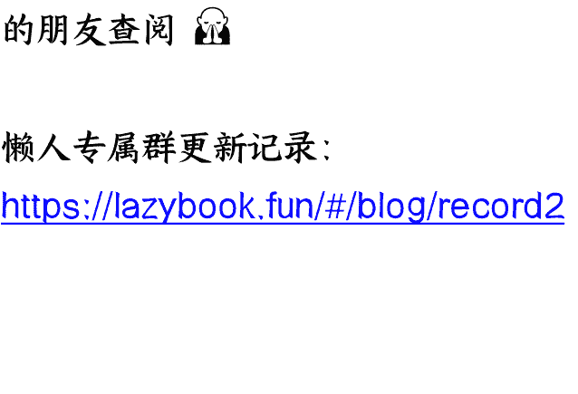

# 六月必看

整理：公众号懒人搜索，懒人专属群独享

懒人微信：lazyhelper

## 前言

## 大趋势还在，安心持股

先说结论：继续看好六月份大A的表现，如果运气好，遇到懂王发癫机构砸盘，那也是加仓的好机会。

六月二日港股照常交易，开盘即跌，很多人就开始自己吓自己，你明白港股是怎么涨上去的吗？又是为什么会涨？

港股涨的根本原因是国际资金在博弈，在东西之间选边，港币跟美元之间有关联，又跟RMB密不可分，所以资金冲进来避险，东西方博弈，无论是谁获胜，骑墙派都能分一杯羹，妥妥的稳妥避险资产。

几年前，国内的基金们曾经豪情万丈地喊出冲过香江，争夺港股定价权，然后套死了一批。

被打脸以后，大家才明白，HK金融圈的定价权，终究还是掌握在国际金融资本手上的，口号喊得再响亮的金融人也是玩金融的，在别人制定的规则下玩别人的游戏，有可能玩得明白吗？

说到底，港股还是受华尔街影响更大，定价权捏在人家手上，最近这段时间，鼓励大A的上市公司到港股上市，无非也是提供筹码，吸引国际资金来玩。

还是那句话，港股毕竟体量太小了，操盘的那一拨人又是玩华尔街集体坐庄的那一套，港股走势喜人，当然会影响到大A的市场情绪，但最终影响力依旧有限。

一个没办法完全控盘的市场，是不值得去付出太多心思的。

历史上从来没有那个中间地带最后是赢家，一旦两强争出了胜负，中间地带就没啥卵用了。

不妨想想，五月份到底发生了什么？美国在贸易战上已经基本可以被判定为失败，你甭管懂王天天左右横跳，各种瞎表态，只看全球在懂王的极限施压之下有没有谁跳出来妥协，连日本跟欧盟都不吃它那一套，更别说东大了。

搞出不给中国留学生签证这种搬起石头砸自己的脚的政策来凭空造牌，也不晓得是哪个大聪明给懂王出的主意。

只要我们这边的稀土出口禁令不放松，美国剩下那一点高端制造业都得死翘翘，什么乌克兰的稀土协议，那都是骗鬼的，就是不计较生产成本，你重建产线保证大部分能自给自足需要多长时间？你的高科技企业们等得了吗？

F-35已经拖了一年多没办法交付了，再拖下去，美国的军工产业是不是都得喝西北风去了？到时候金融资本一查账本，亏成了狗，要求关停产线，你拦得住吗？

我们跟美国月初在瑞士达成的初步协议，双方退回到4月2日前，我们的商品加税了，照样还有优势，美国向我们出口的商品，基本都不太可能卖得掉。

芯片国内企业敢要吗？谁不断供，大宗商品加10%是什么概念？别的地方平替大把，更有价格优势。

懂王的政策跟川剧变脸一样，随时随地地变，没有谁敢相信他，所以这波关税战打到最后的结果就是全世界联合起来孤立美国，让美国人自己玩去吧。

当然了，按照世界最真实的玩法，我要是武力值强横到可以碾压一切，你们可以不满意，打到你们满意为止就可以了。

印巴空战让大家看到了新时代的战争模式，东大等于是已经可以用代差级的武器来敲打美西方，你以为受伤的只有法国达索吗？连带一起受伤的还有美帝军工复合体们。

他们能拿出什么来打赢我们这边落后的J-10加PI-15以及预警机组合？以前了不起的航母舰队，甚至都没办法在红海那里干得过拖鞋军。

以前舆论话语权掌握在美西方手上，他们只会各种贬低污蔑我们，但现在，新媒体时代，加上有印度派出去的胜利宣讲团，全世界都知道耿大使说的都是大实话，也知道玩常规战，1v1外国，咱们都不带怵的。

世界的真相是暴力决定一切，有了绝对暴力加持，你是可以做那个给全世界分蛋糕的人的。

所以你看，美国人也知道急了，假期里挑了个索马里的软柿子捏了一把，似乎并没有达成耀武扬威的目标，黄金现货现在是飙升的，真要是打出威风来，金价应该下跌。

美国想对全世界玩一场贸易霸凌，结果自己武力值支持不了爆棚的野心，反而暴露了自己的众多弱点，于是日本、欧盟这些之前跟着屁股后面混的小弟们，开始对美帝的屁股捅刀子了。

六月份美国还有个集中化债的事要解决。

美联储甚至都对财政部捅刀子，先是美国主权评级被穆迪下调，再是美国众多大银行的评级被下调，直接把潜在接盘侠给砍了，那么最后美债该咋办？不行只能让美联储兜底呗。

美联储是没有钱的，但美联储有印钞机，印钞机因为白宫瞎混闹而印钞，背锅的应该是懂王。

但无论如何，印钞就是放水，你美帝放水了，凭啥不让别人放水？博弈嘛，结果就是从六月开始，全球印钞机又要开始加大马力了。

敞开了印钞是挺爽的，但消耗的是货币的信用，美联储喊话要降息两次，终究还是摆明了态度。

印钞又降息，美元指数必跌，热钱从美国市场流出已成必然。

钱往哪里去呢？除了东大，哪里还有那么大的市场，能容纳从华尔街流出来的热钱？

以前资金只能围绕着美联储华尔街的指挥棒转，只一个不能自由兑换就把RMB资产给困住，但现在，事情不是那样了。

去美元化的全球贸易是可以行得通的，RMB数字桥实现7秒跨境清算，比SWIFT快100倍，成本骤降98%。以前很难推动去美元化的国际贸易是因为美军牛叉，现在美军也彻底被祛魅。

所以为什么不能有两个体系呢？RMB不能自由兑换又有什么关系呢？只要能买到一切你想要的商品就可以了，货币最基本的功能难道不是购买货物吗？

想想看，如果你是国际热钱，知道美元肯定会跌，知道不用美元主导的国际贸易一样活跃，知道美国国内矛盾不可调和，甚至美联储都有可能被献祭，你会怎么做？

一部分资金当然会买黄金，但黄金的池子就那么大，另一部分资金就要押注下一个崛起的国际货币。

最近欧洲人开始蠢蠢欲动，欧元想吃掉美元的份额，这显然有点痴心妄想了，美国再怎么拉胯，人家好歹也是个统一的大国，欧洲又有什么资格挑战美国？

能接过美元地位的只有RMB，聪明的资金当然要买入RMB资产。

所以最近你会发现，每次港股大A只要被砸，立刻就会有资金过来抢筹，盘子很难被砸下去。

又有人问，没被砸也没涨啊，大A倒是涨一个给我看看。

我A在蓄势，找个合适的机会拉起来。虽然我依旧看好大A六月表现，但个人觉得，指望本月拉指数有点不太现实，指数依旧以震荡为主，月K大概率会收红，没必要太过于关注指数，精力应该放在精选板块和个股上，耐住性子，等待时机收获。

以下是付费部分：大家可以去关注下RMB存款利率，估计很快我们就要迎来零利率时代，其实我很反对一些大聪明的说法：低利率时代应该存钱，高利率时代应该借钱搞投资。

零利率会成为一种趋势是因为货币早已经数字化了，别否认，你就看看自己，看看身边的人，有多少人还在用现金？

无论你是存在支付宝还是微信里，又或者在银行卡中，钱其实都是在银行体系里。

以前我们还要担心下大规模的资本外逃，现在还用得着担心这个吗？大额资金其实很难随便出去的，给你放一些出去的口子，也都是坑。

给不给你利息，你最后都会把钱放在银行里，所以干嘛给你利息？说不定还要回过头来收你一个资金保管费。

当趋势是零利率，红利股长线就很值得投资了。

银行已经牛了很久，有谁还记得23年10月份汇金大规模公开增持银行股？当时大家都嗤之以鼻，现在再看，到底谁是小丑？

我喊了很久的中特估，让大家以存款的心态去做投资，如果分红能好过银行定存利率，并且行业趋势向好，有垄断优势，那就更好了。

六月份行情注定会非常折磨人，你重仓跑去跟市场博弈，未必能有那个心态扛得住波动。

个人建议拿一部分长线仓位，用存款的心态去买中特估。

建议集中在垄断行业，要的就是不可能有激烈的市场竞争，比如说电力、铁路、保险等行业。

有些人喜欢只看破净率，然后选建筑相关行业，怎么说呢，地产暴雷，对建筑行业的影响还没有集中爆发出来，利空没有出尽的时候，你冲进去，风险相当大，咱就是说，有那么多标的，何必非要找风险高的。

这里我要重点推荐保险行业。保险的逻辑很简单，手里持有大量的资产，只要RMB资产价格被重估，保险必然获利最大。

做保险的要记住，如果遇到某天保险板块大涨，记得适当减仓，大金融很难有持续性大涨，往往涨一天回调N天，大涨卖出，回调再买回来，实在是卖飞了，也没必要太过计较，到保险都能连续暴涨的行情，大概率行情也差不多到头了。

尽可能的避免做港股大科技，特别是那种在美国上市的。做美股的不要做中概股，这里必须要划重点！

为什么要在这里强调，懂王为了虚空造牌，连中国留学生都开始驱赶了，他还有什么做不出来的，之前就一直有声音在传，美国会勒令中概股集中退市。

你别跟我说什么华尔街跟白宫的博弈之类的话，懂王现在连美联储都想咬几口，你觉得他疯起来会顾得上谁？一旦有什么消息传出来，港股和美股都是没有设跌幅上限的，一天就能砸得你外焦里嫩。

也不要认为我想多了，君子不立于危墙之下，何必给自己找不痛快呢？

当然了，一旦真发生这种BT的情况，我鼓励大家勇敢积极的去抄底，因为股票的根基是自己的价值，我们看好RMB资产的逻辑非常清晰，中概股、大科技很多都是国内优质的企业，懂王可以让它们退市，但没办法让它们少赚一分钱，被杀绝对是错杀，很快就会弹起来一部分的。

这里我的态度也非常明确，个人不建议大家长线买入平台们的股票，道理我也讲了很多次，大平台们赚太多钱并不是什么好事，随时会迎来天罚。短线投机跟长线持有是两回事。

五月份热点非常分散，医药都被炒作过一波，医药真的有行情吗？医药的长线逻辑我们讲得非常清楚，三明医改越不过去，国家要从医药行业里挤水分，避免走上美帝的老路，20%的GDP被医疗利益集团给吃了。

这基本就已经封死了医药板块的上限。

你要跟我说什么创新药有广阔前景，呵呵，笑死了，可能吗？市场决定一切，国内的市场掌握在谁手中，还需要去多说吗？

为什么医药板块涨，因为市场上没有什么题材可炒，钱又有那么多，早前机构们手上一堆医药股，拉一下出货，反正也跌了好久的。

这就跟前几个月AI炒到最后没啥可炒的，就炒AI制药了，要是这么说，那就万物皆可AI，之所以选了医药，依旧是因为题材炒作到了尾声，不知道炒啥好，就选了个跌了很久的医药呗。

医药能涨是资金的偶然选择，不是必然结果，也很难持久。我建议大家还是要避开医药板块。

如果未来有大行情，行情来了，资金又不是脑子有毛病，去扎堆找医药？如果未来没有大行情，医药买了也没什么意义。

挺鸡肋的一个板块，没必要掺和。

- **重点关注：军工板块！**

我之前一直都不看不买军工，印巴空战之后特别写了篇文章，告诉大家军工的逻辑变了。

可以这么说，未来东大必将取代美国，成为全球最大的军工出口国。

看看美帝现在的军售数据，再看看我们这边军工企业的规模，巨大的想象空间啊！

之前中国军工一直不好做是因为我们主要市场是内销，国内买家锱铢必较，根本没有什么太大的盈利空间，并且还卷得厉害。

为什么不外销，那是因为军贸背后是军事霸权，我们一直强调和平发展，尽可能的避免对外亮剑。

还有就是军贸都是成体系的，列强有先发优势，最近这些年世界局势相对和平，我们的军工产品基础款靠着量大管饱，价格优势取胜，高端产品又没有多少所谓的实战经验。

印巴空战是实战证明，还有一个就是我们外交风格变了，经常性的选择亮剑，再有的就是对手也在实战中被证实了的确拉胯。

对外军售盈利情况那是相当的可观。实在不知道怎么买个股的可以定投军工ETF，参与一把帝国红利。

我们把未来的重点还是放在AI之上！

为什么我还是要坚定的站AI，因为这是明确的第四次工业革命的方向。中美搞科技竞争能争什么？除了AI还有什么可以争的？

我之前说过很多次，看透A股的本质，服务于实体经济，以产业为导向。

除了AI行业，我看不到还有那个产业需要密集的资金投入。

过去的五月份AI相关板块都有过活跃表现，无非是波动比较大，一些人坐了过山车，心里郁闷。

不要纠结在几天的涨跌上，我们看的是顶层设计，还记得几年前的新能源板块吗？这个行业喊了多少年，被人当了多少年的骗子，最后整体起来了，卷死了全球所有竞争对手，获得了全球垄断地位，参与板块投资的，谁不是获利丰厚？

从前的赛道是新能源，现在的赛道只有AI！

在AI赛道里，重点关注的有三个方向：数据、算力以及AI应用。

数据和算力没啥可说的。

重点说说AI应用，万物皆可AI，但能形成产业规模优势的首选机器人和游戏，前者是硬核攻击，后者是软腐蚀，最关键的是目前游戏板块还在低位，盈利模式清晰，并且前景可期，记住，我们游戏是可以出海的，可以赚外面的钱的，不是玩内耗。

最重要的是，游戏也能算大消费，并且还是个被砸了好多年的消费，往往市场在没什么题材可炒作的时候，会搞一下游戏。

也可以留意下算力芯片相关，懂王间歇性的抽风，说不定又会对英伟达的芯片出点新的禁令政策，当然了，即便懂王不发疯，政策一样鼓励国产自主可控，这个细分方向是可以重点留意的。

## 自主可控。

这个方向的重点在软件，现在硬件上能限制我们的比较少，芯片板块嘛，因为有深圳的新凯来，人家玩的是重构颠覆行业，所以我对芯片从多转空，除非炒新凯来相关概念。

以前一提自主可控就要炒芯片，现在在中美博弈，自主可控的重点要转到软件上，节前EDA因为懂王发癫被炒作了一回，以后像这种事多了去。

比起硬件，软件方面国产替代的空间更大，再有一个，软件炒作起来噱头更足。

有人问要不要蹲一波通胀概念？

个人认为现在蹲这个有点早，全球供应链被懂王的任性给搞乱了，以致于大宗商品价格波动也极其任性。

之前有粉丝问我，为什么黄金涨了这么多，他买的黄金股不怎么涨？

其实道理是一样的，通胀必须起来，这是政策，但通胀相关票现阶段很难起来这是现实，因为有懂王在那里搞事情，资金不会选择这个时候拉，你拉起来了，懂王出幺蛾子给你砸盘，请问怎么弄？

有耐心的可以多留意，多看少动。

## 银行股能不能继续做？

我认为大金融里风险最低的是保险，银行涨了这么久，关键时候人家会用来压指数，现在这个位置继续拉银行其实意义不大，至于券商，那是指数行情来的时候集中做的。

## 六月份有指数行情吗？

个人认为概率不大，如果怕错过的，可以逢低配置一点。

## 大消费能不能做？

答案是没必要做，港股消费很厉害，那是聚焦新消费，对应国内的就是游戏娱乐相关的，跟传统消费白酒之类的有毛线关系？

新消费能火爆的深层原因是能够走出去，不在国内玩内卷，赚外国人的钱，别理解错了。

汽车现在也能算消费里头了，还是不能做，某迪搞价格战，卷的惊动了高层，行业从蓝海直接杀成了血海，血海里先考虑生存，这种情况，股价能上的去才怪呢。

当然了，智能驾驶相关的硬件是可以做一下的。

还是那个话，贪多嚼不烂，大家根据自己的资金量和风险承受能力来选择股票配置吧。选到牛股不是本事，选到了还敢于重仓持有才叫本事。

建议大家多花点心思理解个股，理解涨跌背后的逻辑，不需要你多牛叉的能精准踩中所有的点，只要你能信念坚定的选了一个票，并且敢于重仓，吃够了一波主升浪，其实就够了。

巴菲特的年收益率不到30%，保持良好的心态吧。

懒人专属群持续更新中，已持续运营6年，整理超3000份各类精选付费文章 & 年费社群干货，全部开放下载。

本资料为付费群内部分享，仅供真实有需要的朋友查阅 🙅‍♂️

## 懒人专属群更新记录：

https://lazybook.fun/#/blog/record2