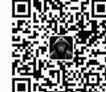
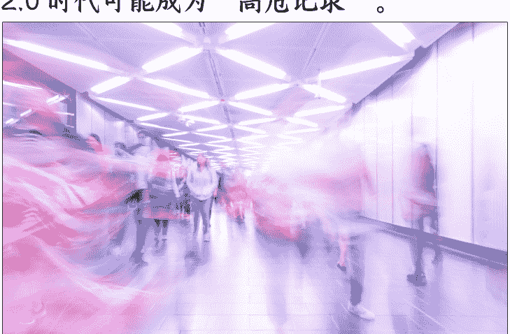

# 匿名信源与匿名记者
## 250603新闻实验室
整理：公众号懒人搜索，懒人专属群独享
懒人微信：lazyhelper

微信:lazyhelper
许多受访人原本并未意识到，自己在媒体上说过的话、留下的名字，数年后在川普2.0时代可能成为“高危记录”。

新闻实验室会员通讯（845）匿名信源与匿名记者

一年多前，新闻报道的“匿名信源”问题曾经引发一轮热烈讨论。当时，新闻实验室也做了一期播客回应这个问题。

本期会员通讯，我们再来聊聊这个话题，并且将它扩展到记者本人的匿名/化名问题。我们会从美国新闻界最近的一些变化说起，然后回到简体中文世界的现实。

### 川普2.0时代的“删名请求”浪潮
在川普重返白宫、加强对移民、少数族群和异见人士等群体的打压后，越来越多原本接受采访、愿意署名的消息源开始担忧自己的公开身份会带来切身风险。于是，他们纷纷向媒体提出“删名请求”，也即要求新闻机构将自己在过往报道中的名字移除。这一现象不仅在主流媒体出现，更在学生报纸、地区性小报和为弱势群体服务的专业媒体中大量涌现。

许多受访人原本并未意识到，自己在媒体上说过的话、留下的名字，数年后在川普 2.0 时代可能成为“高危记录”。如今美国的政府部门会主动翻阅学生报纸、社区媒体，追查持学生签证、绿卡者是否有参与“敏感议题”的抗议或发表“危险”言论。一些政府雇员、教师、绿卡持有者、学生签证持有者尤其担心，自己因参与社会运动、发表特定言论、公开性取向等事由，被政府或所在机构秋后算账，轻则丢饭碗，重则面临签证吊销、被拘押，甚至被驱逐出境。

现实案例中，塔夫茨大学（Tufts University）博士生 Rümeysa Öztürk 就因为撰写了一篇和巴勒斯坦相关的评论文章，被联邦探员在街头带走、关押。这一事件让许多移民和留学生产生了巨大的恐惧心理。事发后，美国的多家高校学生媒体、社区媒体收到大量删名请求，不少人希望自己头到尾都没在报道里出现过。

那么，编辑们怎么应对删名请求？

以美国历史最悠久的同志报纸《Washington Blade》为例，主编 Kevin Naff 表示，自己以往只会在极端情况下（如身处外国的受访者面临生命危险）考虑删名，但现在不得不逐案审核，仔细衡量风险与新闻使命之间的平衡。

美国新闻界资深的新闻伦理专家 Kelly McBride 分享了一个包含八组问题的框架，帮助编辑们评估每一个具体案例的情况：

- 1、 你的使命或对受众的承诺是什么？在这种承诺之下，你如何理解自己尽量减少对受众的伤害的义务？
- 2、 你是否出于其他原因删除或更改旧内容？许多新媒体的政策允许在信息不再准确、不再具有更大公共价值的情况下删除文章或整篇文章中的人名。这并不一定表明你也应该删除旧报道中的名字，但它确实提供了可以比较的平行案例。
- 3、 你们是否有能力逐一考虑申请？
- 4、 提出申请的个人是否属于被针对的群体？例如，是否有明确的证据表明政府工作人员中的同性恋者正成为 DOGE 的解雇目标？
- 5、 此人会受到什么伤害？是否会危及他们的生命？与被解雇相比，被送往萨尔瓦多的大型监狱更有可能危及一个人的生命。
- 6、 对于每项要求，将名字保留在报道中会给受众带来什么好处？
- 7、 如何让你的决定透明化？
- 8、 如果你要考虑一个人的请求，你如何做到透明并公平地对待其他人，因为他们可能根本不知道自己可以提出请求？

这是一个非常有启发的框架，它能帮我们思考这个问题的方方面面。针对最后一点，一些学生媒体已经在主动删掉关于抗议以色列军队的报道中持学生签证或绿卡的受访者的名字，即便他们还没有提出删名请求。

即便如此，删名并不能完全消除风险。网络缓存、第三方转载、社交媒体分享等因素，使得信息一旦发布便难以彻底删除。

而且，川普正在对匿名信源开战。他扬言要对使用匿名消息源的书籍和新闻媒体发起诉讼，声称要“查明”这些匿名消息源是否真实存在，甚至希望通过法律惩治“虚假作者和出版商”。

这一系列行动无疑加剧了受访者的恐惧，新闻机构也面临更大的核查和保护压力。

### 学生媒体：匿名成为常态，新闻伦理被重塑
在高校学生媒体当中，匿名和保护消息源的需求格外突出。学生媒体的报道对象多为同龄学生、教职员工和校内社群成员。随着美国社会环境趋紧，特别是移民政策、抗议行动、校园运动事件激增，许多校内受访者对个人安全和未来发展愈发敏感。

以福特海姆大学（Fordham University）学生媒体《The Fordham Ram》的一则报道为例——记者花了三个月调查校方管理失误，采访了 26 人，最终公开报道中只有两位愿意具名，其余人因为担心工作、学业、签证等风险，只愿意匿名或完全不作记录（off the record）。记者只能通过多方交叉验证、查阅文件和截图来佐证信息的真实性。

肯塔基大学学生媒体《Kentucky Kernel》主编回忆，三年前她在田纳西州拍摄针对堕胎权判决的抗议活动时，第一次遇到消息源只愿意透露名字而不肯说出姓氏（美国人的名重复率很高，姓氏则比较独特，因此只透露名不透露姓就和匿名差不多）。那时，她觉得“编辑会杀了我”，因为实名采访是惯例，很少被打破。而如今，她已习以为常：“只给名不给姓？没问题！”

越来越多的学生报纸开始调整政策，比如允许记者在报道抗议时，仅用“名+姓氏首字母”标识消息源。佐治亚大学学生媒体《The Red and Black》主编表示，这一政策不仅适用于巴勒斯坦相关抗议，也适用于移民、暴力事件等高风险话题报道。有时候，他们可能会指明消息来源，但在撰写报道时不会暴露消息来源的移民身份。

有些编辑部更进一步，主动建议国际学生或移民背景的消息源匿名，甚至劝说本愿意具名的受访者“为了安全还是不要署名”。例如威斯康星大学《The Badger Herald》在报道国际学生签证被吊销的事件时，主动建议一位愿意署名的女学生匿名，以免她因公开发言而受到额外打击。

同样，纽约大学的一名学生记者在报道一位叙利亚难民和绿卡持有者时，也曾建议他保持匿名。虽然受访者最初并不担心与她进行公开谈话，但这名学生记者在学校老师的建议下，认为这存在潜在风险，她不能“昧着良心”透露他的身份。

学生媒体的编辑们强调，匿名报道必须经过严格核查，通常需要多名管理层知情并留存录音、文件等证据。虽然匿名降低了报道权威性，但在当前环境下已成为不得不做的权衡。

匿名与删名当然不是理想的选择，但在极端环境下已经成为美国媒体，尤其是学生媒体非常普遍的无奈之举。在保护消息源的同时，新闻机构和编辑还要尽量保证报道的可信度和权威性，这也更考验大家的专业操作。

### 在伦理问题上，没有什么金科玉律
目睹美国媒体这几个月在匿名问题上的巨大变化，中国的新闻人可能会生发出“你们也有今天”的感叹。

在我看来，这也再次提醒我们：在伦理问题上，从来就没有什么金科玉律。对匿名消息源的严格限制和对实名消息源的追求，并不是可以脱离语境存在的绝对真理。它的背后有具体的政治和社会语境，更有仔细的考虑和分析。

同时需要注意的是，当我们说美国媒体出现“删名浪潮”的时候，绝不意味着“直接倒向匿名”就是正确的选择。实际上，正如上文所言，每一个案例都需要具体分析，都需要详细考量各种因素，在保证真实性，尽量平衡透明度和公平性的前提下，匿名和实名依然是艰难的、永远不可能完美的选择。

在今天晚上的新闻实验室线上沙龙里面，嘉宾小明也提到了一个很重要的点：“不能默认每个人都是不愿意发声、不愿意表达的。”实际上，就算在采访那些被认为敏感的议题时，也有人愿意用实名的方式来讲出自己看到的东西，因为他们有公共表达和公共参与的意愿，他们想要以实名这种更有力量的方式让社会听到他们的声音。

媒体保护受访者是应该的，告知受访者可能的风险是必要的，但这种保护不应该成为一种居高临下的“替你做出决定”。尊重每个人的能动性，才是最重要的原则。

另外，我们也需要认识到：在威权语境中，需要匿名的不仅仅是受访者，也包括记者。以端传媒关于中国的报道为例，不仅文中的受访者绝大部分是匿名，就连作者本人也是常常匿名、化名，这都是为了他们可以相对安全地做中国报道。

这种匿名的选择实际上给记者的职业发展带来了明显的不利影响，因为他们难以公开建立自己的作品集和与之相关联的声誉。他们很难告诉大家：实际上这八个笔名都是一个人。低调与隐身，这本身就与记者这种职业在发展路径上的一些自然要求相违背，但这就是简体中文世界里面做独立报道的现实。

美国同行们至少现在还不太需要担心自己的署名问题，因为宪法第一修正案依然提供了强大的保护。但是，威权语境下的记者们的经历和经验，值得更多地被西方同行看见与听见——毕竟，在这个年代，谁知道还会发生什么让人深刻体会到“环球同此凉热”的事情。

## 公众号
懒人搜索
懒人专属群

微信:lazyhelper
懒人专属群持续更新中，已持续运营 6 年，整理超 3000 份各类精选付费文章 & 年费社群干货，全部开放下载。

本资料为付费群内部分享，仅供真实有需要的朋友查阅

懒人专属群更新记录：

https://lazybook.fun/#/blog/record2