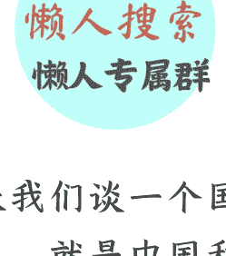

# 历史性大事发生，稳定币背后，是中美金融新战场
## 250604 《政经参考》节选

整理：公众号懒人搜索，懒人专属群独享
懒人微信：lazyhelper

微信:lazyhelper

今天我们谈一个国际和金融领域的大热点，就是中国和美国正围绕着未来的金融和货币的主导权，展开一系列的新博弈，所以这节课既是趋势课，也是科普课。

简单介绍一下背景，5月19日，美国参议院通过了《GENIUS法案》，这是一项专门为了控制稳定币而推行的法案，它把稳定币纳入了美国的金融体系之下，关于什么是稳定币，我稍后会详细介绍；随后的5月21日，中国香港也迅速通过了《稳定币条例（草案）》，5月30日《稳定币条例》正式成为法例。不只是中美，欧洲早在5月11日，就正式通过《加密资产市场监管法案》最终版本，但由于欧洲体量不大，所以我们今天只谈中美。

但我们这节课的关注重点不是稳定币本身，也不涉及任何加密货币的投资，而是这些事件反映出来的本质，就是全球各强国，尤其是中美之间在争夺新的货币霸权和金融霸权。这真是一个大转折时代，倒回五年你都很难想象会看到这样的时刻。

好，正题开始。

### 什么是稳定币，为什么它这么重要？

首先我解释下什么是稳定币。有的同学可能听过加密货币，其实加密货币分为稳定币和非稳定币两种，为了方便你理解，我打个比方。你可以把整个加密货币市场想象成一个游戏厅，稳定币是游戏厅里的游戏币，而非稳定币，比如比特币、以太坊等，就是各种热门游戏项目。

你要到游戏厅里去玩抓娃娃，首先要把手里的真钱换成游戏币，然后用游戏币去投币玩项目。稳定币就是加密市场的游戏币，你用这个游戏币就能去买比特币、以太坊等数字资产，还能用来支付、转账或者储蓄。

每个“游戏项目”的价格，比如比特币、以太坊，可能会经常变动，但“游戏币”，也就是稳定币的兑换价格是基本不变的。目前99%的稳定币锚定的都是美元，像USDT、USDC这些，1稳定币=1美元。当你不想玩游戏了，你就可以把这些“游戏币”按照原来的价格，换回现实世界的“真钱”。

所以，稳定币，其实就是数字世界里的一种“美元”，它和现实生活里的美元是 1：1 锚定的，但这种“数字美元”并不是美国发行的，而是各个私有化的“稳定币”公司发行的，所以不受监管，也不受传统银行体系的约束。

### 中美都在发力，都必须争夺

现在加密货币市场，体量已经超过了 3 万亿美元，换句话说，超过了广东省加浙江省的 GDP 之和，也超过了全世界电动汽车、光伏、锂电产业的总和。而 2024 年稳定币的交易量则是达到了惊人的 27.6 万亿美元，超过了国际信用卡支付系统 Visa 的总交易量。所以不论从哪一方面看，这都是一块非常、非常、非常大的蛋糕，重要的事情说三遍。

我直接说，谁控制了稳定币，谁就控制了加密货币世界的“铸币权”，所以各国都非常想要把稳定币纳入自己的金融货币体系中来。

对于中国和美国来说，稳定币不仅意味着超大体量的市场，更是解决当下问题的一把利剑，稳定币就像一个锚点，能够巧妙地解决一系列的问题。为什么这么说呢？

先看美国。

我在分析关税战的课程中反复提到过，美国当前最想要解决的，就是美元和美债的问题，更具体一点，是美元凭空超发和美债无人接盘的问题。

布雷顿森林体系崩溃之后，全世界都进入了没有黄金这种硬通货锚定的“信用货币”时代，之前很多人说，美国和美元后来是通过绑定石油，构建了“石油美元”体系，但我认为这种说法不准确，我认为真正的美元霸权其实是有三层：

底层是资源和商品，2000 年之前，美元绑定了石油和天然气，这些是刚需资源；2000 年后，美元则是绑定了中国的商品产能，中国作为全世界最大的生产国使用美元结算，为美元提供了信用背书。

美元霸权的顶层，则是美国财政和美国经济，财政赤字率、经济增长潜力、资本市场规模，这些决定着美元的上限。

而美元霸权的中间层，则是日元。这一点你可能会很诧异，我解释下，日本在 1990 年代经济泡沫破裂后进入“零利率时代”，在日本贷款基本没有利息，资本又是可以自由流动的，日本央行还承诺会持续买入日元，这些给了全球投资者一剂非常大的强心针。于是全球资本都在疯狂贷入日元，换成美元，然后用这些美元去全世界投资。这套模式下，美联储每印 1 美元，全球资本就可能通过日元给加了“乘数”，派生出了 3 美元，日元其实是成了美元的“中间派生物”，放大了美元的扩张能力，这给全球都带来了充足的美元流动性。

这才是真正的美元霸权的完整的三层体系。但这套体系演进到现在，上中下三层却都出现了很多问题，导致玩不转了：

- 一是顶层，就是美元在 2020 年无节制的超发和 37 万亿巨额美债无人接盘的现实。
- 二是中间层的日元收缩。在高通胀的环境下，日本央行即将结束维持了三十年之久的持续购买长期国债，把利率压在 0 附近的政策，日元不再是“无息、低价、流动性充足”的衍生品，不能再为美元充当“中间商”，美元在全球的流动性和影响力都会被迫收缩。
- 三是底层也开始松动。中美博弈下，中国的商品产能开始有了“去美元化”的苗头，全球外汇储备份额中，美元从 2000 年的 72%降到 2023 年的 58%。另外，石油的地位也因为新能源产业革命和美国的页岩油革命，而开始出现滑落，再加上全球都进入后工业化时代，石油作为美元的底层已经开始了很大的松动。

所以在这一系列的变局之下，美国必须重新审视自己的货币霸权，解决当下面临的一系列问题，而美国瞄准的，正是稳定币。

美国推出的《GENIUS法案》规定：
- 第一，稳定币发行方必须接受美国的直接监管；
- 第二，稳定币的底层必须是等值美元或者美债，最少60%要用于投资美国国债。

除此之外，部分加密货币交易所已经在实质性地推动“美股代币化”进程。什么意思呢？就是在加密市场发行苹果、谷歌、微软等大批美股公司对应的“数字货币”，买这些代币，就等于买美股。

这套逻辑确实很巧妙：任何人都可以通过加密货币，极其方便地投资这些好公司，即使你不投资美股代币，但只要你持有加密货币，那就等同于购买了美元和美国国债，因为新法案要求稳定币绑定美元和美债，美国更是有权直接监管这一切活动。

这相当于美国用自己的信用为加密市场背书，而加密市场则反过来为美国政府背书。根据渣打银行的测算，新法案落地后，稳定币的基础规模将从当前的2300多亿增长到2万亿美元，所派生的货币规模大概率将超过10万亿美元，同时这些稳定币又必须绑定美债，这将在极大程度上解决美国37万亿的巨额债务。

更重要的是，这不仅同时解决了美元、美债、美股的多重问题，还拿到了对加密货币市场的主导权，掌握去中心化的金融体系。不得不说，美国人在玩金融这方面，确实很厉害。

但我要提醒的是，这套模式实质上是把美元的“中间衍生品”，从日元换成了稳定币，让稳定币帮助美元在全球扩大流动性，但底层的锚定物还没有更换，所以这不是美元的“换锚”，很多人说得不对。

然后我们来说说中国对于稳定币的考虑。

中国自然不会把这么大一块蛋糕拱手相让，虽然中国内地是禁止加密货币的，但却让香港加码，成为中国争夺未来货币霸权的桥头堡。

所以我们能看到的是，在美国通过稳定币新法案的两天后，中国香港也迅速通过了自己的《稳定币条例》，争夺稳定币领域的标准制定权和监管主导权，至少不能让美国一家独大，为所欲为。

香港的稳定币条例核心就两条：
- 第一，稳定币发行机构在香港开展业务必须要持牌，牌照由香港金融管理局把控，而且必须接受香港的全程监管。
- 第二，任何稳定币的发行必须有足额的储备资产，除了美元资产外，一系列人民币资产，包括中央国债、政策性金融债，都可以作为储备资产。

懒人微信：lazyhelper

而最近不仅这一个动作，还有证监会等金融部门集体表态，支持A股上市公司赴港上市，一季度已有宁德时代、恒瑞医疗、赤峰黄金等50多家A+H股企业，密集登陆港交所。同时央行推动“央行数字货币+多边央行数字货币桥”的全新模式，5月全国已经有多地宣布完成首笔“多边央行数字货币桥”的跨境支付业务。

加上前面的香港稳定币法案，我认为这三件事其实是一套组合拳。简单讲，宁德时代等A股龙头企业去香港二次上市，这种“产业+资本”双出海的模式具有深层意义：一方面通过港股全流通机制，吸引全球资本；另一方面把中国的制造业优势，转化成资本定价权。

而香港稳定币先行，则为离岸人民币稳定币开辟了合规通道，就是香港打了个样，给人民币稳定币和数字人民币探路，而且与美国的“美债绑定”模式不同，香港方案允许储备资产包含人民币国债、政策性金融债等，等于是用中央政府的信用，来给香港稳定币背书。

好，接下来我再分享一点关于香港稳定币的个人看法，这里我就不去分析国家意图了，你姑且一听。

如果香港稳定币能发展起来，反过来等于是又给央行的数字货币背书了，到时候推出人民币稳定币，或者大规模铺开数字人民币的时机也就成熟了。

换句话说，中国其实也在构建自己的金融循环：人民币国际化的瓶颈在于有外汇管制，不能自由汇兑，但通过“数字货币+制造业出口”的组合，中国正在创造新路径：稳定币为数字人民币奠基，中国通过出口向外输出产品，外国企业接受数字人民币支付，所得资金用来投资 A+H 股的中国优秀资产，形成一套回流的闭环，而香港就是这套环流的中心。

在我看来，这套打法，本质上是在构建“稳定币+数字人民币+港股资本通道”的新体系，让人民币绕过美元结算体系，直接进入全球金融循环中来。

## 金融战可能比科技战更残酷

最后再说下金融战。在我看来，金融战，是比关税战、贸易战更重要的战争，因为现在和未来大国博弈，从来不是以关税、以贸易分出胜负的，到最后的胜负手，是科技和金融。

中美之间的关税战，双方可以暂时停手，但货币和金融的战争，可能只会你死我活。

美元试图通过稳定币进一步渗透全球，美债危机则通过加密货币转嫁给全球市场，以便让美元霸权进一步加强。

而中国也在推动数字人民币+香港稳定币，成为新兴市场的结算标准，这会削弱和反制美元霸权。

因此，这场博弈，我们必须参与，而金融战可能比科技战，更残酷。近代历史上的大国兴衰，货币霸权都是关键因素，现在的稳定币争夺，只是序曲而已。

📖 懒人专属群持续更新中，已持续运营 6 年，整理超 3000 份各类精选付费文章 & 年费社群干货，全部开放下载。

本资料为付费群内部分享，仅供真实有需要的朋友查阅 👤

## 懒人专属群更新记录：

https://lazybook.fun/#/blog/record2
懒人微信：lazyhelper