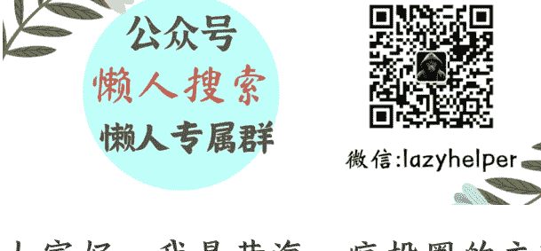

# 2025，分享4个中国消费市场可以关注的趋势方向
### 250605 生财精华
整理：公众号懒人搜索，懒人专属群独享
懒人微信：lazyhelper

大家好，我是黄海，疯投圈的主理人，最近对于有一篇关于中国消费趋势的内容，咱们生财小伙伴反馈很不错，邀请我给大家分享一下。本文源自我给海底捞管理团队的内部培训分享，文章相比原分享有删节处理。

中国消费市场正经历着前所未有的结构性变革。人口结构、经济发展、以及营销渠道和消费场所都出现了重大变化。这些变化不仅重塑了商业竞争格局，更预示着未来十年的增长机遇。基于最新消费研究，本文将深度解析四大核心趋势，为企业提供战略决策参考。

## 一、银发经济：活力老人的消费新势力
第一大趋势就是银发经济。

中国老龄化进程正在加速，2025 年将迎来 1964 年出生高峰人群的退休潮。这一群体约 60 岁，拥有稳定的退休金和充裕的时间，成为消费市场的新主力。

与传统认知不同，真正推动银发经济的并非八九十岁的高龄老人，而是五六十岁的“活力银发族”，他们经历了改革开放红利，具备较强的消费能力和消费意愿。

根据最新数据，中国目前65岁以上人口比例已达15%，相当于日本1995年的水平。值得注意的是，中国老龄化速度将显著快于日本：日本从15%老龄化率到30%用了30年（1995-2025），而中国预计仅需15-20年，预计2040年前后65岁以上人口比例将突破30%。

在消费能力方面，尽管中国缺乏直接数据，但日本经验显示，老年群体在财富积累上具有显著优势。日本60岁以上人群持有现金占比高达35%，临终时平均金融资产超过3500万日元（约合150万人民币）。

这一现象在中国具有相似性——中国老年人普遍拥有房产且无负债，退休金稳定，其消费决策往往影响家庭整体支出。

日本经验显示，老龄化社会中，老年消费呈现社交化、健康化和情感化特征。在中国，也开始有企业瞄准银发一族，满足他们的社交和情感需求。

例如，我投资长沙的茶馆项目「东茅街茶馆」，为老年人提供了社交第三空间，通过复古装修吸引目标客群，成为他们日常消遣的重要场所。

虽然店内也提供茶水、简餐（如长沙河粉）等基础餐饮服务，但核心卖点在于为老年人打造了一个社交平台。许多老年人在此打牌、聊天、消磨时光，甚至形成了固定的社交圈子。该项目通过收取餐饮费用作为商业模式，人均消费不高，但凭借高复购率和稳定的客流量，已经实现盈利，并正在区域内复制扩张。

## 二、低成本缓解焦虑：消费成为情绪解药
第二大需求，则是缓解焦虑。在经济增速放缓与不确定性加剧的背景下，中国消费者正通过消费寻求情绪抚慰，且倾向于选择低成本、高性价比的解决方案。这种“向内看”的消费心理催生了多个细分领域的爆发式增长，企业通过精准捕捉消费者对“小确幸”的需求，在逆境中开辟出新赛道。

比如，嗅觉经济成为悦己消费的低成本入口。与奢侈品相比，嗅觉类产品入门门槛更低，成为消费者悦己消费的首选。中国香氛市场规模在2024年突破200亿元，增速为全球市场的3倍。

例如，主打“东方香调”的国产品牌通过线上营销迅速崛起，以百元价格带占据年轻群体市场。这类产品强调“自我疗愈”功能，通过柑橘、木质等自然香型营造舒缓氛围，满足都市人对情绪调节的需求。

睡眠质量成为现代人的普遍焦虑点，推动睡眠经济市场规模在2024年达4955.8亿元，预计2027年将增至6586.8亿元。亚朵酒店通过“睡眠场景”实现业绩突围，其自有品牌枕头、床垫等产品销售额已接近酒店主业收入。

还有一类是单身化趋势推动下的宠物经济。对于单身人士来说，宠物是情感陪伴的重要载体。

我们看到，日本宠物市场规模已超儿童消费，宠物专用酒、老年宠物保健品等细分产品兴起。在中国市场，宠物烘焙、智能喂食器、宠物摄影等服务正快速增长。

文化精神消费成为低成本情绪治愈的重要载体。日本“秋叶原”模式在中国复制，二次元消费从年轻人向中老年人渗透。例如，B站推出“银发计划”，针对50岁以上用户提供戏曲、养生等内容，2024年老年用户活跃度同比增长120%。

此外，国漫 IP 衍生品市场规模突破 200 亿元，《哪吒》《大圣归来》等动画电影周边产品销售额超 10 亿元。这类内容消费通过情感共鸣和文化认同，为消费者提供了逃离现实压力的精神港湾。

## 三、圈层消费：精准定位与垂直深耕
第三个趋势就是圈层经济。中国消费者正加速分化为不同消费圈层，企业通过精准定位垂直客群实现突围。小红书、抖音等平台的算法推荐机制，让每个圈层形成独立的信息茧房，消费者需求得以被深度挖掘。

例如，山姆会员店锁定 “品质家庭” 客群，通过大包装商品、会员制和自有品牌策略，2024 年会员数量突破 800 万，单店年均营收超 10 亿元。

其 4000 款 SKU 中 40% 为自有产品，如麻薯、小青柠饮料等爆款，通过差异化避开价格竞争，续卡率超 60%，会员年均消费超 1.3 万元。

这种 “少而精” 的选品策略，既降低了供应链复杂度，又通过独家商品提升用户粘性，验证了 “服务好一个垂直圈层即可创造千亿市场” 的逻辑。

另外一个圈层——单身族，同样催生了另一个庞大市场。日本数据显示，其单人家庭占比已超 35%，宠物数量超过 15 岁以下儿童，中国宠物消费规模同样突破 2000 亿元。

一个很有意思的例子是“宠物专用酒”这一特殊品类。这类产品不含酒精，专为宠物设计。主人下班后独酌时，可与宠物共享“对饮”场景，通过拟人化互动填补情感空缺。这种拟人化消费场景的出现，本质是社交关系重构的体现——当传统家庭结构弱化，宠物成为情感代偿的重要载体，企业通过产品创新将这种需求转化为可持续的消费场景。

圈层经济的本质是“服务好一个垂直群体就能实现巨大商业机会”。

无论是山姆的品质家庭、还是二次元文化爱好者，企业都需要通过产品设计、场景体验和情感共鸣建立深度连接。在消费分级的大趋势下，这种聚焦细分需求的策略，将成为企业抵御市场波动的核心竞争力。

例如，日本老年旅游社品牌 Club Tourism 通过上万条定制化线路（涵盖摄影游、温泉游等），占据日本老年旅游市场 1/3 份额，年营收超 100 亿元人民币。其成功印证了：在细分赛道中，深度挖掘用户生命周期价值，比盲目追求规模扩张更具可持续性。

## 四、非标价值：健康化与体验溢价
第四个趋势就是非标价值。也就是说，除了标准性的产品功能之外的价值。在高度内卷的市场中，功能性产品陷入价格战红海，而非标价值成为企业突围的关键。

比较突出的非标价值趋势是健康消费领域。过去健康消费领域似乎是“伪需求”，但是经历过疫情的消费者，又正逢老龄化的趋势，健康消费已经转变为“真刚需”。我们看到，农夫山泉东方树叶无糖茶饮凭借健康标签成为百亿单品，2024年市场份额接近50%。

霸王茶姬推出的“原叶轻乳茶”主打低卡路里，成为行业首家主动标注卡路里的品牌，2023年销售额同比增长300%，门店突破5000家。

健康化已成为消费者愿意支付溢价的核心价值。

运动户外行业同样呈现非标价值趋势。lululemon通过“健康生活方式”品牌定位，2024年中国市场营收增速达40%，其“瑜伽裤+运动休闲”的产品矩阵满足了消费者对功能与时尚的双重需求。

新兴品牌Vuori则以“男性lululemon”为定位，设计简约的大地色系运动服饰，通用于健身房和办公室场景，2022年进入中国市场后迅速崛起，获软银等机构 50 亿美金估值。

这类品牌通过场景化、情感化的产品设计，将运动服饰从功能性单品升级为身份象征。

日本经验显示，健康消费在经济低速增长期仍能保持增长。过去 30 年日本 GDP 基本停滞，但健康类消费支出成为少数显著增加的类目。

运动旅游也属于低成本健康类消费。日本经验显示，经济下行期运动服行业逆势增长。日本运动户外服装市场规模已超过 7000 亿日元，近年年增长复合率约 5%，远超同期 GDP 增速。在中国市场中，慢跑、骑行、露营等低门槛运动成为主流。

### 中国消费市场的变革浪潮正在重塑商业未来。
从银发人群的崛起，到年轻人的焦虑消费；从圈层化的精准渗透，到健康化的价值重构，这些变化构成了未来十年的核心增长逻辑。

对于企业而言，唯有以动态视角捕捉外部变量，同时修炼内功，将外部趋势与内部能力结合，才能在激烈的竞争中脱颖而出。

感谢大家的阅读，有任何想讨论的也欢迎在评论区留言。

微信:lazyhelper
公众号
懒人搜索
懒人专属群

懒人专属群持续更新中，已持续运营 6 年，整理超 3000 份各类精选付费文章 & 年费社群干货，全部开放下载。

本资料为付费群内部分享，仅供真实有需要的朋友查阅

### 懒人专属群更新记录：
https://lazybook.fun/#/blog/record2