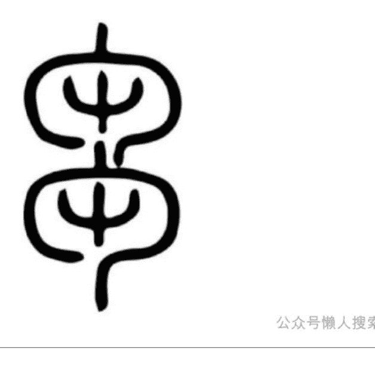
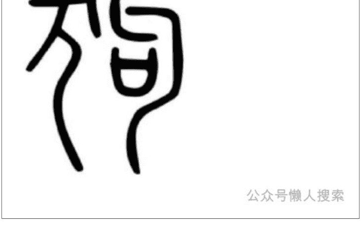
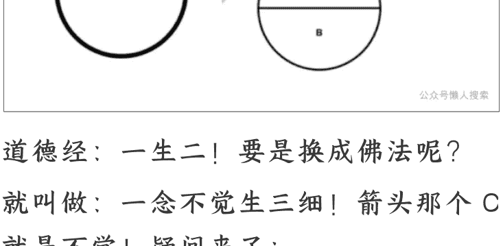
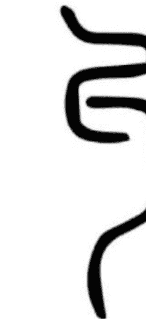
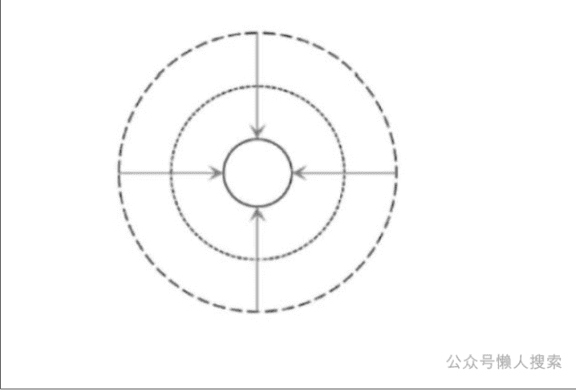

公众号懒人搜索，懒人专属群分享

# 再颠覆下对《道德经》的认知——刍狗！
250606 第三只眼观
整理：公众号懒人搜索，懒人专属群独享
懒人微信：lazyhelper

道德经大约 800 个模型，诸如刍狗这些都是主要模型，把主要的形态搞清楚后，体系基本就出来了，后面自己就能解读翻译了！

无外乎一阴一阳，一阴一阳嘛，只是组合关系有主副之分。

还是开篇先啰嗦铺垫，每次都得铺垫一下，要不然不带感就不好入进来。

- 1、破形。
- 2、破结构。

破形：
就是看《道德经》的时候不要停留在形，老子讲的都是“气”的层面，是看不见的层面。
例如：
本文中“以万物为刍狗”的“狗”字，不能当成有形的汪汪队，也不要加个“刍”字就当成什么稻草狗，这种停留在形的层面解读老子肯定是不对的。

破结构：
就是从静态结构思维跳出来，这个在之前文章反复啰嗦关系 VS 结构。不是说结构不好啊，之前也敲过结构的东西，但要理解老子一定要通过关系思维。

昨天在星球回答小伙伴，引用一个谷堆悖论，一粒谷子不能叫谷堆，然后加加加成谷堆，那么具体加到哪一粒是谷堆呢？

这时候数学语言或者结构思维就不够用了，就很难处理动态存在的边界了。

所以认识事物不能仅凭一种语言，道德经是一种关系性语言，道家叫做——象。

它处理啥呢？

连续变化的存在形式，这玩意不能像数学一样精确。

不要一听到“模糊的”就鄙夷，模糊要比精准更接近事实，事实是动态的呀，佛家叫无常，易经叫变易。所以道家叫象数同参，两种思维都要兼具，一点也不冲突。

在上一篇《幻》里面敲过：使用即存在，存在即思维。

我们现在是“倒着”来的，是前人已经使用出来的结果，产生了现在的语言，我们倒着通过语言进入，用语言引导思维，来领悟老子怎么使用！

开始正文..

## 刍狗是什么？

这是刍字,根据开篇铺垫,要观察“连续运动”的形态呀。

啥意思呢?

刍是有节奏的运化生长。(两个为阴,阴成形)

定义再长点:有节奏的、无差运行的、等分的运化生长。

字典都是错的。

例如说是割草,这就不对了,因为停留在“形”上面了,要不开篇为啥要两个铺垫呢?

咋个形呢?

说外面那个包围结构像个镰刀,然后割里面的中,傻乎乎的..

带这个包围结构的字多了去了,还都是大镰刀?

再说如果非要体现镰刀割草,那只需要上半部分就能表达了,非要上下两部分结合干嘛呢?显着咱家镰刀很多是吗?

所以不能停留在形上，中文是“象—形”文字，先有象这才是根本，可以用形去喻象而方便理解，但不能说这就是ＸＸ形。

例如康熙字典说刍是喂牛马的草，这跟大镰刀一路的，更傻乎乎的，大镰刀起码还动动脑子有点逻辑。

比如说刍草，不是草有个刍的种类，而是“用草来刍”，或者按照中文左阳右阴的规律，是通过刍运动（阳）来使用草（阴）。

例如《周礼》中有“刍之三月”，是通过用草喂养三月让小动物不断地刍。

这个“刍”和“仁”在运动模式上是共振的，到了本文后面就知道了。

这是狗字，这造型像汪汪队？

看见狗就画个狗形造字，动物种类有100多万种呢，这样造狗字岂不累成狗。

这个字稍稍有点麻烦，左边是尤。为啥麻烦呢？

无、尤、尢、元、犬、兲，从造型就能看出是一家人对吧？

要理解尤字，就得把这个“大家庭”给理解喽。比如说，这一家人都有丿 ㇏两条腿对吧？

这就是之前敲的《弱胜强》的造型：

丿代表——强；

㇏代表——弱。

这个强弱反反复复震荡的形态，就分成这一家子：

人！这么敲根本敲不完，只能分成几篇来聊..

中文造字都是“气力震荡”出来的，这玩意是天造地设的。要不为啥每次开篇都来个铺垫？

因为我们总被固有的结构思维限制住！

能说震荡有几斤、多少米、多少块啥的吗？（非结构）震荡是死啦啦、静态的形吗？（非形）

所以一定要从形和结构中跳出来，才能进入老子世界！尤，就是一次又一次的震荡着！

之前敲过，同音必同源，中文这玩意深似海，只有你想不到，没有它阐述不到的，越深入研究就越神奇，仓颉画字天雨粟鬼夜哭嘛..

### 尤和又是不是同音的？

当然了调不一样，一个向上（二声），一个向下（四声），这玩意也有说头。向上为阳，是代表正在运动的过程中！

所以：

尤——是震荡着的过程中。又——是本轮震荡完事了。

句，这个就要看之前文章的。

这里简单回顾一下啊：

里面的口字，要破形对吧？不能当成嘴巴呀！那是啥？

画出模型演化过程就直观了：

道德经：一生二！要是换成佛法呢？

就叫做：一念不觉生三细！箭头那个 C 就是不觉！疑问来了：

为啥万事万物就要一生二呢？

为啥要有“生”这个动作？咋来的？

为啥我们就要“不觉”呢？

佛陀为何又说我们“本觉”呢？既然本觉为何不觉？回头再说，要不然扯太远，总之就一生二了..

这里提一嘴留个扣，留一个“为什么”以便下次串联上。

分成 A 和 B 之后，就跟两口子分开似的，是不是就要互相找对方？

B 就是女人，分开就有点懵逼了呀，就在原地哭哪。就转圈了：“老公你在哪，老公你在干啥，老公你快来找我呀"!

这就是——自力。

当然特别说明：没有男女鄙视链啊，纯粹是理性表达啊!

女人代表阴，所以 B 画成实线啊，阴是看不见的、在内部的，拿两口子的形象说事，这样更容易带感，说阴还要隔着一层名词，就不直接体会呀。

啥叫自力?

就是万事万物都有个内部的动力，你看女人多厉害，万物就是一个个阴阳两口之家啊。

A 就是男人，分开之后不能原地哭呀，得动起来呀，得找媳妇啊..所以 A 用虚线来画，因为这部分会变成运动了。

那么好了，在“句”里面男人咋动?

看造型就知道了，像是两个钩子将要勾在一起了对吧?

懒人微信: lazyhelper

其实这就是丿和㇏两股力量，可能有点晕了..

硬逻辑的话：阴性力一动，阳性力就受到感应，就要不停波动显现。但这么硬讲不容易理解，形—象来比喻带感啊。

就好比啥呢？

男的找他媳妇，是不是要在路上跑着找？

跑来跑去就把路连起来了，这就显化出来路线！又好比啥呢？

我们读书学习有句号：

女人之阴性自力——就是我们要思考。你为啥要思考？

自力而为！

笛卡尔的“我思故我在“只领悟了半边。

思考这件事，或者说这股力，能拿出来看见吗？但就是有那么一股力量存在呀。（阴）

男人之阳显动力——就是敲了一大堆字。

每个人都有思考的自力驱动，但是敲出的字（路线）可就千差万别了呀，找媳妇跑来跑去都不一样呀..

然后在这一阴一阳的运动合作下，就画出句号了。

那么好了，尤和句合一起的狗是啥意思？左阳右阴，左显右藏。

就是通过左边来显示或叫表达出右边，左边的不断运动成就出右边。

狗是啥？

是万事万物通过一次又一次的震荡运动，从而达成了自我完整、自我合并、自我存在、自我圆满等等。因为是翻译成现代话啊，所以多来点描述性词汇，这样带感更强一些，但其实并不能准确表达老子的意思，还是需要回到模型上去——意会！

为啥？

象是模糊的、连续的变化，这玩意越是想要特别严谨，就失去的含义更多..

例如五行木火土金水，非要很严谨的说五行分别是啥，那完蛋了，什么金属生水，烧木头点火啥的，这么一讲就把人给框死了。

象要意，所以叫——意象。

古人叫做只可意会不可言传嘛，这可不是装逼的话，真的是这样子的。像我这敲字和画模型啥的，只是提供个引导和参考作用，当你意会完了之后，可能比我敲的表达要好多了！

那刍狗是啥？

组词也还是左阳右阴啊，也就是”刍“比“狗”更加外层（更加显现）了。还是男的找媳妇比喻啊：

句一一女的转圈给自力感应，男的开始跑来跑去四处找媳妇。尤不断跑呀跑就尤成路线了。

例如组词尤其，就是把路线中的某个环节给特别摆出来（其）。

刍——当男女狗上之后，不是骂人啊..就是找到媳妇抱一起了，这不又称为两口子了嘛，就是一家人了呀，然后回头看看家庭经历，是一波波节奏的，每一波家庭节奏里都有故事内容，家庭就这么“刍”出来了呀！

然后把男女替换成百姓、万物，一回事嘛..把天地不仁，以万物为刍狗，合起来阅读。

重点不同于结构，关系是没有分别的，所有关系运动都是一样的！啥意思呢？

天是不是男？地是不是女？角色不同，但属性一样.

动，这俩 AB 是互相感应、互为依存的。

那为啥还要分成天地、圣人百姓、男女啥的？

因为关系虽然没分别，但是有内外、主客之区别啊！没有天地，哪有男女？

这就是关系生关系，即一一震荡！要不为啥道家叫做“一宇宙”呢？

天外的关系震荡出地内关系，地内关系又震荡出万物关系，万物关系中又震荡出男女关系，等等就这样子反复震荡。

那比天外还大的震荡叫啥？仙宇宙！那比宇宙还大的震荡叫啥？答：没有了，因为宇宙无始无终，佛法叫作一无始！

这就跟上文的”为啥一生二“联系上了，为啥？没为啥，因为无始。

道生一，谁生道？无始

当然这块不太好敲，超越语言表达的天花板了，就跟数学语言无法描述谷堆变化界限似的。

所以深入领悟《道德经》的话，不仅要 去形（破唯物论），还要去数（破结构），破结构里就包含破线性思维（破第一因），这都是后面升级的后话了。

天地不仁，以万物为刍狗。圣人不仁，以百姓为刍狗。这里面还有个特别重要的——以！

不能直译现代话为：把、将。

将万物当做稻草狗，这种形层面的解读水平太低，肯定不对是吧？

但进入气层面之后，也不能翻译成：将万物或者叫使得万物按照刍狗运动。为啥？

因为要入《道德经》的基本门槛，就是要找到“本来就那样”的感觉！

当然我们不可能真的做到“本来就那样”，那就开悟了，但是我们要以此感觉为目的。这是啥意思呢？

就是一切发生都顺乎自然，你就像是个旁观者一样看着一切，但不能去干扰一切，不仅不能拿手去碰，也不能思考..

对头！

必须要找到“不要思考”的感觉，禅宗叫做“动念即乖”嘛。

当然这很难啊，表述就很难..

如杠精就会说，不思考你敲字干啥？老子不思考敲道德经干啥？

世智辩聪就会抓你语病了，无论啥语言都会有语病啊，语言本就是不圆满的，是攀缘心的结果必有欠缺啊。

或者这么表达：嗯，知道了，就完事了。

这就没有思考，思考是你还不知道，知道了换个词叫一一法尔如是！或者再换个词叫一一道心！例如佛家有四证，当然叫四证代号的很多，其中一种：观待一一作用一一证成一一法尔。貌似是线性的，其实是个圆。佛陀说我们本自具足，就是本来我们就有觉知，就能够不思考而“知道了“这样子，即本就看万物法尔如是，这就是觉知。但是我们不觉啊，觉性vs思考可不一样，思考还是在“一念不觉生三细”呢。然后我们为了回到法尔，就不断起攀缘心啊，然后在观待（二元化）、作用（合一关系）、证成（真实体悟）这样子绕一大大大圈，最后回到法尔如是。观待和作用这种词比较枯燥，换成那俩现代词，就是结构与关系嘛。例如自由主义经济，这也是在绕大圈呢。香港有个学者说《国富论》就是抄袭道家，咱先甭管它抄袭与否，就单说自由其实就是这个“以”的含义，就是经济理论上想谋求出一个“本来就那样”的规律。但可惜的是，国富论一上来就偏执了，说人类经济活动的主要动机，就是谋求个人私利。

倒不能说这不对劲，但是偏执了，处在“观待”这个层面，就跟佛法里讲的”偏空之果”似的，或者就跟国与家的辩证似的，西方倡导的是先有家，然后再组合成国，拿这股劲天天往别的农场套。

偏执一端就会不自由了，所以自由主义就逐渐沦为谋求私利的假自由了。大佬文集圈例如当贸易上占便宜时候就提倡自由，占不到便宜比谁都不自由，各种不讲道理撒泼打滚的行为都来了，现在老美表达的就很生动呀..啥叫偏执？

就是佛法说的分别心嘛！

所以老子在西方还动物世界的时候，就说了“非以其无私邪！故能成其私”。后来到了佛学，就是邪见与正见。

邪就是外道的、偏执的、线性化的知见，正就是具足圆满的知见。

后来引申成邪恶与正义的意思了，因为偏执邪见就会产生邪恶行径啊，老美大流氓行径多邪恶啊，放毒不邪恶吗？

所以人要学习跳出二元对立思维，才能跳出偏执邪见。

偏离道心就不容易理解老子，或者干脆一个字——偏！

例如说诸子百家里也有解老的，但是由于各自的政治立场就偏离道心了，

因为搞政治的家伙总觉得自己是主宰，要不全地球哪来一百多种意识形态呢？就是《道德经》本身也被不断篡改，当然这种篡改的干扰有限，之前也敲过爱啥版本，因为搞复原最终不是靠字，而是靠心性，感而遂通故嘛。

到了现代社会，很多人更偏的离谱，很多专家学者都是混名利场的，是当“大喇叭“用的，背后都是有意识形态灌输的！

例如弱其志强其骨啥的，有的专家给解读成让百姓停留在小动物形态，这解读多坏啊。这种解读者要是深挖他，大大概率是个公知，肯定回头就要讲西方意识形态了。

所以观察的最终叫做心观，或者叫观心，而不是看字，字也是由心而发敲击出来的，只是衣服罢了，能够心观就能看出来咋穿衣服的，为啥穿衣服啥的。

回到题，往道心上扶正跟“以“有啥关系呢？就是不要把“认为”当成“以为”！

其实现代话都用错了，以为前面不能加我，可以“我认为”，但不能“我以为”，只能是“道以为”，这差别很重要的。

这个以字在《道德经》中出现 160 多处，搞错意思那就完蛋了..这里可能有懒人微信：lazyhelper

吾≠我！
吾是一种修道内观的状态，好家伙敲不完..

总之这个以字，姑且理解成一自然反应、自动就怎么怎么样。所以内观在《心经》中叫做观自在。天地不仁——以万物为刍狗。

就是更广大的关系运动，自动就反应出次一级的关系运动，即——继续震荡！这个过程就是：气化形！

天地是摸不着看不见的，此二力通过“不+仁”的运动关系，就逐渐震荡出种种有形万物，震荡气化的过程再进一步细致去看，就是——刍狗。

圣人不仁——以——百姓为刍狗。

不是圣人把万物当稻草狗了，解读至此，是不是这种翻译特蠢？或者特坏？圣人就是不偏离道心的人！

例如庄子在《逍遥游》里说：至人无己，神人无功，圣人无名。

无己不是没有自己，己不是我的意思，己、巳、弓、乙啥的又来一家子人.简单说啥叫己？

就是运动的平衡性，用之前文章的话说，就是内外部结构平衡。啥叫至人无己？

就是算做人了，有资格当人了，好家伙…
懒人微信：lazyhelper

这不是庄子骂街啊，其实很多人都是动物性，当然我们都有动物性一面，这叫做“显现”啊，至人就是能显现出内外平衡，做人是很难的！

如非要有个标准参考，在这句话之前还有：乘天地之正，而御六气之辩，略略略..然后至人升级是神人，啥叫神人？

无功的人，不是没有功劳啊，是“不做功”的人，或者叫“以无做功”的人，可能不太好理解。

拿现代时髦话说，就是“不是努力干啥玩意”的人，因为努力干啥都是错的，过程和结果都是错的，因为总在“我认为”啊，无功就趋近于“无为”了。

圣人无名，这个牛逼了，道可道，名可名，这都与道肩并肩了，还不牛逼吗？一般都当成名气、出名那个意思了，这种现代话直译都不对啊，啥意思呢？类似于“定义”的意思，但这也不周全。

应该是“没有自我表达”的意思，这玩意最好看模型意会，翻译只是引导带感罢了。啥叫无名？

就是融于天地万物，就跟电影《超我》最后那个场景似的，主角幻化出“我即万物”了，要是换成佛法就是涅槃了、入了如来地了。

总之很牛逼,咱只能敲敲字解悟,证悟那可不管够的..

圣人就是证道了,能体悟天地,能够“无名”而角色替代了,从而“以百姓为刍狗”了。

这是为字,这玩意单独怜出来还不好解读呢。

之前解读过《焦周》篇,比较粗糙,没办法,这里就能串起来进一步理解了。上面那个像小手手一样的模型,其实就是——作。

当然不是一模一样啊,这块先不用抠太细,上面模型不是个字,但是和作是有亲属关系的。

作就是给运力呢,就好比让它(周下面的模型)干起来、动起来。谁给力?进群加

天地、圣人啊,给一种运力关系,然后下面的模型(万物、百姓)就自动化起来了。

懒人微信: lazyhelper

下面是“行”和“，..”的结合，...不是水啊，这是截在最内部的火（动力），下就是内嘛，万事万物都有这么个“初始能量”啊。

这玩意因为外部更大的关系给力了，就开始燃起来了，然后就自动化的“狗行”了。

所以不能翻译成“是”的意思，例如“生而为人”，就是投胎来了，初始业力能量块燃烧了，就开始自动化“狗行成人”了..

要是翻译成“生下来就是人”，这不跟神经病一样嘛！总之，道家始终要找到自动化的感觉就对了。

前文说“刍”和“仁”是共振的，仁也是自动化的。

上一篇《天地不仁》敲过，仁不是爱的意思啊，那太肤浅了，咋个自动化呢？上篇说仁是无差的、有节奏的、等分之类的描述。

拿个日常现象来直观理解：红绿灯。自然界没有红绿灯也能够仁运动，人类社会因为攀缘心太重了，或者叫分别心太重了，就容易乱套乱撞，我要走前面这样子，我要占便宜..

但是呢，也不能扮演好人好事先生，说您先走，都这样的话路口也乱套了。最好的方式就是按照红绿灯来走，谁也别占便宜，谁也别谦让。例如春天说：我先走一步！

那完蛋了，小则气象乱套，大则天崩地裂。反之也不能：夏天您先走、再扩展一下。

人体本身就适应某种红绿灯，所以突然从大北方跑到大南方啥的，就很容易水土不服，因为运行上来个“您先走”模式，身体就发出乱套信号了呀。

还有人平常也不要吃奇奇怪怪的东西，一方水土养一方人嘛，一旦换了奇怪食物就容易红绿灯乱套呀，乱套之后是不是就要扶正？而身体自动化扶正是需要损耗能量的。

所以老话讲萝卜白菜保平安，不是说这些东西便宜容易填饱肚子，而是能红绿灯常态化，这样损耗的最少。现在很多疾病都是“富贵病”，就是吃出来的，当然科技狠活和大流氓放毒那种除外。

当红绿灯仁运动起来了，描述这个场景就叫做和。

所以会有个词叫——仁和！

左阳右阴，通过仁运动来达成和的结果。所以又有个词叫——当仁不让！

同音必同源，仁、壬、任虽不是一个妈的，但这都是亲戚。因为仁，才有了任。

因为充当了“红绿灯”所以就有了“任务！”

懒人微信：lazyhelper

既然有了任务，就不要“让”了，不要“您先走了”，那会乱套的，不是谦虚的时候..有了“任”之后，就要开始“壬”了。

壬是天干之一，天不（布）力嘛，天外关系运动向下干涉了。

旁边加个人就来到地力，以圣人之力代行天力，这是任务，所以“圣人不仁”嘛！

以上只是一个角度讲刍狗，即大关系震荡出小关系，天地如何震荡出万物。

就好比下图这样的：从外往里面震荡，从阳往阴震荡。

但是关系其实不分大小啊，所以老子接下来就要单拿出“关系本身”来讲了。

即：橐籥——虚而不屈——动而愈出。万物都是化。

📚 懒人专属群持续更新中，已持续运营 6 年，整理超 3000 份各类精选付费文章 & 年费社群干货，全部开放下载。

本资料为付费群内部分享，仅供真实有需要的朋友查阅 🙏

懒人专属群更新记录：

https://lazybook.fun/#/blog/record2