### AI落地案例集

## 第一期

得到 AI学习圈出品

2025年5月

## 目录

序言：跟实干家学AI落地 01

AI学习圈同学落地案例（*排名不分先后）

- AI+ 教育  石云同学：如何用AI激发孩子的学习兴趣？ 03
- AI+ 教育  礼诺涵同学：如何让AI当好孩子的英语教练？ 14
- AI+ 法律  王喆同学：如何用AI搭建知识库，高效应对咨询问题？ 24
- AI+ 医疗  杜诚勇同学：如何用AI搭建医学数据库，辅助诊断？ 30
- AI+ 医疗  刘宸同学：如何用AI搭建智能导诊，辅助解决“挂错科”问题？ 35
- AI+ 教学  黄浩同学：如何用AI搭建课堂知识库，解决老师答不过来的问题？ 42
- AI+ 运营  桑化科同学：如何用AI快速处理群消息，为社群运营提效？ 48
- AI+ 运营  余琛同学：如何用AI培训新人主播，为直播运营提效？ 55
- AI+ 市场  俞已元同学：如何用好AI，为大型活动智能排座？ 61
- AI+ 销售  鹤涵同学：如何用AI快速写标书，为市场销售人员减负？ 68
- AI+ 销售  冼侃同学：如何用AI做产品智能推荐，提升销售响应速度？ 76
- AI+ 产品服务  石云升同学：如何用AI自动查单号和物流，提高退货处理效率？ 83
- AI+ 组织提效  毅恒同学：如何用AI给员工培训和考核提效？ 89
- AI+ 组织提效  潘磊同学：如何用AI筛简历、出面试题，提升招聘效率？ 96
- AI+ 出海  邱珞同学：如何用AI快速评估数据是否合规，助力企业出海？ 103

## 序言

### 跟实干家学AI落地

这本小册子，其实并没有太大的野心。在正式开始之前，我想先聊聊，为什么要做它。

我们都知道，这几年AI的发展特别迅猛，各种大模型层出不穷，ChatGPT、Midjourney这些名字，早就成了人人耳熟能详的热词。打开短视频平台，满屏都是“逆天AI神器”“这些工具你得焊死在键盘上”之类的标题。反正照这个趋势，我的键盘明明有104个按键，但已经焊死了1000多个AI神器了。

但另一个现象也很明显：越是热闹，越是混乱。各种AI产品教程、快餐式“提示词包”、过度吹嘘的宣传视频、眼花缭乱的自动化工具……很多普通人看完之后只觉得焦虑，不知道从哪儿开始，不知道哪个靠谱，更不知道“跟我有什么关系”。

那时候，我脑海里出现一个念头：我们太需要一些真实的声音了。不是从技术发布会里来，不是从投融资报告里来，而是从“用AI做事的人”那里来。

于是，这本《AI落地案例集》有了雏形。

那么，这本案例集具体收录了哪些内容呢？我们收集的大部分案例都来自AI学习圈的真实用户，由他们自己以第一视角讲述，或者由我代为转述他们使用AI的具体过程。

你会看到很多真实、生动的场景：有视觉创意领域的艺术家、也有职场人如何用AI提升日常工作的效率；有家长和老师在家庭教育中引入AI的实践；也有一线医生如何借助AI进行病理分析；还有来自各行各业企业真实的落地经验。

什么样的案例能收录进来呢？

我先可以拍着胸脯说，这里面任何一个，都不是付费案例，不会成为一个广告宣传册。

我们只希望每个案例都能清晰地回答几个关键问题：“遇到的具体问题是什么？”、“过去都是怎么解决的？”、“现在如何用AI来解决？”，以及“最终效果怎么样？”、“有没有可以复制借鉴的经验和方法？”通过这些结构化的问题，我们力求每个案例都既有启发，也有实操性。

这些案例，不是AI公司高大上的PPT演示文稿，而是“人如何与AI合作”的真实行车记录仪。

在这些案例里，你会看到试错，也会看到判断；会看到AI“说错话”，也会看到人如何一步步“引导它说对话”；会看到“用得好”和“用错了”的反差。

在这个过程中，我们真正想提供的，是一种新的范式参考：AI不只是工具，它是一个互动对象，是你思考方式和工作流程的一部分。

因为每个人、每家企业的背景和目标都不同，所以这本案例集记录的，不是放之四海而皆准的正确答案，而是一个个学霸的学习笔记。

接下来，我想聊聊这本小册子究竟希望帮你实现什么。

我们的目标读者，是那些对AI感兴趣、愿意学习和尝试，但还不一定特别了解AI的普通人。你可能是一名职场新人，想通过AI提高工作效率；也可能是一位创作者，希望借助AI实现新的创意突破；你可能是一位教育者，想用AI丰富课堂体验；也可能是管理者，希望AI能帮助企业实现更多可能性。

这本案例集并不是一本技术说明书，而是一系列真人试用报告。我们希望，当你读完这些案例后，心里会生出一种共鸣和自信：“我也可以这么用AI!”

每一篇案例都可以看作一个应用参考模板。它的价值不在于展示AI的技术有多炫酷，而在于激发你的想象力和执行力，让你真正理解：AI能怎样帮你解决现实问题。

最后，我想和大家分享一下，我们是怎么理解人和AI的关系的。

首先，我始终相信，人不会被AI取代。我们也不需要担心AI会来抢走我们的工作——AI是工具，是属于我们的合法“游戏外挂”。

但要用好这个外挂，它可不是一根魔法棒，挥一下、念两句咒语就能解决所有问题。它更像是一个永远在进化的学徒，能学很多东西，但需要你的判断、经验和质疑去引导，才能真正发挥价值。

AI的出现，其实是在重新考验每一个专业人士：你该如何提升自己的能力，和AI一起成长？你能不能让它成为你的超级合伙人？

这本书还只是一个起点。我们会持续收录来自各行各业、不同岗位的AI落地实践。它不是一个完美的总结，而是一个莽撞的开始。

感谢所有愿意分享自己使用AI经验的朋友们。你们的每一次尝试、每一次修正、每一次分享，都是这个时代最宝贵的脚注。

我们希望，这本《AI落地案例集》能帮助更多人打破观望，迈出第一步，跑出属于自己的路径。

那么，祝你在AI的加持下，所向披靡，无往不胜。

## AI落地案例 No.01

得到AI学习圈编辑部：

面对标准化考试与孩子个性成长的冲突，AI 学习圈同学 @石云 以“提问力驱动”为核心，搭建了一个基于 AI 的家庭教育实验室。

她通过“马斯克智能体”激发孩子的好奇心，借助Flowith实现科学知识的可视化，并结合AI教练辅助评估思维发展路径。

这次的案例，她分享了在“如何用 AI 激发提问力”、“如何构建智能体对话模型”、“如何进行认知评估辅助”等方面的实操经验，帮助有意探索个性化教育路径的家长，找到清晰可行的方法参考。

## AI+教育 石云同学：如何用AI激发孩子的学习兴趣?

姓名：石云  职业：HRBP
公司：某跨国IT咨询公司  领域：AI家庭教育
关注TA：得到知识城邦@Jenny木妈 | 微信公众号“木妈Aidea”

**Q: 你在工作和生活中遇到了哪些主要的挑战或困难?**

A: 我开始探索“AI+教育”是在我儿子上一年级之后（他现在读二年级）。起因是一个很现实的痛点：因为职业的关系，我很清楚，标准化考试和唯分数论不利于孩子的长远发展，也不会真正帮助他适应未来的社会。

我希望他能在一个更个性化的环境中成长，重点培养的是一些底层能力，比如提问能力、思辨能力、解决问题的能力，以及积极的心态。但这些能力在传统观念的教育体系里，很难真正学到。

作为普通家庭，我们没有办法一开始就把孩子送去国外或者创新学校。所以，我的教育理念其实是和传统教育有冲突的。为了在两者之间找到一个平衡点，我最先引入的方式是通识教育和日常的思维启发。

**Q: 过去你是怎么处理这个问题的？**

A: 在没有AI之前，这样的引导确实非常耗费时间和精力。尤其对于职场父母来说，要做到深度的沟通和启发，其实挺难的。

比如孩子提出一个问题，我们会一起发散找可能的答案，然后去B站等平台查找相关视频让他学习，看完视频后，再一起快速总结。但这个过程既依赖我们能否找到合适的内容，也非常耗时。最后，往往又变成了知识的吸收，而不是思维的启发。

如果父母没时间，或者不知道怎么引导提问，这个问题可能就停留在表面。很多时候，这类提问都带有随机性，如果碰上父母心情不好或者正忙，也很容易被敷衍带过，孩子的好奇心也就被悄悄关上了。

### 得到 | AI学习圈

### Q: 你是如何使用AI来解决这个问题的？使用AI后, 效果如何?

A: 后来有了 AI, 孩子提出的每一个问题都能得到更好的回应和拓展。AI帮助普通家庭实现了平衡标准化教育和个性化成长的路径。

比如有一天他在煎鸡蛋后问：“为什么水很快蒸发了, 油还在锅里?”二年级的他正处于好奇心爆棚的阶段, 这是一个很好的时机。我们一路从家里聊到学校门口, 启发他先自己想一想, 可能有哪些原因会导致水蒸发了而油没有。

晚上放学后, 他又接着和“AI 马斯克”讨论——这是我给他搭建的一个马斯克智能体。这个智能体不会直接给答案, 而是从第一性原理出发, 引导孩子一步步去思考问题的本质。

通过几轮互动, 他明白了背后的原因是结构不同。

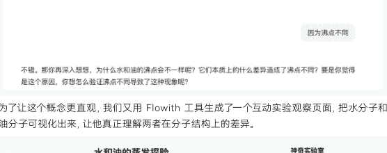

为了让这个概念更直观, 我们又用 Flowith 工具生成了一个互动实验观察页面, 把水分子和油分子可视化出来, 让他真正理解两者在分子结构上的差异。

有了这个开头，我再给他补充了一些系统性的通识读物，比如《分子王国》这本书。这样，一个简单的问题就形成了完整的链条：从提出问题→发散思考→实验验证→得出结论，再进一步引发新的提问。

这个过程中，孩子的好奇心被真正打开了，他也在提问中获得了成就感，自然而然地想问更多、探索更多。

再比如，孩子不知道预习和复习的重要性，其实我们小时候也不懂，是因为没人告诉我们大脑是如何学习的。而我知道，孩子是一个喜欢探究“WHY”的人。

因此，为了让他明白，学习效率和方法其实和大脑的原理以及学习方式有关的，我们就做了一个“大脑科普学习的可视化网页”。孩子点击互动完后，他说，“哦，我知道了，我之前自己画思维导图就是三次链接过程：输入、输出、再输入”，这样我就记得很清楚，不会忘记。

### 1 大脑超能力启动站 🧠

你的大脑里有约860亿个神经元（脑细胞），它们彼此连接，就像一个超级复杂的网络！

### 当你学习时，大脑里发生了什么？

每当你学习新东西，你的神经元就会伸出小手臂相互连接！这些连接越多，你就学得越好！

重复练习时，这些连接会变得越来越强，就像锻炼肌肉一样！

### 《天才学习法》告诉我们：

- 学习有三种方式：被动学习、主动学习和创造性学习
- 被动学习 < 主动学习 < 创造性学习
- 右脑负责想象力和创造力，要多加训练！

### 神经元连接游戏

点击按钮，看看学习时神经元如何连接！

### 2 专注力训练营 🔍

你的大脑有一个超强的“探照灯”，它就是你的注意力。专注是学习的基础！

### 为什么专注很重要？

当你专注时，你的大脑能量都集中在一个地方，所以你学得更快、更好！

但有很多“注意力小偷”会偷走你的专注：噪音、手机、分心的想法……

### 《天才学习法》告诉我们：

- 大脑需要休息才能保持高效工作
- 小朋友版“番茄工作法”：学习15分钟 → 休息2分钟
- 学习时要减少干扰，创造安静的环境

自从我们养成了和 AI 共创的习惯, 孩子遇到问题就会主动去和“AI 马斯克”或者“AI 通识百科助手”对话。这两个智能体都是我提前设置好的, 不直接给出答案, 而是通过启发式提问, 引导他自己找到思路。所以他现在的提问能力明显提升了, 能追问底层原理, 也会从不同角度去看待问题。

当然, 作为父母, 我们要善于观察和思考, 从孩子日常学习中找到AI可以切入的点, 用AI帮助我们放大孩子的兴趣, 和快速补充他需要提升的地方, 让孩子快速得到反馈后调整和修正。

比如: 我用AI教孩子踢足球？是的, 听起来是不是有点疯狂？但我既不是足球教练, 不懂足球, 甚至不是球迷。

背景是这样的, 孩子上足球课, 训练的就是传球和防守, 他们的球队都是7-8岁的孩子, 还都是选拔过的, 因此基础并不差。但是很多孩子传球都不合格, 大部分都是本能接球然后传出去, 运气好就成功了, 运气不好被拦截了。

于是教练在一旁特别生气, 因为他讲了很多遍了, 需要观察, 然后传出去。孩子们好几个都出错, 一出错教练就吼得大声, 一吼孩子就更胆怯了, 教练也纳闷：“我到底该如何说你们才听明白? 这么简单的动作”。教练也亲自和小球员一起示范了几次, 但是该出错的还是错。

我不懂足球, 但我观察下来, 其实传球就是找位置, 找到空间后准确地给出去, 我观察下来的结论是, 最好是自己和队友站的角度, 还有防守队友呈现三角形。

确实很简单, 但是孩子缺乏全局视角, 也不知道什么样的跑位是正确的。

### 1. 不懂足球，如何借助AI帮孩子学习?

我意识到这是一个很好的“学习时机”。于是踢完球后, 我立马用Flowith给孩子做了一个AI网页, 让孩子更加可视化的观察到传球的空间感和跑位的重要性, 部分截图如下:

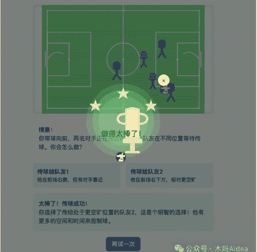

情景：
你带球向前，两名对手正在接近，队友在不同位置等待传球。你会怎么做？

做得太棒了！

传球给队友1
他在前场右侧，但有对手靠近

传球给队友2
他在前场右下方，相对更空旷

太棒了！传球成功！
你选择了传给处于更空旷位置的队友2，这是个明智的选择！他有更多的空间和时间来控制球。

再试一次

公众号·木妈Aidea

### 小练习：三角形传球

三角形传球是一种很好的基础练习，可以帮助你：

- 提高传球准确性
- 学会传跑配合
- 培养团队协作意识

怎么练习？
三个人站成三角形，传球后立即跑到接球队友的方向，这样大家都不停地传球和跑动！

### 记住这些要点

| 抬头看 | 跑位配合 | 传得更远 | 考虑下一步 |
|---|---|---|---|
| 传球前一定要抬头看球场上情况，知道队友和对手的位置 | 不断停球不碰，找到好的空位接过去，给队友创造传球空间 | 传球要传到队友能轻松接到的位置，不要传到他脚下 | 传球后随着球向前跑动，寻找空位，让队友随时都可以传给你 |

公众号·木妈Aidea

孩子体验完毕后说:“对啊,我就是想的三角形,和队友站成三角形好传球”。但是在实际踢球的时候,他的视角可不是这样的。

其实很多时候,不是孩子不认真、学得慢,而是缺乏“看清全貌”的机会,很多教练一开始就让孩子练技能、记动作,我很少能看到教练会先让孩子们看见整个结构,知道“这个动作存在于什么场景、要达成什么目的”。所以很多孩子也是比赛很多次后,才大概明白之前教练教的动作为了达到什么目标。

今天我写完这个观察后和AI交流,我才知道这种“先看结构和全貌、再练细节”的方式,在教育理论里也有相关支持,布鲁纳提出过一个关键观点:只有当孩子掌握知识的整体结构时,才真正掌握了学习的核心。

虽然我当时并不知道这段理论,但它确实正是我从我自己学习经验中悟出的直觉,无论学什么,只有建立了结构,理解了全貌,后续的技能练习才会真正有效。

### 2. 如何通过足球拓展到其他的学习?

后来,我又和孩子深度聊了一下,如果要踢好足球,哪些能力和关键是必备的?

孩子在和我讨论完“怎么踢好足球”后,自己梳理了一张《足球运动员是如何成长的?》。他把球员必须具备的能力划分成了三大类,然后把自己需要加强的地方打上了三角形:

- 专业技能类：带球、传球、射门、防守、过人等
- 合作类：沟通、鼓励、团结
- 思考与战略类：观察、三角站位、调动对手

列完后，孩子说：“清晰多了，还挺有成就感”。

我接着问，成就感来源于哪里？孩子说就是感觉知道了哪些地方需要加强，目标很清晰。

我趁机继续引导：“那以后你带着自己想练的目标去上课，会不会有不一样的感觉？”。孩子说，那就不是被动学习了，会更加清晰要练习的点。

其实这一过程完美体现了元认知（Metacognition）的核心机制：对自己“知道什么、不会什么、该怎么练”进行主动觉察与管理。

其实，我在和他讨论足球运动的必备能力时，就是希望能通过自己的经验先把这项运动进行分类整理。当他将看似杂乱的足球动作内化为有分类的结构体系，并从中生成“自我练习的重点”，他实际上已经从单纯的动作练习，走向了“策略性学习”。

这个分析方式能拓展到其他任何一种学习场景。

因为在我看来，任何学习都是一样的，不光是足球、英语、语文或者是架子鼓都一样。只要是学习一项新技能，就会有章法和关键技能，在学习之前必须要对所学东西的结构有全貌的了解，然后结合自身的情况进行分析，学习的时候才会有的放矢，也才能事半功倍。

所以看似在教孩子踢足球，其实是让孩子“学会如何学习”！这正是 AI 工具带来的学习方式的颠覆。

过去，我们是“边学边猜”——不知道重点在哪，也搞不清难点是什么，只能靠重复和意志力硬扛。

而现在，孩子可以借助 AI 快速“看清地图”，理解模糊的知识点、定位自己的薄弱点；家长也可以借助 AI 对孩子的状态做出分析，从“无从下手”变为“精准指导”。

我们作为父母要学会的，不是怎么教孩子一项技能，而是怎么陪孩子建立起学习的方法论，“学习如何学习”，并不断迭代和更新自己的所学。

### Q: 在用AI的过程中, 是否遇到了一些新问题或新挑战? 你是如何解决的?

A: 在使用 AI 进行家庭教育的过程中，我发现一个常见的问题是：如果不特别提醒，AI 往往会直接给出一大串答案，这其实不利于孩子思考和学习，因为得到答案太容易了。

为了避免这种情况，我用扣子给孩子搭建了专属的智能体。

如果只是一些知识性的简单问题，用豆包普通聊天就可以了，但如果是那种需要深入追问“为什么”的问题，他就会使用“小学生通识百科大全”或者“马斯克学习教练”来帮助自己想明白。这两个智能体的特点就是不直接给答案，而是一步步引导他思考。

### 根据你的经验，其他人如何才能更好地使用AI?

A:
- 1. 我发现很多父母用不好AI，不是因为不会用工具，而是提不出有效的问题。比如我建议父母可以先把AI当作育儿教练来使用，很多人也会去尝试提问，但总是得不到真正落地的方法，最后就放弃了。为什么？因为大家常常会问：“孩子写作业拖拉怎么办？”这其实只是一个现象，不是真正的问题。真正有价值的问题应该是这样提的：“现在你是一名精通心理学、认知科学、儿童发展心理学的专家。我发现我的孩子写作业总是拖拉，我不知道原因，请你作为育儿教练帮我一起分析可能的原因，并给出帮助孩子养成高效完成作业的方法。”然后再补充孩子的年龄和特点。只有这样，AI才能理解你真正的需求，并基于你的具体情况，给出更贴合的建议。
- 2. 父母在使用AI时，往往不清楚该用在哪些场景，原因之一是对孩子的需求和观察不够敏感。举个例子，我之所以为孩子开发了“小学生通识百科助手”这个智能体，是因为有一次检查作业时，我看到孩子的课堂练习上有个问题：“你还有哪些好奇的问题？”他在有限的格子里写了8个问题，涉及风、雨、火山、生物等各方面的内容。看到这些问题，我意识到这是一个很好的契机，便迅速为他打造了一个智能体。吃完晚饭后，孩子就开始和这个AI聊起来。通过和AI的互动，他的好奇心得到了满足，同时也激发了更多的好问题。
- 3. 很多父母可能只是用AI来辅导作业，上传作业让AI批改并给出意见。然而，他们常常发现，AI工具并不能解决孩子学习动力的问题。即便是最好的工具，如果孩子不喜欢学习，效果也会大打折扣。我们真正应该做的，是通过AI来发现孩子的独特优势和兴趣，基于这些特点，设计出孩子喜欢的学习方式。举个例子，我之前为孩子搭建了一个英语生词的智能体。我们都知道学英语很重要，尽管有了AI翻译，我依然认为孩子学习英语能帮助他拓宽视野，构建更全面的世界观。传统的英语学习往往是通过背单词和大量重复记忆来进行的。而现在，通过AI，孩子可以用更有趣且符合自己兴趣的方式来学习单词和运用英语。
- 4. 父母把AI当成答案的终点，而不是再次共创的工具。很多父母的交互都是一次的，以为AI给出答案就完事了，却忽略了真正的关键在于你看到这个方案后，这个方案会激发你的想法，然后去改进优化，这里的关键是父母对于基本的教育理念、沟通方法等需要有一定的学习。不然AI给出的再多策略也难以真正落地。比如父母用AI生成了一份定制化的学习计划，但孩子是否愿意配合，过程中如何持续激发兴趣，如何根据反馈调整节奏，依然需要人来观察、感受、微调。因此我建议更好的方式是，把AI生成的内容当作“初稿”，在使用中逐步优化为真正适合孩子的。

总结一下，我认为父母要用好 AI 做家庭教育，需要掌握场景识别、问题拆解、AI 角色设定、反复打磨和边用边修正的技巧。同时，父母自己也需要借助 AI 提升教育基本知识和对孩子心理特点的理解。

在我看来，真正有效的AI教育路径应该是：
- 1、建立“问题意识”：首先明确“想解决什么问题”，比如孩子可能在逻辑思维上有困难，或者缺乏学习动力。在明确问题后，选择AI工具作为辅助手段。
- 2、区分“表层需求”和“本质需求”：例如，孩子数学成绩差，可能是因为计算错误，也可能是因为畏难情绪。AI可以帮助分析孩子的学习障碍，从而为家长提供更有针对性的教育方案。
- 3、与AI共建“教育模型”：将育儿理念转化为可执行的AI指令。例如，使用“苏格拉底式提问”训练孩子的思辨能力，而不仅仅是批改错误或解决表面的知识漏洞。

我始终觉得，未来的竞争不再是“谁能更快生成答案、谁能更准确诊断错题”，这只是“效率竞争”，而效率上，人绝对比不过AI。

更重要的价值将是如何通过AI帮助孩子发现自己的思维特质、设计个性化成长路径——最终成长为有智慧、有创造力、有情感的人，这才是教育革命，也是AI无法超越的维度。

通过父母认知的提升加上AI工具的辅助，我们能够为孩子打造更具深度和个性化的学习路径，培养出具有独立思考、自主学习、创新能力和批判性思维的个体。这才是我们作为父母应该追求的教育目标。

## AI落地案例 No.2

得到AI学习圈编辑部：

为了解决“三四线城市缺乏优质英语启蒙资源、家长自身语言能力有限”的难题，AI学习圈同学@礼诺涵 借助AI工具，搭建出一套适配孩子个性的英语启蒙教学系统。

这次的案例，她分享了在“如何设计AI提示词构建专属英语启蒙教练”、“如何用AI进行安静书创作”、“如何借助多工具实现绘本互动”等方面的实操经验，帮助有意探索AI育儿的家长，找到一条可复制、可落地的陪娃成长新路径。

### 礼诺涵同学：
### 如何让AI当好孩子的英语教练？

| 姓名 | 礼诺涵 |
|---|---|
| 职业 | 全职宝妈 |
| 领域 | AI+教育 |
| 关注TA | 得到知识城邦@礼诺涵 ｜ 脑图笔记达人 |

### Q：你在工作和生活中遇到了哪些主要的挑战或困难？

A：我是一位全职宝妈，家里有一个三岁半的孩子。我们生活在四线城市，缺乏优质教育资源。我考察过五家本地热门的幼儿英语机构，不仅费用高昂，而且每次上课+通勤至少耗费三小时。然而，朋友反馈孩子在这些机构上课，最多也只是会念教材，并不能真正开口说英语。

我自己从外企离职多年，英语早已生疏，曾经学的也是“哑巴英语”。不过，通过使用多邻国这款产品一年，我找回了一些语感，也纠正了发音，逐渐有了陪娃学英语的信心。但我知道，以我自身的能力很难设计系统的英语启蒙流程，于是，我决定借助AI的力量解决这个问题。

### Q：过去你是怎么处理这个问题的？

A：我和一位住在上海的宝妈交流密切，她是MBA硕士，口语流利，孩子从1岁起英语启蒙，现在已经能阅读英文版《哈利波特》。她给我很多建议，比如如何玩转绘本、制作安静书等。

为了学习她的做法，我每天泡在小红书、抖音、视频号、YouTube等平台上搜索案例，但优质内容稀缺，每次刷到手疼也只找到2-3个合适的例子。更麻烦的是，这些资料大多与我家孩子的分级读物不匹配，内容还得手动调整，效率极低。

> 如果孩子八个阶段，一个阶段144课时，一课时90块钱
> 我算了一下，全下来不到九万三，所以果断没买，对自己狠
> 九万三学几年？
> 其实如果时间长点，也害怕倒闭
> 没想学几年，就是八个阶段全部下来的费用
> 一个阶段一个阶段的收钱
> 那还好，因为现在机构倒闭的多
> 关键是一般上90min课，三岁的孩子他也受不了，效果很一般
> 是，专注力就十几分钟
> 再说了，你家宝宝四岁阶段，我娃玩过那些英语启蒙的游戏呀，你动手做过哪些事件呀
> 有，绘本拓展
> 你搜一下公号 拾半拓展
> 玩转绘本之《School Bus》
> 题目叫玩转绘本，应该会做出来十篇左右
> 嗯，我儿子要求做一个bat and friends的动画或者什么小游戏
> 我看你的素材找，去找灵感
> 宝妈呀，我想问一个问题，关于孩子的英语教育问题，建议8岁开始学吗？如果不学呢，有什么时候开始比较好，能说出原因吗？
> 可以的
> 你可以看看视频，然后有了问题直接来问
> 现在选择了外bi+中教班，中班班的，还要参加一些什么活动才能过？
> 有专门做英语阅读课程的机构，他们有针对3-6岁孩子的绘本，有些是英语绘本，有针对4岁儿童的，还有3岁儿童，你觉得哪一个适合你？还有你愿意学吗？你觉得学起来难吗？
> 至于阅读，后面再慢慢来
> 书上是有翻译的
> 关于阅读，后面再慢慢来
> 先试试英语跟读，然后再尝试简单的阅读
> 三四百册书的资源情况，不做一下儿读不太好吧
> 绘本呢？
> 书只有吗
> 比如一年600，跟着读
> 这样也行呀
> 有我
> 没学过
> 那更没办法了
> 只能买
> 不停地向上海的宝妈博主请教，向她找资源、找方法

### Q：你是如何使用AI来解决这个问题的？

A：我先是向 DeepSeek 询问“怎么给孩子设计安静书”、“怎么设计互动游戏”，它给了很多建议，但总觉得缺少些东西，说不上来哪里不够好。

> 公众号上资源很多
> 找到合适的资源需要花费太多的时间
> kids pages网站
> 和我家的分级读物不配套，少了一些资源
> 视频分享的安静书
> 只是玩具，不适合孩子学英语使用
> 小红书上
> 大多教博主分享制作方法

于是，我又把同样的问题分别问了 ChatGPT-4o 和 Claude，其中 ChatGPT-4o 给出的方案更落地，更方便我实操，只是每次生成内容后都需要调试一次，过程比较麻烦。

在 2 月份，我读完了谭少卿的《AI帮你赢》这本书，受启发写过一个“阅读智囊团”的提示词，用的时候只需校正正版信息，就能直接让 AI 帮我选书、分析书中人物，从而快速拉升阅读深度。

2. 校正基础信息：我根据孩子正在使用的分级读物、学习进度，以及启蒙阶段情况，和 AI 一起校正基本信息，以便 AI 根据实际情况设计更合适的陪读方案和活动。

> 目前暖暖三岁半，会一百多个单词，不会整句说英语，目前再看little fox L1阶段的英语动画片，现在每天只有1个小时的英语学习时间，家里有RAZ、牛津树、I can read，国家地理等分级读物。暖暖是喜欢动手游戏性的孩子，也喜欢听故事。

ChatGPT-4o-Latest …
太棒了，暖暖妈妈！

暖暖三岁半、词汇量100+、能听故事、喜欢动手游戏，而且已经开始看 Little Fox L1，这说明她的英语启蒙已经有了一个非常好的起点！

针对暖暖目前的情况，我为你规划了一个**“RAZ+牛津树为主线，I Can Read+国家地理为辅线”的启蒙路线图**，并为你定制了每周1小时启蒙时间的高效阅读计划，以确保输入+输出的平衡，既有趣又有效。

### 暖暖英语启蒙目标 (阶段一: 3.5岁-4岁)

| 项目 | 目标 |
|---|---|
| 词汇量 | 从100+拓展到300+日常及主题词汇 |
| 语感输入 | 每周完成1-2本分级绘本的精读，建立语感 |
| 句型输出 | 开始模仿简单句式，说出完整句 |

3. 上传 PDF：将孩子正在分析的读物 PDF 上传给 AI，让它核对文本内容，避免因为没有上下文而导致的"过度想象"。

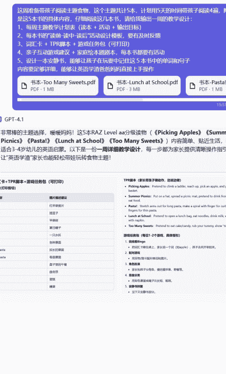

- 4. 亲子互动游戏设计+家庭绘本剧剧本（每本书）
- **1. Picking Apples**
  - 游戏：家庭“苹果采摘”——用红球/纸剪成“苹果”，贴在家里物品上，孩子够下来，边摘边说“Pick apples.”
  - 剧本：
    - 家长：“What do you see?”
    - 孩子：“I see apples!”
    - 家长：“Let’s pick apples together!”
    - 孩子做动作，家长摆盆。
- **2. Summer Picnics**
  - 游戏：宝宝摆盘子，假装野餐。准备玩具食物、杯子、毯子，说“Summer hat/cup/food!”
  - 剧本：
    - 孩子：“I have a summer hat!”（戴帽子）
    - 家长：“Here are summer cups and plates.”
    - 一起假装吃喝，“Summer fun!”

- 5. 安静书设计（Quiet Book）
  主题：My Food Week（我的美食周）
  - 页面1：Picking Apples
    - 给苹果树，孩子的“小手指”粘树枝上。
    - 树下放篮子，配词卡“basket”/tree。
  - 页面2：Summer Picnics
    - 妈妈布娃娃、毯子、杯子、盘子。
    - 孩子可玩上食物、毯子，边玩边说“Summer ___”；
  - 页面3：Party
    - 欢乐布置（用彩色纸/贴画布置房间），分长、短、盘。
    - 孩子动手把食物粘到对应，贴上颜色标签。
  - 页面4：Lunch at School
    - 推一推/拉拉门下面（或卷纸筒），匹配My ___功能标签。
    - 贴上纸巾、吸管、饼干、牛奶、曲奇纸。
  - 页面5：Too Many Sweets
    - 移除多余词（菠萝、蜂蜜、冰淇淋），最后贴：贴上胶带。
    - 让孩子说“My candy, My belly”

4. 优化方案：我再提出修改意见，让 AI 给出的方案更具体、更容易在家中实操。

> 之前写的教学设计，请增加一个环节：学习反馈，能够让孩子边学边得到及时反馈，让孩子学习更有动力，更有趣

非常棒的建议，暖暖妈妈！🌟
学习反馈是建立孩子学习成就感、增强参与动力的关键环节，尤其是3-4岁的孩子，他们非常需要即时的赞美、鼓励和视觉化的反馈。
我已经为您将“学习反馈”环节整合进之前的教学设计中，让孩子在每次读前、读中、读后活动中都能获得清晰的正向反馈。

✅ 学习反馈设计原则

| 类型 | 示例 | 目的 |
|---|---|---|
| 📣 语言激励 | “Wow! You said it just like the book!” | 增强语言模仿信心 |
| 🌟 可视化反馈 | 贴星星、贴笑脸、打勾 | 看得见的成就感 |
| 🎁 小奖励机制 | 完成任务后选贴纸or听一首英文歌 | 增加期待感 |
| 🗣️ 互动反馈 | “Do you want to teach Mommy?” | 强化输出欲望 |

5. 实操练习：将AI给出的方案打印出来，我自己先学会、实际操作1-2遍，再陪孩子一起学习。

6. 安静书制作：在设计安静书时，我使用即梦直接生成图片，再根据绘本内容设计内页内容。

### Q:使用AI后,效果如何?

A: 之前我家孩子读RAZ AA级别的绘本，内容太简单（如“The cat”），孩子完全提不起兴趣。通过AI提供的TPR（全身反应教学法）剧本，我加入了边读边互动的方式，孩子竟然能大笑着理解“ladder”“basket”等词汇。

例如，在读牛津树的《Goaway,Floppy》和《Comeback,Floppy》时，孩子甚至会主动要求我一起玩这些词汇的游戏，并能够主动说出2-3个词组，成功从“哑巴英语”迈向了开口说英语。

另外，在实操过程中也补充了一些AI生成的趣味互动设计（参考侧边栏记录）：
- 游戏：家庭“苹果采摘”——用红瓦/贴纸做“苹果”，贴在家童物品上，孩子摘下来，边摘边说“pickapples.”
- 剧本：家长：“Whatdoyou see?” 孩子：“I seeapples!” 家长：“Let'spickapplestogeher!” 亲子做动作，家长提问。
- 1. PickingApples / 2. SummerPicnics：游戏：宝宝铺垫子，野餐野餐，准备杭西食物。杯子、帽子，说“Summerhat/cup/food!” 剧本：孩子：“Ihaveasummerhat”(戴帽子) 家长：“Herearesummercupsandplates.” 一起模拟吃喝，“Summerfun!”
- 游戏：用不同颜色的意面或绳子，让孩子分细，装盘，说出颜色和形状。剧本：家长：“Doyouwantlongorcurlypasta?” 孩子(摹仿)：“Curlypasta!”

### Q: 在用AI的过程中, 是否遇到了一些新问题或新挑战? 你是如何解决的?

A: 我遇到的最大的问题是，是 AI 经常“想象”内容，与实际读物不符。我的解决方法是上传 PDF 原书，让 AI 精准读取和分析，校正出内容真实、可用的方案。

此外，在互动游戏设计中，孩子偶尔会对某些玩法表现出反感。我会记录下来，并在下次调用 AI 时明确告诉它“不要再生成某类型游戏”，提高匹配度。

### Q: 根据你的经验, 其他人如何才能更好地使用AI?

A:
- 明确目标：一定要清楚自己要用 AI 解决什么问题，不盲目照搬别人的方案。
- 定制提示词：提示词里应体现孩子的年龄、性格、能力、兴趣等，让 AI 给出的方案更“对胃口”。
- 持续迭代：每次执行完方案后，观察孩子反馈，及时调整策略，让 AI 不断“学会”如何为你服务。
- 避免信息泛滥：不要盲目刷平台找内容，用 AI 能更系统、更聚焦地整理信息和提供方案。
- 坚持陪伴：英语启蒙是场持久战，AI 只是工具，家长的坚持和理解孩子才是决定成败的关键。

AI并不是万能的，但它是一个值得信赖的助手。在育儿这样极度个性化的领域，如果能善用 AI 的力量，家长可以更高效、更科学地陪伴孩子成长，特别是在资源相对匮乏的环境中，AI能让你用最低的成本创造最贴合孩子的成长方案。

## AI落地案例 No.03

得到AI学习圈编辑部:

AI学习圈同学 @王喆 是一名专攻海事海商的律师, 但他平时被身边人问得最多的是劳动法问题, 非本专业的高频应答一度让他疲于应付。

他用 Get 笔记打造了一个名为“薪知肚明”的劳动争议知识库, 把案例、法条和实务经验统统喂给 AI, 等于给自己配了一个全天候的法律助手。

这次的案例他将分享: 如何3步构建垂直领域的知识库、AI如何实现秒级回答、以及如何靠AI扩展服务边界, 真正做到“术业有专攻, AI来补位”。

### 王喆同学：如何用AI搭建知识库高效应对咨询问题？

A:作为律师，我在工作中遇到最多的问题之一，就是来自客户和亲友突如其来的法律咨询。这些问题往往涉及多个法律领域，但在现实中，律师和医生一样，需要在某一细分方向上长期深耕，才能真正具备专业判断力。

然而，大多数人并不了解这一点，往往默认律师能回答所有法律问题。于是，对于我来说，目前面临的核心矛盾，是客户和亲友日益增长、内容庞杂的法律咨询需求，和我个人有限的时间与精力之间的冲突。

Q:你在工作和生活中遇到了哪些主要的挑战或困难？

Q:过去你是怎么处理这个问题的？

A:过去，面对跨专业领域的法律咨询，我主要依靠自主研究和向同行请教来应对。遇到不熟悉的问题时，我通常会先查资料、研究相关法规和案例；如果仍无法解决，才会请教该领域更资深的律师，等自己真正理解之后，再向客户或亲友作出回应。

这种方式虽然在准确性上有一定保障，但也存在明显的局限：

- 效率低：每次都要从头学习，耗时耗力；
- 依赖人情资源：频繁请教同行，难免增加人际负担；
- 难以持续：随着咨询范围不断扩大，传统方法越来越难以应对高频、多样的问题，久而久之，容易让人力不从心。

### Q: 你是如何使用AI来解决这个问题的？

A: 我是一个海事海商方向的律师，但平时被问到最多的,反而是我并不熟悉、几乎没涉猎过的劳动争议相关问题。

为了更高效地应对这类咨询,我用 Get 笔记的知识库功能,快速搭建了一个专门的劳动争议知识库,并给它起了个名字叫“薪知肚明”(谐音梗无罪)。

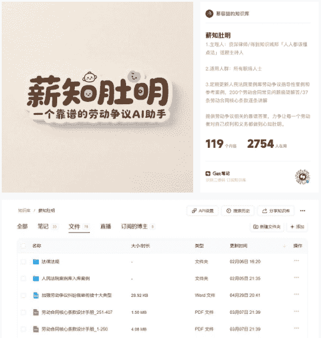

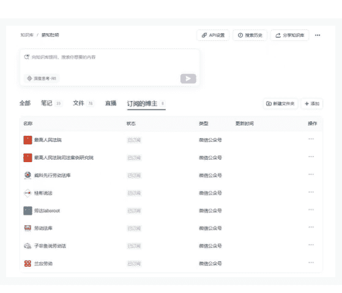

这个知识库的目标很明确:提供劳动争议相关问题的可靠答案,尽可能帮助每一位劳动者对自己的权利和义务做到心中有数。整个搭建和使用流程分为三步:

- 导入权威案例:将人民法院案例库中的指导性案例和参考案例整理后导入知识库。这些案例在全国范围内对同类案件的审理具有较强的指导或参考价值;
- 整合法律法规:系统梳理并上传与劳动法相关的法律条文、司法解释及配套解读,确保知识库内容权威、实用;
- 补充实务资源:筛选专业公众号文章及各地律协发布的劳动争议常见问题解答,定期更新至知识库,增强内容的时效性和实操性。

完成上述步骤后, AI 会自动“学习”并理解这些资料。当我收到劳动争议相关的咨询时,只需在系统中输入问题, AI 就能基于知识库内容,生成简明、可靠的初步答复。

## AI 落地案例集

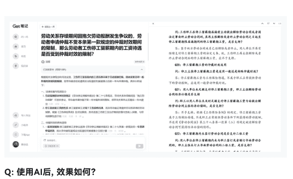

### Q: 使用AI后, 效果如何?

A: 知识库搭建完成后, 我再不惧怕被问到劳动法相关的问题, 甚至对这类咨询有了些许期待。

从我自己的使用体验来看, 也结合了身边其他人的反馈, 这个知识库基本达到了预期效果:

- 响应迅速: AI几乎能在几秒内生成初步答复, 大幅提升了处理效率;
- 内容有据可查: 每条回答都会附带相关案例、法等知识库来源, 逻辑清晰, 方便核实;
- “学习”速度快: AI能在极短时间内掌握我导入的内容, 学习能力令人惊叹。

可以说这个知识库在劳动争议常见问题上的表现已超过许多像我这样的非劳动争议领域的律师了。

### Q: 根据你的经验, 其他人如何才能更好地使用AI?

A: 1. 不要有畏难情绪, AI其实没那么难

以我这两年跟着刀哥学习各种AI工具的经验来看, 真正好用的AI工具, 往往都有一个共同点: 只要你用“人话”说清楚, 它就能理解, 并完成你交给它的任务。

- 2. 与其纠结“怎么用AI”, 不如专注“喂什么给AI”

就目前的AI技术水平来说, AI的表现其实取决于你投喂给它的内容质量。与其纠结“怎么用AI”, 不如花时间筛选权威资料、整理核心知识, 打造高质量的知识库, 这才是提升AI输出水平的关键。

### 3. 用知识库拓展专业边界，弥补领域局限

即使你不是某一领域的专家, 也可以通过构建垂直知识库，让AI帮你快速覆盖相关基础问题, 从而拓展你的服务能力边界。

### 4. 选一个自己趁手的AI工具

层出不穷的AI工具，让很多人在选择上有些纠结。就我个人的使用体验来说，Get笔记是一个非常值得推荐的选择。它几乎“零门槛”，并且支持非常多的记录方式，覆盖了日常工作和生活的应用场景，基本上做到了“让记录和管理知识变得前所未有的轻松”，而这恰恰是搭建知识库的关键。

## AI落地案例 No.04

得到AI学习圈编辑部:

面对临床中的疑难病症, 诊断思路的系统梳理始终是一线医生的高频刚需。

AI学习圈同学 @杜诚勇, 来自浙江大学医学院附属第一医院, 在日常工作中尝试用AI辅助诊断决策, 并搭建起了乳腺癌等方向的医学知识库。

这次杜医生分享了自己测试AI诊断能力的真实场景, 也总结了自己选工具、用好AI方面的3点心得。

### AI+医疗 杜诚勇同学: 如何用AI搭建医学数据库辅助诊断?

| 姓名 | 杜诚勇 |
| 职业 | 外科医生 |
| 公司 | 浙江大学医学院附属第一医院 |
| 领域 | AI辅助医疗诊断 |
| 关注TA | 微信公众号“杜诚勇医生” |

### Q: 你在工作和生活中遇到了哪些主要的挑战或困难?

A: 我现在的AI使用场景非常多, 涵盖了生活、学习、临床工作、科研, 还有最近新增的科普工作一一主要是教医护人员如何使用AI。具体到我自己的专业领域, 我在日常的临床工作中, 主要是用AI帮我去梳理病情, 尤其是面对疑难病症时, 我会让AI提供一些可能的诊断思路, 避免出现遗漏。

### Q: 过去你是怎么处理这个问题的?

A: 过去遇到疑难问题, 要么手动查阅一些医疗诊断的文件指南, 要么请教相关的医生专家。老办法有时候效率没那么高。

### Q: 你是如何使用AI来解决这个问题的?

A: 现在, 我直接搭建了一个医疗诊断的数据库, 自己先问数据库, 大多数问题都能找到解法。此外, 我还利用 Get 笔记、IMA 等工具, 整理并分享了一个乳腺癌诊断的知识库, 供同行参考和使用。

### Q: 使用AI后, 效果如何?

A: 目前, 大多数AI工具的效果提升都非常明显, 已经能够比较好地解决很多实际问题。当然, 也还有一些场景的应用效果还不够理想, 尤其是在医学科研相关的领域, 比如科研制图, AI还不能完全胜任,或者说使用起来还不够熟练。

在查找最新的医学文献方面,AI确实可以提供帮助,但也需要谨慎使用一一毕竟它仍存在“幻觉”的问题。

一旦涉及到临床诊断,AI在知识更新方面相对滞后。

我之前做过一个测试,把一份脱敏的穿刺病理报告交给GPT-o3模型,让AI来判断接下来该怎么治疗。

首先,AI对这份诊断报告里的关键点识别得非常准确,尤其是关于是否确诊乳腺癌这件事,它成功提取了几个最关键的判断依据,说明它的基础能力已经非常强了。

不过,AI的回答也不是完美的。比如它一开始没有识别出这是一份“穿刺病理报告”,而不是术后的病理结果。这中间的区别对于治疗决策来说其实挺重要的。经过我提醒之后,AI修正了自己的回答。

另外一点也很有意思一一AI是基于2024年版本的乳腺癌诊疗指南来做判断的,但实际上,这份指南在最近已经更新到了2025年V3版。所以对于一些更新特别快的专业领域来说,大模型通常是基于半年前的知识训练的,即便开启联网搜索,也不一定能找到最新、最准的资料。AI的训练知识往往跟不上实际进展。

经过提醒和多轮交互之后,AI给出的后续治疗方案,还挺周全的。不过,我不建议普通人用大模型去做医疗诊断。哪怕是用o3这种目前最强的推理模型,也不可以。

### Q:在用AI的过程中,是否遇到了一些新问题或新挑战?你是如何解决的?

A:为了应对AI知识更新滞后这个问题,我现在的解决方案是,使用像Cherry Studio 这样的AI工具,搭建一个基于最新指南的知识库,然后再让AI从中进行检索与回答,效果会好很多。

### Q:根据你的经验,其他人如何才能更好地使用AI?

A:我目前开了一个医学AI思维提升课,希望把自己经历过的那么多坑和痛点分享出来,让同行少走弯路。包括我自己也在写一些科普文章。

要想用好AI,少踩坑,我自己总结下来,有这么几个心得。

第一，选择合适的AI工具。

如果一个问题迟迟无法被快速、高效、准确地解决，很可能是选错了工具。

如今AI工具的数量越来越多，功能看似相似，但实际效果差距非常大。对医护人员来说，时间本就有限，更需要一个可靠的渠道去了解哪些工具真正好用，并能有效上手。

比如，同样是“生成图片”，很多工具都声称能做到，但生成效果往往千差万别；同样是“生成文章”，不同模型的输出质量可以说是天差地别。“能用”与“好用”，完全是两个层级的体验。

那么怎么选到合适的AI工具呢？

我自己的做法是，先明确要解决的具体任务，再根据需求匹配对应的大模型和工具。很多时候，一个工具或一个模型并不能完全满足需求，我也会同时组合使用多个工具。

在这种情况下，像 Cherry Studio 这样的软件就非常实用，能有效整合多个AI能力，提升整体效率。当然，后续可能会涉及到一些付费工具和模型，但只要能真正帮我快速、高质量地解决问题，我是愿意为此付费的。

更重要的是，要认识到AI的发展速度非常快，很多今天做得一般的事情，很可能在不久之后就能实现质的飞跃。因此，这种认知也需要动态更新。

一句话总结：过去我们说“人机协作”，现在我认为应该升级为“人与AI的深度合作”。

AI能做好的，就交给AI；AI暂时做不好的，人来辅助；AI搞不定的，由人来完成。

## AI落地案例 No.05

得到AI学习圈编辑部：为了解决用户在“挂号前不知道挂哪个科”这一就医高频卡点，大数据科学家、AI学习圈同学 @刘宸搭建了“AI导诊双智能体”，即便是模糊描述症状，比如“肚子疼、咳嗽久、心情差”等，AI能引导患者补全症状信息，根据信息去推荐出最合适的科室。

这套AI导诊系统的搭建逻辑，刘宸同学在案例中做了完整的呈现和分享。

### AI+医疗 刘宸同学: 如何用AI搭建智能导诊辅助解决挂错科问题？

| 姓名 | 刘宸 |
| 公司 | 北京尤边医学诊所有限公司 |
| 职业 | 大数据科学家 |
| 领域 | AI+医疗健康 |
| 关注TA | 得到知识城邦@刘宸 |

### Q: 你在工作和生活里遇到了哪些主要的挑战或困难？

A: 在真实生活中, 我们发现, 大多数用户在就医前的第一步就会被难住: "我到底该挂哪个科?"

这个问题看起来简单, 实际上背后隐藏着巨大的信息差。它不仅是整个就医流程的起点, 也最容易让人卡住的环节。过去还有医院导诊台可以提供人工引导, 但如今挂号流程几乎已经完全线上化, 一旦挂错了科室, 不仅要重新排队, 有时还需要重新缴费、改预约, 非常耽误时间, 也影响体验。

为了改善这种情况, 我们尝试引入 AI 技术, 帮助用户更清晰地描述自身症状, 再根据这些症状智能判断出最合适的科室和医生, 从而提升整体的就医效率和体验。

很多用户其实能感受到身体不适, 但很难准确地表达出来, 更别说明确知道该挂哪个科。有时, 用户提到的只是表层症状, 或者一些"伴随出现"的不适感, 并不一定是问题的根源。比如有人觉得"肚子疼", 这是他们最直观的感觉, 但造成腹痛的可能性有很多, 背后的真实原因可能千差万别:

- 如果是吃坏了肚子, 可能是消化不良 (消化内科);
- 如果伴随发烧和呕吐, 有可能是病毒性胃肠炎 (感染科);
- 如果疼痛集中在右下腹, 可能是阑尾炎 (普通外科);
- 如果是女性, 需要考虑是不是妇科疾病, 比如盆腔炎;
- 有些情况还可能涉及泌尿系统问题, 比如肾结石。

这些疾病虽然都表现为"肚子痛", 但推荐就诊的科室可能完全不同。如果判断错了, 不仅耽误时间,还可能影响诊疗效果。

归根结底,导诊虽然只是就医流程的起点,却涉及多个层面的能力要求:用户语言的精准解析、疾病初步判断的医学知识、以及医院内部各科室体系的对应逻辑,远比表面看起来复杂。

### Q:过去你是怎么处理这个问题的?

A:在使用AI智能体之前,我们曾尝试构建一个基于静态问答流程图和知识图谱的导诊系统。具体做法是:系统先从用户的描述中提取关键症状词,然后与知识图谱进行匹配。

一方面,我们通过分析症状与疾病之间的相关度,来判断用户可能对应的疾病类型;另一方面,系统会从知识图谱中调取与这些症状高度相关的预设问题,引导用户进入下一轮问答,逐步缩小判断范围。

这种方式在理论上是可行的,但在实际应用中也暴露出明显的局限性。首先,它对用户的表达准确性要求较高,稍有模糊或用词不规范,系统就可能无法正确识别症状。其次,整个问答流程是预设好的固定路径,缺乏对个性化表达的理解能力,只能按部就班地推进,难以适应多样化的真实场景。

从开发角度看,这种方式高度依赖人工设计的规则和逻辑结构,不仅维护成本高,而且整体体验偏“流程式”,缺乏自然对话的流畅与灵活,用户使用时的感受也比较生硬。

### Q:你是如何使用AI来解决这个问题的?

A:为了让用户更顺畅地完成导诊,我们用大语言模型做了一套“智能导诊系统”。

这个系统主要由两个部分组成:一个是分诊智能体,另一个是问诊智能体,两个配合起来,从“症状识别”一直做到“推荐挂哪个科”,把整个流程串起来了。

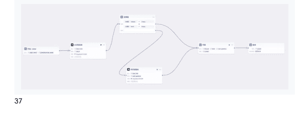

先说分诊智能体,它主要负责判断。用户只要说一句自己的症状,比如“咳嗽两个多星期了,早上特别严重”,它就会结合关键词、时间、症状变化这些信息来分析,判断可能是呼吸道的问题,然后建议挂“呼吸内科”。

它不是医生,也不会给出诊断结果,但能根据你的描述,尽量判断个大概方向,告诉你该去哪个科室挂号,避免挂错科、走弯路。

那如果用户一开始说得比较模糊,比如只说“最近不太舒服”,这个时候就轮到问诊智能体上场了。它会主动接着问:“哪儿不舒服?有没有发烧、咳嗽、胸闷?”这样一问一答,把情况问清楚,再交给分诊智能体去判断。

这两个部分配合下来,可以把用户原本零碎、模糊的表达,转化成一套比较清晰、有用的信息。这样用户不用懂医学术语,也不用表达得很精准,系统也能听懂,大大降低了使用门槛,也让推荐更靠谱。

为了让导诊系统更好用、更聪明,我们在搭建过程中重点做了两个方面的优化:

- 提示词设计更细了:我们给模型准备了很多常见症状的表达模版,这样当用户描述得比较模糊、说得很长,或者用词不太准时,系统也能尽量听懂,并做出判断。比如遇到一些症状可能指向好几种疾病的情况,模型能结合主诉和伴随症状来推一推,看哪个方向更有可能。如果信息不够,它也不会硬给一个结论,而是先提示用户再补充点关键信息。
- 推荐科室的名称统一了:以前用户常看到推荐结果里科室名字不太一样,有的叫“神内”,有的叫“神经内科”,看着挺乱。我们就干脆按复旦排行榜里的20个核心科室来定标准,所有推荐都从这20个里选,这样既清晰,也更容易和医院的挂号系统对接,后面不管是推荐医生还是安排就诊,都能顺下来。

### Q:使用AI后,效果如何?

A:引入AI导诊智能体后,有几个明显的效果:

第一,导诊效率提升了。

以前那种靠人工或者流程图一步步选的导诊方式,操作起来挺麻烦的,用户要么得点很多选项,要么得跟客服聊半天,效率也不高。现在用上 AI 导诊之后,用户只要用一句普通话讲清楚哪儿不舒服,系统就能听懂大概意思,然后问几句关键问题,把情况理出来。

实际来看,大多数人聊上两三轮,就能知道大概该挂哪个科,流程更快,体验也顺多了。

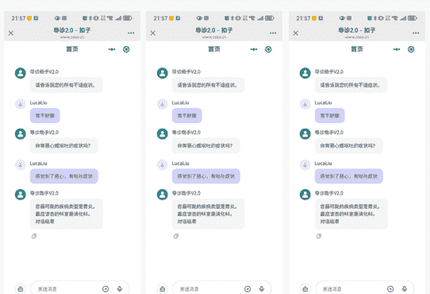

第二,这套系统能跟病人进行更深入的交互。

AI模型有一定的上下文理解能力,可以根据每位用户描述的具体症状和说话方式,自动生成更有针对性的问题。比如,有人说“胃不舒服”,系统不会直接下判断,而是会先理解这可能跟消化系统、胃溃疡,或者焦虑等有关,然后进一步问:“有没有腹泻?”、“是不是跟吃饭有关?”等等。

整个过程更接近真人医生的问诊方式,问得更细,也更灵活,能够根据每个人的情况动态调整问题,真正做到了“因人而异”地交流。

第三,系统的判断准确率有了很大改善。

以前的导诊方式大多是靠“提取关键词—对照疾病库—推荐科室”这种规则设定的流程,一旦用户表达得不标准或者有歧义,系统就容易出错。而我们现在用的大语言模型能更好地理解模糊表达、非医学术语,甚至能联想出用户可能没说出口的相关症状。

### AI落地案例集

哪怕用户只是含糊地说“肚子一直不舒服、心情也很差”，系统也能大致判断出方向，而不是卡在“没识别到关键词”上。特别是在遇到多个症状一起出现、或者情绪化、描述跳跃的表达时，这种模型的表现比传统的 NLP 方法更稳定，也更贴近实际使用场景。

### Q: 在用AI的过程中，是否遇到了一些新问题或新挑战？你是如何解决的？

A: 真正的挑战，反而是在业务理解这一块。

AI 要在医疗场景里真正落地，最大的难点之一是：用户的输入非常多样，但就医路径又特别专业，背后还依赖大量医学知识。特别是在导诊环节，这种差距会表现得非常明显。

我们经常遇到一种情况：用户的输入里混合了主观判断的病名和客观描述的症状，但两者未必一致。比如有人说：“我得了支气管炎，但最近嗓子一点也不疼，反而一直头晕想吐。”

那这时候系统应该怎么处理？是根据用户主动说的“支气管炎”就推荐挂呼吸科，还是根据实际描述的症状，去判断是不是耳鼻喉或神经内科的问题，再反向追问？

这种判断非常复杂，不仅要模型有一定的医学基础知识，还得能看懂用户的“真实意图”——他说的是不是他真想表达的。

还有一种常见的情况是：一次输入里包含了多个不相关的症状，比如“我这两天胸闷，晚上又有点失眠。”这可能对应不同的科室，甚至完全不同的病因，那系统到底应该优先推荐哪一个？要不要先分场景问清楚？有没有一个更合适的引导策略？

这些都不只是技术问题，更像是“诊疗逻辑建模”的问题，需要很细致的规则设计和模型行为调控，才能让AI的回答在体验上是“靠谱的”。

为了应对前面提到的那些挑战，我们主要从技术和场景两方面来做迭代。

在技术层面，我们主要做的是反复调整提示词的结构和引导方式，通过多轮 A/B 测试去对比不同写法下模型的表现。每次测试之后，我们还会请有医学背景的产品经理或者签约医生顾问来做业务评估，然后根据他们的反馈继续打磨提示词。

这个过程里，跨学科合作非常关键。AI 工程师主要负责技术落地和模型的稳定性，而医疗专家则负责判断内容是不是合理、有没有偏差，两边缺一不可，谁都不能单独把这事做好。

另外，项目初期我们用的是通用型大语言模型，虽然它理解能力很强，但放在复杂的医疗问诊场景里，还是会有些力不从心——特别是在疾病分类、多轮对话衔接、理解医学术语这些地方，会出现偏差。

为了解决这个问题,我们从一开始就有意识地收集用户的真实问诊对话,一点点积累语料,形成医疗领域的高质量数据集。后面我们计划基于这些数据再做针对性的模型微调,目标是:在保留通用语言能力的基础上,进一步提升它在医疗导诊场景下的上下文理解能力、判断准确性,以及对话的连贯性和稳定性。

### Q: 根据你的经验,其他人如何才能更好地使用AI?

A: 作为一名AI程序员,我想给大家一个很实在的建议:不要把注意力全放在大模型技术本身上。除非你所在的是专门做底层模型研发的团队,否则对于绝大多数做AI应用的人来说,更重要的是理解业务、打磨场景,以及积累自己的数据资产。

现在AI的发展方向已经很清楚了:模型只会越来越强大、使用门槛越来越低。很快,普通人也能靠自然语言对话来写小程序、做设计、跑数据分析,甚至完成一些专业内容的创作。

所以,真正能拉开差距的,不是你会不会用AI,而是你拿AI做出了什么东西。这是未来的核心竞争力。

我觉得在AI时代,真正有壁垒的东西,其实就两个方向:

一个是“私有数据”,尤其是你自己的数据,别人没有的。这可能是你工作中积累的经验、你整理过的知识库,或者企业沉淀下来的流程文档、客户案例等等。它们构成了你和AI协作时的“独特语境”,也是决定AI给出结果质量的关键因素。未来谁在AI上更有优势,很大程度上取决于你有没有自己的“知识资产”。

另一个是“业务理解”,也就是你对一个领域到底有多深的认知。每个人理解业务的方式不同,而你能不能把业务拆清楚、梳理成AI可以执行的逻辑链条,就特别关键。AI可以帮你做事,但你得告诉它:要做哪些事、什么顺序做、什么条件下进入下一步。这些判断,其实就是你的能力。

所以,如果你想更好地用AI,最实在的做法是:从你自己的日常工作或生活出发,找一个重复出现的流程,用AI做一遍试试,哪怕做得不完美,也没关系,边做边改。这过程中你会慢慢明白,AI只是工具,真正的核心能力,是你能不能说清楚“要解决什么问题,怎么解决”。这才是每个人在AI时代真正需要建立的能力。

## AI落地案例 No.06

> 得到AI学习圈编辑部：
> 
> 为了解决高校教学中"学生不敢问、老师答不过来"的老问题，AI学习圈同学、桂林山水职业学院的教务科长 @黄浩 用AI搭建了一个"能记得每个学生提问"的课后答疑系统，让教学资料、常见问题、个性化反馈全都集成进知识库，不再靠学委抄题、不再翻群找文件。这次 的案例，他将拆解AI答疑系统的落地流程，并分享如何处理学生敏感提问、如何引导AI回应更人性化等问题。

### AI+教学

### 黄浩同学:

### 如何用AI搭建课堂知识库 解决老师答不过来的问题?

| 姓名 | 黄浩 |
|---|---|
| 单位 | 桂林山水职业学院 |
| 职业 | 教务处科长 |
| 领域 | AI+教育 |
| 关注TA | 得到知识城邦@黄浩 |

### Q: 你在工作和生活中遇到了哪些主要的挑战或困难?

A: 我的这个场景主要是: 高校课堂教学辅助与课后答疑场景。在高校的教学和课后答疑中, 学生和老师其实都有不少困扰。学生这边, 课程多、时间紧, 有时候还不太敢打扰老师, 想问问题但常常错过时机。老师那边也挺费的, 很多时间花在回答重复的基础问题上, 不仅费精力, 还影响教学和科研的安排。而像邮件、线下答疑这种传统方式, 效率不高, 能覆盖到的学生也很有限, 很多问题其实没法及时解决。

### Q: 过去你是怎么处理这个问题的?

A: 过去我们主要还是用一些传统方式来解决, 比如安排助教来帮忙答疑, 或者在班级群里、公告栏上发布一些常见问题的汇总, 有的老师也会固定开放几个时间段, 给学生集中答疑。

虽然这些办法多少能起到一点作用, 但问题也不少。比如助教人手本来就不多, 专业水平也参差不齐; 整理出来的答疑内容信息分散、更新慢, 学生经常找不到; 老师那边的答疑通道也有限, 不可能做到随时响应。而且历史上的答疑内容也很难被系统地管理和复用, 每次遇到类似问题基本都是重新讲一遍, 效率不高。

举个例子, 助教资源不足就是一个很现实的问题。我们学校有些专业的班级多达六十几名学生, 但有些课程只有一位老师, 连助教都没有, 结果老师只能让班级里的学习委员代为收集问题和作业。可学委自己也要上课、做作业, 还常常要同时负责好几门课, 根本顾不过来, 很多问题没法及时回应。

还有一个很常见的问题是信息太分散。老师通常会在微信群或QQ群里发作业和课程资料, 但因为群消息太多, 很多学生经常刷过就忘, 过几天就找不到资料在哪了。

再比如重复劳动也特别多。像“课程资料在哪里”这样的问题，常常有好几个学生隔天就问一遍，老师要在不同的班级里一遍遍重复解释，既耗时又影响效率。

### Q: 你是如何使用AI来解决这个问题的?

A: 我使用的AI工具是: ima.copilot-腾讯智能工作台
- 整个AI知识库的搭建和使用,大致分为几个步骤:
  - ①搭建知识库:将课程PPT、教案、参考资料等上传至ima客户端,形成结构化知识库;
  - ②引导学生使用:设置推荐问题引导提问方向,提醒学生启用深度思考模型优化回答逻辑;
  - ③分类授权管理:按班级/课程创建独立知识库,通过微信扫码授权访问;
  - ④定期运维:定期更新资料,利用AI自动生成常见问题索引,添加到推荐问题。

下面是具体的步骤截图:

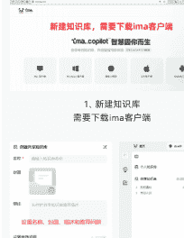

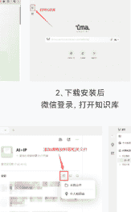

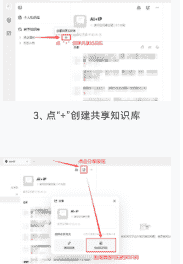

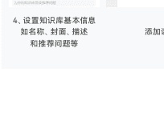

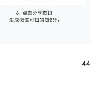

#### 7. 放到课件中
上课时应让学生扫码加入知识库

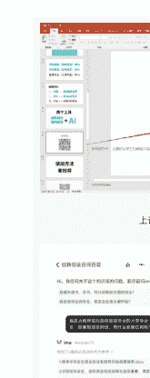

#### 8. 在客户端可以查看
有多少人已加入知识库

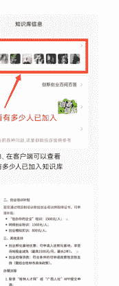

#### 9. 对话知识库效果截图

### Q: 使用AI后, 效果如何?

A: 引入 AI 之后, 目前还无法看到lm.copilot的详细后台使用数据, 所以我们暂时只能从老师和学生的主观反馈来判断效果。就目前来看, 大部分学生在老师的引导下已经加入了知识库, 参加率超过 90% (这一点可以通过创建者后台看到) , 尤其对那些平时不太敢发问的内向学生来说, 帮助非常明显。

老师们也普遍反馈, AI 的回答准确率还不错, 在一定程度上确实减轻了他们日常答疑的压力。其实, 现在很多老师的困扰不是学生问得太多, 而是学生根本不敢问。很多学生宁愿自己

### Q: 在用AI的过程中，是否遇到了一些新问题或新挑战？你是如何解决的？

A: 在使用 AI 的过程中，确实也遇到了一些新的挑战。

其中第一个比较明显的问题是回答的机械感。学生反馈说：“AI 的回复像机器人，我都听不懂它在说什么。”这种格式化、缺乏温度的答复，容易让学生产生距离感，降低使用意愿。

为了解决这个问题，我们一方面会教学生如何更好地向 AI 提问，简单介绍一下 Prompt 优化的基本思路；另一方面，也对系统里的提示词进行了调整，尽量让回答方式更贴近人类交流习惯。比如我们在知识库中加入了“老师和学生真实对话”的案例库，并设置了带引导性的话术模板，让 AI 回答更有互动感。

举个例子：如果学生问“这道题怎么做？”， AI 的引导语就不会直接给答案，而是会回复像“请提供题目内容或具体的疑问点，我会结合课程知识点为你拆解步骤”、“你可以试试这种方法”或“这个问题要先理解一下……”。这些表达更自然，也更容易让学生接受。

第二个实际遇到的问题则是敏感内容的风险。虽然大多数学生是正常使用，但也有个别学生尝试提问一些违规内容，比如“如何规避考试纪律”“代写论文靠谱吗？”之类的问题。

为此，我们在使用前采取了几项防范措施。首先，在资料上传前就进行敏感内容过滤，确保知识库本身不包含不当信息。其次，在将 AI 知识库开放给学生使用前，我们会先进行一次内容合规性测试，确保系统的回答不会误导或纵容违规行为。

此外，我们还将《大学生手册》纳入知识库，作为明确的行为规范参考，并设立了一个“敏感问题拒答库”，预先整理学生可能尝试提出的违规问题，并为这些问题设置限制性回答。

比如，学生如果提问“如何准备考试小抄？”，系统会自动回复：“抱歉，该问题超出课程范围，且不符合学生行为规范，请咨询任课老师。”或者“考试作弊是不道德且违反校规的行为，请不要尝试。如果你需要备考建议，我可以为你推荐相关学习资源。”

这种方式既明确划清了AI的使用边界，也帮助学生建立更清晰的行为认知。

### Q: 根据你的经验, 其他人如何才能更好地使用AI?

A: 对于未来的推广和管理, 我有一些初步的建议:

- 1. 有条件的学校可以考虑搭建本地知识库, 一方面提升响应速度, 另一方面也能更好地保护老师们的知识产权。
- 2. 在AI的普及方式上, 可以采用“三阶段推进法”: 先从小范围试点, 验证可行性; 再根据实际反馈进行迭代优化; 最后再逐步向全校、全系统推广。
- 3. 建议制定类似《AI辅助教学试行管理办法》这样的制度, 明确AI的使用边界, 既避免学生误用, 也防止老师滥用, 保障教学质量和公平性。

## AI落地案例 No.07

> 得到AI学习圈编辑部:
> 
> 社群运营越来越像“内容战场+客服战场”，但人手永远跟不上。
> 
> AI学习圈同学@桑化科用一个AI工作流平台，搭了一个叫“群消息值守官”的数字员工，能实时筛选群聊中的高价值信息，按类别自动处理，并同步接入企业办公软件，实现消息→任务→进度的闭环跟进。
> 
> 这次的案例里，他分享了这个数字员工背后的搭建逻辑，以及AI在真实社群运营中怎么替人干活。

#### AI+运营

### 桑化科同学：如何用AI快速处理群消息为社群运营提效？

| 姓名 | 桑化科 |
|---|---|
| 职业 | 智能体工程师 |
| 公司 | 降临科技 |
| 领域 | AI企业落地服务 |
| 关注TA | 得到知识城邦@宏佑 |

### Q: 你在工作和生活中遇到了哪些主要的挑战或困难？

A: 我核心应用AI的场景是社群运营。我的观察是, 这个场景有几个典型的痛点。

- 社群数量多、运营人员少,群消息根本回复不过来。
- 社群成员可能在任何时间抛出重要信息,但运营人员不一定在线。比如下班时间成员才有空交流,但运营人员已经离岗,或者因为时差,沟通节奏对不上。
- 同一个社群的消息可能涉及不同类型的问题:转化机会要销售跟进,投诉由客服处理,功能需求和Bug反馈则归产品和技术。卷入很多岗位的人员去盯群消息,不但人力投入高,还容易职责不清。
- 社群消息并不都是有高价值的,靠人工浏览每个群的每条信息,去筛选高价值信息,一是可能会产生遗漏,二是非常耗精力和人力。
- 就算能筛出来,人工汇总的效率也很低(一般是手动复制消息再粘贴到表格)。但是如果不做汇总呢,就没法跟进后续处理的情况,也没办法从整体上掌握社群用户的状态。

如果用户发出的高价值信息没有被及时响应和跟进,可能会带来一系列后果:错过成交转化的最佳时机、影响用户对产品的认可度和品牌印象,严重时甚至引发退费;还可能导致团队错过用户提出的新功能建议或潜在方向,最终造成用户粘性下降、不再续费等问题。

从用户的角度来看,问题不仅仅在于没得到解答,而在于感受到“没人回应”。很多用户的真实心理是:你不回复我,是不是不重视我?你这边答不上来,那我去别的平台问;群里没人理,说明团队人手少、服务能力弱,花钱可能不靠谱。

实际上，社群里的用户很多时候并不要求“立刻解决问题”，他们需要的只是一种及时的反馈感。哪怕不能马上给出答案，只要有人响应，能让用户感到被关注和重视，就能提升他们的安全感、增加社群活跃度，也更有利于长期留存。

### Q: 过去你是怎么处理这个问题的？

A: 过去我们处理这些问题，大致有三种方式。

第一, 是靠人工处理信息。要么额外增加人手, 带来人力成本上升; 要么由原有成员分担, 结果可能导致每个人的效率被拉低, 工作量进一步被摊薄。

第二, 是使用群消息机器人, 并尝试引导用户使用。但机器人回复比较机械, 一旦用户的提问没能很好地匹配设定规则, 就得不到有价值的回应, 更无法主动引导用户进行下一步操作。而且, 这类机器人通常需要用户主动 @ 才会回应, 而大多数用户根本不会注意到助手的存在, 引导内容发了也没人看。

第三种处理方式, 说白了就是“摆烂+救火”。能顾得上多少就算多少, 顾不上的等出问题了再去补救……

### Q: 你是如何使用AI来解决这个问题的？

A: 整体流程: 我们用一个AI工作流平台, 搭了一个“群消息值守官”, 就像是一个数字员工, 全天在线, 帮我们盯着每条群消息。它会自动判断哪些信息是重要的, 有价值的就立即回复, 没用的就自动忽略。

接着, 这些重要的信息会被自动送到公司的办公系统里 (比如飞书多维表格) , 方便团队后续处理, 比如谁来跟进、什么时候处理、处理进度如何, 都能自动记录、提醒和管理, 不用再手动复制粘贴、分派任务了。

这个方案背后的核心工具, 是我们自研的一个AI智能体编辑平台, 主要用到了大语言模型的提示词设计 (Prompt Engineering) 、知识库检索 (RAG) 、功能调用 (Function Call) 和API 接口集成等关键技术。

具体流程图如下:

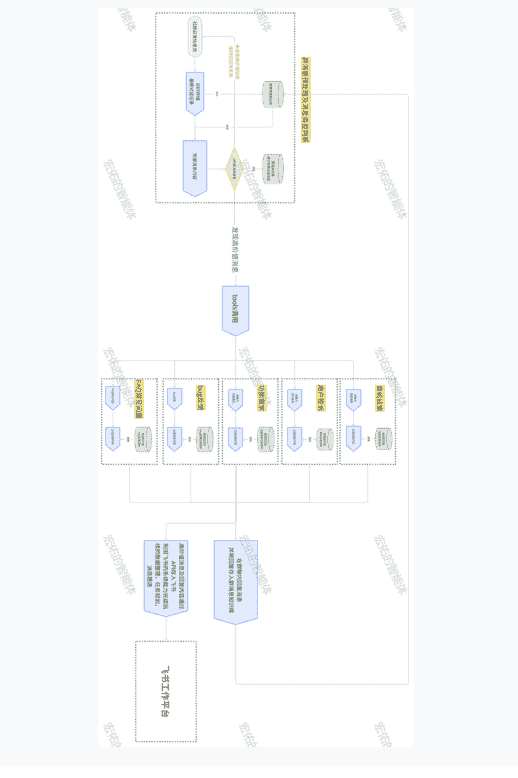

### Q: 使用AI后, 效果如何?

A: 过去需要人工盯群值班, 现在由AI接手, 它可以自动捕捉重要消息, 并第一时间响应和反馈, 群里用户的体验更好了。如下方左图所示, 有价值的消息, AI会立刻做出回应; 而图中圈出的日常聊天, AI判断为低价值信息, 因此不会回应。

这个“群消息值守官”除了被动回复问题, 也可以主动引导用户深入交流。比如用户提出了一个问题, AI会在回答基础上继续追问: (如下方左图所示)

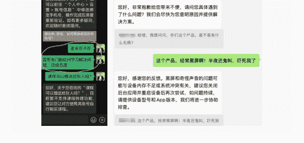

这个助手也能对群消息中的高价值内容进行精准分类, 比如商机、投诉、功能需求等, 根据类别来自动匹配相应的回复方式。

在办公流程上, 我们对接了飞书多维表。虽然飞书本身不是专门的AI工具, 但它作为办公平台的承载部分, 帮我们打通了社群和日常工作之间的连接。

工作人员不需要盯着每个社群看消息, 只要关注飞书表格里的数据变化, 就知道有没有需要处理的内容。

| 类型 | 序号 | 消息id | 社区id | 用户id | 消息类型 | 消息内容 | AI回复 | 跟进部门 |
|---|---|---|---|---|---|---|---|---|
| 商机线索 | 1 | 111 | xxx | 商机线索 | xxx | xxx | 销售 |
| 商机线索 | 2 | 111 | xxx | 商机线索 | xxx | xxx | 销售 |
| 商机线索 | 3 | 333 | xxx | 商机线索 | xxx | xxx | 销售 |
| 商机线索 | 4 | 222 | xxx | 商机线索 | xxx | xxx | 销售 |
| 用户投诉 | 5 | 666 | xxx | 用户投诉 | xxx | xxx | 客服 |
| 功能需求 | 6 | 999 | xxx | 功能需求 | xxx | xxx | 产品 |
| 功能需求 | 7 | 555 | xxx | 功能需求 | xxx | xxx | 产品 |
| 功能需求 | 8 | 555 | xxx | 功能需求 | xxx | xxx | 产品 |
| bug反馈 | 9 | 111 | xxx | bug反馈 | xxx | xxx | 产品 |
| FAQ常见问题 | 10 | xxx | xxx | FAQ常见问题 | xxx | xxx | 产品 |

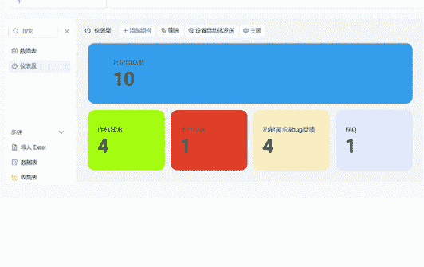

### Q: 在用AI的过程中, 是否遇到了一些新问题或新挑战? 你是如何解决的?

A: 在实际应用中, 我们也遇到了一些典型问题, 并做了相应优化。比如, AI在判断群消息是否属于高价值内容时, 稳定性和准确率仍有提升空间。为此, 我们通过与AI协作不断调整知识库的结构, 使其更利于判断; 同时增加人工对知识内容的校准, 并结合新的消息数据, 持续优化提示词和知识库本身。

另一个常见问题是, 部分用户消息本身表述模糊, 难以直接判断是否属于某类高价值信息。对此, 我们在判断流程中引入了“置信度”参数, 用来控制AI对消息的响应敏感度, 避免误判。

此外, 有些用户的最新消息中会出现“我前面说的第二点”这类指代性语言, 如果AI缺乏上下文直接回复, 往往会理解错误。

为了解决这个问题, 我们在处理流程中先通过技术手段补全消息上下文, 再进行判断和回复, 确保答复更连贯、更准确。

### Q: 根据你的经验, 其他人如何才能更好地使用AI?

A: 在实际使用AI过程中, 我总结的几点建议:

- 别沉迷研究AI新闻, 多研究AI如何在实际场景中落地。
- 别好高骛远, 先从自己实际工作生活中, 从身边寻找使用AI的场景, 越了解熟悉的场景, 越容易定义问题, 拆解问题。
- 别总想着做个什么高级的工作流智能体, 哪怕只是用提示词解决一个具体的问题, 都是很好的收获和成长。
- 别嫌麻烦, 多和AI聊聊。token吞吐量直接决定使用AI的能力。

## AI落地案例 No.08

> 得到AI学习圈编辑部:
> 
> 为了解决新人主播在培训初期“不会写话术”、练习效率低、自信心受挫的问题，一季度AI好用榜测评王、AI学习圈同学@余琛，搭建了一个基于DeepSeek模型的“直播运营助手”，它能根据产品信息自动生成结构合理、语言顺畅的练习话术。
> 
> 这个案例讲解了AI技术的搭建路径、提示词设计要点及业务落地的优化过程，帮助有意探索AI给内容营销提效的同学，找到清晰可行的方法参考。

### 余琛同学:如何用AI培训新人主播为直播运营提效?

#### AI+运营
- 姓名：余琛
- 公司：深圳点一几科技有限责任公司
- 职业：直播电商负责人/智能体工程师
- 领域：AI企业落地
- 关注TA：视频号“AI智能体老师老余”

### Q: 你在工作和生活中遇到了哪些主要的挑战或困难?

A: 我使用AI的核心场景是在新人主播的培训阶段。对于大多数刚入行的新人主播来说,一开始最难的事情并不是操作设备,也不是产品知识的积累,而是如何面对镜头,自然流畅地表达。

我们要求主播从第一天开始就练习“说话”,而这第一步的前提是:他们得有一段话术。按照流程,主播需要围绕某个产品,自己写出一段练习用的直播话术。但问题也出在这儿——新人几乎不知道怎么写不出。很多人坐在工位上,盯着产品资料发呆,有的人甚至一两个小时都写不出完整一段。这个写作难题不仅影响了练习效率,也容易打击他们的自信心。

### Q: 过去你是怎么处理这个问题的?

A: 在引入AI之前,我们主要是依靠“人工+模板”的方式来辅助新人。

我们会给他们一个话术撰写的结构文档,里面列出了直播常见的“节奏重点”“结构模板”“示范话术”等,比如:

- 曝光导入时该怎么开场;
- 如何自然地引入优惠;
- 如何构建购买场景或制造痛点……

这些结构虽然有帮助，但对于一个完全没有表达经验的新主播来说，仍然很难“把抽象的结构转化成自己能说出口的话”。所以我们还安排了一位运营同事进行一对一辅导，帮他们打磨话术，给建议、提供范例。

但这样的方式效率低，资源消耗也大。尤其在新人数量比较多的时候，我们很难做到全面覆盖。

### Q: 你是如何使用AI来解决这个问题的?

A: 后来我尝试用AI来辅助这件事，目标不是“替主播写好最终话术”，而是“提供给他们可以立刻练习的一段高质量起始话术”。

AI学习圈老师马超，他的团队开发了一个智能体搭建平台，为我们业务构建了一个“直播运营助手”智能体。这个助手的核心功能是：只要主播输入产品信息，就能自动生成适合练习的直播话术。

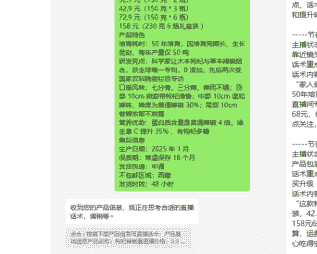

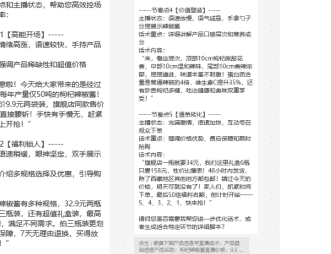

整个技术链路是这样搭建的:

1. 我将“写练习话术”这个能力封装成一个 Tools, 底层调用的是 DeepSeek-R1 模型;
2. 然后将这个能力集成到一个直播场景专属的智能体角色中, 并由ChatGPT-4o mini决定什么任务情况下调用它;
3. 最终我们将这个智能体对接进了企业微信, 主播只需要打开和“直播助手”的聊天窗口, 说一句“帮我写一段关于XXX产品的练习话术”, 就能立即拿到一段成型的文案。

而这段话术, 完全基于我们原先的“节奏重点+话术结构”的训练逻辑生成, 可用度非常高。

### Q: 使用AI后, 效果如何?

A: 以前一个新人写话术可能要花20-30分钟, 反复修改几轮, 有时候还需要运营一对一手把手辅导。而现在, 有了AI之后, 他们3分钟内就能拿到一段结构完整、语言自然的话术初稿, 可以立刻开始对着镜子练习。

更重要的是, 新人从“不会写”到“马上能练”的转变, 大大提升了他们的参与感和练习积极性。我们也发现, AI生成的内容某种程度上缓解了“自我怀疑”的心理负担, 让新人能更快进入状态。

对我们运营来说, AI帮我们节省了大量“重复性辅导”的时间, 我们现在可以把更多精力用在反馈主播表现、优化语气语调、指导镜头感这些更深层次的培训上。

### Q: 在用AI的过程中, 是否遇到了一些新问题或新挑战? 你是如何解决的?

A: 有的, 我们遇到的最大阻力, 其实是我们对AI能力的预期设得太高了。

一开始我们想做一个“通用性”的话术生成器, 希望AI能生成适用于所有产品, 且主播可以直接拿去直播用的文案, 但实践下来发现并不现实。

原因在于, 直播的效果, 话术内容只占7%; 真正的影响因素, 是主播的语气、语调、表情和互动节奏。比如同样一段话术, 如果由“与辉同行”的董宇辉说出来, 就会让人觉得生动、有吸引力; 但换成一个在格子间、面对镜头紧张的新人主播来讲, 效果是完全不同的。

所以我们后来调整了方向——不再让AI替主播“直播”, 而是让AI帮主播“练习”。就像学骑车一样，它不能替你骑，但可以让你不摔得那么疼。

于是我们把重点放在“生成结构合理、语言顺畅、节奏分明的练习话术”，让AI服务于主播训练而非替代表达，这才真正发挥了它的价值。

### Q：根据你的经验，其他人如何才能更好地使用AI？

A：我有两个比较核心的经验想分享：

第一，提示词要结合业务内核来写。

AI是很强的工具，但不是“你说一句，它就懂你一切”的魔法棒。如果提示词里没有带入真实的业务背景和语境，AI输出的内容就很容易漂浮、泛泛而谈。

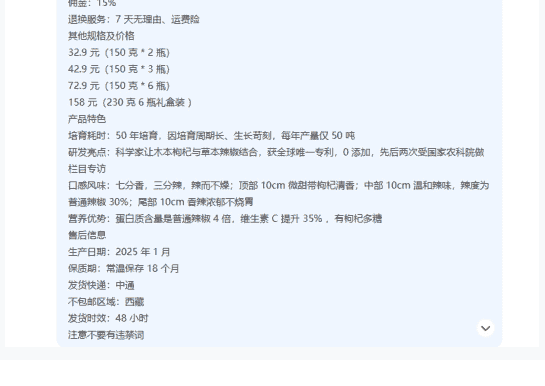

### AI落地案例集

比如我在用DeepSeek-R1的时候,如果只是说“写个话术”,它可能就只会堆叠一些功能点和广告词。但如果我补充清楚——“这是一个新人主播第一次练习使用的场景,需要通过话术锻炼节奏和镜头感”—它的输出就会更精准、更贴近训练目标。

第二,找到真正适合AI的落地场景

不是所有工作都要让AI来做。比如我们一开始期待AI能自动写出“能直接拿去直播的话术”,结果发现没用,因为直播需要表演、感染力、临场反应,而这些都是人最擅长的事。

但像“新手练习”、“写作起手”、“结构化模板搭建”这些重复性任务,AI反而特别适合。AI在训练场景里,是个可靠的搭档;在输出环节里,则更多只是一个辅助者。

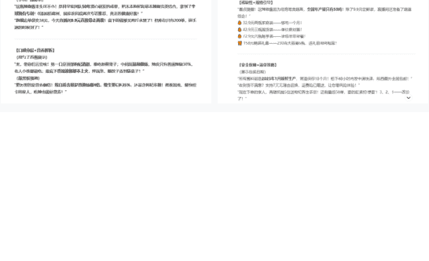

## AI落地案例 No.09

得到AI学习圈编辑部：

为了解决“线下活动排座难、实时变动多、协同效率低”的执行难题，AI学习圈同学 @俞巳元 用AI编程工具Trae，结合“需求翻译”能力，自主搭建出一个网页版智能排座系统：支持名单导入、规则匹配、反向导出签到表，还能一键搜索现场嘉宾位置。

整个过程就靠自然语言跟AI交互，她将分享如何通过AI把琐碎事务变成自动化流程，让文科生也能真正用AI“落地提效”。

### AI+市场 俞巳元同学：
### 如何用好AI为大型活动智能排座？

- 姓名：俞巳元
- 行业：协会工作者
- 岗位：市场部负责人
- 领域：AI+市场营销
- 关注TA：得到知识邦@市场部老俞”公众号“tbq的老俞”

### Q: 你在工作和生活中遇到了哪些主要的挑战或困难？

A: 我从事的是ToB数字化相关的工作，负责市场营销，经常要办线下活动。一个看起来很小但是非常耗时间的任务就是给来参加活动的嘉宾排座位。

我们办活动一般都有几百人来参与，大型活动能到500人以上。一般来说，上百位嘉宾的座次都需要提前确定好，并在签到时通过席卡发放，让每个人清楚自己坐在哪一排、哪一号。

别小看给活动排座这件事。它的难点主要在于有很多临时的变化和需要紧密协同的环节。哪怕几天前排好了位置，但现场情况经常会临时调整。比如：某位领导突然不到场，或临时提出“A和B不要坐在一起”，这时候就需要现场快速调位。但如果是手工处理，就会带来很多问题：

- 签到表无法同步。现场改了座位，但签到处用的仍是之前打印好的旧表，发出的席卡就不对，嘉宾拿到卡后找不到对应座位。
- 信息靠人传，效率低。哪怕是领导一句口头指令说“把这两个人换一下”，如果没有一个实时的系统，签到处根本不知道要改什么。
- 变动太多时难以追踪。尤其上百人的席位安排，一旦涉及多轮调整，很难人工协同得过来。

### Q: 过去你是怎么处理这个问题的？

A: 传统的方式是堆人来解决这个问题，不断地把调整完的现场座位图，第一时间同步给签到处的同事。但线下活动线头多，一旦时间紧任务重，就没办法把现场的变化实时同步给同事了，就会出现混乱的情况。

### Q: 你是如何使用AI来解决这个问题的？使用AI后，效果如何？

A: 我当时就在想，能不能用编程做一个系统，把签到台和座位信息关联起来，实现实时更新。

但在过去，这种解决方案对像我这样没有技术背景的人来说，其实非常难实现。我是个文科生，从没学过编程，即便是自学编程，门槛也非常高，很多复杂的语法、抽象的逻辑、冰冷的符号，跟人文思维中对语言的理解和表达方式截然不同。

自己做不了，就得找专业人士帮忙开发，但是还得要协调时间和资源，有时靠“人情”，往往因为优先级不高而被搁置。

好在现在有了AI工具。随着AI技术的普及，编程学习的门槛正在被重新定义。有很多小应用，我自己就能根据业务逻辑和自然语言，自主搭出来。

让我印象很深的一个案例，是产品经理陈云飞，因为一个偶然的灵感，用AI工具 Cursor 零基础开发出了一款名为“小猫补光灯”的App，还一度登顶苹果应用商店付费榜第一，年收入最终突破百万。

受他启发，我也开始尝试使用 AI 编程工具，最终搭出来一个网页版的智能排座系统，界面如下图：

以前的座位图，需要手动一步步处理。首先要在 Excel 里整理出一个名单，包括嘉宾的姓名、单位、职务等信息，再根据座位安排规则一一匹配，然后用 VLOOKUP 函数把嘉宾信息对应到每一个座位上。这个过程不仅麻烦，而且非常容易出错。

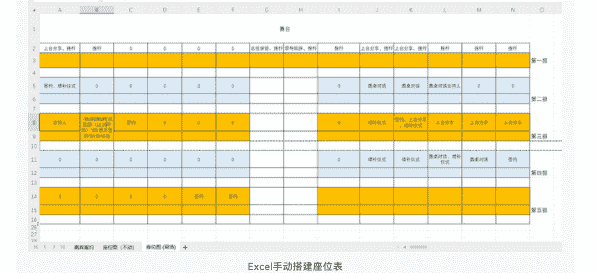

Excel手动搭建座位表

现在有了这个工具，它实现的效果是：

你只需要提前准备好名单表，然后导入名单，点击“开始排序”，AI系统就可以在几秒钟内自动生成带有完整信息的座位图。

而且，它还解决了一个问题，就是现场座位图如果有调整，我可以1秒钟反向导出新的名单表，给到签到处的同事去签到，实时对应。

而且我还做了一个搜索功能。活动现场座位众多，密密麻麻，如果临时需要查找某个单位或嘉宾，只需要输入名字或者其他关键词，就能快速定位座位，大大提升了查找效率。

整个网页，我和AI一起总共更新了11个版本。

我把搭建这套系统用的工具及流程步骤也附上：

我用的AI编程工具是字节Trae（海外版）。为什么选它？

其实在工具上，目前真的有非常多选择，包括这几类：

1. 对话式Chatbot: ChatGPT、Claude、DeepSeek
2. AI编程软件: Cursor、通义灵码、Windsurf、InsCode AI IDE、Trae
3. IDE插件轻量级集成: GitHub Copilot、CodeWhisperer等

我没有能力把所有工具都摸排一遍,选择Trae是因为它有全中文版本。另外选择用它的海外版,是因为海外版可以调用Claude 3.5 sonnet模型。

- Trae国内版 (VSCode插件): 模型选择包括豆包、DeepSeek
- Trae海外版 (Win客户端): 支持图像输入,用于导入历史活动座位图作为参考模板。模型选择包括Claude、Gemini、GPT、DeepSeek

选好工具后,搭建智能排座系统的流程分两步:

#### 步骤1: 需求拆解 (Build模式)

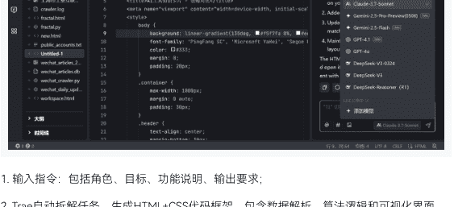

1. 输入指令: 包括角色、目标、功能说明、输出要求;
2. Trae自动拆解任务,生成HTML+CSS代码框架,包含数据解析、算法逻辑和可视化界面。

- Build模式下,用户可以输入需求,AI自动拆解任务,生成完整项目代码并自动运行。Chat模式下,你需要把代码导入。

#### 步骤2: 迭代优化 (Chat模式)

1. 功能扩展和细节调试: 你可以用自然语言说明,动态调整功能和样式细节;

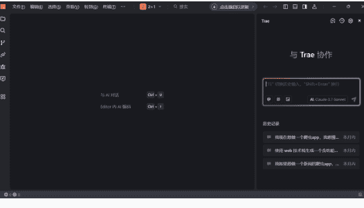

### AI落地案例集

2. 错误排查：当出现bug时，让AI分析代码并提出解决方案。

- 如果你像我一样看不懂任何代码，你每次的需求要一个一个提，逐步增加，并及时保存可执行的版本。

### Q: 在用AI的过程中, 是否遇到了一些新问题或新挑战? 你是如何解决的?

A: “文科生苦不会编程久已。”技能型的东西, 不会就是不会, 你没有一点办法。大学的时候, 我靠硬背Java语法勉强通过计算机考试, 买的Python书也只有第一页有轻微使用痕迹——那些复杂的变量、函数、循环逻辑和“游泳池同时进水和出水”的数学题一样让人头疼。

在使用AI编程的过程中, 因为看不懂代码, 我确实会遇到卡壳的情况。不过随着大模型的持续迭代, 这种问题正在慢慢缓解。与此同时, “如何更清晰地表达需求”, 也逐渐成了每个人都绕不开的一课。

我想说的是, 这种工作方式, 很可能会成为未来协同的一种常态。我们需要厘清边界: 使用AI编程的核心, 不是写代码本身, 而是把业务需求转化为机器可以执行的指令, 并通过不断迭代, 实现预期目标。

它并不是为了取代程序员, 而是通过“需求翻译”的能力, 让业务专家、技术人员和AI形成协作网络, 释放更大的创造力, 即:

1. 帮助业务人员更专注在真正重要的需求上,不用再花太多时间纠结技术细节;
2. 让技术团队把精力放在有挑战、有价值的事情上,少做重复性工作;
3. 推动公司整体用好AI,让流程更顺畅。

### Q: 根据你的经验, 其他人如何才能更好地使用AI?

A: 我的最大心得就是“用中学”、“干中学”。

1. 从最小可行性需求切入
不要从自己不熟悉的业务场景开始着手——因为不了解业务,很难获得正向反馈,也容易对AI编程失去信心。同时,也不必一开始就追求完美,先做出来,再逐步迭代。

2. 像职场沟通一样写需求
把需求想清楚、说清楚,尽量用白话文表达。很多时候你会发现,你以为自己已经说得很明白了,但AI理解的往往不是那回事。可以尝试把需求拆成“两部分”:功能是什么、希望看到的效果是什么。

3. 错误也是灵感的来源
调试过程中要有耐心。遇到问题时,也可以反过来问问AI:有没有一些你没想到但它能补充的功能点?很多时候,灵感就藏在这些“意外”里。

## AI落地案例 No.10

得到AI学习圈编辑部：

在ToB企业的招投标流程中，“标书难写、成本高、易出错”一直是老大难问题。

AI学习圈同学@鹤涵 所在的团队，用智能体平台搭建出了一个自动写标书的AI系统，替代了传统的开发模式。不需要开发代码，就能完成从资料解析到标书生成的流程。

这次的案例，他分享了如何用“搭积木”的方式，把复杂任务变成AI能够执行的任务，不只适用于标书，还可迁移至产品介绍、工作文档、知识协同等多种场景。

### AI+销售 鹤涵同学：
### 如何用AI快速写标书，为市场销售人员减负？

- 姓名：鹤涵
- 公司：斑码AI
- 职业：联合创始人兼技术负责人
- 领域：AI企业落地服务
- 关注TA：公众号“程序员鹤涵”

### Q: 你在工作和生活中遇到了哪些主要的挑战或困难？

A: 我们公司主要为企业客户提供基于智能体的AI应用开发服务。在与企业客户的合作过程中，我们发现一个非常高频但长期未被技术很好解决的痛点——标书撰写。尤其在ToB业务中，无论是软件服务公司、系统集成商，还是各类供应商，参与招投标几乎是赢得项目的主要方式。

然而，标书的撰写过程繁琐、重复、且严重依赖人工，通常涉及:

- 梳理需求与招标文件，提取关键点；
- 对照以往中标案例，修改内容模板；
- 协调技术、商务、法务等多部门反复确认；
- 最终由市场或售前团队合成全稿。

这些流程不仅消耗大量时间，且每一份标书都对细节有着极高要求，容不得出错、也难以规模化复制。尤其在一些中小企业中，标书往往由核心骨干亲自操刀，不仅成本高，还影响主要业务的推进。

因此，我们希望通过AI智能体重构这个流程，构建一个智能系统，实现标书的自动化撰写。

### Q: 过去你是怎么处理这个问题的?

A: 其实在过去，为了提升效率，很多公司也尝试过搭建系统。但现实是，这类系统往往很难轻易做成，主要原因有几点:

首先，传统开发方式很折腾，基本得拉一整个技术团队。前端、后端、数据库、权限啥的，全都得自己从头写。整个流程特别慢，动不动就得干几个月。

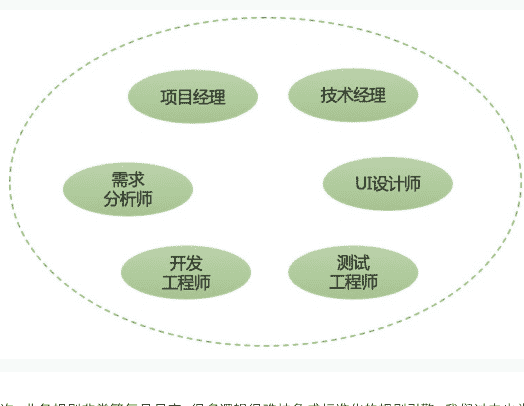

其次，业务规则非常繁复且易变，很多逻辑很难抽象成标准化的规则引擎。我们过去也尝试过用人工写规则、维护模板库，但往往一改需求就要推倒重来，导致系统难以持续演进。

此外，数据准备是另一个瓶颈。要做到内容自动生成，就必须有大量高质量的历史标书数据。但这些数据原本是散落在Word文档或本地文件夹中的，缺乏统一标准，也很难直接利用。

所以总结来看，过去的做法面临三个主要问题：

- 开发效率低：一个项目常常需要3-5人，一个月才能上线；
- 灵活性差、难以迭代：业务规则一变动，整个系统就需要重构；
- 难以规模化复制：每个项目的要求差异大，技术资产难以复用。

这些问题直接导致常规的系统，很难持续生成有价值的标书，更不用说小型团队甚至根本没有能力承接这样一个复杂IT项目。因此我们开始思考，是否可以借助AI，找到一种全新的路径来解决这个问题。

### Q: 你是如何使用AI来解决这个问题的？

A: 我们现在是借助大语言模型(比如GPT-4)和自己的智能体平台,把整个标书生成流程“模块化”,让AI来帮我们完成大部分繁琐的步骤。

简单来说,我们不再是靠程序员写一堆复杂的代码来搭系统,而是通过一个平台,把AI当成“能听懂指令的助手”,一步步拆解标书的写作过程,并让它自动完成。

整个流程大致分为三步:

#### 第一步：知识准备。

我们会把过去写过的标书文档收集起来,清洗、分段,然后上传到我们自研的”问问AI“平台。这个平台会自动把这些文档转化成AI能理解的知识库,也就是说,AI现在已经“看过”这些内容了,后续就可以调用它们来写新的标书。

#### 第二步：结构生成。

每次参与的招投标要求都不一样,所以我们先让AI根据历史大纲模板和当前项目需求,自动生成一个新的标书大纲。这个大纲就像是一个写作提纲,把整个文档分成一章章、一节节,后续就按这个结构来补内容。

第三步，是内容生成和合成。

大纲定下来后，我们让AI逐段去生成每一章的内容。它会参考过去的资料，也结合本次项目的背景要求，写出贴合场景的文字。写完之后，我们把所有段落拼接成完整的Word或PDF文档，一份标准化的标书就自动生成了。

除了这个标书场景，这套平台还能支持很多类似的应用，比如撰写产品介绍、生成工作流程文档等等。我们还内置了一个“可视化界面”，用户可以像搭积木一样，搭建不同的智能体工作流，不需要写代码，也能实现复杂逻辑的自动化。

整体来看，通过AI的介入，我们让原本“靠人堆时间”才能完成的工作，变成了“人机协作、高效生成”，不仅提升效率，也大大降低了出错率和沟通成本。

**Q: 使用AI后，效果如何？**
**A:** 典型的一个案例是我们为一家大型软件服务商打造的标书自动化系统。

过去他们公司内部每年要制作上百份标书，经常出现时间紧、任务重、交叉出错的情况。上线AI系统后，团队只需做两件事：上传资料 + 审核结果。AI负责中间90%的生成工作，大幅释放了市场和售前团队的精力。

**Q: 在用AI的过程中，是否遇到了一些新问题或新挑战？你是如何解决的？**
**A:** 虽然AI大大提升了效率，但在实际应用过程中，我们也确实遇到了一些新的问题，主要分为两类：技术层面的挑战，以及业务落地过程中的阻力。

#### 一、技术层面的问题

1. 幻觉问题
AI在生成内容时，有时会“编造”事实，尤其在需要严谨性的场景中，比如医疗或法律类标书，甚至可能给出错误的信息或建议。
解决方案：我们设置了“双重校验机制”，AI生成的每一条内容都要与企业知识库中已有的权威信息进行比对，确保内容是有据可查的。同时，对于高风险内容，我们增加人工复核环节，避免出现逻辑漏洞或事实错误。

2. 长文本处理能力不足
像合同、技术方案、项目实施方案这类文档，动辄几万字甚至超过10万字。大模型一次性处理这么长的上下文容易遗漏关键信息，或者输出不准确。
解决方案：我们采用“分级处理”策略，先让AI对全文进行智能摘要，抽取出核心信息，再将摘要内容按模块切分，逐段分析与生成。同时配合规则引擎做结构校验，保证文档内容的完整性和一致性。

#### 二、业务场景中的阻力

1. 对AI的认知偏差
很多企业对AI抱有过高期望，觉得“只要有AI，就可以一键生成标书、完全自动化”，忽略了AI和人工之间的协同逻辑。
解决方案：我们在设计系统时刻意保留了“AI+人工”的混合工作流。例如，在标书系统中，我们设置了“生成-审阅-修订”的三段式流程，让AI负责起草，人来负责定稿，并通过培训、案例复盘帮助建立正确的认知。

2. 数据基础薄弱
一些企业缺乏结构化、可利用的历史资料，导致“无米下炊”，难以生成高质量内容。
解决方案：我们把散落在各部门的Word文档、PPT、项目资料进行分类清洗、结构化处理，并构建私有知识库，打通AI输入源。

### Q: 根据你的经验，其他人如何才能更好地使用AI？
**A:** 我们做AI标书系统的过程，其实也是一个在实践中不断试错、打磨、迭代的过程。如果从中提炼一些可复制的经验，我认为可以从以下四个方面来思考：

#### 一、选对场景：小切口撬动大价值
建议大家优先选择“高重复、强刚需、有数据”的业务场景切入。我们之所以选择标书，就是因为它具备三个特点：
- 企业频繁产生（每年几十上百份）；
- 对质量与时效要求极高；
- 同时也沉淀了大量历史资料可供学习。

这样的场景，最适合通过AI技术来释放效率。

#### 二、快速验证：别追求一步到位
在AI应用开发中，不建议一开始就做大而全的系统，而是用开源工具、可配置平台快速搭出一个原型，用两三天验证业务闭环，优先跑通“能用”。等验证跑通后再逐步优化体验与性能。

#### 三、构建杠杆：把重复做的事封装成能力
随着项目数量增加，我们会发现很多底层动作其实是重复的，比如数据采集、文档清洗、结构识别等。这些能力我们都会封装成模块，在平台内统一调度，把“人力操作”变成“系统调用”，才能得到提效和规模化。

#### 四、数据驱动：从失败中优化智能体
我们平台内置了埋点系统，会记录每一个用户交互的路径与结果。通过分析失败案例、反复训练知识库，我们不断优化智能体的决策路径，确保它在关键节点上更“懂业务、更稳准”。

这类“反馈机制”非常关键，不然AI会长期停留在试验品阶段。

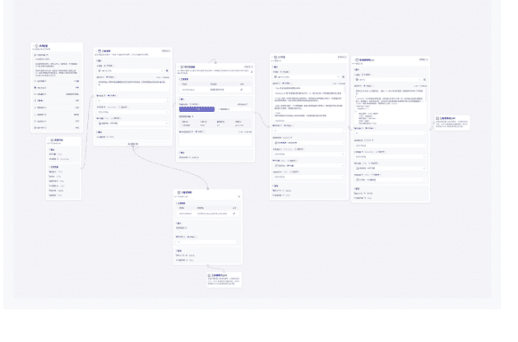

## AI落地案例 No.11

得到AI学习圈编辑部：为了解决钢贸企业“产品太多难培训、知识太散不好用”的经营效率难题，AI学习圈同学、钢贸行业从业者 @冼侃 用AI搭建了“AI钢贸产品推荐助手”：一边通过自适应系统训练新人，把培训周期从12个月压缩到3个月；一边让业务人员用智能体查询参数、推荐产品、秒回客户，大幅提升响应速度。

这次的案例中，他将拆解AI落地全过程：怎么选工具？如何搭流程？一个重资产行业的AI应用，或许比你想象的还“轻”。

### AI+销售

### 冼侃同学：如何用AI做产品智能推荐提升销售响应速度？

- 姓名：冼侃
- 岗位：公司创始人
- 关注TA：得到知识城邦@冼侃
- 公司：洋侃管效(广州)科技有限公司
- 领域：AI+钢铁贸易

### Q: 你在工作和生活中遇到了哪些主要的挑战或困难？
**A:** 钢贸企业在产品知识和员工培训上遇到不少实际问题：
- 海量产品知识：产品种类太多，有两千多个SKU，参数又复杂，员工很难全都记住。
- 低效培训体系：现在还主要靠师傅带徒弟，新人要花12到18个月才能真正上手。
- 业务响应滞后：一旦客户问到非主营的重点产品，员工得花十几分钟查资料，响应太慢，客户体验也会受影响。

### Q: 过去你是怎么处理这个问题的？
**A:** 过去我们主要靠纸质手册加上零散的数据库来管理产品信息，但这种方式更新慢、查找不方便。培训方面，大多采用集中面授，成本高不说，时间也不灵活，很多跨岗位的员工根本很难参加。日常工作中还特别依赖老员工的经验，很多问题要一遍遍地回答，重复性工作很重，效率也不高。

### Q: 你是如何使用AI来解决这个问题的？
**A:** 我主要用AI做了两件事，第一个产品是针对员工培训的，名字是“米塔书架”，它是我用 DeepSeek+米塔引擎搭建的一个自适应学习系统。主要面向钢材行业的新手或者不在一线岗位的员工。这个系统会根据个人对钢材产品的了解程度，分为高、中、低三个级别，同时支持随时随地进行碎片化学习。这样不仅能节省大量培训人力，也更适配每个人的学习节奏。

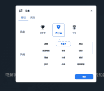
"米塔书架"系统界面截图

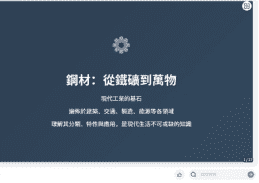
"米塔书架"系统界面截图

具体怎么搭建起来的呢？我主要分了两步推进：第一步是用 Deepseek 引擎构建知识图谱。通过爬取企业的历史数据和行业标准文档，把零散的信息整理成结构化的知识库。我们把数据分成三类来管理：一类是产品属性，比如屈服强度、锌层重量；一类是业务规则，比如价格公式和物流方案；还有一类是行业关联信息，比如替代品的对应关系，或者不同工程的适配场景。

第二步是用米塔引擎搭建自适应学习系统。我们开发了分层的课程体系：基础层主要讲产品分类和参数解析，每节课不超过十分钟；应用层则更偏向实战，比如报价核算、物流配置等场景训练。同时还嵌入了智能评测系统，能根据员工的学习情况动态调整课程内容，让培训更精准高效。

针对“产品太多、业务人员难以及时为客户匹配适合产品”的问题，我搭建了一个名为“钢贸产品教师”的 AI 智能体。它把产品知识库集成进了对话系统，专门用于支持业务一线的产品知识问答。

这个智能体主要有两个核心功能：一是实时查询，可以快速获取产品参数、进行重量换算等；二是场景推荐，只要输入工程需求，就能自动推荐适配的产品，帮助员工更高效地完成选品和客户响应。

比如，在业务员接触到轻钢别墅类工程时，系统可以根据工程类型，有计划地推送匹配的产品建议：

轻钢别墅在建筑与基础设施等多个领域有应用，具体信息如下：
- **U 型槽钢应用：** U 型槽钢（Q345B 材质）作为主龙骨，施工效率提升 40%，承载能力≥200kN/m²。
- **不锈钢应用：**
  - 铁素体 430 不锈钢（厚度 0.8 - 1.2mm）用于外墙装饰，耐大气腐蚀且成本低。
  - 双相钢 2205 用于承重框架，抗风压≥1.5kN/m²，比传统碳钢减重 20%。
- **管件应用：** DN50 镀锌钢三通（Q235B 材质），活接头采用快装卡箍式，安装效率提升 50%。
- **钢管应用：** 轻钢别墅龙骨采用 Q235B 钢管，施工周期缩短 40%。

在教学案例中，轻钢别墅屋顶选材若需求为抗风压 1.2kN/m²，耐盐雾≥2000 小时，成本≤6000 元/吨，可选 SPA - H 镀锌板（厚度 3mm，锌层 275g/m²），其性价比最优。

当客户提出需要进行镀锌加工时，员工可以快速了解“镀锌”的含义及相关工艺：

镀锌是在钢板表面覆盖锌层以实现防腐的工艺。生产工艺包括热浸镀锌和电镀锌两类。
- **热浸镀锌：** 将钢坯浸入熔融锌液（约 450°C），锌层较厚（60 - 300g/m²），表面呈亮白色或锌花纹，耐腐蚀性强，适用于建筑、桥梁等重工业领域。其具体流程为预处理（酸洗去除氧化皮，电解清洗确保表面洁净）、浸镀（钢板浸入 450 - 480°C熔融锌液形成锌层）、后处理（风冷、钝化或涂油提升耐蚀性）。
- **电镀锌：** 通过电解工艺形成锌层，厚度较薄（10 - 50g/m²），表面均匀光滑，适用于精密加工场景（如家电、汽车零部件）。流程是先配置以硫酸锌溶液为主的电解液，控制电流密度保证锌层均匀性，后进行磷化或钝化增强表面附着力。

此外，还有合金化镀锌，是热浸锌后高温处理形成镀锌铁合金层，兼具焊接性和耐腐蚀性，用于汽车车身等高强度需求领域。

又如客户提到“弯头”这类消防产品，员工不清楚具体含义或者需要计算其重量时，也都能通过这个工具高效完成查询。

| 钢贸产品教师 14:28 |
| --- |
| 弯头是消防管道配件的一种,属于消防系统的关键连接件。其具体信息如下: |
| • 用途:用于改变管道方向。 |
| • 分类:按角度分为45°、90°、180°等。 |
| • 材质:以镀锌钢、不锈钢为主。 |
| • 生产工艺:钢还加热至1200°C后模压(热压成型),适用于弯头这类异形件,公差±0.5mm;不锈钢弯头采用TIG焊,焊缝需通过X射线探伤(缺陷≤Φ2mm)。 |
| • 重量计算:理论重量公式为 $$W = 0.02466 \times S \times (D - S) \times R \times \frac{\theta}{90} (kg/个),其中S为壁厚(mm),D为外径(mm),R为曲率半径,θ为弯曲角度。 |
| • 常用规格重量:如90°弯头,规格为DN50×3.75、材质为镀锌钢的,理论重量为1.2kg/个。 |
| • 应用案例:上海中心大厦采用304不锈钢弯头,耐酸雨腐蚀寿命≥30年;电梯井道用镀锌钢弯头+防火涂料,耐火极限≥2小时。 |
| • 品牌:国内友发钢管的镀锌钢弯头公差±0.2mm,适配民用建筑;进口日本久保田有精密冷镦弯头,螺纹精度达JIS B0203标准。 |
| • 鉴别要点:正品铸有规格、材质、执行标准(如GB/T3091),有激光防伪码可官网验证;镀锌层厚度用磁性测厚仪测量(≥65μm),不锈钢弯头用光谱仪验证Cr/Ni含量。劣质品可能存在偷工减料(壁厚偏差>10%)、以次充好(如201不锈钢冒充304,Cr含量<16%即判定不合格)等问题。 |

通过这个智能体，钢材行业从业人员能更方便地获取知识，提升客户响应效率，大大减轻了日常工作的信息负担。

### Q: 使用AI后，效果如何？
**A:** 引入 AI 后，我们在多个方面都看到了明显成效。

首先，在人才培养方面，新员工从入职到能独立作业的周期，从原来的 12 个月缩短到了 3 个月。

其次，业务响应的效率提升很明显，过去需要 10 到 20 分钟处理的常规咨询，如今有 80% 实现了秒级回复。

培训方面，整体人力投入减少了 50%，年度培训成本也降低了约 70%。

同时，得益于产品知识覆盖更全面，非主营品类的成交额实现了两倍增长，带动了业务拓展。

### Q: 在用AI的过程中，是否遇到了一些新问题或新挑战？你是如何解决的？
**A:** 在使用 AI 的过程中，我们也遇到了一些新的挑战。比如，员工在初期对 AI 工具有一定的怀疑和不信任，使用意愿不高；另外，随着行业政策和标准不断更新，知识库的内容容易出现滞后，影响准确性。

为了解决这些问题，我们做了两方面的调整。一方面，组织了“AI 工具实战营”，让员工在实际业务中参与系统使用和反馈，逐步建立信任，同时也推动了工具的优化迭代；另一方面，设立了专门的知识库管理员岗位，负责每周更新内容，及时同步行业动态，确保知识体系的准确性和时效性。

### Q: 根据你的经验，其他人如何才能更好地使用AI？
**A:** 结合我的实践经验，想要更好地在业务中应用 AI，可以从以下几个方面入手：
- 1. 明确需求优先级：优先选取那些使用频率高、复杂度低的场景切入，比如产品参数查询、基础知识答疑等，既见效快，也便于推广。
- 2. 分阶段实施：不要一口气上全套，建议先搭建基础的知识库，再开发学习与培训系统，最后再将 AI 工具嵌入到实际业务流程中，稳步推进。
- 3. 设计反馈机制：通过收集员工的使用数据，了解常见问题和使用习惯，持续优化模型效果，让工具越来越“懂”业务。
- 4. 轻量化部署：选择成熟、支持 API 对接的平台（如“扣子”），可以大幅降低开发和运维成本，缩短落地周期。
- 5. 培养种子用户：先让管理层和一线骨干用起来，发挥示范作用，再带动更多员工主动尝试，形成内部自驱的推广氛围。

## AI落地案例 No.12

得到AI学习圈编辑部：为了解决电商退货流程中信息分散、人工处理繁琐、财务核对困难的问题，AI学习圈同学@石云升借助AI工具，设计了快递单号提取和物流轨迹查询两套自动化方案。

这次的案例中，他分享了自己在“如何用 AI 梳理非结构化数据”、“如何构建可落地的自动化工具”等方面的实操经验，如果你有意探索业务流程自动化，石同学的案例值得参考。

### AI+产品服务

### 石云升同学：如何用AI自动查单号和物流提高退货处理效率？

- 姓名：石云升
- 公司：深圳市保创云科技有限公司
- 岗位：AI企业落地师
- 领域：AI企业落地
- 关注TA：公众号“石云升”得到知识库城“石云升”

### Q: 你在工作和生活中遇到了哪些主要的挑战或困难？
**A:** 我主要是在电商业务的退货处理流程中应用AI的。这个场景听起来简单，实际却非常复杂，因为它牵涉到了多个部门之间的协作，尤其是运营部和财务部。

核心难题体现在两方面：
第一，运营部要从客服的微信群里手动整理退货快递信息，包括快递单号和是否拦截成功。但问题是，拦截状态往往不是实时反馈的，有时候要隔几天才知道结果。

第二，财务每月要核对这些退货单是否真正退回仓库，但只能依赖运营整理的表格。这就会出现一些问题，比如只能看到退回了哪些商品，却无法跟踪是否退回了仓库。

整个流程信息分散、反馈滞后、人工操作繁重，导致效率低、错误多。

### Q: 过去你是怎么处理这个问题的？
**A:** 说白了，过去就是靠人“扛”。

运营同事每月得翻看大量微信群聊天记录，一个个复制快递单号、确认状态，做成表格；而对于那些几天后才有反馈的单子，还得再回头人工更新状态。

而财务这边，其实根本就没有核对机制，全靠信任运营上报的数据。结果就是：快递哪怕一直在驿站没人取，只要表格里没问题，就没专人管了。

这样一来，不仅工作量巨大，而且漏洞很多，退货的完整性根本无法保证。

### Q: 你是如何使用AI来解决这个问题的？
**A:** 在深入了解运营和财务的需求后，我设计了两套独立的自动化工具，并用AI来辅助开发和逻辑设计。

第一套是“快递单号提取工具”
最开始我想用Dify做个微信群机器人，自动监听快递信息，但实测后发现不稳定、容易漏消息，还有封号风险。后来我转向通过开源工具留痕，在获得授权的情况下读取聊天记录，这个思路稳定得多。

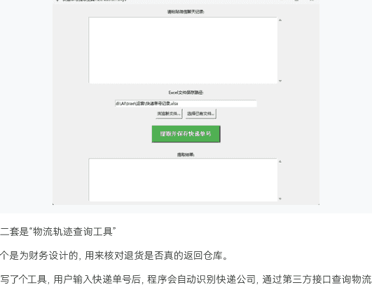

我通过AI来辅助编写解析逻辑，自动提取出聊天记录里的快递单号、拦截状态，并支持后续对延迟反馈信息的更新。所有数据都会生成一个结构化的Excel表格，运营直接用即可。

#### 第二套是“物流轨迹查询工具”
这个是为财务设计的，用来核对退货是否真的返回仓库。

我写了个工具，用户输入快递单号后，程序会自动识别快递公司，通过第三方接口查询物流轨迹。接着用AI来分析轨迹文字内容，判断当前状态，比如“已签收”“在驿站”“正在派件”等。

最终也会导出一个Excel，财务可以一目了然地知道每个退货的状态，哪些是真的退回来了，哪些还卡在路上。

这两套工具结合之后，整个退货流程就从“人工盲区”变成了可视、可查、可控。

### Q: 使用AI后，效果如何？
**A:** 效果非常明显：

首先是效率提升。运营那边不需要再一个个抄单号、整理状态，几百个订单的数据现在几分钟就能自动生成。财务也第一次有了自己的“数据依据”，不再只是接收数据，而是主动参与校验。

其次是准确性提高。尤其在处理那些延迟反馈的拦截信息时，程序的记录机制可以自动识别并更新状态。以前那些一直滞留在驿站的快递，现在都能及时发现、主动处理了。另外，这个工具还有一个功能，可以查看哪些订单是“仅退款”，并进一步追溯退款原因，从而判断责任方是谁。

### Q: 在用AI的过程中，是否遇到了一些新问题或新挑战？你是如何解决的？
**A:** 挑战比预期的还要多。

第一个问题是初始方案选择失误。一开始原本打算用Dify来实现这个需求，但在实际操作中发现存在不少问题。后来突然想到，或许可以通过某些工具直接获取聊天记录——因为之前似乎见过类似的产品。于是去查找了一下，果然找到了可行的方案。

第二个挑战是规则梳理特别困难。运营同事其实自己也说不清楚到底哪些快递单号该记录，哪些是异常的、无效的。这就需要我不断跟他们沟通、试错、总结规则。很多逻辑不是代码能写出来的，而是靠我一点点从他们口中“挖”出来的。

第三个难点是功能上线后，还是发现覆盖不到所有情况。我花了很多时间做测试、迭代，基本是一边上线一边优化。好在AI在辅助调试、文本解析方面真的帮了我不少。

### Q: 据你的经验，其他人如何才能更好地使用AI？
**A:** 我想总结几点对我很重要、也可能对别人有帮助的经验：## AI落地案例 No.13

得到AI学习圈编辑部：
为了解决企业在员工培训与业务考核中“成本高、效率低、评分不准”的问题，AI学习圈同学@毅恒 带领团队借助AI优化了从讲解录制到自动评分、反馈与练习的全流程。

这次的案例，他分享了在“如何将考核标准结构化”、“如何让AI稳定打分”、“如何结合业务场景持续优化”方面的实操经验，帮助有意探索AI落地的企业管理者、培训负责人，找到清晰可行的方法参考。

### 毅恒同学：

### 如何用AI给员工培训和考核提效？

| 姓名 | 毅恒 | 公司 | Smart Score AI | 岗位 | 创始人 | 领域 | AI+企业落地服务 | 关注TA | 微信公众号“毅恒的小酒馆” |
|:---|:---|:---|:---|:---|:---|:---|:---|:---|:---|

**Q:** 你在工作和生活遇到了哪些主要的挑战或困难?

**A:** 我们应用AI的案例,最有代表性的是给链家做房产经纪人培训和考核这个场景。链家大约有12万名房产经纪人,每年需要对他们进行业务讲解能力的考核。这项任务看似简单,但执行上非常困难。

问题集中在几个方面:
- 第一,人工评分主观性太强,不同考官的判断标准不一致;
- 第二,组织成本高。需要调配大量人力、线下场地,还要协调各地门店和管理层;
- 第三,反馈周期长。员工考试后往往需要等待数周甚至几个月才能拿到成绩;
- 第四,企业难以追踪员工具体掌握了哪些内容,培训效果难以量化。

在一些消费品行业,其实也有类似问题。比如美妆品牌,他们推出新产品的速度很快,每次店里销售新品前,只能通过文档或培训材料让一线的营业员自学,无法了解他们对产品的掌握程度,更难以组织标准化、可量化的考核流程。这些一线员工是否真正理解产品、能否准确传达给客户,品牌方几乎无从验证。

这几个问题叠加在一起,导致培训考核流程不仅效率低,也无法有效帮助员工提升能力。

**Q:** 过去你是怎么处理这个问题的?

**A:** 过去企业主要依赖线下组织考试和人工打分。像链家这样经纪人数量庞大的企业,组织一次考核往往要提前好几个星期去安排场地、协调考官的时间、进行评审。考核形式就是现场听这些经纪人口头做介绍，看看销售话术上、表达逻辑上符不符合公司要求，有没有掌握到位。

每一场考试都要有多名考官现场听讲，并对每位经纪人逐项打分。这个过程对管理层来说是刚性的时间占用，必须坐在那里，一天下来不只是考官累，参与考核的员工等得也很累，效率还不高。

为了提升培训和考核的效率，他们后来也尝试内部搭建了一些SaaS系统，用"录音+集中打分"模式，参加考核的经纪人员工录制语音，上传到后台，然后再由客服或运营团队统一听取内容，进行评分。有些企业在此基础上进一步尝试引入关键词识别系统，判断讲解中是否包含预设词汇，用以辅助打分。

我们也参与过类似方案的设计，比如设置标准答案的关键词库，让系统判定内容中是否提到"服务流程""产品优势"等。但这些方法存在一个根本性问题：系统没办法理解语境，不能判断说的是否对、是否讲清楚，甚至不能识别是否只是"提到了词"。

比如，有人讲到"我们服务很好"，但没有说明为什么好，也没举出客户反馈或流程细节，这种表达其实不应该给高分，但是系统会因为这个说到了一些关键词，而给出高的评价，这是不行的。

因此，企业最终仍然需要人工去核查、判断，效率与一致性都难以保障。

**Q:** 你是如何使用AI来解决这个问题的？

**A:** 我们从2023年8月开始与链家合作，部署了一套基于语义理解的AI评分系统，叫 Smart Score。系统嵌入他们原有的学习平台，整个流程设计成闭环，覆盖了"讲解上传 → AI评分 → 明确反馈 → 反复练习 → 正式考核"五个阶段。

每位经纪人在完成学习后, 会通过链家的内网小程序录制一段讲解视频或语音内容, 讲完后自动上传至后台。系统接收到内容后, 会将其转写成文本, 基于事先配置好的评分维度进行分析。例如:
- 产品核心卖点和案例讲解表达是否精准
- 讲解结构是否标准
- 关键词使用是否得当
- 语言表达是否清晰流畅
- 讲解是否真正“说人话”

我们与链家一起, 把原本写在PPT或文档中的“打分标准”逐条拆解为可计算、可判断、可量化的指标。像“逻辑清晰”这种抽象描述, 我们会具体成“是否有起承转合结构、是否覆盖3个以上要点”, 并给出得分区间。

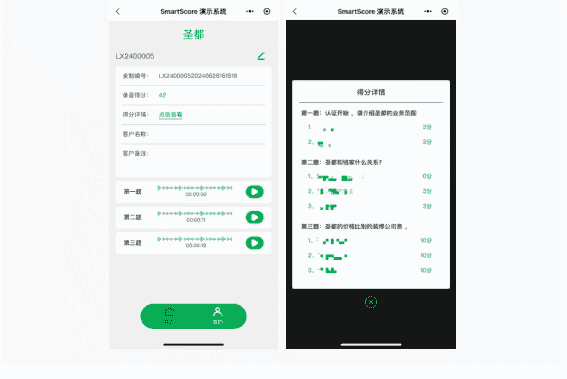

系统评分后立即返回结果, 每个员工都能在页面上看到自己在哪些知识点上得了几分, 为什么失分。员工可以选择继续练习, 直到满意再提交正式考试记录。

**Q:** 使用AI后, 效果如何?

**A:** AI评分系统上线后, 成效还是很明显的。

首先是时间效率。过去一轮完整考核可能需要1~3个月, 现在通过系统上传音频后, 几分钟就可以完成评分反馈, 一天时间能完成上万人次的考核任务。管理层不需要像过去那样, 投入大量的精力组织培训和考试, 流程缩短了。

其次是成本控制。以链家为例, 过去一次完整的年度考核投入成本约在100万元左右 (因隐私考核成本不便告知, 仅示意举例), 引入Smart Score系统之后, 全年考核成本下降至5万元, 节省幅度达到95%以上。

第三是员工体验的提升。系统将每道题的评分细化并明确标注得分点与失分原因, 员工能立刻知道哪里需要改进。后来也结合需求, 我们做了“练习+模拟考试”的功能, 员工可以无限次练习并查看进步数据。链家后台数据显示, 原本90分以上的高分讲解者约占10%, 在使用AI系统半年后, 提升至20%。讲解能力的提升直接带来了销售转化率平均提升30%的业务效果。

**Q:** 在用AI的过程中, 是否遇到了一些新问题或新挑战? 你是如何解决的?

**A:** 在实际落地过程中, 我们确实遇到了一些关键挑战。尤其是在系统上线初期, 两个问题对模型效果和客户体验影响最大。

### 挑战一: 评分标准难以转化为AI可理解的格式

很多企业的原始评分标准并不具备结构化特征, 描述常常是模糊的, 比如“表达是否准确”“逻辑是否清晰”, 这样的语言对于AI而言无法直接使用。

我们的做法是: 由我们团队先将业务方提供的评分维度逐条拆解, 建立“可识别评分点”和“合理分值区间”。举例来说, “是否准确表达产品优势”会被我们转化为两个具体标准: 是否提到产品的三大卖点, 是否讲解顺序合理。每个标准都要有明确的判断规则, 才能让模型识别。这部分的工作我们会与业务方联合推进, 有些行业标准不明确的项目, 我们也会引入第三方咨询顾问参与标准制定。

### 挑战二: AI初期评分结果不稳定, 准确率不足

在项目初期, 我们按业务方的标准直接让AI进行打分, 发现评分结果波动大, 与人工评审存在明显偏差。AI评分有时打高, 有时打低, 特别是在边缘表达和复杂句式的处理上不稳定。

为了解决这个问题, 我们采用了一套"人机对照 + 样本微调"的方法。具体来说, 我们会收集实际员工的讲解录音, 安排人工专家进行标注评分, 再与AI评分结果进行对比。通过多轮样本训练和模型微调, 不断校正评分机制。直到AI的评分稳定性接近甚至超过人工专家, 我们才上线正式版本。以链家项目为例, 我们在上线前做了超过300份样本的比对和迭代, 才实现99%以上的评分准确度。

**Q:** 根据你的经验, 其他人如何才能更好地使用AI?

**A:** 在为企业客户推进AI落地的过程中, 我总结出四个核心原则:
- 持续关注模型底层能力的演进: 理解不同模型在语义理解、生成、推理上的边界与优势, 决定了应用场景的深度与范围。
- 聚焦可控、可衡量的业务场景: 优先选择流程标准化、结果可验证的环节, 确保AI输出稳定、效果可度量。
- 充分发挥语义分析优势: 相比生成能力, 当前AI在结构化分析与多维评分方面更具可靠性。
- 坚持小步快跑、持续迭代: 通过"最小可行单元"快速验证, 在业务反馈中不断优化模型与流程。

AI不是通用钥匙, 它真正擅长的是结构化、逻辑清晰、可复用的任务。企业在引入AI时, 第一步应该是拆解自己的业务流程, 找出"结果可控、变量较少"的环节。

我们的判断流程是：先理解业务全流程，识别高频、标准化、对结果有反馈闭环的模块，再匹配当前AI模型的能力边界，决定是否介入。如果输入噪声过大、输出不可验证，贸然上AI容易适得其反。

最后一点特别重要：在大模型仍存在“幻觉问题”且能力尚未稳定前，务必“用在刀刃上”。不是追求全流程替代，而是从一个最关键点切入，为企业原有流程完成“结构化升级”，逐步建立AI信任基础。

当然，我们也还在不断试错和迭代中，希望能在AI真正落地的过程中，尽一点绵薄之力。

## AI落地案例 No.14

得到AI学习圈编辑部：
为了解决招聘场景中“简历刷不完、面试没标准”等效率低下的问题，AI学习圈的同学 @潘磊 结合飞书多维表格和 AI 工具，搭建了一套智能招聘流程系统。通过让 AI 接管简历分析、评分机制、面试问题设计等关键环节，把过去 HR 最头疼的“判断型流程”变得更标准、更可量化，用数据说话，减少人为偏差。在这次分享中，他将讲述一个财务负责人如何用AI来推动招聘流程的改造，希望对你有启发。

### AI+组织提效 潘磊同学：如何用AI筛简历、出面试题 提升招聘效率？

| 姓名 | 潘磊 | 职业 | CFO | 行业 | 服务业 | 领域 | 得到知识城邦 @旅之人 科技公司财务总监、抖音@CFO学习笔记 |
|:---|:---|:---|:---|:---|:---|:---|:---|

**Q:** 你在工作和生活中遇到了哪些主要的挑战或困难？

**A:** 我应用 AI 的主要场景是在企业招聘流程的优化上，涵盖从岗位需求分析到面试评估的各个环节。以招聘软件工程师为例，我们需要从大量简历中筛选出符合要求的候选人，并确保在面试中能全面评估候选人的技术能力和综合素质。

传统招聘流程中的核心问题在于效率低、主观性强。比如，在简历筛选阶段，招聘人员往往需要逐份阅读简历，从中提取教育背景、工作经验、技能等关键信息，过程繁琐、耗时，同时也容易受到个人偏好影响，导致遗漏优秀候选人。而在面试环节，面试官的主观判断也可能影响结果的客观性和一致性，影响最终的招聘准确度和公平性。

**Q:** 过去你是怎么处理这个问题的？

**A:** 过去，我们主要依靠人工完成招聘流程中的各项任务。在岗位需求分析阶段，通常由招聘人员与用人部门负责人共同讨论，明确岗位所需的关键技能与经验要求。进入简历筛选阶段后，招聘人员会根据这些标准逐份查看简历，手动标记符合条件的候选人。而在面试环节，面试官则依靠自身经验和对岗位的理解，自主设计问题并进行评价。

这种依赖人工的方式存在不少问题。

首先，效率低下，尤其在面对大量简历时，招聘人员很难在短时间内完成筛选。

其次，容易受到人为偏见影响。不同招聘人员对岗位要求的理解可能存在差异，导致筛选标准不统一。面试环节中，评价也高度依赖面试官的个人判断，难以保证结果的公平性和准确性。

除此之外，整个流程缺乏系统性和量化机制，难以对招聘效果进行有效跟踪和持续改进。

**Q:** 你是如何使用AI来解决这个问题的?

**A:** 我们主要用的是飞书多维表格配合 AI 技术, 来改进招聘流程的问题。飞书多维表格本身就是个很好用的数据管理工具, 能把招聘过程中的各种信息整理得很清楚。而结合 AI 的自然语言处理和机器学习能力后, 我们实现了简历的自动识别和分析、候选人的打分评价, 以及自动生成面试问题等功能, 整体效率提升了不少。

我们把整个招聘流程搬到了飞书多维表格上, 并结合了 AI 技术来提升效率。
- 1. 岗位需求分析: 在飞书多维表格中创建岗位需求表, 明确列出岗位需要的技能、经验、学历等要求, 再利用 AI 的文本分析功能, 对这些需求进行结构化处理, 方便后续自动匹配简历。
- 2. 简历自动提取与分析: 候选人的简历导入系统后, AI 会自动提取出像姓名、联系方式、教育背景、工作经历、技能等关键信息, 并通过语义分析来判断和岗位的匹配程度。
- 3. 量化评分系统: AI 根据简历与岗位需求的匹配程度, 为候选人简历匹配情况给出各个指标的量化打分。例如, 将技能匹配度、工作经验相关性等分别打分, 形成一个综合评分, 帮助招聘人员快速筛选出高匹配度的候选人。
- 4. 智能面试问题生成: 根据岗位需求和候选人的简历信息, AI 自动生成针对性的面试问题。这些问题覆盖了技术能力、项目经验、团队协作等多个方面, 确保面试问题的全面性和针对性。
- 5. 面试环节评估: 面试结束后, 面试官将候选人的面试表现记录在飞书多维表格中。AI 对这些表现进行综合分析, 包括表达能力、稳定性、问题回答质量等, 提供详细的专业评价, 辅助面试官做出更准确的决策。

**Q:** 使用AI后, 效果如何?

**A:** 
- 1.效率提升: 使用 AI 后, 简历筛选效率大幅提升。原本需要招聘人员花费数天时间筛选的简历, 现在可以在短时间内完成自动提取和初步筛选。面试环节也更加高效, 智能生成的面试问题让面试官能够更全面地评估候选人, 减少了面试时间。
- 2.减少人为偏见: AI 的量化评分和客观分析减少了人为偏见的影响。招聘人员不再依赖个人主观判断, 而是根据 AI 提供的详细数据和评分来筛选候选人, 提高了招聘的公平性和准确性。

#### 财务岗

#### 财务岗位招聘考核标准(量化版) 
#### 一、专业知识考核 (权重20%, 总分20分) 
- **1. 会计准则与法规 (8分)** 
  - 5-8分: 精通中国会计准则 (CAS)、国际财务报告准则 (IFRS) 及最新财税政策, 能快速解决复杂账务问题 
  - 3-4分: 熟悉主要会计准则, 存在1-2项知识盲区 
  - 0-2分: 基础概念不清晰, 无法回答准则应用场景 
- **2. 税务管理能力 (6分)** 
  - 5-6分: 完整操作过增值税和汇算清缴、统筹税务筹划, 成功降低企业税负≥15% 
  - 3-4分: 独立完成常规纳税申报, 缺乏筹划经验 
  - 0-2分: 仅了解基础税种, 无实操经验 
- **3. 财务分析能力 (6分)** 

#### 候选人简历匹配度分析报告 
#### **一、专业知识考核 (权重20%)** 
- **1. 会计准则与法规 (8分)** 
  - **评分**: 7分 
  - 依据: CPA持证, 主导港股IPO (涉及国际会计准则)、多家公司合并报表编制, 审计调整合理性分析经验丰富。 
  - 扣分项: 未明确提及IFRS深度应用案例。 
- **2. 税务管理能力 (6分)** 
  - **评分**: 5分 
  - 依据: 处理股权激励代扣代缴税务风险、高新税务优惠筹划、税务审核, 但未能量化税负降低比例。

综合得分: 86/100

#### 候选人面试问题 
根据候选人的项目经历及财务岗位的核心能力要求, 以下是建议在面试中提问的5个关键问题, 涵盖专业能力、风险应对、战略思维及团队协作等维度: 
### **1. 融资与IPO经验深度挖掘** 
> 您在微泰医疗IPO项目中主导了审计调整合理性分析及市值测算。能否举例说明在审计过程中遇到的重大数据差异或调整争议? 您是如何协调审计团队与管理层达成共识? 最终如何确保估值测算结果与最终评估目标一致?

#### 3. 招聘质量提高

通过 AI 的全面分析和评估，我们能够更准确地识别出符合岗位要求的候选人，招聘质量明显提高。新入职员工的工作表现和岗位匹配度也得到了用人部门的认可。

**Q:** 在用AI的过程中，是否遇到了一些新问题或新挑战？你是如何解决的？

**A:** (一) 遇到的问题
- AI 理解不到位: 一开始, AI 对某些专业术语和复杂语句理解不准确, 导致简历提取和分析结果有偏差。
- 对数据质量要求高: AI 的分析效果很依赖输入数据。如果岗位需求描述不清楚, 或者简历格式不统一, 处理结果就会打折扣。
- 系统对接有难度: 把 AI 功能接入飞书多维表格和其他招聘系统时, 遇到了一些技术问题, 比如数据同步不稳定、接口适配不上等。

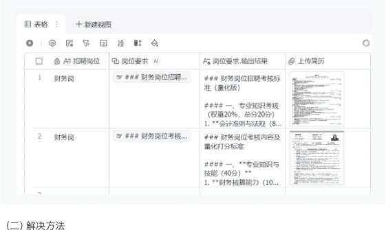

(二) 解决方法
- 优化 AI 模型: 针对理解问题, 我们对模型做了调整, 补充了专业术语和行业知识的训练, 提升了它对简历内容的识别能力。

得到 | AI学习圈

- 规范数据输入: 我们统一了岗位描述和简历格式, 制定了清晰的模板, 也加了预处理步骤, 比如清洗文本、转换格式, 确保输入内容更标准。
- 加强技术协作: 我们和技术团队一起解决了集成过程中的难点, 比如接口优化、数据同步方案调整等, 最后实现了系统的稳定对接。

**Q:** 根据你的经验, 其他人如何才能更好地使用AI?

**A:** (一) 避免常见误区
- 不要完全依赖 AI: AI 可以提高效率, 但不能取代人的判断。在招聘过程中, 招聘人员的专业经验仍然很重要。AI 更适合作为辅助工具, 最终的决定还是要结合人工判断。
- 注意数据隐私和安全: 在处理简历等敏感信息时, 要特别注意数据的保密性。无论是存储、传输还是使用, 都要符合相关的隐私和安全规定, 防止数据泄露。
- 警惕数据偏差带来的影响: AI 的表现受训练数据影响很大, 如果数据本身有偏差, 结果可能也会不准确。建议定期检查调整模型, 确保数据来源足够多样、具有代表性。

(二) 调整使用方式
- 持续优化模型: 根据实际使用过程中的问题和反馈, 定期对 AI 模型进行优化。比如根据企业的发展变化、岗位需求的调整, 及时更新模型内容。
- 根据实际需求做定制: AI 不是“套模板”的工具, 不同行业、不同岗位对人才的要求不同, 可以根据具体情况, 对评分维度和权重做一些调整, 让结果更贴近实际。
- 和其他工具搭配使用: AI 可以和测评系统、视频面试工具等结合起来, 组成一整套招聘流程, 效率更高, 体验也更完整。

#### (三) 使用中的一些建议

- 定期回顾使用效果

建议定期回头看一下 AI 工具的使用效果，比如简历筛选速度、岗位匹配情况、候选人反馈等，及时做出调整和优化。

- 让招聘人员了解 AI 工具怎么用

可以安排一些简单培训，让招聘人员理解 AI 的工作方式和使用方法，避免误用，也能更好地结合实际场景去使用。

- 保持开放心态，持续探索

AI 的发展很快，建议保持关注、愿意尝试。很多时候，新的技术能带来新的突破，不妨大胆试一试，看看是否能在招聘流程中发挥新的作用。

## AI落地案例 No.15

得到AI学习圈编辑部：

为了解决车企出海过程中“数据跨境难判断、法规难落地”的合规评估困境。

从事信息安全工作的AI学习圈同学 @邱珞 通过 DeepSeek 和 MaxKB，借助AI工具，构建了一套“AI数据出境合规评估系统”，能自动完成场景抽取、法规匹配和合规建议输出，实现从聊天中自动生成专业报告。

这次的案例，她分享了“怎么用AI拆解复杂业务流程、搭建法规知识库、对AI输出的结果进行调优。”如果你做出海贸易，或者希望尝试工作流自动化，她的实操经验可能会对你有所启发。

### AI+出海 邱珞同学：如何用AI快速评估数据是否合规，助力企业出海？

| 项目 | 内容 |
|---|---|
| 姓名 | 邱珞 |
| 职业 | 信息安全从业者 |
| 行业 | 整车制造业 |
| 关注TA | 得到知识城邦@我是苏三 |
| 公众号 | “苏三的AI学习笔记” |

Q：你在工作和生活中遇到了哪些主要的挑战或困难？

A：随着《数据安全法》《个人信息保护法》等法律法规的出台，车企在数字化转型和出海过程中，面临频繁的数据出境合规判断。

举个例子，现在很多中国车企，比如搞新能源车的，不仅在国内卖车，还像到欧洲去。车子一出海，问题就来了——因为这些智能车会收集很多数据，比如你开车的位置、怎么开车、甚至摄像头拍到的路况。企业想把这些数据传回中国总部，好做AI训练、远程服务，但欧洲那边的法律（GDPR）可不是说传就能传的，得先保证数据在传输过程中是安全的、合法的。

这种情况下，就需要车企的数据合规评估部门快速做出判断，某个数据在传回国内的时候，符不符合当地法律法规的要求。

在这个场景中，我们主要面临以下三大难题：

### 难题1：信息收集靠人工沟通，效率低

在做数据出境合规判断前，首先要搞清楚业务到底在做什么，比如收集了哪些数据？是否涉及个人敏感信息或者车路感知、分析等数据？数据在哪儿？传给谁，是否要加密传输？这些信息可能分散在法务、产品研发、系统、安全、销售等多个部门，所以还得找他们反复开会、发消息，沟通确认。有时候时间紧任务重，这种靠“人肉对接”的方式，常常跟不上节奏。

### 难题2：法规太多还常变，人查不完、记不住

像欧洲的GDPR、中国的数据出境规定，还有东南亚、拉美等国家的本地隐私法，细节很多。最难的是这些法规还在不断更新，有的新条款刚出，有的解释还不统一。靠人去查、去比对、去理解，是很慢的。

### 难题3：评估结果“听不懂”，业务落不了地

辛辛苦苦做完合规评估，很多结果其实对业务同学来说“看了跟没看一样”。比如评估报告里写一堆“应遵循GDPR第44条”“需补充SCC”“建议进行DPIA”，但技术人员只想知道一句话：“我这个数据能不能传？”、“要不要加密？”、“用这个云服务安全吗？”所以传统的合规报告常常只是“看上去很专业”，但用处不大，业务落不了地，反而增加了误解和沟通成本。

### Q：过去你是怎么处理这个问题的？

A：我们传统的应对方式可以分为四个阶段：

#### 1. 信息收集阶段：

合规前要先搞清楚业务，但通常得靠来回邮件、会议确认，整理纪要再确认。这个过程既耗时，又容易漏掉关键细节，比如是不是处理了敏感数据。

#### 2. 关键要素识别阶段：

从杂乱信息中提炼“场景、数据类型、数据链路”等关键点，需要较强的合规知识和实际经验，新手容易抓不到重点。

#### 3. 合规判定阶段：

判断是否合法主要靠人工查法规，或者请外部律师，速度慢、成本高。不同国家的法规不同，理解门槛也高。

#### 4. 结果沉淀阶段：

合规结论分散在文档、表格和聊天记录里，缺乏统一结构，后续难以复用和追溯，每次都像重新做一遍。

这种模式下，合规评估既不高效，也缺乏可持续性。

### AI落地案例集

### Q：你是如何使用AI来解决这个问题的？

A：我结合“AI 智能体工作流 + 法规知识库”的方式，搭建了一套用于数据出境合规评估的自动化流程，核心用到的AI工具是 DeepSeek 和 MaxKB。MaxKB是一个智能工具平台，支持AI检索知识、调用工具、自动执行操作，非常适合用来搭建流程型的AI助手。

整个工作方式分为五步：

- 需求拆解 (DeepSeek)：与AI对话，沉淀出可复用的关键函数，如业务场景识别、数据分类分级、数据出境量估算、CIIO 判定、豁免识别等。
- 流程搭建 (MaxKB)：形成“多轮对话 → 信息抽取 → 法规检索 → 合规建议输出”的闭环流程。
- 提示词优化 (DeepSeek + MaxKB)：借助大模型打磨角色提示词和AI处理提示词，并且在MaxKB验证过程中调优；
- 知识库构建 (DeepSeek + MaxKB)：将外部法规和企业内部制度整理为“业务场景 / 数据分类 / 数据量 / CIIO / 豁免”五大子知识库，便于后续的自动检索和维护。
- 输出最终模型：通过一般、边界和异常场景持续验证，并优化提示词与知识结构，提升输出的稳定性与准确性。

### Q：使用AI后，效果如何？

A：引入AI之后，我们的合规评估工作有着明显的改变：

- 提出问题

- 补充信息

- 输出报告

根据您的提供的信息及CMA数据管理制度要求，现生成境内数据共享合规自查清单如下：

#### 境内数据共享合规自查清单

（2023年第三季度更新版）

一、数据分类核查

- 已完成数据资产清单登记（DSR第21条）
- 明确共享数据类型属性：[个人信息][敏感个人信息][重要数据][核心数据]
- 完成数据分级标识（参考《数据安全管理办法》第5.5.4条）

### AI落地案例集

- 速度快多了：原来评估得来回问、查几天，现在十几二十分钟就能出一份像样的报告。
- 内容更全也不容易漏：AI能把公司内部的流程和外部法律一起参考，不容易遗漏关键点。
- 说人话，听得懂：评估报告可以根据谁在看（比如产品还是技术）调整语言，大家都看得懂，不用再翻译一遍。
- 留痕方便查：AI的对话和结论都是自动记录的，之后有类似问题直接翻看，用得上也查得到。

### Q：在用AI的过程中，是否遇到了一些新问题或新挑战？你是如何解决的？

A：这个过程中，我确实遇到了两类挑战：

- 思维方式的迁移

从传统的线性编程逻辑转向AI智能体的构建逻辑，是一场认知升级。一开始我还试图按照原有的数据出境评估流程搭建，但效果一般。后来通过反复与AI对话，我逐步提炼出“模块化函数”的思路，让AI分别处理关键任务，效率和质量都有明显提升。

- AI输出的不确定性

虽然搭建智能体的提示词看起来简单，但要实现可控、稳定、符合预期的输出仍然具有挑战。这就需要逐步优化每一个环节——从提示词设计到知识库分段，再到流程执行逻辑。一旦掌握调试和排查方法，就能逐步实现“确定性”的AI。

### Q：根据你的经验，其他人如何才能更好地使用AI？

A：我有四条心得：

- 先理解AI能做什么，再考虑怎么做：一个业务是否适合AI介入，其实可以先问问AI自己。跟AI聊聊你的需求，它通常能给出分步骤的建议，从而帮助你判断可行性。
- 别指望AI替你思考：如果你对业务流程一知半解，让AI来做只能得出一个“似是而非”的方案——看起来聪明，其实没用。AI不是替代思考的工具，而是提升效率的伙伴。
- 要落地AI，就必须“动手建”：具体来说，分三步：先拆流程、再沉淀知识、最后不断验证和调试。这是一个像开发产品一样的过程，不能一蹴而就。
- AI不是一劳永逸，而是持续进化：法规在变、需求在变、AI工具自身也在进化。要把AI变成真正的生产力工具，就要像维护产品一样，定期处理它的“不能答”“答错了”等边界情况，不断优化提示词、调整流程、更新知识库。

## 得到AI学习圈

AI落地案例集，首期收录了来自AI学习圈15位会员同学的真实实践，后面还会持续推出新的案例集。

如果你在自己的工作和生活中，用AI解决过真实问题、拿到过结果，欢迎你联系我们。

优秀案例有机会收录到新一期的案例集中，还有机会在得到全渠道传播。

投稿请联系AI学习圈官方客服：

## 得到AI学习圈

陪你上手，用好AI

- 110+节实操视频课 打基础
- 全年365期AI专栏 追热点
- 聚焦工具线上共学 能实战
- AI一线公司线下活动 探前沿
- 81000+同学垂直社区 互交流

## 2025年AI学习圈会员权益

### 权益一：快刀AI专栏，每天1篇

全年365篇，为你推荐好用AI工具，紧跟AI世界新变化

### 权益二：AI视频实操课，周周有上新

已上线110+节实操课，涵盖8类真实场景

- AI办公
- AI教育
- AI编程
- AI设计
- AI科研
- AI音视频制作
- AI写作
- AI助手搭建

### 权益三：线上社群共学，高手同学互助答疑

- DeepSeek共学群
- AI智能体交流群
- AI海报设计群
- AI视频制作群

### 权益四：线下大课及访学活动：快刀青衣带队走进AI公司，AI视频线下特训营等

*访学活动会员享报名参与资格，需独立付费

## 得到AI学习圈

### AI实干家都在这里

### 陪你上手 用好AI

策划出品 得到AI学习圈

总策划 快刀青衣

编辑部 陈璐、贾亚宁、马莙泽、石唱、杜诗丽

装帧设计 尚士杰

添加AI圈官方微信 了解详情

DDA I XXQALJ 202501